The image is a black and white illustration of the coat of arms of the Agricultural Research Institute Pusa. It features a central shield supported by a lion on the left and a unicorn on the right. Above the shield is a crown. The shield is divided into four quadrants, each containing a different symbol. A ribbon scrolls around the bottom of the shield with the motto 'DIEU ET MON DROIT'. The text 'DIEU ET MON DROIT' is also written vertically on the left and right sides of the shield.

**AGRICULTURAL RESEARCH INSTITUTE**

**PUSA**

1------------------------------------------------

A completely blank white page with no visible content, text, or markings.

2------------------------------------------------

A completely blank white page with no visible content, text, or markings.

3------------------------------------------------

15 AUG 1931  
1931

# The Tropical Agriculturist.

The Agricultural Journal of  
Ceylon.

---

---

*Founded 1881.*

**Published, by  
The Department of Agriculture,  
Peradeniya.**

*Vol. LXXIV.*

313837

---

**Containing Numbers 1 to 6,  
January to June, 1930.**

4------------------------------------------------

A completely blank white page with no visible content, text, or markings.

5------------------------------------------------

# INDEX

## Volume LXXIV January-June, 1930

<table style="width: 100%; border-collapse: collapse;">
<thead>
<tr>
<th style="text-align: left;">Number</th>
<th style="text-align: left;">Month</th>
<th style="text-align: right;">Page</th>
</tr>
</thead>
<tbody>
<tr>
<td>1</td>
<td>January</td>
<td style="text-align: right;">1- 64</td>
</tr>
<tr>
<td>2</td>
<td>February</td>
<td style="text-align: right;">65-128</td>
</tr>
<tr>
<td>3</td>
<td>March</td>
<td style="text-align: right;">129-192</td>
</tr>
<tr>
<td>4</td>
<td>April</td>
<td style="text-align: right;">193-260</td>
</tr>
<tr>
<td>5</td>
<td>May</td>
<td style="text-align: right;">261-320</td>
</tr>
<tr>
<td>6</td>
<td>June</td>
<td style="text-align: right;">321-388</td>
</tr>
</tbody>
</table>

<table style="width: 100%; border-collapse: collapse;">
<thead>
<tr>
<th style="text-align: left;">A.</th>
<th style="text-align: right;">Page.</th>
<th style="text-align: left;">B.—Contd.</th>
<th style="text-align: right;">Page.</th>
</tr>
</thead>
<tbody>
<tr>
<td>Adhesive for Bordeaux Mixture, Linseed Oil as an Agricultural Committee, Matara District</td>
<td style="text-align: right;">- 115</td>
<td>Bud-Grafts in the Rubber Research Scheme Experiment Station Budwood Nursery, Pricking Tests on some Young</td>
<td style="text-align: right;">- 219</td>
</tr>
<tr>
<td>Agricultural Committee, Minutes of Meeting of Kandy District</td>
<td style="text-align: right;">- 57</td>
<td>Bud-Shoots caused by <i>Phytophthora palmivora</i> Butler, Disease of Young</td>
<td style="text-align: right;">- 216</td>
</tr>
<tr>
<td>Agricultural Meteorology</td>
<td style="text-align: right;">- 116</td>
<td>Budwood, <i>Hevea</i></td>
<td style="text-align: right;">- 261</td>
</tr>
<tr>
<td>Agricultural Meteorology in its Plant Physiological Relationships</td>
<td style="text-align: right;">- 17</td>
<td>Budwood Nursery, Pricking Tests on some Young Bud-Grafts in the Rubber Research Scheme Experiment Station</td>
<td style="text-align: right;">- 219</td>
</tr>
<tr>
<td>Agriculture, Antwerp, 1930, International Congress of Tropical Agriculture, Minutes of Meeting of the Board of</td>
<td style="text-align: right;">- 84</td>
<td>By-Product of the Coconut Industry, Manurial and Feeding Value of a</td>
<td style="text-align: right;">- 141</td>
</tr>
<tr>
<td>Agriculture Peradeniya, Minutes of Meeting of the Estate Products Committee of the Board of</td>
<td style="text-align: right;">- 314</td>
<td style="text-align: center;"><b>C.</b></td>
<td></td>
</tr>
<tr>
<td>Agriculture, Tropical (Review)</td>
<td style="text-align: right;">- 227</td>
<td><i>Caconema radicicola</i> (Greef)</td>
<td style="text-align: right;">- 79</td>
</tr>
<tr>
<td>Analysis, Problem of Soil</td>
<td style="text-align: right;">53, 233</td>
<td>Carbon and Nitrogen Contents and Reaction of Soils at Peradeniya, relation of Green Manures to the</td>
<td style="text-align: right;">- 10</td>
</tr>
<tr>
<td>Antwerp 1930, International Congress of Tropical Agriculture</td>
<td style="text-align: right;">- 189</td>
<td>Ceylon in 1929, Diseases of Rubber in</td>
<td style="text-align: right;">- 75</td>
</tr>
<tr>
<td style="text-align: center;"><b>B.</b></td>
<td style="text-align: right;">- 154</td>
<td>Ceylon Rubber Research Scheme, Value to Rubber Growers of the Work in London of the</td>
<td style="text-align: right;">- 302</td>
</tr>
<tr>
<td>Balance of Nature</td>
<td style="text-align: right;">- 314</td>
<td>Challenge Cup Competition, Schneider Chemical Notes (8), (9),</td>
<td style="text-align: right;">125, 141, 277</td>
</tr>
<tr>
<td>Blanket Crepe, Note on Streakiness in</td>
<td style="text-align: right;">- 295</td>
<td>Chillie Cultivation Competition held in Jaffna District</td>
<td style="text-align: right;">- 125</td>
</tr>
<tr>
<td>Board of Agriculture, Minutes of Meeting of the</td>
<td style="text-align: right;">- 71</td>
<td>Chinese Wood Oil, Tung Oil or Cinchona in the British Empire</td>
<td style="text-align: right;">- 109</td>
</tr>
<tr>
<td>Board of Agriculture, Minutes of Meeting of the Estate Products Committee of the</td>
<td style="text-align: right;">- 227</td>
<td>Citronella</td>
<td style="text-align: right;">- 300</td>
</tr>
<tr>
<td>Board of Management of the Coconut Research Scheme, Minutes of Meeting of the</td>
<td style="text-align: right;">53, 233</td>
<td>Citrus Cultivation in Ceylon</td>
<td style="text-align: right;">- 183</td>
</tr>
<tr>
<td>Board of the Tea Research Institute, Minutes of Meeting of the</td>
<td style="text-align: right;">187, 382</td>
<td>Climate in Their Relation to Insects, Weather and</td>
<td style="text-align: right;">- 263</td>
</tr>
<tr>
<td>Bordeaux Mixture, Linseed Oil as an Adhesive for</td>
<td style="text-align: right;">- 237</td>
<td>Clones, Short Review of the Present Position of the Planning of Buddings of Proved</td>
<td style="text-align: right;">- 282</td>
</tr>
<tr>
<td>Bore, Latex Tube</td>
<td style="text-align: right;">- 115</td>
<td>Coagulated Crepe, Report on the Market Possibilities of Fractionally</td>
<td style="text-align: right;">- 305</td>
</tr>
<tr>
<td>Borneo, Rubber in—Methods of Propagation and Planting—</td>
<td style="text-align: right;">- 317</td>
<td>Coconut Industry</td>
<td style="text-align: right;">129, 143, 350</td>
</tr>
<tr>
<td>British Empire, Cinchona in the</td>
<td style="text-align: right;">- 91</td>
<td>Coconut Oil Industry, Manurial and Feeding Value of a By-Product of the</td>
<td style="text-align: right;">- 396</td>
</tr>
<tr>
<td>Buddings of Proved Clones, Short Review of the Present Position of the Planting of</td>
<td style="text-align: right;">- 300</td>
<td>Coconut, Original Home and Mode of Dispersal of the</td>
<td style="text-align: right;">- 141</td>
</tr>
<tr>
<td>Bud-Grafting and Seed Selection with Rubber</td>
<td style="text-align: right;">- 305</td>
<td>Coconut Palm—Selection of Superior Trees</td>
<td style="text-align: right;">- 30</td>
</tr>
<tr>
<td></td>
<td style="text-align: right;">- 307</td>
<td></td>
<td style="text-align: right;">- 104</td>
</tr>
</tbody>
</table>

6------------------------------------------------

# INDEX.—Contd.

<table border="0" style="width: 100%; border-collapse: collapse;">
<thead>
<tr>
<th style="text-align: left;"></th>
<th style="text-align: right;">Page.</th>
<th style="text-align: left;"></th>
<th style="text-align: right;">Page.</th>
</tr>
</thead>
<tbody>
<tr>
<td colspan="2" style="text-align: center;"><b>C.—Contd.</b></td>
<td colspan="2" style="text-align: center;"><b>C.—Contd.</b></td>
</tr>
<tr>
<td>Coconut Research Scheme, Minutes of Meeting of the Board of Management of the</td>
<td style="text-align: right;">187, 382</td>
<td>Crops on Soil Moisture, Effects of Green Manures and Cover</td>
<td style="text-align: right;">3</td>
</tr>
<tr>
<td>Coffee Growing in East Africa (Review)</td>
<td style="text-align: right;">315</td>
<td>Crops with special reference to the Relative Importance of the various Fungi concerned, Root Diseases of Orchard and Permanent Plantation Plantain</td>
<td style="text-align: right;">224</td>
</tr>
<tr>
<td>Colombo District Food Production Committee</td>
<td style="text-align: right;">117</td>
<td>Cultivation Competition held in Jaffna District, Chillie</td>
<td style="text-align: right;">125</td>
</tr>
<tr>
<td>Committee, Colombo District Food Production</td>
<td style="text-align: right;">117</td>
<td>Cultivation Competition in Matale East Maha 1929-30, Paddy</td>
<td style="text-align: right;">385</td>
</tr>
<tr>
<td>Committee, Matara District Agricultural</td>
<td style="text-align: right;">57</td>
<td>Cultivation Competition in Trincomallee District, Pure-line Paddy</td>
<td style="text-align: right;">59</td>
</tr>
<tr>
<td>Committee, Minutes of Meeting of Kandy District Agricultural</td>
<td style="text-align: right;">116</td>
<td>Cultivation Competition in Vanni Villages of Mantai Division of Mannar District, Cotton</td>
<td style="text-align: right;">59</td>
</tr>
<tr>
<td>Committee of the Board of Agriculture, Minutes of Meeting of the Estate Products</td>
<td style="text-align: right;">53, 233</td>
<td>Cultivation Competitions and Garden Competition in Mannar District, Paddy, Cotton and Vegetable</td>
<td style="text-align: right;">58</td>
</tr>
<tr>
<td>Competition held in the Jaffna District, Chillie Cultivation</td>
<td style="text-align: right;">125</td>
<td>Cultivation in Ceylon, Citrus</td>
<td style="text-align: right;">263</td>
</tr>
<tr>
<td>Competition in Batticaloa District, Vegetable Garden</td>
<td style="text-align: right;">60</td>
<td>Cultivation of Kapok</td>
<td style="text-align: right;">110</td>
</tr>
<tr>
<td>Competition in Mannar District, Garden</td>
<td style="text-align: right;">58</td>
<td>Current Topics: Leguminous Crops and the Floods</td>
<td style="text-align: right;">321</td>
</tr>
<tr>
<td>Competition in Trincomallee District, Pure-line Paddy Cultivation</td>
<td style="text-align: right;">59</td>
<td></td>
<td></td>
</tr>
<tr>
<td>Competition in Vanni Villages of Mantai Division of Mannar District, Cotton Cultivation and Paddy</td>
<td style="text-align: right;">59</td>
<td colspan="2" style="text-align: center;"><b>D.</b></td>
</tr>
<tr>
<td>Competition Matale East Maha 1929-30, Paddy Cultivation</td>
<td style="text-align: right;">385</td>
<td>Daisy, Kurunegala (<i>Tridax procubens</i>)</td>
<td style="text-align: right;">142</td>
</tr>
<tr>
<td>Competition, Matale South Maha 1929-30, Paddy Cultivation</td>
<td style="text-align: right;">385</td>
<td>Dealing, Tea and Tea (Review)</td>
<td style="text-align: right;">126</td>
</tr>
<tr>
<td>Competition; Schneider Challenge Cup</td>
<td style="text-align: right;">125</td>
<td>Death, Tapping to—A Warning</td>
<td style="text-align: right;">204</td>
</tr>
<tr>
<td>Competition, Yatnuwara and Fumpane Paddy Sheaf</td>
<td style="text-align: right;">386</td>
<td>Departmental Notes</td>
<td style="text-align: right;">58, 118, 385</td>
</tr>
<tr>
<td>Competitions in Galboda and Kinigoda Korales, Vegetable Garden</td>
<td style="text-align: right;">61</td>
<td>Disease, Eelworm-Gall or Root-Knot</td>
<td style="text-align: right;">79</td>
</tr>
<tr>
<td>Competitions in Mannar District, Paddy, Cotton and Vegetable Cultivation</td>
<td style="text-align: right;">58</td>
<td>Disease of Young Bud-Shoots caused by <i>Phytophthora palmivora</i> Butler</td>
<td style="text-align: right;">216</td>
</tr>
<tr>
<td>Conditions of Storage on the Hardness of Raw Rubber, Preliminary Investigation of the Effect of Conference of Empire Meteorologists 1929</td>
<td style="text-align: right;">342, 282</td>
<td>Disease Research, Panama</td>
<td style="text-align: right;">36</td>
</tr>
<tr>
<td>Conference 1929, Second Imperial Mycological</td>
<td style="text-align: right;">193, 222</td>
<td>Disease Return, Animal 63, 127, 190, 259, 319, 387</td>
<td style="text-align: right;"></td>
</tr>
<tr>
<td>Congress of Tropical Agriculture 1930, International</td>
<td style="text-align: right;">314</td>
<td>Diseases of Orchard and Permanent Plantation Plantain Crops with special reference to the relative importance of the various Fungi concerned</td>
<td style="text-align: right;">224</td>
</tr>
<tr>
<td>Conservation of Soil and Water</td>
<td style="text-align: right;">67</td>
<td>Diseases of Rubber in Ceylon in 1929</td>
<td style="text-align: right;">75</td>
</tr>
<tr>
<td>Cotton and Vegetable Cultivation Competitions and Garden Competition in Mannar District, Paddy</td>
<td style="text-align: right;">58</td>
<td>Diseases, Relation of Weather to Plant Dispersal of the Coconut, Original Home and Mode of</td>
<td style="text-align: right;">353, 30</td>
</tr>
<tr>
<td>Cotton Cultivation Competition in Vanni Villages of Mantai Division of Mannar District</td>
<td style="text-align: right;">59</td>
<td>Drainage and Leaching Trials at Peradeniya during 1927 to 1930</td>
<td style="text-align: right;">323</td>
</tr>
<tr>
<td>Cover Crop for Tea, Further Note on <i>Indigofera endecaphylla</i> as a Cover Crops on Soil Moisture, Effects of Green Manures and Crepe, Note on, Streakiness in Blanket Crepe, Report on the Market Possibilities of Fractionally Coagulated Crop Estimates and Forecasts</td>
<td style="text-align: right;">131, 71, 336, 180</td>
<td>Drainage of Hilly Lands with a View to reducing Soil Erosion, Further Memorandum on the Dusting as a means of Controlling <i>Oidium</i>, Sulphur</td>
<td style="text-align: right;">68, 347</td>
</tr>
<tr>
<td>Crop for Tea, Further Note on <i>Indigofera endecaphylla</i> as a cover Crops and the Floods, Leguminous Current Topics</td>
<td style="text-align: right;">131, 321</td>
<td>Dust Spraying Machines</td>
<td style="text-align: right;">314</td>
</tr>
<tr>
<td></td>
<td></td>
<td colspan="2" style="text-align: center;"><b>E.</b></td>
</tr>
<tr>
<td></td>
<td></td>
<td>Editorial</td>
<td style="text-align: right;">1, 65, 129, 193, 261, 321</td>
</tr>
<tr>
<td></td>
<td></td>
<td>Eelworm-Gall or Root-Knot Disease</td>
<td style="text-align: right;">79</td>
</tr>
<tr>
<td></td>
<td></td>
<td>Effect of Different Conditions of Storage on the Hardness of Raw Rubber, Preliminary Investigation of the</td>
<td style="text-align: right;">342</td>
</tr>
<tr>
<td></td>
<td></td>
<td>Effects of Green Manures and Cover Crops on Soil Moisture</td>
<td style="text-align: right;">3</td>
</tr>
<tr>
<td></td>
<td></td>
<td>Eighth Ordinary General Meeting of the Rubber Research Scheme, Minutes of the</td>
<td style="text-align: right;">379</td>
</tr>
<tr>
<td></td>
<td></td>
<td><i>Epidendrum Stamfordianum</i> Bateman</td>
<td style="text-align: right;">15</td>
</tr>
<tr>
<td></td>
<td></td>
<td>Empire, Pinchona in the British</td>
<td style="text-align: right;">300</td>
</tr>
</tbody>
</table>

7------------------------------------------------

# INDEX.—Contd.

<table style="width: 100%; border-collapse: collapse;">
<thead>
<tr>
<th style="text-align: left;"></th>
<th style="text-align: right;">Page.</th>
<th style="text-align: left;"></th>
<th style="text-align: right;">Page.</th>
</tr>
</thead>
<tbody>
<tr>
<td colspan="2" style="text-align: center;"><b>E.—Contd.</b></td>
<td colspan="2" style="text-align: center;"><b>H.—Contd.</b></td>
</tr>
<tr>
<td>Empire Meteorologists 1929, Conference of</td>
<td style="text-align: right;">- 282</td>
<td>Hilly Lands with a view to reducing Soil Erosion, Further Memorandum on the Draining of</td>
<td style="text-align: right;">- 68</td>
</tr>
<tr>
<td>Erosion Investigation, Soil</td>
<td style="text-align: right;">- 200</td>
<td>Home and Mode of Dispersal of the Coconut, Original</td>
<td style="text-align: right;">- 30</td>
</tr>
<tr>
<td>Erosion, Soil</td>
<td style="text-align: right;">- 65</td>
<td></td>
<td></td>
</tr>
<tr>
<td>Estate Products Committee of the Board of Agriculture, Minutes of Meeting of the</td>
<td style="text-align: right;">53, 233</td>
<td colspan="2" style="text-align: center;"><b>I.</b></td>
</tr>
<tr>
<td>Estimates and Forecasts, Crop</td>
<td style="text-align: right;">- 180</td>
<td>Imperial Mycological Conference 1929, Second</td>
<td style="text-align: right;">193, 222</td>
</tr>
<tr>
<td>Experiment Station Budwood Nursery, Pricking Tests on Some Young Bud-Grafts in the Rubber Research Scheme</td>
<td style="text-align: right;">- 219</td>
<td>Imported Plants, Infertility in</td>
<td style="text-align: right;">- 331</td>
</tr>
<tr>
<td>Experiment Station, Peradeniya, Progress Report of the</td>
<td style="text-align: right;">118, 256, 312</td>
<td><i>Indigofera endecaphylla</i> as a Cover Crop for Tea, Further Note on</td>
<td style="text-align: right;">- 131</td>
</tr>
<tr>
<td colspan="2" style="text-align: center;"><b>F.</b></td>
<td><i>Indigofera endecaphylla</i> on the Nitrogen and Organic Matter Contents and the Mechanical Constitution of Tea Soils at Peradeniya, Note on the Effect of</td>
<td style="text-align: right;">- 137</td>
</tr>
<tr>
<td>Feeding Value of a By-Product of the Coconut Oil Industry, Manurial and</td>
<td style="text-align: right;">- 141</td>
<td>Industry, Coconut</td>
<td style="text-align: right;">129, 143, 350</td>
</tr>
<tr>
<td>Floods, Leguminous Crops and the—Current Topics—</td>
<td style="text-align: right;">- 321</td>
<td>Industry in Malaya, Pineapple Industry, Manurial and Feeding Value of a By-Product of the Coconut Oil</td>
<td style="text-align: right;">- 106</td>
</tr>
<tr>
<td>Food Production Committee, Colombo District</td>
<td style="text-align: right;">- 117</td>
<td>Infertility in Imported Plants</td>
<td style="text-align: right;">- 141</td>
</tr>
<tr>
<td>Forecasts, Crop Estimates and</td>
<td style="text-align: right;">- 180</td>
<td>Insects, Weather and Climate in Their Relation, to</td>
<td style="text-align: right;">- 331</td>
</tr>
<tr>
<td>Fractionally Coagulated Crepe, Report on the Market Possibilities of</td>
<td style="text-align: right;">- 336</td>
<td>Institute, Minutes of Meeting of the Board of the Tea Research</td>
<td style="text-align: right;">- 282</td>
</tr>
<tr>
<td>Fruit Production, Meteorological Research and</td>
<td style="text-align: right;">- 164</td>
<td>International Congress of Tropical Agriculture, Antwerp 1930</td>
<td style="text-align: right;">- 237</td>
</tr>
<tr>
<td>Fungi Concerned, Root Diseases of Orchard and Permanent Plantation Plantain Crops with Special Reference to the Relative Importance of the various</td>
<td style="text-align: right;">- 224</td>
<td>Investigation of the Effect of Different Conditions of Storage on the Hardness of Raw Rubber, Preliminary</td>
<td style="text-align: right;">- 314</td>
</tr>
<tr>
<td>Further Memorandum on the Draining of Hilly Lands with a View to Reducing Soil Erosion</td>
<td style="text-align: right;">- 68</td>
<td>Investigation, Soil Erosion</td>
<td style="text-align: right;">- 342</td>
</tr>
<tr>
<td>Further Note on <i>Indigofera endecaphylla</i> as a Cover Crop for Tea</td>
<td style="text-align: right;">- 131</td>
<td>Investigations on Rubber in 1928 and 1929</td>
<td style="text-align: right;">- 200</td>
</tr>
<tr>
<td colspan="2" style="text-align: center;"><b>G.</b></td>
<td></td>
<td style="text-align: right;">- 94</td>
</tr>
<tr>
<td>Galboda and Kinigoda Korales Vegetable Garden Competitions in</td>
<td style="text-align: right;">- 61</td>
<td colspan="2" style="text-align: center;"><b>J.</b></td>
</tr>
<tr>
<td>Garden Competition in Batticaloa District, Vegetable</td>
<td style="text-align: right;">- 60</td>
<td>Jaffna District, Chillie Cultivation Competition held in</td>
<td style="text-align: right;">- 125</td>
</tr>
<tr>
<td>Garden Competition in Mannar District</td>
<td style="text-align: right;">- 58</td>
<td colspan="2" style="text-align: center;"><b>K.</b></td>
</tr>
<tr>
<td>Garden Competitions in Galboda and Kinigoda Korales, Vegetable</td>
<td style="text-align: right;">- 61</td>
<td>Kandy District Agricultural Committee, Minutes of Meeting of</td>
<td style="text-align: right;">- 116</td>
</tr>
<tr>
<td>General Meeting of the Rubber Research Scheme, Minutes of the Eighth Ordinary</td>
<td style="text-align: right;">- 379</td>
<td>Kapok, Cultivation of</td>
<td style="text-align: right;">- 110</td>
</tr>
<tr>
<td>Green Manures and Cover Crops on Soil Moisture, Effects of</td>
<td style="text-align: right;">- 3</td>
<td>Kapok in the Philippines</td>
<td style="text-align: right;">- 26</td>
</tr>
<tr>
<td>Green Manures to the Carbon and Nitrogen Contents and Reaction of Soils at Peradeniya, Relation of</td>
<td style="text-align: right;">- 10</td>
<td>Kinigoda Korales, Vegetable Garden Competitions in Galboda and</td>
<td style="text-align: right;">- 61</td>
</tr>
<tr>
<td>Green Manuring, Soil Organic Matter and</td>
<td style="text-align: right;">- 1</td>
<td>Kurunegala Daisy (<i>Tridax procubens</i>)</td>
<td style="text-align: right;">- 142</td>
</tr>
<tr>
<td>Growers of the Work in London of the Ceylon Rubber Research Scheme, Value to Rubber</td>
<td style="text-align: right;">- 302</td>
<td colspan="2" style="text-align: center;"><b>L.</b></td>
</tr>
<tr>
<td colspan="2" style="text-align: center;"><b>H.</b></td>
<td>Latex Tube Bore</td>
<td style="text-align: right;">- 317</td>
</tr>
<tr>
<td>Hardness of Raw Rubber, Preliminary Investigation of the Effect of Different Conditions of Storage on the</td>
<td style="text-align: right;">- 342</td>
<td>Leaching Trials at Peradeniya during 1927 to 1930, Drainage and</td>
<td style="text-align: right;">- 323</td>
</tr>
<tr>
<td><i>Heterodera radicicola</i> (Greef) Muller</td>
<td style="text-align: right;">- 79</td>
<td>Leguminous Crops and the Floods: Current Topics</td>
<td style="text-align: right;">- 321</td>
</tr>
<tr>
<td><i>Hevea</i> Budwood</td>
<td style="text-align: right;">- 261</td>
<td>Liming of Tropical Soils</td>
<td style="text-align: right;">- 45</td>
</tr>
<tr>
<td></td>
<td></td>
<td>Linseed Oil as an Adhesive for Bordeaux Mixture</td>
<td style="text-align: right;">- 116</td>
</tr>
<tr>
<td></td>
<td></td>
<td>London of the Ceylon Rubber Research Scheme, Value to Rubber Growers of the Work in</td>
<td style="text-align: right;">- 302</td>
</tr>
<tr>
<td></td>
<td></td>
<td colspan="2" style="text-align: center;"><b>M.</b></td>
</tr>
<tr>
<td></td>
<td></td>
<td>Machines, Dust Spraying</td>
<td style="text-align: right;">- 314</td>
</tr>
<tr>
<td></td>
<td></td>
<td>Maha 1929-30, Matale East Paddy Cultivation Competition</td>
<td style="text-align: right;">- 385</td>
</tr>
<tr>
<td></td>
<td></td>
<td>Maha 1929-30, Matale South Paddy Cultivation Competition</td>
<td style="text-align: right;">- 385</td>
</tr>
<tr>
<td></td>
<td></td>
<td>Malaya, Pineapple Industry in</td>
<td style="text-align: right;">- 106</td>
</tr>
</tbody>
</table>

3

8------------------------------------------------

## INDEX.—Contd.

<table border="0" style="width: 100%; border-collapse: collapse;">
<thead>
<tr>
<th style="text-align: left; width: 50%;"></th>
<th style="text-align: right; width: 25%;">Page.</th>
<th style="text-align: left; width: 50%;"></th>
<th style="text-align: right; width: 25%;">Page.</th>
</tr>
</thead>
<tbody>
<tr>
<td colspan="2" style="text-align: center;"><b>M.—Contd.</b></td>
<td colspan="2" style="text-align: center;"><b>M.—Contd.</b></td>
</tr>
<tr>
<td>Mannar District, Cotton Cultivation Competition in Vanni Villages of the Mantai Division of</td>
<td style="text-align: right; vertical-align: bottom;">59</td>
<td>Minutes of Meeting of the Board of Management of the Coconut Research Scheme</td>
<td style="text-align: right; vertical-align: bottom;">187, 382</td>
</tr>
<tr>
<td>Mannar District, Paddy, Cotton and Vegetable Cultivation Competitions and Garden Competition in</td>
<td style="text-align: right; vertical-align: bottom;">58</td>
<td>Minutes of Meeting of the Board of the Tea Research Institute</td>
<td style="text-align: right; vertical-align: bottom;">237</td>
</tr>
<tr>
<td>Mantai Division of Mannar District, Cotton Cultivation Competition in Vanni Villages of</td>
<td style="text-align: right; vertical-align: bottom;">59</td>
<td>Minutes of Meeting of the Colombo District Food Production Committee</td>
<td style="text-align: right; vertical-align: bottom;">117</td>
</tr>
<tr>
<td>Manures and Cover Crops on Soil Moisture, Effects of Green</td>
<td style="text-align: right; vertical-align: bottom;">3</td>
<td>Minutes of Meeting of the Estate Products Committee of the Board of Agriculture</td>
<td style="text-align: right; vertical-align: bottom;">53, 283</td>
</tr>
<tr>
<td>Manures to the Carbon and Nitrogen Contents and Reaction of Soils at Peradeniya, Relation of Green</td>
<td style="text-align: right; vertical-align: bottom;">10</td>
<td>Minutes of the Eighth Ordinary General Meeting of the Rubber Research Scheme</td>
<td style="text-align: right; vertical-align: bottom;">379</td>
</tr>
<tr>
<td>Manurial and Feeding Value of a By-Product of the Coconut Oil Industry</td>
<td style="text-align: right; vertical-align: bottom;">141</td>
<td>Mixture, Linseed Oil as an Adhesive for Bordeaux</td>
<td style="text-align: right; vertical-align: bottom;">115</td>
</tr>
<tr>
<td>Manurial Value of <i>Oxalis</i> Species</td>
<td style="text-align: right; vertical-align: bottom;">277</td>
<td>Mode of Dispersal of the Coconut, Original Home and</td>
<td style="text-align: right; vertical-align: bottom;">30</td>
</tr>
<tr>
<td>Manuring, Soil Organic Matter and Green</td>
<td style="text-align: right; vertical-align: bottom;">1</td>
<td>Moisture, Effects of Green Manures and Cover Crops on Soil</td>
<td style="text-align: right; vertical-align: bottom;">9</td>
</tr>
<tr>
<td>Market Possibilities of Fractionally Coagulated Crepe, Report on the Matale East Paddy Cultivation Competition Maha 1929-30</td>
<td style="text-align: right; vertical-align: bottom;">336</td>
<td>Mycological Conference 1929, Second Imperial</td>
<td style="text-align: right; vertical-align: bottom;">193, 222</td>
</tr>
<tr>
<td>Matale South Paddy Cultivation Competition Maha 1929-30</td>
<td style="text-align: right; vertical-align: bottom;">385</td>
<td>Mycological Notes (22)</td>
<td style="text-align: right; vertical-align: bottom;">195</td>
</tr>
<tr>
<td>Matarai District Agricultural Committee</td>
<td style="text-align: right; vertical-align: bottom;">57</td>
<td colspan="2" style="text-align: center;"><b>N.</b></td>
</tr>
<tr>
<td>Matters of Pathological Interest during 1929</td>
<td style="text-align: right; vertical-align: bottom;">195</td>
<td>Nature, Balance of</td>
<td style="text-align: right; vertical-align: bottom;">295</td>
</tr>
<tr>
<td>Meeting of Kandy District Agricultural Committee, Minutes of</td>
<td style="text-align: right; vertical-align: bottom;">116</td>
<td>Nitrogen and Organic Matter Contents and the Mechanical Constitution of Tea Soils at Peradeniya, Note on the Effect of <i>Indigofera endecaphylla</i> on the</td>
<td style="text-align: right; vertical-align: bottom;">137</td>
</tr>
<tr>
<td>Meeting of the Board of Agriculture, Minutes of</td>
<td style="text-align: right; vertical-align: bottom;">227</td>
<td>Nitrogen Contents and Reaction of Soils at Peradeniya, Relation of Green Manures to the Carbon and</td>
<td style="text-align: right; vertical-align: bottom;">10</td>
</tr>
<tr>
<td>Meeting of the Board of Management of the Coconut Research Scheme, Minutes of</td>
<td style="text-align: right; vertical-align: bottom;">187, 382</td>
<td>Note on <i>Indigofera endecaphylla</i> as a Cover Crop for Tea, Further</td>
<td style="text-align: right; vertical-align: bottom;">131</td>
</tr>
<tr>
<td>Meeting of the Board of the Tea Research Institute, Minutes of</td>
<td style="text-align: right; vertical-align: bottom;">237</td>
<td>Note on the effect of <i>Indigofera endecaphylla</i> on the Nitrogen and Organic Matter Contents and the Mechanical Constitution of Tea Soils at Peradeniya</td>
<td style="text-align: right; vertical-align: bottom;">137</td>
</tr>
<tr>
<td>Meeting of the Colombo District Food Production Committee, Minutes of</td>
<td style="text-align: right; vertical-align: bottom;">117</td>
<td>Notes (8), Chemical</td>
<td style="text-align: right; vertical-align: bottom;">141</td>
</tr>
<tr>
<td>Meeting of the Estate Products Committee of the Board of Agriculture, Minutes of</td>
<td style="text-align: right; vertical-align: bottom;">53, 283</td>
<td>Notes, Departmental</td>
<td style="text-align: right; vertical-align: bottom;">58, 118, 385</td>
</tr>
<tr>
<td>Meeting of the Rubber Research Scheme, Minutes of the Eighth Ordinary General</td>
<td style="text-align: right; vertical-align: bottom;">379</td>
<td>Notes on Streakiness in Blanket Crepe</td>
<td style="text-align: right; vertical-align: bottom;">71</td>
</tr>
<tr>
<td>Memorandum on the Draining of Hilly Lands with a view to reducing Soil Erosion, Further</td>
<td style="text-align: right; vertical-align: bottom;">68</td>
<td>Nursery, Pricking Tests on Some Young Bud-Grafts in the Rubber Research Scheme Budwood</td>
<td style="text-align: right; vertical-align: bottom;">219</td>
</tr>
<tr>
<td>Meteorological Research and Fruit Production</td>
<td style="text-align: right; vertical-align: bottom;">164</td>
<td colspan="2" style="text-align: center;"><b>O.</b></td>
</tr>
<tr>
<td>Meteorological Return</td>
<td style="text-align: right; vertical-align: bottom;">64, 128, 181, 260, 320, 388</td>
<td><i>Oidium</i>, Sulphur Dusting as a Means of Controlling</td>
<td style="text-align: right; vertical-align: bottom;">347</td>
</tr>
<tr>
<td>Meteorologists 1929, Conference of Empire</td>
<td style="text-align: right; vertical-align: bottom;">282</td>
<td>Oil Industry, Manurial and Feeding Value of a By-Product of the Coconut</td>
<td style="text-align: right; vertical-align: bottom;">141</td>
</tr>
<tr>
<td>Meteorology, Agricultural</td>
<td style="text-align: right; vertical-align: bottom;">17</td>
<td>Oil, Tung</td>
<td style="text-align: right; vertical-align: bottom;">51</td>
</tr>
<tr>
<td>Meteorology in Its Plant Physiological Relationships, Agricultural</td>
<td style="text-align: right; vertical-align: bottom;">84</td>
<td>Oil, Tung Oil or Chinese Wood</td>
<td style="text-align: right; vertical-align: bottom;">109</td>
</tr>
<tr>
<td>Methods of Propagation and Planting —Rubber in Borneo</td>
<td style="text-align: right; vertical-align: bottom;">91</td>
<td>Old Rubber Areas, Replanting and Rejuvenation of</td>
<td style="text-align: right; vertical-align: bottom;">207</td>
</tr>
<tr>
<td>Minutes of Meeting of Kandy District Agricultural Committee</td>
<td style="text-align: right; vertical-align: bottom;">116</td>
<td>Orchard and Permanent Plantation Plantain Crops with Special Reference to the Relative Importance of the Various Fungi Concerned, Root Diseases of</td>
<td style="text-align: right; vertical-align: bottom;">224</td>
</tr>
<tr>
<td>Minutes of Meeting of the Board of Agriculture</td>
<td style="text-align: right; vertical-align: bottom;">227</td>
<td>Organic Matter and Green Manuring, Soil</td>
<td style="text-align: right; vertical-align: bottom;">1</td>
</tr>
</tbody>
</table>

4

9------------------------------------------------

# INDEX.—Contd.

<table style="width: 100%; border-collapse: collapse;">
<thead>
<tr>
<th style="text-align: left; width: 50%;">Page.</th>
<th style="text-align: right; width: 50%;">Page.</th>
</tr>
</thead>
<tbody>
<tr>
<td style="vertical-align: top;">

<b>O.—Contd.</b>

Organic Matter Contents and the Mechanical Constitution of Tea Soils at Peradeniya, Note on the Effect of <i>Indigofera endecaphylla</i> on the Nitrogen and Original Home and Mode of Dispersal of the Coconut - 137

<i>Oxalis</i> Species, Manurial Value of - 277

<b>P.</b>

Paddy Competition, Matale South Maha. 1929-30 - 385

Paddy, Cotton and Vegetable Cultivation Competitions and Garden Competition in Mannar District - 58

Paddy Cultivation Competition in Matale East (Matale Pallesiya-pattu and Ambanganga Korale) Maha 1929-30 - 385

Paddy Cultivation Competition in Trincomalie District, Pure-line - 59

Paddy Sheaf Competition in Yatinuwara and Tumpane - 386

Palm, Coconut—Selection of Superior Trees - 104

Panama Disease Research - 36

Pathological Interest during 1929, Matters of - 195

Peradeniya 1927 to 1830, Drainage and Leaching Trials at - 323

Peradeniya, Note on the Effect of <i>Indigofera endecaphylla</i> on the Nitrogen and Organic Matter Contents and the Mechanical Constitution of Tea Soils at - 137

Peradeniya, Relation of Green Manures to the Carbon and Nitrogen Contents and Reaction of Soils at - 10

Permanent Plantation Plantain Crops with special reference to the relative importance of the various Fungi concerned, Root Diseases of Orchard and - 224

<i>Phaius Wallichii</i> Lindl. - 206

Philippines, Kapok in the - 26

Physiological Relationships, Agricultural Meteorology in Its Plant - 84

<i>Phytophthora palmivora</i> Butler, Disease of Young Bud-Shoots Caused by - 216

Pineapple Industry in Malaya - 106

Plantain Crops with special reference to the relative importance of the various Fungi concerned, Root Diseases of Orchard and Permanent Plantation - 224

Planting, Methods of Propagation and—Rubber in Borneo— - 91

Planting of Buddings of Proved Clones, Short Review of the Present Position of the - 305

Plant Diseases, Relation of Weather to - 353

Plant Physiological Relationships, Agricultural Meteorology in Its - 84

Plants, Infertility in Imported - 331

</td>
<td style="vertical-align: top;">

<b>P.—Contd.</b>

Preliminary Investigation of the Effect of Different Conditions of Storage on the Hardness of Raw Rubber - 342

Preparation of Sisal, Production and (Review) - 62

Present Position of the Planting of Buddings of Proved Clones, Short Review of the - 305

Pricking Tests on Some Young Bud-Grafts in the Rubber Research Scheme Experiment Station Budwood Nursery - 219

Problem of Soil Analysis - 154

Production and Preparation of Sisal (Review) - 62

Production Committee, Colombo District Food - 117

Production, Meteorological Research and Fruit - 164

Products Committee of the Board of Agriculture, Minutes of Meeting of the Estate - 53, 233

Progress Report of the Experiment Station, Peradeniya 118, 256, 312

Propagation and Planting, Methods of—Rubber in Borneo— - 91

Proved Clones, Short Review of the Present Position of the Planting of Buddings of - 305

Pure-line Paddy Cultivation Competition in Trincomalie District - 69

<b>R.</b>

Raw Rubber, Preliminary Investigation of the Effect of Different Conditions of Storage on the Hardness of - 342

Reaction of Soils at Peradeniya, Relation of Green Manures to the Carbon and Nitrogen Contents and - 10

Records, Rubber Yield - 280

Rejuvenation of Old Rubber Areas, Replanting and - 207

Relation of Green Manures to the Carbon and Nitrogen Contents and Reaction of Soils at Peradeniya - 10

Relation of Weather to Plant Diseases Replanting and Rejuvenation of Old Rubber Areas - 207

Report of the Experiment Station Peradeniya, Progress 118, 256, 312

Report on the Market Possibilities of Fractionally Coagulated Crepe - 336

Research and Fruit Production, Meteorological - 164

Research Institute, Minutes of Meeting of the Board of Tea - 237

Research, Panama Disease - 36

Research Scheme Experiment Station Budwood Nursery, Pricking Tests on Some Young Bud-Grafts in the Rubber - 219

Research Scheme, Minutes of Meeting of the Board of Management of the Coconut 187, 382

Return, Animal Disease 63, 127, 190, 259, 319, 387

</td>
</tr>
</tbody>
</table>

5

10------------------------------------------------

## INDEX.—Contd.

<table border="0" style="width: 100%; border-collapse: collapse;">
<thead>
<tr>
<th style="text-align: left; width: 45%;"></th>
<th style="text-align: right; width: 15%;">Page.</th>
<th style="text-align: left; width: 45%;"></th>
<th style="text-align: right; width: 15%;">Page.</th>
</tr>
</thead>
<tbody>
<tr>
<td colspan="2" style="text-align: center;"><b>R.—Contd.</b></td>
<td colspan="2" style="text-align: center;"><b>S.—Contd.</b></td>
</tr>
<tr>
<td>Return, Meteorological 64, 128, 191, 260, 820, 888</td>
<td></td>
<td>Soils at Peradeniya, Note on the Effect of <i>Indigofera endecaphylla</i> on the Nitrogen and Organic Matter Contents and the Mechanical Constitution of Tea</td>
<td style="text-align: right;">187</td>
</tr>
<tr>
<td>Review—Coffee Growing in East Africa</td>
<td style="text-align: right;">315</td>
<td>Soils at Peradeniya, Relation of Green Manures to the Carbon and Nitrogen Contents and Reaction of Soils, Liming of Tropical Spraying Machines, Dust</td>
<td style="text-align: right;">10 45 314</td>
</tr>
<tr>
<td>Review of the Present Position of the Planting of Buddings of Proved Clones, Short</td>
<td style="text-align: right;">305</td>
<td>Storage of Raw Rubber, Preliminary Investigation of the Effect of Different Conditions of</td>
<td style="text-align: right;">342</td>
</tr>
<tr>
<td>Review—Tea and Tea Dealing</td>
<td style="text-align: right;">126</td>
<td>Streakiness in Blanket Crepe, Notes on Sulphur Dusting as a Means of Controlling <i>Oidium</i></td>
<td style="text-align: right;">71 347</td>
</tr>
<tr>
<td>Review—Tropical Agriculture</td>
<td style="text-align: right;">189</td>
<td>Superior Trees, Selection of—Coconut Palm</td>
<td style="text-align: right;">104</td>
</tr>
<tr>
<td>Root Diseases of Orchard and Permanent Plantation Plantain Crops with Special Reference to the Relative Importance of the various Fungi Concerned</td>
<td style="text-align: right;">224</td>
<td style="text-align: center;"><b>T.</b></td>
<td></td>
</tr>
<tr>
<td>Root-Knot Disease, Eelworm-Gall or Rubber Areas, Replanting and Revivability of Old</td>
<td style="text-align: right;">79 207</td>
<td>Tapping to Death—A Warning</td>
<td style="text-align: right;">204</td>
</tr>
<tr>
<td>Rubber, Bud-Grafting and Seed Selection with</td>
<td style="text-align: right;">307</td>
<td><i>Tea and Tea Dealing</i> (Review)</td>
<td style="text-align: right;">126</td>
</tr>
<tr>
<td>Rubber Growers of the Work in London of the Ceylon Rubber Research Scheme, Value to</td>
<td style="text-align: right;">302</td>
<td><i>Tea</i>, Further Note on <i>Indigofera endecaphylla</i> as a Cover Crop for</td>
<td style="text-align: right;">131</td>
</tr>
<tr>
<td>Rubber in Borneo—Methods of Propagation and Planting</td>
<td style="text-align: right;">91</td>
<td>Tea Research Institute, Minutes of Meeting of the Board of</td>
<td style="text-align: right;">237</td>
</tr>
<tr>
<td>Rubber in Ceylon in 1929, Diseases of Rubber in 1928 and 1929, Investigations on</td>
<td style="text-align: right;">75 94</td>
<td>Tea Soils at Peradeniya, Note on the Effect of <i>Indigofera endecaphylla</i> on the Nitrogen and Organic Matter Contents and the Mechanical Constitution of</td>
<td style="text-align: right;">137</td>
</tr>
<tr>
<td>Rubber, Preliminary Investigation of the Effect of Different Conditions of Storage on the Hardness of Raw Rubber Research Scheme Experiment Station Budwood Nursery, Pricking Tests on Some Young Bud-Grafts in the</td>
<td style="text-align: right;">342 219</td>
<td>Tests on Some Young Bud-Grafts in the Rubber Research Scheme Experiment Station Budwood Nursery, Pricking</td>
<td style="text-align: right;">219</td>
</tr>
<tr>
<td>Rubber Research Scheme, Minutes of Eighth Ordinary General Meeting of the</td>
<td style="text-align: right;">379</td>
<td>Topics, Current: Leguminous Crops and the Floods</td>
<td style="text-align: right;">321</td>
</tr>
<tr>
<td>Rubber Research Scheme, Value to Rubber Growers of the Work in London of the Ceylon</td>
<td style="text-align: right;">302</td>
<td>Trees, Selection of Superior—Coconut Palm</td>
<td style="text-align: right;">104</td>
</tr>
<tr>
<td>Rubber Yield Records</td>
<td style="text-align: right;">280</td>
<td>Trials at Peradeniya during 1927 to 1930, Drainage and Leaching</td>
<td style="text-align: right;">323</td>
</tr>
<tr>
<td colspan="2" style="text-align: center;"><b>S.</b></td>
<td><i>Tridax procubens</i> (Kurunegala Daisy)</td>
<td style="text-align: right;">142</td>
</tr>
<tr>
<td>Schneider Challenge Cup Competition</td>
<td style="text-align: right;">125</td>
<td>Trincomale District, Pure-line Paddy Cultivation Competition in</td>
<td style="text-align: right;">59</td>
</tr>
<tr>
<td>Second Imperial Mycological Conference, 1929</td>
<td style="text-align: right;">198, 222</td>
<td>Tropical Agriculture Antwerp, 1930, International Congress of</td>
<td style="text-align: right;">314</td>
</tr>
<tr>
<td>Seed Selection with Rubber, Bud-Grafting and</td>
<td style="text-align: right;">307</td>
<td><i>Tropical Agriculture</i> (Review)</td>
<td style="text-align: right;">189</td>
</tr>
<tr>
<td>Selection of Superior Trees—Coconut Palm</td>
<td style="text-align: right;">104</td>
<td>Tropical Soils, Liming of Tube Bore, Latex</td>
<td style="text-align: right;">45 317</td>
</tr>
<tr>
<td>Selection with Rubber, Bud-Grafting and Seed</td>
<td style="text-align: right;">307</td>
<td>Tumpane, Paddy Sheaf Competition in Yatinuwara and</td>
<td style="text-align: right;">386</td>
</tr>
<tr>
<td>Short Review of the Present Position of the Planting of Buddings of Proved Clones</td>
<td style="text-align: right;">305</td>
<td>Tung Oil</td>
<td style="text-align: right;">51</td>
</tr>
<tr>
<td><i>Sisal, Production and Preparation of</i> (Review)</td>
<td style="text-align: right;">62</td>
<td>Tung Oil or Chinese Wood Oil</td>
<td style="text-align: right;">109</td>
</tr>
<tr>
<td>Soil Analysis, Problem of</td>
<td style="text-align: right;">154</td>
<td colspan="2" style="text-align: center;"><b>V.</b></td>
</tr>
<tr>
<td>Soil and Water, Conservation of</td>
<td style="text-align: right;">67</td>
<td>Value to Rubber Growers of the Work in London of the Ceylon Rubber Research Scheme</td>
<td style="text-align: right;">302</td>
</tr>
<tr>
<td>Soil Erosion</td>
<td style="text-align: right;">65</td>
<td>Vanni Villages of Mantai Division of Mannar District, Cotton Cultivation Competition in</td>
<td style="text-align: right;">59</td>
</tr>
<tr>
<td>Soil Erosion, Further Memorandum on the Draining of Hilly Lands with a view to reducing</td>
<td style="text-align: right;">68</td>
<td>Vegetable Cultivation Competitions and Garden Competition in Mannar District, Paddy Cotton and</td>
<td style="text-align: right;">58</td>
</tr>
<tr>
<td>Soil Erosion Investigation</td>
<td style="text-align: right;">200</td>
<td>Vegetable Garden Competition in Batticaloa District</td>
<td style="text-align: right;">60</td>
</tr>
<tr>
<td>Soil Moisture, Effects of Green Manures and Cover Crops on</td>
<td style="text-align: right;">3</td>
<td>Vegetable Garden Competitions in Galboda and Kinigoda Korales</td>
<td style="text-align: right;">61</td>
</tr>
<tr>
<td>Soil Organic Matter and Green Manuring</td>
<td style="text-align: right;">1</td>
<td></td>
<td></td>
</tr>
</tbody>
</table>

6

11------------------------------------------------

## INDEX.—Contd.

<table style="width: 100%; border-collapse: collapse;">
<thead>
<tr>
<th style="text-align: left; width: 40%;"></th>
<th style="text-align: right; width: 20%;">Page.</th>
<th style="text-align: left; width: 40%;"></th>
<th style="text-align: right; width: 20%;">Page.</th>
</tr>
</thead>
<tbody>
<tr>
<td><b>W.</b></td>
<td></td>
<td><b>Y.</b></td>
<td></td>
</tr>
<tr>
<td>Warning—Tapping to Death a</td>
<td style="text-align: right;">- 204</td>
<td>Yatinuwara and Tumpane, Paddy</td>
<td></td>
</tr>
<tr>
<td>Water, Conservation of Soil and</td>
<td style="text-align: right;">- 67</td>
<td>Sheaf Competition</td>
<td style="text-align: right;">- 386</td>
</tr>
<tr>
<td>Weather and Climate in their Relation</td>
<td></td>
<td>Yield Records, Rubber</td>
<td style="text-align: right;">- 280</td>
</tr>
<tr>
<td>to Insects</td>
<td style="text-align: right;">- 282</td>
<td>Young Bud-Grafts in the Rubber</td>
<td></td>
</tr>
<tr>
<td>Weather to Plant Diseases, Relation of</td>
<td style="text-align: right;">353</td>
<td>Research Scheme Experiment Station</td>
<td></td>
</tr>
<tr>
<td>Wood Oil, Tung Oil or Chinese</td>
<td style="text-align: right;">- 109</td>
<td>Bud-wood Nursery, Pricking Tests on</td>
<td></td>
</tr>
<tr>
<td>Work in London of the Ceylon Rubber</td>
<td></td>
<td>Some</td>
<td style="text-align: right;">- 219</td>
</tr>
<tr>
<td>Research Scheme, Value to Rubber</td>
<td></td>
<td>Young Bud-Shoots caused by</td>
<td></td>
</tr>
<tr>
<td>Growers of the</td>
<td style="text-align: right;">- 302</td>
<td><i>Phytophthora palmivora</i> Butler,</td>
<td></td>
</tr>
<tr>
<td></td>
<td></td>
<td>Disease of</td>
<td style="text-align: right;">- 216</td>
</tr>
</tbody>
</table>

## ILLUSTRATIONS APPEARING IN Nos. 1-6 of Vol. LXXIV.

<table style="width: 100%; border-collapse: collapse;">
<thead>
<tr>
<th style="text-align: left; width: 40%;"></th>
<th style="text-align: right; width: 20%;">Page</th>
<th style="text-align: left; width: 40%;"></th>
<th style="text-align: right; width: 20%;">Page</th>
</tr>
</thead>
<tbody>
<tr>
<td><i>Anthracnose</i> of Plantains</td>
<td style="text-align: right;">- 196</td>
<td>Sulphur Dusting in progress in</td>
<td></td>
</tr>
<tr>
<td><i>Caconema radicicola</i>, the Eelworm</td>
<td style="text-align: right;">- 83</td>
<td>Kandanuwara Estate</td>
<td style="text-align: right;">- 348.</td>
</tr>
<tr>
<td>Dodder on Vigna</td>
<td style="text-align: right;">- 197</td>
<td>Sulphur Dusting in Kandanuwara</td>
<td></td>
</tr>
<tr>
<td>Draining of Hilly Lands for reducing</td>
<td></td>
<td>Estate with Machine in motion</td>
<td style="text-align: right;">- 348.</td>
</tr>
<tr>
<td>Soil Erosion (Diagrams A, B, C</td>
<td></td>
<td>Sulphur Dusting in Kandanuwara</td>
<td></td>
</tr>
<tr>
<td>and D)</td>
<td style="text-align: right;">- 68</td>
<td>Estate with Machine at rest</td>
<td style="text-align: right;">- 348</td>
</tr>
<tr>
<td>Draining of Hilly Lands for reducing</td>
<td></td>
<td>Sulphur Dusting Machine</td>
<td style="text-align: right;">- 348.</td>
</tr>
<tr>
<td>Soil Erosion (Diagram E)</td>
<td style="text-align: right;">- 69</td>
<td>Tea Seedlings showing Galls caused</td>
<td></td>
</tr>
<tr>
<td>Soil Erosion (Diagram F)</td>
<td style="text-align: right;">- 70</td>
<td>by the Eelworm <i>Caconema radicicola</i></td>
<td style="text-align: right;">83</td>
</tr>
<tr>
<td><i>Epidendrum Stamfordianum</i> Bateman</td>
<td style="text-align: right;">- 15</td>
<td>Temperature and the Growth of Plants</td>
<td style="text-align: right;">87</td>
</tr>
<tr>
<td><i>Phaius Wallichii</i> Lindl.</td>
<td style="text-align: right;">- 206</td>
<td>Undusted Control Field in Kanda-</td>
<td></td>
</tr>
<tr>
<td><i>Phytophthora palmivora</i> Butler</td>
<td style="text-align: right;">- 217</td>
<td>nuwara Estate</td>
<td style="text-align: right;">- 348</td>
</tr>
<tr>
<td>Pricking Tests on Young Bud-Grafts</td>
<td style="text-align: right;">- 219</td>
<td>Undusted Control Field in Kanda-</td>
<td></td>
</tr>
<tr>
<td>Sulphur Dusted Field after four</td>
<td></td>
<td>nuwara Estate</td>
<td style="text-align: right;">- 349</td>
</tr>
<tr>
<td>applications in Kandanuwara Estate</td>
<td style="text-align: right;">348</td>
<td>Weather and Fruit Production</td>
<td style="text-align: right;">- 177</td>
</tr>
<tr>
<td></td>
<td></td>
<td>Weather and Fruit Production</td>
<td style="text-align: right;">- 178</td>
</tr>
</tbody>
</table>

12------------------------------------------------

A completely blank white page with no visible content, text, or markings.

13------------------------------------------------

# The Tropical Agriculturist

VOL. LXXIV.

PÉRADENIYA, JANUARY, 1930.

No. 1

<table style="width: 100%; border-collapse: collapse;">
<thead>
<tr>
<th style="text-align: left;"></th>
<th style="text-align: right;">Page.</th>
</tr>
</thead>
<tbody>
<tr>
<td>Editorial .....</td>
<td style="text-align: right;">1</td>
</tr>
</tbody>
</table>

## ORIGINAL ARTICLES

<table style="width: 100%; border-collapse: collapse;">
<tbody>
<tr>
<td>The Effects of Green Manures and Cover Crops on Soil Moisture. By A. W. R. Joachim, B.Sc., A.I.C., Dip. Agr. (Cantab.), and S. Kandiah, Dip. Agr. (Poona). .....</td>
<td style="text-align: right; vertical-align: bottom;">3</td>
</tr>
<tr>
<td>The Relation of Green Manures to the Carbon and Nitrogen Contents and Reaction of Soils at Peradeniya. By A. W. R. Joachim, B.Sc., A.I.C., Dip. Agr. (Cantab.), and D. G. Pandittesekere, Dip. Agr. (Poona). .....</td>
<td style="text-align: right; vertical-align: bottom;">10</td>
</tr>
<tr>
<td><i>Epidendrum Stamfordianum</i> Bateman. By K. J. Alex Sylva, F.R.H.S. ....</td>
<td style="text-align: right; vertical-align: bottom;">15</td>
</tr>
</tbody>
</table>

## SELECTED ARTICLES

<table style="width: 100%; border-collapse: collapse;">
<tbody>
<tr>
<td>Agricultural Meteorology: A Brief Historical Review. ....</td>
<td style="text-align: right; vertical-align: bottom;">17</td>
</tr>
<tr>
<td>Kapok in the Philippines. ....</td>
<td style="text-align: right; vertical-align: bottom;">26</td>
</tr>
<tr>
<td>The Original Home and Mode of Dispersal of the Coconut. ....</td>
<td style="text-align: right; vertical-align: bottom;">30</td>
</tr>
<tr>
<td>Panama Disease Research. ....</td>
<td style="text-align: right; vertical-align: bottom;">36</td>
</tr>
<tr>
<td>Liming of Tropical Soils. ....</td>
<td style="text-align: right; vertical-align: bottom;">45</td>
</tr>
<tr>
<td>Tung Oil. ....</td>
<td style="text-align: right; vertical-align: bottom;">51</td>
</tr>
</tbody>
</table>

## MEETINGS, CONFERENCES, ETC.

<table style="width: 100%; border-collapse: collapse;">
<tbody>
<tr>
<td>Minutes of Meeting of the Estate Products Committee of the Board of Agriculture. ....</td>
<td style="text-align: right; vertical-align: bottom;">53</td>
</tr>
<tr>
<td>Matarra District Agricultural Committee. ....</td>
<td style="text-align: right; vertical-align: bottom;">57</td>
</tr>
</tbody>
</table>

## DEPARTMENTAL NOTES

<table style="width: 100%; border-collapse: collapse;">
<tbody>
<tr>
<td>Paddy, Cotton and Vegetable Cultivation Competitions in Mannar District. ....</td>
<td style="text-align: right; vertical-align: bottom;">58</td>
</tr>
<tr>
<td>Pure-Line Paddy Cultivation Competition, Trincomalie District (1928-29). ....</td>
<td style="text-align: right; vertical-align: bottom;">59</td>
</tr>
<tr>
<td>Vegetable Garden Competition, Batticaloa District. ....</td>
<td style="text-align: right; vertical-align: bottom;">60</td>
</tr>
<tr>
<td>Vegetable Garden Competitions in Galboda and Kinigoda Korales, (1928-29). ....</td>
<td style="text-align: right; vertical-align: bottom;">61</td>
</tr>
</tbody>
</table>

## REVIEW

<table style="width: 100%; border-collapse: collapse;">
<tbody>
<tr>
<td>Sisal: Production and Preparation. ....</td>
<td style="text-align: right; vertical-align: bottom;">62</td>
</tr>
</tbody>
</table>

## RETURNS

<table style="width: 100%; border-collapse: collapse;">
<tbody>
<tr>
<td>Animal Disease Return for the Month ended December, 1929. ....</td>
<td style="text-align: right; vertical-align: bottom;">63</td>
</tr>
<tr>
<td>Meteorological Return for December, 1929. ....</td>
<td style="text-align: right; vertical-align: bottom;">64</td>
</tr>
</tbody>
</table>

14------------------------------------------------

January, 1930.

# Central Seed Store at Peradeniya.

Available on Application to Manager, P.D. & C.S.S. Dept. of Agriculture:—

Vegetable Seeds—all Varieties (See PINK LIST) each in packets of

Flower Seeds— (do do)

Green Manures—

Calopogonium mucunoides

Centrosema pubescens

Do 18 ins. Cuttings

Citioria cajanifolia

Crotalaria anagyroides (local) 75 Cts., (imported)

Do juncea and striata

Do usaramoensis

Dalbergia Asamica

Desmodium gyroides (erect bush)

Dolichos Hosei Craib (see Vigna)

Erythrina liosperma (Dadap)

Eucalyptus globulus

Do Rostrata

Gliciridia maculata—4 to 6 ft. Cuttings per 100 Rs. 4.00, Seeds

Indigofera arrecta

Do endocaphylla, 18 in. Cuttings per 1,000, Rs. 1.50; Seeds

Leucaena glauca

Sesbania cannabina (Daincha)

Tephrosia candida and Hookeriana

Do vogelli (local)

Vigna oligosperma (imported—see Dolichos Hosei)

•Fodder Grasses—

Buffalo Grass (Setaria sulcata)

Elefutakala Grass (Aelinus minutiflora)

Guatemala Grass

Guinea Grass

Merker Grass

Napier (Pennisetum purpureum) 18 in. Cuttings or Roots per 1,000

Paspalum dilatatum

Paspalum larranagai

Water Grass (Panicum muticum)

Miscellaneous—

Acacia decurrens

Adlay, Coix laevma Jobi

Albizia moluccana

Do stipulata

Miscellaneous—(Contd.)

Anatto

Cacao—Pods

Cassava—cuttings

Coffee—Robusta varieties—fresh berries

Do do Parchment

Do do Plants

Cotton

Cow-peas

Croton Oil, Croton tiglium

Grevillea robusta

Groundnut

Hibiscus sabdariffa—Variety Altissima

Kapok (local)

Maize

Papaw

Para Rubber seed

Do Unselected from Progeny of No. 2 Tree Henaragoda

Do Selected Seeds from good yielders

Pepper—Seeds per lb. 50 Cts.

Pineapple suckers—Kew

Do do

Plantain Suckers

Sisal hemp—bubils, per 1,000, Rs. 2.50; plants

Sugar-canes, per 100, Rs. 5.00; Tops

Sweet potato—curtings

Velvet Bean (Mucuna utilis) China Cts. 20; Ceylon Cluster per lb.

Vanilla—cuttings

Plants.

Available on application to the Curator, Royal Botanic Gardens, Peradeniya:—

Fruit Tree plants

Goatee plants: as Amherstia, &c.

Herbaceous perennials: as Alternanthera, Coleus, etc. per plant

Layered plants: as Odontadenia, &c.

Shrubs, trees, palms in bamboo pots each

Special rare plants: as Licuala Grandis, &c. each

Miscellaneous.

Seeds, per packet—flower

Seeds of Para rubber, per thousand

•Applications for Fodder Grasses should be made to Manager, Experiment Station, Peradeniya.

<table border="1">
<thead>
<tr>
<th>Item</th>
<th>Quantity</th>
<th>Price</th>
<th>Item</th>
<th>Quantity</th>
<th>Price</th>
<th>Item</th>
<th>Quantity</th>
<th>Price</th>
</tr>
</thead>
<tbody>
<tr>
<td>Anatto</td>
<td>per lb.</td>
<td>0.20</td>
<td>Unselected from Progeny of No. 2 Tree Henaragoda</td>
<td>per lb.</td>
<td>1.00</td>
<td>Fruit Tree plants</td>
<td>R. c.</td>
<td>0.50</td>
</tr>
<tr>
<td>Cacao—Pods</td>
<td>per 100</td>
<td>0.25</td>
<td>Selected Seeds from good yielders</td>
<td>per lb.</td>
<td>1.00</td>
<td>Goatee plants: as Amherstia, &amp;c.</td>
<td>R. c.</td>
<td>0.25</td>
</tr>
<tr>
<td>Cassava—cuttings</td>
<td>per lb.</td>
<td>1.00</td>
<td>Pepper—Seeds per lb. 50 Cts.</td>
<td>per lb.</td>
<td>1.00</td>
<td>Herbaceous perennials: as Alternanthera, Coleus, etc. per plant</td>
<td>R. c.</td>
<td>2.50</td>
</tr>
<tr>
<td>Coffee—Robusta varieties—fresh berries</td>
<td>per lb.</td>
<td>2.00</td>
<td>Pineapple suckers—Kew</td>
<td>per lb.</td>
<td>1.00</td>
<td>Layered plants: as Odontadenia, &amp;c.</td>
<td>R. c.</td>
<td>0.50</td>
</tr>
<tr>
<td>Do do Parchment</td>
<td>per lb.</td>
<td>2.00</td>
<td>Do do</td>
<td>per lb.</td>
<td>1.00</td>
<td>Shrubs, trees, palms in bamboo pots each</td>
<td>R. c.</td>
<td>0.25</td>
</tr>
<tr>
<td>Do do Plants</td>
<td>per lb.</td>
<td>2.00</td>
<td>Plantain Suckers</td>
<td>each</td>
<td>0.50</td>
<td>Special rare plants: as Licuala Grandis, &amp;c. each</td>
<td>R. c.</td>
<td>2.50</td>
</tr>
<tr>
<td>Cotton</td>
<td>per lb.</td>
<td>0.12</td>
<td>Sisal hemp—bubils, per 1,000, Rs. 2.50; plants</td>
<td>per 1,000</td>
<td>7.00</td>
<td>Miscellaneous.</td>
<td></td>
<td></td>
</tr>
<tr>
<td>Cow-peas</td>
<td>per lb.</td>
<td>0.50</td>
<td>Sugar-canes, per 100, Rs. 5.00; Tops</td>
<td>per 100</td>
<td>1.00</td>
<td>Seeds, per packet—flower</td>
<td></td>
<td>0.25</td>
</tr>
<tr>
<td>Croton Oil, Croton tiglium</td>
<td>per lb.</td>
<td>0.50</td>
<td>Sweet potato—curtings</td>
<td>per lb.</td>
<td>1.00</td>
<td>Seeds of Para rubber, per thousand</td>
<td></td>
<td>5.00</td>
</tr>
<tr>
<td>Grevillea robusta</td>
<td>per lb.</td>
<td>10.00</td>
<td>Velvet Bean (Mucuna utilis) China Cts. 20; Ceylon Cluster per lb.</td>
<td>per lb.</td>
<td>1.00</td>
<td>•Applications for Fodder Grasses should be made to Manager, Experiment Station, Peradeniya.</td>
<td></td>
<td></td>
</tr>
<tr>
<td>Groundnut</td>
<td>per lb.</td>
<td>10.00</td>
<td>Vanilla—cuttings</td>
<td>per lb.</td>
<td>1.00</td>
<td></td>
<td></td>
<td></td>
</tr>
<tr>
<td>Hibiscus sabdariffa—Variety Altissima</td>
<td>per lb.</td>
<td>0.15</td>
<td>Plants.</td>
<td>per lb.</td>
<td>1.00</td>
<td></td>
<td></td>
<td></td>
</tr>
<tr>
<td>Kapok (local)</td>
<td>per lb.</td>
<td>0.50</td>
<td>Available on application to the Curator, Royal Botanic Gardens, Peradeniya:—</td>
<td></td>
<td></td>
<td></td>
<td></td>
<td></td>
</tr>
<tr>
<td>Maize</td>
<td>per lb.</td>
<td>0.50</td>
<td>Fruit Tree plants</td>
<td>R. c.</td>
<td>0.50</td>
<td></td>
<td></td>
<td></td>
</tr>
<tr>
<td>Papaw</td>
<td>per lb.</td>
<td>0.20</td>
<td>Goatee plants: as Amherstia, &amp;c.</td>
<td>R. c.</td>
<td>0.25</td>
<td></td>
<td></td>
<td></td>
</tr>
<tr>
<td>Para Rubber seed</td>
<td>per lb.</td>
<td>11.00</td>
<td>Herbaceous perennials: as Alternanthera, Coleus, etc. per plant</td>
<td>R. c.</td>
<td>2.50</td>
<td></td>
<td></td>
<td></td>
</tr>
<tr>
<td>Do</td>
<td>per lb.</td>
<td>5.00</td>
<td>Layered plants: as Odontadenia, &amp;c.</td>
<td>R. c.</td>
<td>0.50</td>
<td></td>
<td></td>
<td></td>
</tr>
<tr>
<td>Do</td>
<td>per lb.</td>
<td>7.50</td>
<td>Shrubs, trees, palms in bamboo pots each</td>
<td>R. c.</td>
<td>0.25</td>
<td></td>
<td></td>
<td></td>
</tr>
<tr>
<td>Do</td>
<td>per lb.</td>
<td>10.00</td>
<td>Special rare plants: as Licuala Grandis, &amp;c. each</td>
<td>R. c.</td>
<td>2.50</td>
<td></td>
<td></td>
<td></td>
</tr>
</tbody>
</table>

15------------------------------------------------

# The Tropical Agriculturist

January 1930

## EDITORIAL,

### SOIL ORGANIC MATTER AND GREEN MANURING

**I**N a recent number of the *Journal of the American Society of Agronomy* there is published a series of articles on soil organic matter and green manuring problems by some of the leading agronomists and soil workers in America. The papers relate primarily to the soil and agricultural conditions of that country, but, as some of the points raised in them have a bearing on Ceylon agriculture, they may be briefly referred to.

General observation and the limited work done in Ceylon on the relation between soil type and organic matter content appears to confirm Marbut's finding that, in general, the profiles of semi-tropical and tropical soil types show a very rapid rate of decrease of organic matter with depth. In his paper on organic matter problems in humid soils, Lyon discusses the question of the occasional loss of soil nitrogen which is not traceable to removal in crops or drainage water. He concludes that soil tillage, absence of plant growth, high nitrogen content of a soil and the application of large quantities of nitrogenous manures favour a large loss of this kind. Some of these conclusions have an important relation to agricultural practice in the wet regions of Ceylon. On tea estates heavy nitrogenous manuring is not uncommon, and it may well be asked how much of the nitrogen added in manures is utilised by the crop and how much lost through denitrification and leaching. The results of investigations at Peradeniya indicate that losses through leaching are small on cropped land. Denitrification losses would appear to be more serious and deserve investigation. Lyon enquires whether, in view of losses through denitrification, mineral fertilisers should not be substituted for part of the organic manures used and whether other important uses cannot be found for green manure legume crops. In contrast to cultivated soils, uncultivated land under grass or weeds loses little or no organic matter and nitrogen. In fact, such land tends to become richer in these constituents. There may here be a reason why grass-covered coconut lands continue to give good yields of nuts in Ceylon.

16------------------------------------------------

2

Russell's contribution on organic matter problems under dry-land conditions raises issues of some importance in Ceylon. The depletion of soil organic matter which is rapid, under these conditions has produced profound detrimental changes in soil structure and tilth, and soil drifting has become a serious problem. Under Ceylon dry-land conditions the latter phenomenon would probably give place to soil erosion, as heavy rains generally follow long periods of drought. In the arid regions of America where the rainfall is often less than twenty inches per annum, the growing of a green manure crop for improvement of the organic matter of the soil is not recommended. Fortunately for Ceylon it has no area with rainfall conditions comparable to those of the dry lands referred to. Most parts of the island could adopt with advantage a judicious system of green manuring as a partial solution to the organic matter problem of these districts. The application of straw along with artificial nitrogenous manures would also be helpful.

Burgess' paper deals with organic matter problems in relation to irrigated soils. The irrigation conditions of arid regions are similar to those obtaining in the Jaffna Peninsula. Although the organic matter and nitrogen contents of arid soils are very low, citrus plantations in these regions give remarkably good yields. Manuring with cattle manure has been found advantageous, but green manuring has not always proved as economical as the former. The value of cattle manure for irrigated crops is appreciated in Jaffna. Greaves supplies experimental evidence to show that losses of organic matter in arid districts are not much greater from heavily-manured than from lightly-manured soils. Waksman discusses the principles underlying the decomposition of green manures in the soil. The advantages of using young plant material in preference to mature plants and plant residues for green manuring are clearly indicated. The last paper is one by Pieters and McKee on green manuring and its application to agricultural practices. Of particular interest to Ceylon agriculturists is the knowledge of the use of green manures on citrus plantations in arid and semi-arid regions where they have been found to be the most economical means of insuring the production of first-quality fruit in quantity. The advantages of using permanent leguminous crops in orchards in the more humid areas have also been clearly demonstrated. The establishment of covers on rubber and coconut estates in the wetter regions of Ceylon may be expected to give equally beneficial results.

The present number of this journal contains two articles on green manures and cover crops in relation to the moisture, nitrogen and carbon contents and the reaction of the soils on which they are grown. It has been demonstrated that with suitable treatment green manures and cover crops can maintain and even increase the soil moisture content during periods of drought. It also appears that the carbon and nitrogen content of soils can be maintained at least at the original level.

17------------------------------------------------

3.

## ORIGINAL ARTICLES.

### THE EFFECTS OF GREEN MANURES AND COVER CROPS ON SOIL MOISTURE.

A. W. R. JOACHIM, B. SC., A.I.C., DIP. AGR. (CANTAB.),

AGRICULTURAL CHEMIST.

DEPARTMENT OF AGRICULTURE, CEYLON.

AND

S. KANDIAH, DIP. AGR. (POONA),

ASST. IN AGRICULTURAL CHEMISTRY.

**I**N *The Tropical Agriculturist* of November 1927\* the results of preliminary work at Peradeniya on the relation of cover crops to soil moisture were published. It was shown that more moisture was lost from soils under cover crops in the early stages of their growth than from the control during a period of drought and that the reverse was the case when the cover crop had been established for a longer period. The question of the moisture content of soils in relation to the growth of green manures is one of some importance not only in dry districts but also in those areas which, though having adequate annual precipitation, experience droughts of long duration at certain times of the year. It has been urged that during periods of long-continued drought green manure crops would compete with the main crop for the soil moisture to such an extent that the latter would often be adversely affected. In order to ascertain to what extent green manures affected the moisture content of soils during drought, a series of moisture determinations was carried out on soil samples taken at different depths up to 24 inches from the permanent green manure and cover crop plots on the Experiment Station, Peradeniya, at the end of periods of drought during 1928 and 1929. The cover crop plots were included in the series in order to ascertain whether the previous results obtained would be confirmed. The soil samples were taken from adjacent plots in each of three blocks of plots treated as follows:

A. *Tree plots*.—(1) *Gliricidia* unlopped, (2) *Gliricidia* periodically lopped and loppings envelope-forked into the soil, (3) *dadap* unlopped, (4) *dadap* lopped as in (2), (5) control.

B. *Bush plots*.—(1) *Tephrosia candida* (hoga) unlopped, (2) *Tephrosia candida* lopped as in A (2), (3) *Crotalaria anagyroides* unlopped, (4) *Crotalaria anagyroides* as in A (2), (5) control.

---

\* Cover crops at Peradeniya in relation to soil moisture. Vol. LXIX, No. 5, Nov. 1927.

18------------------------------------------------

4

C. Cover plots.—(1) *Dolichos hosei* (Vigna) uncut, (2) *Dolichos hosei* cut as in A (2), (3) *Indigofera endecaphylla* uncut, (4) *Indigofera endecaphylla* cut as in A (2), (5) control.

The green manures and cover crops were planted out in late 1926 and early 1927. The green manures in two of the plots in each block were lopped or cut and the green material was envelope-forked into the soil. The green manures in two other plots were uncut and one plot was left as control. It was therefore possible to ascertain how green manures treated differently would affect the moisture content of soils. The bush green manure plots were the first to be lopped with the result that the *Crotalaria* plots had to be replanted in June 1928. No weights of loppings or green material were recorded. In the case of the loppings from the tree green manure plots, both leaves and stems were forked in. The results of the tree, bush and creeper plots will be separately considered as the different blocks of plots were at some distance apart.

#### THE TREE PLOTS.

These plots were first sampled on the 24th February 1928 at the end of a drought of thirteen days. The trees had just begun to grow vigorously. The last forking of the lopped plots was done on the 17th December 1927 and, as the rainfall in the interval was 12.55 inches, the loppings were well decomposed. The results of moisture determinations are shown in table I below.

Table I.  
Per cent. moisture on soil at 100°C.

<table border="1">
<thead>
<tr>
<th>Depth.</th>
<th><i>Gliricidia</i> unlopped.</th>
<th><i>Gliricidia</i> lopped.</th>
<th>Dadap un'lopped.</th>
<th>Dadap lopped.</th>
<th>Control.</th>
</tr>
</thead>
<tbody>
<tr>
<td>0- 3 in.</td>
<td>9.43</td>
<td>10.30</td>
<td>10.34</td>
<td>11.53</td>
<td>9.49</td>
</tr>
<tr>
<td>3- 6 in.</td>
<td>13.24</td>
<td>16.43</td>
<td>14.09</td>
<td>16.89</td>
<td>15.40</td>
</tr>
<tr>
<td>6-12 in.</td>
<td>15.81</td>
<td>23.91</td>
<td>20.04</td>
<td>21.11</td>
<td>20.34</td>
</tr>
<tr>
<td>12-24 in.</td>
<td>23.16</td>
<td>28.42</td>
<td>24.41</td>
<td>23.36</td>
<td>23.99</td>
</tr>
</tbody>
</table>

An examination of this table shows that (1) the plots in which the loppings had been buried had more moisture than the corresponding unlopped plots and the control at nearly all depths up to 24 inches. The *Gliricidia* lopped plots had more moisture than the corresponding dadap plots due doubtless to the much larger yields of green material supplied by the *Gliricidia* trees. As the green material was comparatively young and had sufficient time to decompose in the soil, the humus formed increased the moisture-retaining capacity of the soil; (2) the unlopped plots had, as was to be expected, less moisture than the control at nearly all depths. This is due to transpiration from the leaves and the trees not being old enough to exert any shade effect on the soil. The *Gliricidia* unlopped plot had less moisture at all depths than the corresponding dadap plot owing to the much better growth of the *Gliricidia* trees.

19------------------------------------------------

5

These plots were sampled again on the 22nd January 1929 and a further sampling was taken a month later. The plots were last lopped on the 28th December 1928 and the incidence of rainfall in the interval was as follows: .85 inches on January 7th, .09 inches on the 29th, and .11 inches on February 7th 1929. It will be noted that the drought was fairly severe, only 1.05 inches having fallen during two months. The loppings in the forked plots had, as a consequence, remained undecomposed leaving large air spaces in the soil. The *Gliricidia* in the un- lopped plots had made very good growth and afforded heavy shade. The dadaps on the other hand had not done well and the shade they afforded was poor. The results of the soil moisture determinations are shown in table II below.

Table II.

Per cent. moisture on soil at 100°C.

Date of sampling 22-1-29.

<table border="1">
<thead>
<tr>
<th>Depth.</th>
<th><i>Gliricidia</i> unlopped.</th>
<th><i>Gliricidia</i> lopped.</th>
<th>Dadap unlopped.</th>
<th>Dadap lopped.</th>
<th>Control.</th>
</tr>
</thead>
<tbody>
<tr>
<td>0- 3 in.</td>
<td>12.64</td>
<td>13.03</td>
<td>12.33</td>
<td>13.33</td>
<td>11.40</td>
</tr>
<tr>
<td>3- 6 in.</td>
<td>21.07</td>
<td>19.85</td>
<td>19.20</td>
<td>22.73</td>
<td>18.68</td>
</tr>
<tr>
<td>6-12 in.</td>
<td>26.34</td>
<td>24.79</td>
<td>22.90</td>
<td>24.71</td>
<td>23.67</td>
</tr>
<tr>
<td>12-24 in.</td>
<td>29.82</td>
<td>25.99</td>
<td>27.05</td>
<td>26.75</td>
<td>25.79</td>
</tr>
</tbody>
</table>

Date of sampling 22-2-29.

<table border="1">
<tbody>
<tr>
<td>0- 3 in.</td>
<td>9.52</td>
<td>8.03</td>
<td>8.60</td>
<td>8.27</td>
<td>9.51</td>
</tr>
<tr>
<td>3- 6 in.</td>
<td>14.06</td>
<td>12.36</td>
<td>12.69</td>
<td>12.36</td>
<td>13.18</td>
</tr>
<tr>
<td>6-12 in.</td>
<td>18.06</td>
<td>16.87</td>
<td>17.07</td>
<td>18.18</td>
<td>18.37</td>
</tr>
<tr>
<td>12-24 in.</td>
<td>20.85</td>
<td>21.96</td>
<td>22.48</td>
<td>21.76</td>
<td>22.12</td>
</tr>
</tbody>
</table>

On examining these figures it will be noted that (1) in the early stages of the drought the soils from the green manure plots had more moisture than the control at all depths in spite of transpiration from the leaves. At the end of a longer period of drought, however, the moisture contents of the soils of the green manure plots were slightly less than those of the control; (2) the *Gliricidia* unlopped plot had more moisture than the lopped plots at nearly all depths, both during the early and the later stages of the drought. This would seem to indicate that the shade effect of the *Gliricidias* more than compensated for the loss of moisture by transpiration through the leaves and that the turning in of green material, as in this case, when rainfall conditions were unsatisfactory for its decomposition in the soil, would result in greater losses of soil moisture than if the green material was left unlopped, especially if the amounts of green loppings are large; (3) the unlopped dadap plot had less moisture at all but the lowest depth than the corresponding lopped plot at the beginning of the drought owing probably to the transpiration from the leaves being greater than the shade effect of the dadap trees.

20------------------------------------------------

6

Moisture determinations were also made on soil samples taken from a set of tree plots not identical with the former on the 14th September 1929 after a period of fairly severe drought. Only 1.6 inches of rain had fallen during August in slight showers and a total of .56 inches on the 1st. and 5th of September. In this set of plots the growth of dadaps in the unlopped plot was particularly good. The loppings were last forked into the soil on June 1st 1929 and had been fairly well decomposed at the time of soil sampling. Table III shows the results obtained.

Table III.

Per cent. moisture on soil at 100°C.

<table border="1">
<thead>
<tr>
<th>Depth.</th>
<th><i>Gliricidia</i> unlopped.</th>
<th><i>Gliricidia</i> lopped.</th>
<th>Dadap unlopped.</th>
<th>Dadap lopped.</th>
<th>Control.</th>
</tr>
</thead>
<tbody>
<tr>
<td>0- 3 in.</td>
<td>9.03</td>
<td>6.72</td>
<td>10.12</td>
<td>6.91</td>
<td>8.61</td>
</tr>
<tr>
<td>3- 6 in.</td>
<td>14.14</td>
<td>10.00</td>
<td>13.82</td>
<td>10.01</td>
<td>13.63</td>
</tr>
<tr>
<td>6-12 in.</td>
<td>14.31</td>
<td>14.15</td>
<td>17.45</td>
<td>14.03</td>
<td>18.92</td>
</tr>
<tr>
<td>12-24 in.</td>
<td>16.35</td>
<td>17.52</td>
<td>20.28</td>
<td>16.70</td>
<td>21.83</td>
</tr>
</tbody>
</table>

In this instance it will be seen that (1) the unlopped plots had more moisture than the lopped plots at nearly all depths. This is doubtless due to the shade effect of the trees. The dadap unlopped plot had more soil moisture than the corresponding *Gliricidia* plot. The moisture contents of soils under green manure trees is obviously dependent on the growths of the latter in these soils and is the resultant of losses due to transpiration from the leaves on the one hand and the gains due to the shade afforded by them on the other; (2) the control plot had the greatest amounts of moisture. This confirms what was found previously, viz., that, if the drought is severe and prolonged, there may be greater losses of moisture from the green manure tree plots than from the control. The trees in all the lopped plots had at the time of sampling grown to some extent but their shade effect was inappreciable. Losses of moisture by transpiration from these plots were therefore apparently great and evidently more than counterbalanced the amounts of moisture retained by the decomposed organic matter.

On the whole the above results would appear to point to the importance of (1) the shade effect of tree green manures in preventing losses of moisture directly from the soil through evaporation, (2) the time of burying green manures. Previous work carried out indicates that green manures should be turned into the soil during showery weather towards the end of the rains when an alternation of rain and dry weather occurs. This will encourage speedy decomposition of the green manures in the soil and hence the retention of moisture by the humus formed as a result of the decomposition. Green manures should not be turned into the soil either before or during a drought, as owing to

21------------------------------------------------

.7

the dry weather the materials remain undecomposed leaving large air spaces that cause loss of moisture by evaporation. If for some reason green manures cannot be turned into the soil, especially in dry districts, at the proper time they should be cut and left as a mulch on the surface of the soil, unless of course the shade afforded is so great that it would counterbalance any losses of moisture by transpiration and direct evaporation from the soil. In any case this would apply only to tree green manures.

### THE BUSH PLOTS.

Moisture determinations were made on soil samples taken from these plots on the 22nd June 1929. The results are shown in table IV below. The green manure bushes in the lopped plots were last turned into the soil on the 1st January 1929, so that there was sufficient time for the loppings to decompose in the soil before the soil sampling was made.

Table IV.

Per cent. moisture on soil at 100°C.

<table border="1">
<thead>
<tr>
<th>Depth.</th>
<th><i>Gliricidia</i> unlopped.</th>
<th><i>Gliricidia</i> lopped.</th>
<th>Boga unlopped.</th>
<th>Boga lopped.</th>
<th>Control.</th>
</tr>
</thead>
<tbody>
<tr>
<td>0- 3 in.</td>
<td>11.53</td>
<td>13.53</td>
<td>13.65</td>
<td>11.53</td>
<td>9.77</td>
</tr>
<tr>
<td>3- 6 in.</td>
<td>15.17</td>
<td>19.84</td>
<td>18.21</td>
<td>18.07</td>
<td>17.35</td>
</tr>
<tr>
<td>6-12 in.</td>
<td>17.82</td>
<td>23.31</td>
<td>18.82</td>
<td>23.10</td>
<td>22.51</td>
</tr>
<tr>
<td>12-24 in.</td>
<td>25.63</td>
<td>24.15</td>
<td>22.64</td>
<td>26.73</td>
<td>27.52</td>
</tr>
</tbody>
</table>

It will be seen that in the case of the bush green manure plants (1) the moisture contents of the soils from the unlopped plots are less at most depths than those from the lopped and control plots. This is to be expected owing to the fact that the shade effect of these bushes on the soil is not appreciable, while the losses of moisture by transpiration from the crop are great; (2) the forking in of these green manures has had beneficial results, the amounts of moisture contained in the soil samples from the lopped plots being greater than those from the controls. Previous soil moisture determinations generally confirm the above conclusions.

### THE COVER PLOTS.

Soil moisture determinations of samples from these plots were made on the 27th February 1928 and again on the 24th January and 24th February 1929. The covers were cut and envelope-forked into the soil in the lopped plots on the 28th November 1927 and again on the 13th October 1928. There was therefore a sufficient interval between the turning in of the covers and the soil sampling to permit of the re-growth of the covers. The results are shown in tables V. and VI below.

22------------------------------------------------

8

Table V.  
Per cent. moisture on soil at 100°C.

<table border="1">
<thead>
<tr>
<th>Depth.</th>
<th><i>Indigofera</i> uncut.</th>
<th><i>Indigofera</i> cut.</th>
<th><i>Vigna</i> uncut.</th>
<th><i>Vigna</i> cut.</th>
<th>Control.</th>
</tr>
</thead>
<tbody>
<tr>
<td>0- 3 in.</td>
<td>12.76</td>
<td>11.61</td>
<td>12.15</td>
<td>11.85</td>
<td>9.16</td>
</tr>
<tr>
<td>3- 6 in.</td>
<td>14.15</td>
<td>14.87</td>
<td>13.58</td>
<td>16.02</td>
<td>11.00</td>
</tr>
<tr>
<td>6-12 in.</td>
<td>17.93</td>
<td>17.13</td>
<td>15.90</td>
<td>18.56</td>
<td>23.26</td>
</tr>
<tr>
<td>12-24 in.</td>
<td>20.78</td>
<td>20.12</td>
<td>19.21</td>
<td>24.42</td>
<td>24.96</td>
</tr>
</tbody>
</table>

Table VI.  
Per cent. moisture on soil at 100°C.  
Date of sampling. 22-1-29.

<table border="1">
<thead>
<tr>
<th>Depth.</th>
<th><i>Indigofera</i> uncut.</th>
<th><i>Indigofera</i> cut.</th>
<th><i>Vigna</i> uncut.</th>
<th><i>Vigna</i> cut.</th>
<th>Control.</th>
</tr>
</thead>
<tbody>
<tr>
<td>0- 3 in.</td>
<td>12.85</td>
<td>9.00</td>
<td>14.14</td>
<td>9.50</td>
<td>9.07</td>
</tr>
<tr>
<td>3- 6 in.</td>
<td>16.96</td>
<td>14.59</td>
<td>14.46</td>
<td>16.60</td>
<td>14.07</td>
</tr>
<tr>
<td>6-12 in.</td>
<td>19.19</td>
<td>19.93</td>
<td>18.60</td>
<td>19.34</td>
<td>19.22</td>
</tr>
<tr>
<td>12-24 in.</td>
<td>21.32</td>
<td>23.23</td>
<td>19.33</td>
<td>21.74</td>
<td>21.32</td>
</tr>
</tbody>
</table>

Date of sampling. 23-2-29.

<table border="1">
<tbody>
<tr>
<td>0- 3 in.</td>
<td>11.88</td>
<td>9.34</td>
<td>12.49</td>
<td>12.91</td>
<td>8.30</td>
</tr>
<tr>
<td>3- 6 in.</td>
<td>13.46</td>
<td>13.01</td>
<td>14.04</td>
<td>14.64</td>
<td>12.20</td>
</tr>
<tr>
<td>6-12 in.</td>
<td>17.27</td>
<td>17.08</td>
<td>16.98</td>
<td>16.01</td>
<td>14.38</td>
</tr>
<tr>
<td>12-24 in.</td>
<td>21.83</td>
<td>20.74</td>
<td>18.82</td>
<td>16.74</td>
<td>19.33</td>
</tr>
</tbody>
</table>

It will be seen that though there are greater amounts of moisture present in the upper 3 inches of soil in the uncut than in the cut plots, the amounts of moisture in soil samples from the lower depths are greater in the cut plots, especially in the early stages of the drought. As the drought advances the uncut plots appear to retain more moisture at most depths than the cut plots. This is probably because the transpiration from the renewed growth of covers on the cut plots and the lack of a surface mulch of decayed organic matter more than counterbalance any beneficial effects on soil moisture of the comparatively small amounts of organic matter turned into the soil; (2) both cut and uncut cover plots have more moisture than the control at nearly all depths. This confirms what has been previously found.

#### GENERAL DISCUSSION AND SUMMARY.

The results of moisture determinations on soil samples taken at various depths up to 24 inches from tree, bush green manure and cover plots at the Experiment Station, Peradeniya, during 1928 and 1929, confirm generally the results of previous work on the relation of cover crops to soil moisture at Peradeniya. In addition, the following conclusions appear to be indicated:

23------------------------------------------------

9

In the case of the tree green manure plots the shade afforded by the trees, where good, appears to be an important factor in counterbalancing losses of soil moisture by transpiration from the leaves and from the soil surface by evaporation provided the drought is not too prolonged. The correct time of burying green manures is another factor of importance. Green manure loppings should not be turned into the soil prior to or during dry weather or great soil moisture losses will result. The most suitable time for lopping the trees and forking in the loppings appears to be towards the end of the rains when dry weather is likely to alternate with wet. This will result in speedy decomposition of the loppings in the soil and will increase the moisture-retaining capacity of the latter. In dry districts it is preferable to lop the green manure trees before the drought sets in and to leave the loppings as a mulch on the surface.

Bush green manures should be treated similarly to the tree green manures, but they should not be allowed to continue to grow during periods of drought, as the shade they afford does not appear to counteract losses of soil moisture through transpiration.

Soils planted to cover crops either periodically cut or left uncut are found to retain more moisture than bare soils at nearly all depths up to 24 inches. The results of previous work on the subject are therefore confirmed.

#### ACKNOWLEDGMENT.

The authors acknowledge their thanks to the Manager, Experiment Station, Peradeniya, for his assistance in the taking of some of the soil samples and for having made this investigation possible.

24------------------------------------------------

10

# THE RELATION OF GREEN MANURES TO THE CARBON AND NITROGEN CONTENTS AND REACTION OF SOILS AT PERADENIYA.

A. W. R. JOACHIM, B.SC., A.I.C., DIP. AGR. (CANTAB.),

AGRICULTURAL CHEMIST,  
DEPARTMENT OF AGRICULTURE, CEYLON.

AND

D. G. PANDITTESEKERE, DIP. AGR. (POONA),

ASST. IN AGRICULTURAL CHEMISTRY.

IT is well-known that most cultivated soils in Ceylon generally lack organic matter and that no accumulation of the latter ordinarily takes place in these soils if they are well drained and aerated. This is, as Mohr (1) found in Java, because the moisture and 'temperature conditions over the greater part of the island are more favourable for the organic matter decomposing micro-organisms of the soil than for the higher plants which furnish the materials for these organisms to act upon, the organic matter being destroyed as rapidly as it is supplied by plants.' Where the average temperature is below 25°C, as in certain districts up-country, the conditions are more favourable for the accumulation of organic matter than for its decomposition.

In temperate regions where green manuring has been practised large gains in soil organic matter and nitrogen have been recorded. Green manuring has been done on tea estates in Ceylon for many years, and, while published data are not available to indicate how the organic matter and the nitrogen contents of the green-manured soils have been affected thereby, there is little doubt that there has been an appreciable increase of these constituents in many of the soils so treated. Eden (2) has shown that soil from an estate which had liberal green manuring had a higher organic matter content than one which was not so liberally green manured. The results of nitrogen and loss on ignition determinations on soil samples from the tea plots under *Indigofera endecaphylla* at the Experiment Station, Peradeniya taken after a two years' growth of the cover showed, on the whole, a slight gain in nitrogen and an appreciable increase in the percentage loss on ignition (3). The latter may be considered to give an approximate value for the organic matter content of the soils. Nitrogen and organic matter determinations on samples taken in November 1929 after a further period of two years' growth show that there are, on the average, further marked increases in the nitrogen and organic matter contents of these soils. With a view, however, to securing definite data as to

25------------------------------------------------

11

the effects of green manures, differently treated, on the carbon and nitrogen contents of soils at Peradeniya, determinations were made of these constituents on soil samples taken during 1928 and 1929 from the permanent green manure plots at the Experiment Station, Peradeniya. The hydrogen ion values of these soils were also determined in order to ascertain the effects of green manures on soil reaction. These determinations will be carried out regularly in the future.

The plots at the Experiment Station comprise the following:

A. *Tree plots*.—(1) *Gliricidia* unlopped, (2) *Gliricidia* periodically lopped and loppings envelope-forked into the soil, (3) dadap unlopped, (4) dadap lopped as in (2), (5) control.

B. *Bush plots*.—(1) *Tephrosia candida* (boga) unlopped, (2) *Tephrosia candida* lopped as in A (2), (3) *Crotalaria anagyroides* unlopped, (4) *Crotalaria anagyroides* as in A (2), (5) control.

C. *Cover plots*.—(1) *Dolichos hosei* (*Vigna*) uncut, (2) *Dolichos hosei* cut as in A (2), (3) *Indigofera endecaphylla* uncut, (4) *Indigofera endecaphylla* cut as in A (2), (5) control.

The green manures and cover plants were planted out in late 1926 and early 1927. The control plots were clean weeded. No record of the weights of green material were kept. The green manures in the lopped plots were periodically lopped or cut and forked into the soil. The *Crotalaria* plots were replanted in 1928. Soil samples were taken as follows: three soil borings were taken from each plot, these were mixed together and a sample of the mixed soil retained for analysis. These soils were sampled in March 1928 and 1929.

#### METHODS OF ANALYSIS.

All analytical determinations were made on soil sieved through a 3 mm. sieve and ground down to pass a 1 mm. sieve. *Carbon* was determined by the wet combustion method adopted by Watts (4) and recently recommended by Hardy (5). The results obtained by this method are lower than those obtained by the dry combustion method. Comparative determinations of the carbon contents of four of these soils by the two methods show that the wet combustion method gives, on an average, 10 per cent. lower results than those obtained by the dry combustion method. The carbon results obtained by the former method should therefore be multiplied by 1.1. *Nitrogen* was determined by the Kjeldahl method and *hydrogen ion* ( $P_H$ ) values by the Biilman quinquhydrone electrode.

#### RESULTS AND DISCUSSION.

The results of the carbon and nitrogen determinations are shown in tables I and II below.

26------------------------------------------------

12Table I.

<table border="1">
<thead>
<tr>
<th>Plot.</th>
<th>Per cent. carbon. 1928.</th>
<th>1929.</th>
<th>Increase or decrease.</th>
<th>Per cent. nitrogen. 1928.</th>
<th>1929.</th>
<th>Increase or decrease.</th>
<th>Carbon/nitrogen ratio. 1928.</th>
<th>1929.</th>
<th>Corrected carbon/nitrogen ratio. 1928.</th>
<th>1929.</th>
</tr>
</thead>
<tbody>
<tr>
<td>Dadap unlopped.</td>
<td>.893</td>
<td>.900</td>
<td>+.007</td>
<td>.102</td>
<td>.093</td>
<td>-.009</td>
<td>8.8</td>
<td>9.7</td>
<td>9.7</td>
<td>10.7</td>
</tr>
<tr>
<td>Dadap lopped.</td>
<td>.933</td>
<td>.862</td>
<td>-.071</td>
<td>.106</td>
<td>.096</td>
<td>-.010</td>
<td>8.8</td>
<td>9.0</td>
<td>9.7</td>
<td>9.9</td>
</tr>
<tr>
<td>Gliricidia unlopped.</td>
<td>.940</td>
<td>.922</td>
<td>-.018</td>
<td>.104</td>
<td>.102</td>
<td>-.002</td>
<td>9.0</td>
<td>9.0</td>
<td>9.9</td>
<td>9.9</td>
</tr>
<tr>
<td>Gliricidia lopped.</td>
<td>1.004</td>
<td>.919</td>
<td>-.085</td>
<td>.109</td>
<td>.105</td>
<td>-.004</td>
<td>9.2</td>
<td>8.8</td>
<td>10.1</td>
<td>9.7</td>
</tr>
<tr>
<td>Tree control.</td>
<td>.892</td>
<td>.830</td>
<td>-.062</td>
<td>.097</td>
<td>.086</td>
<td>-.011</td>
<td>9.2</td>
<td>9.5</td>
<td>10.1</td>
<td>10.5</td>
</tr>
<tr>
<td>Boga unlopped.</td>
<td>.840</td>
<td>.859</td>
<td>+.019</td>
<td>.097</td>
<td>.099</td>
<td>+.002</td>
<td>8.7</td>
<td>8.7</td>
<td>9.6</td>
<td>9.6</td>
</tr>
<tr>
<td>Boga lopped.</td>
<td>.906</td>
<td>.906</td>
<td>+.000</td>
<td>.103</td>
<td>.105</td>
<td>+.002</td>
<td>8.8</td>
<td>8.7</td>
<td>9.7</td>
<td>9.6</td>
</tr>
<tr>
<td>Crotalaria unlopped.</td>
<td>.827</td>
<td>.757</td>
<td>-.070</td>
<td>.100</td>
<td>.090</td>
<td>-.010</td>
<td>8.3</td>
<td>8.4</td>
<td>9.1</td>
<td>9.2</td>
</tr>
<tr>
<td>Crotalaria lopped.</td>
<td>.857</td>
<td>.860</td>
<td>+.003</td>
<td>.096</td>
<td>.096</td>
<td>+.000</td>
<td>8.9</td>
<td>9.0</td>
<td>9.8</td>
<td>9.9</td>
</tr>
<tr>
<td>Bush control.</td>
<td>.830</td>
<td>.695</td>
<td>-.135</td>
<td>.097</td>
<td>.080</td>
<td>-.017</td>
<td>8.4</td>
<td>8.7</td>
<td>9.2</td>
<td>9.6</td>
</tr>
<tr>
<td>Dolichos (Vigna) unlopped.</td>
<td>.982</td>
<td>.944</td>
<td>-.038</td>
<td>.123</td>
<td>.110</td>
<td>-.013</td>
<td>8.0</td>
<td>8.6</td>
<td>8.8</td>
<td>9.5</td>
</tr>
<tr>
<td>Dolichos (Vigna) lopped.</td>
<td>.939</td>
<td>.959</td>
<td>+.020</td>
<td>.115</td>
<td>.108</td>
<td>-.007</td>
<td>8.2</td>
<td>8.9</td>
<td>9.0</td>
<td>9.8</td>
</tr>
<tr>
<td>Creeper control.</td>
<td>.816</td>
<td>.782</td>
<td>-.034</td>
<td>.100</td>
<td>.087</td>
<td>-.013</td>
<td>8.2</td>
<td>9.0</td>
<td>9.0</td>
<td>9.9</td>
</tr>
<tr>
<td>Average.</td>
<td></td>
<td></td>
<td></td>
<td></td>
<td></td>
<td></td>
<td>8.7</td>
<td>8.9</td>
<td>9.6</td>
<td>9.8</td>
</tr>
</tbody>
</table>

27------------------------------------------------

A completely blank white page with no visible content, text, or markings.

28------------------------------------------------

*Epidendrum Stamfordianum* Bateman.

29------------------------------------------------

13Table II.

<table border="1">
<thead>
<tr>
<th rowspan="2">Plots.</th>
<th colspan="2">Per cent. carbon.</th>
<th colspan="2">Per cent. nitrogen.</th>
</tr>
<tr>
<th>1928.</th>
<th>1929.</th>
<th>1928.</th>
<th>1929.</th>
</tr>
</thead>
<tbody>
<tr>
<td>Tree unlopped plots (average).</td>
<td>.916</td>
<td>.911</td>
<td>.103</td>
<td>.097</td>
</tr>
<tr>
<td>  ,, lopped ,, ,,</td>
<td>.968</td>
<td>.890</td>
<td>.107</td>
<td>.100</td>
</tr>
<tr>
<td>  ,, control plot ,,</td>
<td>.892</td>
<td>.830</td>
<td>.097</td>
<td>.036</td>
</tr>
<tr>
<td>Bush unlopped plots ,,</td>
<td>.833</td>
<td>.808</td>
<td>.098</td>
<td>.094</td>
</tr>
<tr>
<td>  ,, lopped ,, ,,</td>
<td>.881</td>
<td>.883</td>
<td>.099</td>
<td>.100</td>
</tr>
<tr>
<td>  ,, control plot ,,</td>
<td>.830</td>
<td>.695</td>
<td>.097</td>
<td>.080</td>
</tr>
<tr>
<td>Creeper unlopped plots ,,</td>
<td>.932</td>
<td>.944</td>
<td>.123</td>
<td>.110</td>
</tr>
<tr>
<td>  ,, lopped ,, ,,</td>
<td>.939</td>
<td>.959</td>
<td>.115</td>
<td>.108</td>
</tr>
<tr>
<td>  ,, control plot ,,</td>
<td>.816</td>
<td>.782</td>
<td>.100</td>
<td>.087</td>
</tr>
<tr>
<td>Average of all unlopped plots.</td>
<td>.910</td>
<td>.888</td>
<td>.108</td>
<td>.100</td>
</tr>
<tr>
<td>  ,, ,, ,, lopped ,,</td>
<td>.939</td>
<td>.910</td>
<td>.107</td>
<td>.104</td>
</tr>
<tr>
<td>  ,, ,, ,, control ,,</td>
<td>.846</td>
<td>.769</td>
<td>.098</td>
<td>.084</td>
</tr>
<tr>
<td>Average of all green manured plots.</td>
<td>.924</td>
<td>.899</td>
<td>.107</td>
<td>.102</td>
</tr>
<tr>
<td>  ,, ,, ,, control plots.</td>
<td>.846</td>
<td>.769</td>
<td>.098</td>
<td>.084</td>
</tr>
</tbody>
</table>

An examination of tables I and II will show that (1) on the whole there appears to be a slight decrease in the carbon and nitrogen contents of the green manured plots although certain individual plots show increases. The decrease, however, is so small that it may be stated that by the use of green manures the carbon and nitrogen contents of a soil are maintained under Peradeniya conditions; (2) the control plots lose appreciable amounts of carbon and nitrogen, even though they are uncultivated; (3) the average carbon content of the lopped plots is slightly higher than that of the unlopped plots, but both sets of plots show slight losses during 1928-1929. The tree lopped plots, however, show distinct losses of carbon and nitrogen due probably to the loppings having been rather woody. The *Crotalaria* unlopped plot shows appreciable losses of carbon and nitrogen, due probably to the replanting of this plot entailing cultivation losses and to the non-addition of any organic matter; (4) the carbon/nitrogen ratios of these soils calculated on the data obtained are, on the average, 8.7 and 8.9 for 1928 and 1929 respectively. When the correction factor is introduced, these become respectively 9.6 and 9.8. It will be seen that the carbon/nitrogen ratios of these soils, as in the case of soils of temperate regions, remain about 10.

In table III below are shown the results of the hydrogen ion determinations on the soil samples.

30------------------------------------------------

14

**Table III.**  
**PH values.**

<table border="1">
<thead>
<tr>
<th></th>
<th>• Dadap unlopped.</th>
<th>Dadap lopped.</th>
<th>Gliridicia unlopped.</th>
<th>Gliridicia lopped.</th>
<th>Tree control.</th>
<th>Boga unlopped.</th>
<th>Boga lopped.</th>
<th>• Crotalaria unlopped.</th>
<th>Crotalaria lopped.</th>
<th>Bush control.</th>
<th>Dolichos (Vigna) unlopped.</th>
<th>Dolichos (Vigna) lopped.</th>
<th>Indigofera unlopped.</th>
<th>Indigofera lopped.</th>
<th>Creepor control.</th>
</tr>
</thead>
<tbody>
<tr>
<td>1928</td>
<td>5.34</td>
<td>5.79</td>
<td>5.86</td>
<td>5.73</td>
<td>5.73</td>
<td>5.73</td>
<td>5.89</td>
<td>6.03</td>
<td>5.76</td>
<td>5.69</td>
<td>5.96</td>
<td>6.40</td>
<td>5.73</td>
<td>6.20</td>
<td>6.23</td>
</tr>
<tr>
<td>1929</td>
<td>PH values.</td>
<td>5.85</td>
<td>6.06</td>
<td>6.16</td>
<td>6.10</td>
<td>5.98</td>
<td>6.44</td>
<td>5.79</td>
<td>6.10</td>
<td>6.21</td>
<td>5.99</td>
<td>6.57</td>
<td>6.53</td>
<td>6.32</td>
<td>6.40</td>
</tr>
</tbody>
</table>

It will be noted that there has been an increase in the PH values of the soils during 1928-1929 indicating that the plots which were initially distinctly on the acid side are becoming less acid as a result of the treatments. This is probably due to (1) the prevention by the green manure crops of the leaching of the soluble bases to lower soil depths; (2) the addition to the upper layers of soil of the soluble bases contained in the green manure loppings and cuttings. In the case of the control the comparatively smaller increases may probably be caused by the lateral flow of water containing soil bases from the adjoining plots.

### SUMMARY.

The results of carbon and nitrogen determinations carried out on soil samples taken from the permanent green manure plots on the Experiment Station, Peradeniya, appear to indicate that under the conditions of these experiments there are only very slight losses of carbon and nitrogen from the plots on which green manures are grown or ploughed in as compared with appreciable losses of these constituents from the control plots even though the latter are uncultivated. The losses from the green manure plots are so small that it may be stated that the carbon and nitrogen contents are being maintained by the use of green manures. The carbon/nitrogen ratios of the soil examined are about 10, which is also the average for soils of temperate climates. The results of hydrogen ion determinations indicate that the soils of all the plots appear to have become much less acid as a result of the growth of green manures.

### ACKNOWLEDGMENT.

The authors acknowledge their indebtedness to the Manager of the Experiment Station, Peradeniya for having made possible the carrying out of these determinations.

### REFERENCES.

1. (1) Mohr, cited by Waksman. Trans. of the Second Comm. of the Int. Soc. of Soil Sc. Vol. A. 1929.
2. (2) Eden. Annual Report of the Tea Research Institute for 1928, Bulletin No. 3, p. 18.
3. (3) Holland. Tea and *Indigofera endecaphylla*. Trop. Agriculturist. Vol. LXX, No. 2. February 1928.
4. (4) Watts. Estimation of Organic Carbon in Soils. West Indian Bulletin, Vol. XII. pp. 70-72.
5. (5) Hardy. A Note on the Determination of Soil Organic Matter. Jour. of Agr. Sc., Vol. XIX. Pt. 4. October 1929.

31------------------------------------------------

15

## EPIDENDRUM STAMFORDIANUM BATEMAN.

K. J. ALEX SYLVA, F.R.H.S.,

ASSISTANT CURATOR,

HENERÅTGODA BOTANIC GARDENS.

**T**HIS beautiful epiphyte is a member of a large genus of South American orchids which numbers over four hundred species. Most of them are epiphytic on trees, whence the generic name, though not a few are terrestrial. Of this genus of orchids, only a few are considered to be of horticultural merit; the rest consist mostly of species with inconspicuous and unattractive flowers.

*Epidendrum Stamfordianum* is a robust-growing species with long pseudo-bulbs, tapering below and sheathed with large white membranous scales. The leaves are thick and fleshy and three to four sprout from the apex of the pseudo-bulb and are about 5 to 6 inches long and  $1\frac{1}{2}$  to 2 inches broad, thicker near the base and tapering above and below. The flower peduncle arises from the base of the stalk of the pseudo-bulb and bears a compound panicle of racemes of numerous fragrant greenish-yellow flowers with pink spots.

*Culture.*—The plant does not tolerate much root disturbance and it should be allowed to remain in the same receptacle undisturbed for at least two or three years before repotting which should be done only if the compost becomes impoverished or the plant outgrows the pot. This species ordinarily requires cultural treatment similar to that afforded to Cattleyas and Laelias. In potting the plant should be carefully examined for decayed pseudo-bulbs or roots which should be removed together with old compost. Propagation is effected by the division of the plant with two or three pseudo-bulbs, a growing lead being allowed to each division. The plant should be arranged in the centre of a pot or wooden basket and a compost made up of equal parts of charcoal, decayed wood, bones, coconut fibre and fern roots (*Asplenium nidus*) should be gradually inserted into the pot and pressed firmly to keep the plant in position. If necessary a couple of stakes may be driven into the contents of the pot to maintain the equilibrium of the plant till it takes root.

32------------------------------------------------

16

Watering should be done sparingly and at long intervals so that the surface soil may become dry during the intervals until the plant is well established. As soon as the plant puts forth new growth or fresh leaves, an increased supply of water will be required till the plant attains a normal growing state. It will thrive best in a warm place exposed only to the morning sun.

A good healthy plant will carry flowers for several weeks under moderately dry conditions. Small or weak plants should not be allowed to carry flowers over a long period as the flowering is a drain on the plants and they will take a long time to recuperate and come back to their normal state of growth.

The best time to cut and remove a flower spike from a weak plant is at the stage of opening of the flowers. At this time of its growth root action is encouraged and the plant is helped to attain its full development. If the flower spike is removed at an early stage, there is the danger of the plant becoming stunted and giving only abnormal and twisted growth.

33------------------------------------------------

17

# CONFERENCE OF EMPIRE METEOROLOGISTS, 1929.

## AGRICULTURAL SECTION.

### AGRICULTURAL METEOROLOGY: A BRIEF HISTORICAL REVIEW.

OPENING ADDRESS BY SIR NAPIER SHAW, F.R.S.,  
CHAIRMAN.

**I**T is with great pleasure and no less surprise that I find myself responsible for inviting an assembly of representatives from many parts of the Empire to consider ways and means of bringing our knowledge of weather to bear upon agricultural practice.

Weather has, of course, been a subject of fundamental importance for agriculturists from the beginning of time. It is, I suppose, of equal importance for all the beasts of the field, for the fowls of the air, the insects that infest it, the fish of the river, the lake and the shallow sea. The lower animals must have shared man's interest in the weather and in fact, if we are to believe famous Greek and Roman authors who wrote about the weather, lower animals are so skilled in knowledge of the subject that they notify coming changes which the lords of creation themselves are too slow-witted to divine; and many people are still of opinion that the very hips-and-haws can foretell seasons. But it is undeniable that the first knowledgeable application of meteorology was the planting of grain in a suitable place at a suitable time of year. That was the basis of the first co-operative movement, the dawn of our civilisation. So interwoven is the farmer's life with the knowledge of weather that one of the great difficulties in developing the application of meteorology to agriculture has been that, knowing as everyone does that the growth of plants and animals depends on sun and warmth and rain, we could not persuade the farmers to tell us how much sun, how much warmth, how much rain was necessary for a bumper crop. I have said it before, and will say it again, that agricultural meteorology is what the farmer knows and won't say.

But the farmer must have lived there for some time, and his father before him, before he finds a working knowledge of weather bred in his bones. At Washington once, on a visit to the Secretary for Agriculture of the United States (who was in fact a Scotchman, which means a good deal in agriculture), I was much impressed by his telling me why it was necessary for the Ministry of Agriculture to have its Weather Bureau. At that

34------------------------------------------------

18

time a great deal of the United States was virgin soil and the people who were to till it came from all parts of Europe and had not even that rudimentary knowledge of the relation of crops to sites and seasons that I have called the dawn of civilisation. The lesson that James Wilson gave me in Washington comes back to me with more than its original force as I stand in front of an assembly that has to think about the cultivation of crops in the British Empire. If the range of climate and weather in the United States of America requires a Weather Bureau to prevent its citizens' efforts from being wasted, for want of knowledge of the weather and its meaning in beneficence and maleficence, what sort of Weather Bureau does the British Empire require in order to make the most of the soil that it possesses ?

Our own Meteorological Office was started in 1854 for the sea and navigation, not for the land and agriculture. I should not be a bit surprised if the Government of 1854 were of opinion that if anybody wanted to know anything about the weather and climate of the United Kingdom it would be better to ask a farmer than a Fellow of the Royal Society. We are now, of course, in a new world; but probably there have been Ministers since 1854 who have had the same opinion.

Anyway, in 1877, after ten years of inquiry by a Committee of the Royal Society into the relation between meteorological records and weather, a new Council entrusted by the Royal Society with the control of the Weather Office began at once to take up the question of the application of meteorology to agriculture and public health. It was a very strong body of scientific men to whom the control of meteorological work was entrusted. The people who were then thinking about the relation of weather and crops were: Henry Smith, a versatile professor of mathematics at Oxford, who died too soon; Warren De la Rue, a pioneer in the study of the sun; Francis Galton, George Gabriel Stokes and Richard Strachey, with Captain Evans, *ex-officio*, as hydrographer of the Navy, all famous men. For help with their agricultural scheme they consulted two other persons, whose names will be well known in this assembly, J. B. Lawes and J. H. Gilbert of Rothamsted. We look to the same quarter for advice to-day. In order best to serve their common purpose the Council arranged to collect information about warmth and rain and sunshine from representative stations in twelve districts of the British Isles and to publish it weekly every Wednesday, so that the public authorities might have their information about climate and weather almost as hot as their morning bacon. The first number was issued at the beginning of February, 1878—and the last at the end of January, 1928.

That was the expression of their ideas about practical climatology. Their effort in synoptic meteorology was to issue special forecasts of weather in the harvest season. The publication of forecasts, after some years of intermission for the purpose

35------------------------------------------------

19

of study, had been resumed on April 1, 1879. The following paragraph appears in their Report for the year ended March 31, 1880:—

“*Hay Harvest Forecasts.*—In order to put the forecasting system to a practical test, the Council, in the month of June, 1879, made proposals to the Royal Agricultural Society, the Royal Dublin Society, and the Highland Society, to send daily forecasts *gratis* during the hay season to a number of observers selected by the Councils of those Societies, on the two conditions, that the information should be made as widely known as possible, and that a record should be kept of the value of each prediction.”

Then follows a list of the recipients of the forecasts to the number of 32.

The same paragraph is repeated in practically the same words in the Report of each year until 1899. In 1900 the following paragraphs appeared:—

“*Harvest Forecasts.*—The practice of distributing, by telegraph, special Forecasts to a selected number of prominent Agriculturists in the several districts of England, Scotland, and Ireland during the period of harvest, had been continued for a long period, in order to give the Council an opportunity of putting the Forecasts to a practical test. The returns of success and failure were made up from the observations of the recipients themselves, and for many years past the totals of partial and complete success had reached an average of about 90 per cent. for all districts, varying from 76 per cent. for Ireland N., to 96 per cent. for England, S.”

“In May, 1899, the Council decided that the free distribution of the Forecasts should be discontinued, and a circular was issued announcing this decision, and stating that the Forecasts would be sent to applicants who were willing to pay the cost of the daily telegram, without any additional charge. Twenty applications for the Forecasts were received, one from Scotland, W., and the remainder from the various districts of England, and Forecasts were sent daily at 3-30 p.m. for varying periods extending in the whole over eight weeks.”

In 1901 the number of subscribers increased to 129.

In these days when the conclusions drawn from a map prepared from observations made in almost any part of the northern hemisphere at 6 o'clock can be issued by “wireless” at 9 o'clock to a million listeners, we ought to recall the difficulties of distribution with which the meteorologists of the past century had to contend. The main map of the day was based on observations at 8 a.m., a more restricted service of telegrams reported observations at 1 p.m. and 6 p.m. Forecasts were prepared for issue at 11 a.m., 4 p.m. and 8 p.m: the first for exhibition on the office door at 63, Victoria Street, at three places in the City, six places in the West End, and for the London evening papers; the second for exhibition as before and for London and Provincial papers and 125 other subscribers. The 8 p.m. forecasts were originally prepared for *The Times* and then for other subscribing newspapers until it was arranged with Government that they should be supplied at the public expense for the papers of the following morning.

36------------------------------------------------

20

Looking back I think we may say that really an antecedent condition for a successful system of forecasting for agricultural purposes is an effective scheme of distribution by wire or wireless. For farmers, reports by post or newspaper can only be reminiscent. The Council were as fully aware of this as you or I; but the Post Office of those days was a Government Office and the Council's office was not. For the Postmaster-General it was merely a regular customer. Its telegraphic information had to be paid for in full and had to take its turn with the messages of the general public. An official of the Post Office once informed me, with all the appearance of pride, that the priority in the Post Office was by turn and nothing else. He explained that a telegram from the Police to arrest a murderer would have to wait its turn while a telegram to put half-a-crown on a horse race was being sent. It required the Great War to secure priority for weather telegrams, and then it was, indeed such priority as we had never dreamed of.

When a Committee of the Privy Council on Agriculture was appointed the Office appealed for a better trial of the forecasts than it was able to afford itself and in 1893 and again in 1894 trials for selected districts were made. The recipients kept notes of the weather. The harvest forecasts and the weather notes were treated as the material on which to form a judgment about the utility of forecasts and submitted for examination—to a farmer? No!—to a local resident squire or parson who knew something about crops and the difficulty of getting them? No!—to a lecturer on Geography in one of the University Colleges. What could anyone in that position say except that no forecast is likely to fit in with the geography of a whole district in England, Scotland or Ireland? It was a foregone conclusion. The report explained what every forecaster knew better than anyone else, and so the experiment was judged to have failed. May I draw this lesson—that if any of you gentlemen are arranging to issue forecasts for the use of agriculturists in your country and you want to know whether they are useful, don't ask an independent meteorologist to report on your scheme, ask your farmers about their crops and how they got them. Keep your difficulties to yourselves and get over them as quickly as you can: judge your service by its usefulness to those whose work is with crops.

Such is in brief the history of our efforts in the direction of Agricultural Meteorology from 1879 to 1899. During the next twenty years I had some personal share in the responsibility for its development.

As official documents passed through my hands I was impressed with the advantages of the Weekly Weather Report for the purpose for which it was planned and the care that was taken to provide appendices that might stimulate research into the agricultural influence of weekly weather. But in this country, where the study of weather is hardly recognised in higher education, the

37------------------------------------------------

21

stimulus has met with little response. One of the novelties of the report was that at Gilbert's request it estimated warmth as accumulated temperature above or below  $42^{\circ}\text{F.}$ , and I was curious to know how that scheme worked; so I put together the results for the twenty years' and, knowing hardly anything of crops myself, I was astonished to find that productive barley years were the colder years, not the warmer ones, and that the climate of Eastern England was, in fact, too warm for barley.

Here let me interpolate the story. An ingenious member of my staff demurred to the conclusion. He thought that the method of dealing with such questions by averages of warmth and crops for districts was inadequate. For him the only safe way of arriving at a conclusion was the experimental way—watch your plant all the time and measure the warmth which it received. So he sowed some barley in a pot in his own greenhouse where the conditions of temperature and water supply were under his own observation. When I inquired later how the experimental plan was getting on it turned out that most unfortunately and quite unaccountably the plants had died. But after all it was a very illuminating experiment. I remain still unconvinced that the method of districts and crop returns is not the best way of dealing with mortal things like plants.

Pursuing the matter further I found that the wheat yields for the whole of England, in the years for which the Board of Agriculture provided data, displayed a curious inverse relationship with the rainfall of the previous autumn. You may hear something about it later on. I remember showing the figures to Sir Francis Galton, who had by that time retired from the Council. The gratification that he expressed at something of practical interest having come out of the work in which he had taken a leading part is one of the most pleasurable reminiscences of my life.

By that time a good friend who was a member of the Council of the Statistical Society insisted upon my joining that body, and then, on writing a paper, and as I had satisfied myself that the Weekly Weather Report presented the best thought-out body of meteorological statistics in the world, I naturally used the opportunity to expound its advantages and worked out the relation of wheat crop to autumn rainfall for the Eastern district of England. That still remains for me a subject of natural curiosity and two years ago I was astonished to find a reproduction of the diagram which I had drawn used in a German school of geophysics as the introductory illustration of a general principle.

Thereafter Mr. R. H. Hooker took up the question of the relation of weather and crops on proper statistical methods and with Mr. Yule's assistance developed the method of partial correlation coefficients. The method has spread all over a large part of the world, particularly in India, Sweden and the United States. In the meantime a good deal of useful work on experimental lines

38------------------------------------------------

22.

was done in Russia, so that before the War the International Meteorological Committee appointed a committee to study meteorology in relation to agriculture. It is now under the able chairmanship of Dr. Wallén, of the Swedish Meteorological and Hydrographical Service.

The next stage, so far as I am concerned, was in July, 1912, when I was bidden to give a lecture before a Conference of Agricultural Teachers at Cambridge on Meteorology and Agriculture. I doubt if at that time one could have found a more difficult subject for a lecture. It opened with the remark:—

“There is a wide-spread opinion, more often hinted at than expressed, that meteorology is of great importance in agriculture; yet when one looks around for monumental evidence of its achievement in this country, except for some successes in forecasting, there is little to be seen.”

No one doubts that weather is still of the utmost importance in agriculture, as it was in the beginning; but meteorology is not weather, it is the study of weather—a different thing.

Since that time the position has been changed. So far as I knew, any good seed that I tried to scatter on that occasion had fallen by the wayside. Shortly after, the War intervened; yet when the War was over the same desire for co-ordinating the knowledge of meteorology with that of agriculture found expression in the establishment of the Crop Weather Scheme by the co-operation of the Air Ministry with the Ministry of Agriculture. You will hear what has been done and is being done in that way in this and in other countries. Month by month we can see the subject expanding and our purpose to-day is to exchange the experience of methods and results obtained in this country with those of other parts of the Empire.

It has developed far beyond the powers of an ordinary mortal like myself to follow its details.

I am still impressed with the flexibility and power of a weekly report. But in that matter the rationalization of our industry is hampered by the irrationality of what I will call the monthly habit of meteorologists. In this connexion I think we ought all to bear in mind the proposals for the reform of the Calendar which are designed to rationalise the measurement of time, not so much for scientific as for commercial purposes. They have been put forward by the U.S.A. and have been taken up by the League of Nations with the suggestion of an “International Conference to decide Calendar Reform.”

The following notification comes to me with a post mark S.W.1:—

“International Chamber of Commerce, Amsterdam Congress.

“The International Chamber of Commerce, earnestly desiring that the date of Easter should be fixed without delay, and that the calendar should be reformed, reaffirms at its 5th Congress in Amsterdam its previous resolutions of the 1st Congress at London, 1921, the 2nd Congress at Rome, 1923, and the 3rd Congress at Brussels, 1925.

39------------------------------------------------

23

"The Chamber notes with satisfaction that several nations at the instance of the League of Nations have organized Special Committees to study calendar improvement and the fixing of Easter.

"The Chamber urges that other nations should follow that same practical course, and that the League should convene an international conference to secure without further delay the improvement for which the world's commerce has so often asked."

I do not gather that the reform of the calendar excites much interest in this country. Indeed, when I broached the question in a paper before the Royal Statistical Society in 1925, "On the week or month as an intermediate time-unit for statistical purposes," the Government officials who took part in the discussion seemed to think that the present lack of system, in spite of all its imperfections, was better than anything else. Still the International Chamber of Commerce may have an influence with Boards of Trade and Ministries of Air and Health that simple reasoning does not command. All I would say now is that we are not much concerned about a fixed or movable Easter, that for meteorology or agriculture there is no such thing as a *dies non*, and I doubt very much if there can be one for commerce—certainly a Bank Holiday is not one. If there is a day to spare from the calendar it might be spent in universal work for some laudable object of universal interest, say the League of Nations, or, better, the organisation of a universal campaign against the minor enemies of mankind.

But the choice of a time-unit is really a subject of vital importance for the proper organisation of the endeavour to co-ordinate agricultural progress with the study of weather. In my capacity as President of the Meteorological Section of the International Union for Geodesy and Geophysics, in accordance with a resolution passed at Prague in 1927 I have to organise a deputation to the International Meteorological Committee this year. I am afraid that illness has stunted my personal activity, but if you agree with me that choice of a time-unit is a really important matter, you may make some amends for my enforced inactivity.

Let me, in conclusion, say a word or two that I hope may be regarded as in season in opening a conference upon what is practically a new science, and that is the urgent necessity in all sciences for scrupulous care in the choice of words to express new ideas. It is so easy when one is thinking out a subject to borrow for a new idea a word that is already in common use and give it another meaning; if a distinction is to be drawn we are apt to accomplish our desire by adding an adjective.

I wonder how much lead meteorology has lost by using the name absolute temperature for something which for the man-in-the-street is not temperature at all. Our friend in the street is entitled to say to the man of science: "You have encouraged me to buy an instrument to measure temperature; and for me temperature means what I read on that instrument and can mean

40------------------------------------------------

24

nothing else." It is not only the man-in-the-street who is misled. Some years ago two Oxford physicists, Lindemann and Dobson described some observations from which they concluded that the "temperature" of the air at a height of 100 km. is about 300, and only a few days ago in a paper from Copenhagen I find a discussion based upon the figure 300°C. as the temperature referred to: but 300°C. is 273°C. wrong.

I quote the incident to suggest that as the scientific world has invited the man-in-the-street to read temperatures on a thermometer, it should leave him in possession of the name and find another name for what we scientific folk call absolute temperature. We might have made some progress if we had used a new word, "thermancy" for example and if Lindemann and Dobson had said that the thermancy of the air at 100 km. was 300 the Copenhagen printer would have done no harm.

You may think this is very remote from agriculture, but radiation, the foundation of all agriculture, is reckoned in absolute temperature, not in temperature. When you lose a potato-crop in a night-frost in May, if you are a meteorologist you may perhaps find a grain of scientific consolation in reflecting that it is thermancy that counts, not temperature.

Really one ought not to alter the essential nature of an entity by qualifying it with an adjective, though the attempt is often made. A year or two ago, in a review of a work on the glacial anticyclone, I had occasion to contrast some of its properties with the recognised properties of an anticyclone. The author demurred and explained that anticyclone was not in his book nor in his index; it was a "glacial anticyclone" not an "anticyclone" that he was talking about.

Such things happen often. When I was at the Meteorological Office we used to keep a catalogue of all gales on the British coasts. The gales we catalogued were defined as winds of force 8 on the Beaufort scale. The meaning of our catalogue was obscured by the fact that force 7 on the Beaufort scale was called a moderate gale, so we altered moderate gale to high wind; but I see the old notation has become re-established, and if you want an answer to the conundrum: "When is a gale not a gale?" you must ask a seaman, and he will explain: "When it's a moderate gale."

Let me give one other example of the need for care in the choice of words. Things happen sometimes in nature that are outside the pale of properly organised statistics. You may get a succession of events which to the unsophisticated person looks periodic: you may even guess the period. But the statistician has his own canons of behaviour for periodic things, and when things look periodic and do not satisfy his canon he is apt to say they are "accidental." But for the observant meteorologist, as I suppose for the observant agriculturist, there are problems in

41------------------------------------------------

25

nature but certainly no accidents. Accident is, I am sure, quite the wrong word to use. I should understand at once if he called the sequence "ultrastatistical," meaning that a statistician would not think about it. I should forgive his calling it "infrastatistical" as being beneath the notice of a person who dealt with ordered arrangements of events. But if he calls it accidental I spend all my little leisure for his subject in wondering why he uses such an inappropriate word.

Pray excuse my calling your attention to these small matters. You have a very extensive bill of fare before you, and compared with the subjects in the programme what I have mentioned may be what the French would call "*hors d'œuvre*." Yet perhaps I may be forgiven if I use another analogy. In science as in transport, switch points have no prominence and yet they have quite considerable importance.

Returning from the minor to the major key—what after all is this Agricultural Meteorology that we are asked to discuss? Is it meteorology at all? or is it one of the things that I have referred to, the very nature of which is changed by its epithet?

We are, of course, agreed that the human race depends upon its agriculture for its food and clothing; the science of agriculture may fairly be described as the study of the organised reaction between soil and weather, and meteorology is the study of weather. The most obvious feature of this everlasting reaction is that changes in the soil are interminably slow compared with the changes in the weather and the two require different arrangements for their study.

One aspect of Agricultural Meteorology is the presentation of one side of the reaction between soil and weather in any particular agricultural problem; but that is only one aspect. Another is the presentation of our knowledge of weather in such a form that we can follow in outline, if not in detail, the progress of the reaction in any selected locality. It is this second aspect which makes a special appeal to us to-day. If we organise to the best advantage our knowledge of weather—that knowledge which in the past has merely gone to increase what a distinguished American meteorologist has called the "frozen assets" of the science—we shall obtain a general view of the progress and prospects of agriculture in every part of the Empire.

To devise and organise an arrangement which is equally suitable for all and each of His Majesty's Dominions will require courage as well as ingenuity—courage of a peculiar order if the best arrangement is one which has to override the awkwardness of the Georgian calendar. But the object of our work, the understanding of the conditions under which the different parts of our wide-flung Empire contribute to the world-supply of food and clothing, is no mean ambition.

42------------------------------------------------

26

## SELECTED ARTICLES.

### KAPOK IN THE PHILIPPINES.\*

**A**LTHOUGH kapok has been known commercially for more than a century, it has not until quite recently attained any considerable commercial importance. The admirable qualities of the floss for filling purposes were first made known to the commercial world about the year 1850, when the Dutch in Java began to export it in small quantities, first to Holland and later to Australasia and the United States. Since that time Java has been the principal, in fact practically the only source of supply, although the tree and its product are well known in several other tropical countries.

In the Philippines the trees produce several thousand tons of floss of which a comparatively small part is used locally, and practically the whole of the remainder is left to rot on the ground. It is only since 1905 that an attempt has been made to export the fiber from the Philippines and, even since then, the quantity exported annually is entirely too small in proportion to the amount produced.

The activities of the Bureau of Agriculture, directed towards the establishment in the Philippines of an export trade in kapok, are traced back to the year 1903. Between the years 1903 and 1909, the activities consisted in, first, a study of the kapok trade of Java; second, a general investigation as to the extent of the cultivation of the kapok tree in the Philippines, its average yield, and the local uses made of the floss; third, the preparation and distribution of circulars and other publications intended to correct the faulty methods and practices used by the natives in planting and harvesting; fourth, the free distribution of seeds and seedlings; and, fifth, an attempt to provide better means for cleaning the product.

Several campaigns have been conducted by the Bureau of Agriculture to induce the people to plant kapok trees on a large scale, and many people did set out numbers of trees in Tarlac and Lataan and other places in Luzon; but as they found no market for the product the trees got neglected. For example: a big kapok plantation in Bataan consisting of 2,000 three-year-old trees produced 77,000 pods in 1921, its first crop, but as only pesos 269 was received therefor no further attempt was made to sell the pods except locally.

But since kapok has made a market for itself, emphasis must be laid on the word "good." Philippine kapok is produced by the plant botanically known as *Ceiba pentandra* Gaertn., the same as Java kapok, which is superior because it is handled carefully and prepared for the market in accordance with the strict grading regulations of the exporting firms, as was learned in an investigation conducted by a representative of the Bureau of Agriculture, who visited Java in 1920.

*Climate and soil.*—The kapok tree requires not more than 2,000 millimeters total annual rainfall. A climate with a pronounced difference between the dry and wet season is preferable, and decayed volcanic soil or a porous soil.

---

\* From *The Philippine Agricultural Review*, Vol. XIX, No. 3, 1926.

43------------------------------------------------

27

*Propagation and planting.*—Kapok is propagated both by seed and by cuttings, but the former method is recommended, for it gives robust and better plants, while the latter produces plants which are susceptible to the attacks of termites or white ants. The seeds are planted first in seed beds and the seedlings are then transplanted when they attain a height of about a meter.

*Harvesting and cleaning the floss.*—The pods should be picked as soon as ripe, but never before; nor should they be left to open on the trees, as both practices tend to lower the grade of the product. As soon as picked they should be opened, classified, and cleaned, even before the floss is thoroughly dried. The floss should be dried as soon as possible, however, to prevent fermentation, which might take place, and thus retain the grade and quality.

*Cleaning the floss by machinery.*—The machines thus far constructed perform their function on very much the same principle, as all or most of them have been based on the more improved hand process of cleaning the floss. These machines are as a rule simple, both in construction and operation, strong, cheap, and portable, thus affording an opportunity for all classes of kapok producers to use them to advantage, provided that sufficient trees are grown in close proximity to render their use practicable.

The general principle upon which the most successful kapok machines are based may be described as follows: A long rectangular or polygonal box, or chamber, is set horizontally or perpendicularly. Through this chamber runs a shaft, on two opposite sides of which are adjusted a number of pins, or blades, either opposite each other or alternating at regular intervals. From two or more sides of the chamber other blades extend, which do not touch the former blades but pass a few centimeters in front of them. Both blades are removable and can be adjusted in their proper places by screws. The former blades stir the floss while revolving with the shaft, and in so doing beat it against the latter fixed blades. The revolving blades are adjusted to the shaft in a manner similar to the blades of the propeller of a steamer, which moves the floss from one end of the chamber where the floss is fed into the other end where it is driven out. In front of the outlet some machines are provided with a fan which blows the cleaned floss through the outlet into a large rectangular removable receptacle in which the individual fibers are deposited like the flakes of snow. The particular advantage of the fan is in freeing the floss from any extraneous matter, such as dust, pieces of broken leaves and twigs, etc., which is often found mixed with the floss. The seed falls through the perforated base of the chamber as a result of the violent stirring effected by the blades of the revolving shaft.

The following are the cleaning machines so far known:—

1. *The Bley machine*, invented by Mr. G. Bley, a prominent kapok planter of Java. This machine is supposed to be one of the best machines so far invented. It requires one-half to 1 horse power for its operation, and is claimed to clean about 217 kilos of floss per hour. This machine was exhibited and operated at the Sourabaya Fiber Congress and Exhibition held in July 1910, and was awarded the first prize.

2. *The Becker machine*, invented by Messrs. Becker & Co., Sourabaya, Java. This machine works on the general principle of the Bley machine, differing from the latter principally in having the cleaning chamber set perpendicularly instead of horizontally as in the Bley machine, and in its operation and construction being perhaps a little more complicated than the latter. It is claimed that this machine cleans about 120 kilos of kapok floss per hour.

44------------------------------------------------

28

3. *The Lienau machine*, invented and manufactured by some English firm whose name is not known. This machine was imported here by Mr. Felix Lienau of Manila, hence the name given it here. It is built on very much the same general plan as the Bley machine, but is much smaller in size than the latter and is not provided with a fan. It requires from one-half to 1 horse power for its operation, and will clean between 120 and 130 kilos per day of ten hours. Its simplicity of construction, the inexpensiveness of its operation, and its low cost would indicate that it can be operated to advantage on small plantations.

4. *The Kapok cleaning machine of the U. S. Naval Station, Cavite, and the Bureau of Agriculture.*—In 1916 a machine was built by the Department of Construction and Repairs at the United States Naval Station, Cavite, Philippine Islands, which has given very satisfactory results in separating the kapok fiber from the seed. The Fiber Division co-operated with the Naval Station by furnishing plans and data of similar machines used successfully in Java. A machine of the same design is at present in the Singalong Repair Shop of the Bureau of Agriculture.

### YIELD.

From several observations made by different persons in different localities, it appears that an estimate of the annual yield of clean kapok from a tree of normal growth and under 7 years of age may be placed at 350 to 400 pods. Trees between 7 and 10 years should yield an average of 600 pods or more.

A very wide divergence is also encountered in the yield of floss by pods. While in some cases about 150 pods will yield 1 kilo of clean kapok, in others it may take as many as 300 to yield the same quantity. In this respect it is probably safe to calculate on 230 pods to produce 1 kilo. The judicious selection of seed for planting will undoubtedly increase the average yield of floss in the pods.

On the above basis a hectare planted to kapok, and containing 280 trees from 5 to 7 years of age, ought to bear 95,000 to 100,000 pods, which at the rate of 230 pods to the kilo, will yield 410 to 480 kilos of clean kapok per year. From the seventh to the tenth year, a hectare should yield about 640 kilos.

In a general way it may be said that the yield of seed is double that of the floss. That is, a tree which generally yields 3 kilos of clean kapok during the year yields also about 6 kilos of seed. Various tests have shown that the weight of clean kapok varies from 55 to 65 per cent. of the weight of the seed. The yield of seed is also variable both as regards the number and the size of the individual seeds.

### USES.

The principal use of the greater part of the kapok produced, however, is for filling pillows, cushions, mattresses, and other similar articles of upholstery. Next to this use may be mentioned its use for filling buoyant cushions. Finally, may be cited its most recent use for textile purposes.

For upholstery purposes kapok is preferred to all other filling fibers on account of its great capacity for filling and also its great elasticity. The latter is demonstrated by the fact that all cushions and mattresses that are filled with kapok will, after the pressure is taken away, resume their previous dimensions. In other words, kapok does not get matted with use, as is the case with all the other filling materials. Its great capacity for filling is shown by the fact that the weight of the quantity of kapok required to fill a certain mattress is considerably less than that of any other material used for the same purpose.

45------------------------------------------------

29

The use of kapok in buoyant cushions dates back to a very recent period, prior to which cork was almost exclusively used. Now the former is gradually replacing the latter, and it is only a matter of a few years when kapok will be used to a greater extent than cork for this purpose. This recent use made of kapok has increased the demand therefor and manufacturers of articles of upholstery have already begun to complain of the excessive price of the raw material.

### BY-PRODUCTS.

The most valuable product of the kapok tree is, of course, its floss. Next to this in value and importance is the seed, which has also become an article of trade, for it contains 23 per cent. of oil.

The oil is used to a great extent in the manufacture of soap and as an adulterant for other oils; the residue, or cake, is sometimes used as cattle food and as fertiliser. The weight of the seed is, roughly speaking, double that of the floss.

The wood of the kapok tree, which is light and soft, is used for tanning leather and for other minor purposes. The tree yields a dark-red, almost opaque, gum which has some medicinal value. The bark contains a reddish fiber which is sometimes used for tying purposes.

46------------------------------------------------

30

## THE ORIGINAL HOME AND MODE OF DISPERSAL OF THE COCONUT.\*

THE origin and mode of dispersal of the coconut, which is now widespread throughout the tropics of the Old and New Worlds, has long been a subject of discussion. De Candolle, Beccari, Chiavenda, and others consider the coconut originated in the Indian Archipelago or in the Pacific Islands, while O.F. Cook attempts to prove that its origin was in the valleys of the Andes of Columbia in South America and that it was transported thence, entirely by human agency, far and wide across the tropic seas. H.B. Guppy also holds the opinion that the home of the genus *Cocos* is in America, while Geoffrey Smith states, on information given him by Mr. Hedley of Sydney, that the coconut was introduced to the Pacific Islands from Mexico by Polynesian mariners. Cook asserts that it is highly improbable that sea-borne coconuts could ever be cast up on a shore in such a favourable position that they could germinate without the aid of man, and Schimper considers that the coconut groves "fringing most tropical coasts have only exceptionally originated without human aid." The fact remains, however, that coconuts are the common strand palms on almost every tropical island and that they were found well established when many of these uninhabited islands were discovered.

Another fact which lends support to the original home of the coconut being the Indian Archipelago or Polynesia is the great variety of the coconuts now found in the East. Many of these varieties have well-marked characteristics, such as colour of the nuts, thickness of the husks, etc., and many of these special kinds are grown specially for religious ceremonies among the Hindus, which also points to the palm being of great antiquity in South India. The hereditary occupation of the Tiyanas of the Malabar Coast also is the tapping of coconuts for toddy. Then, again, the Tamil and the Malayalam name for the coconut is *tengai* (*ten*=south, *kai*=fruit), that is, the fruit which comes from the south.

Chiavenda quotes a reference to the coconut in Indian medical literature, supposed to date back to 1400 B.C., and a statement of Ctesia that coconut oil was in common use in India in 400 B.C. He cites evidence that the coconut was widely cultivated in the Gangetic Plain in the first century of the Christian era, and refers also to two Arabian travellers, Abu Said and Ibn Wahab, who in the ninth century went as an envoy to China and reported that the Laccadive and Maldivé Islands were covered with coconut palms, which appeared to be indigenous there. One of these travellers also made the interesting statement of the existence in India of a religious sect, which, for humanitarian reasons, introduced and propagated the coconut on those islands where it did not already exist.

The name 'coco' appears to be due to the Portuguese, and they were made acquainted with the palm from their voyages in the East. The commonest word in the languages of the Pacific for the coconut is some form of the Indonesian *niur* (*niu*, *nu*), and everything points to these names being of great antiquity, thus lending additional support to the coconut belonging to this part of the world. Mr. S. H. Ray, in a letter to me on the matter, suggests that the fact of the coconut having other names among the Papuan and Melanesian peoples and traces of others in Indonesia seems to point to it being indigenous in the Islands.

---

\* By Dr. Arthur W. Hill, C.M.G., F.R.S., in *Nature* of July 27, 1929.

47------------------------------------------------

31

In connexion with the Polynesian Islands being the original home of the coconut palm, Beccari lays stress on the occurrence of the robber crab, *Birgus latro*, in these Islands. This remarkable crab is able to break open the coconut shells with its heavy chelae by hammering with them on the 'eye hole' until a large enough opening is made for it to insert its small chela in order to extract the pulp or endosperm. It also ascends the palms for the purpose of getting the nuts, and is said to put its abdomen into the shell and carry it about with it as a protection. Another interesting point suggesting that the association of the robber crab and the coconut must be of great antiquity is afforded by the fact that the crab uses the husk of the nut for lining its burrows. Beccari considers this association of the crab with the coconut affords further support to the view that the coconut originated in the Polynesian region. Geoffrey Smith, however, does not believe the association of the *Birgus* with the coconut is of very ancient origin, possibly because he accepted the information given him by Mr. Hedley, that the coconut was introduced to the Pacific Islands from Mexico by Polynesian mariners.

Although there is this remarkable association between the crab and the coconut, it is only right to point out that the crab is found on islands where there are no coconuts and *vice versa*, also that the crabs are commonly found on the fruit clusters of *Pandanus*, the screw pine, the individual segments of which are much chewed and squeezed by the crab.

F. W. Christian gives the names *kuku* from Rarotonga and the Gilbert Islands and *kukuma* in the Marquesas for the robber crab, and also quotes the Arabic *khukhum* (a crab), and the Māori *kuku* (to nip). These names suggest a possible connection with the Portuguese *coco*. Dr. C. O. Blagden, however, who has kindly looked into the matter, has sent me the following letter, which shows that there are no grounds for connecting the name 'coco' with any native names of the crab:—

"On the face of it, it seems to me somewhat unlikely that the name of the cocopalm should have been derived from that of the land crab (or other crab), that preys upon it. Man is much more interested in the many uses he derives from the tree than in the crab; and the tree has, I imagine, a very much wider area of distribution than the crab.

As a matter of fact, however, the name of the tree does not, as a rule, resemble that of the crab. Its most diffused general name in the eastern islands from Madagascar to the Marquesas, is *niur*. Other names, such as *kelapa*, *kelambir*, and the Celebesian *kaluku* (of which *koekoe*, i.e., *kuku*, may be either primitive or the reduced form), are more local. So, I should suppose, are such crab names as *kuku* and *kukuma*. In Malay and other Indonesian languages, such as Javanese, etc., there are two words:—

(1) *kuku*, claw, hoof nail (of finger or toe).

(2) *kukur*, claw, to claw, to rasp, probably variants of one word. (There is also a variant with a final—*t*, *kokot*, in some places.)

In practically all parts of Polynesia, from Fiji to New Zealand, and Hawaii to the Paumotus, are found derivatives of either (1) or (2) or both, in the sense of 'claw, nail, hoof,' or 'to nip,' and the like. As these languages tend to drop final consonants, it is difficult to say whether such words belong to (1) or (2). But apparently they do not generally mean 'crab.' It seems reasonable to connect these words with the local names of the crab. Compare Malay *ketam*, 'crab,' but also 'to nip,' found in several languages from Sumatra to the Philippines.

I do not think the Arabic *khukhum* can be more than a fortuitous case of resemblance. I do not know it.

As for the relation of all this to *coco*, I fail to see how it can be accepted in view of the fact that the word occurs in Vasco de Gama's *Roteiro*3 (1498) and in the book of Barbosa (1516), both written before

48------------------------------------------------

32

Europeans got far enough east to reach the region where the cocopalm or nut is called *kuku*. The word seems to be quite European (Portuguese and Spanish)."

The coconut is of great antiquity in Ceylon, and earliest mention of it, Mr. Stockdale informs me, occurs in the "Mahawansa" in the reign of Dutthagamani, 101-77 B.C. Hsüan Tsang (II, p. 252), who travelled during A.D. 629-645, refers to coconuts in the Island of Na-lo-ki-lo (=Narakira—coconut=? Maldives), and says, "The people of this Island grow no grain but live only on coconuts." The Government Archivist of Ceylon also informs me that Sinhalese taxes on coconuts were in existence in pre-Portuguese times and were called *Pol watte-piediya* and *Polaya-panam* (*Pol*=coconuts in Sinhalese, *watte*=garden). In Yule and Burnell's "Hobson-Jobson," the passages quoted referring to the "Argell" or 'Great Indian Nut,' from Cosmas, the Monk, *circa* A.D. 545 or A.D. 547, and others lend further support to its Old World origin.

As opposed to the theory of the Polynesian origin of the coconut, Chiovenda holds the view that it originated in lands, now submerged, somewhere in the north-west of the Indian Ocean. He refers to Reinaud's records of the Indian, Albirunhi, in the eleventh century, who mentions the submergence of land in the region of the Laccadive and Maldivé Islands, and of how the people of these islands when fleeing for safety, took their coconuts with them. He also refers to fossil *Cocoinae*, related to *Cocos*, having been discovered in Central Europe.

The fact that the early explorers found the coconut palm of very limited distribution in tropical America may be held to militate against its American origin and rather support the view that it was an introduced plant. Further evidence in support of the eastern origin of the coconut and also of its power to spread independently is afforded by the fact that several islands all grouped together bear the name *Cocos Island* or have a 'Cocos Bay.' These islands were apparently uninhabited at the time of their discovery and received their names no doubt owing to the fringes of coconut palms on their shores, as it was the tendency of the Portuguese and Dutch in the sixteenth and seventeenth centuries to name uninhabited islands by some distinguishing feature they presented.

Another fact which lends some support to the views of De Candolle, Beccari, Chiovenda, E. D. Merrill, and others, that *Cocos nucifera* is of eastern rather than American origin, is afforded by the recent discovery of fossil nuts of a *Cocos* in the Pliocene deposits at Mangonui, North Auckland, New Zealand. These have been named *Cocos zeylandica* by Edward W. Berry, and, though they are quite small, they show no marked features, except as regards size, to differentiate them from the existing genus *Cocos*.

O. F. Cook has taken infinite pains to try to prove that the coconut palm originated in South America, but many of his arguments may equally well be used in support of its Polynesian origin. With regard to the antiquity of the palm in America, he lays some stress on the finding of a carved coconut shell in a grave in the Chiriqui district on the Pacific coast of Panama. This bowl is figured in Cook's "History of the Coconut Palm in America," but it is not stated whether the grave was a pre-historic one or not. I am informed by the authorities at the British Museum that the design on the carved shell is certainly not aboriginal American, nor does it resemble anything from the East Indies at all closely. It is considered far more likely to be "a post-Spanish American product influenced by European designs, such as were used by Indians in many parts of America after the arrival of the white man."

The highly-polished coconut cups of Spanish South America are mentioned as a suggestive analogy, and also the similar floral patterns of modern Indian painted pottery, etc.; it is not thought that the carved shell

49------------------------------------------------

33

carries any weight as evidence either for or against the American origin of the coconut palm.

The fact of the finding of some particular bowl in a country needs some further support in the way of evidence, to prove that it may be a product of the country where it has been found, since a good deal of false deduction might be based on the finding of shells of the double coconut (*Lodoicea*), in India, where they are used as drinking bowls and for other purposes. Cook also attaches importance to the occurrence of coconut palms on Cocos Island, situated in the Pacific Ocean some 300 miles to the west of Panama, which since the coming of the Spaniards has not been inhabited and the coconut palms have almost disappeared. After considering the various suggestions made by Cook, there seems to be nothing against the view, held by De Candolle, that the coconut palms on this island might have been brought there by early Polynesian voyagers. From this island, or more possibly by the landing of some of these early voyagers on the Pacific coast of Central America, they became established on the mainland and were in the course of time carried far and wide.

Mr. H. C. Sampson, who carefully studied Cook's work, has kindly supplied me with the following notes:—

The three main points raised by Cook are:—

1. That the coconut must have plenty of soda salts for it to thrive. Therefore it must be a native of those parts of America where such alkali abounds in the soil.

2. That the coconut will not establish itself on a coast-line without the aid of man.

3. That the fibrous covering on the coconut is intended to hold a supply of moisture for the roots of the young seedling and not to act as a float.

As to 1. Coconut palms are able to stand a high percentage of soda salts in a soil provided there is very free drainage and aeration. Where these are absent the tree immediately becomes unhealthy. Tidal action on a sandy sea coast supplies the necessary drainage and aeration, hence trees on a sandy sea coast are usually healthy, while those facing a lagoon or backwater unhealthy. Health, according to Cook, is the ability to form fruit; but this is not so. Healthy trees need never bear fruit. They will, however, bear fruit if the necessary plant food is made available to them in the soil. Coconuts will grow quite well in soils deficient in soda salts. This has been proved by the Bombay Department of Agriculture, when the Government of that Presidency was considering the question of remitting the duty on salt required for the purpose of manuring coconut trees in the Konkan and in North Canara.

I myself have seen coconuts doing very badly on soils which were inclined to be alkaline, though the trees were afterwards made to bear heavily by breaking up the alkaline pan, which one usually sees associated with such soils.

With regard to 2. I have seen self-sown coconuts establishing themselves on the cays off Belize which are being formed in the shallow water. The young palms are able to compete for light with the young mangrove which under such conditions is inclined to remain stunted. The coconut groves on the east coast of Trinidad in the region of the Cocal are undoubtedly self-sown. These are said to have originated from the wreck of a French schooner laden with coconuts. One sees the trees growing in clumps often four or five together or in close proximity, which would not be the case had they been planted by man. That coconuts do not do this more frequently is due to two causes: First, that though the seed may germinate it cannot survive where the shore vegetation is

50------------------------------------------------

34

liable to overshadow the seedlings, and secondly, in the open glare of an exposed beach it is not possible for the husk to retain sufficient moisture to enable the young roots of the coconut to feed on the husk.

With regard to 3. It is very difficult to get coconuts to germinate in a dry climate without initial shade and constant watering. The fruit when it is ripe gives up its moisture from the husk, and it can only get this again by coming into direct contact with moisture either from the soil or from continual rain. Thus on the sandy coast soils of Ceylon and Southern India, seed coconuts have to be nearly buried in the sandy soil, which has to be kept continually moistened, and even under such conditions germination is much slower than it is in countries with a more evenly distributed and heavier rainfall.

It is clear that natural regeneration would be impossible for the coconut in a dry country such as Cook claims to be the natural home of the coconut. It seems to me much more likely that the coconut was taken to America by immigrants arriving there prior to the discovery of that continent by western civilisation than the reverse.

Turning now to the mode of dispersal of the coconut :—

The sight of the Cocos-Keeling Islands, or Atolls, in mid-ocean on the direct route from Ceylon to Western Australia, and some 700 miles to the south-west of Java and the Straits of Sunda, led me to look into the early history of these Islands and search for records of the occurrence of coconut on other uninhabited islands in the Pacific Ocean.

Coconut palms were well established on these uninhabited islands when Captain Le Cour visited them in 1825, before Captain Ross arrived there that same year, for he "carved his name on the palm trunks." H.P. Guppy brings together some very interesting evidence in connection with the coconuts growing on the Cocos-Keeling Islands. In a general map of the Eastern Archipelago, published in Amsterdam in 1659, they are named the Cocos Islands, showing that the coconut palm was then a feature of the group. Again, in Jan de Marre's plan of the islands in 1729, coconut palms are figured with the simple, yet probably unintentionally true, remark: "it would seem that Nature herself has produced these trees," and in 1753 Van Keulen described them as being wooded. Further, some fifteen or sixteen years before the islands were occupied, it is stated that they were "covered with trees, principally the cocoa-tree" (=coconut palm).

Charles Darwin visited the Cocos-Keeling Islands in the year 1836, some ten years after their rediscovery, and found them thickly covered with full-grown coconut palms. He points out that at one time they must have existed as mere water-washed reefs, and therefore "all their terrestrial productions must have been transported by the waves of the sea." It is also of interest that Darwin refers to the occurrence of *Birgus latro* on these islands, and this suggests that both coconut and crab were brought to the islands by the same means.

From this evidence it appears certain that the coconut palms on the Cocos-Keeling Islands were established there when they were uninhabited, and there is also strong probability that they were the result of ocean-borne nuts which had drifted there with many other seeds from the east, as Guppy points out. From information kindly supplied by the Hydrographer to the Royal Navy, I find that the general trend of the ocean currents in this region is from the east westwards, so that any flotsam and jetsam reaching the islands would tend to come from Java or Sumatra or from the Sunda Straits. It seems not unreasonable to assume that the original nuts which have given rise to the coconut groves on the Cocos-Keeling Islands reached there as ocean-borne nuts from the islands to the east, and

51------------------------------------------------

35

this supposition may be held to give some additional support to the view that the islands of the Eastern Archipelago of the Pacific Ocean should be regarded as the original home of *Cocos nucifera*.

It is, of course, true that young sprouting coconuts on the strand are constantly destroyed by the land crabs, but it seems not unreasonable to assume that a few nuts, out of the many which must have been washed ashore, would have been covered by drift sand and so protected from the land crabs, and that from those which successfully germinated the dense groves of coconut palms on these and on other uninhabited islands had their origin.

Wood-Jones mentions that water-borne coconuts can be seen germinating all round the lagoon shores of Cocos Islands, and adds there is "no reason to suppose that any human agency was involved in the first planting of the coconuts in Cocos-Keeling."

The coconut palms now growing in the Bay of Cocal, Trinidad, are reputed to have resulted from nuts washed ashore from a ship wrecked on the coast, and also as mentioned earlier, on some of the cays which are being formed off the coast of British Honduras self-sown coconuts may be seen. Coconut palms are also found on small rocky islets off some of the Fiji Islands, where evidently the nuts have been cast up by the sea and never could have been planted.

Guppy, in his paper on the Cocos-Keeling Islands, produces weighty evidence to show that the coconuts there must have been water-borne and have germinated when washed up on the strand. He also brings evidence in support of the contention that the coconut is able to germinate without human intervention when washed up on Fijian beaches, whether brought down by a river or transported by an ocean current.

Leguat in his account of the Island of Rodriguez says: "The sea having thrown us up some Cocos which began to bud, we planted some of the fruit some months after our arrival, and when we left the place the trees were four feet high." These nuts, he believed, came from the Island of Ste. Brande. There are also two islands called Coco and Cocos in this region.

A definite proof that the coconut will germinate unaided when washed ashore has been afforded in the case of the Island of Verlaten, which lies to the north-west of the Island of Krakatau in the Straits of Sunda, between Java and Sumatra. Verlaten Island, which is uninhabited and uninhabitable, was visited in April 1919 by Dr. W. Docters van Leeuwen, now Director of the Botanic Gardens, Buitenzorg, and he records with a photograph, the finding there of a coconut palm sprouting in the drift mud—an accretion of soil containing pumice stone—at only a few yards' distance from the sea. This proves conclusively that an ocean-borne coconut can germinate without human aid, as Beccari asserted, and refutes the opinion of Hugo de Vries, O. F. Cook, and others.

When I was in Java in March 1928, Dr. Docters van Leeuwen very kindly gave me prints of two photographs of two young coconut palms, similar to the one on Verlaten, which he found growing on the beach of the Island of Krakatau, which since the great eruption of 1883 has remained uninhabited. In one case the young palm is partly overgrown by *Ipomoea denticulata*; in the other, the palm is growing amongst the grass *Ischoenum muticum* and, despite the competition with other vegetation, they both appear to be holding their own quite successfully. These observations afford satisfactory evidence that ocean-borne nuts can germinate when washed ashore on an uninhabited island and become established without the intervention of human agency, and the evidence which has been brought forward may be considered to strengthen the view that the Polynesian or East Indian Islands are the original home of the coconut palm.

52------------------------------------------------

16

## PANAMA DISEASE RESEARCH.\*

[The following is a brief summary of two reports recently submitted to the Empire Marketing Board on the writer's research on Panama Disease of Bananas at the Imperial College of Tropical Agriculture.]

*Introduction.*—It is not always that the first outbreak of a disease can be traced with certainty. This is true of Banana Wilt Disease or, as it is generally called, Panama Disease. While it may have made its appearance in the Western Hemisphere for the first time towards the close of last century its wide distribution in the Old World suggests a much greater antiquity. It is worthy of note that the disease became noticeable, or at least was given attention, about the same time that the banana industry had commenced its rapid expansion. The important results to date regarding Panama Disease are the outcome of work by E. F. Smith, who named the organism and indicated its capacity for growth in the vascular tissues, Ashby, who isolated the organism and carefully described it in pure culture, and Brandes, who carried out detailed inoculation experiments whereby the pathogenicity of *Fusarium cubense* was conclusively demonstrated. This important work has been repeated by Hansford and Reinking.

For all practical purposes our knowledge of Panama Disease may be briefly summarised as follows: it is a Wilt Disease of great severity and is associated with the parasitic soil organism, *Fusarium cubense*, on suckers and roots. Several varieties are highly susceptible, but of outstanding commercial importance is the Gros Michel banana (*Musa sapientum*). While the various inoculation experiments described give a clear proof of the pathogenicity of *F. cubense* in no case do possible accessory environmental conditions, such as soil moisture, aeration, texture, acidity, humus and mineral supply appear to have been adequately considered. The several experimental records show great uniformity of method, namely, that sterilized suckers in containers of sterilized soil were inoculated with *F. cubense* and that proofs of pathogenicity after nine or more months were obtained. Thus while the beginning and end points of the experiment are usually described in detail the records contain no information regarding intermediate events. Further, there have been no detailed experiments to test whether the attacking power of the organism is influenced by modification of the various external factors. In our present state of knowledge, then, there are two definite points of view to be considered.

1. 1. The disease may be due entirely to internal factors, *i.e.*, to genetic constitution which determines lack of resistance to *F. cubense*.
2. 2. The disease may be due to predisposing external factors which adversely affect the health of the plant so rendering it susceptible.

The importance of genetic constitution in this particular instance has long been known since the Canary Banana (*Musa cavendishii*) the Lacatan, and others, will grow on land where the Gros Michel has already succumbed to disease. The point to be determined is whether this well-known susceptibility is constant for all external conditions or whether it is possible to delay or prevent disease by promoting (?) the bad soil conditions under which the plant is frequently grown. On general grounds there is much to be said for both points of view.

---

\* By Dr. C. W. Wardlaw in *Tropical Agriculture*, Vol. VI, No. 7, July 1929.

53------------------------------------------------

• 37

On broad ecological grounds there are many reasons why possible external factors should receive careful consideration. Field evidence points to water supply and aeration as factors of very considerable importance. Thus there is very little disease in the Parish of St. Catherine's in Jamaica, and none in Columbia where the banana lands are irrigated, *i.e.*, where plants are growing under conditions of controlled soil moisture. On the other hand disease is of frequent occurrence on stiff soils in regions of high rainfall. Disease also occurs on open light sandy soils. Both of the latter allow of great variability in conditions of soil moisture.

On field evidence the second factor, soil aeration, is also likely to be important, since most of the untilled virgin soils, of compact alluvial or clay, suffer badly from mottling indicating lack of adequate ventilation.

In so far as *F. cubense* is mainly a wound parasite, usually entering through the cut end of the sucker, any wounding agency, such as weevil-borer (*Cosmopolites sordidus*) may constitute an important accessory factor. There is thus a very considerable justification for entering on an investigation of the influence of possible external factors.

It is not necessary to discuss in detail all the implications of a test case such as this *i.e.*, external *versus* internal factors, but it is clear that if it proves to be purely a matter of the hardihood of the plant as determined by genetic constitution then no effort should be spared to produce an immune banana to replace the Gros Michel. On the other hand should the disease prove to depend on the presence of some external soil factor susceptible of modification, then there will be a tendency in time, as determined by a number of economic factors, to make for progress in the treatment and improvement of tropical soils.

In investigating the parasitic attack of *F. cubense* on the banana there are two distinct, though interrelated pathological problems, namely, root infection and sucker infection.

*Root Inoculation Experiments.*—The first report is concerned with root inoculation experiments on which there has been hitherto only the briefest information. Several series of experiments are described. Actively growing roots from suckers placed in ventilated moist chambers when inoculated at the tip with cultures of *F. cubense* did not become diseased. The roots continued to grow vigorously so that the inoculum was left at some distance behind the apex. More slender roots sometimes showed a slight infection. Roots grown in unventilated moist chambers in which the carbon dioxide from the respiration of the sucker was allowed to accumulate were similarly inoculated at the apex. A different result from that recorded above was obtained. The apex became dark in colour, no further growth took place, and a basal cluster of rootlets grew out *i.e.*, the presence of the inoculum had the same effect as root pruning. Even under these conditions the parasitism was not complete and after some days a tardy but ineffective apical growth continued, while the lateral rootlets became diseased. Several inconclusive inoculation experiments are described. These two contrasted experiments then indicate that roots maintained in a healthy state are not attacked by *F. cubense*, and that  $CO_2$  concentration is a factor in root infection.

Roots grown in moist chambers were decapitated and inoculated with *F. cubense*. A rapid die-back of the roots took place, the youngest roots showing the most rapid infection. This is in keeping with the fact that *F. cubense* is most important as a wound parasite.

The relation of diseased rootlets to the main root was examined in some detail. As the rootlet passes through the cortex to the stele, toxic substances from the fungal metabolism tend to diffuse into the cortex with

54------------------------------------------------

38

lethal effects on the cells. It was found, however, that this killing of cortical tissue by diffusion of toxic secretions from the rootlets was of limited extent, and was held in check by defensive reactions on the part of the cortical cells. The latter, stimulated by dilute fungal secretions, enlarged, divided by walls at right angles to the direction of diffusion of toxic solutions, and became suberised (*i.e.*, impregnated with cork). The barrier of protective tissue thus produced had a cambiform appearance and was definitely effective in checking the further advance of either the hyphae of *F. cubense* or their toxic secretions. Detailed examination showed that while the affected tissue was of dark colour, with hyphae in evidence, the cambiform layer and the tissues beyond were clear and translucent and free from invading hyphae. In no instance were hyphae observed to penetrate the suberised walls.

*Relation of Soil Acidity to Root Infection.*—In order to test whether root infection was related to soil acidity, alkalinity, or chemical composition, different soils were collected, sterilized, inoculated with heavy uniform spore suspensions of *F. cubense* and maintained at a constant state of moistness. Roots from sterilized suckers were allowed to grow down into the pots of soil. On examination of the pots after 15 days and 25 days, it was found that, although amply surrounded by *F. cubense*, the roots were without exception free from disease and quite unblemished. A definite proof was thus obtained that soil acidity and alkalinity, while very important in their effect on soil condition, are not, of themselves, direct factors in root infection. In so far as they influence soil conditions, they may, of course, be of great importance in root infection.

*Variable Water-Supply and Root Infection.*—Suckers potted in five different soils in 10-inch pots heavily inoculated with *F. cubense* were examined after 50-90 days' growth. The pots were watered daily from above and were supplied from below by standing in pans of water. The more sticky soils were intimately admixed with sand to provide ample aeration. Under such conditions of aeration and water supply, vigorous root formation takes place. A large number of roots, grown in several different soils, was thus available for examination. In all the pots the majority of roots and rootlets were white and turgid and free from infection. Diseased roots were found under two circumstances only, namely in the top inch of soil where occasional drying out takes place and at the pot sides, in the top half of the pot, where again drying out and heat scorch are liable to occur. In the lower half of the pot, where there is a supply of capillary water from below, the roots were uninjured, and again at the bottom where roots were growing in constant aquatic conditions there was also no disease.

In the two situations described, however, where soil moisture was liable to fluctuate, all stages of root infection were found. Here fungal penetration is closely associated with loss of turgor. Invasion of tissue varied from superficial blemishing to complete exploitation of the whole transverse plane of the root. In the latter event a slow dying back, accompanied by characteristic Panama Disease discolouration of the vascular system, was found. In roots where superficial penetration had taken place, as the result of physiological shock affecting the outermost tissues only, it was found that the further advance of the hyphae towards the stele was definitely held in check by the formation of well-defined suberised cambiform barriers. Diffusion of fungal secretions coupled with wound stimulus had induced reactions in the unspecialised cortical cells. These consisted of cell expansion, cell division by walls laid down at right angles to the direction of diffusion of toxic substances, and the complete suberisation of walls adjacent to the diseased tissue. Such suberised cambiform barriers were definitely effective in checking further fungal invasion,

55------------------------------------------------

39

and on no occasion were hyphae or their lethal effects observed inside this defensive barrier. A large body of evidence is submitted which indicates the extent of root injury under these conditions of variable soil moisture, and points clearly to the highly reactive nature of Gros Michel roots, when they are grown under conditions conducive to vigour and health.

In the work of previous investigators it is assumed, on scanty evidence, that Gros Michel roots have only to be exposed to *F. cubense* to become diseased. But this is not so. It has frequently been observed, for example, that many of the roots of a badly diseased stool, presumably growing into soil highly infected with *F. cubense* are free from disease. This has been found to be true even of the youngest roots produced from a badly diseased rhizome. Theoretically, according to previous assumptions, the roots should have become infected as soon as the tips came into contact with diseased soil.

Thus both field and experimental evidence point to the fact that infection of the roots of Gros Michel by *F. cubense* is definitely conditional and is referable to at least two factors that are of first importance in tropical soils. These are soil oxidation and variable water supply. Without entering into details it will suffice to mention that most untilled compact virgin tropical soils are highly mottled and stand in need of aeration. Roots growing in such soils have to contend with defective aeration. With regard to the problem of water supply it has long been known that in regions of irrigation, i.e., of controlled soil moisture, the incidence of Panama Disease is at its minimum.

This investigation by no means exhausts the interesting problem of root infection. The broad conclusion which has been reached is that root infection, while important in the physiology of the plant as a whole, is of lesser importance. The fundamental problem in banana wilt is that of sucker infection.

*Observations on Sucker Infection.*—The second report is concerned with observations on sucker infection. In the inoculation experiments of previous investigators, while definite proof of the pathogenicity of *F. cubense* to Gros Michel has been obtained, their memoirs contain little information regarding the behaviour of the attacking organism when brought into contact with its host. In none of the papers is there detailed evidence regarding the nature or rate of infection, the state of the sucker from time to time, or the influence of possible external factors. In short, one is left with the impression that the sucker has only to be exposed to the organism to become diseased, and that the infection is rapid, straightforward and unimpeded. But general experience indicates that, almost without exception, the analyses and detailed study of the several important Wilt Diseases are both complicated and variable. These remarks are true also of Panama Disease.

In a series of preliminary experiments the writer set out to investigate the behaviour of the sucker during the early stages of inoculation and to determine the nature and rate of fungal penetration. Those experiments have proved exceedingly useful and important and have brought to light a mass of data hitherto unrecorded.

*Inoculation of Suckers in Moist Chambers.*—Superficially sterilised Gros Michel suckers were inoculated at the cut basal end with cultures of *F. cubense*. The suckers were then placed in 4,000 cc. closed containers, kept suitably moist, and examined after 10 to 25 days. The infection thus proceeded in an atmosphere of carbon dioxide from the respiration of the suckers. It was found that a noticeable amount of penetration took place in 10 days. The tissue was affected to a depth of 1 to 1.5 cm. At this stage the infection was found to be what may for convenience be described

56------------------------------------------------

40

as a *mass infection*, in contrast to its later stages when it is generally found as a *vascular infection*. Even at this early stage in some suckers it was observed that, passing out from the region of mass infection, there was vascular strands showing the characteristic yellow and red discolouration typical of Panama Disease. The region of mass infection was dark in colour, and consisted of two zones, firstly, a zone invaded by hyphae, and further in a zone where the tissue had been killed in advance of the hyphae by the diffusion of lethal by-products of fungal metabolism. The suckers of the immune Canary banana inoculated under the same conditions showed only slight infection. Further experiments showed that in both Gros Michel and Canary suckers penetration was most extensive in young suckers or in meristematic tissue. These observations were useful in indicating the extent and nature of parasitism when the suckers are in a relatively passive state. Under the same experimental conditions it was possible to induce a considerable amount of infection in young suckers of the immune Canary banana.

*Reaction to Infection.*—In these experiments on Gros Michel suckers it was found that after 25 days' infection, the amount of mass penetration was not as great as might have been expected. Detailed observation then revealed the fact that further penetration by the fungus was being held in check by reactions developed in healthy tissue outside the zone of killing. It was found that certain cells enlarged, acquired a prism-like shape, divided by transverse walls at right angles to the direction of diffusion of toxic fungal secretions, and became suberised. In fact a protective barrier, not unlike a cambium, rendered impervious by the deposition of suberin (cork) in the outer walls, had been formed in response to fungal invasion. It is well known that such cambiform formations are very uncommon among the monocotyledons. These changes are accompanied by the removal of storage starch from the reacting tissue.

*The Influence of Fungal Secretions.*—Having shown that killing takes place in advance by the diffusion of lethal secretions from hyphae growing in banana tissue, and also that certain protective reactions take place in the sucker itself, the next stage was to test directly the effect of staled fungal solutions.

Freshly-cut suckers were therefore placed in several culture solutions in which *F. cubense* had been grown for 20 days. On examination after four days it was found that the suckers had reacted to the fungal secretions present in the solutions (from which hyphae and spores had been filtered off) by forming a suberised cambiform barrier comparable to that already described. It was found that the reaction of young tissue was much greater than that of more adult tissue.

*Reaction of Suckers to Wounding.*—Suckers of Gros Michel, Canary (Governor) Lacatan and Red bananas were wounded at several points and planted in potting compost in which *F. cubense* and other soil fungi were present. After ten days it was found that the suckers of all four varieties had reacted to wounding and initial fungal penetration by the formation of more or less well-defined suberised cambiform barriers. Deeper fungal invasion was effectively held in check by this means. As before it was found that meristematic tissue was much more highly reactive than adult tissue, the cambiform cells having sometimes six to eight transverse divisions. A detailed comparative account of the reactions of the four varieties is given.

*Penetration of F. cubense into Growing Suckers.*—A collection of soils in 10-inch pots covering a pH range of 5.8 to 8.1 heavily inoculated with *F. cubense*, was planted up with Gros Michel suckers. The soils were not sterilised so that in addition to *F. cubense* the normal fungal flora was present. A silt soil, on which Panama Disease notoriously occurred, with

57------------------------------------------------

.41

pH 6.4, was used in this experiment for purposes of comparison. As some of the other soils were of a sticky intractable consistency, about 30 per cent. of sand was intimately admixed. Suckers set in pots of these soils, with uniform daily watering, may be regarded as growing under physical conditions conducive to vigour and health. Altogether some two dozen suckers, grown under such conditions for periods of 50 to 110 days, were examined in detail. In all the soil mass invasion of the cut basal ends of the suckers was found to be limited in extent, and less in amount than that produced in closed moist chambers (where  $\text{CO}_2$  accumulated) in one-third of the time. Vascular infection was also found to be extensive. Again, in all the suckers examined the infected tissue at the cut basal end was found to be bounded by a well-defined suberised cambiform barrier. Thus in the first two to three months of exposure to *F. cubense* under the healthy conditions of pot culture the amount of penetration was singularly little. Without attempting to prejudge the final results of inoculation after six to twelve months these observations provide a definite record of the tardy initial penetration under the conditions of the experiment. These observations are not in keeping with the experimental results of Brandes who found that several young plants growing in inoculated soil were severely stunted almost from the start.

In the report a detailed account of the development of the cambiform barrier and the suberisation of the outer walls is given. The infected tissue was brown in colour, dead, and richly infested with fungal hyphae. The cambiform tissue appeared as a clear hyaline layer bounding the infected spongy tissue. Inside the cambiform layer was the normal, white, starch-filled storage tissue. The cambiform cells sometimes had eight to twelve transverse septations. The presence of suberin in the outer walls of the cambiform layer was demonstrated by various staining reactions and also by placing sections in concentrated sulphuric acid when all the cellulose tissue was dissolved away leaving behind a skeleton of suberin. The presence of suberin (*i.e.*, cork material) in the cell walls renders the latter impervious to liquids and gases. This substance therefore not only checks the further penetration of hyphae, but also prevents the further diffusion of lethal fungal secretions. In no case was penetration of the cambiform barrier by hyphae observed, or the discolouration and killing of the component cells by the diffusion of toxic secretions. The efficacy of the defensive mechanism is thus clearly proved.

It was sometimes observed, however, that cells which were in the act of expanding to form cambiform tissue were overtaken by toxic secretions before complete suberisation of the walls had taken place. Such cells were killed and afterwards invaded by hyphae. There is thus an interesting race between the protective reactions of uninvaded tissue and the diffusion of lethal secretions from infected cells further out. In some suckers it was found that two cambiform barriers were formed before the fungal invasion was completely checked.

*Penetration into the Vascular Strands.*—In its later stages, Panama Disease is over and above all significant as a vascular disease. This is true of most Wilts caused by *Fusaria*. In the sucker inoculations described in the previous sections it has been seen that the unspecialised parenchymatous tissues of cortex and stele resist the mass invasion of *F. cubense* by the development of an impervious suberised cambiform layer, the efficacy of which has been confirmed by detailed examination of a large amount of material. This barrier, however, is complete in so far as it is traversed by longitudinally directed vascular strands. Once hyphae gain access to the wood-vessels they may traverse long distances unimpeded by transverse septæ, and it is as a vascular parasite that the fungus is usually recognised in both the sucker and aerial pseudostem.

58------------------------------------------------

42

Most authors by inference suggest that the fungus is in its most favourable surroundings in the wood-vessels, and that, in attacking a root or sucker, invasion of the xylem might be regarded, speaking teleologically, as the objective. Whether this is the true interpretation or not remains to be seen. If recent theories regarding the paucity of foodstuffs in the wood-vessels are correct, one is led to speculate on the reason why hyphae should leave well stocked cortical cells for the scanty food supply in the vessels. It might be mentioned at this point the hyphae in the vessels are mostly unbranched, slender and attenuated, suggestive of growth under adverse conditions. If the amount of foodstuffs in the vessels is small, it also follows that the by-products of fungal metabolism, *i.e.*, the staling products, or toxic secretions, will also be proportionately small in amount, and it becomes a question whether toxic substances from this source alone are responsible for the major Wilt symptoms in the adult plant. A more likely suggestion is that mass infection, developed in the storage parenchyma, where large quantities of starch, protein and cell sap materials are available for active fungal metabolism, is the source of the considerable quantities of toxic substances required to produce the major Wilt symptoms. The elimination of such regions of mass infection by the formation of protective barriers developed in suckers grown under favourable conditions is regarded as important. The experimental evidence shows that where vascular strands pass out from limited zones of mass infection, only slight and localised discolouration is the rule.

Diseased vascular strands which had passed through the cambiform layer from the small outer zone infection were examined in detail. The presence of fungal secretions and of hyphae in the wood-vessels, and the diffusion of toxic substances from them into the adjoining vascular and ground tissue, was found to have induced a number of growth activities. Cambiform barriers developed in the ground parenchyma at right angles to the direction of diffusion from the vascular strands. In some of the vascular strands themselves additional changes were observed. The living parenchymatous cells abutting on the vessels had elongated, divided by transverse walls, and, in fact, formed a typical cambiform barrier round the diseased vessels. Suberisation took place on the walls of the cambiform layer adjacent to the vessels. Examination of other material showed that any of the unspecialised vascular parenchyma cells were capable of taking part in the formation of such cambiform barriers. The reacting cells invariably elongated parallel to the direction of diffusion from the vessels, and divided by transverse walls at right angles to the direction of diffusion. Suberisation of walls was invariably towards the source of the lethal solutions.

We thus arrive at an interesting contrast. In superficially infected roots structural and biochemical changes are brought about by living tissues to keep the fungus out of the vascular strands, while in the sucker, where hyphal penetration of the vascular strands has been effected through the cut ends, comparable changes are made by living tissues to confine the fungus and its toxic solutions within the wood-vessels.

These observations, then, go a long way towards explaining why the fungus does not escape from the wood-vessels. The importance of the physiological state of the sucker tissues, and consequently their reactive powers, which are closely related to conditions of growth, is indicated by such observations.

*Inoculation of Gros Michel Suckers in Presence of Weevil-Borer (Cosmopolites sordidus).*—Twelve healthy young Gros Michel suckers were inoculated on the cut basal end with a central inoculum of *F. cubense*. These were planted in three large boxes of soils of different pH value, the original idea of the experiment being to determine whether there was

59------------------------------------------------

43

any relation between the amount of infection and soil acidity. In all three boxes, after 80 days, some of the plants showed preliminary Panama Disease Wilt symptoms while others had good foliage colour, and appeared to be perfectly healthy. The suckers were taken out and examined in longitudinal section. In the healthy suckers it was found that only a shallow penetration had taken place at the inoculated end. Further infection had been checked by the formation of a well-defined cambiform layer. Vascular infection was inextensive.

When the diseased suckers were examined, however, it was found that the stele showed the characteristic yellow and red vascular discolourations. These extended to the meristem and passed out into the leaf-bases. On closer examination it was observed that this well-marked infection had not originated through the inoculated basal cut surface. At the latter point the fungus had effected only a comparatively shallow penetration as before, and also had been definitely held in check by a cambiform layer. A more detailed examination then showed that the major vascular infection originated at the neck of the sucker about soil level and proceeded upwards to the meristem and leaves, and downwards to the basal end. In most of the suckers this was clearly proved by the fact that the downward infection had not yet reached the cut basal end. Further investigation showed that all the diseased suckers had been invaded by Weevil-borer (*Cosmopolites sordidus*). The larval burrows could be traced from the outside inwards and the disposition of tissue affected by *F. cubense* coincided with the extent of the burrowing. Apparently in these suckers the hyphae of *F. cubense* had followed the paths of the larvae. The damage caused by the latter to vascular strands and ground tissue, together with the considerable quantities of food materials made readily available for the hyphae, would create a large zone of mass decay from which an extensive amount of vascular infection would inevitably result.

In another experiment Gros Michel suckers had been grown in pots of unsterilized soil from a badly infected area on the College grounds. The soil had been further infected by heavy spore suspension of *F. cubense*. After 115 days four pots showed characteristic external symptoms of Wilt. When the suckers were examined in longitudinal section it was found that the cut basal ends were completely protected by well-developed cambiform barriers, and that vascular infection had not originated from this source. The marked vascular discolouration in the middle and upper portions of the suckers was again definitely associated with larval burrows.

All varieties of bananas are liable to be attacked by weevil-borer. When the Gros Michel banana is attacked with *F. cubense* present, the result is a very effective parasitism by the fungal organism. Without elaborating this point further it is evident that the parasitism of *F. cubense* in the presence of weevil-borer merits the most careful attention.

*Lateral Infection of Suckers.*—As *F. cubense* is principally a wound parasite, two possible points of entry into the sucker, in addition to the cut basal end, remain to be considered. These are (a) leaf bases of old leaves and (b) root bases exposed by trimming off roots at the time of planting.

It was found that infected leaf bases were bounded internally by a characteristic suberised barrier of cambiform tissue. Invasion through these exposed surfaces is therefore checked.

When roots are trimmed away from the sucker, each root base presents a wounded open surface, and theoretically invasion of the sucker through the vessels of the root should take place rapidly. Observations conducted on a large collection of suckers growing in infected soils, however, have shown that infection of the sucker does not take place through these points of entry, and there are therefore strong indications that some effective protective mechanism is in operation.

60------------------------------------------------

44

It has already been seen that unspecialised tissues may become structurally modified and suberised so as to prevent further fungal invasion.

The great obstacle to be overcome by the plant is the blocking of the wide wood-vessels to prevent the further passage of hyphae and their toxic secretions. It was found in the root bases that this difficulty was overcome in two distinct ways, and frequently both were present in the same cross section. These were, (1) by tylosis, i.e., the intrusion of living tissue through the pitted walls of the vessel and subsequent enlargement of the tyloses inside. These tyloses become closely adpressed and suberised, and prevent further penetration of hyphae or diffusion of lethal solutions; (2) by vessel collapse; dilute solutions of the fungal secretions have a stimulating action on living cells; those abutting on the vessels expand considerably and bring about a complete collapse of the vessels.

*Discussion.*—These reports have been concerned with a statement of facts regarding preliminary experiments on the inoculation of roots and suckers rather than with the final implications of such observations and findings. The extent of an infection which normally may take a year to run its course in the field cannot be prejudged on observations limited to the first few months of exposure to the parasitic organism. Collectively the results obtained so far show that despite the virulent parasitism attributed to *F. cubense*, inoculated suckers grown under conditions of uniform moisture and adequate aeration resist fungal invasion by defensive structural and biochemical modifications. Such growth reactions are always in definite relation to the source of infection. Where mass penetration is shallow, vascular infection has also been found to be significant. These observations are, of course, set down without prejudice to greater degrees of infection that may be found during later phases in the metabolism of the sucker and the life of the plant as a whole. The results obtained are simply records of the limited parasitism found when suckers are maintained under controlled conditions favourable to healthy growth.

In dealing with the influence of external factor on sucker infection at least two are indicated as being of considerable importance, to wit, carbon dioxide concentration and injurious agents such as weevil-borer.

In conclusion, while the evidence submitted in these reports indicates that the intensity of the infection and the power of the plant to react are conditioned by certain external factors, it would be unwise to prejudge final results on preliminary findings. The importance of the observations recorded lies, rather, in that they indicate the lines of research and methods that will be most profitable to follow, and at the same time they afford a definite series of criteria by which the activities of invading parasitic organisms may be gauged.

61------------------------------------------------

45

## LIMING OF TROPICAL SOILS.\*

*Introduction.*—While it is generally admitted that the agricultural land of temperate countries owes much of its maintained fertility to the frequent dressings of limestone, chalk or marl which have been applied to it in the past, yet it is only recently that the problem of liming the cultivated soils of the tropics has received the attention which it merits.

It is evident that a tropical soil, subjected, as it is to more intense leaching consequent upon the higher rainfall occurring in the tropics and lacking in the majority of cases the beneficial effects of crop rotation, is prone to become more rapidly deficient in lime than in a soil occurring in a temperate zone.

In 1927, Hardy, who was studying the general soil conditions occurring in the sugar-cane lands of Trinidad in relation to the susceptibility of canes to blight consequent upon froghopper attack, showed that, in general, soils possessing an alkaline reaction supported canes which were resistant to froghopper blighting, while canes growing on soils of acid reaction were susceptible to blight. This discovery naturally proved an incentive to the further examination of sugar-cane soils in regard to their lime status and a considerable amount of interesting data bearing upon this question has been collected by the Scientific Committee of the Froghopper Investigation.

The object of this article is to give a short account of the conclusions which have been drawn from this work and at the same time to discuss possible means for the promotion of an efficient programme for an estate liming campaign.

*The Objects of Liming.*—It would be as well, primarily, to describe the main beneficial effects which are brought about when an application of lime is made to a lime deficient soil.

They are (1) the amelioration of the physical properties of the soil, its tilth, etc., (2) the correction of soil acidity, (3) the provision of lime as a plant nutrient.

In considering the beneficial effect of lime upon the physical properties of a soil, upon its tilth and its general field behaviour, it is necessary to have an idea of the modern conception of the composition and properties of the soil.

The finer particles occurring in a soil are those which impress their properties upon the soil as a whole. They are the clay, the fine silt and the humus fractions. A soil containing but a small proportion of these finer particles is sandy and light, a soil possessing a large proportion is clayey and heavy. These finer particles may be likened to small sponges. They have the property of expanding and absorbing water when wetted and of shrinking upon drying out. These small particles further possess the property of loosely holding or 'absorbing' at their surface metallic or in some cases acidic, *ions*.

It is obvious that there is an upper limit to the number of ions that a soil particle may absorb upon its surface. When this upper limit is reached and the whole of the absorptive power of the soil is satisfied with metallic ions the soil may be said to be 'saturated.' The total absorptive capacity of a sandy soil containing a few of the finer particles will naturally be relatively small, that of a clay soil containing a large proportion of finer particles will be relatively large.

---

\* By R. R. Follett-Smith, B.Sc., A.R.C.S., in *The Agricultural Journal of British Guiana*, Vol. II, No. 2, June 1929.

62------------------------------------------------

46

These absorbed ions held by the soil particle are mainly confined to hydrogen, calcium, magnesium, potassium and sodium. In neutral soils calcium comprises some 80% of these ions.

The work of Joseph and Oakley in Egypt has demonstrated that it is upon the nature of these absorbed ions that the physical properties of the soil particles, and consequently of the whole soil, depend. If, for instance, there is a preponderance of sodium ions absorbed upon the soil particle surface, a condition likely to occur where the soil is periodically inundated with sea water, the soil itself tends to be very sticky, it shrinks upon drying, it is relatively impermeable, its particles are well dispersed, it attains a relatively high density after shrinkage, and it is difficult to work. If, on the other hand, the majority of ions absorbed at the soil particle surface are calcium then the particles are well aggregated, the soil is less plastic, it shrinks to a lesser degree on drying, it is more permeable, it attains a lower density after shrinkage and it is easier to work. The absorbed calcium ions appear to confer waterproofed effect upon the soil particles.

It is clear then that the application of lime as an ameliorant of the defective physical properties of a soil aims at the replacement of other ions at the soil particle surface by calcium ions.

It must be pointed out that the *absolute* amount of calcium ions absorbed at the soil particle surface is no measure of its effect upon the physical properties of the soil particle for it is evident that a light sandy soil, possessing a relatively low total absorptive capacity, will be satisfied with a smaller amount of absorbed calcium than would a heavy clay soil, possessing, as it does, a much larger total absorptive capacity. Absorbed calcium, in its relation to the physical properties of the soil, may be more usefully measured if the actual amount absorbed be stated as a percentage of the total absorptive capacity of the soil.

It has been shown by Turner that Trinidad cane soils, which are less than 60 per cent. saturated with respect to calcium, support canes which are regularly blighted by froghoppers, whereas those soils supporting canes resistant to froghopper attack approach a point of complete calcium saturation.

Experiments by the writer upon the metabolism of the sugar-cane show that canes growing in calcium-satisfied, alkaline soils are more efficient plants than those growing in an acid, calcium-deficient environment.

It is apparent then that only when approximately 80 per cent. of the total absorptive capacity of the soil is satisfied with respect to calcium will the soil possess a good tilth and desirable general physical properties.

The correction of soil acidity by the application of lime may prove beneficial in several directions.

The general term of soil acidity may be sub-divided into:—

- (a) *Mineral acidity*, an effect due to the continued leaching of the soil by natural waters. Such a condition may affect sandy well-drained lands and usually occurs in soils containing little organic matter.
- (b) *Organic acidity*, which occurs in badly-drained soils containing relatively large amounts of humus.

The adverse nature of an acid soil environment upon the plant may be due to the harmful effect of the acidity itself upon the plant or to the toxic effects of iron and aluminium which are known to become available in soils possessing an acid reaction, or to the effect of the acid environment upon the soil bacteria. These factors are operative at one and the same time in soils suffering from "sourness" and the relative importance of each is a question which is still at the controversial stage.

63------------------------------------------------

47

It is known that the micro-organisms responsible for cellulose breakdown thrive best of all in neutral or slightly alkaline media. One of the characteristics of a sour soil, undisturbed by cultivation, is the appearance of a mat of dead vegetation upon the surface of the soil consequent upon the diminished activities of micro-organisms. Nitrification, too, proceeds more rapidly at neutral reaction. Azotobacter, an organism responsible for the direct fixation of nitrogen, is very intolerant of acid conditions (below pH 6.0). The bacteria of legume root nodules are also sensitive to acid conditions.

Again, certain plant disease organisms are known to exist only in soils of acid reaction. A typical example of this may be cited in the case of the 'finger and toe' disease affecting turnips, etc. in the northern counties of England and caused by bacteria which thrive in soils of reaction between pH. 3.7 and 6.6 but cannot exist in soils possessing an alkaline reaction. The Panama Disease of bananas and the Rosellinia Disease affecting limes and cocoa may well be cases of this sort.

The question of the availability of aluminium and iron in toxic amounts in soils has received attention from many workers. Magistad concluded that soils whose reaction values lie with the range pH 4.7-8.5 do not contain aluminium in soluble form and are therefore not toxic to plants. The range of immunity stated above is probably wider than that found in actual practice since it is by no means certain that absorption by plants is confined to the soluble form defined by Magistad. The solubility effects of organic acids present in the soil upon aluminium and iron must also be considered.

Work upon the occurrence and effects of aluminium and iron in crop plants has been carried on by Hoffer and Carr in America working with maize and in Hawaii by McGeorge who examined sugar-cane.

Hoffer and Carr found that iron and aluminium accumulated at the nodes of maize growing on fairly acid soils (pH. 5.6-6.2). Continued aggregation of these metals finally led to tissue breakdown and predisposed the plant to root-rot. McGeorge working on the acids sugar-cane soils of Hawaii made similar observations. He puts the limit below which available aluminium is present in the soil in toxic amounts at pH. 5.8-6.0.

Other authorities suggest that the true toxic effect of aluminium is caused by the condition of impenetrability to nutrients conferred upon the root hair membrane by absorbed aluminium.

The definite conditions governing the availability of iron and aluminium in soils and the precise mechanism of the toxic effect of these elements are not yet clearly defined. Suffice it to say that a plant, growing on a soil whose reaction approaches neutrality, will not exhibit any of the characteristics of aluminium toxicity.

It has been suggested that the hydrogen iron is the chief toxic factor inhibiting growth in acid soils and this may well be the case in those soils where the reaction is such that available aluminium and iron does not exist. It is possible too that the colloids composing the surfaces of the root hair membranes may be adversely affected by an acid soil environment. Their physical properties may be so altered as to affect their permeability to plant nutrients.

The probability that a plant growing on a "sour" calcium-deficient soil is suffering from a lack of calcium as a plant food must not be overlooked.

The relative importance of all these inhibitory factors which occur within a "sour" soil has yet to be defined and could only be found for a particular set of conditions by direct investigation.

64------------------------------------------------

48

It is clear, however, that these conditions which restrain plant growth upon acid, lime-deficient soils may be counteracted by an adequate application of limestone.

*The Source of Lime.*—The question of the most suitable form in which calcium may be applied to the soil has long been a source of discussion. The efficiency of liming depends largely upon the extent of the surface area exposed by the material applied. The surface area exposed depends upon the degree of sub-division of the dressing applied. One ton of limestone ground to pass a hundred-mesh-to-the-inch sieve will possess a surface area ten times as large as will one ton of limestone passing only a ten-mesh-to-the-inch sieve. The degree of sub-division of the dressing is therefore of paramount importance with regard to its efficiency.

Burned lime and slaked limestone were formerly preferred to ground limestone as a source of lime chiefly on the score of their more finely divided condition. With the introduction of improved pulverising machinery it is now possible to obtain ground limestone in a finely divided state and any preference which may have previously been held for the use of quick-lime or of slaked lime on the score of its greater sub-division has largely disappeared. In fact, the only information at present possessed as to the comparative value of these three sources of lime as an ameliorant of the physical condition of tropical soils definitely favours the use of pulverised limestone. Turner has had the opportunity of examining the soil conditions obtaining in an estate experiment designed to compare the efficiency of the different sources of lime and has shown that a dressing of ground limestone was the only application which produced a significant increase in the yield of cane and a definite rise in the degree of saturation of the soil with respect to lime.

There are also several practical considerations which favour the use of pulverised limestone. It may be stored indefinitely without fear of deterioration and it may be easily applied with the minimum of discomfort.

*Limestone Specification.*—While no definite specifications have been laid down with regard to pulverised limestone, it is agreed that it should contain not more than a small amount of magnesium carbonate and that it should be finely divided. On the other hand difficulty in application may be experienced if too great a state of sub-division is obtained. The following conditions will perhaps best define the product to be recommended:—

1. (1) That all the materials should pass through a sieve of 10 meshes to the linear inch.
2. (2) That fifty per cent. of it should pass through a sieve of 100 meshes to the linear inch.

*Application of Limestone.*—Not only should the soil particles be saturated with respect to calcium but the soil itself should contain a reserve of calcium carbonate if optimum conditions of soil tilth are to be maintained. Any restitution of calcium at the soil particle surface will be carried on at the expense of this reserve. If this store of lime is exhausted the degree of saturation of the soil with respect to lime progressively diminishes and by reason of the impaired permeability of the soil a large dressing of lime may take a comparatively long time to effect improvement. It is obvious therefore that the calcium status of a soil should be maintained by periodic small dressings of lime. With an originally unsaturated soil however, experience has shown that a single relatively large application of lime will produce more immediate results than will small annual dressings.

65------------------------------------------------

49

In view of what has been said with regard to the relative impermeability of heavy soils unsaturated with respect to lime, it follows that all possible care should be taken to make the incorporation of lime and soil as complete as possible. Experience in Trinidad has shown that dressings of limestone did not penetrate to any extent below the level to which the soil was worked.

*Duration of Effect.*—Little information is available as to the probable duration of the effects of an application of limestone to tropical soils. Such a question depends upon the interplay of various factors chief among which are the thoroughness of the application, the texture of the soil, the rainfall and previous manurial treatment. Heavy soils will retain their lime content for a longer period than will light sandy soils. Since tropical soils undergo a more intense leaching action, consequent upon the heavier rainfall, than do soils of the temperate zones it seems probable that the duration of effect of limestone application in the tropics will be shorter than that experienced on soils of temperate countries.

*Initiation of Liming Programme.*—It is hardly necessary to point out that the initiation of an estate liming programme should be preceded by a thorough examination of the lime requirements of the estate's soils. Further, yield responses should be correlated with periodic laboratory examination of the treated soils in order that the soil chemist may confidently predict the performance of the soil consequent upon the application of limestone dressings.

It would not be out of place to mention at this stage a few of the indications characteristic of soil unsaturated with regard to lime and enumerate a few of the methods of use in the exploration of the lime status of soils.

A soil unsaturated with respect to lime cracks badly upon drying out. The dried-out soil possesses relatively great mechanical strength, it does not readily crumble. It has been noticed in Trinidad that nut grass thrives upon alkaline calcium-satisfied soils but fails to establish itself upon acid, calcium-deficient soils. It may be noted in passing that McGeorge has demonstrated the toxic effects of aluminium upon nut grass.

Of the qualitative laboratory tests which may be applied perhaps the most simple and useful is that suggested by Comber. It has been applied to cane soils and it is to be recommended in that it requires no special equipment and that the reagent covers the range of reaction likely to be met with in soils.

The use of indicators such as brom-thymol blue, phenol red, chlorphenol red and brom-cresol green for measurement of soil reaction is difficult of application and yields but rough figures as a result.

The employment of the quinhydrone electrode in spite of the somewhat expensive nature of the apparatus is much to be preferred in soil reaction studies. The method has many advantages over the colorimetric methods chief among which are the rapidity with which soils may be examined and its relatively high degree of accuracy. It should be noted that it becomes inaccurate when called upon to measure reactions more alkaline than pH 7.8 and that it does not yield reliable results in the examination of soils contained in small amounts of manganese. These conditions, however, are likely to occur in few, if any, of the cultivated soils of the colony.

66------------------------------------------------

50

Of the methods available for the determination of the lime requirements of soils perhaps the most useful is that proposed by Hardy and Lewis. Among its advantages are its simplicity and its rapidity (as many as twenty-five soils may be examined during a working day). The possession of a quinhydrone electrode outfit, however, is necessary.

### SUMMARY.

Work in Trinidad has demonstrated that the lime status of soils which are subjected to intense leaching and upon which no system of rotation is practised is a question of paramount importance and should receive ample consideration prior to the formation of a manurial campaign employing other mineral fertilisers.

The above article describes the beneficial effects to be obtained by an adequate application of limestone to calcium-deficient soils. It also outlines the deleterious factors operating upon crop plants growing in acid soil environments. In the light of work recently carried out in Trinidad the use of pulverised limestone as a source of lime is advocated. A specification for pulverised limestone is described. The application and duration of effect of dressings are discussed. Laboratory methods applicable to the study of the lime status of soils are suggested.

67------------------------------------------------

51

## NEW EMPIRE INDUSTRY.\*

### TUNG OIL.

**T**HE production of Tung Oil in Ceylon, a valuable raw material used in the manufacture of paint and varnish, is to be assisted by the Empire Marketing Board. Grants have been made to the Royal Botanic Gardens, Kew, for the distribution of Tung Oil seed in Empire countries, and to the Paint and Varnish Research Association for an investigation into the chemical and technical properties of the oil. Some time ago the Imperial Institute set up a Tung Oil Sub-Committee to foster Empire protection of the oil, and the Empire Marketing Board's grant follows this Committee's recommendations.

Until very recently China was practically the sole supplier of the Tung Oil requirements of the world. Its use during the war in the manufacture of certain water-resistant varnishes which were needed for aeroplane work first brought its importance to the fore.

Great Britain is still almost entirely dependent on China for supplies. In 1927 China exported 2,659 tons direct to this country, but nearly three times this amount was exported to Hongkong, and a large percentage of this found its way to Great Britain. Whereas there is a steadily increasing demand for the oil, the supply is very unlikely to increase and is both fluctuating and irregular in quality. There is a clear case, therefore, for the development of its production in the overseas Empire.

Experimental cultivation trials which are in progress in twelve of the Dominions and Colonies have already shown that Tung Oil does exceedingly well in many parts of the Empire. Experiments in Kenya in particular indicate that this Colony, and possibly other parts of Africa, are ideally suited to the growth of the Candle Nut Tree, as it is also called. Trees planted in 1922 at 5,500 feet have yielded fruit which has given a most satisfactory analysis. More seed was sent out from Kew in 1928 and Dr. Jordan says that Tung Oil is now being watched everywhere from Kenya to the Cape—Nyasaland, Tanganyika, the Rhodesias, Transvaal, Natal, Cape Province and Nigeria.

### KEW A SEED BROADCAST CENTRE.

Experiments were started some years ago in India, Ceylon, Malaya, Burma, Kenya, Hongkong, Tanganyika and South Africa. In 1919 plantings were begun in New South Wales, and there are now about 1,000 trees under plantation in this State yielding satisfactory oil. Seed was sent by Kew in 1928 to a number of countries, including India, Ceylon, Cyprus, the West Indies, Jamaica, Bermuda, Palestine, Australia and New Zealand. The purpose of the grant to Kew is to encourage the continuance of this seed distribution, and to buy fruit for experiments on decortication and oil extraction which are to be undertaken by a cake mill firm.

The Paint and Varnish Research Association will make a comparative study of the technical properties of Chinese, American and Empire-grown Tung Oil. Supplies of the latter for test will be received shortly from Kenya, New South Wales, Hongkong and possibly India. There are various

\* Supplied by the Empire Marketing Board.

68------------------------------------------------

52

other problems which the Association will tackle. Two species of Tung Oil tree are at present known, and 90 per cent. of the commercial oil is derived from one of them. Certain experiments have indicated that the other variety, which is less hardy but quicker maturing, may prove more suitable for cultivation in Empire countries. It is possible, however, that this variety yields an inferior oil, and it is absolutely necessary to find out whether it is equally suited to manufacturers' purposes before its cultivation can be recommended.

#### A NEW KIND OF CAKE.

It is also possible that further research will indicate additional uses for Tung Oil; for instance, it may play a part in the manufacture of linoleum. The value of cake made from the residue after extraction of the oil is also to be investigated. It is possible that a new agricultural feeding stuff may arise out of the industry. Professor F. C. Drummond of University College, London, is to experiment with the cake on small animals, and this will be followed up, if sufficiently promising, by tests on farm animals.

Tung Oil fruits contain a high percentage of oil and compare very favourably with linseed and cottonseed. The kernels contain about 58 per cent. oil by analysis and yield in practice about 40 per cent. About 6 lb. of fruit give 1 lb. of oil. The trade is considered very profitable by the Chinese, whose methods of production and extraction are still primitive, and it is probable that, if Tung Oil were grown on plantation lines, an improved yield of both fruit and oil would bring in a handsome return to the grower.

69------------------------------------------------

53

# MEETINGS, CONFERENCES, ETC.

## BOARD OF AGRICULTURE.

### ESTATE PRODUCTS COMMITTEE.

**Minutes of the forty-sixth meeting of the Estate Products Committee of the Board of Agriculture held at the Head Office of the Department of Agriculture at 2-30 p.m. on Tuesday, November 12, 1929.**

**Present:**—The Acting Director of Agriculture (Chairman), the Acting Mycologist, the Acting Entomologist, the Agricultural Chemist, the Hon. Mr. A. Mahadeva, Mr. S. Pararajasingham, Mudaliyar S.M.P. Vanderkoen, Messrs. T. B. Kobbekaduwa, R. P. Gaddum, A. T. Sydney Smith, A. W. Warburton-Gray, J. P. Blackmore, James W. Ferguson, G. O. Trevaldwyn, Dr. Roland V. Norris, Sir James Peiris, Sir Solomon Dias Bandaranaike, Messrs. Gordon Pyper, John A. Coombe, A. W. Ruxton, E. C. Viliers, J. Sheridan-Patterson, G. B. Foote, J. Fergusson, N. D. S. Silva, Graham Pandittasekera, C. E. A. Dias, Chas. A. M. de Silva, A. W. Reid, F. H. Griffith, F. A. E. Price, J. D. Dunlop, T. E. H. O'Brien and Mr. L. Lord (Acting Secretary).

**Visitors:**—Messrs. N. K. Jardine, J. C. Haigh, Huntley Wilkinson, C. E. Seneviratne and W. G. Berry.

Letters or telegrams regretting their inability to attend were received from Messrs. Allen Coombe, G. C. Slater, H. L. de Mel, J. E. P. Rajapakse, C. C. du Pré Moore, G. R. de Zoysa, John Horsfall, Gate Mudaliyar A. E. Rajapakse, the Hon. Mr. D. H. Kotalawala, the Government Veterinary Surgeon, the Government Agent, N.P., and the Government Agent, S.P.

#### AGENDA ITEM 1.—CONFIRMATION OF MINUTES.

The minutes of the last meeting, which had been circulated to members, were taken as read and were confirmed.

#### AGENDA ITEM 2.—PROGRESS REPORT OF THE EXPERIMENT STATION PERADENIYA FOR THE MONTHS OF SEPTEMBER AND OCTOBER, 1929.

The report, which had been circulated to members, was reviewed by Mr. Lord. Mr. Gordon Pyper said that he had lately visited the Experiment Station and that he considered the pruning referred to in the report much too drastic, that recovery would be slow and that he apprehended many casualties. Mr. Lord replied that the method of pruning was the same as had been employed previously and that as the area was under experiments no change could be made without affecting the experiments. Mr. Ruxton stated that it would be advisable to consider altering the method of pruning as the results of the present experiments would not be applicable to modern estate practice. The Chairman suggested that the matter be brought up at the next meeting by which time Mr. Holland who had laid down the experiments would have resumed charge of the Experiment Station. This was approved by the meeting. In reply to Mr. Pyper, Mr. Lord stated that the pruning mixture consisted of 100 lb. basic slag and 60 lb. sulphate of potash, being the same as that used previously. Mr. Foote said that the list of Ceylon mother-trees being used at the Iriyagama Division did not include tree No. 6278 in field No. 4 of Waga Estate. This was a high-yielding tree which he thought ought to be included. The Chairman promised that inquiries should be made and pointed out that the list was

70------------------------------------------------

54

by no means final. Records of mother-trees were still being taken and would be examined by the Rubber Research Scheme. Mr. Pyper said that the drains in the soil erosion experiment plots were too steep and that it would be advisable to have plots treated in accordance with modern practice. The Chairman pointed out that when the experiment started the system of drains was similar to that in use on many tea estates. Methods were continually improving but it was impossible to be continually altering experiments. He agreed that other treatments were desirable in order to obtain more information on this very important subject but thought that the best method was to add to the number of plots if and as circumstances permitted. He promised to look into the matter with the Manager of the Experiment Station. Mr. Gaddum asked if there would be any restriction on the sale of bud-wood of the Malayan clones mentioned in the report. The Chairman replied that bud-wood of at least one Malayan clone had been procured subject to certain restrictions on future use. Speaking of the importation of bud-wood or budded stumps into Ceylon, Mr. Foote asked if the Director of Agriculture could arrange for there to be no delay in clearing shipments at Colombo. His last consignment had been held up at the Fumigatorium as the necessary documents had not been received. The Chairman undertook to look into the matter. The progress Report was then adopted.

#### AGENDA ITEM 3.—KALUTARA SNAIL.

The Chairman opened discussion by directing attention to the memorandum, which had been circulated, on the control of the Kalutara snail by the Ruddy Mongoose and by ducks. In the course of the discussion which followed Sir Solomon Dias Bandaranaike stated that the Red Crow was well known to eat the snail. Mr. Foote said that this bird came under the Vermin Act in India as it destroyed other birds' egg. Mr. Trevaldwyn thought that collecting the snail was successful but this view was opposed by Messrs. Foote and Sydney Smith. In reply to a question as to whether burying the snails collected would kill them Mr. Trevaldwyn replied that it would. Sir Solomon Dias Bandaranaike added that the snails should be covered with lime before burying. Mr. Ruxton asked if the bodies of the snails had any manurial value. Mr. Joachim replied that he had not made any analysis but that he thought they would be of some use. Referring to control by ducks Mr. Foote said that one difficulty would be to move the ducks from one part of the estate to another. The discussion was concluded by the Chairman who said that he would make inquiries from the Colombo Museum as to the desirability or otherwise of having the Ruddy Mongoose and the Red Crow protected.

#### AGENDA ITEM 4.—CHILAW COCONUT TRIAL GROUND.

The Chairman explained that this item of the agenda had been considered at their last meeting when it was decided to postpone further discussion until members had had the opportunity of studying the memoranda on the trials and on the proposed new experiments. The necessary papers had now been circulated. At the last meeting the Hon. Mr. Mahadeva had suggested that on the next agenda it should be stated that the question of continuation of the trials was to be decided. He wished to apologise for this having been inadvertently omitted. The Chairman stated that there were three possible courses open to them: one was to abandon the experiments, a second was to continue the present experiments and a third was to discontinue these and to lay down a new experiment on modern lines. He had been in communication lately with Mr. Martin, on whose estate the experiments were being conducted, and Mr. Martin was quite willing that they should abandon the present experiments and commence a new series, at the end of which he hoped the

71------------------------------------------------

.55

Department would devote the money given for these trials to apply a general mixture for a few years in order to recondition the area used for the trials. Mr. Joachim had submitted certain proposals suggesting the lines of the new experiments, which would take from three to four years.

Mr. Mahadeva said that he had spoken to Mr. Martin, who was against the experiments being discontinued and had also remarked that the land had considerably depreciated as a result of the trials and that he felt he had a right to claim compensation in respect of the land. The Chairman said that some of the plots might have deteriorated and that Mr. Sheridan-Patterson could give exact information. Mr. Patterson stated that plot No. 12 which had been constantly disc-harrowed was an extremely bad case and that it was hardly fair to the estate to continue carrying out experiments which were going to lessen the value of the land. Dr. Norris asked what would be the relation between the Coconut Research Scheme and the new experiments. Were they to be conducted by the Department or would the Scheme take them over? The Chairman said they would always be in the hands of the Department because the money voted by the Legislative Council was departmental money entirely. However, he supposed there would be co-operation between the two bodies. Dr. Norris said that if the Coconut Research Scheme was to be concerned with these experiments it seemed rather unsound policy to lay down experiments which might last four or five years and thus tie the hands of the new Director by leaving him a legacy of this kind because it was possible that he would have other views. The Chairman remarked that the legacy would be the responsibility of the Department of Agriculture. A general discussion then ensued which was entered into by Messrs. Sydney Smith, Dr. Norris, Mr. Joachim, Mr. Dias, Mr. Fergusson, and Mr. J. P. Blackmore after which it was decided that, in view of the unsatisfactoriness of the present experiments and the impossibility of obtaining reliable results from a new experiment owing to the residual effects of the old treatments, the old experiments should be discontinued and that a general mixture should be applied to the plots for a number of years to bring back the plots to a satisfactory level of fertility. Mr. Dias thought it would be found there was little difference between the yields of the plots before the experiments were started and the yields at the present time and suggested that the Chairman should have the figures worked out. The Chairman agreed to arrange with Mr. Martin the particulars of the application of the general mixture.

#### AGENDA ITEM 5.—TEA TORTRIX REGULATIONS.

The Chairman invited Mr. Jardine to review the returns which had been tabled. Mr. Jardine stated that along with the statement of egg masses collected during the period July-September 1929 he had prepared a summary of the results of the quarterly periods for the last two years in order that members could see the general position, progress and seasonal fluctuations. He wished to remind members of the Committee that it was decided at the commencement of the Tortrix campaign to concentrate only on those districts which were known to be badly attacked, namely, Ambegamuwa, Dickoya, Lower Dickoya, Maskeliya and Dimbula. It was very difficult to submit figures which were brief and at the same time comprehensive. In considering the figures he recommended a comparative study of the returns for similar periods, taking into account also the rainfall. It would be seen that certain estates had reported no Tortrix at all. He trusted that they would be able to judge from the records whether the measures adopted had done any good in the way of eradicating or even lessening Tortrix in those districts which were considered to be most seriously affected and added that the returns from all estates, and in particular those in the five chief Tortrix districts, were very encouraging. The percentage of returns

72------------------------------------------------

56

from Ambegamuwa was 82, from Dickoya 87, Lower Dickoya 94, Maskeliya, 99 and Dimbula 96. This had greatly facilitated the work of compiling figures. The Chairman asked Mr. Jardine if he could say definitely that collection of egg masses was effective in reducing tea Tortrix. Mr. Jardine said that it was impossible to give a definite answer but was of opinion that the regulations were of use and that they would be of help to the Tea Research Institute. The Chairman thought that the best course would be to leave the matter entirely in the hands of the planting districts concerned and abide by their decision as to whether they were in favour of the regulations being continued or not, in the latter case the regulations could be repealed.

Mr. G. O. Trevaldwyn said that, regarding the Dickoya districts of the 65 replies received, 49 were in favour of the continuation of the regulations and 16 against. He thought that the general feeling was in favour of the continuation of the regulations. He would like to see the investigation carried out on scientific lines with co-ordination between the collecting authority and the Tea Research Institute. Without this he was afraid the figures would be of no value.

The Chairman said that he had referred the matter to the Planters' Association and through it to the district associations. He had not had any information from the district associations yet, but he noticed, from the press, that there had been discussions on the subject by certain associations, indicating their desire to continue the regulations. The policy he would like to see adopted was the scientific investigation suggested by Mr. Trevaldwyn when the Entomologist to the Tea Research Institute arrived.

Dr. Norris thought it would be unfortunate if the regulations were withdrawn after only two years' trial, particularly as there had been abnormal climatic conditions this year. Mr. Villiers said that he could give no official pronouncement as to the views of the Planters' Association but believed that there was a general feeling in favour of continuing the regulations. Mr. Sydney Smith said the measures adopted had been beneficial and that he would like to see the trial continued for five years.

The meeting agreed to the Chairman's proposal that the regulations should be kept in force, if the district associations concerned wished them to be retained.

#### AGENDA ITEM 6.—ROOT DISEASE.

The Chairman drew attention to two papers which had been circulated to members, one of which was a summary of the discussion of root diseases at the Imperial Mycological Conference and the other a note on recent work on root diseases in Ceylon prepared by the Acting Mycologist.

There was no discussion and the Chairman concluded the meeting by stating that, if members desired it, the January 1930 meeting would be held at the Experiment Station, Peradeniya. This proposal was approved.

L. LORD,  
Acting Secretary,  
Estate Products Committee.

73------------------------------------------------

. 57

## MATARA DISTRICT AGRICULTURAL COMMITTEE.

**P**ROCEEDINGS of the 12th Meeting of the District Agricultural Committee held at the Kachcheri on the 19th November, 1929, at 2 p.m.

*Attendance.*—Present Mr. R. M. M. Worsley, C.C.S., in the chair and the following members: Messrs. W. C. Lester-Smith, Divisional Agricultural Officer, D. Samaraweera, E. J. Buulijens, W. R. C. Paul and R. C. Kannangara, and Mudaliyars W. A. Ameresekere, H. E. Wickremeratne, W. A. Wijesinghe, F. A. Wickremeratne and A. B. W. Jayasekera.

*Minutes.*—The minutes of the previous meeting held on 11th July, 1929, were confirmed.

*Results of Competitions.*—Tabled results of competitions for 1929.

*Allocation of prizes to competitions for 1930.*—Tabled letter No. D1268 of 22nd October, 1929, from the Director of Agriculture re allocation of Rs. 500/- for prizes for competitions for 1930.

### COMPETITIONS FOR 1930.

It was decided that the garden competitions and the paddy competitions were of very little value and that they should be discontinued.

A proposal made by the Mudaliyar, Gangaboda Pattu, that there should be competitions for home gardens for school children was rejected, as such competitions are already in existence, organized by the Agricultural Department and paid for from another vote. The D.A.O. undertook to consider the wider extension of these competitions.

It was decided that separate competitions should be held this year for each pattu or korale for the best paddy lot, and that entries should be restricted to plots on which manure was used. Three prizes of Rs. 50/-, Rs. 20/-, and Rs. 10/- to be offered for each Chief Headman's division. But the Committee reserves the right to reduce or cancel any of these prizes if the number or standard of the entries is not satisfactory.

The D.A.O. undertook to draft the necessary leaflets advertising the competitions

### JUDGES.

The following judges were appointed to associate with the D.A.O. in judging the competitions:—

<table style="width: 100%; border-collapse: collapse;">
<tbody>
<tr>
<td style="width: 10%;">1.</td>
<td style="width: 30%;">Four Gravets</td>
<td style="width: 10%;">...</td>
<td style="width: 10%;">The Mudaliyar</td>
<td style="width: 30%;">and Mr. G. H. Altendorff.</td>
</tr>
<tr>
<td>2.</td>
<td>Weligam Korale</td>
<td>...</td>
<td>do</td>
<td>and Mr. Samaraweera.</td>
</tr>
<tr>
<td>3.</td>
<td>Morawak Korale</td>
<td>...</td>
<td>do</td>
<td>and Mr. R. C. Kannangara.</td>
</tr>
<tr>
<td>4.</td>
<td>Wellaboda Pattu</td>
<td>...</td>
<td>do</td>
<td>and Mr. Altendorff.</td>
</tr>
<tr>
<td>5.</td>
<td>Gangaboda Pattu</td>
<td>...</td>
<td>do</td>
<td>and Mr. Altendorff.</td>
</tr>
<tr>
<td>6.</td>
<td>Kandaboda Pattu</td>
<td>...</td>
<td>do</td>
<td>and Mr. Altendorff.</td>
</tr>
</tbody>
</table>

### VOTE OF APPRECIATION.

A vote of appreciation of the services of Mr. Lester-Smith, the D.A.O., was proposed by the Chairman, seconded by Mr. Samaraweera and was unanimously passed.

WILLIE AMARASEKERA,

Hony. Secretary.

Matara, 19th November, 1929.

74------------------------------------------------

58.

## DEPARTMENTAL NOTES.

### PADDY, COTTON AND VEGETABLE CULTIVATION COMPETITIONS IN MANNAR DISTRICT.

#### PADDY MANURING COMPETITION, MANNAR DISTRICT, 1928-29.

**A** paddy manuring competition was held in Mantai North, Mantai South, Nanaddan East and Nanaddan West during Kalapokam season, 1928-29, with 70 entries. Some cultivators transplanted their fields, while the rest applied green and farmyard manure. The Agricultural Instructor of the district helped the cultivators with advice. The following were the prize-winners:—

##### MANTAI SOUTH.

<table>
<tbody>
<tr>
<td>1.</td>
<td>Marisal Lawrence of Mathalaikatty</td>
<td>...</td>
<td>Rs. 15.00</td>
</tr>
<tr>
<td>2.</td>
<td>Philippu Thevar Gaspar of Nilaschnai</td>
<td>...</td>
<td>„ 10.00</td>
</tr>
</tbody>
</table>

##### MANTAI NORTH.

<table>
<tbody>
<tr>
<td>1.</td>
<td>A Philippupillai of Kannaddi</td>
<td>...</td>
<td>„ 15.00</td>
</tr>
<tr>
<td>2.</td>
<td>Arokkiam Croos of Adampan</td>
<td>...</td>
<td>„ 10.00</td>
</tr>
</tbody>
</table>

##### NANADDAN EAST.

<table>
<tbody>
<tr>
<td>1.</td>
<td>P. Jeremiah of Murunkan</td>
<td>...</td>
<td>„ 15.00</td>
</tr>
<tr>
<td>2.</td>
<td>A. Seemampillai of Murunkan</td>
<td>...</td>
<td>„ 10.00</td>
</tr>
</tbody>
</table>

##### NANADDAN WEST.

<table>
<tbody>
<tr>
<td>1.</td>
<td>Marisal Manavalpillai of Nanaddan</td>
<td>...</td>
<td>„ 15.00</td>
</tr>
<tr>
<td>2.</td>
<td>N. Manavalpillai of Nanaddan</td>
<td>...</td>
<td>„ 10.00</td>
</tr>
</tbody>
</table>

#### GARDEN COMPETITION, MANNAR DISTRICT, 1928-29.

Competitions were held in Mantai North, Mantai South, Nanaddan East, and Nanaddan West during Kalapokam season, 1928-29 for vegetable growing with 63 entrants, fifteen of whom cultivated over 10 varieties of vegetables. The following were adjudged winners:—

##### MANTAI NORTH.

<table>
<tbody>
<tr>
<td>1.</td>
<td>Visenthi Pirakasam of Kattankulam</td>
<td>...</td>
<td>Rs. 18.00</td>
</tr>
<tr>
<td>2.</td>
<td>Bernard Arokkiam of Adampan</td>
<td>...</td>
<td>„ 12.00</td>
</tr>
<tr>
<td>3.</td>
<td>Aramukan Mathathampi of Papamoddai</td>
<td>...</td>
<td>„ 6.25</td>
</tr>
</tbody>
</table>

##### MANTAI SOUTH.

<table>
<tbody>
<tr>
<td>1.</td>
<td>M. Santhan of Pathukomam</td>
<td>...</td>
<td>„ 18.00</td>
</tr>
<tr>
<td>2.</td>
<td>B. Kanagasabai of Periyanaivatkulam</td>
<td>...</td>
<td>„ 12.00</td>
</tr>
<tr>
<td>3.</td>
<td>A. Perusinavakai Manuel of Nilasenai</td>
<td>...</td>
<td>„ 6.25</td>
</tr>
</tbody>
</table>

75------------------------------------------------

59

### NANADDAN EAST.

<table>
<tbody>
<tr>
<td>1. Phillippü Mikkel of Murunkan</td>
<td>...</td>
<td>„</td>
<td>18.00</td>
</tr>
<tr>
<td>2. Makhosa Veranadatha of Parikarikandal</td>
<td>...</td>
<td>„</td>
<td>12.00</td>
</tr>
<tr>
<td>3. Anthoni Visuvasam of Chundikkuli</td>
<td>...</td>
<td>„</td>
<td>6.25</td>
</tr>
</tbody>
</table>

### NANADDAN WEST.

<table>
<tbody>
<tr>
<td>1. Benjaminparikari Philippupillai of Suriyathevar Kaddaikkadu</td>
<td>...</td>
<td>„</td>
<td>18.00</td>
</tr>
<tr>
<td>2. M. Gabriel of Nanaddan</td>
<td>...</td>
<td>„</td>
<td>12.00</td>
</tr>
<tr>
<td>3. C. M. Mariyampillai of Nanaddam</td>
<td>...</td>
<td>„</td>
<td>6.25</td>
</tr>
</tbody>
</table>

## COTTON CULTIVATION COMPETITION IN VANNI VILLAGES OF MANTAI DIVISION, MANNAR DISTRICT, 1928-29.

A cotton cultivation competition was held in the Vanni villages of Mantai Division during 1928-29. The Cambodia variety of cotton was cultivated on chena lands. The judging was carried out by the Agricultural Instructor of the District and the following were adjudged winners:—

<table>
<tbody>
<tr>
<td>1. A. Kanthappa of Palampiddi</td>
<td>...</td>
<td>Rs.</td>
<td>15.00</td>
</tr>
<tr>
<td>2. K. Kanapathi of Palampiddi</td>
<td>...</td>
<td>„</td>
<td>10.00</td>
</tr>
<tr>
<td>3. S. M. Nellinathapillai of Irenaillapaikulam</td>
<td>...</td>
<td>„</td>
<td>5.00</td>
</tr>
</tbody>
</table>

## PURE-LINE PADDY CULTIVATION COMPETITION, TRINCOMALIE DISTRICT, 1928-29.

A paddy cultivation competition was held in Tamblegam during the Pinmari season of 1929.

Ten cultivators entered the competition. The Agricultural Instructor, Trincomalie, visited the fields and gave all necessary advice and carried out the preliminary judging and the final judging was done by the Vanniah assisted by a prominent agriculturist and the Agricultural Instructor. The heavy rains during cultivation and sowing time were a setback to the competition, but the prize-winners displayed keenness in their attempts to maintain their fields from weeds.

The following were adjudged winners:—

<table>
<tbody>
<tr>
<td>1. P. Nalliah of Kadampai</td>
<td>...</td>
<td>Rs.</td>
<td>30.00</td>
</tr>
<tr>
<td>2. Kathiramathamby of Kovilkudyirrapa</td>
<td>...</td>
<td>„</td>
<td>20.00</td>
</tr>
<tr>
<td>3. S. Kaliappu of Paddimeda</td>
<td>...</td>
<td>„</td>
<td>10.00</td>
</tr>
</tbody>
</table>

76------------------------------------------------

60.

## VEGETABLE GARDEN COMPETITION, BATTICALOA DISTRICT.

**A** vegetable garden competition was organised by the Food Products Committee, Batticaloa, for the encouragement of increased cultivation of vegetables in the district. The competition was very successful.

In Wewegam, Bintenne and Panama Pattus where chena products only are generally cultivated, the competition induced the villagers to grow vegetables.

The following were adjudged winners:—

### BINTENNE PATTU.

<table style="width: 100%; border-collapse: collapse;">
<tr>
<td style="width: 5%;">1.</td>
<td style="width: 65%;">Appuhamy Kandiah of Dambadeniya</td>
<td style="width: 10%; text-align: right;">...</td>
<td style="width: 20%; text-align: right;">Rs. 20.00</td>
</tr>
<tr>
<td>2.</td>
<td>H. Mohamadu of Harasgala</td>
<td style="text-align: right;">...</td>
<td style="text-align: right;">,, 10.00</td>
</tr>
</table>

### ERAUR KORALAI

<table style="width: 100%; border-collapse: collapse;">
<tr>
<td style="width: 5%;">1.</td>
<td style="width: 65%;">S. Rasiah of Sengalady.</td>
<td style="width: 10%; text-align: right;">...</td>
<td style="width: 20%; text-align: right;">,, 20.00</td>
</tr>
<tr>
<td>2.</td>
<td>T. Thamothoram of Sengalady</td>
<td style="text-align: right;">...</td>
<td style="text-align: right;">,, 15.00</td>
</tr>
<tr>
<td>3.</td>
<td>N. Sabapathipillai of Eraur</td>
<td style="text-align: right;">...</td>
<td style="text-align: right;">,, 10.00</td>
</tr>
</table>

### MANMUNAI NORTH

<table style="width: 100%; border-collapse: collapse;">
<tr>
<td style="width: 5%;">1.</td>
<td style="width: 65%;">K. Kandiah of Saturukendan</td>
<td style="width: 10%; text-align: right;">...</td>
<td style="width: 20%; text-align: right;">,, 20.00</td>
</tr>
<tr>
<td>2.</td>
<td>G. Poopalapillai of Kokavil</td>
<td style="text-align: right;">...</td>
<td style="text-align: right;">,, 15.00</td>
</tr>
<tr>
<td>3.</td>
<td>S. Muttaih of Saturukendan</td>
<td style="text-align: right;">...</td>
<td style="text-align: right;">,, 10.00</td>
</tr>
</table>

### MANMUNAI SOUTH AND ERUVIL PORATIVU.

<table style="width: 100%; border-collapse: collapse;">
<tr>
<td style="width: 5%;">1.</td>
<td style="width: 65%;">V. Kandapody of Kodamadu</td>
<td style="width: 10%; text-align: right;">...</td>
<td style="width: 20%; text-align: right;">,, 20.00</td>
</tr>
<tr>
<td>2.</td>
<td>P. Alagipody of Magilarmunai</td>
<td style="text-align: right;">...</td>
<td style="text-align: right;">,, 15.00</td>
</tr>
<tr>
<td>3.</td>
<td>A. Mylipody of Magilarmunai</td>
<td style="text-align: right;">...</td>
<td style="text-align: right;">,, 10.00</td>
</tr>
</table>

### KARAVAGU PATTU.

<table style="width: 100%; border-collapse: collapse;">
<tr>
<td style="width: 5%;">1.</td>
<td style="width: 65%;">K. Kandiah of Kalmunai</td>
<td style="width: 10%; text-align: right;">...</td>
<td style="width: 20%; text-align: right;">,, 20.00</td>
</tr>
<tr>
<td>2.</td>
<td>A. Vyalipedy of Periyulamunai</td>
<td style="text-align: right;">...</td>
<td style="text-align: right;">,, 15.00</td>
</tr>
<tr>
<td>3.</td>
<td>V. Gnanamuttu of Periyulamunai</td>
<td style="text-align: right;">...</td>
<td style="text-align: right;">,, 10.00</td>
</tr>
</table>

### AKKARAIPATTU.

<table style="width: 100%; border-collapse: collapse;">
<tr>
<td style="width: 5%;">1.</td>
<td style="width: 65%;">K. M. Kalimeepam of Kalavil</td>
<td style="width: 10%; text-align: right;">...</td>
<td style="width: 20%; text-align: right;">,, 20.00</td>
</tr>
<tr>
<td>2.</td>
<td>K. Sinnapillai of Kalavil</td>
<td style="text-align: right;">...</td>
<td style="text-align: right;">,, 15.00</td>
</tr>
<tr>
<td>3.</td>
<td>S. Nagamanai of Addalachhenai</td>
<td style="text-align: right;">...</td>
<td style="text-align: right;">,, 10.00</td>
</tr>
</table>

### PANAMA.

<table style="width: 100%; border-collapse: collapse;">
<tr>
<td style="width: 5%;">1.</td>
<td style="width: 65%;">A. S. Methir of Pottuvil</td>
<td style="width: 10%; text-align: right;">...</td>
<td style="width: 20%; text-align: right;">,, 20.00</td>
</tr>
<tr>
<td>2.</td>
<td>S. Muhallam Meera Lebbe of Pottuvil</td>
<td style="text-align: right;">...</td>
<td style="text-align: right;">,, 15.00</td>
</tr>
<tr>
<td>3.</td>
<td>R. Cassim Bawa of Potuvil</td>
<td style="text-align: right;">...</td>
<td style="text-align: right;">,, 10.00</td>
</tr>
</table>

### WEWEGAMA PATTU.

<table style="width: 100%; border-collapse: collapse;">
<tr>
<td style="width: 5%;">1.</td>
<td style="width: 65%;">B. Gamandi of Thottama</td>
<td style="width: 10%; text-align: right;">...</td>
<td style="width: 20%; text-align: right;">,, 20.00</td>
</tr>
<tr>
<td>2.</td>
<td>D. M. Ratnayake of Dammana</td>
<td style="text-align: right;">...</td>
<td style="text-align: right;">,, 10.00</td>
</tr>
</table>

77------------------------------------------------

61

## VEGETABLE GARDEN COMPETITIONS, GALBODA AND KINIGODA KORALE, 1928-29.

A large number of entries were received for the above competitions and great keenness was shown by the competitors. The Agricultural Instructor, Kegalle, visited the gardens on several occasions and gave the cultivators useful hints on plantain cultivation. The final judging was done by the Divisional Agricultural Officer, Central. In the case of the competition held in Kinigoda Korale, the first four gardens gained equal points and have been awarded equal prizes.

The following were adjudged prize-winners :—

### GALBODA KORALE.

<table style="width: 100%; border-collapse: collapse;">
<tbody>
<tr>
<td style="width: 5%;">1.</td>
<td style="width: 75%;">Mohottalage Bisomenika of Udapamunuwa ...</td>
<td style="width: 20%; text-align: right;">Rs. 50.00</td>
</tr>
<tr>
<td>2.</td>
<td>M. Ranasinghe Vedarala of Badulupitiya ...</td>
<td style="text-align: right;">,, 40.00</td>
</tr>
<tr>
<td>3.</td>
<td>Rankotpedige Andiya of Dunugama ...</td>
<td style="text-align: right;">,, 20.00</td>
</tr>
<tr>
<td>4.</td>
<td>Warasampedige Motha of Diwala ...</td>
<td style="text-align: right;">,, 15.00</td>
</tr>
</tbody>
</table>

### KINIGODA KORALE.

<table style="width: 100%; border-collapse: collapse;">
<tbody>
<tr>
<td style="width: 5%;">D.</td>
<td style="width: 75%;">A. E. Abeywardane of Andirimada ...</td>
<td style="width: 20%; text-align: right;">Rs. 31.25</td>
</tr>
<tr>
<td>M.</td>
<td>D. S. Gunawardane of Andirimada ...</td>
<td style="text-align: right;">,, 31.25</td>
</tr>
<tr>
<td>W.</td>
<td>attuwa, Vidane Duraya of Diyagama ...</td>
<td style="text-align: right;">,, 31.25</td>
</tr>
<tr>
<td>R.</td>
<td>Punchiappuhamy of Yatapawala ...</td>
<td style="text-align: right;">,, 31.25</td>
</tr>
</tbody>
</table>

78------------------------------------------------

62.REVIEW.SISAL.\*PRODUCTION AND PREPARATION.

**T**HIS book edited by H. Hamel Smith, the editor of *Tropical Life*, and published by John Bale, Sons & Danielsson, Ltd., will be found of value and interest to all engaged in the sisal industry. In it the author has collected up-to-date information on methods of production and preparation of the species of *Agave* known to commerce as sisal hemp and of other fibres.

The history and botany of the *Agave* fibre plants are discussed, and, in addition to a description of their growth in the field and of the equipment in use for their preparation in the factory, carefully compiled figures of both capital and revenue costs in the countries of production are given. The difficulty of the disposal of sisal waste is emphasised, and the necessity for investigation into the possibilities of its utilisation to give useful by-products is indicated. The question of the employment of labour-saving appliances in the field and the prospects before suitable catch-cropping methods are, we consider, not sufficiently dealt with in view of their undoubted importance in the economical management of a sisal plantation.

One is left with the impression that sisal production is a matter best suited to company organization having at its disposal large reserves of capital for the development of the large areas of land required to maintain the scale of production demanded by even a single factory unit such as a large Robey decorticator.

Ceylon's most important venture in sisal production, like many pioneering efforts in this country, ended in financial failure, but we think that with the knowledge there gained there is a future for large-scale production in the island if land can be made available in the dry zones. Sisal planting as a village activity for small-holders has, we consider, distinct possibilities, but the chances of the successful development of the industry would appear to depend largely upon the evolution of a satisfactory type of portable decorticator.

The sisal industry is one which would benefit greatly from an interchange of ideas and experience, by the evolution of standardised methods and of a standardised costing system, and by the results of scientific research, and it is to be hoped that the world-wide Sisal Planters' Association, to the formation of which a chapter of the book is devoted, will shortly be created.—G. Harbord.

---

\* Sisal: Production and Preparation, by H. Hamel Smith. London: John Bale, Sons & Danielsson, Ltd. 21 shillings.

79------------------------------------------------

63

## ANIMAL DISEASE RETURN FOR THE MONTH ENDED 31st DECEMBER, 1929.

<table border="1">
<thead>
<tr>
<th>Province, &amp;c.</th>
<th>Disease</th>
<th>No. of Cases up to date since Jan. 1st 1929</th>
<th>Fresh Cases</th>
<th>Recoveries</th>
<th>Deaths</th>
<th>Balance Ill</th>
<th>No. Shot</th>
</tr>
</thead>
<tbody>
<tr>
<td rowspan="5">Western</td>
<td>Rinderpest</td>
<td>3452</td>
<td>60</td>
<td>562</td>
<td>2544</td>
<td>6</td>
<td>340</td>
</tr>
<tr>
<td>Foot-and-mouth disease</td>
<td>902</td>
<td>28</td>
<td>898</td>
<td>4</td>
<td>...</td>
<td>...</td>
</tr>
<tr>
<td>Anthrax</td>
<td>...</td>
<td>...</td>
<td>...</td>
<td>...</td>
<td>...</td>
<td>...</td>
</tr>
<tr>
<td>Piroplasmosis</td>
<td>2</td>
<td>...</td>
<td>1</td>
<td>1</td>
<td>...</td>
<td>...</td>
</tr>
<tr>
<td>Rabies. (Dogs)</td>
<td>3</td>
<td>2</td>
<td>...</td>
<td>...</td>
<td>...</td>
<td>3</td>
</tr>
<tr>
<td rowspan="6">Colombo Municipality</td>
<td>Rinderpest</td>
<td>1811</td>
<td>...</td>
<td>243</td>
<td>1568</td>
<td>...</td>
<td>...</td>
</tr>
<tr>
<td>Foot-and-mouth disease</td>
<td>308</td>
<td>...</td>
<td>294</td>
<td>14</td>
<td>...</td>
<td>...</td>
</tr>
<tr>
<td>Anthrax</td>
<td>3</td>
<td>...</td>
<td>...</td>
<td>3</td>
<td>...</td>
<td>...</td>
</tr>
<tr>
<td>Rabies (Dogs)</td>
<td>36</td>
<td>...</td>
<td>...</td>
<td>...</td>
<td>...</td>
<td>36</td>
</tr>
<tr>
<td>Haemorrhagic septicaemia</td>
<td>6</td>
<td>...</td>
<td>...</td>
<td>6</td>
<td>...</td>
<td>...</td>
</tr>
<tr>
<td>Black Quarter</td>
<td>2</td>
<td>...</td>
<td>...</td>
<td>2</td>
<td>...</td>
<td>...</td>
</tr>
<tr>
<td rowspan="3">Cattle Quarantine Station</td>
<td>Rinderpest</td>
<td>51</td>
<td>...</td>
<td>32</td>
<td>19</td>
<td>...</td>
<td>...</td>
</tr>
<tr>
<td>Foot-and-mouth disease</td>
<td>42</td>
<td>...</td>
<td>42</td>
<td>...</td>
<td>...</td>
<td>...</td>
</tr>
<tr>
<td>Anthrax (Goats)</td>
<td>204*</td>
<td>19</td>
<td>...</td>
<td>204</td>
<td>...</td>
<td>...</td>
</tr>
<tr>
<td rowspan="5">Central</td>
<td>Rinderpest</td>
<td>46</td>
<td>...</td>
<td>1</td>
<td>44</td>
<td>...</td>
<td>1</td>
</tr>
<tr>
<td>Foot-and-mouth disease</td>
<td>1202</td>
<td>10</td>
<td>1200</td>
<td>2</td>
<td>...</td>
<td>...</td>
</tr>
<tr>
<td>Anthrax (Goats)</td>
<td>2</td>
<td>...</td>
<td>...</td>
<td>2</td>
<td>...</td>
<td>...</td>
</tr>
<tr>
<td>Haemorrhagic septicaemia</td>
<td>3</td>
<td>...</td>
<td>...</td>
<td>3</td>
<td>...</td>
<td>...</td>
</tr>
<tr>
<td>Rabies (Dogs)</td>
<td>32</td>
<td>1</td>
<td>...</td>
<td>26</td>
<td>...</td>
<td>6</td>
</tr>
<tr>
<td rowspan="3">Southern</td>
<td>Rinderpest</td>
<td>85</td>
<td>2</td>
<td>19</td>
<td>58</td>
<td>...</td>
<td>8</td>
</tr>
<tr>
<td>Foot-and-mouth disease</td>
<td>2014</td>
<td>...</td>
<td>1958</td>
<td>56</td>
<td>...</td>
<td>...</td>
</tr>
<tr>
<td>Anthrax</td>
<td>...</td>
<td>...</td>
<td>...</td>
<td>...</td>
<td>...</td>
<td>...</td>
</tr>
<tr>
<td rowspan="3">Northern</td>
<td>Rinderpest</td>
<td>4</td>
<td>...</td>
<td>3</td>
<td>...</td>
<td>...</td>
<td>1</td>
</tr>
<tr>
<td>Foot-and-mouth disease</td>
<td>651</td>
<td>494</td>
<td>87</td>
<td>70</td>
<td>494</td>
<td>...</td>
</tr>
<tr>
<td>Anthrax</td>
<td>...</td>
<td>...</td>
<td>...</td>
<td>...</td>
<td>...</td>
<td>...</td>
</tr>
<tr>
<td rowspan="3">Eastern</td>
<td>Rinderpest</td>
<td>...</td>
<td>...</td>
<td>...</td>
<td>...</td>
<td>...</td>
<td>...</td>
</tr>
<tr>
<td>Foot-and-mouth disease</td>
<td>8006</td>
<td>...</td>
<td>7851</td>
<td>155</td>
<td>...</td>
<td>...</td>
</tr>
<tr>
<td>Anthrax</td>
<td>...</td>
<td>...</td>
<td>...</td>
<td>...</td>
<td>...</td>
<td>...</td>
</tr>
<tr>
<td rowspan="4">North-Western</td>
<td>Rinderpest</td>
<td>4381</td>
<td>938</td>
<td>142</td>
<td>2041</td>
<td>18</td>
<td>2180</td>
</tr>
<tr>
<td>Foot-and-mouth disease</td>
<td>147</td>
<td>...</td>
<td>147</td>
<td>...</td>
<td>...</td>
<td>...</td>
</tr>
<tr>
<td>Anthrax</td>
<td>...</td>
<td>...</td>
<td>...</td>
<td>...</td>
<td>...</td>
<td>...</td>
</tr>
<tr>
<td>Piroplasmosis</td>
<td>5</td>
<td>...</td>
<td>5</td>
<td>...</td>
<td>...</td>
<td>...</td>
</tr>
<tr>
<td rowspan="3">North-Central</td>
<td>Rinderpest</td>
<td>...</td>
<td>...</td>
<td>...</td>
<td>...</td>
<td>...</td>
<td>...</td>
</tr>
<tr>
<td>Foot-and-mouth disease</td>
<td>2085</td>
<td>827</td>
<td>1696</td>
<td>57</td>
<td>332</td>
<td>...</td>
</tr>
<tr>
<td>Anthrax</td>
<td>...</td>
<td>...</td>
<td>...</td>
<td>...</td>
<td>...</td>
<td>...</td>
</tr>
<tr>
<td rowspan="4">Uva</td>
<td>Rinderpest</td>
<td>...</td>
<td>...</td>
<td>...</td>
<td>...</td>
<td>...</td>
<td>...</td>
</tr>
<tr>
<td>Foot-and-mouth disease</td>
<td>419</td>
<td>23</td>
<td>417</td>
<td>1</td>
<td>...</td>
<td>1</td>
</tr>
<tr>
<td>Anthrax</td>
<td>...</td>
<td>...</td>
<td>...</td>
<td>...</td>
<td>...</td>
<td>...</td>
</tr>
<tr>
<td>Haemorrhagic septicaemia</td>
<td>1</td>
<td>...</td>
<td>...</td>
<td>1</td>
<td>...</td>
<td>...</td>
</tr>
<tr>
<td rowspan="5">Sabaragamuwa</td>
<td>Rinderpest</td>
<td>500</td>
<td>18</td>
<td>45</td>
<td>451</td>
<td>...</td>
<td>4</td>
</tr>
<tr>
<td>Foot-and-mouth disease</td>
<td>4904</td>
<td>231</td>
<td>4544</td>
<td>115</td>
<td>245</td>
<td>...</td>
</tr>
<tr>
<td>Anthrax</td>
<td>...</td>
<td>...</td>
<td>...</td>
<td>...</td>
<td>...</td>
<td>...</td>
</tr>
<tr>
<td>Haemorrhagic septicaemia</td>
<td>14</td>
<td>...</td>
<td>1</td>
<td>13</td>
<td>...</td>
<td>...</td>
</tr>
</tbody>
</table>

\* One case in a buffalo

G. V. S. Office,  
Colombo, 11th January, 1930.

G. W. STURGESS,  
Government Veterinary Surgeon.

80------------------------------------------------

# METEOROLOGICAL.

DECEMBER, 1929.

<table border="1">
<thead>
<tr>
<th rowspan="2">Station</th>
<th colspan="2">Temperature</th>
<th rowspan="2">Mean Humidity %</th>
<th rowspan="2">Mean amount of Cloud 0=clear 10=overcast</th>
<th rowspan="2">Mean Wind Direction during Month</th>
<th rowspan="2">Daily Mean Velocity Miles</th>
<th colspan="3">Rainfall</th>
</tr>
<tr>
<th>Mean Daily Shade °</th>
<th>Difference from Average °</th>
<th>Amount Inches</th>
<th>No. of Rainy Days</th>
<th>Difference from Average Inches</th>
</tr>
</thead>
<tbody>
<tr>
<td>Colombo</td>
<td></td>
<td></td>
<td></td>
<td></td>
<td></td>
<td></td>
<td></td>
<td></td>
<td></td>
</tr>
<tr>
<td>Observatory</td>
<td>78.2</td>
<td>-0.4</td>
<td>80</td>
<td>6.2</td>
<td>N</td>
<td>101</td>
<td>5.01</td>
<td>19</td>
<td>- 0.45</td>
</tr>
<tr>
<td>Puttalam</td>
<td>77.4</td>
<td>+0.2</td>
<td>82</td>
<td>5.6</td>
<td>NNE</td>
<td>77</td>
<td>4.73</td>
<td>12</td>
<td>- 1.47</td>
</tr>
<tr>
<td>Mannar</td>
<td>78.4</td>
<td>0</td>
<td>82</td>
<td>7.0</td>
<td>NNE</td>
<td>179</td>
<td>6.94</td>
<td>18</td>
<td>- 0.77</td>
</tr>
<tr>
<td>Jaffna</td>
<td>77.4</td>
<td>+0.3</td>
<td>83</td>
<td>8.0</td>
<td>NE</td>
<td>50</td>
<td>11.82</td>
<td>15</td>
<td>+ 1.53</td>
</tr>
<tr>
<td>Trincomalee</td>
<td>77.2</td>
<td>-0.7</td>
<td>86</td>
<td>6.4</td>
<td>NNE</td>
<td>118</td>
<td>10.16</td>
<td>21</td>
<td>- 3.81</td>
</tr>
<tr>
<td>Batticaloa</td>
<td>77.4</td>
<td>-0.6</td>
<td>87</td>
<td>7.1</td>
<td>NNW</td>
<td>200</td>
<td>17.32</td>
<td>21</td>
<td>+ 0.79</td>
</tr>
<tr>
<td>Hambantota</td>
<td>78.2</td>
<td>-0.4</td>
<td>83</td>
<td>5.4</td>
<td>NE</td>
<td>274</td>
<td>8.64</td>
<td>17</td>
<td>+ 3.36</td>
</tr>
<tr>
<td>Galle</td>
<td>78.0</td>
<td>-0.5</td>
<td>86</td>
<td>6.4</td>
<td>Var.</td>
<td>104</td>
<td>8.59</td>
<td>16</td>
<td>+ 1.88</td>
</tr>
<tr>
<td>Ratnapura</td>
<td>79.5</td>
<td>0</td>
<td>78</td>
<td>6.3</td>
<td>—</td>
<td>—</td>
<td>7.20</td>
<td>16</td>
<td>- 1.76</td>
</tr>
<tr>
<td>Anu'pura</td>
<td>76.2</td>
<td>-0.8</td>
<td>86</td>
<td>7.6</td>
<td>—</td>
<td>—</td>
<td>4.51</td>
<td>17</td>
<td>- 4.15</td>
</tr>
<tr>
<td>Kurunegala</td>
<td>78.2</td>
<td>0</td>
<td>79</td>
<td>7.1</td>
<td>—</td>
<td>—</td>
<td>3.85</td>
<td>15</td>
<td>- 3.24</td>
</tr>
<tr>
<td>Kandy</td>
<td>71.3</td>
<td>-0.2</td>
<td>80</td>
<td>6.2</td>
<td>—</td>
<td>—</td>
<td>7.43</td>
<td>12</td>
<td>- 1.48</td>
</tr>
<tr>
<td>Badulla</td>
<td>70.8</td>
<td>+0.4</td>
<td>86</td>
<td>6.8</td>
<td>—</td>
<td>—</td>
<td>13.17</td>
<td>18</td>
<td>+ 0.96</td>
</tr>
<tr>
<td>Diyatalawa</td>
<td>64.6</td>
<td>-0.3</td>
<td>84</td>
<td>7.1</td>
<td>—</td>
<td>—</td>
<td>11.22</td>
<td>19</td>
<td>+ 3.42</td>
</tr>
<tr>
<td>Hakgala</td>
<td>59.8</td>
<td>-0.1</td>
<td>87</td>
<td>5.9</td>
<td>—</td>
<td>—</td>
<td>17.10</td>
<td>25</td>
<td>+ 3.72</td>
</tr>
<tr>
<td>N'Eliya</td>
<td>59.8</td>
<td>-0.2</td>
<td>82</td>
<td>6.8</td>
<td>—</td>
<td>—</td>
<td>10.51</td>
<td>19</td>
<td>+ 2.17</td>
</tr>
</tbody>
</table>

Rain was fairly widespread during the first half of December but there was very little from the 14th to 21st, after which it was again general till the end of the month. The totals for the month were pretty consistently above average in the southern half of the Eastern Province, in Uva, and the south east quarter of the Central Province. Variations above and below average were about equally divided in the Northern, Southern, and Western provinces. Deficits predominated in Sabaragamuwa and were the general rule in the N.C.P., N.W.P., and the northern halves of the E.P. and E.P.

Depressional activity was not very marked and a rough description of the general distribution of rain can be given by saying that it suggested the normal distribution of January rather than that of December.

The highest totals were St. Martin's (Upper) 37.33 inches, Hendon 34.68, and Uva Estate 32.42 inches, while the biggest excesses above average were in the Arugam Bay district. Only three stations recorded less than two inches.

Potuville, with 9.1 in. on the 23rd, had the highest fall in 24 hours, but falls of over 6 in. were also recorded on that day at Poonagalla, Tissamaharama, Uduvila, Uva Estate and Yala as well as at Bandaragama on the 4th.

A. J. BAMFORD,  
*Supdt., Observatory.*

81------------------------------------------------

# The Tropical Agriculturist

VOL. LXXIV.

PERADENIYA, FEBRUARY, 1930.

No. 2

<table><thead><tr><th></th><th style="text-align: right;">Page.</th></tr></thead><tbody><tr><td>Editorial</td><td style="text-align: right;">65</td></tr></tbody></table>

## ORIGINAL ARTICLES.

<table><tbody><tr><td>Conservation of Soil and Water. By H. W. R. Bertrand, F.L.S.</td><td style="text-align: right;">67</td></tr><tr><td>A Further Memorandum on the Draining of Hilly Lands with a View to Reducing Soil Erosion. By E. O. Felsinger.</td><td style="text-align: right;">68</td></tr><tr><td>Notes on Streakiness in Blanket Crepe. By T. E. H. O'Brien, M.Sc., A.I.C.</td><td style="text-align: right;">71</td></tr><tr><td>Diseases of Rubber in Ceylon, 1929. By R. K. S. Murray, A.R.C.Sc.</td><td style="text-align: right;">75</td></tr></tbody></table>

## SELECTED ARTICLES

<table><tbody><tr><td>The Eelworm-Gall or Root-Knot Disease</td><td style="text-align: right;">79</td></tr><tr><td>Agricultural Meteorology in Its Plant Physiological Relationships</td><td style="text-align: right;">84</td></tr><tr><td>Rubber in Borneo</td><td style="text-align: right;">91</td></tr><tr><td>Investigations on Rubber in 1928 and 1929</td><td style="text-align: right;">94</td></tr><tr><td>The Coconut Palm: Selection of Superbr Trees</td><td style="text-align: right;">104</td></tr><tr><td>The Pineapple Industry in Malaya</td><td style="text-align: right;">106</td></tr><tr><td>Tung Oil or Chinese Wood Oil</td><td style="text-align: right;">109</td></tr><tr><td>The Cultivation of Kapok</td><td style="text-align: right;">110</td></tr><tr><td>Linseed Oil as an Adhesive for Bordeaux Mixture</td><td style="text-align: right;">115</td></tr></tbody></table>

## MEETINGS, CONFERENCES, ETC.

<table><tbody><tr><td>Kandy District Agricultural Committee</td><td style="text-align: right;">116</td></tr><tr><td>Minutes of Meeting of the Colombo District Food Production Committee</td><td style="text-align: right;">117</td></tr></tbody></table>

## DEPARTMENTAL NOTES

<table><tbody><tr><td>Progress Report of the Experiment Station, Peradeniya, for the months of November and December, 1929.</td><td style="text-align: right;">118</td></tr><tr><td>Schneider Challenge Cup Competition</td><td style="text-align: right;">125</td></tr><tr><td>Chillie Cultivation Competition held in the Jaffna District</td><td style="text-align: right;">125</td></tr></tbody></table>

## REVIEW

<table><tbody><tr><td>Tea and Tea Dealing</td><td style="text-align: right;">126</td></tr></tbody></table>

## RETURNS

<table><tbody><tr><td>Animal Disease Return for the Month ended January, 1930.</td><td style="text-align: right;">127</td></tr><tr><td>Meteorological Return for January, 1930.</td><td style="text-align: right;">128</td></tr></tbody></table>

82------------------------------------------------

## **MANAGER, NEW ZEALAND REPARATION ESTATES, WESTERN SAMOA.**

---

Applications are invited for the position of Manager of the New Zealand Reparation Estates, situated in Western Samoa.

The cultivated part of the Estates includes approximately 8,000 acres planted in coconuts and producing copra, and 2,000 acres producing rubber and cocoa. Portions of the Estates are leased to private individuals. The coconut plantations are also used for grazing and carry 9,000 head of cattle.

Applicants should have a thorough practical knowledge of the production, cultivation and marketing of the produce and should have had experience in the management of coolie (Chinese) labour.

The salary offered is £1,000 per annum and the period of engagement will be for three years in the first place, subject to earlier termination by the New Zealand Government should the applicant be found unsuitable. The period may be further extended by mutual agreement.

Applications setting out in detail particulars of age, nationality, height, weight, marriage state, and previous experience should be addressed to the Minister for External Affairs, Wellington, New Zealand, and should reach him not later than 31st March, 1930. Applicants should state the earliest date they would be available to take up appointment.

Applications should be accompanied by copies of references as to personal character and testimonials from previous employers and a medical certificate of fitness for service in the tropics should also be furnished.

The appointee will be provided with a first class passage from place of residence to Apia, Western Samoa, and he will be paid half salary as from date of embarkation, full salary to commence as from date of disembarkation at Apia.

83------------------------------------------------

# The Tropical Agriculturist

February 1930

## EDITORIAL

**T**HE recent investigations of the Committee on Soil Erosion have kept the question of soil erosion prominently before local agriculturists and it is to be hoped that Mr. Felsinger's further account in the following pages of the system of drainage which he practises will be of interest. It will be noted that Mr. Felsinger lays stress on the importance of the conservation of soil moisture and rightly so, since the conservation of moisture is intimately related to the question of soil erosion and soil fertility. It is not intended to criticise Mr. Felsinger's system of drainage, but it may be said that it has been borne upon the Committee on Soil Erosion that the primary aim of all measures of soil conservation should be the reduction of the erosive action of run-off water and the prevention of the downward movement of the soil on the slopes which are so common in the tea and rubber districts of Ceylon. It may be argued, therefore, that the primary function of a system of drains or pits is that of holding up surface water and allowing it to seep into the land rather than that of holding up eroded soil so that it may be returned to the land or that of leading surface water off the land as rapidly as possible. This view is gaining ground and it follows that from the point of view of erosion a system of drains should be considered as only a second line of defence. The first line of defence should be found in the protection of the soil from the beating and erosive action of rain water by the provision of ground cover and high shade, particularly ground cover.

84------------------------------------------------

66

These points will doubtless be elaborated in the report of the Committee on Soil Erosion. It is proposed at present merely to draw attention to the importance of ground cover and to appeal to the agriculturists of the island to bring forward their views through these pages. Opinions differ regarding, for example, anti-erosive planting systems and the use of non-leguminous plants as ground covers, and it is hoped that planters who have experimented and have results to relate will follow the example of Messrs. Denham Till and Marsh-Smith in the December number of this journal and of Mr. Felsinger and Mr. Roy Bertrand in the present number. Mr. Roy Bertrand, again, has suggested discussion of the difficulties of modifying the old herring-bone system of drainage in accordance with modern ideas and of growing cover plants, leguminous or other, on old estates, the soil of which is deficient in humus, but discussion need not be confined to matters of soil conservation. The problems of budding, seed selection and rejuvenation of old areas of rubber will loom large in the coming years and the questions of conservation of soil moisture in the drier coconut areas and of green manuring of coconuts are of great interest. *The Tropical Agriculturist* will be glad to open its columns to articles or correspondence on these matters.

85------------------------------------------------

(7)

## CONSERVATION OF SOIL AND WATER.

H. W. R. BERTRAND, F.L.S.,

GOVINNA ESTATE, GOVINNA.

**T**WO simple methods have been adopted here and on other places the writer is interested in. While it is not held that either does away with the handicap which land opened on the old style suffers, they are both useful and have been found to increase yields by a statistically noticeable amount.

1. When drains come up for deepening they are not cut to the full depth throughout their length. Sections about 8 feet in length are deepened leaving blocks of 2 feet uncut. Such blocks should of course not be left so high as to cause the drain to overflow. The effect of this system is to convert each drain, at less than the ordinary cost of deepening, into a series of water-traps.

2. In the autumn it is the custom here to cut two pits per chain of drains. The pits measure 6 ft. by  $1\frac{1}{2}$  ft. by 2 ft. deep (below the bottom of the drain). These pits are left open until the wintering is over; then, in April, surplus women and children are employed sweeping all the leaves from the drain and from 2 feet on each side of it into these pits. The leaves are *thoroughly well mixed* with a little of the red earth and are trampled down. The top layer is sprinkled with from 2 to 3 lb. of cyanamide to promote breaking down.

These "sponge-pits," as they are called, soon become invaded by masses of roots. Their effect is particularly noticeable during droughts, more so should, during that time, a short heavy shower fall, the majority of which is usually shot off the land.

The distances given are approximate. It is a mistake to cut more holes than the leaves in the drains only will fill unless there is green manure or jungle stuff handy.

The method has the additional advantage that clearing of drains may be started before the heavy rains which usually carry off so much valuable leaf begin.

86------------------------------------------------

68

## A FURTHER MEMORANDUM ON THE DRAINING OF HILLY LANDS WITH A VIEW TO REDUCING SOIL EROSION.

E. O. FELSINGER,

PRIMROSE HILL, PERADENIYA, AND FRUITHILL, HATTON.

### PART 1.

IN a previous memorandum published in *The Tropical Agriculturist* for October 1928, I explained a system of drainage I recommended for adoption on up-country estates in general. Further experience, and a further consideration of the matter, have convinced me that it is possible and desirable to devise means for holding up rain-water at the highest levels with a view to arresting its uninterrupted flow down the slope. The advantage of such a device is two-fold inasmuch as it will not only serve to further minimise loss by erosion in localities where the rainfall is excessive but also store up water in situations in which it will prove most useful in localities where the rainfall is comparatively low or the land is subject to periodic drought.

Diagram A illustrates my method of providing a series of what I have called channels, but which are more in the nature of little reservoirs, at the highest point of the ridge or crest of a hill and the area immediately surrounding it, each channel having its own lock-and-spill system.

Where the rainfall is comparatively low and there is, as is generally the case, a tendency for the higher elevation to suffer from lack of adequate moisture, this plan will help to hold up water where it is best calculated to benefit the land by slow percolation through the soil to the areas lying immediately below the channels. The benefits of this plan will be most apparent during periods when no rain falls. With hilly lands the aim should be to store up the rain at as high a level as possible and to serve the land in the immediate vicinity which is most liable to be bereft of moisture, owing to the tendency of water to run down a slope. Once water finds its way to the lower levels, it becomes useless to the land at the top. The object, therefore, should be to keep as much as possible of the rain that falls by capturing it in traps in the region which will most benefit by it. But, as I have said above, a system of channels provided on hilltops will also prove of material advantage in localities where the rainfall is excessive, since it will serve as a check or brake by reducing the volume of the downward flow of water and thus minimising erosion.

87------------------------------------------------

DIAGRAM A.

The diagram illustrates a canal system with a central canal labeled 'R - D - G - E - O - F - H - I - L'. The canal is flanked by a series of curved, segmented structures labeled 'Channel' and 'Lockspill'. The diagram is dated 'October 1928.' in the bottom right corner.

Channels 12 in. to 18 in. wide by 12 in. to 18 in. deep provided with locks and spills 6 to 8 feet apart.  
Suitable for average rainfall below 100 inches.

88------------------------------------------------

A completely blank white page with no visible content, text, or markings.

89------------------------------------------------

Cross channels 12 in. to 18 in. wide by 12 in. to 18 in. deep. Locks 1 foot by 1 foot placed 8 to 10 feet apart. Estate road 4 to 5 feet wide, gradient 1 in 30 to 40. Estate road drain 1 foot wide by 1 foot deep.

This system of drainage on hilly or undulating land is suitable for average rainfall below 100 inches. The channels impede and arrest the flow of water and prevent accumulated rush downward and also conserve the soil deposits and manure.

90------------------------------------------------

Cross channels 12 in. to 18 in. wide by 12 in. to 18 in. deep. Gradient 1 in 30 to 40. Locks and spills 6 to 8 feet apart. Space between channels 12 to 15 feet. Estate roads 4 to 5 feet wide. Cross drains on estate roads 3 to  $3\frac{1}{2}$  feet long by 18 inches wide. Estate road drain 1 foot wide by 1 foot deep.

This system of drainage on hilly and undulating land is suitable for over 100 inches rainfall as it is calculated to impede and arrest the flow of water and prevent accumulated rush downward and also hold in suspension the deposits of soil and manure. The height of these hills is from 500 to 1000 feet from base with a slope of 40 to 60 degrees. The cost of drains 18 in.  $\times$  18 in. new clearings is Re. 1.25 (contract rate) but if done by estate coolies will cost 50 to 60 cents per chain. The clearing out of drains may be done once a year at a cost of 30 cents per chain.

91------------------------------------------------

DIAGRAM D.

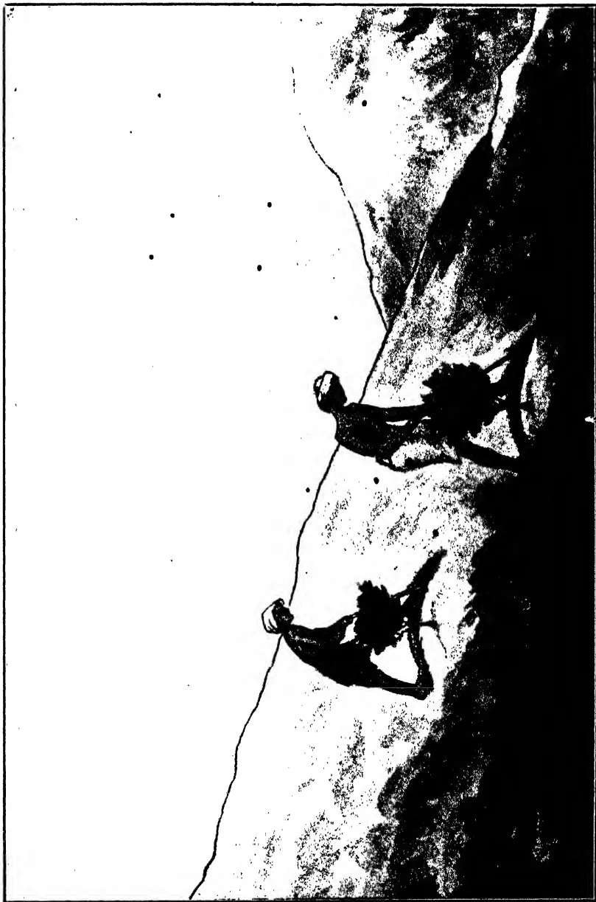

Forking in manure crosswise over a crescent-shaped space, 6 to 8 ins. wide, about 1 foot above the tea bush.

92------------------------------------------------

DIAGRAM E.

Diagram E illustrates a drainage system layout for a coconut plantation. The main feature is a longitudinal section of a drain with a gradient of 1 in 60 to 80. The drain is shown with a series of silt-pits, feeder channels, and silt receptacles. The silt-pits are 3 ft. x 4 ft. by 2 1/2 ft. deep. The feeder channels are 10 in. wide by 2 1/2 ft. deep. The silt receptacles are 5 ft. x 0 in. The diagram also shows the location of trees and the earth bank. A scale of 10 feet to one inch is provided, and the average depth of the drain is 12 inches to 18 inches.

Key components and dimensions shown in the diagram:

- **Drain:** Gradient 1 in 60 to 80.
- **Silt Pit:** 3 ft. x 4 ft. by 2 1/2 ft. deep.
- **Feeder Channel:** 10 in. wide by 2 1/2 ft. deep.
- **Silt Receptacle:** 5 ft. x 0 in.
- **Tree:** Located at the center of each silt receptacle.
- **Earth bank:** Shown on the left side of the drain.
- **Scale:** Scale of 10 feet to One Inch.
- **Gradient:** 1 in 60 to 80.
- **Average Depth:** 12" to 18".

System of drainage and silt-pits for old rubber and coconuts on hilly and undulating land.

Drain gradient, 1 in 60 to 80. Silt-pit 3 ft. x 4 ft. by 2 ft. 6 in. deep. Feeder channel 10 in wide by 2 1/2 in. deep. Rubber 20 to 25 feet apart. Coconut 26 to 28 feet apart.

The cost of these silt-pits and the small drains leading to them is 18 to 20 cents per tree.

93------------------------------------------------

69.

Diagram B shows how rain-water can be held up along side-drains in localities where rain is not plentiful and droughts occur, by providing catch-pits dug crosswise to retain water.

Diagram C is a general view of a hillside, showing my lock-and-spill system of drainage for up-country estates, particularly where the rainfall is excessive. For a full account of this system and its advantages see my first memorandum on this subject in *The Tropical Agriculturist* of October, 1928.

Diagram D illustrates my method of applying and forking in manure with the least risk of loss during unexpected heavy rain. The manure is spread over a crescent-shaped area, six to eight inches wide at the centre, about a foot above the tea-bush, and the forking is done crosswise. The ordinary method of forking downwards is bound to result in the loss of valuable fertilising elements by severe wash which will be saved by my method.

## PART 2.

It is a well-known fact that the output of coconuts is largely dependent on weather conditions. A season of copious rain induces a good "flush" of blossom and a subsequent heavy crop of nuts while a spell of drought invariably results in reduced crops. Rubber also thrives best with a heavy, abundant and regular supply of moisture. Under dry conditions the latex-yield is low. The object of the coconut and rubber planter should therefore be to conserve the rain that falls on the land and make it go as far as possible in maintaining a regular supply of moisture for the roots. To this end as little as possible of it should be allowed to leave the land, and what is retained should be utilised to the best advantage. I have devised two methods, one for old plantations, the other for young estates, with a view to making the most of rain-water for the benefit of the cultivated trees and at the same time reducing any tendency to soil erosion to a minimum.

In diagram E, I have tried to show my method of drainage for old plantations. The dimensions of drains, catch-pits, etc., are given in the diagram, but a word or two of explanation is necessary to make the scheme quite clear. It will be seen that at a distance of 5 feet on the upper side of each tree there is a pit for catching water and such silt as it brings with it. The construction of this pit will necessitate the cutting of some roots, but this will be more than compensated for by the advantages gained. Water is led to the pit by two shallow feeder drains. The silt which is brought in is, whenever found necessary, removed and used for forming an earth-bank, curved in shape, about 4 feet 6 inches away from the tree on the lower side. In laying down the earth-bank it is necessary to first dig up the area on which the earth is to be laid, so that the bank will thereby gain stability by becoming incorporated with the soil on the ground.

94------------------------------------------------

70

Perpendicular feeder channels are also cut midway between the trees, and these catch up water and conduct it to the branch feeder drains. By this means there is a uniform distribution of water over the whole land. In rainy weather the ultimate outflow will be along the transverse drains, which are provided with locks and spills to further control the flow and prevent the removal of silt. On the other hand, when there is no rain the water stored in the pits will by a process of drainage furnish moisture to the trees and so promote their healthy growth.

Diagram F illustrates a slightly modified method intended for young plantations. Here the arrangement of the feeder drains is practically the same, but instead of the water being led to a pit it is directed to the young plant itself. It is in the young stage that moisture is most needed for rapid development, and the silt and water brought to the coconut hole tends to promote the growth of the plant and bring it to early maturity.

When the plant is found to be getting clogged up with silt, it will be necessary to clear the hole of the excess. In case of heavy rain a small pit 18 in.  $\times$  18 in.  $\times$  18 in. placed eighteen inches above the plant will prevent an excessive accumulation of water. The relative distances between trees given in the diagrams are not absolute but are adaptable to varying conditions of soil, crop, etc.

One of the most important details in tropical agriculture is the proper control of tropical rains. Under ordinary conditions of cultivation not only do we lose much of the benefits of our rainfall, but suffer the damage which it is capable of causing by erosion. The methods I have explained above are calculated not only to conserve rain-water for the plant but also to prevent such damage. In this way the fertility of cultivated land will be maintained as far as possible by not allowing silt, composed of the best part of the soil, to be carried away.

The system on which these methods are based is a combination of drainage and irrigation and is calculated to make the fullest and best use of the rain-water that falls on the land. For this reason I think these methods should commend themselves to all coconut and rubber planters.

95------------------------------------------------

DIAGRAM F.

Drain Gradient 1 in 60 to 80

Feeder Channel

Earth bank

Tree  
Hole 3 ft. x 3 ft. by  
2.6 ft. deep.

Feeder Channel

Drain Gradient 1 in 60 to 80

Scale of 10 feet to One Inch. October 1928.

Gradient 1 in 60 to 80. Average depth 12 to 18 ft.

10 feet

2 1/2" to 4"

System of drainage and silt-pits for young rubber and coconuts on hilly and undulating land.

Drain 18 in. wide by 18 in. deep, gradient 1 in 60 to 80. Feeder channel 10 in. wide by 2 1/2 inches deep. Hole 3 ft. x 3 ft. by 2 ft. 6 in. deep filled with earth to a depth of 1 ft. 6 in. Rubber 20 to 25 feet apart and coconut 26 to 28 feet apart.

96------------------------------------------------

A completely blank white page with no visible content, text, or markings.

97------------------------------------------------

71

## CONTRIBUTIONS FROM THE RUBBER RESEARCH SCHEME, CEYLON.

### NOTES ON STREAKINESS IN BLANKET CREPE

T. E. H. O'BRIEN, M. SC., A.I.C.,  
CHEMIST,

RUBBER RESEARCH SCHEME, CEYLON.

**A**MONG the samples of rubber which are received at the Research Scheme laboratories for examination a considerable proportion during the last few months has consisted of blanket crepe which was streaky or discoloured.

At a time of falling prices such as the present the market is always more critical than it is under more prosperous conditions, and some of the samples which were rejected by the brokers as streaky would at other times be passed as up to contract quality. Nevertheless streakiness or uneven colouring of blanket crepe is a relatively common defect, and it is not unnatural that this should be the case. Any slight discoloration or variations in colour of the lace crepe, which may hardly be perceptible when the rubber is in this form naturally become more evident when the crepe is rolled to a thick blanket. A method which the writer frequently uses for comparing the colour of two samples of crepe is to blanket the samples together and see whether streakiness results.

Information regarding common causes of streakiness in crepe is given in the recently published "Guide to the Preparation of Plantation Rubber in Ceylon" (pp. 30-32), but it is thought useful to deal rather more fully with certain causes of this defect.

*Surface Mould.*—During wet weather it is not uncommon for surface mould to develop on the lace crepe during drying. This may be so slight that it cannot be seen on the rubber with the naked eye or it may appear as small specks which are sometimes attributed to dust blowing into the factory. If the mould is severe it can usually be detected by shaking the rubber, when clouds of dust (mould spores) emerge. The presence of mould on the lace crepe will inevitably lead to streakiness or discoloration of the blanket crepe to a greater or less extent. Streakiness of blanket crepe which appears regularly during wet weather will usually be found to be caused by mould (or fungal spots).

Trouble with surface mould on crepe appears to be increasing in Ceylon factories, and it is thought that this is mainly a matter of gradual infection. Drying sheds which have been free from mould for years may gradually become infected and the trouble will then increase progressively.

98------------------------------------------------

72

Apart from raising the temperature of the drying room by artificial means, the most promising method for control of mould is the treatment of the latex with a small proportion of paranitrophenol. The amount required for complete prevention of mould in laboratory tests was found to be 1 part to 1,000 parts rubber, but it is considered that 1 part to 4,000 parts rubber is sufficient to control mould under factory conditions. Particulars of the treatment are given in the "Guide to the Preparation of Plantation Rubber in Ceylon" (p. 52), and it is emphasised there that the only disadvantage of the treatment is that crepe containing P.N.P. becomes discoloured if exposed to *direct* window light during drying. This is a serious drawback but suitable precautions to protect the crepe from direct window light can be taken without involving any appreciable expense or loss of drying space, and the method has been used in several factories during the past year with complete success. A further advantage of treatment with P.N.P. is that the blanket crepe is protected from development of surface mould or fungal spots during storage.

It is considered that mould infection in drying rooms is mainly centred on the floor, where it thrives on the serum which drips from the wet crepe, and on the reapers. In case of trouble with mould it is advisable to treat the floor-boardings with a 10 per cent. solution of "Atlas A" wood preservative which constitutes a fairly permanent disinfectant and to wash the reapers and other woodwork frequently with a 2 per cent. solution of formalin.

In the above discussion no reference has been made to the question of ventilation of the drying shed. It is taken for granted that the room must be well ventilated and that the rubber cannot dry unless there is sufficient circulation of air to remove the moisture. Mould infection may however develop even in a well ventilated drying room under the extremely humid conditions which exist in certain districts during monsoon weather and may necessitate application of the methods of disinfection detailed above.

*Light.*—It is well known that sunlight causes a brown discoloration of crepe rubber, but it is not so widely recognised that direct window light, other than sunlight, also causes discoloration. Crepe which has been dried near to windows in the drying room is always slightly off-colour and if blanketed together with the remainder of the crepe will cause streakiness. The outside rows of crepe should be taken down and rolled separately.

The discoloration is only caused by *direct* light and not by reflected light so it can be avoided by fitting shades to the drying room windows or by arranging that the crepe is hung in such a way that it is out of contact with the direct rays of light.

The method referred to is to hang the crepe to dry in the form of "mats" such as are usually prepared when crepe rubber is to be dried artificially. The mats are made by rolling the crepe on to a drum (for which a convenient size is 3 ft. wide by 1½-2 ft.

99------------------------------------------------

73

diameter) as it comes from the smooth roller. The mat contains 2-3 layers of crepe and the size and thickness is adjusted so that each mat occupies approximately the same reaper space as an equal weight of crepe hung in the usual way. When the mats are hung on the reapers the crepe is high above the floor and direct light from the windows does not fall on the rubber. Equally important is that circulation of air through the room is much improved. It might be thought that the mats would dry slowly but in practice it is found that they dry as rapidly as crepe hung in the ordinary way. This method of hanging has been in use on certain estates for a number of years, and is being adopted with success by an increasing number of estates. It is particularly useful for drying rooms with poor ventilation as it enables the air to circulate freely through the room. . ,

*Iron in Water Supply.*—It is frequently stated that the presence of iron in the water used for diluting and coagulating latex leads to discoloration of crepe, and more especially that the rubber rapidly darkens in colour during storage. This observation may be correct under certain conditions but it has not been confirmed by tests made by the writer up to the present time.

According to a text-book on water analysis, "natural waters containing more than about 0.02 part of iron per 100,000 (*i.e.*, 1.5,000,000) usually become opalescent or turbid on exposure to the air, owing to the decomposition and oxidation of the ferrous hydrogen carbonate." This indicates the minute amount of dissolved iron which is likely to be present in water without detection, and it was considered that by preparing crepe from latex diluted with water to which iron salts had been added in proportion 1:100,000, any tendency to discoloration should be very marked.

The following samples were prepared:—

1. (1) Control crepe.
2. (2) Crepe from latex diluted with water containing ferric chloride 1:100,000.
3. (3) Crepe from latex diluted with water containing ferrous sulphate 1:100,000.

There was no appreciable difference in colour of the samples after preparation or after storage for five and a half months.

The other source of contamination with iron is the use of water containing suspended iron from rusty pipes. A sample of such water was obtained and the proportion of iron present found to be 1:75,000. This water was bright red in colour and must be regarded as grossly contaminated.

The following samples were prepared:—

1. (1) Crepe made from latex diluted with the above water.
2. (2) Crepe made from latex diluted with the same water after being strained through muslin.

100------------------------------------------------

74

The first sample was distinctly darker than the second (which was perfect in colour), but not more so than would be expected from the direct effect of the colouring matter present in the water. After three months' storage the sample has shown no tendency to abnormal discoloration.

In the writer's opinion the effect of iron on the colour of crepe has been exaggerated and is not likely to be serious except in the case of heavy contamination. It is possible that rapid darkening of crepe during storage which has frequently been ascribed to the effect of iron, is really due to adulteration of the latex by coolies, which is discussed in the next section.

*Adulteration of Latex.*—A case occurred recently on an estate in which crepe from one division either became streaky during drying and was discoloured when blanketed, or rapidly darkened in colour during storage. Coagulum from seven different divisions was machined and dried in one factory, and the rubber from all except one division was perfect in colour. A number of tests made by the Superintendent, such as diluting the latex with water from a different division, using fresh stocks of bisulphite and acid, carrying the latex to the main factory for coagulation, etc., were sufficient to convince the writer that the discoloration of the rubber was due to adulteration of the latex in some way by the tapping coolies (mostly Sinhalese villagers). Examination of each tapper's latex microscopically and a test for acidity showed no distinct differences, but in the case of small samples of the latex coagulated separately in aluminium cups (without bisulphite), the serum in several cups was found next morning to be pink in colour and the coagulum was discoloured. After this experiment the discoloration of the crepe ceased for several weeks and when it recurred the Superintendent checked it again by threatening to apply his test and to prosecute any tapper whose latex was found to be adulterated. At first sight the simplest course would appear to have been to secure a new gang of tappers, but it was not practicable in this case as there were no coolie lines on the division, and the Superintendent was dependent on his village tappers.

The above incident is recorded in order to show that discoloration of crepe can be caused by adulteration of the latex by tappers, and where discoloration cannot be traced to other causes this possibility should not be overlooked.

Unfortunately the writer has no information regarding the identity of the adulterant used in this case, and would be glad to hear from any Superintendent who has any suggestions on the subject.

In addition to the above causes of streakiness or discoloration of blanket crepe, there are of course the more obvious causes such as errors in treatment of the latex with sodium bisulphite, variations in the colour of the crepe from different jars of latex, failure to remove dirty edges from the crepe, etc., which are dealt with in the Handbook referred to above.

101------------------------------------------------

75

## DISEASES OF RUBBER IN CEYLON, 1929.

R. K. S. MURRAY. A.R.C.Sc.,

MYCOLOGIST,

RUBBER RESEARCH SCHEME, CEYLON.

1. *Introductory*.—It is thought that an article on diseases of rubber appearing in the 4th Quarterly Circular of each year will be of interest to planters. Such an article will review the general disease position in the Island during the year in question, drawing attention to any new diseases of importance and to any advances in our knowledge of the causation and control of diseases of longer standing.

2. *Root and Collar Diseases*.—As is now well known to all planters, Dr. Small has for some years maintained that the fungi commonly associated with root disease, such as *Fomes*, *Poria*, *Ustilina*, are not primary parasites, i.e., are not capable of attacking unwounded healthy rubber roots. He further maintains that their attack is preceded by another fungus, *Rhizoctonia bataticola*, which is capable of attacking and killing healthy roots. This view has met with support in some quarters and opposition in others, and the comparative importance of the various fungi has not yet been determined. Most mycologists now consider that *Rhizoctonia* is parasitic on Hevea and can cause its death under certain conditions, but that it has not yet been proved to be a necessary precursor to attacks by the other fungi.

In the meantime it is important that the usual methods of root disease treatment be rigorously carried out. This is particularly important at the present time in view of the heavy cover of *Vigna* on some estates. Many estates in the wetter districts which have had a thick ground cover established for some years are now finding a considerable incidence of *Fomes lignosus* root disease. In every case observed by the writer the outbreak has occurred in the vicinity of old disease areas and can be traced to incomplete treatment in the past. Owing to the presence of a thick cover of *Vigna* the disease has often spread over a considerable area before it is discovered. It cannot be too strongly emphasized that in treating such areas the limits of the disease on all sides must be found before the isolation trench is dug. The ground within the trench must be thoroughly cleared of all roots down to about the size of a lead pencil, and the roots and *Vigna* burned *in situ*. This is the only method of insuring that the disease area will not prove a source of infection to neighbouring trees in the future. In addition, an area treated in this way may safely be replanted in a comparatively short time.

102------------------------------------------------

76.

Although a thick cover assists the spread of root disease in several ways, it would be a mistake for an estate to deny itself the undoubted advantages to be derived from cover crops because of the possible danger of root disease. The only limitation to be placed on the growth of cover crops is that they should not be grown on areas known to be affected.

In low-country districts *Ustilina zonata* is responsible for more deaths than any other fungus. Some estates have adopted the filling method of treating collar rot advocated in the Rubber Research Scheme 4th Quarterly Circular for 1925, but this can only be successfully carried into operation if the disease is detected at an early stage. In order to render the detection of this disease easier, any ground cover should be kept clear in a circle, about 6ft. in diameter, round the base of the tree. Where *Ustilina* fructifications are present it is a sound practice to paint them over with tar or disinfectant before the branch or trunk is cut. This is particularly important on young fructifications as these bear spores on the surface which are easily blown about and may cause fresh infection.

Other root fungi are of minor importance. Instances of Brown Root (*Fomes lamaoensis*) and *Sphaerostilbe repens* have been reported but these fungi are rarely of serious consequence. *Xylaria furcata* was found on two occasions in circumstances suggesting that it may have caused disease.

In general the position as regards root disease in the Island may be considered satisfactory. Root disease is almost entirely absent from the drier mid-country districts, while in the low-country, although *Fomes lignosus* and *Ustilina* are of wide occurrence, there are comparatively few estates on which large areas are affected. The methods of preventing the spread of root disease show considerable improvement; less reliance is being placed on trenching alone and more attention is being given to the eradication of all diseased roots from an affected area.

3. *Stem Diseases*.—(a) *Bark Rot* continues to cause damage in certain districts but may be almost completely prevented by careful disinfectant painting. Some estates which use Cargilineum Mixture only have suffered from this disease owing to being unable to apply the mixture on trees which have remained almost continuously wet for some days. All estates should have a water-soluble disinfectant in readiness for application under such conditions. (b) *Canker* is prevalent on many estates in the wet districts but is not considered to do much harm except where the actual tapping surfaces are affected. (c) *Brown Bast* is prevalent in the dry districts of Matale and Uva and must be considered as the most serious factor adversely affecting yields in these districts. On some estates the disease is being treated by the scraping and isolation method recommended by the Rubber Research Scheme (R.R.S. Bulletin No. 48), and

103------------------------------------------------

77

in this way many trees are being brought into tapping. It is hoped that if the price of rubber rises, further work of this nature will be done. On one estate in the Kalutara district a rot of recently scraped panels developed despite the application of disinfectants and considerable damage was done.

4. *Leaf Diseases*.—Secondary leaf-fall due to *Phytophthora palmivora* (*P. Faberi*) was more severe in some districts than in 1928, but its occurrence in Ceylon is not sufficiently severe to cause alarm. It is probable that cultivation and manuring will lessen the effects of this disease.

*Oidium* leaf disease has been the subject of special investigation by the Rubber Research Scheme and an article on the subject was written in the 2nd Quarterly Circular for 1929. The disease is widespread in all the rubber-growing areas but has not caused any serious defoliation in the main low-country districts. In the dry districts of Uva and Matale, however, the disease is extremely severe and many estates have suffered considerable defoliation. Although no decreases in yield are yet evident as the result of *Oidium*, such a disease which causes severe defoliation and consequent die-back of branches must be regarded as extremely serious, and an effective means of control is urgently needed.

It is probable that applications of nitrogenous manure will ameliorate the worst effects of the disease. Such a method, however, exercises no direct control over the fungus and the best hope of eradicating the disease lies in dusting with sulphur powder. In Java, where *Oidium* leaf disease has been present since 1918, extremely successful results have recently been obtained by projecting finely-divided sulphur powder on to the foliage by means of a motor duster. The method is quick and cheap compared with wet spraying and will probably solve the problem of *Oidium* control. Special interest is therefore attached to dusting experiments to be conducted in Ceylon early in 1930.

5. *Diseases and Pests in Nurseries*.—The recent increase in the use of valuable bud-grafted material has drawn attention to the various affections to which young shoots are prone.

In the R.R.S. 3rd Quarterly Circular for 1929 attention was drawn to a new disease of bud-shoots caused by *Phytophthora* sp. The green shoot is attacked a few inches below the extremity and dies back rapidly to the extent of the latest growth increment where the disease may be checked. The disease has not been reported from any estate on a large scale and is probably to a great extent dependent on wet weather conditions. Inoculation experiments have shown that seedlings may also be attacked by the fungus, though the disease has only been reported as occurring in nature on bud-grafts.

104------------------------------------------------

78

If the disease appears in the nursery or the field all affected shoots should be cut off about 6 inches below the margin of the discoloured area and neighbouring shoots sprayed with Bordeaux Mixture.

There are several other adverse factors which check the growth of young budded plants. *Mites* cause damage to young leaves and are most effectively controlled by dusting with sulphur powder or spraying with *Sulfinette*. *Slugs* are often found to eat off the terminal shoot, and damage to leaves has also been attributed to *beetles*. In addition it is probable that the dying back of young rootlets consequent upon cutting back the stock often finds its reflection in a check in growth of the bud-shoot.

6. *Cover Crops*.—The Kalutara snail is still causing considerable damage to *Vigna* in some districts, and no infallible method of control has yet been devised. The "lime-Atlas" treatment for poisoning the snails recommended by Mr. Roy Bertrand in *The Tropical Agriculturist* for September 1928 has been found successful on some estates, though other Superintendents have had no appreciable results. Hand collecting and destroying the snails is still considered to be the most effective remedy.

*Vigna* is commonly attacked by two fungi, though in neither case is the disease of a serious nature. *Rhizoctonia solani* kills back the *Vigna* in small circular patches in wet weather, but these soon recover in a dry spell. A brown spotting of *Vigna* leaves has been shown to be due to *Uromyces* sp., a rust fungus. The leaflets turn yellow and fall and in very dry weather the cover may be killed back.

105------------------------------------------------

79

## THE EELWORM-GALL OR ROOT-KNOT DISEASE \*

(CAUSED BY *CACONEMA RADICICOLA* (GREEF)  
COBB, FORMERLY KNOWN AS *HETERODERA RADICICOLA* (GREEF) MULLER).

[Note.—The cosmopolitan eelworm *Caconema radicicola* is well known in Ceylon. It is particularly troublesome in flower beds, vegetable gardens and estate nurseries. The plate reproduced herewith shows tea seedlings from a nursery with typical root-knots, or galls caused by the eelworm. Useful notes on methods of control are given in the article printed below.]

**A**LTHOUGH apparently unknown in the south-western portions of this State, *Caconema radicicola*, the organism responsible for the development of eelworm-galls or root-knots on the underground portions of many of our cultivated plants, is widely distributed in the metropolitan zone around Perth, and has recently attracted considerable attention in the light sandy soils of the Geraldton area.

The eelworms in question are very small round worms, somewhat less than 1/25th in. in length, which may attack the underground parts and form galls on almost all our cultivated species with the exception of most grasses and cereals (wheat, oats, barley, rye, maize, etc.), and a limited number of other plants.

In Western Australia the worms have been found forming galls on the roots or other underground parts of potatoes, tomatoes, cape-goose-berries, marrows, pumpkins, melons, cucumbers, carrots, parsnips, beetroot, beans, mangolds, tobacco, rhubarb, grapes, figs, banana, dahlia, boronia, ceinfugosia hakeifolia, wattles, and many other plants of an edible, flowering, or ornamental nature. Cauliflowers, cabbages, peas, asparagus, artichoke, spinach, onions, and sweet potatoes are not usually attacked to such an extent as the other market-garden plants previously mentioned. Considerable differences in varietal susceptibility occur in almost all plant species attacked. The eelworms are rarely, if ever, found in heavy clay soils, but thrive abundantly in loose, well-drained, sandy soils in warm districts or situations. It is on this account that eelworms have so successfully established themselves in the Perth districts and environs. The disease is very serious in many parts of the world where flowers or vegetable are grown under glass, and under such circumstances periodic sterilisation of the soil by means of steam is commonly practised to rid the soil of the pest. Unfortunately this method is at present quite impracticable in Western Australia.

*Symptoms and Effects.*—Plants badly affected are dwarfed, wilt readily in hot weather, and are usually a paler green than healthy ones. Seedlings and even older plants may be killed in quick time if severely attacked, or great reduction in yield may result. Sometimes, however, little damage or reduction in yield is apparent, especially if abundance of water, fertiliser and organic matter can be supplied to the plants. In this connection

\* By H. A. Pittman, B.Sc. Agr. in *The Journal of the Department of Agriculture, Western Australia*, Vol. 6 (Second Series) No. 3, September, 1928.

106------------------------------------------------

80

it is very well worthy of note that any means which tend to reduce the proportion of top-growth to rooting system (such as pruning out of excess lateral shoots in tomatoes and the copious use of superphosphate and sulphate of potash) will tend to reduce the injury done by the worms.

On being pulled up infected plants will be found to show more or less numerous warts or swellings of the roots or other underground-parts. Potatoes are usually attacked on the tubers, but the organisms may also invade the roots and underground stems. Infected potato tubers show many or few, more or less scattered, flat-topped pimples or blisters on the surface, often about one-eighth inch in diameter and elevated about the same distance above the general level of the healthy tissues. The lesions may be much larger, however, in certain cases, and where attack is bad may be very close together, giving a much distorted appearance to the affected parts. Sometimes numbers of the blisters will be found to be broken open or decayed as a result of subsequent attack by fungi or bacteria. If infected potatoes are cut open, small brown areas will be seen in the flesh under the pimples and extending to a depth of about  $\frac{1}{4}$  in. in some cases. It is in these brown areas that the eelworms occur, but on account of their very small size the males and young are not readily seen without a strong lens or microscope. The mature egg-filled females, however, are much broader than the other stages, being pear-shaped and about  $\frac{1}{25}$ th inch in diameter, and they can sometimes be distinguished with the naked eye as glistening pearly-white bodies within the discoloured tissues. Eelworms are often introduced into clean land in potato peelings, and this may be considered one of the main means of dissemination by unsuspecting persons. The use of the manure of animals fed on infected plants also leads to the distribution of worms, as they are not all destroyed by passing through the intestines.

Carrots, parsnips and other fleshy-rooted plants may show large warts which greatly disfigure the appearance of the edible portions. On plants with more slender underground parts, the galls or warts may somewhat resemble the bacterial nodules which are so necessary a feature on the roots of plants belonging to the pea or bean family (*Leguminosæ*). Even on such plants, however, the experienced eye soon learns to detect the eelworm-galls if present in addition to the bacterial nodules. The eelworm-galls on these plants are often very close to the root tips—they are mostly much more elongated, cylindrical and narrow than the bacterial nodules, and they follow the length of the roots or rootlets rather than jut out as large swellings to the side, as do the nodules due to the bacteria. They are, in short, on leguminous plants generally longitudinal swellings of the root rather than more or less knobby lateral outgrowths. Plants of the cabbage family (*Crucifera*) are sometimes attacked on the roots by the Club-root organism—*Plasmodiophora brassicae*—but the swellings in such a case are enormously larger and are easily distinguishable from eelworm-galls.

*Life History.*—The young eelworms or "larvæ" which hatch out of the eggs laid in the old galls eventually puncture the roots of the host plant by means of spear-like structures in the mouth parts called buccal-spears, and enter into tissues of the root or similar part just behind the growing points. By their presence the root or tuber, etc., is stimulated to unusual activity and the characteristic galls result. On attaining full size the male and female eelworms mate, and subsequently the female becomes greatly distended and may produce as many as five hundred eggs. In loose, warm, moist soils, up to twelve generations may be produced in a year, as the life cycle can, under such circumstances, be completed in four to five weeks. The "larvæ" and adult males are elongated and like miniature earth-worms in shape, but the fertilized females are pear-shaped on account of the body being distended with eggs.

107------------------------------------------------

81

*Susceptible Plants.*—For general information the following list of the most important susceptible plants is taken from Heald's "Manual of Plant Diseases."

1. Field crops. Alfalfa (lucerne), clover, cotton, cowpea (most varieties), sugar beet, sugar-cane, sweet potato, tobacco, and vetch.

2. Ornamental and drug plants. Begonia, Cineraria, Clematis, Coleus, dahlia, hollyhock, ginseng, Golden seal, peony, rose, sweet pea, and violet.

3. Truck crops. Asparagus, bean, beet, carrot, celery, cucumber, dasheen, eggplant, garden pea, lettuce, okra, onion, pepper, potato, rock-melon, salsify, spinach, strawberry, tomato, and water melon.

4. Woody plants. Almond, catalpa, cherry, date palm, European elm, mulberry, grape, peach, pecan, walnut, and weeping willow.

*Resistant Plants.*—Nearly all grasses; cereals such as wheat, barley, oats, rye, maize, and sorghum; "Iron," "Brabham," "Monetta," and "Victor" cowpeas; peanut; "Laredo" soy bean; velvet bean.

### CONTROL.

1. Farmers or householders should be very careful never to plant potato tubers or seedlings of any kind showing eelworm-galls. If your farm or home garden is free at present, do all you can to keep it free. This means, among other things, raising your own seedlings and boiling the peelings of any potato tubers used for household purposes which appear to be infested with eelworms. It is very likely that the eelworms have been chiefly carried about the State in potato tubers and introduced into the gardens and fields in the potato peelings. The true seeds of plants as distinct from tubers, bulbs, etc., do not carry the eelworms.

2. (a) In seedbeds the eelworms can be destroyed by treating the soil with carbon-bisulphide at the rate of 1½-2 oz. per square yard before sowing the seed. Make four evenly-spaced holes 8 inches deep to every square yard of soil with a round stick. Into each pour, per medium of a funnel, approximately ½-¾ fluid ounce of the carbon-bisulphide and quickly cover with moist earth. Cover the seedbed with clean bags and leave for several days. Then aerate thoroughly by turning over several times and leaving to stand for several days before planting the seed.

(b) Where carnations, dahlias and other flowering or ornamental plants in gardens are found to be attacked, the eelworms can be largely killed by treating the soil with one fluid ounce carbon-bisulphide to the square yard in evenly-spaced holes not closer than 9 inches to the base of the plants. After pouring the required amount down each hole (about ¼ ounce), close the hole with moist earth. The fumes will spread through the soil and kill many of the eelworms in the soil and roots. Both the above-mentioned treatments have been tested out over a considerable period of years by Mr. L. J. Newman, Economic Entomologist of this Department, with satisfactory results. Do not water the soil for several days after treating or the carbon-bisulphide may be forced out of the soil. *Above all, remember that carbon-bisulphide is exceedingly inflammable and explosive in the presence of a spark, lighted cigarette or flame. The fumes are also poisonous if inhaled for any length of time, so that the fumigant must be handled with all due discretion.*

(c) Experience in America and other countries indicates that formalin may be used fairly satisfactorily for treating eelworms in seedbeds. The formula now being mostly recommended is 1 gallon of formalin to 50 gallons of water (i.e., a so-called 2 per cent. solution). The solution is applied with a watering-can to the soil, which should previously have been well loosened

108------------------------------------------------

82

up, at the rate of about  $\frac{1}{2}$ -1 $\frac{1}{2}$  gallons of the solution to the square foot (1). Cover the soil with bags moistened with the solution and leave for several days. Then remove the bags and stir the soil up thoroughly to let out the fumes. Leave for 10 days or a fortnight before sowing. This treatment is exceptionally efficient for destroying such soil fungi as cause "damping-off" and "root-rot" and it also appears to give fairly good results with eelworms. Be careful, however, not to re-contaminate the soil by using dirty implements from infested ground, or by walking over the beds with contaminated boots, etc.

(d) Eelworms can be killed out by suffocation, if the soil in the seedbeds or field can be kept flooded with water for 3-4 weeks. In such a case, however, the soil must, of course be freed of excess of water and well aerated before sowing the seeds or planting out.

(e) In many countries steam-sterilization is used to free the soil in glass houses from eelworms, with extremely effective results, but the method is impracticable here.

(f) J. R. Watson (2) of the Agricultural Experiment Station, University of Florida, who has given considerable attention to the control of treatment for seedbeds from which the following details have been worked out (3). First of all, dig over the seedbeds thoroughly, then water with sodium cyanide solution at the rate of three ounces of the solid cyanide to each square yard of soil. Add further water until the soil is moistened to a depth of 18 inches throughout. Then immediately afterwards sprinkle four and a half ounces ( $4\frac{1}{2}$  oz.) of sulphate of ammonia over each square yard and water in with just sufficient water to carry the sulphate down. The two chemicals react with one another, forming sodium sulphate, ammonia, and hydrocyanic acid gas (prussic acid), which kills the eelworms. Watson (*loc. cit.*) states: "If nematodes (eelworms) appear at all in such seedbeds, they will be in isolated spots which can be rejected at planting time. If, on the other hand, the desire is for plants which can be depended upon to be absolutely free, as for setting in uninfested ground, application of at least 1,200 lb. cyanide (of sodium) and 1,800 lb. ammonium sulphate to the acre should be applied," *i.e.*, about 4 ounces of the cyanide and 6 ounces of the sulphate of ammonia to each square yard.

Cyanide of potassium can be used instead of cyanide of sodium, and from the point of view of subsequent soil fertility, would appear to be considerably superior to the sodium compound. It has the disadvantage of greater cost, however, and, in addition, one must use one-third more of the potassium cyanide to each square yard, *i.e.*, 4 ounces, instead of 3 ounces of the sodium cyanide. The amount of sulphate of ammonia is, however, the same in each case. If the above method is used for sterilizing seedbeds, *great care must be exercised in handling the cyanide as it is one of the most deadly poisonous substances known to science. In the case of poisoning, immediately give a weak solution of green sulphate of iron (ferrous sulphate or "green vitriol") as a drink, and then empty the stomach by means of a stomach tube or by inducing vomiting with a mustard emetic. Send post haste for medical assistance. Above all do not use the cyanide method unless you have a supply of the antidote ready in case of need and have carefully instructed all the persons concerned in its use. The poison is so powerful and rapid in its action that unless treatment is immediate there is very little hope.*

8. On a field scale every encouragement should be given to the plants in the way of water, organic matter, and fertiliser to enable them to stand up to attack. Tomatoes should be pruned to a single stem and tied up to stakes. The reduction in the excessive top-growth may then make it possible to obtain fairly heavy yields even though the roots are rather badly attacked.

109------------------------------------------------

A completely blank white page with no visible content, text, or markings.

110------------------------------------------------

Tea seedlings showing galls caused by the eelworm  
*Caconema radicicola*.

111------------------------------------------------

83

4. Where the soil in the field is badly contaminated with the pest, well-worked summer fallow should be practised, as in such a case the drying out of the soil kills great numbers of the parasites. The following season a resistant crop (such as wheat or oats, etc.) should be sown, and then the susceptible crop can be sown with little fear the next season. This means that on badly infested tomato fields, for instance, the tomatoes should only be grown on the same land every third season. A division of the cultivated land into three more or less equal parts therefore seems imperative when the eelworms become firmly established. This means, of course, that the smaller area must be very intensively worked while it is in crop, but each year a comparatively clean area would be available for the main money-making plants. All weeds liable to harbour the worms should be prevented from growing along the headlands and ditches, etc.

5. Experiments recently reported by Edwards (4) in England indicate that good results might be obtained on a field scale by ploughing-in crude naphthalene to a depth of 6 inches, at the rate of eight hundredweights (8 cwt.) to the acre, followed by rolling, about a fortnight or so before planting. In the experiments referred to, very striking results were obtained in the treatment of a "potato-sick" soil where there was a very heavy mixed infestation of the soil with another species of eelworm, *Heterodera schaactii*, and the fungus *Rhizoctonia solani*. The material actually used was "drained creosote salts" (stated to be a crude form of naphthalene), selling in England for about 10s. per cwt. Experiments by the Department are projected to test the actual efficacy of the treatment for the local eelworm, *Caconema (Heterodera) radicicola*.

#### LITERATURE CITED.

1. (1) Chupp, C. "Manual of Vegetable Garden Diseases." Macmillan & Co., New York, 1925.
2. (2) Watson, J. R. "Control of Root-Knot, II." Florida Agric. Expt. Sta. Bull. 159, 1921.
3. (3) Gibson, A., and Ross, W. A. "Insects Affecting Greenhouse Plants." Dominion of Canada Dept., Agric. Bull. 7, New Series, 1922.
4. (4) Edwards, E. E. "The Control of a Serious Potato Trouble." Jour. Min. Agric., London, Vol. 36, pp. 234-242, 1929.

112------------------------------------------------

84

## AGRICULTURAL METEOROLOGY IN ITS PLANT PHYSIOLOGICAL RELATIONSHIPS \*

**A**GRICULTURAL meteorology is the study of the effects of meteorological conditions on plant yield. Yield, with which the practical man is alone concerned, is of course, the final expression of the integration of the whole complex of physiological processes of the plant. One is dealing with a very complex system in which the physiological processes of the plant react with the external conditions. Meteorological conditions such as temperature, light intensity, humidity of the air, since they produce a marked effect on the rate of important physiological processes in the plant, are often termed "factors"; we speak of the growth of a plant, being controlled by a temperature factor, a light factor and so on. These meteorological factors for the most part vary continually during the growth of the crop, which may last over many months or even years.

One of the central problems of plant physiology is the elucidation of the effect on the plant of the external factors of the environment and of these the meteorological factors are not the least important. The problem is one of great difficulty. In the first place a living organism is an exceedingly complex system and one which is highly integrated. The various processes on which the life of the organism depends are very closely co-ordinated and, indeed are necessarily so if its life is to continue. It follows that a change in one process in the plant may markedly affect the rate of other processes; thus it is hard to distinguish between primary and secondary effects.

There is in addition a second complication which shows itself even in the study of a single physiological process. This complication is the high "interrelationship" of the factors affecting such a process. The effect produced by any one factor is markedly dependent on the intensity of other external factors. Thus, if we are considering the effect of the sun's radiation on the rate of sugar formation in the leaf we find that the effect produced varies with the temperature of the leaf and the concentration of carbon dioxide available. If the temperature is low a doubling of the light intensity will have only a slight effect, while with a higher temperature the effect will be greatly enhanced. The close interrelationship of factors is one of the chief lessons of more recent physiological work, but one which makes much more intricate the study of the effect of meteorological conditions on plant processes such as growth.

In the third place the variation of the environmental factors—especially the climatic factors—from day to day, from hour to hour and even from minute to minute, adds another difficulty to the interpretation of crop yield in terms of the effect of such factors on the physiological processes of the plant.

It must also be pointed out that there is often a considerable lag in the action of a climatic factor and the appearance of the resultant change in the plant. Crop yield may be largely determined by a bright period or a period of rainfall which occurred long before; we have a process known as physiological predetermination.

---

\* Paper read by V. H. Blackman, Sc.D., F.R.S., (Research Institute of Plant Physiology, Imperial College of Science and Technology) before the Agricultural Section of the Conference of Empire Meteorologists, 1929.

113------------------------------------------------

85

As has already been stated, the contribution which plant physiology can make to agricultural meteorology consists in analyses of the way in which climatic factors affect crop yield. This analytical problem can be attacked in three ways. In the first place the plants may be studied under *field* conditions, various physiological processes, such as rate of increase of dry weight, rate of increase of leaf area, rate of assimilation and respiration being followed *throughout the growing season*. Work of this kind is very laborious and, owing to the large variation of plants grown under field conditions large samples have to be collected to obtain significant results. A full field experiment of this kind has not yet been carried out.

In the second way the experimental technique is simplified by growing the plants in pot-culture in the open. The plants are thus exposed to natural climatic conditions and the correlation of their various physiological processes with climatic factors can thus be determined. The most elaborate study of this kind is that of F. G. Gregory referred to below.

The third mode of attack is a study in the laboratory of the effect of various climatic factors such as temperature, light, humidity, on the growth and other processes of various plants or plant organs. Useful knowledge may be obtained in this way, but owing to the interrelationship of factors referred to earlier and the high integration of the plant body it is difficult from a study of the effect of a single factor on single organs to deduce the action of a complex of meteorological factors upon the plant as a whole.

### CORRELATION BETWEEN THE INTENSITY OF CLIMATIC FACTORS AND THE GROWTH OF PLANTS.

The only elaborate investigation that has been made of this relationship is the study of barley by Gregory in the years 1921-1924 (*Annals of Botany*, XL, 1-26, 1926). As already stated, the plants were grown in pot-culture, the water-content of the soil being kept up to a lower limit by artificial supplies though this limit was exceeded in periods of rainfall. Seven environmental factors were recorded during the experimental periods of each of the four years namely, maximum day temperature, average day temperature, minimum night temperature, average night temperature, total radiation (calories per cm.2 per week), hours of bright sunshine, and evaporating power of the air. Three physiological processes of the plant were measured, namely, net assimilation rate, relative rate of growth of leaf surface, and relative rate of increase of dry weight. Owing to the high correlation of the external factors (solar radiation and temperature, for example, tend to vary together) partial correlations had to be determined. It was shown that the net assimilation rate had a high partial correlation with day temperature and with radiation, and this was *positive*, while there was high *negative* correlation with night temperature. This last result is to be explained by the fact that a high night temperature pushes up the rate of respiratory loss and so reduces the rate of net assimilation.

A partial positive correlation of relative leaf growth with average day temperature was observed and a negative correlation with night temperature, and also a large negative correlation with total radiation. The fact that the correlation with total radiation is positive for net assimilation but negative for relative leaf growth rate tends to keep the yield constant. High radiation will tend to reduce the rate of leaf-area growth but compensation will occur since the high radiation will increase the assimilatory efficiency of each unit of leaf-area.

It is clear from the few results that have been quoted that the method employed by Gregory is a very fruitful one. Much light could be thrown on agricultural meteorology by an extension of this method. By growing one or more crop plants in exactly similar pot-cultures in localities with

114------------------------------------------------

86

widely different meteorological environments and determining by the method of correlation the reaction of the plants to the various climatic factors very valuable knowledge would be obtained.

In the third method of attack on the physiological problems of agricultural meteorology the effect of the various climatic factors on the plant processes is investigated. It will be useful then to give a brief survey of the action of these factors on the plant.

### EFFECT OF TEMPERATURE.

The question of how to summate temperatures so as to relate them most satisfactorily to their effect on plants has been a burning one in plant geography for a very long time and a similar problem arises in relation to plant physiology. De Candolle as long ago as 1874 divided the earth into temperature zones, the lowest having the temperature of most months below  $0^{\circ}$  C., and the vegetative period for plants between  $0^{\circ}$  and  $5^{\circ}$  C.; the other zones had mean temperatures of  $0-14^{\circ}$  and  $15^{\circ}-20^{\circ}$  and the zone of highest temperature about  $25^{\circ}$  C. A great flaw in the system of De Candolle was the complete neglect of yearly periodicity which plays such an important part in the life of plants in temperate regions. Koppen improved on the system of De Candolle by defining the cold zones as those with one to four months with a temperature over  $10^{\circ}$  C., and later he related his zones to the position of the isotherm  $18^{\circ}$  C., during the coldest months and the isotherm  $22^{\circ}$  C. for the warmest months.

It is obvious, however, that in addition to the length of the period of growth the duration of high and low temperatures must be considered. Some authors accordingly summate in temperature hours over the whole year or for the frost-free period. Livingstone and Shreve (*Publ. Carnegie Institution, Washington*, No. 284, 1921) take into account the number of frost-free days during the vegetative period and summate the temperatures in these and determine also the number of days with a temperature over a definite level. Vahl takes the mean temperature of the coldest month and the mean temperature of the warmest month and from them constructs a formula, as does also Samuelsson. With such formulæ they have been able to correlate with temperature the northern limits of wheat in Europe and Siberia, and also the distribution of the hazel.

Though some slight success may be obtained in this way in correlating temperature with the distribution of some plants, it is evident that a formal treatment of this kind is doomed to failure when a living organism such as the plant is in question. If we wish to determine the activities of the plant in terms of temperature, it is evident that we must use physiological data which embody the response of the plant to such a meteorological factor. Livingstone and Shreve (*loc. cit.*) were the first to attempt to use physiological data in climatological work. They weighted their temperature averages according to the growth rates of plant organs which had been observed at different temperatures under laboratory conditions. This method, however, had not much success in determining plant distribution and this is not very surprising. Growth data of this kind are not available for many plants and they refer usually to particular parts of the plant such as the root and not to the plant as a whole. Apart from this, however, there is the strong objection to the method itself that it uses physiological data which relate temperature merely to the *growth* of the plant. There are, however, other processes in the plant, such as assimilation and respiration, which are of equal or greater importance for its development, but unfortunately these may have a markedly different response to temperature than the mere elongation of the plant which is usually considered as growth. The evident need is for temperature curves of all three processes of assimilation, respiration and growth so that the effect of temperature on the plant

115------------------------------------------------

87

as a whole can be accurately determined, though there must, of course, be other processes in the plant whose response to temperature is different from that of any of the three processes just mentioned.

How different are the responses of growth, assimilation and respiration is shown by the graph below which gives the relationship between temperature and rate of growth in length of the shoots of maize seedlings, and table I, after Lundegårdh (*Biochem. Zeit.* 154, 213, 1924), which indicates the effect of temperature on the rate of the processes of respiration and assimilation of the leaves of the potato plant.

<table border="1">
<caption>Data points from the graph (approximate values)</caption>
<thead>
<tr>
<th>Temperature (°C)</th>
<th>Rate of Growth</th>
</tr>
</thead>
<tbody>
<tr><td>4</td><td>0.0</td></tr>
<tr><td>8</td><td>0.5</td></tr>
<tr><td>12</td><td>1.0</td></tr>
<tr><td>16</td><td>2.0</td></tr>
<tr><td>20</td><td>4.0</td></tr>
<tr><td>24</td><td>8.0</td></tr>
<tr><td>28</td><td>11.0</td></tr>
<tr><td>32</td><td>12.2</td></tr>
<tr><td>36</td><td>10.0</td></tr>
<tr><td>40</td><td>4.0</td></tr>
<tr><td>44</td><td>1.0</td></tr>
<tr><td>48</td><td>0.0</td></tr>
</tbody>
</table>

Table I.

*Effect on Rate of Assimilation and Respiration of Raising Temperature 1° C.*

<table border="1">
<thead>
<tr>
<th>Temperature</th>
<th>5°</th>
<th>10°</th>
<th>15°</th>
<th>20°</th>
<th>25°</th>
<th>30°</th>
<th>35°</th>
<th>40°</th>
<th>45°</th>
<th>49°</th>
</tr>
</thead>
<tbody>
<tr>
<td>Respiration</td>
<td>1.08</td>
<td>1.08</td>
<td>1.06</td>
<td>1.10</td>
<td>1.07</td>
<td>1.07</td>
<td>1.06</td>
<td>1.29</td>
<td>1.01</td>
<td>1.48</td>
</tr>
<tr>
<td>Assimilation—</td>
<td></td>
<td></td>
<td></td>
<td></td>
<td></td>
<td></td>
<td></td>
<td></td>
<td></td>
<td></td>
</tr>
<tr>
<td>  With full light</td>
<td>1.27</td>
<td>1.25</td>
<td>1.08</td>
<td>1.08</td>
<td>0.96</td>
<td>0.92</td>
<td>0.81</td>
<td>—</td>
<td>—</td>
<td>—</td>
</tr>
<tr>
<td>  With 1/25 light</td>
<td>1.18</td>
<td>0.95</td>
<td>0.90</td>
<td>1.52</td>
<td>0.79</td>
<td>1.00</td>
<td>—</td>
<td>—</td>
<td>—</td>
<td>—</td>
</tr>
</tbody>
</table>

Such a graph and such table show how futile is a mere summation of temperatures, for the effect of a given rise of temperature may be very different at different temperature levels. Thus, at 5°C. an increase of temperature of 1° increases assimilation (at high light intensity) by 27 per cent., while a similar rise at 15° C. increases the rate of the process by only 8 per cent. The table also shows that assimilation and respiration respond differently

116------------------------------------------------

88

to variations of temperature. It is of course only the *excess* of material formed in assimilation over that lost by respiration that is available for the growth and development of the plant. At higher temperatures the amount lost by the respiration of the plant may be in excess of that gained by assimilation. How large respiration losses may be is shown in Table II, also from Lundegårdh, showing the *hourly* loss by respiration during the night from 1 hectare of a potato field.

Table II.Potato Field.*Respiration Losses per Hour per hectare.*

<table>
<thead>
<tr>
<th>Temperature</th>
<th>0°</th>
<th>5°</th>
<th>10°</th>
<th>15°</th>
<th>20°</th>
<th>25°C.</th>
</tr>
</thead>
<tbody>
<tr>
<td>Losses (kilograms)</td>
<td>0.45</td>
<td>1.0</td>
<td>1.5</td>
<td>2.0</td>
<td>3.0</td>
<td>4.5</td>
</tr>
</tbody>
</table>

Since respiration means a loss to the plant and assimilation a gain, a fall of temperature at night may be advantageous to the plant while the same condition during the day would lead to a fall in assimilation and so a loss to the plant. A calculation of Lundegårdh's of the assimilation and respiration per hectare of an oat field at two *night* temperatures is given below (Table III).

The facts that assimilation and respiration are affected differently by a temperature rise; that a temperature rise may act favourably by day and unfavourably by night; that the relationship is linear in neither case; and that the process of growth shows a different response to *either* of these, indicate the complexity of the problem of the plant's response to temperature and proves of how little value are temperature summations.

Furthermore, there is the additional complexity which has been referred to earlier, namely the interrelationship of factors. The temperature effect is markedly altered by the intensity of the other factors. As Table I shows, the effect on assimilation of a rise of temperature is in general less (as would be expected) when assimilation is kept low by a feeble light intensity than under conditions of high illumination. A fall of temperature of 10° C. at night may thus increase by 30 per cent. the total material available for the plant in that period, as Table III shows.

Table III.Oat Field.*Assimilation and Respiration per hectare.*

<table>
<thead>
<tr>
<th>Assimilation.</th>
<th>Respiration.</th>
<th>Gain.</th>
</tr>
</thead>
<tbody>
<tr>
<td>300 kg.</td>
<td>175 kg. (20° C.)</td>
<td>125 kg. (300-175)</td>
</tr>
<tr>
<td>300 kg.</td>
<td>132 kg. (10° C.)</td>
<td>168 kg. (300-132)</td>
</tr>
</tbody>
</table>

With reference to the effect of temperature on crop yield the meteorological data of air temperatures are probably as accurate and as complete as can be desired. The plant physiologist, however, can only make full use of them when more physiological data are available as to effect of temperature and change of temperature on various plant processes, such as assimilation, respiration, growth, flower production, etc.

From the agricultural point of view the temperature of the air is of high importance, but that of the soil, which controls the temperature of the underground portions of the plant, is probably of equal importance. It is unfortunate, therefore, that data of soil temperature are not usually available.

117------------------------------------------------

89

## EFFECT OF LIGHT: QUALITY AND INTENSITY.

Plants are sensitive both to total intensity of light and to its quality. For some processes, such as assimilation, the less refrangible portion of the spectrum is the more important; for others, as the process of elongation, the more refrangible rays have the greater effect. Plant growth and crop yield are thus the result of the integrated effect on the plant of light of varying intensity and quality. The minimum intensities of daylight under which plants can live is, of course, variable for different species, but is remarkably low. Thus, Shirley (*Amer. Journ. Bot.*, XVI, 354-390, 1929) has shown that many plants will grow under illumination from gas-filled electric lamps of an intensity less than 40-foot candles and buckwheat will grow at 25-foot candles. Sunflower is much more exacting, requiring considerably higher intensities. An interesting compensation effect was found by this observer, for the lower the light intensity the greater the chlorophyll content of the leaves. The response varied in different plants, but the increase in chlorophyll content was never as great relatively as the fall in light intensity. In the hog peanut (*Amiphicarpa monoica*,) which showed the largest response, the concentrations of chlorophyll were 3.7 and 1.2 mg., respectively, per 100 cm.2 for light intensities of 1 per cent. and 71 per cent. of full daylight.

It must be pointed out that though "hours of bright sunshine" are well correlated with "total radiation" (as measured, for instance, by the Callendar Recorder), yet the mere duration of sunshine without any measure of its intensity is very unsatisfactory for plant physiological work. A record of total radiation is certainly an advance over hours of sunshine, but, since it is the luminous rays that are important in plant processes, a measure of changes of brightness throughout the day would be the most valuable.

The effect on plants of light of different quality is still a field in which we have little knowledge, though it is certainly of great importance. It is known, as stated above, that the red orange rays are the more important in the assimilation of plants and the blue end of the spectrum in growth and movement. Plants can, however, be grown in considerable ranges of spectral quality, as is shown by the fact that healthy growth may be obtained both in daylight and under electric lamps. The effect on the plant of the change in spectral quality of daylight which occurs on the transition from an unclouded to a cloudy sky, and also with the diurnal variation from sunrise to sunset, is still unknown. With greater knowledge of the biological effect of light of different wave length plant physiologists will no longer be content with a record of total light intensity but will require for work in agricultural meteorology a record of the spectral quality of light in different localities and also a continuous record of the diurnal variation of this quality.

## EFFECT OF HUMIDITY OF THE AIR.

The humidity of the air is one of the dominant factors in plant growth and crop yield. Its effect is, of course, largely dependent on the soil moisture available to the plant. The loss of water from the plant, if other conditions remain the same, is directly related to the evaporating power of the air. It is perhaps unfortunate that meteorological records of humidity are usually given in terms of *percentage saturation* of the air, since such data are only comparable among themselves if the temperature is constant. Thus, air having a 70 per cent. saturation at 20°C. and 30°C., respectively, has very unequal evaporating power, for the saturation deficits are 5.22 mm. and 9.47 mm. of mercury in the two cases. From the agricultural standpoint what is required is the "saturation deficit" of the air, for on this depends the water loss from the plant.

118------------------------------------------------

90

## PHOTOPERIODISM.

Reference must be made to the more recent work of Garner and Allard in America, who have shown that a hitherto unsuspected meteorological condition—namely, length of day—has a marked effect on flower development, and so on crop yield. It is a familiar fact that many plants flower only at certain seasons of the year, such as spring and autumn. It was usually assumed that temperature was the dominant factor, the appearance of spring flowers being associated with the warmth that follows the chill of winter, while autumn flowering seemed to be the result of the decline of temperature as we pass from summer towards winter. Though temperature is certainly a very important factor it is not the dominant one in relation to flowering. One cannot make the iris flower in winter by putting it in a greenhouse, or asters and chrysanthemums flower in summer by lowering the temperature. It is clear that with many plants the time of flowering and fruiting is linked with the season. The clue to the nature of this relationship was gained from a study of a valuable variety of tobacco, Maryland Mammoth, grown in the United States. This plant when growing in Virginia produces no seed but goes on growing steadily during the season, reaching a height of even 12 ft., till finally it is cut down by frost without flowering. A plant, however, which was placed in a greenhouse in autumn flowered in a short time and set seed. It was at first thought that the effect was one of temperature, but it was soon found that whatever the conditions the plant would never flower in the summer but only in the winter. The time of flowering was shown to be controlled by *length of day*, the tobacco in question being a "short-day" plant which would not flower in the long days of summer. It was later shown that many other plants showed the same characteristic and *could be induced to flower in summer by artificial shortening of the period of exposure to daylight*. The term *photoperiodism* has been applied to this phenomenon, and it is certainly a very striking response of the plant to meteorological conditions. The nature of the action is still obscure, but it would seem evident that the photochemical effects on the plant alter with the duration of exposure, even if the intensity is kept constant.

## CONCLUSION.

The general conclusion may be drawn that the ordinary meteorological data of temperature and humidity are adequate for plant physiological purposes, though soil temperatures as well as air temperatures are required for the fuller study of the plant's reaction to this climatic factor. With regard to light, what is required is a measure of total radiation or, what would be still better some measure of brightness and its variation during the day. The plant is certainly affected by light quality as well as light intensity, so that as our knowledge increases there will be need for a record at different localities of the energy distribution throughout the spectrum and its changes during the day.

119------------------------------------------------

91

## RUBBER IN BORNEO

### METHODS OF PROPAGATION AND PLANTING

**B**UDDING was much discussed during the year owing to favourable reports from the Dutch East Indies, but on only a few estates was work actually carried out. More would doubtless have been done if it had been easy to obtain bud-wood from trees that have been proved capable of passing on the character of high productivity to their budded offspring. One or two companies are now tapping clones that were propagated some years ago, when the practice of budding was first introduced into the country. If critics in those days had not condemned the innovation and discouraged managers from continuing their first trials, there would probably be a good selection of Borneo clones to choose from in the near future.

Selected seed from isolated gardens planted with high-yielding trees was imported by one company. Where local seed is used the best that can be done at present is to obtain it from good mother-trees—an inferior method of selection because nothing is known about the trees from which the pollen is derived. It is commoner, however, to take seed from high-yielding areas, which is still less satisfactory even if care is taken to choose areas from which the majority of the poor trees have been removed from successive thinnings.

The advice to plant closely and thus leave scope for selection when the trees are old enough to tap is not always followed. Close planting is especially desirable when unselected seed is used, for it has been proved that such yields give rise to a large preponderance of poor yielders: in tested areas 75 per cent. of the trees gave only 25 per cent. of the total crop.

### METHODS OF UPKEEP.

The fall in the price of rubber that occurred when the removal of Restriction was decided on threw into strong relief a fact that sometimes appears to be overlooked in good times, namely, that nothing increases earning-power more than a high yield per acre. The existence of areas where the growth of the trees is poor often lowers the average yield from an estate. Measures for the improvement of such trees aroused general interest during the year, and many companies undertook manuring work either experimentally or on a commercial scale.

It had been found in previous years that alluvial flats presented the simplest problem: a nitrogenous fertiliser (ammonium sulphate was the one used most) always has an immediate and satisfactory effect on growth. The problem of reviving trees on hills is more complicated, but it is gradually being solved. There prove to be considerable differences in hill soils. All require a nitrogenous fertiliser, but whereas some need nothing else others also lack phosphates and in one area potash had to be used as well. A lag in the action of fertilisers frequently introduces another difficulty; some experiments that were at first regarded as failures gave good results after a lapse of twelve months.

Small preliminary experiments are carried out to discover the fertiliser-requirements of any area that it is desired to manure, and stimulation of growth is taken as the criterion of success. Trees that are growing produce

\* From *The Bulletin of the Rubber Growers' Association*, Vol. II, No. 7, July, 1929.

120------------------------------------------------

92

new shoots whereas trees whose growth is stationary do not; and new shoots can easily be distinguished from old shoots by the lighter colour of the leaves they bear. After about a year growth in the thickness of the trunk can also be observed. It is not necessary to take measurements: the surface of thin bark that was previously smooth and appeared to be glued down to the wood is broken by innumerable cracks, caused by the pressure exerted by new layers of tissue formed at the cambium; in thick bark the cracks are fewer but longer and deeper.

As renewed growth follows more generous feeding it is clear that the trees had deteriorated through starvation. And seeing that yields had declined as deterioration advanced there is every reason to believe that they will improve as the trees regain vigour. Definite proof of a higher yield is, not unnaturally, desired by most boards of directors. It is, however, impracticable to carry out scientific experiments to provide such proof without a big expenditure of time and money. The work would need supervision of a kind that cannot be secured under estate conditions, and unevenness in growth, spacing, and bark thickness renders inapplicable the figures as to experimental precision determined in the classical work done on H.A.P.M. in Sumatra. Crude yield-tests have been carried out on many estates and most of the results appear highly satisfactory. There are one or two exceptions, but it is legitimate to assume that a bad method of testing will sometimes make a good result into a seeming failure.

So long as silt-pits and similar devices are popular in neighbouring countries it is to be expected that Borneo planters will sometimes be recommended to construct them. Such a recommendation was made during the year but it led to nothing. Most estate managers have carried out experiments in the past, and since the growth of deteriorating trees has never shown the slightest improvement, the opinion is unanimous that silt-pits are a waste of money. Borneo experience has been with mature rubber. Complementary to this, evidences of a reaction are observable in F.M.S. scientific circles against both silt-pits and terraces in new clearings.

Under old rubber, except in areas that were clean-weeded for manuring, a cover consisting of mixed plants of low stature was maintained on most estates as a protection against wash. If such a cover is allowed to get too rank it does harm by competing with the trees; the effects of competition are most clearly manifested by rubber growing in poor soil. Experience has shown the soundness of the opinion expressed in one of these reports several years ago, that a mixed cover should be just thick enough to anchor the dead leaves that fall from the trees during wintering; a continuous sheet of dead leaves stops erosion, and while allowing rain-water to enter the soil is an obstacle to evaporation.

The superiority of leguminous covers to a mixed spontaneous growth is generally admitted, but replacement is expensive and not much progress was made during the year. Of covers that will grow in shade *Centrosema pubescens* perhaps shows most promise, but on one or two estates it has proved a slow starter. On hills, where serious erosion would result from the dying out of the cover, it would be wise not to trust to a single species but to mix several, and perhaps even to retain some plants that are not leguminous.

Though leguminous covers are useful under old rubber, it is in young plantations, where their growth is not retarded by shade, that their value is greatest. Land exhausted by repeated crops of tobacco furnishes the best examples. On several estates rubber grown by methods that were successful on other types of soil failed to come to maturity, but after a leguminous crop had been grown for a year or two (it was not dug in) the trees improved as if they had been manured, and in all cases they came

121------------------------------------------------

93

into bearing. On richer land leguminous covers do not observably affect growth, but they are recommended because they may increase the stock of soil-nitrogen and thus reduce the fertiliser bill in later years. *Mimosa invisa* is still the favourable cover for new clearings. Its prickles and the fact that it will burn when dry are drawbacks, but they do not seem to be considered serious by managers who have planted it on a big scale. Nevertheless the wisdom of looking for alternative covers is realised and several have been and are being tried.

### DISEASES AND PESTS.

There is a close connection between weather and the incidence of certain diseases, and on some estates that had heavy monsoon rains pink disease, mouldy rot and claret canker were troublesome. *Fomes lignosus* proved common in a few young clearings, and was also found in old rubber where its existence was not suspected until the trees were revived by manuring. Brown bast was local in its occurrence. In general, parasitic diseases were more prevalent than they have been for several years, but on few estates did they constitute an important problem.

The two chief pests were the pig and *Termes gestroi*, the white ant. The depredations of the former are limited to unprotected or imperfectly protected estates but a year rarely passes without losses being suffered and 1928 was no exception. The destructiveness of white ants is less patent; but as the pest is more generally distributed the sum-total of the damage it does is undoubtedly greater. Radical measures are the only ones likely to be completely successful against either pest; suitable fencing confers a high degree of immunity from damage by pig, and white ants are best guarded against by the total destruction of nidal wood—the unburnt remains of the jungle trees. Under special circumstances poisons may be a useful auxiliary method of combating either pest, but the danger of recommending them is that they appear at first sight to be cheap and may be adopted as the sole method. The cost of fencing a clean clearing can easily be worked out and is always formidable. On the other hand, calculating the total of the small amounts spent on poisons over a long period is a difficult piece of arithmetic into which optimism usually enters as a factor, and it is too often forgotten that the losses due to the relative ineffectiveness of palliatives should be added to their cost.

122------------------------------------------------

94

## INVESTIGATIONS ON RUBBER IN 1928 AND 1929\*

### BOTANY

**B**OBILIOFF several years ago made the attempt to find anatomical characteristics which could be correlated with the productivity of the tree and make it possible to distinguish by anatomical investigation the high-yielding trees from the low-yielders. He found a correlation between the number of latex rings and the yield, but this correlation was proved to be not close enough to allow of the use of the number of latex rings as a standard for the selection of high-yielders.

Ashplant claims to have found a more reliable standard in the diameter of the latex tube. For the measurement of this diameter he did not use the latex tubes of the bark, these being affected by the distorting effects of secondary growth, but those in the leaf stalk. The measurement can be made as well in 6 months old nursery plants (and perhaps also in younger ones) as in old trees. It is the opinion of Ashplant that the method would make it possible to eliminate nearly all those seedlings which would never be good yielders.

In his lecture before the Rubber Growers' Association, the speaker pointed out that he did not claim that the trees with the largest tube bore were necessarily the highest yielders, as there was the other important factor of ring number to be taken into account. He considered the tube diameter to be about 75%, responsible for determining yield.

In a table the correlation of the yield of 231 trees, 9 years old, and the diameter of latex tubes is demonstrated. Amongst the lowest yielders (9 to 15 cc. latex per tapping) we see diameters of 11.5-13.5 micron (1 micron is 0.001 mm.), in the highest yielders (66-99 cc. of latex) diameters of 15.5 to 20.0 micron.

The lecturer said that in general no noteworthy improvement in the yields of rubber trees had been recorded from manuring. He concluded from this, that the factor in the tree that chiefly determines the latex yield is unaffected by manuring and therefore could not be very well of a physiological nature.

### THE SOIL

Kortleve investigated the acidity of 1260 samples of soil belonging to a great number of rubber estates, all situated in the Government "East Coast of Sumatra." Of each sample 10 grams of air-dried earth were very thoroughly mixed during six hours with 25 cc. of boiled distilled water. The following day the hydrogen concentration of the mixture was electrometrically determined with use of the method of Billmann. The reaction of the soils investigated by Kortleve may be learned from the following summary: pH 7-8 was found on 5 estates, pH 6-7 on 8 estates, pH 5-6 on 22 estates, pH 4-5 on 34 estates. From the investigation of Kortleve it appears, that the soils of the East Coast of Sumatra are mostly "acid" or "strongly acid." On all these acid soils Hevea develops equally well. Even on the soil with the strongest acidity (pH 3.13) the growth is excellent.

\* By Dr. C. J. J. van Hall in the *International Review of Agriculture, (Monthly Bulletin of Agricultural Science and Practice)*, April 1929.

123------------------------------------------------

95

In the alkaline soils the borderline between the soils with a good growth of Hevea and those with a poor growth is well defined: the soils with a good growth have an alkalinity less than pH 7.9; when the alkalinity is greater the growth is poor. It thus appears, that Hevea is unable to stand a large amount of lime or other alkalies in the soil. These conclusions show that there is no reason to fear that large amounts of acid manures, such as ammonium sulphate, might be detrimental to Hevea on account of their acidity and there seems no reason to replace them by alkaline manures, as Chili-saltpetre. On alkaline soils the use of ammonium sulphate is always to be preferred to that of Chili-saltpetre.

### MANURING

As a rule manuring was successful only in fields where the growth or the yield was poor, and it is remarkable that in cases in which the growth was good or even only satisfactory, manuring had no appreciable effect.

Of the manuring experiments in 1927 in Java and South Sumatra, de Vries gave a concise but complete review. The following list may give an impression of the results obtained; the figures indicate the number of experiments.

<table border="1">
<thead>
<tr>
<th></th>
<th>Increase in production obtained</th>
<th>Increase in growth obtained</th>
<th>Effect dubious</th>
<th>No effect</th>
<th>Total number of experiments</th>
</tr>
</thead>
<tbody>
<tr>
<td>South Sumatra</td>
<td>5</td>
<td>1</td>
<td>—</td>
<td>4</td>
<td>10</td>
</tr>
<tr>
<td>West Java</td>
<td>4</td>
<td>3</td>
<td>27</td>
<td>16</td>
<td>50</td>
</tr>
<tr>
<td>Central Java</td>
<td>2</td>
<td>—</td>
<td>—</td>
<td>1</td>
<td>3</td>
</tr>
<tr>
<td>East Java:</td>
<td></td>
<td></td>
<td></td>
<td></td>
<td></td>
</tr>
<tr>
<td>    Besoekei</td>
<td>1</td>
<td>—</td>
<td>1</td>
<td>1</td>
<td>3</td>
</tr>
<tr>
<td>    Malang</td>
<td>—</td>
<td>1</td>
<td>—</td>
<td>5</td>
<td>6</td>
</tr>
<tr>
<td>Total</td>
<td>12</td>
<td>5</td>
<td>28</td>
<td>27</td>
<td>72</td>
</tr>
</tbody>
</table>

The great number of cases in which the effect of manuring is dubious or lacking (55 out of 72) is apparent. But on soils where the growth or the yield was poor, the effect was often very marked. This was, for instance, the case on worn-out soils in Bantam and the West Preanger (on "Djasinga Estate" an increase in the production of 25% was obtained, on "Soekamdjoe Estate" an increase of 40%).

More particulars of the results obtained at "Djasinga Estate" on poor soil were given by Maillette de Buy Wenninger. The growth was poor, crown development and bark renewal quite insufficient and the trees were suffering from die-back of the tops. The soil is stiff and known as "padas-soil." The trees were planted in 1910-11 and during the first nine years the development was normal, but then the decline began and the yield decreased from 6 gm. to 2 gm. rubber per tree per tapping. In 1925 the first application of 1½ kg. ammonium sulphate per tree was given (in the month of July during the leaf-fall); this was repeated after 2 years. The effect is to be seen from the following figures:—

Increase in girth (average per year):—

before manuring (1923-24): 0.6 cm.

after manuring (1926-27): 2.9 cm.

Yield per tree per tapping:—

before manuring: 7.08 gm.

1st year after manuring: 8.35 gm.

2nd year after manuring: 12.38 gm.

124------------------------------------------------

96

The die-back stopped after the application of the manure and the trees obtained a well-developed crown. The beneficial influence of the ammonium sulphate did not last longer than 2 years.

Not all the backward fields at Djasinga Estate recovered completely after the application of ammonium sulphate and further manuring experiments are being made to find out what other element is deficient in the soil.

Striking results were obtained by Grantham at "Soengei Baleh Estate" (East Coast of Sumatra) with ammonium sulphate (see *Archief voor de Rubbercultuur in Nederlandsch-Indie*. Vol. II, p. 465, 1927). It may be recalled here, that on white alluvial soil, where the yield was poor, averaging 289 kg. per hectare a dressing of 630 kg. ammonium sulphate per hectare in 1920 and 1922 and of 2 kg. per tree in 1924 and 1926 resulted in a yield of 566 kg. per ha.

Arens tried different manures on poor soils (East Coast of Sumatra). The nitrogen manure (2 kg. of ammonium sulphate per tree gave an increased yield after one year (about 10% increase over the control), while the phosphorus and potassium manures had no appreciable effect. In these experiments of Arens—as in those of de Vries—no harm could be seen from the superphosphate, as Grantham and Schmole thought to have observed in their experiments. In one field, where the growth was exceedingly poor, the nitrogenous manure had no effect, but improvement was obtained by application of superphosphate. Arens' opinion is that red soils on which the growth is poor are in most cases deficient in nitrogen, but as it is sometimes phosphorus which is lacking, he recommends the inclusion of phosphorus in the experiments.

In Besoeki (East Java) manuring experiments have been started by van Dillen on the slopes of the Yang and the Merapi mountains where the yield is poor (about 200 kg. per ha.). Results have not yet been reported.

In the experiments of Grantham on red soils of average quality manuring did not increase the yield. Nitrogen, phosphorus, and potassium manures were equally ineffective.

In the manuring experiments of Maas at "Serpong Estate" (Tangerang, West Java) the nitrogen manuring had less effect than the combined potassium and phosphorus manuring. Every two years 200 kg. of chloride of potassium and 200 kg. of double superphosphate were given per ha.

As regards the time of application of the manure, it seems to follow from the experiments of Grantham, Maas and others, that the time of year is of little importance. At any rate no difference could be seen whether it was applied in the beginning of the rainy season or after this season, shortly before the leaf-fall.

Against these successful manuring experiments on poor soils, experiments without success on a soil of average quality may be mentioned.

De Vries gave a short progress report of manuring experiments with seedlings and young budded trees. The object was to stimulate the growth in order to be able to plant the seedlings in the field at an earlier date and to obtain bud-wood sooner from the inoculated plants. The experiments were made in two experiment gardens near Buitenzorg and on one estate near Soebang. The application of ammonium sulphate, superphosphate and potassium sulphate had no effect on the one to three months old seedlings. The doses used were: (1) 5 gm. per plant of each of the manures mentioned, applied 5 times; (2) 8 gm. ammonium sulphate, 4 gm. superphosphate and 4 gm. potassium sulphate per plant, in different combinations, applied 8 times, and (3) 20 gm. sulphate of ammonia, 20 gm. superphosphate and 10 gm. potassium sulphate, applied 15 times. The manuring of the inoculated plants also was quite unsuccessful. These plants belonged to different clones and were manured in different ways, viz. with: (1) 300 gm.

125------------------------------------------------

97

ammophos, (2) 600 gm.—1 kg. diammophos, (3) 1 kg. calcium cyanamide, (4) 1 kg. kapok seed-cake, (5) 25 gm. potassium sulphate, (6) 25 potassium sulphate and 50 ammonium sulphate (the manures mentioned under (5) and (6) were applied twice.)

In all these experiments the growth of the young plant could not be increased by manuring, but on a poor soil in Bantam manuring with different nitrogen and phosphorus manures had a very marked effect on young seedlings. Phosphorus was given as bone-meal and as superphosphate, nitrogen as ammonium sulphate and as seed-cake. The best results were obtained with seed-cake (100 gm. per tree) combined with bone-meal (50 gm.); the seedlings manured in this way obtained a height of 156% and a weight of 421% of the unmanured plants.

The influence of manuring on leaf-fall and leaf development has lately become a point of interest in connection with the mildew disease (*Oidium*). As Gandrup pointed out, it has been observed that trees manured with nitrogen drop their leaves later than non-manured trees, and accordingly they developed the new leaves later, but the development of new leaves is more rapid than in unmanured trees. While it is still dubious whether the later development of the young leaves has a favourable or an unfavourable influence on the development of the *Oidium*, it may be taken as settled that the quicker development of the leaves hinders the development of the fungus. Vollema pointed out that manured trees sometimes recover better from a mildew attack. In August 1927 a dose of 4 kg. ammonium sulphate per tree was given (the production increased by 15%) and a year later, in August 1928, the manured trees were more badly attacked by the fungus than the unmanured trees and the yield decreased accordingly, but three months later the manured trees had recovered from the attack and the yield had come up to that of the unmanured trees.

### GREEN MANURING

The use of green manures has for many years been popular in the Dutch East Indies and is becoming of more and more importance in the other rubber-growing countries.

For Ceylon Dias recommends the same green manures which are used in Java and Sumatra, viz., the shrubby *Tephrosia candida* and *Tephrosia Vogelii*, and the creeping *Vigna oligosperma* (*Dolichos Hosei*), *Calopogonium mucunoides*, *Centrosema pubescens* and *Centrosema Plumieri*. It may be mentioned here that *Tephrosia Vogelii* is less recommended in the Dutch Indies than *Tephrosia candida* on account of its shorter life time, and its not standing pruning, while *Centrosema Plumieri* grows badly on poor soils. Mitchell recommends also species of *Indigofera* and *Crotalaria*.

As *Vigna* grows better under shade, Dias recommends starting planting *Tephrosia candida* and *T. Vogelii* after the contour platforms are cut and when these are full grown, to plant *Vigna* under the shade of *Tephrosia*. *Vigna* cuttings of a length of 3 feet may be planted 4 or 5 together at a distance of 12 feet apart. Further cuttings may be taken from these patches and interplanted, this time 6 ft. by 6 ft. By this means, within a year to eighteen months of first planting a new clearing can be easily covered by *Vigna*.

Dias does not recommend the planting of *Desmodium*. It is considered to retard the growth of Hevea. This applies to two species, the small-leaved *Desmodium triflorum* and a large-leaved species, the Latin name of which was not given.

Mitchell referred to the problem of root diseases of rubber in association with cover crops. He pointed out that the growing of cover crops sometimes encourages the development of root diseases. Fungi such as *Fomes lignosus* and *Poria hypobrunnea* sometimes spread from one tree

126------------------------------------------------

98

to another along the roots of the cover crops; *Tephrosia* and *Crotalaria* especially are liable to attack by *Fomes lignosus*. This drawback, however, is more than counterbalanced by the advantage secured from the growing of cover crops.

Murray came to a similar conclusion. He found *Crotalaria* attacked by *Fomes lignosus*, *Fomes lamaoensis* *Diplodia* and *Rhizoctonia bataticola*, and *Tephrosia* by *Fomes lignosus*, *Poria hypobrunnea* and *Ustilina*. Whereas, with erect covers the spread of root diseases may be favoured by the cover plants, these being themselves liable to the disease, in the case of creeping covers the effect is more indirect, though possibly more marked; the spread of *Fomes lignosus* under a cover of *Vigna*, *Centrosema*, and *Calopogonium* is favoured by the moist condition of the surface layers of the soil and besides, the mycelial strands of *Fomes* like to spread along the stems and branches of the creeping covers, though the fungus does not seem to do harm to these plants. Murray recommends that cover crops, and in particular *Vigna hosei*, should not be grown in places known to be affected with root disease and, if already established, they should be cleared away.

### REJUVENATION

Rejuvenating rubber fields has become a problem since seeds and bud-wood of high-yielding trees have become available and since it has been proved that trees grown from this material give a much higher yield than the trees of the old fields, grown from seeds gathered at random. The old fields can be rejuvenated, either by cutting down the old trees and replanting entirely, or by thinning out the old fields and interplanting with young trees.

The last-mentioned method has the advantage that a loss of production during some four years is avoided. It has been followed on some estates, and Zwaardemaker and van Holst Pellecaan gave valuable information about the results obtained.

Zwaardemaker interplanted in 1915 a field of 3.1 bahu (2.2 ha.), containing 455 trees 9 years old with 1265 stumps, grown from selected seed at a distance of 13 by 13 feet. Gradually the old trees were thinned out; in 1919, 345 old trees were left and in 1928 only 46. Tapping of the young trees began in 1920, and in 1921 more than 50% of them were tapped, the rest in 1922 and 1923. This shows that the interplanted trees were not backward. The production of old trees amounted in 1916 to 233 kg. per bahu and went down to 140 kg. in 1920. In this year the young trees began to produce and the yield went up from 140 kg. in 1920 to 412 kg. per bahu in 1927. From these figures it is apparent that the system was economical. The old trees would never have given a yield of 412 kg.

In thinning out the old fields for the benefit of the young trees the difficulty is to decide which trees should be cut down. Van Holst Pellecaan follows the rule that, in fields with a yield of 400 kg. per bahu (about 570 kg. per ha.), the trees which yield less than an average of 50 ccm. of latex are immediately removed; the trees yielding 50-80 ccm. of latex are pruned and gradually removed, while those giving more than 80 ccm. of latex are left. He estimates that the expenses of this method amount to fl. 570 per ha. in 10 years.

The other method of rejuvenation—replanting entirely—was described by Koch. He proposes not to interplant between the old trees but to apply a drastic tapping system for two years and to replant in the third year. In the 6th year of the young trees tapping is begun. He considers that the old trees, when they are left standing, would produce in 18 years 3600 kg. rubber per bahu, while one would get from one bahu, if it is replanted with superior strains, in 18 consecutive years: 400, 400, 100 kg.

127------------------------------------------------

99

(from the old heavily tapped trees), —, —, —, —, (4 years without production), 120, 200, 270, 270, 340, 420, 460, 500, 500, 500, kg. from the newly-planted trees or a total in 18 years of 4710 kg. The author estimates that in the first 10 years there is a loss of fl. 1002.93 per bahu; from that year the replanted fields give more profit than the old fields and the loss diminishes gradually, till there is a gain in the 18th year of about fl. 116.56. In this calculation it is taken that the old trees would give a yield of 200 kg. per bahu and the young ones a yield of 500 when full grown; the rate of interest is reckoned as 5% and the market price as 45 cents per  $\frac{1}{2}$  kg. (8.1 d. per lb.).

### SELECTION

It is not yet possible to give reliable figures of the yield per ha. which may be expected from the different clones and seedlings from selected mother-trees. There are relatively few available data concerning yield, obtained from small groups of trees, in some cases 5 trees, sometimes 10 to 20.

New figures about the production of seedlings from selected trees were given by de Vries.

At "Pataroeman Estate" 60 ha. were planted, in 1917 (43 ha.) and 1918 (17 ha.), with seeds obtained by natural ("illegitimate") pollination from selected trees. The yield was as follows:—

<table border="1">
<thead>
<tr>
<th>Year</th>
<th>Number of trees tapped per ha.</th>
<th>Age of trees</th>
<th>Yield in kg. per ha. per year</th>
<th>Yield in kg. per tree per year.</th>
</tr>
</thead>
<tbody>
<tr>
<td>1923</td>
<td>230-210</td>
<td>6</td>
<td>340</td>
<td>1.47<math>\frac{1}{2}</math></td>
</tr>
<tr>
<td>1924</td>
<td>210</td>
<td>7</td>
<td>497</td>
<td>2.36</td>
</tr>
<tr>
<td>1925</td>
<td>190-185</td>
<td>8</td>
<td>573</td>
<td>3.12</td>
</tr>
<tr>
<td>1926</td>
<td>185</td>
<td>9</td>
<td>700</td>
<td>3.79</td>
</tr>
<tr>
<td>1927</td>
<td>185</td>
<td>10</td>
<td>745</td>
<td>4.03</td>
</tr>
</tbody>
</table>

At "Pasir Waringin Estate" 21 $\frac{1}{2}$  ha. were planted with seedlings obtained by natural pollination from selected trees. The production was as follows:—

<table border="1">
<thead>
<tr>
<th>Year</th>
<th>Age of the trees</th>
<th>Yield in kg. per ha.</th>
</tr>
</thead>
<tbody>
<tr>
<td>1922</td>
<td>6<math>\frac{1}{2}</math></td>
<td>390</td>
</tr>
<tr>
<td>1923</td>
<td>7<math>\frac{1}{2}</math></td>
<td>600</td>
</tr>
<tr>
<td>1924</td>
<td>8<math>\frac{1}{2}</math></td>
<td>666</td>
</tr>
<tr>
<td>1925</td>
<td>9<math>\frac{1}{2}</math></td>
<td>820</td>
</tr>
<tr>
<td>1926</td>
<td>10<math>\frac{1}{2}</math></td>
<td>717</td>
</tr>
<tr>
<td>1927</td>
<td>11<math>\frac{1}{2}</math></td>
<td>703</td>
</tr>
</tbody>
</table>

At "Kiara Pajoeng Estate" a field was planted with seedlings obtained by natural pollination from selected trees. The production was as follows:—

<table border="1">
<thead>
<tr>
<th>Mother-tree</th>
<th>Number of trees</th>
<th>Age of the trees</th>
<th>Yield per tree per tapping in grams.</th>
</tr>
</thead>
<tbody>
<tr>
<td>PR 148</td>
<td>67</td>
<td>12</td>
<td>28.1</td>
</tr>
<tr>
<td>PR 150</td>
<td>317</td>
<td>11</td>
<td>15.6</td>
</tr>
<tr>
<td>PR 151</td>
<td>213</td>
<td>11</td>
<td>19.3</td>
</tr>
<tr>
<td>PR 154</td>
<td>202</td>
<td>11</td>
<td>16.3</td>
</tr>
<tr>
<td>PR 155</td>
<td>74</td>
<td>11</td>
<td>11.3</td>
</tr>
</tbody>
</table>

128------------------------------------------------

100

Seedlings from selected trees of "Kiara Pajoeng Estate," obtained by natural pollination, were planted in the Experiment Gardens of the Rubber Experiment Station. The production was as follows:—

<table border="1">
<thead>
<tr>
<th rowspan="2">Mother-tree</th>
<th rowspan="2">Number of trees</th>
<th colspan="4">Yield per tree per tapping</th>
</tr>
<tr>
<th colspan="2">6th year</th>
<th colspan="2">7th year</th>
</tr>
</thead>
<tbody>
<tr>
<td>PR 148</td>
<td>2-7</td>
<td>5.6</td>
<td>...</td>
<td>9.5</td>
<td>...</td>
</tr>
<tr>
<td>PR 150</td>
<td>7-11</td>
<td>6.4</td>
<td>...</td>
<td>9.8</td>
<td>...</td>
</tr>
<tr>
<td>PR 152</td>
<td>5-9</td>
<td>5.8</td>
<td>...</td>
<td>7.5</td>
<td>...</td>
</tr>
<tr>
<td>PR 153</td>
<td>2-5</td>
<td>6.3</td>
<td>...</td>
<td>8.0</td>
<td>...</td>
</tr>
<tr>
<td>—</td>
<td>2-5</td>
<td>6.3</td>
<td>...</td>
<td>12.2</td>
<td>...</td>
</tr>
</tbody>
</table>

It is noteworthy that the clones from these mother-trees of "Kiara Pajoeng" gave much higher yields than the seedlings.

De Vries concludes from these figures that fields planted closely with seedlings of superior quality mother-trees may give after strong selective thinning out, when 9 years old, 700 kg. rubber per ha., which is much more than the average production of fields planted with trees from unselected seeds (400 to 500 kg. per ha).

Holder and Heusser and Heusser gave new figures about the yield of different clones and seedlings.

Holder and Heusser recorded the yield of seedlings of the highest yielding trees of the estate "Boekit Maradja" and of 7 clones of this estate. The clones had been budded in October 1922 and at the same time the seedlings had been planted out. The trees were tapped on the one-month periodical system. The planting distance was 24 × 24 feet. Tapping was begun in July 1926 and the results of the first year were as follows:—

<table border="1">
<thead>
<tr>
<th rowspan="2"></th>
<th rowspan="2">Seed- lings</th>
<th colspan="7">Clone no.</th>
</tr>
<tr>
<th>80</th>
<th>51</th>
<th>152</th>
<th>71</th>
<th>76</th>
<th>163</th>
<th>174</th>
</tr>
</thead>
<tbody>
<tr>
<td>Total yield of 200 trees in the first year of tapping in kilograms.</td>
<td>121.4</td>
<td>301.2</td>
<td>153.3</td>
<td>413.8</td>
<td>325.0</td>
<td>218.0</td>
<td>285.4</td>
<td>213.4</td>
</tr>
<tr>
<td>Annual yield per tree in kilograms.</td>
<td>0.61</td>
<td>1.51</td>
<td>0.77</td>
<td>2.07</td>
<td>1.62</td>
<td>1.09</td>
<td>1.48</td>
<td>1.07</td>
</tr>
<tr>
<td>Average yield per tapping per tree in grams.</td>
<td>3.75</td>
<td>9.33</td>
<td>4.73</td>
<td>12.76</td>
<td>10.03</td>
<td>6.73</td>
<td>8.80</td>
<td>6.58</td>
</tr>
</tbody>
</table>

From these figures it is apparent that the average yield of the clones altogether is 2½ times greater than that of the seedlings. The average circumference per tree at a height of 1 meter varies in the clones between 54.6 cm. (clone 76) and 59.3 (clone 51), against 63.3 cm. of the seedlings.

The average rubber content was lowest for clone 163 (27.4%) and highest for clone 51 (32.0%), for the seedlings it was 31.8%.

Heusser published the results of experimental tapping of clones of the "Avros Experiment Station." The clones 33, 49, 50, 52, and 80 were planted in 1919 (some trees of nos. 33, 50, 52 and 80 in 1929 and one tree of 33 in 1921) and clone 36 in 1920 (one tree in 1921). The numbers of trees tapped were: 10, 10, 4, 10, 11, and 8. Tapping was done from May 1926 to September 1927 for the clones 33 and 50, and from April

129------------------------------------------------

101

1926 to August 1927 for the other four clones. The one-month periodical tapping method was followed. The average yield per tapping per tree was as follows:—

<table border="1">
<thead>
<tr>
<th>Clone No.</th>
<th>Grams</th>
<th>Clone No.</th>
<th>Grams</th>
</tr>
</thead>
<tbody>
<tr>
<td>33</td>
<td>24.0</td>
<td>50</td>
<td>29.4</td>
</tr>
<tr>
<td>36</td>
<td>26.1</td>
<td>52</td>
<td>76.5</td>
</tr>
<tr>
<td>49</td>
<td>32.3</td>
<td>80</td>
<td>26.2</td>
</tr>
</tbody>
</table>

Heusser gives also figures of the result of experimental tapping at the estate "Tjinta Radja." Figures were given of the yields of seedlings (36 × 35), seedlings 49 (natural), seedlings from selected trees, and the clones 40, 35, 27, 28, 139 and 36, tapped during one year (1926-1927) with the one-month periodical system. The number of trees was in the three seedling experiments: 18-21, 10-24, 227-289 and for the clones 108-111, 217-236, 99-107, 107-123, 66-79, and 37-40. The following yields were obtained.

Yield per annum (149 tapping days) in kg. of dry rubber per tree.

<table border="1">
<thead>
<tr>
<th colspan="3">Seedlings</th>
<th colspan="6">Clones</th>
</tr>
<tr>
<th>Cross 36 × 35</th>
<th>Natural 49</th>
<th>Selected Seeds</th>
<th>49</th>
<th>35</th>
<th>27</th>
<th>28</th>
<th>139</th>
<th>36</th>
</tr>
</thead>
<tbody>
<tr>
<td>5.28</td>
<td>3.56</td>
<td>1.57</td>
<td>3.70</td>
<td>3.17</td>
<td>2.77</td>
<td>2.70</td>
<td>2.10</td>
<td>2.75</td>
</tr>
</tbody>
</table>

Heusser points out that the number of trees of the cross 36 × 35 and of the natural seedlings 49 was too small to give a reliable average, and that only the average per annum of the seedlings of selected trees and the clones can be compared. It is apparent that this comparison leads to the conclusion that the yield of the clones was much higher than that of the seedlings.

### PRACTICE OF BUDDING

Budding may be done in the nursery or in the field. If the tree is budded in the nursery it may be planted out immediately after the bud is fixed (some 23 weeks after budding), or the bud may be left sleeping for some time, or the bud may be allowed to grow out and the new stem may be stumped.

The advantages of stumping the budded trees before planting out were advocated by de Graaf. His opinion is that with this method the number of plants which die after being planted out is smaller than when the plants are planted out in the field a few weeks after being budded.

Nieuwpoort objected to the method of stumping the budded plants. He pointed out that it takes at least three months for the stumps to begin to make a new shoot, and in his opinion the death rate of the stumps after being planted out is often very high. In some cases 50% must be replanted, either the whole plant or the shoot of the bud having died.

The question, whether it is preferable to bud in the nursery and plant out three weeks after budding, or to bud in the field was discussed by de Vries. He recorded results obtained by the two methods. Budding in the field has the advantage that the growth of the young shoot is not interrupted by transplanting so that after one year the shoot is of a fair size, which is especially advantageous when it must be used for bud-wood. A drawback of this method is that the budded trees in the field require much care and supervision.

130------------------------------------------------

102

De Vries describes a trial of budding transplanted seedling-stumps. One hundred seedlings, about one inch thick, were transplanted after having been stumped in the ordinary way at a height of 1 metre. They began to shoot after about three months. Budding was tried 10 days after transplanting, and then again every 10 days, but even three months after transplanting was still unsuccessful. Only 8 to 9 months after transplanting (5 to 6 months after shooting had begun) when the shoots had attained a length of two metres or more, was budding really successful.

### TAPPING RESULTS

The results of different tapping systems were compared by Bally in Malang (East Java). In newly-tapped fields no difference was found between the yield obtained by periodical tapping with the one-month system (one-month tapping, one-month rest) and the alternate day tapping. After 22 months the periodical tapping with the one-month system was changed into the two-week periodical system, from the third month the plots with alternate fortnight tapping yielded about 30% more than the alternate day tapped plots. In this experiment tapping was done over  $\frac{1}{2}$  circumference.

In another experiment the methods of alternate month tapping and alternate day tapping were once more compared. But here tapping was done over  $\frac{1}{3}$  circumference. The fields were in the 4th and in the 5th tapping year. The experimental tapping was continued for three years. In this time the alternate month tapping gave gradually better results: while the yield of the alternate day tapped trees decreased from 100 in 1925 to 84.7 in 1926 and 91.5 in 1927, the alternate month tapping gave the following increase: 100, 107.0, 130.8.

In a third experiment alternate day tapping was compared with 20-days periodical tapping. No difference in yield was found.

Extensive experiments with five different tapping systems were described by van Baalen. The following systems were tried: A. alternate day tapping over  $\frac{1}{2}$  the circumference; B. alternate day over  $\frac{1}{3}$  circumference; C. every third-day over  $\frac{1}{3}$  circumference; D. 20-days periodical tapping over  $\frac{1}{3}$  circumference; E. one-month periodical tapping over  $\frac{1}{3}$  circumference. The utmost care was taken to ensure reliable results. The experiment was started in April 1925 and finished in June 1928, lasting more than three years.

In these experiments the 20-days periodical system over  $\frac{1}{3}$  circumference and the alternate day tapping over  $\frac{1}{3}$  circumference gave a yield 20% higher than the 30-days periodical and the alternate day system over  $\frac{1}{3}$  circumference, though in the last of the three experimental years the results of tapping over  $\frac{1}{3}$  circumference was slightly improving.

Periodical tapping both when applied over  $\frac{1}{3}$  and over  $\frac{1}{2}$  circumference gave higher yield (3% more) than alternate day tapping over  $\frac{1}{3}$  and over  $\frac{1}{2}$  circumference. In this respect the result of these experiments corresponds with the results of Maas' experiments (*Archief voor de Rubbicultuur* 1925 and 1926) and is opposed to the above-mentioned result obtained by Bally.

When the one-month periodical system was applied, the highest daily yield was obtained on the 24th day, and when the 20-days periodical system was applied on the 12th day.

Tapping over  $\frac{1}{2}$  circumference gave more brown-bast disease than tapping over  $\frac{1}{3}$  circumference. The diseased trees were not left untapped but the cut was reduced to half its length. By this means the disease was stopped and the diseased trees produced 80-90% of the yield of healthy trees.

As to the economy of the different systems the author concludes that alternate day tapping or 20-days periodical tapping are the most economical systems.

131------------------------------------------------

103 ·

Arisz published an important paper on the osmotic and other physiological factors, which play a rôle in the flow of the latex when a tree is tapped. But the paper is of more theoretical than practical interest. The same may be said of the paper of Schweizer on the connection between the time of flowing of the latex after tapping and the tapping system. In this paper Schweizer gave interesting figures showing the rather close correlation between time of flowing of the latex and yield of the tree; in his investigation of some 27 trees a yield of 30 cc. corresponded with a flow of about 20 minutes, a yield of 50 cc. with a flow of about 60 minutes, a yield of 70 cc. with a flow of about 90 minutes. A correlation of the same sort exists between the different tapping systems and the latex flow: the systems with the longer time of latex flow give the highest yields. In one experiment the daily tapping over  $\frac{1}{3}$  had an average latex flow of 70 minutes, the every third day tapping over  $\frac{1}{2}$  had an average of 120 minutes.

The stopping of the latex flow is not the consequence of a new equilibrium between the open vessels and the surrounding cells, but simply a consequence of the latex vessels being blocked by the coagulating latex on the tapping cut. Small stops of rubber close the vessels near the tapping cut. As soon as these are removed the latex flow begins anew. Schweizer mentions the experiment of a planter who tapped a tree during the day, opened the tapping cut again as soon as the rubber flow had stopped, and was able to tap the tree in this way 23 times during that same day; with the 10th tapping 75% of the yield of the first tapping was obtained and the 23rd tapping gave 50% of this yield. Schweizer tapped a tree 4 times immediately in succession and obtained the following yields:—

- 1st tapping : production 70 cc. latex of 30.5% rubber, time of flowing two hours;
- 2nd tapping : production 70 cc. latex of 30.3% rubber, time of flowing 2 hours 20 minutes;
- 3rd tapping : production 70 cc. latex of 30.1% rubber, time of flowing 2 hours and 30 minutes;
- 4th tapping : production 70 cc. latex of 27.5% rubber, time of flowing 2 hours and 41 minutes.

132------------------------------------------------

104

## THE COCONUT PALM: SELECTION OF SUPERIOR TREES \*

**B**REEDING superior stock means breeding coconut trees with an average yearly yield of oil higher than the present average. It would take a very long time and much expense to analyse meat of all the good trees on a plantation in order to find the highest yielders, but it is generally taken for granted that a tree with a large number of large nuts with thick kernel will produce a large quantity of oil. This may eventually be found not to be the case. Such an assumption, however, simplifies greatly the selection of trees for breeding. Since the acid test is a large average yield of copra per acre, trees must be sought which produce a large number of large nuts of a thin husk and a thick kernel, and which lend themselves to close planting. Trees just coming into bearing should not be selected, because an optimum or maximum production is not reached for several years after the first spathe appears, or that, at least, is the general opinion of authors.

When a number of trees of apparent high yield have been selected their relative merits can be more accurately gauged by calculating the theoretical yearly yield of wet copra which would be produced per acre if the trees under consideration were reduplicated in plantations. If all the ripe nuts obtainable for each tree be measured and weighed and the wet copra cut from such nuts be weighed, an average weight of whole nut and an average weight of copra per nut can be obtained for the several trees. To estimate the number of nuts which the several trees will produce in a year all visible nuts of every age should be counted for each tree, that number divided by the number of spadices involved (to get the number per spadix) and then multiplied by twelve (as one spathe is put forth each month). A third factor to be determined is the number of trees of the patterns selected which could be grown per acre of land. The theoretical yearly yield then is the product of these three factors, viz., the average weight of wet copra per nut, the estimated number of nuts per year, and the estimated number of trees per acre.

All these high yielders are subsequently selected on the basis of habit, shape, density or openness of the crown, length and thickness of the midribs, length of spathe, also number and placing of the female flowers. Here the diagrams of the spadices of each tree are of great help showing numbers, irregularities, if any, and whether a tree tends to "go off" sometimes, as the planters call it, when a tree stops producing female flowers and even spathes temporarily. All the diagrams of the Malayan Dwarfs are alike, proving that this variety approximates a pure line, which made selecting very easy, because only the healthiest and strongest trees were to be picked. Similar diagrams were made of apparently the best Niu Lekas, and from the diagrams were chosen those which showed a large number of female flowers with the greatest regularity, and with a tendency to increase the number of female flowers, and to produce more than one female flower on the same branchlet. The same selection was applied to the Rotumans at Nagasau where two superior trees were selected.

\* Extracted from an article by H. Marechal in the *Agricultural Journal of Fiji*, Vol. 1, No. 2. 1928.

133------------------------------------------------

105

The number of trees per acre varies with the variety. The usual distance in Fiji for common coconut is 30 feet, but many Niu Lekas do not require more than 24 or 25 feet while Malayan Dwarfs on account of the short leaves may be planted at 20 feet.

In the following table the theoretical yearly yields of wet copra per acre are calculated for the trees which were selected for breeding improved stock :—

<table border="1">
<thead>
<tr>
<th>Coconut variety</th>
<th>Average total weight per nut</th>
<th>Average weight of meat per nut</th>
<th>Average number of nuts per tree</th>
<th>Yearly yield of wet copra per tree</th>
<th>Planting distance in feet,</th>
<th>Number of trees per acre</th>
<th>Theoretical yearly yield wet copra per tree</th>
</tr>
<tr>
<td></td>
<td>lb. oz.</td>
<td>lb. oz.</td>
<td></td>
<td>lb.</td>
<td></td>
<td></td>
<td>lb.</td>
</tr>
</thead>
<tbody>
<tr>
<td>Malayan Dwarf</td>
<td>2-12<math>\frac{3}{4}</math>"</td>
<td>0-12<math>\frac{3}{4}</math>"</td>
<td>72</td>
<td>57<math>\frac{1}{2}</math></td>
<td>20</td>
<td>108</td>
<td>6,196<math>\frac{1}{2}</math></td>
</tr>
<tr>
<td>Niu Leka C.o.</td>
<td>5-99</td>
<td>1- 4</td>
<td>90</td>
<td>112<math>\frac{1}{2}</math></td>
<td>30</td>
<td>48</td>
<td>5,400</td>
</tr>
<tr>
<td>Niu Leka E.3.</td>
<td>3-15</td>
<td>0-15</td>
<td>106</td>
<td>100</td>
<td>30</td>
<td>48</td>
<td>4,800</td>
</tr>
<tr>
<td>Rotuma Green</td>
<td>5-12</td>
<td>1-10</td>
<td>78</td>
<td>126<math>\frac{3}{4}</math></td>
<td>30</td>
<td>48</td>
<td>6,084</td>
</tr>
<tr>
<td>Rotuma, Red</td>
<td>4- 2<math>\frac{1}{2}</math>"</td>
<td>1- 2<math>\frac{3}{4}</math>"</td>
<td>60</td>
<td>70</td>
<td>30</td>
<td>48</td>
<td>3,360</td>
</tr>
<tr>
<td>Common Coconut</td>
<td>—</td>
<td>1- 0</td>
<td>42</td>
<td>42</td>
<td>30</td>
<td>48</td>
<td>2,016</td>
</tr>
</tbody>
</table>

These yield figures obtained by multiplication are naturally very unreliable and consequently can be used only comparatively. When comparing these yields with those of the average plantation tree producing 42 nuts per year and having an average of 1 lb. of wet copra per nut, which is probably too high, it will be seen that they are all much higher.

The practice of selecting useful parent trees by sight, even considering the inflorescence and the yearly yield of copra, does not guarantee a uniform plantation. The seedlings of the same parent trees will vary considerably on account of uncontrolled cross-pollination. Only by cross-pollination or selfing practised on the parent trees artificially is a more uniform offspring to be expected, although even then the influence of the grand-parents will be noticeable. Intercrossing of the daughter-trees is then the means of eliminating undesirable qualities.

134------------------------------------------------

106

## THE PINEAPPLE INDUSTRY IN MALAYA

### PRODUCTS AND BY-PRODUCTS

"9th August 1661. I first saw the famous Queen Pine brought from Barbadoes, and presented to His Majesty; but the first that were ever seen in England were those sent to Cromwell four years since."

This passage, from Evelyn's *Diary* is of interest as being one of the earliest references, possibly the first reference, to the Pineapple in English literature. Later in his *Diary*, Evelyn records that he first saw the "King-pine" in 1668, a slice of which was graciously given him by Charles II. He does not appear to have appreciated its flavour as much as he anticipated.

In those days, pineapples were a great rarity. Today, the fresh fruit is still regarded in England as being rather a luxury; but the canned fruits are eaten by rich and poor alike, and have become a very important item of commerce. During the past few years, there has been a big increase in the consumption of fruit per head of population in this country. The "Eat more Fruit" campaign is having its effect, and the sale of tinned pineapples is likely to rise still further, especially as the fact becomes more widely known that the fruit can be very usefully employed to flavour a great variety of dishes, including salads, puddings, and curries. In this connection a little book containing fifty pineapple recipes recently published by The Malay States Information Agency, should be of considerable interest to housewives, and will no doubt assist in making tinned pineapples more popular than ever.

The pineapple, *Annaas sativus*, a member of the Natural Order *Bromeliaceae*, is a native of Tropical America, and is widely cultivated in countries having a sufficiently hot climate for the purpose. It requires plenty of both heat and rain, and a well-drained and porous soil, which should however, not be too rich, as excessive richness favours large fruit at the expense of flavour. Excess of either lime or manganese in the soil is very injurious, causing the leaves to turn yellow and the fruit not to develop properly.

*Cultivation and Varieties.*—Many varieties have been produced by cultivation, which may be divided into three groups, namely the "Queen" group, the "Cayenne" and the "Spanish," differing in the size, colour and flavour of their fruits. These usually vary in weight from 1 lb. to 15 lb. according to the variety, though immense pines, weighing as much as 20 lb., have also been produced.

The plant is a low-growing one, attaining a height of from 2 to 4 feet. It produces a rosette of long, spear-like leaves, pointed at the ends and often spiny on the edges. From the centre arises a single stem, bearing a close spike of lavender-coloured blooms, supported by bracts, which, becoming fleshy and massed together, constitute the "fruit." In the wild state, and sometimes under cultivation, when the seeds come to maturity, these form little black or brown bodies buried in the pine just below the surface. It has been suggested that the formation of the "pine," which occurs after fertilisation, is designed to secure distribution of the seeds by the agency of certain animals, who, attracted by its perfume, devour the soft and luscious fruit and drop the seeds.

\* By H. Stanley Redgrove, B.Sc., A.I.C., in *Empire Production and Export*, No. 155, July, 1929.

135------------------------------------------------

107

At the first crop, only one fruit per plant is produced, but later crops may yield twice this number, exceptional plants sometimes producing even more than two fruits each.

Malaya has a climate singularly well adapted to the cultivation of the pineapple, and the canned pineapple industry of the Malay States has now assumed a position of considerable importance. In 1927, over 10,000 tons of pineapples were exported, valued at about one million sterling. About 34,000 tons came to the United Kingdom, "Singapore" pineapples being well known to British housewives and much appreciated on account of their excellent flavour. As a matter of fact, however, the name "Singapore" is rather a misnomer; for whilst there are at the moment two canning factories at Singapore, the centre of the industry is at Johore, where there are eight factories. There is also one factory at Selangor.

*The Malayan Industry.*—The variety chiefly grown is of the "Queen" type, similar to the "Red Jamaican Pine" of the West Indies. This average about 3 to 5 lb. in weight and is of singularly delicious flavour. Care is taken to ensure a uniform good quality in the canned pines, which are put up in various forms, chunks, perhaps, being the most popular, and in tins of various dimensions. Three grades are recognised. "G.A.Q." (Good Average Quality) consists of good ripe pines; "Golden Special" of pines of superfine quality in point of ripeness; whilst slightly over-ripe or under-ripe pine are graded as "No. 2." These last are exported to China; they do not come on the English market.

It is a particularly interesting feature of the pineapple industry of Malaya, that, although there are a few cultivations given over exclusively to pineapples, the fruits are grown chiefly as a catch crop on rubber plantations. The cultivation of the pines is mainly in the hands of Chinese, the common arrangement being for Chinese settlers of the labouring class to carry out the whole work of the plantation from planting until the rubber comes into bearing in return for the proceeds of the pineapple catch crop.

The plants are propagated by means of suckers, which are placed in the fields in rows about five feet apart, about 3,000 plants being thus required per acre. Eighteen months are required for the production of the first crop of one fruit per plant. Afterwards an average crop of nearly twice this, or about 5,000 fruits per acre, may be expected. With careful management, a plant will continue to yield for five or even six years, by which time the growth of the rubber trees and consequent shade weakens the pineapple plants and necessitates their removal.

*Process of Canning.*—The canning factories are situated close to the fields, an advantageous circumstance because it allows the fruits to be canned when perfectly ripe, only an interval of thirty hours elapsing between harvesting and canning. Another favourable circumstance is the fact that first grade cane-sugar is easily obtainable in bulk, supplies coming mainly from the Dutch East Indies, which is only one day's journey from Singapore. Canning is effected by placing the pineapples, after grading and cutting into shape, into tins with sugar syrup. The tins are soldered up and plunged into the boiling water for ten minutes or more, after which they are punctured to allow steam to escape, resoldered and again plunged into boiling water for a short time. The pineapple has a high vitamin content, and it is claimed that the method of canning ensures very little damage from this point of view, a matter of high importance in view of the valuable character of the water-soluble vitamin.

The canning industry of Malaya is largely in the hands of Chinese, whose complicated labour system makes it difficult, if not impossible, to arrive at any satisfactory estimate of the cost of canning. That labour is obtained very cheaply is an incontestable fact, the price of Malayan tinned pineapples comparing very favourably with those obtained from any other part of the world.

136------------------------------------------------

108

Nevertheless the present system is exceedingly wasteful both of labour and material, and one might suggest that the moment is ripe for the establishment of a modern factory, equipped with canning machinery constructed on scientific lines and adequate plant for dealing with the waste material, controlled by British capital.

*The Problems of Wastage.*—The wastage is enormous. In order to place a really good tinned pineapple on the market, and it must be cordially admitted that the Chinese packers have done this, not only must rotten, under-ripe and defective pineapples be rejected, but the pines have to be cut to shape. As a matter of fact, about two-thirds of the material in the form of pines which enters the factories leaves them in the form of waste.

This waste is simply dumped in heaps, where it provides a happy breeding ground for flies and other pests. With enterprise, taking advantage of scientific knowledge, this waste material could be worked up for the production of a number of useful and valuable commodities.

The fresh waste has been found to contain upwards of 90 per cent. of water, the liquor being rich in sugar (about 6 per cent.). This could be fermented and converted into alcohol. By concentrating the liquor until its sugar content was about 15 per cent., fermenting with toddy yeast, and afterwards distilling, Messrs. Greenstreet and Teik have obtained a potable spirit, resembling *Samsu*, a spirit made by the Chinese from rice, but containing rather more alcohol, nearly 35 per cent., as compared with 27½ per cent. in *Samsu*. Apart from the production of a potable spirit from pineapple waste, the manufacture from it of technical alcohol presents itself as an important possibility.

The same authorities have found that the ash obtained by the incineration of the solid part of pineapple waste contained 23½ per cent. of potash and nearly 6 per cent. of phosphoric acid. Its utility as a manure is therefore strongly indicated. Another way of turning it to use would be, as in Hawaii, to employ it for the manufacture of cattle food. Dr. Henke has shown that Hawaiian "pineapple bran" which is a pleasantly-odorous granular material, contains 42 per cent. of starch, nearly 12 per cent. of sugar and over 3½ per cent. of protein. It is also said to be rich in vitamins.

The possibility of extracting citric acid, a very valuable product, from the waste liquors should also not be lost sight of.

In short, it may be said that whilst the Malayan pineapple industry presents certain features of great interest, especially the growing of pineapples as a catch crop, whereby the cost of production is kept at the lowest possible level, and whilst, too, it has succeeded in placing on the market exceedingly good canned pines at a very low figure, the industry would seem to be capable of further developments, and presents possibilities of which those alive to the importance of science as applied to industry, should not be slow to take advantage.

137------------------------------------------------

109

## TUNG OIL OR CHINESE WOOD OIL

*Chinese Wood Oil.*—The news edition of *Industrial and Engineering Chemistry* (1929, 10th May, p.5) contains an article entitled "A Florida Tung Oil Project," by Mr. B. F. Williamson, which is not only interesting, but in my opinion deserves the close attention of those who are interested in the growing of agricultural products suitable to the conditions of sub-tropical climates. Chinese wood oil or tung oil, as it is also called, is the most durable and waterproof of all paint and varnish oils, and it is largely used in China in many places where rubber is used in Europe or in America.

*Uses of Tung Oil.*—In China it is used to produce the high finish on the Chinese junks and river boats; it is applied to all forms of wood structures, is used for waterproofing paper for Chinese parasols, silks and all kinds of cloth materials and masonry. Occasionally in the back country it is sometimes used for lighting in lamps and for soap. With regard to its use as paint oil it is stated in the article mentioned above that the United States import some 75,000,000 dollars worth of paint oil every year, and of this total some 12-15,000,000 dollars represent imported tung oil. Apart from its use as a paint oil it is employed in the manufacture of brake bands for motor cars, sheet packings and insulations. If more paint oil were available, it is held that the linoleum and oil cloth trades would use more of it. The demand, it is stated, is constantly increasing and is far in excess of the available supply. According to Mr. Williamson the demand is such that it will be many years before production catches up with the same, and it is stated quite positively that it is impossible to increase the production or improve the quality in China. ♦

*An American Enterprise.*—It would seem that experts in America have been studying this matter for a number of years, and, after making planting experiments in various parts of the United States, they have come to the conclusion that the best growth and yield is to be obtained in North-Central Florida. Put quite briefly, I gather that the American industry is now on a commercial basis, and that it is claimed that by modern methods the yields of the oil from the fruit is much improved. As regards quality it would appear that much of the oil exported from China is adulterated. It seems to me that the position with regard to the wood oil industry for which undoubtedly there should be a great future, is similar to that which existed in the very early stages of the plantation rubber industry.

*Cultivation in the British Empire.*—That British scientists are also awake to the advantages to be derived from a thorough study of tung oil is shown by the fact that the Research Association of British Paint, Colour and Varnish Manufacturers have instituted a research into the cultivation of the product in the British Empire. The investigations and experiments will have to proceed much further before a final judgment can be formed, but already the conclusion has been reached that "there are undoubtedly parts of the Empire climatically suitable for the growth of tung oil trees and where the value of the land and the cost of native labour will ensure a relatively greater margin of safety to this enterprise than even in America."

\* By Dr. P. Schidrowitz, in *The India-Rubber Journal* of July 18, 1929.

138------------------------------------------------

110

## THE CULTIVATION OF KAPOK

DEPARTMENT OF AGRICULTURE, CEYLON,

LEAFLET, NO. 52.

**K**APOK is the floss obtained from pods of *Eriodendron anfractuosum*, which is one of the two well-known "cotton trees" in the Island. This tree bears greenish-white flowers and is easily distinguishable from the other *Bombax Malabaricum*, the flowers of which are red. The floss of *Bombax* is more silky and is largely exported from India, where it is also used sometimes for mixing with kapok. The floss of these cotton trees is not attached to the seeds, which are free, as in the case of the lint of ordinary cotton which is the product of species of *Gossypium*.

Kapok is common as a boundary and fence tree, and is usually seen in mixed cultivations. As a pure crop it is likely to give profitable results only where conditions are specially favourable to the production of a high yield and where land values are comparatively low. It is suitable for cultivation as a pure-crop in certain parts of the Dry Zone. It may be grown in plantations of cacao, coffee, sisal, limes, pepper, vanilla, &c.

It should be planted 18 feet by 18 feet on good land, and 16 by 16 feet if the soil is poor.

### CLIMATE AND SOIL

Kapok will grow from sea-level to elevations of 2,500 feet or more, but best results are obtained at low and intermediate elevations below 1,500 feet.

Kapok flourishes under a wide range of conditions. It is able to withstand a long period of drought. But the ideal conditions are abundant rain during the growing season, and a dry period from the time the flowers set until the pods are harvested. A long spell of wet or even damp weather during the later stages of pod formation will reduce the quality of the fibre. Exposed situations are not suitable, as the branches which are quick growing are liable to be easily broken or damaged by high winds.

The best soil is a deep, porous, sandy loam which is well-drained. Kapok will not thrive on a heavy soil which tends to remain too wet. Since a high crop yield is required, the soil should be of a fairly high degree of fertility.

### PROPAGATION

Kapok may be propagated by seed or cuttings. Cuttings should be 1-2 inches in diameter and 4-6 feet long; and older than the present year's growth. Large cuttings have been found to give better results than small ones. Cuttings should be planted in the field as soon as possible after they have been cut, and should be inserted 12-18 inches deep according to size.

An advantage claimed for cuttings is that the trees come into bearing sooner than those raised from seed; but experience shows that there may be two disadvantages: trees raised from cuttings do not possess a tap root, and therefore are liable to be blown over by heavy wind; and cuttings are in danger of attack by termites.

139------------------------------------------------

111

Plants raised from seed are stated to bear for a longer period than those raised by cuttings. Moreover, they are not liable to be blown down by the wind since they develop a tap root. Plants from seed are quick-growing under favourable conditions and may attain a height of 15-20 feet at the end of two years.

It is most important that seed should be collected from selected high-yielding trees with large pods. Seed should be fresh and should be tested by soaking in water before sowing. If the seed does not sink at first, it will be found that good seed will do so after, soaking overnight. Light seed should be discarded.

Six pounds of seed should be sufficient for planting out an acre of land.

Nursery beds should be well prepared and made 3½-4 feet wide. The seed is sown in rows 10-12 inches apart, and after two months the seedlings should be thinned to a distance of 6-8 inches. The beds should be lightly shaded till the seedlings are 5-6 inches high and are fit to bear exposure to the sun. Shade should not however be prolonged, as the seedlings then tend to become lanky.

The seed germinate in a few days, and the seedlings make rapid growth. After thinning the space between the rows should occasionally be lightly forked. The application of liquid manure will be very beneficial. At the end of six months the seedlings will be ready for planting out.

Seedlings which are lifted for transplanting should be topped; all leaves should be removed, and the roots should not be damaged. They should be planted out at once, preferably in showery weather, in holes dug 18 feet by 18 feet in the field.

When the plants are 10-15 feet in height they should be topped in order to encourage the spread laterally of the branches and to facilitate picking the crop. Such topped plants branch well and produce a crop within easy reach.

Once the plants have become established, very little cultivation is required. For the first few months the soil around the plants should be kept clean weeded and loose. Subsequent weeding could be effectively reduced by means of a leguminous cover crop which can further be used for improving the condition of the soil.

From the fifth to the eighth year it is estimated that a total weight of 1,500-3,000 lb. of material in husk, seed, floss and the cores of the pods is removed annually. The husk and cores of the pods, which together weigh 700-1,400 lb., should be dug into the ground around the trees.

## HARVESTING AND YIELDS

Under the most favourable conditions a small picking may take place at the end of the second year; but usually it is not till after three years that kapok begins to yield regularly. The trees are at their best after the eighth year. A plantation is estimated to yield a profitable return for fifteen years.

The tree is in flower in December-February, and pods ripen during the ensuing dry weather. The harvest lasts for a period of three months during April-June.

The pods are collected as they drop, in a dry state, when the weather is fine. If it is damp or wet during the ripening period, the pods should be picked as they mature. It is not possible to climb the tree as the branches are weak and give way. Therefore picking is carried out by severing the stalks by means of a knife attached to a long pole. As the pods ripen they change colour from light-green to light-brown, at the

140------------------------------------------------

112

same time the smooth surface becomes wrinkled. It is at this stage that the pods should be harvested before they open at both ends and expose the floss. The whole crop should not be harvested at once, as this would result in a mixture of pods of different degrees of maturity, and consequently the floss would be of uneven quality and of lower value.

After picking the pods should be spread on a dry floor for a few days till they ripen thoroughly, and the floss should be removed as soon as possible. The number of pods per tree has been found to vary from 100-800; and the following figures may be taken as representing the average annual yield per tree and per acre on a plantation of 134 trees, planted 18 feet by 18 feet:—

<table border="1">
<thead>
<tr>
<th>Age</th>
<th>No. of Pods per Tree</th>
<th>Floss lb. per Tree</th>
<th>Floss lb. per Acre</th>
</tr>
</thead>
<tbody>
<tr>
<td>3-4 years</td>
<td>100</td>
<td>1</td>
<td>134</td>
</tr>
<tr>
<td>5-6 years</td>
<td>200</td>
<td>2</td>
<td>268</td>
</tr>
<tr>
<td>7-8 years</td>
<td>400</td>
<td>4</td>
<td>536</td>
</tr>
<tr>
<td>10 years</td>
<td>600</td>
<td>6</td>
<td>804</td>
</tr>
</tbody>
</table>

100 pods give 1 lb. of floss.

The relative proportions of the different parts of the pods are:—

<table border="1">
<thead>
<tr>
<th></th>
<th>Per cent.</th>
<th></th>
<th>Per cent.</th>
</tr>
</thead>
<tbody>
<tr>
<td>Husk or shell</td>
<td>42</td>
<td>Cores</td>
<td>18</td>
</tr>
<tr>
<td>Seed</td>
<td>23</td>
<td>Floss</td>
<td>17</td>
</tr>
</tbody>
</table>

### PREPARATION OF FLOSS

The initial process consists of the opening of the pods and removal of floss with the seed within from the core and the husk. This is done by hand chiefly by women and children who beat the dry pods with short stout sticks.

The more important process of preparing the product for the market is the separation of the floss from the seeds. Under village conditions simple methods are practised; but at commercial centres machinery is largely employed.

A quantity of floss with seed is placed on a perforated platform and beaten with bamboo sticks wielded in a horizontal direction so that the seed which is loosened falls through. The top layer is then removed and given a further beating on another platform, after which the floss is ready for bailing.

A second method is to place the floss as it comes out of the pods in a bamboo basket or box with perforated base, and stir it up by a paddle-like arrangement revolved within by means of a handle.

These hand methods are only in use where kapok is produced on a comparatively small scale.

Most of the machines employed consist of a horizontal chamber with perforated bottom in which the floss is beaten up by a series of blades revolving close to fixed blades on the sides of the chamber. The blades are so arranged that the floss moves along to the end of the chamber, where it is either blown out by fans or falls into receptacles.

The *Bley* machine, considered to be one of the best on the market, is claimed to clean 450-500 lb. of floss per hour and requires 1 horse-power for its operation.

The *Becker* machine works on the same principle as the above, but differs in possessing a chamber placed vertically. It is claimed that this machine cleans about 250-300 lb. of floss per hour.

141------------------------------------------------

113

The *Lienau* machine is a small one requiring from  $\frac{1}{2}$ -1 horse-power for operation, and will clean about 250 lb. of floss in a day of eight hours.

The "France" machine designed by *Michotte* will clean about 125 lb. of floss per hour. The power required is stated to be less than 2 horse-power.

### GRADING AND BALING

Kapok should be graded carefully before baling for export. As a rule four grades of cleaned kapok are recognized:—

1. (1) *Superior or extra*, containing less than 6.5 per cent. seed.
2. (2) *Prime*, containing not more than 2 per cent. seed.
3. (3) *Fair average*, with not more than 3½ per cent. seed.
4. (4) *Damaged*.

Owing to the bulky nature of the material the floss is pressed into the bales. Too much pressure must be avoided, especially with the finest quality, otherwise the elasticity of the fibre will be destroyed. Machine-cleaned very dry fibre requires more pressure than hand-cleaned, but on the average the pressure should not exceed 140 lb. per square inch.

The bales are generally packed in gunny cloth or matting and bound with hoop-iron.

The weight of bales range from 80-120 lb. and the size from 8-16 cubic feet.

### USES

The chief uses for kapok are for stuffing cushions, pillows, mattresses, &c. It is well adapted for this purpose on account of its lightness, its springy or resilient nature, and its non-hygroscopic and non-absorbent characters. It is also largely employed in life-saving appliances.

### PESTS AND DISEASES

Among the worst enemies of kapok is the parasitic flowering plant *Loranthus*. The parasite should be looked for and removed in the early stage of attack.

Bats and squirrels may sometimes do considerable damage by eating the green pods or growing shoots.

Termites may be a serious pest, especially to young plants, and particularly those propagated from cuttings.

The cotton bug (*Dysdercus cingulatus*) which punctures the boll and stains the lint sometimes attacks the pods of kapok; but the damage is slight.

The grub of a beetle (*Batocera rubra*) is an occasional borer into the stem and twigs.

Among fungus diseases are Root disease and Pink disease. In the case of the former disease the proximity of cacao and kapok to each other is dangerous. Pink disease is liable to break out at the commencement of the monsoon. It commences in the fork of a branch, and if attended to early may be prevented from spreading round the branch and killing it.

### BY-PRODUCTS

Hitherto interest in kapok has been mainly centred on the floss alone. But since the use of the seeds as a source of oil and cake has been recognized, the value of these products needs to be taken into consideration.

The exports of kapok seed from the Dutch East Indies is nearly 15,000 tons valued at about £98,000 annually. This is equivalent to Rs. 4.5 per cwt.

142------------------------------------------------

114

The seed is a source of oil which is used largely in Holland for edible purposes as well as for soap-making, and closely resemble ordinary cotton seed oil in general characters.

The cake obtained after the extraction of oil is reported to be a fairly good feeding stuff, used chiefly in compounding feeding cakes for stock. It is rich in constituents of manurial value as shown by the following analysis :—,

<table>
<thead>
<tr>
<th></th>
<th colspan="3"></th>
<th>Per cent.</th>
</tr>
</thead>
<tbody>
<tr>
<td>Nitrogen</td>
<td>...</td>
<td>...</td>
<td>...</td>
<td>4.5</td>
</tr>
<tr>
<td>Phosphoric acid</td>
<td>...</td>
<td>...</td>
<td>...</td>
<td>1.6</td>
</tr>
<tr>
<td>Potash</td>
<td>...</td>
<td>...</td>
<td>...</td>
<td>1.6</td>
</tr>
</tbody>
</table>

which when compared with groundnut cake is worth about Rs. 120 per ton.

An acre in full bearing at the age of ten years should yield about 10 cwt. of seed, which would give about 7.8 cwt. of cake having a manurial value of about Rs. 30.

There is a steady market in the United Kingdom for kapok seed.

#### EXPORTS FROM CEYLON

The exports of kapok (floss) from Ceylon in 1927 amounted to 3,320 cwt. valued at Rs. 235,248, but reports indicate that very greatly increased quantities of kapok could be readily absorbed by the world's market if they were available.

143------------------------------------------------

115

## LINSEED OIL AS AN ADHESIVE FOR BORDEAUX MIXTURE\*

**E**VER since the time that spraying against coffee and areca diseases was introduced by the Department in Mysore, experiments alike in the laboratory and the field, were being conducted with the object of finding out a cheap and efficient adhesive for use with the spray mixture. The use of an adhesive is necessary owing to the advantage that it not only helps in the uniform spread of the mixture over the sprayed surface, but it prevents the mixture from being washed off by the heavy rains. If it were not for the use of an adhesive with the mixture, spraying work in the malnad before the monsoon, over large areas of coffee and areca would be much less efficient in its results. By using a good adhesive there is not only economy in the quantity of materials used in spraying but also necessarily of a good deal of time and labour.

Very successful results have been achieved hitherto by using lime caseinate as an adhesive. This adhesive has been taken up by most of the areca garden-owners and coffee planters and has practically displaced the resin-soda adhesive originally advocated by the Department.

Preliminary trials in the use of linseed oil as an adhesive in the spray mixtures were made during the monsoon season at Talagutta. The oil was added at the rate of four fluid ounces to each pound of solid matter contained in the mixture. To 2% bordeaux containing 5 lb. copper sulphate, 5 lb. lime, 25 gallons of water, forty ounces of oil were added. The mixture was well stirred and sprayed on glass plates and, after drying, placed outside in the heavy rains. At the same time mixtures, to which only twenty ounces and ten ounces of oil were added, were sprayed on glass plates and subjected to the heavy rain.

After some time during which twenty-six inches of rainfall were recorded, the mixture was found to be adhering all right to the plates.

The following proportions were tried:—

<table style="width: 100%; border-collapse: collapse;">
<thead>
<tr>
<th style="text-align: left;">Bordeaux</th>
<th style="text-align: left;">Oil added</th>
<th style="text-align: left;">Mixture on glass plate</th>
</tr>
</thead>
<tbody>
<tr>
<td>5.5.25</td>
<td>... 40 ounces</td>
<td>... Intact</td>
</tr>
<tr>
<td>5.5.25</td>
<td>... 20 ounces</td>
<td>... do</td>
</tr>
<tr>
<td>5.5.25</td>
<td>... 10 ounces</td>
<td>... do</td>
</tr>
<tr>
<td>5.5.25</td>
<td>... 20 ounces</td>
<td>... do</td>
</tr>
<tr>
<td>5.5.25</td>
<td>... 10 ounces</td>
<td>... do</td>
</tr>
</tbody>
</table>

Casein bordeaux and bordeaux without any adhesive were also used for comparison. When the oil was added to the mixture it was found that the excess oil floated to the surface. The quantity of linseed oil to be used has no bearing to the quantity of water used in the mixture, but it has a relation to the quantity of solids used. Preliminary trials of spraying on arecanuts and coffee leaves were found to be very promising. When compared to casein bordeaux, it was found that the linseed oil bordeaux was not so easily dislodged. Further experiments are under way to see how this mixture will work under field conditions.

*Note.*—Since the above was written, reports have been received that spraying with Linseed oil-bordeaux on areca trees in the malnad, and on coffee, has given promising results.

---

\* By M. J. N. in *The Journal of the Mysore Agricultural and Experimental Union*. Vol. X, No. 3. 1929.

144------------------------------------------------

116

# MEETINGS, CONFERENCES, ETC.

## KANDY DISTRICT AGRICULTURAL COMMITTEE

**M**INUTES of the Meeting of the Kandy District Agricultural Committee held at the Kandy Kachcheri on 9th November, 1929, at 11 a.m.

Present:—The Government Agent, C. P., (Chairman), J. C. Ratwatte Adigar, Dr. T. B. Kobbekaduwa, Messrs. Gordon Pyper, G. Harbord, Divisional Agricultural Officer, W. Madawala, Ratemahatmaya, Tumpane, T. B. Mampitiya, Ratemahatmaya, Yatinuwara, T. B. Ratwatte, Ratemahatmaya, Pata Dumbāra, M. B. Panabokke, Ratemahatmaya, Udapalata and L. B. Warakaulle, Acting Ratemahatmaya, Pata Hewaheta.

1. 1. Confirmed minutes of the last meeting.
2. 2. Recommended that Dr. T. B. Kobbekaduwa be nominated to be a member of the Board of Agriculture.
3. 3. Resolved that the Teldeniya Market Show, postponed from 1929, be held in 1930.
4. 4. Re allocation of votes, it was resolved to organize the following Competitions:—
   1. (a) Best Tea Garden in Yatinuwara, Udunuwara and Udapalata under 5 acres and over one acre in extent:—
       

      3 prizes for each division:—

      <table>
      <tr>
      <td>1st prize Rs. 40/-</td>
      <td></td>
      </tr>
      <tr>
      <td>2nd prize ,, 30/-</td>
      <td>Rs. 270/-</td>
      </tr>
      <tr>
      <td>3rd prize ,, 20/-</td>
      <td></td>
      </tr>
      </table>
   2. (b) Paddy Sheaf Competition (best earheads), each sheaf not to consist of less than 100 stalks, for Tumpane and Yatinuwara.
       

      3 prizes for each division:—

      <table>
      <tr>
      <td>1st prize Rs. 25/-</td>
      <td rowspan="3">} Rs. 100/-</td>
      </tr>
      <tr>
      <td>2nd prize ,, 15/-</td>
      </tr>
      <tr>
      <td>3rd prize ,, 10/-</td>
      </tr>
      <tr>
      <td>Printing etc.</td>
      <td>Rs. 130/-</td>
      </tr>
      </table>

H. W. Codrington,  
Chairman of the Committee.

145------------------------------------------------

117

## COLOMBO DISTRICT FOOD PRODUCTION COMMITTEE

**M**INUTES of a meeting of the Food Production Committee of the Colombo District held at the Colombo Kachcheri on the 28th November 1929, at 2 p.m.

*Present* :—The Assistant Government Agent, Mr H. P. Kaufmann, in the chair, and Mr. W. Samarasinghe, Atapattu Mudaliyar; Mr. W. R. Illangakoon, Mudaliyar of Colombo; Mr. T. P. Abeyakoon, Mudaliyar of Alutkuru Korale South; Mr. G. F. Fonseka, Mudaliyar of Salpiti Korale; Mr. Maurice Perera, Mudaliyar of Siyane Korale West; Mr. J. Eric Perera, Mudaliyar of Siyane Korale East; Mr. Joseph Perera, Muhandiram of Hapitigam Korale acting for the Mudaliyar; Gate Mudaliyar C. H. A. Samarakkody, Mudaliyar of Alutkuru Korale North; and the Divisional Agricultural Officer (Mr. Ashmore Peiris).

1. Minutes of the previous meeting were read and confirmed.

2. A suggestion from the Divisional Agricultural Officer that a competition be held in each Mudaliyar's Division for Pure-Line Paddy, to be supplementary to other competitions to be held in 1930, was approved. The paddy crop will be Maha Crop, and accordingly it could be judged only early in 1931.

3. The following competitions were decided on for the year, viz :—

<table>
<tbody>
<tr>
<td>In Alutkuru Korale North</td>
<td>Tobacco Competition •</td>
</tr>
<tr>
<td>In Alutkuru Korale South</td>
<td>Plantain Garden</td>
</tr>
<tr>
<td>In Colombo Mudaliyar's Division</td>
<td>Vegetable Garden</td>
</tr>
<tr>
<td>In Siyane Korale East</td>
<td>Pineapple</td>
</tr>
<tr>
<td>In Siyane Korale West</td>
<td>Vegetable Gardens and Plantain Gardens</td>
</tr>
<tr>
<td>In Hewagam Korale</td>
<td>Plantain Garden</td>
</tr>
<tr>
<td>In Salpiti Korale</td>
<td>Vegetable Garden</td>
</tr>
<tr>
<td>In Hapitigam Korale</td>
<td>Vegetable Garden</td>
</tr>
</tbody>
</table>

4. Decided that judging be held in August-September, that entries should close by the end of March, and that notices be sent in for printing by 15th January, 1930.

5. Decided that for the Paddy Competition of 1931, entries be sent in by 30th June next and that a para. be inserted in the present notice re this Paddy Competition.

6. Resolved that Government Grant of Rs. 400/- be divided equally in 8 allotments of Rs. 50/- each, among the 8 Korales.

H. P. KAUFMANN,  
Assistant Government Agent.

146------------------------------------------------

118DEPARTMENTAL NOTESPROGRESS REPORT OF THE EXPERIMENT  
STATION, PERADENIYAFOR THE MONTHS OF NOVEMBER AND  
DECEMBER, 1929TEA*Plots under Indigofera endecaphylla*

THE 1929 pruning marked the end of the second inter-pruning period since the planting of *Indigofera*. Pruning was started at the beginning of September, a month earlier than was intended, so that the last period is a month shorter than previous periods. This fact together with the short rainfall in the last period and the loss of a large number of bushes after the 1927 pruning makes the general increase in yields more noteworthy and satisfactory.

Soil samples were taken again at the end of the last period but the results of the analyses are not yet to hand; they will be included in an article in *The Tropical Agriculturist* in which these results will be more fully discussed.

In the following table only the actual yields of the plots are used. The system of calculating yields to a full acre of 2,722 bushes which has frequently been used in the past produces a most irregular set of figures and is thought to be unreliable.

The last two-year inter-pruning period before the planting of *Indigofera* is taken as the standard of comparison and the percentage increases or decreases in the succeeding periods are shown.

Percentage Increase or Decrease in actual Yields of Green Leaf compared with Last Period before planting *Indigofera*.

<table border="1">
<thead>
<tr>
<th>Plot.</th>
<th>Acres.</th>
<th>1925-27. per cent.</th>
<th>1927-29. per cent.</th>
<th></th>
</tr>
</thead>
<tbody>
<tr>
<td>141 A</td>
<td><math>\frac{1}{2}</math></td>
<td>— 9</td>
<td>+ 4</td>
<td rowspan="5">Singlo jât</td>
</tr>
<tr>
<td>141 B</td>
<td><math>\frac{1}{2}</math></td>
<td>— 8</td>
<td>+ <math>2\frac{1}{2}</math></td>
</tr>
<tr>
<td>142 A</td>
<td><math>\frac{1}{2}</math></td>
<td>+ <math>\frac{1}{2}</math></td>
<td>+ 10</td>
</tr>
<tr>
<td>142 B</td>
<td><math>\frac{1}{2}</math></td>
<td>— 1</td>
<td>+ 5</td>
</tr>
<tr>
<td>143 A</td>
<td><math>\frac{1}{2}</math></td>
<td>— <math>\frac{1}{2}</math></td>
<td>+ 5</td>
</tr>
<tr>
<td>143 B</td>
<td><math>\frac{1}{2}</math></td>
<td>— 2</td>
<td>— <math>4\frac{1}{2}</math></td>
<td rowspan="3">Assam hybrid</td>
</tr>
<tr>
<td>145</td>
<td>1</td>
<td>— 10</td>
<td>— 7</td>
</tr>
<tr>
<td>146 A</td>
<td><math>\frac{1}{2}</math></td>
<td>— 3</td>
<td>+ 4</td>
</tr>
<tr>
<td>146 B</td>
<td><math>\frac{1}{2}</math></td>
<td>— <math>\frac{1}{2}</math></td>
<td>+ 3</td>
<td rowspan="5">Dark leaf Manipuri Plot 149 planted with dadaps.</td>
</tr>
<tr>
<td>147 A</td>
<td><math>\frac{1}{2}</math></td>
<td>— 3</td>
<td>+ 5</td>
</tr>
<tr>
<td>147 B</td>
<td><math>\frac{1}{2}</math></td>
<td>+ 6</td>
<td>+ 9</td>
</tr>
<tr>
<td>148 A</td>
<td><math>\frac{1}{2}</math></td>
<td>+ 8</td>
<td>+ <math>20\frac{1}{2}</math></td>
</tr>
<tr>
<td>148 B</td>
<td><math>\frac{1}{2}</math></td>
<td>+ 4</td>
<td>+ 19</td>
</tr>
<tr>
<td>149</td>
<td>1</td>
<td>+ 5</td>
<td>+ 4</td>
<td></td>
</tr>
<tr>
<td>Total</td>
<td>8</td>
<td>— 6</td>
<td>+ <math>4\frac{1}{2}</math></td>
<td></td>
</tr>
</tbody>
</table>

The rainfall during the three periods was as follows.

<table>
<tbody>
<tr>
<td>1923-25 (No <i>Indigofera</i>)</td>
<td>...</td>
<td>...</td>
<td>198.80 inches</td>
</tr>
<tr>
<td>1925-27 (<i>Indigofera</i>)</td>
<td>...</td>
<td>...</td>
<td>186.46 "</td>
</tr>
<tr>
<td>1927-29 (<i>Indigofera</i>)</td>
<td>...</td>
<td>...</td>
<td>169.33 "</td>
</tr>
</tbody>
</table>

147------------------------------------------------

119

It is to be noted that the increases shown in the last period are over the 1923-25 periods; the increases of 1927-29 over 1925-27 give in most cases a much higher figure.

The yields of three clean-weeded plots on the station are given below for comparison. They have not received the same manurial treatment—the portions of the plots not under manurial experiment have not been manured at all—and a true comparison cannot be made, but the large decline in yields in the last dry period compared with the general increase in the *Indigofera* plots is worthy of note.

<table>
<thead>
<tr>
<th>Plot</th>
<th>Acres</th>
<th>1925-27 per cent.</th>
<th>1927-29 per cent.</th>
</tr>
</thead>
<tbody>
<tr>
<td>144 (dadaps)</td>
<td>1</td>
<td>+ 3</td>
<td>— 24½</td>
</tr>
<tr>
<td>150 (Albizzia)</td>
<td>1</td>
<td>+ 9</td>
<td>— 41</td>
</tr>
<tr>
<td>155 (No shade)</td>
<td>1</td>
<td>— 35</td>
<td>— 47</td>
</tr>
</tbody>
</table>

In the case of plot 155 a large number of bushes were lost after the 1927 pruning. Also the plot has suffered severely from the root action of the old rubber on two sides of it.

It has always been thought that in a dry climate or season the loss of moisture through transpiration from a cover crop might adversely affect the tea. Soil moisture determinations published by the Agricultural Chemist have indicated that at all events after the cover has been established for some time more moisture is retained than is lost, and this is borne out by the yields of these plots. It is probable that the check to the run-off which results in more rainfall entering the ground is an important factor.

### *Manurial Experiment.*

The manurial experiments laid down with forty-bush plots after the 1925 pruning were stopped after the 1929 pruning. The experiments were designed on the percentage increase system, that is a comparison of the relative difference between certain plots and control plots before and after manuring. The system is based on the assumption that the differences would have been the same in the second period if manures had not been applied. Researches of the Tea Research Institute into the technique of field experiments with tea have shown this assumption to be unsound. In addition the loss of a certain number of bushes made it necessary to calculate the yields according to the number of bushes remaining and this procedure is also considered unsound. It is therefore regretted that the figures obtained from this experiment cannot be considered reliable and they are not published.

### *Strips of Indigofera in the Hillside Tea*

In August 1927 this area was planted with six-row strips of *Indigofera endecaphylla* alternating with six clean-weeded rows. These strips were not separately plucked but periodical inspections have been made to note any difference in the appearance of the tea. At the last inspection it appeared that the tea under *Indigofera* appeared slightly more vigorous and certainly the young supplies in these strips appeared healthier.

## RUBBER

### *Rejuvenation Experiment*

This experiment started on September 1st. A number of trees have already shown symptoms of brown bast, one or both cuts going dry. In such cases the cut or cuts have been changed over to the other side. If the number of cases increases there seems to be a possibility of the severe daily "tapping to death" defeating its own ends.

148------------------------------------------------

120

There are two cuts on each tree. Below is given the number and percentage of cuts in each plot that had gone dry at the end of December.

<table border="1">
<thead>
<tr>
<th>Plot</th>
<th>Number of trees</th>
<th>Number of original cuts</th>
<th>Method of tapping original cuts</th>
<th>Bark consumption per month Inches</th>
<th>Number of cuts dry</th>
<th>Per cent. cuts dry</th>
</tr>
</thead>
<tbody>
<tr>
<td>1</td>
<td>68</td>
<td>136</td>
<td>Half circumference daily to the wood.</td>
<td>2</td>
<td>32</td>
<td>23.5</td>
</tr>
<tr>
<td>2</td>
<td>76</td>
<td>152</td>
<td>do</td>
<td><math>1\frac{3}{8}</math></td>
<td>36</td>
<td>20.0</td>
</tr>
<tr>
<td>3</td>
<td>43</td>
<td>86</td>
<td>do</td>
<td><math>1\frac{1}{2}</math></td>
<td>19</td>
<td>23.2</td>
</tr>
<tr>
<td>4</td>
<td>40</td>
<td>80</td>
<td>Daily on alternate months. Fine tapping but not to the wood.</td>
<td><math>1\frac{3}{8}</math></td>
<td>1</td>
<td>1.2</td>
</tr>
</tbody>
</table>

These figures show clearly that severe daily tapping to the wood brings on brown bast in a very short time.

### *New Manurial Experiment*

The following is the plan of a new manurial experiment which was decided on early in 1929.

1. The experiment to be called the "New Avenue Rubber Manurial Experiment."
2. Twenty plots, each containing 20 tappable trees, to be laid out before April 1st, 1930. The plots to be arranged in five blocks of four plots each, the position of the plots in the blocks being randomised.
3. The plots to be named as under and to receive the manurial treatment shown.
   - 2 N Plots. (5 plots) 4 lb. sulphate of ammonia per tree=80 lb. per plot=80 lb. N per 100 trees.
   - N Plots. (5 plots) 2 lb. sulphate of ammonia per tree=40 lb. per plot=40 lb. N per 100 trees.
   - N Ph. P. Plots. (5 plots) 2 lb. sulphate of ammonia per tree=40 lb. per plot=40 lb. N per 100 trees. 2.2 lb. superphosphate per tree= $44\frac{1}{2}$  lb. per plot=40 lb.  $P_2O_5$  per 100 trees. 8 lb. muriate of potash per tree=16 lb. per plot=40 lb.  $K_2O$  per 100 trees.
   - C Plots. Same cultural treatment as other plots but no manures. Above manures to be broadcasted down the middle of the avenues and forked in with envelope-forking once annually in the month of December.
4. Manures to be first applied in the month of December, 1929.
5. Tapping to commence on April 1st, 1930, and the year for purposes of recording yields to be from April 1st to March 31st. Tapping to be on alternate days throughout the year on the half circumference; lower end of cut to be 24 inches from the ground. Bark allowance, 6 ins. per annum.
6. 2 N Plots to be marked with a double green band.  
   N " " " " " a green band.  
   N Ph. P Plots to be marked with a green band, a red band, and a black band.  
   C " " " " " a white band.

149------------------------------------------------

121

1. 7. Every plot to have a number in addition to the letters denoting the treatment. Yields of dry rubber (sheet or biscuits + scrap) to be separately recorded for each plot.
2. 8. A space of 40 ft. and a drain already exist between avenues. Two pairs of trees and a drain dug between these two pairs of trees to be left to separate the end of the plots in the avenues.

The plots were marked out, the dividing drains dug, and the manures applied in December 1929.

### *Import of Budded Stumps*

The following is a complete list of foreign budded stumps imported in 1929.

<table style="width: 100%; border-collapse: collapse;">
<thead>
<tr>
<th style="text-align: left;">Mother-Tree</th>
<th style="text-align: center;">Number of stumps</th>
<th style="text-align: center;">Number arrived, dead</th>
<th style="text-align: center;">Number planted</th>
</tr>
</thead>
<tbody>
<tr>
<td>Tjirandji 1</td>
<td style="text-align: center;">100</td>
<td style="text-align: center;">—</td>
<td style="text-align: center;">100</td>
</tr>
<tr>
<td>Tjirandji 8</td>
<td style="text-align: center;">200</td>
<td style="text-align: center;">—</td>
<td style="text-align: center;">200</td>
</tr>
<tr>
<td>Tjirandji 16</td>
<td style="text-align: center;">200</td>
<td style="text-align: center;">—</td>
<td style="text-align: center;">200</td>
</tr>
<tr>
<td>AVROS 49</td>
<td style="text-align: center;">150</td>
<td style="text-align: center;">5</td>
<td style="text-align: center;">145</td>
</tr>
<tr>
<td>AVROS 50</td>
<td style="text-align: center;">150</td>
<td style="text-align: center;">15</td>
<td style="text-align: center;">135</td>
</tr>
<tr>
<td>Bodjong Datar 5</td>
<td style="text-align: center;">150</td>
<td style="text-align: center;">20</td>
<td style="text-align: center;">130</td>
</tr>
<tr>
<td></td>
<td></td>
<td></td>
<td style="text-align: center; border-top: 1px solid black;">910</td>
</tr>
</tbody>
</table>

### CACAO

The autumn crop was a heavy one and absorbed a great deal of labour in November and December.

At the request of the Director, Royal Botanic Gardens, Kew, trees bearing little or no crops have been marked for observation. If failure to bear a crop is found to be permanent, a botanical examination of the cause will be attempted.

### COFFEE

The coffee year ended on September 30th and the yields for the last six years are published below.

#### *Robusta Types*

Pounds fresh berries per bush

<table style="width: 100%; border-collapse: collapse;">
<thead>
<tr>
<th style="text-align: left;">Year</th>
<th style="text-align: center;">Robusta</th>
<th style="text-align: center;">Uganda</th>
<th style="text-align: center;">Quillou</th>
<th style="text-align: center;">Canephora</th>
<th style="text-align: center;">Hybrid.</th>
</tr>
</thead>
<tbody>
<tr>
<td>1923-24</td>
<td style="text-align: center;">2.37</td>
<td style="text-align: center;">3.43</td>
<td style="text-align: center;">6.91</td>
<td style="text-align: center;">3.01</td>
<td style="text-align: center;">8.38</td>
</tr>
<tr>
<td>1924-25</td>
<td style="text-align: center;">4.01</td>
<td style="text-align: center;">5.29</td>
<td style="text-align: center;">3.43</td>
<td style="text-align: center;">3.88</td>
<td style="text-align: center;">5.62</td>
</tr>
<tr>
<td>1925-26</td>
<td style="text-align: center;">3.23</td>
<td style="text-align: center;">2.06</td>
<td style="text-align: center;">3.91</td>
<td style="text-align: center;">3.09</td>
<td style="text-align: center;">9.78</td>
</tr>
<tr>
<td>1926-27</td>
<td style="text-align: center;">8.54</td>
<td style="text-align: center;">8.99</td>
<td style="text-align: center;">5.01</td>
<td style="text-align: center;">10.29</td>
<td style="text-align: center;">7.61</td>
</tr>
<tr>
<td>1927-28</td>
<td style="text-align: center;">5.57</td>
<td style="text-align: center;">6.86</td>
<td style="text-align: center;">13.45</td>
<td style="text-align: center;">7.63</td>
<td style="text-align: center;">8.26</td>
</tr>
<tr>
<td>1928-29</td>
<td style="text-align: center;">7.44</td>
<td style="text-align: center;">6.69</td>
<td style="text-align: center;">6.18</td>
<td style="text-align: center;">8.55</td>
<td style="text-align: center;">5.19</td>
</tr>
<tr>
<td></td>
<td></td>
<td></td>
<td></td>
<td></td>
<td style="text-align: center; border-top: 1px solid black;">7.47</td>
</tr>
<tr>
<td style="text-align: left;">Average</td>
<td style="text-align: center; border-top: 1px solid black;">5.19</td>
<td style="text-align: center; border-top: 1px solid black;">5.55</td>
<td style="text-align: center; border-top: 1px solid black;">6.45</td>
<td style="text-align: center; border-top: 1px solid black;">6.05</td>
<td style="text-align: center; border-top: 1px solid black;">7.47</td>
</tr>
</tbody>
</table>

150------------------------------------------------

122*Liberian Types*

Pounds fresh berries per bush

<table border="1">
<thead>
<tr>
<th>Year</th>
<th>Excelsa</th>
<th>Abeokuta</th>
<th>Liberia Pasir Pogor</th>
<th>Kleinii</th>
<th>Arnoldiana</th>
</tr>
</thead>
<tbody>
<tr>
<td>1923-24</td>
<td>5.56</td>
<td>9.16</td>
<td>6.68</td>
<td>—</td>
<td>—</td>
</tr>
<tr>
<td>1924-25</td>
<td>19.82</td>
<td>12.84</td>
<td>13.34</td>
<td>—</td>
<td>—</td>
</tr>
<tr>
<td>1925-26</td>
<td>14.00</td>
<td>15.26</td>
<td>11.71</td>
<td>—</td>
<td>—</td>
</tr>
<tr>
<td>1926-27</td>
<td>25.80</td>
<td>18.94</td>
<td>21.21</td>
<td>—</td>
<td>—</td>
</tr>
<tr>
<td>1927-28</td>
<td>19.75</td>
<td>17.77</td>
<td>12.76</td>
<td>6.54</td>
<td>2.00</td>
</tr>
<tr>
<td>1928-29</td>
<td>22.00</td>
<td>31.20</td>
<td>27.16</td>
<td>2.54</td>
<td>2.50</td>
</tr>
<tr>
<td>Average</td>
<td>17.82</td>
<td>17.53</td>
<td>15.47</td>
<td>4.54</td>
<td>2.75</td>
</tr>
</tbody>
</table>

*Arabian Types*

Pounds fresh berries per bush.

<table border="1">
<thead>
<tr>
<th>Year</th>
<th>Arabica Plot 140 I</th>
<th>Kent's</th>
<th>Jackson's Hybrid.</th>
</tr>
</thead>
<tbody>
<tr>
<td>1923-24</td>
<td>2.39</td>
<td>—</td>
<td>—</td>
</tr>
<tr>
<td>1924-25</td>
<td>2.39</td>
<td>.64</td>
<td>.18</td>
</tr>
<tr>
<td>1925-26</td>
<td>2.00</td>
<td>1.34</td>
<td>1.39</td>
</tr>
<tr>
<td>1926-27</td>
<td>3.26</td>
<td>.21</td>
<td>.58</td>
</tr>
<tr>
<td>1927-28</td>
<td>1.27</td>
<td>.69</td>
<td>.15</td>
</tr>
<tr>
<td>1928-29</td>
<td>1.93</td>
<td>1.84</td>
<td>.76</td>
</tr>
<tr>
<td>Average</td>
<td>2.20</td>
<td>.94</td>
<td>.61</td>
</tr>
</tbody>
</table>

The yields from the variety given under the name of Hybrid are not strictly comparable since this coffee only is being grown without shade and some of the bushes are very widely spaced (round the show plots) while others are very closely planted. The bushes from which the other yields are obtained are all grown under shade. They are not all of the same age but are all in full bearing. 10 ft. x 10 ft. is considered a suitable planting distance for the Robusta types and such a planting will give 435 bushes per acre. The out-turn of parchment coffee to fresh berries may be taken at 22 per cent. and on this basis the average yields of the Robusta types for the last six years work out as follows.

<table border="1">
<thead>
<tr>
<th>Variety</th>
<th>Cwt. dry parchment coffee per acre</th>
</tr>
</thead>
<tbody>
<tr>
<td>Robusta</td>
<td>4.44</td>
</tr>
<tr>
<td>Uganda</td>
<td>4.74</td>
</tr>
<tr>
<td>Quillou</td>
<td>5.51</td>
</tr>
<tr>
<td>Canephora</td>
<td>5.17</td>
</tr>
<tr>
<td>Hybrid</td>
<td>6.38</td>
</tr>
</tbody>
</table>

These yields are calculated on the assumption that there are no vacancies but they give a general idea of the cropping capacity of the Robusta types at Peradeniya.

Prices realised for coffee at an auction sale in December were higher than usual.

<table border="1">
<tbody>
<tr>
<td>Sun-dried Robusta</td>
<td>...</td>
<td>...</td>
<td>32 cents per lb.</td>
</tr>
<tr>
<td>Robusta parchment</td>
<td>...</td>
<td>...</td>
<td>46 " " "</td>
</tr>
<tr>
<td>Sun-dried Liberian</td>
<td>...</td>
<td>...</td>
<td>16 " " "</td>
</tr>
</tbody>
</table>

151------------------------------------------------

123

## GREEN MANURES AND COVER CROPS

It has been previously reported that leeches were not found in *Indigofera endecaphylla*. After the heavy rain in November however a considerable number of leeches was found in this cover.

*Gliricidia sepium* trees in the six-acre coffee field in the Terraced Valley which had been left unlopped for a number of months were observed in November to be severely attacked by green bug. The pest had spread to the coffee and, in the Terraced Valley, to *Hydnocarpus Whightiana*. Lopping of the *Gliricidia* was at once started.

## FODDER PLANTS

At the end of 1928 a piece of the grazing area used by the Kangayam cattle was fenced off and planted with *Indigofera endecaphylla* for trial as a grazing plant. The fence was removed in November 1929 and for two days the whole herd congregated on this patch and grazed it off clean. There is no doubt as to the liking of the cattle for the plant and it now remains to see whether the plant will stand the treatment.

## FRUIT

Observations over a number of years indicate that grape fruit trees on the station come into bearing at about 8 years of age and at 18 to 20 years their useful life is past and deterioration sets in. This applies to seedling trees: it is possible that different results will be obtained with some of the imported budded material now coming on.

The general condition of all other citrus fruit trees on the station is very poor.

## MISCELLANEOUS

A trial with Atlas Tree Killer on three sapu trees has shown that stripping the bark from a ring six inches wide and painting on the Tree Killer resulted in the complete death of the tree in a month. Drilling holes and pouring in the Tree Killer appears to result in slower death.

The Soil Erosion Committee visited the station on December 11th.

## THE IRIYAGAMA DIVISION

The decisions of the last (and it is to be hoped final) Committee on the plans of this division have rendered necessary a complete reorganisation of the areas, blocks, and plots in the 50 acres opened in 1927 and 1928. This cannot be started until the plan made by the Survey Department comes to hand. Moreover, the decision to reduce by half the size of the clones has correspondingly enlarged the number of mother-trees to be tested with the result that it may be difficult to obtain bud-wood of sufficient mother-trees for the 50 acres already opened, while 14 out of the 20 acres cleared and holed early in 1929 to be planted with 1929 seed at stake are going back into jungle and will have to be cleared again at some future date.

The new area 6 (planted with foreign budded stumps) was manured with nitrogenous and phosphatic manures in November and December.

The number of stumps of which the buds had shot by the end of the year is shown below. The buds of the remainder are alive.

152------------------------------------------------

124

<table border="1">
<thead>
<tr>
<th>Clone</th>
<th>Date of planting</th>
<th>Number of plants planted</th>
<th>Number sprouted by 31-12-29</th>
</tr>
</thead>
<tbody>
<tr>
<td>Tj 1</td>
<td>29-10-29</td>
<td>60</td>
<td>46</td>
</tr>
<tr>
<td>Tj 8</td>
<td>29-10-29</td>
<td>60</td>
<td>24</td>
</tr>
<tr>
<td>Tj 16</td>
<td>9-11-29</td>
<td>60</td>
<td>6</td>
</tr>
<tr>
<td>BD 5</td>
<td>12-10-29</td>
<td>60</td>
<td>24</td>
</tr>
<tr>
<td>AVROS 49</td>
<td>12-10-29</td>
<td>60</td>
<td>22</td>
</tr>
<tr>
<td>AVROS 50</td>
<td>12-10-29</td>
<td>60</td>
<td>15</td>
</tr>
<tr>
<td>SR 9</td>
<td>5th to 21st Nov. 1929</td>
<td>60</td>
<td>19</td>
</tr>
<tr>
<td>H 2</td>
<td>8th to 21st Nov. 1929</td>
<td>60</td>
<td>29</td>
</tr>
</tbody>
</table>

Paths were dug to connect up all individual terraces in the portions of the land thus terraced. These have the double object of connecting up the individual terraces so that continuous terraces may be shown and lettered on the plan, and of facilitating movement from one terrace to another. The paths have been sloped back into the land like miniature terraces.

The extraction of stumps was resumed in December after an interval of several months and 5 acres had been completed by the end of the year.

The building of stone steps was also resumed. These are following the temporary earth paths and steps cut during the year since the latter have been marked on the plan.

The position as regards the imported foreign budded stumps in the bud-wood nursery at the end of the year was as follows:—

<table border="1">
<thead>
<tr>
<th>Clone</th>
<th>Number of plants</th>
<th>Number of which buds had shot</th>
</tr>
</thead>
<tbody>
<tr>
<td>AVROS 49</td>
<td>74</td>
<td>29</td>
</tr>
<tr>
<td>AVROS 50</td>
<td>74</td>
<td>8</td>
</tr>
<tr>
<td>Tj 1</td>
<td>30</td>
<td>8</td>
</tr>
<tr>
<td>Tj 8</td>
<td>129</td>
<td>11</td>
</tr>
<tr>
<td>Tj 16</td>
<td>130</td>
<td>2</td>
</tr>
<tr>
<td>BD 5</td>
<td>60</td>
<td>7</td>
</tr>
</tbody>
</table>

The buds of the remainder are alive.

T. H. HOLLAND,  
Manager,  
Experiment Station,  
Peradeniya.

153------------------------------------------------

125

## SCHNEIDER CHALLENGE CUP COMPETITION

**T**HE competition organised among registered school gardens in the Central Division of the Department of Agriculture for a challenge cup offered by Sir G. S. Schneider was held for the second year in succession in 1929 when 64 entries were registered from Kandy, Nuwara Eliya, Matale and Kegalle districts, which is more than double the entries of the previous year. The increase in numbers is an indication of the enthusiasm that has been infused into the teachers and pupils of the schools which possess registered gardens by the offer of this cup for competition.

This is an incentive to satisfactory garden work, and reports on the competition show that marked improvement has been noticed in the work carried out in the various schools. Particular attention was paid to the different sections of the gardens; terracing, laying out of beds, manuring and grouping of crops had been carried out commendably. A noticeable feature was the establishment of live hedges and fruit nurseries in a number of gardens. Most of the gardens are now in a position to issue regular supplies of fruit plants to pupils for their home gardens.

From the commencement of the competition, instructions and advice were given to the competitors by the officer-in-charge of school gardens at intervals, who also carried out the preliminary judging. At the final judging, K/Nugawela Government Vernacular Boys' School Garden was adjudged the winner of the trophy with 95 out of a possible 100 points, closely followed by KG/Beddewela G. V. B. S. and K/Alawatugoda G. V. B. S. which tied for the second place with 91.

The winning school is entitled to a replica of the cup for retention. K/Nugawela was the successful school last year also.

## CHILLIE CULTIVATION COMPETITION HELD IN THE JAFFNA DISTRICT

**A** chillie cultivation competition was organised in the Jaffna district for the third year in 1929. The plots were tidy and clean, and the general level of cultivation was better than last year.

The final judging was done by the Divisional Agricultural Officer, Northern, assisted by an Agricultural Instructor and an experienced cultivator, and the following have been adjudged prize-winners:—

<table style="width: 100%; border-collapse: collapse;">
<tbody>
<tr>
<td style="width: 5%;">1.</td>
<td style="width: 65%;">Vaithianather Eliyathambi of Anaicottai</td>
<td style="width: 10%; text-align: right;">...</td>
<td style="width: 20%; text-align: right;">Rs. 30.00</td>
</tr>
<tr>
<td>2.</td>
<td>Nagamuttu Ramapillai of Kokuvil West</td>
<td style="text-align: right;">...</td>
<td style="text-align: right;">Rs. 25.00</td>
</tr>
<tr>
<td>3.</td>
<td>V. Karthigesu, Police Vidane of Alaveddy</td>
<td style="text-align: right;">...</td>
<td style="text-align: right;">Rs. 20.00</td>
</tr>
<tr>
<td>4.</td>
<td>Kasipillai Thamotherampillai of Alaveddy</td>
<td style="text-align: right;">...</td>
<td style="text-align: right;">Rs. 15.00</td>
</tr>
<tr>
<td>5.</td>
<td>Arumugam Venatagapillai of Suthumalai North</td>
<td style="text-align: right;">...</td>
<td style="text-align: right;">Rs. 7.50</td>
</tr>
</tbody>
</table>

154------------------------------------------------

126

## REVIEW

### TEA AND TEA DEALING \*

**T**HOUGH primarily designed as a handbook for the guidance of those who intend embarking on the career of a tea dealer, this recent addition to existing literature on tea provides interesting reading for anyone who is concerned with the industry whether as a broker, a shareholder, or planter and perhaps especially for the latter, as it deals with the phase with which he is probably least familiar, namely the handling of the product after it reaches its destination in London.

In his treatment of the subject, the author is to be congratulated on having condensed in very readable form a summary of the history of the tea planting industry in those countries with which it is essentially connected, an account of the general method of cultivation and manufacture, and the final treatment of the manufactured article before it reaches the consumer.

The chapter on production and consumption is judiciously illustrated with interesting statistics, one table shewing the percentage shares of India, Ceylon and other producers in the import trade of the chief consuming countries. In this connection the author alludes to the good results which have attended the strenuous selling efforts made by India and Ceylon, a remark which may come as a surprise to ardent propagandists in this Island, though it is certainly true that the percentage of Ceylon imports into America has increased by 14% between 1913 and 1927.

In a brief summary of the development of the tea industry in Ceylon the statement is made that for the most part tea plants are to be found at an elevation of about 3,000 feet, which perhaps hardly does justice to the large acreage of high-grown tea which contributes so largely to the market average maintained by the Ceylon product.

After a chapter on office routine the book closes with some sound words of advice on salesmanship and the duties of the employer to the employee which are of universal application.

The appendix of extracts from the Report by the Food Council to the President of the Board of Trade made in 1926 is of particular interest at a time when restriction of output is again being contemplated.—A. G. Baynham.

---

\* *Tea and Tea Dealing* by F. W. F. Staveacre, London: Sir Isaac Pitman & Sons, Ltd., 1929. 7s. 6d.

155------------------------------------------------

127

**ANIMAL DISEASE RETURN FOR THE MONTH  
ENDED 31st JANUARY, 1930.**

<table border="1">
<thead>
<tr>
<th>Province, &amp;c.</th>
<th>Disease</th>
<th>No. of Cases up to date since Jan. 1st 1930</th>
<th>Fresh Cases</th>
<th>Recoveries</th>
<th>Deaths</th>
<th>Balance III</th>
<th>No. Shot</th>
</tr>
</thead>
<tbody>
<tr>
<td rowspan="5">Western</td>
<td>Rinderpest</td>
<td>54</td>
<td>54</td>
<td>11</td>
<td>30</td>
<td>4</td>
<td>9</td>
</tr>
<tr>
<td>Foot-and-mouth disease</td>
<td>8</td>
<td>8</td>
<td>8</td>
<td>...</td>
<td>...</td>
<td>...</td>
</tr>
<tr>
<td>Anthrax</td>
<td>...</td>
<td>...</td>
<td>...</td>
<td>...</td>
<td>...</td>
<td>...</td>
</tr>
<tr>
<td>Piroplasmosis</td>
<td>...</td>
<td>...</td>
<td>...</td>
<td>...</td>
<td>...</td>
<td>...</td>
</tr>
<tr>
<td>Rabies. (Dogs)</td>
<td>...</td>
<td>...</td>
<td>...</td>
<td>...</td>
<td>...</td>
<td>...</td>
</tr>
<tr>
<td rowspan="6">Colombo Municipality</td>
<td>Rinderpest</td>
<td>...</td>
<td>...</td>
<td>...</td>
<td>...</td>
<td>...</td>
<td>...</td>
</tr>
<tr>
<td>Foot-and-mouth disease</td>
<td>1</td>
<td>1</td>
<td>1</td>
<td>...</td>
<td>...</td>
<td>...</td>
</tr>
<tr>
<td>Anthrax</td>
<td>...</td>
<td>...</td>
<td>...</td>
<td>...</td>
<td>...</td>
<td>...</td>
</tr>
<tr>
<td>Haemorrhagic septicaemia</td>
<td>2</td>
<td>2</td>
<td>...</td>
<td>2</td>
<td>...</td>
<td>...</td>
</tr>
<tr>
<td>Black Quarter</td>
<td>2</td>
<td>2</td>
<td>...</td>
<td>2</td>
<td>...</td>
<td>...</td>
</tr>
<tr>
<td>Rabies (Dogs)</td>
<td>3</td>
<td>3</td>
<td>...</td>
<td>3</td>
<td>...</td>
<td>...</td>
</tr>
<tr>
<td rowspan="3">Cattle Quarantine Station</td>
<td>Rinderpest</td>
<td>...</td>
<td>...</td>
<td>...</td>
<td>...</td>
<td>...</td>
<td>...</td>
</tr>
<tr>
<td>Foot-and-mouth disease</td>
<td>...</td>
<td>...</td>
<td>...</td>
<td>...</td>
<td>...</td>
<td>...</td>
</tr>
<tr>
<td>Anthrax (Goats)</td>
<td>48</td>
<td>48</td>
<td>...</td>
<td>48</td>
<td>...</td>
<td>...</td>
</tr>
<tr>
<td rowspan="5">Central</td>
<td>Rinderpest</td>
<td>...</td>
<td>...</td>
<td>...</td>
<td>...</td>
<td>...</td>
<td>...</td>
</tr>
<tr>
<td>Foot-and-mouth disease</td>
<td>170</td>
<td>170</td>
<td>...</td>
<td>2</td>
<td>168</td>
<td>...</td>
</tr>
<tr>
<td>Anthrax</td>
<td>...</td>
<td>...</td>
<td>...</td>
<td>...</td>
<td>...</td>
<td>...</td>
</tr>
<tr>
<td>Rabies (Dogs)</td>
<td>1</td>
<td>1</td>
<td>...</td>
<td>...</td>
<td>...</td>
<td>1</td>
</tr>
<tr>
<td>Haemorrhagic septicaemia</td>
<td>...</td>
<td>...</td>
<td>...</td>
<td>...</td>
<td>...</td>
<td>...</td>
</tr>
<tr>
<td rowspan="3">Southern</td>
<td>Rinderpest</td>
<td>...</td>
<td>...</td>
<td>...</td>
<td>...</td>
<td>...</td>
<td>...</td>
</tr>
<tr>
<td>Foot-and-mouth disease</td>
<td>36</td>
<td>36</td>
<td>27</td>
<td>...</td>
<td>9</td>
<td>...</td>
</tr>
<tr>
<td>Anthrax</td>
<td>...</td>
<td>...</td>
<td>...</td>
<td>...</td>
<td>...</td>
<td>...</td>
</tr>
<tr>
<td rowspan="3">Northern</td>
<td>Rinderpest</td>
<td>...</td>
<td>...</td>
<td>...</td>
<td>...</td>
<td>...</td>
<td>...</td>
</tr>
<tr>
<td>Foot-and-mouth disease</td>
<td>788</td>
<td>788</td>
<td>107</td>
<td>1</td>
<td>680</td>
<td>...</td>
</tr>
<tr>
<td>Anthrax</td>
<td>...</td>
<td>...</td>
<td>...</td>
<td>...</td>
<td>...</td>
<td>...</td>
</tr>
<tr>
<td rowspan="3">Eastern</td>
<td>Rinderpest</td>
<td>...</td>
<td>...</td>
<td>...</td>
<td>...</td>
<td>...</td>
<td>...</td>
</tr>
<tr>
<td>Foot-and-mouth disease</td>
<td>73</td>
<td>73</td>
<td>66</td>
<td>2</td>
<td>5</td>
<td>...</td>
</tr>
<tr>
<td>Anthrax</td>
<td>...</td>
<td>...</td>
<td>...</td>
<td>...</td>
<td>...</td>
<td>...</td>
</tr>
<tr>
<td rowspan="4">North-Western</td>
<td>Rinderpest</td>
<td>550</td>
<td>550</td>
<td>22</td>
<td>150</td>
<td>10</td>
<td>368</td>
</tr>
<tr>
<td>Foot-and-mouth disease</td>
<td>...</td>
<td>...</td>
<td>...</td>
<td>...</td>
<td>...</td>
<td>...</td>
</tr>
<tr>
<td>Anthrax</td>
<td>...</td>
<td>...</td>
<td>...</td>
<td>...</td>
<td>...</td>
<td>...</td>
</tr>
<tr>
<td>Piroplasmosis</td>
<td>...</td>
<td>...</td>
<td>...</td>
<td>...</td>
<td>...</td>
<td>...</td>
</tr>
<tr>
<td rowspan="3">North-Central</td>
<td>Rinderpest</td>
<td>...</td>
<td>...</td>
<td>...</td>
<td>...</td>
<td>...</td>
<td>...</td>
</tr>
<tr>
<td>Foot-and-mouth disease</td>
<td>563</td>
<td>563</td>
<td>276</td>
<td>5</td>
<td>282</td>
<td>...</td>
</tr>
<tr>
<td>Anthrax</td>
<td>...</td>
<td>...</td>
<td>...</td>
<td>...</td>
<td>...</td>
<td>...</td>
</tr>
<tr>
<td rowspan="4">Uva</td>
<td>Rinderpest</td>
<td rowspan="4">FREE</td>
<td rowspan="4"></td>
<td rowspan="4"></td>
<td rowspan="4"></td>
<td rowspan="4"></td>
<td rowspan="4"></td>
</tr>
<tr>
<td>Foot-and-mouth disease</td>
</tr>
<tr>
<td>Anthrax</td>
</tr>
<tr>
<td>Haemorrhagic septicaemia</td>
</tr>
<tr>
<td rowspan="4">Sabaragamuwa</td>
<td>Rinderpest</td>
<td>19</td>
<td>19</td>
<td>3</td>
<td>16</td>
<td>...</td>
<td>...</td>
</tr>
<tr>
<td>Foot-and-mouth disease</td>
<td>683</td>
<td>683</td>
<td>417</td>
<td>3</td>
<td>263</td>
<td>...</td>
</tr>
<tr>
<td>Anthrax</td>
<td>...</td>
<td>...</td>
<td>...</td>
<td>...</td>
<td>...</td>
<td>...</td>
</tr>
<tr>
<td>Haemorrhagic septicaemia</td>
<td>8</td>
<td>8</td>
<td>...</td>
<td>8</td>
<td>...</td>
<td>...</td>
</tr>
</tbody>
</table>

G. V. S. Office,  
Colombo, 7th February, 1930.

G. W. STURGESS,  
Government Veterinary Surgeon.

156------------------------------------------------

128METEOROLOGICAL.

JANUARY, 1930.

<table border="1">
<thead>
<tr>
<th rowspan="3">Station</th>
<th colspan="2">Temperature</th>
<th rowspan="2">Mean Humidity %</th>
<th rowspan="2">Mean amount of Cloud Clear 10—overcast</th>
<th rowspan="2">Mean Wind Direction during Month</th>
<th rowspan="2">Daily Mean Velocity Miles</th>
<th colspan="3">Rainfall</th>
</tr>
<tr>
<th>Mean Daily Shade</th>
<th>Dif- ference from Average</th>
<th>Amount</th>
<th>No. of Rainy Days</th>
<th>Difference from Average</th>
</tr>
<tr>
<th>°</th>
<th>°</th>
<th></th>
<th></th>
<th></th>
<th></th>
<th>Inches</th>
<th></th>
<th>Inches</th>
</tr>
</thead>
<tbody>
<tr>
<td>Colombo</td>
<td></td>
<td></td>
<td></td>
<td></td>
<td></td>
<td></td>
<td></td>
<td></td>
<td></td>
</tr>
<tr>
<td>Observatory-</td>
<td>79.0</td>
<td>+0.4</td>
<td>76</td>
<td>5.1</td>
<td>N</td>
<td>117</td>
<td>5.75</td>
<td>11</td>
<td>+ 1.93</td>
</tr>
<tr>
<td>Puttalam -</td>
<td>77.4</td>
<td>+0.5</td>
<td>80</td>
<td>5.6</td>
<td>NNE</td>
<td>105</td>
<td>2.22</td>
<td>12</td>
<td>— 0.57</td>
</tr>
<tr>
<td>Mannar -</td>
<td>78.3</td>
<td>0</td>
<td>82</td>
<td>6.6</td>
<td>NNE</td>
<td>194</td>
<td>4.21</td>
<td>12</td>
<td>+ 1.42</td>
</tr>
<tr>
<td>Jaffna -</td>
<td>76.6</td>
<td>—0.2</td>
<td>83</td>
<td>6.8</td>
<td>NE</td>
<td>49</td>
<td>16.89</td>
<td>12</td>
<td>+ 14.25</td>
</tr>
<tr>
<td>Trincomalee -</td>
<td>77.5</td>
<td>—0.1</td>
<td>81</td>
<td>5.9</td>
<td>NNE</td>
<td>120</td>
<td>12.45</td>
<td>15</td>
<td>+ 5.89</td>
</tr>
<tr>
<td>Batticaloa -</td>
<td>77.0</td>
<td>0</td>
<td>85</td>
<td>6.2</td>
<td>N</td>
<td>175</td>
<td>11.25</td>
<td>16</td>
<td>+ 1.01</td>
</tr>
<tr>
<td>Hambantota -</td>
<td>79.0</td>
<td>+0.6</td>
<td>78</td>
<td>4.1</td>
<td>NE</td>
<td>285</td>
<td>1.03</td>
<td>8</td>
<td>— 2.40</td>
</tr>
<tr>
<td>Galle -</td>
<td>79.0</td>
<td>+1.0</td>
<td>80</td>
<td>5.2</td>
<td>Var:</td>
<td>110</td>
<td>3.71</td>
<td>7</td>
<td>— 0.45</td>
</tr>
<tr>
<td>Ratnapura -</td>
<td>80.6</td>
<td>+1.3</td>
<td>74</td>
<td>4.8</td>
<td>—</td>
<td>—</td>
<td>6.37</td>
<td>15</td>
<td>+ 0.83</td>
</tr>
<tr>
<td>Anu'pura -</td>
<td>76.0</td>
<td>—0.5</td>
<td>84</td>
<td>6.4</td>
<td>—</td>
<td>—</td>
<td>3.08</td>
<td>15</td>
<td>— 0.88</td>
</tr>
<tr>
<td>Kurunegala -</td>
<td>78.1</td>
<td>+0.5</td>
<td>76</td>
<td>5.8</td>
<td>—</td>
<td>—</td>
<td>4.97</td>
<td>12</td>
<td>+ 1.19</td>
</tr>
<tr>
<td>Kandy -</td>
<td>75.1</td>
<td>+1.3</td>
<td>74</td>
<td>4.5</td>
<td>—</td>
<td>—</td>
<td>11.87</td>
<td>14</td>
<td>+ 6.64</td>
</tr>
<tr>
<td>Badulla -</td>
<td>70.4</td>
<td>+0.6</td>
<td>84</td>
<td>5.7</td>
<td>—</td>
<td>—</td>
<td>6.76</td>
<td>17</td>
<td>— 2.84</td>
</tr>
<tr>
<td>Diyatalawa -</td>
<td>65.3</td>
<td>+1.2</td>
<td>79</td>
<td>5.9</td>
<td>—</td>
<td>—</td>
<td>4.74</td>
<td>13</td>
<td>— 1.25</td>
</tr>
<tr>
<td>Hakgala -</td>
<td>60.1</td>
<td>+1.1</td>
<td>82</td>
<td>5.0</td>
<td>—</td>
<td>—</td>
<td>12.28</td>
<td>20</td>
<td>+ 2.32</td>
</tr>
<tr>
<td>N'Eliya -</td>
<td>56.8</td>
<td>+0.4</td>
<td>80</td>
<td>5.6</td>
<td>—</td>
<td>—</td>
<td>6.95</td>
<td>16</td>
<td>+ 1.20</td>
</tr>
</tbody>
</table>

There was considerable rain during the first half of the month and very little in the second half. The resulting total for the whole month was well above average in the extreme north and along the north-east coast. The average was passed at nearly all stations in Sabaragamuwa and at the majority of those in the W.P. and C.P. In the N.W.P. small excesses and small deficits were about equally divided. In Uva and the S. P. deficits were in the majority, while in the N. C. P. and the part of the E. P. south of Batticaloa; practically all stations were in deficit.

The highest totals were St. Martin's (Upper) 36.10 and Hendon 30.37 both of which are below their January averages. Other stations with over 20 inches were Allai, Arawa, Deanstone, Dooroomadella and Uva Estate.

Falls of over 6 inches in a day were reported from Mahaoya (7.40 on the 9th), Iranamadu (6.99 on 3rd), Tonigala (6.70 on 17th) and at Point Pedro, Kayts and Sigiri.

Temperatures were on the whole above their averages and wind velocities in all cases below theirs.

Conditions in the latter half of the month can be roughly described as more typical of February than January, so that, as in the case of December, the weather may be summarised as rather ahead of its normal time-table.

A. J. BAMFORD,  
Supdt., Observatory.

157------------------------------------------------

# The Tropical Agriculturist:

[Founded in 1881 by the late Mr. John Ferguson, C.M.G.]

## PUBLISHED MONTHLY

Editor: The Director of Agriculture, Ceylon.

Subscription, Ceylon: Rs. 10 per annum, post free.

Subscription India: ,, 12-50 ,, ,, ,, ,, ,,

Subscription, Foreign: ,, 15 ,, ,, ,, ,, ,,

The **Tropical Agriculturist** occupies the leading place amongst British journals dealing with tropical agriculture. Articles on all branches of the tropical agricultural industries are included. Special reference is given to tea, rubber, cacao, coconuts, rice and other products of Ceylon, and extracts from other agricultural journals and magazines are included. Important articles are given on the co-operative credit society movement.

### CIRCULATION.

**Europe.**—Belgium, France, Holland, Italy, Norway, Portugal, Russia, Spain, Switzerland, United Kingdom.

**Asia.**—Andaman and Nicobar Islands, Aroe Islands, Br. North Borneo, Burma, Ceylon, China, Cyprus, India, Japan, Java, Malay States, Philippine Islands, Sarawak, Siam, Straits Settlements, Sumatra, Tonquin, Cochinchina.

**Africa.**—Br. Central Africa, Br. East Africa, Br. West Africa, Egypt, Eritrea, Italian Somaliland, Madagascar, Mauritius, Nigeria, Portuguese East Africa, Seychelles, Tripoli, Union of South Africa.

**America.**—Brazil, Canada, Costa Rica, Cuba, Guatamela, Mexico, Nicaragua, Paraguay, Peru, United States, Venezuela, West Indies.

**Australasia.**—Bismark Archipelago, Cook Islands, New Caledonia, New Guinea, New Hebrides, New Zealand, New South Wales, Oceania, Queensland, Solomon Islands, South Australia, Tasmania, Victoria, West Australia.

### OBTAINABLE FROM

BATAVIA G. KOLFF & Co.

CALCUTTA THACKER, SPINK & Co.

ENGLAND:—

F. ALGAR, 58, GRACECHURCH ST., LONDON, E.C. 3.

COWIE & Co., LTD., 17, GRESHAM STREET, LONDON, E.C. 2.

CROSSLEY & Co., LTD., 5, RACQUET COURT, FLEET STREET, LONDON, E.C. 4.

WILLIAM DAWSON, CANNON HOUSE, BREAM'S BUILDINGS, LONDON, E.C. 4.

W. H. EVERETT & SONS, 11, ST. BRIDE STREET, LUDGATE CIRCUS, LONDON, E.C.

ENGLAND:—

GORDON & GOTCH, LTD., 75-79, FARRINGTON ST., LONDON, E.C. 4.

SIMPKIN MARSHALL, LTD., STATIONER'S HALL COURT, P. O. BOX, 77, LONDON.

STEVENS & BROWN, 4, TRAFALGAR SQUARE, LONDON, W.C. 2.

WHELDON & WESLEY, 2, 3, & 4, ARTHUR STREET, NEW OXFORD STREET, LONDON, E.C. 4.

JAPAN MARUZEN-KABUSHIKI KAISHA, 11-16 NIIIONBASHI, TORT-TAMCHOME, JAPAN.

MADRAS HIGGINBOTHAMS, LTD. SAMARANG G.C.T. VANDORP & Co.

SINGAPORE KELLY & WALSH, LTD.

SURABAYA G.C.T. VANDORP & Co.

SYDNEY ANGUS & ROBERTSON. GORDON & GOTCH.

**N.B.**—Postal and Money orders and all other forms of remittances should be made payable to the **Manager, Publication Depot, Department of Agriculture, Peradeniya**, to whom Application may be made re Subscriptions and Agency Commissions.

**London Agents.** Cowie & Co., Ltd., 17, Gresham St., London E.C. 2.

### For ADVERTISEMENT RATES:

Application should be made to

**Manager, Publication Depot, Central Seed Store, Department of Agriculture, Peradeniya, Ceylon**

158------------------------------------------------

# THE TROPICAL AGRICULTURIST

## THE

### AGRICULTURAL JOURNAL OF CEYLON.

**Published Monthly.**

Enjoys a World-Wide Circulation. It is the premier Journal on Tropical Agriculture and reaches all classes of agriculturists.

**Advertisements in the Tropical Agriculturist will reach every part of the Globe.**

Book your advertisement with the Agents, Messrs. Cowie & Co., Ltd., 17, Gresham St., London, E.C. 2, or direct with Manager, Publication Depôt, Department of Agriculture, Peradeniya, Ceylon.

#### Rates for Advertisements.

<table border="0" style="width: 100%; border-collapse: collapse;">
<thead>
<tr>
<th></th>
<th></th>
<th></th>
<th style="text-align: center;">Contract</th>
<th style="text-align: center;">Casual</th>
</tr>
<tr>
<th></th>
<th style="text-align: center;">per insertion</th>
<th style="text-align: center;">Rs.</th>
<th style="text-align: center;">Rs.</th>
<th style="text-align: center;">Rs.</th>
</tr>
</thead>
<tbody>
<tr>
<td>Full page</td>
<td></td>
<td></td>
<td style="text-align: center;">30 00</td>
<td style="text-align: center;">35 00</td>
</tr>
<tr>
<td>Half page</td>
<td style="text-align: center;">"</td>
<td style="text-align: center;">"</td>
<td style="text-align: center;">17 00</td>
<td style="text-align: center;">19 00</td>
</tr>
<tr>
<td>Quarter page</td>
<td style="text-align: center;">"</td>
<td style="text-align: center;">"</td>
<td style="text-align: center;">8 50</td>
<td style="text-align: center;">10 00</td>
</tr>
<tr>
<td>One-eighth page (one inch)</td>
<td style="text-align: center;">"</td>
<td style="text-align: center;">"</td>
<td style="text-align: center;">5 00</td>
<td style="text-align: center;">6 00</td>
</tr>
<tr>
<td>Back cover</td>
<td style="text-align: center;">"</td>
<td style="text-align: center;">"</td>
<td style="text-align: center;">40 00</td>
<td style="text-align: center;">50 00</td>
</tr>
<tr>
<td>Inside of front cover</td>
<td style="text-align: center;">"</td>
<td style="text-align: center;">"</td>
<td style="text-align: center;">35 00</td>
<td style="text-align: center;">40 00</td>
</tr>
<tr>
<td>Inside of back cover</td>
<td style="text-align: center;">"</td>
<td style="text-align: center;">"</td>
<td style="text-align: center;">35 00</td>
<td style="text-align: center;">40 00</td>
</tr>
</tbody>
</table>

**The Manager, Publication Depôt,**

**Department of Agriculture, Peradeniya, Ceylon.**

Will you book for me space of.....page in the Tropical Agriculturist for advertisement commencing.....

I send copy herewith together with remittance to cover cost of..... insertions.

Signature:.....

Address:.....

Post Town.....

Intending subscribers are asked to fill in the form below and forward it with Rs. 15 for the Journal alone, or Rs. 17-50 including Bulletins, being subscription for the year commencing from January 1st to December 31st, 1930,—to The Manager, Publication Depôt, and Central Seed Store, Peradeniya Ceylon, to whom all remittances should be made payable.

#### DIRECTOR OF AGRICULTURE.

N.B.—Subscription rate for India is Rs. 12-50 for the Journal alone Rs. 15-00 including Bulletins &c.

Please enrol me a Subscriber to the Tropical Agriculturist and Bulletins of the Department of Agriculture, Ceylon.

<table border="1" style="width: 100%; border-collapse: collapse;">
<thead>
<tr>
<th style="width: 30%;">Name</th>
<th style="width: 30%;">Address</th>
<th style="width: 40%;">Remittance of Subscription in respect of Year from January 1, 1930</th>
</tr>
</thead>
<tbody>
<tr>
<td style="height: 100px;"></td>
<td></td>
<td style="text-align: right;">
                    Rs. 
                    T.A. 15 0 
                    Bulletins 2 50
                </td>
</tr>
<tr>
<td></td>
<td></td>
<td style="text-align: right;">
                    Cheque { 
                    Money Order { 17 50
                </td>
</tr>
</tbody>
</table>

Signature :

Address :

159------------------------------------------------

# The Tropical Agriculturist

VOL. LXXIV.

PERADENIYA, MARCH, 1930.

No. 3

---

<table><tr><td></td><td style="text-align: right;">Page.</td></tr><tr><td>Editorial</td><td style="text-align: right;">129</td></tr></table>

---

## ORIGINAL ARTICLES

<table><tr><td>A Further Note on <i>Indigofera endecaphylla</i> as a Cover Crop for Tea. By T. H. Holland, Dip. Agric., Wye</td><td style="text-align: right;">131</td></tr><tr><td>A Note on the Effect of <i>Indigofera endecaphylla</i> on the Nitrogen and Organic Matter Contents and the Mechanical Constitution of Tea Soils at Peradeniya. By A. W. R. Joachim, B.Sc., A.I.C., Dip. Agr., (Cantab).</td><td style="text-align: right;">137</td></tr><tr><td>Chemical Notes (8). By A. W. R. Joachim, B.Sc., A.I.C., Dip. Agr., (Cantab).</td><td style="text-align: right;">141</td></tr></table>

## SELECTED ARTICLES

<table><tr><td>The Coconut Industry</td><td style="text-align: right;">143</td></tr><tr><td>The Problem of Soil Analysis.</td><td style="text-align: right;">154</td></tr><tr><td>Meteorological Research and Fruit Production</td><td style="text-align: right;">164</td></tr><tr><td>Crop Estimates and Forecasts</td><td style="text-align: right;">180</td></tr><tr><td>Citronella</td><td style="text-align: right;">183</td></tr></table>

## MEETINGS, CONFERENCES, ETC.

<table><tr><td>Minutes of Meeting of the Board of Management of the Coconut Research Scheme</td><td style="text-align: right;">187</td></tr></table>

## DEPARTMENTAL NOTES

### REVIEW

<table><tr><td>Tropical Agriculture</td><td style="text-align: right;">189</td></tr></table>

### RETURNS

<table><tr><td>Animal Disease Return for the Month ended February, 1930</td><td style="text-align: right;">190</td></tr><tr><td>Meteorological Return for February, 1930</td><td style="text-align: right;">191</td></tr></table>

160------------------------------------------------

## **INSTITUTE OF PLANT INDUSTRY, INDORE.**

---

The Board of Governors invite applications for the post of DIRECTOR OF THE INSTITUTE OF PLANT INDUSTRY, INDORE AND AGRICULTURAL ADVISER TO STATES IN CENTRAL INDIA AND RAJPUTANA which will become vacant about April 15th, 1931, on the retirement of Mr. Albert Howard, C.I.E. Candidates should possess experience and aptitude in the application of science to crop-production combined with administrative ability. Oriental experience is desirable but not essential. Pay, Rs. 2,500 per mensem (equivalent at the current rate of exchange to £2,250 per annum) with a rent-free residence. The appointment is for five years in the first instance and carries Provident Fund benefits at one-twelfth of pay. Leave according to the Fundamental Rules of the Government of India. First class travelling expenses to Indore will be provided. Full details of the purpose, conduct and progress of the Institute will be found in *The Application of Science to Crop-production*, published by the Oxford University Press, London and Bombay.

Applications should reach the Secretary to the Board of Governors, Institute of Plant Industry, Indore, before September 1st, 1930. Selected candidates from Great Britain and Overseas will be interviewed in London. Selected candidates from the Orient will be required to attend for interview at Indore.

The successful candidate will be required to take up his residence at Indore a month to six weeks prior to April 15th, 1931, during which period he will be placed on special duty in the Institute.

**Kindly mention the "Tropical Agriculturist" when communicating with our Advertisers**

161------------------------------------------------

## **VISITORS' DAY AT THE EXPERIMENT STATION, PERADENIYA**

---

At the meeting of the Estate Products Committee, held on March 11, it was decided that visitors' days to the Experiment Station, Peradeniya, should be the days on which the Estate Products Committee meetings are held (every other month) and the second Tuesday in the intervening months. Visitors are requested to be at the Experiment Station at 9 a.m. on these days.

162------------------------------------------------

A completely blank white page with no visible content, text, or markings.

163------------------------------------------------

# The Tropical Agriculturist

March 1930

---

## EDITORIAL

---

### THE COCONUT INDUSTRY

**A**TENTION may be directed to the report of the Empire Marketing Board which is published in the present number of *The Tropical Agriculturist*. It is of interest to coconut planters and those who handle coconut products. The report was made at the instance of the government of Fiji, a fact which shows that the depression of the coconut industry is affecting other countries than Ceylon, and we are indebted for a copy of it to the Agricultural Adviser to the Secretary of State for the Colonies. A copy of the report has been placed in the hands of the Chairman of the Commission which is considering the state of the local coconut industry with a view to reporting on the steps to be taken to assist it.

The figures for 1929 show that in the case of fresh coconuts and copra an increase of exports from Ceylon was accompanied by a decrease in the value of the products. Desiccated coconut exports compare unfavourably with those of 1928 in both amount and value, while the figures for coconut oil and poonac show increases over 1928 in both quantities exported and their values. The price of copra fell in 1926, recovered to a slight extent in 1927 and fell again in 1928. The fall was continued in 1929 although there was a recovery in June. The copra market was affected by the large and cheap supplies of grain which were available and by the consequent fall in demand for oil-cake for the feeding of cattle. It will be noted that present-day copra production is almost double that of pre-war years. The high prices obtained by growers during the years immediately following the war led to an extension of coconut planting which is responsible for the present over-production. Further, new areas have yet to come into bearing, and it follows that a remedy for the present position lies in an increase in the demand for copra through the finding of new markets and new uses for it and through the cheapening of production.

164------------------------------------------------

130

There is also the question of competing products. The production of whale oil, groundnuts and vegetable oils in general has increased, and soya beans have been used by the makers of margarine in increasing quantities. The soya bean is exported from China and Korea, and, whereas the exports of China averaged 685,000 tons over the years 1909-1913, they rose to 1,732,000 tons in 1927. The soya bean is therefore a serious competitor in the vegetable oil market. It is pointed out in the report, however, that copra is in greater demand by the makers of margarine than are oil seeds. Copra prices may be affected by the buying policy of the margarine combine which was established in 1929 for, when supplies are large, the combined buyers may be able to depress the market. The remedy would seem to lie in co-operative marketing by the sellers.

The above points must be considered, but the importance of cheaper production must not be overlooked. Coconut cultivation is capable of an all-round improvement through the adoption of manuring and green-manuring programmes and of methods for the conservation of soil moisture, and the progressive policy of removing low-yielding palms and replacing them with plants derived from selected high-yielding palms may be urged on the industry. Attention should also be given to the processes of manufacture; a reliable product is always in greater demand than a variable product. It is apparent that interesting and profitable lines of work await the attention of the Coconut Research Scheme and it is hoped that the Scheme will play in due course a large part in the improvement of the coconut industry.

165------------------------------------------------

131

## A FURTHER NOTE ON *INDIGOFERA* *ENDECAPHYLLA* AS A COVER CROP FOR TEA

T. H. HOLLAND, DIP. AGRIC. (WYE),  
MANAGER, EXPERIMENT STATION, PERADENIYA

### INTRODUCTORY

IN an article entitled "Tea and *Indigofera endecaphylla*" published in *The Tropical Agriculturist* of February, 1928, the writer reviewed the ascertained and probable results of planting such a cover crop in tea. The yields of another two-year period are now available from the Peradeniya plots, and, in addition, the replies to the questionnaire on green manuring sent to all estates in December, 1928, have furnished a certain amount of information on estate experience and practice with this cover.

The advantages and possible disadvantages of a cover crop in tea are now generally known but may be briefly recapitulated.

#### *Advantages:*

1. (1) Prevention or lessening of soil erosion.
2. (2) Addition of organic matter to the soil, resulting in an added capacity to retain moisture and improved physical condition.
3. (3) Opening up and improvement of the physical condition of the soil by the root action of the cover crop.
4. (4) Increase of nitrogen if a leguminous crop is used.
5. (5) The shading of the ground.

The ultimate criterion of the value of a cover crop must of course rest on whether larger crops per acre are obtained and whether the value of such increase in crop is greater than the additional expenditure incurred.

#### *Possible Disadvantages:*

1. (1) The cover crop may creep up and smother the tea bushes.
2. (2) Snakes and leeches.
3. (3) The cover crop may by undue absorption and transpiration of moisture detrimentally affect the tea.
4. (4) The control and treatment of the cover crop may prove too expensive or absorb more labour than the estate can spare.

166------------------------------------------------

132

With regard to (1), *Indigofera endecaphylla* will not climb up a bush; it will grow up through a bush but is quite easily removed by hand.

The presence of snakes is perhaps the most serious objection to a cover crop in tea. Two pluckers have been bitten in four years at Peradeniya. As a general rule leeches do not seem to be very troublesome in *Indigofera* but after the heavy rains in November, 1929, a good many were found at Peradeniya.

The fear of undue loss of moisture does not seem to have materialised. The Agricultural Chemist has found that after the cover has been in possession of the ground for two years or so less moisture is lost from soils under a cover crop than from bare soils. Probably the effective check to the run-off and consequent increased entry of rain into the soil is a potent factor in retaining moisture. Tea at Peradeniya does not appear to have suffered at all in this respect.

With regard to the labour question it is hard to estimate actual increases and savings of expenditure due to the presence of a cover crop. The headings may be tabulated as under.

<table>
<thead>
<tr>
<th>Savings in expenditure</th>
<th>Increases in expenditure</th>
</tr>
</thead>
<tbody>
<tr>
<td>Weeding ...</td>
<td>Planting cover crop</td>
</tr>
<tr>
<td>Drains ...</td>
<td>Manuring or forking</td>
</tr>
</tbody>
</table>

Weeding will cost more in the early stages of growth of the cover but there will certainly be an eventual saving. When the cover is fully established drains can be neglected. Drains on the *Indigofera* plots at Peradeniya have not required attention for three years. The increased cost of manuring or forking depends partly on the cultural treatment of the cover plants to be undertaken, and this question will be discussed later.

### THE PERADENIYA EXPERIMENT

After pruning in October-November, 1925, fourteen plots comprising six half-acre plots and two one-acre plots of old tea which had previously been used for a manurial experiment were planted with *Indigofera endecaphylla*. These plots were previously under a manurial experiment and the same manurial treatment has been continued throughout. To apply the manures the method has been to make a vertical cut down the middle of the row with a grass knife and drag back the creeper to both sides of the row to be manured with mamoty forks. The manures are then broadcasted down the middle of the row and forked in by envelope-forking. After the first manuring the roll of *Indigofera* was laid back again but this extra labour was subsequently considered unnecessary. In later applications no further action was taken and a fresh cover was rapidly formed from the roots left in the ground when the creeper

167------------------------------------------------

133

was rolled back and from growth from the sides. The operation of cutting and rolling back the creeper is done by a gang of one man and two women and, for alternate rows, costs about Rs. 5.00 per acre.

All other operations such as plucking and pruning have been continued in exactly the same manner as formerly, so that, except for the presence of the *Indigofera*, conditions have remained the same. No forking in or other cultural treatment of the *Indigofera* has been attempted, the object being in the first instance to ascertain the effect of the mere presence of the cover crop on the yield and health of tea.

In considering yields of green leaf the period between two prunings is taken as the crop period, and the period between the 1923 and the 1925 prunings, when no *Indigofera* was present, is taken as the standard of comparison.

In the previous article in addition to the actual yields the calculated yields for a full acre of 2722 bushes of a half acre of 1361 bushes were taken into consideration. The object of such a calculation was to allow for differences in the number of bushes in bearing in different periods due to deaths after pruning and to supplies coming into bearing.

Such a calculation is now considered unsound. In this instance this form of calculation results in a most irregular set of figures and these are not published. The number of bushes in bearing (from a census taken in the middle of each period) is however given.

As the manures applied may have some interaction on the effect produced by the *Indigofera* this information is also given.

168------------------------------------------------

134

Percentage increase or decrease in actual yields of green leaf over 1923-25. Pruning, together with bushes in bearing and manures applied.

<table border="1">
<thead>
<tr>
<th rowspan="2">Plot</th>
<th rowspan="2">Acreege</th>
<th rowspan="2">Bushes in bearing 1923-25</th>
<th colspan="2">Percentage increase or decrease of bushes in bearing 1923-27 with Indigofera</th>
<th rowspan="2">Bushes in bearing 1927-29 with Indigofera</th>
<th rowspan="2">Bushes in bearing 1927-29</th>
<th colspan="2">Manures applied annually in April</th>
</tr>
<tr>
<th>Percentage increase or decrease of bushes in bearing 1923-25 with Indigofera</th>
<th>Percentage increase or decrease of bushes in bearing 1925-27 with Indigofera</th>
<th>Pounds per acre</th>
<th>Pounds per acre</th>
</tr>
</thead>
<tbody>
<tr>
<td>141 A</td>
<td>1/2</td>
<td>938</td>
<td>-9</td>
<td>1028</td>
<td>+4</td>
<td>891</td>
<td>Ground nut cake Sulphate of potash</td>
<td>286 50</td>
</tr>
<tr>
<td>141 B</td>
<td>1/2</td>
<td>946</td>
<td>-8</td>
<td>1051</td>
<td>+2 1/2</td>
<td>966</td>
<td>Ground nut cake</td>
<td>286</td>
</tr>
<tr>
<td>142 A</td>
<td>1/2</td>
<td>942</td>
<td>+ 1/2</td>
<td>961</td>
<td>+10</td>
<td>941</td>
<td>Ground nut cake Superphosphate</td>
<td>286 111</td>
</tr>
<tr>
<td>142 B</td>
<td>1/2</td>
<td>1055</td>
<td>-1</td>
<td>1148</td>
<td>+5</td>
<td>914</td>
<td>Ground nut cake</td>
<td>286</td>
</tr>
<tr>
<td>143 A</td>
<td>1/2</td>
<td>876</td>
<td>- 1/2</td>
<td>758</td>
<td>+5</td>
<td>696</td>
<td>Superphosphate Sulphate of potash</td>
<td>111 50</td>
</tr>
<tr>
<td>143 B</td>
<td>1/2</td>
<td>778</td>
<td>-2</td>
<td>676</td>
<td>-4 1/2</td>
<td>674</td>
<td>Ground nut cake Superphosphate Sulphate of potash</td>
<td>286 111 50</td>
</tr>
<tr>
<td>145</td>
<td>1</td>
<td>2286</td>
<td>-10</td>
<td>2036</td>
<td>-7</td>
<td>1918</td>
<td>Control</td>
<td>...</td>
</tr>
<tr>
<td>146 A</td>
<td>1/2</td>
<td>1171</td>
<td>-3</td>
<td>1186</td>
<td>+4</td>
<td>1106</td>
<td>Ground nut cake Sulphate of potash</td>
<td>286 50</td>
</tr>
<tr>
<td>146 B</td>
<td>1/2</td>
<td>1134</td>
<td>- 1/2</td>
<td>917</td>
<td>+3</td>
<td>1102</td>
<td>Ground nut cake</td>
<td>286</td>
</tr>
<tr>
<td>147 A</td>
<td>1/2</td>
<td>954</td>
<td>-3</td>
<td>1056</td>
<td>+5</td>
<td>1056</td>
<td>Ground nut cake Superphosphate</td>
<td>286 111</td>
</tr>
<tr>
<td>147 B</td>
<td>1/2</td>
<td>1018</td>
<td>+6</td>
<td>917</td>
<td>+9</td>
<td>1119</td>
<td>Ground nut cake</td>
<td>286</td>
</tr>
<tr>
<td>148 A</td>
<td>1/2</td>
<td>877</td>
<td>+8</td>
<td>900</td>
<td>+20 1/2</td>
<td>1005</td>
<td>Ground nut cake Superphosphate Sulphate of potash</td>
<td>286 111 50</td>
</tr>
<tr>
<td>148 B</td>
<td>1/2</td>
<td>999</td>
<td>+4</td>
<td>1062</td>
<td>+19</td>
<td>1130</td>
<td>Ground nut cake Superphosphate Sulphate of potash</td>
<td>286 111 50</td>
</tr>
<tr>
<td>149</td>
<td>1</td>
<td>2276</td>
<td>+5</td>
<td>2270</td>
<td>+4</td>
<td>2186</td>
<td>Ground nut cake Superphosphate Sulphate of potash</td>
<td>286 111 50</td>
</tr>
<tr>
<td colspan="2">Total</td>
<td>16250</td>
<td>-1</td>
<td>14956</td>
<td>+4 1/2</td>
<td>15704</td>
<td>Dadaps only</td>
<td>...</td>
</tr>
<tr>
<td colspan="2">Rainfall in inches for crop period</td>
<td>1923-25</td>
<td>...</td>
<td>1925-27</td>
<td>...</td>
<td>1927-29</td>
<td colspan="2"></td>
</tr>
<tr>
<td colspan="2"></td>
<td>198.77</td>
<td></td>
<td>186.46</td>
<td></td>
<td>169.33</td>
<td colspan="2"></td>
</tr>
</tbody>
</table>

In addition to the above manures all plots receive 100 lb. of basic slag and 60 lb. of sulphate of potash per acre after pruning

169------------------------------------------------

The table shows a nett decrease in yield of 1 per cent. in the first two-year period and a nett increase of  $4\frac{1}{2}$  per cent. in the second period. In the 1925-27 period the effect of the *Indigofera* would scarcely be fully felt and in addition there were 1294 less bushes in bearing and the rainfall was 12.31 inches less than in the 1923-25 period.

In 1929 the pruning was started a month earlier than usual and the cropping period was thus a month shorter than the other two periods. There were, it is true, 748 more bushes in bearing, but against this the rainfall was no less than 29.44 inches less than that of 1923-25 and 17.13 inches less than that of 1925-27. In spite of these disadvantages all the plots except two have in the last period shown substantial increases in yield. There are no proper controls in this experiment but it may be mentioned that plots 144, 150 and 155, parts of which were under another manurial experiment, showed decreases in yield of between 24 per cent. and 40 per cent. in the 1927-29 period compared with the 1923-25 period.

1929 was a particularly dry year and if any ill-effect was to have been observed as the result of undue absorption of moisture by the cover crop one would have expected to observe it in that year. The tea however remained vigorous and looked better than clean-weeded tea.

#### SOIL ANALYSIS

Soil analyses were made in the Chemical Laboratory at the end of each two-year period. The results will be only generally mentioned as they will be more fully discussed by the Agricultural Chemist in a separate article.

At the end of the 1925-27 period there was a distinct increase of over .01 per cent. of nitrogen in five plots and a distinct fall in four plots. On the whole there was a slight decrease in nitrogen. At the end of the 1927-29 period, however, there was a substantial increase of nitrogen content in nearly all plots.

There was a satisfactory increase in organic matter at the end of the 1925-27 period and a further considerable increase at the end of the 1927-29 period.

Mechanical analyses were also made and showed that in the 1925-27 period there was a loss of silt and clay (presumably due to erosion) in spite of the presence of *Indigofera*. This loss however now appears to have been checked as at the end of the 1927-29 period no further decrease of silt and clay was found to have occurred.

#### CULTURAL TREATMENT

Although, as stated, no cultural treatment, other than the clearing of the cover crop necessary for the application of

170------------------------------------------------

136

manures, has been attempted at Peradeniya, information from estates shows that such treatment is being undertaken in a number of cases.

Some estates cut and fork in the creeper; others fork it in without cutting. Costs of cutting and forking in the creeper varying between Rs. 4.80 and Rs. 5/- per acre are given. One estate cuts the creeper at manuring, throws it into the next row and forks it in at a total cost of Rs. 7.50 per acre. There is no difficulty about forking through the creeper without cutting it but the writer's experience is that it is difficult to incorporate any considerable amount of green material in the soil without cutting first.

There is little doubt that forking in the creeper will bring increased benefit but it must also be pointed out that the mere presence of the creeper has at Peradeniya undoubtedly improved the physical condition of the soil.

#### NEW CLEARINGS

The planting of a cover crop in new clearings is a vexed question. The greatest loss of surface soil is likely to occur in the first year or two after clearing and therefore to delay the planting of a cover crop would be equivalent to shutting the stable door after the horse had gone. It is sometimes maintained however, that *Indigofera* strangles young tea plants and should not be planted in the first year or two. A Badulla estate complains that the creeper absorbs too much moisture in the dry weather and that the young tea plants have suffered accordingly. Another estate in the same district says that *Indigofera* has been found definitely injurious to young tea. An estate in the Kelani Valley says that the creeper strangles young tea plants. On the other hand a Moneragalla estate (another dry district) says that it has proved a great success in young clearings. The writer's experience at Peradeniya is that supplies definitely come on better among *Indigofera* than in clean-weeded areas but that after centering plants do not spread so well. It would appear probable that in new clearings the moisture factor assumes predominance and in the drier districts the planting of *Indigofera* may not be advisable in new clearings for the first year or two. In the wetter districts planting may be recommended as long as the young tea plants are kept sufficiently clear of the creeper.

171------------------------------------------------

137

## A NOTE ON THE EFFECT OF *INDIGOFERA* *ENDECAPHYLLA* ON THE NITROGEN AND ORGANIC MATTER CONTENTS AND THE MECHANICAL CONSTITUTION OF TEA SOILS AT PERADENIYA

A. W. R. JOACHIM, B.Sc., A.I.C., DIP. AGR. (CANTAB.)  
AGRICULTURAL CHEMIST,

IN a paper entitled "A Further Note on *Indigofera endecaphylla* as a Cover Crop for Tea" in this issue of *The Tropical Agriculturist*, Mr. T. H. Holland, Manager of the Experiment Station, Peradeniya, gives an account of the experiment begun in 1925 to determine the effects of a cover of *Indigofera* on tea. He indicates that, from the point of view of crop yield, the cover has produced beneficial results during the second period of its growth, *i.e.*, from 1927 to 1929. In order to ascertain whether the cover was producing equally beneficial effects on the soil and whether it was effectively preventing soil erosion, nitrogen and organic matter determinations and mechanical analyses of soil samples taken from the plots were made in the Chemical Laboratory in October-November 1925, 1927 and 1929 respectively. The soil samples were taken to a depth of 9 inches, in every case before pruning, and in 1925 just before the cover was planted. There were altogether sixteen soil samples examined at each sampling though the yield data from only fourteen of the plots were dealt with by Mr. Holland. The analytical determinations were carried out on air-dry soil sieved through a 3 mm. sieve, as in the old British method of analysis, the reason being that when the analyses were started in 1925 the new method had not become official. Nitrogen was determined by the Kjeldahl method and for the purpose of this investigation loss on ignition was taken as organic matter. This is not strictly correct, but, as the results are comparative, it answers the purpose satisfactorily.

The results are shown in tables I., II., III., and IV. below. Tables I and II show the results of mechanical analyses of the soils and table III the results of the chemical analyses. The detailed figures of the mechanical analyses are not given, but only the percentages of fine and coarse soil particles. Table IV shows the average percentages of nitrogen, organic matter, coarse soil and fine soil for the years 1925, 1927 and 1929.

172------------------------------------------------

Table I

Per cent fine gravel + coarse sand + fine sand

<table border="1">
<thead>
<tr>
<th rowspan="2">Year</th>
<th colspan="12">PLOT</th>
</tr>
<tr>
<th>141A</th>
<th>141B</th>
<th>142A</th>
<th>142B</th>
<th>143A</th>
<th>143B</th>
<th>145</th>
<th>146A</th>
<th>146B</th>
<th>147A</th>
<th>147B</th>
<th>148A</th>
<th>148B</th>
<th>149</th>
<th>163</th>
<th>164</th>
</tr>
</thead>
<tbody>
<tr>
<td>1925</td>
<td>70.37</td>
<td>67.50</td>
<td>74.65</td>
<td>71.28</td>
<td>71.09</td>
<td>65.89</td>
<td>68.11</td>
<td>67.00</td>
<td>70.48</td>
<td>70.75</td>
<td>77.55</td>
<td>73.85</td>
<td>70.48</td>
<td>—</td>
<td>63.12</td>
<td>60.71</td>
</tr>
<tr>
<td>1927</td>
<td>69.45</td>
<td>71.89</td>
<td>74.40</td>
<td>75.27</td>
<td>67.57</td>
<td>61.26</td>
<td>70.47</td>
<td>77.41</td>
<td>74.28</td>
<td>73.21</td>
<td>76.20</td>
<td>80.40</td>
<td>78.24</td>
<td>73.54</td>
<td>61.75</td>
<td>64.66</td>
</tr>
<tr>
<td>1929</td>
<td>65.31</td>
<td>72.72</td>
<td>73.24</td>
<td>70.07</td>
<td>65.31</td>
<td>72.25</td>
<td>74.45</td>
<td>73.68</td>
<td>74.34</td>
<td>72.74</td>
<td>70.22</td>
<td>77.77</td>
<td>71.38</td>
<td>72.63</td>
<td>69.82</td>
<td>68.52</td>
</tr>
</tbody>
</table>

Table II

Per cent silt + fine silt + clay

<table border="1">
<thead>
<tr>
<th rowspan="2">Year</th>
<th colspan="12">PLOT</th>
</tr>
<tr>
<th>141A</th>
<th>141B</th>
<th>142A</th>
<th>142B</th>
<th>143A</th>
<th>143B</th>
<th>145</th>
<th>145A</th>
<th>146B</th>
<th>147A</th>
<th>147B</th>
<th>148A</th>
<th>148B</th>
<th>149</th>
<th>163</th>
<th>164</th>
</tr>
</thead>
<tbody>
<tr>
<td>1925</td>
<td>21.55</td>
<td>25.99</td>
<td>18.95</td>
<td>22.09</td>
<td>23.64</td>
<td>26.81</td>
<td>26.45</td>
<td>26.02</td>
<td>22.65</td>
<td>22.93</td>
<td>16.63</td>
<td>20.05</td>
<td>24.59</td>
<td>—</td>
<td>27.69</td>
<td>30.94</td>
</tr>
<tr>
<td>1927</td>
<td>22.71</td>
<td>20.52</td>
<td>19.82</td>
<td>18.18</td>
<td>24.27</td>
<td>29.48</td>
<td>23.09</td>
<td>18.04</td>
<td>20.89</td>
<td>21.08</td>
<td>19.04</td>
<td>14.53</td>
<td>15.51</td>
<td>19.39</td>
<td>20.29</td>
<td>25.36</td>
</tr>
<tr>
<td>1929</td>
<td>26.80</td>
<td>19.93</td>
<td>19.36</td>
<td>22.39</td>
<td>27.87</td>
<td>20.20</td>
<td>18.35</td>
<td>18.28</td>
<td>18.66</td>
<td>20.08</td>
<td>21.35</td>
<td>15.62</td>
<td>21.98</td>
<td>19.36</td>
<td>21.98</td>
<td>23.50</td>
</tr>
</tbody>
</table>

From tables I and II it will be noted that the soils are light sandy loams. The 1927 and 1929 soil samples are, on the whole, much the same in mechanical composition, but the 1925 samples have slightly higher percentages of finer particles. This would appear to indicate that though, on the average, a small proportion of the finer soil particles appears to have been washed away up to 1927 in spite of the *Indigofera*, further losses of these soil particles have since been checked, presumably owing to the improved growth of the cover.

138

173------------------------------------------------

139

Table III  
Per cent nitrogen

<table border="1">
<thead>
<tr>
<th rowspan="2">Year</th>
<th colspan="16">PLOT</th>
</tr>
<tr>
<th>141A</th>
<th>141B</th>
<th>142A</th>
<th>142B</th>
<th>143A</th>
<th>143B</th>
<th>145</th>
<th>146A</th>
<th>146B</th>
<th>147A</th>
<th>147B</th>
<th>148A</th>
<th>148B</th>
<th>149</th>
<th>163</th>
<th>164</th>
</tr>
</thead>
<tbody>
<tr>
<td>1925</td>
<td>.066</td>
<td>.085</td>
<td>.092</td>
<td>.068</td>
<td>.058</td>
<td>.100</td>
<td>.169</td>
<td>.104</td>
<td>.096</td>
<td>.108</td>
<td>.091</td>
<td>.083</td>
<td>.084</td>
<td>—</td>
<td>.117</td>
<td>.095</td>
</tr>
<tr>
<td>1927</td>
<td>.090</td>
<td>.084</td>
<td>.110</td>
<td>.080</td>
<td>.077</td>
<td>.105</td>
<td>.082</td>
<td>.072</td>
<td>.092</td>
<td>.080</td>
<td>.071</td>
<td>.077</td>
<td>.096</td>
<td>.093</td>
<td>.112</td>
<td>.079</td>
</tr>
<tr>
<td>1929</td>
<td>.099</td>
<td>.104</td>
<td>.103</td>
<td>.111</td>
<td>.091</td>
<td>.091</td>
<td>.101</td>
<td>.097</td>
<td>.092</td>
<td>.103</td>
<td>.092</td>
<td>.082</td>
<td>.106</td>
<td>.112</td>
<td>.094</td>
<td>.092</td>
</tr>
<tr>
<td colspan="17" style="text-align: center;"><i>Per cent organic matter</i></td>
</tr>
<tr>
<td>1925</td>
<td>5.69</td>
<td>3.78</td>
<td>4.15</td>
<td>4.41</td>
<td>3.52</td>
<td>5.14</td>
<td>2.85</td>
<td>4.63</td>
<td>4.43</td>
<td>3.68</td>
<td>3.69</td>
<td>3.95</td>
<td>3.89</td>
<td>—</td>
<td>5.60</td>
<td>4.98</td>
</tr>
<tr>
<td>1927</td>
<td>5.12</td>
<td>4.64</td>
<td>4.45</td>
<td>4.15</td>
<td>5.42</td>
<td>6.25</td>
<td>4.21</td>
<td>3.28</td>
<td>3.44</td>
<td>3.66</td>
<td>2.99</td>
<td>3.68</td>
<td>4.68</td>
<td>4.87</td>
<td>5.69</td>
<td>6.48</td>
</tr>
<tr>
<td>1929</td>
<td>5.58</td>
<td>5.37</td>
<td>5.17</td>
<td>5.38</td>
<td>4.81</td>
<td>5.29</td>
<td>5.14</td>
<td>5.67</td>
<td>4.96</td>
<td>5.04</td>
<td>6.13</td>
<td>4.63</td>
<td>3.66</td>
<td>5.52</td>
<td>5.72</td>
<td>5.67</td>
</tr>
</tbody>
</table>

Table IV

<table border="1">
<thead>
<tr>
<th></th>
<th>1925</th>
<th>1927</th>
<th>1929</th>
</tr>
</thead>
<tbody>
<tr>
<td>Average nitrogen</td>
<td>.096 (.089)</td>
<td>.087 (.088)</td>
<td>.098</td>
</tr>
<tr>
<td>organic matter</td>
<td>3.73</td>
<td>4.56</td>
<td>5.29</td>
</tr>
<tr>
<td>silt + clay</td>
<td>23.8</td>
<td>20.8</td>
<td>20.9</td>
</tr>
<tr>
<td>gravel + sand</td>
<td>69.5</td>
<td>71.8</td>
<td>71.5</td>
</tr>
</tbody>
</table>

174------------------------------------------------

140

An examination of tables III and IV will show that there is in most cases an increase in the nitrogen contents of the soil samples in 1929 over those of 1927. The average percentage for all samples is .098 in 1929 as compared with .087 in 1927 and .096 in 1925. The high 1925 average is due to the unaccountably high nitrogen content of the sample from plot 145 in that year. If the results of this plot are eliminated, the average nitrogen percentages work out at .089 in 1925 and .088 in 1927. These figures are bracketed in table IV. It will thus be seen that partly as a result of the growth of the cover and perhaps partly owing to the yearly application of a nitrogenous manure mixture to most of the plots, the nitrogen contents of the plots appear, on the whole, to be steadily increasing even though the cover is not ploughed in. The addition of the 20 lb. of nitrogen per acre to some of the plots has probably had some effect on the soil nitrogen contents of the latter, either directly or indirectly, but, as four of the plots that had no nitrogenous manures added to them have also shown increases in nitrogen, it is reasonable to infer that the leguminous cover crop has certainly contributed towards the increase in soil nitrogen.

As regards organic matter gauged by loss on ignition, the table shows clearly that there is a steady and appreciable increase in the organic matter contents of all the plots as a result of the growth of the cover. In 1925 the average organic matter content was 3.73 per cent., in 1927 it was 4.56 per cent., and in 1929 as much as 5.29 per cent. The percentage increase of the 1929 organic matter average over that of the 1925 average is over 40. The organic matter increase is due to decomposed *Indigofera* material.

#### SUMMARY.

The analytical examination of soil samples from the tea plots at the Experiment Station, Peradeniya, under *Indigofera endecaphylla* carried out in 1925 before the cover was planted and again in 1927 and 1929 respectively show that (1) though there appear to have been losses of some of the finer soil particles through erosion between 1925 and 1927 when the cover was being formed, the losses have been effectively checked since, apparently as a result of the improved growth of the cover; (2) there is a fairly appreciable increase in the average nitrogen content of the plots in 1929 over that of 1927; the 1927 average is the same as that of 1925 if the unexpectedly high result of one plot is left out in the calculation of this average; (3) there has been a large and steady increase in the organic matter (loss on ignition) contents of all the plots since 1925, the 1929 average being as much as 40 per cent. higher than that of the 1925 average.

175------------------------------------------------

141

## CHEMICAL NOTES (8)

### THE MANURIAL AND FEEDING VALUE OF A BY-PRODUCT OF THE COCONUT OIL INDUSTRY

A. W. R. JOACHIM, B.SC., A.I.C., DIP. AGR. (CANTAB.)

A sample of cake reported to have been obtained as a by-product of the coconut oil industry, was recently sent for investigation of its feeding and manurial value. As the results of the analysis are of general interest they are published in the hope that this by-product of the coconut will find some use. The table below shows the analysis of the sample of cake and its feeding and manurial value. The analyses of samples of coconut poonac and of linseed cake are shown for purposes of comparison.

#### FEEDING VALUE

<table>
<thead>
<tr>
<th></th>
<th>Coconut oil residue cake per cent</th>
<th>Coconut poonac per cent</th>
<th>Linseed cake per cent</th>
</tr>
</thead>
<tbody>
<tr>
<td>Moisture</td>
<td>... 10.17</td>
<td>... 7.56</td>
<td>... 11.0</td>
</tr>
<tr>
<td>Proteins</td>
<td>... 30.69</td>
<td>... 21.50</td>
<td>... 32.3</td>
</tr>
<tr>
<td>Ether extract (fat)</td>
<td>... 16.44</td>
<td>... 10.02</td>
<td>... 9.9</td>
</tr>
<tr>
<td>Carbohydrates</td>
<td>... 35.13</td>
<td>... 42.23</td>
<td>... 32.2</td>
</tr>
<tr>
<td>Fibre</td>
<td>... 0.93</td>
<td>... 11.85</td>
<td>... 8.7</td>
</tr>
<tr>
<td>Ash</td>
<td>... 6.64</td>
<td>... 6.84</td>
<td>... 5.9</td>
</tr>
<tr>
<td></td>
<td>
100.00</td>
<td>
100.00</td>
<td>
100.0</td>
</tr>
<tr>
<td>Food unit</td>
<td>... 152.9</td>
<td>... 121.0</td>
<td>... 137.7</td>
</tr>
<tr>
<td>Nutritive ratio</td>
<td>... 1.24</td>
<td>... 1.3</td>
<td>... 1.2</td>
</tr>
</tbody>
</table>

#### MANURIAL VALUE

<table>
<thead>
<tr>
<th></th>
<th>per cent</th>
<th>per cent</th>
</tr>
</thead>
<tbody>
<tr>
<td>Nitrogen</td>
<td>... 4.91</td>
<td>... 3.33</td>
</tr>
<tr>
<td>Phosphoric acid</td>
<td>... 2.13</td>
<td>... 1.47</td>
</tr>
<tr>
<td>Potash</td>
<td>... 1.80</td>
<td>... 1.29</td>
</tr>
<tr>
<td>Lime</td>
<td>... 1.09</td>
<td>... 0.90</td>
</tr>
</tbody>
</table>

It will be noted that as regards feeding value the cake appears superior to coconut poonac and even to linseed cake which it closely resembles in appearance. Its fat and protein contents are much higher than those of coconut poonac while its fibre content is extremely small when compared with that of any other cake. It contains more food units than either coconut poonac or linseed cake, and has a nutritive ratio which is between

176------------------------------------------------

142

that of coconut poonac and of linseed cake. The cake should therefore be useful as a concentrated feeding stuff for cattle and pigs. The sample examined had however a rancid odour and if all samples of the cake are similar in this respect, it will not be suitable for cattle, especially dairy cattle, except perhaps in very small quantities and unless mixed with other feeding stuffs. It is however worth experimenting with on a small scale.

As regards its manurial value the analysis indicates that it is richer in nitrogen, phosphoric and potash than either coconut poonac or castor cake. It is therefore a valuable organic manure but for its high fat content which will render its decomposition in the soil very slow. If, however, some of the fat it contains is expressed by means of solvents or other means, the residual cake will be an excellent organic manure. As the cake is reported to be obtainable from local oil mills at about Rs. 50.00 per ton as compared with castor cake at Rs. 110.00 per ton, and in fairly large quantities, it will be realised what a useful source of feeding and fertilising material coconut oil residue cake may be.

### ANALYSIS OF *TRIDAX PROCUMBENS* ("KURUNEGALA DAISY")

A sample of the weed *Tridax procumbens* which grows profusely in the Kurunegala district where it is popularly known as the Kurunegala daisy was forwarded for analysis. As the results of the analysis are interesting they are published for general information.

<table border="1">
<thead>
<tr>
<th></th>
<th>On fresh material</th>
<th>On material at 100°C.</th>
</tr>
<tr>
<th></th>
<th>per cent</th>
<th>per cent</th>
</tr>
</thead>
<tbody>
<tr>
<td>Moisture</td>
<td>... 86.90</td>
<td>...</td>
</tr>
<tr>
<td>*Organic matter</td>
<td>... 9.70</td>
<td>... 74.03</td>
</tr>
<tr>
<td>+ Ash</td>
<td>... 3.40</td>
<td>... 25.97</td>
</tr>
<tr>
<td></td>
<td>100.00</td>
<td>100.00</td>
</tr>
<tr>
<td>*Containing nitrogen</td>
<td>... 3.32</td>
<td>... 2.53</td>
</tr>
<tr>
<td>+ Containing</td>
<td></td>
<td></td>
</tr>
<tr>
<td>    potash</td>
<td>... 8.35</td>
<td>... 6.37</td>
</tr>
<tr>
<td>    lime</td>
<td>... 4.49</td>
<td>... 3.43</td>
</tr>
<tr>
<td>    phosphoric acid</td>
<td>... 1.54</td>
<td>... 1.17</td>
</tr>
</tbody>
</table>

It will be noted that this weed contains comparatively large quantities of potash, phosphoric acid and lime, especially of the two former. The nitrogen content is comparatively low. It should therefore be weeded out from land under annual crops. If it grows under coconuts, it should be periodically cut before the flowering stage and left as a mulch on the surface or used as a green manure.

177------------------------------------------------

143,

## THE COCONUT INDUSTRY

[The following report was submitted to the Government of Fiji by the Empire Marketing Board. We are indebted to the Agricultural Adviser to the Secretary of State for the Colonies for a copy of it.—Ed., T.A.]

Average prices per ton of Federated Malay States Singapore copra c.i.f. London, during recent years have been as follows :

**Table I**  
*Annual average prices of copra*

<table border="1">
<thead>
<tr>
<th rowspan="2">Year</th>
<th colspan="3">Price per ton</th>
<th rowspan="2">Year</th>
<th colspan="3">Price per ton</th>
</tr>
<tr>
<th>£.</th>
<th>s.</th>
<th>d.</th>
<th>£.</th>
<th>s.</th>
<th>d.</th>
</tr>
</thead>
<tbody>
<tr>
<td>1916</td>
<td>33</td>
<td>13</td>
<td>9</td>
<td>1923</td>
<td>27</td>
<td>17</td>
<td>6</td>
</tr>
<tr>
<td>1918 (controlled)</td>
<td>45</td>
<td>10</td>
<td>0</td>
<td>1924</td>
<td>29</td>
<td>15</td>
<td>0</td>
</tr>
<tr>
<td>1919</td>
<td>52</td>
<td>10</td>
<td>0</td>
<td>1925</td>
<td>30</td>
<td>5</td>
<td>0</td>
</tr>
<tr>
<td>1920</td>
<td>56</td>
<td>7</td>
<td>6</td>
<td>1926</td>
<td>28</td>
<td>12</td>
<td>6</td>
</tr>
<tr>
<td>1921</td>
<td>30</td>
<td>12</td>
<td>6</td>
<td>1927</td>
<td>27</td>
<td>10</td>
<td>0</td>
</tr>
<tr>
<td>1922</td>
<td>24</td>
<td>15</td>
<td>0</td>
<td>1928</td>
<td>26</td>
<td>17</td>
<td>6</td>
</tr>
</tbody>
</table>

2. Changes in quotations for copra during the past three years are shown below :

**Table II**  
*Variations in copra prices 1926-1928*

<table border="1">
<thead>
<tr>
<th></th>
<th>£</th>
<th>s.</th>
<th>d.</th>
<th></th>
<th>£</th>
<th>s.</th>
<th>d.</th>
<th></th>
<th>£</th>
<th>s.</th>
<th>d.</th>
</tr>
</thead>
<tbody>
<tr>
<td>1926 January</td>
<td>29</td>
<td>7</td>
<td>6</td>
<td>December</td>
<td>26</td>
<td>2</td>
<td>6</td>
<td>Fall</td>
<td>3</td>
<td>5</td>
<td>0</td>
</tr>
<tr>
<td>1927 ,,</td>
<td>27</td>
<td>2</td>
<td>6</td>
<td>,,</td>
<td>28</td>
<td>7</td>
<td>6</td>
<td>Rise</td>
<td>1</td>
<td>5</td>
<td>0</td>
</tr>
<tr>
<td>1928 ,,</td>
<td>28</td>
<td>12</td>
<td>6</td>
<td>,,</td>
<td>25</td>
<td>0</td>
<td>0</td>
<td>Fall</td>
<td>3</td>
<td>12</td>
<td>6</td>
</tr>
</tbody>
</table>

During the current year the price fell to £20.10.0d. in May but rose in the following month to £24.10.0d. again receding to £23 in August. The low prices early this year are partly attributable to prospects of plentiful supplies of grain, offering a cheap feeding stuff for cattle as an alternative to oilcake.

3. There has of course been a very substantial increase in the production of copra in comparison with pre-war years. The following figures extracted from the Year Book of the International Institute of Agriculture (with certain later figures where available) show the average net exports of copra in the quinquennium 1909-13, and during the past five years, with separate particulars for the five groups of countries which together account for some 90 per cent. of the quantities entering world trade.

**Table III**  
*World exports of copra*

<table border="1">
<thead>
<tr>
<th></th>
<th>1909-13</th>
<th>1924</th>
<th>1925</th>
<th>1926</th>
<th>1927</th>
<th>1928</th>
</tr>
<tr>
<th></th>
<th colspan="3">Thousand tons</th>
<th colspan="3">Thousand tons</th>
</tr>
</thead>
<tbody>
<tr>
<td>Total</td>
<td>545</td>
<td>875</td>
<td>907</td>
<td>1008</td>
<td>903</td>
<td>—</td>
</tr>
<tr>
<td>British Malaya</td>
<td>4</td>
<td>92</td>
<td>86</td>
<td>104</td>
<td>87</td>
<td>95</td>
</tr>
<tr>
<td>Dutch E. Indies</td>
<td>234</td>
<td>338</td>
<td>335</td>
<td>371</td>
<td>300</td>
<td>431</td>
</tr>
<tr>
<td>Philippines</td>
<td>128</td>
<td>154</td>
<td>145</td>
<td>171</td>
<td>196</td>
<td>234</td>
</tr>
<tr>
<td>Ceylon</td>
<td>41</td>
<td>88</td>
<td>113</td>
<td>121</td>
<td>99</td>
<td>99</td>
</tr>
<tr>
<td>South Seas</td>
<td>70</td>
<td>139</td>
<td>148</td>
<td>159</td>
<td>159*</td>
<td>—</td>
</tr>
</tbody>
</table>

\* Provisional.

178------------------------------------------------

144

4. The high prices ruling for copra in 1919 and 1920 resulted in an increase in coconut plantations. After the slump of 1920-21 prices rose from 1922 to 1925 and it was not until 1926, when the new plantations began to come into bearing, that the increase in world supplies showed signs of outstripping the increase in demand. World supplies in 1927 fell back to about the 1925 level and it is noticeable that there was some appreciation in values during the year, but although complete figures for 1928 are not yet available, there was evidently a striking recovery in supplies in that year, four groups of countries, which together account for 75 per cent. of the world's exports, having an export 12 per cent. in excess of the 1926 total and 26 per cent. higher than in 1927. Information obtained from trade sources indicates that during the first quarter of the current year world shipments showed a further appreciable increase over the corresponding period in 1928, but that there was a decline during the second quarter. These fluctuations are reflected in the varying quotations for copra during 1929, given in paragraph 3 above.

5. It appears, therefore, that the fall in copra prices during the past  $1\frac{1}{2}$  years has been partly due to increased production, following the high prices, and consequent new plantings, in 1919-20. The majority of new plantations established during these two years are presumably now in bearing and although production may be expected to continue to increase for a year or two, there is every probability that the rate of increase will tend to slow down. On the other hand, there is reason to believe that the consumption of copra will continue to increase owing to the growth of population and the increasing use of vegetable oils.

6. With regard to competitive products, it is no doubt true that the increased production of groundnuts and whale oil, both of which are largely used in margarine making, has contributed to the depression in the copra market, and the increased world production of other vegetable oils is doubtless a further contributory factor. World exports of groundnuts during pre-war and recent years are given in table IV below:

Table IV

*World exports of groundnuts.*

<table border="1">
<thead>
<tr>
<th></th>
<th>1909-13</th>
<th>1924</th>
<th>1925</th>
<th>1926</th>
<th>1927</th>
<th>1928</th>
</tr>
<tr>
<th></th>
<th>Thousand tons</th>
<th></th>
<th>Thousand tons</th>
<th></th>
<th>Thousand tons</th>
<th></th>
</tr>
</thead>
<tbody>
<tr>
<td>Total</td>
<td>555</td>
<td>992</td>
<td>1333</td>
<td>1377</td>
<td>1293</td>
<td>—</td>
</tr>
<tr>
<td>British India</td>
<td>192</td>
<td>243</td>
<td>463</td>
<td>444</td>
<td>475</td>
<td>749</td>
</tr>
<tr>
<td>French W. Africa</td>
<td>205</td>
<td>312</td>
<td>444</td>
<td>480</td>
<td>404</td>
<td>386</td>
</tr>
<tr>
<td>British W. Africa</td>
<td>64</td>
<td>139</td>
<td>176</td>
<td>188</td>
<td>160</td>
<td>195</td>
</tr>
<tr>
<td>China</td>
<td>39</td>
<td>196</td>
<td>168</td>
<td>176</td>
<td>—</td>
<td>—</td>
</tr>
</tbody>
</table>

7. It is of course impossible to foretell with any degree of accuracy what may be the further trend in production of an annual crop such as groundnuts. Any continued depression in market values would presumably be followed in due course by a reduction in acreage under cultivation. As regards whale oil, figures of production, obtained from trade sources, indicate an increase from 109,000 tons in 1922 to 203,000 tons in 1927 and 226,000 tons in 1928. Production in 1929 is expected to reach nearly 300,000 tons.

8. It is impossible to determine to what extent recent combinations of buyers and the creation of a margarine combine covering the greater part of margarine production in this country and on the Continent have affected the market for copra. It appears, however, that since both copra and palm kernels are more exclusively used for margarine than other oil seeds, their price depends to a larger extent on the buying policy of the margarine

179------------------------------------------------

145

combine. When supplies are in excess of demand a combination of buyers may undoubtedly depress the market unduly to the disadvantage of sellers and has led in other industries to combination or co-operative selling on the part of producers.

9. As you are aware the Board's Statistics and Intelligence Branch undertakes periodical surveys of the world position of certain commodities, and the question of a world survey of the production and consumption of oil seeds is now under consideration. The above information has been compiled on the basis of information already available in the publications of the International Institute of Agriculture supplemented by trade statistics, but it is hoped that more complete figures will be obtained as a result of the world agricultural census of 1930.

Table A

*Domestic exports of coconuts from producing countries in the Empire,  
with the corresponding figures for the Dutch East Indies  
and the Philippines*

<table border="1">
<thead>
<tr>
<th>Exporting country</th>
<th>Unit</th>
<th>1925</th>
<th>1926</th>
<th>1927</th>
<th>1928</th>
</tr>
</thead>
<tbody>
<tr>
<td colspan="6">British West Indies :</td>
</tr>
<tr>
<td rowspan="2">St. Vincent</td>
<td>No.</td>
<td>9,435</td>
<td>20,463</td>
<td>11,383</td>
<td>(a)</td>
</tr>
<tr>
<td>£</td>
<td>20</td>
<td>102</td>
<td>52</td>
<td>(a)</td>
</tr>
<tr>
<td rowspan="2">St. Lucia</td>
<td>No.</td>
<td>123,516</td>
<td>118,501</td>
<td>96,813</td>
<td>141,667</td>
</tr>
<tr>
<td>£</td>
<td>432</td>
<td>381</td>
<td>351</td>
<td>499</td>
</tr>
<tr>
<td rowspan="2">Grenada</td>
<td>No.</td>
<td>50,500</td>
<td>38,100</td>
<td>27,200</td>
<td>32,770</td>
</tr>
<tr>
<td>£</td>
<td>111</td>
<td>85</td>
<td>58</td>
<td>(a)</td>
</tr>
<tr>
<td rowspan="2">Leeward Islands (b)</td>
<td>No.</td>
<td>229,990</td>
<td>300,494</td>
<td>538,057</td>
<td>(a)</td>
</tr>
<tr>
<td>£</td>
<td>1,198</td>
<td>2,326</td>
<td>3,885</td>
<td>(a)</td>
</tr>
<tr>
<td rowspan="2">Jamaica</td>
<td>No.</td>
<td>26,380,697</td>
<td>23,040,616</td>
<td>33,179,198</td>
<td>31,104,831</td>
</tr>
<tr>
<td>£</td>
<td>154,122</td>
<td>103,378</td>
<td>166,887</td>
<td>159,426</td>
</tr>
<tr>
<td rowspan="2">Trinidad &amp; Tobago</td>
<td>No.</td>
<td>8,633,981</td>
<td>5,041,036</td>
<td>6,463,765</td>
<td>6,799,655</td>
</tr>
<tr>
<td>£</td>
<td>45,834</td>
<td>25,135</td>
<td>32,298</td>
<td>34,824</td>
</tr>
<tr>
<td rowspan="2">Bahamas</td>
<td>No.</td>
<td>3,000</td>
<td>23,320</td>
<td>—</td>
<td>—</td>
</tr>
<tr>
<td>£</td>
<td>14</td>
<td>99</td>
<td>—</td>
<td>—</td>
</tr>
<tr>
<td rowspan="2">British Honduras</td>
<td>No.</td>
<td>5,785,158</td>
<td>5,512,560</td>
<td>5,929,834</td>
<td>(a)</td>
</tr>
<tr>
<td>£</td>
<td>28,298</td>
<td>(a)</td>
<td>(a)</td>
<td>(a)</td>
</tr>
<tr>
<td rowspan="2">British Guiana</td>
<td>No.</td>
<td>1,363,280</td>
<td>815,917</td>
<td>334,185</td>
<td>321,635</td>
</tr>
<tr>
<td>£</td>
<td>7,146</td>
<td>3,904</td>
<td>1,254</td>
<td>1,237</td>
</tr>
<tr>
<td rowspan="2">Ceylon</td>
<td>No.</td>
<td>23,288,786</td>
<td>16,951,368</td>
<td>18,875,750</td>
<td>18,016,191</td>
</tr>
<tr>
<td>£</td>
<td>146,131</td>
<td>104,396</td>
<td>113,320</td>
<td>106,928</td>
</tr>
<tr>
<td rowspan="2">British India</td>
<td>No.</td>
<td>265,029</td>
<td>134,230</td>
<td>178,359</td>
<td>146,305</td>
</tr>
<tr>
<td>£</td>
<td>1,726</td>
<td>829</td>
<td>1,166</td>
<td>949</td>
</tr>
<tr>
<td rowspan="2">North Borneo</td>
<td>No.</td>
<td>292,653</td>
<td>668,693</td>
<td>681,208</td>
<td>(a)</td>
</tr>
<tr>
<td>£</td>
<td>1,032</td>
<td>2,338</td>
<td>2,387</td>
<td>(a)</td>
</tr>
<tr>
<td rowspan="2">Sarawak</td>
<td>No.</td>
<td>10,411</td>
<td>5,883</td>
<td>14,034</td>
<td>11,285</td>
</tr>
<tr>
<td>£</td>
<td>32</td>
<td>31</td>
<td>70</td>
<td>90</td>
</tr>
</tbody>
</table>

(a) Information not available.

(b) Including exports from certain Leeward Islands to other Leeward Islands (inter-presidency trade), amounting to: 1925, 73,376, value £383; 1926, 93,476, value £561; 1927, 41,975, value £248.

180------------------------------------------------

146Table A (Contd.)

<table border="1">
<thead>
<tr>
<th>Exporting country</th>
<th>Unit</th>
<th>1925</th>
<th>1926</th>
<th>1927</th>
<th>1928</th>
</tr>
</thead>
<tbody>
<tr>
<td rowspan="2">Fiji</td>
<td>No.</td>
<td>243,340</td>
<td>153,570</td>
<td>386,213</td>
<td>(a)</td>
</tr>
<tr>
<td>£</td>
<td>1,420</td>
<td>1,107</td>
<td>1,160</td>
<td>(a)</td>
</tr>
<tr>
<td rowspan="2">Federated Malay States</td>
<td>tons</td>
<td>125</td>
<td>80</td>
<td>75</td>
<td>87</td>
</tr>
<tr>
<td>£</td>
<td>534</td>
<td>356</td>
<td>316</td>
<td>375</td>
</tr>
<tr>
<td rowspan="2">Unfederated Malay States (Kelantan)</td>
<td>No.</td>
<td>141,000</td>
<td>300</td>
<td>(a)</td>
<td>(a)</td>
</tr>
<tr>
<td>£</td>
<td>497</td>
<td>1</td>
<td>(a)</td>
<td>(a)</td>
</tr>
<tr>
<td rowspan="2">Straits Settlements</td>
<td>tons</td>
<td>13,073</td>
<td>9,851</td>
<td>13,404</td>
<td>(c) 6,105</td>
</tr>
<tr>
<td>£</td>
<td>53,858</td>
<td>45,936</td>
<td>66,106</td>
<td>(c) 29,710</td>
</tr>
<tr>
<td rowspan="2">Zanzibar</td>
<td>No.</td>
<td>527,066</td>
<td>630,090</td>
<td>775,036</td>
<td>608,034</td>
</tr>
<tr>
<td>£</td>
<td>2,021</td>
<td>2,496</td>
<td>3,006</td>
<td>2,700</td>
</tr>
<tr>
<td rowspan="2">Kenya &amp; Uganda</td>
<td>tons</td>
<td>58</td>
<td>91</td>
<td>43</td>
<td>22</td>
</tr>
<tr>
<td>£</td>
<td>365</td>
<td>595</td>
<td>314</td>
<td>176</td>
</tr>
<tr>
<td rowspan="2">Seychelles</td>
<td>No.</td>
<td>61,000</td>
<td>83,900</td>
<td>12,500</td>
<td>21,500</td>
</tr>
<tr>
<td>£</td>
<td>230</td>
<td>331</td>
<td>43</td>
<td>77</td>
</tr>
<tr>
<td rowspan="2">Gold Coast</td>
<td>No.</td>
<td>160</td>
<td>4,495</td>
<td>145</td>
<td>218</td>
</tr>
<tr>
<td>£</td>
<td>1</td>
<td>35</td>
<td>1</td>
<td>2</td>
</tr>
<tr>
<td rowspan="2">Nigeria</td>
<td>No.</td>
<td>188</td>
<td>1,453</td>
<td>203</td>
<td>350</td>
</tr>
<tr>
<td>£</td>
<td>2</td>
<td>7</td>
<td>2</td>
<td>3</td>
</tr>
<tr>
<td rowspan="2">Sierra Leone</td>
<td>No.</td>
<td>1,010</td>
<td>2,396</td>
<td>4,791</td>
<td>(a)</td>
</tr>
<tr>
<td>£</td>
<td>7</td>
<td>15</td>
<td>36</td>
<td>(a)</td>
</tr>
<tr>
<td rowspan="2">Dutch East Indies</td>
<td>No.</td>
<td>136,304</td>
<td>207,039</td>
<td>138,838</td>
<td>(e) 27,467</td>
</tr>
<tr>
<td>£</td>
<td>454</td>
<td>864</td>
<td>588</td>
<td>(e) 147</td>
</tr>
<tr>
<td rowspan="2">Philippine Islands</td>
<td>No.</td>
<td>6,170</td>
<td>10,375</td>
<td>1,000</td>
<td>1,186</td>
</tr>
<tr>
<td>£</td>
<td>35</td>
<td>57</td>
<td>5</td>
<td>5</td>
</tr>
</tbody>
</table>

(a) Information not available.

(c) Figures are for six months, January to June, 1928.

(d) Domestic exports should be not less than the figure given, but may be about 10 per cent. higher if imports are retained for consumption.

(e) Java and Madura only.

Table B

*Domestic exports of copra from producing countries in the Empire,  
with the corresponding figures for the Dutch East Indies  
and the Philippines*

<table border="1">
<thead>
<tr>
<th>Exporting country</th>
<th>Unit</th>
<th>1925</th>
<th>1926</th>
<th>1927</th>
<th>1928</th>
</tr>
</thead>
<tbody>
<tr>
<td rowspan="2">Ceylon</td>
<td>tons</td>
<td>113,686</td>
<td>120,970</td>
<td>99,108</td>
<td>98,833</td>
</tr>
<tr>
<td>£</td>
<td>2,881,620</td>
<td>2,984,905</td>
<td>2,381,812</td>
<td>2,387,510</td>
</tr>
<tr>
<td rowspan="2">British India</td>
<td>tons</td>
<td>103</td>
<td>1,635</td>
<td>907</td>
<td>101</td>
</tr>
<tr>
<td>£</td>
<td>5,113</td>
<td>49,154</td>
<td>24,395</td>
<td>4,694</td>
</tr>
<tr>
<td rowspan="2">Federated Malay States</td>
<td>tons</td>
<td>57,997</td>
<td>65,829</td>
<td>57,536</td>
<td>68,504</td>
</tr>
<tr>
<td>£</td>
<td>1,321,011</td>
<td>1,497,177</td>
<td>1,183,389</td>
<td>1,337,189</td>
</tr>
</tbody>
</table>

181------------------------------------------------

Table B (Contd.)

<table border="1">
<thead>
<tr>
<th>Exporting Country</th>
<th>Unit</th>
<th>1925</th>
<th>1926</th>
<th>1927</th>
<th>1928</th>
</tr>
</thead>
<tbody>
<tr>
<td>Unfederated Malay States (Johore, Kelantan, Trengganu, Perlis)</td>
<td>tons</td>
<td>36,680</td>
<td>42,158</td>
<td>38,355</td>
<td>(g) 9,105</td>
</tr>
<tr>
<td>Straits Settlements (total exports) (b)</td>
<td>tons £</td>
<td>142,833 3,526,937</td>
<td>168,083 3,920,441</td>
<td>125,721 2,755,285</td>
<td>(c) 55,174 (c) 1,267,653</td>
</tr>
<tr>
<td>Straits Settlements (total imports) (b)</td>
<td>tons £</td>
<td>150,573 3,392,928</td>
<td>170,495 3,738,852</td>
<td>133,442 2,758,448</td>
<td>(c) 62,438 (c) 1,316,750</td>
</tr>
<tr>
<td>North Borneo</td>
<td>tons £</td>
<td>3,788 73,676</td>
<td>4,833 90,004</td>
<td>3,222 54,347</td>
<td>(a) (a)</td>
</tr>
<tr>
<td>Sarawak</td>
<td>tons £</td>
<td>713 16,410</td>
<td>1,182 26,610</td>
<td>1,196 24,707</td>
<td>1,852 32,653</td>
</tr>
<tr>
<td>Territory of New Guinea</td>
<td>tons £</td>
<td>39,151 815,938</td>
<td>45,806 1,016,930</td>
<td>47,613 849,852</td>
<td>(a) (a)</td>
</tr>
<tr>
<td>British Solomon Islands (d)</td>
<td>tons £</td>
<td>16,508 287,702</td>
<td>19,206 369,283</td>
<td>22,316 411,597</td>
<td>21,957 348,793</td>
</tr>
<tr>
<td>Papua (c)</td>
<td>tons £</td>
<td>7,765 172,905</td>
<td>8,619 204,125</td>
<td>9,542 186,837</td>
<td>(a) (a)</td>
</tr>
<tr>
<td>Fiji</td>
<td>tons £</td>
<td>24,133 497,713</td>
<td>27,868 573,475</td>
<td>26,560 534,416</td>
<td>(a) (a)</td>
</tr>
<tr>
<td>Tongan Islands</td>
<td>tons £</td>
<td>13,758 280,386</td>
<td>13,992 255,156</td>
<td>11,252 225,344</td>
<td>15,671 282,083</td>
</tr>
<tr>
<td>Western Samoa</td>
<td>tons £</td>
<td>14,519 331,274</td>
<td>12,250 275,086</td>
<td>11,655 242,672</td>
<td>(a) (a)</td>
</tr>
<tr>
<td>New Hebrides (Condominium)</td>
<td>tons £</td>
<td>7,371 162,154</td>
<td>8,382 184,318</td>
<td>10,204 204,090</td>
<td>(a) (a)</td>
</tr>
<tr>
<td>Gilbert and Ellice Islands</td>
<td>tons £</td>
<td>5,692 95,928</td>
<td>6,341 128,461</td>
<td>2,544 39,341</td>
<td>(a) (a)</td>
</tr>
<tr>
<td>Zanzibar (Domestic exports) (f)</td>
<td>tons £</td>
<td>17,246 377,018</td>
<td>17,354 375,249</td>
<td>14,182 336,163</td>
<td>15,493 372,780</td>
</tr>
<tr>
<td>(Total exports less imports) (f)</td>
<td>tons £</td>
<td>12,481 275,907</td>
<td>12,790 281,113</td>
<td>10,052 241,525</td>
<td>9,359 235,513</td>
</tr>
<tr>
<td>Tanganyika</td>
<td>tons £</td>
<td>7,623 160,800</td>
<td>7,348 152,228</td>
<td>7,267 143,024</td>
<td>9,318 191,197</td>
</tr>
<tr>
<td>Kenya and Uganda</td>
<td>tons £</td>
<td>1,565 35,915</td>
<td>1,101 25,763</td>
<td>736 14,070</td>
<td>1,348 28,955</td>
</tr>
</tbody>
</table>

(a) Information not available.

(b) Total imports exceed total exports.

(c) Figures are for period January to June, 1928.

(d) Years ended 31st March of years stated.

(e) Years ended 30th June to year stated.

(f) "Domestic exports" are taken from the "Annual Trade Report of Collector of Customs." Trade statistics are also published in the Blue Book with the following note: "Owing to the practice of bulking it is considered that these figures are inaccurate, and domestic exports should be arrived at by deducting imports from total exports." This note does not appear in the "Trade Reports."

(g) Kelantan and Perlis only.

182------------------------------------------------

148Table B (Contd.)

<table border="1">
<thead>
<tr>
<th>Exporting country</th>
<th>Unit</th>
<th>1925</th>
<th>1926</th>
<th>1927</th>
<th>1928</th>
</tr>
</thead>
<tbody>
<tr>
<td rowspan="2">Seychelles</td>
<td>tons</td>
<td>4,797</td>
<td>5,359</td>
<td>4,540</td>
<td>4,896</td>
</tr>
<tr>
<td>£</td>
<td>120,884</td>
<td>128,726</td>
<td>100,891</td>
<td>109,497</td>
</tr>
<tr>
<td rowspan="2">Mauritius</td>
<td>tons</td>
<td>854</td>
<td>984</td>
<td>1,374</td>
<td>1,393</td>
</tr>
<tr>
<td>£</td>
<td>11,620</td>
<td>21,345</td>
<td>25,004</td>
<td>30,898</td>
</tr>
<tr>
<td rowspan="2">Gold Coast</td>
<td>tons</td>
<td>1,324</td>
<td>1,513</td>
<td>1,454</td>
<td>1,456</td>
</tr>
<tr>
<td>£</td>
<td>30,704</td>
<td>33,482</td>
<td>30,674</td>
<td>32,245</td>
</tr>
<tr>
<td rowspan="2">Nigeria</td>
<td>tons</td>
<td>194</td>
<td>116</td>
<td>135</td>
<td>294</td>
</tr>
<tr>
<td>£</td>
<td>3,592</td>
<td>3,999</td>
<td>2,947</td>
<td>6,242</td>
</tr>
<tr>
<td colspan="6">British West Indies :</td>
</tr>
<tr>
<td rowspan="2">St. Vincent</td>
<td>tons</td>
<td>295</td>
<td>340</td>
<td>535</td>
<td>672</td>
</tr>
<tr>
<td>£</td>
<td>5,512</td>
<td>9,826</td>
<td>10,083</td>
<td>12,543</td>
</tr>
<tr>
<td rowspan="2">St. Lucia</td>
<td>tons</td>
<td>99</td>
<td>80</td>
<td>204</td>
<td>315</td>
</tr>
<tr>
<td>£</td>
<td>3,563</td>
<td>1,808</td>
<td>4,409</td>
<td>8,690</td>
</tr>
<tr>
<td rowspan="2">Grenada</td>
<td>tons</td>
<td>23</td>
<td>68</td>
<td>63</td>
<td>119</td>
</tr>
<tr>
<td>£</td>
<td>784</td>
<td>1,420</td>
<td>1,378</td>
<td>(a)</td>
</tr>
<tr>
<td rowspan="2">Leeward Islands</td>
<td>tons</td>
<td>29</td>
<td>56</td>
<td>64</td>
<td>(a)</td>
</tr>
<tr>
<td>£</td>
<td>812</td>
<td>1,662</td>
<td>1,796</td>
<td>(a)</td>
</tr>
<tr>
<td rowspan="2">Jamaica</td>
<td>tons</td>
<td>1,567</td>
<td>4,403</td>
<td>3,607</td>
<td>3,415</td>
</tr>
<tr>
<td>£</td>
<td>40,877</td>
<td>96,647</td>
<td>70,636</td>
<td>74,101</td>
</tr>
<tr>
<td rowspan="2">Trinidad &amp; Tobago</td>
<td>tons</td>
<td>4,449</td>
<td>6,187</td>
<td>5,580</td>
<td>9,532</td>
</tr>
<tr>
<td>£</td>
<td>131,243</td>
<td>166,263</td>
<td>146,895</td>
<td>227,555</td>
</tr>
<tr>
<td rowspan="2">British Guiana</td>
<td>tons</td>
<td>863</td>
<td>1,706</td>
<td>1,163</td>
<td>3,501</td>
</tr>
<tr>
<td>£</td>
<td>20,023</td>
<td>39,595</td>
<td>24,276</td>
<td>73,442</td>
</tr>
<tr>
<td rowspan="2">British Honduras</td>
<td>tons</td>
<td>302</td>
<td>665</td>
<td>894</td>
<td>(a)</td>
</tr>
<tr>
<td>£</td>
<td>5,954</td>
<td>(a)</td>
<td>(a)</td>
<td>(a)</td>
</tr>
<tr>
<td rowspan="2">Dutch East Indies</td>
<td>tons</td>
<td>345,466</td>
<td>370,930</td>
<td>306,151</td>
<td>438,267</td>
</tr>
<tr>
<td>£</td>
<td>8,532,674</td>
<td>8,028,214</td>
<td>6,034,897</td>
<td>8,746,045</td>
</tr>
<tr>
<td rowspan="2">Philippine Islands</td>
<td>tons</td>
<td>144,392</td>
<td>171,273</td>
<td>196,171</td>
<td>230,715</td>
</tr>
<tr>
<td>(total exports) (h)</td>
<td>£ 3,251,117</td>
<td>3,776,256</td>
<td>3,940,700</td>
<td>4,630,719</td>
</tr>
</tbody>
</table>

Table C

*Domestic exports of coconut oil from producing countries in the Empire,  
with the corresponding figures for the Dutch East Indies  
and the Philippines*

<table border="1">
<thead>
<tr>
<th>Exporting Country</th>
<th>Unit</th>
<th>1925</th>
<th>1926</th>
<th>1927</th>
<th>1928</th>
</tr>
</thead>
<tbody>
<tr>
<td rowspan="2">Ceylon</td>
<td>Cwt.</td>
<td>616,917</td>
<td>570,463</td>
<td>673,153</td>
<td>779,112</td>
</tr>
<tr>
<td>£</td>
<td>1,266,020</td>
<td>1,160,249</td>
<td>1,239,159</td>
<td>1,446,361</td>
</tr>
<tr>
<td rowspan="2">British India</td>
<td>Cwt.*</td>
<td>8,193</td>
<td>15,264</td>
<td>8,193</td>
<td>6,132</td>
</tr>
<tr>
<td>£</td>
<td>20,751</td>
<td>36,709</td>
<td>19,637</td>
<td>14,992</td>
</tr>
<tr>
<td rowspan="2">North Borneo</td>
<td>Cwt.</td>
<td>301</td>
<td>362</td>
<td>543</td>
<td>(a)</td>
</tr>
<tr>
<td>£</td>
<td>595</td>
<td>724</td>
<td>1,068</td>
<td>(a)</td>
</tr>
</tbody>
</table>

(a) Information not available.

<table>
<thead>
<tr>
<th>(b) Imports of copra amounted to :</th>
<th>Tons.</th>
<th>Value £</th>
</tr>
</thead>
<tbody>
<tr>
<td>1925</td>
<td>—</td>
<td>—</td>
</tr>
<tr>
<td>1926</td>
<td>245</td>
<td>6,807</td>
</tr>
<tr>
<td>1927</td>
<td>129</td>
<td>1,988</td>
</tr>
<tr>
<td>1928</td>
<td>1,015</td>
<td>18,115</td>
</tr>
</tbody>
</table>

\* Converted from gallons at the rate of 8.715 lb. = 1 gallon.

183------------------------------------------------

149Table C (*Contd.*)

<table border="1">
<thead>
<tr>
<th>Exporting country</th>
<th>Unit</th>
<th>1925</th>
<th>1926</th>
<th>1927</th>
<th>1928</th>
</tr>
</thead>
<tbody>
<tr>
<td colspan="6">Federated Malay</td>
</tr>
<tr>
<td>States</td>
<td>Cwt.</td>
<td>—</td>
<td>54</td>
<td>220</td>
<td>55</td>
</tr>
<tr>
<td></td>
<td>£</td>
<td>—</td>
<td>112</td>
<td>407</td>
<td>108</td>
</tr>
<tr>
<td colspan="6">Straits Settlements,</td>
</tr>
<tr>
<td>total exports less Cwt.</td>
<td></td>
<td>213,280</td>
<td>243,520</td>
<td>290,560</td>
<td>(d) 146,400</td>
</tr>
<tr>
<td>total imports (c) £</td>
<td></td>
<td>454,794</td>
<td>515,643</td>
<td>569,188</td>
<td>(d) 279,280</td>
</tr>
<tr>
<td colspan="6">British West Indies :</td>
</tr>
<tr>
<td>St. Lucia</td>
<td>Cwt.*</td>
<td>492</td>
<td>1,485</td>
<td>305</td>
<td>72</td>
</tr>
<tr>
<td></td>
<td>£</td>
<td>791</td>
<td>3,847</td>
<td>735</td>
<td>184</td>
</tr>
<tr>
<td>Jamaica</td>
<td>Cwt.*</td>
<td>—</td>
<td>—</td>
<td>12</td>
<td>(a)</td>
</tr>
<tr>
<td></td>
<td>£</td>
<td>—</td>
<td>—</td>
<td>21</td>
<td>(a)</td>
</tr>
<tr>
<td>Trinidad &amp; Tobago</td>
<td>Cwt.*</td>
<td>5,938</td>
<td>6,442</td>
<td>4,518</td>
<td>5,080</td>
</tr>
<tr>
<td></td>
<td>£</td>
<td>15,753</td>
<td>15,373</td>
<td>11,102</td>
<td>11,860</td>
</tr>
<tr>
<td>British Guiana</td>
<td>Cwt.*</td>
<td>2,365</td>
<td>1,461</td>
<td>1,971</td>
<td>2,042</td>
</tr>
<tr>
<td></td>
<td>£</td>
<td>6,375</td>
<td>3,879</td>
<td>5,265</td>
<td>5,089</td>
</tr>
<tr>
<td>Australia (b)</td>
<td>Cwt.*</td>
<td>4,531</td>
<td>2,761</td>
<td>3,944</td>
<td>2,373</td>
</tr>
<tr>
<td></td>
<td>£</td>
<td>13,220</td>
<td>7,703</td>
<td>9,948</td>
<td>5,976</td>
</tr>
<tr>
<td>Fiji</td>
<td>Cwt.</td>
<td>2,649</td>
<td>1,830</td>
<td>1,580</td>
<td>(a)</td>
</tr>
<tr>
<td></td>
<td>£</td>
<td>5,026</td>
<td>4,387</td>
<td>3,357</td>
<td>(a)</td>
</tr>
<tr>
<td>Zanzibar</td>
<td>Cwt.</td>
<td>196</td>
<td>361</td>
<td>1,246</td>
<td>1,692</td>
</tr>
<tr>
<td></td>
<td>£</td>
<td>460</td>
<td>649</td>
<td>2,537</td>
<td>3,071</td>
</tr>
<tr>
<td>Tanganyika</td>
<td>Cwt.</td>
<td>40</td>
<td>60</td>
<td>(a)</td>
<td>(a)</td>
</tr>
<tr>
<td></td>
<td>£</td>
<td>102</td>
<td>152</td>
<td>10</td>
<td>11</td>
</tr>
<tr>
<td>Kenya &amp; Uganda</td>
<td>Cwt.*</td>
<td>17</td>
<td>23</td>
<td>48</td>
<td>84</td>
</tr>
<tr>
<td></td>
<td>£</td>
<td>63</td>
<td>89</td>
<td>143</td>
<td>231</td>
</tr>
<tr>
<td>Mauritius</td>
<td>Cwt.*</td>
<td>1,297</td>
<td>1,164</td>
<td>1,050</td>
<td>488</td>
</tr>
<tr>
<td></td>
<td>£</td>
<td>3,639</td>
<td>3,230</td>
<td>2,588</td>
<td>1,311</td>
</tr>
<tr>
<td>Seychelles</td>
<td>Cwt.*</td>
<td>371</td>
<td>220</td>
<td>99</td>
<td>72</td>
</tr>
<tr>
<td></td>
<td>£</td>
<td>884</td>
<td>493</td>
<td>230</td>
<td>120</td>
</tr>
<tr>
<td>Dutch East Indies</td>
<td>Cwt.*</td>
<td>178,041</td>
<td>283,502</td>
<td>165,478 (e)</td>
<td>626,956</td>
</tr>
<tr>
<td></td>
<td>£</td>
<td>424,682</td>
<td>599,614</td>
<td>348,834 (e)</td>
<td>1,286,769</td>
</tr>
<tr>
<td>Philippines</td>
<td>Cwt.</td>
<td>2,049,663</td>
<td>2,308,768</td>
<td>2,850,314</td>
<td>2,799,932</td>
</tr>
<tr>
<td></td>
<td>£</td>
<td>4,060,682</td>
<td>4,539,865</td>
<td>5,110,200</td>
<td>4,825,220</td>
</tr>
</tbody>
</table>

(a) Information not available.

(b) All from New South Wales, and presumably made from imported produce. Years ended 30th June of year stated.

(c) Domestic exports should be not less than figure given, but may be about 1-0 per cent. higher if imports are retained for consumption.

(d) Figures are for 6 months—January to June, 1928.

(e) Java and Madura only.

\* Converted from gallons at the rate of 8.715 lb.=1 gallon.

184------------------------------------------------

150Table D

<table border="1">
<thead>
<tr>
<th>Exporting country</th>
<th>1925</th>
<th>1926</th>
<th>1927</th>
<th>1928</th>
</tr>
</thead>
<tbody>
<tr>
<td>St. Vincent</td>
<td>9,435 1,475,000 —</td>
<td>20,463 1,700,000 —</td>
<td>11,383 2,675,000 —</td>
<td>(a) 3,360,000 —</td>
</tr>
<tr>
<td></td>
<td><u>1,484,435</u></td>
<td><u>1,720,463</u></td>
<td><u>2,686,383</u></td>
<td><u>3,360,000</u></td>
</tr>
<tr>
<td>St. Lucia</td>
<td>123,516 495,000 199,875 —</td>
<td>118,501 400,000 603,281 —</td>
<td>96,813 1,020,000 123,906 —</td>
<td>141,667 1,575,000 29,250 —</td>
</tr>
<tr>
<td></td>
<td><u>818,391</u></td>
<td><u>1,121,782</u></td>
<td><u>1,240,719</u></td>
<td><u>1,745,917</u></td>
</tr>
<tr>
<td>Grenada</td>
<td>50,500 115,000 —</td>
<td>38,100 340,000 —</td>
<td>27,200 315,000 —</td>
<td>32,770 595,000 —</td>
</tr>
<tr>
<td></td>
<td><u>165,500</u></td>
<td><u>378,100</u></td>
<td><u>342,200</u></td>
<td><u>627,770</u></td>
</tr>
<tr>
<td>Leeward Islands (excluding Inter- Presidency Trade)</td>
<td>156,614 145,000 —</td>
<td>207,018 280,000 —</td>
<td>496,082 320,000 —</td>
<td>(a) (a) —</td>
</tr>
<tr>
<td></td>
<td><u>301,614</u></td>
<td><u>487,018</u></td>
<td><u>816,082</u></td>
<td><u>—</u></td>
</tr>
<tr>
<td>Jamaica</td>
<td>26,380,697 7,835,000 —</td>
<td>23,040,616 22,015,000 —</td>
<td>33,179,198 18,035,000 4,875 —</td>
<td>31,104,831 17,075,000 5,000 (a) —</td>
</tr>
<tr>
<td></td>
<td><u>34,215,697</u></td>
<td><u>45,055,616</u></td>
<td><u>51,219,073</u></td>
<td><u>48,184,831</u></td>
</tr>
<tr>
<td>Trinidad &amp; Tobago</td>
<td>8,633,981 22,245,000 2,412,313 —</td>
<td>5,041,036 30,935,000 2,617,062 —</td>
<td>6,463,765 27,900,000 1,835,437 —</td>
<td>6,799,655 47,660,000 2,063,750 —</td>
</tr>
<tr>
<td></td>
<td><u>33,291,294</u></td>
<td><u>38,593,098</u></td>
<td><u>36,199,202</u></td>
<td><u>56,523,405</u></td>
</tr>
<tr>
<td>Bahamas</td>
<td>3,000 — — —</td>
<td>23,320 — — —</td>
<td>— — — —</td>
<td>— — — —</td>
</tr>
<tr>
<td></td>
<td><u>3,000</u></td>
<td><u>23,320</u></td>
<td><u>—</u></td>
<td><u>—</u></td>
</tr>
<tr>
<td>British Honduras</td>
<td>5,785,158 1,510,000 —</td>
<td>5,512,560 3,325,000 —</td>
<td>5,929,834 4,470,000 —</td>
<td>(a) (a) —</td>
</tr>
<tr>
<td></td>
<td><u>7,295,158</u></td>
<td><u>8,837,560</u></td>
<td><u>10,399,834</u></td>
<td><u>(a)</u></td>
</tr>
</tbody>
</table>

(a) Information not available.

185------------------------------------------------

151Table D (*Contd.*)

<table border="1">
<thead>
<tr>
<th>Exporting country</th>
<th>1925</th>
<th>1926</th>
<th>1927</th>
<th>1928</th>
</tr>
</thead>
<tbody>
<tr>
<td>British Guiana</td>
<td>1,363,280 4,315,000 960,781 
6,639,061</td>
<td>815,917 8,530,000 593,531 
9,939,448</td>
<td>334,185 5,815,000 800,719 
6,949,904</td>
<td>321,635 17,505,000 829,562 
18,656,197</td>
</tr>
<tr>
<td>Ceylon</td>
<td>23,288,786 568,430,000 250,622,531 
842,341,317</td>
<td>16,951,368 604,850,000 231,750,594 
853,551,962</td>
<td>18,875,750 495,540,000 273,467,156 
787,882,906</td>
<td>18,016,191 494,165,000 316,514,250 
828,695,441</td>
</tr>
<tr>
<td>British India</td>
<td>265,029 515,000 3,328,406 
4,108,435</td>
<td>134,230 8,175,000 6,201,000 
14,510,230</td>
<td>178,359 4,535,000 3,328,406 
8,041,765</td>
<td>146,305 505,000 2,491,125 
3,142,430</td>
</tr>
<tr>
<td>North Borneo</td>
<td>292,653 18,940,000 122,281 
19,354,934</td>
<td>668,693 24,165,000 147,062 
24,980,755</td>
<td>681,208 16,110,000 220,594 
17,011,802</td>
<td>(a) (a) (a) 
(a)</td>
</tr>
<tr>
<td>Sarawak</td>
<td>10,411 3,565,000 
3,575,411</td>
<td>5,883 5,910,000 
5,915,883</td>
<td>14,034 5,980,000 
5,994,034</td>
<td>11,285 9,260,000 
9,271,285</td>
</tr>
<tr>
<td>Fiji</td>
<td>243,340 120,665,000 1,072,500 
121,980,840</td>
<td>153,570 139,340,000 743,437 
140,237,007</td>
<td>386,213 132,800,000 641,875 
133,828,088</td>
<td>(a) (a) (a) 
(a)</td>
</tr>
<tr>
<td>Seychelles</td>
<td>61,000 23,985,000 150,719 
24,196,719</td>
<td>83,900 26,795,000 89,375 
26,968,275</td>
<td>12,500 22,700,000 40,219 
22,752,719</td>
<td>21,500 24,480,000 29,250 
24,530,750</td>
</tr>
<tr>
<td>New Guinea</td>
<td>195,755,000 
195,755,000</td>
<td>229,030,000 
229,030,000</td>
<td>238,065,000 
238,065,000</td>
<td>(a) 
(a)</td>
</tr>
</tbody>
</table>

(a) Information not available.

186------------------------------------------------

152Table D (*Contd.*)

<table border="1">
<thead>
<tr>
<th>Exporting country</th>
<th>1925</th>
<th>1926</th>
<th>1927</th>
<th>1928</th>
</tr>
</thead>
<tbody>
<tr>
<td>Solomon Islands (d)</td>
<td>82,540,000</td>
<td>96,030,000</td>
<td>111,580,000</td>
<td>109,785,000</td>
</tr>
<tr>
<td></td>
<td>82,540,000</td>
<td>96,030,000</td>
<td>111,580,000</td>
<td>109,785,000</td>
</tr>
<tr>
<td>Papua (e)</td>
<td>38,825,000</td>
<td>43,095,000</td>
<td>47,710,000</td>
<td>(a)</td>
</tr>
<tr>
<td></td>
<td>38,825,000</td>
<td>43,095,000</td>
<td>47,710,000</td>
<td>(a)</td>
</tr>
<tr>
<td>Tongan Islands</td>
<td>68,790,000</td>
<td>69,960,000</td>
<td>56,260,000</td>
<td>78,355,000</td>
</tr>
<tr>
<td></td>
<td>68,790,000</td>
<td>69,960,000</td>
<td>56,260,000</td>
<td>78,355,000</td>
</tr>
<tr>
<td>Western Samoa</td>
<td>72,595,000</td>
<td>61,250,000</td>
<td>58,325,000</td>
<td>(a)</td>
</tr>
<tr>
<td></td>
<td>72,595,000</td>
<td>61,250,000</td>
<td>58,325,000</td>
<td>(a)</td>
</tr>
<tr>
<td>New Hebrides (Condominium)</td>
<td>36,855,000</td>
<td>41,910,000</td>
<td>51,020,000</td>
<td>(a)</td>
</tr>
<tr>
<td></td>
<td>36,855,000</td>
<td>41,910,000</td>
<td>51,020,000</td>
<td>(a)</td>
</tr>
<tr>
<td>Gilbert &amp; Ellice Islands</td>
<td>28,460,000</td>
<td>31,705,000</td>
<td>12,720,000</td>
<td>(a)</td>
</tr>
<tr>
<td></td>
<td>28,460,000</td>
<td>31,705,000</td>
<td>12,720,000</td>
<td>(a)</td>
</tr>
<tr>
<td>Nigeria</td>
<td>188 970,000</td>
<td>1,453 580,000</td>
<td>203 675,000</td>
<td>350 1,470,000</td>
</tr>
<tr>
<td></td>
<td>970,188</td>
<td>581,453</td>
<td>675,203</td>
<td>1,470,350</td>
</tr>
<tr>
<td>Sierra Leone</td>
<td>1,010</td>
<td>2,396</td>
<td>4,791</td>
<td>(a)</td>
</tr>
<tr>
<td></td>
<td>1,010</td>
<td>2,396</td>
<td>4,791</td>
<td>(a)</td>
</tr>
</tbody>
</table>

(a) Information not available.

(d) Figures are for 6 months—January to June, 1928.

(e) Java and Madura only.

187------------------------------------------------

153Table D (Contd.)

<table border="1">
<thead>
<tr>
<th>Exporting country</th>
<th>1925</th>
<th>1926</th>
<th>1927</th>
<th>1928</th>
</tr>
</thead>
<tbody>
<tr>
<td>Gold Coast</td>
<td>160 6,620,000 — 6,620,160</td>
<td>4,495 7,565,000 — 7,569,495</td>
<td>145 7,270,000 — 7,270,145</td>
<td>218 7,280,000 — 7,280,218</td>
</tr>
<tr>
<td>Zanzibar (total exports less imports)</td>
<td>527,066 62,405,000 79,625 63,011,691</td>
<td>630,090 63,950,000 146,656 64,726,746</td>
<td>775,036 50,260,000 506,190 51,541,226</td>
<td>608,034 46,795,000 687,375 48,090,409</td>
</tr>
<tr>
<td>Kenya &amp; Uganda</td>
<td>81,200 7,825,000 6,906 7,913,106</td>
<td>127,400 5,505,000 9,344 5,641,744</td>
<td>60,200 3,680,000 19,500 3,759,700</td>
<td>30,800 6,740,000 34,125 6,804,925</td>
</tr>
<tr>
<td>Tanganyika Territory</td>
<td>38,115,000 16,250 38,131,250</td>
<td>36,740,000 24,375 36,764,375</td>
<td>36,335,000 1,500 (a)36,336,500</td>
<td>46,590,000 1,500 (a)46,591,500</td>
</tr>
<tr>
<td>Mauritius</td>
<td>4,270,000 526,906 4,796,906</td>
<td>4,920,000 472,875 5,392,875</td>
<td>6,870,000 426,562 7,296,562</td>
<td>6,965,000 198,250 7,163,250</td>
</tr>
<tr>
<td>Federated Malay States</td>
<td>175,000 289,985,000 — 290,160,000</td>
<td>112,000 329,145,000 21,937 329,278,937</td>
<td>105,000 287,680,000 89,375 287,874,375</td>
<td>121,800 342,520,000 22,344 342,664,144</td>
</tr>
<tr>
<td>Dutch East Indies</td>
<td>136,304 1,727,330,000 72,319,156 1,799,785,460</td>
<td>207,039 1,854,650,000 115,172,687 1,970,029,726</td>
<td>138,838 1,530,755,000 67,225,437 1,598,119,275</td>
<td>* 27,467 2,191,355,000 *254,700,875 *2,446,083,342</td>
</tr>
<tr>
<td>Philippines</td>
<td>6,170 721,960,000 832,675,594 1,554,641,764</td>
<td>10,375 856,365,000 937,937,000 1,794,312,375</td>
<td>1,000 980,855,000 1,157,940,062 2,138,796,062</td>
<td>1,186 1,153,575,000 1,137,472,375 2,291,048,561</td>
</tr>
</tbody>
</table>

(a) Information not available.

\* Converted from gallons at the rate of 8.715 lb.=1 gallon.

188------------------------------------------------

154

## THE PROBLEM OF SOIL ANALYSIS1

**A**T the present time the assistant staff of the Soils Division of the Rubber Research Institute are occupied principally in the analysis of soil samples sent in for advisory purposes. This work must be regarded as of considerable importance, for an advisory centre is an absolute necessity to the planting industry and it is clearly part of the duty of the Institute to endeavour to fill that urgent need.

The questions asked of the Soils Division may generally be expressed as one of two fundamental queries. Most usually the soil is known to present difficulties, and recommendations for amelioration are required: we are asked "How can this soil, of which I am sending you a sample, be made more suitable for the growth of rubber trees or a cover crop?" Or the potentialities of the soil are not known and we are required to state them. The second question therefore is "How suitable is the soil, of which I am sending you a sample, for the growth of rubber trees or a cover crop?" What actually happens in most cases, is that we receive a letter which states the problem and requests that a soil analysis be made to solve it.

More rarely the sample is simply accompanied by a request for a soil analysis, but our mere compliance with this request would certainly be followed by a demand for an interpretation of our figures. Quite obviously it is not the figures but the soil expert's opinion that is of value: in fact the figures are only sent to inquirers to be filed as an interesting souvenir. This remark is not a cynicism but a warning; for it is highly probable that in the not-too-distant future advisory soil scientists will be employing methods of soil examination which, while they will answer questions on fertility with greater precision than the methods at present in use, will not afford any neat tables of percentages to send along with a letter of recommendation.

Faced by a table of the results of a soil analysis, the planter runs his eye down the columns and enquires "What's bogey?" or words to that effect. Unfortunately the figures are not as easy to interpret as a golf card. It is the purpose of this article to comment on their interpretation and to discuss some of the problems that arise when an attempt is made to estimate soil fertility and manurial needs by means other than those of actual field experimentation.

*Soil Formation and Constitution.*—There are two kinds of soils, primary and secondary. A primary soil results from the decomposition *in situ* of an igneous rock such as granite or basalt, while a secondary soil is produced when a primary soil is washed away and deposited as mud or silt on a river flood area or in an estuary. Igneous rocks have a definite crystalline structure, the whole mass being a mosaic of very variously sized crystals of quartz and numerous other minerals. Under the influence of such factors as temperature fluctuations, the age-long action of percolating water and the attentions of numerous micro-organisms, the rock integrates wherever it is exposed. It is interesting to reflect that the rotting of a rock, though infinitely slower than the rotting of a mass of animal or vegetable substance, is, at any rate, in part, effected by very similar agencies.

1 By C. Falconer Flint in the *Quarterly Journal of the Rubber Research Institute of Malaya*, Vol. 1, No. 3, September, 1929.

189------------------------------------------------

155

When a rock rots, the minerals other than quartz break down to a substance known as clay, while the quartz crystals may remain quite unaltered and, as sand, constitute the coarser fractions of the primary soils thus formed. Clay is a substance which possesses many remarkable properties, and a word or two about modern notions of its physical structure may not be out of place. There is very sound reason to believe that each of the tiny particles of which it is composed has a hard mineral core, probably a flat flake of some mica-like substance, the rest of the particle being a thick jelly-like envelope surrounding this core. This mineral jelly or colloid (the soil contains also organic colloids of vegetable and animal origin) is of the utmost importance to the agricultural value of the soil, for it not only profoundly modifies its physical properties but is the store for the mineral food salts necessary to plant growth. Its composition and precise properties may vary within wide limits giving all sorts of different clays, but in its relation to plant nutrition one fundamental property is outstanding: this mineral colloid is able to absorb food salts from the soil water when they exceed a certain concentration and to yield them up again when the concentration falls below this value. The details of this process are highly complex and can hardly yet be handled mathematically, for the value of this equilibrium concentration alters with the innate properties of particular clay in question, with the quantities and proportions of the salts already absorbed and with those present in solution. A given clay has a definite saturation capacity for food salts: when this is completely satisfied, the soil is slightly alkaline and when the clay is very unsaturated, *i.e.*, contains a very small amount of absorbed plant food salts, the soil is very acid. As a generalisation one may say the degree of acidity of a soil depends inversely on the extent to which its colloids are saturated with so-called "available" minerals.

*The Micro-Organic Population and Its Functions.*—In addition to its mineral constituents, the soil contains humus and a population, very varied as to number and species, of micro-organisms—bacteria, fungi and protozoa. These last would appear to feed on the first two groups and thus modify soil properties in quite a secondary fashion, but the bacteria and fungi exert very definite influences on plant growth, both beneficial and harmful. To explain briefly and rather crudely we may say (i) they decompose the soil minerals and make them available as food to the plant, (ii) they take nitrogen gas from the air and fix it in a form in which it may eventually become available to the plant and (iii) they decompose dead animal and vegetable matter so that its mineral content again becomes available in the soil and its carbon passes into the atmosphere as carbon dioxide gas to be again taken in by the plant leaves and built into vegetable substance. Under adverse soil conditions process (ii) may be reversed and certain minerals may be converted into a form in which they cease to be useful and may even be harmful, *e.g.*, phosphates and sulphates may be reduced.

Thus the micro-organic population of the soil serve as the intermediaries between the stores of potential plant food and the plant. When dead vegetable or animal matter falls on to the soil, the activities of the micro-organisms cause it speedily to rot away making the minerals it contains available for the growth of other plants: not directly, of course, but by a very devious route; they are taken into the bodies of the organisms initially active in the decay and either excreted or remain in the organism until it becomes, living or dead, the prey of another tiny creature which by its own particular processes may excrete the minerals in one form or another. In the same way, should the decomposition take place under the right conditions, the nitrogen contained in the vegetable matter will become wholly or in part available as food to the living plants growing on the site. The carbon, hydrogen, and oxygen contained in the decomposing tissue are

190------------------------------------------------

156

finally liberated as gases and water. From the plant's point of view, this is all that could be desired, since plants themselves take their supplies of carbon, hydrogen and oxygen from the atmosphere or from rain, its condensation product.

*The Importance of Humus.*—But there is an intermediate stage in the decomposition of vegetable matter that is of great indirect importance to the life of the plant. This intermediate stage is the formation of humus, a dark brown structureless substance of great chemical complexity which has a remarkable power of absorbing water and swelling tremendously by so doing. It gives to a fertile soil, if unstained by iron, its characteristic colour and imparts valuable lightening and water-holding properties. In a moist cool soil, humus has a high degree of permanence, its decomposition under the action of the soil micro-organisms being very much slower than the processes that lead to its formation. It has another remarkable property—its power of holding certain mineral salts, essential alike to plant and to micro-organic growth, in a loosely absorbed condition and of taking them into that condition from the soil water in which they are dissolved. Humus can thus be considered, quite properly, as a perfectly stocked caterer for the food requirements of a whole host of soil micro-organisms, supplying them with the main necessities of life while they work to meet the requirements peculiar to themselves and in so doing accomplish much of direct or indirect use to the plant.

*Nitrogen Fixation.*—To take an important example, some devote their energies to the fixing of nitrogen from the air: they build it into their bodies and at their death increase the reserve of this important element available to the soil. Remark that they will only do this when the percentage of nitrogen in the humus falls below a certain value. Nitrogen is essential to the vital processes of all the micro-organisms, but the great majority, lacking the power to take this element from the air, must simply suffer a restriction of their activities should adequate supplies in the humus be lacking. Under these conditions, other foods being available in sufficient quantities, the nitrogen fixing organisms will respond to the slackening of competition by multiplying and flourishing exceedingly.

*Micro-Organisms and the Mineral Nutrition of Plants.*—Other organisms, it would appear, obligingly sit by and feed the plant roots; and in a remarkably simple and effective fashion. For a long time it has been established to almost everyone's satisfaction that plant roots absorb their food salts only as a water solution. More recent researches on the food requirements of plants, on the quantities of water a plant will "perspire" (its only excretory system) during its lifetime and on the quantities of these food salts present in the main bulk of the soil water, make it abundantly clear that the plant root must be able to tap a solution that is very much more concentrated. There is good evidence to believe that what actually occurs is as follows: a colony of organisms grow around a soil particle that satisfies their mineral food requirements. Lack of a particular food salt develops in the fine feeding roots of plants a latent property known as chemotropism, *i.e.*, when in water containing a feeble concentration of the desired food they will grow towards the region where that concentration is highest. Now the carbon dioxide gas excreted by the micro-organisms will make the region immediately around the soil particle, enclosed as it is by the film of slime they excrete, distinctly acid and this degree of acidity once imparted (*i.e.*, the buffer effect of the soil solution once overcome) the traces of organic acids also excreted by the organisms will give a very high degree of acidity in a strictly limited region. This acid water rapidly removes all the food salts absorbed by the mineral jelly surrounding the soil particle and, acting through the protective layer of jelly, dissolves further the mineral core of the particles. Some of the solution produced,

191------------------------------------------------

157

of much higher concentration than the surrounding soil water, diffuses out of the colony of organisms and forms a series of concentric zones of progressively decreasing concentration to lead the chemotropic feeding root to the mass of slime surrounding the particle. Here, as close as possible to the particle, the rootlet remains, flattening itself around it and feeding on a liquid of far greater concentration than anything that could be extracted by expressing or displacing the water from the bulk of the soil.

It should be pointed out that this process whereby colonies of micro-organisms dissolve and decompose soil mineral particles is not entirely independent of the presence of the plant root. By removing certain food salts as soon as they become available, the rootlets displace an equilibrium that would otherwise be set up and permit fresh quantities of the salt to be brought into solution. Sometimes the amount of one salt that can be brought into solution, depends on the concentration in the solution of another substance. In this case, supposing a particular plant to have a high requirement for both, it would get ample supplies of both: But a plant of another species which needed much of one and little of the other would allow a considerable concentration of the unwanted substance to accumulate and this would set up a condition of equilibrium and prevent further supplies of the wanted substance from dissolving. Granted certain conditions, this soil would then be fertile for the one species of plant and relatively unfertile for the other.

And let it be noted that we know regrettably little about the food requirements of the rubber tree at the various stages of its growth.

In the absence of any plant roots, the solution process is still applied very effectively to the soil mineral particles, if less rapidly. A state of equilibrium is, it is true, set up but the gradual diffusion of the concentrated solution of food salts through the film of slime upsets the balance and permits of fresh dissolution, while the concentration of the external soil water is instantaneously reduced to normal by the action of the mineral and humus jellies both of which, as has already been noticed, have the power to absorb food salts from solution.

*Chemical Analysis of Soils.*—How then is a suitable system of soil analysis to be arranged? What is to be determined and how? A method that has been in use for many years is to boil the soil sample for a lengthy period with strong hydrochloric acid and, after filtering, to analyse for the necessary plant food salts the resultant acid liquid under the assumption that this treatment will not only decompose the humus and mineral jellies but will also take as much from the actual mineral fragments of the soil as would ever, in the course of many years, be made available to a growing plant. This treatment certainly decomposes the jellies of colloids and it certainly attacks the mineral fragments, but over any period of time during which it would be practicable to employ it in a laboratory it does not affect anything like a complete decomposition of the minerals. Apparently, one could reasonably argue that such treatment with a strong mineral acid must be far more effective than any treatment that plant roots or micro-organisms could bring to bear on the mineral particles, but experimental evidence indicates the reverse to be the case. Experiments have been described in which soils have been subjected to prolonged extraction with strong hydrochloric acid and subsequently well washed with pure water until all traces of the acid were removed and, even then, certain plants were able to make some growth and to extract mineral salts for the purpose from the soil. Incredible though this may, at first sight, seem, a little reflection will soon demonstrate that on a basis of known facts it is not so very remarkable. A digestion with strong acid for 48 hours would be a lengthy and inconvenient business not often resorted to, while for plant growth persistent action over

192------------------------------------------------

158

3 months or 3 years is all one for the patient processes of Nature. Her reagents, applied as I have already indicated, are less powerful as regards acidity but they probably have other subtler and more vitally destructive qualities and they are certainly applied more intimately and with an immediate removal of all the products of dissolution as soon as they are formed.

Methods of ultimate analysis—that is to say, methods that completely decompose the soil particles however large or resistant they may be—can, of course, be employed with scarcely more trouble than the strong acid extraction. But such methods are quite obviously too violent for our purpose and the figures they yield represent a potentiality removed from practical significance by ages of geological time.

We might agree on some gradual method of decomposition, nevertheless capable of achieving complete solution of the soil particles in a reasonable period of time, and by making periodical analyses during the course of the decomposition, obtain figures showing the various rates at which all the potential food salts pass into solution. Such a method would be possible, but it would be a very complicated and lengthy process to perform on even a single soil sample. Let us assume that we have such figures available for a series of soils whose respective fertilities for a particular crop we wish to predict and compare. What further information, if any, do we require?

*Interpretation of Chemical Analyses.*—We must first safeguard ourselves by admitting the possible existence of all sorts of unknown factors that may not be as yet suspected by Agricultural Science. Then we must know the plant's need of each of the mineral food salts at the various stages of its growth, remembering that the absorption of a much needed salt present in adequate quantities in the soil solution may be seriously hindered if other materials are present in proportions to which the physiology of this species of plant at this stage of its growth objects: thus we need accurate information on this possibility also.

We must next inquire about the plant's accessory food requirements, i.e., whether it is necessary for healthy growth that mere traces of certain rare or unusual substances be present in the soil.

It is now of fundamental importance to consider the rate at which those decomposition processes which we have endeavoured to imitate in the laboratory will actually occur in the soil under natural conditions. For rapid decomposition of the minerals and preparation of the food supplies a healthy micro-organic population of marvellously diverse species, well balanced in numbers and in action, is required. The wrong species must be discouraged. This proper condition of the micro-organic population will be governed by the availability and proportions of the food salts present, by the humus content of the soil, by its physical structure and colloidal content, by the nature of sub-soil, topography, local climate; in fact by everything that can affect soil temperature, drainage and aeration, not forgetting such important matters as the nature of the vegetation carried and the extent to which it shades the soil and prevents evaporation and wash. Truly, where the factors governing soil fertility are concerned, there are "wheels within wheels." To say nothing of the now well-known fact that minute traces of rare minerals in the soil may either stimulate or inhibit a particular species of micro-organic activity to a remarkable degree.

It should be emphasised that while the existence and importance of all these factors has been demonstrated and even investigated in some detail, we are very far indeed from the position in which they can be handled mathematically for any given set of circumstances and the net effect of their interaction computed. So, from what has just been written, any attempt to predict or compare soil fertilities by laboratory work would seem a very difficult matter indeed.

193------------------------------------------------

In actual practice, the position is somewhat ameliorated by the fact that nature is an adept at making the best of a bad job. So while it would be impossible to arrange a series of soil samples in order of fertility on the basis of such an analysis, the figures obtained merely by the analysis of the strong acid extract of a soil will furnish certain useful information. It will give a rough idea as to what is easily available to a strongly growing plant, assuming that other conditions concerning situation, climate and sub-soil are favourable, and it will indicate any gross deficiencies. If there is a gross deficiency of any important food salt, the soil has obviously not even potential fertility: and since supplies of this food must be added before any sort of fertility can be developed, it also gives an indication of manurial needs. All the finer points of the complete problem of soil fertility are, of course, ignored, *e.g.*, the fact that a substance appears in the acid extract is no guarantee that most or indeed any of it is available to the plant root, and the fact that there exists a gross deficiency of a certain food salt in the soil is no guarantee that any addition of that food in artificial fertilisers will not immediately be locked up by this particular soil in an insoluble form in which the plant can make no use of it. The existence of both types of phenomenon is an established fact. But generally, if the site and climatic conditions are favourable and the necessary mineral salts are available at all, nature will contrive to arrange at least a fair degree of fertility. Beyond that, to attempt to arrange soils in order of fertility is quite impossible.

*Available Nitrogen.*—A few further remarks must here be made about the nitrogen supplies of the soil, since although adequate supplies of this element are essential for any sort of plant or micro-organic growth, mineral analysis of the soil cannot indicate whether a sufficiency would be available. Broadly speaking, nitrogen is present in the soil in three forms, viz., (i) in undecomposed plant tissues and in the bodies of micro-organisms, (ii) in humus, (iii) as nitrate. It is only as nitrate that plants (other than legumes) can absorb nitrogen, but the nitrate content of a soil, though easily determined, can only be regarded as the currency of the moment, since the soil colloids, which have such valuable powers of absorbing and holding in reserve soluble plant foods, are unable to absorb nitrate which is consequently washed out very rapidly by the drainage water. An analysis of soil for total nitrogen can easily be made, but nitrogen existing in forms (i) and (ii) can only be made available to the plant by the action of a healthy micro-organic population. Further the replenishing of this nitrogen supply by fixation of nitrogen from the air, can only be effected by an active micro-organic population; which assumes a plentiful mineral food supply, and the presence of decomposing vegetable matter from either properly applied green or farmyard manure or from a previous growth of vegetation.

*Biological Methods.*—From the foregoing paragraph it would seem that by far the simplest and most promising methods for the laboratory study of soil fertility and manurial needs would be those involving an actual study of the health, nature and activity of the soil micro-organic population. Such methods have, of course, been proposed and enough work has been done to show that this line of attack is a very promising one. In fact, so interesting are the results of this study that the need for research along these lines is of immediate importance to any organisation or industry interested in the laboratory examination of soil samples.

It has been written, and often quoted in this connection, that the plant's opinion of the fertility of the soil is to be preferred to that of the laboratory expert. In justice it should be added that this was written at a time when soil scientists were far less alive than they are today to the artificiality of conventional methods of soil analysis, to the reserve needed in interpreting them and to the fundamental importance of field observations to any such

194------------------------------------------------

160

work. Even at the present time, the ultimate answer to the question "How fertile is this soil in this climate for this crop?" must depend upon direct experiment or experience in the field. In most cases, however, the cost of such trial in time, money and opportunity would be so heavy as to make it a commercial impossibility, so the ideal of the scientist has become even more emphatically that of the commercial man who consults him. They both wish to be able, one day, to learn as much about a soil by a few days' laboratory work as could be learned by years of experience in the growth of the actual crop concerned.

We are already a good step nearer that goal when we decide that if we cannot get the plant's opinion of the soil we can at least get the opinion of his tradesmen and general caterers, the micro-organisms. And there is, as is very well known, an extremely valuable way of predicting the rubber tree's opinion when clearing forest for a new planting; it consists in a critical observation of the quality of the jungle remembering that Hevea itself is a native of tropical jungles.

*Mechanical Analysis.*—At the present time, any sort of laboratory soil examination is or should be preceded by a mechanical analysis. When the practical man examines soil in the field he classifies it, according to the fineness of the particles which predominate, as clay, loam, sand, etc. His experience enables him to predict much from his observations—how the soil will respond to cultivation, whether it will drain well and be properly ventilated permitting free root growth and yet at the same time affording adequate mechanical support for the crop, and storing and leading up from the water table adequate moisture. Subconsciously too, as well as weighing the conditions as regards the air and water supplies of his crop he considers their effect in keeping the soil active (that is, maintaining a healthy and useful micro-organic population) and he realises that while an excess of clay will tend to make a soil foul and stagnant it is the clay and its associated humus that hold the food and water supplies. It is, as a matter of fact, a sound generalisation that the coarser particles of a soil have no actual or potential value as a source of food salts since they are simply grains of quartz. Now this field classification of a soil is subject to the errors and variations of personal judgment, so in the laboratory a rigid mechanical classification is substituted by subjecting the soil to a violent dispersive process to disintegrate all aggregated particles and then determining what percentage of the particles fall into the different size ranges.

*Some Inherent Difficulties of Laboratory Examination.*—In case of every laboratory method for soil examination there is one fundamental difficulty—that the soil is disturbed by removal from the field and preparation in the laboratory, it being, of course, impossible to replace it in its original structure. Such disturbance is bound to upset the equilibrium of the micro-organic population and to affect seriously the permeability to air and water. All properties vary with each layer of soil from the surface downwards, yet a sample can give only an average figure, since thorough mixing is essential. The alternative would be to examine a large number of samples from progressively increasing depths—this would be impossibly long for routine determinations and so vertical division is made only into "top-soil" and "sub-soil." The necessity of mixing together a number of samples and re-sampling to get a material representative of a large area further complicates the issue.

Another difficulty, and perhaps one of the most serious yet mentioned in this connection, arises directly from the necessity of studying a soil sample removed from its normal environment. A few words only must suffice to indicate it. There is every reason to believe that the store of food salts held by the mineral and organic jellies of the soil is replenished not only by further solution of the soil particles on the spot but by absorption from

195------------------------------------------------

101

the dissolved matter in the ground water which may flow along beneath the surface for a great distance or may rise from great depths. In such circumstances the value of a mechanical examination would be still further reduced.

*Field Observations.*—We are now in a position to take a comprehensive and understanding glance at the position from the soil expert's point of view when he is asked one of the two questions seriously referred to. He will first of all need all the field information available and, since it is quite impossible for him to make the observations himself in every case, he must rely on all relevant information being accurately supplied to him by the estate manager or assistant.

The soil scientist can consider only one soil type at a time—every variation constitutes a separate case. If he is unable to visit he should first be supplied with a contour sketch map of the area in question on which the extent of the soil type or types should be indicated. Since it is of first importance to get the plant's opinion of the soil the quality of the jungle or particulars of previous crops and the life history and present condition of the existing crop should be accurately described and any unusual treatment or circumstances should be clearly emphasised. For each soil type a profile should be described in detail, *i.e.*, the nature, sequence and dimensions of the various strata visible in a vertical section: such a profile should be as deep as possible and may be obtained from a road or stream cutting, from the wall of a hill side slip or in unfavourable cases, by digging. It should also be clearly indicated whether great variation in the profile occurs over the area covered by the given soil type.

An elementary knowledge of geology is of great assistance here and much useful information may be obtained with relative ease by using a simple boring tool. This can be made in any workshop by screwing together sections of  $\frac{3}{4}$  inch iron piping, with coupling collars as required, the lower section terminated by a carpenter's auger and the upper by a simple cross-bar, the soil can easily be explored down to a depth of several yards. The tool is screwed down into the soil and loosened every few turns by lifting it several inches and working it up and down in the hole. A sample of the soil in which the auger is actually engaged may be recovered from the twisted blade by simply pulling it straight up.

*Soil Sampling.*—After considering this information, the expert may decide that a laboratory examination of a particular horizon of the soil profile would be helpful. In this sampling, a considerable amount of care is needed if the sample is to be truly representative of the soil type to be studied: a monograph could be written on the innumerable accidents that could make the properties of the soil in any particular spot most misleading as regards the whole area. A root or a piece of wood may have rotted there, a small animal may have died there, a fragment of bone might get included, or the whole nature of the soil may have been altered by the work of ants or worms, or soil from lower strata may thus have been brought up. The tearing up of the roots of a great tree, long since rotted and disappeared, may have brought up a large amount of the sub-soil. These few of the many possibilities must serve as examples of the pitfalls that are set for the unwary soil sampler. In practice they are avoided by using every care that the spot selected for sampling shall appear thoroughly normal for the area in every way and sampling at least six such spots scattered at random over the area. Thus a number of samples are taken and carefully mixed and the final samples taken from the mixture—usually after first air-drying and crushing.

A soil sample is always taken as a block: that is, a volume of the soil is isolated from the rest and everything within that volume is taken. There are several convenient ways of doing this. For surface samples a

196------------------------------------------------

162

piece of stove piping, a piece of thin-walled metal tubing or a cylindrical tin is forced down vertically and then dug out or withdrawn together with the core of earth it contains. Such a core is generally 2 inches to 3 inches in diameter and is taken from the surface down to a depth of 9 inches or 1 foot. A more elaborate and convenient tool may be made by sharpening the end of a piece of suitable steel piping, splitting it down one side fixing it to an iron rod with a wooden cross-bar. This is screwed down into the soil, drawn up, and the core forced out by working with a screw-driver or pointed iron rod through the slit.

The following method is convenient when sub-soil samples are required: dig a pit down to a little below the required depth and smooth off vertically one wall of the pit. Take an empty cigarette tin and after piercing a small hole in the bottom to permit enclosed air to escape, knock it horizontally into the soil profile at the required level until it is flush with the vertical surface and then dig it out with the enclosed soil.

*The Present Position.*—Unfortunately it is not possible to treat every soil type examined as a separate research investigation and to apply such of the most modern methods as would seem most appropriate: the demands on the advisory services of the Soils Division are too heavy. The length of time it takes to carry out even the simplest determinations is not generally realised by those who have had no experience of laboratory work. Efforts are being made in the Division to study the most modern methods of soil examination as regards their usefulness for local soil types, to devise others, and by careful selection and experiment finally to arrive at a routine programme that could be applied, rapidly and conveniently, to any soil sample by trained assistants, and that would at the same time permit of as accurate an estimation of relative fertility and manurial needs as the present position of Soil Science allows. The need for that sort of correlation work is keenly felt today by the advisory soil scientist. The most gratifying progress has been made by specialised research along particular lines but, if a metaphor may be permitted, the cross-country communication is still somewhat poor. This is far from being a matter for adverse criticism: it is the normal result of the rapid progress of a new science. Such work normally falls to the lot of those who undertake research work in the interests of industry and in performing this service for the rubber planting industry in this country, the Soils Division of the Rubber Research Institute has great opportunities.

In the meantime we try to satisfy the pressing present need for advisory work by the liberal and progressive interpretation of the results of field observations together with, in certain cases, the results of a simple and conventional routine laboratory soil examination. A mechanical analysis is made to determine the percentage of sand, silt and clay and thus to permit the classification of the soil and the making of certain deductions depending on soil texture and structure. The loss of weight after strong heating is noted and a determination of the amount of organic matter and of total nitrogen is made. A portion is treated with boiling hydrochloric acid and the extract is analysed for potassium and phosphorus. Thus any gross deficiencies of nitrogen, potassium and phosphorus are indicated, and the indication is of some value since if any such gross deficiencies exist the soil cannot be even potentially fertile. These three elements are those which temperate zone agriculturists have found to be most frequently limited in quantity and the addition of which, together with lime, has been found to be a practicable and paying proposition. In the absence of definite information, workers in the tropics must be content to follow this temperate zone practice. The need for research here is obvious, but research takes time. If and when the need is felt for other fertilisers, they will be manufactured

197------------------------------------------------

103

and marketed. Until then, in our advisory capacity, we seek only soil deficiencies that can be met with the fertilisers available. On the research side, it is another matter, but one which is outside the province of this paper.

In conclusion, the writer would end on a practical note, since he has endeavoured to write for the practical man. Although the determinations we make in the routine examination of a soil sample are definitely old fashioned, no pains have been spared to make the means by which they are carried out as modern, and consequently as rapid and as economical, as possible. Even so, such an examination of one soil sample takes three hours of one man's time and five hours of another's, to say nothing of work done in preparing and storing the samples, interpreting the results and drafting the reports. With the trained assistance at present available the capacity of the laboratory is thirty samples a month. If this work were done on a business footing, paying its own cost by the fees charged, a fee of from fifty to seventy dollars would have to be charged for each sample examined.

In the foregoing paragraphs the very obvious need for a laboratory method for determining soil fertility and manurial needs has been indicated. While emphasis has been laid on some of the difficulties of applying schemes of chemical analysis and other "dead" methods to this problem, and attention has been directed to the very promising micro-biological methods which have as their basis a study of the growth of living organisms in the soil, it has also been pointed out that the results of even a simple chemical analysis can be of great value if liberally interpreted to supplement field observations. Such a simple analysis is, however, a relatively lengthy and costly process. These remarks will, it is hoped, afford data by which estate managers in Malaya may realise the nature of the services they ask for and justify themselves for the courtesy and patience they invariably show in their demands upon the advisory services of the Soils Division.

198------------------------------------------------

164

## METEOROLOGICAL RESEARCH AND FRUIT PRODUCTION\*

### SOME EFFECTS OF THE WEATHER ON FRUIT PRODUCTION WITH SPECIAL REFERENCE TO THE APPLE CROP

#### PART I

##### THE WEATHER AND FRUITFULNESS

**A**PPLES are grown in very many countries and their susceptibility to the influences of varying climates has been well tested. In this country they are grown in Kent and the Eastern Counties where the annual rainfall does not much exceed 25 inches, and also in the West of England where over 40 ins. of rainfall is often experienced. The apple district of Nova Scotia has a very heavy annual rainfall while that of British Columbia is less than 12 ins. In these districts and also in Tasmania and the United States of America the summers are rather dry and the winters cold and wet, whereas on the high veldt of South Africa where apples are grown, the climatic conditions are the very opposite, for the rainfall comes mainly in the summer, whilst the winter is, on the whole, dry with almost daily sunshine.

As the apple tree flourishes and gives satisfactory crops under these very different climatic conditions it might be thought that this plant is little affected by climate, an assumption, however, which it would be incorrect to accept. In fact, judging by the few investigations that have been made, the opposite seems to be nearer the truth, namely, that the climate (and especially rainfall, light and temperature), influences the tree and the crop it bears to a very marked degree.

##### CLIMATE AND FRUIT BUD FORMATION

It is necessary not merely to consider the effect of spring frost at blossoming time, which is a popular and annually recurrent topic, but to probe deeper and to trace the effect of climate on the growth of the tree and the influence that it brings to bear in causing the tree to form strong fruit buds, which are initially necessary for fruitfulness. To make this clear, it is necessary to ascertain the ordinary behaviour of a normal tree growing under varying conditions of climate and then, if possible, to trace therefrom the part that climate plays. This aspect of the problem has engaged the attention of research workers in this country, notably B. T. P. Barker and A. H. Lees at the University of Bristol Horticultural Research Station, Long Ashton, Bristol, from 1915, and their results are given in a series of papers in the Annual Reports of that Station for the years 1916 to 1920.

##### TREE GROWTH IN A NORMAL SEASON

From a study of the growth of the apple trees in the plantations at Long Ashton, Bristol (where the annual rainfall is high), these investigators came to the conclusion that three distinct stages in tree growth could be

---

\* Paper read by H. V. Taylor, O.B.E., B.Sc., A.R.C.S., before the Agricultural Section of the Conference of Empire Meteorologists, 1929.

199------------------------------------------------

165

recognised. The first stage covered the period between approximately March 14th and April 12th during which an even and regular slow movement was made by all buds. This movement might be described as an awakening from the winter sleep of all buds in response to the stimulus of warmth.

With the passing of this stage, soil moisture diminished, whilst a very uneven extension growth was made by the different buds. The terminal buds seemed to have a preference for they grew much faster than the others; less growth was made by the buds in the middle of the shoots, whilst those at the base remained more or less stationary. This was regarded as the second stage and the period lasted from approximately April 12th till May 20th.

The tree growth then entered the third stage; bud growth slackened very considerably; only a few buds at the apex continued to form woody shoots, and these one by one came to a standstill so that in a normal season growth was completed by about August 15th. Such was the behaviour of an apple tree growing at Long Ashton in what might be termed a dry season.

### TREE GROWTH IN A WET SEASON

In the wet seasons it was noticed that the bud growth instead of stopping in the middle of August was continued until September 30th with the result that the wood of the tree was not properly ripened and much wood unfurnished with fruit buds was formed. As will be shown later this extended autumn growth in wet seasons plays an important part in rendering trees unfruitful, for this continued growth uses up the food material and prevents the tree from laying down food reserves which are so necessary for flower blossoms and fruit production. A continued study of this subject convinced A. H. Lees of the very great influence on fruit production of this summer and autumn rainfall, for in an article published in the *Journal of Pomology and Horticultural Science*, Vol. V., No. 3, July, 1926, he analysed the influence of summer rainfall and previous crop in the fruiting of apples. He described the normal growth phase of the apple and concluded:

"that just as the basal buds are the weaker so the fruit spurs developed from them are weaker. So weak are they that it may be years before they attain sufficient strength to flower. Those nearer the apex are stronger and may flower next year, whilst the nearest may be so strong that their axis is three or four inches long and their terminal a wood bud and not a flower. There is therefore a distinct gradient in strength; the weakest are too weak to form flowers, the medium are just in the right condition, while the strong do not cease growth in length soon enough in the season to store sufficient food for flower production."

It is thus suggested that to be in a fruitful condition the growth of the tree should cease early—not later than the end of July—so that reserves of food material may be stored within. Stimulated by summer and autumn rainfall, tree growth beyond that date may be prolonged which results in the using up of the food material, and in preventing the laying down of sufficient reserves to make strong and fruitful buds. In other words late summer growth—which is the result of excessive rainfall—is parasitic on the food supply that normally should be laid down as reserve for the buds.

### SUMMER RAINS AND CROP

It was recognised by Lees that the crop of growing apples would also make heavy demands on the food material, and in consequence he considered this factor (the crop) and the summer rainfall as the predominating influences on the future fruitfulness of a tree. From a study from year to

200------------------------------------------------

166

year of these two factors he found that it was possible, with certain exceptions, to forecast with some accuracy the size of the crop to be expected. The exceptions are explained by abnormal *Aphis* attacks or the adoption of fresh methods of manuring or pruning, and if these exist an allowance must be made. Briefly, in forecasting, the grower was advised to make use of the following scheme :

<table border="1">
<thead>
<tr>
<th>Crop.</th>
<th>Rainfall.</th>
<th>Estimated succeeding Crop.</th>
</tr>
</thead>
<tbody>
<tr>
<td rowspan="3">Heavy</td>
<td>Wet</td>
<td>Very poor</td>
</tr>
<tr>
<td>Medium</td>
<td>Poor</td>
</tr>
<tr>
<td>Dry</td>
<td>Medium</td>
</tr>
<tr>
<td rowspan="3">Medium</td>
<td>Wet</td>
<td>Poor</td>
</tr>
<tr>
<td>Medium</td>
<td>Medium</td>
</tr>
<tr>
<td>Dry</td>
<td>Good</td>
</tr>
<tr>
<td rowspan="3">Light</td>
<td>Wet</td>
<td>Medium</td>
</tr>
<tr>
<td>Medium</td>
<td>Good</td>
</tr>
<tr>
<td>Dry</td>
<td>Very Good</td>
</tr>
<tr>
<td rowspan="3">None</td>
<td>Wet</td>
<td>Good</td>
</tr>
<tr>
<td>Medium</td>
<td>Very Good</td>
</tr>
<tr>
<td>Dry</td>
<td>Very Good</td>
</tr>
</tbody>
</table>

A. H. Lees even went so far as to suggest that it was quite possible to throw trees into continuous cropping by regulating the manurial and "water factors" in the right direction. An alteration of the "water factor" can be effected by temporarily withholding manure, by cropping with a cover crop and by the practice known as "ringing."

### RAINFALL AND GRASS ORCHARDS

Another observer of the effect of rainfall on fruit growing is A. H. Hoare, who, in his book "The English Grass Orchard," expressed the view that :

"It is hardly possible to grow fruit successfully for market in a district receiving anything in excess of 40 ins. of rainfall. At between 30 and 40 ins. fruit may be grown, but the orchards are mostly on the grass orchard principle, as we find on the Bristol side of Gloucester and in Somerset. In the regions of 25 to 30 ins. fruit may be grown in either cultivated or grassed land. Below 25 ins. fruit will do well on holding land. It might be laid down, therefore, that the best fruit districts are those with an average rainfall not higher than 30 ins.

Certainly, the fruit growing districts in England are in regions where the rainfall is similar to that suggested above. In Switzerland and Austria, where, generally, the sunlight intensity is far higher than that of England, the trees are not harmed by further supplies of water, but rather benefited, so it seems that rainfall—important as it is—is not the sole factor regulating fertility. As just indicated, intense light has a decided influence.

### THE INFLUENCE OF LIGHT ON TREE NUTRITION: THE CARBOHYDRATE NITROGEN RATIO

The amount of summer rainfall and the light intensity influence the internal condition of the tree, which governs its fruitfulness or unfruitfulness.

Certain American research workers, especially Kraus and Kraybill, have attempted to measure this internal condition by ascertaining the ratio of carbohydrate to nitrogen present in the cell sap—a method which has aroused much interest.

201------------------------------------------------

167

The amounts of carbohydrate and of nitrogenous substances in the cell sap depend very much on the activities of the leaves and roots respectively. Under the action of bright light, the leaves are able to synthesise, from the carbon dioxide and water vapour, taken in from the atmosphere, some of the simple forms of carbohydrates; and these types of food material are essentially products of leaf manufacture. The amount of carbohydrates manufactured by the leaves naturally depends on more than one factor, but as the action is one depending on the influence of light on the chlorophyll, the intensity of light more or less exercises a predominating influence. In summers of intense light more carbohydrates are manufactured in the leaf than when dull light is experienced.

On the other hand, nitrogenous substances in the cell sap find their way into the plants in solutions absorbed by the roots, for it is the watery solution that is taken up by the root hairs. If the soil water is deficient, less of the nitrogenous constituents in the soil are dissolved, and a smaller quantity is taken up by the root hairs. Where the summer water supply is abundant and the soil is heavily supplied with nitrogenous substances, there need be no check on the entry of nitrogenous matter into the plant.

### THE WORK OF KLEBS, KRAUS AND KRAYBILL

An American worker Klebs, has found that plants remain vegetative in bright light with a plentiful supply of water and nutrients, or in moderate light with a moderate supply of water and nutrients, but that they blossom after growing in *bright* light with a *moderate* supply of water and nutrients. Klebs apparently did not attempt to explain the reasons for this. Then came Kraus and Kraybill who in experiments found that most of their fruitful tomato plants were *moderately low* in nitrogen and high in carbohydrates. Fruitfulness then was associated neither with the highest nitrates nor with the highest carbohydrates, but with what the workers termed a condition of balance between them.

The limitation of nitrates or the limitation of carbohydrates resulted in a suppression of growth in tomatoes. When carbohydrates and nitrogen were adjusted relative to one another, rapid vegetative extension resulted. Where carbohydrates were in excess such an adjustment was secured either by increasing the nitrogen without decreasing the carbohydrate or by decreasing the carbohydrate without increasing the nitrogen. In both cases the relation of carbohydrate to nitrogen would be the same, but the total amounts were greater in the former than in the latter case, a condition reflected in the amount of growth resulting. The ratio of the carbohydrate to nitrogen determined whether the plants were to be fruitful or unfruitful, whereas the amounts present influenced the size of the crop.

Since this discovery was made known, much further work has been done regarding the connection between plant fruitfulness and the *carbohydrate nitrogen* ratio, with the result that the hypothesis has been firmly established by most workers and it is accepted in most countries. Whilst the exact rules for managing fruit trees to make them fruitful still remain hidden, the discovery marks an important step forward, establishes a new principle and makes it possible for the observant person to carry out the management of his orchards in a more intelligent manner. In fact it is seen that the fruitfulness of fruit trees in all countries rests on a scientific basis and the method of treatment and manuring must be varied from country to country to offset the weather effects, if this proper balance between the carbohydrates and the nitrogenous substances is to be maintained.

In the U.S.A., where the summer rainfall is small and the light intensity is very high, it is conceivable that the leaves and trees are able to store up vast quantities of carbohydrates, and that in consequence fruit trees

202------------------------------------------------

168

would respond to dressings of nitrogenous manures. Actually this has been found to be the case and is instanced in the following paragraphs taken from the U.S. Department of Agriculture Year Book, 1925.

### NITROGENOUS MANURES IN AMERICAN ORCHARDS

During the past 15 or 20 years much experimental work has been done in the use of commercial forms of plant foods in orchards . . . . . At least three outstanding results have come from these investigations :

1. (1) "Of these results, first, may be mentioned the demonstration that many soils when managed so as to maintain an abundant supply of humus, and when properly tilled, apparently yield all the plant food that is necessary for maximum fruit production.
2. (2) Another result, and one opposed to earlier teachings is the widespread absence of favourable response of fruits to potash. It was long held that fertilisers high in potash should be used liberally in fruit growing. Many tests, widely distributed, have failed to demonstrate any general response to applications of this plant food, especially on soil types widely used for deciduous fruit growing.
3. (3) It was long taught that nitrogen, and especially in quickly available forms, should be applied to fruits with much caution or else an undesirable and harmful stimulation of vegetative growth would occur. In the demonstration, not only have baneful results failed as a rule to appear, but to the contrary, the use of nitrate of soda or other quickly available forms of nitrogen, in even rather liberal quantity, has given more widespread and more generally beneficial results than any one fertiliser treatment in the growing of deciduous fruits."

### POTASH FERTILISER IN ENGLISH ORCHARDS

Trees in England growing in a soil more abundantly supplied with summer moisture, and working in a duller light, are more likely to have a greater root activity in absorbing nitrogenous substances, and to manufacture relatively less amounts of carbohydrates. In other words the carbohydrates may be too low and in consequence trees (especially those growing in the West) are more likely to respond to such manures as potash which helps the plant in some unexplained way to make the most effective use of sunlight, than to dressings of nitrogenous manures alone. The experimental work done at Long Ashton by T. Wallace has shown this to be the case. Very many cultivated orchards, particularly those on the light soils, have been found to produce unfruitful trees, which make little or no response to nitrogenous matter, but become more healthy and productive after repeated annual dressings of potash fertilisers. Wallace's experiments and the results of the soil survey work in England during the past four years have shown that the leaves of the trees in these orchards are in a poor condition, commonly called "scorch," which is known to be associated with potash deficiency. When potash is added such trees improve; fruitfulness is restored or improved and increased growth is made.

Where fruit plantations in England are cropped also to grass, the roots of this cover crop compete with those of the trees for both water and nitrogenous fertilisers, and in time the leaves on the trees—even those growing in the west of England—gradually lose their dark green foliage and take on a yellowish light green colour which is said to be a sign that the nitrogenous substances have become too low. In such cases nitrogenous manures have been found to have beneficial effects in improving the fruitfulness of the trees both in quantity and quality of the fruit produced.

203------------------------------------------------

169

If this correct balance between the amounts of carbohydrates and nitrogenous substances is an essential condition to the fruitfulness of the tree—and all the experiments on the point seem to confirm that such a balance *is* essential—then the management of orchard fruit resolves itself into an adjustment, by pruning, manuring or cover cropping, of the inequalities produced by the natural soil and the prevailing weather in each locality. Of these it seems that the prevailing weather—rainfall and sunshine—is the more important, for the chemical or even physical analysis of the soil seems to provide little information as to its suitability for fruit growing or to provide any pointer as to the proper manurial dressing.

### FRUIT SOIL SURVEYS

This does not mean that the fruit soil surveys that have been carried out in the past are useless or that those now being conducted will yield valueless results. It does mean, however, that the surveys must be made in a different way so that the reactions of the trees (in growing and cropping) on soils in any locality must be recorded as additional important factors for these give an intelligent observer a greater understanding of the conditions than even a detailed study of the chemistry of the soils. The appearance of the foliage of trees, their rate of growth, their fruitfulness or unfruitfulness, and their susceptibility or resistance to many diseases and pests are visible expressions of balance or lack of balance in the cell sap produced by the local soils and the prevailing weather. It is on these lines that the present fruit soil surveys are being pursued in England with very hopeful results. Up to the present the surveys have been of fruit on the soils in the Wisbech Area where the water table was thought to be more or less constant; on the old Red Sandstone in the West Midlands; and in West Cambridgeshire. Other surveys are contemplated or are in progress for trees on the soils (mostly sands, Lias clays and marls) in Worcestershire and Somerset, and on the varied soils of Kent.

Such surveys are providing information of the greatest value to the Advisory Service so that its members in future will be able to tackle the fruit problems with which they are confronted, with intelligence and a better understanding. Fruit trees in Worcestershire—where the rainfall and sunshine are fairly uniform for the whole county—react very differently when planted on the sands, the Lias clays or the marls, though in main the reaction is fairly regular on each type of soil. Stunted and hollow trees with much leaf scorch and signs of susceptibility to “die-back” on the sands give a striking contrast to the vigorous and healthy trees on the marls, or the large though somewhat chlorotic trees on the Lias clays. These strikingly different results are produced by the soils and the prevailing weather. Under different weather conditions trees on similar types of soils would react quite differently. It is the recognition of the combined effect of weather and soils in the growth of trees and their fruitfulness that is preparing the ground for a more intelligent method of orchard management for trees on each soil type in any locality.

So hopeful have been the results from the soil surveys made on these lines that the need for their extension to all the fruit areas of this country is admitted by those concerned. It is a line of investigation worthy of the utmost support by Departments interested in agricultural meteorological research.

Whilst this influence of the weather on the fruitfulness of trees seems the most important to the author it is a view that would not be universally accepted, for where the effect of weather on the fruit crops is in question, the majority of people think in terms of frost damage at blossom time. It is therefore advisable to set out in Part II of this paper the more modern views on the latter subject and also the methods that have been tried to prevent frost from damaging the blossom.

204------------------------------------------------

170PART IIFROST DAMAGE TO FRUIT BLOSSOMS

When the fruit trees are in full bloom growers are very apprehensive of the weather conditions and fear wholesale destruction as soon as temperature falls to a low point. Frosts are feared by most, and winds by some, though a few suggest that the danger has been much over-rated. A. H. Lees of Long Ashton, for instance, has cited a case of plums which were in full bloom when there came a snowstorm which covered the plums completely. Later in the day the snow partially melted and toward night froze again. All night the blooms were locked in ice and dire prophecies of failure were made. Actually a heavy crop was set. In consequence Lees contended that the danger from spring frost was exaggerated except in certain situations where, owing to the configuration of the land, a natural reservoir for cold air was formed.

In the spring of 1927 severe frosts occurred throughout the various parts of Kent (England) during April when the temperature fell to 19° (thermometer on grass at East Malling). Wholesale havoc was expected and no doubt much damage was done, but it must be recorded that the apple crop in that year was above the average though the other fruits were somewhat below. Experiences such as these lead people openly to say that the spring frost is a bogey when actually there are times when spring frosts may be very harmful. At the East Malling Research Station records of both weather and crops are kept and it is interesting to set out the notes on both that were separately recorded each year in the annual reports. The results are as follows :

RELATION OF FRUIT CROPS TO SPRING WEATHER  
AT THE EAST MALLING RESEARCH STATION

<table border="1">
<thead>
<tr>
<th>Year</th>
<th>Spring Weather Report</th>
<th>Fruit Crop Report</th>
</tr>
</thead>
<tbody>
<tr>
<td>1924</td>
<td>Temperature departed little from normal.</td>
<td>Very heavy crop of small fruits and apples.</td>
</tr>
<tr>
<td>1925</td>
<td>Normal.</td>
<td>Heavy crop of apples and blackcurrants. Raspberries affected by drought. Plums and pears disappointed.</td>
</tr>
<tr>
<td>1926</td>
<td>First days of April summer-like when plums, early cherries and apples were in blossom. Conditions during blossoming wet and cold.</td>
<td>Plums above average. Blackcurrants average. Early apples and early cherries good. Late flowering varieties poor.</td>
</tr>
<tr>
<td>1927</td>
<td>Devastating frosts during April, especially April 27th and 30th.</td>
<td>Good blossoming but frost damage. Apples below average, others poor. Blackcurrants the most satisfactory.</td>
</tr>
<tr>
<td>1928</td>
<td>Ground frosts at blossoming time of similar severity to 1927, but not so destructive to crops.</td>
<td>Apples good. Pears failed for third time. Frost and cold winds said to be responsible. Plums variable.</td>
</tr>
</tbody>
</table>

205------------------------------------------------

171

It will be seen from this that heavy crops were obtained in the years 1924 and 1925, when the weather was normal, but that in 1926 the fruit that came into blossom during the cold, wet period gave poorer crops than that which blossomed under good conditions. In 1927 frosts in late April were followed by inferior crops and the same occurrences, though less marked, took place in 1928.

### COUNTY REPORTS OF FROST DAMAGE

Consequent on very severe frost at the end of April, 1927, the Ministry of Agriculture called for special reports at the end of May concerning the effect of these frosts on the fruit prospects. Twenty-nine reports were received and all made mention of severe damage to the fruit blossoms. Here are a few examples :

*Hampshire.*—Strawberry blossoms that were open were attacked. The embryo flowers were also killed, particularly the style and stigma. High elevations as well as low caught the frost (8-15° F. registered) equally. The pick of the blossoms were killed and there is little high-class fruit to come—though the "black fruits" have made a good recovery.

*Worcestershire.*—First Reporter.—Practically all fruits have been affected but more especially the plums and cherries, some varieties of plums losing 95 per cent. of the blossoms. Apples were late in coming into bloom and with the exception of "Grosvenor" they have escaped serious damage. Most varieties of pears have been badly damaged.

*Worcestershire.*—Second Reporter.—In the low-lying parts the damage to plums is estimated at 90 per cent. as the result of temperatures as low as 14° F. On the favoured high ground the effect of the frost is hardly perceptible. In some cases it is very difficult to account for the frost damage in plantations joining one another, the one being badly hit whilst the other has scarcely suffered.

Pear bloom was unusually profuse just at the time of the frost with the result that there are no pears, except Williams.

*Eastern Counties.*—The incidence of frost damage has been most erratic. Orchards protected by rows of trees or closely planted have escaped the most lightly, whilst in bleak positions the damage has practically wiped out the crop.

*Norfolk.*—On the whole, plantations of black currants lost about 50 per cent. of blossoms through the frost. A few plantations escaped injury.

*Hereford.*—A frost varying from 11-13° F. occurred on the night of April 29th-30th, accompanied by a strong wind N.W. to N.N.W. Only fruit blossoms protected from this wind and at fairly high altitudes escaped damage. In many orchards the crop was totally lost but in exceptional situations very little damage occurred. Within these extremes, representing the bulk of the plantations, damage of varying severity was experienced.

*Kent.*—Most frost damage appears to have been experienced in the low-lying pockets, though some damage was experienced at all altitudes up to 400 ft. above sea level. High districts escaped. Generally, the frost damage has reduced the total crop very much less than was at first anticipated.

The following are taken from reports received in 1928 :

*Warwick.*—A series of frosts—varying in intensity from 5-10° F.— was experienced between the 16th-23rd of April, with the result that much damage was done to fruit trees in flower. Very few apples were in flower and on some sites but little injury is apparent. In low-lying positions, although the petals of the unopened flowers are intact, yet the vital organs have been destroyed. Plum trees had just passed the flowering stage and a large proportion of the fruitlets are black—though a sufficient number have escaped injury.

*Norfolk.*—Bitter cold winds and frosts at night up to 10-12° F. have damaged 25 per cent. of the plum blossoms. Other fruits are less affected.

*Kent.*—Weather conditions during March and April have been adverse for insect pollination; otherwise injury is very slight.

*Isle of Ely.*—Ground frost on April 6th, 12° F. Apples, frost injury negligible. Plums, some injury. Pears, most blossoms ruined. Strawberry flowers blackened.

*Worcestershire.*—Apples—some frost damage, particularly in the valleys. Victoria plums severely damaged on the low ground. Strawberry flowers blackened.

*Devon and Cornwall.*—Frost on 16th April. Pears were caught in full bloom and browning took place. Plums suffered severely. Strawberry blossoms blackened.

206------------------------------------------------

172

*Cambridge.*—There is no evidence to show that there has been much damage. Plums in exposed areas have suffered from cutting east winds and in sheltered spots where frost pockets have formed. In the main I think that the dryness of the air to a large extent saved the situation.

*Middlesex.*—Plums everywhere seem to have suffered. Pear injury is not so general and apples show no damage.

*Herefordshire.*—A frost on March 12th from 18-22° F. at which time the Baldwin black currant was just showing flower. The blossom trusses are quite brown (½-in. long) and the loss over the whole area will be 5 per cent.

These reports made by experienced horticulturists as the result of personal observations clearly show that under certain conditions intense cold may actually kill the vital organs of the blossoms of all kinds of fruit and thus make it impossible for such blossoms to produce fruit. The degree of cold seems important, though severe damage seems to result only when the fruit (with certain varieties excepted) is either in full blossom, or nearly so, and becoming ready for fertilisation. The damage seems to be intensified when a cold and biting dry wind is also present.

There is a unanimous opinion, too, that frost injury is more severe in valleys and low-lying ground, though many observers continually refer to damage in "frost pockets"—whatever that may mean—and also state that "air drainage" prevented frost damage.

If any wide investigations were contemplated it would seem advisable to study tracts of land to discover the altitude below which it is inadvisable to plant fruit, and to find out exactly the causes of a "frost pocket" in an otherwise frost free area and to ascertain what "air drainage" means also.

### FROST SUSCEPTIBILITY OF CERTAIN VARIETIES

In the above-mentioned enquiry, observers were asked to notice particularly the comparative injury caused to the several varieties of fruit with a view to ascertaining whether all were equally affected or whether some appeared to possess more resistance than others to frost. The results obtained are more definite and interesting than were expected.

The damage done to several varieties of fruits, classified under the headings of "severe damage," "damage," "slight damage" and "unaffected" was as follows:

207------------------------------------------------

173

**DIFFERENCES BETWEEN VARIETIES OF FRUIT IN THE  
DEGREE OF DAMAGE CAUSED BY FROST**

<table border="1">
<thead>
<tr>
<th data-bbox="88 125 278 158">Severe Damage</th>
<th data-bbox="278 125 495 158">Damage</th>
<th data-bbox="495 125 705 158">Slight Damage</th>
<th data-bbox="705 125 908 158">Unaffected</th>
</tr>
</thead>
<tbody>
<tr>
<td data-bbox="88 158 278 398">Bramleys</td>
<td data-bbox="278 158 495 398">

<b>APPLES</b>

          Court Pondu Plat 
          Beauty of Bath
        </td>
<td data-bbox="495 158 705 398">
          Cox's Orange 
          Stirling Castle 
          Worcester Pear-main 
          Lord Grosvenor 
          James Grieve 
          Warner's 
          Lane's 
          Early Victoria 
          Bismarck 
          Lord Derby 
          Newtons (var.) 
          Allington 
          Ellison's
        </td>
<td data-bbox="705 158 908 398">
          Wellington 
          Irish Peach 
          Royal Jubilee
        </td>
</tr>
<tr>
<td data-bbox="88 398 278 535">Victoria Monarch Greengage</td>
<td data-bbox="278 398 495 535">Pershore Egg</td>
<td data-bbox="495 398 705 535">

<b>PLUMS</b>

          Czars 
          River's Early 
          Prolific 
          Ponds Seedling 
          Purple Pershore 
          Belle de Louvain
        </td>
<td data-bbox="705 398 908 535"></td>
</tr>
<tr>
<td data-bbox="88 535 278 680">
          Conference 
          Louise Bonne de Jersey 
          Beurre Bosc. 
          Williams 
          Be rre Hardy 
          Clapp's Favourite
        </td>
<td data-bbox="278 535 495 680"></td>
<td data-bbox="495 535 705 680">

<b>PEARS</b>

          Fertility 
          Durondeau 
          Doyenne du Comice
        </td>
<td data-bbox="705 535 908 680">Hessle</td>
</tr>
<tr>
<td data-bbox="88 680 278 770"></td>
<td data-bbox="278 680 495 770">

<b>BLACK CURRANTS</b>

          Baldwin 
          Boskoop 
          Edina
        </td>
<td data-bbox="495 680 705 770">Seabrook's (Black)</td>
<td data-bbox="705 680 908 770"></td>
</tr>
<tr>
<td data-bbox="88 770 278 865">
          Whitesmith 
          White Lion 
          Gunner
        </td>
<td data-bbox="278 770 495 865">

<b>GOOSEBERRIES</b>

          Lancer 
          Careless 
          Keepsake
        </td>
<td data-bbox="495 770 705 865">Lancashire Lad</td>
<td data-bbox="705 770 908 865"></td>
</tr>
<tr>
<td data-bbox="88 865 278 945">
          Sovereign 
          Laxtons
        </td>
<td data-bbox="278 865 495 945">

<b>STRAWBERRIES</b>

          Bedford 
          Champion 
          The Duke
        </td>
<td data-bbox="495 865 705 945">
          Mde. Kooi 
          Paxton 
          Stirling Castle
        </td>
<td data-bbox="705 865 908 945"></td>
</tr>
</tbody>
</table>

208------------------------------------------------

174

Naturally there was some conflict of opinion concerning some varieties but unanimous opinion existed both in 1927 and in 1928 that with apples Bramley suffered the most damage, and that Cox's Orange, Lane's, Worcester Pearmain, Lord Derby, Allington and Newton Wonder, were less susceptible.

With plums the variety Victoria suffered the most, Pershore the next, whilst Czar escaped with slight damage. These results were confirmed in 1928.

Of pears Conference and Clapp's Favourite were the most affected in all districts, and Hessle the least.

With blackcurrants the only positive result on which nearly all observers agree is that Seabrook's Black suffered the least.

With gooseberries Lancashire Lad seemed the most resistant and White Lion the most susceptible to damage. There was agreement that "Sovereign" Strawberries were severely damaged in all districts whilst Sir Joseph Paxton escaped with slight injury. A closer analysis of the respective behaviour must be left for future research workers who have a large and interesting field to explore.

So definite have been the conclusions regarding the susceptibility of Bramley apple, Victoria plum, Conference pear and Sovereign strawberry and also the definite resistance of several apples, Hessle pear, Lancashire Lad gooseberry, Seabrook's blackcurrant and Sir Joseph Paxton strawberry that it is clear that varieties differ considerably in their ability to withstand frost damage. An investigation of this kind can only point out the main problems and it must be left to the more careful and patient research work of scientific investigators to define more clearly the response to frost damage of the main commercial kinds. It is clear that the problem is important and worthy of further investigation.

### RESEARCH WORK ALREADY ACCOMPLISHED

A certain amount of research has been done and it is proposed to set out in a concise form the facts on this subject that have been made known.

In the spring (April in England) the fruit buds of a potentially fruitful apple tree, receiving some stimulus from within, burst into blossom. The blossoms are composed of many parts; firstly there are the conspicuous pink and white petals—popularly called the apple blossom—whose main function is to attract insects to the flower; but having done this they fall and serve no further purpose in fruit production. The effective organs for this work lie within the petals; they are much smaller and much less conspicuous, and it is necessary to give some description of these and the functions they perform before the influence of the weather can be fully understood.

If the flower of the apple is examined there will be found, lying just within the pink and white flowers, a large number of thin filaments each carrying at the top little oval sacks, which on maturity—they do not all mature on the same day—burst open, scattering little yellow pollen grains, some of which get attached to the legs, wings and bodies of insects that visit the flower in search of nectar and are carried by these from blossom to blossom.

### BLOSSOM FERTILISATION DESCRIBED

Inside this whorl of filaments there are to be found others (the stigma) which are somewhat shorter, fewer in number and much stouter, particularly so towards their apex. On maturity the ends of these become sticky, a condition which remains for 2 or 3 days. Again these do not all mature at the same time. The pollen grain pitching on these sticky substances is not

209------------------------------------------------

175

only held fast, but it absorbs water from the sticky substance, swells up and in consequence is stimulated to grow, which it does by sending out a germ tube. This tube is capable of pushing or dissolving its way down through the stigma filament into the swollen green tissue lying just at the top of the stem. The germ tube here reaches the sac containing the egg and has thus made a passage between the pollen cell and the egg cell.

These processes only take place under favourable conditions. Under adverse weather conditions the sticky mass may dry up, in which case the pollen cell is not stimulated to germinate; or, if the temperature be too low, the pollen again may send out no tube at all, or, if the germination is stimulated at a low temperature, the growth is so slow that the tube may dry out before reaching the egg sac.

It has been shown by research that pollen grains do not germinate at temperatures lower than 40° F, and even at temperatures below 50° F. the growth of the tube is so slow that a connection between the pollen cell and the egg sac is not effected in under 2 days, though the actual time varies considerably. A high atmospheric moisture during this period is desirable. In practice, of course, the temperature and the moisture vary considerably and it is conceivable that in almost every year a very large proportion of germinating pollen grains fail in the attempt whilst a few that grow under the more favourable conditions complete their growth and establish a contact. The proportion that do so in each year must vary according to the weather conditions.

When the aforesaid contact has been established, the male gametes of the pollen cell travel down the tube, enter the sac, and fuse with the egg cell, a process known as fertilisation.

Providing the nutrition of the egg cell is adequate and properly balanced, the fertilised eggs soon begin growth and cause a swelling of the green base by which sign growers recognise that the blossoms have set their fruit.

The blossoms on a fruit tree are many and if all were fertilised and set fruit, it would be found that the tree would be quite unable to carry the crop. Actually only a small percentage of blossoms need to be "set" to give a full crop.

Research workers in the U.S.A., from an actual count, found that a 10 per cent. set gave a full crop, whilst Crane at the John Innes Horticultural Institution (London) found that a 5 per cent. set was sufficient for a full commercial crop. By spreading the time for maturing their pollen grains over many days, by having their stigmas receptive also over many days, and producing numbers of each far larger than could possibly be needed, the blossoms have provided for a considerable loss of their numbers without thereby causing a loss of crop.

It is only in years of exceptionally unfavourable weather—intense cold combined with continued dry winds—that the set is reduced below the "five per cent." When these unfavourable years come and bring their resultant small fruit crops, there is an outcry for means of protection against frost damage, and as a conclusion to this paper it is proposed to set out the views that are held at present on orchard practices for frost protection such as (a) smoke screens, (b) spraying, and (c) heaters.

### SMOKE SCREENS

Realising that the earth at night radiates heat to the air the early workers attempted to prevent the escape of this heat by holding it near the ground under a cloud of smoke which could be produced without much difficulty by smudge fires. This smudging for a time was believed in and much practised, particularly in California and Florida. However, when

210------------------------------------------------

176

quantitative data of both German and American workers became available for the comparison of temperatures in smudged and unsmudged areas (when the heat factor is eliminated) there was nothing to indicate that a sufficient saving of heat had taken place to make the smudge in itself of any great value; in fact, it was concluded from the investigations that "the retardation of nocturnal radiation by the smoke cloud played an insignificant part in frost protection." These results are surprising, seeing that the practice is of very long standing, for it is said to have been carried out by the Romans, and was much in vogue in the 16th-18th centuries in French and German vineyards.

### COVERING AND SPRAYING

The protection of plants from frost by covering them with paper or cloth is effected through saving of the heat otherwise lost through radiation. The efficacy of this method is well known though it does not seem practicable for orchard use. Next came the attempt to protect plants by a water spray, but when this practice was investigated it was found that the sprayed blossoms were the more severely damaged. In fact the ice formation on the surfaces of the blossoms actually hastened the complete freezing and damage of the inside tissues.

### ORCHARD HEATING

Whilst the investigations on "smudging" were in progress it became apparent that the smoke fires did in fact directly warm the air in the vicinity and in consequence the method of protection by orchard heating was tried and eventually found to be successful. It would at first appear impracticable to warm up the air in an orchard and persons unfamiliar with the true situation may be forgiven for believing that the heated air would rise to a considerable altitude and be lost. However, this is not the case. On a clear, calm night there is a relatively thin layer of cold air near the ground and much warmer air above. This condition makes orchard heating possible. The hot gases leave the heaters at a high temperature but rapidly mix with the surrounding air so that actually the whole mass is only slightly heated. This slightly heated air naturally rises, but not far, for it soon meets air from above of the same temperature as itself, when further upward movement is checked. Thus in many cases it may only be necessary to warm up the air of an orchard to a height of 30 to 40 ft.

The choice of the heater depends on many factors. A few large fires have proved ineffective, mainly because the upward movement of the warmed air rising from them is not checked as is the case with heated air from small fires and in addition a current is set up so that cold air is drawn in from outside and the valuable warm ceiling layer becomes broken up.

In those sections of California where orchard heating is practised, one hundred burners to the acre, using 1 gallon each of oil, are the most common. These will burn for from 7 to 10 hours, and in recorded experiments have been effective in keeping the temperature 5° F. higher than that of the unheated areas. Wind is a complication and often makes the heating effect of no avail. Fires of coal, coke, briquettes, wood and other waste products have been tried, but none have been found to give as successful results as oil. These substances often take too long to light and in the interval the temperature sinks too low and the damage is done. When once lit, too, they cannot be put out if (as often happens) the temperature rises, but must be left to burn to the end, when wastage occurs. Oil is free from these objections, for lighting is rapid and any or all of the lamps can be extinguished at any time when the danger has passed.

211------------------------------------------------

177
![Figure 1: A line graph showing temperature records for a 10-acre pear orchard. The x-axis represents time from 9 P.M. to 8 A.M. The y-axis represents temperature in degrees Fahrenheit from 24 to 44. Five data series are plotted: 1) Temperature at check station (no heaters) - a solid line that drops from 44°F at 9 P.M. to a minimum of 25°F at 6 A.M. 2) Temperature in fired orchard (heaters not burning) - a dashed line that follows the check station line until 2 A.M. and then rises to 33°F. 3) Border rows of heaters burning - a dotted line that rises from 33°F at 2 A.M. to 36°F by 4 A.M. 4) 36 heaters to acre burning - a dash-dot line that rises from 36°F at 4 A.M. to 38°F by 6 A.M. 5) 72 heaters to acre burning - a long-dashed line that rises from 38°F at 4 A.M. to 42°F by 6 A.M. The graph shows that heating significantly reduces the temperature drop in the orchard.](4a35418e2fc5f23caa6a12f671121308_2_img.webp)

FIG. 1.—Continuous records of the temperature in an isolated 10-acre pear orchard equipped with 5-quart lard-pail oil heaters and at a check station outside. The check-station record indicates what the temperature in the orchard would have been without heating. The temperature was raised  $8^{\circ}$  F. with 72 heaters to the acre burning. Compare with temperature increase at a larger fired orchard on the same night as shown in Figure 2. Small green apples and pears at the check station were frozen solid on this night.

The writer thinks it unnecessary to give an account of the orchard heater, of the brand of oil used, of the arrangements for placing the pots in the orchards, or of the methods adopted for lighting the heaters, etc., for all particulars of these have appeared in Farmers' Bulletin No. 1588, issued in April, 1929, by the U.S. Department of Agriculture, and in the New Zealand Journal of Agriculture for June, July and August, 1928. It seems, however, essential to the discussion to record the results achieved and the expense involved.

The results are best shown by a reproduction of two graphs taken from the aforesaid bulletin, for these give the results of carefully recorded experiments. The one relates to a 10-acre orchard and the second to a 100-acre orchard.

In the control plot for the 10-acre orchard the temperature steadily dropped from  $44^{\circ}$  F. at 9 p.m. to  $25^{\circ}$  F. at 6 a.m., when the small green apples and pears were seen to be frozen solid. In the 10-acre orchard the temperature dropped in a similar way from  $44^{\circ}$  F. at 9 p.m. to  $33^{\circ}$  F. at midnight—when the border rows of heaters were lit. The temperature dropped but less sharply so that at 2 a.m. it was nearly  $29^{\circ}$  F., when 36 burners were started. This arrested the drop in temperature, and in fact secured a rise to above  $32^{\circ}$  F. by 4 a.m. It was necessary, however, to have 76 burners going from 4 a.m. till nearly 7 a.m. to maintain this temperature after which time all danger had passed. At 6 a.m. the difference between the control orchard and the heated orchard was as great as  $8^{\circ}$  F., i.e.,  $25^{\circ}$  F. as compared with  $33^{\circ}$  F.

The notes given on the graph for the 100-acre orchard are self-explanatory; and again show that orchard heating, when properly done, can maintain a satisfactory air temperature even over large acreages. Careful experiments made in New Zealand in 1928 over small areas gave somewhat similar, though perhaps slightly less successful, results.

212------------------------------------------------

178

## COST OF ORCHARD HEATING

No figures of experiments in England are available to show the cost of orchard heating, but many accounts have been published for orchards in the United States. Firstly, there is the question of the number of times that the fires must be lit and this varies for the crop and for the year. To protect citrus orchards during the winter months needs more firing and for longer periods than for deciduous fruits. In one recorded instance, for protecting 281 acres of lemons, the average number of times firing was required over a period of 14 years (1913-1926) was 17, with a minimum of 2 in 1914 and a maximum of 30 in 1923. In protecting orchards of deciduous fruits the average is said to be about 5 times annually.

![Figure 2: A line graph showing temperature in degrees Fahrenheit over a 24-hour period. The x-axis represents time from 8 PM to 8 AM. The y-axis represents temperature from 24 to 42 degrees Fahrenheit. Four data series are plotted: 1) Temperature at check station (no heaters) - a solid line that drops from 42°F at 8 PM to a minimum of 24°F at 3 AM, then rises to 38°F at 8 AM. 2) Temperature in fired orchard (heaters not burning) - a dashed line that follows the check station line until 11 PM, then rises to 38°F at 2 AM and stays there. 3) Temperature 35 feet above ground in fired orchard - a dotted line that follows the check station line until 11 PM, then rises to 38°F at 2 AM and stays there. 4) Temperature 35 feet above ground in fired orchard with 18 heaters to acre burning - a dash-dot line that follows the check station line until 11 PM, then rises to 38°F at 2 AM and stays there. 5) Temperature 35 feet above ground in fired orchard with 36 heaters to acre burning - a long-dashed line that follows the check station line until 11 PM, then rises to 38°F at 2 AM and stays there.](c45ad600fc6688844cd97a08883288b9_4_img.webp)

FIG. 2.—Continuous records of the temperature in a 100-acre pear orchard equipped with 5-quart lard-pail oil heaters, and at a check station outside. The check-station record indicates what the temperature in the orchard would have been without heating. The temperature 35 feet above the ground in the orchard equipped with heaters is shown by the dotted line. There was only about half as much temperature inversion on this night before the heaters were lighted as in the record shown in Figure 1. The temperature was raised 7° F. at this location, burning only 36 heaters to the acre. No heaters were lighted at any time during the night in the row in which the temperature station was located. Reserve heaters had to be lighted twice during the night to replace those which were burning dry. The fall in temperature about 3 a.m. and again at 5 a.m. was due to heaters burning low.

The cost involved falls under two heads, capital and annual operating costs. A typical cost for 40 acres of pears with simple oil heaters is said to be :

<table style="width: 100%; border-collapse: collapse;">
<thead>
<tr>
<th></th>
<th style="text-align: right;">Dollars</th>
</tr>
</thead>
<tbody>
<tr>
<td>Total investment for 40 acres</td>
<td style="text-align: right;">3,269.00</td>
</tr>
<tr>
<td>Total annual cost</td>
<td style="text-align: right;">944.18</td>
</tr>
<tr>
<td>Or average annual cost per acre</td>
<td style="text-align: right;">23.60</td>
</tr>
</tbody>
</table>

For a 303-acre orchard of apples and pears, in which coal briquettes were used the cost was :

<table style="width: 100%; border-collapse: collapse;">
<thead>
<tr>
<th></th>
<th style="text-align: right;">Dollars</th>
</tr>
</thead>
<tbody>
<tr>
<td>Total investment 303 acres</td>
<td style="text-align: right;">20,848.30</td>
</tr>
<tr>
<td>Annual cost per acre</td>
<td style="text-align: right;">27.89 in 1925</td>
</tr>
<tr>
<td></td>
<td style="text-align: right;">49.33 in 1926</td>
</tr>
<tr>
<td></td>
<td style="text-align: right;">39.16 in 1928</td>
</tr>
</tbody>
</table>

213------------------------------------------------

179

Kidson estimates the cost for heating orchards in New Zealand, with oil for three firings only being provided for :

<table>
<thead>
<tr>
<th></th>
<th>2 acres.</th>
<th>5 acres</th>
<th>10 acres.</th>
</tr>
</thead>
<tbody>
<tr>
<td>Investment ...</td>
<td>£70 0 0</td>
<td>£156 12 0</td>
<td>£306 15 0</td>
</tr>
<tr>
<td>Average running cost per acre</td>
<td>£19 2 6</td>
<td>£18 0 10</td>
<td>£17 12 2</td>
</tr>
</tbody>
</table>

### CONCLUSION

These figures clearly show that orchard heating is costly. Whether it is profitable seems to be a debatable point. The few growers who tried it in England soon gave the practice up. In the U.S.A., orchard heating has become a settled part of orchard routine in the citrus fruit sections; in others it has been in extensive use, but is now almost obsolete.

If the value of the crop per acre is high, as with citrus fruits, heating may be economically sound; if the crop value is low, heating is of doubtful wisdom. Frequently the yearly expense of orchard heating in America has amounted to £5 per acre; in some cases it has reached £10; so that while in some instances it has proved a profitable practice, in more cases it has not. At any rate, a recent booklet on 'American orcharding' records that "orchard heating is not so common as it was some years ago. Certain areas have abandoned it altogether, in others only a few growers continue it. In some instances too much has been expected of it, but probably in the majority of cases it has been abandoned for the excellent reason that it has not paid."

The high cost of orchard heating and the uncertainty surrounding frost occurrences make it necessary for growers of deciduous fruits to rely more and more on what may be termed frost resistant varieties and it is to this aspect that the attention of research investigators is directed more particularly.

214------------------------------------------------

180

## CROP ESTIMATES AND FORECASTS\*

### METHODS IN TROPICAL COUNTRIES

**T**HAT crop estimates and forecasts have a value to trade is recognised in most countries and, in many, considerable expense is incurred in their preparation. There is a distinction between a forecast and an estimate which is not always observed. Strictly speaking, a forecast is a prophecy, an estimate before the event. A yield forecast is an estimate made before the crop is reaped; an estimate is made after the crop has been reaped. But as the final official estimate can only be an approximation it is perhaps permissible to refer to estimates made between harvest and the final return as forecasts, forecasts, that is, not of the crop but of the final return. A true forecast of yield can never be unconditional; it is made before the crop is harvested and there is always the possibility of the crop being damaged or even lost by last minute adverse weather conditions. A true forecast is, therefore, always conditional, and assumes that the weather conditions to harvest will remain normal. An estimate, on the other hand, is unconditional; it is made after the harvest has been reaped. The major value of an estimate to trade is its accuracy, that of a forecast lies very largely in its earliness. True forecasts are necessarily liable to error because they are conditional; nevertheless their earliness gives them a trade value which justifies an effort towards their improvement.

*Factors to be studied.*—Total production is the resultant of two factors, area, or acreage, and yield per acre. In plantation crops the former hardly enters into the question of forecasting, for where a crop takes some years to mature marked fluctuations in the annual acreage are impossible. The productive area can here be determined at comparatively small cost. It is in annual crops, crops like maize and cotton, that large fluctuations occur from year to year and that difficulties arise in any accurate determination of area at any reasonable cost. Where climatic conditions are such that only when these are favourable can a crop be grown, it is these conditions that will control area; where these conditions are such that they offer no check on the area sown, it is the cultivator's own judgment as to the relative value of his alternative crops that will determine the area. These latter conditions hold not only in a country like England where climate rarely offers any check to sowing operations but in an irrigated tropical area where any deficiency in moisture at sowing time can be made good artificially.

Statisticians have evolved a useful and delightful measurement of the degree of inter-relationship between two series of observations—the correlation co-efficient. It is useful because it expresses in a brief numerical form—ranging from +1.00 through 0.00 to—1.00—a wealth of information; it is delightful because the calculation can be extended to give the true odds against any particular conclusion. These the bookie cannot know, these the layer of a stake at the roulette table does not stay to calculate, but here it is possible to say with accuracy the chance that the actual result will lie within any given divergence from the calculated figure. But the calculation requires a series of concordant data giving the relative values of the two series; and herein lies the main difficulty, for in relatively few countries are

\* By Dr. H. Martin Leake, Sc.D., F.L.S., in *Empire Production and Export*, No. 156, August, 1929.

215------------------------------------------------

181

there a sufficiently large series of measurements of climatic factors, of areas and yields to enable the relation between climate and factors determining yield to be measured. It is in the main this difficulty which has limited the number of instances in which the method has so far been applied. A brief account of a few of these follows.

*Some Examples of Method.*—The cotton crop of Northern India may be sown on irrigation or on the first monsoon rains. The area of the latter varies immensely owing to the wide variations of incidence and amount of the early rains. It has been possible to forecast, with an accuracy greater than that of the official forecast, the area of unirrigated cotton of a tract limited to a single district. It is possible to do this by the 15th July, a date on which cotton is still being sown and which is well before the date of issue of the first official forecast. The irrigated area shows, as would be expected, no such dependence. It can, by the same method, be shown to be dependent on the cotton—wheat price ratio, dependent, that is on the relative importance of cotton and wheat in the estimation of the cultivator, and it is interesting to note that this dependence is greater in a district of the main cotton tract than in one which lies on the border of that tract. In the main cotton tract the cultivator pays greater attention than elsewhere to the price of the commodity. In the same tract wheat is the principal cold weather crop. It, again, is sown either with, or without, irrigation. The irrigated wheat area shows no dependence on the rainfall of the preceding monsoon, but the unirrigated area can be shown to be largely dependent on that rainfall. It is, in fact, possible to calculate what that area will be from the preceding monsoon rainfall and to do this some 15 days before sowing commences and with an accuracy greater than the official estimate published some two months later. In the Punjab even more accurate determinations have been made by taking into consideration other factors.

The above indicate what may be possible in the direction of determining acreage. More important from the commercial aspect is the question of estimating yield per acre. A reliable method of estimation of yield at the commencement of harvest, and one which would eliminate the personal factor, would be of considerable advantage to plantation managers and companies engaged in agricultural production. As an example of what is possible here, the results based on the records of a Barbadian sugar plantation may be given. The crop is laid down around the New Year and occupies the ground for some fifteen months. Given the daily rainfall data from June to December—eighteen months covering the date of sowing—it has been found possible to forecast the yield of cane per acre with an even chance of being within three tons of the actual yield. It has, further, been possible to extend the method to apply to the entire sugar production of the Island of Barbadoes. Results of a similar nature have been obtained for the yield of cotton on an Indian farm where, though by a more complex calculation, the monsoon rainfall is used as the basis of determination.

A considerable amount of work has been done in America in the above direction, and it has even been claimed that the American cotton crop can be estimated from weather data with an accuracy which exceeds that of the official estimates. It is a complicated calculation in which other than rainfall data are involved. Recently, too, the cacao yield on the Gold Coast has been shown to depend on the seasonal rainfall to an extent which renders it probable that the crop could be forecasted from the rainfall data were a sufficiently lengthy record available. But perhaps the most noteworthy effort to forecast yield comes from Mauritius. Mauritius is an island periodically swept by hurricanes and the attempt was made to find a reliable method of estimating loss for insurance purposes. To this end it was necessary to determine what the yield would have been had there been no

216------------------------------------------------

182

hurricane—a determination about as difficult as that of the length an illness would have been if the doctor had not been summoned. In spite of the difficulties, a result very successful, if not sufficiently convincing for the insurance companies, was obtained using again meteorological data as a basis for the calculation.

*Practical Advantages.*—The above indicate in very brief outline the advances which are being made in the direction of forecasting crops from the weather records. The practical advantages of such methods when perfected are patent; to the plantation manager, freedom from the personal element in making his estimate; to the trader, ability to make his own estimate independent of official agents other than those of a weather bureau; to Government, freedom from a somewhat complicated and expensive system of crop reporters. But there are other advantages which are not so obvious. The fact that it is coming within the range of possibility to forecast yield indicates a growing knowledge of the relationship existing between the crop and the climatic conditions. It means a growing knowledge of the conditions which are best adapted to yield a satisfactory growth at each stage of the plant's development; efforts to forecast, in fact, help towards that knowledge. Such knowledge makes it possible to place the finger on the critical stages and to take such steps as may be possible to modify the conditions at those stages to the plant's requirement. Further, it makes it possible to reduce the labour of finding the variety of any plant best suited to any particular conditions. But such methods can only be perfected where a sufficient series of accurate and concordant data both of weather conditions and of crop production are available for analysis.

No reference has been made to the large amount of work that has been done on the relation between crops and climate in temperate countries. The problem here is more complicated, humidity is not the only, nor perhaps the most important, climatic factor influencing growth. Temperature is obviously an important factor, and at the same time its effect is by no means easy to interpret owing to the irregular and rapid nature of the fluctuations which renders measurement difficult. Progress in forecasting, therefore, is likely to be most rapid in the tropics and the labour incurred in maintaining a record of climatic and crop data under tropical conditions is assured of an ample reward.

217------------------------------------------------

183

## CITRONELLA

### DEPARTMENT OF AGRICULTURE, CEYLON, LEAFLET No. 54.

The trade in citronella oil, which received a set-back in the period 1917-21 appears to be regaining its position of pre-war days. The average annual export for the three periods of 5 years is as follows:—

<table style="width: 100%; border-collapse: collapse;">
<tr>
<td style="width: 15%;">1912-16</td>
<td style="width: 10%;">...</td>
<td style="width: 35%;">1,527,246 lb. ; average price per lb.</td>
<td style="width: 40%;">Rs. 0.35</td>
</tr>
<tr>
<td>1917-21</td>
<td>...</td>
<td>1,075,909 lb. ; average price per lb.</td>
<td>Rs. 0.77</td>
</tr>
<tr>
<td>1922-26</td>
<td>...</td>
<td>1,300,306 lb. ; average price per lb.</td>
<td>Rs. 1.55</td>
</tr>
</table>

The average price for the periods has improved considerably, but in the last five years the price has fluctuated much, and shows a tendency to drop.

The following table shows the quantities exported and prices during the past five years :

<table style="width: 100%; border-collapse: collapse;">
<thead>
<tr>
<th rowspan="3" style="text-align: left;">Year</th>
<th rowspan="3" style="text-align: left;">Quantity exported</th>
<th rowspan="3" style="text-align: left;">Total Value of Exports</th>
<th rowspan="3" style="text-align: left;">Average Price per lb.</th>
<th style="text-align: left;">Highest Price per lb. reached during the Year</th>
</tr>
<tr>
<th style="text-align: left;">lb.</th>
<th style="text-align: left;">Rs.</th>
<th style="text-align: left;">Rs.</th>
<th style="text-align: left;">Rs.</th>
</tr>
<tr>
<th></th>
<th></th>
<th></th>
<th></th>
</tr>
</thead>
<tbody>
<tr>
<td>1922</td>
<td>... 1,299,889</td>
<td>... 1,638,242</td>
<td>... 1.30</td>
<td>... 1.60</td>
</tr>
<tr>
<td>1923</td>
<td>... 1,121,271</td>
<td>... 2,130,283</td>
<td>... 2.09</td>
<td>... 2.44</td>
</tr>
<tr>
<td>1924</td>
<td>... 1,433,381</td>
<td>... 2,941,291</td>
<td>... 2.03</td>
<td>... 2.45</td>
</tr>
<tr>
<td>1925</td>
<td>... 1,415,639</td>
<td>... 2,259,465</td>
<td>... 1.37</td>
<td>... 2.00</td>
</tr>
<tr>
<td>1926</td>
<td>... 1,431,351</td>
<td>... 1,774,326</td>
<td>... 0.99</td>
<td>... 1.25</td>
</tr>
</tbody>
</table>

The quantity exported in 1927 amounted to 1,358,191 lb. valued at Rs. 1,264,745.

The countries to which citronella oil is exported are seen from the following table :

#### PERCENTAGE OF TOTAL ANNUAL EXPORTS

<table style="width: 100%; border-collapse: collapse;">
<thead>
<tr>
<th rowspan="2"></th>
<th style="text-align: center;">1922</th>
<th style="text-align: center;">1923</th>
<th style="text-align: center;">1924</th>
<th style="text-align: center;">1925</th>
<th style="text-align: center;">1926</th>
</tr>
<tr>
<th style="text-align: center;">Per cent.</th>
<th style="text-align: center;">Per cent.</th>
<th style="text-align: center;">Per cent.</th>
<th style="text-align: center;">Per cent.</th>
<th style="text-align: center;">Per cent.</th>
</tr>
</thead>
<tbody>
<tr>
<td>United States of America</td>
<td style="text-align: center;">... 58.7</td>
<td style="text-align: center;">50.5</td>
<td style="text-align: center;">39.9</td>
<td style="text-align: center;">44.8</td>
<td style="text-align: center;">40.2</td>
</tr>
<tr>
<td>United Kingdom</td>
<td style="text-align: center;">... 23.8</td>
<td style="text-align: center;">34.7</td>
<td style="text-align: center;">38.0</td>
<td style="text-align: center;">23.0</td>
<td style="text-align: center;">29.6</td>
</tr>
<tr>
<td>Germany</td>
<td style="text-align: center;">... 2.1</td>
<td style="text-align: center;">1.5</td>
<td style="text-align: center;">4.4</td>
<td style="text-align: center;">8.2</td>
<td style="text-align: center;">9.0</td>
</tr>
<tr>
<td>Australia</td>
<td style="text-align: center;">... 6.8</td>
<td style="text-align: center;">3.7</td>
<td style="text-align: center;">4.6</td>
<td style="text-align: center;">6.7</td>
<td style="text-align: center;">5.0</td>
</tr>
</tbody>
</table>

The area under citronella in Ceylon is 36,378 acres, and the grass is cultivated almost entirely in the Southern Province. The industry is confined mainly to the Matara (22,382 acres) and Hambantota (13,660 acres) Districts.

Citronella thrives in dry regions, on hard gravelly soils which are not retentive of moisture; hence highland and slopes of hills in the Southern Province are all occupied by this crop. At present the cultivation of citronella is restricted to the low-country below an elevation of 1,000 feet. At higher elevations and under moisture conditions growth has been good, but the yield of oil has been low. The average annual rainfall of the citronella district is 70 inches, but the crop is capable of withstanding severe droughts.

218------------------------------------------------

184

The botanical name of citronella is *Cymbopogon nardus*, Rendle of which two types are cultivated:

(a) "Maha-pengiri," also known as the old citronella grass, and "Winter's grass sometimes considered a distinct variety and named *C. Winterianus*; and (b) "Lena-batu pengiri" or briefly *lena-batu*, also known as *heen-pengiri*.

The grass known as "Java maha-pengiri" also appears to be a distinct variety.

"Maha-pengiri" yields a finer oil and a greater output than "Lena-batu pengiri." Java citronella oil commands a higher price than the Ceylon oil.

The first plantation of citronella, at Baddegama, consisted solely of the variety "Maha-pengiri." "Lena-batu" originated subsequently in a plantation in Matara, and in a short time almost entirely replaced the old grass on account of its being so much hardier.

The comparative differences of habit of the two varieties are as follows:

<table>
<thead>
<tr>
<th><i>Maha-pengiri</i></th>
<th>...</th>
<th><i>Lena-batu</i></th>
</tr>
</thead>
<tbody>
<tr>
<td>Is a surface feeder, and is liable to be uprooted at the time of cutting</td>
<td>...</td>
<td>Deep-rooted</td>
</tr>
<tr>
<td>Requires two weedings before the first cutting</td>
<td>...</td>
<td>Two cuttings can be made before the first weeding</td>
</tr>
<tr>
<td>Grows more slowly</td>
<td>...</td>
<td>Faster-growing</td>
</tr>
<tr>
<td>Can be cut only twice a year</td>
<td>...</td>
<td>May be cut three or four times a year</td>
</tr>
<tr>
<td>Requires a richer soil</td>
<td>...</td>
<td>Grows on poor soil</td>
</tr>
<tr>
<td>Not able to stand a long drought</td>
<td>...</td>
<td>Will stand prolonged drought</td>
</tr>
<tr>
<td>Requires to be replanted after two years</td>
<td>...</td>
<td>No replanting needed for 10-20 years</td>
</tr>
</tbody>
</table>

## PLANTING AND CULTIVATION

Propagation is entirely vegetative by division of the root-stock. These divisions should be planted out in suitable weather, when the rains have set well; otherwise watering to prevent losses would be difficult as well as expensive.

The usual method is to plant groups of 4-5 shoots at distances of 1 foot. As the plants grow up they run together into a large clump, and the clumps are formed about 4 feet apart. There does not appear to be any regularity observed in planting, and a plantation presents the appearance of irregularly scattered clumps. In most instances as many as 40,000 plants may be found to the acre; but better results have been obtained by limiting the number to 15,000. It would be preferable to plant shoots at a distance of 1 foot in rows 3 feet apart. This would facilitate manuring and hoeing between the rows; while the manured space would be available for replanting which it is recommended should be carried out after 5-10 years, when the yield of oil has begun to diminish. Weeding is usually performed at the time of cutting. This should be done at least twice a year. At the same time the bushes should be cleaned by removing all damaged and decayed leaves.

The usual practice of manuring is to use the grass from the stills as a mulch. Sometimes furnace ashes are also applied mixed with the waste grass. Beneficial results have been obtained by adding cattle manure.

219------------------------------------------------

185

The following artificial fertilizer mixture is recommended by the Agricultural Chemist :

<table>
<tr>
<td>Groundnut cake</td>
<td>...</td>
<td>...</td>
<td>150 lb.</td>
</tr>
<tr>
<td>Sulphate of ammonia</td>
<td>...</td>
<td>...</td>
<td>50 lb.</td>
</tr>
<tr>
<td>Kainit</td>
<td>...</td>
<td>...</td>
<td>100 lb.</td>
</tr>
<tr>
<td>Superphosphate</td>
<td>..</td>
<td>..</td>
<td>50 lb.</td>
</tr>
</table>

200-300 lb. of the mixture would be sufficient for an acre.

As citronella is usually cultivated on hillsides which are liable to suffer from soil erosion, the crop should be planted in lines along the contours. Drainage has not been carried out in the old plantations; but it would be beneficial to cut contour drains at distances of 30-40 feet apart.

The cultivation of "Maha-pengiri" or "Winter's grass" differs essentially from that of "Lena-batu," which is the commonly cultivated variety. "Maha-pengiri" is to be found at Baddegama, and is cultivated on ridges in the flat valley land. Three rows of plants are set down a foot apart, on ridges 8 inches high. The ridges are formed 6 feet apart. This variety does not grow as rapidly as "Lena-batu," and requires to be replanted after two years. The intervals of cutting are longer than in the case of the common variety. Usually only two cuttings are obtained in a year.

The oil-content of "Maha-pengiri" is 0.6 per cent. which is nearly 50 per cent. higher than the oil-content of the "Lena-battu" variety.

### HARVESTING AND YIELD

If growth has been satisfactory, the first cutting may take place at the end of the sixth month. After this, cuttings can be made every third or fourth month depending on the state of the weather.

The maximum yield is obtained in the third year, and after the fifth year the yields diminish rapidly. In the third year the quantity of grass cut may be 15,000 to 20,000 lb.; and this may yield 60-80 lb. of oil, equivalent to 40-50 "bottles" of 24 oz. At this stage the oil-content of the grass is 0.4 per cent. The average yield for the first three years may be taken as 45 bottles per acre per annum.

From the fourth to the fifteenth year the average annual yield per acre is estimated at 26 bottles or about 39 lb. of oil. The average quantity of grass then cut per acre per annum varies between 3,000 and 10,000 lb.

The yield varies with the season, being highest during the hot weather in March-April, and low during the wet season and the flowering period. The October-November crop is higher in weight, but lower in oil-content owing to the flowering. Cuttings therefore should take place regularly before the flowering stage. After cutting, the grass should be left to wilt for a day; but it should not be heaped as this will induce fermentation and consequent deterioration.

The oil obtained from this partially dry grass is sweeter in fragrance and is of better quality than that obtained from grass distilled immediately after cutting.

### DISTILLATION

" The method of distillation practised in Ceylon is as follows :

The oil is distilled by means of steam. The boiler is fed with hot water from the condenser tank, and the spent grass is used as fuel. The steam pressure is about 10 lb.; but in some cases is said to be as high as 60 lb.

From the boiler the steam is led into the stills which are usually two in number, from 6-9 feet high, and 3-6 feet in diameter. After the still is tightly filled with grass, the lid is fastened on, and steam let in from the boiler. The tubular prolongation of the funnel on the top of the lid leads to the condensing worm which is kept cool by means of flowing water.

220------------------------------------------------

186

The distillate consists of water and oil, and is collected in a copper tank, 3 feet in diameter and 18 inches deep, with a siphon at the base reaching to about the level of the top. When the tank is nearly full, the siphon begins to discharge the water in the lower level of the tank. The oil which is lighter floats. When a quantity of the oil has been collected it is drawn out and filled in bottles or drums.

### CITRONELLA OIL

Pure citronella oil varies in colour which may be pale-yellow, greenish, or reddish-brown.

The purity of the oil is judged according to the following standard :

<table>
<thead>
<tr>
<th></th>
<th></th>
<th>Ceylon Oil "Lena-batu" Var.</th>
<th>Java Oil "Maha-pengiri" Var.</th>
</tr>
</thead>
<tbody>
<tr>
<td>Sp. gr.</td>
<td>...</td>
<td>0.898—0.920</td>
<td>0.884—0.900</td>
</tr>
<tr>
<td>Opt. rotation</td>
<td>...</td>
<td>-7°—-20°</td>
<td>0°—-3°</td>
</tr>
<tr>
<td>Ref. ind. at 20°</td>
<td>...</td>
<td>1.4790—1.4890</td>
<td>1.4650—1.4720</td>
</tr>
<tr>
<td>Total "geraniol"</td>
<td>...</td>
<td>55—64%</td>
<td>83—92%</td>
</tr>
</tbody>
</table>

The Ceylon oil has a higher sp. gr. and lower "geraniol" content than the Java oil. The variability in composition of pure samples may be due to the method of distilling and quality of the grass at time of cutting.

The general test applied to citronella oil is "Schimmel's test," which is an empirical one, and depends solely on the solubility of the oil in alcohol. It is as follows : when the oil is shaken with 1-3 vols. of 80 per cent. alcohol, a clean or only faintly opalescent solution should be formed. When the solution is diluted to 10 vols. with 80 per cent. alcohol, no oil drops should separate on standing, though a mere turbidity may be disregarded if previously present.

This test has been found insufficient to detect the addition of petroleum (kerosene) and alcohol (methylated spirit). Some citronella oils do not show a turbidity even if they contain added kerosene to the extent of 5 per cent. To overcome the difficulty of detecting adulteration with kerosene, a test known as "Raised Schimmel's Test" has been adopted, and is carried out as follows : two tests are made side by side; one exactly as usual in the ordinary Schimmel's test; the other after the addition of 5 per cent. Russian petroleum to the oil under examination. Both the original oil and that to which petroleum has been added should be soluble in 80 per cent. alcohol as employed, and oily drops should not separate in either case.

The other method of judging the purity of citronella oil is on the basis of total "geraniol" content.

It has been found by experiments that some citronella oils which pass the raised Schimmel's test when fresh fail to so do after keeping for some length of time. On the whole, "while Schimmel's test is valuable as a rough and ready means of detecting gross adulteration with petroleum, it is of little use where this adulterant is present in small quantities only."

Recently it was found that spirit in some form had been used to a fairly large extent in the adulteration of citronella oil. This has the effect of permitting the addition of a large amount of kerosene. The citronella oil, nevertheless, is still able to pass Schimmel's test. This form of adulteration can however be detected by the lighter specific gravity of the oil.

221------------------------------------------------

187

## MEETINGS, CONFERENCES, ETC.

### COCONUT RESEARCH SCHEME

#### BOARD OF MANAGEMENT

**M**INUTES of the fourth meeting of the Board, held at 2-30 p.m. on Monday, January 20, 1930, in the old Legislative Council Chamber, Colombo.

*Present*:—Dr. W. Small, M.B.E. (in the chair), the Hon'ble Mr. C. W. Bickmore, C.C.S., Mr. J. Fergusson, the Hon'ble Mr. C. H. Z. Fernando, the Hon'ble Sir H. Marcus Fernando, the Hon'ble Mr. A. Mahadeva, Mr. John A. Perera, J.P., U.P.M., Gate Mudaliyar A. E. Rajapakse, J.P., U.P.M., Mr. J. I. Gnanamuttu, (Secretary).

Apologies for absence were received from Mr. N. R. Outschoorin, Mr. J. Sheridan-Patterson, J.P., U.P.M., and the Hon'ble Mr. D. S. Senanayake.

1. *Minutes*.—The minutes of the meeting held on October 2nd, 1929, copies of which had been circulated to members, were taken as read and were confirmed and signed by the Chairman.

2. *Finance*.—(a) A statement of receipts and expenditure for the quarter ended 31st December, 1929, was passed without comments. An estimate of the income and recurrent expenditure anticipated in 1930, as well as the approximate capital expenditure on acquisition of estate, erection and equipment of laboratories and bungalows, was tabled. It was noted that the sum required out of the loan of Rs. 200,000 provided under the Coconut Research Scheme Ordinance would be about Rs. 69,000. Mr. Bickmore doubted whether the Government grant of Rs. 200,000 could be fully utilized while only a portion of the loan was required for expenditure. Mr. Fernando stated that the matter was considered by the Select Committee which reported on the Ordinance and that the intention had been to allow the grant to be used before any part of the loan was drawn from the Treasurer.

(b) The Chairman read correspondence with the Colonial Auditor relating to the audit of the accounts of the Scheme. Mr. Bickmore was of opinion that so far as the present accounts of the Scheme were concerned, the procedure proposed was satisfactory. It was resolved that the proposed examination of a monthly cash account and supporting vouchers, checking the same with authorities, a two-day half-yearly inspection of accounting and store records and checking of an annual balance sheet, at a cost of between Rs. 200 and Rs. 300 per annum, be accepted as adequate, pending the opening of the research station of the Scheme.

3. *Powers of Board in relation to the Staff*.—The Chairman invited comments upon the view expressed by Mr. E. J. Samarawickrame, K.C., that the Board had powers to pay bonuses or gratuities or to institute a provident fund, and the opinion of the late Attorney-General that similar powers did not exist under the Local Boards Ordinance. Mr. Bickmore stated that an ordinance was about to be introduced which empowered Local Bodies to create provident funds of their own. Sir Marcus Fernando was of opinion that if the new ordinance was likely to be passed in the current year the Board would do well to postpone action. The Chairman undertook to enquire from the Tea Research Institute what proportion of an officer's salary was contributed by that Scheme and what proportion by the officer himself.

222------------------------------------------------

188

4. *Estate Sub-Committee.*—The Chairman reviewed the work carried out by the Sub-Committee which had finally decided to recommend two estates for consideration. Of these the better one was Bandirippuwa Estate, situated within one mile of Lunuwila railway station, and which was exactly suited for the purposes of the Scheme. In reply to Mr. Mahadeva the Chairman added that the estate would be the central station of the Scheme, that sub-stations in various zones of the coconut districts would be required later, that land for new planting was not essential at the central station, and that seed selection, etc., could be carried out at the smaller stations. Bandirippuwa Estate would be largely for the purpose of manurial experiments and a fully planted estate of uniform growth was desirable. He added that the estate would be worked at a profit from the start and it was essential that no more time should be lost in establishing the central station. The Chairman proceeded to say that all the members of the Sub-Committee were in favour of Bandirippuwa Estate, although two of them thought that the price demanded was high. Sir Marcus Fernando moved that the Board do empower the Estate Sub-Committee to treat with Messrs. J. R. & H. A. de Silva & Co. for the purchase of 200 acres of Bandirippuwa Estate at the price of Rs. 1,250 per acre. Mr. John A. Perera seconded, and the motion was carried unanimously.

5. *Staff.*—(a) A précis of the replies from insurance companies relating to a scheme of endowment insurance for the staff of the Scheme was considered. It was decided that the question of an endowment insurance be dropped for the time being, and that the insurance companies be so informed and thanked for the information supplied by them.

(b) An application from the Clerk/Shorthand-Typist for an allowance in lieu of holiday warrants was considered. It was decided that holiday warrants be issued to this officer in the same way as to clerks in Government service and that a commuted payment should not be allowed.

6. *Travelling, Coconut Research Scheme.*—The question of mileage at the rate of 25 cents allowed to outstation members for attendance at meetings of the Board was discussed. It was resolved that the flat rate of 25 cents already sanctioned by the Board should be adhered to.

By Order,

(Sgd.) J. I. GNANAMUTTU,

Secretary,

Coconut Research Scheme.

223------------------------------------------------

189

## DEPARTMENTAL NOTES

### REVIEW

#### TROPICAL AGRICULTURE\*

**C**ONSIDERABLE development and change has taken place in the field of tropical agriculture within the last three and a half decades, and, as the results of research work in the various parts of the tropics become better known, the scope increases and the field perceptibly widens. A book which purports to deal with tropical agriculture as a single subject without extending to encyclopaedic proportions must of necessity be in the nature of a guide to the sources of more detailed information, and to this end the new and revised edition of the late Sir Henry Alford Nicholls' well-known book supplies a long-felt want in this particular field. By the retention of most of the original text nothing has been lost, and by the addition of illustrations, references, and text material much has been gained. The intention of the author has been well kept in view in the revised form of his text-book, and as a preliminary text-book for agricultural schools and educational institutions throughout the tropics it should prove a most valuable standard work. It is well bound, particularly free from printer's errors, and though containing about double the number of pages is little more than half as thick again as the previous editions. The value of the book as a whole would have been considerably enhanced by the addition to the text of a few pages dealing with dry farming and one of the main cereals of the eastern tropics, namely kurakkan (*Eleusine Corocana*). In the chapter devoted to citrus fruits greater stress might have been laid on the important question of the relationship of stock and scion and to the question of training and careful pruning while the plants are young.

More extended reference than inclusion in a chapter heading could be considered desirable to the plantain (*Musa paradisiaca*) which is still one of the most important food crops of the tropics and produces more food per acre than any other crop. In the sections on spices and essential oils the difference in value between the leaf oil and the bark oil obtained from the cinnamon plant might with advantage have been indicated, the latter fetching on the average as many shillings per ounce as the former fetches per pound. It is curious that for convenience no mention is made in the section on pepper of the valuable form of support for the creepers which is provided by the kapok tree (*Eriodendron anfractuosum*), though it is referred to in the section on fibres which deals with this plant. The section on Para rubber (*Hevea brasiliensis*) is somewhat out of date, especially on the question of tapping and tapping knives, of which the illustrations on pp. 483 and 484 give evidence, while no mention is made except in the list of references to the subject of bud-grafting as applied to this important crop.—W.C.L.S.

---

\* *A Text-book of Tropical Agriculture* by Sir Henry Alford Nicholls, C.M.G., M.D., F.L.S. Revised by John Henry Holland, F.L.S. XXXIII+639 pp., 213 figs. and illustrations. Macmillan & Co., Ltd. 1929. Price 15/-.

224------------------------------------------------

190

## ANIMAL DISEASE RETURN FOR THE MONTH ENDED 28th FEBRUARY, 1930.

<table border="1">
<thead>
<tr>
<th>Province, &amp;c.</th>
<th>Disease</th>
<th>No. of Cases up to Date since Jan. 1st 1930</th>
<th>Fresh Cases</th>
<th>Recoveries</th>
<th>Deaths</th>
<th>Balance III</th>
<th>No. Shot</th>
</tr>
</thead>
<tbody>
<tr>
<td rowspan="5">Western</td>
<td>Rinderpest</td>
<td>122</td>
<td>68</td>
<td>20</td>
<td>75</td>
<td>4</td>
<td>23</td>
</tr>
<tr>
<td>Foot-and-mouth disease</td>
<td>82</td>
<td>74</td>
<td>30</td>
<td>...</td>
<td>52</td>
<td>...</td>
</tr>
<tr>
<td>Anthrax</td>
<td>...</td>
<td>...</td>
<td>...</td>
<td>...</td>
<td>...</td>
<td>...</td>
</tr>
<tr>
<td>Piroplasmosis</td>
<td>...</td>
<td>...</td>
<td>...</td>
<td>...</td>
<td>...</td>
<td>...</td>
</tr>
<tr>
<td>Rabies. (Dogs)</td>
<td>...</td>
<td>...</td>
<td>...</td>
<td>...</td>
<td>...</td>
<td>...</td>
</tr>
<tr>
<td rowspan="6">Colombo Municipality</td>
<td>Rinderpest</td>
<td>...</td>
<td>...</td>
<td>...</td>
<td>...</td>
<td>...</td>
<td>...</td>
</tr>
<tr>
<td>Foot-and-mouth disease</td>
<td>199</td>
<td>198</td>
<td>75</td>
<td>...</td>
<td>124</td>
<td>...</td>
</tr>
<tr>
<td>Anthrax</td>
<td>...</td>
<td>...</td>
<td>...</td>
<td>...</td>
<td>...</td>
<td>...</td>
</tr>
<tr>
<td>Haemorrhagic septicaemia</td>
<td>2</td>
<td>...</td>
<td>...</td>
<td>2</td>
<td>...</td>
<td>...</td>
</tr>
<tr>
<td>Black Quarter</td>
<td>2</td>
<td>...</td>
<td>...</td>
<td>2</td>
<td>...</td>
<td>...</td>
</tr>
<tr>
<td>Rabies (Dogs)</td>
<td>5</td>
<td>2</td>
<td>...</td>
<td>...</td>
<td>...</td>
<td>5</td>
</tr>
<tr>
<td rowspan="3">Cattle Quarantine Station</td>
<td>Rinderpest</td>
<td>...</td>
<td>...</td>
<td>...</td>
<td>...</td>
<td>...</td>
<td>...</td>
</tr>
<tr>
<td>Foot-and-mouth disease</td>
<td>...</td>
<td>...</td>
<td>...</td>
<td>...</td>
<td>...</td>
<td>...</td>
</tr>
<tr>
<td>Anthrax (Goats)</td>
<td>64</td>
<td>16</td>
<td>...</td>
<td>64</td>
<td>...</td>
<td>...</td>
</tr>
<tr>
<td rowspan="5">Central</td>
<td>Rinderpest</td>
<td>...</td>
<td>...</td>
<td>...</td>
<td>...</td>
<td>...</td>
<td>...</td>
</tr>
<tr>
<td>Foot-and-mouth disease</td>
<td>398</td>
<td>228</td>
<td>172</td>
<td>2</td>
<td>224</td>
<td>...</td>
</tr>
<tr>
<td>Anthrax</td>
<td>...</td>
<td>...</td>
<td>...</td>
<td>...</td>
<td>...</td>
<td>...</td>
</tr>
<tr>
<td>Rabies (Dogs)</td>
<td>1</td>
<td>...</td>
<td>...</td>
<td>...</td>
<td>...</td>
<td>1</td>
</tr>
<tr>
<td>Haemorrhagic septicaemia</td>
<td>...</td>
<td>...</td>
<td>...</td>
<td>...</td>
<td>...</td>
<td>...</td>
</tr>
<tr>
<td rowspan="3">Southern</td>
<td>Rinderpest</td>
<td>...</td>
<td>...</td>
<td>...</td>
<td>...</td>
<td>...</td>
<td>...</td>
</tr>
<tr>
<td>Foot-and-mouth disease</td>
<td>188</td>
<td>152</td>
<td>177</td>
<td>6</td>
<td>5</td>
<td>...</td>
</tr>
<tr>
<td>Anthrax</td>
<td>...</td>
<td>...</td>
<td>...</td>
<td>...</td>
<td>...</td>
<td>...</td>
</tr>
<tr>
<td rowspan="3">Northern</td>
<td>Rinderpest</td>
<td>...</td>
<td>...</td>
<td>...</td>
<td>...</td>
<td>...</td>
<td>...</td>
</tr>
<tr>
<td>Foot-and-mouth disease</td>
<td>788</td>
<td>...</td>
<td>787</td>
<td>1</td>
<td>...</td>
<td>...</td>
</tr>
<tr>
<td>Anthrax</td>
<td>...</td>
<td>...</td>
<td>...</td>
<td>...</td>
<td>...</td>
<td>...</td>
</tr>
<tr>
<td rowspan="3">Eastern</td>
<td>Rinderpest</td>
<td>...</td>
<td>...</td>
<td>...</td>
<td>...</td>
<td>...</td>
<td>...</td>
</tr>
<tr>
<td>Foot-and-mouth disease</td>
<td>88</td>
<td>15</td>
<td>86</td>
<td>2</td>
<td>...</td>
<td>...</td>
</tr>
<tr>
<td>Anthrax</td>
<td>...</td>
<td>...</td>
<td>...</td>
<td>...</td>
<td>...</td>
<td>...</td>
</tr>
<tr>
<td rowspan="4">North-Western</td>
<td>Rinderpest</td>
<td>2140</td>
<td>565</td>
<td>19</td>
<td>1585</td>
<td>5</td>
<td>531</td>
</tr>
<tr>
<td>Foot-and-mouth disease</td>
<td>3</td>
<td>3</td>
<td>3</td>
<td>...</td>
<td>...</td>
<td>...</td>
</tr>
<tr>
<td>Anthrax</td>
<td>...</td>
<td>...</td>
<td>...</td>
<td>...</td>
<td>...</td>
<td>...</td>
</tr>
<tr>
<td>Piroplasmosis</td>
<td>...</td>
<td>...</td>
<td>...</td>
<td>...</td>
<td>...</td>
<td>...</td>
</tr>
<tr>
<td rowspan="3">North-Central</td>
<td>Rinderpest</td>
<td>...</td>
<td>...</td>
<td>...</td>
<td>...</td>
<td>...</td>
<td>...</td>
</tr>
<tr>
<td>Foot-and-mouth disease</td>
<td>1069</td>
<td>506</td>
<td>905</td>
<td>24</td>
<td>140</td>
<td>...</td>
</tr>
<tr>
<td>Anthrax</td>
<td>...</td>
<td>...</td>
<td>...</td>
<td>...</td>
<td>...</td>
<td>...</td>
</tr>
<tr>
<td rowspan="4">Uva</td>
<td>Rinderpest</td>
<td>...</td>
<td>...</td>
<td>...</td>
<td>...</td>
<td>...</td>
<td>...</td>
</tr>
<tr>
<td>Foot-and-mouth disease</td>
<td>59</td>
<td>59</td>
<td>...</td>
<td>...</td>
<td>59</td>
<td>...</td>
</tr>
<tr>
<td>Anthrax</td>
<td>...</td>
<td>...</td>
<td>...</td>
<td>...</td>
<td>...</td>
<td>...</td>
</tr>
<tr>
<td>Haemorrhagic septicaemia</td>
<td>...</td>
<td>...</td>
<td>...</td>
<td>...</td>
<td>...</td>
<td>...</td>
</tr>
<tr>
<td rowspan="5">Sabaragamuwa</td>
<td>Rinderpest</td>
<td>25</td>
<td>6</td>
<td>5</td>
<td>20</td>
<td>...</td>
<td>...</td>
</tr>
<tr>
<td>Foot-and-mouth disease</td>
<td>861</td>
<td>178</td>
<td>637</td>
<td>3</td>
<td>221</td>
<td>...</td>
</tr>
<tr>
<td>Anthrax</td>
<td>...</td>
<td>...</td>
<td>...</td>
<td>...</td>
<td>...</td>
<td>...</td>
</tr>
<tr>
<td>Haemorrhagic septicaemia</td>
<td>8</td>
<td>...</td>
<td>...</td>
<td>8</td>
<td>...</td>
<td>...</td>
</tr>
</tbody>
</table>

G. V. S. Office,  
Colombo, 10th March, 1930.

G. W. STURGESS,  
Government Veterinary Surgeon.

225------------------------------------------------

191

# METEOROLOGICAL REPORT

FEBRUARY, 1930.

<table border="1">
<thead>
<tr>
<th rowspan="3">Station</th>
<th colspan="4">Temperature</th>
<th colspan="2">Humidity</th>
<th rowspan="3">Amount of Cloud</th>
<th colspan="3">Rainfall</th>
</tr>
<tr>
<th>Mean Maximum</th>
<th>Difference from Average</th>
<th>Mean Minimum</th>
<th>Difference from Average</th>
<th>Day</th>
<th>Night from Minimum</th>
<th>Amount</th>
<th>No. of Rainy Days</th>
<th>Difference from Average</th>
</tr>
<tr>
<th>•</th>
<th>•</th>
<th>•</th>
<th>•</th>
<th>%</th>
<th>%</th>
<th>Inches</th>
<th></th>
<th>Inches</th>
</tr>
</thead>
<tbody>
<tr>
<td>Colombo</td>
<td>87.6</td>
<td>+0.6</td>
<td>72.3</td>
<td>+1.2</td>
<td>68</td>
<td>90</td>
<td>3.8</td>
<td>1.97</td>
<td>7</td>
<td>— 0.11</td>
</tr>
<tr>
<td>Puttalam</td>
<td>88.1</td>
<td>+1.3</td>
<td>70.3</td>
<td>—1.1</td>
<td>68</td>
<td>95</td>
<td>4.0</td>
<td>1.00</td>
<td>4</td>
<td>— 0.28</td>
</tr>
<tr>
<td>Mannar</td>
<td>88.1</td>
<td>+1.5</td>
<td>73.7</td>
<td>+0.8</td>
<td>66</td>
<td>90</td>
<td>3.3</td>
<td>0.13</td>
<td>3</td>
<td>— 1.21</td>
</tr>
<tr>
<td>Jaffna</td>
<td>85.8</td>
<td>+1.2</td>
<td>72.7</td>
<td>+0.7</td>
<td>68</td>
<td>90</td>
<td>4.3</td>
<td>0.25</td>
<td>2</td>
<td>— 1.05</td>
</tr>
<tr>
<td>Trincomalee</td>
<td>83.3</td>
<td>+0.7</td>
<td>76.5</td>
<td>+1.8</td>
<td>74</td>
<td>79</td>
<td>3.4</td>
<td>2.22</td>
<td>3</td>
<td>+ 0.04</td>
</tr>
<tr>
<td>Batticaloa</td>
<td>83.8</td>
<td>+0.6</td>
<td>73.6</td>
<td>+0.9</td>
<td>74</td>
<td>90</td>
<td>4.3</td>
<td>0.82</td>
<td>2</td>
<td>— 2.66</td>
</tr>
<tr>
<td>Hambantota</td>
<td>87.2</td>
<td>+1.1</td>
<td>73.3</td>
<td>+1.2</td>
<td>68</td>
<td>88</td>
<td>2.5</td>
<td>1.07</td>
<td>4</td>
<td>— 0.35</td>
</tr>
<tr>
<td>Galle</td>
<td>85.7</td>
<td>+1.1</td>
<td>73.4</td>
<td>+0.1</td>
<td>73</td>
<td>93</td>
<td>4.8</td>
<td>4.44</td>
<td>4</td>
<td>+ 1.53</td>
</tr>
<tr>
<td>Ratnapura</td>
<td>92.4</td>
<td>+3.4</td>
<td>71.4</td>
<td>—0.5</td>
<td>63</td>
<td>93</td>
<td>4.0</td>
<td>5.84</td>
<td>13</td>
<td>+ 1.30</td>
</tr>
<tr>
<td>A'pura</td>
<td>86.7</td>
<td>—1.0</td>
<td>70.0</td>
<td>+1.6</td>
<td>69</td>
<td>95</td>
<td>4.5</td>
<td>3.37</td>
<td>6</td>
<td>+ 1.85</td>
</tr>
<tr>
<td>Kurunegala</td>
<td>90.0</td>
<td>—0.2</td>
<td>70.2</td>
<td>+1.3</td>
<td>62</td>
<td>90</td>
<td>4.4</td>
<td>4.70</td>
<td>4</td>
<td>+ 3.04</td>
</tr>
<tr>
<td>Kandy</td>
<td>86.3</td>
<td>+1.8</td>
<td>68.1</td>
<td>+1.8</td>
<td>63</td>
<td>85</td>
<td>3.9</td>
<td>2.34</td>
<td>5</td>
<td>+ 0.09</td>
</tr>
<tr>
<td>Badulla</td>
<td>79.7</td>
<td>+0.7</td>
<td>63.7</td>
<td>+1.6</td>
<td>72</td>
<td>94</td>
<td>4.5</td>
<td>3.19</td>
<td>6</td>
<td>+ 0.26</td>
</tr>
<tr>
<td>Diyatalawa</td>
<td>76.3</td>
<td>+2.4</td>
<td>55.1</td>
<td>—1.0</td>
<td>70</td>
<td>88</td>
<td>4.4</td>
<td>2.06</td>
<td>10</td>
<td>— 0.27</td>
</tr>
<tr>
<td>Hakgala</td>
<td>73.3</td>
<td>+2.4</td>
<td>50.9</td>
<td>+1.3</td>
<td>77</td>
<td>90</td>
<td>3.8</td>
<td>3.79</td>
<td>7</td>
<td>+ 0.49</td>
</tr>
<tr>
<td>N'Eliya</td>
<td>70.5</td>
<td>+1.1</td>
<td>43.6</td>
<td>—0.6</td>
<td>64</td>
<td>93</td>
<td>4.6</td>
<td>1.37</td>
<td>4</td>
<td>— 0.66</td>
</tr>
</tbody>
</table>

The rainfall of February was within a couple of inches of its average throughout three quarters of the Island. Stations where the average was passed by more than this amount were chiefly in Sabaragamuwa, the Southern Province, southern Uva, and inland parts of the N.W.P. Deficits of more than 2 in. occurred chiefly, but not exclusively, in the Eastern Province. Most of the rain fell in the first half of the month.

The highest total for the month was at Keragala, 13.41 inches, while other stations with over twelve inches were Alutnuwara and Mawarella (S.P.). Falls of over 5 inches in a day were recorded at Alutnuwara, Beau Séjour, Buttala and Hali Ela on the 8th and at Unichchai on the 14th.

It will be seen in the table that temperatures were on the whole decidedly above average. February temperatures are one of the items (though by no means the most important one) that have shown some correlation with the amount of rainfall in the subsequent monsoon, and in this case point to monsoonal rainfall being above rather than below average.

Wind velocities were about normal. Figures for amount of cloud were on the whole below average, while those for duration of sunshine were decidedly above. Thus at Colombo and Batticaloa the mean numbers of hours of bright sunshine were 9.9 and 9.7 respectively, which in both cases were more than an hour per day above the average.

A. J. BAMFORD,

Supdt., Observatory.

## NOTE ON METEOROLOGICAL REPORT

The table in this month's Meteorological Report includes several new features. The most obvious is that instead of giving only the mean temperature of the air and its departure from average, the mean daily maximum and mean daily minimum are now shown separately. The minimum temperature on the surface of the ground is usually a little below the minimum air temperature, which is taken at a height of about four feet above the surface.

226------------------------------------------------

192

An important innovation that may require some explanation is in the humidity. The relative humidity is usually indicated by expressing the amount of water vapour actually present in the air as a percentage of the amount that would give saturation under the other conditions that exist at the time. The method of measuring the humidity is by comparing the temperature of an ordinary dry thermometer with that of one whose bulb is artificially wetted. A low humidity corresponds to a dry atmosphere, in which evaporation takes place rapidly from the wet thermometer, which consequently records a temperature considerably below that of the ordinary dry one. In Ceylon the humidity is usually very much greater at night than by day, and a single mean value is thus an inadequate description of conditions through the 24 hours. In future two columns will be devoted to this item. The first shows the mean of the values at 9-30 a.m. and 3-30 p.m. and gives a fair idea of the conditions by day. The second gives the value as determined from the minimum dry and minimum wet thermometers. It is obvious that this determination will not be perfectly correct, unless the two thermometers reach their minimum values simultaneously. This condition is not always fulfilled, and hence the night values are not so precise as those taken by day. However, the very considerable difference between day and night conditions, and the fact that the humidity does not vary very much through the night, makes it desirable to give a separate estimate of the latter, even though it is admittedly only an approximate one.

In the column dealing with Cloud, the amount of clouded sky is given on the scale 0-10 where 0 denotes an absolutely clear sky and 10 a completely overcast one.

No change has been made in the columns giving the amount and frequency of rain, and the variation of the former from average.

The columns reporting wind will in future be omitted to make room for the new columns referred to above, but reference to abnormalities in the distribution of wind will be made in the letter press below.

Reference to the number of hours of bright sunshine at a few stations will also be made in future, either as figures in a column of the table, or in the letter press beneath.

227------------------------------------------------

# The Tropical Agriculturist

VOL. LXXIV.

PERADENIYA, APRIL, 1930.

No. 4

---

<table><thead><tr><th></th><th style="text-align: right;">Page.</th></tr></thead><tbody><tr><td>Editorial</td><td style="text-align: right;">193</td></tr></tbody></table>

---

## ORIGINAL ARTICLES

<table><tbody><tr><td>Mycological Notes (22). By Malcolm Park, A.R.C.S.</td><td style="text-align: right;">195</td></tr><tr><td>A Soil Erosion Investigation. By A. W. R. Joachim, B.Sc., A.I.C., and D. G. Pandittesekere, Dip. Agr. (Poona).</td><td style="text-align: right;">200</td></tr><tr><td>Tapping to Death: A Warning. By T. H. Holland, Dip. Agric. (Wye).</td><td style="text-align: right;">204</td></tr><tr><td><i>Phaius Wallichii</i> Lindl. By K. J. Alex. Sylva, F.R.H.S.</td><td style="text-align: right;">206</td></tr><tr><td>The Replanting and Rejuvenation of Old Rubber Areas. By R. A. Taylor, B.Sc.</td><td style="text-align: right;">207</td></tr><tr><td>A Disease of Young Bud-Shoots caused by <i>Phytophthora palmivora</i>, Butler. By R. K. S. Murray, A.R.C.Sc.</td><td style="text-align: right;">216</td></tr><tr><td>Pricking Tests on Some Young Bud-grafts in the Rubber Research Scheme Experiment Station Bud-wood Nursery. By R. A. Taylor, B.Sc.</td><td style="text-align: right;">219</td></tr></tbody></table>

## SELECTED ARTICLES

<table><tbody><tr><td>The Second Imperial Mycological Conference 1929</td><td style="text-align: right;">222</td></tr><tr><td>Root Diseases of Orchard and Permanent Plantation Plantain Crops, with Special Reference to the Relative Importance of the Various Fungi Concerned</td><td style="text-align: right;">224</td></tr></tbody></table>

## MEETINGS, CONFERENCES, ETC.

<table><tbody><tr><td>Minutes of Meeting of the Board of Agriculture</td><td style="text-align: right;">227</td></tr><tr><td>Minutes of Meeting of the Estate Products Committee of the Board of Agriculture</td><td style="text-align: right;">233</td></tr><tr><td>Minutes of Meeting of the Board of the Tea Research Institute of Ceylon</td><td style="text-align: right;">237</td></tr></tbody></table>

## DEPARTMENTAL NOTES

<table><tbody><tr><td>Progress Report of the Experiment Station, Peradeniya, for the Months of January and February, 1930</td><td style="text-align: right;">256</td></tr></tbody></table>

## RETURNS

<table><tbody><tr><td>Animal Disease Return for the Month ended March, 1930</td><td style="text-align: right;">259</td></tr><tr><td>Meteorological Return for March, 1930</td><td style="text-align: right;">260</td></tr></tbody></table>

228------------------------------------------------

## **THIRD IMPERIAL ENTOMOLOGICAL CONFERENCE**

---

The above Conference will be held in London in June 1930. It will open on June 17 and will probably be held in the new Council Room of the Entomological Society of London at 41, Queen's Gate, South Kensington. In addition to the opening and closing days of the Conference which will be devoted to general business, it is proposed to set aside four days for the discussion of scientific papers and a day for a visit to the parasite laboratory of the Imperial Bureau of Entomology at Farnham Royal. Other visits may be arranged, and it is probable that the Conference will continue until June 27.

It has been decided that the papers to be read at the Conference should be confined to questions of general application and the following subjects have been selected: locusts, biological control of insects, control of weeds by insects, quarantine measures, fumigation methods, entomological work among backward races, tse-tse fly control, pests of forest trees, pests of cereals, organisation of entomological departments and control of insects by cultural methods.

No invitations will be issued to non-official bodies or private individuals, but the attendance of visitors at the public sessions of the Conference will be welcomed. Those who wish to attend should communicate their names and addresses in England to the Director of Agriculture, Peradeniya, before May 7.

229------------------------------------------------

# The Tropical Agriculturist

April 1930

---

## EDITORIAL

---

### THE SECOND IMPERIAL MYCOLOGICAL CONFERENCE 1929

---

**A**T the Conference of Mycologists of the British Empire held in London in September, 1929, a number of items of interest to agriculturists in Ceylon was discussed and resolutions were adopted which may have far-reaching results. One of the subjects discussed was the question of the relative importance of the various fungi concerned in the causation of root disease of economic crops in tropical and subtropical regions, a subject which has achieved some prominence in Ceylon within recent years. The report of the discussion, which is reprinted in this number, indicates the opinions of Empire mycologists who have come into direct contact with the problem. Two points arise from the discussion: first, that the general consensus of opinion indicates that *Rhizoctonia bataticola* under certain conditions, particularly under conditions which are unfavourable to the normal growth of the host plant, may prove parasitic on the roots of economic crop plants, and second, that the majority of the speakers indicated their conviction that certain other fungi, of which *Fomes lignosus* and *Rosellinia arcuata* are well-known in this colony, are parasitic. The ventilation of opinions in this manner has brought us considerably nearer an understanding of the problem and it is apparent that, while further work is necessary completely to elucidate the problem, differences of thought and opinion which were more apparent than real have been to a great extent overcome.

Of the other subjects discussed at the Conference several dealt directly or indirectly with plant protection services within the Empire, particularly in connection with quarantine stations, import regulations and other measures to protect the plants in

230------------------------------------------------

194

one country from diseases which may be introduced from another country. It is of vital importance that attempts should be made to minimise the risk of importing dangerous diseases. In Ceylon, for instance, legislation has already been introduced which prohibits the importation of tea seed from India in order to prevent the introduction of blister blight of tea from Assam and in the same way measures are in force with a view to preventing the introduction into Ceylon of the destructive South American leaf disease of *Hevea*. It is not possible, however, to extend stringent regulations of this nature very far without hampering agriculture and resolutions were passed at the Conference which, if carried into effect, will tend to overcome the disadvantages of total exclusion, while at the same time minimising the risk of importation of serious diseases. The Conference recommended the establishment of quarantine stations where imported stock might be grown under the supervision of the agricultural authority prior to distribution for propagation. Another resolution particularly applicable to Ceylon drew attention to the desirability of an investigation of the possibility of treating bud-wood of rubber before import in order to prevent the introduction of disease. This matter has already received some attention in Ceylon and experiments are being carried out by the Rubber Research Scheme to find an easy and effective treatment of *Hevea* bud-wood and budded stumps. Results obtained so far are distinctly encouraging. Again, in this connection, the need for care in the handling of dangerous specimens in laboratories was emphasized and certain preventive measures recommended. The Conference also interested itself largely in the difficulties encountered in the administration of plant protection regulations and endeavoured to formulate a scheme to standardise the form of inspection and of certification of plants for export.

231------------------------------------------------

195

## MYCOLOGICAL NOTES (22)

### MATTERS OF PHYTOPATHOLOGICAL INTEREST DURING 1929

MALCOLM PARK, A.R.C.S.,

ACTING MYCOLOGIST,

DEPARTMENT OF AGRICULTURE, CEYLON

1. *Plantain Diseases.* (a) *Bunchy Top Disease.*—The position in regard to bunchy top disease in Ceylon has been cleared up by experiments carried out during 1929 in conjunction with the Government Entomologist. In 1927, Magee, working in Queensland, demonstrated that bunchy top disease can be transmitted from diseased to healthy plants by the banana aphid, *Pentalomia nigrinervosa*. The experiments referred to above have shown conclusively that bunchy top disease can be transmitted similarly in Ceylon. Full details of the experiments will be published later but in the meantime it may be said that suckers used for the experiments were obtained from an area in Ceylon in which the disease does not occur and that, by soil sterilisation, it was found possible to eliminate the complication of root disease. Roots of the plants used were examined at the beginning and at the end of the experiments and neither eelworms nor *Rhizoctonia bataticola* was found. There still remains, however, the possibility that bunchy top symptoms or symptoms which might easily be confused with those of bunchy top may be a manifestation of root disease and further experiments are necessary to elucidate this question.

The first symptom of the disease is the appearance of irregular, nodular, dark-green streaks about 0.75 mm. wide along the secondary veins on the underside of the lower portion of the leaf blade, along the leaf stalk or along the lower portion of the midrib. Inspection of an infected plant, preferably of one in which the first developed leaves were normal, will demonstrate this streaking. Leaves produced after the streaking appears display the well-known symptoms of bunching which need not be described here.

In order to control bunchy top disease it is necessary to destroy either the aphids or the sources from which the disease is transmitted to healthy plants. The aphids live commonly between the leaf sheaths and normal methods of control, e.g., by spraying, are unsatisfactory. The simplest method of controlling the disease is to remove as early as possible the affected

232------------------------------------------------

196

plants which serve as centres of infection for neighbouring healthy stools. Plants infected with bunchy top disease either produce no fruit or, as sometimes occurs when plants become infected at a late stage, may produce bunches which are abnormal and of little value. It is obvious therefore that the early removal of infected plants will entail no loss of crop. Periodical inspection of plantain areas and the eradication of stools containing plants showing symptoms of bunchy top disease will reduce greatly the incidence of the disease. Immediate destruction by fire is the most satisfactory method of disposal of infected plants but this is not always practicable and the complete burial of infected plants liberally sprinkled with lime is suggested as an alternative method.

From information recently received from the Director of Fruit Culture, Brisbane, it would appear that the only means by which the disease can be eradicated completely are the destruction of all plantain material and the total cessation of plantain growing in areas in which the disease occurs for a long period (eighteen months is suggested). This would appear to be somewhat drastic and it is suggested that rigorous treatment on the lines indicated above would lead to a control sufficiently efficient for practical purposes in Ceylon.

(b) *Anthracnose of Immature Fruits.*—In wet weather plantain bunches are often affected by a disease which makes its appearance soon after the fruit has set. The extent of the infection varies under different conditions but the accompanying illustration shows a typical diseased bunch. Infection is usually found to take place in the young 'finger' from the distal end possibly starting through the flower. The infected finger begins to turn black and shrivel from the distal end and as infection progresses the whole finger turns black and shrivels. The attack may affect the whole bunch but is found more commonly to be restricted to one or two 'hands' only.

The disease is caused by the fungus *Gloeosporium* (*Glomerella*) *Musarum* and spore-masses or acervuli of the fungus can be seen on the small shrivelled fruits. They are moist and bright pink when fresh, turning into a dull light pink after some time.

In India the disease has been controlled satisfactorily by spraying. At the beginning of the wet season developing fruits were sprayed with Burgundy mixture and the spraying was repeated once a month until bunches were picked. There appears to be no reason why Bordeaux mixture or a lime-sulphur spray should not be used with equal success. In addition to spraying, other precautions are necessary for checking the disease. When all the 'hands' are opened, the fruit stalk should be cut off as far back as the last 'hand,' in order not to have any

233------------------------------------------------

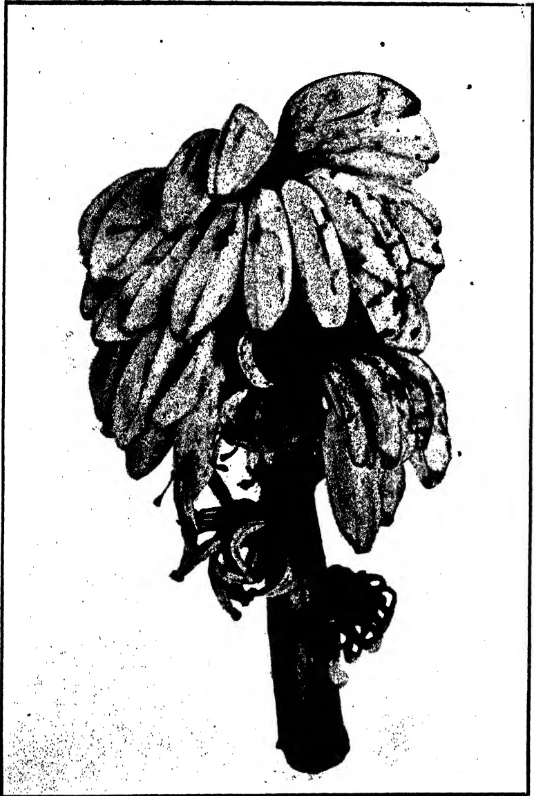A black and white photograph of a plantain fruit cluster. The cluster consists of several large, elongated, and somewhat wrinkled fruits hanging from a central stalk. The fruits are densely packed and show signs of disease, likely anthracnose, as indicated by the caption. The stalk is thick and dark, and the fruits are light-colored with dark, irregular spots and streaks.

*Photo by*

**Anthracnose of plantains.**

*L. S. Bertus.*

234------------------------------------------------

*Photo by*

*Dodder on Vigna.*

*L. S. Bertus.*

235------------------------------------------------

197

part of the fruit stalk on which the fungus may live saprophytically. All diseased fruits should be removed and burned immediately they are seen. Attempts should also be made to improve general sanitation by the removal and destruction of plant debris.

2. *Diseases of Cover Crops* : (a) *Mildew of Centrosema pubescens*.—A mildew of *Centrosema pubescens* caused by *Oidium* sp. was collected at Peradeniya. The morphological characters of the fungus were similar to those of *Oidium Heveæ* and it is possible that the pathogens are identical. Since the perfect stage of *Oidium* has never been found in Ceylon it is extremely difficult to ascertain definitely the relationships between the various species and this difficulty is enhanced by failure of artificial inoculations to reproduce the disease. It is unlikely that the presence of the mildew on the cover crop, even if it were identical with that which caused a disease of the rubber under which it was grown, would affect materially the incidence of the disease on the rubber. On the other hand, the presence of the mildew on the rubber, in the same circumstances, might affect the growth of the cover crop by offering an extensive source of infection.

(b) *Dodder on Vigna*.—The appearance of dodder (*Cuscuta chinensis*) on *Vigna* is worthy of mention. In a new rubber clearing in which there was a thick growth of *Vigna*, dodder was seen to have spread from *Mikania scandens* on the boundary and to be parasitizing the *Vigna*. Microscopical examination in the laboratory demonstrated that the parasite had penetrated the stems of the cover crops and was absorbing food therefrom in the usual manner, by means of haustoria. The effect of the parasite on the cover crop was not very marked, the level of attacked plants being somewhat below that of the surrounding healthy plants but of the normal green colour. An example of a typical affected area is shown in the accompanying illustration.

Although the damage caused by dodder on *Vigna* did not appear to be very great in the instance cited, it would be inadvisable to leave it untouched and if affected plants are collected and burned as soon as the parasite is observed control should be simple.

(c) *Rhizoctonia (Corticium) Solani*.—On most rubber estates on which *Vigna* (*Dolichos Hosei*) is grown as a cover crop the disease caused by *Rhizoctonia (Corticium) Solani* is of common occurrence. The appearance of the disease in more or less circular patches which increase in size is well known and needs no description. The disease is seasonal, the fungus being active only during wet weather when conditions are favourable for its growth, while its activity ceases with the advent of dry weather. After a spell of dry weather new growth of *Vigna*

236------------------------------------------------

198

sometimes takes place within diseased patches, but with the advent of wet conditions the sclerotia of the fungus germinate and this new growth is in turn attacked and killed. The inactivity of the fungus during dry weather sometimes leads to lack of appreciation of the importance of the disease, which should be treated as soon as possible after it appears. All diseased *Vigna*, together with a belt of three feet of apparently healthy plants from the periphery of the patch, should be burned together within the patch.

In this connection the occurrence of a disease of young bud shoots of *Hevea* is not without interest. *Vigna* was used to protect young bud-shoots from the sun. When the shoots had grown to a height of about one foot some of them died back. Examination showed that they had been attacked and killed at the base of the shoot just above the bud patch by *Rhizoctonia Solani*. It would appear that the fungus had spread from the *Vigna*, although the latter had not shown signs of disease when used.

*Dunbaria Heynei*, an indigenous legume which is being used with success as a cover crop in some areas, has been found to be attacked by *Rhizoctonia Solani*. The effect of the disease is similar to that on *Vigna* and similar control measures are advocated.

3. *Vermicularia Capsici Syd.*—A serious disease of chillies may occur if wet weather conditions set in after the fruit has set. The disease is known as *kaludanda rogaya* (black stem disease) by the Sinhalese cultivators and the name describes the symptoms. Infection may occur in the flowers or young fruits and extend backwards into the stem. The whole branch and finally the whole plant may become withered and diseased. The fungus which causes the disease is *Vermicularia Capsici* and the fructifications, which are minute black spore-masses or sporodochia, are borne copiously on diseased fruits and stems. Inoculations carried out with pure cultures of the fungus have proved that the fungus is capable of causing the disease.

In India the disease has been controlled by spraying with Bordeaux mixture. A single spraying has been shown to carry the crop through the critical period of a few weeks when rapid spread of the disease takes place.

4. *Mosaic Disease of Tobacco.*—The name mosaic disease is given to a disease of tobacco found apparently in every tobacco-growing country in the world and is derived from the mosaic-like mottling of diseased leaves. The disease occurs in Ceylon in the tobacco-growing districts in the North-Western, the Western and the Southern Provinces and, less commonly, in the Jaffna Peninsula.

237------------------------------------------------

199

The most characteristic symptom is a patch-work appearance of lighter and darker green areas on the leaf. The lighter areas lie between the lateral veins of the leaf, seldom reaching up to the latter. The darker areas may be of the normal green or of a darker green than the normal and are thicker than normal. The growth of the leaves is irregular, that of the lighter areas being relatively greater than that of the darker, with the result that the light areas are often bulged on the upper surface and hollow below, giving a crinkled appearance. The disease is most obvious in the younger leaves which are often dwarfed and considerably crinkled.

The cause of the disease is obscure and has been the subject of extensive investigations in the United States and elsewhere. It falls into that class of diseases known as virus diseases in which the causal agent does not fall into the category of any known form of life but, at the same time, has characteristics similar to those of other organisms. A minute drop of the sap expressed from a diseased plant when inoculated into a healthy plant causes the disease. This transference of contagious sap may take place under field conditions through the agency of man or insects. It has been shown that the mere rubbing of sap from an infected plant into a healthy leaf can cause the disease.

The prevention of the disease would appear to be impossible. In areas in which the disease occurs attempts should be made to reduce its conveyance. Seed from healthy plants only should be used. In operations such as topping, plants showing signs of the disease should not be topped at the same time as healthy plants. It has been shown in America that thorough washing of the hands after handling infected plants will prevent the spread of the disease by the hands. In transplanting, seedlings displaying symptoms of the disease should not be used. All plant debris which might prove to be a starting place for infection should be cleared away before planting.

Other solanaceous plants such as potatoes, tomatoes and chillies as well as wild plants of the same family are capable of spreading the disease.

5. *Citrus Canker*.—Citrus canker (*Pseudomonas Citri*) is a very troublesome disease of all citrus trees at low and medium elevations. It produces yellow brown corky excrescences on leaves and green stems which may develop into cankers and cause some defoliation. Infection is found commonly to follow attack by the leaf-mining caterpillar, *Phyllocnistis citrella*. Satisfactory control of this disease and of mildew (*Oidium tingitaninum*) has been obtained by spraying weekly with a 3 per cent. solution of *Sulfinette*, a proprietary lime-sulphur spraying fluid.

238------------------------------------------------

200

## A SOIL EROSION INVESTIGATION

A. W. R. JOACHIM, B.Sc., A.I.C.,

AGRICULTURAL CHEMIST,

DEPARTMENT OF AGRICULTURE, CEYLON,

AND

D. G. PANDITTESEKERE, DIP. AGR. (POONA),

ASST. IN AGRICULTURAL CHEMISTRY

**A**T the request of the Committee on Soil Erosion an investigation of a preliminary nature to determine the amounts of silt carried in the water of a Ceylon river at different seasons of the year was begun in August, 1929. The site chosen for the investigation was that part of the Mahaweli Ganga at Gangoruwa between the Experiment Station and the Royal Botanic Gardens, Peradeniya, where the river takes a bend. This site was chosen because of the facilities it afforded for the taking of samples, a boat and a ferry and labour being available at all times.

The breadth of the river at this point varied considerably during the period of the investigation, the range of variation being from about 200 to 300 feet. The depth of the river also varied at different periods and at different points of its cross-section from 2 to 20 feet, and to considerably greater depths during times of flood. The average depth during a year over the whole breadth of the river at this point may be considered to be about 4 feet. On the few occasions that depth soundings were taken, a plumb-line was used for the purpose.

It was originally intended to obtain samples of the water at the lower depths by a modification of the sampling apparatus used by Prof. W. N. Rae of the University College, Colombo, in his investigation on Colombo lake and harbour water, but owing to the great difficulty of keeping the boat steady while sampling, only surface and two feet depth samples were made and these by hand. The opportunity is taken to thank Prof. Rae for his valuable assistance in this matter. If any further investigations are to be carried out on this subject, the modified Rae method of sampling at lower depths will be adopted.

239------------------------------------------------

201

For the determination of the velocity of the water it was proposed to use a current meter, but again, owing to the difficulty of keeping the boat steady and as the velocity registered by the meter was reported to be very apt to exaggerate the true velocity of the stream, these determinations were made by means of a float. The velocities varied from 1 to 3 feet per second, with an average of about 2.5 feet per second. This velocity range may appear somewhat low, but as determinations could not be conveniently made at times of flood, it may be considered fairly representative.

In the table below are shown the results of the total solid determinations on the surface and two feet depth samples respectively, the surface velocity measurements, and the rainfall in the catchment areas on the two days prior to sampling and on the date of sampling. For these rainfall figures thanks are due to the Superintendent of the Colombo Observatory.

240------------------------------------------------

202

<table border="1">
<thead>
<tr>
<th>Date of sampling.</th>
<th>Locality of sample feet.</th>
<th>Depth of Locality.</th>
<th>Velocity. feet per second.</th>
<th>Parts per million.</th>
<th>Nature of sample.</th>
<th>Total Rainfall in catchment area. (inches).</th>
</tr>
</thead>
<tbody>
<tr>
<td>8-8-29</td>
<td>45 from R.B.G.</td>
<td>1 ft. 6 in.</td>
<td>2.0</td>
<td>69.0</td>
<td>Surface</td>
<td>6th-1.35; 7th-3.80; 8th-3.57.</td>
</tr>
<tr>
<td>17-9-29</td>
<td>35 "</td>
<td>2 ft. 4 in.</td>
<td>2.4</td>
<td>101.0</td>
<td>Surface</td>
<td>15th-25.80; 16th-10.94; 17th-7.58.</td>
</tr>
<tr>
<td>17-9-29</td>
<td>35 "</td>
<td>2 ft. 4 in.</td>
<td>2.4</td>
<td>94.2</td>
<td>2 ft. depth</td>
<td></td>
</tr>
<tr>
<td>17-9-29</td>
<td>75 "</td>
<td>6 ft. 0 in.</td>
<td>3.0</td>
<td>97.2</td>
<td>Surface</td>
<td></td>
</tr>
<tr>
<td>2-10-29</td>
<td>50 "</td>
<td>2 ft. 3 in.</td>
<td>2.4</td>
<td>91.4</td>
<td>Surface</td>
<td>30th-19.54; 1st-12.07; 2nd-6.32.</td>
</tr>
<tr>
<td>2-10-29</td>
<td>50 "</td>
<td>2 ft. 3 in.</td>
<td>2.4</td>
<td>94.2</td>
<td>2 ft. depth</td>
<td></td>
</tr>
<tr>
<td>2-10-29</td>
<td>50 "</td>
<td>6 ft. 9 in.</td>
<td>2.7</td>
<td>91.8</td>
<td>Surface</td>
<td></td>
</tr>
<tr>
<td>30-10-29</td>
<td>50 "</td>
<td>2 ft. 1 in.</td>
<td>2.0</td>
<td>153.0</td>
<td>Surface</td>
<td>28th-6.69; 29th-10.32; 30th-7.94.</td>
</tr>
<tr>
<td>30-10-29</td>
<td>50 "</td>
<td>2 ft. 1 in.</td>
<td>2.0</td>
<td>158.0</td>
<td>2 ft. depth</td>
<td></td>
</tr>
<tr>
<td>30-10-29</td>
<td>50 "</td>
<td>4 ft. 2 in.</td>
<td>2.4</td>
<td>187.4</td>
<td>Surface</td>
<td></td>
</tr>
<tr>
<td>16-11-29</td>
<td>25 "</td>
<td>4 ft. 2 in.</td>
<td>3.0</td>
<td>350.6</td>
<td>Surface</td>
<td>14th-7.68; 15th-26.73; 16th-15.89.</td>
</tr>
<tr>
<td>16-11-29</td>
<td>25 "</td>
<td>4 ft. 2 in.</td>
<td>3.0</td>
<td>371.0</td>
<td>2 ft. depth</td>
<td></td>
</tr>
<tr>
<td>16-11-29</td>
<td>10 "</td>
<td>10 ft. 3 in.</td>
<td>1.7</td>
<td>331.6</td>
<td>Surface</td>
<td></td>
</tr>
<tr>
<td>5-12-29</td>
<td>25 "</td>
<td>2 ft. 11 in.</td>
<td>2.5</td>
<td>286.0</td>
<td>Surface</td>
<td>3rd-5.75; 4th-34.49; 5th-3.01.</td>
</tr>
<tr>
<td>5-12-29</td>
<td>25 "</td>
<td>2 ft. 11 in.</td>
<td>2.5</td>
<td>321.2</td>
<td>2 ft. depth</td>
<td></td>
</tr>
<tr>
<td>5-12-29</td>
<td>15 "</td>
<td>11 ft. 6 in.</td>
<td>1.8</td>
<td>327.2</td>
<td>Surface</td>
<td></td>
</tr>
<tr>
<td>9-1-30</td>
<td>50 "</td>
<td>3 ft. 6 in.</td>
<td>2.4</td>
<td>91.2</td>
<td>Surface</td>
<td>7/8th-7.10; 8/9th-1.40; 9/10th-1.41.</td>
</tr>
<tr>
<td>9-1-30</td>
<td>50 "</td>
<td>3 ft. 6 in.</td>
<td>2.4</td>
<td>92.6</td>
<td>2 ft. depth</td>
<td></td>
</tr>
<tr>
<td>9-1-30</td>
<td>10 "</td>
<td>9 ft. 0 in.</td>
<td>1.5</td>
<td>96.0</td>
<td>Surface</td>
<td>15/16th-2.66; 16/17th-17.44; 17/18th-12.48.</td>
</tr>
<tr>
<td>17-1-30</td>
<td>75 "</td>
<td>3 ft. 9 in.</td>
<td>3.0</td>
<td>240.0</td>
<td>Surface</td>
<td></td>
</tr>
<tr>
<td>17-1-30</td>
<td>75 "</td>
<td>3 ft. 9 in.</td>
<td>3.0</td>
<td>246.2</td>
<td>2 ft. depth</td>
<td></td>
</tr>
<tr>
<td>17-1-30</td>
<td>50 "</td>
<td>5 ft. 0 in.</td>
<td>2.7</td>
<td>214.0</td>
<td>Surface</td>
<td></td>
</tr>
<tr>
<td>28-1-30</td>
<td>50 "</td>
<td>2 ft. 2 in.</td>
<td>1.2</td>
<td>57.8</td>
<td>Surface</td>
<td>26 27th-nil; 27 28th-nil; 28 29th-03.</td>
</tr>
<tr>
<td>28-1-30</td>
<td>50 "</td>
<td>2 ft. 2 in.</td>
<td>1.2</td>
<td>57.8</td>
<td>2 ft. depth</td>
<td></td>
</tr>
<tr>
<td>28-1-30</td>
<td>10 "</td>
<td>4 ft. 10 in.</td>
<td>3.0</td>
<td>69.4</td>
<td>Surface</td>
<td></td>
</tr>
</tbody>
</table>

241------------------------------------------------

203

An examination of the table will show that the amounts of silt vary from 57.8 or nearly 60 to 370 parts per million of water by weight up to a depth of two feet. This works out at from .6 to 3.7 lb. of silt in 1000 gallons of water. The data obtained clearly indicate that there is a close parallelism between the rainfall in the catchment area up-country a day or two prior to sampling, and the amount of silt in the river water at Gangoruwa at the date of sampling. In other words, the greater the rainfall in this area, the greater is the amount of soil erosion and hence the larger the quantities of silt found in the river water. It will also be noted that the amounts of silt vary appreciably at different points of the cross-section of the river, as also do the velocities. As is to be expected, the amounts of silt in the water increase with depth. It has also been observed that, owing to the comparatively low velocity of the river at this point except after periods of continuous steady rain, the amount of silt in the water falls to a comparatively low level a day or two after the cessation of the rains.

The velocity of the water varies from 1.5 to 3.0 feet per second, with an average of about 2.5 feet per second. The depth of the river at the periods of sampling varied from 1 ft. 6 in. to 11 ft. 6 in. Reckoning on an average velocity of 2.5 per second, an average depth of 4 feet and a breadth of 250 feet at this point of the river, the average amount of water flowing at this point will be 2,500 c. ft. per second or over 15,000 gallons per second and the amount of silt carried in the water at this point of the river will therefore vary from 9.4 to 58 lb. per second or from about 130,000 to 820,000 tons per annum. These figures, it will be understood, will vary considerably each year for the different rivers at different periods of the year, and for the same river at different points in its course, but they give an idea as to the vast amounts of valuable silt that may be lost by erosion from the soils of the hill country of Ceylon.

In order to obtain a rough estimate of the amounts of silt actually lost from Ceylon soils, it will be necessary to carry out an investigation such as this over the entire period of at least one year at the mouth of each of the rivers of the island which have their sources in the wet hilly districts. An investigation such as this could include in its scope the determination of the amounts of plant fertilising constituents contained in the water and in the suspended matter of Ceylon rivers. Such an investigation will repay any labour, time and money spent on it, as it would be possible by this means to ascertain whether the universal adoption of the measures recommended for the prevention of soil erosion is achieving the object aimed at, viz., the prevention of the washing away of valuable soil constituents from the country into the sea.

242------------------------------------------------

204

## TAPPING TO DEATH: A WARNING

T. H. HOLLAND, DIP. AGRIC. (WYE),  
MANAGER, EXPERIMENT STATION, PERADENIYA

**T**HE question of the rejuvenation of old rubber is now engaging the serious attention of some Ceylon estates. Before cutting out the old rubber preparatory to replanting with superior material the estate naturally wishes to obtain the maximum yield in the time available.

An experiment in the rejuvenation of old rubber was laid down on the Experiment Station, Peradeniya in 1929, and was fully described in the progress report of the station for September and October, 1929, which was published in *The Tropical Agriculturist* of December of that year. The area used in the experiment is divided into four plots. In the first three plots the trees are tapped daily to the wood on two cuts on the half circumference one above the other. The only difference is in the bark consumption; in plot 1 the bark consumption is arranged to allow all the available bark to be used up in one year, in plot 2 in two years, and in plot 3 in three years. In plot 4 the bark consumption is arranged for the bark to be used up in four years, but in this plot tapping is done daily in alternate months and with close tapping, but not to the wood. Such a system has been shown by another experiment to produce approximately the same yield as continuous alternate day tapping, but is probably rather more conducive to brown bast.

It soon became apparent that a number of cuts in plots 1, 2 and 3 were going dry. When this occurred a fresh cut (not quite to the wood to avoid ringing the tree) was made on the other side of the tree. The experiment started on September 1st, 1929, and four months later the position was as follows:

### Percentage of cuts gone dry

<table>
<tbody>
<tr>
<td>Plot 1</td>
<td>...</td>
<td>...</td>
<td>23.5</td>
</tr>
<tr>
<td>Plot 2</td>
<td>...</td>
<td>...</td>
<td>20.0</td>
</tr>
<tr>
<td>Plot 3</td>
<td>...</td>
<td>...</td>
<td>23.2</td>
</tr>
<tr>
<td>Plot 4</td>
<td>...</td>
<td>...</td>
<td>1.2</td>
</tr>
</tbody>
</table>

Out of a total of 159 cuts gone dry, 71 were upper cuts and 88 lower cuts. This fact appears to counter the suggestion that the upper cuts have gone dry because of the severing of communications by the lower cut. Doubts have also been cast on the actual presence of brown bast in these cuts. This point seems immaterial. If the cuts are dry they are useless, whatever the cause.

243------------------------------------------------

205

For the first four months of the experiment the yields per tree have been as follows:

<table>
<thead>
<tr>
<th></th>
<th></th>
<th></th>
<th>lb.</th>
<th>oz.</th>
</tr>
</thead>
<tbody>
<tr>
<td>Plot 1</td>
<td>...</td>
<td>...</td>
<td>6</td>
<td>14</td>
</tr>
<tr>
<td>Plot 2</td>
<td>...</td>
<td>...</td>
<td>7</td>
<td>4</td>
</tr>
<tr>
<td>Plot 3</td>
<td>...</td>
<td>...</td>
<td>7</td>
<td>11</td>
</tr>
<tr>
<td>Plot 4</td>
<td>...</td>
<td>...</td>
<td>6</td>
<td>5</td>
</tr>
</tbody>
</table>

In plot 4 the cuts receive only half the number of tappings that those in plots 1, 2 and 3 receive, but only one cut has gone dry and the yield per tree is very little below that of the other three plots.

It is necessary to consider the two other factors involved, besides that of frequency of tapping, viz., bark consumption, and whether the trees are tapped to the wood or not. There appears to be little evidence to show that the difference in the amount of bark consumed in plots 1, 2 and 3 has affected either the percentage of cuts that have gone dry or the yield.

As regards tapping to the wood there is other evidence on the Experiment Station. A hundred trees in another block were tapped to the wood on alternate days for a period of one year. The average yield of the trees showed an increase of approximately 25 per cent. over the average of the three previous years and the brown bast incidence was negligible. It would therefore appear that tapping to the wood does not of itself cause brown bast.

In another experiment carried out on the station two cuts *one on each side of the tree* were tapped daily, not to the wood. In this case the incidence of brown bast (or drying up of cuts) was as heavy as in the present instance. This tends to show that the fact of the two cuts being one above the other does not materially affect the issue. The cause then of this rapid and serious drying up of cuts can only be ascribed to daily tapping, and this brief note is written as a warning to those undertaking similar work. There is every likelihood that the yields of plots 1, 2 and 3 will progressively decline as more and more cuts go dry while there is no reason to suppose that the yield of plot 4 will not be maintained.

It is doubtful therefore if daily tapping can be economically employed in tapping to death except for a very short period.

244------------------------------------------------

206

## PHAIUS WALLICHII LINDL.

K. J. ALEX SYLVA, F.R.H.S.,

ASSISTANT CURATOR,

HENERATGODA BOTANIC GARDENS

**T**HE specimen of *Phaius Wallichii* represented in the accompanying photograph is one of the few terrestrial orchids that decorate our hill country pastures and forests.

Owing to its easy culture, pretty foliage and lasting flowers it occupies a well-merited and prominent place either in a room or verandah as a decorative plant. *Phaius Wallichii* is indigenous to Ceylon, Indiá, Burma and Malaya and has become a favourite pot plant owing to its striking appearance and its large lanceolate leaves of 2 to 3 ft. long. The flowers are borne on a long scape which arises from the side of the pseudo-bulbs. The flowers are 3 to 4 inches crosswise and they last for over six weeks. The sepals and petals are lance-shaped and of a creamy white colour on the outside and orange-yellow flushed with reddish-purple on the inner side. The lip is white and more or less suffused with pink except in the throat where it is of a brownish-purple. It is pointed at the apex and has a crisp margin.

The flowers appear twice a year and last for over six weeks. The period of flowering varies at different altitudes.

*Culture.*—The propagation of the plant is easily effected by the division of the rootstock or pseudo-bulbs. The stem and flower stalks of the plant may be employed for the same purpose in the form of cuttings 3 to 4 inches long, each containing at least two nodes or joints. Plants raised by the latter process take a longer period to come into bloom than plants grown from the pseudo-bulbs. The pseudo-bulb, with or without a lead, when used for planting should be cleaned of all dead roots and other decayed parts and placed about a couple of inches below the surface in a compost of equal parts of loam, leaf-mould, bits of charcoal, well-decomposed cow manure and coarse sand. The cuttings need a soil rich in humus and of a porous nature to enable them to strike. River sand and leaf-mould are useful for the purpose. In both cases, the pots in which the plants are to be grown should have good drainage and should be cleaned well. After potting the plants should be kept in shade under a tree for a few days and watered sparingly till the plants show new growth. The plants will need liberal watering both morning and afternoon during active growth and care should be taken not to wet the new shoots. During active growth, the plants prefer a warm humid atmosphere and in this state they will come into bloom in about six months.

245------------------------------------------------

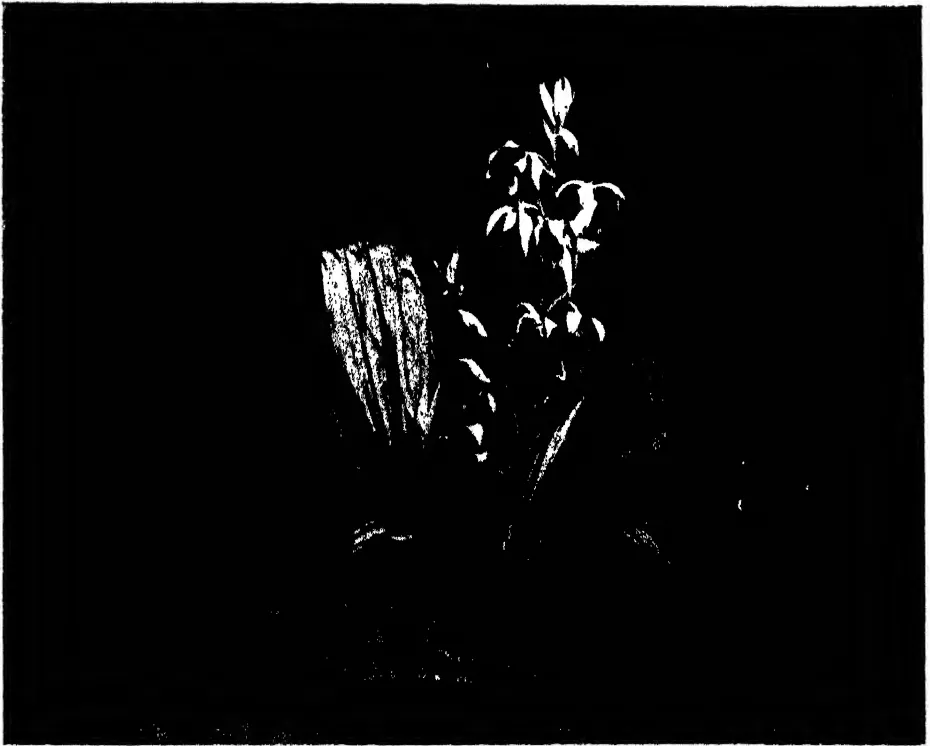A high-contrast, black and white photograph of a plant, likely Phainus Wallichii. The image is set against a solid black background. The plant features a cluster of broad, lanceolate leaves on the left, showing prominent parallel venation. To the right, a central stalk rises, bearing several small, light-colored, oval-shaped flowers or buds. The lighting is dramatic, highlighting the textures of the leaves and the delicate structure of the flowers.

*Phainus Wallichii* Lindl.

246------------------------------------------------

A completely blank white page with no visible content, text, or markings.

247------------------------------------------------

207

## CONTRIBUTIONS FROM THE RUBBER RESEARCH SCHEME, CEYLON

### THE REPLANTING AND REJUVENATION OF OLD RUBBER AREAS

R. A. TAYLOR, B. SC.,  
PHYSIOLOGICAL BOTANIST,  
RUBBER RESEARCH SCHEME, (CEYLON)

*The outlook in brief.*—The low market prices for crude rubber prevailing recently have shown unmistakably to all that a number of our present estates will, in all probability, within the next decade be unable to compete with the younger properties which have been planted up with selected high-yielding material. The coming into bearing of these modern plantations will render available quantities of rubber at a price which will encourage its use in many ways at present scarcely contemplated or, at most, only experimented with. Road-making may be a case in point. It is improbable that the price of the raw material will be stabilized at any very low figure but, it seems safe to say that the opening up of high-yielding areas will very considerably reduce the average price of the commodity. Large dividends may continue to be paid, but they will be the perquisite of high-yielding estates with the resultant low cost of production. Should such a situation eventuate, our poorer estates will be faced with the choice of replanting or abandoning.

The intention of the writer is not to suggest that every estate should start replanting now but to point out some ways in which preparations can be made against the time when such action may become necessary, and naturally these remarks are intended principally for low-yielding properties with no jungle reserve.

*The need for carefully thought-out experiment.*—Judging from enquiries received and by the number of estates which are starting to replant small areas, the question is receiving due consideration in certain quarters. A number of so-called experiments on replanting are being started now but unfortunately with little thought to the economics of the operation. Only in a few instances, for example, has any attempt been made to realise any of the capital invested in the old trees. In the writer's opinion, the cutting out of these trees without first "bleeding them white" amounts to a breach of trust. Their

248------------------------------------------------

208

removal and replacement by high-yielding strains presents no real difficulty, and this part of the operation resembles to a large extent the opening of a new clearing. Where experiment is really required is in the method of overtapping to be adopted so that the maximum yield can be obtained from the old trees before removal. The actual costs of the operation as a whole cannot be properly estimated unless this is known. Any future programme drawn up will be based on the experience gained and the expenses incurred during these trials.

Further, most of the estates which are starting their experiments have no proved bud-wood growing on their properties. One or two years' heavy tapping before removal would allow time for the multiplication of the bud-wood required and the budding of the young plants to be put out, thus effecting a considerable saving on original outlay on planting material.

*Replanting or rejuvenation.*—Some distinction should be drawn between these two terms. The complete removal of all trees and subsequent replacement should be termed replanting, whereas rejuvenation of an area can be taken to mean the removal and replacement of all poor or medium trees, and the retention of the best.

Rejuvenation may prove preferable in certain cases but it is considered inadvisable to leave more than 10 per cent. of the previous stand and no tree yielding less than 10 lb. of dry rubber per annum. The retention of a larger percentage introduces competition between the old and young trees for light and ground space and may well lead to disappointment.

The present note is written on the assumption that replanting is the better method for the areas likely to be treated in the near future, and no trees other than exceptional yielders or mother-trees will be left.

*Overtapping prior to removal of old trees.*—On most estates there is sufficient bark of tappable thickness to permit of the tapping of a cut on both sides of the trees (on alternate days) for a period of at least two if not three years. This tapping of both cuts to the normal depth will produce at least one and a half times as much latex as the tapping of one cut. Thus in three years a yield equal to that normally obtained in four and a half years is obtained. If, during this tapping, the bottom nine inches or so of the trunk is avoided, there will remain bark sufficient for one year's heavy tapping on the highest-yielding portion of the tree. Thus the fourth year, that is the year before removal of the trees, should yield a much increased crop, and, if thick shavings are taken and subsidiary cuts put in, wherever there is bark within

249------------------------------------------------

209

reach, the yield of the fourth year can be expected to be equal to two and a half times the previous yield of the area. In four years, therefore, extra crop equivalent to the return from three normal years' tapping can be obtained, the extra revenue from which will considerably reduce the cost of the operation or, alternatively, go a certain way to compensate for loss of crop during the period when the young rubber is reaching maturity.

It is not suggested that the above scheme will prove the best but it would appear to be a suitable starting point for experiment. It may be necessary in some cases to reduce the period of overtapping to a total of three or even two years.

Table 1 gives the tapping arrangements and table 2 the expectation of crop over the period of overtapping. In these tables it is assumed that an area is being replanted on a ten-year basis, one-tenth of the area being cleared each year. The unit of yield represents the yield which would be obtained from that area under normal tapping conditions.

Table 1.

<table border="1">
<thead>
<tr>
<th>Plots</th>
<th>...</th>
<th>1</th>
<th>2</th>
<th>3</th>
<th>4</th>
<th>5</th>
<th>6</th>
<th>7</th>
<th>8</th>
<th>9</th>
<th>10</th>
</tr>
</thead>
<tbody>
<tr>
<td>1930</td>
<td>...</td>
<td>x</td>
<td>n</td>
<td>n</td>
<td>n</td>
<td>n</td>
<td>n</td>
<td>n</td>
<td>n</td>
<td>n</td>
<td>n</td>
</tr>
<tr>
<td>1931</td>
<td>...</td>
<td>x</td>
<td>x</td>
<td>n</td>
<td>n</td>
<td>n</td>
<td>n</td>
<td>n</td>
<td>n</td>
<td>n</td>
<td>n</td>
</tr>
<tr>
<td>1932</td>
<td>...</td>
<td>x</td>
<td>x</td>
<td>x</td>
<td>n</td>
<td>n</td>
<td>n</td>
<td>n</td>
<td>n</td>
<td>n</td>
<td>n</td>
</tr>
<tr>
<td>1933</td>
<td>...</td>
<td>=</td>
<td>x</td>
<td>x</td>
<td>x</td>
<td>n</td>
<td>n</td>
<td>n</td>
<td>n</td>
<td>n</td>
<td>n</td>
</tr>
<tr>
<td>1934</td>
<td>...</td>
<td>0</td>
<td>=</td>
<td>x</td>
<td>x</td>
<td>x</td>
<td>n</td>
<td>n</td>
<td>n</td>
<td>n</td>
<td>n</td>
</tr>
<tr>
<td>1935</td>
<td>...</td>
<td></td>
<td>0</td>
<td>=</td>
<td>x</td>
<td>x</td>
<td>x</td>
<td>n</td>
<td>n</td>
<td>n</td>
<td>n</td>
</tr>
<tr>
<td>1936</td>
<td>...</td>
<td></td>
<td></td>
<td>0</td>
<td>=</td>
<td>x</td>
<td>x</td>
<td>x</td>
<td>n</td>
<td>n</td>
<td>n</td>
</tr>
<tr>
<td>1937</td>
<td>...</td>
<td></td>
<td></td>
<td></td>
<td>0</td>
<td>=</td>
<td>x</td>
<td>x</td>
<td>x</td>
<td>n</td>
<td>n</td>
</tr>
<tr>
<td>1938</td>
<td>...</td>
<td></td>
<td></td>
<td></td>
<td></td>
<td>0</td>
<td>=</td>
<td>x</td>
<td>x</td>
<td>x</td>
<td>n</td>
</tr>
<tr>
<td>1939</td>
<td>...</td>
<td></td>
<td></td>
<td></td>
<td></td>
<td></td>
<td>0</td>
<td>=</td>
<td>x</td>
<td>x</td>
<td>x</td>
</tr>
<tr>
<td>1940</td>
<td>...</td>
<td></td>
<td></td>
<td></td>
<td></td>
<td></td>
<td></td>
<td>0</td>
<td>=</td>
<td>x</td>
<td>x</td>
</tr>
<tr>
<td>1941</td>
<td>...</td>
<td></td>
<td></td>
<td></td>
<td></td>
<td></td>
<td></td>
<td></td>
<td>0</td>
<td>=</td>
<td>x</td>
</tr>
<tr>
<td>1942</td>
<td>...</td>
<td></td>
<td></td>
<td></td>
<td></td>
<td></td>
<td></td>
<td></td>
<td></td>
<td>0</td>
<td>=</td>
</tr>
<tr>
<td>1943</td>
<td>...</td>
<td></td>
<td></td>
<td></td>
<td></td>
<td></td>
<td></td>
<td></td>
<td></td>
<td></td>
<td>0</td>
</tr>
</tbody>
</table>

n=tapped normally.

x=tapped both sides to normal depth.

= =final tapping.

0=trees cut out.

250------------------------------------------------

210Table 2

<table border="1">
<thead>
<tr>
<th>Plots</th>
<th>...</th>
<th>1</th>
<th>2</th>
<th>3</th>
<th>4</th>
<th>5</th>
<th>6</th>
<th>7</th>
<th>8</th>
<th>9</th>
<th>10</th>
</tr>
</thead>
<tbody>
<tr>
<td>1930</td>
<td>...</td>
<td>1.5</td>
<td>1</td>
<td>1</td>
<td>1</td>
<td>1</td>
<td>1</td>
<td>1</td>
<td>1</td>
<td>1</td>
<td>1</td>
</tr>
<tr>
<td>1931</td>
<td>...</td>
<td>1.5</td>
<td>1.5</td>
<td>1</td>
<td>1</td>
<td>1</td>
<td>1</td>
<td>1</td>
<td>1</td>
<td>1</td>
<td>1</td>
</tr>
<tr>
<td>1932</td>
<td>...</td>
<td>1.5</td>
<td>1.5</td>
<td>1.5</td>
<td>1</td>
<td>1</td>
<td>1</td>
<td>1</td>
<td>1</td>
<td>1</td>
<td>1</td>
</tr>
<tr>
<td>1933</td>
<td>...</td>
<td>2.5</td>
<td>1.5</td>
<td>1.5</td>
<td>1.5</td>
<td>1</td>
<td>1</td>
<td>1</td>
<td>1</td>
<td>1</td>
<td>1</td>
</tr>
<tr>
<td>1934</td>
<td>...</td>
<td></td>
<td>2.5</td>
<td>1.5</td>
<td>1.5</td>
<td>1.5</td>
<td>1</td>
<td>1</td>
<td>1</td>
<td>1</td>
<td>1</td>
</tr>
<tr>
<td>1935</td>
<td>...</td>
<td></td>
<td></td>
<td>2.5</td>
<td>1.5</td>
<td>1.5</td>
<td>1.5</td>
<td>1</td>
<td>1</td>
<td>1</td>
<td>1</td>
</tr>
<tr>
<td>1936</td>
<td>...</td>
<td></td>
<td></td>
<td></td>
<td>2.5</td>
<td>1.5</td>
<td>1.5</td>
<td>1.5</td>
<td>1</td>
<td>1</td>
<td>1</td>
</tr>
<tr>
<td>1937</td>
<td>...</td>
<td></td>
<td></td>
<td></td>
<td></td>
<td>2.5</td>
<td>1.5</td>
<td>1.5</td>
<td>1.5</td>
<td>1.5</td>
<td>1</td>
</tr>
<tr>
<td>1938</td>
<td>...</td>
<td></td>
<td></td>
<td></td>
<td></td>
<td></td>
<td>2.5</td>
<td>1.5</td>
<td>1.5</td>
<td>1.5</td>
<td>1</td>
</tr>
<tr>
<td>1939</td>
<td>...</td>
<td></td>
<td></td>
<td></td>
<td></td>
<td></td>
<td></td>
<td>2.5</td>
<td>1.5</td>
<td>1.5</td>
<td>1.5</td>
</tr>
<tr>
<td>1940</td>
<td>...</td>
<td></td>
<td></td>
<td></td>
<td></td>
<td></td>
<td></td>
<td></td>
<td>2.5</td>
<td>1.5</td>
<td>1.5</td>
</tr>
<tr>
<td>1941</td>
<td>...</td>
<td></td>
<td></td>
<td></td>
<td></td>
<td></td>
<td></td>
<td></td>
<td></td>
<td>2.5</td>
<td>1.5</td>
</tr>
<tr>
<td>1942</td>
<td>...</td>
<td></td>
<td></td>
<td></td>
<td></td>
<td></td>
<td></td>
<td></td>
<td></td>
<td></td>
<td>2.5</td>
</tr>
</tbody>
</table>

*The removal of the trees.*—This should be thorough, but, in the opinion of the writer, not more than Rs. 200 per acre need be spent on this item unless it is known that root disease is prevalent. Mention has been made of Rs. 450 per acre as being the minimum cost of efficient clearing but it seems inconceivable that the risk of *Fomes* infection warrants the expenditure of the extra Rs. 250 or, alternatively, it is scarcely within the bounds of possibility that necessary control measures, should *Fomes* break out, will cost an average of Rs. 250 an acre. Several blocks have been efficiently cleared at a cost much lower than Rs. 200 per acre.

The actual method of removal will vary with conditions and it may be carried out by the agency of elephants or monkey grubbers or by hand according to which is most convenient or least expensive. The time of removal should be just after the new year's leaf has been put on. This provides a double crop of leaf for soil enrichment purposes. This point will be mentioned again later.

*Disposal of the timber.*—This again will depend on conditions and situation. Where the block is adjacent to a road or canal the timber might sell on the ground at Re. 1.00 per yard before being cut up, and at least that figure should be obtainable for firewood already cut. In some instances it may be possible to obtain the services of a contractor who will remove the trees and side roots in exchange for the firewood obtained. If there is no market for firewood the timber may have to be burned on the land. In such cases burning should be localised so that the

251------------------------------------------------

211

soil is depleted of the remaining humus to as small an extent as possible. If holes or contour trenches have been cut before felling, the logs should be burned over these so that all ash is caught.

It has been suggested elsewhere (The problem of survival—replanting and supplying considerations, by G. F. S. Sutton, *India-Rubber Journal*, Oct. 12, 1929) that the timber be converted into charcoal and stored in that form for future use in suction gas engines. It is there stated that, where, extensive replanting is being done, it would even pay to scrap existing power installations and put in gas engines, as this fuel is four and a half times as cheap as crude oil. From another source the suggestion emanates that the charcoal might be made into dust and the dust made into briquettes with low grade tapioca flour, in which state it will keep much longer. Such considerations are not in the sphere of the present writer but are included so that this note may be reasonably complete.

*Reopening of the land.*—Except on the flattest of land it is considered that some form or other of contour planting should be adopted. Also as much of the holing, trenching or silt-pitting as possible should be done before the removal of the old trees. The holes, etc. can then be at least partially filled with the leaf from the trees. None of this leaf should be burned; it is valuable for the reconditioning of the soil. Two years' leaf will be available if felling is carried out just after refoliation, and a handful of cyanamide in each hole along with the green matter will help to form a useful compost.

Where funds permit, the adoption of the Denham Till method of contour trenches is recommended. As this method of opening has been fully dealt with already in *The Tropical Agriculturist* there is little object in going into details. Considerable lengths of these trenches can be cut before the old trees are removed and they provide convenient places for the burying of any green material available.

If trenching is not to be carried out contour terracing may be possible and in this case as many as possible of the large planting holes, at least 3 ft. cube, should be cut before the felling. These will naturally follow the contours of the hill and so permit later of the cutting of the terraces, if this has not also been possible to a certain extent before clearing.

Even if neither system is possible, planting should be done on the contour so as to permit of the subsequent planting of contour hedges of some leguminous plant to stop wash. The opening of silt-pits or the building of stone terraces is also facilitated by such a procedure. In certain cases it may be possible to convert the existing drains to the lock and step or similar system.

252------------------------------------------------

212

*Reconditioning of the soil, cover crops, etc.*—The establishment of cover crops should be one of the first considerations. Seed should be put in just after the trees are removed, while the soil is still loose. Any *Vigna* torn up during felling and uprooting should be put in the planting holes.

A mixture of leguminous plants should be used so that a heavy cover is obtained without delay. As cover plants *Dolichos hosei* (*Vigna*), *Calopogonium mucunoides*, *Centrosema pubescens* and *Centrosema plumieri* can be all used together or a selection made. If, previously, *Vigna* has grown satisfactorily this may suffice alone. The above, however, are almost entirely ground covers; their chief function is to prevent wash, and the greatest need of our average soil is an increase in the humus content. This is best brought about by growing some of the taller legumes, frequently distinguished as green manures. *Tephrosia candida*, the *Crotalarias*, *Indigofera arrecta*, *Desmodium gyrroides*, *Clitoria cajanifolia* can be used. They should be put in as contour belts. There is no reason why, for a year or two, the areas between the contour rows of young rubber should not resemble a dense "cheddy" growth of the taller legumes. Only in this way and by frequent lopping and burying of the loppings will the soil gradually resume its earlier fertility. There is no objection to growing *Gliricidias* or *Leucana glauca* here as well; besides providing material for burying they serve as protection from wind and as light shade.

Where the contour trenches are employed all the material from the earlier prunings can be accommodated in these as it is usual to fill up, in the first instance, only the parts which are to be occupied by plants. The intervening portions provide excellent places for cheap burying, and the material is exactly where it can be made use by the extending root systems of the young plants. The addition of a little cyanamide, or a cyanamide-phosphate mixture, to the trenches at the same time as the green matter is buried hastens decomposition and renders the material more readily available.

*Wind breaks.*—It is well before cutting out old rubber to study the direction of the monsoon winds and it may be necessary or advisable to leave belts of the old trees as temporary wind breaks. Such belts can be replaced if desired by *Albizzias* or *Grevilleas* but these take some time to grow, and it is in the earlier years that the need of shelter is felt. If *Albizzias* are not left for more than five or six years there should be little danger of propagation of root disease after their removal. The growing of *Albizzias* as permanent wind breaks is not advised; sooner or later they must be removed and this is a costly operation and attended with considerable danger to the neighbouring rubber trees.

253------------------------------------------------

213

*Replanting material.*—The use of proved clones of budded rubber is advised where a large area is being replanted. Real selected seed is not condemned, but this is very scarce in Ceylon, and is likely to remain so for some time.

Apart, however, from proved clones bud-wood may be used from local high-yielders, but the use of such material must be considered experimental, and no large area should be planted up from any one tree. Fifty to one hundred plants are sufficient to bud from any such source. The planting up of this quantity is, however, strongly advised, as it is only in this way that new high-yielding clones will be discovered.

It is the opinion of the writer that, whatever the material used for replanting, each clone should be kept separate and not mixed up, even systematically. The reason for this is that, in all probability, different clones will have to be tapped in different ways to give of their best. Clone A may respond well on alternate-day tapping, Clone B probably can only stand third-day tapping. Again, Clone C may respond best when tapped at a height of 5 feet in all probability necessitating the return to use of the old draw knife. It will be impossible to get the best out of all members of a mixed population by a single method of tapping.

As only very small blocks are to be planted up with unproved material, the planting up of a mixture of clones with a view to future thinning out need not, it is thought, be considered.

*Bud-wood nurseries.*—The laying down of bud-wood nurseries is fully described in a booklet entitled *The budding of rubber* which will be issued at an early date by the Rubber Research Scheme, and this should be consulted. It is strongly advised, however, that every estate, or at least every company, should possess a bud-wood nursery containing material from all the best proved clones available.

*Supply nurseries.*—The writer's opinion is that all budding is best done in the nursery, with subsequent planting out while the buds are still in the dormant state. Budding can be carried out practically throughout the year in a nursery, so that material is available to take advantage of good planting weather. Full details as to laying down nurseries, etc. are given in the booklet mentioned in the last paragraph.

*A tentative programme.*—It is assumed that the area to be replanted is yielding 300 lb. per acre and that by replanting a yield of 1000 lb. per acre can be obtained. The programme is spread over ten years and for reasons of simplicity it is assumed that 10 acres are being treated at the rate of one acre a year. This facilitates easy calculation for larger areas.

254------------------------------------------------

214

Should it be found that four years' heavy tapping is too much, calculations similar to those given below can be made to show expectation of crop, etc.

*Time-table*

The one-acre blocks are labelled ABC.....J.

<table border="1">
<thead>
<tr>
<th>Year</th>
<th>Tapping both sides</th>
<th>Final tapping</th>
<th>Cut out</th>
<th>Bud-wood nursery</th>
<th>Plant supply nursery</th>
<th>Budding</th>
<th>Plant out</th>
</tr>
</thead>
<tbody>
<tr>
<td>1930</td>
<td>A</td>
<td></td>
<td></td>
<td>Plant</td>
<td></td>
<td></td>
<td></td>
</tr>
<tr>
<td>1931</td>
<td>AB</td>
<td></td>
<td></td>
<td>Bud</td>
<td>For A</td>
<td></td>
<td></td>
</tr>
<tr>
<td>1932</td>
<td>ABC</td>
<td></td>
<td></td>
<td>Bud</td>
<td>„ B</td>
<td></td>
<td></td>
</tr>
<tr>
<td>1933</td>
<td>BCD</td>
<td>A</td>
<td></td>
<td></td>
<td>„ C</td>
<td>For A</td>
<td></td>
</tr>
<tr>
<td>1934</td>
<td>CDE</td>
<td>B</td>
<td>A</td>
<td></td>
<td>„ D</td>
<td>„ B</td>
<td>A</td>
</tr>
<tr>
<td>1935</td>
<td>DEF</td>
<td>C</td>
<td>B</td>
<td></td>
<td>„ E</td>
<td>„ C</td>
<td>B</td>
</tr>
<tr>
<td>1936</td>
<td>EFG</td>
<td>D</td>
<td>C</td>
<td></td>
<td>„ F</td>
<td>„ D</td>
<td>C</td>
</tr>
<tr>
<td>1937</td>
<td>FGH</td>
<td>E</td>
<td>D</td>
<td></td>
<td>„ G</td>
<td>„ E</td>
<td>D</td>
</tr>
<tr>
<td>1938</td>
<td>GHI</td>
<td>F</td>
<td>E</td>
<td></td>
<td>„ H</td>
<td>„ F</td>
<td>E</td>
</tr>
<tr>
<td>1939</td>
<td>HIJ</td>
<td>G</td>
<td>F</td>
<td></td>
<td>„ I</td>
<td>„ G</td>
<td>F</td>
</tr>
<tr>
<td>1940</td>
<td>IJ</td>
<td>H</td>
<td>G</td>
<td></td>
<td>„ J</td>
<td>„ H</td>
<td>G</td>
</tr>
<tr>
<td>1941</td>
<td>J</td>
<td>I</td>
<td>H</td>
<td></td>
<td></td>
<td>„ I</td>
<td>H</td>
</tr>
<tr>
<td>1942</td>
<td></td>
<td>J</td>
<td>I</td>
<td></td>
<td></td>
<td>„ J</td>
<td>I</td>
</tr>
<tr>
<td>1943</td>
<td></td>
<td></td>
<td>J</td>
<td></td>
<td></td>
<td></td>
<td>J</td>
</tr>
</tbody>
</table>

*Expectation of crop*

<table border="1">
<thead>
<tr>
<th>Plot</th>
<th>A</th>
<th>B</th>
<th>C</th>
<th>D</th>
<th>E</th>
<th>F</th>
<th>G</th>
<th>H</th>
<th>I</th>
<th>J</th>
<th>Total</th>
</tr>
</thead>
<tbody>
<tr><td>1930</td><td>450</td><td>300</td><td>300</td><td>300</td><td>300</td><td>300</td><td>300</td><td>300</td><td>300</td><td>300</td><td>3150</td></tr>
<tr><td>1931</td><td>450</td><td>450</td><td>300</td><td>300</td><td>300</td><td>300</td><td>300</td><td>300</td><td>300</td><td>300</td><td>3300</td></tr>
<tr><td>1932</td><td>450</td><td>450</td><td>450</td><td>300</td><td>300</td><td>300</td><td>300</td><td>300</td><td>300</td><td>300</td><td>3450</td></tr>
<tr><td>1933</td><td>750</td><td>450</td><td>450</td><td>450</td><td>300</td><td>300</td><td>300</td><td>300</td><td>300</td><td>300</td><td>3900</td></tr>
<tr><td>1934</td><td></td><td>750</td><td>450</td><td>450</td><td>450</td><td>300</td><td>300</td><td>300</td><td>300</td><td>300</td><td>3600</td></tr>
<tr><td>1935</td><td></td><td></td><td>750</td><td>450</td><td>450</td><td>450</td><td>300</td><td>300</td><td>300</td><td>300</td><td>3300</td></tr>
<tr><td>1936</td><td></td><td></td><td></td><td>750</td><td>450</td><td>450</td><td>450</td><td>300</td><td>300</td><td>300</td><td>3300</td></tr>
<tr><td>1937</td><td></td><td></td><td></td><td></td><td>750</td><td>450</td><td>450</td><td>450</td><td>300</td><td>300</td><td>2700</td></tr>
<tr><td>1938</td><td></td><td></td><td></td><td></td><td></td><td>750</td><td>450</td><td>450</td><td>450</td><td>300</td><td>2400</td></tr>
<tr><td>1939</td><td></td><td></td><td></td><td></td><td></td><td></td><td>750</td><td>450</td><td>450</td><td>450</td><td>2100</td></tr>
<tr><td>1940</td><td></td><td></td><td></td><td></td><td></td><td></td><td></td><td>750</td><td>450</td><td>450</td><td>1650</td></tr>
<tr><td>1941</td><td>700</td><td></td><td></td><td></td><td></td><td></td><td></td><td></td><td>750</td><td>450</td><td>1900</td></tr>
<tr><td>1942</td><td>850</td><td>700</td><td></td><td></td><td></td><td></td><td></td><td></td><td></td><td>750</td><td>2300</td></tr>
<tr><td>1943</td><td>1000</td><td>850</td><td>700</td><td></td><td></td><td></td><td></td><td></td><td></td><td></td><td>2550</td></tr>
<tr><td>1944</td><td>1000</td><td>1000</td><td>850</td><td>700</td><td></td><td></td><td></td><td></td><td></td><td></td><td>3550</td></tr>
<tr><td>1945</td><td>1000</td><td>1000</td><td>1000</td><td>850</td><td>700</td><td></td><td></td><td></td><td></td><td></td><td>4550</td></tr>
<tr><td>1946</td><td>1000</td><td>1000</td><td>1000</td><td>1000</td><td>850</td><td>700</td><td></td><td></td><td></td><td></td><td>5550</td></tr>
<tr><td>1947</td><td>1000</td><td>1000</td><td>1000</td><td>1000</td><td>1000</td><td>850</td><td>700</td><td></td><td></td><td></td><td>6550</td></tr>
<tr><td>1948</td><td>1000</td><td>1000</td><td>1000</td><td>1000</td><td>1000</td><td>1000</td><td>850</td><td>700</td><td></td><td></td><td>7550</td></tr>
<tr><td>1949</td><td>1000</td><td>1000</td><td>1000</td><td>1000</td><td>1000</td><td>1000</td><td>1000</td><td>850</td><td>700</td><td></td><td>8550</td></tr>
<tr><td>1950</td><td>1000</td><td>1000</td><td>1000</td><td>1000</td><td>1000</td><td>1000</td><td>1000</td><td>1000</td><td>850</td><td>700</td><td>9550</td></tr>
<tr><td>1951</td><td>1000</td><td>1000</td><td>1000</td><td>1000</td><td>1000</td><td>1000</td><td>1000</td><td>1000</td><td>1000</td><td>850</td><td>9850</td></tr>
<tr><td>1952</td><td>1000</td><td>1000</td><td>1000</td><td>1000</td><td>1000</td><td>1000</td><td>1000</td><td>1000</td><td>1000</td><td>1000</td><td>105000</td></tr>
</tbody>
</table>

255------------------------------------------------

215

*Expectation of Crop : Analysis.*—The crop obtained from the 10 acres, from the start of the experiment up to the time when the area is again yielding an average of 300 lb. per acre (up to fourteenth year), is 39,300 lb. This is in place of 42,000 lb. which would be expected if nothing had been done. The loss is 2,700 lb. on 10 acres in fourteen years or an average drop of 19.3 lb. per acre per annum. Such a drop might quite easily have been encountered quite apart from replanting considerations, owing to loss of trees from disease, etc.

If taken over the whole period of twenty-three years depicted in the above table, 105,000 lb. have been obtained or an average of 156.5 lb. per acre more than would normally have been expected.

Considering the period from the fifteenth to the twenty-third year 65,700 lb. are obtained instead of 27,000 lb., an average increase of 430 lb. per acre per annum.

*Note.*—Should it be considered that the study of growth on replanted land is more urgent than allowed for in the above scheme there is no reason why the over-tapping should not be arranged to allow of the replanting of the first block after two years. Two years is considered the minimum time in which the average Ceylon estate at the present time could multiply sufficient bud-wood and have ready budded material for the replanting. Alternatively, a small subsidiary block may be so tapped as to be ready for replanting in two years' time. This would afford some information on growth and would not interfere, with the main experiment.

256------------------------------------------------

216

## A DISEASE OF YOUNG BUD-SHOOTS CAUSED BY PHYTOPHTHORA PALMIVORA, BUTLER

R. K. S. MURRAY, A.R.C.SC.,

MYCOLOGIST,

RUBBER RESEARCH SCHEME, CEYLON

**I**N the Rubber Research Scheme 3rd Quarterly Circular for 1929 attention was drawn to a new disease of young shoots of bud-grafted *Hevea* caused by a species of *Phytophthora*. The following is a more comprehensive account of this disease and the fungus causing it.

*Symptoms and Effects.*—The symptoms of the disease are best described from inoculations made on young green shoots of nursery seedlings. In the first series of experiments twelve plants were selected and treated as follows:

- 3 unwounded, inoculated.
- 3 wounded, inoculated.
- 3 unwounded, control.
- 3 wounded, control.

The inoculum consisted of a vigorous growth of the fungus on Quaker Oats agar medium and was applied inside a cotton wool bandage moistened with sterile water, about 6 inches below the extremity of the shoot. The control plants were treated similarly except that the bandages contained only the sterile medium. The wounds were made by removing the epidermis and outer cortical cells over a small area with a sterilised knife. The conditions could of necessity not be kept strictly sterile, and the bandages were subsequently kept moist for a few days with ordinary water.

After two days the inoculated shoots showed blackish, watery-looking, vertical streaks. Six days after the inoculations had been made these streaks had merged into black sunken areas 1-2 inches in length, on the surface of which sporangiophores and sporangia of *Phytophthora* could be seen with a microscope. The disease had progressed slightly further on the wounded than on the unwounded shoots, but in other respects the symptoms were identical. At this stage there was no sign of wilting of any of the shoots. Subsequently the disease spread up and down the shoots and secondary fungi gained entrance. All the control shoots remained healthy.

257------------------------------------------------

A completely blank white page with no visible content, text, or markings.

258------------------------------------------------

A high-contrast, black and white photograph, possibly a photocopy, showing a person in a light-colored shirt and dark pants. The person is positioned in the center-right of the frame, holding a long, thin object that extends upwards. The background is dark and textured, with a vertical line dividing the image roughly in half. The left side is significantly darker than the right side, creating a stark contrast. The person's features are partially obscured by the shadows and the high contrast of the image.

Plate I.

Plate II.

259------------------------------------------------

217

The progress of the disease is probably dependent in large measure on the weather conditions. When the inoculation experiments described above were carried out the weather was exceptionally dry, and after 1 month the disease, having killed back the shoots for a distance of about 1 foot from the tip, was checked, and new shoots developed below the affected parts. In subsequent inoculations made in wetter weather the shoots were quickly killed back to the extent of the most recent growth increment, and in some cases the leaves had wilted after 3 or 4 days. In no case has the disease been observed to kill the entire plant, but it must be borne in mind that all inoculations have been made on seedlings about 2 years old, and that if the disease attacks a very young bud-shoot the latter may in a few days be killed back to the stock.

Plate I shows a diseased shoot about 10 days after the inoculation was made. The diseased part of the stem was about 2 inches long and darker in colour than the photograph indicates. Plate II shows a shoot which has been killed back for a distance of about 1 foot from the extremity.

The disease has only been observed as occurring in nature on buddings, the attack originating a short distance below the extremity of the shoot. Inoculations on the tip of young shoots of seedlings have, however, caused infection in every case, so that bud-shoots are presumably also liable to this type of infection.

*The Causative Fungus.*—Two fungi were isolated from the original specimen of the disease, *Phytophthora* sp. and *Gloeosporium alborubrum*. Inoculations with a pure culture of the *Phytophthora* are described above, and since the fungus was recovered in pure culture from the inoculated shoots in the early stages of the disease and successfully re-inoculated into other shoots, the causation of the disease is established.

Owing to the exceptionally large size of the sporangia the fungus was at first thought to differ specifically from *Phytophthora palmivora* (*P. Faberi*) which is the cause of various well-known diseases of Rubber. Cultures were sent to Mr. Ashby of the Imperial Bureau of Mycology and to Mr. Thomson of the Dept. of Agriculture S.S. and F.M.S., to whom the writer is indebted for identifying the fungus as *P. palmivora* in the rubber group. The sporangia are of the *P. palmivora* type but larger than for any strain previously described.

On Quaker Oats agar the fungus produces an abundant aerial mycelium in 3 days. A spherical spore form, which is not quite so thick-walled as the typical chlamydospore of the species, is produced in abundance, while sporangia are relatively scarce. The dimensions of the sporangia of young cultures (3-5 days old) on Quaker Oats agar are  $73.2 \times 35.7$  microns (mean of 150

260------------------------------------------------

218

measurements) with a range of  $32\text{-}105 \times 20\text{-}50$  microns. The mean ratio of length to width (L/W) is 2.05. The mean diameter of the circular spore form is 40.26 microns (100 measurements) with a range of 20.56 microns.

When grown in mixed culture with a strain of the rubber group no oospores are formed, whereas when grown with a strain of the cacao group oogonia with amphigynous antheridia are freely produced. The isolation must therefore be referred to *Phytophthora palmivora* and is a strain of the rubber group.

*Economic Importance.*—The disease has not, up to the present, proved a serious factor in retarding the development of young buddings in Ceylon, and has only been reported from three estates. As is indicated above the progress of the disease is largely dependent on wet weather conditions as would be expected from the zoosporangial method of reproduction of the fungus. The chief danger would appear to lie in an outbreak of the disease in a bud-wood nursery in wet weather. If the bud-shoots were very young they might quickly be killed back to the stock and a supply of valuable material might thereby be lost. It is unlikely that older shoots with several growth increments would be completely killed since inoculations have shown that the fungus does not readily attack or spread to the more mature portions of the shoots. There is the possibility, however that *Diplodia* and other secondary fungi might gain entrance to the diseased shoot and cause a complete die-back.

*Occurrence in Other Countries.*—The disease is known in East and West Java but is stated to occur only when the atmospheric conditions are wet. The fungus causing the disease is apparently the same strain as that isolated in Ceylon. In Sumatra a severe attack of *Phytophthora Faberi* (= *P. palmivora*) in bud-wood nurseries is reported by d' Angremond (1), but it is not known whether this disease was caused by the same strain. In Malaya Weir (2) describes a disease which attacks the young bud-shoot at its extremity and mentions a *Phytophthora* as a possible causal agent.

*Control.*—A careful watch should be kept on young bud-shoots of valuable material during wet weather. Any diseased shoot should be cut off well below the affected parts and burnt. Neighbouring healthy shoots should be periodically sprayed with Bordeaux Mixture.

#### REFERENCES

1. (1) D'ANGREMOND, A.—Annual Report of the Director of the General Experiment Station of the A.V.R.O.S. 1st July, 1928-30th June, 1929.
2. (2) WEIR, J. R.—A blight of young buddings. *Quarterly Journal, Rubber Research Institute of Malaya*, Vol. 1, Nos. 1 and 2, 1929.

261------------------------------------------------

A completely blank white page with no visible content, text, or markings.

262------------------------------------------------

Fig. 1

1st grade

A vertical line representing a string, with four chevrons pointing upwards. The line extends all the way down to the ground level, indicated by the text below.

To ground

2nd grade

A vertical line representing a string, with four chevrons pointing upwards. The line ends at a point above the ground level, indicated by the text below.

More than one foot

3rd grade

A vertical line representing a string, with four chevrons pointing upwards. The line ends very close to the ground level, indicated by the text below.

Very short distance only

4th grade

Four chevrons pointing upwards, not joined to a string.

Beads not joined up

5th grade

Four chevrons pointing upwards, not joined to a string.

Chevrons only

N

263------------------------------------------------

219

## PRICKING TESTS ON SOME YOUNG BUD-GRAFTS IN THE RUBBER RESEARCH SCHEME EXPERIMENT STATION BUD-WOOD NURSERY

**T**HESE tests were carried out on budded plants varying in age from ten to twenty months. It was the intention to use for this test five plants from each clone and this was adhered to wherever this number was available. In certain cases fewer were used and the order of merit given has been worked out from the average of each clone.

As will be apparent from the results obtained from the three different methods such a test can never give more than a rough indication of the capabilities of a clone, but, on the other hand, it will be observed that in all cases certain clones compete for the leading places in the order of merit.

It may be advisable to emphasise here that it would be unwise to select material for planting schemes on the results of this test. While some indication of prospective yield may be obtained no information is afforded on the behaviour of the trees under tapping conditions. Renewal may be poor, bark may be thin in the first place, the clone may be liable to brown bast, etc.

*The methods employed.*—(1) This was carried out by the method advocated by Dr. Cramer for seedling selection. His special pricking knife and his system of grading were employed.

The knife makes four identical V-cuts simultaneously on the stem. The cuts are about  $1\frac{1}{4}$  inches apart and in the present case were made at a uniform height of three feet above the junction of stock and scion.

In grade 1—the latex from the cuts trickled down to the ground.

In grade 2—the latex trickled down more than a foot below the bottom cut.

In grade 3—the latex from the individual cuts joined up but did not flow any distance.

In grade 4—the bead of latex from each cut did not flow far enough to unite with that from the next cut below.

In grade 5—four chevrons of latex only appeared on the stem.

264------------------------------------------------

220

The results from the different members of the same clone varied to a certain extent among themselves and certain trees were of grade 1 while others were of grade 2, etc. The order of merit has been worked out from the averages.

(2) The same instrument was used but in each case the length of flow of the latex was measured in inches. Order of merit was again worked out from the averages.

(3) By this method a piece of bark was removed with a cork-borer and the latex caught in a plasticine cup stuck on the stem. The small pieces of rubber taken from these cups the following day were weighed to 1/100th of a gram. The order of merit was obtained from the averages.

The clue to the letters is as follows :

<table>
<tbody>
<tr>
<td>W. Wagga Estate</td>
<td>...</td>
<td>St. G. St. George Estate</td>
</tr>
<tr>
<td>Kob. Kobowella Estate</td>
<td>...</td>
<td>Hun. Hunasgeriya Estate</td>
</tr>
<tr>
<td>H. Heneratgoda</td>
<td>...</td>
<td>G. Govinna Estate</td>
</tr>
<tr>
<td>Mad. Madola Estate</td>
<td>...</td>
<td>Elad. Eladuwa Estate</td>
</tr>
<tr>
<td>D.K. Dalkeith Estate</td>
<td>...</td>
<td>K.G. Kudaganga Estate</td>
</tr>
<tr>
<td>Mal. Malaboda Estate</td>
<td>...</td>
<td>Amb. Ambattenne Estate</td>
</tr>
<tr>
<td>Mir. Mirishena Estate</td>
<td>...</td>
<td>D.B.K. Culloden (Diyaberia-kande Divn.)</td>
</tr>
<tr>
<td>Yog. Yogama Estate</td>
<td>...</td>
<td>P.B. Prang Besar Estate</td>
</tr>
<tr>
<td>Tal. Tallagalla Estate</td>
<td>...</td>
<td>(Imported)</td>
</tr>
<tr>
<td>C. Cuilcagh Estate</td>
<td>...</td>
<td>C.O.D. Culloden (Old Divn.)</td>
</tr>
<tr>
<td>B.S. Beau Séjour Estate</td>
<td>...</td>
<td>Kos. Kosgalla Estate</td>
</tr>
<tr>
<td>Dorset. Dorset Estate</td>
<td>...</td>
<td>L. Lawrencewatte Estate</td>
</tr>
</tbody>
</table>

Table I

<table>
<thead>
<tr>
<th colspan="3">Order of merit</th>
</tr>
<tr>
<th>1st method</th>
<th>2nd method</th>
<th>3rd method</th>
</tr>
</thead>
<tbody>
<tr>
<td>W. 6278</td>
<td>Kob. 41</td>
<td>Kob. 41</td>
</tr>
<tr>
<td>Kob. 41</td>
<td>H. 24</td>
<td>Mir. 11</td>
</tr>
<tr>
<td>H. 75</td>
<td>Mal. 1</td>
<td>H. 24</td>
</tr>
<tr>
<td>H. 445</td>
<td>H. 85</td>
<td>Mal. 1</td>
</tr>
<tr>
<td>H. 249</td>
<td>H 82</td>
<td>H 82</td>
</tr>
<tr>
<td>H 401</td>
<td>Tal. 2</td>
<td>D.K. 5315</td>
</tr>
<tr>
<td>H. 140</td>
<td>{ H. 441</td>
<td>H. 86</td>
</tr>
<tr>
<td>Mad. 22</td>
<td>{ H. 464</td>
<td>H. 140</td>
</tr>
<tr>
<td>H. 86</td>
<td>D.K. 1</td>
<td>H. 445</td>
</tr>
<tr>
<td>{ H. 441</td>
<td>D.K. 5315</td>
<td>H. 441</td>
</tr>
<tr>
<td>{ H. 362</td>
<td>H. 440</td>
<td>H. 75</td>
</tr>
<tr>
<td>D.K. 5315</td>
<td>H. 86</td>
<td>D.B.K. 1</td>
</tr>
<tr>
<td>{ H. 82</td>
<td>{ Elad. 4</td>
<td>Tal. 2</td>
</tr>
<tr>
<td>{ H. 24</td>
<td>{ H. 75</td>
<td>H. 362</td>
</tr>
</tbody>
</table>

265------------------------------------------------

221Table I—(Contd.)

<table border="1">
<thead>
<tr>
<th>1st method</th>
<th>Order of merit 2nd method</th>
<th>3rd method</th>
</tr>
</thead>
<tbody>
<tr>
<td>D.K. 19935</td>
<td>Mir. 11</td>
<td>Mir. 2</td>
</tr>
<tr>
<td>Mal. 1</td>
<td>D.B.K. 1</td>
<td>H. 464</td>
</tr>
<tr>
<td>Mad. 15</td>
<td>P.B. 25</td>
<td>H. 401</td>
</tr>
<tr>
<td>Mir. 11</td>
<td>W. 6278</td>
<td>W. 6278</td>
</tr>
<tr>
<td>Yog. 1 H.</td>
<td>H. 362</td>
<td>Yog. 1 H.</td>
</tr>
<tr>
<td>Mad. 18</td>
<td>H. 140</td>
<td>Mad. 18</td>
</tr>
<tr>
<td>Mad. 46</td>
<td>Mad. 43</td>
<td>H. 249</td>
</tr>
<tr>
<td>Tal. 2</td>
<td>Hun. 1391</td>
<td>G. 771</td>
</tr>
<tr>
<td>H. 471</td>
<td>H. 445</td>
<td>C.O.D. 5</td>
</tr>
<tr>
<td>C. 3</td>
<td>P.B. 8</td>
<td>C. 3</td>
</tr>
<tr>
<td>Mir. 2</td>
<td>Mad. 18.</td>
<td>P.B. 25</td>
</tr>
<tr>
<td>B.S. 5</td>
<td>H. 401</td>
<td>H. 203</td>
</tr>
<tr>
<td>Dorset 1</td>
<td>C. 3</td>
<td>H. 440</td>
</tr>
<tr>
<td>H. 355</td>
<td>D.K. 19935</td>
<td>H. 85</td>
</tr>
<tr>
<td>H. 464</td>
<td>H. 203</td>
<td>Mad. 46</td>
</tr>
<tr>
<td>St. G. 45</td>
<td>St. G. 45</td>
<td>H. 355</td>
</tr>
<tr>
<td>Hun. 1391</td>
<td>H. 355</td>
<td>Mad. 15</td>
</tr>
<tr>
<td>H. 203</td>
<td>G. 771</td>
<td>D.K. 1</td>
</tr>
<tr>
<td>Yog. 8 Y.</td>
<td>Tal. 4</td>
<td>D.K. 3513</td>
</tr>
<tr>
<td>Mad. 43</td>
<td>K.G. 5</td>
<td>Dorset 1</td>
</tr>
<tr>
<td>G. 771</td>
<td>D.K. 3513</td>
<td>B.S. 5</td>
</tr>
<tr>
<td>D.K. 1</td>
<td>Dorset 1</td>
<td>H. 471</td>
</tr>
<tr>
<td>D.K. 3513</td>
<td>H. 471</td>
<td>L. 1/15</td>
</tr>
<tr>
<td>Elad. 4</td>
<td>H. 249</td>
<td>D.K. 19935</td>
</tr>
<tr>
<td>H. 440</td>
<td>D.B.K. 2</td>
<td>Elad. 4</td>
</tr>
<tr>
<td>H. 85</td>
<td>P.B. 31</td>
<td>Yog. 8 Y.</td>
</tr>
<tr>
<td>K.G. 5</td>
<td>Mad. 46</td>
<td>St. G. 45</td>
</tr>
<tr>
<td>Amb. 1</td>
<td>C.O.D. 5</td>
<td>Hun. 1391</td>
</tr>
<tr>
<td>D.B.K. 1</td>
<td>Mir. 2</td>
<td>Mad. 43</td>
</tr>
<tr>
<td>P.B. 31</td>
<td>Yog. 8 Y.</td>
<td>Amb. 2</td>
</tr>
<tr>
<td>P.B. 25</td>
<td>Kos. 6</td>
<td>Kos. 6</td>
</tr>
<tr>
<td>C.O.D. 3</td>
<td>B.S. 5</td>
<td>K.G. 5</td>
</tr>
<tr>
<td>Tal. 4.</td>
<td>Amb. 1</td>
<td>Amb. 1</td>
</tr>
<tr>
<td>Kos. 6</td>
<td>Yog. 1 H.</td>
<td>P.B. 31</td>
</tr>
<tr>
<td>Amb. 2</td>
<td>Mad. 15</td>
<td>C.O.D. 4</td>
</tr>
<tr>
<td>L. 1/15</td>
<td>Mad. 22</td>
<td>Tal. 4</td>
</tr>
<tr>
<td>D.B.K. 2</td>
<td>Amb. 2</td>
<td>D.B.K. 2</td>
</tr>
<tr>
<td>P.B. 8</td>
<td>C.O.D. 4</td>
<td>P.B. 8</td>
</tr>
<tr>
<td>C.O.D. 5</td>
<td>L. 1/15</td>
<td>C.O.D. 3</td>
</tr>
<tr>
<td>C.O.D. 4</td>
<td>C.O.D. 3</td>
<td>Mad. 22</td>
</tr>
</tbody>
</table>

R. A. TAYLOR.

PHYSIOLOGICAL BOTANIST,  
RUBBER RESEARCH SCHEME (CEYLON)

266------------------------------------------------

222

## THE SECOND IMPERIAL MYCOLOGICAL CONFERENCE 1929\*

### RESOLUTIONS

[*Note*.—The following resolutions were adopted by the Conference of Mycologists of the British Empire which met in London in September, 1929. Certain of them affect agriculturists in Ceylon, particularly the resolutions which deal with the treatment and certification of plant material before import in order to prevent the spread or introduction of dangerous diseases from one country to another. The proceedings of the Conference are referred to editorially.—Ed., T.A.]

1. 1. That this Conference urges that the necessity for an abstracting journal of the world's literature on Mycological Taxonomy be referred to the International Botanical Congress, Cambridge, 1930.
2. 2. That this Conference accepts the report of the Committee appointed to consider the need for a series of handbooks on the diseases of tropical and sub-tropical crops and recommends that it be referred to the Managing Committee of the Imperial Bureau of Mycology for such action as may be necessary to give effect to it.
3. 3. With a view to protecting the staple agricultural crops of a country, this Conference recommends that the Government thereof should include in its Plant Protection Legislation provisions for growing under quarantine of stock for propagation capable of introducing diseases which may affect such staple crops, and should take measures to ensure that such quarantine can be effectively carried out by or under the supervision of the agricultural authority.
4. 4. The Conference notes the recent outbreak of witch broom disease of cacao in Trinidad and suggests that the attention of the British West African Colonies should be drawn to the desirability of co-operating with neighbouring countries in West Africa in devising steps which will satisfactorily provide against the possible introduction of the disease into West Africa.
5. 5. The Conference suggests that the attention of the Government of Malaya and Ceylon should be drawn to the desirability of investigating the possibility of treating bud-wood of rubber against disease before import.
6. 6. In order to facilitate protective legislation and possibly to further our knowledge of the means by which diseases spread or are introduced from one country to another it is desirable to obtain, in a form readily accessible and up to date, full information in regard to the distribution of disease of crop plants throughout the world. For this purpose, this Conference recommends that provision be made for the necessary work to be undertaken at the Imperial Bureau of Mycology and that the tropical Colonies should make arrangements for group notification.
7. 7. This Conference is of opinion that the system of certificates is one which should be universally recognised but that the acceptance of such certificates should not be allowed to imply that importing countries should in any

\* Report on the Second Imperial Mycological Conference 1929. H. M. Stationery Office 1930. (Colonial No. 45).

267------------------------------------------------

223

way waive their right of prohibiting, inspecting, treating, quarantining, and destroying, where necessary, plant imports. It further recommends that steps should be taken to arrange that exporting countries within the Empire should specify as nearly as possible the significance of their certificates covering plant exports.

7a. This Conference also recommends that the form of certificates of inspection appended be submitted for approval to the Ministry of Agriculture and Fisheries in the first instance and then to the Dominions and Dependencies within the Empire, and, if approved, that it then be adopted.

8. This Conference recommends that countries between which planting material frequently passes should endeavour to group themselves together and investigate the possibility of finding a minimum treatment for any specific pest or disease of a particular plant of which the export is required.

9. That research work relative to the important question of seed-borne disease be given increased attention throughout the Empire, if necessary by the appointment of one or more specialists to the respective plant pathological services, and that such investigations be co-ordinated with the duties of seed-testing stations.

10. That this Conference approves the draft prepared by the Committee appointed to formulate a standard method of handling dangerous material (specimens and cultures) in mycological laboratories, and recommends that it be circulated to mycologists throughout the Empire.

11. That special care be taken in the handling of dangerous specimens in mycological laboratories where teaching is carried on.

12. That teachers of plant pathology, if they do not do so already, give careful consideration to the possible risks of introducing cultures of plant pathogenic organisms into countries where disease caused by those organisms do not occur.

13. The Conference appreciating the valuable help that has been given to the Plant Protection Services by the Meteorological Departments in various parts of the Empire, urges the need for further co-operation, and especially, for the more precise formulation by plant pathologists of the data which they would like to obtain.

14. The Conference expresses warm appreciation of the services rendered to mycology and plant pathology by the Centraalbureau voor Schimmelcultures at Baarn, under the direction of Professor Westerdijk, and desires to bring them prominently to the attention of mycologists and plant pathologists throughout the Empire in the hope that means may be provided for continuing and developing the work of the bureau on a still more satisfactory basis.

15. The Conference wishes to place on record its view of the desirability of the republication of certain important mycological works that can no longer be obtained, and requests that the necessary steps should be taken to ensure that this matter is discussed at the International Botanical Congress at Cambridge in 1930.

16. That this Conference accepts the report of the Sub-Committee set up to examine the financial position and organisation of the Imperial Bureau of Mycology, and earnestly hopes that the additional financial assistance which the Sub-Committee regards as essential for a proper continuance of the Bureau's work may be forthcoming.

17. That this Conference reaffirms the fifth Resolution adopted at the First Imperial Mycological Conference, namely, that in view of the benefits derived from an exchange of views between overseas mycologists, Conferences similar to the present one should be held every five years.

268------------------------------------------------

224

## ROOT DISEASES OF ORCHARD AND PERMANENT PLANTATION PLANTAIN CROPS, WITH SPECIAL REFERENCE TO THE RELATIVE IMPORTANCE OF THE VARIOUS FUNGI CONCERNED\*

[*Note.*—As the result of work which has been undertaken during recent years in Ceylon and in the British West Indies the question of the causation of root diseases has received considerable publicity. The report of the discussion reprinted below indicates the opinions of the mycologists of the British Empire and should be of interest to agriculturists in Ceylon. Editorial reference is made to the proceedings of the Conference.—Ed., T.A.]

Prof. Britton-Jones (Imperial College of Tropical Agriculture, Trinidad) in opening this discussion reviewed in detail the records of *Macrophomina Phaseoli* under its various names from the earliest reference to the disease on sweet potato by Halstead in 1890. The records showed the disease to be widely distributed on a large number of hosts in tropical and sub-tropical countries. Taubenhaus in 1913-14 was the first to state quite clearly the secondary importance of the fungus and the speaker stressed somewhat the various opinions of other writers in support of this view. Small, in Ceylon, expressed the contrary opinion in various papers published between 1926-29 and regarded the fungus as a true parasite, whilst other organisms, formerly considered to be primary parasites, he relegated to a secondary position. Gadd was quoted as holding the view that the fungus is a pure saprophyte, while Park suggested that it might function as a mycorrhizal symbiont. Some support for Small had been forthcoming from Steinmann in Java and Hansford in Uganda; but the speaker was inclined to a middle course and to regard the fungus as a facultative parasite when conditions favoured its development. Investigations on the parasitism of the fungus recently carried out by West and Stuckey under his direction afforded definite evidence of the correctness of this view and were very fully described. Many of the attempts to secure infection under various conditions were unsuccessful, but of the others it might be mentioned that jute seedlings grown under moist conditions succumbed within two days of inoculation. Cotton seedlings, grown in pure sand, transplanted to an infected field and manured, became heavily infected, while pot experiments with soil from the same field treated with various fertilizers gave one plant killed on the manured and 18 on the unmanured. Tests of the pathogenicity of *M. Phaseoli* and *Diplodia* to cotton plants growing under varying conditions of moisture and growth suggested that defoliation might result in predisposing the plants to disease, and further experiments corroborated this view. The effect of defoliation on the plants would be to produce a low carbohydrate-nitrogen ratio and the authors suggest that any physiological factor which upsets this ratio may render the plant susceptible. With regard to the parasitism of *Rosellinia* and *Fomes lignosus* the speaker agreed that the former was a parasite but he did not think that the fungus known under the latter name in Trinidad could be considered virulent.

Mr. Ashby (Imperial Bureau of Mycology) followed with a note on the application of the combination *Rhizoctonia bataticola* (Taub.) Bull. It was pointed out that the binomial had been used in Ceylon to cover three strains referred to as A, B and C strains. It was applicable in the strict sense only

\* Report of discussion at the Second Imperial Mycological Conference 1929. H. M. Stationery Office 1930. (Colonial No. 45).

269------------------------------------------------

225

to the C group which form minute black sclerotia about 100 $\mu$  or less in diameter and have *Macrophomina Phaseoli* as a pycnidial stage of which *R. bataticola* is, therefore, a synonym. The C strains also cause a charcoal rot of sweet potato. The B strains are characterised by the production of sclerotia about 200 microns in diameter, while the sclerotia of the A strains run to 0.5 mm. or 1 mm. or more in size. Evidence has not yet been furnished that a pycnidial stage occurs in the life cycle of the A and B forms nor that they are able to produce a charcoal rot of sweet potato. The binomial *R. bataticola* can therefore be used at present only provisionally for these two forms.

Mr. Hansford (Uganda) stated that his experience coincided with that of Dr. Small in Ceylon to a large extent. He was convinced that the fungus was primarily parasitic on coffee, on which host it was quite common in Uganda, preceding *Fomes lamaoensis* which was secondary.

Mr. Stockdale (Ceylon) thought that Dr. Briton-Jones had rather exaggerated the convictions of Dr. Small with regard to the parasitic nature of *M. Phaseoli*. Dr. Small was very guarded in his first reports and advanced slowly to the view that the fungus can attack healthy plants but he did not push his view to the extreme Dr. Briton-Jones might have led the Conference to believe. Positive evidence of the parasitic nature of the fungus on tea, coffee and rubber were obtained before the speaker left Ceylon last year. He considered that Dr. Small's work had been of great value because it focussed the attention of mycologists in the tropics on a very definite problem.

Mr. South (Federated Malay States) gave an account of his experience of root diseases which attack rubber in Malaya. These could be classified into two groups (a) *Fomes lignosus* attacking young trees and (b) Fungi of various kinds (chiefly *Fomes pseudoferreus*, *Ustulina zonata*, *Sphaerostilbe repens*, and the not fully identified species causing brown foot diseases) on older trees. He had had a large field experience of *Fomes lignosus* and cited an instance where the fungus attacked most of the trees of a two-year-old plantation of 50 acres and was so prevalent that, if one kicked the soil with one's foot, strands of *F. lignosus* were exposed. Under these conditions the fungus was undoubtedly parasitic. Both *F. lignosus* and *Rosellinia* spread in a circle. With regard to the second group, Mr. Belgrave had definitely established the parasitism of *Fomes pseudoferreus* by experiment. *Ustulina zonata* needed further investigation, whilst *Sphaerostilbe* usually developed in water-logged soils.

Dr. Gadd (Ceylon Tea Research Institute) stated that the original contention of Dr. Small that *R. bataticola* was the basic cause of all root disease in Ceylon meant that *Fomes lignosus* and other fungi were merely secondary and that control measures against these organisms was ill-advised. The good results attending such control measures, however, compelled him to protest against their abandonment. He considered that Dr. Briton-Jones had misinterpreted his views. He had not stated that control by trenching was a proof of parasitism; he had merely emphasized the success attained by this method of control. The speaker called attention to the absence of proof of the parasitisms of *R. bataticola* but stated he had got positive results with *Rosellinia*. The tea plant undergoes severe treatment from plucking and pruning and this treatment appears to predispose the plant to attacks by *Diplodia*, the effects of which the speaker was inclined to think might have been confused with those attributed to *R. bataticola*. If pruning and plucking were the real cause of trouble, then control should be directed against these factors. Tea bushes in dry patches of shallow soil often bore both *R. bataticola* and *Diplodia*, but it was questionable whether the drought was the cause of the trouble or whether this was due to the fungi present.

270------------------------------------------------

226

Dr. Reichert (Palestine) gave an account of the root diseases of Palestine. In the seed bed citrus is affected by a species of *Rhizoctonia* and in the orchard by stem, collar and root rot, the exact causes of which are unknown. Vine roots suffer from Phthyriosis, an epidemic disease in which the roots are covered by a thick fungal layer under which *Pseudococcus vitis* is found. Apple and peach trees showed a root rot apparently caused by a species of *Rhizoctonia*, and *Carica papaya* by one due to a *Pythium*. Banana roots show a decay usually associated with nematodes, but the cause has not been determined. *R. bataticola* was first found in 1923 causing stalk rot of tobacco, but has now been recorded on 34 different hosts. Of special interest is the occurrence of this fungus on sweet lemon, causing a bark and root rot, and on garlic, sunflower, and maize, on which it acts saprophytically. *R. bataticola* is only able to attack plants when they are in an enfeebled condition, and the speaker suggested that it may be truly a saprophyte which by gradual adaptation is becoming parasitic.

Dr. Nattrass (Egypt) described his investigations on *Rosellinia necatrix*, the cause of a disease of fruit trees in England. 'He had no doubt about the parasitism of this fungus.

Dr. Gadd inquired whether *R. necatrix* was associated with any definite soil conditions.

Dr. Nattrass replied that the fungus was confined to the west of England, but no association with special soil conditions were observed.

Mr. F. E. V. Smith (Jamaica) stated that *Rosellinia* causes considerable trouble in Jamaica when there is excess of humus. The strongest trees were frequently those attacked.

Prof. Briton-Jones observed that Dr. Small had somewhat modified the opinion expressed in his earlier papers and now agreed that secondary factors were important in the parasitism of the fungus. With regard to the case of the death of the tea bushes on shallow soil mentioned by Dr. Gadd, he thought that much could be done in the alleviation of drought, even in the tropics, by the addition of humus to the soil. The speaker emphasized the importance of the internal constitution of the plant as factor determining susceptibility to the fungus.

Mr. F. T. Brooks, in closing the discussion, mentioned that from his tropical experience he was fully persuaded of the evident parasitism of *Fomes lignosus* and *Ustulina zonata*.

271------------------------------------------------

227

## MEETINGS, CONFERENCES, ETC.

### BOARD OF AGRICULTURE

**Minutes of a Meeting of the Board of Agriculture held in the Board Room of the Department of Agriculture. Peradeniya, at 12 noon, on Thursday, February 20th, 1930.**

His Excellency the Governor, President of the Board of Agriculture, presided.

The following members were present :

The Acting Director of Agriculture; the Government Agent, Central Province; Sir Solomon Dias Bandaranaike, K.C.M.G.; the Government Agricultural Chemist; the Acting Government Entomologist; the Acting Government Mycologist; the Acting Government Economic Botanist; Mr. G. A. Goonetilleke, Gate Mudaliyar; Mr. S. Ramalingam, Gate Mudaliyar; Mr. W. Samarasinghe, Attapattu Mudaliyar; Mr. G. W. Gooneratne, Mudaliyar; Mr. N. Wickremaratne, Mudaliyar; S. M. P. Vanderkoen, J.P., Mudaliyar; Mr. S. Muttutamby, Mudaliyar; Mr. W. A. Udugama, Ratemahatmaya; Mr. H. L. de Mel, C.B.E.; Mr. G. R. de Zoysa, J.P.; Messrs. R. P. Gaddum; L. F. Roundell; A. W. Warburton-Gray; A. A. Wickremasinghe; S. Pararajasingham; C. A. M. de Silva; J. Fergusson; A. W. Ruxton; J. W. Ferguson; H. D. Ditmas; G. Pyper; T. Wallooppillai; Wace de Niese; G. L. Doudney; T. J. Wilson; and T. H. Holland (Acting Secretary).

**Visitors.**—Messrs. B. C. W. Taylor; S. K. Wijayaratnam; D. A. A. Perera; and M. E. Antrobus, Private Secretary to His Excellency the Governor.

His Excellency the Governor expressed his pleasure at meeting the members of the newly-appointed Board of Agriculture. He reiterated his abiding interest in the agriculture of the country and said he was always glad to find himself in contact with those who made a special study of agriculture.

He referred to the departure of the late Director, Mr. Stockdale, and said that he was sure that all who were in any way connected with agriculture would retain the most grateful memory of the great services Mr. Stockdale had rendered to the Island. He said that he was sure also that members would wish him to express their great appreciation of the admirable manner in which Dr. Small had discharged the difficult task of taking charge of the Department between Mr. Stockdale's departure and the arrival of his successor. His Excellency said that Dr. Small had not only carried out his duties to the full and complete satisfaction of the Government but had, he knew, won the confidence and warm regard of the unofficial members of the community engaged in agriculture. He referred to the impending arrival of the new Director, Mr. Youngman, and said that he was certain that Mr. Youngman would receive both from officials and unofficials all the co-operation and support he would need in carrying out his very important duties.

His Excellency then read a list of those members who had written regretting their inability to attend the meeting.

The names were as follows :

Mr. C. Muttyah; Mr. E. C. Villiers; the Director of Irrigation; the Government Agent, Southern Province; the Assistant Government Agent, Mullaitivu; Mr. C. B. Herat, Kachcheri Mudaliyar; Mr. J. H. Titterington; Mr. C. Driberg, Mr. J. D. Dunlop; Mr. B. M. Selwyn; Dr. T. B. Kobbekaduwa; Mudaliyar S, P. Wijetunga; the Hon.

272------------------------------------------------

228

the Controller of Revenue; Messrs. J. E. P. Rajapakse; C. C. du Pré Moore; A. H. Reid; R. G. Coombe; C. E. A. Dias; J. Horsfall; the Hon. Mr. T. B. L. Moonemalle; the Hon. Mr. C. E. Hawes; Gate Mudaliyar A. E. Rajapakse; Mr. J. Sheridan-Patterson; the Hon. Mr. D. H. Kotalawala and the Hon. Mr. M. M. Subramaniam.

The minutes of the last meeting, which had been circulated to members, were then confirmed.

Arising out of the minutes Mr. H. L. de Mel then made some remarks on two subjects dealt with at the previous meeting. These two subjects were fruit growing in Ceylon, and the Coconut Research Scheme.

Dealing first with fruit growing Mr. de Mel alluded to the Fruit Growers' Association which had been formed under the presidency of Sir Solomon Dias Bandaranaike as a result of interest aroused in the matter by previous discussions. He described the work being done by the Association and the limitations and difficulties which hindered its progress. He quoted figures illustrating the enormous annual importations of fruit, both fresh and preserved, and of vegetables, and said that nearly ten million rupees were annually leaving the country to pay for these importations. A great deal of this wealth could be kept in the Island if the cultivation of fruit and vegetables could be widely taken up on sound modern lines. He brought this matter before the Board in order to stimulate interest in the subject and to focus the attention of the Board in the minor agricultural industries of the country.

His Excellency said that they had listened with great interest to Mr. de Mel's observations which had brought home to members a position, the existence of which they were not unaware, namely that Ceylon was not producing as much of these minor agricultural crops as she might do. He alluded to the necessity of producing high class fruit and thought that an organisation such as Mr. de Mel referred to was essential both for the fostering of the production and marketing of fruit. He did not think that Ceylon would ever be a great fruit exporting country but agreed that an endeavour should be made to meet local demand more effectively. He also agreed that it was absurd that such vast quantities of vegetables should be imported when a considerably greater quantity could be grown in the Island. He thought the discussion would be useful in reminding people that an effort should be made to stimulate minor industries and organise them in the proper way.

The following resolution was then proposed by Mr. de Mel, seconded by Mr. Wace de Niese, and carried:—"That this Board refers the question of fruit growing and vegetable cultivation for the special consideration of the Food Products' Committee of the Board of Agriculture."

Mr. J. P. Blackmore enquired whether Mr. de Mel could inform him whether plantains were being exported from Ceylon.

Mr. de Mel said that at present a certain amount of plantains were taken on as ship's stores in Colombo but he regretted that they were not usually of good quality. They had however a definite order from Australia for fifty cases a fortnight of a variety of plantains grown in the hill country known as *anamalu*. This variety was known elsewhere as Gros Michel. It was the only Ceylon variety that would stand the twelve days' voyage, ripening only about the fourteenth day. Unfortunately there were not a sufficient number of co-operators to ensure the provision of this fortnightly consignment. There was of course always a possibility that the Australian Government might put a prohibitive tax on imported plantains in order to foster the Queensland industry.

Mr. G. R. de Zoysa said that he had heard that the Coconut Research Scheme contemplated the purchase of an estate in the Chilaw district known as Bandirippuwa. He thought this unwise as the estate was fully cultivated

273------------------------------------------------

229

and what they wanted for their experiments was land with plants in various stages of growth, varying types of soil, and if possible partly under jungle. By distributing the experiments in small blocks throughout the coconut districts a wider circle of villagers and coconut growers would be reached.

Dr. Small in reply said that all the points mentioned had received the careful consideration of the Board of the Coconut Research Scheme and particularly of the Estate Sub-Committee. For the fundamental work to be first undertaken a well grown uniform area of coconuts was essential. It was a mistake to suppose that a central station needed poor land and that the Scheme would at the outset demonstrate to cultivators what could be done on such land. Such work would be undertaken later and there was every intention at a later date of extending the work in other districts, particularly those in which conditions were difficult.

Mr. de Zoysa then criticised the purchase of Bandirippuwa estate on the grounds of extravagance. He further inferred that on a full grown estate there was but little to experiment in.

Mr. H. L. de Mel questioned the wisdom of sinking so much capital in buying 200 acres of fully developed land costing more than a thousand rupees per acre. The Tea and Rubber Research Schemes had been criticised on the ground of extravagance and he felt that the Coconut Research Scheme would be liable to similar criticism. He suggested that demonstrations should be carried out on 50-acre blocks and that part of the capital should be saved for scientific investigations and for the study of what he considered to be the most important part of coconut planting, namely the selection of seed nuts. He referred to the great handicap of malaria in coconut planting and suggested that it would be better to have the experiment station in a malarial district so that this problem could be studied.

Dr. Small said he was afraid Mr. de Mel was too late with his objection to the purchase of the land since the Board had already decided to buy two hundred acres at Bandirippuwa. He assured Mr. de Mel that the Estate Sub-Committee had acted with great care and had inspected over 30 estates. With regard to malaria the prime function of the Research Scheme was to attend to research work in coconuts and not to medical problems. He could assure Mr. de Mel that other estates were not available and Mr. Fergusson, who was a member of the Estates Sub-Committee, would back him up in this.

Mr. Fergusson said he thought that the Committee had shown care and caution in purchasing an estate which would pay its way and possibly leave something over rather than purchasing blocks of poor land in feverish districts which could not be expected to pay a return.

### ELECTION OF COMMITTEES

His Excellency read out the names of members nominated to serve on the Executive Committee. The names were as follows :

His Excellency the Governor, President  
 The Hon. the Colonial Secretary, Vice-President  
 The Hon. the Controller of Revenue  
 The Director of Agriculture  
 The Hon. Sir H. Marcus Fernando  
 Sir S. D. Bandaranaike  
 The Hon. the Member for the European (Rural) Electorate  
 The Hon. Mr. A. Mahadeva  
 The Chairman, Planters' Association of Ceylon  
 The Chairman, Low-Country Products' Association  
 Mr. R. G. Coombe  
 Mr. C. E. A. Dias

274------------------------------------------------

230

### EX-OFFICIO MEMBERS.

The Government Agent,† Western Province  
 The Government Agent, Central Province  
 The Government Agent, Southern Province  
 The Government Agent, North-Western Province  
 The Government Agent, Northern Province  
 The Director of Irrigation

Mr. J. I. Gnanamuttu, (Secretary)

His Excellency proposed and Dr. Small seconded that the gentlemen whose names had been read out should be elected. This was carried.

His Excellency then read the names of members nominated for the Estate Products Committee. The names were as follows:

The Director of Agriculture, Chairman  
 Sir S. D. Bandaranaike, K.C.M.G.  
 Mr. W. S. Burnett  
 Mr. J. P. Blackmore  
 Lieut.-Col. J. A. Bond  
 The Chairman, Low Country Products Association  
 The Chairman, Planters' Association of Ceylon  
 The Agricultural Chemist  
 Mr. R. G. Coombe  
 Mr. C. E. A. Dias  
 Mr. H. D. Ditmas  
 Mr. J. D. Dunlop  
 Mr. G. L. H. Doudney  
 Mr. C. Drieberg  
 The Entomologist  
 The Hon. Sir H. Marcus Fernando  
 Mr. J. W. Ferguson  
 Mr. J. Fergusson  
 Mr. F. H. Griffith  
 Mr. A. W. Warburton-Gray  
 Mr. R. P. Gaddum  
 Mr. J. Horsfall  
 Dr. T. B. Kobbekaduwa  
 The Hon. Mr. D. H. Kotalawala  
 The Hon. Mr. A. Mahadeva  
 Mr. H. L. de Mel, C.B.E.  
 The Manager, Experiment Station, Peradeniya  
 Mr. C. C. du Pré Moore  
 The Mycologist  
 The Hon. the Member for the European (Rural) Electorate  
 Mr. Wace de Niese  
 Mr. S. Pararajasingham  
 Mr. J. Sheridan Patterson  
 Mr. Gordon Pyper  
 Mr. A. E. Rajapakse, Gate Mudaliyar  
 Mr. J. E. P. Rajapakse  
 Mr. A. H. Reid  
 Mr. L. F. Roundell  
 Mr. A. W. Ruxton  
 Mr. B. M. Selwyn  
 Mr. A. T. Sydney Smith  
 The Government Veterinary Surgeon  
 Mr. Chas. A. M. de Silva  
 Mr. N. D. S. Silva

275------------------------------------------------

231

Mr. J. H. Titterington  
 Mr. S. M. P. Vanderkoen, Mudaliyar  
 Mr. E. C. Villiers  
 Mr. T. J. Wilson  
 Mr. G. Robert de Zoysa, J.P.

Mr. T. H. Holland, (Secretary)

Dr. Small proposed and Mr. C. A. M. de Silva seconded that those members whose names had been read out should be elected.

Mr. H. L. de Mel enquired if it was possible to add a name to the list.

Dr. Small replied that it was not possible to propose the name of one who was not a member of the Board of Agriculture but that the Committees had power to co-opt members and there was never any difficulty in doing so.

The resolution that the members whose names were read out should be elected was then carried.

His Excellency then read out the names of members nominated for election to the Food Products Committee. The names were as follows:

The Director of Agriculture, Chairman  
 Mr. W. A. Ameresekere, Kachcheri Mudaliyar  
 Mr. C. W. Bibile, Ratemahatmaya  
 The Economic Botanist  
 The Agricultural Chemist  
 Mr. C. Drieberg  
 The Divisional Agricultural Officer; Central  
 The Divisional Agricultural Officer; Southern  
 The Divisional Agricultural Officer; Northern  
 The Divisional Agricultural Officer; North-Western  
 The Divisional Agricultural Officer; South-Western  
 The Entomologist  
 The Hon. Sir H. Marcus Fernando  
 Mr. G. A. Goonatilleke, Gate Mudaliyar  
 Dr. T. B. Kobbekaduwa  
 Mr. G. W. Gooneratne, Mudaliyar  
 Mr. C. B. Herat, Kachcheri Mudaliyar  
 The Hon. Mr. A. Mahadeva  
 The Hon. Mr. T. B. L. Moonemalle  
 Mr. H. L. de Mel, C.B.E.  
 The Hon. the Member representing the Central (Urban) Electorate  
 Mr. J. E. P. Rajapakse  
 The Mycologist  
 Mr. C. Muttyah, J. P.  
 Mr. S. Muttutamby, Mudaliyar  
 Mr. Wace de Niese  
 Mr. S. Pararajasingham  
 Mr. R. S. V. Poulter, A.G.A.  
 Mr. A. E. Rajapakse, Gate Mudaliyar  
 Mr. W. A. Samarasinghe, Attapattu Mudaliyar  
 Mr. Chas. A. M. de Silva  
 The Hon. Mr. M. M. Subramaniam  
 The Government Veterinary Surgeon  
 Mr. Walter A. Udugama, Ratemahatmaya  
 Mr. T. Wallooppillai  
 Mr. A. A. Wickremasinghe  
 Mr. S. P. Wijetunge, Mudaliyar  
 Mr. G. Robert de Zoysa, J.P.  
 Mr. M. S. Ramalingam, Gate Mudaliyar  
 Mr. N. Wickremaratna, Mudaliyar (Secretary)

276------------------------------------------------

232

It was proposed by Dr. Small and seconded by Mr. Pararajasingham that those members whose names had been read out should be elected. This was carried.

### AGRICULTURAL CONFERENCE 1930

His Excellency explained that the last Conference was held in 1928. In 1929 it was decided to await the arrival of the new Director of Agriculture. It was not of course anticipated that this event would be so long delayed. It was hoped to hold a Conference in 1930 but the question now arose as to whether it should be held at the earliest possible date or whether it should be deferred till he (H. E. the Governor) had returned to the Island in August and the new Director of Agriculture had had time to acquaint himself with local conditions.

Mr. G. R. de Zoysa thought that everything pointed to postponing the Conference. It was most desirable that the Director of Agriculture should have time to acquaint himself with local problems and conditions and he was sure that it was the wish of all members that His Excellency should preside at the Conference. He proposed that the Conference should be postponed till His Excellency's return.

Mr. Wace de Niese spoke in support of this plan and seconded Mr. de Zoysa's resolution which was unanimously carried.

His Excellency suggested that the Conference should be held in September and this was agreed to.

His Excellency thanked the members for their attendance and support and declared the meeting adjourned.

T. H. HOLLAND,  
Acting Secretary,  
Board of Agriculture.

277------------------------------------------------

233

## BOARD OF AGRICULTURE

### ESTATE PRODUCTS COMMITTEE

**Minutes of the Forty-seventh Meeting of the Estate Products Committee of the Board of Agriculture held at the Head Office of the Department of Agriculture at 2 p.m. on Tuesday March 11, 1930.**

**Present.**—The Acting Director of Agriculture (*Chairman*), the Agricultural Chemist, the Acting Entomologist, the Acting Mycologist, the Hon. Mr. C. E. Hawes, Sir Solomon Dias Bandaranaike, Messrs. J. Fergusson, A. H. Reid, W. S. Burnett, B. M. Selwyn, C. A. M. de Silva, S. Pararajasingham, J. E. P. Rajapakse, N. D. S. Silva, G. Pandittasekera, J. Sheridan-Patterson, J. Horsfall, A. T. Sydney-Smith, G. Pyper, J. H. Titterington, C. Drieberg, J. W. Ferguson and T. H. Holland, (Secretary).

**Visitors.**—Messrs. C. Bouchier, V. Canagaratnam, P. R. Shand, R. Murdoch and J. C. Haigh.

Letters or telegrams regretting inability to attend were received from Lt.-Col. J. A. M. Bond, the Hon. Mr. D. H. Kotalawala, Mudaliyar S. M. P. Vanderkoen, Dr. T. B. Kobbekaduwe, Messrs. J. P. Blackmore, A. W. Ruxton, H. L. de Mel, R. P. Gaddum, Wace de Niese, G. Robert de Zoysa and L. F. Roundell.

#### AGENDA ITEM 1.—CONFIRMATION OF MINUTES

The Chairman said that the minutes of the last meeting held in November, 1929, had been circulated to members. Sir Solomon Dias Bandaranaike moved and Mr. N. D. S. Silva seconded that the minutes be confirmed. This was carried.

#### AGENDA ITEM 2.—CO-OPTING OF MEMBERS

The Chairman read a list of gentlemen who were desirous of joining the Committee and asked for further names. The following names were finally put forward: The Director of the Tea Research Institute, the Chemist of the Rubber Research Scheme, Messrs. C. H. Wilkinson, F. A. E. Price, W. Y. Mackintosh, G. B. Foote, A. Coombe, J. B. Coles, H. D. Garrick, R. Murdoch, J. Forbes, C. Bouchier, F. R. Dias, J. Tyagaraja, Hon. Mr. D. S. Senanayake and Mr. H. W. Roy Bertrand, F.L.S.

The Chairman proposed and Mr. C. A. M. de Silva seconded that the gentlemen whose names had been read out should be co-opted as members of the Committee. This was carried.

#### AGENDA ITEM 3.—PROGRESS REPORTS OF THE EXPERIMENT STATION, PERADENIYA, FOR THE MONTHS OF NOVEMBER AND DECEMBER, 1929 AND JANUARY AND FEBRUARY, 1930

Mr. Holland reviewed the report for November and December, 1929.

Commenting on the results of the systems of tapping to death in the rejuvenation experiment, Mr. Selwyn said that it did not seem likely that large increases of yield would be obtained by drastic tapping systems.

Mr. Holland said that there was evidence to show that the drying up of a large number of cuts in this case was due solely to the daily tapping. He had received information of considerable increases of yield being obtained over a short period by tapping on four cuts per tree on alternate days. It would be necessary to avoid ringing the trees.

278------------------------------------------------

234

Mr. Pyper, referring to the tea plots under *Indigofera endecaphylla*, asked if it was possible to state that the increased yields were due to the *Indigofera* since there were no control plots.

The Chairman agreed that the absence of control plots was a weak point but said that it had certainly been shown that the *Indigofera* had not depressed yields, and the improvement in the condition of that soil was undoubted.

Mr. de Silva, referring to Mr. Holland's remarks on Citrus fruits, suggested that an experiment should be made in removing fruiting buds from trees before the ordinary fruiting season in order to induce the trees to fruit out of season.

The Chairman promised to consider this question.

Mr. Pararajasingham then moved, and Mr. Driberg seconded, that the report be adopted. This was carried.

Mr. Holland then reviewed the progress report for January and February, 1930.

The Chairman, referring to the fresh trial of cinchona plants, said that this was the outcome of the desire of the anti-malarial authorities that Ceylon should produce its own quinine.

Mr. Sydney-Smith enquired if there were not new and superior varieties of cinchona which could be obtained.

The Chairman said that the Dutch had done a great deal of work in grafting and selection in cinchona but he did not think it would be easy to obtain planting material.

Mr. Shand gave his early experiences in cinchona planting and related the phenomenal drop in price which had resulted in the abandonment of cinchona cultivation in Ceylon. He said that whereas *Cinchona succirubra* and *Cinchona officinalis* grew well in Ceylon, *Cinchona ledgeriana* had never been a success.

Mr. Sydney-Smith thought that an effort should be made to obtain any new and superior varieties available.

The Chairman promised to see what could be done.

Mr. C. A. M. de Silva asked for information as to the number of head of cattle that could be maintained on a given area of fodder grass and the cost of cultivating such grass.

The Chairman promised to supply what information was available by correspondence.

Sir Solomon Dias Bandaranaike then moved, and Mr. Sheridan-Patterson seconded, that the report be adopted. This was carried.

#### **AGENDA ITEM 4.—VISITORS' DAY AT THE EXPERIMENT STATION, PERADENIYA**

The Chairman explained the desirability of a visitors' day being fixed and asked for suggestions from members.

Mr. Hawes suggested the second Wednesday in every month.

Mr. Pyper suggested that the morning of the second Tuesday, i.e. the morning of the day on which the Estate Products Committee Meetings were held, would be more suitable.

In response to an enquiry from the Chairman, Mr. J. W. Ferguson said that he thought the institution of a visitors' day at St. Coomb's was a distinct success. The presence of several visitors at a time stimulated discussion and added interest.

279------------------------------------------------

235

Mr. Hawes then withdrew his suggestion and the meeting agreed that visitors' day should be on the days on which Estate Products' Committee meetings are held and on the second Tuesday in the intervening months, in every case at 9 a.m.

#### **AGENDA ITEM 5.—TEA PRUNING EXPERIMENT AT PERADENIYA**

A memorandum had been circulated to members making tentative suggestions for an experiment in the Hillside tea, on the Experiment Station, Peradeniya, and asking for suggestions from members as to the nature of the experiment.

Mr. Sydney-Smith enquired with what object it was proposed to conduct an experiment, whether to test healing or for crop. He did not think it possible to conduct a pruning experiment since different styles of pruning demanded different plucking, tipping and manuring. Pruning could not be considered alone.

Mr. Holland said that attention had been drawn in the memorandum to the necessity for laying down a programme of manuring, tipping, etc., and it was on these points, as well as the pruning, that suggestions were asked for.

After some further discussion a Committee consisting of Messrs. Sydney-Smith, G. Pyper, and the Visiting Agent of St. Coomb's Estate was appointed to consider the matter.

#### **AGENDA ITEM 6.—RUBBER MANURIAL EXPERIMENT AT PERADENIYA**

The plan of a new manurial experiment laid down in the New Avenue Rubber of the Experiment Station, Peradeniya, was given in full in the progress report for November and December, 1929. This item was therefore included in item number 3.

#### **AGENDA ITEM 7.—THE KALUTARA SNAIL**

Copies of letters from Dr. J. Pearson, Director of the Colombo Museum and Mr. W. W. A. Phillips, Secretary of the Game Protection Society had been circulated to members.

To Dr. Pearson's letter was attached a report from Mr. G. M. Henry, Assistant in Systematic Entomology. All three authorities agreed that it would be inadvisable and of little use to attempt to introduce protective measures for either the jungle crow or the ruddy mongoose.

Sir Solomon Dias Bandaranaike gave his experience of the beneficial action of the jungle crow in reducing the numbers of the Kalutara snail. With reference to the damage this bird did by robbing the nests of birds beneficial to agriculture, he pointed out that the common crow, in addition to hawks, eagles, and other predacious birds, did far more damage in this respect. He considered it desirable to protect the jungle crow.

Messrs. Driemberg and de Silva supported this view.

The Chairman quoted the views of Messrs. Henry and Phillips in opposition to this course.

280------------------------------------------------

236

Sir Solomon Dias Bandaranaike proposed and Mr. Pararajasingham seconded that Government be asked to legislate for the protection of the jungle crow.

An amendment was proposed by Mr. Sydney-Smith and seconded by Mr. Burnett to the effect that no action should be taken in the matter.

The question was put to the vote and Mr. Sydney-Smith's amendment was carried by 15 votes to 4.

The question of the protection of the ruddy mongoose was then submitted to the meeting.

Mr. J. W. Ferguson proposed and Sir Solomon Dias Bandaranaike seconded that no action should be taken for the protection of the ruddy mongoose. This was carried.

The Chairman then read a letter from Mr. H. L. de Mel advocating that the Kalutara snail be declared as a pest. The Chairman said that the question had previously been submitted to the Planters' Association but this body had, he believed, dropped the matter. The objection to declaring the Kalutara snail as a pest, was the difficulty in carrying out any effective measures for its extermination. He thought it advisable however to reopen the matter at a future meeting of the Committee.

Reprints of an article by Mr. C. E. A. Dias on the prevention of soil erosion, together with diagrams, were tabled for the information of members.

T. H. HOLLAND,  
Secretary,  
Estate Products Committee.

281------------------------------------------------

237

## THE TEA RESEARCH INSTITUTE OF CEYLON

**M**INUTES of a Meeting of the Board of the Tea Research Institute of Ceylon, held in the Victoria Commemoration Buildings, Kandy, on Monday, the 27th January, 1930, at 10-30 a.m.  
*Present.*—Mr. R. G. Coombe, (Chairman), Hon. Mr. C. W. Bickmore (Acting Colonial Treasurer), Dr. W. Small (Acting Director of Agriculture), the Hon'ble Mr. D. S. Senanayake, Messrs. E. C. Villiers, W. Coombe, H. Scoble Nicholson, John Horsfall, A. W. L. Turner, (Secretary), F. C. Macdonald, (Assistant Secretary) and by invitation Dr. R. V. Norris (Director) and Mr. J. W. Ferguson (Visiting Agent).

*Absent.*—Messrs. D. S. Cameron, T. B. Panabokke, P. A. Keiller, and C. H. Figg.

I. Notice calling the Meeting was read.

II. Minutes of a Meeting of the Board of the Tea Research Institute of Ceylon, held on the 30th September, 1929, were taken as read and confirmed.

### III.—FINANCE

(a) *Statement of Accounts as at 31st December, 1929.*—The statement of accounts was tabled.

*Fixed Deposits.*—The Chairman, referring to these, said that Rs. 150,000, would expire on the 14th February and Rs. 100,000/- on the 21st February. He added that the current account had a balance of Rs. 160,000/-.

It was decided that Rs. 150,000/- should be put on Fixed Deposit for a period of six months. The Secretary was instructed to make enquiries from the Bank.

(b) *Estimates for 1930 and two following years.*—The Chairman, presenting these informed the Meeting that the Sub-Committee appointed to prepare the Estimates had gone very carefully into the question for the next three years. The statement drawn up, together with the Committee's Report thereon had been in the hands of the Board for more than a fortnight. He had considered it advisable to add a forecast for 1933 to 1934, especially with regard to the capital expenditure, but emphasised that the figures could only be considered approximate. They were included to assist the Board to gauge the position and to come to a decision with regard to the building programme.

Dr. Norris at the Chairman's request explained the Research part of the Budget, taking the research work into account first under the different heads.

*Personnel Emoluments to the Scientific Staff.*—These show an increase of Rs. 10,000/- of last year's amount, due to the new appointments.

*Laboratories.*—A Memorandum containing the suggested expansion of the staff and the various proposals with regard thereto had been sent to each member of the Board under Circular No. A. 28/29, dated the 25th September, 1929.

At present there are three Junior Assistants but they are only capable of routine work under direct supervision. In the near future it is proposed to have a man of higher qualifications with some research experience capable of semi-independent work in each of the chemical sections.

282------------------------------------------------

238

Dr. Evans (Bio-Chemist) is due to go on leave this year and it is felt that there should be somebody competent to carry on his work. The person appointed will be under the direct supervision of the Director.

Mr. Eden (Agricultural Chemist) is due to go on leave in the following year and the Budget allows for another Research Assistant to carry on his work. It was also proposed to appoint a Junior Assistant to the Mycological section as soon as Dr. Gadd returns from leave. The salary of the Research Assistant will be Rs. 200/- rising up to Rs. 400/- per mensem.

Further work must be undertaken on the Entomological side. The question of Nettle Grub in Uva is a very important matter and as the Department of Agriculture is unable to take it up, the Institute ought to face it as soon as possible if money is available. If this work is undertaken it will mean taking on another Assistant in 1930.

In order to help the Institute to investigate this pest, Gonakellie Estate has offered to provide free quarters, coolies and insecticides, etc. He therefore hoped that the Board would agree to these proposals. The sum involved for the first year will be Rs. 4,500/- in addition to the tabled estimate.

A second clerk will be required when the Staff moves to St. Coomb's and a Field Assistant in 1931.

*Capital Expenditure.*—The original estimate for the Laboratories was Rs. 170,800/-. To this amount Rs. 27,100/- will have to be added being cost of transport of materials, further site cutting, sand, shelving, and an additional gas plant, etc., bring the total figure to Rs. 197,900/-.

*4 Senior and 4 Junior Staff Bungalows.*—A saving is probable on the 10 per cent. extra which includes Architect's fees, site cutting and scaffolding.

*Furniture.*—The Board at the last Meeting sanctioned Rs. 3,500/- for furniture and Rs. 500/- for floor covering plus Rs. 375 for rail freight.

Additional furniture was required for Mahagalla Bungalow for the Entomologist which will later on be used on St. Coomb's.

*Junior Scientific Staff Bungalows.*—Rs. 1,000 is allowed for furniture and Rs. 250/- for floor covering and Rs. 125/- for rail freight.

*Clerks' Quarters.*—Two at Rs. 4,100/-, and Rs. 300/- is allowed for furniture and Rs. 600/- for site cutting, etc., as in the case of the Tea-maker's house.

*Subordinate Staff Quarters.*—The vote provides accommodation for six laboratory peons, five drivers (one of whom will be Research and other four private drivers) and four servants (married).

The telephone service and quarters for the telephone operator are estimated at Rs. 4,500/-. The Institute will then have its own Exchange on St. Coomb's.

*Temporary Lines.*—30 room lines costing Rs. 3,500/- had to be built to accommodate the Contractor's labour.

The Director continued that in the 1931 Estimates there was an increase in the Revenue Expenditure which was accounted for by the Junior Staff appointments and the Capital Expenditure was based on his memorandum sent out with Circular No. B. 2/30 dated the 9th January.

In 1932 the Research Expenditure showed a saving under Laboratories. Under Capital Expenditure provision was made for one Senior and two Junior Staff Bungalows. The reason for building only one Senior Scientific Staff Bungalow was because during the current year Mr. King will be at Mahagalla and when Dr. Evans goes on leave, Mr. King will occupy Dr. Evans' quarters and subsequently when Mr. Eden goes on leave Mr. King will be accommodated in Mr. Eden's Bungalow. This will still leave one Bungalow to be built in 1933 for Mr. Tubbs who will temporarily stay in one of the Junior Scientific Staff Bungalows.

283------------------------------------------------

239

The Chairman added that he thought it advisable to give a forecast for the years 1933 and 1934 shewing what was necessary to carry out the full equipment of the Institute. In 1933 provision is made for the last Senior Scientific Staff Bungalow and for one Junior Staff Bungalow.

In 1934 provision is made for one Junior Staff Bungalow thus completing the programme of six Senior and ten Junior Staff Bungalows.

The Chairman, reviewing the Sub-Committee's Report, said that the deficit at the end of 1934 would be in the neighbourhood of two lakhs. The main item for this being the new Physiological section which was responsible for approximately Rs. 145,000/- and was not anticipated in the original Scheme.

The Director had made out figures in this connexion for the five years and they were as follows :

The salaries of the Plant Physiologist, Junior Assistants and Laboratory Peons amount to Rs. 78,525/- and the quarters for the above Staff, drivers, servants, etc., amount to Rs. 66,013/-.

The Chairman considered that the best way to meet the deficit mentioned would be to increase the present cess of 10 of a cent by 50 per cent. that is to say 15 cent for the years 1931 and 1932, this would give Rs. 112,500/- each year and should leave the Institute with a small credit balance as a reserve against further possible contingencies.

Mr. Bickmore pointed out that the Ordinance would have to be amended if the cess were to be increased and he asked if there was any possibility of reducing expenditure.

With regard to the Estate Estimate Mr. Ferguson assured the Board that the prices of St. Coomb's teas should he felt be equal to any in the District. During the last two years rainfall had been much below the average and in 1929, rainfall was the shortest in Dimbula for 35 years. He had every hope that the Estate would secure the estimated crop in future. He added that his policy was to bring the estate into good condition piece by piece rather than attempt to put everything right in the first year.

The Chairman said that the estimates shewed that while the Institute might be in difficulties for two or three years after 1934, it should be on firm ground and carry forward a credit balance each year. He asked the Board if it approved the building programme as presented.

Mr. W. Coombe said that it was essential that the Institute be properly equipped and he expressed the opinion that the necessary money could be raised.

Mr. Horsfall supported Mr. W. Coombe.

Mr. Villiers suggested that the Agency Firms should be approached in the matter.

Mr. Senanayake said he felt that the Institute was spending too much on the Bungalows.

The Chairman assured Mr. Senanayake that many hours had been spent before a decision was arrived at with regard to the Bungalows and their costs. The apparently high costs were due to the fact that a large amount of building was being carried on in Colombo, Kandy, Hatton, Talawakelle, Dimbula and other places.

Mr. Senanayake asked if other estates also built bungalows for their Superintendents at similar cost.

The Chairman replied that the Bungalows now being erected on St. Coomb's were all on the same lines as a bungalow recently built on a neighbouring estate.

284------------------------------------------------

240

Major Nicholson said that recently his agency had built a Superintendent's Bungalow costing Rs. 50,000/-.

Mr. Ferguson said that he had 32 years' experience in Dimbula and he considered it impossible to build an entirely new Bungalow inclusive of site cutting, etc., at present rates for less than Rs. 45,000/- to Rs. 50,000/-.

Mr. Bickmore asked if this was the case with regard to the Junior Scientific Staff Bungalows as far as prices were concerned.

The Chairman said that in this too the Institute had been guided by Mr. Ferguson.

Mr. Villiers said that it must be remembered that Rs. 41,330/- included drainage, lighting, etc. At one time he was strongly against spending so much on Bungalows but he had now come to the conclusion that the costs were reasonable.

Mr. Senanayake said that in view of the remarks made he was satisfied.

The Chairman extended an invitation to all the Members of the Board to visit St. Coomb's Estate.

He also announced that His Excellency the Governor had very kindly consented to visit the Estate in February.

Major H. Scoble Nicholson proposed the adoption of the Estimated Expenditure as presented for 1930, subject to any revision necessary in regard to final figures for 1929.

This was seconded by Mr. John Horsfall and carried.

(The Estimates revised in accordance with Major Nicholson's proviso are contained in Appendix A).

(c) *Additional Expenditure sanctioned by the Chairman.*—The following items sanctioned by the Chairman were confirmed:

1. 1. Rs. 153/- for the transport of the Superintendent's effects from Bandarawela to Talawakelle.
2. 2. Rs. 335/- for telephone extension from the Superintendent's Bungalow to the Clerk of Works' Quarters.
3. 3. Rs. 2,000/- for scaffolding for the Laboratories and the Bungalows.
4. 4. Rs. 186/- for Furniture for the Clerk of Works. To be subsequently used in the Junior Staff Bungalows.
5. 5. Rs. 3,500/- for 30 temporary lines for the Contractor's labour.

#### IV.—MEMBERS OF THE BOARD

The following changes since the last meeting were recorded:

Mr. John Horsfall returned from leave in October and relieved Mr. C. C. du Pré Moore. A vote of thanks to Mr. C. C. du Pré Moore for his services was recorded.

Mr. R. G. Coombe returned from leave in November and relieved Mr. C. H. Wilkinson who had acted for him. Mr. Coombe resumed the Chair as from the 28th November, 1929. A vote of thanks to Mr. Wilkinson was recorded.

The Hon'ble Mr. J. W. Oldfield and Mr. J. D. Finch Noyes proceeded on leave in November and Major H. Scoble Nicholson and Mr. C. H. Figg had been appointed to act for them. A letter had that day been received from Mr. Figg saying that he had to go Home on urgent business and it was necessary for him to resign, his appointment on the Board.

The Chairman welcomed Major H. Scoble Nicholson.

Mr. T. B. Panabooke returned from leave in December and relieved Mr. M. B. Galagoda who was acting for him. A vote of thanks was recorded to Mr. Galagoda for his services.

285------------------------------------------------

241

Mr. D. S. Cameron is due to go on nine months' leave as from the 1st April, 1930.

#### V.—BUNGALOWS

(a) *Senior and Junior Scientific Staff Bungalows*.—Commenting upon the Architect's Reports Nos. 8 and 9 sent to each member under cover of Circular No. A 33/29, dated the 25th November and Circular No. B. 1/30, dated the 9th January, 1930, the Chairman mentioned that the contract time for the completion of these bungalows was one year from the 1st January, 1930. Neither the Director nor himself were satisfied with the progress made with the Senior Staff Bungalows and were taking up the matter with the Architect.

Regarding the Junior Scientific Staff Bungalows, one Bungalow was roofed and should be ready for occupation by Mr. Tubbs soon after his arrival.

The Board confirmed the Chairman's action in having allowed, on the Architect's suggestion, a teakwood screen costing Rs. 150/- in each of the Senior Scientific Staff Bungalows.

(a) *Superintendent's Bungalow*.—The Chairman announced that the Superintendent was now in occupation of his Bungalow and that all the defects had been attended to.

#### VI.—ST. COOMB'S ESTATE

(a) *Visiting Agent's Third and Fourth Reports*.—The Chairman announced that the Visiting Agent's Third and Fourth Reports had been sent to each member under cover of Circulars No. A. 29/29, dated the 30th September, 1929, and No. B. 4/30, dated the 15th January.

Both reports were satisfactory and shewed that distinct progress was being made.

Mr. W. Coombe proposed and Mr. Villiers seconded that the whole of the Fourth Report should be published *en bloc* in the Minutes.

It was suggested and agreed that any portion of the Fourth Report could be made use of for the information of those whom the Board represented.

Mr. Senanayake said that the reason for his asking for the Reports to be published was because he thought that other estates might like to adopt some of the suggestions contained in the Reports, and he felt confident that Mr. Ferguson's Reports would be of great interest to many planters.

Mr. Ferguson said that he had not the slightest objection to his Report being published and he stood by everything he had written.

It was also decided that the Fourth Report for 1929 should be embodied in the Minutes and offered for publication in *The Tropical Agriculturist*. (Report is contained in Appendix B).

(b) *Acreage of St. Coomb's*.—Messrs. Julius and Creasy reported that the transfer deeds do not give the details of the area of tea or patna, but merely the total area of the Estate, viz: 415 acres, 3 roods, 12 poles. The recent survey shewed 423 acres, 2 roods, 12 poles.

The Chairman stated that when the buildings were completed another survey of that part of the estate on which the buildings are situated would be necessary.

(c) *Water Supply*.—The Director reported that the Government Sanitary Engineer was engaged in drawing up a scheme. It was estimated that 20,000 gallons per diem would be required. There are two sources of supply yielding approximately 35,000 gallons per diem. The main source would be a gravity supply but unfortunately it might prove to be polluted. If so a suitable filter might be necessary, but the action to be taken would depend on Mr. Dyer's Report.

286------------------------------------------------

242

The Board confirmed the Chairman's action in allowing Rs. 1,888/68 for piping, etc., for the temporary water supply and Rs. 800/- for Mr. Dyer's fee. The materials would subsequently be used in the permanent supply.

(d) *Rifle Range*.—At the last Meeting it had been decided to consult the legal advisers in this connection. Their reply was sent to each member of the Board under cover of Circular No. A. 39/29, dated the 10th December, 1929.

The Director reported that at the Chairman's request he examined both sites with the Superintendent and of the two sites in question the present one was to be preferred. There is no work going on in the immediate neighbourhood. Due notice was always given before firing and guards are stationed in various places to keep people out of danger. There would be a certain amount of annoyance just below the Superintendent's Bungalow, but that was only once a month.

The Chairman said that it would be necessary to close the existing range when extending the area in tea. There was a possibility of the subordinate quarters coming in the way of the proposed new site, in which case the Institute would have to oppose it.

Mr. Bickmore said that as far as Government was concerned they would have to provide at least Rs. 2,000/- for a new range for the Ceylon Defence Force if the existing range was closed.

Mr. Senanayake said that he was still opposed to having a rifle range in the neighbourhood of the Estate.

(e) *Clerk of Works*.—The Chairman said he gathered from the correspondence he had seen that Mr. Senanayake appeared to think that particulars with regard to a candidate suggested by the Director of Public Works had been withheld from the Board. Circular No. A. 24/29 dated the 24th August, 1929, had been sent to each member of the Board. This Circular stated that the Director of Public Works had suggested Mr. C. Subramaniam on a salary of Rs. 2,000/- per annum. He was 33 years of age and was in receipt of a salary of Rs. 1,700/- with 15% House Allowance.

The Chairman then read a letter from the Director of Public Works and added that this shewed that no information had been withheld.

Mr. Bickmore said that the Colonial Treasurer, Sir Wilfred Woods had written that the appointment should carry a salary of Rs. 9,000/- per annum.

Major Nicholson said that he had considerable dealings with Clerks of Works. They were very difficult to get and if efficient men were required they had to be paid reasonable salaries.

Mr. Senanayake said that it was not necessary that the man should be one with Engineering experience for the Institute's purpose. What was required was a man who was honest and did not work jointly with the Contractor. He therefore felt that the Board was not justified in spending this money.

The Chairman stated that the appointment having been made nothing further could be done.

(f) *House Allowance for the Superintendent*.—The Secretary read a letter dated the 23rd December, 1929, from the Visiting Agent suggesting that Mr. Rogers should be given house allowance for the nine months during which there was no bungalow on St. Coomb's.

Mr. Ferguson speaking in support suggested that the allowance be on the same lines as that of the Senior Scientific Officers,

287------------------------------------------------

243

It was decided that Mr. Rogers be given House Allowance for nine months, December, 1928 to August, 1929 at 15% of his salary, *i.e.*, Rs. 1,012-50.

This was agreed to.

(g) *Sand*.—The Chairman announced that a permit had been obtained for a further 500 cart loads of sand for the Buildings on St. Coomb's.

(h) *Green Leaf*.—The Chairman announced that owing to Troup Estate Factory having been burnt down the Superintendent had asked if the Institute could assist by either purchasing his green leaf or manufacturing his tea for a few months.

It was decided that the tea should be manufactured, the charge for so doing to be left in Mr. Ferguson's hands.

## VII.—QUARTERS FOR THE SUBORDINATE STAFF

The Chairman reported that sites had been found for quarters for two Institute's clerks, six laboratory peons, five motor drivers and four married servants as recommended in the Director's Memorandum dated the 25th September, 1929.

## VIII.—LABORATORIES

The Chairman reported that the contract time for the completion of the Laboratories was nine months to date from the 1st December, 1929. Rapid progress had been made and there appeared to be no reason why the buildings should not be completed in the contract time.

## IX.—LEASE OF "LINDFIELD"

It was decided on the advice of the Director that arrangements should be made to renew the lease of "Linfield," and Mahagalla Bungalows until the end of 1930.

## X.—FACTORY

The Chairman reported that manufacture commenced in October, 1929, and that the prices already obtained were very encouraging.

(a) *Electrical Spares*.—The Board concurred with the views of the Consulting Engineer and the Visiting Agent that it was unnecessary to purchase these for the present.

(b) *Inspection Report*.—It was decided to ask the Colombo Commercial Company to make the Inspection free of charge.

## XI.—SENIOR SCIENTIFIC STAFF, T. R. I.

(a) *Passages*.—The Board confirmed the Chairman's action in having sanctioned Mrs. Norris' passage from England to Ceylon amounting to £66-0-0.

(b) *Annual Increments*.—The Chairman's action was also confirmed in having granted Mr. Eden, Agricultural Chemist, and Dr. Evans, Bio-Chemist, their annual increments of £40-0-0 per annum as from 1st October, 1929, and 25th November, 1929.

(c) *Entomologist*.—The Chairman reported that Mr. King's agreement had been altered to be in conformity with the rest of the Staff. Mr. King had arrived and had taken up his duties as from the 10th December.

(d) *Plant Physiologist*.—This Officer's agreement had also been altered to be in keeping with the rest of the Staff. Mr. Tubbs was expected to arrive in Ceylon on the 3rd March, 1930, and after a short time at headquarters would proceed to St. Coomb's.

288------------------------------------------------

244

(e) *Mycological and Entomological Work.*—The Chairman stated that Circular No. B. 1/29, dated the 18th October, 1929, had been circulated with the result that it had been decided that Mr. Park, who had been in charge of the advisory Mycological work since Dr. Gadd's departure on leave and Mr. Jepson who had done the Entomological work from the 1st July until the arrival of Mr. King in December should each be given an honorarium of Rs. 150/- per mensem for these periods.

This was confirmed and the Secretary was instructed to thank the Department of Agriculture for assisting the Institute.

In reply to a question by Mr. Bickmore, the Chairman said that Government had granted permission for these Officers to accept the honoraria.

## XII.—PROVIDENT FUND

(a) *Junior Scientific Staff.*—The question as to whether the Junior Scientific Staff should be allowed to join the Ceylon Planters' Provident Society, the employee contributing 5% and the employer a like amount was awaiting discussion by the C. P. P. S. Committee.

(b) *Subordinate Staff.*—It was decided that a separate account should be run in the Planters' Association office for the Subordinate Staff, the employee contributing 5% of his salary and the Institute 5% and they be given 5% of a year's salary as a Bonus at Christmas if earned.

## XIII.—CHRISTMAS BONUS

The Chairman stated that as a result of Circular No. A. 40/29, dated the 16th December, the Board agreed by a majority of 8 to 1 to the payment of the Bonus amounting to Rs. 519-12 to the Junior Scientific Staff and the Subordinate Staff. The payment was confirmed.

Sir Wilfred Woods had opposed the Christmas Bonus being paid to the Junior Scientific Staff. It was pointed out that 1929 was the last year that the Bonus was being given to the Junior Scientific Staff.

Mr. Bickmore said that under these circumstances he agreed.

## XIV.—ANNUAL REPORT

The Chairman said that the Secretary's portion of the Annual Report had been sent to each member of the Board under cover of Circular No. A. 38/29 of 10th December. The various alterations suggested by members had been incorporated.

This portion of the Report was adopted.

The Director reported that with the Chairman's approval he had arranged to hold up his portion of the report till about the middle of February to enable Dr. Gadd to write up the Mycological section on his return from leave shortly and Mr. King, who was at present going over the Entomological files, to write up the Entomological section, thereby making the Report more valuable.

This was agreed to.

## XV.—MR. SENANAYAKE'S LETTER DATED THE 8TH JANUARY, 1930

Mr. Senanayake's letter dated the 8th January under cover of Circular No. B. 3/20, dated the 14th January, had been sent to each member of the Board. The Chairman said that the major points of Mr. Senanayake's letter had been dealt with but there was one point that he wished to discuss, and that was regarding the decision of important matters by mere circulation of papers.

289------------------------------------------------

245

Mr. Senanayake said that if a member wished a subject that was being circulated brought up at a Meeting, it should be done;

The Chairman replied that this procedure had always been adopted by him and the subject put on the Agenda of the next Meeting. By circulation of papers he often received well-thought-out and sound ideas which were of the greatest assistance to him.

Mr. W. Coombe said that Mr. Senanayake's idea that the Institute wished to keep out Ceylonese was a mistake.

Mr. Senanayake said that he was glad that this point was raised as he honestly felt that it would have been better if Ceylonese were not on the Board.

Mr. W. Coombe said that this was not the case and that the Board wanted to employ Ceylonese as well as to have them on the Board.

Mr. Senanayake said that with regard to the appointments on the Scientific Staff, the Institute got men from outside Ceylon, but Ceylonese, however well they were qualified stood no chance of getting a job in the Institute, on the ground of inexperience and that an opportunity should be given to train these young men.

Mr. Coombe enquired if later on it might not be possible to start classes at St. Coomb's for giving experience to Ceylonese fresh from School.

The Director said that it would take up a considerable amount of the Staff's time to train lads fresh from school but in the case of men with a Science Degree facilities could probably be arranged for them to acquire practical experience, but the Institute could not guarantee their employment.

Mr. Senanayake said that although it was more or less easy for young men to obtain degrees, there appeared to be nowhere in Ceylon for them to gain the necessary experience. He quite realised that it was impossible to guarantee employment, but if arrangements such as outlined by the Director could be made, he would be satisfied.

The Chairman said that he agreed with Mr. W. Coombe in that it was a wrong impression that the Institute wished to exclude Ceylonese.

#### **XVI.—VISITORS' DAY.**

The Chairman mentioned that the first Wednesday of each month had been fixed as Visitors' Day and a circular had been sent to this effect to all District Planters' Associations. Visitors at other times would be welcome but it would not be possible to offer the same facilities as on Visitors' Day.

#### **XVII.—VISIT OF THE SCIENTIFIC STAFF AT TOCKLAI.**

The Chairman announced that the Institute hoped to have its Second Conference next year and that he hoped that Mr. Carpenter and some other members of the Scientific Staff at Tocklai and South India would be able to attend.

#### **XVIII.—EMPIRE MARKETING BOARD.**

In a letter dated the 5th January, the Hon'ble Mr. J. W. Oldfield wrote that he hoped to see the Secretary of the Empire Marketing Board shortly.

#### **XIX.—PUBLICATIONS.**

The Chairman's action in having increased the number of Publications to 1,500 copies was confirmed.

290------------------------------------------------

246

## XX.—SECRETARY'S LEAVE

It was decided that the Secretary should be given full pay during his furlough and also a bonus of Rs. 1,000.

The Meeting terminated with a vote of thanks to the Chair.

A. W. L. TURNER,  
*Secretary.*

### Appendix A

## THE TEA RESEARCH INSTITUTE OF CEYLON

### ESTIMATED EXPENDITURE, 1930

<table style="width: 100%; border-collapse: collapse;">
<thead>
<tr>
<th style="width: 60%;"></th>
<th style="width: 15%; text-align: right;">Rs.</th>
<th style="width: 10%; text-align: right;">c.</th>
<th style="width: 15%; text-align: right;">Rs.</th>
<th style="width: 10%; text-align: right;">c.</th>
</tr>
</thead>
<tbody>
<tr>
<td>Estate Expenditure Revenue</td>
<td style="text-align: right;">85,749</td>
<td style="text-align: right;">50</td>
<td></td>
<td></td>
</tr>
<tr>
<td>Capital</td>
<td style="text-align: right;">17,899</td>
<td style="text-align: right;">50</td>
<td></td>
<td></td>
</tr>
<tr>
<td></td>
<td colspan="2" style="text-align: right; border-top: 1px solid black;"><u>103,649</u></td>
<td style="text-align: right;"><u>00</u></td>
<td></td>
</tr>
<tr>
<td colspan="5"><b>RESEARCH ACCOUNT—REVENUE</b></td>
</tr>
<tr>
<td>Administration of the Board</td>
<td style="text-align: right;">15,575</td>
<td style="text-align: right;">00</td>
<td></td>
<td></td>
</tr>
<tr>
<td>Personnel Emoluments of Scientific Staff</td>
<td style="text-align: right;">89,725</td>
<td style="text-align: right;">00</td>
<td></td>
<td></td>
</tr>
<tr>
<td>Laboratories</td>
<td style="text-align: right;">36,384</td>
<td style="text-align: right;">00</td>
<td></td>
<td></td>
</tr>
<tr>
<td>Field and Factory Experiments</td>
<td style="text-align: right;">2,000</td>
<td style="text-align: right;">00</td>
<td></td>
<td></td>
</tr>
<tr>
<td>Laboratory Offices</td>
<td style="text-align: right;">3,372</td>
<td style="text-align: right;">00</td>
<td></td>
<td></td>
</tr>
<tr>
<td>Travelling of Staff</td>
<td style="text-align: right;">6,184</td>
<td style="text-align: right;">00</td>
<td></td>
<td></td>
</tr>
<tr>
<td>Contingencies</td>
<td style="text-align: right;">7,613</td>
<td style="text-align: right;">00</td>
<td></td>
<td></td>
</tr>
<tr>
<td>Maintenance of Roads, Bridges, etc.</td>
<td style="text-align: right;">1,095</td>
<td style="text-align: right;">00</td>
<td></td>
<td></td>
</tr>
<tr>
<td>Sundries shared with Estate</td>
<td style="text-align: right;">672</td>
<td style="text-align: right;">00</td>
<td></td>
<td></td>
</tr>
<tr>
<td></td>
<td colspan="2" style="text-align: right; border-top: 1px solid black;"><u>162,620</u></td>
<td style="text-align: right;"><u>00</u></td>
<td></td>
</tr>
<tr>
<td colspan="5"><b>RESEARCH ACCOUNT—CAPITAL</b></td>
</tr>
<tr>
<td>Laboratories.—Adams &amp; Small's Estimate</td>
<td style="text-align: right;">170,800</td>
<td style="text-align: right;">00</td>
<td></td>
<td></td>
</tr>
<tr>
<td>Extras</td>
<td style="text-align: right;">27,100</td>
<td style="text-align: right;">00</td>
<td></td>
<td></td>
</tr>
<tr>
<td></td>
<td colspan="2" style="text-align: right; border-top: 1px solid black;"><u>197,900</u></td>
<td style="text-align: right;"><u>00</u></td>
<td></td>
</tr>
<tr>
<td>Bungalows.—4 Senior Scientific Staff</td>
<td style="text-align: right;">165,320</td>
<td style="text-align: right;">00</td>
<td></td>
<td></td>
</tr>
<tr>
<td>Plus 10%</td>
<td style="text-align: right;">16,532</td>
<td style="text-align: right;">00</td>
<td></td>
<td></td>
</tr>
<tr>
<td></td>
<td colspan="2" style="text-align: right; border-top: 1px solid black;"><u>181,852</u></td>
<td style="text-align: right;"><u>00</u></td>
<td></td>
</tr>
<tr>
<td>Less paid on Certificate No. 1</td>
<td style="text-align: right;">4,000</td>
<td style="text-align: right;">00</td>
<td></td>
<td></td>
</tr>
<tr>
<td></td>
<td colspan="2" style="text-align: right; border-top: 1px solid black;"><u>177,852</u></td>
<td style="text-align: right;"><u>00</u></td>
<td></td>
</tr>
<tr>
<td>4 Junior Scientific Staff</td>
<td style="text-align: right;">44,000</td>
<td style="text-align: right;">00</td>
<td></td>
<td></td>
</tr>
<tr>
<td>Plus 10%</td>
<td style="text-align: right;">4,400</td>
<td style="text-align: right;">00</td>
<td></td>
<td></td>
</tr>
<tr>
<td></td>
<td colspan="2" style="text-align: right; border-top: 1px solid black;"><u>48,400</u></td>
<td style="text-align: right;"><u>00</u></td>
<td></td>
</tr>
<tr>
<td>Less paid on Certificate No. 1</td>
<td style="text-align: right;">6,000</td>
<td style="text-align: right;">00</td>
<td></td>
<td></td>
</tr>
<tr>
<td></td>
<td colspan="2" style="text-align: right; border-top: 1px solid black;"><u>42,400</u></td>
<td style="text-align: right;"><u>00</u></td>
<td></td>
</tr>
<tr>
<td>Insurance—</td>
<td></td>
<td></td>
<td style="text-align: right;">300</td>
<td style="text-align: right;">00</td>
</tr>
<tr>
<td>Furniture—</td>
<td></td>
<td></td>
<td></td>
<td></td>
</tr>
<tr>
<td>4 Senior Staff Bungalows @ Rs. 4,375/-</td>
<td style="text-align: right;">17,500</td>
<td style="text-align: right;">00</td>
<td></td>
<td></td>
</tr>
<tr>
<td>4 Junior Staff Bungalows @ ,, 1,375/-</td>
<td style="text-align: right;">5,500</td>
<td style="text-align: right;">00</td>
<td></td>
<td></td>
</tr>
<tr>
<td>2 Clerks @ ,, 300/-</td>
<td style="text-align: right;">600</td>
<td style="text-align: right;">00</td>
<td></td>
<td></td>
</tr>
<tr>
<td>Entomologist</td>
<td style="text-align: right;">1,000</td>
<td style="text-align: right;">00</td>
<td></td>
<td></td>
</tr>
<tr>
<td></td>
<td colspan="2" style="text-align: right; border-top: 1px solid black;"><u>24,600</u></td>
<td style="text-align: right;"><u>00</u></td>
<td></td>
</tr>
</tbody>
</table>

291------------------------------------------------

247Other Buildings—

<table>
<tbody>
<tr>
<td>2 Clerks' Houses</td>
<td>@ Rs. 5,000/-</td>
<td>10,000 00</td>
<td></td>
</tr>
<tr>
<td>6 Peons' Quarters</td>
<td>@ ,, 700/-</td>
<td>4,200 00</td>
<td></td>
</tr>
<tr>
<td>5 Drivers' Quarters</td>
<td>@ ,, 1,300/-</td>
<td>6,500 00</td>
<td></td>
</tr>
<tr>
<td>4 Servants' Quarters</td>
<td>@ ,, 700/-</td>
<td>2,800 00</td>
<td></td>
</tr>
<tr>
<td>Telephone Service</td>
<td>... ..</td>
<td>4,500 00</td>
<td></td>
</tr>
<tr>
<td>Manure Shed</td>
<td>... ..</td>
<td>2,000 00</td>
<td></td>
</tr>
<tr>
<td>Latrines</td>
<td>... ..</td>
<td>1,500 00</td>
<td></td>
</tr>
<tr>
<td></td>
<td></td>
<td style="border-top: 1px solid black;">31,500 00</td>
<td></td>
</tr>
<tr>
<td>Electricity</td>
<td>... ..</td>
<td>1,900 00</td>
<td></td>
</tr>
<tr>
<td>Roads</td>
<td>... ..</td>
<td>1,000 00</td>
<td></td>
</tr>
<tr>
<td>Water Supply</td>
<td>... ..</td>
<td>10,000 00</td>
<td></td>
</tr>
<tr>
<td>Temporary Lines</td>
<td>... ..</td>
<td>3,500 00</td>
<td></td>
</tr>
<tr>
<td>Contingencies</td>
<td>... ..</td>
<td>5,000 00</td>
<td></td>
</tr>
<tr>
<td>Clerk of Works</td>
<td>... ..</td>
<td>8,400 00</td>
<td></td>
</tr>
<tr>
<td>Government Loan</td>
<td>... ..</td>
<td>78,227 00</td>
<td></td>
</tr>
<tr>
<td></td>
<td></td>
<td style="border-top: 1px solid black;">31,500 00</td>
<td></td>
</tr>
<tr>
<td colspan="3" style="text-align: right;">• TOTAL 1930 ... Rs.</td>
<td style="border-top: 1px solid black;">848,848 00</td>
</tr>
</tbody>
</table>

NOTE—Additions to original Estimates are as follows:

Under Estate Revenue Account Rs. 1,012-50, Superintendent's House Allowance sanctioned 27th January, 1930.

Under Laboratories Rs. 4,500/- Nettle Grub Assistant, 1931, sanctioned 27th January, 1930.

ESTIMATED EXPENDITURE, 1931

<table>
<thead>
<tr>
<th></th>
<th>Rs.</th>
<th>c.</th>
<th>Rs.</th>
<th>c.</th>
</tr>
</thead>
<tbody>
<tr>
<td colspan="5"><b>ESTATE EXPENDITURE</b></td>
</tr>
<tr>
<td>Revenue—</td>
<td></td>
<td></td>
<td></td>
<td></td>
</tr>
<tr>
<td>    Revenue—</td>
<td>... ..</td>
<td>91,000 00</td>
<td></td>
<td></td>
</tr>
<tr>
<td>    Capital—</td>
<td>... ..</td>
<td>20,000 00</td>
<td></td>
<td></td>
</tr>
<tr>
<td></td>
<td></td>
<td style="border-top: 1px solid black;">111,000 00</td>
<td></td>
<td></td>
</tr>
<tr>
<td colspan="5"><b>RESEARCH ACCOUNT</b></td>
</tr>
<tr>
<td colspan="5">Revenue—</td>
</tr>
<tr>
<td>    Administration of the Board</td>
<td>... ..</td>
<td>15,575 00</td>
<td></td>
<td></td>
</tr>
<tr>
<td>    Personnel Emoluments of Scientific Staff.</td>
<td>... ..</td>
<td>86,459 00</td>
<td></td>
<td></td>
</tr>
<tr>
<td>    Laboratories</td>
<td>... ..</td>
<td>42,084 00</td>
<td></td>
<td></td>
</tr>
<tr>
<td>    Field &amp; Factory Experiments</td>
<td>... ..</td>
<td>2,000 00</td>
<td></td>
<td></td>
</tr>
<tr>
<td>    Laboratory Offices</td>
<td>... ..</td>
<td>3,794 00</td>
<td></td>
<td></td>
</tr>
<tr>
<td>    Travelling of Staff</td>
<td>... ..</td>
<td>6,274 00</td>
<td></td>
<td></td>
</tr>
<tr>
<td>    Contingencies</td>
<td>... ..</td>
<td>8,445 00</td>
<td></td>
<td></td>
</tr>
<tr>
<td>    Maintenance of Roads, etc.</td>
<td>... ..</td>
<td>4,500 00</td>
<td></td>
<td></td>
</tr>
<tr>
<td>    Sundries shared with Estate</td>
<td>... ..</td>
<td>1,282 00</td>
<td></td>
<td></td>
</tr>
<tr>
<td></td>
<td></td>
<td style="border-top: 1px solid black;">170,413 00</td>
<td></td>
<td></td>
</tr>
<tr>
<td colspan="5"><b>CAPITAL</b></td>
</tr>
<tr>
<td colspan="5">Bungalows—</td>
</tr>
<tr>
<td>    2 Junior Staff Bungalows</td>
<td>... ..</td>
<td>22,000 00</td>
<td></td>
<td></td>
</tr>
<tr>
<td>    Plus 10%</td>
<td>... ..</td>
<td>2,200 00</td>
<td></td>
<td></td>
</tr>
<tr>
<td></td>
<td></td>
<td style="border-top: 1px solid black;">24,200 00</td>
<td></td>
<td></td>
</tr>
<tr>
<td>Furniture—</td>
<td>... ..</td>
<td>2,750 00</td>
<td></td>
<td></td>
</tr>
<tr>
<td colspan="5">Other Buildings—</td>
</tr>
<tr>
<td>    Dhoby House</td>
<td>... ..</td>
<td>3,200 00</td>
<td></td>
<td></td>
</tr>
<tr>
<td>    Government Loan</td>
<td>... ..</td>
<td>78,227 00</td>
<td></td>
<td></td>
</tr>
<tr>
<td></td>
<td></td>
<td style="border-top: 1px solid black;">81,427 00</td>
<td></td>
<td></td>
</tr>
<tr>
<td></td>
<td></td>
<td style="border-top: 1px solid black; border-bottom: 3px double black;">Rs. 389,790 00</td>
<td></td>
<td></td>
</tr>
</tbody>
</table>

NOTE—Addition to original Estimate Rs. 4,500/- "Laboratories," Nettle Grub Assistant.

292------------------------------------------------

248ESTIMATED EXPENDITURE, 1932

<table border="0">
<thead>
<tr>
<th></th>
<th style="text-align: right;">Rs.</th>
<th style="text-align: right;">c.</th>
<th style="text-align: right;">Rs.</th>
<th style="text-align: right;">c.</th>
</tr>
</thead>
<tbody>
<tr>
<td><b>ESTATE EXPENDITURE</b></td>
<td></td>
<td></td>
<td></td>
<td></td>
</tr>
<tr>
<td>Revenue—</td>
<td style="text-align: right;">...</td>
<td style="text-align: right;">...</td>
<td style="text-align: right;">91,000</td>
<td style="text-align: right;">00</td>
</tr>
<tr>
<td>Capital—</td>
<td style="text-align: right;">...</td>
<td style="text-align: right;">...</td>
<td style="text-align: right;">20,000</td>
<td style="text-align: right;">00</td>
</tr>
<tr>
<td></td>
<td></td>
<td></td>
<td style="text-align: right;"><u>111,000</u></td>
<td style="text-align: right;"><u>00</u></td>
</tr>
<tr>
<td><b>RESEARCH ACCOUNT</b></td>
<td></td>
<td></td>
<td></td>
<td></td>
</tr>
<tr>
<td>Revenue—</td>
<td></td>
<td></td>
<td></td>
<td></td>
</tr>
<tr>
<td>Administration of the Board</td>
<td></td>
<td></td>
<td style="text-align: right;">14,575</td>
<td style="text-align: right;">00</td>
</tr>
<tr>
<td>Personnel Emoluments of Scientific Staff</td>
<td></td>
<td></td>
<td style="text-align: right;">90,209</td>
<td style="text-align: right;">00</td>
</tr>
<tr>
<td>Laboratories</td>
<td style="text-align: right;">...</td>
<td style="text-align: right;">...</td>
<td style="text-align: right;">36,829</td>
<td style="text-align: right;">00</td>
</tr>
<tr>
<td>Field &amp; Factory Experiments</td>
<td style="text-align: right;">...</td>
<td style="text-align: right;">...</td>
<td style="text-align: right;">2,000</td>
<td style="text-align: right;">00</td>
</tr>
<tr>
<td>Laboratory Offices</td>
<td style="text-align: right;">...</td>
<td style="text-align: right;">...</td>
<td style="text-align: right;">3,994</td>
<td style="text-align: right;">00</td>
</tr>
<tr>
<td>Travelling of Staff</td>
<td style="text-align: right;">...</td>
<td style="text-align: right;">...</td>
<td style="text-align: right;">6,570</td>
<td style="text-align: right;">00</td>
</tr>
<tr>
<td>Contingencies</td>
<td style="text-align: right;">...</td>
<td style="text-align: right;">...</td>
<td style="text-align: right;">6,216</td>
<td style="text-align: right;">00</td>
</tr>
<tr>
<td>Maintenance of Roads, etc.</td>
<td style="text-align: right;">...</td>
<td style="text-align: right;">...</td>
<td style="text-align: right;">5,000</td>
<td style="text-align: right;">00</td>
</tr>
<tr>
<td>Sundries shared with Estate</td>
<td style="text-align: right;">...</td>
<td style="text-align: right;">...</td>
<td style="text-align: right;">1,282</td>
<td style="text-align: right;">00</td>
</tr>
<tr>
<td></td>
<td></td>
<td></td>
<td style="text-align: right;"><u>166,675</u></td>
<td style="text-align: right;"><u>00</u></td>
</tr>
<tr>
<td><b>CAPITAL --</b></td>
<td></td>
<td></td>
<td></td>
<td></td>
</tr>
<tr>
<td>Bungalows—</td>
<td></td>
<td></td>
<td></td>
<td></td>
</tr>
<tr>
<td>1 Senior Staff Bungalow</td>
<td style="text-align: right;">...</td>
<td style="text-align: right;">...</td>
<td style="text-align: right;">41,330</td>
<td style="text-align: right;">00</td>
</tr>
<tr>
<td>Plus 10%</td>
<td style="text-align: right;">...</td>
<td style="text-align: right;">...</td>
<td style="text-align: right;">4,133</td>
<td style="text-align: right;">00</td>
</tr>
<tr>
<td></td>
<td></td>
<td></td>
<td style="text-align: right;"><u>45,463</u></td>
<td style="text-align: right;"><u>00</u></td>
</tr>
<tr>
<td>Furniture</td>
<td style="text-align: right;">...</td>
<td style="text-align: right;">...</td>
<td style="text-align: right;">4,375</td>
<td style="text-align: right;">00</td>
</tr>
<tr>
<td>Less spent in 1930</td>
<td style="text-align: right;">...</td>
<td style="text-align: right;">...</td>
<td style="text-align: right;">1,000</td>
<td style="text-align: right;">00</td>
</tr>
<tr>
<td></td>
<td></td>
<td></td>
<td style="text-align: right;"><u>3,375</u></td>
<td style="text-align: right;"><u>00</u></td>
</tr>
<tr>
<td>2 Junior Staff Bungalows</td>
<td style="text-align: right;">...</td>
<td style="text-align: right;">...</td>
<td style="text-align: right;">22,000</td>
<td style="text-align: right;">00</td>
</tr>
<tr>
<td>Plus 10%</td>
<td style="text-align: right;">...</td>
<td style="text-align: right;">...</td>
<td style="text-align: right;">2,200</td>
<td style="text-align: right;">00</td>
</tr>
<tr>
<td></td>
<td></td>
<td></td>
<td style="text-align: right;"><u>24,200</u></td>
<td style="text-align: right;"><u>00</u></td>
</tr>
<tr>
<td>Furniture</td>
<td style="text-align: right;">...</td>
<td style="text-align: right;">...</td>
<td style="text-align: right;">2,750</td>
<td style="text-align: right;">00</td>
</tr>
<tr>
<td>Other Buildings—</td>
<td></td>
<td></td>
<td></td>
<td></td>
</tr>
<tr>
<td>1 Servant's Quarter</td>
<td style="text-align: right;">...</td>
<td style="text-align: right;">...</td>
<td style="text-align: right;">700</td>
<td style="text-align: right;">00</td>
</tr>
<tr>
<td>1 Peon's Quarter</td>
<td style="text-align: right;">...</td>
<td style="text-align: right;">...</td>
<td style="text-align: right;">700</td>
<td style="text-align: right;">00</td>
</tr>
<tr>
<td>1 Driver's Quarter</td>
<td style="text-align: right;">...</td>
<td style="text-align: right;">...</td>
<td style="text-align: right;">1,300</td>
<td style="text-align: right;">00</td>
</tr>
<tr>
<td>Government Loan</td>
<td style="text-align: right;">...</td>
<td style="text-align: right;">...</td>
<td style="text-align: right;">78,227</td>
<td style="text-align: right;">00</td>
</tr>
<tr>
<td></td>
<td></td>
<td></td>
<td style="text-align: right;"><u>Rs. 434,390</u></td>
<td style="text-align: right;"><u>00</u></td>
</tr>
</tbody>
</table>

ESTIMATED EXPENDITURE, 1933

<table border="0">
<tbody>
<tr>
<td><b>ESTATE EXPENDITURE</b></td>
<td></td>
<td></td>
<td></td>
<td></td>
</tr>
<tr>
<td>Revenue—</td>
<td style="text-align: right;">...</td>
<td style="text-align: right;">...</td>
<td style="text-align: right;">91,000</td>
<td style="text-align: right;">00</td>
</tr>
<tr>
<td>Capital—</td>
<td style="text-align: right;">...</td>
<td style="text-align: right;">...</td>
<td style="text-align: right;">20,000</td>
<td style="text-align: right;">00</td>
</tr>
<tr>
<td></td>
<td></td>
<td></td>
<td style="text-align: right;"><u>111,000</u></td>
<td style="text-align: right;"><u>00</u></td>
</tr>
<tr>
<td><b>RESEARCH ACCOUNT</b></td>
<td></td>
<td></td>
<td></td>
<td></td>
</tr>
<tr>
<td>Revenue—</td>
<td style="text-align: right;">...</td>
<td style="text-align: right;">...</td>
<td style="text-align: right;">172,000</td>
<td style="text-align: right;">00</td>
</tr>
<tr>
<td></td>
<td></td>
<td></td>
<td style="text-align: right;"><u>172,000</u></td>
<td style="text-align: right;"><u>00</u></td>
</tr>
<tr>
<td><b>CAPITAL</b></td>
<td></td>
<td></td>
<td></td>
<td></td>
</tr>
<tr>
<td>Bungalows—</td>
<td></td>
<td></td>
<td></td>
<td></td>
</tr>
<tr>
<td>1 Senior Staff Bungalow</td>
<td style="text-align: right;">...</td>
<td style="text-align: right;">...</td>
<td style="text-align: right;">41,330</td>
<td style="text-align: right;">00</td>
</tr>
<tr>
<td>Plus 10%</td>
<td style="text-align: right;">...</td>
<td style="text-align: right;">...</td>
<td style="text-align: right;">4,133</td>
<td style="text-align: right;">00</td>
</tr>
<tr>
<td></td>
<td></td>
<td></td>
<td style="text-align: right;"><u>45,463</u></td>
<td style="text-align: right;"><u>00</u></td>
</tr>
</tbody>
</table>

293------------------------------------------------

249

<table>
<tr>
<td>Furniture—</td>
<td>...</td>
<td>...</td>
<td></td>
<td>4,375 00</td>
</tr>
<tr>
<td>    1 Junior Staff Bungalow</td>
<td>...</td>
<td>...</td>
<td>11,000 00</td>
<td></td>
</tr>
<tr>
<td>    Plus 10%</td>
<td>...</td>
<td>...</td>
<td>1,100 00</td>
<td></td>
</tr>
<tr>
<td></td>
<td></td>
<td></td>
<td>
</td>
<td>12,100 00</td>
</tr>
<tr>
<td>Furniture—</td>
<td>...</td>
<td>...</td>
<td></td>
<td>1,375 00</td>
</tr>
<tr>
<td>Other Buildings—</td>
<td>...</td>
<td>...</td>
<td></td>
<td></td>
</tr>
<tr>
<td>    1 Servant's Quarters</td>
<td>...</td>
<td>...</td>
<td></td>
<td>700 00</td>
</tr>
<tr>
<td>    Government Loan</td>
<td>...</td>
<td>...</td>
<td></td>
<td>78,227 00</td>
</tr>
<tr>
<td></td>
<td></td>
<td></td>
<td>
</td>
<td></td>
</tr>
<tr>
<td></td>
<td></td>
<td></td>
<td>Total ... Rs.</td>
<td>425,240 00</td>
</tr>
</table>

### ESTIMATED EXPENDITURE, 1934

<table>
<tr>
<td colspan="5"><b>ESTATE EXPENDITURE</b></td>
</tr>
<tr>
<td>Revenue—</td>
<td>...</td>
<td>...</td>
<td>91,000 00</td>
<td></td>
</tr>
<tr>
<td>Capital—</td>
<td>...</td>
<td>...</td>
<td>20,000 00</td>
<td></td>
</tr>
<tr>
<td></td>
<td></td>
<td></td>
<td>
</td>
<td>111,000 00</td>
</tr>
<tr>
<td colspan="5"><b>RESEARCH ACCOUNT</b></td>
</tr>
<tr>
<td>Revenue</td>
<td>.</td>
<td>...</td>
<td></td>
<td>175,000 00</td>
</tr>
<tr>
<td>Capital—</td>
<td></td>
<td></td>
<td></td>
<td></td>
</tr>
<tr>
<td>    Bungalows—</td>
<td></td>
<td></td>
<td></td>
<td></td>
</tr>
<tr>
<td>        1 Junior Staff Bungalow</td>
<td>...</td>
<td>...</td>
<td>11,000 00</td>
<td></td>
</tr>
<tr>
<td>        Plus 10%</td>
<td>...</td>
<td>...</td>
<td>1,100 00</td>
<td></td>
</tr>
<tr>
<td></td>
<td></td>
<td></td>
<td>
</td>
<td>12,100 00</td>
</tr>
<tr>
<td>Furniture—</td>
<td>...</td>
<td>...</td>
<td></td>
<td>1,375 00</td>
</tr>
<tr>
<td>Government Loan</td>
<td>...</td>
<td>...</td>
<td></td>
<td>78,227 00</td>
</tr>
<tr>
<td></td>
<td></td>
<td></td>
<td>
</td>
<td></td>
</tr>
<tr>
<td></td>
<td></td>
<td></td>
<td>Total ... Rs.</td>
<td>377,702 00</td>
</tr>
</table>

### ESTIMATED RECEIPTS AND DISBURSEMENTS

<table>
<tr>
<td>Balance cash as at 31-12-29</td>
<td>...</td>
<td>...</td>
<td></td>
<td>504,298 00</td>
</tr>
<tr>
<td colspan="5"><b>ESTIMATED INCOME 1930 :</b></td>
</tr>
<tr>
<td>Tea Cess</td>
<td>...</td>
<td>...</td>
<td>225,000 00</td>
<td></td>
</tr>
<tr>
<td>Tea Sales 120,000 lbs. @ 95-30</td>
<td>...</td>
<td>...</td>
<td>114,360 00</td>
<td></td>
</tr>
<tr>
<td>Interest</td>
<td>...</td>
<td>...</td>
<td>10,000 00</td>
<td></td>
</tr>
<tr>
<td></td>
<td></td>
<td></td>
<td>
</td>
<td>349,360 00</td>
</tr>
<tr>
<td></td>
<td></td>
<td></td>
<td></td>
<td>853,658 54</td>
</tr>
<tr>
<td>Expenditure 1930 as per Statement</td>
<td>...</td>
<td>...</td>
<td></td>
<td>848,848 00</td>
</tr>
<tr>
<td></td>
<td></td>
<td></td>
<td>
</td>
<td></td>
</tr>
<tr>
<td>Balance in hand as at 31-12-30</td>
<td>...</td>
<td>...</td>
<td></td>
<td>4,810 54</td>
</tr>
<tr>
<td colspan="5"><b>ESTIMATED INCOME 1931 :</b></td>
</tr>
<tr>
<td>Tea Cess</td>
<td>...</td>
<td>...</td>
<td>225,000 00</td>
<td></td>
</tr>
<tr>
<td>Tea Sales</td>
<td>...</td>
<td>...</td>
<td>120,000 00</td>
<td></td>
</tr>
<tr>
<td></td>
<td></td>
<td></td>
<td>
</td>
<td>345,000 00</td>
</tr>
<tr>
<td></td>
<td></td>
<td></td>
<td></td>
<td>349,810 54</td>
</tr>
<tr>
<td>Expenditure 1931 as per Statement</td>
<td>...</td>
<td>...</td>
<td></td>
<td>389,790 00</td>
</tr>
<tr>
<td></td>
<td></td>
<td></td>
<td>
</td>
<td></td>
</tr>
<tr>
<td>Approximate shortfall as at 31-12-31</td>
<td>...</td>
<td>...</td>
<td></td>
<td>39,979 46</td>
</tr>
</table>

294------------------------------------------------

250ESTIMATED INCOME 1932 :

<table>
<tr>
<td>Tea Cess</td>
<td>...</td>
<td>...</td>
<td>225,000 00</td>
<td></td>
</tr>
<tr>
<td>Tea Sales</td>
<td>...</td>
<td>...</td>
<td>125,000 00</td>
<td></td>
</tr>
<tr>
<td></td>
<td></td>
<td></td>
<td>
</td>
<td>350,000 00</td>
</tr>
<tr>
<td></td>
<td></td>
<td></td>
<td></td>
<td>
</td>
</tr>
<tr>
<td></td>
<td></td>
<td></td>
<td></td>
<td>310,020 54</td>
</tr>
<tr>
<td>Expenditure 1932 as per Statement</td>
<td>...</td>
<td>...</td>
<td></td>
<td>
</td>
</tr>
<tr>
<td></td>
<td></td>
<td></td>
<td></td>
<td>434,390 00</td>
</tr>
<tr>
<td>Approximate shortfall as at 31-12-32</td>
<td>...</td>
<td>...</td>
<td></td>
<td>
</td>
</tr>
<tr>
<td></td>
<td></td>
<td></td>
<td></td>
<td>124,369 46</td>
</tr>
</table>

ESTIMATED INCOME 1933 :

<table>
<tr>
<td>Tea Cess</td>
<td>...</td>
<td>...</td>
<td>230,000 00</td>
<td></td>
</tr>
<tr>
<td>Tea Sales</td>
<td>...</td>
<td>...</td>
<td>130,000 00</td>
<td></td>
</tr>
<tr>
<td></td>
<td></td>
<td></td>
<td>
</td>
<td>360,000 00</td>
</tr>
<tr>
<td></td>
<td></td>
<td></td>
<td></td>
<td>
</td>
</tr>
<tr>
<td></td>
<td></td>
<td></td>
<td></td>
<td>235,630 54</td>
</tr>
<tr>
<td>Expenditure 1933 as per Statement</td>
<td>...</td>
<td>...</td>
<td></td>
<td>
</td>
</tr>
<tr>
<td></td>
<td></td>
<td></td>
<td></td>
<td>425,240 00</td>
</tr>
<tr>
<td>Approximate shortfall as at 31-12-33</td>
<td>...</td>
<td>...</td>
<td></td>
<td>
</td>
</tr>
<tr>
<td></td>
<td></td>
<td></td>
<td></td>
<td>189,609 46</td>
</tr>
</table>

ESTIMATED INCOME 1934 :

<table>
<tr>
<td>Tea Cess</td>
<td>...</td>
<td>...</td>
<td>235,000 00</td>
<td></td>
</tr>
<tr>
<td>Tea Sales</td>
<td>...</td>
<td>...</td>
<td>135,000 00</td>
<td></td>
</tr>
<tr>
<td></td>
<td></td>
<td></td>
<td>
</td>
<td>370,000 00</td>
</tr>
<tr>
<td></td>
<td></td>
<td></td>
<td></td>
<td>
</td>
</tr>
<tr>
<td></td>
<td></td>
<td></td>
<td></td>
<td>180,390 54</td>
</tr>
<tr>
<td>Expenditure 1934 as per Statement</td>
<td>...</td>
<td>...</td>
<td></td>
<td>
</td>
</tr>
<tr>
<td></td>
<td></td>
<td></td>
<td></td>
<td>377,702 00</td>
</tr>
<tr>
<td>Approximate shortfall as at 31-12-34</td>
<td>...</td>
<td>...</td>
<td></td>
<td>
</td>
</tr>
<tr>
<td></td>
<td></td>
<td></td>
<td></td>
<td>197,311 46</td>
</tr>
</table>

Kandy, 18th February, 1930.

A. W. L. TURNER,  
Secretary.Appendix BST. COOMB'S ESTATEINSPECTION REPORT

VISITED 4TH JANUARY, 1930

SUPERINTENDENT: MR. JOHN. A. ROGERS

ACREAGE STATEMENT

<table>
<thead>
<tr>
<th></th>
<th>A.</th>
<th>R.</th>
<th>P.</th>
</tr>
</thead>
<tbody>
<tr>
<td>Tea in full bearing</td>
<td>165</td>
<td>0</td>
<td>16</td>
</tr>
<tr>
<td>Tea in partial bearing</td>
<td>4</td>
<td>0</td>
<td>00</td>
</tr>
<tr>
<td>New clearings</td>
<td>65</td>
<td>1</td>
<td>07</td>
</tr>
<tr>
<td>Fuel clearings</td>
<td>4</td>
<td>1</td>
<td>13</td>
</tr>
<tr>
<td>Reserve for planting, Waste land, Building sites</td>
<td>184</td>
<td>3</td>
<td>16</td>
</tr>
<tr>
<td></td>
<td>
</td>
<td></td>
<td></td>
</tr>
<tr>
<td></td>
<td>423</td>
<td>2</td>
<td>16</td>
</tr>
</tbody>
</table>

295------------------------------------------------

251

### CROPS

<table>
<tr>
<td>Estimate</td>
<td>1929</td>
<td>...</td>
<td>120,000 lb.</td>
<td>Made Tea</td>
</tr>
<tr>
<td>Secured to</td>
<td>31-12-29</td>
<td>...</td>
<td>103,257 lb.</td>
<td>Made Tea</td>
</tr>
<tr>
<td>Secured to</td>
<td>31-12-28</td>
<td>...</td>
<td>115,920 lb.</td>
<td>Made Tea</td>
</tr>
</table>

<table>
<tr>
<td>Decrease</td>
<td>...</td>
<td>12,663 lb.</td>
<td>Made Tea</td>
</tr>
</table>

<table>
<tr>
<td>Yield per acre on 165 acres</td>
<td>To date</td>
<td>...</td>
<td>625 lb.</td>
</tr>
<tr>
<td></td>
<td>Same date 1928</td>
<td>...</td>
<td>703 lb.</td>
</tr>
<tr>
<td></td>
<td>Same date 1927</td>
<td>...</td>
<td>672 lb.</td>
</tr>
</table>

The season closes with a decrease of some 12,663 lb. less than the previous year. The principal reason for shortage being the climate conditions. The latter end of 1928 was exceptionally short of rainfall, and now we have for 1929 the shortest rainfall in Dimbula for 35 years.

Another reason which will not occur again, is that owing to hard plucking, the fields in their third year from pruning were played out, and ready for the knife six months before they were due.

### RAINFALL

<table>
<tr>
<td>To 31-12-29</td>
<td>...</td>
<td>76.12 inches.</td>
<td>No. of wet days 220.</td>
</tr>
<tr>
<td>To 31-12-28</td>
<td>...</td>
<td>80.42 inches.</td>
<td>No. of wet days 192.</td>
</tr>
</table>

<table>
<tr>
<td>Decrease</td>
<td>4.30 inches.</td>
<td>Increase</td>
<td>28.</td>
</tr>
</table>

### LABOUR

At the end of December the force consisted of :

<table>
<tr>
<td>Working Tamils</td>
<td>340</td>
<td rowspan="3">} on Estate 463 coolies</td>
</tr>
<tr>
<td>Non-workers and Children</td>
<td>123</td>
</tr>
<tr>
<td>At Coast</td>
<td>6</td>
</tr>
<tr>
<td><b>Total</b></td>
<td><b>469</b></td>
<td></td>
</tr>
</table>

Number of coolies recruited this season :

<table>
<tr>
<td>From India New Coolies</td>
<td>...</td>
<td>14</td>
<td>...</td>
<td></td>
</tr>
<tr>
<td>From India Old Coolies</td>
<td>...</td>
<td>10</td>
<td>...</td>
<td></td>
</tr>
<tr>
<td>Locally</td>
<td>...</td>
<td>123</td>
<td>...</td>
<td>147</td>
</tr>
<tr>
<td>Number of coolies Paid off</td>
<td>...</td>
<td>33</td>
<td>...</td>
<td></td>
</tr>
<tr>
<td>Number of coolies Paid off to India</td>
<td>...</td>
<td>17</td>
<td>...</td>
<td></td>
</tr>
<tr>
<td>Died</td>
<td>...</td>
<td>1</td>
<td>...</td>
<td>51</td>
</tr>
<tr>
<td></td>
<td></td>
<td><b>Increase</b></td>
<td>...</td>
<td><b>96</b></td>
</tr>
</table>

The labour force during the year was in excess of our requirements for an Estate of our acreage, but we had to get through so much work for the Tea Research side that it was necessary to have a large number of labourers.

There was the usual trouble, when close supervision was brought to bear on the field works, but I am pleased to say, that Mr. Rogers handled his labour well, and that things are running smoothly, and labour more settled.

### PLUCKING

Cost to 30-11-29. 13.80 Cents. Estimate. 14.50 Cents.

The work on the bushes still goes on improving but until all fields have been pruned once the full benefit of the more careful work will not be felt. The improvement to date is very marked.

296------------------------------------------------

252

## PRUNING

Programme 1929, 68 acres to cost Rs. 12-00 per acre.

Completed to 31-12-69, 68 acres costing Rs. 14-54 per acre.

The programme was completed at rather over the estimate. This, however, could not be helped. More careful pruning had to be done, and once the whole Estate has been pruned the work will not be so costly.

The present system is to prune every three years, but it is my opinion that when we have the Estate in good order, there should be a return to two years' pruning cycle. At our elevation the tea in the last seven or eight months before pruning gets below par, and we not only lose crop but also quality; and the recovery after pruning is very slow, which points to the bushes being played out.

The plucking also becomes so expensive on fields such as No. 1.

## CULTIVATION.

### MULCHING PRUNINGS

Programme 1929. 68 acres to cost Rs. 4-00 per acre.

Completed to 30-11-29. 68 acres costing Rs. 2-82 per acre.

### ARTIFICIAL MANURE.

Programme, 1929, 185 acres to cost Rs. 6-00 per acre.

Completed to 31-12-29, 185 acres costing Rs. 6-32 per acre.

### MIXTURE APPLIED.

<table>
<thead>
<tr>
<th></th>
<th>Pruning Mixture</th>
<th>2nd year Mixture</th>
<th>3rd year Mixture</th>
</tr>
</thead>
<tbody>
<tr>
<td>Groundnut Cake</td>
<td>160 lb.</td>
<td>150 lb.</td>
<td>250 lb.</td>
</tr>
<tr>
<td>Blood Meal</td>
<td>50 lb.</td>
<td>50 lb.</td>
<td>00 lb.</td>
</tr>
<tr>
<td>Sulphate of Ammonia</td>
<td>80 lb.</td>
<td>50 lb.</td>
<td>100 lb.</td>
</tr>
<tr>
<td>Nitrate of Potash</td>
<td>50 lb.</td>
<td>00 lb.</td>
<td>00 lb.</td>
</tr>
<tr>
<td>Ephosphosphate</td>
<td>220 lb.</td>
<td>00 lb.</td>
<td>00 lb.</td>
</tr>
<tr>
<td>Muriate of Potash</td>
<td>40 lb.</td>
<td>00 lb.</td>
<td>50 lb.</td>
</tr>
<tr>
<td>Whale Guano</td>
<td>00 lb.</td>
<td>250 lb.</td>
<td>50 lb.</td>
</tr>
<tr>
<td>Steamed Bone meal</td>
<td>00 lb.</td>
<td>100 lb.</td>
<td>00 lb.</td>
</tr>
<tr>
<td>Sulphate of Potash</td>
<td>00 lb.</td>
<td>50 lb.</td>
<td>00 lb.</td>
</tr>
<tr>
<td>Total</td>
<td>600 lb.</td>
<td>650 lb.</td>
<td>450 lb.</td>
</tr>
</tbody>
</table>

### Containing

<table>
<tbody>
<tr>
<td>Nitrogen</td>
<td>37.70 lb.</td>
<td>46.50 lb.</td>
<td>34.50 lb.</td>
</tr>
<tr>
<td>P'Acid</td>
<td>59.40 lb.</td>
<td>42.00 lb.</td>
<td>20.00 lb.</td>
</tr>
<tr>
<td>Potash</td>
<td>36.50 lb.</td>
<td>24.00 lb.</td>
<td>25.00 lb.</td>
</tr>
</tbody>
</table>

Cultivation has been carried out as per estimate. The work was carefully done, the best use being made of what Mulch there was. It is early yet to say what the results will be, but I have confidence that the cultivation is on sound lines.

## WEEDING

Spent to 30-11-29 Rs. 5,463-70, cost per lb. Cts. 5.72 per acre Rs. 2-68.

Estimate, 1929 Rs. 4,440-00, cost per lb. Cts. 3.70, per acre Rs. 2-00.

Weeded on Estate Account 2,035 acres.

The whole Estate is in good order and will, I feel sure, remain so. The extra cost is due to Mr. Rogers having to take the whole acreage over on estate account. When the Estate is in thorough order, the contracts will be given out again and the cost will be reduced.

297------------------------------------------------

253

### ROADS AND BRIDGES

Spent to 30-11-29 Rs. 507-00 Estimate Rs. 1,155-00.

This refers to the Mattakellie Road from the main Government road to the St. Coomb's boundary. The work of putting this road in good repair is now being carried through, but owing to the lack of favourable weather the work has not been completed.

### DRAINS

Spent to 30-11-29 Rs. 696-84 Estimate Rs. 756-00.

Are all in order. In the pruned fields extra work has been done recutting and opening out the old drains.

### RAVINES AND BOUNDARIES

Spent to 30-11-29 Rs. 501-39 Estimate Rs. 540-00.

There is much still to be done before it can be said, that the ravines are in good order. Progress has, however, been made, and it only needs a little more time and labour.

### GREEN MANURE

Spent to 30-11-29 Rs. 336-59 Estimate Rs. 895-00.

The year has not been a very favourable one for the supplying of Dadaps, but what have been planted are making fair progress. Where there are Dadaps much has been done to regulate the shade and get them under control. All loppings were forked into the soil.

### PESTS AND DISEASES

Spent to 30-11-29 Rs. 1,826-17 Estimate Rs. 996-00.

This item is much overspent, is due to the very bad state in which No. 1 field was found after pruning.

Being a low jât field the work of getting ferns out was most difficult. I doubt if it was ever done before. The rooting out of old Grevillea stumps is done in all fields pruned.

Illuk Grass which was bad in all fields has been cleaned up in all fields pruned since the Estate was taken over. There is still, however, a good deal to be done.

Since my last visit there has been a slight attack of Tortrix.

### MANUFACTURE

Cost to 30-11-29 14.30 Cents. Estimate 9.50 Cts.

#### PERCENTAGES OF GRADES TEA

<table>
<tbody>
<tr>
<td>B. O. P.</td>
<td>...</td>
<td>...</td>
<td>33.06%</td>
</tr>
<tr>
<td>B. P.</td>
<td>...</td>
<td>...</td>
<td>24.62%</td>
</tr>
<tr>
<td>O. P.</td>
<td>...</td>
<td>...</td>
<td>3.98%</td>
</tr>
<tr>
<td>Pekoe</td>
<td>...</td>
<td>...</td>
<td>25.62%</td>
</tr>
<tr>
<td>Fannings</td>
<td>...</td>
<td>...</td>
<td>11.23%</td>
</tr>
<tr>
<td>Dust</td>
<td>...</td>
<td>...</td>
<td>1.49%</td>
</tr>
<tr>
<td colspan="3" style="text-align: right;">Total</td>
<td>100.00%</td>
</tr>
</tbody>
</table>

Manufacture has been started in our own Factory, and I was agreeably surprised at the quality of Teas turned out. We had no complaints of tainted Tea from oil or Jute Hessian.

298------------------------------------------------

254

Things are not yet quite straight, and the coolies have yet to be trained in their work, but I feel sure St. Coomb's will turn out very good Tea when we get properly under way.

Percentages and Cost convey very little for the present, as so little of our crop was made in our Factory.

### CAPITAL ACCOUNT

NURSERIES. Spent Rs. 7,737-92 Estimate Rs. 7,004-00.

There have been 30 Maunds of seed put out in the Nurseries and these are coming away well. Later in the year the application of a small dose of Nursery Mixture would, I think, be beneficial. The surface soil on the patna land is not too rich.

### NEW CLEARINGS

Spent to 30-11-29 Rs. 13,103-12 Estimate Rs. 13,908-00.

Since my last visit the clearings have been forked and had the application of special Artificial Mixture.

The improvement is so marked (even after such a short period) that it can only be regretted, that the clearings were not forked when opened.

The supplies put in this year are looking very well, and as we are getting some useful rain now, it is to be hoped the planting will prove a success.

### FACTORY

Spent to 30-11-29 Rs. 128,580-35 Estimate Rs. 110,525-00.

The building has been completed, and is a very fine piece of work. There are still the finishing touches to be done to improve the appearance, such as putting a coat of whitewash or Distemper on the walls in rolling room and the painting of the roof.

There is difficulty in cleaning up inside until such time as our store rooms are built, and there is a lot of materials lying about.

### MACHINERY

Spent to 30-11-29 Rs. 98,492-27 Estimate Rs. 126,653-00.

The machinery was running satisfactorily. The Engines have been erected with the greatest efficiency, and the Electrical part of the job is one which I do not pretend to know much about, but from the finish of the work, and the ease with which the Factory is run, I should say it is all very excellent. There are a few minor defects in the Factory which will no doubt be rectified. I find too much oil, being thrown from the bearings of Driers, and Packer, which is dangerous in a Tea Factory.

### GENERAL

Being the final visit for 1929, it may not be out of place, to give a short review of the progress made during the year.

On the field the programme as drawn up was carried through, and the work done was given every attention under very difficult conditions, but I can truly say, that progress of bringing the property into first class order has well advanced.

It must be remembered that there was no Clerk of Works, and that the whole burden of the work, both of the Estate and Research side, was carried through by the Superintendent. During the year the following works were carried out in addition to routine works :

299------------------------------------------------

255

### BUILDINGS

Factory Site cut and Factory built.

Packing Material Shed site cut out and building erected.

<table>
<tr>
<td>Engine Room</td>
<td>do</td>
<td>do</td>
</tr>
</table>

<table>
<tr>
<td>Pump House</td>
<td>do</td>
<td>do</td>
</tr>
</table>

<table>
<tr>
<td>Rice Store</td>
<td>do</td>
<td>do</td>
</tr>
</table>

<table>
<tr>
<td>School House</td>
<td>do</td>
<td>do</td>
</tr>
</table>

<table>
<tr>
<td>Estate Office</td>
<td>do</td>
<td>do</td>
</tr>
</table>

<table>
<tr>
<td>Superintendent's Bungalow</td>
<td>site cut out</td>
<td>do</td>
</tr>
</table>

<table>
<tr>
<td>Line Rooms 30</td>
<td>site cut out and</td>
<td>do</td>
</tr>
</table>

<table>
<tr>
<td>Latrines 12</td>
<td>do</td>
<td>do</td>
</tr>
</table>

<table>
<tr>
<td>Tea Maker's Bungalow</td>
<td>do</td>
<td>do</td>
</tr>
</table>

Tea Reasearch Institute Senior Bungalows (4) site cut.

<table>
<tr>
<td>Do</td>
<td>Junior</td>
<td>do</td>
<td>(4)</td>
<td>do</td>
</tr>
</table>

<table>
<tr>
<td>Do</td>
<td>Laboratory</td>
<td></td>
<td></td>
<td>do</td>
</tr>
</table>

### ROADS

Mattakellie Cart Road remetalled one mile.

Estate Cart Road remetalled  $\frac{3}{4}$  mile.

Estate Path converted to Cart Road one mile.

Estate New Road cut and metalled 10 Chains.

### BRIDGES

Two erected over swamp and stream.

The above will give a very clear idea of the amount of work Mr. Rogers has carried through, and under most trying conditions. I have always found Mr. Rogers anxious to help in every way, and he has the best interest of the Institute at heart.

(Sgd.) J. W. FERGUSON.

St. Clair Group,

Talawakelle,

8th January, 1930.

300------------------------------------------------

256

## DEPARTMENTAL NOTES

### PROGRESS REPORT OF THE EXPERIMENT STATION, PERADENIYA

#### FOR THE MONTHS OF JANUARY AND FEBRUARY, 1930

#### TEA

**O**WING to the pruning having been started at the beginning of September instead of the beginning of October and to the north-east monsoon having lasted a month longer than is usual, the casualties sustained after pruning have been much fewer than usual.

The writer is of the opinion that October is at Peradeniya one of the worst months to prune tea and recommends that when the present trial of *Indigofera* has been allowed to run for another two-year period the time of pruning should be re-considered.

The results of the *Indigofera* trial to date have been written up and submitted for publication in *The Tropical Agriculturist*. The Agricultural Chemist has submitted a separate article on the analytical side of the question.

#### RUBBER

A complete round of brown bast treatment has been completed. The treatment of each tree is recorded in order that the recurrence of the disease on the same trees may be studied at a later date.

A short article has been submitted for publication in *The Tropical Agriculturist* giving information as to the effects to date of the different methods of tapping to death adopted in the rejuvenation experiment.

#### COFFEE

A bulletin entitled "The Cultivation and Commercial Possibilities of the Robusta Types of Coffee" has been submitted for publication.

#### CACAO

Lopping of shade is in progress and a round of pruning was started in February. Owing to pressure of other work pruning this year is being limited to the removal of suckers and dead wood.

A round of bark cancer treatment by light scraping and painting with 10 per cent. brunolinum was started in February.

Manures were applied to the plots under manurial experiment according to plan in January. This experiment terminates in April, 1931.

#### FODDER GRASSES

All the old fodder grass plots received an application of cattle manure at the rate of 20 cart loads per acre in February.

301------------------------------------------------

257

The coconuts in these plots are now occupying more space and it is intended to gradually transfer all fodder grasses to the other end of the station nearer the cattle sheds. The area known as the Panchikawatte paddy fields is not now used by the Economic Botanist and is available for planting in fodder grasses. A part of the area was planted in January and further planting will be done in the south-west monsoon.

### CINCHONA

Plants of *Cinchona robusta* and *Cinchona ledgeriana* from Hakgala were planted in plot 25 in June-July, 1929. The present position is as follows :

<table>
<thead>
<tr>
<th></th>
<th></th>
<th>Alive</th>
<th>Dead</th>
</tr>
</thead>
<tbody>
<tr>
<td><i>Cinchona robusta</i></td>
<td>... ..</td>
<td>16</td>
<td>11</td>
</tr>
<tr>
<td><i>Cinchona ledgeriana</i></td>
<td>... ..</td>
<td>77</td>
<td>10</td>
</tr>
</tbody>
</table>

### ATLAS TREEKILLER

This trial has been concluded and the following report was sent to Messrs. Lee, Hedges & Co., Ltd., Colombo :

*Tree No. 1.*—Three holes bored by augur and *Treekiller* poured in on October 16th, 1929.

October 22nd, 1929.—The top of the tree had started to wither, middle branches still healthy.

November 20th, 1929.—More branches were dying but the tree was still apparently healthy more than half way up.

December 27th, 1929.—All branches were dead. The tree was still green at the bottom but was apparently dying.

January 29th, 1930.—The trees was dead to the roots.

*Tree No. 2.*—A strip of bark about 6 inches wide removed from the tree and the *Treekiller* painted on on October 16th, 1929.

October 22nd, 1929.—The appearance of the tree was much the same as that of tree No. 1 on the same date.

November 20th, 1929.—The tree was completely dead right down to the roots.

*Tree No. 3.*—Control. A strip of bark was removed in the same way as from tree No. 2 but no *Treekiller* was put on. The tree remained healthy throughout.

As far as can be seen from a small experiment with only one tree for each treatment the method employed on tree No. 2 seems to kill a sapu tree in about a month while that employed on tree No. 1 takes about three months.

### VISITS TO ESTATES

Visits were paid to the following estates : Silver Hill and Mattakelly in connection with coffee, Talankande and Annfield in connection with leguminous plants, and Middleton to see a tea clearing planted in contour hedges.

### THE IRIYAGAMA DIVISION

During January *Centrosema pubescens* was sown on the banks of the terraces in area 6—the area planted with foreign clones. The mixture of leguminous bush plants sown in this area had not proved effective in checking erosion.

302------------------------------------------------

258

The following table shows the number of buds that have actually sprouted in these imported clones in area 6 :

<table border="1">
<thead>
<tr>
<th>Clone</th>
<th>Date of planting</th>
<th>Number of plants</th>
<th>Number sprouted on 31-12-29</th>
<th>Number sprouted on 28-2-30</th>
</tr>
</thead>
<tbody>
<tr>
<td>Tj 1</td>
<td>29-10-29</td>
<td>60</td>
<td>46</td>
<td>55</td>
</tr>
<tr>
<td>Tj 8</td>
<td>29-10-29</td>
<td>60</td>
<td>24</td>
<td>47</td>
</tr>
<tr>
<td>Tj 16</td>
<td>9-11-29</td>
<td>60</td>
<td>6</td>
<td>33</td>
</tr>
<tr>
<td>BD 5</td>
<td>12-10-29</td>
<td>60</td>
<td>24</td>
<td>46</td>
</tr>
<tr>
<td>AVROS 49</td>
<td>12-10-29</td>
<td>60</td>
<td>22</td>
<td>49</td>
</tr>
<tr>
<td>AVROS 50</td>
<td>12-10-29</td>
<td>60</td>
<td>15</td>
<td>43</td>
</tr>
<tr>
<td>SR 9</td>
<td>21-11-29</td>
<td>60</td>
<td>19</td>
<td>47</td>
</tr>
<tr>
<td>H 2</td>
<td>21-11-29</td>
<td>60</td>
<td>29</td>
<td>53</td>
</tr>
</tbody>
</table>

Eleven vacancies were supplied in February and these have been watered.

The extending of this clearing is in progress to accommodate the remainder of foreign clones selected for testing.

The following stumps were received on 24th January, 1930 to replace failures in a previous consignment :

<table border="1">
<tbody>
<tr>
<td>AVROS</td>
<td>50</td>
<td>...</td>
<td>12</td>
</tr>
<tr>
<td>AVROS</td>
<td>49</td>
<td>...</td>
<td>5</td>
</tr>
<tr>
<td>BD</td>
<td>5</td>
<td>...</td>
<td>19</td>
</tr>
</tbody>
</table>

These were planted in a nursery.

An area of waste land at the end of the nurseries has been allotted for coolie gardens.

Tenders have been invited for the erection of another 10-room set of permanent lines.

T. H. HOLLAND,  
 Manager,  
 Experiment Station,  
 Peradeniya.

303------------------------------------------------

259

## ANIMAL DISEASE RETURN FOR THE MONTH ENDED 31st MARCH, 1930

<table border="1">
<thead>
<tr>
<th>Province, &amp;c.</th>
<th>Disease</th>
<th>No. of Cases up to Date since Jan. 1st 1930</th>
<th>Fresh Cases</th>
<th>Recoveries</th>
<th>Deaths</th>
<th>Balance Ill</th>
<th>No. Shot</th>
</tr>
</thead>
<tbody>
<tr>
<td rowspan="5">Western</td>
<td>Rinderpest</td>
<td>277</td>
<td>150</td>
<td>34</td>
<td>199</td>
<td>16</td>
<td>28</td>
</tr>
<tr>
<td>Foot-and-mouth disease</td>
<td>153</td>
<td>71</td>
<td>138</td>
<td>10</td>
<td>5</td>
<td>...</td>
</tr>
<tr>
<td>Anthrax</td>
<td>...</td>
<td>...</td>
<td>...</td>
<td>...</td>
<td>...</td>
<td>...</td>
</tr>
<tr>
<td>Piroplasmosis</td>
<td>...</td>
<td>...</td>
<td>...</td>
<td>...</td>
<td>...</td>
<td>...</td>
</tr>
<tr>
<td>Rabies. (Dogs)</td>
<td>...</td>
<td>...</td>
<td>...</td>
<td>...</td>
<td>...</td>
<td>...</td>
</tr>
<tr>
<td rowspan="6">Colombo Municipality</td>
<td>Rinderpest</td>
<td>...</td>
<td>...</td>
<td>...</td>
<td>...</td>
<td>...</td>
<td>...</td>
</tr>
<tr>
<td>Foot-and-mouth disease</td>
<td>416</td>
<td>217</td>
<td>296</td>
<td>8</td>
<td>111</td>
<td>1</td>
</tr>
<tr>
<td>Anthrax</td>
<td>1</td>
<td>1</td>
<td>...</td>
<td>1</td>
<td>...</td>
<td>...</td>
</tr>
<tr>
<td>Haemorrhagic septicaemia</td>
<td>3</td>
<td>1</td>
<td>...</td>
<td>3</td>
<td>...</td>
<td>...</td>
</tr>
<tr>
<td>Black Quarter</td>
<td>2</td>
<td>...</td>
<td>...</td>
<td>2</td>
<td>...</td>
<td>...</td>
</tr>
<tr>
<td>Rabies (Dogs)</td>
<td>7</td>
<td>2</td>
<td>...</td>
<td>...</td>
<td>...</td>
<td>7</td>
</tr>
<tr>
<td rowspan="3">Cattle Quarantine Station</td>
<td>Rinderpest</td>
<td>...</td>
<td>...</td>
<td>...</td>
<td>...</td>
<td>...</td>
<td>...</td>
</tr>
<tr>
<td>Foot-and-mouth disease</td>
<td>...</td>
<td>...</td>
<td>...</td>
<td>...</td>
<td>...</td>
<td>...</td>
</tr>
<tr>
<td>Anthrax (Goats)</td>
<td>168*</td>
<td>104</td>
<td>...</td>
<td>168</td>
<td>...</td>
<td>...</td>
</tr>
<tr>
<td rowspan="5">Central</td>
<td>Rinderpest</td>
<td>...</td>
<td>...</td>
<td>...</td>
<td>...</td>
<td>...</td>
<td>...</td>
</tr>
<tr>
<td>Foot-and-mouth disease</td>
<td>497</td>
<td>99</td>
<td>359</td>
<td>2</td>
<td>136</td>
<td>...</td>
</tr>
<tr>
<td>Anthrax</td>
<td>...</td>
<td>...</td>
<td>...</td>
<td>...</td>
<td>...</td>
<td>...</td>
</tr>
<tr>
<td>Rabies (Dogs)</td>
<td>1</td>
<td>...</td>
<td>...</td>
<td>...</td>
<td>...</td>
<td>1</td>
</tr>
<tr>
<td>Haemorrhagic septicaemia</td>
<td>...</td>
<td>...</td>
<td>...</td>
<td>...</td>
<td>...</td>
<td>...</td>
</tr>
<tr>
<td rowspan="3">Southern</td>
<td>Rinderpest</td>
<td>...</td>
<td>...</td>
<td>...</td>
<td>...</td>
<td>...</td>
<td>...</td>
</tr>
<tr>
<td>Foot-and-mouth disease</td>
<td>259</td>
<td>71</td>
<td>239</td>
<td>6</td>
<td>14</td>
<td>...</td>
</tr>
<tr>
<td>Anthrax</td>
<td>...</td>
<td>...</td>
<td>...</td>
<td>...</td>
<td>...</td>
<td>...</td>
</tr>
<tr>
<td rowspan="3">Northern</td>
<td>Rinderpest</td>
<td>...</td>
<td>...</td>
<td>...</td>
<td>...</td>
<td>...</td>
<td>...</td>
</tr>
<tr>
<td>Foot-and-mouth disease</td>
<td>1779</td>
<td>991</td>
<td>1709</td>
<td>70</td>
<td>...</td>
<td>...</td>
</tr>
<tr>
<td>Anthrax</td>
<td>...</td>
<td>...</td>
<td>...</td>
<td>...</td>
<td>...</td>
<td>...</td>
</tr>
<tr>
<td rowspan="3">Eastern</td>
<td>Rinderpest</td>
<td>...</td>
<td>...</td>
<td>...</td>
<td>...</td>
<td>...</td>
<td>...</td>
</tr>
<tr>
<td>Foot-and-mouth disease</td>
<td>88</td>
<td>...</td>
<td>86</td>
<td>2</td>
<td>...</td>
<td>...</td>
</tr>
<tr>
<td>Anthrax</td>
<td>...</td>
<td>...</td>
<td>...</td>
<td>...</td>
<td>...</td>
<td>...</td>
</tr>
<tr>
<td rowspan="4">North-Western</td>
<td>Rinderpest</td>
<td>2767</td>
<td>627</td>
<td>50</td>
<td>2102</td>
<td>12</td>
<td>603</td>
</tr>
<tr>
<td>Foot-and-mouth disease</td>
<td>4</td>
<td>1</td>
<td>3</td>
<td>...</td>
<td>1</td>
<td>...</td>
</tr>
<tr>
<td>Anthrax</td>
<td>...</td>
<td>...</td>
<td>...</td>
<td>...</td>
<td>...</td>
<td>...</td>
</tr>
<tr>
<td>Piroplasmosis</td>
<td>...</td>
<td>...</td>
<td>...</td>
<td>...</td>
<td>...</td>
<td>...</td>
</tr>
<tr>
<td rowspan="3">North-Central</td>
<td>Rinderpest</td>
<td>...</td>
<td>...</td>
<td>...</td>
<td>...</td>
<td>...</td>
<td>...</td>
</tr>
<tr>
<td>Foot-and-mouth disease</td>
<td>1069</td>
<td>...</td>
<td>905</td>
<td>24</td>
<td>140</td>
<td>...</td>
</tr>
<tr>
<td>Anthrax</td>
<td>...</td>
<td>...</td>
<td>...</td>
<td>...</td>
<td>...</td>
<td>...</td>
</tr>
<tr>
<td rowspan="4">Uva</td>
<td>Rinderpest</td>
<td>...</td>
<td>...</td>
<td>...</td>
<td>...</td>
<td>...</td>
<td>...</td>
</tr>
<tr>
<td>Foot-and-mouth disease</td>
<td>72</td>
<td>13</td>
<td>59</td>
<td>...</td>
<td>13</td>
<td>...</td>
</tr>
<tr>
<td>Anthrax</td>
<td>...</td>
<td>...</td>
<td>...</td>
<td>...</td>
<td>...</td>
<td>...</td>
</tr>
<tr>
<td>Haemorrhagic septicaemia</td>
<td>...</td>
<td>...</td>
<td>...</td>
<td>...</td>
<td>...</td>
<td>...</td>
</tr>
<tr>
<td rowspan="4">Sabaragamuwa</td>
<td>Rinderpest</td>
<td>43</td>
<td>18</td>
<td>5</td>
<td>38</td>
<td>...</td>
<td>...</td>
</tr>
<tr>
<td>Foot-and-mouth disease</td>
<td>1033</td>
<td>172</td>
<td>806</td>
<td>7</td>
<td>220</td>
<td>...</td>
</tr>
<tr>
<td>Anthrax</td>
<td>...</td>
<td>...</td>
<td>...</td>
<td>...</td>
<td>...</td>
<td>...</td>
</tr>
<tr>
<td>Haemorrhagic septicaemia</td>
<td>8</td>
<td>...</td>
<td>...</td>
<td>8</td>
<td>...</td>
<td>...</td>
</tr>
</tbody>
</table>

\* 1 case in a buffalo

G. V. S. Office,  
Colombo, 9th April, 1930.

G. W. STURGESS,  
Government Veterinary Surgeon.

304------------------------------------------------

260

# METEOROLOGICAL REPORT

MARCH, 1980

<table border="1">
<thead>
<tr>
<th rowspan="3">Station</th>
<th colspan="4">Temperature</th>
<th colspan="2">Humidity</th>
<th rowspan="3">Amount of Cloud</th>
<th colspan="3">Rainfall</th>
</tr>
<tr>
<th>Mean Maximum</th>
<th>Difference from Average</th>
<th>Mean Minimum</th>
<th>Difference from Average</th>
<th>Day</th>
<th>Night from Minimum</th>
<th>Amount</th>
<th>No. of Rainy Days</th>
<th>Difference from Average</th>
</tr>
<tr>
<th>°</th>
<th>°</th>
<th>°</th>
<th>°</th>
<th>%</th>
<th>%</th>
<th>Inches</th>
<th></th>
<th>Inches</th>
</tr>
</thead>
<tbody>
<tr>
<td>Colombo</td>
<td>88.8</td>
<td>+0.9</td>
<td>74.1</td>
<td>+0.8</td>
<td>68</td>
<td>93</td>
<td>6.4</td>
<td>2.67</td>
<td>7</td>
<td>— 2.15</td>
</tr>
<tr>
<td>Puttalam</td>
<td>89.3</td>
<td>+0.5</td>
<td>73.0</td>
<td>+0.6</td>
<td>67</td>
<td>93</td>
<td>5.0</td>
<td>2.42</td>
<td>4</td>
<td>0.55</td>
</tr>
<tr>
<td>Mannar</td>
<td>90.7</td>
<td>+0.8</td>
<td>74.9</td>
<td>+0.2</td>
<td>66</td>
<td>90</td>
<td>6.6</td>
<td>0.89</td>
<td>2</td>
<td>— 0.60</td>
</tr>
<tr>
<td>Jaffna</td>
<td>88.2</td>
<td>+0.5</td>
<td>76.1</td>
<td>+0.1</td>
<td>70</td>
<td>88</td>
<td>5.4</td>
<td>0.63</td>
<td>2</td>
<td>— 0.55</td>
</tr>
<tr>
<td>Trincomalee</td>
<td>85.4</td>
<td>—0.6</td>
<td>76.4</td>
<td>+0.6</td>
<td>74</td>
<td>86</td>
<td>4.4</td>
<td>2.36</td>
<td>5</td>
<td>+ 0.60</td>
</tr>
<tr>
<td>Batticaloa</td>
<td>86.1</td>
<td>+0.3</td>
<td>75.2</td>
<td>+0.2</td>
<td>75</td>
<td>93</td>
<td>5.4</td>
<td>0.43</td>
<td>5</td>
<td>— 2.76</td>
</tr>
<tr>
<td>Hambantota</td>
<td>86.2</td>
<td>—1.0</td>
<td>73.7</td>
<td>0</td>
<td>75</td>
<td>93</td>
<td>4.5</td>
<td>6.07</td>
<td>13</td>
<td>+ 3.55</td>
</tr>
<tr>
<td>Galle</td>
<td>86.0</td>
<td>—0.2</td>
<td>75.1</td>
<td>+0.1</td>
<td>76</td>
<td>91</td>
<td>5.9</td>
<td>8.54</td>
<td>12</td>
<td>+ 3.87</td>
</tr>
<tr>
<td>Ratnapura</td>
<td>92.0</td>
<td>+2.0</td>
<td>73.0</td>
<td>—0.2</td>
<td>70</td>
<td>93</td>
<td>6.0</td>
<td>10.23</td>
<td>23</td>
<td>+ 1.25</td>
</tr>
<tr>
<td>A'pura</td>
<td>90.5</td>
<td>—1.9</td>
<td>72.0</td>
<td>+0.6</td>
<td>64</td>
<td>95</td>
<td>7.2</td>
<td>7.79</td>
<td>7</td>
<td>+ 4.91</td>
</tr>
<tr>
<td>Kurunegala</td>
<td>91.9</td>
<td>—1.0</td>
<td>70.7</td>
<td>+0.8</td>
<td>64</td>
<td>93</td>
<td>6.6</td>
<td>5.46</td>
<td>7</td>
<td>+ 0.22</td>
</tr>
<tr>
<td>Kandy</td>
<td>87.4</td>
<td>+0.6</td>
<td>68.9</td>
<td>+0.8</td>
<td>68</td>
<td>92</td>
<td>5.6</td>
<td>10.39</td>
<td>10</td>
<td>+ 6.30</td>
</tr>
<tr>
<td>Badulla</td>
<td>82.4</td>
<td>—0.1</td>
<td>64.6</td>
<td>+1.1</td>
<td>70</td>
<td>94</td>
<td>5.4</td>
<td>4.38</td>
<td>11</td>
<td>— 0.30</td>
</tr>
<tr>
<td>Diyatalawa</td>
<td>77.9</td>
<td>+1.6</td>
<td>56.4</td>
<td>—1.5</td>
<td>66</td>
<td>88</td>
<td>6.4</td>
<td>5.13</td>
<td>8</td>
<td>+ 0.79</td>
</tr>
<tr>
<td>Hakgala</td>
<td>74.7</td>
<td>+1.3</td>
<td>53.0</td>
<td>+1.5</td>
<td>68</td>
<td>88</td>
<td>5.1</td>
<td>4.35</td>
<td>9</td>
<td>— 1.23</td>
</tr>
<tr>
<td>N'Eliya</td>
<td>71.4</td>
<td>+0.3</td>
<td>46.4</td>
<td>+0.5</td>
<td>64</td>
<td>90</td>
<td>6.4</td>
<td>2.25</td>
<td>9</td>
<td>— 1.28</td>
</tr>
</tbody>
</table>

The rainfall of March did not differ greatly from normal, and at more than half the stations the month's figures were within 2 inches of their average. The chief areas in which the rainfall was appreciably more than 2 inches above average were in the centre of the Southern Province, in the Pussellawa district, and near the Southern limit of the main hills. One or two stations further North showed the same thing, *e.g.*, Kandy and Anuradhapura, but in these cases the distribution was more erratic, a natural result in a month like March, in which local thundershowers are one of the chief sources of rain.

Deficits were rather more frequent, and exceeded 5 inches in the Rangalla district and at a few stations in the Kelani Valley. Cases of deficits of between 2 and 5 inches were common in the W.P., N.W.P., Sab., Uva and the E.P.

The highest total for the month was 23.58 inches at Urubokka, which station also recorded the highest figure for 24 hours, viz., 5.80 inches on the 26th. Other stations with over 20 inches were Anningkande and Morawaka.

Temperatures were on the whole above average, but the excess was decidedly more marked in the case of those by night, than those by day, a fact that is the natural concomitant of the amount of cloud having been above average at almost all stations.

Pressure was consistently below the March average. As the average pressure shows successive decrease from January to June, this fact may be regarded as an indication that the season is ahead of, rather than behind its normal time-table, a suggestion which received some support from the figures for duration of sunshine.

A. J. BAMFORD,  
Superintendent, Observatory.

305------------------------------------------------

# The Tropical Agriculturist

VOL. LXXIV.

PERADENIYA, MAY, 1930.

No. 5

---

<table><thead><tr><th></th><th style="text-align: right;">Page.</th></tr></thead><tbody><tr><td>Editorial .....</td><td style="text-align: right;">261</td></tr></tbody></table>

---

## ORIGINAL ARTICLES

<table><tbody><tr><td>Citrus. By T. H. Parsons, F.L.S., F.R.H.S. ....</td><td style="text-align: right;">263</td></tr><tr><td>Chemical Notes (9). By A. W. R. Joachim, B.Sc., A.I.C., and D. G. Pandittesekere, Dip. Agr. (Poona). ....</td><td style="text-align: right;">277</td></tr><tr><td>Rubber Yield Records. By F. Denham Till. ....</td><td style="text-align: right;">280</td></tr></tbody></table>

## SELECTED ARTICLES

<table><tbody><tr><td>Weather and Climate in their Relation to Insects. ....</td><td style="text-align: right;">282</td></tr><tr><td>The Balance of Nature. ....</td><td style="text-align: right;">295</td></tr><tr><td>Cinchona in The British Empire. ....</td><td style="text-align: right;">300</td></tr><tr><td>Value to Rubber Growers of the Work in London of the Ceylon Rubber Research Scheme. ....</td><td style="text-align: right;">302</td></tr><tr><td>A Short Review of the Present Position of the Planting of Buddings of Proved Clones. ....</td><td style="text-align: right;">305</td></tr><tr><td>Budgrafting and Seed Selection with Rubber. ....</td><td style="text-align: right;">307</td></tr></tbody></table>

## DEPARTMENTAL NOTES

<table><tbody><tr><td>Progress Report of the Experiment Station, Peradeniya for the months of March and April, 1930. ....</td><td style="text-align: right;">312</td></tr><tr><td>International Congress of Tropical Agriculture, Antwerp, 1930. ....</td><td style="text-align: right;">314</td></tr><tr><td>Dust-Spraying Machines. ....</td><td style="text-align: right;">314</td></tr></tbody></table>

## REVIEWS

<table><tbody><tr><td>Coffee Growing in East Africa. ....</td><td style="text-align: right;">315</td></tr><tr><td>Latex Tube Bore. ....</td><td style="text-align: right;">317</td></tr></tbody></table>

## RETURNS

<table><tbody><tr><td>Animal Disease Return for the Month ended April, 1930. ....</td><td style="text-align: right;">319</td></tr><tr><td>Meteorological Report for April, 1930. ....</td><td style="text-align: right;">320</td></tr></tbody></table>

306------------------------------------------------

May, 1930.

# Central Seed Store at Peradeniya.

Available on Application to Manager, P.D. & C.S.S. Dept. of Agriculture:—

Vegetable Seeds—all Varieties (See PINK LIST)

Flower Seeds—each in packets of ... R. c. 0 10

Green Manures—do ... R. c. 0 25

## Miscellaneous—(Contd.)

<table border="1">
<thead>
<tr>
<th>Item</th>
<th>Quantity</th>
<th>Price (R. c.)</th>
</tr>
</thead>
<tbody>
<tr>
<td>Calopogonium mucunoides</td>
<td>...</td>
<td>...</td>
</tr>
<tr>
<td>Centrosema pubescens</td>
<td>...</td>
<td>0 10</td>
</tr>
<tr>
<td>Citronia cajanifolia</td>
<td>...</td>
<td>0 25</td>
</tr>
<tr>
<td>Crotalaria anagyroides</td>
<td>...</td>
<td>0 50</td>
</tr>
<tr>
<td>Do juncea and striata</td>
<td>...</td>
<td>0 50</td>
</tr>
<tr>
<td>Do usaramoensis</td>
<td>...</td>
<td>0 75</td>
</tr>
<tr>
<td>Dalbergia Assamica</td>
<td>...</td>
<td>0 75</td>
</tr>
<tr>
<td>Derris robusta</td>
<td>...</td>
<td>3 00</td>
</tr>
<tr>
<td>Desmodium glyroides (erect bush)</td>
<td>...</td>
<td>3 00</td>
</tr>
<tr>
<td>Dolichos Hoesel (Vigna Oligosperma)</td>
<td>...</td>
<td>2 00</td>
</tr>
<tr>
<td>Dunberia henei</td>
<td>...</td>
<td>2 50</td>
</tr>
<tr>
<td>Erythrina lithosperma (Dadap)</td>
<td>...</td>
<td>1 00</td>
</tr>
<tr>
<td>Eucalyptus globulus</td>
<td>...</td>
<td>1 00</td>
</tr>
<tr>
<td>Do Rostrata</td>
<td>...</td>
<td>6 00</td>
</tr>
<tr>
<td>Gliricidia sepium (maculata)—4 to 6 ft. Cuttings per 100</td>
<td>...</td>
<td>10 00</td>
</tr>
<tr>
<td>Rs. 4-00, Seeds</td>
<td>...</td>
<td>10 00</td>
</tr>
<tr>
<td>Indigofera arrecta</td>
<td>...</td>
<td>10 00</td>
</tr>
<tr>
<td>Do endecaephylia, 18 in. Cuttings per 1,000, Rs. 1-50; Seeds</td>
<td>...</td>
<td>1 00</td>
</tr>
<tr>
<td>Leucaena glauca</td>
<td>...</td>
<td>2 00</td>
</tr>
<tr>
<td>Phaseolus radiatus</td>
<td>...</td>
<td>0 50</td>
</tr>
<tr>
<td>Pueraria javanica</td>
<td>...</td>
<td>1 00</td>
</tr>
<tr>
<td>Sebastiania cannabina (Daincha)</td>
<td>...</td>
<td>2 50</td>
</tr>
<tr>
<td>Tephrosia candida</td>
<td>...</td>
<td>0 50</td>
</tr>
<tr>
<td>Do vogelli</td>
<td>...</td>
<td>0 50</td>
</tr>
<tr>
<td><b>*Fodder Grasses—</b></td>
<td></td>
<td>1 00</td>
</tr>
<tr>
<td>Buffalo Grass (Setaria sulcata)</td>
<td>Roots per 1,000</td>
<td>3 00</td>
</tr>
<tr>
<td>Efwatakala Grass (Melinus minutiflora)</td>
<td>Cuttings per 1,000</td>
<td>3 00</td>
</tr>
<tr>
<td>Guatemala Grass</td>
<td>...</td>
<td>5 00</td>
</tr>
<tr>
<td>Guinea Grass</td>
<td>Roots per 1,000</td>
<td>3 00</td>
</tr>
<tr>
<td>Merker Grass</td>
<td>...</td>
<td>5 00</td>
</tr>
<tr>
<td>Napiier (Pennisetum purpureum) 18 in. Cuttings or Roots per 1,000</td>
<td>...</td>
<td>5 00</td>
</tr>
<tr>
<td>Paspalum dilatatum</td>
<td>Roots per 1,000</td>
<td>3 00</td>
</tr>
<tr>
<td>Paspalum larranagai</td>
<td>...</td>
<td>3 00</td>
</tr>
<tr>
<td>Water Grass (Panicum muticum)</td>
<td>Cuttings per 1,000</td>
<td>2 00</td>
</tr>
<tr>
<td><b>Miscellaneous—</b></td>
<td></td>
<td></td>
</tr>
<tr>
<td>Acacia decurrens</td>
<td>...</td>
<td>7 50</td>
</tr>
<tr>
<td>Adlay, Coix lacryma Jobi</td>
<td>per lb.</td>
<td>0 15</td>
</tr>
<tr>
<td>Albizia moluccana</td>
<td>lb.</td>
<td>2 00</td>
</tr>
<tr>
<td>Do stipulata</td>
<td>...</td>
<td>5 00</td>
</tr>
</tbody>
</table>

<table border="1">
<thead>
<tr>
<th>Item</th>
<th>Quantity</th>
<th>Price (R. c.)</th>
</tr>
</thead>
<tbody>
<tr>
<td>Annatto</td>
<td>...</td>
<td>0 10</td>
</tr>
<tr>
<td>Cacao—Pods</td>
<td>...</td>
<td>0 25</td>
</tr>
<tr>
<td>Cassava—cuttings</td>
<td>...</td>
<td>0 60</td>
</tr>
<tr>
<td>Coffee—Robusta varieties—fresh berries</td>
<td>per lb.</td>
<td>1 00</td>
</tr>
<tr>
<td>Do do</td>
<td>per lb.</td>
<td>2 00</td>
</tr>
<tr>
<td>Do do</td>
<td>per lb.</td>
<td>2 00</td>
</tr>
<tr>
<td>Do do</td>
<td>per lb.</td>
<td>2 00</td>
</tr>
<tr>
<td>Do do</td>
<td>per lb.</td>
<td>2 00</td>
</tr>
<tr>
<td>Cotton</td>
<td>...</td>
<td>0 50</td>
</tr>
<tr>
<td>Cow-peas</td>
<td>...</td>
<td>0 12</td>
</tr>
<tr>
<td>Croton Oil, Croton tigillum</td>
<td>...</td>
<td>0 45</td>
</tr>
<tr>
<td>Grevillea robusta</td>
<td>...</td>
<td>0 50</td>
</tr>
<tr>
<td>Groundnuts</td>
<td>...</td>
<td>10 00</td>
</tr>
<tr>
<td>Hibiscus sabdariffa—variety Altissima</td>
<td>...</td>
<td>0 15</td>
</tr>
<tr>
<td>Kapok (local)</td>
<td>...</td>
<td>0 50</td>
</tr>
<tr>
<td>Maize</td>
<td>...</td>
<td>0 12</td>
</tr>
<tr>
<td>Oil palm</td>
<td>...</td>
<td>0 20</td>
</tr>
<tr>
<td>Papaw</td>
<td>...</td>
<td>5 00</td>
</tr>
<tr>
<td>Para Rubber seed unselected</td>
<td>per lb.</td>
<td>11 00</td>
</tr>
<tr>
<td>Do</td>
<td>per lb.</td>
<td>5 00</td>
</tr>
<tr>
<td>Do</td>
<td>per lb.</td>
<td>7 50</td>
</tr>
<tr>
<td>Do</td>
<td>per lb.</td>
<td>10 00</td>
</tr>
<tr>
<td>Pepper—Seeds from good yielders</td>
<td>...</td>
<td>2 00</td>
</tr>
<tr>
<td>Pineapple suckers—Kew</td>
<td>Cuttings</td>
<td>10 00</td>
</tr>
<tr>
<td>Do</td>
<td>Cuttings</td>
<td>10 00</td>
</tr>
<tr>
<td>Do</td>
<td>Cuttings</td>
<td>10 00</td>
</tr>
<tr>
<td>Plantain Suckers</td>
<td>...</td>
<td>8 00</td>
</tr>
<tr>
<td>Sisal hemp—bulbs, per 1,000, Rs. 2-50; plants</td>
<td>each</td>
<td>0 50</td>
</tr>
<tr>
<td>Sugar-canes, per 100, Rs. 5-00; Tops Rs. 2-00</td>
<td>per 1,000</td>
<td>7 00</td>
</tr>
<tr>
<td>Sweet potato—cuttings</td>
<td>Cuttings</td>
<td>1 00</td>
</tr>
<tr>
<td>Velvet Bean (Mucuna utilis) China Cts. 20; Ceylon Cluster per lb.</td>
<td>per lb.</td>
<td>0 50</td>
</tr>
<tr>
<td>Vanilla—cuttings</td>
<td>per lb.</td>
<td>3 00</td>
</tr>
</tbody>
</table>

Available on application to the Curator, Royal Botanic Gardens, Peradeniya:—

**Fruit Tree plants**

Goozee plants: as Amherstia, &c.

Herbaceous perennials: as Alternanthera, Coleus, etc. per plant

Layered plants: as Odontadenia, &c.

Shrubs, trees, palms in bamboo pots each

Special rare plants: as Licuala Grandis, &c. each

**Miscellaneous.**

Seeds, per packet—flower

Seeds of Para rubber, per thousand

Applications for Fodder Grasses should be made to Manager, Experiment Station, Peradeniya.

307------------------------------------------------

# The Tropical Agriculturist

May 1930

## EDITORIAL

### HEVEA BUDWOOD

THE increasing interest of the planting community of Ceylon in the improvement of yields of rubber by budding has led to a demand for budding material. Unfortunately the value of propagation of *Hevea* by budding has not been fully appreciated in Ceylon until recently and, in consequence, we are somewhat handicapped by the fact that there are no locally-grown mother trees which have been proved by experiment to transmit their high-yielding characters by means of their budwood.

The attention of readers of *The Tropical Agriculturist* is drawn to the difference between proved and unproved material. Budwood and budded stumps from certain Dutch clones, such as those from Tjirandji, Bodjong Datar and A. V. R. O. S., are proved material. The budded clones of these mother trees have been tested by tapping for some years and the results have shown that budwood from these clones is satisfactory. In the selection of these clones a number of others, of which the mother trees were presumably high-yielders, has been discarded. Prospective buyers of budwood or budded stumps of these clones would do well to ask for guarantees that their purchases are genuine. When the buddings are a few years old, clones may be distinguished by certain vegetative characteristics and the possession of a guarantee would be valuable in the event of a misrepresentation.

308------------------------------------------------

262

The purchase of unproved budwood entails some risk. Unproved budwood is obtained from mother trees which have been selected on their yield of rubber. A proportion of such mother trees may be expected to give high-yielding clones but, on the other hand, a proportion will probably give unsatisfactory clones. It is not suggested that local unproved material should be avoided. If the buyer appreciates that it is unproved he can make arrangements accordingly and plant up his area in such a way that, should one or more of the unproved clones eventually be unsatisfactory, such clones might conveniently be removed. It is obvious, however, that unproved material should not cost so much as proved material. In addition, a buyer of budwood from unproved trees should be furnished by the vendor with a certificate to the effect that the budwood is from a certain mother tree, together with yield records of the mother tree up to the date of purchase and with a promise of records of the clone when the results of test tappings are available. The provision of such records should not be difficult for a *bona fide* vendor and would enable the purchaser to take advantage of subsequent information as soon as possible.

In regard to the cost of budwood it is not the wish of the Department of Agriculture to undersell private agencies. It is appreciated that owners of commodities for which there is a strong demand should be able to reap the advantages of their foresight. With the advent of competitors and the increased local supply of budwood prices are bound to fall to an economic level. As an indication of the relative value of proved and unproved budwood it may be stated that the price of budwood which will be available at Peradeniya in October of this year has been tentatively fixed at Rs. 15/- per yard for imported proved clones and Rs. 6 per yard for H2 and other unproved clones selected from trees owned by the Department of Agriculture, all of which are being tested experimentally at Iriyagama.

309------------------------------------------------

263

## CITRUS

### THE PRESENT POSITION OF ORANGE AND GRAPEFRUIT CULTIVATION IN CEYLON WITH SUGGESTIONS FOR ITS IMPROVEMENT

T. H. PARSONS, F. L. S., F. R. H. S.,  
CURATOR, ROYAL BOTANIC GARDENS, PERADENIYA

#### 1. PRESENT POSITION

**O**F the publications, particularly in recent years, on the cultural requirements of the orange and grapefruit, few if any, are entirely applicable to Ceylon, and it is difficult for the would-be grower of these fruits in this country to ascertain firstly, the type or the types suitable to his elevation, rainfall and soil conditions, and secondly, the subsequent methods of cultivation whereby an investment in growing either of these fruits has a fair chance of proving remunerative in a not too distant future.

Dealing first with the orange. The Empire marketing Board in a recent publication by their Statistics and Intelligence Branch (E.M.B. 13) shows the principal countries of orange production, in order of numerical importance, to be Spain, California, Florida, Japan, Italy, Brazil, Palestine, Algeria, N. S. Wales, Paraguay, South Africa and Porto Rico. The production varies from 1,117,000 tons for Spain to 13,000 tons for Porto Rico, and there are thirty three other countries producing or exporting amounts under 12,000 tons of these fruits per annum. It may be observed here that 99 per cent. of the world's orange production is found between latitudes 20° and 40° in both northern and southern hemispheres, and only 1 per cent. between latitudes 20° north and south of the equator, the latter applying to small productions of this fruit in Jamaica, Costa Rico, Honduras, India, Bahia, Queensland, the Society Isles, Columbia, Ecuador and Tropical Africa.

It would appear from this that Ceylon, being situated between latitude 6° to 10° north of the equator, does not come within a normal orange growing belt, and that the success of orange cultivation on any large scale within her latitudes is problematical. There are however certain

310------------------------------------------------

264

factors which counteract this apparent disadvantage to a considerable degree, and these Ceylon possesses in its highland areas with their varying conditions of rainfall and temperature and of soil. The fact that Jamaica under conditions similar to those of the low and mid-country of Ceylon is increasing its annual production of oranges (some 796 acres being devoted to this crop during 1927-28) indicates that the cultivation of such in Ceylon should, if a suitable type or variety of fruit is obtained, and proper cultural methods applied, be successful.

## 2. STOCKS SUITED FOR THIS COUNTRY

The common orange of Ceylon, especially when not cultivated with some care, yields a fruit often coarse, thick skinned, and invariably green when ripe, due principally to a tropical environment combined with a too heavy rainfall and lack of proper drainage and cultivation. As is the case with most other good fruits, successful propagation of the orange and grapefruit is best attained by means of budding and grafting. The impression however that a budded or grafted tree must of necessity be superior to a seedling is wrong, as much depends on the quality of the fruit tree from which the bud or graft is obtained, its suitability to the stock on which it is used, the hardiness of the stock, its disease resistant qualities, and its adaptability to the scion for which it is to be used. Hardiness, as generally understood, is the power of the stock to resist cold conditions, but in this case a stock possessing qualities to resist heat and moisture and the lack of any dormant season, is called for.

Small importations of budded or grafted oranges, mostly of the Washington Navel variety, have been made by Ceylon residents for many years past, and the selection of this type is a wise one. The attention paid to the question of on what stock these Navels are budded is rarely, if ever, enquired into, yet with the varying conditions of climate and soil existing in Ceylon, it is probably the most essential point to keep in mind.

The most hardy and vigorous stock suited for these conditions in respect to both orange and grapefruit should be tried in Ceylon, and these are as far as present experiences go, the sour or Seville orange, the pumelo, and the Nataron variety of the lemon. The sweet orange was at one time a universal stock in Florida, California, the Mediterranean countries and Australia, as it has a well developed root system and rapidity of growth, but owing to its susceptibility to *Mal di goma* its use has been largely discontinued, and the pumelo and sour orange have been

311------------------------------------------------

265

utilised. The latter is of particularly robust growth, probably the most vigorous species of the genus; the root system is well developed, and it is believed to be immune from root rot. Hume, in *The Cultivation of Citrus fruits* states "It is safe to say that over seventy-five per cent. of the world's output of citrus fruits is produced by trees on sour orange stock."

In Ceylon, both sour orange and pumelo are available and appear to meet all the requirements of a perfect stock under the conditions experienced at Peradeniya, where both soil and drainage are extremely poor, and the Nataron thrives almost as well.

The general conclusions arrived at in experiments undertaken at Peradeniya are that the sour orange and pumelo are stocks best suited to the low and mid-country of Ceylon under moist conditions, whilst the sour orange and Nataron should prove best for up-country and semi-dry regions, with Nataron as preferable for the dry regions proper, under irrigation. The indigenous *Atalantia Missionis*, the "Pamburu" of the Sinhalese and "Kuruntu" of the Tamils should also, in the writer's opinion, prove an excellent stock for dry and semi-dry districts, as it is a seemingly disease-resistant relative of the orange; but this tree, like most of the indigenous *Rutaceae* is a native of the dry regions, and does not grow well under the moist conditions of Peradeniya, and little can be made of it here.

Additional stocks that are under trial in the Botanic Gardens at the moment include *Citrus Hystrix*, a local semi-wild species, *Citrus megaloxycarpa* a locally-planted species but not yet found wild, and *Citrus mitis*, which is reputed to be disease-resistant. It is anticipated that these will afford additional resources in stock supplies to meet the varying requirements of the different parts of Ceylon at a later date.

### 3. ORANGE GROUPS AND VARIETIES

Of the oranges generally in cultivation, four main groups are recognised, the Spanish, the Mediterranean, the Blood and the Navel, and of those so far tried in the Island the Navel predominates. With the types of stock available and the varying conditions experienced in the Island, selections from other types might well be tried with advantage. It is well to remember however that the best orange growing districts in Ceylon are those of medium elevation possessing moist to semi-dry conditions.

Of Spanish oranges a wide selection is available and varieties such as Boone, Enterprise, Non-pareil and Parson Brown should be suitable, Enterprise being a seedless

312------------------------------------------------

266

variety. Of Mediterranean oranges, good varieties are Bessie, Exquisite, Lue Gim Gong, Majorca, Pineapple and Valencia and small consignments of this group are already on trial in Ceylon. The Blood oranges are generally considered of high quality and possess few seeds, though the fruit is generally smaller than oranges of the other groups. The varieties probably best suited to Ceylon would be Ruby and St. Michael. The Navel group of oranges are generally recognized by the peculiar umbilical formation on the apex of the fruit and it is this type that is generally imported by Ceylon residents. The best varieties of this group for general cultivation are the Washington Navel, Surprise and Sustain, the latter and Washington Navel being seedless, and for Ceylon the Washington Navel would most probably not be beaten.

#### 4. GRAPEFRUIT VARIETIES

In respect to grapefruit cultivation, low-country to mid-country districts of the Island are more suitable than higher elevations. It has been mentioned before that medium elevations are requisite for the best results in orange cultivation, but a warmer temperature and a larger amount of moisture are generally necessary for grapefruit, though sheltered pockets up-country are also to be recommended.

The stocks suitable for this type of citrus are again the sour orange, the pumelo and Nataron. Buds established on these stocks have made vigorous and shapely growth, and all the three are to be recommended, provided good drainage is afforded the plant. The additional species already mentioned may possibly furnish other useful stocks suited to the various conditions. Minor experiments only have been laid down so far with the object of determining the value of a certain stock for a certain variety of citrus. Until a greater variety of material in the way of budwood is available experiments cannot well go further. The grapefruit is a comparatively recent acquisition to Ceylon, though the two original trees introduced to the gardens date back to 1897 and others at the Experimental Station, Peradeniya to 1910. It is from these trees and from the tree at Kegalle park that the budwood for experiments to date has been obtained.

Among favourite varieties of grapefruit at the present time of which plants have of late years been imported for trial in Ceylon are Duncan, Foster, Marsh's Seedless, McCarty, Pernambuco, Triumph and Walters. The first three named do well in Jamaica and Porto Rico soils, and

313------------------------------------------------

267

on observations made to date the Duncan and Marsh's Seedless appear suitable types with which to persevere in Ceylon.

### 5. PROPAGATION AND PLANTING

Both the orange and grapefruit are now propagated chiefly by means of budding, for as mentioned before, the fruit of seedling trees cannot be depended on to result in uniform specimens, and numerous different types of fruit will invariably be observed in even a small group of trees. But variation seems a common phenomenon in the genus *Citrus*.

Good seedlings of the sour orange, pumelo or Nataron for stock purposes are the first necessities and two points should be observed, firstly, that the seed is obtained from fruit thoroughly ripe, and secondly, that the fruit is from perfectly sound and healthy trees. Only plump heavy seed should be selected, the lighter seed being discarded; the seed should not be allowed to dry, and should be washed before planting.

Seed beds should be prepared in a sheltered position with good soil and ample drainage. The beds should be well dug and the soil pulverised, adding a fair proportion of cattle manure and removing all coarse stones, leaving a good friable surface in which to plant. The width of the seed bed should not exceed four feet, this allowing attention in weeding and cleaning without trampling the beds. Seed should be sown in rows one foot apart, and one foot between the rows if for direct budding, a procedure carried on quite successfully at Peradeniya, but seed sowing at two inches apart in the row and six inches between the rows is generally adopted if the seedlings are to be transplanted before budding, the latter system being the best generally. The beds should after sowing of the seeds be shaded in the mid-day hours for the first few weeks and should be watered only when dry, the bed surface being frequently stirred to allow ample aeration.

Transplanting should take place when the seedlings are approximately eight inches high, these being then planted out in rows at from fifteen to eighteen inches apart and the same distance between the rows. Particular care will here be required to ensure as little check as possible to the growth of the plants and that the strongest and best of the seedlings only are used, all weak and unhealthy plants being rigorously discarded.

Budding can be undertaken at a point five to six inches above ground level when the seedlings have attained the thickness of a lead pencil. The best season for budding

314------------------------------------------------

268

varies with the different localities, but in general those months with light to moderate rainfall give most satisfactory results, or in other words avoid budding during the periods when heavy monsoon rains are experienced, and in times of drought.

When selecting budwood, all angular shaped shoots should be avoided and buds should be obtained only from well matured round wood of the previous season's growth. It is perhaps unnecessary to add that budwood should be taken only from those trees showing healthy growth and whose good bearing qualities and flavour of fruits are known. As bud variation occurs in both orange and grapefruit the practice of obtaining budwood from young trees that have yet to fruit, even though they may have been budded from good parent trees, is not recommended.

The rectangular patch, the T-budding and the inverted T, are satisfactory modes of budding for both oranges and grapefruit, and the bud-shield should be half an inch to three quarters of an inch long. The bud when cut from the budstick should be immediately inserted in the cut in the stock, every care being taken not to injure the cambium surface of the bud, and the bud union then wrapped fairly firmly with waxed cloth. After ten or twelve days the wrappings should be loosened and after three weeks the wrappings can be removed. If the union is successful the stock should be shortened to allow its vitality to be transmitted to the dormant bud and hasten its development. As the new bud develops the top of the stock will eventually die back to the point of junction with the scion and should then be cut away with a sharp knife and the cut treated with a preservative.

Transplanting of the budded plants to permanent quarters can be undertaken at twelve months from budding. Showery weather should be selected for this operation. Good holes, three feet by three feet should be prepared and refilled with a mixture of good soil and well rotted cattle manure, and plantings made at distances of 15 to 20 feet apart for oranges, and 20 to 25 feet apart for grapefruit. Care should be taken not to insert the young plant in the bed too deeply and it is better to plant high to allow for sinking of the bed, the crown roots appearing just above ground level. Shading and regular watering, should the weather be dry for the first few weeks from planting, must be made. The staking of the plants at this junction is important for the eventual shaping and development of the tree, and stout stakes should be used.

315------------------------------------------------

269

As the bud grows a standard habit should be encouraged and all side growths should be rubbed off as they appear. As the young buds reach the desired height, that is 36 inches from the ground, they should be topped by cutting back to 24 inches from the ground to allow side branches to develop. The topping will result in several shoots being thrown out and four or five of the strongest should be selected, and the rest removed.

## 6. CULTIVATION

As a general rule citrus will do well in most soils, but a heavy soil through which water does not percolate easily, or which is constantly moist, is a decidedly unsuitable soil for both the orange and the grapefruit. Good drainage is undoubtedly one of the most essential requirements of these plants. Depth of soil is another necessary requirement for both types, each being a more deep-rooted subject than is generally imagined and possessed of a strong taproot. A shallow soil is unsuitable as the trees fail to develop and will stagnate at an early age, and soil at least 36 inches in depth is required. A very light sandy soil should similarly be avoided, especially for grapefruit, since with a deficiency of plant food exceptionally heavy quantities of manure would be required and cost of production would be excessive.

Light soils that have become salt owing to irrigation without proper drainage are injurious to most plants, and especially so to all species of *Citrus*. Though Ceylon soils are usually poor the composition varies greatly; that in the sea coast areas being generally of a gravelly to sandy nature with a large proportion of laterite, whilst those inland are mostly of reddish clay with a proportion of laterite. Up-country soils are generally of a more loamy character with a varying proportion of humus, whilst soils of the Jaffna peninsula are more often of a hard clayey nature. The semi-dry regions of Ceylon provide varying soils, in some places hard and poor, and in others deep and black.

Up to date cultivation in the direction of deep trenching and judicious manuring should render the majority of Ceylon soils suitable for citrus cultivation. Rainfall is an important factor but experiences in this respect as to the requisite amount varies greatly, as quite useful crops of the Washington Navel orange have been obtained without irrigation in districts receiving only 45 inches of rain per annum whilst on the contrary, good crops are obtained at Rangalla with 168 inches annual rainfall. The

316------------------------------------------------

270

difference is remarkable, but the latter trees were observed to be planted on fairly steep land which doubtless counteracted to a large degree the results of the high rainfall.

Given a choice however of locality and conditions for first rate orange cultivation in Ceylon, a site between an elevation 1500 feet to 5000 feet with gently sloping land of alluvial soil at least three feet deep (the deeper the better) combining thorough drainage, a rainfall of 45 to 75 inches, and protection from strong wind, would be ideal.

For grapefruit cultivation the elevation most suitable would be from sea level to mid-country and should not exceed 4000 feet unless exceptionally well protected. A site should be selected with deep soil on sloping land with ample drainage, and a rainfall of anything over 60 inches, equally distributed, but with a rainfall of over 120 inches per annum a good system of drainage is imperative.

The budded plants having been established in permanent quarters as described under the head propagation and planting, subsequent methods of cultivation, manuring, pruning, etc., remain to be considered. In respect to small groups of a few trees planted as is generally the rule within the compound area of the ordinary Ceylon resident, catch crops of vegetables could be raised for the first few years if the area immediately surrounding the newly-planted trees is not encroached upon, but this should cease on the trees attaining the age of approximately  $3\frac{1}{2}$  years from planting, and earlier if the trees are observed to be making very rapid growth. Where groves are planted on estate commercial lines the sowing of cover crops best suited to the locality is advisable. This obviously not only shades the bare land from the sun but when these crops are forked in humus is added and the condition of the soil greatly improved. In this case also an area around the planted trees of at least 3 feet from the stem should be kept open to allow periodical manuring and treatment of the prepared beds.

## 7. MANURING

Citrus plants have no recognised dormant season in Ceylon and the roots are active throughout the year and have consequently to be fed. The correct manuring principles to adopt in regard to both orange and grapefruit have yet to be exactly ascertained, but where organic manures are available these should be applied in view

317------------------------------------------------

271

of the lack of humus generally in Ceylon soils. Manuring, by application of well-rotted cow manure, should preferably be undertaken twice annually once the trees begin to make headway; at the beginning of each monsoon, in May and in October; and mulched with dry leaves or grass at the beginning of each dry spell, at the end of January and the end of July.

Should cattle manure be available in insufficient quantities, artificial manures should also be used. The necessary elements of plant food are nitrogen, phosphorus and potash, and the proportion of each to be added to the soil in any locality must necessarily vary with the quality and the composition of the soil in which the trees are planted. Two of the rules governing the adaptation of fertilisers to crops should here be borne in mind (a) for leaf and growth production a predominance of potash and nitrogen, and (b) for fruit production a preponderance of phosphoric acid and nitrogen with less potash than the preceding. Very little information is available however with regard to the quantity of artificial manure that should be applied per annum to attain the best results, but as a general rule 600 lb. to 800 lb. per acre per annum should be suitable and sufficient for the trees in full bearing (the equivalent of 6 to 8 lb. per tree) smaller applications being made for the younger trees. Where soil conditions can be considered fairly normal, *i.e.*, not excessively poor a good general mixture is recommended by the Government Chemist, Peradeniya, as follows:

- 1 part Sulphate of Ammonia
- 1 ,, Superphosphate
- 1 ,, Steamed bone meal
- 1 ,, Sulphate of Potash

this in addition to small quantities of well-rotted cattle or green manures. The application of such manures should be made preferably just before the rains by scattering by hand round the trees from a radius of 18 inches from the stem to 18 inches beyond the outside spread of the branches, and lightly forking the dressing in. If no rain is experienced, watering in of the manure should be undertaken early.

## 8. PRUNING

If properly headed at the planting stage as mentioned under propagating and planting, little pruning of the orange and grapefruit is needed later. The tree should not at any time be allowed to become too dense, such

318------------------------------------------------

272

being remedied by the removal of any undesirable branches at a young stage, the object in view being the formation of a shapely well balanced tree from which all dead, decaying, and injured wood is regularly removed. A well shaped citrus tree would be one with a main stem 2 feet high with not more than four or five main branches, and these branches should be allowed to carry just sufficient subsidiary branches to form the framework of the tree. All others are quite unnecessary and should be removed. All limbs should be properly spaced so that circulation of the air to the inside of the tree is possible. Too many branches mean crowded and weak growth resulting in crops of small fruit, and through lack of proper ventilation, liability to many diseases and pests.

### 9.. CROPS

Normal budded plants of both orange and grapefruit should begin to produce fruits about the fourth year from planting and reach full production at the tenth or twelfth year from planting. Crops will of course vary according to the type of tree, the health of the tree, and the cultural methods afforded it. The commercial orchards of other countries in respect to the Washington Navel orange show the crop, at the fourth year from planting and the first year of fruiting, to range from one or two fruits per tree up to thirty fruits, and at the tenth year from planting anything from 300 to 600 fruits; an outstanding specimen of some age would however produce well over 1000 fruits per annum. Whether such crops will apply to local conditions it remains to be seen, and much must depend on securing a suitable variety of orange at the outset.

Little information with regard to the probable annual yields of grapefruit in Ceylon can be given since the cultivation of this fruit is distinctly in its infancy here, but from the data available on crops of other parts of the world a yield of 350 to 500 fruits of average size per tree at maturity is generally considered a fair crop. Too much reliance cannot be placed at this stage, however, on such figures as likely to represent yields in Ceylon, and it is of importance that present and prospective growers of this fruit should endeavour to obtain accurate individual yield records of their trees for three or four years. The unit of production should be the individual tree, for with citrus, as with most other

319------------------------------------------------

273

good fruits, there are good yielders and poor yielders, though the variety grown may be of the best. The poor yielders are being maintained at a loss to the growers, and if proved material is available for subsequent plantings the returns of a plantation or garden would be greatly increased. A plantation as a whole may produce a satisfactory crop but if a proportion of the trees are not bearing well the production is obviously not as high as it should be.

## 10. DISEASES

On the subject of diseases the Acting Government Mycologist, Peradeniya, has supplied the following in respect to the four chief diseases of citrus in Ceylon:

1 *Citrus Canker* (*Pseudomonas citri*).—Citrus canker may be regarded as the most serious disease of citrus in Ceylon. It is more common in the wetter zones of the island, it having been shown that free moisture combined with temperature above 80°F supply the conditions most favourable for its spread. The symptoms of the disease are well known and consist of tan coloured corky eruptions in the middle of yellowish spots on green leaves, twigs and fruits, while in older stages cankers occur on twigs and stems.

*Control Measures.*—(i) The use of windbreaks of trees which prevent the dissemination of the casual organism by the wind and which prevent the whipping of the foliage, is of great assistance. (ii) In some instances new foliage growth may be stimulated during dry periods unfavourable to canker infection thereby escaping some infection. It has been shown that infection takes place much more readily on young leaves. (iii) Pruning out infected twigs and foliage during the dry season to eliminate sources of infection has been shown to be of value. (iv) Spray applications lessen materially canker infection and also serve to control other diseases. A very convenient spray compound is a proprietary lime-sulphur spray known as 'Sulfinette.' This liquid is convenient to use and does not clog the nozzles of spraying outfits. Spray programmes should be worked out for individual gardens. The spray employed should consist of a 1-2% solution of 'Sulfinette.' (v) It has been shown in Ceylon that canker often starts in the tissue injured by a leaf-mining caterpillar (*Phyllocnistis citriella*) and endeavours should be made to control the ravages of this insect. (vi) The use of resistant species and varieties is strongly recommended.

2 *Mildew.*—The orange mildew (*Oidium tingtanium*) causes some damage to young shoots of oranges. It is a white powdery mildew and can be controlled readily by spraying with the spray fluid recommended for citrus canker.

320------------------------------------------------

274

**3 Pink Disease (*Corticium salmomicolor*).**—Pink disease is a bark disease occurring on stems at or near forks and preventive treatment should aim at protecting these places. Periodical spraying, if applied to stems, will prevent the disease.

Branches on which the disease occurs should be pruned out at least 9 inches below the obviously affected tissue and the resultant wounds tarred. Provided that these sources of infection are removed, spraying will render the disease innocuous. It is not suggested that spraying should be undertaken for this disease alone, but that the stems should be sprayed for the control of citrus canker.

**4 Die-back.**—The cause of the die-back of citrus trees is not certain. It would appear, however to be associated with unfavourable environmental conditions particularly in regard to root development, root aeration and lack of cultivation. In India die-back of this type has been successfully overcome by digging trenches 3 feet deep, at a distance of about 6 feet from the trees, or, in plantations between the rows in both directions, and filling the bottom foot or so with stones, bricks and plant refuse and the remainder with original soil mixed with manure. In the instance cited treated trees gave 30 times as much fruit as untreated. It is extremely likely that similar treatment will prove to be of value in the compact lateritic soils in Ceylon.

## 11. INSECT PESTS

Space allows only the briefest reference to the main insect pests of citrus in Ceylon and the Acting Government Entomologist, Peradeniya, has supplied the following information on the subject:

The most important local pests are plant sucking bugs, fruit flies and the leaf-miner. Among the former are aphids, scale insects and aleurodids which frequently congregate on the twigs and young leaves causing much damage. The commonest aphid is *Toxoptera aurantii*, and among the scale insects usually encountered are *Coccus viridis*, *Aspidiotus aurantii* and species of *lepidosaphes*. The secretions of these insects provide a medium for the development of the "Sooty-mould" fungus upon the upper surface of the leaves on which the secretions fall, but this unsightly mould is not directly injurious. Parasitic fungi, such as *Cephalosporium*, exercise some degree of control upon certain scales, and aphids are preyed upon by Coccinellid beetles and Syrphid larvae. Aphids and some scale insects are cultivated and attended by ants which feed upon the secretions of these insects. As ants play an important part in distributing these pests for the purpose of founding new colonies it is necessary that their nests should be located and destroyed when in the vicinity of citrus trees. In small citrus groves and on individual trees

321------------------------------------------------

275

in private gardens where the infestation by the above plant-sucking bugs is not severe, the attached shoots may be removed and destroyed. On a large scale spraying must be resorted to and a soft-soap wash (1 lb. soap to 6 gallons water), or kerosene emulsions, can be recommended.

Fruit flies are occasional pests in some localities. They are difficult to control and reliance is usually placed upon the collection and destruction of fallen fruit and the use of poisoned baits to attract the adult flies before they oviposit; which is usually about four days after emergence. A good bait is made of 6 lb. sugar and 6 oz. arsenate of lead dissolved in 8 gallons of water. The bait is applied to the trunks of the trees requiring protection, or old tins and bottles containing the bait are hung from the branches of the trees.

The leaf-miner *Phyllocnistis citrella* is sometimes a very serious pest in the citrus nurseries. The larvae mine the tender leaves causing them to curl, and also tunnel in the younger twigs. In Japan it is customary to retard the development of leaves in nursery stock by increasing the phosphoric acid content and reducing that of nitrogen in the artificial fertiliser used. The application of a tobacco-soap wash is effective in destroying the young larvae but it is necessary to repeat the application periodically.

## 12. CONCLUSION

In conclusion, it should be remembered that citrus growing being at the present time in its infancy every care should be taken to ascertain the best type of tree, both stock and scion suitable to the locality, the requisite soil conditions and the many other factors involved in present day citrus culture.

Successful cultivation of these fruits is undoubtedly remunerative in other countries and it would appear possible to make it so in this colony provided that work in the investigation of the many problems of horticulture such as the influence of the stock on the scion and the relation if any, of such to bud variation; and later of transport and marketing, can be undertaken. The formation of small fruit stations in various centres for trials and experiments would appear a desirable proposition and the importance of these initial steps of development can hardly be over emphasised. Experiments of the various types of orange and grapefruit most suitable having been ascertained, cultivation should be restricted to the few and good, since advantage is gained where large quantities of fruit are produced from a small number of varieties. Uniformity of the type of orange and grapefruit produced is to be aimed at. A uniform type of fruit would be a great asset in establishing an industry in the future.

322------------------------------------------------

276

The possibility of Citrus production as a profitable minor product in Ceylon is feasible if the necessary care and attention is given to the subject at the outset. If sufficient interest is stimulated to lead to the opening up of small acreages of orange and grapefruit here and there in the Island on experimental lines, the object of this article will have been attained. The early stages of development are invariably the most difficult to negotiate and an outstanding difficulty at the moment is in obtaining locally sufficient and reliable sources of orange and grapefruit budwood.

The prospective grower is advised at this early stage to indent for budded plants from reputable nurserymen in either South Africa, Australia, the West Indies, or California and Florida, since there is little or no proved budwood of orange or grapefruit available in Ceylon and to limit his selection to the better known and tested varieties as those already mentioned in this article. Assistance in this respect is available through the offices of the Central Seed Store, Peradeniya, the season for imports of these fruit plants from South Africa being March, from Australia, July, and from the West Indies, September.

#### LITERATURE REFERENCES

1. (1) Hume, H. H.—The Cultivation of Citrus fruits—1926.
2. (2) Oranges.—Empire Marketing Board publication No. 15, April, 1929.
3. (3) Russell, Prof. H. Clark—Grapefruit culture in West Indies & British Honduras —(E. M. B. publication No. 13) December, 1929.
4. (4) Culture of Citrus fruits.—U. S. Dept. of Agriculture—Bull: No. 1343—1923.
5. (5) Davies, R. A.—Citrus growing in S. Africa—Dept. of Agriculture; Union of S. Africa.—1919.

323------------------------------------------------

277

## CHEMICAL NOTES (9)

### THE MANURIAL VALUE OF SPECIES OF OXALIS

A. W. R. JOACHIM, B.Sc., A.I.C.,

AGRICULTURAL CHEMIST,

DEPARTMENT OF AGRICULTURE,

AND

D. G. PANDITTESEKERE, DIP. AGR. (POONA),

ASSISTANT IN AGRICULTURAL CHEMISTRY

At the request of the Chairman of the Soil Erosion Committee, analyses were made to determine the value of the species of *Oxalis* (*O. corniculata*, *O. latifolia*, *O. corymbosa*) as green manures. As the results of the analyses will be of interest to tea planters who have permitted *Oxalis* to grow on their estates as a means of checking soil erosion, it has been suggested that they should be published. In the table are shown the results of analysis of samples of each of the different species and the average results for the three species and for four species of leguminous cover crops (*Dolichos Hosei*, *Indigofera endecaphylla*, *Centrosema pubescens* and *Calopogonium mucunoides*). Two different samples of *O. latifolia* were examined, but only the mean of the two analyses is shown in the table. In the case of the *Oxalis* species analyses were made of the leaves and bulbs, but in the case of leguminous crops only the leafy green material was examined. The results of analyses will naturally vary with the nature of the sample, e.g., its age, soil and climatic conditions under which it was grown, etc. The figures in the table cannot therefore be regarded as absolute, but they are representative of the manurial value of the species examined compared to that of leguminous cover crops.

324------------------------------------------------

278

TABLE

*Ocalis* (leaves and bulbs)      *Leguminous crops* (green material)

<table border="1">
<thead>
<tr>
<th rowspan="2"></th>
<th rowspan="2"></th>
<th colspan="2"><i>O. Corniculata</i></th>
<th colspan="2"><i>O. Latifolia</i>x</th>
<th colspan="2"><i>O. corymbosa</i></th>
<th colspan="2">Average of all species</th>
</tr>
<tr>
<th>On dry matter at 100° C Per cent</th>
<th>On fresh material Per cent</th>
<th>On dry matter at 100° C Per cent</th>
<th>On fresh material Per cent</th>
<th>On dry matter at 100° C Per cent</th>
<th>On fresh material Per cent</th>
<th>On dry matter at 100° C Per cent</th>
<th>On fresh material Per cent</th>
</tr>
</thead>
<tbody>
<tr>
<td>Moisture</td>
<td>...</td>
<td>...</td>
<td>76.7</td>
<td>...</td>
<td>84.8</td>
<td>...</td>
<td>74.4</td>
<td>78.6</td>
<td>...</td>
<td>73.7</td>
</tr>
<tr>
<td>* Organic matter</td>
<td>...</td>
<td>89.2</td>
<td>20.8</td>
<td>90.3</td>
<td>13.7</td>
<td>89.5</td>
<td>22.9</td>
<td>89.7</td>
<td>19.1</td>
<td>89.6</td>
<td>23.7</td>
</tr>
<tr>
<td>+ Ash</td>
<td>...</td>
<td>10.8</td>
<td>2.5</td>
<td>9.7</td>
<td>1.5</td>
<td>10.5</td>
<td>2.7</td>
<td>10.3</td>
<td>2.3</td>
<td>10.4</td>
<td>2.6</td>
</tr>
<tr>
<td>* Containing Nitrogen</td>
<td>...</td>
<td>2.50</td>
<td>.58</td>
<td>2.25</td>
<td>.35</td>
<td>2.74</td>
<td>.70</td>
<td>2.50</td>
<td>.54</td>
<td>3.75</td>
<td>1.00</td>
</tr>
<tr>
<td>+ do Lime</td>
<td>...</td>
<td>1.71</td>
<td>.40</td>
<td>1.65</td>
<td>.25</td>
<td>1.62</td>
<td>.41</td>
<td>1.66</td>
<td>.36</td>
<td>2.63</td>
<td>.68</td>
</tr>
<tr>
<td>do Potash</td>
<td>...</td>
<td>2.18</td>
<td>.51</td>
<td>2.33</td>
<td>.36</td>
<td>3.87</td>
<td>.98</td>
<td>2.79</td>
<td>.62</td>
<td>1.60</td>
<td>.40</td>
</tr>
<tr>
<td>do Phosphoric acid</td>
<td>...</td>
<td>.64</td>
<td>.15</td>
<td>.62</td>
<td>.10</td>
<td>.70</td>
<td>.18</td>
<td>.65</td>
<td>.14</td>
<td>.55</td>
<td>.13</td>
</tr>
</tbody>
</table>

x Mean of two different samples.

325------------------------------------------------

279

An examination of the table will indicate that (1) of the species of *Oxalis* examined, the sample of *O. corymbosa* has the greatest manurial value, its organic matter, nitrogen, potash and phosphoric acid contents both on fresh material and on dry matter at 100°C being higher than those of either of the other species. The analytical differences between the individual species are not however very appreciable except in regard to the potash contents; (2) *O. latifolia* and *O. corniculata* have about the same percentages of fertilising materials on dry matter at 100°C, but, as the proportion of bulb to leaf in the former is higher than in the latter and as the bulbs contain a higher moisture content than the leaves, the analytical figures on fresh material are lower for *O. latifolia*; (3) the average results for the three species of *Oxalis* examined indicate that they contain about 2.5 per cent nitrogen, 2.8 per cent potash, 1.7 per cent lime and .7 per cent phosphoric acid as compared with 3.8 per cent nitrogen, 1.6 per cent potash, 2.6 per cent lime and .6 per cent phosphoric acid, on the average, in the green material of leguminous cover crops, the data being reckoned in both cases on dry matter at 100°C. It will therefore be noted that while the *Oxalis* species have, as is to be expected, smaller nitrogen and lime contents than the green material of leguminous cover crops, they contain more potash and slightly more phosphoric acid than the latter. The average organic matter and total ash contents are the same for both varieties of plants. The average moisture content of the fresh material of the *Oxalis* species is slightly higher than that of the green material of the leguminous cover crops examined.

On the whole it will appear from the above analyses that the leaves and bulbs of *Oxalis* species have a higher value as green manure, compared to the leafy material of leguminous cover crops, than they may be generally supposed to have.

326------------------------------------------------

280

## RUBBER YIELD RECORDS

F. DENHAM TILL,  
LOWMONT GROUP, KALUTARA

THERE appears to be considerable divergence of views and variation in the methods adopted in keeping rubber tree yield records on various estates.

It seems essential that some standard system should be adopted so that comparisons of records are facilitated as much as possible.

There are so many co-related factors to be taken into account when comparing yield records that it is admittedly impossible to supply a completely accurate visible result without wading through mazes of figures, but it would seem desirable that these co-relations should be aggregated, and then reduced to the nearest possible common denominator, so that the average estate superintendent and visiting agent should be able to tell at a glance, and within a measurable degree of accuracy, the order of merit of any tree of which records are being kept.

At present some estates show only the total yield of dry rubber per month or per annum. This method is clearly open to great error. For example, take three trees:

<table>
<tr>
<td>"A"</td>
<td>girthing 8 ft.</td>
<td>giving 100 lb.</td>
<td>per annum</td>
</tr>
<tr>
<td>"B"</td>
<td>" 4 ft.</td>
<td>" 60 "</td>
<td>" "</td>
</tr>
<tr>
<td>"C"</td>
<td>" 3 ft.</td>
<td>" 50 "</td>
<td>" "</td>
</tr>
</table>

all in similar soil with the same number and method of tappings. Looking at the record one naturally selects "A" tree as the highest yielder; yet if one takes the girth of the respective trees into comparison it will be seen that "C" tree ranks first in order of merit with 33.2 lb. per foot of cut, "B" next with 30 lb. per foot of cut and "A" last with 25 lb. per foot of cut presuming them to be tapped on the half spiral.

Another system, certainly far more accurate than the above is that in which the average yield per tapping per tree is taken, and this appears to be the commonest system employed. One hesitates to query a method employed by eminent research workers; no doubt for excellent reasons, but it does appear that here again the girth of the tree is not as a rule taken into account, neither does the system allow of an accurate deduction being made if the tapping system be altered, say from  $\frac{1}{2}$  to  $\frac{1}{3}$  during the period the yields are taken. One must then interpolate one's own ideas as to what reduction or increase in yield has taken place for the given period since the alteration in the tapping method took place, providing the period be known, and this interpolation cannot possibly be even approximately accurate.

It would seem that the by no means perfect, but fairest system employable consists in the recording of the average yields per tapping per lineal inch of cut. This must of course be done

327------------------------------------------------

281

in grammes, or in decimals of ounces as the quantities naturally are rather small ones.

The writer employs a system of graphed charts put up in book form, one page being used per month. Each page shows at a glance the following information: 48 trees, their numbers, their ages, soil, girth, and state of canopy and number of tapings, their yield in grammes per tapping per lineal inch for the three previous years, their total yields for the same periods, and on graphed lines their average yield in grammes per lineal inch per tapping for the month, and their total yield in lb. and ounces for that month. A glance at the two graphed lines of yield shows immediately which tree ranks highest in order of merit, and this saves the time and trouble usually spent wading through columns of figures.

With this method it makes no real difference whether a tapping cut is suddenly changed to  $\frac{1}{3}$  or  $\frac{1}{4}$  from a  $\frac{1}{2}$  during the tapping period, one has still the weight of dry rubber per inch of cut per tapping to go upon which will materially reduce the possibilities of serious error, and will even up to a considerable extent the interference of outside factors.

The obvious objection raised against this method is that any given mother tree or clone may possess as one of its inherent characteristics the ability to girth at a rapid rate, or *vice versa* the inability to do so, and that the tree which puts on girth quickly and inch for inch gives as high a yield as the poor girther is to be preferred to the latter on that score, and in that case this method of shewing the yield per lineal inch per tapping, would not show the true order of merit. This latter remark is true, and the system is admittedly not perfect, nevertheless it is a moot question as to whether the planting up of a large girther is preferable to the planting up of a small girther, the writer prefers within limits the latter, should there be any choice, and for this reason:

An average acre of land will only support under best planting practice a certain length of tapping cut per acre. The larger the tree the fewer the trees per acre, and *vice versa*. A fair average length of cut per acre would appear to be 260 feet. Let it be allowed that any given acre contains trees girding 6 feet, then on the alternate half-spiral with a 3 feet cut per tree the number of trees per acre will work out at 86, or with trees girding 4 feet at 130 per acre. With bud-grafting and high-yield-planting in its present state of development the higher stand per acre seems preferable and safer—one can afford to lose more trees. At 86 to the acre the loss of each tree will be felt to a greater extent, and on the pre-given figures the removal of one of these trees means the loss of 3 feet of tapping cut, whereas the removal of the smaller tree only involves the loss of 2 feet of cut at a time. This would seem to meet the only objection the writer has so far heard raised against this method of recording.

328------------------------------------------------

282

## CONFERENCE OF EMPIRE METEOROLOGISTS, 1929

### AGRICULTURAL SECTION

#### WEATHER AND CLIMATE IN THEIR RELATION TO INSECTS\*

IT is not for me, an entomologist without any special knowledge of meteorology and climatology, to insist before the present Conference on the extremely complex inter-play of various meteorological elements which go to make a weather, or a climate. I am only going to attempt to show how these elements and their infinitely varying combinations influence the highly complicated organism of insects their life and activities, many of which are of supreme importance to man, since they concern his crops, health and even life.

The numerous problems of the influence of various meteorological factors on insects have formed the subject of many special studies, and the entomological literature is full of examples of such an influence. A full survey of the literature on these problems will be given elsewhere, and in the present paper I propose only to draw the attention of the members of the Conference to some outstanding points, in particular to those in the investigation of which a close co-operation between an entomologist and a meteorologist appears absolutely essential.

Let us consider briefly the influence of each of the main meteorological factors on insects.

*Temperature.*—The aggregate amount of work done on the influence of temperature on insects is very considerable and the main results may be summarised very briefly as follows :

The influence of temperature on insect activities is easily observable, since it results mainly in various more or less conspicuous movements. A general scheme for all activities of an insect as dependent on temperature is based on the conception of an optimum zone of temperature, within which all activities are most pronounced; above this zone lies that of a temporary heat stupor, still higher a zone of more prolonged inactivity or dormancy (æstivation) limited above by the zone of fatal temperatures; in the opposite direction we find the zones of cold stupor, of dormancy (hibernation) and of fatal low temperatures (Hunter and Pierce, 1912). All these zones and their limits naturally differ in cases of different insect species, even of different sexes and stages of development of the same species; moreover, each kind of activity—movements, feeding, pairing, egg-laying, etc., has its more or less definite optimum zone. The differences in the temperature range of activities between different species of insects may be very striking; thus, certain grasshoppers are fully active at midday in the deserts of Palestine when the surface temperature reaches over 140°F. (Buxton, 1924), while some aphids have been observed active and copulating at 19°C (Bachmetjev).

---

\* Paper read by B. P. Uvarov, Senior Assistant, Imperial Bureau of Entomology, before the Agricultural Section of the Conference of Empire Meteorologists 1929.

329------------------------------------------------

283

More detailed quantitative studies on temperature relations of insects have further shown that even the same individual may react towards a definite temperature in a different manner according to other external factors or internal conditions. Thus, woodboring larvæ of beetles freeze hard at  $-12.8^{\circ}\text{C}$ , but only if the larva has been taken from its natural habitat in winter, while the same larva collected in summer freeze at  $-0.77^{\circ}\text{C}$ . (Payne, 1927). This varying degree of cold hardiness in insects has been recently associated with the state of water in the insect body; namely, it has been found to depend on the balance between the free water which freezes easily and the water bound by colloids and hardly affected by low temperatures. This balance of water in its turn is connected with the moisture of the insect food, and with the general humidity of the habitat (Robinson, 1928). This one example already serves to demonstrate that the problem of the influence of temperature on insects has two different aspects, the meteorological and the physiological, the latter touching upon the still very obscure phenomena of the biochemistry and biophysics of colloidal substances.

The physiological side of the problem makes it imperative that the influence of the temperature on the insect should be studied in such a way that not only the external temperature conditions and the corresponding reaction of the insect are taken into account, but due attention is also paid to the ability of the insect to absorb and to utilize the heat of the surrounding medium. This was realised long ago and a series of studies dealing with the effects of external temperatures on the internal body temperatures of insects are now available. These studies have demonstrated first of all, that insects, although always considered to be cold-blooded animals, possess some power to adjust the internal body temperature by movements, and are, thus, not absolutely dependent on the external conditions (Bachmetjev, Pirsch). Much more important is the observation that the degree of absorption of radiant energy varies very widely in different insects, apparently mainly in connection with their coloration. The coloration of insects, particularly of butterflies, has received a great deal of attention from experimental entomologists, but it is only lately that views have been expressed as to the possible importance of coloration in the thermal economy of insects. Direct experiments on the influence of particular colours on the absorption of radiant energy are still practically lacking (Buxton, 1924), but there is no doubt that this is one of the most promising fields of research, in which an entomologist should work together with a meteorologist and a physiologist, so as not to overlook any of the factors influencing both the radiation and the absorption and transformation of radiant energy within the insect body.

Most of the above considerations refer not only to the visible activities of insects, but also to the internal processes of their development, in which temperature plays an extremely important part. Experimental work under controlled conditions of temperature permitted the formulation of the connection between the external temperatures and the rate of development of insects, in mathematical terms, but it must be admitted that we are still far from exact knowledge and understanding of the phenomena involved (Bodenheimer, 1926). The first idea of this connection was very simple; it was assumed that the development of an insect begins and stops at a definite temperature which was called the zero of development. It was further assumed that every degree of temperature above the zero acting during a day corresponds to a definite and equal advance in the development of an insect. With these assumptions it was easy to calculate the number of "day-degrees" necessary for the accomplishment of a certain stage of development, once the sum of effective temperatures for this stage had been determined experimentally. However, later investigations demonstrated that the conception of a constant sum of effective temperatures

330------------------------------------------------

284

necessary to complete a stage is a fallacy and that the actual sum varies within very broad limits, making the practical use of the principle out of the question. For example the beetle *Sitodrepa panicea* requires 1,820 day-degrees at 20°C. and 3,638 at 17°C. The reason for this lies in the fact that the action of one degree of temperature during a definite period of time is not the same at different temperatures; in other words the value of day-degrees is not constant but may be 2-3 times as high at certain temperatures as at others. Special curves and formulæ have been constructed to express the relationship between temperatures and development and some of them (e.g., Blunck's formula) proved to be fairly useful for practical calculations of the period of time necessary for the accomplishment of a definite state of development under certain conditions. It would carry us too far to discuss here all the details of this relationship, and I restrict myself to a broad indication of its main features. First of all, it must be realised that under the term development many very different internal processes are included, mainly the growth, the formation of genital products in the insect body and the formation and growth of the embryo in the eggs. As may be expected, all these processes are accelerated at a higher temperature, within the optimum limits, of course. As a result of this acceleration, each stage, and the whole life cycle of a given insect may be substantially different in length, according to the temperature, and this is reflected in the fact that certain insects develop only one complete generation a year in cold climates and several annual generations in warmer ones; the practical importance of this difference is obvious, since in the latter case there will be several periods of injurious activities, if the insect in question feeds on cultivated plants. The formulæ referred to above permit of the calculation of the number of annual generations of a given insect possible in any given locality, if the temperature conditions of the latter are known, and this is being done with a certain degree of exactitude (Bodenheimer, 1926). There are several reasons why absolutely exact results cannot be attained.

To begin with, the mean temperatures for more or less long periods, not shorter than a day, are usually made the basis of calculations, but such means do not correspond to the exact quantity of heat energy received by the insect during the period. Indeed, the latest work on these lines with the codling moth led the investigator (Shelford, 1927), to the conclusion that temperatures cannot be summed up correctly for biological purposes, unless readings are taken in intervals of one or two hours, throughout the whole period of the development of the stage in question. It is obvious that this method is extremely cumbersome. A still further source of inexactitude of the theoretical conclusions as compared with the actual course of events in nature depends on the fact that all our formulæ and curves are based on experiments at constant temperatures, while there is no constancy of temperature in nature, and mean temperatures for a given period have to be used in the calculations. Recent experiments have proved that the fluctuations in temperature exert a considerable accelerating influence on the rate of development of insects (Cook, 1927). Thus, daily fluctuations in the temperature are not without their direct importance. Similarly, the annual range of temperatures in temperate climates has its significance, quite apart from the arrest of development during the cold months; it has been found for instance, that winter cold has an accelerating action on the rate of development of grasshopper eggs, which hibernate in soil and hatch in spring. The eggs kept throughout the winter at a constant temperature of 23°C. developed in 45 days, while the eggs kept in the open air for 39 days and then subjected to a constant temperature of 23°C. required only 40 days for their development (Bodine, 1925). The reasons

331------------------------------------------------

285

for this somewhat surprising stimulating effect of fluctuations in temperature, and in particular of low temperatures, are still obscure, but this is a problem for a physiologist to solve and we may leave it alone.

An excellent illustration of the complexity of temperature relations of insects is presented by the differential effect of the same external temperature on an insect and its parasite. The rate of development of the wheat aphid *Toxoptera graminum* is faster than that of its parasite *Lysiphlebus tritici*; the threshold of development for the host is 32°F., while for the parasite it is 36°. At a mean temperature of 68° a parasite would develop in 264 hours, and a host in 240 hours; while the parasite was developing, a host female would have produced 26.4 young aphids. The parasite would ordinarily sting 22 aphids during the two days following its emergence, when the total progeny of one host female would be 31.2 individuals, thus being 9 individuals ahead of the parasite, which therefore, can never exterminate the host. It is easy to see how relatively small differences in the activity range of the host and the parasite and their rate of development as affected by temperature, may become a deciding factor in the abundance of both insects (Headlee, 1917; Shelford, 1926).

A somewhat parallel case is that of insects and certain micro-organisms associated with them, which are of exceptional interest, being the causative agents of the most dangerous human diseases. For example, temperature exerts a direct effect on the malaria parasite within the mosquito; low temperatures, not in themselves injurious to the mosquito, inhibit the development of the parasite; on the basis of this, it is possible to define the areas and seasons which are dangerous from the point of view of malarial infection through mosquitoes (Gill, 1921). With regard to the plague bacilli which are carried by fleas it has been found that a temperature of 85°F. (29.44°C.) caused a more rapid disappearance of the bacilli from the stomach of fleas than that of 70°F., while at the low mean temperature of 50°F. infected rats often died before plague bacilli appeared in their blood, so that their fleas had no chance to become infected (Rogers, 1928). Further highly interesting observations refer to the effect of temperature on certain symbiotic micro-organisms of locusts, in which they live at normal mean temperatures without any apparent harm to the host, but at low temperatures the symbionts tend to increase to such an extent that the development of genital products of the locust is inhibited and a fatal disease may follow. In other cases, normally saprophytic fungi proved capable of becoming dangerous parasites of caterpillars at sufficiently high, though not in themselves injurious temperatures.

The effects of the temperature factor on the geographical, topographical and seasonal distribution of insects will be discussed later, as humidity has also to be taken into consideration, and we must first review the available information on the influence of this factor by itself.

*Humidity and Precipitation.*—Although exact quantitative observations on the effects of the relative humidity of air on insect activities are not yet sufficiently numerous, the data accumulated enable one to conclude that the scheme of the relations of insects to humidity is essentially the same as that with regard to temperature. In other words, it may be assumed that a zone of optimum humidity, as well as upper and lower fatal limits exist for each species and each stage of its development. There is no doubt, however, that variations in this respect are still greater than in the case of temperature, since the physiological influence of the humidity of air on the insect must be less direct than that of its temperature. Indeed, insects obtain most of the water necessary for their internal physiological processes with their food and not from the air, so that the main influence of the water vapour contained in the air is through evaporation, which we will

332------------------------------------------------

286

discuss later. There are direct indications that the water obtained with food may make an insect practically independent of the atmospheric humidity; thus, the aphid *Toxoptera graminum* feeding on sap of grasses takes six days from birth to maturity under a constant temperature of 80°F. and relative humidities ranging from 37 per cent. to 100 per cent. (Headlee, 1914). Moreover, even eggs of some insects e.g., cotton seed bug *Oxycarenus hyalinipennis* (Kirkpatrick, 1923), do not show any difference either in the percentage of hatching or in the length of development in relative humidities ranging from one to 100 per cent.; in this case, however, a possibility that the evaporation was prevented by the shells of the eggs is not excluded. Other experimental data on the subject show somewhat varying results and a definite rule as to the influence of relative humidity of the air on the rate of development of insects cannot, at least at present, be laid down. This conclusion may be explained by the fact that the concentration of body fluids differs widely in different insects and in the same insect during its development, so that similar conditions of atmospheric humidity may have very different physiological effects, the same relative humidity being fatal in one case, and representing optimum conditions, or being without any importance, in another.

One important effect of high humidity of air is that at certain temperatures it is highly favourable to the development of various fungus diseases of insects and thus becomes an indirect controlling factor.

Data with regard to the influence of *precipitation* on insects, cannot of course be very exact, since the effect of the precipitation are bound to be mainly indirect, acting through the corresponding changes in the evaporation and therefore, being closely connected with temperature, wind, atmospheric pressure, etc. Another effect of precipitation is the change in the moisture content of the soil which is highly important, since a great percentage of insects pass one stage or another in the soil. These problems involving more than one factor will be discussed later.

The direct effects of rain on insects are mainly mechanical and consist in the destruction of more tender stages, or in the drowning, particularly by rainstorms; there are cases on record which show the great controlling value of this factor. A very common example of the direct influence of rainfall is its effect on the emergence of insects from quiescent stages, i.e., from eggs or pupæ, or from hibernation. The effects are partly due to the mechanical action of water on the outer covering of pupæ (cocoons) or egg-shells, which can be burst only when softened, while in some cases the effects must be connected with the absorption of water necessary for completing the development of the stage or the resumption of the physiological activities.

Indirect controlling influence of rainfall through the vegetation is very important. Apart from those cases when drought conditions cause a mass destruction of phytophagous insects through lack of their food-plants, the connection between rainfall and the abundance of an insect is often very obvious and undoubtedly indirect, i.e., through the vegetation. Outbreaks of certain bark-beetles for example, are definitely connected with the periods of rainfall deficiency. On the other hand the propagation of certain insects, like aphids, is favoured by increased rainfall, provided the rains are not sufficiently heavy to cause their mechanical destruction.

Perhaps most important of all is the distribution of rainfall throughout the year. Usually this factor acts in conjunction with the seasonal temperature régime, but there are cases of the influence of rain alone. Thus the most important factor in the balance of the coffee-borer (*Stephanoderes hampei*, Ferr.) in Java and Sumatra is the distribution of rainfall throughout

333------------------------------------------------

287

the year. In certain areas it rains at all seasons and the flowering of coffee-plants and ripening of berries is spread over the whole year, so that the insects find food continually and their generations follow each other without interruption. In other districts the east monsoon brings with it a dry period of several months' duration, and the west monsoon is accompanied by continuous rains, which prevent the flowering of coffee. Thus a period when no food is available for the pest is interpolated each year and during this period the beetles die out, with the exception of few survivals (Friedrichs, 1925). Another example of indirect influence of rainfall is presented by the tsetse fly (*Glossina morsitans*) which is closely connected with shady forests; the leaf fall in African forests is dependent mainly on the rains and thus the latter become an important factor in the seasonal movements of the fly (Swynnerton, 1921).

Very little data exist with regard to other forms of precipitation besides rain. Snow has an important function as a protection from winter frosts of insects hibernating in the soil or on its surface. Hail has been recorded to cause great mechanical destruction of various insects, but the controlling value of this factor is, of course, practically negligible.

*Wind.*—There can be no direct influence of any movements of air on the development of insects, but the activities, particularly of those insects which use their wings for flight, are bound to be affected by winds. In most cases the influence is negative, at least as regards winds of higher velocities, but it must be confessed that quantitative observations in this direction are practically lacking. The relations of flying insects to wind are still insufficiently studied, though certain observations on the flight of nocturnal insects tend to show that many of them are inclined to fly against the wind and not with it. However, no general rule can be laid down (Lutz, 1927). A number of exact observations have been made on the wind dispersal of insects, demonstrating clearly the importance of winds in this respect. It was found that normal dispersion of a number of insects, like the Hessian fly, Gipsy moth, etc., depends on prevailing winds perhaps more than on any other agency (Webster, 1902; Collins, 1915). There are some cases on record which illustrate the importance of winds in carrying insects over unexpectedly long distances, as for example the appearance of winged spruce aphids on the snow at Spitzbergen, where they could have been brought only by wind from the Kola Peninsula—a distance of over 800 miles in a straight line (Elton, 1925). Tropical cyclones must be particularly powerful agents in the dispersion of insects from island to island, but so far the actual data are neither numerous nor sufficiently exact.

The importance of the upper air currents in the dispersal of insects has been stressed recently (Felt, 1928), but the evidence in favour of this view is very meagre and exact observations of the insect fauna of the upper layers of atmosphere are badly needed.

Indirect action of winds as a factor of evaporation must also be of great importance.

*Atmospheric Pressure.*—Direct effects of atmospheric pressure on insects are substantially different from those on higher animals, probably owing to the fundamental difference in the respiratory and circulatory organs. Experiments on the influence of a vacuum on insects gave very surprising results, since bumble-bees subjected to a super-vacuum of  $10^{-6}$  mm. for 90 seconds and then suddenly returned to the normal pressure remained unharmed and active (Lutz, 1929). This shows that ordinary changes in pressure occurring in nature can be hardly of any direct importance in insect life, at least, not as controlling factors.

334------------------------------------------------

288

At the same time, there is some evidence that the general activities of many insects increase with barometric depressions, and there are also definite and sufficiently exact observations and experiments on the influence of depressions on the length of the pupal period of butterflies and moths, as well as on their emergence from the pupæ. It has been found that a uniform normal pressure maintained throughout the pupal period prolongs the latter, while a uniform reduced pressure shortens it considerably (*e.g.*, in *Pieris rapae* the stage lasted only 9 days at pressure 710-728 mm. instead of the normal 15 days). The emergence of adults in the great majority of cases does not take place except on the fall of barometric pressure, a diminution of pressure by one millimeter being sufficient to induce the eclosion of an adult which is ready for it. The action of pressure on eclosion must be purely mechanical: the adult insect within the pupal skin is unable to burst it until a drop in atmospheric pressure creates a difference between the latter and the pressure of the body fluids (Pictet, 1917).

It must be admitted that observations on the direct influence of pressure on insect activities and development are still very fragmentary.

Indirect influence of pressure is through winds and evaporation and does not need a separate discussion.

*Atmospheric Electricity.*—No exact data exist in this respect, but it is generally known that many insects, especially the nocturnal ones, are more active before a thunderstorm.

*Light.*—Observations have been made which tend to show that the production of sexual forms in aphids depends on the direct action of light, since under experimental conditions sexual forms were produced earlier and more abundantly in the case of shorter exposures to artificial light, while long exposure had an inhibiting influence (Marcovitch, 1924). These observations were contradicted by other observers and final conclusions must be deferred. Further studies of light as a factor of development are highly desirable, since light has been greatly neglected in the past.

The influence of light on activities of insects has not been sufficiently studied, though the existence of strictly diurnal and nocturnal insects already shows that the reactions of different species towards light are very dissimilar. So far, however, exact observations on the quantity and quality of light necessary for various activities are very scarce and of uncertain value.

*Combination of Factors.*—The most important complex factor exerting very great influence both on the activities and on the development of insects is the evaporating power of air, which depends on the temperature, humidity, air movements and atmospheric pressure. Physiological reasons for the importance of this factor are obvious, since all biological processes take place in a liquid or semi-liquid medium, and the deficiency or the excess of water in the organism is bound to affect the rate, or even the direction of the process. Indeed, it is almost certain that evaporation causes an insect to react very differently towards the same temperature if the relative humidity varies. For example, the cotton seed bug dies after 150 hours' exposure to 25°C. at 60 per cent. humidity, but at 80 per cent. humidity the exposure must be twice as long to be fatal (Kirkpatrick, 1923); it is very probable that death from high temperature is due to excessive loss of water, which is greater at lower humidities. On the other hand, very high humidities may be injurious through preventing evaporation, which tends to lower the body temperature and thus to moderate the influence of heat. Another case of combined effect of humidity and temperature is presented by the resistance of insects to very low temperatures. This resistance depends greatly on the water content of the insect; low evaporation rate makes hibernating insects less resistant to freezing through increasing their

335------------------------------------------------

289

water content (Payne, 1927). As regards the development of insects, several investigators found that its rate is increased at lower humidities, though the temperature conditions remain the same. This must also be connected with the rate of evaporation.

In view of these and similar facts, it is only natural that many entomologists consider observations on the evaporating power of air highly important for their purposes. They are probably right, at least in considering that these observations present the simplest method of evaluation of the combined effect of practically all the main meteorological factors. However, it must not be forgotten that this method makes the appreciation of the exact value of each separate factor more difficult; the exact quantitative analysis of factors should be the aim of ecological investigations.

Very little data exist with regard to combined action of other meteorological factors, except those involved in evaporation. Light in combination with temperature and perhaps with humidity may be a controlling factor in certain activities of insects. For example, the codling moth lays its eggs only in the dark, and only at a temperature not below  $62^{\circ}\text{F.}$ ; if the temperature falls below that figure before it is sufficiently dark, no eggs are laid. Thus the propagation of the species depends on the favourable combination of the two factors—absence of light and temperature (Iselby and Ackerman, 1923). Diurnal insects, on the other hand, are more sensitive to light at higher temperatures and an optimum combination of the two factors may be of the greatest importance for the species.

*Climate and Weather.*—With this preliminary acquaintance with the influence of various meteorological factors on insects, we can now turn our attention to the main general effects on them of climate and weather. These effects may be conveniently grouped under two headings—distribution of insects in space (geographical and ecological) and their distribution in time (seasonal and periodic cycles).

*Geographical and Ecological Distribution.*—It is not proposed to discuss here the various means of dispersal of insects; it is sufficient to say that each species has a natural tendency to spread as widely as possible and every possible agency is utilised for this purpose, so that there is a theoretical possibility for each species to populate the whole surface of the earth. This possibility is, however, very seldom realised, and the number of truly cosmopolitan insects is very small; practically all of them, moreover, live in close association with man, i.e., under conditions which make them independent of the differences in the natural conditions of various countries. The great majority of the remaining insects are restricted to more or less definite geographical areas, and the factors limiting their distribution are almost entirely climatic since the geological factors of distribution also depend mainly on changes of climates throughout the ages.

The area of distribution of an insect species is obviously that in which the combination of all climatic and biotic factors permits its survival. It is usually considered that every organism is adapted perfectly to the conditions of its existence, but this seems to be a principle based on theoretical considerations and not in accordance with facts. Indeed, recent studies on the climatic factors controlling insects appear to emphasize that the percentage of survival of progeny is normally very small, the bulk succumbing to the numberless adverse influences of the normal environment. In other words, insect species survive not because of their wonderful adaptation to environment, but in spite of the insufficient adaptation and owing to their high reproductive abilities. Indeed, these abilities are such, that given really optimum conditions of existence, almost any insect species would become exceedingly abundant within a short time, as is proved by periodic mass outbreaks of injurious insects, dependent mainly on the optimum combination of all factors.

336------------------------------------------------

290

The climatic factors limiting the area of distribution of an insect are mainly temperature and humidity, or the evaporating power of air dependent primarily on them. Thus, the northern limit of the brown tail moth in North America coincides with the minimum isotherm-35°C., while the asparagus beetle (*Crioceris asparagi*) cannot extend its range beyond the minimum isotherm-10°C. (Sanderson, 1908). The cabbage butterfly (*Pieris brassicae*) reaches its southern limit of distribution in Palestine, since it can successfully live there only in winter months, while the summer heat kills nearly 100 per cent. of eggs and young larvæ (Bodenheimer, 1928).

Humidity in itself is undoubtedly a very important factor of distribution, but the data on its limiting rôle are few and inexact. Much better studied is the combined effect of temperature and humidity, or temperature and precipitation, and in this direction great advances have been made recently, owing to the extensive use of Ball-Taylor climographs and hythergraphs, which permit the correlation of the distribution of an insect with the two main climatic factors (Cook, 1924; Shelford, 1926; Tehon, 1928). Their application demonstrated, in particular, that it is often not the absolute averages of temperature and humidity, or their maxima and minima that limit the distribution, but the seasonal temperature and rainfall régime. This is easy to understand since an insect has its own seasonal cycle and its different stages of development have different requirements.

The practical use of climographs in entomology is especially important in the case of insect pests introduced, as happens very often, from one country to another. Climographs of the original home of the insect permit us to understand the conditions of its existence there, and a study of climographs of the new country enables us to judge what are the chances of its acclimatisation in particular areas there.

The method of climographs has, however, its limitations. One reason for its inexactitude lies in the fact that it is based on mean monthly temperatures and humidities, while we know the great importance of fluctuations in both for insects. Another and much greater source of error lies in the fact that climographs have to be based on the data provided by meteorological stations. Meteorologists, for obvious and excellent reasons of their own, adopted certain standardised methods of taking observations, and this standardisation makes many of their data of very little value to us. Temperature readings taken in Stevenson screens and then reduced to the sea-level value, have obviously a very distant relation to the temperatures to which insects are normally exposed, while the hours of taking observations are fixed, naturally, without any regard to various activities of insects. The same remarks apply to observations on relative humidity. The fact is that the climate of a locality as studied by meteorologists has probably much less significance for insects than the micro-climates of the widely varying habitats of insects. Detailed observations on temperature and humidity in a forest, for instance, show that the means and the range of daily, monthly and annual fluctuations differ widely at different heights from the ground (Weese, 1924). This means that standardised observations taken near, or even in the forest, would not express the conditions of existence of most of the forest insects.

Similarly, the exposure of slope, the relative density of vegetation, slight depressions of surface, etc., all affect the micro-climate and make standard observations inapplicable in each particular case. The problem becomes even more complicated in the case of insects living inside plants, or parasitic on other animals, or otherwise isolated from the direct influence of meteorological factors, though still dependent on them indirectly. It has been found, for example, that the temperature within an open boll of the cotton plant (in which several important pests live) is lower than the shade temperature during the day, while at night the minimum within the

337------------------------------------------------

291

boll is above that of the air (Kirkpatrick, 1923). In the case of desert insects, it has been found that a great number of them pass the day burrowed into soil, or in caves, etc., coming out only at night, with the result that their conditions of existence have a very remote relation to the desert climate as represented by ordinary meteorological data (Williams).

All these considerations show that exact knowledge of meteorological factors limiting the distribution of an insect can be only obtained through detailed and prolonged studies of the micro-climate of its habitat, or rather habitats, since most insects change their habitat during development, the larvæ, *e.g.*, feeding openly on foliage, the pupa being buried in the soil, the adult flying about, and the eggs being concealed under the bark of a tree, etc. The problem, thus becomes bewildering in its complexity, and its successful study depends only on the realisation of difficulties and their solution by the combined efforts of entomologists and meteorologists.

While stressing the importance of micro-climatic observations, I am far from implying that the standard meteorological data are quite useless for entomological purposes. On the contrary, as I have already said, some very valuable practical results have been obtained by studies of climographs in connection with the distribution of insects. This is only natural, since in these studies climographs serve for comparison of two or more climates, and the relation of climatic factors as observed under standard conditions to the micro-climates of definite habitats in different countries must be essentially the same. I would even venture to suggest that it might be possible after careful studies to find out the relation for each particular case, *e.g.*, to find an empirical formula, which would permit the calculation of the temperature within a cotton boll from the standard readings of temperature.

On the other hand, the importance of meteorological data for various local agricultural and biological problems is so very great that it would be legitimate on the part of representatives of those sciences to ask meteorologists to consider some alterations, or amplifications of the standard methods of taking observations in order to make them more readily utilised.

*Cycles and Periodicity.*—Seasonal periodicity in insect life is commonly known, and its direct dependence on annual fluctuations of temperature in colder regions appears obvious. Recent studies, however, throw some doubt on the popular idea that it is only the winter cold which is directly responsible for the phenomenon of hibernation, *i.e.*, the state of more or less complete inactivity, in which most insects pass the winter. Indeed, it was found that in cases of insects normally hibernating, *e.g.*, in the egg stage, the eggs cannot be brought to development, even if kept at sufficiently high temperature. Facts of this kind point to the existence in insects of our latitudes of an inherited, fixed annual cycle of development, which is not easily altered by external conditions. There is little doubt, however, that this fixed cycle is due not to some mysterious agency, but has developed in the course of thousands of generations as a direct response to the environment.

Hibernation of insects presents special interest for our problem, since in this state of inactivity they are more than ever subject to unfavourable meteorological influences, and the winter mortality of hibernating stages is usually very high. It is worth mentioning that this mortality is much less due to the direct action of cold than may be supposed. Indeed, all known facts support the idea that long, severe winters, with frost and snow, do less harm to hibernating insects than milder winters with intermittent frosts and rains. This is due to the fact that most insects can survive even repeated freezing without any harm, provided their water balance is properly adjusted, while mild moist winters tend to disturb the balance unfavourably with disastrous results; besides, various fungous and bacterial diseases of insects develop more readily in mild weather.

338------------------------------------------------

292

The great majority of insects of temperate climates have only one complete generation a year; some take several years to develop, while there are many which have a shorter period of development and are able to produce several generations in one year. In the case of the last-named group, the number of generations per annum naturally differs according to the latitude, and this affects the relative economic importance of an injurious insect in different countries. Since the rate of development depends, as we know mainly on the temperature, it is possible, by means of certain formulæ mentioned above, to calculate the possible number of annual generations of a pest in any given country. Some more or less successful attempts in this direction have been made.

While we have some knowledge of the annual cycle of insects in temperate climates and of its causes, the same cannot be said with regard to sub-tropical and tropical areas. Theoretically, it would appear that the development of insects there should go on without interruption all the year round, and as many generations be produced as are consistent with the length of the period required for one full generation. This is, however, not so, and many tropical insects seem to have definitely only one annual generation. However, I must stress that exceedingly little is known on this subject. The interesting fact about insects of hot climates is that many of them have their resting stage also, corresponding to the hibernating stage of insects of higher latitudes, but not connected with temperature. The factor regulating the annual cycle of insects in hot climates appears to be the humidity of air and of the soil, and the resting stage normally corresponds to the dry period. It has to be admitted, however, that the phenomenon of aestivation, as it is called, is still very little studied. Hibernation and aestivation present major correlations of the annual life cycle of insects with the seasonal weather, and side by side with them there is a number of minor adjustments which are none the less important for the insects themselves, and for man. There are various phenomena of phenological order, *i.e.*, the appearance of different stages in development and their transformation, which should be studied in connection not only with the weather conditions, but also with the corresponding seasonal phenomena in the plant world. The importance of exact correlation of the appearance and development of an insect and of its food plant is often very great. Thus, the apple-blossom weevil (*Anthonomus pomorum*) lays its eggs in flower-buds of apple, and the larva must not only hatch, but fasten the unopened petals from the inside by a web, before the flowers begin to open; if the spring is cool and the buds mature and open slowly, the progeny of the weevil is safe, but in hot weather it happens often that the flowers open before the newly-hatched larvæ have time to prevent them from doing so and the larvæ fall out and die. In this way the life of insects and the degree of their economic importance depend on very small fluctuations of meteorological factors, which may affect the plant and the insect in a slightly different way, and thus turn the balance between them in favour of one and to the detriment of the other.

Extensive studies in the phenology of insects and plants led the American entomologist Hopkins to formulate his bioclimatic law, the main point of which is that "other conditions being equal, the variation in the time of occurrence of a given periodical event in life activity in temperate North America is at the general rate of 4 days to each one degree of latitude, 5 degrees of longitude, and 400 feet of altitude, later northward, eastward and upward in spring and early summer, and the reverse in late summer and autumn. This law is purely empirical, and its theoretical significance is limited, while the practical application is possible only in normal seasons and under equable ecological conditions, which two requirements are seldom satisfied. Further, the law holds fairly good for North America only and

339------------------------------------------------

293

attempts made by its author to extend it to other continents remained theoretical, without a practical test, at least as regards insect phenology.

Much more promising are the attempts to base the forecasting of seasonal phenomena in the life of insects on the series of controlled experiments which supply the necessary data on the standard average period for the completion of a certain stage of development under controlled conditions of temperature and humidity. If meteorological observations are then carried out throughout the period of development of the stage in nature, and the results are summed up, it becomes possible to predict the completion of the stage and the appearance of the next one some time before it happens in nature. Such a forecast may be of great practical importance, for example in the case of the codling moth, where it is necessary to spray as near as possible to the time of hatching of the larvæ from the eggs (Shelford, 1927). The practical application of this method is, however, greatly limited, since it requires, first, a very extensive series of experiments under controlled conditions, with the use of complicated and expensive apparatus, and secondly, the taking of readings of temperature and humidity at 1-2 hourly intervals throughout a considerable period.

Apart from the seasonal rhythm in the appearance and activities of insects, there is a more or less strongly marked periodic fluctuation of a species from year to year. Only relatively few insect pests are equally numerous and injurious every year, while most of them are practically negligible, except in certain years, when mass outbreaks occur. It would be out of place to discuss here all the causes for these periodic fluctuations, but I would like to point out that recent researches in this direction tend to throw some doubt on the commonly accepted idea that the chief controlling factor is the parasites, since a number of cases have become known in which the factors normally keeping an insect species down are almost entirely of meteorological order. This has been admitted for the cotton boll weevil in America (Hunter and Pierce, 1912), for the corn-borer in Europe (Thompson and Parker, 1928), for the almond sawfly in Palestine (Bodenheimer, 1928), for the cotton seed bug in Egypt (Kirkpatrick, 1923), for plague fleas in India (Hirst, Rogers), for vine-moths in Europe (Stellwaag, 1925), and for some other notorious pests. The underlying principle of the fluctuations in number of insects resulting from climatic factors is that the optimum range of each factor is often relatively narrow, and a realisation of optimum conditions for the complete set of factors leading to an outbreak can occur only at irregular intervals, sometimes only after a series of favourable years. Dependence of the fluctuations on meteorological factors has often been suggested on the basis of the general impression that a certain pest becomes abundant, *e.g.*, in very dry years, but it is only recently that the study of the relations of insect outbreaks to climatic factors obtained a firmer footing through the use of climographs. It is now more and more customary, when studying an injurious insect, to construct climographs for a series of years, or for several localities, and, by comparing and correlating them with the relative abundance of the insect, to obtain an idea as to the climatic conditions favourable to its outbreaks. Since three quantities, viz., temperature, humidity and the abundance of pest, enter into the scheme, it has lately been suggested that three-dimensional graphs should be used to express their inter-relations. Such graphs have not yet been subjected to sufficient tests, and their practical utility cannot be considered as proved, although theoretically they present the only correct solution of the problem.

What has already been said with regard to the shortcomings of climographs in the studies of distribution of insects, holds good in the application of climographs in the studies of the fluctuations in the abundance of an insect. It must be realised that only approximately conclusions can be made

340------------------------------------------------

294

with regard to the value of one, or the other, of the climatic factors involved in the periodic fluctuations, as long as the climographs are based on the standard meteorological data, and not on the micro-climatic observations in the actual habitat of the insect under investigation. Another way out is a study of the correlation between standard meteorological data and the micro-climatic conditions of the habitat, so that the standard data can be converted to represent the micro-climate, but this has not yet been attempted.

If the relative abundance of an insect and its fluctuations have been studied on the basis of a large number of data, the deductions obtained may be used for forecasting the possibility of an outbreak of the insect. For example, outbreaks of the American pale western cutworm (*Porosagrotis orthogonia* Morr.) have been found to depend on the total amount of rainfall in May, June and July of the preceding year; the critical amount of precipitation varies with the temperature and produces a definite critical soil moisture. If the moisture exceeds the critical amount, the number of cutworms decreases in the following year; if the moisture be less than the critical amount, the number of cutworms increases. The effect is cumulative and severe outbreaks may follow a series of dry years (Cook, 1927). In this case the possibility of forecasting an outbreak is clear, and there is little doubt that the climograph method will prove its usefulness in this respect in many other cases, if properly applied and based on sufficient data. At the same time, it must never be forgotten that the factors controlling the abundance of an insect may be, and often are, other than temperature and humidity, so that a blind application of climographs to every case would be unreasonable.

My present survey of the problem of the relations of insects to weather and climate has been much too brief to permit the discussion of all its aspects. I hope, however, that I have at least succeeded in one of my aims—namely to illustrate the importance to entomologists of meteorological and climatological studies. There is a vast number of entomological problems which cannot be solved without the friendly help of meteorologists, and it is to be hoped that a close co-operation between these two sciences will rapidly develop in the immediate future.

341------------------------------------------------

295

## THE BALANCE OF NATURE\*

**T**HIS old-fashioned phrase, "the balance of nature," sums up many interesting facts which show that animate nature is well-adjusted to keep agoing, and that smoothly. Living creatures have been sojourning together on the earth and in the waters under the earth for so many hundreds of millions of years that they have become adjusted into a *system*, which has staying power, and is not always stumbling to pieces. Their numbers and their claims have attained to some degree of harmony; and though this is often disturbed locally or temporarily, there is an automatic tendency to get back to a viable balance.

On the Scandinavian tablelands there are large numbers of little rodents called Lemmings—like small editions of Guinea pigs; and every four years or so (in the period since precise observations began) there is an over-population crisis. The lemmings, having outrun the means of subsistence, having, in fact, devoured all the vegetation, unite in companies and go on a march, from which there is no return. Large numbers are found drowned on the shores of the Baltic and the North Sea, and most of the trekkers come to grief in other ways. Yet after a couple of years things are once more as they were. The balance has been restored. Lemmings are still flourishing, but for some other types in the past such crises have proved too serious, and species have been exterminated. Yet even more striking is the tendency that things have to right themselves.

*A Wave of Life.*—In his *Naturalist in La Plata*, W. H. Hudson tells of the summer 1872-1873, that it was rich in sunshine and showers, blossoms and wild bees. But the fine weather was also very favourable for mice, which devoured the bees in their nests, and became so numerous, that one could scarcely walk anywhere without treading on them. Cats became wild hunters; dogs ate almost nothing but mice; foxes, weasels and opossums fared sumptuously; tyrant-birds, Guira cuckoos, and even fowls became mouse-eaters. Countless numbers of storks and short-eared owls came to assist at the bountiful feast. But the winter was one of continued drought; the herbage was consumed or turned to dust, and, with the disappearance of their food and cover, the mice ceased to be. The army of enemies, now retreating with discretion, cleared off the residue of mice so thoroughly that "in the spring of 1873 it was hard to find a survivor." The wave of life was lost in the sand, and soon things were as though nothing had happened.

*Plants and Animals.*—What we wish to do in this article is to analyse and illustrate the ecological idea of the Balance of Nature. We naturally begin with the most fundamental relation, that between green plants and animals. Those who have tried will admit the difficulty of adjusting the balance of plants and animals in a self-contained aquarium which is not artificially aerated. At one time the plant gets the upper hand and may so crowd the water that the animals have not room to move about. At another time, the animals get the upper hand, and by devouring all the plants leave the water so poor in oxygen and so abundant in carbon dioxide that they suffocate. In other cases the animals are poisoned by their own nitrogenous waste-products, which are normally absorbed and utilised by the green plants. Now the point is that these aquarium disasters are unusual in natural conditions.

---

\* By J. Arthur Thomson, M.A., LL.D., in *The Journal of the Ministry of Agriculture*, Vol. XXXVI, No. 9, December, 1929.

342------------------------------------------------

296

The most fundamentally important vital process in the world is the photosynthesis effected by green plants. The plants utilise the energy of the red-orange-yellow rays of the sunlight to build up carbon dioxide and water into sugars and other carbon-compounds at the same time liberating oxygen as an all-important by-product. The carbon-compounds made in the green leaves form the food of the plants themselves, and of all the animals that feed on plants. Even when the animal is a thoroughgoing carnivore, a few links in the nutritive chain bring us back to green plants. All flesh is eventually grass and all fish is eventually diatom. The green plant whether grass or diatom, finds the raw materials of its food in carbon dioxide, water, and dissolved salts; and the synthesized nutritive compounds—carbohydrates, fats, and proteins—are abundant enough to sustain the animal world as well as the plants themselves. Locally and temporarily, as in plagues of voles or of locusts, the animals may devour all the available plants; but it is plain that this is a rare, not a normal, occurrence. On the whole, the nutritive balance is preserved.

Not less important, though less frequently realised, is the fact that green plants have made the oxygen of the air, on which animal life depends. The original atmosphere of the earth was rich in carbon dioxide and water vapour; it had also some nitrogen, but very little oxygen—the production of which was and continues to be to the credit of green plants.

*The Living and the Dead.*—Surprise has often been expressed at the fact that we do not usually see many dead animals lying about. After storms the flat beach is sometimes strewn with sponges, zoophytes, jellyfishes, starfishes, sea-urchins, and molluscs which are thrown up in profusion by some peculiar combination of wind and wave, but on land it is very rarely that we see any analogue of this jetsam. We have known of two hundred small birds being gathered in one farmyard after a night of very severe frost, but such an occurrence is so rare in North Temperate countries that we remember it all our life. Part of the reason for the rarity of dead animals is that so many creatures are devoured by others; and another part of the reason is that there are numerous scavenger animals like sexton beetles and the larvæ of carrion flies which bury or do away with the dead bird or mammal. Deeper, however, is the rôle of Bacteria, which are of great assistance in securing the smooth working of Nature. A dead animal rots; that is to say its tissues are broken down by bacteria and converted in course of time into salts, ammonia and water. What is restored to the soil may soon be absorbed by the roots of plants, and even the ammonia that steals off into the air may be recaptured and brought again into the service of life. Thus bacteria complete a wide circle; they unite dead animal and living plant.

*Nutritive Chains.*—There are many illustrations of what may be called a nutritive balance between different kinds of animals. Thus gulls often eat fishes, and fishes often eat crustaceans, and crustaceans often depend on diatoms; and some sort of balance must be sustained, year in and year out. A correlation has been convincingly worked out between the catch of mackerel, the abundance of the small crustaceans called Cope-pods, and the density of the marine population of microscopic Peridinid Infusorians, besides the still more minute diatoms, which form a very important part of the stock of the sea-soup. If one link in the nutritive chain is weakened, say the Diatom link by lack of sunshine, the result may be felt at Billingsgate.

It is said that a pound of cod's flesh involves the cod's consumption of ten pounds of large whelk or buckie, and that a pound of this muscular Gasteropod demands for its construction ten pounds of sea-worms: and that a pound of worms is in turn the re-incarnation of ten pounds of microscopic organisms or organic particles. Thus in eating a pound of cod's steak for

343------------------------------------------------

297

dinner the hungry man is devouring a thousand pounds of transmogrified sea-dust; and the world is full of these cycles of re-incarnation or re-embodiment. This illustrates the idea of nutritive chains, which contribute essentially to the Balance of Nature.

This large biological idea of nutritive chains finds many illustrations that affect practical interests. Thus it has been noticed in some parts of Britain, e.g., the "garden of Moray," that the habits of Herring Gulls have changed very much for the worse during the last generation. They have become less markedly fish-eaters and very hungrily vegetarian. They sit on the "stooks" in the harvest fields and gorge themselves with corn. They work up the rows of turnips, scooping out one after another, and pecking at more than they devour, thus opening the way to fungi and thread-worms. How has this change come about? Part of the answer is that Herring Gulls have become much more numerous. This may be because the natural enemies of the young, such as Sea Eagle and Peregrine Falcon, have disappeared or become rare; or because the eggs are not collected by man so systematically as in former thrifter days; or because some measure of protection has been extended to the adult birds. If it be objected that there are plenty of fish in the sea for all the gulls, the answer is that gulls do not dive and are therefore restricted to fishes swimming near the surface. It is quite possible that around some parts of Britain there are not enough of these to meet the demands of the increased numbers of Herring Gulls. Hence the change of diet.

The sound Natural History objection to any rapid elimination of any type of animal is that it may result in a disastrous disturbance of a long-established balance. To some extent it is good sense to connect a plague of voles and the like with the destruction of the natural checks to their increase, such as hawks and owls, weasels and stoats. This is not the whole story, for climatic cycles have their influence; but it is one factor in the mischief. And it cuts both ways, for it has been shown that the supply of fox skins in Hudson Bay Territory drops when the lemming population is much reduced by starvation or epidemic.

*Carnivores and Rodents.*—Of great importance in connection with agriculture is the balance between small rodents and small carnivores. An upsetting of this spells disaster. The rabbits in Australia illustrate this tragically, for in main the prodigious multiplication of those that were imported to the great Island Continent was due to the absence of the natural carnivorous checks. The same is true in regard to the calamitous increase of European sparrows in the United States, into which small numbers were imported on repeated occasions, in the hope of countering the attacks of elm-tree caterpillars. Whether natural checks are exterminated or were never present is immaterial; and the introduction of new comers into a country where there are no adequate checks will have of course the same results as the elimination of the natural checks in the old country.

Everyone knows the instructive story of the introduction of the mongoose into Jamaica. There are in Africa and India several kinds of these energetic fearless carnivores, which serve a very useful purpose in checking the increase of small rodents and of snakes. To check the imported Oriental rats, which have followed man like a shadow on all his voyages, the mongoose was introduced into Jamaica, where it did good service. It not only counteracted the rats, but it turned its attention effectively to the native "cane-rats," small murine rodents very destructive in the sugar plantations. Having finished with the rodents, the indefatigable carnivores, who had now multiplied considerably, began to attack the poultry and the young of ground-nesting birds. They also attacked certain lizards and snakes, and several species were exterminated. But both the birds and the

344------------------------------------------------

298

reptiles had been playing a useful part in checking the multiplication of various injurious insects, which now began to increase to the great detriment of certain crops. Thus the cure began to evolve a new disease, and this particular case is but one out of many. Consequences are not single, but multiple.

Operating on nature is like playing chess—one has to try to see the distant consequences of a move. Some years ago in the North of Scotland a price was put on the squirrel's head, because of the damage it did in eating off the tops of young forest-trees. But as the squirrel's heads came tumbling in, month after month, for two or three years, all with the forester's approbation, a cloud rose in the sky, just as with the mongoose in Jamaica, for there was an alarming increase in the numbers of wood-pigeons. And these birds are on the black list as far as agricultural interests are concerned. The connexion, far from obvious at first, is that squirrels, vegetarians though they be, are unable to resist the gustatory appeal of the young pigeons they see in the nests on the trees. So the fewer squirrels, the more wood-pigeons and the worse for the farmer.

*Birds and Insects.*—Of all these natural checks the one that means most to man's interests is that between insectivorous birds and injurious insects. When we think of the legions of plant-bugs (*Rhynchota*), the hosts of hungry larvæ, such as caterpillars, leather-jackets, wire-worms, the minute Diptera like the Fruit-Fly, the vegetarian beetles like cockchafers and weevils, besides saw-flies and scale-insects, and the frankly destructive tribe of locusts, we realise that their increase is a continual menace to the kingdom of man, which, after all, depends as yet on green plants of the field. If the cloud of injurious insects should thicken for a few years, the consequences would be disastrous beyond telling. Local plagues, now of locusts and again of caterpillars, here of cotton boll weevils there of *Phylloxera* in the vineyard, hint to us loudly that our whole economic system may be readily imperilled if the natural checks to the multiplication of the injurious insects should cease.

Changeable weather puts an end to many insect-pests; a few commit race-suicide by devouring all the food, but this is rarely possible with field-crops; fortunately for man, insects are often against insects—lady-bird beetles against green-flies and ichneumons against caterpillars, and so on; spiders, frogs, toads, lizards, and other animals do their bit; but on the whole, what matters most is that there should be an abundance of insectivorous birds, for they form the most important of all checks to the multiplication of injurious insects. We do not ourselves believe that there are data for prophecy, but some naturalists of distinction have said that if our insectivorous birds were wiped out—and they are being continually menaced—our whole bionomic system would come to an end within six to ten years. Whether this is or is not a sound prediction, it is absolutely certain that every reduction of birds that feed on injurious insects means a loss to agriculture.

*Flowers and their Insect Visitors.*—No naturalist can have any antipathy to insects even when they puncture the farmer's and gardener's and colonist's inflated hopes. They are so intriguing, so subtle, so masterful—with as much right to live, if the phrase has any meaning, as any other creatures. They are fascinating even when they are sinister. Many of them are directly beneficial to man, as silk and honey so well illustrate; others like ichneumon flies, are invaluable in checking pests; but the insects that mean most to man are those which secure the cross-pollination of flowers. In search of nectar and pollen, so often advertised by brilliance and colour, by fragrance and form, many insects, such as bees, butterflies, and two-winged flies, visit flowers and unconsciously secure cross-pollination. Without

345------------------------------------------------

299

pollination the possible seeds or ovules cannot in ordinary cases become real seeds that will germinate; and cross-pollination tends to secure not only more seeds but a better quality. Thus one of the most important instances of the Balance of Nature is that between flowering-plants and their insect-visitors. This is not affected by the fact that some of the plants that are most valuable to man, such as cereals, are pollinated by the wind-borne pollen-grains.

We have said enough to illustrate the biological idea of the Balance of Nature. Different kinds of living creatures have evolved together and become mutually dependent, so that increase or decrease on one side of the correlation inevitably affects the other. This is of great practical importance, warning man against upsetting what has been long established and automatically adjusted in Nature. The destruction of insectivorous birds means multiplication of injurious insects; the introduction of rabbits into a new country where their natural enemies are not represented leads to agricultural disaster; the careless introduction of weeds into new surroundings where they are not kept down has often been calamitous; even the apparently irreproachable destruction of poisonous snakes may be soon followed by a plague of small rodents which they helped to keep within bounds. Ignorance is usually very costly, and not least when it disturbs the Balance of Nature.

*Man as Balancer.*—But we must close with a more positive note, that man, with increasing knowledge, is learning to adjust a balance which he has helped to disturb. Thus, to take a well-known instance, he has been able to cope with the Australian Fluted Scale-insect (*Icerya purchase*) which threatened at one time to put an end to the citrus trees in California. In 1888, Riley and his collaborators imported from Australia a lady-bird beetle (*Novius cardinalis*) which is the native enemy of the Scale, and in less than eighteen months the conquest of the pest was assured. The Fluted Scale-insect has been practically exterminated in California and the United States has sent the effective Ladybird to other Scale-infested countries, such as South Africa and Egypt, with happy results. *In hoc signo laboremus.*

346------------------------------------------------

300

## CINCHONA IN THE BRITISH EMPIRE\*

**T**HE value of the cinchona tree (*Cinchona Ledgeriana*) as a source of quinine is common knowledge, but the considerable work undertaken by British medical officers in the past in making use of the product of this tree as a preventive against malaria is not so well known. The cinchona tree was introduced into both India and Java between the years 1854 and 1864. Prior to about 1880, the world's supply of cinchona bark was obtained from the native forests in Ecuador, Bolivia, and Peru. It was only after the export of bark from these regions could no longer be relied upon that attempts were made to grow cinchona elsewhere. The British were among the first to succeed in bringing the tree under cultivation. The pioneers were such men as Weddell, Hasskarl, Markham, Ledger, and others, and it was by their efforts that the establishment of important supplies of the drug became a practical proposition.

The early attempts to cultivate the cinchona tree met with considerable success, and private persons took up the business as a commercial proposition. In the early days of cultivation, experiments were made in India, Burma, Ceylon, Malaya, the Sudan, Jamaica, Trinidad, St. Helena, Mauritius, Australia and New Zealand; but these experiments were not always followed up to a definite conclusion. In Ceylon and India the efforts were successful, but private planting was soon given up and the Government has been mainly responsible for the supplies. Within the Empire, therefore, at the present day, India is the only country where cinchona is grown on a large scale. There are Government plantations in the Nilghiris in the south, in the Darjiling district in Bengal (perhaps the best known), and a more recently developed one in Burma. There are also quinine factories both in the Bengal and Madras Provinces.

A recent paper by Dr. J. M. Cowan, of the Indian Forest Service and officiating Director, Botanical Survey of India, and Superintendent of Cinchona Cultivation in Bengal, entitled "Cinchona in the Empire: Progress and Prospects of its Cultivation" (*Empire For. Jour.*, Vol. 8, No. 1 (1929)), discusses the present position of the cinchona and the future prospects of its cultivation.

The enormous importance to the human race within the Empire of the perpetuation of supplies of quinine will become evident when the question of malaria prevention is considered. We have within the Empire a large proportion of the malarial tracts of the world. Prof. Muller of Cologne estimates that some 800,000,000 people suffer from malaria; and according to Sir Ronald Ross there are 2,000,000 fatal cases every year. It is further estimated by Dr. Andrew Balfour that the direct loss sustained by the British Empire due to sickness and death caused by malaria is in the neighbourhood of between £52,000,000 and £62,000,000 per annum.

Apart from financial considerations, it will be apparent that the responsibilities of the British Empire in this question of malaria prevention or reduction are heavy. The question has become an international one, and an organisation for anti-malarial work has been set up by the League of Nations. The policy of this organisation is primarily the quinisation of affected populations. Hence the cultivation of the cinchona tree becomes a question of first importance. It is to a consideration of this matter that Dr. Cowan's paper is devoted.

---

\* From *Nature* of December 7, 1929.

347------------------------------------------------

301

In India, then, the cultivation of cinchona is confined to Government activities. It was not until 1910-11 that a similar problem had to be faced in Java. Conferences were held, and manufacturers in Holland and growers in Java came to an agreement by which profits were to be shared and by which prices could be maintained at a level which would show satisfactory returns. The disaster which threatened the Java plantations was averted to a great extent by the adoption of this policy; and supplies are now available for the world demands. That the action taken in Java was thoroughly practical, a comparison between the two countries readily demonstrates. They commenced to give attention to the question about the same time and the facilities in both regions were abundant. Yet Java now produces well over 90 per cent. of the world's supply of cinchona bark and India only 4 per cent. A very small percentage of the bark utilised comes from South American forests. The production in India represents only about one-third of the amount actually consumed in the country itself. She is therefore at present not only unable to supply her own demands but also, in common with the rest of the world, is dependent upon the Dutch plantations in Java.

Dr. Cowan explains one of the problems which has so far guided the cultivation of Cinchona. "It is a well-known fact that to grow cinchona on the same land for a considerable number of years is a difficult and hazardous undertaking, for the first crop, in some manner not altogether understood, renders the soil, at least temporarily, incapable of producing a satisfactory second crop. As long as there is an unrestricted area of forest land the above factor seems of little consequence, but it makes itself felt more and more as the years go on and there is an increasing shortage of land carrying virgin forest."

Dr. Cowan discusses the methods of growing the crop, for details of which the enquirer is referred to his paper. Harvesting the bark commences in a block from about the fourth year, the material consisting of prunings and thinnings. The crop is reaped, the trees being uprooted so as to obtain the maximum of bark, in about the tenth-year. The bark is removed, dried, stored, and then passed on to the quinine factory.

Two problems, in the author's opinion, demand urgent solution: the first is to find additional suitable land, an investigation in which other parts of the Empire should join: and the second is to enhance the output per unit of area. Research work is also necessary with regard to particular strains which yield high percentages of quinine.

The price of quinine is at present very high—£1. 9s. 6d. per lb.—so high as practically to prohibit extensive anti-malarial measures. On this subject the Royal Commission on Agriculture in India in its report (1928) stated: "If India is to embark on any large campaign for fighting malaria, we are convinced that it will be first necessary to reduce considerably the price of quinine within India, and this can only be effected if India is self-supporting in production. To achieve this self-sufficiency a considerable extension to the present area under cinchona will be required . . . We are satisfied that, in view of the great importance of extending cinchona cultivation and cheapening quinine much more scientific investigation is called for than has been undertaken in the past."

Dr. Cowan has done well in summarising the present position and in pointing out the great importance to a large section of the human race of the development of quinine production.

348------------------------------------------------

302

## VALUE TO RUBBER GROWERS OF THE WORK IN LONDON OF THE CEYLON RUBBER RESEARCH SCHEME\*

**T**HE demand for rubber arises from its unique physical properties, but the fact that rubber and articles made from it are not as uniform in their qualities as articles made from materials commonly used in engineering and allied industries is a serious handicap in the way of more extended application. It is the aim of the work in London to improve the uniformity of rubber with a view to promoting a wider sphere of usefulness, lower manufacturing costs in Europe and America, greater sales of rubber articles and an improved demand for the raw material.

For this purpose a study is being made of the effect of plantation practice on the more important properties of rubber. The information obtained is useful to the rubber grower not only because it ensures that methods of preparation are fundamentally sound, but also because the more thoroughly the behaviour of rubber is understood, the easier it is to control, resulting in cheaper manufacturing costs, a wider scope and an improved demand.

The practical value of this procedure is illustrated by reference to the work on problems connected with vulcanisation which received a considerable amount of attention several years ago. At that time manufacturers were handicapped in their use of plantation rubber by serious variations in vulcanising properties, and there is no doubt that the work of plantation chemists, by providing a wealth of knowledge concerning the factors involved, did much to remove a difficulty which at one time seriously militated against the use of plantation rubber.

Since then many changes have occurred in manufacturing practice in Europe and America and problems connected with uniformity have grown more complicated. More than one property requires consideration before a sample can be pronounced free from abnormality. A detailed investigation of this question has been made in London, as a result of which it is considered that more active steps may now be taken to obtain intrinsic uniformity in the East. For this purpose it is proposed to study the product of all rubber producing units in Ceylon and to carry out investigations *in situ* with a view to suggesting a remedy where abnormalities are found.

### PLASTICITY

With the development of modern methods of manufacture new difficulties have arisen in the use of plantation rubber. For this reason problems connected with plasticity now occupy a prominent position in the programme of work in London. A considerable amount of difficulty is experienced by many manufacturers in plasticising and moulding to shape some consignments of first grade rubber, but the same difficulty is not experienced with crudely prepared material such as the lowest grades of rubber. If an appreciable amount of low grade rubber or reclaim is mixed with the best grades the difficulties of manipulation are decreased. Consequently the poor and irregular plasticity of some consignments of first grade crepe and sheet interferes with the demand for carefully prepared rubber and improves

---

\* By Mr. G. Martin, B.Sc., A.I.C., F.I.R.I., Chemist and Superintendent in London of the Ceylon Rubber Research Scheme. A memorandum elaborating the statement made by him to the Executive Committee of the Scheme in July, 1929, and submitted to and approved by the London Committee on 31st January, 1930.

349------------------------------------------------

303

that for crudely prepared material. Interested parties sometimes assert that the quality of first grade rubber is improved by mixing with it a certain amount of reclaimed rubber, because the latter being soft and tacky enables the new rubber to be worked more easily and to be mixed more thoroughly with the necessary compounding ingredients. If regular and large supplies of first grade rubber of satisfactory plasticity were forthcoming it would undoubtedly increase the value of well-prepared material compared with that of reclaim and crudely prepared rubber. Moreover, if the whole of the better grades of plantation rubber were uniformly plastic, they would lend themselves more readily to developments in manufacture which are essential to the progress of the industry as a whole.

Considerable progress has been made in London with the investigations on plasticity. When the study of this question was commenced at the Imperial Institute by the London Staff of the Ceylon Research Scheme little was known about the subject apart from general experience. From a crude and unreliable method of determination one has been developed which promises to be quick and accurate and, in the opinion of the London Staff, a marked improvement on methods employed elsewhere. This has involved a considerable amount of work which was only completed last year.

A preliminary examination of the extent of variability in plasticity of rubber from about twenty-five estates in Ceylon showed that it was appreciable, and the effect on plasticity of a number of factors in preparation was accordingly studied. Two important conclusions have so far been arrived at, (1) the use of sodium bisulphite has an appreciable hardening effect, and (2) the conditions under which rubber is stored in Europe, may have considerable influence upon plasticity. Investigations are still proceeding with regard to the effect on plasticity of factors in preparation, and arrangements have been made for the effect of conditions of storage to be more fully explored. Preliminary experiments also showed that machine-dried crepe was more uniformly plastic than other grades of crepe and sheet, but this will require confirmation by many more experiments before it can be definitely accepted.

The possible effect of this work on factory practice in the East is naturally of considerable interest to the rubber grower. There are many possibilities of which the most obvious is that a demand might arise for a particular type of rubber such as machine-dried crepe, or, as it is proposed to ascertain which estates are supplying rubber with abnormal properties and to study the preparation of rubber on these estates, the work may lead to recommendations for the modification of methods of preparation on individual estates.

It must be remembered, however, that other organisations besides those of the rubber producers are working on problems of plasticity, and judging from the parallel case of vulcanisation it is expected that the work of chemical manufacturers on softeners, of rubber manufacturers on manipulation, of reclaim manufacturers on the perfection of their product, and of rubber producers on causes of variation will eventually lead to a method of control which, although it may not revolutionise present procedure in the East, will nevertheless increase the usefulness of rubber and improve the value of the better grades of material.

#### INVESTIGATIONS SOLELY FOR THE BENEFIT OF THE PLANTER

No attempt is made in this outline to give detailed reasons for each item in the programme of work. Rubber is the basic material of a wonderful assortment of manufactured articles involving different conditions of manufacture and service, and calling into play different properties. It is not a simple matter to decide which properties can be studied with the

350------------------------------------------------

304

greatest advantage, but the close co-operation between planters and manufacturers on the London Committee has been of considerable value in enabling the staff to arrange that their tests shall be of the maximum utility. For this purpose it has been necessary to devote some time to a study of what may appear at first sight to be manufacturing problems such as the control of mastication, vulcanisation of technical mixings, and the ageing of vulcanised rubber. As explained in the introduction the sole object of these investigations is an improvement in the demand for first grade plantation rubber; they are therefore of considerable value to the rubber grower and require study from his point of view. The work on mastication was undertaken in order that the results of plasticity tests should have the greatest practical value. The work on the vulcanisation of technical mixings has made it possible to classify the different types of variation encountered in manufacturing practice and to carry out investigations to obtain uniformity. The work on the ageing of vulcanised rubber has prevented the approval of samples which gave satisfactory results when tested soon after vulcanisation but which had poor ageing properties and might have given poor service. For example, in connection with the study of the quality of air-dried sheet now receiving so much attention in Ceylon it was shown that one darkening agent tried was unsuitable and that drying without smoke under certain conditions might give undesirable properties.

It will be seen that many considerations enter into the reasons for investigations in London. Although the objects may not always be apparent to those who are not familiar with manufacturing operations it cannot be too strongly emphasised that no investigation is carried out by the staff in London unless it will directly or indirectly benefit the rubber grower.

### **COMPETITION BETWEEN RUBBER AND OTHER MATERIALS**

Although plantation rubber is in the fortunate position of having no serious rival at present with regard to its principal use (rubber tyres), there are a number of uses where competition already occurs.

A recent newspaper article by John Haworth, Secretary of the India Rubber Manufacturers' Association, states: "In practically every branch rubber is faced by competition of products which fulfil the same functions, although not so efficiently." In order to meet this competition attention is being given in London to the determination of the technical factors which hinder the use of plantation rubber for specific purposes and endeavours are being made to ascertain whether special types can be prepared which will give the necessary measure of superiority over alternative materials. In this connection investigations are proceeding with a view to increasing the usefulness of plantation rubber with respect to (a) ebonite, which has to compete with synthetic products and (b) tape and thread for which fine hard Para is still frequently used. With regard to the investigations for the improvement of ebonite, the Rubber Research Scheme is co-operating with the Research Association of British Rubber Manufacturers and the Electrical Research Association.

In conclusion, the work in London is designed to improve the usefulness of plantation rubber by preventing the adoption of unsound methods of preparation, by increasing uniformity, by encouraging and extending the use of first grade material, and assisting it to meet competition from alternative products.

IMPERIAL INSTITUTE,  
SOUTH KENSINGTON,  
S. W. 7.  
February, 1930.

351------------------------------------------------

305

## A SHORT REVIEW OF THE PRESENT POSITION OF THE PLANTING OF BUDDINGS OF PROVED CLONES\*

**Q**UESTIONS relating to the distribution of buddings in the field have received a considerable amount of attention during the past two years. To make the position more clear a *résumé* of the advice which has been given from time to time on this subject may prove useful.

Some six years ago Dr. Heusser, of the A.V.R.O.S. Experiment Station in Sumatra, published the results of his first tapping experiments on budded trees (1923). The results obtained with certain clones were so promising that it was advised that the future planting material should consist of an equal mixture of buddings of the best clones and seedlings from the best available mother tree seed. At that time buddings had not been tapped for a sufficiently long period to justify planting them on a commercial scale without the precaution of mixing them with seedlings.

At the present time the position has changed considerably; the results of subsequent tapping tests over a period of six years have borne out the promise of success indicated in the earliest experiments. For certain clones, e.g., AVROS clones 49 and 50, long records are available. Of equal importance with the high yielding properties of such clones early doubts as to the future behaviour of budded trees with regard to bark renewal, resistance to disease, and liability to mechanical damage have been dispelled to a great extent.

It is important to bear in mind that the planting of seedlings mixed with buddings was advised as a precautionary measure. In the event of the budding proving unsatisfactory in later years it was considered that this policy would allow of their removal leaving the area still fully planted with seedlings of good quality.

Since it has been proved beyond reasonable doubt that a uniformly high yielding stand of trees can be established by planting with proved clones the interplanting of seedlings is now unnecessary. Experience has shown that the yields obtained from so-called selected seedlings (the seed produced by high yielding mother trees, the male parent being unknown) are lower and much more variable than the yields obtained from buddings of good proved clones. Furthermore, the practice of mixed planting even as a precautionary measure has obvious disadvantages. In an area established on such a plan there will be a few seedlings of high yielding capacity which it will pay to keep at the expense of a few of the buddings, but these seedling trees can only be determined by laborious individual yield tests. This would necessitate leaving all trees, except obviously diseased and weakly specimens, for at least one year of commercial tapping, i.e., until about the sixth year from planting. At this stage the thinning out of alternate trees would be a costly operation and considerable damage to the remaining trees would be unavoidable. During the whole of the period of six years the close planting (200 to 250 trees per acre) required by the system would have impaired the general growth. Since budded trees in their later years are generally a little less vigorous than non-budded trees, they would probably suffer most from the over-crowded conditions.

A further complication arises in the tapping of buddings and seedlings in the same area. The bark of a budded tree, at least in its early years, does not usually show the heavy development of outer corky tissues characteristic of the lower portions of the trunk of a seedling. This fact gave rise to the early, exaggerated reports that budded trees produced a thin

\* By C. E. T. Mann in *Rubber Research Institute of Malaya—Quarterly Journal*, Vol. 1, No. 4, December 1929.

352------------------------------------------------

306

bark which was hardly tappable. Actually the latex producing region of the "cortex" of a good budding is generally rather thicker than that of a good seedling. The absence of the thick outer corky layer does, however, make more careful tapping essential. To attempt to modify the tapping in a mixed area of buddings and seedlings so that both types of the tree will be correctly tapped will be extremely difficult.

These defects in the system were no doubt realised at the outset and it is not surprising therefore, as soon as sufficient data on the later performance of buddings became available, that the practice was no longer advised. The planting of buddings of good clones only, well intermingled, was advised for future development. But still a note of caution crept into this advice. Areas were to be planted with proved clones of which tapping records were available for two or three years, and the clones were to be mixed. In large areas as many as ten clones were used in this way, sometimes in equal proportions but frequently with larger proportions of most promising clones.

Recent work on the tapping of budded trees has shown that different clones behave very differently when tapped on a uniform tapping system. Certain clones reach their highest yield six days from the commencement of a tapping period; others reach their maximum yield at a much later period. There is, in fact, very strong evidence that, to get the best yield from a clone, tapping will have to be carried out for definite periods with definite intervals of rest and these periods will differ for different clones. Such treatment would be practically impossible in a mixed planting of proved clones.

Either, only clones of similar yield performance should be mixed in a given area or, planting should be carried out in blocks each of a single clone if full advantage is to be taken of the individual yield characteristics of each clone. To be in a position to adopt such a policy more information is required on the behaviour of a large number of the promising clones at present available. Comparatively few clones have been tested over a sufficiently long period to justify their use in pure plantings. Many of the more recently established clones show promise of giving better results than those developed in the early days of budding. For the present therefore the desire to include promising newer clones with the best of the older established clones will generally lead to the adoption of a policy of mixed planting. During the development of the young areas thinning out will be based on the results of continued observation and recording of the original budded trees of each clone. Should the oldest buddings of a particular clone develop a serious defect in later years it will be possible to remove the young budding of this clone from more recent plantings. The increased space made available may be utilised by the buddings of more satisfactory clones.

Applied to plantings consisting entirely of buddings of the oldest proved clones this argument loses much of its force. It seems unlikely that buddings of a high yielding clone, which has a satisfactory record over a period of ten years or more, will suddenly develop a serious defect. In such cases it may be decided to take the risk of such a possibility and, by planting sufficiently large areas each with a single clone to reap the fullest advantage from the trees when they come into bearing. It seems unnecessary to stress the practical advantages of the system from the point of view of establishment and maintenance. In the event of the failure of a clone the question to be decided appears to be whether it is better for the loss which this will entail to be evenly distributed throughout the whole area planted or whether to confine the possibility of loss to a particular portion of the area sufficiently large to allow successful replanting in the extreme case.

Though block planting or pure planting of clones has already been adopted to a small extent, the question is raised in this article in order to indicate the trend of recent development in budding practice.

353------------------------------------------------

307

## BUDGRAFTING AND SEED SELECTION WITH RUBBER

DEPARTMENT OF AGRICULTURE, CEYLON  
LEAFLET NO. 58

### INTRODUCTION AND POLICY

THE purpose of this leaflet is to bring to the attention of rubber growers in Ceylon the considered policy of the Department of Agriculture on the testing, provision and use of superior planting material in rubber, and to supply brief practical hints for planters who wish to open new areas with budgrafts. The policy of the Department is described in the memorandum which was placed before the Estate Products Committee on September 10, 1929. The memorandum is as follows :

"From time to time plans for the development of the Iriyagama Division have been laid before the members of the Estate Products Committee for approval, and it is now necessary to consider certain decisions regarding the work of the Iriyagama Division and the policy to be adopted by the Department of Agriculture in matters connected with rubber budding and seed selection. The decisions in question are noted below. They have been made by a sub-committee which was representative of both the Department of Agriculture and the Rubber Research Scheme. The appointment of the sub-committee arose partly out of the necessity for meeting certain criticisms of the budding work in progress and partly out of the necessity for modifying plans of work according to information and views brought from the East by Mr. Lord, Economic Botanist of the Department of Agriculture, who returned in June from a tour of inspection. The sub-committee referred to consisted of the Hon. Major Oldfield, Messrs. C. E. A. Dias, L. P. Gapp, L. Lord, R. A. Taylor (of the Rubber Research Scheme) and J. Mitchell (as Secretary) with Dr. W. Small as Chairman. The name of Mr. H. W. Roy Bertrand was afterwards added to it. It is perhaps the case that the appointment and terms of reference of the sub-committee should have been reported to and approved by the Estate Products Committee, before it began its work, but it has to be pointed out that the matters placed before the sub-committee were of an urgent nature and that the sub-committee contained among its members the four members of the Estate Products Committee who were appointed last January to consider certain questions relating to the work of the Iriyagama Division.

The decisions referred to are as follows :

### IRIYAGAMA DIVISION

(1) *Mother trees to be tested at Iriyagama.*—(a) The following Peradeniya and Heneratgoda trees to be tested—ESP 12 and 5, H 2, 24, 400, 401, 440, 445, 439, 411, 75, 82, 47, 26, 21, 140, and 203. (b) Also W 120 and M 162 (Mr. Dias), Hillcroft 34 (Mr. Gapp). (c) A further selection of mother trees from those offered by Major Oldfield and from those of which bud-wood is available at the Nivitigalakele Station of the Rubber Research Scheme, the selection to be made by Mr. Lord and Mr. Taylor.

(2) *Foreign clones to be tested at Iriyagama.*—Among others Tj 1, 8, and 16, BD 5 and 10, AVROS 49, 50, 256, and 71, SR 9, PB 23, Ct 88, H 2 to be tested with the foreign clones as a control.

354------------------------------------------------

308

(3) *Size of clones, &c.*—The size of the clones under test to be reduced to 60 trees in place of the 120 previously arranged, the clones to be in 12-tree plots in randomised blocks with a border row of H 2 or of seedlings round each test. Seedlings in 24-tree plots to be included in the trials of clones (here also in 24-tree plots) in area 1 in order to test yields of seedlings against yields of bud-grafts.

(4) *Records.*—Steps to be taken to secure as complete yield records as possible of the mother trees in use (see General Recommendations (2) below).

(5) *Stock and Scion.*—A test of scion on its own stock against the same scion on vigorous mixed stock to be made, the test to be regarded as a general attempt to find out if stock influences scion rather than an attempt to show which particular stock will do best with a given scion.

(6) *Numbering of budgrafts.*—Terraces to be lettered and the holes to be numbered consecutively along the terraces. Where lettering of terraces is not possible holes to be numbered consecutively throughout the area.

(7) *Policy in procuring budwood for use at Iriyagama and in disposal of products.*—(a) Budwood of desirable mother trees to be purchased if it is not given free. (b) All future requests for free budwood from estates to be accompanied by an undertaking not to dispose of the products of such budwood or of the clones derived from it until the completion of two years' test tappings of the clones. (c) Estates which have supplied free budwood to be kept informed of the results of tapping tests of clones derived from their mother trees in order that they may lay down multiplication nurseries for budwood if the tests show good results. (d) Estates supplying budwood to be informed that the Department of Agriculture may wish to use the budwood in the establishment of seed gardens for selection work. (e) In the case of budwood which is purchased from estates, the Department of Agriculture to be at liberty to dispose of the products in any way that may be considered desirable. (f) Products of budwood supplied free to be disposed of in accordance with the provisions of (b) and (c) above.

(8) *Policy in testing clones of local mother trees at Iriyagama.*—(a) Results of test tappings of clones at Iriyagama to be published periodically and the Department of Agriculture to be empowered to issue certificates of approval when results justify the issue. (b) Approval of mother trees to be made known for the guidance of the public and the benefit of the estates concerned after one year's supervised tapping tests.

## GENERAL RECOMMENDATIONS

(1) *Policy in tests of clones of local mother trees carried out on estates.*—(a) Arrangements to be made by the Department of Agriculture for the supervision of tests of clones on estates if the estates in question express a desire for such supervision. (b) When supervision is exercised, the Department of Agriculture to publish the results of test tappings for general information.

(2) *Procedure in the selection of high-yielding trees for mother trees.*—(a) A preliminary selection to be made of trees reported by tappers or overseers to be high-yielders. (b) The yield of latex of the selected trees to be measured for twelve successive tappings. (c) Incomplete tappings caused, e.g., by wet weather to be excluded from the records. (d) The trees to be tapped on the same days and, if possible, by the same tapper. (e) After the preliminary work mentioned, the trees to be inspected by the Department of Agriculture for selection for further tapping tests. (f) Selected trees then to be tapped for a full tapping season by, if possible, the same tapper; the latex to be coagulated after each tapping and converted into dry rubber, the records of each tree to be kept in a special book for

355------------------------------------------------

309

the inspection of the Department of Agriculture; incomplete tappings to be excluded from the records. (g) A record of the height and length of the tapping cut at the beginning and end of the season to be kept. (h) Records to be expressed when complete as "yield per tapping" and a final selection of mother trees from the tested trees to be made on this basis. (i) Trees under test to be inspected at intervals by the Department of Agriculture. (j) Only trees which show a yield of not less than five times the average yield of the field in which they are situated to be considered as suitable for mother trees.

(3) *Policy in testing mother trees which develop brown bast and bark rot.*—Tests of clones derived from mother trees which have developed brown bast or bark rot to be continued. It is felt that these diseases are preventible and that the present knowledge of their inheritability does not justify the cessation of tests of affected mother trees.

(4) *Seed gardens.*—Seed gardens for seed selection work to be established with one, two, and four clones, and steps to be taken to acquire the necessary areas.

(5) *Identification of local clones.*—Steps to be taken by the Department of Agriculture to record the seed and leaf characters of local mother trees.

(6) *Budwood and seed for small-holders.*—Twenty-five per cent. of the budwood and seed produced by the Department of Agriculture and by seed gardens to be reserved for small-holders if they shall express a wish to obtain improved material.

(7) *Land for further experimental work.*—Steps to be taken to acquire land to replace the land at Paspolakande which is not now available.

(8) *Propaganda work and publications.*—Steps to be taken to impress upon estate authorities the necessity for rubber budding and selection work; to prepare for circulation a leaflet which will embody the above decisions and will make clear the steps that ought to be taken and the conditions on which the Department of Agriculture will render advice and assistance in budding and selection work."

## PLANTING

For estates contemplating planting new or replanting old areas, the following brief hints may be useful. Planting may be done either with mixtures of proved clones only or with mixtures of such clones together with alternate rows of selected seedlings. With the present experience of budgrafts there would seem to be little point in including seedlings unless they are from seed of very high-yielding trees. One method of planting is to have plants 15 ft. by 15 ft. (193 trees per acre) with the different clones running along the diagonals. This allows of complete clones being cut out after the first year's tapping. In any event the stand of 193 trees per acre should be reduced to 100-120 within five or six years. At least five clones should be used. At present no Ceylon mother tree has yet been proved but proved Dutch and Malayan clones are available. In addition to the foreign clones mentioned in the first section of this leaflet, AVROS 163 and 152 may also be included, if desired, in planting programmes. The clones recommended here comprise some of the best planting material available at present. As further tappings of these and of other clones become available the list may have to be amended.

Budgrafts frequently put out lateral branches low down on the stem. Such branches appearing within six feet of the ground should be thumbed off when young. This height is recommended as it may be found economical to tap budgrafts on two cuts.

356------------------------------------------------

310

The best method of tapping budgrafts has not yet been found either by experience or by experiment. If, as is held in some quarters, high-yielding trees are more susceptible to brown bast some modification of the normal Ceylon method of tapping may be necessary. By the time the question arises in Ceylon the Department of Agriculture will be in a position to issue recommendations.

### HOW TO OBTAIN PLANTING MATERIAL

At the moment Malayan and Dutch material has to be imported. It may be imported either in the form of budwood or as budded stumps. If arrangements are made to have budwood shipped immediately after cutting and to be taken to the estate and budded immediately on arrival in Colombo, budwood from as far away as Java will give a satisfactory number of successes, but the purchase of budded stumps is perhaps safer. A list of firms supplying budwood and budded stumps may be obtained from the Director of Agriculture.

The purchase of sufficient stumps to plant an area of budwood to bud an area in the field is costly. One way of providing material for field use is to purchase stumps or budwood to form a budwood multiplication nursery. In a year after planting or budding each plant on good soil should produce at least two yards of good budwood with, it may be estimated, fifteen buds to the yard.

Stumps in budwood nurseries should be spaced 3 ft. by 3 ft. and for the first year it is considered advisable to allow only one shoot to grow. In the second year, after cutting and using the budwood at the end of the first year, two shoots (or branches) may be allowed to grow. Supervision is necessary to see that the shoots growing are actually produced by the scion and not by the stock. A budwood nursery should be well manured, if necessary, to encourage vigorous growth.

### BUDDING

The operation of budding can rapidly be learned by intelligent coolies. At least two excellent text books\* on bud-grafting have been published and a short account of the methods in use in the Dutch East Indies has appeared in *The Tropical Agriculturist*.† The Department of Agriculture has a small number of trained budding coolies who may be sent to estates for short periods to demonstrate the actual operations.

The materials necessary for budding are budding knives, waxed bandages, labels and one or two old rags. These are conveniently carried by each budding coolie in a small tray or box. The bandages are made of longcloth in the following way: "entwas" is melted in a cylinder about 23 in. high and 4-6 in. diameter by standing the cylinder in boiling water. The roll of longcloth is torn into strips 20 in. long and of the width of the

\* *Practical Bud-grafting and Seed Selection of Hevea Brasiliensis* by H. Gouch; Kelly & Walsh, Singapore.

† *The Budding of Hevea in Modern Plantation Practice* by F. Summers, Rubber Research Institute of Malaya.

† October, 1929.

357------------------------------------------------

311

roll. These strips are then loosely rolled into cylinders 20 in. long and dipped for about half an hour in the melted entwas. After removal from the wax and when the wax has set bandages about  $1\frac{3}{4}$  in. wide are torn from the waxed cloth. One or two bandages are necessary per tree.

Budding may take place either in the field or in the nursery. Budding in the nursery is recommended as supervision can be more thorough and only good stocks need to be used. Even if four seeds or stumps per hole are planted in the field it may happen that none of the resulting plants in some holes is really vigorous. Budding should be done on vigorous stocks and in order to ensure such stocks being available the nursery should contain four times as many plants as are actually needed. The best plants are then chosen for budding. Stocks should be not less than 1 in. diameter at 2-4 in. from the ground.

It has been found at Peradeniya that entwas bandages unless carefully applied may become loose during heavy rain. A precaution is to tie the leaves used as shade for the bud in such a way that the bandage is also kept tight.

#### ADVICE TO PLANTERS

The Director of Agriculture will be glad to give advice and render any assistance in his power to planters desirous of opening new areas or replanting old areas with budgrafted rubber. Members of the Rubber Research Scheme can receive advice and assistance from the Scheme.

358------------------------------------------------

312

## DEPARTMENTAL NOTES

### PROGRESS REPORT OF THE EXPERIMENT STATION, PERADENIYA

#### , FOR THE MONTHS OF MARCH AND APRIL, 1930

#### TEA

**M**ANURES were applied to the plots under *Indigofera* as per programme in April.

Plots 163, 164, and 166, which were not pruned last October when due were pruned in April. The style of pruning adopted is much lighter than the pruning done in the *Indigofera* plots. Increased incidence of shot-hole borer has been noticed in these plots which are 6 months overdue to prune.

In plots 141 to 145, holes for supplies dug about 3 months ago were filled in. A small quantity of *Indigofera* was buried in the bottom of each hole. All the holes had become completely covered with *Indigofera* and the work of first clearing away the cover crop in order to lay bare soil for filling considerably increased the cost of the work. The increased cost, however, is compensated for by the superiority of the material for filling.

*Albizzias* in plot 150 were thinned out and the remaining trees lopped.

#### RUBBER

Tapping of the New Avenue Rubber manurial experiment started on April 1st. The manures were applied to the plots in January and during March two inspections were made with a view to noting the effect of the manuring on wintering. On both occasions it was observed that the manured plots retained their old leaves longer than the control plots but that the colour of the new foliage was darker and healthier than that of the control plots. The tendency of manured rubber to winter later has been recorded by Dutch workers.

In plots 151-154 (approximately 4 acres) it is intended to carry out a second rejuvenation experiment. As the plots contain a number of trees that have never been tapped, however, it is necessary to obtain first a year's representative yield, and tapping for this purpose was started on April 2nd.

Measurements of untapped and renewed bark were taken in the change over experiment in the no-change-over plots and the change-over-yearly plots. Measurement of the change-over-six-monthly plots is not due till October and comment will therefore be reserved till that measurement has been taken.

#### CACAO

On account of pressure of work pruning has this year been limited to the removal of suckers and dead wood. This operation was completed in April. A round of bark canker treatment was also completed.

A large number of shade trees (*Erythrina umbrosa*) have been blown down this year causing great damage to cacao by their fall as well as by the sudden removal of shade. These trees form very shallow root systems and the number of trees blown down in the last few years has been

359------------------------------------------------

313

enormous. This poor root system constitutes a great drawback to the use of this tree in cacao.

### CATTLE

Five young Kangayam animals were transferred to the Northern Division, four to Paranthan and one to Jaffna.

### THE IRIYAGAMA DIVISION

In area 6 (foreign clones) 24 vacancies were supplied. Dry weather followed and the plants had to be watered.

The bush green manure plants in this area were lopped.

It was noticed that a number of young budded plants showed a tendency to branch at an early age. Such branches were removed and a count was made of the plants treated in order to ascertain if this was a characteristic of any particular clones. It was found that by far the greatest number of cases had occurred in Tjirandji 1 and Tjirandji 8. A complaint has also been received from an estate of early branching of Tjirandji 1.

Copies of the plan made by the Survey Department showing the position of every hole were received in March. Three areas of 10 clones each have been laid out on the plan for budding, or planting with budded stumps, this year. The plants which will form the border rows round these areas have been marked with a white band and all vacancies in border rows have been re-holed for supplying in the south-west monsoon.

Of the new areas, areas 1 and 3 have been laid out to include the largest number of well grown plants fit for budding in the field this year. Area 2 will be used for the trial in which half the buds in each clone are put on to stocks grown from seed of the same tree and half on to mixed seedlings. For this purpose it is necessary that all budding should be done in the nursery and therefore the land containing the fewest good plants has been chosen for this area. All existing plants will have to be uprooted. It is intended to take all the best plants from this area to fill vacancies in border rows of seedlings this south-west monsoon.

These three areas with their border rows will only occupy something like half the terraced and planted land. In the remainder of the clearing the plants will have to be pulled up and thrown away this year. The reason for this regrettable waste is the reduction of size of clones from 120 to 60 trees by the last committee concerned with the plans of this Division with the result that there are at present not enough mother trees to utilise the land opened. There is no obvious alternative however, the plants are mostly two years old, they are too big to sell and they will be too big to bud next year.

Good progress has been made with fencing and with the extraction of stumps.

The terracing of area 7, a new area for the reception of the remainder of the foreign clones selected for the testing which are not as yet planted out was completed in April. *Gliricidia* cuttings, have been planted opposite each hole and the banks of the terraces have been sown with a mixture of *Culapogonium mucunoides* and *Centrosema pubescens*.

T. H. HOLLAND,  
Manager,  
Experiment Station,  
Peradeniya.

360------------------------------------------------

314

## INTERNATIONAL CONGRESS OF TROPICAL AGRICULTURE, ANTWERP, 1930

**A**N International Congress of Tropical Agriculture is to be held at Antwerp from July 28-31, 1930 at the Palais des Congrès. It has been organised by the Association Scientifique Internationale d'Agriculture des Pays Chauds. Previous Congresses organised by this Society were Paris 1908, Bruxelles 1911, London 1914, Seville 1929. Another is to be held in Paris in 1931.

Manuscripts of papers to be presented at the Congress should be addressed to the General Secretary, M. C. Huffmann, Rue, Royale 230, Bruxelles, before June 1st. Manuscripts should be accompanied by a résumé not exceeding a page of manuscript. This résumé will be translated into French, Dutch and English and sent to the members of the Congress before July 1st. Papers may be written in French, Dutch, English, German, Italian, Spanish and Portuguese.

Discussions on the papers can take place in the same languages. Translators will assist at the sittings.

## DUST-SPRAYING MACHINES

**T**HE Mycologist to the Rubber Research Scheme who has carried out sulphur dusting experiments on Kandanuwara Estate against *Oidium* leaf disease is hoping to try at an early date an English dusting machine. The results of these trials will be interesting and it is suggested that estates which contemplate undertaking sulphur dusting should await the completion of them before deciding what type of a machine to buy.

361------------------------------------------------

315

## REVIEWS

### COFFEE GROWING IN EAST AFRICA\*

A hearty welcome should be extended to Mr. J. H. McDonald's book on coffee growing in East Africa. It contains the kind of information the practical man requires and the scope of the work is comprehensive of all aspects of coffee growing. The author does not put forward his opinions in a dogmatic manner but attempts rather to inculcate a spirit of enquiry and experiment. He gives credit for the work done by East African Departments of Agriculture and he directs attention to the bearing of their work and results on the problems of the coffee planter. Mr. McDonald's point of view is sound because it is scientific, and he is to be congratulated on the result of his self-imposed task of collecting and collating the scattered information he set out to make available. The publishers of *East Africa* are also to be congratulated on the printing and get-up of a book issued under their aegis. The present reviewer does not wish to suggest that Mr. McDonald's book is not worth the price asked for it, but he will not be alone in saying that he would welcome a smaller charge.

A large proportion of the book is devoted to the diseases and pests of coffee. The chapter on *Hemileia vastatrix*, the fungus of coffee leaf disease, is comprehensive and interesting, but it may be doubted if the conclusions of the writer (Mr. Alleyne Leechman) will meet with universal acceptance.

It is inferred that the collapse of coffee in Ceylon which followed the spread of leaf-disease in the 'seventies and 'eighties was really due to bad agricultural methods, the presence of an indigenous coffee (*Coffea trawincorensis*) and to want of immunity towards leaf-disease in Ceylon coffee. The first two of these points have been criticised by Mr. Frederick Lewis in *The Times of Ceylon* of March 25, 1930. With regard to the third, East African coffee is supposed to have acquired immunity to *Hemileia*, and much comfort for East African coffee planters is derived from the supposition. It is perhaps possible and probable that coffee in East Africa has acquired or is acquiring immunity to *Hemileia*, but has the possibility been proved beyond doubt? Has it been shown with regard to coffee and *Hemileia* that the host plant may acquire or lose the power of resistance to the parasite? Is the supposed acquired immunity to leaf-disease transmissible from parent plant to offspring through the seed? In a question of immunity or susceptibility to disease is the parallel between the coffee tree and the human being a valid one? Clean cultivation is recommended as a measure to be adopted in the fight against leaf-disease and, as far as noxious weeds are concerned, no fault can be found with the recommendation, but it is hoped that clean cultivation means more than a scraping of the surface of the soil with a jembe or mammoth. The attention of the East African coffee planter may be directed to the value of selective weeding, that is, the use of weeds which are not harmful to the major crop and are at the same time useful and valuable as preventives of erosion when growing and as improvers of conditions of moisture and fertility when incorporated with the soil.

---

\* *Coffee Growing: with special reference to East Africa.* By J. H. McDonald. (London: published by *East Africa*, 1930). Price 21s.

362------------------------------------------------

316

Mr. McDonald rightly stresses the benefits of and the necessity for green manuring, but students of the recent developments of tropical agriculture in the east will be struck by the lack of mention in his book of contour planting, contour platforms, terraces and hedges of green manure plants, and systems of drainage and silt-pitting. The important subject of soil erosion does not seem to loom large on the horizon of the East African coffee planter and it is to be hoped that he will not have a rude awakening when it is too late to remedy matters and to replace his lost top soil. It is true that he has a smaller rainfall than the tea or rubber planter of Ceylon and that he plants his coffee on slopes which are on the whole more gentle than those of the estates of this island, but now is the time to draw attention to the necessity for preventing the downward movement and loss of top soil, especially the fine clay fraction, and for ensuring the maximum absorption of rain water by the soil and the controlled removal of surplus water. Experiment with ground cover plants which will prevent the beating action of rain and the run-off of surface water, systematic digging in of green material which will increase the humus content and the absorptive capacity of the soil, drains and silt-pits which will increase absorption, control the movement of surplus water and trap eroded soil so that it can be returned to the land may be recommended, and emphasis may be laid on the close connection between measures of soil conservation and the maintenance of soil fertility. It is not too much to expect that experiment on the lines mentioned will lead directly to a smaller incidence of the pests and diseases of coffee in East Africa and to a reduction in the space given to them in future editions of Mr. McDonald's book. It may be added that there is room for intensive investigation on modern lines of the problems of coffee cultivation in East Africa and it is hoped that arrangements will be made to establish the research institute which has been suggested and discussed by the planters.

Mr. McDonald's book is of value to Ceylon agriculturists who are interested in the revival of coffee growing. It is concerned primarily with *arabica* coffee rather than *robusta* but it contains information concerning both kinds and it makes clear the conditions required for each with special reference to the important question of elevation.—W.S.

363------------------------------------------------

317

## LATEX TUBE BORE

**I**N the *Tropical Agriculturist* for March 1929 was reproduced the report of a lecture by Mr. H. Ashplant, the rubber specialist, United Planters' Association of South India, delivered to members of the Rubber Growers' Association in London. In this lecture it was claimed that the bore or diameter of latex tubes in *Hevea* was markedly correlated with the yield and that it was a relatively simple matter to determine with approximately 80% efficiency, which plants in a nursery 6 months old would develop into high-yielding trees. Certain figures were given in support of this statement but beyond an indication that the measurements of latex tube bore were obtained from thin sections of the petioles or leafstalks no details of technique were given. In an editorial note accompanying the article the writer drew attention to the possibilities of such a method of selection but pointed out that insufficient details had been given and stated that "it is to be assumed that Mr. Ashplant has evidence for his statements, but until full data are published and contributory experiments carried out elsewhere, confirmation of his theory must be withheld."

Dr. A. Frey-Wyssling of the General Experiment Station of the A.V.R.O.S. in Sumatra has published in a full paper\* the results of his investigations into the relation between the diameter of the latex tubes and the rubber production of *Hevea*. He shows that, from theoretical considerations, the diameter of the latex tubes should affect markedly the yield. A full description of the technique used in obtaining the measurements of latex tube bore is given and this is followed by a lucid description of the anatomy of the *Hevea* petiole or leafstalk. He states that the latex tube bore in one tree is constant and that the average of the two lots of 100 measurements agreed within the limits of standard deviation. So far so good. In an examination of the petioles from trees of selected clones in which the variations in yield were not very great it was seen that the differences in latex tube bore were not sufficiently great to classify the clones according to the diameter of the latex tubes. It was therefore resolved that measurements of the tube bore of seedling trees should be taken in order to determine if differentiation could be made. A difficulty had to be faced: "Investigation of tappable seedlings cannot decide the most important problem, to wit, whether Ashplant's method of selection is applicable to nurseries. On the other hand comparative measurements can be carried out in leafstalks and bark, and the correlation between yield and number of rings of latex tubes can be contrasted with that between yield and diameter of latex tubes." Seedling trees 8 to 9 years old were used and averages of 100 measurements of the tubes in leafstalk and bark obtained. With one or two exceptions the ratio between the tube bore in leafstalk and bark was very constant and the average of 29 relative figures (leafstalk : cortex) was found to be  $0.686 \pm 0.010$  which may be assumed to be the factor for an approximate calculation of the diameter of the latex tubes of the leafstalk from the diameter of those of the cortex.

It has been shown by a number of workers that the correlation between the yield and the number of latex rings in the bark is not great. In other words the number of latex rings in the bark is not a satisfactory criterion on which to judge the yielding capacity of a tree. Ashplant in his lecture, stated that a better correlation is obtained when the number of productive rings of latex vessels is correlated with the yield. The number of productive

\* Dr. A. Frey-Wyssling. Investigation into the relation between the diameter of the latex tubes and the rubber production of *Hevea Brasiliensis* in *Archief voor de Rubber cultuur* Vol. 14, No. 8, p. 135, March 1930, (English Translation).

364------------------------------------------------

318

rings is obtained by deducting from the total those rings in the area of bark up to 1.6 mm from the cambium, which rings are left untouched in the process of tapping, and also those unproductive rings which are separated from the soft inner bark by the stone cells which are commonly found in the outer bark. It would appear likely also that the girth of the tree affects yield and for that reason the yield per unit length (1 cm) of productive latex row might be expected to give a closer correlation.

In the investigation under discussion the following correlations were obtained:

<table border="1">
<thead>
<tr>
<th>Correlation between</th>
<th>Yield 1928</th>
<th>Yield 1928 of one productive ring</th>
<th>Yield 1928 of 1 cm. productive ring</th>
</tr>
</thead>
<tbody>
<tr>
<td>Diameter of the latex tubes of the leafstalk</td>
<td><math>0.54 \pm 0.11</math></td>
<td><math>0.50 \pm 0.14</math></td>
<td><math>0.44 \pm 0.15</math></td>
</tr>
<tr>
<td>Diameter of the latex tubes of the bark</td>
<td><math>0.49 \pm 0.14</math></td>
<td><math>0.41 \pm 0.15</math></td>
<td><math>0.36 \pm 0.16</math></td>
</tr>
<tr>
<td>Number of productive rings of latex tubes</td>
<td><math>0.75 \pm 0.8</math></td>
<td>—</td>
<td>—</td>
</tr>
</tbody>
</table>

Twenty-nine trees only were used in the investigation from which these figures were obtained. The only correlation coefficient which is significant is that of the correlation between the *number of productive rings of latex tubes and yield* ( $0.75 \pm 0.08$ ). This coefficient is higher than has been obtained by other workers who have correlated the total number of latex rows with yield and will lead to a more accurate selection of high-yielding trees from the examination of latex rows. The absence of correlation between latex tube bore and yield is contrary to the results obtained by Mr. Ashplant.

Dr. Frey-Wyssling has investigated the results still further and has shown that none of the trees with narrow latex tubes are good yielders. That is a distinct point which may affect future selection. On the other hand he has shown that trees with wide latex tubes are not necessarily good yielders. As a result of further investigations he indicates that the structure of the latex tube system and the physiological tendency and condition of certain trees may be responsible for this discrepancy. The conclusion which he draws from his observation is that "A large diameter of the latex tubes is an essential condition for, but unfortunately no proof of a high-yielding tree." In his conclusions for practice he points out that this method of selection would be impracticable for estate practice and that there is no proof that young seedlings possess the tube bore characteristics which they possess at a tappable age. The concluding paragraph of the paper aptly sums up the position and may be quoted. "Unselected plantation seeds would give populations from which the worst yielders could be eliminated according to the diameter test, but at present it is rightly considered antiquated to use such seed as planting material, except for use as budding stocks. In the present state of Hevea selection hardly any benefit can be derived from Ashplant's discovery."—M.P.

365------------------------------------------------

319

## ANIMAL DISEASE RETURN FOR THE MONTH ENDED 30th APRIL, 1930

<table border="1">
<thead>
<tr>
<th>Province, &amp;c.</th>
<th>Disease</th>
<th>No. of Cases up to Date since Jan. 1st 1930</th>
<th>Fresh Cases</th>
<th>Recoveries</th>
<th>Deaths</th>
<th>Balance III</th>
<th>No. Shot</th>
</tr>
</thead>
<tbody>
<tr>
<td rowspan="5">Western</td>
<td>Rinderpest</td>
<td>418</td>
<td>141</td>
<td>48</td>
<td>303</td>
<td>13</td>
<td>54</td>
</tr>
<tr>
<td>Foot-and-mouth disease</td>
<td>221</td>
<td>68</td>
<td>207</td>
<td>10</td>
<td>4</td>
<td>...</td>
</tr>
<tr>
<td>Anthrax</td>
<td>...</td>
<td>...</td>
<td>...</td>
<td>...</td>
<td>...</td>
<td>...</td>
</tr>
<tr>
<td>Piroplasmosis</td>
<td>...</td>
<td>...</td>
<td>...</td>
<td>...</td>
<td>...</td>
<td>...</td>
</tr>
<tr>
<td>Rabies. (Dogs)</td>
<td>...</td>
<td>...</td>
<td>...</td>
<td>...</td>
<td>...</td>
<td>...</td>
</tr>
<tr>
<td rowspan="7">Colombo Municipality</td>
<td>Rinderpest</td>
<td>...</td>
<td>...</td>
<td>...</td>
<td>...</td>
<td>...</td>
<td>...</td>
</tr>
<tr>
<td>Foot-and-mouth disease</td>
<td>430</td>
<td>14</td>
<td>415</td>
<td>12</td>
<td>2</td>
<td>1</td>
</tr>
<tr>
<td>Anthrax</td>
<td>1</td>
<td>...</td>
<td>...</td>
<td>1</td>
<td>...</td>
<td>...</td>
</tr>
<tr>
<td>Haemorrhagic septicaemia</td>
<td>3</td>
<td>...</td>
<td>...</td>
<td>3</td>
<td>...</td>
<td>...</td>
</tr>
<tr>
<td>Black Quarter</td>
<td>2</td>
<td>...</td>
<td>...</td>
<td>2</td>
<td>...</td>
<td>...</td>
</tr>
<tr>
<td>Rabies (Dogs)</td>
<td>7</td>
<td>...</td>
<td>...</td>
<td>...</td>
<td>...</td>
<td>7</td>
</tr>
<tr>
<td>Rovine Tuberculosis</td>
<td>1</td>
<td>1</td>
<td>...</td>
<td>1</td>
<td>...</td>
<td>...</td>
</tr>
<tr>
<td rowspan="3">Cattle Quarantine Station</td>
<td>Rinderpest</td>
<td>...</td>
<td>...</td>
<td>...</td>
<td>...</td>
<td>...</td>
<td>...</td>
</tr>
<tr>
<td>Foot-and-mouth disease</td>
<td>...</td>
<td>...</td>
<td>...</td>
<td>...</td>
<td>...</td>
<td>...</td>
</tr>
<tr>
<td>Anthrax (Goats)</td>
<td>195*</td>
<td>27</td>
<td>...</td>
<td>195</td>
<td>...</td>
<td>...</td>
</tr>
<tr>
<td rowspan="5">Central</td>
<td>Rinderpest</td>
<td>...</td>
<td>...</td>
<td>...</td>
<td>...</td>
<td>...</td>
<td>...</td>
</tr>
<tr>
<td>Foot-and-mouth disease</td>
<td>542</td>
<td>45</td>
<td>487</td>
<td>2</td>
<td>53</td>
<td>...</td>
</tr>
<tr>
<td>Anthrax</td>
<td>1</td>
<td>1</td>
<td>...</td>
<td>1</td>
<td>...</td>
<td>...</td>
</tr>
<tr>
<td>Piroplasmos</td>
<td>4</td>
<td>4</td>
<td>1</td>
<td>3</td>
<td>...</td>
<td>...</td>
</tr>
<tr>
<td>Rabies (Dogs)</td>
<td>1</td>
<td>...</td>
<td>...</td>
<td>...</td>
<td>...</td>
<td>1</td>
</tr>
<tr>
<td rowspan="3">Southern</td>
<td>Rinderpest</td>
<td>87</td>
<td>87</td>
<td>9</td>
<td>72</td>
<td>6</td>
<td>...</td>
</tr>
<tr>
<td>Foot-and-mouth disease</td>
<td>259</td>
<td>...</td>
<td>239</td>
<td>6</td>
<td>14</td>
<td>...</td>
</tr>
<tr>
<td>Anthrax</td>
<td>...</td>
<td>...</td>
<td>...</td>
<td>...</td>
<td>...</td>
<td>...</td>
</tr>
<tr>
<td rowspan="3">Northern</td>
<td>Rinderpest</td>
<td>...</td>
<td>...</td>
<td>...</td>
<td>...</td>
<td>...</td>
<td>...</td>
</tr>
<tr>
<td>Foot-and-mouth disease</td>
<td>2670</td>
<td>891</td>
<td>2409</td>
<td>70</td>
<td>191</td>
<td>...</td>
</tr>
<tr>
<td>Anthrax</td>
<td>...</td>
<td>...</td>
<td>...</td>
<td>...</td>
<td>...</td>
<td>...</td>
</tr>
<tr>
<td rowspan="3">Eastern</td>
<td>Black Quarter</td>
<td>49</td>
<td>49</td>
<td>...</td>
<td>49</td>
<td>...</td>
<td>...</td>
</tr>
<tr>
<td>Rinderpest</td>
<td>...</td>
<td>...</td>
<td>...</td>
<td>...</td>
<td>...</td>
<td>...</td>
</tr>
<tr>
<td>Foot-and-mouth disease</td>
<td>88</td>
<td>...</td>
<td>86</td>
<td>2</td>
<td>...</td>
<td>...</td>
</tr>
<tr>
<td rowspan="4">North-Western</td>
<td>Anthrax</td>
<td>...</td>
<td>...</td>
<td>...</td>
<td>...</td>
<td>...</td>
<td>...</td>
</tr>
<tr>
<td>Rinderpest</td>
<td>3210</td>
<td>443</td>
<td>84</td>
<td>2406</td>
<td>2</td>
<td>718</td>
</tr>
<tr>
<td>Foot-and-mouth disease</td>
<td>4</td>
<td>...</td>
<td>4</td>
<td>...</td>
<td>...</td>
<td>...</td>
</tr>
<tr>
<td>Anthrax</td>
<td>...</td>
<td>...</td>
<td>...</td>
<td>...</td>
<td>...</td>
<td>...</td>
</tr>
<tr>
<td rowspan="3">North-Central</td>
<td>Pleuro-Pneumonia (in Goats) †</td>
<td>50</td>
<td>...</td>
<td>...</td>
<td>50</td>
<td>...</td>
<td>...</td>
</tr>
<tr>
<td>Rinderpest</td>
<td>...</td>
<td>...</td>
<td>...</td>
<td>...</td>
<td>...</td>
<td>...</td>
</tr>
<tr>
<td>Foot-and-mouth disease</td>
<td>1069</td>
<td>...</td>
<td>1045</td>
<td>24</td>
<td>...</td>
<td>...</td>
</tr>
<tr>
<td rowspan="3">Uva</td>
<td>Anthrax</td>
<td>...</td>
<td>...</td>
<td>...</td>
<td>...</td>
<td>...</td>
<td>...</td>
</tr>
<tr>
<td>Rinderpest</td>
<td>...</td>
<td>...</td>
<td>...</td>
<td>...</td>
<td>...</td>
<td>...</td>
</tr>
<tr>
<td>Foot-and-mouth disease</td>
<td>72</td>
<td>...</td>
<td>72</td>
<td>...</td>
<td>...</td>
<td>...</td>
</tr>
<tr>
<td rowspan="5">Sabaragamuwa</td>
<td>Anthrax</td>
<td>...</td>
<td>...</td>
<td>...</td>
<td>...</td>
<td>...</td>
<td>...</td>
</tr>
<tr>
<td>Rinderpest</td>
<td>57</td>
<td>14</td>
<td>5</td>
<td>51</td>
<td>...</td>
<td>1</td>
</tr>
<tr>
<td>Foot-and-mouth disease</td>
<td>1079</td>
<td>46</td>
<td>1069</td>
<td>7</td>
<td>3</td>
<td>...</td>
</tr>
<tr>
<td>Anthrax</td>
<td>...</td>
<td>...</td>
<td>...</td>
<td>...</td>
<td>...</td>
<td>...</td>
</tr>
<tr>
<td>Haemorrhagic septicaemia</td>
<td>8</td>
<td>...</td>
<td>...</td>
<td>8</td>
<td>...</td>
<td>...</td>
</tr>
<tr>
<td rowspan="2"></td>
<td>Rabies (Dogs)</td>
<td>7</td>
<td>7</td>
<td>...</td>
<td>...</td>
<td>...</td>
<td>7</td>
</tr>
</tbody>
</table>

\* 1 case in a buffalo

† An outbreak which occurred in March.

G. V. S. Office,  
Colombo, 10th May, 1930.G. W. STURGESS,  
Government Veterinary Surgeon.

366------------------------------------------------

320

# METEOROLOGICAL REPORT

APRIL, 1930

<table border="1">
<thead>
<tr>
<th rowspan="3">Station</th>
<th colspan="4">Temperature</th>
<th colspan="2">Humidity</th>
<th rowspan="3">Amount of Cloud</th>
<th colspan="3">Rainfall</th>
</tr>
<tr>
<th>Mean Maximum</th>
<th>Difference from Average</th>
<th>Mean Minimum</th>
<th>Difference from Average</th>
<th>Day</th>
<th>Night (from Minimum)</th>
<th>Amount</th>
<th>No. of Rainy Days</th>
<th>Difference from Average</th>
</tr>
<tr>
<th>°</th>
<th>°</th>
<th>°</th>
<th>°</th>
<th>%</th>
<th>%</th>
<th>Inches</th>
<th></th>
<th>Inches</th>
</tr>
</thead>
<tbody>
<tr>
<td>Colombo</td>
<td>88.8</td>
<td>+0.7</td>
<td>75.6</td>
<td>+0.1</td>
<td>72</td>
<td>91</td>
<td>7.2</td>
<td>13.52</td>
<td>17</td>
<td>+ 4.86</td>
</tr>
<tr>
<td>Puttalam</td>
<td>89.5</td>
<td>+0.4</td>
<td>76.0</td>
<td>+0.8</td>
<td>73</td>
<td>91</td>
<td>5.6</td>
<td>8.40</td>
<td>10</td>
<td>+ 2.95</td>
</tr>
<tr>
<td>Mannar</td>
<td>91.4</td>
<td>+0.7</td>
<td>77.7</td>
<td>0</td>
<td>74</td>
<td>89</td>
<td>5.6</td>
<td>3.46</td>
<td>8</td>
<td>+ 0.56</td>
</tr>
<tr>
<td>Jaffna</td>
<td>89.4</td>
<td>+0.2</td>
<td>79.6</td>
<td>-0.8</td>
<td>75</td>
<td>87</td>
<td>5.0</td>
<td>1.92</td>
<td>7</td>
<td>- 0.12</td>
</tr>
<tr>
<td>Trincomalee</td>
<td>88.0</td>
<td>-1.2</td>
<td>77.4</td>
<td>+0.1</td>
<td>76</td>
<td>89</td>
<td>4.3</td>
<td>2.98</td>
<td>7</td>
<td>+ 0.88</td>
</tr>
<tr>
<td>Batticaloa</td>
<td>87.1</td>
<td>-1.3</td>
<td>76.7</td>
<td>+0.8</td>
<td>76</td>
<td>93</td>
<td>5.2</td>
<td>2.35</td>
<td>10</td>
<td>+ 0.43</td>
</tr>
<tr>
<td>Hambantota</td>
<td>87.1</td>
<td>-0.2</td>
<td>75.3</td>
<td>+0.6</td>
<td>78</td>
<td>93</td>
<td>5.0</td>
<td>3.04</td>
<td>12</td>
<td>0.29</td>
</tr>
<tr>
<td>Galle</td>
<td>87.0</td>
<td>+0.7</td>
<td>76.4</td>
<td>+0.4</td>
<td>79</td>
<td>91</td>
<td>6.4</td>
<td>9.96</td>
<td>19</td>
<td>+ 0.29</td>
</tr>
<tr>
<td>Ratnapura</td>
<td>91.9</td>
<td>+2.1</td>
<td>73.9</td>
<td>-0.2</td>
<td>79</td>
<td>93</td>
<td>5.6</td>
<td>12.25</td>
<td>19</td>
<td>- 0.08</td>
</tr>
<tr>
<td>A'pura</td>
<td>91.3</td>
<td>-1.7</td>
<td>74.8</td>
<td>+0.6</td>
<td>64</td>
<td>95</td>
<td>6.2</td>
<td>6.68</td>
<td>14</td>
<td>- 0.08</td>
</tr>
<tr>
<td>Kurunegala</td>
<td>92.4</td>
<td>+0.4</td>
<td>74.5</td>
<td>+0.3</td>
<td>66</td>
<td>93</td>
<td>6.7</td>
<td>6.87</td>
<td>12</td>
<td>- 3.11</td>
</tr>
<tr>
<td>Kandy</td>
<td>88.5</td>
<td>+1.5</td>
<td>70.5</td>
<td>+0.7</td>
<td>67</td>
<td>92</td>
<td>6.2</td>
<td>5.10</td>
<td>13</td>
<td>- 1.74</td>
</tr>
<tr>
<td>Badulla</td>
<td>83.9</td>
<td>-0.1</td>
<td>66.4</td>
<td>+0.9</td>
<td>72</td>
<td>97</td>
<td>5.5</td>
<td>4.23</td>
<td>19</td>
<td>- 3.22</td>
</tr>
<tr>
<td>Diyatalawa</td>
<td>77.4</td>
<td>0</td>
<td>57.9</td>
<td>-2.2</td>
<td>75</td>
<td>94</td>
<td>6.2</td>
<td>5.88</td>
<td>19</td>
<td>+ 0.11</td>
</tr>
<tr>
<td>Hakgala</td>
<td>73.8</td>
<td>-1.4</td>
<td>54.4</td>
<td>+0.5</td>
<td>77</td>
<td>94</td>
<td>5.2</td>
<td>8.54</td>
<td>22</td>
<td>+ 1.31</td>
</tr>
<tr>
<td>N'Eliya</td>
<td>71.4</td>
<td>+0.3</td>
<td>48.3</td>
<td>+0.2</td>
<td>74</td>
<td>96</td>
<td>6.5</td>
<td>3.62</td>
<td>19</td>
<td>- 2.04</td>
</tr>
</tbody>
</table>

The rainfall of April was slightly below average at more than half the stations in Ceylon. In most of the cases in which the average was passed, this result was achieved with the help of some heavy rain in the last few days of the month. Stations with more than a couple of inches above average were chiefly along the west coast of the N.W.P., in the W.P., S.P., and Sabaragamuwa (though in each of these provinces deficits were in the majority) and in a group in central Uva. Deficits, though numerous, were for the most part small, not exceeding 5 inches. The highest total for the month was at Hiniduma (28.30") while falls of over 5 inches in a day were recorded at Baddegama (6.16") on the 28th and at Geekianakanda, Illupalama, Hiniduma and Bandaragama.

Thunderstorm activity though well marked, was below, rather than above, its normal amount for April. The duration of bright sunshine was above average on the west coast and below it on the east.

The first occasion this year on which the wind at Colombo remained in the south-west quadrant throughout the night was on the 27th or about ten days earlier than the corresponding even last year. During a vigorous squall in Colombo on the evening of the 28th, a velocity of 66 miles per hour from the East was recorded at the Pilot Station.

The general indications for the total rainfall from May-September inclusive at the stations on the windward side of the main hills, point to slight excess rather than deficit.

A. J. BAMFORD,  
Superintendent, Observatory.

367------------------------------------------------

# The Tropical Agriculturist

Vol. LXXIV.

PERADENIYA, JUNE, 1930.

No. 6

<table><thead><tr><th></th><th style="text-align: right;">Page</th></tr></thead><tbody><tr><td>Editorial</td><td style="text-align: right;">321</td></tr></tbody></table>

## ORIGINAL ARTICLES

<table><tbody><tr><td>Drainage and Leaching Trials at Peradeniya, 1927 to 1929. By A. W. R. Joachim, B. Sc., A.I.C.</td><td style="text-align: right;">323</td></tr><tr><td>Infertility in Imported Plants. By F. Lewis, F.L.S.</td><td style="text-align: right;">331</td></tr><tr><td>Report on the Market Possibilities of Fractionally Coagulated Crepe. By G. Martin, B.Sc., A.I.C., F.I.R.I.</td><td style="text-align: right;">336</td></tr><tr><td>A Preliminary Investigation of the Effect of Different Conditions of Storage on the Hardness of Raw Rubber. By G. Martin, B.Sc., A.I.C., F.I.R.I.</td><td style="text-align: right;">342</td></tr><tr><td>Sulphur Dusting as a Means of Controlling Oidium. By R. K. S. Murray, A.R.C. Sc.</td><td style="text-align: right;">347</td></tr></tbody></table>

## SELECTED ARTICLES

<table><tbody><tr><td>The Coconut Industry.</td><td style="text-align: right;">350</td></tr><tr><td>The Relation of Weather to Plant Diseases.</td><td style="text-align: right;">353</td></tr></tbody></table>

## MEETINGS, CONFERENCES, ETC.

<table><tbody><tr><td>Minutes of the Eighth Ordinary General Meeting of the Rubber Research Scheme (Ceylon).</td><td style="text-align: right;">379</td></tr><tr><td>Minutes of Meeting of the Board of Management of the Coconut Research Scheme (Ceylon).</td><td style="text-align: right;">382</td></tr></tbody></table>

## DEPARTMENTAL NOTES

<table><tbody><tr><td>Paddy Competition, Matale South Maha 1929-30</td><td style="text-align: right;">385</td></tr><tr><td>Paddy Cultivation Competition, Matale East (Matale Pallesiya Pattu and Ambanganga Korale) Maha 1929-30.</td><td style="text-align: right;">385</td></tr><tr><td>Paddy Sheaf Competition in Yatinuwara and Tumpane.</td><td style="text-align: right;">386</td></tr></tbody></table>

## RETURNS

<table><tbody><tr><td>Animal Disease Return for the Month ended May, 1930.</td><td style="text-align: right;">387</td></tr><tr><td>Meteorological Report for May, 1930.</td><td style="text-align: right;">388</td></tr></tbody></table>

368------------------------------------------------

June, 1930.

# Central Seed Store at Peradeniya.

Available on Application to Manager, P. D. & C. S. Dept. of Agriculture:—

<table border="1">
<thead>
<tr>
<th>Vegetable Seeds—all Varieties (See PINK LIST)</th>
<th>each in packets of</th>
<th>R. c.</th>
</tr>
</thead>
<tbody>
<tr>
<td><b>Flower Seeds—</b></td>
<td>...</td>
<td>0 10</td>
</tr>
<tr>
<td><b>Green Manures—</b></td>
<td>...</td>
<td>0 25</td>
</tr>
<tr>
<td>Calopogonium mucunoides</td>
<td>per lb.</td>
<td>0 50</td>
</tr>
<tr>
<td>Centrosema pubescens</td>
<td>...</td>
<td>0 55</td>
</tr>
<tr>
<td>Gliricaria laurifolia</td>
<td>...</td>
<td>5 00</td>
</tr>
<tr>
<td>Crocalaria anagroyoides</td>
<td>...</td>
<td>0 75</td>
</tr>
<tr>
<td>    Do juncea and striata</td>
<td>...</td>
<td>0 50</td>
</tr>
<tr>
<td>    Do usaramoensis</td>
<td>...</td>
<td>0 75</td>
</tr>
<tr>
<td>Desmodium gyrroides (erect bush)</td>
<td>...</td>
<td>2 00</td>
</tr>
<tr>
<td>Dolichos Hosei (Vigna oligosperma)</td>
<td>...</td>
<td>5 00</td>
</tr>
<tr>
<td>Dunbaria Heynei</td>
<td>...</td>
<td>1 00</td>
</tr>
<tr>
<td>Erythrina lithosperma (Dadap)</td>
<td>...</td>
<td>1 00</td>
</tr>
<tr>
<td>Eucalyptus Globulus</td>
<td>...</td>
<td>6 00</td>
</tr>
<tr>
<td>    Do Rostrata</td>
<td>...</td>
<td>10 00</td>
</tr>
<tr>
<td>Gliricidia sepium (maculata)—4 to 6 ft. Cuttings per 100</td>
<td>...</td>
<td>10 00</td>
</tr>
<tr>
<td>    Rs. 4-00, Seeds</td>
<td>...</td>
<td>1 00</td>
</tr>
<tr>
<td>Indigofera arrecta</td>
<td>...</td>
<td>2 00</td>
</tr>
<tr>
<td>Do endocaphylla, 18 in. Cuttings per 1,000. Rs. 1-50; Seeds</td>
<td>...</td>
<td>0 50</td>
</tr>
<tr>
<td>Leucaena glauca</td>
<td>...</td>
<td>1 00</td>
</tr>
<tr>
<td>Phaseolus radiatus</td>
<td>...</td>
<td>2 50</td>
</tr>
<tr>
<td>Pueraria phaseoloides</td>
<td>...</td>
<td>0 50</td>
</tr>
<tr>
<td>Sesbania cannabina (Daincha)</td>
<td>...</td>
<td>0 50</td>
</tr>
<tr>
<td>Tephrosia candida</td>
<td>...</td>
<td>1 00</td>
</tr>
<tr>
<td>    Do vogelli</td>
<td>...</td>
<td>1 00</td>
</tr>
<tr>
<td><b>*Roder Grasses—</b></td>
<td>...</td>
<td>...</td>
</tr>
<tr>
<td>Buffalo Grass (Setaria sulcata)</td>
<td>Roots per 1,000</td>
<td>3 00</td>
</tr>
<tr>
<td>Eiwatakala Grass (Melinis minutiflora)</td>
<td>Cuttings per 1,000</td>
<td>3 00</td>
</tr>
<tr>
<td>Guatemala Grass</td>
<td>...</td>
<td>5 00</td>
</tr>
<tr>
<td>Guinea Grass</td>
<td>Roots per 1,000</td>
<td>3 00</td>
</tr>
<tr>
<td>Merker Grass</td>
<td>...</td>
<td>5 00</td>
</tr>
<tr>
<td>Napier (Pennisetum purpureum) 18 in. Cuttings or Roots per 1,000</td>
<td>...</td>
<td>5 00</td>
</tr>
<tr>
<td>Paspalum dilatatum</td>
<td>Roots per 1,000</td>
<td>3 00</td>
</tr>
<tr>
<td>Paspalum Larranagai</td>
<td>...</td>
<td>3 00</td>
</tr>
<tr>
<td>Water Grass (Panicum muticum)</td>
<td>Cuttings per 1,000</td>
<td>2 00</td>
</tr>
<tr>
<td><b>Miscellaneous—</b></td>
<td>...</td>
<td>...</td>
</tr>
<tr>
<td>Acacia decurrens</td>
<td>p. r. lb.</td>
<td>7 50</td>
</tr>
<tr>
<td>Adlay, Coix Lacryma Johi</td>
<td>...</td>
<td>0 15</td>
</tr>
<tr>
<td>Albizia falcata</td>
<td>...</td>
<td>2 00</td>
</tr>
<tr>
<td>    Do chinensis</td>
<td>...</td>
<td>5 00</td>
</tr>
<tr>
<td>Anatto</td>
<td>per lb.</td>
<td>0 10</td>
</tr>
</tbody>
</table>

**Miscellaneous—(Contd.)**

<table border="1">
<tbody>
<tr>
<td>Cacao—Pods</td>
<td>each</td>
<td>0 25</td>
</tr>
<tr>
<td>Cassava—cuttings</td>
<td>per lb.</td>
<td>0 50</td>
</tr>
<tr>
<td>Coffee—Robusta varieties—fresh berries</td>
<td>per lb.</td>
<td>1 00</td>
</tr>
<tr>
<td>    Do Parchment</td>
<td>per lb.</td>
<td>2 00</td>
</tr>
<tr>
<td>    Do Liberian-berries</td>
<td>per lb.</td>
<td>2 00</td>
</tr>
<tr>
<td>    Do do parchment</td>
<td>per lb.</td>
<td>0 50</td>
</tr>
<tr>
<td>Cotton</td>
<td>...</td>
<td>1 00</td>
</tr>
<tr>
<td>    Cow-peas</td>
<td>...</td>
<td>0 12</td>
</tr>
<tr>
<td>Croton Oil, Croton Tiglium</td>
<td>...</td>
<td>0 45</td>
</tr>
<tr>
<td>Grevillea robusta</td>
<td>...</td>
<td>0 50</td>
</tr>
<tr>
<td>Groundnuts</td>
<td>...</td>
<td>10 00</td>
</tr>
<tr>
<td>Hibiscus Sabdariffa—variety altissima</td>
<td>...</td>
<td>0 15</td>
</tr>
<tr>
<td>Kapok (local)</td>
<td>...</td>
<td>0 50</td>
</tr>
<tr>
<td>Maize</td>
<td>...</td>
<td>0 12</td>
</tr>
<tr>
<td>    Oil palm</td>
<td>...</td>
<td>0 20</td>
</tr>
<tr>
<td>    Papaw</td>
<td>1000</td>
<td>5 00</td>
</tr>
<tr>
<td>Para Rubber seed unselected</td>
<td>per lb.</td>
<td>11 00</td>
</tr>
<tr>
<td>    Do Unselected from Prugenyal No. 2 Tree Henaragoda</td>
<td>1,000</td>
<td>5 00</td>
</tr>
<tr>
<td>    Do Selected Seeds from good yielders</td>
<td>7 50</td>
<td>7 50</td>
</tr>
<tr>
<td>Pepper—Suckers per lb. 75 Cts.</td>
<td>10 00</td>
<td>10 00</td>
</tr>
<tr>
<td>Pineapple Suckers—Kew</td>
<td>Cuttings</td>
<td>2 00</td>
</tr>
<tr>
<td>    Do —Mauritius</td>
<td>100</td>
<td>2 00</td>
</tr>
<tr>
<td>Plantain Suckers</td>
<td>each</td>
<td>8 00</td>
</tr>
<tr>
<td>Sisal hemp—bulbs, per 1,000. Rs. 2-50; plan-</td>
<td>each</td>
<td>0 50</td>
</tr>
<tr>
<td>Sugar-canes, per 100, Rs. 5-00; Tops Rs. 2-00;</td>
<td>1,000</td>
<td>7 00</td>
</tr>
<tr>
<td>Sweet potato—cuttings</td>
<td>Cuttings</td>
<td>1 00</td>
</tr>
<tr>
<td>Velvet Bean (Mucuna utilis) China Cts. 20; Ceylon Cluster per lb.</td>
<td>...</td>
<td>0 50</td>
</tr>
<tr>
<td>Vanilla—cuttings</td>
<td>...</td>
<td>1 00</td>
</tr>
</tbody>
</table>

Available on application to the Curator, Royal Botanic Gardens, Peradeniya:—

<table border="1">
<thead>
<tr>
<th>Plants.</th>
<th>R. c.</th>
</tr>
</thead>
<tbody>
<tr>
<td>Fruit Tree plants</td>
<td>0 25</td>
</tr>
<tr>
<td>Gootee plants; as Amherstia, &amp;c.</td>
<td>0 50</td>
</tr>
<tr>
<td>Herbaceous perennials; as Alternanthera, Coleus, etc. per plant</td>
<td>5 00</td>
</tr>
<tr>
<td>Layered plants; as Odontodendron, &amp;c.</td>
<td>0 10</td>
</tr>
<tr>
<td>Shrubs, trees, palms in bamboo pots each</td>
<td>1 00</td>
</tr>
<tr>
<td>Special rare plants; as Licania grandis, &amp;c. each</td>
<td>0 50</td>
</tr>
<tr>
<td></td>
<td>2 50</td>
</tr>
</tbody>
</table>

**Miscellaneous.**  
 Seeds, per packet—flower,  
 Seeds of Para rubber, per thousand  
 • Applications for Fodder Grasses should be made to Manager, Experiment Station, Peradeniya.

369------------------------------------------------

# The Tropical Agriculturist

June 1930

## EDITORIAL

### CURRENT TOPICS: LEGUMINOUS CROPS AND THE FLOODS

**R**ECENT current topics in Ceylon have been leguminous crops and the floods. Arising out of a memorandum published by the Imperial Institute upon the subject our newspapers have been full of the possibility of the establishment of a sunn hemp industry in the Island. *Crotalaria juncea*, the plant from whose stem by a process of retting the sunn hemp is derived, already grows to some extent in the Jaffna Peninsula and its development and possibilities are being closely watched by the Department. The value of this crop in agriculture apart from its economic product is great, for it belongs to the pea and bean family of legumes and like all such plants develops upon its roots the small pill-like nodules which contain bacteria capable of fixing the free nitrogen in the air in the soil and thus enriching the land by an added amount of cheaply obtained fertiliser. It has, therefore, an importance as a soil renovator when its roots and leaves are left behind in a system of crop rotation. Its value would seem especially to be in our lowland plateau districts. Although *Crotalaria juncea* will grow at altitudes of some 2,500 feet, it is not so suited to hillside slopes as other species of *Crotalaria* which are more to be recommended as a green manure crop for upland tea.

370------------------------------------------------

322

With a gust like that of the storm an American periodical presented us with the wisdom of surrounding ourselves with fields of leguminous crops as a method of eradicating malaria. There is supposed to be an element in such crops obnoxious to mosquitoes. The suggestion is not a new one but perhaps not yet beyond the stage of theory. Some have written the Department enquiring about various plants for this purpose that the article mentioned. Alfalfa is the name under which lucerne (*Medicago sativa*) is known and largely grown in North America. It has been tried in Ceylon but not apparently with much success. Where it can be grown it is a most valuable fodder and rotation crop. The possibilities of Bersem or Egyptian Clover (*Trifolium alexandrinum*) sown without cultivation after the first rice crop on land sufficiently moist are worth investigating here by those of an experimental turn of mind who have a care for their cattle.

The storms swelled our rivers to an alarming extent. Their muddy water forcibly reminded us of the wisdom of growing leguminous cover crops and of taking all other means to prevent the best of the upland soil from disappearing into the sea. In connection with this we read with interest the words of Mr. Lushington at the Third British Empire Forestry Conference, the report of which is just to hand: "There is not a river in Ceylon during the rains which contains clear water and the rivers and streams are mostly highways for conveying thousands of tons of the finest soil to the sea. This is not entirely due to shifting cultivation, but largely to the rather pernicious system of weeding rubber and tea estates on the hillsides. The planters have recognised this and are now taking steps to prevent soil erosion on the estates."

The Department hopes soon to publish two publications bearing upon the above topics. One is a manual upon the use of leguminous crops for green manure and cover, and the other the Report of the Soil Erosion Committee.

371------------------------------------------------

# DRAINAGE AND LEACHING TRIALS AT PERADENIYA, 1927 TO 1930

A. W. R. JOACHIM, B.SC., A.I.C.,

AGRICULTURAL CHEMIST,  
DEPARTMENT OF AGRICULTURE, CEYLON

**I**N previous numbers of *The Tropical Agriculturist* (1 and 2) an account has been given of the drainage and leaching trials started at Peradeniya in 1927, and the 1927 and 1928 results have been discussed. The trials were continued in a slightly modified form during 1929. The modification was considered necessary owing to the comparatively large variation observed in the amounts of drainage from the different pots. As nitrogen is, of all the soil fertilising constituents, the one of the greatest importance, it was decided to restrict the scope of the experiment to determining primarily the losses of nitrogen from the soil through leaching. Of the nine pairs of pots, two were treated with each of the three commonly-used nitrogenous fertilisers—nitrate of soda, sulphate of ammonia and cyanamide, and the remaining three were left as controls. The 1929 results can therefore be considered more representative than those of 1927 or 1928. For purposes of comparison the latter are also shown in the tables. The fertilisers were applied on the 10th of January in the same manner as previously. The methods of sampling and analyses of the drainage waters were also the same. It may be here stated that nitrate nitrogen was determined by the phenol disulphonic acid method as modified by Frederick (3), lime, potash and magnesia by the usual analytical methods, ammonia by nesslerisation and phosphoric acid by the Deniges "coerulcomolybdic" methods (4).

## THE AMOUNTS OF DRAINAGE AND EVAPORATION

In Tables I, II and III below will be found the amounts of drainage during each month of 1929 from both cropped and uncropped pots, the average drainage figures for 1927 and 1928, and the evaporation and absorption and transpiration data for all three years.

372------------------------------------------------

324Table I

<table border="1">
<thead>
<tr>
<th rowspan="2">Treatment in 1929</th>
<th rowspan="2">Previous Treatment</th>
<th rowspan="2">Rainfall (inches) 1929</th>
<th colspan="2">Drainage (inches) 1929</th>
</tr>
<tr>
<th>Uncropped</th>
<th>Cropped</th>
</tr>
</thead>
<tbody>
<tr>
<td>Sulphate of ammonia</td>
<td rowspan="3">Blood meal Sulphate of ammonia</td>
<td rowspan="3"></td>
<td>48.56</td>
<td>42.99</td>
</tr>
<tr>
<td>" "</td>
<td>43.81</td>
<td>48.89</td>
</tr>
<tr>
<td></td>
<td>Average 46.18</td>
<td>45.94</td>
</tr>
<tr>
<td>Nitrate of soda</td>
<td rowspan="3">Nitrate of soda Nitrate of potash</td>
<td rowspan="3"></td>
<td>47.12</td>
<td>31.36</td>
</tr>
<tr>
<td>" "</td>
<td>52.18</td>
<td>37.27</td>
</tr>
<tr>
<td></td>
<td>Average 49.65</td>
<td>34.31</td>
</tr>
<tr>
<td>Cyanamide</td>
<td rowspan="3">Sulphate of potash Cyanamide</td>
<td rowspan="3"></td>
<td>45.41</td>
<td>47.64</td>
</tr>
<tr>
<td>" "</td>
<td>45.26</td>
<td>40.99</td>
</tr>
<tr>
<td></td>
<td>Average 45.33</td>
<td>44.31</td>
</tr>
<tr>
<td>Control</td>
<td rowspan="3">Superphosphate Muriate of potash Control</td>
<td rowspan="3"></td>
<td>51.00</td>
<td>47.21</td>
</tr>
<tr>
<td>" "</td>
<td>54.36</td>
<td>47.33</td>
</tr>
<tr>
<td>" "</td>
<td>Average 49.68</td>
<td>37.51</td>
</tr>
<tr>
<td></td>
<td></td>
<td></td>
<td>Average 51.68</td>
<td>44.01</td>
</tr>
<tr>
<td>Total Average</td>
<td></td>
<td>78.74</td>
<td>48.60</td>
<td>42.35</td>
</tr>
<tr>
<td colspan="3"></td>
<td>1928</td>
<td>1927</td>
</tr>
<tr>
<td colspan="3"></td>
<td>(inches)</td>
<td>(inches)</td>
</tr>
<tr>
<td>Rainfall</td>
<td></td>
<td></td>
<td>89.02</td>
<td>76.60</td>
</tr>
<tr>
<td>Average drainage</td>
<td>(Uncropped)</td>
<td></td>
<td>52.43</td>
<td>49.96</td>
</tr>
<tr>
<td>Average drainage</td>
<td>(Cropped)</td>
<td></td>
<td>30.15</td>
<td>32.50</td>
</tr>
</tbody>
</table>

Table II

<table border="1">
<thead>
<tr>
<th></th>
<th></th>
<th>1927 per cent.</th>
<th>1928 per cent.</th>
<th>1929 per cent.</th>
</tr>
</thead>
<tbody>
<tr>
<td rowspan="2">Average drainage</td>
<td>Uncropped</td>
<td>65.1</td>
<td>58.9</td>
<td>61.7</td>
</tr>
<tr>
<td>Cropped</td>
<td>38.6</td>
<td>33.9</td>
<td>53.8</td>
</tr>
<tr>
<td>Average evaporation+absorption</td>
<td>Uncropped</td>
<td>34.9</td>
<td>41.1</td>
<td>38.3</td>
</tr>
<tr>
<td>Average evaporation+absorption +transpiration</td>
<td>Cropped</td>
<td>61.4</td>
<td>66.1</td>
<td>46.2</td>
</tr>
<tr>
<td>Average transpiration</td>
<td>Cropped</td>
<td>26.5</td>
<td>25.0</td>
<td>7.9</td>
</tr>
</tbody>
</table>

It will be observed from Table I that in the case of the uncropped pots the mean drainage during 1929 is lowest from the cyanamide pots and highest from the controls. Individual pots, however, show fairly large variations, the deviation from the total average being over 20 per cent in one case; but the greatest deviation of the mean of any set of similarly-treated pots from the total average is less than 7 per cent. Of the cropped series, the nitrate of soda pots again show the lowest drainage figures and the sulphate of ammonia pots the highest. The growth of the crop in the former was superior to that in the other pots. The deviations from the general average of the percolation figures of both individual pots and the means of sets of pots are greater in the case of the cropped pots.

373------------------------------------------------

325

From Table II it will be seen that while the average drainage from the uncropped pots in 1929 is much the same as in previous years, the drainage from the cropped pots is considerably higher than previously. Table III will show that this is largely due to the high drainage from the latter in November. The rainfall conditions in 1929 were very unusual, and the droughts of January-March and August-September 1929 affected the crops adversely. Their growth was thus less vigorous and their vitality considerably lower than in previous years. The drainage during November was considerably higher from the cropped pots than from uncropped pots. This may be explained by the fact that the crop had suffered so badly from the drought and the high temperature conditions in the pots, that a large proportion of the roots probably died as a result and later got decomposed. Large spaces were thereby created which facilitated the percolation of the rainfall from these pots. The percentage of evaporation and absorption in 1929 is about the average of the 1927 and 1928 figures. The percentage loss of moisture by transpiration from the cropped pots in 1929, assuming that the losses of moisture from the pots through direct evaporation are the same in the cropped and uncropped pots, works out at about 8 per cent. of the rainfall. This figure is much lower than what it should be; but it was observed that the amount of leaf borne by the crop in 1929 was, as a result of the adverse rainfall conditions, considerably less than that in previous years, hence the low transpiration and the high drainage figures from the cropped pots. As was pointed out when the 1928 results were discussed (2), the high drainage figures obtained are due to the slow drainage of water collected in the pots above the soil which would normally have overflowed during periods of heavy rainfall. From 1930 this defect will be overcome by the fixing of outlet pipes to the pots slightly above the surface of the soil. It should thus be possible to obtain in the future more accurate data on percolation from soils under the climatic conditions pertaining at Peradeniya especially as the soil in the pots has now settled down to much more like normal field conditions.

#### THE RELATION OF DRAINAGE TO RAINFALL

In Table III below are shown the rainfall figures for each month of the year and the corresponding average percolations from the cropped and uncropped pots respectively. A statistical examination of these figures will show that, as previously, there is a positive correlation between the rainfall and drainage from the uncropped pots, but this correlation is lower than previously

374------------------------------------------------

326.

probably owing to the uneven rainfall conditions. The correlation is much less definite in the case of cropped pots but there is again a close parallelism between the drainage and rainfall figures. As in previous years, it will be observed that when the rainfall is heavy and continuous the drainage from the cropped pots approximates and in certain instances is even greater, than that from the uncropped pots.

Table III

<table border="1">
<thead>
<tr>
<th rowspan="2">Month</th>
<th rowspan="2">Rainfall (inches) 1929</th>
<th colspan="2">Drainage (inches)</th>
<th colspan="2">Nitrate nitrogen (lb. per acre)</th>
<th colspan="2">Lime (lb. per acre)</th>
</tr>
<tr>
<th>Uncropped</th>
<th>Cropped</th>
<th>Uncropped</th>
<th>Cropped</th>
<th>Uncropped</th>
<th>Cropped</th>
</tr>
</thead>
<tbody>
<tr>
<td>January</td>
<td>0.62</td>
<td>nil</td>
<td>nil</td>
<td>nil</td>
<td>nil</td>
<td>nil</td>
<td>nil</td>
</tr>
<tr>
<td>February</td>
<td>0.67</td>
<td>nil</td>
<td>nil</td>
<td>nil</td>
<td>nil</td>
<td>nil</td>
<td>nil</td>
</tr>
<tr>
<td>March</td>
<td>5.86</td>
<td>1.07</td>
<td>nil</td>
<td>9.5</td>
<td>11.1</td>
<td>nil</td>
<td>nil</td>
</tr>
<tr>
<td>April</td>
<td>15.82</td>
<td>11.51</td>
<td>9.14</td>
<td>86.5</td>
<td>105.0</td>
<td>15.8</td>
<td>15.8</td>
</tr>
<tr>
<td>May</td>
<td>3.66</td>
<td>1.80</td>
<td>0.33</td>
<td>20.8</td>
<td>18.9</td>
<td>0.8</td>
<td>0.8</td>
</tr>
<tr>
<td>June</td>
<td>9.54</td>
<td>8.39</td>
<td>5.88</td>
<td>63.8</td>
<td>71.6</td>
<td>7.0</td>
<td>7.0</td>
</tr>
<tr>
<td>July</td>
<td>7.29</td>
<td>5.21</td>
<td>5.77</td>
<td>29.1</td>
<td>38.9</td>
<td>7.3</td>
<td>7.3</td>
</tr>
<tr>
<td>August</td>
<td>0.58</td>
<td>nil</td>
<td>nil</td>
<td>nil</td>
<td>nil</td>
<td>nil</td>
<td>nil</td>
</tr>
<tr>
<td>September</td>
<td>7.18</td>
<td>3.69</td>
<td>3.12</td>
<td>19.9</td>
<td>31.2</td>
<td>3.7</td>
<td>3.7</td>
</tr>
<tr>
<td>October</td>
<td>4.11</td>
<td>1.57</td>
<td>nil</td>
<td>13.6</td>
<td>15.9</td>
<td>nil</td>
<td>nil</td>
</tr>
<tr>
<td>November</td>
<td>19.15</td>
<td>13.94</td>
<td>18.11</td>
<td>75.7</td>
<td>114.9</td>
<td>19.8</td>
<td>19.8</td>
</tr>
<tr>
<td>December</td>
<td>4.26</td>
<td>1.42</td>
<td>nil</td>
<td>8.7</td>
<td>12.5</td>
<td>nil</td>
<td>nil</td>
</tr>
</tbody>
</table>

### THE COMPOSITION OF THE DRAINAGE WATERS

During 1929 analyses of the drainage waters were made for total solids, nitrate nitrogen, and lime. The summarised results are shown in Table IV below, and Table III shows the average amounts of fertilising constituents lost in the drainage waters from the pots each month.

Table IV

p.p.m. = average parts per million; U = uncropped; C = cropped.

#### Total Solids

<table border="1">
<thead>
<tr>
<th rowspan="2">Treatment</th>
<th colspan="3">Lb. per acre</th>
<th colspan="3">p.p.m.</th>
</tr>
<tr>
<th>1929</th>
<th>1928</th>
<th>1927</th>
<th>1929</th>
<th>1928</th>
<th>1927</th>
</tr>
</thead>
<tbody>
<tr>
<td>Control</td>
<td>(U) 2776</td>
<td>3139</td>
<td>3906</td>
<td>247</td>
<td>261</td>
<td>323</td>
</tr>
<tr>
<td>"</td>
<td>(C) 462</td>
<td>458</td>
<td>1854</td>
<td>54.4</td>
<td>71</td>
<td>280</td>
</tr>
<tr>
<td>"</td>
<td>(U) 2624</td>
<td></td>
<td></td>
<td>227</td>
<td></td>
<td></td>
</tr>
<tr>
<td>"</td>
<td>(C) 612</td>
<td></td>
<td></td>
<td>57.2</td>
<td></td>
<td></td>
</tr>
<tr>
<td>"</td>
<td>(U) 3012</td>
<td></td>
<td></td>
<td>245</td>
<td></td>
<td></td>
</tr>
<tr>
<td>"</td>
<td>(C) 581</td>
<td></td>
<td></td>
<td>54.2</td>
<td></td>
<td></td>
</tr>
<tr>
<td>Average Control</td>
<td>(U) 2800</td>
<td></td>
<td></td>
<td>240</td>
<td></td>
<td></td>
</tr>
<tr>
<td>" "</td>
<td>(C) 552</td>
<td></td>
<td></td>
<td>55.8</td>
<td></td>
<td></td>
</tr>
</tbody>
</table>

375------------------------------------------------

321Nitrate Nitrogen

<table border="1">
<thead>
<tr>
<th rowspan="2">Treatment</th>
<th colspan="3">Lb. per acre</th>
<th colspan="3">p.p.m.</th>
</tr>
<tr>
<th>1929</th>
<th>1928</th>
<th>1927</th>
<th>1929</th>
<th>1928</th>
<th>1927</th>
</tr>
</thead>
<tbody>
<tr>
<td>Nitrate of soda</td>
<td>(U) 322.4</td>
<td>521</td>
<td>482</td>
<td>20.2</td>
<td>45.4</td>
<td>44.1</td>
</tr>
<tr>
<td>" " "</td>
<td>(C) 2.7</td>
<td></td>
<td></td>
<td>0.4</td>
<td></td>
<td></td>
</tr>
<tr>
<td>" " "</td>
<td>(U) 346.8</td>
<td></td>
<td></td>
<td>29.2</td>
<td></td>
<td></td>
</tr>
<tr>
<td>" " "</td>
<td>(C) 5.4</td>
<td></td>
<td></td>
<td>0.6</td>
<td></td>
<td></td>
</tr>
<tr>
<td>Average Nitrate of Soda</td>
<td>(U) 334.6</td>
<td></td>
<td></td>
<td>29.7</td>
<td></td>
<td></td>
</tr>
<tr>
<td>" " "</td>
<td>(C) 4.1</td>
<td></td>
<td></td>
<td>0.5</td>
<td></td>
<td></td>
</tr>
<tr>
<td>Sulphate of ammonia</td>
<td>(U) 314.8</td>
<td>479</td>
<td>509</td>
<td>31.7</td>
<td>41.4</td>
<td>46.1</td>
</tr>
<tr>
<td>" " "</td>
<td>(C) 1.7</td>
<td></td>
<td></td>
<td>0.2</td>
<td></td>
<td></td>
</tr>
<tr>
<td>" " "</td>
<td>(U) 348.6</td>
<td></td>
<td></td>
<td>31.7</td>
<td></td>
<td></td>
</tr>
<tr>
<td>" " "</td>
<td>(C) 8.3</td>
<td></td>
<td></td>
<td>0.9</td>
<td></td>
<td></td>
</tr>
<tr>
<td>Average Sulphate of ammonia</td>
<td>(U) 331.7</td>
<td></td>
<td></td>
<td>31.7</td>
<td></td>
<td></td>
</tr>
<tr>
<td>" " "</td>
<td>(C) 5.0</td>
<td></td>
<td></td>
<td>0.5</td>
<td></td>
<td></td>
</tr>
<tr>
<td>Cyanamide</td>
<td>(U) 322.7</td>
<td>490</td>
<td>547</td>
<td>31.5</td>
<td>43.5</td>
<td>48.8</td>
</tr>
<tr>
<td>" " "</td>
<td>(C) 0.9</td>
<td></td>
<td></td>
<td>0.1</td>
<td></td>
<td></td>
</tr>
<tr>
<td>" " "</td>
<td>(U) 306.2</td>
<td></td>
<td></td>
<td>29.3</td>
<td></td>
<td></td>
</tr>
<tr>
<td>" " "</td>
<td>(C) 0.5</td>
<td></td>
<td></td>
<td>0.05</td>
<td></td>
<td></td>
</tr>
<tr>
<td>Average Cyanamide</td>
<td>(U) 314.5</td>
<td></td>
<td></td>
<td>30.4</td>
<td></td>
<td></td>
</tr>
<tr>
<td>" " "</td>
<td>(C) 0.7</td>
<td></td>
<td></td>
<td>0.1</td>
<td></td>
<td></td>
</tr>
<tr>
<td>Control</td>
<td>(U) 380.0</td>
<td>520</td>
<td>510</td>
<td>33.7</td>
<td>43.2</td>
<td>47.0</td>
</tr>
<tr>
<td>" " "</td>
<td>(C) 4.1</td>
<td></td>
<td></td>
<td>0.5</td>
<td></td>
<td></td>
</tr>
<tr>
<td>" " "</td>
<td>(U) 299.3</td>
<td></td>
<td></td>
<td>25.9</td>
<td></td>
<td></td>
</tr>
<tr>
<td>" " "</td>
<td>(C) 1.4</td>
<td></td>
<td></td>
<td>0.1</td>
<td></td>
<td></td>
</tr>
<tr>
<td>" " "</td>
<td>(U) 323.1</td>
<td></td>
<td></td>
<td>26.2</td>
<td></td>
<td></td>
</tr>
<tr>
<td>" " "</td>
<td>(C) 1.0</td>
<td></td>
<td></td>
<td>0.1</td>
<td></td>
<td></td>
</tr>
<tr>
<td>Average Control</td>
<td>(U) 334.1</td>
<td></td>
<td></td>
<td>28.3</td>
<td></td>
<td></td>
</tr>
<tr>
<td>" " "</td>
<td>(C) 2.2</td>
<td></td>
<td></td>
<td>0.2</td>
<td></td>
<td></td>
</tr>
<tr>
<td>General Average</td>
<td>(U) 329.3</td>
<td>502</td>
<td>511</td>
<td>29.9</td>
<td>42.9</td>
<td>45.8</td>
</tr>
<tr>
<td>" " "</td>
<td>(C) 2.9</td>
<td>12</td>
<td>15.6</td>
<td>0.3</td>
<td>1.9</td>
<td>23.3</td>
</tr>
</tbody>
</table>

Lime

<table border="1">
<thead>
<tr>
<th rowspan="2">Treatment</th>
<th colspan="3">Lb. per acre</th>
<th colspan="3">p.p.m.</th>
</tr>
<tr>
<th>1929</th>
<th>1928</th>
<th>1927</th>
<th>1929</th>
<th>1928</th>
<th>1927</th>
</tr>
</thead>
<tbody>
<tr>
<td>Sulphate of ammonia</td>
<td>(U) 387.9</td>
<td>474</td>
<td>558</td>
<td>39.1</td>
<td>41.0</td>
<td>50.0</td>
</tr>
<tr>
<td>" " "</td>
<td>(C) 63.3</td>
<td>40</td>
<td>204</td>
<td>5.7</td>
<td>5.2</td>
<td>29.1</td>
</tr>
<tr>
<td>" " "</td>
<td>(U) 422.3</td>
<td></td>
<td></td>
<td>38.4</td>
<td></td>
<td></td>
</tr>
<tr>
<td>" " "</td>
<td>(C) 53.3</td>
<td></td>
<td></td>
<td>5.5</td>
<td></td>
<td></td>
</tr>
<tr>
<td>Average Sulphate of ammonia</td>
<td>(U) 405.0</td>
<td></td>
<td></td>
<td>38.8</td>
<td></td>
<td></td>
</tr>
<tr>
<td>" " "</td>
<td>(C) 58.6</td>
<td></td>
<td></td>
<td>5.8</td>
<td></td>
<td></td>
</tr>
<tr>
<td>Control</td>
<td>(U) 440.0</td>
<td>480</td>
<td>589</td>
<td>39.1</td>
<td>39.9</td>
<td>54.3</td>
</tr>
<tr>
<td>" " "</td>
<td>(C) 47.9</td>
<td>42</td>
<td>275</td>
<td>5.6</td>
<td>6.5</td>
<td>41.6</td>
</tr>
<tr>
<td>" " "</td>
<td>(U) 451.9</td>
<td></td>
<td></td>
<td>36.7</td>
<td></td>
<td></td>
</tr>
<tr>
<td>" " "</td>
<td>(C) 60.3</td>
<td></td>
<td></td>
<td>5.7</td>
<td></td>
<td></td>
</tr>
<tr>
<td>" " "</td>
<td>(U) 398.6</td>
<td></td>
<td></td>
<td>34.5</td>
<td></td>
<td></td>
</tr>
<tr>
<td>" " "</td>
<td>(C) 81.4</td>
<td></td>
<td></td>
<td>5.7</td>
<td></td>
<td></td>
</tr>
<tr>
<td>Average Control</td>
<td>(U) 430.1</td>
<td></td>
<td></td>
<td>36.7</td>
<td></td>
<td></td>
</tr>
<tr>
<td>" " "</td>
<td>(C) 57.0</td>
<td></td>
<td></td>
<td>5.7</td>
<td></td>
<td></td>
</tr>
<tr>
<td>General average</td>
<td>(U) 420.0</td>
<td>484.2</td>
<td>596.7</td>
<td>37.6</td>
<td>39.8</td>
<td>52.5</td>
</tr>
<tr>
<td>" " "</td>
<td>(C) 57.6</td>
<td>43.4</td>
<td>224.6</td>
<td>5.7</td>
<td>6.0</td>
<td>33.5</td>
</tr>
</tbody>
</table>

376------------------------------------------------

It will be seen from the tables that there is a close parallelism between the amounts of rainfall and drainage and the amounts of nitrate nitrogen and lime in the latter in the case of uncropped pots. The average concentrations (p.p.m.) of nitrate nitrogen and lime from the uncropped pots though treated differently do not vary much. The maximum percentage difference of the mean of a set of pots treated alike from the total mean is not more than 6 in the case of the nitrate nitrogen concentrations, and 5 in the case of the lime concentrations of the drainage waters from the uncropped pots. The fact, that the variation in the concentrations of the drainage waters from the uncropped pots differently treated is small is apparent from the 1927 and 1928 results as well. This is particularly noted in the case of the nitrogen and lime pots. As the concentrations of potash in the drainage waters are much smaller, the variations between the different pots work out relatively higher if percentages are reckoned. The average concentrations of nitrate nitrogen and lime in the drainage waters have however fallen appreciably during the years 1927 to 1929. Thus in the case of nitrate nitrogen, the average concentration in 1929 is 29.9 p.p.m. as against 42.9 in 1928 and 45.8 in 1927; with lime it is 37.6 in 1929, 39.8 in 1928 and 52.5 in 1927. The observations made apply in the case of the cropped pots as well, but to a lesser degree. The total amounts of fertilising constituents lost in the drainage waters are much less in 1929 than in 1928 or 1927, especially in the case of uncropped pots, although the total drainage is about the same during each of these years. This is especially so in the case of nitrate nitrogen.

**Table V**  
Average Ratios (Uncropped/Cropped)

<table border="1">
<thead>
<tr>
<th>Treatment</th>
<th>1929</th>
<th>1928</th>
<th>1927</th>
</tr>
</thead>
<tbody>
<tr>
<td>Total solids</td>
<td>5.1</td>
<td>6.8</td>
<td>2.1</td>
</tr>
<tr>
<td>Nitrate nitrogen</td>
<td>114.0</td>
<td>41.2</td>
<td>3.4</td>
</tr>
<tr>
<td>Lime</td>
<td>7.8</td>
<td>11.2</td>
<td>2.7</td>
</tr>
</tbody>
</table>

In Table V above are shown the average ratios between the amounts of fertilising constituents lost from the cropped and uncropped pots from 1927 to 1929. In the case of nitrate nitrogen, the losses during 1929 from the cropped pots are extremely small, these having become progressively lesser each year. The uncropped nitrate pots had lost 3.4 times more nitrate nitrogen than the cropped pots in 1927, 41.2 times in 1928 and 114 times in 1929. In the case of lime, the ratios do not show anything like the same differences. The 1928 results

377------------------------------------------------

therefore confirm what has been found previously viz., that notwithstanding a heavy rainfall, the losses of fertilising constituents particularly of nitrate nitrogen in the drainage waters from soil can be greatly reduced by the presence of a good cover crop.

In the following paragraphs, the total solid, nitrate nitrogen and lime results are examined in greater detail.

*Total Solids.*—The 1929 results indicate that the average total losses of total solids are less than those of 1928 or 1927 in the case of the uncropped pots, but owing to the greater drainage, slightly higher than the 1928 losses in the case of the cropped pots. The average concentrations of these constituents in the drainage waters are however less in 1929 than in 1928 or 1927.

*Nitrate Nitrogen.*—(1) Nitrates are found in the drainage waters from both uncropped and cropped pots in much lower concentrations and quantities in 1929 than in previous years. The losses from the cropped pots are almost nil. (2) The losses from the uncropped pots of nitrogen added in the form of fertilisers are still small when compared with the soil nitrogen losses. The differences between the average losses from sets of cropped pots treated differently are not appreciable and cannot be considered significant. (3) Of the uncropped pots, the lowest average losses during 1929 are from the cyanamide pots and the greatest from the nitrate of soda pots. The losses are directly dependent on the drainage, the drainage being greatest from the nitrate of soda pots and lowest from the cyanamide pots. (4) The deviation from the general mean of the nitrate nitrogen concentrations of the drainage waters from individual uncropped pots or sets of pots is not greater than 7 per cent. The deviations are greater in the case of the cropped pots.

*Lime.*—(1) The amounts of lime found in the drainage waters continue to be high, but are lower than those found in 1928. (2) Owing to the higher drainage from the uncropped control pots and the inclusion of the former muriate of potash pot which had previously shown highest losses of lime, these show, on the average, larger losses of lime through leaching than the sulphate of ammonia uncropped pots. (3) The average amount of lime lost from the cropped pots is however very slightly greater from the sulphate of ammonia pot than from the control, but the difference cannot be regarded as significant. (4) The lime concentrations in the drainage waters from different pots do not show a greater variation than 5 per cent.

378------------------------------------------------

330

## SUMMARY AND CONCLUSIONS

The results of drainage and leaching trials carried out at Peradeniya in cylindrical galvanised iron pots containing 3 feet columns of filled soil, during 1927 and 1928 and in a slightly modified form in 1929 indicate that:

(1) There is, in general, a definite positive correlation between the rainfall and drainage from the uncropped pots, if the rainfall is of such a magnitude that drainage does occur. This relationship is not so apparent in the case of the cropped pots. If the rainfall is low and well distributed no drainage occurs. Where the rainfall is heavy and continuous, the drainage from the cropped pots approximates to that from the uncropped pots.

(2) The amounts of fertilising constituents lost in the drainage from the uncropped pots are closely connected with the amounts of the drainage. The amounts of lime and nitrate are particularly large, but much lower quantities of the latter are found in the leachings in 1929 than in 1927 or 1928. The amounts of lime found in the drainage waters are still high though lower than those in 1927 or 1928. The occurrence of large losses of fertilising constituents in the drainage from uncropped, uncultivated and bare tropical soil under heavy rainfall conditions, is thereby indicated.

(3) The losses of nitrate nitrogen from the cropped pots show a marked fall during 1927 and 1928 and are practically nil in 1929. This would appear to indicate that when perennial bushy crops of root depth ranging up to three feet are grown in such a way as to cover the ground effectively, as in these experiments, the common *Hibiscus* being the crop chosen, only small losses of the nitrogen added in soluble fertilisers occur through leaching, even under heavy rainfall conditions. Fair quantities of lime continue to be lost, however, from these pots.

(4) The concentrations of nitrate nitrogen and lime in the drainage waters from the uncropped pots do not show more than a seven per cent. variation in the case of the former and five per cent. in the case of the latter, in spite of differential treatments. With the cropped pots the variations are larger.

(5) The 1927 and 1928 results indicate further, that, besides nitrates and lime, magnesia, chlorine and potash are lost from the soil in the drainage waters in decreasing order of magnitude.

## REFERENCES

1. 1. Joachim.—The Results of Drainage and Leaching Trials at Peradeniya During 1927. *The Tropical Agriculturist*, LXX, 5, 1928.
2. 2. Joachim.—The Results of Drainage and Leaching Trials at Peradeniya During 1928. *The Tropical Agriculturist*, LXXIII, 5, 1929.
3. 3. Frederick.—*Analyst*, XLIV, 1919.

379------------------------------------------------

331

## INFERTILITY IN IMPORTED PLANTS

F. LEWIS, F.L.S.

**I**T has probably been observed that very many of our garden plants, while being abundant flowerers in this country, do not produce fruit.

The reason for this phenomenon is by no means easy to find. It is sometimes put down to an unsuitable climate. "Climate," like "abnormal seasons," always comes in for a lot of credit, that perhaps belongs neither to the one nor to the other, but affords an excellent excuse when one does not know of a better. But really, is "climate" at the bottom of a great deal of the alleged causes of things; and what is an abnormal season?

We know, or at any rate we say so, whether it is right or wrong, that self-preservation is the first law of Nature, and preservation of the species is the second. If we get down to thinking out what "preservation of the species" really means, we shall find it is a pretty large subject. If we think for a moment, it must include, in plants, what we understand by pollination, and if we throw our minds back a bit, we must come to the conclusion that this particular device must have gone a long way back in evolution before it reached the stage we understand today. It is only a natural deduction based upon the observation of undeniable facts that pollination must precede fruit formation, and fruit is only the envelope of the seed that later must form the individual plant or plants, that in turn will go through the same cycle of life once more. But we must not forget to notice that by the competition between plant and plant, there is some hidden power that asserts itself in the direction of securing the success of a particular individual, and what is more, the successful competitor will transmit to its offspring the same mode of success in order that the next generation may have a chance. Thus, we shall find by a little observation, that there are numberless devices by which seeds may be spread naturally away from the parent plant. These may be in the form of wings, parachute apparatus by which the wind can carry the seed to considerable distances; a strong fibrous casing, so that the fruit can be conveyed by water; hooks, which will attach themselves to ambulatory organisms; attractive colours so that fruits may be eaten and their enclosed seeds be transported by the bird or beast that devoured the fruit, and so on in endless variety. The lesson of all this is summed up in that short sentence—the preservation of the species—Nature's second law.

380------------------------------------------------

332

Now when we come to examine these very interesting methods for securing this preservation, we naturally expect to find it to exist without exception. Obviously if the struggle for existence developed these varied appliances for the preservation of the species, any exception to that progressive force would mean suicide, or something like it. We also observe that intense competition between plant and plant, not necessarily of the same species, brings about a state of equilibrium for a time, till some chance brings about a lessened competition, that is immediately counterbalanced by a fresh advance that will fill up that particular gap, and once more there is a temporary stable equilibrium. Suppose a plant, or its seed, is transported by some agency, artificial or otherwise, to a new country where it has no such competition as it had to meet in its native home, it will, in most cases, run riot and become a pest, till in turn it falls a victim to some superior force that suppresses it. In this way we find that many an introduced species practically "takes charge" for the time being, and wipes out its indigenous competitors. In other words the new arrival is freed from its competitors that kept it in check in its own country, and on being released from that strain it is, for a time, in what we might call a free field. We have many examples of this success of introduced species, as for instance *Lantana*, "White weed," *Tridax*, *Mikania*, etc., that we see all over the country, and which we know to be of comparatively recent introduction. *Mikania*, it may be interesting to observe, was introduced from Tropical America some 50 years ago. It "took charge" with remarkable rapidity, and is now up against an enemy in a *Cuscuta* that in parts of the country is completely crumbling it up.

But while it is easily comprehensible that a species freed from its counterbalancing competitors should become very prolific the moment those opposing factors are eliminated, it is very difficult to find a convincing reason why introductions are often sterile. We are not prepared to be satisfied with the answer that this is due to "climate," "abnormal" conditions, etc, until it can be so demonstrated. If the extraordinary success of a few introduced species is a proof that this "success" was due to an environment free from equilibrating competition, then we must look to some completely different conditions to account for sterility. Sterility is obviously the very opposite of all that goes for the preservation of the species, and yet the species is directly dependent on reproduction; so how are we to explain why a species that grows and lives, and flourishes abundantly is unable to reproduce itself?

It might be supposed that certain insects that convey pollen are absent, and for that reason the flowers are not fertilised. Similarly, some will contend that the absence of *Thrips*—so

381------------------------------------------------

333

much suspected of being the conveying medium of intensely minute pollen—is an explanation; but somehow these explanations are not convincing, any more than the “abnormal season” will fully explain a bad Profit and Loss Account to anxious shareholders.

Let us consider some familiar examples of introduced plants, and note the peculiar state of things, bearing in mind the corresponding number of allies there are to be found in the country, so that we may make sure that sterility is not due to an absence of family connexions. I think this is of importance and might be worthy of consideration.

Take the *Solanaceae*, as a fairly well-represented order in Ceylon, and one that has several introduced forms. Of these, let us take the Potato Tree as an erratic fruiter. This plant—*Solanum Macranthum*—was introduced into Ceylon from Brazil in 1844. It flourishes here and flowers very abundantly, but it fruits very badly, sometimes never producing a single fruit from one year’s end to the other.

*Datura Suaveolens*, or Devil’s Trumpet flower, is another Peruvian or Mexican species that was introduced probably long before the last named. It flowers here in abundance, but only very rarely does it fruit, though *D. fastuosa* (Attana of the Sinhalese) rarely fails to fruit. In the former, the flower generally opens at night, when its scent is most powerful, and in the latter the flowering is not confined to darkness. Some will jump at this as the explanation, but in reply I have only to say that I have freely found insects that appear to have been drawn by the scent of *D. Suaveolens*, and I have found a few fruits, so that this does not appear to be a completely satisfactory reply to the question why *D. Suaveolens* is practically a non-fruiting species. Our local Solanums cannot be accused of sterility, as anybody who pleases can satisfy himself of their remarkable fecundity by examining any of our common examples.

Let us turn to our magnificent *Allamanda cathartica*, one of the *Apocynaceae*, which flourishes most vigorously in a great part of this Island. It flowers copiously all the year round, but it is exceedingly unusual to find it in fruit. It is a native of Brazil, and of very long introduction, so much so that it is well known by its Sinhalese name of Wal-rukkattana, and it may claim to be now almost natural in this country. Its close ally *A. Schottii*, also a native of Brazil that was introduced here in 1850, fruits abundantly. The family is very well represented here, as we have no less than 19 genera and 25 species, of which 8 are endemic. But perhaps the most remarkably unfruitful example of this order is the widespread Temple Tree (*Plumeria acutifolia*), so familiar to us all as associated with Buddhist places of worship.

382------------------------------------------------

334

It is a native of Tropical America, but when it was first introduced into Ceylon there is no record. After seeking for fruits of it for many years, I first collected some pods from a single tree growing at Rakwana. Comparatively recently, through the kindness of the late Mrs. Sinclair, I obtained a second pod, and the seeds were grown at Peradeniya Botanic Gardens, one plant of which I have, and this produced flowers this year, but no fruit. The general colouring of the flower so produced makes one feel sure that my plant is a cross between *P. acutifolia* and *P. rubra*, which latter is a fruit producer as well as a comparatively modern introduction.

For some obscure reason, *P. acutifolia*, though it is to be found flourishing in both dry and moist districts, is practically a non-fruiting species, but can be always easily grown from cuttings. My first pod, I may mention, was produced before *P. rubra* was known in Ceylon, and Mrs. Sinclair's specimen came from a tree, one branch of which (the one that fruited) had been injured, and in its vicinity were flowering examples of *P. rubra*.

It may be suggested, that the fact that Mrs. Sinclair's plant had been injured, had something to do with its fruiting, as in another case to which I shall refer; but I think we may safely say that we do not know the exact reasons for sterility.

Our much beloved Honeysuckle (*Lonicera citriodora*), as far as I know, never fruits in Ceylon, yet it is distributed widely. It belongs to the *Caprifoliaceae*, an order which is only represented by one genus and 2 species in Ceylon, a fact that may have some bearing on its unproductiveness.

Another very familiar plant is *Bignonia Venusta*, perhaps better known by its appropriate Tamil name of Tanga-poo or gold flower. This is most prolific in its flowering, but I have not met with a single fruit.

It certainly thrives very well here. Its native country is Brazil, and it was introduced here about 78 years ago. The family to which it belongs—*Bignoniaceae*—is not rich in native genera in Ceylon, being confined to 3, with a total of 3 species, none of which are endemic. We have several imported *Bignonias*, one of which, *Jacaranda mimosaeifolia*, is very popular in Ceylon, its bluish-purple bell-shaped flowers being regarded as exceedingly attractive. Like the last named it is a native of Brazil, and was introduced here in 1886. Its fruiting is capricious. I have found it most prolific in one garden in Colombo with poor soil, while in another, though it is feasted and fed with manure and producing flowers in abundance, bears no fruits.

The *Acanthaceae* are a particularly well represented family in Ceylon, where we have 28 genera and 93 species, of which 19

383------------------------------------------------

are endemic. We have also a very large number of introduced plants belonging to this handsome order, one of which I will specially select, as it is so well known both up-country and at sea-level. This is *Thunbergia grandiflora*. I am uncertain as to when it was first introduced, but it is Malayan in origin. It flowers in profusion, and the flowers attract Carpenter Bees and small black ants, but it rarely produces fruit, except in a curiously erratic manner.

I have found it fruiting abundantly in one part of Colombo, and not in another. I have obtained fruit from a single plant growing on hard quartzite soil at 4,000 feet altitude, while at a place in the Kelani Valley where it had a rich soil, it grew in wild luxuriance and appeared to be completely sterile.

The order to which the *Thunbergia* belongs includes our familiar "Nellu," so characteristic of our hill-country vegetation. It might be suggested that as Nellu does not produce fruit yearly that may be the reason why our prolific flowering *Thunbergia* does not commonly do so. This suggestion however scarcely holds good, because Nellu, unlike *Thunbergia*, does not flower annually, and it is unlikely that its flowers are only fertile at long intervals.

Returning to the matter of unfruitful plants, and certain conditions of fruit production, I venture to give two instances that appear to justify certain deductions.

*Spathodea campanulata*—another of the *Bignoniaceae*—is a familiar plant in Ceylon owing to its attractive flowers. It is of comparatively modern introduction from western tropical Africa, having been introduced here in 1873. It flowers profusely, but does not always fruit, especially if it is growing in free rich soil. If the roots get congested by being among rocks, or otherwise retarded, it fruits in abundance.

*Pisonia morindifolia* belongs to Malaya, and was introduced about 90 years ago into Ceylon, and has been considerably planted for ornament in the low-country. I have only once succeeded in getting its flowers, though I have sought for it for many years. In this case, the tree I found flowering in Colombo had had its roots very severely cut about, and the whole tree looked as if it were going to die. It had shed most of its leaves, but it was in this debilitated condition that it flowered. Unfortunately, the owner of the tree, believing that the plant was going to die, had it cut down and removed, so that I was unable to follow it any longer.

These two examples suggest that there is some correlation between a physiological shock and the reproduction of species, the dying parent uses its last vital effort as it were to preserve the species.

384------------------------------------------------

336

## CONTRIBUTIONS FROM THE RUBBER RESEARCH SCHEME, CEYLON

### REPORT ON THE MARKET POSSIBILITIES OF FRACTIONALLY COAGULATED CREPE

G. MARTIN, B.Sc., A.I.C., F.I.R.I.,

SUPERINTENDENT CHEMIST IN LONDON OF THE CEYLON  
RUBBER RESEARCH SCHEME

**T**HE demand for a pale sole crepe has led to the extensive use of processes of fractional coagulation in which the bulk of the colouring matter in the latex is removed with the first fraction, so that the second fraction is of a very light colour. The Chemist in Ceylon (Mr. T. E. H. O'Brien) suggests that estates having difficulty in preparing standard crepe with an appearance which satisfies the market, might find it profitable to adopt the fractional coagulation method as employed in factories producing sole crepe. Under the conditions specified for Ceylon1 the first fraction amounts to about 10 per cent of the whole and is sold at nearly 1d. per lb. less than standard crepe on account of its dark colour.\* The remaining 90 per cent is of such good appearance that it will undoubtedly obtain full market price.

According to de Vries2 "Partial coagulation was systematically applied in former years on some estates" in Java. The method of coagulation was not identical with that proposed in Ceylon and the first fraction amounted to 20 to 25 per cent of the total rubber in the latex. The second fraction did not command a premium to compensate for the low market value of the first fraction and, according to de Vries, "the method proved unprofitable and is therefore seldom applied." It is possible however that the method may prove profitable on an estate which has difficulty in obtaining full market price for its first grade crepe, particularly if coagulation conditions are so arranged that the dark coloured first fraction does not amount to more than 10 per cent of the whole.

It was considered by Mr. O'Brien that it would be desirable to compare the properties of the first and second fraction rubber as regards vulcanisation, plasticity, etc., in order to determine whether the market grading of the rubber is in accordance with its intrinsic value, and for this purpose samples were forwarded to the Imperial Institute for examination.

---

\* *Note.*—In a valuation given by a Colombo Broker, March 1929, it was stated that "Sample B (first fraction rubber) should sell at about 3½ cents below standard quality price, on a reasonable market of the present value (45 cents)."—T.E.H.O'B.

385------------------------------------------------

337

The following is a report from a firm of London brokers to whom samples were submitted by the London Advisory Committee of the Scheme.

"As far as the London market is concerned, Samples Nos. 1458\* and 1459\* are of the same value; No. 1459 is of such white quality, however, that if it was sold here in bulk, it might in course of time command a slight premium over Standard Crepe, say  $\frac{1}{8}$ d. per lb.

No. 1460\* is far below Standard and although the quality of the rubber may not be affected, it would not meet with a very good demand on the London market, except at a considerable discount."

The broker's report indicates that it will be difficult to obtain a premium for the pale second fraction and that even though the intrinsic qualities of the first and second fractions are the same, the dark coloured fraction will not command the same price as the light coloured fraction.

It was considered by the London Committee however that if it could be shown that either or both fractions were peculiarly suited for definite manufacturing purposes, it might be possible to interest manufacturers in this method of preparation and to create a special demand which should eventually be reflected in price. For example, the pale second fraction should be particularly suitable for the manufacture of transparent dipped goods such as teats, which have to satisfy a market equally as exacting as regards appearance as that for plantation rubber. •

Two sets of first and second fraction crepes prepared by Mr. O'Brien in Ceylon have now been examined by the London Staff of the Scheme, and in view of the results obtained an important British manufacturer has agreed to try the first fraction for the manufacture of vulcanised tape and the second for transparent dipped goods. Arrangements have also been made with the Research Association of British Rubber Manufacturers and the Electrical Research Association for the inclusion of the second fraction rubber along with other types in an investigation which has as its object the preparation of ebonite with improved properties.

The samples examined were in the form of blanket crepe and consisted of a control sample and fractionally coagulated material. The control sample was prepared by coagulation in the usual way. The first fraction was prepared without the addition of acid by allowing the diluted latex containing bisulphite to stand overnight. At the end of this period it was stirred vigorously for an hour and the first clot removed and treated in the usual way. The remaining latex was treated with acid and the coagulum machined as usual.

---

\* 1458—Control. 1460—1st Fraction, 1459—2nd Fraction.

386------------------------------------------------

338

On arrival in London the first fraction crepe was brownish-yellow, whilst the second fraction crepe was very light in colour, being slightly paler than the control sample. The dark colour of the first fraction is due to carotin3 (the yellow colouring matter of carrots). It is removed on extraction with acetone, the extracted rubber being much paler than the original. The following results show that the first fraction contains a much larger proportion of substances soluble in acetone than the second, but it is not suggested that this is due to the different amounts of carotin in the two fractions as carotin only forms a small proportion of the substances soluble in acetone.3

De Vries4 also stated that the first fraction rubber contains a higher percentage of nitrogen and mineral matter. These additional quantities of non-caoutchouc substances not only affect the colour of the first clot but also its vulcanising and ageing properties, as shown by the following results of tests:

<table border="1">
<thead>
<tr>
<th rowspan="2"></th>
<th colspan="2">Acetone Extract</th>
</tr>
<tr>
<th>1st series per cent</th>
<th>2nd series per cent</th>
</tr>
</thead>
<tbody>
<tr>
<td>Control sample</td>
<td>3.05</td>
<td>3.28</td>
</tr>
<tr>
<td>First fraction</td>
<td>5.36</td>
<td>7.08</td>
</tr>
<tr>
<td>Second fraction</td>
<td>2.80</td>
<td>3.04</td>
</tr>
</tbody>
</table>

387------------------------------------------------

(a) *Vulcanisation Tests*

<table border="1">
<thead>
<tr>
<th rowspan="3">Series</th>
<th rowspan="3">Sample No</th>
<th rowspan="3">Description</th>
<th rowspan="3">Rubber-sulphur mixing</th>
<th rowspan="3">Time of vulcanisation at 149°C. (mins)</th>
<th colspan="2">Tensile</th>
<th colspan="2">Elongation</th>
<th rowspan="3">Maximum tensile strength (lb./sq in.)</th>
<th colspan="2">Time of vulcanisation required for <math>E_1 00=8(N) E_1 04=775</math> per cent per cent</th>
</tr>
<tr>
<th rowspan="2">Strength (lb./sq in.)</th>
<th rowspan="2">sq mm</th>
<th colspan="2">At load of 100 kgs / sq mm</th>
<th rowspan="2">(mins)</th>
<th rowspan="2">(mins)</th>
</tr>
<tr>
<th>(per cent)</th>
<th>(per cent)</th>
<th>(per cent)</th>
</tr>
</thead>
<tbody>
<tr>
<td rowspan="6">First</td>
<td rowspan="2">1458</td>
<td>Control</td>
<td>100</td>
<td>120</td>
<td>1850</td>
<td>840</td>
<td>—</td>
<td>—</td>
<td>2220</td>
<td>131</td>
<td>—</td>
</tr>
<tr>
<td>First fraction</td>
<td>100</td>
<td>140</td>
<td>2220</td>
<td>771</td>
<td>—</td>
<td>—</td>
<td>—</td>
<td>—</td>
<td>—</td>
</tr>
<tr>
<td rowspan="2">1460</td>
<td>First fraction</td>
<td>—</td>
<td>90</td>
<td>1880</td>
<td>850</td>
<td>—</td>
<td>—</td>
<td>2150</td>
<td>90</td>
<td>—</td>
</tr>
<tr>
<td>Second fraction</td>
<td>—</td>
<td>120</td>
<td>2150</td>
<td>752</td>
<td>—</td>
<td>—</td>
<td>—</td>
<td>—</td>
<td>—</td>
</tr>
<tr>
<td rowspan="2">1459</td>
<td>First fraction</td>
<td>—</td>
<td>120</td>
<td>1880</td>
<td>685</td>
<td>—</td>
<td>—</td>
<td>—</td>
<td>—</td>
<td>—</td>
</tr>
<tr>
<td>Second fraction</td>
<td>—</td>
<td>130</td>
<td>2100</td>
<td>825</td>
<td>—</td>
<td>—</td>
<td>2340</td>
<td>126</td>
<td>—</td>
</tr>
<tr>
<td rowspan="6">Second</td>
<td rowspan="2">1490</td>
<td>Control</td>
<td>90</td>
<td>100</td>
<td>2340</td>
<td>746</td>
<td>906</td>
<td>837</td>
<td>2150</td>
<td>—</td>
<td>—</td>
</tr>
<tr>
<td>First fraction</td>
<td>90</td>
<td>140</td>
<td>1480</td>
<td>—</td>
<td>800</td>
<td>775</td>
<td>—</td>
<td>—</td>
<td>130</td>
</tr>
<tr>
<td rowspan="2">1491</td>
<td>Control</td>
<td>10</td>
<td>120</td>
<td>1980</td>
<td>—</td>
<td>743</td>
<td>705</td>
<td>—</td>
<td>—</td>
<td>—</td>
</tr>
<tr>
<td>First fraction</td>
<td>10</td>
<td>130</td>
<td>2170</td>
<td>—</td>
<td>681</td>
<td>—</td>
<td>—</td>
<td>—</td>
<td>—</td>
</tr>
<tr>
<td rowspan="2">1492</td>
<td>First fraction</td>
<td>—</td>
<td>150</td>
<td>2250</td>
<td>—</td>
<td>—</td>
<td>—</td>
<td>—</td>
<td>—</td>
<td>—</td>
</tr>
<tr>
<td>Second fraction</td>
<td>—</td>
<td>160</td>
<td>2370</td>
<td>—</td>
<td>—</td>
<td>—</td>
<td>—</td>
<td>—</td>
<td>—</td>
</tr>
<tr>
<td rowspan="6">Third</td>
<td rowspan="2">1493</td>
<td>Control</td>
<td>—</td>
<td>40</td>
<td>940</td>
<td>—</td>
<td>—</td>
<td>—</td>
<td>—</td>
<td>—</td>
<td>—</td>
</tr>
<tr>
<td>First fraction</td>
<td>—</td>
<td>50</td>
<td>1350</td>
<td>—</td>
<td>—</td>
<td>—</td>
<td>—</td>
<td>—</td>
<td>—</td>
</tr>
<tr>
<td rowspan="2">1494</td>
<td>Control</td>
<td>—</td>
<td>50</td>
<td>1570</td>
<td>—</td>
<td>—</td>
<td>—</td>
<td>—</td>
<td>—</td>
<td>—</td>
</tr>
<tr>
<td>First fraction</td>
<td>—</td>
<td>58</td>
<td>1930</td>
<td>—</td>
<td>—</td>
<td>—</td>
<td>—</td>
<td>—</td>
<td>—</td>
</tr>
<tr>
<td rowspan="2">1495</td>
<td>Control</td>
<td>—</td>
<td>70</td>
<td>2080</td>
<td>—</td>
<td>—</td>
<td>—</td>
<td>2260</td>
<td>—</td>
<td>76</td>
</tr>
<tr>
<td>First fraction</td>
<td>—</td>
<td>80</td>
<td>2260</td>
<td>—</td>
<td>—</td>
<td>—</td>
<td>—</td>
<td>—</td>
<td>—</td>
</tr>
<tr>
<td rowspan="6">Fourth</td>
<td rowspan="2">1496</td>
<td>Control</td>
<td>—</td>
<td>80</td>
<td>2260</td>
<td>—</td>
<td>—</td>
<td>—</td>
<td>—</td>
<td>—</td>
<td>—</td>
</tr>
<tr>
<td>First fraction</td>
<td>—</td>
<td>90</td>
<td>2260</td>
<td>—</td>
<td>—</td>
<td>—</td>
<td>—</td>
<td>—</td>
<td>—</td>
</tr>
<tr>
<td rowspan="2">1497</td>
<td>Control</td>
<td>—</td>
<td>90</td>
<td>1800</td>
<td>—</td>
<td>—</td>
<td>—</td>
<td>713</td>
<td>—</td>
<td>—</td>
</tr>
<tr>
<td>First fraction</td>
<td>—</td>
<td>100</td>
<td>1800</td>
<td>—</td>
<td>—</td>
<td>—</td>
<td>692</td>
<td>—</td>
<td>—</td>
</tr>
<tr>
<td rowspan="2">1498</td>
<td>Control</td>
<td>—</td>
<td>100</td>
<td>1830</td>
<td>—</td>
<td>—</td>
<td>—</td>
<td>867</td>
<td>—</td>
<td>—</td>
</tr>
<tr>
<td>First fraction</td>
<td>—</td>
<td>110</td>
<td>1970</td>
<td>—</td>
<td>—</td>
<td>—</td>
<td>823</td>
<td>—</td>
<td>—</td>
</tr>
<tr>
<td rowspan="6">Fifth</td>
<td rowspan="2">1499</td>
<td>Control</td>
<td>—</td>
<td>120</td>
<td>2120</td>
<td>—</td>
<td>—</td>
<td>—</td>
<td>800</td>
<td>—</td>
<td>—</td>
</tr>
<tr>
<td>First fraction</td>
<td>—</td>
<td>130</td>
<td>2140</td>
<td>—</td>
<td>—</td>
<td>—</td>
<td>763</td>
<td>—</td>
<td>—</td>
</tr>
<tr>
<td rowspan="2">1500</td>
<td>Control</td>
<td>—</td>
<td>140</td>
<td>2190</td>
<td>—</td>
<td>—</td>
<td>—</td>
<td>712</td>
<td>—</td>
<td>—</td>
</tr>
<tr>
<td>First fraction</td>
<td>—</td>
<td>150</td>
<td>2240</td>
<td>—</td>
<td>—</td>
<td>—</td>
<td>696</td>
<td>—</td>
<td>126</td>
</tr>
<tr>
<td rowspan="2">1501</td>
<td>Control</td>
<td>—</td>
<td>160</td>
<td>1260</td>
<td>—</td>
<td>—</td>
<td>—</td>
<td>653</td>
<td>—</td>
<td>—</td>
</tr>
<tr>
<td>First fraction</td>
<td>—</td>
<td>170</td>
<td>—</td>
<td>—</td>
<td>—</td>
<td>—</td>
<td>—</td>
<td>—</td>
<td>—</td>
</tr>
</tbody>
</table>

388------------------------------------------------

340

The following points in connection with the above results are of interest:

1. The dark coloured first fraction vulcanises in a little over half the time of the control sample and of the second fraction.

2. The second fraction vulcanises slightly faster than the control but the difference is of no practical importance.

3. All three samples have good tensile strengths.

4. The first fraction maintains good tensile properties over a much wider range of "cures" than the other samples, regard being paid to the relative rates of vulcanisation. This test was performed on the second series of samples only. The results are shown in a comparable form in the following table:

<table border="1">
<thead>
<tr>
<th>Sample No.</th>
<th>Description</th>
<th>Range of cures for which strength exceeds 1,500 lb./100 x sq. in.</th>
</tr>
<tr>
<th colspan="3" style="text-align: center;">Correct cure</th>
</tr>
</thead>
<tbody>
<tr>
<td>1490</td>
<td>Control</td>
<td>39</td>
</tr>
<tr>
<td>1491</td>
<td>First fraction</td>
<td>&gt; 66</td>
</tr>
<tr>
<td>1492</td>
<td>Second ,,</td>
<td>40</td>
</tr>
</tbody>
</table>

(b) *Ageing Tests.*—Vulcanised test rings were kept circulating in air at 70°C and removed after periods of 48, 96 and 144 hours. The following are the results of tests on the aged samples:

<table border="1">
<thead>
<tr>
<th>Series</th>
<th>Sample No.</th>
<th>Description</th>
<th>Time of vulcanisation</th>
<th>Period of artificial ageing</th>
<th>Tensile Strength</th>
<th>Elongation at load of 1.04 kgs./sq. mm.</th>
</tr>
<tr>
<th></th>
<th></th>
<th></th>
<th>(mins.)</th>
<th>(hrs.)</th>
<th>(lb./sq. in.)</th>
<th>(per cent)</th>
</tr>
</thead>
<tbody>
<tr>
<td rowspan="4">First</td>
<td rowspan="4">1488</td>
<td rowspan="4">Control</td>
<td rowspan="4">100</td>
<td>nil</td>
<td>1780</td>
<td>872</td>
</tr>
<tr>
<td>48</td>
<td>2060</td>
<td>784</td>
</tr>
<tr>
<td>96</td>
<td>1860</td>
<td>756</td>
</tr>
<tr>
<td>144</td>
<td>1700</td>
<td>730</td>
</tr>
<tr>
<td rowspan="4">Second</td>
<td rowspan="4">1490</td>
<td rowspan="4">,,</td>
<td rowspan="4">110</td>
<td>nil</td>
<td>1760</td>
<td>850</td>
</tr>
<tr>
<td>48</td>
<td>2280</td>
<td>766</td>
</tr>
<tr>
<td>96</td>
<td>2060</td>
<td>719</td>
</tr>
<tr>
<td>144</td>
<td>1780</td>
<td>690</td>
</tr>
<tr>
<td rowspan="4">First</td>
<td rowspan="4">1491</td>
<td rowspan="4">First fraction</td>
<td rowspan="4">60</td>
<td>nil</td>
<td>1450</td>
<td>878</td>
</tr>
<tr>
<td>48</td>
<td>2170</td>
<td>804</td>
</tr>
<tr>
<td>96</td>
<td>2260</td>
<td>791</td>
</tr>
<tr>
<td>144</td>
<td>2010</td>
<td>770</td>
</tr>
<tr>
<td rowspan="4">Second</td>
<td rowspan="4">1491</td>
<td rowspan="4">,,</td>
<td rowspan="4">68</td>
<td>nil</td>
<td>1830</td>
<td>840</td>
</tr>
<tr>
<td>48</td>
<td>2480</td>
<td>762</td>
</tr>
<tr>
<td>96</td>
<td>2490</td>
<td>698</td>
</tr>
<tr>
<td>144</td>
<td>2240</td>
<td>659</td>
</tr>
<tr>
<td rowspan="4">First</td>
<td rowspan="4">1492</td>
<td rowspan="4">Second fraction</td>
<td rowspan="4">96</td>
<td>nil</td>
<td>1580</td>
<td>836</td>
</tr>
<tr>
<td>48</td>
<td>2260</td>
<td>754</td>
</tr>
<tr>
<td>96</td>
<td>2020</td>
<td>754</td>
</tr>
<tr>
<td>144</td>
<td>1900</td>
<td>731</td>
</tr>
<tr>
<td rowspan="4">Second</td>
<td rowspan="4">1492</td>
<td rowspan="4">,,</td>
<td rowspan="4">100</td>
<td>nil</td>
<td>1760</td>
<td>884</td>
</tr>
<tr>
<td>48</td>
<td>2420</td>
<td>772</td>
</tr>
<tr>
<td>96</td>
<td>2360</td>
<td>719</td>
</tr>
<tr>
<td>144</td>
<td>950</td>
<td>636</td>
</tr>
</tbody>
</table>

389------------------------------------------------

341

There is little difference between the ageing properties of the second fraction and of the control sample. The ageing properties of the first fraction are superior because it retains its tensile strength for a longer period.

(c) *Plasticity Tests*.—The results of plasticity tests are shown in the following table:

<table border="1">
<thead>
<tr>
<th>Series</th>
<th>Sample No.</th>
<th>Description</th>
<th>Unmasticated rubber D30</th>
<th>Mastication number</th>
</tr>
</thead>
<tbody>
<tr>
<td>First</td>
<td>1458</td>
<td>Control</td>
<td>154</td>
<td>99</td>
</tr>
<tr>
<td>"</td>
<td>1460</td>
<td>First fraction</td>
<td>151</td>
<td>101</td>
</tr>
<tr>
<td>"</td>
<td>1459</td>
<td>Second fraction</td>
<td>154</td>
<td>95</td>
</tr>
<tr>
<td>Second</td>
<td>1490</td>
<td>Control</td>
<td>151</td>
<td>92</td>
</tr>
<tr>
<td>"</td>
<td>1491</td>
<td>First fraction</td>
<td>156</td>
<td>90</td>
</tr>
<tr>
<td>"</td>
<td>1492</td>
<td>Second fraction</td>
<td>156</td>
<td>89</td>
</tr>
</tbody>
</table>

There is little difference in the plasticity of the three samples. This is somewhat surprising as the first fraction contains more non-rubber accessory substances than the others and the freshly rolled crepe before drying was very weak, displaying poor coherence.

#### REMARKS

The first fraction crepe might be regarded as inferior to the others not only on account of colour but also because it represents a less pure form of caoutchouc. The additional accessory substances however not only enable the rubber to vulcanise quickly but also to maintain a good tensile strength over a wide range of cures and for a long ageing period. These properties may be of value in connection with the manufacture of tape.5

There is little difference between the second fraction and the control sample except in colour. Pale raw rubber should be of value for the manufacture of transparent goods.

An attempt is being made to interest manufacturers in the pale rubber and also in the highly coloured first fraction.

#### REFERENCES

1. 1. T. E. H. O'Brien.—"Guide to the preparation of plantation rubber in Ceylon," p. 36.
2. 2. *Estate Rubber*, 1920, p. 389.
3. 3. Eaton and Fullerton.—*Rubber Research Institute of Malaya Quarterly Circular 1*, 3, p. 185.
4. 4. *Estate Rubber*, p. 390.
5. 5. Twiss and Jones.—*J.S.C.I.* 49, 1922, p. 305T.

390------------------------------------------------

342

# A PRELIMINARY INVESTIGATION OF THE EFFECT OF DIFFERENT CONDITIONS OF STORAGE ON THE HARDNESS OF RAW RUBBER

G. MARTIN, B.Sc., A.I.C., F.I.R.I.,

SUPERINTENDENT CHEMIST IN LONDON OF THE CEYLON  
RUBBER RESEARCH SCHEME

ONE of the factors affecting the reliability of plantation rubber is its variability in plasticity. Some consignments require more milling than others to reduce them to the plasticity required for manufacturing operations. If first grade rubber were uniform in this respect it would tend to increase the demand for this quality of material at the expense of more variable types (Special Circular March, 1930: *of Value to Rubber Growers of the Work in London of the Ceylon Rubber Research Scheme.*)

De Vries (Trans. Inst. Rubber Industry 1927, 3, 284) has shown that there is little variation in the hardness of first grade rubber, soon after preparation, but that differences arise subsequently due to changes in the rubber during the period between its preparation and use by the manufacturer, specimens sometimes becoming harder, sometimes softer and sometimes showing little change. He concludes that the change is on the whole dependent upon the serum substances in the rubber, and that an excess causes hardening and a deficiency softening. The relation between the hardness of unmasticated or unmilled rubber and the amount of mastication required is not fully known, but information on this point is being obtained in London by the staff of the Ceylon Rubber Research Scheme.

*Temperature.*—The samples examined in London in connection with the work of the Ceylon Rubber Research Scheme on the effect of methods of preparation on plasticity are always stored for 6 months at 60°F after their arrival in London, so that changes have ample time to develop and the differences between samples correspond with those occurring in commercial operations. As rubber on its journey from the East and while in Europe and America is subjected to a wide variety of temperature conditions, most of the samples received for examination have lately been stored at 32°F as well as at 60°F before testing. The samples stored at 32°F are invariably "frozen," (i.e., they

391------------------------------------------------

343

become opaque and very hard) and some of those stored at 60°F also become "frozen," but on warming or masticating they all quickly become translucent and supple, and their "frozen" condition appears to have no effect on the results of either mastication or hardness tests. On the whole the samples stored at 32°F are slightly softer and require slightly less milling to reach a fixed degree of plasticity than those stored at 60°F.

It is proposed to extend the investigation to the effect of storage at higher temperatures as, in practice, rubber is subjected for a time to tropical temperatures and may also be exposed to very high temperatures during transport and whilst in Europe and America.

*Humidity.*—Not only is the rubber of commerce exposed to a variety of temperatures but also to a wide range of humidity conditions. In the tropics the atmosphere is mostly damp; in Europe and America the amount of moisture in the atmosphere is much less but is subject to considerable fluctuations. A preliminary series of experiments was therefore arranged to determine the effect on hardness of storing rubber at 60°F for a considerable period in atmospheres containing different amounts of moisture.

The samples were stored for 11 months in glass jars and exposed to air at 60°F containing different amounts of moisture as follows:—(a) dry, (b) 38 per cent saturation, (b) 80 per cent saturation, (c) 96 per cent saturation. All the jars were kept in a moderately dark room, but as they were exposed to a dull light which might have some effect on hardness an additional set of samples was stored in a jar containing air 80 per cent saturated with moisture, and totally enclosed so as to exclude all light.

The different amounts of moisture in the atmosphere required for these experiments were obtained by sulphuric acid of the required concentration. As sulphuric acid vapour might have an effect on the hardness of the rubber a further set of samples was stored over calcium chloride for comparison with that stored over concentrated sulphuric acid.

The samples consisted of ten smoked sheets which had been prepared by allowing the coagulum to remain in the serum for different periods. They were all prepared from the same latex but in the case of five of them the coagulant was acetic acid and paranitrophenol, and in the case of the other five acetic acid only was used for coagulation. The test was only regarded as a preliminary one to indicate whether the subject was worthy of detailed attention and there was no particular reason for selecting these samples beyond that of convenience.

392------------------------------------------------

344

The results are shown in the tables appended to this report; the higher the results ( $D_{30}$ ) the harder is the rubber. The hardness figure for most samples of first grade rubber is between 140 and 200.

As the length of time the coagulum remained in the serum seems to have had no effect on the results of hardness tests, it is convenient to compare the average results for each set of five samples, which are shown in the following tables:

### EFFECT OF STORAGE FOR 11 MONTHS AT 60°F.

#### (a) Different conditions of moisture

<table border="1">
<thead>
<tr>
<th rowspan="3">Samples</th>
<th rowspan="3">Before Storage</th>
<th colspan="5">After Storage</th>
</tr>
<tr>
<th colspan="2">Dry</th>
<th>38 per cent</th>
<th>80 per cent</th>
<th>96 per cent moisture</th>
</tr>
<tr>
<th>Concentrated sulphuric acid</th>
<th>Calcium chloride</th>
<th>moisture 50 per cent sulphuric acid</th>
<th>moisture 25 per cent sulphuric acid</th>
<th>10 per cent sulphuric acid</th>
</tr>
<tr>
<th></th>
<th><math>D_{30}</math></th>
<th><math>D_{30}</math></th>
<th><math>D_{30}</math></th>
<th><math>D_{30}</math></th>
<th><math>D_{30}</math></th>
</tr>
<tr>
<th></th>
<th>mms./100</th>
<th>mms./100</th>
<th>mms./100</th>
<th>mms./100</th>
<th>mms./100</th>
<th>mms./100</th>
</tr>
</thead>
<tbody>
<tr>
<td>Not containing paranitrophenol</td>
<td>167</td>
<td>181</td>
<td>177</td>
<td>167</td>
<td>159</td>
<td>174</td>
</tr>
<tr>
<td>Containing paranitrophenol</td>
<td>165</td>
<td>187</td>
<td>178</td>
<td>168</td>
<td>158</td>
<td>168</td>
</tr>
</tbody>
</table>

#### (b) Different conditions of light (humidity 80 per cent saturation)

<table border="1">
<thead>
<tr>
<th rowspan="3">Samples</th>
<th colspan="2">Before Storage</th>
<th colspan="2">After Storage</th>
</tr>
<tr>
<th colspan="2"><math>D_{30}</math></th>
<th>Diffused light</th>
<th>Dark</th>
</tr>
<tr>
<th colspan="2">mms./100</th>
<th><math>D_{30}</math></th>
<th><math>D_{30}</math></th>
</tr>
<tr>
<th></th>
<th colspan="2"></th>
<th>mms./100</th>
<th>mms./100</th>
</tr>
</thead>
<tbody>
<tr>
<td>Not containing paranitrophenol</td>
<td colspan="2">157</td>
<td>159</td>
<td>161</td>
</tr>
<tr>
<td>Containing paranitrophenol</td>
<td colspan="2">155</td>
<td>158</td>
<td>161</td>
</tr>
</tbody>
</table>

On an average all the samples became harder on keeping. Those stored in a dry atmosphere (over concentrated sulphuric acid or calcium chloride) became very hard, and the wetter the atmosphere the less the change in hardness except in the case of those samples stored in a very wet atmosphere. Some of these were as hard as samples stored in a dry atmosphere, but as they had become mouldy and the hardness was proportional to the

393------------------------------------------------

345

amount of mould present it is concluded that the hardness of these samples was due to secondary changes. The samples containing paranitrophenol did not become as mouldy as the others, and it will be observed that they are much softer although on the whole, in other cases, paranitrophenol had little effect on the hardness of the rubber.

Prolonged exposure to very dull diffused light had no effect on the hardness of sheet under the moisture conditions selected.

It is evident from these preliminary experiments that changes in the hardness of rubber on keeping are markedly affected by the amount of moisture in the atmosphere. It is proposed therefore to carry out more detailed work and also to study further the effect of mould on plasticity.

*Oxygen.*—As a matter of theoretical interest duplicate portions of the same samples were stored at 60°F in sealed tins in oxygen and nitrogen without any control of the humidity. Only the samples stored in nitrogen failed to harden. Further tests are necessary before it can be concluded that changes in hardness on keeping do not occur in the absence of oxygen. The results obtained are shown below.

<table border="1">
<thead>
<tr>
<th rowspan="3"><u>Samples</u></th>
<th rowspan="3"><u>Before Storage</u></th>
<th colspan="2"><u>After Storage</u></th>
</tr>
<tr>
<th><u>Oxygen</u></th>
<th><u>Nitrogen</u></th>
</tr>
<tr>
<th><math>\frac{D_{30}}{\text{mms./100}}</math></th>
<th><math>\frac{D_{30}}{\text{mms./100}}</math></th>
</tr>
</thead>
<tbody>
<tr>
<td>Not containing paranitrophenol (average)</td>
<td>157</td>
<td>168</td>
<td>153</td>
</tr>
<tr>
<td>Containing paranitrophenol (average)</td>
<td>155</td>
<td>162</td>
<td>153</td>
</tr>
</tbody>
</table>

394------------------------------------------------

346

Table A

After storage for 11 months

<table border="1">
<thead>
<tr>
<th rowspan="2">Sample Coagulant No.</th>
<th rowspan="2">Period Coagulum left in serum (hrs.)</th>
<th rowspan="2">Before storage</th>
<th colspan="2">Concentrated sulphuric acid (dry)</th>
<th colspan="2">Calcium Chloride (dry)</th>
<th colspan="2">50 per cent sulphuric acid (88 per cent solution)</th>
<th colspan="2">25 per cent sulphuric acid (90 per cent saturation) dark</th>
<th colspan="2">10 per cent sulphuric acid (96 per cent saturation) light</th>
<th colspan="2">Oxygen</th>
<th colspan="2">Nitrogen</th>
</tr>
<tr>
<th>D30</th>
<th>D30</th>
<th>D30</th>
<th>D30</th>
<th>D30</th>
<th>D30</th>
<th>D30</th>
<th>D30</th>
<th>D30</th>
<th>D30</th>
<th>D30</th>
<th>D30</th>
<th>D30</th>
<th>D30</th>
</tr>
<tr>
<th></th>
<th></th>
<th>mms./100</th>
<th>mms./100</th>
<th>mms./180</th>
<th>mms./100</th>
<th>mms./100</th>
<th>mms./100</th>
<th>mms./100</th>
<th>mms./100</th>
<th>mms./100</th>
<th>mms./100</th>
<th>mms./100</th>
<th>mms./100</th>
<th>mms./100</th>
<th>mms./100</th>
<th>mms./100</th>
</tr>
</thead>
<tbody>
<tr>
<td>1885 Acetic Acid</td>
<td>4</td>
<td>154</td>
<td>177</td>
<td>168</td>
<td>158</td>
<td>155</td>
<td>161</td>
<td>174</td>
<td>165</td>
<td>147</td>
</tr>
<tr>
<td>1886 " "</td>
<td>17</td>
<td>158</td>
<td>180</td>
<td>170</td>
<td>169</td>
<td>160</td>
<td>158</td>
<td>169</td>
<td>163</td>
<td>157</td>
</tr>
<tr>
<td>1887 " "</td>
<td>35</td>
<td>156</td>
<td>182</td>
<td>180</td>
<td>169</td>
<td>160</td>
<td>160</td>
<td>176</td>
<td>174</td>
<td>154</td>
</tr>
<tr>
<td>1888 " "</td>
<td>40</td>
<td>156</td>
<td>183</td>
<td>178</td>
<td>168</td>
<td>163</td>
<td>155</td>
<td>182</td>
<td>167</td>
<td>158</td>
</tr>
<tr>
<td>1889 " "</td>
<td>55</td>
<td>159</td>
<td>182</td>
<td>187</td>
<td>169</td>
<td>165</td>
<td>160</td>
<td>171</td>
<td>169</td>
<td>158</td>
</tr>
<tr>
<td>1890 Acetic acid and paranitrophenol</td>
<td>4</td>
<td>151</td>
<td>190</td>
<td>178</td>
<td>169</td>
<td>164</td>
<td>161</td>
<td>163</td>
<td>167</td>
<td>158</td>
</tr>
<tr>
<td>1891 " "</td>
<td>17</td>
<td>158</td>
<td>184</td>
<td>183</td>
<td>161</td>
<td>161</td>
<td>160</td>
<td>169</td>
<td>164</td>
<td>152</td>
</tr>
<tr>
<td>1892 " "</td>
<td>35</td>
<td>155</td>
<td>174</td>
<td>171</td>
<td>166</td>
<td>156</td>
<td>155</td>
<td>165</td>
<td>160</td>
<td>148</td>
</tr>
<tr>
<td>1893 " "</td>
<td>40</td>
<td>156</td>
<td>194</td>
<td>189</td>
<td>161</td>
<td>160</td>
<td>158</td>
<td>168</td>
<td>157</td>
<td>155</td>
</tr>
<tr>
<td>1894 " "</td>
<td>55</td>
<td>155</td>
<td>192</td>
<td>171</td>
<td>159</td>
<td>164</td>
<td>160</td>
<td>157</td>
<td>161</td>
<td>159</td>
</tr>
</tbody>
</table>

395------------------------------------------------

347

# SULPHUR DUSTING AS A MEANS OF CONTROLLING OIDIUM\*

## A STATEMENT MADE AT THE GENERAL MEETING OF THE RUBBER RESEARCH SCHEME ON APRIL 25, 1930

R. K. S. MURRAY, A.R.C.SC.,  
MYCOLOGIST,

RUBBER RESEARCH SCHEME, CEYLON

*Introduction.*—The experiments which the Rubber Research Scheme is carrying out on the control of *Oidium* leaf disease by means of sulphur dusting have not yet reached a stage at which a detailed report may be issued. In view, however, of the interest in the method which planters and agents are now showing as evidenced by a number of enquiries received during the last few weeks, it was thought that a statement made at this meeting would be of value. The following is therefore in the nature of a brief interim report, summarising the method of procedure and the results so far achieved. It may at once be stated that although we have not secured the 100% degree of control claimed for the treatment in Java, the experiments which have so far been carried out give promise that the method will prove to be an effective and economical means of control in Ceylon.

The photographs attached illustrate the dusting process and the results achieved, and are readily understood by reference to the explanatory footnotes.

### MATERIALS

(a) *Dusting Machine.*—In the experiments referred to a machine, imported from Java has been used. It is hoped to carry out a comparative test with a machine of British manufacture at an early date, and until the results of this trial are available no official recommendation as regards the most suitable machine can be made.

In the Dutch machine a small petrol motor drives a fan at high speed. The sulphur is fed into the fan chamber from a hopper with a feed regulator, and is blown up through a chimney. The whole forms a compact unit easily portable by coolies.

(b) *Sulphur.*—The sulphur that has been used is Kawah Proetih volcanic sulphur from Java. This is sold in two grades of which the higher grade, known as "Flotate" sulphur, has been used. This dust contains 90-95% sulphur. (On dry

\* Issued as Leaflet No. 11 of the Rubber Research Scheme (Ceylon).

396------------------------------------------------

348

sample) with a maximum moisture content of 5%. It is necessary to dry this sulphur before use by spreading it out in the sun for a few hours. The sulphur is very finely divided and has excellent cloud-forming properties. It is obtainable from N. V. The Estates Supplies Co., Ltd., Sourabaya, Java, at a cost of F 100/- per 1000 Kg. (About -/06 cts. per lb. in Ceylon).

*The Dusting Operation.*—Sulphur is fed into the hopper, the machine is swung with the starting belt, and the dusting is in progress. The machine is carried, while working, along suitable paths or lines, the output of sulphur being adjusted according to the strength of the wind, the slope of the land, and the rate of progress. It is usually possible to do most of the dusting from paths or roads. A gang of ten or twelve coolies is sufficient according to the nature of the ground; four coolies to carry the machine, one to keep the hopper constantly half-full of sulphur, and the remainder to bring the sulphur to the machine from pre-arranged dumps.

The distance to which the sulphur carries, and therefore the working range of the machine, depends largely on the strength of the wind. With no wind the sulphur rises very high in the air and the process is very slow. A strong wind is unfavourable unless blowing down a steep slope since the sulphur does not then rise satisfactorily to the tops of the trees. The ideal conditions are a very slight steady breeze which permits the sulphur to rise to a sufficient height, and at the same time wafts it slowly through the foliage. Under these conditions the machine has an effective range of action of about 100 yards. Under Ceylon conditions an average area of 100 acres should be covered in a day.

*The Experiments in Matale.*—Experiments on sulphur dusting have been carried out on Bandarapola and Kandanuwara estates, Matale, the rubber being very severely affected with *Oidium*. On the experimental 100 acres on Bandarapola three applications of sulphur were made, while on Kandanuwara a field of 30 acres was treated with five dustings. The results secured on Bandarapola were disappointing, and indicate that insufficient applications were made. Attention is drawn to the experiments on Kandanuwara.

On the experimental area five applications of sulphur were made at approximately 10-14 day intervals during the period of refoliation after wintering. A total quantity of 1,600 lb. of sulphur was used which averages approximately 10½ lb. per acre per application. A neighbouring field of equally affected rubber served as a control.

Owing to a number of causes which need not be discussed here 100% control of *Oidium* on the dusted area has not been

397------------------------------------------------

A high-contrast black and white photograph showing three men operating a large industrial machine, identified as a dusting machine. The men are wearing hats and light-colored clothing. The machine is a long, low-profile unit with various mechanical components and a control panel. The background shows a dark, possibly wooded or industrial area. The image is oriented horizontally on the page.

Plate I.—The Dusting Machine—12-3-20.

398------------------------------------------------

A high-contrast, black and white photograph showing a landscape. The left side is a bright, textured area, possibly a field or clearing, while the right side is a dark, silhouetted area, possibly a forest or dense vegetation. The image is framed by a thin black border.

Plate II.—Kandanuwara Estate. Dusting in progress—20-2-30.

399------------------------------------------------

A high-contrast black and white photograph of a rubber plantation. Several tall, slender trees with dense foliage dominate the scene. In the foreground, a person is seated on a machine, likely a rubber tapping tool, amidst the trees. The ground is uneven and appears to be dirt or mud. The image is framed by a thick black border. At the bottom right of the image, there is a small, faint text: 'BLOCK BY SURVEY SEPT. 1933'.

Plate III.—Kandanuwara Estate. Dusting in progress with machine in motion—22-1-30.

400------------------------------------------------

A high-contrast black and white photograph of a forest landscape. A large, bright plume of dust or smoke rises from the center of the image, partially obscuring the trees. In the foreground, a group of people is standing on a path or clearing. The background is filled with dense foliage and trees.

Plate IV.—Kandanuwara Estate,  
Dusting in progress. Machine at rest—12-3-30.

401------------------------------------------------

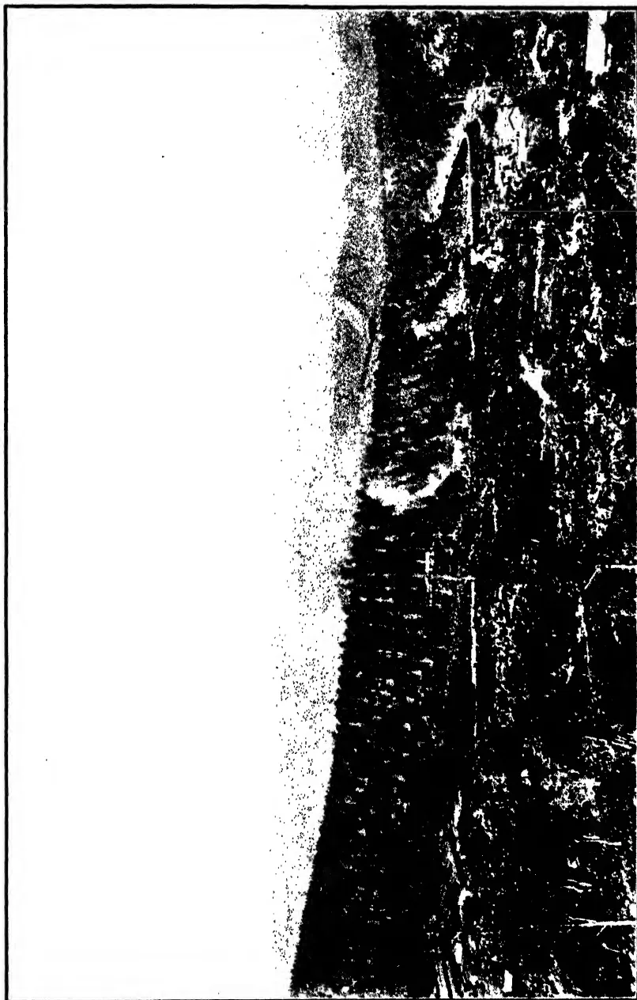A black and white photograph of a landscape, likely a field or estate, showing a large area of land with some structures or trees in the foreground and a bright, hazy sky in the background. The image is oriented horizontally but appears rotated 90 degrees clockwise. The foreground shows a dark, textured area, possibly a field or a line of trees, with some lighter patches. The background is a bright, hazy sky, possibly overexposed or representing a clear day. The overall composition is a wide-angle view of a rural or semi-rural setting.

Plate V.—Kandanuwara Estate. Dusted field after four applications—11-3-30.

402------------------------------------------------

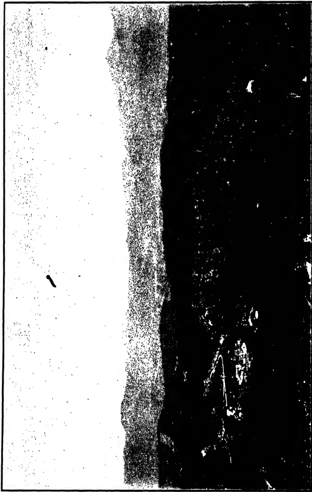A high-contrast, black and white photograph of a landscape, likely a field or estate. The image is heavily degraded, showing significant noise and graininess. The foreground is dark and textured, while the background is bright and featureless.

Plate VI.—Kandanuwara Estate. Undusted control field—11-3-30.

403------------------------------------------------

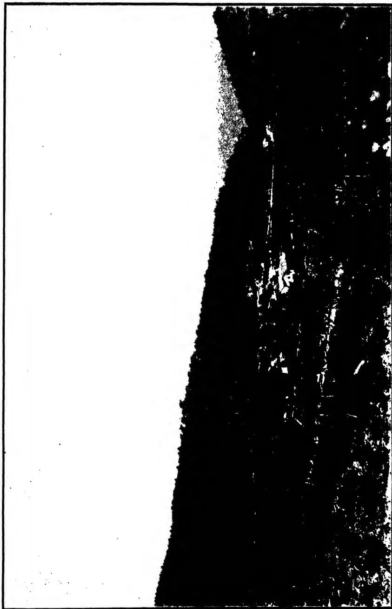A high-contrast black and white photograph of a field, likely a rice field, showing dark, textured vegetation against a bright, overexposed sky. The image is framed by a thin black border.

Plate VII.—Kandanuwara Dusted field after four applications—11-3-30.

404------------------------------------------------

A high-contrast, black and white photograph of an undusted control field. The image is oriented horizontally. The left side is a bright, white, featureless area. The right side is a dark, textured area with various shades of gray and black, showing a rough, uneven surface. The entire image is enclosed in a thin black rectangular border.

Plate VIII.—Kandanuwara Estate. Undusted control field—11-3-30.

405------------------------------------------------

349

secured. The photographs, however, indicate that the foliage of the dusted rubber is markedly superior to that of the undusted control area.

As an additional means of judging the results of the dusting the foliage of a number of individual trees in small plots scattered throughout the dusted and control fields was classified according to the intensity of *Oidium* attack. 156 trees were so examined in the dusted field, and 150 trees in the control field, the examination being made in April after the wintering was completed. In the dusted field 11% of the trees were classed as completely defoliated, while in the control area the figure was 53%. Correspondingly 20% were almost free from the disease in the dusted as against 3% in the undusted area.

Yield records are being taken in the dusted and undusted fields but no results are yet available.

*Quantities and Costs.*—The cost of the dusting on the 30 acres of Kandanuwara estate was high owing to the smallness of the area and the disproportionate cost per acre of the labour. The following is a sample of the cost of one day's dusting on the basis of 100 acres per day:

<table>
<thead>
<tr>
<th></th>
<th style="text-align: right;">Rs. cts.</th>
</tr>
</thead>
<tbody>
<tr>
<td>1,200 lb. sulphur @ -/06 cts. per lb. ...</td>
<td style="text-align: right;">72 00</td>
</tr>
<tr>
<td>4 coolies to carry duster @ -/60 cts. ...</td>
<td style="text-align: right;">2 40</td>
</tr>
<tr>
<td>6 coolies carrying and feeding sulphur ...</td>
<td style="text-align: right;">3 60</td>
</tr>
<tr>
<td>1½ gallons petrol-oil mixture ...</td>
<td style="text-align: right;">3 00</td>
</tr>
<tr>
<td></td>
<td style="text-align: right; border-top: 1px solid black;">81 00</td>
</tr>
</tbody>
</table>

On this basis the cost works out at -/81 cents per acre per application, excluding depreciation on the machine and special supervision. It will be seen that the cost lies almost entirely in the sulphur, the labour and the running expenses of the machine being very small items.

*Discussion.*—Such questions as the minimum effective quantity of sulphur per acre, the number of applications necessary and the period elapsing between successive applications must be subjects for further investigation, and will depend largely on the degree of attack. It is also not known whether dusting will be a permanent cure or whether it will be necessary to carry out the treatment every year. The method has the advantage of being quick and comparatively cheap, and it is hoped that further dustings may achieve a higher degree of control than the first experiments.

*Acknowledgment.*—In conclusion, I should like to express my gratitude to the superintendents of Bandarapola and Kandanuwara estates whose assistance has been of great value.

406------------------------------------------------

350

## THE COCONUT INDUSTRY

[The following memoranda supply further explanations to the report on the coconut industry submitted to the Government of Fiji by the Empire Marketing Board and which was reproduced in *The Tropical Agriculturist*, Vol. LXXIV, No. 3 p. 143 (1930). We are indebted to the Agricultural Advisor to the Secretary of State for the Colonies for copies of them.—Ed., T. A.]

### PRODUCTION OF COCONUTS

**T**ABLES A, B, and C attached give statistics which have been compiled in the Imperial Institute regarding the domestic exports of (i) Coconuts, (ii) Copra, and (iii) Coconut Oil from the producing countries in the Empire for the four years 1925-1928 so far as information is available, and also the corresponding figures for the Dutch East Indies and the Philippines.

In order to secure a correct impression of the growth or decline of the coconut industry in the various countries, it is necessary to bring the figures given in these tables to a common denominator, and a further Table D has therefore been prepared shewing the total exports of coconuts, copra, and coconut oil in terms of coconuts. For this purpose one ton of coconut oil has been regarded as equivalent to 8,125 nuts. Where exports of coconuts have been given in tons, one ton has been taken as equal to 1,400 nuts.

It will be seen that Table D does not include exports from the Straits Settlements or the Unfederated Malay States, which are shown in the preceding tables, nor have the exports of coconut oil from Australia been included for the reason given in note (b) to Table C.

### PROSPECTS OF THE COPRA INDUSTRY

1. Average prices per ton of Federated Malay States Singapore Copra c.i.f. London, during recent years have been as follows:

Table I

#### Annual average prices of copra

<table border="1">
<thead>
<tr>
<th rowspan="2">Year</th>
<th colspan="3">Price per ton</th>
<th rowspan="2">Year</th>
<th colspan="3">Price per ton</th>
</tr>
<tr>
<th>£</th>
<th>s.</th>
<th>d.</th>
<th>£</th>
<th>s.</th>
<th>d.</th>
</tr>
</thead>
<tbody>
<tr>
<td>1916</td>
<td>33</td>
<td>13</td>
<td>9</td>
<td>1923</td>
<td>27</td>
<td>17</td>
<td>6</td>
</tr>
<tr>
<td>1918 (controlled)</td>
<td>45</td>
<td>10</td>
<td>0</td>
<td>1924</td>
<td>29</td>
<td>15</td>
<td>0</td>
</tr>
<tr>
<td>1919</td>
<td>52</td>
<td>10</td>
<td>0</td>
<td>1925</td>
<td>30</td>
<td>5</td>
<td>0</td>
</tr>
<tr>
<td>1920</td>
<td>56</td>
<td>7</td>
<td>6</td>
<td>1926</td>
<td>28</td>
<td>12</td>
<td>6</td>
</tr>
<tr>
<td>1921</td>
<td>30</td>
<td>12</td>
<td>6</td>
<td>1927</td>
<td>27</td>
<td>10</td>
<td>0</td>
</tr>
<tr>
<td>1922</td>
<td>24</td>
<td>15</td>
<td>0</td>
<td>1928</td>
<td>26</td>
<td>17</td>
<td>6</td>
</tr>
<tr>
<td></td>
<td></td>
<td></td>
<td></td>
<td>1929</td>
<td>23</td>
<td>1</td>
<td>0</td>
</tr>
</tbody>
</table>

2. Changes in quotations for copra during the past three years are shown below:

Table II

#### Variations in copra prices 1926-1928

<table border="1">
<thead>
<tr>
<th></th>
<th>£</th>
<th>s.</th>
<th>d.</th>
<th></th>
<th>£</th>
<th>s.</th>
<th>d.</th>
<th></th>
<th>£</th>
<th>s.</th>
<th>d.</th>
</tr>
</thead>
<tbody>
<tr>
<td>1926 January</td>
<td>29</td>
<td>7</td>
<td>6</td>
<td>December</td>
<td>26</td>
<td>2</td>
<td>6</td>
<td>Fall</td>
<td>3</td>
<td>5</td>
<td>0</td>
</tr>
<tr>
<td>1927 "</td>
<td>27</td>
<td>2</td>
<td>6</td>
<td>"</td>
<td>28</td>
<td>7</td>
<td>6</td>
<td>Rise</td>
<td>1</td>
<td>5</td>
<td>0</td>
</tr>
<tr>
<td>1928 "</td>
<td>28</td>
<td>12</td>
<td>6</td>
<td>"</td>
<td>25</td>
<td>0</td>
<td>0</td>
<td>Fall</td>
<td>3</td>
<td>12</td>
<td>6</td>
</tr>
<tr>
<td>1929 "</td>
<td>24</td>
<td>7</td>
<td>6</td>
<td>"</td>
<td>22</td>
<td>12</td>
<td>6</td>
<td>Fall</td>
<td>1</td>
<td>15</td>
<td>0</td>
</tr>
</tbody>
</table>

407------------------------------------------------

354

During 1929, the price fell to £21 in June but rose to £23 in the following month. Although £24 was recorded in September, the price fell again in October, and the average for December was £22. 12. 6. The continued low prices are partly attributable to the prospect of feeding stuffs other than oil cake being in plentiful supply.

3. There has of course been a very substantial increase in the production of copra in comparison with pre-war years. The following figures extracted from the Year Book of the International Institute of Agriculture (with certain later figures where available) show the average nett exports of copra in the quinquennium 1909-13, and during the past five years, with separate particulars for the five groups of countries which together account for some 90 per cent. of the quantities entering world trade.

Table III*World Exports of copra*

<table border="1">
<thead>
<tr>
<th></th>
<th>1909/13</th>
<th>1924</th>
<th>1925</th>
<th>1926</th>
<th>1927</th>
<th>1928</th>
</tr>
<tr>
<th></th>
<th colspan="2">Thousand tons</th>
<th colspan="2">Thousand tons</th>
<th colspan="2">Thousand tons</th>
</tr>
</thead>
<tbody>
<tr>
<td>Total</td>
<td>545</td>
<td>875</td>
<td>907</td>
<td>1008</td>
<td>903</td>
<td>—</td>
</tr>
<tr>
<td>British Malaya</td>
<td>4</td>
<td>92</td>
<td>86</td>
<td>104</td>
<td>87</td>
<td>95</td>
</tr>
<tr>
<td>Dutch E. Indies</td>
<td>234</td>
<td>338</td>
<td>335</td>
<td>371</td>
<td>300</td>
<td>431</td>
</tr>
<tr>
<td>Philippines</td>
<td>128</td>
<td>154</td>
<td>145</td>
<td>171</td>
<td>196</td>
<td>234</td>
</tr>
<tr>
<td>Ceylon</td>
<td>41</td>
<td>88</td>
<td>113</td>
<td>121</td>
<td>99</td>
<td>99</td>
</tr>
<tr>
<td>South Seas</td>
<td>70</td>
<td>139</td>
<td>148</td>
<td>159</td>
<td>159*</td>
<td>—</td>
</tr>
</tbody>
</table>

\* Provisional

4. The high prices ruling for copra in 1919 and 1920 resulted in an increase in coconut plantations. After the slump of 1920/21 prices rose from 1922 to 1925 and it was not until 1926, when the new plantations began to come into bearing, that the increase in world supplies showed signs of outstripping the increase in demand. World supplies in 1927 fell back to about the 1925 level and it is noticeable that there was some appreciation in values during the year, but although complete figures for 1928 are not yet available, there was evidently a striking recovery in supplies in that year, four groups of countries, which together account for 75 per cent. of the world's exports, having an export 12 per cent. in excess of the 1926 total and 26 per cent. higher than in 1927. Information obtained from trade sources indicates that during the first quarter of 1929 world shipments showed a further appreciable increase over the corresponding period in 1928, but that there was a decline during the second quarter. These fluctuations are reflected in the varying quotations for copra during 1929, given in paragraph 2 above.

5. It appears, therefore, that the fall in copra prices during the past  $1\frac{1}{2}$  years has been partly due to increased production, following the high prices, and consequent new plantings, in 1919/20. The majority of new plantations established during these two years are presumably now in bearing and although production may be expected to continue to increase for a year or two, there is every probability that the rate of increase will tend to slow down. On the other hand, there is reason to believe that the consumption of copra will continue to increase owing to the growth of population and the increasing use of vegetable oils.

408------------------------------------------------

352

6. With regard to competitive products, it is no doubt true that the increased production of groundnuts and whale oil, both of which are largely used in margarine making, has contributed to the depression in the copra market, and the increased world production of other vegetable oils is doubtless a further contributory factor. World exports of groundnuts during pre-war and recent years are given in Table IV below :

**Table IV**  
*World exports of groundnuts*

<table border="1">
<thead>
<tr>
<th></th>
<th>1909/13</th>
<th>1924</th>
<th>1925</th>
<th>1926</th>
<th>1927</th>
<th>1928</th>
</tr>
<tr>
<th></th>
<th>Thousand tons</th>
<th></th>
<th>Thousand tons</th>
<th></th>
<th>Thousand tons</th>
<th></th>
</tr>
</thead>
<tbody>
<tr>
<td>Total</td>
<td>555</td>
<td>992</td>
<td>1333</td>
<td>1377</td>
<td>1293</td>
<td>—</td>
</tr>
<tr>
<td>British India</td>
<td>192</td>
<td>243</td>
<td>463</td>
<td>444</td>
<td>457</td>
<td>749</td>
</tr>
<tr>
<td>Fresh W. Africa</td>
<td>205</td>
<td>312</td>
<td>444</td>
<td>480</td>
<td>404</td>
<td>386</td>
</tr>
<tr>
<td>British W. Africa</td>
<td>64</td>
<td>139</td>
<td>176</td>
<td>188</td>
<td>160</td>
<td>195</td>
</tr>
<tr>
<td>China</td>
<td>39</td>
<td>196</td>
<td>168</td>
<td>176</td>
<td>—</td>
<td>—</td>
</tr>
</tbody>
</table>

7. It is of course impossible to foretell with any degree of accuracy what may be the further trend in production of an annual crop such as groundnuts. Any continued depression in market values would presumably be followed in due course by a reduction in acreage under cultivation. As regards whale oil, figures of production, obtained from trade sources, indicate an increase from 109,000 tons in 1922 to 203,000 tons, in 1922 and 226,000 tons in 1928. Production in 1929 is expected to reach nearly 300,000 tons.

8. It is impossible to determine to what extent recent combinations of buyers and the creation of a margarine combine covering the great part of margarine production in this country and on the Continent, has affected the market for copra. It appears, however, that since both copra and palm kernels are more exclusively used for margarine than other oil seeds, their price depends to a larger extent on the buying policy of the margarine combine. When supplies are in excess of demand a combination of buyers may undoubtedly depress the market unduly to the disadvantage of sellers and has led in other industries to combination or co-operative selling on the part of producers.

9. The Board's Statistics and Intelligence Branch undertakes periodical surveys of the world position of certain commodities, and the question of a world survey of the production and consumption of oil seeds is now under consideration. The above information has been compiled on the basis of information already available in the publications of the International Institute of Agriculture supplemented by trade statistics, but it is hoped that more complete figures will be obtained as a result of the world agricultural census of 1930.

409------------------------------------------------

353

## THE RELATION OF WEATHER TO PLANT DISEASES\*

### INTRODUCTION

**T**HE object of this paper is to outline briefly the relation of weather to plant diseases, and to suggest methods by which the meteorologist can be of assistance to the plant pathologist. Plant diseases caused by parasitic agencies alone will be considered, and the discussion will be limited to diseases due to fungi and allied micro-organisms.

A century or more ago the diseases of crop plants were attributed directly and solely to adverse weather conditions. At a later period scientists, on discovering that certain micro-organisms were responsible for these diseases, concluded that the previously held view of the direct connection between weather and disease was entirely erroneous. Thus, seventy years ago, neither the plant pathologist nor the agricultural meteorologist realised the essential and true connection between weather conditions and the outbreak and spread of disease in cultivated crops. As the science of plant pathology developed, however, it became evident that in certain years some diseases were conspicuous by their severity and others by their mildness or even complete absence, this order being reversed in other years when different weather conditions prevailed. In more recent times, research on the relation between weather conditions and the prevalence of plant diseases has progressed remarkably as a result of studies made both in the laboratory and in the field. This "phenological" aspect of plant pathology is, nevertheless, still in its infancy; and not until much more extended data become available can the prevalence of epidemics in crops be correlated with certainty with specific weather conditions. What the plant pathologist really needs is a system of weather forecasting sufficiently detailed and accurate to enable him to advise growers that certain diseases are sure to appear, because the coming weather will be favourable to those diseases. Acting on such advice the grower would then be able to take such preventive measures as were possible to ward off attack.

That a definite connection exists between weather conditions and certain plant diseases can readily be seen in almost any season. In a small country such as England, where there are no wide variations in climate at any time, instances can be given of diseases being unusually prevalent in one year and absent in another. Amongst such diseases are those caused by the Powdery Mildews (*Erysiphaceae*), which became epidemic in the dry, hot summer of 1921. In that year, however, two diseases were noticeable for their comparative absence, namely, Potato Blight, due to *Phytophthora infestans*, and Yellow Rust (*Puccinia glumarum*) of Wheat. Such occurrences show that different diseases are affected differently by the same weather conditions. Countries of very extended area, such as the United States of America, present wide climatic variations; consequently the correlation of plant disease incidence with meteorological factors is more readily discernible.

---

\* Paper read by C. E. Foister, B.A., of the Plant Pathological Division of the Department of Agriculture for Scotland, before the Agricultural Section of the Conference of Empire Meteorologists, 1929.

410------------------------------------------------

354

The various factors which comprise "weather" have been studied, most frequently separately, at some length. A few diseases, such as the Potato Blight and the Cereal Rusts, have been examined from the "collective weather" point of view, but it will be preferable to examine in what ways the individual factors influence the disease-complex first, and then to review and discuss those particular cases afterwards.

## TEMPERATURE

In attempting to review our present knowledge of any individual factor such as temperature, it is still too early to explain fully the various phenomena observed. It must suffice here to indicate the phenological relations that exist; chemical and physiological explanations may be left for discussion amongst plant pathologists themselves.

It is natural to begin at a time antecedent to the appearance of a disease, that is, before the pathogen has attacked its host plant. It is now well known that, for the occurrence of an epidemic, it is not necessary for the fungus or other pathogen to be present at the outset in overwhelming numbers. It is sufficient if a small amount of the pathogen is present in a resting or latent form; for this, provided conditions are right, will develop and attack its host plant. Consequent upon this the secondary sources of infection (usually spores of some kind) formed by the pathogen when once established on the host plant, become distributed naturally, often by wind, to other plants. In this way the area of infection increases and an epidemic develops.

Temperature plays a very great part in the initial germination of the spores of the pathogen. In some cases it directly affects its survival through the winter or resting period. Often the survival of a fungus is imperilled by the weather conditions of the previous summer and autumn, which may prevent the formation of the very spores by which it normally survives the winter or such spores may actually be killed.

This occurred, for instance, at Cambridge during 1921, when the hot dry summer killed all the uredospores of *Puccinia glumarum*, so that during the winter of 1921 and the spring of 1922 no uredospores could be found. The writer personally noted the absence of this fungus, again, in the winter of 1926 and the spring of 1927, and there is little doubt that the summer weather of 1926 was, at least, partly responsible. Provided that the uredospores of *Puccinia glumarum* survive until the beginning of winter, they can easily survive further until the spring, since they are not injured by low temperatures. Miss Sampson collected uredospores of *P. glumarum* in Wales after from 3° to 8° C. of frost during the winters of 1922 and 1923, and found them capable of germinating. Marshal Ward found that the spores of *P. dispersa* on Bromes were killed by high temperatures (30° C.), but that they survived freezing. Metha found *P. triticina* also capable of surviving freezing temperatures, but uredospores of *P. graminis* were killed by the lowering of the temperature that occurred in the middle of December. Another worker, Waterhouse, recorded the fact that the uredospores of *P. graminis* can survive the high temperatures of an Australian summer.

Again, temperature directly affects the germination of fungus spores. The spores of some fungi seem to need freezing before they will germinate. For instance, Salmon found that the spores of *Sphaerotheca Humuli* germinated better after freezing for twelve hours. Temperature also affects the type of spore germination in some cases. For example, in the Potato Blight fungus, *Phytophthora infestans*, high temperatures cause germ-tube germination but low temperatures cause zoospore liberation, although it must be admitted that temperature is not the only factor that determines the mode of germination of these spores. Melhus obtained optimum

411------------------------------------------------

355

zoospore liberation at from 12° to 13° C., but optimum germ-tube formation occurred at 24° C. The zoospores of this fungus remain motile for twenty-two hours at 5° to 6° C., while they remain motile for only nineteen minutes at 24°-25° C., thus diminishing the chances of infection at the higher temperature. Infection with the Potato Blight fungus is thus dependent upon relatively cool weather. Mellus obtained greatly increased infection when plants were chilled for twelve or twenty-four hours, to 10°-13° C. than when they were left at 21°-25° C. Gregory also found similar effects with *Plasmopara viticola*, the cause of Downy Mildew of the Grape. This disease starts in cool weather, owing to the fact that the resting spores do not germinate at 80°-90° F., while at 70° F., there is 40-50 per cent. and at 50° F. 95 per cent. germination. At 35°-41° F., however, there is hardly any germination. The zoospores also remain active longer at 50° F., as do those of *Phytophthora infestans*.

With Apple Scab (*Venturia inaequalis*), Keitt and Jones in the U.S.A. have studied the seasonal relations carefully. Possibility of infection begins as soon as the tips of the sepals emerge from the fruit-buds, and it lasts until from two to four weeks after petal fall. Again, although it may at no time be absolutely at a standstill, infection occurs readily in the autumn, when fruits and leaves may be attacked if cool moist weather occurs. Although the temperature range for infection is very wide (viz., from 6°-26° C.), the optimum is round about 20° C. The ascospores, curiously enough, germinate at temperatures of from 0.5°-32° C. It seems, also, that temperature has an influence upon the progress of the fungus in the tissues. Thus, at 8° C., the incubation period was prolonged to seventeen days, as compared with eight to twelve days at 20°-25° C. The disease developed sparsely after thirteen days at 26° C. in one trial, but failed to develop under similar conditions in two other trials. Nevertheless, it is a fact that the fungus tolerates summer temperatures in orchards much exceeding 26° C. It may be that the diurnal rise and fall in temperature has the same effect as a constant lower temperature. Keitt and Jones thought that the temperature range of the host plant exceeded that of the fungus. In any case, it seemed certain that the disease ranged within temperature limits approximating to those endured by the parasite.

Citrus Scab, caused by *Cladosporium Citri*, is a disease, the climatic relations of which can readily be studied, because the citrus fruit is grown in so many parts of the tropics that great variations in temperature are associated with its cultivation. Fawcett found that citrus foliage became infected only at relatively cool temperatures, viz., 16°-21° C., and that this range corresponded with the optimum for growth of the fungus in pure culture. Peltier and Peltier and Frederick found a similar range for infection, and correlated the seasonal appearance of the disease with climatic conditions. They found that the warm spring of 1918 in Alabama caused very early growth of the trees which, by the time the temperature reached that favourable for the fungus, had passed the susceptible stage; hence no Scab was reported there that year. The year 1915, however, was abnormally cold until much later in the season, and host growth was thereby retarded. When growth began, the temperature was also favourable for infection, hence Scab was prevalent in that year. In Manila (Philippine Islands) there is no Citrus Scab, because the temperatures there are too high for infection (mean 27° C.). On the other hand, at Los Angeles (California), Mobile (Alabama), and Nagasaki (Japan) Scab is prevalent, because at these places the mean temperature lies between 16° and 19° C., a range that is the optimum for both infection and progress of the disease.

Opinions vary as to the set of conditions necessary for the development of Black or Stem Rust of Wheat, *Puccinia graminis*. Apart from the survival of the uredospores, which has already been referred to, Bolley as

412------------------------------------------------

356

well as Freeman and Johnson consider that cool weather is necessary for its development, while Cotton, Levine, Stakman and Lambert and Walster consider warm weather as conducive to the occurrence of this rust. Stakman and Levine give 19°-21° C. as most favourable for vigorous infection. Heald agrees with this and considers that the low temperatures of 1904, in some States of the U.S.A., were responsible for the outbreak of the Black Rust in that year, such low temperatures retarding the crop and giving a chance for the development of increased numbers of uredospores. Peltier states that infection takes place under conditions unfavourable for the development of the disease, the optimum temperature being 20° C. for one strain tried and 25° C. for another. Infection also depends upon the stage at which the host has arrived; for, at the heading stage, infection takes place at a lower temperature than at other stages. Johnson recorded the germination of Stem Rust uredospores as being best between 9° C. and 25° C., the optimum as indicated by the vigour of the germ-tube, being from 12° C. to 17° C. Quite recently Lambert has examined the weather relations to Stem Rust of Wheat by the historical method; and, although he considers that warm weather in the growing season (May to July) is correlated with destructive epidemics, he nevertheless concludes that there is no evidence of any specific meteorological condition, or set of conditions, that always accompanies epidemics in the spring wheat areas of the U.S.A.

As to Yellow Rust of Wheat (*Puccinia glumarum*) Humphrey has stated that low temperatures are conducive to effective infection by this rust fungus. But it is peculiar that its uredospores, which are usually favoured by low and killed by high temperatures, should be able to germinate at 30°-35° C. More recently Mehta has tested the viability of the uredospores of Yellow Rust at high temperatures, and finds that for India, such spores have no chance of surviving the scorching heat of the summer months in the Indo-Gangetic Plain, where the shade temperature in several localities may occasionally reach 47° C. Mehta found that fresh uredospores of *P. glumarum*, collected in March and having then a 50 per cent. germination, suffered a gradual decline in germinating power from 40 per cent. at 30° C. to hardly 2 per cent. at 47° C. after three hours' exposure. After eighteen hours' exposure to 42° C., all viability was lost. Control uredospores, kept for eighteen hours at 28° C., showed over 30 per cent. germination.

The Leaf Spot of Tomato, caused by *Septoria Lycopersici*, is a well-known example of a warm weather disease. Pritchard and Porte were able to correlate high temperatures with its distribution. It is absent on the Pacific coast of North America and present only sparingly in the North Atlantic and Gulf States; but it is serious further south, in the Mid-Atlantic and Mid-Western States. This is occasioned by the limited range of temperatures favourable to spore production, namely 15°-26° C., with an optimum at 25° C. The fungus itself also grows over a range of 12° to 28° C. and best at 25° C. The kind of host growth that is particularly susceptible to infection, viz., long, succulent shoots, is produced at higher temperatures (25° to 30° C.) than those at which the maximum yield of fruit and a resistant type of shoot growth are produced. The existence of these two temperature ranges, namely 12°-28° C. for the fungus, and 25°-30° C. for the host should theoretically induce the development of disease where they overlap, that is from 25° to 28° C. Actually this is the optimum range of temperature found by Pritchard and Porte for the maximum production of the disease.

It was mentioned previously that the Potato Blight starts only at relatively cool temperatures. But after the disease has once made a start, warm weather is necessary for the development of an epidemic. On the other hand, really hot weather is inhibitive, and Blight is usually absent

413------------------------------------------------

357

from localities where the mean temperature exceeds 25° C. Smith considers that temperatures below 21° to 23.5° C. are most favourable for the spread of this disease, and his contention is rather supported by the growth-temperatures of the fungus in pure culture, which Jones gives as being optimum at 16°-19° C. Smith considered that a single hot, dry season may destroy the fungus so effectively, that several successive wet, cool years are needed to re-establish it. Spore production is checked at 25° C. and the mycelium is killed, even in the potato tubers, at temperatures of 30°-35° C. In spite of this, however, Johnson stated that the disease progressed very slowly below 25° C. and was most active at from 25°-32° C., coming to a stop only at temperatures above 36° C.

Air temperature affects the progress of disease chiefly by influencing (1) the rate of growth of the fungus in the tissues of the host plant, and (2) the production of spores. With regard to the first of these, the rate of growth may affect the incubation period directly. Peltier states that at low temperatures *Puccinia graminis* lies dormant in the tissues after infection, and the incubation period may extend over seven to nine weeks. Stakman noticed that uredospores of this fungus appeared in five to seven days after infection at 19°-21° C., but that they appeared one day later for every 10° F. (5.5° C.), rise above, and for every 5° F. (2.5° C.) fall below, this optimum. Mehta examined the influence of temperature on the length of the incubation period in various rusts in 1921 and 1922. He consistently obtained longer incubation periods with lower temperatures. For example, in one experiment plants gave pustules on the thirteenth day at 16°-21° C.; but corresponding plants in the open, at a mean temperature of 1° C., did not give pustules till the thirty-sixth day. Mehta considers it probable that the mycelium does not lie wholly dormant but grows "by fits and starts" according to the variation of the external conditions. While such observations indicate that the mycelium of *Puccinia glumarum* and that of *P. triticina* may thus be able to overwinter as an extended "incubation period" yet experiments have also indicated that *P. graminis* cannot do so unless the temperatures are very mild. Mehta also found that the incubation period is extended by higher temperatures. Yellow Rust developed in eighteen days at the higher temperatures of August, but in nine days in June.

Fromme has also noted this relation of temperature to the incubation period with *Puccinia Coronifera*, having observed a decrease of five days when the temperatures reached 20°-30° C. Hart found that higher temperatures diminished the incubation period, but he also found that very high temperatures extended it with *Melampsora Lini* on Flax. At 7°-14° C. pustules appeared in fourteen days; at 16°-22° C. in ten days while at 25°-30° C. fifteen days were required. Melhus has noted that temperature affects the mycelium of *Phytophthora infestans*, infection becoming visible in two to three days at 23°-27° C., but taking longer at lower temperatures. Keitt found that visible infection of the Apple by Scab (*Venturia inaequalis*) took seventeen days at 8° C. but only eight days at 20° C. Melhus, while investigating the problem of the origin of epidemics arising from the planting of infected tubers, found that the extension of the Potato Blight fungus from the tubers into the growing shoots was favoured by a relatively high temperature (22° C.) but that it was inhibited by low temperatures from about 4°-6° C. Since it is still to some extent problematical as to how epidemics of Potato Blight really originate, this point is of interest, since it would indicate that if epidemics start from shoots infected with mycelium derived from infected tubers, the incidence of warm weather would facilitate the primary appearance of the fungus, while cold weather would check it.

414------------------------------------------------

358

Another relation of air temperature to disease may be mentioned, and that is the effect on sporulation. Conidia of the parasite seem to be produced, as a rule, at temperatures optimum for the existence of the disease. For example, Tisdale and Beach state that the conidia of *Phytophthora Nicotianae* and of *P. Cactorum* are formed at 20°-35° C. and a little below 20° C., respectively, at which temperatures the diseases they produce are at a maximum. That temperature, more than moisture, affects the production of the conidia of *Pseudoperonospora Humuli* on the Hop is indicated by Salmon and Ware, since they state that in spite of the dryness of the atmosphere during the hot weather of 1923, conidia were found on hop foliage. Again, Walker found that the conidia of *Colletotrichum circinans* (Onion Smudge) were produced at temperatures of 20°-28° C. in appreciable quantities, and these temperatures cover the optimum for the disease (23°-28° C.). Fawcett found that the conidia of *Cladosporium Cilri* produced abundantly only at those temperatures near the optimum for the disease (16°-23° C.), namely at 21°-24.5° C.

The relation of temperature to plant disease may next be considered as it affects diseases contracted from the soil. This is much better known, since there are not so many variable factors to consider as with aerial diseases. There is practically no wind factor to consider, and the soil is slower to gain or lose heat than the air. Also, according to the moisture content of the soil, heat conservation varies, since water is even slower to gain or lose heat than soil itself. Soil temperatures are more stable than atmospheric ones, and can reasonably be expected to remain near a mean for a twenty-four hour period, thus rendering the meteorological data more reliable for use in phenological work.

One of the principal effects of soil temperature is upon the germination of spores, influencing as it does, both the percentage and the rate of germination. In regard to the rate of germination, Gilman found that the spores of *Fusarium conglutinans* (Cabbage Yellows) germinated in three hours at 33° C., in eight hours at 21° C., in twelve hours at 16° C., but not even in seventy-two hours at 8°-12° C. Shapovalov, with *Actinomyces scabies* (Common Scab) on the potato, found that the spores germinated in five hours at 30° C., in eight hours at 25° C., in eleven hours at 20° C., and in eighteen hours at 15° C., but required two days at 10° C.

A most noticeable cool weather disease is Powdery Scab of the Potato, caused by *Spongospora subterranea*. It was particularly severe in England in 1920, and that year was cold and wet; but it was almost absent in the hot, dry season of 1921. Heald states that in the cooler northern states on the Canadian border favourable conditions are provided for the disease, but that infected tubers planted in the warmer states (Massachusetts and Florida) yield absolutely clean crops. Ramsey states that in Maine (U.S.A.) the exceptionally hot and dry year of 1916 was very unfavourable for Powdery Scab. Experimentally he obtained 83 per cent. of Scab at 14° C., but none at 17.2° and 24.5° C. As far back as 1908, Massee recorded that the parasite passed from the amoeboid state into the active plasmodial state most markedly at 16°-19° C. On the other hand, while cool weather is favourable, really cold weather is inhibitive to the parasite, a temperature of 10° C. checking its active state and one of 0° C. resulting in its encystment.

Wart Disease of the Potato, caused by *Synchytrium endobioticum*, is favoured by cool weather and it was prevalent in England during the cool year of 1920, but relatively dormant in the dry, hot year of 1921. It has been stated that infection does not occur above 22° C. but it has been shown by Esmarch and Weiss that infection may occur at 30° C. Esmarch found the optimum range for infection to be 15°-20° C.; and since these temperatures existed in the soil from July to September, they explained the

415------------------------------------------------

359

maximum incidence of Wart Disease during that period. At these temperatures, too, the fungus itself is most active; and while infection does occur at both lower and higher temperatures, it is scanty and retarded, corresponding with retarded zoospore emission from the sporangium. Weiss obtained infection of tubers when resting sporangia germinated between 10° and 28° C. and when summer sporangia germinated between 0.6° and 30° C. He also found the maximum production of disease to occur between 15° and 20° C.

The fungus that usually causes the Sleepy Disease of the Tomato in Britain (*Verticillium albo-atrum*) is associated with cool weather conditions, and for this reason is not serious in the United States. In England, it is at times serious in tomato houses. It appears in April and continues to the second week in May, but then disappears till September. This is because of the inhibitive higher temperatures of June to August. Bewley found that by keeping the plants at temperatures above 24° C. they were prevented from wilting; and above 25° C. the fungus could not infect. At 12.5° C. the fungus grows very slowly up to the tomato stems, so that by keeping the plants a little below this temperature they escape infection. The minimum, optimum and maximum temperatures for the fungus in pure culture are 4.4°, 23.3° and 30° C., respectively, and those of the disease are 12°, 21.1° to 22.8°, and 25° C. As the plants thrive best at temperatures between 24° and 29.5° C. it is probable that the fungus is unable to cause infection, owing to resistance developed by the plant above 24° C.

Onion Smut, caused by *Urocystis Cepulæ*, is epidemic in parts of the northern States of the U.S.A. but is absent in the southern states. Walker and Jones found that climatic differences accounted for this, the north being cool and the south warm. Onion seedlings appear above ground most rapidly at temperatures of 27°-29° C., but infection does not occur after a certain stage in the host's growth has been reached. This stage is when the cotyledon has reached from 2½ to 3 inches in height. Since increased temperature promotes rapid growth the susceptible period will be shorter at a higher temperature than at a low one. But temperature also affects the germination of the chlamydospores of this fungus. Walker and Wellman found that these spores germinated at temperatures between 9° C. and 32° C., with a maximum germination at 15° C. The same workers obtained maximum growth of the fungus between 18° C. and 22° C., but none at 9° C. or at 28° C. It is significant that infection occurs at temperatures, of from 10° C. to 29° C., being maximum at 19° to 24° C. Walker and Wellman conclude that while infection occurs at low temperatures it is not increased appreciably by higher temperatures. Attack, however, is more rapid and is correlated with better host and fungus growth. Above 25° C. the fungus is retarded, while the host is stimulated, so that the susceptible period is rapidly passed.

A large amount of work has been done on the important disease of Wheat known as Bunt and caused by *Tilletia caries*. The spores of this fungus germinate in the soil when conditions are suitable; and provided the wheat seedling has not passed a certain stage, infection results. The spores germinate at temperatures as low as 5° C. and as high as 25° C., the maximum germination being at 16° to 18° C. Woolman and Humphrey in America found a more extended range of temperatures for germination of Bunt spores, namely Min. 0°-1°, Opt. 18°-20°, and Max. 25°-29.1° C., but these are probably extreme, as the result of some unusual factor operating in the experiments of these particular workers. Hahne, in 1925, gave the following temperatures:—Min. 4°, Opt. 18° to 20°, and Max. 26° C. Still later results by Rabien, however, confirm Heusser's figures. The minimum, optimum and maximum for spore germination according to Rabien are:—5°, 16° to 18°, and 20° to 21° C., but

416------------------------------------------------

360

the maximum was extended to 25° C. by the addition of an oxidising agent to the germination medium. The special feature regarding infection is that wheat will germinate at lower temperatures than Bunt spores will. Where this is climatically possible, the solution to the problem of escaping infection is to show at times when temperatures are very low. Heusser found that wheat grain germinated at 3°-4.5° C. but the Bunt spores did not. Munerati also obtained no infection at 2°-4° C. for the same reason. Gibs on the other hand, obtained infection at 4° C.; but since the majority of workers have not obtained infection below 5° C., this result cannot be taken too seriously. Munerati found that grain that had germinated and grown at 2°-4° C. was immune from infection, but that this temperature had to be maintained for five weeks to enable the wheat to pass through the susceptible stage unharmed. Grain grown for only twenty days at 2°-4° C. became infected when subjected to a temperature of 10°-12° C. for a further seven-day period. It is strange that Rabien obtained no infection when he kept seeds continuously at 10° C. It might be supposed that the wheat could not germinate quickly enough at that temperature to pass the susceptible stage, and that is the only explanation. This is supported by his further statement that two lots of grain kept at 10° C. for three to five days and then transferred to 20° to 22° C., developed 0.7 per cent. and 6.3 per cent. of Bunt respectively; seed kept at 19° C. for eight days and then raised to 20°-22° C. gave 40 per cent. of Bunt. Also, grain kept at 5° C. for nine days, developed only a trace of Bunt; but after a longer period, the percentage rose to 49.1. This seems to show that wheat does not grow quickly enough to reach its resistant state, but that at low temperatures the Bunt spores germinate so slowly that they require a long time to infect. Further figures given by Heusser for the host growth seem to support this; the minimum, optimum and maximum for host growth are:—3°-4.5°, 25° and 30° C. Laufert found that in South Russia wheat sown in August comes up in three to four days, *i.e.*, too quickly for infection to occur, as the spores do not germinate rapidly enough. In Germany, however, temperatures are moderate (6°-10° C.), so that the spores and grain germinate together and infection is the result. This, of course, is contrary to Rabien's results at 10° C.

So much for the minimum temperature for infection. For optimum infection, Hungerford and Gibs give 9°-12° C. and Gibs states that at 17° C. wheat, although susceptible, grows so quickly that the spores, themselves most active, cannot infect. Faris states that the rate of wheat growth does not affect infection, since he obtained the greatest infection with plants that emerge first. As to the upper extreme, Woolman and Humphrey state that infection from seed-borne spores does not take place when seed is sown at or above 20° C., but that infection from spores in the soil is still possible. This indicates that these authors considered that spores took too long to germinate, when brought into favourable conditions at the same time as the wheat grains, to cause infection; but that spores, already in the soil with the right conditions, had germinated and were ready to infect when the wheat was sown. Butler states that in India Bunt occurs in the North-West Provinces because the temperatures at sowing time are usually below 25° C., permitting both spore and grain to germinate. But it is absent in the east and south, where the relevant temperatures are above 25° C. at the time of sowing and do not permit spore germination. Munerati found that wheat sown in seed-beds kept at 22°-25° C. for five weeks did not become infected. Grain sown and grown at 2°-4° C. for twenty days and then allowed to grow for a further seven days at 10°-12° C. became infected; but if this seven-day period was passed at 22°-25° C., infection did not occur. Hungerford found that infection in controlled experiments resulted at temperatures up to 25°-28° C., but at this limit it

417------------------------------------------------

361

was almost negligible. In America, farmers are said to escape Bunt in the Pacific North-West by sowing their wheat either very early (warm, above 22° C.) or very late (cold, below 5° C.)

As an example of a hot weather disease the ordinary Scab of Potato, caused by *Actinomyces scabies*, may be taken, which was very prevalent in England during the hot, dry year of 1921. There are indications, however, that warm, rather than hot, years are most favourable, for Jones *et al.* state that the optimum temperature for Scab development is about 22° C., although in some trials it was 25° C. Further, the optimum temperature varied with the type of infection; for the highest percentage of scabbed tubers it was 23° C. but for the highest percentage of total tuber surface scabbed it was 20.5° C. These workers at Wisconsin also found that at 11° and at 30.5° C. scab was very slight. They had previously shown that the number of infections remains as large, above the optimum temperature, as at that point, but that since tuber growth was inhibited, the average size of the Scab lesions was reduced. Sanford originally indicated a wider range for maximum infection, viz., from 14° to 22° C., but later he found that, although no Scab usually occurred in the field below 12° C., yet it was not greatly influenced by temperatures between 12° and 25° C. Jones *et al.* state that Scab is worse with more rapidly-growing tubers and that the effect of temperature on Scab is indirect, i.e., through its effect on the host. Sanford, in stating that best tuber development occurred at 18° to 21° C., confirms this, since Scab is certainly most pronounced at about 20° C. Although this host relation is stressed by Sanford and Jones, it is significant that a report on this disease from Ohio gives temperatures for the growth of the organism which almost coincide with those most conducive to Scab. Growth was very slow below 50° F. (10° C.), was maximum at 65°-75° F. (18-24° C.) and reduced to nil at 80° F. (26.6° C.). Compared with the Scab temperatures as given by Jones *et al.*, namely, 11° C., 20°-23° C., and 30.5° C. the agreement is fairly close.

The Smuts of Sorghum, caused by *Sphaerotheca Sorghi* and *S. cruenta*, are also warm weather diseases, and Kulkarni has shown that the times of sowing and the districts where Sorghum is grown in India determine the prevalence of these diseases. The monsoon crop, sown in June and July, experiences an average temperature of 21°-27° C., which fulfils the optimum infection condition; while the winter crop, sown in September and October and experiencing a temperature of 32°-38° C., becomes much less infected. The scarcity of these Smuts in the Indo-Gangetic plain is explained on this basis, the temperatures there at sowing time being about 32°-38° C. Sorghum germinates most rapidly at high temperatures, taking one and a half days to do so at 37° C.; at lower temperatures it germinates slowly, taking three to four days at 20°-23° C. The spores of these Smuts germinate most abundantly (90 per cent.) at 20°-23° C., but only 1-2 per cent. germinate at 37° C. Infection succeeds at temperatures between 16° and 30° C. Kulkarni tested these observations by pot experiments. Seeds incubated at 40° C. for three days produced no Smut, but seeds incubated three days at 25° C. gave various amounts of Smut. In experimental plots distributed between four experiment stations, infections resulted only in those plots in which the temperatures at sowing time were below 36° C. At Jacobabad, with a temperature range of 36°-40° C. at the sowing period, no Smut was obtained. Reed and Faris obtained similar results. These Smuts are warm weather diseases, since, although the greatest degree of infection does not occur at the highest temperatures, yet the range of temperature for heavy infection reaches a fairly high level. Again, whether the conditions of infection may be called warm or cool

418------------------------------------------------

362

depends upon the locality. In India, Kulkarni calls weather favourable to infection "cool," but compared with a climate such as that of England, a temperature of 30° C. would not be called cool.

### MOISTURE

That the incidence of plant diseases is correlated with the occurrence of wet and dry years had been recognised for a long time before it was realised that this apparent relation could not easily be separated from temperature relations. For example, Potato Blight was practically absent in this country in the dry year of 1919; but was this due more to the absence of rain than to the extreme heat of the weather experienced? It is impossible to answer that question off-hand. The weather relations of this one disease alone are too complicated to permit of its incidence being explained on the basis of a single factor. Where it occurred, *Pseudoperonospora Humuli* on the Hop was serious in the wet seasons of 1922 and 1924, but practically negligible in the dry seasons of 1921 and 1923 *Puccinia glumarum* was absent in Cambridgeshire in 1921 also.\* But unless the moisture relations of those and other diseases are studied over a much longer period of years, or over a wider range of climates, in order to obtain data as to whether they also appear in hot wet years and in cool wet years, and thus eliminate temperature effect, it is impossible to correlate moisture with disease incidence. On the other hand, it is now possible to carry out experimentally controlled moisture-relation tests, in which other factors, such as temperature, are kept constant. In this way, it has been possible to correlate definitely certain diseases with dry conditions and others with wet conditions. Of these, those occurring in the soil, i.e., in the underground parts of the plants, are by far the most easily studied. Diseases of the sub-aerial parts, such as the cereal Rusts and Potato Blight, are as yet but imperfectly understood as regards water relations.

As was shown with temperature, moisture has a relation to the overwintering of the spores of fungi. Since more is known regarding this relation in respect of soil fungi, these will be considered first. Some data are available concerning the overwintering of cereal Smut spores. Woolman and Humphrey found that Bunt spores (*Tilletia caries*) overwinter successfully when still aggregated in the form of "butts." As separated spores, however, they lose their viability in one to two months in damp soil. When kept dry for twelve years they have remained viable. Hungerford also regards two to three months as the limit of viability for Bunt spores in damp soil, but he does not put a limit when they remain aggregated. He tested the length of life of Bunt spores in soils having different moisture content, the spores being sown in wet and dry soil, respectively. One series was maintained wet throughout the whole period of the experiment, while the other was moistened only at the time of sowing the spores. Wheat grains were sown at intervals of a few days each. The viability of the spores was measured by the resulting percentage of smutted plants. Grain sown along with Bunt spores in wet soil gave 30-35 per cent. smutted plants. Grain sown one month after the addition of Bunt spores gave 2 per cent. smutted plants, where the soil was kept continuously moist during the month that elapsed after the addition of the Bunt spores and the sowing of the wheat. But wheat sown one month after the addition of Bunt spores to soil that received no further water after the first day, developed no Bunt. Lastly, wheat sown along with Bunt spores in dry soil gave 19-23 per cent. smutted plants; but

\* At the Cambridge University Farm, *P. glumarum* is very late in appearing this (1929) season. It did not appear until June 4th, and had advanced very little by June 21st. This is attributed by Professor Biffen to the prolonged spell of dry weather which has been experienced since the beginning of this year.

419------------------------------------------------

363

sown one month subsequent to the spores, in soil kept continuously dry, it gave only 3-4½ per cent. smutted plants. This indicates that under normal winter conditions, Bunt spores present in the soil from a previous season would not remain viable till the following spring, but would infect grain sown in the autumn. On the other hand, according to Griffiths, the spores of Flag Smut of Wheat (*Urocystis Triticici*) can overwinter in the soil, even when previously watered.

Soil moisture also has a very direct influence on the evacuation of the resting sporangia of the potato Wart Disease fungus, *Synchytrium endobioticum*. Esmarch states that evacuation is impeded by dry conditions, but greatly favoured by wet seasons. There are more empty sporangia in spring and summer than in autumn and winter. He also states that oxygen is necessary for this evacuation. Since excessive moisture would bring the oxygen content of the soil down to a minimum, it would be expected that these conditions would inhibit evacuation of the sporangia, but Esmarch does not bring evidence to support any such conclusion. Miss Glynne's experiments also support Esmarch's results, as infection was not obtained in dry soil, while various degrees of infection were obtained in wet soil. The swarm-spores of this fungus, of course, require water in which to swim in order to reach the place of infection. Should the soil dry out before infection has taken place, the swarm-spores die.

As to the connection between moisture and oxygen supply, two good examples can be given. With ordinary Scab of Potato, caused by *Actinomyces scabies*, soil water is necessary only in very small quantities, the disease being a dry soil one. A so-called dry soil usually has just enough moisture to allow spore germination and activity of the pathogen; but wet, or at any rate, excessively wet soil as contrasted with merely moist soil, is very inhibitive to this pathogen. Sanford has shown that this is because oxygen is necessary for germination of the spores. The same relation has been found with the Loose Smut of Oats, *Ustilago Avenae*. Miss Jones found that as the soil moisture increased, especially from 60 per cent. to 80 per cent. of the water-holding capacity of the soil, the percentage germination of the spores of this Smut proportionately decreased. In the complete absence of oxygen, germination did not occur, thus confirming the moisture-oxygen relation.

With the Powdery Scab of Potato (*Spongospora subterranea*), all agree that the disease is severe in wet seasons only. Ayoutantis states that, in Algeria, this disease occurred as an epidemic in 1922, when an unusually heavy rainfall gave the necessary conditions for its development. Normally, the conditions in Algeria are too dry for this Scab to appear. Ramsey checked his field observations by controlled glass-house experiments, growing potatoes in pots kept dry, moist and wet, respectively. He obtained no Scab in the dry pots, but 83 per cent. of Scab in the two other series. Even if the low moisture content of the dry soil is sufficient for spore germination, it is evidently not sufficient for infection. That Powdery Scab occurs in soils kept very wet is explainable only on the supposition that oxygen has no influence on spore germination or infection. Infection of potatoes with Wart Disease occurs only with a high soil-water content. But whereas germination of the resting-sporangia does not take place unless the soil is saturated at some time, infection is repressed if the soil is kept constantly saturated. Weiss considers periodic flooding and drying most suitable for infection. That a saturated soil is best, at some period at least is explained by the fact that the swarm-spores need water to migrate through the soil to the new crop of tubers.

With *Ophiobolus graminis*, causing Take-All of Wheat, a similar relation of high soil moisture to infection holds goods. Here, however, the interacting factors are better known. This disease has been reported

420------------------------------------------------

364

by some as serious in dry seasons, by others in wet seasons; but as McKinney and Davis pointed out, these reports dealt with the after-effects of certain types of weather upon the host plant, and not upon the actual infection process. Wet weather, by causing the plant to develop new roots, defeats the ravages of the fungus from a practical point of view; but the inability of the plant to produce roots in dry weather merely allows the fungus an equal chance of root destruction. The dry weather, which proved fatal to the plants, followed a period of wet weather that had favoured infection. In their experimental work McKinney and Davis obtained less infection at low moisture content than at high; but whereas the difference was large at high temperatures, it was small at low ones. This indicates that a certain quantity of moisture, which may be considerably below that required for infection, is necessary for the expulsion of the spores of this fungus from its perithecia, or for the germination of spores when liberated.

The disease most widely known as a dry soil disease is the ordinary Scab of the Potato, (*Actinomyces scabies*). Martin, in America, gives data covering three years in which the rainfall varied considerably, and during which varying amounts of Scab resulted. While the temperature was approximately the same for the three years 1920 to 1922, rainfall was lowest in 1921, and for the period June and July was almost half that in the same periods in 1920 and 1922. Correlated with this was almost 100 per cent. of Scab in 1921 and 76 per cent. of Scab in the wettest season of 1920. In control experiments Martin reduced the surface scabbing from 41 per cent., at 30 per cent. soil moisture content, to 2.6 per cent. Scab at 60 per cent. Sanford's results, while in agreement with those of Martin, showed that moisture was of influence during the early stages of growth only. If, during this period, the tubers are kept under nearly saturated conditions they do not become infected, even if the soil becomes dry afterwards. Probably there is enough water present in dry soil to allow growth of the organism, and infection; but with high soil moisture content the tuber must be affected, in such a way that infection becomes impossible, because much moisture is favourable to the growth of the parasite. It has been stated that the most abundant development of Scab was obtained in light "well-drained," alkaline soil, with a "good supply of moisture." Under such apparently contradictory conditions it is difficult to conclude definitely what may be the decisive factor inducing the disease apart perhaps from the pH value of the soil. At low soil moisture content, growth of the organism is reduced, infection is at a maximum, and the plant not very susceptible. At medium moisture content, both plant and organism grow normally and infection is reduced; while at high moisture content infection is inhibited but the plant made most susceptible. This last condition seems to point to the fact that the fungus is inhibited also, since the plant is susceptible, and plant growth is reduced at low moisture content only because of lack of water. It is rather remarkable that both oxygen content and infection are maximum at low moisture content, while the former is at a minimum, and the latter inhibited at high moisture content. It thus seems that moisture relations are important only in so far as oxygen supply is affected.

It is commonly stated that if Bunt is to be avoided it is better to sow wheat in a dry seed-bed than after rain. In confirmation of this Hungerford and Wade obtained only a small amount of Bunt in fields sown under dry conditions, but in fields sown soon after rain, 30 per cent. of Bunt appeared. A contrary statement is made by McAlpine concerning Flag Smut of Wheat, caused by *Urocystis Triticici*. He states that far more infection results if wheat is sown in dry soil than if it is sown subsequent to rain.

421------------------------------------------------

365

These cases may be analysed and thus further light thrown on the problem. There are four different effects when wheat grains and Bunt spores are sown in a dry seed-bed. Firstly, the dryness may prevent both spores and grain from germinating; secondly, it may allow the spores to germinate and not the grain; thirdly, it may allow the grain to germinate and not the spores; lastly, it may allow both to germinate. The last may at once be dismissed since infection would result, and this does not happen in dry soil if no rain occurs. With Flag Smut of Wheat, McAlpine considers that the first relation holds, both grain and spores germinating only when rain comes. He obtained 14 per cent. Smut in dry soil. He placed Bunt in the second category, as he considered that the spores germinated in dry soil but not the grain, the latter doing so when rain came, by which time the spores had germinated and had died. Kulkarni places the Smuts of Sorghum (*Sphacelotheca sorghi* and *S. cremita*) in the second category for the same reason. Many other workers, however, place Bunt in the third category, the grain germinating in dry soil and passing through the susceptible stage before rain occurs enabling the spores to germinate. Mackie states that Bunt spores need 14 per cent. soil moisture in order to germinate. That Bunt spores should germinate in dry soil is not in good consonance with the fact that such spores may remain viable in the soil for years. It is much more natural that they should not germinate in dry soil, and that Mackie's statement that 14 per cent. moisture is needed is correct. Provided that the host plant has germinated, and is still in the susceptible stage, and that the spores are able to infect, the question is whether there is any relation between the degree of infection and the amount of water present, above the minimum.

It has been found that there are two types of correlation; first, infection increases with increase of moisture, and second, infection decreases with increase of moisture. Bunt of Wheat and the Smuts of Sorghum belong to the first type. With the latter Kulkarni found that below 5 per cent. of moisture, infection did not occur, but it started with 7.5 per cent. of moisture, and increased in proportion with the increase of moisture up to 20 per cent. Hungerford and Wade did not obtain any Bunt below 15 per cent. of moisture, but it increased from 7 per cent. at 15 per cent. of moisture to 62 per cent. at 36 per cent. in one series, and from 25 per cent. at 17 per cent. of moisture to 100 per cent. at 38 per cent. in another series of experiments. Hungerford, in a later paper on combined temperature and moisture relations of this fungus, found that at low temperatures Bunt increased with increase of moisture, but that at higher temperatures it decreased with the increase of moisture. Since temperatures are rarely so high as 17° to 25° C. at the time of sowing wheat, however, one may practically say that an increase of moisture increases the percentage of Bunt. Paris also found that increase of moisture increased the attack of Bunt, although he used spores of *Tilletia levis*. It is of interest, though, that Rabien as recently as 1927, recorded some experiments on the adverse influence of high moisture on Bunt incidence. Wheat in dry soil gave 22.3 per cent. of Bunt, that in normally moist soil gave 55.3 per cent., while that in very moist soil gave only 10.7 per cent. Rabien attributes the reduction of Bunt at very high moisture content both to the rapid germination of the wheat grains and to the retardation of spore germination by the consequent reduction of the oxygen supply. Gibs' observations support the contention that Bunt should be placed in the second type referred to above.

In spite of Hungerford's conclusions regarding these relations, he records two experiments, amongst many others, in which the data support Gibs and Rabien. At the most favourable temperatures of 9°-12° C., which, it must be noted, are "low," he obtained a reduction from a high

422------------------------------------------------

366

infection of 90 per cent. at 22 per cent. moisture to a low infection of 19 per cent. at the higher moisture content of 32 per cent. At the still favourable temperatures of 17°-25° C., a reduction from 21 per cent. infection at 18 per cent. moisture to no infection at 32 per cent. moisture took place. With other fungi of the same class, similar results have been recorded by many workers. Reed and Faris and Kulkarni obtained higher infections at lower moistures with *Sphacelotheca Sorghi* and *S. cruenta*. Christensen found the same with *Sorosporium reilianum*, the cause of Head Smut of Sorghum. Bartholomew and Jones, and Reed and Faris obtained higher infection at low moisture with Loose Smut of Oats.

There is a further relation between soil moisture and the progress and intensity of a disease. This is not always separable from the infection relation, and has not received so much attention. A few examples may be given. Soil moisture affects the length of the incubation period. This is rarely examined, as it is very difficult to determine when the first signs of disease appear in the case of soil diseases. Clayton found that the incubation period of Tomato Wilt caused by *Fusarium Lycopersici*, varies according to both temperature and moisture. Here it suffices to state that with 14 per cent. of moisture the period was thirty-five days, with 18 per cent. moisture it was twenty-six days and with 24-32 per cent. moisture only nineteen to twenty days. This is probably because the greater amount of moisture provides more ideal conditions for the growth of the fungus, and it agrees well with the statement that the most vigorous plants are most attacked.

Moisture can influence the optimum production of disease by reacting on the host. In Crown Gall, caused by *Pseudomonas tumefaciens*, Riker states that the largest galls are produced at 60 per cent. moisture, and their formation is partly correlated with the best plant growth (at 80 per cent. moisture). With *Plasmodiophora Brassicae*, which causes Clubroot of Crucifers, Monteith found the largest malformations associated with the largest and most vigorous plants, both induced by high moisture. He also found that old and non-vigorous plants were not attacked. These two cases can be explained by the reaction of the host cells to the supply of moisture. In spite of stimulation due to the presence of the respective parasites, the cells could not make abnormal growth if the moisture supply was limited, but they could do so when this was normal.

Another instance of the influence of moisture upon the intensity of a disease is afforded by Cabbage Yellows, caused by *Fusarium conglutinans*. Tisdale found that this disease develops most rapidly at lower moistures (19 per cent.), falling off at 26-28 per cent. moisture; he also found that the host plants grew best at 19 per cent. of moisture and less at higher moistures. Tims noted that vigorous plants are most subject to the disease, and states that plants grown under poor conditions, such as low light intensity and low moisture, will remain for weeks with a low percentage of disease, growing slowly and with thickened tissues. Resistant plants which, under normal moisture conditions carry on as if uninfected, are often in fact infected; but the fungus is unable to prevail in vigorous plants of a resistant strain. If the moisture content is lowered, however, the plants lose their vigour and the fungus progresses up the plant at once and causes wilt. Such plants will recover if a supply of moisture, adequate for vigorous plant growth, again becomes available. The amount of soil moisture probably has some influence on aerial diseases. Howard states that wheat sown in pots under conditions of good soil aeration had much less Black Rust (*Puccinia graminis*) than those in the field with inadequate aeration. It is more likely that an effect of this kind as to do with atmospheric humidity in the midst of the crop; but this will be discussed in the next section.

423------------------------------------------------

367

Stakman grew wheat under low and high soil moisture conditions and obtained less infection with low soil moisture. Howard states that flax with deep and abundant roots, when grown in an alluvial soil with good moisture supply, was heavily attacked by *Melampsora Lini*, while flax with shallow roots was free from the rust. Evidently, the shallow roots were able to supply enough water for good growth, but not enough to supply the demands of the parasite or to make the tissues susceptible. This investigator found a similar result with sugar cane; this host was attacked by *Colletotrichum falcatum* on stiff, black soils (excess water), but was very free from the disease in open porous soils. Smith, in discussing the Rust of Asparagus (*Puccinia Asparagi*) in California, states that in dry soils, and in dry seasons, asparagus becomes infected by the uredospores of this fungus in the summer, and from the teleutospores in the autumn. In wet seasons, however, it becomes infected from the teleutospores only, in the autumn. He explains this by the adverse effect of the lack of soil moisture on the plant, which causes it to be more susceptible to the fungus. The latter obtains enough moisture in dry seasons to enable it to infect the host plant, but in wet seasons the fungus is not invigorated in proportion, although the host plant is greatly invigorated and succeeds in thwarting the attempts of the fungus to cause infection. The teleutospores appeared on the plants in the autumn because the plants had then matured and lost their vigour.

Another instance is afforded by the Wheat Mildew *Erysiphe graminis*. This is stated by Rivera, in Italy, to be particularly severe when the soil dries out, causing the wheat plant to become more susceptible by the resulting lessening of turgescence. The Mildew is particularly prevalent on plants in rich soils, where root development is relatively restricted, and they would naturally suffer from shortage of water or from excessive transpiration. Fromme and Murray state that soil moisture, as influenced by rainfall, governs the seriousness of the Angular Leaf Spot of Tobacco, caused by *Bacterium Angulatum*. With high soil moisture, the resistance of the plant becomes reduced and infection is increased in proportion.

### ATMOSPHERIC HUMIDITY AND PRECIPITATION

These factors were for a long time neglected, but lately much study has been devoted to them. At the outset it must be realised that the effect of atmospheric humidity is largely bound up with other factors, such as temperature, light, wind, rainfall, crop density, clouds and the physical nature of the soil. The interaction of all these factors on the physiology and metabolism of the plant is too complex for discussion here, and the various explanations that have been given of the incidence of disease as influenced by atmospheric humidity cannot be dealt with in any detail. It must suffice for present purposes to call attention to the existence of relations between humidity and disease, and explanations must await the securing of more data.

Passing over the obvious ways in which atmospheric humidity or its absence may influence the hardness or softness of tissues, their turgescence, and so on, it can be shown that susceptibility to disease may be related to the effect of humidity on stomatal movement. Pool and McKay demonstrated this with the Leaf Spot of Beet, caused by *Cercospora beticola*, in which infection can take place only through the stomata. High humidity favours their opening, but low humidity favours closure, the degrees thus enabling infection or preventing it.

There is also some evidence that humidity affects the survival of fungus spores, such as certain conidia and some Rust spores. Hart for example, found that the uredospores of *Melampsora Lini* (Flax Rust) remain viable

424------------------------------------------------

368

longer at relative humidities of about 60 per cent. than at lower ones, and their viability is reduced at very high and very low humidities. Spaulding and Gravatt found that the sporidia of *Cronartium ribicola* require a moist atmosphere in order to remain viable long enough to cause infection, apart from their need of dew or rain for germination and infection. They survived for twenty-six hours at 70 per cent. humidity, but rapidly lost their viability in drier air.

The literature concerning the germination of fungus spores is far too voluminous to review here. All of the many kinds of spores need different degrees of humidity and water-films. The conidia of the Peronosporales, for example, are dependent upon the presence of actual water-films on the foliage, since the swarm spores are capable of causing infection only after a period of swimming in a water-film. Doran reviewed the literature of this problem in 1922. Patel showed that the conidia of *Peronospora Trifoliorum* would not germinate on dry slides in a saturated atmosphere, but did so in a film of water. Melhus showed that the same was true for those of *Phytophthora infestans*.

With regard to Rust spores, most investigators have found that uredospores germinate only in liquid water, and not in saturated air. Teleutospores such as those of *Cronartium ribicola* also need water; aecidiospores also, such as those of *Melampsora Linii*; further, sporidia, such as those of *Puccinia graminis* require water. Although Fromme states that very high humidity was necessary for the germination of the uredospores of *Puccinia coronifera*, he obtained only 6 per cent. infection as a result of 93 per cent. humidity, and this is quite at variance with Durrell's statement that the almost identical rust, *P. coronata*, depends on actual water for germination. Two other exceptional results in regard to germination are those of Smith, who obtained 54 per cent. germination with the uredospores of *Puccinia Sorghi* in moist air at 100 per cent. humidity, and those of Taubenhaus who obtained germination of the teleutospores of *Puccinia malvacearum* in moist air also.

There is also a correlation between precipitation and relative atmospheric humidity and the expulsion of spores from the fructifications of many fungi. The pycnospores of *Endothia parasitica* (the Chestnut Blight fungus) are stated by Heald and Gardner and by Studhalter and Heald to be ejected both during and after rain. Smiley showed that fungi, other than members of the Ascomycetes, discharge their pycnospores during rain, e.g., *Phyllosticta Antirrhini*. Although ascospores are also discharged during rain, the conditions of the air very soon after the cessation of rain influences the continuance of the expulsion. For example, Heald and Walton found that the ascospores of *Endothia parasitica* are dependent not only on the soaking of the perithecia by rain for expulsion, but also on the relative humidity of the air when the rain stops. Unless the humidity remains very high, expulsion ceases, and it diminishes in proportion to the rate of fall of the relative humidity. The length of a period of dry conditions, too, influences the capability of perithecia discharge their ascospores, as for example in *Endothia parasitica*. With this fungus, Heald and Studhalter found that the longer the perithecia were exposed to desiccation, the less able they were to liberate their ascospores when favourable conditions of moisture returned. The longer this period of desiccation, the longer was the interval between the onset of favourable conditions and the resulting first expulsion. If this desiccation period were indefinitely prolonged, a point would ultimately be reached at which the return of favourable moisture conditions would no longer cause reaction. This follows because, on the average, the necessary length of period of conditions favourable for expulsion would be less than that required by the delay

425------------------------------------------------

369

caused by the extended desiccation period. The above writers state that this absolute inhibitive desiccation period is about three months. The desiccation does not affect the power of the spores to germinate, but merely influences their expulsion.

In the apple Scab fungus, *Venturia inaequalis*, the discharge of the ascospores from the perithecia depends upon rain. Keitt and Jones state that the presence of dew is not enough, but that the ejection of ascospores was always traced to the beginning of rainfall. They further state that it is impossible at present to be sure that the spores cannot germinate without liquid water, since the methods of experimentation under conditions of high humidity do not preclude the possibility of the presence of minute quantities of liquid water. Both Aderhold and Wiltshire stated that the germination of those spores did not take place in a saturated atmosphere.

Whether infection will take place or not also depends on how long moisture remains on foliage. Peltier and Frederick state that the Citrus Scab fungus, *Cladosporium Citri*, needs water on the foliage for a considerable time before infection takes place, infection being a matter of hours and not minutes. Keitt and Jones showed that the wetting of apple foliage, required for infection by *Venturia inaequalis*, must be extended and continuous, and the period varies with the temperature, viz., at 6° C., thirteen to eighteen hours; at 9° C., nine to eleven hours; at 15° C., eight and a half hours; at 20°-24° C., four to six hours; and at 26° C., eight to ten hours. Discontinuous wetting, nevertheless, seems to be an advantage, since the germ-tube in the dry period has an opportunity to adhere to the surface of the leaf by the formation of an appressorium. Hart states that for the infection of flax by *Melampsora Lini* abundant moisture is of no use if it does not remain for more than one and a half hours. On the other hand, a small amount of water is sufficient for slight infection, provided it lasts for three hours; but for the occurrence of severe infection, over twenty-four hours are needed. Tehon and Young observed that *Puccinia graminis* appeared on wheat more or less consistently whenever a certain amount of rain occurred from five to seven days prior to the first symptoms.

The period during which rain occurs also varies in its effects. Moreland found that in India the amount of rainfall at seeding time is not related to attack of cereals by Rust. Of records at three places, Rusts followed in seasons following wet Octobers in seven instances, but they followed dry Octobers in six other cases. He found, however, that rainfall in January and February was related to Rust infection, since it influenced the state of atmospheric humidity. High rainfall and cloudy weather were conducive to high humidity, and whenever this combination occurred Rust followed. Beauverie states that *Puccinia glumarum* is a Rust of early host growth combined with wetness; *P. graminis* a Rust of wet seasons but appearing late in the season, and *P. triticina* a Rust of dry years, tending to appear towards the latter part of the season. Later, he discussed the occurrence of a violent epidemic of *P. glumarum* in 1923 in Auvergne (France). That year was abnormally wet in the season (three inches of rain fell in April as against the normal two inches) but later became dry, about the time of ear formation. Early in that year the high rainfall and high temperature caused precocious growth, and this was the condition most suitable for attack by *P. glumarum*. His observations are supported by Foex, who, however, is reticent in drawing definite conclusions.

Concerning the humidity factor very definite indications have been obtained by Stoughton with the Angular Leaf-Spot disease of Cotton, caused by *Bacterium malvacerum*. Infection was only slight at the high

426------------------------------------------------

370

temperature of 32° C. with over 80 per cent. relative humidity, but with the same humidity at 24°-28° C. moderate to heavy infection resulted. Moreover, with a lower humidity of 70 per cent., even at the same favourable temperatures of 24°-28° C., infection did not occur. Here there is no doubt about the influence of humidity. Roussakov as well as Pool and McKay consider that rain in the open field helps to increase the humidity amongst the crop plants, this being higher than in a dry season when the soil dries out. But the former writer goes further and discusses the time of occurrence of the rain, stating that rain in the daytime does not conserve humidity but lowers it, therefore increasing the effect of rain during the night which does not lower humidity. Both he and Pool and McKay observe that the atmospheric humidity prevailing in the midst of the crop plants is different from that in the open air at about five feet above the crop. It varies not only in this way but also within the crop itself, usually being greater near the soil and decreasing with ascent above soil level. Similarly, the density of stand of the crop affects the humidity and thereby the intensity of disease. Butler noted that Yellow and Brown Rusts were severe in the middle of a wheat crop at Pusa, India, where the crop was dense, but there was no Rust on the borders of the same crop where the stand was much less dense. The humidity was 20 per cent. higher in the dense part of the crop than on its borders. This is in agreement with Moreland, who recorded bad Rust attacks in three years of over 80 per cent. humidity, some Rust in one year with 79.5 per cent. humidity (all four records being at Allahabad, India), but no Rust below 67 per cent. humidity at Jhansi.

It is peculiar that the Mildew *Erysiphe graminis* should be able to cause infection at relatively medium humidities, 75-80 per cent., as found by Fromme, but Butler states that the allied fungus, *Erysiphe Polygoni*, causing Pea Mildew, is more prevalent in India in dry years; it may be that these Powdery Mildews have a considerable power of adaptation to varying conditions. In any case, sufficient data are not at hand to correlate any one, or a series of conditions, with incidence of these Mildews. Rivera has put forward a theory concerning the alteration of conditions causing respectively turgescence and wilt. These he considers sufficient to explain the incidence of Powdery Mildews, but at present not enough data are available to establish his contention.

Butler has pointed out the relation of dew to several diseases, the most important of which is the Potato Blight. In India the disease is endemic only at from four to seven thousand feet above sea level, and it is normally absent from the plains. This is bound up with temperature conditions and the resulting deposition of dew. In 1912 "seed" was brought from these altitudes to the plains rather late, and as the temperature was unusually low, and fogs and dews also occurred in December, the result was a Blight epidemic in January, 1913. His observations are supported by those of Reed in America, who states that, in Virginia, Blight is absent below two thousand feet, but gets more and more severe the higher the crop lies above that height. This is because the more highly situated the crop the cooler the nights (and also the greater the difference between day and night temperatures), and therefore the more copious the deposition of dew. The Die-Back disease of Chillies (*Vermicularia Capsici*) in India, studied by Dastur, is also dependent upon dew, and Dastur states that the humidity necessary at the flowering time is above 80 per cent. Whenever the humidity falls below this point in September, the disease does not appear. As the season advances beyond November, the disease disappears, because the lowering of the day temperature prevents the deposition of dew at night. Massee suggested that whenever infection was proved to take place

427------------------------------------------------

371

only at night, this was because dew is deposited only at night. He tested this by tying healthy Marrow plant leaves in paper bags, six being left exposed and six protected in the bags during the day, while at night the conditions were reversed, those protected during the day being exposed during the night. Only those leaves exposed at night became infected by spores of *Sphaerotheca Humuli*. He suggested that in addition to the presence of film of moisture on the leaf at night, the cells of the leaf were fully distended with liquid (because of retarded transpiration) and contained more sugars than during the day, thereby offering ideal conditions for infection.

### LIGHT

Light, being essential to the normal metabolism of all green plants, must indirectly be connected with the occurrence of parasitic diseases. Any factors that tend to alter in any degree the normal light relations of a plant, must tend either to predispose the plant to attack by disease or to confer resistance. Two important ways in which light affects plants are in photosynthetic process, and in transpiration. Light may also be related directly to the disease producing organism. Most bacteria are killed by intense light and certain fungus spores may be killed by strong sunlight. Hart states that infection of flax by *Melampsora Lini* is independent of light but Stakman found some reduction of infection of wheat by *Puccinia graminis* with greater light intensity. Light has probably an important influence on the production of certain fungus fructifications. Hammarland states that light is essential for conidial production in several species of *Erysiphe*. Davis with *Ophiolobus graminis*, the Take-All disease of wheat, says that light favours perithecal formation, while Coons states that light is absolutely essential for pycnidial formation in *Plenodomus fuscomaculans*. Hart found that the pustules of *Melampsora Lini* on flax appeared most rapidly when light was continuous, but that the incubation period was lengthened by alternating light and darkness. In some cases light may increase the temperature of plants. Stevens has shown the temperature of plant tissues to be several degrees higher in sunlight than when shaded. Leaves shade stems to some degree, and Stevens found that the temperature of certain Blackberry canes, shaded by leaves, was 27°-29° C., while that of the unshaded canes was 31°-35° C., the air temperature in the shade in the experiment being 26°-27° C. The stems of some plants, such as potatoes, are much more shaded than those of others, e.g., blackberry canes, and this feature is of importance when using field data.

It is an interesting fact that alternating clear and clouded skies produce a higher temperature on exposed plant tissues than a continuously clear sky, the reflection from the clouds causing the difference. In connection with this shade factor, two or three diseases may be mentioned. With "Yellows" Shapovalov and Beecher found that tomatoes artificially shaded were less infected, that the incubation period was lengthened, and that the plants grew away from the disease even though previously infected, as compared with non-shaded plants. It was supposed that shading lowered the rate of transpiration. Trelease and Trelease, working with wheat mildew (*Erysiphe graminis*), found that intense light prevented the disease, while shading the plants allowed heavy infection to occur. This disease is rarely found in the open fields in the United States, and Butler states that in India the Mildew has been seen causing serious damage only in half-shaded plants. Trelease and Trelease ascribed the prevention of Mildew by strong sunlight to a direct inhibition of the fungus or to the greater evaporation and consequent drying of its conidia and mycelium. But they did not record any experiments in which direct sunlight was still allowed to fall on the leaves, under conditions where high humidity, in spite of

428------------------------------------------------

372

high temperature, was possible all the time. With *Fusarium* Wilt of the Potato (*F. oxysporum*), Haskell found that the disease was almost absent where the crop was shaded by an elm tree. Bewley notes that by shading tomato plants the temperature is lowered. But whereas the lower temperature is more favourable for the Wilt fungus (*Verticillium albo-atrum*), generally prevalent in English glasshouses, the host plant does not wilt because of lowered transpiration. It is also likely that Haskell's disease also entails reducing wilting rather than actual inhibition of the parasite.

There is a more definite relation between light and infection, and that is in connection with the deposition of dew. It is stated that certain diseases are prevented by shading off the heat rays of the sun, thus preventing dew deposition. The diseases in question are Asparagus Rust, Celery Blight (*Septoria Apii*), Ginseng Blight (*Alternaria Panax*), and Strawberry Leafspot (*Mycosphaerella Fragariae*).

### WIND

There is no doubt whatever that wind is an agent of dissemination of both fungi and bacteria. After being liberated from their place of origin, spores and bacteria are carried up by air currents into the wind proper. The actual details of what happens to spores afterwards are not known. Only very recently have any data been collected which prove the carriage or spores by wind over any large area or to any great distance. It has been noticed for some time, however, that diseases seem to spread in the direction of prevailing winds. McAlpine, as long ago as 1906, quoted Halsted's observations on the spread of Asparagus Rust. A field which had been cut to allow the new growth to escape *Puccinia Asparagi* was found to be infected five weeks later. Curiously enough, however, only one side of each plant was affected, and this side consistently faced towards an old and badly infected field of Asparagus. Also the crop standing behind an old house was almost free of infection. The wind had blown in a direction from the old infected field towards the new crop and over the house, and the latter had prevented the spores of the fungus from reaching the crop just behind it.

Woolman and Humphrey showed the relation of wind to the spread of Bunt in a similar way, in the Pacific North-West (U.S.A.). Carsner also gives details of the spread of *Bacterium lacrymans* on cucumber, and Atanasoff of *Gibberella Saubinetii* on rye.

Spores have been caught at various heights by "vaselined" slide traps exposed from aeroplanes. Stakman *et al.* were the first to exploit this method, and they found many kinds of spores even up to a height of 10,500 feet. In England, Dillon Weston has followed this lead. He found, as would be expected, that the nearer the surface of the ground the greater was the number of spores caught. At 9-10,000 feet bacteria only were caught. In summer much greater numbers of fungus spores and bacteria were caught than in the winter months. Some evidence was also obtained that clouds are more heavily charged with spores and bacteria than the air just below them.

The distance to which the spores of fungi can be carried is very important, especially in connection with the epidemiology of plant diseases. Stakman *et al.* found that the number of spores diminished the further they were caught from the centre of infection. Heald *et al.* proved that the spores of *Endothia parasitica* could be carried in large numbers to a distance of three to four hundred feet from their point of liberation, and considered that they might be carried much further. Snell reports a case in which *Ribes* bushes became infected by the aecidiospores of *Cronartium ribicola* from a source which was one and a quarter miles away, and in

429------------------------------------------------

373

which the carriage of the spores could have occurred only by wind. Butler discussed the relation of wind to spore dispersal and considered that the power of the wind to carry spores for very considerable distances has usually been exaggerated. He states that Bunt spores were not found at a distance of 250 yards from heavily infected fields in Russia and in Germany, although these spores fell copiously at a distance of 440 yards from an infected crop at Pullman, U.S.A. He also quotes the case of *Coleosporium euphrasiae*, the spores of which travelled in the air across water for a distance of five to eighteen miles and caused the infection of plants on islands.

Organised work has recently been carried out in Canada to ascertain the line of distribution of Black Stem Rust (*Puccinia graminis*). In Manitoba and Saskatchewan this rust was epidemic in certain years, of which 1927 was one. In Alberta the Rust was not so severe in that year. By careful distribution of spore-traps in the areas concerned, however, the amount and the dates of arrival of the Rust spores were discovered. The first infections occurred at Winnipeg and Morden, in Manitoba on July 6th, and subsequently Rust became general, as far north as Winnipeg and throughout south-eastern Saskatchewan, by July 18th. Afterwards it was traced in an epidemic course further north and westwards. In Alberta, epidemic infection did not occur, because of the greater distance the spores had to travel and because the prevailing winds were not east or south-east. Since conditions in Canada are not suitable for the over-wintering of the fungus, and since the possibility of infection from Barberry is stated to be negligible, it is concluded that primary infection arose from uredospores carried by winds coming from a region of infected fields in the United States south of Manitoba and eastern Saskatchewan, situated in the Dakotas and Minnesota. The data obtained with the aid of spore-traps in aeroplanes were instrumental in establishing the fact that rainy weather effectively clears the air of Rust spores, since few were caught in wet weather. In any case, observations which are being continued each year in Canada tend to prove that the wind is responsible for introducing Rust spores from the United States, as was maintained some years ago by Miss Newton.

Mehta has made observations, but of a general type only, on the appearance of Yellow Rust in the plains of India. The survival of this Rust occurs every year in the hilly districts, for example, at Muktesar, because of the cooler weather, and is accomplished on self-sown plants. Infection of the crop in January easily takes place. The spores of the Rust are believed to be carried by wind to the crops in the plains, a matter of a few miles only (the circuitous hill-paths from Muktesar to the plains are 28 and 24 miles). But the wheat-crop is not up before mid-November and the weather is then too cold in the hills to allow the fungus to sporulate. By January, the weather is warmer, and spores are formed, which are carried to the plains. In no other way can the infection of the crops in the plains be explained.

McCubbin attempted to calculate the distance to which spores of *Cronartium ribicola* could be carried by wind. He found that the most slowly falling spores took from four to five minutes to descend eight feet. By calculation, he determined that a thirty-mile wind would carry spores, starting at a height of eight feet, two and a half miles before they reached soil level, and that they would travel ten miles if liberated from a "hill" thirty-two feet in height. Weston calculated that the spores of *Sclerospora philippinensis*, falling nearly twelve feet in six seconds, would be carried only eighty-eight yards by a thirty-mile wind, before reaching the soil level. In nature it has abundantly been demonstrated that spores may reach a height of ten thousand feet and more. At such heights, spores should be carried hundreds of miles by moderate or strong winds. Whether

430------------------------------------------------

374

they are able to infect plants after travelling at such heights and under all conditions of weather, is not known at present, although Stakman states that altitude had no influence on the viability of the spores recovered at great heights. He had, however, no means of knowing for what period the spores had been in the air or of estimating the influence of the duration of this period on the spores themselves.

### GENERAL REVIEW

In the foregoing sections, it has been shown for some of the more important diseases of crop plants that each meteorological factor may have a more or less specific influence on the incidence and intensity of such diseases. In regard to some of them, it is true, there are conflicting observations, and to arrive at a definite conclusion as to the phenological relations of the diseases is as yet impossible. For others, however, the data seem to be sufficiently corroborative as to permit the conclusion that phenological correlation is possible.

For some diseases it is possible to state that when atmospheric and soil temperature and moisture conditions fall within certain limits, then disease is certain to occur, assuming, of course, the presence of the parasite. At present, it is not possible to forecast the intensity and duration of epidemics, even though it may be possible to forecast that they will occur.

During the last few years, several countries have organised systems of forecasting the incidence of certain plant diseases, with the object of warning growers when to begin direct combative measures. France has started the practice of warning growers by informing them when the meteorological conditions indicate a possible outbreak of certain diseases and pests of the vine. At Montpellier, observations are received from fifty-nine outposts in the surrounding region, and also from other parts of France and abroad. By combining these with observations on crops at the station, advice is sent daily to subscribers as to the advisability of preventive treatment. This scheme has been in operation since 1923, and there are indications that the work is successfully fulfilling its objects.

A similar system has been in vogue in Italy since 1921, with the main object of forecasting attacks of Downy Mildew (*Plasmopara viticola*) on vines. Observations are scattered over the three provinces of Turin, Cuneo and Novara, and their reports are sent to the Central Phytopathological Station at Turin. Advice is issued immediately meteorological conditions indicate that germination of the winter spores of the fungus and infection of the vines are probable.

In Germany, a centre was established some time ago, where reports of meteorological conditions and of crop diseases could be received. There the data are sorted and examined to find correlations between the diseases and the weather. The United States Weather Bureau also carries out phenological and plant pathological observations; and, for a few diseases, such as Potato Blight and Apple Scab, close correlations have been obtained. Recently, both in America and Canada, reports have been issued relative to the first expulsion of ascospores from the perithecia of the Apple Scab fungus, and advice given as to the advisability of spraying. In Holland, too, attempts have been made to forecast the incidence of Potato Blight. During 1926 and 1927, the Dutch Phytopathological Service organised reports on weather and Potato Blight, the results of which confirmed van Everdingen's conclusions that it was possible to correlate outbreaks of this disease with certain weather conditions. As a result, the Royal Dutch Meteorological Institute at Te Bilt is carrying out observations and issuing warnings whenever conditions are such as to justify

431------------------------------------------------

375

the expectation of an impending outbreak of Blight. Although Miss Löhnis collected considerable data on the subject she did not succeed in establishing the existence of sufficient correlation to warrant the attempt to forecast epidemics. Van Everdingen, however, selected four conditions as enabling the onset of Potato Blight to be foretold:—(1) a night temperature below the dew point for four hours at least; (2) a temperature not falling below  $10^{\circ}$  C., (3) a mean cloudiness on the following day of not less than 0.8; and (4) rainfall during the following twenty-four hours of at least 0.1 mm. These are the data upon which the Dutch forecasts of outbreaks of Potato Blight are at present based.

When "combined weather" effects on diseases are studied, it is seen that, however well each of the separate factorial relations is understood, the combined result is not known. Usually the only conclusions that can be arrived at are confined to statements such as that a disease is favoured by one of four possibilities:—hot and wet, hot and dry, cold and wet, and cold and dry. These also register variations from mean local weather, and, naturally all the means will be different. Subjective human error is too strong to permit of success along such lines. Tehon was the first to apply more scientific methods of correlating disease with phenology, and employed charts termed "hythergraphs." These are charts in which meteorological factors are measured in combination. Thus, the vertical scale represents temperatures and the horizontal scale rainfall. Tehon used Martin's data concerning Potato Blight, and, in replotting the combinations of temperature and rainfall, obtained a series of points which, when joined, formed curves that were circular, ovoid or elliptical, the curves being called "isopracts." In this way areas of various sizes were obtained which represented severe, mild, and no attacks of Potato Blight. By plotting temperature-rainfall data, and obtaining curves named "thermohyets," which represented the distribution-climate for certain diseases, he obtained areas outside of which the thermohyets did not correspond with the incidence of the diseases. Again, hythergraphs representing monthly or yearly disease-relations were obtained. An even more important feature was indicated by this method, namely, the relation of thermohyets to intensity of attack. Tehon plotted figures obtained over a series of years, each having a different mean index of Rust infection, along with the corresponding mean annual thermohyet. The point so plotted lay in two lines, called "trend lines." The points on each of these were plotted on the other by means of compasses, as well as on the line mid-way between and parallel to the trend lines; and this line was called the line of true correlation. When the points corresponding to each index of infection were joined, curves were obtained which indicated the thermohyets of each index. In other words, by plotting a point in the graph indicating a forecasted thermohyetic, that point will lie between two fixed contour lines representing degrees of infection. Not only should it be possible by this method to forecast an epidemic outbreak but also the severity of infection. In order to do this, however, a standard must be fixed by which degrees of infection and of destructiveness can be measured. By the present method of personal estimation, scarcely any two observers would assign the same degree of infection for the same attacked plant.

Passing on to the problem of the provision of data, it must be evident that there is an enormous lack of detailed meteorological observations, possession of which would help to clear up many points. Up to the present the unit observation covers a large area, and consists, almost in every case, of temperature three times a day and not at night (a very important time), rainfall, sunlight and humidity in the open air. Data which would be more useful are those concerning conditions existing in the crop, and

432------------------------------------------------

376

only a few isolated workers have recorded such. Each factor in the crop will vary according to the type of crop plant. Roussakov examined many of these points. He found that there were considerable differences between open-air temperatures and those of the air within the crop. The temperatures in the crop also varied according to the time of day or night, and the presence of clouds and rainfall. For example, the open air temperature in the daytime was lower than that in the midst of the crop by 1°-3° C., but was higher at 9 p.m. by 4°-6.5° C., while the two nearly coincided at 7 a.m. The highest temperature of all at 9 p.m. was at the surface level of bare land, and the lowest temperature at the same time was at a height of 90 c.m. in the crop. The humidity varied greatly also, this being influenced by winds and by clouds. In a dry summer, the relative humidity was 85 per cent. near soil level, 72.5 per cent. at mid-crop height, and 67 per cent. at the top of the plants. In a wet summer, the relative humidity was more evenly distributed, that at the base of the crop being only 10 per cent. greater than that at the top. Since shading affects the temperature of the plants, as already explained in the section on light relations, and since humidity also does so, Roussakov's data relative to the penetration of sunlight into a crop are interesting. A crop of rye, with a fairly dense stand and from 150-160 cm. high allowed the following proportions of sunlight to penetrate.

<table>
<tr>
<td>60-65 per cent.</td>
<td>sunlight penetrated down to</td>
<td>80-90 cm.</td>
<td>from oil level.</td>
</tr>
<tr>
<td>18-20 per cent.</td>
<td>” ”</td>
<td>25-30 cm.</td>
<td>” ”</td>
</tr>
<tr>
<td>10 per cent.</td>
<td>” ”</td>
<td>10-17 cm.</td>
<td>” ”</td>
</tr>
<tr>
<td>5 per cent.</td>
<td>” ”</td>
<td>5 cm.</td>
<td>” ”</td>
</tr>
</table>

Again, the details of distribution of spores by wind are imperfectly known. Little is known of the relative effects of the upper and lower air strata on spore viability, or concerning the possible length of suspension of spores in the air. For a few types of spores only has any relation of density to rate of fall been established in connection with the rate of deposit in winds of varying velocity.

### CONCLUSION

There are many questions that the plant pathologist might be expected to answer, and the first is whether he is sure that certain groups of meteorological factors do lead to epidemic outbreaks of a disease or group of diseases.

In view of what has been said above, there can be no doubt but that meteorological factors do determine to a great extent outbreaks and epidemics of most plant diseases.

The group of factors primarily concerned consists in most cases of temperature, moisture (and humidity), light and wind, the combination varying according to the disease.

A second question is whether there are certain very specific meteorological factors upon which a particular disease (or group of diseases) appears to depend. This can also be answered with certainty. Controlled research in the laboratory has demonstrated that each disease has a very definite range within each of the meteorological factors. In nature, however, the greater and more irregular variability of these factors makes correlation in the field very difficult. Further work and far more data are required before the ranges that prevail in the field can be estimated.

Following this, he may be asked, thirdly, to indicate with one particular disease, or with a few, what the exact factors and their duration are, and what particular coincidence of these factors is necessary for the occurrence of an epidemic.

433------------------------------------------------

377

Fortunately, it is possible to give a definite example. The Potato Blight, caused by *Phytophthora infestans*, depends upon a set of conditions which are very specific. These have already been laid down by van Everdingen, and are the result of much research and of years of work. They have been mentioned previously, but may be repeated here. For the outbreak of this disease there are necessary:—(1) a night temperature, of four hours' duration at least, below dew point; (2) a temperature of not less than  $10^{\circ}$  C; (3) a mean cloudiness on the following day not falling below 0.8; and (4) rainfall of at least 0.1 mm. during the following twenty-four hours.

Fourthly, the plant pathologist may be asked what are the data that are needed to determine accurately the phenology of plant diseases and what are the methods suggested for obtaining them?

For each important crop plant during the whole period of its growth and maturation the following meteorological data are required:—

1. (1) Air temperatures: (a) above the crop; (b) at the level of the top of the crop; (c) at mid-crop height; (d) at the base of the plants, and (e) in the soil. The temperatures should be recorded every two or three hours during the whole twenty-four hour period, or better still by a continuous method.
2. (2) The moisture content of the land: (a) bare, near the crop, and (b) under the crop; the usual precipitation records, measured twice daily and nightly.
3. (3) The relative humidity of the air: (a) above the crop; (b) at the level of the top of the crop; (c) at each quarter of its height within the crop, and (d) at the base of the crop. That just over bare land is also required. The records should be taken every three hours, day and night or preferably continuously.
4. (4) Cloud records and sunlight intensity; also relative penetrations of sunlight, clear and shaded, into the crop plants, for each degree of density and height of the plants in the crop.
5. (5) The relative penetration of precipitation into a crop, at each degree of density, and the length of time moisture remains on the foliage.
6. (6) The relative amounts of dew deposition in crops, at different heights in the crop, and for each state of temperature, moisture, and humidity as well as of crop density.
7. (7) The relative penetration of wind of varying degrees of force into the crop and its relation to crop humidity, temperature, and spore dispersal.
8. (8) The humidity and temperature of the higher air strata (100-15,000 ft.).
9. (9) More information relative to air currents and spore dispersal.

The methods to be employed for securing the data required cannot be left in better hands than those of the meteorologist himself. What is essential is a system of recording these data for each important crop plant in as many districts, climates and countries as possible. The British Empire offers plenty of scope as far as differences of climate are concerned.

If such a vast and varied array of meteorological data becomes available, the question will arise as to whose province it will be to correlate them with plant disease phenomena. If such correlation is to be done at all it is clear that the plant pathologist will have to stir himself and work out standardised methods by means of which "degrees of disease," or

434------------------------------------------------

378

"epidemic intensity" can be measured with accuracy, and without any disturbing factor due to the subjectivity of the recorder. These standardised methods will perhaps differ for the diseases of different crops, and to devise them will be no easy task; nor will their application in practice be possible except by those possessing almost an infinity of patience and perseverance. Limits of available space preclude the discussion of this matter here, but it may be said that in connection with the breeding of resistant varieties, particularly in the United States of America, some progress has already been made in formulating standards by means of which degrees of Rust attack on certain cereals can be recorded, so that accurate comparisons can be made.

Having secured meteorological data and those of disease intensity, the problem of correlation will become acute. Will the meteorologist or the plant pathologist or either of them be competent to carry out such correlation? Or, will the task require a specialist "superman" in the form of a statistician? The answer to such questions may perhaps be deferred for the present, but it may be pointed out that Tehon has already shown that the problem is one involving deep analytical and higher mathematical treatment; and the humble present-day plant pathologist may well feel that such a task would be well beyond his powers. What searchings of heart, if any, the meteorologist might have in regard to the task it is not for a plant pathologist like the present writer to enquire.

The present paper has been an attempt to show that a relationship exists between plant pathology and meteorology, and to indicate some ways in which the study of that relationship might with profit be intensified. The theme has been based on, and illustrated exclusively by, existing plant pathological literature, but it is felt that in meteorological literature there may exist papers that would be of interest to plant pathologists in trying to solve their problems. If so, plant pathologists would be under a debt of gratitude to any meteorologist who would be good enough to bring such work to their notice.

The writer wishes to record his sincere thanks to both Dr. Butler and Dr. Pethybridge for their kind help and criticism, and to the former also for placing the use of the library of the Imperial Bureau of Mycology at his disposal.

435------------------------------------------------

379

## MEETINGS, CONFERENCES, ETC.

### MINUTES OF THE EIGHTH ORDINARY GENERAL MEETING OF THE RUBBER RESEARCH SCHEME (CEYLON)

**T**HE eighth Ordinary General Meeting of the Rubber Research Scheme (Ceylon) was held in the old Legislative Council Chamber, Colombo, at 11 a.m. on the 25th of April, 1930.

Dr. W. Youngman, Director of Agriculture and Chairman of the Executive Committee of the Scheme, occupied the chair.

#### 1. REPORT OF THE EXECUTIVE COMMITTEE

Moving the adoption of the reports, accounts and balance sheet for 1929, Dr. Youngman said :

It is my pleasure to present to you the eighth annual report of the Executive Committee of the Rubber Research Scheme (Ceylon), for the year ending December 31, 1929. The membership of the Scheme, as you will see in the report, has diminished by six, there having been a loss of 9 subscribers and an accession of 3. Whilst we should like to see the membership increase rather than diminish, it is significant that the subscriptions have increased due to an expansion in the yield of rubber.

The accounts and balance sheet for the year are submitted along with the report, and we shall ask you to pass them, they having been duly certified by your auditors.

You will observe that this is the first year in which our expenditure has exceeded the income, the result of the growth of the Scheme, for our revenue has not diminished. This state of affairs is bound to be until we can get the Scheme put on a more permanent basis by the passing of the Rubber Research Scheme Ordinance. The draft Ordinance is still under consideration by a Select Committee of the Legislative Council.

Although the Scheme seems to be working as well as could be expected under present arrangements, pending its establishment on a permanent basis by the passing of an Ordinance, the appointment of a Director seems much to be desired.

Many of the functions of a Director were discharged by your Organising Secretary, Mr. Mitchell, who left at the end of September, 1929, after having discharged these duties for eight and half years. I am sure you will acquiesce in the appreciation of his work recorded by your Executive Committee. For the time being, your Chemist, Mr. T. E. H. O'Brien, is acting as Chief Technical Officer, co-ordinating the scientific staff generally and conducting the technical correspondence of the Scheme.

You will note that much attention has been given by your Technical Committee to the subjects of budgrafting and selection and that they formed a small Sub-Committee to deal with these important points.

Speaking personally as one with a slight acquaintance with the botany of crop plants, I feel sure that this is a very wise step and one from which much help to the industry can be hoped for. I have had occasion myself recently to devote attention to what is known as the vegetative reproduction of plants, that is the increase of plants by methods other than from seed,

436------------------------------------------------

380

and I have been astonished at the great gaps that exist in our knowledge of this important subject amongst plants generally. Of precise, exact knowledge of the influence of stock upon scion and of bud variation we have but little. We are at the present time at Peradeniya faced with a similar problem with regard to oranges and grapefruit. Although there is a far cry from these fruit trees to rubber yet the problem is the same and their example may serve to focus in your minds what it is. On the same orange tree there can at times be found two or more branches differing from one another considerably in certain visible characters such as the shape and form of their leaf and perhaps of their fruit. Budwood thus taken from such a tree would certainly propagate two or more kinds of tree. Now these characters are an outward and visible sign but we are perfectly justified in holding that there are other characters in plants that may not be outward and visible but that differ from branch to branch. Such a character would seem to be the latex secreting capacity of buds (which are incipient branches) in the rubber tree. Thus we are faced with the fact that until it is proved to be the case we are not justified in assuming that all the buds capable of producing new rubber trees will transmit the high or low latex yielding character of their parent. This problem presents many interesting side lines capable of being of great economic importance that require and will repay fuller investigation. One of the first things to be done is to obtain records of parent trees and then to see how and to what extent they transmit their characters to their buds. Work along these lines is in hand.

Of considerable interest in the report is Mr. Mitchell's account of the general condition of Ceylon rubber estates in which he summarises the chief diseases found of root, stem and leaf of the rubber tree and discusses some of the problems of rubber growing in general.

Your Chemist gives some account of his work on the curing of sheet rubber, comparing the effect of drying in hot air with and without smoke, also on the effect of iron in the water used for diluting latex upon the crepe, as well as other work on mould prevention, fractional coagulation and latex adulteration.

The Physiological Botanist describes much work of a field nature that had to be undertaken in connection with the Nivitigalkele Experiment Station and has published notes on Brown Bast, the Re-planting of old rubber and Budding of rubber and its meaning for Ceylon, amongst other things.

The Mycologist has devoted a great deal of attention to the *Oidium* leaf disease. In connection with this he has made some interesting experiments with Sulphur spraying as a preventative and he will show us some photographs today and tell us about them in connection with this work as I thought the Committee would like to see them. Other useful work on diseases of Bud Shoots, Bark Rot and other troubles is described.

I think you will agree with me that the report shows a year of progressive work and that we are only waiting for the Rubber Research Scheme Ordinance to help us to progress further still.

One other point should be mentioned and that is the coming departure from amongst us of Dr. Small who until recently acted as your Chairman. I am sure you will agree when I say that this Committee is indebted to him for the able and careful way in which he conducted its affairs during the period of his stewardship.

I have the pleasure to move the adoption of the report and accounts for the year 1929.

The motion was seconded by Mr. J. D. Hoare and was carried unanimously.

437------------------------------------------------

381

## 2. REPORTS OF THE TECHNICAL OFFICERS

The Chairman suggested in connection with the reports of the technical officers of the Scheme, that it would be suitable for Mr. Murray, the Mycologist, to present photographs and details of sulphur dusting carried out by him as a means of controlling Oidium. A dusting machine obtained from Java had been employed, but a British machine was expected and would be tried shortly. Mr. Murray read a preliminary report of his investigations on sulphur dusting as a means of controlling Oidium, which is printed separately at pages 347 to 349 and which has been issued as Leaflet No. 11 of the Rubber Research Scheme (Ceylon).

Mr. Collett moved a vote of thanks to Mr. Murray for his interesting report and enquired whether the Java sulphur was quite satisfactory. Mr. Murray replied that he had nothing to say against Java sulphur, but he was hoping to use American sulphur shortly in Uva. The American sulphur had the advantage of being specially prepared and does not need drying or sifting and is comparatively free from acid. The American sulphur costs roughly from 30 to 50 per cent. more than the Java sulphur. There was little difference between the two in the fineness of the powder. Replying to further questions from Mr. Wilmot A. Perera and Mr. O'Brien, Mr. Murray stated that the Dutch machine was manufactured in Java, and that it would be feasible to dust low-lying rubber from hillsides.

## 3. REPORT OF THE LONDON ADVISORY COMMITTEE

The report of the London Advisory Committee was accepted without comments.

## 4. AUDITORS

The Chairman proposed and Mr. Davidson seconded, that Messrs. Duncum, Watkins, Ford & Co. be re-appointed Auditors for 1930, on the same remuneration as for 1929, viz., Rs. 500. This was approved unanimously.

## 5. CONCLUSION

Mr. Collett then proposed a hearty vote of thanks to Dr. Youngman for his chairmanship and his able speech in proposing the adoption of the report. He took the opportunity to extend a cordial welcome to Dr. Youngman upon his assuming duties as Director of Agriculture and to second the appreciation expressed by him of the work of Dr. Small who had acted as Chairman for 15 months.

Dr. Youngman, returning thanks, said it gave him great pleasure to preside at these meetings and hoped the pleasure would be mutual for some time to come.

The meeting then concluded.

J. I. GNANAMUTTU,  
Secretary,  
Rubber Research Scheme,  
(Ceylon).

Peradeniya,  
May 10, 1930.

438------------------------------------------------

382

## COCONUT RESEARCH SCHEME (CEYLON)

### BOARD OF MANAGEMENT

**M**INUTES of the fifth meeting of the Board, held at 2.30 p.m. on Wednesday, April 2, 1930, in the old Legislative Council Chamber, Colombo.

*Present:* Dr. W. Youngman, (in the chair), the Hon. the Acting Colonial Treasurer, Mr. J. Fergusson, the Hon. Mr. A. Mahadeva, Mr. John A. Perera, J.P., U.P.M., Gate Mudaliyar A. E. Rajapakse, J.P., U.P.M., Mr. J. Sheridan-Patterson, J.P., U.P.M., and Mr. J. I. Gnanamuttu (Secretary).

Apology for absence was received from the Hon. Mr. C. H. Z. Fernando.

*Chairman.*—Before business commenced Mr. Mahadeva expressed the members' appreciation of the services of Dr. W. Small who had been Chairman from the date of inception of the Coconut Research Scheme and who had put in a considerable amount of work on its behalf. He proposed that a record of this appreciation should be made in the minutes. Mr. Sheridan-Patterson seconded, and the vote was carried unanimously.

Gate Mudaliyar A. E. Rajapakse welcomed Dr. Youngman to the Chairmanship of the Board, and was thanked by Dr. Youngman.

#### 1. MINUTES

The minutes of the meeting held on January 20th, 1930, copies of which had been circulated to members, were taken as read and were confirmed and signed by the Chairman.

#### 2. FINANCE

(a) The Chairman stated that the statement of receipts and disbursements of the Scheme during 1929, which had been circulated to members, was endorsed by the Colonial Auditor on March 4th, 1930, and published in the Government Gazette on March 7th, 1930. He added that the cost of audit of the accounts for 1929 would be under Rs. 100.

(b) The statement of receipts and expenditure for the quarter ended March 31st, 1930, was passed without comments. This showed a credit balance at that date of Rs. 86,833-94 of which Rs. 50,000 was on fixed deposit earning interest at 4% and Rs. 36,833-94 on current account.

(c) The Chairman reported that he had refunded to the Colonial Treasurer, subject to a recall on one week's notice, the sum of Rs. 250,000 received from him, of which Rs. 200,000 was the Government grant to the Scheme and Rs. 50,000 part of the loan provided under the Ordinance.

#### 3. POWERS OF BOARD IN RELATION TO THE STAFF

In continuation of the discussion at the previous meeting, it was resolved that the Coconut Research Scheme should adopt the same procedure as the Tea Research Institute, namely that 5% of the officer's salary should be paid into a Provident Fund, the Scheme contributing a like percentage, to this being added such interest as can be earned.

439------------------------------------------------

383

Mr. Bickmore stated that the Provident Fund Ordinance which is under preparation would not apply to the subordinate staff. In reply to Mr. Mahadeva, he added that the objection was on the ground of the difficulty of working a large inclusive fund. He suggested that the Coconut Research Scheme would do well, in the same way as the Tea Research Institute, to go into the possibility of working a Provident Fund account with the Ceylon Savings Bank, the monthly abatements from the junior officers as well as the contribution by the Scheme being paid into such an account. This suggestion was adopted.

In regard to the senior staff, a provisional fund should be created pending the establishment of the permanent fund into which contributions to the credit of the senior officers would eventually be transferred. It was agreed that 4% interest on this provisional fund be paid by the Scheme, it being understood however that the maintenance of this rate cannot be guaranteed.

#### 4. ESTATE SUB-COMMITTEE

(a) With reference to the correspondence with the lawyers of the Scheme, which had been circulated to the members, the Chairman read a further letter dated March 29th, 1930, from Messrs. F. J. & G. de Saram, and reported that although he had stipulated for the transference of the estate on May 1, delays were inevitable owing to the necessity of a clear verification of the title and the survey of the area to be taken over by the Scheme. It was resolved that the owner, Mr. Cosmas, should be informed through the lawyers that the acceptance of the estate would follow the receipt of a favourable report on the title deeds. In the meantime the survey should be proceeded with; in the event of the purchase not being completed, Mr. Cosmas would be reimbursed expenses incurred on the survey. It was understood that upon the transfer of the estate the owner would hand over the entire May-June crop which was due to be picked by the middle of June. Mr. Fergusson stated that arrangements to convert the first crop into copra would be unnecessary as there was a ready market for the nuts.

It was decided that the Estate Sub-Committee should dissolve when the purchase of an estate has been completed.

(b) Mr. Fergusson suggested that another Sub-Committee should be appointed to go into the question of the bungalows, laboratory, etc., to be built on the estate. It was agreed that the question of buildings should await the acquisition of the estate and the arrival of the Director of the Scheme.

It was decided that the Chairman should give the necessary orders for the erection of permanent fencing on the purchased area of the estate when and if acquired. This fencing to be of barbed wire with iron or reinforced concrete posts.

#### 5. STAFF

(a) *Appointment of Director of Research.*—After considerable discussion upon the applications received from the Selection Committee in London, Gate Mudaliyar Rajapakse proposed, and Mr. Fergusson seconded, that the post of Director of Research should be offered to Mr. W. E. de B. Diamond, Chemist in the Department of Agriculture, Nigeria. This was carried unanimously, and it was decided that the terms of the appointment should be the same as those mentioned in the advertisement of August 10, 1929, subject to the condition regarding contributions to a provident fund, which would be in terms of minute No. 3 above. It was desired that Mr. Diamond should come out as early as possible.

440------------------------------------------------

384

(b) *Appointment of Geneticist.*—The Chairman recommended that the filling of the other staff posts provided in the estimates should now be considered. After discussion, the Chairman was authorised to advertise in the five English daily newspapers of Ceylon and the Government Gazette for a Geneticist for breeding and selection work on the coconut palm and to cable to Mr. Stockdale in London with a view to his notifying interested Ceylon students in England. It was resolved that the post should be under agreement for a period of 4 years with option of renewal on the salary scale of £400 rising to £490 by annual increments of £30 convertible at present at Rs. 15 per £1 sterling. It was desired that the Chairman should interview three or four most likely candidates and make his recommendation to the Board.

(c) *Appointment of Technological Chemist.*—The post of Technological Chemist for work on the chemistry of the coconut and its commercial products was discussed. It was resolved that the appointment should be under agreement for a period of four years with option of renewal. Mr. Mahadeva, supported by Mr. Bickmore, was of opinion that annual increment of £40 should be offered. Mr. Fergusson proposed that the incremental rate must be increased to £50. This was seconded by Mr. Sheridan-Patterson and was carried by a majority of two votes. The scale adopted was: £600 rising to £750 by annual increments of £50. It was decided that the selection should be entrusted to the London Committee which had dealt with the post of Director of the Scheme, that Mr. Stockdale should be asked to advertise the post in the same way and that candidates already in the East be interviewed, if required, at Colombo. The Selection Committee to be asked to consider all applications and make a recommendation to the Board.

(d) *Formal sanctions.*—To meet audit requirements, formal sanction was recorded of the following payments made as from October 1, 1929, and provided for in the estimates for 1930.

Secretary.—Half cost of holiday travelling; railway warrants to be issued and actual cost debited to the Scheme.

Clerk/Shorthand-Typist.—Rent allowance calculated at  $7\frac{1}{2}\%$  of salary.

Office Peon.—Salary Rs. 240 per annum; rent allowance Rs 30 per annum.

By Order,  
J. I. GNANAMUTTU,  
Secretary,  
Coconut Research Scheme,  
(Ceylon.)

441------------------------------------------------

385

## DEPARTMENTAL NOTES

### PADDY COMPETITION, MATALE SOUTH, MAHA 1929-30

A paddy cultivation competition was held in Matale South for 1929-30 Maha season when 103 entries were received as against 293 last year. The smaller number was due to the failure of the monsoon. The competitors had cultivated their fields satisfactorily and had applied green and farmyard manure. The preliminary judging was carried out by the Agricultural Instructor. The final judging of the selected fields was done by the Divisional Agricultural Officer, Central Division. The 1st prize (of Rs. 30/-) was awarded to B. G. Kiri Banda of Colahenwatte, the second (of Rs. 20/-) to Aluwihare Ovillae Walauwa Tikiri Banda and the third prize (of Rs. 10/-) to T. B. Jayatilleke of Udagama. Departmental Certificates were also issued to the successful candidates.

### PADDY CULTIVATION COMPETITION, MATALE EAST (MATALE PALLESIYA PATTU AND AMBANGANGA KORALE) MAHA 1929-30

A paddy cultivation competition was held in Matale East during 1929-30 when 113 entries were received, out of these 42 were disqualified as the plots were found to be less than an acre in extent. The competitors took considerable interest. The Agricultural Instructor visited the plots on several occasions and encouraged the cultivators to adopt better methods of cultivation, manuring, transplanting and weeding. The preliminary judging was carried out by the Agricultural Instructor. The selected fields were finally judged by the Senior Agricultural Instructor. The 1st prize of Rs. 30/- was awarded to E. M. P. Opalgolla of Ambana and the second prize of Rs. 20/- to S. T. Dingia of Kuruwewa.

The Ratemahatmaya, Matale East, took much interest and helped the Agricultural Instructor to make this competition a success. Departmental Certificates were also issued to the successful candidates.

442------------------------------------------------

386

## PADDY SHEAF COMPETITION—YATINUWARA AND TUMPANE

A paddy sheaf competition was held in 1929-30 for Yatinuwara and Tumpane when there were 46 entries from Yatinuwara and 45 from Tumpane. The Agricultural Instructor visited the fields before harvest and the final judging of 100 sheaves of ear-heads was done by the Divisional Agricultural Officer, Central Division. The Tumpane competitors were very keen and showed great interest and their exhibits were of a high standard.

Two competitors tied for the third place.

The following were awarded prizes :

<table>
<thead>
<tr>
<th></th>
<th style="text-align: center;"><i>Yatinuwara</i></th>
<th style="text-align: right;"><i>11 exhibits</i></th>
</tr>
</thead>
<tbody>
<tr>
<td>1st prize</td>
<td>Katupullegedera Punchirala of Koladande</td>
<td style="text-align: right;">Rs. 25.00</td>
</tr>
<tr>
<td>2nd ,,</td>
<td>W. M. Mudiyanse of Menikdewela</td>
<td style="text-align: right;">,, 15.00</td>
</tr>
<tr>
<td>3rd ,,</td>
<td>H. M. Loku Banda of Ipeledena</td>
<td style="text-align: right;">,, 10.00</td>
</tr>
<tr>
<th></th>
<th style="text-align: center;"><i>Tumpane</i></th>
<th style="text-align: right;"><i>34 exhibits</i></th>
</tr>
<tr>
<td>1st prize</td>
<td>M. Piyadasa, Asst. Teacher, Hinigamuwa School</td>
<td style="text-align: right;">,, 25.00</td>
</tr>
<tr>
<td>2nd ,,</td>
<td>Mathuwa, Vidane Duraya of Colabawa.</td>
<td style="text-align: right;">,, 15.00</td>
</tr>
<tr>
<td>3rd ,,</td>
<td>M. B. Goonapala of Poholiadde</td>
<td style="text-align: right;">,, 10.00</td>
</tr>
<tr>
<td></td>
<td>W. Kiriya of Paranagama</td>
<td style="text-align: right;">,, 10.00</td>
</tr>
</tbody>
</table>

443------------------------------------------------

387

## ANIMAL DISEASE RETURN FOR THE MONTH ENDED 31st MAY, 1930

<table border="1">
<thead>
<tr>
<th>Province, &amp;c.</th>
<th>Disease</th>
<th>No. of Cases up to Date since Jan. 1st 1930</th>
<th>Fresh Cases</th>
<th>Recoveries</th>
<th>Deaths</th>
<th>Balance Ill</th>
<th>No. Shot</th>
</tr>
</thead>
<tbody>
<tr>
<td rowspan="5">Western</td>
<td>Rinderpest</td>
<td>480</td>
<td>62</td>
<td>75</td>
<td>322</td>
<td>17</td>
<td>60</td>
</tr>
<tr>
<td>Foot-and-mouth disease</td>
<td>254</td>
<td>33</td>
<td>217</td>
<td>10</td>
<td>27</td>
<td>...</td>
</tr>
<tr>
<td>Anthrax</td>
<td>...</td>
<td>...</td>
<td>...</td>
<td>...</td>
<td>...</td>
<td>...</td>
</tr>
<tr>
<td>Piroplasmosis</td>
<td>...</td>
<td>...</td>
<td>...</td>
<td>...</td>
<td>...</td>
<td>...</td>
</tr>
<tr>
<td>Rabies (Dogs)</td>
<td>...</td>
<td>...</td>
<td>...</td>
<td>...</td>
<td>...</td>
<td>...</td>
</tr>
<tr>
<td rowspan="7">Colombo Municipality</td>
<td>Rinderpest</td>
<td>...</td>
<td>...</td>
<td>...</td>
<td>...</td>
<td>...</td>
<td>...</td>
</tr>
<tr>
<td>Foot-and-mouth disease</td>
<td>441</td>
<td>11</td>
<td>422</td>
<td>12</td>
<td>6</td>
<td>1</td>
</tr>
<tr>
<td>Anthrax</td>
<td>1</td>
<td>...</td>
<td>...</td>
<td>1</td>
<td>...</td>
<td>...</td>
</tr>
<tr>
<td>Haemorrhagic septicaemia</td>
<td>5</td>
<td>2</td>
<td>...</td>
<td>5</td>
<td>...</td>
<td>...</td>
</tr>
<tr>
<td>Black Quarter</td>
<td>2</td>
<td>...</td>
<td>...</td>
<td>2</td>
<td>...</td>
<td>...</td>
</tr>
<tr>
<td>Rabies (Dogs)</td>
<td>7</td>
<td>...</td>
<td>...</td>
<td>...</td>
<td>...</td>
<td>7</td>
</tr>
<tr>
<td>Bovine Tuberculosis</td>
<td>1</td>
<td>...</td>
<td>...</td>
<td>1</td>
<td>...</td>
<td>...</td>
</tr>
<tr>
<td rowspan="3">Cattle Quarantine Station</td>
<td>Rinderpest</td>
<td>...</td>
<td>...</td>
<td>...</td>
<td>...</td>
<td>...</td>
<td>...</td>
</tr>
<tr>
<td>Foot-and-mouth disease</td>
<td>...</td>
<td>...</td>
<td>...</td>
<td>...</td>
<td>...</td>
<td>...</td>
</tr>
<tr>
<td>Anthrax (Goats)</td>
<td>225*</td>
<td>30</td>
<td>...</td>
<td>225</td>
<td>...</td>
<td>...</td>
</tr>
<tr>
<td rowspan="5">Central</td>
<td>Rinderpest</td>
<td>...</td>
<td>...</td>
<td>...</td>
<td>...</td>
<td>...</td>
<td>...</td>
</tr>
<tr>
<td>Foot-and-mouth disease</td>
<td>593</td>
<td>51</td>
<td>507</td>
<td>2</td>
<td>84</td>
<td>...</td>
</tr>
<tr>
<td>Anthrax</td>
<td>1</td>
<td>...</td>
<td>...</td>
<td>1</td>
<td>...</td>
<td>...</td>
</tr>
<tr>
<td>Piroplasmosis</td>
<td>4</td>
<td>...</td>
<td>1</td>
<td>3</td>
<td>...</td>
<td>...</td>
</tr>
<tr>
<td>Rabies (Dogs)</td>
<td>2</td>
<td>1</td>
<td>...</td>
<td>1</td>
<td>...</td>
<td>1</td>
</tr>
<tr>
<td rowspan="4">Southern</td>
<td>Rinderpest</td>
<td>104</td>
<td>17</td>
<td>18</td>
<td>83</td>
<td>3</td>
<td>...</td>
</tr>
<tr>
<td>Foot-and-mouth disease</td>
<td>259</td>
<td>...</td>
<td>253</td>
<td>6</td>
<td>...</td>
<td>...</td>
</tr>
<tr>
<td>Anthrax</td>
<td>...</td>
<td>...</td>
<td>...</td>
<td>...</td>
<td>...</td>
<td>...</td>
</tr>
<tr>
<td>Rabies (Dogs)</td>
<td>1</td>
<td>1</td>
<td>...</td>
<td>1</td>
<td>...</td>
<td>...</td>
</tr>
<tr>
<td rowspan="5">Northern</td>
<td>Rinderpest</td>
<td>...</td>
<td>...</td>
<td>...</td>
<td>...</td>
<td>...</td>
<td>...</td>
</tr>
<tr>
<td>Foot-and-mouth disease</td>
<td>2975</td>
<td>305</td>
<td>2905</td>
<td>70</td>
<td>...</td>
<td>...</td>
</tr>
<tr>
<td>Anthrax</td>
<td>...</td>
<td>...</td>
<td>...</td>
<td>...</td>
<td>...</td>
<td>...</td>
</tr>
<tr>
<td>Black Quarter</td>
<td>126</td>
<td>77</td>
<td>...</td>
<td>126</td>
<td>...</td>
<td>...</td>
</tr>
<tr>
<td>Rabies (Dogs)</td>
<td>3</td>
<td>3</td>
<td>...</td>
<td>...</td>
<td>...</td>
<td>3</td>
</tr>
<tr>
<td rowspan="3">Eastern</td>
<td>Rinderpest</td>
<td>...</td>
<td>...</td>
<td>...</td>
<td>...</td>
<td>...</td>
<td>...</td>
</tr>
<tr>
<td>Foot-and-mouth disease</td>
<td>28</td>
<td>...</td>
<td>86</td>
<td>2</td>
<td>...</td>
<td>...</td>
</tr>
<tr>
<td>Anthrax</td>
<td>...</td>
<td>...</td>
<td>...</td>
<td>...</td>
<td>...</td>
<td>...</td>
</tr>
<tr>
<td rowspan="5">North-Western</td>
<td>Rinderpest</td>
<td>3435</td>
<td>225</td>
<td>106</td>
<td>2522</td>
<td>27</td>
<td>780</td>
</tr>
<tr>
<td>Foot-and-mouth disease</td>
<td>4</td>
<td>...</td>
<td>4</td>
<td>...</td>
<td>...</td>
<td>...</td>
</tr>
<tr>
<td>Anthrax</td>
<td>...</td>
<td>...</td>
<td>...</td>
<td>...</td>
<td>...</td>
<td>...</td>
</tr>
<tr>
<td>Pleuro-Pneumonia (in Goats) †</td>
<td>50</td>
<td>...</td>
<td>...</td>
<td>50</td>
<td>...</td>
<td>...</td>
</tr>
<tr>
<td>Rinderpest</td>
<td>...</td>
<td>...</td>
<td>...</td>
<td>...</td>
<td>...</td>
<td>...</td>
</tr>
<tr>
<td rowspan="3">North-Central</td>
<td>Foot-and-mouth disease</td>
<td>1069</td>
<td>...</td>
<td>1045</td>
<td>24</td>
<td>...</td>
<td>...</td>
</tr>
<tr>
<td>Anthrax</td>
<td>...</td>
<td>...</td>
<td>...</td>
<td>...</td>
<td>...</td>
<td>...</td>
</tr>
<tr>
<td>Rinderpest</td>
<td>...</td>
<td>...</td>
<td>...</td>
<td>...</td>
<td>...</td>
<td>...</td>
</tr>
<tr>
<td rowspan="3">Uva</td>
<td>Foot-and-mouth disease</td>
<td>72</td>
<td>...</td>
<td>72</td>
<td>...</td>
<td>...</td>
<td>...</td>
</tr>
<tr>
<td>Anthrax</td>
<td>...</td>
<td>...</td>
<td>...</td>
<td>...</td>
<td>...</td>
<td>...</td>
</tr>
<tr>
<td>Rinderpest</td>
<td>57</td>
<td>...</td>
<td>5</td>
<td>51</td>
<td>...</td>
<td>1</td>
</tr>
<tr>
<td rowspan="5">Saharagamuwa</td>
<td>Foot-and-mouth disease</td>
<td>1159</td>
<td>80</td>
<td>1075</td>
<td>10</td>
<td>74</td>
<td>...</td>
</tr>
<tr>
<td>Anthrax</td>
<td>...</td>
<td>...</td>
<td>...</td>
<td>...</td>
<td>...</td>
<td>...</td>
</tr>
<tr>
<td>Haemorrhagic septicaemia</td>
<td>9</td>
<td>1</td>
<td>...</td>
<td>9</td>
<td>...</td>
<td>...</td>
</tr>
<tr>
<td>Rabies (Dogs)</td>
<td>9</td>
<td>2</td>
<td>...</td>
<td>2</td>
<td>...</td>
<td>7</td>
</tr>
</tbody>
</table>

\* 1 case in a buffalo

† An outbreak which occurred in March.

G. V. S. Office,  
Colombo, 13th June, 1930.

G. W. STURGESS,  
Government Veterinary Surgeon.

444------------------------------------------------

388

# METEOROLOGICAL REPORT

MAY, 1930

<table border="1">
<thead>
<tr>
<th rowspan="3">Station</th>
<th colspan="4">Temperature</th>
<th colspan="2">Humidity</th>
<th rowspan="3">Amount of Cloud</th>
<th colspan="3">Rainfall</th>
</tr>
<tr>
<th>Mean Maximum</th>
<th>Difference from Average</th>
<th>Mean Minimum</th>
<th>Difference from Average</th>
<th>Day</th>
<th>Night (from Minimum)</th>
<th>Amount</th>
<th>No. of Rainy Days</th>
<th>Difference from Average</th>
</tr>
<tr>
<th>°</th>
<th>°</th>
<th>°</th>
<th>°</th>
<th>%</th>
<th>%</th>
<th>Inches</th>
<th></th>
<th>Inches</th>
</tr>
</thead>
<tbody>
<tr>
<td>Colombo</td>
<td>86.2</td>
<td>-0.8</td>
<td>77.1</td>
<td>+0.2</td>
<td>80</td>
<td>89</td>
<td>7.8</td>
<td>26.24</td>
<td>24</td>
<td>+12.59</td>
</tr>
<tr>
<td>Puttalam</td>
<td>86.0</td>
<td>-1.8</td>
<td>77.6</td>
<td>0</td>
<td>78</td>
<td>89</td>
<td>6.0</td>
<td>14.56</td>
<td>14</td>
<td>+11.11</td>
</tr>
<tr>
<td>Mannar</td>
<td>87.5</td>
<td>-3.0</td>
<td>79.0</td>
<td>-1.3</td>
<td>78</td>
<td>86</td>
<td>6.7</td>
<td>8.28</td>
<td>9</td>
<td>+6.27</td>
</tr>
<tr>
<td>Jaffna</td>
<td>86.4</td>
<td>-1.0</td>
<td>80.2</td>
<td>-1.2</td>
<td>81</td>
<td>87</td>
<td>4.9</td>
<td>10.59</td>
<td>5</td>
<td>+8.92</td>
</tr>
<tr>
<td>Trincomalee</td>
<td>89.7</td>
<td>-2.4</td>
<td>77.3</td>
<td>-0.8</td>
<td>69</td>
<td>84</td>
<td>4.3</td>
<td>17.10</td>
<td>8</td>
<td>+14.63</td>
</tr>
<tr>
<td>Batticaloa</td>
<td>89.7</td>
<td>-1.9</td>
<td>76.6</td>
<td>+1.5</td>
<td>72</td>
<td>88</td>
<td>6.0</td>
<td>7.42</td>
<td>4</td>
<td>+5.69</td>
</tr>
<tr>
<td>Hambantota</td>
<td>84.9</td>
<td>-1.9</td>
<td>76.0</td>
<td>-0.4</td>
<td>84</td>
<td>93</td>
<td>4.2</td>
<td>12.19</td>
<td>15</td>
<td>+9.02</td>
</tr>
<tr>
<td>Galle</td>
<td>84.1</td>
<td>-1.0</td>
<td>76.9</td>
<td>-1.2</td>
<td>84</td>
<td>88</td>
<td>6.9</td>
<td>18.45</td>
<td>26</td>
<td>+7.07</td>
</tr>
<tr>
<td>Ratnapura</td>
<td>87.7</td>
<td>0</td>
<td>74.0</td>
<td>-1.0</td>
<td>76</td>
<td>93</td>
<td>6.6</td>
<td>31.39</td>
<td>26</td>
<td>+13.19</td>
</tr>
<tr>
<td>A'pura</td>
<td>88.2</td>
<td>-2.4</td>
<td>75.8</td>
<td>-0.3</td>
<td>72</td>
<td>93</td>
<td>6.2</td>
<td>8.29</td>
<td>10</td>
<td>+4.94</td>
</tr>
<tr>
<td>Kurunegala</td>
<td>88.2</td>
<td>-1.4</td>
<td>75.3</td>
<td>-0.4</td>
<td>74</td>
<td>91</td>
<td>7.6</td>
<td>15.71</td>
<td>13</td>
<td>+9.18</td>
</tr>
<tr>
<td>Kandy</td>
<td>85.3</td>
<td>-0.3</td>
<td>70.2</td>
<td>-0.5</td>
<td>72</td>
<td>90</td>
<td>6.8</td>
<td>13.70</td>
<td>17</td>
<td>+8.01</td>
</tr>
<tr>
<td>Badulla</td>
<td>84.2</td>
<td>-1.2</td>
<td>65.5</td>
<td>0</td>
<td>68</td>
<td>92</td>
<td>5.5</td>
<td>8.99</td>
<td>9</td>
<td>+4.34</td>
</tr>
<tr>
<td>Diyatalawa</td>
<td>77.6</td>
<td>-0.4</td>
<td>59.5</td>
<td>-2.2</td>
<td>72</td>
<td>86</td>
<td>5.2</td>
<td>11.51</td>
<td>15</td>
<td>+6.35</td>
</tr>
<tr>
<td>Hakgala</td>
<td>72.5</td>
<td>-1.1</td>
<td>57.2</td>
<td>+0.3</td>
<td>78</td>
<td>86</td>
<td>5.4</td>
<td>17.21</td>
<td>17</td>
<td>+10.20</td>
</tr>
<tr>
<td>N'Eliya</td>
<td>69.2</td>
<td>-1.2</td>
<td>52.6</td>
<td>+0.2</td>
<td>80</td>
<td>91</td>
<td>7.2</td>
<td>18.32</td>
<td>17</td>
<td>+11.49</td>
</tr>
</tbody>
</table>

The chief meteorological factor in May was a depressional storm whose centre was first apparent off Hambantota on the morning of the 5th, and subsequently moved northward off the east coast and crossed the Indian coast south of Negapatam on the 7th. It gave heavy widespread rain on the 5th and 6th, particularly the former. I have not yet heard of a well-conditioned rain-gauge that failed to record at least an inch on that day.

Damage due to flooding was widespread, but most noteworthy in the Kelani Valley. Damage due to high wind was reported at Delft and other places in the extreme north. Considering that the records for low pressure were broken at Trincomalee and Jaffna, the surprising thing is not that this damage occurred, but that it was not more severe than was the case.

After the centre of the storm was over India it still gave heavy rain over western Ceylon on the 9th. On the 16th-20th there was but little rain, and from the 20th onward, though the number of wet days was about up to average, the quantity of rain was not excessive. However, any deficiency in the second half of the month was outweighed, and at all stations the month's total was above average.

The highest totals were Geekiyanakanda, 48.21, and Srikandura, 46.95 inches. Other stations with over 40 inches were Halwatura, Carney and Gendagala.

Palugaswewa recorded 12.73 inches on the 6th, and other falls of over 10 inches in a day were at Luccombe (Maskeliya), Kellie and Morootie, (Dolosbage), Yataderia (Undugoda), Blackwater (Nawalapitiya), Halwatura (Ingiriya), Trincomalee, Labugama and Talaimannar. Over three-hundred stations, or about 80%, reported at least 5 inches in a day.

Temperatures were on the whole below average. The maximum temperatures show this deficit rather more than the minimum ones do, which is the natural concomitant of the amounts of cloud and humidity having been above their averages.

The duration of sunshine was a trifle above average on the west and east coasts, but a little below average in the south.

Hail was observed at Diyatalawa on the afternoon of the 30th.

A. J. BAMFORD.

445------------------------------------------------

# INDEX

## Volume LXXV, July-December, 1930

<table style="width: 100%; border-collapse: collapse;">
<thead>
<tr>
<th style="text-align: left;">Number</th>
<th style="text-align: left;">Month</th>
<th style="text-align: left;">Pages</th>
</tr>
</thead>
<tbody>
<tr>
<td>1</td>
<td>July</td>
<td>1- 60</td>
</tr>
<tr>
<td>2</td>
<td>August</td>
<td>61-124</td>
</tr>
<tr>
<td>3</td>
<td>September</td>
<td>125-188</td>
</tr>
<tr>
<td>4</td>
<td>October</td>
<td>189-252</td>
</tr>
<tr>
<td>5</td>
<td>November</td>
<td>253-338</td>
</tr>
<tr>
<td>6</td>
<td>December</td>
<td>339-403</td>
</tr>
</tbody>
</table>

<table style="width: 100%; border-collapse: collapse;">
<thead>
<tr>
<th style="text-align: left;"></th>
<th style="text-align: left;">Page.</th>
<th style="text-align: left;"></th>
<th style="text-align: left;">Page.</th>
</tr>
</thead>
<tbody>
<tr>
<td colspan="2" style="text-align: center;"><b>A.</b></td>
<td colspan="2" style="text-align: center;"><b>C.—Contd.</b></td>
</tr>
<tr>
<td>Address by His Excellency the Governor at the Fourth Agricultural Conference at Peradeniya, Opening Agricultural Conference at Peradeniya, Fourth</td>
<td style="text-align: right;">253, 256, 341</td>
<td>Cochineal Insect (<i>Dactylopius tomentosus</i> Lamk), Present Position in regard to the Control of Prickly Pear (<i>Opuntia Dillenii</i> Haw in Ceylon by the Introduced</td>
<td style="text-align: right;">63</td>
</tr>
<tr>
<td>Agricultural Co-operation</td>
<td style="text-align: right;">- 221</td>
<td>Cocoa</td>
<td style="text-align: right;">- 31</td>
</tr>
<tr>
<td>Agricultural Instruction in Rural Schools</td>
<td style="text-align: right;">- 385</td>
<td>Cocoa Industry</td>
<td style="text-align: right;">- 61</td>
</tr>
<tr>
<td>Agricultural Research and the Farmer</td>
<td style="text-align: right;">- 339</td>
<td>Cocoa, Pod Rot in</td>
<td style="text-align: right;">- 73</td>
</tr>
<tr>
<td>Animal Disease Return</td>
<td style="text-align: right;">59, 123, 187, 251, 386, 402</td>
<td>Coconut Crop, World's</td>
<td style="text-align: right;">- 227</td>
</tr>
<tr>
<td>Animal Husbandry</td>
<td style="text-align: right;">110, 234</td>
<td>Coconut Research in Malaya</td>
<td style="text-align: right;">- 74</td>
</tr>
<tr>
<td>Appearance of samples of Smoked Sheet and Blanket Crepe from Estates, Notes on the</td>
<td style="text-align: right;">- 206</td>
<td>Coconut Research Scheme (Ceylon), Minutes of Meeting of the Board of Management of the</td>
<td style="text-align: right;">240, 241</td>
</tr>
<tr>
<td>Arcanut</td>
<td style="text-align: right;">- 42</td>
<td>Coconut Research, Some Problems of</td>
<td style="text-align: right;">- 310</td>
</tr>
<tr>
<td colspan="2" style="text-align: center;"><b>B.</b></td>
<td><i>Coelogyne Dayana</i> Reichb. (Orchid)</td>
<td style="text-align: right;">- 196</td>
</tr>
<tr>
<td>Batticaloa District, Tenancy System in the</td>
<td style="text-align: right;">- 354</td>
<td>Coffee and the Empire Marketing Board, Tea and</td>
<td style="text-align: right;">- 230</td>
</tr>
<tr>
<td>Blanket Crepe from Estates, Notes on the Appearance of Samples of Smoked Sheet and</td>
<td style="text-align: right;">- 206</td>
<td>Coffees and their Commercial Possibilities, Robusta</td>
<td style="text-align: right;">- 304</td>
</tr>
<tr>
<td>Board of the Tea Research Institute of Ceylon, Minutes of Meeting of the</td>
<td style="text-align: right;">- 180</td>
<td>Coffee, Sclerotium Disease of</td>
<td style="text-align: right;">- 105</td>
</tr>
<tr>
<td>Breeding and Its Possibilities, Cattle</td>
<td style="text-align: right;">- 110</td>
<td>Commercial Possibilities, Robusta Coffees and their</td>
<td style="text-align: right;">- 304</td>
</tr>
<tr>
<td>Brito-Babapulle Gold Medal for Plantain Cultivation in the Kurunegala District</td>
<td style="text-align: right;">- 121</td>
<td>Competition, Deraniyagala School Home Garden</td>
<td style="text-align: right;">- 58</td>
</tr>
<tr>
<td>Brown Bast</td>
<td style="text-align: right;">- 23</td>
<td>Competition in Bingiri Palata of Chilaw District 1929-30, Paddy Cultivation</td>
<td style="text-align: right;">- 185</td>
</tr>
<tr>
<td>Buddings, Some Common Pests and Diseases of Young Hevea</td>
<td style="text-align: right;">- 159</td>
<td>Competition in Kalutara District, Vegetable Garden</td>
<td style="text-align: right;">- 58</td>
</tr>
<tr>
<td>Bud Mother Recorder, Denham Till</td>
<td style="text-align: right;">- 186</td>
<td>Competition in Mullaitivu District, Paddy Cultivation</td>
<td style="text-align: right;">- 122</td>
</tr>
<tr>
<td>Bunchy Top Disease of Plantains in Ceylon, Investigation of the</td>
<td style="text-align: right;">- 127</td>
<td>Competition in Negombo District, Medicinal Herbs Cultivation</td>
<td style="text-align: right;">- 121</td>
</tr>
<tr>
<td colspan="2" style="text-align: center;"><b>C.</b></td>
<td>Competition in Northern Division, Medicinal Herbs Cultivation</td>
<td style="text-align: right;">- 120</td>
</tr>
<tr>
<td>Calving Time, Care of the Dairy Cow at</td>
<td style="text-align: right;">- 237</td>
<td>Competition in Pallesiya Pattu and Ambanganga Korale in Matale East 1929-30, Vegetable Garden</td>
<td style="text-align: right;">- 185</td>
</tr>
<tr>
<td>Care of the Dairy Cow at Calving Time</td>
<td style="text-align: right;">- 237</td>
<td>Competition in Walapane 1929-30, Chilli Cultivation</td>
<td style="text-align: right;">- 185</td>
</tr>
<tr>
<td>Cattle Breeding and its Possibilities</td>
<td style="text-align: right;">- 110</td>
<td>Competition Maha Season 1929-30, Demala Hathpattu and Puttalam-pattu Paddy Cultivation</td>
<td style="text-align: right;">- 119</td>
</tr>
<tr>
<td>Chilli Cultivation Competition in Walapane 1929-30</td>
<td style="text-align: right;">- 185</td>
<td>Competition Maha Season 1929-30, Kurunegala Town Paddy Weeding</td>
<td style="text-align: right;">- 119</td>
</tr>
<tr>
<td>Clone Trial Plots, Note on</td>
<td style="text-align: right;">- 21</td>
<td>Conference at Peradeniya, Close of Fourth Agricultural</td>
<td style="text-align: right;">- 401</td>
</tr>
<tr>
<td>Close of the Fourth Agricultural Conference at Peradeniya</td>
<td style="text-align: right;">- 401</td>
<td></td>
<td></td>
</tr>
</tbody>
</table>

446------------------------------------------------

## INDEX.—Contd.

<table style="width: 100%; border-collapse: collapse;">
<thead>
<tr>
<th style="text-align: left;"></th>
<th style="text-align: right;">Page.</th>
<th style="text-align: left;"></th>
<th style="text-align: right;">Page.</th>
</tr>
</thead>
<tbody>
<tr>
<td colspan="2" style="text-align: center;"><b>C.—Contd.</b></td>
<td colspan="2" style="text-align: center;"><b>E.</b></td>
</tr>
<tr>
<td>Conference at Peradeniya, Fourth Agricultural</td>
<td style="text-align: right;">253, 256, 341</td>
<td>Editorial</td>
<td style="text-align: right;">1, 61, 125, 189, 253, 339</td>
</tr>
<tr>
<td>Control of Oidium Leaf Disease</td>
<td style="text-align: right;">- 294</td>
<td>Empire Marketing Board Stimulating Tropical Research</td>
<td style="text-align: right;">- 230</td>
</tr>
<tr>
<td>Control of Tea Termites</td>
<td style="text-align: right;">- 191</td>
<td>Estate Products Committee, Minutes of Meeting of the</td>
<td style="text-align: right;">- 113</td>
</tr>
<tr>
<td>Co-operation, Agricultural</td>
<td style="text-align: right;">- 221</td>
<td>Estates, Notes on the Appearance of Samples of Smoked Sheet and Blanket Crepe from</td>
<td style="text-align: right;">- 206</td>
</tr>
<tr>
<td>Cotton Cultivation in the Hambantota District</td>
<td style="text-align: right;">- 375</td>
<td>Experiments against Oidium on Kandanuwara Estate Matale, Proposals for Further Dusting</td>
<td style="text-align: right;">- 162</td>
</tr>
<tr>
<td>Cow at Calving Time, Care of the Dairy</td>
<td style="text-align: right;">- 237</td>
<td>Experiment Station Peradeniya, Progress Report of the</td>
<td style="text-align: right;">46, 243</td>
</tr>
<tr>
<td>Crabs in Paddy Fields</td>
<td style="text-align: right;">- 172</td>
<td>Experiment with Urea in Tea Fields</td>
<td style="text-align: right;">- 10</td>
</tr>
<tr>
<td>Crepe from Estates, Notes on the Appearance of Samples of Smoked Sheet and Blanket</td>
<td style="text-align: right;">- 206</td>
<td colspan="2" style="text-align: center;"><b>F.</b></td>
</tr>
<tr>
<td>Crepe, Report on the Effect of adding Sodium Bisulphite to Latex on the Plasticity of Crop and Weather Data in India and their Statistical Treatment</td>
<td style="text-align: right;">- 213</td>
<td>Farmer, Agricultural Research and the</td>
<td style="text-align: right;">- 339</td>
</tr>
<tr>
<td>Crop Production, Soil Improvement in Relation to</td>
<td style="text-align: right;">- 164</td>
<td>Fields, Crabs in Paddy</td>
<td style="text-align: right;">- 172</td>
</tr>
<tr>
<td>Crops, Marketing of Cultivator's Crop, World's Coconut</td>
<td style="text-align: right;">- 189 227</td>
<td>Food Products Committee, Minutes of Meeting of the</td>
<td style="text-align: right;">- 175</td>
</tr>
<tr>
<td>Crosses of Hevea in Sumatra, Tapping Results and other Observations on Seedling Cultivation, Curing and Marketing of Tobacco in the Jaffna Peninsula</td>
<td style="text-align: right;">- 95 3</td>
<td>Fourth Agricultural Conference at Peradeniya</td>
<td style="text-align: right;">256, 341</td>
</tr>
<tr>
<td>Cultivator's Crops, Marketing of Curing and Marketing of Tobacco in the Jaffna Peninsula, Cultivation</td>
<td style="text-align: right;">189 3</td>
<td>Fruit Trees, Transplanting</td>
<td style="text-align: right;">- 233</td>
</tr>
<tr>
<td>Curing of Sheet Rubber</td>
<td style="text-align: right;">- 280</td>
<td colspan="2" style="text-align: center;"><b>G.</b></td>
</tr>
<tr>
<td colspan="2" style="text-align: center;"><b>D.</b></td>
<td>Gold Medal for Plantain Cultivation Competition in Kurunegala District, Brito-Babapulle</td>
<td style="text-align: right;">- 121</td>
</tr>
<tr>
<td>Dairy Cow at Calving Time, Care of the</td>
<td style="text-align: right;">- 237</td>
<td>Governor's Opening Address at the Fourth Agricultural Conference at Peradeniya, His Excellency the</td>
<td style="text-align: right;">- 257</td>
</tr>
<tr>
<td>Demala Hathpattu and Puttalam-pattu Paddy Cultivation Competition Maha 1929-30</td>
<td style="text-align: right;">- 119</td>
<td>Grass Rice: Its Dual Utility</td>
<td style="text-align: right;">- 232</td>
</tr>
<tr>
<td><i>Dendrobium Densiflorum</i> Wall. (Orchid)</td>
<td style="text-align: right;">- 141</td>
<td colspan="2" style="text-align: center;"><b>H.</b></td>
</tr>
<tr>
<td>Denham Till Bud Mother Recorder</td>
<td style="text-align: right;">- 186</td>
<td>Hambantota District, Cotton Cultivation in the</td>
<td style="text-align: right;">- 375</td>
</tr>
<tr>
<td>Departmental Notes</td>
<td style="text-align: right;">46, 119, 185, 243</td>
<td>Harvesting the Results of Research</td>
<td style="text-align: right;">- 224</td>
</tr>
<tr>
<td>Deraniyagala School Home Garden Competition</td>
<td style="text-align: right;">- 58</td>
<td><i>Hevea Brasiliensis</i> due to Oidium Hevea, Some Observations on the Mildew Leaf Disease of</td>
<td style="text-align: right;">- 80</td>
</tr>
<tr>
<td>Disease, Control of Oidium Leaf</td>
<td style="text-align: right;">- 294</td>
<td><i>Hevea Brasiliensis</i> in Ceylon, Termites attacking</td>
<td style="text-align: right;">- 143</td>
</tr>
<tr>
<td>Disease of Coffee, the Sclerotium</td>
<td style="text-align: right;">- 105</td>
<td>Hevea Buddings, Some Common Pests and Diseases of Young</td>
<td style="text-align: right;">- 159</td>
</tr>
<tr>
<td>Disease of <i>Hevea Brasiliensis</i> due to Oidium Hevea, Some Observations on the Mildew Leaf</td>
<td style="text-align: right;">- 80</td>
<td>Hevea in Sumatra, Tapping Results and other Observations on Seedling Crosses of</td>
<td style="text-align: right;">- 95</td>
</tr>
<tr>
<td>Disease of Plantains in Ceylon, Investigation of the Bunchy Top</td>
<td style="text-align: right;">- 127</td>
<td>Hiriyala Hathpattu in the North-Western Province, Tobacco Cultivation with special reference to</td>
<td style="text-align: right;">- 392</td>
</tr>
<tr>
<td>Disease, Recent Outbreak of <i>Xylaria Thwaitesii</i> Root</td>
<td style="text-align: right;">- 157</td>
<td>Home Garden Competition, Deraniyagala School</td>
<td style="text-align: right;">- 58</td>
</tr>
<tr>
<td>Disease Return, Animal</td>
<td style="text-align: right;">59, 123, 187, 251, 336, 402</td>
<td colspan="2" style="text-align: center;"><b>I.</b></td>
</tr>
<tr>
<td>Diseases of Plantain in Ceylon, Some</td>
<td style="text-align: right;">- 347</td>
<td>India and their Statistical Treatment, Crop and Weather Data in</td>
<td style="text-align: right;">- 11</td>
</tr>
<tr>
<td>Diseases of Young Hevea Buddings, Some Common Pests and</td>
<td style="text-align: right;">- 159</td>
<td>Industry, Cocoa</td>
<td style="text-align: right;">- 61</td>
</tr>
<tr>
<td>Dusting Experiments against Oidium on Kandanuwara Estate Matale, Proposals for further</td>
<td style="text-align: right;">- 162</td>
<td>Insect (<i>Dactylopius tomentosus</i> Lamk), Present Position in regard to the Control of Prickly Pear (<i>Opuntia Dillenii</i> Haw) in Ceylon by the Introduced Cochineal</td>
<td style="text-align: right;">- 63</td>
</tr>
<tr>
<td></td>
<td></td>
<td>Instruction in Rural Schools, Agricultural</td>
<td style="text-align: right;">- 385</td>
</tr>
<tr>
<td></td>
<td></td>
<td>Investigation of the Bunchy Top Disease of Plantains in Ceylon</td>
<td style="text-align: right;">- 127</td>
</tr>
</tbody>
</table>

447------------------------------------------------

## INDEX.—Contd.

<table border="0" style="width: 100%; border-collapse: collapse;">
<thead>
<tr>
<th style="text-align: center; width: 40%;"></th>
<th style="text-align: center; width: 20%;">Page.</th>
<th style="text-align: center; width: 40%;"></th>
<th style="text-align: center; width: 20%;">Page.</th>
</tr>
</thead>
<tbody>
<tr>
<td colspan="2" style="text-align: center;"><b>J.</b></td>
<td colspan="2" style="text-align: center;"><b>N.</b></td>
</tr>
<tr>
<td>Jaffna Peninsula, Cultivation</td>
<td style="text-align: center;">-</td>
<td>Negombo District Medicinal Herbs</td>
<td style="text-align: center;">-</td>
</tr>
<tr>
<td>Curing and Marketing of Tobacco</td>
<td style="text-align: center;">-</td>
<td>Cultivation Competition</td>
<td style="text-align: center;">121</td>
</tr>
<tr>
<td>in the</td>
<td style="text-align: center;">3</td>
<td>Northern Division Medicinal Herbs</td>
<td style="text-align: center;">-</td>
</tr>
<tr>
<td colspan="2" style="text-align: center;"><b>K.</b></td>
<td>Cultivation Competition</td>
<td style="text-align: center;">120</td>
</tr>
<tr>
<td>Kalutara District, Vegetable</td>
<td style="text-align: center;">-</td>
<td>Note on Clone Trial Plots</td>
<td style="text-align: center;">21</td>
</tr>
<tr>
<td>Garden Competition in</td>
<td style="text-align: center;">58</td>
<td>Notes, Departmental</td>
<td style="text-align: center;">46, 119, 185, 243</td>
</tr>
<tr>
<td>Kandanuwaru Estate Matala,</td>
<td style="text-align: center;">-</td>
<td>Notes on the Appearance of</td>
<td style="text-align: center;">-</td>
</tr>
<tr>
<td>Proposals for Further Dusting</td>
<td style="text-align: center;">-</td>
<td>Samples of Smoked Sheet and</td>
<td style="text-align: center;">-</td>
</tr>
<tr>
<td>Experiments against Oidium on</td>
<td style="text-align: center;">162</td>
<td>Blanket Crepe from Estates</td>
<td style="text-align: center;">206</td>
</tr>
<tr>
<td>Kurunegala District, Brito-</td>
<td style="text-align: center;">-</td>
<td>Notes on the Paddy Fly in</td>
<td style="text-align: center;">-</td>
</tr>
<tr>
<td>Babapulle Gold Medal for</td>
<td style="text-align: center;">-</td>
<td>Ceylon, Some</td>
<td style="text-align: center;">341</td>
</tr>
<tr>
<td>Plantain Cultivation in the</td>
<td style="text-align: center;">121</td>
<td colspan="2" style="text-align: center;"><b>O.</b></td>
</tr>
<tr>
<td>Kurunegala Town Paddy Weeding</td>
<td style="text-align: center;">-</td>
<td>Observations on Seedling Crosses</td>
<td style="text-align: center;">-</td>
</tr>
<tr>
<td>Competition Maha Season 1929-30</td>
<td style="text-align: center;">119</td>
<td>of Hevea in Sumatra, Tapping</td>
<td style="text-align: center;">-</td>
</tr>
<tr>
<td colspan="2" style="text-align: center;"><b>L.</b></td>
<td>Results and other</td>
<td style="text-align: center;">95</td>
</tr>
<tr>
<td>Latex on the Plasticity of Crepe,</td>
<td style="text-align: center;">-</td>
<td>Observations on the Mildew Leaf</td>
<td style="text-align: center;">-</td>
</tr>
<tr>
<td>Report on the Effect of</td>
<td style="text-align: center;">-</td>
<td>Disease of <i>Hevea Brasiliensis</i></td>
<td style="text-align: center;">-</td>
</tr>
<tr>
<td>Adding Sodium Bisulphite to</td>
<td style="text-align: center;">213</td>
<td>due to Oidium Hevea, Some</td>
<td style="text-align: center;">80</td>
</tr>
<tr>
<td>Leaf Disease, Control of Oidium</td>
<td style="text-align: center;">294</td>
<td>Oidium Hevea, Some Observations</td>
<td style="text-align: center;">-</td>
</tr>
<tr>
<td>Leaf Disease of <i>Hevea Brasiliensis</i></td>
<td style="text-align: center;">-</td>
<td>on the Mildew Leaf Disease of</td>
<td style="text-align: center;">-</td>
</tr>
<tr>
<td>due to Oidium Hevea, Some</td>
<td style="text-align: center;">-</td>
<td><i>Hevea Brasiliensis</i> due to</td>
<td style="text-align: center;">80</td>
</tr>
<tr>
<td>Observations on the Mildew</td>
<td style="text-align: center;">80</td>
<td>Oidium Leaf Disease, Control of</td>
<td style="text-align: center;">294</td>
</tr>
<tr>
<td>Live-Stock in Ceylon</td>
<td style="text-align: center;">356</td>
<td>Oidium on Kandanuwaru Estate</td>
<td style="text-align: center;">-</td>
</tr>
<tr>
<td colspan="2" style="text-align: center;"><b>M.</b></td>
<td>Matala, Proposals for further</td>
<td style="text-align: center;">-</td>
</tr>
<tr>
<td>Maha Season 1929-30, Paddy</td>
<td style="text-align: center;">-</td>
<td>Dusting Experiments against</td>
<td style="text-align: center;">162</td>
</tr>
<tr>
<td>Cultivation and Weeding</td>
<td style="text-align: center;">119</td>
<td>Oil, Tung</td>
<td style="text-align: center;">37</td>
</tr>
<tr>
<td>Malaya, Coconut Research in</td>
<td style="text-align: center;">74</td>
<td>Old Rubber, Replanting and</td>
<td style="text-align: center;">-</td>
</tr>
<tr>
<td>Manuring of Rubber</td>
<td style="text-align: center;">216</td>
<td>Rejuvenation of</td>
<td style="text-align: center;">321</td>
</tr>
<tr>
<td>Marketing of Cultivator's Crops</td>
<td style="text-align: center;">189</td>
<td>Opening Address by His Excellency</td>
<td style="text-align: center;">-</td>
</tr>
<tr>
<td>Marketing of Tobacco in the</td>
<td style="text-align: center;">-</td>
<td>the Governor at the Fourth Agri-</td>
<td style="text-align: center;">-</td>
</tr>
<tr>
<td>Jaffna Peninsula, Cultivation</td>
<td style="text-align: center;">-</td>
<td>cultural Conference at Peradeniya</td>
<td style="text-align: center;">257</td>
</tr>
<tr>
<td>Curing and the</td>
<td style="text-align: center;">3</td>
<td>Orchid (<i>Coelogyne Dayana</i> Reichb.)</td>
<td style="text-align: center;">196</td>
</tr>
<tr>
<td>Medal for Plantain Cultivation</td>
<td style="text-align: center;">-</td>
<td>Orchid (<i>Dendrobium Densiflorum</i></td>
<td style="text-align: center;">-</td>
</tr>
<tr>
<td>Competition in the Kurunegala</td>
<td style="text-align: center;">-</td>
<td>Wall.)</td>
<td style="text-align: center;">141</td>
</tr>
<tr>
<td>District, Brito-Babapulle Gold</td>
<td style="text-align: center;">121</td>
<td>Ordinance, Rubber Research</td>
<td style="text-align: center;">125</td>
</tr>
<tr>
<td>Medicinal Herbs Cultivation</td>
<td style="text-align: center;">-</td>
<td>Outbreak of <i>Xylaria Thwaitesii</i></td>
<td style="text-align: center;">-</td>
</tr>
<tr>
<td>Competition, Negombo District</td>
<td style="text-align: center;">121</td>
<td>Root Disease, Recent</td>
<td style="text-align: center;">157</td>
</tr>
<tr>
<td>Medicinal Herbs Cultivation</td>
<td style="text-align: center;">-</td>
<td colspan="2" style="text-align: center;"><b>P.</b></td>
</tr>
<tr>
<td>Competition, Northern Division</td>
<td style="text-align: center;">120</td>
<td>Paddy Cultivation in Ceylon</td>
<td style="text-align: center;">265, 271</td>
</tr>
<tr>
<td>Meetings of the Board of</td>
<td style="text-align: center;">-</td>
<td>Paddy Cultivation Competition in</td>
<td style="text-align: center;">-</td>
</tr>
<tr>
<td>Management of the Coconut</td>
<td style="text-align: center;">-</td>
<td>Bingiri Palata of Chilaw District</td>
<td style="text-align: center;">-</td>
</tr>
<tr>
<td>Research Scheme Ceylon,</td>
<td style="text-align: center;">-</td>
<td>1929-30</td>
<td style="text-align: center;">185</td>
</tr>
<tr>
<td>Minutes of</td>
<td style="text-align: center;">240, 241</td>
<td>Paddy Cultivation Competition during</td>
<td style="text-align: center;">-</td>
</tr>
<tr>
<td>Meeting of the Board of Tea</td>
<td style="text-align: center;">-</td>
<td>Maha Season 1929-30, Demala Hath-</td>
<td style="text-align: center;">-</td>
</tr>
<tr>
<td>Research Institute of Ceylon,</td>
<td style="text-align: center;">-</td>
<td>pattu and Puttalam pattu</td>
<td style="text-align: center;">119</td>
</tr>
<tr>
<td>Minutes of the</td>
<td style="text-align: center;">180</td>
<td>Paddy Cultivation Competition</td>
<td style="text-align: center;">-</td>
</tr>
<tr>
<td>Meeting of the Estate Products</td>
<td style="text-align: center;">-</td>
<td>in Mullaitivu District</td>
<td style="text-align: center;">122</td>
</tr>
<tr>
<td>Committee, Minutes of</td>
<td style="text-align: center;">113</td>
<td>Paddy Fields, Crabs in</td>
<td style="text-align: center;">172</td>
</tr>
<tr>
<td>Meeting of the Food Products</td>
<td style="text-align: center;">-</td>
<td>Paddy Fly in Ceylon, Some</td>
<td style="text-align: center;">-</td>
</tr>
<tr>
<td>Committee, Minutes of</td>
<td style="text-align: center;">175</td>
<td>Notes on the</td>
<td style="text-align: center;">341</td>
</tr>
<tr>
<td>Meteorological Return</td>
<td style="text-align: center;">60, 124, 188, 252,</td>
<td>Paddy Weeding Competition Maha</td>
<td style="text-align: center;">-</td>
</tr>
<tr>
<td></td>
<td style="text-align: center;">337, 403</td>
<td>Season 1929-30, Kurunegala Town</td>
<td style="text-align: center;">119</td>
</tr>
<tr>
<td>Mildew Leaf Disease of <i>Hevea</i></td>
<td style="text-align: center;">-</td>
<td>Pastures and their Improvement,</td>
<td style="text-align: center;">-</td>
</tr>
<tr>
<td><i>Brasiliensis</i> due to Oidium Hevea,</td>
<td style="text-align: center;">-</td>
<td>Plea for</td>
<td style="text-align: center;">368</td>
</tr>
<tr>
<td>Some Observations on the</td>
<td style="text-align: center;">80</td>
<td>Peradeniya, Fourth Agricultural</td>
<td style="text-align: center;">-</td>
</tr>
<tr>
<td>Minutes of Meeting of the Board</td>
<td style="text-align: center;">-</td>
<td>Conference at</td>
<td style="text-align: center;">253, 256, 341</td>
</tr>
<tr>
<td>of Management of the Coconut</td>
<td style="text-align: center;">-</td>
<td>Peradeniya, Progress Report of the</td>
<td style="text-align: center;">-</td>
</tr>
<tr>
<td>Research Scheme Ceylon</td>
<td style="text-align: center;">240, 241</td>
<td>Experiment Station</td>
<td style="text-align: center;">46, 243</td>
</tr>
<tr>
<td>Minutes of Meetings of the Board</td>
<td style="text-align: center;">-</td>
<td>Pests and Diseases of Young Hevea</td>
<td style="text-align: center;">-</td>
</tr>
<tr>
<td>of Tea Research Institute of</td>
<td style="text-align: center;">-</td>
<td>Buddings, Some Common</td>
<td style="text-align: center;">159</td>
</tr>
<tr>
<td>Ceylon</td>
<td style="text-align: center;">180</td>
<td>Pineapple Problems, Some</td>
<td style="text-align: center;">102</td>
</tr>
<tr>
<td>Minutes of Meeting of the</td>
<td style="text-align: center;">-</td>
<td>Plantain Cultivation in the</td>
<td style="text-align: center;">-</td>
</tr>
<tr>
<td>Estate Products Committee</td>
<td style="text-align: center;">113</td>
<td>Kurunegala District, Brito-</td>
<td style="text-align: center;">-</td>
</tr>
<tr>
<td>Minutes of Meeting of the Food</td>
<td style="text-align: center;">-</td>
<td>Babapulle Gold Medal for</td>
<td style="text-align: center;">121</td>
</tr>
<tr>
<td>Products Committee</td>
<td style="text-align: center;">175</td>
<td>Mullaitivu District, Paddy</td>
<td style="text-align: center;">-</td>
</tr>
<tr>
<td>Cultivation Competition in</td>
<td style="text-align: center;">122</td>
<td></td>
<td style="text-align: center;">-</td>
</tr>
</tbody>
</table>

3

448------------------------------------------------

## INDEX.—Contd.

<table border="0" style="width: 100%; border-collapse: collapse;">
<thead>
<tr>
<th style="text-align: left;"></th>
<th style="text-align: right;">Page.</th>
<th style="text-align: left;"></th>
<th style="text-align: right;">Page.</th>
</tr>
</thead>
<tbody>
<tr>
<td colspan="2" style="text-align: center;"><b>P.—Contd.</b></td>
<td colspan="2" style="text-align: center;"><b>R.—Contd.</b></td>
</tr>
<tr>
<td>Plantains in Ceylon, Some Diseases of</td>
<td style="text-align: right;">- 347</td>
<td>Return, Meteorological</td>
<td style="text-align: right;">60, 124, 188, 252, 337, 403</td>
</tr>
<tr>
<td>Plasticity of Crepe, Report on the Effect of adding Sodium Bisulphite to Latex on the</td>
<td style="text-align: right;">- 213</td>
<td>Reviews</td>
<td style="text-align: right;">- 186</td>
</tr>
<tr>
<td>Plea for Pastures and their Improvement</td>
<td style="text-align: right;">- 368</td>
<td>Rice Grass: Its Dual Utility</td>
<td style="text-align: right;">- 232</td>
</tr>
<tr>
<td>Plots, Note on Clone Trial</td>
<td style="text-align: right;">- 21</td>
<td>Rice Growing in Ceylon</td>
<td style="text-align: right;">- 260</td>
</tr>
<tr>
<td>Pod Rot in Cocoa</td>
<td style="text-align: right;">- 73</td>
<td>Rice Problems</td>
<td style="text-align: right;">- 1</td>
</tr>
<tr>
<td>Present Position in Regard to Control of Prickly Pear (<i>Opuntia Dillenii</i> Haw) in Ceylon by the Introduced Cochineal Insect (<i>Dactylopius tomentosus</i> Lamk.)</td>
<td style="text-align: right;">- 63</td>
<td>Robusta Coffees and their Commercial Possibilities</td>
<td style="text-align: right;">- 304</td>
</tr>
<tr>
<td>Prickly Pear (<i>Opuntia Dillenii</i> Haw) in Ceylon by the Introduced Cochineal Insect (<i>Dactylopius tomentosus</i> Lamk.), Present Position in Regard to the Control of</td>
<td style="text-align: right;">- 63</td>
<td>Root Disease, Recent outbreak of <i>Xylaria Thwaitesii</i></td>
<td style="text-align: right;">- 157</td>
</tr>
<tr>
<td>Principles of Tropical Agriculture</td>
<td style="text-align: right;">- 186</td>
<td>Rubber areas, Rejuvenation and Replanting of</td>
<td style="text-align: right;">- 91</td>
</tr>
<tr>
<td>Problems of Coconut Research, Some Production, Soil Improvement in Relation to Crop</td>
<td style="text-align: right;">- 310</td>
<td>Rubber, Curing of Sheet</td>
<td style="text-align: right;">- 280</td>
</tr>
<tr>
<td>Programme of Fourth Agricultural Conference at Peradeniya</td>
<td style="text-align: right;">- 255</td>
<td>Rubber, Manuring of</td>
<td style="text-align: right;">- 216</td>
</tr>
<tr>
<td>Progress Report of the Experiment Station Peradeniya</td>
<td style="text-align: right;">46, 243</td>
<td>Rubber, Replanting and Rejuvenation of Old</td>
<td style="text-align: right;">- 321</td>
</tr>
<tr>
<td>Proposals for Further Dusting Experiments against Oidium on Kandanuwara Estate in Matale</td>
<td style="text-align: right;">- 162</td>
<td>Rubber Research Ordinance</td>
<td style="text-align: right;">- 125</td>
</tr>
<tr>
<td>Puttalam pattu Paddy Cultivation Competition Maha Season 1929-30, Demala Hathpattu and</td>
<td style="text-align: right;">- 119</td>
<td>Rural Schools, Agricultural Instruction in</td>
<td style="text-align: right;">- 385</td>
</tr>
<tr>
<td colspan="2" style="text-align: center;"><b>R.</b></td>
<td colspan="2" style="text-align: center;"><b>S.</b></td>
</tr>
<tr>
<td>Recent Outbrtark of <i>Xylaria Thwaitesii</i> Root Disease</td>
<td style="text-align: right;">- 157</td>
<td>Samples of Smoked Sheet and Blanket Crepe from Estates, Notes on the appearance of</td>
<td style="text-align: right;">- 206</td>
</tr>
<tr>
<td>Rejuvenation and Replanting of Rubber Areas</td>
<td style="text-align: right;">- 91</td>
<td>Schools, Agricultural Instruction in Rural</td>
<td style="text-align: right;">- 385</td>
</tr>
<tr>
<td>Rejuvenation of Old Rubber, Replanting and Replanting and Rejuvenation of Old Rubber</td>
<td style="text-align: right;">- 321</td>
<td><i>Sclerotium</i> Disease of Coffee</td>
<td style="text-align: right;">- 105</td>
</tr>
<tr>
<td>Replanting of Rubber Areas, Rejuvenation and</td>
<td style="text-align: right;">- 91</td>
<td>Seedling crosses of Hevea in Sumatra, Tapping results and other observations on</td>
<td style="text-align: right;">- 95</td>
</tr>
<tr>
<td>Report of the Experiment Station Peradeniya, Progress</td>
<td style="text-align: right;">46, 243</td>
<td>Seed Testing</td>
<td style="text-align: right;">- 100</td>
</tr>
<tr>
<td>Report on the Effect of adding Sodium Bisulphite to Latex on the Plasticity of Crepe</td>
<td style="text-align: right;">- 213</td>
<td>Sheet and Blanket Crepe from Estates, Notes on the appearance of Samples of Smoked</td>
<td style="text-align: right;">- 206</td>
</tr>
<tr>
<td>Research and the Farmer, Agricultural Research, Empire Marketing Board stimulating Tropical</td>
<td style="text-align: right;">- 339</td>
<td>Sheet Rubber, Curing of</td>
<td style="text-align: right;">- 280</td>
</tr>
<tr>
<td>Research, Harvesting the Results of Research in Malaya, Coconut</td>
<td style="text-align: right;">- 224</td>
<td>Smoked Sheet and Blanket Crepe from Estates, Notes on the appearance of Samples of</td>
<td style="text-align: right;">- 206</td>
</tr>
<tr>
<td>Research Institute of Ceylon, Minutes of Meeting of the Board of the Tea</td>
<td style="text-align: right;">- 74</td>
<td>Sodium Bisulphite to Latex on the Plasticity of Crepe, Report on the Effect of adding</td>
<td style="text-align: right;">- 213</td>
</tr>
<tr>
<td>Research Ordinance, Rubber Research Scheme Ceylon, Minutes of Meeting of the Board of Management of the Coconut</td>
<td style="text-align: right;">- 180</td>
<td>Soil Improvement in Relation to crop Production</td>
<td style="text-align: right;">- 164</td>
</tr>
<tr>
<td>Research, some problems of Coconut</td>
<td style="text-align: right;">- 310</td>
<td>Some common Pests and Diseases of Young Hevea Buddings</td>
<td style="text-align: right;">- 159</td>
</tr>
<tr>
<td>Results of Research, Harvesting the</td>
<td style="text-align: right;">- 224</td>
<td>Some Diseases of Plantains in Ceylon</td>
<td style="text-align: right;">- 347</td>
</tr>
<tr>
<td>Return, Animal Disease</td>
<td style="text-align: right;">59, 123, 187, 251, 336, 402</td>
<td>Some Notes on the Paddy Fly in Ceylon</td>
<td style="text-align: right;">- 341</td>
</tr>
<tr>
<td></td>
<td></td>
<td>Some observations on the Mildew leaf disease of <i>Hevea Brasiliensis</i> due to Oidium Hevea</td>
<td style="text-align: right;">- 80</td>
</tr>
<tr>
<td></td>
<td></td>
<td>Some Pineapple Problems</td>
<td style="text-align: right;">- 102</td>
</tr>
<tr>
<td></td>
<td></td>
<td>Statistical treatment, Crop and Weather Data in India and their</td>
<td style="text-align: right;">- 11</td>
</tr>
<tr>
<td></td>
<td></td>
<td>Sumatra, Tapping results and other observations on Seedling crosses of Hevea in</td>
<td style="text-align: right;">- 95</td>
</tr>
<tr>
<td></td>
<td></td>
<td colspan="2" style="text-align: center;"><b>T.</b></td>
</tr>
<tr>
<td></td>
<td></td>
<td>Tapping results and other observations on Seedling crosses of Hevea in Sumatra</td>
<td style="text-align: right;">- 95</td>
</tr>
<tr>
<td></td>
<td></td>
<td>Tea and Coffee and the Empire Marketing Board</td>
<td style="text-align: right;">- 230</td>
</tr>
<tr>
<td></td>
<td></td>
<td>Tea fields, Experiment with Urea in</td>
<td style="text-align: right;">- 10</td>
</tr>
<tr>
<td></td>
<td></td>
<td>Tea Research Institute of Ceylon, Minutes of Meeting of the Board of the</td>
<td style="text-align: right;">- 180</td>
</tr>
</tbody>
</table>

4

449------------------------------------------------

## INDEX.—Contd.

<table style="width: 100%; border-collapse: collapse;">
<thead>
<tr>
<th style="text-align: left;"></th>
<th style="text-align: right;">Page.</th>
<th style="text-align: left;"></th>
<th style="text-align: right;">Page.</th>
</tr>
</thead>
<tbody>
<tr>
<td colspan="2"><b>T.—Contd.</b></td>
<td colspan="2"><b>U.</b></td>
</tr>
<tr>
<td>Tea Termites, Control of</td>
<td style="text-align: right;">- 191</td>
<td>Urea in Tea Fields, Experiments with</td>
<td style="text-align: right;">- 10</td>
</tr>
<tr>
<td>Tenancy System in the Batticaloa District</td>
<td style="text-align: right;">- 354</td>
<td><b>V.</b></td>
<td></td>
</tr>
<tr>
<td>Termites attacking <i>Hevea Brasiliensis</i> in Ceylon</td>
<td style="text-align: right;">- 143</td>
<td>Vegetable Garden Competition in Kalutara District</td>
<td style="text-align: right;">- 58</td>
</tr>
<tr>
<td>Termites, Control of Tea</td>
<td style="text-align: right;">- 191</td>
<td>Vegetable Garden Competition in Pallesiya Pattu and Ambanganga</td>
<td></td>
</tr>
<tr>
<td>Testing, Seed</td>
<td style="text-align: right;">- 100</td>
<td>Korale in Matale East 1929-30</td>
<td style="text-align: right;">- 185</td>
</tr>
<tr>
<td>Tobacco Cultivation with special reference to the Hiriyala Hath Pattu in the North-Western Province</td>
<td style="text-align: right;">- 392</td>
<td><b>W.</b></td>
<td></td>
</tr>
<tr>
<td>Tobacco in Jaffna Peninsula, Cultivation Curing and Marketing of</td>
<td style="text-align: right;">- 3</td>
<td>Weather Data in India and their Statistical treatment, Crop and Weeding Competition 1929-30, Kurunegala Town Raddy</td>
<td style="text-align: right;">- 119</td>
</tr>
<tr>
<td>Transplanting Fruit Trees</td>
<td style="text-align: right;">- 233</td>
<td>Weeds</td>
<td style="text-align: right;">- 198</td>
</tr>
<tr>
<td>Trees, Transplanting Fruit</td>
<td style="text-align: right;">- 233</td>
<td>Welcome to His Excellency the Governor by the Director of Agriculture</td>
<td style="text-align: right;">- 256</td>
</tr>
<tr>
<td>Trial Plots, Note on Clone</td>
<td style="text-align: right;">- 21</td>
<td>World's Coconut Crop</td>
<td style="text-align: right;">- 227</td>
</tr>
<tr>
<td>Tropical Agriculture, Principles of Tropical Research, Empire Marketing Board stimulating</td>
<td style="text-align: right;">- 230</td>
<td><b>X</b></td>
<td></td>
</tr>
<tr>
<td>Tung Oil</td>
<td style="text-align: right;">- 37</td>
<td><i>Xylaria Thwaitesii</i> Root Disease, Recent outbreak of</td>
<td style="text-align: right;">- 157</td>
</tr>
</tbody>
</table>

## ILLUSTRATIONS APPEARING IN Nos. 1-6 of Vol. LXXV.

<table style="width: 100%; border-collapse: collapse;">
<thead>
<tr>
<th style="text-align: left;"></th>
<th style="text-align: right;">Page.</th>
<th style="text-align: left;"></th>
<th style="text-align: right;">Page.</th>
</tr>
</thead>
<tbody>
<tr>
<td>Areca-nut</td>
<td style="text-align: right;">- 44</td>
<td>Hevea branch split open to show galleries formed by <i>Calotermes</i> (<i>Glyptotermes</i>) <i>dilatatus</i> Plate IV.</td>
<td style="text-align: right;">- 150</td>
</tr>
<tr>
<td>Bunchy top disease of plantains (general view of cages)</td>
<td style="text-align: right;">- 131</td>
<td>Hevea branch split open to show galleries formed by <i>Calotermes</i> (<i>Neotermes</i>) <i>greeni</i> Plate III</td>
<td style="text-align: right;">- 148</td>
</tr>
<tr>
<td><i>Calotermes</i> (<i>Glyptotermes</i>) <i>dilatatus</i> Plate I</td>
<td style="text-align: right;">- 145</td>
<td>Hondarawala (Infected plants and control plants)</td>
<td style="text-align: right;">- 134</td>
</tr>
<tr>
<td><i>Calotermes</i> (<i>Neotermes</i>) <i>greeni</i>, <i>Coptotermes</i> <i>Ceylonicus</i> and <i>Calotermes</i> (<i>glyptotermes</i>) <i>Ceylonicus</i> Plate II</td>
<td style="text-align: right;">- 146</td>
<td>Kolikuttu (Infected plants and control plants)</td>
<td style="text-align: right;">- 135</td>
</tr>
<tr>
<td><i>Coelogyne Dayana</i> Reichb.</td>
<td style="text-align: right;">- 196</td>
<td></td>
<td></td>
</tr>
<tr>
<td><i>Coptotermes</i> <i>Ceylonicus</i> (Plate V)</td>
<td style="text-align: right;">- 153</td>
<td></td>
<td></td>
</tr>
<tr>
<td><i>Dendrobium densiflorum</i> Wall.</td>
<td style="text-align: right;">- 141</td>
<td></td>
<td></td>
</tr>
</tbody>
</table>

5

450------------------------------------------------

A completely blank white page with no visible content, text, or markings.

451------------------------------------------------

# The Tropical Agriculturist

VOL. LXXV.

PERADENIYA, JULY, 1930.

No. 1.

---

<table><thead><tr><th></th><th style="text-align: right;">Page</th></tr></thead><tbody><tr><td>Editorial. ....</td><td style="text-align: right;">1</td></tr></tbody></table>

## ORIGINAL ARTICLES

<table><tbody><tr><td>The Cultivation, Curing and Marketing of Tobacco in the Jaffna Peninsula. By N. Senathiraja. ....</td><td style="text-align: right;">3</td></tr><tr><td>An Experiment with Urea in Tea Fields. By E. C. Marsh-Smith. ....</td><td style="text-align: right;">10</td></tr></tbody></table>

## SELECTED ARTICLES

<table><tbody><tr><td>Crop and Weather Data in India and their Statistical Treatment. ....</td><td style="text-align: right;">11</td></tr><tr><td>A Note on Clone Trial Plots. ....</td><td style="text-align: right;">21</td></tr><tr><td>Brown Bast. ....</td><td style="text-align: right;">23</td></tr><tr><td>Cocoa. ....</td><td style="text-align: right;">31</td></tr><tr><td>Tung Oil. ....</td><td style="text-align: right;">37</td></tr><tr><td>Arecanut. ....</td><td style="text-align: right;">42</td></tr></tbody></table>

## DEPARTMENTAL NOTES

<table><tbody><tr><td>Progress Report of the Experiment Station, Peradeniya, for May and June, 1930. ....</td><td style="text-align: right;">46</td></tr><tr><td>Deraniyagala School Home Garden Competition. ....</td><td style="text-align: right;">58</td></tr><tr><td>Vegetable Garden Competition in Kalutara District. ....</td><td style="text-align: right;">58</td></tr></tbody></table>

## RETURNS

<table><tbody><tr><td>Animal Disease Return for the month ended June, 1930. ....</td><td style="text-align: right;">59</td></tr><tr><td>Metecrological Report for June, 1930. ....</td><td style="text-align: right;">60</td></tr></tbody></table>

452------------------------------------------------

July, 1930.

# Central Seed Store at Peradeniya.

Available on Application to Manager, P.D. & C.S.S. Dept. of Agriculture:—

R. c. Miscellaneous—(Contd.)

<table border="1">
<thead>
<tr>
<th>Vegetable Seeds—all Varieties (See PINK LIST)</th>
<th>each in packets of</th>
<th>R. c.</th>
<th>each</th>
<th>R. c.</th>
</tr>
</thead>
<tbody>
<tr>
<td><b>Flower Seeds—</b></td>
<td></td>
<td></td>
<td></td>
<td></td>
</tr>
<tr>
<td><b>Green Manures—</b></td>
<td></td>
<td></td>
<td></td>
<td></td>
</tr>
<tr>
<td>Calopogonium mucunoides</td>
<td>per lb.</td>
<td>0 50</td>
<td>each</td>
<td>0 25</td>
</tr>
<tr>
<td>Centrosema pubescens</td>
<td>"</td>
<td>0 55</td>
<td>per 100</td>
<td>0 50</td>
</tr>
<tr>
<td>Citioria laurifolia</td>
<td>"</td>
<td>5 00</td>
<td>"</td>
<td>1 00</td>
</tr>
<tr>
<td>Crotalaria anagyroides</td>
<td>"</td>
<td>0 75</td>
<td>"</td>
<td>2 00</td>
</tr>
<tr>
<td>Do juncea and striata</td>
<td>"</td>
<td>0 50</td>
<td>"</td>
<td>0 50</td>
</tr>
<tr>
<td>Do usaramoensis</td>
<td>"</td>
<td>0 75</td>
<td>"</td>
<td>1 00</td>
</tr>
<tr>
<td>Desmodium gyrroides (erect bush)</td>
<td>"</td>
<td>2 00</td>
<td>"</td>
<td>0 45</td>
</tr>
<tr>
<td>Dolichos Hosei (Vigna oligosperma)</td>
<td>"</td>
<td>5 00</td>
<td>"</td>
<td>0 50</td>
</tr>
<tr>
<td>Dunbaria Heynei</td>
<td>"</td>
<td>1 00</td>
<td>"</td>
<td>10 00</td>
</tr>
<tr>
<td>Erythrina lithosperma (Dadap)</td>
<td>"</td>
<td>1 00</td>
<td>"</td>
<td>0 15</td>
</tr>
<tr>
<td>Eucalyptus Globulus</td>
<td>"</td>
<td>6 00</td>
<td>"</td>
<td>0 50</td>
</tr>
<tr>
<td>Do Rostrata</td>
<td>"</td>
<td>10 00</td>
<td>"</td>
<td>0 20</td>
</tr>
<tr>
<td>Gliricidia sepium (maculata)—4 to 6 ft. Cuttings per 100</td>
<td>"</td>
<td>10 00</td>
<td>"</td>
<td>0 12</td>
</tr>
<tr>
<td>Rs. 4.00, Seeds</td>
<td>"</td>
<td>10 00</td>
<td>per lb.</td>
<td>5 00</td>
</tr>
<tr>
<td>Indigofera arrecta</td>
<td>"</td>
<td>1 00</td>
<td>per lb.</td>
<td>11 00</td>
</tr>
<tr>
<td>Do endecaphylla, 18 in. Cuttings per 1,000, Rs. 1.50; Seeds</td>
<td>"</td>
<td>2 00</td>
<td>per lb.</td>
<td>5 00</td>
</tr>
<tr>
<td>Leucaena glauca</td>
<td>"</td>
<td>0 50</td>
<td>"</td>
<td>7 50</td>
</tr>
<tr>
<td>Phaseolus radiatus</td>
<td>"</td>
<td>1 00</td>
<td>"</td>
<td>10 00</td>
</tr>
<tr>
<td>Pueraria phaseoloides</td>
<td>"</td>
<td>2 50</td>
<td>"</td>
<td>8 00</td>
</tr>
<tr>
<td>Sesbania cannabina (Daincha)</td>
<td>"</td>
<td>0 50</td>
<td>"</td>
<td>0 50</td>
</tr>
<tr>
<td>Tephrosia candida</td>
<td>"</td>
<td>0 50</td>
<td>"</td>
<td>7 00</td>
</tr>
<tr>
<td>Do vogelli</td>
<td>"</td>
<td>1 00</td>
<td>"</td>
<td>1 00</td>
</tr>
<tr>
<td><b>*Fodder Grasses—</b></td>
<td></td>
<td></td>
<td></td>
<td></td>
</tr>
<tr>
<td>Buffalo Grass (Setaria sulcata)</td>
<td>Roots per 1,000</td>
<td>3 00</td>
<td>Cuttings</td>
<td>3 00</td>
</tr>
<tr>
<td>Efatakalala Grass (Melinis minutiflora)</td>
<td>Cuttings per 1,000</td>
<td>3 00</td>
<td>Cuttings</td>
<td>3 00</td>
</tr>
<tr>
<td>Guatemala Grass</td>
<td>"</td>
<td>5 00</td>
<td>"</td>
<td>5 00</td>
</tr>
<tr>
<td>Guinea Grass</td>
<td>Roots per 1,000</td>
<td>3 00</td>
<td>"</td>
<td>3 00</td>
</tr>
<tr>
<td>Merker Grass</td>
<td>"</td>
<td>5 00</td>
<td>"</td>
<td>5 00</td>
</tr>
<tr>
<td>Napier (Pennisetum purpureum) 18 in. Cuttings or</td>
<td>Roots per 1,000</td>
<td>5 00</td>
<td>"</td>
<td>5 00</td>
</tr>
<tr>
<td>Paspalum dilatatum</td>
<td>Roots per 1,000</td>
<td>3 00</td>
<td>"</td>
<td>3 00</td>
</tr>
<tr>
<td>Paspalum Larranagai</td>
<td>"</td>
<td>3 00</td>
<td>"</td>
<td>3 00</td>
</tr>
<tr>
<td>Water Grass (Panicum muticum)</td>
<td>Cuttings per 1,000</td>
<td>2 00</td>
<td>"</td>
<td>2 00</td>
</tr>
<tr>
<td><b>Miscellaneous—</b></td>
<td></td>
<td></td>
<td></td>
<td></td>
</tr>
<tr>
<td>Acacia decurrens</td>
<td>per lb.</td>
<td>7 50</td>
<td>each</td>
<td>0 25</td>
</tr>
<tr>
<td>Adlay, Coix Lacryma Jobi</td>
<td>"</td>
<td>0 15</td>
<td>per 100</td>
<td>0 50</td>
</tr>
<tr>
<td>Albizia falcata</td>
<td>"</td>
<td>2 00</td>
<td>"</td>
<td>5 00</td>
</tr>
<tr>
<td>Do chinensis</td>
<td>"</td>
<td>5 00</td>
<td>"</td>
<td>6 00</td>
</tr>
<tr>
<td>Annetto</td>
<td>per lb.</td>
<td>0 10</td>
<td>"</td>
<td>3 00</td>
</tr>
</tbody>
</table>

Available on application to the Curator, Royal Botanic Gardens, Peradeniya:—

**Plants.**

Fruit Tree plants  
 Gootee plants; as Amherstia, &c.  
 Herbaceous perennials; as Alternanthera, Coleus, etc. per plant  
 Layered plants: as Odontodendron, &c.  
 Shrubs, trees, palms in bamboo pots each  
 Special rare plants; as Lituala grandis, &c. each

**R. c.**

0 25 — 0 50  
 2 50 — 5 00  
 0 50 — 1 00  
 0 25 — 0 50  
 2 50 — 5 00

**Miscellaneous.**  
 Seeds, per packet—flower  
 Seeds of Para rubber, per thousand  
 • Applications for Fodder Grasses should be made to Manager, Experiment Station, Peradeniya.

453------------------------------------------------

# The Tropical Agriculturist

July 1930.

---

## EDITORIAL

---

### RICE PROBLEMS

---

**T**HE recent dislocation of shipping owing to labour disturbance in Rangoon was immediately reflected in the price of rice in Colombo. This showed how dependent we are in Ceylon upon other countries for the food of our population. Fortunately the dislocation was of short duration. The position of Ceylon is somewhat peculiar in that her major imports are food substances, of which rice is far and away the greatest, whilst her exports are non-foodstuffs. At the present time the country is suffering severely from a depression in the market of almost all her exports. If coupled with this depression any cause should occur to increase the cost of her foodstuffs the situation would indeed be serious. It would not only directly affect the consumer of rice but it would immediately affect most other industries. There is little possibility of substituting at an early date any other food grain for rice. The world's demand for rice would seem to be an increasing one. The possibility of increasing her rice crop is therefore one of the greatest importance to Ceylon. An increase in the quantity of a crop must come from one or both of two courses, an increase in the yield per acre and an increase in the area of production. In Ceylon there is no doubt that there is abundant opportunity for expansion along both lines. An increase in the yield per acre is to be attained by an improvement in the variety of rice sown and in the treatment of the soil in which it is grown. Another factor that may affect yield is climate, but over that we have no control. Of the two first factors varietal improvement

454------------------------------------------------

2

is a slow process but none the less worth trying for. The Department has been working along these lines for admittedly a long time but patience is a necessary attribute for the attainment of results by scientific experiment. There can be no justification in ceasing the work already in progress but rather to intensify it in order to secure our object. The possibility of effecting a change in the environment of the crop by soil improvement is often a much more readily achievable accomplishment. It involves the application of manurial substances and water, improved cultivation, improved systems of land tenure, and finance and improved health and physique of both man and beast engaged in the industry, amongst other things. To achieve all these may be a long process but real advance in any one may mean progress. It is hoped at the forthcoming Agricultural Conference to be held at Peradeniya in the autumn of the present year to present a comprehensive survey of the factors influencing rice production in the Island.

At the last Conference, held in 1928, His Excellency suggested an investigation into the whole subject of paddy growing. It was eventually decided by the Food Products Committee to form local district sub-committees so that the opinions of persons directly interested in the subject in each district could be obtained. A questionnaire indicating the information required was drawn up and the sub-committees appointed. At last the reports of these sub-committees are to hand and the whole position can be considered at the forthcoming Conference.

As indicated the subject is one of the greatest economic importance to the Island and it is hoped that many will give it serious reflection and come to the Conference prepared to put their own ideas forward, hear those of others, and together devise ways and means for the progress of the rice-growing industry which would not be without a great influence upon the prosperity of the Island.

455------------------------------------------------

3

## THE CULTIVATION, CURING AND MARKETING OF TOBACCO IN THE JAFFNA PENINSULA

N. SENATHIRAJA,

MANAGER, EXPERIMENT STATION, JAFFNA

**T**WO main types of tobacco are grown in the Jaffna Peninsula. One type known by cultivators as "Tattayan," is mainly used for cigar making but is, on occasion, with slight modification in the curing process, sold in Ceylon for chewing purposes. The other type is known as "Naramban" and is exported to the State of Travancore where it is used for chewing.

In addition to these there is an intermediate type known as "Kooran" which finds a market in Ceylon for both smoking and chewing. The name Kooran is in some localities applied to certain varieties of both Tattayan and Naramban.

The Tattayan leaf is long, narrow and pointed; the Naramban leaf is broader, darker in colour, and much more crinkled at the base, also the internodes of the stem are shorter than in the case of Tattayan.

Tattayan is principally grown in Tenmaradchi, Pachchilapali, Vadamaradchi East, Vadamaradchi West and the Jaffna Maniagar's Division, while Naramban is principally grown in Valikamam East, West and North. Kooran is the term used for the tobacco grown in the Islands Division and elsewhere.

Of both Tattayan and Naramban a number of varieties are made. Kullayan is a type prepared both for smoking and for chewing in the Southern and Western provinces of Ceylon. Mavilay Kooran is prepared for cigar making for local consumption and for despatch to other parts of the Island. Kullayan and Mavilay Kooran are varieties of Tattayan, but the first term is also used indiscriminately for a type of Naramban.

Muthilaipurakkan, Tholan, Charavalam, Tenna Mattay Naramban, Chonayan and Vella Chonayan are varieties of Naramban sold for export to Travancore for chewing.

Probably the largest area of tobacco is cultivated in garden lands, the nurseries being sown between the end of September and the middle of November. In some localities, however, as in Valikamam West, tobacco follows a paddy crop, and in this case, the nurseries will be sown in January or February. Apart from this there is wide divergence of season according to locality. As a rule, there is no fixed season for tobacco.

456------------------------------------------------

4

The method of cultivation of the two main types is generally the same except in the case of Naramban, where heavier manuring is adopted since a larger and coarser leaf is required. The seed is sown in well prepared nursery beds which are manured with well rotted cattle manure at the rate of 2 baskets per bed of  $3 \times 3$  feet. One ounce of seed sown in four such beds is considered sufficient to provide plants for one acre. The beds are shaded with cadjans and kept moist but not too wet. The seed usually germinates in 7 days and the shade is then removed. The plants will be ready for planting in about 6 to 8 weeks from the time of sowing.

The land is usually ploughed four or five times or hoed with mamoties once or twice. Cattle are penned on the land at the rate of 1,200 per acre and about 12 cart-loads of green material per acre are dug in. The green material usually consists of the leaves of the Tulip tree (*Thespesia populnea*) but in some localities where these are not available jungle creepers and small bushy plants are carted for long distances from jungle lands near Pallai. In addition to the above treatment sheep or goats are sometimes penned on the land and a further application of a compost of cattle manure and rubbish may also be given.

The young plants are transplanted from the nursery in the evening. They are put out into small holes  $3 \times 3$  inches which have first been well soaked with water. They are at once shaded with leaves, usually manioc leaves. It is a common practice to plant out two seedlings in each hole. Later, one of these seedlings is removed and either used for filling vacancies or sold.

For the first three days the plants are watered twice daily from chatties and from the third day, until irrigation commences, one watering is given per day.

About a fortnight after transplanting the ground is usually hoed and weeding is done round the plants. Well powdered cattle manure is then applied in handfuls to the base of the plants followed immediately by a watering. About a fortnight later the land is hoed again and beds and channels prepared for irrigation. This is usually from wells. A well sweep, worked by two to four men according to the depth of the well, is the usual lifting agency. A number of Persian Wheels and "Double Mote" water lifts have now been installed in the Peninsula and are in the main giving satisfactory service. Irrigation is usually given once in three to four days during rainless periods and is continued till about a week before harvesting.

Topping is performed when the plants have put out 10 to 13 leaves. The operation consists in pinching off the growing point with the finger and thumb. Topping results in a vigorous

457------------------------------------------------

5

growth of suckers which are removed by hand one in about every ten days. Usually four to six suckerings are thrown out before harvest.

The plants will generally be ready for harvesting about three months after transplanting, *i.e.*, about six weeks after topping. The following signs indicate maturity: the leaves turn yellow and brittle, a gummy substance develops in the leaves and numerous "sun spots" begin to appear.

The harvesting and curing of Tattayan tobacco is as follows: The entire plant is cut in the morning and after being left in the sun for two or three hours is brought into the curing shed. The leaves, with the portion of the stem to which they are attached, are cut off in the evening and hung up by the stalk-end in an open shed. On the third day the leaves are taken down and packed tightly into a circular pit in the ground about  $3\frac{1}{2}$  feet in diameter and 3 feet deep. The pit is lined with plantain leaves. The tobacco leaves are laid with the stalk-ends in the centre, well trodden in, covered with palmyrah leaves, and weighted down with large stones. The tobacco is thus left to ferment for two complete days at the end of which it is taken out, turned over and put back in the pits again for another two days. The leaves are then tied together by their tips into bundles of five, hung up in a smoke curing shed and smoked for one night only. Coconut shells provide the usual fuel for smoking but some curers hold that a better flavour can be obtained by the use of Iluppai (*Bassia longifolia*) leaves, or the skins of palmyrah fruits. After smoking the leaves are hung in an air curing shed till the mid-rib is thoroughly dry. They are then bulked ready for sale. The desirable qualities in a cured Tattayan leaf are:

1. (1) Softness and flexibility,
2. (2) Flavour,
3. (3) Good burning, leaving a large quantity of white ash.

Two systems of marketing are in practice: (i) the curing is done by the cultivator as described above and the leaves are sold to a dealer by the thousand leaves. The price has been as high as Rs. 50-00 per thousand leaves. (ii) The dealer may value the standing crop in the field and, if his offer is accepted, he cuts, removes and cures the crop. The dealer's object in this case is usually to continue haggling about the price till the crop has reached full maturity and harvesting can no longer be delayed, thus hoping to beat down the cultivator. The price for standing Tattayan tobacco has been as high as Rs. 150-00 per thousand plants.

458------------------------------------------------

6

In harvesting and curing Naramban the following procedure is used: When the plants are mature the leaves are cut off together with the section of the stem to which they are attached. They are allowed to lie in the field for three or four hours and are then brought in and heaped up near the smoke curing shed. The heap will contain as many leaves as can be hung in the smoking shed at one time, usually about 1,500. On the third day the leaves are made up into bundles of five, tied together by the tips and hung on to the laths in the smoke curing shed. The leaves are smoked for twenty-four hours. After this second smoking the leaves are examined and those that still show a succulent mid-rib are subjected to a further short smoking. When smoking is complete the leaves are hung in an open shed till all the "veins" are thoroughly dry. The leaves, as they dry out, are removed from the shed and bulked till sold. The smoke house is a small circular room about 10 feet in diameter with mud walls 3 feet to 4 feet high. The interior is dug down 1 foot to 2 feet into the ground. The leaves are suspended from a ceiling, consisting of an open framework of laths. Above this is a cadjan roof. The small inferior lower leaves of this tobacco are treated separately. They are tied together in rough bundles and spread over the above-mentioned framework of laths when smoking is in progress. They thus obtain a rough smoking themselves and serve to check the too rapid egress of smoke from the smokehouse. These leaves are then dried in the same manner as the good leaves. Such leaves are not exported to Travancore but are sold in Ceylon, mainly in the Kandy and Gampola districts, for chewing.

The desirable qualities in a good Naramban leaf when cured are:

- (1) Large size
- (3) Thorough dryness
- (3) Thickness.

As in the case of Tattayan the cultivator may either sell his Naramban tobacco as a standing crop by the thousand plants or the cured leaves by the thousand. Prices have ranged around Rs. 150-00 per thousand standing plants or Rs. 45-00 to Rs. 50-00 per thousand good, cured leaves. Tobacco for export to Travancore undergoes a very much more complicated process of handling than tobacco for local consumption. The tobacco when cured by the cultivator is generally sold to the Jaffna merchant. On arrival at the merchant's godown the leaves are graded according to thickness and size. Usually seven grades are made: 4,500 to 5,000 leaves of the best grade will go to make up a candy of 600 lb. of tobacco, while as many as 15,000 will be

459------------------------------------------------

7

required of the lowest grade. After grading, the tobacco is made up into rough bundles and weighed. It is then sprinkled with salt water and bulked for one day. There is said to be a great art in this process of sprinkling with salt water and the source of the water is also considered important. Water from the Jaffna lagoon is said to be the best, while water taken from the sea at a place like Kankesanturai would, it is said, spoil the tobacco. After bulking, the leaves are tied up into neat bundles with palmyrah ekels (leaf ribs). These bundles are then bulked in heaps of 1,000 bundles each for from eighteen to twenty days. The tobacco is next made up into neat packages weighing 75 pounds, enclosed in palmyrah matting and carefully corded up with coir rope. Such a package will contain between six and seventeen bundles of leaves according to the grade and is known as a "Chipam."

The Jaffna merchant reckons that this somewhat elaborate handling and packing costs about Rs. 20-00 per candy. The tobacco thus packed, is shipped to the ports of Quilon or Alleppey in Travancore. There are four brokers at the former and two at the latter port, and all the Jaffna tobacco passes through their hands. These brokers sell the tobacco on commission to merchants and retail dealers in Travancore and advance money to the Jaffna merchant. The broker's commission ranges from Rs. 10-00 to Rs. 15-00 per candy according to the grade.

The crop has realised up to Rs. 800-00 per candy for the best Jaffna tobacco whereas its rival, the Coimbatore tobacco, realised only about half that price. At the present time the annual import of Jaffna tobacco is limited by the Travancore Government to 5,745 candies, of which, 3,745 candies may be landed at Quilon and 2,000 candies at Alleppey.

The curing of Kooran tobacco for sale in Ceylon for chewing appears to closely resemble that described for Tattayan. The whole plant is cut, the sharp end of the stalk thrust into the ground and the plants left in this state for two or three hours. They are then brought in and hung up by the stalk-end in an open shed for a day. The leaves are then cut off with the section of the stem to which they are attached, sprinkled with sweet toddy and bulked in heaps for two days. They are then tied together in bundles of five leaves by the tips, smoked for a day, hung in an open shed till they are dry and finally bulked till sold. Firewood is generally used as fuel for smoking instead of coconut shells.

Three common systems of rotation including tobacco are practised in garden lands:

460------------------------------------------------

8

(1) Tenai (*Setaria italica*),  
followed by  
Manioc (the cuttings having been planted  
amongst the Tenai),  
followed by  
Tobacco.

(2) Tenai or Samai (*Panicum miliare*),  
followed by  
Kurakkan,  
followed by  
Tobacco.

(3) Chillies,  
followed by  
Tobacco.

Sometimes tobacco is interplanted with other crops such as plantains or chillies.

When it is intended to establish plantains the suckers are frequently planted in the months of March, April or May, amongst standing tobacco, but in this case tobacco will not be grown again on such land for at least five years. Where chillies are to follow tobacco the seedlings are often planted amongst tobacco just before the harvest of the latter.

The following statement of cultivation and profit has been compiled:

(1) Manures and Application:

<table>
<thead>
<tr>
<th></th>
<th>Rs.</th>
<th>Cts.</th>
<th>Rs.</th>
<th>Cts.</th>
</tr>
</thead>
<tbody>
<tr>
<td>Penning 1,280 head of cattle for three months</td>
<td>160</td>
<td>00</td>
<td></td>
<td></td>
</tr>
<tr>
<td>Digging-in 8 cart-loads of green leaf ...</td>
<td>40</td>
<td>00</td>
<td></td>
<td></td>
</tr>
<tr>
<td>Cattle manure ... ..</td>
<td>40</td>
<td>00</td>
<td></td>
<td></td>
</tr>
<tr>
<td>Penning 4,000 sheep ... ..</td>
<td>60</td>
<td>00</td>
<td>300</td>
<td>00</td>
</tr>
</tbody>
</table>

(2) Preparatory Cultivation:

<table>
<tbody>
<tr>
<td>Hoeing with mamoties ... ..</td>
<td>5</td>
<td>00</td>
<td></td>
<td></td>
</tr>
<tr>
<td>Three ploughings ... ..</td>
<td>6</td>
<td>00</td>
<td></td>
<td></td>
</tr>
<tr>
<td>Hoeing and levelling ... ..</td>
<td>10</td>
<td>00</td>
<td>21</td>
<td>00</td>
</tr>
</tbody>
</table>

(3) Nurseries and Transplanting:

<table>
<tbody>
<tr>
<td>Seed and sowing ... ..</td>
<td>10</td>
<td>00</td>
<td></td>
<td></td>
</tr>
<tr>
<td>Transplanting ... ..</td>
<td>4</td>
<td>00</td>
<td>14</td>
<td>00</td>
</tr>
</tbody>
</table>

461------------------------------------------------

9(4) After Cultivation and Irrigation:

<table>
<thead>
<tr>
<th></th>
<th>Rs. Cts.</th>
<th>Rs. Cts.</th>
</tr>
</thead>
<tbody>
<tr>
<td>Pot-watering      ...      ...      ...</td>
<td>12 50</td>
<td></td>
</tr>
<tr>
<td>Hoeing and making irrigation channels      ...</td>
<td>10 00</td>
<td></td>
</tr>
<tr>
<td>Topping and suckering      ...      ...      ...</td>
<td>4 00</td>
<td></td>
</tr>
<tr>
<td>Irrigation      ...      ...      ...</td>
<td>64 00</td>
<td></td>
</tr>
<tr>
<td>Harvesting      ...      ...      ...</td>
<td>5 00</td>
<td>95 50</td>
</tr>
<tr>
<td style="text-align: right;">Total</td>
<td></td>
<td>430 50</td>
</tr>
<tr>
<td colspan="3" style="text-align: center;">Value of produce for one Acre:</td>
</tr>
<tr>
<td>4,000 plants at -/15 cents      ...      ...</td>
<td>600 00</td>
<td></td>
</tr>
<tr>
<td>Trash      ...      ...      ...</td>
<td>20 00</td>
<td></td>
</tr>
<tr>
<td>Suckers      ...      ...      ...</td>
<td>20 00</td>
<td></td>
</tr>
<tr>
<td>Stumps      ...      ...      ...</td>
<td>8 00</td>
<td>648 00</td>
</tr>
<tr>
<td style="text-align: right;"><i>Less cost of production</i></td>
<td></td>
<td>430 50</td>
</tr>
<tr>
<td style="text-align: right;">Nett profit</td>
<td></td>
<td>217 50</td>
</tr>
</tbody>
</table>

The average yield for Tattayan tobacco is given as 20,000 good leaves and 10,000 inferior leaves. The average for Naramban is somewhat less since the plants are topped lower and the inferior lower leaves are removed early and not taken into account.

462------------------------------------------------

10

## AN EXPERIMENT WITH UREA IN TEA FIELDS\*

E. C. MARSH-SMITH,  
YUILLEFIELD GROUP, HATTON

**T**HE following are later records of the tea plants treated with urea when young, as described in an earlier article. These measurements of the plants were taken on May 1st, 1930, by which time many plants were of a large size (3 feet or more).

<table style="width: 100%; border-collapse: collapse;">
<thead>
<tr>
<th style="text-align: left;"></th>
<th style="text-align: center;">No. of Plants</th>
<th style="text-align: center;">Total height</th>
<th style="text-align: center;">Previous height</th>
<th style="text-align: center;">Increase %</th>
</tr>
</thead>
<tbody>
<tr>
<td>Controls</td>
<td style="text-align: center;">49</td>
<td style="text-align: center;">1086</td>
<td style="text-align: center;">808</td>
<td style="text-align: center;">34½</td>
</tr>
<tr>
<td>Urea treated plants</td>
<td style="text-align: center;">15</td>
<td style="text-align: center;">364</td>
<td style="text-align: center;">288</td>
<td style="text-align: center;">26½</td>
</tr>
</tbody>
</table>

The percentage-increases since the first two measurements given in my first article have been:

<table style="width: 100%; border-collapse: collapse;">
<thead>
<tr>
<th style="text-align: left;"></th>
<th style="text-align: center;">Second measurement</th>
<th style="text-align: center;">Third measurement</th>
<th style="text-align: center;">Fourth measurement</th>
<th style="text-align: center;">Fifth measurement</th>
</tr>
</thead>
<tbody>
<tr>
<td>Controls</td>
<td style="text-align: center;">49</td>
<td style="text-align: center;">15</td>
<td style="text-align: center;">59</td>
<td style="text-align: center;">34½</td>
</tr>
<tr>
<td>Urea treated plants</td>
<td style="text-align: center;">52</td>
<td style="text-align: center;">33</td>
<td style="text-align: center;">102</td>
<td style="text-align: center;">26½</td>
</tr>
</tbody>
</table>

The variations have been uniform except the last lot where the controls showed greater improvement than the urea treated plants.

The decrease in the rate of growth of the urea treated plants may be due to the fact that instead of getting a supply of urea after two or three months, as previously, they have been left about seven months. Or, possibly the earlier rapid increases may have been due to the stimulant of nitrogen in the very poor soil which later possibly required potash and phosphoric acid to restore the balance.

It was not possible to carry out the counting of leaves and branches as the plants were rather large and the time could not be given to the work. Nor was it possible to make the numbers in each line equal. I doubt very much if any of the urea solution ever reached the control plants during the first six months, but later, as root growth developed this may have happened.

The total increases in average growth have been:

Control 9½ inches to 22¼ inches to date,

Urea treated plants, 9 inches to 24⅓ inches to date.

All the plots now show a very healthy appearance, and growth in them is well above the average for the estate. The plants, many of which are over 3 feet high and well branched, are about 20 months old and with light lung-pruning should be in partial bearing in three more years.

The treatment is not to be continued as the plants are well established.

---

\* Results of further experiments with reference to those published in *The Tropical Agriculturist*, December 1929, p. 367.

463------------------------------------------------

11

# CROP AND WEATHER DATA IN INDIA AND THEIR STATISTICAL TREATMENT\*

## Part I

### INTRODUCTION

**T**HE broad problem of the determination of the total crop produce of any country resolves itself into two distinct subsidiary problems, firstly the determination of the area sown with each type of crop and then of the yield of each crop per unit of area. Where, as in many European countries, the area of land sown to different crops has a small amount of variation, and that mostly of a secular character referable to economic causes, such as the migration of labour or a change in relative prices, the dependence of the area sown on meteorological conditions is apt to be obscured. The result has been that attention in Europe and even in America has been drawn chiefly to determining the effect of weather on the growing crop—a problem of plant reaction to meteorological environment—rather than to the almost equally important problem for India of the human reaction to weather conditions which determines the area which the cultivator will sow to the various kinds of crop.

Thus Sir A. D. Hall has summed up the nature of the first problem in an article in the "International Review of the Science and practice of Agriculture,"† in which he says: "This broadly is the field of Agricultural Meteorology, ultimately to predict crop yields from the weather prevailing during their growth."

### AGRONOMIC METEOROLOGY

While retaining, therefore, the title of agricultural meteorology for the problem thus delimited by Sir A. D. Hall, it is necessary to emphasise the distinct problem of the effect of weather on the area sown, and I propose to call the subject of this problem Agronomic Meteorology.

### AGRONOMIC METEOROLOGY A BRANCH OF AGRONOMICS

Viewing the matter more particularly from an Indian standpoint we may say that the task of Agronomic Meteorology is to examine the effects of climate and weather on the area sown to different crops, the intermediate links being the effects of climatic conditions on the area of land available for the plough, the effects of climate and weather on the physical condition of the soil and the human estimate of that condition, and on the energy of man and beast in carrying out agricultural operations. Thus Agronomic Meteorology will be a small branch of Agronomics proper which will have in itself a good deal to say on the effect of forms of land tenure, indebtedness of the agricultural population, and above all on the effect of varying price levels on the areas of land which are sown to different crops. While, therefore, Agronomic Meteorology will concern itself particularly with the

\* By S. M. Jacob, I.C.S. (Retd.). Reprinted from the *Agricultural Journal of India*, July 1927, for the Agricultural Section of the Conference of Empire Meteorologists, 1929.

† Hall, Sir A. D. Agri. meteorology as a field for investigation. *Int. Rev. of the Sci. and Practice of Agri., N.S.I.*, No. 2; April, June 1923.

464------------------------------------------------

12

direct effect of rainfall, temperature, sunshine and winds in inducing the cultivator to bring varying amounts of unirrigated lands under the plough or of increasing or restricting\* his use of artificial sources of irrigation, it will, nevertheless, be forced to take account of Agricultural Economics generally, and the investigator will have to be on his guard against correlating with changes in the rainfall, say, the area sown to wheat, without having regard to the variations in wheat prices at sowing times as compared with prices of other foodstuffs.

Again, the effect of population, both human and bovine, on the areas sown in different regions is necessarily very marked, and these populations in their turn are dependent on the distribution of favourable climatic conditions. A striking example of the dependence of population on rainfall is afforded by the general correspondence of the lines of population density in the pre-colony days in the Punjab with the isohyets or lines of equal (annual) rainfall.† Where, as in North-West India, canal irrigation has been highly developed, the effect of rainfall will have to be considered in its relation to the water-supply at the head works, in relation to the "duty" or acreage of crops per cusec discharge, and in certain alkali-ridden or water-logged areas, in relation to the definite diminution of the area of cultivable land.

It is apparent, then, that Agronomic Meteorology is confronted by a very heavy task.‡

### RELATIVE IMPORTANCE IN ESTIMATES OF CROP-PRODUCTION OF AGRONOMIC AND BIOLOGICAL VARIATIONS

In many countries there is so little variation in the area under different crops or in the totality of crops from year to year that the meteorologist is inclined to think that his forecasts are valuable only because they enable the farmer or trader to visualise the effects of weather on the growing crops, and the significance of the weather in determining whether the crops are ever sown at all is apt to be lost sight of.

In India the variations in the areas sown are hardly less considerable than the variations in the yield per acre, and that both are important is shown by the following figures for the area and yield of wheat for the Punjab for the 24 years 1899-1922. To eliminate the effect of secular change the period is divided into two groups of 12 years each, viz., 1899-1910 and 1911-22 :

\* This effect of rainfall in diminishing the use of irrigation water is a first order effect and a high correlation has been obtained (Jacob, S. M. Correlation of rainfall and the succeeding crops with special reference to the Punjab. *Mem. Ind. Met. Dept.*, XXI, pt. XIV, 1916). Small wonder that this should be so, as setting aside the additional labour involved in artificial irrigation the Indian cultivator compares well-water to goats' milk and rain-water to mothers' milk.

† Middleton, L. M., and Jacob, S. M. *Census of India, 1921*, Vol. XV—Punjab and Delhi, Pt. I, pp. 110-111.

‡ Descriptive has to precede quantitative analysis, and no statistician can safely work at the problems of Agronomic Meteorology without a clear grasp of the complications of rural economics. For the Punjab the works of Calvert (*Wealth and Welfare of the Punjab*) and Darling (*The Punjab Peasant in Prosperity and Debt*) serve this purpose well.

465------------------------------------------------

13

*Punjab Wheat (British India only)*

<table border="1">
<thead>
<tr>
<th>Year</th>
<th>Yield in millions of tons</th>
<th>Area in millions of acres</th>
<th>Yield per acre in tons</th>
</tr>
</thead>
<tbody>
<tr><td>1899</td><td>1.77</td><td>6.96</td><td>0.25</td></tr>
<tr><td>1900</td><td>1.67</td><td>5.68</td><td>0.29</td></tr>
<tr><td>1901</td><td>2.62</td><td>7.67</td><td>0.34</td></tr>
<tr><td>1902</td><td>1.83</td><td>7.23</td><td>0.25</td></tr>
<tr><td>1903</td><td>2.30</td><td>6.99</td><td>0.33</td></tr>
<tr><td>1904</td><td>3.06</td><td>7.77</td><td>0.39</td></tr>
<tr><td>1905</td><td>2.84</td><td>7.71</td><td>0.37</td></tr>
<tr><td>1906</td><td>3.50</td><td>8.57</td><td>0.41</td></tr>
<tr><td>1907</td><td>2.63</td><td>9.65</td><td>0.27</td></tr>
<tr><td>1908</td><td>2.21</td><td>7.39</td><td>0.30</td></tr>
<tr><td>1909</td><td>3.00</td><td>8.40</td><td>0.36</td></tr>
<tr><td>1910</td><td>3.27</td><td>8.68</td><td>0.38</td></tr>
<tr><td colspan="4"><b>AVERAGE IN 1899-1910</b></td></tr>
<tr><td>1911</td><td>3.29</td><td>8.88</td><td>0.37</td></tr>
<tr><td>1912</td><td>3.37</td><td>9.72</td><td>0.35</td></tr>
<tr><td>1913</td><td>2.86</td><td>8.77</td><td>0.33</td></tr>
<tr><td>1914</td><td>3.24</td><td>8.47</td><td>0.38</td></tr>
<tr><td>1915</td><td>3.16</td><td>9.92</td><td>0.32</td></tr>
<tr><td>1916</td><td>2.17</td><td>8.99</td><td>0.24</td></tr>
<tr><td>1917</td><td>2.56</td><td>9.47</td><td>0.27</td></tr>
<tr><td>1918</td><td>3.00</td><td>9.93</td><td>0.30</td></tr>
<tr><td>1919</td><td>2.61</td><td>7.68</td><td>0.34</td></tr>
<tr><td>1920</td><td>3.40</td><td>8.81</td><td>0.39</td></tr>
<tr><td>1921</td><td>2.03</td><td>7.47</td><td>0.27</td></tr>
<tr><td>1922</td><td>3.64</td><td>8.79</td><td>0.41</td></tr>
<tr><td><b>AVERAGE IN 1911-22</b></td><td><b>2.94</b></td><td><b>8.91</b></td><td><b>0.33</b></td></tr>
</tbody>
</table>

The amount by which the figures of area and of yield per acre vary from year to year is shown by the coefficient of variation, which shows the percentage amount by which, on the average, the yearly figures differ from the mean of each of the group of years. These are as follows :

*Coefficients of Variation of Area and Yield per Acre for Punjab Wheat*

<table border="1">
<thead>
<tr>
<th rowspan="2">Years</th>
<th>For area sown in</th>
<th>For yield per acre</th>
</tr>
<tr>
<th>acres Per cent</th>
<th>in tons Per cent</th>
</tr>
</thead>
<tbody>
<tr>
<td>1899-1910</td>
<td>12.6</td>
<td>16.1</td>
</tr>
<tr>
<td>1911-1922</td>
<td>8.5</td>
<td>15.4</td>
</tr>
</tbody>
</table>

Thus for wheat in the Punjab there is certainly a greater variation in average yield per acre from year to year than there is in the year to year area sown to wheat, yet the variations of the areas sown are very considerable, and it is important to determine the causes which produce such variations in area and to estimate the change in advance from known (or forecasted) economic and meteorological conditions. This is the function of agricultural economics and will be that of agronomic meteorology in particular.

In the data just given for wheat, unirrigated and irrigated soils have been taken together, but, as we naturally expect, the variation in the areas of unirrigated crops greatly exceeds that for the lands whose crops are stabilised by the presence of wells or of perennial or even short-term canals. Thus for the 20 years 1901-20 (inclusive) the average irrigated area of sown

466------------------------------------------------

14

crops in the Punjab was 11.29 million acres with an annual variation of 8.8 per cent., while the unirrigated crops averaged 16.45 million acres with an annual variation of 17.5 per cent., or nearly exactly double the variation on irrigated areas. For unirrigated areas then the problems of agronomic meteorology become more important than ever.

If we take the figures for the whole of India\* the annual variation of the area under wheat, 10.3 per cent., actually exceeds, if the figures are accurate, the variation in the average yield per acre, which is only 7.8 per cent. for the 13 years 1909-21 (inclusive).

Though the figures for yield are open to doubt, as we shall note later on, at any rate they suggest that taken as a whole the problem of the determination of the area sown affects the final result—the total yield of each crop—to the same general extent as the yield per unit of area. Thus for India, at any rate, the sciences of agronomic and agricultural meteorology are equally important.

### STATISTICS OF SOWN AREAS

From the meteorologist's viewpoint, therefore, there are two peak problems in surmounting which he can afford help to the agriculturist. These I have ventured to distinguish as the problems of (1) agronomic and (2) agricultural meteorology, respectively, and the foregoing considerations have been adduced to show that the two problems are of co-ordinate importance if the total crop yield of a district, of a province, or of the whole of India is to be determined.

It is now necessary to consider to what extent Indian agricultural statistics are reliable, and if so to what extent they are relevant to the issue raised by these two problems. The general method of collating statistics of area and crop yield in India have been described by Rai Bahadur D. N. Ghosh,† and his statement that "there exists . . . an agency capable of reporting the acreage of crops with great accuracy, wherever fields have been mapped and surveyed," is guarded and correct. Speaking only of the conditions of which I have first-hand knowledge, I say without hesitation that the areas of the various crops in the Punjab are recorded, so far as sown areas are concerned, with an error of probably less than 2 per cent. and possibly as little as 1 per cent. This accuracy will only apply to the totality of sown areas in each village or to those crops which are sown singly; when mixed crops, such as wheat and gram or barley and gram, or strips of hemp on the borders of a sugarcane field, are recorded, the revenue agency has to guess the proportion of each crop, and it is doubtful whether errors of 10 to 20 per cent. or more are not made in many cases for individual fields, though these errors may not affect district or tehsil totals to the extent of more than 5 per cent. for each individual crop. It may be noted, too, that as the total sown areas are very accurately known for each village, the excess area assigned to one crop will be offset by a defect in area assigned to the crop with which it is grown. Thus in seeking for the traces of causation between meteorological factors and areas of crops, we can count on very accurate figures of the latter (except for permanently settled tracts such as Bengal), though we must be prepared for possible errors of as much as 5 per cent. in the areas of individual crops which are grown mainly or largely as mixed crops.

### THE FIRST TASK OF AGRONOMIC METEOROLOGY

In its theoretical aspects Agronomic Meteorology should no doubt consider all the effects that variations of climate and weather have on the economics of agriculture.

\* *Int. Year Book of Agri. Statis.*, 1909-21, pp. 34, 35, 38, 39.

† Ghosh, D. N. Crop reporting in India *Agri. Jour., India*, XIX, Pt. 5, Sept. 1924.

467------------------------------------------------

15

In the first instance, however, and for sternly practical and utilitarian objects, Agronomic Meteorology should concern itself with the broad problem of determining the exact way in which rain, temperature, humidity and sunshine at different times affect the area sown at each harvest. The total areas sown, and more particularly the areas sown to each kind of crop, are the desiderata.

In mathematical languages the effect of meteorological conditions on sown areas is a first order effect, but there will be many effects of the second order which might vitiate conclusions unless they were taken into account.

### UNIRRIGATED LAND

The leading case is the effect of rainfall on sowings in unirrigated areas. For example, the writer\* has found that August, September and October rainfall all increase the sown area of wheat in the Dona Charhda Circle of the fullandar District in the Punjab, the effect of 1 inch of rain in October being equivalent to that of 5 inches in September and to no less than 18 inches in August. If we multiply the actually occurring rainfall by  $\frac{1}{25}$ ,  $\frac{1}{5}$  and 1 for the month of August, September and October respectively and then compare the total "weighted" rainfall with the sown areas of wheat, a fair correspondence is found which is expressible by a simple formula. Yet we must clearly examine the discrepancies more closely by examining (1) the rainfall in finer groupings, say of weekly divisions, (2) the temperature (3) the subsoil moisture, and (4) grain prices, both as affecting the purchase of seed and the promise of profit. All these factors immensely affect the practical farmer and determine the area which he sows to a particular crop.

### WELL-IRRIGATED LAND

In a great part of India irrigated and unirrigated land are found in the same village, and the problem of Agronomic Meteorology becomes an extremely nice one, as favourable weather means additional sowings on unirrigated soils, but throws out sowings which depend on irrigation. For example, the following effects of an inch of rain above the average on wheat sowings have been found for the Dona Charhda Circle for the years 1886-1915 inclusive:

<table border="1">
<thead>
<tr>
<th>An additional inch of rain above the average in</th>
<th>Adds to the unirrigated sown area of wheat</th>
<th>Percentage†</th>
<th>Diminishes the well- irrigated area of wheat by</th>
<th>Percentage†</th>
</tr>
</thead>
<tbody>
<tr>
<td>August</td>
<td>630 acres</td>
<td>1.4</td>
<td>570 acres</td>
<td>3</td>
</tr>
<tr>
<td>September</td>
<td>2,300 acres</td>
<td>5</td>
<td>750 acres</td>
<td>4</td>
</tr>
<tr>
<td>October</td>
<td>11,400 acres</td>
<td>25</td>
<td>4,300 acres</td>
<td>23</td>
</tr>
</tbody>
</table>

On balance the additional rain is (in general) favourable to increased sowings, but the relationship is by no means a simple one, and for rainfalls which differ much from the average the above figures would have to be considerably modified.

### CANAL-IRRIGATED LAND

The same phenomenon of the diminution of irrigated areas of crops with favourable weather conditions is well realised by canal engineers. The converse effect of the increase of canal-irrigated crops with diminishing

\* Jacob, S. M.—Correlation of rainfall and the succeeding crops with special reference to the Punjab. *Mem. Ind. Met. Dept.*, XXI, Pt. XIV, 1916.

† These are percentages on the average unirrigated and average well-irrigated sown areas for the Assessment Circle.

468------------------------------------------------

16

rainfall is a limited one, as there comes a stage when there is insufficient rainfall to give a full discharge to the canals. The following problems of Agronomic meteorology are important for canal-irrigated lands :

- (a) What is the quantitative law connecting weather conditions with the areas of (1) irrigated, (2) unirrigated crops in "commanded" tracts?
- (b) What are the optima weather conditions for a high "duty" in the spring and autumn harvests?

There is a vast store-house of valuable statistics in the records of the Irrigation Department,\* and much expert knowledge too among the individuals of the department. But statistical sifting is needed, and the figures should be studied from the viewpoints of meteorology and agricultural economics

## Part II

### AGRICULTURAL METEOROLOGY

I trust that it is clear that the sphere of Agronomic Meteorology is entirely distinct from that of Agricultural Meteorology. The former is concerned with the weather conditions which induce the cultivator to plough and sow land or to refrain from ploughing and sowing it or affect his capacity to do these things; the latter science has to deal with the problem of the reactions of the plant, once the seed is sown, to the weather conditions, whether these are represented by the integrated effects of rain and sunshine and so forth prior to seeding, or to the meteorological factors current during growth. A very considerable literature has sprung up on the subject since R. H. Hooker—the pioneer in applying to the problem the method of correlation—investigated the subject in 1907.† The method of correlation is by no means the only way of attacking this problem even from the statistical side, but its vitality is shown by the remarkable series of coefficients obtained in a further research by Hooker‡ in 1922. The sequences of the same sign for the coefficients of 8-weekly periods associating the yield and the rainfall and temperature are at least as striking as the absolute magnitude of these coefficients. The following table shows the actual number of "runs" of the same sign of partial correlation coefficients obtained by Hooker and the number of "runs" which we should expect if chance alone were at work:

*"Runs" in the sequence of sign in correlation coefficients found by  
R. H. Hooker in 1922*

<table style="width: 100%; border-collapse: collapse;">
<thead>
<tr>
<th style="text-align: left;"><i>Runs of length</i></th>
<th style="text-align: center;">2</th>
<th style="text-align: center;">3</th>
<th style="text-align: center;">4</th>
<th style="text-align: center;">5</th>
<th style="text-align: center;">6</th>
<th style="text-align: center;">7</th>
</tr>
</thead>
<tbody>
<tr>
<td>Yield and rainfall</td>
<td style="text-align: center;">8</td>
<td style="text-align: center;">1</td>
<td style="text-align: center;">4</td>
<td style="text-align: center;">4</td>
<td style="text-align: center;">0</td>
<td style="text-align: center;">1</td>
</tr>
<tr>
<td>Yield and temperature</td>
<td style="text-align: center;">13</td>
<td style="text-align: center;">5</td>
<td style="text-align: center;">5</td>
<td style="text-align: center;">0</td>
<td style="text-align: center;">2</td>
<td style="text-align: center;">1</td>
</tr>
<tr>
<td>Yield and "spurious" causes</td>
<td style="text-align: center;">12</td>
<td style="text-align: center;">5.5</td>
<td style="text-align: center;">2.5</td>
<td style="text-align: center;">1.1</td>
<td style="text-align: center;">0.5</td>
<td style="text-align: center;">0.2</td>
</tr>
</tbody>
</table>

The occurrence of long "runs" of the same sign in the sequences of 8-weekly coefficients for the dependence of yield on rainfall and temperature differs markedly from expectation if chance alone had determined the

\* In particular I have in mind the series of records of all agricultural operations on selected outlets of the Punjab perennial canals, which was drawn up under the orders of Mr. Woods, then Chief Engineer, Punjab.

† Hooker, R. H.—*Jour. Roy. Statis. Soc.*, dated 15th January, 1927.

‡ Hooker, R. H.—*Jour. Roy. Met. Soc.*, XLVIII, 1922.

469------------------------------------------------

A completely blank white page with no visible content, text, or markings.

470------------------------------------------------

<!-- stage4: FAINT old-images-only -->

[Faint page: no legible print of its own could be verified; text withheld (stage 4 review list)]

471------------------------------------------------

17

"runs," and we are clearly in touch with true causation.\* What the method of correlation may effect is further emphasised by workers in America. J. Warren Smith,† who has been a worker in this field since 1911, has recently determined a "weather index" of factors injurious to plant growth, and finds a correlation between that index and the yield for oats, maize and cotton which exceeds 0·9 in absolute value.

Other methods are now being evolved, notably by R. A. Fisher,‡ and he has undoubtedly put his finger on a weak spot in the method of correlation.§

However, there is no need now|| to defend the application of statistical methods to the problems of agricultural meteorology, as its value has been recognised by such authorities as Sir A. D. Hall (*loc cit.*) and Sir E. J. Russell.¶ The point that is one of concern is as to how far Indian statistics are going to throw light on the connection of weather conditions and yield.

### OFFICIAL STATISTICS OF YIELD

The main sources of yield data in India are:

- (a) Records of crop experiments, carried out by the Government revenue staff, during settlement operations and during the routine of district administration.
- (b) Records of "failed" crops, which are noted by the village revenue agency from a field-to-field inspection of the standing crops just before harvesting. These records are available for about 30 years in the Punjab for most of the principal crops and for a longer period for groups of crops, such as well-irrigated, canal-irrigated and unirrigated crops in certain districts.
- (c) Records of Agricultural experiment stations.

---

\* Pearson's test of "goodness of fit" (if it is applicable to such cases of discrete frequency) shows that the odds against such "runs" being due to chance are over 7,000 to 1 against for the rainfall coefficients and over 17,000 to 1 against for the temperature coefficients.

† Smith, J. Warren.—Influence of weather on the yield of crops. *Mon. Weather Rev.*, No. 50, Pt. II, pp. 567-72, 1922.

‡ Fisher, R. A.—The influence of weather on the yield of wheat at Rothamsted. *Phil. Trans. Roy. Soc.*, Series B, Vol. 213, 1924.

§ Namely, that as you correlate yield with finer and finer time divisions of rainfall or what-not, the coefficients tend towards zero.

|| Various workers in India have now applied statistical methods to elucidate the results of crop experiments, of whom F. R. Parnell for data for Coimbatore (*Agri. Jour. India*, Oct. 1919), O. T. Faulkner for Lyallpur (*Agri. Jour. India*, Sept. 1921), and B. N. Sarkar (*Agri. Jour. India*, Sept. 1923) and P. C. Mahalanobis (*Agri. Jour. India*, March, 1925) for Kanke are the most notable. Things were different in India in 1916.

¶ Russell, E. J.—Present-day problems in crop production. *Agri. Jour.*, Jan., 1925.

472------------------------------------------------

18

(d) In addition, reference should be made to the official Season and Crop Reports, which give the estimates of yield of some important crops, such as wheat, sugarcane and cotton, prepared by Directors of Agriculture or Land Records or reports furnished by the local revenue and agricultural officers, modified by the former according to their individual judgment.\*

### VALUE OF INDIAN CROP YIELD DATA

As to (a), I tried some years ago to collate data, but found the series very incomplete. Further, the district figures of yields are mostly intelligent guesses of what the Naib-Tahsildar thinks will meet with official and local approval. A rather careful crop experiment carried out in the Delhi District was turned down by the Deputy Commissioner because the yield was, in his opinion, impossible. Few district officers would critically examine, much less supervise, the actual experiment, unless they had been Settlement Officers. The results of crop experiments made during settlements would repay closer examination, but even these would only give a discontinuous series.

As to (b), the data, if cautiously handled, would give some useful quantitative results. In one case the "failed" area was found to have a correlation of 0.91 with the antecedent distribution of rainfall. If, however, these data were worked on, it would be necessary to find a suitable yield to replace the conventional percentage of "failed" crops. This could be done approximately by comparing the percentage of failure in a year of "normal" climatic conditions in which the yield could be determined from source (c).

As to (c), this is undoubtedly the most reliable though not the longest series of yields. It is open to the objection that it represents a specialised agricultural environment, but at the same time it is a very valuable guide to yields all over India.

As to the Season and Crop Report yields, there is more than one reason for doubting their accuracy except in a rough qualitative sense. Provincial yields are based on the guess-work, intelligent or otherwise, of various officials. Even expert agricultural officers may make *average* errors of as much as 25 per cent. or more in estimating the yield of crops on fields with the yield of which in previous years and with the detailed agricultural treatment of which they are familiar†

J. A. Venn has recently indicated the official British methods of crop estimating.† Two of the reasons he gives for doubting the estimates of yields in Britain have a certain relevance as against Indian yield statistics. Thus he gives the following interesting table of the variation of yield of wheat in different countries for the 10 years (1910-19):

---

\* As individual judgments differ, this definitely prevents the provincial estimates of output being comparable over a series of years, and it by no means follows, as has been sometimes assumed (Trevaskis, H. K. Wheat forecasts in the Punjab. *Agri. Jour. India*, May 1924) that the percentage error is of the same sign, much less of the same magnitude from year to year. Thus for the estimates of yield of wheat, cotton and sugarcane for which I was responsible for three years as Director of Agriculture (Punjab) I adopted a method of smoothing by drawing the isopleths of yield (one series for irrigated and another for unirrigated crops) on a fairly large scale skeleton map of the province. Whether this method led to estimates of yield nearer the truth (as I anticipate) or not, it undoubtedly differed from the method adopted by my predecessors. Similarly the methods and "personal equation" of other officials due to individual optimism or pessimism seems to me to render the application of a uniform percentage correction to these particular estimates quite inappropriate.

† *Rept. of the Operations of the Dept. Agri., Punjab, 1919-20*, Pt. I, pp. 31-3.

‡ Venn, J. A. An enquiry into British methods of crop estimating. *Eco. Jour.*, Sept., 1926.

473------------------------------------------------

19

<table border="1">
<thead>
<tr>
<th rowspan="2">Country</th>
<th colspan="2"></th>
<th>Mean deviation of wheat yield per unit of area</th>
</tr>
<tr>
<th colspan="2"></th>
<th>Per cent</th>
</tr>
</thead>
<tbody>
<tr>
<td>Denmark</td>
<td>...</td>
<td>...</td>
<td>13.4</td>
</tr>
<tr>
<td>Germany</td>
<td>...</td>
<td>...</td>
<td>10.4</td>
</tr>
<tr>
<td>Holland</td>
<td>...</td>
<td>...</td>
<td>7.3</td>
</tr>
<tr>
<td>New Zealand</td>
<td>...</td>
<td>...</td>
<td>13.0</td>
</tr>
<tr>
<td>Sweden</td>
<td>...</td>
<td>...</td>
<td>10.6</td>
</tr>
<tr>
<td>Switzerland</td>
<td>...</td>
<td>...</td>
<td>11.8</td>
</tr>
<tr>
<td>United Kingdom</td>
<td>...</td>
<td>...</td>
<td>4.5</td>
</tr>
<tr>
<td>England</td>
<td>...</td>
<td>...</td>
<td>4.7</td>
</tr>
<tr>
<td>Scotland</td>
<td>...</td>
<td>...</td>
<td>4.5</td>
</tr>
<tr>
<td>Ireland</td>
<td>...</td>
<td>...</td>
<td>2.4</td>
</tr>
</tbody>
</table>

The mean deviation of the yield of Indian wheat for the same years (1910-19) is only 4.9 per cent.,\* or little more than the 4.5 per cent. of variation which Venn considers, with some reason, to be improbably small.

Likewise Venn's opinion that the English yield statistics "refuse recognition to the plant-breeder" might be held also of Punjab wheat statistics, the yield per acre of the 12 years, 1911-22 being, according to the official figures, exactly the same as of the preceding 12 years, 1899-1910.†

Briefly, then, the only yield statistics in India which are really accurate are those of the agricultural experiment stations. The data provided by these stations must be carefully examined by the worker in Agricultural Meteorology. But he must be prepared for much disappointment, as only a very few experiments have been systematically conducted over a series of years to elucidate the effects on yield of such relatively simple causes as irrigation and subsoil moisture.

Besides these the revenue records showing the "failed" area of crops have a good deal of significance and ought to be analysed in terms of meteorological factors. If this work is carried on from the stage reached in 1916,‡ the translation of figures of percentage failure (Kharaba) into bushels or pounds per acre, though not an easy task, is likely to furnish a useful basis for forecasting.

## SUMMARY

To sum up, the variation in the out-turn of crops in India is a dual problem of the variation of the areas sown to each class of crop and the yield of these crops per unit of area. These problems are to be thought as of the fundamental ones of :

1. (1) Quantitative Agronomics, of which Agronomic Meteorology is one of the most important branches and
2. (2) Agricultural Meteorology.

Agricultural Meteorology has recently aroused world-wide attention, and India's climate with its well-marked features should make Indian crop experimental evidence suitable for interpretation.

---

\* The figure of the "coefficient of variation" previously given (viz. 7.8 per cent.) is for a slightly longer period and is, of course, calculated differently from the "mean deviation." In a "normal" distribution the "mean deviation" is about  $\frac{1}{3}$ ths of the "standard deviation."

† D. S. Dubey's calculation (A study of the Indian food problem.—*Agri. Jour. India*, XVI, Pts. III and IV) of an annual deficit of 7.8 million tons in food production below estimated requirements suggests that the production estimates may be too low.

‡ Jacob, S. M.—Correlation of rainfall and the succeeding crops, with special reference to the Punjab. *Mem. Ind. Met. Dept.*, XXI, Pt. XIV, 1916.

474------------------------------------------------

• 20

Fairly favourable as conditions in India are for the study of Agricultural Meteorology, yet for the solution of the problems of Agronomic Meteorology the data provided by Northern India are unsurpassed in the whole world for the space and time they cover, their accuracy and their continuity. Add to which the statistics of area of crops, of numbers of ploughs, of cattle, of mortgaged areas, of numbers of wells, with the classification of forms of irrigation, which are given in detail for each economic molecule, the Indian village community. Not only can the fluctuations of areas be studied in old existing villages, but the increases in area associated with the formation of new villages can be traced with great detail in the revenue records of the colony tracts.

The statistician, who does not become the slave either of his statistical material or of his mathematical methods, can, I feel sure, obtain in Indian statistics a clue to the variation of crop areas with variations of climate and weather; in other words, he can throw light on the fundamental problem of Agronomic Meteorology.

He will also, though he is not exceptionally well served on the side of yield statistics, have an opportunity of helping to solve some of the world problems of Agricultural Meteorology.

475------------------------------------------------

21

## A NOTE ON CLONE TRIAL PLOTS\*

IT has been found in previous experimental work on the establishment of new clones that only a comparatively small number of selected high yielding mother trees give high yielding clones. Different workers have obtained varying results in this respect but for the present one may assume that the percentage figure is not greater than 10 per cent.

The reasons for this are numerous; some of them are clear and others are still obscure. The capacity of a tree to produce latex is influenced by three sets of factors. This division is simple but somewhat artificial for all the factors are closely inter-related.

1. (1) External factors—soil, climate, altitude, the proximity of other trees, disease, tapping system, and time of tapping.
2. (2) Internal factors—the development of the latex vessel system, its extent and special characters (morphology).
3. (3) Inherent ability of the tree to produce latex (physiology).

1. It is quite possible to visualise a tree possessing a moderately well developed latex vessel system and a fair capacity to produce latex. Such a tree growing under very favourable conditions may be a steady high yielder, but buddings from this tree, planted under different conditions less favourable than those under which the mother tree was growing, may prove to be either medium or even poor yielders. This point should be always borne in mind in selecting mother trees for trial. Any tree, no matter how promising its yield may be, which appears to enjoy special advantages of position should be regarded with suspicion.

2. Internal characters which are measurable such as the number of latex vessel rows and their distribution and the size of the latex vessels are all contributory factors influencing yield but even a tree possessing an exceptionally well developed latex system may be a moderate or poor yielder. A study of form alone (morphology), though it contributes some evidence worthy of consideration in the final selection of a mother tree, is quite inadequate in itself.

3. No matter how good a tree may appear from its yield record and a study of its latex vessel system, if the capacity to fill the latex system is not inherent but induced by special conditions, then it is very probable that the tree will not give high yielding buddings. This peculiar property of Hevea still awaits a full explanation and only very careful chemical and physiological study will aid in its elucidation.

From these considerations it is clear that extensive budding from new mother trees would be uneconomical; the risk of obtaining 90 per cent. of trees which are no better, and may be poorer, than ordinary plants grown from seed is too great. The aim should be to establish only a sufficient number of buddings from each selected mother tree to give a reliable test when the tapping stage is reached. For this purpose from 20 to 30 buddings from each mother tree should be established and, for the purpose of direct comparison when the tapping stage is reached, buddings of a good proved clone of long standing should be interplanted with the unproved material. A plan similar to that detailed below is suggested.

---

\* By C. E. T. Mann in the *Quarterly Journal of the Rubber Research Institute of Malaya*, Vol. 1, No. 4, December, 1929.

476------------------------------------------------

22

*Clone Trial Plot* . Planting distance 12 ft. x 24 ft. or such as to allow about 150 trees per acre.

1. (1) Alternate trees to be budded with buds from the selected mother trees : Unproved buddings 75 per acre.
2. (2) The remaining trees to be budded with buds from a good proved clone : Proved buddings 75 per acre.

A stand of 150 trees per acre would allow for two years' tapping without serious thinning out by which time it could be decided whether to retain the "standard proved clone" trees or the new buddings. Should all the latter prove to be inferior to those of the proved clone their complete removal will still leave the area almost fully planted with about 70 trees per acre of a high yielding clone.

A plot of 10 acres established on these lines would provide for the trial of about 30 promising mother trees.

For our own clone trial work on the Sungei Buloh Experiment Station we have chosen as our control, or standard clone, AVROS clone 50. This choice was not made on account of its exceptional yielding capacity for there are other clones which are better in this respect; but this clone possesses a long and reliable record and so far has shown no serious defects.

477------------------------------------------------

23

## BROWN BAST\*

### SOME CONSIDERATIONS AS TO ITS NATURE

**T**HE origin and nature of this disease are obscure. Many different explanations have been advanced and the literature is at first sight confusing. Later investigators agree that the origin of the disease is physiological, but an explanation covering all the histological phenomena and the generally accepted evidence as to incidence under various conditions seems to be lacking. The present contribution provides some considerations which add weight to the view that the disease is physiological and intimately linked with the phenomenon of "wound healing" in woody stems. Wound healing on all kinds of trees, temperate and tropical, has been investigated by numerous workers and the factors which govern the deposition of "wound gum" at the open wood wound seem to be universal. The reasons for associating Brown Bast with this general tree reaction will be presented and it will be shown that, considered in this light, a very complete explanation of the disease is possible.

### WOUND HEALING IN WOODY STEMS

A recent paper by Swarbrick provides information of exceptional interest in relation to Brown Bast and his findings are set out.

Swarbrick, dealing with the histology of wound healing, examined the effect of making pruning wounds on the branches of temperate zone trees. He finds that, some time after making such a wound, there appears behind the injured surface a block which separates the injured cells from the living ones beneath. The amount and rapidity of appearance of the blocking substance is always greatest during those months of the year when there is active growth and sap movement in the tree, particularly rapid blocking taking place just after wintering. If wounds are made at such a time, starch rapidly disappears from cells below the wound and, coincident with starch disappearance, there appears amongst other substances, a yellow viscous body which actually forms the substance of the block. This body is of an extremely chemically-resistant nature. It is resistant to fat solvents, cellulose solvents and acids except hot concentrated nitric acid which rapidly degrades it. Alkalies cause it to darken in colour but do not dissolve it. When first formed, it gives no reactions for tannins but after some time it develops this property, and with it the property of responding to lignin reactions. After some time, it hardens and contracts and assumes a wrinkled form. This substance, for want of a better name is called "wound gum," and the occurrence of this body has been reported by many other workers notable among whom is Coster whose observations were made on tropical trees. Swarbrick also established the fact that the time when most active blocking takes place is coincident with that of the greatest activity within the tree of the normally occurring enzymes. When enzyme activity is at a minimum, blocking is much less rapid and may be negligible. A wound made at the wrong time of the year may remain unblocked for many weeks until the

---

\* By Edgar Rhodes in the *Quarterly Journal*, Vol. 2, No. 1, March, 1930, of the Rubber Research Institute of Malaya.

478------------------------------------------------

24

enzymes are again active. Then starch will rapidly disappear and wound gum be laid down. From the work of Swarbrick it is established that the general conditions for wound gum deposition are :

1. (1) Living starch bearing tissue abutting upon dead or dying tissue.
2. (2) Activity of the enzyme system normal to the tree.

### GENERAL HISTOLOGICAL CHARACTERISTICS OF BROWN BAST

The observations made by Rands, pointing as they do to the occurrence in diseased tissue of this wound gum are of great interest. Rands has described the secret on which causes the discolouration typical of brown bast in the rubber tree. He observes that in diseased cases, the discolouration begins at a small point or points at the tapping cut and extends downward and laterally into the undamaged cortex towards the base of the tree. The presence of discoloured areas of this kind below the cut form the chief external characteristic of the disease. The secretion itself is a yellow viscous substance which Rands decides is produced by the living cells surrounding certain of the latex vessels, into which it often makes its way. It is a noteworthy fact that the vessels are always the centres round which the secretion of this substance takes place. Rands has observed that the rate of deposition of the viscous body is variable and is always most profuse in vigorous trees growing rapidly, while in trees spare in growth and lacking in vigour, the amount of material deposited may be negligible. In affected vessels the latex is observed to have coagulated. Areas of cortex, severely discoloured, no longer yield latex. Rands describes the nature of the secretion and finds that, when newly formed, it is plastic in nature but later it hardens and contracts and assumes a reticulated appearance. It is particularly insoluble and resistant. Fat solvents and cellulose solvents are without effect. Acids, except hot concentrated nitric acid which degrades it, are similarly incapable of effecting solution. Alkalies produce a striking darkening in colour but do not dissolve it. When newly formed, it responds to no microchemical reactions for lignin but after some time it develops this property and also gives fairly definite reactions for tannins. Sanderson and Sutcliffe have also noted independently the occurrence of a body giving tannin reactions. Rands came to the conclusion that the secretion occurring in brown bast tissue was of the same nature as the wound gum described by various investigators as occurring at wood wounds in other trees. He made further observations upon the effect of making a single cut in healthy Hevea cortex, and found that there usually appeared within 24 hours, a yellow body secreted uniformly along the wound by the living parenchyma cells beneath. This secretion was localised to a narrow zone quite close to the injured surface. The application of the various microchemical tests described led him to the opinion that the body occurring in small amounts at any such cut, was of the same nature as the wound gum occurring extensively round the vessels in cases of brown bast. He also observed that at such a single wound the appearance of wound gum was followed in a week's time by suberization and the laying down of a cork cambium behind the injured zone. In a similar manner he noted the appearance of the same substance when wounds were made in the wood of Hevea as distinct from the cortex. These observations led Rands to the final conclusion that brown bast was an accentuated type of wound response. It now seems to the writer very unfortunate that Rands was not able to suggest a mechanism to explain the phenomenon.

Rands in another paper, dealing mainly with tapping experiments, has shown that with estate trees, a greater frequency of tapping is usually productive of more cases of the disease. He also notes cases where, when

479------------------------------------------------

25

tapping was very drastic—six times a day—trees ceased to yield, the contents of the vessels were coagulated but there was practically no deposition of the gum, and the discolouration which would bring such trees under the arbitrary heading of “brown bast” trees was therefore absent. He says “with other conditions, viz. during dry weather, on defoliated trees or isolated bark areas, the tapping cut may be wholly dry, yet the secretion of gum may be so slight as not to cause noticeable browning of the cut.”

The investigations of Sanderson and Sutcliffe direct special attention to another aspect of the disease. They show that very serious disorganization of the latex vessel system is brought about by the establishment of adventitious meristems in the neighbourhood of the vessels in affected parts of the cortex. The adventitious meristem, arising in the cells between the vessels, introduces new actively growing tissue into a zone in which cells are all mature. The zone enlarges as a result and the vessels which bound it are in consequence displaced and often broken. Sometimes the meristem behaves as a secondary vascular cambium cutting off wood elements to the inside and phloem elements to the outside. When this occurs, a hard woody burr is built up within the cortex. The development of such burrs may make the tree completely useless because the tapping surface becomes so irregular that tapping is impossible. These workers also note, that in bad cases of the disease, starch may very largely disappear from the cortex.

Sharples and Lambourne, as a result of extensive tapping experiments, came to the conclusion that the disease is physiological in origin and is caused by loss of vigour of the vessels as a result of tapping. They describe how bursts of the disease may occur at irregular intervals during a year and these are in the nature of a “trigger action” phenomenon. They note that, while the high yielding tree usually develops the disease most readily, the moderate and even the poor yielder may on occasion become affected.

Taylor visualizes the initiation of brown bast as a result of the death of vessels in the functional part of the cortex.

## THE RELATION OF BROWN BAST TO THE UNIVERSAL WOUND HEALING PHENOMENON

These findings of the later workers on brown bast, appear at first sight to have no definite link between them. It occurred to the writer, however, that if the conclusions of Rands could be associated definitely with the more recent work of Swarbrick, it might be possible to obtain a clear mental picture of the mechanism of the disease and one which would rationalize and bring together the views of the various investigators.

It became therefore a matter of some importance to verify the histological data of Rands and definitely to decide that brown bast gum is the same as the wound gum of Swarbrick. The writer, after carefully examining the histological characteristics of diseased Brown Bast cortex could only conclude with Rands that, in so far as it is possible by microchemical tests, to establish identities in such ill-defined, non-reactive secretions, the brown bast gum, the localised secretion at a cut in healthy cortex and the secretion at a wound, are all of the same nature and consist of wound gum. They are clearly of the same nature as the wound gum described by Swarbrick. It should be stated that wound gum is in no sense a gum, nor is it a resin, than both of which it is far more resistant. Its exact chemical nature is unknown and is likely to remain so, until a solvent is found or until some means is discovered of bringing it into solution without degrading it into substances so simple as to afford no clue to its original constitution. The term wound gum, although a misnomer, will be applied to the substance to indicate its probable identity with the body so described by the other investigators.

480------------------------------------------------

26

The writer in some additional microchemical investigations upon diseased cortex, compared in a semi-quantitative manner the soluble substances in

- (a) Very severely diseased tissue,
- (b) Less severely diseased parts of the same tissue,
- (c) Normal tissue.

The material was all taken from the same tree at the same time. Ether, alcohol and water solubles were considered and rubber, fats, sugars, glucosides, true tannin, amino-acids and colouring matters were examined. It was found that the only products accumulating in major quantities in diseased cortex were sugars and glucosides. There appeared to be an increase in the amounts of fat, rubber, and true tannin, but the differences obtained were not such as could safely be considered significant. The only major decrease was in the amount of starch. The products which accumulate are those which normally accumulate in the neighbourhood of wounds. Starch too is the substance which Swarbrick has observed to disappear when wound gum deposition is proceeding.

Thus, brown bast tissue contains not only wound gum but also an accumulation of these soluble substances which occur at wounds. A definite connection is thus established between the disease and the phenomenon of wound healing.

### THE MECHANISM OF THE DISEASE

At any tapping cut in a healthy tree, localised secretion of wound gum is laid down. In a brown bast tree, wound gum is deposited not only along the cut, but also in greater quantity along the length of some of the vessels downward from the cut towards the base of the tree, that is, in situations where mechanical injury cannot have occurred.

Now the general conditions governing wound gum deposition, are known as a result of the work of Swarbrick and since the parenchymatous cell near an open wound, if the same conditions be realised along the length of a vessel, which are realised close to a healthy cut, then the parenchyma near a vessel must secrete wound gum as if at an open wound.

From a consideration of these general conditions it will be seen that a very simple happening will produce gumming along the length of a vessel. If a functional latex vessel dies back from the cut, downward along its length into the living tissue below, at a time when the enzyme system is active, the parenchyma surrounding the dying vessel will be in a similar state to that just behind the injured cells at a knife cut. They will secrete wound gum around the vessel and along its length, to the point where die-back has ceased and so lay down wound gum in what may be termed a "brown bast location."

Further, if by any means whatever, a die-back once started can automatically extend down the vessel, then gumming will be able to follow (given correct enzyme conditions) and a travel of discolouration along the vessel system such as is usual in brown bast cases will result. Now a cell wall at death becomes freely permeable to the cell sap of the surrounding tissue and with this in mind, the writer carried out experiments which are of direct interest. Pieces of bark, freshly removed from the tree, were subjected to the vapour of chloroform for half an hour. They were then centrifuged and the sap, so removed, tested for acidity with a capillator apparatus. It was found that this sap was frequently as acid as pH 5.2 and since it is known that rubber latex flocculates at pH 5.0-5.2, the permeability of the vessel wall at a die-back at once assumes importance as providing a means by which a spread of discolouration may take place.

481------------------------------------------------

27

The entry of such a cell sap at a small die-back would bring about the coagulation of the latex and probably the cell protoplasm to a point a little further down the vessel, thus extending the dying region. It is difficult to visualize the vessel continuing to pursue its normal functions in that part of its length in which so drastic a phase reversal has taken place and in its contents have become literally a plug of solid rubber. The extension of the dying zone would allow of the entry of more cell sap, causing the pathological affection to travel still further along the vessel and this process, automatically repeated, could create a steadily lengthening path for wound gum deposition which is attendant upon the pathological or semi-pathological condition of the vessel.

Gumming once started under favourable conditions in this way, will be able to spread along the vessel system both downward and laterally, since the vessels in each ring frequently anastomose.

To somewhat unusual nature of the cortex itself thus provides a means by which a spread of discolouration is possible under favourable conditions.

Conversely and as a test of the correctness of the present view, if a die-back were induced in some vessels of a tree of little or no vigour, or in a vigorous tree temporarily reduced to an inactive condition, (as during defoliation) or in an exhausted area of cortex such as results from heavy experimental tapping of isolated panels, then with enzyme activity reduced to a minimum, the bark should on occasion become dry, with the contents of its vessels coagulated, but discolouration should be absent. There should be coagulation without gumming. The cases recorded by Rands in which this result is shown to have been obtained under just such conditions, lend support to this suggested mechanism.

A discoloured area of cortex having been established as a result of a die-back, then just as a cork cambium is laid down behind the localised secretion at an open wound, meristematic activity may also be initiated around gummed areas within the cortex, in the manner described by Sanderson and Sutcliffe. This activity, by causing the breakage and death of vessels perhaps in another row and perhaps previously functional will produce new sites for gumming and, apart altogether from the ultimate burr formation and disorganization of the cortical tissues, will act as a powerful instrument in the spread of discolouration, not only in the vessels of the same row, but as between row and row. The introduction of this latter factor completes the picture of the mechanism involved in a severe case of brown bast.

Viewed therefore as a wound healing phenomenon, the mechanism of the disease is simple. As a result of tapping, a random and occasional die-back or drying out may take place in a vessel or vessels of the tree. Subsequent events are governed in such a case by the universal conditions for wound gum formation. One of these conditions is activity of the enzyme system normal to the tree. Thus, gumming can be very rapid or very slow. This factor is closely linked with the vigour of the individual tree and is one which previous explanations of the disease have not been able to take into definite account.

It will however be seen that the mechanism agrees with and cover the findings of the various recent investigators. Sharples and Lambourne have come to the conclusion that the disease is initiated by a loss of vigour in the vessels as a result of tapping and the present explanation, in terms of the wound healing phenomenon, demands what is essentially the same thing, namely a random die-back as a result of tapping, producing a pathological condition in the vessels. Taylor also predicts the death of a vessel previous to its becoming a seat of brown bast. The subsequent laying down of wound gum covers all the observations of Rands and the findings of Sanderson and Sutcliffe form another very essential part of the

482------------------------------------------------

28

mechanism. Viewed in this way, recent investigations lose their isolation. They fall nicely together to give a much clearer picture of the disease, and the whole is definitely linked with a universal tree reaction.

### BROWN BAST AS A MANIFESTATION OF THE WOUND HEALING PHENOMENON

It is now possible to consider the incidence of Brown Bast under various conditions and such a consideration shows that some rather obscure observations, permit of a ready explanation.

When trees are in tapping, cell contents, proteins, carbohydrates and mineral salts as well as caoutchouc and water are being regularly removed from the vessels. This will either have no effect on the vigour of the vessels, or it will tend to produce a premature pathological condition. One can safely assume that, very occasionally, a vessel or two in a few of the trees will tend to die-back a little way below the injured zone at the cut into the living and undamaged parenchyma. This random and occasional occurrence produces the initial seats for brown bast discolouration near the cut. Now the regular operation of tapping, also tends to oppose the establishment of discolouration, because the excision of cortex tends to carry away small gummed areas. Tapping thus introduces opposing tendencies. Trees which develop brown bast are those in which the deposition of gum at an embryo seat of disease has been able to outpace removal by the knife. The greater the tendency of rapid gumming the greater the likelihood of the development of disease. It has however emerged that gum deposition is governed by enzyme activity so that the greater the enzyme activity within the tree the greater the predisposition to brown bast.

(a) *The Vigorous Tree and brown bast.*—The well-grown vigorous tree is normally in a state of greater enzyme activity than the ill-grown feeble specimen and an average estate population contains trees of all degrees of vigour. We are thus provided with a reason why the well-grown tree usually develops brown bast more readily than its more feeble fellows. In the vigorous tree, gumming at an embryo seat will always be more profuse and more liable to outpace removal by the tapping knife.

(b) *Bursts of Disease.*—The activity of the enzyme system of a normal tree varies in the course of a year over a considerable range. It is low when the tree is about to winter and during defoliation. It is high when the tree is refoliating after wintering and growth is actively proceeding. In the tropics there are subsidiary bursts of growth, which occur at irregular intervals. These are largely governed by climatic conditions and each burst involves a burst of enzyme activity. The reason for occurrence of sudden disease bursts after wintering and at other irregular intervals is thus immediately apparent.

(c) *Halts in the spread of discolouration:*—It is often noticed that a discoloured area on a tree may cease to enlarge and remain stationary for a long time after which it may quite suddenly begin to enlarge again.

When and if conditions in a tree become adverse to growth and enzyme activity, gum can no longer be laid down. The necessary pathological condition may be present in many vessels, but gum deposition cannot proceed, until improved growth conditions are re-established.

(d) *Frequency of tapping and incidence of disease:*—Under estate conditions, the change to a heavier tapping system, say from alternate daily to daily, is usually productive of a greater brown bast incidence.

It is apparent that the more frequently the tree is tapped and its vessels are denuded of contents the greater will be the chance of a small random die-back occurring in a few vessels of a few trees. Thus the greater the frequency of tapping the greater the chance of producing an

483------------------------------------------------

29

embryo seat of disease. But the greater the frequency of tapping, the greater the excision of cortex and the greater the chance of removing such embryo seats of disease. There are two opposing tendencies. Now it has been recorded by Rands and the record is typical, that under good conditions, discolouration has been observed to spread down a panel at the rate of one metre in less than a month. This rate is more than thirty times greater than the rate at which cortex is excised by daily tapping. It follows then that the factor of excess cortex removal will only be of significance when gumming is proceeding at low speeds. When enzymic activity is such that gumming is able to proceed even at one-tenth of this optimum speed, the excess bark removal will be powerless to prevent the establishment of gummed areas of cortex. Thus, when and where enzyme activity is reasonably high the chief factor in disease incidence will be the greater tendency to produce more embryo seats. Now on the average estate the ill-nourished tree-type usually forms only a small proportion of the whole, the majority being reasonably well grown and vigorous. In such an area, over an average year, the tendency to produce more embryo seats will in general be the more important factor. A greater tapping frequency is therefore predicted as likely to produce more cases of brown bast in the average estate population, but exact proportionality between frequency and number of cases can obviously not be expected, nor is it observed.

(e) *Number of cuts per inch and incidence of disease.*—A reduction in the thickness of the shaving removed at each tapping usually results in a greater incidence of brown bast.

The gumming begins from points at the cut. The rate of deposition is variable as between tree and tree and from time to time, dependent upon the vigour of the individual. Thus in trees of lesser vigour and activity, and in times of lesser activity in the more vigorous trees, that is when the thickness of a shaving can exercise any measure of control, the thicker shaving by tending to eliminate more completely any small seats of disease will in general be expected to produce fewer well established cases of disease.

(f) *The anomaly of the small holding.*—It is a remarkable fact that there are usually far fewer well developed cases of brown bast on the small holding than on the average estate. It is known that tapping is usually very drastic and a great number of cases would at first sight be expected, yet the actual incidence is very low. Estate managers rightly observe that if such drastic tapping systems were applied to estate trees the percentage of brown bast cases would be enormous. The apparent anomaly of the small holding is usually dismissed by saying that bark consumption is so high that it constantly removes diseased cortex. Now this explanation is not of itself sufficient, for assuming the small holder to indulge in twice daily tapping and to make as few as fifteen cuts per inch, he would then be removing cortex at the rate of not more than five inches per month on any one panel, which is less than one-seventh the rate at which discolourations have been observed to spread. While this high bark consumption cannot fail to have a great effect in removing diseased cortex, if it were the only factor operating against the disease, there would still be an appreciable brown bast incidence. A correct conception of the disease must provide a ready explanation of this apparently anomalous state of affairs.

Now it is also the fact that the average small holding contains infinitely more permanently "dry trees" than the average estate. Trees of this type, in which practically all the vessels have ceased to be functional and which must be tapped very close to the cambium in order to obtain even a small flow of latex, abound in the small holding. They show no discolouration and do not therefore come under the heading of "brown bast" trees. This fact is rarely mentioned, nor is it usual to consider it as having any relation to the brown bast problem.

484------------------------------------------------

30

The average small holding is closely planted and the individual trees are usually ill-nourished, thin, hard-barked specimens in comparison with estate trees of similar age. They are tapped heavily and the result is that vessels die-back exactly as in an estate tree. The pathological condition necessary for wound gum deposition is produced in their vessels as it would be on the estate tree but wound gum deposition cannot in the majority of cases follow. The enzymic machinery is so feeble as to be unable to produce discolouration. Their case is exactly analogous to that described by Rands for estate trees heavily tapped during defoliation, or on isolated bark panels. The cortex is dry, the contents of the vessels are coagulated but there is no discolouration. The small holding presents fewer brown bast cases, because it has so few even reasonably vigorous trees. For the same reason it presents more cases of trees which are "dry" but which might otherwise be "brown bast" trees.

### SUMMARY

Brown bast disease is a phenomenon closely related to the tree reaction of "wound healing" and obeying the same general laws.

When the disease is considered in this light, the chief findings of the various recent investigators are brought together into a harmonious whole.

A pathological condition, occasionally induced in a few vessels by the operation of tapping, is followed by the deposition of wound gum and the formation of burs.

The deposition of wound gum is essentially an enzymatic process carried out by enzymes normal to the tree and the disease being thus enzymatic in its operation, is closely linked with the state of vigour of the individual concerned.

The linking of the disease with enzyme activity and tree vigour enables a simple explanation to be made of many obscure but fundamental points connected with its incidence.

A new light is thrown upon the relation between "brown bast trees" and "dry trees" in small holdings.

485------------------------------------------------

31

## COCO A\*

### SELECTION AND USE OF HEAVY-BEARING STRAINS

**I**N an article on "Cocoa Production in the British Empire" (this Bulletin, 1919, 17, 40-95) it was mentioned with reference to Trinidad that "experiments on a large scale have been commenced in recent years by the Department of Agriculture with a view to increasing the production by improvements in the methods of cultivation."

The work began in 1910 with manurial experiments, of a conventional type, planned essentially to obtain information of local value. Owing, however, to unexpected results in the course of the first few years attention was soon directed to a study of the variation in bearing capacity of individual cacao trees, growing under similar conditions. This investigation has been gradually carried forward, step by step, and has led to the attainment of results of fundamental importance to the cacao planter, not only in Trinidad, but in all other cocoa-producing countries. Some of the Trinidad results have been confirmed, wholly or in part, according to the stage reached, by investigations on similar lines conducted in Java and the Gold Coast. The general outcome is to place at the disposal of the cacao planter a means of increasing his yield per acre, whether he be forming a new plantation or concerned with the care of an already fully established estate.

### TRINIDAD

In a paper entitled "Results of Cacao Research at River Estate, Trinidad" (*Tropical Agriculture*, vi, 1929, 127-133), Mr. W. G. Freeman, then Director of Agriculture in the Colony, gave a summary of the origin of the investigations and the results so far attained.

In 1910 plots of 50 trees each were demarcated in a field of apparently uniform cacao, and manured in different ways, three plots being left as controls. It was soon obvious that the manurial treatment was a very minor factor in determining the yield of a plot, and after other possible causes had been eliminated it seemed probable that the yield of a particular plot was mainly dependent on whether that plot contained a high or low proportion of naturally heavy-bearing trees. This working theory was tested by keeping records of the individual yields of several thousand trees on various fields at River Estate and on eight other estates in the Colony. All the trees were unmanured and received similar cultural treatment in each field.

The results were summarised by Mr. J. de Verteuil (*Bull. Dept. Agr. Trinidad and Tobago*, xvi, 1917, 176-198). They showed that the yields of various plots were due to the relative productiveness of the trees in each plot, *i. e.*, on the proportion of heavy and poor-bearing trees; that a large proportion of trees give less than 13 pods (about 1 lb. of cocoa) per annum even in a very favourable year; that other trees are heavy bearers and that generally speaking, heavy-bearing trees continue to be heavy bearers and that poor-bearing trees continue to be poor bearers.

---

\* From *Bulletin of the Imperial Institute*, Vol. XXVII, No. 4, 1929.

486------------------------------------------------

32

How relatively constant in their bearing capacity trees are, and how little poor bearers are affected by even frequent applications of manure, is shown by the following records of seven trees in a plot at River Estate which had received a dressing of a complete manure for each of seven successive years :

*Pods per Tree per Annum*

<table border="1">
<thead>
<tr>
<th>Tree</th>
<th>1911-12</th>
<th>1912-13</th>
<th>1913-14</th>
<th>1914-15</th>
<th>1915-16</th>
<th>1916-17</th>
<th>1917-18</th>
<th>1918-19</th>
</tr>
</thead>
<tbody>
<tr>
<td>A</td>
<td>63</td>
<td>102</td>
<td>81</td>
<td>93</td>
<td>100</td>
<td>135</td>
<td>67</td>
<td>106</td>
</tr>
<tr>
<td>B</td>
<td>91</td>
<td>125</td>
<td>123</td>
<td>206</td>
<td>129</td>
<td>191</td>
<td>60</td>
<td>123</td>
</tr>
<tr>
<td>C</td>
<td>51</td>
<td>50</td>
<td>44</td>
<td>48</td>
<td>78</td>
<td>45</td>
<td>55</td>
<td>41</td>
</tr>
<tr>
<td>D</td>
<td>46</td>
<td>41</td>
<td>44</td>
<td>43</td>
<td>32</td>
<td>32</td>
<td>36</td>
<td>44</td>
</tr>
<tr>
<td>E</td>
<td>23</td>
<td>45</td>
<td>33</td>
<td>31</td>
<td>26</td>
<td>26</td>
<td>17</td>
<td>26</td>
</tr>
<tr>
<td>F</td>
<td>3</td>
<td>6</td>
<td>3</td>
<td>7</td>
<td>5</td>
<td>25</td>
<td>3</td>
<td>21</td>
</tr>
<tr>
<td>G</td>
<td>1</td>
<td>6</td>
<td>26</td>
<td>22</td>
<td>30</td>
<td>12</td>
<td>5</td>
<td>19</td>
</tr>
</tbody>
</table>

Whilst on the whole there has been an increase in bearing capacity with increasing age, the poor trees of the first two years, F and G, are still the poor trees of the last two years, and similarly with the heavy bearers A and B and the medium bearers C, D and E.

Concurrently with these investigations data were collected to ascertain the proportion of poor bearers normally present on cacao estates in the Colony. For one field at River Estate, de Verteuil obtained the following analysis based on three years' records :

<table border="1">
<thead>
<tr>
<th>Yield per annum</th>
<th>Trees per cent.</th>
</tr>
</thead>
<tbody>
<tr>
<td>0-12 pods</td>
<td>23</td>
</tr>
<tr>
<td>13-25 "</td>
<td>20</td>
</tr>
<tr>
<td>26-50 "</td>
<td>30.4</td>
</tr>
<tr>
<td>51-75 "</td>
<td>15.9</td>
</tr>
<tr>
<td>76-100 "</td>
<td>6.0</td>
</tr>
<tr>
<td>over 100 "</td>
<td>4.7</td>
</tr>
</tbody>
</table>

This was supplemented two years later by records, also from three years' observations, on four private estates, three in Trinidad and one in Tobago. Taking the proportions of poor yielders only they showed :

<table border="1">
<thead>
<tr>
<th rowspan="2"></th>
<th rowspan="2"></th>
<th colspan="2">Trees bearing</th>
</tr>
<tr>
<th>0-12 pods Per cent.</th>
<th>13-25 pods Per cent.</th>
</tr>
</thead>
<tbody>
<tr>
<td>Estate</td>
<td>A</td>
<td>51.8</td>
<td>22.0</td>
</tr>
<tr>
<td>"</td>
<td>B</td>
<td>40.8</td>
<td>21.6</td>
</tr>
<tr>
<td>"</td>
<td>C</td>
<td>31.1</td>
<td>20.6</td>
</tr>
<tr>
<td>"</td>
<td>D</td>
<td>12.6</td>
<td>17.0</td>
</tr>
</tbody>
</table>

It is noteworthy that D, the Tobago Estate, had been planted mostly by the owner himself from carefully selected seed, whereas the other estates were the results of ordinary "contract" planting. The general conclusions reached from these investigations by the Trinidad Department of Agriculture were (1) that cacao trees vary naturally in their bearing capacity, (2) that such bearing capacity is not affected fundamentally by manurial treatment, and (3) that on ordinary estates there are to be found 20 to 50 per cent. of very poor bearers (not giving more than 1 lb. of cocoa each) and another 20 per cent. yielding below 2 lb. These points being established, the question naturally arose as to how the information gained could be put to practical use. It was necessary to ascertain whether heavy bearing was a hereditary character and also whether it would be possible under estate conditions to place the large proportion of poor bearers by more productive trees.

487------------------------------------------------

33

To take the latter problem first. In 1919-20 a block of 3,000 trees in one field at River Estate, of which the yield of each for seven years was known, was selected, and every tree which had a lower average yield than 18 pods ( $1\frac{1}{2}$  lb. of cocoa) a year was removed and by a seedling or budded plant from a known heavy bearer. The new trees began to come into bearing in the season 1924-25. Taking seven of the best developed of the seedlings as an example, they gave in the season 1927-28, although not yet in full bearing, 26 lb. of dry cocoa in place of the 3 lb. which had been the average annual yield for seven years of the poor bearers they have replaced. A line of work is hereby indicated which, pursued steadily, would in the course of comparatively few years effect a marked improvement in the yield per acre of many cacao estates.

To obtain a more accurate answer to the question: Is heavy bearing hereditary? the following experiment was initiated at River Estate in 1914. Twenty-eight heavy-bearing trees were selected as mother plants.

Six plots of one acre each, with 280 plants, 12 feet by 12 feet, were laid out, each plot containing 10 plants from each mother plant.

- A Budded plants (budded at stake) with shade trees.
- B Budded plants (budded in nursery) with shade trees.
- C Grafted plants with shade trees.
- D Seedlings with shade trees.
- E Budded plants (budded at stake) without shade trees.
- F Seedlings without shade trees.

Each mother plant is thus represented in the experiment by twenty seedling progeny, and forty vegetatively propagated progeny (30 budded and 10 grafted). The trees began to bear in 1917-18 and the number of pods borne annually by each tree has been recorded.

Dr. S. C. Harland analysed the results obtained to the end of the crop year 1927-28 in a paper on "The Yield of Budded and Seedling Cacao" (*Proc. Agr. Soc. Trinidad and Tobago*, xxviii, 1928, 239-248), his general conclusions being stated as follows:

"A heavy-bearing tree may transmit heavy yield to its budded offspring. On the other hand it may absolutely fail to transmit and may give rise to trees which are much worse than the average. There is no method of telling whether a tree will transmit heavy yield either to its budded or seedling offspring except by testing it.

"It has been shown at River Estate that it is possible to use supplies to replace poor yielders on estates provided that the supplies are of fair size when they are put in. It is recommended that the following types be concentrated on:

Budded, Nos. 1480 and 2190.

Seedling, Nos. 407 and 969.

"These may be confidently expected to give an increase over ordinary trees of more than 60 per cent."

## JAVA

Dr. C. J. J. van Hall has recently written a paper on "Selection of Cacao in Trinidad and in Java" for publication in "Tropical Agriculture" in January, 1930, from which it is possible to quote here owing to the receipt of an advance manuscript copy.

Commenting on the fact established in Trinidad that a large proportion of the trees on a cacao estate are poor bearers he says:

488------------------------------------------------

34

"This is not to be wondered at, when we remember that the mixture of races or varieties planted in our cacao fields is the same as is growing wild in the virgin forest, no selection having been done since the time when the first cacao seeds were brought from the forest and sown out.

"When we realise how great is the difference between the cereals or fruit trees which are planted in our fields and orchards and their wild ancestors, it is evident how far behind we are in planting out cacao fields with the mixture of types—many poor ones and a few superior ones—that is present in our virgin woods. There is no reason to think that we should not be able to attain by selection results with cacao as striking as those which have been obtained by selection of cereals or fruit trees in Europe and America, and we may, therefore, look with interest at the selection work done in Trinidad and in Java."

The origin of the Java work was as follows: The old Java cacao was a pure Criollo strain, of first rate quality although inferior to Venezuelan Criollo. In the hope of obtaining a better strain plants were imported from Venezuela, but on fruiting they proved to be an inferior Forastero type. Seeds from them were, however, sown and the daughter plants bore fruits intermediate between the mother trees received from Venezuela and the old Java cacao. This type was named the "Djati Roenggo hybrid" after the estate the manager of which, Mr. MacGillavry, made the importation. The hybrid became popular and was planted up as the old Criollo failed. In quality it was only slightly inferior to the Criollo, but its yield was not high.

In 1912 on Djati Roenggo and Getas estates a number of trees of the hybrid were selected which were supposed to be high bearers.

At first twelve trees were so selected, and a few years later another twelve. From these twenty-four trees plots of budded and seedling plants were established, and the yields of both recorded for the years 1923 to 1925, and since then of the budded plots only.

Dr. van Hall discusses in some details the results obtained, and in summing them up from the practical point of view says: "there is a fairly good chance that a heavy-bearing tree will have a heavy-bearing offspring and that a planter who has no opportunity to do the selection work along scientific lines, by recording the yields of the offspring of each selected tree separately, will still obtain some satisfactory results in using seeds or buds from his best yielding trees instead of using seeds gathered at random. But it is true that in this way he will obtain only a majority of trees belonging to superior races or varieties or strains—the name is immaterial—and a minority belonging to shy bearing strains."

### GOLD COAST

Records of the individual yields of cacao trees were commenced by the Gold Coast Department of Agriculture in 1914 at the Aburi Experiment Station, and in 1919 at the Asuansi Experiment Station. A summary of the results obtained is given in two papers by Mr. G. G. Auchinleck, Deputy Director (now Director) of Agriculture, in the Department's *Year Book* for 1927.

At Aburi the experiment field contained in 1914, 296 trees, planted 15 by 15 feet, and then 22 to 24 years of age. Their average yield for thirteen years (1914-1926), allowing for trees which have died, has been 95 pods, or 8 lb. of cocoa per tree. This is very high, Mr. Auchinleck noting "the field is therefore an exceptionally good one."

As the outcome of a mode of selection which is described in detail, forty-three trees have been picked out as relatively constant heavy bearers, and it is indicated that the next step will be to obtain budded or grafted progeny from them for trial in another field to test whether their high yields are due to inherent productiveness or merely to accidents of locality.

489------------------------------------------------

35

From the Asuansi Station records are given of the yields of about 200 trees, from 1919, when they were nine years old, to 1926. For this period of eight years the mean percentage of trees in groups based on the number of the pods borne per tree per annum was:

<table>
<thead>
<tr>
<th>No. of pods</th>
<th>Trees Per cent.</th>
</tr>
</thead>
<tbody>
<tr>
<td>0</td>
<td>10.8</td>
</tr>
<tr>
<td>1-20</td>
<td>22.9</td>
</tr>
<tr>
<td>21-40</td>
<td>15.9</td>
</tr>
<tr>
<td>41-60</td>
<td>14.8</td>
</tr>
<tr>
<td>61-80</td>
<td>11.4</td>
</tr>
<tr>
<td>81-100</td>
<td>8.1</td>
</tr>
<tr>
<td>over 100</td>
<td>16.1</td>
</tr>
</tbody>
</table>

The most constant of the high bearers have been selected and these are to be used "as starting points for the work of selecting and propagating high-yielding strains of cacao . . . The next step is the propagation of the selected plants and their careful trial by the Department. It should not be forgotten that the high yields of these plants may not be inherent, but may be due to specially favourable positions in the field, and the trial of the second generation is theretofore necessary."

"It is clearly useless to grow progeny from seed. It is not known whether cacao is normally self-pollinated or cross-pollinated, nor is the ancestry of the selected trees known. Seed is almost certain to produce plants dissimilar to the parents. A vegetative method is necessary, and as cuttings of cacao grow with exceptional difficulty, recourse must be had to grafts or buds."

## CONCLUSION

As already indicated, however, seedling and vegetatively propagated progeny of selected heavy bearers have been grown on to the fruiting stage in both Trinidad and Java. The results obtained show that, whilst by neither method do all the mother plants give rise to heavy-bearing progeny, some of them do. Improvement in crop yield can thus be obtained by two steps. First, select a number of heavy-bearing and otherwise desirable trees, then raise and test the bearing capacity of the progeny (seedlings and budded plants) of these trees, after which a final selection can be made of the mother trees which have been proved to transmit their bearing capacity to their offspring.

With a permanent crop such as cacao, requiring some seven or eight years to allow of a real test being made of the bearing capacity of a young tree, considerable time is entailed for work of this nature. Advance cannot be made so quickly as with an annual crop, such as wheat or cotton, which is propagated entirely by seed, or even with sugarcane, with which, when once an improved variety is obtained, it can be increased comparatively quickly by vegetative propagation. In these three cases the fields are cleared every year, or every two or three years, and fresh planting has to be done. There is thus an opportunity of making a test of any new variety or strain without upsetting the estate's working plans or entailing any very abnormal expenditure. In cacao cultivation the conditions are very different. Once planted and subsequently well looked after, the trees should continue to thrive for a hundred years or even more if the soil and climatic conditions are suitable. There is every reason then that in any new planting of cacao from now onwards, every care should be taken to secure strains of proved high-bearing capacity, particularly in countries where cost of production is relatively high.

490------------------------------------------------

36

In the older cocoa-producing countries opportunities for new plantings on any large scale are becoming more and more restricted. Several of these countries, however, possess very extensive areas of established cacao, planted usually without any attention having been given to the selection of heavy-bearing trees as parents.

As a result, as shown particularly by the Trinidad investigations, the ordinary cacao estate contains a high proportion of low-bearing, unprofitable trees. A large number of these are doubtless unprofitable because they are constitutionally poor bearers. Others are so because they have become impaired in health for various reasons, or are growing under unfavourable conditions. That in many cases the defect is constitutional and not due to environment is indicated by the data already quoted, showing that poor-bearing trees were not materially improved by manuring over a considerable period of years, whilst plants of good parentage used to replace poor bearers quickly gave profitable results although grown in the same spots as were formerly occupied by the poor bearers.

The step immediately practicable, and at no very burdensome cost, because the work can be done gradually, is the elimination of the poor bearers, and their replacement by higher-yielding strains, so improving the yield per acre which for cacao is frequently very low.

Work on similar lines is already being done in the rubber industry of the East, now that it has been shown that Hevea trees vary greatly in their natural yield of rubber, and that it is possible to propagate high-yielding strains by budding from selected trees.

The words used recently with regard to rubber in an editorial in *The Tropical Agriculturist* (Ceylon), for July 1929, Vol. lxxiii, p.1, apply equally well to cocoa:

"But whatever the future trend of prices may be it is obvious that estates with low production costs will be in the best position. These costs depend almost entirely on yield per acre."

491------------------------------------------------

37

## TUNG OIL8

[The information contained in the article appearing below has been extracted from a paper by Dr. L. A. Jordan, of the Research Association of British Paint, Colour and Varnish Manufacturers, which was published in Vol. XII, No. 107 of the Journal of the Oil and Colour Chemists' Association.—Ed., T. A.]

### INTRODUCTORY

Tung oil is an essential raw material of present-day varnish manufacture, and in fact its unique properties render it indispensable for certain types of varnish. Until comparatively recently, China has satisfied the world's demand for tung oil, and will, it is considered, continue to remain the chief source for some years to come. The oil is derived from two species of *Aleurites*, *Fordii* and *montana*, of which the former is the chief source. It was Wilson, a naturalist in Western China, who in 1915, after a study of the species of *Aleurites*, solved the question as to the true origin of tung oil. *A. Fordii* has its habitat chiefly in western and central China whilst *A. montana* is found more to the south. Tung oil, also termed China wood oil, was known outside China about 1760. It was first introduced into the United States in 1896, into Germany in 1897, and soon afterwards into England. Little notice of it was taken commercially in England until after the outbreak of War, when special water-resisting varnishes were required for aeroplane work. Thereafter, on the recommendation of the Raw Material Committee of the Imperial Institute, growing experiments (Wilson having stated that he considered the trees could be grown in South Africa, East Africa, Australia, Algeria, and Morocco) were started in India, Ceylon, Malaya, Burma, Kenya, Tanganyika, Hongkong, and South Africa.

### NATURAL HABITAT AND GROWTH OF TREE

In China the tung oil trees, with reference principally to *A. Fordii*, occur abundantly and grow luxuriantly mostly in a region between latitude 26° and 34° N., and in hilly country up to 2,500 feet in altitude, especially in the upper reaches of the Yangtze valley. *A. Fordii* favours the northern and *A. montana* the southern parts of the area, but there is no strongly marked division in the distribution of the species. They are ornamental trees and rapid growers producing fruit, from which the oil is extracted, in and after the third year—though it is safest to calculate on a first crop as from the fifth year. In China the trees generally grow 20 feet to 25 feet in height, with a trunk of about 10 inches in diameter. But individuals are said to attain 50 feet to 60 feet with a canopy 60 feet in diameter. The trees have a low branching habit and pruning is necessary to prevent a low straggling cover. The fruit is about the size and appearance of a russet apple and ripens in October. The blossoms are very sensitive to early spring frosts, and young trees, until established, are subject to frost.

*Rainfall and Temperature.*—A main consideration in the culture appears to be the absence of frost and a sufficient rainfall, which should not be less than 30 inches but preferably 50 or even 70 inches. The *A. montana* species require rather more rainfall than *A. Fordii*. According to Wilson, in China the tree requires a minimum rainfall of 70 cm. and he states that the tree luxuriates at Ichang where the rainfall averages 75 cm. most of which falls in April, July and August.

\* From *Tropical Agriculture*, Vol. VII, No. 3, March 1930.

492------------------------------------------------

38

Also at Ichang the climate is rather one of extremes. The summer is tropical, the shade temperature ranging from 90° to 110°F. The winter generally cold with much snow though the temperature seldom falls as low as 28°F.

*Soil.*—Tung oil has been tried on almost every type of soil and has been found to grow on practically any soil which is slightly acid with plenty of moisture but still well drained. Apparently the ideal soil is a sandy soil or sandy loam which is underlaid with clay three to eight feet down. This type of soil can be usually drained easily but remains fairly moist. This does not mean, however, that the tung oil tree cannot and is not being grown successfully on other types of soil. Tung oil trees in Florida have grown on land that ranges from almost pure white sand to heavy clay loam, with excellent growth and yields on all. The observations show that slightly acid soil, well drained but with plenty of moisture, is safe to use for tung oil. Alkaline earth is fatal to the growth of the tree.

### METHODS OF CULTIVATION

*Propagation.*—So far as is known, the principal methods of reproducing the tung oil tree is by seed propagation, although it has been determined that the trees can be readily budded and grafted with tung oil seedlings as stock.

*Planting.*—In Florida the best time to plant is in middle February when the soil is warm and maximum growth can be expected. Great variation is found in germinating power, particularly if the seed is old, and the plants tend to come up irregularly. Some 60 days are usually required for germination, but seed has been known to lie in the ground three months before sprouting.

Single seeds (not the whole fruit) should be planted three or four inches deep and from eight to twelve inches apart in the nursery row. In heavy soils the seed should not be planted at a greater depth than two inches. Nursery rows should not be less than three feet apart to permit of ample cultivation between them.

In China, two seeds are planted in a dug over spot three to five feet in diameter, and the soil kept in loose condition. If both seeds germinate one is removed. Transplanting is generally not very successful. Under favourable conditions in China plants will make three feet growth in the first season.

*Site of Nursery.*—A well-drained but fairly moist location should be chosen. The moisture content of the soil, particularly during the spring dry season, is of prime importance, as, if the seedlings are supplied with adequate moisture during this time they will not suffer from a set-back in growth which would be caused by droughty conditions. At the same time, the soil should be well enough drained that no water will stand between the rows for any length of time during the summer rainy season, which has a scalding effect on the young seedlings.

*Nursery Cultivation.*—Regular shallow cultivation should be given throughout the growing season so that a good dust mulch is always present and the nursery free from weeds or grass at all times. Because of the shallow rooting habits of the plant, deep cultivation should be strictly avoided after the first few weeks.

*Transplanting.*—When the time comes to transplant trees from the nursery to the grove, the methods commonly used in transplanting fruit trees are employed. The work should be done whilst the trees are dormant, and care should be taken to prevent injury to the root system.

493------------------------------------------------

39

As with all plants, exposure to sun or wind should be avoided, and at no time should they be allowed to become dry. Trees should be planted at the same depth as they stood in the nursery row. Deep planting is highly injurious. When seedlings are transplanted they should be cut down to a stub 12 or 14 inches above the ground. When established, no further pruning of young trees seems to be needed other than cutting off the tip of the plants; this may be done to cause more lateral branching close to the ground. In this connection the question of the distance to plant out the trees presents itself.

*Orchard Distances.*—The best size ordinarily attained by tung oil trees in China is about 25 feet by 20 feet spread under ordinary circumstances. They are frequently found about 11 feet apart. Growing the trees under orchard conditions, it would seem that 20 feet each way would be sufficient space for the proper growth of the canopy. However, as it seems that the cultivated plantation trees in Florida bid fair to exceed in size the average Chinese tree, distances of 25 feet by 25 feet, 25 feet by 30 feet or even 30 feet by 30 feet are suggested.

It has been suggested that trees should be planted in parallel rows, 12½ feet between trees in the row, and 30 feet between the rows. After the seventh year alternate trees should be removed which will leave 25 feet between two trees in the same row and each tree will be 32½ feet diagonally removed from its nearest neighbour in adjacent rows. It is calculated that the extra yield of fruit before the alternate trees are removed is sufficient to justify this practice. This arrangement finally bears 60 trees per acre.

*Fertilisers.*—The fertiliser needs of the tree have not been fully determined except to prove that young trees respond quickly to light applications of nitrate of soda or of Peruvian guano up to 1 lb. per tree. Cultivation between the trees by leguminous cover crops is recommended to keep the soil rich and moist.

*Harvesting.*—In China it is usual to knock the fruits off the trees before they are perfectly ripe. The husks are then removed by parching the fruit in iron pans over a fire or by collecting the fruit in heaps and allowing fermentation to take place to loosen the husks. Alternatively the fruits may be harvested at leisure after having fallen to the ground as they do not deteriorate through lying on the ground for a few weeks, and they are not eaten by cattle because of the disagreeable taste. The seed proper, after being removed from the husk, can be stored in any dry place for an indefinite period. However, if the seed is to be used for planting it should only be removed from the husk immediately before planting, and should not be carried over from one season to another. Seeds should be planted during the winter following the autumn in which they drop from the trees.

## YIELDS AND PLANTATION COSTS

Chinese trees yield from one to five bushels of fruit per season according to their age. The kernels form approximately half of the weight of the fruit and contain 58.3 per cent. of oil by analysis, the usual yield in practice being 40 per cent. A tree should yield its maximum crop in the ninth or tenth year and may be expected to have a useful life of about 30 years.

Little information is available on costs, but experience shows that \$200 per acre is a safe figure to cover the cost of planting and carrying plantations with the necessary cultivations and fertilisation for a period of five years. Of this sum, \$50 is allowed for the cost of land and cleaning. Up to the fifth year there would be no income worth speaking of but it is estimated that five-year-old trees would yield \$100; rising gradually to \$200 at ten years of age.

494------------------------------------------------

40

## AMERICAN PRODUCTION

As has been said, the world was dependent on China for the oil. The United States, the post-War consumption of which went up by leaps and bounds, were the first to realise the position and to take steps to obviate a total reliance on one source of supply and country. In 1914 the U.S.A. imported 61 per cent. of the total Chinese exports, in 1918, 77 per cent., and in 1925, 80 per cent. The American consumption is now 40,000 tons per annum. The oil is used to a considerable extent for domestic purposes in China, and the increasing world demand will encroach more and more on the stocks required for home use, which will mean that they will only be parted with at an increased price. The methods of collection and extraction of the oil in China are crude and wasteful, yet the crop is regarded as a most profitable one by the Chinese.

It was these considerations which led the Americans, very soon after the War, to take up the question, added to the fact that they were reluctant to depend for their supplies on a foreign country. They began to study the possibilities of establishing a domestic industry and with a period of high prices in 1923 brought matters to a head, by forming the American Tung Oil Corporation. Its object was primarily to demonstrate what could be done with tung oil trees in the hope, which has been fulfilled, of encouraging farmers to cultivate the tree on a large scale upon a commercial basis.

Judged from the manner in which this work is developing over a very wide area in the Southern United States, and also in Hawaii and the American Pacific Islands, it has become evident that the farmers have responded to the efforts of the Corporation. In 1923 all the information available in America was that a few tung oil trees had been successfully grown here and there in various parts of the Southern United States, the oldest of these trees being about 14 or 15 years at that time. The Corporation acquired land adjacent to the Agricultural Experiment Station of the University of Florida, and the first seedlings were planted in 1924. By 1926, 2,500 acres had been planted up, representing about 200,000 trees. Distribution of one-year plants raised in nursery centres is made on very favourable terms to *bona fide* farmers. In the autumn of 1926 the Corporation had half a million seedlings in the nurseries available for distribution. The Corporation is assisted by the U. S. Department of Commerce, and everything is being done to stimulate the independent planting of the tung oil trees. Seed is now being sold from the nurseries to large land-holders, and several hundred pounds of seed were shipped in 1927 to New Zealand, Jamaica, the Virgin Islands, the Philippines, and to England for Colonial purposes. In the Report for 1928 the area under tung oil trees amounted to 4,000 acres, whilst another 1,000 acres was projected in Florida during 1929.

Experiments have been made as to the best machinery for crushing the seed, 30,000 lb. seed being experimented upon in 1928. In January, 1929, the first large-scale tung oil mill came into operation, capable of expressing about 50 gallons of oil per hour; thus marking the commencement of activities on a commercial scale. As yet but a small percentage of the trees grown are old enough to produce fruit; it is considered, however, that in a few years a considerable supply should become available. It is estimated that an area of 100,000 acres would be required to supply the present American demand. The quality of the American oil is said to be better than the Chinese and purer from impurities.

## EMPIRE PRODUCTION

Turning now to the activities in this direction in the British Empire, it is apparent that they fall far short of the American. Prior to 1927 they were almost negligible. It has been stated that experiments were started

495------------------------------------------------

41

in various Colonies in 1917, though the amount of available seed was small. Kenya had a record planting at 5,500 feet in 1922, seed from the trees being sent to the Imperial Institute in 1927. India carried out experiments at the Forest Research Institute at Dehra Dun. In 1924 trees of *A. Fordii* were fruiting at six years old but the seed germinated badly. The work, however, was still in an experimental stage.

The last two years have witnessed a real movement. It was in 1927 that the Research Association of British Paint, Colour, and Varnish Manufacturers took the matter up when considerable interest and enthusiasm on the subject was stimulated in many parts of the Empire by Dr. Jordan's first pamphlet. The Research Association then took the step of purchasing 700 lb. of selected seed of *A. Fordii* of the 1927 American crop and distributed it to privately owned farms and estates, government agricultural stations, and forest officers over the widest possible area. The General Manager of the American Tung Oil Corporation rendered invaluable help in this matter, not only with seed but also with advice; "for the American view is that beyond a certain point they must ultimately look to British Empire production to augment their own supplies." The distribution of the seed by the Research Association was effected with the help and advice of Sir William Furse, Director of the Imperial Institute, and Dr. A. W. Hill, Director of the Royal Botanic Gardens, Kew, who heartily co-operated.

The seed was sent to Middle and East and South Africa, India, Nilgiris, Malwa Plateau, C.I., Behar and Orissa, Bengal and Assam, the latter province being regarded as the most promising), Malaya, Ceylon, and Burma, where *A. montana* is indigenous. Seven tea estates have taken up the matter in Assam. All of them report approximately 50 per cent. germination. One estate reports trees averaging four feet in four months after transplanting; three reported six feet reports as the rate of growth from seed in one season.

Cyprus is experimenting with the seed, and work is being carried out in the West Indies, Palestine, Australia and New Zealand. Reports as to progress are insisted upon from all recipients of seed; so far those received are mostly favourable. As far as Africa is concerned, tung oil plants of the 1927 seed are now being watched everywhere from Kenya to the Cape—in Nyasaland, Tanganyika, the Rhodesias, Transvaal, Natal, Cape Province, and in Nigeria.

496------------------------------------------------

42

## ARECANUT

### DEPARTMENT OF AGRICULTURE, CEYLON LEAFLET NO. 55

**T**WO edible species of *Areca* are found in the Island: *A. Concinna* (S. Lenteri), with a red blossom and scarlet fruit. This is a wild species, indigenous to Ceylon, and found in the wet low-country, especially in the Sabaragamuwa Province and in Rayigam and Pasdun Korales of the Western Province. It is occasionally chewed with betel as a substitute for the ordinary arecanut.

*A. Catechu* (S. Puwak; T. Kamuku pakku) is the cultivated species, of which three varieties are known: the local (a) *Sinhalapuwak*; (b) the *Ratapuwak*; and (c) the *Hambanpuwak* (*A. Catechu* var. *alba*), which is stated to have been introduced from Java.

The arecanut is commonly found in cultivated areas in the moist low-country, especially in the Kegalla District, where, from earliest times, it has been an important commodity. It thrives below an elevation of 2,500 feet, but requires a well distributed rainfall of not less than 80 inches. It grows on the slopes of hills, but does better on flat land with surface moisture, though it will not endure an excessively wet soil.

The total acreage under arecanut in Ceylon is estimated to be 68,476 acres, of which nearly half occurs in the Province of Sabaragamuwa. The distribution of cultivation is as follows:

<table style="width: 100%; border-collapse: collapse;">
<thead>
<tr>
<th style="text-align: left;"></th>
<th style="text-align: right;">Acres</th>
</tr>
</thead>
<tbody>
<tr>
<td>Kegalla District      ...      ...</td>
<td style="text-align: right;">22,000</td>
</tr>
<tr>
<td>Rajnapura District    ...      ...</td>
<td style="text-align: right;">9,000</td>
</tr>
<tr>
<td>Kandy District        ...      ...</td>
<td style="text-align: right;">9,000</td>
</tr>
<tr>
<td>Colombo District      ...      ...</td>
<td style="text-align: right;">6,000</td>
</tr>
<tr>
<td>Kurunegala District    ...      ...</td>
<td style="text-align: right;">5,000</td>
</tr>
<tr>
<td>Mataru District        ...      ...</td>
<td style="text-align: right;">5,000</td>
</tr>
</tbody>
</table>

The palm will grow on practically any soil, though a loose loam is best. Sandy and rocky soils are not recommended. The arecanut is a surface feeder, and manuring is necessary if maximum yields are to be secured. In Mysore and other parts of India where the arecanut is under regular cultivation, it is not so much the question of soil type as of the application of manure that counts towards the success of the crop. Small pure plantations may be seen in the Kegalla District and at Lunugala, but in India, where special treatment is afforded the arecanut, it is always part of a mixed plantation of cardamom, pepper, and plantain.

The local or *Sinhala* variety commences to yield in the seventh or eighth year, and continues to give satisfactory returns up to about the twentieth year. The foreign varieties generally come into bearing a year earlier.

#### PROPAGATION

The arecanut is propagated by seed which may be planted *in situ*; but it is preferable to raise a nursery and transplant the seedlings between six months and one year old.

Seed should be selected from fully grown trees not less than twenty years old, which produce at least two bunches a year. The bunches of fruit selected for seed should not be removed off the trees till fully ripe, *i.e.*, when the fruit begins to drop.

497------------------------------------------------

43

The fruits should be neither dried nor husked. Before sowing they should be soaked in water for three days in order to hasten germination. The nursery bed should be prepared by carefully digging up the soil, breaking it fine, and adding leaf-mould and well-rotted cattle manure. A loose soil is to be preferred; and if the soil is at all stiff its texture may be improved by the addition of sand or ashes.

The seed nuts (whole fruit) should be placed at a distance of 6 inches in rows 9 inches apart, and covered with a layer of loose soil 4 inches deep. The bed should be lightly shaded and watered daily for three months, after which time watering two or three times a week should be sufficient. Under favourable conditions the seed germinate at the end of one month, but the shoots may not appear above ground for two or even three months. The seedlings should be 6 inches high at the end of the sixth month, and a foot high at the end of eight months.

### PLANTING OUT

Seedlings should be carefully transplanted into well-prepared holes, which should be dug 2 feet in diameter to a depth of 1-1½ feet. The holes should be liberally manured with leaf mould and well-rotted cattle manure, and filled with loose surface soil. The seedlings should be lifted with a ball of earth and placed in the hole at a depth of 6 inches, after which the top soil is filled in.

The arecanut thrives under shade, and it is not until after the sixth year that the palm begins to bear. Catch crops of plantains can be obtained from a young plantation without detriment to the palms.

The distance of planting recommended is 8 feet by 8 feet, which would give 680 palms to the acre. It is preferable in the first instance to plant out 8 feet by 16 feet, and set down a row of plantains alternate with the arecanut. These will provide the necessary shade for the early years of the palm's growth. At the end of the third year the plantains should be removed. By this time the alternate rows planted with arecanuts would provide the required shade.

<table>
<thead>
<tr>
<th colspan="3">— 16 feet —</th>
<th colspan="3">— 16 feet —</th>
</tr>
</thead>
<tbody>
<tr>
<td>A</td>
<td></td>
<td>A</td>
<td>...</td>
<td>A</td>
<td>a</td>
<td>A</td>
</tr>
<tr>
<td></td>
<td>P</td>
<td></td>
<td></td>
<td></td>
<td></td>
<td></td>
</tr>
<tr>
<td>A</td>
<td></td>
<td>A</td>
<td>...</td>
<td>A</td>
<td>a</td>
<td>A</td>
</tr>
<tr>
<td></td>
<td>P</td>
<td></td>
<td></td>
<td></td>
<td></td>
<td></td>
</tr>
<tr>
<td>A</td>
<td></td>
<td>A</td>
<td>...</td>
<td>A</td>
<td>a</td>
<td>A</td>
</tr>
<tr>
<td></td>
<td>P</td>
<td></td>
<td></td>
<td></td>
<td></td>
<td></td>
</tr>
<tr>
<td>A</td>
<td></td>
<td>A</td>
<td>...</td>
<td>A</td>
<td>a</td>
<td>A</td>
</tr>
<tr>
<td></td>
<td>P</td>
<td></td>
<td></td>
<td></td>
<td></td>
<td></td>
</tr>
<tr>
<td>A</td>
<td></td>
<td>A</td>
<td>...</td>
<td>A</td>
<td>a</td>
<td>A</td>
</tr>
</tbody>
</table>

Plantation during first three years.

Planting in fourth year.

A = Arecanuts.

A = First planting of arecanuts.

P = Plantains.

a = Second planting of arecanuts.

### WEEDING

In the first year it will be necessary to give three or even four weedings in order that the arecanuts may get a good start. After this two weedings should be sufficient. Cover crops may be used, but it is preferable that a space of 2 feet around the plants should always be kept clean.

498------------------------------------------------

44

## MANURING

Well-rotted cattle manure to the extent of 4 basketfuls or about 20 lb. should be applied once in two years around each palm, and forked in before the rains. Under ordinary conditions it may not be necessary to drain the land; but the arecanut palm will not stand any water-logging, and in consequence it is essential to cut drains at distances of 30-40 feet on all low-lying areas which are liable to poor drainage in the rainy season.

## USES

The local use of arecanut is as a masticatory with betel-leaf; but in India, to which a large quantity is exported, it is utilized for the preparation of catechu, which is used in tanning leather.

The different commercial kinds of catechu are—

1. (1) Gambier catechu from *Uncaria gambier*.
2. (2) Bengal catechu from *Acacia catechu*;
3. (3) Bombay catechu from *Areca catechu*.

The arecanut appears in the local market in various forms—

1. (1) Ripe fruit;
2. (2) Dried whole nuts (seeds); termed gola, karunka or kottapakku;
3. (3) Dried broken nuts (seeds); termed peti-puwak or kalipakku

The "Sinhala puwak" has a small seed, hard and close-grained, which dries satisfactorily. "Rata" and "Hamban puwak" are not close-grained and do not dry well; the former possesses a fragrance which makes it attractive for chewing, while the latter is markedly astringent.

Mature fruits are sun-dried and smoked for about 24 days, till the seed has separated and found, on shaking, to be loose. The husk is then removed and whole dry seed is sold as "gol-la" or "karunka."

For "Kalipakku" only tender nuts are used. The fruits are picked while they are still immature and green in colour; they are then split and dried on mats. With strong sun, four or five days are sufficient for satisfactory drying.

## YIELD AND PRICES

The custom of the country is to purchase the standing crop; and based on current market rates, and an estimate of yield from inspection Rs. 12-50 to Rs. 20-00 is paid for the yield of 100 trees.

The season for arecanuts is November-March, during which period 2-3 pickings of 3-4 bunches may be made. The first picking is always the heaviest.

The local variety (Sinhala puwak) yields a heavier crop of 200-400 nuts per tree on the average, while the other varieties average 100-200 each. The individual fruits as well as seeds of the latter, however, are larger and heavier; and the ripe fruits of these fetch about Re. 1-00 per 1,000 more than the local variety.

On calculation of 680 trees per acre and a yield of 300 nuts per tree, the total annual crop from an acre would be 200,000 nuts. Approximately 10,000 ripe nuts yield 1 cwt. dry nuts; and the yield of "karunka" may be 20 cwt. or of "kali-pakku" 8 cwt. per acre.

The standard measure of arecanuts is the amuna of 24,000 dry nuts, which weighs 24 cwt. The average yield of an acre is 8 amunams, but good yields may reach up to 12 amunams per acre.

499------------------------------------------------

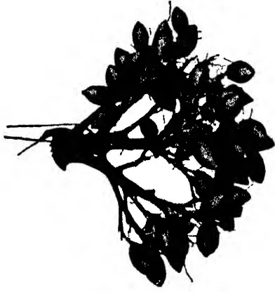A black and white botanical illustration of a plant, labeled 'I'. It shows a woody stem with several large, ovate leaves with serrated margins. The plant has a few small, thin roots visible at the base.

I

I—Sinhala Puwak

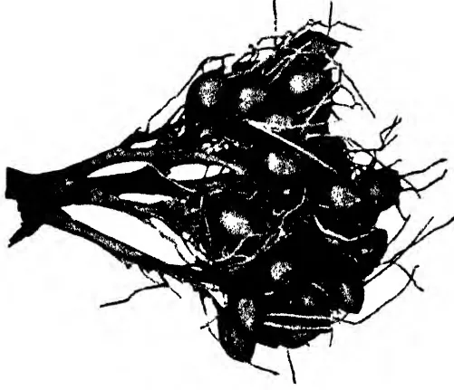A black and white botanical illustration of a plant, labeled 'II'. It shows a thick, woody root system with several large, oval-shaped fruits or seed pods attached to the roots. The fruits have a textured surface and are shown in a cluster.

II

II—Rata Puwak

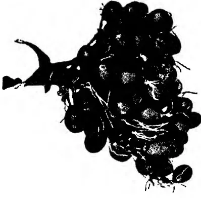A black and white botanical illustration of a plant, labeled 'III'. It shows a thick, woody stem with a dense cluster of small, round fruits or seed pods. The fruits are shown in a cluster, with some showing a textured surface.

III

III—Hamban Puwak

500------------------------------------------------

501------------------------------------------------

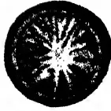A black and white illustration of a cross-section of a fruit, showing a central cavity with radiating internal structures, possibly seeds or pulp.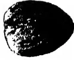A black and white illustration of a whole, oval-shaped fruit with a textured surface.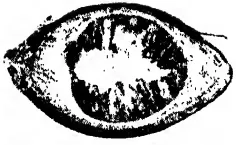A black and white illustration of a longitudinal section of a fruit, showing a central cavity with radiating internal structures.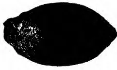A black and white illustration of a whole, oval-shaped fruit with a textured surface.

I

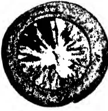A black and white illustration of a cross-section of a fruit, showing a central cavity with radiating internal structures.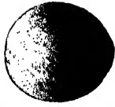A black and white illustration of a whole, oval-shaped fruit with a textured surface.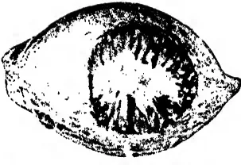A black and white illustration of a longitudinal section of a fruit, showing a central cavity with radiating internal structures.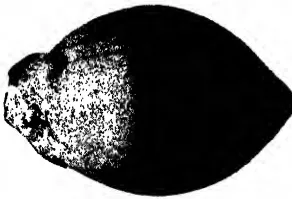A black and white illustration of a whole, oval-shaped fruit with a textured surface.

II

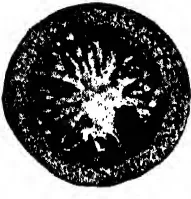A black and white illustration of a cross-section of a fruit, showing a central cavity with radiating internal structures.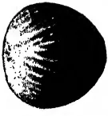A black and white illustration of a whole, oval-shaped fruit with a textured surface.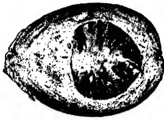A black and white illustration of a longitudinal section of a fruit, showing a central cavity with radiating internal structures.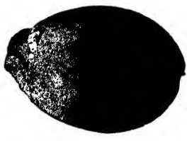A black and white illustration of a whole, oval-shaped fruit with a textured surface.

III

I—Sinhala Puwak

II—Rata Puwak

III—Hamban Puwak

502------------------------------------------------

503------------------------------------------------

45

The market rates of arecanut products fluctuate; and at the present time they are as follows :

<table border="0">
<tr>
<td>(1) Whole green tender fruits ...</td>
<td>Sold by the crop at the rate of Rs. 15 per 100 trees</td>
</tr>
<tr>
<td>(2) Whole ripe fruits ...</td>
<td>Re. 1-25 per 1,000</td>
</tr>
<tr>
<td>(3) Whole dry nuts (karunka) ...</td>
<td>Rs. 16 per cwt.</td>
</tr>
<tr>
<td>(4) Split dry nuts (kalipakku) }</td>
<td>1st quality Rs. 36 per cwt. 2nd quality Rs. 24 per cwt. 3rd quality Rs. 17 per cwt.</td>
</tr>
</table>

The trade of the Island in this product may be gauged from the following table :

<table border="0">
<thead>
<tr>
<th></th>
<th></th>
<th>Quantity Exported (Dried Nuts) Cwt.</th>
<th></th>
<th>Value Rs.</th>
</tr>
</thead>
<tbody>
<tr>
<td>1922</td>
<td>...</td>
<td>133,531</td>
<td>...</td>
<td>3,331,148</td>
</tr>
<tr>
<td>1923</td>
<td>...</td>
<td>160,578</td>
<td>...</td>
<td>3,544,212</td>
</tr>
<tr>
<td>1924</td>
<td>...</td>
<td>130,904</td>
<td>...</td>
<td>3,294,961</td>
</tr>
<tr>
<td>1925</td>
<td>...</td>
<td>154,291</td>
<td>...</td>
<td>4,046,244</td>
</tr>
<tr>
<td>1926</td>
<td>...</td>
<td>165,475</td>
<td>...</td>
<td>4,247,825</td>
</tr>
<tr>
<td>1927</td>
<td>...</td>
<td>118,278</td>
<td>...</td>
<td>3,001,268</td>
</tr>
<tr>
<td colspan="5">Average of ten years—</td>
</tr>
<tr>
<td></td>
<td>1907-1916</td>
<td>...</td>
<td>130,724</td>
<td>...</td>
<td>2,590,624</td>
</tr>
<tr>
<td></td>
<td>1917-1926</td>
<td>...</td>
<td>151,109</td>
<td>...</td>
<td>3,450,512</td>
</tr>
</tbody>
</table>

Practically the whole of the quantity exported goes to India. 93.7 per cent. to British India and Burma and 3.2 per cent. to the Maldive Islands.

### PESTS AND DISEASES

The following information has been furnished by the Inspector for Plant Pests and Diseases, Central Division :

**Insects.**—One aphid and three different scale-insects are reported to occur. The spotted locust, *Aularches miliaris*, is not often found, but when present may do serious damage by feeding on the leaves.

**Diseases.**—The most harmful disease is caused by the fungus *Phytophthora arecae*; the fungus first attacks the fruits, causing them to rot and fall off while still immature. As the disease progresses the fruit-stalk withers and falls to the ground. The fungus will ultimately spread to the crown and cause a rot of the bud, which will result in the death of the tree. Wet weather favours the development of the fungus and the spread of the disease. The following preventive measures are recommended :

1. (1) Adequate spacing to allow sunlight and air to enter the plantation ;
2. (2) The removal by cutting down and burning of all palms or parts which have been killed by the disease ;
3. (3) Placing a portion of a leaf-spathe over the flowers and bunch of fruit to act as a cover in preventing an excess of moisture lodging in the axils of the flower-stalks. In order to control this disease when it has occurred, spraying with Bordeaux mixture is the only method that can be recommended. This treatment is practised in South India and has proved to be most successful.

504------------------------------------------------

46

## DEPARTMENTAL NOTES

### PROGRESS REPORT OF THE EXPERIMENT STATION, PERADENIYA

#### FOR THE MONTHS OF MAY AND JUNE, 1930

##### TEA

**T**HE pruning of the plots which were not pruned last October, viz. plots 163, 164, 166, and the Hillside Tea, was completed in May. The style of pruning adopted was much lighter than that hitherto adopted on the Station: all side branches below the pruning level were left untouched.

After consultation with members of the sub-Committee appointed to discuss the question of a pruning experiment it was decided not to proceed with the scheme.

In June a mixture consisting of

<table>
<tr>
<td>Calcium cyanamide</td>
<td>...</td>
<td>...</td>
<td>100 lb. per acre.</td>
</tr>
<tr>
<td>Ephos Phosphate</td>
<td>...</td>
<td>...</td>
<td>100 lb. "</td>
</tr>
<tr>
<td>Muriate of Potash</td>
<td>...</td>
<td>...</td>
<td>50 lb. "</td>
</tr>
</table>

was forked into all plots pruned in April and May together with the leafy material from *Glicidias*.

##### RUBBER

The results of a number of experiments up to the end of 1929 which have not been previously published are included in this report.

##### *The Hilltop Rubber*

This area is divided into three blocks A, B, and C.

Block A is planted with clumps of 4 trees 12 ft. by 15 ft., with 40 ft. between the clumps, giving 69 trees per acre.

Block B is planted in avenues 12 ft. by 15 ft. with 40 ft. between the avenues, giving 112 trees per acre!

Block C is planted 20 ft. by 20 ft., giving 109 trees per acre.

Half the trees in blocks A and B are tapped with a V cut and half with a single cut, while in block C half the trees are tapped on alternate days and half every third day. To compare the three methods of planting therefore, it is only possible to take into consideration those trees which are tapped on alternate days with a single cut. From such trees the following yields were obtained up to the end of 1929:

<table border="1">
<thead>
<tr>
<th rowspan="2">Block and method of planting</th>
<th rowspan="2">No. of trees per acre</th>
<th colspan="3">Average yield per tree</th>
<th colspan="3">Calculated yield per acre</th>
</tr>
<tr>
<th>1929 lb. oz.</th>
<th>Previous 1922-28 lb. oz.</th>
<th>Total to date lb. oz.</th>
<th>1929 lb. oz.</th>
<th>Previous 1922-28 lb.</th>
<th>Total to date lb.</th>
</tr>
</thead>
<tbody>
<tr>
<td>A. Clumps of 4 trees 12 ft. by 15 ft. with 40 ft. between clumps</td>
<td>69</td>
<td>5 2</td>
<td>27 15</td>
<td>33 1</td>
<td>354</td>
<td>2076</td>
<td>2430</td>
</tr>
<tr>
<td>B. Avenues. Trees 12 ft. by 15 ft. with 40 ft. between avenues</td>
<td>112</td>
<td>3 0</td>
<td>18 7</td>
<td>21 7</td>
<td>336</td>
<td>2041</td>
<td>2377</td>
</tr>
<tr>
<td>C. Square planting, 20 ft. by 20 ft.</td>
<td>109</td>
<td>3 12</td>
<td>21 7</td>
<td>25 3</td>
<td>420</td>
<td>2311</td>
<td>2731</td>
</tr>
</tbody>
</table>

505------------------------------------------------

47

The conditions in the three blocks are not equal but the superior yield per tree in the widely spaced clumps compels attention. There is a possibility that a modification of the clump system to give a few more trees per acre might give good results and at the same time give more room for the cultivation of catch crops when the rubber is young.

In growth, as shown by girth measurements, the trees in widely-spaced clumps also show remarkable superiority.

<table border="1">
<thead>
<tr>
<th></th>
<th colspan="2">Girth Dec. 1921 inches</th>
<th colspan="2">Girth Dec. 1929 inches</th>
<th colspan="2">Increase inches</th>
</tr>
</thead>
<tbody>
<tr>
<td>Block A</td>
<td>28.5</td>
<td>...</td>
<td>47.8</td>
<td>...</td>
<td>19.3</td>
<td></td>
</tr>
<tr>
<td>Block B</td>
<td>29.5</td>
<td>...</td>
<td>44.6</td>
<td>...</td>
<td>15.1</td>
<td></td>
</tr>
<tr>
<td>Block C</td>
<td>27.5</td>
<td>...</td>
<td>41.0</td>
<td>...</td>
<td>13.1</td>
<td></td>
</tr>
</tbody>
</table>

As stated half the trees in blocks A and B are tapped with a V cut and half with a single left-to-right cut. In both cases the cuts occupy half the circumference and are at the same height from the ground. The average yields per tree since the start of the experiment are given below:

<table border="1">
<thead>
<tr>
<th rowspan="3">Year</th>
<th colspan="6">Single Cut</th>
<th colspan="4">V Cut</th>
<th colspan="4">Average increase per tree from use of V cut.</th>
</tr>
<tr>
<th colspan="2">Block A</th>
<th colspan="2">Block B</th>
<th colspan="2">Average</th>
<th colspan="2">Block A</th>
<th colspan="2">Block B</th>
<th colspan="2">Average</th>
<th colspan="2">per tree from use of V cut.</th>
</tr>
<tr>
<th>lb.</th>
<th>oz.</th>
<th>lb.</th>
<th>oz.</th>
<th>lb.</th>
<th>oz.</th>
<th>lb.</th>
<th>oz.</th>
<th>lb.</th>
<th>oz.</th>
<th>lb.</th>
<th>oz.</th>
<th>lb.</th>
<th>oz.</th>
</tr>
</thead>
<tbody>
<tr>
<td>1922 (April to December)</td>
<td>2</td>
<td>7</td>
<td>1</td>
<td>12</td>
<td>2</td>
<td>1</td>
<td>2</td>
<td>5</td>
<td>1</td>
<td>12</td>
<td>2</td>
<td>0</td>
<td>—</td>
<td>1</td>
</tr>
<tr>
<td>1923</td>
<td>3</td>
<td>11</td>
<td>2</td>
<td>4</td>
<td>3</td>
<td>0</td>
<td>4</td>
<td>0</td>
<td>2</td>
<td>12</td>
<td>3</td>
<td>6</td>
<td>+</td>
<td>6</td>
</tr>
<tr>
<td>1924</td>
<td>4</td>
<td>14</td>
<td>2</td>
<td>13</td>
<td>3</td>
<td>13</td>
<td>5</td>
<td>10</td>
<td>3</td>
<td>7</td>
<td>4</td>
<td>9</td>
<td>+</td>
<td>12</td>
</tr>
<tr>
<td>1925</td>
<td>5</td>
<td>0</td>
<td>3</td>
<td>2</td>
<td>4</td>
<td>1</td>
<td>5</td>
<td>7</td>
<td>3</td>
<td>10</td>
<td>4</td>
<td>9</td>
<td>+</td>
<td>8</td>
</tr>
<tr>
<td>1926</td>
<td>4</td>
<td>8</td>
<td>3</td>
<td>0</td>
<td>3</td>
<td>12</td>
<td>5</td>
<td>3</td>
<td>3</td>
<td>0</td>
<td>4</td>
<td>1</td>
<td>+</td>
<td>5</td>
</tr>
<tr>
<td>1927</td>
<td>5</td>
<td>0</td>
<td>2</td>
<td>14</td>
<td>3</td>
<td>15</td>
<td>5</td>
<td>6</td>
<td>3</td>
<td>9</td>
<td>4</td>
<td>8</td>
<td>+</td>
<td>9</td>
</tr>
<tr>
<td>1928</td>
<td>4</td>
<td>7</td>
<td>2</td>
<td>10</td>
<td>3</td>
<td>8</td>
<td>4</td>
<td>15</td>
<td>3</td>
<td>6</td>
<td>4</td>
<td>2</td>
<td>+</td>
<td>10</td>
</tr>
<tr>
<td>1929</td>
<td>5</td>
<td>11</td>
<td>3</td>
<td>0</td>
<td>4</td>
<td>6</td>
<td>6</td>
<td>11</td>
<td>4</td>
<td>3</td>
<td>5</td>
<td>7</td>
<td>+1</td>
<td>1</td>
</tr>
<tr>
<td>Total</td>
<td>35</td>
<td>10</td>
<td>21</td>
<td>7</td>
<td>28</td>
<td>8</td>
<td>39</td>
<td>9</td>
<td>25</td>
<td>11</td>
<td>32</td>
<td>10</td>
<td>+4</td>
<td>4</td>
</tr>
</tbody>
</table>

The figures show a steady superiority of yield from the V cut amounting over seven years and nine months to 4 lb. 4 oz. per tree.

It has been claimed that the use of a V cut results in a smaller proportion of scrap rubber. The difference in this experiment, however, is not marked. The figures are as follows:

<table border="1">
<thead>
<tr>
<th colspan="4">Percentage scrap of total yield</th>
</tr>
<tr>
<th>Year</th>
<th colspan="2">Single cut</th>
<th>V cut</th>
</tr>
</thead>
<tbody>
<tr>
<td>1922</td>
<td>...</td>
<td>11.0</td>
<td>...</td>
</tr>
<tr>
<td>1923</td>
<td>...</td>
<td>10.7</td>
<td>...</td>
</tr>
<tr>
<td>1924</td>
<td>...</td>
<td>16.8</td>
<td>...</td>
</tr>
<tr>
<td>1925</td>
<td>...</td>
<td>17.7</td>
<td>...</td>
</tr>
<tr>
<td>1926</td>
<td>...</td>
<td>23.3</td>
<td>...</td>
</tr>
<tr>
<td>1927</td>
<td>...</td>
<td>17.1</td>
<td>...</td>
</tr>
<tr>
<td>1928</td>
<td>...</td>
<td>18.0</td>
<td>...</td>
</tr>
<tr>
<td>1929</td>
<td>...</td>
<td>21.4</td>
<td>...</td>
</tr>
<tr>
<td>Average</td>
<td>...</td>
<td>17.0</td>
<td>...</td>
</tr>
</tbody>
</table>

In Block C a comparison between alternate day and three-day tapping is in progress.

506------------------------------------------------

48

The cuts on the trees tapped every three days are started at two-thirds of the height of the cuts on the trees tapped on alternate days so that the two cuts reach the bottom of the trees at the same time.

The following table shows the average yields per acre :

<table border="1">
<thead>
<tr>
<th rowspan="3">Year</th>
<th colspan="6">Alternate day tapping</th>
<th colspan="4">Three-day tapping</th>
<th rowspan="3">Percentage of alternate day tapping yield obtained by three-day tapping</th>
</tr>
<tr>
<th colspan="2">Series 1</th>
<th colspan="2">Series 3</th>
<th colspan="2">Series 5</th>
<th colspan="2">Series 2</th>
<th colspan="2">Series 4</th>
<th colspan="2">Series 6</th>
</tr>
<tr>
<th>lb. oz.</th>
<th>lb. oz.</th>
<th>lb. oz.</th>
<th>lb. oz.</th>
<th>lb. oz.</th>
<th>lb. oz.</th>
<th>lb. oz.</th>
<th>lb. oz.</th>
<th>lb. oz.</th>
<th>lb. oz.</th>
<th>lb. oz.</th>
<th>lb. oz.</th>
</tr>
</thead>
<tbody>
<tr>
<td>1922 (April to December)</td>
<td>2 2</td>
<td>2 2</td>
<td>2 3</td>
<td>1 13</td>
<td>2 1</td>
<td>1 10</td>
<td>1 9</td>
<td>1 9</td>
<td>1 9</td>
<td>1 9</td>
<td>75.5</td>
</tr>
<tr>
<td>1923</td>
<td>3 0</td>
<td>3 2</td>
<td>2 10</td>
<td>2 15</td>
<td>2 10</td>
<td>2 4</td>
<td>2 8</td>
<td>2 7</td>
<td>2 7</td>
<td>85.1</td>
</tr>
<tr>
<td>1924</td>
<td>3 6</td>
<td>4 1</td>
<td>3 5</td>
<td>3 9</td>
<td>2 12</td>
<td>2 13</td>
<td>2 13</td>
<td>2 13</td>
<td>2 13</td>
<td>79.0</td>
</tr>
<tr>
<td>1925</td>
<td>3 6</td>
<td>3 12</td>
<td>3 13</td>
<td>3 11</td>
<td>2 15</td>
<td>2 15</td>
<td>2 15</td>
<td>2 15</td>
<td>2 15</td>
<td>81.4</td>
</tr>
<tr>
<td>1926</td>
<td>3 3</td>
<td>3 4</td>
<td>3 1</td>
<td>3 3</td>
<td>2 14</td>
<td>2 12</td>
<td>2 11</td>
<td>2 12</td>
<td>2 12</td>
<td>80.9</td>
</tr>
<tr>
<td>1927</td>
<td>3 5</td>
<td>2 15</td>
<td>3 8</td>
<td>3 4</td>
<td>2 6</td>
<td>2 8</td>
<td>2 7</td>
<td>2 7</td>
<td>2 7</td>
<td>82.5</td>
</tr>
<tr>
<td>1928</td>
<td>3 1</td>
<td>3 0</td>
<td>2 13</td>
<td>2 15</td>
<td>2 2</td>
<td>1 15</td>
<td>2 2</td>
<td>2 1</td>
<td>2 1</td>
<td>74.6</td>
</tr>
<tr>
<td>1929</td>
<td>3 11</td>
<td>3 14</td>
<td>3 11</td>
<td>3 12</td>
<td>3 5</td>
<td>2 13</td>
<td>2 11</td>
<td>2 15</td>
<td>2 15</td>
<td>78.3</td>
</tr>
<tr>
<td>Total</td>
<td>25 2</td>
<td>26 3</td>
<td>24 10</td>
<td>25 6</td>
<td>20 10</td>
<td>19 9</td>
<td>19 12</td>
<td>19 15</td>
<td>19 15</td>
<td>79.6</td>
</tr>
</tbody>
</table>

It appears that a reduction of the number of tappings by one-third reduces the yield by only about one-fifth.

Of possibly more interest than the yield per tree is the incidence of brown bast. From the start of the experiment the incidence has been less in the three-day tapping series. At the end of 1929 the total number of trees which had been treated for brown bast or showed symptoms of the disease amounted to 10% of the trees tapped on alternate days and 5.5% of the trees tapped every three days.

All the present experiments in the Hilltop rubber will terminate at the end of 1930.

### The Hillside Rubber

In this area there is a comparison between tapping daily in alternate months and tapping on alternate days throughout the year. To obviate differences caused by unequal weather conditions in the different months two series are tapped daily in the months of January, March, May, etc., two are tapped daily in the months of February, April, June, etc., while the remaining two series are tapped throughout the year on alternate days.

The average yields per tree are given below :

<table border="1">
<thead>
<tr>
<th rowspan="3">Year</th>
<th colspan="3">Alternate daily throughout the year</th>
<th colspan="3">Daily in January, March, May etc.</th>
<th colspan="3">Daily in February, April, June etc.</th>
<th rowspan="3">Average of all daily tapped series</th>
</tr>
<tr>
<th>Series 1</th>
<th>Series 6</th>
<th>Average</th>
<th>Series 2</th>
<th>Series 4</th>
<th>Average</th>
<th>Series 3</th>
<th>Series 5</th>
<th>Average</th>
</tr>
<tr>
<th>lb. oz.</th>
<th>lb. oz.</th>
<th>lb. oz.</th>
<th>lb. oz.</th>
<th>lb. oz.</th>
<th>lb. oz.</th>
<th>lb. oz.</th>
<th>lb. oz.</th>
<th>lb. oz.</th>
<th>lb. oz.</th>
</tr>
</thead>
<tbody>
<tr>
<td>1922 (April to Dec.)</td>
<td>1 14</td>
<td>1 14</td>
<td>1 14</td>
<td>1 13</td>
<td>2 0</td>
<td>1 14</td>
<td>1 15</td>
<td>1 15</td>
<td>1 15</td>
<td>1 15</td>
</tr>
<tr>
<td>1923</td>
<td>3 8</td>
<td>3 0</td>
<td>3 4</td>
<td>3 0</td>
<td>3 3</td>
<td>3 2</td>
<td>2 14</td>
<td>3 0</td>
<td>2 15</td>
<td>3 0</td>
</tr>
<tr>
<td>1924</td>
<td>4 1</td>
<td>3 11</td>
<td>3 14</td>
<td>3 9</td>
<td>3 8</td>
<td>3 8</td>
<td>3 14</td>
<td>3 14</td>
<td>3 14</td>
<td>3 11</td>
</tr>
<tr>
<td>1925</td>
<td>3 13</td>
<td>3 4</td>
<td>3 9</td>
<td>3 10</td>
<td>3 9</td>
<td>3 9</td>
<td>3 12</td>
<td>3 15</td>
<td>3 14</td>
<td>3 11</td>
</tr>
<tr>
<td>1926</td>
<td>3 10</td>
<td>3 5</td>
<td>3 8</td>
<td>3 11</td>
<td>3 9</td>
<td>3 10</td>
<td>4 5</td>
<td>3 8</td>
<td>3 15</td>
<td>3 13</td>
</tr>
<tr>
<td>1927</td>
<td>4 4</td>
<td>4 12</td>
<td>4 8</td>
<td>3 5</td>
<td>3 12</td>
<td>3 8</td>
<td>3 14</td>
<td>4 0</td>
<td>3 15</td>
<td>3 12</td>
</tr>
<tr>
<td>1928</td>
<td>4 2</td>
<td>4 2</td>
<td>4 2</td>
<td>2 15</td>
<td>3 6</td>
<td>3 3</td>
<td>3 4</td>
<td>3 9</td>
<td>3 6</td>
<td>3 4</td>
</tr>
<tr>
<td>1929</td>
<td>4 10</td>
<td>4 7</td>
<td>4 8</td>
<td>3 12</td>
<td>4 8</td>
<td>4 3</td>
<td>4 3</td>
<td>4 6</td>
<td>4 4</td>
<td>4 4</td>
</tr>
<tr>
<td>Total</td>
<td>29 14</td>
<td>28 7</td>
<td>29 3</td>
<td>25 11</td>
<td>27 7</td>
<td>26 9</td>
<td>28 1</td>
<td>28 3</td>
<td>28 2</td>
<td>27 6</td>
</tr>
</tbody>
</table>

507------------------------------------------------

49

Over the whole period of 7 years and 9 months the yield of the trees tapped on alternate days shows a superiority of 1 lb. 10 oz. per tree. It is found that after resting for a month the trees usually take 10 days before resuming their full yield but in spite of this the yields from the two methods do not show marked differences. The yield from any part of an estate which was tapped daily in alternate months would depend largely on the incidence of rainfall for that year. It might be considered more convenient to have the tapping labour more concentrated.

The effect of different methods of tapping on brown bast incidence is always important. The number of cases among the trees tapped daily in alternate months has been consistently higher and at the end of 1929 the total number of trees which had been treated or which showed symptoms of the disease was 15% among the trees tapped daily in alternate months and 9% among those tapped on alternate days.

#### *Plot 87. Left-to-Right vs. Right-to-Left Cut*

This experiment was started on April 1st, 1926. Two cuts, one left-to-right and one right-to-left, are put on each tree, each occupying a quarter of the circumference. The two cuts together form an inverted V and occupy half the circumference. The latex from all left-to-right cuts, and all right-to-left cuts is collected separately.

114 trees were originally used but 6 were treated for brown bast during 1929 and taken out of tapping.

The yields for 4 years are shown below:

<table border="1">
<thead>
<tr>
<th rowspan="2">Year</th>
<th colspan="2">Grammes dry rubber</th>
<th rowspan="2"></th>
<th rowspan="2">Difference</th>
</tr>
<tr>
<th>Left-to-right cuts</th>
<th>Right-to-left cuts</th>
</tr>
</thead>
<tbody>
<tr>
<td>1926-27</td>
<td>162681</td>
<td>151119</td>
<td>Left-to-right</td>
<td>8% better</td>
</tr>
<tr>
<td>1927-28</td>
<td>136397</td>
<td>143728</td>
<td>Right-to-left</td>
<td>5% ,,</td>
</tr>
<tr>
<td>1928-29</td>
<td>140121</td>
<td>139060</td>
<td>Left-to-right</td>
<td><math>\frac{3}{4}</math>% ,,</td>
</tr>
<tr>
<td>1929-30</td>
<td>185739</td>
<td>182278</td>
<td>Left-to-right</td>
<td>1% ,,</td>
</tr>
<tr>
<td>Total</td>
<td>624938</td>
<td>616185</td>
<td>Left-to-right</td>
<td>1<math>\frac{1}{2}</math>% ,,</td>
</tr>
</tbody>
</table>

The yields appear to indicate that the direction of the slope of the cut does not materially influence yield. The percentage of scrap is also the same in both cases.

A left-to-right cut is the normal estate practice and there would appear to be no object in changing this practice.

#### *The Avenue Rubber. One-Third Resting Experiment*

This experiment was started on April 2nd, 1928. There are 12 plots of 25 trees each. Six of these plots are tapped on alternate days throughout the year. The other six plots are divided into three sub-plots of 8 trees each known respectively as the (a), (b), and (c) sub-plots. Each of these sub-plots is rested in turn for a month at a time so that only two two-thirds of the trees in these six plots are in tapping at any one time.

The following are the yields per tree for the first two years:

508------------------------------------------------

50

<table border="1">
<thead>
<tr>
<th rowspan="2">Year</th>
<th colspan="6">Yield per tree of plots tapped continuously on alternate days</th>
<th colspan="6">Yield per tree of plots in which one-third of the trees are rested.</th>
<th rowspan="2">Percentage loss by one-third resting</th>
</tr>
<tr>
<th>1</th>
<th>2</th>
<th>3</th>
<th>4</th>
<th>5</th>
<th>6</th>
<th>Average</th>
<th>1</th>
<th>2</th>
<th>3</th>
<th>4</th>
<th>5</th>
<th>6</th>
<th>Average</th>
</tr>
<tr>
<th></th>
<th colspan="6">lb oz. lb. oz. lb. oz. lb. oz. lb. oz. lb. oz. lb. oz. lb. oz. lb. oz. lb. oz. lb. oz.</th>
<th></th>
<th colspan="6">lb. oz. lb. oz. lb. oz. lb. oz. lb. oz. lb. oz. lb. oz.</th>
<th></th>
</tr>
</thead>
<tbody>
<tr>
<td>1928-29</td>
<td>3 1</td>
<td>3 2</td>
<td>3 1</td>
<td>3 1</td>
<td>3 6</td>
<td>3 5</td>
<td>3 3</td>
<td>3 1</td>
<td>2 13</td>
<td>2 11</td>
<td>2 14</td>
<td>2 13</td>
<td>2 14</td>
<td>2 14</td>
<td>10</td>
</tr>
<tr>
<td>1929-30</td>
<td>3 13</td>
<td>4 3</td>
<td>3 10</td>
<td>3 13</td>
<td>4 5</td>
<td>4 8</td>
<td>4 1</td>
<td>3 8</td>
<td>3 8</td>
<td>3 3</td>
<td>3 2</td>
<td>3 2</td>
<td>3 6</td>
<td>3 7</td>
<td>20</td>
</tr>
<tr>
<td>Total</td>
<td>6 14</td>
<td>7 5</td>
<td>6 11</td>
<td>6 14</td>
<td>7 11</td>
<td>7 13</td>
<td>7 4</td>
<td>6 9</td>
<td>6 5</td>
<td>5 14</td>
<td>6 0</td>
<td>5 15</td>
<td>6 4</td>
<td>6 5</td>
<td>15</td>
</tr>
</tbody>
</table>

509------------------------------------------------

51

The principal point calling for comment is that the loss in yield by resting one-third of the area under tapping for a month at a time is doubled in the second year of the experiment. The reason for this is by no means clear. It was thought that possibly there was a variation in the rubber content of the latex but this does not appear to be so. The figures are as follows :

*No. of grammes of dry rubber in 100 c.c. Latex*

<table>
<thead>
<tr>
<th></th>
<th>Continuously tapped plots</th>
<th>One-third rested plots</th>
</tr>
</thead>
<tbody>
<tr>
<td>1928-29</td>
<td>... 34.7</td>
<td>... 36.3</td>
</tr>
<tr>
<td>1929-30</td>
<td>... 35.5</td>
<td>... 37.9</td>
</tr>
</tbody>
</table>

The ratio between the figures from the two sets of plots has remained about the same and the question of rubber content affords no explanation of the problem. The rainfall for 1928-29 was 88.95 and for 1929-30, 98.71 in. As both sets of plots are tapped on the same days, however, all plots fare alike in the matter of weather conditions.

In any case it will be observed that considerably less than one-third of the crop is lost by resting one-third of the area, and, what is still more significant, in the continuously tapped plots 13 trees (9% of the total number) have been treated for or show symptoms of brown bast while there are no cases in the one-third resting plots. Both this method of tapping, therefore, and three-day tapping appear to confer a considerable measure of immunity from brown bast.

*The Bandarattenne Rubber. Forking of Vigna vs. No Forking*

In this area an experiment to determine the effect on yield of forking in a cover of *Dolichos hosei* (Vigna) was started on April 1st, 1928. The area was divided into 12 plots of 26 trees each, the plots receiving the different treatments being arranged in randomised pairs. In one set of plots the Vigna was cut and forked in by envelope-forking twice a year while in the other plots it was left untouched. A good even cover of Vigna existed at the start of the experiment.

The yields for the first two years of tapping were as follows :

510------------------------------------------------

Yields of dry rubber per tree

<table border="1">
<thead>
<tr>
<th rowspan="2"></th>
<th colspan="6">Forked plots</th>
<th colspan="6">Unforked plots</th>
<th rowspan="2">Mean difference</th>
</tr>
<tr>
<th>1</th>
<th>2</th>
<th>3</th>
<th>4</th>
<th>5</th>
<th>6</th>
<th>Mean</th>
<th>1</th>
<th>2</th>
<th>3</th>
<th>4</th>
<th>5</th>
<th>6</th>
</tr>
<tr>
<th></th>
<th>lb. oz.</th>
<th>lb. oz.</th>
<th>lb. oz.</th>
<th>lb. oz.</th>
<th>lb. oz.</th>
<th>lb. oz.</th>
<th>lb. oz.</th>
<th>lb. oz.</th>
<th>lb. oz.</th>
<th>lb. oz.</th>
<th>lb. oz.</th>
<th>lb. oz.</th>
<th>lb. oz.</th>
<th>lb. oz.</th>
</tr>
</thead>
<tbody>
<tr>
<td>1928-29</td>
<td>2 13</td>
<td>3 1</td>
<td>3 0</td>
<td>3 1</td>
<td>3 1</td>
<td>3 6</td>
<td>3 1</td>
<td>2 13</td>
<td>2 13</td>
<td>2 15</td>
<td>2 13</td>
<td>2 10</td>
<td>2 12</td>
<td>2 13</td>
</tr>
<tr>
<td>1929-30</td>
<td>4 3</td>
<td>5 2</td>
<td>4 11</td>
<td>6 6</td>
<td>5 3</td>
<td>4 4</td>
<td>4 15</td>
<td>4 14</td>
<td>3 10</td>
<td>4 0</td>
<td>3 10</td>
<td>3 13</td>
<td>3 14</td>
<td>4 0</td>
</tr>
<tr>
<td>Total</td>
<td>7 0</td>
<td>8 3</td>
<td>7 11</td>
<td>9 7</td>
<td>8 4</td>
<td>7 10</td>
<td>8 0</td>
<td>7 11</td>
<td>6 7</td>
<td>6 15</td>
<td>6 7</td>
<td>6 7</td>
<td>6 10</td>
<td>6 13</td>
</tr>
<tr>
<td></td>
<td></td>
<td></td>
<td></td>
<td></td>
<td></td>
<td></td>
<td></td>
<td></td>
<td></td>
<td></td>
<td></td>
<td></td>
<td></td>
<td>1 3</td>
</tr>
</tbody>
</table>

53

511------------------------------------------------

53

In 1928-29 the forked plots showed a significant increase of yield of 9.7% over the unforked plots. This increase was much larger in 1929-30 and amounted to 19.9%.

Although the forked plots have yielded significantly more than the unforked plots there is no proof that the increase is due to the forking in of the green material. It is quite possible, and even probable, that it is due to the forking, and a modification of the experiment is needed to elucidate this point. It is proposed in future to fork both sets of plots but only to fork in the green material in one set of plots.

In the meantime, however, the cover has become very patchy and many bare spaces are to be seen especially in the forked plots where the vigna has in many cases failed to come on again after forking. It is proposed therefore to suspend the experiment for a year and in that time to try to re-establish an even cover of vigna.

### Plot 165. Budded Rubber

This plot was planted in December 1922. Buds from what were then (after 1 year's tapping) the twelve best yielders in plots 14-15 (progeny of No. 2 tree Heneratgodia) were put on to stocks grown from seed of No. 2 tree Heneratgodia.

In the light of modern knowledge of what constitutes a high-yielding rubber tree none of the mother trees used can be considered high yielders and it is therefore not surprising that no high-yielding clones are found among the offspring. Tapping was started with a single cut on the half circumference at a height of 21 inches on May 1st, 1928. The yields for the first two years of tapping are as follows:

<table border="1">
<thead>
<tr>
<th rowspan="3">No. of Clone</th>
<th rowspan="3">No. of trees in Clone</th>
<th colspan="2">Mean yield of dry rubber in grammes per tapping</th>
<th colspan="4">Mean yield of dry rubber per tree per year</th>
</tr>
<tr>
<th>1928-29</th>
<th>1929-30</th>
<th colspan="2">1928-29.</th>
<th colspan="2">1929-30.</th>
</tr>
<tr>
<th>grammes</th>
<th>grammes</th>
<th>grammes</th>
<th>lb.</th>
<th>grammes</th>
<th>lb.</th>
</tr>
</thead>
<tbody>
<tr>
<td>P 5</td>
<td>10</td>
<td>4.12</td>
<td>7.24</td>
<td>688.20</td>
<td>1.52</td>
<td>1194.60</td>
<td>2.74</td>
</tr>
<tr>
<td>P 12</td>
<td>9</td>
<td>4.14</td>
<td>6.95</td>
<td>691.33</td>
<td>1.52</td>
<td>1148.77</td>
<td>2.64</td>
</tr>
<tr>
<td>P 32</td>
<td>8</td>
<td>3.79</td>
<td>6.52</td>
<td>633.38</td>
<td>1.40</td>
<td>1076.75</td>
<td>2.47</td>
</tr>
<tr>
<td>P 38</td>
<td>8</td>
<td>4.05</td>
<td>7.15</td>
<td>675.75</td>
<td>1.49</td>
<td>1180.25</td>
<td>2.71</td>
</tr>
<tr>
<td>P 42</td>
<td>10</td>
<td>3.39</td>
<td>5.33</td>
<td>550.00</td>
<td>1.23</td>
<td>979.90</td>
<td>2.25</td>
</tr>
<tr>
<td>P 54</td>
<td>5</td>
<td>3.00</td>
<td>6.66</td>
<td>500.00</td>
<td>1.10</td>
<td>1099.40</td>
<td>2.52</td>
</tr>
<tr>
<td>P 67</td>
<td>7</td>
<td>3.52</td>
<td>6.59</td>
<td>588.29</td>
<td>1.30</td>
<td>1087.00</td>
<td>2.50</td>
</tr>
<tr>
<td>P 82</td>
<td>9</td>
<td>4.13</td>
<td>6.64</td>
<td>689.55</td>
<td>1.52</td>
<td>1096.55</td>
<td>2.52</td>
</tr>
<tr>
<td>P 83</td>
<td>10</td>
<td>2.76</td>
<td>5.63</td>
<td>463.80</td>
<td>1.02</td>
<td>929.10</td>
<td>2.13</td>
</tr>
<tr>
<td>P109</td>
<td>7</td>
<td>4.46</td>
<td>6.35</td>
<td>748.86</td>
<td>1.65</td>
<td>1049.42</td>
<td>2.41</td>
</tr>
<tr>
<td>P138</td>
<td>3</td>
<td>4.64</td>
<td>6.94</td>
<td>775.00</td>
<td>1.71</td>
<td>1146.00</td>
<td>2.63</td>
</tr>
<tr>
<td>P160</td>
<td>8</td>
<td>4.16</td>
<td>6.88</td>
<td>694.25</td>
<td>1.53</td>
<td>1136.50</td>
<td>2.61</td>
</tr>
</tbody>
</table>

All yields show a considerable increase in 1929-30 which is partly due to the increased age of the trees and partly to better weather conditions.

On May 1st, 1930 the trees were divided into three groups of 30 trees each and tapping was started on the other side of the trees at three different heights. One group is being tapped at 5 feet from the ground, one at 3 feet and one at 1 foot. All cuts are on the half circumference at an angle of  $22\frac{1}{2}^\circ$ . Tapping is on alternate days.

512------------------------------------------------

54

### Plots 83-86—Rejuvenation Experiment

The area used for this experiment is divided into four plots. In each plot the bark consumption is worked out so as to use up the available bark in one, two, three, and four years respectively.

Plot 1 is tapped daily to the wood on two cuts on the half circumference with 2 inches of bark consumption per month.

Plot 2 is tapped daily to the wood on two cuts with  $1\frac{2}{3}$  inches of bark consumption per month.

Plot 3 is tapped daily to the wood on two cuts with  $1\frac{1}{3}$  inches of bark consumption per month.

Plot 4 is tapped daily in alternate months, fine tapping but not to the wood, with  $1\frac{2}{3}$  inches of bark consumption per month. Plot 4 thus receives only half the number of tappings given to plots 1, 2 and 3.

The two cuts are in each case one above the other.

Quite early in the experiment it was apparent that many of the cuts, both top and bottom, in plots 1, 2, and 3 were going dry. In these cases the cut was changed to the other side of the tree. In a few cases these second cuts have also gone dry and the tree is yielding little or nothing. It appeared thus that daily tapping was defeating its own ends and was possibly uneconomic except over a period of 3 or 4 months.

An article entitled "Tapping to Death: A Warning." was contributed to the April number of *The Tropical Agriculturist* in which the results of this tapping for 4 months were given.

The results after 8 months of tapping are as follows:

<table border="1">
<thead>
<tr>
<th></th>
<th>Plot 1</th>
<th>Plot 2</th>
<th>Plot 3</th>
<th>Plot 4</th>
</tr>
</thead>
<tbody>
<tr>
<td>Number of original top cuts put on</td>
<td>68</td>
<td>76</td>
<td>43</td>
<td>40</td>
</tr>
<tr>
<td>Number of original bottom cuts put on</td>
<td>68</td>
<td>76</td>
<td>43</td>
<td>40</td>
</tr>
<tr>
<td>Number of second top cuts put on when original cuts had gone dry</td>
<td>14</td>
<td>27</td>
<td>9</td>
<td>—</td>
</tr>
<tr>
<td>Number of second bottom cuts put on</td>
<td>29</td>
<td>23</td>
<td>18</td>
<td>1</td>
</tr>
<tr>
<td>Total number of cuts opened</td>
<td>179</td>
<td>202</td>
<td>112</td>
<td>81</td>
</tr>
<tr>
<td>Number of original top cuts gone dry</td>
<td>13</td>
<td>28</td>
<td>9</td>
<td>—</td>
</tr>
<tr>
<td>Number of original bottom cuts gone dry</td>
<td>28</td>
<td>25</td>
<td>18</td>
<td>1</td>
</tr>
<tr>
<td>Number of second top cuts gone dry</td>
<td>1</td>
<td>1</td>
<td>1</td>
<td>—</td>
</tr>
<tr>
<td>Number of second bottom cuts gone dry</td>
<td>2</td>
<td>2</td>
<td>1</td>
<td>—</td>
</tr>
<tr>
<td>Total number of cuts gone dry</td>
<td>44</td>
<td>56</td>
<td>29</td>
<td>1</td>
</tr>
<tr>
<td>Percentage of cuts gone dry</td>
<td>25</td>
<td>28</td>
<td>26</td>
<td>1</td>
</tr>
<tr>
<td>Number of trees in plot</td>
<td>68</td>
<td>76</td>
<td>43</td>
<td>40</td>
</tr>
<tr>
<td>Yield of dry rubber per tree for 8 months' tapping</td>
<td>lb. oz. 10 14</td>
<td>lb. oz. 11 14</td>
<td>lb. oz. 13 0</td>
<td>lb. oz. 10 9</td>
</tr>
</tbody>
</table>

It was pointed out in the article referred to that the rapid drying out of cuts was not more pronounced in the top cuts than in the bottom cuts, in fact the reverse has been the case. Arguments were also adduced to show that

513------------------------------------------------

55

tapping to the wood was not responsible. The varying amount of bark consumption appears also to have exerted little influence and everything points to the daily tapping as the cause of the trouble.

At the end of 8 months the yield of plot 4 which has received only half the number of tappings given to the other three plots is not greatly in arrears and it seems quite possible that it may catch up the other three plots by the end of a year. Even if it fails to do this the crop from plot 4 will have been obtained at much less cost than that from the plots tapped daily throughout.

In spite of the losses through cuts drying out, however, the general level of yields is well worthy of note. Yields of from 10 to 13 lb. of dry rubber in 8 months, which include the wintering period, indicate that when the best system of tapping to death is evolved yields amounting to two and a half times the normal may be easily obtained.

It is at present tentatively suggested that four cuts on a third (or rather more than a third as long as the tree is not completely ringed) tapped on alternate days or daily in alternate months might give the highest yield.

### CACAO

The yields of dry cacao per acre for the last seven years have been as follows :

<table>
<thead>
<tr>
<th>Year</th>
<th colspan="2">cwt. per acre of dry cacao</th>
<th>Rainfall</th>
</tr>
</thead>
<tbody>
<tr>
<td>1923-24</td>
<td>...</td>
<td>2.24</td>
<td>106.42</td>
</tr>
<tr>
<td>1924-25</td>
<td>...</td>
<td>3.10</td>
<td>103.82</td>
</tr>
<tr>
<td>1925-26</td>
<td>...</td>
<td>5.45</td>
<td>87.31</td>
</tr>
<tr>
<td>1926-27</td>
<td>...</td>
<td>5.03</td>
<td>98.11</td>
</tr>
<tr>
<td>1927-28</td>
<td>...</td>
<td>4.41</td>
<td>80.33</td>
</tr>
<tr>
<td>1928-29</td>
<td>...</td>
<td>2.49</td>
<td>88.95</td>
</tr>
<tr>
<td>1929-30</td>
<td>...</td>
<td>4.58</td>
<td>98.71</td>
</tr>
</tbody>
</table>

From 1921 to January 1928, no manures were applied to the cacao. From January 1928, 12 out of the 41 acres of cacao have received phosphatic and potash manures in accordance with the manurial experiment now in progress. The above yields tend to show that cacao yields fluctuate far more with the season than as the result of manurial treatment.

Holes were dug over about 30 acres to receive dadap cuttings to increase the shade where this had become deficient, and cuttings were planted in the latter half of June.

### COFFEE

Pruning of all coffee was started when the crop season was over and was nearly completed by the end of June.

### FODDER PLANTS

Plot 167, containing Efwatakala grass (*Melinis minutiflora*), was ploughed up in May and replanted in June with Guinea grass (*Panicum maximum*). The Efwatakala grass had become so choked with Couch grass and other weeds that its retention was considered useless. This is, at Peradeniya, the common fate of all creeping grasses in which systematic weeding is not practicable.

The trial of *Indigofera endecaphylla* as a grazing plant was recorded in the report for November and December, 1929. Subsequent experience has shown that though well liked by cattle the plant will not stand continuous grazing. It has however, proved exceedingly useful as a cut fodder to supplement the supply of grass in times of shortage.

514------------------------------------------------

56

## FRUIT

One plant of the consignment of grapefruit plants received from South Africa in April, 1928, matured two fruits in May, 1930, at an age of just over two years. The variety was Cecily Seedless and the flavour of the fruit was distinctly different from that of fruits from Ceylon seedlings and much more akin to the flavour of Californian grapefruit.

## OIL-PRODUCING PLANTS

It was reported last year that the plants of *Hydnocarpus whightiana* (one of the sources of Chaulmoogra oil) growing in the terraced valley were severely attacked by a leaf eating caterpillar. The plants remained in a moribund condition for some months and in May, 1930, a fresh attack of the same caterpillar occurred. The land in the terraced valley falls naturally into three blocks and it has been decided to retain the block containing the best of the *Hydnocarpus* trees in this crop and to plant the other two blocks with *Turakto-genos kurzii* and *Aleurites montani* respectively. The former is another chaulmoogra oil-producing tree which does not appear to be attacked by the caterpillar which has done so much damage to the *Hydnocarpus*. The latter is one of the sources of Tung oil. This reorganisation was started in the latter half of June.

## CINCHONA

Neither *Cinchona robusta* nor *Cinchona ledgeriana*, of which plants from Hakgala were planted in plot 25 in June, 1929, are thriving. Of the two *C. ledgeriana* is the best.

## MISCELLANEOUS

Section II of the Manual of green manuring in Ceylon, comprising the Green Manuring of tea, coffee, and cacao, was submitted for publication at the end of April.

The number of visitors during the period under review has been above the average but none of these came on the first visitors' day. On the second visitors' day two visitors arrived but they were not aware that it was a visitors' day.

Weather conditions were abnormal. Torrential rains accompanied by floods fell on May 5th and 6th. On May 6th and 7th a large stretch of the approach road, the dwarf coconut area, the Gannoruwa paddy fields, the Totadeniya paddy fields, and grass plot 167 were completely submerged. A period of severe drought followed; the rainfall from May 13th to June 13th, amounted only to .35 inches.

## THE IRIYAGAMA DIVISION

A considerable amount of work in preparation for the budding and planting to be done towards the end of the year has been completed.

The three areas laid out on the plant for this year's budding and planting have been divided into blocks and plots, the position of the plots in the blocks being randomised. All stocks in the fields have been painted with distinctive colours representing the clone to be budded on to the stock, and where there are no stocks at present and budding is to be done in the nursery the peg bearing the hole label has been similarly painted.

Planting sheets have been prepared showing the numbers of the holes to be occupied by each clone.

All border row seedlings have been painted with a white band and all vacancies in border rows have been filled.

515------------------------------------------------

57

All vacancies, which will be filled with budded plants from the nursery, have been re-holed.

In area 2, which will be entirely planted with stumps budded in the nursery, all holes have been re-dug. A quantity of green material has been buried in all these holes when filling.

All terraces have been cleaned and any damage repaired.

In area 6 (planted with foreign clones) the bush green manure plants were lopped for the second time and the loppings spread along the terraces.

In the newly completed area 7 (to be planted with the remainder of the foreign clones available this year) a mixture of *Tephrosia candida*, *Tephrosia tinctoria*, *Crotalaria anagyroides*, and *Crotalaria usaramoenis* has been sown along the banks in addition to the creeping cover of *Centrosema pubescens* and *Calopogonium mucunoides* which is already established.

Land has been cleared and a new nursery laid out for the reception of 1930 seed to grow stocks for 1931 budding.

After the completion of these works the labour force was mostly employed in extracting stumps, building stone steps and fencing. The estimates for the former two works are already expended but no other work has been available and shortage of funds precluded the use of this labour on the Experiment Station.

T. H. HOLLAND,  
Manager,  
Experiment Station,  
Peradeniya.

516------------------------------------------------

58

## DERANIYAGALA SCHOOL HOME GARDEN COMPETITION

**T**HE above competition was organised at a meeting held on King's Birthday in 1927 presided over by Mr. L. Archdale, Superintendent, Lassahena Estate, in order to encourage Home Gardens of both present and old boys.

Mr. Archdale very kindly offered Rs. 30/- as prize money for these competitions.

This year 29 old boys and 37 present boys entered the competition. The gardens were systematically planted and well cultivated. All the gardens were visited by the head teacher and the Agricultural Instructor, Ruanwella, and the final judging was carried out by the Agricultural Instructor.

The following were adjudged prize winners :

### PRESENT BOYS' HOME GARDENS

<table style="width: 100%; border-collapse: collapse;">
<tr>
<td style="width: 10%;">1st prize</td>
<td style="width: 50%;">Dingiri Mahatmaya</td>
<td style="width: 10%; text-align: center;">...</td>
<td style="width: 10%; text-align: right;">Rs. 10.00</td>
</tr>
<tr>
<td>2nd ,,</td>
<td>Wijeyasekera</td>
<td style="text-align: center;">...</td>
<td style="text-align: right;">,, 5.00</td>
</tr>
</table>

### OLD BOYS' HOME GARDENS

<table style="width: 100%; border-collapse: collapse;">
<tr>
<td style="width: 10%;">1st prize</td>
<td style="width: 50%;">Y. P. Brampy Appu Hamy</td>
<td style="width: 10%; text-align: center;">...</td>
<td style="width: 10%; text-align: right;">Rs. 10.00</td>
</tr>
<tr>
<td>2nd ,,</td>
<td>U. D. Hendrick Singho</td>
<td style="text-align: center;">...</td>
<td style="text-align: right;">,, 5.00</td>
</tr>
</table>

These prizes were distributed at the King's Birthday celebrations. Certificates were also issued to the successful competitors.

## VEGETABLE GARDEN COMPETITION IN KALUTARA DISTRICT

**A**vegetable, garden competition was held during 1929-30 for Raigam Korale and Kalutara and Panadura Totamunes in the Kalutara District when 90 competitors were registered. The number of entrants is considered satisfactory in view of the adverse weather conditions prevailing at the commencement of the competition. Further the standard of the plots entered for competition was high, and a distinct improvement on the competition held last year. Advice and assistance were given by the Agricultural Instructor of the division, who also conducted the preliminary judging.

At the final judging carried out by the Divisional Agricultural Officer, South-Western, Gampaha, the following were declared winners :

### RAIGAM KORALE

<table style="width: 100%; border-collapse: collapse;">
<tr>
<td style="width: 10%;">1st</td>
<td style="width: 50%;">Didaragama Vidanelage Juvanis Appuhamy</td>
<td style="width: 10%; text-align: right;">Rs. 25.00</td>
</tr>
<tr>
<td>2nd</td>
<td>Matara Aratchilage Chilis Sinno</td>
<td style="text-align: right;">,, 15.00</td>
</tr>
<tr>
<td>3rd</td>
<td>Marasinhawasige Davith Sinno</td>
<td style="text-align: right;">,, 10.00</td>
</tr>
<tr>
<td>4th</td>
<td>W. Mary Nona</td>
<td style="text-align: right;">Certificate</td>
</tr>
</table>

### KALUTARA-PANADURA TOTAMUNE

<table style="width: 100%; border-collapse: collapse;">
<tr>
<td style="width: 10%;">1st</td>
<td style="width: 50%;">Edusooriyage Peeris Perera</td>
<td style="width: 10%; text-align: right;">Rs. 25.00</td>
</tr>
<tr>
<td>2nd</td>
<td>Don Luvis Rodrigo</td>
<td style="text-align: right;">,, 15.00</td>
</tr>
<tr>
<td>3rd</td>
<td>M. Peter Peeris</td>
<td style="text-align: right;">,, 10.00</td>
</tr>
<tr>
<td>4th</td>
<td>A. P. Lucas Vas</td>
<td style="text-align: right;">Certificate</td>
</tr>
</table>

517------------------------------------------------

59

## ANIMAL DISEASE RETURN FOR THE MONTH ENDED 30th JUNE, 1930

<table border="1">
<thead>
<tr>
<th>Province, &amp;c.</th>
<th>Disease</th>
<th>No. of Cases up to Date since Jan. 1st 1930</th>
<th>Fresh Cases</th>
<th>Recoveries</th>
<th>Deaths</th>
<th>Bal- ance III</th>
<th>No. Shot</th>
</tr>
</thead>
<tbody>
<tr>
<td rowspan="5">Western</td>
<td>Kinderpest</td>
<td>595</td>
<td>115</td>
<td>92</td>
<td>426</td>
<td>4</td>
<td>73</td>
</tr>
<tr>
<td>Foot-and-mouth disease</td>
<td>254</td>
<td>...</td>
<td>218</td>
<td>10</td>
<td>26</td>
<td>...</td>
</tr>
<tr>
<td>Anthrax</td>
<td>...</td>
<td>...</td>
<td>...</td>
<td>...</td>
<td>...</td>
<td>...</td>
</tr>
<tr>
<td>Piroplasmosis</td>
<td>...</td>
<td>...</td>
<td>...</td>
<td>...</td>
<td>...</td>
<td>...</td>
</tr>
<tr>
<td>Rabies (Dogs)</td>
<td>...</td>
<td>...</td>
<td>...</td>
<td>...</td>
<td>...</td>
<td>...</td>
</tr>
<tr>
<td rowspan="7">Colombo Municipality</td>
<td>Kinderpest</td>
<td>...</td>
<td>...</td>
<td>...</td>
<td>...</td>
<td>...</td>
<td>...</td>
</tr>
<tr>
<td>Foot-and-mouth disease</td>
<td>443</td>
<td>2</td>
<td>429</td>
<td>12</td>
<td>1</td>
<td>1</td>
</tr>
<tr>
<td>Anthrax</td>
<td>1</td>
<td>...</td>
<td>...</td>
<td>1</td>
<td>...</td>
<td>...</td>
</tr>
<tr>
<td>Haemorrhagic septicaemia</td>
<td>6</td>
<td>1</td>
<td>...</td>
<td>6</td>
<td>...</td>
<td>...</td>
</tr>
<tr>
<td>Black Quarter</td>
<td>2</td>
<td>...</td>
<td>...</td>
<td>2</td>
<td>...</td>
<td>...</td>
</tr>
<tr>
<td>Bovine Tuberculosis</td>
<td>1</td>
<td>...</td>
<td>...</td>
<td>1</td>
<td>...</td>
<td>...</td>
</tr>
<tr>
<td>Rabies (Dogs)</td>
<td>8</td>
<td>1</td>
<td>...</td>
<td>...</td>
<td>...</td>
<td>8</td>
</tr>
<tr>
<td rowspan="3">Cattle Quarantine Station</td>
<td>Kinderpest</td>
<td>...</td>
<td>...</td>
<td>...</td>
<td>...</td>
<td>...</td>
<td>...</td>
</tr>
<tr>
<td>Foot-and-mouth disease</td>
<td>...</td>
<td>...</td>
<td>...</td>
<td>...</td>
<td>...</td>
<td>...</td>
</tr>
<tr>
<td>Anthrax (Goats)</td>
<td>295*</td>
<td>70</td>
<td>...</td>
<td>295</td>
<td>...</td>
<td>...</td>
</tr>
<tr>
<td rowspan="6">Central</td>
<td>Kinderpest</td>
<td>...</td>
<td>...</td>
<td>...</td>
<td>...</td>
<td>...</td>
<td>...</td>
</tr>
<tr>
<td>Foot-and-mouth disease</td>
<td>643</td>
<td>50</td>
<td>600</td>
<td>2</td>
<td>41</td>
<td>...</td>
</tr>
<tr>
<td>Anthrax</td>
<td>1</td>
<td>...</td>
<td>...</td>
<td>1</td>
<td>...</td>
<td>...</td>
</tr>
<tr>
<td>Piroplasmosis</td>
<td>4</td>
<td>...</td>
<td>1</td>
<td>3</td>
<td>...</td>
<td>...</td>
</tr>
<tr>
<td>Rabies (Dogs)</td>
<td>6</td>
<td>4</td>
<td>...</td>
<td>4</td>
<td>...</td>
<td>2</td>
</tr>
<tr>
<td>Kinderpest</td>
<td>122</td>
<td>18</td>
<td>21</td>
<td>101</td>
<td>...</td>
<td>...</td>
</tr>
<tr>
<td rowspan="3">Southern</td>
<td>Foot-and-mouth disease</td>
<td>269</td>
<td>10</td>
<td>263</td>
<td>6</td>
<td>...</td>
<td>...</td>
</tr>
<tr>
<td>Anthrax</td>
<td>...</td>
<td>...</td>
<td>...</td>
<td>...</td>
<td>...</td>
<td>...</td>
</tr>
<tr>
<td>Rabies (Dogs)</td>
<td>1</td>
<td>...</td>
<td>...</td>
<td>1</td>
<td>...</td>
<td>...</td>
</tr>
<tr>
<td rowspan="5">Northern</td>
<td>Kinderpest</td>
<td>5†</td>
<td>5</td>
<td>...</td>
<td>1</td>
<td>4</td>
<td>...</td>
</tr>
<tr>
<td>Foot-and-mouth disease</td>
<td>2975</td>
<td>...</td>
<td>2905</td>
<td>70</td>
<td>...</td>
<td>...</td>
</tr>
<tr>
<td>Black Quarter</td>
<td>126</td>
<td>...</td>
<td>...</td>
<td>126</td>
<td>...</td>
<td>...</td>
</tr>
<tr>
<td>Rabies (Dogs)</td>
<td>3</td>
<td>...</td>
<td>...</td>
<td>...</td>
<td>...</td>
<td>3</td>
</tr>
<tr>
<td>Anthrax</td>
<td>...</td>
<td>...</td>
<td>...</td>
<td>...</td>
<td>...</td>
<td>...</td>
</tr>
<tr>
<td rowspan="3">Eastern</td>
<td>Kinderpest</td>
<td>...</td>
<td>...</td>
<td>...</td>
<td>...</td>
<td>...</td>
<td>...</td>
</tr>
<tr>
<td>Foot-and-mouth disease</td>
<td>100</td>
<td>12</td>
<td>86</td>
<td>2</td>
<td>12</td>
<td>...</td>
</tr>
<tr>
<td>Anthrax</td>
<td>...</td>
<td>...</td>
<td>...</td>
<td>...</td>
<td>...</td>
<td>...</td>
</tr>
<tr>
<td rowspan="5">North-Western</td>
<td>Kinderpest</td>
<td>3800</td>
<td>425</td>
<td>160</td>
<td>2950</td>
<td>16</td>
<td>734</td>
</tr>
<tr>
<td>Foot-and-mouth disease</td>
<td>70</td>
<td>66</td>
<td>70</td>
<td>...</td>
<td>...</td>
<td>...</td>
</tr>
<tr>
<td>Anthrax</td>
<td>...</td>
<td>...</td>
<td>...</td>
<td>...</td>
<td>...</td>
<td>...</td>
</tr>
<tr>
<td>Pleuro-Pneumonia (in Goats)</td>
<td>50</td>
<td>...</td>
<td>...</td>
<td>50</td>
<td>...</td>
<td>...</td>
</tr>
<tr>
<td>Kinderpest</td>
<td>...</td>
<td>...</td>
<td>...</td>
<td>...</td>
<td>...</td>
<td>...</td>
</tr>
<tr>
<td rowspan="2">North-Central</td>
<td>Foot-and-mouth disease</td>
<td>1069</td>
<td>...</td>
<td>1045</td>
<td>24</td>
<td>...</td>
<td>...</td>
</tr>
<tr>
<td>Anthrax</td>
<td>...</td>
<td>...</td>
<td>...</td>
<td>...</td>
<td>...</td>
<td>...</td>
</tr>
<tr>
<td rowspan="3">Uva</td>
<td>Kinderpest</td>
<td>...</td>
<td>...</td>
<td>...</td>
<td>...</td>
<td>...</td>
<td>...</td>
</tr>
<tr>
<td>Foot-and-mouth disease</td>
<td>72</td>
<td>...</td>
<td>72</td>
<td>...</td>
<td>...</td>
<td>...</td>
</tr>
<tr>
<td>Anthrax</td>
<td>...</td>
<td>...</td>
<td>...</td>
<td>...</td>
<td>...</td>
<td>...</td>
</tr>
<tr>
<td rowspan="5">Sabaragamuwa</td>
<td>Kinderpest</td>
<td>60</td>
<td>3</td>
<td>5</td>
<td>53</td>
<td>...</td>
<td>2</td>
</tr>
<tr>
<td>Foot-and-mouth disease</td>
<td>1295</td>
<td>136</td>
<td>1249</td>
<td>10</td>
<td>36</td>
<td>...</td>
</tr>
<tr>
<td>Anthrax</td>
<td>...</td>
<td>...</td>
<td>...</td>
<td>...</td>
<td>...</td>
<td>...</td>
</tr>
<tr>
<td>Haemorrhagic septicaemia</td>
<td>9</td>
<td>...</td>
<td>...</td>
<td>9</td>
<td>...</td>
<td>...</td>
</tr>
<tr>
<td>Rabies (Dogs)</td>
<td>9</td>
<td>...</td>
<td>...</td>
<td>2</td>
<td>...</td>
<td>7</td>
</tr>
</tbody>
</table>

\* 1 case in a buffalo.

† At the Kiyts Quarantine Camp in a batch of cattle imported from India on 18th June.

G. V. S. Office,  
Colombo, 9th July, 1930.G. W. STURGESS,  
Government Veterinary Surgeon.

518------------------------------------------------

60

# METEOROLOGICAL REPORT

JUNE, 1930

<table border="1">
<thead>
<tr>
<th rowspan="3">Station</th>
<th colspan="4">Temperature</th>
<th colspan="2">Humidity</th>
<th rowspan="3">Amount of Cloud</th>
<th colspan="3">Rainfall</th>
</tr>
<tr>
<th>Mean Maximum</th>
<th>Difference from Average</th>
<th>Mean Minimum</th>
<th>Difference from Average</th>
<th>Day</th>
<th>Night (from Minimum)</th>
<th>Amount</th>
<th>No. of Rainy Days</th>
<th>Difference from Average</th>
</tr>
<tr>
<th>°</th>
<th>°</th>
<th>°</th>
<th>°</th>
<th>%</th>
<th>%</th>
<th>Inches</th>
<th></th>
<th>Inches</th>
</tr>
</thead>
<tbody>
<tr>
<td>Colombo</td>
<td>84.9</td>
<td>-0.3</td>
<td>75.7</td>
<td>-1.3</td>
<td>82</td>
<td>88</td>
<td>9.0</td>
<td>13.34</td>
<td>25</td>
<td>+ 4.98</td>
</tr>
<tr>
<td>Puttalam</td>
<td>85.8</td>
<td>+0.1</td>
<td>78.8</td>
<td>+0.9</td>
<td>76</td>
<td>85</td>
<td>7.1</td>
<td>0.16</td>
<td>4</td>
<td>- 1.54</td>
</tr>
<tr>
<td>Mannar</td>
<td>88.0</td>
<td>-0.8</td>
<td>80.3</td>
<td>+0.2</td>
<td>74</td>
<td>82</td>
<td>9.0</td>
<td>0.10</td>
<td>1</td>
<td>- 0.44</td>
</tr>
<tr>
<td>Jaffna</td>
<td>86.1</td>
<td>+0.5</td>
<td>81.2</td>
<td>+0.6</td>
<td>77</td>
<td>79</td>
<td>6.7</td>
<td>0.13</td>
<td>1</td>
<td>- 0.50</td>
</tr>
<tr>
<td>Trincomalee</td>
<td>90.1</td>
<td>-1.7</td>
<td>78.1</td>
<td>+0.1</td>
<td>64</td>
<td>80</td>
<td>6.8</td>
<td>0.94</td>
<td>4</td>
<td>- 0.28</td>
</tr>
<tr>
<td>Batticaloa</td>
<td>91.4</td>
<td>-0.9</td>
<td>76.7</td>
<td>+0.1</td>
<td>67</td>
<td>84</td>
<td>7.0</td>
<td>3.13</td>
<td>9</td>
<td>+ 2.20</td>
</tr>
<tr>
<td>Hambantota</td>
<td>85.9</td>
<td>-0.3</td>
<td>76.1</td>
<td>+0.4</td>
<td>79</td>
<td>88</td>
<td>5.6</td>
<td>1.63</td>
<td>12</td>
<td>- 0.73</td>
</tr>
<tr>
<td>Galle</td>
<td>84.0</td>
<td>+0.3</td>
<td>76.5</td>
<td>-0.7</td>
<td>84</td>
<td>88</td>
<td>7.6</td>
<td>8.09</td>
<td>25</td>
<td>- 0.23</td>
</tr>
<tr>
<td>Ratnapura</td>
<td>86.2</td>
<td>+0.6</td>
<td>73.8</td>
<td>-1.0</td>
<td>78</td>
<td>93</td>
<td>8.0</td>
<td>17.68</td>
<td>28</td>
<td>- 2.21</td>
</tr>
<tr>
<td>A'pura</td>
<td>89.2</td>
<td>-0.9</td>
<td>76.0</td>
<td>-0.3</td>
<td>68</td>
<td>91</td>
<td>7.8</td>
<td>0.16</td>
<td>2</td>
<td>- 1.12</td>
</tr>
<tr>
<td>Kurunegala</td>
<td>86.5</td>
<td>-0.1</td>
<td>75.5</td>
<td>+0.1</td>
<td>76</td>
<td>86</td>
<td>8.7</td>
<td>3.15</td>
<td>16</td>
<td>- 4.77</td>
</tr>
<tr>
<td>Kandy</td>
<td>83.0</td>
<td>+1.1</td>
<td>70.9</td>
<td>-0.1</td>
<td>76</td>
<td>87</td>
<td>8.0</td>
<td>11.75</td>
<td>23</td>
<td>+ 2.35</td>
</tr>
<tr>
<td>Badulla</td>
<td>83.9</td>
<td>-1.3</td>
<td>65.5</td>
<td>+0.9</td>
<td>71</td>
<td>95</td>
<td>6.9</td>
<td>3.82</td>
<td>14</td>
<td>+ 1.64</td>
</tr>
<tr>
<td>Diyatalawa</td>
<td>76.4</td>
<td>-1.5</td>
<td>61.6</td>
<td>-0.9</td>
<td>66</td>
<td>76</td>
<td>7.4</td>
<td>0.62</td>
<td>5</td>
<td>- 1.27</td>
</tr>
<tr>
<td>Hakgala</td>
<td>69.1</td>
<td>+0.4</td>
<td>57.9</td>
<td>+0.9</td>
<td>80</td>
<td>83</td>
<td>5.8</td>
<td>7.97</td>
<td>18</td>
<td>+ 0.35</td>
</tr>
<tr>
<td>N'Eliya</td>
<td>66.5</td>
<td>+2.0</td>
<td>55.2</td>
<td>+1.1</td>
<td>84</td>
<td>91</td>
<td>8.5</td>
<td>10.92</td>
<td>26</td>
<td>- 1.62</td>
</tr>
</tbody>
</table>

The rainfall of June was slightly above average in the Western Province, but below it in those parts of Sabaragamuwa and the C.P. which constitute the main south-western face of the hill-country, and in Kalmunai, only small variations from average occurred, deficits being decidedly more common than excesses.

In the remainder of the island the June averages are not high, and the fact that they were passed on the lee side of the main hills does not denote heavy rain in these areas. North of a line from Negombo through Kandy to Batticaloa, and south of one from Ambalangoda through Koslanda to Kalmunai, only small variations from average occurred, deficits being decidedly more common than excesses.

The highest total was 31.13 inches at Kenilworth, which is nearly six inches below the June average at that station. Only a few stations recorded no rain at all. These were mostly in the Vavuniya district but also included Kayts and Delft. Maggona with 5.30 on June 1st was the only station to record more than 5 inches in one day.

The amount of cloudiness was considerably above average and the duration of sunshine was consistently below. The same thing shows mildly in the temperature offsets, as the mean maximum temperatures were below average at more than half the stations, while the mean minimum temperatures were more often above average than below.

Hail was reported at Badulla on June 4th.

The total wind mileage for the month was below average throughout, despite some individual cases of high wind, notably on the 29th and 30th, when velocities of 52 and 49 miles per hour were recorded at Colombo Harbour and high winds were also reported in the Diyatalawa and Ohiya districts.

A. J. BAMFORD,  
Superintendent, Observatory.

519------------------------------------------------

# The Tropical Agriculturist

VOL. LXXV.

PERADENIYA, AUGUST, 1930.

No. 2.

<table><thead><tr><th></th><th style="text-align: right;">Page</th></tr></thead><tbody><tr><td>Editorial .....</td><td style="text-align: right;">61</td></tr></tbody></table>

## ORIGINAL ARTICLES

<table><tbody><tr><td>Present Position in Regard to the Control of Prickly-pear (<i>Opuntia dillenii</i>, Haw) in Ceylon by the Introduced Cochineal Insect <i>Dactylopius tomentosus</i>, Lamk. By F. P. Jepson, M.A.</td><td style="text-align: right;">63</td></tr></tbody></table>

## SELECTED ARTICLES

<table><tbody><tr><td>Pod Rot in Cocoa .....</td><td style="text-align: right;">73</td></tr><tr><td>Coconut Research in Malaya .....</td><td style="text-align: right;">74</td></tr><tr><td>Some Observations on the Mildew Leaf Disease of Hevea <i>Brasiliensis</i> Due to <i>Oidium Hevea</i> .....</td><td style="text-align: right;">80</td></tr><tr><td>Rejuvenation and Replanting of Rubber Areas .....</td><td style="text-align: right;">91</td></tr><tr><td>Tapping Results and Other Observations on Seedling Crosses of Hevea in Sumatra .....</td><td style="text-align: right;">95</td></tr><tr><td>Seed Testing .....</td><td style="text-align: right;">100</td></tr><tr><td>Some Pineapple Problems .....</td><td style="text-align: right;">102</td></tr><tr><td>The Sclerotium Disease of Coffee .....</td><td style="text-align: right;">105</td></tr><tr><td>Animal Husbandry .....</td><td style="text-align: right;">110</td></tr></tbody></table>

## MEETINGS, CONFERENCES, ETC.

<table><tbody><tr><td>Minutes of Meeting of the Estate Products Committee of the Board of Agriculture. ....</td><td style="text-align: right;">113</td></tr></tbody></table>

## DEPARTMENTAL NOTES

<table><tbody><tr><td>Kurunegala Town Paddy Weeding Competition, Maha Season, 1929-30. ....</td><td style="text-align: right;">119</td></tr><tr><td>Demala Hatpattu and Putalam Pattu Paddy Cultivation Competition, Maha Season, 1929-30. ....</td><td style="text-align: right;">119</td></tr><tr><td>Medicinal Herbs Cultivation Competition, Northern Division ....</td><td style="text-align: right;">120</td></tr><tr><td>Brito-Babapulle Gold Medal for Plantain Cultivation in the Kurunegala District .....</td><td style="text-align: right;">121</td></tr><tr><td>Medicinal Herbs Cultivation Competition—Negombo District .....</td><td style="text-align: right;">121</td></tr><tr><td>Paddy Cultivation Competition—Mullaitivu District .....</td><td style="text-align: right;">122</td></tr></tbody></table>

## RETURNS

<table><tbody><tr><td>Animal Disease Return for the Month ended July, 1930. ....</td><td style="text-align: right;">123</td></tr><tr><td>Meteorological Report for July, 1930. ....</td><td style="text-align: right;">124</td></tr></tbody></table>

## ERRATA

In the article by R. K. S. Murray in the June issue of *The Tropical Agriculturist* on "Sulphur Dusting as a Means of Controlling *Oidium*" Plates II and V should be interchanged. The legend: "Kandanuwara Estate. Dusting in Progress—20-2-30" applies to Plate V; and the legend: "Kandanuwara Estate. Dusted field after four applications—11-3-30" applies to Plate II.

520------------------------------------------------

August, 1930.

# Central Seed Store at Peradeniya.

Available on Application to Manager, P.D. & C.S.S. Dept. of Agriculture:—

**Vegetable Seeds—all Varieties (See PINK LIST) each in packets of**

**Flower Seeds— (do do)**

**Green Manures— (do do)**

<table border="1">
<thead>
<tr>
<th>Item</th>
<th>Quantity</th>
<th>Unit</th>
<th>R. c.</th>
</tr>
</thead>
<tbody>
<tr>
<td>Calopogonium mucunoides</td>
<td>per lb.</td>
<td>0 50</td>
<td></td>
</tr>
<tr>
<td>Centrosema pubescens</td>
<td>"</td>
<td>0 55</td>
<td></td>
</tr>
<tr>
<td>Citioria laurifolia</td>
<td>"</td>
<td>5 00</td>
<td></td>
</tr>
<tr>
<td>Crotalaria anagyroides</td>
<td>"</td>
<td>0 75</td>
<td></td>
</tr>
<tr>
<td>    Do juncea and striata</td>
<td>"</td>
<td>0 50</td>
<td></td>
</tr>
<tr>
<td>    Do usaramoensis</td>
<td>"</td>
<td>0 75</td>
<td></td>
</tr>
<tr>
<td>Desmodium gyroides (erect bush)</td>
<td>"</td>
<td>2 00</td>
<td></td>
</tr>
<tr>
<td>Doichos Hosei (Vigna oligosperma)</td>
<td>"</td>
<td>2 50</td>
<td></td>
</tr>
<tr>
<td>Dunbaria Heynei</td>
<td>"</td>
<td>1 00</td>
<td></td>
</tr>
<tr>
<td>Erythrina lithosperma (Dadap)</td>
<td>"</td>
<td>1 00</td>
<td></td>
</tr>
<tr>
<td>Eucahyptus Globulus</td>
<td>"</td>
<td>6 00</td>
<td></td>
</tr>
<tr>
<td>    Do Rostrata</td>
<td>"</td>
<td>10 00</td>
<td></td>
</tr>
<tr>
<td>Gliricidia maculata—4 to 6 ft. Cuttings per 100</td>
<td>"</td>
<td>10 00</td>
<td></td>
</tr>
<tr>
<td>    Rs. 4.00, Seeds</td>
<td>"</td>
<td>1 00</td>
<td></td>
</tr>
<tr>
<td>Indigofera arrecta</td>
<td>"</td>
<td>2 00</td>
<td></td>
</tr>
<tr>
<td>Do endocaphylla, 18 in. Cuttings (1,000, Rs. 1.50 : Seeds)</td>
<td>"</td>
<td>0 50</td>
<td></td>
</tr>
<tr>
<td>Leucaena glauca</td>
<td>"</td>
<td>1 00</td>
<td></td>
</tr>
<tr>
<td>Phaselocus radiatus</td>
<td>"</td>
<td>2 50</td>
<td></td>
</tr>
<tr>
<td>Pueraria phaseoloides</td>
<td>"</td>
<td>0 50</td>
<td></td>
</tr>
<tr>
<td>Sesbania cannabina (Daincha)</td>
<td>"</td>
<td>0 50</td>
<td></td>
</tr>
<tr>
<td>Tephrosia candida</td>
<td>"</td>
<td>1 00</td>
<td></td>
</tr>
<tr>
<td>    Do vogelii</td>
<td>"</td>
<td>1 00</td>
<td></td>
</tr>
<tr>
<td><b>*Fodder Grasses—</b></td>
<td></td>
<td></td>
<td></td>
</tr>
<tr>
<td>Buffalo Grass (Setaria sulcata)</td>
<td>Roots per 1,000</td>
<td>3 00</td>
<td></td>
</tr>
<tr>
<td>Efwaikala Grass (Melinis minutiflora)</td>
<td>Cuttings per 1,000</td>
<td>3 00</td>
<td></td>
</tr>
<tr>
<td>Guatemala Grass</td>
<td>"</td>
<td>5 00</td>
<td></td>
</tr>
<tr>
<td>Guinea Grass</td>
<td>Roots per 1,000</td>
<td>3 00</td>
<td></td>
</tr>
<tr>
<td>Merker Grass</td>
<td>"</td>
<td>5 00</td>
<td></td>
</tr>
<tr>
<td>Napier (Pennisetum purpureum) 18 in. Cuttings or Roots per 1,000</td>
<td>"</td>
<td>5 00</td>
<td></td>
</tr>
<tr>
<td>Paspalum dilatatum</td>
<td>Roots per 1,000</td>
<td>3 00</td>
<td></td>
</tr>
<tr>
<td>Paspalum Larranagai</td>
<td>"</td>
<td>3 00</td>
<td></td>
</tr>
<tr>
<td>Water Grass (Panicum muticum)</td>
<td>Cuttings per 1,000</td>
<td>2 00</td>
<td></td>
</tr>
<tr>
<td><b>Miscellaneous—</b></td>
<td></td>
<td></td>
<td></td>
</tr>
<tr>
<td>Acacia decurrens</td>
<td>per lb.</td>
<td>7 50</td>
<td></td>
</tr>
<tr>
<td>Adlay, Coix Lacryma Jobi</td>
<td>"</td>
<td>0 15</td>
<td></td>
</tr>
<tr>
<td>Albizia falcata</td>
<td>"</td>
<td>2 00</td>
<td></td>
</tr>
<tr>
<td>    Do chinensis</td>
<td>"</td>
<td>5 00</td>
<td></td>
</tr>
<tr>
<td>Anatto</td>
<td>per lb.</td>
<td>0 10</td>
<td></td>
</tr>
</tbody>
</table>

**Miscellaneous—(Contd.)**

<table border="1">
<thead>
<tr>
<th>Item</th>
<th>Quantity</th>
<th>Unit</th>
<th>R. c.</th>
</tr>
</thead>
<tbody>
<tr>
<td>Cacao—Pods</td>
<td>each</td>
<td>0 25</td>
<td></td>
</tr>
<tr>
<td>Cassava—cuttings</td>
<td>per 100</td>
<td>0 50</td>
<td></td>
</tr>
<tr>
<td>Coffee—Robusta varieties—fresh berries</td>
<td>per lb.</td>
<td>1 00</td>
<td></td>
</tr>
<tr>
<td>    Do</td>
<td>"</td>
<td>2 00</td>
<td></td>
</tr>
<tr>
<td>    Do Liberian-berrins</td>
<td>"</td>
<td>0 50</td>
<td></td>
</tr>
<tr>
<td>    Do do parchment</td>
<td>per lb.</td>
<td>1 00</td>
<td></td>
</tr>
<tr>
<td>Cotton</td>
<td>"</td>
<td>0 12</td>
<td></td>
</tr>
<tr>
<td>Cow-peas</td>
<td>"</td>
<td>0 45</td>
<td></td>
</tr>
<tr>
<td>Croton Oil, Croton Tiglitum</td>
<td>"</td>
<td>0 50</td>
<td></td>
</tr>
<tr>
<td>Grevillea robusta</td>
<td>"</td>
<td>10 00</td>
<td></td>
</tr>
<tr>
<td>Groundnuts</td>
<td>"</td>
<td>0 15</td>
<td></td>
</tr>
<tr>
<td>Hibiscus Sabdariffa—variety altissima</td>
<td>"</td>
<td>0 50</td>
<td></td>
</tr>
<tr>
<td>Kapok (local)</td>
<td>"</td>
<td>0 12</td>
<td></td>
</tr>
<tr>
<td>Maize</td>
<td>"</td>
<td>0 30</td>
<td></td>
</tr>
<tr>
<td>Oil palm</td>
<td>"</td>
<td>5 00</td>
<td></td>
</tr>
<tr>
<td>Papaw</td>
<td>per lb.</td>
<td>11 00</td>
<td></td>
</tr>
<tr>
<td>Para Rubber seed unselected</td>
<td>"</td>
<td>5 00</td>
<td></td>
</tr>
<tr>
<td>    Do</td>
<td>"</td>
<td>1,000</td>
<td></td>
</tr>
<tr>
<td>    Do Unselected from Progeny of No. 2 Tree Henaragoda</td>
<td>"</td>
<td>7 50</td>
<td></td>
</tr>
<tr>
<td>Pepper—Seeds per lb. 75 Cts.</td>
<td>"</td>
<td>10 00</td>
<td></td>
</tr>
<tr>
<td>Pineapple suckers—Kew</td>
<td>Cuttings</td>
<td>2 00</td>
<td></td>
</tr>
<tr>
<td>    Do</td>
<td>"</td>
<td>100</td>
<td></td>
</tr>
<tr>
<td>    Do —Mauritius</td>
<td>"</td>
<td>10 00</td>
<td></td>
</tr>
<tr>
<td>Plantain Suckers</td>
<td>each</td>
<td>8 00</td>
<td></td>
</tr>
<tr>
<td>Sisal hemp—bulbis, per 1,000, Rs. 2.50 : plants</td>
<td>"</td>
<td>0 50</td>
<td></td>
</tr>
<tr>
<td>Sugar-canes, per 100, Rs. 5.00 : Tops Rs. 2.00 ;</td>
<td>Cuttings</td>
<td>7 00</td>
<td></td>
</tr>
<tr>
<td>Sweet potato—cuttings</td>
<td>"</td>
<td>1 00</td>
<td></td>
</tr>
<tr>
<td>Velvet Bean (Mucuna utilis) China Cts. 20 ; Ceylon Cluster per lb.</td>
<td>"</td>
<td>6 50</td>
<td></td>
</tr>
<tr>
<td>Vanilla—cuttings</td>
<td>"</td>
<td>1 00</td>
<td></td>
</tr>
</tbody>
</table>

Available on application to the Curator, Royal Botanic Gardens, Peradeniya :—

<table border="1">
<thead>
<tr>
<th>Item</th>
<th>Quantity</th>
<th>Unit</th>
<th>R. c.</th>
</tr>
</thead>
<tbody>
<tr>
<td>Fruit Tree plants</td>
<td>0 25</td>
<td>—</td>
<td>0 25</td>
</tr>
<tr>
<td>Grootee plants: as Amherstia, &amp;c.</td>
<td>2 50</td>
<td>—</td>
<td>0 50</td>
</tr>
<tr>
<td>Herbaceous perennials: as Alternanthera, Coleus, etc. per plan.</td>
<td>—</td>
<td>—</td>
<td>0 10</td>
</tr>
<tr>
<td>Layered plants: as Odontodendron, &amp;c.</td>
<td>0 50</td>
<td>—</td>
<td>1 00</td>
</tr>
<tr>
<td>Shrubs, trees, palms in bamboo pots each</td>
<td>—</td>
<td>—</td>
<td>0 50</td>
</tr>
<tr>
<td>Special rare plants: as Licuala grandis, &amp;c. each</td>
<td>2 50</td>
<td>—</td>
<td>5 00</td>
</tr>
</tbody>
</table>

**Miscellaneous.**

<table border="1">
<thead>
<tr>
<th>Item</th>
<th>Quantity</th>
<th>Unit</th>
<th>R. c.</th>
</tr>
</thead>
<tbody>
<tr>
<td>Seeds, per packet—flower</td>
<td>—</td>
<td>—</td>
<td>0 25</td>
</tr>
<tr>
<td>Seeds of Para rubber, per thousand</td>
<td>—</td>
<td>—</td>
<td>5 00</td>
</tr>
</tbody>
</table>

• Applications for Fodder Grasses should be made to Manager, Experiment Station, Peradeniya.

521------------------------------------------------

# The Tropical Agriculturist

August 1930

---

## EDITORIAL

---

### THE COCOA INDUSTRY

---

**A**N interesting Memorandum upon the production and trade in Cocoa has recently been issued by the Empire Marketing Board. Its perusal can be recommended to those interested in this commodity. Like those of almost all other agricultural products the prices obtainable for cocoa have in the last few years shown a decline and the question is naturally asked whether this crop, similar to others, is feeling the influence of overproduction. It is in some measure, therefore, satisfactory to be informed that the world seems capable of absorbing considerably larger supplies of cocoa. Its further introduction to nations not largely using it is to be desired. The consumption of cocoa, as is well known, takes place largely in two forms, as a beverage and in confections of which chocolate is the chief. It is interesting to note the mutual relationship between these two forms, whilst cocoa for drinking purposes requires the removal from the natural article of a large portion of its fatty content, cocoa butter, chocolate on the other hand requires an addition of cocoa butter in its composition. This peculiar interdependence between cocoa and chocolate really requires a much larger consumption of cocoa in beverage form than in chocolate form in order to dispose of the cocoa powder from which the fatty butter has been removed. The reverse however would seem to be the case in most countries. A recent falling off in the world's consumption of chocolate is said to be the result of the tobacco habit amongst women and the generally increased consumption of fruit, amongst other things.

522------------------------------------------------

62

Cocoa is essentially a product of the tropics. The cocoa tree does not flourish where the temperature falls below 60°F nor at an altitude above 1,800 feet. The area capable of producing cocoa is thus strictly limited. The area capable of growing cocoa in Ceylon, in consequence of temperature and humidity requirements, has to lie between 500 feet and some 1,800 feet elevation. At present about 35,000 acres are estimated to be under cocoa here. The Gold Coast is the greatest cocoa exporting country, its present day production being over two hundred thousand tons. Next comes Brazil with some seventy thousand, then Nigeria with about half the quantity of Brazil. Ecuador, Trinidad, San Domingo, and France's African Colonies each produce about a tenth of the quantity of that of the Gold Coast. Although Ceylon comes a long way down in the list with some four thousand tons, yet she shares with the West Indian Islands and Western Samoa the reputation of producing a finer grade of cocoa than other lands. Whilst these fine cocoas have to compete with the cheaper products of countries yielding ordinary cocoas it is satisfactory to note that those manufacturers of chocolate who use the fine grade of cocoa are able to maintain their trade by virtue of so doing. Scientific research which would lead to an increase in the yield of our cocoa trees, and thereby enable us to produce our fine cocoa more cheaply, is predicted as a likely line from which help may come. Ceylon is already contributing for this purpose to a scheme of joint research with other Colonies and some of the more prominent cocoa and chocolate manufacturing firms. As with tea, so with cocoa, there would seem to be possibilities for a much greater consumption. Whilst cocoa is a popular beverage amongst the working classes in France, Germany and Belgium, yet there is ample scope for it to become more so amongst many other nations. The consumption of chocolate too would appear to have by no means reached its maximum.

Before the War the United Kingdom was by far the largest buyer of Ceylon cocoa but to-day much the greatest quantity is taken by the Philippine Islands. In 1913 the United Kingdom took some 2,200 tons and the Philippine Islands some 400 tons, whilst in 1928 the United Kingdom took 550 tons and the Philippine Islands 1,500 tons. There do not appear to be any other reasons than proximity, and we trust an appreciation of the high quality of our produce, to account for this increasing consumption of our cocoa by the Philippine Islands which apparently consume all they import and export none.

523------------------------------------------------

63

**PRESENT POSITION IN REGARD TO  
THE CONTROL OF PRICKLY-PEAR  
(*OPUNTIA DILLENII*, HAW) IN CEYLON  
BY THE INTRODUCED COCHINEAL  
INSECT *DACTYLOPIUS TOMENTOSUS*,  
LAMK**

F. P. JEPSON, M.A.,  
ASSISTANT ENTOMOLOGIST,  
DEPARTMENT OF AGRICULTURE, CEYLON

**T**HE cochineal insect *Dactylopius tomentosus* Lamk, was first introduced into Ceylon from Australia in August 1924 through the agency of the Australian Commonwealth Prickly-pear Board and was successfully established from the first cultures received. The introduction was made with the object of controlling *Opuntia dillenii*, one of the local species of prickly-pear which had been, for many years, a troublesome weed in the Northern districts of the Island.

An account of this introduction and the progress of the experiment up to October 1926 has already been given by Hutson (1) and the object of the present note is to continue this account from that date to the present time.

The original material received from Australia was retained at Peradeniya until the insects had become acclimatised and until a sufficient number of them had been bred from the original parents to insure supplies being available for distribution. The descendants of this introduction are still being bred from in the insectary of the Entomological Laboratory at Peradeniya and are available for distribution as required.

It is desirable, at this stage, to make brief reference to the local distribution of the two recognised species of prickly-pear which are classed as weeds in Ceylon.

From information now available it would appear that many years ago the prevalent species throughout the drier coastal districts of Ceylon was *Opuntia monocantha* Haw., although Trimen (2) states this to be *O. dillenii* Haw., and makes no mention of *O. monocantha*. At the time of writing (1894) he states that *O. dillenii* was the only naturalised species of prickly-pear in the Island. A very extensive area of the Northern Province was, at one time, infested by *O. monocantha* but, about

524------------------------------------------------

64

the middle of last century, was practically exterminated by the wild cochineal insect *Dactylopius indicus*, believed to have been derived from Madras. At the present time *O. monocantha* is extremely rare in the Northern Province and only occasional isolated plants are to be found.

Although *D. indicus* also occurred on *O. monocantha* in the Southern Province its establishment does not appear to have met with the same marked success as in the north as this species of pear still persists in parts of the Southern Province but under some degree of control by this insect.

Following the disappearance of *O. monocantha* from the Northern Province its place appears to have been rapidly taken by another species *Opuntia dillenii*, and there is every reason to believe that this plant was an introduction from Southern India where it is still established over a vast extent of territory. So far as is known this species does not appear to have made much progress in a southerly direction. The limits of its advance along the coast appear to be Mannar on the west and Foul Point on the east. In 1912 it was cultivated in the Colombo district as a hedge plant to some extent and, although botanical records are not available, it is said to occur, also, in the Hambantota district of the Southern Province.

Several attempts were made in the past, and as recently as 1904, to cope with the recrudescence of pear in the northern parts of the Island by introducing from the Southern Province the cochineal insect which was exercising a controlling influence upon the species of pear growing in the Tangalla district. All of these attempts met with failure and it was found impossible to induce this insect to settle down on the variety of pear which had now taken possession of the northern districts. The reason for this failure was not understood at the time but in the light of more recent knowledge it was clearly due to the fact that the species of pear in the two districts were not the same. This fact does not appear to have been recognised until the visit to Ceylon in 1913 of the Queensland Prickly-pear Travelling Commission(3)

The differences between the two common species of *Opuntia* established in Ceylon are quite marked but are not generally appreciated. The failure to recognise these differences has led to consignments of *D. tomentosus* being sent, on request, to districts where *O. dillenii* does not occur and, consequently, attempts to establish the parasite on *O. monocantha* have failed. Although *O. monocantha* is now so scarce in the Northern Province as to be only rarely encountered requests for supplies

525------------------------------------------------

65

of *O. dillenii* from this province for the propagation of *D. tomentosus* at Peradeniya have resulted, on two occasions, in consignments of *O. monocantha* being sent.

It is important that the differences between the two species should be recognised as *D. tomentosus* confines its attention in nature to *O. dillenii*. It has been, with difficulty, transferred to *O. monocantha* in the laboratory at Peradeniya but it does not thrive on this species and all attempts to establish this insect on *O. monocantha* in the wild state have met with failure.

Illustrations to show the main differences between the leaves of the two local species of *Opuntia*, together with a table showing other distinctive characters, have already appeared in a previous number of *The Tropical Agriculturist* (1) but the characters by which the two species may be readily recognised may be briefly recapitulated here.

*Opuntia monocantha* bears spines which are straight and usually solitary and dark at their apices. The segments are bright-green and the petals of the flowers, reddish externally. *O. dillenii*, on the other hand, bears yellowish spines, mostly curved and associated in groups of from 2-5. The segments are grey-green and the flower petals yellow externally. Both species are known to the Sinhalese as "Katu-patuk" and to the Tamils as "Naha-kalli."

The inability of the established cochineal insect, *D. indicus*, to exercise any controlling influence on *O. dillenii* in the Northern Province was one factor which led to the introduction of *D. tomentosus* into Ceylon in 1924 and since that time the work of propagating this insect has been confined to parts of the Island in which *O. dillenii* is now established as a troublesome weed, particularly in the districts of which Jaffna, Mannar and Trincomalee are the centres.

A consignment of the first brood derived from the original importation of *D. tomentosus* from Australia was forwarded to Trincomalee in March 1925. A very large area of Fort Frederick was infested by this weed and the initiation of the experiment was undertaken by the Irrigation Department which had its headquarters in Trincomalee at that time. The insect was soon established and rapidly spread through the areas infested by pear. At the end of 1926 the Director of Irrigation reported that the last area of pear in Fort Frederick was being dealt with and indicated that if it was desired to make any further use of this acclimatised insect in other parts of the Island it would be necessary to collect and distribute it at an early date. Otherwise there was a danger of it disappearing with the last survivals of its host plant in this locality. At this time he also reported as

526------------------------------------------------

66

follows: "There now remains practically no unaffected pear in an area of 30 acres where formerly the pest was rampant. The infestation has been carried out by merely throwing an infested leaf into a healthy clump of pear. The experiment appears to have been entirely successful." On receipt of this report action was at once taken to collect infested leaves and transport them to Jaffna, Mannar and the island of Delft.

In 1927 steps were also taken to establish the insect on pear at Foul Point where the weed was becoming a nuisance in the vicinity of the lighthouse. The Inspector of Coast Lights, Trincomalee district, has recently reported that this introduction has been a complete success. When the insect was first established the pear bushes were 8-10 feet high and were encroaching on the lighthouse buildings. About 75% of the original infested area has now been cleared by the agency of these insects which are still active and are destroying the remainder of the pear. This officer also stated that the beneficial action of the insect is very much more noticeable in the dry season and suggests that this may possibly be accounted for by the action of the salt-spray on the normal development of the insects during the N. E. monsoon, the affected area being liable to receive this spray from the sea during this season of the year.

In November 1929 the writer visited the Trincomalee district and although he was not personally acquainted with the original area covered by the weed it was evident from the testimony of those who possessed this knowledge that a very considerable elimination of pear had taken place in the district as a result of the agency of this insect. A few large isolated plants were still to be seen in the immediate vicinity of Fort Frederick but in all cases were infested with the parasite and their destruction was only a matter of time. It was observed, in certain extensive areas which had obviously been previously covered by pear, that a few single leaves were making their appearance above the soil in isolated spots. As the cochineal insects had disappeared with the last of the pear plants which they had destroyed, there was a danger of the weed again becoming established from these foci unless steps were taken to remove these occasional solitary small plants or to infest them with the parasite. The importance of reaping the full benefit of the useful work performed by this insect by completing the work where necessary, was impressed on the agricultural officer in the district and he agreed to deal with all small isolated patches of new pear as soon as they appeared.

Such complete success has attended the establishment of this insect in pear-infested regions that there is a tendency to rely solely on the agency of the parasite to maintain the position which it has brought about, but as the insect has no ready means

527------------------------------------------------

67

of dispersal the destruction of its host must inevitably lead to its own extermination. Under such circumstances reliance cannot be placed upon the insect to establish itself, unaided, on small isolated patches which arise after the original heavy growth has been disposed of. The insect can be relied upon to perform, successfully, the initial heavy task of clearing the land from this encumbrance but it is necessary that continued attention should be directed to the comparatively simple duty of completing this good work where required. The eradication of new growth in small and isolated centres from which new infestations may arise is, therefore, a very necessary operation and it can be performed either by digging out the plants or by inoculating them with the parasite. If this policy is pursued in a systematic manner there is no reason why the weed should not, eventually, be completely eradicated from the extensive area of country of which it has been in undisputed possession for so many years.

Other centres in the Trincomalee district to which cultures of this insect have been transported and successfully established are Niroddumunai, Nilaveli and Kuchchaveli. The officer responsible for the distribution work in this district is the Agricultural Instructor who is under the direction of the Agricultural Officer in charge of the Northern Division with headquarters at Jaffna. This Officer, Mr. W. P. A. Cooke, has taken a great personal interest in this interesting and important experiment and its success in the northern districts of the Island, is very largely due to his initiative and influence.

The first introduction of the insect into the extreme north of Ceylon was made in May 1925 and, in view of the extensive area occupied by pear on the island of Delft, it was decided to liberate the first cultures on this island. Great difficulty was experienced in establishing the insect in this place and several consignments were despatched from Peradeniya before the experiment was finally successful in April 1926. Two years later the Government Agent, after visiting this island, reported that "the spread of the cochineal insect on *Opuntia dillenii* was noted as being quite remarkable." In another portion of his report he stated that "isolated bushes were found infected all over the island of Delft, and in many cases these bushes were at a considerable distance from any other infected bush."

The first cultures established on the mainland of the Jaffna peninsula were from material sent from Peradeniya in June 1925. Propagation was carried out at the Farm School, Tinneveli. To supplement these cultures, which had been successfully developed, further material was sent in August of the same year and again in July 1926. In October of the latter year, the

528------------------------------------------------

68

Divisional Agricultural Officer was requested to establish a nursery for the propagation of the parasite for further distribution in the peninsula and, in the same month, the Jaffna material was augmented by further supplies from Trincomalee.

One year later, that is in November 1927 a report was received from the Agricultural Officer to the effect that the insect had been distributed and established in the following centres of his division: Experiment Station, Farm School and town of Jaffna, Kirimalai, Kankesanturai, Anaikkoddi, Vannarponnai West, Chunnakam, Mayiliddi, Kondavil, Avarangal, Tavadi, Kokuvil, Point Pedro and Achchuveli as well as on the islands of Allaipiddi and Eluvaitivu as well as Delft which has already been referred to. In October 1928, it was further reported that distributions had been made to Chankanai, Punnakam North and Urelu. In all cases favourable accounts of the work of the insect were received and a very large area of pear was said to have been destroyed by its agency.

All of the above centres, with the exception of Chankanai and the islands of Allaipiddi, Eluvaitivu and Delft were visited by Mr. W. C. Lester-Smith, Plant Pest Inspector, Central Division, in March and April 1930 and he reported that "In many of these places there is little and in some no evidence of the existence of this pest *Opuntia dillenii*. In certain areas, however, unless the pest is carefully watched a recrudescence will occur as in a few areas, chiefly those which were not heavily infested originally, there are many small plants coming up. Very many of these appear to be uninfested by the parasite and their regeneration and the introduction of the parasite will require attention in the near future. It is of particular interest to note the following fact of which I was informed by the Divisional Agricultural Officer, Northern Division. In some areas several acres of land are now under cultivation which, previous to the introduction of the parasite, were all in *Opuntia* scrub some 6-10 feet high." The reference to the appearance of young plants in areas which had been cleared of the main infestation and the need for their eradication are of interest in view of the remarks already made on the same subject in regard to the position at Trincomalee.

Mr. Lester-Smith also learnt that there is now some reluctance, on the part of cultivators, in this quarter of the island to encourage the further distribution of the parasite on account of the fear that it might turn its attention to cultivated plants. As he pointed out there is no foundation for this fear which appears to have arisen owing to the superficial resemblance of this insect to some of the injurious mealy-bugs and it should be the duty of the agricultural officers in this division to relieve the minds of the

529------------------------------------------------

69

cultivators on this point. *D. tomentosus* was not introduced into Ceylon before the most careful inquiries had been made regarding its habits and behaviour and there is no danger of this beneficial introduction becoming a pest of cultivated plants. It is most important that this fact should be realised in this locality, otherwise there is a grave danger of this successful campaign against *Opuntia dillenii* receiving a severe set-back.

Useful work has been done in distributing *D. tomentosus* in Mannar, which is also within the agricultural division administered by Mr. Cooke. The first cultures were sent to Mannar from Trincomalee in October 1926 for propagation and distribution by the Agricultural Instructor at Mannar and the Rev. Father S. J. Stanislaus at Pesalai. The insects were soon established at these centres and in February 1928 it was reported that further distributions had been made to Kuddiruppu, Uppukulam, Panankaddikottu and Periyakadai in the same district. It was further reported that the insects had multiplied and were spreading very satisfactorily and that they had destroyed a large number of bushes in these areas.

When visiting the Mannar district in April of this year Mr. W. C. Lester-Smith found that excellent progress had been made at Pesalai through the interest and enthusiasm of Father Stanislaus and that very little pear remained in the area which had received attention. He observed, however, as in the cases already quoted at Jaffna and Trincomalee, that young plants were making their appearance. The campaign does not appear to have been prosecuted with the same degree of zeal in other parts of Mannar and there is ample scope for further distribution work in the island. The pear in the Mannar district was, in Mr. Lester-Smith's opinion, more luxuriant in growth than at Jaffna and there were large areas free from infestation by the parasite. Where established, however, the reproduction of the insect appeared to be most vigorous and the degree of infestation very high though its extent was not as great as that noted in the Jaffna District. The insect is thoroughly established in this neighbourhood and its further distribution rests with the agricultural officer stationed at Mannar.

Cultures of *D. tomentosus* were sent, on request, to Weragama, in the Matale district, and to Balangoda in 1927. The original material could not be established on the pear growing at Weragama and the same applied to several subsequent consignments. Finally an entomological officer visited this district to ascertain the cause of these repeated failures and found that the prevalent species of *Opuntia* in this district was *monocantha* and not *dillenii*. The failure of the Balangoda experiment was attributed to the same fact.

530------------------------------------------------

70

Although this article is intended to summarise the present position in regard to the progress of prickly-pear control in Ceylon by *D. tomentosus* it may be of passing interest to mention that cultures, derived from the original importation from Australia, have been exported to, and successfully established in, Mauritius and Southern India.

In January 1927 a request for a supply of *D. tomentosus* material was received from the Director of Agriculture, Mauritius. The first consignment of infested pear was despatched in March of the same year but was reported to have arrived in poor condition with no surviving insects. A second consignment was accordingly sent in June, followed by a third in March 1928. This last consignment was also a failure but information was received in May 1928 that the insect had been established from a few survivals of the second consignment. It was mentioned, at the same time, that attempts were being made to establish this species of *Dactylopius* on *Opuntia tuna* which occurred in Mauritius and closely resembled *O. dillenii* but the success of this undertaking has not been ascertained. It was of interest to learn, from the same source, that *Coccus cacti* (*Dactylopius coccus* Costa) had been introduced from South Africa and was exercising a very efficient degree of control in Mauritius on *Opuntia monocantha*, the species which is common in the Southern Province of Ceylon.

In December 1926 an application was received from the Entomologist, Department of Agriculture, Mysore State, India, for a supply of *D. tomentosus*. This request was immediately complied with and the consignment was followed by a second one in January 1927. Both consignments arrived safely and the insects commenced to breed on the fresh pear to which they were transferred.

About the same time a similar application was received from the Manager of the Madura Co., Ltd., Tuticorin, South India and consignments were despatched to him in December 1926, January 1927 and a third in the following month, all of which yielded living material from which a very successful undertaking has developed. Recent information has been received which indicates that the progeny of the original cultures obtained from Peradeniya have now been established over an area of 40,000 square miles, that very large tracts of land in the southern portion of the Madras Presidency have been cleared of pear through the agency of this insect and that the land so liberated was now under cultivation for the first time for many years. In the opinion of one landowner an area of country, valued at one lakh of rupees, had been set free for cultivation in the Tuticorin district alone. Further, it was estimated that by the year 1940

531------------------------------------------------

71

an area of 114,000 square miles of country, now occupied by pear, would be liberated for cultivation by the agency of this introduced insect.

If there is any prospect of this prediction materialising this exploit promises to become a classic example of the control of weeds by biological methods.

A recent official report(4) states that this insect has become firmly established in Madras but some doubt is expressed as to the desirability of further assisting its dissemination in view of the value of the plant as a live hedge and for manurial purposes.

### SUMMARY

1. *Dactylopius tomentosus* was introduced into Ceylon, through the agency of the Australian Commonwealth Prickly-pear Board in August 1924 for the purpose of controlling *Opuntia dillenii* a species of prickly-pear which had taken possession of a large tract of country in the north of the Island.

2. The two common pest pears in Ceylon are *Opuntia dillenii*, chiefly prevalent in the north, and *O. monocantha* more common in the south. The latter has been under control in Ceylon for many years by the wild cochineal insect *Dactylopius indicus*, believed to have been derived from Madras about the middle of last century. This species is not a parasite of *O. monocantha*. The essential differences between these two species of *Opuntia* are mentioned.

3. The introduced parasites were acclimatised at Peradeniya and propagation was continued until sufficient material was available for distribution.

4. The first cultures were liberated in March 1925 at Fort Frederick, Trincomalee, where a large area of pear scrub was cleared in eighteen months. Further distribution in this district was also successful. At the present time only occasional isolated plants are to be seen and the large ones are infested by the parasite.

5. The insect was established on the island of Delft in April 1926 after several unsuccessful attempts extending over one year. The spread was rapid and by April 1928 colonies were to be found all over the Island.

6. In June 1925 the insect became established at Jaffna and the local supply of the parasite was augmented, periodically, from Peradeniya and also from Trincomalee. Extensive distribution has been made in the Jaffna peninsula, all the principal centres having received supplies of infested material. The experiment has been most successful in this region and the pear has been completely eliminated from certain areas. Land which

532------------------------------------------------

72

was previously occupied by *Opuntia* scrub, 6-10 feet high, is now under cultivation.

7. The Mannar supplies of the parasite were obtained from Trincomalee in October 1926 and successful establishment was effected at Mannar town and Pesalai. The results of the introduction to this quarter are particularly striking at Pesalai where a large area of land has been reclaimed from the pear. There is scope for considerable extension of the work of distribution in other districts of this island where the pear is of particularly vigorous growth.

8. Distribution to certain other centres has failed owing to the prevalent pear in these localities being *O. monocantha* and not *O. dillenii*. The importance of recognising the difference between these two species is emphasised.

9. Cultures from Peradeniya have been forwarded to, and established in, Mauritius and South India. An area of 40,000 square miles is said to have been already reclaimed from this weed in the Madras Presidency entirely by the agency of this insect and an area nearly three times this size is expected to be cleared in ten years' time. A large extent of country has now been made available for cultivation for the first time for many years. Land valued at a lakh of rupees has been freed of pear in the Tuticorin district alone.

10. In conclusion, it is considered that this introduction has been amply justified by the results obtained. The necessity for aiding the parasite by disposing of isolated leaves which appear in the cleared areas is apparent in Mannar, Jaffna and Trincomalee and the attention of agricultural officers, in the districts concerned, to this important matter is required. Another important point which should be impressed upon the cultivators in the districts where the insect has been established is that they have nothing to fear from this introduction so far as their crops are concerned. The difference between this beneficial Coccid and the injurious types requires to be pointed out to them as unless their complete confidence in the utility of the campaign can be secured, and maintained, there is a danger of much valuable land again reverting to pear scrub in certain districts of the Island.

#### REFERENCES TO LITERATURE QUOTED

1. (1) Hutson, J. C., (1926). "Prickly-pear and Cochineal insects."—*Trop. Agric.* Vol. LXVII, No. 5 pp. 290-292.
2. (2) Trimen, H., (1894).—*Handbook of the Flora of Ceylon*, 11, p. 267.
3. (3) Johnston, T. H. and Tyron, H., (1914). "Report of the Prickly-pear travelling Commission; 1st November, 1912-30th April, 1914." pp. 3-8.—*Govt. Printer, Brisbane, Queensland*.
4. (4) Government Entomologist, Coimbatore. *Admn. repts.* 1928-1929.

533------------------------------------------------

73

## POD ROT IN COCOA\*

**W**ITH cocoa running down the hill because of low prices many of the standard precautions, we regret to say, have been neglected in cultivations that in the days gone by were among the best.

One of the primary causes of pod rot in cocoa is the propagation of the fungus on the rotting shells from which the beans have been extracted, which are left lying on the surface without any treatment.

One of the best means of getting rid of these shells is to open up several holes according to the quantity of pods reaped and drop each shell in the hole immediately after it is emptied. A dash of lime or woodashes helps to prevent any trouble. The hole need not be closed immediately; indeed, it is better to leave it open until the pods have shrunken a bit. In any case cocoa shells should never be left on the surface to rot.

Pod rot is more frequent in damp places, and in case of extraordinary humidity the attack may sometimes assume serious proportions. This fungus is very troublesome and attacks the pod at almost any stage of its growth. It is the same trouble that causes that shrivelling of the small pods. In big pods it is very distinctly noticed. It begins either at the top or the bottom of the pod. Pods that are attacked do not last very long and the trouble is one that we should make every effort to control.

All diseased pods should be removed as soon as possible and either buried with lime or burned, seeing that they continue to breed the spores of the fungus which may remain in the soil for a long time until damp weather gives them the conditions for rapid spread so that even a well cared, healthy tree may get infected from rotting, infected material left lying carelessly on the surface or from diseased pods nearby.

Added to that, this fungus is the cause of the well-known canker in cocoa, which attacks the cushion of the tree and also the bark and the wood.

In the days of high prices, as we mentioned before, sanitary measures, of the kind referred to above for the protection of the trees, were very common, but with low prices and indifferent cultivation as a result many of the cultivators have begun to be careless.

Another bit of carelessness that we notice in moving about cocoa cultivations is the destruction of the cushion by improper methods of reaping the pod. The pod should be removed with a knife and the cushion should not be injured in any way; otherwise canker is likely to attack and destroy not only the cushion itself but may extend to the limb and cause it to rot altogether. If left alone the whole tree may perish as a result of the canker. Pruning and lightening the cultivation in very damp locations and seasons might help in keeping down the loss to a minimum.

In the days of low prices we want high production and every means should be exercised to keep our trees in good health and production.

---

\*. From *The Journal of the Jamaica Agricultural Society*, Vol. XXXIV, No. 5, May 1930.

534------------------------------------------------

74

## COCONUT RESEARCH IN MALAYA\*

UP to the time of the formation of the Rubber Research Institute of Malaya, the main activities of most of the research divisions of the Malayan Department of Agriculture were necessarily confined to the investigation of rubber problems. Coconut investigations, however, formed a main line in the Divisions of Economic Botany and Entomology long before the inauguration of the Rubber Research Institute and since 1920 much work has been done on coconut research by the officers of these Divisions. When the rubber work of the Department was taken over by the Rubber Research Institute, other Divisions devoted more time to coconut problems, so that at the present time this crop is receiving a considerable amount of attention as regards research necessities.

In 1920, the Division of Economic Botany commenced taking individual yield records with a view to studying variation in individual palms. In 1922, an Experimental Coconut Plantation of 50 acres was started between Klang and Port Swettenham and planted up with seed nuts of known origin.

The study of variability in coconuts by the Division of Economic Botany up to date has shown that as regards fruiting qualities, the co-efficient of variation in the number of nuts produced per annum is as high as 34%, of the mean production per palm under average estate conditions. The study of variation has also revealed the fact that 19% of the palms on the average estate are unprofitable. Fruiting characters of individual palms have been found to be definitely constant over a period of eight years and no doubt this constancy also exists as regards the oil content of copra from individual palms within the range of seasonal variation. Investigations on this point are already in hand by the Chemical Division.

The entomological work from 1920 onwards included investigations into the life history of the more important pests of coconut palms and the following special bulletins have been issued:

1. (1) The Two-coloured Coconut Beetle (*Plesispa reichei*).
2. (2) Red-Stripe Weevil of Coconut (*Rhynchophorus schach*).

Further considerable work on the Black Beetle (*Oryctes rhinoceros*) and the influence of *Tirathaba rufivena* (Greater Spike Moth) on immature nut-fall has been undertaken.

The study of diseases of coconut palms was under investigation during the days of intensive rubber work but after 1926 this work was considerably accelerated. The work was mainly concentrated on the elucidation of the so-called "Bud-Rot" problem. In 1922, a paper was published in the Annals of Botany describing inoculation experiments which led to the conclusion that the problem had not been finally settled and that, as far as Malaya was concerned, the whole subject needed reinvestigation. Numerous articles on coconut diseases have since been published and in 1928 a special double number of *The Malayan Agricultural Journal* was published giving the results of the work up to date. The important results may be summarised as follows:

---

\* By A. Sharples in *The Malayan Agricultural Journal*, Vol. XVIII, No. 2, February 1930.

535------------------------------------------------

75

1. (1) No evidence has been found to support the suggestion that a form of epidemic Bud-Rot, caused by parasitic organisms, exists in Malaya.
2. (2) That Lightning is of primary importance in the question of so-called Malayan Bud-Rot and probably of other affections.
3. (3) That *Merasmius palmivorus* n.s. plays a rôle of some importance in so-called Bud-Rot manifestations in Malaya.

In 1928, a report entitled Copra Manufacture, by H. C. Sampson, was received in which he reviewed the present Empire position with regard to quality of copra and the possibility of improving the quality, with suggestions as to the relevant lines of research and the place where the work could be best undertaken. The report suggested *inter alia* that "Malaya seems to offer the best scope for carrying out this work for not only is copra becoming of increasing importance as an export from there, but the country probably has better facilities in the way of staff and equipment than is possessed by other colonies interested in this matter. It would be a much better country than Ceylon since the climatic conditions in the main coconut growing districts of that island much more closely resemble those of the West Coast of India where sundrying is largely practised.

As the matter was of considerable (Imperial) importance economically, the Empire Marketing Board, after consultation, expressed their willingness to provide a contribution towards the cost of the Research, an offer which the local administration accepted. The more immediate work on copra research obviously demanded study from the chemical point of view, and arrangements for the special appointment of an Assistant Chemist for Copra Research were made on the initiative of the Empire Marketing Board. The appointment was filled, and this officer assumed duties in October, 1929.

The question of the appointment of a Copra Research Chemist was under discussion when the Director of Agriculture arrived in Malaya in 1929. The Director of Agriculture suggested the formation of a Departmental Copra Research Committee, with the object of correlating the various lines of work in progress, and making suggestions for its extension on properly co-ordinated lines, the Head of Divisions to sit as members with the Government Mycologist as Chairman. This Committee held its first meeting on April 14th, 1929, and made a number of recommendations relative to the desirability of collecting information on the subject of copra manufacture in Ceylon and the marketing of copra in England. As a result, the Government on the recommendation of the Director of Agriculture approved :

(a) Of an officer being deputed to obtain information as to the market standards required by copra dealers in England and data concerning other factors in influencing the price of copra on the English markets. A report on this subject has been lately submitted by the officer in question (Mr. D. H. Grist, Agricultural Economist).

(b) Of an officer being deputed to visit Ceylon with a view to obtaining information relative to manufacture of copra in Ceylon, for purposes of comparative study. Subsequently, a schedule was submitted by the Committee to the Director of Agriculture indicating various additional lines of work which appeared to offer prospects of yielding useful information.

A considerable amount of useful research work on copra had already been achieved by the Chemical Division. This work comprised particularly :

1. (a) Analytical comparison of the composition of Malayan copra with Ceylon and Malabar copra.

536------------------------------------------------

76

(b) Studies of variations in oil content of copra from selected palms. This work was being carried on in collaboration with the Economic Botanist.

With reference to (a) the work so far performed appears to indicate that commercial Malayan copra is of lower oil content than copra from Ceylon and Malabar, but this result required confirmation by further analyses. In the opinion of the Acting Agricultural Chemist the alleged inferiority of Malayan copra may be largely due to climatic causes. Efforts, will, therefore, be made to obtain further information on this point by importing seed nuts from Ceylon and Malabar, and by making enquiries in this country to ascertain whether any seed nuts have ever been imported from Ceylon, in addition to those at Klang Experimental Station, the trees from which are not yet in bearing. As a result, a provisional outline programme of work on copra research was formulated as follows. This programme may be subject to modification as experience is gained.

(a) The Assistant Chemist for Copra Research on arrival in Malaya should in the first place undertake a series of tours through the Malayan coconut districts with the object of obtaining a general knowledge of the various conditions associated with the coconut industry. These have already been commenced.

(b) After the preliminary survey, a detailed study of the production of copra stage by stage would be commenced. The following items indicate the more important lines to be followed:

1. 1. Systematic comparative analysis of native and estate copra from different districts in Malaya, Borneo and Sarawak.
2. 2. Examination of further samples of copra from other countries, *e.g.*, Ceylon and Malabar and a detailed comparison of actual nuts from  
   • Ceylon, Malabar and Malaya . . . also microscopic comparison.
3. 3. Laboratory experiments on the colour of soap produced, and the bleaching properties of coconut oil derived from copra from different sources . . . these tests are used in the soap and edible oil industry for grading oils.
4. 4. Structural examination, radially and tangentially, of nuts of various shapes, sizes and states of ripeness in order to determine the best sampling position to be adopted in the succeeding work.
5. 5. An elaborated examination including tangentially sectioning of under-ripe, ripe and over-ripe nuts derived from two high-yielding and two low-yielding palms.
6. 6. The same from a palm yielding uniformly small nuts, and one yielding uniformly large nuts.
7. 7. The same from palms of different ages, and also of different types. . . in conjunction with chemical analysis of soils and fruits.
8. 8. Thinning out the flowers or young fruit to note the effect on the yield and oil per cent. of copra.
9. 9. A study of tapping for toddy, noting its effects on yield and oil per cent. of copra.
10. 10. An elaborated study of the structure and growth of coconuts obtained by dating individual nuts, immediately the spathe opens, and by picking individual nuts daily between 200 days and until natural nut fall commences, including microscopic examination and free fatty acid determination.

537------------------------------------------------

77

The basis of comparison between the individual nuts will be the "ripeness factor" or "total oil per unit area of meat." (Oil % Wet  $\times$  Thickness of Meat  $\times$  Sp. Gr. Meat) which will, it is anticipated, effectively overcome individual differences in shape, size, meat thickness and erratic development of the nuts examined. In this connection, neither total oil nor oil percentage (dry) is considered here an effective method for studying nut development.

1. 11. Bulk determination of the total oil derived from 100 ripe ungerminated nuts and 100 partially germinated nuts and 100 young nuts, and the same for nuts kept one, two and four months longer before opening.
2. 12. The preparation of a comparative statement of the picking systems in vogue on different plantations and the copra obtained (quality copra and oil yield per 1,000 nuts).
3. 13. An examination of the working costs of different methods of collection and estate transport and the effect, if any, on the copra obtained.
4. 14. The preparation of a comparative statement of the Capital Cost, Maintenance and Repair Charges, Life of Plant, Labour Costs, Capacity, Speed and Efficiency of existing driers and of the proprietary driers at present on the market.
5. 15. A comparison of the working temperature and humidity conditions; and of the colour, structure and quality of the copra obtained by the existing methods: Sun-drying, smoke-drying, simple hot air drying, and chulu drying and also of perfect copra obtained on a small scale under laboratory conditions.
6. 16. The effect of washing the meat in water, 2%, formaldehyde, hypochlorite or sulphurous acid before drying.
7. 17. The effect of 'sulphuring' during drying.
8. 18. The effect of the size of coconut meat on the rate of drying and subsequent mould formation.
9. 19. Small-scale experiments in burning coconut shell, using forced draught . . . consideration of the use of a gas producer as a source of heat.
10. 20. Small-scale laboratory experiments under varying conditions of drying, noting structure and physical condition of resulting copra.
11. 21. The effect on mould formation, of chopping the copra after drying.
12. 22. A study of the storage of the different types of copra from different sources under warehouse conditions, noting variation in oil, free fatty acid and moisture.
13. 23. A study of the maintenance of low moisture content, or its fluctuation under conditions of varying humidity for copra of different physical structure.
14. 24. A study of mould, free fatty acid formation and insect attack under varied conditions of temperature and humidity.
15. 25. A comparison of clean and mouldy copra from the same source.
16. 26. The effect of mixing (on a 25%, 50% and 75% basis) of estate with native copra, noting results.
17. 27. A study of the temperature and humidity conditions in a copra cargo boat with a view to possible improvements.

538------------------------------------------------

78

28. The actual preparation on a large scale of copra containing 72% oil and a comparison between it and that derived from Ceylon and Malabar, and the working oil and copra yield per 1,000 nuts.

In addition to the above, a considerable programme of research work on coconuts is in hand in the various Divisions of the Department. The following may be mentioned :

- (a) The selection and breeding of improved strains of coconuts.
- (b) Manurial and cultivation experiments.
- (c) Pests and diseases of coconuts.
- (d) Catch crops and cover crops in coconut cultivation.

The preliminary work on the structure of the coconut fruit has been started and although only a few months have been spent on the work, important subsidiary indications have been obtained.

Variation in oil content has been studied in (a) for different nuts and (b) for different parts of the same nut.

The results for (a) show that a considerable variation exists in oil percentage (D.B. = dry basis) in pieces of meat derived from nuts normally picked on Malayan estates as shown by a range from 45% to 75%. The copra resulting, from which the individual pieces were picked, will probably show the same variation; this indicates that there is considerable room for improvement if a more uniform product with a higher average oil content can be produced.

The results for (b) show considerable difference in oil percentages in pieces of meat from different parts of the same nut, most particularly in nuts not fully ripe. This throws considerable doubt on the utility of any nut sampling which has been done in previous experimental work when the state of ripeness has not been specified and when the sampling has been done at random.

Experiments in the selection of the best sampling position have shown that it is desirable to take samples near the middle of the nut and not from the ends where extreme differences are found. Further, when tangential slices are examined, and oil gradient has been determined, with the lowest oil percentage on the inside face of the meat gradually increasing in value as slices are taken nearer the shell. In these preliminary experiments, the difference in oil percentage of a 1/10 inch slice of meat from the inside face as against a similar piece nearest the shell seems to show a fairly constant difference of 38%-40%. This applies only for a ripe ungerminated nut; the meat from nuts containing a germinating embryo does not show this oil gradient.

The effect of ripeness on oil yield has been studied fairly extensively and the results show that there is an increase in oil percentage as the nuts germinate and become over-ripe. In the samples examined, an average increase in oil percentage was found, from 63% when the nuts were considered to be ripe, up to 72% when the nuts held a germinating embryo  $3\frac{1}{2}$  inches in diameter. This result confirms the studies made by analysing tangential and radial slices of meat. This finding may have some significance in the question of the apparent superiority of Malabar and Ceylon as compared with Straits copra, if it is correct that, in Malabar, the nuts are allowed to fall naturally, while in Ceylon there is a longer ripening period and the nuts are kept for a considerable period after plucking. The question of whether the total oil in the nut continues to increase after the nut is considered to be ripe has still to be determined, but it appears that the best plucking age will be an important economic factor, if copra should ever be valued according to oil content.

539------------------------------------------------

79

Further work on copra deterioration has been done and it has been shown that badly deteriorated samples of native manufactured copra may show the remarkably high average oil content of 67.2% which is 2% in excess of the average for large good quality samples of Malayan estate copra.

During deterioration it may be accepted that the total oil content is diminished owing to the degradation of the actual oil containing meat, which will result in a nett loss in weight of copra, by agencies, such as moulds, insects and heat. But it is a fact that such copra when analysed may show a high oil percentage content with usually a high development of free fatty acid.

The preliminary experiments have provided very interesting results and confirmatory and extensional experiments are being carried out.

A comprehensive scheme of research work on coconuts has been proposed in Ceylon, and a special research station for this crop is being organised in that country. Copra research work is also being undertaken at the Biological Station, Slough, attached to the Imperial College of Science and Technology, London, Malaya and these stations. Every effort will be made to maintain touch with all research stations undertaking coconut research work, as lack of such co-operative effort often leads to unnecessary duplication of effort.

It is proposed that a half-yearly report on the progress of the copra research work will be published and so soon as sufficient experience has been obtained and the work of the Copra Research Chemist has become established along sound lines, definite proposals for the erection of one or more experimental driers will be put forward. The results of completed pieces of research will be published as bulletins of the Department of Agriculture, while summaries thereof will appear from time to time in *The Malayan Agricultural Journal*.

540------------------------------------------------

80

## SOME OBSERVATIONS ON THE MILDEW LEAF DISEASE OF HEVEA BRASILIENSIS DUE TO OIDIUM HEVEA\*

**W**ITH two exceptions viz. *Fusicladium macrosporium*, and Abnormal Leaf-fall due to *Phytophthora* sp. mature rubber trees have until comparatively recently been singularly free from any serious leaf disease and more especially does this apply to the Eastern tropics.

The former (*Fusicladium macrosporium*)—a most destructive enemy of the rubber tree—is fortunately still confined to the Amazon Valleys, Trinidad, British Guiana and Surinam, while the latter—Abnormal Leaf-fall due to *Phytophthora*—has so far not proved serious in Malaya if it has appeared at all. This leaf disease is however a source of considerable trouble in South India and also perhaps to a lesser extent in Ceylon and Burmah.

The appearance of the Oidium Mildew dates from 1918 and was first noted by Arens in the Malang district of West Java. As the following quotation will show, Arens realised the possible capabilities of this fungus and warned the industry to keep a sharp lookout for it. In his account the following occurs: "It is not confined to the Malang country, but is present over the whole of Java. The disease is apparently a new one. Nowhere in the literature on diseases of Hevea has Mildew been recorded as growing on Hevea, neither from Java, from Sumatra, the Federated Malay States, Ceylon or other rubber-growing countries. But since the disease is easily overlooked if not attacking many trees, it seems not impossible that it may already be present in other rubber-growing countries."

The truth of the last suggestion has been fully borne out during the last ten years for now the Oidium leaf disease has been reported from Sumatra, Ceylon and Malaya.

In Java and also in Ceylon it has already assumed the character of a serious leaf disease requiring active combative measures on a large scale and at considerable cost. Its steady spread and increase in intensity must be regarded seriously, even though it has not yet caused any considerable damage in some of the rubber-growing areas. The fact should not be lost sight of that once it appears in a rubber-growing area, it is very liable to recur under suitable conditions, and that each recurrence usually means a more virulent attack as well as an increase in area affected. The appearance of the Oidium Mildew on Hevea in Ceylon was first noted in 1925, and since then the area and intensity of attack have both steadily increased. The disease was first noted in Malaya in 1925, and has appeared again in 1929, but the fact that so far no great damage has resulted in Malaya, should not lull one into a feeling of false security. The outbreak of this disease on an extensive scale is always a by no means remote possibility. The fact that the fungus is in the country and can carry on from one season to the next favourable time is, to say the least, disconcerting.

---

\* By A. R. Sanderson in *The Quarterly Journal of the Rubber Research Institute of Malaya*, Vol. 12, No. 1, March 1930.

541------------------------------------------------

81

Reydon, in a report dealing with the Mildew Disease in East Java, 1927, states as follows:

1. (1) "The Mildew disease has become considerably worse during the last few years, as compared to previous years."
2. (2) "Mildew has appeared on nearly all East Java estates."
3. (3) "The attacks of the disease have been severe on 48 per cent. of the total Mildew infected estates."
4. (4) "Mildew has appeared on the budding beds or nurseries of 17 per cent. of the estates."
5. (5) "Decrease of production was accounted to Mildew attacks on 6.4 per cent. of the Mildew estates."
6. (6) "The rainfall on Mildew estates during the East Monsoon was less than on healthy estates."
7. (7) "Mildew is considerably worse on low-lying than on high-lying estates, and again more severe on the south than on the eastern slopes of the fields."

Schweizer writing of the Erysiphaceae from Java, mentions that the largest number of the said Mildew (Erysiphaceae) host plants are especially virulently attacked in the dry season (the wintering season of the rubber tree) and further states that on some plants the *Oidium* is found through the whole year. He considers that the variation of the water supply is more especially to be considered and that the better the water supply the less the various plants suffer from Mildew attack. This explanation is in agreement with the experimental results obtained by Rivera. It is highly probable that many factors are concerned in causing infection and also in determining its intensity and spread, but although the great variability of these combinations is generally admitted, two conditions must be satisfied viz., the young leaf formation and weather conditions favourable for attack. It is clear then that the time of wintering is all important.

Variability of combination of factors for successful inoculation by another species of *Oidium* is well shown by the investigations of Miss Schwarz who found the same species of *Oidium* in West Java on *Physalis minima* and on tobacco, but infection experiments in East Java with *Physalis* which is infected the whole year through with the Mildew gave no results with tobacco. The explanation is probably that the necessary combination of factors is not present.

Gadd writing of the conditions obtaining in Ceylon when the first outbreak was noticed in 1925, states: "Normally at the time when Hevea is putting forth its new leaf, weather conditions in Ceylon are dry and not favourable for fungus growth. In 1925 there was more rain and the number of wet days was greater than usual during February and March in the rubber districts, and it is probable that these wetter conditions favoured the fungus and helped the process of adaptation to its new host. If so, given normal climatic conditions at the time new leaves are next produced it is unlikely that the trees will be severely attacked as what infectious material has persisted on the old leaves will be shed with them in wintering."

Sharples comments on this as follows:

"This year—1926—wintering was even and normal. Up to date (4-4-26) not a single case of leaf-fall has been reported this year. Thus Gadd's conclusion can be emphasised. ("Consequently given dry climatic conditions at the times of production of new leaves, it is not expected that the disease will recur to any extent.")"

542------------------------------------------------

82

Murray writing on the occurrence and significance of *Oidium* leaf disease in Ceylon remarks on the differing characteristics of the disease in the different districts. A dry district like Matale and a wet one like Kalutara are contrasted. Of the former district (Matale) the abundant superficial growth of mycelium and spores on the surface is a notable feature, whereas in the latter (Kalutara) district it is comparatively rare to find an affected leaf on which the fungus is visible to the naked eye. In the Matale district the leaves are sometimes so white as to appear to have been splashed with white wash. He suggests that this difference is probably related to difference in atmospheric conditions and more specially the difference in average humidity which is lower in Matale than in Kalutara.

*Occurrence.*—In general once the *Oidium* leaf disease has appeared, the spread has been certain and fairly rapid throughout the area where the host plant has been well distributed. The severity of attack has not necessarily been coincident with, or proportional to, rate of spread, because this depends so much on conditions which may not be continuous throughout any particular district. There is at present however a general consensus of opinion amongst the various investigators, that dry conditions even to drought are favourable to a maximum intensity of attack, if such conditions obtain during or immediately after the wintering season, *i.e.*, before the new leaves have reached maturity. Murray states the *Oidium* is not so severe in the low-country as in certain districts at higher elevations, while Reydon writing of conditions in East Java states that Mildew is worse on low-lying than on high-lying estates. It would appear then that the necessary favourable conditions may occur at different altitudes in the different rubber-growing countries.

In connection with this Rivera states:—"Everything which tends to decrease the turgency of a leaf, *e.g.*, drought, sudden differences of temperature etc. makes the leaf more sensitive to Mildew attack."

A diminished cell vitality also increases its susceptibility to attack by the Mildew fungus.

*Effect of Mildew attack on Yield of Hevea.*—At present no reliable figures appear to be available as to the effect of Mildew attack on yield of Hevea, but there can be little doubt that repeated defoliations must be harmful. The effect on yield of Abnormal Leaf-fall due to Phytophthora has already been noted, and that due to Mildew disease can scarcely be expected to be less harmful. Ashplant quotes yield figures in the case of Phytophthora leaf-fall for Southern India, showing that the sprayed blocks in some cases yielded 18 lb. per acre more than unsprayed blocks and in other cases 9 to 18 lb. more per acre. A second effect on the tree is a general reduction in vitality following the depletion of food reserves. This may in some cases occur to such a degree that comparatively weak parasites can gain entry which would be impossible with a tree in full vigour. Stoughton Harris writing on the spraying of rubber as a means of control for abnormal leaf-fall mentions that there is definite evidence that the sprayed trees have a greater girth increment, hold their leaf longer at the normal wintering period, and give a yield estimated conservatively at 10 lb. per acre greater each year than unsprayed rubber, and further remarks, "the control of a leaf disease should be looked on not from the point of view of possible immediate yield response but as a prevention of the future general debilitation caused by the disease."

Murray writing of the attacks in Ceylon, states, that "in consequence of a continual depletion a physiological die-back of twigs is a characteristic feature of badly attacked areas."

543------------------------------------------------

83

So far as the writer knows this has not been noticed in Malaya perhaps because the attacks up to the present have not been sufficiently severe.

*Recurrence.*—The Hevea Mildew is known only in the Oidium stage, i.e., the conidial stage. In this it agrees with most tropical Mildews, the ascospore stage of which is not known. Spread must therefore be by the conidia or by the mycelium or by movement of infected material. This cannot always account for recurrence in the same areas year after year, and since no ascus stage is known, there is no spore stage known, capable of carrying over from one wintering period to another. The inactive period in the life history of the fungus has been discussed by Bally and Bobilioff. The latter states that the fungus hibernates on the few young shoots which are always produced by some trees throughout the year, or on infected spots of mature leaves. In an affected field there are always at any given time a few trees whose young shoots are infected and these are the sources of infection when the conditions are suitable for an outbreak of the disease.

Murray commenting on this states, "In the main, observation on the life history of the fungus in Ceylon confirm Bobilioff's statement, except that in badly affected areas in certain districts the fungus never becomes wholly inactive, so that the disease is present at all times of the year." This agrees with Schweizer's account of the Erysiphaceae of Java.

It would be of considerable interest to have particulars of the distribution and amount of rainfall in these districts.

Although the various investigators are more or less in accord that diseases due to powdery mildew Oidium attain their maximum severity under dry weather conditions, and that attacks in general whether severe or mild, are coincident with dry weather even to drought conditions, this is probably not the whole truth.

Reydon states that "to conclude herefrom that more rain means less mildew is in our opinion rash, because we do not know exactly the nature of the influence of the rains on mildew attacks, and we must first find out when the young leaf period falls. The mildew attack is indeed in the first place dependent on this last factor." With the last sentence all investigators will agree but it would seem that periods of heavy rain may do much to check the spread by spores (conidia) since these would be washed off and fall to the ground; the fungus being an obligate parasite, and the conidia not capable of retaining vitality long under adverse conditions, i.e., unless on a suitable living host, thus germinating power is soon lost.

It would appear however that, in conformity with Reydon's statement, any tree producing new foliage, when the spores are active, will be liable to infection. The period of activity of the spores may to a considerable extent be limited by the weather conditions, since spore production is usually much more rapid and continuous during dry weather.

Another factor of importance is that this condition according to Rivera is an optimum one for infection so that the condition favouring spore formation is also the condition favourable for attack. The rapid spread noted on many occasions may thus be accounted for.

*Mites and Mildew.*—Whilst it is true that mites have been found on some occasions in association with the Oidium it by no means follows that the attack by the fungus must be preceded by mite attack. The Oidium fungus is an obligate parasite and requires only the presence of the host plant and the necessary favourable conditions as regards the cell turgidity to make a successful attack. One reason for finding the two together is the fact that both show their greatest development under the same climatic conditions. It is fortunate perhaps that the most effective treatment for mildew is also the chief means of combating mite attack.

544------------------------------------------------

84

*The Causal Fungus.*—*Oidium Hevea* belongs to the "Powdery Mildews" (Erysiphaceae) many of which cause destructive disease of plants. The delicate, hyaline cobweb-like mycelium usually develops on the surface of leaves forming a more or less complete superficial covering. In the case of *Oidium Hevea* in Malaya a complete covering is not common. This agrees with Murray's observations in the Kalutara district of Ceylon. From this mycelium special haustoria or sucking organs are formed which penetrate the cell walls and draw their food supplies from the cell contents. Although these fungi are mainly leaf parasites they may occur on flowers, fruits and stems.

Spores (conidia) are usually produced in abundance on short erect conidiophores, and are chiefly responsible for the powdery appearance which is characteristic. The spores are distributed by wind, insect or other agency, but are usually short lived, so that if conditions are unfavourable the spread of the disease is soon checked. By destruction of the cell tissues of the leaves this type of fungus may prepare the way for the entry of other and weaker parasites which may quickly complete the destruction started by the *Oidium*. It is probably because of this that such fungi as *Gloeosporium* and *Fusarium* are so frequently found associated with *Oidium* attack.

*Symptoms.*—The attack of mildew in mature rubber is always most pronounced on young leaves, during and immediately after the wintering season. The young leaves in the bronze, greeny bronze, and later, pale green state, are particularly liable to attack. It may, however, attack leaves of all ages.

In the case of young foliage the leaves usually become more or less dull in appearance, as contrasted with the shining appearance of healthy leaves, crinkled from the tip and later a portion commencing at the tip becomes bluish or purplish black in colour. These changes apply to the leaves both in the bronze stage and early green stage. The leaflets soon fall to the ground and become shrivelled in appearance. The mycelium and spores can be seen best near the midrib on the under sides of the leaves. In cases of severe attack the ground may be covered with a carpet of decaying leaves and the retention of the more or less bare leaf stalks on the trees almost denuded of leaflets is a striking characteristic. The next flush of leaves may be attacked in the same way and fall to the ground long before they mature. It seems fairly obvious that several repetitions of such a leaf-fall during any one season may have serious consequences. Recurrence in successive years must have a cumulative effect. The attack on mature leaves is usually not nearly so severe as on the younger leaves, and frequently the mature leaves remain attached to the leaf stalks. The attack on the flowers if at all severe is followed naturally by a poor seed season. This has been very marked in some cases both in Malaya and in Java.

*Control Measures.*—Control measures fall naturally under three heads :

- (a) Measures applied to the plant direct to enable it better to withstand, to recover from, or to ward off attack, *e.g.*, application of manures, general improvement of soil conditions.
- (b) Breeding of more or less immune strains.
- (c) Direct attack on the parasitic fungus.

(a) These measures should be used, if used at all, in conjunction with (c). Any attempt, *e.g.*, manuring etc. alone, to keep the plant vigorous which still leaves the fungus free play can scarcely be considered the most efficient. Further, unless some form of manuring could be applied which

545------------------------------------------------

85

would render the plant completely resistant either by increasing the thickness of the cuticle—the outer covering of the leaf—or affecting the constitution of the cell would be of doubtful efficacy. The fact that in any case the young leaves are the most susceptible complicates matters considerably. The combination of manuring and spraying, *i.e.*, (a) and (c) has had good effects in the case of abnormal leaf-fall due to Phytophthora.

Vollema describes manuring experiments as a possible means of combating mildew attack of Hevea.

Three aspects are considered :

1. 1. "Influence of manuring on the power of resistance of the young leaf to mildew.
2. 2. "Influence of manuring and other cultivation measures on the time and existence (duration ?) of wintering.
3. 3. "Influence of manuring and other cultivation measures on the recuperative powers of affected trees."

"As regards (1) the conclusion arrived at was that the manures in use applied shortly before wintering cannot in any important degree increase the powers of resistance of the young leaf against mildew."

(2) The conclusion arrived at is :

"Appropriate manuring and other cultural measures by their delaying influence on wintering make the chance of attack by mildew greater."

And as regards (3) "the last year's deductions were confirmed that recuperation of manured trees is better."

Vollema finally states, "making up the profit and loss account, we must conclude that little is to be expected of an indirect attack on mildew by manuring. As apart from conclusions with the effective and cheap sulphur dusting, manuring as a rule merely keeps the attacks in hand by postponing wintering. Although recovery is certainly better, prevention is better than cure" counts in this case to the utmost."

(b) Breeding of immune or highly resistant strains offers obvious advantages but at present must go hand in hand with control measures as (c). Little is known at present regarding immunity of Hevea to disease either generally or specifically, and the raising of immune strains would be a long and tedious process. In any case it would not help present plantations. Direct attack on the fungus must at any rate for the present be regarded as the best line of control and sulphur or sulphur compounds are at once indicated.

The use of sulphur in the control of *Oidium* of the vine dates back to 1846 and it is estimated that at present, France alone consumes 80,000 to 100,000 tons of sulphur per annum for the work. The fungus is still present and active but the damage is negligible.

*Use of Sulphur.*—It may be said that the value of sulphur in spraying mixtures or dusting powders is proportional to the percentage of "free" sulphur and to the fineness of the particles. The adherence of the sulphur depends largely upon the size of the particle; sulphur with particles 5 microns to 15 microns can now be obtained. A considerable amount of experimental work with the use of sulphur and sulphur mixtures and compounds against the *Oidium* fungus has already been carried out chiefly in Java, in those districts where the disease has appeared annually with increasing virulence.

546------------------------------------------------

86

Gandrup and S' Jacob describe the results of the experiments in the control of Mildew using Bordeaux mixture, Burgundy mixture, Sulfinette—a lime sulphur preparation—and sulphur. They demonstrated experimentally the effectiveness of Sulfinette and of sulphur in a vaporous form, *i.e.*, without the fungicide actually coming into contact with either the fungus or the infected material.

They also discovered that the resin-soda adhesive medium often causes fungicides of standard strength to burn the young leaves and suggest that Sulfinette must be used at 0.25 per cent mixture to prevent burning. The final conclusion of these investigators is that the expenditure necessitated for control work would only be justified by the loss of production being proportionately large, or if capital loss caused by depreciation of the estate through Mildew permits such expense.

Bobiloff carried out observations on *Oidium* attack during 1929, and concludes as follows :

"Sulphur and sulphur preparations have a fungicidal effect on *Oidium*. When experimenting with different preparations it is not possible to differentiate conclusively between the effectiveness of these preparations. However when dusting gardens it appears that the sulphur from the sulphur works Kawah Poetih gives promising results in comparison with other preparations. On the fungicidal action of sulphur several experiments were carried out, with the following results."

- (a) "The sulphur is effective ten days after dusting."
- (b) "Sulphur destroys *Oidium* when applied to the leaf even when there is no immediate contact with the leaf spot. Dusting one side of the leaf is sufficient to destroy the fungus situated on the other side."
- (c) "An influence of sulphur at a distance was not observed, but this point still wants confirmation."
- (d) "A prolonged residual effect of sulphur does not exist. When dusted trees after a certain time produce new leaves, these are attacked by *Oidium*."
- (e) "The effectiveness of sulphur on *Oidium* spots is not absolute. From the boundary of the destroyed fungus spots the fungus may develop again. On once treated leaf new *Oidium* spots may occur. The effect of sulphur is however not imperfect to such an extent that this is of practical influence on the *Oidium* control by dusting with sulphur."

"When combating *Oidium* in rubber gardens we made the following observations."

- (a) "The *Oidium* attack is checked by sulphur. The treated gardens have practically speaking a normal appearance and have nice foliage."
- (b) "An extraordinary blossoming was observed in the treated gardens more than 90 per cent. of the trees were in bloom."
- (c) "*Oidium* first decreased between ten applications of sulphur (after 10 days) to increase again later on (after 17 days)."
- (d) "The influence of rain on the effectiveness of sulphur is of little importance and *Oidium* decreased in the ordinary manner."
- (e) "The chance of infection of treated gardens by neighbouring non-treated plots is relatively small. Thus it is possible to dust badly attacked parts without it being necessary to dust the whole plantation or division."

547------------------------------------------------

87

## CONTROL

For control purposes some form of spraying or dusting is a necessity. The material to be used is as previously indicated sulphur or sulphur compounds or preparations which will act like sulphur and become effective in a vaporous form. There are advocates of both spraying and of dusting and each method may have its advantages or disadvantages.

*Spraying.*—For this purpose the choice has to be made of a hand-spraying outfit or of some form of power sprayer. In either case to be really effective the apparatus must be capable of delivering a spray to a height of 50-70 feet, *i.e.*, if the tops of mature trees are to be reached without climbing.

Ashplant discussing the spraying of rubber in connection with the *Phytophthora* Leaf-fall in South India and comparing power and hand sprayers states as follows :

"The maximum height that can be reached with a fine spray operated from the ground is from 30 to 40 feet and is not much greater with a power than with a hand sprayer. With both, climbing has to be resorted to in order to reach the tops of the trees. It is this necessity for climbing that limits the possible task and takes so much time and labour. Could means be devised whereby the tops of 70 to 100 feet Hevea trees could be reached by a ground operated spray, or rather by a battery of sprays the full resources of power driven sprays would be capable of utilization. The greater speed and labour saving then made possible would alter the position entirely to the advantage of power sprayers."

If some form of petrol motor is employed one at least of the attendants would need to possess the necessary skill and training to manage the apparatus.

Sundquist discusses the use and advantages of stationary plants with spray guns for the spraying of orchards. Amongst the advantages are saving of time and labour, more efficient work and avoidance of damage to trees by hauling. This system—a permanent one—is now established in the apple-growing districts of the Pacific North-West.

Tengwall describes experiments with sulphur dusting from aeroplanes and states as follows :

"Technically the dusting was a complete success; on each leaf sulphur could be recognised even on the trees at the utmost limit of the estate. On the old leaves sulphur occurred principally on the top side; on the young leaves, still hanging, sulphur was observed on both sides."

"An evident smell of sulphur remained in the gardens many days after dusting was finished."

"On September 12th it was observed that all the young leaves which had grown out during or after the first dusting (in August) were perfectly healthy. Even young leaves, on the trees which had been badly infected and lost most of their foliage, were healthy."

As a result of the 1928 experiments Tengwall observes that the following conclusions can be drawn :

1. 1. "Dusting sulphur powder from an aeroplane on Hevea plantations is possible."
2. 2. "Sulphur powder is able to kill *Oidium* or at least its conidia."
3. 3. "A dose of 50 kg. of sulphur per hectare . . . 45 lb. per acre . . . is sufficient to keep the young leaves healthy for at least 14 days."

"The dusting experiments were reported in 1929 on a larger scale in order to get figures concerning the cost of dusting by means

548------------------------------------------------

88

of aeroplanes. This was found to be approximately 6 florins per hectare equivalent to about 1.7 dollars per acre, an amount which could probably be appreciably reduced."

Altogether the operation of power spraying on a large scale, under present conditions must of necessity be expensive and the *pros* and *cons* for its installation require careful consideration. The urgent necessity, should it arise, would however, be the deciding factor.

The following account of spraying apparatus and equipment is taken from the R. G. A. Bulletin Vol. 8, No. 7, 1926, and is a report by R. H. Stoughton-Harris, Mycologist, Rubber Research Scheme, Ceylon.

"In Ceylon and S. India the apparatus is used for control of abnormal leaf-fall due to Phytophthora. There are at present in use in South India several makes of spraying machines, but of these two have proved most successful and one in particular. Attention will be confined to this one only as it is understood that some 50 or more of these outfits have already been sent to estates in Ceylon. The machine referred to is the D. S. P. "Headland" Pump."

"This is a double-barrelled force pump, with a large inlet hose with strainer, and steel pressure-chamber, and two  $\frac{1}{2}$ -in. outlets with stop-cocks. The machine is sent out unmounted, but should be fixed to a small wooden platform, with four projecting handles for carrying. Spares for the pump are supplied but may usefully be augmented. A list of the more useful spares may be obtained from the Research Scheme. Two lengths of hose are required, each 75-120 feet long. If more than this length is used, undue wear and many bursts and other troubles are probable. The only hose that has so far proved capable of standing up to the rough usage is the "Armada" Hose. To the end of each length of hose is attached either a bamboo "lance" (a long bamboo with a screwed metal pipe within it), or a light 15 feet steel pipe. To the end of this is attached the nozzle. Many types of nozzle have been tried, but the most successful are the "Mistifer" Junior, and the "Jumbo" nozzle. A new type of combined lance and adjustable nozzle has been put on the market at the instigation of Mr. Ashplant. This is called the Drake & Fletcher "Armada" Spray Gun, and seems likely to prove very successful. With this instrument the type of spray produced is varied by turning the stop-cock at the handle end."

"Besides the actual spraying apparatus there will be required for each machine:

Four 40-50 gallon wooden barrels.

Two half barrels.

Two wooden buckets.

Two galvanised iron buckets.

Two fine mesh latex strainers.

Two old coagulating dishes.

Six empty kerosene tins for carrying water.

One spring balance, weighing to about 30 lb. or

One household scales."

*Labour.*—"The number of coolies required for each machine will vary according to the distance of the point of operation from a water supply. The labour is best apportioned as follows:

Two coolies working the pump.

One coolie stirring Bordeaux mixture and relieving pumps in rotation.

549------------------------------------------------

89

Four coolies spraying, two on each line.

Two to six coolies carrying water, and mixing the Bordeaux."

*Dusting.*—The operation of dusting, *i.e.*, the use of a fungicide or insecticide in the form of a very finely divided dry powder possesses certain advantages as compared with spraying, and more especially in the case of tall trees like mature rubber trees.

The operation is in no way dependent on the proximity of a water supply. The material used is easily transported. A fine dust may remain suspended in the air for an appreciable time and this is an important factor in distribution.

With certain materials the operators have to exercise the greatest care if eye, nose and lung troubles are to be avoided, but precautions involving the use of masks etc., can be taken.

In the case of mixed plantation, *e.g.*, rubber and tea, the deposition of sulphur on the tea leaves might reasonably be objected to as possibly leaving an objectionable taint. Recent experiments described in the Mycologist's Report for January, 1930, Rubber Research Scheme, Ceylon, suggest that even the maximum amount of sulphur per acre which may be expected to fall on tea adjacent to dusted rubber will not taint the tea.

A further experiment showed that although there was a recognisable smell of sulphur on the green leaf and during manufacture the finished tea showed no taint.

Dusting with sulphur by use of a power duster requires considerable care. With some types of apparatus there is always the possibility of the finely divided sulphur becoming ignited and the danger with a petrol engine is obvious. It was at first considered essential that in order to be effective the leaves should be more or less covered with the spray fluid or dusting powder, and that the fungicide must remain attached for a considerable time. Recent work should appear to show that this is not so necessary since in the case of both Sulfinette and of sulphur the vapours have proved successful. A new form of power duster named the Bjorklund Duster has recently been tested against the *Oidium* leaf disease in Java.

The apparatus consists of a special type of 6 H.P. motor combined with a specially designed "dusting" apparatus to form a single unit. The complete duster weighs about 180 lb. ready for use and can be carried by four coolies. An automatic feeding device allows the quantity of sulphur used to be regulated. A capacity of about 260 acres per day is claimed for this apparatus.

For application to nursery plants or young plants in the field which do not exceed say 8 to 10 feet in height some form of hand sprayer or duster would probably fulfil all requirements. It would appear that the time is approaching when each large estate or group of estates will have to consider the question of installing efficient spraying and dusting equipment with the necessary chemicals as part of the ordinary estate requirement so as to be prepared for emergencies. In doing this the rubber industry would only be following the example of other large crop industries.

## SUMMARY

1. It has now been definitely established that *Oidium* leaf disease is present throughout the rubber-growing areas of the Eastern tropics excepting South India and Burmah.

2. There is a general tendency, in all the areas affected for the disease to increase in intensity in successive years.

550------------------------------------------------

90

3. The fungus can continue in an inactive state from one favourable season to another.

4. The repeated defoliations in a single season which is a marked characteristic of *Oidium* attack must have an appreciable adverse effect on latex yield, as well as affecting the general vigour of the tree.

5. Original infection and rapid spread of the disease favoured by dry weather conditions during the wintering season.

6. Control can be established by the use of sulphur or sulphur compounds sprayed or dusted over affected areas.

7. Repeated sprayings or dusting are necessary at somewhat short intervals during the wintering season.

8. The use of power sprayers or dusters or possibly the use of aeroplanes is indicated for the more or less immediate future.

9. The *Oidium* has been found to be capable of attacking rubber of all ages from nursery plants upwards.

10. The spread of the fungus is by spores (*conidia*) probably wind borne.

11. The *conidia* are produced most abundantly during dry weather, *i.e.*, under weather conditions such as are experienced during a normal wintering season, and when the leaves are presumably most susceptible to attack.

551------------------------------------------------

91

## REJUVENATION AND REPLANTING OF RUBBER AREAS\*

**T**HE terms "rejuvenation" and "replanting" are both frequently used to indicate the problem of replacement of old low-yielding rubber trees with material of superior yielding qualities. The word "rejuvenation" is more strictly applicable to the improvement of existing areas in which a certain amount of supplying in addition to treatment of soil is to be carried out. The term "replanting" should be applied if all trees are to be completely removed and the area is to be replanted with new seedling or buddings.

In view of the high-yielding material now available in the form of budded rubber trees, the problem of replanting of old areas of rubber is being seriously considered by companies who have no available jungle reserves.

The important factors in this problem are three :

1. (1) The probability of yields from "proved clones" amounting to 1,000 to 1,500 lb. per acre.
2. (2) Poor yields from old areas due to soil erosion, soil impoverishment from previous crops, or to bad tapping causing poor bark renewal.
3. (3) The incidence of root disease in old rubber, which is considered by most plant pathologists to be the limiting factor in the life of a considerable proportion of the oldest rubber.

It is not proposed in this article to consider the problem of supplying, since in old rubber the supplying of small patches on which the old trees have been removed on account of disease or for other reasons cannot be considered satisfactory on account of the shade and root competition of the surrounding old trees.

There appears little doubt that the most satisfactory method is the complete removal of the old trees, so that a block can be entirely replanted with the high-yielding material available.

### TREATMENT OF OLD TREES

A programme must be carefully laid down, so that all the possible latex can be obtained from the trees, on the areas to be planted, before these trees are removed.

No hard-and-fast rules can be laid down, since the tapping system, in respect of the number of cuts and height of tapping will depend on the bark available and on the period which will elapse before it is decided to remove the trees.

Methods such as the scraping of the bark to induce a greater flow of latex over a short period will be found useful. In some cases, by intensive tapping, it is possible to obtain the previous annual crop within a period of three or four months.

\* By B. J. Eaton, Acting Director, Rubber Research Institute of Malaya, in *The Malayan Agricultural Journal*, Vol. XVIII, No. 3, March, 1930

552------------------------------------------------

92

## REMOVAL OF OLD TREES

The cost of removal of the old trees will depend on a number of factors: (1) the size of the tree, (2) the method of removal, by hand labour or mechanical stumpers, (3) the possibility of sale of the wood from the old trees, (4) the conversion of the old wood into charcoal for sale.

These factors will depend entirely on local circumstances. On an area of 200 acres in Malacca, visited by the writer a few years ago, the felling, clearing and planting of the new material cost practically nothing, since the manager was able to arrange a contract for the conversion of all the old wood into charcoal.

On the site on which the charcoal pits were constructed, the subsequent growth of the rubber was excellent and stated to be in advance of the general growth of the trees on the rest of the area. An addition of superphosphates was found to be of benefit.

The chief disadvantage of the removal of all the wood is that valuable fertilising material, especially potash, is removed from the area. In any case, if the wood is burnt on the spot, it should be stacked and burnt in big heaps, preferably if possible, on paths, roads or land not suitable for replanting since the burning of the wood causes soil sterilisation and further destruction of valuable humus. The ash, however, which contains valuable potash, should be distributed over the land.

## CULTIVATION

On areas on which the trees have been removed on account of root disease, the complete removal of all laterals and stumps is very desirable, while the soil should be cultivated to a depth of 1 to  $1\frac{1}{2}$  feet. On areas which have suffered from soil erosion or soil impoverishment, it is extremely doubtful whether immediate replanting with high-yielding material is advisable. In such cases, a leguminous cover crop should be established by the addition, if necessary, of artificial fertilisers—especially potash and phosphates. There is little doubt that one of the most suitable plants for this purpose is the Giant-Mimosa (*Mimosa invisa*). Although there is considerable prejudice against this plant in Malaya, the writer has seen excellent rejuvenation and regeneration of poor soils with this cover plant both in Java and Sumatra. In order, however, to keep the cover in check, periodic rolling is advisable to flatten the growth. In Sumatra, the coolies are provided with boots and carry out this operation successfully with an old oil drum. This applies, of course, only to flat or very gently undulating land.

It is also certain that, in most old areas in Malaya, a manuring programme from the commencement is desirable, and on this point the advice of the Rubber Research Institute should be sought.

Previous to planting, unless there is a special reason for hastening this, the area according to its configuration should be banded or terraced.

On even absolutely flat land, when the soil is of loose texture (this does not apply to the heavy coastal alluvial clay soils) bunding should be adopted in order to conserve rainfall and to prevent soil movement. In Sumatara, at the present time, the most intensive bunding is being adopted on most rubber estates. The material from the bunds is derived from the digging of pits. These pits are similar to the ordinary silt-pits, but are dug only to provide soil for the bunds.

Where it can be established, it would appear that the most satisfactory "permanent" cover crop at present is *Centrosema pubescens*. This should be established as early as possible on the bunds in order to protect them from erosion.

553------------------------------------------------

93

The problem of cover crops *versus* clean weeding on areas to which fertilisers are applied is still a debatable point owing to the competition for the fertilisers of the cover crop with the rubber plant. In the long run, however, any fertiliser applied in the presence of a cover will become available for the rubber tree.

In any case, the permanent cover crop should be planted in strips between the rows. Small quantities of fertiliser can then be used in the planting holes by thoroughly mixing the fertiliser with the soil used for filling the holes, so that the young rubber plant will receive an early stimulus. If applied in this manner, the rubber plant will be able to absorb the fertiliser.

The establishment of a cover crop is of great importance in providing additional humus and also in maintaining the soil at a lower temperature.

On areas on which root disease has been prevalent, it is also advisable to dig in  $1\frac{1}{2}$ -2 tons of lime per acre when the cultivation of the soil is carried out.

### PLANTING MATERIAL AND SPACING

At this date, the only suitable material for replanting areas which have suffered from soil impoverishment, due to erosion or other causes, and to root disease, is buddings of "proved" clones. A few years ago the close planting of seedlings or stumps from ordinary seed or from seed from a high-yielding area, with subsequent thinning out, based on early test tappings, would have been recommended. Even more recently, the planting of alternate budding and plants from so-called "selected" seed would have been advised.

At the present stage of our knowledge, however, mixed buddings only are recommended, using material from the best "proved" clones that is, budwood obtained from clones which have the highest yield records over the lowest tapping period, provided that no undesirable characters have developed in such clones.

Possibly at a later stage, pure plantings of buddings of one clone on definite areas may be recommended for replanting programmes.

At the present time there are about six clones available which have a fairly long tapping record and which have not developed any undesirable characteristics. Other promising clones with a shorter tapping record are available. On account of our knowledge of the yielding capacity, growth and bark renewal of buddings, it is not recommended at this date to replant with "selected" seed so that a much smaller number of buddings per acre can be planted than in the case of "selected" seed, since the subsequent thinning out of the replanted area will be on a low scale.

It is not advised to mix too many clones—a selection of six of the best clones recommended is advised as a maximum. A spacing of 20 feet by 20 feet is suitable.

### COST OF REPLANTING

No definite figures can be given to cover all cases, owing to the number of factors involved. It should, however, be possible on most areas to replant at a cost of £25/- per acre and to bring the area into bearing for £35/- to £40/- per acre. It is not a difficult problem therefore to estimate the period during which the loss of yields from the old area will be covered by the yield from the new planting. The rate at which replanting is carried out will depend on the material available for replanting, *i.e.*, the establishment of nurseries for stock and the establishment of multiplication nurseries for the supply of budwood. It would be uneconomic to

554------------------------------------------------

94

purchase budwood at high prices for planting the areas. It is preferable to establish multiplication nurseries for the supply of such budwood. On this account, a scheme should be worked out in detail before being put into operation so that the necessary amount of budwood is available for the area to be replanted in any year. Advice and information on this can be obtained from the Rubber Research Institute.

### GENERAL

At the present time, large areas both in Malaya and in the Netherlands East Indies are being planted with buddings which are expected to yield in the eighth to tenth year at the rate of about 1,000 lb. per acre. It will be impossible for many of the old areas at present in existence to compete with such yields. The old areas will also progressively decrease in production, due to disease and other factors while the new areas, planted under modern conditions with high-yielding material will progressively increase in production. On all estates, therefore, on which the trees are definitely known to be a wasting asset, the problem of replanting must be considered. Even where a company has reserve jungle on which to plant high-yielding material, it is advisable to adopt a progressive replanting scheme, since with proper treatment the replanted areas will soon more than repay for the treatment adopted. Only on a few areas, on which the surface soil has practically disappeared due to erosion, is a replanting scheme not advised. The only possible treatment for such areas is a rejuvenation or reconditioning of the soil by the planting of a cover crop such as *Mimosa invisa*. It is not possible to state definitely how long it will be necessary to allow such areas to remain under a cover crop before they will be of value for replanting.

We are only concerned here, however, with the replanting of areas which are becoming uneconomic on account of the following factors :

1. 1. Early methods of planting without selection of planting material.
2. 2. Late thinning out.
3. 3. Bad methods of tapping and poor bark renewal.
4. 4. Root diseases due to lack of suitable treatment in the early stages of growth of the plant.

The planting of high-yielding material combined with modern methods of soil conservation, the cultivation of a suitable cover crop and a system of manuring, renders the replanting of such areas an economic and commercially practicable proposition.

555------------------------------------------------

95

## TAPPING RESULTS AND OTHER OBSERVATIONS ON SEEDLING CROSSES OF HEVEA IN SUMATRA\*

**A** long and interesting paper by Dr. C. Heusser in the September number of the *Archief voor de Rubbercultuur* contains the results of three years' tapping of a large group of seedling crosses with observations on the inheritance of a number of secondary characters, and also throws light on a number of points on the development of seedlings in general.

In the following summary it is possible to quote particulars only of the crosses that best illustrate the main points. Details of the remainder must be sought in the original by those who have a special interest in any individual clone or cross.

The crosses were made in 1920 and the seeds planted in nurseries. From October 1921 to January 1922 the seedlings, roughly one year old, were planted out as stumps at Soengei Pantjoer after most have been marcotted. In addition a few seedlings of 1919 crosses were transplanted, making a total of 1691 stumps belonging to 30 different combinations of 17 mother trees (which gave from 30 to 80 gms. per tapping in 1919 at about 12 years old).

Owing to root disease and partly on account of unsuccessful plants 15 per cent. were lost in the first year. At the end of the second tapping year 1450 plants were left and 1393 or 96 per cent. of these were in tapping.

The plantation when taken over was overgrown with lalang and is reported to have grown tobacco 20 years before.

After cleaning, *Mimosa invisa* was planted between the rows and later the area was silt-pitted and *Vigna* and *Centrosema pubescens* planted and ring-weeding was carried out.

The crosses were planted in blocks at a distance of 7 metres (23 feet) square to allow the trees to develop freely.

Tapping was started in November 1925, four years after planting out the stumps, on trees with a girth of 40 cm. at one metre. Others were added later as they reached this size and so the comparison of merely the best trees of the family was avoided. The first tapping panel was opened with a 30° left-handed cut over half the circumference at 50 cm. (20 inches), and at the beginning of the second year all trees were changed to a  $\frac{1}{4}$  cut at 75 cm. The trees were tapped in alternate months . . . some rows of trees in the odd months, and the others in the even. With no Sunday tapping there were 150-155 tapping days a year. Bark consumption was limited to  $1\frac{1}{4}$  inches per tapping period and amounted to about 10 inches per year.

The latex was coagulated in the cups and the biscuits for the month creped, dried, and weighed, and the average yield per tapping calculated.

As the yield recording gave additional work the tapping task was set at 150-200 trees and the tappers were moved from task to task in regular succession each day.

---

\* By L. E. M. in *The Quarterly Journal of the Rubber Research Institute of Malaya*, Vol. 2, No. 1, March 1930.

556------------------------------------------------

96

## II. TAPPING RESULTS

The following table (extracted from Heusser's Table II) summarises the yields of all the crosses, and gives a rough comparison with normal estate yields for Sumatra.

Table I

<table border="1">
<thead>
<tr>
<th rowspan="2">Tapping Years</th>
<th colspan="3">Crosses</th>
<th colspan="3">Normal Estate Seedlings</th>
</tr>
<tr>
<th>1st</th>
<th>2nd</th>
<th>3rd</th>
<th>1st</th>
<th>2nd</th>
<th>3rd</th>
</tr>
</thead>
<tbody>
<tr>
<td>Yield per acre</td>
<td>119</td>
<td>371</td>
<td>433</td>
<td>112</td>
<td>224</td>
<td>313</td>
</tr>
<tr>
<td>No. of trees tapped per acre</td>
<td>58</td>
<td>61</td>
<td>65</td>
<td>69</td>
<td>81</td>
<td>93</td>
</tr>
<tr>
<td>Yield per tapping gms.</td>
<td>7.8</td>
<td>18.6</td>
<td>20.2</td>
<td>5.7</td>
<td>7.8</td>
<td>9.5</td>
</tr>
</tbody>
</table>

The yields of 28 unselected stumps in the experimental garden were less than one-half those of the crosses.

Thus even allowing for greater care and the wider planting distance "the higher yield per hectare is so great that the beneficial influence of selection cannot be disregarded." (It must be remembered however that both parents were selected.—L.E.M.)

The decrease in the monthly yields due to wintering was less pronounced in the first two years than in the third year.

The reduction in yield due to changing to the new tapping panel is estimated at 37 per cent.

*Yield of the Various Families.*—There are big differences between the yields of the various families.

One striking result is that all the families with tree 157 as one parent, either male or female, are amongst the best: they averaged 28.5 grammes per tapping in the third year. The 145 families are the poorest with a mean yield in the third year of 15.9 grammes.

From a mathematical comparison of yield between groups of families with a common parent the mother trees can be arranged in order of value. Of those on Bandar Klippar 157 is the best; 161, 164, 151 and 165 are almost equal; 166 and 142 are not so good. The best Tjinta Radja tree is 138; 38, 146, and possibly 49 are almost equally good; and 149, 139 and 146 are bad.

Marked differences are shown between the annual percentage increases of yield. For example the yield of 166 × 164 increased by 200 per cent. from the 1st to the 2nd tapping year and then by 49 per cent. from the 2nd to the 3rd, 138 × 146 showed an increase of 154 per cent. and a decrease of 4 per cent. respectively, and 157 × 151 increased by 118 per cent. and then by 10 per cent. These differences probably are due to a different development of yielding power with age, and also to variation in the dependence of yield on the height of the tapping cut. Heusser concludes that "for selection purposes therefore the first tapping year cannot give a true aspect of the quality of the families, and true conclusions must be based upon several years' observations."

As the object of artificial pollination is eventually to get pure strains, the study of variation is important. With Hevea yielding ability probably is determined by a number of hereditary factors and therefore low variation can be taken as an indication of the purity of the family.

The degree of variation varies from family to family, for example the coefficient of variation (*i.e.*, the standard deviation expressed as a percentage of the mean) for the three years' average yield is 34.5 per cent. for

557------------------------------------------------

97

family  $145 \times 138$  and only 19.0 per cent. for  $138 \times 139$ . All the 157 families are noteworthy of the symmetrical distribution of the individual tree yields about the mean.

It is not possible to make a strict comparison between the relative yields of mother trees and their clones and seedling families but it does appear that the best clones and seedling families do not necessarily come from the same mother trees, owing to the action of environment on the expression of hereditary characters. Dominant characters and environment determine the yield of the mother tree and its buddings, but the recessive (latent or dormant) characters can appear in the hybrid seedlings and give very different results. A mother tree may give bad buddings and good seedlings or *vice versa*, and both may be good or bad.

The monthly tapping figures of the 70 (5 per cent.) best individual seedlings given in Heusser's Table 8 show that considerable changes took place in the relative performance in the three tapping years. In illustration of this the yields of the seedlings that gave the highest yields in the first, second and third years are set out in Table II below:

Table II

<table border="1">
<thead>
<tr>
<th>Best Tree in</th>
<th>No.</th>
<th>Cross</th>
<th>———</th>
<th>1st yr.</th>
<th>2nd yr.</th>
<th>3rd yr.</th>
<th>Mean</th>
</tr>
</thead>
<tbody>
<tr>
<td>1st year</td>
<td>274</td>
<td><math>49 \times 26</math></td>
<td>Yield gms. Order</td>
<td>24.5 1</td>
<td>48.8 8</td>
<td>34.4 145</td>
<td>35.9 22</td>
</tr>
<tr>
<td>2nd year</td>
<td>275</td>
<td><math>142 \times 157</math></td>
<td>Yield gms. Order</td>
<td>19.5 9</td>
<td>58.4 1</td>
<td>43 59</td>
<td>40.3 8</td>
</tr>
<tr>
<td>3rd year (&amp; all 3)</td>
<td>317</td>
<td><math>165 \times 161</math></td>
<td>Yield gms. Order</td>
<td>11.7 *</td>
<td>50.4 7</td>
<td>91.9 1</td>
<td>51.3 1</td>
</tr>
</tbody>
</table>

\* == below best 10 per cent.

Thus for individuals as for families, changes occur from year to year and the saying "good trees remain good" cannot be used in selection work, although it applies for practical thinning out.

### III. SECONDARY CHARACTERS

Although the production of rubber is the principal consideration in judging the trees, the secondary characters such as growth vigour, bark thickness, etc., cannot be ignored. It has been shown that these are largely hereditary but it is necessary to wait for at least a second generation to understand the method of transmission, which characters are dominant and so on.

*Girth.*—Measurements of girth give a good comparison of growth development of the trees. It appears generally speaking that the more strongly growing families were obtained from the better developed mother trees. The crosses  $49 \times 26$  and  $138 \times 49$  show the thickest trees, and most of the offspring of 164, 166 and 140 are of small girth.

Within the families the correlation between girth and yield is very slight, and even in the uniform family  $157 \times 164$  the coefficient is only  $0.305 \pm 0.014$ . Even so a well-grown tree is to be regarded as more desirable than a feeble or thin one.

558------------------------------------------------

98

**Bark Thickness.**—Bark thickness appears to be hereditary, and the trees with the thickest bark belong principally to the families of 161 and 49, the bark measurements of which were above the average for the mother trees.

There appears to be a fair correlation between bark thickness and yield but it has not been evaluated so far.

**Brown Bast.**—At the end of the 2nd and 3rd years 4 per cent. of the trees were found to be suffering from brown bast, which is the same proportion as found in actual practice with the same tapping system. Only 6 trees were taken out of tapping owing to heavy attacks.

With one exception the highest-yielding families suffered most severely from brown bast. The families with 164 and 161 as one parent were all badly diseased and, in  $164 \times 161$ , 21 per cent. of the trees were attacked. In this family considerable wood formation took place in the affected bark.

Other families of 36, 138, 146 also showed the disorder but it cannot be said which parent has the greater tendency. As brown bast did not appear in trees 161, 164 and 36 until 1921 and 1922, that is after pollination was carried out, it can be stated that susceptibility to brown bast is hereditary. Thus though there is a danger of cultivating seedlings or clones with this character there is also the possibility of eliminating it by careful breeding.

**Tree Shape and Tendency towards Breaking.**—In order to permit free development of their characteristic branching the crosses were widely spaced. Usually the seedlings of a family display striking uniformity of habit, and sometimes the peculiar characters of the parents are recognisable in their offspring. For example, the offspring of 49 in their second year form small crowns with right-angled branches, which later often become as strong or stronger than the main stem and this frequently ceases to grow. Thus the trees develop the typical bowl-shaped crown and irregular branching characteristic of the mother tree and clone 49.

The seedlings of 36 are more liable to wind damage than the others owing to the acute-angled branching, the heavy crown and brittle wood. The influence of the strength of the wood apart from the branching habit is shown in the family  $145 \times 36$  by some seedlings that are subject to wind damage in spite of the ideal lamp post branching they have inherited from 145.

**Bark Renewal.**—Bark renewal is very satisfactory for all the crosses and particularly so with the well-developed trees.

**Leaf-fall and Flowering.**—The families show a striking coincidence in the time of wintering and flowering, and they can be arranged in the following groups :

1. 1. Early wintering : 157.
2. 2. Average early wintering : 164, 165, 166, 36, 140, 141.
3. 3. Late wintering : 151, 142, 138, 139, 26, 145, 161.
4. 4. Flowering, but no complete wintering so far : 49.

**Fertility.**—Strong evidence that fertility, subject to external influences, is hereditary is given by the crosses between 164, a prolific seed bearer, and 161, which so far has produced very little seed. Except for the cross  $164 \times 161$  all the other seedlings of 164 are good seed producers. As the number of seeds per tree is comparatively small in Hevea, the fertility character is important in breeding work.

**Seed and Leaf Shape.**—The leaves and seed of the seedlings are often strikingly similar to those of their parents, some resemble more closely the father and some the mother.

The seed of some of the trees of  $138 \times 49$  are very difficult to distinguish from those of 49. The seeds of  $49 \times 26$  mainly possess the colour and markings of 49 with the large round shape of 26.

559------------------------------------------------

99

The leaves of most of the seedlings of the family 164 × 161 have the round broad tip of 161, whilst among the offspring of 151 its long pointed shape predominates.

No relationship could be found between yield and the quantity of leaves and seeds.

*Backward Trees.*—At the end of 1927, 20 per cent. of the trees of the family 138 × 146 were backward. The leaves are yellowish green, wintering was premature and the stems mainly are crooked. As the trees are spread through the whole block this cannot be attributed to their situation and can be regarded as a character inherited from 138. The crosses of 145 were also backward to a smaller extent.

*Formation of Cork.*—The formation of an abnormally thick layer of cork must also be regarded as an hereditary character. It is particularly common in the progeny of 145, 138 and 164. In the family of 145 × 138, 82 per cent. of the trees have coarse bark and both the mother trees and their buddings also display this character. Other families from these parents show from 26 to 43 per cent. of cork bark trees, which appear only sporadically in the remaining crosses.

*Yellow Foliage.*—The family 166 × 161 contains a number of trees with golden yellow to greenish yellow foliage. This character however is not detrimental to yield, and two trees of the family are amongst the best 2 or 3 per cent. of all the crosses.

*Germinating Plants with no Green Leaves.*—Several germinating seedlings of 145 × 139 and 138 × 139 had white leaves and died off on planting out. This character apparently comes from 139.

*Fasciations.*—A number of 164 seedlings developed fasciations when about one year old.

#### IV. DISCUSSION

Although the results show that higher yielders have been obtained in the first generation the selection problem has not been simplified, and one cannot prophesy the behaviour of the seedlings from the yield of the mother trees.

Further seed selection will be carried on from families that are uniform as well as high-yielding. New clones will be started from those families with high individual yields and a high family average, although for this purpose uniformity is secondary it should be considered as well, for the new clones may be valuable for seed as well as yield.

The most promising type for continued selection is 157. Already new crosses have been made to introduce more growing power and resistance to brown bast in addition to increasing the production both from the old mother trees and from various members of the families of crosses that possess the desired characteristics.

The 161 families are a promising group for clonal selection but their variability is rather great for seed selection.

As one is limited to a small number of trees for seed selection and breeding, it is apparent that an endeavour must be made to increase the number of trees per family, for the results of experiments on a small number of seedlings can be regarded only as preliminary.

#### V. CONCLUSION

On an average the seedlings have not yielded as well as the best clones, but as the yield of an area of seedlings can be increased by selective thinning then seed from crosses of 157 can be regarded as equal in value to buddings. In time when seed from seed gardens becomes available the slogan "buddings *versus* seedlings" will be changed into "seedlings and buddings."

560------------------------------------------------

100

## SEED TESTING\*

### ITS VALUE TO THE FARMERS

**O**WING to the extent of the development of world-wide competition in agricultural production during the past few years, the farmer has to eliminate every element of chance in farming practices to strengthen his position in this struggle.

The modern farmer cannot, today, use the out-of-date methods which were excusable in the early days, for then the cost of production was less while competition was negligible. Those obsolete methods should no longer be practised—conditions are different, prices of seed higher and labour more expensive; in fact the cost of production is greater in almost every respect, and consequently profits tend to diminish. An important factor in ensuring an increase of profits is the use of agricultural seeds of only good quality. This implies seed testing previous to buying or sowing.

The testing of seed before sowing is by no means an innovation in the history of agricultural progress. As early as 1869 the first *Seed Control Station* was initiated by Dr. Nobbé in Saxony, and since that time similar stations have gradually extended over Europe. Two of the most outstanding are at Zurich (Switzerland) and Copenhagen (Denmark). These are regarded as the world's leading establishments in seed testing and much valuable research work has been done at both. Great Britain, Ireland, Canada, U.S.A., New Zealand and Australia have also been testing seed to a greater or less extent for many years. They each have established one or more seed-testing stations.

Before the introduction of seed testing, farmers knew very little about the quality of the seed they bought for sowing. Scientific methods for ascertaining their value were unknown, consequently they had to rely on simple unorthodox tests, such as appearance, smell, size and taste. The doubtful means of discrimination did not, however, satisfactorily demonstrate their value, as that can only be accurately determined by scientific testing.

It is essential for the farmer to understand that a good sample of seed should contain the largest possible quantity of the seed of the plant desired for growing, and consequently freedom from seeds of undesirable plants and inert matter such as chaff, soil particles, etc.—in other words *as high a percentage of purity as can be obtained*; combined with this the seed should be capable of vigorous growth, i.e., should give *a high percentage of germination*.

It frequently occurs (and the explanation often troubles the farmers) that, after spending much time and money they obtain very disappointing crops, accompanied by a good stand of weeds many of which may be new to their areas. They do not always realise that the fault may be in the seed sown, and that the only way to safeguard against this is to have all the seed which is bought tested, or only to buy guaranteed tested samples. The introduction of new weeds on to a farm is serious, and should be avoided if possible. Unfortunately most weeds are free seeders (thereby producing a further heavier infestation next season) and loss in time and money eventually occurs in eradicating them.

---

\* By H. G. Elliott, Dip. Agric., in *Journal of the Department of Agriculture, Western Australia*, Vol. 7, (Second Series) No. 1, March 1930.

561------------------------------------------------

101

The following points with respect to the purchase of seed should be considered by all farmers :

1. 1. Suitability for district, particularly as to kind and variety.
2. 2. Freedom from, and resistance to, diseases.
3. 3. Quality.
4. 4. Purity.
5. 5. Germination.

It is very probable that most growers consider the first before buying, but with regard to the others, it is certain that they are frequently overlooked. Progressive farmers, who recognise the importance of better and more profitable crop production, must realise, however, that the careful selection of seed under the points above enumerated is worthy of their attention.

This article is written with the purpose of encouraging farmers to buy and use the best seeds, also to convince them that they have no justification whatever for buying and using cheap and inferior seeds with a higher proportion of weed seeds. The main points to be borne in mind are :

1. 1. Seeds of some crops are unavoidably mixed with seeds of some undesirable weeds, which, when sown may gain the upper hand and reduce the stand of the main crop, consequently they will necessitate labour and expense in eradication to prevent permanent injury to the farm.
2. 2. Old seed, which may have a low germination capacity, results in a poor crop, the field having throughout only scattered plants.
3. 3. Seeds may have low germinating capacity due to :
   1. (a) Unfavourable conditions during the development, harvesting, and storage of the seed; or
   2. (b) Seed that has been kept too long, *i.e.*, old age.
4. 4. Seeds of certain crops such as lucerne, clovers, grasses, etc., found for sale, usually come from overseas countries which may have a vastly different climate to that under which they would be grown in this State, the ultimate results being reduction in yield of crop and carrying capacity of the pastures.

In the selection of seeds the following points should be looked for : size, colour, plumpness, brightness (and occasionally smell), but it is not always easy to judge by the eye. Something more than good appearance is needed, and that is *high percentage purity and germination*.

In conclusion, the following points should be given careful consideration :

*Buy on tested samples and obtain a statement as to percentage purity and germination*, which will tell what proportion of the bulk of the seed is true to name; note the nature of the impurities and especially the amount of weed seeds present. The germination will show the percentage of pure seeds which are capable of growth.

*Avoid cheap seeds* unless there is definite proof to show they are good, as *cheapness and inferiority* generally go together.

562------------------------------------------------

102

## SOME PINEAPPLE PROBLEMS\*

### SLIPS AND SUCKERS

**T**HE practical problems in pineapple growing are stated to be: to secure (1) a large per cent of plants that will fruit at an age of 12 to 18 months; (2) large size fruit; (3) fruit of good quality free from blemishes; (4) a large number of slips and suckers; (5) slips and suckers that are potentially capable of achieving the results mentioned above. This article deals with slips and suckers.

*Parts used for Propagation.*—It is well known that the pineapple plant is propagated mainly by means of slips and suckers, and growers in Puerto Rico generally know what offshoots these names apply to. Ratoons are left in the field to produce a crop but they are seldom transplanted and they are not usually considered desirable for that purpose. Occasionally the old stalk of the mother plant is used for propagation and the ratoon from that generally produces a satisfactory plant. Crown-slips are not planted because they are too small. Crowns have not, so far, been planted extensively in Puerto Rico, but when the fruit is canned there is no reason why well-developed crowns from large fruit should not be utilized, for experiments have shown that they produce satisfactory results. Seeds are not used for commercial planting, but they are not difficult to handle and propagation from seed is a very promising method for the production of new varieties.

*Quality of Slips and Suckers.*—The term quality, as here used, denotes the capability of the slip or suckers to reproduce the characteristics of the mother plant. This may be fixed to the extent that one or more characteristics are inheritable throughout many generations regardless of environments, which is illustrated by the condition locally termed macho. The quality may also be temporary, due to the environments under which the mother plant developed, which is illustrated by the starved spindly slip from a starved reddish coloured spiny plant. This will be further elucidated in a later chapter.

*Selection.*—Several growers have practised systematic selection during the past few years and the results show that some improvement can be obtained by having the most intelligent workers go through the field, before the fruit is picked, and daubing a leaf on each of the most desirable plants with paint. From these plants the slips are gathered when large enough for planting. The points usually considered as a basis for selection are: large stocky plant, large size fruit, and an abundance of slips and suckers. Other points such as time of fruiting, shape of fruit and quality of fruit have not yet been extensively considered in commercial plantations and it is not yet definitely known to what extent these characteristics are reproducible by the progeny of the Red Spanish plant.

Selection can, of course, be further developed by always being on the lookout for outstanding types of plants. There are very frequently such but they are not always readily recognized. If the type appears to be undesirable it is well to pull the plant up and destroy it for if it remains the slips are liable to be planted and some types increase very fast as did the macho some years ago.

---

\* By Henry C. Henricksen in *Agricultural Notes*, No. 51, May, 1930, published by the Porto Rico Agricultural Experiment Station, San Juan.

563------------------------------------------------

103

*Rejection.*—Although a grower may not practise selection he always rejects some planting material. Most rejections are for size, but that differs according to personal views. Some growers reject all slips less than 5 inches long and others plant none less than 8 inches long. The reason for rejecting the smaller slips is that they are difficult to handle, and they are liable to become buried or uprooted which necessitates much replanting. Also the time from planting to fruiting is much longer for a 4-inch slip than for one 8 inches long.

The upper limit of size is also of some importance for a very large slip is liable to produce a plant that blooms prematurely. But regardless of size a slip should never be left on the mother plant after it stops growing. A slip that is partly dried up before it is picked always gives unsatisfactory results.

The statements regarding slips apply to suckers as well, especially in regard to large size. A sucker more than 10 inches long is liable to bloom in 8 to 10 months and when it does the fruit will be undersized. Premature blooming of large slips and suckers may be very much lessened by heavy fertilization of the young plants, and of course by irrigation when water is the limiting factor.

A slip or sucker should be stout with broad firm leaves. If it is slim and the leaves are narrow and flacid it should be rejected.

*The Macho.*—The so-called macho (male) or riñón (kidney) type of plant is characteristically vegetative, being usually large and producing an abundance of slips. The fruit is small, knobby and often kidney-shaped, hence the name. This type was called to the writer's attention 10 or 12 years ago by Mr. Bert E. Stevenson of the Palo Seco Plantation who suggested that the unfavourable characteristics might be inheritable. This has proved to be the case. Experiments with plants carried through several generations have shown that such plants always produced small misshaped fruit. This type of plant has been rogued out in most plantations during the past 5 to 6 years, but it is still in evidence. It appears to be a spontaneous development, but that has not yet been proved.

*Effect of Environments.*—Several million plants were imported from Cuba in 1921-1923. These proved to be generally superior to the majority of the plants then grown in Puerto Rico, and the progeny has continued to produce desirable plants and fruit under favourable soil and cultural conditions. This naturally suggested the possibility that the strain or strains of Red Spanish grown in Cuba might be superior to those grown in Puerto Rico.

With that theory in view investigations have been conducted during the past few years and the following conclusions may be drawn from the results obtained: (1) The characteristics of the Cuban plant may be reproduced from generation to generation, under soil and cultural conditions favourable to the pineapple plant. But this habit is not fixed to the extent that it can withstand extreme unfavourable conditions; (2) the same applies to plants grown in Puerto Rico before the introductions from Cuba. This was proved by the following experiment: slips from Cuban plants and from selected Puerto Rican plants were set in adjacent beds of extremely poor sandy soil which was only lightly fertilized. The two lots of plants behaved similarly, they were small, with narrow reddish leaves and they produced small-sized fruit. The slips from these plants were set in medium good soil and given the usual care. The two lots of plants again behaved similarly, they were undersized and produced small size fruit. The experiment was not continued and it is not known how many generations might have been required for bringing the plants back to their former productivity. It is unquestionable, however, that unfavourable environments may cause damage to one generation of plants which may not be overcome in several succeeding generations under favourable environments.

564------------------------------------------------

104

The most important environmental factors are soil, fertilizer, moisture, planting and cultivation which have all been discussed in previous articles. But the characteristics produced by those environments are not always reproducible under different environments. For instance the low, spreading habit of growth of the plant on some clay soils does not persist beyond the first generation when plants are transferred to sandy soils; nor does the upright habit of growth on the latter soils persist when the plants are transferred to the former soils. Likewise the prevailing shape and colour of fruit in some plantations, or part of a plantation, may be maintained in those locations, but the habit is lost by changing the plants to different locations. Colour and often shape of fruit are due to soil constituents, normally present or supplied, which is provable by the potassium nitrate results reported in Article 17 of this series.

The method of planting has a very decided effect upon the general development of the plant. For instance the plants in a two-row bed or in the outside rows of a four-row bed are better developed and produce larger fruit than those in the two middle rows of a four-row bed, especially when the soil is not entirely suitable.

Of other environmental factors altitude and temperature have been considered. Slips originating at about sea level, with a mean annual temperature of 80°F. and a mean monthly temperature of 75°F. for the winter months, were interchanged with others originating at an elevation of 1,400 feet with a mean annual temperature of 73°F. and a mean monthly of 70°F. for the winter months. The results did not show variations that could be attributed to differences in altitude or temperature.

It is not improbable that more prolonged observation may show that an interchange of propagation material from one soil type to another or from one district to another may be beneficial, but the fact remains that with suitable soil, proper fertilization and cultivation a grower can improve his strain of plants and maintain it for a long time. If undesirable characteristics are produced due to local soil conditions interchange is of course desirable, even necessary. If on the other hand such characteristics are desirable they should be maintained by planting the same type or strain of plant on the same type of soil continuously.

565------------------------------------------------

105

## THE SCLEROTIUM DISEASE OF COFFEE\*

### SOME NOTES ON THE ORIGIN OF THE DISEASE, ITS OUTBREAK, AND CONTROL

**I**F an examination be made of any collection of dead leaves on coffee grants of the North-West District affected with Sclerotium Disease (*S. coffeicolum* Stahel), the orange sclerotia and feathery white mycelium of the fungus will be found occurring plentifully on the damp underlying leaves. The fungus was readily found in this stage in April, when little or no infection of the coffee bushes was visible. At the same time, in the forests west of the Aruka River and the cultivated area, the writer found upon decaying leaves sclerotia and mycelium similar to those found beneath the coffee bushes. Later in the year, when it was possible to compare cultures obtained from the bristles of *S. coffeicolum* on diseased coffee berries, with those from sclerotia collected both in the forest and on the coffee grants, an apparently identical fungus was obtained in each case.

This suggested that the fungus in question occurred normally as a saprophyte on decaying leaf tissues, but was also a potential weak parasite, which under suitable circumstances was able to obtain a foothold on living plants. In the case of Liberian coffee Stahel has pointed out that the parasitic action of the fungus on leaves is confined to the penetration of the stomata and cuticle, the hyphae then entering the dead cells. Further cells are killed in advance of penetration by the action of toxic substance, probably Oxalic acid, and the fungus continues its life on the plants as a saprophyte.

Hitherto, apart from Liberian coffee and one or two other varieties, the fungus has only been observed as a leaf parasite upon young plants of *Cecropia peltata* L. (Congo Pump). Last September, however, the white bristles characteristic of this fungus were found upon leaf spots on a number of other common weeds growing in the coffee grants. On *Commelina nudiflora* L. (Cana or Zeb grass) they occurred plentifully, and were easily found on *Vitis sicyoides* Miq. (Snake Bush), the leaves of both plants showing spots to a quarter of an inch in diameter, with typical concentric rings. On an unidentified Melastomaceous weed, small brown spots were occasionally found on the leaves, with one or two bristles on each. On *Blechnum serrulatum* (Rich.) L., a fern growing extensively beneath the coffee bushes, a number of pinnæ showed brown, dried patches, and in a few cases one or two bristles were to be seen on these.

These observations were made on the Aruka River, but a case was seen elsewhere in the North-West District (at Baramanni Police Station) in which typical pots and bristles occurred on the lower leaves of some ornamental bushes of *Gardenia ? jasminoides* Ellis (Christmas Rose). In this instance a few bushes of Liberian coffee which occur nearby showed no signs of the disease at the time of observation, which was September.

In every case so far, however, the appearance of the fungus on living plants had always been in the immediate neighbourhood of coffee bushes. It was of interest then, when the unmistakable bristles were found (in October) on the leaves of a shrub or young tree near the first falls on the Essequibo River, far removed from any cultivation. The plant, some 10

---

\* By E. B. Martyn, B.A., in *The Agricultural Journal of British Guiana*, Vol. III, No. 1, March 1930.

566------------------------------------------------

106

feet high, was unidentifiable. It was growing near the water's edge, in a rather open situation, where a small area of the immediately surrounding forest had been cleared some time previously, and had reverted to a state of secondary bush. On the large palmate leaves were small white spots, with a brown border, about one-tenth of an inch in diameter, which increased in size to large patches, with a maximum breadth of one inch, and from which the dead central tissue had in many cases fallen away. No definite concentric rings appeared, but the bristles occurred plentifully. On decaying remains of fruits and leaves below the plant, orange sclerotia and the typical white mycelium were also to be found. Cultures prepared from the sclerotia in every way resembled those of *S. coffeicolum*. In addition, the sclerotia of the fungus were found upon dead leaves in the forest in this same neighbourhood.

### INOCULATION EXPERIMENTS

To establish the identity of the fungus found on the coffee bushes with that occurring saprophytically on dead leaves in the forest, it was desirable to carry out inoculation experiments with cultures obtained from both sources. No mature trees of Liberian coffee being readily available, an attempt was made with seedlings. These were put under bell jars, and portions of mycelium placed on the leaves and stems. Provided the atmosphere was kept sufficiently damp, the mycelium made some superficial growth on the surface of the leaves, but no penetration took place. Even when leaves were wounded by pricking, the fungus did not attack them. Possibly better results would have been obtained with bristles, although young leaves and seedlings are seldom attacked even under natural conditions. Repeated attempts to produce the bristles in culture, however, on finely cut and sterilised Liberian coffee leaves, as advocated by Stahel, were unsuccessful, and they never appeared on the Corn Meal Agar media which was otherwise employed.

Inoculation of seedlings having failed, a number of ripe berries of Liberian coffee were obtained, and sterilised by immersion in dilute Mercuric Chloride, after which they were washed in sterile water. Sixteen of these were placed in each of two glass chambers in which a damp atmosphere was maintained, and were inoculated respectively with the mycelium of the fungus obtained from the two sources, half of them being wounded first. A number of uninoculated berries, some also wounded, were kept under similar conditions as a control. After a week to ten days, four of the inoculated wounded berries in both chambers had turned brown over the greater part of the surface, the latter being covered with the mycelium of the fungus. A number of aerial rhizomorphs arose, which, however, lacked the rigidity and uniformity of the true bristles. On placing attacked berries in a drier atmosphere, these rhizomorphs shrivelled, and no bristles were formed. If the berries remained in a damp atmosphere, sclerotia developed after about a fortnight from the time of inoculation. The unwounded berries were not attacked.

### ESTABLISHMENT OF THE FUNGUS UPON LIVING PLANTS

It would appear from the above observations that *Sclerotia coffeicolum* is a fungus which is of quite common occurrence as a saprophyte upon decaying vegetable matter, but which under favourable circumstances is able to gain a foothold on the leaves of living plants. The difficulty of securing successful inoculations, and the rarity with which living plants are found attacked, outside a few cultivated areas (even in regions where the sclerotia and rhizomorphs are of comparatively common occurrence) suggests that the fungus is not only a very weak parasite, but is also unable to attack the aerial parts of plants, as lacking any means of dispersal.

567------------------------------------------------

107

The only means by which the fungus can spread itself effectively above ground is by the formation of bristles. From the scarcity with which these are found, apart from the small areas where the fungus has established itself on coffee, and the difficulty of producing them in the laboratory, it would seem that the conditions suited to their appearance are strictly limited. The bristles when formed, however, contain a high percentage of Calcium Oxalate (to crystals of which they owe their rigidity) and apparently when they fall on the green leaves of plants, these may suffer the initial penetration of the fungus under suitably moist conditions. This results in leaf spots of varying dimensions, according to the ability of the plant to form a callus limiting the action of the fungus, or to the continuation or otherwise of those conditions suited to its development. For active growth of the fungus needs continual moisture, and it is only when such prevails to an extreme degree, that the rhizomorphs appear on infected coffee bushes.

Liberian coffee, when seldom topped or pruned, and growing so close that neighbouring trees often overlap, gives a mass of thick foliage amongst the lower branches of which conditions are peculiarly suitable for the establishment and development of the fungus. The large fleshy berries seem too, when ripening, to form a particularly favourable substrate on which enormous numbers of bristles may be produced. These then spread the infection on coffee and on the leaves of other neighbouring plants.

### OUTBREAK OF THE DISEASE ON COFFEE

The occurrence of the Sclerotium disease on coffee is confined in British Guiana, so far as is known to a comparatively small area in the North-West District, where the coffee grants are closely surrounded by forest. Liberian coffee is grown, on the Pomeroon River, but the disease has never been reported in that locality. The cultivated land there, however, is not so closely surrounded by forest as in the North-West, the neighbouring country being more of the nature of swamp savannah, in which it is probable that the saprophytic stage of the fungus does not occur, at any rate commonly. The non-appearance of the disease here, and in some other small coffee-growing localities, must be ascribed either to the absence of the fungus, or more probably to the non-occurrence of those conditions most suited to the development of the bristles.

In the North-West District, the disease invariably becomes prevalent in August or September, when the long wet season ends, being worst when there is less rain at this period than usual. Last year's outbreak for instance was very mild compared with that of 1928, and it is noteworthy that the rainfall at Hosororo during what may be described as the critical period for the disease (namely the second dry season) was considerably higher in 1929 than it had been in the preceding year, the total for September being nearly double that of 1928. Neither in 1926 or 1927 was the disease serious, and in both years the September rainfall was high compared with that of 1928, when a bad outbreak occurred. Normally the disease persists for two or three months, getting less towards the end of the year. In the 1925-26 drought however, when the December rainfall was considerably below normal, the attack was prolonged in the following year.

The disease does not spread though during the first dry season of the year. An examination of the daily rainfall records at Hosororo since 1925 reveals the fact that the average daily precipitation from the latter half of August to the beginning of November, taken in fortnightly periods, lies very regularly between an approximate minimum of 0.15 inches and maximum of 0.41 inches, whereas from mid February to mid April the

568------------------------------------------------

108

average, over the same period, though in one year reaching a maximum of 0.40 inches lies for the most part between 0.0 and 0.23 inches. It would appear from this, that the formation of bristles is favoured by drier, but not too dry conditions. During the dry season heavy mists hang over the rivers and the adjoining coffee grants, and these provide the necessary moisture for the fungus if rain is lacking. It is possible that sudden changes in the degree of humidity provide the conditions suited to formation of bristles, but a certain minimum humidity is necessary for the further development of the fungus.

### CONTROL OF THE DISEASE

It is apparent that control measures should primarily be aimed at avoiding as far as possible those conditions which favour the development of the fungus. Proper pruning and spacing of the trees, allowing of better ventilation, is therefore to be advocated. It is obvious also that every effort should be made to remove dead leaves, etc., taking particular care to avoid the collection of these in heaps, such becoming thickly infested with the sclerotia and rhizomorphs of the fungus.

In years when the attack is of a minor degree, the amount of damage done is small, and very little loss is sustained from the fungus. In bad outbreaks, however, considerable loss is caused at the time, in addition to which more far-reaching damage is done to the trees. As an instance of this, several trees were noted in 1929, which though little affected by the disease, bore branches almost bare of fruit, the after-effects of the fungus which had been observed as being especially plentiful on these same trees in the preceding year.

In order to estimate what benefits are likely to accrue from spraying with Bordeaux mixture, and whether this will produce a sufficient increase in crop to justify the expense entailed, a series of experimental spraying were carried out last September. The results must await the completed picking of the crop, and the experiment will have to be repeated for more than one season before reliable information can be obtained. As the outbreak last year was slight, it will not be possible to obtain a fair estimate of benefit of spraying to counteract the disease, but data as to cost have been secured. Should spraying prove to be not economically worth while in normal years, though justifying the expenditure when the outbreak of the disease is serious, it should be possible for farmers to foretell when a bad attack is impending, and spray their crops accordingly. The inference at present seems to be that a sudden falling off in rainfall at the end of August, followed by a dry September, are conditions presaging an abnormal attack. In considering the benefits of spraying, however, factors other than the direct increase in crop must be considered, such as cases in which an increase in yield might be negatived owing to inability to harvest the whole of the augmented crop. Loss due to shortage of labour is not uncommon in the district.

### DETAILS OF EXPERIMENTAL SPRAYING

Experiments have been inaugurated upon two grants to test the efficacy of varying strengths of Bordeaux mixture. On one grant the trees are topped and seldom exceeds a height of 8-10 feet, whereas on the other they are untopped, and are sometimes 20 feet high or more. The general scheme has been to spray alternate beds, leaving the intermediate beds as controls. The total areas sprayed on the two grants were approximately ten and sixteen acres respectively. Bordeaux mixture of 1%, 1.6% and 2% consistency was used on different sets of beds, and on one grant resin was used as an adhesive, this effect being obtained on the other by use of a double quantity of lime. The machines employed were compressed air sprayers of the knapsack type.

569------------------------------------------------

109

The contrast in cost of spraying topped as opposed to untopped trees was very marked. In the case of the untopped trees, the rate of application of the mixture was between 200 and 250 gallons per acre, the cost of labour (not inclusive of supervision) being \$3.50 per acre, and the total cost per acre, inclusive of materials, but not including the initial cost of the machines, was between \$6.50 and \$7.00 per acre, according to the materials used. Where the trees were topped low, the spray was applied at an average rate of 70 gallons per acre, the labour costing \$1.15 per acre and the total cost, reckoned as above, varying between \$2.20 and \$2.50 per acre.

### CONCLUSION

It appears that *S. coffeicolum* is a species of *Sclerotium*, living normally as a saprophyte upon the decayed vegetable matter, which is able under certain circumstances to attack the tissues of living plants. To enable it to do this extensively, however, it is necessary for the motile organs of the fungus to be produced, namely the peculiar rigid bristles, but conditions suited to the formation of these are limited, and apparently in the natural environment of the fungus are seldom attained.

It is of interest to compare *S. coffeicolum* with *S. rofsii* of which Nakata in his studies in the latter fungus, regarded it as a strain. *S. coffeicolum* differs from *S. rofsii* in the fact that it is a weaker parasite, and attacks the aerial portions of plants and not the roots and base of the stem. Its comparatively wide range of hosts is a point in common with the other fungus, although conditions suitable for its attack are less generalised. By a combination of suitable circumstances, this species of *Sclerotium* has established itself upon Liberian coffee in certain localities, and finds in this plant, as grown under cultivation, a well-adapted host. But normally at only one season of the year do conditions occur suited both to the production of bristles and the further development of the fungus. When the conditions are especially favourable, the fungus may spread on the coffee to an alarming extent. These major outbreaks, however, are apparently of irregular occurrence, the damage done by the fungus in normal years being comparatively slight.

### SUMMARY

(1) Sclerotia and rhizomorphos of *S. coffeicolum*, similar to those found on debris beneath coffee bushes, were discovered upon dead leaves in the neighbouring forests in the North-West District, and also elsewhere.

(2) The unmistakable bristles of the fungus were seen on the leaves of a number of plants other than coffee in the North-West District, and in one case were found upon a wild plant in another part of the Colony.

(3) Similarity of appearance both in nature and in artificial culture, together with results of inoculation experiments, showed the fungus found on dead leaves in the forests to be identical with that causing the disease of coffee bushes.

(4) Observations point to the fungus being a fairly common saprophyte, which is able under suitable circumstances to attack living plants, the essential factor in this attack being the formation of the bristles.

(5) The periodic outbreaks of the disease are discussed, and it is suggested that optimum conditions for the latter only arise in the dry spell following the long wet season, a certain minimum humidity, however, being necessary for the development of the fungus.

(6) Control measures are indicated and spraying experiments outlined, together with details as to cost.

570------------------------------------------------

110

## ANIMAL HUSBANDRY

### CATTLE BREEDING AND ITS PROBLEMS\*

**I**T is twenty-six years since, through the discovery of Gregor Mendel's work, the foundations of the science of genetics were laid.

In two respects these years have been very fruitful. The theory of genetics has been quickly built upon the rock of Mendel's discovery, and to-day it is a tolerably complete and, so far as one can tell, a thoroughly sound structure. It is, of course, true that the simple Mendelian hypothesis has had to be amplified and modified, and that the mechanism of heredity has turned out to be a good deal more complicated than was at first foreseen. Nevertheless, genetics is now an exact science, whereas the pre-Mendelian books on breeding contain only a mass of uncoordinated facts and observations. The breeding of plants for economic purposes has also made immense progress. The species which provide the easiest material have been taken in hand with notable and even brilliant results, and the most troublesome are being tackled with new and reasonable hope of success.

In another respect these years have proved comparatively barren. The practical business of stock-breeding stands today very much where it did twenty-six years ago; indeed, it is difficult to maintain that much real progress has been made since Bakewell worked out his system in the latter half of the eighteenth century.

At the moment it is possible to argue for either of two points of view with regard to the future of animal breeding. On the one hand, it can be maintained that the heredity of our farm animals presents so complex a problem, and that the number of individuals that can be handled is so small that Mendelian analysis is quite beyond the bounds of practical possibility. It can be pointed out that Morgan's Fruit-fly (which is presumably a simple organism compared, say, with the dairy cow) possesses at least two hundred pairs of Mendelian factors, and probably a good many more; that it is a species which can be bred literally in millions, and which produces a generation in a few weeks; and yet it has taken a decade and more for a large team of brilliant scientific men to work out a somewhat incomplete picture of its heredity. At the same relative rate of progress, it would require centuries of experimental work on a vast scale to analyse the germ-plasm of a large and slow breeding species like the ox.

There is another side to the argument which I shall try to put before you presently; but in the meantime let us examine our existing methods of breeding and consider wherein and how far they succeed or fail.

There are, of course, certain old established and generally accepted principles that are very good so far as they go. In essence these are reducible to two, which are both as old as Bakewell. Nothing could be better, as a general guide to the first steps of live-stock improvement, than the advice that we should "breed the best to the best." The great early breeders started by selecting the choicest specimens that they could find, or that they could afford to buy, among the general stock of the country, and their subsequent procedure amounted to a severe culling of females and a careful selection of sires. The result was that, for the first few generations, there was marked improvement in the general merit of their herds.

\* Reprinted from *The Journal of the University College of Wales*, Vol. XVI.

571------------------------------------------------

111

But with such a method a stage is soon reached when progress slows down and even ceases, and the only further result of our labours is to prevent deterioration. If we start with a herd of cows having an average yield of four-hundred gallons, it is usually an easy business to raise the average, by selection, to six or seven-hundred gallons. But it is very hard, by the same methods, to reach eight or nine-hundred gallons, and even more difficult to maintain such a level from year to year. Again it is comparatively easy (if one has the money) to collect a herd of thousand gallon cows, but it requires rigorous selection to maintain an average of eight or nine-hundred gallons among their progeny. This is what Galton meant by his law of filial regression, this tendency among the progeny of any selected group to regress towards the mean of their race. The explanation, as far as milk production is concerned, is probably that the thousand gallon cow is the result of a happy accident in the way of a combination of Mendelian factors; and partly too that milk production is a fluctuating character, determined by other influences than heredity.

Mass selection then is like swimming against the stream; at first the swimmer makes good progress, but this becomes progressively slower until at last he must exert all his efforts to avoid being swept backwards. It is my belief that, in the more highly improved of our flocks and herds, mass selection is already played out. With the best judgment in the world and with a purse as long as need be, the owner of such a herd who sets out to buy a young sire is about as likely to do himself harm as good.

The more one sees of the best herds, the more one is driven to the conviction that further progress is only to be made by what the genetics call genotypic selection—the principle of breeding from the proven sire. It is sometimes claimed, and it is possibly true, that there are men who are able, by some kind of instinct, to recognize a great sire before he has been tried; personally I have never met a breeder of wide experience who did not freely admit that he had made big mistakes. It is a commonplace that a really good sire can make, and that a really bad one can ruin a herd, yet, on the whole, surprisingly little trouble is taken to distinguish, by actual trial, the one from the other.

It must, of course, be admitted that genotypic selection presents difficulties. In a dairy herd it involves postponing judgment on a sire until his daughters come into milk, by which time he is probably five years old. But if breeding is to be anything more than a gamble, it is the only system to follow. Bakewell found the practical solution on many of its difficulties when he began his scheme of letting out (instead of selling) his bulls and rams, and thus ensured for himself a wide choice of tested sires.

Even genotypic selection has the drawback that it does not help us to achieve finality. We must keep on testing out sires, one after another indefinitely, always facing the risk that sooner or later we shall not find the animal we require. The lot of the plant breeder, in many cases, is a far happier one. If he produces a Yeomen Wheat or Victory Oat, he has got something tangible and permanent, a landing place where he can escape the current of regression. Is it not possible, by some imitation of his methods, to secure the same advantage?

In plant breeding the principle that has been most fertile of results is that of the pure line; if the animal breeder could, by intensive in breeding, produce completely homozygous strains, he too would secure the advantage of complete fixity of type; it is true that he might inadvertently or unavoidably fix a certain number of undesirable factors, but by crossing one pure-line with another, and by fixing and re-selecting new pure-lines from among the progeny, he might hope ultimately to eliminate these.

572------------------------------------------------

112

But in plant breeding the pure-line system is not universally applicable. Working admirably with species like wheat and peas, which are normally self-pollinated, it breaks down with grasses and clovers, chiefly because of the phenomenon of self-sterility the plant refuses to allow itself to be inbred to the necessary extent.

It is then a question of some importance whether or not pure lines, or strains approaching to the pure-line conditions, are possible in farm livestock. It is conceivable that the answer may vary from species to species. Pure lines have actually been produced in certain species, *e.g.*, in *Drosophila*, the Guinea Pig, and the Rat; but there is the possibility that there may exist in other cases a state akin to self-sterility in plants. The answer can only be discovered by trial, and experiments are now being undertaken, for example that with Welsh sheep at Bangor. These experiments will necessarily be tedious and costly, but the point that they are designed to settle is of fundamental importance for the future of the breeding industry.

If pure-line breeding should be possible, the stock breeder will be in a sense more favourably situated than the plant breeder, because not only will he be able to perpetuate his fixed types, but he will also have the possibility of producing first crosses between these types, and thus securing, for commercial purposes, the added advantage of hybrid vigour.

This, of course, is taking a long view, and in the meantime let us return for a little to the questions of more immediate practical concern.

Practical methods for the further improvement of our cattle must necessarily be confined, for the most part, to measures dealing with bulls. In the main, although there are exceptions, good females are retained for breeding and poor specimens are slaughtered, and on this side little more can be done.

The bull problem has two aspects; the bull breeder should try to produce a good article, an animal that will leave, in an ordinary herd, a lot of uniformly good progeny. On the other hand, the breeder for commercial purposes should be helped in every possible way to secure the use of good sires and should, in my opinion, be prevented from using definitely bad ones.

573------------------------------------------------

113

# MEETINGS, CONFERENCES, ETC.

## BOARD OF AGRICULTURE

### ESTATE PRODUCTS COMMITTEE

**Minutes of the Forty-eighth Meeting of the Estate Products Committee of the Board of Agriculture held at the Head Office of the Department of Agriculture, at 2-30 p.m. on Tuesday, July 8th, 1930.**

**Present.**—The Director of Agriculture (*Chairman*), the Acting Entomologist, the Acting Agricultural Chemist, the Acting Mycologist, the Director of the Tea Research Institute, the Chief Technical Officer of the Rubber Research Scheme, the Government Veterinary Surgeon, the Chairman Planters' Association of Ceylon, Sir Solomon Dias Bandaranaike, Gate Mudaliyar A. E. Rajapakse, Mudaliyar S. M. P. Vanderkoen, Messrs. H. L. de Mel, J. Forbes, R. G. Coombe, J. Horsfall, J. Titterington, J. Carson-Parker, J. B. Coles, J. Ferguson, F. H. Griffiths, C. A. M. de Silva, S. Pararajasingham, C. Drieberg, F. R. Dias, J. Sheridan-Patterson, L. F. Roundell, A. W. Warburton-Gray, W. S. Burnett, R. Murdoch, G. Pyper, J. P. Blackmore, D. J. Malcomson, C. H. Wilkinson, Wace de Niese, G. Pandithasekera, and T. H. Holland (*Secretary*).

**Visitors.**—Messrs. R. N. Searancke, S. J. F. Dias, J. C. Drieberg, V. Canagaratnam, T. Sathasivam, J. I. Gnanamuttu, N. V. W. Pieris and G. Harbord.

Letters or telegrams regretting inability to attend were received from the Government Agent, Southern Province, the Hon. Mr. D. H. Kotalawela, the Hon. Mr. C. E. Hawes, Messrs. A. T. Sydney-Smith, A. W. Reid, L. G. Byatt, N. D. S. Silva, C. Bouchier, A. W. Ruxton, R. de Zoysa, and H. W. Roy Bertrand.

Before the business of the meeting started Mr. H. L. de Mel, on behalf of the Low-Country Products' Association, spoke a few words of welcome to Dr. Youngman.

Mr. A. G. Baynham, on behalf of the Planters' Association of Ceylon, also welcomed Dr. Youngman and at the same time expressed the appreciation of the Association he represented of the services rendered by Dr. Small while acting as Director.

Dr. Youngman spoke briefly in reply and identified himself with the expressions of appreciation of Dr. Small's work.

#### AGENDA ITEM 1. CONFIRMATION OF MINUTES

The minutes of the last meeting having been circulated to members were taken as read and confirmed.

#### AGENDA ITEM 2. CO-OPTING OF MEMBERS

The names of following new members of the Board of Agriculture were put before the meeting to be co-opted as members of the Estate Products Committee:

Lt.-Col. G. O. Hunt, Messrs. L. G. Byatt, D. J. Malcomson, J. Carson-Parker, R. Smerdon, and G. Pandithasekera.

574------------------------------------------------

114

At a later stage in the proceedings Mr. C. A. M. de Silva proposed and Mr. G. Pandithasekera seconded that Messrs. C. Rasanayagam and T. Sathasivam be co-opted as members of the Committee.

All the above were co-opted as members.

At this stage the Chairman said that quarterly returns of the collection of tortrix egg masses had been tabled and invited comments on these returns.

Mr. J. P. Blackmore suggested that the pest had greatly decreased. He asked for information as to the state of affairs in Maskeliya and Dickoya.

Mr. A. G. Baynham said that he had had the worst attack for some years in Dickoya.

On the other hand members from Maskeliya, Dimbula, and Dickoya considered that the pest had considerably decreased.

Mr. J. Forbes considered that it might now be definitely stated that the collection of egg masses had been beneficial.

Dr. Norris said that the evidence of district planters' associations had been to the effect that collection was beneficial and he thought the present figures confirmed that view.

The Chairman asked for an expression of opinion from the meeting as to the desirability of continuing the regulations.

Mr. Wilkinson proposed and Mr. Coombe seconded that the regulations should remain in force.

The meeting agreed to this course, no period of duration being specified.

At a later stage Mr. R. G. Coombe questioned the accuracy of the figures for the Haputale district.

The Chairman undertook to have these verified.

### **AGENDA ITEM 3. PROGRESS REPORTS OF THE EXPERIMENT STATION, PERADENIYA, FOR THE MONTHS OF MARCH AND APRIL, AND MAY AND JUNE 1930**

Mr. Holland reviewed both these reports.

Mr. R. G. Coombe made an enquiry about the proposed pruning experiment which had been abandoned.

Mr. Holland explained the circumstances that had led to the abandonment of the proposal.

Mr. Coombe asked if the same style of pruning was being continued.

Mr. Holland drew Mr. Coombe's attention to a section of the Progress Report in which it was stated that the pruning done in April this year was much lighter than the former practice.

Mr. Titterington asked if there had been any signs of *Phytophthora* disease on budded rubber.

Mr. Holland replied that this disease had not occurred at Peradeniya.

Mr. O'Brien said that Mr. Murray had been successful in controlling the disease by spraying with Bordeaux mixture. In the case of a severe attack the only course was to cut off the affected part.

575------------------------------------------------

115

Referring to the experiments in tapping rubber to death Mr. Burnett asked how the yield figures compared with those of Mr. Taylor.

Mr. Holland replied that Mr. Taylor had only suggested a scheme of tapping to death, he had not quoted yields, but that even with the difficulties described it seemed possible that Mr. Taylor's estimated figure of two and a half times the normal yield would be achieved in a full year.

Mr. Carson-Parker enquired if any difficulty had been found in controlling the height of *Indigofera endecaphylla* in tea; he expressed some apprehension on this point. He also remarked on the danger of snakes and said that he had found coolies were nervous of entering a field where a thick cover existed.

Mr. Holland replied that he was never quite able to see the need for apprehension as to the height to which *Indigofera* would grow. His experience was that it grew to a height of perhaps eighteen inches and then remained stationary. He had a plot outside his office which was planted in 1923 and had not been touched since; the creeper had not increased in height since it first attained full growth. He admitted that snakes were a danger. Some time ago coolies on the Experiment Station had been averse to entering a field of *Indigofera* on account of snakes but this fear seemed now to have died down.

Mr. R. N. Searancke, speaking of his experience with *Indigofera* on low-country tea, said he had found no trouble at all owing to the creeper growing too large and was perfectly satisfied with the creeper.

Mr. J. P. Blackmore expressed apprehension of the danger of *Indigofera* growing up through the bushes and getting mixed with the tea leaf.

Mr. Holland replied that the creeper certainly did grow up through the bushes but as it did not twine round or cling to the bush it was the easiest thing in the world to remove it by hand. On the Experiment Station the removal of the creeper from the bushes was the principal duty of weeding contractors and presented no difficulty whatever.

Mr. Horsfall corroborated all that Mr. Holland said. He had found no difficulty in removing the creeper from tea bushes and found that contracts in fields under *Indigofera* were always the most popular. He alluded to an experiment he had tried at Mr. Stockdale's request. All the surface soil was scraped away from a patch and *Indigofera* cuttings planted in specially prepared holes. A few years later the whole patch was a mass of *Indigofera* and a thick layer of rich organic matter was found on the surface under the creeper. He was surprised to hear no member mention the cultural treatment of *Indigofera* which he considered of great importance.

Another member suggested that *Indigofera* encouraged the growth of grasses

Mr. Holland said that couch grass certainly grew freely through *Indigofera* but this was one of the few weeds that would come through a thick cover.

Other members were of the opinion that *Indigofera* was favourable to the growth of grasses.

#### AGENDA ITEM 4. THE DECLARATION OF THE KALUTARA SNAIL AS A PEST

The Chairman reviewed the history of this question. Mr. H. L. de Mel, at whose instance the matter had been put on the agenda, stated that he did not now wish to press for the declaration of the Kalutara snail as

576------------------------------------------------

116

a pest. He said that in the latter part of last year snails had been particularly bad in the northern part of the Kurunegala district. Large numbers had undoubtedly been brought down by streams from the direction of North Matale and very serious damage had been done to cover crops established with imported seed at considerable expense. Concerted action, however, between planters and villagers in collecting the snails had produced satisfactory results.

Dr. Norris enquired how the snails had been destroyed.

Mr. de Mel said that they had been put into pits, smashed, and burnt.

The Chairman mentioned that in countries where there was no objection to the taking of life snails could be dealt with to some extent by poisoned baits. Paris green, dusted on to any material attractive to snails, was largely used. He believed that Mr. Roy Bertrand had had some success with lime poisoned with Atlas preservative.

Members from Galle and Kalutara gave it as their opinion that the pest was distinctly on the decrease.

Mr. Warburton-Gray said that he had effected a marked improvement by removing all branches and other material which formed hiding places for snails.

The Chairman remarked that it appeared advisable to leave individual estates to devise their own measures for combating the pest.

#### **AGENDA ITEM 5. REPORT ON THE RAJAPAKSE KUMARA WANNIYAYA COCONUT TRIAL PLOTS**

Reports on these trials, conducted by Gate Mudaliyar A. E. Rajapakse, had been circulated to members.

Mudaliyar Rajapakse explained the objects of the trials and said that it was at present too early to form any definite conclusions. It was, however, indicated that manuring and cultivation resulted in palms coming into bearing earlier.

The Chairman said he was sure the Committee were grateful to Mudaliyar Rajapakse for the information given and hoped he would continue these trials.

Mudaliyar Rajapakse assured the meeting that the trials would be continued.

Mr. Warburton-Gray suggested that it would add to the value of the experiments if records of the actual weight of copra from each plot were kept.

Mr. C. A. M. de Silva asked Mudaliyar Rajapakse to include plots in which green material brought in from outside was buried.

Mudaliyar Rajapakse undertook to do this.

The Chairman then introduced the subject of the length of time taken from pollination to maturity in coconuts. This point seemed of great importance in estimating the results of manuring or green manuring. There appeared to be differences of opinion on the subject.

Mr. Warburton-Gray said that the period was 12 to 13 months.

Mr. Park said that Copeland in his book on the coconut gave the period as 13 months.

Mr. Haigh said that Sampson's book gave one year as the period.

577------------------------------------------------

117

Mr. Wace de Niese suggested that Mudaliyar Rajapakse, as a pioneer of coconut planting, would be able to give information from his records.

Mudaliyar Rajapakse undertook to do so.

#### **AGENDA ITEM 6. THE GREEN MANURING OF COCONUTS AND THE APPLICATION OF MANURES TO COCONUT PALMS**

Mr. C. A. M. de Silva, at whose instance this subject was placed on the agenda, said that he wished to gather the experience of his fellow planters on the subject. He was personally of the opinion that the growing of green manures on coconut land had a definite retarding action on the palms and suggested that the bringing in of green materials from outside was preferable.

Mr. Warburton-Gray said that he had grown green manures in coconuts for the past 10 years and had found that if the green crop was left alone there might be a slight depressing effect on crop but if the green manures were systematically ploughed in an increased crop resulted.

Mr. H. L. de Mel disagreed with Mr. de Silva's view and said he had found that the growing of green manures resulted in increased vigour to the palms. He said that he could speak for a long time on the subject of green manuring of coconuts but hoped at some future date to submit a paper to the Committee on the subject.

Mr. Wace de Niese suggested that Mr. de Mel should read his paper at the forthcoming Agricultural Conference. This suggestion met with general approval.

#### **AGENDA ITEM 7. PUBLICATION OF RESULTS OF EXPERIMENTAL CULTIVATION OF TOBACCO**

This item was included in the agenda at the request of Mr. H. L. de Mel and the Chairman asked Mr. de Mel to speak on the subject.

Mr. de Mel dwelt on the enormous amount of money which was going out of the country to pay for imported tobacco. Many people were not aware that in Colombo cigarettes were being manufactured with imported tobacco. He suggested that this tobacco could be grown in the country. He was glad to note from the figures which were tabled, the large expansion of the growing of White Burley tobacco which had taken place in the Jaffna Peninsula. He thought that there was a possibility of White Burley having deteriorated and suggested the importation of fresh seed.

The Chairman called attention to the samples of White Burley which were exhibited. The last crop was reported to be one of the best from the point of view of quality that had ever been grown in the Island and the Department would shortly have twenty thousand pounds of this tobacco for disposal. He did not agree with Mr. de Mel on the question of deterioration and thought that the quality of the last crop showed the value of acclimatised seed. He explained the economic factors which governed the tobacco industry in Jaffna. The chewing tobacco grown was mostly exported to Travancore and the Travancore Government, in the interests of their own cultivators, restricted the quantity which was allowed to be

578------------------------------------------------

118

imported to 5745 candies per annum. The growing of White Burley acted as a safeguard since if the Jaffna cultivators saw that the crop of chewing was likely to be in excess of the quantity allowed to be exported more White Burley was sown. It was therefore essential that the growing of White Burley should be continued. He quoted extracts from a letter from the Divisional Agricultural Officer, Northern Division, who held the opinion that the continuation of the subsidising of White Burley cultivation was essential to the well-being of the Jaffna tobacco industry. The Chairman was of the opinion that it would be desirable to attempt to negotiate with the Travancore Government to secure a modification of the import regulations. These regulations operated unfairly against the Ceylon cultivators since the free importation of chewing tobacco from the Madras Presidency seemed to be allowed.

Mr. de Mel spoke on the possibility of the establishment of a cigarette manufacturing industry in Ceylon from locally-grown tobacco.

The Chairman assured Mr. de Mel that the Department would give all possible help and encouragement.

Mr. Burnett enquired if the White Burley samples shown were suitable for wrappers.

The Chairman replied in the affirmative and said that the only objections to the tobacco so far raised were its rather high chlorine content and its liability to absorb moisture.

T. H. HOLLAND,  
Secretary,  
Estate Products Committee.

579------------------------------------------------

119

## DEPARTMENTAL NOTES

### KURUNEGALA TOWN PADDY WEEDING COMPETITION, MAHA SEASON, 1929-30

**A**paddy weeding competition was held in Kurunegala Town. There were 15 entrants. Each competitor was required to weed one pela sowing extent of field and supply all vacancies. Most of the cultivators ploughed their fields twice, and some thrice and even four times. Cattle manure, green leaves and ash were applied by some competitors. On the whole the work done by the competitors was very satisfactory.

The following were adjudged prize winners :

<table>
<tbody>
<tr>
<td>1st prize</td>
<td>Galagedera Horatala</td>
<td>...</td>
<td>Rs. 20.00</td>
</tr>
<tr>
<td>2nd</td>
<td>„ J. P. Horatala</td>
<td>...</td>
<td>„ 12.50</td>
</tr>
<tr>
<td>3rd</td>
<td>„ K. H. Dingira</td>
<td>...</td>
<td>„ 10.00</td>
</tr>
<tr>
<td>4th</td>
<td>„ K. H. Sasira</td>
<td>...</td>
<td>„ 7.50</td>
</tr>
</tbody>
</table>

### DEMALA HAT PATTU AND PUTTALAM PATTU PADDY CULTIVATION COMPETITION, MAHA SEASON, 1929-30

**T**HERE were thirty entrants to the above competition. In Puttalam Pattu the competition was limited to cultivators of Rajakumara Wanni Pattu.

Some competitors ploughed their fields thrice and others twice, while some applied cattle and green manure.

The preliminary judging was done in February when eight names were selected for the final judging.

The following were adjudged prize winners :

<table>
<tbody>
<tr>
<td>1st prize</td>
<td>C. P. Gunasekera</td>
<td>...</td>
<td>Rs. 30.00</td>
</tr>
<tr>
<td>2nd</td>
<td>„ Menikrala Vithanelage Herathhamy</td>
<td>„</td>
<td>20.00</td>
</tr>
<tr>
<td>3rd</td>
<td>„ Punchi Banda Arachchi</td>
<td>...</td>
<td>„ 15.00</td>
</tr>
</tbody>
</table>

580------------------------------------------------

120

## MEDICINAL HERBS CULTIVATION COMPETITION, NORTHERN DIVISION

**T**HE above competition for prize offered by Veda Mudaliyar W. D. Fernando Vaidyasekera of Panadure, organized in the North-Central Province among registered school gardens was judged by the Manager, Experiment Station, Anuradhapura, assisted by the Agricultural Instructor, North-Central Province.

12 out of 63 registered school gardens entered the competition. Six of these gardens took a keen interest, and grew more than a hundred varieties of herbs. The plots had been well arranged and maintained in a satisfactory condition.

### JAFFNA DISTRICT

Of the eleven registered school gardens in the district four entered the competition. All of them took a keen interest and grew more than 50 varieties of herbs, and the Kopay Training School had over 300 varieties grown. The plots were maintained in a satisfactory condition, and the children were able to identify the varieties and explain their uses. The final judging was carried out by the Divisional Agricultural Officer, Northern Division, assisted by the Agricultural Instructor, Jaffna East.

The judging resulted as follows:

### NORTH-CENTRAL PROVINCE

1. 1. A/Maha Elagamuwa, V.M.S.
2. 2. A/Comboddannawa, V.M.S.
3. 3. A/Eppawela, V.M.S.

### JAFFNA DISTRICT

The Kopay Training School, Jaffna.

The prizes of Rs. 50/- each will be awarded to J/Kopay Training School in the Jaffna District and to A/Maha Elagamuwa, V.M.S. in the North-Central Province.

581------------------------------------------------

121

## BRITO-BABAPULLE GOLD MEDAL FOR PLANTAIN CULTIVATION IN THE KURUNEGALA DISTRICT

**T**HE competition for the Gold Medal offered by Dr. Brito-Babapulle for Plantain Cultivation was organised in May, 1929, and was restricted to members of registered Co-operative Societies in the Kurunegala District, when 29 cultivators took part.

Each competitor was required to cultivate at least half an acre with such varieties of plantain as would yield the largest return, if sold.

In most cases the bushes were vigorous in growth. Great enthusiasm was displayed at the outset and some competitors began by penning cattle and buffaloes as is done on coconut estates.

The final judging was done by the Divisional Agricultural Officer, North-Western, at which Mr. H. M. D. Banda, Head Teacher of the Medamulla, Government Vernacular School, was adjudged the winner of the Gold Medal.

## MEDICINAL HERBS CULTIVATION COMPETITION, NEGOMBO DISTRICT

**T**HE above competition for prizes to the value of Rs. 100/- offered by Veda Mudaliyar Daniel Fernando Waidyasekera of Panadura, was organised for the first time towards the end of last year among school gardens in the Negombo District with the object of encouraging the cultivation of medicinal herbs, when there were 13 entrants. Much enthusiasm was shown by practically all the schools, some cultivating as many as three hundred varieties of both terrestrial and aquatic herbs.

The final judging was done early this year by the Divisional Agricultural Officer, South-Western, when the following schools were adjudged prize winners :

<table style="width: 100%; border-collapse: collapse;">
<tbody>
<tr>
<td style="width: 25%;">First prize</td>
<td style="width: 10%;">...</td>
<td style="width: 25%;">Denewita</td>
<td style="width: 10%;">...</td>
<td style="width: 20%;">Rs. 40/-</td>
</tr>
<tr>
<td>Second ,,</td>
<td>...</td>
<td>Vigoda</td>
<td>...</td>
<td>„ 30/-</td>
</tr>
<tr>
<td>Third ,,</td>
<td>...</td>
<td>Heendeniya</td>
<td>...</td>
<td>„ 20/-</td>
</tr>
<tr>
<td>Fourth ,,</td>
<td>...</td>
<td>Horampella</td>
<td>...</td>
<td>„ 10/-</td>
</tr>
</tbody>
</table>

582------------------------------------------------

132

## PADDY CULTIVATION COMPETITION, MULLAITIVU DISTRICT

**A** paddy cultivation competition was organised by the Food Products Committee, Mullaitivu, during the Kalapokum Crop, 1929-30. It was decided to award ceres ploughs to the winners instead of cash prizes with a view to improve tillage conditions of the Wanni districts by the introduction of iron ploughs.

A large number of cultivators took part in the competition. The fields were well cultivated and manured and the competitors showed keen interest in the cultivation, and obtained good yields.

The final judging was carried out by the Assistant Government Agent, Mullaitivu, the Divisional Agricultural Officer, Northern, and Mr. N. D. Swaminathan, Proctor, when the following were adjudged prize winners :

### MARITIME PATTU

<table style="width: 100%; border-collapse: collapse;">
<tr>
<td style="width: 20%;">1st prize</td>
<td style="width: 10%;">...</td>
<td style="width: 70%;">Velupillai Supramanium</td>
</tr>
<tr>
<td>2nd ,, .</td>
<td>...</td>
<td>S. M. Eliyathamby</td>
</tr>
</table>

### VAVUNIYA NORTH

<table style="width: 100%; border-collapse: collapse;">
<tr>
<td style="width: 20%;">1st prize</td>
<td style="width: 10%;">...</td>
<td style="width: 70%;">Velupillai Kandiah</td>
</tr>
</table>

### VAVUNIYA SOUTH

<table style="width: 100%; border-collapse: collapse;">
<tr>
<td style="width: 20%;">1st prize</td>
<td style="width: 10%;">...</td>
<td style="width: 70%;">K. Thambirajah</td>
</tr>
</table>

Sinniah Ramasamy and S. D. Hin Banda highly commended.

583------------------------------------------------

123

**ANIMAL DISEASE RETURN FOR THE MONTH  
ENDED 31st JULY, 1930**

<table border="1">
<thead>
<tr>
<th>Province, &amp;c.</th>
<th>Disease</th>
<th>No. of Cases up to Date since Jan. 1st 1930</th>
<th>Fresh Cases</th>
<th>Recoveries</th>
<th>Deaths</th>
<th>Bal- ance III</th>
<th>No. Shot</th>
</tr>
</thead>
<tbody>
<tr>
<td rowspan="5">Western</td>
<td>Rinderpest</td>
<td>627</td>
<td>32</td>
<td>121</td>
<td>428</td>
<td>2</td>
<td>76</td>
</tr>
<tr>
<td>Foot-and-mouth disease</td>
<td>262</td>
<td>8</td>
<td>252</td>
<td>10</td>
<td>...</td>
<td>...</td>
</tr>
<tr>
<td>Anthrax</td>
<td>...</td>
<td>...</td>
<td>...</td>
<td>...</td>
<td>...</td>
<td>...</td>
</tr>
<tr>
<td>Piroplasmosis</td>
<td>...</td>
<td>...</td>
<td>...</td>
<td>...</td>
<td>...</td>
<td>...</td>
</tr>
<tr>
<td>Rabies (Dogs)</td>
<td>...</td>
<td>...</td>
<td>...</td>
<td>...</td>
<td>...</td>
<td>...</td>
</tr>
<tr>
<td rowspan="7">Colombo Municipality</td>
<td>Rinderpest</td>
<td>...</td>
<td>...</td>
<td>...</td>
<td>...</td>
<td>...</td>
<td>...</td>
</tr>
<tr>
<td>Foot-and-mouth disease</td>
<td>443</td>
<td>...</td>
<td>430</td>
<td>12</td>
<td>...</td>
<td>1</td>
</tr>
<tr>
<td>Anthrax</td>
<td>8</td>
<td>7</td>
<td>...</td>
<td>8</td>
<td>...</td>
<td>...</td>
</tr>
<tr>
<td>Haemorrhagic Septicaemia</td>
<td>6</td>
<td>...</td>
<td>...</td>
<td>6</td>
<td>...</td>
<td>...</td>
</tr>
<tr>
<td>Black Quarter</td>
<td>2</td>
<td>...</td>
<td>...</td>
<td>2</td>
<td>...</td>
<td>...</td>
</tr>
<tr>
<td>Bovine Tuberculosis</td>
<td>1</td>
<td>...</td>
<td>...</td>
<td>1</td>
<td>...</td>
<td>...</td>
</tr>
<tr>
<td>Rabies (Dogs)</td>
<td>9</td>
<td>1</td>
<td>...</td>
<td>...</td>
<td>...</td>
<td>9</td>
</tr>
<tr>
<td rowspan="3">Cattle Quarantine Station</td>
<td>Rinderpest</td>
<td>...</td>
<td>...</td>
<td>...</td>
<td>...</td>
<td>...</td>
<td>...</td>
</tr>
<tr>
<td>Foot-and-mouth disease</td>
<td>...</td>
<td>...</td>
<td>...</td>
<td>...</td>
<td>...</td>
<td>...</td>
</tr>
<tr>
<td>Anthrax</td>
<td>361*</td>
<td>65</td>
<td>...</td>
<td>361</td>
<td>...</td>
<td>...</td>
</tr>
<tr>
<td rowspan="5">Central</td>
<td>Rinderpest</td>
<td>...</td>
<td>...</td>
<td>...</td>
<td>...</td>
<td>...</td>
<td>...</td>
</tr>
<tr>
<td>Foot-and-mouth disease</td>
<td>648</td>
<td>5</td>
<td>646</td>
<td>2</td>
<td>...</td>
<td>...</td>
</tr>
<tr>
<td>Anthrax</td>
<td>2</td>
<td>1†</td>
<td>...</td>
<td>2</td>
<td>...</td>
<td>...</td>
</tr>
<tr>
<td>Piroplasmosis</td>
<td>4</td>
<td>...</td>
<td>1</td>
<td>3</td>
<td>...</td>
<td>...</td>
</tr>
<tr>
<td>Rabies (Dogs)</td>
<td>6</td>
<td>...</td>
<td>...</td>
<td>4</td>
<td>...</td>
<td>2</td>
</tr>
<tr>
<td rowspan="4">Southern</td>
<td>Rinderpest</td>
<td>149</td>
<td>27</td>
<td>21</td>
<td>126</td>
<td>2</td>
<td>...</td>
</tr>
<tr>
<td>Foot-and-mouth disease</td>
<td>269</td>
<td>...</td>
<td>263</td>
<td>6</td>
<td>...</td>
<td>...</td>
</tr>
<tr>
<td>Anthrax</td>
<td>...</td>
<td>...</td>
<td>...</td>
<td>...</td>
<td>...</td>
<td>...</td>
</tr>
<tr>
<td>Rabies (Dogs)</td>
<td>1</td>
<td>...</td>
<td>...</td>
<td>1</td>
<td>...</td>
<td>...</td>
</tr>
<tr>
<td rowspan="5">Northern</td>
<td>Rinderpest</td>
<td>4</td>
<td>...</td>
<td>3</td>
<td>1</td>
<td>...</td>
<td>...</td>
</tr>
<tr>
<td>Foot-and-mouth disease</td>
<td>2975</td>
<td>...</td>
<td>2905</td>
<td>70</td>
<td>...</td>
<td>...</td>
</tr>
<tr>
<td>Anthrax</td>
<td>...</td>
<td>...</td>
<td>...</td>
<td>...</td>
<td>...</td>
<td>...</td>
</tr>
<tr>
<td>Black Quarter</td>
<td>182</td>
<td>56</td>
<td>...</td>
<td>182</td>
<td>...</td>
<td>...</td>
</tr>
<tr>
<td>Rabies (Dogs)</td>
<td>3</td>
<td>...</td>
<td>...</td>
<td>...</td>
<td>...</td>
<td>3</td>
</tr>
<tr>
<td rowspan="3">Eastern</td>
<td>Rinderpest</td>
<td>...</td>
<td>...</td>
<td>...</td>
<td>...</td>
<td>...</td>
<td>...</td>
</tr>
<tr>
<td>Foot-and-mouth disease</td>
<td>100</td>
<td>...</td>
<td>98</td>
<td>2</td>
<td>...</td>
<td>...</td>
</tr>
<tr>
<td>Anthrax</td>
<td>...</td>
<td>...</td>
<td>...</td>
<td>...</td>
<td>...</td>
<td>...</td>
</tr>
<tr>
<td rowspan="5">North-Western</td>
<td>Rinderpest</td>
<td>4136</td>
<td>275</td>
<td>216</td>
<td>3129</td>
<td>31</td>
<td>760</td>
</tr>
<tr>
<td>Foot-and-mouth disease</td>
<td>130</td>
<td>60</td>
<td>128</td>
<td>...</td>
<td>2</td>
<td>...</td>
</tr>
<tr>
<td>Anthrax</td>
<td>...</td>
<td>...</td>
<td>...</td>
<td>...</td>
<td>...</td>
<td>...</td>
</tr>
<tr>
<td>Pleuro-Pneumonia (in Goats)</td>
<td>50</td>
<td>...</td>
<td>...</td>
<td>50</td>
<td>...</td>
<td>...</td>
</tr>
<tr>
<td>Rinderpest</td>
<td>...</td>
<td>...</td>
<td>...</td>
<td>...</td>
<td>...</td>
<td>...</td>
</tr>
<tr>
<td rowspan="3">North-Central</td>
<td>Foot-and-mouth disease</td>
<td>1069</td>
<td>...</td>
<td>1045</td>
<td>24</td>
<td>...</td>
<td>...</td>
</tr>
<tr>
<td>Anthrax</td>
<td>...</td>
<td>...</td>
<td>...</td>
<td>...</td>
<td>...</td>
<td>...</td>
</tr>
<tr>
<td>Rinderpest</td>
<td>...</td>
<td>...</td>
<td>...</td>
<td>...</td>
<td>...</td>
<td>...</td>
</tr>
<tr>
<td rowspan="3">Uva</td>
<td>Foot-and-mouth disease</td>
<td>72</td>
<td>...</td>
<td>72</td>
<td>...</td>
<td>...</td>
<td>...</td>
</tr>
<tr>
<td>Anthrax</td>
<td>...</td>
<td>...</td>
<td>...</td>
<td>...</td>
<td>...</td>
<td>...</td>
</tr>
<tr>
<td>Rinderpest</td>
<td>63</td>
<td>3</td>
<td>7</td>
<td>54</td>
<td>...</td>
<td>2</td>
</tr>
<tr>
<td rowspan="4">Sabaragamuwa</td>
<td>Foot-and-mouth disease</td>
<td>1367</td>
<td>72</td>
<td>1324</td>
<td>10</td>
<td>33</td>
<td>...</td>
</tr>
<tr>
<td>Anthrax</td>
<td>...</td>
<td>...</td>
<td>...</td>
<td>...</td>
<td>...</td>
<td>...</td>
</tr>
<tr>
<td>Haemorrhagic Septicaemia</td>
<td>9</td>
<td>...</td>
<td>...</td>
<td>9</td>
<td>...</td>
<td>...</td>
</tr>
<tr>
<td>Rabies (Dogs)</td>
<td>12</td>
<td>3</td>
<td>...</td>
<td>4</td>
<td>...</td>
<td>8</td>
</tr>
</tbody>
</table>

\* 1 case in a buffalo.

† A suspected case.

G. V. S. Office,  
Colombo, 12th August, 1930.

G. W. STURGESS,  
Government Veterinary Surgeon.

584------------------------------------------------

124

# METEOROLOGICAL REPORT

JULY, 1930

<table border="1">
<thead>
<tr>
<th rowspan="3">Station</th>
<th colspan="4">Temperature</th>
<th colspan="2">Humidity</th>
<th rowspan="3">Amount of Cloud</th>
<th colspan="3">Rainfall</th>
</tr>
<tr>
<th>Mean Maximum</th>
<th>Difference from Average</th>
<th>Mean Minimum</th>
<th>Difference from Average</th>
<th>Day</th>
<th>Night (from Minimum)</th>
<th>Amount</th>
<th>No. of Rainy Days</th>
<th>Difference from Average</th>
</tr>
<tr>
<th>°</th>
<th>°</th>
<th>°</th>
<th>°</th>
<th>%</th>
<th>%</th>
<th>Inches</th>
<th></th>
<th>Inches</th>
</tr>
</thead>
<tbody>
<tr>
<td>Colombo</td>
<td>84.9</td>
<td>+0.4</td>
<td>77.9</td>
<td>+1.5</td>
<td>76</td>
<td>84</td>
<td>7.8</td>
<td>1.12</td>
<td>11</td>
<td>- 5.16</td>
</tr>
<tr>
<td>Puttalam</td>
<td>86.5</td>
<td>+1.4</td>
<td>78.3</td>
<td>+1.2</td>
<td>74</td>
<td>85</td>
<td>5.6</td>
<td>0.00</td>
<td>0</td>
<td>- 0.81</td>
</tr>
<tr>
<td>Mannar</td>
<td>88.2</td>
<td>+0.4</td>
<td>79.2</td>
<td>+0.5</td>
<td>72</td>
<td>85</td>
<td>7.2</td>
<td>0.23</td>
<td>2</td>
<td>- 0.15</td>
</tr>
<tr>
<td>Jaffna</td>
<td>86.8</td>
<td>+1.8</td>
<td>79.6</td>
<td>+0.1</td>
<td>78</td>
<td>85</td>
<td>4.4</td>
<td>0.16</td>
<td>1</td>
<td>- 0.71</td>
</tr>
<tr>
<td>Trincomalee</td>
<td>92.5</td>
<td>+1.3</td>
<td>77.5</td>
<td>+0.3</td>
<td>61</td>
<td>80</td>
<td>5.8</td>
<td>3.00</td>
<td>7</td>
<td>+ 0.94</td>
</tr>
<tr>
<td>Batticaloa</td>
<td>92.6</td>
<td>+0.6</td>
<td>76.3</td>
<td>+0.4</td>
<td>64</td>
<td>82</td>
<td>5.1</td>
<td>0.17</td>
<td>1</td>
<td>- 1.04</td>
</tr>
<tr>
<td>Hambantota</td>
<td>88.8</td>
<td>+1.5</td>
<td>76.6</td>
<td>+1.2</td>
<td>71</td>
<td>86</td>
<td>3.5</td>
<td>0.10</td>
<td>2</td>
<td>- 1.68</td>
</tr>
<tr>
<td>Galle</td>
<td>83.3</td>
<td>+0.4</td>
<td>77.7</td>
<td>+1.2</td>
<td>83</td>
<td>86</td>
<td>6.4</td>
<td>2.22</td>
<td>16</td>
<td>- 3.88</td>
</tr>
<tr>
<td>Ratnapura</td>
<td>87.6</td>
<td>+2.5</td>
<td>75.0</td>
<td>+0.2</td>
<td>70</td>
<td>91</td>
<td>6.2</td>
<td>3.06</td>
<td>22</td>
<td>- 9.63</td>
</tr>
<tr>
<td>A'pura</td>
<td>92.0</td>
<td>+1.4</td>
<td>75.8</td>
<td>0</td>
<td>61</td>
<td>91</td>
<td>5.8</td>
<td>0.00</td>
<td>0</td>
<td>- 1.31</td>
</tr>
<tr>
<td>Kurunegala</td>
<td>87.7</td>
<td>+1.8</td>
<td>75.7</td>
<td>+0.8</td>
<td>70</td>
<td>86</td>
<td>7.6</td>
<td>0.36</td>
<td>10</td>
<td>- 3.75</td>
</tr>
<tr>
<td>Kandy</td>
<td>84.7</td>
<td>+4.0</td>
<td>71.4</td>
<td>+0.9</td>
<td>69</td>
<td>85</td>
<td>6.4</td>
<td>1.06</td>
<td>10</td>
<td>- 6.49</td>
</tr>
<tr>
<td>Badulla</td>
<td>86.9</td>
<td>+1.4</td>
<td>63.0</td>
<td>-0.9</td>
<td>58</td>
<td>91</td>
<td>4.8</td>
<td>0.26</td>
<td>1</td>
<td>- 1.77</td>
</tr>
<tr>
<td>Diyatalawa</td>
<td>78.7</td>
<td>+1.3</td>
<td>60.0</td>
<td>-2.3</td>
<td>55</td>
<td>75</td>
<td>5.4</td>
<td>0.60</td>
<td>3</td>
<td>- 1.39</td>
</tr>
<tr>
<td>Hakgala</td>
<td>70.8</td>
<td>+3.3</td>
<td>57.3</td>
<td>+1.1</td>
<td>72</td>
<td>86</td>
<td>5.0</td>
<td>2.20</td>
<td>13</td>
<td>- 4.72</td>
</tr>
<tr>
<td>N'Eliya</td>
<td>67.8</td>
<td>+3.8</td>
<td>54.3</td>
<td>+1.2</td>
<td>74</td>
<td>88</td>
<td>7.0</td>
<td>5.63</td>
<td>15</td>
<td>- 6.35</td>
</tr>
</tbody>
</table>

The rainfall of July was consistently in deficit throughout. The stations on the windward side of the main hills that recorded the most, were also the ones that showed greatest deficits below their own averages, e.g., Watawala, with 15.29 inches, had the highest total, but was only half way to its July average of 30.60.

Deficits of more than ten inches were general in the districts of Pussellawa, Ambegamuwa, Dickoya and the upper part of the Kelani Valley, while deficits of at least 5 inches were common in the Western Province, Sab., and the western half of the Southern Province.

Small deficits were also the general rule in the parts of the island where the July averages are low. Stations at which no rain was recorded throughout the month were chiefly located in the N.C.P., the Jaffna Peninsula, the northern parts of the N.W.P. and Uva, and the southern half of the Eastern Province.

The highest total reported in a day was 3.62 inches at Watawala on the 24th. The few stations that reached their average were chiefly in the Trincomalee district.

Temperatures, and the duration of Sunshine, were above average in nearly all cases, and Humidities as consistently below theirs, the only exceptions being on the east coast.

Pressure was above average. Total wind movement was slightly below average in the north, though some of the up-country stations experienced some very strong wind.

A. J. BAMFORD,  
Superintendent, Observatory.

585------------------------------------------------

# The Tropical Agriculturist

VOL. LXXV.

PERADENIYA, SEPTEMBER, 1930.

No. 3

<table><thead><tr><th></th><th style="text-align: right;">Page</th></tr></thead><tbody><tr><td>Editorial</td><td style="text-align: right;">125</td></tr></tbody></table>

## ORIGINAL ARTICLES

<table><tbody><tr><td>Investigation of the Bunchy Top Disease of Plantains in Ceylon. By J. C. Hutson, B.A. (Oxon.) and Malcolm Park, A.R.C.S. (Lond).</td><td style="text-align: right;">127</td></tr><tr><td><i>Dendrobium densiflorum</i>, Wall. By K. J. Alex. Sylva, F.R.H.S.</td><td style="text-align: right;">141</td></tr><tr><td>Termites attacking <i>Hevea Brasiliensis</i> in Ceylon. By F. P. Jepson, M. A.</td><td style="text-align: right;">143</td></tr><tr><td>A Recent Outbreak of <i>Xylaria Thwaitesii</i>, Root Disease. By R. K. S. Murray, A.R.C.Sc.</td><td style="text-align: right;">157</td></tr><tr><td>Some Common Pests and Diseases of Young <i>Hevea</i> Buddings. By R. K. S. Murray, A.R.C.Sc.</td><td style="text-align: right;">159</td></tr><tr><td>Proposals for Further Dusting Experiments against <i>Oidium</i> on Kandanuwara Estate, Matale. By R. K. S. Murray, A.R.C.Sc.</td><td style="text-align: right;">162</td></tr></tbody></table>

## SELECTED ARTICLES

<table><tbody><tr><td>Soil Improvement in Relation to Crop Production.</td><td style="text-align: right;">164</td></tr><tr><td>Crabs in Paddy Fields.</td><td style="text-align: right;">172</td></tr></tbody></table>

## MEETINGS, CONFERENCES, ETC.

<table><tbody><tr><td>Minutes of Meeting of Food Products Committee of the Board of Agriculture.</td><td style="text-align: right;">175</td></tr><tr><td>Minutes of Meeting of the Board of the Tea Research Institute of Ceylon.</td><td style="text-align: right;">180</td></tr></tbody></table>

## DEPARTMENTAL NOTES

<table><tbody><tr><td>Paddy Cultivation Competition in Bingiri Palata, Chilaw District (Maha Season, 1929-30).</td><td style="text-align: right;">185</td></tr><tr><td>Chilli Cultivation Competition, Walapane, 1929-30.</td><td style="text-align: right;">185</td></tr><tr><td>Vegetable Garden Competition, Pallesiya Pattu and Ambanganga Korale in Matale East, 1929-30.</td><td style="text-align: right;">185</td></tr></tbody></table>

## REVIEWS

<table><tbody><tr><td>Principles of Tropical Agriculture.</td><td style="text-align: right;">186</td></tr><tr><td>The Denham Till Bud Mother Recorder.</td><td style="text-align: right;">186</td></tr></tbody></table>

## RETURNS

<table><tbody><tr><td>Animal Disease Return for the Month ended August 1930.</td><td style="text-align: right;">187</td></tr><tr><td>Meteorological Report for August 1930.</td><td style="text-align: right;">188</td></tr></tbody></table>

586------------------------------------------------

September, 1930.

# Central Seed Store at Peradeniya

Available on Application to Manager, P.D. & C.S.S. Dept. of Agriculture:—

<table border="1">
<thead>
<tr>
<th>Vegetable Seeds—all Varieties (See Pink List)</th>
<th>each in packets of</th>
<th>R. c.</th>
<th>Miscellaneous—(Contd.)</th>
<th>R. c.</th>
</tr>
</thead>
<tbody>
<tr>
<td><b>Flower Seeds—</b></td>
<td></td>
<td></td>
<td></td>
<td></td>
</tr>
<tr>
<td>Calopogonium mucuncoides</td>
<td>..</td>
<td>0 10</td>
<td>Cacao—Pods</td>
<td>each ..</td>
</tr>
<tr>
<td>Centrosema pubescens</td>
<td>..</td>
<td>0 25</td>
<td>Cassava—cuttings</td>
<td>per 100 ..</td>
</tr>
<tr>
<td>Clitoria laurifolia</td>
<td>..</td>
<td>0 50</td>
<td>Coffee—Robusta varieties—fresh berries</td>
<td>per lb. ..</td>
</tr>
<tr>
<td>Crotalaria anagyroides</td>
<td>..</td>
<td>0 75</td>
<td>Do do Parchment</td>
<td>..</td>
</tr>
<tr>
<td>Do juncea and striata</td>
<td>..</td>
<td>0 50</td>
<td>Do do Plant</td>
<td>..</td>
</tr>
<tr>
<td>Do usaramoensis</td>
<td>..</td>
<td>0 75</td>
<td>Do do parchment</td>
<td>..</td>
</tr>
<tr>
<td>Desmodium gyroides (erect bush)</td>
<td>..</td>
<td>2 00</td>
<td>Cotton</td>
<td>..</td>
</tr>
<tr>
<td>Dolichos Hosei (Vigna oligosperma)</td>
<td>..</td>
<td>2 50</td>
<td>Cow-peas</td>
<td>..</td>
</tr>
<tr>
<td>Dumbaria Henrei</td>
<td>..</td>
<td>1 00</td>
<td>Croton Oil, Croton Tiglium</td>
<td>..</td>
</tr>
<tr>
<td>Erythrina lithosperma (Dadap)</td>
<td>..</td>
<td>1 00</td>
<td>Grevillea robusta</td>
<td>..</td>
</tr>
<tr>
<td>Eucalyptus Globulus</td>
<td>..</td>
<td>6 00</td>
<td>Groundnuts</td>
<td>..</td>
</tr>
<tr>
<td>Do Rostrata</td>
<td>..</td>
<td>10 00</td>
<td>Hibiscus Sabdariffa—variety altissima</td>
<td>..</td>
</tr>
<tr>
<td>Gliricidia maculata—4 to 6 ft. Cuttings per 100</td>
<td>..</td>
<td>10 00</td>
<td>Kapok (local)</td>
<td>..</td>
</tr>
<tr>
<td>Rs. 4-00. Seeds</td>
<td>..</td>
<td>10 00</td>
<td>Maize</td>
<td>..</td>
</tr>
<tr>
<td>Indigofera arrecta</td>
<td>..</td>
<td>1 00</td>
<td>Oil palm</td>
<td>..</td>
</tr>
<tr>
<td>Do endocappiylla, 18 in. Cuttings per 1,000 Re. 1-50. Seeds..</td>
<td>..</td>
<td>2 00</td>
<td>Papaw</td>
<td>..</td>
</tr>
<tr>
<td>Leucaena glauca</td>
<td>..</td>
<td>0 50</td>
<td>Para Rubber seed—unselected</td>
<td>..</td>
</tr>
<tr>
<td>Phaseolus radiatus</td>
<td>..</td>
<td>1 00</td>
<td>Do Unselected from Progeny of No. 2 Tree Heneratgoda</td>
<td>..</td>
</tr>
<tr>
<td>Pueraria phaseoloides</td>
<td>..</td>
<td>2 50</td>
<td>Do " " Selected Seeds from good yielders</td>
<td>..</td>
</tr>
<tr>
<td>Sesbania cannabina (Daincha)</td>
<td>..</td>
<td>0 50</td>
<td>Pepper—Seeds per lb. 75 Cts.</td>
<td>..</td>
</tr>
<tr>
<td>Tephrosia candida</td>
<td>..</td>
<td>0 50</td>
<td>Pineapple suckers—Kew</td>
<td>..</td>
</tr>
<tr>
<td>Do vogelii</td>
<td>..</td>
<td>1 00</td>
<td>Do " "—Mauritius</td>
<td>..</td>
</tr>
<tr>
<td><b>*Fodder Grasses</b></td>
<td></td>
<td></td>
<td>Plantain Suckers</td>
<td>..</td>
</tr>
<tr>
<td>Buffalo Grass (Setaria sulcata)</td>
<td>Roots per 1,000</td>
<td>3 00</td>
<td>Sisal hemp—bulbs, per 1,000, Rs. 2-50; plants</td>
<td>..</td>
</tr>
<tr>
<td>Elwatakala Grass (Melinis minutiflora)</td>
<td>Cuttings per 1,000</td>
<td>3 00</td>
<td>Sugar-canes, per 100, Rs. 5-00; Tops Rs. 2-00; Cuttings</td>
<td>..</td>
</tr>
<tr>
<td>Guatemala Grass</td>
<td>..</td>
<td>5 00</td>
<td>Sweet potato—cuttings</td>
<td>..</td>
</tr>
<tr>
<td>Guinea Grass</td>
<td>Roots per 1,000</td>
<td>3 00</td>
<td>Velvet Bean (Mucuna utilis) China Cts. 20; Ceylon Cluster per lb</td>
<td>..</td>
</tr>
<tr>
<td>Merker Grass</td>
<td>..</td>
<td>5 00</td>
<td>Vamilla—cuttings</td>
<td>..</td>
</tr>
<tr>
<td>Napier (Pennisetum purpureum) 18 in. Cuttings or Roots per 1,000</td>
<td>..</td>
<td>3 00</td>
<td></td>
<td></td>
</tr>
<tr>
<td>Paspalum dilatatum</td>
<td>..</td>
<td>5 00</td>
<td><b>Plants.</b></td>
<td></td>
</tr>
<tr>
<td>Paspalum Larranagai</td>
<td>..</td>
<td>3 00</td>
<td>Fruit Tree plants</td>
<td>..</td>
</tr>
<tr>
<td>Water Grass (Panicum muticum)</td>
<td>Cuttings per 1,000</td>
<td>2 00</td>
<td>Goose plants; as Amherstia, &amp;c.</td>
<td>0 25 ..</td>
</tr>
<tr>
<td><b>Miscellaneous</b></td>
<td></td>
<td></td>
<td>Herbaceous perennials; as Alternanthera, Coleus, etc. per plant</td>
<td>0 50 ..</td>
</tr>
<tr>
<td>Acacia decurrens</td>
<td>..</td>
<td>7 50</td>
<td>Layered plants; as Odontodendron, &amp;c. ..</td>
<td>0 10 ..</td>
</tr>
<tr>
<td>Adlay, Coix Lacryma Jobi</td>
<td>..</td>
<td>0 15</td>
<td>Shrubs, trees, palms in bamboo pots each</td>
<td>0 50 ..</td>
</tr>
<tr>
<td>Albizia falcata</td>
<td>..</td>
<td>2 00</td>
<td>Special rare plants; as Licuala grandis, &amp;c. each</td>
<td>0 50 ..</td>
</tr>
<tr>
<td>Do chinensis</td>
<td>..</td>
<td>5 00</td>
<td></td>
<td>2 50 ..</td>
</tr>
<tr>
<td>Anatto</td>
<td>..</td>
<td>0 10</td>
<td><b>Miscellaneous.</b></td>
<td></td>
</tr>
<tr>
<td></td>
<td>..</td>
<td>..</td>
<td>Seeds, per packet—flower</td>
<td>..</td>
</tr>
<tr>
<td></td>
<td>..</td>
<td>..</td>
<td>Seeds of para rubber per 100</td>
<td>..</td>
</tr>
<tr>
<td></td>
<td>..</td>
<td>..</td>
<td><b>Applications for Fodder Grasses should be made to The Manager, Experiment Station, Peradeniya.</b></td>
<td>..</td>
</tr>
</tbody>
</table>

587------------------------------------------------

A completely blank white page with no visible content, text, or markings.

588------------------------------------------------

A completely blank white page with no visible content, text, or markings.

589------------------------------------------------

# The Tropical Agriculturist

September 1930

## EDITORIAL

### THE RUBBER RESEARCH ORDINANCE

---

**A**N ordinance to provide for the establishment of a Rubber Research Scheme came into force on the first of August. This is the third ordinance now passed for the fostering of our major crops, tea and coconuts already having been cared for in a similar way. This ordinance provides for the establishment of a Board "for the purpose of furthering and developing the rubber industry and of managing, conducting, encouraging and promoting scientific research in respect of rubber and all problems connected with the rubber industry, and in particular the growth and cultivation of rubber plants, the prevention and cure of diseases, blights and pests, the processes for the treatment of rubber latex and the conversion of such latex into marketable rubber, and the utilization, marketing and disposal of rubber and in general of all products derived from rubber plants."

The funds to enable this work to be carried out will be derived by the levy of a duty of one-eighth of a cent on every pound of rubber exported from Ceylon. The Board directing the work is a representative one consisting of the Director of Agriculture, the Colonial Treasurer, three unofficial members of the Legislative Council, two members of the Ceylon Estates Proprietary Association, two members of the Planters' Association, two members of the Rubber Growers' Association, four members of the Low-Country Products' Association and two members nominated by the Governor to represent small-holders.

590------------------------------------------------

126

Up to the present research work on rubber has been carried on under the direction of a Committee of those interested in the industry and with funds provided in part by the Government and in part by voluntary contribution from the rubber growers in the Island.

This Committee directed the activities of a small scientific staff with laboratories at Culloden in the Kalutara district and an estate of some sixty acres of young rubber trees at Nivitigalakele, seven miles away. The Scheme will now be able to appoint a Director of its research work who will co-ordinate and supervise the various investigations of the scientific staff. Rubber planting is a comparatively new industry and whilst many valuable lines of progress have been opened up by scientific study of the tree itself, and its product the latex, there still remains much about which an increase of knowledge is to be desired and which might have practical importance in enabling the industry to hold on in a time of depression such as is now being experienced. The greatest aid is to be expected from any means that will give us a higher-yielding tree. This means an increased production per acre with little extra cost. Other assistance would have to mean either a considerable reduction in the cost of production other than by increased yield, a point not likely of achievement, or, an increase in the price of the raw article. The last point can be achieved artificially by restriction but a better thing would be economic stability in the world. At the present moment half the peoples of the earth found in the great Russian, Chinese and Indian Empires are producing little and therefore consuming little. This is really the root of our trouble. Little has been accomplished so far in the breeding from seed of a race of higher-yielding rubber trees but great advance has been made in the propagation by a vegetative method of budding of the high-yielding tree when detected. There is no doubt that the Dutch have already stolen a long march on us and Malaya is bidding fair to do so too by searching for a scientist of eminence at an attractive salary to direct its rubber research scheme. When an industry is down then is the very time to intensively employ the most brilliant brains that money can attract. The great value of science was not learnt in Europe until she was wrapped in war and so in an industry science is too often only called in when it is in the death throes. The patient when faced with death employs the most eminent physician. We have now an ordinance to control our rubber research work and we need the most able help we can obtain.

591------------------------------------------------

127

## INVESTIGATION OF THE BUNCHY TOP DISEASE OF PLANTAINS IN CEYLON

J. C. HUTSON, B.A. (OXON.), PH.D. (MASS.)

ENTOMOLOGIST

AND

MALCOLM PARK, A.R.C.S. (LOND.)

ACTING MYCOLOGIST

### HISTORY

**B**UNCHY top disease of plantains (*Musa paradisiaca* L.) is known in Fiji, Australia and Egypt. It was first recorded in Fiji and it is possible that infected suckers were exported from thence to Australia, Ceylon and Egypt. It is of interest to note that, while it is recorded that about forty years ago the disease threatened the banana industry in Fiji with extinction, it is no longer a serious menace in that colony. In Australia severe losses have been caused by the disease which almost wiped out the banana industry in many centres in north-eastern New South Wales and in south-eastern Queensland.

In Ceylon the disease first made its appearance in the Colombo district in 1913. Since then it has spread to the majority of the plantain-growing districts in the Island and during the earlier part of the last decade proved a limiting factor to the growth on a commercial scale of plantains in the Central and Western Provinces. The disease has not as yet been recorded on plantains grown in the Tissa area, the nearest diseased plants having been found in the Hambantota district. This freedom from disease is attributed to the isolation of the Tissa area and also to the fact that no plantain corms or plants have been introduced into that area from other parts of the Island for a number of years. Recently there has been a revival of plantain-growing in those districts in which the disease caused so much damage previously and it is to be hoped that efforts will be made to prevent a recurrence of the earlier losses.

### SYMPTOMS

The symptoms exhibited by the aerial parts of plantains in the advanced stages of bunchy top disease, viz., the dwarfing and bunching of the leaves and the difference in colour of affected plants from the normal, are so well-known in Ceylon that it is unnecessary to describe them here in detail. The recognition of the disease in the early stages assumes importance in connection with the efficient control of the disease and it is therefore proposed to describe the first symptoms somewhat fully. Such

592------------------------------------------------

128

symptoms appear usually on the leaves of plants which have been recently infected by the disease. Magee (1) has enumerated the early symptoms and his description is quoted at length.

"The first external symptoms of bunchy top appear in the leaves of the plant. The normal leaf emerges from the centre of the pseudostem with the leaf-blade wrapped tightly around the midrib in the form of a rod or 'pipe.' The leaf remains tightly rolled until it has almost fully emerged, and then commences to unfurl more or less evenly along its whole length. While unfurling the leaf stands erect, and when fully unrolled the elongation of the leaf-stalk carries the blade clear of the pseudostem, and the leaf gradually assumes a position approaching the horizontal, making room for the next leaf which is pushing up through the pseudostem.

"In the case of secondary infection, it is in a leaf which has unfurled in this manner that the first symptom of bunchy top is usually observed. The first definite symptom of the disease is the appearance of irregular, nodular dark-green streaks about .75 mm. wide along the secondary veins on the underside of the lower portion of the leaf-blade, along the leaf-stalk, or along the lower portion of the midrib.

"In the first instance one, two, or several of these streaks may be present. Usually others appear later in the same region. In character they may vary from a series of small dark-green dots to a continuous dark-green line with a ragged edge, an inch or more in length.

"The lamina of the normal leaf is of an even rich green colour. From the midrib prominent vascular strands run out more or less perpendicularly at intervals as main veins. The area between the main veins is lined by secondary veins which are even in colour throughout the leaf. The normal midrib and leaf-stalk are of an even pale-green colour, and are covered with a whitish waxy bloom.

"Usually the dark-green streaks are first seen in the leaf-blade, but may later appear in the midrib and leaf-stalk of the same leaf. In some cases of secondary infection, an earlier indication of the later appearance of green streaks in the lamina is seen. This occurs in the 'pipe' or tightly rolled heart-leaf. It takes the form of the appearance of a number of irregular pale-whitish streaks along the secondary veins of the tightly rolled lamina when the 'pipe' is about one half emerged from the pseudostem. When these pale-whitish streaks appear as the first symptom, the 'pipe' shows a slight transverse wrinkling along its length. On unfurling, a leaf which has shown these early streaks, bears numerous dark-green streaks, along the secondary veins of the lamina. In other respects this leaf may not differ from the normal preceding leaves.

593------------------------------------------------

129

“When, as usually is the case, the first symptoms take the form of a few characteristic green streaks in the lamina, midrib, or petiole, the ‘first-symptom’ leaf, except for these streaks, appears normal in size, shape and behaviour. In the following leaf however, while the pipe is still unfurled, pale-whitish streaks are seen along the secondary veins of the leaf-blade. These vary a great deal in number, depending on the degree of infection. The pipe or heart-leaf now unfurls slightly abnormally, beginning to unroll from the top region, giving the partly unfurled leaf a funnel-like appearance. In this leaf, when unfurled, dark-green streaks will be found to be present along many of the secondary veins of the lamina, and several dark-green dots or lines are seen along the midrib and petiole. This leaf will be smaller than normal, slightly chlorotic, and the marginal portion of the lamina will be wavy and slightly rolled upwards.

“The presence of the characteristic broken dark-green streaks along the secondary veins of the lamina, or along the midrib or petiole, is the most definite and reliable symptom of bunchy top. These streaks appear as the earliest external indication of the disease, and together with all other symptoms are not later retrospective in leaves which have been thrown earlier than the ‘first-symptoms’ leaf. The dark-green streaks are not apparent when viewing the dorsal surface of the leaf in reflected light. The leaf should be inspected from the underside so as to allow light to pass through it.

“Successive leaves as they are thrown became more abnormal. There is a slight retardation in the rate of growth. The heart-leaf unfurls prematurely, and is slow in completing the process; often another leaf has begun to unfurl before the preceding one is fully unrolled. The leaves may become progressively smaller in size or successive leaves may be of smaller dimensions. (In normal growth each leaf is larger than the preceding one). There is a reduction both in width and length of the leaves, this being more noticeable in the case of the lamina than in the midrib. The petiole does not elongate normally, thus the leaves stand more erect than in the healthy plant. Leaves thrown seen after infection are distinctly chlorotic in appearance, but this character does not persist except on the margins of the laminae. After several abnormal leaves have appeared, extreme congestion is apparent at the apex of the pseudostem. The leaves are seen to have lost their normal symmetrical arrangements around the pseudostem, and to have assumed the ‘rosetted’ condition. This characteristic arrangement of the leaves of a bunchy top plant does not result until several weeks after infection, and is thus not an early diagnostic symptom.

“In colour the mature leaf of a secondary bunchy top plant is of a slightly more yellowish hue than that of a healthy plant. In the primary bunchy top plant the position is often reversed.

594------------------------------------------------

130

Owing to the dark-green streaking being present along the greater number of the secondary veins, the general colour of the leaf is sometimes darker than normal. The lamina of such a leaf usually has a light yellowish-green margin.

"In texture there is a difference between the bunchy top and healthy leaf. Whereas the latter is elastic and pliable, the petiole, midrib and lamina of the bunchy top leaf are harsh and brittle, and snap readily when bent or crushed in the hand. There is a distinct rigidity and apparent resistance to wilting shown by bunchy top leaves. They are not nearly so readily shaken by winds as healthy leaves.

"The surface of the lamina of a bunchy top leaf becomes markedly corrugated as it matures, due to the growth of tissue in the region of the main veins producing ridging on the dorsal surface, and troughing on the ventral surface. This prominence of the main veins is not a diagnostic symptom of the disease. It is often seen in the leaves of healthy plants growing under adverse, or even rank, conditions.

"The margin of the lamina of the young bunchy top leaf is wavy and slightly upward-rolled at intervals along its length. In the older bunchy top leaf the lamina is not supported normally by the midrib; both sides tend to hang down so as to be nearly parallel with each other, the margin, however, remaining upturned and rolled.

"In primary infected plants, symptoms of the disease are apparent as soon as the first leaf appears above ground. The leaves are small, rosetted, and numerous broken dark-green streaks are seen in the petioles, midribs and laminae. The margins of the leaves are usually highly chlorotic, and are slightly rolled upwards."

Associated with the changes in the aerial portions of bunchy top plants is an increase in the decay of the roots. It is a common experience in the examination of the roots of healthy plantains, particularly of mature plants, to find a proportion of the roots decaying through the agency of soil organisms or possibly degenerating through age. In bunchy top plants, however, this root decay is more marked and for a long time was considered to be the cause of the disease. Magee (*loc. cit.*) considered this increase of root decay to be of a secondary nature and suggested that it might be due to the loss of immunity on the part of the roots of an affected plant to the attack of otherwise harmless soil organisms. It is possible also that the reduction of the assimilating surface of the leaves consequent on infection may lead to a weakening of the roots through an insufficient supply of carbohydrate material.

In all countries in which the disease has occurred investigators have endeavoured to discover the cause of the disease and to devise means for its control. Gadd (2) reviewed the situation

595------------------------------------------------

This image is a blank white page. It contains several small, dark specks which appear to be scanning artifacts or dust particles. There is no text, handwriting, or printed content on the page.

596------------------------------------------------

Plate I.

A black and white photograph of a large, rectangular structure with a pitched roof, possibly a cage or enclosure, situated outdoors. The structure is supported by a wooden frame and has several large, light-colored, triangular or trapezoidal panels hanging from the front. It is surrounded by dense foliage and trees in the background.

*Photo by*

General View of Cages.

*L. S. Berlus.*

597------------------------------------------------

131

in regard to bunchy top disease in 1926 and it is not proposed again to describe the results obtained by early workers. Efforts to elucidate the problem were without success until Magee (*loc. cit.*) working in Australia demonstrated that the disease was transmissible from diseased to healthy plants by the agency of the banana aphid (*Pentalonia nigrionervosa*). When the results of his experiments became known in Ceylon evidence was sought to determine if the Ceylon disease was identical with that found in Australia. The symptoms were found to be the same and in addition the aphids found on plantains in Ceylon was identified as *Pantalonia nigrionervosa*. It appeared therefore that the disease was identical in the two countries and subsequently Magee while on a visit to Ceylon examined diseased plants and reported that the disease was identical with that in Australia. In 1928 Small (3), who had carried out a number of experiments to determine the significance of *Rhizoctonia bataticola* in cases of root disease of a wide range of plants, reported a preliminary experiment which indicated that *Rhizoctonia bataticola* might be associated with bunchy top disease and criticised Magee's paper on the ground that insufficient attention had been given to the study of root factors. He stated that "Ceylon bunchy top requires to be investigated *ab initio* with due attention to each possible causal factor and with repeated tests of each under controlled conditions." It was therefore resolved that an investigation should be initiated to determine, if possible, the cause of bunchy top disease in Ceylon. The experiments described below were formulated with the intention of determining, if possible, if the banana aphid, *Pantalonia nigrionervosa*, could transmit the disease from affected to healthy plants under controlled conditions, endeavours being made to eliminate the complications arising from the presence of root parasites, with special reference to *Rhizoctonia bataticola* and the eelworm, *Caconema radicicola*.

### EXPERIMENTS

The experiments were carried out in a framework enclosure made of rough jungle posts and completely covered with iron netting. A jute hessian screen was placed on the roof to break the force of heavy rains. The enclosure was 36 feet long by 24 feet broad by 7 feet high at the sides from which the roof sloped up to the ridge pole along the top. Plate I is a reproduction of a photograph of the enclosure taken during the course of the experiments.

Eight wooden stands, each 15 feet long by 2 feet wide by 2 feet 6 inches high, were arranged in four rows inside the enclosure to hold forty pot plants, ten plants in each row.

Forty cloth cages of the type shown in the illustration were made. Each cage was strengthened at the apex and suspended by a cord from the galvanized wires which reinforced the netting

598------------------------------------------------

of the enclosure. Round the lower open end of each cage a tape was threaded through the hem, the tape being of sufficient length to pass twice round the circumference of the pots and to be tied securely. The cages were fitted with short sleeves to admit of easy examination of the plants and these sleeves were tied with tapes when not in use. Bands of 'tanglefoot' were placed on the legs of the wooden stands and on the tapes suspending the cages in order to exclude insects.

The soil used for the experiments was a mixture of good soil and leaf mould and was sterilized in an autoclave for two hours at 125-130°C. Owing to delay in the arrival of plants for experiment, it was found necessary to sterilize the soil again and this was done after an interval of about one month. The pots were filled and the corms planted very shortly after the second sterilisation. The pots, which were new, were washed thoroughly with a solution of copper sulphate before filling with soil.

Four dozen young plantain suckers, twenty-four of *Hondarawala*, a variety generally considered to be somewhat resistant to bunchy top disease, and twenty-four of *Kolikuttu*, a variety relatively susceptible to the disease, were received early in January 1929 from the Tissa area in the Southern Province, an area in which bunchy top disease has not been found to occur. The suckers on arrival were examined carefully and found to be free from aphids and borer. The roots were removed with a flamed knife and examined. Neither ceworms nor *Rhizoctonia bataticola* were found in any of the roots. Samples of the roots were kept in damp chambers for a period of six months; at the end of the period the roots had degenerated but *Rhizoctonia bataticola* was not found. The forty best suckers were selected and freed of all soil. They were fumigated with hydrocyanic acid gas and were then topped at the collar with a knife sterilized in flame before each cutting. The corms were washed in a dilute solution of copper sulphate and planted. The planting of all forty plants and the fitting of the cloth cages were completed by January 23rd, 1929.

The pots were arranged on the benches in four rows of ten plants each as illustrated in plate I, the rows from left to right of the illustration being as follows:

<table><tbody><tr><td>Row I</td><td>Pots numbered 1 to 10</td><td><i>Hondarawala</i> infested (H.I.)</td></tr><tr><td>Row II</td><td>,, ,, 1 to 10</td><td><i>Hondarawala</i> control (H.C.)</td></tr><tr><td>Row III</td><td>,, ,, 1 to 10</td><td><i>Kolikuttu</i> infested (K.I.)</td></tr><tr><td>Row IV</td><td>,, ,, 1 to 10</td><td><i>Kolikuttu</i> control (K.C.)</td></tr></tbody></table>

Examinations of the plants were made at short intervals and the results of these examinations are summarised in table I. It has been thought necessary to include only the results of those examinations in which changes were noted.

599------------------------------------------------

133

Table I

<table border="1">
<thead>
<tr>
<th rowspan="2">Row No.</th>
<th rowspan="2">Date of Examination</th>
<th colspan="10">PLANT</th>
<th rowspan="2">NUMBER</th>
<th rowspan="2">Remarks</th>
</tr>
<tr>
<th>1</th>
<th>2</th>
<th>3</th>
<th>4</th>
<th>5</th>
<th>6</th>
<th>7</th>
<th>8</th>
<th>9</th>
<th>10</th>
</tr>
</thead>
<tbody>
<tr>
<td rowspan="5">I (<i>Hondaravala</i> infested)</td>
<td>17. 6.29</td>
<td>Plant dead</td>
<td>—</td>
<td>—</td>
<td>—</td>
<td>Str + B+</td>
<td>Str + B+</td>
<td>Str + B+</td>
<td>Plant dead</td>
<td>—</td>
<td>—</td>
<td>—</td>
<td rowspan="5">Aphids put in originally on 10.4.29. Plants (except Nos. 5 &amp; 6) re-infected with aphids on 15.7.29.</td>
</tr>
<tr>
<td>2. 7.29</td>
<td>—</td>
<td>—</td>
<td>—</td>
<td>—</td>
<td>Str + B+</td>
<td>Str + B+</td>
<td>Str + B+</td>
<td>Str ?</td>
<td>—</td>
<td>—</td>
<td>—</td>
</tr>
<tr>
<td>29. 7.29</td>
<td>—</td>
<td>Str + B+</td>
<td>Str + B+</td>
<td>Str + B+</td>
<td>Str + B+</td>
<td>Str + B+</td>
<td>Str + B+</td>
<td>Str + B+</td>
<td>Str + B+</td>
<td>Str + B+</td>
<td>Str + B+</td>
</tr>
<tr>
<td>13. 8.29</td>
<td>—</td>
<td>Str + B+</td>
<td>Str + B+</td>
<td>Str + B+</td>
<td>Str + B+</td>
<td>Str + B+</td>
<td>Str + B+</td>
<td>Str + B+</td>
<td>Str + B+</td>
<td>Str + B+</td>
<td>Str + B+</td>
</tr>
<tr>
<td>31. 8.29</td>
<td>—</td>
<td>Str + B+</td>
<td>Str + B+</td>
<td>Str + B+</td>
<td>Str + B+</td>
<td>Str + B+</td>
<td>Str + B+</td>
<td>Str + B+</td>
<td>Str + B+</td>
<td>Str + B+</td>
<td>Str + B+</td>
</tr>
<tr>
<td rowspan="5">II (<i>Hondaravala</i> control)</td>
<td>3. 9.29</td>
<td>—</td>
<td>—</td>
<td>—</td>
<td>—</td>
<td>Str + B+</td>
<td>Str + B+</td>
<td>Str + B+</td>
<td>—</td>
<td>—</td>
<td>—</td>
<td>—</td>
<td rowspan="5">No aphids found on any of the plants during the course of the experiment.</td>
</tr>
<tr>
<td>17. 6.29</td>
<td>—</td>
<td>—</td>
<td>—</td>
<td>—</td>
<td>—</td>
<td>—</td>
<td>—</td>
<td>—</td>
<td>—</td>
<td>—</td>
<td>—</td>
</tr>
<tr>
<td>2. 7.29</td>
<td>—</td>
<td>Plant taken into open</td>
<td>—</td>
<td>—</td>
<td>—</td>
<td>—</td>
<td>—</td>
<td>—</td>
<td>—</td>
<td>—</td>
<td>—</td>
</tr>
<tr>
<td>29. 7.29</td>
<td>—</td>
<td>—</td>
<td>—</td>
<td>—</td>
<td>—</td>
<td>—</td>
<td>—</td>
<td>—</td>
<td>—</td>
<td>—</td>
<td>—</td>
</tr>
<tr>
<td>13. 8.29</td>
<td>—</td>
<td>—</td>
<td>—</td>
<td>—</td>
<td>—</td>
<td>—</td>
<td>—</td>
<td>—</td>
<td>—</td>
<td>—</td>
<td>—</td>
</tr>
<tr>
<td rowspan="5">III (<i>Kolkuttu</i> infested)</td>
<td>31. 8.29</td>
<td>—</td>
<td>—</td>
<td>Str + B+</td>
<td>Str + B+</td>
<td>Str + B+</td>
<td>Str + B+</td>
<td>Str + B+</td>
<td>—</td>
<td>—</td>
<td>—</td>
<td>—</td>
<td rowspan="5">Aphids put in originally on 10.4.29. All plants re-infested with aphids on 15.7.29.</td>
</tr>
<tr>
<td>3. 9.29</td>
<td>Str ?</td>
<td>—</td>
<td>—</td>
<td>—</td>
<td>—</td>
<td>Plant dead</td>
<td>—</td>
<td>—</td>
<td>—</td>
<td>—</td>
<td>—</td>
</tr>
<tr>
<td>17. 6.29</td>
<td>Str + B+</td>
<td>—</td>
<td>—</td>
<td>—</td>
<td>—</td>
<td>—</td>
<td>Cut back dead</td>
<td>—</td>
<td>—</td>
<td>—</td>
<td>—</td>
</tr>
<tr>
<td>2. 7.29</td>
<td>Str + B+</td>
<td>—</td>
<td>—</td>
<td>—</td>
<td>Cut back</td>
<td>—</td>
<td>—</td>
<td>—</td>
<td>Cut back</td>
<td>—</td>
<td>—</td>
</tr>
<tr>
<td>29. 7.29</td>
<td>Str + B+</td>
<td>—</td>
<td>Str + B+</td>
<td>Str ?</td>
<td>—</td>
<td>—</td>
<td>—</td>
<td>Str ?</td>
<td>Str + B+</td>
<td>Str + B+</td>
<td>—</td>
</tr>
<tr>
<td rowspan="5">IV (<i>Kolkuttu</i> control)</td>
<td>13. 8.29</td>
<td>Str + B+</td>
<td>Str + B+</td>
<td>Str + B+</td>
<td>Str + B+</td>
<td>Str +</td>
<td>—</td>
<td>—</td>
<td>Str + B+</td>
<td>Str + B+</td>
<td>Str ?</td>
<td>—</td>
<td rowspan="5">Plant dead</td>
</tr>
<tr>
<td>31. 8.29</td>
<td>Str + B+</td>
<td>Str + B+</td>
<td>Str + B+</td>
<td>Str + B+</td>
<td>—</td>
<td>—</td>
<td>—</td>
<td>Str + B+</td>
<td>Str + B+</td>
<td>—</td>
<td>—</td>
</tr>
<tr>
<td>3. 9.29</td>
<td>—</td>
<td>—</td>
<td>—</td>
<td>—</td>
<td>—</td>
<td>—</td>
<td>—</td>
<td>—</td>
<td>—</td>
<td>—</td>
<td>—</td>
</tr>
<tr>
<td>17. 6.29</td>
<td>—</td>
<td>—</td>
<td>—</td>
<td>—</td>
<td>—</td>
<td>Plant dead</td>
<td>—</td>
<td>—</td>
<td>—</td>
<td>—</td>
<td>—</td>
</tr>
<tr>
<td>2. 7.29</td>
<td>—</td>
<td>—</td>
<td>—</td>
<td>—</td>
<td>Plant taken into open</td>
<td>—</td>
<td>—</td>
<td>—</td>
<td>—</td>
<td>—</td>
<td>—</td>
</tr>
<tr>
<td rowspan="5"></td>
<td>29. 7.29</td>
<td>—</td>
<td>—</td>
<td>—</td>
<td>—</td>
<td>—</td>
<td>—</td>
<td>—</td>
<td>—</td>
<td>—</td>
<td>—</td>
<td>—</td>
<td rowspan="5"></td>
</tr>
<tr>
<td>13. 8.29</td>
<td>—</td>
<td>—</td>
<td>—</td>
<td>—</td>
<td>—</td>
<td>—</td>
<td>—</td>
<td>—</td>
<td>—</td>
<td>—</td>
<td>—</td>
</tr>
<tr>
<td>31. 8.29</td>
<td>—</td>
<td>—</td>
<td>—</td>
<td>—</td>
<td>—</td>
<td>—</td>
<td>—</td>
<td>—</td>
<td>—</td>
<td>—</td>
<td>—</td>
</tr>
<tr>
<td>3. 9.29</td>
<td>—</td>
<td>—</td>
<td>—</td>
<td>—</td>
<td>—</td>
<td>—</td>
<td>—</td>
<td>—</td>
<td>—</td>
<td>—</td>
<td>—</td>
</tr>
<tr>
<td>17. 6.29</td>
<td>—</td>
<td>—</td>
<td>—</td>
<td>—</td>
<td>—</td>
<td>—</td>
<td>—</td>
<td>—</td>
<td>—</td>
<td>—</td>
<td>—</td>
</tr>
</tbody>
</table>

B = Bunching (of leaves).

Str = Streaking.

600------------------------------------------------

134

The corms were all planted by January 23rd. By March 15th the plants, with the exception of those which failed to grow (Nos. I. 1, I. 7, III. 6, IV. 6 and IV. 10) were growing well. Search had been made for a supply of aphids from diseased plants but without success and it was therefore decided to cut back all growing plants to ground level. The knife used for the purpose was flame-sterilized before each operation. On April 10th a few aphids were obtained from some bunchy top plants. Of these the majority were young nymphs, but weather conditions at the time were such that it was deemed advisable to use these for infestation. Plants in rows I and III were therefore infested. The aphids multiplied rapidly on infested plants and on May 16th it was found necessary to control their numbers by a mild dose of calcium cyanide which was introduced into the cages containing control as well as infested plants. As the plants grew it was found that the leaves came into contact with the bags and in order to prevent any chance of infection from outside, such leaves were cut back with a flamed knife.

It will be seen from table I that at the beginning of July only two plants of the infested *Hondarawala* series showed any symptoms of bunchy top disease. On July 15th a plentiful supply of aphids being found on a stool of definitely bunchy top plants growing at Peradeniya, the plants were first fumigated with a mild dose of calcium cyanide and then series I and III (with the exception of those two plants in series I which displayed positive disease symptoms) were re-infested with the aphids from the bunchy top plants. Unfortunately the fumigant was added while the pots and cages were in a wet condition and some of the leaves were scorched. Two plants in series III were scorched so severely that they were cut back to ground level. One of these (III.7) failed to recover from the treatment. The remaining plants recovered and the experiment proceeded satisfactorily. At this stage of the experiment it was found necessary to replace the cages which were showing signs of rotting. The replacement was carried out carefully, control plants first.

From the end of July the experiment began to give regular results until, at the beginning of September when the main experiment was concluded, all the infested *Hondarawala* plants were showing symptoms of bunchy top while seven out of eight of the infested *Kolikuttu* plants were positively infected, the remaining one plant being doubtful. (This plant subsequently developed typical bunchy top symptoms). The control plants remained healthy. This main experiment therefore demonstrated conclusively that bunchy top disease of plantains can be transmitted from diseased to healthy plants by the agency of the aphid *Pentalomia nigrinervosa*.

601------------------------------------------------

Plate II.

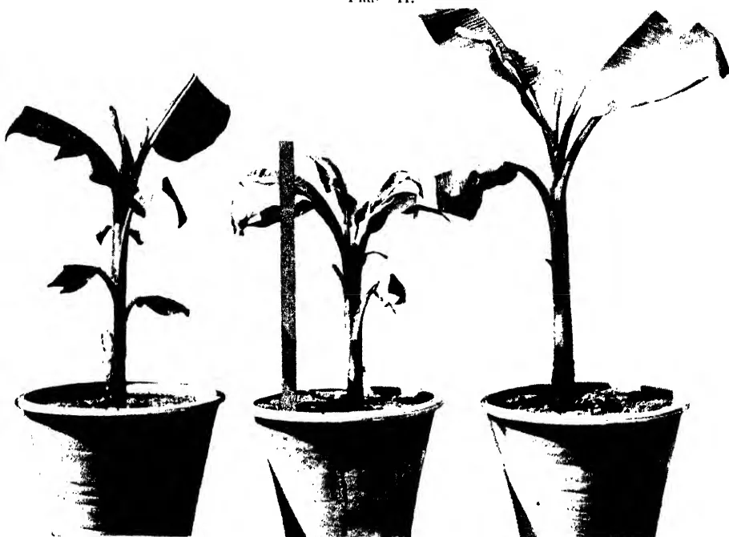Three potted plants of the species *L. S. Bertus* are shown in a row. The plants exhibit symptoms of Hondarawala infection, characterized by large, dark, and distorted leaves. The central plant is supported by a vertical wooden stake. The pots are dark and conical.

Photo by

*L. S. Bertus.*

*Hondarawala*—Infected Plants.

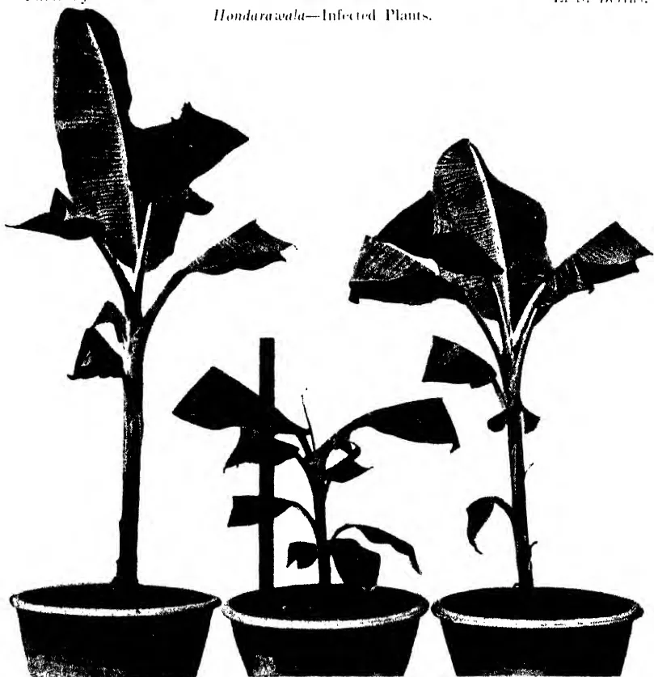Three potted plants of the species *L. S. Bertus* are shown in a row. The plants appear healthy and robust, with large, well-defined leaves. The central plant is supported by a vertical wooden stake. The pots are dark and conical.

Photo by

*L. S. Bertus.*

*Hondarawala*—Control Plants.

602------------------------------------------------

Plate III.

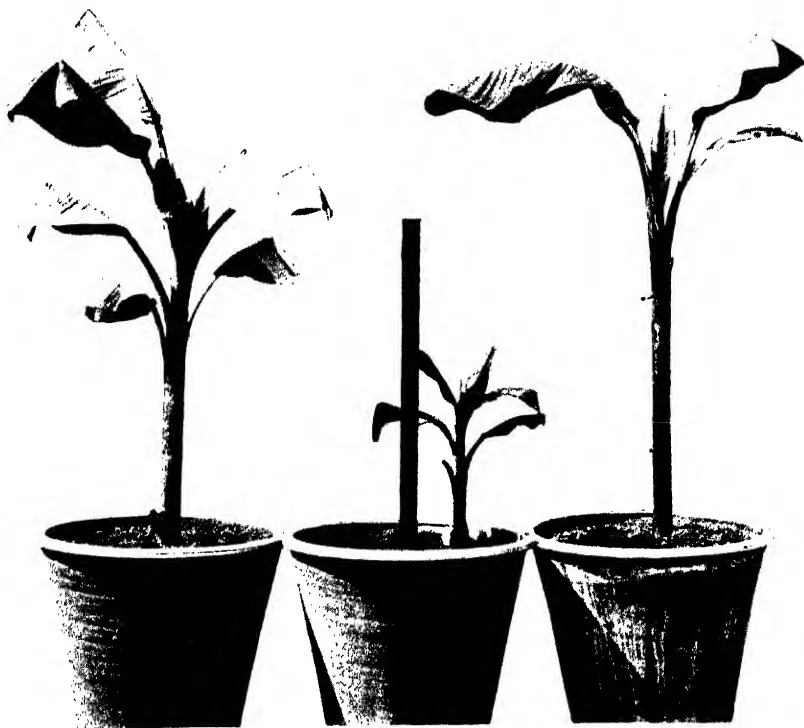Three potted banana plants are shown side-by-side. The plants have large, broad leaves. The middle plant is significantly smaller and appears to be stunted, with a vertical support rod inserted into its pot. The leaves of the middle plant are smaller and more distorted than those of the other two plants. The plants are in dark, conical pots.

Photo by

Kolikuttu—Infected Plants.

L. S. Bertus.

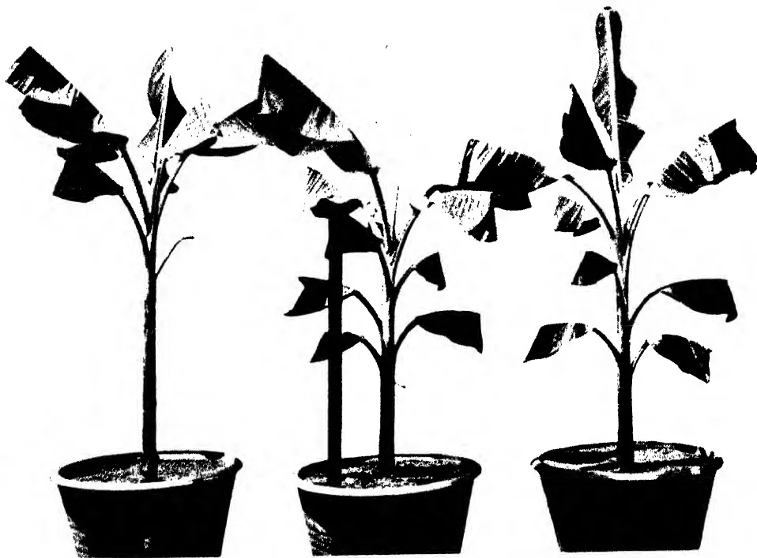Three potted banana plants are shown side-by-side. These plants appear healthy and robust, with larger and more numerous leaves compared to the infected plants above. The middle plant has a vertical support rod inserted into its pot. The plants are in dark, conical pots.

Photo by

Kolikuttu—Control Plants.

L. S. Bertus.

603------------------------------------------------

135

Plates 2 and 3 give comparative photographs of infected and control plants. In plate 2 the lower plants were three of the *Hondarawala* control plants; the middle plant remained small throughout the experiment. The middle plant of the infected plants was one of the two plants which showed positive infection in June and which subsequent to that date remained small and stunted, with marked bunching of the leaves.

Plate 3 gives comparative photographs of the *Kolikuttu* series. The control plants (below) wilted temporarily on exposure to strong sunlight. Of the infected plants (above) the middle plant was a sucker thrown up after plant III. 5 had been cut back consequent on fumigation scorch. It will be seen that the leaves of the plants in both plates were cut back in order to avoid contact with cloth cages.

The relative lack of success of the first infestation of aphids rendered difficult the calculation of the incubation period, *i.e.*, the period which elapsed after the infestation of plants with infested aphids before disease symptoms appeared. The two plants (I. 5 and I. 6) which gave positive results from the first infestation did not show definite symptoms until two months after infestation. This period differed from that given by Magee (*loc. cit.*) who found that the incubation period varied from 23 to 29 days, with an average period of 25 days. A subsidiary experiment was therefore initiated to determine this point. Three each of the healthy control plants of the two varieties were infested on September 9th with aphids from the infected plants. The plants were not kept in cages but the control plants, three of the *Hondarawala* series and two of the *Kolikuttu* series remained healthy throughout the experiment. The results are given in table II.

Table II

<table border="1">
<thead>
<tr>
<th>Plant No.</th>
<th>Treatment</th>
<th>Date of appearance of first symptom</th>
<th>Incubation period</th>
</tr>
</thead>
<tbody>
<tr>
<td colspan="4"><i>Hondarawala</i></td>
</tr>
<tr>
<td>II 1</td>
<td>Infested</td>
<td>24-10-29</td>
<td>45 days</td>
</tr>
<tr>
<td>5</td>
<td>Control</td>
<td>—</td>
<td>—</td>
</tr>
<tr>
<td>6</td>
<td>Infested</td>
<td>7-11-29</td>
<td>59 days</td>
</tr>
<tr>
<td>8</td>
<td>Control</td>
<td>—</td>
<td>—</td>
</tr>
<tr>
<td>9</td>
<td>Infested</td>
<td>12-11-29</td>
<td>63 days</td>
</tr>
<tr>
<td>10</td>
<td>Control</td>
<td>—</td>
<td>—</td>
</tr>
<tr>
<td colspan="4"><i>Kolikuttu</i></td>
</tr>
<tr>
<td>IV 2</td>
<td>Infested</td>
<td>24-10-29</td>
<td>45 days</td>
</tr>
<tr>
<td>4</td>
<td>do</td>
<td>15-10-29</td>
<td>36 days</td>
</tr>
<tr>
<td>7</td>
<td>do</td>
<td>15-10-29</td>
<td>36 days</td>
</tr>
<tr>
<td>8</td>
<td>Control</td>
<td>—</td>
<td>—</td>
</tr>
<tr>
<td>9</td>
<td>do</td>
<td>—</td>
<td>—</td>
</tr>
</tbody>
</table>

The experiments described above were considered conclusively to support Magee's results although there were slight differences

604------------------------------------------------

136

of detail. The experiments had for their object also the determination of the extent, if any, to which root affection had a bearing on the problem. At the conclusion of the main experiment, *i.e.*, at the beginning of September the root systems of four of the *Hondarawala* infected plants (I. 2, I. 3, I. 5 and I. 6), of three of the *Hondarawala* control plants (II. 3, II. 4 and II. 7), of five of the *Kolikuttu* infested plants (III. 1, III. 2, III. 3, III. 4, and III. 7) and two of the *Kolikuttu* control plants (IV. 1 and IV. 3) were examined. The soil from the pots was put on to sheets of paper and the roots separated therefrom and washed, together with those cut from the base of the plants. The proportion of dead to healthy roots was very small and in no root were found either *Rhizoctonia bataticola* or eelworms. Plant III. 7, which was one of those that had made no growth at all, was found to consist of the empty skin of the corm the remainder having rotted away completely. In order to confirm the above observations a few of the roots of each plant were kept in damp chambers in order that, if *Rhizoctonia bataticola* were present, the sclerotia might develop. They were examined after three months with negative results.

During the earlier stages of the experiments a mottling of the leaves of all plants were observed. The areas of lamina between the veins became yellowish. It was thought that the unnatural conditions of growth, combined with the effects of fumigation might be responsible. Two of the control plants, one of each variety (plants II. 3 and IV. 5) were taken out of the cages and planted in the open on July 20th. Both these plants showed the mottling but leaves which developed subsequently were normal and healthy. The mottling was therefore attributed to the effect of the conditions under which the plants were grown.

### DISCUSSION OF RESULTS

The experiments described in this paper have demonstrated clearly that bunchy top disease of plantains is a disease which can be transmitted from diseased to healthy plants by the aphid *Pentalonia nigrinervosa*. Seeing that the aphid may be found on almost every plantain sucker at some stage in its existence it is to be assumed that the aphid itself is not the only agent concerned with the disease. Proof of this has not been sought in Ceylon but Magee (*loc. cit.*) showed that aphids when transferred from healthy plants to healthy plants did not cause the disease. This fact and the symptoms exhibited by the diseased plants place it in the class of virus diseases.

Two varieties of plantain were used for the experiments, *Hondarawala* and *Kolikuttu*. These were chosen as the former variety is reputed (without statistical evidence) to be relatively resistant and the latter relatively susceptible to the disease. The

605------------------------------------------------

137

results obtained, *i.e.*, 100 per cent infection in each variety, gave no indication of relative immunity or resistance. The small subsidiary experiment, in which three plants of each variety were used, indicated that there was a difference in the incubation period in the two varieties. The plants of the reputedly more susceptible variety, *Kolikuttu*, developed bunchy top symptoms 45 days, 36 days and 36 days respectively after infestation with infective aphids, the average being 39 days. The plants of the *Hondarawala* variety displayed bunchy top symptoms 45 days, 59 days and 63 days respectively after infestation, the average incubation period being  $55\frac{2}{3}$  days. The number of plants being so small, these figures cannot be taken as conclusive but they indicate a difference between the two varieties which may have given rise to the impression of relative susceptibility and resistance. None of the figures for the period of incubation were as low as those obtained by Magee (*loc. cit.*) in Australia. He used Cavendish bananas for his experiments and obtained figures varying from 23 to 29 days with an average of 25 days for 20 plants. It would appear probable therefore that the incubation period may differ with different varieties and it is also possible that the conditions under which the plants are grown will have an effect on this period.

With regard to the association of root disease with bunchy top disease suggested by Small (*loc. cit.*), the absence of root decay in the roots of suckers examined prior to the experiments, the use of sterilized soil and the failure to find either *Rhizoctonia bataticola* or eelworms in the roots of the plants at the conclusion of the experiments may be considered to have eliminated the root factor from the experiments under review. It is concluded that, in Ceylon, bunchy top disease of plantains can be caused by a virus disease transmitted by infective aphids without the previous action of some root-destroying organism which might affect the vitality of the plant and render it more susceptible. It is still conceivable that in Ceylon there is a root disease which is characterised by symptoms similar to those displayed by bunchy top disease. It would be necessary to attack the problem from another angle, *i.e.*, to endeavour to reproduce symptoms through the agency of root parasites alone or of root parasites in conjunction with non-infective aphids, to determine if bunchy top symptoms can be caused by these factors also. Extensive experiments would be necessary before the question could be decided and it may be significant that *Rhizoctonia bataticola*, eelworms and aphids have all been found on healthy plants under natural conditions.

Fahmy (4) working in Egypt, described a disease very similar to, if not indistinguishable from, bunchy top disease which he attributed to eelworm infection of the roots. It would be

606------------------------------------------------

138

interesting, in view of our present knowledge, if a search for *Pentalonia nigrinervosa* were made in Egypt and experiments set up to determine the possibility of the responsibility of a virus infection there also.

### CONTROL

The systemic nature of bunchy top disease and our imperfect knowledge of the nature of virus diseases render impossible direct control measures, *i.e.*, prophylactic measures against the virus itself. Again, the aphid which has been shown to transmit the disease is difficult to control under field conditions; spraying is impracticable owing to the fact that the aphids usually occupy such positions between the closely adherent leaf-sheaths of the pseudostems that it is most difficult to bring insecticides into contact with them by spraying. In a well-cultivated garden in which bunchy top disease occurs only infrequently the proportion of infective to normal aphids must be extremely low and this furnishes another argument against attempts to control the disease by controlling the aphid. There remains therefore only indirect control which can be effected by exclusion and eradication. Plantain-growing districts in which the disease does not occur will be kept free from bunchy top only by complete exclusion of plantain material from infected areas. The effects of the disease in other districts in Ceylon should provide an object lesson sufficiently striking to plantain-growers in free areas, *e.g.*, Tissa, to prevent them from importing plantain material from other free areas except under special conditions.

In view of what has been stated above the treatment of areas in which bunchy top occurs must consist in eradication. This may be effected in two ways, either by the complete eradication of diseased and healthy plants in affected areas or by the removal and destruction of diseased plants only. The former method would appear to have theoretical advantages and has been attempted in Australia. In that country two districts were completely cleared of banana plants and so retained for a period of eighteen months after which they were replanted. The nearest banana-growing district was nine miles distant and in this district the disease was treated by periodical inspection and the removal of diseased plants. The two districts which had been completely cleared became re-infested, although only to a very slight extent, and it is to be assumed that the neighbouring district, although nine miles distant, was responsible for the re-infestation. These experiments point unmistakably to the fact that total eradication of the disease can only be attained by the complete clearing of all infected plantations and gardens within a large area. In Ceylon this would mean that all plantains in the Island, with the exception of plantains in districts such as Tissa in which the disease

607------------------------------------------------

139

does not occur, would have to be destroyed and replanting prohibited for a period of at least one year and probably longer. In a country in which the growing of plantains is so general as it is in Ceylon this policy would be practically impossible since the cost of enforcing eradication would be out of all proportion to the amount of money which would be saved as a result of eradication of the disease.

There remains therefore treatment by removal of diseased plants as they appear. This method has its disadvantages since the disease is present in plants for some time before outward symptoms are displayed. Nevertheless, if the disease is discovered in the early stages and prompt control measures are undertaken it should be possible to reduce the incidence of the disease to such an extent that the damage caused by it would be of little practical importance. The first essential for successful treatment by this method is the recognition of the early stages of the disease. For that reason the first symptoms as described by Magee have been quoted at some length in this paper. The streaking which is found in the leaves of plants in an early stage of infection is typical and once appreciated renders diagnosis relatively simple. It is necessary to examine only the youngest leaves of apparently healthy plants for the streaking and routine inspections are therefore not unduly laborious.

The nature of the disease is such that, if any one sucker of a stool is infected, the infective principle or virus may pass to all the other suckers or plants in that stool. It is therefore not sufficient to remove only the sucker which is obviously infected since the remaining component plants of the stool will serve as centres from which infection may be carried to neighbouring healthy stools. It is most important that, when a sucker is found to be infected, the whole of the stool be destroyed. It is false economy to leave parts of the stool in the hope that a bunch or bunches will be produced. In a certain small percentage of cases in which infected suckers have been cut out early enough, this may succeed. The risk of leaving infected portions is, however, so great that complete eradication of the whole stool containing infected suckers is the only safe form of treatment.

The disposal of diseased plants is best accomplished by cutting them up into small pieces and allowing them to dry, after which they may be burned or buried. The plantain stem and corm is soft and the most satisfactory method of cutting would appear to be into thin longitudinal slices which would dry rapidly. Once dried burial provides an adequate method of disposal.

If a strain of plantains immune to bunchy top disease could be found, the growth of immune plants only would solve the problem of control of the disease. Unfortunately no completely

608------------------------------------------------

140

immune strain has been discovered in Ceylon and the experiments detailed above indicate that apparently resistant strains may be completely susceptible. The period of incubation, *i.e.*, the period which elapses after infection before symptoms of the disease appear, may vary in different strains and, as has been suggested above, this may lead to apparent variations in susceptibility. It is reported that a strain of bananas highly resistant to the disease is grown in Fiji but published results of tests with that strain under controlled conditions have not been seen.

### SUMMARY

1. A short review of bunchy top disease of plantains in Ceylon is given. Symptoms are described.

2. Experiments are described which were set up to determine whether bunchy top disease of plantains in Ceylon is similar to that in Australia, *i.e.*, a virus disease transmitted by aphids, and also to determine whether root disease is associated with bunchy top.

3. Two local varieties of plantains were used, *Hondarawala*, a variety considered to be somewhat resistant to bunchy top disease, and *Kolikuttu*, a very susceptible variety.

4. The experiments demonstrated conclusively that bunchy top disease is transmitted from diseased to healthy plants by the banana aphid, *Pentalonia nigrinervosa*. Root examinations indicated that root disease was not necessarily a factor in the causation of the disease.

5. A subsidiary experiment indicated that apparent differences of susceptibility may be associated with variations in the length of the period between infection and the display of symptoms of the disease by plants of different varieties.

6. Methods of control are discussed. It is suggested that, for Ceylon conditions, the most satisfactory method of control is the periodical examination of plants and the complete eradication of the whole stools in which symptoms of the disease appear.

### LITERATURE CITED

1. (1). Magee, C. J. P. Investigation on the bunchy top disease of the banana.—*Commonwealth of Australia, Council for Scientific and Industrial Research, Bulletin No. 30, 1927.*
2. (2). Gadd, C. H. Bunchy top disease of plantains (a review).—*The Tropical Agriculturist, LXVI, 1, p. 3, 1926.*
3. (3). Small, W. Bunchy top disease of plantains in Ceylon. Mycological Notes (15).—*The Tropical Agriculturist, LXXI, 3, p. 141, 1928.*
4. (4). Fahmy, T. A banana disease caused by a species of *Heterodera*.—*Ministry of Agriculture, Egypt, Bulletin No. 30. (Botanical Section). 1924.*

609------------------------------------------------

A completely blank white page with no visible content, text, or markings.

610------------------------------------------------

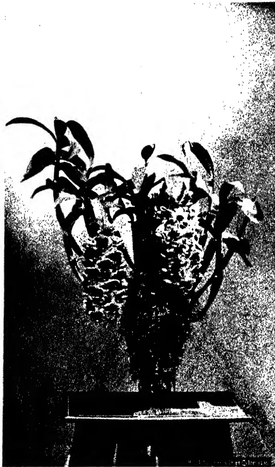A high-contrast, black and white photograph of a Dendrobium densiflorum orchid. The plant is shown in a dark, rectangular pot. It features several long, slender, lanceolate leaves that curve slightly upwards. The most prominent feature is a dense, upright cluster of small, light-colored flowers emerging from the center of the plant. The background is a light, textured surface, possibly a wall or a backdrop, which provides a stark contrast to the dark plant and pot.

*Dendrobium densiflorum* Wall.

611------------------------------------------------

141

## DENDROBIUM DENSIFLORUM, WALL

K. J. ALEX. SYLVA, F.R.H.S.,

ACTING CURATOR,

HAKGALA BOTANIC GARDENS

**T**HIS handsome evergreen epiphyte belongs to a large and well-known group of Orchids comprising several hundred species and varieties distributed at various elevations over a large area of the Eastern hemisphere, particularly in India, Nepal, Burma, Japan and the Malay Archipelago. The genus is widely distributed and in habit its species show great variation, some being very small and inconspicuous, while others are surpassed in size and beauty only by a few species in the Orchid family.

*Dendrobium densiflorum* was first introduced into Ceylon about the year 1899 and has since become very popular as an ornamental plant amongst amateur horticulturists.

By nature the plant has a tendency to grow in a compact form with several stems, the latter being clavate horny, leafy at the apex and about 12-18 inches high. The nodes of the stem are beautifully circled by yellow rings. The leaves are oblong acute, nervous. The flowers are very handsome, orange yellow, fragrant, produced in drooping pendulous racemes from the upper joints of the stem. Soon after the spell of dry weather the plants usually produce flowers from about April to June. Old and well-established plants are capable of putting forth as many as six to eight flower spikes at a time, but the flowers, unlike those in most other varieties are short lived, existing for a period of not more than 10 to 15 days.

The plant being a strong growing and hardy one can be easily cultivated at almost all elevations in Ceylon. An established plant should not be disturbed unless it has overgrown the receptacle, or the compost has been exhausted and impoverished. In any case the plant should only be repotted when in a resting state. Perforated pots or wooden baskets are admirably suited for it but even on sections of wood and tree fern trunks, (as seen in the accompanying picture) it can be grown to satisfaction. For plants cultivated in receptacles, a compost made up of equal parts of charcoal, bonemeal, chopped coconut fibre, moss or half-decayed leaves, (or *Asplenium* roots) will make a suitable rooting medium. When grown on sections of wood or fern trunks (*Alsophila* or *Hemitelia*) nothing more than a little *Sphagnum*,

612------------------------------------------------

142

or green moss, or coconut fibre, is required for tying up but it is best to insert a little of the above compost in a semi-pulverised state over and beneath the roots. Propagation is easily effected by divisions of the plant as stem suckers are rarely produced. The pot or basket should be gradually filled, first with the larger pieces of the compost over the drainage material at the bottom of the pot, and then with the finer stuff to within about 2 inches of the rim. The plant should be placed in the middle of the pot care being taken to spread the roots which should finally be covered with about an inch of the compost. At this stage the plant should be kept in position by tying the stems to some sticks driven into the compost. A few good soakings of water will be necessary during the first week and the quantity of water should be reduced gradually and given only when the compost appears dry. The newly-potted plants will require ample shade for at least six to eight weeks, after which all those that are growing and making headway should be removed to a place where more light and air can reach them, so as to afford them a slightly drier condition, but care should be taken not to allow the young plants to suffer from dryness as the roots are very active at this stage and any check received will retard the free growth of the plant.

During dry weather in addition to the afternoon watering, syringing may be resorted to both morning and afternoon in order to keep the foliage green and to prevent undue shrivelling of the pseudo-bulbs. On the completion of growth or when the plant becomes well established two good waterings a week will be sufficient, but the syringing may be continued regularly during fine weather. Plants in bloom should not be wet but should be kept in a cool dry place until flowering is past.

613------------------------------------------------

143

## CONTRIBUTIONS FROM THE RUBBER RESEARCH SCHEME, CEYLON

### TERMITES ATTACKING HEVEA BRASILIENSIS IN CEYLON

F. P. JEPSON, M.A.,  
ACTING ENTOMOLOGIST,  
DEPARTMENT OF AGRICULTURE, CEYLON

**T**HE somewhat formidable number of serious diseases of *Hevea brasiliensis* in Ceylon has been compensated for, to some extent, by an almost entire absence of insect pests of this tree. The few local insects which have been associated with *Hevea* in the past are of minor importance and their occurrence is so occasional, and so rarely reported, that they cannot be regarded as pests of any significance.

It has always been considered a matter for congratulation that Ceylon rubber estates enjoyed immunity from the attacks of termites, especially in view of the important status of these pests on rubber estates in Malaya and the Dutch East Indies.

In the past, records of these insects being associated with *Hevea* in Ceylon appeared to be confined to dead or diseased trees and it was assumed that the termites were not pests of primary importance. (1) Unfortunately, this view can no longer be entertained and there is reason to believe that the concern with which these pests have been regarded by the tea planter for many years must, in future, be shared by the rubber planter also.

#### WHAT TERMITES ARE

It might be advisable, at this stage, to explain briefly what termites are. They are better known as "white-ants," but belong to the insect order Isoptera and are in no way related to the true ants (Hymenoptera). The term "white-ants" is an unfortunate one and has led to much confusion. Their more correct name, termites, is preferable. Termites may, for all practical purposes, be grouped into two classes, depending upon whether they nest in the soil, or above it in trees and timber.

Those which nest in the soil usually exist in large societies and several forms of the same insect may be present in the same community. In a typical colony of this type the activity of the

614------------------------------------------------

144

nest centres around the royal pair, which, in the early stages of the society, are the original founders of the colony having been derived from a pair of the winged stage. When the colonising flight takes place, the males and females pair off, shed their wings and enter the soil at a suitable spot to commence the establishment of a new colony. Often the royal pair are enclosed in an earthen cell which is designated the "royal chamber," or "queen cell," and within this abode the queen undergoes a very considerable distention in size often attaining a length of  $2\frac{1}{2}$  inches or more. The royal pair are cared for by the "worker" caste, considered to be neuters incapable of further development. The workers feed the king and queen and remove the eggs, as soon as they are laid, to sites which have been prepared for their reception. "Soldiers," which possess formidable jaws which they use to advantage in defending the society against other insect enemies, are also present and there may occur nymphs, about to develop to the winged stage, or the winged insects themselves awaiting a suitable opportunity of embarking on their colonizing flight. This type of soil-nesting termite is represented, locally, by several genera among which may be mentioned the mound-builders *Hypotermes* and *Cyclotermes*, and *Termes*, *Leucotermes* and *Coptotermes* which erect no superstructure above their nests. More will be said of *Coptotermes* later.

The termites which nest above the soil in trees, building woodwork and other situations also commence their colonies from winged stages but the queen undergoes little increase in size. There is no worker caste, all individuals, with the exception of the soldiers, being destined to develop to reproductive adults either with, or without, wings. Usually the latter type of adult is produced only in the absence of one, or both, of the true royalties. The colonies produced by this class of termite are small when compared with those formed by the ground-nesting types. The local representatives of this group are species which belong to the sub-genera *Calotermes*, *Neotermes*, *Glyptotermes*, *Cryptotermes* and *Planocryptotermes* of the genus *Calotermes*, and many species are very serious pests of economic crops in the Island.

Figures of larvae, a soldier and a winged adult of *C. (Glyptotermes) dilatatus*, which may be considered typical of this group of termites, are shown in Plate I.

615------------------------------------------------

145
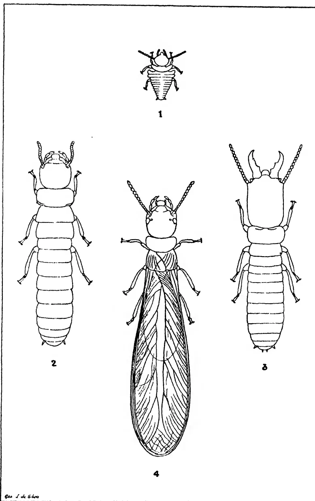

The plate contains four detailed line drawings of termites. Figure 1, at the top, shows a small, segmented first-stage larva. Figure 2, on the left, shows a larger, segmented full-grown larva. Figure 3, on the right, shows a soldier with a large head and prominent mandibles. Figure 4, in the center, shows a winged adult with a large head, long antennae, and large wings. The drawings are labeled with numbers 1, 2, 3, and 4 below them. In the bottom left corner of the plate, there is a small signature 'Geo. J. de Silva'.

Plate I. *Calotermes (Glyptotermes) dilatatus*

Fig. 1. First stage larva X 10.  
Fig. 2. Full-grown larva X 10.

Fig. 3. Soldier X 10.  
Fig. 4. Winged adult X 10.

The determination of different species of termites is usually made by an examination of the "soldier" caste. The heads of the soldiers are hard and chitinous, pale, or dark, brown in colour and furnished with prominent mandibles. The arrangement of the processes, or "teeth," on the inner margins of the mandibles is an important specific character. The heads of the soldiers of

616------------------------------------------------

146

the species discussed in this article are illustrated in Plate II. A character which at once distinguishes the genus *Coptotermes* is the possession of a pore situated, anteriorly, on the upper surface of the head and from which a drop of milky-white fluid is ejected if the insect is on the defensive. The gland may be seen in the specimen illustrated in Plate II, fig. 1.

The image contains four line drawings of termite soldier heads, labeled 1, 2, 3, and 4. Each drawing shows the head from a dorsal view, including the mandibles and antennae bases. Figure 1 is the smallest, Figure 2 is the largest, Figure 3 is medium-sized, and Figure 4 is medium-sized. The drawings are signed 'G. L. de Silve' at the bottom left.

Plate II. Heads of soldiers of termites which attack *Hevea*

Fig. 1. *Coptotermes ceylonicus* X 15.

Fig. 2. *Calotermes (Neotermes) greeni* X 15.

Fig. 3. *Calotermes (Glyptotermes) dilatatus* X 15.

Fig. 4. *Calotermes (Glyptotermes) ceylonicus* X 15.

617------------------------------------------------

147

If living termites are found to attack a rubber tree under circumstances in which no external, or internal, communication with the soil is maintained, the insects are, almost certainly, a species of *Calotermes*. If, on the other hand, there is definite communication with the soil, such as by runways up the stem, the species will probably be found to belong to the genus *Coptotermes*.

It should not be assumed, however, that any termites which travel up the main stems of the trees beneath the protection of earth-like coverings are injurious as many soil-nesting species behave in this manner and feed only on loose flakes of bark without actually penetrating the cortex to the wood. At the same time these coverings of earth, sometimes enveloping the entire stem some way up the tree, are not desirable and should be removed by the tappers. The only permanent method of preventing their recurrence is to locate the nests and destroy them by injecting petrol or carbon-bisulphide, or by fumigating the central nests with arsenic and sulphur fumes, calcium cyanide or other preparation.

#### CALOTERMES

In August 1929, a termite which is a very prominent pest of tea on many low-country estates, *Calotermes* (*Glyptotermes*) *dilatatus*, was found invading the sound wood of a *Hevea* tree on an estate at Ingiriya in the Kalutara district under such circumstances as to suggest that, given a suitable point of entry, termites of this genus were capable of causing extensive injury leading to the ultimate death of attacked trees. In this case the original invasion of the tree appeared to have been made at a spot affected by *Ustilina* and there was no doubt that the young colony had originated from a winged pair of adults which had alighted on this spot and effected an entry through the diseased tissue which would present little obstruction to their passage, the young eventually penetrating from this centre to the heartwood of the tree.

Four months later another record was received from an estate in the Ratnapura district, only in this case the species was *Calotermes* (*Neotermes*) *greeni*, also a pest of tea and of many trees, particularly *Grevillea robusta* in many parts of the Island. This species has been collected at various centres from sea level to about 5,000 feet elevation and as wide apart as the Southern and Northern Provinces. The facts of this invasion, which was extensive, left no doubt as to the potentiality of *Calotermes* as a major pest of *Hevea*, under certain circumstances. The entry to this tree had been effected through the decayed end of a branch which had probably been snapped by wind or other agency. The galleries extended down this dead limb to, and into, the main

618------------------------------------------------

148

trunk of the tree. Typical galleries formed in *Hevea* by this species are illustrated in Plate III.

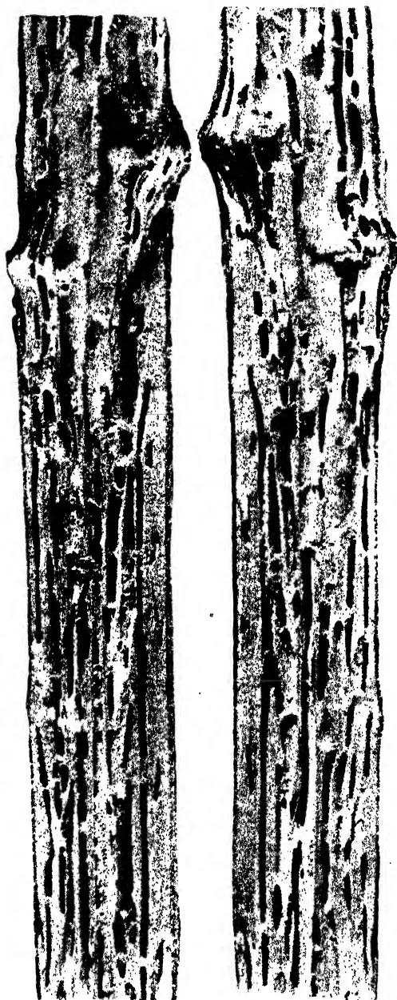The image consists of two vertical, rectangular sections of a tree branch, likely from a Hevea tree. The sections are split open to reveal the internal structure of the wood. The wood is dark and textured, with numerous vertical, elongated, and somewhat irregular galleries or tunnels carved into it. These galleries are characteristic of termites. The sections are positioned side-by-side, showing the extent of the galleries throughout the length of the branch.

(Photo. by F. P. Jepson).

Plate III. Branch of *Hevea* split open to show galleries formed by *Calotermes (Neotermes) greeni*.

619------------------------------------------------

149.

The circumstances under which earlier records of termite association with *Hevea* had been made were then investigated. Only one case of *Calotermes* invasion was forthcoming, from the Elpitiya district, but in this case the tree was dead and only a stump about 9 feet high remained. This was riddled from the top to the roots by two species of *Calotermes*, viz. *C. (Glyptotermes) dilatatus* and *C. (Glyptotermes) ceylonicus*. It was impossible to decide at the time of this record whether these termites had caused the death of the tree or had invaded it subsequent to its decay, but in view of more recent records it is very probable that the death of the tree was directly due to the attacks of these insects.

In January 1930 a further case was reported from the same estate in the Ratnapura district referred to above, only in this case the species was *C. (Glyptotermes) dilatatus* and there was evidence that entry had been effected through a broken branch attacked by *Ustulina*. The galleries formed in this branch by this species are shown in Plate IV. In March of the same year two *Hevea* trees in the Heneratgodā Gardens, Nos. 108 and 142 planted in Plantation No. 2 in 1887, were found to be attacked by *C. (Neotermes) greeni* and here, also, entry was made through decayed limbs.

620------------------------------------------------

150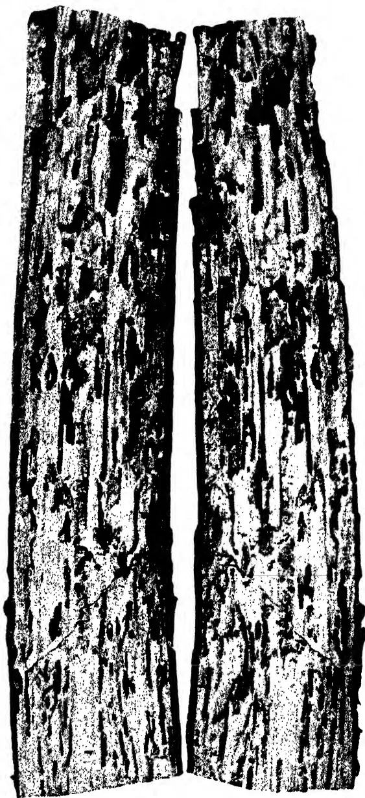A high-contrast, black and white photograph of a split branch of a Hevea tree. The branch is oriented vertically and has been split open to reveal the interior. The surface of the wood is heavily textured with numerous dark, vertical, and somewhat irregular lines and pits, which are galleries (tunnels) created by the insect Calotermes (Glyptotermes) dilatatus. The lighting is harsh, creating deep shadows and bright highlights that emphasize the rough, weathered texture of the wood and the intricate patterns of the insect galleries.

(Photo. by F. P. Jepson).

Plate IV. Branch of *Hevea* split open to show galleries formed by *Calotermes* (*Glyptotermes*) *dilatatus*.

621------------------------------------------------

151

During April of the present year, in the Peradeniya district, the stump of a dead *Hevea* tree was found to harbour a colony of *C. (Glyptotermes) ceylonicus* the species which had been found previously in the Elpitiya district in 1925. The stump in question was affected by *Ustulina* but the previous history of the tree is unknown. In this case the colony was confined to the base of the stump and it is possible that termite entry occurred subsequent to the death of the tree.

It will be noted that in three of the above records the attacked trees were also affected by *Ustulina* and it is very probable that the decayed wood beneath the rotten bark where the disease occurred provided the winged termites with the opportunity they sought, and required, of gaining access to the heartwood of the trees. In the other cases the decay of fractured branches served the same purpose. In the absence of such essential points of entry it is considered that no species of *Calotermes*, in the winged adult state, could become established in *Hevea* trees and the prevention of attack is, consequently, dependent upon attention being directed to these points, *Ustulina* patches being treated and the factors which favour the development of this disease being eliminated so far as is possible. Branches which have been broken by wind or other agencies should be pruned back to the stem from which they arise and the cut surfaces treated with a suitable wound dressing.

Where *Calotermes* colonies are located in the wood of growing trees they may be destroyed by injecting Paris Green into the active termite workings. The simplest method of giving effect to this operation is to bore a 5/16 in. hole into the occupied galleries with a gimlet or auger and pump in the Paris Green powder by means of a rubber blower. An enema syringe of ball pattern and adult size is a very convenient article for this purpose and is cheap and procurable at any druggist's store. The bored hole should allow of the tapering nozzle of the syringe fitting tightly when introduced, to avoid a blow-back of the powder. The hole should be finally plugged with cement, asphaltum, tar and sand or other efficient seal and the surface neatly smoothed over with the finger. A little grease or oil applied to the finger will prevent the tar or asphaltum adhering.

#### COPTOTERMES

In 1927 a young *Hevea* stump was found to be attacked on an estate in the Ratnapura district by a ground-nesting termite which proved to be *Coptotermes ceylonicus*. It was the only case reported and it was thought at the time that the termites might have followed a fungus disease.

622------------------------------------------------

152

In March 1930, in connection with the treatment, at the Heneratgoda Botanic Gardens, of two old rubber trees for *Ustulina*, it was found that they had been completely hollowed out by *Coptotermes ceylonicus*. The trees in question are No. 24, in Plantation No. 1, planted in 1877 and No. 124, in Plantation No. 2, planted in 1886. The former tree has grown from one of the original *Hevea* seeds brought from the Amazon Valley by Sir Henry Wickham in 1876 and germinated at the Royal Botanic Gardens, Kew; before being sent to Ceylon. The tree is, consequently, of considerable historical interest. The tree is a large one being 8 feet in circumference one foot above ground level and  $6\frac{1}{2}$  feet at a height of 3 feet from the ground. The tree has been completely hollowed to a height of 15 feet or more above soil level and the thickness of the remaining wood, surrounding the cavity, is not more than from  $1\frac{1}{2}$  to 2 inches. The tree is apparently sound externally except for a hole at the base which penetrates to the central cavity, and the foliage is normal. It is reported that there has been no appreciable diminution in yield of latex. Tree No. 124 is similarly attacked.

On looking up old records it was learnt that workers, soldiers, nymphs and adults of *Coptotermes ceylonicus* were collected from a *Hevea* tree in the Heneratgoda Gardens in 1909 but other details are lacking. No mention is made of this record by Petch(2) who was the collector of the specimens and it may be concluded that there was no reason, at the time, for regarding the insects as being responsible for direct injury to the tree from which they were taken.

In the section of the work referred to Petch states that termites are not pests of rubber in Ceylon as they are in Malaya, Java and Sumatra and explains this fact by the absence from Ceylon of *Coptotermes gestroi*, the notorious rubber termite of the latter countries. While this is true, the same genus is represented in Ceylon by two known species *C. ceylonicus* and *C. exiguus* and they are capable of behaving in precisely the same manner as their better known relative. They are both serious pests of living tea bushes in the low-country districts of Ceylon and the former has also been known to excavate the base of coconut palms in addition to other trees. The instances mentioned above also indicate that *C. ceylonicus* is capable of hollowing-out large *Hevea* trees and thus may threaten to earn for itself the same reputation as a major pest of rubber in Ceylon as its near relative has already done further East. Stages of this species are illustrated in Plate V.

623------------------------------------------------

153

1

2

3

Geoff. de Selys

Plate V. *Coptotermes ceylonicus*

Fig. 1. Soldier X 10.

Fig. 2. Full-grown worker X 10

Fig. 3. Winged adult X 10.

624------------------------------------------------

154

The habits of the genus *Coptotermes* are, by no means, fully understood. It is believed that they usually enter their host-plants underground, through the roots, but their presence is rarely detected until very extensive excavation of the wood has taken place. The first indication of infestation may be the collapse of the attacked trees in wet weather and during high winds. One recent instance has been observed by the writer which indicated that *Coptotermes ceylonicus* was commencing to excavate a large *Albizia* tree from above and not from below the soil. The infestation had apparently commenced at the base of a decayed branch about 15-20 feet from the ground and communication was being maintained with the soil beneath the protection of covered runways. The tree was sawn across 18 inches above soil level and there was no sign of any internal communication with a ground nest. Similar runways were observed on the outside of the trunk of a neighbouring tree of the same species, the objective again being a decayed branch. If extensive downward excavation of the type noted was allowed to continue undisturbed, the soil would eventually be reached and thus communication with the main soil nest would be established, when the previous external means of communication could be dispensed with. It should be mentioned that, so far as is at present known, *Coptotermes* is incapable of founding colonies in situations which are not immediately connected with the soil, and if such communication is interrupted the insects which are cut off from their bases must perish. *Coptotermes* is however, capable of surviving, if conditions are sufficiently moist, for a very much longer period when cut off in this manner than certain soil-nesting species of other genera, viz. *Termes*, *Cyclotermes* and *Hypotermes*.

It would appear, therefore, that *Coptotermes* may enter living trees in two ways. Entry through the roots cannot be prevented, but the absence of rotting snags will certainly reduce the danger of entry by the second method. All broken branches should be taken back to the point from which they arise on the larger branches, or even main stem when necessary, and the pruned surfaces suitably treated.

The species of *Coptotermes* are known to nest below the soil and the stumps of trees and buried logs form favourite centres for the headquarters of colonies. As in the case of other soil-nesting species the queen is a considerably distended individual, the enlargement being mainly in the abdominal region. Journeys of considerable extent are undertaken from the central nests and are said to have been traced for as great a distance as 100 yards. Under these circumstances attempts to destroy the insects underground are valueless unless the central nests can be located and

625------------------------------------------------

155

this appears to be an extremely difficult undertaking. Further investigation regarding the most practical and economic methods of destroying the central nests is required. The removal of tree stumps from cultivated areas will certainly assist in reducing the points at which the formation of new colonies may commence and the operation is desirable for other reasons also as they are frequently the source of root diseases.

#### LOCAL DISTRIBUTION OF TERMITES KNOWN TO ATTACK HEVEA

The purpose of this article being to acquaint rubber planters with the present position in regard to this subject and to stimulate interest which might lead to further records of termite injury to *Hevea* being received, the known distribution in the Island of the termites referred to in the foregoing pages may be included with advantage. It is not suggested that these species do not occur in districts excluded from the following lists. The lists have been compiled from authentic records only and the distribution as given here is complete so far as it is known at the present time, but it is certain to be extended very considerably in the future.

*Calotermes (Glyptotermes) ceylonicus*.—Elpitiya, Hewaheta and Peradeniya.

*Calotermes (Glyptotermes) dilatatus*.—Ambalangoda, Avissawella, Balangoda, Chilaw, Deniyaya, Elpitiya, Galaha, Galle, Gampola, Horana, Ingiriya, Kadugannawa, Katugastota, Kegalle, Kiriella, Matugama, Opanake, Pelmadulla, Peradeniya, Ratnapura, Udugama and Yatiyantota.

*Calotermes (Neotermes) greeni*.—Ambalangoda, Avissawella, Badulla, Balangoda, Bandarawela, Bogawantalawa, Galahu, Gampola, Gampaha, Jaffna, Kadugannawa, Maskeliya, Peradeniya, Ratnapura, Rattota, Wattegama and Yatiyantota.

*Coptotermes ceylonicus*.—Ambalangoda, Avissawella, Balangoda, Chilaw, Colombo, Elpitiya, Gampaha, Gampola, Jaffna, Lindula, Maha-iluppalama, Matale, Matugama, Nawalapitiya, Pelmadulla, Peradeniya, Polgahawela, Puttalam and Rattota.

Although the other known local species of *Coptotermes*, *C. exiguus*, has not been found in *Hevea* it behaves in a manner precisely the same as that of *C. ceylonicus* from which it is not easily distinguished. This species has been found at Avissawella, Galaha, Kiriella, Peradeniya and Ratnapura. Similarly, the serious up-country tea termite *Calotermes (Neotermes) militaris* has not been found in rubber, but it has been collected from both tea and dadap on certain estates, or in districts, where rubber is grown. These districts are Deniyaya, Kadugannawa, Madulkelle, Rattota and Ratnapura. The distribution for other localities in which rubber is not grown is not included.

626------------------------------------------------

156

Further records of termites attacking *Hevea* will be welcomed. Specimens for identification, preserved in alcohol, or actually inhabiting the wood in which they are found, should be sent to the Entomological Division, Department of Agriculture, Peradeniya. Particular care should be taken, in all cases, to include specimens of the soldiers which, although not numerous, are present in most termite communities of any size and their conspicuous appearance cannot fail to reveal their presence if a little exploration of the infested wood is undertaken. Brief notes regarding type of attack, situation in which the specimens were found and other points of interest would also be very acceptable. The quest for specimens should be particularly directed to decayed branches and it is anticipated that if such branches are cut off and split open they will, in many cases, be found to harbour species of *Calotermes*. Narrow earthen runways up the main stem to rotting branches suggest *Coptotermes* and if these runs are broken the insects can be intercepted, on their return journey to their soil nests, and specimens collected as they cross the open spaces of the broken passages.

#### REFERENCES TO LITERATURE CITED

1. (1). Green, E. E. (1908). Animals associated with the *Hevea* Rubber plant in Ceylon.—*Circ. and Agric. Journ. R. B. G., Ceylon.* Vol. IV. No. 12. p. 94.
2. (2). Petch, T. (1921).—*The Diseases and Pests of the Rubber Tree*, pp. 225-226. Macmillan & Co., Ltd., London.

627------------------------------------------------

157

## A RECENT OUTBREAK OF XYLARIA THWAITESII ROOT DISEASE

R. K. S. MURRAY, A.R.C.SC.,

MYCOLOGIST,

RUBBER RESEARCH SCHEME, CEYLON

*Occurrence in Ceylon.*—*Xylaria Thwaitesii*, as a cause of root disease of *Hevea* in Ceylon, is of extremely rare occurrence. It was first recorded in 1910, but since this date it has been reported on only two or three estates. Throughout his visits to estates during the years 1922-1929, the Organising Secretary of the Rubber Research Scheme observed the disease on only one occasion. In May 1930 the writer visited an estate in Kegalle on which a number of trees attacked by *Xylaria* was found. It is of interest to note that so far as is known all the recorded cases of this disease have occurred in the Kegalle district, so that it would appear that the distribution of the fungus in Ceylon is very limited. *Xylaria Thwaitesii* has been reported on *Hevea* in Java and Indo-China, and in the former country is also responsible for a coffee disease.

A full description is given by Petch in the Year Book of the Department of Agriculture, Ceylon, (1923), from which an account was extracted and published in Rubber Research Scheme Quarterly Circular Vol. 1, Part 3, 1924. Since certain features which were observed in the recent outbreak have not been previously recorded, it was thought that a further description of the disease might be of interest to planters.

*Symptoms.*—The external mycelium of the fungus is represented by flat irregular bands of variable width on the surface of affected roots. These are white when young and are thus seen on the growing margin of the mycelium. They soon, however, become black and form an extensive network over the root, the bands coalescing in places to form irregular black patches. In this condition the external appearance is somewhat similar to an advanced case of "brown root" disease.

The inner cortex is yellowish-brown in colour, and friable. Where the tap root or a large lateral is attacked latex is often found to have exuded from the cortex in numerous places and formed large lumps of black scrap.

In advanced cases the appearance of the wood of diseased roots is quite characteristic. On splitting the roots longitudinally the central region is sometimes found to be greyish-brown in colour, the wood being hard yet moist. This region may be

628------------------------------------------------

158

delimited by a black line from the outer wood which is yellowish-brown in colour and somewhat more decayed. It is noteworthy that the wood remains quite hard until the final stages of decay. The extreme wetness of thoroughly diseased roots is a striking feature; on breaking a root water will often spurt into the face. This combination of hardness and wetness is quite distinct from the effect produced by any of the other root fungi.

On the estate in question there were more than 10 separate areas of infection, involving, in all, a large number of trees. In some trees only the lateral roots were affected, while in others the disease had spread to the tap root. None of the diseased trees had yet been killed, and the writer did not see any marked effect on the foliage. The rot of the roots is, however, quite complete and there is no doubt that affected trees would succumb in the course of time. The fungus appears to spread very slowly, and in this respect is probably comparable to *Fomes lamaoensis*, the cause of "brown root" disease.

The fungus will apparently not attack exposed portions of roots. Where an affected root comes to the surface the portion lying on and under the ground is diseased while the upper part exposed to the air is quite healthy. The margin of the diseased tissues is sharply delimited and becomes marked by a line of callus growth from the healthy portion. It is along this line, *i.e.*, where a diseased root comes to the surface, that the fructifications were mostly found.

*Fructification.*—The fructification consists of a cluster of club-shaped growths arising from a basal mass. Three or four stout stalks arise which may divide into numerous finger-like protuberances. When found in the field the "clubs" are usually a dirty white at the extremity, darkening in colour down to the base. Subsequently they turn black. The fructification is usually one to three inches in height, and the basal mass about two inches in diameter. Photographs of fructifications are shown in Rubber Research Scheme Quarterly Circular Vol. 1, Part 3, 1924.

When mature the upper part of the club-shaped stroma bears perithecia containing spores. Although no mature fructifications were found on the estate it is thought that fresh cases of infection are caused by wind dispersal of the spores.

*Control.*—The control measures to be adopted are the same as for other root diseases. The disease should be followed out to its furthest extremity in every direction, all affected roots taken from the ground and burned *in situ*, and an isolation trench dug outside the affected area. Trees on the margin of the diseased area having a few lateral roots affected may often be saved by amputating the diseased portions and tarring the wound.

On the estate visited over 100 trees have been treated and the spread of the disease has apparently been checked.

629------------------------------------------------

159

## SOME COMMON PESTS AND DISEASES OF YOUNG HEVEA BUDDINGS

R. K. S. MURRAY, A.R.C.SC.,

MYCOLOGIST,

RUBBER RESEARCH SCHEME, CEYLON

**T**HE recent increase in the use of valuable bud-grafted material has focussed attention on the ailments to which young shoots are liable. In the last few months many specimens of young bud-shoots have been received from estates with enquiries as to the most effective method of dealing with the pest or disease in question. The following note summarises the advice given. It is not an exhaustive list of the ailments which may appear in the budwood nursery, but deals only with those considered to be of importance.

*Pests.*—Amongst the various animals which attack young plants mites are the most important, and under certain conditions they may become a serious pest in nurseries. When an immature leaflet is attacked it becomes irregularly twisted and distorted and bears a strong resemblance to *Oidium* attack. Very young leaves may fall. The mites are usually found on the under side of the leaves, though often only their white cast-off skins are seen. With a lens the puncture holes in the epidermis, through which the cell sap is sucked, may be seen. Mites are often found in association with *Oidium* and other leaf-spotting fungi.

Mites are mostly to be feared in dry weather. Efficient control can then be secured by periodical dusting with the finest sulphur powder obtainable. Several makes of hand dusters suitable for use in nurseries are on the market. Alternatively sulphur can be applied by beating on a linen bag in which the powder is loosely contained. This method, however, is far less satisfactory since it is difficult to project the sulphur on to the under surface of the leaf where it is most required.

Slugs are often found to eat off the young terminal shoot. In the daytime it is usually possible to find the slugs underneath stones, etc. They may be to some extent discouraged by periodically dusting with smokehouse ashes, and by putting a barrier ring of ashes on the ground round each plant.

Lizards also give trouble by eating off the terminal bud, though they are seldom sufficiently serious to warrant special protective measures. It is probable that all animals such as lizards and slugs which attack young rubber shoots are to some

630------------------------------------------------

160

extent controlled by the application of any sulphur or copper fungicides which may be made in the control of the more serious affections.

*Diseases.*—*Oidium* may make its appearance in the budwood nursery. The symptoms of this disease are now too familiar to need further description, and can only be confused with an attack by mites. In common with the latter pest *Oidium* can be controlled by dusting with sulphur powder. Alternatively spraying with a solution of Sulfinette in water ( $\frac{1}{4}\%$ – $\frac{1}{2}\%$ ) will secure a fair measure of control.

Many estates which have established budwood nurseries with imported material have recently experienced trouble with a disease caused by *Phytophthora palmivora*. A full description of this disease was given in Rubber Research Scheme Quarterly Circular Vol. 7, Part 1, 1930. The green shoot is usually attacked a few inches below the extremity, though the disease has sometimes been found to originate at the base of the shoot, apparently arising from the bud patch. The disease first appears as a blackish, watery-looking, sunken area on the side of the stem, which spreads chiefly downwards and, unless checked, kills back the shoot to the extent of the latest growth increment. Secondary fungi gain entrance to the diseased portion and may hasten the die-back. More than one strain of the species can cause similar symptoms, and it is possible that new strains may have been introduced with imported budwood and budded stumps.

The disease is largely dependent on wet weather conditions, and is at once checked on the advent of a dry spell. In wet weather a careful watch must be kept in the budwood nursery since under favourable conditions the fungus is extremely virulent and kills back the shoot in a few days. Any diseased shoot must be cut back well below the affected part.

Effective control has been secured in several nurseries by spraying with Bordeaux Mixture. Since the efficiency of this fungicide is wholly dependent on its correct compounding the following instructions are given. The proportions are for a 66% mixture which is considered the correct strength for the purpose.

<table>
<tr>
<td>Copper Sulphate</td>
<td>...</td>
<td>1 lb.</td>
</tr>
<tr>
<td>Freshly-burned lime</td>
<td>...</td>
<td>1 lb.</td>
</tr>
<tr>
<td>Water</td>
<td>...</td>
<td>15 gallons.</td>
</tr>
</table>

Dissolve the copper sulphate in one gallon of water in a wooden or earthenware vessel. The lime is slaked gradually for an hour or more, made into a uniform paste with water, and then made up to 14 gallons in a barrel. The copper sulphate is then poured into the milk of lime stirring all the while. On no account must iron vessels be used.

631------------------------------------------------

161

It is essential that all the copper sulphate should be neutralised by the lime. To test this hold a bright knife blade in the mixture for a minute. If it is tarnished a copper red more lime must be added. A more delicate test consists of adding a little weak potassium ferrocyanide solution to a few drops of Bordeaux Mixture in a saucer. A brown colour indicates excess of copper.

Unless a preservative is added Bordeaux Mixture does not keep and must be mixed freshly immediately before use. Since in the budwood nursery it will be necessary to use small quantities of the fungicide at relatively frequent intervals, it is useful to add a preservative to the mixture so that it is not necessary to make it up freshly on each occasion. For this purpose dissolve pure cane sugar in the copper sulphate at the rate of 1 oz. to 10 gallons of the completed mixture. The mixture may then be kept in a covered receptacle for some weeks and, after shaking, used when required. The Chemist has found that the sugar bought locally in "Kaddais" does not possess as good preservative qualities as pure cane sugar, so the latter article should be used.

If *Phytophthora* infection occurs in the budwood nursery all the young shoots should be sprayed with Bordeaux Mixture once a week. The spraying can be safely discontinued in dry weather.

*Conclusion.*—It is a sound rule which has been recommended to several estates that all young shoots in a nursery of valuable bud-grafted material should be dusted with sulphur powder every 10 days in dry weather, and sprayed with Bordeaux Mixture every week or 10 days during wet weather, the applications being discontinued when the shoots are a few months old. Such treatment will reduce to a minimum the risk of damage by any of the pests and diseases mentioned above. It must be emphasised that for effective prevention all shoots, whether diseased or healthy, must be treated.

632------------------------------------------------

162

## PROPOSALS FOR FURTHER DUSTING EXPERIMENTS AGAINST OIDIUM ON KANDANUWARA ESTATE, MATALE

R. K. S. MURRAY, A.R.C.SC.,

MYCOLOGIST,

RUBBER RESEARCH SCHEME, CEYLON

**A** field of 30 acres was dusted with five applications of sulphur during January to March 1930. The foliage was definitely benefited by the treatment and the results have been reported on. Yield records are being taken from a number of plots in the dusted field, and, as a control, from the same number of plots in a neighbouring undusted area. It is not anticipated that an increased yield in the dusted as compared with the undusted rubber will be obtained for a considerable time, and it is therefore necessary that the dusting should be continued for several seasons. It is proposed that a further programme of dusting be carried out in 1931.

The degree of control of the disease obtained in the previous experiments is not considered entirely satisfactory. In the Mycologist's Report for April 1930 several reasons for the comparative failure were set forth; they are reproduced below:

1. (1) The disease was fully active when dusting operations were commenced.
2. (2) A considerable proportion of trees had already suffered defoliation before dusting was commenced.
3. (3) Too long an interval elapsed between the first and second applications.
4. (4) At least two further applications should have been made in March and April.
5. (5) Possibly the quantity of sulphur applied at each dusting was insufficient. This was certainly the case for the fifth and final dusting.
6. (6) Reinfection from neighbouring undusted rubber.

So far as is possible these points will receive special consideration during the next series of experiments, and every endeavour will be made to secure as complete control of *Oidium* as possible. The factors will be considered individually:

633------------------------------------------------

163

(1) and (2) Dusting operations will be commenced earlier than previously. By making the first application in November 1930 it is hoped that the fungus may be to some extent controlled before attaining its full virulence. Unfortunately November and December are wet months on the estate and attempts to make an application may be frustrated. Any opportunity afforded by a dry spell of weather will be taken.

(3) The interval elapsing between successive applications in November and December must be largely governed by the weather conditions obtaining.

(4) Provision will be made for continuing the applications of sulphur until as great as possible a measure of control has been secured.

(5) A larger quantity of sulphur per acre will be applied in the first two dustings.

(6) Reinfection from neighbouring undusted rubber is unavoidable. This factor is not, however, considered to be of great importance in the field in question.

634------------------------------------------------

164

## SOIL IMPROVEMENT IN RELATION TO CROP PRODUCTION\*

**M**Y subject is directly connected with the supply of the first necessity of life, namely, food. By what method is the world going to continue to feed its growing population? It is increasing at the rate of nearly 20 millions a year, and it cannot be suddenly checked. Can food be found for all these extra mouths, or will the pressure on our land resources become unbearable, and end in disaster? That is the colossal problem facing the world in the next few generations. It must be met either by a continual expansion of cultivation, or an intensification of production on land already cultivated.

How do we stand in India in respect to these questions? I have proceeded in a somewhat empirical fashion to ascertain the relation between population and arable land. I have selected, in making my estimate, the figures used in international statistics, the total area sown and the current fallows. I have deducted the area required for the production of exported cotton, foodgrains, oilseeds, jute and tea, which account for about 80 per cent. of the value of our exports. This estimate is admittedly rough and must be regarded as suggestive rather than as an exact measure, but it is sufficiently near to illustrate my points.

I have taken the year 1922-23, following census year 1921, and the year 1925-26. In 1922-23 the total area sown in the part of India for which agricultural returns are made was 327 million acres, 61 were under fallow, making a total of 388 million acres. From this may be deducted as producing exported material, for cotton 14, for foodgrains 9, for oilseeds 5, for jute 2, for tea 0.6 million acres, or 31 million acres in round numbers. So that 357 million acres are left to supply the requirements in home-produced food and other essential commodities of the 292 million people who live in the territory covered by these figures, viz. 1.2 acres per unit of population.

A similar calculation for 1925-26 gives the same result. I have selected for a summary comparison the United States of America and France, two countries possessing points of resemblance to India. In both, as in India, agriculture is of predominant importance. In the United States 356 million acres are in cultivation. Sixty-five million producing exported material may be deducted from this, leaving 291 million acres of cultivated land devoted to supplying a population of approximately 112 millions, or 2.6 acres per unit of population. The dominant characteristic of American economic life has hitherto been abundance of land resources. France, a country which is largely self-supporting, has 36.3 million hectares of cultivated land for a population of 39.3 millions, approximately 2.3 acres for each head of the population.

In considering these figures we have to allow for the fact that the vegetarian diet adopted by our people is more economical of the resources of the soil than the diet of the people of the United States and France. Living is cheap in India, but when all has been said that can be said, we are left with the plain fact before us that we have one half the area of cultivated land for a unit of population.

---

\* Presidential address by G. Clarke, C.I.E., F.I.C., M.L.C., Director of Agriculture, United Provinces, India, to the Section of Agriculture, Indian Science Congress, Allahabad, January 1930. From *The Agricultural Journal of India*, Vol. XXV, Part II, March 1930.

635------------------------------------------------

165

The past experience of the world shows that as long as new land of the necessary quality is available, increased food will be obtained less by increased skill and expenditure on old land than by taking up new land. Our map has shown for several decades well over a hundred million acres in the British Provinces of India classified as culturable waste. Why is not new land coming into cultivation? I cannot give a complete answer. No such process can be observed in steady operation on a scale sufficient to raise the *per capita* area of cultivation to a level which will meet our food requirements. Some recent settlements in this province show an increase in cultivation of only 1 to 3 per cent. in 30 years, while in others the area is stationary. For a number of reasons the area of culturable waste gives an unreal conception of our resources. Much of the land thus classified includes areas physically capable of being employed for crops only when our need is so extreme that considerations of cost of utilization are relatively secondary. Fifty per cent. we know is situated in Burma and Assam, out of the sphere of action of our chief agricultural races. A great deal is in Tarai tracts where health reasons prevent extensive settlement. Land is coming under the plough, to some extent, in the villages of the Sarda canal area in these provinces, and will do so elsewhere as irrigation schemes mature, but in India, as in other parts of the world, new land of the necessary quality for food crops is no longer easy to find.

This brings me to the first part of my argument—the necessity of increasing the acre yield of land now under the plough if an ample supply of food and the home-grown necessaries of life is to be assured to the Indian worker, and his standard of living raised above subsistence level. It is a difficult problem but it is not insoluble.

When I considered this matter some months ago, I asked myself three questions:

1. (1) What factors are in our favour, and what are against us, when we begin to intensify our cultivation?
2. (2) Will the knowledge and experience of other countries help to accelerate our progress? What new knowledge do we need?
3. (3) What is the quantitative measure of the results we may expect?

I propose to give you the answers that suggested themselves to me, based on conditions in these provinces where my experience has been gained.

We have in our favour two things. In the first place soil that is easy to manage and quickly responds to treatment, and secondly agricultural workers attached to their calling and possessing a strongly-developed land sense which, by some curious twist in our make up can only be acquired in childhood. We shall not come up against a shortage of agricultural workers of the kind that is hindering development in Australia and Canada. In these countries a high degree of skill has to be directed to economy of labour by the use of machinery and labour-saving devices. In India our efforts will have to be devoted to economising land. We are better placed than most countries as regards the primary essential for increasing production per unit of land, namely, man power. You may ask me, "What is delaying our progress with two such assets?" This opens up a wide sociological study. I believe ignorance and a larger share of ill-health than should fall to the lot of an average being play a part. The stimulus required seems to be education of a rural type. I cannot, however, pursue this issue, and return to my agricultural text.

We have to contend against difficult weather conditions and short growing seasons requiring early maturing and specialized varieties of crops. The Howards, in the "Development of Indian Agriculture," describe graphically the effect of the monsoon on the soil and on the people. It is indeed the dominant factor in rural India.

636------------------------------------------------

166

We shall always at intervals experience years of short rainfall and this fact gives additional force to my argument for increasing the acre yield in favourable seasons by improved soil management if we are to avoid starvation. Much has been done to intensify yields without any commensurate increase of labour on soil improvement by the introduction of more heavily cropping varieties. I need only quote as examples wheat and cotton in the Punjab and wheat and sugarcane in the United Provinces, which are adding crores to the cultivator's income. Indian conditions, however, test the skill of the plant-breeder very severely and further steps in improvement in this direction are not going to be easily won.

I now pass on to that part of my subject which has greater interest for a scientific audience than some of the stubborn facts I have placed before you. I mean the consideration of some aspects of recent work on soil improvement and the lines on which enquiry may be directed in India.

Since Boussingault introduced the method of exact field experiment in 1834, research on the soil and the conditions of crop growth has been continuous in Europe and America. The methods of approach have become more exact with each advance in pure science. We, therefore, start our work on soil improvement in India with tools ready made. Investigations carried out in other countries have given us the principles involved and often the technique of methods of research. Our work for the moment is to apply them to conditions where soil processes differ widely, both in intensity and time of occurrence, from those of temperate climates. I have been impressed by the desirability of applying to our problems a conception developed in recent years by the Cambridge and Rothamsted workers, which has given a new and wider significance to the field experiment. The final yield gives us no indication of what happens during the plant's life or how it responds to factors operating at successive stages of growth. The modern method makes quantitative observations of crops throughout the period of growth and examines the results by statistical methods. This is nothing more than reducing to exact measurement and scientific treatment the observations which every practical farmer makes but does not formulate. The advantage is obvious. Information covering a wider range than the old type of field experiment can be obtained in a few years, instead of taking generations. You will remember that Lawes and Gilbert waited twenty years before discussing the results of their experiments. The field experiment lasting twenty or more years no longer fulfils our requirements. We want results in a reasonable time, accompanied by proof of their reliability, which will tell us not only the final yield but how that yield is obtained.

This leads up to another conception, namely, the critical periods of crops which will repay closer quantitative study in a country characterised by singularly short-growing periods and rapidly-changing conditions. By critical period I mean the relatively short interval during which the plant reaches the maximum sensibility to a given factor and during which the intensity of that factor will have the greatest effect on yield. These periods seem to be associated with some phase of growth in which the plant is undergoing modifications demanding the rapid formation and movement of food material. Indian workers have found that the twenty days before the crop comes into ear constitute an important critical period for wheat in relation to humidity and soil moisture. If during this period these factors are in defect of the minimum needed for the normal development of the plant, the crop will be small even if there is abundance throughout the rest of the vegetative period.

637------------------------------------------------

167

Our observations at Shahjahanpur indicate that two periods in the growth of sugarcane have special significance: (1) May and early June when the tillers and root system are developing, and (2) August and September when the main storage of sugar takes place. A check received at either of these periods permanently reduces the yield. The acre yield of sugar is positively and closely correlated with the amount of nitrate nitrogen in the soil during the first period, and with soil moisture and humidity in the second period.

Food crops pre-eminently demand combined nitrogen. You will remember how Sir William Crookes startled the world 30 years ago by the statement that the wheat eating races were in deadly peril of starvation owing to the rapid exhaustion of soil nitrogen. The age in which he lived had become accustomed to abundant supplies of cheap food from the great plains of the American continent. Fertility accumulated since glacial period by luxuriant plant growth and bacterial activity suddenly became available for exploitation, and was plundered at an appalling rate by rough and ready methods of cultivation. Nitrogen was disappearing from the soil out of all proportion to the amount recorded in the crop. The extraordinary fertility of some of these new regions is shown by the data recorded by Shutt, an acre of soil to a depth of one foot containing from 20,000 to 25,000 lb. of nitrogen. This figure may be compared with the amount of nitrogen in an acre foot of soil in these provinces, which lies between the limits of 1,000 and 3,000 lb. I shall refer to this again shortly.

Crookes was almost the first to realise that there was a limit to cheap production from new land, but his forecast was too gloomy. He visualised the exhaustion of the chief granary of the western world within a generation or two. In some important aspects he misapprehended the problem. He did not know as we know now, that other agencies step in and stop the plunder of the soil before it has gone too far. It is only under improper methods of cropping and cultivation that permanent soil deterioration is a real and dangerous phenomenon. Land properly handled does not become exhausted. Much of the land of Europe has been cultivated since the days of the Romans or even earlier. It is, if anything, more fertile than ever. In India we have in existence a method of farming which has maintained for ten centuries at least a perfect balance between the nitrogen requirements of the crops we harvest and the processes which recuperate fertility.

When we examine the facts, we must put the Northern Indian cultivator down as the most economical farmer in the world as far as the utilization of potent element of fertility—nitrogen—goes. In this respect he is more skilful than his Canadian brother. He cannot take a heavy overdraft of nitrogen from the soil. He has only the small current account provided by the few pounds annually added by nature, yet he raises a crop of wheat on irrigated land in the United Provinces that is not far removed from the Canadian average. He does more with a little nitrogen than any farmer I ever heard of. We need not concern ourselves with soil deterioration in these provinces. The present standard of fertility can be maintained indefinitely. This is not my text. Production must be raised if we are to live in reasonable security and comfort.

In one respect Crookes was right. He foresaw that the intensification of production required more combined nitrogen than the limited supplies furnished by the distillation of coal and the nitrate deposits, to counterbalance the colossal wastage which civilization and urban life bring about. The fixation of atmospheric nitrogen was, as he put it, vital to the progress of civilised humanity. This problem has been solved in the

638------------------------------------------------

168

last ten years and is one of the remarkable achievements of applied science. It could have been solved sooner if money had been forthcoming for long range research, but it took the war to bring us to our senses. Thirty years ago the fixation of 29.4 grams of a mixture of nitrogen and oxygen at the expenditure of one horse power was recorded as a scientific achievement. In 1928-29 the estimated production of nitrogen compounds by synthetic processes was equivalent to 1.3 million metric tons of pure nitrogen, or over 6 million long tons of sulphate of ammonia, which can be sold at prices low in comparison with the prices of agricultural produce. We are entering on an era of nitrogen plenty which is bound to react favourably on the world's food production. One of our problems is to find out how we can make use of this discovery in India. The probability is that the full benefit of fertilisers will be realised only on land reasonably supplied with organic matter.

I may be allowed here to sound a note of warning. Great as are the possibilities offered by synthetic nitrogen compounds, there is danger in our standards of living to increased production based entirely on imported fertilizers. They may be cut off suddenly by international disturbances. The war is too near an experience and the promise of universal peace too uncertain to ignore this side of the question altogether. It will be but a wise precaution to establish their manufacture in India when the correct way of using them has been worked out, their value demonstrated and a demand created.

Our problem is more complex than the simple addition of nitrogen compounds to the soil. We have to face under peculiar conditions of climate the question of controlling moisture, organic matter and air supply in the soil, of regulating the supplies of nitrogen so that it may be available in the right form and quantity when the plant most needs it, so that none may be wasted, and to make use to the utmost of those processes by which nature supplies nitrogen free of charge. These problems centre round the changes which organic material undergoes in the soil and the nitrogen transformations which accompany them.

We have two methods of soil improvement possessing enormous potentialities for increasing crop production and so simple in operation that they can be used by everybody :

1. (i) the preparation of quick-acting manures from waste organic material,
2. (ii) the use of green manure crops.

I do not propose to discuss recent work on the first method. The practical details have been worked out thoroughly by the Howards at Indore, and by Fowler, Richards and their co-workers at Cawnpore. A paper on this subject is going to be placed before you by Dr. Fowler. I will not anticipate what he is going to say beyond remarking that the results which he has allowed me to examine, place in our hands a method of the greatest value for increasing the outturn of *rabi* crops which require in this province a quicker-acting manure than that provided by turning in a green crop.

We have been working for some years at Shahjahanpur on the utilization of green manure for sugarcane. We have ploughed in on an average of three years' observations, 218 maunds per acre of *sanai* (*Crotalaria juncea*) which adds 50 maunds of dry organic material and 75 lb. of nitrogen to each acre. We have succeeded in raising crops of 580 maunds per acre without the addition of any fertilizing agent other than the *sanai* produced by the land itself.

639------------------------------------------------

169

I give below the results of 27 randomised plots in the treated and untreated fields in 1928 :

<table border="1">
<thead>
<tr>
<th></th>
<th>Sugarcane maunds (82 <math>\frac{1}{2}</math> lb.) per acre</th>
<th>Raw sugar maunds per acre</th>
<th>Dry matter maunds per acre</th>
</tr>
</thead>
<tbody>
<tr>
<td>Green Manure ...</td>
<td>847 <math>\pm</math> 32</td>
<td>87.0 <math>\pm</math> 3.6</td>
<td>246.1 <math>\pm</math> 8.0</td>
</tr>
<tr>
<td>Control ...</td>
<td>649 <math>\pm</math> 22</td>
<td>67.2 <math>\pm</math> 2.6</td>
<td>200.1 <math>\pm</math> 6.6</td>
</tr>
</tbody>
</table>

The practical result is worth ninety rupees per acre. Our problem is to find out the conditions of cultivation necessary to decompose *sanai* in such a way that (1) well aerated soil containing sufficient organic matter to prevent rapid drying out is ready for the crop in March, and (2) the nitrogen exchanges are such that this element is protected from loss until it is wanted, and is then present in a form which can be rapidly mineralised for the use of the young crop.

Our method of soil treatment is to bring about the early stages of decomposition in the presence of ample moisture. The rainfall after the *sanai* is ploughed in is carefully watched. If it is less than 5 inches in the first fortnight of September the fields are irrigated. In this way we secure in most of our soils an abundant fungal growth as the land slowly dries. We prevent large accumulations of nitrates in the autumn, which may be lost before the sugarcane is sown, and concentrate the nitrogen in easily decomposable organic form in mycelial and microbial tissue, until it is wanted in mineral form in the spring.

Throughout the experiments we have made estimations of nitrate. The accumulation of nitrate reaches its maximum in May and June just before the first heavy rain. At this time the crop is about one-third grown. We have not observed any subsequent large formation of nitrate up to the completion of growth in October. The final yields are in proportion to the mineral nitrogen present in the first period, and this suggests at once the importance of available nitrogen in the early stages of the growth of sugarcane. This view is by no means a new one. It has recently been developed by Gregory at South Kensington, and Rothamsted, who found that barley absorbed 90 per cent. of its total nitrogen when it had made about one-third of its growth. If it is substantiated by further work and found to apply to all crops, it gives a clue to several improvements in soil management.

In our studies in connection with the intensification of sugarcane cultivation we have been influenced by American investigations and methods, more specially those of the workers led by Waksman, who have studied the decomposition of cellulose and dead organic material in the soil. They have shown that the structure of the carbonaceous energy material in the soil largely determines the type of decomposition and the nitrogen transformations. If moisture and temperature conditions are favourable, the decomposition of cellulosic energy material, the chief constituent of green manures, is mainly accomplished by funguous activity resulting in the formation of large quantities of mycelial tissue and the removal of nitrogen temporarily from the reach of higher plants. The synthesised material is later decomposed by other micro-organisms forming mineral nitrogen and humic material, and a definite period of time is required to complete these changes. A large volume of work has been published in the last five years.

640------------------------------------------------

170

It explains much that was obscure regarding the utilization of green manure in India, particularly the time factor to which Howard drew attention many years ago.

I now approach the last and most difficult part of my task, to estimate the increased production we may look for by the application of scientific methods to our agriculture. What I am going to say will be more readily understood if I give the production of wheat in a few countries of the crop sown in 1926, which was on the whole, a good year throughout the world. It is as follows :

<table>
<thead>
<tr>
<th></th>
<th></th>
<th></th>
<th></th>
<th>Md. per acre</th>
</tr>
</thead>
<tbody>
<tr>
<td>United Provinces</td>
<td>Irrigated</td>
<td>...</td>
<td>...</td>
<td>12.2</td>
</tr>
<tr>
<td>" "</td>
<td>Unirrigated</td>
<td>...</td>
<td>...</td>
<td>8.2</td>
</tr>
<tr>
<td>Canada</td>
<td>...</td>
<td>...</td>
<td>...</td>
<td>13.2</td>
</tr>
<tr>
<td>U. S. A.</td>
<td>...</td>
<td>...</td>
<td>...</td>
<td>10.7</td>
</tr>
<tr>
<td>France</td>
<td>...</td>
<td>...</td>
<td>...</td>
<td>13.0</td>
</tr>
<tr>
<td>Germany</td>
<td>...</td>
<td>...</td>
<td>...</td>
<td>17.5</td>
</tr>
<tr>
<td>Great Britain</td>
<td>...</td>
<td>...</td>
<td>...</td>
<td>22.5</td>
</tr>
<tr>
<td>Belgium</td>
<td>...</td>
<td>...</td>
<td>...</td>
<td>26.3</td>
</tr>
</tbody>
</table>

A glance at these figures shows what an immense potential increase of production is open in many countries, especially in America and India. The physical possibility or perhaps even the limit of production in the United Provinces is shown by the yield obtained at the Shahjahanpur Research Station. In 1926 it was 28.8 maunds per acre. In the last 11 years, including two in which the wheat crop was a partial failure, 243 acres have yielded 5,945 maunds or 24.4 maunds per acre. Soil and climate do not impose a serious restriction on production. We cannot however, take one striking instance of large yields achieved on a small acreage under favourable conditions at the basis of an estimate of the future production of the country as a whole. The actual level in any country is bound to be behind the ideal, no matter how well developed educational and propaganda machinery may be.

It is safer, if such a course be possible, to consider average results obtained in countries which have been compelled to employ intensive methods, but we have no adequate basis of comparison with our conditions. There is no example of a tropical or semi-tropical country in which scientific methods have been applied over a wide area by independent and unsupervised workers.

Sugarcane cultivation in Java is often quoted as an example of what can be done. It illustrates the combined effect of *strictly supervised labour and scientific methods* on about one million acres of land, carried out with the object of gaining the highest possible interest on Dutch capital. It does not illustrate what we are aiming at in India—agricultural improvement initiated and carried through by the people themselves, as the result of education and uplift, on 300 million acres.

Let us examine the course of events in Europe and America and learn what we can from them.

In mediaeval England the yield of wheat was 7 maunds per acre. When the consolidation of holdings was completed by the enclosures in about the last quarter of the 18th century the yield rose to 14 maunds per acre. It remained at this level until 1840 when a further advance was made possible by the use of better methods and the introduction of nitrogen fertilisers. By 1870 the yield had risen to 20 maunds per acre.

641------------------------------------------------

171

In America low yields and a growing industrial population are causing uneasiness. By studying agricultural conditions in other countries the conclusion has been reached that 47 per cent. represents a possible all-round increase of production on the present cropped area. Experts do not agree as to the probable increase in the next few decades. This is placed between the limits of 10 and 30 per cent. These figures are based on considerations of labour. This, as I have said, scarcely enters into our problem in India. We have more people employed in agriculture per unit of cultivated land than any other country, with the possible exception of China and Japan.

The improvement of sugarcane cultivation extends over 2,81,000 acres in 18 districts in the United Provinces and gives some indication of the possible course of events. The yield of the unimproved crop in a year of average character is 350 maunds per acre. We pass through four definite stages of improvement :

1. (1) Better cultivation of the old varieties, yielding 450 maunds per acre.
2. (2) The introduction of heavier cropping varieties accompanied by a further improvement in cultivation, yielding 600 maunds per acre.
3. (3) The introduction of some fertilising agent, such as green manure, yielding 800 maunds per acre.
4. (4) The intensive cultivation of heavy cropping varieties, yielding 1,000 maunds per acre.

The increase over the normal production is 28, 71, 128 and 185 per cent. The analysis of the returns is helpful in connection with our problem. In the more important sugar-producing districts, 70 per cent. of the sugarcane area is planted with heavier yielding varieties. In some 30 per cent. and in a few only 2 per cent. 2,81,000 acres is almost exactly 33 per cent. of the total sugarcane area in the 18 districts for which special returns are made; on this area the yield has been slightly more than doubled, so that there is an all-round increase in production of 33 per cent. This has taken 17 years to accomplish and brings the cultivator in 311 lakhs of rupees extra a year. I believe if such simple modifications of practice as the use of green manure crops and composts made from waste material, were applied to all our arable land, production would be more than doubled; but this means that every cultivator would be conducting his agricultural operations in a scientific manner—a state of affairs not yet reached in any country. The point is that it is not to be expected. We must allow for the inertia which will retard the general adoption of improvements in so large a country as India. After giving due weight to this and taking into consideration the abundance of our labour resources and the extraordinary response of our soil to better treatment, it is reasonable to believe that within the next two or three decades we may increase the all-round outturn of our cropped land by 30 per cent. in normal seasons. But I assume that much more money will be spent on scientific research and extension work in villages than is now spent.

642------------------------------------------------

172

## CRABS IN PADDY FIELDS\*

**I**N an article under the above heading published in the Madras Agricultural Department Year Book for 1927, the writer described a method of preventing crab damage to paddy crops, together with practical details and observations regarding the working of crab-traps in paddy fields. Since then, a regular and systematic campaign directed towards the alleviation of crab nuisance has been carried on successively for three years at the Paddy Breeding Station, Aduturai, and a great deal of further experience gathered. The results of such further observations and experience are now embodied in the present article which is intended to be a continuation of the one previously published.

*Methods of Control: The use of poisonous chemicals.*—Besides careful drainage, and the use of crab-traps discussed in detail in the previous article, a trial with poisonous chemicals was also conducted in the extermination of crabs and the results are briefly described below:

Calcium cyanide either in the form of granules or dust was tried, a half-tola weight of the substance being emptied with a long spoon into each crab-hole and the opening being immediately closed up with wet mud. The chemical proved quite efficacious in asphyxiating crabs in crab-holes, and the minimum lethal doses were experimentally determined to be a half-tola weight of calcium cyanide for an adult crab and a quarter-tola-weight for a young one, the time for effective asphyxiation varying from twenty-five to thirty-five minutes. The disadvantages of applying this method on a large scale consist in: (i) the enormous amount of time and labour involved in dropping weight quantities of the chemical into the innumerable crab-holes, and immediately closing up their openings with mud, (ii) the expense involved by such a course, and (ii) the danger of allowing coolies to handle the poisonous substance directly.

*The use of crab-traps.*—The crab-trap may be described in brief as a mud-chatty buried in the field just flush with ground level and baited with rice-bran. A campaign of installing crab-traps in fields, apace with the progress of transplanting operations, was systematically pursued every season.

*Raw rice-bran found as good a bait as fried rice-bran.*—It was formerly recommended that the rice-bran should be fried, the frying being stopped just when the bran smelt most fragrant. It has since been found that raw rice-bran is equally efficacious, and the frying is therefore quite unnecessary.

*Catches due to bait and not to accident.*—It was necessary to show that a bait was really required to attract the crabs, and that the crabs did not drop in by mere accident or curiosity. A trial was therefore arranged where some pots were left without any bait whatever. In each of three channel-courses where six crab-traps had been installed, two were left unbaited, two were baited with fried rice-bran, and two were baited with raw rice-bran. The results show conclusively that accident or curiosity alone do not sufficiently account for the catches in crab plots, and that a bait is needed to attract.

---

\* By K. Venkataraman, M.A. (Hons.), *Superintendent, Agricultural Research Station, Aduturai*, in The Madras Agricultural Department Year Book 1929.

643------------------------------------------------

173

*Relation between rainfall and catch of crabs.*—It was observed that the catch went up on rainy days, both in the field crab-traps, as well as the channel crab-traps. This is probably due to crabs getting flooded out of their holes and being forced to move about in the fields in larger numbers than under normal conditions.

*Fluctuation in catch of crabs during an entire paddy season.*—The aggregate catch of crabs on the station (comprising a paddy area of 46 acres) during an entire season commencing from July 1927 and ending with January 1928 was carefully recorded. The average catch per pot per day was worked out for each month and the table given below affords interesting study. A scrutiny reveals that the numbers decline as the trial advances. This is only natural as there cannot be any constant relation between catch and supply, and the one is bound to react on the other.

The catches in the field pots show a rapid initial decrease from August to September. The fall of the curve from September to October is less steep, and this is followed by a flattening out from October onwards until January is reached when the fields got nearly dried up. The rapid fall from August to September was probably due to the elimination of crabs that were already in the fields before the commencement of planting. The curve for the catches in the channel-plots is a smooth one falling very gradually from August to January.

*Catches in all channels and planted fields  
throughout the paddy season*

<table border="1">
<thead>
<tr>
<th rowspan="2">Month</th>
<th colspan="3">In channels</th>
<th colspan="3">In planted fields</th>
<th rowspan="2">Total monthly catch columns (3) and (4)</th>
</tr>
<tr>
<th>Number of pots set up</th>
<th>Total catch</th>
<th>Average catch per pot per day</th>
<th>Number of pots set up</th>
<th>Total catch</th>
<th>Average catch per pot per day</th>
</tr>
</thead>
<tbody>
<tr>
<td>July (10-31) 1927</td>
<td colspan="3">Pots not set up</td>
<td>*</td>
<td>7,862</td>
<td>*</td>
<td>7,862</td>
</tr>
<tr>
<td>August</td>
<td>24</td>
<td>1,729</td>
<td>2.3</td>
<td>129</td>
<td>31,358</td>
<td>7.8</td>
<td>33,087</td>
</tr>
<tr>
<td>September</td>
<td>24</td>
<td>1,685</td>
<td>2.3</td>
<td>282</td>
<td>25,408</td>
<td>3.0</td>
<td>27,093</td>
</tr>
<tr>
<td>October</td>
<td>24</td>
<td>1,250</td>
<td>1.7</td>
<td>550</td>
<td>20,125</td>
<td>1.2</td>
<td>21,375</td>
</tr>
<tr>
<td>November</td>
<td>24</td>
<td>1,114</td>
<td>1.5</td>
<td>599</td>
<td>23,939</td>
<td>1.3</td>
<td>25,053</td>
</tr>
<tr>
<td>December</td>
<td>24</td>
<td>567</td>
<td>0.8</td>
<td>583</td>
<td>8,959</td>
<td>0.5</td>
<td>9,526</td>
</tr>
<tr>
<td>January 1928</td>
<td>24</td>
<td>76</td>
<td>0.1</td>
<td>101</td>
<td>236</td>
<td>0.08</td>
<td>312</td>
</tr>
<tr>
<td></td>
<td></td>
<td>6,421</td>
<td></td>
<td></td>
<td>117,887</td>
<td></td>
<td>124,308</td>
</tr>
</tbody>
</table>

The number of pots varied as planting progressed from 20 on 11th July to 118 on 31st July, 1927.

*The effect of continued annual campaigns on the numbers caught.*—The effect of continued campaigns against crabs is remarkable, in that the crabs breeding in the fields are fast eliminated and diminish perceptibly in numbers, year after year.

644------------------------------------------------

174

*Dead-crabs in the "role" of paddy fertilizer.*—The disposal of the enormous catches of crabs at this station became a problem and pressed for a solution. The crabs caught were killed by drowning or otherwise and the dead crabs were composted in pits, together with earth. The buried crabs rotted well in nine to ten weeks, and over twenty cart-loads of manure were produced this way every season.

The manurial experiment referred to in the previous article (page 33 of the Year Book for 1927) was conducted to test crab-manures against village-cattle-manure in equal two-cent plots, each treatment being quadruplicated. The two different manures were applied severally on an equal bulk basis at the rate of 300 lb. per cent. of field space, the plots being planted up with seedlings of Aduturai No. 1 bulk. The harvested yields from the sub-plots given below indicate the superior fertilizing value of crab-manure as against village-cattle-manure:

*Yields from sub-plots treated severally with  
crab-manure and village-cattle-manure*

<table border="1">
<thead>
<tr>
<th rowspan="3"></th>
<th colspan="2">Crab manure</th>
<th colspan="2">Village-cattle-manure</th>
</tr>
<tr>
<th colspan="2">Yields in lb.</th>
<th colspan="2">Yields in lb.</th>
</tr>
<tr>
<th>Grain</th>
<th>Straw</th>
<th>Grain</th>
<th>Straw</th>
</tr>
</thead>
<tbody>
<tr>
<td>Repetition No. 1</td>
<td>70</td>
<td>159½</td>
<td>66</td>
<td>122</td>
</tr>
<tr>
<td>Do No. 2</td>
<td>66</td>
<td>183½</td>
<td>48</td>
<td>102</td>
</tr>
<tr>
<td>Do No. 3</td>
<td>54</td>
<td>131</td>
<td>56½</td>
<td>128½</td>
</tr>
<tr>
<td>Do No. 4</td>
<td>60</td>
<td>155</td>
<td>55½</td>
<td>107</td>
</tr>
<tr>
<td>Total...</td>
<td>250</td>
<td>629</td>
<td>226</td>
<td>459½</td>
</tr>
<tr>
<td>Percentages</td>
<td>110.6</td>
<td>136.9</td>
<td>100</td>
<td>100</td>
</tr>
</tbody>
</table>

The manurial value of dead-crabs is a further strong argument in favour of crab-traps, first as a preventive measure against damage, and secondly as a beneficial fertilizer for the crop—an instance of "pressing the enemy into service."

*Rats trapped in crab-plots.*—It may be stated the field-rats have on several occasions been found trapped in the plots meant for crabs, and this is a further unexpected advantage. Only those crab-pots which are partly filled with water are able to trap rats. The number of such rats trapped during one season (July 1928 to January 1929) totalled 101.

645------------------------------------------------

175

## MEETINGS, CONFERENCES, ETC.

### BOARD OF AGRICULTURE

#### FOOD PRODUCTS COMMITTEE

**Minutes of a Meeting of the Food Products Committee of the Board of Agriculture, held in the Board Room of the Department of Agriculture, Peradeniya, at 2 p.m. on Monday, August 4, 1930.**

**Present.**—The Hon'ble Dr. W. Youngman, Director of Agriculture, (Chairman), Mr. Henry L de Mel, C.B.E., Mudaliyar W. Samarasinghe, Mudaliyar S. Muttutamby, Mudaliyar S. P. Wijetunge, Mudaliyar C. B. Herat, Messrs. A. A. Wickremasinghe, C. A. M. de Silva, the Entomologist, the Acting Mycologist, the Acting Economic Botanist, the Divisional Agricultural Officers, Central, Southern, Northern, North-Western and South-Western Divisions and Mudaliyar N. Wickremaratne (Secretary).

**Visitors.**—Messrs. J. I. Gnanamuttu, J. C. Drieberg, and S. Kandiah.

Letters and telegrams had been received from the following members regretting their absence: The Hon'ble Sir H. Marcus Fernando, Hon'ble Mr. T. B. L. Moonemalle, Messrs. S. Pararajasingham, C. Muttiah, Dr. T. B. Kobbekaduwa, Mr. C. W. Bibile, Ratemahatmaya, Gate Mudaliyar G. Goonatilake, Gate Mudaliyar M. S. Ramalingam, Gate Mudaliyar A. E. Rajapakse, Mr. W. A. Udagama, Dissawa.

The minutes of the previous meeting held on June 26, 1929, were confirmed.

#### AGENDA ITEM 2. CONSIDERATION OF REPORTS OF THE SUB-COMMITTEES APPOINTED TO ENQUIRE INTO THE CONDITIONS OF PADDY CULTIVATION

The Chairman welcomed the members and regretted the inconvenience caused to them by having had to convene the meeting at Peradeniya, as the room in the Old Council Chamber, Colombo, in which the meetings are generally held was not available. He said that the reports of the Sub-Committees to enquire into the conditions of paddy cultivation had already been circulated to members and they contained a great deal of valuable information. This Committee should consider these reports and then together with the recommendations of the Committee these should be placed before the Board of Agriculture. It was also necessary, he said, to consider whether reports should be printed. He invited suggestions and criticisms from the members.

Messrs. De Mel, Samarasinghe, Wickremasinghe, Muttutamby and the Chairman took part in the discussions that followed.

Mr. De Mel said that there were four prominent points. (1) He thought that the Food Products Committee should express its appreciation of the work done by the Sub-Committees and thank them for their labours—with regard to the production of paddy the officers of the Agricultural Department ought to take some practical steps. Many of these efforts were not appealing to the village conditions. (2) The major tanks that had been restored were all right but there was strong complaint against the work of restoration of village tanks. For paddy there ought to be an ample supply of water. This was evident, he said, from the rider attached to one of the reports by Madahapola Ratemahatmaya. (3) The opening of channels was another matter

646------------------------------------------------

176

which required attention. The Irrigation Department should work with the Department of Agriculture in order for the paddy cultivation to take a step forward. (4) Cattle was another point. Those who sympathised with the movement liked to see the Veterinary Department work in co-operation with the Department of Agriculture. He suggested that the constructive parts of the reports should be printed.

Mudaliyar Samarasinghe thought that the reports should have been digested by the officers of the Agricultural Department and that some constructive proposals should have been put up. He said that Mr. De Mel referred to some features of water supply and he had to refer to the question of drainage which had not received the attention due to it. He gave instances where owing to neglect of this question certain areas in the Western Province had not been cultivated. He also pointed out that the paddy cultivation in Ceylon had not for some time been a paying industry. Unless it was made definitely remunerative the cultivator could not be expected to evince greater keenness for paddy cultivation which has to compete with other crops such as cinnamon, coffee, coconut, rubber, tea and also with the paddy grown in India and Burma. He suggested that the local paddy industry should be protected. Continuing, he said that the paddy question was a national one and that it was the duty of the State to encourage its cultivation. For this he suggested direct or indirect subsidisation and one of the ways was to waive the water rate and to consider the Irrigation Department on a non-paying basis. He thought the supply of more water, repairing old tanks, raising of bunds, opening of choked elas, proper drainage with the subsidisation were some of the needs of paddy cultivation which he left to the expert officers of the Department to give consideration.

Mr. Wickremasinghe referred to the scarcity of buffaloes and the want of pastures in certain districts such as Kegalle, Kandy, and the Western Province; and periodical floods especially in Galle, Matara, and Colombo. He thought that investigation should be made to protect the crops from these inundations. He also referred to the human factor. He said that the present day young men and young women were reluctant to work in the paddy field and suggested that a proper mental attitude towards the industry could be created by having paddy fields attached to schools and boys and girls made to work in them as a compulsory subject in the curriculum. He also thought that if the Agricultural Instructors were attached to schools their usefulness would be increased. He emphasised the value of the growing of other food crops.

Mudaliyar Muttutamby said that in the dry zone the yield of paddy was very poor and the cultivators did not get sufficient return for their labour and therefore they took to paddy cultivation in a half-hearted manner. He concluded by saying that paddy cultivation should be made a paying proposition.

Mr. De Mel offering further comments agreed with the previous speaker as regards the economics of paddy cultivation. He said that the 800,000 acres under paddy was a great asset and urged the adoption of scientific methods to ensure the productivity of paddy lands. He believed in seed selection and felt hopeful of the experiments carried out by the Economic Botanist.

The Chairman desired definite opinion as regards what should be done with the reports. He thanked Mr. De Mel for his appreciative comments on the work of the Economic Botanist. Speaking on the intensive method of cultivation, he said that the seed selection was an integral and indisputable part of scientific treatment of the subject. He emphasised the need of high-yielding strains. The selection of high-yielding strains however to suit the

647------------------------------------------------

177

varying conditions of climate and soil was a difficult problem. In Java, he said, the Javanese cultivator gets an average yield of nearly 2,000 lb. of paddy per acre and this has been achieved as a result of the work of Dutch Scientists. If Java could increase its yield from 600 to 2,000 lb. per acre, Ceylon possibly could devise means to increase the average yield to 1,000 lb. per acre. Then people would see money in paddy and there was the possibility of their reverting to paddy cultivation. He dealt with what he proposes to do with regard to the subject of seed selection and the introduction of demonstration plots in the cultivators' own fields. He spoke of the conservative nature of the cultivators and of other difficulties but he hoped with the advent of the New Constitution the old order would give way, and that when changes took place the Agricultural Instructors would have much less difficulty in getting into contact with the cultivator in his field. The difficulty mentioned in so many of the reports of the attitude of Vel Vidanes, called for special attention. He thought the suggestion of the Committee that technical officers of the Department should consider the reports and embody their salient features in a single report was not sufficient and he would welcome a report by other than members of the Department of Agriculture. At the close of the discussion, the following resolution proposed by Mudaliyar Samarasinghe and seconded by Mr. De Mel was passed:

"That the Scientific Officers of the Department in consultation with the elected members of the Food Products Committee draft a recommendation for submission to the Board of Agriculture at the Annual Conference."

Mudaliyar Herat proposed the following names to be associated with the Scientific Officers of the Department in the draft of the report:

Mr. H. L. de Mel  
Mudaliyar Samarasinghe  
Mr. C. Drieberg  
Mudaliyar S. Muttutamby  
Mr. A. A. Wickremasinghe

Mudaliyar Wijetunge seconded and it was carried unanimously. It was also resolved to have the reports printed.

### **AGENDA ITEM 3. THE DESIRABILITY OF INCREASING THE USEFULNESS OF THE GOVERNMENT PADDY STATIONS ESTABLISHED IN THE COUNTRY**

The Chairman called upon Mudaliyar Muttutamby to move for discussion the subject appearing under his name.

Mudaliyar Muttutamby moved for a discussion the desirability of increasing the usefulness of Government Paddy Stations established in the country. He said that those stations should not be confined only to selection of seed paddy but they should be worked to prove that paddy could give better results. Generally, he said, the cultivation was not above that of the ordinary cultivator. The Department of Agriculture should overcome the drawback of paddy blight, caterpillars, and other pests.

Discussion followed in which the following took part viz:—The Chairman, Mudaliyar Samarasinghe, Mr. De Mel and Mr. Cooke, Divisional Agricultural Officer, Northern Division.

The Chairman said that he realised it was necessary for the Department to grow paddy on these demonstration farms at a profit. He did not mean a cash return but a sufficient yield. Seed could be distributed at an accommodation rate if necessary to cultivators and shown as a book value.

648------------------------------------------------

178

If the actual yield did not cover the expenses it was useless to continue that particular variety. A better variety would be introduced which in turn could produce a paddy superior to others, in this way the neighbouring cultivators would take to it and this, he said, was what the Department proposed doing. He thought the present farms and plots should be more of the nature of seed multiplication areas and that demonstration should be more in cultivators' fields.

Mr. Samarasinghe said that Belunmahara Paddy Station was only a partial success and the new policy enumerated by the Chairman would really meet the point raised. He suggested that the Agricultural Department should cultivate large areas in North-Central Province, Eastern Province and the Southern Province in order to raise sufficient paddy for feeding the people. As an instance he quoted that Government manufactured salt and in the same way he thought that Government should also nationalize the production of food.

The Chairman pointed out that such schemes were carried out in some countries for demonstration purposes but his staff was quite inadequate to undertake such work. He did not know whether the Ministers under the New Constitution would favour such schemes of nationalization in Ceylon.

Mr. Cooke, Divisional Agricultural Officer, Northern, on being called upon by the Chairman said that he was inclined to support Mudaliyar Samarasinghe. He gave an account of the successful working of a farm of 100 acres at Iranamadu which supplied seed to cultivators at a time when there was a shortage of seed in the locality. He was of opinion that farms of 50 to 100 acres might be tried. As regards the Mannar paddy plot he said that five acres there was not sufficient. Referring to the demonstration plots in the cultivators' own fields he doubted whether the cultivator would carry out the instructions given him by the Instructor.

Mr. De Mel gave his experience of mass seed selection by the collection of heavy ear-heads.

The Chairman in winding up thought the general opinion of members was that the work should be done in the fields of the cultivator with the help of the Agricultural Instructor.

**AGENDA ITEM 4. THAT THE QUESTION OF FRUIT  
GROWING AND VEGETABLE CULTIVATION MAY  
BE GIVEN SPECIAL CONSIDERATION OF THE  
FOOD PRODUCTS COMMITTEE OF THE  
BOARD OF AGRICULTURE**

Mr. De Mel said that he had the privilege of bringing up this question at the last meeting of the Board of Agriculture and explained what he had done since then to popularise fruit and vegetable cultivation through the Fruit and Farm Association. The exhibition which was held under the auspices had over 1,500 exhibits in spite of the drought, flood, and trade depression. He mentioned some excellent exhibits sent by the Divisional Agricultural Officer, Northern. He suggested that the officers of the Department should in the course of their travelling impress upon the villagers the advantages of employing their leisure hours to plant fruit and vegetables in the compounds of their houses. He spoke of the waste of cattle manure in the villages and the possibility of successful use of this in the growing of vegetables and fruits. The village fairs afforded, he said, a ready market for their produce. One of the drawbacks was the careless packing of fruits but to meet this difficulty the Fruit and Farm Association had prepared crates for proper packing of fruits. He thought

649------------------------------------------------

179

that it would be advantageous to detail an officer of the Department of Agriculture to record the seasons of fruits in various parts of the country and specially to attend to this work in the villages. In this way it might be possible to organise a more continuous supply on the market. He also said that preserving of fruits had become a paying concern with many of the middle classes in Colombo.

Mr. Wickremasinghe in supporting Mr. De Mel emphasised the value of cultivation of jak and orange fruit to supplement the food supply. He gave an instance how breadfruit furnished one meal for the day in certain districts. He also suggested the popularising of the planting of mangosteens and grapes, for which there was a demand. He declared that the Department should investigate why oranges and mango trees did not bear fruits in some years.

Mr. C. A. M. de Silva asked whether the Department had tried any experiments with regard to the growing of oranges and limes and pines to bear out of season. He gave his experience of planting of pineapples.

In answer to an enquiry by the Chairman, Mr. Wickremasinghe said that he meant the ordinary breadfruit trees.

The Chairman explained what the Department was already doing in the extension of fruit cultivation and referred to the work being done in testing the growing of citrus and grape fruits at Anuradhapura, Wariapola and Nalanda. In these parts experiments had been carried on in smaller areas and he had already started growing them in larger plots. He also referred to the work done at Ratmale in this direction by the Hon. Mr. W. A. de Silva. He further said that there was a market in Ceylon for grape fruits and the shipping companies would buy, he thought, appreciable quantities. Mangosteens could be sold in Bombay, Calcutta and other Indian towns, and there was a great demand. He informed the members that the Department was seriously taking up the growing of fruit at the above stations. As regards pines he thought that the difficulty with them was the marketing in a good condition.

In reply to a question from the Chairman whether the fruit crates mentioned were a patented article, Mr. De Mel said that they were, together with special egg-boxes, made at his factory from the pieces of light wood left over in the manufacture of brushes. Carpenters could copy them but he thought they would cost more for them to make. Mr. De Mel emphasised the importance of detailing an officer for studying the conditions of fruit growing.

Mr. Peiris (Divl. Agrel. Officer, South-Western) proposed that Mr. A. Ramanathan be co-opted a member of the Food Products Committee. —Carried.

Mr. De Mel proposed that Mr. E. C. de Fonseca be co-opted a member, which was also carried.

The Chairman thanked the members for their attendance and the interesting discussions and the meeting terminated.

N. WICKREMARATNE,  
Secretary,  
Food Products Committee.

650------------------------------------------------

180

## THE TEA RESEARCH INSTITUTE OF CEYLON

**M**INUTES of a Meeting of the Board of the Tea Research Institute of Ceylon, held in the Victoria Commemoration Buildings, Kandy, on Wednesday, the 9th July, 1930, at 2-15 p. m.

*Present* :—Mr. R. G. Coombe (Chairman), the Hon'ble Dr. W. Youngman (Director of Agriculture), the Hon'ble Mr. D. S. Senanayake, Major H. Scoble Nicholson, Messrs. A. G. Baynham, F. F. Roe, John Horsfall, Jas. Forbes (Jun.), T. B. Panabokke, Mr. F. C. Macd nald (Acting Secretary), R. R. Muras (Actg. Asst. Secretary), and by invitation Dr. R. V. Norris (Director, Tea Research Institute) and Mr. F. J. Whitehead (Consulting Engineer.)

*Absent* .—The Hon'ble the Colonial Treasurer, Messrs. J. D. Finch Noyes and G. R. Whitby.

1. Notice calling the Meeting was read.

2. Minutes of a Meeting of the Board of the Tea Research Institute of Ceylon held on the 1st April, 1930, were taken as read and confirmed.

3. Letters regretting inability to be present at the Meeting were received from the Hon'ble the Colonial Treasurer, Messrs. J. D. Finch Noyes and G. R. Whitby.

### 4.—FINANCE

(a) *Statement of Accounts as at 31st May 1930.*—The Chairman referring to these said that since the last Meeting the figures in the Capital Expenditure which were misleading had been adjusted, making the accounts, he felt, now quite clear. The accounts were passed without further comment.

(b) *Financial Statement to end of June 1930.*—The Chairman said that there was approximately Rs. 150,000/- on current account, and a like amount on fixed deposit. The fixed deposit was due for payment on 4th August.

He anticipated that during the next three months a sum of from Rs. 180,000/- to Rs. 190/000- would be required for buildings, which should be nearing completion in that time. He suggested that the question of whether it would be possible to place anything further on fixed deposit for a short period should be left in his hands. This was agreed to.

(c) *Increase of Cess.*—The Chairman announced that he was glad to be able to report that the Ceylon Association in London, the Ceylon Estates Proprietary Association, the Low-Country Products Association and the Planters' Association of Ceylon, had all unanimously agreed to the increase of the Cess from -/10 cents. per 100 lb. to -/14 cents per 100 lb. for the next three years. A copy of the draft letter to Government in this connexion was sent to each Member of the Board under cover of Circular No. A. 15/30, dated the 5th June 1930.

The Acting Colonial Treasurer considered, however, that this letter was not full enough and was lacking in the several essential details which Government would require, especially when the matter came before the Executive Council. Another letter giving the information required had been drafted and forwarded to Government. A copy of this letter was sent to each Member of the Board under cover of Circular No. A. 18/30, dated the 4th July 1930.

The letter was confirmed without comment.

651------------------------------------------------

181

## 5.—MEMBERS OF THE BOARD, T.R.I.

The Chairman welcomed Mr. F. F. Roe, the new Chairman of the Ceylon Estates Proprietary Association, and Mr. Jas. Forbes (Jun.), Representative of the Planters' Association of Ceylon, *vice* Mr. D. S. Cameron. He also reported that Major H. Scoble Nicholson had been nominated to fill the vacancy caused by the resignation of Mr. P. A. Keiller, and that Mr. G. R. Whitby had been nominated to act for Major J. W. Oldfield.

A vote of thanks was recorded to Mr. Keiller for his services.

## 6.—ST. COOMBS ESTATE.

(a) *Laboratories*.—The Director reported that the Laboratory Buildings had made very good progress since the last Meeting. The main structure was now complete. No trouble was anticipated in completing the building within contract time.

(b) *Water Supply*.—The Director said that Mr. Dyer, the Government Sanitary Engineer, had put forward a complete scheme for the water supply at St. Coombs, the estimated cost of which amounted to approximately Rs. 32,000/- exclusive of the Chlorometer plant required for the purification of the supply which would cost another Rs. 2,000/-. Gaugings had been taken by Mr. Dyer of the various supplies and spring D had been found to yield from a maximum of 118,000 gallons to a minimum of 21,000 gallons per day. The latter was the hot weather figure and was sufficient to cover the demand. The main item in Mr. Dyer's estimate was the 4 in. cast iron main which alone absorbed Rs. 28,000/-. A modification of the above scheme had been proposed by Mr. Whitehead who had found that 4 in. galvanised piping could be obtained at a rate of about Rs. 1-95 per foot and he suggested that this should be used instead of the cast iron pipe costing about Rs. 6/- per foot. Other changes in the scheme were also proposed by Mr. Whitehead who then gave details of his ideas. The 4 in. main would be brought to the laboratory site to a tank in the ground of 7,000 gallons capacity which would supply most of the quarters by gravity. For the laboratory and Senior Staff Bungalows a 30 ft. tower would be constructed in the laboratory quadrangle. In view of some uncertainty as to whether the head was sufficient to carry enough water to the tower without pumping, Mr. Whitehead suggested the 4 in. main should be first laid and the head experimentally tested. As an alternative to pumping, it might be possible to obtain a greater head by tapping the source at a higher level. The estimated cost of his scheme amounted to Rs. 20,550/- made up as follows :

<table>
<tbody>
<tr>
<td>Main line piping</td>
<td>...</td>
<td>...</td>
<td>Rs. 10,400 00</td>
</tr>
<tr>
<td>Chlorometer and Fittings</td>
<td>...</td>
<td>..</td>
<td>2,150 00</td>
</tr>
<tr>
<td>Distribution piping and fittings</td>
<td>...</td>
<td>..</td>
<td>6,500 00</td>
</tr>
<tr>
<td>Laboratory tank</td>
<td>...</td>
<td>..</td>
<td>1,500 00</td>
</tr>
</tbody>
</table>

Rs... 20,550 00

The supply for the factory, Superintendent's bungalow and estate lines would continue to be taken, as far as possible, from spring B near the factory. The Estate Sub-Committee which had considered both schemes in detail recommended that Mr. Whitehead's proposals should be adopted, the work being carried out in the two stages suggested. The Chairman proposed that the Board should approve this recommendation and this was carried unanimously.

(c) *Appointment of Temporary Visiting Agent*.—The Chairman announced that Mr. J. E. B. Baillie-Hamilton had agreed to visit and report upon St. Coombs in September next.

652------------------------------------------------

182

(d) *Roads.*—The Secretary read a letter from the Superintendent, asking for an increase in the estimate for roads.

The Chairman asked the Board to sanction the expenditure recommended by the Estate Sub-Committee.

This was agreed to.

## 7.—BUNGALOWS—ARCHITECT'S REPORTS

The Chairman said that copies of the Architect's Reports Nos. 12-14 had been sent to each member of the Board.

Reporting progress made since last Meeting the Director stated that the roof to No. 1 Bungalow was practically completed; and the roof trusses were on to No. 2 Bungalow. He anticipated that both Dr. Gadd's and his Bungalow (Nos. 5 and 6) would also shortly be ready for the iron work of the roof.

Three of the Junior Staff Bungalows were being occupied, the 4th. should be completed in about a month's time.

The quarters for the Subordinate Staff were also completed and ready for occupation, the two clerks' quarters were well advanced and should be ready when required.

## 8.—FACTORY EXPERIMENTAL MACHINERY

*Rollers.*—Mr. Whitehead said he had been in consultation with Dr. Evans and the Director regarding the small scale experimental machinery. The Director had received a quotation from Messrs. Marshall, Sons & Company for a small 16 in. roller specially designed by them. This would take about 30 lb. withered leaf and could be adapted locally to deal with smaller quantities by fitting a liner and adjusting the pressure cap. The quotation for each roller was £106 c.i.f. Colombo, so that the cost at the factory would be about Rs. 1,500. He considered this a very favourable figure and suggested that two rollers should be first ordered, the other two being obtained after tests had been carried out on these.

*Withering Tats.*—Mr. Whitehead submitted a design for a movable bank of tats capable of taking about 42 lb. leaf and costing about Rs. 200/-. The matter had been discussed with Dr. Evans, and it was considered that eight such tats would be necessary.

*Driers.*—To avoid the use of separate heating stoves, Mr. Whitehead suggested that the experimental small scale drier should be connected up by a manifold to one of the existing T. T. Driers. A design of the proposed arrangement was shewn. Both hot and cold air manifolds would be provided with valves permitting of temperature adjustments and the direction of circulation of the hot air could also be controlled. It was estimated that a drier of four units on these principles could be constructed for about Rs. 2,000/-.

*Roll Breaker.*—Mr. Whitehead's design allowed for the use of the framework of an ordinary roll breaker, provision being made for the insertion in this of four separate and movable sieves, each with its own catchment box. In this way four different samples could be dealt with simultaneously. The cost was estimated at Rs. 1,500/-.

The Chairman explained that on the basis of the above proposals which had been approved by the Estate Sub-Committee, the total cost of the experimental machinery, exclusive of erection, would be about Rs. 11,500/- vix :

<table>
<tbody>
<tr>
<td>4 16-in. Rollers</td>
<td>...</td>
<td>...</td>
<td>Rs. 6,000.00</td>
</tr>
<tr>
<td>8 Movable Banks of Tats</td>
<td>...</td>
<td>...</td>
<td>„ 2,000.00</td>
</tr>
<tr>
<td>1 4-unit Drier</td>
<td>...</td>
<td>...</td>
<td>„ 2,000.00</td>
</tr>
<tr>
<td>1 Roll Breaker</td>
<td>...</td>
<td>...</td>
<td>„ 1,500.00</td>
</tr>
<tr>
<td colspan="3"></td>
<td>
11,500.00
</td>
</tr>
</tbody>
</table>

653------------------------------------------------

183

This estimate was necessarily an approximate one, but there was every reason to believe it would not be exceeded. The cost would be covered by the grant of £1,000 made by the Empire Marketing Board for experimental machinery. He proposed the following resolutions:

- (a) That two experimental rollers be now ordered, purchase of the other two being deferred until tests have been carried out.
- (b) That one withering tat be first constructed by Mr. Whitehead in consultation with Dr. Evans, construction of the remaining seven being put in hand if these be found satisfactory.
- (c) That a four-unit drier be constructed on the lines suggested, one unit, however, being first made for experimental test.
- (d) That one roll breaker, as described, be constructed.

These resolutions were agreed to by the Board.

Mr. Horsfall proposed that the Director of Agriculture be asked to take the necessary steps to obtain exemption from import duty for the experimental machinery intended solely for tea research work.

#### 9.—STAFF

The Chairman announced that the Plant Physiologist had now taken up his residence in one of the Junior Scientific Staff Bungalows at St. Coombs, and that the Biochemical Research Assistant had also taken up his duties at St. Coombs as from 1st July 1930.

#### 10.—CEYLON NURSING ASSOCIATION

The Chairman reported that the Senior Scientific Staff Officers had agreed to the terms of contribution to the Ceylon Nursing Association.

The Chairman asked confirmation that the Board would contribute a like amount.

This was agreed to.

#### 11.—EMPIRE MARKETING BOARD

The Chairman announced that a letter had recently been received from the Empire Marketing Board, sanctioning a capital grant £1,000 for the purpose of experimental machinery.

A cordial vote of appreciation was recorded to the Empire Marketing Board for this grant.

#### 12.—PROVIDENT FUND FOR THE JUNIOR SCIENTIFIC STAFF

The Chairman regretted that the Sub-Committee appointed to go into this matter had been unable to do so, a meeting was being held after the Board meeting that day. The recommendations of this Committee would be circularised in due course.

#### 13.—T. R. I. CONFERENCE, 1931

The Chairman explained that the policy adopted by the Board was to hold a Conference bi-annually, alternately with the Conferences held by the Department of Agriculture. On this basis the next Conference should be held in 1931, and after consultation with the Director, the 26th and 27th February were suggested as suitable days. The Institute Staff was strongly of opinion the Conference should be held at St. Coombs. He held the same view and thought the Board would be in agreement with this. The Institute would then be in its new home and the new laboratories in working

654------------------------------------------------

184

order, while the experimental machinery would also be operating. There would, therefore, be much of interest to see at St. Coombs, and the Conference, if held there, would also provide excellent opportunities for valuable informal discussion between visitors and the Staff. Some District Planters' Associations had suggested that the Conference should be held at Kand; but he was able to say that at the General Committee Meeting of the Planters' Association of Ceylon held that morning the suggestion had been withdrawn. Although sleeping accommodation could not be provided at St. Coombs, such accommodation would be available at Nuwara Eliya and Hatton, both within easy reach. Adequate arrangements could be made to supply lunch and tea, and he was confident that everything would be done to provide for the comfort of visitors. He therefore formally moved that the Conference be held at St. Coombs on 26th and 27th February 1931. This was carried unanimously.

Hon. Dr. Youngman mentioned that the Agricultural Department Conference would be held in September or October this year, but this would not in any way clash with the Institute's meeting.

#### 14.—LETTER FROM DIRECTOR, TEA INSTITUTE OF PERSIA

The Chairman referring to the letter received from the Director of Tea Institute of Persia, which had been sent to each Member of the Board under cover of Circular No. A. 17/30, dated the 23rd June 1930, asked the Director to give his views on the matter.

Dr. Norris said that when the Director of the Tea Institute of Persia visited Ceylon last year he promised to give him certain assistance in the way of obtaining tea seed in Ceylon.

He had now written and asked if the Institute could arrange for a further supply of 50 maunds of seed, as well as to get him four specialised tea labourers (natives of Ceylon) to go over to Persia. Three men for tea cultivation and one for tea manufacture (as chief of a factory). It was necessary that all four men should know a little English.

It was decided that the Director of Tea Institute, Persia should be referred to regular suppliers of tea seed. Further that these suppliers might be able to assist the Tea Institute with regard to engaging the Staff for Persia.

#### 15.—ESTATE SUB-COMMITTEE

On the Chairman's recommendation the appointment of Mr. Jas. Forbes (Jun.) on the above Committee (*vice* Mr. D. S. Cameron) and Dr. R. V. Norris were confirmed.

Referring to the Report of the Estate Sub-Committee held on the 4th July. the Chairman moved, and it was unanimously agreed that the various recommendations embodied in the Report other than those already dealt with at this meeting be approved.

#### 16.—PUBLICATIONS

The Chairman said that a proprietary planter had made application for free issues of the Institute's publications, his estate still not being in bearing. He asked the Board to allow this application which was agreed to.

The Meeting terminated with a vote of thanks to the Chair.

R. R. MURAS,  
*Actg. Asst. Secretary.*

655------------------------------------------------

185

## DEPARTMENTAL NOTES

### PADDY CULTIVATION COMPETITION IN BINGIRI PALATA, CHILAW DISTRICT (MAHA SEASON, 1929-30)

**T**HROUGH the generosity of Mr. W. Wijetunga, merchant of Mawila, a gold medal was offered for competition amongst the paddy cultivators of Bingiri Palata in Chilaw District during the Maha Season, 1929-30.

The competition was well advertised, but only 14 competitors entered the competition from three villages. The paucity of entrants was due to the severe drought experienced during the period of cultivation.

It was evident that the cultivators had taken great pains in spite of the existing trying conditions and that everyone of the competitors had done better than they would have under ordinary circumstances.

Of the competitors only one had transplanted, but all had manured their fields well with bone and green manures. Particular attention to weeding had also been paid. The fields entered for competition showed a marked difference from other fields, thus testifying to the fact that the competitors had paid attention to every detail of work.

The winner in the competition, B. M. Herathamy, Upasakarala, was the only entrant who had transplanted. His fields were throughout free from weeds. Tilling was not quite satisfactory, owing perhaps, to the very sandy nature of the soil. Mention may also be made of the fields entered by H. M. Appuhamy, Vidane Aracheli of Medagama.

### CHILLI CULTIVATION COMPETITION, WALAPANE, 1929-30

**A**chilli cultivation competition was organised during 1929-30 in Walapane Division, Nuwara Eliya District, when 46 cultivators took part. The gardens entered for competition varied from  $\frac{1}{2}$ -1 acre in extent. Most of them were well cultivated, planted, weeded and drained.

The final judging was done by Mr. F. D. Peries, when the following were adjudged prize-winners: 1st prize E. W. Vidane of Maligatenne Rs. 40-00; 2nd prize Punchi Rala of Puwakwatgedara Rs. 20-00; 3rd prize Mekappu of Bogodagedera Rs. 10-00. Departmental certificates were also issued to the winners.

### VEGETABLE GARDEN COMPETITION, PALLESIYA PATTU AND AMBANGANGA KORALE IN MATALE EAST, 1929-30

**A**vegetable garden cultivation competition was organised in Pallesiya Pattu and Ambanganga Korale in Matale East during 1929-30, when 36 cultivators took part.

The keenness displayed and the interest taken by the competitors is noteworthy, though the gardens were adversely affected by the drought then prevailing.

The Ratemahatmaya of the Division rendered valuable assistance to the Agricultural Instructor, through his minor headmen.

The final judging was done by Mr. F. D. Peries, Senior Agricultural Instructor, when the following were adjudged prize-winners: 1st prize L. B. Weeragama Rs. 30-00; 2nd prize Allis Appu of Pallegama Rs. 20-00. Departmental certificates were also issued to the prize-winners.

656------------------------------------------------

## REVIEWS

### PRINCIPLES OF TROPICAL AGRICULTURE\*

**T**HIS book aims at presenting first, the general principles underlying agricultural operations in the tropics, and then, the methods adopted in agricultural practice there without reference to any particular crop.

In the first part where the general principles are enunciated the treatment is along the usual lines of text-book information although a pleasing aspect is originality of statement and presentation.

The second part of the book is essentially practical and presents its subject with many refreshing features. It briefly explains the aspects of tropical agriculture, including some of importance that are often not found in general text-books, such as the wet cultivation of rice, drainage and erosion, important subjects in Ceylon.

There is a useful chapter on manures, farmyard, compost, and chemical, and other fertilisers, whilst the subject of cover-crops and green manures form the substance of another chapter. The problems that "where rice is grown, the cultivator is so apathetic and the difficulty of draining water off the land is frequently so great that other crops are seldom grown in alternation" envisions the more general possibility of rice appearing in a system of rotation in a scheme of advanced agriculture.

The final chapter contains suggestive aspects of the economics of crop production in the tropics.

There are a few minor blemishes here and there. There are some biological aspects which on account of their importance might with advantage have received fuller treatment. Such for instance is the subject of weeds, amongst which perhaps the authors, like all good farmers, are not very happy. Mistletoe and Loranthus are rather sorry examples to give of parasitic weeds. A statement that causes one to think is that "plants and even trees may come to be regarded as weeds on account of their serving to harbour pests and diseases, or on account of their poisonous character or their ability to inflict injury on men or beasts with which they come in contact. Thus, the Silk Cotton tree (*Eriodendron anfractuosum*) is regarded as a weed in certain West Indian Islands owing to the fact that this tree harbours cotton stainers."

The process of fertilisation as described on page 29 whereby the nucleus of the pollen grain "passes down the pollen tube and fuses with the nucleus of the ovule" is not strictly accurate.

The statement on page 286 with regard to vegetative propagation that "the employment of stem cuttings is limited to dicotyledonous plants, monocotyledons being incapable of reproduction by this means" is rather remarkable when one remembers the method of propagation of the sugarcane and many grasses.

The book is on the whole an interesting one suitable not only for the young student of agricultural practice but worthy of a place upon the bookshelf of the thoughtful planter of tropical crops.—W.Y.

\* *Principles of Tropical Agriculture* by H. A. Tempany and G. E. Mann. Published under the auspices of The Incorporated Society of Planters, Malaya, Kuala Lumpur, F. M. S.

### THE DENHAM TILL BUD MOTHER RECORDER\*

**T**HIS recorder consists of a series of charts bound in book form. These charts are for registering the yield of dry rubber from individual trees on an estate. Their use is to be recommended to those who desire, as all should, to note in an orderly and scientific way the data for trees which may be used, or it later may be desired to use, as mother trees for budwood.—W.Y.

\* *The Denham Till Bud Mother Recorder*. Colombo Apothecaries Company, Ltd. Rs. 25/- nett.

657------------------------------------------------

187

**ANIMAL DISEASE RETURN FOR THE MONTH  
ENDED 31st AUGUST, 1930**

<table border="1">
<thead>
<tr>
<th>Province, &amp;c.</th>
<th>Disease</th>
<th>No. of Cases up to Date since Jan. 1st 1930</th>
<th>Fresh Cases</th>
<th>Recoveries</th>
<th>Deaths</th>
<th>Balance Ill</th>
<th>No. Shot</th>
</tr>
</thead>
<tbody>
<tr>
<td rowspan="5">Western</td>
<td>Rinderpest</td>
<td>711</td>
<td>84</td>
<td>125</td>
<td>478</td>
<td>16</td>
<td>92</td>
</tr>
<tr>
<td>Foot-and-mouth disease</td>
<td>262</td>
<td>...</td>
<td>252</td>
<td>10</td>
<td>...</td>
<td>...</td>
</tr>
<tr>
<td>Anthrax</td>
<td>...</td>
<td>...</td>
<td>...</td>
<td>...</td>
<td>...</td>
<td>...</td>
</tr>
<tr>
<td>Piroplasmosis</td>
<td>...</td>
<td>...</td>
<td>...</td>
<td>...</td>
<td>...</td>
<td>...</td>
</tr>
<tr>
<td>Rabies (Dogs)</td>
<td>...</td>
<td>...</td>
<td>...</td>
<td>...</td>
<td>...</td>
<td>...</td>
</tr>
<tr>
<td rowspan="7">Colombo Municipality</td>
<td>Rinderpest</td>
<td>...</td>
<td>...</td>
<td>...</td>
<td>...</td>
<td>...</td>
<td>...</td>
</tr>
<tr>
<td>Foot-and-mouth disease</td>
<td>447</td>
<td>4</td>
<td>434</td>
<td>12</td>
<td>...</td>
<td>1</td>
</tr>
<tr>
<td>Anthrax</td>
<td>17</td>
<td>9</td>
<td>...</td>
<td>17</td>
<td>...</td>
<td>...</td>
</tr>
<tr>
<td>Haemorrhagic Septicaemia</td>
<td>6</td>
<td>...</td>
<td>...</td>
<td>6</td>
<td>...</td>
<td>...</td>
</tr>
<tr>
<td>Black Quarter</td>
<td>2</td>
<td>...</td>
<td>...</td>
<td>2</td>
<td>...</td>
<td>...</td>
</tr>
<tr>
<td>Bovine Tuberculosis</td>
<td>...</td>
<td>...</td>
<td>...</td>
<td>...</td>
<td>...</td>
<td>...</td>
</tr>
<tr>
<td>Rabies (Dogs)</td>
<td>10</td>
<td>1</td>
<td>...</td>
<td>...</td>
<td>...</td>
<td>10</td>
</tr>
<tr>
<td rowspan="3">Cattle Quarantine Station</td>
<td>Rinderpest</td>
<td>...</td>
<td>...</td>
<td>...</td>
<td>...</td>
<td>...</td>
<td>...</td>
</tr>
<tr>
<td>Foot-and-mouth disease</td>
<td>...</td>
<td>...</td>
<td>...</td>
<td>...</td>
<td>...</td>
<td>...</td>
</tr>
<tr>
<td>Anthrax</td>
<td>503*</td>
<td>142</td>
<td>...</td>
<td>503</td>
<td>...</td>
<td>...</td>
</tr>
<tr>
<td rowspan="5">Central</td>
<td>Rinderpest</td>
<td>...</td>
<td>...</td>
<td>...</td>
<td>...</td>
<td>...</td>
<td>...</td>
</tr>
<tr>
<td>Foot-and-mouth disease</td>
<td>650</td>
<td>2</td>
<td>646</td>
<td>2</td>
<td>2</td>
<td>...</td>
</tr>
<tr>
<td>Anthrax</td>
<td>2 †</td>
<td>...</td>
<td>...</td>
<td>2</td>
<td>...</td>
<td>...</td>
</tr>
<tr>
<td>Piroplasmosis</td>
<td>4</td>
<td>...</td>
<td>1</td>
<td>3</td>
<td>...</td>
<td>...</td>
</tr>
<tr>
<td>Rabies (Dogs)</td>
<td>10</td>
<td>4</td>
<td>...</td>
<td>8</td>
<td>...</td>
<td>2</td>
</tr>
<tr>
<td rowspan="4">Southern</td>
<td>Rinderpest</td>
<td>218</td>
<td>69</td>
<td>42</td>
<td>169</td>
<td>7</td>
<td>...</td>
</tr>
<tr>
<td>Foot-and-mouth disease</td>
<td>269</td>
<td>...</td>
<td>263</td>
<td>6</td>
<td>...</td>
<td>...</td>
</tr>
<tr>
<td>Anthrax</td>
<td>...</td>
<td>...</td>
<td>...</td>
<td>...</td>
<td>...</td>
<td>...</td>
</tr>
<tr>
<td>Rabies (Dogs)</td>
<td>1</td>
<td>...</td>
<td>...</td>
<td>1</td>
<td>...</td>
<td>...</td>
</tr>
<tr>
<td rowspan="5">Northern</td>
<td>Rinderpest</td>
<td>4</td>
<td>...</td>
<td>1</td>
<td>3</td>
<td>...</td>
<td>...</td>
</tr>
<tr>
<td>Foot-and-mouth disease</td>
<td>2975</td>
<td>...</td>
<td>2905</td>
<td>70</td>
<td>...</td>
<td>...</td>
</tr>
<tr>
<td>Anthrax</td>
<td>...</td>
<td>...</td>
<td>...</td>
<td>...</td>
<td>...</td>
<td>...</td>
</tr>
<tr>
<td>Black Quarter</td>
<td>224</td>
<td>42</td>
<td>...</td>
<td>224</td>
<td>...</td>
<td>...</td>
</tr>
<tr>
<td>Rabies (Dogs)</td>
<td>3</td>
<td>...</td>
<td>...</td>
<td>...</td>
<td>...</td>
<td>3</td>
</tr>
<tr>
<td rowspan="3">Eastern</td>
<td>Rinderpest</td>
<td>...</td>
<td>...</td>
<td>...</td>
<td>...</td>
<td>...</td>
<td>...</td>
</tr>
<tr>
<td>Foot-and-mouth disease</td>
<td>100</td>
<td>...</td>
<td>98</td>
<td>2</td>
<td>...</td>
<td>...</td>
</tr>
<tr>
<td>Anthrax</td>
<td>...</td>
<td>...</td>
<td>...</td>
<td>...</td>
<td>...</td>
<td>...</td>
</tr>
<tr>
<td rowspan="5">North-Western</td>
<td>Rinderpest</td>
<td>4594</td>
<td>458</td>
<td>291</td>
<td>3408</td>
<td>26</td>
<td>869</td>
</tr>
<tr>
<td>Foot-and-mouth disease</td>
<td>130</td>
<td>...</td>
<td>130</td>
<td>...</td>
<td>...</td>
<td>...</td>
</tr>
<tr>
<td>Anthrax</td>
<td>...</td>
<td>...</td>
<td>...</td>
<td>...</td>
<td>...</td>
<td>...</td>
</tr>
<tr>
<td>Pleuro-Pneumonia (in Goats)</td>
<td>50</td>
<td>...</td>
<td>...</td>
<td>50</td>
<td>...</td>
<td>...</td>
</tr>
<tr>
<td>Rinderpest</td>
<td>50</td>
<td>50</td>
<td>2</td>
<td>44</td>
<td>...</td>
<td>4</td>
</tr>
<tr>
<td rowspan="2">North-Central</td>
<td>Foot-and-mouth disease</td>
<td>1069</td>
<td>...</td>
<td>1045</td>
<td>24</td>
<td>...</td>
<td>...</td>
</tr>
<tr>
<td>Anthrax</td>
<td>...</td>
<td>...</td>
<td>...</td>
<td>...</td>
<td>...</td>
<td>...</td>
</tr>
<tr>
<td rowspan="3">Uva</td>
<td>Rinderpest</td>
<td>...</td>
<td>...</td>
<td>...</td>
<td>...</td>
<td>...</td>
<td>...</td>
</tr>
<tr>
<td>Foot-and-mouth disease</td>
<td>72</td>
<td>...</td>
<td>72</td>
<td>...</td>
<td>...</td>
<td>...</td>
</tr>
<tr>
<td>Anthrax</td>
<td>...</td>
<td>...</td>
<td>...</td>
<td>...</td>
<td>...</td>
<td>...</td>
</tr>
<tr>
<td rowspan="5">Sabaragamuwa</td>
<td>Rinderpest</td>
<td>63</td>
<td>...</td>
<td>7</td>
<td>54</td>
<td>...</td>
<td>2</td>
</tr>
<tr>
<td>Foot-and-mouth disease</td>
<td>1453</td>
<td>86</td>
<td>1443</td>
<td>10</td>
<td>...</td>
<td>...</td>
</tr>
<tr>
<td>Anthrax</td>
<td>...</td>
<td>...</td>
<td>...</td>
<td>...</td>
<td>...</td>
<td>...</td>
</tr>
<tr>
<td>Haemorrhagic Septicaemia</td>
<td>48</td>
<td>39</td>
<td>...</td>
<td>48</td>
<td>...</td>
<td>...</td>
</tr>
<tr>
<td>Rabies (Dogs)</td>
<td>13</td>
<td>1</td>
<td>...</td>
<td>4</td>
<td>...</td>
<td>9</td>
</tr>
</tbody>
</table>

\* 1 case in a buffalo.

† One suspected case.

G. V. S. Office,  
Colombo, 12th September, 1930.

G. W. STURGESS,  
Government Veterinary Surgeon.

658------------------------------------------------

188

# METEOROLOGICAL REPORT

## AUGUST, 1930

<table border="1">
<thead>
<tr>
<th rowspan="3">Station</th>
<th colspan="4">Temperature</th>
<th colspan="2">Humidity</th>
<th rowspan="3">Amount of Cloud</th>
<th colspan="3">Rainfall</th>
</tr>
<tr>
<th>Mean Maximum</th>
<th>Difference from Average</th>
<th>Mean Minimum</th>
<th>Difference from Average</th>
<th>Day</th>
<th>Night (from Minimum)</th>
<th>Amount</th>
<th>No. of Rainy Days</th>
<th>Difference from Average</th>
</tr>
<tr>
<th>°</th>
<th>°</th>
<th>°</th>
<th>°</th>
<th>%</th>
<th>%</th>
<th>Inches</th>
<th></th>
<th>Inches</th>
</tr>
</thead>
<tbody>
<tr>
<td>Colombo</td>
<td>85.3</td>
<td>+0.9</td>
<td>76.0</td>
<td>-0.5</td>
<td>76</td>
<td>88</td>
<td>7.2</td>
<td>1.93</td>
<td>13</td>
<td>- 1.01</td>
</tr>
<tr>
<td>Puttalam</td>
<td>85.9</td>
<td>+0.3</td>
<td>77.3</td>
<td>+0.5</td>
<td>73</td>
<td>86</td>
<td>5.8</td>
<td>2.02</td>
<td>1</td>
<td>+ 1.36</td>
</tr>
<tr>
<td>Mannar</td>
<td>86.8</td>
<td>-0.9</td>
<td>77.8</td>
<td>-0.5</td>
<td>75</td>
<td>84</td>
<td>8.0</td>
<td>0.35</td>
<td>1</td>
<td>- 0.28</td>
</tr>
<tr>
<td>Jaffna</td>
<td>85.1</td>
<td>+0.1</td>
<td>78.2</td>
<td>-0.7</td>
<td>76</td>
<td>86</td>
<td>5.4</td>
<td>1.20</td>
<td>4</td>
<td>- 0.26</td>
</tr>
<tr>
<td>Trincomalee</td>
<td>92.1</td>
<td>+0.6</td>
<td>76.4</td>
<td>-0.2</td>
<td>60</td>
<td>82</td>
<td>5.8</td>
<td>5.76</td>
<td>7</td>
<td>+ 1.69</td>
</tr>
<tr>
<td>Batticaloa</td>
<td>90.5</td>
<td>0</td>
<td>75.8</td>
<td>+0.7</td>
<td>65</td>
<td>82</td>
<td>5.4</td>
<td>4.94</td>
<td>5</td>
<td>+ 2.78</td>
</tr>
<tr>
<td>Hambantota</td>
<td>86.7</td>
<td>+0.4</td>
<td>75.6</td>
<td>+0.4</td>
<td>74</td>
<td>88</td>
<td>3.8</td>
<td>0.35</td>
<td>4</td>
<td>- 0.87</td>
</tr>
<tr>
<td>Galle</td>
<td>82.5</td>
<td>+0.1</td>
<td>76.0</td>
<td>-0.7</td>
<td>86</td>
<td>91</td>
<td>6.5</td>
<td>2.97</td>
<td>11</td>
<td>- 2.50</td>
</tr>
<tr>
<td>Ratnapura</td>
<td>87.7</td>
<td>+2.7</td>
<td>74.1</td>
<td>-0.3</td>
<td>70</td>
<td>90</td>
<td>6.2</td>
<td>9.80</td>
<td>19</td>
<td>- 2.09</td>
</tr>
<tr>
<td>A'pura</td>
<td>92.2</td>
<td>+0.5</td>
<td>75.4</td>
<td>0</td>
<td>60</td>
<td>86</td>
<td>7.4</td>
<td>1.14</td>
<td>2</td>
<td>- 0.55</td>
</tr>
<tr>
<td>Kurunegala</td>
<td>88.9</td>
<td>+2.2</td>
<td>74.9</td>
<td>+0.3</td>
<td>67</td>
<td>86</td>
<td>8.1</td>
<td>3.37</td>
<td>12</td>
<td>- 0.02</td>
</tr>
<tr>
<td>Kandy</td>
<td>83.5</td>
<td>+2.5</td>
<td>69.8</td>
<td>-0.1</td>
<td>70</td>
<td>87</td>
<td>6.8</td>
<td>3.96</td>
<td>17</td>
<td>- 1.70</td>
</tr>
<tr>
<td>Badulla</td>
<td>87.6</td>
<td>+1.3</td>
<td>63.0</td>
<td>-0.5</td>
<td>58</td>
<td>94</td>
<td>4.8</td>
<td>4.69</td>
<td>8</td>
<td>+ 1.52</td>
</tr>
<tr>
<td>Diyatalawa</td>
<td>79.5</td>
<td>+1.3</td>
<td>60.2</td>
<td>-1.0</td>
<td>57</td>
<td>78</td>
<td>6.0</td>
<td>4.19</td>
<td>11</td>
<td>+ 1.04</td>
</tr>
<tr>
<td>Hakgala</td>
<td>70.2</td>
<td>+0.9</td>
<td>56.8</td>
<td>+1.1</td>
<td>75</td>
<td>85</td>
<td>5.5</td>
<td>4.53</td>
<td>16</td>
<td>- 0.13</td>
</tr>
<tr>
<td>N'Eliya</td>
<td>67.5</td>
<td>+2.2</td>
<td>53.9</td>
<td>+1.2</td>
<td>80</td>
<td>91</td>
<td>7.7</td>
<td>7.63</td>
<td>17</td>
<td>- 0.29</td>
</tr>
</tbody>
</table>

The first week of August was one of fairly vigorous monsoon with heavy rain on the south-west slopes of the main hills, moderate rain in the low-country on the windward side, and very little rain on the lee side. From the 7th to the 16th there was very little rain anywhere, while during the latter half of the month the monsoon gradient slackened and there was moderate rain, largely of the thunderstorm type, on both sides of the island.

The resulting totals for the month were appreciably below average in the south-west quarter, notably in northern Sabaragamuwa, where deficits of over five inches were common. Small deficits preponderated in the W.P., C.P., S.P., N.C.P., and N.P., while in the N.W.P. small deficits and small excesses were about equally balanced.

In the E.P. and Uva the majority of stations passed their average, though in only a couple of cases was the excess as much as 5 inches.

The highest total for the month was 21.43 inches at Watawala, which however was 5.59 below its average. Totals of over 20 inches were reported from the neighbouring stations of Blackwater, Padupola and Kenilworth.

Only one station (Alagalla) reported a fall of as much as five inches in a day, but there were only about a dozen stations that failed to record anything in the whole month.

The duration of bright sunshine was well above average throughout, and the clearness that this implies also shows in the table above, by the way in which the mean temperatures are nearly all above average by day, and in the majority of cases below it by night.

Pressure was consistently in slight excess, while wind averages were about normal.

A. J. BAMFORD,  
Superintendent, Observatory.

659------------------------------------------------

# The Tropical Agriculturist

VOL. LXXV.

PERADENIYA, OCTOBER, 1930.

No. 4

<table><thead><tr><th></th><th style="text-align: right;">Page</th></tr></thead><tbody><tr><td>Editorial ... ..</td><td style="text-align: right;">189</td></tr></tbody></table>

## ORIGINAL ARTICLES

<table><tbody><tr><td>The Control of Tea Termites. By F. P. Jepson, M.A. ...</td><td style="text-align: right;">191</td></tr><tr><td><i>Coelogyne Dayana</i>. By K. J. Alex. Sylva, F.R.H.S. ...</td><td style="text-align: right;">196</td></tr><tr><td>Weeds. By Duncan J. de Soyza, Dip. Agric. (Poona) ...</td><td style="text-align: right;">198</td></tr><tr><td>Notes on the Appearance of Samples of Smoked Sheet and Blanket Crepe from Estates. By T. E. H. O'Brien, M.Sc., A.I.C. ... ..</td><td style="text-align: right; vertical-align: bottom;">206</td></tr><tr><td>Report on the Effect of Adding Sodium Bisulphite to Latex on the Plasticity of Crepe. G. Martin, B.Sc., A.I.C., F.I.R.I. and L. E. Elliott, F.I.C., F.I.R.I. ...</td><td style="text-align: right; vertical-align: bottom;">213</td></tr></tbody></table>

## SELECTED ARTICLES

<table><tbody><tr><td>Manuring of Rubber. ... ..</td><td style="text-align: right;">216</td></tr><tr><td>Agricultural Co-operation. ... ..</td><td style="text-align: right;">221</td></tr><tr><td>Harvesting the Results of Research. ... ..</td><td style="text-align: right;">224</td></tr><tr><td>The World's Coconut Crop. ... ..</td><td style="text-align: right;">227</td></tr><tr><td>Empire Marketing Board Stimulating Tropical Research. ...</td><td style="text-align: right;">230</td></tr><tr><td>Rice Grass: Its Dual Utility. ... ..</td><td style="text-align: right;">232</td></tr><tr><td>Transplanting Fruit Trees. ... ..</td><td style="text-align: right;">233</td></tr><tr><td>Animal Husbandry. ... ..</td><td style="text-align: right;">234</td></tr><tr><td>Care of the Dairy Cow at Calving Time. ... ..</td><td style="text-align: right;">237</td></tr></tbody></table>

## MEETINGS, CONFERENCES, ETC.

<table><tbody><tr><td>Minutes of Meetings of the Board of Management of the Coconut Research Scheme (Ceylon). ... ..</td><td style="text-align: right;">240</td></tr></tbody></table>

## DEPARTMENTAL NOTES

<table><tbody><tr><td>Progress Report of the Experiment Station, Peradeniya, for the Months of July and August 1930. ... ..</td><td style="text-align: right;">243</td></tr></tbody></table>

## RETURNS

<table><tbody><tr><td>Animal Disease Return for the Month ended September, 1930. ...</td><td style="text-align: right;">251</td></tr><tr><td>Meteorological Report for September, 1930. ... ..</td><td style="text-align: right;">252</td></tr></tbody></table>

660------------------------------------------------

October, 1930.

# Central Seed Store at Peradeniya

Available on Application to Manager, P.D. & C.S.S. Dept. of Agriculture:—

<table border="1">
<thead>
<tr>
<th>Vegetable Seeds—all Varieties (See Pink List)</th>
<th>R. c.</th>
<th>Miscellaneous—(Contd.)</th>
<th>R. c.</th>
</tr>
</thead>
<tbody>
<tr>
<td><b>Flower Seeds</b></td>
<td>0 10</td>
<td>Cacao—Pods</td>
<td>0 25</td>
</tr>
<tr>
<td><b>Green Manures—</b></td>
<td>0 25</td>
<td>Cassava—cuttings</td>
<td>0 50</td>
</tr>
<tr>
<td>Celtopogonium mucunoides</td>
<td>per lb.</td>
<td>Coffee—Robusta varieties—fresh berries</td>
<td>1 00</td>
</tr>
<tr>
<td>Centrosema pubescens</td>
<td>0 55</td>
<td>Do do Parchment</td>
<td>2 00</td>
</tr>
<tr>
<td>Clitoria laurifolia</td>
<td>5 00</td>
<td>Do do Plant</td>
<td>2 00</td>
</tr>
<tr>
<td>Crotalaria anagyroides</td>
<td>0 75</td>
<td>Do do parchment</td>
<td>0 50</td>
</tr>
<tr>
<td>Do juncea and striata</td>
<td>0 50</td>
<td>Cotton</td>
<td>0 12</td>
</tr>
<tr>
<td>Do usaramoensis</td>
<td>0 75</td>
<td>Cow-peas</td>
<td>0 45</td>
</tr>
<tr>
<td>Desmodium gyroides (erect bush)</td>
<td>2 00</td>
<td>Croton Oil, Croton Tiglium</td>
<td>0 75</td>
</tr>
<tr>
<td>Dolichos Hosei (Vigna oligosperma)</td>
<td>1 00</td>
<td>Grevillea robusta</td>
<td>10 00</td>
</tr>
<tr>
<td>Dumbaria Henei</td>
<td>1 00</td>
<td>Groundnuts</td>
<td>0 19</td>
</tr>
<tr>
<td>Erythrina lithosperma (Dadap)</td>
<td>6 00</td>
<td>Hibiscus Sabdariffa—variety altissima</td>
<td>0 50</td>
</tr>
<tr>
<td>Eucalyptus Globulus</td>
<td>10 00</td>
<td>Kapok (local)</td>
<td>0 12</td>
</tr>
<tr>
<td>Do Rostrata</td>
<td>10 00</td>
<td>Maize</td>
<td>0 20</td>
</tr>
<tr>
<td>Gliciridia maculata—4 to 6 ft. Cuttings per 100</td>
<td>10 00</td>
<td>Oil palm</td>
<td>5 00</td>
</tr>
<tr>
<td>Rs. 4-00, Seeds</td>
<td>10 00</td>
<td>Papaw</td>
<td>11 00</td>
</tr>
<tr>
<td>Indigofera arrecta</td>
<td>1 00</td>
<td>Fara Rubber seed—unselected</td>
<td>1 000</td>
</tr>
<tr>
<td>Do endocaphylla, 18 in. Cuttings per 1,000 Re. 1-50, Seeds</td>
<td>2 00</td>
<td>Do Unselected from Progeny of No. 2 Tree Heneratgoda</td>
<td>7 50</td>
</tr>
<tr>
<td>Leucaena glauca</td>
<td>0 50</td>
<td>Do Selected Seeds from good yielders</td>
<td>10 00</td>
</tr>
<tr>
<td>Phaseolus radiatus</td>
<td>2 50</td>
<td>Pepper—Seeds per lb. 75 Cts.</td>
<td>2 00</td>
</tr>
<tr>
<td>Pueraria phaseoloides</td>
<td>1 00</td>
<td>Pineapple suckers—Kew</td>
<td>10 00</td>
</tr>
<tr>
<td>Sesbania cannabina (Daincha)</td>
<td>0 50</td>
<td>Do —Mauritius</td>
<td>8 00</td>
</tr>
<tr>
<td>Tephrosia candida</td>
<td>1 00</td>
<td>Plantain Suckers</td>
<td>0 50</td>
</tr>
<tr>
<td>Do vogelii</td>
<td>3 00</td>
<td>Sisal hemp—bulbs, per 1,000, Rs. 2-50 : plants</td>
<td>7 00</td>
</tr>
<tr>
<td><b>Fodder Grasses</b></td>
<td>3 00</td>
<td>Sugar-canes, per 100, Rs. 5-00; Tops Rs. 2-00; Cuttings</td>
<td>1 00</td>
</tr>
<tr>
<td>Buffalo Grass (Setaria sulcata)</td>
<td>Roots per 1,000</td>
<td>Sweet potato—cuttings</td>
<td>0 50</td>
</tr>
<tr>
<td>Efwatakala Grass (Melinis minutiflora)</td>
<td>Cuttings per 1,000</td>
<td>Vetket Bean (Mucuna utilis) China Cts. 20 : Ceylon Cluster per lb.</td>
<td>1 00</td>
</tr>
<tr>
<td>Guatemala Grass</td>
<td>5 00</td>
<td>Vanilla—cuttings</td>
<td>3 00</td>
</tr>
<tr>
<td>Guinea Grass</td>
<td>3 00</td>
<td></td>
<td></td>
</tr>
<tr>
<td>Merker Grass</td>
<td>5 00</td>
<td colspan="2"><i>Available on application to the Curator, Royal Botanic Gardens, Peradeniya:—</i></td>
</tr>
<tr>
<td>Napier (Pennisetum purpureum) 18 in. Cuttings or Roots per 1,000</td>
<td>5 00</td>
<td colspan="2"><b>Plants.</b></td>
</tr>
<tr>
<td>Paspalum dilatatum</td>
<td>3 00</td>
<td colspan="2">Fruit Tree plants</td>
</tr>
<tr>
<td>Paspalum Larranagai</td>
<td>3 00</td>
<td colspan="2">Goose plants; as Amherstia &amp;c.</td>
</tr>
<tr>
<td>Water Grass (Panicum muticum)</td>
<td>2 00</td>
<td colspan="2">Herbaceous perennials; as Alternanthera, Coleus, etc. per plant</td>
</tr>
<tr>
<td></td>
<td></td>
<td colspan="2">Layered plants; as Odontodendria, &amp;c.</td>
</tr>
<tr>
<td></td>
<td></td>
<td colspan="2">Shrubs, trees, palms in bamboo pots each</td>
</tr>
<tr>
<td></td>
<td></td>
<td colspan="2">Special rare plants; as Licuala grandis, &amp;c. each</td>
</tr>
<tr>
<td><b>Miscellaneous</b></td>
<td>7 50</td>
<td colspan="2">Seeds, per packet—flower</td>
</tr>
<tr>
<td>Acacia decurrens</td>
<td>0 15</td>
<td colspan="2">Seeds of para rubber per 100</td>
</tr>
<tr>
<td>Adlay, Coix Lacryma Jobi</td>
<td>2 00</td>
<td colspan="2">• Applications for Fodder Grasses should be made to The Manager, Experiment Station, Peradeniya.</td>
</tr>
<tr>
<td>Albizia falcata</td>
<td>5 00</td>
<td colspan="2"></td>
</tr>
<tr>
<td>Do chinensis</td>
<td>0 10</td>
<td colspan="2"></td>
</tr>
<tr>
<td>Annatto</td>
<td>0 10</td>
<td colspan="2"></td>
</tr>
</tbody>
</table>

661------------------------------------------------

# The Tropical Agriculturist

October 1930

---

## EDITORIAL

---

### MARKETING OF CULTIVATOR'S CROPS

---

**T**HE greatest factor making for the possibility of the cultivator of the soil producing more than the mere sufficiency to keep himself and his family and so advancing to a greater or less extent to the position of a business farmer is the presence of easily accessible markets. Here he passes on the crops from his fields either directly to those who want them for their own consumption or to merchants to distribute them, and he receives in exchange something with which to purchase some of the other amenities of life.

If for any reason the cultivator cannot thus pass on that which his lands have been made to yield he cannot advance beyond that of an individualist or at most a unit in a family or village community. It is the thought of this individualistic existence, and often a bare one at that, which makes so much of the discontent with rural life amongst the youth of the country side and drives them to the town. Unfortunately bare existence is the lot of so many of the cultivator class. Their paddy lands rarely produce enough to keep them for more than a few months and if they possess dry lands the crops from them are too often not more than sufficient for the remaining months. Should they be, however, they are not easy of sale. Ideally, in many countries, types of agriculture centralise around the towns according to the distance from the town. Nearby we have the market garden cultivation giving vegetables and fruits best quickly put upon the market by animal transportation, whilst further away we get food grains and non-perishable material carried by rail and river. Whilst we are but a small Island busy markets are few and this

662------------------------------------------------

190

fact is a limiting factor in the disposal of much of the cultivator's produce. A problem for the solution of which the Agricultural Department must seriously search is this means of marketing produce when cultivation has yielded it. On the experimental areas under the Department the greatest difficulty is often experienced in selling the crops and thus one can imagine how important a factor is similar disposal in the case of those humbler people, to help whom the Department exists. Indeed this difficulty itself must often prevent the cultivator from practising more intensive methods. Small quantities of such produce as gingelly, chillies, groundnut, pineapples, and vegetables raised on the experimental areas have during the past year been extremely difficult to dispose of at anything like their proper market value. As an experiment in the Southern Province the Divisional Agricultural Officer is collecting the vegetables and fruits from the surrounding stations for disposal in Galle. At first the venture is being made of a weekly sale at the Divisional Office, but later if this proves successful the experiment of a permanent stall on the local market may be tried. Surrounding the Chilli Experiment Station at Weraketiya in the same Province, it will be tried, with the help of the Co-operative Department, to organise a scheme of co-operative collection and sale of dried chillies by those who grow them. An impediment to the extension of this crop is the difficulty in selling the produce whilst imported chillies are to be seen everywhere. It is hoped that eventually out of these small beginnings at collective marketing many more and successful schemes may be developed. Co-operative marketing is without doubt a solution to many of our cultivator's difficulties.

663------------------------------------------------

191

## THE CONTROL OF TEA TERMITES

F. P. JEPSON, M.A.,

ASSISTANT ENTOMOLOGIST,

DEPARTMENT OF AGRICULTURE, CEYLON

**T**HE termites which are of importance in connection with the cultivation of tea in Ceylon are, with few exceptions, species which nest above the ground, and they belong to the genus *Calotermes*. There are three local species which attack tea, *Calotermes militaris*, *Calotermes dilatatus* and *Calotermes greeni*.

*Calotermes militaris* is mostly active at higher altitudes and is a serious pest in the Maskeliya and Dimbula districts, although it occurs, also, in other districts and we have three records of tea being attacked in the Ratnapura district by this species. Bushes attacked by *Calotermes militaris* are completely hollowed out, often only a shell of bark and cambium remaining.

*Calotermes dilatatus* is mainly a low-country species although we have found it as high as the Kandy district. It is probably the species which most planters are familiar with. It does not excavate the large central cavities characteristic of *Calotermes militaris*, but forms an extensive system of galleries in the branches and upper portions of the bush, only descending to soil level in advanced cases of attack.

*Calotermes greeni* occurs from sea level to about 4,000 feet. It forms galleries somewhat similar to *Calotermes dilatatus*, only that they are larger and more extensive. It is probably the most widely distributed of the Ceylon *Calotermes* but fortunately it is the least common species found in tea bushes. A very favoured host plant is *Grevillea*, and trees killed by this species are commonly met with in most parts of the Island where they are grown. It is possible that the previously unexplained mortality of *Grevilleas* over large areas in certain districts has been due to the agency of this species. The appearance of attacked trees is very characteristic, the tops dying back. The termites gain entry, in the winged stage, only through the dead snags of branches which have been carelessly lopped.

A new species of *Calotermes* has been found in the Maskeliya and Pundaluoya districts, but so far only in tree stumps and toona, but there is no reason why it should not also attack tea.

664------------------------------------------------

192

One is often asked where these pests of tea have come from. The species represented here are all peculiar to Ceylon, although, of course, other species of *Calotermes* occur in other countries. Originally our species inhabited jungle trees. We have a very extensive list of host plants of the different species which includes many jungle trees. Large areas of a woody plant like tea furnished with ample points of entry for the winged stages in the form of dieback branches and dead wood provide, on a large scale, eminently suitable breeding grounds for these insects which are undoubtedly on the increase and, in my opinion, constitute a very serious menace to the Ceylon tea industry in the future. Most other pests of tea cause some loss of crop which is often slight and may be merely seasonal. *Calotermes* kills the bushes which it infests and, consequently, these pests are responsible for considerable capital depreciation of estate properties.

Unfortunately we still have a good deal to learn regarding the habits of tea termites, and it is essential that their habits should be completely understood before we can hope to arrive at a satisfactory form of control. The period occupied during the life-cycle from egg to winged adult is not known. We have been breeding them in captivity for the past three years but well-grown larvae obtained from eggs two and a half years ago still show no indication of transforming to the winged reproductive state. There are several different castes or stages of the same insects in a *Calotermes* colony. In addition to the original founders of the nest, the so-called royal couple, there are eggs, larvae, nymphs in various stages of development, soldiers and wingless reproductive adults. As a rule the latter are only produced when the Colony has been orphaned by the death of either the king or queen or both. We have produced this stage from eggs in captivity in nine months in the case of *Calotermes militaris* and also *Calotermes dilatatus*. The function of the soldiers is supposed to be concerned, chiefly, with the defence of the colony against invaders. They are an important aid to the identity of the species, the arrangement of the teeth of the mandibles being a valuable specific character. *Calotermes* colonies are normally established by a winged pair which enter woody plants to which they are attracted through a wound or snag. They excavate a small cell, seal over the entrance, shed their wings and become the founders of a new community. The number of individuals in a colony may be anything up to 5,000 or more. We believe that the winged reproductive stage is only produced when required and that the transformation to this state is only proceeded with when overcrowding or shortage of food renders this step necessary. It is when a flight takes place that the insects pair off, enter plants and found new colonies.

665------------------------------------------------

193

Turning to the matter of control, this presents three distinct problems, firstly the prevention of initial attack, secondly the destruction of the colonies in plants which have become infested and thirdly, the prevention of re-attack of bushes which have been relieved of their invading colonies by treatment. Of these problems, the most important is, obviously, the prevention of attack in the first place. It has already been mentioned that entry to woody plant is effected by means of the winged stages through decayed wood in the form of snags, etc. In the absence of such weak spots the insects are incapable of penetrating to the heartwood of the plants to which they are attracted. Unfortunately the periodical pruning of tea bushes leads to the dying back of a certain number of the pruned branches and the decay of these branches extends into the sound wood resulting in the condition usually known as "branch canker" or "wood-rot." This condition is extremely prevalent in Ceylon and is responsible for the loss of a considerable amount of frame on the majority of tea estates. There are many views as to the cause of diebacks such as lack of food reserves in the root system, method and season of pruning, and so on, but it is certain that there is still much to be learnt on this important subject. Personally, I consider this matter is more in need of immediate investigation than any other problem connected with the tea industry in Ceylon at the present time. I feel confident that if diebacks after pruning can be prevented the problem of *Calotermes* control will be automatically solved. Until we know the cause of diebacks after pruning and until their occurrence can be avoided we are unable to prevent termites from gaining admittance to the bushes, and have to resort to a method of destroying the insects after they have gained entry.

The destruction of large colonies of termites in tea bushes has presented many difficulties. As even a few survivors are able to refound a colony, nothing less than a 100% mortality could be aimed at. It was necessary, therefore, that the treatment should kill every inhabitant of the termite colony without injuring the bushes or affecting the quality of the leaves required for plucking. We have tried everything we could think of which might have the desired effect but without fulfilling all the necessary requirements. When on leave in 1928 I visited America to consult Dr. Snyder, one of the most prominent termite authorities in the world, regarding our problems here and he advocated trying Paris Green. Now, we had already tried Paris Green against *Calotermes militaris* in 1926 with marked success but we had abandoned it owing to a report that the treatment had led to arsenic being deposited in the leaves of treated bushes. Dr. Snyder suggested that we should renew the trials having careful analysis made of the leaves for some months following

666------------------------------------------------

194

treatment. These trials have now been in progress for over a year and periodical analysis of the leaves of treated bushes have been made by the Government Analyst for a period of twelve months. In no case has any trace of arsenic been found nor has the treatment resulted in any injury to the bushes. Furthermore a 100% mortality can be assured within about three months if the Paris Green penetrates to any portion of the occupied termite workings. The treatment can, therefore, be claimed to be a complete success against *Calotermes militaris* at all events. Many acres have now been treated in this manner in the Maskeliya and Dimbula districts and very encouraging reports of the treatment have been received.

Now, it must be admitted that *Calotermes militaris* lends itself to this method of control more readily than *Calotermes dilatatus* as there is no difficulty in penetrating the active workings of the former insect as they are to be met with about soil level in the main stem. The method of application is to bore a hole into the stem with a gimlet and blow in about one-twelfth of an ounce of Paris Green powder by means of an enema syringe of ball pattern. The perforation should then be plugged with cement, asphalt or other efficient seal. In the case of *Calotermes dilatatus* it is often extremely difficult to locate the site of the galleries. If they can be found, and the Paris Green introduced, the results should be as effective as they are in the case of *Calotermes militaris*. The fact that bushes are attacked by *Calotermes* is often evident to the pruners who, after all, have a better opportunity of discovering infested bushes than anyone else. I suggest that as a means of marking such bushes the pruners be instructed to leave, unpruned, one prominent branch on each bush they find to be attacked. In this way such bushes will be evident to the trained coolies who follow the pruners to treat infested bushes with Paris Green. After treatment the indicator branch can be removed.

Inquiries have been made in America as to the possibility of designing a microphone for locating bushes which are infested by *Calotermes* similar to those used for detecting other boring insects but, although a delicate apparatus for laboratory use might be possible, there seems little chance of obtaining an instrument suitable for work in the field.

The expenditure incurred in destroying large colonies of termites within the bushes which they infest is only partly justified if the treated bushes are liable to become re-infested almost immediately after treatment. The cleaning-up of bushes and the removal of dead and diseased wood are essential if *Calotermes* attack is to be prevented, particularly that of *Calotermes dilatatus* and *Calotermes greeni*. The problem of preventing the

667------------------------------------------------

195

re-invasion of treated bushes is really identical with that of preventing initial attack. The maxim: "prevention is better than cure" is certainly one which should be borne in mind where these pests are concerned. It is obviously preferable to deprive the winged termites of their means of gaining entry to the bushes than to destroy them after they have entered and then attempt to prevent the establishment of new colonies in the same bushes at a later date. In my opinion the true form of control of the tea *Calotermes* is preventive rather than curative. Prevention of attack can only be secured by depriving these insects of the decayed wood which is essential for the commencement of their attack and, again, I consider this end is best secured by the prevention of diebacks after pruning. In short, I believe that the prevention of *Calotermes* attack of tea really resolves itself into the prevention of diebacks.

Any method of destroying these pests in bushes which have become infested is, however, a valuable subsidiary control measure and the Paris Green treatment is the cheapest and most effective method we know of at the present time. The destruction of millions of potential winged reproductive *Calotermes* adults per acre will certainly tend to reduce the risk of invasion of unattacked bushes or those which have been relieved of their infestation by treatment. In this way the spread of the pests on estates will be curtailed as it will, also, from estate to estate and from district to district.

668------------------------------------------------

196

## COELOGYNE DAYANA

K. J. ALEX. SYLVA, F.R.H.S.,

ACTING CURATOR,

HAKGALA BOTANIC GARDENS

*Coelogyne Dayana*, Reichb. belongs to a noble race of pseudo-bulbous epiphytic orchids comprising over fifty named species distributed in the tropical and sub-tropical regions of Asia. The genus occurs at various altitudes in India, Borneo, Malaya and China. Most of the species are beautiful and therefore favourites in cultivation.

The genus is divided into two sections, viz., the true *Coelogynes*, most of which have beautiful, thick, and large foliage, with drooping racemes, and the *Pleiones* which have the peculiar habit of throwing out flowers from the soil even before the appearance of any leaves. *Coelogyne Dayana* is indigenous to the high forests of Borneo where it is found growing on tree trunks and rocks. It was introduced into Ceylon about 1890.

It has handsome long plicate leaves produced from the apex of the long ovoid pseudo-bulbs. It is also very conspicuous for its large brownish coloured flowers borne alternately on a long drooping raceme two to three feet long. The flowers last for nearly 20 to 25 days.

For successful cultivation of the members of this genus a certain amount of light and warmth is required. A good rooting medium for large leaved *Coelogynes* of the type of *C. Dayana* may be made up of equal parts of decayed wood, old coconut husk, small bits of bones and charcoal and a good quantity of half-decayed leaves or *Sphagnum* moss. The latter should be chopped finely before being mixed up with the compost. *Coelogyne* as a rule has a tendency to grow and lead on in one direction till it reaches the rim of the receptacle, indicating that it needs repotting or rebasketing. The plant, however, does not tolerate much disturbance and it should not be too frequently tampered with. Repotting, therefore, should be avoided unless the compost is old and sour or the plant is overgrown.

669------------------------------------------------

A high-contrast, black and white photograph of a potted plant, likely an orchid. The plant is silhouetted against a light, speckled background. It features long, curved, blade-like leaves that arch upwards and outwards. A dense, vertical cluster of small, light-colored flowers hangs down from the center of the plant, creating a strong vertical line. The pot is dark and has a flared shape. The overall composition is centered and framed by a thin black border.

*Coelogyne Dayana*, Reichb.

670------------------------------------------------

671------------------------------------------------

197

Coelogynes may be grown to best advantage in shallow perforated pans or teak baskets suspended from the roof of the green house or verandah in the warmest position. Sections of the Tree Fern (*Alsophila* or *Hemitelia*) cut up into lengths of 6 to 12 inches have been found handy for its cultivation. The thick base sections of the fern trunk can be used after scooping out the soft and pithy substance and filling them with the above compost in a fine state. The plants need top-dressing as soon as the flowers are over. All Coelogynes will welcome an ample supply of water during the growing season and watering should be continued till the plants come into bloom, and then the supply should be reduced. The syringe may be used freely during the dry weather to keep the foliage fresh and to prevent any undue shrivelling of the pseudo-bulbs. Propagation is affected by carefully dividing the pseudo-bulbs with a growing lead to each division. Old and leafless pseudo-bulbs rarely produce new plants unless they are severed with a sound and healthy root-stock.

672------------------------------------------------

198

## WEEDS

DUNCAN J. DE SOYZA, DIP. AGRIC. (POONA)

DEPARTMENT OF AGRICULTURE, CEYLON

THE question of weeds and their control is one of the most pressing problems that confront the cultivator. A "weed" may be described as any plant that does not form part of the existing crop. Most frequently weeds are useless plants, but useful and economic plants may also become pests when they persist in making their appearance in places where they are not wanted. In this way brinjal plants among turnips are as much weeds, as love-grass among tomatoes or wild sunflower among dhalias.

The effects of weeds on crop production are quite familiar even to the ordinary farmer; comparative statistical study on crop production has shown that the drain on the soil by allowing weeds to grow rank for a year on a plot of land is equal to several years' cropping of the same land without the addition of any manure. The objections to the presence of weeds amongst cultivated crops are so obvious that it is scarcely necessary to allude to them. Most of these objections may be summed up in the single word "Competition." Weeds compete with crops both above and below ground; above ground they act as a mechanical hindrance, in shutting off the life-giving light, while below ground their roots rob the soil of the water and the soluble food constituents which otherwise would have wholly been used up by the standing crop; their root secretions produce toxicity in soils; they tend to harbour insects and parasitic fungi and during the absence of the cultivated crop, they act as veritable breeding grounds for these pests. Often some of these weeds that are poisonous in character, prove fatal to farm animals in being unconsciously mixed up with fodder; some may have poisonous yams, which may easily get mixed up with the standing tuberous crops; a typical example of such a detestable weed, very common in the Labuduwa area is the well-known "Devil-in-the-bush," *Gloriosa superba*, S. Niyangala, which yields extremely poisonous tubers that may freely enter the harvest of sweet-potatoes so commonly grown in this area. Weed seeds by mixing with the harvest have a profound action by lowering the standard of the crop and hence its market value. There are other more or less minor disadvantages peculiar to special kinds of weeds; climbing weeds as *Mikania scandens*, S. Loka-palu, commonly called the "World's ruin" may overrun a crop and consequently bear it to the ground; some weeds as *Ficus parasitica*, S. Gas-netul, may strangle other plants by the tightness of its coils, while others as

673------------------------------------------------

199

*Loranthus longiflorus*, S. Pilila, that parasitise upon other plants sap the host to such an extent, as to kill it or lower its vitality so much as to prevent it from bearing fruit.

Many of the worst weeds of any district will be found to have been introduced into it from some other district or country. In spite of the fact that Nature has provided many excellent devices for seed dispersal and dissemination of other reproductive parts of plants, it has been noticed that most of the undesirable weeds have been introduced by human agency, either accidentally in being mixed up with seeds of economic crops, or, in many cases deliberately, owing to some attractive feature of the plant having been recognised by a plant lover but not its harmful nature, which would be noticed only too late. It is in this way that *Eichornia crassipes*, S. Japan-jabara, commonly known as "Water hyacinth" or "Lilac Devil," was introduced into Ceylon from South America in 1905 as an ornamental plant. This is a floating water-weed that multiplies very rapidly by vegetative means, blocking channels and tanks within a very short period; the damage done by this weed is so great that it is now prohibited by legislation. Examples of other foreign weeds found in Ceylon are:—*Eryngium foetidum*, commonly known as the "Fit-weed," and *Mikania scandens*, both natives of tropical America; *Mimosa pudica*, S. Nidi-kumba, the well-known "Touch-me-not" plant and *Sonchus arvensis*, the "Sow-thistle," both natives of Brazil; *Synedrella nodiflora* from Mexico; *Tridax procumbens* known to planters as the "Kurunegala Daisy" from South America; *Lantana aculeata*, S. Gandapana, introduced as an ornamental plant soon after 1824, and *Tithonia diversifolia*, the "Wild sunflower" so conspicuous in the Kandy district, which was brought over as a garden plant as recently as 1851 and probably escaped from cultivation at the Royal Botanic Gardens, Peradeniya.

It is very regrettable sometimes to see well-informed agriculturists of this country throwing away packing material as grass or ferns, in which they receive instalments of plants or cuttings, and thereby consciously or unconsciously aiding the introduction and distribution of these weeds.

The many devices for seed dispersal found in weeds are greatly responsible for their ubiquitous nature; some weeds as those of *Vernonia cinerea*, S. Monara-kudimbiya, *Emilia javanica*, S. Kadupara, *Ageratum conyzoides*, S. Hulantala, *Erigeron sumatrense*, the "Alavanga weed," *Dregea volubilis*, S. Kirianguna, and *Calotropis gigantea*, S. Wara, possess a silky pappus with the aid of which they are blown over considerable distances by the wind; seeds of *Bidens chinensis*, S. Wal-tekola, *Cymbopogon aciculatus*, S. Tuttiri, *Urena lobata*, S. Patta-epala, and

674------------------------------------------------

200

*Urena sinuata*, S. Hin-epala, adhere to passing objects and in this fashion they are carried about and dropped; the seeds of the last two plants, remain enclosed in the mericarps which break off and fix themselves to any object that happens to brush against them. *Wikstroemia indica*, *Loranthus longiflorus*, S. Pilila, and *Clerodendron infortunatum*, S. Pinna, produce berries which are carried away by birds that drop the seeds after eating the sweet pulp surrounding them, while seeds of *Oxalis cormiculata*, S. Hin-embul-embiliya, are scattered about by the explosive mechanisms of their fruits. Weeds like *Hydrocotyle javamica*, S. Mahagotukola, and *Centella asiatica*, S. Hin-gotukola, spread by means of runners or stolons; a great many weeds propagate themselves by the production of prolific underground modifications as corms in *Typhonium Roxburghii*, S. Polon-ala, *T. trilobatum*, S. Panu-ala, *Colocasia antiquorum*, S. Gahala, and *Amorphophallus campanulatus*, S. Kidaran; tubers in *Cyperus rotundus*, S. Kalanduru and *Gloriosa superba*, S. Niyangala; rhizomes in *Cucurma zedoaria*, S. Haran-kaha, and *Zingiber zerumbet*, S. Wal-inguru; suckers in *Panicum repens*, S. Etora and bulbs in *Pancratium zeylanicum*, S. Wal-lunu. Most of these plants that propagate by underground modifications are unconsciously disseminated by ploughs and other agricultural implements when at work, the small fractions of these subterranean parts that are broken off by these implements adhere to them and are carried and spread about on the land, where they grow out into new individuals that will later produce big colonies within a very short period.

When we consider the multifarious evil effects of weeds on the land and crop production; their control is one of the foremost problems that beset a farmer. Before we take up the laborious task of "Weed control," we should first of all make a study of their life histories; then, and then only, shall we know their weakest point for attack. Primarily we should find out their methods of infection: whether they seek their way into cultivated areas along with manures and irrigation water or through any other agencies as cargo and agricultural implements; whether by various devices of seed dispersal or by elaborate underground methods of dissemination.

According to the duration of life, weeds may be short-lived or long-lived: the former are classed as annuals and biennials, the latter as perennials. Many of the weeds of the worst class are perennials and they have other methods of reproduction besides that of seeding, namely vegetative propagation. In all these plants the various forms of modified underground stems remain hidden in the soil, while only the green aerial shoots are sent up above the surface of the ground, and in the process of weeding, only the aerial parts are scraped off, leaving the underground

675------------------------------------------------

201

portions intact, which readily sprout out again. Such weeds with the aid of their special contrivances escape the eye, even of the most vigilant farmer and in this way persist in the struggle for their existence, unyielding to the cultivators' destructive methods, most of which prove futile. Some annuals as *Mollugo pentaphylla*, S. Wal-patpadagam, *Euphorbia thymifolia*, S. Bindada-kiriya, *Phyllanthus Niruri*, and *P. urinaria*, S. Pita-wakka, flower and seed when quite young, so that by the time the farmer starts eradicating them they have already dropped seed for the next generation.

Another characteristic which helps in the persistency of weeds is their readiness for adaptation with the changing climate and edaphic conditions; this alone is a great asset by virtue of which they struggle on when all the more susceptible crops have succumbed to the unfavourable changes in the environment: examples of these are met with among the many grasses as *Echinochloa colona*, *Eragrostis pilosa*, and *Eleusine indica*. A very noticeable feature that supports the continuous presence of weeds is the rhythmical succession of species that appear from season to season: this forms a very illustrative study to an observant student, interested in the ecology of plants. Examples typical of this behaviour were noticed in the Peradeniya Farm School plots, where the more conservative and widely distributed *Mollugo pentaphylla* and *Typhonium Roxburghii* were superseded by the more plastic *Euphorbia hirta*, S. Budada-kiriya and *Portulaca oleracea*, S. Hin-gendakola. Another illustration of the succession of species is seen in the paddy fields, when after harvest as the fields run dry all the aquatics as *Eriocaulon cinereum*, S. Kudu-matta, *E. quinquiangulare*, S. Hin-kokmotta, *E. sexangulare*, S. Kokmotta, and *Xyris Pauciflora*, disappear and are replaced by dry land plants as *Ageratum conyzoides*, *Cymbopogon aciculatus*, *Synedrella nodiflora*, etc., all of which descend from the bunds and the surrounding areas into the fields. During this stretch of dry unfavourable conditions, the water-loving species perennate in the soil by means of viable and hard-coated seeds. Weeds like *Potulaca oleracea*, *Torenia asiatica*, S. Kotala-wel, and *Alternanthera sessilis*, S. Mukunu-wenna that possess creeping stems, rooting at the nodes, persist by the growth of small parts of stems left behind during the process of weeding.

Whenever a new-clearing is started, weeds of the surrounding country soon begin to appear upon it and if unchecked may by degrees take complete possession of the cleared land, until it becomes impossible to grow any crop without the expenditure of a vast sum of money in clearing the newly-established weeds. It is unprofitable to clear more land than can be thrown into immediate cultivation; cleared jungle land after "burn-off" is

676------------------------------------------------

202

practically free of seeds of weeds, and only just a few arrivals from outside will be found scattered about. These first colonists should be destroyed before their own seeds ripen; but once these first emigrants are permitted to set seeds themselves, their progeny springs up in ever-increasing ratios until the whole new-clearing is occupied by them.

The first principle in destroying weeds is therefore to attack them before they have time to ripen seed. Extermination of weeds would have been easier, if the seeds which fall at a given time all germinated at once, but unfortunately for the farmer all seeds do not sprout out at the same time; many remain dormant for varying periods so that they germinate at irregular intervals, producing a succession of weeds which in turn mature their fruits and drop their seeds at varying intervals; owing to this fact constant weeding at shorter intervals is necessary at the start in order to put down the numbers.

Tillage operations will, to a certain extent, lead to the immediate germination of a large proportion of seeds which should be followed by systematic repeated weeding. Very often, in a new-clearing, seeds that have dropped from large shrubs, trees, and giant lianes, that once formed the wild flora of that jungle area, begin to germinate and produce a progeny that could be well reckoned as weeds; stumps of trees when not properly grubbed and removed may also sprout out and occur as weeds. Many weeds of this class occur in the Labuduwa Experiment Station and as examples may be quoted:—*Calophyllum Inophyllum*, S. Domba, a large tree; *Ochlandra stridula*, S. Bata-li and *Teinostachyum attenuatum*, both shrubby bamboos; *Entada scandens*, S. Pus-wel, a giant climber; *Salacia reticulata*, S. Himbutu-wel, a woody twiner; *Ficus asperrima*, S. Sevana-mediya, known as the "Furniture-leaf-tree"; *Dillemia retusa*, S. Godapora, an undersized tree; *Tabernamontana dichotoma*, S. Divi-kaduru, the well-known "Eve's Apple" or "Forbidden Fruit" tree; *Cerbera Odollam*, S. Gon-kaduru, a moderately-sized tree; *Eugenia corymbosa*, S. Dan, a woody shrub; *Heptapleurum stellatum*, S. Itta-wel, a large climbing shrub; *Smilax prolifera*, S. Mahakabarassa, a woody climber; and *Ficus parasitica*, S. Gas-netul, a large tree, at first parasitic on other plants, later leading a terrestrial life, surrounding the host on which it supports itself and kills it by the tightness of its coils.

Perennials like Nut-grass or Couch grass that propagate by underground methods, should be dug out and the subterranean parts removed, but any attempt to remove such pernicious weeds as these, if not carried out with the utmost care, may merely lead to an increase of the nuisance. Weeds of a perennial nature could be kept in check by continual mowing down and removal of

677------------------------------------------------

203

the green aerial parts, as this will tend to weaken them materially; repeated pulling up of these shoots as fast as they appear results in the exhaustion of the stored food and effectually prevents the elaboration of more, since it is in the leaves that the plants manufacture their food.

Land infected with pestilential weeds, which is not immediately required for cropping can very often be eradicated by introducing another plant which is able successfully to compete with these. Such a successful competitor is seen in *Mikania scandens*, S. Loka-palu, fittingly called the "Mile-a-minute" or "World's ruin"; this is a twining creeper which grows with extraordinary rapidity, weighing down and smothering any plant that happens to be on its way. The nature of its growth and the extent of damage done by weighing down other plants can be easily observed round about Kadugannawa, where this is found growing unchecked, pulling down jungle shrubs and smothering young coconut plants. This shows that it is a noxious weed itself, but in this connection as it is employed for a useful purpose it ceases to be a weed for the time being. Several other climbing or straggling plants can be used in a similar manner, their only necessary qualification being, that they should themselves be easy to eradicate, when they have come out successfully in the struggle. Much discretion should be used in setting one weed to destroy another as it so happens, that the remedy may be worse than the disease.

Very often we are asked to lay down the simplest and cheapest method for weed extermination. This is far from possible, as there is no royal road to the extermination of weeds. Scraping off the weeds with a mamoty is cheaper and less laborious than hand weeding, but this method of attack is not applicable everywhere and with all kinds of weeds. Weeds with underground modifications will not be affected by this method; hence the procedure that should be adopted for weed eradication varies with the nature of the plant.

There are some who advocate the use of poison sprays as Sodium arsenite, but this seems to be effective only with certain kinds of weeds, while the others are left intact. Commercial weed-killers can now be had both in liquid or powder form, most of the very effective ones containing compounds of Arsenic, Sulphuric or Carbolic acids; substances as common salt, crude oil, kerosene, or copper sulphate can also be used with effect and at less cost. In Queensland, Arsenic trichloride is used with great success against Cactus, the substance being applied in a gaseous form.

On level ground a great many weeds can be kept under control by the use of good cultivating machines. The regular use of a disc-harrow stirs up the soil to a good depth and at the

678------------------------------------------------

204

same time removes weeds very effectively. This implement could be used with very beneficial results in coconut estates, after the first ploughing is done, as is well demonstrated in some of the Government Experiment Stations. The use of a good plough that turns the soil right over, will not only uproot the weeds but will bury and stifle them, preventing them from seeing the light again. The indigenous plough is of no use in this respect, as it has no mould board and hence it only cuts furrows and does not turn over the slice of earth as is done by foreign ploughs. The various types of hoes now found in the market are also very effective in weed eradication and could be used between two rows or over a single row of plants, in the latter instance the scraping being done on either side of the row. This implement does the dual operation of weeding and mulching the soil and is used to great advantage in the cotton tracts throughout India. In economic crop production, the introduction of such improved machinery will not only save labour and time, but a high standard of efficiency in the work is obtained.

After all prevention is better than cure; owing to the presence of different climatic belts in Ceylon, ranging from dry arid zones, through moist warm districts to temperate regions among the hills, many foreign weeds when introduced become acclimatised with ease and as pointed out before, great precaution should be taken against the introduction of plants that would later turn out to be pests. In this country unfortunately only a couple of plants are prohibited by law.

In the control of weeds we should start by destroying the already existing ones and thence take the necessary precautions to prevent their further invasion. It is a good custom to bury the weeds after removal as they will add much organic matter to the soil and in fact will give back all the plant food nutrients taken up by them from the soil; but such weeds should be uprooted before seeding. Weeds can also be suppressed by a careful rotation of crops, as the different cultivation methods attack each kind of weed in turn. Above all the importance of using pure seed as a check to weed growth should not be forgotten; and care should be taken whilst collecting the harvest to avoid the inclusion of weed seeds. Further, it will be found that clearing up of neighbouring waste lands overgrown with weeds and burning or burying them is another useful method of attaining the object in view.

The procedure that should be adopted in weeding and the proper degree of weeding are often much disputed points. Whether continuous clean weeding should be practised is also another query put forward by many planters. Some advocate the practice of maintaining throughout a clean-weeded surface, but when we consider the greatest problem that is now before us,

679------------------------------------------------

205

namely "Soil erosion," continuous clean weeding on sloping land should be done only with some degree of caution. Once jungle land is cleared of its natural covering of vegetation, the surface soil is directly exposed to the elements, especially rain water, and there begins a continual eroding action on the land. The loosened particles of soil move downward partly by gravity and partly by the force of water rushing to lower levels. Under these circumstances there is a continuous loss of soil from the higher regions. Wherever there are contour drains and silt-pits, a good amount of labour and time are expended in cleaning and throwing up the silted earth. Under natural conditions the rank growth of plants on the surface of the land and the accumulation of fallen leaves from the trees above, subdue the force of the precipitations and whatever water reaches the ground is to a great extent absorbed by the thick layer of leaves and humus, while the surplus water flows away over the thick carpet of dead leaves. In open cultivated land there is no such natural covering to prevent soil erosion, and monsoon after monsoon, year after year, the drain on the soil is enormous.

On the face of this great problem, the use of cover crops is recommended. Whenever possible these crops should belong to the Leguminous family of plants, as they have the unique power of absorbing and fixing in the soil the free Nitrogen of the atmosphere and converting it into Nitrates by the help of the Nitrogen-fixing micro-organisms harboured in their root nodules. Among weeds we meet with many such plants that grow close to the ground and bind the soil within the meshes of their roots against the eroding action of flowing water. Such weeds should rather be protected than destroyed, provided they are not in any way menacing to the cultivated crops; as examples of such useful weeds may be mentioned:—*Desmodium triflorum*, *S. Hin-undupiyali*, *D. heterophyllum*, *S. Maha-undupiyali*, and *Alysicarpus vaginalis*, *S. Aswenna*; another such weed that should be spared is *Ipomaea cymosa*, *S. Maha-madu*, which is not a leguminous plant but could be used to great advantage as a soil binder on the border of terraces.

To all appearances the presence of ferns, liverworts and mosses in the bottom and sides of drains check soil erosion to a great extent. The positive advantage of allowing ferns and mosses as *Gymnogramme calomelanos*, *Sellaginella intergerrima*, *Lygodium scandens*, *Gleichenia linearis*, *Dryopteris gongylodes* and several species of *Nephrolepis* to grow rank in the drains is quite noticeable in the Central Agricultural Station, Labuduwa, where the soil is sandy in the lower regions and where there is a steady excavation of the land along the drains where no ferns or mosses are found. A glance at these facts clearly points out, that when we come to the question of clean weeding we should use much discretion.

680------------------------------------------------

206

## CONTRIBUTIONS FROM THE RUBBER RESEARCH SCHEME, CEYLON

### NOTES ON THE APPEARANCE OF SAMPLES OF SMOKED SHEET AND BLANKET CREPE FROM ESTATES

T. E. H. O'BRIEN, M.Sc., A.I.C.,  
CHEMIST,

RUBBER RESEARCH SCHEME, CEYLON

SAMPLES of smoked sheet and blanket crepe were provided recently by a large number of Ceylon estates for the purpose of an investigation of variability of plasticity. This investigation is being carried out by the London Branch of the Research Scheme at the Imperial Institute, but before being despatched to London the samples were carefully examined from the point of view of appearance, and it is considered to be of interest to record the conclusions which were reached with regard to the general standard of appearance of the rubber. For the information of the superintendents who kindly provided the samples it should be stated that it will be a considerable time before the results of the plasticity tests are available. Variations in plasticity develop during storage and the samples will therefore be stored at the Imperial Institute for 6 months before the tests are started. There will then be a further period of at least six months before the investigation is completed.

#### SMOKED SHEET

A total of 204 samples was received, but a small number arrived too late to be included in the present classification which refers to 195 samples.

*General Attractiveness.*—The samples were divided into 3 grades representing the general attractiveness of the rubber, without taking into consideration the presence of specific defects which are mentioned later; the result of the classification being as follows:

<table>
<tbody>
<tr>
<td>Good</td>
<td>140 samples</td>
<td>72 %</td>
</tr>
<tr>
<td>Medium</td>
<td>48 samples</td>
<td>24.5%</td>
</tr>
<tr>
<td>Bad</td>
<td>7 samples</td>
<td>3.5%</td>
</tr>
</tbody>
</table>

It was considered that sheets classified as "good" would secure a ready sale at full market price and in some cases at a small premium. The "medium" sheets would find a less ready market, which is a matter of importance when an excess of the commodity is available and this, in some cases, would lead to disposal at a slight discount. The "bad" sheets were distinctly below the market standard of appearance.

681------------------------------------------------

207

These samples can be regarded as fairly representative of Ceylon estate smoked sheet and it is very satisfactory that the output from nearly 75% of the estates can be classed as attractive in appearance. The samples classed as "medium" would also in most cases have been in the higher class if a little more care had been taken in manufacture, and this could be done without any material increase in cost of production. Some of the common reasons for rejection of samples were:—uneven smoking, dark reaper marks, light reaper marks, uneven shape, grit and other foreign matter in the rubber, uneven and pitted surface. It is true that (with the exception of grit) these defects have no relation to the quality of the sheets, but the fact remains that rubber is sold on appearance, and when supplies are plentiful it is only natural that the buyer will give preference to the rubber which appears to have been most carefully prepared.

*Bubbles.*—The number of sheets affected with bubbles was as follows:

<table>
<tr>
<td>Slight</td>
<td>26</td>
<td>13.5%</td>
</tr>
<tr>
<td>Medium or bad</td>
<td>7</td>
<td>3.5%</td>
</tr>
</table>

In most cases of "slight" bubbles the defect was due to fermentation at the edges of the sheet, and could be avoided by more careful washing of the pans and troughs, or if necessary by the use of disinfectants.

*"Rust" and Mould.*—Eight of the sheets were affected with rust and in only three cases was it severe. Some years ago rust was one of the most common defects of Ceylon smoked sheet, but ceased to be a source of trouble when its cause was understood and suitable precautions were taken to prevent its development.

The samples were not tested for resistance to mould, and only a few samples which were stored at the laboratory during wet weather developed the defect. Immunity from trouble with mould can be secured by means of paranitrophenol at a cost not exceeding 0.175 cents per pound of rubber, and the use of this chemical can be regarded as an economy on any estate where conditions of preparation, transport or storage lead to trouble with this defect.

*Stickiness.*—Smoked sheet is not often penalised on account of surface stickiness, but it is of interest to record that the samples which were examined showed very material differences in this respect. From experiments which are at present being carried out by the Research Scheme it appears that the occurrence of surface stickiness in smoked sheet depends on the balance between smoke and heat in the drying house. Sheet dried at raised temperature without smoke is distinctly sticky and the higher the temperature of drying, the greater the density of

682------------------------------------------------

208

smoke required to prevent the development of stickiness. There is also another type of stickiness due to the sheets "sweating" which arises from lack of ventilation in the smokehouse.

The degree of stickiness was judged by the feel of the sheets and the result of the classification was as follows:

<table>
<tr>
<td>A</td>
<td>Non-sticky</td>
<td>103</td>
<td>53 %</td>
</tr>
<tr>
<td>B</td>
<td>Slightly sticky</td>
<td>66</td>
<td>34 %</td>
</tr>
<tr>
<td>C</td>
<td>Medium ,,</td>
<td>16</td>
<td>8 %</td>
</tr>
<tr>
<td>D</td>
<td>Very ,,</td>
<td>9</td>
<td>4.5%</td>
</tr>
<tr>
<td>E</td>
<td>Almost tacky</td>
<td>1</td>
<td>0.5%</td>
</tr>
</table>

Class A and B can be regarded as normal and satisfactory. Class C and D would be likely to cause comment by the brokers. The sheet in Class E was distinctly below the standard of first grade rubber.

*Size, thickness, colour and marking.*—It is only to be expected that the samples would vary materially in these factors, which are governed largely by the equipment available, such as type of machinery and pans, smokehouse dimensions, etc.

*Size.*—The size of the sheet is not unimportant in relation to economy of packing space, the ideal being that the sheet should just fit the packing chest, *i.e.*, should be approximately 23 ins.  $\times$  18 ins. A sheet of this size weighing  $1\frac{1}{2}$  lb. is very suitable in thickness for efficient drying. In many cases wide sheets cannot be prepared owing to unsuitable reaper spacing or the use of narrow rollers, but care should be taken that the sheets are of the correct length. Packing is then fairly economical if the extra width of the chest is occupied by sheets packed on edge. Sheets which are longer than the chest are particularly uneconomical, as they must either be trimmed, with loss of first grade rubber, or doubled over which interferes with packing.

The sample sheets were classified according to length, with the following results:

<table>
<tr>
<td>Less than 21 inches</td>
<td>77</td>
<td>39.5%</td>
</tr>
<tr>
<td>21-24 inches</td>
<td>91</td>
<td>46.5%</td>
</tr>
<tr>
<td>More than 24 inches.</td>
<td>27</td>
<td>14.0%</td>
</tr>
</table>

The saving which can be effected by economical packing may vary from 0.1-0.2 cents per lb. for rubber sold locally, to 0.5 cents or more if the rubber is sold in distant markets.

*Thickness.*—Thin sheets dry rapidly but it may not be economical from the point of view of hanging space and handling to make them very thin. Also a thin sheet gives an impression of weakness, and requires heavier smoking to give the same colour as a thicker sheet more lightly smoked. On the other hand the time of drying increases disproportionately if the sheet is too thick.

683------------------------------------------------

209

The thickness of the sheets was calculated from the dimensions and weight of the samples in terms of weight (in grams) per square foot. The figure varies slightly according to the pattern of the marking roller but gives a fairly satisfactory index of thickness. It is considered from recent experiments that a thickness of 225-250 grs. (8-9 ounces) per square foot is a suitable average for rapid drying and good appearance.

The thickness of the samples examined is summarized as follows:

Thinnest sheet            173 grams per square foot.

Thickest sheet            372 grams per square foot.

Thin sheets (less than 225 grs. per sq. ft.)    19    10%

Medium sheets (225-300 grs. per sq. ft.)    131    70%

Thick sheets (more than 300 grs. per sq. ft.)   38    20%

(A few sheets were not measured owing to unusual pattern of the marking roller).

*Colour.*—The colour required in smoked sheet depends largely on the taste of the buyer, and a sample which is considered too dark by one broker may well be rejected as too light by another who is buying for a different market. Generally speaking, a well smoked sheet is to be preferred as being more resistant to mould.

The sample sheets were roughly classified according to colour, but the classification is influenced by the prevailing "fashion" in colour. Sheets classed as medium colour would probably have been regarded as too light a few years ago.

<table>
<tbody>
<tr>
<td>Light</td>
<td>22</td>
<td>11.5%</td>
</tr>
<tr>
<td>Medium</td>
<td>105</td>
<td>53.5%</td>
</tr>
<tr>
<td>Dark</td>
<td>60</td>
<td>31.0%</td>
</tr>
<tr>
<td>Very dark</td>
<td>8</td>
<td>4.0%</td>
</tr>
</tbody>
</table>

*Pattern of marking roller.*—Generally speaking, the small pattern produced by a spiral roller with close grooves is most pleasing in appearance and most useful in hiding roughness and other defects in the sheet, but from a number of the samples it was evident that sheet with wide marking can also be very attractive if the marking is distinct and the rubber clear and smooth.

The primary object of marking the sheets with a pattern is to increase the rate of drying by exposing a greater surface area to the air. An average smoked sheet is approximately  $\frac{1}{8}$  inch thick on the ridges and it follows that the most suitable type of marking from the point of view of efficient drying, is such that the sheet is divided into a series of ridges  $\frac{1}{8}$  inch thick and  $\frac{1}{8}$  inch wide, with narrow furrows between the ridges. The proviso

684------------------------------------------------

210

should be made that if the furrows are too narrow and deep, water may lodge in them and give rise to "rust." A marking roller which is in use at the laboratories has grooves  $\frac{1}{8}$  inch wide and deep with  $\frac{1}{8}$  inch between the grooves and produces a sheet of attractive appearance and good drying properties. In the finished sheet there are 5 ridges per inch, the ridges being approximately  $\frac{1}{8}$  inch wide, while the furrows are slightly less than  $\frac{1}{8}$  inch wide.

The presence of a pattern on smoked sheet also reduces the tendency of the sheets to stick together when packed, sheets marked with narrow ridges having less tendency to stick than those with broad ridges. Sheet with large spaces between the ridges is uneconomical for packing, and this is a material point in comparing the amount packed per chest on different estates.

The pattern of the sample sheets was measured with the following results:

<table>
<tbody>
<tr>
<td>Close marking (5-6 ridges per inch)</td>
<td>101</td>
<td>67.5%</td>
</tr>
<tr>
<td>Medium marking (4-4<math>\frac{1}{2}</math> ridges per inch)</td>
<td>18</td>
<td>12.0%</td>
</tr>
<tr>
<td>Wide marking (less than 4 ridges per inch)</td>
<td>8</td>
<td>5.5%</td>
</tr>
<tr>
<td>Diamond marking</td>
<td>23</td>
<td>15.0%</td>
</tr>
</tbody>
</table>

(Total examined 150 sheets).

#### SUMMARY

In general it may be concluded that about 75% of Ceylon estate smoked sheet, as represented by the 200 samples attains a high standard of appearance. A further 20% could probably be brought up to this standard by increased care in preparation. In the case of the remaining 5%, it is likely that reorganisation of methods of preparation, and improvement of equipment are required.

#### BLANKET CREPE

It is usually considered that the manufacture of good quality blanket crepe is easier than the preparation of good quality smoked sheet, and in conformity with this view it was found that the differences in the appearance of the samples of blanket crepe were less marked than were found in the samples of smoked sheet.

*Colour.*—The chief aim in preparation of blanket crepe is to secure a good colour, but it is not easy to compare the colour of various samples without making allowance for factors such as the thickness of the rubber and the age of the sample at the time of examination. It was also unfortunate that a proportion of the samples were supplied soon after the resting period when the colour of the rubber is abnormal; and several planters queried whether such samples could be regarded as suitable for the purpose of plasticity tests. Evidence is available regarding the changes in plasticity when new cuts are opened and a suitable adjustment can be made for such samples.

685------------------------------------------------

211

There were indications that some of the samples had deteriorated in colour much more rapidly than others.

The colour of the 114 samples was roughly judged as follows:

<table>
<tr>
<td>Pale</td>
<td>10</td>
<td>9.5%</td>
</tr>
<tr>
<td>Medium</td>
<td>66</td>
<td>63.0%</td>
</tr>
<tr>
<td>Off</td>
<td>11</td>
<td>10.5%</td>
</tr>
<tr>
<td>New cuts</td>
<td>18</td>
<td>17.0%</td>
</tr>
</table>

The above classification does not include 9 samples which had been in store for several months and were noticeably off-colour. It is considered that the pale and medium samples were up to the market standard, and in fact in some cases the "medium" samples were more attractive in appearance than those classified as "light." The "off" samples would probably sell at a small discount. Five of the samples appeared to be machine dried and of these one was classified as "medium" and the other four as "off."

Five samples had a slight streakiness which is frequently a cause of trouble in marketing blanket crepe.

*Hardness.*—There were very material differences in the hardness of the samples. Generally speaking, the market prefers a hard gristly crepe, but it is probable that the average manufacturer's requirements would be better met by a comparatively soft crepe, especially if this is reflected in improved plasticity. Experiments carried out by the Research Scheme (R.R.S. Bulletin 49 p. 7) indicate that machine-dried crepe and crepe blanketed in hot rollers have improved plasticity.

The samples were classified as follows:

<table>
<tr>
<td>Very soft</td>
<td>2*</td>
<td>2.0%</td>
</tr>
<tr>
<td>Soft</td>
<td>21</td>
<td>18.5%</td>
</tr>
<tr>
<td>Medium</td>
<td>54</td>
<td>47.5%</td>
</tr>
<tr>
<td>Hard</td>
<td>26</td>
<td>22.5%</td>
</tr>
<tr>
<td>Very hard</td>
<td>11</td>
<td>9.5%</td>
</tr>
</table>

\* machine dried.

*Texture of Rubber and Size and Thickness of Pieces.*—The type of rolling to which the samples had been subjected in the blanketing process differed materially. Rolling in a machine with even speed pinions, operated at a comparatively low speed, tends to produce a smooth, evenly marked product. On the other hand a machine with a large difference in speed between the two rolls, especially if operated at high speed, results in uneven marking which is less attractive in appearance.

The width of the samples naturally varied considerably. A number had been rolled in wide machines and were of the correct size to fit the packing chest, but of the others a proportion were

686------------------------------------------------

212

not of a convenient width for packing. When the rubber is blanketed in a 15-inch machine it is preferable to fit hoppers to reduce the rolling width to  $10\frac{1}{2}$ -11 inches so that the sheets of rubber can be packed side by side in the chest. The proportion of samples which were of suitable width for economical packing was approximately 65%.

The thickness of the rubber also varied considerably. Generally speaking, the preparation of thick blanket saves time in rolling and is more economical for packing, but tends to make the rubber appear darker in colour. The thickness of the samples was calculated as weight (in grams) per square foot. Hitherto a thickness of 16 ounces (454 grams) per square foot has been regarded as an average for Ceylon blanket crepe, but judged by this series of samples the average is somewhat higher viz., 18 ounces per square foot. The result of the examination was as follows:—

<table>
<tbody>
<tr>
<td>Less than 400 grams per sq. ft.</td>
<td>24</td>
<td>21.0%</td>
</tr>
<tr>
<td>400-600 grams per sq. ft.</td>
<td>71</td>
<td>62.0%</td>
</tr>
<tr>
<td>More than 600 grams per sq. ft.</td>
<td>17</td>
<td>15.0%</td>
</tr>
<tr>
<td>Lace crepe</td>
<td>2</td>
<td>0.2%</td>
</tr>
<tr>
<td>Thinnest sample</td>
<td>261 grams per sq. ft.</td>
<td></td>
</tr>
<tr>
<td>Thickest sample</td>
<td>914 grams per sq. ft.</td>
<td></td>
</tr>
</tbody>
</table>

#### SUMMARY

The conclusion reached from examination of the 114 samples of blanket crepe is similar to that for smoked sheet, viz., that a large proportion of the samples attain a high standard of appearance. It is difficult to give precise figures for the crepe samples as the appearance depends so largely on colour, which deteriorates during storage. It can however be estimated roughly that 85% of the samples were good, 10% indifferent, and in the remaining cases that re-organisation of manufacture is required.

In a number of samples the general appearance could have been improved considerably by greater care in blanketing.

687------------------------------------------------

213

## REPORT ON THE EFFECT OF ADDING SODIUM BISULPHITE TO LATEX ON THE PLASTICITY OF CREPE

G. MARTIN, B.SC., A.I.C., F.I.R.I.

AND

L. E. ELLIOTT, F.I.C., F.I.R.I.,

(OF THE SCIENTIFIC STAFF IN LONDON OF THE  
RUBBER RESEARCH SCHEME, CEYLON)

**D**URING an investigation into the causes of variability in plasticity it was shown that the addition of sodium bisulphite to latex resulted in the production of a harder type of crepe than that obtained without bisulphite (Bulletin No. 49, p. 5). This is an observation which it is desirable to confirm, not because it may lead to the omission of bisulphite in crepe manufacture, but because it may be of value in determining the fundamental factors affecting the plasticity of rubber and so lead to better methods of control.

As the maximum amount of bisulphite used in the experiment did not exceed that recommended by the Rubber Growers' Association, it was decided in the confirmatory experiment to use still larger quantities with a view to determining the maximum effect of bisulphite on plasticity, although estates are unlikely to use large amounts owing to subsequent difficulty in dying the crepe.

Three samples were accordingly prepared, one containing no bisulphite, another the amount commonly used on estates and the third double that amount.

On arrival in London the samples were submitted to a hardness test at 100°C and in agreement with previous results the hardness of the samples was found to be proportional to the amount of bisulphite added to the latex.

As the plasticity of rubber may change considerably on keeping, portions of the samples were stored at 32°F and 60°F

688------------------------------------------------

214

for six months and then tested for hardness and plasticity. The results of the tests are shown in the following table:

<table border="1">
<thead>
<tr>
<th rowspan="3">Sample No.</th>
<th rowspan="3">Amount bisulphite added to latex</th>
<th rowspan="3">Before storage D30</th>
<th colspan="4">After storage for six months at</th>
</tr>
<tr>
<th colspan="2">32°F</th>
<th colspan="2">60°F</th>
</tr>
<tr>
<th>D30</th>
<th>Mastication Number</th>
<th>D30</th>
<th>Mastication Number</th>
</tr>
</thead>
<tbody>
<tr>
<td></td>
<td></td>
<td>mm./100</td>
<td>mm./100</td>
<td></td>
<td>mm./100</td>
<td></td>
</tr>
<tr>
<td>1493</td>
<td>nil</td>
<td>147</td>
<td>157</td>
<td>88</td>
<td>158</td>
<td>87</td>
</tr>
<tr>
<td>1494</td>
<td>normal (1:266)</td>
<td>155</td>
<td>170</td>
<td>100</td>
<td>168</td>
<td>99</td>
</tr>
<tr>
<td>1495</td>
<td>twice normal (1:133)</td>
<td>174</td>
<td>169</td>
<td>105</td>
<td>169</td>
<td>103</td>
</tr>
</tbody>
</table>

These results confirm that the addition of bisulphite to latex renders the crepe more difficult to masticate. When the normal amount is used the mastication required is increased by nearly 15 per cent and when twice the normal amount is used the amount of mastication required is further increased by approximately 5 per cent. The temperature of storage has had little effect on the hardness or masticating properties of these samples.

It is not obvious why the addition of small quantities of bisulphite to latex should cause crepe to become hard. Information on this point may be of value in solving the general problem of the cause of variation in the plasticity of estate rubber.

Chemical tests were therefore carried out to determine whether there is a relationship between the hardness of the samples and (a) the amount of mineral matter present, (b) the amount of moisture in the rubber and (c) the acidity of some of the non-rubber accessory substances.

The results obtained are shown in the following table:

<table border="1">
<thead>
<tr>
<th rowspan="2">Sample No.</th>
<th rowspan="2">Proportion bisulphite: dry rubber</th>
<th rowspan="2">D30</th>
<th rowspan="2">Moisture*</th>
<th rowspan="2">Ash</th>
<th colspan="2">Acid value</th>
</tr>
<tr>
<th>Water-soluble</th>
<th>Acetone-soluble</th>
</tr>
<tr>
<td></td>
<td></td>
<td>mm./100</td>
<td>per cent</td>
<td>per cent</td>
<td>mgrm./KOH</td>
<td>mgrm./KOH</td>
</tr>
</thead>
<tbody>
<tr>
<td>1493</td>
<td>nil</td>
<td>147</td>
<td>0.17</td>
<td>0.20</td>
<td>48</td>
<td>201</td>
</tr>
<tr>
<td>1494</td>
<td>1:266</td>
<td>155</td>
<td>0.20</td>
<td>0.18</td>
<td>44</td>
<td>207</td>
</tr>
<tr>
<td>1945</td>
<td>1:133</td>
<td>174</td>
<td>0.25</td>
<td>0.18</td>
<td>50</td>
<td>174</td>
</tr>
</tbody>
</table>

\* After keeping ten days over 50 per cent sulphuric acid, i.e., in an atmosphere nearly 40 per cent saturated with moisture.

The results indicate that although the addition of bisulphite to the latex has a distinct hardening effect on the rubber this is not related to the amount of mineral matter in the rubber, or to the acidity of the water-soluble substances or of the acetone-soluble substances. The addition of bisulphite to the latex does not appear to have increased the total amount of mineral matter in the rubber, but, as expected, it has led to an increase in the

689------------------------------------------------

215

hygroscopic material, so that when exposed to the same humidity conditions the sample containing most bisulphite contains the largest amount of moisture. It is of interest in this connection to note that the sample containing most bisulphite required one day longer than the others to dry. It is unlikely however that the effect of bisulphite in hardening the rubber is connected with the amount of moisture present as unpublished investigations at the Imperial Institute show that moist rubber (unless it becomes mouldy) has less tendency to harden on keeping than dry rubber.

These chemical investigations have not succeeded therefore in suggesting a definite reason for the hardening due to bisulphite. A study of the effect on the hardness of crepe of compounds similar and related to bisulphite has been arranged which it is hoped will furnish more definite information.

#### SUMMARY

Experiments are described which show that the addition of bisulphite to latex renders the crepe harder and more difficult to masticate in proportion to the amount added.

The results of preliminary chemical tests do not suggest an obvious reason for the difference in plasticity due to bisulphite, but arrangements have been made to prepare further samples in which compounds related to bisulphite are added to the latex with a view to obtaining further information as to the cause of the hardening due to bisulphite.

690------------------------------------------------

216

## MANURING OF RUBBER\*

**T**HE last few years have seen a rapidly-growing interest in Malaya in the use of artificial manures on rubber estates. This interest has arisen from two main sources: first, the very excellent results which have been reported from certain experiments in Sumatra, and secondly, from the growing realisation that large areas of rubber have passed their maximum yield and require measures to arrest deterioration. Since tapping has for many years now been conducted on a proper conservative basis, this deterioration can be attributed mainly to soil changes, and it is natural to turn to methods involving the use of chemical plant foods as stimulants.

### SPECIAL FEATURES FOR RUBBER

In approaching the subject for a general discussion it is first of all necessary to realise the very sharp contrast between the conditions of rubber cultivation and those of temperate zone farming. Our knowledge of the effects of fertilisers has been mainly built up from experience with seasonal crops. These are grown under the best and most intensive conditions that soil cultivation will allow, and usually end in the removal of a large amount of plant food from the soil in the harvested crop. Manuring therefore aims at replacing these plant foods in such a way as to produce the maximum results on the crop during the ensuing season. Certain residues may be left after harvest, but the main return is always seen within the year. The case of a rubber plantation offers a very striking contrast to these conditions. The crop is not seasonal nor does it remove permanently any very appreciable quantities of plant foods. The natural cycle of changes are those of a forest in which a considerable proportion of the available food passes round a continuous cycle, from the soil to the tree, and from the tree back to the soil again in the form of leaf fall. The necessity for manuring arises, therefore, not so much from the necessity to renew losses taken away by the crop, as from needs caused by a break in the natural forest cycle. The open conditions fail to conserve the leaf fall and general humus reserve unless special measures are taken. The resulting effects are relatively slow and in consequence also the benefits from manuring are also likely to be slow. One cannot look forward to a full return within a year as the farmer does but must await rather the restoration of a normal balance attained through several cycles of leaf development and leaf fall. The important assistance rendered by modern methods of soil conservation will be obvious, in that the cessation of surface wash and movement helps to retain the fallen leaves.

Another factor making for slow returns from manuring is that latex yield depends primarily on the bark condition of a tree, and this changes much more slowly than the leaf canopy in response to the improvement in the conditions of nutrition. This brings into prominence another contrasting feature, namely, that the age and previous history of the crop are important factors to be considered, whereas the farmer may start anew each season with fresh seed. The rubber planter must consider deterioration of both his soil and his crop, while the farmer considers his soil only. This makes two distinct stages in recovery instead of one, and each stage conditioned by a very different set of factors.

---

\* By W. B. Haines in *The Malayan Agricultural Journal*, Vol. XVIII, No. 5 May 1930.

691------------------------------------------------

217

As far as our present knowledge goes, the aim of manuring can only be maintenance of a normal yield. So far there is no suggestion of specific manuring in the sense of stimulating latex secretion beyond the normal. Each tree must be regarded as having a normal potential yield, and, although this varies greatly from tree to tree, we do not yet expect to turn a natural bad yielder into a good yielder by manuring. Growth under good conditions will give the normal yield, and if these conditions deteriorate it is possible to restore them and maintain yields by providing the necessary plant nutrients. A specific treatment which would greatly increase latex secretion may possibly be developed in the future through some discovery regarding the plant's physiology—at any rate, our knowledge is not intensive enough to rule out the possibility. But, such a discovery might be regarded as a doubtful gift for the scientist to make to an industry which has not yet solved its problem of over-production. At present, the question of increasing the *potential* yield of rubber per acre lies in the direction of perpetuating strains with an inherently high yield by methods of budding or breeding.

### GREEN MANURING AND CULTIVATION

The term "manuring" generally refers to the use of chemical fertilisers, but space must be devoted also to the mention of the value of green manuring for rubber estates. Green manuring has as its main object the provision of supplies of organic matter to the soil. It is possible that mineral plant foods may be rendered more available, since a coarse feeding cover might extract from the soil more food than the main crop could do, and this food is passed back in an available form when the cover dies or is turned into the soil. But the main function of the plant residues is to support the bacterial life of the soil, without which nitrogen fixation cannot go on. Another service that covers have performed in rubber is to break up the soil. The question of doing this by mechanical means is one that has naturally been viewed very conservatively by rubber planters. Under rubber cultivation there can be no doubt that some soil types tend to become consolidated in a way quite foreign to a forest soil, but the correction of this by mechanical means has serious objections on the grounds of root disturbance as well as expense. In such circumstances, a cover such as *Mimosa* has been known, by the vigorous penetration of its roots, to produce vastly improved conditions. The restoration of air and water movement to layers previously consolidated opens up fresh areas and supplies of plant food. But it must be remarked that in general, in Malaya, green manuring in old rubber has not promised much success. The part it may play in conjunction with chemical fertilisers may be large, but that still remains to be worked out in detail. Green manuring will undoubtedly play a leading part in the work of reconditioning the soil in such areas as are marked down for replanting, since the objections to mechanical soil disturbance are then quite removed, and conditions for growth of cover are vastly improved.

The use of organic fertilisers which add to the humus supply, such as cow dung or the artificial "Adco" product, is not here specially referred to. While their merits can scarcely be in question, they are nevertheless eclipsed by the chemical fertilisers on the question of adequate supplies for the large areas which are concerned.

### MATURE RUBBER

Turning now to the special needs of mature rubber we find that areas requiring the help of fertilisers fall into two distinct classes. On the one hand we have rubber which was originally planted under favourable conditions and has given good results in the past, but which has begun to show signs of falling off. As we have seen, the reason for this deterioration lies mainly in the loss of humus and the cessation of nitrogen-fixing

692------------------------------------------------

218

activities in the soil. The usual need in such cases is nitrogen. Fertilisers supplying this element are urea, sulphate of ammonia, sodium nitrate and calcium cyanamide. Of these ammonium sulphate has proved the most popular, although cyanamide has also proved effective and may be of added service by supplying another important plant food, namely, calcium. The signs of nitrogen starvation may be seen in the leaves. These are sparse, of small size and of an unnaturally light yellow-green colour. Manuring with nitrogen immediately produces an increase in foliage and a darkening in tint. The darker tint will often be observed in the location of dwellings where the trees receive extra nitrogen in the form of urea from human excreta. The improvement in foliage is not usually accompanied immediately by increase in latex yield.

The other distinct type of case is given when the soil has been exhausted by the cultivation of other crops previous to the planting of rubber. In such cases, in addition to the poverty of leaf, the growth is usually stunted and the bark conditions are extremely poor. The trees never reach a normal yield. Since all the plant foods have been exhausted in their available form, a complete fertiliser may be preferable to nitrogen alone. It may be remarked that when the bad conditions have gone on for a very long time, the prospects of producing remunerative results become very remote. In such cases, with the modern prospect of high-yielding budded rubber, it may often be better to consider replanting at once, rather than devote time and money to a treatment of uncertain promise. A replanting scheme may not be so very much expensive, either of time or money, than manuring, to bring the area into normal bearing, since the essential feature in both cases is the growth of completely new tappable bark. At the conclusion, the replanting will provide a much higher *potential* (inherent) yield than the old planting ever had, and one result of this is that any future expenditure on manuring or other improvements is more feasible, since the cost is still the same reckoned per acre of soil but less when reckoned per pound of rubber produced.

The plantings which result from reclaimed "lallang" grass land may be regarded as intermediate between the two cases considered above. Although the plant nutrients are usually exhausted by the previous crops, a certain recovery takes place during the years of abandonment. The rubber will require earlier manuring than in the case of virgin soil, but it makes sufficiently good growth to promise adequate response to such attention.

A second type of food deficiency which may be recognised by the appearance of the trees is that of potash. A large proportion of Malayan soils show a very small supply of potash. The type in which the deficiency is most marked is sandy, and is often rich and dark in appearance from the amount of humus which it contains. This is a very unusual feature for a sandy, well-aerated soil. It would seem in this case that the organisms responsible for the decomposition of the humus are themselves in a similar position to the trees and unable to find sufficient mineral food. The symptoms of potash starvation produced in the tree are stunted growth, and leaves which are crinkled and often unnaturally dark-green in colour. These tend, however, to turn completely yellow quite prematurely, the discolouration beginning at the edges. The symptoms indicate that the ratio of nitrogen to potash is too high and the addition of sulphate of potash is sufficient to restore normal growth and healthy conditions. By stimulating bacterial activity it accelerates the setting free of the locked up nitrogen in the organic matter.

In regard to phosphate, Malayan soils usually contain good reserves, so that mature stands of rubber usually do not require this element. Indeed, some experiments using phosphate alone have had the effect of depressing

693------------------------------------------------

219

latex yield and this has led to the recommendation that the use of phosphate on mature rubber should be approached with caution. On the other hand, the available phosphate appears to be badly exhausted by the crops which have preceded the rubber, for which reason phosphates often produce great stimulation of growth in young rubber which has been planted on such sites. There is also some reason to think that the young tree may have a greater need of phosphate than the mature tree. Reports from Sumatra indicate that good results have followed the use of phosphates even in old rubber and that basic slag and rock phosphates have proved more reliable than superphosphate.

On hilly situations the case sometimes arises that the soil, though containing an adequate proportion of plant foods, exists as such a thin layer over gravel or rock as to be insufficient to support normal growth. In such cases a complete fertiliser is the logical requirement.

### IMMATURE RUBBER

In addition to the maintenance of yields, manuring may also be applied to produce earlier maturity of young rubber. It is well known that clean weeding, by stimulating humus decomposition, causes a more rapid growth in young rubber than is observed when covers are allowed to grow. It may be suggested that in some cases this is an extravagant policy with bad after-effects, and it might be better to pursue the more economical policy of establishing a cover to reduce humus losses, while making up for the retardation in growth by the use of artificial fertilisers. One caution is necessary in manuring young rubber, namely, that if nitrogen is given in too heavy a dose the growth of the leaf canopy may outstrip the strength of the young stem and cause the trees to bend over and break. It may be said that on areas which have been reclaimed from swampy conditions nitrogen is not required, at least for many years. Sufficient stores are locked up in the accumulated vegetable debris and may be set free by the judicious use of mineral fertilisers such as kainit (a potash fertiliser) and basic slag (phosphate).

### RESUME OF RESULTS TO DATE

The best-known and most convincing results from the manuring of rubber are those obtained by the Holland American Plantations in Sumatra. Details have been published by J. Grantham in *Archief voor de Rubbercultuur* (August 1924 and October 1927). The figures have since been repeatedly reproduced and it will here suffice to recall the main features. Rubber of about 8 years old growing on a white sandy-clay soil and suffering from die-back with symptoms of nitrogen starvation, was manured with nitrogen fertilisers. The yield in 1919 at the beginning of the test was rather under 300 lb. per acre and has remained fluctuating round such figures on the control plots ever since. The manured plots began to improve at once and the yield on them has gone steadily forward during ten years or more and has now reached the normal value of good rubber round about 700 lb. per acre. The benefit does not yet appear to have reached its maximum, according to latest reports. The greatest benefit was from nitrate of soda applied at the rate of 5 lb. per tree every year, but the plots receiving an equivalent amount of ammonium sulphate in alternate years are not far behind. Such a return is in the highest degree economic, but it has only been found so far on the particular type of white soil. In other cases and with other soils results have usually not been so striking.

Schmöle reported results from a number of experiments in other parts of Sumatra (*Archief voor de Rubbercultuur*, June 1926) which in the main did not give such conclusive results. It appeared that all tests on the typical white sandy-clay soil similar to that on which the H.A.P.M. had

694------------------------------------------------

220

got such success showed a response to nitrogen. Other soils often showed a small response to nitrogen, but rather doubtful results with other constituents. The results from Java summarised by de Vries showed for the early years that only about one-quarter of the experiments gave satisfactory increases while the remaining three-quarters were still dubious as to conclusions. Similarly in Malaya, results have been on the whole inconclusive during the two or three years that experiments have been running, but there have been enough positive results to indicate great possibilities. It remains to define clearly the conditions which decide success or failure. The general inference which it is possible to make at this stage is that all cases of a quick economic return have been from rubber of a young age class (up to 12 years or so). All that can be said with regard to the majority of experiments on older rubber is that improvements in appearance can usually be effected quickly, but the response as regards yield is delayed beyond the two or three years of which we have so far any record.

### CONCLUSION

From the foregoing remarks it will be clear that manuring of rubber must be regarded as still in the experimental stage. Estates should be encouraged to make the small expenditure necessary to provide for their own experiments. Such experiments, being conducted under their own local conditions, will give results that may safely be relied upon for guidance as to further expenditure. In regard to such experimentation they would do well to invite the help of their Research Institutes in laying down the plans, since the value of an experiment depends very much upon correct design at the start. The one fact that must not be lost sight of is that no inference as to the results can be exact unless control areas are left as a basis of comparison. It is also well to have expert advice as to the type of fertiliser most likely to give results under the special conditions. Although nitrogen is by far the most general need, there are cases where it would be waste of money to apply it alone. Peaty conditions usually maintain nitrogen reserves for very many years, while in other cases the addition of nitrogen can only be effective if balanced by other constituents. In passing, it might be pointed out that experiments which fail should be put on proper record as well as those which succeed. It is only in an economic sense that failure means rejection; in a scientific sense a failure may give new information as valuable as a success.

The future of manuring in rubber would seem to show good prospects. In a number of cases the results already show a good return, and it cannot be doubted that as the length of time and the number of experiments increase, a larger proportion of them will show good results. Another factor for the future which must be reckoned with is the very much higher production per acre which may be expected from buddings now being planted. In such a case, the cost of manuring per pound of rubber produced will be correspondingly reduced. A high-yielding tree requires no more food for health than a poor yielder. Thus, areas which will later be coming into tapping may repay more handsomely the cost of using fertilisers to keep up to their full-yielding capacity. At the present time the most important point to be realised is, in the writer's opinion, that manuring of mature rubber should be begun in time. If deterioration sets in, and is allowed to run unchecked for a number of years, much time and money must be spent to make up for the leeway lost. The value of manuring must be considered not simply in terms of the increased yield from an area, but in terms which allow for the amount of deterioration which would have been inevitable without such treatment. The profit and loss account of such treatments must also be carried over a number of years for fair conclusions, since the processes are slow by which the trees appreciate or depreciate in their health and yielding-vigour.

695------------------------------------------------

221

## AGRICULTURAL CO-OPERATION\*

**T**HE Indian cultivator, a man of small means in a land of precarious rainfall, stands naturally in need of credit, and the co-operative institutions in India—which now number over 100,000, with a working capital of £75 million—are performing a valuable service. The problem, however, with which the co-operative movement is faced is to secure skilled and constant supervision over the finances of the societies. The danger is less of dishonesty and embezzlement, though this also occurs in India as in England, than of laxity and consequent misuse of credit. What the ryot does not readily grasp is the essential duty of punctuality in repayment, so far as his crop and other income allow: and until this novel idea has become firmly settled in his head, a trained adviser, with knowledge alike of co-operative principles, of banking rules, and of the language and habits of the peasant, should be frequently beside him to discourage extravagance and to instil the lessons of prudence. The absence of such trained men, and the devolution of all guidance on an unstable group of elected villagers in a union, was one of the leading causes of the troubles of the co-operative organization in Burma, as revealed in a recent report of a special committee appointed by the Burmese Government.

In Burma, the growth of societies, chiefly of urban and rural credit and of cattle insurance, has been steady and encouraging since the introduction of the Co-operative Act in 1904; there were nearly 4,000 credit and 400 insurance societies on the register at the end of 1928. Over them stood nearly 600 local unions of societies, 21 central banks, and the Burma Provincial Co-operative Bank at Mandalay. The working capital amounted to £3,750,000. In recent years, however, a growing reluctance on the part of the peasant-cultivators to repay their debts to the small village societies, which finance their agricultural and domestic needs, has raised to an uncomfortable figure the percentage of "overdues" in the provincial and the central banks. The object of the rural unions was to secure, by a mutual guarantee, the loans advanced to their affiliated societies from the banks, and the committee members of a union should have denounced to their own general meeting and to the bank the name of any recalcitrant village society, while exercising all possible moral and social pressure on the defaulters. The social ideals of an Oriental country do not always include punctuality in repayment, and the duty of recommending so unpopular a virtue proved most unwelcome to the leaders of the unions. Consequently, little or nothing was done, and the example of unpunished default was infectious. The Registrar is provided with a staff of official inspectors, whose functions cover propaganda and supervision, and who should, on the complaint of an unsatisfied creditor, move him to bring a society compulsorily under liquidation. Here, too, the report of the Calvert Committee to the Burmese Government shows that there has been undue leniency, and insolvent societies have been allowed to remain on the register in the idle hope of their improvement.

The result is a crisis. Burma Co-operative Bank in 1928 recovered only one-sixth of the principal debt and one-half of the interest due to it; a loss on the year's working was avoided only by writing up the investments to their market value; and it became necessary for the Government to guarantee a temporary overdraft of the Co-operative Bank with the Imperial Bank of India, and to accept responsibility for the full repayment

\* From *The Economist*, Vol. CX, No. 4, 507.

696------------------------------------------------

222

of all deposits. The loss to the provincial revenues is officially estimated at Rs. 30 lakhs (£250,000). The Burmese Co-operative Bank is to be wound up, several of the central banks will probably follow suit, at least three-quarters of the insurance societies will be closed, and 1,400 out of 3,800 rural credit societies are already in liquidation. The co-operative movement in Burma is not dead, but will require to be built up again on sounder lines. In the meantime, the shock is severe.

To what causes is the disaster attributed, and how is the restoration to be carried out? In the first place, there is no suggestion of bad faith. Audits have been imperfect, auditors' warnings have been neglected, local supervision has lacked courage and thoroughness, but dishonesty, with the exception of minor incidents, is not alleged. The chief weakness has been an excessive reliance on the Guaranteeing Union, a group of rural representatives who possessed neither the character nor the inclination to be strict at the price of unpopularity. Co-operation among Asiatics differs from that of Europeans in no point more sharply than in the capacity for facing an unpleasant duty and for insisting on rules of business. Certain Indian provinces, therefore, have laid on the official inspectors the duty of reporting to the financing bank on the condition and "credit worthiness" of its debtor societies, and of stimulating the latter to fulfil their obligations. Eager to evoke the power of co-operative self-government, the Burmese left this burden to the unions, which failed to shoulder it.

The unions are now to be abolished. The inspecting staff, however, when working among a simple peasantry must also be occupied in constant teaching and guidance, and for this purpose they must themselves be steeped in co-operative knowledge. A fuller course of training is in future to be given to the Burmese inspectors, equipping them as sympathetic guides of the villagers and as real sources of authority. Whether their opinion should be demanded by the financing banks on the fitness of applicant societies for further credit is a question on which the Government and the special committee have disagreed, the former rejecting the recommendation of the latter that such help should be sought. Theoretically it is undesirable, but in practice the banks will find it difficult to obtain from elsewhere the intimate information which they need. Villages are remote and villagers are taciturn, communications are poor. If the policy of extending mortgage credit to the peasants, for clearance of old debt and for opening up new land, be adopted as is now proposed, special mortgage institutions will no doubt be required, and the ordinary co-operative banks will then confine themselves to advances of shorter term. Loans for the period of one agricultural crop are easily controlled, since full repayment will normally be made after the harvest, but intermediate loans for cattle-purchase, etc., will still call for information over a longer period. The banks may perhaps have recourse to the stronger step of asking the Registrar to liquidate an unpunctual society, but will be in the same difficulty, without the advice of his staff, in judging beforehand the real wisdom of an advance for which application has been made. Other Indian provinces foresaw at an early stage the need to strengthen village societies by the help of a trained supervisor. In Bombay the latter is often a non-official, who takes charge of a circle of societies and spurs them to activity. In other parts a full-time official is more usually employed, whether in the service of Government, of the co-operative banks, or of an organising and auditing union. The policy of high training has been carried farthest in the Punjab, which appoints Indian graduates of rural sympathies and require a probation of 18 months in the field and study, culminating in an economic test of post-graduate standard. Several of the inspectors thus trained have proved capable, in addition to their ordinary duties, of conducting intensive or extensive economic enquiries into the welfare of the people, either under the

697------------------------------------------------

223

Registrar of Co-operative Societies or under the Board of Economic Inquiry. It is held that an agricultural credit policy should be based on an exact and intimate knowledge of peasant economy, without which the most skilled economist, in advising the cultivator, is working in the dark. More than 100 of these specialists are now serving under the Punjab Government, and the best of them are able to grapple with the puzzling and multifarious problems of a country, in which all economic conditions, and above all the fortunes of the cultivator, are being affected and reshaped by the change from a subsistence to an export system of agriculture.

The organisation, both of the cultivators and of the artisans and clerical classes, has thus been developed, with the assistance of the Government, until, not only credit societies, but also agricultural purchase and sale, cattle-breeding, and land improvement institutions are found in half the villages of the province. There are now no less than 20,000 societies of every kind, with a membership of 600,000 and a working capital of £12,000,000. Over the primary societies are 120 central banks and a provincial bank, the latter serving also as the financial agency for a dozen mortgage banks and attracting funds for their use by the issue of 25-year bonds. A thorough audit of the primary societies is annually conducted by the employees of the Provincial Union, and of the secondary bodies by chartered accountants. A European banker has been appointed by Government as financial adviser to the Registrar of Co-operative Societies, not only because a small proportion (about 14 per cent.) of the working capital has been lent by Government for special purposes, but also because the moral responsibility of the State for a movement so closely intertwined with the life of the people renders financial skill and caution indispensable. The managing officers and the directors of the central banks and the Provincial Bank gladly welcome technical advice, and though certain of the minor banks have from time to time been closed for lack of wise policy, no central institution in this area has ever failed to pay its creditors in full or has required financial subsidies from the State.

Surprise has sometimes been expressed at the ability of Indian peasants and artisans to accumulate considerable funds from their own savings, and there is no doubt that, when the earliest societies were founded 25 years ago, the prospect of such thrift appeared to be dim. Confidence has nevertheless attracted the more long-sighted villagers towards the credit banks, and a sum of £3,250,000 represents the share money and other savings of the members in the Punjab. The remainder of the working capital is derived from deposits in the central banks, drawn, to a great extent, from the professional and clerical classes, who prefer to place their money in a secondary and well-managed institution rather than in a virtuous, but not highly educated, village society. Minor speculations in the latter undoubtedly occur, but are not numerous or alarming if it be remembered that 92 per cent. of the people cannot read or write; the central banks, on the other hand, are financially sound, and maintain for the most part a good level of accountancy. The banks, no less than the primary societies manage their own affairs, being advised by the official staff in difficulties and checked in case of irregularity. Such a supervision, which would be irksome and superfluous in a European community, is desirable and convenient where business methods are less standardised and social pressure renders impartiality less easy to attain.

The clearest conclusions from the comparison of the stricter and the looser systems are that simple men in an Oriental country require prolonged guidance in their economic dealings from trained experts, and that financial laxity should be immediately corrected before it becomes habitual. It is on these principles that the more successful Indian provinces have erected their co-operative organisations, and the less fortunate will, if patient and courageous, be enabled to rebuild their own.

698------------------------------------------------

224

## HARVESTING THE RESULTS OF RESEARCH\*

**A**GRICULTURAL progress depends to a great and always increasing extent upon the results of research—that is to say, upon the results of careful, thorough, and unbiased investigation into the various principles, conditions, and other matters that determine the actual field practices and methods. Such researches may deal with many subjects, as, for example, with the breeding of improved varieties or races that will give greater yield or better quality, or both; with the improvement of tools, of cultivation, of manuring, of harvesting, of preparation of the produce for market, of its transport to market, of its sale there, and so on. In fact, a research may deal with any of the multitudinous factors that have some share in the final result. Any research that will show the cultivator how to produce greater money value than before, without involving greater increase in work or expenditure than is justifiable by that greater monetary return, is of value, and its results should be made public as soon and as widely as may be. (Incidentally, it affords another illustration of how all agricultural work hinges upon finance, which must never be lost sight of).

Most results that actually occur in practice depend, however, not upon one factor only, but upon many, and to carry a research to a successful conclusion depends often to a very large extent upon the capacity of the researcher to eliminate the action of all but one of these factors, and therefore to determine, what is the action of that one, and whether any modification in that action is likely to produce any benefit. Now for such work there is needed a worker with a particular type of mind, and he must be *trained* in carrying out the kind of work required. But when a subject is made the basis of training, there must inevitably spring up a technical way of looking at it. Certain phenomena recur over and over again, and for these, to save enormous circumlocution, technical terms must be used, and in every branch of work such terms become frequent. To the spinner such terms as draft, count, weft, and so on become part of his ordinary every-day language, and equally so to the breeder are such terms as selfed, pure line,  $F_1$ , and the like while the grower, the ginner, the broker, and others also have their terms. But to the worker in one of these lines the terms used by another may not be at all familiar.

Having carried out his research to the point where he has made up his mind as to certain definite conclusions, the worker has next to submit it to the chief of his department, and it is upon the action taken by the latter that the value of the research largely depends, for it is through him that the results are to be brought home to the people who are to profit by them. The question is, what action shall he take (of course, first satisfying himself that the results are sound, and to be depended upon)?

Before dealing with the bringing home of the results to the agricultural public to whom the department belongs, there is one aspect of the research work that must be considered. Any piece of sound work is of interest, not only in the place where it is carried out, but also to workers in other places, to whom it may save much time and labour that would otherwise

---

\* From *The Empire Cotton Growing Review*, Vol. VII, No. 2, April 1880.

699------------------------------------------------

225

have to be spent in what, after all, are but repetitions. But to make the results thus useful, full details must be published, and these are of little interest to the "constituency" of practical agriculturists who support and pay for the researches done. If the matter is of fairly wide general interest, one of the scientific or technical journals will usually be ready to take the paper describing it. But in cases where it is not thus acceptable, the chief will have to arrange some other method of publication, whether in his annual report or elsewhere. If he does not consider the details to be worth this cost, he must cut down the paper to make it suitable to the next category that has to be considered below.

The real matter to be dealt with in this article is, how are the results of research to be brought home to the agricultural public—primarily, of course, that to which the department belongs, and which pays the cost of it—as rapidly, as widely, as accurately, and as cheaply as is possible? Here again the judgment of the chief is called into play, and it is he who must decide whether to act by simple publication, by lectures, by field demonstration, by more than one of these, or in other ways.

Supposing that he decides that publication only will be sufficient, he is likely to be faced with the difficulty that a large (probably a very large) majority of his constituency will be unable to understand English. They may even speak two or more different languages. Further, they may very likely be folk of but slight education, who will not be able to understand anything that is not couched in the very simplest possible language. The chief will have to decide in what languages to publish, and will probably have to do some editing before the article will be clearly and easily intelligible to his readers. It is not given to every research worker to express himself clearly in writing or in speech, and as already explained, he is usually so steeped in a more or less technical language that he is apt to use it more than is absolutely necessary. Even if he avoids an excessive use of the terms themselves his expression is apt to be of the technical and abbreviated kind, which in general is not easy of understanding by the man who does not himself work in that line, though he may be equally intelligent. In general, it is hardly too much to say that many research and technical workers are apt not to be well endowed with the faculty of clear and lucid expression, whether in speaking or in writing. The question then arises, whether the chief can himself supply the needful clarity, or whether it is worth while to have a special liaison officer who can. A research paper, not infrequently, may need almost complete rewriting in simpler language to be properly understood and acted upon by the general agricultural public.

To promote understanding of any new work by means of lectures, given by the author, is often more effective than publication in print, for the audience can ask questions until they have received answers that will satisfy them about the matter lectured upon. In the few cases where amount of work is sufficient to make a special liaison officer worth while, he should always be chosen in part for his capacity to give good and clear lectures, and in the vernacular when required.

But it will very commonly happen that mere publication, whether in print or by lecturing (including vernacular), will not be enough, and that some practical demonstration of the proposed novelty is required. This is a matter that requires very careful consideration, though again, of course, it falls to the chief to decide exactly what is needful, and to see that it is done.

There are a number of ways in which demonstration may be given, and the best must be chosen for each particular case. One may have:

(a) A demonstration plot or farm at headquarters (or elsewhere), or the same with branch farms, and one or all may be permanent or temporary.

700------------------------------------------------

226

(b) Demonstration plots in school gardens or other public or semi-public land :

1. (1) Worked by departmental labour and supervision; or
2. (2) Worked by school or other labour under more or less departmental supervision.

(c) A demonstration farm or farms (plot or plots) upon land not belonging to the department or to the Government; worked, as last, by departmental or by outside labour.

(d) Peripatetic demonstration plots, *i.e.*, plots opened at one place for the purpose of demonstrating some improved crop or method, and after a season or two moved to some other place; these will usually be upon land rented or otherwise obtained for the purpose, and will be worked as the last by departmental or other labour and supervision.

(e) Peripatetic demonstrations in railway or motor vans, or by other methods, and worked by departmental labour and supervision.

There is much to be said for a permanent demonstration at headquarters, for it can be efficiently managed at the least expense, and has libraries, laboratories and the general staff of the department close at hand. The objection is that this one station is usually not enough, inasmuch as people cannot afford the time or the money to visit it if they happen to live at any serious distance away. This difficulty can, to some extent, be got over by opening two or three or more stations at carefully selected localities in different parts of the country.

For a number of things, where large areas are not required, school gardens or other public or semi-public areas may sometimes be made use of, and if the work does not require special skill or training, it may be done by the boys at small cost.

Another method that has been employed with success in America and elsewhere is to engage a piece of land in private ownership, and either to give the demonstration upon it with departmental labour, or to get the owner or occupier of the land to do the work himself under any needful departmental supervision, guaranteeing him against any loss that there may be, but allowing him to keep any profit. For work of this kind to be useful, extra care should be taken, before it is commenced, to be sure that the improvement is certain (so far as can reasonably be determined).

For a number of lines of work, such an arrangement may with advantage be peripatetic, the staff moving on to a new place after a time.

For many things, an actual peripatetic demonstration may be housed in some vehicle, and taken from place to place for exhibition. This method enables a great number of places to be visited, but is of course, unsuited to such subjects as improvements in cultivation and the like.

701------------------------------------------------

227

## THE WORLD'S COCONUT CROP\*

**S**OME useful information may be obtained from the statistics of nut, copra and oil exports from the nut-producing countries of the world recently prepared in the Imperial Institute, London.

In the final summary of these statistics, coconut products exported are all reduced to one common denomination namely, nuts, and to achieve this, the following nut equivalent have been employed:

<table>
<tr>
<td>1 ton of copra</td>
<td>=5,000 nuts.</td>
</tr>
<tr>
<td>1 ton of oil</td>
<td>=8,125 nuts.</td>
</tr>
<tr>
<td>1 ton of nuts</td>
<td>=1,400 nuts.</td>
</tr>
</table>

It must, of course, be understood that these equivalents are not true for all localities because of regional differences in wet meat weight per nut, in oil content per nut, and in whole fruit weight. For Malaya, the figures should be about 10% less than those shown above. This purely incidental observation does not detract from the value of the comparisons which may be made by a study of the abbreviated Table of Exports which has been prepared from the statistics of the Imperial Institute.

In this Table, only coconut products (exclusive of soap and glycerine) expressed as nut equivalents and actually exported are shown. Because one-third of the copra trade of Malaya is in copra imported into Penang and Singapore from surrounding islands for conversion into copra locally or for re-export, in this and in similar cases due correction has been made, and only the true exports shown. In one case, where the figures for 1928 are not available, an estimated figure, obtained from the figures for the previous three years is given instead.

The pre-eminence of the Philippine Islands and the Netherlands East Indies as nut-producing and copra-producing countries is very marked. Between them they produce about two-thirds of the world's nuts and over one half of the world's total annual production of copra which is in the neighbourhood of 100,000 tons of copra equivalent to 5,000,000 nuts. In copra production for export, Malaya comes fifth, with Ceylon a close sixth, though if consideration is allowed for the copra converted into oil in Ceylon then that colony becomes the senior copra-producing country of the two.

In the export of whole nuts, Malaya comes a good third. The collection of nuts for this purpose is confined to a few small districts, the bulk being mainly exported through Penang to Burma. Such nuts, whether for home use or for export are preferred under-ripe and for this reason, where nuts are picked both for conversion into copra and for human consumption, the quality of the copra is apt to suffer, as the very under-ripe all-green nuts which are preferred for eating yield only about half the weight of copra which may be obtained from fully ripe brown nuts, and the oil percentage of the copra obtained is much lower.

It will be seen that among the nut-producing regions of the world, the Philippine Islands take the lead for oil production, because nearly half the annual crop is converted into coconut oil on the spot. Ceylon comes next by crushing 38% of its annual crop. About one half of the oil so

---

\* An analysis by F. C. Cooke, Assistant Chemist for Copra Investigations, Department of Agriculture, S.S. & F.M.S., of Statistics prepared by the Imperial Institute. From *The Malayan Agricultural Journal*, Vol. XVIII, No. 7, July 1930.

702------------------------------------------------

228

produced is imported to Great Britain and India takes a large proportion of the remainder for cooking and for domestic use. The Netherlands East Indies follows next in order and although only 10% of the annual crop is turned directly into oil, the aggregate so converted is almost equal to that for Ceylon. Malaya, on the other hand, is a bad fourth and although of the nuts produced locally, 10% are converted to oil, the aggregate is very small. When consideration is allowed for the total nut equivalents imported and also those consumed locally, the oil production drops to 5% of all the nuts handled.

In Malaya, oil mills are to be found at Penang, Singapore, Klang and Kuala Selangor, but very little of the oil produced, is for export to Europe or to the U.S.A., but is consumed mainly in Malaya and in the surrounding countries in the form of cooking oil and soap, and for other domestic purposes.

The explanation for the continued pre-eminence of the Philippine Islands in oil production may be due to the fact that they have satisfactory markets for cattle cake in the U.S.A. and Eastern Siberia or else to the absence of import duties and the preferential tariff for the entry of the oil into the U.S.A. This industry was first established on a large scale, on account of high prices ruling during the war. The exports of oil and copra from the Philippines are now nearly three times what they were in 1917 and it would appear that the stimulus of war prices resulted in a considerable extension of the planted areas which have since come into bearing.

The total consumption of nuts in all forms in Malaya is high, and may be estimated at 50 nuts equivalent per annum per head of the population of 4,000,000 people. This brings the total consumed locally to the not inconsiderable total of 200,000,000 nut-equivalents, or 25% of the annual crop. While this does not appear in the Table of Exports, the exports of nuts and oil for native consumption to the surrounding islands are, of course, included in the figures shown.

If allowance is made for local consumption of nuts in coconut-growing countries at an overall average of 10% of the crop, the world's annual yield of coconuts may be estimated as being in the neighbourhood of 8,000,000,000 nuts.

### THE WORLD'S ANNUAL COCONUT CROP—1928

Table to show in what form nuts are exported, and the total number of nut-equivalents exported from each of the principal coconut-growing regions of the world.

#### *Millions of Nuts Exported*

<table border="1">
<thead>
<tr>
<th>Locality</th>
<th></th>
<th>As Nuts</th>
<th>As Copra</th>
<th>As Oil</th>
<th>Totals Exported</th>
</tr>
</thead>
<tbody>
<tr>
<td><i>Dutch East Indies</i></td>
<td>...</td>
<td>N</td>
<td>2,191</td>
<td>255</td>
<td>2,446</td>
</tr>
<tr>
<td><i>Philippines</i></td>
<td>...</td>
<td>N</td>
<td>1,154</td>
<td>1,137</td>
<td>2,291</td>
</tr>
<tr>
<td><i>Oceania : Fiji</i></td>
<td>...</td>
<td>N</td>
<td>342</td>
<td>N</td>
<td></td>
</tr>
<tr>
<td>    <i>New Guinea</i></td>
<td>...</td>
<td>N</td>
<td>230</td>
<td>N</td>
<td></td>
</tr>
<tr>
<td>    <i>Solomons</i></td>
<td>...</td>
<td>N</td>
<td>78</td>
<td>N</td>
<td></td>
</tr>
<tr>
<td>    <i>Tongan Isles</i></td>
<td>...</td>
<td>N</td>
<td>110</td>
<td>N</td>
<td></td>
</tr>
<tr>
<td>    <i>West Samoa</i></td>
<td>...</td>
<td>N</td>
<td>60</td>
<td>N</td>
<td></td>
</tr>
<tr>
<td>    <i>New Hebrides</i></td>
<td>...</td>
<td>N</td>
<td>51</td>
<td>N</td>
<td></td>
</tr>
<tr>
<td>    <i>Papua</i></td>
<td>...</td>
<td>N</td>
<td>48</td>
<td>N</td>
<td></td>
</tr>
<tr>
<td>    <i>Bilbert Isles</i></td>
<td>...</td>
<td>N</td>
<td>13</td>
<td>N</td>
<td></td>
</tr>
<tr>
<td></td>
<td></td>
<td>—</td>
<td>932</td>
<td>—</td>
<td>932</td>
</tr>
</tbody>
</table>

703------------------------------------------------

229

<table border="1">
<thead>
<tr>
<th>Locally</th>
<th></th>
<th>As Nuts</th>
<th>As Copra</th>
<th>As Oil</th>
<th>Totals Exported</th>
</tr>
</thead>
<tbody>
<tr>
<td colspan="6"><i>India and Ceylon :</i></td>
</tr>
<tr>
<td>Ceylon</td>
<td>...</td>
<td>18</td>
<td>494</td>
<td>317</td>
<td></td>
</tr>
<tr>
<td>Malabar, etc.</td>
<td>...</td>
<td>N</td>
<td><math>\frac{1}{2}</math></td>
<td><math>2\frac{1}{2}</math></td>
<td></td>
</tr>
<tr>
<td></td>
<td></td>
<td>18</td>
<td>494</td>
<td>320</td>
<td>832</td>
</tr>
<tr>
<td colspan="6"><i>British Malaya :</i></td>
</tr>
<tr>
<td>Federated Malay States</td>
<td>...</td>
<td>N</td>
<td>342</td>
<td>N</td>
<td></td>
</tr>
<tr>
<td>Unfederated Malay States</td>
<td>...</td>
<td>N</td>
<td>190†</td>
<td>N</td>
<td></td>
</tr>
<tr>
<td>Straits Settlements</td>
<td>...</td>
<td>9</td>
<td>N‡</td>
<td>60</td>
<td></td>
</tr>
<tr>
<td>Sarawak</td>
<td>...</td>
<td>N</td>
<td>10</td>
<td>N</td>
<td></td>
</tr>
<tr>
<td>North Borneo</td>
<td>...</td>
<td>N</td>
<td>16</td>
<td>N</td>
<td></td>
</tr>
<tr>
<td></td>
<td></td>
<td>9†</td>
<td>558</td>
<td>60</td>
<td>627</td>
</tr>
<tr>
<td colspan="6"><i>West Indies, etc :</i></td>
</tr>
<tr>
<td>Trinidad</td>
<td>...</td>
<td>7</td>
<td>48</td>
<td>2</td>
<td></td>
</tr>
<tr>
<td>Jamaica</td>
<td>...</td>
<td>31</td>
<td>17</td>
<td>N</td>
<td></td>
</tr>
<tr>
<td>British Guiana</td>
<td>...</td>
<td>N</td>
<td>17</td>
<td>1</td>
<td></td>
</tr>
<tr>
<td>Remainder</td>
<td>...</td>
<td>N</td>
<td>6</td>
<td>N</td>
<td></td>
</tr>
<tr>
<td></td>
<td></td>
<td>38</td>
<td>88</td>
<td>3</td>
<td>129</td>
</tr>
<tr>
<td colspan="6"><i>East Africa :</i></td>
</tr>
<tr>
<td>Zanzibar</td>
<td>...</td>
<td><math>\frac{1}{2}</math></td>
<td>47†</td>
<td><math>\frac{1}{2}</math></td>
<td></td>
</tr>
<tr>
<td>Tanganyika</td>
<td>...</td>
<td>N</td>
<td>47</td>
<td>N</td>
<td></td>
</tr>
<tr>
<td>Mauritius</td>
<td>...</td>
<td>N</td>
<td>7</td>
<td>N</td>
<td></td>
</tr>
<tr>
<td>Kenya and Uganda</td>
<td>...</td>
<td>N</td>
<td>7</td>
<td>N</td>
<td></td>
</tr>
<tr>
<td></td>
<td></td>
<td><math>\frac{1}{2}</math></td>
<td>108</td>
<td><math>\frac{1}{2}</math></td>
<td>109</td>
</tr>
<tr>
<td colspan="6"><i>West Africa :</i></td>
</tr>
<tr>
<td>Nigeria</td>
<td>...</td>
<td>N</td>
<td><math>\frac{1}{2}</math></td>
<td>N</td>
<td></td>
</tr>
<tr>
<td>Sierra Leone</td>
<td>...</td>
<td>N</td>
<td>N</td>
<td>N</td>
<td></td>
</tr>
<tr>
<td>Gold Coast</td>
<td>...</td>
<td>N</td>
<td>7</td>
<td>N</td>
<td></td>
</tr>
<tr>
<td></td>
<td></td>
<td>—</td>
<td>7</td>
<td>—</td>
<td>8</td>
</tr>
</tbody>
</table>

<table border="1">
<tbody>
<tr>
<td>GRAND TOTALS</td>
<td>65</td>
<td>5,533</td>
<td>1,176</td>
<td>7,274</td>
</tr>
<tr>
<td colspan="5" style="text-align: right;">Million nut-Equivalents.</td>
</tr>
</tbody>
</table>

N = Nil or negligible. ‡ = Corrected for imports † = Approximate estimate

704------------------------------------------------

230

## EMPIRE MARKETING BOARD STIMULATING TROPICAL RESEARCH\*

### TEA AND COFFEE FIGURE PROMINENTLY IN THE PROGRAM

**S**INCE the establishment of the Empire Marketing Board, four years ago, substantial grants have been made from its fund towards the maintenance and development of the Imperial College of Tropical Agriculture, Trinidad. The objects of the college are to provide training in the science and practice of tropical agriculture to students intending to become tropical planters, agricultural officers, or specialists in different branches of agricultural science, and to offer facilities for the study of tropical agriculture of graduates of other colleges and universities.

An important feature of the college is the provision for research which its new laboratories and fields afford. Past students of the college are now employed in India, South Africa, Swaziland, Southern and Northern Rhodesia, East and West Africa, Ceylon, Malaya, the West Indies, and other parts of the Empire. During the year just ended (May 1930) Professor F. L. Engledow of Cambridge University visited the college at the invitation of the Board to report upon the future policy of the college so far as teaching and research are concerned. Professor Engledow emphasised the interconnection between post-graduate training and research and made certain recommendations for the future development of the college which are now being considered by the Governing Body.

The Board's grants for tropical and sub-tropical development consists of £21,000 (\$105,000) capital and £55,000 (\$275,000) spread over a period of four years. Of this £6,000 (\$30,000) per annum for three years has been granted to the East African Agricultural Research Station at Amani, for which contributions estimated at £12,000 per annum are provided by the East African Governments. The research program of this station includes (1) surveys of the basic types of East African soils; (2) the collection and correlation of data regarding climate; and (3) a study of the results of the interaction of soil and climate as expressed in the natural vegetation. Investigations proposed relate to coffee problems; problems connected with the conservation or restoration of soil fertility; plant breeding with particular reference to coconuts, cinchona, tea, coffee, sugarcane, etc.; the collection and cultivation of a wide range of plants used as fish poisons, etc., for the study of the production and use of their active principles as insecticides in co-operation with work on this subject at the Rothamsted Experimental Station; virus diseases of tropical plants; and investigations on problems presented by specific pests and diseases.

Tea research is receiving attention both in India and Ceylon. A grant of £3,125 (\$15,625) capital and £687 (\$3,435) per annum for five years has been made to the Indian Tea Association, and similar sums are being provided by that Association. These grants were approved last year on the recommendation of the Indian Imperial Council of Agricultural Research, towards the cost of establishing plant and developing at Tocklai a laboratory of plant physiology where problems connected with the constitution and composition of the tea plant can be studied.

---

\* From *The Spice Mill*, Vol. LIII, No. 8, August 1930.

705------------------------------------------------

231

Although considerable work has been done upon the study of soil and fertility problems, it is clear that only the fringe has been touched and that more research work on these problems is needed. It is now proposed to investigate the changes that can occur, or that can be brought about by various modifications of manurial treatment, soil reaction, soil moisture and the like, in the composition of the tea plant (especially the leaves), and how such changes will affect resistance to insects and fungi and will modify the quality of the finished tea. These are problems, the solution of which would be of fundamental value not only to the Empire tea planting industry, but to other permanent plantations.

A capital grant has been made in the past year to the Ceylon Tea Research Institute, a sum of £1,000 having been granted for the purchase of experimental small-scale machinery and plant for the factory of the Tea Research Institute of Ceylon. The present staff of the Institute is qualified to undertake investigations in all the major branches of research as applied to the tea industry. Special attention is being paid to the fundamental physical properties of the soil, its degree of laterization and the inter-relationships between soil type, basic exchange and soil reaction. Already certain fundamental differences between average tea soils and other tropical soils are beginning to emerge. A comprehensive program of research on the changes accompanying tea manufacture is in hand and a detailed study is being made of the composition of the fresh leaf including the variation in composition from plucking, and at different times of day, over a pruning cycle.

The additional plant and machinery at the Institute's factory will make possible a more complete study of the withering and subsequent processes of rolling, fermentation and drying, and render possible the manufacture of tea from small quantities of leaf from the experimental plots and allow of comparisons being made between different treatments.

706------------------------------------------------

232

## RICE GRASS: ITS DUAL UTILITY\*

### ECONOMIC VALUE OF STRANGE PLANT

**R**ICE grass, *Spartina Townsendii*, now world famed largely as a result of the interest of the Empire Marketing Board in its possibilities, first appeared in 1870 as a strange grass along the shores of Southampton Water. Its origin is obscure, though one theory holds it to be a hybrid between an American plant brought over accidentally and the English cord grass, *Spartina Stricta*; but as a new means, first of reclaiming marsh and other tidal lands and preventing coast erosion, and second of feeding livestock, its potential value is hard to estimate.

The grass grows extraordinarily fast and can stand up to three or four feet of sea water over it at every high tide. Within a few years of its introduction it had spread over the Southampton estuary and made its way along the coast to Poole Harbour, Dorset, firmly establishing itself among the mud flats there. Its long fibrous roots bind the mud and consolidate the land, helping it to retain the silt carried along by the river or sea tides. By the tenacity of its root system it forms a protective buffer over sea walls against the ravage of heavy seas.

The economic possibilities latent in these qualities were pointed out by Professor Oliver, of London University, in 1920, and in 1925 Mr. James Bryce, of the East Anglian Institute of Agriculture, Chelmsford, began experiments. The results attained came under the notice of the Empire Marketing Board, which made a grant to the Institute two years ago, again illustrating the vision with which it has encouraged developments and research of economic importance to the Empire, along whatever lines.

The East Anglian Institute has established sixteen colonies of rice grass in its area and many farmers whose lands run down to the sea or extend over parts of the mud flats of Essex are growing small areas both as a reclamation measure and as feed for livestock. On the Salvation Army farm at Hadleigh, Essex, where boys are trained for settlement in Canada and Australia, fourteen acres have been planted on a strip of land that is covered by high tides. Another centre is being established at Goldhanger on the estuary of the Blackwater River, Essex, in order to protect and recover a large area of land abandoned by a recent breach of the sea wall. In Essex alone there are reputed to be 30,000 to 40,000 acres of mud flats capable of transformation into grazing pastures. In this task of reclamation the Institute is stimulating the use of rice grass. In Holland large areas of it are being successfully grown from seedlings supplied from Poole Harbour, and the plant is being used in the Dutch reclamation scheme in Zuyder Zee where it is estimated that it saves ten years' ordinary reclamation work.

---

\* From *Empire Production and Export*, No. 163, March 1930.

707------------------------------------------------

233

An export business began in 1924, when large quantities of the grass were exported from Poole Harbour to Holland for experiment. An astute fisherman, realising that money could be made from the seedlings, established a monopoly of the export from Poole, which until last year remained almost the only export area. Besides Holland, seeds or seedlings have now been sent to Portuguese West Africa, and within the Empire to Australia, New Zealand, South Africa and the Federated Malay States. Enquiries have been received from Newfoundland, Egypt, South America and the United States of America. Though today the plant is available in many parts of the Empire and foreign countries, its outstanding successes have been obtained in England and Holland.

The value of rice grass as stock feed can only be decided by extensive tests which will shortly be made in East Anglia where, however, it has successfully been made into hay for winter feed. Sheep which were fed on rice grass last summer appeared to thrive on it. Pigs are said to regard it as a delicacy; the Empire Marketing Board quotes instances where pigs, in order to feed on the grass, swam a narrow neck of water to an island on the Thames estuary, where Mr. Norman Angell, the economist, is growing the plant extensively.

## TRANSPLANTING FRUIT TREES\*

THE transplanting of partially developed fruit trees is seldom attempted on account of the risk of failure and the trouble entailed in endeavouring to retain sufficient fibrous roots to ensure a reasonable prospect of success. Trees up to five or six years old, where subject to the necessary preliminary treatment, cannot only be removed without risk of failure, but transported satisfactorily over long distances. It will be recognised that the sustenance of the plant is absorbed by the small or fibrous roots in the immediate vicinity of their terminals, and by inducing a profusion of these within a short radius of the stem the chances of failure are practically nil. A profusion of small roots may be ensured by cutting through at the desired distance from the tree (15 to 24 inches, according to the size of the tree) all roots to a depth of 18 inches. In so doing a trench is made around the tree, and the ends of roots carefully pared if the cutting has not been "clean." The trench is then refilled with soil containing a good supply of humus, and in about three months' time the original root ends will have developed a good supply of fibres. At the time of removal these are not interfered with more than can be avoided, the necessary excavation for removing the tree from its original position and severance of any lower roots being made beyond the terminals of the young root growth. The head of a large tree should be materially shortened at the time of removal. The cutting of roots in the first instance should be performed when the tree is in a dormant state; in the case of citrus, conditions are generally favourable about March: Tropical varieties handled in this manner can be removed at almost any time after sufficient roots have formed and hardened, and may be first treated at any time of the year at the period known as "between growths."

---

\* By Geo. Williams, Director of Fruit Culture in the *Queensland Agricultural Journal*, Vol. XXXIV, Part 1, July 1930.

708------------------------------------------------

234

## ANIMAL HUSBANDRY

**I**N striking contrast to farming in the temperate zones comparatively little attention has been paid to livestock in tropical agriculture. According to the European concept of farming, agricultural prosperity is regarded as being largely bound up with the successful combination of crop and animal husbandry. In the tropics, generally, on the other hand, in relation to different climatic conditions, this useful combination has not been attempted to any marked extent. Hitherto, the chief use of animals in the tropics has been for draught purposes, and there has been little attempt to improve them as producers of meat and milk. Also, the lack of care bestowed in general upon any but working cattle is distinctly unfortunate. With, however, the rapid colonization of the tropics there has been a growing demand by Europeans for fresh meat and milk—shortages of such animal products have definitely occurred and the demand which has often amounted to a craving, has had to remain unsatisfied. Further, as agriculture develops the native will have perforce to turn from the hoe to the plough and for this purpose will need cattle. The relationship between crops, stock and farmyard manure is clearly understood in settled agricultural countries but seems to be little in evidence in the tropics where the continued opening up and use of tracts of land is taking a heavy toll of the original fertility of the soils. It may be remarked therefore that the time has come to study more closely the future prospects of livestock in the development of agriculture in the tropics.

Many reasons can be advanced to explain why animal husbandry has hitherto played a relatively unimportant part in tropical agriculture. Conspicuous among these is the shortage of good grazing lands. Further, as a fairly large proportion of the tropics is essentially concerned with the production of perennial crops, an extensive system of animal husbandry has not been required. In the northern hemispheres, on the other hand, the production of crops is mainly confined to annuals and animals are used to consume surplus produce and crops which are grown but are not sold for human consumption. Also the further north the country is situated the easier it is for animals to find food on which they can thrive. Here natural food owes its value principally to the long periods in which, on account of climatic factors, vegetation remains in the protein state of development, in contrast to the tropics where growth is speeded up so that the less nourishing carbohydrate and fibrous state is quickly reached. Thus the relationship between plant and animal growth and climatic factors appears in the northern hemispheres to have reached its optimum. Another great handicap to the successful development of stock industries in the tropics is to be sought in the heavy incidence of disease specially due to parasitic pests and debility consequent upon the effects of the climate. No sooner have domesticated animals been introduced in districts where natural conditions would appear suitable, than they fall a prey to these enemies. Indeed it is sometimes impossible for stock to survive. Such districts which have had to be abandoned, therefore, will only regain their potentiality as areas for livestock production when measures have been found to overcome the present difficulties.

---

\* From *Tropical Agriculture*, Vol. VII, No. 6, June 1930.

709------------------------------------------------

235

In this connection the Empire Marketing Board has already supported the Onderstepoort Station in the Transvaal to carry out further veterinary researches; it has provided funds to conduct researches into the mineral deficiencies of pastures in Kenya while it has also drawn particular attention to some of the most vital problems, mainly disease, which at present are affecting the proper development of livestock industries in the tropics. Certain schemes have been submitted which, it is hoped, will in due course be carried into effect. Quite recently also the Empire Marketing Board has erected a quarantine station in the United Kingdom to help with regard to furthering the exportation of pedigree stock to overseas parts of the Empire.

Local Departments of Agriculture are also tackling livestock problems on the spot. Turning to the West Indies, Jamaica and Trinidad have been particularly fortunate recently in receiving a visit from Mr. Hammond of the School of Agriculture, Cambridge, who was appointed by the Empire Marketing Board to investigate the inheritance of milk and other characters in crosses between local and European breeds. The views which Mr. Hammond has largely expressed have excited much interest and stimulated the desire for more knowledge on a subject which is, as yet, little understood. The results of his investigations should prove of much value in guiding those who have launched stock enterprises in these colonies. While conditions for stock production appear particularly suitable in parts of Jamaica, favoured as it is by its grazing lands, in Trinidad the position is not quite as propitious although it has been shown at the Government Farm that much can be done to improve the breeds of indigenous stock. Also, although there are practically no suitable grazing land districts in Trinidad it is satisfactory to find that already a number of dairies are operating successfully and supplying some of the local demand for fresh milk. There is nevertheless ample scope for increasing the local supply of animal products. Statistics of imported animal products show that over £450,000 was spent in 1928 on these products by the Colony which, for that year, represented just over one-sixth of its total exports of raw materials (*i.e.*, sugar, cocoa, etc.). This appears to be a very high figure and shows that there is room for the local stockbreeder to increase his production.

Success in livestock enterprises in the tropics, in our present state of knowledge, offers a number of difficulties. Animal husbandry may be said to be still in its pioneering stage. Little is known on methods of stock management and practically no reliable data are available on foods and feeding; much more knowledge is also required on the value of some local foods consumed by stock, while there is much need to explore the production and uses of new kinds of fodder crops. Other important questions that need study are those of water supply, the management of pastures, and parasitical diseases where it may be necessary to discover disease resistant breeds and to evolve new methods of control. With regard to the dairy industry it has always been a matter of great difficulty to produce milk under sanitary conditions in the tropics and more attention will have to be paid to the sterilization of utensils and to proper methods for cooling milk. This should be coupled with sound organisation. Lastly, the study of animal genetics will also involve a number of important problems. Careful selection of stock will have primarily to be the main basis of livestock improvement. There are two methods that could be adopted, the first would consist in importing selected animals from the temperate zones, acclimatising them and crossing them with local stock to build up a new breed from an admixture of the two; the second

710------------------------------------------------

236

would consist in selecting local breeds and improving them by methods already evolved in the temperate zones. This would be a slow process. The former method has already been attempted and with success, specially in Trinidad. With few exceptions, controlled stock raising in the tropics is still in its infancy.

There are no breed societies and no herd books and it will be necessary, in future, to exhort people to select animals only for a certain purpose. The formation of herd books would appear to be vital, while further interest might be stimulated and knowledge gained by the organisation of more livestock shows.

It will be seen that the tropics afford many opportunities for pioneer work in animal husbandry. Economic possibilities in the more suitable districts for successful animal production should arise in future but before embarking on stock enterprises much attention will have to be paid to the solution of some of the problems already outlined. The 1932 Imperial Conference will probably examine the present position of the livestock industry in the tropics and take steps to decide on a uniform system of keeping milk records on the lines of the Ministry of Agriculture's scheme. Livestock also offers a very wide field for research in the tropics and as there is much to be done in that direction the appointment of a large number of livestock officers who could be trained at existing livestock stations appears very desirable and should be encouraged.

711------------------------------------------------

237

## CARE OF THE DAIRY COW AT CALVING TIME\*

**T**HE cow about to freshen should be cared for and fed in such a way that she will calve easily and normally, recover rapidly from the effects of calving, and start her lactation period in good health. Proper management at this time means more living calves, fewer sick cows, and better chances for a longer period of greater milk and butterfat production.

*Care Before Calving.*—Take care that the cow due to freshen soon is not injured by slipping on stable floors or on ice, by crowding through doorways and at the water tank, or by mounting other cows that may be in heat. Separate the cow from the rest of the herd several days before the calf is due. Place her in a roomy box stall that has been thoroughly cleaned and disinfected by removing all manure, by scraping and scrubbing the floor and walls, and by spraying them with a good disinfectant. Provide a box stall that is free from drafts and keep it well bedded with straw, shavings, or other material so the cow will be comfortable. By the time the calf is dropped she will be accustomed to her new surroundings.

The cow needs exercise at this time. In winter, when the weather is not too cold or the ground too slippery, she may be turned out in a protected yard and allowed to exercise each day. In summer a small pasture, conveniently located so the cow and calf may be given the proper care and attention, makes an ideal calving place.

It is well to stanchion the heifers with the milking herd for two or three months before calving. Brush them gently and handle them every day, to accustom them to the attendant, thus making them gentler and easier to milk.

*Feeding Before Calving.*—The cow that has been dry for six weeks to two months and has been fed grain during this period, should be in good flesh at calving time. Several days before calving, the quantity of silage and hay may be reduced slightly and the grain cut down to 3 or 4 pounds daily. Feed cooling, laxative feeds, such as a mixture of ground oats, wheat bran, and linseed meal. The drinking water should not be too cold. For several hours before calving, feed the cow very little hay or silage. A warm bran mash would be very beneficial. If the bowels do not seem to be laxative enough, give her 1-pound dose of Epsom salt.

*Care During Calving.*—At the first signs of calving, do not allow the cow to be disturbed. Watch her condition, however, from time to time. After she has laboured an hour or two, have an examination made by an experienced person to determine whether the calf is in normal position, which is nose and front feet foremost with the front feet alongside the head. Usually the calf is in this position, and the cow is able to expel it without

---

\* By J. B. Shepherd, Associate Dairy Husbandman, Bureau of Dairy Industry, U. S. Department of Agriculture. From Leaflet No. 10.

712------------------------------------------------

238

much difficulty. If the calf is not in this position however, it can sometimes be pushed back into the womb, and turned so that it may be presented normally. If it is evident, after two or three hours of straining, that the cow is going to calve with difficulty, steps should be taken to help her. To make sure that the cow will not be injured in handling, have a qualified veterinarian or an experienced person care for her at this time.

*Care of the Newborn Calf.*—Give the calf attention as soon as it arrives. Sometimes a slimy membrane covers its nose. If membrane covers the nose, remove it so the calf can breathe easily. Usually the cow will dry the calf by licking it vigorously. If she does not do so, dry the calf with burlap, straw, or other suitable material. Soon the calf will attempt to rise, and in half an hour it will be nursing. If it is weak and unable to stand and nurse, hold it to the cow's udder. Give the calf the first milk (colostrum), which is very beneficial in cleaning out its system and in aiding the organs to start functioning. To guard against navel infection, apply tincture of iodine to the calf's navel soon after birth. If a long cord is left attached to the navel, cut it off an inch from the body before applying the iodine.\*

*Care After Calving.*—Just after calving, the cow is in a weakened condition, and her digestive system is sluggish. She needs little nourishment but should be kept warm and comfortable. It is a good practice to give her lukewarm water to drink, and to follow this with a warm bran mash if she is disposed to eat. If the barn is at all chilly, a blanket will help to keep her warm. Thus cared for, she should be able to expel the afterbirth normally within a few hours after she has calved. If it is necessary to leave the cow alone, halter and tie her so she cannot reach the afterbirth after it has been expelled. Remove it from the stall as soon as possible.

If the afterbirth is not expelled naturally within the first 48 hours, its retention usually is due to inflammation of the womb. Retained afterbirth should be dealt with by a qualified veterinarian, for it may be followed by, or induce, barrenness.

*Milking.*—The time of the first milking will depend on the condition of the udder. Usually it will not be necessary to milk the cow for at least 12 hours after she has calved, and then only part of the milk should be drawn. It is a good plan to leave some of the milk in the udder at each milking for at least two days after calving. This may help in the prevention of milk fever.

*Milk Fever.*—Milk fever generally attacks mature cows and usually occurs within two days after calving, if it does occur. It may be recognized by a staggering gait and lack of control of the hind legs. As the disease progresses the cow goes down in a stupor, lying in a natural position, except that the head is usually turned toward the flank. Later, paralysis may become general, and then the cow lies on her side.

Treatment should be given promptly. First, cleanse the ends of the teats with a disinfectant solution. Then inflate the quarters of the udder with sterile air by means of a special milk-fever outfit which has been

---

\* Further information on the care of the calf is given in Leaflet 20, *Care of the Dairy Calf*.

713------------------------------------------------

239

cleaned and sterilized just before it is used. Tie the teats with broad tapes to prevent the air from escaping. At the end of three hours remove these tapes and massage the teats. Usually one treatment is sufficient, but occasionally a second treatment is required. This treatment is simple, easy to administer, and is very effective. The milk-fever outfit may be purchased from almost any dairy or veterinary supply house.

*Congested Udder.*—If the cow is at all feverish or the udder hard and congested, give a 1-pound dose of Epsom salt. If this does not have the desired effect, give a second dose two days later. Leaving the calf with the cow longer than the usual one or two days may help some. The calf's frequent sucking and massaging of the cow's udder seem to aid in lessening the congestion. In persistent cases, milk the udder three or four times daily, then massage it thoroughly and apply camphorated oil to the affected quarters. Keep the cow in the barn and away from drafts.

*Feeding After Calving.*—After two days, if everything is proceeding normally, the cow may be placed in the stable with the milking herd. Give her all the hay she will eat and a little silage or other succulent feed. Feed about 4 pounds of grain, laxative in nature, at first, and increase the amount gradually. Too much grain at this time is likely to cause digestive disturbances and hinder the reduction of swelling in the udder. Three weeks or more should be taken to get high-producing cows on full feed, whereas medium and low producers may be fed their full allowance in somewhat less time than that.

714------------------------------------------------

240

## MEETINGS, CONFERENCES, ETC.

### COCONUT RESEARCH SCHEME (CEYLON)

#### BOARD OF MANAGEMENT

**M**INUTES of the sixth meeting of the Board, held at 11 a.m. on Saturday, June 14, 1930, in the Sale Room of the Chamber of Commerce, Colombo.

*Present:* The Hon'ble Dr. W. Youngman, (in the chair), Sir Marcus Fernando, Mr. J. Fergusson, Gate Mudaliyar A. E. Rajapakse, J.P., U.P.M., Mr. N. R. Outschoorn, and Mr. J. I. Gnanamuttu (Secretary).

Apologies for absence were received from the Hon'ble the Acting Colonial Treasurer, the Hon'ble Mr. A. Mahadeva and Mr. J. Sheridan-Patterson, J.P., U.P.M.

Mr. Martensz of the firm of Messrs. F. J. and G. de Saram was present by invitation.

1. *Minutes.*—The minutes of the meeting held on April 2, 1930, copies of which had been circulated to members, were taken as read and were confirmed and signed by the Chairman.

2. *Board of Management.*—The Chairman announced that the Hon'ble Mr. C. H. Z. Fernando had become an ex-officio member of the Board upon his election as Chairman of the Low-Country Products Association and that the Hon'ble Mr. D. S. Senanayake, his predecessor in that office, had been nominated by His Excellency the Governor to serve on the Board as an Unofficial Member of the Legislative Council.

3. *Bandirippuwa Estate.*—Sir Marcus Fernando enquired whether, in view of recent criticisms against the selection of this estate and the necessity of reserving funds for the establishment of sub-stations in other coconut districts, an area of about 150 acres would not suffice for the central station. The Chairman replied that such an area under these suggestions should be adequate.

It was proposed by Mr. Fergusson and seconded by Sir Marcus Fernando that the scheme should acquire the block of 154a 2r 18p of Bandirippuwa Estate to the west of the Government reservation for a road and that, if the vendor accepted the offer, Government be moved to acquire this block under the Land Acquisition Ordinance in order to give a clear title. This was agreed to. It was further resolved that the Estate Sub-Committee should proceed to consider the selection of another estate if the owner rejected this offer, or if, for any reason, Government was unable to act under the Land Acquisition Ordinance.

4. *Staff:* (a) *Appointment of Director of Research.*—The Chairman announced that Mr. W. E. de B. Diamond had accepted the appointment of Director. It was desired that Mr. Diamond should be asked through the Colonial Office to report when he expected to arrive in Ceylon.

(b) *Appointment of Geneticist.*—The Chairman reported that he had received two applications for the post, one of which could not be considered. He proposed to circulate his recommendation on the other application to the members of the Board so that a decision could be made at the next meeting.

(c) *Appointment of Superintendent of Estate.*—Consideration of this appointment was deferred till the acquisition of the estate.

715------------------------------------------------

241

(d) *Provident Fund*.—The Hon'ble the Acting Colonial Treasurer's letter dated 5th June, suggesting the purchase of Post Office Savings Bank certificates and the creation of a provisional fund was read and noted. It was resolved that the fund should be opened upon the confirmation of the clerk and the peon in their posts at the end of their one year's probationary service.

5. *Future Meetings*.—It was decided that the Committee room of the Grand Oriental Hotel be secured for future meetings of the Board in Colombo, and that the members be circularised for their opinion whether Peradeniya would suit them for the next meeting.

By order,  
J. I. GNANAMUTTU,  
Secretary,  
Coconut Research Scheme.

Peradeniya, June 21, 1930.

**M**INUTES of the seventh meeting of the Board, held at 11 a.m. on Wednesday, September 3, 1930, in the ballroom of the Grand Oriental Hotel, Colombo.

*Present*: The Hon'ble Dr. W. Youngman, (in the chair), Mr. C. W. Bickmore, C.C.S., Mr. J. Fergusson, the Hon'ble Mr. C. H. Z. Fernando, the Hon'ble Sir H. Marcus Fernando, the Hon'ble Mr. A. Mahadeva, Mr. J. Sheridan-Patterson, J.P., U.P.M., Mr. John A. Perera, J.P., U.P.M., Gate Mudaliyar A. E. Rajapakse, J.P., U.P.M., the Hon'ble Mr. D. S. Senanayake and Mr. J. I. Gnanamuttu, (Secretary).

1. *Minutes*.—The minutes of the meeting held on June 14, 1930, copies of which had been circulated to members, were taken as read and were confirmed and signed by the Chairman.

2. *Finance*.—The statement of receipts and expenditure for the quarter ended June 30, 1930, was passed without comments. It showed a credit balance at that date of Rs. 94,860.17, of which Rs. 80,000 was on fixed deposit (earning interest at 4%) and Rs. 14,860.17 on current account.

The Chairman reported that neither the initial Government grant nor the loan provision to meet the capital expenditure of the Scheme could be utilised before the end of September, and he thought that the grant of Rs. 200,000 would be revoked in 1930-1931, while Rs. 150,000 out of the entire loan of the Rs. 200,000 would be carried forward to 1930-1931.

3. *Bandirippuwa Estate*.—The Chairman read extracts from correspondence with the Government Agent, North-Western Province, and the Surveyor-General relating to the steps preliminary to the acquisition of Bandirippuwa Estate under the Land Acquisition Ordinance. He regretted that, in spite of all the efforts that had been put forward, there was little progress to report. The property was being surveyed by the Survey Department, after which Government would issue the mandate for acquisition.

4. *Staff*: (a) *Director*.—The Chairman reported that Mr. W. E. de B. Diamond, Director of Research, was due in Ceylon on September 29. The Chairman was authorised to engage a furnished bungalow in the neighbourhood of the estate for the use of the Director for one year pending the erection of a bungalow on the estate.

(b) *Secretary-Accountant*.—The Chairman recommended that the existing arrangements for the performance of the secretarial duties at Peradeniya be continued and proposed to make the same recommendation to the Rubber Research Scheme. It was desired that Mr. Gnanamuttu be asked to serve in the combined post of Secretary-Accountant to both the

716------------------------------------------------

242

Coconut and Rubber Research Schemes for a further period of one year and that Government be moved to extend his period of secondment without prejudice to any opportunity of promotion in the permanent service which may offer in the meantime.

(c) *Geneticist*.—The Chairman reported that, out of two applicants for the post, he considered Mr. W. V. D. Pieris was eminently suitable for employment as Geneticist. In reply to Mr. Mahadeva, the Chairman said that the first business of the Geneticist would be to select specimens of coconuts from various estates for individual research work. It was proposed by Mr. Senanayake, seconded by Mr. Fergusson, and carried unanimously that Mr. Pieris be appointed Geneticist of the Coconut Research Scheme upon the terms advertised for the post, with effect from October 1, 1930. The Chairman was authorised to make temporary arrangements for housing Mr. Pieris in the neighbourhood of Bandirippuwa.

(d) *Technological Chemist*.—The Chairman read a letter received from Mr. Stockdale, together with a schedule of applicants for the post of Technological Chemist. After a full discussion of the qualifications of the candidates, Gate Mudaliyar Rajapakse proposed, Mr. Sheridan-Patterson seconded, and it was unanimously agreed that the recommendation of the Selection Committee be accepted.

5. *Future Meetings*.—The Chairman announced that the Grand Oriental Hotel Management had kindly placed their ballroom at the disposal of the Board for its Committee meetings. The Board recorded a vote of thanks to the Colombo Hotels Company, Limited, for their kindness in granting this accommodation. It was resolved that meetings be held in future at 11.30 a.m.

By order,  
J. I. GNANAMUTTU,  
Secretary,  
Coconut Research Scheme.

717------------------------------------------------

243

## DEPARTMENTAL NOTES

### PROGRESS REPORT OF THE EXPERIMENT STATION, PERADENIYA

FOR THE MONTHS OF JULY AND AUGUST 1930

#### TEA

IN the third week in June vacancies were supplied in plots 141 to 145, and 166. Small nursery plants were used, moved with a transplanting tool. A spell of dry weather followed, but in spite of these unfavourable conditions the majority of the plants survived. In plots 141, 143, and 145 the young plants were shaded with wild cinnamon branches, in plots 142 and 144 they were not shaded, while in plot 166 the plants were heavily mulched round with *Gliricidia* leaves but not shaded. In addition, some plots have a ground cover of *Indigofera endecaphylla* and some have shade trees. The percentages of failures of supplies in these different plots are of some interest.

Plots with *Indigofera endecaphylla* but no shade trees. Supplies shaded.

<table>
<thead>
<tr>
<th>Number of Plot</th>
<th>Percentage of failures</th>
</tr>
</thead>
<tbody>
<tr>
<td>141 A</td>
<td>7.0</td>
</tr>
<tr>
<td>141 B</td>
<td>14.1</td>
</tr>
<tr>
<td>143 A</td>
<td>17.7</td>
</tr>
<tr>
<td>143 B</td>
<td>17.8</td>
</tr>
<tr>
<td>145</td>
<td>10.7</td>
</tr>
<tr>
<td>Average</td>
<td>13.5</td>
</tr>
</tbody>
</table>

Plots with *Indigofera endecaphylla* but no shade trees. Supplies not shaded.

<table>
<thead>
<tr>
<th>Number of Plot</th>
<th>Percentage of failures</th>
</tr>
</thead>
<tbody>
<tr>
<td>142 A</td>
<td>13.5</td>
</tr>
<tr>
<td>142 B</td>
<td>10.8</td>
</tr>
<tr>
<td>Average</td>
<td>12.0</td>
</tr>
</tbody>
</table>

Clean weeded plots with dadap shade. Supplies not shaded.

<table>
<thead>
<tr>
<th>Number of plot</th>
<th>Percentage of failures</th>
</tr>
</thead>
<tbody>
<tr>
<td>144</td>
<td>24.0</td>
</tr>
</tbody>
</table>

Plots with *Gliricidia* shade and *Indigofera endecaphylla*. Supplies mulched round with *Gliricidia* leaves but not shaded.

<table>
<thead>
<tr>
<th>Number of plot</th>
<th>Percentage of failures</th>
</tr>
</thead>
<tbody>
<tr>
<td>166</td>
<td>6.1</td>
</tr>
</tbody>
</table>

The impression that supplies come on better in plots planted with *Indigofera* than in clean-weeded plots has been previously recorded on more than one occasion and is confirmed by the above figures. The average percentage of failures in all plots planted with *Indigofera* is 10.5, while in plot 144, which is clean weeded, the percentage is 24.1.

An impression was gained on inspection of the supplies during the period following planting that shading was not exerting any benefit. This is also borne out by the figures; the average percentage of failures in all the shaded plots is 13.5 and in the unshaded plots 13.8, while if only the plots with otherwise similar conditions, i.e., no shade trees and a cover of *Indigofera*, are taken into account, the figures are 13.5 per cent failures in the shaded plots and 12.0 per cent in the unshaded plots.

718------------------------------------------------

244

On the other hand mulching the young plants with *Gliricidia* leaves appears to have exerted considerable benefit; out of a total of 1,280 supplies planted in plot 166 only 79, or 6.1 per cent, failed.

It is not of course contended that shading young tea will never be of benefit in any climatic conditions.

### RUBBER

The yields obtained from plots 14-15 (seedling progeny of No. 2 tree, Heneratgodia) have been the subject of previous comment. Another year's yields are now available and the yields from the start of tapping are given below. The rubber was planted in 1912.

<table border="1">
<thead>
<tr>
<th rowspan="2">Year</th>
<th>Yield of plots</th>
<th>Calculated yield per</th>
</tr>
<tr>
<th>1.78 acres</th>
<th>acre</th>
</tr>
<tr>
<th></th>
<th>lb.</th>
<th>lb.</th>
</tr>
</thead>
<tbody>
<tr>
<td>1921-22</td>
<td>792</td>
<td>445</td>
</tr>
<tr>
<td>1922-23</td>
<td>956</td>
<td>541</td>
</tr>
<tr>
<td>1923-24</td>
<td>829</td>
<td>466</td>
</tr>
<tr>
<td>1924-25</td>
<td>1165</td>
<td>653</td>
</tr>
<tr>
<td>1925-26</td>
<td>1179</td>
<td>662</td>
</tr>
<tr>
<td>1926-27</td>
<td>997</td>
<td>559</td>
</tr>
<tr>
<td>1927-28</td>
<td>1100</td>
<td>618 (10 trees out of tapping.)</td>
</tr>
<tr>
<td>1928-29</td>
<td>1076</td>
<td>772 (10 " " " " )</td>
</tr>
<tr>
<td>1929-30</td>
<td>1576</td>
<td>884 (13 " " " " )</td>
</tr>
</tbody>
</table>

Since individual yields of dry rubber have been recorded from these trees the above weights are the aggregates of numerous small individual biscuits. Such biscuits always contain more moisture than normal sheet rubber and the yields must be discounted to a small extent on this account. Nevertheless the figures indicate in a marked manner that a considerable increase in yield has been obtained by the use of illegitimate seed from a high-yielding tree. That the same result would be obtained from using illegitimate seed of any high-yielding tree cannot be definitely stated. The trees in question have never been manured.

A fresh round of brown bast treatment was started in August.

### CACAO

An examination of pollen from the flowers of (1) a tree which flowers but sets no fruit and (2) a good bearing tree has been carried out by the Assistant Mycologist. A report will be issued later.

### GREEN MANURES AND COVER CROPS

A portion of the Bandarattenne coconuts was sown with a mixture of *Dolichos lab lab* and *Calapogonium mucunoides*. The germination of the *Dolichos lab lab* was rapid and vigorous but snails from the adjoining cacao plot destroyed the whole cover.

Further attempts at the multiplication of certain varieties of Dhall (*Cajanus cajan*) have failed owing to the usual destruction of seed by insects. This is the invariable experience at Peradeniya.

All the varieties of Lupins, of which an unfavourable account was given in the last report, have now proved a complete failure.

During the last few months a considerable number of dadap vacancies have been supplied both in tea and cacao. The tops of all these cuttings were dipped in Entwas and a most marked improvement has resulted from this treatment. Hardly any cuttings have died back and nearly all have shot well from the top.

719------------------------------------------------

245

Of the indigenous ground covers more recently tried *Atylosia scarabaeoides* is the most promising. Multiplication of this plant is in progress.

### FRUIT

Loquats received from California in May 1927 have made excellent growth and flowered at 3 years old.

### OIL-PRODUCING TREES

The re-organisation in the Terraced Valley mentioned in the last report has been completed. Block A remains under *Hydnocarpus whightiana* (70 trees), block B is planted with *Aleurites montana*, (36 trees), and block C with *Taraktogonos kurzii* (177 trees).

The *Hydnocarpus* plants were pruned down in July and manured with 3 to 4 oz. of Calcium cyanamide per tree. Later 2 baskets of cattle manure per tree were applied. The condition of these plants however appears hopeless; they are subject to constantly recurring caterpillar attack and will probably have to be replaced with *Taraktogonos kurzii* in the north-east monsoon.

The *Aleurites montana* plants were similarly manured. Not a single casualty has occurred and the appearance of the plants is most promising. There is room to extend this block in the event of this cultivation proving successful.

All the *Taraktogonos* plants, which were also manured in the same manner, are doing very well, and there is no sign of caterpillar attack.

### PINEAPPLES

Plot 20A,  $\frac{1}{2}$  acre has been under Kew Pineapples for 5 years. The table given below shows the returns and expenses of this plot from the start of the trial.

<table border="1">
<thead>
<tr>
<th rowspan="2">Period</th>
<th rowspan="2">Number of fruits per acre</th>
<th>Weight of fruits per acre</th>
<th>Average weight of fruits</th>
<th rowspan="2">Expenditure per acre</th>
<th rowspan="2">Revenue per acre</th>
<th rowspan="2">Profit per acre</th>
</tr>
<tr>
<th>lb.</th>
<th>lb. oz.</th>
</tr>
</thead>
<tbody>
<tr>
<td>April, 1924 to June 30, 1926</td>
<td>3,443</td>
<td>20,840</td>
<td>6 3</td>
<td>702 34</td>
<td>1,415 88</td>
<td>713 54</td>
</tr>
<tr>
<td>July 1, 1926 to June 30, 1927</td>
<td>2,052</td>
<td>8,532</td>
<td>4 2</td>
<td>162 40</td>
<td>813 52</td>
<td>651 12</td>
</tr>
<tr>
<td>July 1, 1927 to June 30, 1928</td>
<td>1,820</td>
<td>8,752</td>
<td>4 12</td>
<td>103 48</td>
<td>765 20</td>
<td>661 72</td>
</tr>
<tr>
<td>July 1, 1928 to June 30, 1929</td>
<td>3,528</td>
<td>17,240</td>
<td>5 0</td>
<td>84 82</td>
<td>1,079 48</td>
<td>994 96</td>
</tr>
<tr>
<td>July 1, 1929 to June 30, 1930</td>
<td>380</td>
<td>312</td>
<td>3 1</td>
<td>135 20</td>
<td>662 60</td>
<td>527 40</td>
</tr>
</tbody>
</table>

Annual interim reports have been submitted and the very high profits obtained have been commented on. Attention however must be drawn again to two factors which are largely responsible for these profits:

1. 1. The entire crop has been sold without difficulty to the labour force of the station and to officers of the Department at prices fixed by the Manager according to the size of the fruit. There have been therefore no packing, transport, or marketing expenses.

720------------------------------------------------

246

2. A substantial revenue has been derived from sale of suckers at 10 cents each. Although this is a legitimate source of revenue from pineapple cultivation a small-holder would not normally have the facilities for such sale which are afforded to the station. The demand for Kew pine suckers is usually in excess of the supply. The revenue actually obtained from fruit and suckers respectively has been as follows:

<table>
<thead>
<tr>
<th>Year</th>
<th>Sale of fruit Rs. Cts.</th>
<th>Sale of suckers Rs. Cts.</th>
</tr>
</thead>
<tbody>
<tr>
<td>1925-26</td>
<td>321 47</td>
<td>32 50</td>
</tr>
<tr>
<td>1926-27</td>
<td>114 18</td>
<td>89 20</td>
</tr>
<tr>
<td>1927-28</td>
<td>153 80</td>
<td>37 50</td>
</tr>
<tr>
<td>1928-29</td>
<td>269 87</td>
<td>—</td>
</tr>
<tr>
<td>1929-30</td>
<td>21 85</td>
<td>143 80</td>
</tr>
</tbody>
</table>

The figure 143.80 shown as sale of suckers in 1929-30 includes the value of 1,176 suckers used for planting another area on the station. This sum is included since these suckers could otherwise have been sold to the public.

The plot has received the following manuring: Previous to the original planting 10 cartloads of incinerator ash and refuse was ploughed in. A similar application of the same material was forked in December 1926. Analysis has since shown this material to be of insignificant manurial value. In November 1929, 10 cartloads of cattle manure were forked in. No artificials were applied. After the first year a sharp decline in yield and average weight of fruit is noted. In the next year the figures are approximately the same while in the fourth year a somewhat startling rise in crop appears. This is explained by a record in November 1926 that where one sucker only was left on the old stalk the plant was dug up and a new sucker planted. Pineapples at Peradeniya take about 18 months or more from planting to the ripening of the first fruits and these newly-planted suckers therefore mostly matured their fruits in 1928-29. This improvement however was not maintained and the decline in 1929-30 must be attributed to soil exhaustion. Apart from the revenue from sale of suckers a loss of Rs. 12.95 was incurred in the last year.

The average weights of fruit and sale prices have been as follows:

<table>
<thead>
<tr>
<th></th>
<th>Average weight of fruits lb. oz.</th>
<th>Average sale price cents</th>
</tr>
</thead>
<tbody>
<tr>
<td>1925-26</td>
<td>6. 3</td>
<td>38.2</td>
</tr>
<tr>
<td>1926-27</td>
<td>4. 2</td>
<td>29.4</td>
</tr>
<tr>
<td>1927-28</td>
<td>4.12</td>
<td>33.5</td>
</tr>
<tr>
<td>1928-29</td>
<td>5. 0</td>
<td>36.2</td>
</tr>
<tr>
<td>1929-30</td>
<td>3. 5</td>
<td>23.0</td>
</tr>
</tbody>
</table>

The conclusion to be drawn is that given favourable marketing facilities the cultivation of Kew pines for sale as fresh fruit on a small scale can be extremely profitable but that the cultivation should not be continued on the same land for more than 3 or 4 years.

In plot A 4, planted in 1929, crows have for the first time done considerable damage.

## FODDER PLANTS

A small trial plot of Giant Australian clover is making good growth. This is the first time that any clover has shown any sign of promise on the station.

721------------------------------------------------

247

## FIBRES

Two quarter acre trial plots of sunn hemp (*Crotalaria juncea*) for the production of fibre have been laid down, one under coconuts and one in the open. The germination in the plot in the open has been excellent but under the coconuts it has been poor.

## SUGAR CANE

Owing to an almost complete lack of demand for planting material the number of varieties maintained on the station is being reduced from seven to four. The old plots were left till the Kandy Perahera when a demand for canes was expected. Sales were, however, somewhat disappointing, only 1950 canes being disposed of.

The varieties to be maintained have been replanted in fresh plots.

## CINNAMON

Plot E 131 of the economic collection was planted in 1921 with plants taken from the local jungle. It later became apparent that several different varieties were present. The local cinnamon varieties have not been worked out botanically and as the Systematic Botanist was unable to identify the different varieties it was decided to pollard all the trees and send bark samples to the Imperial Institute for examination. Samples from 27 trees were sent in 1929 and the following is an extract from the report received :

### *Results of Examination*

"In order to judge the aroma and taste of the samples, an equal amount of each was ground up and compared with representative commercial samples of cinnamon bark prepared in a similar way. Some distinct differences were observed, which may be expressed in the following classification of the samples.

Nos. 1, 2, 3, 4, 16, 17, and 24 possessed good aroma and taste, which in general resembled those of the commercial samples but were in no case so intense.

Nos. 5, 6, 8, 9, 10, 18, 19, 20, 21, 22, 23, and 26 had fair to fairly good aroma and taste.

Nos. 7 and 13 did not possess the characteristic aroma of good cinnamon but had a distinct and unusual pungency, and were rather weak in taste.

Nos. 14, 15 and 25 were markedly comphoraceous.

Nos. 11, 12 and 27 were very weak in both aroma and taste.

The colour of the ground barks was generally similar, being a dull, rather pale greyish-brown; Nos. 3, 11, 12, 22 and 25 were slightly darker than the rest of the samples. All of them lacked the brighter yellowish-brown colour of the commercial samples.

### *Commercial Valuation*

The samples were submitted to spice merchants in London, who reported that the series did not exhibit any noticeable differences in appearance. In their opinion the barks are of poor quality and would only realise the price of cinnamon chips for grinding purposes, i.e., about 9d. per lb. in London (May, 1930.) The best commercial cinnamon consists of well made quills of thin, tightly rolled bark, even in colour (which should be pale yellowish-brown) and free from blemishes.

722------------------------------------------------

248

### Remarks

The relative market values of Ceylon cinnamon quills are usually determined by their appearance (this apparently being regarded as a criterion of their spice value), but taste and aroma are of first importance and quills definitely wanting in these respects would not obtain good prices however well they are prepared. It is clear however that no trustworthy conclusion as to the relative values of the present barks can be based on their general appearance, as there was no appreciable difference between the samples in this respect. On their appearance all the samples would be classed together as one grade of low quality. The only samples in the series actually comparable (apart from appearance) with ordinary commercial cinnamon bark are Nos. 1 to 4 and Nos. 16, 17 and 24, which possessed good aroma and taste.

In this connection however it may be mentioned that all the samples were slightly attacked by mould. It was found that this condition affected the taste of some of the samples and seemed to reduce the strength of the natural aroma. It is thus possible that the classification of the barks according to aroma and taste would have been somewhat different if the samples had been free from mould."

It will be noticed that the samples are divided into 5 classes and the leaf characteristics of these five classes were then examined. It was found that the first class had mostly medium sized leaves, rather long and narrow. One tree, No. 17, had broader leaves.

The leaves of the second class resembled in the main those of the first class.

In the third class, tree No. 7 had leaves approximating in shape and size to those of the first and second classes, while the leaves of tree No. 13 were distinctly larger and broader.

The fourth class, of which the aroma is described as "markedly comphoraceous," is the only class of which the leaves are really distinct. The leaves of these trees are all narrower and more pointed than the others.

The leaves of the trees in the fifth class had nothing in particular to distinguish them from those of the trees in the first and second classes.

Plot E 132 is planted with cinnamon obtained from the Balangoda district and said to be of the variety grown commercially. The leaves of these trees are all larger and broader than those described above with the possible exception of tree 17 in the first class.

It is not possible to draw any definite conclusions from these notes except that it would appear that the leaves of the varieties giving a better commercial quality are generally larger and broader, and that in this case the trees of which the bark had a comphoraceous aroma unlike true cinnamon all had narrow pointed leaves.

The acting Systematic Botanist has undertaken to study this matter further.

### ROADS

The metalling of a further length of road was completed in July. The station now contains 18,410 feet of cart road of which 6,950 feet are metalled (including the portion maintained by the P. W. D.), 2,545 feet are gravel, and 8,915 feet earth. There is still therefore a good deal of work to be accomplished if all roads are to be metalled.

### SOIL EROSION EXPERIMENTS

Another year's figures are now available for both areas. Each area contains 6 plots of  $\frac{1}{8}$  of an acre each, confined by brick walls.

723------------------------------------------------

249

In area A two plots are under *Indigofera endecaphylla*, two have hedges of *Clitoria cajanifolia* while the remaining two are controls. All plots are planted with tea and shaded with *Gliricidia*.

During the first year of the experiment, 1926-27, no differential treatments of the plots were employed; *Indigofera* and *Clitoria* were planted at the beginning of 1927-28. The true effects of the treatments can therefore only be gauged by comparison of the control plots with the treated plots before and after the treatments were applied.

The following have been the actual losses of soil during the four years of the experiment. The figures in brackets represent the percentage of the control plots.

<table border="1">
<thead>
<tr>
<th>Year</th>
<th>Control plots lb.</th>
<th>Indigofera plots lb.</th>
<th>Clitoria plots lb.</th>
</tr>
</thead>
<tbody>
<tr>
<td>1926-27</td>
<td>863· 8 (100)</td>
<td>738· 1 (85· 4)</td>
<td>1055· 7 (122)</td>
</tr>
<tr>
<td>1927-28</td>
<td>1810· 9 (100)</td>
<td>1538· 4 (84· 9)</td>
<td>2069· 6 (114· 3)</td>
</tr>
<tr>
<td>1928-29</td>
<td>1733· 06 (100)</td>
<td>723· 25 (41· 7)</td>
<td>1416· 56 (81· 7)</td>
</tr>
<tr>
<td>1929-30</td>
<td>1039· 7 (100)</td>
<td>321· 8 (30· 9)</td>
<td>577· 94 (55· 6)</td>
</tr>
</tbody>
</table>

The cover of *Indigofera* was slow in becoming established and is even now not thick in the lower part of the plot. The effect of both measures, however, has been marked and progressive. Compared with the first year the reduction in erosion effected by the different treatments has been as follows:

<table border="0">
<tr>
<td><i>Indigofera</i></td>
<td>plots : 85· 4 - 30· 9 = 54· 5 per cent.</td>
</tr>
<tr>
<td><i>Clitoria</i></td>
<td>plots : 122· 0 - 81· 7 = 40· 3 per cent.</td>
</tr>
</table>

These are striking figures but it is to be noted that considerable losses of soil are still taking place from the treated plots.

In area B two plots are envelope-forked twice a year, two plots have silt-pits in the drains, while the remaining two plots act as controls. Again no treatments were applied in 1926-27. The following losses of soil have been sustained:

<table border="1">
<thead>
<tr>
<th>Year</th>
<th>Control plots lb.</th>
<th>Envelope-forked plots lb.</th>
<th>Silt-pits in drains lb.</th>
</tr>
</thead>
<tbody>
<tr>
<td>1926-27</td>
<td>1708· 3 (100)</td>
<td>1295· 4 (75· 8)</td>
<td>1241· 4 (72· 7)</td>
</tr>
<tr>
<td>1927-28</td>
<td>3031· 0 (100)</td>
<td>3787· 5 (125)</td>
<td>*</td>
</tr>
<tr>
<td>1928-29</td>
<td>1122· 8 (100)</td>
<td>1961· 9 (174· 7)</td>
<td>304· 4 (27)</td>
</tr>
<tr>
<td>1929-30</td>
<td>739· 3 (100)</td>
<td>1280· 4 (173· 2)</td>
<td>437· 7 (55· 1)</td>
</tr>
</tbody>
</table>

\* Records spoilt.

The results of this experiment have been criticised because it is frequently held that envelope-forking lessens erosion. A good deal undoubtedly depends on the incidence and intensity of rainfall soon after the forking is done but there is no doubt that in this case envelope-forking has increased erosion.

With regard to the silt-pit plots it is thought that as there is only room for one silt-pit in each drain the test is not a particularly good one though there appears to be some evidence of benefit from even one pit.

724------------------------------------------------

250

### THE IRIYAGAMA DIVISION

The budding connected with the establishment of 30 Ceylon clones for field testing was completed by the end of August. This comprised budding in the field in areas 1 and 3, with the budding of additional stumps in the nursery for use in vacancies and to replace failures, and budding nursery stumps for area 2. At the time of writing the average percentage of successes is about 75 but as examination is not yet complete full figures will be given in the next report. A number of foreign clones have still to be budded.

2500 grade 1 seed from the Experiment Station have been sown in the new nursery for future use.

Other works in progress have been stump extraction and the building of stone steps and paths. At the end of August all stumps had been extracted from about 12 acres.

The removal of branches from young budded plants in area 6 (foreign clones) has been periodically attended to. Up to July 11th it had been found necessary to remove branches from the following numbers of plants:

<table>
<thead>
<tr>
<th>Clone</th>
<th>Total number of plants growing</th>
<th>Number from which side branches were removed</th>
</tr>
</thead>
<tbody>
<tr>
<td>Tj 1</td>
<td>57</td>
<td>36</td>
</tr>
<tr>
<td>Tj 8</td>
<td>57</td>
<td>26</td>
</tr>
<tr>
<td>Tj 16</td>
<td>56</td>
<td>14</td>
</tr>
<tr>
<td>S.R. 9</td>
<td>59</td>
<td>12</td>
</tr>
<tr>
<td>AVROS 49</td>
<td>59</td>
<td>9</td>
</tr>
<tr>
<td>B.D. 5</td>
<td>58</td>
<td>4</td>
</tr>
<tr>
<td>A 2</td>
<td>54</td>
<td>4</td>
</tr>
<tr>
<td>AVROS 60</td>
<td>56</td>
<td>3</td>
</tr>
</tbody>
</table>

Tj 1 has given the most trouble in this respect and a similar complaint has been received from an estate.

It has been also noted that the stems of S.R. 9 are inclined to be weak.

T. H. HOLLAND,  
 Manager,  
 Experiment Station,  
 Peradeniya.

725------------------------------------------------

251

## ANIMAL DISEASE RETURN FOR THE MONTH ENDED 30th SEPTEMBER, 1930

<table border="1">
<thead>
<tr>
<th>Province, &amp;c.</th>
<th>Disease</th>
<th>No. of Cases up to Date since Jan. 1st 1930</th>
<th>Fresh Cases</th>
<th>Recoveries</th>
<th>Deaths</th>
<th>Balance Ill</th>
<th>No. Shot</th>
</tr>
</thead>
<tbody>
<tr>
<td rowspan="5">Western</td>
<td>Rinderpest</td>
<td>900</td>
<td>189</td>
<td>169</td>
<td>595</td>
<td>37</td>
<td>99</td>
</tr>
<tr>
<td>Foot-and-mouth disease</td>
<td>262</td>
<td>...</td>
<td>252</td>
<td>10</td>
<td>...</td>
<td>...</td>
</tr>
<tr>
<td>Anthrax</td>
<td>...</td>
<td>...</td>
<td>...</td>
<td>...</td>
<td>...</td>
<td>...</td>
</tr>
<tr>
<td>Piroplasmosis</td>
<td>...</td>
<td>...</td>
<td>...</td>
<td>...</td>
<td>...</td>
<td>...</td>
</tr>
<tr>
<td>Rabies (Dogs)</td>
<td>...</td>
<td>...</td>
<td>...</td>
<td>...</td>
<td>...</td>
<td>...</td>
</tr>
<tr>
<td rowspan="7">Colombo Municipality</td>
<td>Rinderpest</td>
<td>...</td>
<td>...</td>
<td>...</td>
<td>...</td>
<td>...</td>
<td>...</td>
</tr>
<tr>
<td>Foot-and-mouth disease</td>
<td>447</td>
<td>...</td>
<td>434</td>
<td>12</td>
<td>...</td>
<td>1</td>
</tr>
<tr>
<td>Anthrax</td>
<td>24*</td>
<td>7</td>
<td>...</td>
<td>24</td>
<td>...</td>
<td>...</td>
</tr>
<tr>
<td>Haemorrhagic Septicaemia</td>
<td>6</td>
<td>...</td>
<td>...</td>
<td>6</td>
<td>...</td>
<td>...</td>
</tr>
<tr>
<td>Black Quarter</td>
<td>2</td>
<td>...</td>
<td>...</td>
<td>2</td>
<td>...</td>
<td>...</td>
</tr>
<tr>
<td>Rovine Tuberculosis</td>
<td>1</td>
<td>...</td>
<td>...</td>
<td>1</td>
<td>...</td>
<td>...</td>
</tr>
<tr>
<td>Rabies (Dogs)</td>
<td>11</td>
<td>1</td>
<td>...</td>
<td>...</td>
<td>...</td>
<td>11</td>
</tr>
<tr>
<td rowspan="3">Cattle Quarantine Station</td>
<td>Rinderpest</td>
<td>...</td>
<td>...</td>
<td>...</td>
<td>...</td>
<td>...</td>
<td>...</td>
</tr>
<tr>
<td>Foot-and-mouth disease</td>
<td>...</td>
<td>...</td>
<td>...</td>
<td>...</td>
<td>...</td>
<td>...</td>
</tr>
<tr>
<td>Anthrax</td>
<td>600 †</td>
<td>97</td>
<td>...</td>
<td>600</td>
<td>...</td>
<td>...</td>
</tr>
<tr>
<td rowspan="5">Central</td>
<td>Rinderpest</td>
<td>...</td>
<td>...</td>
<td>...</td>
<td>...</td>
<td>...</td>
<td>...</td>
</tr>
<tr>
<td>Foot-and-mouth disease</td>
<td>650</td>
<td>...</td>
<td>648</td>
<td>2</td>
<td>...</td>
<td>...</td>
</tr>
<tr>
<td>Anthrax</td>
<td>1 ‡</td>
<td>...</td>
<td>...</td>
<td>1</td>
<td>...</td>
<td>...</td>
</tr>
<tr>
<td>Piroplasmosis</td>
<td>4</td>
<td>...</td>
<td>1</td>
<td>3</td>
<td>...</td>
<td>...</td>
</tr>
<tr>
<td>Rabies (Dogs)</td>
<td>11</td>
<td>1</td>
<td>...</td>
<td>9</td>
<td>...</td>
<td>2</td>
</tr>
<tr>
<td rowspan="4">Southern</td>
<td>Rinderpest</td>
<td>283</td>
<td>65</td>
<td>63</td>
<td>216</td>
<td>4</td>
<td>...</td>
</tr>
<tr>
<td>Foot-and-mouth disease</td>
<td>269</td>
<td>...</td>
<td>263</td>
<td>6</td>
<td>...</td>
<td>...</td>
</tr>
<tr>
<td>Anthrax</td>
<td>...</td>
<td>...</td>
<td>...</td>
<td>...</td>
<td>...</td>
<td>...</td>
</tr>
<tr>
<td>Rabies (Dogs)</td>
<td>1</td>
<td>...</td>
<td>...</td>
<td>1</td>
<td>...</td>
<td>...</td>
</tr>
<tr>
<td rowspan="5">Northern</td>
<td>Rinderpest</td>
<td>4</td>
<td>...</td>
<td>3</td>
<td>1</td>
<td>...</td>
<td>...</td>
</tr>
<tr>
<td>Foot-and-mouth disease</td>
<td>2975</td>
<td>...</td>
<td>2905</td>
<td>70</td>
<td>...</td>
<td>...</td>
</tr>
<tr>
<td>Anthrax</td>
<td>...</td>
<td>...</td>
<td>...</td>
<td>...</td>
<td>...</td>
<td>...</td>
</tr>
<tr>
<td>Black Quarter</td>
<td>224</td>
<td>...</td>
<td>...</td>
<td>224</td>
<td>...</td>
<td>...</td>
</tr>
<tr>
<td>Rabies (Dogs)</td>
<td>3</td>
<td>...</td>
<td>...</td>
<td>...</td>
<td>...</td>
<td>3</td>
</tr>
<tr>
<td rowspan="3">Eastern</td>
<td>Rinderpest</td>
<td>...</td>
<td>...</td>
<td>...</td>
<td>...</td>
<td>...</td>
<td>...</td>
</tr>
<tr>
<td>Foot-and-mouth disease</td>
<td>100</td>
<td>...</td>
<td>98</td>
<td>2</td>
<td>...</td>
<td>...</td>
</tr>
<tr>
<td>Anthrax</td>
<td>...</td>
<td>...</td>
<td>...</td>
<td>...</td>
<td>...</td>
<td>...</td>
</tr>
<tr>
<td rowspan="4">North-Western</td>
<td>Rinderpest</td>
<td>5073</td>
<td>479</td>
<td>284</td>
<td>3904</td>
<td>19</td>
<td>866</td>
</tr>
<tr>
<td>Foot-and-mouth disease</td>
<td>135</td>
<td>5</td>
<td>135</td>
<td>...</td>
<td>...</td>
<td>...</td>
</tr>
<tr>
<td>Anthrax</td>
<td>...</td>
<td>...</td>
<td>...</td>
<td>...</td>
<td>...</td>
<td>...</td>
</tr>
<tr>
<td>Pleuro-Pneumonia (in Goats)</td>
<td>50</td>
<td>...</td>
<td>...</td>
<td>50</td>
<td>...</td>
<td>...</td>
</tr>
<tr>
<td rowspan="3">North-Central</td>
<td>Rinderpest</td>
<td>254 ||</td>
<td>204</td>
<td>18</td>
<td>197</td>
<td>15</td>
<td>24</td>
</tr>
<tr>
<td>Foot-and-mouth disease</td>
<td>1069</td>
<td>...</td>
<td>1045</td>
<td>24</td>
<td>...</td>
<td>...</td>
</tr>
<tr>
<td>Anthrax</td>
<td>...</td>
<td>...</td>
<td>...</td>
<td>...</td>
<td>...</td>
<td>...</td>
</tr>
<tr>
<td rowspan="3">Uva</td>
<td>Rinderpest</td>
<td>...</td>
<td>...</td>
<td>...</td>
<td>...</td>
<td>...</td>
<td>...</td>
</tr>
<tr>
<td>Foot-and-mouth disease</td>
<td>72</td>
<td>...</td>
<td>72</td>
<td>...</td>
<td>...</td>
<td>...</td>
</tr>
<tr>
<td>Anthrax</td>
<td>...</td>
<td>...</td>
<td>...</td>
<td>...</td>
<td>...</td>
<td>...</td>
</tr>
<tr>
<td rowspan="5">Sabaragamuwa</td>
<td>Rabies (Dogs)</td>
<td>2 §</td>
<td>...</td>
<td>...</td>
<td>...</td>
<td>...</td>
<td>2</td>
</tr>
<tr>
<td>Rinderpest</td>
<td>63</td>
<td>...</td>
<td>7</td>
<td>54</td>
<td>...</td>
<td>2</td>
</tr>
<tr>
<td>Foot-and-mouth disease</td>
<td>1455</td>
<td>2</td>
<td>1443</td>
<td>10</td>
<td>2</td>
<td>...</td>
</tr>
<tr>
<td>Anthrax</td>
<td>...</td>
<td>...</td>
<td>...</td>
<td>...</td>
<td>...</td>
<td>...</td>
</tr>
<tr>
<td>Haemorrhagic Septicaemia</td>
<td>50</td>
<td>2</td>
<td>...</td>
<td>50</td>
<td>...</td>
<td>...</td>
</tr>
<tr>
<td></td>
<td>Rabies (Dogs)</td>
<td>13 §</td>
<td>...</td>
<td>...</td>
<td>4</td>
<td>...</td>
<td>9</td>
</tr>
</tbody>
</table>

\* 20 cases amongst sheep and goats from India at the Slaughter House. † 1 case—a buffalo.—Rest sheep and goats. ‡ Sheep. || Besides these cases 4 Wild Poar were also found affected with the disease, 2 of which were found dead and 2 were shot. § Which occurred in August. \$ 1 case—a calf.

G. V. S. Office,  
Colombo, 8th October, 1930.

G. W. STURGESS,  
Government Veterinary Surgeon.

726------------------------------------------------

252

# METEOROLOGICAL REPORT

SEPTEMBER, 1930

<table border="1">
<thead>
<tr>
<th rowspan="3">Station</th>
<th colspan="4">Temperature</th>
<th colspan="2">Humidity</th>
<th rowspan="3">Amount of Cloud</th>
<th colspan="3">Rainfall</th>
</tr>
<tr>
<th>Mean Maximum</th>
<th>Difference from Average</th>
<th>Mean Minimum</th>
<th>Difference from Average</th>
<th>Day</th>
<th>Night (from Minimum)</th>
<th>Amount</th>
<th>No. of Rainy Days</th>
<th>Difference from Average</th>
</tr>
<tr>
<th>°</th>
<th>°</th>
<th>°</th>
<th>°</th>
<th>%</th>
<th>%</th>
<th>Inches</th>
<th></th>
<th>Inches</th>
</tr>
</thead>
<tbody>
<tr>
<td>Colombo</td>
<td>84.8</td>
<td>+0.1</td>
<td>76.2</td>
<td>+0.3</td>
<td>78</td>
<td>88</td>
<td>8.1</td>
<td>6.59</td>
<td>21</td>
<td>+0.14</td>
</tr>
<tr>
<td>Puttalam</td>
<td>85.2</td>
<td>-0.7</td>
<td>77.1</td>
<td>+0.5</td>
<td>77</td>
<td>86</td>
<td>7.2</td>
<td>2.80</td>
<td>8</td>
<td>+1.60</td>
</tr>
<tr>
<td>Mannar</td>
<td>87.4</td>
<td>-0.6</td>
<td>78.4</td>
<td>+0.2</td>
<td>74</td>
<td>84</td>
<td>6.4</td>
<td>1.15</td>
<td>2</td>
<td>+0.02</td>
</tr>
<tr>
<td>Jaffna</td>
<td>85.4</td>
<td>+0.8</td>
<td>78.5</td>
<td>-0.3</td>
<td>79</td>
<td>84</td>
<td>5.0</td>
<td>1.42</td>
<td>3</td>
<td>-1.46</td>
</tr>
<tr>
<td>Trincomalee</td>
<td>90.2</td>
<td>-0.6</td>
<td>76.9</td>
<td>+0.6</td>
<td>63</td>
<td>82</td>
<td>5.3</td>
<td>1.42</td>
<td>6</td>
<td>-3.02</td>
</tr>
<tr>
<td>Batticaloa</td>
<td>90.2</td>
<td>+0.4</td>
<td>76.0</td>
<td>+0.9</td>
<td>62</td>
<td>84</td>
<td>5.8</td>
<td>1.79</td>
<td>3</td>
<td>-0.97</td>
</tr>
<tr>
<td>Hambantota</td>
<td>86.0</td>
<td>-0.1</td>
<td>75.1</td>
<td>0</td>
<td>75</td>
<td>91</td>
<td>4.6</td>
<td>3.63</td>
<td>8</td>
<td>+1.08</td>
</tr>
<tr>
<td>Galle</td>
<td>82.7</td>
<td>0</td>
<td>76.1</td>
<td>-0.3</td>
<td>84</td>
<td>88</td>
<td>6.1</td>
<td>6.57</td>
<td>18</td>
<td>-1.77</td>
</tr>
<tr>
<td>Ratnapura</td>
<td>86.4</td>
<td>+1.0</td>
<td>73.4</td>
<td>-0.3</td>
<td>75</td>
<td>93</td>
<td>5.8</td>
<td>12.78</td>
<td>23</td>
<td>-2.36</td>
</tr>
<tr>
<td>A'pura</td>
<td>88.8</td>
<td>-2.6</td>
<td>74.4</td>
<td>-0.7</td>
<td>66</td>
<td>93</td>
<td>6.3</td>
<td>4.17</td>
<td>7</td>
<td>+1.00</td>
</tr>
<tr>
<td>Kurunegala</td>
<td>86.3</td>
<td>-0.8</td>
<td>74.5</td>
<td>+0.4</td>
<td>73</td>
<td>88</td>
<td>7.9</td>
<td>6.20</td>
<td>13</td>
<td>+0.77</td>
</tr>
<tr>
<td>Kandy</td>
<td>82.8</td>
<td>+1.3</td>
<td>69.4</td>
<td>+0.3</td>
<td>74</td>
<td>87</td>
<td>6.8</td>
<td>7.32</td>
<td>17</td>
<td>+1.31</td>
</tr>
<tr>
<td>Badulla</td>
<td>84.6</td>
<td>-0.6</td>
<td>64.8</td>
<td>+1.0</td>
<td>64</td>
<td>91</td>
<td>6.2</td>
<td>0.97</td>
<td>5</td>
<td>-2.66</td>
</tr>
<tr>
<td>Diyatalawa</td>
<td>77.1</td>
<td>+0.2</td>
<td>61.4</td>
<td>+0.7</td>
<td>63</td>
<td>78</td>
<td>6.2</td>
<td>3.06</td>
<td>12</td>
<td>-1.11</td>
</tr>
<tr>
<td>Hakgala</td>
<td>69.1</td>
<td>-1.6</td>
<td>56.1</td>
<td>0</td>
<td>76</td>
<td>83</td>
<td>5.6</td>
<td>5.23</td>
<td>20</td>
<td>-1.00</td>
</tr>
<tr>
<td>N'Eliya</td>
<td>66.4</td>
<td>+0.8</td>
<td>53.1</td>
<td>+0.8</td>
<td>82</td>
<td>88</td>
<td>7.9</td>
<td>8.80</td>
<td>17</td>
<td>+0.35</td>
</tr>
</tbody>
</table>

The rainfall of September was appreciably above average on the main windward face of the hill country—roughly the south-west quarter of the C.P., including Ambegamuwa, Dickoya, etc. This result was chiefly due to heavy rain between the 16th and 23rd.

Small variations, both above and below average, occurred in all the other provinces. The stations that passed their average were considerably more numerous than those in deficit in the N.W.P., the southern half of the N.C.P., and northern Sab. Deficits were more common in the W.P., S.P., and southern half of the E.P., and preponderated very definitely in the N.P., the northern parts of the N.C.P. and E.P., Uva, and the eastern side of the C.P. The biggest fall in 24 hours was 8.01 inches at Watawala on the 17th, and several other stations reported falls of 5 inches on about this date. Noteworthy heavy rain was also reported near Bogawantalawa on the evening of September 1.

The humidity and percentage of overcast sky were, on the whole, above average. The duration of sunshine, which clearly depends on the lack of cloudiness of a particular part of the sky, was, however, also up to its average.

A. J. BAMFORD,  
Superintendent, Observatory.

727------------------------------------------------

# Tropical Agriculturist

VOL. LXXV.

PERADENIYA, NOVEMEBER, 1930.

No. 5

<table><thead><tr><th></th><th style="text-align: right;">Page</th></tr></thead><tbody><tr><td>Editorial ... ..</td><td style="text-align: right;">253</td></tr><tr><td>Programme of the Agricultural Conference ... ..</td><td style="text-align: right;">255</td></tr></tbody></table>

## MONDAY, OCTOBER 20, 1930

### MORNING SESSION

#### Chairman: His Excellency the Governor

<table><tbody><tr><td>The Fourth Agricultural Conference at Peradeniya: Welcome to His Excellency by the Director of Agriculture ... ..</td><td style="text-align: right;">256</td></tr><tr><td>Opening Address by His Excellency the Governor ... ..</td><td style="text-align: right;">257</td></tr></tbody></table>

#### Papers

<table><tbody><tr><td>A Short Note on a Study of the Economics of Rice Growing in Ceylon, by the Hon'ble Mr. W. A. de Silva, M.L.C. ... ..</td><td style="text-align: right;">260</td></tr><tr><td>Paddy Cultivation, by Mr. K. Kanagasabai ... ..</td><td style="text-align: right;">265</td></tr><tr><td>Some Points of Interest that have emerged from the Investigations of the Sub-Committees connected with Paddy Cultivation, by the Hon'ble Sir H. Marcus Fernando, Kt., M.D., B.Sc. ... ..</td><td style="text-align: right;">271</td></tr></tbody></table>

## TUESDAY, OCTOBER 21, 1930

### MORNING SESSION

#### Chairman: His Excellency the Governor

#### Papers

<table><tbody><tr><td>The Curing of Sheet Rubber, by T. E. H. O'Brien, M.Sc., A.I.C., Chemist, Rubber Research Scheme, (Ceylon) ... ..</td><td style="text-align: right;">280</td></tr><tr><td>The Control of <i>Oidium</i> Leaf Disease, by R. K. S. Murray, A.R.C.Sc., Mycologist, Rubber Research Scheme, (Ceylon) ... ..</td><td style="text-align: right;">294</td></tr><tr><td>Robusta Coffees and their Commercial Possibilities, by T. H. Holland, M.C., V.D., Dip. Agric. (Wye), Manager, Experiment Station, Peradeniya ... ..</td><td style="text-align: right;">304</td></tr></tbody></table>

## TUESDAY, OCTOBER 21, 1930

### AFTERNOON SESSION

#### Chairman: His Excellency the Governor

#### Papers

<table><tbody><tr><td>Some Problems of Coconut Research, by the Hon'ble Sir H. Marcus Fernando, Kt., M.D., B.Sc. ... ..</td><td style="text-align: right;">310</td></tr><tr><td>Replanting and Rejuvenation of Old Rubber, by R. A. Taylor, B.Sc., Physiological Botanist, Rubber Research Scheme, (Ceylon) ... ..</td><td style="text-align: right;">321</td></tr></tbody></table>

## RETURNS

<table><tbody><tr><td>Animal Disease Return for the month ended October 31, 1930. ...</td><td style="text-align: right;">336</td></tr><tr><td>Meteorological Report for the month ended October 31, 1930. ...</td><td style="text-align: right;">337</td></tr></tbody></table>

728------------------------------------------------

November, 1930.

# Central Seed Store at Peradeniya

valuable on Application to Manager, P.D. & C.S.S. Dept. of Agriculture:—

<table border="1">
<thead>
<tr>
<th>Vegetable Seeds—all Varieties (See PINK List)</th>
<th>each in packets of</th>
<th>R. c.</th>
<th>Miscellaneous—(Contd.)</th>
<th>R. c.</th>
</tr>
</thead>
<tbody>
<tr>
<td><b>Flower Seeds—</b></td>
<td></td>
<td></td>
<td></td>
<td></td>
</tr>
<tr>
<td><b>Iron Manure—</b></td>
<td></td>
<td></td>
<td></td>
<td></td>
</tr>
<tr>
<td>Calopogonium mucunoides</td>
<td>per lb.</td>
<td>0 50</td>
<td>Cacao—Pods</td>
<td>0 25</td>
</tr>
<tr>
<td>Centrosema pubescens</td>
<td>"</td>
<td>0 55</td>
<td>Cassava—cuttings</td>
<td>0 50</td>
</tr>
<tr>
<td>Clitoria mauritola</td>
<td>"</td>
<td>5 00</td>
<td>Coffee—Robusta varieties—fresh berries</td>
<td>1 00</td>
</tr>
<tr>
<td>Clitoraria anagyroides</td>
<td>"</td>
<td>0 75</td>
<td>Do do Parchment</td>
<td>2 00</td>
</tr>
<tr>
<td>Do juncea and striata</td>
<td>"</td>
<td>0 50</td>
<td>Do do do Plant</td>
<td>0 50</td>
</tr>
<tr>
<td>Do usaramoensis</td>
<td>"</td>
<td>0 75</td>
<td>Do do do do do</td>
<td>1 00</td>
</tr>
<tr>
<td>Desmodium gyrroides (erect bush)</td>
<td>"</td>
<td>2 00</td>
<td>Cotton</td>
<td>0 12</td>
</tr>
<tr>
<td>Dolichos Hosei (Vigna oligosperma)</td>
<td>"</td>
<td>2 50</td>
<td>Cow-peas</td>
<td>0 45</td>
</tr>
<tr>
<td>Dumbaria Henrici</td>
<td>"</td>
<td>1 00</td>
<td>Croton Oil, Croton Tigilum</td>
<td>0 75</td>
</tr>
<tr>
<td>Erythrina lithosperma (Dadap)</td>
<td>"</td>
<td>1 00</td>
<td>Grevillea robusta</td>
<td>10 00</td>
</tr>
<tr>
<td>Eucalyptus Globulus</td>
<td>"</td>
<td>6 00</td>
<td>Groundnuts</td>
<td>0 15</td>
</tr>
<tr>
<td>Do Rostrata</td>
<td>"</td>
<td>10 00</td>
<td>Hibiscus Sabdariffa—variety altissima</td>
<td>0 50</td>
</tr>
<tr>
<td>Giricidia maculata—4 to 6 ft. Cuttings per 100</td>
<td>"</td>
<td>10 00</td>
<td>Kapok (local)</td>
<td>0 12</td>
</tr>
<tr>
<td>Rs. 4.00, Seeds</td>
<td>"</td>
<td>10 00</td>
<td>Maize</td>
<td>0 50</td>
</tr>
<tr>
<td>Indigofera arrecta</td>
<td>"</td>
<td>1 00</td>
<td>Oil palm</td>
<td>5 00</td>
</tr>
<tr>
<td>Do endocarpilla, 18 in. Cuttings per 1,000 Re. 1-50. Seeds..</td>
<td>"</td>
<td>2 00</td>
<td>Papaw</td>
<td>11 00</td>
</tr>
<tr>
<td>Leucaena glauca</td>
<td>"</td>
<td>0 50</td>
<td>Para Rubber seed—unselected</td>
<td>5 00</td>
</tr>
<tr>
<td>Phaseolus radiatus</td>
<td>"</td>
<td>1 00</td>
<td>Do Unselected from Progeny of No. 2 Tree Heneratgodia</td>
<td>7 50</td>
</tr>
<tr>
<td>Pueraria phaseoloides</td>
<td>"</td>
<td>2 50</td>
<td>Do Selected Seeds from good yielders</td>
<td>10 00</td>
</tr>
<tr>
<td>Sebastiania cannabina (Daincha)</td>
<td>"</td>
<td>0 50</td>
<td>Pepper—Seeds per lb. 75 Cts.</td>
<td>2 00</td>
</tr>
<tr>
<td>Tephrosia candida</td>
<td>"</td>
<td>1 00</td>
<td>Pineapple suckers—Kew</td>
<td>10 00</td>
</tr>
<tr>
<td>Do vogelii</td>
<td>"</td>
<td>1 00</td>
<td>Do —Mauritius</td>
<td>8 00</td>
</tr>
<tr>
<td><b>Fodder Grasses</b></td>
<td></td>
<td></td>
<td>Plantain Suckers</td>
<td>0 50</td>
</tr>
<tr>
<td>Buffalo Grass (Setaria sulcata)</td>
<td>Roots per 1,000</td>
<td>3 00</td>
<td>Sisal hemp—bulbils, per 1,000, Rs. 2-50; plants</td>
<td>1 000</td>
</tr>
<tr>
<td>Efwatakala Grass (Melinis minutiflora)</td>
<td>Cuttings per 1,000</td>
<td>3 00</td>
<td>Sugar-canes, per 100, Rs. 5-00; Tops Rs. 2-00; Cuttings</td>
<td>1 00</td>
</tr>
<tr>
<td>Guatemala Grass</td>
<td>"</td>
<td>5 00</td>
<td>Sweet potato—cuttings</td>
<td>0 50</td>
</tr>
<tr>
<td>Guinea Grass</td>
<td>Roots per 1,000</td>
<td>3 00</td>
<td>Velvet Bean (Mucuna utilis) China Cts. 20; Ceylon Cluster per lb</td>
<td>1 00</td>
</tr>
<tr>
<td>Merker Grass</td>
<td>"</td>
<td>5 00</td>
<td>Vanilla—cuttings</td>
<td>3 00</td>
</tr>
<tr>
<td>Napier (Pennisetum purpureum) 18 in. Cuttings or Roots per 1,000</td>
<td>Roots per 1,000</td>
<td>5 00</td>
<td colspan="2"><i>Available on application to the Curator, Royal Botanic Gardens, Peradeniya:—</i></td>
</tr>
<tr>
<td>Paspalum dilatatum</td>
<td>"</td>
<td>5 00</td>
<td colspan="2"><b>Plants.</b></td>
</tr>
<tr>
<td>Paspalum Larranagai</td>
<td>Roots per 1,000</td>
<td>3 00</td>
<td colspan="2">Fruit Tree plants</td>
</tr>
<tr>
<td>Water Grass (Panicum muticum)</td>
<td>Cuttings per 1,000</td>
<td>2 00</td>
<td colspan="2">Gootee plants; as Amherstia. &amp;c.</td>
</tr>
<tr>
<td><b>Seedless</b></td>
<td></td>
<td></td>
<td colspan="2">Herbaceous perennials; as Alternanthera, Coleus, etc. per plant</td>
</tr>
<tr>
<td>Acacia decurrens</td>
<td>per lb.</td>
<td>7 50</td>
<td colspan="2">Layered plants; as Odontodendron, &amp;c.</td>
</tr>
<tr>
<td>Adlay, Coix Lacryma Jobi</td>
<td>"</td>
<td>0 15</td>
<td colspan="2">Shrubs, trees, palms in bamboo pots each</td>
</tr>
<tr>
<td>Albizia falcata</td>
<td>"</td>
<td>2 00</td>
<td colspan="2">Special rare plants; as Licuala grandis, &amp;c. each</td>
</tr>
<tr>
<td>Do chinensis</td>
<td>"</td>
<td>5 00</td>
<td colspan="2">Seeds, per packet—flower</td>
</tr>
<tr>
<td>Anatto</td>
<td>"</td>
<td>0 10</td>
<td colspan="2">Seeds of para rubber per 100</td>
</tr>
<tr>
<td></td>
<td></td>
<td></td>
<td colspan="2">• Applications for Fodder Grasses should be made to The Manager, Experiment Station, Peradeniya.</td>
</tr>
</tbody>
</table>

729------------------------------------------------

# The Tropical Agriculturist

November 1930.

---

## EDITORIAL

---

### THE AGRICULTURAL CONFERENCE

---

**T**HE Fourth Agricultural Conference commenced at Peradeniya on the 20th of October. On the first day His Excellency the Governor (Sir Herbert James Stanley, G.C.M.G.) presided and was supported by the Hon'ble Mr. B. H. Bourdillon, C.M.G., Colonial Secretary, as Vice-Chairman. At the morning session on this day, after a few introductory remarks and a welcome to His Excellency by the Director of Agriculture on behalf of the Board and Department of Agriculture, His Excellency addressed the Conference and expressed his pleasure at the good attendance and at the presentation of the reports of the enquiry into the conditions of paddy cultivation in the Island, an enquiry which he himself had suggested two years previously.

His Excellency thanked the members of the Local Sub-Committees established by the Food Products Committee who had given much valuable service in reporting upon the conditions of paddy growing in their districts. He reviewed the work of the Estate Products and Food Products Committees and stressed the importance of retaining within the Island as much as possible of the huge sum annually sent out for the purchase of foreign rice.

His Excellency expressed his great sympathy and concern for the depressed rubber and coconut industries.

730------------------------------------------------

254

In the afternoon of the first day the Board of Agriculture held its meeting at which the chief subject for discussion was the recommendation by the Food Products Committee asking that Government might be pleased to appoint a Commission to investigate the whole subject of paddy production in the Island. The Board decided to take this course. His Excellency again presided on the second day and was supported at the morning session by Mr. A. G. Baynham, Chairman of the Planters' Association of Ceylon and in the afternoon by Mr. G. Robert de Zoysa, Vice-Chairman of the Low-Country Products' Association.

At the third day's session the Chairman in the morning was Mr. H. W. Codrington, Government Agent, Central Province, with Sir H. Marcus Fernando as Vice-Chairman. In the afternoon Sir Solomon Dias Bandaranaike, K.C.M.G., was Chairman, with the Hon'ble Mr. E. R. Tambimuttu, M.L.C., supporting him as Vice-Chairman.

731------------------------------------------------

255

# PROGRAMME OF AGRICULTURAL CONFERENCE AT PERADENIYA 1930

## MONDAY, OCTOBER 20, MORNING SESSION

### ADDRESS BY HIS EXCELLENCY THE GOVERNOR

1. 1. A Short Note on a Study of the Economics of Rice Growing in Ceylon, by the Hon'ble Mr. W. A. de Silva, M.L.C.
2. 2. Some Points regarding the Increase of the Production of Paddy in Ceylon, by Mr. C. V. Brayne, B.A., C.C.S.
3. 3. Paddy Cultivation, by Mr. K. Kanagasabai.
4. 4. Some Points of Interest that have emerged from the Investigations of the Sub-Committees connected with Paddy Cultivation, by the Hon'ble Sir H. Marcus Fernando, Kt., M.D., B.Sc.

## MONDAY, OCTOBER 20, AFTERNOON

### MEETING OF THE BOARD OF AGRICULTURE

1. (a) Minutes of last Meeting.
2. (b) Confirmation of Nominations to Committees.
3. (c) Resolutions on Paddy Cultivation.

## TUESDAY, OCTOBER 21, MORNING SESSION

**Paper 1.**—Curing of Sheet Rubber, by Mr. T. E. H. O'Brien, M.Sc., A.I.C., Chemist, Rubber Research Scheme (Ceylon).

**Paper 2.**—Control of Oidium, by Mr. R. K. S. Murray, A.R.C.S., Mycologist, Rubber Research Scheme (Ceylon).

**Paper 3.**—Robusta Coffees and their Commercial Possibilities, by Mr. T. H. Holland, M.C., V.D., Dip. Agric. (Wye), Manager, Experiment Station, Peradeniya.

## TUESDAY, OCTOBER 21, AFTERNOON SESSION

**Paper 4.**—Some Problems of Coconut Research, by the Hon'ble Sir H. Marcus Fernando, Kt., M.D., B.Sc.

**Paper 5.**—Replanting and Rejuvenation of Old Rubber, by R. A. Taylor, B.Sc., Physiological Botanist, Rubber Research Scheme (Ceylon).

### PRIZE-DISTRIBUTION AT FARM SCHOOL

## WEDNESDAY, OCTOBER 22, MORNING SESSION

**Paper 6.**—Notes on Paddy Fly, by Dr. J. C. Hutson, B.A., Ph. D., Entomologist.

**Paper 7.**—Some Diseases of Plantains in Ceylon, by Mr. Malcolm Park, A.R.C.S., Acting Mycologist.

**Paper 8.**—The Tenancy System in Batticaloa, by Mr. C. Ragunathan, Dip. Agric. (Poona), Assistant Registrar of Co-operative Societies.

**Paper 9.**—Live-stock in Ceylon, by Mr. M. Crawford, M.R.C.V.S., Assistant Government Veterinary Surgeon.

**Paper 10.**—Pasture Improvement, by Mr. E. J. Livera, B.Sc., Dip. Agric. (Wye). Divisional Agricultural Officer, North-Western Division.

## WEDNESDAY, OCTOBER 22, AFTERNOON SESSION

**Paper 11.**—Cotton Cultivation in the Hambantota District, by Mr. W. R. C. Paul, M.A., M.Sc., D.I.C., F.L.S., Dip. Agric. (Cantab). Divisional Agricultural Officer, Southern Division.

**Paper 12.**—Agricultural Instruction in Rural Schools, by Mr. J. C. Drieberg, Dip. Agric. (Poona).

**Paper 13.**—Tobacco, by Mr. H. L. de Mel, C.B.E.

732------------------------------------------------

256

## THE FOURTH AGRICULTURAL CONFERENCE AT PERADENIYA

OCTOBER 20-22, 1930

OCTOBER 20, 1930—MORNING SESSION

WELCOME TO HIS EXCELLENCY BY THE DIRECTOR  
OF AGRICULTURE

**D**R. W. Youngman, the Director of Agriculture, said that he rose to offer a welcome to His Excellency the Governor on behalf of the Board of Agriculture and the Department of Agriculture for consenting to preside over the Fourth Agricultural Conference. He also thanked the Colonial Secretary and other gentlemen who consented to act as Vice-Chairmen of the Conference. He offered a welcome to the members of the Board itself and also to officers of the Department of Agriculture. He also offered a welcome to visitors from various parts of the Island as well as to those from overseas. There were present a representative of the Department of Agriculture, Gambia, a gentleman from Lord Melchett's Experiment Station in England and also a gentleman once prominent in agricultural operations in Burma. One thing which inspired him with no little confidence, he said, was the large numbers of visitors who came to Peradeniya. When he asked himself the question whether the Department was working on the right lines and whether the Department was doing the right work, or doing any valuable work at all, an answer to these questions was, he thought, to be found in the numbers of distinguished visitors who came from overseas to see the work of the Department. Some gave him criticism which he welcomed. Some commented upon the valuable work being done and he thought that the fact that these visitors did come at all showed that something of value and interest was being done.

Some of this work was long range research work as well as work immediately necessary for the present times. In the difficulties that the Island was at present experiencing the Department was practising every form of economy that was wise and necessary, and that made matters a little difficult for the Department. He hoped that the policy of the public would be to offer constructive, not destructive, criticism and help them in their work.

733------------------------------------------------

257

The business they were going to transact that day and the two following days had already been presented to the members of the Board and a full programme for three days had been prepared.

## OPENING ADDRESS BY HIS EXCELLENCY THE GOVERNOR

His Excellency thanked Dr. Youngman for the welcome and expressed pleasure at being in the chair. He explained why the Conference had not been held for two years, namely the interregnum between the departure of Mr. Stockdale and the arrival of Dr. Youngman. Since the last Conference the Board of Agriculture, which worked through the Food and Estate Products Committees, had not been idle. Today they were mainly concerned with the work of the former. There was a discussion at the last Conference about the difficulties impeding the growing of paddy to the extent grown in old days and at his suggestion the Conference decided to inquire into the position of the industry. His idea was that the Conference should appoint a Committee but it decided that the best course was to ask the Food Products Committee to undertake the work. That had been done and the results of the inquiry were before them in two documents published by the Department. His Excellency thanked the members of the Committees which had been established in various parts of the country, particularly the unofficial members, for undertaking a work which he was confident was well done and would have fruitful results.

A Sub-Committee of the Food Products Committee in its report on the subject had made definite recommendations to the Board of Agriculture which would reach a decision on them in the afternoon. The recommendations boiled down to this—that in the light of the information collected the time had come to appoint a Commission to formulate definite and practical proposals under various heads. He did not know whether the Board would accept the recommendations. He dared say that some of them including himself had hoped that the immediate results of the inquiry would have been more definite action than a reference to a Commission, which inevitably involved a certain amount of delay. It was clear, however, in perusing the reports of the Committees that the information which had been collected and the recommendations made required a certain amount of co-ordination and sifting, which could only be undertaken profitably by a further body. It was his hope that if a Commission were appointed, it would be able to deal with the matter expeditiously and put forward proposals, which were not only ideally desirable but practically possible. His Excellency went on to comment on the recommendations *seriatim*. Though he was

734------------------------------------------------

258

hopeful as to the results of the appointment of a Commission, he did not anticipate that it would be possible to do anything very revolutionary at present, because the whole country in common with practically the whole world was suffering from an acute economic depression and the funds, which would be required to carry out the desirable proposals would not be available, and not likely to be, in the near future.

“Of course” His Excellency continued “the economic depression brings home to us the importance of doing something, if something can be done to stimulate the production of paddy. It is a sad thing that £8,000,000 a year should go out of the country for the purchase of foodstuffs, of which a certain portion, if not the whole, ought to be capable of production in the Island. If we can do something to see some portion at any rate of that amount of rice produced in the Island and some portion of money now spent in the importation of rice retained in the Island a very useful service to the country will have been rendered. There is no money available to carry out great public works in the Island. We should not lose heart and put off the whole question of paddy growing improvement to better days. Something can be done and whatever we can do will be work which is desirable and indeed necessary.”

Regarding the organization and co-ordination of the services concerned with paddy cultivation, there would be no opposition as to the general principle, but there would be undoubted difficulties in carrying it out. Under the New Constitution opportunities under co-ordination in grouping the services would go some way in meeting the wishes expressed. The question of tenancy, His Excellency said, was very difficult. We were up against old established customs often founded in historical and social conditions and they had to exercise caution in interfering with them without the fullest consideration. Sometimes one did more harm than good.

Referring to anti-malaria and public health matters, His Excellency said, again it was necessary here to cut one's coat according to one's cloth. Malaria will not be stamped out by more extensive cultivation unless some additional steps were taken in order to accelerate the process of getting no disease.

Regarding anchylostomiasis the natural leaders of the people could do a great deal if they preached sanitary improvement.

With regard to means of communication again it was largely a matter of finance and at the moment he could not hold out hopes that Government would have funds to extend roads. Drainage and flood protection to some extent was a matter in which the cultivator might do a little more, as clearing elms. Flood protection schemes were expensive and if the money was

735------------------------------------------------

259

available he should be glad to see the process of flood protection accelerated and extended.

His Excellency then dwelt on other activities of the Food Products Committee, as fruit growing, in which connection he congratulated Mr. H. L. de Mel on his work, and tobacco cultivation, which was a helpful adjunct to other agricultural activities. He mentioned the possibilities of co-operation in relation to the marketing of produce as a possible question for the Commission.

Dealing with the activities of the Estate Products Committee he congratulated the three major industries on their possession of research schemes and welcomed Dr. Diamond, Director of the Coconut Research Scheme.

The tea industry was not contributing papers to the Conference this year as it was shortly having its own Conference.

An important function of the Estate Products Committee was that which related to pests and diseases which was now a question largely of entomological research. It had been said that modern life was developing into a struggle between mankind and the insect kingdom. There was a great deal of truth in it and we were becoming here in Ceylon more and more aware of the danger of the termites which had driven him out of his house and home in Colombo. He hoped the Ordinance regulating Plant Pests and Diseases would soon be amended so as to include this pest.

His Excellency concluded by expressing the great concern and sympathy he felt for the rubber and coconut industries at the present time. He suggested that the Conference generally should express its sympathy by a motion upon the subject.

His Excellency then called upon the Hon'ble Mr. W. A. de Silva to read his paper on "A Study of the Economics of Rice Growing in Ceylon."

736------------------------------------------------

258

hopeful as to the results of the appointment of a Commission, he did not anticipate that it would be possible to do anything very revolutionary at present, because the whole country in common with practically the whole world was suffering from an acute economic depression and the funds, which would be required to carry out the desirable proposals would not be available, and not likely to be, in the near future.

"Of course" His Excellency continued "the economic depression brings home to us the importance of doing something, if something can be done to stimulate the production of paddy. It is a sad thing that £8,000,000 a year should go out of the country for the purchase of foodstuffs, of which a certain portion, if not the whole, ought to be capable of production in the Island. If we can do something to see some portion at any rate of that amount of rice produced in the Island and some portion of money now spent in the importation of rice retained in the Island a very useful service to the country will have been rendered. There is no money available to carry out great public works in the Island. We should not lose heart and put off the whole question of paddy growing improvement to better days. Something can be done and whatever we can do will be work which is desirable and indeed necessary."

Regarding the organization and co-ordination of the services concerned with paddy cultivation, there would be no opposition as to the general principle, but there would be undoubted difficulties in carrying it out. Under the New Constitution opportunities under co-ordination in grouping the services would go some way in meeting the wishes expressed. The question of tenancy, His Excellency said, was very difficult. We were up against old established customs often founded in historical and social conditions and they had to exercise caution in interfering with them without the fullest consideration. Sometimes one did more harm than good.

Referring to anti-malaria and public health matters, His Excellency said, again it was necessary here to cut one's coat according to one's cloth. Malaria will not be stamped out by more extensive cultivation unless some additional steps were taken in order to accelerate the process of getting no disease.

Regarding anchylostomiasis the natural leaders of the people could do a great deal if they preached sanitary improvement.

With regard to means of communication again it was largely a matter of finance and at the moment he could not hold out hopes that Government would have funds to extend roads. Drainage and flood protection to some extent was a matter in which the cultivator might do a little more, as clearing elms. Flood protection schemes were expensive and if the money was

737------------------------------------------------

259

available he should be glad to see the process of flood protection accelerated and extended.

His Excellency then dwelt on other activities of the Food Products Committee, as fruit growing, in which connection he congratulated Mr. H. L. de Mel on his work, and tobacco cultivation, which was a helpful adjunct to other agricultural activities. He mentioned the possibilities of co-operation in relation to the marketing of produce as a possible question for the Commission.

Dealing with the activities of the Estate Products Committee he congratulated the three major industries on their possession of research schemes and welcomed Dr. Diamond, Director of the Coconut Research Scheme.

The tea industry was not contributing papers to the Conference this year as it was shortly having its own Conference.

An important function of the Estate Products Committee was that which related to pests and diseases which was now a question largely of entomological research. It had been said that modern life was developing into a struggle between mankind and the insect kingdom. There was a great deal of truth in it and we were becoming here in Ceylon more and more aware of the danger of the termites which had driven him out of his house and home in Colombo. He hoped the Ordinance regulating Plant Pests and Diseases would soon be amended so as to include this pest.

His Excellency concluded by expressing the great concern and sympathy he felt for the rubber and coconut industries at the present time. He suggested that the Conference generally should express its sympathy by a motion upon the subject.

His Excellency then called upon the Hon'ble Mr. W. A. de Silva to read his paper on "A Study of the Economics of Rice Growing in Ceylon."

738------------------------------------------------

260

## RICE GROWING IN CEYLON

W. A. DE SILVA, M.L.C.

**I**N considering the question of rice growing we should at the outset guard ourselves against impressions we derive from our contact with highly organised industries. In Ceylon, rice is grown primarily to supply the immediate food needs of the cultivator. It is a primitive industry dependent largely on the labour of the cultivator. The industry is therefore one of low efficiency. Any attempt to raise the industry to higher efficiency must fail if we neglect to realise the principle that progress in agriculture has to be a progress of growth.

There is no justification for the belief expressed in many quarters that the inefficient state of the industry is due to the apathy and laziness of the cultivator. That belief is based on ignorance of existing conditions, and has been responsible for the failure of many attempts made for promoting rice growing in Ceylon. The "apathy and laziness" theory hitherto has resulted in introducing two undesirable elements in dealing with rice growing: attempts at artificial stimulation and at restriction of freedom of the cultivators.

Rice cultivation cannot be taught. It has to be practised, and this practice requires a fairly long apprenticeship. A process or method which succeeds under particular conditions does not succeed under other conditions. As an illustration one may cite that deep ploughing which succeeds in good deep soils gives bad results in light, superficial soils; transplanting that succeeds in good loams and clays gives bad results in other soils; thin sowing that succeeds in rich soils becomes a failure in poor soils; fertilisers that give good results in one place give indifferent results in another; varieties of paddy that thrive well in certain localities give poor results in other localities.

The cultivation of rice is not a whole-time occupation. The season for cultivation is restricted; the amount of labour required, even during this limited season, varies very much from day to day. The cultivator must also be prepared for bad seasons and failure of crops. He has to utilize his spare time in growing other crops and in domestic and industrial occupation if he is to produce sufficient food for the maintenance of his family and to furnish himself with the necessities of life. A cultivator cannot live on rice alone even when he has a large supply of it. Other food is required to supplement it. Grains

739------------------------------------------------

261

and pulses, vegetables and fruits, have to be grown. Some of these products are less exacting than rice in the attention required for their success. If rice growing is to prosper the cultivator has to insure himself against the failure of his rice crop and also to find work during the period when his attention is not required for his rice crop. This indicates that he should have plenty of land for dry cultivation. The cultivation of other food products besides rice should receive every encouragement.

The principal crops that are grown on dry lands are kurakkan, meneri, mun, and tala, besides vegetables and fruit. Kurakkan yields an average of 15 bushels per acre. Meneri 8 bushels. Tala 6 bushels, and mun 4 bushels. The growth of these crops requires very much less labour than the cultivation of rice. These crops do not depend on irrigation; they do not require the use of cattle or buffaloes which is a very essential factor in rice growing.

A successful rural settlement as it existed over two thousand years ago is described by Rhys Davids in his book "Buddhist India." I quote it as it indicates the economic conditions under which a rural community could thrive:

"The houses were all together in a group separated only by narrow lanes. Immediately adjoining was the sacred grove of trees of the primeval forest left standing when the forest clearing had been made. Beyond this was the wide expanse of cultivated field usually rice field and each village had grazing ground for the cattle and a considerable stretch of jungle where the villagers had common rights of waste and wood. The cattle belonged severally to the householders of the village, but no one had separate pasture. After the crop was cut the cattle roamed over the fields. When the crops were growing they were sent all together under the charge of a herdsman, hired by the village collectively, to the village grazing grounds beyond the field."

The conditions described above have continued to exist in Ceylon as instanced by many villages to-day and others that existed up to very recent times as described by the late Mr. R. W. Ivers in his "Manual of the North-Central Province."

There are three main conditions under which rich land is held in Ceylon.

The first is where the fields are situated in thickly populated areas and where the owners of such land cultivate the fields, but do not depend on them for their livelihood. The second is the tenant cultivator who cultivates a field and pays a share to the landlord. The third is the cultivator in the tank areas who depends for his livelihood on the cultivation of paddy land by irrigation, supplemented by the cultivation of other products on dry land.

740------------------------------------------------

262

For improving the conditions under which cultivation takes place the main consideration should be the provision of facilities for a freer and liberal access to both irrigable and unirrigable land. Restrictions and control in regard to cultivation with innumerable rules and regulations instead of promoting cultivation, retard its progress. The greater the number of prohibitions and restrictions are in any public undertaking whether it is Agriculture, Sanitation, Education, or Local Government the greater the chances of failure. Regulations are a necessary evil and the success of any undertaking is in inverse proportion to the number of regulations and restrictions imposed on it.

The present Vel Vidane system and the Huvandiram tax should be completely done away with. The cultivators should elect their own Vel Vidane as their representative or spokesman. They should remunerate him or accept his voluntary services as they wish. No outside influence should be brought to compel them to be under a Vel Vidane or to pay a share of their crop to such a Vel Vidane.

There should be a definite understanding regarding irrigation facilities. The cultivators should know well ahead of the season whether they have a prospect of getting irrigation water during a particular cultivation period. If as is often the case at present they are kept in suspense till within a few weeks of the time of sowing, no good work can be expected on the land. A man cannot spend his labour unless he knows that he has a fair chance of utilizing such labour in a useful purpose.

Rice cultivation cannot be carried on without a sufficient number of cattle or buffaloes for use in its operations. The extent of land cultivated and the thoroughness of cultivation depend entirely on the number of buffaloes available. Two measures are urgently needed in regard to cattle and buffaloes if we are to look for progress in rice cultivation; the provision of communal grazing land whenever possible, and, the re-enactment of the regulations prohibiting the sale of buffaloes for slaughter. If the present rate of slaughtering buffaloes continue, rice cultivation will be confronted with a crisis from which it may not be able to recover.

The next important measure that requires attention is the improvement of facilities for transport and sale of produce. The establishment of depôts for the purchase of paddy, gingelly, kurakkan, etc., at fixed prices similar to what has been done on a limited scale in regard to tobacco in Jaffna and cotton in Hambantota, would go a great way to encourage the cultivator who in remote villages finds it impossible to sell his produce at a fair rate.

741------------------------------------------------

263

Special facilities should be afforded by the Railway to convey local produce, both by providing suitable wagons, and, by charging such rates as could stand competition. This aspect does not seem to receive the attention of our Railway. It does not provide sufficient facilities for the conveyance of perishable agricultural produce, nor does it seem to be prepared to attract new produce for transport by means of propaganda.

One of the anomalies of the working of the Ceylon Railway is its encouragement of foreign agricultural produce to the detriment of local agriculture. Rice and other agricultural produce from India is carried by the Ceylon Government Railway at 4 cents per ton per mile whereas they charge 10 cents or 150 per cent. more for Ceylon produce. The Railway also seems to discourage the cultivator and encourage the large dealer by offering special rates for produce in large quantities, for long distances.

These then are some of the economics in rice growing that require immediate and earnest attention. Research and improved methods no doubt can contribute their share, but before the industry can take advantage of improved methods these preliminary conditions of rice cultivation should receive attention.

### DISCUSSION

HIS EXCELLENCY thanked Mr. De Silva for his interesting and instructive paper and added that they were very much indebted to him for it. Mr. De Silva's enthusiasm for the care of the villager was well known as he had not confined himself merely to words. Anybody who had visited his properties at Anuradhapura would see that he carried out his experiments on lines designed to be of real assistance to small cultivators. His EXCELLENCY then invited comments.

MR. W. L. KINDERSLEY said that although he was not a cultivator himself, he would make bold to put forward a definite proposal which would conform to the requirement laid down by His Excellency not to impose undue burdens on the taxpayer, and also conform to the requirement laid down by Dr. Youngman that criticisms should be constructive, and not destructive. The present policy of paddy cultivation was ridiculous. From inquiries he made, he was able to gather that the return on a bushel of sown paddy was ludicrously inadequate. In Italy and Spain, the return on a bushel of seed ranged from 60 to 80 fold. In Ceylon, he was informed that the return was 12 fold as a rule to 24 and 30 fold except in a few cases where the yield was 40 fold and this was where the fields had benefited from the washing of estates which brought down a considerable amount of well-manured silt.

The question was how to increase the yield. The ordinary villager had not the means to buy large supplies of manure, but the co-operative movement enabled him to expend a certain amount of money on manuring his fields. But they had to bear in mind that manure which was suitable for a field in Gampola was not suitable for a field in Kurunegala. Therefore, whenever, a man asked for a loan from the co-operative society for the purpose of manuring his fields, the request should be communicated to the Agricultural Department so that advice might be given on the best form of manure and the methods of manuring to be adopted.

742------------------------------------------------

264

It was most essential that the report of the Chemist should be prompt. In this way, he saw no reason why the output of paddy in many of the existing fields should not be doubled, trebled or even quadrupled. He hoped that the suggestion would be found to be practicable.

DR. R. V. NORRIS, Director of the Tea Research Institute, expressed himself as doubtful as to the utility of such a procedure, and considered that the results would bear no proportion to the labour involved. He thought that, in the present state of affairs, reliable information as to the best manurial practice for paddy could only be obtained by definite manurial trials in different types of soil. The response of a soil to manures was conditioned by many factors, at present imperfectly known, and such factors were in general not capable of elucidation by mere analysis.

MR. H. L. DE MEL said that as an unofficial member of the Railway Advisory Board, he and his colleagues had pressed on the Railway to afford sufficient facilities to enable the food produce to be transported. As the Railway had been commercialised, any question of bounties and preferences was being stoutly resisted but it would interest them to hear that the last recommendation of the Board in regard to that matter had been accepted by the Government, and a rule would shortly be formulated that rice and paddy should be carried at 4 cents per ton mile for distances of 150 miles and over.

MR. W. A. DE SILVA: What about short distances?

MR. DE MEL said that the railway was of the opinion that it would be unprofitable to these commodities for short distances at the concession rates.

The HON. MR. E. R. TAMBIMUTTU said that the matter of the question of freight was of immediate importance. The reduced rate applied to only a minimum of eight tons, and the small man was not benefited by it. He thought that the overhead charges on the railway was exceedingly high, and they should see that the people were not mulcted. There was a time when rice was carried free on the railway. It was not merely a question of whether it would pay the railway, but it was a question of whether it would encourage the cultivators if concessions were given.

MR. R. C. PROCTOR said the statement that the villager was lazy and apathetic was far from true. The villager had been cultivating all these days for his own consumption, and if they wanted to make him an agent for extensive cultivation, they should give him all the facilities.

743------------------------------------------------

265

## PADDY CULTIVATION IN CEYLON

K. KANAGASABAI

IN Ceylon fields, cultivation of cereals is neglected, and perennials, such as tea, rubber, and coconuts, are much encouraged, under the capitalist's organizations. The result has been that the country is forced to depend on India and Burma for her food supply. With the present depression in some of the major agricultural products, and with the increase of unemployment in the Island, the chances of the farmer reverting to his former position in the paddy fields, appear to be more hopeful, even though there is an impression in the minds of many that the educated youth cannot be induced to go back to the land. The most pertinent question today, that engages the minds of all those interested in the well-being of Ceylon and its people, therefore, is to find out whether paddy cultivation—the staple industry of the indigenous inhabitants—can ever be developed and set on its feet so as to make Ceylon self-supporting in the matter of her food supply.

The purpose of my paper is to invite your attention to this most important subject. In the course of it I propose to outline the present position of paddy cultivation; to examine the different systems and methods of cultivation; and to lay before you certain suggestions, which if approved and adopted, might possibly obviate the difficulties which at present hinder the progress of the paddy cultivator.

According to the latest available figures, the area under paddy is about 830,000 acres and the approximate yearly yield 13,280,000 bushels of paddy, working on an average of 16 bushels per acre. Owing to the precarious nature of the industry and to the poor yields obtained in recent years the cost of production leaves hardly any margin of profit for return on the capital invested in the land. In consequence, not only a large percentage of the holdings have changed from the original owners and passed into the hands of capitalists or money lenders, but also we are obliged to import annually nearly 15 million bushels of rice for our food.

Two methods are adopted in raising the paddy crop—one for the upland and the other for the lowland. In the cultivation of upland fields, which are generally sown for "Munmari" (pre-winter) or Maha harvest, the soil is ploughed and the caked surface is broken and pulverised so as to admit the moisture into the soil. The air within the soil also does a great deal of work. It acts like a pump, the force of which is known as capillary attraction. When the land is well tilled, the earth

744------------------------------------------------

266

forms numberless irregular hollow tubes which not only draw upwards the water beneath the surface, but also help in the formation of crumbs which provide access of free air and water to the roots of plants. Except perhaps in the Jaffna Peninsula, where the system of dry-farming is much better understood and practised in the cultivation of cereals on rainfall-fields, the scientific principles of cultivation are not adhered to by the cultivators of Ceylon owing to circumstances due partly to climatic conditions and partly to the absence of facilities for so doing.

The cultivation of lowland in the "Pinmari" (post-winter) or Yala season crop is carried on, by a process of alkaline reaction. This is specially adapted to submerged soils, where hardly any nitrification sets in but ammonification goes on to a small extent, sufficiently to supply the nitrogen need for paddy, provided sufficient organic matter is present in the soil. The organic matter is obtained by allowing the fields to lie fallow between harvests and from sediments of floods and decay of weeds or vegetable matter. Unlike the method employed in the dry-farming system, it is inadvisable in this case to plough up land and leave it exposed to sun and air, but it is important on the other hand to keep the land under water, while the necessary preparations go on for the sowing and until the water is drained for the broadcasting of the sprouted seed. The crop has then to be irrigated from time to time on a scientific basis. Any relaxation of the principles involved in the method of irrigation causes poisonous gas to emanate from the soil on the re-submergence of the land, which proves injurious to the growth of plants. In any case, however, operations are not carried out quite in accord with the dictates of science partly due to the inertia and ignorance of the cultivator, and partly to causes over which, he has no control.

Absence of the system of transplanting of paddy is a great drawback since by the adoption of the method not only the yield can be increased, but more remunerative employment can be found for agricultural labour. The general belief however is that the conditions obtaining in Ceylon are not quite favourable to the introduction of the system and I am inclined to some extent to that view. The irrigation systems in Ceylon do not, on the one hand, command a perennial source of water supply and, on the other, the requirements of water for the transplanted paddy are decidedly much more than the need of crops raised on the broadcasting system. Another disadvantage is the absence of labour in the holdings under large tanks. I am yet of opinion that at least 20 per cent. of the area might with advantage be put under transplanting of seedlings, if the scientific authorities directly concerned would only co-operate and the working of the different organizations be properly co-ordinated.

745------------------------------------------------

267

The importance of investing the Director of Agriculture with authority to guide and control the activities of the Land Settlement and Irrigation Departments, for which I have often urged, need not be lost sight of. The fact that it is the officers of the Agricultural Department, who have necessary technical knowledge and experience to advise on and formulate schemes that are essential for the advancement of paddy cultivation must be remembered. The present system of flooding fields is greatly to be deplored and much has to be done to eradicate the evil of courting plant diseases. Critics of Government agricultural policy have, however, had occasion to hurl attacks on the Agricultural Department and to find fault with the officers for not having paid the same attention to paddy as towards tea or rubber. Those statements were, I am afraid, made without an intimate knowledge that the paddy problem is a complicated one, and requires long and patient study of local conditions. Proper facilities, had not so far been offered to the Department either to go into the question of employing intensive methods, or to consider the transformation of the existing systems to new conditions, which might make the industry a paying proposition. The only work possible was pure line selection of seed to improve the variety which the officers have been carrying out satisfactorily for the last two years or so, and they have obtained much valuable information, as the Director of Agriculture has stated recently before the Legislative Council.

The transfer of the control and management of cultivation from the Irrigation Department to the Government Agents, was made after much agitation in the past, but the change has produced no benefit, since the affairs are managed on the same old lines. With the passing of the Irrigation Ordinance No. 45 of 1917 the idea was to provide an agricultural staff, under the Government Agent to be in charge of cultivation and water distribution; and that the Director of Irrigation was to confine himself to the engineering side of the work, in the collection, conservation and control of water supply as a whole in each Irrigation Scheme. The cultivators would certainly have been benefited much, under such altered conditions.

Experience has shown that the continual growing of crops on the same land without returning something in return for what the plants take therefrom thoroughly exhausts the soil. But before we go into the question of plant food, we have first to consider the various classes of Ceylon soils suited for paddy and their value for crops, judged by their mechanical texture or their chemical composition. The Department of Agriculture has therefore a good deal to do in respect of soil analysis and to decide which land requires what manure. It is a matter of common knowledge, I think, that much acidity is present in

746------------------------------------------------

268

Ceylon soils either due to weak base or to excess of organic matter; yet the cultivator is unable to treat the soil successfully as he does not know the proper material that should remove or reduce acidity.

The benefit accruing from catch, or rotation crops on paddy lands may be summarised as follows: Firstly, one of the means of retaining if not increasing the fertility of the soil is by growing leguminous plants or cover crops. Secondly, this provides additional source of income. Thirdly, it helps food production and thus increases the supply of food. Fourthly, the land is fit for the preparation of the soil for the succeeding paddy harvest without waiting for the rains. To effect any improvement on these lines, it is first necessary to keep all buffaloes and cattle off the paddy lands which now partly serve the animals as pasture, and to provide them with suitable common grazing grounds in close proximity to the fields. Under the operation of the Irrigation and Cattle Trespass Ordinances, the owners are expected to graze cattle in the daytime and kraal them at night. The success of this must naturally depend on the amount of fodder available outside the cultivated tracts. The acute distress caused by lack of food for the cattle in certain seasons of the year is indeed deplorable and is hardly realised especially when all the upland fields are in crop and the lowland is submerged in water. It is no wonder then that damage to the paddy crop by cattle is considerable and is of frequent occurrence in localities where pasture is scarce.

Latest returns shew that there are about 1,500,000 horned cattle in Ceylon. Assuming 25 per cent. of them are stall-fed, which I very much doubt, the rest will require no less than 200,000 acres of grass land. With the expansion of the powers of the Village Councils and the grant of large measures of Self-Government to them under the new Reforms in matters connected with paddy cultivation and irrigation, it should form an important duty of those bodies to see to the proper conservation and maintenance of pasture for village cattle. But it is incumbent on the present Land Commission to make adequate provision for the allotment of Crown lands for conversion into cattle pasture. The fact is that the yield from cattle is so little that stall-feeding is out of the question and the other desideratum therefore is to improve the breed.

Alienation of Crown lands by outright sales at competition was not conducive to the growth of the paddy industry. The land policy of Government shows three stages. In the first instance, extensive tracts of forest lands were sold to European capitalists for coffee planting, which was succeeded by tea, rubber and coconuts, and further impetus was given to such money crops. The second stage was the passing of the Waste Land

747------------------------------------------------

269

Ordinance, requiring lands, which were claimed by certain classes of people, particularly in the Kandyan Provinces to have their title proved. In either of the above stages no practical scheme was put forward to encourage and to expand the cultivation of paddy with the single exception of having sold Crown lands for cultivating paddy on a four years' instalment system under the wise policy initiated by the able and liberal-minded Governor Sir Henry Ward. His revered memory is ever cherished in the hearts of the thousands of cultivators in the Batticaloa District for the benevolent work he did. I am no doubt keenly alive to the need of British capital and British enterprise for the development of the agricultural resources of the Colony and to the large proportion of trade that has developed and the standard of prosperity attained by the opening up of tea and other estates. Still, for all this, it is felt that the failure to inaugurate a liberal policy of land tenure, and to aid with the necessary means for taking up cultivation, has been one of the causes that had prevented the extension of paddy cultivation. The third stage of the land policy has been worked by the present Land Commission. Though it is premature to gauge the amount of success to be obtained one thing we may be sure that so long as the Hon'ble Mr. Brayne is in touch with land development he will certainly advance the cause, since he always feels anxious for the good of the peasants.

It is gratifying to gather from the pronouncements made by the new Director of Agriculture that he recognises the importance of pushing forward both extensive and intensive methods of cultivation in the expansion and improvement of the paddy crop. He will no doubt encounter many difficulties, such as scarcity of labour, lack of capital, low prices of the produce, bad seasons, the prevalence of malaria, and in the exploration of lands which are not already opened up under large tanks. Of these the most crucial is the labour difficulty. However much one may dislike the employment of Indians for services in Ceylon, yet I am sure that the desolate regions in large tank districts, cannot be successfully brought under cultivation without settlement of colonists from India and without the aid of Indian labour. The restricted franchise Ceylon is disposed to grant to Indians and the circumstances under which the political mind of India is now smarting do not indicate great chances of the influx of Indians into Ceylon. In view of this may I put forward a practical proposal. The sheet anchor on which paddy cultivation can be improved is on the creation of peasant proprietorship. Not in the sense that it has so far been worked in Ceylon, but in the sense that the peasants will be wedded to the soil as their home. In order to materialise such a scheme not only should Crown lands be settled on them in suitable lots but agricultural implements, cattle, seed, etc., should also be provided. Cottages for

748------------------------------------------------

270

residences should be erected and all medical aid to remove insani-  
tary conditions be rendered. A long term agricultural loan,  
extending to a period of about 20 years, should then be granted to  
those who are to become proprietors and thus enable them to open  
up new lands. The investment of large sums of money on such  
a scheme will in future years yield a good return in the shape of  
interest. Not only this, the country will be in a position to  
supply all domestic needs without being at the mercy of other  
countries.

It may be contended that individual ownership of lands  
vested in peasant proprietors may become unworkable in course  
of time, when the allotments are divided among members of the  
succeeding generations. If that is so, I propose as an alternative  
scheme to create a co-operative agricultural colony. Under this  
system, allotment of 500 or 1,000 acres may be made in common  
to the whole body of the colonists, under large tanks. The  
ownership shall remain under one unit and the working of the  
farms be conducted on the same lines, as at present exist, in the  
management and control of cultivation and irrigation of large and  
extensive range of paddy fields. The members of the colony can  
only participate in the profits of the farm but are not entitled to  
any division of lands under the scheme. The advantages of such  
a scheme are manifold. Subdivision of lands will never operate.  
Improved implements and modern appliances can be easily  
introduced. Labour-saving machinery can be readily installed.  
The Department of Agriculture secures a free hand to carry out  
experiments on a large scale and thus be able to obtain much  
useful data.

Now in regard to lack of capital. Sufficient inducement  
cannot be held out to paddy cultivators without cheap capital and  
easy credit. Co-operative Credit Societies are about the best  
organization that should to a large extent assist the cause of small  
cultivators. But owing to the present financial depression in the  
country the development of Central Banks which are necessary  
for the proper financing of societies may not be practical in the  
near future. A way to tide over the difficulty in this respect,  
therefore appears to lie in the early establishment of a State Mort-  
gage Bank, which while rendering immense help to large culti-  
vators, may at the same time further the cause of co-operative  
institutions even indirectly.

For the low price of produce there are obvious reasons. In  
the first place the cost of production is so high that we cannot  
stand the competition with the Indian imports. Secondly, the  
local varieties of rice do not cater to the demand of not only the  
Indian population but also of a section of the Ceylonese.

His EXCELLENCY congratulated Mr. Kanagasabai on his interesting paper  
and asked that any comments on that paper be reserved for a general discus-  
sion at the end of the morning session.

749------------------------------------------------

271

## PADDY CULTIVATION IN CEYLON

### AN ECONOMIC STUDY

SIR H. MARCUS FERNANDO, KT., M.D., B.SC.

IT was my privilege to serve on two prolonged enquiries connected with paddy cultivation in 1917 and 1918. The first one was taken on the initiative of the Agricultural Association. The second committee happened to be the Select Committee of the Legislative Council connected with the Irrigation Ordinance of 1918. During these enquiries a great deal of the ground covered by the recent Sub-Committees in various parts of the Island were gone into, and I might state at the very outset that the recent enquiry carried out in detail in every paddy growing district in the Island has only served to accentuate the findings that may have been gathered from the reports of the Committees appointed in 1917 and 1918. Early in 1919 as the result of information I had gathered I read a paper before the Agricultural Board at Kandy. That paper was reprinted in *The Tropical Agriculturist* of February 1919. Therein apart from local information I was able to obtain statistics of rice cultivation and its results in the various rice-growing countries in the world as published in a Bulletin of the Imperial Institute (April 1917). When the results of rice cultivation in Ceylon are placed side by side with those obtained in other countries remarkable evidence is afforded to show that the yield in Ceylon is the lowest in the world as the following schedule will illustrate:

<table style="width: 100%; border-collapse: collapse;">
<tbody>
<tr>
<td style="padding-right: 20px;">Spain</td>
<td style="padding-left: 20px;">101 Bushels of paddy per acre.</td>
</tr>
<tr>
<td style="padding-right: 20px;">Japan</td>
<td style="padding-left: 20px;">77 Bushels of paddy per acre.</td>
</tr>
<tr>
<td style="padding-right: 20px;">Egypt</td>
<td style="padding-left: 20px;">73 Bushels of paddy per acre.</td>
</tr>
<tr>
<td style="padding-right: 20px;">Italy</td>
<td style="padding-left: 20px;">63 Bushels of paddy per acre.</td>
</tr>
<tr>
<td style="padding-right: 20px;">British Guiana</td>
<td style="padding-left: 20px;">54 Bushels of paddy per acre.</td>
</tr>
<tr>
<td style="padding-right: 20px;">Java</td>
<td style="padding-left: 20px;">40 Bushels of paddy per acre.</td>
</tr>
<tr>
<td style="padding-right: 20px;">India (as a whole)</td>
<td style="padding-left: 20px;">30 to 40 Bushels of paddy per acre.</td>
</tr>
<tr>
<td style="padding-right: 20px;">Ceylon</td>
<td style="padding-left: 20px;">15 to 20 Bushels of paddy per acre.</td>
</tr>
</tbody>
</table>

This unenviable position which Ceylon holds in the rice-growing world is the main factor connected with the rice problem in this Island. I further pointed out in that paper that at that period the area under rice cultivation was given in Blue Books as 900,000 acres, and that the yield from this area was about sufficient supplemented by other food grains to furnish the rice supply of about half the population. It would thus follow that if the

750------------------------------------------------

272

yield per acre in Ceylon were doubled Ceylon grown rice would be sufficient for the food supply of its inhabitants. With a yield of 20 bushels paddy per acre as an average theoretically doubling that yield to 40 bushels—a result that would just bring it up to the conditions of India did not look very formidable. It seemed therefore that if the amelioration of the yield be energetically pursued by a co-ordinated effort between the Agricultural Department and the paddy growers a solution of the problem would be easily obtained. At any rate I pointed out that it was easier and less expensive to improve the lands already under cultivation, than to create new centres of paddy enterprise in the dry zone under major and minor irrigation works. One important reason is the fact that whenever new areas are opened up under irrigable cultivation new foci of malaria are created. The ill-health brought about in these isolated areas of cultivation become so formidable as to prevent such enterprises from being carried out to a successful issue.

Soon after this the Agricultural Department took up the question of rice cultivation in earnest, and in carrying out this policy created a new post in the Department of a geneticist for breeding better varieties of paddy. The first appointment fell to Colonel Summers, a very distinguished scientist from Cambridge. He after due enquiry early in his work made a report to Government quoting the same statistics which I had used and coming to the same conclusion—that if rice was going to be cultivated as a profitable crop readier and sooner results could be obtained by concentrating on improving the areas that are already under cultivation rather than by attempting to open up new areas in the dry zones.

I do not propose to give a sketch of the activities of the Department from that time to this but I should like to comment on some of the salient points in this report of the Sub-Committees that have recently been published. All the reports confirm what is generally known to be the fact that rice cultivation is not a paying proposition. The chief reason is, as I pointed out, the low yield per acre. Now let me restate the facts in a concrete way. With an average yield of 20 bushels of paddy the gross yield per acre amounts in money value to Rs. 40-00 when paddy commands Rs. 2-00 per bushel. Excluding the dry zone and the tank areas, there is abundant evidence in the reports to show that in the more populated and developed districts such as Colombo, Matara, Galle, etc., the individual paddy field owing to a minute sub-division of land does not represent more than an acre or an acre and a half. That is to say the gross yield of paddy cultivation in this area cannot give more than Rs. 60-00 per annum, a sum which is utterly inadequate for the maintenance of a family: so that in these districts the cultivation of paddy land is merely a

751------------------------------------------------

273

side-show to a man's livelihood. He has to earn his livelihood by some other agricultural industry or work and the paddy field is tilled during his off hours from his main occupation. In these circumstances intensive cultivation of paddy fields seems to be very remote as the inducement for efficient and continuous work is not sufficiently strong. That is a leading feature of rice cultivation in these fully developed healthy districts.

On the other hand when you come to districts like Batticaloa, Tamankaduwa, etc., under the major and minor tanks, a family can and often deals with areas of four acres or even a little more. If such an area is properly tilled and cultivated and can be depended upon year by year, a fair yield will produce sufficient rice for the maintenance of the family growing it, as well as give a sufficient margin for sale outside. With say twenty bushels of paddy per acre, a four-acre block will yield 80 bushels. With a second crop say giving 40 bushels we have a gross yield of 120 bushels of paddy equal to 60 bushels of rice. The family unit being four or even five will consume thirty bushels during the year. The balance will be the grower's money crop which he can sell outside. But does this always come about? Not necessarily. I have abundant evidence from rice growers on a large scale in Batticaloa, and from some other districts that once a man by sheer personal effort establishes a paddy field of 4 or 5 acres by his own exertion and that of his family he becomes a landlord and capitalist. He will then no longer do the manual work, but will get a tenant to do it for him. In other words this unit of 4 or 5 acres will have to support two families, that is, the family of the landlord and the family of the tenants as well, leaving nothing for sale.

There is one exception to this rule and that is in the North-Central Province and in districts where chena cultivation is extensively pursued by villagers. Here there is a surplus for export or sale and this supply emerges owing to the fact that the majority of the growers or goiyas consume the chena crops for their food, and utilise the paddy as their money crop. It is from the meagre surplus that emerges from these conditions that the export and sale of paddy and rice from the rice-growing districts is brought about.

Details in connection with paddy cultivation I do not propose to enter into as they have been dealt with very minutely in the Sub-Committees' reports, but certain important conclusions can be derived therefrom. First of all in the dry zone it is evident that it would be better to concentrate on the Yala crop and make that a success rather than attempt two crops every year, because the evidence shows that the Yala crop gives a better yield. Secondly, it is free from the paddy fly pest and thirdly, which is the most important consideration, the crop can be planted and

752------------------------------------------------

274

harvested during the period when the district is healthy and free from fever. During the Maha season some other crops might be cultivated with the natural rains as they do in Java.

Another point is that in Ceylon there is very little transplanting. Under the major and minor tanks there is none. It is all broadcast sowing; but in this there is a remarkable difference from district to district as to the amount of seed paddy used per acre. It varies from two bushels per acre in the Western Province and the Kurunegala district to three bushels in Batticaloa, and even to three and a half bushels in the Uva Province. Why should this be so? There seems to be a remarkable waste of seed paddy in most of the districts and an attempt should be made by demonstrations carried on in various districts to reduce this waste. From my personal experience I find that one bushel broadcast is quite enough per acre. I have carried on this experiment for several years side by side with the goiya's two bushels and without any diminution in my results when compared with the goiya's results. We are constantly reminded that the water rate under the tanks should be abolished because the cultivation does not pay. Even if one bushel of seed paddy be saved from each acre that saving will cover the water rate levied in most cases.

Another very important factor, a matter which is touched upon in the various reports, is the complaint that a great handicap towards successful operations in paddy cultivation is deficiency of cattle suitable for agricultural purposes and the blame is attributed to the want of natural pasturage. Now, this problem has to be approached from a different angle of vision. Those who complain that there are not enough cattle to go round in a particular district do not seem to have taken into account the actual number of cattle that are present in the district, nor do they make a proper estimate of the actual cattle needs of the district. The best cattle district in the Island is the Kurunegala district. Cattle are more plentiful here than in any other part of the Island. The cattle population consists of 167,000 buffaloes and 224,000 neat cattle. The acreage under paddy amounts to 134,000 acres, so that you have for this area something like three head of cattle for each acre. This is a very generous proportion and the question arises that even with three animals in the district for each cultivable acre how can the complaint arise that there are not enough cattle for paddy cultivation. The explanation is the same as the one emphasised by the Royal Commission on Agriculture in India in their report. India is a country where cattle are better looked after, fed on fodder that has been carefully grown and cultivated for the dry season, and where cattle are used for ploughing and for well-irrigation. Even with animal husbandry so developed the Commissioners in their report say:

753------------------------------------------------

275

"There would, in fact, appear to be an excess in the numbers of the cattle necessary for cultivation if these cattle were efficient. The figures suggest the existence of a vicious circle. The number of cattle within a district depends upon and is regulated by the demand for bullocks. The worse the conditions for rearing efficient cattle, the greater the numbers kept tend to be. Cows become less fertile and their calves become undersized and do not satisfy cultivators who, in the attempt to secure useful bullocks, breed more and more cattle. As numbers increase, or as the increase of tillage encroaches on the better grazing land, the pressure on the available supply of food leads to still further poorness in the cows. As cattle grow smaller in size and greater in number, the rate at which conditions become worse for the breeding of good livestock is accelerated. For it must not be supposed that the food required by a hundred small cattle is the same as that needed by fifty of double the size. As cattle become smaller, the amount of food needed in proportion to their size increases. Thus large numbers of diminutive cattle are a serious drain on a country in which the fodder supply is so scarce at certain seasons of the year as it is in India. The process having gone so far, India having acquired so large a cattle population and the size of the animals in many tracts having fallen so low, the task of reversing the process of deterioration and of improving the livestock of this country is now a gigantic one; but on improvement in its cattle depends to a degree that is little understood the prosperity of its agriculture and the task must be faced.

"Unless substantial changes in the existing management of cattle are introduced, a progressive deterioration in the quality of the cattle is to be feared. Four cardinal points in a policy of improvement must be (a) a reduction in the number of plough cattle; (b) an increase in the efficiency of plough cattle; (c) attention to all matters that would tend to decrease the number of bullocks required for cultivation; and (d) an effort to secure better treatment for dry cows and cows in-calf."

This serious state of affairs is even more pronounced in Ceylon than in India. What we should aim at is a much smaller number of efficient useful cattle rather than many ill-cared, and underfed and diminutive cattle which is the result of the vicious circle so vividly described in the previous paragraph.

The present state of affairs cannot be remedied except by introducing a system of animal husbandry based on scientific principles. At present, as far as the small cultivator and even coconut planters are concerned, there is no attempt to maintain the breeding of efficient cattle on a practical basis. But on the other hand, the cry is for alienation of land for pasturage purposes by Government. The enormity of this problem, so far as I can remember, has never been put into a concrete form. I will

754------------------------------------------------

276

take this one district, Kurunegala. To maintain 391,000 head of animals which at present roam about the district the pasturage area that will be required even on the modest basis of two acres to each animal will amount to something like 800,000 acres. One has only to state the problem in that form to show how impracticable it is. Is it suggested that Government should alienate 800,000 acres in one district for this immense cattle population? As a matter of fact the total acreage under cultivation in the Kurunegala district amounts to about 400,000 acres in coconut, paddy and other crops; and yet if pasturage is to be found double this area will be required. The fact of the matter is that a fourth of the animals that now exist will quite suffice for the cultivation requirements of the district. It is only by the reduction of the animals that are now there and by careful pruning and weeding of the useless and the unfit and the careful selection of bulls and buffaloes for stud purposes that an efficient system of implemental cultivation by animal power can be maintained.

I have already referred to the important question of the minute subdivision of paddy fields. The conditions of inheritance in this country are such that the minute subdivisions that now exist cannot be remedied by any simple means of legislation. But alienation in the future of Government lands should tacitly provide for the prevention of subdivisions below an unit necessary to maintain a family. In all future alienations it would be well for Government to impose conditions that would prevent such a subdivision. It was proposed some years ago to fix the smallest unit that is economically sound to four or five acres of paddy land, and perhaps double that acreage of high land. In future alienations such blocks, and such blocks only, should be sold with the proviso that the blocks could not be transferred or sold in part or inherited in part.

Lastly, I should like to touch upon another aspect of the problem—an aspect which concerns the future food supply of this country. I have on more than one occasion emphasised elsewhere the fact that the opening up of land in the dry zone through paddy cultivation is an impossible task, and one which instead of diminishing malaria will tend to increase it to an inordinate extent. Two years ago an important and weighty report by a Commission appointed by the League of Nations on the subject of malaria prevention was issued. This report is all the more interesting to us as the Commissioners were specifically enjoined to investigate measures appropriate in countries where the cost of public health is an important consideration. The Commissioners state that the history of special anti-malarial campaigns is chiefly the record of exaggerated expectations followed sooner or later by disappointment and the abandonment

755------------------------------------------------

277

of work. In Europe the correct anti-malarial practice is an endeavour to reduce the incidence and severity of the disease. Measures designed to accomplish more than this, that is eradication, can only be justified under very exceptional circumstances. The Commissioners report that in the different countries they visited in the Middle East only two regions were found in which drainage and similar methods of an expensive nature were found to be successful. The first is Dalmatia amongst the dry and waterless hills with a meagre rainfall. The second place where anti-larval measures gave perfect results was Palestine. In the larger towns the water supply was dependent on cisterns and the anopheles mosquito was found to breed in these cisterns and that was the only cause of malaria in the town. The cisterns were closed and provided with hand pumps and malaria was reduced to almost nothing. The conditions in Palestine are specially suitable for anti-larval measures. The mountains are dry, the valleys are easily drained, and what is more there is no rice cultivation. How then are the dry zone areas which represent more than one half of the Island to be developed and opened up? They should be dealt with in the same way as our experience shows how malaria has been reduced and lessened in such districts as Negombo, Chilaw and the adjacent country. The wide extent of coconut cultivation leaving very little intervening unopened tracts and the improvement in the standard of living which this cultivation has affected in the population in the districts involved has been the potent cause of the health improvement. The opening of the Kelani Valley and Kalutara in tea and rubber thirty years ago was associated with a high malaria outburst. In one large estate in the Kalutara district the death rate among coolies amounted to 500 per thousand in one year but the continued cultivation of extensive clearings without any special measures have rendered the malaria incidence anything but serious at the present time. This is the only way the problem of the dry zone development can be tackled; by bringing under cultivation the highlands first and to leave the irrigable lands to be dealt with later. Highlands require for their successful cultivation efficient drainage and the drying up of swamps—not their creation as in rice fields. The development of these lands means the gradual disappearance of malaria and the reduction of its severity. But to effect such a “bonification” scheme there is one indispensable condition. It is necessary to discover a system of agriculture whereby these lands can be profitably cultivated. This is a necessary corollary which must find solution either through Government initiative or through private enterprise. Hitherto private enterprise in agriculture has been practically confined to the wet zone, but signs are not wanting that such a concentration of enterprise cannot proceed much longer, and private initiative must go farther afield.

756------------------------------------------------

278

Such permanent crops as sisal, kapok, sugarcane, oil palm and others suited to general farming, such as maize, millets, soya beans, cotton, tapioca, sesame and the various pulses, together with cattle breeding and animal husbandry open out a wide field for enterprise and initiative. Most of these products the Right Hon'ble Ormsby-Gore informs us are grown extensively in similar lands of Java. All of them are grown in India and in other tropical and sub-tropical countries of Europe, Africa and in North and South America.

I admit that the problem is not a simple one and its solution may take a long time, but I feel confident that the attempt to populate these areas through rice cultivation is entirely wrong—it only adds fuel to the fire of malaria production. It is only through opening up the higher lands with ordinary farming or through permanent crops, that we can ever hope to obtain a settled population and a prosperous and healthy countryside.

The way indeed is a long and weary one, but I am confident that the combined efforts of a far-sighted Government and the ingenuity and enterprise of our leaders in agriculture will end in solving the problem successfully.

#### DISCUSSION

HIS EXCELLENCY thanked Sir Marcus Fernando for his very interesting and comprehensive paper and said that there was much food for thought therein. He now invited general discussion upon what they had heard during the morning.

REV. J. R. TAMBIMUTTU emphasized the necessity of inducing people who had not hitherto interested themselves in the actual cultivation of paddy to take up this industry. He mentioned, for instance, the Veddahs, who are mainly occupied in chena cultivation. He said that with the assistance of Mr. Brayne, he was able to establish a colony of Veddahs who were induced to take to paddy cultivation. Why should not the planters take up paddy cultivation? He had the opportunity of discussing the subject with a good many of them, and they told him about the failure of the Minneriya Scheme, and of the uneconomic aspect of the business. He suggested that lands should be granted to planters on easy terms as an inducement to them to take up this industry. He said that he was earnest in what he said and commended the suggestion for the consideration of the Government.

MR. R. C. PROCTOR disagreed with Sir Marcus Fernando's suggestions with regard to pasture lands.

MR. J. C. RATWATTE ADIGAR agreed with Sir Marcus Fernando's suggestion to increase the yields. They had the unenviable reputation of producing the lowest yield in the world. Obtaining of increased yields in areas that were already under cultivation should be their aim. Speaking on Vel Vidanes, to whom Mr. W. A. De Silva had alluded in his paper, the Adigar said that these headmen should go to the villagers as their friends, and co-operate with them in their work. At present there was no co-operation between the Vel Vidanes and the cultivators. He also suggested the introduction of hulling machinery that could be used by the villager. At present, rubber landowners were prepared to give up their lands, and Government might perhaps acquire some of these, for pastures for the benefit of the people.

757------------------------------------------------

279

DR. YOUNGMAN said that if they studied the yields of paddy in different countries in the world, one thing that would strike them as extraordinary was that highest yields were obtained in lands where highest wages were paid and where highest expense was made on cultivation. That was a point which made one seriously to think. In the order of paddy cultivation, Spain came first, Japan and Egypt came second, and India and Ceylon came last. To say that because the cost of production here was higher than elsewhere, they could not compete with other countries was not quite justified. A great deal had been said about agricultural instruction in Ceylon.

What they should do was to make agricultural instruction in villages more extensive. He was a villager himself, and he was brought up in a small village. He agreed with those who said that they had a great deal to learn from the villagers. The influence of the Agricultural Instructors should carry the scientific methods into the villages. The next thing he wished to refer to was irrigation and he thought that it was a matter to which they should seriously pay their attention, and if they had been mistaken in the past in this matter, they should approach the subject with a new angle of vision. A peculiar difficulty in Ceylon was that a variety of paddy that grew on one side of the hill did not grow on the other side. Perhaps it would be advisable to tackle the larger districts first where a more uniform variety could be grown. A great deal had been done in the separation of varieties, and the more he examined the work in that direction, the more he saw they were proceeding on the right lines.

He saw before them that day representatives of two of the largest firms of fertiliser manufacturers in the world. With regard to fertilisers he could say that generally in Ceylon nitrogen and phosphorus were the elements required in fertiliser compounds for paddy.

He was also of the opinion that condition of tenancy could be improved, and, in doing so, he was sure that they would be able to adjust matters without being unfair to the landlord. Landlords in Ceylon, he hoped, would be patriotic enough to see that it was to everyone's advantage to increase the yield of paddy and he believed they would help the cultivators to achieve such increase in the Island.

758------------------------------------------------

280

## THE CURING OF SHEET RUBBER

T. E. H. O'BRIEN, M.SC., A.I.C.,

CHEMIST,

RUBBER RESEARCH SCHEME, (CEYLON)

**S**MOKED sheet has been one of the two standard grades of rubber prepared on estates for a number of years. The practice of smoking sheet rubber probably originated from a desire to imitate the smoking process used in the Amazon valley for the preparation of "fine hard para," but has been continued mainly because it provides such a convenient method for drying the rubber. It has been recognised for some years both in Malaya and Ceylon that firewood reserves were being depleted, and in some of the older planting districts of Ceylon there has recently been a definite shortage leading to a material increase in the price of firewood. The position regarding the utilisation of wood in the rubber industry in Malaya was investigated by B. J. Eaton in 1924 at the request of the Malayan Government(1) and suggestions were made for alternative methods of curing rubber. In Ceylon the attention of the Rubber Research Scheme was also drawn to the subject by Mr. A. T. Sydney Smith at about the same time. The experiments which are to be described in the present paper were undertaken with a view to devising a method for curing sheet rubber which would either eliminate the use of firewood altogether or reduce the amount required to the greatest extent possible.

It is to be noted that the position regarding supplies of firewood may be entirely altered in the next few years if replanting of old rubber areas is taken in hand to any great extent. In this case supplies of firewood would be assured for many years to come, as replanting programmes would doubtless be spread over a considerable period.

### REASONS FOR SMOKE-CURING

In the first place it is desirable to consider the purpose which is served by smoking in the preparation of sheet rubber. Dr. De Vries, late Director of the Proefstation voor Rubber, Java, stated some years ago in a publication(2).

"According to the present state of our knowledge one can see two outstanding advantages in smoking:

1. 1. It acts as a disinfectant and therefore decreases the susceptibility to moulds; perhaps it may also help somewhat in preventing rustiness.

759------------------------------------------------

281

2. It makes the colour of the sheets more even and uniform, since the quickly arising differences in tint in unsmoked sheet are levelled up or made invisible by it, whilst the spots caused by oxidation (violet discoloration) of the coagulum are more or less made to disappear. In fact the smoke as a "cloak of charity" covers many irregularities in the "exterior." To this Dr. De Vries would no doubt agree to add that it forms a convenient means for supplying heat to dry the rubber.

B. J. Eaton(3) gave the following definition: "The smoke-curing of sheet rubber is a method of rapid drying combined with absorption by the sheet of creosotic and other antiseptic substances from the smoke, which substances prevent or reduce the development of moulds (fungi) and other micro-organisms."

Sidney Morgan(4) stated "Broadly the process is akin to the smoke-curing of herrings and the objects are much the same, viz. (1) Drying, (2) Preservation—except that while herrings are only dried partially, rubber should be dried perfectly."

#### UNSMOKED SHEET

Considering the functions of smoking which have been established above, namely, (1) drying at raised temperature, (2) disinfection, (3) masking of irregularities in appearance, it seems reasonable to suppose that means could be devised whereby the smoking process could be eliminated. As regards drying, there is no technical difficulty in heating a drying room for the rubber either by means of air passed through a heating chamber by means of a fan, or alternatively by radiation from steam pipes. The latter system is considered most suitable as only a slow current of air is required and the use of power for driving the fan is eliminated. The boiler or heater may be fired either with coal, coke or fuel oil; which is cheapest to use being mainly dependent on transport. In the case of fuel oil, power is required to drive a blower for the burner. This system of heating would have the advantage of cleanliness and the temperature of the drying room could be more closely controlled than can be done in an average smokehouse.

Passing to the second function of smoking, namely, disinfection, it is known that whereas wood smoke retards the development of mould on sheet rubber it is by no means a perfect disinfectant, and smoked sheet is liable to develop mould if it becomes damp during transport or storage. On the other hand sheet rubber can be made extremely resistant to mould growth by treatment with paranitrophenol (P.N.P.). As far, then, as disinfection is concerned it appears that the work can be done more effectively by other means than by smoking.

As regards the obscuring of irregularities in the colour of the sheet, discoloration of the coagulum can be prevented, if

760------------------------------------------------

282

considered necessary, by addition of a very small amount of formalin to the latex (1 part formalin to 1,200 parts dry rubber). Specks of grit and other blemishes are much more readily observable in unsmoked sheet, but it would be all to the good both of Producers and Manufacturers if the preparation of this grade of rubber led to greater cleanliness and to an improvement in methods for straining the latex. Alternatively if considered desirable, the colour of smoked sheet could be simulated by addition of a small proportion of a phenolic substance to the latex with the coagulant.

Experiments were carried out on the lines suggested above; in the first place on a small scale, the sheets being dried in a small heated cupboard and later in a "half scale" building heated by means of steam pipes. This building was designed on orthodox smokehouse lines, the dimensions being 10 ft. by 10 ft. by 14 ft. high (at the ridge). Steam was generated in a small vertical boiler, the radiating surface being provided by means of 100 ft. of 2-in. steam piping situated about 6 inches above the floor of the building. Four tiers of racks were provided for hanging the sheets, the total capacity being approximately 825 lb. Ventilation consisted of four 6-inch inlet pipes near the base of the building and two 6-inch chimneys in the ridge. The remainder of the roof was sealed with asbestos cement sheets, and doors and windows were made to fit closely.

The experiments indicated that sheet rubber dried without smoke at a normal smokehouse temperature, namely 115°F, is distinctly soft and sticky. It was found advisable to reduce the drying temperature to 100°F and even when dried at this temperature sheets had a characteristic surface stickiness which is not present in average smoked sheet. Closer examination of sheets airdried at ordinary temperature showed that they too, at least at certain times of the year, were slightly sticky compared with smoked sheet. The stickiness of different samples was compared by determining the weight required to peel two strips apart after they had been pressed together under a 14-lb. weight. This may be regarded as a measure of "massing effect" and did not always correspond with the apparent stickiness as judged by touch. Typical results from the tests were:

<table>
<thead>
<tr>
<th></th>
<th>Weight required to separate two pieces.</th>
</tr>
</thead>
<tbody>
<tr>
<td>Smoked sheet ...</td>
<td>20 - 100 grams</td>
</tr>
<tr>
<td>Sheet airdried at ordinary temp. ...</td>
<td>100 - 250 ,,</td>
</tr>
<tr>
<td>Sheet airdried at 100°F ...</td>
<td>250 - 750 ,,</td>
</tr>
</tbody>
</table>

The stickiness did not appear to be influenced by the presence of paranitrophenol or by the amount of washing after rolling, but addition of hydroquinone (1:2,000) to the latex slightly reduced

761------------------------------------------------

283

the stickiness of the rubber. The method of preparation which was finally adopted was to airdry at ordinary temperature for about 6 days and complete the drying at 100°F.

London brokers to whom samples were submitted made no reference to stickiness in their valuation and the London Committee of the Research Scheme also regarded the stickiness as unimportant. It is probable that the stickiness had actually diminished or disappeared by the time the samples reached London as it can be demonstrated that this occurs when unsmoked sheet rubber is cooled in an ice box. It was however considered that the stickiness of unsmoked sheet would prove a distinct drawback to its sale on the local market and might result in undue massing of the rubber during transport.

From the experimental results recorded above it appears that smoke curing serves a further important purpose in addition to those which have previously been recognised, namely, it enables sheet rubber to be dried at raised temperature without becoming sticky. The following points in connection with the effect of smoking on stickiness have been established: (a) sheet dried in smoke is not normally sticky; (b) sheet dried without smoke is sticky; (c) sheet dried without smoke and afterwards smoked loses its stickiness to a substantial extent; (d) sheet dried in smoke and afterwards exposed to hot air does not become noticeably sticky.

It is known that raw rubber is sensitive to oxidation especially at increased temperature, and it is probable that the stickiness of airdried sheet is partially due to oxidation of the caoutchouc. Partially, however, it is thought to be due to the drying of serum substances on the surface of the sheet. The mechanism of the action of smoke in preventing stickiness has not been carefully investigated as it was considered more important, for the purpose of this investigation, to concentrate for the present on results rather than on the precise reason for them. It is quite feasible that wood smoke contains small quantities of some anti-oxidant substance which prevents oxidation of the rubber during drying and that this is assisted by the presence of carbon monoxide and carbon dioxide. Mainly it is considered that the action is that of a lubricant or varnish, smoke constituents being deposited on the surface of the sheet and masking the stickiness caused by oxidation of the rubber or the drying of serum substances. That this is the case is shown by the fact that unsmoked sheet partially loses its stickiness if subsequently smoked. Also the smoke may serve a purpose in sealing the surface of the rubber so that serum substances are not exuded during drying.

762------------------------------------------------

284

So far the question of unsmoked sheet rubber has been dealt with from the point of view of appearance, but the greatest drawback to the development of this type of sheet as a standard market grade arises from examination of the internal properties of the rubber. Numerous samples have been forwarded to the London branch of the Research Scheme at the Imperial Institute for examination and, as the result of a lengthy investigation, it has been established that unsmoked sheet, containing paranitrophenol as a disinfectant, is inferior in ageing properties after vulcanisation to smoked sheet. This means that rubber articles prepared from unsmoked sheet would perish more quickly than those made from smoked sheet. Sheet airdried at normal temperature is superior to sheet dried at raised temperature. Sheet which has been airdried and afterwards smoked has satisfactory ageing properties.

The conclusion regarding the inferior ageing properties of unsmoked sheet must be qualified by saying that all the samples which were examined contained paranitrophenol. Some samples of airdried sheet, without P.N.P., examined some years ago in connection with another investigation were reported to have good ageing properties, and it is therefore at least possible that the deterioration is connected with the presence of P.N.P. Samples for the elucidation of this point have been forwarded to London and it is hoped that preliminary results will be available for presentation with this paper.\* If it is confirmed that unsmoked sheet is inherently inferior in ageing properties, any thought of developing a market for this grade of rubber must be given up. If, on the other hand, the deterioration is found to be due to the presence of P.N.P., then the subject remains open for further investigation. The following must be added to the functions of smoke-curing: Smoking improves the ageing properties of sheet rubber or alternatively neutralises the influence of paranitrophenol which tends to cause deterioration.

#### SMOKING IN ROOM HEATED BY STEAM PIPES

Having shown that there are sound reasons for retaining the smoking process in the preparation of sheet rubber, attention was turned to a proposal made by the writer in a report on airdried sheet prepared several years ago, namely, that heat for drying the rubber should be provided by means of steam pipes, smoke being generated at the same time by slow combustion of wood under the most economical conditions. In experiments some years ago on the influence of different types of smoke in preventing mould in sheet rubber(5), "uncombusted" smoke, as it was termed, was produced by slow combustion of wood in a small

\* A cable received from the Imperial Institute indicates that a sample of unsmoked sheet without P.N.P. was found to be superior in ageing properties to a sample containing P.N.P. which was prepared from the same batch of latex.

763------------------------------------------------

285

drum (5-gallon capacity) with ventilation holes at the bottom and fitted with a perforated lid. It was known that by this means a large volume of smoke could be produced with a low consumption of wood.

A quantity of smoked sheet was prepared in the experimental drying house by this method. Heat for drying was provided by the steam pipes (steam pressure 25 lb. per sq. inch). Smoke was generated by combustion of rubber firewood in the 5-gallon drum referred to, which gave an ample volume of smoke; the problem being rather to restrict the amount than to augment it.

The sheets were attractive in appearance. They were perhaps slightly more sticky than normal smoked sheet, and had a slightly clammy feel which is not present in the highest grade sheet. This was considered to be attributable to rapid smoking and to the type of smoke produced by slow combustion.

The rubber, amounting to approximately one ton, was sold in Colombo where it secured full market price. The broker's report was as follows:

#### FIRST CONSIGNMENT

<table>
<thead>
<tr>
<th><i>Grade</i></th>
<th><i>Character</i></th>
<th><i>Colombo valuation</i></th>
</tr>
</thead>
<tbody>
<tr>
<td>Dark sheet {</td>
<td>Strong evenly smoked</td>
<td></td>
</tr>
<tr>
<td>Lighter sheet {</td>
<td>good quality</td>
<td>24½ cents</td>
</tr>
<tr>
<td></td>
<td>Market price for day</td>
<td>24½ cents</td>
</tr>
</tbody>
</table>

*Remarks.*—Both these samples are standard quality sheet and we would give the preference, if any, to the more lightly smoked sheets. The smoking in both cases is satisfactory.

#### SECOND CONSIGNMENT

<table>
<thead>
<tr>
<th><i>Grade</i></th>
<th><i>Character</i></th>
<th><i>Colombo valuation</i></th>
</tr>
</thead>
<tbody>
<tr>
<td>Ribbed smoked sheet</td>
<td>Strong good quality sheet, little unevenly smoked</td>
<td>22½ cents</td>
</tr>
<tr>
<td></td>
<td>Market price for day</td>
<td>22½ cents</td>
</tr>
</tbody>
</table>

During the time that the smokehouse was filled with rubber, firewood consumption amounted to 43 lb. per day (20 hours' smoking). Allowing 8 days for drying and smoking (it will be shown later that the time of smoking should not exceed 5-6 days) the actual consumption of firewood for smoking amounted to 1 lb. of firewood to 2.4 lb. rubber, or in other words 1 "yard" of firewood to 1,350 lb. rubber. This, it should be remembered, was in the experimental smokehouse holding only 4 tiers of sheets. In a modern estate smokehouse containing 12 tiers of sheets, and allowing for the fact that the rubber was somewhat too heavily smoked to suit the Colombo market, the consumption should not exceed 1 yard to 2 tons of rubber.

764------------------------------------------------

286

Condensation of water in the steam pipes averaged 35 gallons per day, which represents in an efficient low pressure boiler a consumption of 35-40 lb. of coal. Taking the price of coal at Rs. 30-00 per ton and firewood at Rs. 2-50 per "yard," the cost of fuel for drying and smoking amounted to 0.65 cents per lb. of rubber. If, as in subsequent experiments, the time of drying and smoking was reduced to 6 days by suitably regulating the thickness of the sheets, the cost would be 0.49 cents per lb.

This, then, constitutes a method whereby an estate faced with a shortage of firewood supplies may continue to produce standard quality smoked sheet, without increase in cost of production and with very materially reduced consumption of firewood; but the question arises whether some means of heating the building could be devised which would dispense with the need for a somewhat costly boiler and steam pipe installation.

#### SMOKING IN ROOM HEATED BY COKE STOVE

Some years ago the question of heating by means of a coke stove was considered, but preliminary tests did not give promising results and this line of work was not followed up. Recently, however, Mr. R. C. Barnacle, Superintendent of Sunderland Estate, submitted to the Research Scheme samples of smoked sheet which had been cured in a smokehouse heated by a coke fire, and which were very satisfactory in appearance. Samples which were forwarded to London for vulcanisation tests, together with normal smoked sheets made from the same batch of latex, were found to be excellent in quality. Referring to ageing properties the preliminary report states: "The sheet smoked over burning coke is slightly superior to ordinary smoked sheet. The difference is not sufficiently marked to be of great interest." Plasticity and rate of vulcanisation were approximately the same as that of the control sheets.

A test of this method of curing was made in the experimental smokehouse. Heat was provided by means of coke burned in a small green-house stove. Smoke, as in the previous experiments, was generated by burning rubber wood in a 5-gallon oil drum fitted with a perforated lid. Approximately  $\frac{1}{2}$ -ton of rubber was prepared, the time of smoking being 5-6 days. The sheets were attractive in appearance, but had the slight clamminess which was referred to previously. The rubber is being forwarded to London for disposal but samples were submitted to a firm of brokers in Colombo whose report was as follows:

<table>
<thead>
<tr>
<th><i>Grade</i></th>
<th><i>Character</i></th>
<th><i>Colombo valuation</i></th>
</tr>
</thead>
<tbody>
<tr>
<td>Diamond smoked sheet.</td>
<td>Strong, evenly smoked</td>
<td></td>
</tr>
<tr>
<td></td>
<td>good quality sheet</td>
<td>-/17 cents</td>
</tr>
<tr>
<td></td>
<td>Market price for day</td>
<td>-/17 cents</td>
</tr>
</tbody>
</table>

765------------------------------------------------

287

*Remarks.*—All six samples represent good standard quality smoked sheet and are all of equal value. The only preference there might be is that we should make the darkest smoked sheet of sample No. "A" the best of the lot while all three samples marked "A" are better rolled than samples "B."

There was a slight tendency for dust to rise in the smokehouse when the stove was being raked out, but this is probably no worse than in a normal smokehouse, and was obviated in the experiments on Sunderland Estate by cleaning the stove from outside the building. When the smokehouse was heated by steam pipes the temperature could be regulated to 1-2°F. In the case of coke heating the variation amounted to 4-5°F which represents considerably closer control than is usually attainable in a smokehouse.

Fuel consumption during the experiment averaged 41 lb. of wood and 40 lb. of coke daily (20 hours' smoking). On the basis of 6 days' smoking this is equivalent to 1 lb. of firewood to 3½ lb. rubber or 1 "yard" to 1875 lb. rubber. In a full size modern smokehouse it should be practicable to smoke 2½ tons of rubber per yard of firewood. Taking the cost of coke at Rs. 25-00 per ton and firewood at Rs. 2-50 per "yard" the actual cost of drying and smoking in this experiment amounted to 0-43 cents per lb. of rubber. The cost is very similar to that entailed by steam pipe heating but the need for an expensive installation is eliminated, and it is considered that the product is slightly superior in appearance.

It is difficult to compare these costs with the cost of smoking over a wood fire. Mr. Barnacle considers that a saving of 50% can be effected by the use of coke for heating, but in the writer's opinion this depends on the type of fire which the coke stove replaces. If the wood has been burned under optimum conditions there should be little difference in cost with firewood at Rs. 2-50 per yard. If on the other hand a wasteful type of fire is replaced by the well-controlled combustion of a coke stove, then there may well be a very material saving. The curing of sheet rubber in a building heated by a coke stove, in the presence of smoke generated by slow combustion, can be regarded as a thoroughly practical method for the preparation of standard smoked sheet with greatly reduced consumption of firewood, and may also prove more economical than normal smoking.

The foregoing conclusion is subject to confirmatory tests of the quality of rubber smoked over a coke fire.

#### PRELIMINARY AIRDRYING

The writer has recently made a suggestion that sheets (containing P.N.P. as a disinfectant,) could be partially airdried at ordinary temperature before smoking, with proportionate

766------------------------------------------------

288

economy in fuel. The question of the rate of drying of sheet rubber at different temperatures will be considered later in the paper but it may be mentioned here that in a recent experiment sheets (containing P.N.P. as a disinfectant) were airdried for 6 days and were then transferred to the coke heated smokehouse for 3 days for smoking and completion of drying. The amount of smoke was increased somewhat to give the required depth of colour, but this did not materially affect the consumption of firewood. The cost of curing was therefore slightly over 0·2 cents per lb. to which must be added the cost of paranitrophenol amounting to 0·17 cents per lb. The sheets were submitted for valuation in Colombo with the other sheets cured over coke and the broker's report covers both samples (sample B partially airdried).

In some earlier tests partially airdried sheets which were smoked in the room heated by steam pipes were slightly sticky, but it is not certain whether this was due to the method of heating or if the tendency to stickiness varies at different seasons. It should also be mentioned that samples which were prepared soon after new tapping cuts were opened were somewhat "short," but this was probably insufficient to affect the value of the rubber. It remains to be proved whether preliminary airdrying will lead to any economy compared with continuous smoking under optimum conditions, but several managers of estates with comparatively inefficient smokehouses have reported a material saving by adopting this method of curing.

That concludes the account of the experiments on alternative methods of curing sheet rubber, but the opportunity will be taken to discuss several questions relating to design of smokehouses and the properties of sheet rubber which have been considered during the course of the investigation.

### SMOKEHOUSE DESIGN AND VENTILATION

It is now generally recognised that economy in smoking is largely dependent on the amount of rubber which can be accommodated over each fire, or in other words on the height of the smokehouse. It is necessary that both heat and smoke should be utilised to the best advantage before they pass from the building, the limiting factors being the fall in temperature which occurs as the smoke ascends and the humidity of the air. It is considered that an efficient smokehouse should accommodate at least 12 tiers of sheets, which implies a building of 3 storeys including the ground floor, approximately 30 feet in height. Several such smokehouses have recently been constructed in Ceylon and their introduction has largely been sponsored by Mr. L. M. W. Wilkins. In a smokehouse of this type firewood consumption should not exceed 1 lb. to 2 lb. of rubber, *i.e.*, 1 "yard" to  $\frac{1}{2}$ -ton of rubber, and in at least one case a considerably higher output has been obtained.

767------------------------------------------------

289

Efficiency must also depend very largely on the ventilation of the building, it again being a question of making the best use of heat and smoke before they pass from the building. In a publication on smokehouse design(6) the need for adequate ventilation was stressed and it is well known that lack of ventilation may lead to trouble with "rust," or alternatively may cause the sheets to "sweat." When a fire is burning in a room, however, a considerable draught is produced and large quantities of air are drawn through comparatively small openings, and the amount of ventilation must therefore be very carefully regulated. Up to the present smokehouse ventilation has been entirely dependent on personal judgment, but the opportunity has been taken to make measurements of air movement in the experimental smokehouse. The volume of air passing out through the top ventilators was carefully measured by means of an air-meter and, with the amount of ventilation provided, it was found that air movement (at a temperature of 115°F) was equivalent to 5-6 complete changes of air per hour. A similar test with the door of the lower room open showed no increase in the amount of air passing through the top ventilators. This is taken to confirm the opinion that ventilation should mainly be controlled by restriction of top ventilation. If, on the other hand, free top ventilation is provided and the flow of air is restricted from the bottom, then, when the door is opened for stoking the fire, there is an immediate rush of air through the building. Tests of the humidity of the air leaving the building, even under adverse conditions, showed it to be only 60% saturated with moisture, and it was therefore concluded that ventilation was ample. It was concluded that smokehouse ventilation should approximate to 1 sq. foot of top ventilation to each 3000 cubic feet capacity of the room, and one sq. foot of bottom ventilation to 1500 cubic feet capacity. Naturally in designing a new building provision would be made for additional ventilation and a final adjustment made according to results.

#### RATE OF DRYING OF SHEET RUBBER

The rate of drying of sheet rubber is a matter of considerable interest. Freshly rolled sheet after being allowed to drip for a few hours contains approximately 25% of moisture. After one night in the smokehouse the moisture content is reduced to 5% and after 2 nights to 2%. It is the small proportion of residual internal moisture that remains at this stage which is so difficult to remove and which really regulates the time required for complete drying. If the sheet is hung to airdry at ordinary temperature the moisture content is reduced to 15% after the first night, to 5% after 2 days, and to 2% in 3-4 days. The bulk of the moisture can thus be removed without artificial heat and it is only for the last stages of drying that heat is really required. In a recent

768------------------------------------------------

290

experiment, sheet (containing paranitrophenol) which had been airdried for 6 days was completely dry in  $1\frac{1}{2}$  days after transfer to the smokehouse; although it required a further  $1\frac{1}{2}$  days before it was sufficiently coloured. Similar sheets put straight into the smokehouse required 5-6 days for complete drying. From the fact that most of the moisture is removed during the first night of smoking it follows that, if a separate auxiliary smokehouse is provided for the first night's smoking, the ventilation of the main smokehouse could be materially reduced, in fact, it could be regarded more as a smoke room than a drying room. Tests on these lines may lead to a standard of fuel economy which is not at present attainable.

The rate at which the residual internal moisture present in the sheet can be removed depends mainly on the thickness and texture of the rubber. Careful tests have been made of the effect of the thickness of the sheet on the rate of drying and it is concluded that in most Ceylon estates the sheets are too thick for efficient drying. An average Ceylon sheet may be taken as weighing  $1\frac{1}{2}$  lb. and having dimensions of 23 in.  $\times$  15 in. This corresponds to a weight of 10 ounces (280 grams.) per sq. foot. Such a sheet takes 7-8 days to dry in the experimental smokehouse. By reducing the thickness of the rubber to 8-9 ounces (225-250 grams) per square foot the time required for drying can be reduced to 4-6 days in the experimental smokehouse. A sheet weighing  $1\frac{1}{2}$  lb. and measuring 23 in.  $\times$  18 in. is of correct thickness for efficient drying combined with good appearance, and is also the most suitable size for packing in a standard rubber chest. Admittedly under estate conditions it is not easy to make sheets of these dimensions in the coagulating pans which are in use (10 in.  $\times$  14 in. and 11 in.  $\times$  16 in.), also in many factories sheeting rollers are insufficiently wide (20 in. instead of 24 in.) and the reapers in the smokehouses are not suitably spaced. In such cases it is desirable that the correct thickness should be ensured by making a sheet of somewhat smaller weight.

It is usually the ends of the sheet which take longest to dry owing to the coagulum "banking up" at the ends during rolling. This can largely be avoided by hand pressing the rubber before rolling and at the same time the shape can be influenced to produce a wider sheet. Mainly it is thought that the slower drying at the ends is due to increased thickness but it may also be due to the rubber being pressed harder. Careless handling of the coagulum or unevenness of the rollers may also lead to thick patches which delay drying.

Some tests have been made with a view to designing a coagulating pan of more suitable size than those at present in use. A pan is exhibited having the dimensions: top 13 in.  $\times$  15 in., bottom 10 in.  $\times$  12 in., thus giving well-sloped sides and ends. Latex

769------------------------------------------------

291

coagulated in this pan can be rolled, without previous hand pressing, to give a sheet of correct dimensions for the packing chest and free from slow drying ends.

In designing a smokehouse the size is usually based on an allowance of 10 days for smoking and drying. If the thickness of the rubber is suitably controlled there is no reason why the smoking period should not be reduced to 6-7 days with consequent reduction in capital expenditure and operating costs. Smoking should be continued for 18-20 hours daily which leaves ample time for sorting and removal of sheets. It is fallacious to suppose that smoking should be discontinued in the daytime in order to get the benefit of the heat of the sun. The day temperature of a smokehouse, without fire, is rarely above 90°F, and this temperature does little to assist in removal of the residual moisture referred to. On the other hand a small fire will raise the temperature to a useful level. No comparative experiments have yet been made on the effect of temperatures above 115°F on rate of drying, although there are indications that a temperature of 125-130°F may give a substantial reduction in time of drying. The disadvantage of increasing the temperature in an estate smokehouse is the increased risk of fire.

#### HANDLING SHEETS: PATENT CLIPS: THE DEVON SMOKEHOUSE

During the investigation of smokehouse design the writer has been impressed with the inconvenience of the usual type of building from the point of view of handling the sheets. Placing the reapers at right angles to the passages and providing loose reapers, so that the position of the sheets can be altered without handling, has been advocated, but even this method has its disadvantages as there is a tendency for the ends of the sheets to stick together if the reapers are closely spaced. Recently several patent clips for hanging sheets in the smokehouse have been placed on the market, the chief advantages claimed being that the sheets are kept free from reaper marks and need not be handled during the smoking period. The disadvantage is that the strip of sheet held by the clip, amounting to about 2½% of the total weight, is not smoked and must be cut off. The writer's experience is that a 1½ lb. wet sheet when held in a clip and dried at 115°F stretches unduly, although a lighter sheet may be quite satisfactory. If the sheets are airdried for some days before smoking there is no stretching and this method of hanging may be very useful if the loss of a small proportion of first grade rubber is not regarded as an insuperable obstacle.

In Malaya a design of smokehouse known as the "Devon" type is used on many estates and there are a few examples in Ceylon. In this type of building the hanging racks are in the

770------------------------------------------------

292

form of trolleys which run on rails and are pulled out on to a verandah for examination of the sheets. This system enables the examination or changing of sheets to be carried out conveniently and also leads to economy of heat and smoke as passage ways are eliminated in the smokeroom. The absence of passages probably also helps to promote uniform ventilation. Obviously this type of building is expensive to construct as the verandah must be equal in size to the smoking room, and the trolleys must be substantially made if they are to give satisfactory service. Apart from initial cost this type of smokehouse can be recommended with confidence as the most efficient available and if, by ensuring that smoking is completed in 6 days, a small building can be made to serve the purpose for which a larger building was previously considered necessary, the cost need not greatly exceed that which it is at present considered reasonable to incur in building a smokehouse.

#### SUMMARY

The results of the investigation may be summarized by saying that a satisfactory method has been devised for the preparation of standard quality smoked sheet on estates where it is important that firewood consumption should be reduced to a minimum, and that this can be done without expensive equipment or increase in cost of production. Under certain conditions the cost of curing by this method may be less than that of normal smoking.

Attention has also been drawn to the various factors on which the efficiency of smoke curing depends and regulation of which may lead to a materially higher standard of economy.

In conclusion, the writer would like to express his thanks to the proprietors of Culloden Estate for providing rubber for the experiments at cost price and to Messrs. D. Davidson and C. Gilliat of Culloden Estate for their co-operation in the experiments.

#### REFERENCES TO LITERATURE CITED

1. (1). B. J. Eaton. *Malayan Agricultural Journal* (1924). Vol. XII. p. 165.
2. (2). O. De Vries. *Estate Rubber* p. 314.
3. (3). B. J. Eaton. *Guide to the Preparation of Plantation Rubber* p. 10.
4. (4). Sidney Morgan. *Preparation of Plantation Rubber* p. 183.
5. (5). T. E. H. O'Brien. *Rubber Research Scheme (Ceylon) Bulletin* No. 42.
6. (6). T. E. H. O'Brien. *Rubber Research Scheme (Ceylon) Bulletin* No. 44.

#### DISCUSSION

Following the reading of Mr. O'Brien's paper, His EXCELLENCY commented on the interesting character of the paper and expressed the thanks of the meeting to its author.

DR. YOUNGMAN asked Mr. O'Brien if he had experimented to find out the possibilities of colouring smoked sheets as such coloured sheets seemed to have commercial possibilities.

771------------------------------------------------

293

MR. O'BRIEN replied that he had some time previously carried out some experiments in which the sheets were coloured by the addition of phenolic substances to the latex. At one time it seemed that this might be a practicable proposition, although there were certain disadvantages. To begin with, coloured rubber had the properties of airdried sheet, which, he understood recently, was inferior. If that inferiority was only due to the presence of paranitrophenol there might still be some scope for preparing coloured sheets. But there was the other point that the amount of firewood required for the colouring of the sheets was so small that it did not really pay to put colouring matter into rubber, and there were few estates where firewood was so scarce that a small amount of wood could not be provided.

MR. H. L. DE MEL asked Mr. O'Brien if he had any experience of smoking sheets with the smoke of coconut husk, which contained a certain amount of creosote, which acted as a disinfectant. To his knowledge such sheets were ordinarily resistant to mould.

MR. O'BRIEN: I think there is no doubt that sheets smoked with coconut husk are particularly resistant to mould, but unless the smoking is done fairly slowly you get a rather shiny sheet, which the market does not like. He added that the sheets which Mr. Barnacle had sent him as a sample were entirely smoked in this way. He believed, however, that Mr. Barnacle at first got his husk for nothing, but later when he had to pay for them he found that firewood was slightly cheaper.

MR. H. A. WEBB desired to know what the market really wanted and whether appearance, which after all was purely subsidiary, could not be dispensed with as a criterion of value.

MR. O'BRIEN: That is rather a difficult question to answer, because I don't think the manufacturers themselves are agreed as to just what they want, the fact being that for different purposes different qualities are required. I should say that actually the two most important properties of rubber are: firstly, its ageing properties, namely, that it does not perish too quickly after vulcanising (and this investigation shows that smoking plays a part in improving rubber in this respect), and, secondly, its plastic property, so that it is easily broken in the mills at Home.

He explained further that it did not necessarily mean that soft sheets would be plastic. There was something to be said for selling on appearance, for it meant that the rubber was free from dirt and was manufactured carefully and, therefore, possessed normal properties.

In reply to a question by Mr. De Zoysa, Mr. O'Brien said that he personally did not favour the use of clips, although they made the rubber easier to handle in the smokehouse.

MR. R. G. COOMBE asked whether during the airdrying mentioned by Mr. O'Brien there was much humidity.

MR. O'BRIEN replied that ordinary airdrying took anything from 14 days upwards. In dry weather he expected the sheets to be dry in 14 days, but he had known sheets requiring six weeks in a moist atmosphere. When he had remarked earlier that the moisture content had been reduced to 2 per cent. in four days he considered that that had come about independently of weather conditions and was more a case of the moisture wanting to get out of the sheet than being forced out.

772------------------------------------------------

294

## THE CONTROL OF OIDIUM LEAF DISEASE

R. K. S. MURRAY, A.R.C.SC.,  
MYCOLOGIST,  
RUBBER RESEARCH SCHEME (CEYLON)

### INTRODUCTION

**I**N view of the depressed condition of the rubber plantation industry at the present time and the urgent necessity for retrenchment in every direction, I feel that an apology is due for reading a paper which is not directly concerned with economy in costs of production. Indeed it would seem that I am advocating the adoption of a measure which will add to the already overburdened expenditure of the rubber estate. An institute such as the Rubber Research Scheme, however, in addition to dealing with problems of immediate practical importance to the planter, must also look to the future and conduct researches which will be of ultimate benefit to the industry. Hence a great deal of attention has recently been devoted to the problem of controlling *Oidium* leaf disease, although it is unlikely that under present conditions many estates will adopt the method to be described, *i.e.*, dusting with sulphur powder.

### STATUS AND ECONOMIC IMPORTANCE OF OIDIUM

The symptoms of *Oidium* leaf disease are now too familiar to need description in this paper, but before discussing control methods a brief survey of the status of the disease in the various rubber-producing countries may be of interest.

In Java the disease was first reported in 1918, and has increased in severity in successive years. At the present time it causes serious defoliation over thousands of acres during the weeks immediately following the "wintering" period, and has been one of the foremost subjects for investigation by Dutch scientific workers. In Malaya *Oidium* occurred for the first time in 1928. During the last two years it has spread to many districts and has now been declared a notifiable pest. The disease was first reported in Ceylon in 1925, being found simultaneously in most of the rubber-growing districts. It is now present on probably every estate in the Island, though the extent of defoliation caused by the fungus varies greatly in different localities. In the main low-country districts the fungus is active for a period of about two months from the middle of February to the middle of April, and any tree which puts on new leaves during

773------------------------------------------------

295

this period is attacked and partially defoliated. Owing to the fact that the fungus is passive during the remaining ten months of the year only a proportion of the trees is attacked to any serious extent, and these trees are able to recover by producing a secondary crown of foliage. On the other hand in certain mid-country districts, notably in parts of Matale and Uva, the virulent period is of far longer duration with the consequence that all trees are attacked and a process of continual defoliation results. In badly affected areas as large a proportion as 50% of the trees may be found to be completely defoliated.

It is indeed fortunate that *Oidium* should have attained this severity not in the main low-country rubber-growing districts, but in the mid-country where rubber-growing is relatively unimportant to the Island as a whole. It seems probable that the climatic conditions in the wet low-country districts are unfavourable to prolonged activity of the fungus so that extensive defoliation is not to be expected. The possibility, however, of the disease becoming more serious in these localities must be kept in view, and it was therefore considered very necessary that the control of *Oidium* should be investigated.

At this stage it will be well to consider the economic significance of *Oidium* in Ceylon. The importance of *Oidium*, as of any other disease of *Hevea*, must ultimately be judged by the loss in yield entailed. A costly method of disease control will not commend itself to the planter and estate proprietor unless it can be shown (1) that the disease, if allowed to remain unchecked, will eventually cause losses in yield; (2) that the control method is effective; and (3) that the comparative increase in yield of the treated rubber compensates for the expenditure involved. The first two points are dealt with in this paper. As regards the third no reliable figures are yet available, and the financial aspect of the treatment must necessarily depend, to some extent, on the selling price of the commodity.

There is at present a lack of reliable information regarding the effect of severe *Oidium* attack on yield. In Java, where the disease has caused serious defoliation for many years, considerable decreases in yield have been reported, though I have seen no scientific data on the subject. In Ceylon no decreases in yield have, so far as I know, been attributed to *Oidium*, and it is hoped that yield records which are being kept on a badly affected estate will elucidate this point. Surprise may be expressed at the ability of a severely defoliated tree to yield an apparently undiminished flow of latex, and in endeavouring to find an explanation we are unfortunately handicapped by our ignorance of the function of latex in the tree. There can be little doubt that abnormal defoliation is seriously detrimental to bark renewal, and the full effect of *Oidium* will

774------------------------------------------------

296

therefore not be apparent until the bark is being tapped that has renewed during the years in which the disease was active. On no estate in Ceylon has *Oidium* been severe for more than about four years, and during these years the bark that has been tapped was fully renewed while the foliage was healthy. Resting due to restriction has resulted on most estates in the possession of large reserves of bark so that the effect of poor renewal during the past few years has not yet been in evidence. It is anticipated that unless control measures are taken the yield of severely affected estates will soon show a decrease which will become more marked in successive years. The evils of poor bark renewal are familiar to all rubber planters, and the desirability of adopting efficient measures to control the cause thereof will therefore be appreciated.

### CONTROL

In the control of a leaf disease there are always three possible lines along which research may be conducted: (1) by breeding immune or resistant varieties of the host plant; (2) indirect control by cultivation methods; (3) direct control by killing the causative fungus. I will deal briefly with the first two considerations before describing in some detail the method of sulphur dusting.

(1) *Breeding immune or resistant varieties.*—If an immune variety or species were found it could be grafted on to a high-yielding stock so that the composite tree would possess an immune crown of foliage. There is at present, however, no evidence of any inherent immunity or resistance amongst individual trees of *Hevea brasiliensis*. In Java, Bobiloff has bud-grafted three different species of *Hevea*, *H. collina*, *H. guyanensis*, and *H. spruceana* high up on stocks of *H. brasiliensis*, and these buddings have been planted out on two estates heavily infected with *Oidium*. Now, however, that an effective method of controlling the disease has been found it is doubtful if these composite plants will be of commercial value.

(2) *Indirect control by cultivation methods.*—It is a well-established fact that the application of nitrogenous manures benefits the foliage of rubber, and recent experiments and observations in Ceylon and Java indicate that trees manured in this way, while no less susceptible to attack by *Oidium*, are better able to recover from the effects of the disease. In severely affected areas, however, where *Oidium* causes a process of almost continual defoliation throughout the year, the adoption of manuring and other cultivation methods is of little value. Where the period of virulence is short nitrogenous manures will assist the tree to put out a secondary crown of leaves to replace the foliage destroyed by *Oidium*, but in badly affected areas this secondary

775------------------------------------------------

297

crop will also be attacked and therefore the value of the manures lost. Heavy nitrogenous manuring delays the wintering period and in some localities it may thus be possible to postpone the time of refoliation until the fungus is inactive.

To summarise these remarks, the application of nitrogenous manures to severely affected areas is not recommended, although on more mildly affected estates the worst effects of the disease may be largely ameliorated.

(3) *Direct control by killing the causative fungus.*—For effective control of a fungus disease by the application of a fungicide three conditions must be satisfied. First, the fungicide used must be highly toxic to the causative organism; secondly, the technique must be such that the fungicide reaches the necessary parts of the host plant; and thirdly, the application must be made at the right time in relation to the life-history of the fungus and of the host.

In the search for an effective means of controlling *Oidium* the first of these provisions was easily satisfied, since experience with diseases caused by other powdery mildews has shown that sulphur, in one form or another, is the most effective fungicide. The problem of applying sulphur to the foliage of the rubber tree was, however, less easily solved. The first experiments were carried out in Java with Sulfinette, a lime-sulphur preparation. Spraying with this fungicide was found to give a certain measure of control but was relatively unsatisfactory owing to the high cost of the treatment. Liquid spraying of *Hevea* must necessarily be an expensive, slow and troublesome operation owing to the difficulty of projecting a fine spray to the required height. The operation is largely dependent on a ready supply of water, and on some estates the cost of transporting water would be prohibitive. The average cost of spraying rubber with Sulfinette is about Rs. 15-00 per acre, an area of about 1-1½ acres being treated in a day.

The problem, therefore, was to find a method of spraying sulphur which was effective, cheap, quick and universally applicable.

### SULPHUR DUSTING

As the result of some years of experiment the Dutch workers in Java evolved the method which is now regarded as the standard treatment for controlling *Oidium*. It was clear that if finely powdered sulphur could be applied in a dry form the problem of the supply and transport of water would be eliminated. Dusting from aeroplanes was given a trial but although good results were obtained this method has, I understand, been discarded on account of the cost. The method now adopted

776------------------------------------------------

298

consists, in brief, of projecting upwards a cloud of finely divided sulphur powder by means of a small power machine which can be carried through the estate by coolies. At this stage it may be stated that the method has been used with great success over thousands of acres in Java during 1929 and 1930, but that in Ceylon it is still in the experimental stage. Owing to different conditions of environment, climate, etc., in the two countries the problems of *Oidium* control are not identical in detail, and further experiments are necessary before the same degree of control is obtained in Ceylon as in Java. Experiments which have so far been carried out have given very promising results, and have shed light on many important points.

### THE DUSTING MACHINE

The machine which has been mostly used in Java and in our experiments in Ceylon is the Björklund Duster. The power is supplied by a two-stroke petrol engine which drives a fan at high speed. Sulphur is admitted to the fan chamber from a hopper with a feed regulator and is blown up through a chimney. The whole forms a compact unit mounted on an iron stretcher, and is slung from poles and thus carried on the coolies' shoulders. This machine has proved to be very efficient and economical to run. Other dusters are on the market, and an experimental machine of British manufacture has recently been tested in Ceylon.

*The Sulphur.*—It is essential that very finely divided sulphur be used since the success of the dusting operation is entirely dependent on the cloud-forming properties of the powder. Broadly speaking two suitable forms of sulphur are available: (1) Volcanic sulphur from Java, which needs sun-drying and sifting before use; and (2) specially prepared dusting sulphur of which American firms appear to have the monopoly. American sulphur can be used without any preliminary drying or sifting. It is more expensive, however, than the Java product, and it is doubtful if the saving in the labour of drying and sifting compensates for the higher initial cost.

### THE DUSTING OPERATION

For the dusting operation ten or twelve coolies are required according to the nature of the ground. It is usually possible to treat the greater part of a field from the paths or roads, but it is occasionally necessary to negotiate rough and steep ground. Although four coolies can carry the machine on flat ground it is usually desirable to have six or eight coolies available for this purpose. The remainder are employed in carrying the sulphur and feeding it into the machine.

The engine is started, sulphur fed into the hopper, and the dusting is in progress. The machine is carried, while working,

777------------------------------------------------

299

along suitable paths or lines, the output of sulphur being regulated according to the strength and direction of the wind, the lie of the land, and the rate of progress. The sulphur is ejected in the form of a cloud of very fine particles similar in its behaviour to smoke. The distance to which the sulphur carries, and therefore the working range of the machine, is dependent on the strength of the wind. On a still day the sulphur rises very high and often forms a cloud above the tops of the rubber trees. Under such conditions the machine has a small range of action and the dusting process is comparatively slow. A strong wind is unfavourable unless blowing down a steep slope since the sulphur does not then rise sufficiently high. The ideal conditions are a slight steady breeze which permits the sulphur to rise to a sufficient height and at the same time wafts it slowly through the foliage. If such a breeze is blowing across the direction in which the machine is being carried a distance of about 100 yards can be effectively dusted from each line. The problem of applying the dust to every portion of a rubber field is not one on which any hard and fast rules can be laid down. Every area must be treated on its own merits in accordance with the local and wind conditions obtaining at the time. As the result of experiments which have recently been carried out on steep land in Uva I have come to the conclusion that it is of great importance that every little corner of a field be adequately treated. This is often a matter of extreme difficulty on steep and rocky ground, but if necessary the acreage covered in a day must be sacrificed in order to ensure that every portion receives its full quota of sulphur. As far as cost is concerned the acreage treated in a day is relatively unimportant since the cost of the operation lies almost entirely in the sulphur. Under favourable conditions on well roaded land an area of 100 to 150 acres should be covered in a day, but on steep land, such as is common in the mid-country districts of Ceylon, 50 acres is a more probable figure.

Such questions as the minimum effective quantity of sulphur per acre, the number of applications and the period elapsing between successive applications must be subjects for further investigation, and will depend largely on the severity of the disease. In Java the first application is made immediately before the outbreak of *Oidium* on the young leaves produced after "wintering." A careful watch is kept for signs of renewed activity, and as soon as the disease is seen a second application is made. This probably follows two or three weeks after the first dusting. This process is continued during the two or three months in which the fungus would naturally be virulent, a total number of five or six applications probably being made. The quantity of sulphur used is about 10 to 12 lb. per acre, though further experiments are being carried out to discover the minimum effective dose.

778------------------------------------------------

300

In Ceylon the optimum time to commence dusting provides a more difficult problem, since in badly affected areas the fungus is active throughout the year. Even in such localities, however, a period of maximum virulence covering the time of normal re-foliation is evident, and dusting should probably be commenced at the first advent of young leaf after "wintering." Subsequent applications should be made at approximate fortnightly intervals until all the trees are in mature leaf. The problem is complicated by the fact that in the mid-country districts of Ceylon normal wintering is irregular and protracted so that for several months there is abundant young leaf and flower which the fungus can attack. In the experiments which have so far been carried out in Ceylon about 12 lb. of sulphur per acre per application have been applied. There is evidence, however, that in the most severely affected areas this quantity is insufficient, and it is probable that a greater quantity of the fungicide should be used at least in the first one or two applications.

### RESULTS

In dealing with the most important aspect of sulphur dusting, *i.e.*, the results obtained, I will first refer to the work in Java. As regards the effect of dusting on increased rubber production very few figures are yet available. The only figures I have seen indicate an increased yield of over 50% on dusted as compared with undusted plots. I am not, however, disposed to place much reliance on these figures since the experiment has been in progress for too short a time. There seems no doubt that as regards foliage the dusting treatment has achieved phenomenal success in Java. Almost 100% control is claimed, only slight secondary attack being evident, while the abundance of flower, and subsequently seed, in dusted areas is a striking feature.

In Ceylon we cannot yet claim to have achieved so great a measure of success. Yield records are being taken from plots in neighbouring dusted and undusted fields, but these have not yet been in progress for a sufficiently long time for any conclusions to be drawn. In the absence of evidence regarding the value of sulphur dusting in respect of yield attention must be confined to its effect on the foliage.

A number of photographs have been taken illustrating the benefit to the foliage due to sulphur dusting. These are passed round for inspection, and are readily understood by reference to the explanatory footnotes.

As an additional means of judging the results of the treatment a series of light tests was taken in a dusted and a control field. The method consists of exposing a small circular area of photographic printing paper to the light for a certain specified time, the depth to which the paper is tinted being proportional to

779------------------------------------------------

301

the intensity of the light. Provided, therefore, that the intensity of the light is constant the depth of tint is inversely proportional to the amount of shade caused by the foliage. The results of the light tests taken in a number of plots in a dusted and a control field is shown in the photograph exhibited. It will be seen that the discs relating to the control rubber are darker in tint than those exposed under the dusted rubber, thus showing that the dusted foliage was denser than the control.

Other methods have been used to demonstrate the benefit due to dusting, and certain figures were given in a previous publication issued as Leaflet No. 11 of the Rubber Research Scheme (Ceylon.)

To summarise the results obtained in the experiments which have so far been conducted in Ceylon, a considerable benefit to the foliage has been secured, though the fungus has by no means been completely controlled. It was not to be expected that the first experiments on an entirely new treatment such as sulphur dusting should be completely successful. Various reasons for the failure to secure complete control have been deduced, and these points will receive special attention in future experiments.

#### QUANTITIES AND COSTS

The cost of the highest grade of Java volcanic sulphur is about  $6\frac{1}{2}$  cents per lb. f.o.r. Colombo for quantities of ten tons and over. The cost of making one application of sulphur on the basis of 12 lb. per acre and 100 acres per day works out at about Rs. 88-00 per day, or 88 cents per acre, made up as follows:

<table>
<thead>
<tr>
<th></th>
<th style="text-align: right;">Rs. cts.</th>
</tr>
</thead>
<tbody>
<tr>
<td>1200 lb. Sulphur @ <math>-\frac{1}{6}\frac{1}{2}</math> cts. per lb. ...</td>
<td style="text-align: right;">78 00</td>
</tr>
<tr>
<td>12 coolies for carrying duster and sulphur @ <math>-\frac{1}{6}</math> cts. ...</td>
<td style="text-align: right;">7 20</td>
</tr>
<tr>
<td><math>1\frac{1}{2}</math> gallons petrol-oil mixture ...</td>
<td style="text-align: right;">3 00</td>
</tr>
<tr>
<td></td>
<td style="text-align: right;">
</td>
</tr>
<tr>
<td></td>
<td style="text-align: right;">88 20</td>
</tr>
</tbody>
</table>

This excludes depreciation on the machine and the expense of special supervision. It will be seen that the cost of the operation lies almost entirely in the sulphur, the labour and the running expenses of the machine being very small items. On severely affected estates it is probable that six applications would be necessary at a cost of about Rs. 5-00 per acre.

#### CONCLUSIONS

I have endeavoured in this paper to indicate first the necessity for undertaking control measures on estates severely affected with *Oidium*, and secondly a method by which control may be secured. Although sulphur dusting is still in the experimental stage in Ceylon there is no doubt that it is a quick, effective, and comparatively cheap means of control. There are

780------------------------------------------------

302

still many points which only further experiment can elucidate. For example, it is not known to what extent dusting will be a permanent cure, and whether it will be necessary to carry out the treatment every year. It seems probable that if concerted action were taken by all estates in a badly affected district the fungus would, in a few years, be to a large extent stamped out and could be kept under control at a small expense. It is hoped that interest in sulphur dusting will be stimulated by a recovery in the price of rubber.

The results of the most recent dusting operations in Java are not yet available, and it is possible that some of the statements I have made will need to be modified in the light of future experience.

#### ACKNOWLEDGMENT

In conclusion, I should like to express my gratitude to the Superintendents of Bandarapola, Kandanuwara and Gonakelle Estates whose assistance and co-operation in the sulphur dusting experiments has been of great value.

#### DISCUSSION

HIS EXCELLENCY THE GOVERNOR said he felt sure that many members would like to ask questions or make observations on the subject.

MR. T. H. HOLLAND desired to know whether the leaves were wet or otherwise during the application of sulphur.

MR. MURRAY said that dusting of sulphur was usually undertaken during dry weather, when the leaves were not wet except perhaps with dew in the early morning. He understood, according to work carried out in Java, that the sulphur was just as effective if dusted on wet leaves as on dry.

MR. ROBERT DE ZOYSA said that he was interested in the economic side of the question and wished to know whether the 12 lb. of sulphur per acre was irrespective of the number of trees treated.

MR. MURRAY said that it was not practicable to treat individual trees. The method employed was to throw up a cloud of dust which was carried some distance by the wind.

Asked as to the duration of the effect of sulphur, he said that this was a point on which there was still no definite data. The treatment was carried out during a period of *Oidium* attack, roughly speaking once a year, and on the young leaf immediately after wintering the dusting being repeated at fortnightly intervals. Another way of answering the question might be to state that sulphur remained active as a fungicide on the leaf for about ten days after dusting.

MR. R. G. COOMBE invited the lecturer's attention to his remark regarding conditions in the mid-country, particularly Uva, and asked whether Mr. Murray would recommend the application of sulphur on the old foliage as on trees which had just come back from wintering.

MR. MURRAY said that on matured leaves the fungus was found active in what was known as "secondary attack," but it was also in a passive state throughout the year, and whether a fungus could be killed in its passive state was not yet known, but he thought that treatment would not be probably effective at all. He therefore thought that it would not be of much value to apply sulphur on trees before they had wintered. This was a point for experimentation and indeed the whole process was in an experimental stage in Ceylon at present.

781------------------------------------------------

303

MR. COOMBE then enquired as to the cost of the machinery.

MR. MURRAY replied that a machine cost 825 gilders in Java, which worked out at rather over Rs. 900 in Ceylon.

MR. GORDON PYPER desired to know whether any danger was to be anticipated of infection of the soil through falling of the leaves attacked by *Oidium*.

MR. MURRAY thought not owing to the character of the fungus, but there was a possibility that fallen leaf might give rise to infection if the fungus had formed spores which were able to withstand desiccation.

In reply to Mr. Pyper's question as to whether there was a possibility of cover crops being affected, Mr. Murray said that there was no evidence at present that the fungus which attacked rubber leaves could also attack any of the cover crops. There was an *Oidium* which had been found to attack Vigna, but that he did not know whether it was the same which attacked rubber or not, for although structurally the same they might be biologically different.

MR. RAGUNATHAN asked whether there were figures of comparative yields of sprayed and unsprayed plots.

MR. MURRAY said that an experiment to determine the point was being carried in the Matale district and yields were being recorded from dusted and undusted fields. So far there were no results but he doubted whether there could be any increase of yield in treated areas for some time yet.

MR. R. SMERDON wished to be informed whether there was any hope of sulphur dusting being effective against *phytophthora* too.

MR. MURRAY thought not, because in the first place dusting against *oidium* was undertaken at a time of the year when *phytophthora* was not active. Sulphur again was not active against *phytophthora* in the same way as against *oidium*. In further reply to Mr. Smerdon he said *oidium* would attack trees of any age.

H. E. THE GOVERNOR thanked Mr. Murray for his paper and he hoped that before long the rubber industry might be in a position to take advantage of the excellent work which was being done for the industry.

782------------------------------------------------

304

## ROBUSTA COFFEES AND THEIR COMMERCIAL POSSIBILITIES

T. H. HOLLAND, M.C., V.D., DIP. AGRIC. (WYE),  
MANAGER, EXPERIMENT STATION, PERADENIYA

**I**N all agricultural countries, more particularly in the tropics, it is desirable that information should be accumulated about any crops that hold any hope of profitable cultivation in the event of a failure, or continued depression of prices, of the major agricultural products of the country.

The tragic termination of the great coffee industry of Ceylon is now a matter of history. The coffee then grown was *Coffea arabica* or Arabian coffee, which, on account of its superior quality still constitutes the bulk of the world's supply of commercial coffee. This coffee succumbed in Ceylon to a leaf disease, *Hemileia vastatrix*, aided by the attacks of a scale insect known as the green bug. With the provision of adequate shade, and with modern knowledge in the control of plant pests, it is possible that Arabian coffee could again be profitably cultivated in Ceylon. A few small plantations do in fact exist, but the leaf disease, though not necessarily severe, is always present, and large-scale planting of Arabian coffee could not be safely recommended.

There are other types of coffee, however, which are far more resistant to the leaf disease. The Robusta types have now been established in Ceylon for a considerable number of years and these coffees are practically unaffected by the leaf disease. Unfortunately, though the yield is good, the product is inferior in quality to Arabian coffee. Robusta coffees, however, have acquired a definite position in the world's markets and it is believed that these coffees can be profitably cultivated in Ceylon at the present time.

The home of the Robusta coffees is Central Africa, but they were introduced into Ceylon from Java where they have been extensively cultivated. There are a number of varieties which can be classed as belonging to the Robusta type. Six are represented at Peradeniya—Robusta, Quillou, Canephora, Uganda, and a Hybrid of Canephora of which the exact origin is not known. These varieties have been described in the Dutch East Indies, but the plots at Peradeniya do not exhibit the given characteristics of each with any degree of uniformity. Fortunately, however, here is comparatively little to choose between the varieties, either in general vigour, yielding powers, or in the quality of the product.

783------------------------------------------------

305

It is stated in Java that *Canephora* is more suitable for high elevations; this may be so in Ceylon but information is at present insufficient to give an opinion as to the suitability of any one variety to any particular elevation or district.

Robusta coffees are being successfully grown in Ceylon on a variety of soils at elevations from sea level to 3,500 feet, and under a rainfall of 80 to 150 inches.

The cultivation of coffee is in many respects very similar to that of tea. Berries from selected vigorous bushes should be rubbed in charcoal or ashes to remove the pulp and sown, flat side downwards, in carefully prepared nursery beds; or the seed may be first germinated in a bed of moist sand or cattle manure. Light shade should be provided in the nursery and the surface soil should be kept loose and free from weeds. The use of supply baskets adds to the expense but saves loss in transplanting. A pound of fresh berries should produce enough plants to plant up about  $1\frac{1}{2}$  acres 10 ft. by 10 ft. This is considered a suitable planting distance for the Robusta types on reasonably good soil and gives 435 bushes to the acre. There appears to be no general agreement as to the best age at which to transplant coffee and plants can be moved at any age up to two years.

The question of shade is of great importance and temporary shade has first to be provided. This can be most easily done by sowing, a season before the coffee is planted, rows of one of the taller leguminous bush plants alongside the coffee rows; or a ring of such plants may be sown round each hole. In default of this arrangement artificial shade of coconut leaves, bracken, wild cinnamon or any suitable material will have to be provided. Permanent shade of the right type and density is generally considered to be essential and should be established at least one or two seasons before the coffee is planted. Many trees have been used in different countries—for low and medium elevations in Ceylon *Leucaena glauca* is considered very suitable. When the coffee is about a year old the removal of suckers must be started and this operation must be repeated at intervals of not less than a month throughout the life of the coffee. When the bushes are about six feet high they should be topped to four and half feet. An alternative plan is to top earlier at two feet, then when side branches have formed below this level, allow a sucker to grow up for another four feet or so and top this back to the desired height. Those who favour this process of building up the bush in two storeys claim that it results in a better development of side branches. Pruning proper is generally not necessary before the third or fourth year.

As regards cultivation, there is a prejudice against forking coffee on account of disturbance of the shallow root system. Envelope-forking has, however, at Peradeniya, been attended by apparently beneficial results.

784------------------------------------------------

306

Most authorities favour a heavy mulch which, it is claimed, will bring about the desired soil texture as effectively as cultivation would do.

No large-scale manurial experiments on coffee have been carried out in Ceylon but experiments in Costa Rica indicated the necessity of a complete mixture to secure the highest yields. A notable point in these experiments was the adverse effect of heavy doses of nitrogen without potash, though when potash was added the same applications proved beneficial. It was also found that sulphate of ammonia was much more effective than nitrate of soda. Another point of interest was that the highest yield was obtained from the plot which analysis showed to be most acid thus indicating that coffee like tea is an acid tolerant crop.

With regard to green manuring, when coffee is full grown there is but little room for the growing of bush leguminous plants between the rows, but in young clearings such plants as the *Tephrosias* and *Crotalarias* may be advantageously sown.

Very little information is available as regards the use of a ground cover crop in coffee but in young clearings on steep land there are strong arguments in favour of the use of such a cover. A non-climber should be chosen and *Indigofera endecaphylla* can be recommended.

In Ceylon Robusta coffees usually bear a small crop in the third year while they should be in full bearing by the fifth year.

The crop season is less sharply defined than for *Arabica*. The main season at Peradeniya is between October and February but small quantities of ripe berries can be picked from one or other of the varieties in almost any month of the year.

The Hybrid appears to have no fixed season and bears regularly throughout the year.

The average yield of the different varieties of Robusta coffees at Peradeniya varies between five and seven pounds of fresh berries per bush per year. The yields are subject to remarkable seasonal fluctuations. The out-turn of parchment coffee from fresh berries is about twenty-two per cent. and it would appear that in Peradeniya conditions a yield of  $4\frac{1}{2}$  to 5 cwt. per acre of parchment coffee could be expected. Larger yields than this are reported from Java.

The small grower who does not wish to invest in a pulper can produce a saleable product by merely drying the berries in the sun. Robusta coffees were sold in this form for some years at the Experiment Station, Peradeniya, and fetched between 20 and 30 cents per pound.

785------------------------------------------------

307

A higher priced product can be obtained by pounding the sun-dried coffee to remove the husk, but this is a somewhat laborious process. For larger areas it will be necessary to instal a pulper. The curing of coffee cannot be described in this short paper but details will be found in the Department of Agriculture's Bulletin No. 87 entitled "The Cultivation and Commercial Possibilities of the Robusta types of Coffee." Parchment coffee produced on the Experiment Station fetches locally from 40 to 43 cents per pound, while London valuations last year were from 80 to 85 shillings per cwt. The London brokers reported that there was very little to choose between the different varieties but that there was usually a fairly free market for such coffees, which, being of poor and rather common liquor are chiefly used as low price coffee.

In Bulletin 87 an attempt is made to estimate the probable profits that can be expected from the cultivation of Robusta coffees. The almost complete absence of reliable Ceylon figures makes this rather a difficult task. The estimate deals with the cultivation of one acre of coffee by a small-holder and the capital charges for the first two years are estimated at Rs. 234.20 exclusive of the cost of purchase or lease of land. In the third year it is estimated that the proceeds of the sale of the first small crop could cover the upkeep charges. In the fourth and subsequent years the recurrent charges are estimated at Rs. 137 per acre. The average annual crop is estimated at 688 lb. of sun-dried coffee, which at 25 cts. per pound would realise Rs. 172.19, leaving a profit of Rs. 35.19 per acre.

It is believed that in actual practice a small-holder would seldom incur the capital expenditure estimated while the crop estimate is conservative. Figures obtained from villagers by the Agricultural Instructor at Kegalle show a profit of Rs. 202.50 per acre, but the recurrent annual charges are put at only Rs. 15.00 per acre and it is thought hardly possible to carry on the cultivation at such a low figure. An estate in the Namunukula district gives the profit from 15 acres of Robusta coffee at Rs. 101.00 per acre. These are widely-divergent figures but there seems little doubt that the Robusta coffee can be profitably cultivated over a considerable area in Ceylon.

The steady demand for seed and plants shows that this is already realised by a fairly large section of the agricultural public, but it is thought that there is room for a considerable extension of the planting of this useful crop.

#### DISCUSSION

HIS EXCELLENCY said that the subject, a matter of interest at all times, was never perhaps of more interest than at present when they were endeavouring to discover profitable side lines which might help them when their major crops were in a state of depression. It would appear that at the moment all crops were in a state of depression and even coffee would not help them very

786------------------------------------------------

308

much. He, however, thought that it was unusual that economic conditions in the world should be what they were at present and depression should be so widespread and universal, and it was conceivable that at other times when one industry was depressed some other subsidiary industry should come to its rescue, and they should therefore not overlook the possibility of cultivating subsidiary crops in times of difficulty.

MR. J. B. COLES enquired whether Mr. Holland could say if Robusta was attacked by scale insect, to which he thought the failure of the industry was due in the past rather than to leaf disease.

MR. HOLLAND replied that he had mentioned that Robusta was subject to attack from this pest, also from leaf disease, but he had never seen any very serious infestation and the scales were nearly always parasitised.

MR. H. L. DE MEL remarked that when Mr. Holland was away on leave he had brought up the question as to whether they should not revive coffee in the Island. He did so because he had experience in the product himself, having obtained some seed in 1917, out of which he had some splendid seed-bearers and now had 10 to 12 acres under coffee in the Kurunegala district. When he brought up the question of a revival Dr. Small expressed the opinion that it would be necessary to grow Robusta at an elevation of at least 2,500 feet. This however, was not his experience, for he found in the last 10 or 12 years that it could be grown at an elevation of even 500 feet. The difficulty was rainfall for when it was below 80 inches the berries were very small. In the last 7 or 8 years his yields were between 300 and 350 lb. per acre, and he found no difficulty in selling all of this at the nearest Sunday Fair organised by himself. Mr. De Mel explained that his object was purely to give local inhabitants the privilege of buying home-grown coffee rather than put it on the Colombo market. The selling price was between 30 and 40 cents per lb. of pounded coffee, the parchment he reserved for his own use and that of his friends.

From his experience he thought that those who had land of fairly good soil available could grow coffee profitably planted at 12 by 15 feet with *Glicidia* for shade. Recently he had inter-cropped coffee with plantains and they were both doing very well. Cattle manure gave wonderful results. In the early days he knew very little about topping and had let the trees grow very tall, but a visitor from Java gave him the same advice as Mr. Holland and asked him to do topping in two storeys. There was no *Hemileia vastatrix* at all, and the scale was being controlled by parasites.

HIS EXCELLENCY asked whether experiments had been made in growing Robusta in altitudes higher than those mentioned by Mr. Holland. In Africa he had seen Robusta grown considerably higher than that and with considerably lower rainfall than 100 inches.

MR. HOLLAND said that on the information he had the highest at which Robusta was grown was at Kandahena Estate, Namunukula, about 4,000 feet.

HIS EXCELLENCY: I have seen it grown at 5,000 feet.

MR. HOLLAND: That will be Arabian coffee.

HIS EXCELLENCY: No, Robusta.

In reply to Mr. G. Robert de Zoysa, Mr. Holland said he did not think the coconut tree was the ideal shade for coffee. Further, the roots were very extensive and would act detrimentally on the coffee.

DR. YOUNGMAN: Could Mr. Holland give us the advantages and disadvantages of high and low shade? He added that in Central India coffee was grown at 4,000 feet under *grevilla* shade.

787------------------------------------------------

309

MR. HOLLAND replied that as far as Ceylon was concerned there was no definite information on the point, but in South India *grevillea* was considered suitable shade for coffee. He could not see the reason for it as the shape of the tree was not suited to the purpose, but he believed they were planted in belts and the direction of the sun was taken into consideration when they were planted. He thought that *albizzia* had been used in Ceylon for shading coffee.

MR. COLES : I have seen coffee yielding very well in the Nilgiris under *albizzia*.

MR. E. A. PIERIS enquired whether coffee could not be grown in conjunction with hill paddy with drumsticks for shade.

MR. HOLLAND thought that Mr. De Mel's system of interplanting with plantains was more practicable and profitable. Drumsticks might be used as shade, but it would be better to have the coffee and the hill paddy on separate allotments.

MR. W. I. PIERIS asked whether Mr. Holland had exploited budding as distinct from grafting.

MR. HOLLAND replied that at present neither method had been employed but that Dutch workers had found grafting more suitable.

HIS EXCELLENCY warmly thanked Mr. Holland for his paper.

788------------------------------------------------

310

## SOME PROBLEMS OF COCONUT RESEARCH

SIR H. MARCUS FERNANDO, KT., M.D., B.SC.

**A**FTER many years of weary waiting the Government of Ceylon placed on the Statute Book last year, an ordinance which enables research in this important industry of the Island to be conducted on lines parallel with research in tea and rubber. Some delay has occurred in starting this work, delay which is inevitable in undertakings of this nature, but a beginning will now be made as the Director and one or two of his assistants have already been selected. In these circumstances I have been invited to read a paper on coconut cultivation in this country with special reference to those problems which require speedy solution through applied research. The industry is passing through a time of depression, unparalleled in its intensity, during the whole of the period in which it has established itself as a staple product of this country. The question then arising in the minds of all those concerned is, how research can help to tide over the present crisis. I do not mean to imply that the work of the Institute is to be confined to this, but this aspect of the question cannot be overlooked. In this paper I propose to concentrate on the problems that seem to me to require solution as soon as practicable, and which have engaged my personal attention and inquiry for a good many years.

The problems connected with coconut cultivation are so varied that they may be classified under several general heads, such as:

- (a) The Physiology and Biochemistry of the palm.
- (b) The Chemistry of copra, oil, and products derived therefrom.
- (c) Soils and Manuring.
- (d) Insect Pests.

There is a problem connected with the physiology of the plant which recently came into great prominence and seems to me one that requires the earnest attention of research workers. As a remedy for the depressed profits from coconut cultivation an editorial pronouncement in *The Tropical Agriculture* has been made, that the poor yielding palms on an estate should be removed and the vacancies thus created should be supplied by young palms grown from selected seed nuts from heavy-bearing trees. The underlying idea for this procedure is that nuts from good mother trees are likely to breed true. Now this conclusion is not only not supported by what we know of the physiology of fertilization in the coco-palms, but, I may add, that it is not corroborated by the results of experience in planting selected seed nuts.

789------------------------------------------------

311

The inflorescence of the coco-palm is of the peculiar type by which self-pollination is prevented. Let me quote from Sampson's work:

"When an inflorescence has burst out from the spathe, the flowers do not all open at the same time. Flowering commences with the male flowers at the apex of the terminal branches of the inflorescence and gradually extends to those lower down, though always commencing at the apex of these. It takes some twelve to fifteen days for all the male flowers on an inflorescence to finish flowering, and as these fade they drop off. It is only after the male flowers have finished flowering and dropped that the female flowers commence to open. In this case also the flowering commences with those flowers on the terminal branches and gradually extends to those on the lower branches. It takes from twelve to fifteen days for all the female flowers on a normal inflorescence to finish flowering and it very rarely happens that the next inflorescence bursts from the spathe till the flowering on the previous one is over. Thus there is very little chance that the pollen from the male flowers of an inflorescence will fertilize the female flowers of the same inflorescence, and there is also very little chance that the pollen from the male flowers of the following inflorescence will fertilize the female flowers of the previous inflorescence on the same tree. From this it is clear that the fruit of the coconut is usually cross-fertilized, and this explains why it is that there is so much variation in the seedlings grown from nuts harvested from the same tree and even from the same bunch. The male parent of the seed nut and the male parent of the tree from which the seed nut has been gathered are unknown. This explains why there are so many so-called varieties of the coconut and why it is impossible to differentiate between them."

So much for the results of physiological research. Now I will proceed to place before you my experience from practice. In 1894-95 I planted over one hundred acres of coconuts in the Weuda Hatpattu, at first with palms from selected seed nuts from the Colombo and the Negombo districts and later from seed nuts from a neighbouring garden. In the results as seen to-day no distinction appears either in yield or type of plant between the different groups planted from these different seed nuts.

Again in 1897 to 1902 over five hundred acres of coconuts were planted in the Katugampola Hat Pattu about 10 miles from Madampe. The whole of this area was planted with seed nuts obtained from very carefully selected mother trees from an estate under my control at Mahawewa. Those of you who know the sandy loam soils of Marawila and Madampe, will appreciate the fact that the palms there are of a peculiar type physically. They show little vegetative growth when once they begin to bear, and they have drooping leaves and moderate-sized stems. Whereas

790------------------------------------------------

312

Katugampola palms show bigger stems, leaves are more horizontally placed, and their vegetative upgrowth is much more marked. Katugampola palms, say twenty years old, will show higher and bigger stems than Marawila trees twice that age. Now the peculiar result of the experiment is, that there is not a single palm area in the Katugampola Estate showing the characteristics of their parents. They have accommodated themselves to the environment but show no results of heredity.

If then seed selection is to be given experimental trial it can only be conducted under the ægis of a research station. The inflorescence of selected mother trees should be protected against cross fertilization by artificial means, or they may be fertilized from other selected mother trees. Such a research obviously cannot yield reliable results for many years, but nevertheless it is one that should be undertaken. There are still other methods available for the geneticist than the one referred to, but even here it is a matter of time, and prolonged experimentation will be needed to unravel such problems.

In the department of biochemistry I should like to place before you some observations on the food value of the products of the coconut palm. These represent some estimates I made at a public lecture some years ago in dealing with the diets of Tamil estate labourers, as compared with the diet of the low-country Sinhalese and the standard diet of our jails and hospitals. The dietetic value of the coconut kernel is not generally included in the text-books dealing with coconut cultivation. Nor is this omission a matter of surprise. It is only since the beginning of this century that the physiology of animal nutrition began to develop in a new orientation. Up to that period the foodstuffs of man and animal were classified under three categories, such as proteids, carbohydrates and hydrocarbons or fats, and their relative value was determined according to the amount of heat units or calories that they were found to yield. Weight for weight the fats are capable of yielding  $2\frac{1}{4}$  times as much heat energy as either proteids or carbohydrates; but proteids are indispensable for the building of tissues and for the growth and maintenance of the animal body, working on this crude basis of nutritive value one pound of rice yields 1,590 heat units, whereas one pound of dry copra or desiccated nut will yield 2,980 heat units. But the problem is a more complex one. Thanks to the investigations of many distinguished biochemists since the beginning of this century, it has been clearly proved that life cannot be maintained on a suitable mixture of the different classes of foodstuffs with mineral salts, unless certain hitherto unknown substances are also present in the diet. These substances are known as accessory food factors or vitamins. Several such factors have been described and more are forthcoming yearly. I do not

791------------------------------------------------

313

propose to refer to the vitamins in a detailed form here as such a course will lead me very far from my subject.

Moreover recent investigations have indicated to us the necessity of maintaining the proper proportions of the different forms of foodstuffs in a physiologically balanced diet. The coconut kernel from a nutritive standpoint is exceptionally rich in fats. The mature fruit contains over sixty per cent. of fats and the rest consists of proteids and carbohydrates. Rice is woefully deficient in fats. Its fat content is less than one per cent. and this deficiency is a serious cause of ill-health and inefficiency in a rice-eating people when not supplemented by a reasonable proportion of animal or vegetable fats. In the fresh kernel of the coconut we have a form of fat and nitrogenous food most appropriate to supply the deficiency of a rice diet. The low country Sinhalese consume coconuts very largely and are thus enabled to maintain their health and efficiency. The consumption of nuts is so large amongst them that the ordinary jail diet contains half a nut a day. On the other hand Tamil labourers on up-country estates away from the coconut belt consume very little coconuts with the result that they suffer seriously from those forms of ill-health now recognized to be due to fat shortage in the diet. Both laboratory experiments, and the experience of fat shortage in Germany and Austria during and after the war, go far to prove that fat deficiency is responsible for a lower resistance to microbic infections, such as pneumonia, influenza, tuberculosis, dysentery, etc., and certain forms of anæmia and debility. The Food Research Committee of the Royal Society in their 1919 report make the definite pronouncement that for prolonged and efficient muscular work at least one-fourth of the heat units in a diet should be derived from fats. The high mortality from pneumonia and influenza even in the healthy districts of the Ceylon uplands; the excessive infant mortality due to the lowered vitality of pregnant women, and their deficient lactation after child birth, all tend to show that this dietetic defect is the prime cause of these evils.

The nutritive value of the kernels at various stages of maturity of nuts has not yet been definitely established by experiment and analysis. Here, to my mind, there exists a wide field for research. We have all along concentrated on copra and oil as the end products of palm cultivation. When these are a drag in the market it may be possible to utilize young nuts as feeding material for farm animals. The mature nut is too rich in fats and proteins for a well-balanced diet for growing animals, whereas at an earlier stage they may form a more suitable foodstuff.

Before I leave this section of my subject I may refer briefly to the valuable bye-products of coconut palms in the form of palm sugar or jaggery, fermented toddy, and arrack. There is an

792------------------------------------------------

314

extensive field for research here. The present methods of production are exceedingly crude. In fresh fermented toddy, I may add, we have a form of food exceedingly rich in accessory food factors or vitamins. It contains yeast in a very active growing condition and is therefore exceedingly rich in many vitamins. Two cents worth of fresh toddy is worth a great deal more than the costly patent preparations of yeast so highly advertised in the press at present.

The chemistry of copra and products derived therefrom have been the subject of both long range as well as applied research by technical chemists who work in universities and in the big manufacturing works for many years. The progress made in the domain of the chemistry of fats and oils during the last thirty years has been phenomenal. It is the most potent cause in the depression of the copra and oil trade at the present time. Manufacturers have discovered many substitutes for the few edible fats used in commerce thirty years ago. The alteration of the physical constitution of one form of fat to another and the refinement of fats for edible purposes are now a simple process. As far as the producer is concerned there still remains many details which are still obscure. In the preparation of copra and oil the methods pursued are still empirical. There are many points where more definite knowledge of the chemistry of the products may help the producer. In the Malayan Coconut Research programme 28 items are mentioned as arranged for investigation on the manufacture of copra alone. Most of them affect estate practice. Some of the results already achieved by analytical methods go far to antagonise the views commonly held by the producer as well as the buyer for export. For instance it has been shown in Malaya that badly dried native copra may contain a high oil content; two per cent. higher than the average for good quality estate copra. These are matters which need investigation in Ceylon for our products as well. Again the effect of humidity and rainfall of a district on the drying of copra has not been sufficiently appreciated nor investigated in this country. The effect of sulphur fumes in drying, or the application of hypochlorite, etc., before drying require trial. The use of these chemicals may enable estates in damp climates to prepare copra free from mould and from deterioration in transit.

In dealing with soils and manuring many investigations have been made; nevertheless the results so far achieved are somewhat conflicting and not conclusive for sure guidance in estate practice. Those of us who have gone to great expense in the use of artificial manures, do so by sheer empirical methods. In most instances success is achieved but in what respects we are throwing away money unnecessarily are points which require immediate determination.

793------------------------------------------------

315

The conservation of humus and soil moistures are found by experience to be matters of paramount importance in coconut cultivation. How far such factors may be antagonised, or improved by tillage of the soil, are still uncertain. Scientific experiments continued for a number of years under similar conditions carefully laid down and in several districts are necessary for the guidance of estate work.

There has been a great awakening with respect to green manuring during the last ten years owing to the fact that with tea and rubber growing, clean weeding was the rule. The attempt to prevent soil erosion under such conditions brought the factor of green manuring to the forefront. Mr. Joachim, in his lengthy and interesting report on green manuring in coconut cultivation, is not quite correct when he states that coconut planters were even more behind hand in adopting green manuring as a routine of their practice, because, I will show later that green manuring in a modified form has been the practice in most coconut estates for generations. The recent wave of utilizing green manures has consisted chiefly of growing types of leguminous plants introduced from Java and elsewhere, and not so much in the utilization of indigenous species such as *Crotalaria*, Sunn-Hemp, etc.

In dealing with the question so fully dealt with from one point of view by Mr. Joachim, I think it the duty of those who have had experience in green manuring for some considerable time to place the results of their experience for discussion and comment. I have attempted to apply green manuring in several forms and under different conditions for good many years and shall state the results as briefly as possible.

About thirty years ago, I noticed that *Crotalaria incana* was growing very vigorously near Maligawatte Estate in Mahawewa. I had the seeds broadcasted over the estate and it was an unqualified success. The object was to obtain as much nitrogen out of the green manure as possible and this was easily attained. The analysis of the dried cuttings gave a nitrogen content of  $3\frac{1}{2}$  per cent. and on that basis about 50 lb. of green stuff equalled 8 lb. of castor cake. With this vigorous growth of *crotalaria*, we were able to apply 50 lb. of green manure once every two years to each tree with phosphates and potash; and moreover we plough in the green stuff, including grass, etc., once every year. The results have been excellent. The yields have been greater than when we depended on organic nitrogenous manure with a great saving in cost. This system has been carried out all along and is still in force. The *Crotalaria* regenerates itself after ploughing and has remained free from pests for over thirty years.

When *Crotalaria* was introduced into other districts where gravelly and sandy soils prevail it was a failure. The growth

794------------------------------------------------

316

was slow and the plants died during the drought. There is one drawback. When *Crotalaria* is broadcasted and grows successfully, the pasturage for cattle is reduced considerably. On estates under my care in the Kurunegala and Negombo districts the problem was a difficult one. Here my object was to obtain as much pasturage as possible and to combine coconut growing with animal husbandry. The usual practice in coconut estates is to allow pasturage to grow between the palms and even a cursory examination will show that the pasturage is not entirely grass, but contains the valuable nitrogen fixture *Desmodium*. So that green manuring was always practised in coconut plantations, and the idea of introducing green manuring to a coconut estate is like carrying coals to Newcastle. The grass and *Desmodium* can be ploughed in from time to time and even buried round the trees, but you will agree with me that it would be a foolish practice when such an excellent fodder is available why it should not be sent through the bodies of cattle. It is a well-known fact that 50 per cent. of nitrogen in the food of stall-fed cattle can be recovered from the farmyard manure, and that a greater proportion, about 75 per cent. of the nitrogen, will go into the soil when the animals graze and are tethered to the tree in a coconut plantation.

The problem then is how to utilize this pasturage to its fullest extent. The process is a simple one. By applying phosphates and lime broadcast between the palms and ploughing in the pasturage, say once in two years, the humus content of the soil is increased amazingly and the pasturage increases in quantity as well as in quality. The *Desmodium* appears in greater abundance owing to the lime and phosphates, and the mineral contents of the fodder improves in those very elements they are found to be so lacking in Ceylon.

Last year I sent two samples of the pasturage from two different estates, where this practice had been conducted for several years, to Peradeniya for analysis. Mr. Joachim was good enough to analyse and send me the results. The report showed that this pasturage, which was equal to the best type of pasturage in England, contained when dried, over 3 per cent. nitrogen. In fact as much nitrogen as can be obtained from a nitrogen fixing green manure such as is generally used in the present day estate practice. But now let me work out the amount of this pasturage yielded by an acre per annum. In this matter I can only place before you an estimate quite empirically obtained, although I have worked at this subject for many years. I am able to maintain high-class bulls and cows and Jafferbadu buffaloes on this pasturage alone, at the rate of one head of cattle for every two acres. From stall-fed cattle of the same type, I find that each adult cow or bull requires on an average of at least  $\frac{3}{4}$  cwt. of

795------------------------------------------------

317

green pasturage daily. From these data it can be shown that at least about 7 tons of pasturage are produced per acre per annum under closely grazed conditions. This result is by no means extravagant. It looks like an underestimate. But the results from a manurial point of view are startling. Even taking the low limit of only half of the nitrogen in the pasturage is returned to the soil when passed through the body of animals we get in 7 tons of pasturage an enormous quantity of very assimilable organic nitrogen. It is equal to 11 cwt. of castor cake or 212 cwt. of sulphate of ammonia per acre per annum. You will agree with me that if these figures are reliable we have in the practice I have described, a process of manufacturing a quantity of cattle manure which can more than suffice the nitrogen requirements of the palms and considerably more than the amounts used in estate practice. The cash equivalent saved amounts to about Rs. 18.75 per acre when compared with the cost of sulphate of ammonia which to-day is the economical nitrogenous manure in the market.

During the last few years a considerable amount of attention has been paid to the manufacture of what is known as artificial farmyard manure. This is intended to replace the natural production in consequence of the greater use of tractors and machinery in farms in place of animal power. As you may be aware the Rothampstead Experiment Station has obtained interesting results with straw and other similar products. Amongst other vegetable refuse experimented upon pounded coconut husks have been utilized with success.

On the suggestion of Mr. Joachim I carried out two experiments, one with coir dust and the other with decayed husks. The process is a simple one, but the experiments showed that the complete decomposition of husks require at least six months. It is not convenient to arrange for such a process to take place in pits on an estate and then transfer the finished product to the palms but a modification of the process to suit estate practice can easily be arranged. Instead of waiting for decomposition in a separate pit, we can apply the decomposed husks or the coir dust to a trench round the palms with green leaves, and the other ingredients of the mixture in the ordinary course of manuring. The changes will take place in the trench quite as freely as in the pit. This is a method of utilizing husks with green leaves which I commend to the attention of coconut growers.

As regards insect and other pests that affect palm cultivation, investigations have been made for several years by the staff at Peradeniya. Moreover plant pest inspectors under an expert have been at work for many years in all the Divisions of the Agricultural Department. The control of these pests is fairly

796------------------------------------------------

318

satisfactory. Considering how long the coconut industry has been established in Ceylon, it is a matter of satisfaction to note that damage from insects and other pests is comparatively small and is capable of control.

I have intentionally reduced my remarks to a few matters only as I believe that there are many planters of experience present who are prepared to contribute to the discussion. I hope they will be able to extend the scope of my survey and dwell on other points germane to the subject.

In conclusion, I will take advantage of this opportunity to further emphasize the important thesis I have put forth in my paper with reference to the green manuring of coconut palms. The scheme I have endeavoured to recommend is one by which in these days of depression the cultivation of the estate may be maintained at a high level and the palms kept in good heart by the smallest outlay in manuring that is possible, an outlay that may mean not more than ten rupees per year per acre; but in addition to this reduction in estate maintenance there is the subsidiary income to be obtained by the profits from cattle breeding. This is an ancillary industry which if conducted with skill and understanding can bring an added profit. I have only alluded to the breeding of cattle as a valuable help to coconut cultivation, but the method I have described need not be restricted to cattle breeding alone.

If co-operative creameries and marketing depôts are established in centres of the coconut belt, dairy farming offer an alluring prospect of affording assistance to the main industry. The rearing of goats and sheep and even of pig breeding promise similar results. The last item is one which is specially recommended in Copeland's text-book. He states: "There are also in the tropics extensive industries in pigs and in goats . . . There is no apparent reason why the tropics should not develop a business in pork, lard, etc., the importance of which will be in some proportion to the ease with which the feed of the hogs can be raised. I am satisfied that it is possible to raise hogs more cheaply in the tropics than in any temperate country and therefore expect to see the day when such products as pork as articles of commerce shall reverse their present direction of movement." It is our common experience that even in the low-country of Ceylon excellent pigs of the best British breeds can be bred to perfection. At the present day, thanks to improvements in the science and art of refrigeration, not only the products mentioned by Copeland but even ham and bacon can be produced without difficulty in the tropics, so that what Copeland predicts for the Philippines, may become a practical proposition in Ceylon, is well within the bounds of probability.

797------------------------------------------------

319DISCUSSION

HIS EXCELLENCY THE GOVERNOR said they were all very grateful to Sir Marcus Fernando for his particularly interesting paper which, he was sure, would stimulate a useful discussion.

MR. S. KANDIAH, Acting Chemist, thought that one objection to *Desmodium* as a cover crop was that it completely covered the ground and choked aeration of the soil. As regards the use of coconut husk as manure, the experiments carried out locally showed that some lignin dissolving agent had to be added to it in order to bring about decomposition.

MR. HOLLAND thought that *Crotalaria anagyrooides* was more suitable than *C. incana*, because it produced double the amount of green manure. As regards what Mr. Kandiah had said, he thought that what Sir Marcus had in mind was *Desmodium triflorum*, which could not be said to form a close cover at all.

MR. C. N. E. J. DE MEL asked whether the statement of Sir Marcus, that green manures had been grown in coconut for several years was quite accurate. They knew that *Desmodiums* were found in coconut land, but this was more unintentional than otherwise, and whether green manure was cultivated before the last ten years he was not sure. He himself had introduced *Boga medeloa* into the North-Western Province four years ago.

MR. C. A. M. DE SILVA agreed with the last speaker and desired to know what the experience was with *Boga* on his plantations in the Chilaw district.

MR. H. A. PEIRIS remarked that as regards pollination, investigations in Malaya recently showed that what usually happened was self-pollination and not cross-pollination. In experiments he had conducted himself at Trinidad he had confirmed this, and he thought it might be useful to carry out tests in Ceylon too.

DR. DIAMOND: With regard to the last speaker's remarks, there are types of coconut which do breed true, i.e., they are self-pollinated. But the common type of coconut in copra production is, as Sir Marcus said, a hybrid, and cross-pollinated.

MR. MALCOLM PARK supported the lecturer's remarks regarding mycology and diseases of coconuts. It was their experience that well-cared-for coconut estates and those run on modern methods of cultivation had very little disease. Bud-rot was prevalent in certain damp situations and then there was a serious disease known as tapering which he thought, was associated with hereditary characters. Certain palms were subject to an economic limit of age, with the result that after 20 or 30 years they declined and developed tapering. This was not a disease he thought, and probably it would be discovered, when the genetics of coconut cultivation were gone into, that this was one of the symptoms of certain types of coconut.

MR. C. N. E. J. DE MEL enumerated the various pests of the coconut and his remarks were supplemented by Dr. Hutson.

MR. LORD said he gathered from the paper that the pasturing of cattle on coconut estates on grass actually added to the amount of nitrogen, but he thought that if the cattle were pastured on grass there could be no addition of nitrogen, because the grass itself took the nitrogen from the soil and it went back to the soil through the body of the animal. On the other hand if green manures were grown instead of grass these would definitely enrich the soil through their capacity for fixing atmospheric nitrogen.

MR. C. RAGUNATHAN thought that although green manures might have been used in the past in coconuts, the cultivators did not know the correct methods of their use,

798------------------------------------------------

320

MR. PARARAJASINGHAM joined issue with the lecturer as to the value of ploughing, since the coconut tree was a surface feeder and the disturbance of the roots from time to time was not beneficial. The burying of husks it was thought in certain parts would encourage the breeding of the coconut beetle, but he got over the difficulty by the addition of calcium cyanamide.

MR. G. PANDITASEKERE raised the question of the possibility of vermin and rodents infesting coconut land if there was an intensive cultivation of green manures.

DR. R. V. NORRIS said that as regards the question of cultivation he had some experience in association with Mr. Sampson on the west coast of India and Malabar, where they had very light and sandy areas. There was no question of cultivation and till ten years ago no green manures were grown, the land being left undisturbed in grass or remaining uncultivated. Mr. Sampson then strongly advocated a light cultivation which just disturbed the soil a few inches, which conserved the moisture, and on these soils the effect was marvellous. A striking example was offered in the hot weather of the effect of this cultivation when areas that were not cultivated suffered visibly from the drought, whereas those that had been looked, were particularly healthy.

MR. C. N. E. J. DE MEL asked whether it was not the fact that green manures competed with the roots of the coconut on sandy soils, so that at a time of drought there was insufficient moisture in the soil for the palm.

MR. C. A. M. DE SILVA supported the suggestion made by the last speaker.

DR. YOUNGMAN said that in regard to the last statement, he would like to mention what he had heard from a chemist from Java. There the experience was similar in regard to oil palms and they were now experimenting with treating their green manures with a chemical during a certain period of the year and this killed off the top growth of the green manure without however killing the roots of the plant, the whole effect in those arid regions where the oil palm grew being to conserve the moisture.

After further discussion, Sir Marcus Fernando, in his reply, desired to correct some serious misunderstandings. The advantage of *Crotalaria incana* was, though it was ploughed in once a year, it re-established itself. He was quite satisfied with it and was not going to experiment with any other. Boga could not be ploughed in, did not regenerate itself and was subject to disease. When he spoke of pasturage he meant not only grass but grass with *Desmodium*. A member of the audience had suggested that he was overdoing manuring. He, on the other hand, knew of an estate that had kept up a very high state of manure application and this was giving the highest yield he knew of in Ceylon, while the trees did not show that they were suffering. That yield was one ton of copra per acre per annum. The question of pollination was not one that he had had an opportunity of studying. He had simply quoted from Sampson's work who was the authority that everybody looked up to and who at the moment was expert adviser to the Kew Gardens. Sampson's observations had been made from very carefully made experiments. He agreed that there was certain types of coconut plants which were self-fertilised and of these the Maldivé coconut was one.

In conclusion, SIR MARCUS FERNANDO repeated his advice regarding the importance of an ancillary industry during a time of depression.

799------------------------------------------------

321

## REPLANTING AND REJUVENATION OF OLD RUBBER\*

R. A. TAYLOR, B.SC.,  
PHYSIOLOGICAL BOTANIST,  
RUBBER RESEARCH SCHEME (CEYLON)

UNTIL very recently a crop of 500 lb. of rubber per acre was looked on as very satisfactory even in the best rubber districts of Ceylon where probably the highest average yields obtained in the East are still registered. The fact that even the first fruits of experiments in the raising of high-yielding strains have shown that this yield can with practical certainty be doubled if not trebled clearly proves that the rubber plantation industry was started in a hurry with no thought to the quality of the material employed. Seeds were bought by the thousand because they were Para rubber seeds and the result is that we have large areas of mediocre trees. There is little to wonder at when we see signs of uneasiness among owners and hear questions raised about the possibility of replacing their poor trees with more productive varieties.

With the present depression in the industry efforts have had to be made to reduce the costs of production to a minimum and in many cases estates are still working at a considerable loss. Whether the present prices for rubber are likely to improve to any very great extent I am unable to say but it is unlikely that they will ever reach the phenomenal heights that they have attained on occasions in the past. The only way in which costs of production can, in most cases, be reduced still further is by obtaining an enhanced yield. This is practically impossible, economically, on older estates which are yielding 300 to 400 lb. per acre and it is not difficult to forecast that such properties will be unable to keep their heads above water when the area under budded and selected rubber is increased so that it amounts to a significant proportion of the world's total.

It would appear that the higher-yielding estates, by dint of extra manuring and special effort to increase their yields to a maximum, will be able to carry on at a profit for some considerable time but that neglect of agricultural works in time of depression may put them in much the same category as the poorer estates. The latter in my opinion will be forced to replant or abandon, if not now, at least within measurable time.

---

\* Read by T. E. H. O'Brien, M.Sc., A.I.C., Chemist, Rubber Research Scheme (Ceylon).

800------------------------------------------------

362

Such properties would, I think, be well advised to experiment with replanting. There is no need to undertake extensive schemes at the outset, as in all probability still better planting material than at present available will be on the market shortly, but it seems wise to make a start now before reserve funds are still further depleted by trying to bolster up out-of-date properties.

In view of the present excess of supply over demand the question as to what is to be done with this extra rubber is only natural. I am not competent to deal with this but it would appear that many new outlets would be exploited if producers could supply rubber profitably at a low figure. Roadmaking is a case in point. I feel sure that the difficulties attending the laying of rubber roadways would soon be surmounted if rubber could be obtained for a number of years at a price at which it could compete with other materials. This argument merely supports the statement that many estates will have to increase their production or close down. Dividends will be the perquisite of properties which can reduce their costs of production so that they can sell at a profit at prices approaching the present selling price of the commodity.

#### **THE TERMS "REJUVENATION" AND "REPLANTING"**

Attempts to improve the productivity of old rubber areas may be made in two ways. Either the land may be completely cleared and replanted, or a percentage of the best trees may be left and the vacancies created by the removal of the poor trees supplied with young high-yielding stock. The former is generally termed replanting and the latter rejuvenation.

#### **REJUVENATION**

Rejuvenation it is thought will be applicable only in special cases. The retention of even a small percentage of the best trees introduces an element of competition for light and ground space and the young supplies consequently suffer. As however the system is attractive in respect of the fact that the land is never completely out of production, a few comments may not be amiss.

Young rubber raised from proved budded stock has yielded as much as 10 lb. a tree in its first year of tapping and there is no reason to suspect that this yield will not be augmented as years go on and the trees increase in size. For this reason it will be uneconomical to leave permanently any tree yielding less than this amount. This is the lowest limit which should be considered and it will be preferable to leave no tree which does not reach "mother tree standard" that is, which does not yield at least five times the average yield of the trees in the field.

801------------------------------------------------

323

Considerations of shading must also be taken into account and not more than 10% of the previous stand should be allowed to remain. It is thought that if this maximum is exceeded disappointment will result. A greater stand will interfere with planting operations, with subsequent cultivation in the early years, and with the growth of the young plants.

It may be possible or desirable in some cases temporarily to leave the best 25% of the old trees to help to cover the costs of replanting. Such a stand can be expected to give 50 to 60% of the previous yield at a cheaper rate of tapping, but it is estimated that two years will be the maximum length of time that this will prove satisfactory. The danger of damage to the young plants during the subsequent felling increases greatly after this. In such a scheme I consider it advisable to plant up the full stand of young rubber as far as possible at the beginning so as to avoid the necessity of extensive supplying when the old trees are removed.

#### REPLANTING

The concluding part of the last section really belongs to this as none of the original trees are eventually left. Wherever possible a clean sweep at once or at a very early date is considered preferable. The young areas are given every chance to put on uniform growth. An uninterrupted contour system can be laid down and generally the work is simplified. The retention of known mother trees is naturally desirable no matter whether a clean sweep is being made or not. These are usually so few in number that they will interfere with none of the operations.

#### OVERTAPPING PRIOR TO REMOVAL

The desirability of realising as much as possible of the capital invested in the old trees need not be stressed. Some form of heavy tapping should be employed but reliable data on suitable methods are scanty. One thing which recent experiment has shown, however, is that, if it is desired to keep up such tapping for a year, or two, the system must not be too drastic. Tapping to the wood is undesirable except probably during the three months immediately preceding removal.

The following scheme has been tentatively suggested in an article in the April number of *The Tropical Agriculturist*, 1930:

Open the normal cut on each side of the tree and tap both on alternate days to the normal depth and with normal standard of tapping. Such tapping should avoid the bottom 9 inches or foot of the panel so that this may be available for use the year before removal. Tapping of this description can probably be kept up several years if bark is available.

802------------------------------------------------

324

The year before removal both cuts should be put down to the base of the tree so that the lower end in each case is about 9 inches above ground level. Tapping here is continued in the same way except that during the final three months tapping may be carried out to the wood and subsidiary cuts put in wherever bark exists which can be profitably exploited.

It is thought that the yield from the earlier year or years of heavy tapping may raise the normal production by 50% and the final year by 100 to 150%. These figures are merely estimates in the *real* sense of the word.

Where rejuvenation is favoured the trees to be retained will naturally be tapped in the normal way, one half cut on alternate days, and in the early stages the same will hold good where a larger percentage is being left as a temporary means of revenue. Overtapping of these latter will later follow the same lines as suggested for the generality.

Tables have been prepared showing estimates of expectation of crop during the period of replanting, including heavy tapping, and the earlier years of production of the young budgrafts. These can be inspected.

#### TAPPERS' TASKS DURING OVERTAPPING

The size of tappers' tasks will have to be reduced during overtapping and, to what extent, will have to be decided by trial and by a study of the economics of the situation. There are two factors here which are antagonistic: (a) if small tasks are given, say 110 trees, costs of tapping will probably be much as before; (b) with larger tasks, say 150 trees or more, the costs of tapping can be made lower but the yield will be less owing to the later tapping of a large number of the trees. In the present state of the market it is possible that smaller yields at a lower cost will be more profitable.

#### REMOVAL OF TREES

There is no reason why, during the period of heavy tapping, any completely useless trees should not be removed. If required for firewood the timber can be kept fresh by cutting the roots on one side, pushing the tree over and leaving one of the large roots unsevered. The severed roots can be removed gradually. The extra space may benefit the remaining trees and at least the extra light will help in the establishment of a heavier ground cover. When the final clearing is undertaken the trees will have to be removed fairly completely, root and all. It is unnecessary to finecomb the ground for rootlets unless *Fomes* is known to be present but at least all large roots must be taken up. The cost of this work will vary with circumstances but it is thought that an average of Re. 1.50 a tree should be about the maximum spent.

803------------------------------------------------

325

It has been said that to do the job thoroughly would cost about Rs. 4-50 a tree, but is it likely that the extra Rs. 3-00 spent as a safeguard against the possibility of root disease in the future will be economic ? This amounts to Rs. 300-00 per acre and *Fomes* or other outbreak will have to assume unheard-of proportions to necessitate the spending of this amount per acre on eradication during the ensuing decade.

Regarding the method of removal there are no doubt many present who are better informed than I am but it is probable that elephants or monkey grubbers will prove economic. The final removal of roots will in either case have to be done by coolies.

#### DISPOSAL OF TIMBER

It may be possible in certain circumstances to sell a proportion of the timber as firewood and, in fact, the possibility in specially favoured cases of selling the trees to a firewood contractor before they are felled should not be overlooked.

It has been suggested that the timber could be converted into charcoal and stored in that form as fuel for suction gas engines.

Apart from the above there is little to suggest but burning. When recourse is had to burning, however, it should be localised so as not to deplete the soil still further of organic matter. Burning over previously cut trenches or holes is recommended.

The possibility of converting wood into synthetic farmyard manure has been suggested but as no information is available as to the feasibility of this method of disposal no suggestions can be made. Furthermore the cost is likely to be high.

#### RENOVATION OF OLD SOILS

The question has many times been asked whether these old washed-out soils can support a further crop. In their present state I do not think so, at least satisfactorily, but there is no reason why, with care, they should not be brought back to a satisfactory condition of fertility. It is common knowledge that our Ceylon soils and probably all tropical plantation soils lack nitrogen and, even more so, organic matter. In the past many estates, as well as neglecting selection of the material to be planted, made no effort to employ careful planting methods. Stumps were put in with alavangoes and no precautions were taken to retain the original fertility of the soil. The resulting trees are smaller than they might have been and yields are lower in consequence.

Nitrogen, phosphates and potash, the active constituents of manure mixtures, can be supplied to the soil fairly cheaply nowadays but it is expensive to purchase all the organic matter

804------------------------------------------------

326

required from the manure merchant. When the old rubber is removed every possible source of potential humus must be exploited. Trees felled just after they have put on their new head of foliage will supply two lots of leaf, one on the ground and the other which can be removed from the felled trees while it is still green and in a form in which it can readily be incorporated in the soil. Large quantities of plant material should not however be dug in alone unless it is known to be fairly rich in nitrogen content. A nitrogenous manure such as calcium cyanamide or mixtures containing cyanamide should be added at the same time. The soil organisms which are responsible for the breaking down of this material make use of quantities of nitrogen-containing compounds and if this amount is not added with the green matter it must be supplied by the soil. The quantity of nitrogen thus abstracted is locked up in the bodies of these organisms during their life and is not available for plant food, and this may even suggest in some cases that the addition of green matter is detrimental. Only on their death is the store released. It is however not desirable that the numbers of these beneficial bacteria should be allowed to decrease; an increase should be aimed at, since without their presence soils become poor. They are found in their greatest numbers in soils which are said to be in good tilth.

In jungle the soil, fauna, and flora are extensive and humus is plentiful. One finds earthworms and other creatures which are almost completely absent from estate soils. Humus consists very largely of broken down plant roots and other plant debris which has been carried underground by the agency of such animals as earthworms. Unfortunately a very large proportion of these beneficial organisms are destroyed when a clearing is fired and their increase should be studied later by bringing about the right conditions for their existence. Soils which are plentifully supplied with the right organisms require little cultivation, they open up the soil in a more efficient manner than the average forking. Aeration is permitted and, as plant roots breathe as well as the above ground portions, growth of plants is encouraged. For their continued existence and multiplication a sufficiency of plant residues is essential and this is most economically provided by growing, pruning, and burying large masses of green manure on the land.

The terms green manure and cover crop are frequently considered synonymous. I prefer to apply cover crops to the creeping plants whose main function is to keep the soil in position, although in most cases they also have considerable green manurial value. These will be dealt with in the next section. By green manures are meant the tall growing plants which by their nature can stand several prunings per year and survive to

805------------------------------------------------

521

produce a large bulk of material for burying. Among these are the Tephrosias, Crotalarias, some Desmodiums, Sesbanias, Indigoferas, etc., and it is to my mind desirable on replanted land to have the areas between contours full of these so that they resemble miniature forests. Only in this way will it be possible to obtain the necessary weight of organic matter to bring back the soil to a reasonable fertility.

While it is desirable to have the top foot of soil all over the plantation in a good state of tilth with sufficient humus I would advise, in the case of replanting, the localisation of burying of such material. The rubber is the main crop and burying in pits near the young plants is preferable to distributing the available material all over where most of it will be out of reach of the limited root system. When the trees get older burying will take place further away and gradually all the intervening ground may be brought to a satisfactory state.

There is one way apart from soil considerations in which this burying of green material may benefit crops. As is well known the factors which govern the growth of plants are as follows: sufficient light, sufficient heat, sufficient moisture, and a soil sufficiently rich in nitrogen, phosphates, etc. Another factor is of great importance and that is the amount of carbon dioxide in the air. All the carbon contained in the plants has been taken from the air by the leaves in the form of this gas. It is elaborated by the leaves to form starch, sugars, etc., which in turn are the raw materials with which the plant builds up new tissue, renews bark, replaces latex withdrawn, etc. Rubber itself contains little nitrogen, phosphates or potash; these manurial constituents act largely as tonics to the tree facilitating the building up of carbon containing compounds. Among the factors mentioned above, light, heat and moisture are usually present in excess in the tropics and the nutrient salts of the soil of well-kept estates are sufficient. The limit to further growth is in all probability drawn by the amount of carbon dioxide in the air. Recent experiments in England have shown that an increase in carbon dioxide in the air results in increased growth in the plants studied. There seems little reason why a different result should be experienced with rubber. The decay of organic material in the soil is productive of much carbon dioxide. Actually in the soil this gas may have an effect similar to yeast in breadmaking, puffing it out to a certain extent and making it friable. Much of it however escapes to the air and is available for further use. The more material buried therefore the more gas liberated and the reason for the luxuriant growth in jungles could probably be found in the same factor.

806------------------------------------------------

328

The burying of green manures has been dealt with at some length as I am firmly convinced that only by extensive use of this method will many of our older estates be able to grow another crop. A cover of vigna is not sufficient; material in large quantities will have to be buried.

#### RE-OPENING OF THE LAND: PREVENTION OF EROSION, ETC.

An opportunity such as this should be taken to do away with the old fields of varying size. The whole area should be divided up into uniformly sized blocks of as far as possible uniform shape. This is for convenience in future running. Manuring programmes, cultivation, etc., can be much more easily arranged and the land is divided up into blocks which would lend themselves to experiment should the occasion arise.

On re-opening old land it will obviously be of little use to take a lot of trouble over re-making the soil unless suitable measures are adopted to prevent further loss. Much has been written on the prevention of erosion and I propose to refer only briefly to the various methods. There are two factors which probably contribute more than anything else to soil deterioration, wind and water, the latter usually being considered the more important. The old square or rectangular system of planting with drains sloping at 1 in 40 did nothing to keep the soil in its place. Stone terraces held back the larger particles of sand and gravel but let through much of the finer particles and all the soluble part of the soil. The drains permitted of scouring and conducted a very large proportion of the water off the land. In the light of present knowledge the system has nothing to recommend it. Conservation of water in the soil is an important matter and for this reason as well as from an anti-erosion point of view surface run-off must be reduced or stopped completely.

There are now various well-known ways of preventing loss of soil but I look on contour planting in some form as a first essential where rubber is concerned. I favour the trench system of contour planting advocated by Mr. Denham Till. Here contour trenches 3 ft. by 3 ft. are cut at intervals of 20 to 24 ft. Lining is similar to any other form of contouring and it is preferable to mark off the agreed intervals between the successive contours down the hill at its steepest part. Adjacent contours will then always diverge, never converge. It is considered easier to insert short lengths where the divergence is too great than to break and start at a lower level when they come too close, one is also assured of a number of continuous contours.

807------------------------------------------------

329

During the cutting all the better soil, top soil with cover crops, is thrown uphill. This is used later for refilling purposes. The subsoil excavated is thrown out on the lower side of the trench to form a bund. Plants put in at 12 ft. intervals along such contours will give a stand of 120 to 150 trees per acre. In filling, portions of the trench only need be filled at the outset. Six ft. of trench should be filled for each plant, that is 3 ft. on either side of it. To prevent the refilled portion being washed down gradually into the intervening spaces the soil will have to be sloped so that actually a length of 8 or 9 feet will be filled at the bottom of the trench and gradually tailed off to 6 ft. at the top.

The unfilled portions afford excellent pits for the cheap burying of green manures and act as effective water traps. The green matter buried is exactly in the right place for use by the plant and so is the store of moisture.

The above system has all the erosion-preventing properties of the perhaps better known contour platform system and besides there is no check to growth caused by the roots filling the prepared hole and so becoming "pot bound."

Contour platform planting is probably next best. It is efficient as a prevention of erosion and it is less costly, at least in the first year. It does not however do away with the necessity of digging holes for the plants or pits for burying purposes.

It is thought that one or other of these methods is essential if success in replanting is to be obtained. The former method has to my mind many points to recommend it. The initial higher cost is balanced later by the extra cutting required in the other; the opening work except for burying of manure loppings is completed in one year.

In the event of lack of funds preventing the employment of either method much may be done to prevent soil movement by alteration and extension of the old drainage system. Drains sloping at 1 in 40 or so are best neglected but others with a more gentle slope may be re-cut and supplied with blocks, spills and water traps as has been described in a paper presented at a previous conference. Even here planting should be done on the contour. Generous holes will be required.

In all cases a thick growth of cover crops is essential but probably most essential where no terracing is done.

808------------------------------------------------

330

The wind factor in soil deterioration or this combined with sun must be counteracted. Winds, besides retarding growth of young plants, dry out the surface layer of soil and reduce bacterial activity. Great heat acts in the same way only probably in a more pronounced manner. Both can be controlled by shade, and ground covers of *Gliricidias*, *Albizzias* or some such small tree as *Leucaena glauca* will be essential in replanting schemes. Special wind belts may be necessary in certain cases and it may pay to leave temporarily belts of the old rubber augmented by *Gliricidias* in rows at intervals across the field. Regarding ground covers there is a big selection but where *Vigna* (*Dolichos hosei*) is already growing this will probably prove best and most easily established. Others are *Calopogonium*, *Pueraria*, and Cowpea which do not stand heavy shading and which must be regarded as temporary covers and *Centrosema pubescens* or *Indigofera endecaphylla* which if established in a clearing may persist reasonably well under older rubber.

#### PLANTING MATERIAL

All plants should be budded and only proved material should be used. A selection of clones may be made from the following, which are probably the most fully tested clones at present available: Tjirandji 1, 8, 16; AVROS. 49, 50, 71, 80, 152, 256; Bodjong Datar 2, 5, 10; Prang Besar 23, 25; SR 9; Cultuurtuin 88; Djasingha 1.

A budwood nursery containing the selected clones will have to be laid down at least 18 months before the first supply of budwood is required, and in such a nursery six budded stumps will be required for each acre to be budded. Establishment of budwood nurseries is discussed in a booklet entitled "The Budding of Rubber" issued by the Rubber Research Scheme. Arrangements will also have to be made about 2 years ahead for seedlings for budding purposes. 300 seedlings should be allowed for each acre to be dealt with to allow of selection of the most vigorous.

#### LAYOUT OF THE LAND

About two years ago the advice given on planting material was to plant a mixture of budded plants and selected seedlings. More recently estates have been advised to plant budded plants only but to mix the clones. This shows increase in faith in budding but I prefer to go on further and recommend, when proved material only is being used, that different clones be kept strictly separate. It is quite possible and indeed probable that to get the best out of certain clones special mild, or it may be heavy, tapping systems will have to be employed. Where clones

809------------------------------------------------

331

are separate each can be treated on its merits; any admixture renders this impossible. The mixing of clones has been recommended with a view to future thinning out of the poorer trees, but thinning out in the case of budded rubber consists of the complete removal of poor clones. Is it not preferable, if such action is necessary, to have a piece of ground which can be replanted rather than an area which will suffer permanently from a deficient stand of trees per acre? By the time it has been discovered that a certain clone does not come up to expectation it will be impossible to replace it with better material in a mixed stand. Further if really proved material only is used little if any thinning out will be necessary.

A plan of layout is suggested below which allows of clones being kept separate. If the land is divided up into 10 (or 20) acre fields a certain number of these can be allotted to each clone. In the diagram the fields are shown square but in actual practice the boundary fields will usually be irregular in outline. In such a scheme there would eventually be 10 fields or blocks of each clone all adjacent.

Budding is best done in the nursery where supervision is easy and therefore it will be most convenient to have the bud-wood nursery and seedling nursery in close proximity to each other.

The planting out of budded plants and the subsequent attention necessary are described in the previously mentioned booklet on "Budding."

#### **AREAS PLANTED UP WITH UNSELECTED MATERIAL DURING 1925 AND 1926**

I have been frequently asked whether young rubber 4 or 5 years old grown from unselected seed could be budded satisfactorily or whether it should be cut out and replaced. I am definitely in favour of making an attempt to bud such plants. The number of successes will be fewer but the growth of the plants when successfully budded is so vigorous that to my mind the extra trouble is worth while. Plants budded at this age will reach tappable size one year at least before budded stumps put out at the same time.

In such areas there will no doubt be plants which prove very difficult to bud; these will either have to be left or replaced with budded stumps.

810------------------------------------------------

332

In connection with the budding of such comparatively old plants there are one or two points which might be mentioned. 'Green' budwood has proved preferable to the more mature brown wood. Also the 'snag' left when the stocks are cut back requires more attention. This will have to be carefully cut back to the union of stock and scion as soon as the young budded shoot is 4 to 5 ft. high, in order to reduce as much as possible the "elephant foot." The cuts heal over satisfactorily if protected by a waterproof coating of asphalt or tar.

### CONCLUSION

Most points except actual costs have been touched on. A rough estimate, believed to be on the generous side has been drawn up and I propose to read this out item by item. Any information, which anyone present can give, will be welcomed as exact figures are not yet available. Discussion is invited and any questions raised will be answered as far as possible.

### TAPPING ARRANGEMENTS DURING HEAVY TAPPING

It is assumed that an area is being replanted on a ten-year basis, one-tenth of the area being cleared each year. The unit of yield represents the yield which would be obtained from that area under normal tapping conditions.

<table border="1">
<thead>
<tr>
<th>Plots</th>
<th>1</th>
<th>2</th>
<th>3</th>
<th>4</th>
<th>5</th>
<th>6</th>
<th>7</th>
<th>8</th>
<th>9</th>
<th>10</th>
</tr>
</thead>
<tbody>
<tr>
<td>1930</td>
<td>x</td>
<td>n</td>
<td>n</td>
<td>n</td>
<td>n</td>
<td>n</td>
<td>n</td>
<td>n</td>
<td>n</td>
<td>n</td>
</tr>
<tr>
<td>1931</td>
<td>x</td>
<td>x</td>
<td>n</td>
<td>n</td>
<td>n</td>
<td>n</td>
<td>n</td>
<td>n</td>
<td>n</td>
<td>n</td>
</tr>
<tr>
<td>1932</td>
<td>x</td>
<td>x</td>
<td>x</td>
<td>n</td>
<td>n</td>
<td>n</td>
<td>n</td>
<td>n</td>
<td>n</td>
<td>n</td>
</tr>
<tr>
<td>1933</td>
<td>=</td>
<td>x</td>
<td>x</td>
<td>x</td>
<td>n</td>
<td>n</td>
<td>n</td>
<td>n</td>
<td>n</td>
<td>n</td>
</tr>
<tr>
<td>1934</td>
<td>0</td>
<td>=</td>
<td>x</td>
<td>x</td>
<td>x</td>
<td>n</td>
<td>n</td>
<td>n</td>
<td>n</td>
<td>n</td>
</tr>
<tr>
<td>1935</td>
<td></td>
<td>0</td>
<td>=</td>
<td>x</td>
<td>x</td>
<td>x</td>
<td>n</td>
<td>n</td>
<td>n</td>
<td>n</td>
</tr>
<tr>
<td>1936</td>
<td></td>
<td></td>
<td>0</td>
<td>=</td>
<td>x</td>
<td>x</td>
<td>x</td>
<td>n</td>
<td>n</td>
<td>n</td>
</tr>
<tr>
<td>1937</td>
<td></td>
<td></td>
<td></td>
<td>0</td>
<td>=</td>
<td>x</td>
<td>x</td>
<td>x</td>
<td>n</td>
<td>n</td>
</tr>
<tr>
<td>1938</td>
<td></td>
<td></td>
<td></td>
<td></td>
<td>0</td>
<td>=</td>
<td>x</td>
<td>x</td>
<td>x</td>
<td>n</td>
</tr>
<tr>
<td>1939</td>
<td></td>
<td></td>
<td></td>
<td></td>
<td></td>
<td>0</td>
<td>=</td>
<td>x</td>
<td>x</td>
<td>x</td>
</tr>
<tr>
<td>1940</td>
<td></td>
<td></td>
<td></td>
<td></td>
<td></td>
<td></td>
<td>0</td>
<td>=</td>
<td>x</td>
<td>x</td>
</tr>
<tr>
<td>1941</td>
<td></td>
<td></td>
<td></td>
<td></td>
<td></td>
<td></td>
<td></td>
<td>0</td>
<td>=</td>
<td>x</td>
</tr>
<tr>
<td>1942</td>
<td></td>
<td></td>
<td></td>
<td></td>
<td></td>
<td></td>
<td></td>
<td></td>
<td>0</td>
<td>=</td>
</tr>
<tr>
<td>1943</td>
<td></td>
<td></td>
<td></td>
<td></td>
<td></td>
<td></td>
<td></td>
<td></td>
<td></td>
<td>0</td>
</tr>
</tbody>
</table>

n=tapped normally.

x=tapped both sides to normal depth.

= =final tapping.

0=trees cut out.

811------------------------------------------------

333

## EXPECTATION OF CROP UNDER HEAVY TAPPING SUGGESTED

(Previous Yield taken as 300 lb. per acre)

<table border="1">
<thead>
<tr>
<th>Plot</th>
<th>...</th>
<th>A</th>
<th>B</th>
<th>C</th>
<th>D</th>
<th>E</th>
<th>F</th>
<th>G</th>
<th>H</th>
<th>I</th>
<th>J</th>
<th>Total</th>
</tr>
</thead>
<tbody>
<tr><td>1930</td><td>...</td><td>450</td><td>300</td><td>300</td><td>300</td><td>300</td><td>300</td><td>300</td><td>300</td><td>300</td><td>300</td><td>3150</td></tr>
<tr><td>1931</td><td>...</td><td>450</td><td>450</td><td>300</td><td>300</td><td>300</td><td>300</td><td>300</td><td>300</td><td>300</td><td>300</td><td>3300</td></tr>
<tr><td>1932</td><td>...</td><td>450</td><td>450</td><td>450</td><td>300</td><td>300</td><td>300</td><td>300</td><td>300</td><td>300</td><td>300</td><td>3450</td></tr>
<tr><td>1933</td><td>...</td><td>750</td><td>450</td><td>450</td><td>450</td><td>300</td><td>300</td><td>300</td><td>300</td><td>300</td><td>300</td><td>3900</td></tr>
<tr><td>1934</td><td>...</td><td></td><td>750</td><td>450</td><td>450</td><td>450</td><td>300</td><td>300</td><td>300</td><td>300</td><td>300</td><td>3600</td></tr>
<tr><td>1935</td><td>...</td><td></td><td></td><td>750</td><td>450</td><td>450</td><td>450</td><td>300</td><td>300</td><td>300</td><td>300</td><td>3300</td></tr>
<tr><td>1936</td><td>...</td><td></td><td></td><td></td><td>750</td><td>450</td><td>450</td><td>450</td><td>300</td><td>300</td><td>300</td><td>3000</td></tr>
<tr><td>1937</td><td>...</td><td></td><td></td><td></td><td></td><td>750</td><td>450</td><td>450</td><td>450</td><td>300</td><td>300</td><td>2700</td></tr>
<tr><td>1938</td><td>...</td><td></td><td></td><td></td><td></td><td></td><td>750</td><td>450</td><td>450</td><td>450</td><td>300</td><td>2400</td></tr>
<tr><td>1939</td><td>...</td><td></td><td></td><td></td><td></td><td></td><td></td><td>750</td><td>450</td><td>450</td><td>450</td><td>2100</td></tr>
<tr><td>1940</td><td>...</td><td></td><td></td><td></td><td></td><td></td><td></td><td></td><td>750</td><td>450</td><td>450</td><td>1650</td></tr>
<tr><td>1941</td><td>...</td><td>700</td><td></td><td></td><td></td><td></td><td></td><td></td><td></td><td>750</td><td>450</td><td>1900</td></tr>
<tr><td>1942</td><td>...</td><td>850</td><td>700</td><td></td><td></td><td></td><td></td><td></td><td></td><td></td><td>750</td><td>2300</td></tr>
<tr><td>1943</td><td>...</td><td>1000</td><td>850</td><td>700</td><td></td><td></td><td></td><td></td><td></td><td></td><td></td><td>2550</td></tr>
<tr><td>1944</td><td>...</td><td>1000</td><td>1000</td><td>850</td><td>700</td><td></td><td></td><td></td><td></td><td></td><td></td><td>3550</td></tr>
<tr><td>1945</td><td>...</td><td>1000</td><td>1000</td><td>1000</td><td>850</td><td>700</td><td></td><td></td><td></td><td></td><td></td><td>4550</td></tr>
<tr><td>1946</td><td>...</td><td>1000</td><td>1000</td><td>1000</td><td>1000</td><td>850</td><td>700</td><td></td><td></td><td></td><td></td><td>5550</td></tr>
<tr><td>1947</td><td>...</td><td>1000</td><td>1000</td><td>1000</td><td>1000</td><td>1000</td><td>850</td><td>700</td><td></td><td></td><td></td><td>6550</td></tr>
<tr><td>1948</td><td>...</td><td>1000</td><td>1000</td><td>1000</td><td>1000</td><td>1000</td><td>1000</td><td>850</td><td>700</td><td></td><td></td><td>7550</td></tr>
<tr><td>1949</td><td>...</td><td>1000</td><td>1000</td><td>1000</td><td>1000</td><td>1000</td><td>1000</td><td>1000</td><td>850</td><td>700</td><td></td><td>8550</td></tr>
<tr><td>1950</td><td>...</td><td>1000</td><td>1000</td><td>1000</td><td>1000</td><td>1000</td><td>1000</td><td>1000</td><td>1000</td><td>850</td><td>700</td><td>9550</td></tr>
<tr><td>1951</td><td>...</td><td>1000</td><td>1000</td><td>1000</td><td>1000</td><td>1000</td><td>1000</td><td>1000</td><td>1000</td><td>1000</td><td>850</td><td>9850</td></tr>
<tr><td>1952</td><td>...</td><td>1000</td><td>1000</td><td>1000</td><td>1000</td><td>1000</td><td>1000</td><td>1000</td><td>1000</td><td>1000</td><td>1000</td><td>105000*</td></tr>
</tbody>
</table>

\* Yield for the same period without replanting 69,000 lb.

### COSTS

Complete removal of trees (including loppings of leafy twigs and stacking any firewood to be burnt (generous) ... ..

Rs. 150.00

Trench cutting, 30 chains @ Rs. 5/- (generous) ..

150.00

Filling and making of Adco ... ..

40.00

Cover crops, seed and planting ... ..

15.00

Planting ... ..

5.00

Weeding @ Rs. 12/- for 3 years ... ..

36.00

" @ " 4/- " " " ... ..

12.00

Lopping green manures first year. ... ..

4.00

" " " " subsequent years @ 5/- ..

25.00

Budding @ -/05 per plant (excluding cost of budwood) ..

6.25

Nurseries ... ..

20.00

Seed @ -/01 each ... ..

3.00

Baskets (?) ... ..

2.00

Roads remaking ... ..

10.00

Manuring 1st year ... ..

6.00

" 2nd " ... ..

10.50

" 3rd " ... ..

19.50

" 4th " ... ..

19.50

" 5th " ... ..

30.00

" 6th " ... ..

38.00

Rs. 601.75

A stump-removing wrench should be obtained and the cost distributed among the acres. This is included in the above.

It is presumed that unless the whole of an estate is being replanted there will be no general charges set down against the area in question.

812------------------------------------------------

334PROBABLE DISTRIBUTION OF COSTS

<table border="1">
<thead>
<tr>
<th>Block</th>
<th>1</th>
<th>2</th>
<th>3</th>
<th>4</th>
<th>5</th>
<th>6</th>
<th>7</th>
<th>8</th>
<th>9</th>
<th>10</th>
<th>Total</th>
</tr>
</thead>
<tbody>
<tr>
<td>Year.</td>
<td></td>
<td></td>
<td></td>
<td></td>
<td></td>
<td></td>
<td></td>
<td></td>
<td></td>
<td></td>
<td></td>
</tr>
<tr>
<td>1931 1st</td>
<td>423.25</td>
<td>—</td>
<td>—</td>
<td>—</td>
<td>—</td>
<td>—</td>
<td>—</td>
<td>—</td>
<td>—</td>
<td>—</td>
<td>423.25</td>
</tr>
<tr>
<td>1932 2nd</td>
<td>27.50</td>
<td>423.25</td>
<td>—</td>
<td>—</td>
<td>—</td>
<td>—</td>
<td>—</td>
<td>—</td>
<td>—</td>
<td>—</td>
<td>450.75</td>
</tr>
<tr>
<td>1933 3rd</td>
<td>36.50</td>
<td>27.50</td>
<td>432.25</td>
<td>—</td>
<td>—</td>
<td>—</td>
<td>—</td>
<td>—</td>
<td>—</td>
<td>—</td>
<td>487.25</td>
</tr>
<tr>
<td>1934 4th</td>
<td>28.50</td>
<td>36.50</td>
<td>27.50</td>
<td>423.25</td>
<td>—</td>
<td>—</td>
<td>—</td>
<td>—</td>
<td>—</td>
<td>—</td>
<td>515.75</td>
</tr>
<tr>
<td>1935 5th</td>
<td>39.00</td>
<td>28.50</td>
<td>36.50</td>
<td>27.50</td>
<td>423.25</td>
<td>—</td>
<td>—</td>
<td>—</td>
<td>—</td>
<td>—</td>
<td>554.75</td>
</tr>
<tr>
<td>1936 6th</td>
<td>47.00</td>
<td>39.00</td>
<td>28.50</td>
<td>36.50</td>
<td>27.50</td>
<td>423.25</td>
<td>—</td>
<td>—</td>
<td>—</td>
<td>—</td>
<td>601.75</td>
</tr>
<tr>
<td>1937 7th</td>
<td>—</td>
<td>47.00</td>
<td>39.00</td>
<td>28.50</td>
<td>36.50</td>
<td>27.50</td>
<td>423.25</td>
<td>—</td>
<td>—</td>
<td>—</td>
<td>601.75</td>
</tr>
<tr>
<td>1938 8th</td>
<td>—</td>
<td>—</td>
<td>47.00</td>
<td>39.00</td>
<td>28.50</td>
<td>36.50</td>
<td>27.50</td>
<td>423.25</td>
<td>—</td>
<td>—</td>
<td>601.75</td>
</tr>
<tr>
<td>1939 9th</td>
<td>—</td>
<td>—</td>
<td>—</td>
<td>47.00</td>
<td>39.00</td>
<td>28.50</td>
<td>36.50</td>
<td>27.50</td>
<td>423.25</td>
<td>—</td>
<td>601.75</td>
</tr>
<tr>
<td>1940 10th</td>
<td>—</td>
<td>—</td>
<td>—</td>
<td>—</td>
<td>47.00</td>
<td>39.00</td>
<td>28.50</td>
<td>36.50</td>
<td>27.50</td>
<td>423.25</td>
<td>601.75</td>
</tr>
<tr>
<td>1941 11th</td>
<td>—</td>
<td>—</td>
<td>—</td>
<td>—</td>
<td>—</td>
<td>47.00</td>
<td>39.00</td>
<td>28.50</td>
<td>36.50</td>
<td>27.50</td>
<td>178.50</td>
</tr>
<tr>
<td>1942 12th</td>
<td>—</td>
<td>—</td>
<td>—</td>
<td>—</td>
<td>—</td>
<td>—</td>
<td>47.00</td>
<td>39.00</td>
<td>28.50</td>
<td>36.50</td>
<td>151.00</td>
</tr>
<tr>
<td>1943 13th</td>
<td>—</td>
<td>—</td>
<td>—</td>
<td>—</td>
<td>—</td>
<td>—</td>
<td>—</td>
<td>47.00</td>
<td>39.00</td>
<td>28.50</td>
<td>114.50</td>
</tr>
<tr>
<td>1944 14th</td>
<td>—</td>
<td>—</td>
<td>—</td>
<td>—</td>
<td>—</td>
<td>—</td>
<td>—</td>
<td>—</td>
<td>47.00</td>
<td>39.00</td>
<td>86.00</td>
</tr>
<tr>
<td>1945 15th</td>
<td>—</td>
<td>—</td>
<td>—</td>
<td>—</td>
<td>—</td>
<td>—</td>
<td>—</td>
<td>—</td>
<td>—</td>
<td>47.00</td>
<td>47.00</td>
</tr>
<tr>
<td></td>
<td></td>
<td></td>
<td></td>
<td></td>
<td></td>
<td></td>
<td></td>
<td></td>
<td></td>
<td></td>
<td>Rs. 6,017.50</td>
</tr>
</tbody>
</table>

This means that assuming that each year's clearing extended to only one acre the total cost of bringing the whole 10 acres into bearing would be Rs. 6,017.50 distributed as above. As mentioned already this estimate is on the generous side.

813------------------------------------------------

335

TIME-TABLE

*The one-acre blocks are labelled ABC . . . J*

<table border="1">
<thead>
<tr>
<th>Year</th>
<th>...</th>
<th>Tapping both sides</th>
<th>Final Tapping</th>
<th>Cut out</th>
<th>Bud- wood nursery</th>
<th>Plant supply nursery</th>
<th>Budding</th>
<th>Plant out</th>
</tr>
</thead>
<tbody>
<tr>
<td>1930</td>
<td>...</td>
<td>A</td>
<td></td>
<td></td>
<td>Plant</td>
<td></td>
<td></td>
<td></td>
</tr>
<tr>
<td>1931</td>
<td>...</td>
<td>AB</td>
<td></td>
<td></td>
<td>Bud</td>
<td>For A</td>
<td></td>
<td></td>
</tr>
<tr>
<td>1932</td>
<td>...</td>
<td>ABC</td>
<td></td>
<td></td>
<td>Bud</td>
<td>, B</td>
<td></td>
<td></td>
</tr>
<tr>
<td>1933</td>
<td>...</td>
<td>BCD</td>
<td>A</td>
<td></td>
<td></td>
<td>, C</td>
<td>For A</td>
<td></td>
</tr>
<tr>
<td>1934</td>
<td>...</td>
<td>CDE</td>
<td>B</td>
<td>A</td>
<td></td>
<td>, D</td>
<td>, B</td>
<td>A</td>
</tr>
<tr>
<td>1935</td>
<td>...</td>
<td>DEF</td>
<td>C</td>
<td>B</td>
<td></td>
<td>, E</td>
<td>, C</td>
<td>B</td>
</tr>
<tr>
<td>1936</td>
<td>...</td>
<td>EFG</td>
<td>D</td>
<td>C</td>
<td></td>
<td>, F</td>
<td>, D</td>
<td>C</td>
</tr>
<tr>
<td>1937</td>
<td>...</td>
<td>FGH</td>
<td>E</td>
<td>D</td>
<td></td>
<td>, G</td>
<td>, E</td>
<td>D</td>
</tr>
<tr>
<td>1938</td>
<td>...</td>
<td>GHI</td>
<td>F</td>
<td>E</td>
<td></td>
<td>, H</td>
<td>, F</td>
<td>E</td>
</tr>
<tr>
<td>1939</td>
<td>...</td>
<td>HIJ</td>
<td>G</td>
<td>F</td>
<td></td>
<td>, I</td>
<td>, G</td>
<td>F</td>
</tr>
<tr>
<td>1940</td>
<td>...</td>
<td>IJ</td>
<td>H</td>
<td>G</td>
<td></td>
<td>, J</td>
<td>, H</td>
<td>G</td>
</tr>
<tr>
<td>1941</td>
<td>...</td>
<td>J</td>
<td>I</td>
<td>H</td>
<td></td>
<td>.</td>
<td>, I</td>
<td>H</td>
</tr>
<tr>
<td>1942</td>
<td>...</td>
<td></td>
<td>J</td>
<td>I</td>
<td></td>
<td></td>
<td>, J</td>
<td>I</td>
</tr>
<tr>
<td>1943</td>
<td>...</td>
<td></td>
<td></td>
<td>J</td>
<td></td>
<td></td>
<td></td>
<td>J</td>
</tr>
</tbody>
</table>

LAYOUT OF THE LAND

*Year Planted (10-year programme)*

<table border="1">
<thead>
<tr>
<th></th>
<th>1930</th>
<th>1931</th>
<th>1932</th>
<th>1933</th>
<th>1934</th>
<th>1935</th>
<th>1936</th>
<th>1937</th>
<th>1938</th>
<th>1939</th>
</tr>
</thead>
<tbody>
<tr>
<td>Tji 1</td>
<td>Tji 1</td>
<td></td>
<td></td>
<td></td>
<td></td>
<td></td>
<td></td>
<td></td>
<td></td>
<td></td>
</tr>
<tr>
<td></td>
<td>1930.</td>
<td></td>
<td></td>
<td></td>
<td></td>
<td></td>
<td></td>
<td></td>
<td></td>
<td></td>
</tr>
<tr>
<td>Tji 16</td>
<td>Tji 16</td>
<td></td>
<td></td>
<td></td>
<td></td>
<td></td>
<td></td>
<td></td>
<td></td>
<td></td>
</tr>
<tr>
<td></td>
<td>1930.</td>
<td></td>
<td></td>
<td></td>
<td></td>
<td></td>
<td></td>
<td></td>
<td></td>
<td></td>
</tr>
<tr>
<td>AV. 49</td>
<td>AV. 49</td>
<td></td>
<td></td>
<td></td>
<td></td>
<td></td>
<td></td>
<td></td>
<td></td>
<td></td>
</tr>
<tr>
<td></td>
<td>1930.</td>
<td></td>
<td></td>
<td></td>
<td></td>
<td></td>
<td></td>
<td></td>
<td></td>
<td></td>
</tr>
<tr>
<td>AV. 50</td>
<td>AV. 50</td>
<td></td>
<td></td>
<td></td>
<td></td>
<td></td>
<td></td>
<td></td>
<td></td>
<td></td>
</tr>
<tr>
<td></td>
<td>1930.</td>
<td></td>
<td></td>
<td></td>
<td></td>
<td></td>
<td></td>
<td></td>
<td></td>
<td></td>
</tr>
<tr>
<td>BD. 5</td>
<td>BD. 5</td>
<td></td>
<td></td>
<td></td>
<td></td>
<td></td>
<td></td>
<td></td>
<td></td>
<td></td>
</tr>
<tr>
<td></td>
<td>1930.</td>
<td></td>
<td></td>
<td></td>
<td></td>
<td></td>
<td></td>
<td></td>
<td></td>
<td></td>
</tr>
<tr>
<td>BD. 10</td>
<td>BD. 10</td>
<td></td>
<td></td>
<td></td>
<td></td>
<td></td>
<td></td>
<td></td>
<td></td>
<td></td>
</tr>
<tr>
<td></td>
<td>1930.</td>
<td></td>
<td></td>
<td></td>
<td></td>
<td></td>
<td></td>
<td></td>
<td></td>
<td></td>
</tr>
</tbody>
</table>

CLONES

814------------------------------------------------

336

## ANIMAL DISEASE RETURN FOR THE MONTH ENDED 31st OCTOBER, 1930

<table border="1">
<thead>
<tr>
<th>Province, &amp;c.</th>
<th>Disease</th>
<th>No. of Cases up to Date since Jan. 1st 1930</th>
<th>Fresh Cases</th>
<th>Recoveries</th>
<th>Deaths</th>
<th>Balance Ill</th>
<th>No. Shot</th>
</tr>
</thead>
<tbody>
<tr>
<td rowspan="5">Western</td>
<td>Rinderpest</td>
<td>1151</td>
<td>251</td>
<td>202</td>
<td>760</td>
<td>31</td>
<td>158</td>
</tr>
<tr>
<td>Foot-and-mouth disease</td>
<td>262</td>
<td>...</td>
<td>252</td>
<td>10</td>
<td>...</td>
<td>...</td>
</tr>
<tr>
<td>Anthrax</td>
<td>...</td>
<td>...</td>
<td>...</td>
<td>...</td>
<td>...</td>
<td>...</td>
</tr>
<tr>
<td>Piroplasmosis</td>
<td>...</td>
<td>...</td>
<td>...</td>
<td>...</td>
<td>...</td>
<td>...</td>
</tr>
<tr>
<td>Rabies (Dogs)</td>
<td>...</td>
<td>...</td>
<td>...</td>
<td>...</td>
<td>...</td>
<td>...</td>
</tr>
<tr>
<td rowspan="6">Colombo Municipality</td>
<td>Rinderpest</td>
<td>...</td>
<td>...</td>
<td>...</td>
<td>...</td>
<td>...</td>
<td>...</td>
</tr>
<tr>
<td>Foot-and-mouth disease</td>
<td>447</td>
<td>...</td>
<td>434</td>
<td>12</td>
<td>...</td>
<td>1</td>
</tr>
<tr>
<td>Anthrax</td>
<td>28</td>
<td>4</td>
<td>...</td>
<td>28</td>
<td>...</td>
<td>...</td>
</tr>
<tr>
<td>Haemorrhagic Septicaemia</td>
<td>6</td>
<td>...</td>
<td>...</td>
<td>6</td>
<td>...</td>
<td>...</td>
</tr>
<tr>
<td>Black Quarter</td>
<td>2</td>
<td>...</td>
<td>...</td>
<td>2</td>
<td>...</td>
<td>...</td>
</tr>
<tr>
<td>Rabies (Dogs)</td>
<td>11</td>
<td>...</td>
<td>...</td>
<td>...</td>
<td>...</td>
<td>11</td>
</tr>
<tr>
<td rowspan="3">Cattle Quarantine Station</td>
<td>Rinderpest</td>
<td>...</td>
<td>...</td>
<td>...</td>
<td>...</td>
<td>...</td>
<td>...</td>
</tr>
<tr>
<td>Foot-and-mouth disease</td>
<td>...</td>
<td>...</td>
<td>...</td>
<td>...</td>
<td>...</td>
<td>...</td>
</tr>
<tr>
<td>Anthrax</td>
<td>652 *</td>
<td>52</td>
<td>...</td>
<td>652</td>
<td>...</td>
<td>...</td>
</tr>
<tr>
<td rowspan="5">Central</td>
<td>Rinderpest</td>
<td>...</td>
<td>...</td>
<td>...</td>
<td>...</td>
<td>...</td>
<td>...</td>
</tr>
<tr>
<td>Foot-and-mouth disease</td>
<td>650</td>
<td>...</td>
<td>648</td>
<td>2</td>
<td>...</td>
<td>...</td>
</tr>
<tr>
<td>Anthrax</td>
<td>1</td>
<td>...</td>
<td>...</td>
<td>1</td>
<td>...</td>
<td>...</td>
</tr>
<tr>
<td>Piroplasmosis</td>
<td>4</td>
<td>...</td>
<td>1</td>
<td>3</td>
<td>...</td>
<td>...</td>
</tr>
<tr>
<td>Rabies (Dogs)</td>
<td>12</td>
<td>1</td>
<td>...</td>
<td>10</td>
<td>...</td>
<td>2</td>
</tr>
<tr>
<td rowspan="4">Southern</td>
<td>Rinderpest</td>
<td>295</td>
<td>12</td>
<td>66</td>
<td>225</td>
<td>4</td>
<td>...</td>
</tr>
<tr>
<td>Foot-and-mouth disease</td>
<td>269</td>
<td>...</td>
<td>263</td>
<td>6</td>
<td>...</td>
<td>...</td>
</tr>
<tr>
<td>Anthrax</td>
<td>...</td>
<td>...</td>
<td>...</td>
<td>...</td>
<td>...</td>
<td>...</td>
</tr>
<tr>
<td>Rabies (Dogs)</td>
<td>3</td>
<td>2</td>
<td>...</td>
<td>2</td>
<td>...</td>
<td>1</td>
</tr>
<tr>
<td rowspan="5">Northern</td>
<td>Rinderpest</td>
<td>4</td>
<td>...</td>
<td>3</td>
<td>1</td>
<td>...</td>
<td>...</td>
</tr>
<tr>
<td>Foot-and-mouth disease</td>
<td>2975</td>
<td>...</td>
<td>2905</td>
<td>70</td>
<td>...</td>
<td>...</td>
</tr>
<tr>
<td>Anthrax</td>
<td>...</td>
<td>...</td>
<td>...</td>
<td>...</td>
<td>...</td>
<td>...</td>
</tr>
<tr>
<td>Black Quarter</td>
<td>224</td>
<td>...</td>
<td>...</td>
<td>224</td>
<td>...</td>
<td>...</td>
</tr>
<tr>
<td>Rabies (Dogs)</td>
<td>3</td>
<td>...</td>
<td>...</td>
<td>...</td>
<td>...</td>
<td>3</td>
</tr>
<tr>
<td rowspan="3">Eastern</td>
<td>Rinderpest</td>
<td>...</td>
<td>...</td>
<td>...</td>
<td>...</td>
<td>...</td>
<td>...</td>
</tr>
<tr>
<td>Foot-and-mouth disease</td>
<td>100</td>
<td>...</td>
<td>98</td>
<td>2</td>
<td>...</td>
<td>...</td>
</tr>
<tr>
<td>Anthrax</td>
<td>...</td>
<td>...</td>
<td>...</td>
<td>...</td>
<td>...</td>
<td>...</td>
</tr>
<tr>
<td rowspan="4">North-Western</td>
<td>Rinderpest</td>
<td>5833</td>
<td>760</td>
<td>290</td>
<td>4629</td>
<td>34</td>
<td>880</td>
</tr>
<tr>
<td>Foot-and-mouth disease</td>
<td>135</td>
<td>...</td>
<td>135</td>
<td>...</td>
<td>...</td>
<td>...</td>
</tr>
<tr>
<td>Anthrax</td>
<td>...</td>
<td>...</td>
<td>...</td>
<td>...</td>
<td>...</td>
<td>...</td>
</tr>
<tr>
<td>Pleuro-Pneumonia (in Goats)</td>
<td>50</td>
<td>...</td>
<td>...</td>
<td>50</td>
<td>...</td>
<td>...</td>
</tr>
<tr>
<td rowspan="3">North-Central</td>
<td>Rinderpest</td>
<td>763</td>
<td>509</td>
<td>63</td>
<td>594</td>
<td>9</td>
<td>97</td>
</tr>
<tr>
<td>Foot-and-mouth disease</td>
<td>1069</td>
<td>...</td>
<td>1045</td>
<td>24</td>
<td>...</td>
<td>...</td>
</tr>
<tr>
<td>Anthrax</td>
<td>...</td>
<td>...</td>
<td>...</td>
<td>...</td>
<td>...</td>
<td>...</td>
</tr>
<tr>
<td rowspan="4">Uva</td>
<td>Rinderpest</td>
<td>...</td>
<td>...</td>
<td>...</td>
<td>...</td>
<td>...</td>
<td>...</td>
</tr>
<tr>
<td>Foot-and-mouth disease</td>
<td>72</td>
<td>...</td>
<td>72</td>
<td>...</td>
<td>...</td>
<td>...</td>
</tr>
<tr>
<td>Anthrax</td>
<td>...</td>
<td>...</td>
<td>...</td>
<td>...</td>
<td>...</td>
<td>...</td>
</tr>
<tr>
<td>Rabies (Dogs)</td>
<td>3</td>
<td>1</td>
<td>...</td>
<td>...</td>
<td>...</td>
<td>3</td>
</tr>
<tr>
<td rowspan="5">Sabaragamuwa</td>
<td>Rinderpest</td>
<td>63</td>
<td>...</td>
<td>7</td>
<td>54</td>
<td>...</td>
<td>2</td>
</tr>
<tr>
<td>Foot-and-mouth disease</td>
<td>1455</td>
<td>...</td>
<td>1445</td>
<td>10</td>
<td>...</td>
<td>...</td>
</tr>
<tr>
<td>Anthrax</td>
<td>...</td>
<td>...</td>
<td>...</td>
<td>...</td>
<td>...</td>
<td>...</td>
</tr>
<tr>
<td>Haemorrhagic Septicaemia</td>
<td>65</td>
<td>15</td>
<td>...</td>
<td>65</td>
<td>...</td>
<td>...</td>
</tr>
<tr>
<td>Rabies (Dogs)</td>
<td>14 †</td>
<td>1</td>
<td>...</td>
<td>4</td>
<td>...</td>
<td>10</td>
</tr>
</tbody>
</table>

\* 1 case in a buffalo—Rest sheep and goats. † 1 case—a calf.

G. V. S. Office,  
Colombo, 10th November, 1930.

G. W. STURGESS,  
Government Veterinary Surgeon.

815------------------------------------------------

337

# METEOROLOGICAL REPORT

OCTOBER, 1930

<table border="1">
<thead>
<tr>
<th rowspan="3">Station</th>
<th colspan="4">Temperature</th>
<th colspan="2">Humidity</th>
<th rowspan="3">Amount of Cloud</th>
<th colspan="3">Rainfall</th>
</tr>
<tr>
<th>Mean Maximum</th>
<th>Difference from Average</th>
<th>Mean Minimum</th>
<th>Difference from Average</th>
<th>Day</th>
<th>Night (from Minimum)</th>
<th>Amount</th>
<th>No. of Rainy Days</th>
<th>Difference from Average</th>
</tr>
<tr>
<th>°</th>
<th>°</th>
<th>°</th>
<th>°</th>
<th>%</th>
<th>%</th>
<th>Inches</th>
<th></th>
<th>Inches</th>
</tr>
</thead>
<tbody>
<tr>
<td>Colombo</td>
<td>84.4</td>
<td>+0.1</td>
<td>73.9</td>
<td>-0.6</td>
<td>82</td>
<td>93</td>
<td>8.8</td>
<td>33.38</td>
<td>26</td>
<td>+20.28</td>
</tr>
<tr>
<td>Puttalam</td>
<td>84.6</td>
<td>-1.0</td>
<td>74.0</td>
<td>-0.7</td>
<td>83</td>
<td>95</td>
<td>7.3</td>
<td>13.68</td>
<td>25</td>
<td>+4.94</td>
</tr>
<tr>
<td>Mannar</td>
<td>86.0</td>
<td>-1.2</td>
<td>76.3</td>
<td>-0.6</td>
<td>79</td>
<td>91</td>
<td>8.7</td>
<td>16.24</td>
<td>16</td>
<td>+8.57</td>
</tr>
<tr>
<td>Jaffna</td>
<td>83.9</td>
<td>-0.3</td>
<td>75.4</td>
<td>-2.2</td>
<td>84</td>
<td>93</td>
<td>7.2</td>
<td>19.89</td>
<td>20</td>
<td>+10.60</td>
</tr>
<tr>
<td>Trincomalee</td>
<td>85.6</td>
<td>-1.8</td>
<td>74.5</td>
<td>+0.8</td>
<td>79</td>
<td>90</td>
<td>6.8</td>
<td>17.25</td>
<td>23</td>
<td>+9.01</td>
</tr>
<tr>
<td>Batticaloa</td>
<td>85.6</td>
<td>-1.0</td>
<td>74.4</td>
<td>+0.1</td>
<td>75</td>
<td>93</td>
<td>7.0</td>
<td>13.25</td>
<td>22</td>
<td>+6.81</td>
</tr>
<tr>
<td>Hambantota</td>
<td>85.3</td>
<td>-0.2</td>
<td>74.4</td>
<td>+0.1</td>
<td>80</td>
<td>93</td>
<td>6.0</td>
<td>2.63</td>
<td>18</td>
<td>-2.10</td>
</tr>
<tr>
<td>Galle</td>
<td>82.2</td>
<td>-0.5</td>
<td>74.5</td>
<td>-0.8</td>
<td>86</td>
<td>93</td>
<td>7.0</td>
<td>10.11</td>
<td>21</td>
<td>-2.90</td>
</tr>
<tr>
<td>Ratnapura</td>
<td>86.3</td>
<td>+0.7</td>
<td>72.4</td>
<td>-0.7</td>
<td>82</td>
<td>95</td>
<td>7.5</td>
<td>28.05</td>
<td>26</td>
<td>+9.45</td>
</tr>
<tr>
<td>A'pura</td>
<td>86.8</td>
<td>-1.8</td>
<td>73.7</td>
<td>+0.1</td>
<td>78</td>
<td>93</td>
<td>8.7</td>
<td>15.46</td>
<td>22</td>
<td>+5.95</td>
</tr>
<tr>
<td>Kurunegala</td>
<td>85.7</td>
<td>-1.3</td>
<td>72.7</td>
<td>-0.1</td>
<td>78</td>
<td>95</td>
<td>8.3</td>
<td>30.89</td>
<td>26</td>
<td>+15.46</td>
</tr>
<tr>
<td>Kandy</td>
<td>82.7</td>
<td>+0.3</td>
<td>68.6</td>
<td>+0.2</td>
<td>78</td>
<td>95</td>
<td>7.7</td>
<td>17.71</td>
<td>26</td>
<td>+6.20</td>
</tr>
<tr>
<td>Badulla</td>
<td>81.1</td>
<td>-1.5</td>
<td>66.0</td>
<td>+1.2</td>
<td>80</td>
<td>97</td>
<td>6.8</td>
<td>16.92</td>
<td>25</td>
<td>+7.37</td>
</tr>
<tr>
<td>Diyatalawa</td>
<td>75.5</td>
<td>+0.3</td>
<td>60.6</td>
<td>+0.4</td>
<td>80</td>
<td>91</td>
<td>7.6</td>
<td>15.87</td>
<td>27</td>
<td>+6.00</td>
</tr>
<tr>
<td>Hakgala</td>
<td>68.5</td>
<td>-1.5</td>
<td>56.5</td>
<td>+1.3</td>
<td>86</td>
<td>88</td>
<td>6.3</td>
<td>27.16</td>
<td>28</td>
<td>+15.23</td>
</tr>
<tr>
<td>N'Eliya</td>
<td>67.0</td>
<td>+0.3</td>
<td>52.5</td>
<td>+1.5</td>
<td>86</td>
<td>97</td>
<td>8.5</td>
<td>18.64</td>
<td>27</td>
<td>+7.78</td>
</tr>
</tbody>
</table>

The rainfall of October was above average at almost every station in the Island, the excess being most marked in the Ambegamuwa, Watawala, and Matale districts, and along the west coast from Colombo to Chilaw. Besides the above areas, totals for the month that were more than 15 inches above their average were common throughout the Kelani Valley and in the Northern Province.

The excess was quite definite throughout, but was least marked in the E.P. and S.P., where one or two stations (though not the majority) were below average.

During the first few days of the month there was heavy rain near the coast, and figures included over 10 inches at the Colombo stations on the 3rd, on which day falls of over 5 inches were recorded at Chilaw, Maggona, Angoda and intermediate places. From the 5th to the 21st (and particularly on the 14th) rain occurred in the form of irregularly distributed thunderstorms, but on the morning of the 21st a depression was located with its centre north-east of the Island. The depression moved westward and crossed the Indian coast near Negapatam on the 24th. It caused heavy rain in Ceylon with consequent flooding, and though its worst efforts were on the 21st to 23rd, it continued to give considerable rain up to the 29th, after which the last two days of the month were practically clear. More than fifty stations recorded falls of at least 5 inches in a day during the passage of this depression, the highest figures being 10.3 at Oonoogaloya, 10.2 at Point Pedro, and 10.1 at Chavakachcheri.

One indirect result of the depression was that the accompanying squalls on the west coast were from the west or south-west.

A. J. BAMFORD,  
Superintendent, Observatory.

816------------------------------------------------

A completely blank white page with no visible content, text, or markings.

817------------------------------------------------

# The Tropical Agriculturist

VOL. LXXV. PERADENIYA, DECEMBER, 1930.

No. 6

<table><thead><tr><th></th><th style="text-align: right;">Page</th></tr></thead><tbody><tr><td>Editorial</td><td style="text-align: right;">339</td></tr><tr><td>Fourth Agricultural Conference at Peradeniya (<i>Contd.</i>)</td><td style="text-align: right;">341</td></tr></tbody></table>

## WEDNESDAY, OCTOBER 22, 1930

### MORNING SESSION

Chairman: Mr. H. W. Codrington, B.A., C.C.S.,  
Government Agent, Central Province

#### *Papers*

<table><tbody><tr><td>Some Notes on the Paddy Fly in Ceylon, by J. C. Hutson, B.A., Ph.D., Entomologist</td><td style="text-align: right;">341</td></tr><tr><td>Some Diseases of Plantains in Ceylon, by Malcolm Park, A.R.C.S., Acting Mycologist</td><td style="text-align: right;">347</td></tr><tr><td>Tenancy System in the Batticaloa District, by C. Ragunathan, Dip. Agric. (Poona), Assistant Registrar of Co-operative Societies</td><td style="text-align: right;">354</td></tr><tr><td>Live-Stock in Ceylon by M. Crawford, M.R.C.V.S., Assistant Government Veterinary Surgeon</td><td style="text-align: right;">356</td></tr><tr><td>A Plea for Pastures and their Improvement, by E. J. Livera, B.Sc., Dip. Agric. (Wye), Divisional Agricultural Officer, North-Western Division</td><td style="text-align: right;">368</td></tr></tbody></table>

## WEDNESDAY, OCTOBER 22, 1930

### AFTERNOON SESSION

Chairman: Sir Solomon Dias Bandaranaike, K.C.M.G.

#### *Papers*

<table><tbody><tr><td>Cotton Cultivation in the Hambantota District, by W. R. C. Paul, M.A., M.Sc., D.I.C., F.L.S., Dip. Agric. (Cantab), Divisional Agricultural Officer, Southern Division</td><td style="text-align: right;">375</td></tr><tr><td>Agricultural Instruction in Rural Schools, by J. C. Drieberg, Dip. Agric. (Poona)</td><td style="text-align: right;">385</td></tr><tr><td>Tobacco Cultivation, by Mr. H. L. De Mel, C.B.E.</td><td style="text-align: right;">392</td></tr><tr><td>Closing Remarks</td><td style="text-align: right;">401</td></tr></tbody></table>

### RETURNS

<table><tbody><tr><td>Animal Disease Return for the month ended November, 1930</td><td style="text-align: right;">402</td></tr><tr><td>Meteorological Report for November, 1930.</td><td style="text-align: right;">403</td></tr></tbody></table>

818------------------------------------------------

December, 1930.

# Central Seed Store at Peradeniya

Available on Application to Manager, P.D. & C.S.S. Dept. of Agriculture:—

<table border="1">
<thead>
<tr>
<th>Vegetable Seeds—all Varieties (See PINK LIST)</th>
<th>each in packets of</th>
<th>R. c.</th>
</tr>
</thead>
<tbody>
<tr>
<td><b>Flower Seeds—</b></td>
<td></td>
<td></td>
</tr>
<tr>
<td>Calopogonium mucunoides</td>
<td>per lb.</td>
<td>0 50</td>
</tr>
<tr>
<td>Centrosema pubescens</td>
<td>"</td>
<td>0 55</td>
</tr>
<tr>
<td>Crotalaria laurifolia</td>
<td>"</td>
<td>5 00</td>
</tr>
<tr>
<td>Crotalaria anagyroides</td>
<td>"</td>
<td>0 75</td>
</tr>
<tr>
<td>    Do juncea and striata</td>
<td>"</td>
<td>0 50</td>
</tr>
<tr>
<td>    Do usaramoensis</td>
<td>"</td>
<td>0 75</td>
</tr>
<tr>
<td>Desmodium gyroides (erect bush)</td>
<td>"</td>
<td>2 50</td>
</tr>
<tr>
<td>Dolichos Hosei (Vigna oligosperma)</td>
<td>"</td>
<td>2 50</td>
</tr>
<tr>
<td>Dumbaria Henei</td>
<td>"</td>
<td>1 00</td>
</tr>
<tr>
<td>Erythrina lithosperma (Dadap)</td>
<td>"</td>
<td>1 00</td>
</tr>
<tr>
<td>Eucalyptus Globulus</td>
<td>"</td>
<td>6 00</td>
</tr>
<tr>
<td>    Do Rostrata</td>
<td>"</td>
<td>10 00</td>
</tr>
<tr>
<td>Gliricidia maculata—4 to 6 ft. Cuttings per 100</td>
<td>"</td>
<td>10 00</td>
</tr>
<tr>
<td>    Rs. 4-00. Seeds</td>
<td>"</td>
<td>1 00</td>
</tr>
<tr>
<td>Indigofera arrecta</td>
<td>"</td>
<td>2 00</td>
</tr>
<tr>
<td>    Do endecaphylla, 18 in. Cuttings per 1,000 Re. 1-50. Seeds</td>
<td>"</td>
<td>0 50</td>
</tr>
<tr>
<td>Leucaena glauca</td>
<td>"</td>
<td>1 00</td>
</tr>
<tr>
<td>Phaseolus radtatus</td>
<td>"</td>
<td>2 50</td>
</tr>
<tr>
<td>Pueraria phaseoloides</td>
<td>"</td>
<td>0 50</td>
</tr>
<tr>
<td>Sesbania cannabina (Daincha)</td>
<td>"</td>
<td>0 50</td>
</tr>
<tr>
<td>Tephrosia candida</td>
<td>"</td>
<td>1 00</td>
</tr>
<tr>
<td>    Do vogeli</td>
<td>"</td>
<td>3 00</td>
</tr>
<tr>
<td><b>*Fodder Grasses</b></td>
<td></td>
<td></td>
</tr>
<tr>
<td>Buffalo Grass (Setaria sulcata)</td>
<td>Roots per 1,000</td>
<td>3 00</td>
</tr>
<tr>
<td>Elwatakala Grass (Melinis minutiflora)</td>
<td>Cuttings per 1,000</td>
<td>5 00</td>
</tr>
<tr>
<td>Guatemala Grass</td>
<td>"</td>
<td>5 00</td>
</tr>
<tr>
<td>Guinea Grass</td>
<td>Roots per 1,000</td>
<td>3 00</td>
</tr>
<tr>
<td>Merker Grass</td>
<td>"</td>
<td>5 00</td>
</tr>
<tr>
<td>Napier (Pennisetum purpureum) 18 in. Cuttings or Roots per 1,000</td>
<td>Roots per 1,000</td>
<td>5 00</td>
</tr>
<tr>
<td>Paspalum dilatatum</td>
<td>Roots per 1,000</td>
<td>3 00</td>
</tr>
<tr>
<td>Paspalum Larranagai</td>
<td>"</td>
<td>3 00</td>
</tr>
<tr>
<td>Water Grass (Panicum muticum)</td>
<td>Cuttings per 1,000</td>
<td>2 00</td>
</tr>
<tr>
<td><b>Miscellaneous</b></td>
<td></td>
<td></td>
</tr>
<tr>
<td>Acacia decurrens</td>
<td>per lb.</td>
<td>7 50</td>
</tr>
<tr>
<td>Adlay, Coix Lacryma Jobi</td>
<td>"</td>
<td>0 15</td>
</tr>
<tr>
<td>Albizia falcata</td>
<td>"</td>
<td>2 00</td>
</tr>
<tr>
<td>    Do chinensis</td>
<td>"</td>
<td>5 00</td>
</tr>
<tr>
<td>Annatto</td>
<td>"</td>
<td>0 10</td>
</tr>
<tr>
<td><b>Miscellaneous—(Contd.)</b></td>
<td></td>
<td></td>
</tr>
<tr>
<td>Cacao—Pods</td>
<td>each</td>
<td>0 25</td>
</tr>
<tr>
<td>Cassava—cuttings</td>
<td>per 100</td>
<td>0 50</td>
</tr>
<tr>
<td>Coffee—Robusta varieties—fresh berries</td>
<td>per lb.</td>
<td>1 00</td>
</tr>
<tr>
<td>    Do Parchment</td>
<td>"</td>
<td>2 00</td>
</tr>
<tr>
<td>    Do do Plant</td>
<td>"</td>
<td>2 00</td>
</tr>
<tr>
<td>    Do Liberian-berries</td>
<td>"</td>
<td>0 50</td>
</tr>
<tr>
<td>    Do do parchment</td>
<td>"</td>
<td>0 50</td>
</tr>
<tr>
<td>    Cotton</td>
<td>per lb.</td>
<td>1 00</td>
</tr>
<tr>
<td>    Cow-peas</td>
<td>"</td>
<td>0 12</td>
</tr>
<tr>
<td>    Croton Oil, Croton Tiglium</td>
<td>"</td>
<td>0 45</td>
</tr>
<tr>
<td>    Grevillea robusta</td>
<td>"</td>
<td>0 75</td>
</tr>
<tr>
<td>    Groundnuts</td>
<td>"</td>
<td>10 00</td>
</tr>
<tr>
<td>    Hibiscus Sabdariffa—variety altissima</td>
<td>"</td>
<td>0 15</td>
</tr>
<tr>
<td>    Kapok (local)</td>
<td>"</td>
<td>0 50</td>
</tr>
<tr>
<td>    Maize</td>
<td>"</td>
<td>0 20</td>
</tr>
<tr>
<td>    Oil palm</td>
<td>"</td>
<td>5 00</td>
</tr>
<tr>
<td>    Papaw</td>
<td>per lb.</td>
<td>11 00</td>
</tr>
<tr>
<td>    Para Rubber seed—unselected</td>
<td>"</td>
<td>5 00</td>
</tr>
<tr>
<td>    Do Unselected from Progeny of No. 2 Tree Heneragoda</td>
<td>per lb.</td>
<td>7 50</td>
</tr>
<tr>
<td>    Do " Selected Seeds from good yielders</td>
<td>"</td>
<td>10 00</td>
</tr>
<tr>
<td>    Pepper—Seeds per lb. 75 Cts.</td>
<td>Cuttings " 100</td>
<td>2 00</td>
</tr>
<tr>
<td>    Pineapple suckers—Kew</td>
<td>"</td>
<td>10 00</td>
</tr>
<tr>
<td>    Do "—Mauritius</td>
<td>"</td>
<td>8 00</td>
</tr>
<tr>
<td>    Plantain Suckers</td>
<td>each</td>
<td>0 50</td>
</tr>
<tr>
<td>    Sisal hemp—bulbils, per 1,000. Rs. 2-50; plants</td>
<td>"</td>
<td>7 00</td>
</tr>
<tr>
<td>    Sugar-canes, per 100. Rs. 5-00; Tops Rs. 2-00; Cuttings</td>
<td>"</td>
<td>1 00</td>
</tr>
<tr>
<td>    Sweet potato—cuttings</td>
<td>"</td>
<td>0 50</td>
</tr>
<tr>
<td>    Velvet Bean (Mucuna utilis) China Cts. 20; Ceylon Cluster per lb</td>
<td>"</td>
<td>1 00</td>
</tr>
<tr>
<td>    Vanilla—cuttings</td>
<td>"</td>
<td>3 00</td>
</tr>
<tr>
<td><b>Available on application to the Curator, Royal Botanic Gardens, Peradeniya:—</b></td>
<td></td>
<td></td>
</tr>
<tr>
<td><b>Plants.</b></td>
<td></td>
<td></td>
</tr>
<tr>
<td>Fruit Tree plants</td>
<td>0 25</td>
<td>0 50</td>
</tr>
<tr>
<td>Groote plants; as Amherstia &amp;c.</td>
<td>2 50</td>
<td>5 00</td>
</tr>
<tr>
<td>Herbaceous perennials; as Alternanthera, Coleus, etc. per plant</td>
<td>—</td>
<td>0 10</td>
</tr>
<tr>
<td>Layered plants; as Odontodendron, &amp;c.</td>
<td>0 50</td>
<td>1 00</td>
</tr>
<tr>
<td>Shrubs, trees, palms in bamboo pots each</td>
<td>0 25</td>
<td>0 50</td>
</tr>
<tr>
<td>Special rare plants; as Licuala grandis, &amp;c. each</td>
<td>2 50</td>
<td>5 00</td>
</tr>
<tr>
<td><b>Miscellaneous.</b></td>
<td></td>
<td></td>
</tr>
<tr>
<td>Seeds, per packet—flower</td>
<td>—</td>
<td>0 25</td>
</tr>
<tr>
<td>Seeds of para rubber per 100</td>
<td>—</td>
<td>5 00</td>
</tr>
<tr>
<td><b>* Applications for Fodder Grasses should be made to The Manager, Experiment Station, Peradeniya.</b></td>
<td></td>
<td></td>
</tr>
</tbody>
</table>

819------------------------------------------------

# The Tropical Agriculturist

December 1930

---

## EDITORIAL

---

### AGRICULTURAL RESEARCH AND THE FARMER.

---

TWO booklets have recently been published that are of special interest to the more educated agriculturists describing as they do the work of bringing to them and their less erudite, but perhaps none the less intelligent, brethren the information in the possession of Departments of Agriculture.

One booklet is Miscellaneous Publication No. 88 of the United States Department of Agriculture describing its own Growth, Structure, and Functions. The other is the Empire Marketing Board Publication No. 33 upon the Dissemination of Research Results among Agricultural Producers.

The first booklet is a plain but interesting statement of facts from which much can be learnt of interest even for Ceylon. It opens with the statement: *"Though nearly everyone knows that the Department exists primarily to advance the welfare of agriculture in all ways consistent with the welfare of the community as a whole few appreciate the variety of the tasks that this duty imposes."* When we read this about the most hustling business nation of the world we are surprised that it does not differ more from Ceylon. In America *"Research now dominates all the work of the Department, its service, regularity and educational activities as well as its scientific projects. Useful service must be grounded in scientific knowledge . . . . We may distinguish between research for more or less well-defined practical objects, and fundamental research for the discovery of basic facts and principles. The first type may be undertaken to throw up a hurried defence against diseases and pests, to develop plant*

820------------------------------------------------

340

varieties or strains of live-stock suited to particular conditions, or to find new uses for crop by-products. Fundamental research is not directed toward any clearly defined practical goal. It explores physical or biological phenomena primarily to increase the sum of knowledge rather than to attain any specified tangible advantage. This does not mean that fundamental research is not practical. It is practical in the highest and most permanent sense. Time and again fundamental research has developed facts or principles of revolutionary practical importance."

The American Department of Agriculture administers some fifty regulatory statutes controlling the quarantine of animals, the inspection of meat, the supervision of viruses, serums and toxins, the preparation of butter, the exclusion and control of pests, the importation of tea, milk, and many other things. We are glad that we in Ceylon have fewer controlling regulations to administer. Regulatory work is essential to eliminate or prevent social hazards, waste of resources, and economic abuses, and to prevent the introduction into a country or spread within it of diseases and pests. Regulatory work in connection with agriculture is very necessary but at the same time never very popular amongst those requiring regulation, and these facts add considerably to the difficulty of its administration.

Sir Daniel Hall in his Introduction to the Empire Marketing Board Publication makes some remarks that may astonish many: "It may almost be said that an acquaintance with results of research proper is of no use to the farmer, who needs only to be supplied with some of the deductions and consequences . . . . The results obtained by the Experiment Stations should, however, reach the staff of instructors who deal directly with the farmers. As these instructors are scattered and busy men it is of importance to organise some means of keeping them in touch with developments of their subject." In a special category we are told must be placed the general information about improved farming which the ordinary cultivator requires. "Research is not involved; the men in question, and they constitute the great majority of practical producers, fail in that they are not utilising common knowledge scientific or practical." When half the people in a country reap less than half the average yield of a crop and the other half reap more than twice the same average the problem is not so much "how to bring home the results of recent research but the common facts upon which their calling is based—practical, scientific, and economic."

This is in very large measure our problem in Ceylon. It is a duty that our agricultural instructors require to take seriously in hand, to simply help with many common practices and processes connected with husbandry. More instruction and less inspection is required. "The less intimate the personal contacts the less effective the education will be."

821------------------------------------------------

341

**FOURTH AGRICULTURAL CONFERENCE  
AT PERADENIYA—(Continued)**

**SOME NOTES ON THE PADDY FLY IN  
CEYLON**

**J. C. HUTSON, B.A., PH.D.,**

**ENTOMOLOGIST,**

**DEPARTMENT OF AGRICULTURE, CEYLON**

**T**HOSE of you who are interested in paddy cultivation will have read the reports of the various Sub-Committees with much interest and you will doubtless have noticed that most of them allude to paddy fly as being the most important insect pest of paddy in Ceylon. You may perhaps have wondered why it is that, no matter at what time of the year paddy crops are maturing in any given district, paddy fly is usually present in sufficient numbers to cause appreciable damage to the maturing grain, except perhaps when there is a strong dry wind on the northern and eastern sides of the Island.

I propose therefore to indicate, as briefly as possible, some of the reasons for the general prevalence of paddy fly (*Leptocorisa varicornis*) throughout the year and for its importance as a pest and to touch on certain possible control measures, and in doing so I shall draw mainly on our previous knowledge of this pest obtained from investigations carried out by Mr. G. D. Austin of the Entomological Division some nine years ago at Anuradhapura and given in Bulletin No. 59 of this Department. Brief allusions will also be made to the opinions expressed by Agricultural Officers of this Department in reply to a questionnaire on paddy fly sent out last year, and to the information about the pest given in the recent reports of the Sub-Committees.

With regard to the investigations, it was unfortunate that these could only be carried out for a period of about six months from December 1920 to June 1921 and that they had to be abandoned just as they were reaching an interesting stage. There is still a lot more to be learnt about paddy fly and it is hoped that it will be possible to resume the work later, with special reference to the possibilities of controlling this pest by means of its natural enemies, as one or two of the Sub-Committees have recommended in their reports.

The following are among the more important reasons for the general prevalence of paddy fly throughout the year in paddy districts, so far as our investigations have indicated at present:

822------------------------------------------------

342

1. Both nymphs (young stages) and adults can feed on several species of common wild grasses and cultivated plants when paddy plants are not available. Among the wild grasses may be mentioned *Panicum colonum* and *Cyperus polystachyus*, two of the favourites, and about 8 other species, while among cultivated plants are kurakkan (*Eleusine Coracana*), Amu (*Paspalum scrobiculatum*), tanahal (*Setaria italica*), green gram (*Phaseolus Max*), cowpea (*Vigna catiang*), and species of *Crotalaria* and *Amarantus*. Probably this list could be increased considerably by further investigation. Paddy fly is said to breed freely in jungle areas, and this requires confirmation.

2. Both sexes can survive for several weeks on paddy and on at least one species of wild grass. During the investigations both sexes were kept alive for at least 14 weeks on paddy and *Panicum colonum*. Further experiments would probably indicate their ability to survive for long periods on other grasses and cultivated plants.

3. Paddy fly can aestivate, or remain dormant, during hot dry periods, possibly with a minimum of food. Observations made at Anuradhapura indicated that during the hot dry months of February and May 1921 the bugs retired to areas of weedy growth or low jungle, especially where the ground was damp or swampy. Further observations on aestivation are needed. Incidentally it may be mentioned that bagging operations with hand nets indicated that paddy fly shows a marked preference for damp or water-logged areas during hot dry weather, as a reference to Bulletin No. 59 page 7 will show.

4. Female paddy flies, after becoming full-grown, can, if supplied with food, remain for periods of from 2 to 10 weeks without laying their eggs, the normal pre-oviposition period being about 3 weeks. Field observations at Anuradhapura showed that, while the bugs were inactive during the hot dry months of February and May 1921, as soon as rains came they began to feed actively, mate and lay eggs. This seems to indicate that the females can withhold their eggs until conditions of food, and possibly of moisture and temperature, are favourable.

5. Under favourable conditions paddy fly can breed rapidly on paddy and on at least one species of wild grass, namely, *Panicum colonum*. Life-history experiments at Anuradhapura indicated that *Leptocorisa* can pass through a complete life-cycle from egg to adult in about 24 days in captivity and it is possible that under field conditions the life-cycle may be shorter, say 3 weeks. Allowing 3 weeks to elapse until the first eggs are laid for the next generation we get a period of about 6 to 7 weeks from egg to egg.

823------------------------------------------------

343

6. The probable scarcity of any efficient natural enemies of paddy fly.

During the course of the investigations at Anuradhapura an egg-parasite was found in small numbers while three species of predaceous bugs were frequently observed feeding on both nymphs and adults of *Leptocorisa*. The most important of these was *Asopus malabaricus*. No birds were ever observed to feed on paddy fly, which is probably distasteful to them. In this connection it may be mentioned that Mason and Lefroy in the course of a thorough investigation into the food of birds in India, during which the stomach contents of several hundred birds from over 100 different species were examined, found no instance in which *Leptocorisa varicornis*, our paddy fly, was taken by birds. It is doubtful whether any of the animals known to visit paddy fields would feed on paddy fly, owing to the pungent odour which it gives off when disturbed. As previously indicated considerable further investigation is needed on the natural enemies of paddy fly.

The above observations will serve to emphasise that the importance of paddy fly as a pest lies mainly in its ability—

1. (1) to survive unfavourable conditions when the food supply is low and when there is little or no paddy available in any given area;
2. (2) to keep back its eggs until conditions are favourable for breeding; and
3. (3) to invade paddy areas in sufficient numbers and start breeding rapidly just at the time when its damage will be most serious, that is, during the maturing period of the crop, starting from the flowering stage. In this connection it may be of interest to note that, at the Experiment Station, Anuradhapura, during 1921, when paddies were maturing several times a year each maturing period (starting from the flowering stage) was accompanied by an invasion of paddy fly.

Before passing on to brief notes on possible control measures, some allusion may be made here to the influence of climatic conditions on paddy fly, and to the incidence of this pest in relation to the varying conditions of paddy cultivation.

#### INFLUENCE OF CLIMATIC CONDITIONS

In a few of the reports of the Sub-Committees attention is drawn to the absence of the fly from the paddy areas during strong winds, especially the hot dry wind which blows during the south-west monsoon on the northern and eastern sides of the Island. It is possible that at such times this

824------------------------------------------------

344

pest goes into aestivation, as was found to be the case at Anuradhapura during hot dry weather. Some of the Agricultural Officers have observed that paddy fly is disturbed by heavy rains and it is not unlikely that many of the nymphs are washed down and drowned in the fields.

### INCIDENCE OF PADDY FLY

The replies to the questionnaire on paddy fly in relation to paddy cultivation indicate that cultivators are quite aware of the damage caused by paddy fly and that they seem to have realized from long experience that the severity of the attack can be lessened if they can manage to grow over a large area those varieties of paddy which will flower and mature about the same time. The result of this system of cultivation seems to be that the paddy fly becomes more or less evenly distributed over the whole tract of paddy and the damage to the crop is comparatively slight. If the north-east rains are early or irrigation facilities are assured for that particular crop then long-aged paddies of approximately the same maturing age are usually sown over fairly large areas, but if the monsoon is late or an adequate supply of irrigation water is not available in good time then shorter-aged paddies are grown. In either case, provided that the paddies, whether short or long-aged, flower and mature together, and provided that a fairly large area is grown, the damage done to any one variety is slight.

Several of the reports call attention to the fact that paddy fly damages a late crop or a crop sown at wrong seasons, and indicate that for various reasons, such as the irregularity of the monsoon, the lack of sufficient irrigation facilities, (*i.e.*, supply of water, attention to drainage or the removal of flood water), the shortage of buffaloes, the counter-attractions of chenas or of estate work, the cultivators may not get their paddy sown at the right time.

As a result of these uncertain conditions cultivators may grow at the last moment whatever paddies are available or they may leave large areas uncultivated. In any case the areas of paddy grown under such conditions are comparatively small and scattered and may be maturing at different times in the same locality, with the result that severe damage is usually done by paddy fly. One or two of the reports refer to the heavy attacks of this pest on small isolated areas of paddy surrounded by jungle, notably in the Trincomalee district and in the North-Central Province and suggest or imply that the heavy infestations may be due to the invasions of the pest from jungle areas where it is said to breed. The above points are of much interest and require further investigation both from the agricultural and the entomological sides.

825------------------------------------------------

345

### CONTROL MEASURES

The control measures recommended at various times for the control of *Leptocorisa* may be grouped conveniently under preventive and remedial measures.

Preventive measures are mainly the clearing of grasses and weeds from around paddy areas and in adjoining uncultivated areas before the maturing of the crop. The object of these measures is to deprive paddy fly of some of its main sources of food supply outside the paddy season and prevent it breeding in large numbers just before paddy reaches its attractive stage. Incidentally the control of grasses will also keep down other pests of paddy, such as the swarming caterpillar. If it is true that paddy fly and other insect pests of paddy breed in jungle areas then the above remedial measures are hardly likely to be effective for small areas of paddy grown near jungle, as for instance in the Trincomalee district and in the North-Central Province.

Nowhere can it be said that any serious attempt is made to keep down grasses and weeds. Cattle are sometimes grazed in the paddy fields after harvest.

Remedial measures recommended include the use of hand nets and of winnows smeared with some sticky substance to catch bugs already in the fields. Both of these appliances gave good results at Anuradhapura during the investigations. So far as is known hand nets have not been used since then except occasionally on paddy stations or in demonstrations to cultivators. Sometimes in the Negombo district winnows on long poles are smeared with jak juice and waved over the plants to catch the bugs.

The cultivators in some districts usually have their own methods by which they hope to control the pest or drive it away. Such measures include the use of sticky ropes to catch the "flies" or ropes smeared with fat or grease to keep them off. Bonfires are occasionally lit near paddy fields to attract and destroy the paddy fly, while smoky fires, sometimes with strong smelling substances, are said to act as repellents.

The use of charms of various kinds seems to be universal in paddy districts. These include the reciting of incantations and the sprinkling of powders over the fields. Special men are employed on these occasions and being good opportunists and psychologists they doubtless arrange to synchronise their operations as nearly as possible with the disappearance of the pest, whether it be paddy fly or swarming caterpillar. It cannot be said, however, that any of the above methods usually employed by cultivators have any real effect in reducing the numbers of paddy fly.

826------------------------------------------------

346

The reports of the various Sub-Committees have emphasised the unsatisfactory conditions under which paddy is grown in most districts and until the conditions of paddy cultivation and the financial position of the cultivators themselves are improved, it cannot be expected that they will respond to any suggestions for organised control measures.

Meanwhile, it seems to be essential that the paddy fly investigation should be taken up again as early as possible, with special reference to the control of this pest by biological methods.

If it is later shown to be possible to breed and distribute the natural enemies already known to be present in Ceylon or if others can be imported from abroad, then it may be possible, with the help of organised campaigns, to prevent the pest breeding in such large numbers as to be one of the limiting factors of paddy cultivation in many districts.

827------------------------------------------------

347

## SOME DISEASES OF PLANTAINS IN CEYLON

MALCOLM PARK, A.R.C.S.,  
ACTING MYCOLOGIST,  
DEPARTMENT OF AGRICULTURE, CEYLON

IT is proposed to review briefly some of the more important of the diseases known to affect plantains in Ceylon. Of the diseases to be considered the first is by far the most important economically and will therefore be discussed in greater detail than the others.

### BUNCHY TOP DISEASE

Bunchy top disease of plantains (*Musa paradisiaca* L.) is known in Fiji, Australia, Egypt and Ceylon. It was first recorded in Fiji and it is possible that infected suckers were exported from thence to Australia, Ceylon and Egypt. In Australia severe losses have been caused by the disease which almost wiped out the banana industry in many centres in north-eastern New South Wales and south-eastern Queensland.

In Ceylon the disease first made its appearance in the Colombo district in 1913. Since then it has spread to the majority of the plantain-growing districts in the Island; during the earlier part of the last decade it proved a limiting factor to the growth of plantains on a commercial scale in the Central and Western Provinces. Recently there has been a revival of plantain growing in those districts in which the disease caused so much damage previously and it is urged that efforts be made to prevent a recurrence of the earlier losses. The disease has not yet been recorded on plantains grown in the Tissa area.

In addition to the plantain the disease also affects Manila hemp (*Musa textilis*) and probably occurs on other plants of the same family.

### SYMPTOMS

The symptoms of "primary" infection, *i.e.*, infection of suckers when symptoms are displayed from the first emergence from the ground, are best known. The leaves of a badly-infected plant are bunched together at the apex of the plant to form a rosette. Owing to the failure of the leaf stalks to elongate, the leaves stand more erect than normal. Infected plants are markedly stunted, there being little growth in height once the plant is diseased. In Ceylon diseased suckers never mature and

828------------------------------------------------

348

never produce fruit. Such suckers usually receive infection from the mother plant before being removed from the parent stool and it is by means of such infected suckers that the disease is often spread from one locality to another.

"Secondary" infection is the term given to infection which takes place on plants which have hitherto been healthy. The ultimate results of secondary infection are very similar to those described above but it is possible to distinguish the disease in the early stages and by prompt adoption of control measures to remove possible sources of infection of neighbouring healthy plants. The external symptoms of the disease appear in the leaves. The first definite symptom of the disease is the appearance of the youngest unfolded leaf of irregular, dark-green streaks about  $\frac{1}{10}$  inch wide along the secondary veins on the underside of the lower portion of the leaf-blade, along the leaf stalk or along the lower portion of the midrib. These streaks are more obvious in some varieties than in others, and apart from the streaking such leaves are normal in size, shape and behaviour. The leaf next to appear displays more marked symptoms. It begins to unroll from the top, giving the partly-unfurled leaf a funnel-shaped appearance; it is slightly smaller than normal, displays more marked streaking and the margin of the leaf-blade is wavy and slightly rolled upwards.

The presence of streaks is the most reliable and definite first symptom of bunchy top disease. In order to see the streaks best the leaf should be inspected from the under-side so as to allow light to pass through it. The youngest leaf of a plant should be examined.

### CAUSE OF THE DISEASE

It has been found that the sap of plants showing symptoms of bunchy top disease contains an active principle or "virus" which, when transmitted to healthy plants by the banana aphid (*Pentalonia nigrinervosa*), is capable of causing the disease. The aphid is a small sucking insect which lives between the leaf-sheaths of plantains and which at certain stages of its life-history is capable of flying from one plant to another. The insect sucks the sap from a plant and if transferred from thence to another plant it introduces sap from the first into the second plant. It is in this manner that the "secondary" type of infection takes place, i.e., infection of a plant which has hitherto grown normally. The disease is systemic in nature and if one part of a stool becomes infected the disease will in time pass to the whole stool. It is therefore of importance that suckers from a stool containing plants displaying symptoms of the disease should not be used as planting material. As far as we are aware, the disease is only transmitted from stool to stool through the agency of the insect as described above.

829------------------------------------------------

349

Experiments carried out at Peradeniya have demonstrated clearly that bunchy top disease can occur in the absence of the root-destroying organisms which have in the past been stated to be contributory factors.

### TREATMENT

The systemic nature of bunchy top disease and our imperfect knowledge of the nature of virus diseases render impossible direct control measures against the virus. Again the aphids which has been shown to transmit the disease is difficult to control under field conditions; it lives in such positions on the plant that spraying is of little use. Of the large number of aphids present in a well-cultivated garden it is unlikely that more than a very small proportion would be infective, *i.e.*, very few would contain in their bodies the infective principle or virus, and apart from transmitting bunchy top disease the damage done by these insects is slight.

The treatment of bunchy top disease must therefore consist in eradication of all diseased plants. The first essential for successful treatment is the recognition of the early stages of the disease. It has been stated above that the nature of the disease is such that, if any one sucker of a stool is infected, the infective principle or virus may pass to all the other suckers or plants in that stool. It is most important, therefore, when a sucker is found to be infected, that the whole of the stool be destroyed. It is false economy to leave the remainder of the stool in the hope that a bunch or bunches will be produced. The risk of leaving infected plants is so great that complete eradication of the stool is the only safe method of treatment.

The disposal of diseased plants is best accomplished by cutting them up into small pieces and allowing them to dry, after which they should be burned or buried as soon as possible. The most satisfactory method of cutting appears to be into thin longitudinal slices which would dry rapidly.

The treatment of diseased plants may be summarised thus:

1. 1. Remove the whole stool containing a plant or plants showing symptoms of disease;
2. 2. Cut up all plants of that stool into thin longitudinal slices and dry as rapidly as possible;
3. 3. Destroy by fire if possible or bury in deep holes.

### GENERAL

Especially care should be exercised in the choice of planting material. Suckers for planting should be taken from disease-free areas or at least from parent plants which show no sign of disease. The importance of using good healthy planting material cannot be too strongly stressed.

830------------------------------------------------

350

### ANTHRACNOSE OF IMMATURE FRUITS

In wet weather plantain bunches are sometimes affected by a disease which makes its appearance soon after the fruit has set. The disease may be confined to one or two hands of the bunch or may affect the whole bunch. I have here some specimens, photographs and paintings of diseased fruits which will doubtless be sufficient to enable those of you who are familiar with plantain-growing to recognise the disease.

The disease is recorded from India, Porto Rico, and the Philippine Islands. In none of these countries has it proved to be very serious, although in India it was found to be sufficiently important to warrant experiments for control. In Porto Rico the disease is reported to have been more serious at high altitudes than in low-lying situations; such has not been our experience in Ceylon. The disease was first recorded in this country by Petch in 1915 and, while its occurrence is not widespread, it has been reported on a number of occasions, particularly from the Kegalle district. The ash plantain has been found to be the most susceptible variety.

The appearance of the disease on young fruits is typical. Infection may begin at the flower end which becomes black, the disease spreading to involve the whole fruit which becomes black and shrivelled. Sometimes infection takes place from the stalk, infected fingers turning black progressively from the point of infection. It would appear that the latter type of infection, *i.e.*, originating in the stalk, is the commoner in this country. The result is the same, the fruits being black and shrunken. The disease is confined to the fruits and to the fruit-stalk.

The fungus causing the disease is known as *Gloeosporium musarum* and the spore-masses or acervuli of the fungus can be seen on the small shrivelled fruits. The spore-masses are at first moist and bright pink and on drying become a dull light pink. Inoculation experiments have shown that the fungus is capable of causing the disease only after wounding the fruit and then only under damp conditions. The fungus is common on plantains and it would appear that special conditions are necessary before active infection can take place.

In India the disease has been controlled satisfactorily by spraying. At the beginning of the wet season developing fruits were sprayed with Burgundy mixture and the spraying was repeated once a month until the fruit was picked. In addition to spraying, other precautions were considered to be necessary for checking the disease. When all the "hands" were opened the fruit stalk was cut off as far as the last hand, in order not to leave any part of the fruit stalk on which the fungus might live saprophytically.

831------------------------------------------------

351

The disease is not of sufficiently common occurrence in Ceylon to warrant general spraying. It may be found, however, that the disease occurs regularly in certain areas in which case spraying should be adopted. There appears to be no reason why Bordeaux mixture or a lime-sulphur spray should not be used with as great success as Burgundy mixture. General measures such as prevention of injury of young bunches and the removal and destruction of plant debris will tend to reduce the incidence of the disease. All diseased fruits should be removed and burned immediately they are seen.

#### BACTERIAL DISEASE

A disease of plantains has been reported on two or three occasions, which corresponds closely with the disease known in Trinidad as "Moko" disease. The disease has not as yet been fully worked out in Ceylon, chiefly on account of the difficulty in obtaining specimens in the early stages of the disease. I am mentioning it now in order that those of you who are interested in plantain cultivation may be able to recognise the disease and I trust that you will inform me if you find it.

The presence of the disease is usually detected first in the older leaves. The leaf-blades droop a little more than usual and have a slightly yellowish tinge, symptoms rather similar to those caused by drought. This is followed by a very typical collapse of the leaf-stalk just at the base of the leaf-blade. The leaf hangs down and is followed in quick succession by the other leaves which break down in a similar manner. Eventually the youngest leaf bends over and the plant dies and rots. On cutting across the pseudostem of an infected plant the vascular strands leading from the leaves are found to be dark brown and filled with bacterial slime. The disease may pass from diseased plants into younger suckers until the whole stool is affected.

The disease in Trinidad was found to be caused by *Bacillus musae*. In Ceylon, a bacillus was isolated from diseased plants but this organism failed to reproduce the disease when it was inoculated into healthy plants. We are therefore not yet sure that the disease is the same as that in Trinidad.

The disease is reported to be rapid in action and prompt measures are necessary to keep it in check. Affected stools must be dug up and destroyed at once and care exercised in the selection of suckers for planting.

#### WILT DISEASE

A disease has been reported on two occasions from the Southern Province which displays symptoms very similar to those described for the Panama disease of bananas. Panama disease has for the last twenty years been widely prevalent on bananas in Central and South America and has had very serious economic effects.

832------------------------------------------------

352

Panama disease is caused by the fungus *Fusarium cubense* which enters the plants from the soil either by way of the roots or through wounds produced in the removal of suckers. The fungus enters the vascular system of the root stock and interferes with the water supply of the plants by causing a breakdown of the walls of the conducting vessels. The external symptoms are those which follow a stoppage of the water supply, *i.e.*, they are the characters of wilting. The leaves turn yellow and dry up in succession. Another symptom is the splitting of the outer leaf-sheaths. The internal symptoms are more definite. A longitudinal section through the base of the pseudostem corm shows that the vascular bundles are discoloured and are yellow, orange or red in colour.

The wilt disease in Ceylon has been found only in isolated instances and it is possible that it is not the same as the Panama disease. On the other hand it may be that the disease is the same but that in this country the virulence is not so great as in Central America. There is a certain degree of immunity to the disease in some varieties of plantains. In any case, it would be well if plantain growers were aware of the possible presence of a dangerous disease and if suspected plants were reported immediately.

### DISCUSSION

MR. M. R. JEBARATNAM spoke to the efficacy of the methods recommended by Mr. Park from his experience in Batticaloa, where he said, in 1924, an outbreak of bunchy top was successfully dealt with by those methods.

MR. CYRIL DE MEI. pointed out that in the case of the small-holder it was difficult to adopt the methods recommended in the paper. Where a large landowner planted a large acreage with plantains as a catch crop he probably took the precaution of getting his plants from areas where the disease had not broken out or which were free of the disease. In the case of the villager, who grew plantains as a money crop, as in the Matale and Rambukkana districts, the crop had been given up owing to bunchy top. Just as it was not practicable to use the hand net in dealing with the paddy fly in paddy fields of thousands of acres, so in plantations of 80 to 100 acres they could not expect diseased groups of trees to be cut and buried with lime as officers of the Department advised villagers to do. There was the cost of carrying out the advice to be considered. They did not get a sufficient response to their efforts and there were some who had even suggested legislation. In the Matale district the incidence of bunchy top was very heavy and in gardens over 20 per cent. of the affected plants were still standing. The growers knew what to do but would not do it, either because they were single-handed or had not the time, being engaged in other occupations. The industry was going out and whether much could be done he had his doubts.

DR. C. H. GADD said that any method of treatment of any disease was dependent entirely on actual knowledge of its cause, and the Department in being able to demonstrate that bunchy top was actually a virus disease and was transmitted by the aphid, had made a big step forward. It was suspected for some years that bunchy top was a virus disease but

833------------------------------------------------

353

suspicion was rather different from demonstration. Another point Mr. Park had brought forward, which he considered important, was what he termed the secondary symptoms of bunchy top. He had been able to show that the plant was infected before it began to show the major symptoms of bunching. He did not know whether the Department had been able to show that the plant in that stage before it actually bunches and merely showed streaking of the leaves, was able to infect neighbouring plants through the medium of the aphids. If it was infectious, feeding on a plant which was not bunchy, showed that the symptoms would infect other plants. He thought the ability to distinguish whether that plant was diseased was of importance, but he did not think the villager would understand it, if told about it; it would have to be demonstrated to him. This was a matter which could be taken to the villages by means of agricultural officers and plant pest inspectors.

It was rather disquieting to hear, Dr. Gadd added, that the Panama disease or a disease similar to it existed in Ceylon. This was reputed to be one of the worst diseases of the plantain and, he thought, some attention should be given to it to determine whether it actually was *Fusarium cubense*. It was quite possible our plantains were more or less immune from that disease, but it was possible also that the fungus was there and may acquire the ability to attack plants.

DR. GADD endorsed the appeal of Mr. Park that growers of plantains should bring to his notice diseases of this kind: it was quite impossible for the mycologist, deep in research, to have knowledge of outbreaks in various parts of the country unless reported to him. Plantain growers could help themselves to a large extent by bringing outbreaks to the notice of officers responsible for their investigation.

MR. R. SMERDON asked whether the aphids could be controlled by spraying as in the case of fruit trees and roses.

MR. PARK said that the difficulty of spraying was the conditions in which it lived. It had been tried in Australia with fair but not full success.

MR. L. LORD asked whether it was necessary to dry the cut stem before burning or burying. It was much easier to get the cultivator to bury them than dry and then bury them.

MR. PARK said he recommended drying because any aphids present on them would be automatically destroyed. In mere burying there was danger of the aphids coming up from the soil as was known to happen in other cases.

To a question by MR. SMERDON, MR. PARK said that plants put in where infested stools had been removed would not be infected.

MR. J. C. DRIEBERG gave his experience at the Farm School. He said that suckers were obtained from Jaffna, Trincomalee, and Rambukkana. The two first were free of disease but the last was diseased. He had the whole plant removed and rubbish burnt in the pit daily for a week. Healthy stools were planted in the same spot and there was no sign of disease at the end of two weeks, but the health of the budding plant was kept up with liberal applications of ash, which perhaps helped it to withstand any disease. The disease was completely eradicated and they had had no signs of it for the six years they had plantains.

834------------------------------------------------

354

## TENANCY SYSTEM IN THE BATTICALOA DISTRICT

**C. RAGUNATHAN, DIP. AGRIC. (POONA),  
ASSISTANT REGISTRAR OF CO-OPERATIVE SOCIETIES**

**T**HE question of tenancy in this district is so antiquated that I feel it necessary to acquaint an audience like you with the system so that you may visualise the difficulties that confront the cultivators under modern conditions. One of the main factors that always influence a cultivator either for intensive or extensive cultivation is the facility afforded by the system of tenancy.

There are as a rule three forms of tenancy existing in various parts of the world: namely, (1) for life, (2) for fixed periods, (3) at will. The first two forms are bound to encourage the cultivator to resort to improved and scientific methods of cultivation as the benefit of his labours will not be shared by anybody else, while the third method induces the cultivator to take the most out of the soil, without replenishing the soil in turn with elements that are wanting, as he is uncertain of his tenancy. This last system has failed in all advanced countries and is gradually being replaced by one or the other of the first two systems.

There are three systems in vogue in the Batticaloa District: (a) Muthoddu Mullaikaran, (b) Koottu System, (c) Cooiy System.

(a) *Muthoddu Mullaikaran*.—This system is more in evidence in Munmari or Maha lands, and partly, in Pinmari or Yala lands. The second and third are in Kalapogam lands. In the first system 20 per cent of the land has to be cultivated for the landlord, 5 per cent for the head cultivator, and 10 per cent for the other cultivators. All expenses, from the time of ploughing to the time of threshing, have to be met out of the remaining 65 per cent. If there is any balance, after meeting all these expenses, it is divided equally among the cultivators only. This, in theory, may be attractive to the cultivator, but in actual practice, unless there is a bumper crop, the cultivator is always left indebted to the landlord as the latter makes all advances for expenses in kind and charges interest at 50 per cent.

(b) *Koottu System*.—In the second system the landlord not only gives land but also advances all expenses and paddy for the consumption of the cultivator and charges interest at 100 per

835------------------------------------------------

355

cent for the latter at harvest; but the cultivator is entitled to two marakals per amunam or  $6\frac{2}{3}$  per cent on the gross yield. After deducting all expenses for cultivation and the due shares to the cultivators on gross return, the balance is divided equally between the landlord and the cultivator. This also may look attractive but in the end the position of the cultivator is not in any way better than it was under the first system.

(c) *Cooly System.*—In the third system the cooly offers to work an area of 4 acres for 15 bushels of paddy as cooly-hire on condition that the seed paddy, fence, and buffaloes are supplied by the landlord. In addition to this the cooly gets 12 bundles of sheath at the time of threshing. This system, I am informed, is becoming more popular among the cultivators.

From the above brief summary it is clear that all these three systems are not systems of permanent tenancy. In short, the tenants are all tenants at will.

Apart from the disadvantages of the system of tenancy the landlords are the financing agents for all expenses of cultivation and recover their advances at the rate of 50 to 100 per cent in kind at harvest. In other words tenancy and credit are so interwoven in this district, more so, than in any I have known.

An important point to be borne in mind in this connection is that the cultivator borrows when the price of paddy is high and repays when it is at its lowest. The source from which he borrows is the landlord. The recoveries of the value of the advances of the landlord plus his interest are made in kind irrespective of whether the loan is given in kind or money. Consequently, the tenant is gradually becoming more and more indebted, even under modern economic conditions, as the system of credit and tenancy, which were suitable in the olden days when things were exchanged in kind, is being persisted in.

The question naturally arises as to what should be done to finance these cultivators at reasonable terms.

The only salvation lies in a system of co-operative credit. I regret that this form of credit has not made much headway in this district for it lags behind many other districts where the conditions for co-operative credit are even not so ideal. Until the Batticaloa Muslims and Tamils realise that their salvation as agriculturists lies in the field of co-operation, it is my humble view that, it is useless to criticise the Irrigation and Agricultural Departments which are working against great odds.

The existing tenancy system is out of place amongst the economic conditions of modern times.

836------------------------------------------------

356

## LIVE-STOCK IN CEYLON

M. CRAWFORD, M. R. C. V. S.,

ASSISTANT GOVERNMENT VETERINARY SURGEON

**A** consideration of the Imports for the year 1929 would appear to indicate that there is room for considerable extension in the breeding of live-stock in Ceylon.

During that year Ceylon imported live animals and animal products for food purposes, to the value of Rs. 7,257,338. This figure is the value as given at the Customs and is in most cases very much lower than the figure at which these products are actually sold to the consumer. Our annual bill, therefore, is a considerable one.

It is my purpose to-day to consider, very briefly, the reasons why Ceylon is not self-supporting in respect of these products, and to indicate if possible means by which this drain on the country's resources may be lessened.

I propose to deal with each class of live-stock separately.

### SHEEP AND GOATS

The Customs returns for 1929 show that goats to the number of 100,298 valued at Rs. 2,005,960, and live sheep to the number of 21,846 valued at Rs. 436,960 were imported from India and Aden. The majority of these are slaughtered for food purposes at Colombo, the remainder being sent to outstation towns, chiefly Kandy, Nuwara Eliya, Ratnapura, Negombo, and Galle.

It is an extraordinary situation that Ceylon has to obtain her supplies of such hardy and easily reared animals from places as far distant as Bangalore and Aden. The animals which are imported are not of very superior quality; indeed the bulk of them are little if at all superior to the local goat. Further they deteriorate during the long and tedious journey to Colombo, so much so, that many of them arrive diseased and die shortly after arrival.

In addition to the live animals, Frozen Mutton to the value of Rs. 235,683 and Tinned Mutton to the value of Rs. 8,817 were imported. That is a total bill for sheep and goats of nearly Rs. 3,000,000.

There would appear to be no reason why the greater part of this large sum of money should not remain in the country. Goats, and to a lesser extent sheep, are bred in parts of the Island such as the Jaffna Peninsula and Batticaloa District. Very little attention or care is bestowed on the animals by their owners. In

837------------------------------------------------

357

Jaffna they are kept chiefly because goat manure is of value for the cultivation of tobacco, however, sufficient mutton to satisfy the local demand is produced in that area.

Colombo alone consumes approximately 100,000 head of goats per annum almost all of which are imported from India. During a temporary cessation of importation last year Colombo had to depend on Ceylon bred animals. Considerable difficulty was experienced in obtaining sufficient numbers. It was noted however that while the carcasses of the Ceylon goats were on the whole smaller than those of the Indian goats, yet they were much freer from disease, and the mutton was of better quality.

Goats, and more especially sheep, do not thrive on damp heavy soil. Breeding them in the wet zone is not therefore likely to prove successful, but goat breeding would appear to be an industry admirably suited to the dry zone districts.

Goats do not live on grass. They will eat grass but thrive best on the leaves of shrubs. Areas of scrub jungle on light sandy soil provide favourable conditions. Such areas are to be found in the dry zone and goat breeding should provide a very valuable adjunct to village agriculture in such areas.

Obstacles to the development of such an industry are the following:

1. *Lack of marketing facilities.*—The best market in the Island is Colombo. Unfortunately the Colombo butchers all appear to have business connections with the Indian importers, and as a result of the credit system are not free, even if they wished, to obtain their supplies from any other source. The Indian goats are landed in Colombo almost, one might say, on the butcher's doorstep, whereas to obtain Ceylon goats it would be necessary for the butcher to send his agents out into the villages to buy the animals, collect them together at some point on the railway and despatch them to Colombo. To remedy this state of affairs a co-operative society would appear to offer the best solution. Such a society could have its own mutton stalls in Colombo and in the larger outstation towns at which only Ceylon mutton would be sold.

The stalls would be supplied by regular consignments sent through the society by its members in such districts as for instance Mannar, Mullaitivu, or Jaffna. The society could also obtain and make available to members stud goats of improved type and popularize castration of the young male kids, an operation which greatly improves the quality and quantity of the mutton, and which is seldom done in Ceylon.

2. *Losses from wild animals such as leopard and jackal.*—In jungle districts these levy toll on the flocks, but the losses can be reduced by herding the goats during the day and kraaling them

838------------------------------------------------

358

at night. The herding is work suitable for boys and kraaling at night-time enables the very valuable manure to be collected for use as fertiliser.

3. *Lack of good stock for breeding.*—This could be remedied by some of the wealthier landowners importing goats from India or elsewhere, breeding them under suitable conditions, and distributing the males for use in the villages.

4. *Diseases.*—The chief diseases from which goats suffer are pleuro-pneumonia, worm parasites, and anthrax. These three diseases are most prevalent when goats are overcrowded or kept on wet swampy land. They can be reduced to a minimum by avoiding overcrowding and wet land.

I hope I have said sufficient about sheep and goats to show that there is a possibility of developing this branch of stock breeding in Ceylon, especially in the drier districts, with consequent benefit to the village population.

Coconut planters might try the experiment of running a flock of sheep on their estates.

A word must be said concerning the great value of goat milk as a food for infants and invalids. Cow milk is scarce and expensive throughout Ceylon. A goat can be kept under conditions which would make it impossible to keep a cow and the practice can be recommended to people who find difficulty in obtaining supplies of good cow milk at a reasonable price.

#### POULTRY

During 1929 Ceylon imported Frozen Poultry and Game to the value of Rs. 137,545; live poultry and game to the value of Rs. 316,351, and eggs to the number of over 15 million, valued at the Customs, at the very conservative figure of Rs. 502,301. That is, our bill for poultry and eggs reaches a total of Rs. 956,197, practically a million rupees. One has no hesitation in saying that it is possible to keep the whole of this sum of money in the country.

Poultry thrive in Ceylon, indeed Ceylon is the home of one of the progenitors of all the breeds of domestic fowls. The eggs and live poultry imported come largely from South India and a large proportion of the eggs are duck eggs. Surely South India is not more fortunate than Ceylon in respect of climatic and other conditions favourable for poultry breeding. As far as duck breeding is concerned one could not wish for more favourable conditions than are to be found throughout the wet zone.

A variety of reasons appear to be responsible for the small numbers of poultry kept in Ceylon.

In the first place the bulk of the Sinhalese population are not interested, on account of religious prejudices, against the taking of life. Apart from this, there is the lack of marketing

839------------------------------------------------

359

facilities. The best market is to be found in the towns, but the villager has no means of reaching this market except through the medium of itinerant dealers, and the prices obtained are not sufficient to stimulate interest. A further reason is the very small size of the eggs and the lack of flesh on the chickens. Subsidiary reasons are losses from jackals, crows, snakes, hawks, and mongoose; losses from disease which on occasion may be heavy; and losses by theft.

As regards measures for improving these conditions, very little development of this industry can be looked for among the strictly Buddhist population on account of religious prejudices and efforts should, therefore, be concentrated in the non-Buddhist sections.

Improvement of marketing facilities and of the breed of poultry should give scope for co-operative societies.

Local societies would act as centres for the collection of eggs and chickens and would forward them, by bus, for sale to larger central societies situated in Colombo and other towns. These central societies could have their own stalls for the sale of the produce. The local societies could also be used for the distribution of improved stock.

Improvement of stock could best be obtained by crossing of the local breed with imported stock. It would not be advisable to encourage villagers to replace the indigenous breed with pure bred birds of imported stock nor indeed would it be practicable. Very marked improvement in size and number of eggs and in rapidity of growth of chickens can be obtained by crossing hens of the local breed with cockerels of improved breeds.

In this connection a method which has been tried and proved a success in some of the African colonies such as Kenya and the Gold Coast would appear to have much to recommend it in Ceylon.

Instead of distributing cockerels here and there throughout the country, a method which is bound to be slow in producing results as the influence of the improved breed is swamped by the great preponderance of the indigenous stock, attention has been concentrated on selected villages. The interests of the headmen and villagers having been aroused by visits and lectures an offer is made to them of cockerels of improved breed in exchange for their own cock birds, on condition that all, or at least a very large proportion of their own cock birds, are surrendered. Any of the improved cockerels which may die are replaced free. This work has generally been done through the Veterinary Department who maintain small poultry farms for the breeding of the cockerels and for the sale of settings of eggs at a very low figure. The cockerels surrendered by the villagers are sold on the market and

840------------------------------------------------

360

help to reduce the cost of production of the improved cockerels. Another advantage of this method is that indiscriminate crossing with a number of breeds is avoided. The issuing authority first decides on the breed to be used and obtains birds of the very best quality. Only one breed is kept and continued issues of the same breed results in uniformity and continued improvement among the village fowls.

I would recommend this method to the Ceylon Poultry Club. They would be performing a very useful service and furnish a very valuable demonstration if they select some village and supply the people with good cockerels in exchange for their present birds. Should the experiment prove a success neighbouring villages would become interested. A further advantage of this method is that after a few years of issuing good cockerels the type of fowl in the village would become improved to such an extent as to be suitable for distribution to neighbouring villages.

As regards losses from disease there are certain points which must be observed if these are to be reduced to a minimum. Avoid overcrowding and land which has been used for breeding poultry for a number of years, that is, get the birds away from the immediate vicinity of the bungalow; avoid indiscriminate purchases of new stock from unknown sources, for example, the itinerant hawker; and prevent birds straying outside your own premises.

Losses from vermin such as crows, snakes, etc., are heaviest when the birds are young and can be reduced by confining the young chicks to runs during the first few weeks of their life. Thefts of eggs can be avoided by the use of properly constructed and locked laying boxes.

In the coconut districts there are thousands of acres of land suitable for poultry rearing. In these days when prices of coconut produce have fallen so badly planters might turn their attention to poultry as a side-line. To any planter who contemplates the experiment I would give the following advice:

1. 1. Start in a small way and extend as experience is gained.
2. 2. Be sure your stock is obtained from a reliable source.
3. 3. Provide movable houses which can be securely locked to prevent theft of birds and eggs.
4. 4. Avoid the immediate vicinity of the estate bungalow —get the birds out on to clean land.
5. 5. Do not keep weakly or old birds. Very few hens over three years of age will pay for their keep.

Owners of tracts of wet swampy land should try the experiment of keeping a flock of ducks or geese. Given wide range over such lands these birds will find the bulk of their food.

841------------------------------------------------

361

During the first 2 or 3 weeks of their lives they require protection from direct sunshine or from heavy rains. After that they are very hardy and suffer little from disease.

There is always a demand for well-grown young turkeys at Christmas time. Turkeys require plenty of free range. They cannot thrive on contaminated soil. Attempts to keep too many or to confine them in small runs are sure to meet with failure. If turkeys are kept they should be kept separate from other poultry. It is not advisable to mix them. The adult turkey is responsible for spreading gape-worms which may cause heavy loss in young chickens.

One could say much more on the subject of poultry, but I am afraid time will not permit.

I would urge on any person who has suitable land the advisability of keeping a good class of fowl. Even if only enough are kept to make the household independent of outside supplies something will have been done to reduce Ceylon's bill for imported fowls and eggs; a bill of such dimensions as to constitute a reproach to the country.

#### CATTLE

The position in Ceylon at present may be stated shortly as follows: With the exception of frozen, tinned, and salted meat to the value of Rs. 357,858 the meat supply for the past 18 months has been furnished by the local cattle and buffaloes. That is, the bulk of the meat consumed is locally produced. The imported meat is more or less a luxury article and of a quality which it is quite unlikely could ever be produced in Ceylon. The local supply appears to be ample to meet the demand and prices are not high, unfortunately, it is of poor quality.

Dairy produce is imported in large amounts, the figures for 1929 are as follows:

<table>
<tbody>
<tr>
<td>Frozen Butter ...</td>
<td>...</td>
<td>Rs.</td>
<td>451,664</td>
</tr>
<tr>
<td>Tinned Butter ...</td>
<td>...</td>
<td>„</td>
<td>269,555</td>
</tr>
<tr>
<td>Ghee ...</td>
<td>...</td>
<td>„</td>
<td>261,950</td>
</tr>
<tr>
<td>Preserved Milk ...</td>
<td>...</td>
<td>„</td>
<td>1,631,360</td>
</tr>
<tr>
<td>Skimmed Milk ...</td>
<td>...</td>
<td>„</td>
<td>14,499</td>
</tr>
<tr>
<td>Fresh Frozen Milk ...</td>
<td>...</td>
<td>„</td>
<td>1,375</td>
</tr>
<tr>
<td>Cheese ...</td>
<td>...</td>
<td>„</td>
<td>155,955</td>
</tr>
<tr>
<td colspan="3"></td>
<td style="border-top: 1px solid black;">Rs. 2,786,358</td>
</tr>
</tbody>
</table>

We are therefore practically self-supporting in so far as meat is concerned, but import considerable quantities of dairy produce.

The poor quality of our local cattle is frequently deplored, and from time to time suggestions are made for their improvement. The suggestions, most frequently made, are the issue of

842------------------------------------------------

362

stud bulls of improved types, and the provision of pasture lands. It is my opinion that no lasting improvement can be expected by distributing stud bulls of larger and better breeds. In the first place the cost would be prohibitive. We have a million head of cattle and half a million head of buffaloes in the country. If we take a quarter of these as cows of breeding age and allow one stud bull for every 40 cows it will be seen that 10,000 stud bulls would be required. A few hundred bulls scattered over the country can have no permanent effect on the breed. The introduced blood is swamped by the enormous preponderance of local blood. In the second place, the reason of the inferior quality of our cattle is, that for the conditions under which they are kept, they are the only type of cattle which can exist. So long as present conditions of cattle keeping in Ceylon remain as they are, then, so long will the local breed be the only breed suitable. It has become adapted by natural selection and survival of the fittest operating over a long period of time, and any attempt to replace it by a superior type without radical alteration in conditions is not likely to be a success.

The average cattle owner keeps cattle primarily in order that he may have one or two bulls suitable for carting purposes. His cart bulls are the best specimens he owns and, when working, are carefully attended and generally get some artificial food, *e.g.*, poonac and straw. The cows and young stock are unprofitable, the quantity of milk produced by the cows being so small as to make them scarcely worth the trouble of milking. The result is that the owner is not prepared to incur any expense in feeding or caring for them; he expects his cows and young stock to find their own living on such waste lands, roadsides, or fallow paddy fields as may be available in the neighbourhood. Under such conditions breeding is not controlled in any way by the owner. As I have said, the best bulls are used for carting, leaving the undeveloped young bulls, bulls rejected for carting purposes as undersized, and old bulls no longer fit for carting work to act as stud bulls. The inevitable consequence is that the herd increases in numbers and deteriorates in quality. As a rule no attempt is made to reduce the numbers by disposal of old animals, and undersized or otherwise unsuitable animals. The obvious avenue for disposal of such animals is by sale to the butcher, but for religious and sentimental reasons this avenue is availed of only with the greatest reluctance.

In most districts cattle are not used to any great extent for cultivation of paddy land this being chiefly done by buffaloes. Apart from carting, the only use the cattle are put to is for manuring, as on coconut estates.

Buffaloes are used for cultivation of paddy lands and, in some parts, the cows are milked for the purpose of making curd.

843------------------------------------------------

363

Cultivation of paddy fields takes place only during a short period of the year, for the remainder of the year the buffaloes bring in no return to their owners and are neglected and turned loose to live and breed as best they may.

The underlying reason for the poor quality of Ceylon cattle and buffaloes is therefore economic.

The measures necessary for improving the cattle are fairly easy to enumerate but they will all cost money, and it is not so easy to see how the villager is to get a return for money so expended. The prohibition of import of cattle from India has done something to stimulate a demand for cattle for slaughter purposes and to provide a remunerative outlet for surplus stock. Unfortunately the consumption of meat in Ceylon per head of population is not large and the number of cattle absorbed in this way is not very great.

Improvement of the cattle would result if the following conditions which I have listed in order of their importance could be brought about:

1. 1. A decrease in the number by elimination of old, decrepit, undersized and otherwise unprofitable stock.
2. 2. The improvement of lands used for grazing by fencing and clearing of scrub jungle.
3. 3. The growing and storing of fodder crops for use during periods of drought.
4. 4. Better feeding of young calves. This is important. At present if a villager has a cow which is a better milker than the remainder of the herd he is likely to take practically all of the milk for his own use leaving too little for the calf, with the result that the calves of the better milking cows are starved and many die, while the calves of the poorer milker live.
5. 5. Early castration of all young bulls of inferior quality leaving only the most promising bulls for breeding.
6. 6. Reservation of the very best of these bulls for breeding instead of using them in the cart.

I would emphasize that if any attempts are to be made to improve cattle by crossing with imported breeds then an essential preliminary is an increase in the food supply. The necessity of concentrating such effort is also important. A small district should be selected and all the available stud bulls of the improved breed issued to this one district. If such a policy be combined with an intensive castration campaign there would be some prospect of general improvement of the cattle of the district. Such a district might ultimately become a source of supply of stud bulls for other more backward districts.

844------------------------------------------------

364

So far my remarks have been confined to cattle of the local breeds as kept by villagers—dairy cattle are kept under different circumstances.

As the Customs figures show the demand for milk and milk products is not met by the local supply and large quantities are imported.

Dairying on a commercial scale is not profitable if the local breed is used. The Ceylon dairies are therefore stocked with cattle of imported breeds either Scind cows from India or cows of various European breeds from England and Australia, or crosses between these types.

High-yielding cows of European breeds are successfully bred in some of the up-country districts. They are largely owned by Tamil coolies on tea estates. They are seldom allowed to graze being kept in small sheds, and fed on *Paspalum* grass cut from the roadsides and ravines supplemented with gingelly poonac. Such cows find a ready sale in Colombo. The prices fetched varying between Rs. 300 and Rs. 450 according to the milk yield. Milk in such districts is plentiful and cheap. In Colombo and other towns it is scarce and very expensive. The reason it is scarce and dear is that no means have been developed for transporting milk over any considerable distance without deterioration. The towns therefore depend for their supply on dairies situated either actually in the towns or in the immediate vicinity. Milk from town dairies must inevitably be dear if the dairyman is to secure a profit as expenses are heavy. In the first place rents are high, all cows have to be purchased as there are no facilities for rearing young stock, all foodstuffs including even grass have to be purchased, labour is expensive, and losses are heavy as cows crowded together in small dairies are more liable to disease.

As I have said high-yielding cows are bred on the estates at high elevations and, doubtless, many more would be bred if there was a profitable outlet for the milk produced. Such an outlet could be furnished by the establishment of creameries in these districts for collecting, pasteurising, and despatching milk to Colombo. The transport of milk over considerable distances, even in the Tropics, is practicable by the use of efficient pasteurising machinery and refrigerating vans on the railway. To my mind it is along these lines that Ceylon must look for an increased supply of milk at a reasonable cost.

It may be asked why should not dairies be developed in the low-country in close proximity to Colombo so obviating the necessity of transport over long distances. Such dairies are in existence on a small scale but they labour under certain disadvantages. In the first place, the supply of nutritious grass is difficult and, in the second place, on account of the prevalence of

845------------------------------------------------

365

ticks and ticks borne diseases such as piroplasmosis and anaplasmosis, cows of the high-yielding European breeds are difficult to breed.

For dairies situated in the low-country the most suitable breed would appear to be first crosses between Scind cows and a bull of such imported breeds of high milk yielding capabilities as the Ayrshire or Friesian. An essential for such dairies is a campaign against ticks. The most economical as well as the most effective method of combating these pests is by means of a dipping bath.

There is one other feature of the Customs returns which is rather surprising in view of the general apathy concerning live-stock in Ceylon. I refer to the sum of Rs. 15,000,000 for imported artificial manure. I believe, I am correct in stating that farmyard manure is equal, if not superior, to any artificial manure so far as crops grown in Ceylon are concerned.

An increased development of the live-stock industry would help to reduce this very large bill for imported manures.

#### DISCUSSION

MR. H. L. DE MEL expressed his gratitude to Mr. Crawford for the practical suggestions in his excellent paper. He felt sure that when some of his young friends established themselves as gentlemen farmers throughout the island, they would have more of those little farms which would supply pasteurised milk and capons for the City's consumption. He suggested that the Director of Agriculture might, quite apart from publishing the paper in *The Tropical Agriculturist*, issue it in the form of a pamphlet to be distributed throughout the country. As regards the rearing of cattle and sheep on estates, this was already very largely done, for animal husbandry was an important adjunct to coconut cultivation. He appreciated the emphasis laid on the difficulty of improving village cattle. He himself found that the best way towards surmounting this was to do as he had done and dispose of some of his younger bulls from his cattle farm in Kurunegala to the villagers in the neighbourhood. In the matter of poultry farming a great deal was done by the Christian population along the Negombo-Chilaw road and it did one's heart good to see crates full of chickens carried on tops of motor-buses into Colombo, for disposal there. He would like, however, to see young men of the student type taking to dairy farming. The ideal would be for groups of these farmers to combine in co-operative effort with a motor-van and one or two stud bulls common to the group. This method of co-operative endeavour was practised very largely in Germany and Denmark and proved very successful.

MUDALIYAR N. WICKREMARATNE enquired whether the statistics mentioned in the paper were a correct census of cattle in the Island, and if so, of the million head of cattle how many were employed for purely agricultural purposes.

MR. CRAWFORD replied that no distinction had been made in the figures mentioned by him which he had listed as supplied in the headman's returns.

MR. STURGESS said that if figures for any particular district were wanted he would be glad to supply them, and in response to a request by Mudaliyar Wickremaratne gave the following figures for the Kurunegala district: Neat cattle, 202,850, of which 20,925 were milch cows; buffaloes 31,859 of which 17,606 were milch cattle.

846------------------------------------------------

366

MUDALIYAR WICKREMARATNE recalled that when rinderpest broke out in the south in 1910 thousands of head of buffaloes used for ploughing perished and the villagers were reduced to using neat cattle for ploughing, despite sentimental prejudices. He suggested that it might be useful if statistics were kept separately of agricultural, draught, and dairy cattle.

MR. REGINALD FERNANDO stated that in the North-Western Province all the neat cattle reared were only used for breeding cart bulls and for grazing on the roadsides.

MR. H. A. WEBB asked what steps were advisable to reduce the enormous numbers of inferior stock in the Island.

MR. R. C. PROCTOR remarked on the inhuman practice of tethering cattle to coconut palms in all weathers in the North-Western Province. The poor animals were sometimes strangled and he desired to know if statistics could not be obtained of the number of cattle used for this purpose so that the S.P.C.A. might take the matter up.

SIR H. MARCUS FERNANDO remarked that Mr. Crawford's remarks were in conformity with the views he had stated the day before in connexion with animal husbandry in coconut cultivation. They were very thankful to Mr. Crawford for his excellent paper, which covered a very wide area of ground. He would like to offer some remarks on the paper as he had some experience of the subject. In regard to sheep his little experience was very unfortunate. Through the office of Mr. Stockdale he had imported some sheep from Mauritius, but they died from pneumonia as soon as they reached his estate. With goats, on the other hand, he had considerable experience for a number of years. On the suggestion of his son, and through the Department of Agriculture he introduced into the low-country, goats of the Jamnapuri breed from the United Provinces of India. Unfortunately, the animals which in the first instance were not fit to be exported, arrived here in a very weak state of health. He placed them on an estate where there was plenty of food and grazing, but which was also very damp, with the result that he lost a number of the animals. He next introduced the goats into a drier area, but here his efforts were unsuccessful, because the goats suffered a great deal from eating the flowers of *Tephrosia candida*. He now had a number of half-bred animals, which were better acclimatised to the district. On the whole, goat raising had not been a success possibly due to climatic conditions. He thought that they would do better on sandy soils, as was proved by the experience of Mr. W. M. Rajapakse of Goluwapokuna Estate, who raised the animals quite successfully and had a good market for them in Negombo.

He had no experience of poultry, but his observations led him to think that people would not take to poultry as a utility concern with confidence owing to the prevalence of poultry diseases.

He felt that cattle breeding, both for transport and dairy purposes could be made quite successful on coconut estates, if due attention was paid to it, and if planters would not consider that the only purpose that cattle served on coconut estates was to provide manure. There were great opportunities in the wet zone of raising a far superior breed of cattle than that which now existed. It required understanding and skill, which however, were easily acquired and he suggested that the work could be entrusted to conductors who had been given a training in dealing with cattle. Some one had remarked the day before that stall-fed cattle would never pay. To controvert this, there was the statement of Mr. Crawford that hundreds of kanganies on up-country estates practically raised all their cattle by stall-feeding. Unfortunately, the animals were given no exercise, with the result that they suffered in the low-country. They

847------------------------------------------------

367

were not at all hardy, could not stand the sun or walk any distance. They were also subject to tick fever which was a very serious disease among milch cows. When the animals were taken to the low-country young, though they sometimes developed a mild form of tick fever, they gradually became acclimatised for the rest of their lives. As regards rearing a high class of dairy cattle, the speaker said that he had attempted to cross Freisian imported stud bulls with Scind cows from up-country, the reason being that Indian cows which were a very poor breed when compared to the British breeds evolved for milk purposes, but if crossed with Ceylon cattle of Freisian descent produced a high class of milk animals. The Freisian breed was well fitted to tropical conditions. It had a sleek coat, and could stand the tropical sun well. The males were excellent for transport whether half-bred or imported. Since 1921, the speaker said, he had only dealt with Freisian stud bulls, and now had two generations. Many difficulties had to be encountered, the chief of these being rinderpest.

Mr. Crawford himself had trouble with the disease at the Government Dairy, but he hoped with the institution of the new quarantine station rinderpest would disappear from Ceylon. With regard to red water and tick fever, if the animals were born in the low-country, there was no trouble at all. Speaking of pasturage, the speaker said that on coconut estates, there was room for improvement of the pasturage. With regard to his own estate, however two samples of pasture which he had sent to Mr. Joachim were found to be equal to the highest class of pasturage in Ceylon, and he believed that it was quite possible to maintain a high class of cattle on coconut estates with improved pasturage.

SIR MARCUS expressed his disappointment with other members of the meeting who had cattle on their own estates and had not participated in the discussion and given them the benefit of their experience. It was no use saying they kept cattle only for manure purposes. There seemed to be some misunderstanding about cattle in the Kurunegalle district, the prevalent idea being that all the cattle belonged to estates. He himself knew in the 'nineties of 800 head of cattle being grazed around Arumpola estate, all of which belonged to villagers in the neighbourhood. There was another estate of 300 acres on which were grazed 350 buffaloes belonging to villagers.

848------------------------------------------------

368

## A PLEA FOR PASTURES AND THEIR IMPROVEMENT

EMIL J. LIVERA, B. SC. (LOND.) DIP. AGRIC. (WYE),  
DIVISIONAL AGRICULTURAL OFFICER,  
NORTH-WESTERN DIVISION

I must at the outset apologise for disagreeing with the Hon. Sir H. Marcus Fernando's view that the breeding of cattle by stall feeding is practicable and that this practice should be more generally adopted. In support of my view I quote Dr. J. B. Orr, Director of the Rowett Research Institute, Aberdeen. In an Empire Marketing Board Publication (No. 18, 1929, p. 13, entitled "The Composition of Pastures") he says: "Modern improved breeds of cattle with a rapid rate of growth have been evolved in districts with improved cultivated pastures. The improvement of the breed and the pastures have gone hand in hand and are closely connected. But in developing animal husbandry in new countries, sires of improved breeds have been imported to 'grade up' native cattle without any 'grading up' of the pastures. The common result has been that as the 'grading up' process proceeds, mortality increases. The natural herbage which is able to support in health slower growing native cattle, which have evolved on this herbage, is too poor in constructive material to support more rapidly growing animals. The equilibrium between the grazing animal and the herbage is upset, and the resulting mortality and sterility are really part of a natural process tending to the elimination of a type whose rate of growth and of production is greater than the herbage can support." If further evidence of the truth of Dr. Orr's pronouncement is needed one has only to look through the history of the development of German agriculture during the latter half of the last century. With the increase of population and its movement towards the large towns arable farming and stock raising were intensified and this meant an increase of nutritive substances for both plants and animals. This marked the beginning and rapid development of artificial fertilisers for plants and artificial nourishment by way of concentrated feeds very rich in protein and for the most part imported. At first all seemed well with this method but later when German agriculture passed through critical times, this type of feeding became too dear and rendered stock raising uneconomic and unremunerative. It was, however, not till the outbreak of the great war that Germany

849------------------------------------------------

369

realised that for stock feeding the most practical, most natural, and most economic method consisted in intensifying the forage production on the grassland, the pastures, and in the rotation of crops.

I must, nevertheless, admit that even where a high level of forage production has been reached, a considerable use of concentrated foods will still be lucrative, because maximum yields can only be obtained by this means combined with the use of good forage. Have we in Ceylon come to that stage of stock development and pasture improvement when we have to call in the aid of expensive concentrates, like gingelly, cotton, or coconut poonac which are naturally lacking in mineral matter and which have in the process of their manufacture lost their vitamins? Should we not get into stride with other parts of the Empire and the rest of the agricultural world and devote more attention to pastures which Mr. Amery, the late Secretary of State for the Colonies, in the preface to "A record of concerted endeavour to foster the better exploitation of the Empire's Grasslands" says is a subject pre-eminently worthy of intensive research on an Empire basis.

Before coming to the question of the improvement of pastures let us convince ourselves that pastures are the most natural, most practical, and most economic raw material for the formation of milk, meat, mutton, hide and other products of live-stock. In Ceylon, except with capitalist breeders, it is the only raw material because the poor villager cannot afford anything else. It is universally admitted that good pasture is the best feeding stuff for herbivora. The reason is apparent when we compare the composition of good pasture with that of other food-stuffs.

The following table (from the Empire Marketing Board's Publication 18, p. 8.) shows the fairly close correspondence in the mineral and protein content of good pasture to those in cow milk:

<table border="1">
<thead>
<tr>
<th></th>
<th>CaO</th>
<th>P2O5</th>
<th>Na2O</th>
<th>K2O</th>
<th>Cl</th>
<th>Protein</th>
</tr>
</thead>
<tbody>
<tr>
<td>Cow's milk</td>
<td>2.38</td>
<td>3.43</td>
<td>0.81</td>
<td>3.21</td>
<td>1.4</td>
<td>52.00</td>
</tr>
<tr>
<td>Good pasture</td>
<td>3.64</td>
<td>2.75</td>
<td>0.94</td>
<td>11.54</td>
<td>3.5</td>
<td>65.00</td>
</tr>
<tr>
<td>Maize</td>
<td>0.03</td>
<td>1.83</td>
<td>0.13</td>
<td>1.36</td>
<td>0.001</td>
<td>29.00</td>
</tr>
<tr>
<td>Decorticated cotton cake</td>
<td>1.22</td>
<td>11.26</td>
<td>0.24</td>
<td>8.05</td>
<td>0.11</td>
<td>164.50</td>
</tr>
</tbody>
</table>

The resemblance shown in this table is undoubtedly a very important factor in determining the high nutritive value of good pasture not merely in promoting growth but chiefly in maintaining health in stock. What better evidence of the practicability of pastures for the production of meat is needed than the fattening qualities of the pastures of the Tamankaduwa area of the Anuradhapura district? Its cheapness is also sufficiently obvious.

850------------------------------------------------

370

Sufficient, I trust, has been said to convince even the most sceptical of the value of pastures to the agricultural and economic welfare of the Island. Let us now enquire whether Ceylon pastures are in need of improvement. Can we conceive a tea or coconut plantation which is regularly cropped but receiving no attention whatever by way of cultivation or manuring? What attention have we given our pastures which are cropped, *i.e.*, grazed in and out of season, and the productivity of which is taxed beyond their normal. Can we fail to recognise that there is a slow invisible flow of soil fertility with every herd of live-stock that is grazed on our pastures without any compensating return to the soil? Depletion is inevitable and is hastened by drought. As depletion proceeds on an impoverished soil the vegetation tends to disappear and the pasture responds less readily to whatever rainfall there is and any existing vegetation is literally eaten out. A barren soil denuded of pasture is the inevitable result. In all parts of Ceylon, pastures in various stages of deterioration can be seen by the most casual observer.

How then can our pastures be improved? Only a very careful study of our pastures can provide a definite answer to this question and this answer I am not in a position to give. I may, however, indicate in very broad terms such methods of improvement to which some of the pastures that have come under my notice are sure to respond.

*Drainage.*—A well-aerated healthy soil is just as necessary to grassland as it is to arable land. Water-logged pastures are invariably overrun with useless weeds, especially the *Cyperaceae*, and *Eriocauloneae*. The vegetation of any land is a very good guide as to whether drainage is needed or not. The need for drainage is obvious in lands which were once under rice but are now for some reason or other abandoned. Nothing but prompt and thorough drainage can save those lands from reverting to useless waste lands. On well-drained land the grass has a better chance of growing and establishing itself in a competition with such weeds as thrive on water-logged soils.

*Irrigation.*—In earlier centuries irrigation of grasslands was carried out on a large scale in European countries and this practice has been revived and is on the increase. Spray irrigation of pastures has proved very beneficial in advanced countries. Everywhere it has been found that irrigation of pastures has increased their yield. The phosphorus, potassium and magnesium content of pasture was found to rise with irrigation while the calcium content fell. Where flooding is not practicable for reasons of an insufficient water supply a system of channels, while serving the dual purpose of watering the animals and the pastures, will also help to keep the land from getting water-logged in wet weather.

851------------------------------------------------

371

Water meadows in Ceylon are not known to me but their possibilities are evident, alongside the banks of rivers and streams which are subjected to occasional flooding. Could not the occasional flooding of the Mahaweli Ganga which then overflows its banks in the Tamankaduwa district partly account for the productivity of its pastures ?

*Clearing.*—The need for this is very evident in paddy lands which have been abandoned sufficiently long ago and which have now reverted to scrub. Nothing short of a thorough freeing of this land of the scrub together with draining is needed for its improvement.

Land which has been reclaimed from varying stages of deterioration by one or more of the above methods, will then need further attention and fencing should be one of the first steps towards the maintenance of the pastures in good condition and towards our goal, their increased exploitation. Judicious grazing is just as important as correct manuring and grazing cannot be controlled without fences. The position of the fence must be determined by the convenience of working the land and the uniformity of the grazing. The size of the enclosure has to be determined by such conditions as climate, soil, and extent of the grazing herd.

Grasslands will certainly need manuring. What manures should be applied investigation only can reveal. Manuring should, however, be preceded by mechanical treatment. Some pastures have been so regularly grazed that every possibility of adventitious growth has been reduced to a minimum and only a mat of roots is left. No amount of manures can be expected to break through such a mat and reach the soil. Rejuvenation of that type of soil is necessary by breaking up the mat. Such coarse grasses as *Chrysopogon aciculatus*, *Setaria glauca*, *Aristidia setacea*, which are due either to insufficient grazing or other unexplained reasons act as a serious check on good herbage plants. They have to be removed, often by drastic burning. The fire should pass quickly over the herbage so that any of the finer plants which may be struggling for an existence may not be unduly injured. Burning should be followed by harrowing before manures are applied.

Chief among the factors affecting the composition and, therefore, the utility of pastures, are the several species of plants with their seasonal variation and degree of growth under varying conditions of climate and soil. The introduction of desirable grasses and legumes as *Axonopus compressus*, *Desmodium* spp., *Paspalum conjugatum*, *Alyssicarpus*, *Pannicum fluitans*, *P. colonum*, *P. pilicatum*, *Stenotaphrum complanatum*, *Cynodon dactylon*, *Setaria sulcata*, may be first steps towards improvement after such preliminaries as draining, fencing, and burning where necessary.

852------------------------------------------------

372

Qualities of grasses suited for grazing are either those with a creeping habit or those with the capacity of producing numerous small leaf shoots as well as the large flowering shoots. These plants must also be able to maintain themselves under the influence of the grazing animals. *Ipomea*, *Commelinia* and *Mikania*, have been found to be useful species for grazing although they are not grasses.

Shade trees are a very necessary adjunct to pasture lands as they protect both the cattle and the grass in the very hot weather which is aggravated by a period of drought. Such trees as *Poinciana regia* and *Leucaena glauca* affording a light feathery shade are more suitable than dense shade. Such trees as *Mimusops hexandra*, *Acacia* spp., the pods of seeds of which are readily eaten, should be planted up.

Manuring can now follow. It is not possible for me to say with certainty what manures should be applied but I may mention such elements of plant food which are indispensable.

Liming will undoubtedly be helpful although as a general rule grassland will stand a higher degree of acidity than arable crops. Liming influences the quality of pasture. Joachim (*The Tropical Agriculturist*, LXVIII, 1927 pp. 269-271) has amply proved the poverty of Ceylon cultivated pasture grasses in minerals especially. We can from that gauge the quality of uncultivated pastures. Crawford (*ibid* p. 279.), while admitting that, "Manuring the soil with phosphatic manures and calcium is obviously the most direct method of attack" says "it has the drawback of being expensive. It is more suited to mixed farming than to grazing." He favours "Supplementing the grazing by foodstuffs known to be rich in the deficient minerals, especially as regards calcium content." German experience cited above has proved that better grazing is not only more practical but also more economical. Before deciding the question of cost and feasibility one must take into consideration the train of subsidiary effects liming has both on the soil and on the pasture. We must not lose sight of the fact that grazing does not mean merely grass but anything which is palatable, non-poisonous, and of nutritive value. Liming encourages the growth of leguminous plants of the type of *Desmodium*s, etc., which cattle eat readily and which are rich in calcium. It has also been proved that one can take more liberties with the grazing on limed soils without permanent damage to the pasture. Lime also serves as a preparation for such other manures as phosphates by promoting the more rapid disappearance of coarse and badly grazed herbage.

853------------------------------------------------

373

Phosphatic manures are by far the most important for grazing land although there are some lands which do not respond easily to phosphates. Here too as in the case of the manuring of other crops considerations of soil and climate should determine whether phosphates should be applied and, if so, in what form. The phosphorus content of herbage has been shown to fall during drought. In South Australia the indication is that soil moisture can be conserved by enriching the soil. This result, if confirmed, will be of great economic importance to pasture lands in dry districts. It may here be mentioned that in Ceylon water seems to be the limiting factor to the productivity of pastures. Phosphates act on grassland by inducing tillering and the development of lateral and fibrous roots, cause a bottom growth of legumes which act as a wet blanket keeping the temperature down, keeps grass from growing too sappy, and enriches pastures.

On poor grazing land potash by itself does not seem to be effective and it should only be used either in conjunction or on land previously treated with phosphate. Kainit is usually applied because the common salt in these fertilisers makes coarse herbage more palatable to stock which pull it off and help in cleaning up rough patches.

The nitrogenous manures on grassland is either on an intensive or extensive scale and as no definite results are available under Ceylon conditions no useful purpose will be served in this paper by any comparison of, or reference to, either of the methods. It is a subject which had better be left for experience to decide. Nitrogenous manures help to maintain the "freshness" of a pasture over a longer period and the herbage known as "May" grass can be produced in England as late as July or even August by their use. Under extensive grazing systems farmyard manure should be both available and the best source of nitrogen. It should not, however, be left to be about as it induces rank growth and coarseness of the herbage.

All attempts at the improvement and maintenance of grassland by mechanical and manurial treatment will be of no avail if the grazing is not controlled. Experience alone can teach us at what stage of the growth of a pasture the maximum yield can be obtained by grazing and the extent to which the pasture could be safely grazed down before it is rested. Rotational or intermittent grazing of pastures has proved to be more economic and profitable in England. The ideal method is to tether the animal—a practice regularly followed on permanent pastures over considerable areas and on large farms in the south of Sweden. Its possibilities are greater in Ceylon because of the more favourable conditions for growth of plants throughout the greater part of the year. Intensity of grazing will have to be reduced with the

854------------------------------------------------

374

advent of dry weather and care will be needed that the pasture is grazed to a nicety so that neither too rank a growth is left to be parched up by a drought nor too little left for recovery when better weather sets in. The art of grassland management involves the manipulation of a number of factors.

One may be inclined to deride all the suggestions for improvement of pastures put forward in this paper on the score of cost. What the actual cost will be, it is not possible for me to say but communal labour and a levy on each head of cattle that is grazed ought to be able to meet the expenditure a great way. If only on an experimental scale, it is a trial worth making when one remembers that it is an attempt to not only assist paddy cultivation which everyone looks upon as a national industry but also to improve our live-stock of which just now we have every reason to be ashamed. Besides the methods of improvement mentioned in this paper there are several other points on which research is needed, *e.g.*, the question of mowing *versus* grazing in districts where growth is more luxuriant. Research alone can show the adaptability and applicability in local conditions of methods, the results of which so far achieved in other countries, have proved remunerative.

855------------------------------------------------

375

## COTTON CULTIVATION IN THE HAMBANTOTA DISTRICT

W. R. C. PAUL, M. A., M. SC., D. I. C., F. L. S.,  
DIP. AGRIC. (CANTAB.)  
DIVISIONAL AGRICULTURAL OFFICER,  
SOUTHERN DIVISION

**C**OTTON is now an established crop under cultivation in the Hambantota district. It is chiefly grown in chenas and provides the peasant population of the district with an opportunity of supplementing their meagre incomes. Over two thousand acres are at present under cultivation with seed annually supplied by the Department of Agriculture.

The earliest attempt to grow cotton in the Hambantota district was made in 1912 when the Ceylon Agricultural Society inaugurated trials with Cambodia cotton. The intervention of the War, which followed, caused an interruption, and, in 1921, the Department of Agriculture undertook to carry out experiments in cotton cultivation. These were begun on some plots at Ambalantota and Kiula and are now being continued on the four experiment stations which have in due course been established in the district. The success of the early trials and the attempts of the peasants to grow cotton in small plots caused the organisation of a peasant scheme which rapidly expanded in a few years' time. The subsequent depression in cotton prices, the unseasonal weather for the cultivation of the crop experienced later, during several years, and the increasing damage caused by the trespass of stray cattle and wild animals have done much to discourage the efforts of the grower and retard the progress which is being made. Cotton is, nevertheless, one of the few crops in the Hambantota district which provides the villager with a source of income in the form of money and unless prices drop heavily much further it is not likely to be abandoned.

The Ceylon Spinning and Weaving Mills, Colombo, who purchase nearly all the cotton produced in Ceylon have done much to encourage the development of cotton cultivation in the Island. They have regularly offered prizes in the form of gold medals to winners of the cotton competitions which are held each year and though they virtually enjoy a monopoly in the purchase of cotton they have, it must be admitted, considered the interests as well of the growers.

856------------------------------------------------

376

### EXPERIMENTAL WORK

The experiments carried out by the Department of Agriculture were begun in 1921 on some plots at Ambalantota and Kiula with a number of varieties representing types from America, the West Indies, India, and Egypt. The yields obtained ranging from 3 cwt. to 6 cwt. per acre with the different varieties were considered satisfactory, the two outstanding being Durango, an American Upland, received from the United States Department of Agriculture, and Cambodia, a variety grown largely in the Madras Presidency. The following year the trials were continued on the Cotton Experiment Station opened at Ambalantota with a further strain No. 15 of Cambodia and an American Upland from South African seed. The Durango showed a marked increase in yield giving about 9 cwt. per acre. In the subsequent trials, other South African varieties were also grown together with fresh importations of the previously grown varieties. In general, the yields of most varieties showed a gradual decline. Certain varieties, *e.g.*, Sea Island, Sakellarides, Watts Long Staple were discarded mainly because they were considered too fine for the requirements of the Mills in Colombo to whom all the cotton grown in the Island was sent. Other varieties were also discarded because of their low yields and for the 1926-27 season only two varieties were retained—Durango and Cambodia. The manurial trials which were also conducted during several seasons gave no conclusive results.

The Ambalantota Experiment Station is representative of a soil of the type of a heavy loam where drainage conditions and weed growth present great difficulties. In 1926 it was decided to open two new stations for cotton rotation work at Bataata and Middeniya, which would serve the coastal and inland areas of the Hambantota district under lighter soil conditions, the soil of these two stations being of a more sandy nature.

The 1926-27 trials were limited to Cambodia and Durango varieties, but weather conditions were unfavourable and heavy flower and boll shedding occurred. No conclusive results could be drawn even from the spacing trials. In the following season three new early maturing strains of Cambodia were imported from Coimbatore and tested against the local Cambodia strain 15 which was the result of mass selections carried out since 1922. At Middeniya and Bataata Stations, Durango varieties were also grown but the best yields were only obtained from two of the Early Maturing types at Middeniya, where just over 4 cwt. per acre were recorded. Spacing and manurial trials were again ineffective, the season being unfavourable. The results of the 1928-29 trials showed that the local Cambodia was superior to the Early Maturing types and that the Durango strains were so susceptible to attack by Jassids that their continuance was not

857------------------------------------------------

377

desirable. Accordingly these were discarded but the two new varieties Zululand Hybrid and Improved Bancroft which were imported in 1928 by the Ceylon Motor Transit Company and yielded satisfactorily at all stations in comparison with other varieties were retained along with the local Cambodia strain 15.

In 1929 a new cotton station was opened at Tissamaharama. It was found that the best village cotton in the whole district was being produced from Magam Pattu and that the rainfall and soil conditions appeared more suitable for cotton cultivation in this area than elsewhere in the district. A station was needed as a main breeding station for cotton where supplies of seed for the needs of the whole district could be made. Ten acres have so far been opened but it is proposed to extend the area gradually each year until eventually a sufficient area has been obtained for the maintenance of a supply of pure-line seed for distribution to the growers in the district.

For the 1929-30 season fresh seed of Cambodia strain 15 was imported as it was desired to test the yields of seed freshly imported each year against those of local seed of the same strain. These were carried out at Ambalantota, Bataata and Middeniya Stations and the results are tabulated hereunder:

Table I

<table>
<thead>
<tr>
<th></th>
<th>Ambalantota</th>
<th>Bataata</th>
<th>Middeniya</th>
</tr>
</thead>
<tbody>
<tr>
<td>Cambodia strain 15</td>
<td></td>
<td></td>
<td></td>
</tr>
<tr>
<td>    local selection</td>
<td>3<math>\frac{1}{2}</math></td>
<td>6<math>\frac{3}{4}</math></td>
<td>2 cwt. per acre</td>
</tr>
<tr>
<td>Cambodia strain 15</td>
<td></td>
<td></td>
<td></td>
</tr>
<tr>
<td>    Imported 1929</td>
<td>2</td>
<td>2<math>\frac{3}{4}</math></td>
<td>1 " " "</td>
</tr>
</tbody>
</table>

At Tissa Station the imported Cambodia strain 15 was grown alone and a yield of nearly 6 cwt. per acre was obtained.

Four new types were also imported from India last year viz: Karunganni C 7 and A 10, Kumpta, and Uppam, and were grown at all stations, but the yields were negligible, flowering taking place late in the season and the bolls when formed being insignificant in size.

It is therefore proposed to concentrate on Cambodia strain 15 which has proved to be the most suitable type of cotton so far for the district whilst also retaining for further tests Improved Bancroft and Zululand Hybrid varieties. Selection work on these varieties will be continued, while other varieties from India which are likely to prove superior to the local types will also be tested from time to time.

### THE PEASANT SCHEME

As a result of the success of the 1921-22 trials carried out by the Department of Agriculture on the plots at Ambalantota and Kiula, seed of American Upland varieties was issued to villagers for planting cotton in small plots during the next season. About 300 acres were cultivated and the crop was bought from them by

858------------------------------------------------

378

the Department and sold to the Ceylon Spinning and Weaving Mills in Colombo. It was then decided to organise a peasant growing scheme by which seed would be supplied to the growers by the Department who would also undertake to purchase the crop from them. Chena permits for planting cotton on one acre were granted either separately or along with the usual two-acre kurakkan chenas. Seed of Durango was distributed for the 1923-24 season but as this was insufficient it was supplemented by an Upland variety imported from South Africa. Altogether about 600 acres were brought under cultivation that season and about 700 cwt. of cotton produced. The Ceylon Spinning and Weaving Mills, Colombo, undertook to purchase all seed cotton produced in the district at a definite price per cwt. delivered at Colombo and the Department acted as the buying agents. Various purchasing centres in the district were arranged and the growers brought their cotton to these centres, where it was weighed and paid for immediately from an advance met by the Mills. At each centre a certain price was fixed which covered the cost of transport of the cotton to Colombo and the working expenses of the purchase. It was also seen that the cotton which was brought to the centres for sale was well sorted and graded. For the 1923-24 season, nearly Rs. 12,000-00 were paid to the villagers who grew cotton and for the last season's crop when there was a depression in the cotton market and only Rs. 16-00 was offered by the Mills for Cambodia cotton in contrast to Rs. 20-00 in 1923, the sum of Rs. 30,580-60 were paid to the growers. The subjoined table gives the figures of the yields, averages, the price offered by the Mills and the actual payments to the cultivators:

Table II

<table border="1">
<thead>
<tr>
<th>Season</th>
<th>Yield Cwt.</th>
<th>Acreage</th>
<th>Price quoted by the Mills per cwt. f.o.r., Colombo</th>
<th>Payments to the cultivators</th>
</tr>
<tr>
<th></th>
<th></th>
<th></th>
<th>Rs. Cts.</th>
<th>Rs. Cts.</th>
</tr>
</thead>
<tbody>
<tr>
<td>1922-23</td>
<td>15½</td>
<td>300</td>
<td>35 00</td>
<td></td>
</tr>
<tr>
<td></td>
<td></td>
<td></td>
<td>20 00</td>
<td>Cambodia</td>
</tr>
<tr>
<td>1923-24</td>
<td>710</td>
<td>600</td>
<td>25 00</td>
<td>Upland 11,957 41</td>
</tr>
<tr>
<td></td>
<td></td>
<td></td>
<td>25 00</td>
<td>Cambodia</td>
</tr>
<tr>
<td>1924-25</td>
<td>1,225</td>
<td>—</td>
<td>25 00</td>
<td>„ 23,815 58</td>
</tr>
<tr>
<td>1925-26</td>
<td>2,700</td>
<td>1,000</td>
<td>21 50</td>
<td>„ 45,513 59</td>
</tr>
<tr>
<td>1926-27</td>
<td>1,907¾</td>
<td>1,193</td>
<td>15 00</td>
<td>„</td>
</tr>
<tr>
<td></td>
<td></td>
<td></td>
<td>(subsidy of Rs. 5.50)</td>
<td>31,592 35</td>
</tr>
<tr>
<td>1927-28</td>
<td>1,911¾</td>
<td>1,591</td>
<td>17 00</td>
<td></td>
</tr>
<tr>
<td></td>
<td></td>
<td></td>
<td>(subsidy of Rs. 1.70)</td>
<td>30,541 19</td>
</tr>
<tr>
<td>1928-29</td>
<td>3,588¼</td>
<td>2,800</td>
<td>18 50</td>
<td>32,167 45</td>
</tr>
<tr>
<td>1929-30</td>
<td>2,200</td>
<td>2,297</td>
<td>16 00</td>
<td>30,580 60</td>
</tr>
</tbody>
</table>

The purchasing centres which were originally scattered in various areas are now confined to the four cotton experiment stations where stores are in existence and also at Liyangastota

859------------------------------------------------

379

where a cotton store has been erected. Only one purchase is now carried out during the first week of May and during this week the whole agricultural staff in the Hambantota district is engaged on this work. Much praise is due to these officers during this period which involves long and continuous hours of work. Each village or group of villages is allotted a certain day on which the cotton will be purchased at the nearest centre and every endeavour is made to complete the purchase of cotton on the same day that has been fixed for a particular group of villages, in order that the growers who come from long distances may not have to wait unduly long at the centres before their cotton is bought. The bags brought in by the villagers are emptied and stacked in the stores of the Department after which re-bagging is done with standard bags provided by the Mills. The cotton is then transported by lorry to Matara and thence by rail to Colombo where delivery is taken by the Mills.

The scheme provides the villagers of the Hambantota district with an annual crop which though in comparison with other crops of the district takes the longest period to grow yet provides them with a ready source of income. The present low prices of cotton are however causing a certain amount of discouragement to the growers but to those who realise the value of a money crop and who understand good methods of cultivation, cotton has come to stay in the district. It is doubted that unless prices drop considerably further cotton cultivation will ever be abandoned in the Hambantota District.

The difficulties and hardships which the chena grower has to contend with in the cultivation of not only cotton but other crops in the district are considerable. Many villagers have complained to me of the difficulties which they experience in obtaining permits and accuse the local headmen of imposing conditions which they are unable to fulfil in many cases. The villager who has been fortunate enough to secure a permit commences the work of felling and burning the chena land issued to him during August and September. He erects a brush wood fence around and after planting is complete in October he remains every night in his observation hut on his chena guarding his crops from the ravages of wild animals and especially elephants. The lot of the chena grower during this period is most trying. Not only has he to contend against the destruction caused by wild animals but he has also to face the damage caused by the trespass of cattle into

860------------------------------------------------

380

his chena. Numerous cotton chenas have been destroyed by stray cattle which roam about the country in large numbers. It is particularly unfortunate that these are generally useless neat cattle owned by the local headmen and the most influential villagers and are allowed to roam about freely seeking what food they can obtain.

Elephants are also responsible for a large share of damage to cotton chenas and it is not an uncommon sight to find whole chenas completely destroyed by these herds in a single night.

Attention should also be called to the prevalence of malaria which is most virulent just at the period when the cotton plants need special attention. Weeding is often neglected and as a result a considerable drop in the yields of cotton is thus effected. The control of these factors—damage by elephants, trespass of stray cattle, and the prevalence of malaria would do much to improve the yields of cotton and the conditions of the cultivator.

#### CULTIVATION METHODS

The aims of the Department have been to include cotton in a rotation scheme which would eventually replace the present chena system. For this purpose the use of implemental tillage is necessary if a larger area than the present maximum of 3 acres allowed a chena cultivator is to be taken by a family. Trials are at present being conducted with the object of cultivating cotton and other rotation crops in the dry zone under the most economical methods and with the employment of the minimum number of implements.

Ploughing is the first tillage operation preparatory to the sowing of a crop, and in the past trials were carried out with the use of Cletrac tractor and disc plough, and by cattle with Ransome's Victory and Ceres ploughs. The last named has been the most satisfactory and economical, but future trials will be carried out with the use of lighter and cheaper ploughs, *e.g.*, the Meston. Two ploughings are done, one being crosswise, carried out after harvesting is over of the last crop. When the ploughing has been completed the use of a disc-harrow has been found very effective in breaking down the clods, but as this implement is somewhat costly, and prohibitive for the use of the small grower it will not be employed in further trials which will be confined to the simpler Indian implements such as the Guntaka. This is a harrow type of implement which has given satisfactory

861------------------------------------------------

381

results so far at Ambalantota. The checking of weed growth and improvement of the tilth of the soil can be maintained by the use of a zig-zag or chain harrow but the substitution of a light Guntaka will be considered in future trials. Sowing is carried out in October with the first showers of the north-east monsoon rains and has hitherto been performed by hand. The use of a bamboo seed drill is to be tested during the next season. The most suitable planting distance has been found to be 2 ft. by 4 ft. between the rows. Soon after sowing when the plants are a few inches high weeding should be carried out. This has been done with the use of a Planet Junior Cultivator, but the employment of the Guntaka has also given satisfactory results. Several weedings are necessary as the growth of cotton is greatly checked by the presence of weeds. A final weeding by hand is desirable when the plants have grown too large for the use of implements. Flowering takes place during the latter part of December and early January and picking may commence from about the middle of February extending until the end of April. After the crop is picked it should be carefully sunned and graded.

The following figures give the present costs of cultivating cotton per acre, estimated only on the actual cost of labour employed:

<table>
<tbody>
<tr>
<td>Ploughing</td>
<td>Rs. 5.00</td>
<td>2 ploughings</td>
</tr>
<tr>
<td>Harrowing</td>
<td>„ .36</td>
<td>Zig-zag harrow or the Guntaka harrow</td>
</tr>
<tr>
<td>Sowing</td>
<td>„ 2.50</td>
<td>Hand sowing</td>
</tr>
<tr>
<td>Weeding</td>
<td>„ 5.00</td>
<td>Use of Planet Junior Cultivator on 3 occasions with an earthing up by hand and a</td>
</tr>
<tr>
<td>Harvesting</td>
<td>„ 7.50</td>
<td>final weeding by hand</td>
</tr>
<tr>
<td>Sunning and Grading</td>
<td>„ 2.00</td>
<td></td>
</tr>
</tbody>
</table>

<table>
<thead>
<tr>
<th colspan="2"></th>
<th style="text-align: center;"><i>Cost of implements</i></th>
</tr>
</thead>
<tbody>
<tr>
<td>Rs. 22.36 per acre</td>
<td></td>
<td>Ceres plough Rs. 35.00</td>
</tr>
<tr>
<td></td>
<td></td>
<td>Zig-zag harrow „ 75.00</td>
</tr>
<tr>
<td></td>
<td></td>
<td>Guntaka „ 10.00</td>
</tr>
</tbody>
</table>

Estimated crop of 6 cwt. per acre.

Future work, however, will be confined to the possibilities of reducing these costs further by the employment of cheaper and simpler implements which will be within the reach of the small cultivator.

The cultivation of cotton is contemplated along the lines of a rotation system in which cereal, leguminous and money crops will be included, but it is not proposed in this paper to discuss the rotation schemes under trial.

862------------------------------------------------

382

### CONCLUSION

In conclusion, it may be said that the progress of cotton cultivation in the Hambantota district has been impeded by several factors, but as cotton has proved to be one of the few crops in which marketing difficulties do not arise it is not likely to be abandoned. The depression in cotton prices during the last few years has had a discouraging effect on the growers, who have also to contend against such other difficulties as damage to chenas by stray cattle and wild animals and the prevalence of malaria. The average yields of seed cotton in chenas are between 2 and  $2\frac{1}{2}$  cwt. per acre. Neglect to plant cotton in definite rows and to carry out regular weeding is common, and much higher yields could be obtained if attention was only paid to these two conditions. The experimental work of the Department has been confined mainly to the selection of suitable varieties and strains for the district. The results of the trials carried out since 1921 have indicated the general superiority of Cambodia cotton, an Indian variety, a local selection of strain No. 15 of this variety have given the best yields so far. Further selection work will be carried out in the future while comparative trials with other varieties will also be continued.

Weather conditions play a most important *rôle* in cotton cultivation. Periods of heavy rainfall experienced either during the early or later stages in the growth of this crop result in much damage and poor yields. During certain years, *e.g.*, the 1926-27 and 1929-30 seasons when abnormal rain was experienced in the district there was a considerable effect on the crop of the Experiment Stations.

With improvements in methods of cultivation and the use of the most suitable strains for the district which form part of the future programme of the experimental work in cotton carried out by this Department it is hoped that cotton cultivation will occupy a foremost place in the Hambantota District.

863------------------------------------------------

383RAINFALL RECORDS

<table border="1">
<thead>
<tr>
<th></th>
<th>1921-22</th>
<th>1922-23</th>
<th>1923-24</th>
<th>1924-25</th>
<th>1925-26</th>
<th>1926-27</th>
<th>1927-28</th>
<th>1928-29</th>
<th>1929-30</th>
</tr>
<tr>
<th></th>
<th>A</th>
<th>A</th>
<th>A</th>
<th>A</th>
<th>A</th>
<th>B</th>
<th>M</th>
<th>A</th>
<th>B</th>
</tr>
<tr>
<th></th>
<th>A</th>
<th>A</th>
<th>A</th>
<th>A</th>
<th>A</th>
<th>B</th>
<th>M</th>
<th>A</th>
<th>B</th>
</tr>
<tr>
<th></th>
<th>M</th>
<th>M</th>
<th>M</th>
<th>M</th>
<th>M</th>
<th>M</th>
<th>M</th>
<th>M</th>
<th>M</th>
</tr>
</thead>
<tbody>
<tr>
<td>September</td>
<td>—</td>
<td>0.23</td>
<td>9.35</td>
<td>4.95</td>
<td>0.52</td>
<td>2.48</td>
<td>2.23</td>
<td>1.38</td>
<td>4.31</td>
<td>4.75</td>
<td>5.68</td>
<td>0.31</td>
<td>0.29</td>
<td>0.35</td>
<td>5.47</td>
<td>7.08</td>
<td>4.52</td>
</tr>
<tr>
<td>October</td>
<td>5.15</td>
<td>5.77</td>
<td>6.38</td>
<td>2.70</td>
<td>7.61</td>
<td>6.13</td>
<td>2.23</td>
<td>1.38</td>
<td>1.14</td>
<td>1.88</td>
<td>6.81</td>
<td>4.60</td>
<td>7.31</td>
<td>4.91</td>
<td>0.60</td>
<td>3.04</td>
<td>3.70</td>
</tr>
<tr>
<td>November</td>
<td>2.43</td>
<td>4.61</td>
<td>8.41</td>
<td>3.50</td>
<td>6.45</td>
<td>8.16</td>
<td>5.31</td>
<td>6.47</td>
<td>5.75</td>
<td>11.08</td>
<td>5.46</td>
<td>11.04</td>
<td>10.41</td>
<td>15.08</td>
<td>23.23</td>
<td>17.97</td>
<td>13.54</td>
</tr>
<tr>
<td>December</td>
<td>3.24</td>
<td>1.29</td>
<td>7.36</td>
<td>2.27</td>
<td>11.77</td>
<td>2.15</td>
<td>2.05</td>
<td>6.32</td>
<td>4.58</td>
<td>4.32</td>
<td>6.96</td>
<td>5.36</td>
<td>2.54</td>
<td>7.11</td>
<td>9.16</td>
<td>6.87</td>
<td>6.75</td>
</tr>
<tr>
<td>January</td>
<td>0.64</td>
<td>4.20</td>
<td>3.15</td>
<td>6.14</td>
<td>8.62</td>
<td>4.81</td>
<td>5.38</td>
<td>4.07</td>
<td>3.03</td>
<td>2.22</td>
<td>2.70</td>
<td>0.40</td>
<td>1.02</td>
<td>2.29</td>
<td>2.49</td>
<td>0.86</td>
<td>1.46</td>
</tr>
<tr>
<td>February</td>
<td>2.20</td>
<td>2.71</td>
<td>1.17</td>
<td>0.90</td>
<td>—</td>
<td>2.50</td>
<td>5.14</td>
<td>3.40</td>
<td>0.98</td>
<td>1.03</td>
<td>2.37</td>
<td>0.35</td>
<td>2.33</td>
<td>0.96</td>
<td>2.32</td>
<td>1.70</td>
<td>10.86</td>
</tr>
<tr>
<td>March</td>
<td>2.56</td>
<td>0.85</td>
<td>9.08</td>
<td>6.86</td>
<td>0.81</td>
<td>12.15</td>
<td>11.96</td>
<td>8.83</td>
<td>1.50</td>
<td>4.48</td>
<td>5.05</td>
<td>5.14</td>
<td>5.98</td>
<td>2.40</td>
<td>5.01</td>
<td>6.41</td>
<td>5.50</td>
</tr>
</tbody>
</table>

A—Ambalantota

B—Bataata

M—Middeniya

864------------------------------------------------

384DISCUSSION

GATE-MUDALIYAR M. S. RAMALINGAM enquired whether the Agricultural Department had tried Delft for growing cotton. Some years ago Mr. B. Horsburgh, then Government Agent of the Northern Province, collected some samples of soil and forwarded them to the Agricultural Department for report but since then the speaker had heard no more about it. In the opinion of the speaker the soil in certain parts of Delft was quite suitable for cotton growing. If the Department could detail an officer to be sent round the country to examine soils suitable for cotton cultivation in the various parts of Ceylon, the speaker was sure it would be of immense benefit to the villagers as well as to the country as a whole.

The Director of Agriculture (DR. W. YOUNGMAN) said that the question of cotton growing in the island had not been overlooked. They were even now looking into the question of growing cotton in the island mentioned. The difficulty in connection with the matter was the rainfall in the island of Delft. The cultivation of cotton required 8 inches of rain for four months; in Egypt the equivalent of 32 inches of rain during the growth period was found to be ideal. In India in tracts when they had 45 inches of rain during the whole period they got yields as high as 800 to 1,000 pounds of seed cotton per acre. He was not quite sure that the rainfall in the island of Delft was not more a limiting factor than soil conditions. In connection with cotton growing, certainly the most important factor was the rainfall. "The question of cotton growing in the island has not been, nor will it be overlooked," concluded DR. YOUNGMAN.

REV. FR. L. WICKREMESINGHE said that a great handicap to the encouragement of cultivation in the villages were the headmen who claimed their share of the villagers' output. They should also, he thought, introduce into the village schools hand-loomers for spinning and weaving, which would absorb a great deal of cotton. He suggested the grant of land to the villagers for cotton cultivation and the introduction, by the Agricultural Department, of ginning mills.

MR. DARRELL PEIRIS said that cotton growing had been taken up in right earnest in the village of Bomiriya by a Women's Institute and spinning with the charka which cost no more than Rs. 10 locally. He wished to know whether experiments in cotton growing had been conducted in the Western Province. They had large acres available for the purpose in the Western Province and he asked whether it was suitable.

MR. W. R. C. PAUL said that, as the Director had observed the chief factor was the rainfall which should however not be too heavy. In that respect the Western Province was not generally suitable. A dry climate was also necessary.

THE DIRECTOR OF AGRICULTURE said that as regards ginning cotton in Ceylon, the question had received the attention of the Department and he expected a ginning instrument shortly, if it had not already arrived. With regard to a hand-ginning machine costing Rs. 10 locally, he said that in India village carpenters made them for Rs. 3 each, and he saw no reason why the Ceylon carpenter should not display his ingenuity by putting it on the market at a cheaper rate.

THE CHAIRMAN (SIR SOLOMON DIAS BANDARANAIKE) said that Mr. Paul had read a very interesting paper. Cotton cultivation in Ceylon, he thought, was going to be an economic industry in the future. He understood that the villagers were taking readily to the cultivation of cotton in their small holdings. There was a move now to teach the village youth the art of spinning and weaving. He hoped it would prove a success. It was a source of great pleasure to him that a son of one of their greatest medical men in Ceylon had taken such a great interest in agriculture and he hoped before long that he would be as distinguished in the agricultural science as his father was in his own profession.

865------------------------------------------------

385

## AGRICULTURAL INSTRUCTION IN RURAL SCHOOLS

J. C. DRIEBERG, DIP. AGRIC. (POONA)

DEPARTMENT OF AGRICULTURE, CEYLON

**A**T the present time we have schools for trades such as carpentry, weaving and pottery, yet, by an extraordinary anomaly, no institution for training village lads to follow the vocation to which they were born, and which they would follow except for the fact that they forsake the countryside in search of other pursuits in the towns. But since the education which they have received so far has not seriously directed their attention to agriculture as their calling in life, and no training has been given to fit them for this work, it is nothing to wonder at that they feel themselves unfitted for the cultivation of the land, that they possess a disinclination for work of this type, and that they are impelled with a desire to seek other spheres of activity, which in some instances, are fraught with serious consequences. Certain steps have been taken in the past to meet the necessity of imparting an agricultural bias to rural education, but these have been meagre in proportion to the needs of the country, and to judge by results, their effects have scarcely been felt. Village agriculture has not improved vastly; nor is there any clamour for land by the educated youth of the rural areas.

The object of this paper is to review the action that has been taken in the past and to urge that the organization of definite agricultural training in connection with rural education, on the lines suggested, be taken in hand, in order that general education may be linked up, through this medium, with the economic and social welfare of the country.

The beginning of what may appropriately be termed the Rural Science Movement lay in the School Gardens Scheme which was established in 1901, under the Department of Education. But it is an important fact that this scheme was organized and developed by an agricultural officer, and that assistants who were appointed at a later stage were themselves men with practical experience in agriculture.

In 1906, however, the School Gardens Branch was transferred to the Department of the Botanic Gardens which in 1912 developed into the Department of Agriculture.

The first great impetus to Agricultural Education was given by His Excellency Sir Henry McCallum, who, besides taking a personal interest in the matter, appointed a Committee to report

866------------------------------------------------

386

upon a scheme of agricultural training for Ceylon. The amended despatch which received the sanction of the Secretary of State contained, among others, the following recommendations:

1. (1) that the new policy should be gradually introduced, beginning with reforms in the village schools as distinct from purely agricultural schools;
2. (2) that the proposed Central School of Agriculture at Peradeniya should be postponed until a future date; and
3. (3) that the best and most economical plan of bringing agricultural education to the doors of the population would be by gradually developing the village schools and establishing less ambitious provincial schools of which 4 were to be established within three years.

The object of these schools was to give an agricultural training to teachers who later would be placed in charge of village schools in important centres which are selected for giving agricultural instruction of a more advanced type than can be given in ordinary village schools.

This recommendation was made so far back as 20 years. While schools of agriculture at which teachers can receive a training have been established, the idea of developing special village schools has not materialized, and the means whereby this recommendation may be given effect to is suggested in this paper. In terms of a recommendation in His Excellency's despatch of 1911 referred to, the preparation of suitable text-books was taken in hand, and a Junior Agricultural Reader prepared by the Superintendent of School Gardens was issued in 1913, and followed later by a Senior Agricultural Reader.

After the formation of the Department of Agriculture in 1912, the idea of the four provincial schools gave place to a central school at Peradeniya which was opened in 1916, contrary to the original proposal, and instead of its being an institution whose primary purpose was the training of teachers, it was run on different lines, and the class for teachers failed to receive the fullest measure of attention that was intended.

In the first year, 6 teachers were sent by the Department of Education and in subsequent years the number was doubled. These teachers receive a year's training, and up to now 145 teachers have passed through the school at Peradeniya.

With the opening of the Farm School at Jaffna in 1926, similar classes for teachers were inaugurated, and so far 27 teachers from the Tamil schools have received instruction in agriculture.

During all this time the School Gardens Scheme developed apace under a whole-time staff consisting of the Superintendent and 4 Inspectors who were specially trained for this work, and in

867------------------------------------------------

387

1917 there were no less than 333 registered gardens attached to rural schools throughout the Island.

School gardens were designed originally for providing material for nature study, and a point of some importance that I would draw attention to is that the educative value of the garden was not wholly overlooked by the staff of the Agricultural Department inasmuch as the Inspectors systematically conducted nature study lessons in the class room and actively assisted teachers in their own work of instruction.

With the decentralization of the work of the Agricultural Department which commenced in 1920, and the simultaneous retirement of the Superintendent of School Gardens, this work passed into the hands of the Divisional Officers and Agricultural Instructors.

In 1923 a more definite attempt was made to give an agricultural bias to the instruction imparted in the rural schools through the introduction of a syllabus in Nature Study and Elementary Agriculture to be used in all the standards and this was prepared by the Inspector of School Gardens at the request of the Department of Education.

Economic conditions in Ceylon became somewhat unsettled in 1924, and in his Administration Report for that year, it is worthy of note, the Director of Education drew attention to the value of indirect vocational training as a valuable equipment for life, as it would open the eyes of pupils to the vast possibilities in industry and agriculture; furthermore, that while there was room for directly vocational schools, he did not think that they could be easily grafted on to an ordinary elementary or secondary school, since the greatest defect of that method was that it dealt with only a few of the pupils, whilst the vast majority were uninfluenced by that training.

It is also interesting to learn from the same report that there were ten selected vernacular high schools which worked on a special curriculum with special teachers, to function as models, and that these were full of promise.

There is also an observation by an inspector of schools which has an important bearing on the suggestion offered in this paper, namely, "It is pleasing to record that several teachers have succeeded in interesting their children in the utilitarian aspect of school gardening, and this is an encouraging sign in view of unemployment."

This view was further emphasised by the Director of Education with whom I was privileged to have an interview in 1926, when he stated that he wished to see school gardening, and particularly the cultivation of paddy by the pupils of village schools, worked on a commercial basis. So that we have the economic aspect of school work accepted in principle.

868------------------------------------------------

388

At this time the Director of Agriculture formulated proposals for the further expansion of the work of his Department, and these were submitted for discussion by a Committee of the Board of Agriculture, which urged the necessity of providing for courses of instruction in the vernacular at the agricultural school proposed for Galle; and recommended that in the case of the school for Wariyapola, a trial should be made for 5 years of affording agricultural training in the vernacular on the apprentice system and if successful, that this should be extended to the other divisions.

In the next year an Agricultural Reader of wider scope than the previous ones was issued, and with a view to further the decision that the curriculum of the elementary schools should be modified and a distinct rural bias imparted to the instruction given at such schools, the Department of Agriculture prepared the Handbook on Rural Science, in 1928, and followed it with a Handbook on School Gardening.

The School Gardens Scheme, in the meantime has been steadily progressing and at the end of last year there was a total of 948 registered school gardens of which 75 were attached to Girls' Schools, 125 to Assisted Schools; and 748 to Government Vernacular Boys' and Mixed Schools.

In view of opinions that have forcibly been expressed of late, and in order to meet the economic needs of the country as evidenced by conditions prevailing at present, it is necessary to organize means of providing provocational agricultural training. I do not think that technical or trade schools will meet the case, as there does not appear to be a demand for these at present; but the demand for these important institutions can be created if a preliminary training is given, as suggested, in conjunction with the general education at school. Indeed, it is essential that agricultural training should form a part of the education imparted in rural schools. It is then only that the importance of such training and instruction can be appreciated to the full. But I do not advocate the wholesale adoption of this idea in all schools, as this will not prove a workable scheme. In the same way as a special curriculum has been adopted at the selected High schools, so should agricultural training be organized at selected schools in typical areas. A beginning may be made with 5 or 10 such schools, but in course of time there should be at least 100 central village agricultural schools distributed throughout the Island. There is no difficulty in securing the necessary teachers for these schools, as we now have 172 teachers who have received a training at Farm Schools, and the best from among them can be selected.

869------------------------------------------------

389

The essential features of such a scheme should be that the training should be (1) compulsory, (2) of practical nature, (3) on a sufficiently large scale, and (4) on definitely economic lines. The area should not be less than 5 acres which should be cultivated not only with a view to showing a return but also to afford a training in the practice of agriculture rather than instruction of the didactic type. This work should be confined to the pupils in their last year at school, and the syllabus in Rural Science for Standard VIII should be dealt with in connection with the training on the school farm. In the earlier stages, however, the pupils will receive elementary knowledge through nature study and gardening.

There is no necessity of an excessive outlay of funds on these schools. Besides the land required, they should be provided with fencing, a means of irrigation, and an adequate supply of tools; but as in the case of the carpentry and weaving schools which repay the cost of materials supplied so may be the value of the implements be repaid within a specified period; and if worked properly these schools should be self supporting.

I would urge, however, that this farm should be worked on an economic basis, for which purpose the pupils should form themselves into a co-operative society. The training in methods of business which they will receive according to such a scheme should be of the utmost benefit to them in their future work.

In putting this scheme into operation we shall be carrying out one of the recommendations of the Unemployment Committee of 1927 to the effect that it was by organizing technical assistance and by providing for education with a utilitarian bias that the greatest assistance could be rendered at that juncture and further that it was important that the steps already begun in regard to a change in the form of education should be pushed on rapidly.

But apart from the purely economic aspect of this subject there is at the present time a very pressing need on the social side of rural life, and this has been brought to our notice of late by at least one who can speak with authority on such matters.

His Excellency speaking at the prize-giving last afternoon expressed the hope that teachers who received a training at the Farm School would convey the knowledge they gained there to the pupils of the rural schools to which they would return. There is no doubt that those who were keen have achieved a measure of success in this direction, but their efforts have not been productive of the results we hoped for. Nor could they be expected to do more than is possible within the curriculum of the general school.

870------------------------------------------------

390

It is therefore necessary that provision should be made for imparting not only more advanced knowledge of agriculture but, what is more important, a practical training in order to lead the pupils on to their right vocation.

It is gratifying to find that one of the terms of reference to the Commission which will be appointed to report on Paddy Cultivation is the question of agricultural education, and I trust that the suggestion offered in this paper will be found acceptable.

In conclusion, I venture to assert that the establishment of compulsory continuation classes in agriculture will materially help not only to preserve the self-respect of the village youth, but also to afford him an opportunity of developing into an economic asset to his country.

### DISCUSSION

THE REV. J. S. MATHER observed that the subject of rural instruction was one of the greatest importance to the general welfare of the people and the advancement of the Island. In the past there had been much talk and little action, but he hoped that the Conference would act as a stimulus to constructive effort. In the light of his experience as manager of a number of schools and of the experience gained in the work he was now doing in Colombo, he desired to offer a few suggestions. He stressed firstly, the necessity for much closer co-operation than now existed between the Departments of Education and Agriculture with particular reference to rural schools. Education in the village was a complete failure unless it was related to village life. The present curriculum in regard to rural schools was most ill-suited to village conditions. As to the means of best effecting the co-operation, he suggested that a Committee consisting of representatives of the two Departments might be elected to report on the ways and means of attaining the aim in view.

MR. MATHER then referred to the need for graded agricultural readers for use from the first standard, in order to strengthen a natural bias for an agricultural calling. He also suggested that a course in agriculture should be arranged in farm schools for teachers in training and that a system of practical agriculture might be introduced in village schools, whereby each pupil should have a plot of land to be cultivated by him. He finally appealed for official sympathy in the movement to turn back the tide of village youth into the towns and cities and suggested that this might take practical form in facilities for systematic and scientific agriculture in rural schools.

MR. DARREL PEIRIS offered a few remarks on behalf of associations in Colombo engaged in rural re-construction and were also interested in the campaign for the prevention of crime inaugurated by Mr. Justice Akbar. Afternoon classes were being conducted for adults, who, in addition, were expected to work for two hours a day on a co-operative basis on land given by villagers, the fruits of their labours being shared equally by the owners of the land and the school. MR. PEIRIS made an appeal for qualified instructors for these schools in order that the pupils might receive a proper grounding in agriculture which he and others who had acquired their knowledge on farms in France and England could only imperfectly impart. He felt that much could be done if the Agricultural Department joined hands with social workers. The speaker referred also to the work that was being done in the school started at Bomiriya for training in co-operative dairy-farming.

871------------------------------------------------

391

MR. R. C. PROCTOR congratulated Mr. Drieberg on the excellence of his paper and dwelt at some length on agricultural instruction as a factor for stimulating local patriotism through which alone rural re-construction was possible.

THE REV. A. C. HOULDER thought that the Director of Education might be asked to consider whether continuation classes could not be instituted. Previous speakers had suggested the need for a compulsory course in agriculture. The difficulty that straightaway presented itself to his mind was that a child could not be forced to remain in school after the age of 12. The problem could perhaps better be solved, the speaker suggested by extending facilities for general education in village schools and providing something in the way of an agricultural training on the lines suggested by Mr. Drieberg. He felt that, with the assistance of the Departments of Agriculture and Education and also the Co-operative Department, an organization could be brought about to work these joint classes in conjunction with the school authorities.

MUDALIYAR N. WICKREMARATNE remarked that some good might still be derived from the present industrial depression if it would succeed in turning the villager back to his legitimate occupation on the land. He briefly traced the history of agricultural instruction and referred in this connection to the excellent work and example of Mr. C. Drieberg. From the little they knew of the present Director of Agriculture, he felt that they could rely on him to do a great deal in the way of rural re-construction. Speaking of the highly organised state of the major industries, Mr. WICKREMARATNE stressed the comparative neglect of the villager, who had only the Vel Vidane to turn to when in need of advice or assistance.

MR. JEBARATNAM offered the suggestion that Government might consider the question of granting land for agricultural training to mission schools.

872------------------------------------------------

392

## TOBACCO CULTIVATION

### WITH SPECIAL REFERENCE TO THE HIRIYALA HATH PATTU IN THE NORTH-WESTERN PROVINCE

HENRY L. DE MEL, C. B. E.

**S**CIENTISTS have described nearly forty species of *Nicotiana*, the majority being natives of the new world, though a few are to be met with in the Philippine Islands, New Caledonia, and Australia. Only two or three can be regarded as affording the commercial products, tobacco and snuff.

The commercial classification according to Dr. Watt is as follows:

1. (1) *Cigar-wrapper Tobaccos*.—Sumatra, Connecticut, Havana, and Connecticut Broad-leaf, etc.
2. (2) *Cigar-filler Tobaccos*.—Cuban, Zimmer's Spanish, Little Dutch, etc.
3. (3) *Pipe Tobaccos*.—North Carolina, Bright Yellow, Maryland Smoking, etc.
4. (4) *Plug Tobaccos*.—White Burley, Orinoco, Yellow Mammoth, Virginia Blue Pryor, White Stem, etc.

Tobacco smoking was unknown in Europe and Asia prior to the discovery of America in 1492. The Spaniards evidently commenced the cultivation of tobacco in San Dominigo in 1531 with African slave labour. Sir Francis Drake, Sir Walter Raleigh and others made tobacco smoking popular in England between 1570 and 1584 and about the same time cultivation was started in Virginia. In India the first direct reference to it centres around certain Portuguese missionaries at the court of the Great Moghul and it is believed that the Portuguese conveyed both the plant and the knowledge of its properties to India and China.

The earliest historical reference to tobacco grown in Ceylon is in 1610. Anthony Bertolacci in his "View of the Agricultural, Commercial and Financial Interests of Ceylon," published in 1817, gives an interesting account of the tobacco industry in Ceylon.

"The tobacco trade flourished chiefly in the Peninsula of Jaffnapatam, although considerable quantities were grown in other parts of the Island as well. The peculiar quality of the soil there gave it a particular flavour which made it suitable for chewing purposes. For a number of years the Raja of Travancore derived considerable sums by forming the exclusive privilege of selling that commodity in his own dominions to retailers at an

873------------------------------------------------

393

advanced price—a monopoly which the Dutch allowed to continue in return for contracts of pepper required to preserve cinnamon on their long voyage to Europe. Besides, the Travancore market, tobacco was also sold to Sumatra and at Point-de-Galle.

“On the advent of the English, the smuggling in of tobacco into Travancore (which proved highly lucrative) was vigorously suppressed by the Raja, and the existing monopoly maintained.

“The purchases were made in gold, in Porto-Novo pagodas, as neither Sumatra nor Travancore had commodities which could find a ready market in Jaffnapatam. The total amount of gold flowing into Jaffnapatam annually was 120,000 to 140,000 Porto-Novo pagodas: but this gold was distributed throughout the Island in the purchase of grain and through the Coromandel Coast in the purchase of cloth.

“The supply required by the Raja’s agents being the largest and as the cultivators were in the habit of receiving advances of money and were unable to effect a successful combination, they were compelled to accept very low terms which were hardly sufficient to keep the land in cultivation. The price fixed by the Travancore investment naturally governed the standard of the other two.

“This state of affairs attracted the notice of the Central Government, and Governors North and Maitland after vainly endeavouring to bring about a more equitable balance of trade finally imposed a duty of 36 rix-dollars per candy of 500 lb. British weight, *i.e.*, 60% of the value of that article at the place of exportation, the Sumatra consignment at 27 rix-dollars, and the Point-de-Galle consignment at 27 rix-dollars per candy.

“As a result of this measure a large additional revenue came into the coffers of Government; but the Raja was willing to raise the price in his own dominion and thus brought the burden of taxation to bear on the unfortunate merchants and cultivators. This occasioned severe distress and the monopoly continued to exist.

“The Government next proceeded to combat the Raja’s tactics by forming a counter-monopoly, but with doubtful success. It entered into a contract with the Raja of Travancore to furnish a certain amount of tobacco at a fixed rate, after having assumed the monopoly of all the export trade. The Government bought up all the raw tobacco on the market and undertook the responsibility of performing the processes of curing, etc., and of placing the finished product on the market. This had the effect of driving out of employment the traders and the merchants who were considered by some to be harmful to the industry. As a consequence there was much hardship which was aggravated by a

874------------------------------------------------

394

scarcity of grain in the years 1812 and 1813. The tobacco cultivators of Jaffnapatam had been in the habit of buying cloth and grain from the Coromandel Coast: when they were paid by Government in the Ceylon paper currency, this market was practically closed; and as the Government of Travancore was not punctual in its payment of Porto-Novo pagodas the cultivators were extremely hard pressed.

"Governor Brownrigg set himself immediately to remedy this evil, firstly by removing the Government monopoly on the Sumatra and the Point-de-Galle investments, secondly by an instant supply of bills and lastly by purchasing tobacco ready prepared for exportation."

The Customs returns of 1811 show the following entries:

Value of total exports of tobacco—3,403 candies taken at 60 rds. per candy, exclusive of duties—204,210 rix-dollars.

Details of goods exported coastways by Ceylon Merchants—610 Candies of Tobacco at 60 rds. per candy—36,600 rds.

Duty paid: 16,471 rds. 3 fanams  $2\frac{1}{2}$  pice.

The export trade of tobacco is now free of duty and the table at the end of the paper will be of interest—the value of our imports being four million rupees as against half-a-million of exports.

During the last decade the total tobacco area of India has been little over one million acres. The principal market for Bengal tobacco is Burma. In Southern India tobacco is grown and cured to suit the European market and several up-to-date factories now exist. In Ceylon we have one cigarette factory where imported leaf only is used, while in Matale, Teldeniya and Kandy, tobacco works have been established where cigars, pipe tobacco, etc., are manufactured.

In Ceylon the two species commonly grown are *Nicotiana tabacum* and *N. rustica*. Tobacco-growing in Ceylon for over two centuries has been chiefly for producing chewing tobacco and for the use of it with betel leaf, while the coarser cigars which are called Jaffna cheroots have been rolled for nearly a century for local use.

The best soil for tobacco is a light sandy loam rich in potash lime and humus, while the plant also flourishes on alluvial soils (on the banks of the Mahaweli Ganga and Deduru-oya).

A hot humid climate favours the growth and development of the special properties of the plant but a dry season is necessary to effect proper harvesting. Thus the season for planting in Jaffna is different from the seasons in the North-Western Province and on the banks of the Mahaweli Ganga and Dumbara.

875------------------------------------------------

395

A decade ago it was estimated that tobacco was grown in about 13,000 acres in Ceylon, over half of which was in the Northern Province. Although Jaffna was undoubtedly responsible for introducing and developing this old industry, a higher grade of tobacco is that grown in the Dumbara Valley of the Central Province which gradually spread to the Matale District, and these varieties spread to the North-Western Province, Batticaloa and Trincomalee districts. The total acreage now under cultivation is estimated at 15,000 acres.

The Dumbara tobacco was the best grade of Ceylon tobacco until the introduction of the White Burley in 1912 from America. This tobacco burns with a good white ash but is not sufficiently suitable in flavour to the European market. Dumbara Valley cigars were manufactured and freely sold in Colombo prior to the Great War.

The Jaffna type of tobacco is a very exhausting crop and manuring is essential. In Ceylon tobacco is grown generally under irrigation either from tanks or very often with the aid of well-sweeps. The whole object of the cultivator is a bulky crop and the labour put into growing of the crop is astonishing. In the Jaffna Peninsula besides cattle manure copious quantities of green leaves are used, the land ploughed up and a good tilth secured.

In the Chilaw district of the North-Western Province and in the Negombo district the soil of certain lands being suitable were utilised for this cultivation. The people of the districts of Chilaw, Negombo and Nainamadama have adapted a considerable acreage for raising annual crops of tobacco, sowing in hemp seed after the tobacco is taken and ploughing in the hemp leaf to replenish the soil.

It is singularly strange that no reference has been made in any of the Ceylon publications during the last thirty years to the very lucrative and progressive cultivation of tobacco in the Hiriyala Hath Pattu of the North-Western Province. Here a very extensive cultivation and trade have been carried on since the early 'seventies and today the annual crop in this Hath Pattu is estimated at eight to ten laks of rupees and covers 3,500 acres.

The discovery of a rich vein of plumbago in 1870 led the late Mr. Jacob De Mel to pioneer the plumbago industry in that Hath Pattu, and for the purpose of establishing some headquarters in the Kurunegalle town (which was 18 miles away from the mines and 12 miles from the then nearest railway station, Polgahawela) an old coffee estate was acquired in 1872. This land in 1874 was opened out in coconuts and most of the coffee which was then dying out was replaced by the planting of seed nuts transported from the well-known Pambala estate in Madampe. Some of the coconut planting labourers who had migrated from

876------------------------------------------------

396

Pamunugama and Marawila made some experimental plantations of tobacco in the spaces in between the coconut plants known as "coconut squares" with a degree of success; and when later on coconut plantations were opened on progressive lines on virgin lands, tobacco cultivation was soon established as a catch crop during the early years till the young plants grew up. Thus, gradually colonies of men who found the demand for tobacco increasing migrated from Chilaw and Negombo to the Hiriyala Hath Pattu, secured lands belonging to villagers when estates were not available and gradually established the regular growing of tobacco. Cattle are tethered at stake or within enclosures on plots of land which were cultivated in alternate years with tobacco; never have I seen much industry and hard work put in by the Sinhalese labourer as they do in these tobacco fields in the Hiriyala. For the last 25 years I have watched how these men dig as much as 18 inches deep right round the gala often two or three acres in extent removing every particle of root or foreign decaying matter which was not of manurial value, and then preparing the beds both for nurseries as well as for a field for this cultivation. Each of these galas must necessarily have a well and watering is done by hand; quite a large number of men take part in this watering of the plants both morning and evening in their early life. The land is manured between August and September, while in October, November and December the land and beds are prepared, and in six months the crop is ready for harvest. Right round the tobacco plot or gala, as it is called, is a fence where vegetables are freely grown; most of these creep up on the fence and give the cultivators some return till their tobacco farms are harvested and the produce realises cash. This cultivation is essentially the monopoly of the small farmer who themselves do all the work.

In about two months of planting the buds will appear and all side buds are nipped off, the operation being known as disbudding. Unless these are removed rapidly the vigorous growth of the plants and the formation of large healthy leaves are checked. The plants grow to a height of 3 to 4 feet and are topped to prevent flowering. When the leaves are ripe for cutting, sometimes plants are cut close to the ground and sometimes the leaves are cut day after day separately. After withering for some hours in the sun they are carried to a smokehouse or drying house (which is made of cadjan) and the tobacco leaves allowed to ferment. Those fermented and cured are graded. Sometimes the whole plantation is sold as a standing crop and the purchaser does the drying and fermenting. There is room for improvement in the methods of fermentation as now carried on. Wholesale dealers take the leaves away to all parts of Ceylon and distribute them among retailers.

877------------------------------------------------

397

Since 1912, however, the tobacco farmers from the Dumbarà Valley who had spread to the Matale district have found a shortage of land for the growing of the better class tobacco known as cigar tobacco, which industry supplies the tobacco works in Kandy and Dumbara in turning out local cigars made with better class tobacco. These farmers have now migrated to the Hiriyala and each of them take on lease three or four acres of virgin land where after felling and burning all the stumps and roots of trees are eradicated. These farmers do not use cattle manure at all, a thinner or finer quality of tobacco leaf, richer in flavour and lighter brown in colour is produced. Thus in the Hiriyala Hath Pattu, there are two separate and distinct types of tobacco crops almost side by side, but with the essential difference that the one is grown on the old land with heavy cattle manure, and the other invariably grown on rich virgin soil. Of late the Government Agent of the North-Western Province has leased several acres to small farmers, along the banks of the oyas or in such suitable areas, on payment of an annual rent. The Hiriyala chewing tobacco forms the principal source of supply of the tobacco in all the provinces save the Northern and the Eastern, and indeed of late the cigar makers of Jaffna make large purchases of cigar tobacco which is grown in the Hiriyala Hath Pattu. Quite a large export has in recent years taken place from Kurunegala to Jaffna by railway for the cigar trade. Indeed the last four years the cultivation of tobacco in the Hiriyala Hath Pattu has given healthy and very remunerative employment to five or six thousand people in this area and unless overcome by exceptional rain falling at the wrong time or unexpected rain during the drying season this cultivation has afforded very fair remuneration, and in some cases exceptionally good profit where the land and available water is in abundance. It is, perhaps, interesting to note that the landowner gets 1-10th of the value of the standing crop which is estimated before the cutting and drying of the leaves. Any further profit made after cutting and drying the crop enures to the benefit of the purchaser of the crop, who may be the farmer himself or an expert dryer. Indeed this industry has been so well established that right through the nine months during which the tobacco farms work the local boutique-keeper, who advances the necessary rice and currystuffs to the farmers and their workmen on credit and only recovers his dues when the actual tobacco is dried and removed. There may be years in which a certain portion of the money is lost by failure of the crop. In recent years to the tobacco farmers of lands in Hiriyala belonging to me I have besides affording the usual facilities hired Abyssinian wells and a few lengths of piping to enable them to water their plants regularly with a smaller number of labourers. In a plot of six acres where cigar tobacco was planted 180,000

878------------------------------------------------

398

best quality leaf at about Rs. 15-00 per 1,000 were sold besides grades. The industrious man is always rewarded but he has to exercise great vigilance and keep off diseases and pests.

In July last I brought up this subject of tobacco cultivation before the Estate Products' Committee with a view to stimulating local interest and ascertaining whether a local cigarette industry could not be established to keep a part at least of the  $3\frac{1}{2}$  million rupees now represented by the imported cigarettes. At present Ceylon exports to India, the Straits Settlements and the Maldives both tobacco and local cheroots.

At that meeting considerable interest was created in the cultivation of tobacco and I have, as a result, been asked to read a paper at the Agricultural Conference today. It was a matter of satisfaction to us to know that about 250 cultivators in Jaffna produced about 28,000 lb. of White Burley tobacco per annum which is exported to London. The reports on these qualities are satisfactory and the improvement of good quality tobacco is well worth pursuing. Just before the War, Messrs. Freudenberg & Co. carried on experiments with tobacco and when their stock of matured tobacco was sold in 1915, I purchased it and engaged Mr. Valabone, a Dutch tobacco expert who was then in Colombo, to roll cigars and a good and profitable business followed but we had not sufficient matured tobacco of that quality to continue the trade for more than two years. That tobacco was raised from seed imported from Java, Sumatra and the East Indies. It, however, remains a very useful avenue for young students who make science their study, to take up the question of planting tobacco under scientific supervision so that the objections raised to some of our cigar tobacco can be eliminated while burning qualities and flavour are retained. It has been reported that there was a high chlorine content in the White Burley grown in Jaffna and that it was possible to improve quality by taking greater care in the fermentation and also by preventing the tobacco being exposed to the sea air too long. I am not advocating the growing of tobacco for the European market as new countries are producing more each year, but I would, in view of the enormous amount of money spent by the public of Ceylon on cigars and cigarettes, that tobacco suitable to the European palate should be grown in Ceylon for local consumption so that we may not only keep capital from going out of the country but that we concentrate that capital in the country and create local wealth. The excessive chlorides in the Jaffna tobacco are probably obtained from the coral sub-soil being brought to the surface soil during the long periods of drought succeeding the fall of the heavy north-east monsoon in October-December. Besides, the well water used for irrigation may also be responsible for a certain proportion. There is also the possibility of improving the method

879------------------------------------------------

399

of irrigation without destroying the tilth when rainfall has been insufficient. One of the chief objects of cultivation is to give the plant a loose soil into which the young rootlets can easily and quickly penetrate. In transplanting the taproot has to be carefully taken care of. Likewise drainage must be arranged for otherwise the land will become water-logged, stunt the growth of the plants, and make the leaves turn yellow. The tobacco plant being a rapid grower requires a large amount of air in the soil for the benefit of the roots, the object being to produce fine broad leaves with a good flavour, a great deal of care and attention has, therefore, to be bestowed. This the average cultivator has learned by years of observation and experience, and it is for the better educated man to assist his observations with the necessary scientific assistance and co-operation, and I feel sure we shall be able to improve the growth of tobacco, its fermentation and preparation to secure a better value. The Travancore Government which was always one of our regular buyers, as indicated in the early part of this paper, now only permits 5,745 candies of Ceylon tobacco into Travancore of which 3,000 odd are taken in at Quilon and the balance at Allepi. In view of the growing economic conditions throughout the world which compel us to depend on one's own country for our food and necessaries, it seems a fairly hopeful sign that in this field of tobacco Ceylonese have every opportunity to acquire wealth.

We have a bulletin issued by the Department, No. 38 of 1918 on "Improved methods for growing tobacco in Jaffna" and a circular on "Diseases of tobacco in Dumbara" issued so far back as 1907; except the Kalutara snail no new pest or disease other than those already known have troubled this cultivation. In the district of Negombo during the last 15 years chewing tobacco is grown on old lands where cinnamon has been uprooted and replaced with coconuts. In such lands artificial fertilisers are freely used and are remunerative. It is more than a catch crop and may be repeated till the palms are about three years old.

I place before you samples of tobacco, pipe tobacco and manufactured tobacco, and would appeal to you to support this local industry whenever possible.

The export and import figures given below are self-explanatory.

880------------------------------------------------

400

### TOBACCO EXPORTS

<table border="1">
<thead>
<tr>
<th rowspan="2"></th>
<th colspan="3">1928</th>
<th colspan="3">1929</th>
</tr>
<tr>
<th>Lb.</th>
<th>Rs.</th>
<th>cts.</th>
<th>Lb.</th>
<th>Rs.</th>
<th>cts.</th>
</tr>
</thead>
<tbody>
<tr>
<td><b>Tobacco manufactured</b></td>
<td></td>
<td></td>
<td></td>
<td></td>
<td></td>
<td></td>
</tr>
<tr>
<td>    Beedies ...</td>
<td>575</td>
<td>402</td>
<td>00</td>
<td>481</td>
<td>2,041</td>
<td>00</td>
</tr>
<tr>
<td>    Cigars ...</td>
<td>8,072</td>
<td>6,485</td>
<td>00</td>
<td>9,692</td>
<td>67,844</td>
<td>00</td>
</tr>
<tr>
<td>    Cigarettes ...</td>
<td>1,235</td>
<td>3,940</td>
<td>00</td>
<td>2,193</td>
<td>17,569</td>
<td>00</td>
</tr>
<tr>
<td>    Other ...</td>
<td>86</td>
<td>282</td>
<td>00</td>
<td>7</td>
<td>14</td>
<td>00</td>
</tr>
<tr>
<td>        Total...</td>
<td>9,968</td>
<td>11,109</td>
<td>00</td>
<td>12,373</td>
<td>87,468</td>
<td>00</td>
</tr>
<tr>
<td> <b>Tobacco unmanufactured</b></td>
<td>Lb.</td>
<td>Rs.</td>
<td>cts.</td>
<td>Lb.</td>
<td>Rs.</td>
<td>cts.</td>
</tr>
<tr>
<td></td>
<td>1,643,441</td>
<td>390,512</td>
<td>00</td>
<td>3,193,567</td>
<td>572,202</td>
<td>00</td>
</tr>
</tbody>
</table>

### TOBACCO IMPORTS

<table border="1">
<thead>
<tr>
<th rowspan="2"></th>
<th colspan="3">1928</th>
<th colspan="3">1929</th>
</tr>
<tr>
<th>Lb.</th>
<th>Rs.</th>
<th>cts.</th>
<th>Lb.</th>
<th>Rs.</th>
<th>cts.</th>
</tr>
</thead>
<tbody>
<tr>
<td><b>Tobacco manufactured</b></td>
<td></td>
<td></td>
<td></td>
<td></td>
<td></td>
<td></td>
</tr>
<tr>
<td>    Beedies ...</td>
<td>76,895</td>
<td>382,655</td>
<td>00</td>
<td>70,571</td>
<td>330,970</td>
<td>00</td>
</tr>
<tr>
<td>    Cigars ...</td>
<td>6,817</td>
<td>46,063</td>
<td>00</td>
<td>5,853</td>
<td>42,275</td>
<td>00</td>
</tr>
<tr>
<td>    Cigarettes ...</td>
<td>574,277</td>
<td>3,306,274</td>
<td>00</td>
<td>571,185</td>
<td>3,462,010</td>
<td>00</td>
</tr>
<tr>
<td>    Snuff ...</td>
<td>1,285</td>
<td>4,765</td>
<td>00</td>
<td>1,237</td>
<td>4,866</td>
<td>00</td>
</tr>
<tr>
<td>    Other ...</td>
<td>13,375</td>
<td>58,798</td>
<td>00</td>
<td>14,321</td>
<td>63,985</td>
<td>00</td>
</tr>
<tr>
<td>        Total...</td>
<td>672,649</td>
<td>3,798,555</td>
<td>00</td>
<td>663,167</td>
<td>3,904,106</td>
<td>00</td>
</tr>
<tr>
<td> <b>Tobacco unmanufactured</b></td>
<td>Lb.</td>
<td>Rs.</td>
<td>cts.</td>
<td>Lb.</td>
<td>Rs.</td>
<td>cts.</td>
</tr>
<tr>
<td></td>
<td>115,001</td>
<td>80,411</td>
<td>00</td>
<td>217,495</td>
<td>140,225</td>
<td>00</td>
</tr>
</tbody>
</table>

881------------------------------------------------

## CLOSE OF CONFERENCE

**B**EFORE the conclusion of the Agricultural Conference at Peradeniya on Wednesday, the Chairman, Sir Solomon Dias Bandaranaike, invited the Director of Agriculture, Dr. W. Youngman, to offer a few closing remarks.

DR. YOUNGMAN said that they had had during the Conference, the elements against them—a difficulty farmers always seemed to experience—but they had had at the same time the help of a great many friends. The weather that afternoon, he said, would interfere with their intended visit to the Experiment Station, where he understood there was one foot of water on the road. The weather also slightly curtailed their intended short tour of the Farm School activities the previous day.

### PADDY COMMISSION

They had had, he repeated, a great many friends with them, who had helped them in a very valuable way, especially His Excellency the Governor who had presided over their deliberations during the first two days of the Conference. The interest of His Excellency in the agricultural problems of this Island was a very real one indeed, said DR. YOUNGMAN. Their thanks are also due to the gentlemen who had acted as Chairmen and vice-Chairmen and to those who had read papers to them.

Referring to the opposition to a Paddy Commission, DR. YOUNGMAN remarked that it was true as Mr. D. S. Senanayake pointed out that a Commission would only issue a report, "but," said DR. YOUNGMAN, "the Board of Agriculture can see that action is taken." Sir Marcus had pointed out that if all the recommendations of the Commission were put into force the resources of the Colony would not be sufficient to meet them. It was no doubt necessary to concentrate upon a few facts at a time and that was another point which the Board could see to. They wanted early action of practical value to be the result of the appointment of a Commission and he had no doubt that the support of His Excellency, which had already been promised to them, would help to achieve that result so that they would be able to say that they had done something towards solving the problems of paddy.

### RUBBER AND COCONUT DEPRESSION

SIR SOLOMON DIAS BANDARANAIKE said: "His Excellency the Governor, in the course of his remarks yesterday, said that this Conference might appropriately send a message of sympathy to the Rubber and Coconut Industries, and I think it is our duty, before we disperse, to formally pass such a resolution. I, therefore, propose that

"This Conference of the Board of Agriculture assembled at Peradeniya expresses its deep sympathy with those who are engaged in the Rubber and Coconut Industries and are faced with the difficult times at present existing."

HON'BLE MR. E. R. TAMBIMUTTU (vice-Chairman) said that he had great pleasure in seconding the resolution.

882------------------------------------------------

402

## ANIMAL DISEASE RETURN FOR THE MONTH ENDED 30th NOVEMBER, 1930

<table border="1">
<thead>
<tr>
<th>Province, &amp;c.</th>
<th>Disease</th>
<th>No. of Cases up to Date since Jan. 1st 1930</th>
<th>Fresh Cases</th>
<th>Recoveries</th>
<th>Deaths</th>
<th>Balance III</th>
<th>No. Shot</th>
</tr>
</thead>
<tbody>
<tr>
<td rowspan="5">Western</td>
<td>Rinderpest</td>
<td>1229</td>
<td>78</td>
<td>217</td>
<td>811</td>
<td>31</td>
<td>170</td>
</tr>
<tr>
<td>Foot-and-mouth disease</td>
<td>262</td>
<td>...</td>
<td>252</td>
<td>10</td>
<td>...</td>
<td>...</td>
</tr>
<tr>
<td>Anthrax</td>
<td>...</td>
<td>...</td>
<td>...</td>
<td>...</td>
<td>...</td>
<td>...</td>
</tr>
<tr>
<td>Piroplasmosis</td>
<td>...</td>
<td>...</td>
<td>...</td>
<td>...</td>
<td>...</td>
<td>...</td>
</tr>
<tr>
<td>Rabies (Dogs)</td>
<td>...</td>
<td>...</td>
<td>...</td>
<td>...</td>
<td>...</td>
<td>...</td>
</tr>
<tr>
<td rowspan="6">Colombo Municipality</td>
<td>Rinderpest</td>
<td>...</td>
<td>...</td>
<td>...</td>
<td>...</td>
<td>...</td>
<td>...</td>
</tr>
<tr>
<td>Foot-and-mouth disease</td>
<td>447</td>
<td>...</td>
<td>434</td>
<td>12</td>
<td>...</td>
<td>1</td>
</tr>
<tr>
<td>Anthrax</td>
<td>31</td>
<td>3</td>
<td>...</td>
<td>31</td>
<td>...</td>
<td>...</td>
</tr>
<tr>
<td>Haemorrhagic Septicaemia</td>
<td>6</td>
<td>...</td>
<td>...</td>
<td>6</td>
<td>...</td>
<td>...</td>
</tr>
<tr>
<td>Black Quarter</td>
<td>2</td>
<td>...</td>
<td>...</td>
<td>2</td>
<td>...</td>
<td>...</td>
</tr>
<tr>
<td>Bovine Tuberculosis</td>
<td>1</td>
<td>...</td>
<td>...</td>
<td>1</td>
<td>...</td>
<td>...</td>
</tr>
<tr>
<td rowspan="3">Cattle Quarantine Station</td>
<td>Rabies (Dogs)</td>
<td>11</td>
<td>...</td>
<td>...</td>
<td>...</td>
<td>...</td>
<td>11</td>
</tr>
<tr>
<td>Rinderpest</td>
<td>...</td>
<td>...</td>
<td>...</td>
<td>...</td>
<td>...</td>
<td>...</td>
</tr>
<tr>
<td>Foot-and-mouth disease</td>
<td>...</td>
<td>...</td>
<td>...</td>
<td>...</td>
<td>...</td>
<td>...</td>
</tr>
<tr>
<td rowspan="5">Central</td>
<td>Anthrax (Sheep and Goats)</td>
<td>669*</td>
<td>17</td>
<td>...</td>
<td>669</td>
<td>...</td>
<td>...</td>
</tr>
<tr>
<td>Rinderpest</td>
<td>...</td>
<td>...</td>
<td>...</td>
<td>...</td>
<td>...</td>
<td>...</td>
</tr>
<tr>
<td>Foot-and-mouth disease</td>
<td>650</td>
<td>...</td>
<td>648</td>
<td>2</td>
<td>...</td>
<td>...</td>
</tr>
<tr>
<td>Anthrax (Sheep)</td>
<td>1</td>
<td>...</td>
<td>...</td>
<td>1</td>
<td>...</td>
<td>...</td>
</tr>
<tr>
<td>Piroplasmosis</td>
<td>4</td>
<td>...</td>
<td>1</td>
<td>3</td>
<td>...</td>
<td>...</td>
</tr>
<tr>
<td rowspan="4">Southern</td>
<td>Rabies (Dogs)</td>
<td>12</td>
<td>...</td>
<td>...</td>
<td>10</td>
<td>...</td>
<td>2</td>
</tr>
<tr>
<td>Rinderpest</td>
<td>322</td>
<td>27</td>
<td>76</td>
<td>246</td>
<td>...</td>
<td>...</td>
</tr>
<tr>
<td>Foot-and-mouth disease</td>
<td>269</td>
<td>...</td>
<td>263</td>
<td>6</td>
<td>...</td>
<td>...</td>
</tr>
<tr>
<td>Anthrax</td>
<td>...</td>
<td>...</td>
<td>...</td>
<td>...</td>
<td>...</td>
<td>...</td>
</tr>
<tr>
<td rowspan="5">Northern</td>
<td>Rabies (Dogs)</td>
<td>3</td>
<td>...</td>
<td>...</td>
<td>2</td>
<td>...</td>
<td>1</td>
</tr>
<tr>
<td>Rinderpest</td>
<td>4</td>
<td>...</td>
<td>3</td>
<td>1</td>
<td>...</td>
<td>...</td>
</tr>
<tr>
<td>Foot-and-mouth disease</td>
<td>2975</td>
<td>...</td>
<td>2905</td>
<td>70</td>
<td>...</td>
<td>...</td>
</tr>
<tr>
<td>Anthrax</td>
<td>...</td>
<td>...</td>
<td>...</td>
<td>...</td>
<td>...</td>
<td>...</td>
</tr>
<tr>
<td>Black Quarter</td>
<td>224</td>
<td>...</td>
<td>...</td>
<td>224</td>
<td>...</td>
<td>...</td>
</tr>
<tr>
<td rowspan="3">Eastern</td>
<td>Rabies (Dogs)</td>
<td>3</td>
<td>...</td>
<td>...</td>
<td>...</td>
<td>...</td>
<td>3</td>
</tr>
<tr>
<td>Rinderpest</td>
<td>...</td>
<td>...</td>
<td>...</td>
<td>...</td>
<td>...</td>
<td>...</td>
</tr>
<tr>
<td>Foot-and-mouth disease</td>
<td>100</td>
<td>...</td>
<td>98</td>
<td>2</td>
<td>...</td>
<td>...</td>
</tr>
<tr>
<td rowspan="4">North-Western</td>
<td>Anthrax</td>
<td>...</td>
<td>...</td>
<td>...</td>
<td>...</td>
<td>...</td>
<td>...</td>
</tr>
<tr>
<td>Rinderpest</td>
<td>6795</td>
<td>962</td>
<td>392</td>
<td>5483</td>
<td>28</td>
<td>892</td>
</tr>
<tr>
<td>Foot-and-mouth disease</td>
<td>135</td>
<td>...</td>
<td>135</td>
<td>...</td>
<td>...</td>
<td>...</td>
</tr>
<tr>
<td>Anthrax</td>
<td>...</td>
<td>...</td>
<td>...</td>
<td>...</td>
<td>...</td>
<td>...</td>
</tr>
<tr>
<td rowspan="3">North-Central</td>
<td>Pleuro-Pneumonia (in Goats).</td>
<td>50</td>
<td>...</td>
<td>...</td>
<td>50</td>
<td>...</td>
<td>...</td>
</tr>
<tr>
<td>Rinderpest</td>
<td>1336</td>
<td>573</td>
<td>66</td>
<td>1145</td>
<td>17</td>
<td>108</td>
</tr>
<tr>
<td>Foot-and-mouth disease</td>
<td>1069</td>
<td>...</td>
<td>1045</td>
<td>24</td>
<td>...</td>
<td>...</td>
</tr>
<tr>
<td rowspan="4">Uva</td>
<td>Anthrax</td>
<td>...</td>
<td>...</td>
<td>...</td>
<td>...</td>
<td>...</td>
<td>...</td>
</tr>
<tr>
<td>Rinderpest</td>
<td>...</td>
<td>...</td>
<td>...</td>
<td>...</td>
<td>...</td>
<td>...</td>
</tr>
<tr>
<td>Foot-and-mouth disease</td>
<td>72</td>
<td>...</td>
<td>72</td>
<td>...</td>
<td>...</td>
<td>...</td>
</tr>
<tr>
<td>Anthrax</td>
<td>...</td>
<td>...</td>
<td>...</td>
<td>...</td>
<td>...</td>
<td>...</td>
</tr>
<tr>
<td rowspan="6">Sabaragamuwa</td>
<td>Rabies (Dogs)</td>
<td>3</td>
<td>...</td>
<td>...</td>
<td>...</td>
<td>...</td>
<td>3</td>
</tr>
<tr>
<td>Rinderpest</td>
<td>63</td>
<td>...</td>
<td>7</td>
<td>54</td>
<td>...</td>
<td>2</td>
</tr>
<tr>
<td>Foot-and-mouth disease</td>
<td>1455</td>
<td>...</td>
<td>1445</td>
<td>10</td>
<td>...</td>
<td>...</td>
</tr>
<tr>
<td>Anthrax</td>
<td>...</td>
<td>...</td>
<td>...</td>
<td>...</td>
<td>...</td>
<td>...</td>
</tr>
<tr>
<td>Haemorrhagic Septicaemia</td>
<td>69</td>
<td>4</td>
<td>...</td>
<td>69</td>
<td>...</td>
<td>...</td>
</tr>
<tr>
<td>Rabies (Dogs)</td>
<td>14†</td>
<td>...</td>
<td>...</td>
<td>4</td>
<td>...</td>
<td>10</td>
</tr>
</tbody>
</table>

\* 1 case in a buffalo—Rest sheep and goats. † 1 case—a calf.

G. V. S. Office,  
Colombo, 10th December, 1930.

G. W. STURGESS,  
Government Veterinary Surgeon.

883------------------------------------------------

403

# METEOROLOGICAL REPORT

NOVEMBER, 1930

<table border="1">
<thead>
<tr>
<th rowspan="3">Station</th>
<th colspan="4">Temperature</th>
<th colspan="2">Humidity</th>
<th rowspan="3">Amount of Cloud</th>
<th colspan="3">Rainfall</th>
</tr>
<tr>
<th>Mean Maximum</th>
<th>Difference from Average</th>
<th>Mean Minimum</th>
<th>Difference from Average</th>
<th>Day</th>
<th>Night (from Minimum)</th>
<th>Amount</th>
<th>No. of Rainy Days</th>
<th>Difference from Average</th>
</tr>
<tr>
<th>°</th>
<th>°</th>
<th>°</th>
<th>°</th>
<th>%</th>
<th>%</th>
<th>Inches</th>
<th></th>
<th>Inches</th>
</tr>
</thead>
<tbody>
<tr>
<td>Colombo</td>
<td>85.5</td>
<td>+0.7</td>
<td>74.4</td>
<td>+1.2</td>
<td>77</td>
<td>93</td>
<td>7.7</td>
<td>9.73</td>
<td>21</td>
<td>- 1.94</td>
</tr>
<tr>
<td>Puttalam</td>
<td>85.2</td>
<td>+0.4</td>
<td>74.2</td>
<td>+1.6</td>
<td>78</td>
<td>93</td>
<td>5.8</td>
<td>15.25</td>
<td>15</td>
<td>+ 5.18</td>
</tr>
<tr>
<td>Mannar</td>
<td>85.9</td>
<td>+1.1</td>
<td>76.9</td>
<td>+1.6</td>
<td>76</td>
<td>84</td>
<td>7.2</td>
<td>1.68</td>
<td>14</td>
<td>- 8.52</td>
</tr>
<tr>
<td>Jaffna</td>
<td>83.2</td>
<td>+0.1</td>
<td>74.7</td>
<td>- 0.2</td>
<td>82</td>
<td>93</td>
<td>6.8</td>
<td>14.40</td>
<td>16</td>
<td>- 0.18</td>
</tr>
<tr>
<td>Trincomalee</td>
<td>84.8</td>
<td>+1.5</td>
<td>74.7</td>
<td>+0.3</td>
<td>78</td>
<td>90</td>
<td>5.8</td>
<td>9.97</td>
<td>17</td>
<td>- 4.21</td>
</tr>
<tr>
<td>Batticaloa</td>
<td>84.8</td>
<td>+0.9</td>
<td>74.7</td>
<td>+1.2</td>
<td>78</td>
<td>93</td>
<td>6.0</td>
<td>20.91</td>
<td>15</td>
<td>+ 7.47</td>
</tr>
<tr>
<td>Hambantota</td>
<td>86.5</td>
<td>+1.2</td>
<td>73.9</td>
<td>+0.3</td>
<td>76</td>
<td>93</td>
<td>4.8</td>
<td>4.67</td>
<td>14</td>
<td>- 2.30</td>
</tr>
<tr>
<td>Galle</td>
<td>84.1</td>
<td>+1.0</td>
<td>74.6</td>
<td>+0.5</td>
<td>80</td>
<td>93</td>
<td>6.6</td>
<td>12.73</td>
<td>22</td>
<td>+ 1.26</td>
</tr>
<tr>
<td>Ratnapura</td>
<td>88.3</td>
<td>+2.0</td>
<td>73.1</td>
<td>+0.4</td>
<td>77</td>
<td>93</td>
<td>6.0</td>
<td>10.92</td>
<td>23</td>
<td>- 3.49</td>
</tr>
<tr>
<td>A'pura</td>
<td>85.8</td>
<td>+1.0</td>
<td>72.9</td>
<td>+1.2</td>
<td>77</td>
<td>95</td>
<td>7.4</td>
<td>6.70</td>
<td>11</td>
<td>- 4.05</td>
</tr>
<tr>
<td>Kurunegala</td>
<td>86.8</td>
<td>- 0.2</td>
<td>73.1</td>
<td>+1.2</td>
<td>75</td>
<td>90</td>
<td>7.2</td>
<td>8.05</td>
<td>20</td>
<td>- 3.73</td>
</tr>
<tr>
<td>Kandy</td>
<td>83.4</td>
<td>+1.0</td>
<td>68.3</td>
<td>+0.5</td>
<td>74</td>
<td>95</td>
<td>6.8</td>
<td>10.01</td>
<td>20</td>
<td>- 0.49</td>
</tr>
<tr>
<td>Badulla</td>
<td>80.1</td>
<td>+0.9</td>
<td>66.2</td>
<td>+1.3</td>
<td>80</td>
<td>97</td>
<td>6.4</td>
<td>14.28</td>
<td>21</td>
<td>+ 3.68</td>
</tr>
<tr>
<td>Diyatalawa</td>
<td>75.6</td>
<td>+2.7</td>
<td>60.6</td>
<td>+1.0</td>
<td>87</td>
<td>94</td>
<td>7.0</td>
<td>15.36</td>
<td>23</td>
<td>+ 5.55</td>
</tr>
<tr>
<td>Hakgala</td>
<td>69.5</td>
<td>+0.7</td>
<td>56.3</td>
<td>+1.9</td>
<td>88</td>
<td>88</td>
<td>5.8</td>
<td>8.70</td>
<td>25</td>
<td>- 2.91</td>
</tr>
<tr>
<td>N'Eliya</td>
<td>69.2</td>
<td>+2.3</td>
<td>52.2</td>
<td>+2.1</td>
<td>82</td>
<td>94</td>
<td>7.5</td>
<td>6.23</td>
<td>24</td>
<td>- 2.86</td>
</tr>
</tbody>
</table>

The rainfall of November was largely of the thunderstorm type, and was distributed erratically, both in the variations between adjacent stations and those between successive days.

In every province some stations were below average and others above. The former predominated in all cases except Uva, though the predominance was not great in Sabaragamuwa and the Western Province. The highest totals for the month were at Udahena (Poonagalla) 36.39 inches, which is nearly double the November average at that station, and Blackwood 33.93. Totals of over 7 inches in a day were recorded at Bibile, Berna (N.W.P.), Batticaloa and Battulu-Oya, while Dooromadella and Hendon recorded totals of over 6 inches.

A severe storm formed at sea about 300 miles east of Trincomalee on the 26th. Fortunately the centre passed north of Ceylon, and produced but little effect on the Ceylon rainfall, though its effect was well marked in the way in which the wind on the west coast backed from N.E. through N. & W. until on the 29th, when the centre was near Madras, it got round to S.W. At Trincomalee, on the night of the 27th, damage was done owing to the sea rising above its normal level, almost certainly in connection with the same storm.

Temperature, and number of hours of sunshine were above their respective averages. Curiously enough the humidity and amount of cloud were also above average on the whole. Pressure was above average, but the direction of the gradient was less northerly than is usual at this time of year.

A. J. BAMFORD,  
Superintendent, Observatory.

884------------------------------------------------

A completely blank white page with no visible content, text, or markings.

885------------------------------------------------

<!-- stage4: FAINT old-images-only -->

[Faint page: no legible print of its own could be verified; text withheld (stage 4 review list)]
