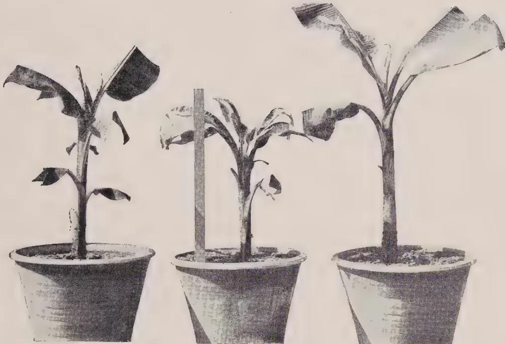
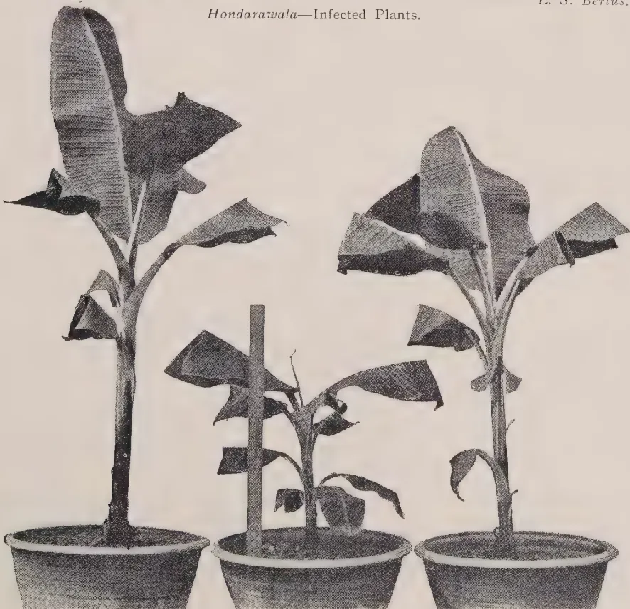
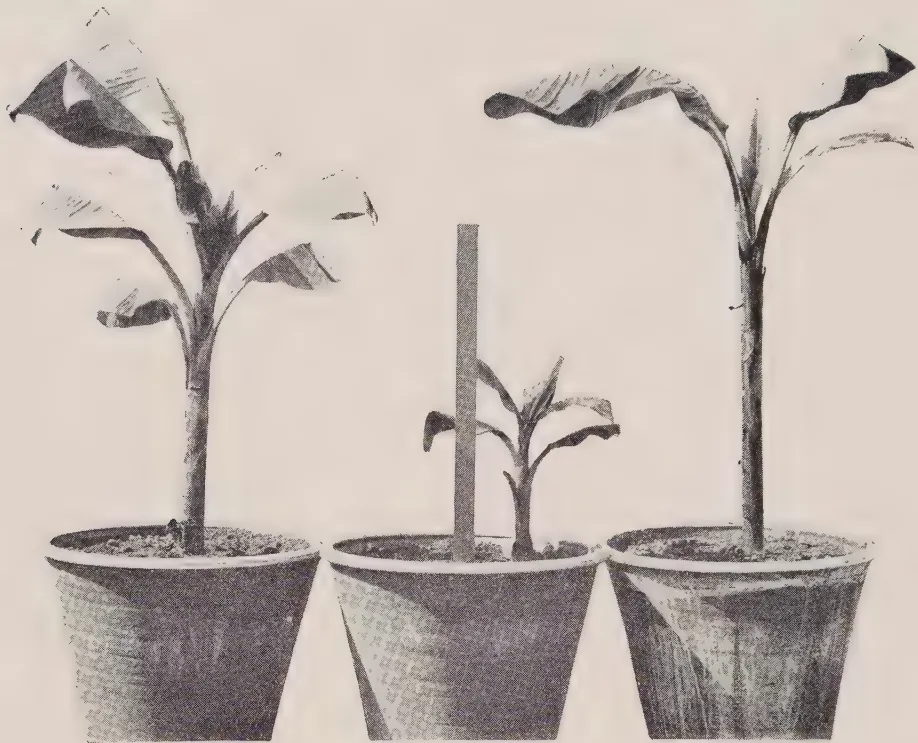
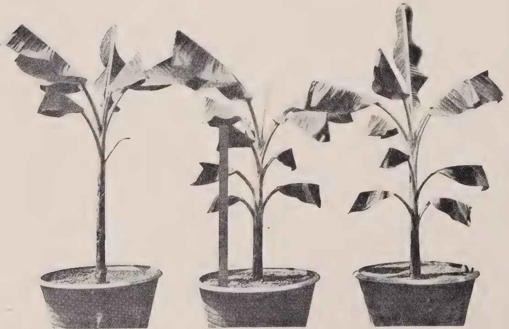
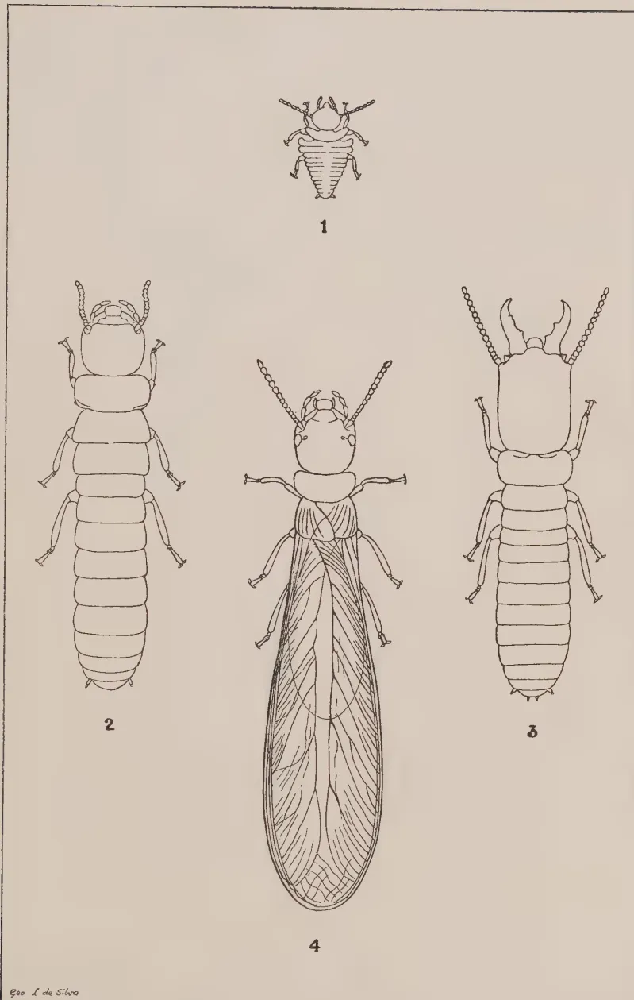
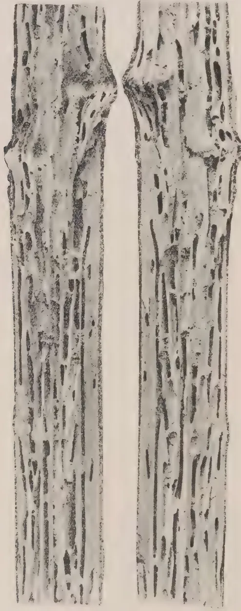
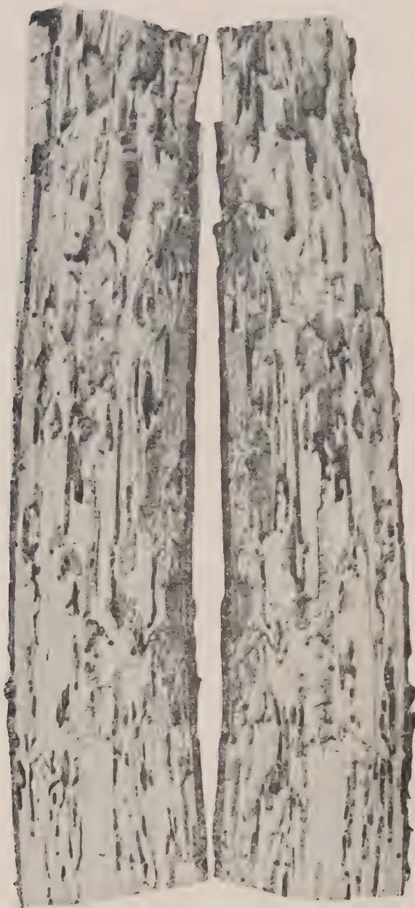

# The Tropical Agriculturist

September 1930

---

## EDITORIAL

---

### THE RUBBER RESEARCH ORDINANCE

---

**A**N ordinance to provide for the establishment of a Rubber Research Scheme came into force on the first of August. This is the third ordinance now passed for the fostering of our major crops, tea and coconuts already having been cared for in a similar way. This ordinance provides for the establishment of a Board "for the purpose of furthering and developing the rubber industry and of managing, conducting, encouraging and promoting scientific research in respect of rubber and all problems connected with the rubber industry, and in particular the growth and cultivation of rubber plants, the prevention and cure of diseases, blights and pests, the processes for the treatment of rubber latex and the conversion of such latex into marketable rubber, and the utilization, marketing and disposal of rubber and in general of all products derived from rubber plants."

The funds to enable this work to be carried out will be derived by the levy of a duty of one-eighth of a cent on every pound of rubber exported from Ceylon. The Board directing the work is a representative one consisting of the Director of Agriculture, the Colonial Treasurer, three unofficial members of the Legislative Council, two members of the Ceylon Estates Proprietary Association, two members of the Planters' Association, two members of the Rubber Growers' Association, four members of the Low-Country Products' Association and two members nominated by the Governor to represent small-holders.

1------------------------------------------------

126

Up to the present research work on rubber has been carried on under the direction of a Committee of those interested in the industry and with funds provided in part by the Government and in part by voluntary contribution from the rubber growers in the Island.

This Committee directed the activities of a small scientific staff with laboratories at Culloden in the Kalutara district and an estate of some sixty acres of young rubber trees at Nivitigalakele, seven miles away. The Scheme will now be able to appoint a Director of its research work who will co-ordinate and supervise the various investigations of the scientific staff. Rubber planting is a comparatively new industry and whilst many valuable lines of progress have been opened up by scientific study of the tree itself, and its product the latex, there still remains much about which an increase of knowledge is to be desired and which might have practical importance in enabling the industry to hold on in a time of depression such as is now being experienced. The greatest aid is to be expected from any means that will give us a higher-yielding tree. This means an increased production per acre with little extra cost. Other assistance would have to mean either a considerable reduction in the cost of production other than by increased yield, a point not likely of achievement, or, an increase in the price of the raw article. The last point can be achieved artificially by restriction but a better thing would be economic stability in the world. At the present moment half the peoples of the earth found in the great Russian, Chinese and Indian Empires are producing little and therefore consuming little. This is really the root of our trouble. Little has been accomplished so far in the breeding from seed of a race of higher-yielding rubber trees but great advance has been made in the propagation by a vegetative method of budding of the high-yielding tree when detected. There is no doubt that the Dutch have already stolen a long march on us and Malaya is bidding fair to do so too by searching for a scientist of eminence at an attractive salary to direct its rubber research scheme. When an industry is down then is the very time to intensively employ the most brilliant brains that money can attract. The great value of science was not learnt in Europe until she was wrapped in war and so in an industry science is too often only called in when it is in the death throes. The patient when faced with death employs the most eminent physician. We have now an ordinance to control our rubber research work and we need the most able help we can obtain.

2------------------------------------------------

127

# INVESTIGATION OF THE BUNCHY TOP DISEASE OF PLANTAINS IN CEYLON W

J. C. HUTSON, B.A. (OXON.), PH.D. (MASS.)

ENTOMOLOGIST

AND

MALCOLM PARK, A.R.C.S. (LOND.)

ACTING MYCOLOGIST

## HISTORY

**B**UNCHY top disease of plantains (*Musa paradisiaca* L.) is known in Fiji, Australia and Egypt. It was first recorded in Fiji and it is possible that infected suckers were exported from thence to Australia, Ceylon and Egypt. It is of interest to note that, while it is recorded that about forty years ago the disease threatened the banana industry in Fiji with extinction, it is no longer a serious menace in that colony. In Australia severe losses have been caused by the disease which almost wiped out the banana industry in many centres in north-eastern New South Wales and in south-eastern Queensland.

In Ceylon the disease first made its appearance in the Colombo district in 1913. Since then it has spread to the majority of the plantain-growing districts in the Island and during the earlier part of the last decade proved a limiting factor to the growth on a commercial scale of plantains in the Central and Western Provinces. The disease has not as yet been recorded on plantains grown in the Tissa area, the nearest diseased plants having been found in the Hambantota district. This freedom from disease is attributed to the isolation of the Tissa area and also to the fact that no plantain corms or plants have been introduced into that area from other parts of the Island for a number of years. Recently there has been a revival of plantain-growing in those districts in which the disease caused so much damage previously and it is to be hoped that efforts will be made to prevent a recurrence of the earlier losses.

## SYMPTOMS

The symptoms exhibited by the aerial parts of plantains in the advanced stages of bunchy top disease, viz., the dwarfing and bunching of the leaves and the difference in colour of affected plants from the normal, are so well-known in Ceylon that it is unnecessary to describe them here in detail. The recognition of the disease in the early stages assumes importance in connection with the efficient control of the disease and it is therefore proposed to describe the first symptoms somewhat fully. Such

3------------------------------------------------

128

symptoms appear usually on the leaves of plants which have been recently infected by the disease. Magee (1) has enumerated the early symptoms and his description is quoted at length.

“The first external symptoms of bunchy top appear in the leaves of the plant. The normal leaf emerges from the centre of the pseudostem with the leaf-blade wrapped tightly around the midrib in the form of a rod or ‘pipe.’ The leaf remains tightly rolled until it has almost fully emerged, and then commences to unfurl more or less evenly along its whole length. While unfurling the leaf stands erect, and when fully unrolled the elongation of the leaf-stalk carries the blade clear of the pseudostem, and the leaf gradually assumes a position approaching the horizontal, making room for the next leaf which is pushing up through the pseudostem.

“In the case of secondary infection, it is in a leaf which has unfurled in this manner that the first symptom of bunchy top is usually observed. The first definite symptom of the disease is the appearance of irregular, nodular dark-green streaks about .75 mm. wide along the secondary veins on the underside of the lower portion of the leaf-blade, along the leaf-stalk, or along the lower portion of the midrib.

“In the first instance one, two, or several of these streaks may be present. Usually others appear later in the same region. In character they may vary from a series of small dark-green dots to a continuous dark-green line with a ragged edge, an inch or more in length.

“The lamina of the normal leaf is of an even rich green colour. From the midrib prominent vascular strands run out more or less perpendicularly at intervals as main veins. The area between the main veins is lined by secondary veins which are even in colour throughout the leaf. The normal midrib and leaf-stalk are of an even pale-green colour, and are covered with a whitish waxy bloom.

“Usually the dark-green streaks are first seen in the leaf-blade, but may later appear in the midrib and leaf-stalk of the same leaf. In some cases of secondary infection, an earlier indication of the later appearance of green streaks in the lamina is seen. This occurs in the ‘pipe’ or tightly rolled heart-leaf. It takes the form of the appearance of a number of irregular pale-whitish streaks along the secondary veins of the tightly rolled lamina when the ‘pipe’ is about one half emerged from the pseudostem. When these pale-whitish streaks appear as the first symptom, the ‘pipe’ shows a slight transverse wrinkling along its length. On unfurling, a leaf which has shown these early streaks, bears numerous dark-green streaks, along the secondary veins of the lamina. In other respects this leaf may not differ from the normal preceding leaves.

4------------------------------------------------

129

“When, as usually is the case, the first symptoms take the form of a few characteristic green streaks in the lamina, midrib, or petiole, the ‘first-symptom’ leaf, except for these streaks, appears normal in size, shape and behaviour. In the following leaf however, while the pipe is still unfurled, pale-whitish streaks are seen along the secondary veins of the leaf-blade. These vary a great deal in number, depending on the degree of infection. The pipe or heart-leaf now unfurls slightly abnormally, beginning to unroll from the top region, giving the partly unfurled leaf a funnel-like appearance. In this leaf, when unfurled, dark-green streaks will be found to be present along many of the secondary veins of the lamina, and several dark-green dots or lines are seen along the midrib and petiole. This leaf will be smaller than normal, slightly chlorotic, and the marginal portion of the lamina will be wavy and slightly rolled upwards.

“The presence of the characteristic broken dark-green streaks along the secondary veins of the lamina, or along the midrib or petiole, is the most definite and reliable symptom of bunchy top. These streaks appear as the earliest external indication of the disease, and together with all other symptoms are not later retrospective in leaves which have been thrown earlier than the ‘first-symptoms’ leaf. The dark-green streaks are not apparent when viewing the dorsal surface of the leaf in reflected light. The leaf should be inspected from the underside so as to allow light to pass through it.

“Successive leaves as they are thrown became more abnormal. There is a slight retardation in the rate of growth. The heart-leaf unfurls prematurely, and is slow in completing the process; often another leaf has begun to unfurl before the preceding one is fully unrolled. The leaves may become progressively smaller in size or successive leaves may be of smaller dimensions. (In normal growth each leaf is larger than the preceding one). There is a reduction both in width and length of the leaves, this being more noticeable in the case of the lamina than in the midrib. The petiole does not elongate normally, thus the leaves stand more erect than in the healthy plant. Leaves thrown seen after infection are distinctly chlorotic in appearance, but this character does not persist except on the margins of the laminae. After several abnormal leaves have appeared, extreme congestion is apparent at the apex of the pseudostem. The leaves are seen to have lost their normal symmetrical arrangements around the pseudostem, and to have assumed the ‘rosetted’ condition. This characteristic arrangement of the leaves of a bunchy top plant does not result until several weeks after infection, and is thus not an early diagnostic symptom.

“In colour the mature leaf of a secondary bunchy top plant is of a slightly more yellowish hue than that of a healthy plant. In the primary bunchy top plant the position is often reversed.

5------------------------------------------------

130

Owing to the dark-green streaking being present along the greater number of the secondary veins, the general colour of the leaf is sometimes darker than normal. The lamina of such a leaf usually has a light yellowish-green margin.

"In texture there is a difference between the bunchy top and healthy leaf. Whereas the latter is elastic and pliable, the petiole, midrib and lamina of the bunchy top leaf are harsh and brittle, and snap readily when bent or crushed in the hand. There is a distinct rigidity and apparent resistance to wilting shown by bunchy top leaves. They are not nearly so readily shaken by winds as healthy leaves.

"The surface of the lamina of a bunchy top leaf becomes markedly corrugated as it matures, due to the growth of tissue in the region of the main veins producing ridging on the dorsal surface, and troughing on the ventral surface. This prominence of the main veins is not a diagnostic symptom of the disease. It is often seen in the leaves of healthy plants growing under adverse, or even rank, conditions.

"The margin of the lamina of the young bunchy top leaf is wavy and slightly upward-rolled at intervals along its length. In the older bunchy top leaf the lamina is not supported normally by the midrib; both sides tend to hang down so as to be nearly parallel with each other, the margin, however, remaining upturned and rolled.

"In primary infected plants, symptoms of the disease are apparent as soon as the first leaf appears above ground. The leaves are small, rosetted, and numerous broken dark-green streaks are seen in the petioles, midribs and laminae. The margins of the leaves are usually highly chlorotic, and are slightly rolled upwards."

Associated with the changes in the aerial portions of bunchy top plants is an increase in the decay of the roots. It is a common experience in the examination of the roots of healthy plantains, particularly of mature plants, to find a proportion of the roots decaying through the agency of soil organisms or possibly degenerating through age. In bunchy top plants, however, this root decay is more marked and for a long time was considered to be the cause of the disease. Magee (*loc. cit.*) considered this increase of root decay to be of a secondary nature and suggested that it might be due to the loss of immunity on the part of the roots of an affected plant to the attack of otherwise harmless soil organisms. It is possible also that the reduction of the assimilating surface of the leaves consequent on infection may lead to a weakening of the roots through an insufficient supply of carbohydrate material.

In all countries in which the disease has occurred investigators have endeavoured to discover the cause of the disease and to devise means for its control. Gadd (2) reviewed the situation

6------------------------------------------------

<!-- stage4: FAINT old-images-only -->

[Faint page: no legible print of its own could be verified; text withheld (stage 4 review list)]

7------------------------------------------------

Plate I.

![A black and white photograph showing a large, open-sided wooden structure, likely a greenhouse or cage, with a gabled roof. Inside the structure, several large, white, teardrop-shaped objects are hanging from the roof. A person wearing a hat and light-colored clothing is standing inside the structure, near the hanging objects. The structure is surrounded by dense foliage, including what appears to be a tea plantation in the foreground. In the background, there are trees and a building with a tiled roof.](c95b66b6a7367c9bbaf28f281b14e229_2_img.webp)A black and white photograph showing a large, open-sided wooden structure, likely a greenhouse or cage, with a gabled roof. Inside the structure, several large, white, teardrop-shaped objects are hanging from the roof. A person wearing a hat and light-colored clothing is standing inside the structure, near the hanging objects. The structure is surrounded by dense foliage, including what appears to be a tea plantation in the foreground. In the background, there are trees and a building with a tiled roof.

Photo by

General View of Cages.

L. S. Bertus.

8------------------------------------------------

131

in regard to bunchy top disease in 1926 and it is not proposed again to describe the results obtained by early workers. Efforts to elucidate the problem were without success until Magee (*loc. cit.*) working in Australia demonstrated that the disease was transmissible from diseased to healthy plants by the agency of the banana aphid (*Pentalonia nigranervosa*). When the results of his experiments became known in Ceylon evidence was sought to determine if the Ceylon disease was identical with that found in Australia. The symptoms were found to be the same and in addition the aphis found on plantains in Ceylon was identified as *Pantalonia nigranervosa*. It appeared therefore that the disease was identical in the two countries and subsequently Magee while on a visit to Ceylon examined diseased plants and reported that the disease was identical with that in Australia. In 1928 Small (3), who had carried out a number of experiments to determine the significance of *Rhizoctonia bataticola* in cases of root disease of a wide range of plants, reported a preliminary experiment which indicated that *Rhizoctonia bataticola* might be associated with bunchy top disease and criticised Magee's paper on the ground that insufficient attention had been given to the study of root factors. He stated that "Ceylon bunchy top requires to be investigated *ab initio* with due attention to each possible causal factor and with repeated tests of each under controlled conditions." It was therefore resolved that an investigation should be initiated to determine, if possible, the cause of bunchy top disease in Ceylon. The experiments described below were formulated with the intention of determining, if possible, if the banana aphid, *Pantalonia nigranervosa*, could transmit the disease from affected to healthy plants under controlled conditions, endeavours being made to eliminate the complications arising from the presence of root parasites, with special reference to *Rhizoctonia bataticola* and the eelworm, *Caconema radicicola*.

### EXPERIMENTS

The experiments were carried out in a framework enclosure made of rough jungle posts and completely covered with iron netting. A jute hessian screen was placed on the roof to break the force of heavy rains. The enclosure was 36 feet long by 24 feet broad by 7 feet high at the sides from which the roof sloped up to the ridge pole along the top. Plate I is a reproduction of a photograph of the enclosure taken during the course of the experiments.

Eight wooden stands, each 15 feet long by 2 feet wide by 2 feet 6 inches high, were arranged in four rows inside the enclosure to hold forty pot plants, ten plants in each row.

Forty cloth cages of the type shown in the illustration were made. Each cage was strengthened at the apex and suspended by a cord from the galvanized wires which reinforced the netting

9------------------------------------------------

132

of the enclosure. Round the lower open end of each cage a tape was threaded through the hem, the tape being of sufficient length to pass twice round the circumference of the pots and to be tied securely. The cages were fitted with short sleeves to admit of easy examination of the plants and these sleeves were tied with tapes when not in use. Bands of 'tanglefoot' were placed on the legs of the wooden stands and on the tapes suspending the cages in order to exclude insects.

The soil used for the experiments was a mixture of good soil and leaf mould and was sterilized in an autoclave for two hours at 125-130°C. Owing to delay in the arrival of plants for experiment, it was found necessary to sterilize the soil again and this was done after an interval of about one month. The pots were filled and the corms planted very shortly after the second sterilisation. The pots, which were new, were washed thoroughly with a solution of copper sulphate before filling with soil.

Four dozen young plantain suckers, twenty-four of *Hondarawala*, a variety generally considered to be somewhat resistant to bunchy top disease, and twenty-four of *Kolikuttu*, a variety relatively susceptible to the disease, were received early in January 1929 from the Tissa area in the Southern Province, an area in which bunchy top disease has not been found to occur. The suckers on arrival were examined carefully and found to be free from aphids and borer. The roots were removed with a flamed knife and examined. Neither eelworms nor *Rhizoctonia bataticola* were found in any of the roots. Samples of the roots were kept in damp chambers for a period of six months; at the end of the period the roots had degenerated but *Rhizoctonia bataticola* was not found. The forty best suckers were selected and freed of all soil. They were fumigated with hydrocyanic acid gas and were then topped at the collar with a knife sterilized in flame before each cutting. The corms were washed in a dilute solution of copper sulphate and planted. The planting of all forty plants and the fitting of the cloth cages were completed by January 23rd, 1929.

The pots were arranged on the benches in four rows of ten plants each as illustrated in plate I, the rows from left to right of the illustration being as follows:

<table>
<tbody>
<tr>
<td>Row I</td>
<td>Pots numbered 1 to 10</td>
<td><i>Hondarawala</i> infested (H.I.)</td>
</tr>
<tr>
<td>Row II</td>
<td>,, ,, 1 to 10</td>
<td><i>Hondarawala</i> control (H.C.)</td>
</tr>
<tr>
<td>Row III</td>
<td>,, ,, 1 to 10</td>
<td><i>Kolikuttu</i> infested (K.I.)</td>
</tr>
<tr>
<td>Row IV</td>
<td>,, ,, 1 to 10</td>
<td><i>Kolikuttu</i> control (K.C.)</td>
</tr>
</tbody>
</table>

Examinations of the plants were made at short intervals and the results of these examinations are summarised in table I. It has been thought necessary to include only the results of those examinations in which changes were noted.

10------------------------------------------------

133

Table I

<table border="1">
<thead>
<tr>
<th rowspan="2">Row No.</th>
<th rowspan="2">Date of Examination</th>
<th colspan="10">PLANT</th>
<th rowspan="2">Remarks</th>
</tr>
<tr>
<th>1</th>
<th>2</th>
<th>3</th>
<th>4</th>
<th>5</th>
<th>6</th>
<th>7</th>
<th>8</th>
<th>9</th>
<th>10</th>
</tr>
</thead>
<tbody>
<tr>
<td rowspan="6">I (<i>Hondarawala</i> infested)</td>
<td>17. 6.29</td>
<td rowspan="6">Plant dead</td>
<td>—</td>
<td>—</td>
<td>—</td>
<td>—</td>
<td>Str +</td>
<td>Str +</td>
<td rowspan="6">Plant dead</td>
<td>—</td>
<td>—</td>
<td>—</td>
<td rowspan="6">Aphids put in originally on 10.4.29 (except Nos. 5 &amp; 6) re-infested with aphids on 15.7.29.</td>
</tr>
<tr>
<td>2. 7.29</td>
<td>—</td>
<td>—</td>
<td>—</td>
<td>—</td>
<td>Str +</td>
<td>Str +</td>
<td>—</td>
<td>—</td>
<td>—</td>
</tr>
<tr>
<td>29. 7.29</td>
<td>—</td>
<td>—</td>
<td>—</td>
<td>—</td>
<td>Str +</td>
<td>Str +</td>
<td>—</td>
<td>—</td>
<td>—</td>
</tr>
<tr>
<td>13. 8.29</td>
<td>Str +</td>
<td>Str +</td>
<td>Str +</td>
<td>Str +</td>
<td>Str +</td>
<td>Str +</td>
<td>Str ?</td>
<td>Str ?</td>
<td>Str +</td>
</tr>
<tr>
<td>31. 8.29</td>
<td>Str +</td>
<td>Str +</td>
<td>Str +</td>
<td>Str +</td>
<td>Str +</td>
<td>Str +</td>
<td>Str +</td>
<td>Str +</td>
<td>Str +</td>
</tr>
<tr>
<td>3. 9.29</td>
<td>Str +</td>
<td>Str +</td>
<td>Str +</td>
<td>Str +</td>
<td>Str +</td>
<td>Str +</td>
<td>Str +</td>
<td>Str +</td>
<td>Str +</td>
</tr>
<tr>
<td rowspan="6">II (<i>Hondarawala</i> control)</td>
<td>17. 6.29</td>
<td>—</td>
<td>—</td>
<td>—</td>
<td>—</td>
<td>—</td>
<td>—</td>
<td>—</td>
<td>—</td>
<td>—</td>
<td>—</td>
<td>—</td>
<td rowspan="6">No aphids found on any of the plants during the course of the experiment.</td>
</tr>
<tr>
<td>2. 7.29</td>
<td>—</td>
<td>—</td>
<td>—</td>
<td>—</td>
<td>—</td>
<td>—</td>
<td>—</td>
<td>—</td>
<td>—</td>
<td>—</td>
<td>—</td>
</tr>
<tr>
<td>29. 7.29</td>
<td>—</td>
<td>Plant taken into open</td>
<td>—</td>
<td>—</td>
<td>—</td>
<td>—</td>
<td>—</td>
<td>—</td>
<td>—</td>
<td>—</td>
<td>—</td>
</tr>
<tr>
<td>13. 8.29</td>
<td>—</td>
<td>—</td>
<td>—</td>
<td>—</td>
<td>—</td>
<td>—</td>
<td>—</td>
<td>—</td>
<td>—</td>
<td>—</td>
<td>—</td>
</tr>
<tr>
<td>31. 8.29</td>
<td>—</td>
<td>—</td>
<td>—</td>
<td>—</td>
<td>—</td>
<td>—</td>
<td>—</td>
<td>—</td>
<td>—</td>
<td>—</td>
<td>—</td>
</tr>
<tr>
<td>3. 9.29</td>
<td>—</td>
<td>—</td>
<td>—</td>
<td>—</td>
<td>—</td>
<td>—</td>
<td>—</td>
<td>—</td>
<td>—</td>
<td>—</td>
<td>—</td>
</tr>
<tr>
<td rowspan="6">III (<i>Kolkutta</i> infested)</td>
<td>17. 6.29</td>
<td>—</td>
<td>—</td>
<td>—</td>
<td>—</td>
<td>—</td>
<td>Plant dead</td>
<td>—</td>
<td>—</td>
<td>—</td>
<td>—</td>
<td>—</td>
<td rowspan="6">Aphids put in originally on 10.4.29. All plants re-infested with aphids on 15.7.29.</td>
</tr>
<tr>
<td>2. 7.29</td>
<td>Str ?</td>
<td>—</td>
<td>—</td>
<td>—</td>
<td>—</td>
<td>—</td>
<td>—</td>
<td>—</td>
<td>—</td>
<td>—</td>
<td>—</td>
</tr>
<tr>
<td>29. 7.29</td>
<td>Str +</td>
<td>—</td>
<td>—</td>
<td>—</td>
<td>Cut back</td>
<td>—</td>
<td>—</td>
<td>—</td>
<td>Cut back</td>
<td>—</td>
<td>—</td>
</tr>
<tr>
<td>13. 8.29</td>
<td>Str +</td>
<td>—</td>
<td>Str +</td>
<td>Str ?</td>
<td>—</td>
<td>—</td>
<td>Str ?</td>
<td>—</td>
<td>Str +</td>
<td>—</td>
<td>—</td>
</tr>
<tr>
<td>31. 8.29</td>
<td>Str +</td>
<td>Str +</td>
<td>Str +</td>
<td>Str +</td>
<td>—</td>
<td>—</td>
<td>Str +</td>
<td>Str +</td>
<td>Str +</td>
<td>—</td>
<td>—</td>
</tr>
<tr>
<td>3. 9.29</td>
<td>Str +</td>
<td>Str +</td>
<td>Str +</td>
<td>Str +</td>
<td>Str +</td>
<td>—</td>
<td>Str +</td>
<td>Str +</td>
<td>Str +</td>
<td>Str ?</td>
<td>—</td>
</tr>
<tr>
<td rowspan="6">IV (<i>Kolkutta</i> control)</td>
<td>17. 6.29</td>
<td>—</td>
<td>—</td>
<td>—</td>
<td>—</td>
<td>—</td>
<td>Plant dead</td>
<td>—</td>
<td>—</td>
<td>—</td>
<td>—</td>
<td>Plant dead</td>
<td rowspan="6">B = Bunching (of leaves). Str = Streaking.</td>
</tr>
<tr>
<td>2. 7.29</td>
<td>—</td>
<td>—</td>
<td>—</td>
<td>—</td>
<td>—</td>
<td>—</td>
<td>—</td>
<td>—</td>
<td>—</td>
<td>—</td>
<td>—</td>
</tr>
<tr>
<td>29. 7.29</td>
<td>—</td>
<td>—</td>
<td>—</td>
<td>—</td>
<td>Plant taken into open</td>
<td>—</td>
<td>—</td>
<td>—</td>
<td>—</td>
<td>—</td>
<td>—</td>
</tr>
<tr>
<td>13. 8.29</td>
<td>—</td>
<td>—</td>
<td>—</td>
<td>—</td>
<td>—</td>
<td>—</td>
<td>—</td>
<td>—</td>
<td>—</td>
<td>—</td>
<td>—</td>
</tr>
<tr>
<td>31. 8.29</td>
<td>—</td>
<td>—</td>
<td>—</td>
<td>—</td>
<td>—</td>
<td>—</td>
<td>—</td>
<td>—</td>
<td>—</td>
<td>—</td>
<td>—</td>
</tr>
<tr>
<td>3. 9.29</td>
<td>—</td>
<td>—</td>
<td>—</td>
<td>—</td>
<td>—</td>
<td>—</td>
<td>—</td>
<td>—</td>
<td>—</td>
<td>—</td>
<td>—</td>
</tr>
</tbody>
</table>

B = Bunching (of leaves).

Str = Streaking.

11------------------------------------------------

134

The corms were all planted by January 23rd. By March 15th the plants, with the exception of those which failed to grow (Nos. I. 1, I. 7, III. 6, IV. 6 and IV. 10) were growing well. Search had been made for a supply of aphids from diseased plants but without success and it was therefore decided to cut back all growing plants to ground level. The knife used for the purpose was flame-sterilized before each operation. On April 10th a few aphids were obtained from some bunchy top plants. Of these the majority were young nymphs, but weather conditions at the time were such that it was deemed advisable to use these for infestation. Plants in rows I and III were therefore infested. The aphids multiplied rapidly on infested plants and on May 16th it was found necessary to control their numbers by a mild dose of calcium cyanide which was introduced into the cages containing control as well as infested plants. As the plants grew it was found that the leaves came into contact with the bags and in order to prevent any chance of infection from outside, such leaves were cut back with a flamed knife.

It will be seen from table I that at the beginning of July only two plants of the infested *Hondarawala* series showed any symptoms of bunchy top disease. On July 15th a plentiful supply of aphids being found on a stool of definitely bunchy top plants growing at Peradeniya, the plants were first fumigated with a mild dose of calcium cyanide and then series I and III (with the exception of those two plants in series I which displayed positive disease symptoms) were re-infested with the aphids from the bunchy top plants. Unfortunately the fumigant was added while the pots and cages were in a wet condition and some of the leaves were scorched. Two plants in series III were scorched so severely that they were cut back to ground level. One of these (III.7) failed to recover from the treatment. The remaining plants recovered and the experiment proceeded satisfactorily. At this stage of the experiment it was found necessary to replace the cages which were showing signs of rotting. The replacement was carried out carefully, control plants first.

From the end of July the experiment began to give regular results until, at the beginning of September when the main experiment was concluded, all the infested *Hondarawala* plants were showing symptoms of bunchy top while seven out of eight of the infested *Kolikutu* plants were positively infected, the remaining one plant being doubtful. (This plant subsequently developed typical bunchy top symptoms). The control plants remained healthy. This main experiment therefore demonstrated conclusively that bunchy top disease of plantains can be transmitted from diseased to healthy plants by the agency of the aphid *Pentalonia nigrinervosa*.

12------------------------------------------------

Plate II.

Three potted banana plants are shown in a row. The plants exhibit various symptoms of infection, including large, dark, necrotic patches on the leaves and some leaf curling. The central plant is supported by a wooden stake. The pots are dark-colored and appear to be made of ceramic or plastic.

Photo by

Hondarawala—Infected Plants.

L. S. Bertus.

Three potted banana plants are shown in a row. The plants exhibit various symptoms of infection, including large, dark, necrotic patches on the leaves and some leaf curling. The central plant is supported by a wooden stake. The pots are dark-colored and appear to be made of ceramic or plastic.

Photo by

Hondarawala—Control Plants.

L. S. Bertus.

13------------------------------------------------

Plate III.

Three potted banana plants are shown in a row. The leftmost plant is tall with several large, dark, and slightly drooping leaves. The middle plant is shorter, with a vertical wooden stake placed next to it for scale; its leaves are smaller and more drooping. The rightmost plant is tall and healthy-looking with large, upright leaves. All three are in dark, textured pots.

Photo by

Kolikuttu—Infected Plants.

L. S. Bertus.

Three potted banana plants are shown in a row. The leftmost plant is tall with large, upright leaves. The middle plant is shorter, with a vertical wooden stake placed next to it for scale; its leaves are large and upright. The rightmost plant is tall with large, upright leaves. All three are in dark, textured pots.

Photo by

Kolikuttu—Control Plants.

L. S. Bertus.

14------------------------------------------------

135

Plates 2 and 3 give comparative photographs of infected and control plants. In plate 2 the lower plants were three of the *Hondarawala* control plants; the middle plant remained small throughout the experiment. The middle plant of the infected plants was one of the two plants which showed positive infection in June and which subsequent to that date remained small and stunted, with marked bunching of the leaves.

Plate 3 gives comparative photographs of the *Kolikuttu* series. The control plants (below) wilted temporarily on exposure to strong sunlight. Of the infected plants (above) the middle plant was a sucker thrown up after plant III. 5 had been cut back consequent on fumigation scorch. It will be seen that the leaves of the plants in both plates were cut back in order to avoid contact with cloth cages.

The relative lack of success of the first infestation of aphids rendered difficult the calculation of the incubation period, *i.e.*, the period which elapsed after the infestation of plants with infested aphids before disease symptoms appeared. The two plants (I. 5 and I. 6) which gave positive results from the first infestation did not show definite symptoms until two months after infestation. This period differed from that given by Magee (*loc. cit.*) who found that the incubation period varied from 23 to 29 days, with an average period of 25 days. A subsidiary experiment was therefore initiated to determine this point. Three each of the healthy control plants of the two varieties were infested on September 9th with aphids from the infected plants. The plants were not kept in cages but the control plants, three of the *Hondarawala* series and two of the *Kolikuttu* series remained healthy throughout the experiment. The results are given in table II.

Table II

<table border="1">
<thead>
<tr>
<th>Plant No.</th>
<th>Treatment</th>
<th>Date of appearance of first symptom</th>
<th>Incubation period</th>
</tr>
</thead>
<tbody>
<tr>
<td colspan="4"><i>Hondarawala</i></td>
</tr>
<tr>
<td>II 1</td>
<td>Infested</td>
<td>24-10-29</td>
<td>45 days</td>
</tr>
<tr>
<td>5</td>
<td>Control</td>
<td>—</td>
<td>—</td>
</tr>
<tr>
<td>6</td>
<td>Infested</td>
<td>7-11-29</td>
<td>59 days</td>
</tr>
<tr>
<td>8</td>
<td>Control</td>
<td>—</td>
<td>—</td>
</tr>
<tr>
<td>9</td>
<td>Infested</td>
<td>12-11-29</td>
<td>63 days</td>
</tr>
<tr>
<td>10</td>
<td>Control</td>
<td>—</td>
<td>—</td>
</tr>
<tr>
<td colspan="4"><i>Kolikuttu</i></td>
</tr>
<tr>
<td>IV 2</td>
<td>Infested</td>
<td>24-10-29</td>
<td>45 days</td>
</tr>
<tr>
<td>4</td>
<td>do</td>
<td>15-10-29</td>
<td>36 days</td>
</tr>
<tr>
<td>7</td>
<td>do</td>
<td>15-10-29</td>
<td>36 days</td>
</tr>
<tr>
<td>8</td>
<td>Control</td>
<td>—</td>
<td>—</td>
</tr>
<tr>
<td>9</td>
<td>do</td>
<td>—</td>
<td>—</td>
</tr>
</tbody>
</table>

The experiments described above were considered conclusively to support Magee's results although there were slight differences

15------------------------------------------------

136

of detail. The experiments had for their object also the determination of the extent, if any, to which root affection had a bearing on the problem. At the conclusion of the main experiment, *i.e.*, at the beginning of September the root systems of four of the *Hondarawala* infected plants (I. 2, I. 3, I. 5 and I. 6), of three of the *Hondarawala* control plants (II. 3, II. 4 and II. 7), of five of the *Kolikuttu* infested plants (III. 1, III. 2, III. 3, III. 4, and III. 7) and two of the *Kolikuttu* control plants (IV. 1 and IV. 3) were examined. The soil from the pots was put on to sheets of paper and the roots separated therefrom and washed, together with those cut from the base of the plants. The proportion of dead to healthy roots was very small and in no root were found either *Rhizoctonia bataticola* or eelworms. Plant III. 7, which was one of those that had made no growth at all, was found to consist of the empty skin of the corm the remainder having rotted away completely. In order to confirm the above observations a few of the roots of each plant were kept in damp chambers in order that, if *Rhizoctonia bataticola* were present, the sclerotia might develop. They were examined after three months with negative results.

During the earlier stages of the experiments a mottling of the leaves of all plants were observed. The areas of lamina between the veins became yellowish. It was thought that the unnatural conditions of growth, combined with the effects of fumigation might be responsible. Two of the control plants, one of each variety (plants II. 3 and IV. 5) were taken out of the cages and planted in the open on July 20th. Both these plants showed the mottling but leaves which developed subsequently were normal and healthy. The mottling was therefore attributed to the effect of the conditions under which the plants were grown.

#### DISCUSSION OF RESULTS

The experiments described in this paper have demonstrated clearly that bunchy top disease of plantains is a disease which can be transmitted from diseased to healthy plants by the aphid *Pentalonia nigrinervosa*. Seeing that the aphid may be found on almost every plantain sucker at some stage in its existence it is to be assumed that the aphid itself is not the only agent concerned with the disease. Proof of this has not been sought in Ceylon but Magee (*loc. cit.*) showed that aphids when transferred from healthy plants to healthy plants did not cause the disease. This fact and the symptoms exhibited by the diseased plants place it in the class of virus diseases.

Two varieties of plantain were used for the experiments, *Hondarawala* and *Kolikuttu*. These were chosen as the former variety is reputed (without statistical evidence) to be relatively resistant and the latter relatively susceptible to the disease. The

16------------------------------------------------

137

results obtained, *i.e.*, 100 per cent infection in each variety, gave no indication of relative immunity or resistance. The small subsidiary experiment, in which three plants of each variety were used, indicated that there was a difference in the incubation period in the two varieties. The plants of the reputedly more susceptible variety, *Kolikuttu*, developed bunchy top symptoms 45 days, 36 days and 36 days respectively after infestation with infective aphids, the average being 39 days. The plants of the *Hondarawala* variety displayed bunchy top symptoms 45 days, 59 days and 63 days respectively after infestation, the average incubation period being  $55\frac{2}{3}$  days. The number of plants being so small, these figures cannot be taken as conclusive but they indicate a difference between the two varieties which may have given rise to the impression of relative susceptibility and resistance. None of the figures for the period of incubation were as low as those obtained by Magee (*loc. cit.*) in Australia. He used Cavendish bananas for his experiments and obtained figures varying from 23 to 29 days with an average of 25 days for 20 plants. It would appear probable therefore that the incubation period may differ with different varieties and it is also possible that the conditions under which the plants are grown will have an effect on this period.

With regard to the association of root disease with bunchy top disease suggested by Small (*loc. cit.*), the absence of root decay in the roots of suckers examined prior to the experiments, the use of sterilized soil and the failure to find either *Rhizoctonia bataticola* or eelworms in the roots of the plants at the conclusion of the experiments may be considered to have eliminated the root factor from the experiments under review. It is concluded that, in Ceylon, bunchy top disease of plantains can be caused by a virus disease transmitted by infective aphids without the previous action of some root-destroying organism which might affect the vitality of the plant and render it more susceptible. It is still conceivable that in Ceylon there is a root disease which is characterised by symptoms similar to those displayed by bunchy top disease. It would be necessary to attack the problem from another angle, *i.e.*, to endeavour to reproduce symptoms through the agency of root parasites alone or of root parasites in conjunction with non-infective aphids, to determine if bunchy top symptoms can be caused by these factors also. Extensive experiments would be necessary before the question could be decided and it may be significant that *Rhizoctonia bataticola*, eelworms and aphids have all been found on healthy plants under natural conditions.

Fahmy(4) working in Egypt, described a disease very similar to, if not indistinguishable from, bunchy top disease which he attributed to eelworm infection of the roots. It would be

17------------------------------------------------

138

interesting, in view of our present knowledge, if a search for *Pentalonia nigranervosa* were made in Egypt and experiments set up to determine the possibility of the responsibility of a virus infection there also.

### CONTROL

The systemic nature of bunchy top disease and our imperfect knowledge of the nature of virus diseases render impossible direct control measures, *i.e.*, prophylactic measures against the virus itself. Again, the aphid which has been shown to transmit the disease is difficult to control under field conditions; spraying is impracticable owing to the fact that the aphids usually occupy such positions between the closely adherent leaf-sheaths of the pseudostems that it is most difficult to bring insecticides into contact with them by spraying. In a well-cultivated garden in which bunchy top disease occurs only infrequently the proportion of infective to normal aphids must be extremely low and this furnishes another argument against attempts to control the disease by controlling the aphid. There remains therefore only indirect control which can be effected by exclusion and eradication. Plantain-growing districts in which the disease does not occur will be kept free from bunchy top only by complete exclusion of plantain material from infected areas. The effects of the disease in other districts in Ceylon should provide an object lesson sufficiently striking to plantain-growers in free areas, *e.g.*, Tissa, to prevent them from importing plantain material from other free areas except under special conditions.

In view of what has been stated above the treatment of areas in which bunchy top occurs must consist in eradication. This may be effected in two ways, either by the complete eradication of diseased and healthy plants in affected areas or by the removal and destruction of diseased plants only. The former method would appear to have theoretical advantages and has been attempted in Australia. In that country two districts were completely cleared of banana plants and so retained for a period of eighteen months after which they were replanted. The nearest banana-growing district was nine miles distant and in this district the disease was treated by periodical inspection and the removal of diseased plants. The two districts which had been completely cleared became re-infested, although only to a very slight extent, and it is to be assumed that the neighbouring district, although nine miles distant, was responsible for the re-infestation. These experiments point unmistakably to the fact that total eradication of the disease can only be attained by the complete clearing of all infected plantations and gardens within a large area. In Ceylon this would mean that all plantains in the Island, with the exception of plantains in districts such as Tissa in which the disease

18------------------------------------------------

139

does not occur, would have to be destroyed and replanting prohibited for a period of at least one year and probably longer. In a country in which the growing of plantains is so general as it is in Ceylon this policy would be practically impossible since the cost of enforcing eradication would be out of all proportion to the amount of money which would be saved as a result of eradication of the disease.

There remains therefore treatment by removal of diseased plants as they appear. This method has its disadvantages since the disease is present in plants for some time before outward symptoms are displayed. Nevertheless, if the disease is discovered in the early stages and prompt control measures are undertaken it should be possible to reduce the incidence of the disease to such an extent that the damage caused by it would be of little practical importance. The first essential for successful treatment by this method is the recognition of the early stages of the disease. For that reason the first symptoms as described by Magee have been quoted at some length in this paper. The streaking which is found in the leaves of plants in an early stage of infection is typical and once appreciated renders diagnosis relatively simple. It is necessary to examine only the youngest leaves of apparently healthy plants for the streaking and routine inspections are therefore not unduly laborious.

The nature of the disease is such that, if any one sucker of a stool is infected, the infective principle or virus may pass to all the other suckers or plants in that stool. It is therefore not sufficient to remove only the sucker which is obviously infected since the remaining component plants of the stool will serve as centres from which infection may be carried to neighbouring healthy stools. It is most important that, when a sucker is found to be infected, the whole of the stool be destroyed. It is false economy to leave parts of the stool in the hope that a bunch or bunches will be produced. In a certain small percentage of cases in which infected suckers have been cut out early enough, this may succeed. The risk of leaving infected portions is, however, so great that complete eradication of the whole stool containing infected suckers is the only safe form of treatment.

The disposal of diseased plants is best accomplished by cutting them up into small pieces and allowing them to dry, after which they may be burned or buried. The plantain stem and corm is soft and the most satisfactory method of cutting would appear to be into thin longitudinal slices which would dry rapidly. Once dried burial provides an adequate method of disposal.

If a strain of plantains immune to bunchy top disease could be found, the growth of immune plants only would solve the problem of control of the disease. Unfortunately no completely

19------------------------------------------------

140

immune strain has been discovered in Ceylon and the experiments detailed above indicate that apparently resistant strains may be completely susceptible. The period of incubation, *i.e.*, the period which elapses after infection before symptoms of the disease appear, may vary in different strains and, as has been suggested above, this may lead to apparent variations in susceptibility. It is reported that a strain of bananas highly resistant to the disease is grown in Fiji but published results of tests with that strain under controlled conditions have not been seen.

### SUMMARY

1. A short review of bunchy top disease of plantains in Ceylon is given. Symptoms are described.

2. Experiments are described which were set up to determine whether bunchy top disease of plantains in Ceylon is similar to that in Australia, *i.e.*, a virus disease transmitted by aphids, and also to determine whether root disease is associated with bunchy top.

3. Two local varieties of plantains were used, *Hondarawala*, a variety considered to be somewhat resistant to bunchy top disease, and *Kolikuttu*, a very susceptible variety.

4. The experiments demonstrated conclusively that bunchy top disease is transmitted from diseased to healthy plants by the banana aphid, *Pentalonia nigrionervosa*. Root examinations indicated that root disease was not necessarily a factor in the causation of the disease.

5. A subsidiary experiment indicated that apparent differences of susceptibility may be associated with variations in the length of the period between infection and the display of symptoms of the disease by plants of different varieties.

6. Methods of control are discussed. It is suggested that, for Ceylon conditions, the most satisfactory method of control is the periodical examination of plants and the complete eradication of the whole stools in which symptoms of the disease appear.

### LITERATURE CITED

1. (1). Magee, C. J. P. Investigation on the bunchy top disease of the banana.—*Commonwealth of Australia, Council for Scientific and Industrial Research, Bulletin No. 30*, 1927.
2. (2). Gadd, C. H. Bunchy top disease of plantains (a review).—*The Tropical Agriculturist*, LXVI, 1, p. 3, 1926.
3. (3). Small, W. Bunchy top disease of plantains in Ceylon. Mycological Notes (15).—*The Tropical Agriculturist*, LXXI, 3, p. 141, 1928.
4. (4). Fahmy, T. A banana disease caused by a species of *Heterodera*.—*Ministry of Agriculture, Egypt, Bulletin No. 30. (Botanical Section)*. 1924.

20------------------------------------------------

This image is a scan of a blank page. The paper has a light beige or cream-colored tint. There are a few very small, dark specks scattered across the surface, which appear to be scanning artifacts or dust particles. No text, lines, or other markings are present on the page.

21------------------------------------------------

A black and white photograph of a flowering orchid plant, Dendrobium densiflorum, displayed on a small wooden table. The plant has several dark, lanceolate leaves and a dense, upright cluster of small, light-colored flowers. The background is a plain, light-colored wall. At the bottom right of the image, there is a small label that reads "Made by Survey Dept. London 1890".

*Dendrobium densiflorum* Wall.

22------------------------------------------------

141

## DENDROBIUM DENSIFLORUM, WALL

K. J. ALEX. SYLVA, F.R.H.S.,  
ACTING CURATOR,  
HAKGALA BOTANIC GARDENS

**T**HIS handsome evergreen epiphyte belongs to a large and well-known group of Orchids comprising several hundred species and varieties distributed at various elevations over a large area of the Eastern hemisphere, particularly in India, Nepal, Burma, Japan and the Malay Archipelago. The genus is widely distributed and in habit its species show great variation, some being very small and inconspicuous, while others are surpassed in size and beauty only by a few species in the Orchid family.

*Dendrobium densiflorum* was first introduced into Ceylon about the year 1899 and has since become very popular as an ornamental plant amongst amateur horticulturists.

By nature the plant has a tendency to grow in a compact form with several stems, the latter being clavate horny, leafy at the apex and about 12-18 inches high. The nodes of the stem are beautifully circled by yellow rings. The leaves are oblong acute, nervous. The flowers are very handsome, orange yellow, fragrant, produced in drooping pendulous racemes from the upper joints of the stem. Soon after the spell of dry weather the plants usually produce flowers from about April to June. Old and well-established plants are capable of putting forth as many as six to eight flower spikes at a time, but the flowers, unlike those in most other varieties are short lived, existing for a period of not more than 10 to 15 days.

The plant being a strong growing and hardy one can be easily cultivated at almost all elevations in Ceylon. An established plant should not be disturbed unless it has overgrown the receptacle, or the compost has been exhausted and impoverished. In any case the plant should only be repotted when in a resting state. Perforated pots or wooden baskets are admirably suited for it but even on sections of wood and tree fern trunks, (as seen in the accompanying picture) it can be grown to satisfaction. For plants cultivated in receptacles, a compost made up of equal parts of charcoal, bonemeal, chopped coconut fibre, moss or half-decayed leaves, (or *Asplenium* roots) will make a suitable rooting medium. When grown on sections of wood or fern trunks (*Alsophila* or *Hemitelia*) nothing more than a little *Sphagnum*,

23------------------------------------------------

142

or green moss, or coconut fibre, is required for tying up but it is best to insert a little of the above compost in a semi-pulverised state over and beneath the roots. Propagation is easily effected by divisions of the plant as stem suckers are rarely produced. The pot or basket should be gradually filled, first with the larger pieces of the compost over the drainage material at the bottom of the pot, and then with the finer stuff to within about 2 inches of the rim. The plant should be placed in the middle of the pot care being taken to spread the roots which should finally be covered with about an inch of the compost. At this stage the plant should be kept in position by tying the stems to some sticks driven into the compost. A few good soakings of water will be necessary during the first week and the quantity of water should be reduced gradually and given only when the compost appears dry. The newly-potted plants will require ample shade for at least six to eight weeks, after which all those that are growing and making headway should be removed to a place where more light and air can reach them, so as to afford them a slightly drier condition, but care should be taken not to allow the young plants to suffer from dryness as the roots are very active at this stage and any check received will retard the free growth of the plant.

During dry weather in addition to the afternoon watering, syringing may be resorted to both morning and afternoon in order to keep the foliage green and to prevent undue shrivelling of the pseudo-bulbs. On the completion of growth or when the plant becomes well established two good waterings a week will be sufficient, but the syringing may be continued regularly during fine weather. Plants in bloom should not be wet but should be kept in a cool dry place until flowering is past.

24------------------------------------------------

143

## CONTRIBUTIONS FROM THE RUBBER RESEARCH SCHEME, CEYLON

### TERMITES ATTACKING HEVEA BRASILIENSIS IN CEYLON

F. P. JEPSON, M.A.,

ACTING ENTOMOLOGIST,

DEPARTMENT OF AGRICULTURE, CEYLON

**T**HE somewhat formidable number of serious diseases of *Hevea brasiliensis* in Ceylon has been compensated for, to some extent, by an almost entire absence of insect pests of this tree. The few local insects which have been associated with *Hevea* in the past are of minor importance and their occurrence is so occasional, and so rarely reported, that they cannot be regarded as pests of any significance.

It has always been considered a matter for congratulation that Ceylon rubber estates enjoyed immunity from the attacks of termites, especially in view of the important status of these pests on rubber estates in Malaya and the Dutch East Indies.

In the past, records of these insects being associated with *Hevea* in Ceylon appeared to be confined to dead or diseased trees and it was assumed that the termites were not pests of primary importance.(1) Unfortunately, this view can no longer be entertained and there is reason to believe that the concern with which these pests have been regarded by the tea planter for many years must, in future, be shared by the rubber planter also.

#### WHAT TERMITES ARE

It might be advisable, at this stage, to explain briefly what termites are. They are better known as "white-ants," but belong to the insect order Isoptera and are in no way related to the true ants (Hymenoptera). The term "white-ants" is an unfortunate one and has led to much confusion. Their more correct name, termites, is preferable. Termites may, for all practical purposes, be grouped into two classes, depending upon whether they nest in the soil, or above it in trees and timber.

Those which nest in the soil usually exist in large societies and several forms of the same insect may be present in the same community. In a typical colony of this type the activity of the

25------------------------------------------------

144

nest centres around the royal pair, which, in the early stages of the society, are the original founders of the colony having been derived from a pair of the winged stage. When the colonising flight takes place, the males and females pair off, shed their wings and enter the soil at a suitable spot to commence the establishment of a new colony. Often the royal pair are enclosed in an earthen cell which is designated the "royal chamber," or "queen cell," and within this abode the queen undergoes a very considerable distention in size often attaining a length of  $2\frac{1}{2}$  inches or more. The royal pair are cared for by the "worker" caste, considered to be neuters incapable of further development. The workers feed the king and queen and remove the eggs, as soon as they are laid, to sites which have been prepared for their reception. "Soldiers," which possess formidable jaws which they use to advantage in defending the society against other insect enemies, are also present and there may occur nymphs, about to develop to the winged stage, or the winged insects themselves awaiting a suitable opportunity of embarking on their colonizing flight. This type of soil-nesting termite is represented, locally, by several genera among which may be mentioned the mound-builders *Hypotermes* and *Cyclotermes*, and *Termes*, *Leucotermes* and *Coptotermes* which erect no superstructure above their nests. More will be said of *Coptotermes* later.

The termites which nest above the soil in trees, building woodwork and other situations also commence their colonies from winged stages but the queen undergoes little increase in size. There is no worker caste, all individuals, with the exception of the soldiers, being destined to develop to reproductive adults either with, or without, wings. Usually the latter type of adult is produced only in the absence of one, or both, of the true royalties. The colonies produced by this class of termite are small when compared with those formed by the ground-nesting types. The local representatives of this group are species which belong to the sub-genera *Calotermes*, *Neotermes*, *Glyptotermes*, *Cryptotermes* and *Planocryptotermes* of the genus *Calotermes*, and many species are very serious pests of economic crops in the Island.

Figures of larvae, a soldier and a winged adult of *C. (Glyptotermes) dilatatus*, which may be considered typical of this group of termites, are shown in Plate I.

26------------------------------------------------

145

The plate contains four detailed line drawings of termites, labeled 1 through 4. Figure 1, at the top, shows a small, segmented first-stage larva. Figure 2, on the left, shows a larger, segmented full-grown larva. Figure 3, on the right, shows a soldier with a large head and prominent mandibles. Figure 4, in the center, shows a winged adult with a large, patterned wing. The drawings are in a scientific, line-art style.

Geo L de Silva

Plate I. *Calotermes (Glyptotermes) dilatatus*

Fig. 1. First stage larva X 10.

Fig. 3. Soldier X 10.

Fig. 2. Full-grown larva X 10.

Fig. 4. Winged adult X 10.

The determination of different species of termites is usually made by an examination of the "soldier" caste. The heads of the soldiers are hard and chitinous, pale, or dark, brown in colour and furnished with prominent mandibles. The arrangement of the processes, or "teeth," on the inner margins of the mandibles is an important specific character. The heads of the soldiers of

27------------------------------------------------

146

the species discussed in this article are illustrated in Plate II. A character which at once distinguishes the genus *Coptotermes* is the possession of a pore situated, anteriorly, on the upper surface of the head and from which a drop of milky-white fluid is ejected if the insect is on the defensive. The gland may be seen in the specimen illustrated in Plate II, fig. 1.

Figure 1: A line drawing of a termite soldier head, viewed from above. It has a relatively small, rounded head with a distinct pore on the upper surface. The mandibles are small and positioned at the front. The body is short and rounded.

Figure 2: A line drawing of a termite soldier head, viewed from above. It has a larger, more elongated head with prominent mandibles. The body is also larger and more elongated than in Figure 1.

Figure 3: A line drawing of a termite soldier head, viewed from above. It has a head with a distinct pore on the upper surface. The mandibles are large and curved. The body is elongated and rectangular.

Figure 4: A line drawing of a termite soldier head, viewed from above. It has a head with a distinct pore on the upper surface. The mandibles are large and curved. The body is elongated and rectangular.

Ste. L. de Silva

Plate II. Heads of soldiers of termites which attack *Hevea*

Fig. 1. *Coptotermes ceylonicus* X 15.      Fig. 3. *Calotermes (Glyptotermes) dilatatus* X 15.

Fig. 2. *Calotermes (Neotermes) greeni* X 15.      Fig. 4. *Calotermes (Glyptotermes) ceylonicus* X 15.

28------------------------------------------------

147

If living termites are found to attack a rubber tree under circumstances in which no external, or internal, communication with the soil is maintained, the insects are, almost certainly, a species of *Calotermes*. If, on the other hand, there is definite communication with the soil, such as by runways up the stem, the species will probably be found to belong to the genus *Coptotermes*.

It should not be assumed, however, that any termites which travel up the main stems of the trees beneath the protection of earth-like coverings are injurious as many soil-nesting species behave in this manner and feed only on loose flakes of bark without actually penetrating the cortex to the wood. At the same time these coverings of earth, sometimes enveloping the entire stem some way up the tree, are not desirable and should be removed by the tappers. The only permanent method of preventing their recurrence is to locate the nests and destroy them by injecting petrol or carbon-bisulphide, or by fumigating the central nests with arsenic and sulphur fumes, calcium cyanide or other preparation.

#### CALOTERMES

In August 1929, a termite which is a very prominent pest of tea on many low-country estates, *Calotermes* (*Glyptotermes*) *dilatatus*, was found invading the sound wood of a *Hevea* tree on an estate at Ingiriya in the Kalutara district under such circumstances as to suggest that, given a suitable point of entry, termites of this genus were capable of causing extensive injury leading to the ultimate death of attacked trees. In this case the original invasion of the tree appeared to have been made at a spot affected by *Ustulina* and there was no doubt that the young colony had originated from a winged pair of adults which had alighted on this spot and effected an entry through the diseased tissue which would present little obstruction to their passage, the young eventually penetrating from this centre to the heartwood of the tree.

Four months later another record was received from an estate in the Ratnapura district, only in this case the species was *Calotermes* (*Neotermes*) *greeni*, also a pest of tea and of many trees, particularly *Grevillea robusta* in many parts of the Island. This species has been collected at various centres from sea level to about 5,000 feet elevation and as wide apart as the Southern and Northern Provinces. The facts of this invasion, which was extensive, left no doubt as to the potentiality of *Calotermes* as a major pest of *Hevea*, under certain circumstances. The entry to this tree had been effected through the decayed end of a branch which had probably been snapped by wind or other agency. The galleries extended down this dead limb to, and into, the main

29------------------------------------------------

148

trunk of the tree. Typical galleries formed in *Hevea* by this species are illustrated in Plate III.

The image consists of two vertical, rectangular sections of a tree branch, positioned side-by-side. Each section is split open lengthwise, revealing the internal structure of the wood. The wood is light-colored, and the galleries are dark, elongated, and irregularly shaped, running vertically along the length of the branch. The galleries appear to be tunnels or galleries formed by insects. The top of each section shows a small, rounded swelling or node. The overall appearance is that of a detailed botanical illustration or photograph showing the internal damage caused by a pest.

(Photo. by F. P. Jepson).

Plate III. Branch of *Hevea* split open to show galleries formed by *Calotermes* (*Neotermes*) *greeni*.

30------------------------------------------------

149

The circumstances under which earlier records of termite association with *Hevea* had been made were then investigated. Only one case of *Calotermes* invasion was forthcoming, from the Elpitiya district, but in this case the tree was dead and only a stump about 9 feet high remained. This was riddled from the top to the roots by two species of *Calotermes*, viz. *C. (Glyptotermes) dilatatus* and *C. (Glyptotermes) ceylonicus*. It was impossible to decide at the time of this record whether these termites had caused the death of the tree or had invaded it subsequent to its decay, but in view of more recent records it is very probable that the death of the tree was directly due to the attacks of these insects.

In January 1930 a further case was reported from the same estate in the Ratnapura district referred to above, only in this case the species was *C. (Glyptotermes) dilatatus* and there was evidence that entry had been effected through a broken branch attacked by *Ustulina*. The galleries formed in this branch by this species are shown in Plate IV. In March of the same year two *Hevea* trees in the Heneratgoda Gardens, Nos. 108 and 142 planted in Plantation No. 2 in 1887, were found to be attacked by *C. (Neotermes) greeni* and here, also, entry was made through decayed limbs.

31------------------------------------------------

150A black and white photograph showing two vertical, elongated pieces of wood, which are the two halves of a branch of Hevea that has been split open. The wood has a rough, textured surface with many small, dark, irregular pits and grooves. These features are galleries formed by the insect Calotermes (Glyptotermes) dilatatus. The two halves are positioned side-by-side, with a clear vertical gap between them, revealing the internal structure of the wood and the galleries.

(Photo. by F. P. Jepson).

Plate IV. Branch of *Hevea* split open to  
show galleries formed by  
*Calotermes (Glyptotermes) dilatatus*.

32------------------------------------------------

151

During April of the present year, in the Peradeniya district, the stump of a dead *Hevea* tree was found to harbour a colony of *C. (Glyptotermes) ceylonicus* the species which had been found previously in the Elpitiya district in 1925. The stump in question was affected by *Ustulina* but the previous history of the tree is unknown. In this case the colony was confined to the base of the stump and it is possible that termite entry occurred subsequent to the death of the tree.

It will be noted that in three of the above records the attacked trees were also affected by *Ustulina* and it is very probable that the decayed wood beneath the rotten bark where the disease occurred provided the winged termites with the opportunity they sought, and required, of gaining access to the heartwood of the trees. In the other cases the decay of fractured branches served the same purpose. In the absence of such essential points of entry it is considered that no species of *Calotermes*, in the winged adult state, could become established in *Hevea* trees and the prevention of attack is, consequently, dependent upon attention being directed to these points, *Ustulina* patches being treated and the factors which favour the development of this disease being eliminated so far as is possible. Branches which have been broken by wind or other agencies should be pruned back to the stem from which they arise and the cut surfaces treated with a suitable wound dressing.

Where *Calotermes* colonies are located in the wood of growing trees they may be destroyed by injecting Paris Green into the active termite workings. The simplest method of giving effect to this operation is to bore a 5/16 in. hole into the occupied galleries with a gimlet or auger and pump in the Paris Green powder by means of a rubber blower. An enema syringe of ball pattern and adult size is a very convenient article for this purpose and is cheap and procurable at any druggist's store. The bored hole should allow of the tapering nozzle of the syringe fitting tightly when introduced, to avoid a blow-back of the powder. The hole should be finally plugged with cement, asphaltum, tar and sand or other efficient seal and the surface neatly smoothed over with the finger. A little grease or oil applied to the finger will prevent the tar or asphaltum adhering.

#### COPTOTERMES

In 1927 a young *Hevea* stump was found to be attacked on an estate in the Ratnapura district by a ground-nesting termite which proved to be *Coptotermes ceylonicus*. It was the only case reported and it was thought at the time that the termites might have followed a fungus disease.

33------------------------------------------------

152

In March 1930, in connection with the treatment, at the Heneratgoda Botanic Gardens, of two old rubber trees for *Ustulina*, it was found that they had been completely hollowed out by *Coptotermes ceylonicus*. The trees in question are No. 24, in Plantation No. 1, planted in 1877 and No. 124, in Plantation No. 2, planted in 1886. The former tree has grown from one of the original *Hevea* seeds brought from the Amazon Valley by Sir Henry Wickham in 1876 and germinated at the Royal Botanic Gardens, Kew; before being sent to Ceylon. The tree is, consequently, of considerable historical interest. The tree is a large one being 8 feet in circumference one foot above ground level and  $6\frac{1}{2}$  feet at a height of 3 feet from the ground. The tree has been completely hollowed to a height of 15 feet or more above soil level and the thickness of the remaining wood, surrounding the cavity, is not more than from  $1\frac{1}{2}$  to 2 inches. The tree is apparently sound externally except for a hole at the base which penetrates to the central cavity, and the foliage is normal. It is reported that there has been no appreciable diminution in yield of latex. Tree No. 124 is similarly attacked.

On looking up old records it was learnt that workers, soldiers, nymphs and adults of *Coptotermes ceylonicus* were collected from a *Hevea* tree in the Heneratgoda Gardens in 1909 but other details are lacking. No mention is made of this record by Petch (2) who was the collector of the specimens and it may be concluded that there was no reason, at the time, for regarding the insects as being responsible for direct injury to the tree from which they were taken.

In the section of the work referred to Petch states that termites are not pests of rubber in Ceylon as they are in Malaya, Java and Sumatra and explains this fact by the absence from Ceylon of *Coptotermes gestroi*, the notorious rubber termite of the latter countries. While this is true, the same genus is represented in Ceylon by two known species *C. ceylonicus* and *C. exiguus* and they are capable of behaving in precisely the same manner as their better known relative. They are both serious pests of living tea bushes in the low-country districts of Ceylon and the former has also been known to excavate the base of coconut palms in addition to other trees. The instances mentioned above also indicate that *C. ceylonicus* is capable of hollowing-out large *Hevea* trees and thus may threaten to earn for itself the same reputation as a major pest of rubber in Ceylon as its near relative has already done further East. Stages of this species are illustrated in Plate V.

34------------------------------------------------

153

1

2

3

Geo. L. de Silva

Plate V. *Coptotermes ceylonicus*

Fig. 1. Soldier X 10.

Fig. 2. Full-grown worker X 10

Fig. 3. Winged adult X 10.

35------------------------------------------------

154

The habits of the genus *Coptotermes* are, by no means, fully understood. It is believed that they usually enter their host-plants underground, through the roots, but their presence is rarely detected until very extensive excavation of the wood has taken place. The first indication of infestation may be the collapse of the attacked trees in wet weather and during high winds. One recent instance has been observed by the writer which indicated that *Coptotermes ceylonicus* was commencing to excavate a large *Albizia* tree from above and not from below the soil. The infestation had apparently commenced at the base of a decayed branch about 15-20 feet from the ground and communication was being maintained with the soil beneath the protection of covered runways. The tree was sawn across 18 inches above soil level and there was no sign of any internal communication with a ground nest. Similar runways were observed on the outside of the trunk of a neighbouring tree of the same species, the objective again being a decayed branch. If extensive downward excavation of the type noted was allowed to continue undisturbed, the soil would eventually be reached and thus communication with the main soil nest would be established, when the previous external means of communication could be dispensed with. It should be mentioned that, so far as is at present known, *Coptotermes* is incapable of founding colonies in situations which are not immediately connected with the soil, and if such communication is interrupted the insects which are cut off from their bases must perish. *Coptotermes* is however, capable of surviving, if conditions are sufficiently moist, for a very much longer period when cut off in this manner than certain soil-nesting species of other genera, viz. *Termes*, *Cyclotermes* and *Hypotermes*.

It would appear, therefore, that *Coptotermes* may enter living trees in two ways. Entry through the roots cannot be prevented, but the absence of rotting snags will certainly reduce the danger of entry by the second method. All broken branches should be taken back to the point from which they arise on the larger branches, or even main stem when necessary, and the pruned surfaces suitably treated.

The species of *Coptotermes* are known to nest below the soil and the stumps of trees and buried logs form favourite centres for the headquarters of colonies. As in the case of other soil-nesting species the queen is a considerably distended individual, the enlargement being mainly in the abdominal region. Journeys of considerable extent are undertaken from the central nests and are said to have been traced for as great a distance as 100 yards. Under these circumstances attempts to destroy the insects underground are valueless unless the central nests can be located and

36------------------------------------------------

155

this appears to be an extremely difficult undertaking. Further investigation regarding the most practical and economic methods of destroying the central nests is required. The removal of tree stumps from cultivated areas will certainly assist in reducing the points at which the formation of new colonies may commence and the operation is desirable for other reasons also as they are frequently the source of root diseases.

#### LOCAL DISTRIBUTION OF TERMITES KNOWN TO ATTACK HEVEA

The purpose of this article being to acquaint rubber planters with the present position in regard to this subject and to stimulate interest which might lead to further records of termite injury to *Hevea* being received, the known distribution in the Island of the termites referred to in the foregoing pages may be included with advantage. It is not suggested that these species do not occur in districts excluded from the following lists. The lists have been compiled from authentic records only and the distribution as given here is complete so far as it is known at the present time, but it is certain to be extended very considerably in the future.

*Calotermes (Glyptotermes) ceylonicus*.—Elpitiya, Hewaheta and Peradeniya.

*Calotermes (Glyptotermes) dilatatus*.—Ambalangoda, Avissawella, Balangoda, Chilaw, Deniyaya, Elpitiya, Galaha, Galle, Gampola, Horana, Ingiriya, Kadugannawa, Katugastota, Kegalle, Kiriella, Matugama, Opanake, Pelmadulla, Peradeniya, Ratnapura, Udugama and Yatiyantota.

*Calotermes (Neotermes) greeni*.—Ambalangoda, Avissawella, Badulla, Balangoda, Bandarawela, Bogawantalawa, Galaha, Gampola, Gampaha, Jaffna, Kadugannawa, Maskeliya, Peradeniya, Ratnapura, Rattota, Wattegama and Yatiyantota.

*Coptotermes ceylonicus*.—Ambalangoda, Avissawella, Balangoda, Chilaw, Colombo, Elpitiya, Gampaha, Gampola, Jaffna, Lindula, Maha-iluppalama, Matale, Matugama, Nawalapitiya, Pelmadulla, Peradeniya, Polgahawela, Puttalam and Rattota.

Although the other known local species of *Coptotermes*, *C. exiguus*, has not been found in *Hevea* it behaves in a manner precisely the same as that of *C. ceylonicus* from which it is not easily distinguished. This species has been found at Avissawella, Galaha, Kiriella, Peradeniya and Ratnapura. Similarly, the serious up-country tea termite *Calotermes (Neotermes) militaris* has not been found in rubber, but it has been collected from both tea and dadap on certain estates, or in districts, where rubber is grown. These districts are Deniyaya, Kadugannawa, Madulkelle, Rattota and Ratnapura. The distribution for other localities in which rubber is not grown is not included.

37------------------------------------------------

156

Further records of termites attacking *Hevea* will be welcomed. Specimens for identification, preserved in alcohol, or actually inhabiting the wood in which they are found, should be sent to the Entomological Division, Department of Agriculture, Peradeniya. Particular care should be taken, in all cases, to include specimens of the soldiers which, although not numerous, are present in most termite communities of any size and their conspicuous appearance cannot fail to reveal their presence if a little exploration of the infested wood is undertaken. Brief notes regarding type of attack, situation in which the specimens were found and other points of interest would also be very acceptable. The quest for specimens should be particularly directed to decayed branches and it is anticipated that if such branches are cut off and split open they will, in many cases, be found to harbour species of *Calotermes*. Narrow earthen runways up the main stem to rotting branches suggest *Coptotermes* and if these runs are broken the insects can be intercepted, on their return journey to their soil nests, and specimens collected as they cross the open spaces of the broken passages.

#### REFERENCES TO LITERATURE CITED

1. (1). Green, E. E. (1908). Animals associated with the *Hevea* Rubber plant in Ceylon.—*Circ. and Agric. Journ. R. B. G., Ceylon.* Vol. IV. No. 12. p. 94.
2. (2). Petch, T. (1921).—*The Diseases and Pests of the Rubber Tree*, pp. 225-226. Macmillan & Co., Ltd., London.

38------------------------------------------------

157

## A RECENT OUTBREAK OF XYLARIA THWAITESII ROOT DISEASE

R. K. S. MURRAY, A.R.C.Sc.,  
MYCOLOGIST,  
RUBBER RESEARCH SCHEME, CEYLON

*Occurrence in Ceylon.*—*Xylaria Thwaitesii*, as a cause of root disease of *Hevea* in Ceylon, is of extremely rare occurrence. It was first recorded in 1910, but since this date it has been reported on only two or three estates. Throughout his visits to estates during the years 1922-1929, the Organising Secretary of the Rubber Research Scheme observed the disease on only one occasion. In May 1930 the writer visited an estate in Kegalle on which a number of trees attacked by *Xylaria* was found. It is of interest to note that so far as is known all the recorded cases of this disease have occurred in the Kegalle district, so that it would appear that the distribution of the fungus in Ceylon is very limited. *Xylaria Thwaitesii* has been reported on *Hevea* in Java and Indo-China, and in the former country is also responsible for a coffee disease.

A full description is given by Petch in the Year Book of the Department of Agriculture, Ceylon, (1923), from which an account was extracted and published in Rubber Research Scheme Quarterly Circular Vol. 1, Part 3, 1924. Since certain features which were observed in the recent outbreak have not been previously recorded, it was thought that a further description of the disease might be of interest to planters.

*Symptoms.*—The external mycelium of the fungus is represented by flat irregular bands of variable width on the surface of affected roots. These are white when young and are thus seen on the growing margin of the mycelium. They soon, however, become black and form an extensive network over the root, the bands coalescing in places to form irregular black patches. In this condition the external appearance is somewhat similar to an advanced case of "brown root" disease.

The inner cortex is yellowish-brown in colour, and friable. Where the tap root or a large lateral is attacked latex is often found to have exuded from the cortex in numerous places and formed large lumps of black scrap.

In advanced cases the appearance of the wood of diseased roots is quite characteristic. On splitting the roots longitudinally the central region is sometimes found to be greyish-brown in colour, the wood being hard yet moist. This region may be

39------------------------------------------------

158

delimited by a black line from the outer wood which is yellowish-brown in colour and somewhat more decayed. It is noteworthy that the wood remains quite hard until the final stages of decay. The extreme wetness of thoroughly diseased roots is a striking feature; on breaking a root water will often spurt into the face. This combination of hardness and wetness is quite distinct from the effect produced by any of the other root fungi.

On the estate in question there were more than 10 separate areas of infection, involving, in all, a large number of trees. In some trees only the lateral roots were affected, while in others the disease had spread to the tap root. None of the diseased trees had yet been killed, and the writer did not see any marked effect on the foliage. The rot of the roots is, however, quite complete and there is no doubt that affected trees would succumb in the course of time. The fungus appears to spread very slowly, and in this respect is probably comparable to *Fomes lamaoensis*, the cause of "brown root" disease.

The fungus will apparently not attack exposed portions of roots. Where an affected root comes to the surface the portion lying on and under the ground is diseased while the upper part exposed to the air is quite healthy. The margin of the diseased tissues is sharply delimited and becomes marked by a line of callus growth from the healthy portion. It is along this line, *i.e.*, where a diseased root comes to the surface, that the fructifications were mostly found.

*Fructification.*—The fructification consists of a cluster of club-shaped growths arising from a basal mass. Three or four stout stalks arise which may divide into numerous finger-like protuberances. When found in the field the "clubs" are usually a dirty white at the extremity, darkening in colour down to the base. Subsequently they turn black. The fructification is usually one to three inches in height, and the basal mass about two inches in diameter. Photographs of fructifications are shown in Rubber Research Scheme Quarterly Circular Vol. 1, Part 3, 1924.

When mature the upper part of the club-shaped stroma bears perithecia containing spores. Although no mature fructifications were found on the estate it is thought that fresh cases of infection are caused by wind dispersal of the spores.

*Control.*—The control measures to be adopted are the same as for other root diseases. The disease should be followed out to its furthest extremity in every direction, all affected roots taken from the ground and burned *in situ*, and an isolation trench dug outside the affected area. Trees on the margin of the diseased area having a few lateral roots affected may often be saved by amputating the diseased portions and tarring the wound.

On the estate visited over 100 trees have been treated and the spread of the disease has apparently been checked.

40------------------------------------------------

159

## SOME COMMON PESTS AND DISEASES OF YOUNG HEVEA BUDDINGS

R. K. S. MURRAY, A.R.C.SC.,

MYCOLOGIST,

RUBBER RESEARCH SCHEME, CEYLON

**T**HE recent increase in the use of valuable bud-grafted material has focussed attention on the ailments to which young shoots are liable. In the last few months many specimens of young bud-shoots have been received from estates with enquiries as to the most effective method of dealing with the pest or disease in question. The following note summarises the advice given. It is not an exhaustive list of the ailments which may appear in the budwood nursery, but deals only with those considered to be of importance.

*Pests.*—Amongst the various animals which attack young plants mites are the most important, and under certain conditions they may become a serious pest in nurseries. When an immature leaflet is attacked it becomes irregularly twisted and distorted and bears a strong resemblance to *Oidium* attack. Very young leaves may fall. The mites are usually found on the under side of the leaves, though often only their white cast-off skins are seen. With a lens the puncture holes in the epidermis, through which the cell sap is sucked, may be seen. Mites are often found in association with *Oidium* and other leaf-spotting fungi.

Mites are mostly to be feared in dry weather. Efficient control can then be secured by periodical dusting with the finest sulphur powder obtainable. Several makes of hand dusters suitable for use in nurseries are on the market. Alternatively sulphur can be applied by beating on a linen bag in which the powder is loosely contained. This method, however, is far less satisfactory since it is difficult to project the sulphur on to the under surface of the leaf where it is most required.

Slugs are often found to eat off the young terminal shoot. In the daytime it is usually possible to find the slugs underneath stones, etc. They may be to some extent discouraged by periodically dusting with smokehouse ashes, and by putting a barrier ring of ashes on the ground round each plant.

Lizards also give trouble by eating off the terminal bud, though they are seldom sufficiently serious to warrant special protective measures. It is probable that all animals such as lizards and slugs which attack young rubber shoots are to some

41------------------------------------------------

160

extent controlled by the application of any sulphur or copper fungicides which may be made in the control of the more serious affections.

*Diseases.*—*Oidium* may make its appearance in the budwood nursery. The symptoms of this disease are now too familiar to need further description, and can only be confused with an attack by mites. In common with the latter pest *Oidium* can be controlled by dusting with sulphur powder. Alternatively spraying with a solution of Sulfinette in water ( $\frac{1}{4}\%$ — $\frac{1}{2}\%$ ) will secure a fair measure of control.

Many estates which have established budwood nurseries with imported material have recently experienced trouble with a disease caused by *Phytophthora palmivora*. A full description of this disease was given in Rubber Research Scheme Quarterly Circular Vol. 7, Part 1, 1930. The green shoot is usually attacked a few inches below the extremity, though the disease has sometimes been found to originate at the base of the shoot, apparently arising from the bud patch. The disease first appears as a blackish, watery-looking, sunken area on the side of the stem, which spreads chiefly downwards and, unless checked, kills back the shoot to the extent of the latest growth increment. Secondary fungi gain entrance to the diseased portion and may hasten the die-back. More than one strain of the species can cause similar symptoms, and it is possible that new strains may have been introduced with imported budwood and budded stumps.

The disease is largely dependent on wet weather conditions, and is at once checked on the advent of a dry spell. In wet weather a careful watch must be kept in the budwood nursery since under favourable conditions the fungus is extremely virulent and kills back the shoot in a few days. Any diseased shoot must be cut back well below the affected part.

Effective control has been secured in several nurseries by spraying with Bordeaux Mixture. Since the efficiency of this fungicide is wholly dependent on its correct compounding the following instructions are given. The proportions are for a 66% mixture which is considered the correct strength for the purpose.

<table>
<tr>
<td>Copper Sulphate</td>
<td>...</td>
<td>1 lb.</td>
</tr>
<tr>
<td>Freshly-burned lime</td>
<td>...</td>
<td>1 lb.</td>
</tr>
<tr>
<td>Water</td>
<td>...</td>
<td>15 gallons.</td>
</tr>
</table>

Dissolve the copper sulphate in one gallon of water in a wooden or earthenware vessel. The lime is slaked gradually for an hour or more, made into a uniform paste with water, and then made up to 14 gallons in a barrel. The copper sulphate is then poured into the milk of lime stirring all the while. On no account must iron vessels be used.

42------------------------------------------------

161

It is essential that all the copper sulphate should be neutralised by the lime. To test this hold a bright knife blade in the mixture for a minute. If it is tarnished a copper red more lime must be added. A more delicate test consists of adding a little weak potassium ferrocyanide solution to a few drops of Bordeaux Mixture in a saucer. A brown colour indicates excess of copper.

Unless a preservative is added Bordeaux Mixture does not keep and must be mixed freshly immediately before use. Since in the budwood nursery it will be necessary to use small quantities of the fungicide at relatively frequent intervals, it is useful to add a preservative to the mixture so that it is not necessary to make it up freshly on each occasion. For this purpose dissolve pure cane sugar in the copper sulphate at the rate of 1 oz. to 10 gallons of the completed mixture. The mixture may then be kept in a covered receptacle for some weeks and, after shaking, used when required. The Chemist has found that the sugar bought locally in "Kaddais" does not possess as good preservative qualities as pure cane sugar, so the latter article should be used.

If *Phytophthora* infection occurs in the budwood nursery all the young shoots should be sprayed with Bordeaux Mixture once a week. The spraying can be safely discontinued in dry weather.

*Conclusion.*—It is a sound rule which has been recommended to several estates that all young shoots in a nursery of valuable bud-grafted material should be dusted with sulphur powder every 10 days in dry weather, and sprayed with Bordeaux Mixture every week or 10 days during wet weather, the applications being discontinued when the shoots are a few months old. Such treatment will reduce to a minimum the risk of damage by any of the pests and diseases mentioned above. It must be emphasised that for effective prevention all shoots, whether diseased or healthy, must be treated.

43------------------------------------------------

162

## PROPOSALS FOR FURTHER DUSTING EXPERIMENTS AGAINST OIDIUM ON KANDANUWARA ESTATE, MATALE

R. K. S. MURRAY, A.R.C.Sc.,

MYCOLOGIST,

RUBBER RESEARCH SCHEME, CEYLON

A field of 30 acres was dusted with five applications of sulphur during January to March 1930. The foliage was definitely benefited by the treatment and the results have been reported on. Yield records are being taken from a number of plots in the dusted field, and, as a control, from the same number of plots in a neighbouring undusted area. It is not anticipated that an increased yield in the dusted as compared with the undusted rubber will be obtained for a considerable time, and it is therefore necessary that the dusting should be continued for several seasons. It is proposed that a further programme of dusting be carried out in 1931.

The degree of control of the disease obtained in the previous experiments is not considered entirely satisfactory. In the Mycologist's Report for April 1930 several reasons for the comparative failure were set forth; they are reproduced below:

1. (1) The disease was fully active when dusting operations were commenced.
2. (2) A considerable proportion of trees had already suffered defoliation before dusting was commenced.
3. (3) Too long an interval elapsed between the first and second applications.
4. (4) At least two further applications should have been made in March and April.
5. (5) Possibly the quantity of sulphur applied at each dusting was insufficient. This was certainly the case for the fifth and final dusting.
6. (6) Reinfection from neighbouring undusted rubber.

So far as is possible these points will receive special consideration during the next series of experiments, and every endeavour will be made to secure as complete control of *Oidium* as possible. The factors will be considered individually:

44------------------------------------------------

163

(1) and (2) Dusting operations will be commenced earlier than previously. By making the first application in November 1930 it is hoped that the fungus may be to some extent controlled before attaining its full virulence. Unfortunately November and December are wet months on the estate and attempts to make an application may be frustrated. Any opportunity afforded by a dry spell of weather will be taken.

(3) The interval elapsing between successive applications in November and December must be largely governed by the weather conditions obtaining.

(4) Provision will be made for continuing the applications of sulphur until as great as possible a measure of control has been secured.

(5) A larger quantity of sulphur per acre will be applied in the first two dustings.

(6) Reinfection from neighbouring undusted rubber is unavoidable. This factor is not, however, considered to be of great importance in the field in question.

45------------------------------------------------

164

## SOIL IMPROVEMENT IN RELATION TO CROP PRODUCTION\*

**M**Y subject is directly connected with the supply of the first necessity of life, namely, food. By what method is the world going to continue to feed its growing population? It is increasing at the rate of nearly 20 millions a year, and it cannot be suddenly checked. Can food be found for all these extra mouths, or will the pressure on our land resources become unbearable, and end in disaster? That is the colossal problem facing the world in the next few generations. It must be met either by a continual expansion of cultivation, or an intensification of production on land already cultivated.

How do we stand in India in respect to these questions? I have proceeded in a somewhat empirical fashion to ascertain the relation between population and arable land. I have selected, in making my estimate, the figures used in international statistics, the total area sown and the current fallows. I have deducted the area required for the production of exported cotton, foodgrains, oilseeds, jute and tea, which account for about 80 per cent. of the value of our exports. This estimate is admittedly rough and must be regarded as suggestive rather than as an exact measure, but it is sufficiently near to illustrate my points.

I have taken the year 1922-23, following census year 1921, and the year 1925-26. In 1922-23 the total area sown in the part of India for which agricultural returns are made was 327 million acres, 61 were under fallow, making a total of 388 million acres. From this may be deducted as producing exported material, for cotton 14, for foodgrains 9, for oilseeds 5, for jute 2, for tea 0.6 million acres, or 31 million acres in round numbers. So that 357 million acres are left to supply the requirements in home-produced food and other essential commodities of the 292 million people who live in the territory covered by these figures, viz. 1.2 acres per unit of population.

A similar calculation for 1925-26 gives the same result. I have selected for a summary comparison the United States of America and France, two countries possessing points of resemblance to India. In both, as in India, agriculture is of predominant importance. In the United States 356 million acres are in cultivation. Sixty-five million producing exported material may be deducted from this, leaving 291 million acres of cultivated land devoted to supplying a population of approximately 112 millions, or 2.6 acres per unit of population. The dominant characteristic of American economic life has hitherto been abundance of land resources. France, a country which is largely self-supporting, has 36.3 million hectares of cultivated land for a population of 39.3 millions, approximately 2.3 acres for each head of the population.

In considering these figures we have to allow for the fact that the vegetarian diet adopted by our people is more economical of the resources of the soil than the diet of the people of the United States and France. Living is cheap in India, but when all has been said that can be said, we are left with the plain fact before us that we have one half the area of cultivated land for a unit of population.

---

\* Presidential address by G. Clarke, C.I.E., F.I.C., M.L.C., Director of Agriculture, United Provinces, India, to the Section of Agriculture, Indian Science Congress, Allahabad, January 1930. From *The Agricultural Journal of India*, Vol. XXV, Part II, March 1930.

46------------------------------------------------

165

The past experience of the world shows that as long as new land of the necessary quality is available, increased food will be obtained less by increased skill and expenditure on old land than by taking up new land. Our map has shown for several decades well over a hundred million acres in the British Provinces of India classified as culturable waste. Why is not new land coming into cultivation? I cannot give a complete answer. No such process can be observed in steady operation on a scale sufficient to raise the *per capita* area of cultivation to a level which will meet our food requirements. Some recent settlements in this province show an increase in cultivation of only 1 to 3 per cent. in 30 years, while in others the area is stationary. For a number of reasons the area of culturable waste gives an unreal conception of our resources. Much of the land thus classified includes areas physically capable of being employed for crops only when our need is so extreme that considerations of cost of utilization are relatively secondary. Fifty per cent. we know is situated in Burma and Assam, out of the sphere of action of our chief agricultural races. A great deal is in Tarai tracts where health reasons prevent extensive settlement. Land is coming under the plough, to some extent, in the villages of the Sarda canal area in these provinces, and will do so elsewhere as irrigation schemes mature, but in India, as in other parts of the world, new land of the necessary quality for food crops is no longer easy to find.

This brings me to the first part of my argument—the necessity of increasing the acre yield of land now under the plough if an ample supply of food and the home-grown necessaries of life is to be assured to the Indian worker, and his standard of living raised above subsistence level. It is a difficult problem but it is not insoluble.

When I considered this matter some months ago, I asked myself three questions :

1. (1) What factors are in our favour, and what are against us, when we begin to intensify our cultivation ?
2. (2) Will the knowledge and experience of other countries help to accelerate our progress ? What new knowledge do we need ?
3. (3) What is the quantitative measure of the results we may expect ?

I propose to give you the answers that suggested themselves to me, based on conditions in these provinces where my experience has been gained.

We have in our favour two things. In the first place soil that is easy to manage and quickly responds to treatment, and secondly agricultural workers attached to their calling and possessing a strongly-developed land sense which, by some curious twist in our make up can only be acquired in childhood. We shall not come up against a shortage of agricultural workers of the kind that is hindering development in Australia and Canada. In these countries a high degree of skill has to be directed to economy of labour by the use of machinery and labour-saving devices. In India our efforts will have to be devoted to economising land. We are better placed than most countries as regards the primary essential for increasing production per unit of land, namely, man power. You may ask me, "What is delaying our progress with two such assets?" This opens up a wide sociological study. I believe ignorance and a larger share of ill-health than should fall to the lot of an average being play a part. The stimulus required seems to be education of a rural type. I cannot, however, pursue this issue, and return to my agricultural text.

We have to contend against difficult weather conditions and short growing seasons requiring early maturing and specialized varieties of crops. The Howards, in the "Development of Indian Agriculture," describe graphically the effect of the monsoon on the soil and on the people. It is indeed the dominant factor in rural India.

47------------------------------------------------

166

We shall always at intervals experience years of short rainfall and this fact gives additional force to my argument for increasing the acre yield in favourable seasons by improved soil management if we are to avoid starvation. Much has been done to intensify yields without any commensurate increase of labour on soil improvement by the introduction of more heavily cropping varieties. I need only quote as examples wheat and cotton in the Punjab and wheat and sugarcane in the United Provinces, which are adding crores to the cultivator's income. Indian conditions, however, test the skill of the plant-breeder very severely and further steps in improvement in this direction are not going to be easily won.

I now pass on to that part of my subject which has greater interest for a scientific audience than some of the stubborn facts I have placed before you. I mean the consideration of some aspects of recent work on soil improvement and the lines on which enquiry may be directed in India.

Since Boussingault introduced the method of exact field experiment in 1834, research on the soil and the conditions of crop growth has been continuous in Europe and America. The methods of approach have become more exact with each advance in pure science. We, therefore, start our work on soil improvement in India with tools ready made. Investigations carried out in other countries have given us the principles involved and often the technique of methods of research. Our work for the moment is to apply them to conditions where soil processes differ widely, both in intensity and time of occurrence, from those of temperate climates. I have been impressed by the desirability of applying to our problems a conception developed in recent years by the Cambridge and Rothamsted workers, which has given a new and wider significance to the field experiment. The final yield gives us no indication of what happens during the plant's life or how it responds to factors operating at successive stages of growth. The modern method makes quantitative observations of crops throughout the period of growth and examines the results by statistical methods. This is nothing more than reducing to exact measurement and scientific treatment the observations which every practical farmer makes but does not formulate. The advantage is obvious. Information covering a wider range than the old type of field experiment can be obtained in a few years, instead of taking generations. You will remember that Lawes and Gilbert waited twenty years before discussing the results of their experiments. The field experiment lasting twenty or more years no longer fulfils our requirements. We want results in a reasonable time, accompanied by proof of their reliability, which will tell us not only the final yield but how that yield is obtained.

This leads up to another conception, namely, the critical periods of crops which will repay closer quantitative study in a country characterised by singularly short-growing periods and rapidly-changing conditions. By critical period I mean the relatively short interval during which the plant reaches the maximum sensibility to a given factor and during which the intensity of that factor will have the greatest effect on yield. These periods seem to be associated with some phase of growth in which the plant is undergoing modifications demanding the rapid formation and movement of food material. Indian workers have found that the twenty days before the crop comes into ear constitute an important critical period for wheat in relation to humidity and soil moisture. If during this period these factors are in defect of the minimum needed for the normal development of the plant, the crop will be small even if there is abundance throughout the rest of the vegetative period.

48------------------------------------------------

167

Our observations at Shahjahanpur indicate that two periods in the growth of sugarcane have special significance: (1) May and early June when the tillers and root system are developing, and (2) August and September when the main storage of sugar takes place. A check received at either of these periods permanently reduces the yield. The acre yield of sugar is positively and closely correlated with the amount of nitrate nitrogen in the soil during the first period, and with soil moisture and humidity in the second period.

Food crops pre-eminently demand combined nitrogen. You will remember how Sir William Crookes startled the world 30 years ago by the statement that the wheat eating races were in deadly peril of starvation owing to the rapid exhaustion of soil nitrogen. The age in which he lived had become accustomed to abundant supplies of cheap food from the great plains of the American continent. Fertility accumulated since glacial period by luxuriant plant growth and bacterial activity suddenly became available for exploitation, and was plundered at an appalling rate by rough and ready methods of cultivation. Nitrogen was disappearing from the soil out of all proportion to the amount recorded in the crop. The extraordinary fertility of some of these new regions is shown by the data recorded by Shutt, an acre of soil to a depth of one foot containing from 20,000 to 25,000 lb. of nitrogen. This figure may be compared with the amount of nitrogen in an acre foot of soil in these provinces, which lies between the limits of 1,000 and 3,000 lb. I shall refer to this again shortly.

Crookes was almost the first to realise that there was a limit to cheap production from new land, but his forecast was too gloomy. He visualised the exhaustion of the chief granary of the western world within a generation or two. In some important aspects he misapprehended the problem. He did not know as we know now, that other agencies step in and stop the plunder of the soil before it has gone too far. It is only under improper methods of cropping and cultivation that permanent soil deterioration is a real and dangerous phenomenon. Land properly handled does not become exhausted. Much of the land of Europe has been cultivated since the days of the Romans or even earlier. It is, if anything, more fertile than ever. In India we have in existence a method of farming which has maintained for ten centuries at least a perfect balance between the nitrogen requirements of the crops we harvest and the processes which recuperate fertility.

When we examine the facts, we must put the Northern Indian cultivator down as the most economical farmer in the world as far as the utilization of potent element of fertility—nitrogen—goes. In this respect he is more skilful than his Canadian brother. He cannot take a heavy overdraft of nitrogen from the soil. He has only the small current account provided by the few pounds annually added by nature, yet he raises a crop of wheat on irrigated land in the United Provinces that is not far removed from the Canadian average. He does more with a little nitrogen than any farmer I ever heard of. We need not concern ourselves with soil deterioration in these provinces. The present standard of fertility can be maintained indefinitely. This is not my text. Production must be raised if we are to live in reasonable security and comfort.

In one respect Crookes was right. He foresaw that the intensification of production required more combined nitrogen than the limited supplies furnished by the distillation of coal and the nitrate deposits, to counterbalance the colossal wastage which civilization and urban life bring about. The fixation of atmospheric nitrogen was, as he put it, vital to the progress of civilised humanity. This problem has been solved in the

49------------------------------------------------

168

last ten years and is one of the remarkable achievements of applied science. It could have been solved sooner if money had been forthcoming for long range research, but it took the war to bring us to our senses. Thirty years ago the fixation of 29.4 grams of a mixture of nitrogen and oxygen at the expenditure of one horse power was recorded as a scientific achievement. In 1928-29 the estimated production of nitrogen compounds by synthetic processes was equivalent to 1.3 million metric tons of pure nitrogen, or over 6 million long tons of sulphate of ammonia, which can be sold at prices low in comparison with the prices of agricultural produce. We are entering on an era of nitrogen plenty which is bound to react favourably on the world's food production. One of our problems is to find out how we can make use of this discovery in India. The probability is that the full benefit of fertilisers will be realised only on land reasonably supplied with organic matter.

I may be allowed here to sound a note of warning. Great as are the possibilities offered by synthetic nitrogen compounds, there is danger in our standards of living to increased production based entirely on imported fertilizers. They may be cut off suddenly by international disturbances. The war is too near an experience and the promise of universal peace too uncertain to ignore this side of the question altogether. It will be but a wise precaution to establish their manufacture in India when the correct way of using them has been worked out, their value demonstrated and a demand created.

Our problem is more complex than the simple addition of nitrogen compounds to the soil. We have to face under peculiar conditions of climate the question of controlling moisture, organic matter and air supply in the soil, of regulating the supplies of nitrogen so that it may be available in the right form and quantity when the plant most needs it, so that none may be wasted, and to make use to the utmost of those processes by which nature supplies nitrogen free of charge. These problems centre round the changes which organic material undergoes in the soil and the nitrogen transformations which accompany them.

We have two methods of soil improvement possessing enormous potentialities for increasing crop production and so simple in operation that they can be used by everybody :

- (i) the preparation of quick-acting manures from waste organic material,
- (ii) the use of green manure crops.

I do not propose to discuss recent work on the first method. The practical details have been worked out thoroughly by the Howards at Indore, and by Fowler, Richards and their co-workers at Cawnpore. A paper on this subject is going to be placed before you by Dr. Fowler. I will not anticipate what he is going to say beyond remarking that the results which he has allowed me to examine, place in our hands a method of the greatest value for increasing the outturn of *rabi* crops which require in this province a quicker-acting manure than that provided by turning in a green crop.

We have been working for some years at Shahjahanpur on the utilization of green manure for sugarcane. We have ploughed in on an average of three years' observations, 218 maunds per acre of *sanai* (*Crotalaria juncea*) which adds 50 maunds of dry organic material and 75 lb. of nitrogen to each acre. We have succeeded in raising crops of 580 maunds per acre without the addition of any fertilizing agent other than the *sanai* produced by the land itself.

50------------------------------------------------

169

I give below the results of 27 randomised plots in the treated and untreated fields in 1928:

<table border="1">
<thead>
<tr>
<th></th>
<th></th>
<th>Sugarcane maunds (82 <math>\frac{2}{7}</math> lb.) per acre</th>
<th>Raw sugar maunds per acre</th>
<th>Dry matter maunds per acre</th>
</tr>
</thead>
<tbody>
<tr>
<td>Green Manure</td>
<td>...</td>
<td>847 <math>\pm</math> 32</td>
<td>87.0 <math>\pm</math> 3.6</td>
<td>246.1 <math>\pm</math> 8.0</td>
</tr>
<tr>
<td>Control</td>
<td>...</td>
<td>649 <math>\pm</math> 22</td>
<td>67.2 <math>\pm</math> 2.6</td>
<td>200.1 <math>\pm</math> 6.6</td>
</tr>
</tbody>
</table>

The practical result is worth ninety rupees per acre. Our problem is to find out the conditions of cultivation necessary to decompose *sanai* in such a way that (1) well aerated soil containing sufficient organic matter to prevent rapid drying out is ready for the crop in March, and (2) the nitrogen exchanges are such that this element is protected from loss until it is wanted, and is then present in a form which can be rapidly mineralised for the use of the young crop.

Our method of soil treatment is to bring about the early stages of decomposition in the presence of ample moisture. The rainfall after the *sanai* is ploughed in is carefully watched. If it is less than 5 inches in the first fortnight of September the fields are irrigated. In this way we secure in most of our soils an abundant fungal growth as the land slowly dries. We prevent large accumulations of nitrates in the autumn, which may be lost before the sugarcane is sown, and concentrate the nitrogen in easily decomposable organic form in mycelial and microbial tissue, until it is wanted in mineral form in the spring.

Throughout the experiments we have made estimations of nitrate. The accumulation of nitrate reaches its maximum in May and June just before the first heavy rain. At this time the crop is about one-third grown. We have not observed any subsequent large formation of nitrate up to the completion of growth in October. The final yields are in proportion to the mineral nitrogen present in the first period, and this suggests at once the importance of available nitrogen in the early stages of the growth of sugarcane. This view is by no means a new one. It has recently been developed by Gregory at South Kensington, and Rothamsted, who found that barley absorbed 90 per cent. of its total nitrogen when it had made about one-third of its growth. If it is substantiated by further work and found to apply to all crops, it gives a clue to several improvements in soil management.

In our studies in connection with the intensification of sugarcane cultivation we have been influenced by American investigations and methods, more specially those of the workers led by Waksman, who have studied the decomposition of cellulose and dead organic material in the soil. They have shown that the structure of the carbonaceous energy material in the soil largely determines the type of decomposition and the nitrogen transformations. If moisture and temperature conditions are favourable, the decomposition of cellulosic energy material, the chief constituent of green manures, is mainly accomplished by fungous activity resulting in the formation of large quantities of mycelial tissue and the removal of nitrogen temporarily from the reach of higher plants. The synthesised material is later decomposed by other micro-organisms forming mineral nitrogen and humic material, and a definite period of time is required to complete these changes. A large volume of work has been published in the last five years.

51------------------------------------------------

170

It explains much that was obscure regarding the utilization of green manure in India, particularly the time factor to which Howard drew attention many years ago.

I now approach the last and most difficult part of my task, to estimate the increased production we may look for by the application of scientific methods to our agriculture. What I am going to say will be more readily understood if I give the production of wheat in a few countries of the crop sown in 1926, which was on the whole, a good year throughout the world. It is as follows :

<table>
<thead>
<tr>
<th></th>
<th></th>
<th></th>
<th></th>
<th>Md. per acre</th>
</tr>
</thead>
<tbody>
<tr>
<td>United Provinces</td>
<td>Irrigated</td>
<td>...</td>
<td>...</td>
<td>12.2</td>
</tr>
<tr>
<td>"</td>
<td>" Unirrigated</td>
<td>...</td>
<td>...</td>
<td>8.2</td>
</tr>
<tr>
<td>Canada</td>
<td>..</td>
<td>...</td>
<td>...</td>
<td>13.2</td>
</tr>
<tr>
<td>U. S. A.</td>
<td>...</td>
<td>...</td>
<td>...</td>
<td>10.7</td>
</tr>
<tr>
<td>France</td>
<td>...</td>
<td>...</td>
<td>...</td>
<td>13.0</td>
</tr>
<tr>
<td>Germany</td>
<td>...</td>
<td>...</td>
<td>...</td>
<td>17.5</td>
</tr>
<tr>
<td>Great Britain</td>
<td>...</td>
<td>...</td>
<td>...</td>
<td>22.5</td>
</tr>
<tr>
<td>Belgium</td>
<td>...</td>
<td>...</td>
<td>...</td>
<td>26.3</td>
</tr>
</tbody>
</table>

A glance at these figures shows what an immense potential increase of production is open in many countries, especially in America and India. The physical possibility or perhaps even the limit of production in the United Provinces is shown by the yield obtained at the Shahjahanpur Research Station. In 1926 it was 28.8 maunds per acre. In the last 11 years, including two in which the wheat crop was a partial failure, 243 acres have yielded 5,945 maunds or 24.4 maunds per acre. Soil and climate do not impose a serious restriction on production. We cannot however, take one striking instance of large yields achieved on a small acreage under favourable conditions at the basis of an estimate of the future production of the country as a whole. The actual level in any country is bound to be behind the ideal, no matter how well developed educational and propaganda machinery may be.

It is safer, if such a course be possible, to consider average results obtained in countries which have been compelled to employ intensive methods, but we have no adequate basis of comparison with our conditions. There is no example of a tropical or semi-tropical country in which scientific methods have been applied over a wide area by independent and unsupervised workers.

Sugarcane cultivation in Java is often quoted as an example of what can be done. It illustrates the combined effect of *strictly supervised labour and scientific methods* on about one million acres of land, carried out with the object of gaining the highest possible interest on Dutch capital. It does not illustrate what we are aiming at in India—agricultural improvement initiated and carried through by the people themselves, as the result of education and uplift, on 300 million acres.

Let us examine the course of events in Europe and America and learn what we can from them.

In mediaeval England the yield of wheat was 7 maunds per acre. When the consolidation of holdings was completed by the enclosures in about the last quarter of the 18th century the yield rose to 14 maunds per acre. It remained at this level until 1840 when a further advance was made possible by the use of better methods and the introduction of nitrogen fertilisers. By 1870 the yield had risen to 20 maunds per acre.

52------------------------------------------------

171

In America low yields and a growing industrial population are causing uneasiness. By studying agricultural conditions in other countries the conclusion has been reached that 47 per cent. represents a possible all-round increase of production on the present cropped area. Experts do not agree as to the probable increase in the next few decades. This is placed between the limits of 10 and 30 per cent. These figures are based on considerations of labour. This, as I have said, scarcely enters into our problem in India. We have more people employed in agriculture per unit of cultivated land than any other country, with the possible exception of China and Japan.

The improvement of sugarcane cultivation extends over 2,81,000 acres in 18 districts in the United Provinces and gives some indication of the possible course of events. The yield of the unimproved crop in a year of average character is 350 maunds per acre. We pass through four definite stages of improvement :

1. (1) Better cultivation of the old varieties, yielding 450 maunds per acre.
2. (2) The introduction of heavier cropping varieties accompanied by a further improvement in cultivation, yielding 600 maunds per acre.
3. (3) The introduction of some fertilising agent, such as green manure, yielding 800 maunds per acre.
4. (4) The intensive cultivation of heavy cropping varieties, yielding 1,000 maunds per acre.

The increase over the normal production is 28, 71, 128 and 185 per cent. The analysis of the returns is helpful in connection with our problem. In the more important sugar-producing districts, 70 per cent. of the sugarcane area is planted with heavier yielding varieties. In some 30 per cent. and in a few only 2 per cent. 2,81,000 acres is almost exactly 33 per cent. of the total sugarcane area in the 18 districts for which special returns are made; on this area the yield has been slightly more than doubled, so that there is an all-round increase in production of 33 per cent. This has taken 17 years to accomplish and brings the cultivator in 311 lakhs of rupees extra a year. I believe if such simple modifications of practice as the use of green manure crops and composts made from waste material, were applied to all our arable land, production would be more than doubled; but this means that every cultivator would be conducting his agricultural operations in a scientific manner—a state of affairs not yet reached in any country. The point is that it is not to be expected. We must allow for the inertia which will retard the general adoption of improvements in so large a country as India. After giving due weight to this and taking into consideration the abundance of our labour resources and the extraordinary response of our soil to better treatment, it is reasonable to believe that within the next two or three decades we may increase the all-round outturn of our cropped land by 30 per cent. in normal seasons. But I assume that much more money will be spent on scientific research and extension work in villages than is now spent.

53------------------------------------------------

172

## CRABS IN PADDY FIELDS\*

**I**N an article under the above heading published in the Madras Agricultural Department Year Book for 1927, the writer described a method of preventing crab damage to paddy crops, together with practical details and observations regarding the working of crab-traps in paddy fields. Since then, a regular and systematic campaign directed towards the alleviation of crab nuisance has been carried on successively for three years at the Paddy Breeding Station, Aduturai, and a great deal of further experience gathered. The results of such further observations and experience are now embodied in the present article which is intended to be a continuation of the one previously published.

*Methods of Control: The use of poisonous chemicals.*—Besides careful drainage, and the use of crab-traps discussed in detail in the previous article, a trial with poisonous chemicals was also conducted in the extermination of crabs and the results are briefly described below:

Calcium cyanide either in the form of granules or dust was tried, a half-tola weight of the substance being emptied with a long spoon into each crab-hole and the opening being immediately closed up with wet mud. The chemical proved quite efficacious in asphyxiating crabs in crab-holes, and the minimum lethal doses were experimentally determined to be a half-tola weight of calcium cyanide for an adult crab and a quarter-tola-weight for a young one, the time for effective asphyxiation varying from twenty-five to thirty-five minutes. The disadvantages of applying this method on a large scale consist in: (i) the enormous amount of time and labour involved in dropping weight quantities of the chemical into the innumerable crab-holes, and immediately closing up their openings with mud, (ii) the expense involved by such a course, and (ii) the danger of allowing coolies to handle the poisonous substance directly.

*The use of crab-traps.*—The crab-trap may be described in brief as a mud-chatty buried in the field just flush with ground level and baited with rice-bran. A campaign of installing crab-traps in fields, apace with the progress of transplanting operations, was systematically pursued every season.

*Raw rice-bran found as good a bait as fried rice-bran.*—It was formerly recommended that the rice-bran should be fried, the frying being stopped just when the bran smelt most fragrant. It has since been found that raw rice-bran is equally efficacious, and the frying is therefore quite unnecessary.

*Catches due to bait and not to accident.*—It was necessary to show that a bait was really required to attract the crabs, and that the crabs did not drop in by mere accident or curiosity. A trial was therefore arranged where some pots were left without any bait whatever. In each of three channel-courses where six crab-traps had been installed, two were left unbaited, two were baited with fried rice-bran, and two were baited with raw rice-bran. The results show conclusively that accident or curiosity alone do not sufficiently account for the catches in crab plots, and that a bait is needed to attract.

---

\* By K. Venkataraman, M.A. (Hons.), Superintendent, Agricultural Research Station, Aduturai, in The Madras Agricultural Department Year Book 1929.

54------------------------------------------------

173

*Relation between rainfall and catch of crabs.*—It was observed that the catch went up on rainy days, both in the field crab-traps, as well as the channel crab-traps. This is probably due to crabs getting flooded out of their holes and being forced to move about in the fields in larger numbers than under normal conditions.

*Fluctuation in catch of crabs during an entire paddy season.*—The aggregate catch of crabs on the station (comprising a paddy area of 46 acres) during an entire season commencing from July 1927 and ending with January 1928 was carefully recorded. The average catch per pot per day was worked out for each month and the table given below affords interesting study. A scrutiny reveals that the numbers decline as the trial advances. This is only natural as there cannot be any constant relation between catch and supply, and the one is bound to react on the other.

The catches in the field pots show a rapid initial decrease from August to September. The fall of the curve from September to October is less steep, and this is followed by a flattening out from October onwards until January is reached when the fields got nearly dried up. The rapid fall from August to September was probably due to the elimination of crabs that were already in the fields before the commencement of planting. The curve for the catches in the channel-plots is a smooth one falling very gradually from August to January.

*Catches in all channels and planted fields  
throughout the paddy season*

<table border="1">
<thead>
<tr>
<th rowspan="2">Month</th>
<th colspan="3">In channels</th>
<th colspan="3">In planted fields</th>
<th rowspan="2">Total monthly catch columns (3) and (4)</th>
</tr>
<tr>
<th>Number of pots set up</th>
<th>Total catch</th>
<th>Average catch per pot per day</th>
<th>Number of pots set up</th>
<th>Total catch</th>
<th>Average catch per pot per day</th>
</tr>
</thead>
<tbody>
<tr>
<td>July (10-31) 1927</td>
<td>Pots not set up</td>
<td></td>
<td></td>
<td>*</td>
<td>7,862</td>
<td>*</td>
<td>7,862</td>
</tr>
<tr>
<td>August</td>
<td>24</td>
<td>1,729</td>
<td>2.3</td>
<td>129</td>
<td>31,358</td>
<td>7.8</td>
<td>33,087</td>
</tr>
<tr>
<td>September</td>
<td>24</td>
<td>1,685</td>
<td>2.3</td>
<td>282</td>
<td>25,408</td>
<td>3.0</td>
<td>27,093</td>
</tr>
<tr>
<td>October</td>
<td>24</td>
<td>1,250</td>
<td>1.7</td>
<td>550</td>
<td>20,125</td>
<td>1.2</td>
<td>21,375</td>
</tr>
<tr>
<td>November</td>
<td>24</td>
<td>1,114</td>
<td>1.5</td>
<td>599</td>
<td>23,939</td>
<td>1.3</td>
<td>25,053</td>
</tr>
<tr>
<td>December</td>
<td>24</td>
<td>567</td>
<td>0.8</td>
<td>583</td>
<td>8,959</td>
<td>0.5</td>
<td>9,526</td>
</tr>
<tr>
<td>January 1928</td>
<td>24</td>
<td>76</td>
<td>0.1</td>
<td>101</td>
<td>236</td>
<td>0.08</td>
<td>312</td>
</tr>
<tr>
<td></td>
<td></td>
<td>6,421</td>
<td></td>
<td></td>
<td>117,887</td>
<td></td>
<td>124,308</td>
</tr>
</tbody>
</table>

\* The number of pots varied as planting progressed from 20 on 11th July to 118 on 31st July, 1927.

*The effect of continued annual campaigns on the numbers caught.*—The effect of continued campaigns against crabs is remarkable, in that the crabs breeding in the fields are fast eliminated and diminish perceptibly in numbers, year after year.

55------------------------------------------------

174

*Dead-crabs in the "role" of paddy fertilizer.*—The disposal of the enormous catches of crabs at this station became a problem and pressed for a solution. The crabs caught were killed by drowning or otherwise and the dead crabs were composted in pits, together with earth. The buried crabs rotted well in nine to ten weeks, and over twenty cart-loads of manure were produced this way every season.

The manurial experiment referred to in the previous article (page 33 of the Year Book for 1927) was conducted to test crab-manures against village-cattle-manure in equal two-cent plots, each treatment being quadruplicated. The two different manures were applied severally on an equal bulk basis at the rate of 300 lb. per cent. of field space, the plots being planted up with seedlings of Aduturai No. 1 bulk. The harvested yields from the sub-plots given below indicate the superior fertilizing value of crab-manure as against village-cattle-manure:

*Yields from sub-plots treated severally with  
crab-manure and village-cattle-manure*

<table border="1">
<thead>
<tr>
<th rowspan="3"></th>
<th colspan="2">Crab manure</th>
<th colspan="2">Village-cattle-manure</th>
</tr>
<tr>
<th colspan="2">Yields in lb.</th>
<th colspan="2">Yields in lb.</th>
</tr>
<tr>
<th>Grain</th>
<th>Straw</th>
<th>Grain</th>
<th>Straw</th>
</tr>
</thead>
<tbody>
<tr>
<td>Repetition No. 1</td>
<td>70</td>
<td>159½</td>
<td>66</td>
<td>122</td>
</tr>
<tr>
<td>Do No. 2</td>
<td>66</td>
<td>183½</td>
<td>48</td>
<td>102</td>
</tr>
<tr>
<td>Do No. 3</td>
<td>54</td>
<td>131</td>
<td>56½</td>
<td>128½</td>
</tr>
<tr>
<td>Do No. 4</td>
<td>60</td>
<td>155</td>
<td>55½</td>
<td>107</td>
</tr>
<tr>
<td style="text-align: right;">Total...</td>
<td>250</td>
<td>629</td>
<td>226</td>
<td>459½</td>
</tr>
<tr>
<td>Percentages</td>
<td>110.6</td>
<td>136.9</td>
<td>100</td>
<td>100</td>
</tr>
</tbody>
</table>

The manurial value of dead-crabs is a further strong argument in favour of crab-traps, first as a preventive measure against damage, and secondly as a beneficial fertilizer for the crop—an instance of "pressing the enemy into service."

*Rats trapped in crab-plots.*—It may be stated the field-rats have on several occasions been found trapped in the plots meant for crabs, and this is a further unexpected advantage. Only those crab-pots which are partly filled with water are able to trap rats. The number of such rats trapped during one season (July 1928 to January 1929) totalled 101.

56------------------------------------------------

175

## MEETINGS, CONFERENCES, ETC.

### BOARD OF AGRICULTURE

#### FOOD PRODUCTS COMMITTEE

**Minutes of a Meeting of the Food Products Committee of the Board of Agriculture, held in the Board Room of the Department of Agriculture, Peradeniya, at 2 p.m. on Monday, August 4, 1930.**

**Present.**—The Hon'ble Dr. W. Youngman, Director of Agriculture, (Chairman), Mr. Henry L de Mel, C.B.E., Mudaliyar W. Samarasinghe, Mudaliyar S. Muttutamby, Mudaliyar S. P. Wijetunge, Mudaliyar C. B. Herat, Messrs. A. A. Wickremasinghe, C. A. M. de Silva, the Entomologist, the Acting Mycologist, the Acting Economic Botanist, the Divisional Agricultural Officers, Central, Southern, Northern, North-Western and South-Western Divisions and Mudaliyar N. Wickremaratne (Secretary).

**Visitors.**—Messrs. J. I. Gnanamuttu, J. C. Drieberg, and S. Kandiah.

Letters and telegrams had been received from the following members regretting their absence: The Hon'ble Sir H. Marcus Fernando, Hon'ble Mr. T. B. L. Moonemalle, Messrs. S. Pararajasingham, C. Muttiah, Dr. T. B. Kobbekaduwa, Mr. C. W. Bibile, Ratemahatmaya, Gate Mudaliyar G. Goonatilake, Gate Mudaliyar M. S. Ramalingam, Gate Mudaliyar A. E. Rajapakse, Mr. W. A. Udagama, Dissawa.

The minutes of the previous meeting held on June 26, 1929, were confirmed.

#### AGENDA ITEM 2. CONSIDERATION OF REPORTS OF THE SUB-COMMITTEES APPOINTED TO ENQUIRE INTO THE CONDITIONS OF PADDY CULTIVATION

The Chairman welcomed the members and regretted the inconvenience caused to them by having had to convene the meeting at Peradeniya, as the room in the Old Council Chamber, Colombo, in which the meetings are generally held was not available. He said that the reports of the Sub-Committees to enquire into the conditions of paddy cultivation had already been circulated to members and they contained a great deal of valuable information. This Committee should consider these reports and then together with the recommendations of the Committee these should be placed before the Board of Agriculture. It was also necessary, he said, to consider whether reports should be printed. He invited suggestions and criticisms from the members.

Messrs. De Mel, Samarasinghe, Wickremasinghe, Muttutamby and the Chairman took part in the discussions that followed.

Mr. De Mel said that there were four prominent points. (1) He thought that the Food Products Committee should express its appreciation of the work done by the Sub-Committees and thank them for their labours—with regard to the production of paddy the officers of the Agricultural Department ought to take some practical steps. Many of these efforts were not appealing to the village conditions. (2) The major tanks that had been restored were all right but there was strong complaint against the work of restoration of village tanks. For paddy there ought to be an ample supply of water. This was evident, he said, from the rider attached to one of the reports by Madahapola Ratemahatmaya. (3) The opening of channels was another matter

57------------------------------------------------

176

which required attention. The Irrigation Department should work with the Department of Agriculture in order for the paddy cultivation to take a step forward. (4) Cattle was another point. Those who sympathised with the movement liked to see the Veterinary Department work in co-operation with the Department of Agriculture. He suggested that the constructive parts of the reports should be printed.

Mudaliyar Samarasinghe thought that the reports should have been digested by the officers of the Agricultural Department and that some constructive proposals should have been put up. He said that Mr. De Mel referred to some features of water supply and he had to refer to the question of drainage which had not received the attention due to it. He gave instances where owing to neglect of this question certain areas in the Western Province had not been cultivated. He also pointed out that the paddy cultivation in Ceylon had not for some time been a paying industry. Unless it was made definitely remunerative the cultivator could not be expected to evince greater keenness for paddy cultivation which has to compete with other crops such as cinnamon, coffee, coconut, rubber, tea and also with the paddy grown in India and Burma. He suggested that the local paddy industry should be protected. Continuing, he said that the paddy question was a national one and that it was the duty of the State to encourage its cultivation. For this he suggested direct or indirect subsidisation and one of the ways was to waive the water rate and to consider the Irrigation Department on a non-paying basis. He thought the supply of more water, repairing old tanks, raising of bunds, opening of choked elas, proper drainage with the subsidisation were some of the needs of paddy cultivation which he left to the expert officers of the Department to give consideration.

Mr. Wickremasinghe referred to the scarcity of buffaloes and the want of pastures in certain districts such as Kegalle, Kandy, and the Western Province; and periodical floods especially in Galle, Matara, and Colombo. He thought that investigation should be made to protect the crops from these inundations. He also referred to the human factor. He said that the present day young men and young women were reluctant to work in the paddy field and suggested that a proper mental attitude towards the industry could be created by having paddy fields attached to schools and boys and girls made to work in them as a compulsory subject in the curriculum. He also thought that if the Agricultural Instructors were attached to schools their usefulness would be increased. He emphasised the value of the growing of other food crops.

Mudaliyar Muttutamby said that in the dry zone the yield of paddy was very poor and the cultivators did not get sufficient return for their labour and therefore they took to paddy cultivation in a half-hearted manner. He concluded by saying that paddy cultivation should be made a paying proposition.

Mr. De Mel offering further comments agreed with the previous speaker as regards the economics of paddy cultivation. He said that the 800,000 acres under paddy was a great asset and urged the adoption of scientific methods to ensure the productivity of paddy lands. He believed in seed selection and felt hopeful of the experiments carried out by the Economic Botanist.

The Chairman desired definite opinion as regards what should be done with the reports. He thanked Mr. De Mel for his appreciative comments on the work of the Economic Botanist. Speaking on the intensive method of cultivation, he said that the seed selection was an integral and indisputable part of scientific treatment of the subject. He emphasised the need of high-yielding strains. The selection of high-yielding strains however to suit the

58------------------------------------------------

177

varying conditions of climate and soil was a difficult problem. In Java, he said, the Javanese cultivator gets an average yield of nearly 2,000 lb. of paddy per acre and this has been achieved as a result of the work of Dutch Scientists. If Java could increase its yield from 600 to 2,000 lb. per acre, Ceylon possibly could devise means to increase the average yield to 1,000 lb. per acre. Then people would see money in paddy and there was the possibility of their reverting to paddy cultivation. He dealt with what he proposes to do with regard to the subject of seed selection and the introduction of demonstration plots in the cultivators' own fields. He spoke of the conservative nature of the cultivators and of other difficulties but he hoped with the advent of the New Constitution the old order would give way, and that when changes took place the Agricultural Instructors would have much less difficulty in getting into contact with the cultivator in his field. The difficulty mentioned in so many of the reports of the attitude of Vel Vidanes, called for special attention. He thought the suggestion of the Committee that technical officers of the Department should consider the reports and embody their salient features in a single report was not sufficient and he would welcome a report by other than members of the Department of Agriculture. At the close of the discussion, the following resolution proposed by Mudaliyar Samarasinghe and seconded by Mr. De Mel was passed:

"That the Scientific Officers of the Department in consultation with the elected members of the Food Products Committee draft a recommendation for submission to the Board of Agriculture at the Annual Conference."

Mudaliyar Herat proposed the following names to be associated with the Scientific Officers of the Department in the draft of the report:

Mr. H. L. de Mel  
Mudaliyar Samarasinghe  
Mr. C. Drieberg  
Mudaliyar S. Muttutamby  
Mr. A. A. Wickremasinghe

Mudaliyar Wijetunge seconded and it was carried unanimously. It was also resolved to have the reports printed.

### AGENDA ITEM 3. THE DESIRABILITY OF INCREASING THE USEFULNESS OF THE GOVERNMENT PADDY STATIONS ESTABLISHED IN THE COUNTRY

The Chairman called upon Mudaliyar Muttutamby to move for discussion the subject appearing under his name.

Mudaliyar Muttutamby moved for a discussion the desirability of increasing the usefulness of Government Paddy Stations established in the country. He said that those stations should not be confined only to selection of seed paddy but they should be worked to prove that paddy could give better results. Generally, he said, the cultivation was not above that of the ordinary cultivator. The Department of Agriculture should overcome the drawback of paddy blight, caterpillars, and other pests.

Discussion followed in which the following took part viz:—The Chairman, Mudaliyar Samarasinghe, Mr. De Mel and Mr. Cooke, Divisional Agricultural Officer, Northern Division.

The Chairman said that he realised it was necessary for the Department to grow paddy on these demonstration farms at a profit. He did not mean a cash return but a sufficient yield. Seed could be distributed at an accommodation rate if necessary to cultivators and shown as a book value.

59------------------------------------------------

178

If the actual yield did not cover the expenses it was useless to continue that particular variety. A better variety would be introduced which in turn could produce a paddy superior to others, in this way the neighbouring cultivators would take to it and this, he said, was what the Department proposed doing. He thought the present farms and plots should be **more** of the nature of seed multiplication areas and that demonstration should be more in cultivators' fields.

Mr. Samarasinghe said that Belunmahara Paddy Station was only a partial success and the new policy enumerated by the Chairman would really meet the point raised. He suggested that the Agricultural Department should cultivate large areas in North-Central Province, Eastern Province and the Southern Province in order to raise sufficient paddy for feeding the people. As an instance he quoted that Government manufactured salt and in the same way he thought that Government should also nationalize the production of food.

The Chairman pointed out that such schemes were carried out in some countries for demonstration purposes but his staff was quite inadequate to undertake such work. He did not know whether the Ministers under the New Constitution would favour such schemes of nationalization in Ceylon.

Mr. Cooke, Divisional Agricultural Officer, Northern, on being called upon by the Chairman said that he was inclined to support Mudaliyar Samarasinghe. He gave an account of the successful working of a Farm of 100 acres at Iranamadu which supplied seed to cultivators at a time when there was a shortage of seed in the locality. He was of opinion that farms of 50 to 100 acres might be tried. As regards the Mannar paddy plot he said that five acres there was not sufficient. Referring to the demonstration plots in the cultivators' own fields he doubted whether the cultivator would carry out the instructions given him by the Instructor.

Mr. De Mel gave his experience of mass seed selection by the collection of heavy ear-heads.

The Chairman in winding up thought the general opinion of members was that the work should be done in the fields of the cultivator with the help of the Agricultural Instructor.

**AGENDA ITEM 4. THAT THE QUESTION OF FRUIT  
GROWING AND VEGETABLE CULTIVATION MAY  
BE GIVEN SPECIAL CONSIDERATION OF THE  
FOOD PRODUCTS COMMITTEE OF THE  
BOARD OF AGRICULTURE**

Mr. De Mel said that he had the privilege of bringing up this question at the last meeting of the Board of Agriculture and explained what he had done since then to popularise fruit and vegetable cultivation through the Fruit and Farm Association. The exhibition which was held under the auspices had over 1,500 exhibits in spite of the drought, flood, and trade depression. He mentioned some excellent exhibits sent by the Divisional Agricultural Officer, Northern. He suggested that the officers of the Department should in the course of their travelling impress upon the villagers the advantages of employing their leisure hours to plant fruit and vegetables in the compounds of their houses. He spoke of the waste of cattle manure in the villages and the possibility of successful use of this in the growing of vegetables and fruits. The village fairs afforded, he said, a ready market for their produce. One of the drawbacks was the careless packing of fruits but to meet this difficulty the Fruit and Farm Association had prepared crates for proper packing of fruits. He thought

60------------------------------------------------

179

that it would be advantageous to detail an officer of the Department of Agriculture to record the seasons of fruits in various parts of the country and specially to attend to this work in the villages. In this way it might be possible to organise a more continuous supply on the market. He also said that preserving of fruits had become a paying concern with many of the middle classes in Colombo.

Mr. Wickremasinghe in supporting Mr. De Mel emphasised the value of cultivation of jak and orange fruit to supplement the food supply. He gave an instance how breadfruit furnished one meal for the day in certain districts. He also suggested the popularising of the planting of mangosteens and grapes, for which there was a demand. He declared that the Department should investigate why oranges and mango trees did not bear fruits in some years.

Mr. C. A. M. de Silva asked whether the Department had tried any experiments with regard to the growing of oranges and limes and pines to bear out of season. He gave his experience of planting of pineapples.

In answer to an enquiry by the Chairman, Mr. Wickremasinghe said that he meant the ordinary breadfruit trees.

The Chairman explained what the Department was already doing in the extension of fruit cultivation and referred to the work being done in testing the growing of citrus and grape fruits at Anuradhapura, Wariyapola and Nalanda. In these parts experiments had been carried on in smaller areas and he had already started growing them in larger plots. He also referred to the work done at Ratmale in this direction by the Hon. Mr. W. A. de Silva. He further said that there was a market in Ceylon for grape fruits and the shipping companies would buy, he thought, appreciable quantities. Mangosteens could be sold in Bombay, Calcutta and other Indian towns, and there was a great demand. He informed the members that the Department was seriously taking up the growing of fruit at the above stations. As regards pines he thought that the difficulty with them was the marketing in a good condition.

In reply to a question from the Chairman whether the fruit crates mentioned were a patented article, Mr. De Mel said that they were, together with special egg-boxes, made at his factory from the pieces of light wood left over in the manufacture of brushes. Carpenters could copy them but he thought they would cost more for them to make. Mr. De Mel emphasised the importance of detailing an officer for studying the conditions of fruit growing.

Mr. Peiris (Divl. Agrcl. Officer, South-Western) proposed that Mr. A. Ramanathan be co-opted a member of the Food Products Committee.—Carried.

Mr. De Mel proposed that Mr. E. C. de Fonseka be co-opted a member, which was also carried.

The Chairman thanked the members for their attendance and the interesting discussions and the meeting terminated.

N. WICKREMARATNE,  
Secretary,  
Food Products Committee.

61------------------------------------------------

180

## THE TEA RESEARCH INSTITUTE OF CEYLON

**M**INUTES of a Meeting of the Board of the Tea Research Institute of Ceylon, held in the Victoria Commemoration Buildings, Kandy, on Wednesday, the 9th July, 1930, at 2-15 p. m.

*Present* :—Mr. R. G. Coombe (Chairman), the Hon'ble Dr. W. Youngman (Director of Agriculture), the Hon'ble Mr. D. S. Senanayake, Major H. Scoble Nicholson, Messrs. A. G. Baynham, F. F. Roe, John Horsfall, Jas. Forbes (Jun.), T. B. Panabokke, Mr. F. C. Macdonald (Acting Secretary), R. R. Muras (Actg. Asst. Secretary), and by invitation Dr. R. V. Norris (Director, Tea Research Institute) and Mr. F. J. Whitehead (Consulting Engineer.)

*Absent* :—The Hon'ble the Colonial Treasurer, Messrs. J. D. Finch Noyes and G. R. Whitby.

1. 1. Notice calling the Meeting was read.
2. 2. Minutes of a Meeting of the Board of the Tea Research Institute of Ceylon held on the 1st April, 1930, were taken as read and confirmed.
3. 3. Letters regretting inability to be present at the Meeting were received from the Hon'ble the Colonial Treasurer, Messrs. J. D. Finch Noyes and G. R. Whitby.

### 4.—FINANCE

(a) *Statement of Accounts as at 31st May 1930.*—The Chairman referring to these said that since the last Meeting the figures in the Capital Expenditure which were misleading had been adjusted, making the accounts, he felt, now quite clear. The accounts were passed without further comment.

(b) *Financial Statement to end of June 1930.*—The Chairman said that there was approximately Rs. 150,000/- on current account, and a like amount on fixed deposit. The fixed deposit was due for payment on 4th August.

He anticipated that during the next three months a sum of from Rs. 180,000/- to Rs. 190,000/- would be required for buildings, which should be nearing completion in that time. He suggested that the question of whether it would be possible to place anything further on fixed deposit for a short period should be left in his hands. This was agreed to.

(c) *Increase of Cess.*—The Chairman announced that he was glad to be able to report that the Ceylon Association in London, the Ceylon Estates Proprietary Association, the Low-Country Products Association and the Planters' Association of Ceylon, had all unanimously agreed to the increase of the Cess from -/10 cents, per 100 lb. to -/14 cents per 100 lb. for the next three years. A copy of the draft letter to Government in this connexion was sent to each Member of the Board under cover of Circular No. A. 15/30, dated the 5th June 1930.

The Acting Colonial Treasurer considered, however, that this letter was not full enough and was lacking in the several essential details which Government would require, especially when the matter came before the Executive Council. Another letter giving the information required had been drafted and forwarded to Government. A copy of this letter was sent to each Member of the Board under cover of Circular No. A. 18/30, dated the 4th July 1930.

The letter was confirmed without comment.

62------------------------------------------------

181

## 5.—MEMBERS OF THE BOARD, T.R.I.

The Chairman welcomed Mr. F. F. Roe, the new Chairman of the Ceylon Estates Proprietary Association, and Mr. Jas. Forbes (Jun.), Representative of the Planters' Association of Ceylon, *vice* Mr. D. S. Cameron. He also reported that Major H. Scoble Nicholson had been nominated to fill the vacancy caused by the resignation of Mr. P. A. Keiller, and that Mr. G. R. Whitby had been nominated to act for Major J. W. Oldfield.

A vote of thanks was recorded to Mr. Keiller for his services.

## 6.—ST. COOMBS ESTATE.

(a) *Laboratories*.—The Director reported that the Laboratory Buildings had made very good progress since the last Meeting. The main structure was now complete. No trouble was anticipated in completing the building within contract time.

(b) *Water Supply*.—The Director said that Mr. Dyer, the Government Sanitary Engineer, had put forward a complete scheme for the water supply at St. Coombs, the estimated cost of which amounted to approximately Rs. 32,000/- exclusive of the Chlorometer plant required for the purification of the supply which would cost another Rs. 2,000/-. Gaugings had been taken by Mr. Dyer of the various supplies and spring D had been found to yield from a maximum of 118,000 gallons to a minimum of 21,000 gallons per day. The latter was the hot weather figure and was sufficient to cover the demand. The main item in Mr. Dyer's estimate was the 4 in. cast iron main which alone absorbed Rs. 28,000/-. A modification of the above scheme had been proposed by Mr. Whitehead who had found that 4 in. galvanised piping could be obtained at a rate of about Rs. 1-95 per foot and he suggested that this should be used instead of the cast iron pipe costing about Rs. 6/- per foot. Other changes in the scheme were also proposed by Mr. Whitehead who then gave details of his ideas. The 4 in. main would be brought to the laboratory site to a tank in the ground of 7,000 gallons capacity which would supply most of the quarters by gravity. For the laboratory and Senior Staff Bungalows a 30 ft. tower would be constructed in the laboratory quadrangle. In view of some uncertainty as to whether the head was sufficient to carry enough water to the tower without pumping, Mr. Whitehead suggested the 4 in. main should be first laid and the head experimentally tested. As an alternative to pumping, it might be possible to obtain a greater head by tapping the source at a higher level. The estimated cost of his scheme amounted to Rs. 20,550/- made up as follows :

<table>
<tbody>
<tr>
<td>Main line piping</td>
<td>...</td>
<td>...</td>
<td>Rs. 10,400 00</td>
</tr>
<tr>
<td>Chlorometer and Fittings</td>
<td>...</td>
<td>..</td>
<td>2,150 00</td>
</tr>
<tr>
<td>Distribution piping and fittings</td>
<td>..</td>
<td>..</td>
<td>6,500 00</td>
</tr>
<tr>
<td>Laboratory tank</td>
<td>...</td>
<td>...</td>
<td>1,500 00</td>
</tr>
<tr>
<td colspan="3"></td>
<td>
Rs... 20,550 00</td>
</tr>
</tbody>
</table>

The supply for the factory, Superintendent's bungalow and estate lines would continue to be taken, as far as possible, from spring B near the factory. The Estate Sub-Committee which had considered both schemes in detail recommended that Mr. Whitehead's proposals should be adopted, the work being carried out in the two stages suggested. The Chairman proposed that the Board should approve this recommendation and this was carried unanimously.

(c) *Appointment of Temporary Visiting Agent*.—The Chairman announced that Mr. J. E. B. Baillie-Hamilton had agreed to visit and report upon St. Coombs in September next.

63------------------------------------------------

182

(d) *Roads*.—The Secretary read a letter from the Superintendent, asking for an increase in the estimate for roads.

The Chairman asked the Board to sanction the expenditure recommended by the Estate Sub-Committee.

This was agreed to.

## 7.—BUNGALOWS—ARCHITECT'S REPORTS

The Chairman said that copies of the Architect's Reports Nos. 12-14 had been sent to each member of the Board.

Reporting progress made since last Meeting the Director stated that the roof to No. 1 Bungalow was practically completed; and the roof trusses were on to No. 2 Bungalow. He anticipated that both Dr. Gadd's and his Bungalow (Nos. 5 and 6) would also shortly be ready for the iron work of the roof.

Three of the Junior Staff Bungalows were being occupied, the 4th. should be completed in about a month's time.

The quarters for the Subordinate Staff were also completed and ready for occupation, the two clerks' quarters were well advanced and should be ready when required.

## 8.—FACTORY EXPERIMENTAL MACHINERY

*Rollers*.—Mr. Whitehead said he had been in consultation with Dr. Evans and the Director regarding the small scale experimental machinery. The Director had received a quotation from Messrs. Marshall, Sons & Company for a small 16 in. roller specially designed by them. This would take about 30 lb. withered leaf and could be adapted locally to deal with smaller quantities by fitting a liner and adjusting the pressure cap. The quotation for each roller was £106 *c.i.f.* Colombo, so that the cost at the factory would be about Rs. 1,500. He considered this a very favourable figure and suggested that two rollers should be first ordered, the other two being obtained after tests had been carried out on these.

*Withering Tats*.—Mr. Whitehead submitted a design for a movable bank of tats capable of taking about 42 lb. leaf and costing about Rs. 200/-. The matter had been discussed with Dr. Evans, and it was considered that eight such tats would be necessary.

*Driers*.—To avoid the use of separate heating stoves, Mr. Whitehead suggested that the experimental small scale drier should be connectel up by a manifold to one of the existing T. T. Driers. A design of the proposed arrangement was shewn. Both hot and cold air manifolds would be provided with valves permitting of temperature adjustments and the direction of circulation of the hot air could also be controlled. It was estimated that a drier of four units on these principles could be constructed for about Rs. 2,000/-.

*Roll Breaker*.—Mr. Whitehead's design allowed for the use of the framework of an ordinary roll breaker, provision being made for the insertion in this of four separate and movable sieves, each with its own catchment box. In this way four different samples could be dealt with simultaneously. The cost was estimated at Rs. 1,500/-.

The Chairman explained that on the basis of the above proposals which had been approved by the Estate Sub-Committee, the total cost of the experimental machinery, exclusive of erection, would be about Rs. 11,500/- *vix*:

<table>
<tbody>
<tr>
<td>4 16-in. Rollers</td>
<td>...</td>
<td>...</td>
<td>Rs. 6,000.00</td>
</tr>
<tr>
<td>8 Movable Banks of Tats</td>
<td>...</td>
<td>...</td>
<td>„ 2,000.00</td>
</tr>
<tr>
<td>1 4-unit Drier</td>
<td>...</td>
<td>...</td>
<td>„ 2,000.00</td>
</tr>
<tr>
<td>1 Roll Breaker</td>
<td>...</td>
<td>...</td>
<td>„ 1,500.00</td>
</tr>
<tr>
<td colspan="3"></td>
<td>
11,500.00</td>
</tr>
</tbody>
</table>

64------------------------------------------------

183

This estimate was necessarily an approximate one, but there was every reason to believe it would not be exceeded. The cost would be covered by the grant of £1,000 made by the Empire Marketing Board for experimental machinery. He proposed the following resolutions:

- (a) That two experimental rollers be now ordered, purchase of the other two being deferred until tests have been carried out.
- (b) That one withering tat be first constructed by Mr. Whitehead in consultation with Dr. Evans, construction of the remaining seven being put in hand if these be found satisfactory.
- (c) That a four-unit drier be constructed on the lines suggested, one unit, however, being first made for experimental test.
- (d) That one roll breaker, as described, be constructed.

These resolutions were agreed to by the Board.

Mr. Horsfall proposed that the Director of Agriculture be asked to take the necessary steps to obtain exemption from import duty for the experimental machinery intended solely for tea research work.

#### 9.—STAFF

The Chairman announced that the Plant Physiologist had now taken up his residence in one of the Junior Scientific Staff Bungalows at St. Coombs, and that the Biochemical Research Assistant had also taken up his duties at St. Coombs as from 1st July 1930.

#### 10.—CEYLON NURSING ASSOCIATION

The Chairman reported that the Senior Scientific Staff Officers had agreed to the terms of contribution to the Ceylon Nursing Association.

The Chairman asked confirmation that the Board would contribute a like amount.

This was agreed to.

#### 11.—EMPIRE MARKETING BOARD

The Chairman announced that a letter had recently been received from the Empire Marketing Board, sanctioning a capital grant £1,000 for the purpose of experimental machinery.

A cordial vote of appreciation was recorded to the Empire Marketing Board for this grant.

#### 12.—PROVIDENT FUND FOR THE JUNIOR SCIENTIFIC STAFF

The Chairman regretted that the Sub-Committee appointed to go into this matter had been unable to do so, a meeting was being held after the Board meeting that day. The recommendations of this Committee would be circularised in due course.

#### 13.—T.R.I. CONFERENCE, 1931

The Chairman explained that the policy adopted by the Board was to hold a Conference bi-annually, alternately with the Conferences held by the Department of Agriculture. On this basis the next Conference should be held in 1931, and after consultation with the Director, the 26th and 27th February were suggested as suitable days. The Institute Staff was strongly of opinion the Conference should be held at St. Coombs. He held the same view and thought the Board would be in agreement with this. The Institute would then be in its new home and the new laboratories in working

65------------------------------------------------

184

order, while the experimental machinery would also be operating. There would, therefore, be much of interest to see at St. Coombs, and the Conference, if held there, would also provide excellent opportunities for valuable informal discussion between visitors and the Staff. Some District Planters' Associations had suggested that the Conference should be held at Kandy, but he was able to say that at the General Committee Meeting of the Planters' Association of Ceylon held that morning the suggestion had been withdrawn. Although sleeping accommodation could not be provided at St. Coombs, such accommodation would be available at Nuwara Eliya and Hatton, both within easy reach. Adequate arrangements could be made to supply lunch and tea, and he was confident that everything would be done to provide for the comfort of visitors. He therefore formally moved that the Conference be held at St. Coombs on 26th and 27th February 1931. This was carried unanimously.

Hon. Dr. Youngman mentioned that the Agricultural Department Conference would be held in September or October this year, but this would not in any way clash with the Institute's meeting.

#### 14.—LETTER FROM DIRECTOR, TEA INSTITUTE OF PERSIA

The Chairman referring to the letter received from the Director of Tea Institute of Persia, which had been sent to each Member of the Board under cover of Circular No. A. 17/30, dated the 23rd June 1930, asked the Director to give his views on the matter.

Dr. Norris said that when the Director of the Tea Institute of Persia visited Ceylon last year he promised to give him certain assistance in the way of obtaining tea seed in Ceylon.

He had now written and asked if the Institute could arrange for a further supply of 50 maunds of seed, as well as to get him four specialised tea labourers (natives of Ceylon) to go over to Persia. Three men for tea cultivation and one for tea manufacture (as chief of a factory). It was necessary that all four men should know a little English.

It was decided that the Director of Tea Institute, Persia should be referred to regular suppliers of tea seed. Further that these suppliers might be able to assist the Tea Institute with regard to engaging the Staff for Persia.

#### 15.—ESTATE SUB-COMMITTEE

On the Chairman's recommendation the appointment of Mr. Jas. Forbes (Jun.) on the above Committee (*vice* Mr. D. S. Cameron) and Dr. R. V. Norris were confirmed.

Referring to the Report of the Estate Sub-Committee held on the 4th July, the Chairman moved, and it was unanimously agreed that the various recommendations embodied in the Report other than those already dealt with at this meeting be approved.

#### 16.—PUBLICATIONS

The Chairman said that a proprietary planter had made application for free issues of the Institute's publications, his estate still not being in bearing. He asked the Board to allow this application which was agreed to.

The Meeting terminated with a vote of thanks to the Chair.

R. R. MURAS,  
*Actg. Asst. Secretary.*

66------------------------------------------------

185

## DEPARTMENTAL NOTES

### PADDY CULTIVATION COMPETITION IN BINGIRI PALATA, CHILAW DISTRICT (MAHA SEASON, 1929-30)

**T**HROUGH the generosity of Mr. W. Wijetunga, merchant of Mawila, a gold medal was offered for competition amongst the paddy cultivators of Bingiri Palata in Chilaw District during the Maha Season, 1929-30.

The competition was well advertised, but only 14 competitors entered the competition from three villages. The paucity of entrants was due to the severe drought experienced during the period of cultivation.

It was evident that the cultivators had taken great pains in spite of the existing trying conditions and that everyone of the competitors had done better than they would have under ordinary circumstances.

Of the competitors only one had transplanted, but all had manured their fields well with bone and green manures. Particular attention to weeding had also been paid. The fields entered for competition showed a marked difference from other fields, thus testifying to the fact that the competitors had paid attention to every detail of work.

The winner in the competition, B. M. Herathamy, Upasakarala, was the only entrant who had transplanted. His fields were throughout free from weeds. Tilling was not quite satisfactory, owing perhaps, to the very sandy nature of the soil. Mention may also be made of the fields entered by H. M. Appuhamy, Vidane Arachchi of Medagama.

### CHILLI CULTIVATION COMPETITION, WALAPANE, 1929-30

**A**chilli cultivation competition was organised during 1929-30 in Walapane Division, Nuwara Eliya District, when 46 cultivators took part. The gardens entered for competition varied from  $\frac{1}{2}$ -1 acre in extent. Most of them were well cultivated, planted, weeded and drained.

The final judging was done by Mr. F. D. Peries, when the following were adjudged prize-winners: 1st prize E. W. Vidane of Maligattenne Rs. 40-00; 2nd prize Punchi Rala of Puwakwatgedara Rs. 20-00; 3rd prize Mekappu of Bogodagedera Rs. 10-00. Departmental certificates were also issued to the winners.

### VEGETABLE GARDEN COMPETITION, PALLESIYA PATTU AND AMBANGANGA KORALE IN MATALE EAST, 1929-30

**A**vegetable garden cultivation competition was organised in Pallesiya Pattu and Ambanganga Korale in Matale East during 1929-30, when 36 cultivators took part.

The keenness displayed and the interest taken by the competitors is noteworthy, though the gardens were adversely affected by the drought then prevailing.

The Ratemahatmaya of the Division rendered valuable assistance to the Agricultural Instructor, through his minor headmen.

The final judging was done by Mr. F. D. Peries, Senior Agricultural Instructor, when the following were adjudged prize-winners: 1st prize L. B. Weeragama Rs. 30-00; 2nd prize Allis Appu of Pallegama Rs. 20-00. Departmental certificates were also issued to the prize-winners.

67------------------------------------------------

186

## REVIEWS

### PRINCIPLES OF TROPICAL AGRICULTURE\*

**T**HIS book aims at presenting first, the general principles underlying agricultural operations in the tropics, and then, the methods adopted in agricultural practice there without reference to any particular crop.

In the first part where the general principles are enunciated the treatment is along the usual lines of text-book information although a pleasing aspect is originality of statement and presentation.

The second part of the book is essentially practical and presents its subject with many refreshing features. It briefly explains the aspects of tropical agriculture, including some of importance that are often not found in general text-books, such as the wet cultivation of rice, drainage and erosion, important subjects in Ceylon.

There is a useful chapter on manures, farmyard, compost, and chemical, and other fertilisers, whilst the subject of cover-crops and green manures form the substance of another chapter. The problems that "where rice is grown, the cultivator is so apathetic and the difficulty of draining water off the land is frequently so great that other crops are seldom grown in alternation" envisions the more general possibility of rice appearing in a system of rotation in a scheme of advanced agriculture.

The final chapter contains suggestive aspects of the economics of crop production in the tropics.

There are a few minor blemishes here and there. There are some biological aspects which on account of their importance might with advantage have received fuller treatment. Such for instance is the subject of weeds, amongst which perhaps the authors, like all good farmers, are not very happy. Mistletoe and Loranthus are rather sorry examples to give of parasitic weeds. A statement that causes one to think is that "plants and even trees may come to be regarded as weeds on account of their serving to harbour pests and diseases, or on account of their poisonous character or their ability to inflict injury on men or beasts with which they come in contact. Thus, the Silk Cotton tree (*Eriodendron anfractuosum*) is regarded as a weed in certain West Indian Islands owing to the fact that this tree harbours cotton stainers."

The process of fertilisation as described on page 29 whereby the nucleus of the pollen grain "passes down the pollen tube and fuses with the nucleus of the ovule" is not strictly accurate.

The statement on page 286 with regard to vegetative propagation that "the employment of stem cuttings is limited to dicotyledonous plants, monocotyledons being incapable of reproduction by this means" is rather remarkable when one remembers the method of propagation of the sugarcane and many grasses.

The book is on the whole an interesting one suitable not only for the young student of agricultural practice but worthy of a place upon the bookshelf of the thoughtful planter of tropical crops.—W.Y.

\* *Principles of Tropical Agriculture* by H. A. Tempany and G. E. Mann. Published under the auspices of The Incorporated Society of Planters, Malaya, Kuala Lumpur, F. M. S.

### THE DENHAM TILL BUD MOTHER RECORDER\*

**T**HIS recorder consists of a series of charts bound in book form. These charts are for registering the yield of dry rubber from individual trees on an estate. Their use is to be recommended to those who desire, as all should, to note in an orderly and scientific way the data for trees which may be used, or it later may be desired to use, as mother trees for budwood.—W.Y.

\* *The Denham Till Bud Mother Recorder*. Colombo Apothecaries Company, Ltd. Rs. 25/- nett.

68------------------------------------------------

187

## ANIMAL DISEASE RETURN FOR THE MONTH ENDED 31st AUGUST, 1930

<table border="1">
<thead>
<tr>
<th>Province, &amp;c.</th>
<th>Disease</th>
<th>No. of Cases up to Date since Jan. 1st 1930</th>
<th>Fresh Cases</th>
<th>Recoveries</th>
<th>Deaths</th>
<th>Bal-ance Ill</th>
<th>No. Shot</th>
</tr>
</thead>
<tbody>
<tr>
<td rowspan="5">Western</td>
<td>Rinderpest</td>
<td>711</td>
<td>84</td>
<td>125</td>
<td>478</td>
<td>16</td>
<td>92</td>
</tr>
<tr>
<td>Foot-and-mouth disease</td>
<td>262</td>
<td>...</td>
<td>252</td>
<td>10</td>
<td>...</td>
<td>...</td>
</tr>
<tr>
<td>Anthrax</td>
<td>...</td>
<td>...</td>
<td>...</td>
<td>...</td>
<td>...</td>
<td>...</td>
</tr>
<tr>
<td>Piroplasmosis</td>
<td>...</td>
<td>...</td>
<td>...</td>
<td>...</td>
<td>...</td>
<td>...</td>
</tr>
<tr>
<td>Rabies (Dogs)</td>
<td>...</td>
<td>...</td>
<td>...</td>
<td>...</td>
<td>...</td>
<td>...</td>
</tr>
<tr>
<td rowspan="6">Colombo Municipality</td>
<td>Rinderpest</td>
<td>...</td>
<td>...</td>
<td>...</td>
<td>...</td>
<td>...</td>
<td>...</td>
</tr>
<tr>
<td>Foot-and-mouth disease</td>
<td>447</td>
<td>4</td>
<td>434</td>
<td>12</td>
<td>...</td>
<td>1</td>
</tr>
<tr>
<td>Anthrax</td>
<td>17</td>
<td>9</td>
<td>...</td>
<td>17</td>
<td>...</td>
<td>...</td>
</tr>
<tr>
<td>Haemorrhagic Septicaemia</td>
<td>6</td>
<td>...</td>
<td>...</td>
<td>6</td>
<td>...</td>
<td>...</td>
</tr>
<tr>
<td>Black Quarter</td>
<td>2</td>
<td>...</td>
<td>...</td>
<td>2</td>
<td>...</td>
<td>...</td>
</tr>
<tr>
<td>Bovine Tuberculosis</td>
<td>...</td>
<td>...</td>
<td>...</td>
<td>...</td>
<td>...</td>
<td>...</td>
</tr>
<tr>
<td></td>
<td>Rabies (Dogs)</td>
<td>10</td>
<td>1</td>
<td>...</td>
<td>...</td>
<td>...</td>
<td>10</td>
</tr>
<tr>
<td rowspan="3">Cattle Quarantine Station</td>
<td>Rinderpest</td>
<td>...</td>
<td>...</td>
<td>...</td>
<td>...</td>
<td>...</td>
<td>...</td>
</tr>
<tr>
<td>Foot-and-mouth disease</td>
<td>...</td>
<td>...</td>
<td>...</td>
<td>...</td>
<td>...</td>
<td>...</td>
</tr>
<tr>
<td>Anthrax</td>
<td>503*</td>
<td>142</td>
<td>...</td>
<td>503</td>
<td>...</td>
<td>...</td>
</tr>
<tr>
<td rowspan="5">Central</td>
<td>Rinderpest</td>
<td>...</td>
<td>...</td>
<td>...</td>
<td>...</td>
<td>...</td>
<td>...</td>
</tr>
<tr>
<td>Foot-and-mouth disease</td>
<td>650</td>
<td>2</td>
<td>646</td>
<td>2</td>
<td>2</td>
<td>...</td>
</tr>
<tr>
<td>Anthrax</td>
<td>2 †</td>
<td>...</td>
<td>...</td>
<td>2</td>
<td>...</td>
<td>...</td>
</tr>
<tr>
<td>Piroplasmosis</td>
<td>4</td>
<td>...</td>
<td>1</td>
<td>3</td>
<td>...</td>
<td>...</td>
</tr>
<tr>
<td>Rabies (Dogs)</td>
<td>10</td>
<td>4</td>
<td>...</td>
<td>8</td>
<td>...</td>
<td>2</td>
</tr>
<tr>
<td rowspan="4">Southern</td>
<td>Rinderpest</td>
<td>218</td>
<td>69</td>
<td>42</td>
<td>169</td>
<td>7</td>
<td>...</td>
</tr>
<tr>
<td>Foot-and-mouth disease</td>
<td>269</td>
<td>...</td>
<td>263</td>
<td>6</td>
<td>...</td>
<td>...</td>
</tr>
<tr>
<td>Anthrax</td>
<td>...</td>
<td>...</td>
<td>...</td>
<td>...</td>
<td>...</td>
<td>...</td>
</tr>
<tr>
<td>Rabies (Dogs)</td>
<td>1</td>
<td>...</td>
<td>...</td>
<td>1</td>
<td>...</td>
<td>...</td>
</tr>
<tr>
<td rowspan="5">Northern</td>
<td>Rinderpest</td>
<td>4</td>
<td>...</td>
<td>1</td>
<td>3</td>
<td>...</td>
<td>...</td>
</tr>
<tr>
<td>Foot-and-mouth disease</td>
<td>2975</td>
<td>...</td>
<td>2905</td>
<td>70</td>
<td>...</td>
<td>...</td>
</tr>
<tr>
<td>Anthrax</td>
<td>...</td>
<td>...</td>
<td>...</td>
<td>...</td>
<td>...</td>
<td>...</td>
</tr>
<tr>
<td>Black Quarter</td>
<td>224</td>
<td>42</td>
<td>...</td>
<td>224</td>
<td>...</td>
<td>...</td>
</tr>
<tr>
<td>Rabies (Dogs)</td>
<td>3</td>
<td>...</td>
<td>...</td>
<td>...</td>
<td>...</td>
<td>3</td>
</tr>
<tr>
<td rowspan="3">Eastern</td>
<td>Rinderpest</td>
<td>...</td>
<td>...</td>
<td>...</td>
<td>...</td>
<td>...</td>
<td>...</td>
</tr>
<tr>
<td>Foot-and-mouth disease</td>
<td>100</td>
<td>...</td>
<td>98</td>
<td>2</td>
<td>...</td>
<td>...</td>
</tr>
<tr>
<td>Anthrax</td>
<td>...</td>
<td>...</td>
<td>...</td>
<td>...</td>
<td>...</td>
<td>...</td>
</tr>
<tr>
<td rowspan="4">North-Western</td>
<td>Rinderpest</td>
<td>4594</td>
<td>458</td>
<td>291</td>
<td>3408</td>
<td>26</td>
<td>869</td>
</tr>
<tr>
<td>Foot-and-mouth disease</td>
<td>130</td>
<td>...</td>
<td>130</td>
<td>...</td>
<td>...</td>
<td>...</td>
</tr>
<tr>
<td>Anthrax</td>
<td>...</td>
<td>...</td>
<td>...</td>
<td>...</td>
<td>...</td>
<td>...</td>
</tr>
<tr>
<td>Pleuro-Pneumonia (in Goats)</td>
<td>50</td>
<td>...</td>
<td>...</td>
<td>50</td>
<td>...</td>
<td>...</td>
</tr>
<tr>
<td rowspan="3">North-Central</td>
<td>Rinderpest</td>
<td>50</td>
<td>50</td>
<td>2</td>
<td>44</td>
<td>...</td>
<td>4</td>
</tr>
<tr>
<td>Foot-and-mouth disease</td>
<td>1069</td>
<td>...</td>
<td>1045</td>
<td>24</td>
<td>...</td>
<td>...</td>
</tr>
<tr>
<td>Anthrax</td>
<td>...</td>
<td>...</td>
<td>...</td>
<td>...</td>
<td>...</td>
<td>...</td>
</tr>
<tr>
<td rowspan="3">Uva</td>
<td>Rinderpest</td>
<td>...</td>
<td>...</td>
<td>...</td>
<td>...</td>
<td>...</td>
<td>...</td>
</tr>
<tr>
<td>Foot-and-mouth disease</td>
<td>72</td>
<td>...</td>
<td>72</td>
<td>...</td>
<td>...</td>
<td>...</td>
</tr>
<tr>
<td>Anthrax</td>
<td>...</td>
<td>...</td>
<td>...</td>
<td>...</td>
<td>...</td>
<td>...</td>
</tr>
<tr>
<td rowspan="5">Sabaragamuwa</td>
<td>Rinderpest</td>
<td>63</td>
<td>...</td>
<td>7</td>
<td>54</td>
<td>...</td>
<td>2</td>
</tr>
<tr>
<td>Foot-and-mouth disease</td>
<td>1453</td>
<td>86</td>
<td>1443</td>
<td>10</td>
<td>...</td>
<td>...</td>
</tr>
<tr>
<td>Anthrax</td>
<td>...</td>
<td>...</td>
<td>...</td>
<td>...</td>
<td>...</td>
<td>...</td>
</tr>
<tr>
<td>Haemorrhagic Septicaemia</td>
<td>48</td>
<td>39</td>
<td>...</td>
<td>48</td>
<td>...</td>
<td>...</td>
</tr>
<tr>
<td>Rabies (Dogs)</td>
<td>13</td>
<td>1</td>
<td>...</td>
<td>4</td>
<td>...</td>
<td>9</td>
</tr>
</tbody>
</table>

\* 1 case in a buffalo.

† One suspected case.

G. V. S. Office,  
Colombo, 12th September, 1930.

G. W. STURGESS,  
Government Veterinary Surgeon.

69------------------------------------------------

188

# METEOROLOGICAL REPORT

AUGUST, 1930

<table border="1">
<thead>
<tr>
<th rowspan="3">Station</th>
<th colspan="4">Temperature</th>
<th colspan="2">Humidity</th>
<th rowspan="3">Amount of Cloud</th>
<th colspan="3">Rainfall</th>
</tr>
<tr>
<th>Mean Maximum</th>
<th>Difference from Average</th>
<th>Mean Minimum</th>
<th>Difference from Average</th>
<th>Day</th>
<th>Night (from Minimum)</th>
<th>Amount</th>
<th>No. of Rainy Days</th>
<th>Difference from Average</th>
</tr>
<tr>
<th>°</th>
<th>°</th>
<th>°</th>
<th>°</th>
<th>%</th>
<th>%</th>
<th>Inches</th>
<th></th>
<th>Inches</th>
</tr>
</thead>
<tbody>
<tr>
<td>Colombo</td>
<td>85.3</td>
<td>+0.9</td>
<td>76.0</td>
<td>-0.5</td>
<td>76</td>
<td>88</td>
<td>7.2</td>
<td>1.93</td>
<td>13</td>
<td>- 1.01</td>
</tr>
<tr>
<td>Puttalam</td>
<td>85.9</td>
<td>+0.3</td>
<td>77.3</td>
<td>+0.5</td>
<td>73</td>
<td>86</td>
<td>5.8</td>
<td>2.02</td>
<td>1</td>
<td>+ 1.36</td>
</tr>
<tr>
<td>Mannar</td>
<td>86.8</td>
<td>-0.9</td>
<td>77.8</td>
<td>-0.5</td>
<td>75</td>
<td>84</td>
<td>8.0</td>
<td>0.35</td>
<td>1</td>
<td>- 0.28</td>
</tr>
<tr>
<td>Jaffna</td>
<td>85.1</td>
<td>+0.1</td>
<td>78.2</td>
<td>-0.7</td>
<td>76</td>
<td>86</td>
<td>5.4</td>
<td>1.20</td>
<td>4</td>
<td>- 0.26</td>
</tr>
<tr>
<td>Trincomalee</td>
<td>92.1</td>
<td>+0.6</td>
<td>76.4</td>
<td>-0.2</td>
<td>60</td>
<td>82</td>
<td>5.8</td>
<td>5.76</td>
<td>7</td>
<td>+ 1.69</td>
</tr>
<tr>
<td>Batticaloa</td>
<td>90.5</td>
<td>0</td>
<td>75.8</td>
<td>+0.7</td>
<td>65</td>
<td>82</td>
<td>5.4</td>
<td>4.94</td>
<td>5</td>
<td>+ 2.78</td>
</tr>
<tr>
<td>Hambantota</td>
<td>86.7</td>
<td>+0.4</td>
<td>75.6</td>
<td>+0.4</td>
<td>74</td>
<td>88</td>
<td>3.8</td>
<td>0.35</td>
<td>4</td>
<td>- 0.87</td>
</tr>
<tr>
<td>Galle</td>
<td>82.5</td>
<td>+0.1</td>
<td>76.0</td>
<td>-0.7</td>
<td>86</td>
<td>91</td>
<td>6.5</td>
<td>2.97</td>
<td>11</td>
<td>- 2.50</td>
</tr>
<tr>
<td>Ratnapura</td>
<td>87.7</td>
<td>+2.7</td>
<td>74.1</td>
<td>-0.3</td>
<td>70</td>
<td>90</td>
<td>6.2</td>
<td>9.80</td>
<td>19</td>
<td>- 2.09</td>
</tr>
<tr>
<td>A'pura</td>
<td>92.2</td>
<td>+0.5</td>
<td>75.4</td>
<td>0</td>
<td>60</td>
<td>86</td>
<td>7.4</td>
<td>1.14</td>
<td>2</td>
<td>- 0.55</td>
</tr>
<tr>
<td>Kurunegala</td>
<td>88.9</td>
<td>+2.2</td>
<td>74.9</td>
<td>+0.3</td>
<td>67</td>
<td>86</td>
<td>8.1</td>
<td>3.37</td>
<td>12</td>
<td>- 0.02</td>
</tr>
<tr>
<td>Kandy</td>
<td>83.5</td>
<td>+2.5</td>
<td>69.8</td>
<td>-0.1</td>
<td>70</td>
<td>87</td>
<td>6.8</td>
<td>3.96</td>
<td>17</td>
<td>- 1.70</td>
</tr>
<tr>
<td>Badulla</td>
<td>87.6</td>
<td>+1.3</td>
<td>63.0</td>
<td>-0.5</td>
<td>58</td>
<td>94</td>
<td>4.8</td>
<td>4.69</td>
<td>8</td>
<td>+ 1.52</td>
</tr>
<tr>
<td>Diyatalawa</td>
<td>79.5</td>
<td>+1.3</td>
<td>60.2</td>
<td>-1.0</td>
<td>57</td>
<td>78</td>
<td>6.0</td>
<td>4.19</td>
<td>11</td>
<td>+ 1.04</td>
</tr>
<tr>
<td>Hakgala</td>
<td>70.2</td>
<td>+0.9</td>
<td>56.8</td>
<td>+1.1</td>
<td>75</td>
<td>85</td>
<td>5.5</td>
<td>4.53</td>
<td>16</td>
<td>- 0.13</td>
</tr>
<tr>
<td>N'Eliya</td>
<td>67.5</td>
<td>+2.2</td>
<td>53.9</td>
<td>+1.2</td>
<td>80</td>
<td>91</td>
<td>7.7</td>
<td>7.63</td>
<td>17</td>
<td>- 0.29</td>
</tr>
</tbody>
</table>

The first week of August was one of fairly vigorous monsoon with heavy rain on the south-west slopes of the main hills, moderate rain in the low-country on the windward side, and very little rain on the lee side. From the 7th to the 16th there was very little rain anywhere, while during the latter half of the month the monsoon gradient slackened and there was moderate rain, largely of the thunderstorm type, on both sides of the island.

The resulting totals for the month were appreciably below average in the south-west quarter, notably in northern Sabaragamuwa, where deficits of over five inches were common. Small deficits preponderated in the W.P., C.P., S.P., N.C.P., and N.P., while in the N.W.P. small deficits and small excesses were about equally balanced.

In the E.P. and Uva the majority of stations passed their average, though in only a couple of cases was the excess as much as 5 inches.

The highest total for the month was 21.43 inches at Watawala, which however was 5.59 below its average. Totals of over 20 inches were reported from the neighbouring stations of Blackwater, Padupola and Kenilworth.

Only one station (Alagalla) reported a fall of as much as five inches in a day, but there were only about a dozen stations that failed to record anything in the whole month.

The duration of bright sunshine was well above average throughout, and the clearness that this implies also shows in the table above, by the way in which the mean temperatures are nearly all above average by day, and in the majority of cases below it by night.

Pressure was consistently in slight excess, while wind averages were about normal.

A. J. BAMFORD,  
Superintendent, Observatory.