The image is a black and white illustration of the Coat of Arms of Mauritius. It features a central shield divided into four quadrants by a cross. In the center of the cross is a lion rampant. The shield is supported on either side by a lion on the left and a unicorn on the right. Above the shield is a crown. A ribbon scrolls around the bottom of the shield, bearing the motto 'DIEU ET MON DROIT'. The shield itself is inscribed with 'MONTIS ORIGINIS PENSI'.

**AGRICULTURAL RESEARCH INSTITUTE'**

**PUSA**

1------------------------------------------------

A completely blank white page with no visible content, text, or markings.

2------------------------------------------------

A completely blank white page with no visible content, text, or markings.

3------------------------------------------------

# The Tropical Agriculturist.

The Agricultural Journal of  
Ceylon.

---

---

*Founded 1881*

**Published by**

**The Department of Agriculture,  
Peradeniya.**

*Vol. LXXVI* — LX 37

17272/36

Containing Numbers 1 to 6,  
January to June, 1931.

4------------------------------------------------

A completely blank white page with no visible content, text, or markings.

5------------------------------------------------

# INDEX

## Volume LXXVI, January-June, 1931

<table border="0">
<thead>
<tr>
<th>Number</th>
<th>Month</th>
<th>Pages</th>
</tr>
</thead>
<tbody>
<tr>
<td>1</td>
<td>January</td>
<td>1- 64</td>
</tr>
<tr>
<td>2</td>
<td>February</td>
<td>65-132</td>
</tr>
<tr>
<td>3</td>
<td>March</td>
<td>133-196</td>
</tr>
<tr>
<td>4</td>
<td>April</td>
<td>197-260</td>
</tr>
<tr>
<td>5</td>
<td>May</td>
<td>261-326</td>
</tr>
<tr>
<td>6</td>
<td>June</td>
<td>327-392</td>
</tr>
</tbody>
</table>

Page

Page

### A.

<table border="0">
<tbody>
<tr>
<td>Agriculture, Systems of Agriculture and the Position of Tropical Alternative Green Manure Plants</td>
<td>- 288</td>
</tr>
<tr>
<td>Analyses of Leguminous Green Manures, Further</td>
<td>- 334</td>
</tr>
<tr>
<td><i>An Economic View of Rubber Planting</i></td>
<td>- 320</td>
</tr>
<tr>
<td>Animal Disease Return 63, 130, 194, 259, 325, 390</td>
<td></td>
</tr>
<tr>
<td>Ants, Water-and-oil treatment against soil-inhabiting Termites and</td>
<td>- 236</td>
</tr>
<tr>
<td>Assam, Malaria Problem of</td>
<td>- 303</td>
</tr>
<tr>
<td><b>B.</b></td>
<td></td>
</tr>
<tr>
<td>Beetle, Preconceived Notions and the Coconut</td>
<td>- 197</td>
</tr>
<tr>
<td>Bengal, Cinchona Industry in Blanketing on the Plasticity of Crepe, Effect of</td>
<td>- 274</td>
</tr>
<tr>
<td>Board of Agriculture, Minutes of Meeting of the</td>
<td>- 115</td>
</tr>
<tr>
<td>Botanic Gardens, National</td>
<td>- 284</td>
</tr>
<tr>
<td>British Guiana, Coconut Cultivation in</td>
<td>- 171</td>
</tr>
<tr>
<td>Budding in the Field at Peradeniya</td>
<td>- 4</td>
</tr>
<tr>
<td>Burning Qualities of Tobacco, Recent Experiments on the</td>
<td>- 360</td>
</tr>
<tr>
<td><b>C.</b></td>
<td></td>
</tr>
<tr>
<td>Cacao, Manurial Experiments with</td>
<td>- 263</td>
</tr>
<tr>
<td>Canker of Citrus, Spraying against Cause of Variability in the Plasticity of Plantation Rubber after Storage</td>
<td>- 332</td>
</tr>
<tr>
<td>Ceylon, Mango in</td>
<td>- 199</td>
</tr>
<tr>
<td>Ceylon, Preliminary Report on the trade in and cultivation of Spice Crops in</td>
<td>- 212</td>
</tr>
<tr>
<td>Ceylon's Spice Trade</td>
<td>- 65</td>
</tr>
<tr>
<td>Chemical Notes (10)</td>
<td>- 334</td>
</tr>
<tr>
<td>Chemical Research on Paddy Soils in the Madras Presidency, Story of two decades of</td>
<td>- 227</td>
</tr>
<tr>
<td>Cinchona Industry in Bengal</td>
<td>- 187</td>
</tr>
<tr>
<td>Citrus, Spraying against Canker of</td>
<td>- 337</td>
</tr>
<tr>
<td>Clones, Identifying Hevea</td>
<td>- 358</td>
</tr>
</tbody>
</table>

### C.—Contd.

<table border="0">
<tbody>
<tr>
<td>Clove Industry in Zanzibar</td>
<td>- 364</td>
</tr>
<tr>
<td>Coconut Beetle, Preconceived Notions and the</td>
<td>- 197</td>
</tr>
<tr>
<td>Coconut Cultivation in British Guiana</td>
<td>- 171</td>
</tr>
<tr>
<td>Coconut Research Scheme (Ceylon), Minutes of Meeting of the Board of Management of the</td>
<td>- 52</td>
</tr>
<tr>
<td>Coconut Statistics of Malaya for 1924 and 1930</td>
<td>- 242</td>
</tr>
<tr>
<td>Coffee Cultivation in Java</td>
<td>- 238</td>
</tr>
<tr>
<td>Coffee Cultivation, Some Factors in Commission on Paddy Cultivation, Minutes of Meeting of the</td>
<td>- 252</td>
</tr>
<tr>
<td>Committee on Soil Erosion, Report of the</td>
<td>- 261</td>
</tr>
<tr>
<td>Comparison of Methods of Preparing Plantation Rubber in Ceylon, Malaya, and Java</td>
<td>- 18</td>
</tr>
<tr>
<td>Copra, Factors of Quality in Crepe, Effect of Blanketing on the Plasticity of</td>
<td>- 274</td>
</tr>
<tr>
<td>Cultivation of Spice Crops in Ceylon, Preliminary Report on the trade in and</td>
<td>- 212</td>
</tr>
<tr>
<td>Curing of Tobacco, Flue</td>
<td>- 100</td>
</tr>
<tr>
<td><i>Cyprædium insigne</i> Wall. (Lady's slipper orchid or shoe of Venus)</td>
<td>- 3</td>
</tr>
</tbody>
</table>

### D.

<table border="0">
<tbody>
<tr>
<td>Data on the Latex Tube Bore in Rubber, New</td>
<td>- 276</td>
</tr>
<tr>
<td>Departmental Notes 54, 126, 255, 382</td>
<td></td>
</tr>
<tr>
<td>Diameter of the Latex Tubes and the Rubber Production of <i>Hevea brasiliensis</i>,* Investigation into the relation between the Disease Return, Animal 63, 130, 194, 259, 325, 390</td>
<td></td>
</tr>
<tr>
<td>Diseases of Rubber in Ceylon in 1930</td>
<td>- 270</td>
</tr>
<tr>
<td>Draft Minutes of Meeting of the Board of Management of the Rubber Research Scheme (Ceylon)</td>
<td>- 188</td>
</tr>
</tbody>
</table>

6------------------------------------------------

# INDEX.—Contd.

<table style="width: 100%; border-collapse: collapse;">
<thead>
<tr>
<th style="text-align: left;"></th>
<th style="text-align: right;">Page</th>
</tr>
</thead>
<tbody>
<tr>
<td colspan="2" style="text-align: center;"><b>E.</b></td>
</tr>
<tr>
<td>Editorial</td>
<td style="text-align: right;">1, 65, 133, 197, 261, 327</td>
</tr>
<tr>
<td>Effect of Blanketing on the Plasticity of Crepe</td>
<td style="text-align: right;">- 274</td>
</tr>
<tr>
<td>Effect of Interval between the Morning and Evening Milking on the Quantity and Quality of Milk</td>
<td style="text-align: right;">- 180</td>
</tr>
<tr>
<td>Effect of Maturation on the Plasticity of Smoked Sheet</td>
<td style="text-align: right;">- 345</td>
</tr>
<tr>
<td>Empire Insects, Home for</td>
<td style="text-align: right;">- 113</td>
</tr>
<tr>
<td>Empire Spices</td>
<td style="text-align: right;">- 232</td>
</tr>
<tr>
<td>Estate Products Committee of the Board of Agriculture, Minutes of Meeting of the Experiment, Irrigation Pot</td>
<td style="text-align: right;">- 244<br/>- 329</td>
</tr>
<tr>
<td>Experiment Station Peradeniya, Progress Report of the</td>
<td style="text-align: right;">54, 126, 255, 380</td>
</tr>
<tr>
<td>Experiments on the Burning Qualities of Tobacco, Recent</td>
<td style="text-align: right;">- 360</td>
</tr>
<tr>
<td>Experiments with Cacao, Manurial Extraordinary General Meeting of the Rubber Research Scheme (Ceylon)</td>
<td style="text-align: right;">- 263<br/>- 378</td>
</tr>
<tr>
<td colspan="2" style="text-align: center;"><b>F.</b></td>
</tr>
<tr>
<td>Factors in Coffee Cultivation, Some</td>
<td style="text-align: right;">- 299</td>
</tr>
<tr>
<td>Factors of Quality in Copra</td>
<td style="text-align: right;">- 292</td>
</tr>
<tr>
<td>Feedstuff, Rubber Seed-cake as a Fertilisers, Home mixing of</td>
<td style="text-align: right;">- 170<br/>- 108</td>
</tr>
<tr>
<td>Flue-curing of Tobacco</td>
<td style="text-align: right;">- 100</td>
</tr>
<tr>
<td>Food Products Committee of the Board of Agriculture, Minutes of Meeting of the Food Supply, Nitrogen Industry and Our Foreign Trade of the United States of America in Tea in 1930</td>
<td style="text-align: right;">- 308<br/>- 35<br/>- 240</td>
</tr>
<tr>
<td>Fruit Growing, Rootstock Influence in</td>
<td style="text-align: right;">- 223</td>
</tr>
<tr>
<td>Fruit Industry for the Gold Coast</td>
<td style="text-align: right;">1, 27</td>
</tr>
<tr>
<td>Further Analyses of Leguminous Green Manures</td>
<td style="text-align: right;">- 334</td>
</tr>
<tr>
<td colspan="2" style="text-align: center;"><b>G.</b></td>
</tr>
<tr>
<td>Gardens, National Botanic</td>
<td style="text-align: right;">- 284</td>
</tr>
<tr>
<td>General Meeting of the Rubber Research Scheme (Ceylon), Extraordinary</td>
<td style="text-align: right;">- 378</td>
</tr>
<tr>
<td>Gold Coast, Fruit Industry for the Gonakele Estate, Report on Sulphur Dusting Experiments at</td>
<td style="text-align: right;">1, 27<br/>- 13</td>
</tr>
<tr>
<td>Green Manure Plants, Alternative</td>
<td style="text-align: right;">- 195</td>
</tr>
<tr>
<td>Green Manures, Further Analyses of Leguminous</td>
<td style="text-align: right;">- 334</td>
</tr>
<tr>
<td colspan="2" style="text-align: center;"><b>H.</b></td>
</tr>
<tr>
<td><i>Hevea brasiliensis</i>, Investigation into the relation between the Diameter of Latex Tubes and the Rubber Production of</td>
<td style="text-align: right;">- 146</td>
</tr>
<tr>
<td>Hevea Clones, Identifying</td>
<td style="text-align: right;">- 358</td>
</tr>
<tr>
<td>Hevea, Manurial Experiments on</td>
<td style="text-align: right;">42, 94</td>
</tr>
<tr>
<td>Home for Empire Insects</td>
<td style="text-align: right;">- 113</td>
</tr>
<tr>
<td>Home Mixing of Fertilisers</td>
<td style="text-align: right;">- 108</td>
</tr>
<tr>
<td colspan="2" style="text-align: center;"><b>I.</b></td>
</tr>
<tr>
<td>Identifying Hevea Clones</td>
<td style="text-align: right;">- 358</td>
</tr>
<tr>
<td>Industry for the Gold Coast, Fruit Insects, Home for Empire</td>
<td style="text-align: right;">1, 113</td>
</tr>
<tr>
<td>Interesting Rubber Figures</td>
<td style="text-align: right;">- 367</td>
</tr>
<tr>
<td>Investigation into the Relation between the Diameter of Latex Tubes and the Rubber Production of <i>Hevea brasiliensis</i></td>
<td style="text-align: right;">- 146</td>
</tr>
<tr>
<td>Irrigation Pot Experiment</td>
<td style="text-align: right;">- 329</td>
</tr>
<tr>
<td>Italy, Rice Cultivation in</td>
<td style="text-align: right;">- 218</td>
</tr>
<tr>
<td colspan="2" style="text-align: center;"><b>J.</b></td>
</tr>
<tr>
<td>Java, Coffee Cultivation in</td>
<td style="text-align: right;">- 238</td>
</tr>
<tr>
<td colspan="2" style="text-align: center;"><b>L.</b></td>
</tr>
<tr>
<td>Labour Problems of Ceylon</td>
<td style="text-align: right;">- 324</td>
</tr>
<tr>
<td>Lady's Slipper Orchid or Shoe of Venus (<i>Cypripedium insigne</i> Wall)</td>
<td style="text-align: right;">- 3</td>
</tr>
<tr>
<td>Latex Tube Bore in Rubber, New Data on the</td>
<td style="text-align: right;">- 276</td>
</tr>
<tr>
<td>Latex Tube Bore Theory</td>
<td style="text-align: right;">- 215</td>
</tr>
<tr>
<td>Latex Tubes and the Rubber Production of <i>Hevea brasiliensis</i>, Investigation into the Relation between the Diameter of</td>
<td style="text-align: right;">- 146</td>
</tr>
<tr>
<td>Leguminous Green Manures, Further Analyses of</td>
<td style="text-align: right;">- 334</td>
</tr>
<tr>
<td colspan="2" style="text-align: center;"><b>M.</b></td>
</tr>
<tr>
<td>Madras Presidency, Story of two decades of Chemical Research on Paddy Soils in the</td>
<td style="text-align: right;">- 227</td>
</tr>
<tr>
<td>Maha Paddy, Note on the Effect of Sowing date on the age of</td>
<td style="text-align: right;">- 332</td>
</tr>
<tr>
<td>Malaria Problem of Assam</td>
<td style="text-align: right;">- 303</td>
</tr>
<tr>
<td>Malaya for 1924 and 1930, Coconut Statistics of</td>
<td style="text-align: right;">- 242</td>
</tr>
<tr>
<td>Mango in Ceylon</td>
<td style="text-align: right;">- 199</td>
</tr>
<tr>
<td>Manure Plants, Alternative Green Manures, Further Analyses of Leguminous Green</td>
<td style="text-align: right;">- 135<br/>- 334</td>
</tr>
<tr>
<td>Manurial Experiments on Hevea</td>
<td style="text-align: right;">42, 94</td>
</tr>
<tr>
<td>Manurial Experiments with Cacao</td>
<td style="text-align: right;">- 263</td>
</tr>
<tr>
<td>Manurial Experiments with Rice —Part III</td>
<td style="text-align: right;">- 70</td>
</tr>
<tr>
<td>Manuring under Slump Conditions, Tea</td>
<td style="text-align: right;">- 340</td>
</tr>
<tr>
<td>Maturation on the Plasticity of Smoked Sheet, Effect of</td>
<td style="text-align: right;">- 345</td>
</tr>
<tr>
<td>Meeting of the Board of Agriculture, Minutes of</td>
<td style="text-align: right;">- 115</td>
</tr>
<tr>
<td>Meeting of the Board of Management of the Coconut Research Scheme (Ceylon), Minutes of</td>
<td style="text-align: right;">- 52</td>
</tr>
<tr>
<td>Meeting of the Board of Management of the Rubber Research Scheme (Ceylon), Minutes of</td>
<td style="text-align: right;">188, 373</td>
</tr>
<tr>
<td>Meeting of the Board of the Tea Research Institute of Ceylon, Minutes of</td>
<td style="text-align: right;">120, 250, 380</td>
</tr>
<tr>
<td>Meeting of the Commission on Paddy Cultivation, Minutes of</td>
<td style="text-align: right;">- 252</td>
</tr>
<tr>
<td>Meeting of the Estate Products Committee of the Board of Agriculture, Minutes of</td>
<td style="text-align: right;">- 244</td>
</tr>
</tbody>
</table>

2

7------------------------------------------------

## INDEX.—Contd.

<table border="0" style="width: 100%; border-collapse: collapse;">
<thead>
<tr>
<th style="text-align: left;"></th>
<th style="text-align: right;">Page</th>
<th style="text-align: left;"></th>
<th style="text-align: right;">Page</th>
</tr>
</thead>
<tbody>
<tr>
<td colspan="2" style="text-align: center;"><b>M.—Contd.</b></td>
<td colspan="2" style="text-align: center;"><b>P.</b></td>
</tr>
<tr>
<td>Meeting of the Food Products Committee of the Board of Agriculture, Minutes of</td>
<td style="text-align: right;">- 308</td>
<td>Paddies, Viability of long-aged</td>
<td style="text-align: right;">- 329</td>
</tr>
<tr>
<td>Meeting of the Rubber Research Scheme (Ceylon), Extraordinary General</td>
<td style="text-align: right;">- 378</td>
<td>Paddy Commission and the Price of Rice</td>
<td style="text-align: right;">- 327</td>
</tr>
<tr>
<td>Meteorological Report 64, 131, 195, 260, 326, 391</td>
<td></td>
<td>Paddy Cultivation, Minutes of Meeting of the Commission on Paddy Soils in the Madras Presidency, Story of two decades of Chemical Research on</td>
<td style="text-align: right;">- 252<br/>- 227</td>
</tr>
<tr>
<td>Methods of Preparing Plantation Rubber in Ceylon, Malaya and Java, Comparison of</td>
<td style="text-align: right;">- 18</td>
<td>Paddy Notes (IV)</td>
<td style="text-align: right;">- 329</td>
</tr>
<tr>
<td>Milk, Effect of Interval between the Morning and Evening Milking on the Quality and Quantity of</td>
<td style="text-align: right;">- 180</td>
<td>Peradeniya, Progress Report of the Experiment Station 54, 126, 255, 380</td>
<td></td>
</tr>
<tr>
<td>Milking on the Quality and Quantity of Milk, Effect of Interval between Morning and Evening</td>
<td style="text-align: right;">- 180</td>
<td>Plantation Rubber after Storage, Cause of Variability in the Plasticity of</td>
<td style="text-align: right;">- 342</td>
</tr>
<tr>
<td>Minutes of Meeting of the Board of Agriculture</td>
<td style="text-align: right;">- 115</td>
<td>Plantation Rubber in Ceylon, Malaya and Java, Comparison of Methods of Preparing</td>
<td style="text-align: right;">- 18</td>
</tr>
<tr>
<td>Minutes of Meeting of the Board of Management of the Coconut Research Scheme (Ceylon)</td>
<td style="text-align: right;">- 52</td>
<td>Plants, Alternative Green Manure</td>
<td style="text-align: right;">- 135</td>
</tr>
<tr>
<td>Minutes of Meeting of the Board of the Tea Research Institute of Ceylon</td>
<td style="text-align: right;">120, 250</td>
<td>Plasticity of Crepe, Effect of Blanketing on the</td>
<td style="text-align: right;">- 274</td>
</tr>
<tr>
<td>Minutes of Meeting of the Board of Management of the Rubber Research Scheme (Ceylon)</td>
<td style="text-align: right;">188, 373</td>
<td>Plasticity of Plantation Rubber after Storage, Cause of Variability in the</td>
<td style="text-align: right;">- 342</td>
</tr>
<tr>
<td>Minutes of Meeting of the Commission on Paddy Cultivation</td>
<td style="text-align: right;">- 252</td>
<td>Plasticity of Smoked Sheet, Effect of Maturation on the</td>
<td style="text-align: right;">- 345</td>
</tr>
<tr>
<td>Minutes of Meeting of the Estate Products Committee of the Board of Agriculture</td>
<td style="text-align: right;">- 244</td>
<td>Position of Tropical Agriculture, Systems of Agriculture and the</td>
<td style="text-align: right;">- 288</td>
</tr>
<tr>
<td>Minutes of Meeting of the Food Products Committee of the Board of Agriculture</td>
<td style="text-align: right;">- 308</td>
<td>Pot Experiment, Irrigation</td>
<td style="text-align: right;">- 329</td>
</tr>
<tr>
<td>Mound-building Termites, Note on the Destruction of the Nests of</td>
<td style="text-align: right;">- 67</td>
<td>Preconceived Notions and the Coconut Beetle</td>
<td style="text-align: right;">- 197</td>
</tr>
<tr>
<td colspan="2" style="text-align: center;"><b>N.</b></td>
<td>Preliminary Report on the Trade and Cultivation of Spice Crops in Ceylon</td>
<td style="text-align: right;">- 212</td>
</tr>
<tr>
<td>National Botanic Gardens</td>
<td style="text-align: right;">- 284</td>
<td>Price of Rice, Paddy Commission and the</td>
<td style="text-align: right;">- 327</td>
</tr>
<tr>
<td>New Data on the Latex Tube Bore in Rubber</td>
<td style="text-align: right;">- 276</td>
<td>Production of Whale Oil</td>
<td style="text-align: right;">- 106</td>
</tr>
<tr>
<td>Nitrogen Industry and our Food Supply</td>
<td style="text-align: right;">- 35</td>
<td>Progress Report of the Experiment Station, Peradeniya 54, 126, 255, 380</td>
<td></td>
</tr>
<tr>
<td>Note on the Destruction of the Nests of Mound-building Termites</td>
<td style="text-align: right;">- 67</td>
<td colspan="2" style="text-align: center;"><b>Q.</b></td>
</tr>
<tr>
<td>Note on the Effect of Sowing date on the Age of Maha Paddy</td>
<td style="text-align: right;">- 332</td>
<td>Quality in Copra, Factors of</td>
<td style="text-align: right;">- 292</td>
</tr>
<tr>
<td>Notes (10), Chemical</td>
<td style="text-align: right;">- 334</td>
<td>Quinine</td>
<td style="text-align: right;">- 133</td>
</tr>
<tr>
<td>Notes, Departmental 54, 126, 255</td>
<td></td>
<td colspan="2" style="text-align: center;"><b>R.</b></td>
</tr>
<tr>
<td>Notes of Interest</td>
<td style="text-align: right;">- 186</td>
<td>Recent Experiments on the Burning Qualities of Tobacco</td>
<td style="text-align: right;">- 360</td>
</tr>
<tr>
<td>Notes (IV), Paddy</td>
<td style="text-align: right;">- 329</td>
<td>Relation between the Diameter of the Latex Tubes and the Rubber Production of <i>Hevea brasiliensis</i>, Investigation into the</td>
<td style="text-align: right;">- 146</td>
</tr>
<tr>
<td>Notions and the Coconut Beetle, Preconceived</td>
<td style="text-align: right;">- 197</td>
<td>Report in connection with Visit to the East (Comparison of Methods of Preparing Plantation Rubber in Ceylon, Malaya and Java)</td>
<td style="text-align: right;">- 18</td>
</tr>
<tr>
<td colspan="2" style="text-align: center;"><b>O.</b></td>
<td>Report, Meteorological 64, 131, 195, 260, 326, 391</td>
<td></td>
</tr>
<tr>
<td>Oil, Production of Whale</td>
<td style="text-align: right;">- 106</td>
<td>Report of the Committee on Soil Erosion</td>
<td style="text-align: right;">- 261</td>
</tr>
<tr>
<td>Oil Treatment against Soil-inhabiting Termites and Ants, Water and</td>
<td style="text-align: right;">- 236</td>
<td>Report on Sulphur Dusting Experiments on Gonakele Estate</td>
<td style="text-align: right;">- 13</td>
</tr>
<tr>
<td>Orchid (<i>Stanhopea ecornuta</i> Lem.)</td>
<td style="text-align: right;">- 269</td>
<td>Report on the Trade in and Cultivation of Spice Crops in Ceylon, Preliminary</td>
<td style="text-align: right;">- 212</td>
</tr>
<tr>
<td>Orchid or Shoe of Venus, Lady's Slipper (<i>Cypripedium insigne</i> Wall)</td>
<td style="text-align: right;">- 3</td>
<td>Research Work on Rubber Cultivation in 1929</td>
<td style="text-align: right;">- 84</td>
</tr>
</tbody>
</table>

3

8------------------------------------------------

## INDEX.—Contd.

<table border="0" style="width: 100%; border-collapse: collapse;">
<thead>
<tr>
<th style="text-align: left;"></th>
<th style="text-align: right;">Page</th>
<th style="text-align: left;"></th>
<th style="text-align: right;">Page</th>
</tr>
</thead>
<tbody>
<tr>
<td colspan="2" style="text-align: center;"><b>R.—Contd.</b></td>
<td colspan="2" style="text-align: center;"><b>S.—Contd.</b></td>
</tr>
<tr>
<td>Research Work on Rubber</td>
<td></td>
<td>Sowing date of the age of Maha</td>
<td></td>
</tr>
<tr>
<td>Cultivation in 1929 (Continued)</td>
<td style="text-align: right;">- 350</td>
<td>Paddy, Note on the Effect of</td>
<td style="text-align: right;">- 392</td>
</tr>
<tr>
<td>Return, Animal Disease 63, 130, 194, 259, 325, 390</td>
<td></td>
<td>Spice Crops in Ceylon, Preliminary Report on the Trade in and Cultivation of</td>
<td style="text-align: right;">- 212</td>
</tr>
<tr>
<td>Reviews</td>
<td style="text-align: right;">- 314</td>
<td>Spices, Empire</td>
<td style="text-align: right;">- 232</td>
</tr>
<tr>
<td>Rice Cultivation in Italy</td>
<td style="text-align: right;">- 218</td>
<td>Spice Trade, Ceylon's</td>
<td style="text-align: right;">- 65</td>
</tr>
<tr>
<td>Rice, Paddy Commission and the Price of</td>
<td style="text-align: right;">- 327</td>
<td>Spraying against Canker of Citrus</td>
<td style="text-align: right;">- 337</td>
</tr>
<tr>
<td>Rice—Part III, Manurial Experiments with</td>
<td style="text-align: right;">- 70</td>
<td><i>Stanhopea ecornuta</i> Lem.</td>
<td style="text-align: right;">- 269</td>
</tr>
<tr>
<td>Rootstock Influence in Fruit Growing</td>
<td style="text-align: right;">- 223</td>
<td>Statistics of Malaya for 1924 and 1930, Coconut</td>
<td style="text-align: right;">- 242</td>
</tr>
<tr>
<td>Rubber after Storage, Causes of Variability in the Plasticity of Plantation</td>
<td style="text-align: right;">- 342</td>
<td>Storage, Cause of Variability in the Plasticity of Plantation Rubber after</td>
<td style="text-align: right;">- 342</td>
</tr>
<tr>
<td>Rubber Cultivation in 1929, Research Work on</td>
<td style="text-align: right;">- 84</td>
<td>Story of two decades of Chemical Research on Paddy Soils in the Madras Presidency</td>
<td style="text-align: right;">- 227</td>
</tr>
<tr>
<td>Rubber Cultivation in 1929 (Continued), Research Work on</td>
<td style="text-align: right;">- 350</td>
<td>Sulphur Dusting Experiments at Gonakele Estate, Report on</td>
<td style="text-align: right;">- 13</td>
</tr>
<tr>
<td>Rubber Figures, Interesting</td>
<td style="text-align: right;">- 187</td>
<td>Systems of Agriculture and the Position of Tropical Agriculture</td>
<td style="text-align: right;">- 288</td>
</tr>
<tr>
<td>Rubber in Ceylon 1930, Diseases of</td>
<td style="text-align: right;">- 270</td>
<td style="text-align: center;"><b>T.</b></td>
<td></td>
</tr>
<tr>
<td>Rubber in Ceylon, Malaya, and Java, Comparison of Methods of Preparing Plantation</td>
<td style="text-align: right;">- 18</td>
<td>Tea</td>
<td style="text-align: right;">- 186</td>
</tr>
<tr>
<td>Rubber, New Data on the Latex Tube Bore in</td>
<td style="text-align: right;">- 276</td>
<td>Tea Growing in Nyasaland</td>
<td style="text-align: right;">- 186</td>
</tr>
<tr>
<td>Rubber Production of <i>Hevea brasiliensis</i>, Investigation into the Relation between the Diameter of the Latex Tubes and the</td>
<td style="text-align: right;">- 146</td>
<td>Tea in 1930, Foreign Trade of the United States of America in</td>
<td style="text-align: right;">- 240</td>
</tr>
<tr>
<td>Rubber Seed-cake as a Feedstuff</td>
<td style="text-align: right;">- 170</td>
<td>Tea Manuring under Slump Conditions</td>
<td style="text-align: right;">- 340</td>
</tr>
<tr>
<td>Rubber Research Scheme (Ceylon), Extraordinary General Meeting of the</td>
<td style="text-align: right;">- 378</td>
<td>Tea Research Institute of Ceylon, Minutes of Meeting of the Board of the</td>
<td style="text-align: right;">120, 150, 380</td>
</tr>
<tr>
<td>Rubber Research Scheme (Ceylon), Draft Minutes of Meeting of the Board of Management of the</td>
<td style="text-align: right;">- 188</td>
<td>Termites and Ants, Water-and-oil Treatment against Soil-inhabiting</td>
<td style="text-align: right;">- 236</td>
</tr>
<tr>
<td>Rubber Research Scheme (Ceylon), Minutes of Meeting of the Board of Management of the</td>
<td style="text-align: right;">- 373</td>
<td>Termites, Note on the destruction of the Nests of Mound-building Tobacco, Flue-curing of Tobacco, Recent Experiments on the Burning Qualities of</td>
<td style="text-align: right;">- 67<br/>- 100<br/>- 360</td>
</tr>
<tr>
<td>Rubber, Smoke-house for</td>
<td style="text-align: right;">- 47</td>
<td>Trade in and Cultivation of Spice Crops in Ceylon, Preliminary Report on the</td>
<td style="text-align: right;">- 212</td>
</tr>
<tr>
<td>Rubber Supplies, World's</td>
<td style="text-align: right;">- 143</td>
<td>Trade of the United States of America in Tea in 1930, Foreign</td>
<td style="text-align: right;">- 240</td>
</tr>
<tr>
<td><i>Rutherford's Planters' Note Book</i></td>
<td style="text-align: right;">- 317</td>
<td>Tropical Agriculture, Systems of Agriculture and the Position of Tube Bore in Rubber, New Data on the Latex</td>
<td style="text-align: right;">- 288<br/>- 276</td>
</tr>
<tr>
<td style="text-align: center;"><b>S.</b></td>
<td></td>
<td>Tube Bore Theory, Latex</td>
<td style="text-align: right;">- 215</td>
</tr>
<tr>
<td>Seed-cake as a Feedstuff, Rubber</td>
<td style="text-align: right;">- 170</td>
<td>Tung Oil Production in Florida</td>
<td style="text-align: right;">- 187</td>
</tr>
<tr>
<td>Shoe of Venus, Lady's Slipper Orchid (<i>Cypripedium insigne</i> Wall) or</td>
<td style="text-align: right;">- 3</td>
<td style="text-align: center;"><b>V.</b></td>
<td></td>
</tr>
<tr>
<td>Slump Conditions, Tea Manuring under</td>
<td style="text-align: right;">- 340</td>
<td>Variability in the Plasticity of Plantation Rubber after</td>
<td></td>
</tr>
<tr>
<td>Smoke-house for Rubber ("Devon" type)</td>
<td style="text-align: right;">- 47</td>
<td>Storage, Cause of</td>
<td style="text-align: right;">- 342</td>
</tr>
<tr>
<td>Smoked Sheet, Effect of</td>
<td></td>
<td>Viability of long-aged Paddies</td>
<td style="text-align: right;">- 329</td>
</tr>
<tr>
<td>Maturation on the Plasticity of</td>
<td style="text-align: right;">- 345</td>
<td>Visit to the East, Report in connection with (Comparison of Methods of Preparing Plantation Rubber in Ceylon, Malaya, and Java)</td>
<td style="text-align: right;">- 18</td>
</tr>
<tr>
<td>Soil Erosion in Ceylon</td>
<td style="text-align: right;">- 314</td>
<td style="text-align: center;"><b>W.</b></td>
<td></td>
</tr>
<tr>
<td>Soil Erosion, Report of the Committee on</td>
<td style="text-align: right;">- 261</td>
<td>Water-and-Oil Treatment against</td>
<td></td>
</tr>
<tr>
<td>Soil-inhabiting Termites and Ants, Water and Oil Treatment against</td>
<td style="text-align: right;">- 236</td>
<td>Soil-inhabiting Termites and Ants</td>
<td style="text-align: right;">- 236</td>
</tr>
<tr>
<td>Soils in the Madras Presidency, Story of two decades of Chemical Research on Paddy</td>
<td style="text-align: right;">- 227</td>
<td>Whale Oil, Production of</td>
<td style="text-align: right;">- 106</td>
</tr>
<tr>
<td>Some Factors in Coffee Cultivation</td>
<td style="text-align: right;">- 299</td>
<td>World's Rubber Supplies</td>
<td style="text-align: right;">- 143</td>
</tr>
</tbody>
</table>

9------------------------------------------------


<!-- stage4: ACCEPT r2J/J_010:32 -->

## INDEX.—*Contd.*

### ILLUSTRATIONS APPEARING IN Nos. 1-6 of Vol. LXXVI

<table><thead><tr><th></th><th>Page</th><th></th><th>Page</th></tr></thead><tbody><tr><td><i>Cypredium insigne</i> Wall.</td><td>- 3</td><td><i>Stanhopea ecorula</i> Lem.</td><td>- 269</td></tr><tr><td>Effect of Sowing date on age<br/>of a Maha Paddy—Fig. II</td><td>- 333</td><td>Temperature of Exposure—Fig. I<br/>(Cause of Variability in the<br/>Plasticity of Plantation Rubber<br/>after Storage)</td><td>- 344</td></tr><tr><td>Nitrogen Cycle in the United<br/>Kingdom</td><td>- 37</td><td>Viability of Long-aged Paddy<br/>Seed—Fig. I</td><td>- 332</td></tr><tr><td>Nitrogen Production</td><td>- 36</td><td></td><td></td></tr></tbody></table>

5


10------------------------------------------------

A completely blank white page with no visible content, text, or markings.

11------------------------------------------------

# The Tropical Agriculturist

VOL. LXXVI. •

PERADENIYA, JANUARY, 1931.

No. 1

<table><thead><tr><th></th><th style="text-align: right;">Page</th></tr></thead><tbody><tr><td>Editorial ... ..</td><td style="text-align: right;">1</td></tr></tbody></table>

## ORIGINAL ARTICLES

<table><tbody><tr><td><i>Cypripedium insigne</i> Wall. By K. J. Alex Sylva, F.R.H.S. ...</td><td style="text-align: right;">3</td></tr><tr><td>Budding in the Field at Peradeniya. By T. H. Holland,<br/>Dip Agric. (Wye). ... ..</td><td style="text-align: right;">4</td></tr><tr><td>Report on Sulphur Dusting Experiments on Gonakelle<br/>Estate. By R. K. S. Murray, A.R.C.Sc., ... ..</td><td style="text-align: right;">13</td></tr><tr><td>Report in Connection with Visit to the East: A Comparison<br/>of Methods of Preparing Plantation Rubber in Ceylon,<br/>Malaya, and Java. By G. Martin, B.Sc., A.I.C., F.I.R.I. ...</td><td style="text-align: right;">18</td></tr></tbody></table>

## SELECTED ARTICLES

<table><tbody><tr><td>A Fruit Industry for the Gold Coast ... ..</td><td style="text-align: right;">27</td></tr><tr><td>The Nitrogen Industry and Our Food Supply. ... ..</td><td style="text-align: right;">35</td></tr><tr><td>Manurial Experiments on Hevea. ... ..</td><td style="text-align: right;">42</td></tr><tr><td>The Smoke-House for Rubber. ... ..</td><td style="text-align: right;">47</td></tr></tbody></table>

## MEETINGS, CONFERENCES, ETC.

<table><tbody><tr><td>Minutes of Meeting of the Board of Management of the<br/>Coconut Research Scheme. ... ..</td><td style="text-align: right;">52</td></tr></tbody></table>

## DEPARTMENTAL NOTES

<table><tbody><tr><td>Progress Report of the Experiment Station, Peradeniya, for<br/>the months of September and October 1930. ... ..</td><td style="text-align: right;">54</td></tr></tbody></table>

## RETURNS

<table><tbody><tr><td>Animal Disease Return for the month ended December 31st, 1930.</td><td style="text-align: right;">63</td></tr><tr><td>Meteorological Report for the month ended December 31st, 1930.</td><td style="text-align: right;">64</td></tr></tbody></table>

12------------------------------------------------

January, 1931.

# Central Seed Store at Peradeniya

<table border="1">
<thead>
<tr>
<th colspan="2">Available on Application to Manager, P.D. &amp; C.S.S. Dept. of Agriculture:—</th>
<th>R. c.</th>
<th colspan="2">Miscellaneous—(Contd.)</th>
<th>R.</th>
</tr>
</thead>
<tbody>
<tr>
<td colspan="2"><b>Vegetable Seeds—all Varieties (See PINK LIST)</b></td>
<td>0 10</td>
<td>Cacao—Pods</td>
<td>each</td>
<td>0</td>
</tr>
<tr>
<td colspan="2"><b>Flower Seeds—</b></td>
<td>0 25</td>
<td>Cassava—cuttings</td>
<td>per 100</td>
<td>0</td>
</tr>
<tr>
<td colspan="2"><b>Green Manures—</b></td>
<td>0 50</td>
<td>Coffee—Robusta varieties—fresh berries</td>
<td>per lb.</td>
<td>1</td>
</tr>
<tr>
<td>Calopogonium mucunoides</td>
<td>per lb.</td>
<td>0 50</td>
<td>Do do Parchment</td>
<td>"</td>
<td>2</td>
</tr>
<tr>
<td>Centrosema pubescens</td>
<td>"</td>
<td>0 55</td>
<td>Do do Plant</td>
<td>"</td>
<td>2</td>
</tr>
<tr>
<td>Citrorea laurifolia</td>
<td>"</td>
<td>5 00</td>
<td>Do do do</td>
<td>" 100</td>
<td>0</td>
</tr>
<tr>
<td>Crotalaria anagyroides</td>
<td>"</td>
<td>0 75</td>
<td>Do do do</td>
<td>per lb.</td>
<td>1</td>
</tr>
<tr>
<td>Do juncea and striata</td>
<td>"</td>
<td>0 50</td>
<td>Cotton</td>
<td>"</td>
<td>0</td>
</tr>
<tr>
<td>Do usaramoensis</td>
<td>"</td>
<td>0 75</td>
<td>Cow-peas</td>
<td>"</td>
<td>0</td>
</tr>
<tr>
<td>Desmodium gyrroides (erect bush)</td>
<td>"</td>
<td>2 00</td>
<td>Croton Oil, Croton Tigilium</td>
<td>"</td>
<td>0</td>
</tr>
<tr>
<td>Dolichos Hosei (Vigna oligosperma)</td>
<td>"</td>
<td>2 50</td>
<td>Grevillea robusta</td>
<td>"</td>
<td>0</td>
</tr>
<tr>
<td>Dumbaria Henrici</td>
<td>"</td>
<td>1 00</td>
<td>Groundnuts</td>
<td>"</td>
<td>10</td>
</tr>
<tr>
<td>Erythrina lithosperma (Dadap)</td>
<td>"</td>
<td>1 00</td>
<td>Hibiscus Sabdariffa—variety altissima</td>
<td>"</td>
<td>0</td>
</tr>
<tr>
<td>Eucalyptus Globulus</td>
<td>"</td>
<td>6 00</td>
<td>Kapok (local)</td>
<td>"</td>
<td>0</td>
</tr>
<tr>
<td>Do</td>
<td>"</td>
<td>10 00</td>
<td>Maize</td>
<td>"</td>
<td>0</td>
</tr>
<tr>
<td>Gitridicia maculata—4 to 6 ft. Cuttings per 100</td>
<td>"</td>
<td>10 00</td>
<td>Oil palm</td>
<td>" 1,000</td>
<td>5</td>
</tr>
<tr>
<td>Rs. 4.00, Seeds</td>
<td>"</td>
<td>10 00</td>
<td>Papaw</td>
<td>per lb.</td>
<td>11</td>
</tr>
<tr>
<td>Indigofera arrecta</td>
<td>"</td>
<td>1 00</td>
<td>Para Rubber seed—unselected</td>
<td>"</td>
<td>5</td>
</tr>
<tr>
<td>Do endecaphylla, 18 in. Cuttings per 1,000 Re. 1.50, Seeds"</td>
<td>"</td>
<td>2 00</td>
<td>Do Unselected from Progeny of No. 2 Tree Heneragoda</td>
<td>" 1,000</td>
<td>7</td>
</tr>
<tr>
<td>Leucaena glauca</td>
<td>"</td>
<td>0 50</td>
<td>Do "Seeds per lb. 75 Cts.</td>
<td>Cuttings per lb.</td>
<td>10</td>
</tr>
<tr>
<td>Phaseolus radiatus</td>
<td>"</td>
<td>1 00</td>
<td>Pineapple suckers—Kew</td>
<td>" 100</td>
<td>2</td>
</tr>
<tr>
<td>Pueraria phaseoloides</td>
<td>"</td>
<td>2 50</td>
<td>Do "—Mauritius</td>
<td>"</td>
<td>8</td>
</tr>
<tr>
<td>Sesbania cannabina (Daincha)</td>
<td>"</td>
<td>0 50</td>
<td>Plantain Suckers</td>
<td>"</td>
<td>0</td>
</tr>
<tr>
<td>Tephrosia candida</td>
<td>"</td>
<td>0 50</td>
<td>Sisal hemp—bulbils, per 1,000, Rs. 2.50; plants</td>
<td>each</td>
<td>7</td>
</tr>
<tr>
<td>Do vogelii</td>
<td>"</td>
<td>1 00</td>
<td>Sugar-canes, per 100, Rs. 5.00; Tops Rs. 2.00; Cuttings</td>
<td>" 1,000</td>
<td>1</td>
</tr>
<tr>
<td colspan="2"><b>*Fodder Grasses</b></td>
<td>3 00</td>
<td>Sweet potato—cuttings</td>
<td>" 100</td>
<td>0</td>
</tr>
<tr>
<td>Buffalo Grass (Setaria sulcata)</td>
<td>Roots per 1,000</td>
<td>3 00</td>
<td>Velvet Bean (Mucuna utilis) China Cts. 20; Ceylon Cluster per lb.</td>
<td>"</td>
<td>1</td>
</tr>
<tr>
<td>Efwatakala Ora's (Melinis minutiflora)</td>
<td>Cuttings per 1,000</td>
<td>5 00</td>
<td>Vanilla—cuttings</td>
<td>" 100</td>
<td>3</td>
</tr>
<tr>
<td>Guatemala Grass</td>
<td>"</td>
<td>5 00</td>
<td colspan="3"><i>Available on application to the Curator, Royal Botanic Gardens, Peradeniya:—</i></td>
</tr>
<tr>
<td>Guinea Grass</td>
<td>Roots per 1,000</td>
<td>3 00</td>
<td colspan="3"><b>Plants.</b></td>
</tr>
<tr>
<td>Merker Grass</td>
<td>"</td>
<td>5 00</td>
<td>Fruit Tree plants</td>
<td>0 25</td>
<td>0</td>
</tr>
<tr>
<td>Napier (Pennisetum purpureum) 18 in. Cuttings or Roots per 1,000</td>
<td>Roots per 1,000</td>
<td>5 00</td>
<td>Goatee plants; as Amherstia. &amp;c.</td>
<td>2 50</td>
<td>5</td>
</tr>
<tr>
<td>Paspalum dilatatum</td>
<td>Roots per 1,000</td>
<td>3 00</td>
<td>Herbaceous perennials: as Alternanthera, Coleus, etc. per plant</td>
<td>"</td>
<td>0</td>
</tr>
<tr>
<td>Paspalum Larranagai</td>
<td>"</td>
<td>3 00</td>
<td>Layered plants; as Odonotenia, &amp;c. ...</td>
<td>0 50</td>
<td>1</td>
</tr>
<tr>
<td>Water Grass (Panicum muticum)</td>
<td>Cuttings per 1,000</td>
<td>2 00</td>
<td>Shrubs, trees, palms in bamboo pots each</td>
<td>0 25</td>
<td>0</td>
</tr>
<tr>
<td colspan="2"><b>Miscellaneous</b></td>
<td>7 50</td>
<td>Special rare plants; as Licuala grandis, &amp;c. each ...</td>
<td>2 50</td>
<td>5</td>
</tr>
<tr>
<td>Acacia decurrens</td>
<td>per lb.</td>
<td>0 15</td>
<td>Seeds, per packet—flower</td>
<td>"</td>
<td>0</td>
</tr>
<tr>
<td>Adlay, Colix Lacryma Jobi</td>
<td>"</td>
<td>2 00</td>
<td>Seeds of para rubber per 100</td>
<td>"</td>
<td>5</td>
</tr>
<tr>
<td>Albizia falcata</td>
<td>"</td>
<td>5 00</td>
<td colspan="3"><b>Applications for Fodder Grasses should be made to The Manager, Expertise Station, Peradeniya.</b></td>
</tr>
<tr>
<td>Do chinensis</td>
<td>"</td>
<td>0 10</td>
<td colspan="3"></td>
</tr>
<tr>
<td>Amatto</td>
<td>"</td>
<td>0 10</td>
<td colspan="3"></td>
</tr>
</tbody>
</table>

13------------------------------------------------

# The Tropical Agriculturist

January 1931

---

## EDITORIAL

---

### A FRUIT INDUSTRY FOR THE GOLD COAST

**S**OUTH African fruit experts have recently been seriously discussing the possibility of disposing of large quantities of oranges and grape fruits on the markets of India and Ceylon. One member of the South African fruit industry expresses himself certain that India and Ceylon can take all the oranges that South Africa is able to produce. It is a very anomalous position that India produces and could produce to an enormously increased extent the finest flavoured oranges obtainable anywhere in the world. These are the loose skinned "Santara" of Central India, an orange of most attractive appearance and flavour. Owing to its peculiar loose skin, for when ripe the fruit inside can almost be shaken free from the rind without opening the latter, this orange does not travel well for long distances. The brother of a recent distinguished Viceroy, a commercial man of eminence, tried to convey this orange to Europe feeling sure of its commercial possibilities there but was unable to do so in a marketable condition. It would be quite possible however with a little organisation to put this fruit profitably and in enormous quantity and good condition upon the markets in the Indian towns so that no South African fruit could compete with it. The organisation is at present what is lacking. Besides the "Santara" India produces many other good oranges. The dryness of the atmosphere in India is a great asset in the production of colour and flavour in the orange. The atmospheric humidity on the other hand is the cause of the frequently permanent green skin and lack of flavour in the oranges produced in most parts of Ceylon. Whilst the grape

14------------------------------------------------

2

fruit does not flourish well in India many regions in Ceylon are peculiarly suited to certain good varieties of this fruit. The best oranges of Central India are produced where the annual rainfall is some 45 inches. Grape fruit prefers a higher rainfall, not less than 50 inches, a condition found in Ceylon. If a market for grape fruit exists in India it ought to be possible for Ceylon to develop it rather than South Africa. A good market too for Ceylon grape fruit might be found with the boats that put into Colombo. Californian or other grape fruit that is put upon the boats in England has reached the time when replenishment with fresh fruit in Colombo would certainly be entertained if a good local fruit were obtainable. Australian and Far Eastern boats both on the outward and homeward voyage could advantageously replenish at Colombo. There should be our own home market in the Island itself for the fruit, whilst markets further away, including perhaps even Southern Europe, might be possible fields. A canning industry too might not be forgotten. Several varieties of grape fruit have been proved as suitable for cultivation in Ceylon, Marsh's Seedless grafted upon lime or sour orange stock has demonstrated itself as a satisfactory kind. Seedling trees are generally not worth growing. We print in this number an extract from a paper upon a Fruit Industry for the Gold Coast read by Mr. G. H. Eady of the Department of Agriculture, Gold Coast, before the Second Conference of West African Agricultural Officers which contains much up-to-date information upon grape fruit and lemons. It is prefixed by his remarks upon the Gold Coast climate which show it in some respects to approximate to that of Ceylon.

15------------------------------------------------

A completely blank white page with no visible content, text, or markings.

16------------------------------------------------


*Cypripedium insigne* Wall.

17------------------------------------------------

## CYPRIPEDIUM INSIGNE

### LADY'S SLIPPER ORCHID OR SHOE OF VENUS

K. J. ALEX. SYLVA, F.R.H.S.,

ACTING CURATOR,

HAKGALA BOTANIC GARDENS

*Cypripedium insigne* Wall. of the Himalayas, belongs to a race of handsome terrestrial orchids found widely distributed in both hemispheres. The plant has branching fibrous roots and a short stem bearing a cluster of leaves clasping it at the base. The flowers are very peculiar with two large brown-mottled or streaked sepals and a pair of narrow petals in the midst of which projects a slipper-like pouch or bag with inturned edge (the labellum).

On account of its easy culture, beautiful foliage, and flowers, the genus *Cypripedium* is well worthy of a position in the greenhouse. The foliage of several species of the genus is beautifully mottled and make the plants very handsome ornamental specimens even when out of bloom.

Cypripediums being terrestrial, with a few exceptions, do well in a compost made up of the following:

- 1 part turf & soil
- 1 ,, leaf mould
- $\frac{1}{2}$  ,, finely broken limestone or (coarse sand)
- $\frac{1}{2}$  ,, well-decomposed cattle manure.

It is not necessary that perforated pots should be used for potting Cypripediums as for most epiphytic orchids, but it is very important that the drainage should be good as these are very susceptible to the effects of bad drainage which causes damping off of the foliage. The pot should at least for one-fourth of its depth be arranged with clean broken crocks, over which a few dry leaves or *Sphagnum* moss should be placed to prevent the drainage being choked by the soil.

When potting the plant, care should be taken to see that the roots are well spread over the soil and that the base of the stem is about an inch below the rim of the pot. This space may be filled with a layer of *Sphagnum* moss so as to maintain the plant in moist condition during the early stage of growth. After potting, the plants need watering sparingly during the first few weeks till the fresh growth appears. When the plant is in active growth more water will be necessary.

Propagation could readily be effected by the division of the plant. A good well-established plant is capable of as many as half a dozen divisions but it would not be advisable to make such divisions too small so as to consist of only single plants as these will be too weak to obtain a healthy start in life. Cypripediums are more or less suited to the higher altitudes of Ceylon but with a little care and attention they can be cultivated to perfection even at lower elevations.

18------------------------------------------------

4

## BUDDING IN THE FIELD AT PERADENIYA

T. H. HOLLAND, DIP. AGRIC. (WYE),  
MANAGER, EXPERIMENT STATION, PERADENIYA

### THE STATE OF GROWTH OF THE STOCK

THE quarterly journal of the Rubber Research Institute of Malaya, Vol. 1, Nos. 1 and 2, contains an article by C. E. T. Mann entitled *Budding in the Field*. The author examines the effects of various factors on the percentage of successes obtained.

Mann's figures show that the highest percentage of successes was obtained in the group of stocks which were in a state of vigorous growth both at budding and at the time of opening the binding, while the lowest percentage was obtained in the group of stocks which were dormant at both these times. The latter figure (40%) is considerably lower than the percentage obtained in the next best class, but the differences between the other classes are not striking *e.g.* 72% successes were obtained with stocks that were dormant at budding but vigorous at opening against 73% with stocks that were vigorous on both occasions, while 63% successes were obtained with stocks that were vigorous at budding but dormant at opening.

Naturally the periods of activity and dormancy will not exactly synchronise in any large number of stocks and when budding starts the stocks will be at all stages, varying from full activity to complete dormancy.

It must now be considered to what practical use any conclusions drawn from Mann's investigation of this particular factor can be put. It is fairly easy to say which plants are in a state of active growth at any one time but it is thought to be hardly practicable to judge at the time of budding which stocks are likely to remain in a state of activity throughout the period between budding and opening. Even if this were possible, to select for budding only those stocks which are just entering on a period of vigorous growth would entail a large number of rounds of budding and a great expenditure of time and labour, and this procedure hardly appears to be a practical proposition for large scale field work. Even to bud at one time only plants in a state of active growth would entail certainly three rounds of budding and would complicate affairs and add considerably to the expense.

19------------------------------------------------

5

During July, August, and September 1930, clones of 26 Ceylon mother trees were established for testing purposes on the Iriyagama Division of the Experiment Station, Peradeniya. These clones were divided among three areas in each of which plots of Heneratgoda No. 2 tree appear as a standard of comparison, while in area 3 plots of mixed seedlings are also included. Areas 1 and 2 thus each contain 9 clones + H2, while area 3 contains 8 clones + H2 and seedlings. The budding for area 2 was all done on one-year-old seedling stocks in the nursery, while in areas 1 and 3 budding was done in the field, additional nursery stocks being budded to fill vacancies and to replace failures. Area 1 was planted in 1928 with two-year-old stumps. Vacancies for which additional stumps were not available were filled with 1928 and 1929 seedlings. It will thus be seen that the stocks in this area show considerable variation. Area 3 was planted in the north-east monsoon of 1928 with 1928 seedling basket plants. The growth of stocks in this area is considerably more vigorous and more even than that of the stocks in area 1.

During the budding in areas 1 and 3 the state of growth of each stock at the time of budding was recorded. The state of the stocks at the time of the first and second inspections was also recorded, but for reasons given above the latter records are not included in this account.

The results in areas 1 and 3 are given in tables 1 and 2.

**Table 1**

*Results of budding in the field on stumps planted in 1928 or seedling supplies planted in 1928 or 1929 in area 1 of the Iriyagama Division.*

<table border="1">
<thead>
<tr>
<th>Clone</th>
<th>Number of stocks budded</th>
<th>Percentage success on stocks growing vigorously</th>
<th>Percentage success on dormant stocks</th>
<th>Percentage success on all stocks</th>
</tr>
</thead>
<tbody>
<tr>
<td>Wawulugala 120</td>
<td>60</td>
<td>86.6</td>
<td>80.0</td>
<td>85.0</td>
</tr>
<tr>
<td>H 2</td>
<td>56</td>
<td>65.4</td>
<td>76.7</td>
<td>71.4</td>
</tr>
<tr>
<td>Nakiadeniya 10</td>
<td>59</td>
<td>92.5</td>
<td>79.00</td>
<td>88.1</td>
</tr>
<tr>
<td>Eladuwa 1</td>
<td>57</td>
<td>61.0</td>
<td>61.9</td>
<td>61.4</td>
</tr>
<tr>
<td>Yogama 21 Y</td>
<td>59</td>
<td>86.3</td>
<td>93.3</td>
<td>88.1</td>
</tr>
<tr>
<td>Govinna 1836</td>
<td>58</td>
<td>60.0</td>
<td>58.1</td>
<td>58.6</td>
</tr>
<tr>
<td>Mirishena 2</td>
<td>60</td>
<td>40.0</td>
<td>50.0</td>
<td>45.0</td>
</tr>
<tr>
<td>Mirishena 11</td>
<td>56</td>
<td>23.5</td>
<td>13.6</td>
<td>19.4</td>
</tr>
<tr>
<td>H 411</td>
<td>59</td>
<td>47.6</td>
<td>52.6</td>
<td>50.8</td>
</tr>
<tr>
<td>Cuilcagh 5</td>
<td>59</td>
<td>80.0</td>
<td>85.2</td>
<td>83.0</td>
</tr>
<tr>
<td>Total</td>
<td>583</td>
<td>—</td>
<td>—</td>
<td>—</td>
</tr>
<tr>
<td>Average</td>
<td>58</td>
<td>64.3</td>
<td>65.3</td>
<td>65.0</td>
</tr>
</tbody>
</table>

20------------------------------------------------

6**Table II**

*Results of budding in the field on 1928 seedlings planted out as basket plants in October-November, 1928, in area 3 of the Iriyagama Division.*

<table border="1">
<thead>
<tr>
<th>Clone</th>
<th>Number of stocks budded</th>
<th>Percentage success on stocks growing vigorously</th>
<th>Percentage success on dormant stocks</th>
<th>Percentage success on all stocks</th>
</tr>
</thead>
<tbody>
<tr>
<td>H 2</td>
<td>101</td>
<td>59.6</td>
<td>34.7</td>
<td>47.5</td>
</tr>
<tr>
<td>H 401</td>
<td>108</td>
<td>96.0</td>
<td>91.3</td>
<td>93.5</td>
</tr>
<tr>
<td>H 439</td>
<td>106</td>
<td>85.9</td>
<td>92.8</td>
<td>88.6</td>
</tr>
<tr>
<td>Hillcroft 34</td>
<td>109</td>
<td>74.3</td>
<td>74.3</td>
<td>74.3</td>
</tr>
<tr>
<td>Milleniya 162</td>
<td>111</td>
<td>59.0</td>
<td>64.4</td>
<td>61.2</td>
</tr>
<tr>
<td>Udapola 24</td>
<td>102</td>
<td>65.6</td>
<td>73.7</td>
<td>68.6</td>
</tr>
<tr>
<td>H 47</td>
<td>108</td>
<td>56.7</td>
<td>50.0</td>
<td>52.8</td>
</tr>
<tr>
<td>H 203</td>
<td>100</td>
<td>87.7</td>
<td>74.5</td>
<td>83.0</td>
</tr>
<tr>
<td>H 24</td>
<td>110</td>
<td>60.5</td>
<td>61.7</td>
<td>60.9</td>
</tr>
<tr>
<td>Total</td>
<td>955</td>
<td>—</td>
<td>—</td>
<td>—</td>
</tr>
<tr>
<td>Average</td>
<td>106</td>
<td>71.7</td>
<td>68.6</td>
<td>70.0</td>
</tr>
</tbody>
</table>

It will be seen that in area 1 in six clones higher percentages were obtained on stocks that were dormant at the time of budding while in four clones the reverse was the case. The difference between the average percentages in the two classes of stocks is negligible.

In area 3 higher percentages were obtained on dormant stocks in four clones, in four clones higher percentages were obtained on active stocks, while in the remaining clone the percentages were identical. Again the difference between the average percentages can be considered to be negligible.

It would appear, therefore, from this record that for estate practice the question of whether each individual stock is active or dormant at the time when it is desired to start budding is not worth considering, though it might be desirable to start budding when the majority of the stocks were beginning to show active growth, if such a period could be determined.

#### • WEATHER CONDITIONS

Mann examined this factor and compared results from budding in (1) showery weather, and (2) drought conditions. His figures show that little difference was found at the first opening of the buddings for examination but that the percentage of final successes was considerably greater when the budding had been done during showery weather.

21------------------------------------------------

7

Statements have sometimes been made as to the importance of the actual climatic conditions at the time of budding and it may be as well to examine this point first.

Budding is not usually attempted on wet days, and apart from fine distinctions as to the differences in mean temperature humidity, degree of sunlight, etc., of which data are not available in the present instance, budding days can be roughly divided into sunny and dull days. Table 3 gives the results from such a procedure.

Table III

*Results of Budding under different weather conditions*

<table border="1">
<thead>
<tr>
<th>Clone</th>
<th>Weather conditions on day of budding</th>
<th>Percentage success</th>
<th></th>
</tr>
</thead>
<tbody>
<tr>
<td colspan="4"><b>Area 1</b></td>
</tr>
<tr>
<td>H 411</td>
<td>Dull</td>
<td>50.8</td>
<td rowspan="4">Average 49.5</td>
</tr>
<tr>
<td>Cuilcagh 5</td>
<td>Dull</td>
<td>83.0</td>
</tr>
<tr>
<td>Mirishena 2</td>
<td>Dull</td>
<td>45.0</td>
</tr>
<tr>
<td>Mirishena 11</td>
<td>Dull</td>
<td>19.4</td>
</tr>
<tr>
<td>H 2</td>
<td>Dull morning, hot sunny afternoon</td>
<td></td>
<td>71.4</td>
</tr>
<tr>
<td>Naki ideniya 10</td>
<td>Sunny and very hot</td>
<td>88.1</td>
<td rowspan="5">Average 76.2</td>
</tr>
<tr>
<td>Eladuwa 1</td>
<td>Sunny and dry</td>
<td>61.4</td>
</tr>
<tr>
<td>Wawulugala 20</td>
<td>Sunny and dry</td>
<td>85.0</td>
</tr>
<tr>
<td>Govinna 1368</td>
<td>Sunny and dry</td>
<td>58.6</td>
</tr>
<tr>
<td>Yogama 21y</td>
<td>Sunny and dry</td>
<td>88.1</td>
</tr>
<tr>
<td colspan="4"><b>Area 3</b></td>
</tr>
<tr>
<td>Udapola 24</td>
<td>Dull and sultry</td>
<td>68.6</td>
<td rowspan="3">Average 70.8</td>
</tr>
<tr>
<td>H 203</td>
<td>Dull</td>
<td>83.0</td>
</tr>
<tr>
<td>H 24</td>
<td>Dull and drizzling</td>
<td>60.9</td>
</tr>
<tr>
<td>H 2</td>
<td>Dull morning, hot and sunny afternoon</td>
<td></td>
<td>47.5</td>
</tr>
<tr>
<td>H 401</td>
<td>Sunny and very hot</td>
<td>93.5</td>
<td rowspan="5">Average 74.1</td>
</tr>
<tr>
<td>H 439</td>
<td>Sunny and very hot</td>
<td>88.6</td>
</tr>
<tr>
<td>Milleniya 162</td>
<td>Sunny and dry</td>
<td>61.2</td>
</tr>
<tr>
<td>Hillcroft 34</td>
<td>Sunny and dry</td>
<td>74.3</td>
</tr>
<tr>
<td>H 47</td>
<td>Sunny and dry</td>
<td>52.8</td>
</tr>
</tbody>
</table>

It must be stated that in a few cases on hot days budding was stopped between 10 a.m. and 3 p.m. while in other cases budding was continued all day.

It has usually been presumed that dull cool weather is preferable for budding but the above record does not appear to support this, in fact in both areas the largest percentages of successes were obtained in clones which were budded on sunny days especially noted as being very hot.

22------------------------------------------------

8

'It may be argued that the weather on the day of budding is of comparatively small importance compared with the general climatic conditions during the month following budding. This may be so, but unfortunately few planters will be able to predict these conditions with certainty, and few in Ceylon have the ready means of obtaining frequent long range meteorological forecasts. The question of rainfall is probably more important and will be separately considered, but it may be concluded from the figures given that there is no reason why budding in the field should not be done on hot sunny days and that if the climatic conditions on the day of budding have any effect at all it is probably masked by the more potent factors such as the personal factor, the condition of the budwood, and the individuality of the clone.

An attempt will now be made to study the influence of rainfall for a short period before and after budding. Mann found that appreciably better results were obtained in showery weather than under "drought conditions."

In the present instance none of the budding was done in weather that could be described as "drought conditions." In table 4 the rainfall for 5 days before budding and 10 days after budding is shown and the clones are divided into two classes: in each area the clones above the line were budded during periods of more frequent and heavier rain than those below the line. The former appeared to have gained no advantage however, in fact the highest percentages of success are found in the periods of least rainfall. It may well be, however, that the difference between the conditions under which these two classes were budded was not sufficient to effect the issue, or was masked by more potent factors.

23------------------------------------------------

Table IV

Record of rainfall in inches five days before and ten days after budding in the field

<table border="1">
<thead>
<tr>
<th rowspan="2"></th>
<th colspan="5">Days before budding</th>
<th colspan="5">Days after budding</th>
<th rowspan="2">Day of budding</th>
<th rowspan="2">Per-centage suc-cesses</th>
<th rowspan="2">Average</th>
</tr>
<tr>
<th>5th.</th>
<th>4th.</th>
<th>3rd.</th>
<th>2nd.</th>
<th>1st.</th>
<th>1st.</th>
<th>2nd.</th>
<th>3rd.</th>
<th>4th.</th>
<th>5th.</th>
<th>6th.</th>
<th>7th.</th>
<th>8th.</th>
<th>9th.</th>
<th>10th.</th>
</tr>
</thead>
<tbody>
<tr>
<td colspan="16"><b>Area 1</b></td>
</tr>
<tr>
<td>Clone</td>
<td>—</td>
<td>—</td>
<td>—</td>
<td>·08</td>
<td>—</td>
<td>·11</td>
<td>·06</td>
<td>·10</td>
<td>—</td>
<td>·31</td>
<td>—</td>
<td>·04</td>
<td>·55</td>
<td>·10</td>
<td>·04</td>
<td>50·8</td>
</tr>
<tr>
<td>H 411</td>
<td>—</td>
<td>—</td>
<td>—</td>
<td>·08</td>
<td>—</td>
<td>·11</td>
<td>·06</td>
<td>·10</td>
<td>—</td>
<td>·31</td>
<td>—</td>
<td>·04</td>
<td>·55</td>
<td>·10</td>
<td>·04</td>
<td>83·0</td>
</tr>
<tr>
<td>Culcagh 5</td>
<td>·10</td>
<td>—</td>
<td>·31</td>
<td>—</td>
<td>·04</td>
<td>·10</td>
<td>·04</td>
<td>·13</td>
<td>—</td>
<td>1·26</td>
<td>—</td>
<td>·47</td>
<td>·18</td>
<td>·53</td>
<td>·62</td>
<td>45·0</td>
</tr>
<tr>
<td>Mirishena 2</td>
<td>—</td>
<td>—</td>
<td>·31</td>
<td>—</td>
<td>·04</td>
<td>·10</td>
<td>·04</td>
<td>·13</td>
<td>—</td>
<td>1·26</td>
<td>—</td>
<td>·47</td>
<td>·18</td>
<td>·53</td>
<td>·62</td>
<td>19·4</td>
</tr>
<tr>
<td>Mirishena 11</td>
<td>—</td>
<td>—</td>
<td>·08</td>
<td>—</td>
<td>·11</td>
<td>·06</td>
<td>·10</td>
<td>·10</td>
<td>—</td>
<td>·31</td>
<td>—</td>
<td>·04</td>
<td>·55</td>
<td>·10</td>
<td>·04</td>
<td>58·6</td>
</tr>
<tr>
<td>Govinna 1836</td>
<td>—</td>
<td>—</td>
<td>—</td>
<td>—</td>
<td>—</td>
<td>—</td>
<td>—</td>
<td>—</td>
<td>—</td>
<td>—</td>
<td>—</td>
<td>—</td>
<td>—</td>
<td>—</td>
<td>—</td>
<td></td>
</tr>
<tr>
<td colspan="16"><b>Area 2</b></td>
</tr>
<tr>
<td>H 2</td>
<td>·13</td>
<td>—</td>
<td>·02</td>
<td>—</td>
<td>·02</td>
<td>—</td>
<td>—</td>
<td>—</td>
<td>·08</td>
<td>—</td>
<td>—</td>
<td>·08</td>
<td>—</td>
<td>—</td>
<td>—</td>
<td>71·4</td>
</tr>
<tr>
<td>Nakiadeniya 10</td>
<td>—</td>
<td>—</td>
<td>—</td>
<td>·08</td>
<td>—</td>
<td>—</td>
<td>—</td>
<td>—</td>
<td>·20</td>
<td>·12</td>
<td>—</td>
<td>—</td>
<td>—</td>
<td>·13</td>
<td>·15</td>
<td>88·1</td>
</tr>
<tr>
<td>Eladuwa 1</td>
<td>—</td>
<td>—</td>
<td>—</td>
<td>·08</td>
<td>—</td>
<td>—</td>
<td>—</td>
<td>—</td>
<td>·20</td>
<td>·12</td>
<td>—</td>
<td>—</td>
<td>—</td>
<td>·13</td>
<td>·15</td>
<td>61·4</td>
</tr>
<tr>
<td>Yogama 21Y</td>
<td>—</td>
<td>—</td>
<td>—</td>
<td>·08</td>
<td>—</td>
<td>—</td>
<td>—</td>
<td>—</td>
<td>·20</td>
<td>·12</td>
<td>—</td>
<td>—</td>
<td>—</td>
<td>·13</td>
<td>·15</td>
<td>88·1</td>
</tr>
<tr>
<td>Wawulagala 120</td>
<td>—</td>
<td>—</td>
<td>—</td>
<td>·08</td>
<td>—</td>
<td>—</td>
<td>—</td>
<td>—</td>
<td>·20</td>
<td>·12</td>
<td>—</td>
<td>—</td>
<td>—</td>
<td>·13</td>
<td>·15</td>
<td>85·0</td>
</tr>
<tr>
<td colspan="16"><b>Area 3</b></td>
</tr>
<tr>
<td>H 24</td>
<td>—</td>
<td>·31</td>
<td>—</td>
<td>·04</td>
<td>·55</td>
<td>·10</td>
<td>·04</td>
<td>·13</td>
<td>·80</td>
<td>—</td>
<td>1·26</td>
<td>—</td>
<td>·47</td>
<td>·18</td>
<td>·53</td>
<td>60·9</td>
</tr>
<tr>
<td>H 203</td>
<td>—</td>
<td>·08</td>
<td>—</td>
<td>·11</td>
<td>—</td>
<td>·10</td>
<td>—</td>
<td>·31</td>
<td>—</td>
<td>·04</td>
<td>·55</td>
<td>·10</td>
<td>·04</td>
<td>·13</td>
<td>·80</td>
<td>83·0</td>
</tr>
<tr>
<td>H 47</td>
<td>—</td>
<td>—</td>
<td>·08</td>
<td>—</td>
<td>—</td>
<td>·06</td>
<td>·10</td>
<td>·10</td>
<td>—</td>
<td>·31</td>
<td>—</td>
<td>·04</td>
<td>·55</td>
<td>·10</td>
<td>·04</td>
<td>52·8</td>
</tr>
<tr>
<td colspan="16"><b>Area 4</b></td>
</tr>
<tr>
<td>H 2</td>
<td>—</td>
<td>·13</td>
<td>—</td>
<td>·02</td>
<td>—</td>
<td>—</td>
<td>—</td>
<td>—</td>
<td>—</td>
<td>·08</td>
<td>—</td>
<td>·08</td>
<td>—</td>
<td>—</td>
<td>—</td>
<td>47·5</td>
</tr>
<tr>
<td>H 401</td>
<td>—</td>
<td>·13</td>
<td>—</td>
<td>·02</td>
<td>—</td>
<td>—</td>
<td>—</td>
<td>—</td>
<td>—</td>
<td>·08</td>
<td>—</td>
<td>·08</td>
<td>—</td>
<td>—</td>
<td>—</td>
<td>93·5</td>
</tr>
<tr>
<td>H 439</td>
<td>·13</td>
<td>—</td>
<td>·02</td>
<td>—</td>
<td>—</td>
<td>—</td>
<td>—</td>
<td>—</td>
<td>·08</td>
<td>—</td>
<td>—</td>
<td>—</td>
<td>—</td>
<td>·20</td>
<td>·12</td>
<td>88·6</td>
</tr>
<tr>
<td>Milleniya 162</td>
<td>·02</td>
<td>—</td>
<td>—</td>
<td>—</td>
<td>—</td>
<td>—</td>
<td>·08</td>
<td>—</td>
<td>—</td>
<td>—</td>
<td>—</td>
<td>—</td>
<td>·20</td>
<td>·12</td>
<td>·12</td>
<td>61·2</td>
</tr>
<tr>
<td>Udapola 24</td>
<td>—</td>
<td>·02</td>
<td>—</td>
<td>—</td>
<td>—</td>
<td>—</td>
<td>—</td>
<td>·08</td>
<td>—</td>
<td>—</td>
<td>·20</td>
<td>·12</td>
<td>—</td>
<td>·20</td>
<td>·12</td>
<td>68·6</td>
</tr>
<tr>
<td>Millcroft 34</td>
<td>—</td>
<td>—</td>
<td>—</td>
<td>—</td>
<td>·08</td>
<td>—</td>
<td>—</td>
<td>—</td>
<td>—</td>
<td>—</td>
<td>·20</td>
<td>·12</td>
<td>—</td>
<td>—</td>
<td>—</td>
<td>74·4</td>
</tr>
</tbody>
</table>

9

24------------------------------------------------

10

### THE PERSONAL FACTOR

The personal skill of the budder has undoubtedly a potent influence on success. In the present case all the budding was done by two men, both of whom did a part of the budding of each clone, so that for comparative purposes the personal factor can be disregarded.

### THE CONDITION OF THE BUDWOOD

This is probably the most potent factor in influencing the success of budding rubber. It is rather difficult to analyse the causes leading up to unsatisfactory peeling and general poorness of budwood. It appears certain that individual clones differ inherently in this respect but Mann has also pointed out the great variation in successes that he obtained from budwood from different trees of the same clone. It would appear that the quality of giving a large percentage of successes in budding is one which should have considerable weight in selecting a clone for extensive propagation. Apart from this it would appear hard to see what practical steps can be taken in the matter beyond ensuring as far as possible that the plants in the budwood multiplication nursery are in the most vigorous possible state.

### REBUDDING OF FAILURES

The statement has been made in Ceylon that when a bud has failed there is little chance of success by rebudding the stock on the other side until a period of about four months has elapsed. While this may be true of small stocks it has been strikingly disproved in the present instance in the case of two-year-old stocks such as were used in area 3. As reserve stocks were in hand for replacing failures, and as, in the event of final failure, the original stock would in any case be uprooted it was thought worth while to rebud the original stocks on the other side when a failure was recorded. The results are found in table 5 altogether with the results of the original budding.

**Table V**

*Percentage successes obtained by rebudding two-year-old stocks on the opposite side when the original budding had failed.*

<table border="1">
<thead>
<tr>
<th>Clone</th>
<th>Percentage successes of original budding</th>
<th>Percentage successes of rebudding on the opposite side of the stock</th>
</tr>
</thead>
<tbody>
<tr>
<td>H 2</td>
<td>47.5</td>
<td>64.1</td>
</tr>
<tr>
<td>H 401</td>
<td>93.5</td>
<td>100.0</td>
</tr>
<tr>
<td>H 439</td>
<td>88.6</td>
<td>75.0</td>
</tr>
<tr>
<td>Hillcroft 34</td>
<td>74.3</td>
<td>82.1</td>
</tr>
<tr>
<td>Milleniya 162</td>
<td>61.2</td>
<td>79.0</td>
</tr>
<tr>
<td>Udapola 24</td>
<td>68.6</td>
<td>78.1</td>
</tr>
<tr>
<td>H 47</td>
<td>52.8</td>
<td>85.3</td>
</tr>
<tr>
<td>H 203</td>
<td>83.0</td>
<td>100.0</td>
</tr>
<tr>
<td>Average</td>
<td>71.2</td>
<td>82.9</td>
</tr>
</tbody>
</table>

25------------------------------------------------

11

All stocks were rebudded within two months of the original budding. One clone is not included as the second examination had not been made at the time of writing. It must be borne in mind that a considerably smaller number of stocks was dealt with in the rebudding than at the original budding, but the fact that the average percentage of successes obtained is actually higher than at the original budding while conditions were approximately the same indicates that it is well worth while re-budding large stocks again on the other side without delay.

### COMPARISON WITH BUDDING IN THE NURSERY

No exact comparison with nursery budding is available in the present instance since the same clones (except H2) were not budded in the field and the nursery. The percentage of successes obtained by budding in the nursery (for area 2) is however given in table 6 for general comparison.

Table VI

*Percentage successes obtained by budding on one-year-old stocks in the nursery.*

<table border="1">
<thead>
<tr>
<th>Clone</th>
<th>Percentage Successes</th>
</tr>
</thead>
<tbody>
<tr>
<td>H 2</td>
<td>78.9</td>
</tr>
<tr>
<td>H 75</td>
<td>87.0</td>
</tr>
<tr>
<td>H 445</td>
<td>97.0</td>
</tr>
<tr>
<td>P 5</td>
<td>94.5</td>
</tr>
<tr>
<td>P 12</td>
<td>96.5</td>
</tr>
<tr>
<td>H 400</td>
<td>81.0</td>
</tr>
<tr>
<td>H 82</td>
<td>84.0</td>
</tr>
<tr>
<td>H 140</td>
<td>94.0</td>
</tr>
<tr>
<td>H 440</td>
<td>97.0</td>
</tr>
<tr>
<td>H 26</td>
<td>96.0</td>
</tr>
<tr>
<td>Average</td>
<td>90.6</td>
</tr>
</tbody>
</table>

The average percentage of successes is certainly considerably higher in the nursery than in the field but it must be remembered that the nursery budding was all done on vigorous one-year-old stumps. Better results in the field could have been anticipated on one-year-old stumps, though it is unlikely that they would have achieved the same vigorous growth as in the nursery.

### ACKNOWLEDGMENT

All the budding work referred to was done under the immediate supervision of Mr. T. B. Ranaraja, Assistant in charge of the Iriyagama Division, who also took the records on which the conclusions arrived at in this article are based. He was assisted in this work by Mr. A. E. Wickramasinghe, Conductor.

26------------------------------------------------

12

## SUMMARY AND CONCLUSIONS

1. The results of budding seventeen Ceylon clones in the fields are discussed.

2. It was found that there was no apparent advantage in the stock being in a state of active growth at the actual time of budding.

3. There was no apparent advantage in budding on dull days rather than on hot sunny days; in fact the "highest percentages of successes were obtained under the latter conditions.

4. No budding was done under drought conditions but from an examination of the rainfall five days before and ten days after budding it appeared that a higher percentage of successes was obtained in the periods of lesser rainfall.

5. Considerable differences in the percentages of successes obtained were apparent in different clones and it is believed that the individual suitability of a mother tree for successful budding and the state of the budwood used are two of the most important factors influencing success.

6. It was found that large two-year-old stocks could be successfully budded on the other side soon after the original budding was definitely recorded as a failure.

7. Considerable greater success was obtained by budding on vigorous one-year-old stocks in the nursery than on stocks two years old or more in the field.

27------------------------------------------------

13

**CONTRIBUTIONS FROM THE RUBBER  
RESEARCH SCHEME, CEYLON  
REPORT ON SULPHUR DUSTING  
EXPERIMENTS ON GONAKELLE ESTATE**

**R. K. S. MURRAY, A.R.C.SC.,  
MYCOLOGIST,**

**RUBBER RESEARCH SCHEME (CEYLON)**

1. *The Experimental Area.*—The total area of rubber on Gonakelle Estate is 93 acres, consisting of three fields of approximately 45, 40, and 8 acres respectively. The latter field is situated about  $\frac{1}{4}$  mile distant from the main portion of the rubber, and served as an untreated control in the dusting experiments. Roughly speaking, the two main fields consist of relatively narrow strips planted down a steep hillside from an elevation of over 3,000 feet down to about 1,500 feet. Whereas one field is well roaded, having a path “zig-zagging” from the top to the bottom, the other has few paths, such as there are being badly placed for dusting purposes. This matter has an important bearing on the success of the operations, as indicated below.

The rubber is mature and well grown for so great an altitude, and has not been tapped for some years. Before the dusting was commenced the intensity of *Oidium* was judged to be approximately equal in the three fields, the extent of defoliation being, perhaps, slightly less in the control block. Every tree was affected to a greater or less degree, and it was estimated that approximately 30% of the trees had been completely defoliated. The fungus was active when dusting was commenced.

2. *The Dusting Operations.*—For the most part the Björklund Duster was used, as in the experiments in Matale. With the exception of a few minor points due to the vibration of the two-stroke engine the machine gave entire satisfaction. In conjunction with the dusting experiments a trial machine of British manufacture was tested.

Two kinds of sulphur were used:

1. (1) “Acme 300” sulphur dust manufactured in America.
2. (2) “Flotate” sulphur from the Kawah Poetih volcanic deposits in Java.

28------------------------------------------------

14

The price of the American sulphur f.o.r. Colombo is about  $13\frac{1}{2}$  cents per lb., whereas for the Java product the corresponding cost is about  $6\frac{1}{2}$  cents per lb., the difference in price being largely due to the heavy freight charges from America. The only advantage which the American sulphur appears to possess is that it may be used without any preliminary treatment. "Flotate" sulphur, on the other hand, must be dried in the sun for a few hours before use, and may be passed through a sieve to advantage. This operation, however, costs not more than about 1/10 cent. per lb., so that it would appear that the extra cost of the more specialised product is not justified. When satisfactorily dried "Flotate" sulphur possesses as good cloud-forming properties as "Acme 300," and its fungicidal properties appear to be at least as good. The conclusion that "Flotate" sulphur is preferable to "Acme 300" should not be interpreted as a general statement unfavourable to specially prepared American sulphurs. Price is a very important factor, and if an American firm can place on the Ceylon market a suitable article at a price competitive with that of Java sulphur, its use must be considered. At the present time it is not known whether the Java sulphur possesses any advantages over American sulphur on account of its acid content.

A total quantity of 6,200 lb. of sulphur was applied to the experimental fields on Gonakelle, 4,000 lb. of "Acme 300" dust being first applied in four applications followed by 2,200 lb. of "Flotate" sulphur in three applications. In all an average of 73 lb. per acre was applied. Mechanical trouble with the experimental machine somewhat interfered with the later dusting operations, with the result that portions of the rubber have received 7 applications while others have had only 6 dustings. The first application was made on May 7th, and 8th, 1930. Subsequent dustings followed at approximate fortnightly intervals, the final application being made on August 19th, and 20th.

Owing to the steepness of the land and scarcity of the paths in part of the experimental area each application occupied two days, so that an average area of only  $42\frac{1}{2}$  acres was treated per day. The dusting operation was confined to the mornings. The coolies were seldom able to return to the lines before about 2 p.m. and were not, therefore, required to work in the afternoons. All the work was personally supervised.

3. *Quantities and Costs.*—The following figures represent the approximate costs of the dusting operations on Gonakelle. It is impossible to give exact figures owing to the complications introduced by the testing of the experimental British machine. The figures are of little value as a gauge of the general cost of

29------------------------------------------------

15

sulphur dusting owing to the excessively high price of the American sulphur. Depreciation of the machine and cost of special supervision are not included.

<table>
<thead>
<tr>
<th></th>
<th></th>
<th>Rs.</th>
<th>cts.</th>
</tr>
</thead>
<tbody>
<tr>
<td rowspan="3"><i>Sulphur.</i></td>
<td>(1) 4000 lb. "Acme 300" @ 13.3 cts.</td>
<td>532</td>
<td>00</td>
</tr>
<tr>
<td>2200 lb. "Flotate" @ 6.6 cts.</td>
<td>145</td>
<td>20</td>
</tr>
<tr>
<td>(costs are excluding transport from Colombo)</td>
<td></td>
<td></td>
</tr>
<tr>
<td><i>Labour.</i></td>
<td>140 coolies @ -/60 cts.</td>
<td>84</td>
<td>00</td>
</tr>
<tr>
<td><i>Petrol.</i></td>
<td>7 gallons @ Rs. 1.75</td>
<td>12</td>
<td>25</td>
</tr>
<tr>
<td><i>Oil.</i></td>
<td>1½ gallons @ Rs. 4.50</td>
<td>6</td>
<td>75</td>
</tr>
<tr>
<td colspan="2"></td>
<td>Rs. 780</td>
<td>20</td>
</tr>
</tbody>
</table>

This is equivalent to about Rs. 9.25 per acre. It is again emphasised that this figure does not represent the economic cost of sulphur dusting in Ceylon.

4. *Results.*—Before reporting the results of the dusting experiments it is necessary to consider the condition of the foliage when the dusting was started and during the course of the operations. The normal "wintering" process occurs on Gonakelle during February, March, and April. When dusting was started on May 7th most of the trees had put on their new foliage and had suffered as the consequence of a severe *Oidium* attack. It was estimated that about 30 per cent. of the trees had been completely defoliated. These trees put out a second crown of foliage during the course of the experiments, so that there was at all times a proportion of the trees in young leaf. In addition a considerable percentage of trees underwent a secondary "wintering" in July and August so that there was a large quantity of young leaf in August and early September. This secondary "wintering" is normal in parts of Uva and is doubtless due to a prolonged period of dry weather following the N. E. Monsoon.

*Oidium* was active throughout the course of the experiments but did not cause as severe leaf-fall as in March and April. It became more virulent in the control field after the normal secondary wintering referred to above, and its increase in virulence appeared to be associated with the advent of showery weather.

It may at once be stated that the benefit in the foliage due to the sulphur dusting was disappointing. This is considered to be chiefly due to the fact that the dusting was carried out at the wrong time of the year. It was the intention to commence dusting early in April, but owing to unforeseen delays in shipping the sulphur from America, the start was postponed until May 7th, by which time the foliage had already suffered severely from the disease. As far as the control of the fungus is concerned, however, very definite results were obtained.

30------------------------------------------------

16

In considering the results of the dusting it is necessary to distinguish between the two treated fields. It has already been mentioned that whereas one field is well "roaded," the other is poorly provided with paths. In order to determine whether it is necessary to apply the sulphur carefully to every portion of the rubber, or whether, once a good cloud of sulphur has been projected, the breezes will effectively distribute it to all parts, the latter area was dusted chiefly from such paths as existed. As a consequence the treatment was comparatively ineffective, and only those portions of the field to which the sulphur could be easily applied have benefited to any marked extent. The valuable conclusion is drawn that it is of the utmost importance to ensure that every portion of the rubber receives its full quota of sulphur. On steep land this is often a matter of great difficulty, and would probably be a limiting factor to the success of sulphur dusting on some mid-country estates. Attention is directed below to the results obtained on the well "roaded" field in which it was possible to dust every portion from the paths.

The foliage of the dusted and control fields was carefully examined on September 4th and 5th, and the following points were noted:

(1) In the dusted field about 15 per cent. of the trees were or had recently been in young leaf, and in every case examined the preceding defoliation was of the normal secondary type described above. In the control field the corresponding proportion was about 30 per cent. the defoliation in about half these cases being due to *Oidium* attack in the previous month or two.

(2) In the dusted field 38 trees in young leaf were examined, and in every case *Oidium* infection was either absent or slight. Leaf-fall was negligible. In the control field 48 such trees were examined, *Oidium* infection being classed in all cases as moderate or severe. The extent of leaf-fall was considerably greater than in the dusted field.

(3) There was an abundance of healthy flower in the dusted field, and a small quantity in the control.

(4) A small number of trees in the dusted field which had refoliated during the dusting operations appeared to be quite free from the disease, while, of a total of 240 trees examined, 31 per cent. showed only mild secondary attack. In the control field no entirely healthy trees were found, and the proportion with mild secondary attack was 10 per cent.

(5) A large percentage of trees in both areas possessed a thin crown of distorted leaves, mainly the result of *Oidium* attack before the dusting operations were commenced.

31------------------------------------------------

17

The above remarks apply only to the control field and the well "roaded" dusted field.

5. *Conclusions.*—As the result of the dusting experiments and other observations on Gonakelle the following conclusions have been drawn:

(1) "Flotate" volcanic sulphur from Java is as effective a fungicide as the more specially prepared "Acme 300" dust from America, and is preferable on account of its cheapness.

(2) In order that the dusting operations should achieve the maximum success they should be carried out during the period of refoliation after the normal "winter." The applications on Gonakelle were started too late in the year. It is probable that the first application should be made at the first appearance of young leaf after "wintering." This matter is to be investigated in further experiments to be carried out in Matala.

(3) The importance of ensuring that every portion of the rubber receives its full dose of sulphur is stressed. Steep land with few convenient paths may be very difficult and slow to dust effectively.

(4) Severe attacks of *Oidium* appear to be associated in the Passara district with showery weather. This may appear at first sight to be contradictory to the previous conclusion that a dry atmosphere is the most important climatic factor favouring the disease. It must be noted, however, that Passara is a dry district, and the humidity between showers is relatively low. It is possible that the showers provide the quantity of moisture necessary to the vegetative growth of the fungus mycelium, the intervening dry spells being favourable to the production of the conidia.

(5) Although the dusting operations, as judged by the general appearance of the treated rubber, cannot be considered highly successful, it is considered that the experiments, as such, have fulfilled a useful purpose in elucidating several problems in connection with the treatment.

6. *Acknowledgment.*—Thanks are due to Mr. G. Kent Deaker, Superintendent of Gonakelle Estate, for his kind co-operation in these experiments.

32------------------------------------------------

18

# RÉPORT IN CONNECTION WITH VISIT TO THE EAST A COMPARISON OF METHODS OF PREPARING PLANTATION RUBBER IN CEYLON, MALAYA AND JAVA

G. MARTIN, B.SC., A.I.C., F.I.R.I.,  
SUPERINTENDENT CHEMIST IN LONDON OF THE CEYLON  
RUBBER RESEARCH SCHEME

**F**UNDAMENTAL factors which may affect the preparation and properties of rubber in the three countries are differences in type of soil and differences in temperature and humidity.

*Soil.*—In Ceylon most of the rubber is grown on undulating land some of which is covered with huge boulders. Neither in Malaya nor Java are conditions so hilly. The impression gained was that agricultural operations and latex collection are difficult in Ceylon, somewhat easier in Malaya and least difficult in Java. There are considerable differences in the appearance and physical texture of the soil in the three countries, but no opinion of value as to their comparative fertility could be formed in the short time available.

*Climate.*—The temperature in the rubber growing districts of Ceylon is about 5° lower than in Malaya and Java. For this reason fermentation of latex does not occur so readily in Ceylon. The lower temperature affects the growth of the trees and the rate of bark renewal. The trees take longer to reach maturity in Ceylon and it is customary during tapping to take much thinner shavings than elsewhere to allow for slower bark renewal.

Although the rainfall is abundant in all three countries the atmosphere in Ceylon is not so heavily charged with moisture. Crepe rubber can therefore be dried in less than a week when the weather is favourable, whereas in Java\* it is necessary to employ artificial heating at night-time and in Malaya great care is necessary with regard to the position, dimensions and ventilation of the drying room.

During my visit there was a considerable amount of morning rain in Ceylon which interfered with tapping. The tapping intervals were therefore very irregular. Malaya and Java were more fortunate. Whilst the main features of rubber preparation are the same in all three countries, differences in detail have developed and the following is an attempt to summarise them.

\* The preference for artificially heated drying sheds for crepe rubber in Java is in much lesser way a consequence of an extraordinary high content of moisture in the air than of the desire to be independent of the climate and the time of day as well as to be able to manufacture a rather thickish crepe in order to obtain a higher working capacity of the milling battery. During the dry season crepe rubber in Java will be dry in air at ordinary temperature within a week's time, just the same as in Ceylon. By employing artificial heating the danger of developing mould on crepe even in exceptionally cold and rainy weather is practically nil.—(Comment by the Director of the Java Proefstation voor

33------------------------------------------------

19

<table border="1">
<thead>
<tr>
<th>Operation</th>
<th>Ceylon</th>
<th>Malaya</th>
<th>Java</th>
<th>Comments</th>
</tr>
</thead>
<tbody>
<tr>
<td>Tapping</td>
<td>Half spiral cut 4-6 ins. per annum.</td>
<td>Chiefly V cut 9-12 in. per annum.</td>
<td>Half spiral cut 9-12 ins. per annum.</td>
<td>Ceylon cuts are thinner and less steep than elsewhere owing to slower bark renewal caused by climatic differences.</td>
</tr>
<tr>
<td>Latex collection</td>
<td>Latex is collected in coconut shells hung on an ingenious type of spout. After the collection of the latex the cups are sometimes inverted on sticks or left lying on the ground.</td>
<td>Latex is collected in porcelain or glazed earthenware cups hung on wire loops round tree. Glass cups are sometimes used. Aluminium cups are not favoured because they quickly become hot in immature areas and during the wintering season, and the film of latex left in the cups after collection becomes tacky.</td>
<td>Latex is collected chiefly in aluminium cups hung on loops round trees. These are taken every day to the factory by the tappers, thoroughly cleaned and dried and inspected by the factory assistant.</td>
<td>The temperature in the rubber growing districts of Ceylon is lower than in the other countries and fermentation of the latex, causing bubbles in the rubber, does not occur so readily. Hence there is not the same obvious need for cleanliness. It is probable that strict attention to the cleanliness of cups in Ceylon would result in an improvement in the average inherent quality of rubber from the Island.</td>
</tr>
<tr>
<td></td>
<td>*To prevent premature clotting an anticoagulant is necessary on a few estates and for this purpose sodium sulphite is used.</td>
<td>It is frequently necessary to employ an anticoagulant to prevent premature clotting and for this purpose sodium sulphite is used.</td>
<td>The addition of anticoagulants is seldom necessary. Sodium carbonate is officially recommended as a remedy against premature clotting in the case of sheet manufacture and sodium sulphite for crepe.</td>
<td>The use of sodium carbonate as an anticoagulant was found to cause bubbles in Ceylon and Sumatra. Some technologists prefer ammonia as an anticoagulant as it lowers the viscosity of the latex and enables dirt to settle out more easily. The possible effect of ammonia on brass in strainers resulting in the presence of copper in the rubber was discussed at the Java Conference but no definite conclusion was reached. This is a point which requires investigation.</td>
</tr>
</tbody>
</table>

\* Sodium sulphite has the disadvantage of delaying drying and absorption of smoke. Ammonia would probably be more satisfactory but has not been tested in Ceylon (Comment by Chemist in Ceylon—T. E. H. O'Brien).

34------------------------------------------------

20

<table border="1">
<thead>
<tr>
<th data-bbox="105 845 125 905">Operation</th>
<th data-bbox="105 745 125 785">Ceylon</th>
<th data-bbox="105 545 125 585">Malaya</th>
<th data-bbox="105 380 125 410">Java</th>
<th data-bbox="105 170 125 230">Comments</th>
</tr>
</thead>
<tbody>
<tr>
<td data-bbox="145 870 195 935">Latex treatment</td>
<td data-bbox="145 665 215 830">Rubber content of latex determined by metrolac or glass hydrometer.</td>
<td data-bbox="145 490 410 655">Rubber content of latex determined by metrolac. Daily crop estimates are usually made by weighing the wet rubber after a definite period of dripping, making allowance for the moisture content. For the estimates of dry rubber content of preserved latex for export trial coagulations are made.</td>
<td data-bbox="145 320 215 485">Rubber content of latex determined by trial coagulation and crepeing.</td>
<td data-bbox="145 90 505 305">The Java Proefstation voor Rubber considers that the use of specific gravity instruments for the determination of the dry rubber content of latex is unsound. Scientific workers in Malaya do not consider latexometers as accurate as trial coagulations, but consider them sufficiently accurate for the control of standardisation of latex for coagulation purposes. The opinion in Ceylon is that the results given by glass hydrometers are as accurate as those given by trial coagulation, as carried out on estates.</td>
</tr>
<tr>
<td data-bbox="530 665 575 825">Latex strained before dilution.</td>
<td data-bbox="530 485 770 650">Latex strained before dilution. Setting tanks are now being installed in which diluted latex is placed, in order to separate sand. Vertical sieves for straining which have been used on a few estates for years are being recommended for all estates.</td>
<td data-bbox="530 310 610 475">On some estates elaborate sieves are built into tanks for straining before and after dilution.</td>
<td data-bbox="530 85 695 295">Great interest was displayed at the Java Conference in a series of graded vertical sieves; which allowed the dirt to settle to the bottom of the containing vessel so that there was less likelihood of dirt penetrating through the meshes of the sieve.</td>
</tr>
<tr>
<td data-bbox="785 660 850 825">*More acetic than formic acid is used for coagulation.</td>
<td data-bbox="785 480 845 645">More formic than acetic acid is used for coagulation.</td>
<td data-bbox="785 310 845 475">More than 90 per cent. of the estates use formic acid for coagulation.</td>
<td></td>
</tr>
</tbody>
</table>

\* The use of formic acid is extending in Ceylon and probably now exceeds that of acetic acid. It causes difficulty in sheet manufacture on certain estates owing to rapid coagulation. (Comment by Chemist in Ceylon, T. E. H. O'Brien).

35------------------------------------------------

<table border="1">
<thead>
<tr>
<th>Operation</th>
<th>Ceylon</th>
<th>Malaya</th>
<th>Java</th>
<th>Comments</th>
</tr>
</thead>
<tbody>
<tr>
<td colspan="5"><b>Crepe manufacture</b></td>
</tr>
<tr>
<td>(a) bulking and dilution</td>
<td>Latex as received is poured into Shanghai jars and then diluted to 20 per cent. dry rubber content.</td>
<td>Latex as received is usually poured into Shanghai jars and diluted to 20 per cent. dry rubber content.</td>
<td>Latex is bulked in tiled tanks in factories visited and diluted to 20 per cent. dry rubber content.</td>
<td></td>
</tr>
<tr>
<td>(b) bisulphite</td>
<td>Bisulphite is added to obtain pale colour.</td>
<td>Bisulphite is added to obtain pale colour.</td>
<td>Bisulphite is added to obtain pale colour.</td>
<td></td>
</tr>
<tr>
<td>(c) period coagulum in serum</td>
<td>Coagulum is removed the day following the addition of acid.</td>
<td>Coagulum is removed the day following the addition of acid.</td>
<td>Coagulum is removed the day following the addition of acid.</td>
<td></td>
</tr>
<tr>
<td>(d) machining</td>
<td>Coagulum machined about five times.</td>
<td>Coagulum machined about twelve times.</td>
<td>Coagulum machined about twelve times.</td>
<td></td>
</tr>
<tr>
<td>(e) drying</td>
<td>
<p>The drying room is usually over the factory, and when the weather is favourable the crepe can be dried in 5 days.</p>
<p>In some factories the crepe is dried by heating in air at 140°F for 45-60 mins. In this case it is rolled on to drums in layers and cut into mats. Hot air drying is more expensive than drying in air at ordinary</p>
</td>
<td>
<p>The drying room is frequently over the packing room. Crepe takes 9 days or more to dry.</p>
</td>
<td>
<p>It is usual to heat drying room at night with hot water pipes; otherwise the crepe may take as long as 21 days to dry.</p>
</td>
<td>
<p>The coagulum in Ceylon is mostly converted into lace crepe which is blanketed when dry. In Malaya and Java the coagulum is converted into thin crepe of even texture which requires no further treatment when dry.</p>
<p>The "mat" method of drying employed on some estates in Ceylon should be more widely known.</p>
</td>
</tr>
</tbody>
</table>

36------------------------------------------------

22

<table border="1">
<thead>
<tr>
<th data-bbox="95 86 135 928">Operation</th>
<th data-bbox="135 86 175 928">Ceylon</th>
<th data-bbox="175 86 215 928">Malaya</th>
<th data-bbox="215 86 255 928">Java</th>
<th data-bbox="255 86 295 928">Comments</th>
</tr>
</thead>
<tbody>
<tr>
<td data-bbox="145 805 170 928">(e) drying (contd.)</td>
<td data-bbox="175 655 410 825">
<p>temperature and is being discontinued. It is found that crepe dries as quickly in air without heat in mat form as in single lengths. This method is therefore employed on a number of estates with a considerable saving in space and labour.</p>
</td>
<td data-bbox="175 485 460 645">
<p>Spot disease due to slow drying or dampness.</p>
</td>
<td data-bbox="175 310 460 475">
<p>Spot disease due to slow drying or dampness.</p>
</td>
<td data-bbox="175 140 500 295">
<p>The defects in Ceylon are peculiar to blanket crepe and those in Malaya and Java to thin crepe.</p>
</td>
</tr>
<tr>
<td data-bbox="415 845 460 928">(f) principal defect</td>
<td data-bbox="415 655 695 825">
<p>Mouldy crepe due to slow drying in wet weather gives considerable trouble on some estates. On blanketing this causes a discolouration of the crepe. The remedies suggested by Mr. O'Brien were cleanliness, washing drying room with 2% formalin, and the use of paramitrophe-nol.</p>
</td>
<td data-bbox="415 485 460 645"></td>
<td data-bbox="415 310 460 475"></td>
<td data-bbox="415 140 460 295"></td>
</tr>
<tr>
<td data-bbox="700 845 745 928"><i>Sheet manufacture</i></td>
<td data-bbox="750 655 855 825"></td>
<td data-bbox="750 485 775 645"></td>
<td data-bbox="750 310 775 475"></td>
<td data-bbox="750 140 775 295"></td>
</tr>
<tr>
<td data-bbox="750 845 775 928">(a) bulking</td>
<td data-bbox="750 655 855 825">
<p>Latex as received is usually poured into Shanghai jars. A few estates employ bulking tanks.</p>
</td>
<td data-bbox="750 485 775 645">
<p>Latex poured into tanks.</p>
</td>
<td data-bbox="750 310 775 475">
<p>Latex poured into tanks.</p>
</td>
<td data-bbox="750 140 775 295"></td>
</tr>
<tr>
<td data-bbox="865 845 890 928">(b) dilution</td>
<td data-bbox="865 655 910 825">
<p>Diluted to 15% dry rubber content.</p>
</td>
<td data-bbox="865 485 910 645">
<p>Diluted to 15% dry rubber content.</p>
</td>
<td data-bbox="865 310 910 475">
<p>Diluted to 15% dry rubber content.</p>
</td>
<td data-bbox="865 140 910 295"></td>
</tr>
</tbody>
</table>

37------------------------------------------------

<table border="1">
<thead>
<tr>
<th data-bbox="148 861 168 928">Operation</th>
<th data-bbox="148 745 168 791">Ceylon</th>
<th data-bbox="148 531 168 581">Malaya</th>
<th data-bbox="148 361 168 396">Java</th>
<th data-bbox="148 148 168 218">Comments</th>
</tr>
</thead>
<tbody>
<tr>
<td data-bbox="193 831 213 928">(c) coagulation</td>
<td data-bbox="193 651 378 821">
<p>Acid added in jars or tanks and the latex transferred quickly to dishes. Sometimes latex is coagulated in shallow troughs and the coagulum handled in long lengths.</p>
</td>
<td data-bbox="193 478 253 648">
<p>Acid added in tanks and vertical partitions inserted.</p>
</td>
<td data-bbox="193 301 248 468">
<p>Latex transferred to dishes and acid added to each dish.</p>
</td>
<td data-bbox="193 73 268 293">
<p>A study is being made at the Rubber Research Institute, Malaya, with regard to the most suitable depth of tank.</p>
</td>
</tr>
<tr>
<td data-bbox="393 841 458 928">(d) period coagulum in serum</td>
<td data-bbox="393 651 453 821">
<p>Coagulum machined the day after the addition of the acid.</p>
</td>
<td data-bbox="393 478 453 648">
<p>Coagulum machined the day after the addition of the acid.</p>
</td>
<td data-bbox="393 301 443 468">
<p>Coagulum machined the same day as the addition of the acid.</p>
</td>
<td data-bbox="448 73 733 293">
<p>One estate manager in Malaya had studied the machining of sheet very thoroughly and by increasing the depth of latex in the coagulating tanks thus producing a wider sheet, and by speeding up the machines had appreciably decreased the cost of this operation. The problem is also under investigation at the Rubber Research Institute, Malaya.</p>
</td>
</tr>
<tr>
<td data-bbox="473 831 493 928">(e) machining</td>
<td data-bbox="473 651 533 821">
<p>Coagulum passed through a series of hand rollers on most estates.</p>
</td>
<td data-bbox="473 478 528 648">
<p>Coagulum passed through a series of power driven rollers.</p>
</td>
<td data-bbox="473 301 523 468">
<p>Coagulum passed through a series of power driven rollers.</p>
</td>
<td data-bbox="448 73 733 293">
<p>One estate manager in Malaya had studied the machining of sheet very thoroughly and by increasing the depth of latex in the coagulating tanks thus producing a wider sheet, and by speeding up the machines had appreciably decreased the cost of this operation. The problem is also under investigation at the Rubber Research Institute, Malaya.</p>
</td>
</tr>
<tr>
<td data-bbox="763 841 833 928">(f) soaking and dripping</td>
<td data-bbox="763 651 828 821">
<p>Wet sheets allowed to drip in shade for about an hour.</p>
</td>
<td data-bbox="763 478 823 648">
<p>Wet sheets allowed to drip in shade for about an hour.</p>
</td>
<td data-bbox="763 301 818 468">
<p>Sheets soaked overnight in water and then allowed to drip.</p>
</td>
<td data-bbox="763 73 813 293">
<p>The soaking process in Java is stated to prevent the development of mould.</p>
</td>
</tr>
</tbody>
</table>

38------------------------------------------------

24

<table border="1">
<thead>
<tr>
<th data-bbox="92 86 120 929">Operation</th>
<th data-bbox="92 748 120 860">Ceylon</th>
<th data-bbox="92 538 120 586">Malaya</th>
<th data-bbox="92 371 120 403">Java</th>
<th data-bbox="92 163 120 231">Comments</th>
</tr>
</thead>
<tbody>
<tr>
<td data-bbox="141 86 169 929">(g) smoking</td>
<td data-bbox="141 748 209 860">
<p>Sheets smoked to a fairly dark colour. Many types of smoke-house.</p>
</td>
<td data-bbox="141 538 209 649">
<p>Sheets smoked to a light colour. Elaborate smoke-houses.</p>
</td>
<td data-bbox="141 371 229 473">
<p>Sheets smoked to a dark colour. Cheap smoke-houses which are probably efficient.</p>
</td>
<td data-bbox="141 86 578 301">
<p>Professor de Vries expressed the opinion that it was unwise to encourage the market to demand a light coloured smoked sheet which might become mouldy very easily. The Rubber Research Institute, Malaya, is continually advocating the preparation of a darker smoked sheet. Considerable interest in the construction and dimensions of smoke-houses is being taken in Ceylon and Java and improvements are to be expected in the next few years.</p>
</td>
</tr>
<tr>
<td data-bbox="451 86 496 929">(h) mould prevention</td>
<td data-bbox="451 748 603 860">
<p>Paranitrophenol is used on a number of estates. Sometimes the sheets are soaked in it and sometimes it is added along with the coagulant.</p>
</td>
<td data-bbox="451 538 643 649">
<p>Paranitrophenol was used extensively during the restriction period, but owing to additional cost its use has decreased considerably now that rubber is again placed on the market shortly after preparation.</p>
</td>
<td data-bbox="451 371 496 473">
<p>Paranitrophenol is not required.</p>
</td>
<td data-bbox="451 86 578 301">
<p>Machining on the day of coagulation, followed by soaking and heavy smoking in Java, tends to produce a sheet which vulcanises as slowly as crepe in a rubber-sulphur mixing.</p>
</td>
</tr>
<tr>
<td data-bbox="654 86 682 929">(i) packing</td>
<td data-bbox="654 748 919 860">
<p>Lining sheets used in packing. The rubber is not usually pressed into cases on account of complaints of massing. The cases therefore contain somewhat less than 220 lb. of rubber (170-180 lb.). 224 lb. per case is recommended by the Rubber Research Scheme.</p>
</td>
<td data-bbox="654 538 891 649">
<p>Lining sheets are used in packing of the same grade as the contents. The rubber is usually pressed into cases which hold 224 lb., so that ten cases contain exactly one ton of rubber. In the case of thin crepe about 175 lb. are pressed into each case.</p>
</td>
<td data-bbox="654 371 734 473">
<p>Lining sheets used in packing. The rubber is pressed into cases which hold about 220 lb.</p>
</td>
<td data-bbox="654 86 821 301">
<p>An estate in Malaya supplying direct to the manufacturer baled all its rubber. The massing of rubber is of no importance unless the rubber has to be resorted at the docks or used by manufacturers without adequate machinery.</p>
</td>
</tr>
</tbody>
</table>

39------------------------------------------------

## GENERAL COMMENTS ON METHODS OF PREPARATION

A. *Preparation of intrinsically uniform rubber.*—Owing to local modifications in the method of preparation it is to be expected that there will be general differences in the vulcanising properties of rubber from Java, Malaya and Ceylon. The most striking is likely to occur in the case of smoked sheet which, owing to machining soon after coagulation, soaking in water overnight, and heavy smoking, probably vulcanises more slowly when obtained from Java than when obtained from Ceylon or Malaya.

On the whole it is considered that methods of preparation do not differ greatly on estates in the same country and that the important source of variability is due to the varying characteristics of individual trees (see de Vries, *Estate Rubber*, p. 50). As long as rubber is the product of life processes in a tree it will not be possible to obtain strictly uniform material without submitting it to drastic chemical purification. Nevertheless it is possible to prepare much more uniform material than at present. For this purpose bulking on a large scale should be encouraged and when the standard method of preparation is found to yield a material with abnormal vulcanising and mechanical properties the method of preparation should be modified (Cf. *Programme of Work*, January 1st, 1930). This is the practice in connection with the preparation of "Certificate Rubber" in Java. Professor de Vries considers that the demand for this type of rubber is disappointing. On the other hand it is possible that the rubber is not as uniform in manufacturing operations and service as the laboratory tests indicate (Cf. *Dinsmore and Zimmerman, Ind., Eng., Chem.*, 18, 1926, p. 144). It is important that the results of laboratory tests should bear a relation to results obtained in commercial practice, and this is a subject to which a considerable amount of attention has been given by the London Staff of the Rubber Research Scheme. The information obtained is of practical value in connection with the attempts now being made to encourage the preparation of uniform rubber throughout Ceylon.

As the area under budded rubber increases variations in the properties of rubber will probably decrease, particularly if care is taken to ensure that no tree is used as a source of budwood which yields rubber with abnormal properties when prepared by a standard method. This question is under consideration in London and has been studied elsewhere (*India Rubber Journal*, November 16, 1929, p. 159).

When the rubber tree population becomes less fixed it may be possible to prepare uniform rubber throughout Ceylon by a careful standardisation of the processes of preparation, but at present local modifications are necessary.

40------------------------------------------------

26

• Acting Director, Rubber Research Institute, Malaya.

*Comment by B. J. Eaton.*—"In Malaya, I consider the lack of uniformity is due mostly to differences in methods of preparation on different estates. The considerable bulking of all the latex on any one estate eliminates differences due to varying characteristics of individual trees. The fact that the rates of vulcanisation of smoked sheet and thin pale crepe in Java are very similar, is probably due to the machining on the day of coagulation and the soaking overnight in water, whereas the coagulum for crepe manufacture is machined on the day after coagulation.

"The more rapid rate of vulcanisation of sheet compared with thin pale crepe in Malaya is due to the fact that generally the coagulum for both sheet and crepe is machined on the day after coagulation."

*Author's Comment.*—The views expressed in this report are partly based on results obtained with crepe and sheet from latex from different estates in Ceylon using the same method of preparation. The question is receiving attention in connection with the survey of the intrinsic quality of Ceylon rubber now being made.

B. *Dirt.*—Very few estates realise how important it is to keep out of the latex fine particles of dirt which are too small to be removed by straining. The use of *sheraties* (coconut shells), which is the general practice in Ceylon, is a doubtful economy and may be more instrumental in limiting the use of rubber than is generally realised.

*Comment by B. J. Eaton.*—"During this year much attention has been paid to this problem and large scale experiments have been carried out by the Chemical Division of the Rubber Research Institute of Malaya on estates. A vast improvement has been effected by (a) use of settling tanks in which diluted latex is allowed to stand for about 10-15 minutes before straining and transfer to coagulation tanks, and (b) by the advocacy and use of vertical strainers."

*Village Sheet.*—An interest was taken in the preparation of smoked sheet rubber on small holdings in Ceylon. As the latex from which the individual sheets are prepared is obtained from a small group of trees, the rubber must be variable, but it is probably averaged by the various brokers who handle it. Nevertheless it is expected that batches of 100 lb. will vary more than the corresponding amounts from large estates. The method of sun drying is open to criticism as it may cause deterioration of the rubber.

*Comment by B. J. Eaton.*—"In Malaya co-operative factories and smokehouses are being started to improve and render such rubber more uniform. It is also anticipated that a higher market price equivalent to that obtained by large European managed estates will result."

For the information contained in this report the author acknowledges his indebtedness to Professor de Vries and Dr. Riebl in Java, Major B. J. Eaton in Malaya and Mr. O'Brien in Ceylon who all devoted a considerable amount of time to enable him to obtain the maximum advantage of his tour in the East. He also appreciates their kindness in correcting and commenting on this report.

41------------------------------------------------

# A FRUIT INDUSTRY FOR THE GOLD COAST\*

## THE GOLD COAST CLIMATE

**T**HE Gold Coast is situated wholly within the torrid zone and has a mean annual rainfall between 24 inches in the coastal savannah and 88 inches in the rain forest. There is a marked double rainy season.

• The mean annual shade minimum temperature in the coastal savannah lies between 71 and 75 degrees, the mean annual shade maximum for the same type of country being 83°-87°. In the rain forest mean shade minimum falls between 67° and 71° with a mean maximum of 83°-89°.

The mean temperature range in the inland savannah is generally greater, reaching 26° in some districts.

The mean annual relative humidity lies between 71 and 88 per cent. with a very marked drop to as low as 20 per cent. in the Harmattan season, during December and February.

## A FRUIT INDUSTRY FOR THE GOLD COAST

An industry in the fruit mentioned is limited at the present time to *Lemons* and *Grape Fruit*, these crops being easily cultivated and handled. The most important factor however is that the fruit would be easily marketable in the United Kingdom as compared to other fruits, which would have to meet severe competition from other countries.

### COMMENCING THE INDUSTRY

The industry being a specialised one, where care is required in cultivation, selection of varieties, weeding, mulching, pruning, reaping, handling, grading, packing and shipment, it is obvious it would be useless to attempt the cultivation of either lemons or grape fruit in the same manner as cacao is cultivated by the majority of the farmers at the present time. A number of individually owned plantations with a central packing house, or plantations commenced on a bonus system, as has been done with coffee in this Colony, even with co-operative management, would be doomed to failure from the commencement.

The trees have to be grown on plantation principles and receive care and attention throughout the whole period from seedlings to old age, and the fruit "picked." No fruit of any description is picked in this country and even on Agricultural Stations, unless supervised by a European, the method of collecting is by beating or shaking the branches and allowing the fruit to fall to the ground.

Having regard to the primitive methods of Agriculture in force at present and to the temperament of the African, the industry would have to be commenced and managed by Government, unless a European firm or company with a knowledge of, or interest in, the fruit industry, could be induced to obtain a concession for the purpose.

### RAINFALL, SITUATION, SOIL

(a) *Grape Fruit*.—In the United States the trees are grown in many districts on every sandy soil with very low rainfall which requires irrigation. Large and good crops are produced under these conditions but insect pests cause a considerable amount of damage and production costs are relatively high.

---

\* By G. H. Eady, (Gold Coast) in *Bulletin No. 20* of the Department of Agriculture, Gold Coast.

42------------------------------------------------

28

At Aburi with a rainfall of 48 inches good crops are produced but in general a rainfall of under 50 inches is undesirable. In the West Indies grape fruit cultivation is successful in a high rainfall area of 250 inches per annum. A district with a rainfall of over 50 inches should be chosen and this should be fairly evenly distributed.

A site near a motor road or railway is an obvious advantage, other conditions being suitable, and should be chosen with due regard to the soil and rainfall conditions necessary. Flat land is suitable provided it is well drained but land with a moderate slope is preferable.

The best soils are deep loams, fertile, and well drained. Shallow, heavy, poorly drained soils are unsuitable and clay soil should be avoided. Trees on good fertile soil will produce heavy crops without the use of irrigation or artificial manures and production costs will be at a minimum. Many suitable situations exist in the Gold Coast.

(b) *Lemons*.—At Aburi, elevation 1,500 feet, rainfall 48 inches, the trees grow well and produce fairly good crops on very poor soil. The tree requires practically similar conditions of rainfall situation and soil, as the orange. The tree luxuriates in the tropics, grows well in the sub-tropics and will endure the mild frosts of the South of France. A rainfall above 50 inches is advisable, although in well-watered districts the trees will probably fruit well on less than this. A very humid atmosphere is detrimental to the production of good fruit, whilst a short resting period, such as is encountered during the Harmattan season, would be distinctly beneficial.

Conditions as to suitable situations are the same as required for grape fruit. The higher elevations up to 4,000 feet are preferable but unobtainable in this country. Strong winds are a disadvantage and strong sea breezes definitely harmful.

The type of soil in which lemons luxuriate is of a light rich nature on a marly or limestone formation, but the tree does well on any good rich soil such as may be found in many places in the Western Province of the Colony in well-watered areas.

## SUPPLY OF PLANTS AND PLANTING MATERIAL

(a) *Grape Fruit*.—The most desirable characteristics are, thinness of skin, fine texture, yet strong enough to stand up to the handling and travelling necessary, smoothness, good and even colour without roughness or corrugations, and fruit of good shape. A minimum of seeds, pith and rag, is desirable, but sweetness is of little importance, providing the fruit possesses high juice content with a brisk and distinct flavour and is free from bitterness and too much acidity.

Certain trees at Aburi and on other Agricultural Stations possess these characteristics and large numbers of seedlings could be raised by budding on to sour orange stocks. "Marsh's Seedling," "Duncan," "Excelsior," "Hall," "McCarty," and "Triumph," varieties are being imported by the Department and budded plants could be raised from these.

(b) *Lemons*.—The chief characteristics desirable are good colour, smooth, even, thin yet tough skin and a brisk and distinct flavour. Fruit approximating to these desiderata exist at Aburi and on other stations. Large numbers of budded seedlings could be raised on sour orange stocks or from seed if necessary. The Department is importing the following varieties from all of which budwood would be available within a few years: "Eureka," "Lisbon," "Villafranca," "Genoa," "Spanish."

## NURSERY AND SEEDLINGS

(a) *Grape Fruit*: (b) *Lemons*.—Numbers of grape fruit and sweet orange trees in this country are destroyed by gummosis of the collar and stem for which reason a resistant stock is essential. The sour or Seville

43------------------------------------------------

29

orange is resistant or nearly so; and possesses certain other desirable characteristics of value. The first, or one of the first, operations after acquiring the land chosen for the plantation would be the selection of a site suitable for nursery. The seedbed need not be raised from the ground unless local conditions require such practice and seed from healthy, vigorous, well-grown trees obtained, preferably from only one tree. When the seedlings are about 8 inches high they should be transplanted into the nursery, 15 inches apart and 3 feet between the rows, taking care to discard all small, weak and diseased plants and those with deformed roots.

Budding may be undertaken whenever the seedlings are large enough and preferably about 10-12 inches from the ground, otherwise the stem may develop gummosis or collar rot. Small and backward seedlings should be destroyed. The usual practice should be followed in this operation which presents no real difficulties in this country. Budwood should only be cut from trees known to produce the right type of fruit in abundance and only from such trees as show the least tendency to single limb mutation.

Budwood may be kept for some time under suitable conditions transported to the nursery by the most direct route, or alternatively, seedling stocks could be raised and budded in the vicinity of the parent trees and the budded plants transported to the plantation.

### PLANTING

(a) *Grape Fruit*.—All natural growth should be removed from the selected area and holes dug 25 feet by 25 feet apart each way. When removing plants from the nursery to the plantation all weak trees should be discarded as they are inferior to the well-grown ones and will always remain so. Young plants should each be provided with a stake to which they must be tied to encourage straight stems.

The actual planting operation would naturally follow the standard practice and needs no description here.

(b) *Lemons*.—A planting distance of 20 feet by 20 feet is recommended which gives 109 plants to an acre. A greater or lesser distance may be necessary according to the type of soil otherwise the procedure would be the same as given under grape fruit.

### CARE OF THE YOUNG PLANTATION

(a) *Grape Fruit* and (b) *Lemons*.—Until such time as the trees come into good bearing the young trees require continual attention. Vacancies should be filled as soon as they occur in order to obtain trees of uniform growth.

Clean weeding is not recommended except for an area extending for three feet either side of each tree. Weeds and bush may be cutlassed when necessary and the trees mulched with the weeds cut from the centre of the rows. Pruning should be confined to removing branches and suckers that arise from undesirable positions and crossed branches, the object being to produce well-balanced trees with fairly open centres.

Whilst the grape fruit and orange require only a minimum amount of pruning the lemon tree demands almost constant attention. The tree should be regularly pinched back and built up wholly of short stocky branches strong enough to bear a heavy load. The tree should not be allowed to grow more than 8 feet to 10 feet high and all suckers and vigorous shoots removed as occasion demands.

### CULTIVATION

With a medium rainfall, clean weeding of young grape fruit or lemon plantation is not recommended since the valuable surface soil would be lost by erosion and humus content quickly destroyed, apart from the damage to the feeding roots which lie close to the surface.

44------------------------------------------------

30

Cover crops should be encouraged whenever possible.

The addition of fertilisers will probably be necessary when the trees commence to bear but, provided good crops are produced, may not be required.

### PROBABLE YIELD

(a) *Grape Fruit*.—Trees in full bearing are capable of yielding 500 fruits per tree.

A yield of 20,000 fruits per acre is within the limits of a healthy plantation.

Records of the individual yields of trees both at Tarkwa and Aburi, where the soil is very poor, average 300 fruits per tree over a period of several years. In this country there is a double fruiting season extending from March to June and September to December, the greatest proportion of fruit being produced during the earlier season.

(b) *Lemons*.—The fruiting season is much more irregular than with other citrus fruit, being produced in this country throughout the greater portion of the year. Pruning is an important operation in relation to production but if properly carried out good trees will yield 400-500 fruits per tree or 40,000 per acre per annum.

### PICKING

(a) *Grape Fruit*.—This operation is as important as the actual production of the fruit and should receive very great care. Fruit must not be dropped or bruised or suffer mechanical damage whatsoever; otherwise a large percentage will be decayed before reaching distant markets.

Pickers, in addition to being taught that extreme care is necessary in handling the fruit, should wear gloves to avoid finger nail marks. Other points requiring attention are (a) The use of a type of clipper that will not injure the fruit. (b) Containers must be free from roughness, sand splinters, or any material likely to damage the fruit. (c) The stem must be cut flush with the button and no portion allowed to project beyond the fruit otherwise punctures will occur. (d) Fruit must not be piled over 12 inches deep. (e) Fruit must not be picked when wet or during wet weather. (f) Fruit must not suffer from prolonged exposure to the sun. (g) Fruit should be fully mature before being picked and of a degree of ripeness that by the time they reach the consumer they are fully ripe and of a pale lemon yellow colour.

(b) *Lemons*.—The same care in handling, prevention of damage, and mechanical injury is required as with grape fruit but the fruit must be picked in a green or semi-ripe condition and artificially coloured. At Aburi the fruits do not ripen uniformly and attain a good colour if left on the trees and it is safe to assume that they would not do so when grown on a large scale in other parts of the Colony. Artificial ripening also allows fruits to be picked when of uniform size, stored for several months and placed on the market when prices are most favourable.

### GRADING AND PACKING

(a) *Grape Fruit*.—Cases recommended are of the same type as those used in South Africa, the inside measurement being, length 23 inches, breadth  $11\frac{1}{2}$  inches, depth  $11\frac{1}{2}$  inches with a central division across the breadth. These could be manufactured locally providing suitable timber was available or shipped out in shooks made of Swedish white wood. The use of standard cases is essential.

Fruit must be entirely free from surface marking of any description and each fruit must be wrapped in tissue paper. Cases should be packed to counts of 64, 70, 80 and 96 fruits and stencilled accordingly. The fruits should be firmly packed but not so tight as to cause the wood of the case to cut into the fruit.

45------------------------------------------------

31

(b) *Lemons*.—Standard cases should be used, each fruit separately wrapped in tissue paper and packed to a count of 300 per crate, the same general care being required as for grape fruit.

Artificial colouring may be effected by exposing the green fruit to carbon dioxide and carbon monoxide gas in a humid atmosphere of 90°. The process occupies about six days.

The following method in use in New South Wales is taken from a description of the process adopted by the Department of Agriculture in that country.

The actual operation was conducted thus :

The fruit just picked into "lug" boxes was stacked on pieces of wood battens resting on an earth floor. The head of boxes was then covered with a heavy canvas cover, thus enclosing the stack of fruit in practically an airtight condition. An oil engine of 2 P.H. attached to a motor spray machine was used from which the exhaust gases were conducted by a pipe sufficiently long to prevent the temperature of the fruit rising above 75°F. (piping 12 feet long was necessary).

The engine was run intermittently for five days. The actual engine running time was 61 hours, but probably the colouring could be accomplished with less engine running. The cost of oil and benzine for each experiment was 15s. 8d., and up to 97 bushels of fruit were treated at one time. It is believed that the exhaust gases were ample for treating at least three times that quantity of fruit.

In addition to keeping the temperature around 75° it is important to maintain a humidity of not less than 80%. This was accomplished by spraying water on to the ground beneath the boxes when humidity showed a declining tendency.

## SHIPMENT

The Gold Coast is in direct shipping communication with England, the voyage taking 13 days.

With careful handling and packing, it is not essential that grape fruit and lemons for the English market should be refrigerated in transit. Messrs. Elder Dempster's steamers have cool room stowage available which it would be necessary to use if other stowage was not available. With a progressive firm like Messrs. Elder Dempster & Co., however, it is fairly safe to assume that shipping difficulties, should they arise, would be solved even to the extent of running special steamers if and when the industry should warrant such provision.

## MARKETING

The geographical position of the Gold Coast is such as to make it compare favourably with other Colonies interested in citrus culture, since its only competitor of any importance at present would be South Africa, whose fruits take practically a week longer to reach the market than would fruit from the Gold Coast. It must, however, be remembered, that Sierra Leone are very seriously considering the citrus fruit market and in the case of this trade developing they will be able to get their fruit over in three or four days' less time.

Detailed arrangements as to marketing the fruit would have to be made beforehand with wholesale fruit salesmen such as Messrs. Broome and Green, Messrs. J. and H. Godwin & Co., or other prominent firms. It would be advisable to mark on each crate, before shipment the nature of the contents and number of fruit per case.

46------------------------------------------------

32

### COSTS

(a) *From Seedling to Bearing Trees.*—Assuming 20 acres of land is planted to commence with, the cost of bringing the plantation into bearing would approximate to the following :

<table style="width: 100%; border-collapse: collapse;">
<thead>
<tr>
<th style="width: 40%;"></th>
<th style="width: 10%;"></th>
<th style="width: 10%;"></th>
<th style="width: 10%; text-align: right;">£</th>
<th style="width: 10%; text-align: right;">s.</th>
<th style="width: 10%; text-align: right;">d.</th>
</tr>
</thead>
<tbody>
<tr>
<td>Cost of trees</td>
<td>...</td>
<td>...</td>
<td style="text-align: right;">35</td>
<td style="text-align: right;">0</td>
<td style="text-align: right;">0</td>
</tr>
<tr>
<td>Clearing</td>
<td>...</td>
<td>...</td>
<td style="text-align: right;">150</td>
<td style="text-align: right;">0</td>
<td style="text-align: right;">0</td>
</tr>
<tr>
<td>Planting</td>
<td>...</td>
<td>...</td>
<td style="text-align: right;">3</td>
<td style="text-align: right;">0</td>
<td style="text-align: right;">0</td>
</tr>
<tr>
<td>Pruning, etc.</td>
<td>...</td>
<td>...</td>
<td style="text-align: right;">5</td>
<td style="text-align: right;">0</td>
<td style="text-align: right;">0</td>
</tr>
<tr>
<td>Treating diseases</td>
<td>...</td>
<td>...</td>
<td style="text-align: right;">5</td>
<td style="text-align: right;">0</td>
<td style="text-align: right;">0</td>
</tr>
<tr>
<td>Cutlassing, weeding</td>
<td>...</td>
<td>...</td>
<td style="text-align: right;">250</td>
<td style="text-align: right;">0</td>
<td style="text-align: right;">0</td>
</tr>
<tr>
<td>Mulching, etc.</td>
<td>...</td>
<td>...</td>
<td style="text-align: right;">50</td>
<td style="text-align: right;">0</td>
<td style="text-align: right;">0</td>
</tr>
<tr>
<td colspan="3"></td>
<td style="text-align: right; border-top: 1px solid black;"><b>£498</b></td>
<td style="text-align: right; border-top: 1px solid black;"><b>0</b></td>
<td style="text-align: right; border-top: 1px solid black;"><b>0</b></td>
</tr>
</tbody>
</table>

The cost of bringing an acre of grape fruit to the bearing stage should not cost more than £25 per acre in this country. In the case of lemons this cost would be slightly greater on account of the extra number of trees required and a greater expenditure on pruning. This should not, however, exceed £30 per acre.

(b) *Maintenance Costs after Maturity per acre per Annum :*

<table style="width: 100%; border-collapse: collapse;">
<thead>
<tr>
<th style="width: 40%;"></th>
<th style="width: 30%; text-align: center;">Grape Fruit</th>
<th style="width: 30%; text-align: center;">Lemons</th>
</tr>
<tr>
<th></th>
<th style="text-align: center;">£ s. d.</th>
<th style="text-align: center;">£ s. d.</th>
</tr>
</thead>
<tbody>
<tr>
<td>Pruning</td>
<td style="text-align: center;">1 0 0</td>
<td style="text-align: center;">2 0 0</td>
</tr>
<tr>
<td>Cultivation</td>
<td style="text-align: center;">3 0 0</td>
<td style="text-align: center;">3 0 0</td>
</tr>
<tr>
<td>Treating, diseases, etc.</td>
<td style="text-align: center;">1 10 0</td>
<td style="text-align: center;">1 10 0</td>
</tr>
<tr>
<td>Fertilisers</td>
<td style="text-align: center;">6 0 0</td>
<td style="text-align: center;">6 0 0</td>
</tr>
<tr>
<td style="text-align: right;">Per acre per annum</td>
<td style="text-align: center; border-top: 1px solid black; border-bottom: 1px solid black;"><b>£11 10 0</b></td>
<td style="text-align: center; border-top: 1px solid black; border-bottom: 1px solid black;"><b>£12 10 0</b></td>
</tr>
</tbody>
</table>

(c) *Estimated Cost of Landing Fruit in England per Case :*

<table style="width: 100%; border-collapse: collapse;">
<thead>
<tr>
<th style="width: 40%;"></th>
<th style="width: 30%; text-align: center;">Grape Fruit<br/>(per box of 60)</th>
<th style="width: 30%; text-align: center;">Lemons<br/>(per box of 300)</th>
</tr>
<tr>
<th></th>
<th style="text-align: center;">£ s. d.</th>
<th style="text-align: center;">£ s. d.</th>
</tr>
</thead>
<tbody>
<tr>
<td>Cost of Production</td>
<td style="text-align: center;">0 0 6</td>
<td style="text-align: center;">0 0 9</td>
</tr>
<tr>
<td>Picking</td>
<td style="text-align: center;">0 0 2</td>
<td style="text-align: center;">0 1 0</td>
</tr>
<tr>
<td>Packing and material</td>
<td style="text-align: center;">0 0 3</td>
<td style="text-align: center;">0 0 5</td>
</tr>
<tr>
<td>Cases</td>
<td style="text-align: center;">0 0 6</td>
<td style="text-align: center;">0 0 6</td>
</tr>
<tr>
<td>Transport</td>
<td style="text-align: center;">0 0 6</td>
<td style="text-align: center;">0 0 6</td>
</tr>
<tr>
<td>Freight to England</td>
<td style="text-align: center;">0 3 0</td>
<td style="text-align: center;">0 3 0</td>
</tr>
<tr>
<td>Commission, United Kingdom<br/>charges, etc.</td>
<td style="text-align: center;">0 2 0</td>
<td style="text-align: center;">0 2 0</td>
</tr>
<tr>
<td></td>
<td style="text-align: center; border-top: 1px solid black; border-bottom: 1px solid black;"><b>£0 6 11</b></td>
<td style="text-align: center; border-top: 1px solid black; border-bottom: 1px solid black;"><b>£0 8 2</b></td>
</tr>
</tbody>
</table>

A yield of 363 boxes of grape fruit, containing an average of 77 fruits should be obtained per acre and 133 boxes containing 300 fruits in the case of lemons.

### WHOLESALE PRICES IN THE UNITED KINGDOM

(a) *Grape Fruit.*—An examination of the wholesale prices of grape fruit in the United Kingdom reveals very considerable fluctuations not only from one part of the year to the other, but even in any one month. There are naturally also the ordinary variations in prices on any one date due to differences in quality and picking.

47------------------------------------------------

33

As an illustration, Jamaican grape fruit may be taken. At Liverpool during the past 12 months, according to the market report of a well-known firm of fruit merchants, the price of this fruit has fluctuated between 10s. 9d. and 17s. in November, and 31s. 6d. and 46s. in September.

Another striking case is that of Florida grape fruit where quotations have varied between 12s. to 19s. 3d. and 26s. to 40s. which was obtained in May.

The highest prices were, however, obtained by Porto Rican grape fruit, the best qualities of which reached 47s. to 48s. and 44s. to 49s. in September.

South African grape fruit were available in July and August, but did not attain very high prices, ranging between 9s. 6d. and 18s. 9d. with one solitary quotation—the last of the season—of 25s.

Similar fluctuations were noted in the wholesale prices of grape fruit in London as given by a large firm of wholesale fruit merchants.

Isle of Pine grape fruit varied in price between 17s. to 25s. Florida between 19s. to 30s. 6d. and Jamaican between 12s. and 23s.

(b) *Lemons*.—No wholesale prices are available but as the retail price for good fruit is never less than 2d. and frequently much more this may be taken as varying between 20s. and 30s. per box.

### ESTIMATED NETT REVENUE PER ACRE

(a) *Grape Fruit*.—With a wholesale price as low as 10s. per case, a nett profit per acre of £55 would be obtained. Even assuming the yield was only 200 fruits per tree and the wholesale price 10s. per case, a nett profit of £27 would be received. The greatest possible nett profit from an acre of cacao could not exceed £10 per acre, so it is evident grape fruit culture in this country would be a highly remunerative undertaking.

(b) *Lemons*.—The nett profit per acre from lemon trees grown on good soil and in full bearing exceed the figures quoted above and even with a yield less than half that estimated, and double the production costs, a very handsome profit would be available.

### INCREASED DEMANDS IN GREAT BRITAIN FOR GRAPE FRUIT

The steady increase in the demand for grape fruit has provided the trade with one of its most interesting features of recent years, and there is every indication that the time is not far distant when grape fruit will rank with apple, orange, banana and grape as being among the most popular fruits handled by our industry. This consistent and increasing demand will undoubtedly be helped by the fact that the grape fruit furnishes yet another instance of a fruit that is available to the trade from one year's end to another, since no sooner is the crop at one source of supply exhausted than the sequence of supply is taken up by some other grape fruit producing area. American grape fruit provides the British market with the bulk of its requirements at present, and it is interesting to note that imports of American grape fruit into the United Kingdom during 1926 amounted to the record figure of 25,939 cases.

The other principal sources of supply are South Africa and British West Indies, and in each of these cases the trade has grown rapidly in the past six years, but the increase in the proportion supplied by the United States has been by far the greatest. Statistics indicate that three-fourths of the grape fruit imports now are supplied by the United States. Some of these imports, however, consist of fruits from the Isle of Pines shipped *via* New

48------------------------------------------------

34

York. Grape fruit has first appeared as a separate item in the United Kingdom Trade Statistics in 1920, when 21,974 boxes of 70 pounds each were imported. The United States that year supplied 58.3% of the total. British imports in 1927, the last year for which detailed statistics are available, amounted to 606,468 boxes, of which 74.6% was accredited to the United States.

While the bulk of the American exports is shipped during the six months February to July, exports are maintained on a substantial level throughout the year. South African and West Indian supplies in the British Market are, in a sense, complementary to each other. Thus South African grape fruit is available principally from June to September and West Indian supplies largely from December to April.

Although the consumption of grape fruit in Great Britain has grown very rapidly in recent years, the quantities consumed per head of the population are still very small, as indicated by the fact that during the past five years the *per capita* consumption of grape fruit has been only 2 of a pound.

### *Imports of Grape Fruit into the United Kingdom*

<table border="1">
<thead>
<tr>
<th>Year</th>
<th>South Africa</th>
<th>British West Indies</th>
<th>Other British Countries</th>
<th>U.S.A.</th>
<th>Other Foreign Countries</th>
<th>Total</th>
</tr>
</thead>
<tbody>
<tr>
<td>1921</td>
<td>2,440</td>
<td>8,770</td>
<td>254</td>
<td>17,923</td>
<td>4,931</td>
<td>34,318</td>
</tr>
<tr>
<td>1922*</td>
<td>10,216</td>
<td>8,854</td>
<td>---</td>
<td>30,689</td>
<td>800</td>
<td>50,559</td>
</tr>
<tr>
<td>1923</td>
<td>12,509</td>
<td>16,877</td>
<td>1,170</td>
<td>45,105</td>
<td>4,418</td>
<td>80,238</td>
</tr>
<tr>
<td>1924</td>
<td>15,768</td>
<td>15,787</td>
<td>925</td>
<td>93,689</td>
<td>4,018</td>
<td>130,186</td>
</tr>
<tr>
<td>1925</td>
<td>21,837</td>
<td>28,171</td>
<td>787</td>
<td>200,071</td>
<td>17,353</td>
<td>268,186</td>
</tr>
<tr>
<td>1926</td>
<td>20,997</td>
<td>43,436</td>
<td>2,688</td>
<td>239,847</td>
<td>25,939</td>
<td>332,956</td>
</tr>
<tr>
<td>1927</td>
<td>23,907</td>
<td>47,493</td>
<td>8,926</td>
<td>501,314</td>
<td>24,829</td>
<td>606,468</td>
</tr>
</tbody>
</table>

### FACTORS AFFECTING GRAPE FRUIT INDUSTRY

During the past eight years the world's production of grape fruit has increased rapidly and a further large increase may be expected. Taking the import figures into consideration it appears to be inadvisable to carry out further expansion. The production and delivered costs must, however, be taken into consideration. The West Indies cannot land and sell grape fruit in the United Kingdom at less than 30s. 6d. per box, California and Texas 18s. per box, Florida, the Isle of Pines and Porto Rico 16s. per box. Landed costs of Gold Coast fruits should be considerably below any of these figures which places the Gold Coast produce in a distinctly advantageous position. Should the supply at any time exceed the demand the country which can produce good quality fruit at a lower price than any of its competitors is justified in continuing its existing industry or commencing one.

The factor of lower production and landing costs loses its importance unless fruit of good quality and uniformity can be produced since the public will always pay more for a high grade product irrespective of its origin.

There appears to be no reason why the Gold Coast cannot produce fruit equal to that of anywhere in the world. If it can do so, and at the same time keep production and landing costs below that of other countries, it is in a distinctly advantageous position.

49------------------------------------------------

35

## THE NITROGEN INDUSTRY AND OUR FOOD SUPPLY\*

**F**OR many centuries nitrogen was used as a fertiliser in the form of farmyard manure, and certain rotations of crops, which kept up the nitrogen in the soil, had been popular; but it was not until 1840, when Liebig first pointed out the true function of nitrogen, potash, and phosphorus, that fertilising became an art based on science. Liebig's work became widely known in a very short time. A little later Lawes and Gilbert started their experiments at Rothamsted, which definitely proved the part taken by nitrogen in agriculture.

From 1840 the use of nitrogen in the form of Chile nitrate steadily increased, and about 1880 sulphate of ammonia became available from by-product coke ovens, and by 1903 the world consumption of these two fertilisers had increased to 1,975,000 tons, equivalent to 351,000 tons of nitrogen.

In 1905 calcium cyanamide was manufactured on a commercial scale for use as a fertiliser, and in the same year the arc process for combining the oxygen and nitrogen of the air to form nitric acid was launched unsuccessfully in Canada. Two years later the arc process was established in Norway and calcium nitrate was put on the market as a fertiliser. Thus Crooke's dream of the commercial production of the nitrogenous fertilisers from the nitrogen of the air was realised in less than ten years. But it was the Haber-Bosch process for the fixation of nitrogen which was to supersede all others and make it possible for us to produce all the nitrogen fertilisers we require now and as far in the future as we can see. In 1906-9 Professor Haber investigated the chemical equilibrium between nitrogen, hydrogen, and ammonia when heated under a pressure over a catalyst. Then Dr. Bosch of the Badish Analin u. Soda Fabrik successfully manufactured ammonia on a large scale by this process in 1913 to 1914.

The fixation of nitrogen in the form of ammonia is so much cheaper than by any other process that this process has very largely replaced the cyanamide and arc processes, and it has shaken the Chile nitrate industry to its foundation—so that the Chilean Government and the nitrate manufacturers have to revise their methods and their processes.

The production of nitrogen in various forms is shown in Fig. 1. The quantities are expressed in tons of nitrogen contained in the products. It will be noticed that the nitrogen industry had already achieved considerable importance in 1898, but it was not until 1921 that the synthetic nitrogen production became greater than the Chilean nitrate production.

### NITROGEN FERTILISERS

The world's consumption in 1928 of nitrogen in the form of ammonium sulphate from synthetic ammonia and by-product coke ovens, cyanamide, nitrate of lime, nitro-chalk, and ammonia liquor was 1,442,000 tons and in the form of Chile nitrate 401,000 tons, making a total of 1,843,000 tons, of which 185,000 tons are used in industry and 1,658,000 tons are consumed as fertilisers. If fixed nitrogen is worth £50 a ton—which is about its price in sulphate of ammonia today—then the value of the nitrogen used in fertilising was £83,000,000.

\* By Dr. R. E. Slade in *Nature*, No. 3180, Vol. 126, October 11, 1930.

50------------------------------------------------

36

Now, in an acre of typical English arable soil we have in the top nine inches a quantity of humus containing about 2,500 lb. of nitrogen, and at certain times of the year changes take place in the soil making some of this nitrogen into nitrates, in which form it is available for absorption by the plant. The result of this is that in the spring about one per cent. of the nitrogen in the humus is present in the form of nitrate; thus we have present about 25 lb. of nitrogen available for the plant. As this available nitrogen is used up by the plant it is partly replaced by more nitrate being formed from the humus, but during the time of greatest growth there is a considerable depletion of available nitrogen in the soil. Owing to the continuous breaking down of the humus, the nitrogen absorbed by the plant is often more than 25 lb. besides what is washed away by rain. The supply of available nitrogen may be increased by the addition of nitrates or ammonium salts—for the latter are rapidly oxidised to nitrates in the soil.

If we spread one hundredweight of sulphate of ammonia over an acre of ground, this adds 23 lb. of nitrogen to this area, or if we consider the top nine inches of the soil over this area of an acre, we add 1 lb. of nitrogen to each 120,000 lb. of soil. This is such a small amount that we might be doubtful whether it would be sufficient to make any appreciable difference to plants grown on this area. But we have seen that this quantity is of the same order as the quantity of available nitrogen already in the soil.

We will now enquire into the magnitude of the increased yields of crops which can be obtained by the use of nitrogen fertilisers. The figures given in table 1 are average increased yields of various crops obtained on good soil for the addition of each lb. of nitrogen in a fertiliser. They are the averages over many years and many different soils, so that they are increased yields that may be expected for the addition of each lb. of nitrogen—if there is not a deficiency of potash or phosphoric acid in the soil.

Table I

<table border="1">
<thead>
<tr>
<th>Crop</th>
<th>Increase for<br/>1 lb.<br/>Nitrogen</th>
<th>Nitrogen in<br/>Crop<br/>(per cent.)</th>
<th>Nitrogen<br/>Efficiency<br/>(per cent.)</th>
</tr>
</thead>
<tbody>
<tr>
<td></td>
<td>(lb.)</td>
<td></td>
<td></td>
</tr>
<tr>
<td>Wheat (grain)</td>
<td>11.4</td>
<td>1.8</td>
<td>20.4</td>
</tr>
<tr>
<td>Barley (grain)</td>
<td>14.2</td>
<td>1.3</td>
<td>18.5</td>
</tr>
<tr>
<td>Oats (grain)</td>
<td>12.4</td>
<td>1.6</td>
<td>19.7</td>
</tr>
<tr>
<td>Potatoes (tubers)</td>
<td>94.0</td>
<td>0.3</td>
<td>28.2</td>
</tr>
<tr>
<td>Swedes (roots)</td>
<td>94.0</td>
<td>0.2</td>
<td>18.8</td>
</tr>
<tr>
<td>Mangolds (roots)</td>
<td>150.0</td>
<td>0.2</td>
<td>30.0</td>
</tr>
<tr>
<td>Hay</td>
<td>42.3</td>
<td>1.45</td>
<td>61.5</td>
</tr>
</tbody>
</table>

The nitrogen efficiency of the fertilisers in the last column is the percentage of the nitrogen in fertilisers which appears in whole or part of the crop described in the first column.

In table II the increased yields are calculated so as to show the increased crop obtained from one hundredweight of sulphate of ammonia in common units.

51------------------------------------------------

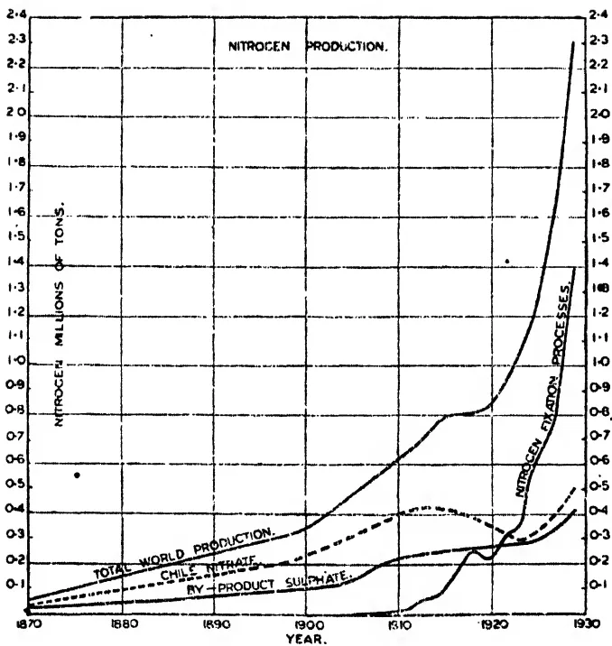

The graph, titled "NITROGEN PRODUCTION", plots nitrogen production in millions of tons against the year from 1870 to 1930. The y-axis is labeled "NITROGEN MILLIONS OF TONS." and ranges from 0.1 to 2.4. The x-axis is labeled "YEAR." and ranges from 1870 to 1930. Four data series are shown:

- **TOTAL WORLD PRODUCTION:** A solid line that shows a steady increase from approximately 0.05 million tons in 1870 to about 0.35 million tons in 1900. It then rises more steeply, reaching approximately 0.8 million tons by 1920 and accelerating sharply to about 2.3 million tons by 1930.
- **CHILE NITRATE:** A dashed line that starts at approximately 0.05 million tons in 1870, rises to about 0.2 million tons by 1900, peaks at approximately 0.4 million tons around 1915, and then declines to about 0.3 million tons by 1930.
- **BY-PRODUCT SULPHATE:** A solid line that remains very low, near zero, until about 1910, then rises to approximately 0.2 million tons by 1920 and continues to rise to about 0.4 million tons by 1930.
- **NITROGEN FIXATION PROCESSES:** A solid line that begins around 1910 at approximately 0.05 million tons and rises sharply to about 0.3 million tons by 1920, then continues a steep ascent to approximately 1.4 million tons by 1930.

<table border="1">
<thead>
<tr>
<th>Year</th>
<th>Total World Production (Millions of Tons)</th>
<th>Chile Nitrate (Millions of Tons)</th>
<th>By-product Sulphate (Millions of Tons)</th>
<th>Nitrogen Fixation Processes (Millions of Tons)</th>
</tr>
</thead>
<tbody>
<tr>
<td>1870</td>
<td>0.05</td>
<td>0.05</td>
<td>0.00</td>
<td>0.00</td>
</tr>
<tr>
<td>1880</td>
<td>0.10</td>
<td>0.10</td>
<td>0.00</td>
<td>0.00</td>
</tr>
<tr>
<td>1890</td>
<td>0.20</td>
<td>0.15</td>
<td>0.00</td>
<td>0.00</td>
</tr>
<tr>
<td>1900</td>
<td>0.35</td>
<td>0.20</td>
<td>0.00</td>
<td>0.00</td>
</tr>
<tr>
<td>1910</td>
<td>0.60</td>
<td>0.35</td>
<td>0.00</td>
<td>0.05</td>
</tr>
<tr>
<td>1920</td>
<td>0.80</td>
<td>0.30</td>
<td>0.20</td>
<td>0.30</td>
</tr>
<tr>
<td>1930</td>
<td>2.30</td>
<td>0.30</td>
<td>0.40</td>
<td>1.40</td>
</tr>
</tbody>
</table>

FIG. 1.

52------------------------------------------------

NITROGEN CYCLE - UNITED KINGDOM  
(ALL FIGURES REFER TO TONS OF NITROGEN IN 1928)

```

graph TD
    FYM[FARM YARD MANURE  
149,500] --> LAND[LAND  
800,000]
    LAND --> CFA[CROPS FOR  
(ANIMAL FOOD)]
    LAND --> CFH[CROPS FOR  
(HUMAN FOOD)]
    AF[ARTIFICIAL  
FERTILISERS  
95,000] --> CFA
    RC[ROTATION OF CROPS  
(LECUMINOSAE)  
595,500] --> CFH
    EX[EXCRETA  
141,500] --> CFA
    IA[IMPORTED  
ANIMAL FOOD  
35,000] --> CFA
    IF[IMPORTED  
FOOD  
170,000] --> CFH
    CFA --> MILK[MILK  
25,000]
    CFA --> MEAT[MEAT -  
27,000]
    CFH --> VF[VEGETABLE FOODS  
50,000]
    MILK --> HF[HUMAN FOOD  
272,000]
    MEAT --> HF
    VF --> HF
    HF --> W[WASTE  
DECOMPOSITION, DRAINAGE ETC.  
755,000]
    W --> EX
    W --> IF
  
```

The diagram illustrates the Nitrogen Cycle in the United Kingdom in 1928, with all figures representing tons of nitrogen. The cycle shows the flow of nitrogen between various components, including Farm Yard Manure, Land, Crops for Animal Food, Crops for Human Food, Human Food, and Waste. The flow is as follows:

- **Farm Yard Manure (149,500)** flows into **Land (800,000)**.
- **Land (800,000)** flows into **Crops for Animal Food** and **Crops for Human Food**.
- **Artificial Fertilisers (95,000)** flows into **Crops for Animal Food**.
- **Rotation of Crops (Lecuminosae) (595,500)** flows into **Crops for Human Food**.
- **Excreta (141,500)** flows into **Crops for Animal Food**.
- **Imported Animal Food (35,000)** flows into **Crops for Animal Food**.
- **Imported Food (170,000)** flows into **Crops for Human Food**.
- **Crops for Animal Food** flows into **Milk (25,000)** and **Meat (27,000)**.
- **Crops for Human Food** flows into **Vegetable Foods (50,000)**.
- **Milk (25,000)**, **Meat (27,000)**, and **Vegetable Foods (50,000)** all flow into **Human Food (272,000)**.
- **Human Food (272,000)** flows into **Waste (Decomposition, Drainage etc.) (755,000)**.
- **Waste (755,000)** flows back into **Excreta (141,500)** and **Imported Food (170,000)**.

Fig. 2.

53------------------------------------------------

37Table II

<table border="1">
<thead>
<tr>
<th>Crop</th>
<th colspan="4">Increase for 1 cwt. of Sulphate of Ammonia.</th>
</tr>
</thead>
<tbody>
<tr>
<td>Wheat</td>
<td>...</td>
<td>4.5 bushels or</td>
<td>2.41 cwt.</td>
<td></td>
</tr>
<tr>
<td>Barley</td>
<td>...</td>
<td>6.5 "</td>
<td>3.02 "</td>
<td></td>
</tr>
<tr>
<td>Oats</td>
<td>...</td>
<td>7.0 "</td>
<td>2.62 "</td>
<td></td>
</tr>
<tr>
<td>Potatoes</td>
<td>...</td>
<td></td>
<td>20.0 "</td>
<td></td>
</tr>
<tr>
<td>Swedes</td>
<td>...</td>
<td></td>
<td>20.0 "</td>
<td></td>
</tr>
<tr>
<td>Mangolds</td>
<td>...</td>
<td></td>
<td>32.0 "</td>
<td></td>
</tr>
<tr>
<td>Hay</td>
<td>...</td>
<td></td>
<td>9.0 "</td>
<td></td>
</tr>
</tbody>
</table>

If we feed grass to a cow giving two gallons of milk a day, we find that 1 lb. of nitrogen causes sufficient extra grass to grow to keep the cow alive one day and to give two gallons of milk. Since two gallons of milk contain 0.8 lb. of proteins or 0.128 lb. of nitrogen, we have 12.8 per cent. of the nitrogen of the fertilisers appearing in the milk, or the efficiency with which the fertiliser is used *via* grass to make milk is 12.8 per cent.

The efficiency of meat production is lower, one pound of nitrogen fertiliser only producing 0.05 lb. of nitrogen in beef, or an efficiency of 5 per cent. on fertiliser.

Summing up these nitrogen efficiencies we have :

<table>
<tbody>
<tr>
<td>Fertiliser to grain</td>
<td>about 20 per cent.</td>
</tr>
<tr>
<td>" " potatoes</td>
<td>30 "</td>
</tr>
<tr>
<td>" " grass or hay</td>
<td>60 "</td>
</tr>
<tr>
<td>" " milk</td>
<td>12.7 per cent.</td>
</tr>
<tr>
<td>" " beef</td>
<td>5 " " or lower.</td>
</tr>
</tbody>
</table>

It is not surprising that grass shows a higher efficiency than other crops, because the roots cover the ground more completely. I think that the efficiencies on the whole are very high; compare the energy efficiency of a high-class locomotive on the railways, which is not more than 8 per cent.

## FOOD PRODUCTION

The food of a man in Great Britain is approximately :

<table>
<tbody>
<tr>
<td>Meat, fish</td>
<td>...</td>
<td>...</td>
<td>14.5 per cent.</td>
</tr>
<tr>
<td>Cereals</td>
<td>...</td>
<td>...</td>
<td>18.5 " "</td>
</tr>
<tr>
<td>Milk, cheese, etc.</td>
<td>...</td>
<td>...</td>
<td>24.5 " "</td>
</tr>
<tr>
<td>Potatoes and roots</td>
<td>...</td>
<td>...</td>
<td>25.8 " "</td>
</tr>
<tr>
<td>Sugar, fruit, etc.</td>
<td>...</td>
<td>...</td>
<td>15.5 " "</td>
</tr>
</tbody>
</table>

—and the nitrogen efficiency in growing these foods from fertilisers is probably about 17 per cent.

The amount of protein consumed per head is 86.5 gm. per day; this contains 14 gm. of nitrogen, so that if this food were grown by using fertilisers at an efficiency of 17 per cent. we should require to use 82 gm. of nitrogen in fertilisers to produce the food for one person for one day; or the fertiliser required to feed one person for a year must contain  $365 \times 80$  gm., of 29 kgm. of nitrogen. One ton of nitrogen in the form of sulphate of ammonia or nitrate of soda will therefore produce enough food for 34 people for one year.

Since the total amount of nitrogen consumed in fertilisers during 1928 was 1,658,000 tons, the amount of extra food produced from this fertiliser would contain enough nitrogen in the form of proteins to support 56,000,000 people; and there would be sufficient carbohydrates and fat associated with this protein to form a complete diet.

54------------------------------------------------

38

Sir Daniel Hall has shown that  $2\cdot2\frac{1}{2}$  acres of land are required under cultivation to feed one person. Let us compare this with  $1/34$  tons of fixed nitrogen. If we assume that the total capital required to build a nitrogen factory is £70-£100 per ton year of nitrogen, inclusive of everything, then for a maximum of £3 invested we can support one person. It would be impossible to bring  $2\cdot2\frac{1}{2}$  acres of land under cultivation at so low a capital cost. I do not think that land can usually be settled and cultivated at a less capital cost than £10 per acre, including roads and railways, houses, and agricultural machinery, so that to bring two and a half acres under cultivation would need £25 capital as compared with £3 necessary to produce the fertiliser to produce the same amount of food. I would particularly like to direct attention to this calculation in some countries where governments are always ready to consider and finance schemes to build railways and roads to open up new country or to build irrigation schemes, although the capital to be invested for a given amount of food-producing capacity is often enormous.

### STABILITY OF THE NITROGEN FIXATION INDUSTRY

In fixing one ton of nitrogen and making it into fertilisers we use for all purposes about five and a half tons of coal, so that to provide the fertiliser to feed one person for a year we require  $3\frac{1}{2}$  cwt. of coal. The population of the world (excluding China and Turkey) is now about 1940 millions, and 56 millions or 2·8 per cent. are now being fed with food grown by nitrogen fertilisers. Of the nitrogen fertilisers consumed in the year 1928, about 1,000,000 tons of nitrogen was produced by synthesis, needing 5·5 million tons of coal. This quantity of coal is almost negligible when compared with 1500 million tons mined every year. The rest of the nitrogen was produced by by-product coke ovens or as nitrate of soda from Chile.

The population of the world increased by 10 millions each year from 1913-1928. If we had to feed this increase of population by increased nitrogen fertilisation, we should have to build each year a works which would fix 300,000 tons of nitrogen per year and would cost upwards of £30,000,000. In order to run the works we should require 1·6 million tons of coal per year. If we built a works of this size every year for a hundred years, we should then be consuming 160 million tons of coal a year for nitrogen fixation, or only ten per cent. of the coal which is being used in the world today. At least two-thirds of the coal consumed in the fixation of nitrogen is used for power production, so we could reduce the coal required to one-third the value mentioned if other sources of power were available. There are still large areas of the world suitable for cultivation. It is therefore improbable that all the food requirements for the growing population of the world will have to be supplied exclusively from nitrogenous fertilisers for some time to come.

### DISTRIBUTION OF NITROGEN FERTILISER

Let us now investigate the use which the world makes of the nitrogenous fertilisers available at the present time. I have already mentioned that of the 1,843,000 tons of nitrogen consumed in 1928, 1,658,000 tons or 90 per cent. was used in agriculture.

In table III are shown the quantities of nitrogen consumed in the different countries during the year 1928.

How much atmospheric nitrogen is combined by electric discharges? How much by bacteria? How much by our synthetic ammonia processes? How much humus changes to give nitrate? How much nitrate is washed away and how much goes into the crop?

55------------------------------------------------

39Table III.

<table border="1">
<thead>
<tr>
<th colspan="2"></th>
<th colspan="2">Nitrogen consumed</th>
</tr>
<tr>
<th colspan="2"></th>
<th>Metric tons, 1928</th>
<th>Lb./Acre Arable</th>
</tr>
</thead>
<tbody>
<tr>
<td>Germany</td>
<td>...</td>
<td>615,200</td>
<td>22.3</td>
</tr>
<tr>
<td>France</td>
<td>...</td>
<td>166,900</td>
<td>6.7</td>
</tr>
<tr>
<td>Belgium</td>
<td>...</td>
<td>63,600</td>
<td>45.9</td>
</tr>
<tr>
<td>Czechoslovakia</td>
<td>...</td>
<td>33,800</td>
<td>5.0</td>
</tr>
<tr>
<td>Denmark</td>
<td>...</td>
<td>29,100</td>
<td>9.8</td>
</tr>
<tr>
<td>Holland</td>
<td>...</td>
<td>73,400</td>
<td>70.6</td>
</tr>
<tr>
<td>Italy</td>
<td>...</td>
<td>63,300</td>
<td>4.7</td>
</tr>
<tr>
<td>Poland</td>
<td>...</td>
<td>54,600</td>
<td>2.7</td>
</tr>
<tr>
<td>Spain</td>
<td>...</td>
<td>67,300</td>
<td>3.8</td>
</tr>
<tr>
<td>Great Britain</td>
<td>...</td>
<td>61,000</td>
<td>10.4</td>
</tr>
<tr>
<td colspan="2">Total (Europe)</td>
<td>1,164,300</td>
<td>—</td>
</tr>
<tr>
<td>U. S. A.</td>
<td>...</td>
<td>383,600</td>
<td>2.4</td>
</tr>
<tr>
<td>Japan</td>
<td>...</td>
<td>113,300</td>
<td>16.8</td>
</tr>
<tr>
<td>Egypt</td>
<td>...</td>
<td>35,900</td>
<td>9.2</td>
</tr>
<tr>
<td>Other countries</td>
<td>...</td>
<td>175,600</td>
<td>—</td>
</tr>
<tr>
<td colspan="2">Total (World)</td>
<td>1,842,200</td>
<td>—</td>
</tr>
</tbody>
</table>

What happens to that going into the crop and how much of it forms humus? What happens to the dissolved nitrogen going down the river into the sea? How much comes back to land in the form of fish? Again, how much nitrogen is liberated again from combination? Is there a dynamic equilibrium in this nitrogen cycle—or are we drifting in one direction? Are we gaining nitrogen in the air or are we losing it?

We cannot get answers to these questions. There is no doubt that, in the past, nitrogen was stored up in coal and in Chile nitrate, and this is being liberated now, but we do not know whether nitrogen is being stored up anywhere at the present time. In the diagram, Fig. 2. I have made an estimate of the principal movements in the nitrogen cycle of Great Britain for the year 1928.

The vegetable foodstuffs consumed by man are estimated to contain 50,000 tons of nitrogen. If these are grown with a nitrogen efficiency of 20 per cent. then 250,000 tons of nitrogen is required in the soil. Of this nitrogen it is assumed that 50,000 tons go into vegetable food, 8,000 tons into straw which form farmland manure, and the rest, 192,000 tons, are washed out of the ground by rain water and lost to the rivers and seas. It will be noticed that I have assumed that the wastage of nitrogen derived from humus is the same as the wastage of nitrogen from artificial fertilisers. I have no direct evidence for this—I have no evidence at all; I cannot think of a more reasonable assumption. I have taken no account of the vegetable and animal life on the moors and mountains except so far as it provides human food. Probably I have neglected some other important factors, but I make no apology for offering this first attempt at a nitrogen flow sheet for Great Britain.

We are now getting much better statistics of agricultural production than formerly, and I believe that consideration of these statistics with other statistics now available has opened up new fields of study in agricultural economics. I have calculated the average amount of nitrogen obtained from

56------------------------------------------------

40

an acre of crops in different countries. The figures in table IV, are for the year 1928. They were obtained by calculating the weight of nitrogen in each crop for each country and then adding up the total amount of nitrogen for each country. This weight of nitrogen is then divided by the area on which the crops grew and we get the weight of nitrogen in the crop in lb. per acre average over the whole country. By crop we mean the portion of the crop taken away for consumption by man or animals : for example, of wheat the grain, of potatoes the tubers etc. The rest of the crop usually goes back to the land and is considered as part of the agricultural system of the country.

Since some crops give a larger yield of nitrogen, in the useful part of the crop, than others, the figures in the table are to some extent affected by the different crops and different proportions of each crop grown in the country. But so far as I can see, the effect of the different crops grown is of only minor importance, and as the production of proteins is the farmer's business, we are not far wrong in considering the first column as an index of the agricultural efficiency of that part of the country under

Table IV

<table border="1">
<thead>
<tr>
<th>Year 1928</th>
<th colspan="3">lb. per acre.</th>
</tr>
<tr>
<th>Country</th>
<th>Total Nitrogen in crops</th>
<th>Nitrogen in crops from Artificial Fertilisers</th>
<th>Nitrogen in crops from Humus</th>
</tr>
</thead>
<tbody>
<tr>
<td>Denmark</td>
<td>52.0</td>
<td>2.4</td>
<td>49.6</td>
</tr>
<tr>
<td>Holland</td>
<td>49.0</td>
<td>17.6</td>
<td>31.4</td>
</tr>
<tr>
<td>Belgium</td>
<td>47.2</td>
<td>11.5</td>
<td>35.7</td>
</tr>
<tr>
<td>Great Britain</td>
<td>40.2</td>
<td>2.6</td>
<td>37.6</td>
</tr>
<tr>
<td>Japan</td>
<td>34.2</td>
<td>4.2</td>
<td>30.0</td>
</tr>
<tr>
<td>Germany</td>
<td>32.5</td>
<td>5.6</td>
<td>26.9</td>
</tr>
<tr>
<td>Egypt</td>
<td>31.6</td>
<td>2.3</td>
<td>29.3</td>
</tr>
<tr>
<td>France</td>
<td>23.5</td>
<td>1.7</td>
<td>21.8</td>
</tr>
<tr>
<td>Canada</td>
<td>21.8</td>
<td>0.1</td>
<td>21.7</td>
</tr>
<tr>
<td>U.S.A.</td>
<td>20.8</td>
<td>0.6</td>
<td>20.2</td>
</tr>
<tr>
<td>Italy</td>
<td>20.5</td>
<td>1.2</td>
<td>19.3</td>
</tr>
</tbody>
</table>

crops. In the second column is given that part of the nitrogen in the crop which has been supplied by artificial fertilisers. It is assumed that on an average 25 per cent. of the nitrogen supplied to the land as fertiliser is found in the useful portion of the crop. The third column is the difference between the other two columns and is the weight of nitrogen in the crop which has been supplied by the land. In countries with a good system of farming and a good rotation of crops this quantity is high. We see that the system of agriculture in Denmark produces more than twice as much as that in Canada, U.S.A., and Italy, and that in Great Britain we are a little better than Belgium and considerably better than Holland in our agricultural system, apart from the use of artificial nitrogen fertilisers. But since Holland uses seven times and Belgium four times as much nitrogen fertiliser per acre, these two countries obtain greater crops than those obtained in Great Britain, as is shown in the first column.

57------------------------------------------------

41

In Holland one-third of the crops appear to be grown from nitrogen fertilisers. There seems to be no climatic or other physical reason why fertilisers should not be used to a greater extent in Great Britain. If we used as much per acre as in Holland, we should consume 420,000 tons of nitrogen per year; if as much as in Belgium, 272,000 tons; and if as much as in Germany, 132,000 tons. The reason that we do not use more fertilisers does not appear to be economic. The use of sulphate of ammonia yields 100 to 300 per cent. on the money invested within a year. Consider the special case\* of the fertilisation of wheat. For some years the price of wheat and of sulphate of ammonia has been practically equal. Since 1 cwt. of sulphate of ammonia gives an increased yield of wheat of 2.4 cwt. even after paying for phosphatic and potash fertilisers, one hundred per cent. will be earned on money spent on nitrogen.

Development of the nitrogen fixation industry has lowered the price of nitrogen fertilisers, so that we can expect the needs of the increasing population of the world to be met first by more intensive cultivation of land close to the markets for food rather than by extension of the cultivated area.

58------------------------------------------------

42

## MANURIAL EXPERIMENTS ON HEVEA\*

IN a previous paper† the results of various manuring experiments on the estates of the Hollandsch Amerikansche Plantage Mij. were described. One of these experiments there called the "Second Nitrate Manuring Experiments" has been continued and three years' additional results are now available as shown in table 1. The results given by years are discussed below:

*Sixth year, March 1924-February 1925.*—On March 17th, 1924 the tapping system of the experiment was changed from one-third of the circumference tapped daily to one-half of the circumference tapped in alternate months, the bark consumption being increased from  $1\frac{3}{4}$  per month to 2 in. per tapping month. The tapping cut was lengthened by extension in a downward direction. The renewal period remained at 6 years. As will be seen from the yields in table 1. no falling off in yield resulted from this change.

The C. plots received the usual annual applications of 5 lb. sodium nitrate per tree and reached a yield of 535 lb. per acre for the year, the highest reached up to that time.

The B. plots which had been five years without manuring and which as noted in the previous year were showing signs of deterioration again, were used for testing a new nitrogen manure, "Ammophos" applied at the rate of 5 lb. per tree in March. The grade of "Ammophos" used was the 20-20 i.e. 20% ammonia and 20% phosphoric acid ( $P_2 O_5$ ). This form of "Ammophos" contains ammonium sulphate as well as ammonium phosphate. Although a slight improvement in the colour of the foliage was discernible no effect in the yield was noted and the results could not compare with the effect of ammonium sulphate.

The E. plots received their normal biennial application of ammonium sulphate, the quantity this year for the first time being reduced to 4 lb. per tree giving an amount of nitrogen equivalent to 5 lb. of sodium nitrate.

The D. plots received no treatment.

*Seventh year, March 1925-February 1926.*—The C. plots annually manured with sodium nitrate again reached a new high record yield of 550 lb. per acre. The control A. plots showed a slight rise of 13 lb. per acre due probably to an average lower tapping cut than the previous year. The deterioration in appearance of these plots continued.

The B. and E. plots were not manured. ,

---

\* By J. Grantham, *Archief voor de Rubbercultuur*, Jaargang 11, No. 10, October 1927.

† Manurial Experiments on Hevea, *Archief voor de Rubbercultuur*, VIII Jaargang, No. 8, August 1924. (Summary published in *The Tropical Agriculturist*, Vol. LXIII, No. 5, November 1924).

59------------------------------------------------

43Table I

<table border="1">
<thead>
<tr>
<th rowspan="2">Series</th>
<th rowspan="2">Treatment in 1924</th>
<th colspan="12">1924</th>
<th colspan="2">1925</th>
<th rowspan="2">Total<br/>March 1924-<br/>Feb. 1925</th>
<th rowspan="2">lb.<br/>per acre<br/>per year</th>
<th rowspan="2">Kg.<br/>per H. A.<br/>per year</th>
</tr>
<tr>
<th>March 1<br/>to 15</th>
<th>March 17-<br/>April 15</th>
<th>May 17-<br/>June 15</th>
<th>July 17-<br/>Aug. 15</th>
<th>Sept. 17-<br/>Oct. 15</th>
<th>Nov. 17-<br/>Dec. 15</th>
<th>Jan. 17-<br/>Feb. 15</th>
<th>March 1925</th>
<th>lb.<br/>per acre<br/>per year</th>
<th>Kg.<br/>per H. A.<br/>per year</th>
</tr>
</thead>
<tbody>
<tr>
<td>A</td>
<td>Control</td>
<td>329<br/>100</td>
<td>1128<br/>100</td>
<td>222.5<br/>100</td>
<td>300.0<br/>100</td>
<td>276.2<br/>100</td>
<td>307.8<br/>100</td>
<td>278.4<br/>100</td>
<td>1532.5<br/>100</td>
<td>255</td>
<td>286</td>
</tr>
<tr>
<td>B</td>
<td>5 lb. 20/20 Ammonos<br/>per tree—March</td>
<td>58.8<br/>178.7</td>
<td>203.3<br/>180.2</td>
<td>307.4<br/>137.5</td>
<td>401.3<br/>133.8</td>
<td>363.5<br/>131.8</td>
<td>393.0<br/>127.3</td>
<td>350.8<br/>126.1</td>
<td>2078.1<br/>135.6</td>
<td>346</td>
<td>388</td>
</tr>
<tr>
<td>C</td>
<td>5 lb. sodium nitrate<br/>per tree—March</td>
<td>115.9<br/>352.3</td>
<td>358.6<br/>317.9</td>
<td>472.1<br/>211.2</td>
<td>588.4<br/>196.1</td>
<td>530.0<br/>191.1</td>
<td>585.2<br/>180.6</td>
<td>561.9<br/>201.8</td>
<td>3212.1<br/>209.8</td>
<td>535</td>
<td>600</td>
</tr>
<tr>
<td>D</td>
<td>None</td>
<td>51.5<br/>156.5</td>
<td>169.0<br/>149.8</td>
<td>333.7<br/>149.3</td>
<td>429.8<br/>143.3</td>
<td>393.1<br/>142.3</td>
<td>440.7<br/>142.8</td>
<td>393.2<br/>141.2</td>
<td>2211.0<br/>144.3</td>
<td>368</td>
<td>412</td>
</tr>
<tr>
<td>E</td>
<td>4 lb. ammonium sulphate<br/>per tree—March</td>
<td>89.1<br/>270.8</td>
<td>294.6<br/>261.1</td>
<td>422.2<br/>180.8</td>
<td>514.2<br/>171.4</td>
<td>479.1<br/>173.4</td>
<td>522.0<br/>169.1</td>
<td>477.9<br/>171.7</td>
<td>2799.0<br/>182.0</td>
<td>466</td>
<td>522</td>
</tr>
<tr>
<th rowspan="2">Series</th>
<th rowspan="2">Treatment in 1925</th>
<th colspan="12">1925</th>
<th colspan="2">1926</th>
<th rowspan="2">Total<br/>March 1925-<br/>Feb. 1926</th>
<th rowspan="2">lb.<br/>per acre<br/>per year</th>
<th rowspan="2">Kg.<br/>per H. A.<br/>per year</th>
</tr>
<tr>
<th>March 17-<br/>April 15</th>
<th>May 17-<br/>June 15</th>
<th>July 17-<br/>Aug. 15</th>
<th>Sept. 17-<br/>Oct. 15</th>
<th>Nov. 17-<br/>Dec. 15</th>
<th>Jan. 17-<br/>Feb. 15</th>
<th>March 1926</th>
<th>lb.<br/>per acre<br/>per year</th>
<th>Kg.<br/>per H. A.<br/>per year</th>
</tr>
<tr>
<td>A</td>
<td>Control</td>
<td>229.6<br/>100</td>
<td>222.8<br/>100</td>
<td>314.1<br/>100</td>
<td>271.7<br/>100</td>
<td>306.3<br/>100</td>
<td>262.6<br/>100</td>
<td>1607.1<br/>100</td>
<td>268</td>
<td>300</td>
</tr>
<tr>
<td>B</td>
<td>None</td>
<td>312.6<br/>136.1</td>
<td>319.2<br/>143.3</td>
<td>418.6<br/>133.3</td>
<td>361.2<br/>132.9</td>
<td>372.3<br/>121.5</td>
<td>351.2<br/>133.7</td>
<td>2135.1<br/>132.9</td>
<td>356</td>
<td>398</td>
</tr>
<tr>
<td>C</td>
<td>5 lb. nitrate of soda<br/>per tree—February</td>
<td>585.9<br/>235.2</td>
<td>516.0<br/>231.6</td>
<td>599.0<br/>190.7</td>
<td>527.0<br/>194.0</td>
<td>540.5<br/>176.5</td>
<td>532.5<br/>202.4</td>
<td>3300.9<br/>205.4</td>
<td>550</td>
<td>616</td>
</tr>
<tr>
<td>D</td>
<td>2 lb. ammonium sulphate<br/>per tree—February</td>
<td>386.6<br/>168.3</td>
<td>329.4<br/>147.8</td>
<td>435.0<br/>138.5</td>
<td>395.0<br/>145.4</td>
<td>404.8<br/>132.2</td>
<td>402.5<br/>153.3</td>
<td>2353.3<br/>146.4</td>
<td>392</td>
<td>439</td>
</tr>
<tr>
<td>E</td>
<td>None</td>
<td>433.2<br/>188.7</td>
<td>425.7<br/>191.0</td>
<td>548.3<br/>174.5</td>
<td>470.5<br/>173.2</td>
<td>493.7<br/>161.2</td>
<td>467.1<br/>177.9</td>
<td>2838.5<br/>176.6</td>
<td>473</td>
<td>530</td>
</tr>
<tr>
<th rowspan="2">Series</th>
<th rowspan="2">Treatment in 1926</th>
<th colspan="12">1926</th>
<th colspan="2">1927</th>
<th rowspan="2">Total<br/>March 1926-<br/>Feb. 1927</th>
<th rowspan="2">lb.<br/>per acre<br/>per year</th>
<th rowspan="2">Kg.<br/>per H. A.<br/>per year</th>
</tr>
<tr>
<th>March 17-<br/>April 15</th>
<th>May 17-<br/>June 15</th>
<th>July 17-<br/>Aug. 15</th>
<th>Sept. 17-<br/>Oct. 15</th>
<th>Nov. 17-<br/>Dec. 15</th>
<th>Jan. 17-<br/>Feb. 15</th>
<th>March 1927</th>
<th>lb.<br/>per acre<br/>per year</th>
<th>Kg.<br/>per H. A.<br/>per year</th>
</tr>
<tr>
<td>A</td>
<td>Control</td>
<td>175.6<br/>100</td>
<td>237.5<br/>100</td>
<td>291.2<br/>100</td>
<td>274.7<br/>100</td>
<td>301.0<br/>100</td>
<td>270.4<br/>100</td>
<td>1550.4<br/>100</td>
<td>258</td>
<td>289</td>
</tr>
<tr>
<td>B</td>
<td>4 lb. ammonium sulphate<br/>per tree—February</td>
<td>272.6<br/>115.2</td>
<td>311.5<br/>131.2</td>
<td>385.2<br/>132.3</td>
<td>360.8<br/>131.3</td>
<td>416.9<br/>138.5</td>
<td>378.6<br/>140.0</td>
<td>2125.6<br/>137.1</td>
<td>354</td>
<td>397</td>
</tr>
<tr>
<td>C</td>
<td>5 lb. nitrate of soda<br/>per tree—February</td>
<td>453.7<br/>264.1</td>
<td>538.9<br/>226.9</td>
<td>636.0<br/>218.4</td>
<td>571.8<br/>208.2</td>
<td>654.2<br/>217.3</td>
<td>618.4<br/>228.7</td>
<td>3483.0<br/>224.7</td>
<td>580</td>
<td>650</td>
</tr>
<tr>
<td>D</td>
<td>None</td>
<td>316.5<br/>180.2</td>
<td>376.4<br/>158.5</td>
<td>433.0<br/>148.7</td>
<td>394.3<br/>141.8</td>
<td>426.7<br/>141.8</td>
<td>406.8<br/>150.4</td>
<td>2353.7<br/>151.8</td>
<td>392</td>
<td>440</td>
</tr>
<tr>
<td>E</td>
<td>4 lb. ammonium sulphate<br/>per tree—February</td>
<td>390.6<br/>222.4</td>
<td>469.8<br/>197.8</td>
<td>559.2<br/>192.0</td>
<td>510.6<br/>185.9</td>
<td>570.7<br/>189.6</td>
<td>531.6<br/>196.6</td>
<td>3032.5<br/>195.6</td>
<td>505</td>
<td>566</td>
</tr>
</tbody>
</table>

N.B.—All yields given are 1st. latex plus lump only, scrap rubber not being included.

60------------------------------------------------

44

The D. plots previously used for calcium nitrate applications in alternate years, received 2 lb. of ammonium sulphate per tree, *i.e.*, half normal quantity, to be applied in alternate years in future, calcium nitrate being no longer considered a suitable manure owing to its very hygroscopic nature and destructive action on the skin of the coolies handling it.

No residual effect of the "Ammophos" applied the year previously, appeared in the B plots, the increase in yield being inappreciable.

*Eighth year, March 1926-February 1927.*—Yet again the annually manured C. plots reached a new high record of 580 lb. per acre and this in spite of an average higher tapping cut, which was expected to cause some falling off in yield. Apparently the limit of increase in yield from nitrogen manuring is not yet reached in these plots.

The control A. plots continued to deteriorate in appearance, severe die-back of the main trunk being quite advanced in a large number of trees particularly in the centre of the plots. From the generally better appearance of the trees on the borders of the plots there is reason to believe that roots passing beneath the isolating drains secure some benefit from the manuring in adjacent plots. The effect is not one of the drains themselves since there are drains through the centres of the plots.

No effect having been shown by the "Ammophos" manuring, the B. series of plots received 4 lb. ammonium sulphate per tree and it is the intention in future to repeat this application annually.

The E. plots received their biennial application of 4 lb. of ammonium sulphate and gave a record yield for this series of 505 lb. per acre for the year.

All plots are now on a permanent manuring scheme which will be continued unmodified for a long period of years as summarised below:

- A. Control=unmanured.
- B. Annual manuring with ammonium sulphate 4 lb. per tree.
- C. Annual manuring with sodium nitrate 5 lb. per tree.
- D. Biennial manuring with ammonium sulphate 2 lb. per tree, (half normal quantity).
- E. Biennial manuring with ammonium sulphate 4 lb. per tree.

It will of course be a few years before series B. and D. will be comparable with the other series, which have remained unchanged since the beginning of the experiment.

The results so far obtained have been considerably in excess of those originally anticipated and the response of white soil to nitrogen manuring is so favourable as to neutralise the natural superiority of the red ground.

As an example of the realization on a large scale of the increased yields indicated by the experiments it may be mentioned that the yield of the H.A.P.M. over an area exceeding 40,000 acres, of which about 85% is white soil, having reached a standstill at just below 300 lb. per acre in 1920 and commenced to fall back in 1921, showed a steady increase to 474 lb. an acre for the year 1926, following an expanding manurial program on the white soil during the years 1921 and 1923-1926.

*Ammonium Sulphate (Time of Application) Experiment Soengei Baleh 1.*—Ammonium sulphate was applied at fortnightly intervals from the beginning of December 1922 to the end of January 1923, to alternate fields in an area previously unmanured on Soengei Baleh Estate, with the idea of testing to what extent it was possible to apply the manure before the dry season in February, without risk of serious loss by leaching out by the heavy rains. The manure was broadcasted in the usual manner on the surface of the ground.

61------------------------------------------------

45

Alternate fields were treated with 4 lb. of ammonium sulphate per tree as shown in table II.

Table II

<table border="1">
<thead>
<tr>
<th>Field</th>
<th>Acres</th>
<th>Treatment</th>
<th>Yield in lb. of latex per acre</th>
<th>% Relation to adjoining controls</th>
</tr>
</thead>
<tbody>
<tr>
<td>1 &amp; 2</td>
<td>3 &amp; 4</td>
<td>Ammonium sulphate—December 9, 1922.<br/>Control=Unmanured</td>
<td>1950<br/>1591</td>
<td>127</td>
</tr>
<tr>
<td>5 &amp; 6</td>
<td>7 &amp; 8</td>
<td>Ammonium sulphate—December 17, 1922.<br/>Control=Unmanured</td>
<td>1669<br/>1268</td>
<td>130</td>
</tr>
<tr>
<td>9 &amp; 10</td>
<td>11 &amp; 12</td>
<td>Ammonium sulphate—January 2, 1923.<br/>Control=Unmanured</td>
<td>1636<br/>1289</td>
<td>127</td>
</tr>
<tr>
<td>13 &amp; 14</td>
<td>15 &amp; 16</td>
<td>Ammonium sulphate—January 17, 1923.<br/>Control=Unmanured</td>
<td>1404<br/>1245</td>
<td>113</td>
</tr>
<tr>
<td>17 &amp; 18</td>
<td>3.88 &amp; 4.66</td>
<td>Ammonium sulphate—February 5, 1923<br/>Control=Unmanured</td>
<td>1393<br/>1173</td>
<td>119</td>
</tr>
<tr>
<td>Total</td>
<td>34.79</td>
<td>Ammonium sulphate</td>
<td>1639</td>
<td>125</td>
</tr>
<tr>
<td>Total</td>
<td>37.20</td>
<td>Control=Unmanured</td>
<td>1309</td>
<td></td>
</tr>
</tbody>
</table>

Equally striking results on appearance (denser dark-green foliage) within 2 to 3 months after wintering were obtained on all manured plots, even those on which heavy rain took place with 48 hours of the period of application. Some retardation of wintering occurred in all manured plots but was most pronounced in the later manured ones.

Records kept of the latex weight of the fields before the experiment started showed the yields to be reasonably uniform. The total yields on alternate month tapping on a half cut from March 1923 (the wintering period for which the application was made) to December 1924 are given in table II.

The experiment is from its nature not a very precise one as regards comparison of yields and no fine distinctions can be drawn between the various times of application, but it will be noted that the average increased yield of all plots over the controls is 25% for the 22 months of the experiment, and that the longest application before wintering, viz. the December 9th. application, gave 27% increase.

The effect of the ammonium sulphate is apparent on all plots and the conclusion is reached, that ammonium sulphate may be supplied a month or two before wintering without appreciable loss, and that the earliest application is at least as good as the latest.

*Ammophos Experiment—Soengei Baleh 1.*—In addition to the test with “20-20 Ammophos” carried out in the B. plots of the “Second Nitrate Manuring Experiment,” a test was also made on a much larger scale in an area of 58 fields previously unmanured on Soengei Baleh Estate, on the opposite side of the road from the Experiment on the time of application of ammonium sulphate just described, 29 alternate fields were manured in the wintering period of March 1924 with 5 lb. per tree of ammophos, the other 29 fields being left unmanured as controls.

A very slight effect in the colour of the foliage was noted about 2 months after the application but as shown in table III, absolutely no effect was produced in the yield in contrast to the much darker colour and increased yields given by the ammonium sulphate on the either side of the road, the previous year.

62------------------------------------------------

46Table III

<table border="1">
<thead>
<tr>
<th rowspan="3">Month</th>
<th colspan="3">Average lb. of latex per acre</th>
<th rowspan="3">Per cent.<br/>relationship<br/>manured to<br/>unmanured</th>
</tr>
<tr>
<th>29 manured<br/>fields</th>
<th>29 manured<br/>fields</th>
<th></th>
</tr>
<tr>
<th>Total 117 acres</th>
<th>Total 115 acres</th>
<th></th>
</tr>
</thead>
<tbody>
<tr>
<td>March-April</td>
<td>1924.<br/>75.2</td>
<td>74.6</td>
<td>101</td>
</tr>
<tr>
<td>May-June</td>
<td>„<br/>115.2</td>
<td>116.6</td>
<td>99</td>
</tr>
<tr>
<td>July-August</td>
<td>„<br/>149.8</td>
<td>152.9</td>
<td>98</td>
</tr>
<tr>
<td>September-October</td>
<td>„<br/>119.9</td>
<td>122.1</td>
<td>98</td>
</tr>
<tr>
<td>November-December</td>
<td>„<br/>163.6</td>
<td>160.8</td>
<td>102</td>
</tr>
<tr>
<td>January-February</td>
<td>1925.<br/>165.2</td>
<td>169.5</td>
<td>98</td>
</tr>
<tr>
<td>March-April</td>
<td>„<br/>138.8</td>
<td>143.6</td>
<td>97</td>
</tr>
<tr>
<td>May-June</td>
<td>„<br/>114.2</td>
<td>118.7</td>
<td>96</td>
</tr>
<tr>
<td>July-August</td>
<td>„<br/>163.9</td>
<td>168.8</td>
<td>97</td>
</tr>
<tr>
<td>September-October</td>
<td>„<br/>158.8</td>
<td>165.9</td>
<td>96</td>
</tr>
<tr>
<td>November-December</td>
<td>„<br/>143.0</td>
<td>147.4</td>
<td>97</td>
</tr>
<tr>
<td>Total</td>
<td>...<br/>1,507.6</td>
<td>1540.9</td>
<td>98</td>
</tr>
</tbody>
</table>

It is not clear why "20-20 Ammophos" should have given no results, while ammonium sulphate on the adjoining land applied the previous year gave quite definite results.

In describing "20-20 Ammophos" the makers state that it differs from the 13-48 grade (which is almost entirely monoammonium phosphate) in being made with sulphuric acid in place of part of the phosphoric acid. An analysis showed a composition approximately equivalent to a mixture containing a molecule of ammonium sulphate ( $\text{NH}_4)_2\text{SO}_4$  to each molecule of monoammonium phosphate  $\text{NH}_4\text{H}_2\text{PO}_4$ . Two-thirds of the nitrogen therefore appears to be in the form of ammonium sulphate. The 20-20 Ammophos is however more acid ( $\text{H}=4.5$ ) than the ordinary ammonium sulphate alone ( $\text{H}=5.0$ ) and possibly this exercises a prejudicial effect as was the case with calcium superphosphate in the D. plots of the "Second Nitrate Experiment" in 1920.

### SUMMARY

1. 1. The continued results of manuring with nitrogen fertilizers obtained in an experiment on Soengei Baleh Estate are given for the 6th., 7th., and 8th. years. The plots manured annually in the wintering period with sodium nitrate have reached a yield of 580 lb. per acre or 650 Kg. per H.A. for the year 1926-27 against a yield from the control unmanured plots of only 258 lbs. per acre or 289 Kg. per H.A. The plots manured once in two years with ammonium sulphate have reached a yield of 505 lb. per acre or 566 Kg. per H.A. The tendency of the yield of the manured plots is still upward.
2. 2. It was shown that ammonium sulphate could be applied without loss in effectiveness up to 2 months before the commencement of the wintering period, even where heavy rain occurred soon after the application.
3. 3. No increase in yield was obtained by the use of the fertilizer "Ammophos" grade 20-20 i.e. 20% ammonia ( $\text{NH}_4$ ) and 20% phosphoric acid ( $\text{P}_2\text{O}_5$ ).

63------------------------------------------------

47

## THE SMOKE-HOUSE FOR RUBBER\*

### "DEVON" TYPE MUCH THE MOST EFFICIENT

A comparison of the relative efficiency of various types of smoke-houses for the curing of rubber has recently been carried out by the Rubber Research Institute of Malaya, and the results are reported by Mr. R. G. Fullerton in the Quarterly Journal of the Institute (Vol. II, No. 2). Statistical data was obtained by circulating a questionnaire among some fifty estates in various parts of the country. The estates responded by sending particulars of 12 "Devon" smoke-houses, 17 of the "Third Mile" type, and 32 of miscellaneous design.

The mean monthly output of rubber per cubic foot of drying space was found to be: "Devon" type, 6.7 lb.; "Third Mile" type, 3.8 lb.; and Miscellaneous types, 2.9 lb.

It must be pointed out that among those houses classed as miscellaneous are a few giving higher figures for efficiency than the mean value of the "Third Mile" type, although none are higher than the mean value of the "Devon" type. This means that "Devon" houses take precedence over all the others examined, but one is not justified in saying that those of "Third Mile" design are second in order of merit, for the classification of the others under one head does not imply that they all conform to a standard design.

*Reasons for "Devon" Type Superiority.*—The higher output of "Devon" smoke-houses depends on several factors. In the first place smoke-curing is here a continuous process since the fires are not closed down during the time that freshly machined sheets are being hung in the smoke-house and the dry rubber removed. Any rack may easily be wheeled to the outside verandah for inspection, and for emptying and filling operations, without disturbing the continuity of smoke-curing in the rest of the building, whereas in all other cases the fires must be "damped" or extinguished in order that the coolies may enter the building. The total period of curing for the "Devon" house is therefore less. Again, practically the whole of the drying space is occupied by racks carrying the rubber, and hence a greater weight of drying space than in other cases. Furthermore, the dimensions of the building are such that efficient ventilation is easily attained, for the building is tall, the height being somewhat greater than the length or breadth, no account of course being taken in this consideration of the dimensions of the verandahs, which are external to the house.

*Fuel Consumption.*—The figures for fuel consumption vary very considerably, the average being 1.6 lb. of fuel per 1 lb. of dry rubber. From the data collected, it was not possible to grade the various types of fire-chambers according to their economy in fuel consumption. In order to obtain fairly comparable results, one would have to test various types of fire-chambers in the same smoke-house working as nearly as possible under the same conditions, and of course no great advantage would accrue from such an experiment, since it is obvious that all that is required of the heating unit is that it shall work with the slowest combustion of the fuel which is consistent with the maintenance of the desired temperature of drying. Slow combustion of the fuel involves the

\* From *The India-Rubber Journal*, Vol. LXXX, No. 14, October 1930.

64------------------------------------------------

48

production of more smoke than when combustion is rapid. From this point of view, therefore, one type of fire-chamber is as good as another provided the ventilation is adjusted so as to give the optimum conditions, and this is a matter which must be decided by experience of the operator for the individual smoke-house.

*Period of Curing.*—The average period of smoke-curing was found to be  $10\frac{1}{2}$  days. Here again there is considerable variation in the figures, and again a large number of factors are responsible. Within the limits of thickness observed (1.8 to 3.7 mm). there is no relation between thickness of the sheet and rate of curing, nor are variations in the depth of colour of the product responsible to any considerable extent.

Among the more important factors responsible for the variation may be mentioned the following :

- (a) Ventilation depending on the design of the building.
- (b) Temperature of drying—although in the present investigation the limits of temperature reported are practically the same in each case.
- (c) Time occupied daily in filling the house with the fresh crop and removing dry rubber.
- (d) Closeness of packing of the sheets in the smoke-house.

As regards factor (d) theoretically an increase in the closeness of packing of the sheets in the house tends to increase the period required for drying since the atmosphere inside the building is more moist. However, in practice the closeness of packing is not so great as to affect the rate of drying since the weight of rubber per cubic foot of space is highest for the "Devon" smoke-house, yet the rate of drying is also high. That is to say, the closeness of packing of the sheets would have to be very great indeed in order to produce an appreciable decrease in the rate of drying.

*Other Points.*—In the majority of cases exit for the damp air and smoke is provided at the top of the building by means of a jack-roof. The walls are of timber and the roof of corrugated iron or tiles. Rubber wood obtained by felling trees in the course of thinning out is the principal fuel employed. To a less extent a mixture of rubber and jungle wood is used. In almost all cases registration of the temperature inside the buiding is obtained by means of a maximum-and-minimum thermometer.

*Discussion of Results.*—Discussing the results, Mr. Fullerton says it has been made clear that "Devon" type of smoke-house proved to be the most efficient of all those examined. Houses of such design are well known, and are described in detail by Morgan ("The Preparation of Plantation Rubber," by Morgan and Stevens). The special feature of the "Devon" type of building, as has already been pointed out, lies in the provision which is made for wheeling with ease from the drying-chambers any of the racks holding the sheets outside on to a verandah without affecting the continuity of the smoke-curing of the sheets in the rest of the building. There is thus no necessity to stop firing during filling and emptying operations, which may be carried out with ease, ample space being provided on the verandah. The installation may consist of a single house with verandah or of two houses accommodated under one roof with common verandah. It is a system which lends itself very easily to expansion, and is such that it can be used to deal with a crop of almost any size. It may be mentioned that the name merely indicates the design of the house and does not specify the material of the walls or roof, or the type of fire-chamber.

The "Third Mile" smoke-house, consists essentially of a building having two storeys for accommodation of the rubber and a shallow inverted pyramidal base ending on the ground in a fire-chamber, the design of which

65------------------------------------------------

49

is the chief distinguishing mark of this type. The fire-chamber itself is outside the building and consists of an iron cylindrical drum set horizontally in brickwork. At one end of the drum is a hinged door for stoking provided with adjustable air-inlets and at the other end a door for removal of the ash. The drum communicates with the interior of the building by means of a short chimney provided inside with a "damper" adjustable from the outside, and immediately over the chimney is suspended an iron baffle-plate. This system of firing is easy to operate, and provided the doors fit fairly tightly the required amount of ventilation at the foot of the building is obtained by adjustment of the various air-vents.

In what follows is given a summary of features of construction *which should be common to all smoke-houses*, including the special type just discussed. They are considered under appropriate headings.

*General Design.*—From the point of view of efficiency of ventilation a tall building is to be preferred, the height being greater than either the length or breadth.

The height, however, is limited chiefly by the extent to which it is possible to maintain the required temperature of drying throughout the building and uniform colour of the product. If, for example, the houses were of excessive height rubber in the lower storeys could be maintained at the desired temperature, but that in the upper would probably be far below the optimum conditions. Generally speaking, the number of storeys should not exceed three, the ground floor accommodating the fire-chambers and the upper two storeys containing the sheets.

There is also the question of size of the building. On a large estate, from a consideration of the risk of damage by fire, it is suggested that it is a safer policy to work with a larger number of small units than to accommodate the whole of the crop in one large building.

*Ventilation.*—The ideal to aim at is the production of a slow current of warm smoke-laden air passing from the bottom to the top of the building. The current should not be too rapid, since in that case the rate of combustion of the fuel will be too great, dust would be raised from the ash formed, and the temperature of drying would be increased beyond the optimum limit. The draught should be just sufficient to carry off the moisture-laden air in the drying chambers.

Since the required degree of ventilation can be obtained only as a result of practical experiment with the individual smoke-house, there should be sufficient provision for its adjustment. Ordinarily the construction of a smoke-house is not such as to render the lowest storey airtight, air-vents being unintentionally provided, for example, by chinks in the wall and round the edges of the doors. In order to minimise the risk of producing too great a draught, windows should not, therefore, be provided for the ground floor. Air-vents, provided with adjustable doors, which may be made to slide vertically in the apertures, should always be made at the walls. As a guide it may be said that openings are made about 6 inches square at intervals of 4 feet all round the building. If not required, the openings are kept closed, but in the majority of cases adjustment by means of such vents is a necessity. Another factor affecting ventilation at the base is the site of the building. If practicable the house should be situated on fairly level ground so that there is an open space for a considerable distance all round. When the smoke-house has to be placed on a steep gradient earth embankments should be cleared away in the immediate vicinity.

As regards ventilation at the roof, the top of the walls should fit tightly at the eaves of the roof, otherwise a counter current of air will at times be produced in the building. The contraction of a low jack-roof over the main roof ridge provides a very simple and efficient method for the exit of the damp air and smoke. Alternatively chimney ventilators may be constructed, and

66------------------------------------------------

50

if the fitting between the cap and body is sufficiently low interior swinging flaps for adjustment of the openings are not required. A ceiling should be provided protecting the whole of the racks and gangways and of such material that the condensation products of the smoke may be absorbed, thus preventing drops of tarry matter from falling on the sheets. For this purpose the ceiling is best made of wood; sacking would serve the same purpose without, however, being so permanent. One or more central openings in the ceiling, depending on the size of the building, are provided for exit of the damp air and smoke to the roof ridge.

*Constructional Materials.*—The object in all drying houses is to conserve the heat as much as possible within the building. In this connection it is evident that different considerations enter into the choice of constructional materials in the case of smoke-houses than in the case of crepe drying-sheds. In the latter case there is no internal heating installation, the heat being supplied from an external source by the sun's rays, and hence crepe drying-sheds are constructed of a heat-conducting material such as corrugated iron.

In the case of smoke-houses constructed of corrugated iron, additional benefit it obtained from the heat of the sun during the day, but heat is rapidly dissipated outside the building during the night, when it is more difficult to ensure that the smoke-house attendant is keeping the fires going properly. Moreover the fires alone are capable of maintaining the temperature between desired limits. Hence the use of non-conducting materials such as brick, wood, or asbestos lining is recommended. The choice of constructional materials is of course, regulated largely by questions of economy, and in this connection it may be pointed out that timber soon becomes impregnated with tarry matter, the preservative properties of which confer a very long life on wooden walls, although there is then the risk of damage by fire to be considered. For the material of the roof brick tiles are very satisfactory provided they are fitted well together so that there is no leakage so that ventilation is confined to the jack-roof or chimney ventilators on the roof ridge. For cleanliness of operation inside the building, the ground floor is best constructed of cement.

*Fire-Chambers.*—The construction of the fire-chambers must be such as to ensure the lowest combustion of the fuel which is consistent with sufficient smokeproduction and the maintenance of the temperature between the required limits, and it is known that the optimum temperature lies between 110° and 130° F. The choice of a fire-chamber depends, therefore, on the ease with which these conditions can be obtained.

From this point of view probably iron drums or boxes either placed in contact with the ground floor or mounted on a trolley leave least room for errors in ventilation and require least attention in smoking, provided the sides and bottom are almost closed to the air. Special openings near the base are usually unnecessary, and a door for stoking should not be made unless it fits closely round the edges. At the top is fitted a perforated iron plate or a cowl for distribution of the smoke. One or more of these boxes, depending on the size of the house, may be placed at intervals on the ground floor so as to give the most uniform distribution of heat and smoke. Greater freedom from dust in the building may be attained when the boxes are mounted on wheels for removal outside for cleaning and stoking. This type of fire-chamber is suitable for use in a house of any size, and particularly so in the case of small holdings where the building is often of a very temporary nature.

With brickwork ovens, whether stoked from the inside or outside, a hinged door must be fitted for cleaning and stoking, and there is always difficulty in obtaining a closely fitting door. If this can be obtained, however, one or more "butterfly" ventilators should be provided in the door for

67------------------------------------------------

51

provision of the required draught. Nothing elaborate is required for slow combustion fires, and they should be built essentially on the same lines as iron boxes. The hearth may be of clay so as to make the fire-chamber completely closed to the air at the bottom. Obviously it is of advantage to arrange for stoking to be done from the outside of the building. Brickwork fire-chambers are, of course, more permanent than iron boxes, but it is doubtful if the additional expense involved is justified except in the case of very large and permanent buildings.

Reference has already been made to the "Third Mile" type, the chief advantage of which lies in the ease with which efficient adjustment of the ventilation may be obtained.

The use of pits sunk in the ground floor as fuel containers is not to be recommended since they provide a small surface for the radiation of heat.

Arrangement of the fire-chamber outside the building, the heat and smoke being distributed to the inside of the house by means of underground flues, is not to be recommended. Such an arrangement is very wasteful, for not only is a considerable amount of heat dissipated during the passage of the hot gases from the fire-chamber to the interior, but a certain amount of tarry matter from the smoke is condensed in the flues and smoke-curing is then much less efficient.

In the majority of cases iron baffle-plates suspended a few feet above the fire-chambers from the first floor are required for uniform distribution of the smoke within the building.

In all cases it is important to note that large fire-chambers are not desirable. The object should be rather to work with a larger number of small units than *vice versa*. Capacious fire-chambers require a bigger charge of fuel and slow combustion is not then easily attained. In small houses it is quite frequent to find that the fire-chamber is much bigger than is warranted by the size of the building.

Lastly, it may be said that the test of slow combustion in any fire-chamber is the nature of the residue after the wood has burnt. The most desirable results are obtained when there is the least ash and most charcoal, provided, of course, that the required temperature has been maintained.

68------------------------------------------------

52

## MEETINGS, CONFERENCES, ETC.

### COCONUT RESEARCH SCHEME (CEYLON)

#### BOARD OF MANAGEMENT

**M**INUTES of the eighth meeting of the Board, held at 11.30 a.m. on Wednesday, October 29, 1930, in the ball-room of the Grand Oriental Hotel, Colombo.

*Present.*—The Hon'ble Dr. Youngman, (in the chair), Mr. C. W. Bickmore, C.C.S., the Hon'ble Sir H. Marcus Fernando, the Hon'ble Mr. A. Mahadeva, Mr. N. R. Outschoorn, Mr. John A. Perera, J.P., U.P.M., the Hon'ble Mr. D. S. Senanayake, Mr. J. I. Gnanamuttu (Secretary).

*Minutes.*—The minutes of the meeting held on September 3, 1930, copies of which had been circulated to members, were taken as read and were confirmed and signed by the Chairman.

*Provident Fund.*—Mr. Bickmore stated that the Board's technical staff could not come under the proposed Public Officers Provident Fund Ordinance but that the Post Office Savings Bank certificates which might furnish a basis of a Provident Fund were expected to issue shortly. Mr. Bickmore consented to formulate a Provident Fund Scheme for the Board's employees.

*Finance.*—(a) The statement of receipts and expenditure for the quarter ended September 30, 1930, copies of which had been circulated, showed a credit balance at that date of Rs. 105,571.05, of which Rs. 80,000 was on fixed deposit. The statement was passed without comments.

(b) The draft estimates of income and expenditure for the year 1931, copies of which had been circulated to members, were considered in detail.

#### CAPITAL ACCOUNT

*B.—Acquiring and clearing jungle area for nursery work.*—The Chairman stated that, as Bandirippuwa was a fully developed estate any part of which it would be unwise to clear, experiments with selected nuts should be carried out on other land and that the Director of Research had suggested the acquisition of Crown jungle land to be cleared for the purpose. He thought that land within 10 miles of Bandirippuwa would be suitable. Sir Marcus Fernando enquired whether the Wariapola farm would not be suitable. The Chairman was not certain of the future of the Wariapola station and feared also that the extensive travelling between Bandirippuwa and Wariapola had to be considered. Although there was no objection to using Wariapola, he advised that for the present it would be preferable not to enter upon a programme of work there by the Board. The sum against this sub-head was increased from Rs. 1,500 to Rs. 5,000.

*C.—One senior staff bungalow.*—After discussion, it was agreed that the provision of Rs. 27,000 should be regarded as the limit of expenditure under this sub-head.

*D.—Two junior staff bungalows.*—The provision of Rs. 40,000 for bungalows for the Technological Chemist and the Geneticist was passed subject to details being furnished.

69------------------------------------------------

53

E.—*Four bungalows for scientific assistants and clerk.*—In passing a sum of Rs. 24,000 for quarters for three scientific assistants and one clerk, it was desired that the possibility of constructing two blocks of semi-detached quarters should be explored. Mr. Bickmore stated that in the experience of the Public Works Department this method resulted in no saving where the site value was not considerable.

F.—*Lines for menial staff.*—It was understood that the coolies proposed were for the menial staff and that the estate labour would be largely drawn from the resident village population. The provision of Rs. 1,200 was increased to Rs. 3,000 to allow of six quarters being built.

G.—*Laboratory structures.*—More details were desired of these. The rooms as indicated in the plan submitted by the Director of Research were considered to be too small. It was considered that as a tentative estimate the total cost might be Rs. 50,000, of which Rs. 30,000 was authorised to be spent in 1931.

H.—It was decided to vote Rs. 12,500 on account of equipment of Laboratory, including gas, electricity and water supply.

K.—It was decided to allot Rs. 5,000 under furniture for three staff bungalows subject to a list of the heavy furniture to be supplied first receiving the sanction of the Board.

A total expenditure of Rs. 340,056 was voted under Capital Expenditure, against receipts amounting to Rs. 350,000 (instalment of Rs. 150,000 out of the Government loan of Rs. 200,000, plus the Government Grant of Rs. 200,000.)

## INCOME

Mr. Mahadeva pointed out that an expenditure in excess of the estimated income had been budgeted for. The Chairman explained that a surplus of income over expenditure amounting to Rs. 109,500 was expected at the end of December, 1930. Sir Marcus Fernando was of opinion that the Cess collections for 1931 had been underestimated, seeing that the coconut produce of the Island was bound to be exported in the usual way and that the exports might increase in 1931 as a result of the better weather conditions in the current year. It was agreed that the probable income from Cess collections should be fixed at Rs. 49,000, similar to that of 1930. The estimated total receipts would thus amount to Rs. 97,500, to meet a recurrent expenditure totaling Rs. 96,205.

By order,  
J. I. GNANAMUTTU,  
Secretary,  
Coconut Research Scheme.

70------------------------------------------------

54

## DEPARTMENTAL NOTES

### PROGRESS REPORT OF THE EXPERIMENT STATION, PERADENIYA

#### FOR THE MONTHS OF SEPTEMBER AND OCTOBER, 1930

#### PLANS FOR THE REORGANISATION OF THE WORK OF THE STATION

The following provisional decisions have been made regarding the future work of the station :

- (1) That the present trial of *Indigofera endecaphylla* in tea shall be continued till the end of September, 1931, and that thereafter the tea area shall be divided into two fields and plucked on commercial lines as a revenue-producing concern and for demonstration to the students of the Farm School.

Shade trees are to be planted in those plots where there are none at present. The unplanted strips dividing the present plots are to be planted up with tea.

- (2) The following rubber experiments are to be continued for the periods specified :
  - (a) Right and Left cuts, till March 31st 1931.
  - (b) Change-over experiment, till its termination on March 31st, 1932.
  - (c) One-third resting experiment, probably till March 31st, 1932.
  - (d) Rejuvenation experiment, till August 31st, 1931, with the option of continuing till August 31st, 1932, if thought desirable. It is to be noted that the idea of replanting rubber in this area has been abandoned so that the experiment has virtually become a tapping to death experiment.
  - (e) New Avenue Rubber Manurial Experiment, until definite conclusions can be arrived at.
  - (f) Height of tapping on budded rubber experiment, as long as thought desirable.
  - (g) Experiment on influence of stock on scion, indefinitely, until results can be determined.
  - (h) Forking in of Vigna experiment. This experiment is suspended for a year to allow the re-establishment of an even growth of Vigna. It may or may not be resumed in modified form on April 1st, 1931.
  - (i) Two vs. three-day-tapping trial, and comparison of V cut with single cut in Hill top rubber, until December 31st, 1930.
  - (j) Comparison of continuous alternate day tapping with daily tapping in alternate months in the Hillside rubber until December 31st, 1930.

The above plans will free the whole of the central rubber block comprising Plots 77 to 87 and the Avenue Rubber by the end of 1932; it is proposed to eradicate the rubber and convert the area into a cattle-grazing paddock, leaving a few trees for shade. Certain portions of this area are already free and the eradication of the trees in these portions will be started as soon as a satisfactory contract can be arranged.

71------------------------------------------------

55

Plots 151 to 154 are now being tapped for a year with normal tapping prior to initiating a fresh tapping to death experiment. It has been decided that the tapping to death experiment shall be continued for 6 months only from April 1st, 1931, and that this rubber shall be eradicated after October 1st, 1931.

The above plans will entail a reduction of the area under rubber by the end of 1932 from  $58\frac{1}{2}$  acres to  $38\frac{1}{2}$  acres. The rubber that is left, apart from areas used for experiments detailed above, is to be tapped on commercial lines and used for demonstrations to the students of the Farm School.

(3) Two main lines of activity in cacao have been decided upon :

1. (a) The recording of individual yields of apparently high-yielding trees followed by propagation from such trees by budding, and the testing of the progeny of such trees on a field scale. Nine large cacao estates have been asked to co-operate in this work.
2. (b) An intensive campaign against diseases and pests in one block of cacao with the object of noting whether the cost of such treatment is justified by the value of the increase of crop over the other blocks where the present routine operations are to continue.

(4) It has been decided to undertake an investigation into the possibilities of increasing yields of robusta coffees by grafting from heavy bearing bushes. For this purpose 48 trees on the station have been selected and individual yield records have been kept since October 1st, 1930.

(5) It has been decided to undertake citrus cultivation on a large scale and it is proposed eventually to utilise plots 151-154 (rubber to be uprooted in 1931) and plot 155 (tea uprooted), with possible inclusion of plot 140A (rubber), and an area of waste land adjoining this plot.

(6) It has been decided to start selective breeding work with local black cattle to be eventually accommodated in the rubber area to be eradicated.

### TEA

All vacancies in plots 141-149, 166, and the Half-Acre tea were supplied in August and failures were re-supplied twice in September and once in October.

A census of bushes in bearing was taken for record purposes in the plots under *Indigofera* trial.

### RUBBER

#### *The Change-over Experiment*

This experiment was started on April 1st, 1926. 384 trees are utilized and these are divided into twenty-four plots of sixteen trees each. In eight of these plots the cut is changed over every six months, in eight plots once a year, while in the remaining eight plots no change-over is made until the panel is completed at the end of three years. Since during the course of the experiment the cuts are of necessity at different heights from the ground. No true comparison of yields can be made until both panels are completed at the end of six years. In the meantime bark renewal measurements are taken every two years and the second measurement was completed on October 1st, 1930.

It is not easy to devise an entirely satisfactory system of comparative measurement of bark renewal in an experiment of this kind. It is obvious that bark must be of the same age when measured but beyond this there are the alternatives of making all measurements at the same time, irrespective of the height on the tree at which the measurement must be made, or of

72------------------------------------------------

56

making the measurements at different times but at the same heights from the ground. The experiment was planned in collaboration with an officer of the Rubber Research Scheme who favoured the latter alternative on the ground that the thickness of bark increased in the lower portions of the tree. This officer's views were eventually adopted and measurements were made at different times but at the same height from the ground. The figures given below, however, suggest that there is a possibility that the fact that different periods, and therefore different sets of climatic conditions, intervene between two measurements in the different sets of plots may affect the issue. Thus, in the 1928 measurements the average thickness of the renewed cortex in the change-over-twice-yearly plots was larger than that of the other two sets, while in the 1930 measurements it is the smallest of the three.

It is possible that the comparative failure of the 1930 south-west monsoon may have influenced the rate of growth of renewed bark. As, however, the final standard of comparison must be the relative percentage between the thickness of renewed bark and of untapped bark, and as these figures are in the same order in both measurements, the point is perhaps of not such importance. The following are the results of the two measurements :

*Measurements of Renewed Bark and Untapped Bark  
in Change-over Experiment*

<table border="1">
<thead>
<tr>
<th></th>
<th></th>
<th>Thickness of<br/>renewed<br/>cortex<br/>in m.m.</th>
<th>Thickness of<br/>untapped<br/>cortex<br/>in m.m.</th>
<th>Thickness of<br/>renewed<br/>cortex ex-<br/>pressed as<br/>percentage<br/>of untapped<br/>cortex.</th>
<th>1928</th>
<th>1930</th>
<th>1928</th>
<th>1930</th>
<th>1928</th>
<th>1930</th>
</tr>
</thead>
<tbody>
<tr>
<td>Average of no change-over plots</td>
<td></td>
<td>4.75</td>
<td>5.79</td>
<td>6.96</td>
<td>8.34</td>
<td>68.2</td>
<td>69.4</td>
<td></td>
<td></td>
<td></td>
</tr>
<tr>
<td>" " change-over yearly "</td>
<td></td>
<td>4.37</td>
<td>5.64</td>
<td>6.77</td>
<td>8.80</td>
<td>64.5</td>
<td>64.5</td>
<td></td>
<td></td>
<td></td>
</tr>
<tr>
<td>" " " " twice "</td>
<td></td>
<td>5.44</td>
<td>4.88</td>
<td>9.18</td>
<td>9.08</td>
<td>59.2</td>
<td>53.7</td>
<td></td>
<td></td>
<td></td>
</tr>
</tbody>
</table>

It is to be noted that in 1930 average thickness of untapped bark in the change-over-twice-yearly plots comes out slightly lower than in 1928. It is not of course suggested that the average thickness of untapped bark has actually decreased but it is not possible to take the measurements in exactly the same place on each occasion and it is supposed that chance differences caused by unevenness in the bark must have brought about the result. It is to be noted that concurrently with this lack of increase in thickness in renewed bark there is a marked drop in the thickness of renewed bark in these plots compared with the 1928 figures, both actual and relative to the averages of the other sets of plots. It cannot be definitely stated that this is due to the system of changing over and final conclusions must await the 1932 measurements and yield figures; but from the interim results the experiment affords no support to the widely held opinion that changing over the cut results in better bark renewal.

*The Rejuvenation Experiment*

Allusion to this experiment has already been made (1) in an article entitled "Tapping to death: a Warning" which appeared in *The Tropical Agriculturist* for April, 1930, and (2) the progress report of this station for May and June, 1930.

73------------------------------------------------

57

In both publications stress was laid on the large number of cuts which had gone dry after a few months as a result, it is believed, of continuous daily tapping. The following table shows the situation at the end of a year of tapping :

<table border="1">
<thead>
<tr>
<th></th>
<th>Number of trees</th>
<th>Total number of cuts put on</th>
<th>Number of cuts gone dry</th>
<th>Percentage of total number of cuts gone dry</th>
<th colspan="2">Yield of dry rubber per tree for the year</th>
<th colspan="2">Calculated yield of dry rubber per tree from previous year</th>
</tr>
<tr>
<th></th>
<th></th>
<th></th>
<th></th>
<th></th>
<th>lb.</th>
<th>oz.</th>
<th>lb.</th>
<th>oz.</th>
</tr>
</thead>
<tbody>
<tr>
<td><i>Plot 1.</i>—Tapped daily to the wood on two cuts on half circumference. Bark consumption 2 ins. per month, to be tapped for 1 year.</td>
<td>68</td>
<td>192</td>
<td>79</td>
<td>41</td>
<td>13</td>
<td>15</td>
<td>6</td>
<td>7</td>
</tr>
<tr>
<td><i>Plot 2.</i>—Tapped daily to the wood on two cuts on the half circumference. Bark consumption <math>1\frac{3}{4}</math> in. per month, to be tapped for 3 years.</td>
<td>76</td>
<td>206</td>
<td>69</td>
<td>33</td>
<td>14</td>
<td>7</td>
<td>8</td>
<td>8</td>
</tr>
<tr>
<td><i>Plot 3.</i>—Tapped daily to the wood on two cuts on the half circumference. Bark consumption <math>1\frac{1}{2}</math> in. per month to be tapped for 3 years.</td>
<td>43</td>
<td>121</td>
<td>43</td>
<td>35</td>
<td>18</td>
<td>6</td>
<td>8</td>
<td>4</td>
</tr>
<tr>
<td><i>Plot 4.</i>—Tapped daily in alternative days on two cuts on the half circumference. Fine tapping but not to the wood. To be tapped for 4 years.</td>
<td>40</td>
<td>82</td>
<td>2</td>
<td>2</td>
<td>14</td>
<td>8</td>
<td>8</td>
<td>7</td>
</tr>
</tbody>
</table>

The figures in the last column are based on Mr. Lord's computation made when the experiment was started, of the previous year's yield from 8 months' tapping on  $\frac{1}{2}$  circumference. They are therefore empirical and only afford a rough comparison. It would appear that the yields obtained by intensive tapping are generally rather less than double the calculated of the previous year. It is to be noted that the yield of plot 4 is the second largest although it has received only half the number of tappings given to the other three plots. There are two possible explanations for the freedom from drying up of cuts and consequent comparatively high yield in plot 4.

1. (1) The fact that it is tapped daily in alternate months instead of continuous daily.
2. (2) The fact that it is not tapped to the wood.

101 trees in plot 13 were on a previous occasion tapped to the wood for a year. A general increase in yield of approximately 25% occurred and the incidence of brown bast was negligible. For this reason the writer is strongly of the opinion that the continuous daily tapping is the factor responsible for the drying up of cuts. It is intended to test this out in the experiment to be initiated next year in plots 151-154.

The tapping of plots 2, 3 and 4 is being continued, while most of the trees in plot 1 have been marked for eradication.

### *Brown Bast*

A complete round of brown bast treatment was finished in August.

74------------------------------------------------

58

## CACAO

In preparation for the cacao selection work outlined above a number of trees have been selected for yield recording and a nursery has been laid down to serve as stocks for future budding operations.

*Helopeltis* in cacao has been observed to be worse than usual.

A study of the viability of pollen from a barren tree and from a heavy yielding tree was completed in September by Mr. J. C. Haigh, Assistant Mycologist, whose report is given below.

"Germination tests have been carried out with pollen from a sterile cacao tree at the Experiment Station, Peradeniya. The tree bears abundant flowers but has never been known to set a pod. Comparative tests were carried out at the same time with pollen from a tree (No. 5. "B" cacao) that in the last three series of yearly records has produced respectively 119, 108 and 105 pods.

"The flower of *Theobroma cacao* opens in the early morning; advantage was taken of this fact to ensure that only fresh pollen was used for the tests. In the evening all opened flowers were removed from one branch of each of the trees under examination, thereby assuring that the flowers picked for experiment next morning were newly opened. The flowers were picked in the early morning and the pollen from them was sown on 1.5% agar in petri dishes. Five flowers were taken from each tree per day and the pollen from each anther was sown separately; twenty-five pollen masses per tree per day were thus obtained. Normal pollen germinates in a few hours in a moist atmosphere, but for convenience the pollen was examined twenty-four hours after sowing. Germinative power was judged by the percentage of pollen grains that had produced a germ tube. From the good tree 4,664 pollen grains were examined, of which 3,379, or 72.4%, had produced a germ tube in twenty-four hours; from the sterile tree 4,191 pollen grains were examined, of which only 15, or 0.36%, had germinated in the same length of time. Samples of pollen from the sterile tree were kept for five days, but no increase in germination percentage was observed. Pollen from the good tree was seen to germinate a few hours after sowing. The only observable difference between the pollen from the two trees was that that from the sterile tree contained a small percentage of larger, thin-walled grains. The normal pollen grain examined was about 20 microns in diameter and had a thick wall; the larger grains had a thin wall and were about 30 microns in diameter.

"The above tests show that the failure of the pollen of the sterile tree to germinate is a factor responsible for the sterility of the tree, since self-fertilisation is impossible. It is generally held that the cacao flower is in the main self-fertilised, but Harland has shown that cross-fertilisation occurs in cacao; it is still necessary, therefore, in accounting for the complete sterility of this tree, to explain the failure of cross-pollination. A detailed investigation will probably be necessary before this explanation is found; in the meantime a few simple hand pollinations have been made, using pollen from the good tree of the germination tests. It is perhaps of interest to note that similar tests carried out in the West Indies failed to show a significant difference in germinative power between pollen from good and poor yielders, and that in such trees, which were incidentally the progeny of the same parent, sterility was due to a defect in the female part of the flower."

## COFFEE

The coffee year ended on September 30th. The following are the yields of fresh berries per bush for the last seven years:

75------------------------------------------------

59

## *Pounds fresh berries per bush*

### *Robusta Types*

<table border="1">
<thead>
<tr>
<th>Year</th>
<th>Robusta</th>
<th>Uganda</th>
<th>Quillou</th>
<th>Canephora</th>
<th>Hybrid</th>
</tr>
</thead>
<tbody>
<tr>
<td>1923-24</td>
<td>2.37</td>
<td>3.43</td>
<td>6.91</td>
<td>3.01</td>
<td>8.38</td>
</tr>
<tr>
<td>1924-25</td>
<td>4.01</td>
<td>5.29</td>
<td>3.43</td>
<td>3.88</td>
<td>5.62</td>
</tr>
<tr>
<td>1925-26</td>
<td>3.23</td>
<td>2.06</td>
<td>3.91</td>
<td>3.09</td>
<td>9.78</td>
</tr>
<tr>
<td>1926-27</td>
<td>8.54</td>
<td>8.99</td>
<td>5.01</td>
<td>10.29</td>
<td>7.61</td>
</tr>
<tr>
<td>1927-28</td>
<td>5.57</td>
<td>6.86</td>
<td>13.45</td>
<td>7.63</td>
<td>8.26</td>
</tr>
<tr>
<td>1928-29</td>
<td>7.44</td>
<td>6.69</td>
<td>6.18</td>
<td>8.55</td>
<td>5.19</td>
</tr>
<tr>
<td>1929-30</td>
<td>7.58</td>
<td>7.82</td>
<td>5.94</td>
<td>8.38</td>
<td>7.82</td>
</tr>
<tr>
<td>Average</td>
<td>5.53</td>
<td>5.88</td>
<td>6.40</td>
<td>6.40</td>
<td>7.52</td>
</tr>
</tbody>
</table>

### *Liberian Types*

<table border="1">
<thead>
<tr>
<th>Year</th>
<th>Excelsa</th>
<th>Abeokuta</th>
<th>Liberia<br/>Pasir Pogor</th>
<th>Klainii</th>
<th>Arnoldiana</th>
</tr>
</thead>
<tbody>
<tr>
<td>1923-24</td>
<td>5.56</td>
<td>9.16</td>
<td>6.68</td>
<td>—</td>
<td>—</td>
</tr>
<tr>
<td>1924-25</td>
<td>19.82</td>
<td>12.84</td>
<td>13.34</td>
<td>—</td>
<td>—</td>
</tr>
<tr>
<td>1925-26</td>
<td>14.00</td>
<td>15.26</td>
<td>11.71</td>
<td>—</td>
<td>—</td>
</tr>
<tr>
<td>1926-27</td>
<td>25.80</td>
<td>18.94</td>
<td>21.21</td>
<td>—</td>
<td>—</td>
</tr>
<tr>
<td>1927-28</td>
<td>19.75</td>
<td>17.77</td>
<td>12.76</td>
<td>6.54</td>
<td>2.00</td>
</tr>
<tr>
<td>1928-29</td>
<td>22.00</td>
<td>31.20</td>
<td>27.16</td>
<td>2.54</td>
<td>2.50</td>
</tr>
<tr>
<td>1929-30</td>
<td>26.16</td>
<td>32.28</td>
<td>29.69</td>
<td>10.14</td>
<td>3.50</td>
</tr>
<tr>
<td>Average</td>
<td>19.01</td>
<td>19.63</td>
<td>17.51</td>
<td>6.40</td>
<td>2.66</td>
</tr>
</tbody>
</table>

### *Arabian Types*

<table border="1">
<thead>
<tr>
<th>Year</th>
<th>Arabica<br/>(Plot 140 1)</th>
<th>Kent's</th>
<th>Jackson's Hybrid</th>
</tr>
</thead>
<tbody>
<tr>
<td>1923-24</td>
<td>2.39</td>
<td>—</td>
<td>—</td>
</tr>
<tr>
<td>1924-25</td>
<td>2.39</td>
<td>.64</td>
<td>.18</td>
</tr>
<tr>
<td>1925-26</td>
<td>2.00</td>
<td>1.36</td>
<td>1.39</td>
</tr>
<tr>
<td>1926-27</td>
<td>3.26</td>
<td>.21</td>
<td>.58</td>
</tr>
<tr>
<td>1927-28</td>
<td>1.25</td>
<td>.69</td>
<td>.15</td>
</tr>
<tr>
<td>1928-29</td>
<td>1.93</td>
<td>1.84</td>
<td>.76</td>
</tr>
<tr>
<td>1929-30</td>
<td>1.20</td>
<td>.67</td>
<td>.63</td>
</tr>
<tr>
<td>Average</td>
<td>2.06</td>
<td>.89</td>
<td>.61</td>
</tr>
</tbody>
</table>

The yields of the Robusta types are well up to the average and a steady sale of seed and plants of these coffees continues. The yields of the Liberian types are high, but the berries contain a larger proportion of pulp and the produce fetches locally only about half the price of Robusta.

The yields of the Arabian types are as usual low and the bushes are in a very poor condition.

A round of pruning was completed early in September.

76------------------------------------------------

60

Considerable trouble has been experienced with red ants which abound in the coffee plots of the Economic Collection and have formed numerous nests. Spraying with kerosene emulsion, even at double the normal strength, proved ineffective.

Forty-eight bushes were selected for recording of individual yields.

### FRUIT

A small amount of budwood was taken from the young grape fruit trees imported from South Africa in 1928, and the buds were put on to Pumelo stocks. The results were as follows :

<table>
<thead>
<tr>
<th>Variety</th>
<th>Number of buds<br/>put on</th>
<th>Number of<br/>successes</th>
<th>Percentage</th>
</tr>
</thead>
<tbody>
<tr>
<td>Cecily seedless</td>
<td>17</td>
<td>6</td>
<td>35.3</td>
</tr>
<tr>
<td>Ellen</td>
<td>28</td>
<td>10</td>
<td>35.7</td>
</tr>
<tr>
<td>Foster</td>
<td>30</td>
<td>17</td>
<td>56.6</td>
</tr>
<tr>
<td>Triumph</td>
<td>34</td>
<td>22</td>
<td>64.7</td>
</tr>
<tr>
<td>Marsh's seedless</td>
<td>37</td>
<td>27</td>
<td>72.9</td>
</tr>
<tr>
<td>Walters</td>
<td>30</td>
<td>20</td>
<td>66.6</td>
</tr>
</tbody>
</table>

The buds of Cecily seedless peeled badly and many were damaged. This is the first citrus budding done on the station and an improvement may be expected.

In addition budding was done from a number of sticks of budwood received from South Africa, but little success can be anticipated from this budding.

The regular spraying of citrus trees of value is to be undertaken under the supervision of the Mycologist as soon as supplies of "Sulfinette" arrive.

### OIL BEARING TREES

The replacement of *Hydnocarpus whightiana* trees in block A of the terraced valley by *Taraktogenus kurzii* was carried out with the first north-east rains. All these plants are growing.

In block B 36 plants of *Aleurites montana* were put in to replace *Hydnocarpus whightiana* and 35 of these are growing well. This block was also extended and holes dug to receive additional plants of *Aleurites montana* when the seed of a mature tree near the store ripens.

The new arrangement of the area is as under :

<table>
<tbody>
<tr>
<td>Block A.</td>
<td><i>Taraktogenus kurzii</i> (Chaulmoogra oil)</td>
<td>75 trees.</td>
</tr>
<tr>
<td>Block B.</td>
<td><i>Aleurites montana</i> (Tung oil)</td>
<td>36 ,,</td>
</tr>
<tr>
<td>Block C.</td>
<td><i>Taraktogenus kurzii</i> (Chaulmoogra oil)</td>
<td>177 ,,</td>
</tr>
</tbody>
</table>

Illuk was forked out of this area in October and the cheddy cut back from the edges of the terraces.

A system of paths and steps was also completed, giving easy access to all the terraces.

### FIBRES

The sunn hemp trial under old coconuts and in the open mentioned in the last report was abandoned. In the former case germination was very poor and the plants all flowered at a height of about 2 feet. In the latter case germination was excellent but all the plants flowered at a height of 12 to 18 inches. The crop was ploughed in.

77------------------------------------------------

61

## MISCELLANEOUS

All the sugar canes were dug out of the plots 18 D, 19 D and 20 D. Out of the nine varieties growing in those plots six have been replanted in the annual economic area. An order for sugar cane sets is a very rare occurrence.

A round of forking couch and illuk was completed by the end of October. This is the first round for which it has been possible to spare labour this year. It is feared that with the reduction in the labour force rendered necessary by the curtailment of the allocation this year the position in regard to these serious weeds is bound to deteriorate.

The following are the figures for revenue and expenditure (exclusive of monthly salaries) for the last seven years :

<table>
<thead>
<tr>
<th rowspan="2">Year</th>
<th colspan="2">Revenue</th>
<th colspan="2">Expenditure</th>
</tr>
<tr>
<th>Rs.</th>
<th>Cts.</th>
<th>Rs.</th>
<th>Cts.</th>
</tr>
</thead>
<tbody>
<tr>
<td>1923-24</td>
<td>19,904</td>
<td>14</td>
<td>31,400</td>
<td>81</td>
</tr>
<tr>
<td>1924-25</td>
<td>33,546</td>
<td>44</td>
<td>32,446</td>
<td>08</td>
</tr>
<tr>
<td>1925-26</td>
<td>29,731</td>
<td>13</td>
<td>33,091</td>
<td>59</td>
</tr>
<tr>
<td>1926-27</td>
<td>33,775</td>
<td>61</td>
<td>35,061</td>
<td>58</td>
</tr>
<tr>
<td>1927-28</td>
<td>29,204</td>
<td>98</td>
<td>37,820</td>
<td>95</td>
</tr>
<tr>
<td>1928-29</td>
<td>24,284</td>
<td>77</td>
<td>40,234</td>
<td>37</td>
</tr>
<tr>
<td>1929-30</td>
<td>20,165</td>
<td>44</td>
<td>40,998</td>
<td>73</td>
</tr>
</tbody>
</table>

The fall in revenue in the last two years is due to the decline in prices of the staple products, while the increase in expenditure is due to (1) increase in wages to bring these into conformity with the provisions of the Standard Wage Ordinance; (2) increase of the cultivated acreage of the station.

## THE IRIYAGAMA DIVISION

The period under review has been one of great activity. All budding in the field in areas 1 and 2 and budding in the nursery for area 2 was completed. By the end of October most of the buds on the nursery plants had started to shoot and the stumps had been planted out in the field. Weather conditions were fortunately ideal—the north-east rains started just when the first buds started to shoot and good planting weather continued for some time.

Failures in areas 1 and 3 were rebudded on the other side of the stocks and a high percentage of successes was obtained from this rebudding. Final failures were replaced by reserve stumps budded for this purpose in the nursery. There are excellent prospects of getting a good even stand in these three areas. The full results of the above budding have been incorporated in an article for *The Tropical Agriculturist*. The article contains all percentages of successes and other figures which will therefore not be repeated here.

A further area, to be known as area 7, has been terraced and laid out for the reception of foreign clones. The area will contain plots of the following :

- • Ct 88
- AVROS 256
- P and T 11
- P. B. 23
- H 2
- Seedlings

78------------------------------------------------

62

The necessary budding in connection with this area was done in the nursery in September and the plants will be put out when the buds shoot. Budded stumps of AVROS 256 are expected to arrive early in November.

In addition to this budding the budwood of certain mother trees which was insufficient to establish a clone of 60 trees this year was multiplied in the nursery.

There is a prospect of being able to establish another area of 10 clones next year, but after that no further mother trees are at present in sight and a good deal of opened land is likely to lie idle for a considerable time.

In addition to budding and connected operations the labour force has been employed in uprooting stumps and building stone steps.

T. H. HOLLAND,  
Manager,  
Experiment Station,  
Peradeniya.

79------------------------------------------------

63

**ANIMAL DISEASE RETURN FOR THE MONTH  
ENDED 31st DECEMBER, 1930**

<table border="1">
<thead>
<tr>
<th>Province, &amp;c.</th>
<th>Disease</th>
<th>No. of Cases up to Date since Jan. 1st 1930</th>
<th>Fresh Cases</th>
<th>Recoveries</th>
<th>Deaths</th>
<th>Balance Ill</th>
<th>No. Shot</th>
</tr>
</thead>
<tbody>
<tr>
<td rowspan="5">Western</td>
<td>Rinderpest</td>
<td>1283</td>
<td>54</td>
<td>238</td>
<td>855</td>
<td>20</td>
<td>170</td>
</tr>
<tr>
<td>Foot-and-mouth disease</td>
<td>264</td>
<td>2</td>
<td>254</td>
<td>10</td>
<td>...</td>
<td>...</td>
</tr>
<tr>
<td>Anthrax</td>
<td>...</td>
<td>...</td>
<td>...</td>
<td>...</td>
<td>...</td>
<td>...</td>
</tr>
<tr>
<td>Piroplasmosis</td>
<td>...</td>
<td>...</td>
<td>...</td>
<td>...</td>
<td>...</td>
<td>...</td>
</tr>
<tr>
<td>Rabies (Dogs)</td>
<td>...</td>
<td>...</td>
<td>...</td>
<td>...</td>
<td>...</td>
<td>...</td>
</tr>
<tr>
<td rowspan="7">Colombo Municipality</td>
<td>Rinderpest</td>
<td>...</td>
<td>...</td>
<td>...</td>
<td>...</td>
<td>...</td>
<td>...</td>
</tr>
<tr>
<td>Foot-and-mouth disease</td>
<td>448</td>
<td>1</td>
<td>434</td>
<td>12</td>
<td>1</td>
<td>1</td>
</tr>
<tr>
<td>Anthrax</td>
<td>37</td>
<td>6</td>
<td>...</td>
<td>37</td>
<td>...</td>
<td>...</td>
</tr>
<tr>
<td>Haemorrhagic Septicaemia</td>
<td>6</td>
<td>...</td>
<td>...</td>
<td>6</td>
<td>...</td>
<td>...</td>
</tr>
<tr>
<td>Black Quarter</td>
<td>2</td>
<td>...</td>
<td>...</td>
<td>2</td>
<td>...</td>
<td>...</td>
</tr>
<tr>
<td>Rovine Tuberculosis</td>
<td>1</td>
<td>...</td>
<td>...</td>
<td>1</td>
<td>...</td>
<td>...</td>
</tr>
<tr>
<td>Rabies (Dogs)</td>
<td>12</td>
<td>1</td>
<td>...</td>
<td>...</td>
<td>...</td>
<td>12</td>
</tr>
<tr>
<td rowspan="3">Cattle Quarantine Station</td>
<td>Rinderpest</td>
<td>...</td>
<td>...</td>
<td>...</td>
<td>...</td>
<td>...</td>
<td>...</td>
</tr>
<tr>
<td>Foot-and-mouth disease</td>
<td>...</td>
<td>...</td>
<td>...</td>
<td>...</td>
<td>...</td>
<td>...</td>
</tr>
<tr>
<td>Anthrax (Sheep and Goats)</td>
<td>704 *</td>
<td>35</td>
<td>...</td>
<td>704</td>
<td>...</td>
<td>...</td>
</tr>
<tr>
<td rowspan="5">Central</td>
<td>Rinderpest</td>
<td>...</td>
<td>...</td>
<td>...</td>
<td>...</td>
<td>...</td>
<td>...</td>
</tr>
<tr>
<td>Foot-and-mouth disease</td>
<td>660</td>
<td>10</td>
<td>658</td>
<td>2</td>
<td>...</td>
<td>...</td>
</tr>
<tr>
<td>Anthrax (sheep)</td>
<td>1</td>
<td>...</td>
<td>...</td>
<td>1</td>
<td>...</td>
<td>...</td>
</tr>
<tr>
<td>Piroplasmosis</td>
<td>4</td>
<td>...</td>
<td>1</td>
<td>3</td>
<td>...</td>
<td>...</td>
</tr>
<tr>
<td>Rabies (Dogs)</td>
<td>12</td>
<td>...</td>
<td>...</td>
<td>10</td>
<td>...</td>
<td>2</td>
</tr>
<tr>
<td rowspan="4">Southern</td>
<td>Rinderpest</td>
<td>351</td>
<td>29</td>
<td>86</td>
<td>261</td>
<td>4</td>
<td>...</td>
</tr>
<tr>
<td>Foot-and-mouth disease</td>
<td>269</td>
<td>...</td>
<td>263</td>
<td>6</td>
<td>...</td>
<td>...</td>
</tr>
<tr>
<td>Anthrax</td>
<td>...</td>
<td>...</td>
<td>...</td>
<td>...</td>
<td>...</td>
<td>...</td>
</tr>
<tr>
<td>Rabies (Dogs)</td>
<td>3</td>
<td>...</td>
<td>...</td>
<td>2</td>
<td>...</td>
<td>1</td>
</tr>
<tr>
<td rowspan="5">Northern</td>
<td>Rinderpest</td>
<td>4</td>
<td>...</td>
<td>3</td>
<td>1</td>
<td>...</td>
<td>...</td>
</tr>
<tr>
<td>Foot-and-mouth disease</td>
<td>2975</td>
<td>...</td>
<td>2905</td>
<td>70</td>
<td>...</td>
<td>...</td>
</tr>
<tr>
<td>Anthrax</td>
<td>...</td>
<td>...</td>
<td>...</td>
<td>...</td>
<td>...</td>
<td>...</td>
</tr>
<tr>
<td>Black Quarter</td>
<td>224</td>
<td>...</td>
<td>...</td>
<td>224</td>
<td>...</td>
<td>...</td>
</tr>
<tr>
<td>Rabies (Dogs)</td>
<td>3</td>
<td>...</td>
<td>...</td>
<td>...</td>
<td>...</td>
<td>3</td>
</tr>
<tr>
<td rowspan="3">Eastern</td>
<td>Rinderpest</td>
<td>...</td>
<td>...</td>
<td>...</td>
<td>...</td>
<td>...</td>
<td>...</td>
</tr>
<tr>
<td>Foot-and-mouth disease</td>
<td>100</td>
<td>...</td>
<td>98</td>
<td>2</td>
<td>...</td>
<td>...</td>
</tr>
<tr>
<td>Anthrax</td>
<td>...</td>
<td>...</td>
<td>...</td>
<td>...</td>
<td>...</td>
<td>...</td>
</tr>
<tr>
<td rowspan="4">North-Western</td>
<td>Rinderpest</td>
<td>8195</td>
<td>1400</td>
<td>459</td>
<td>6782</td>
<td>13</td>
<td>941</td>
</tr>
<tr>
<td>Foot-and-mouth disease</td>
<td>135</td>
<td>...</td>
<td>135</td>
<td>...</td>
<td>...</td>
<td>...</td>
</tr>
<tr>
<td>Anthrax</td>
<td>...</td>
<td>...</td>
<td>...</td>
<td>...</td>
<td>...</td>
<td>...</td>
</tr>
<tr>
<td>Pleuro-Pneumonia (in Goats)</td>
<td>50</td>
<td>...</td>
<td>...</td>
<td>50</td>
<td>...</td>
<td>...</td>
</tr>
<tr>
<td rowspan="3">North-Central</td>
<td>Rinderpest</td>
<td>1930 *</td>
<td>594</td>
<td>115</td>
<td>1681</td>
<td>24</td>
<td>110</td>
</tr>
<tr>
<td>Foot-and-mouth disease</td>
<td>1069</td>
<td>...</td>
<td>1045</td>
<td>24</td>
<td>...</td>
<td>...</td>
</tr>
<tr>
<td>Anthrax</td>
<td>...</td>
<td>...</td>
<td>...</td>
<td>...</td>
<td>...</td>
<td>...</td>
</tr>
<tr>
<td rowspan="4">Uva</td>
<td>Rinderpest</td>
<td>...</td>
<td>...</td>
<td>...</td>
<td>...</td>
<td>...</td>
<td>...</td>
</tr>
<tr>
<td>Foot-and-mouth disease</td>
<td>72</td>
<td>...</td>
<td>72</td>
<td>...</td>
<td>...</td>
<td>...</td>
</tr>
<tr>
<td>Anthrax</td>
<td>...</td>
<td>...</td>
<td>...</td>
<td>...</td>
<td>...</td>
<td>...</td>
</tr>
<tr>
<td>Rabies (Dogs)</td>
<td>3</td>
<td>...</td>
<td>...</td>
<td>...</td>
<td>...</td>
<td>3</td>
</tr>
<tr>
<td rowspan="5">Sabaragamuwa</td>
<td>Rinderpest</td>
<td>63</td>
<td>...</td>
<td>7</td>
<td>54</td>
<td>...</td>
<td>2</td>
</tr>
<tr>
<td>Foot-and-mouth disease</td>
<td>1445</td>
<td>...</td>
<td>1440</td>
<td>5</td>
<td>...</td>
<td>...</td>
</tr>
<tr>
<td>Anthrax</td>
<td>...</td>
<td>...</td>
<td>...</td>
<td>...</td>
<td>...</td>
<td>...</td>
</tr>
<tr>
<td>Haemorrhagic Septicaemia</td>
<td>85</td>
<td>16</td>
<td>...</td>
<td>85</td>
<td>...</td>
<td>...</td>
</tr>
<tr>
<td>Rabies (Dogs)</td>
<td>14 †</td>
<td>...</td>
<td>...</td>
<td>4</td>
<td>...</td>
<td>10</td>
</tr>
</tbody>
</table>

\* 1 case in a buffalo—Rest sheep and goats. † 1 case—a calf.

G. V. S. Office,  
Colombo, 10th January, 1931.

G. W. STURGESS,  
Government Veterinary Surgeon.

80------------------------------------------------

64

# METEOROLOGICAL REPORT

DECEMBER, 1930

<table border="1">
<thead>
<tr>
<th rowspan="3">Station</th>
<th colspan="4">Temperature</th>
<th colspan="2">Humidity</th>
<th rowspan="3">Amount of Cloud</th>
<th colspan="3">Rainfall</th>
</tr>
<tr>
<th>Mean Maximum</th>
<th>Difference from Average</th>
<th>Mean Minimum</th>
<th>Difference from Average</th>
<th>Day</th>
<th>Night (from Minimum)</th>
<th>Amount</th>
<th>No. of Rainy Days</th>
<th>Difference from Average</th>
</tr>
<tr>
<th>°</th>
<th>°</th>
<th>°</th>
<th>°</th>
<th>%</th>
<th>%</th>
<th>Inches</th>
<th></th>
<th>Inches</th>
</tr>
</thead>
<tbody>
<tr>
<td>Colombo</td>
<td>86.8</td>
<td>+1.5</td>
<td>72.5</td>
<td>+0.6</td>
<td>70</td>
<td>90</td>
<td>5.0</td>
<td>0.27</td>
<td>3</td>
<td>-5.17</td>
</tr>
<tr>
<td>Puttalam</td>
<td>85.6</td>
<td>+1.8</td>
<td>70.6</td>
<td>+0.1</td>
<td>74</td>
<td>93</td>
<td>4.1</td>
<td>1.76</td>
<td>6</td>
<td>-4.42</td>
</tr>
<tr>
<td>Maunnar</td>
<td>85.1</td>
<td>+2.6</td>
<td>75.5</td>
<td>+1.1</td>
<td>72</td>
<td>84</td>
<td>4.6</td>
<td>1.00</td>
<td>6</td>
<td>-6.70</td>
</tr>
<tr>
<td>Jaffna</td>
<td>83.5</td>
<td>+2.0</td>
<td>71.6</td>
<td>-1.4</td>
<td>74</td>
<td>95</td>
<td>5.4</td>
<td>0.98</td>
<td>6</td>
<td>-9.33</td>
</tr>
<tr>
<td>Trincomalee</td>
<td>81.6</td>
<td>+0.2</td>
<td>75.5</td>
<td>+1.4</td>
<td>77</td>
<td>84</td>
<td>4.8</td>
<td>2.22</td>
<td>9</td>
<td>-11.69</td>
</tr>
<tr>
<td>Batticaloa</td>
<td>82.9</td>
<td>+1.2</td>
<td>73.0</td>
<td>+0.1</td>
<td>78</td>
<td>93</td>
<td>6.4</td>
<td>5.47</td>
<td>13</td>
<td>-11.08</td>
</tr>
<tr>
<td>Hambantota</td>
<td>84.9</td>
<td>+0.5</td>
<td>72.3</td>
<td>-0.4</td>
<td>74</td>
<td>90</td>
<td>4.0</td>
<td>5.62</td>
<td>7</td>
<td>+0.28</td>
</tr>
<tr>
<td>Galle</td>
<td>84.2</td>
<td>+1.0</td>
<td>73.3</td>
<td>+0.5</td>
<td>76</td>
<td>93</td>
<td>5.4</td>
<td>1.00</td>
<td>8</td>
<td>-5.74</td>
</tr>
<tr>
<td>Ratnapura</td>
<td>84.8</td>
<td>+3.7</td>
<td>71.8</td>
<td>-0.4</td>
<td>68</td>
<td>93</td>
<td>4.2</td>
<td>4.69</td>
<td>12</td>
<td>-4.24</td>
</tr>
<tr>
<td>A'pura</td>
<td>85.5</td>
<td>+2.7</td>
<td>68.2</td>
<td>-1.9</td>
<td>72</td>
<td>95</td>
<td>4.2</td>
<td>3.77</td>
<td>5</td>
<td>-4.82</td>
</tr>
<tr>
<td>Kurunegala</td>
<td>87.3</td>
<td>+1.6</td>
<td>70.9</td>
<td>+0.2</td>
<td>68</td>
<td>90</td>
<td>5.8</td>
<td>2.71</td>
<td>6</td>
<td>-4.31</td>
</tr>
<tr>
<td>Kandy</td>
<td>84.0</td>
<td>+2.7</td>
<td>66.8</td>
<td>-0.3</td>
<td>68</td>
<td>92</td>
<td>5.2</td>
<td>1.92</td>
<td>7</td>
<td>-6.97</td>
</tr>
<tr>
<td>Badulla</td>
<td>77.1</td>
<td>+0.6</td>
<td>63.5</td>
<td>-0.9</td>
<td>78</td>
<td>94</td>
<td>5.5</td>
<td>1.35</td>
<td>9</td>
<td>-10.88</td>
</tr>
<tr>
<td>Diyatalawa</td>
<td>73.3</td>
<td>+2.1</td>
<td>57.0</td>
<td>-1.5</td>
<td>76</td>
<td>91</td>
<td>5.7</td>
<td>1.03</td>
<td>9</td>
<td>-6.89</td>
</tr>
<tr>
<td>Halgala</td>
<td>69.3</td>
<td>+2.4</td>
<td>50.7</td>
<td>-2.1</td>
<td>80</td>
<td>87</td>
<td>4.5</td>
<td>1.41</td>
<td>11</td>
<td>-12.05</td>
</tr>
<tr>
<td>N'Eliya</td>
<td>70.1</td>
<td>+3.9</td>
<td>44.6</td>
<td>-3.6</td>
<td>68</td>
<td>93</td>
<td>4.4</td>
<td>1.82</td>
<td>9</td>
<td>-6.56</td>
</tr>
</tbody>
</table>

At about half the stations in Ceylon the total rainfall in December 1930, was lower than in the December of any previous year, while out of over 360 stations less than half a dozen recorded as much as their previous average. The biggest deficits were in the Rangalla district, where several were of the order of 30 inches.

Rain was particularly deficient during the week from the 15th-22nd, which coincided with the appearance of a mild depression in the Bay of Bengal, too far east to give rain in Ceylon. A depressional menace on the 23rd was responsible for six inches of rain at Topawewa on that day, but did not materialise further. The only other station to report over 5 inches in a day was Yataderiya with 7.70 inches on the 27th. The highest total was at Morawaka (19.86) which was the only station to record more than 15 inches. It is noteworthy that despite the general drought no stations failed to report any rain at all.

As the natural concomitant of the low rainfall the number of hours of bright sunshine was above average and the humidity and amount of cloud deficient. This latter resulted in the day temperatures being above average in all cases and the night ones being either below average, or less above average than the day temperatures were (Trincomalee alone was an exception to this). At Nuwara Eliya the night temperature in air got down to freezing point four times (19th-22nd) on which days the surface temperature went below 30°F.

Pressure was consistently high, and the direction of the gradient roughly from N.W. instead of the normal December direction which is from between N.N.W. and North.

A. J. BAMFORD,  
Superintendent, Observatory.

81------------------------------------------------

# The Tropical Agriculturist

VOL. LXXVI.

PERADENIYA, FEBRUARY, 1931.

No. 2

---

---

<table><thead><tr><th></th><th style="text-align: right;">Page</th></tr></thead><tbody><tr><td>Editorial ... ..</td><td style="text-align: right;">65</td></tr></tbody></table>

## ORIGINAL ARTICLES

<table><tbody><tr><td>A Note on the Destruction of the Nests of Mound-Building Termites. By F. P. Jepson, M.A. ... ..</td><td style="text-align: right;">67</td></tr><tr><td>Manurial Experiments with Rice.--Part III. By L. Lord, M.A. ... ..</td><td style="text-align: right;">70</td></tr></tbody></table>

## SELECTED ARTICLES

<table><tbody><tr><td>Research Work on Rubber Cultivation in 1929 ... ..</td><td style="text-align: right;">84</td></tr><tr><td>Manurial Experiments on Hevea ... ..</td><td style="text-align: right;">94</td></tr><tr><td>Flue-Curing of Tobacco ... ..</td><td style="text-align: right;">100</td></tr><tr><td>Production of Whale Oil ... ..</td><td style="text-align: right;">106</td></tr><tr><td>Home Mixing of Fertilizers ... ..</td><td style="text-align: right;">108</td></tr><tr><td>A Home for Empire Insects ... ..</td><td style="text-align: right;">113</td></tr></tbody></table>

## MEETINGS, CONFERENCES, ETC.

<table><tbody><tr><td>Minutes of Meeting of the Board of Agriculture ... ..</td><td style="text-align: right;">115</td></tr><tr><td>Minutes of Meeting of the Board of the Tea Research Institute of Ceylon ... ..</td><td style="text-align: right;">120</td></tr></tbody></table>

## DEPARTMENTAL NOTES

<table><tbody><tr><td>Progress Report of the Experiment Station, Peradeniya, for the Months of November and December 1930. ... ..</td><td style="text-align: right;">126</td></tr></tbody></table>

## RETURNS

<table><tbody><tr><td>Animal Disease Return for the month ended January, 1931. ... ..</td><td style="text-align: right;">130</td></tr><tr><td>Meteorological Report for January, 1931. ... ..</td><td style="text-align: right;">131</td></tr></tbody></table>

82------------------------------------------------

## **INSTITUTE OF PLANT INDUSTRY, INDORE.**

---

The Board of Governors invite applications for the post of DIRECTOR OF THE INSTITUTE OF PLANT INDUSTRY, INDORE, AND AGRICULTURAL ADVISER TO STATES IN CENTRAL INDIA AND RAJPUTANA which will become vacant about April 5th, 1931 on the retirement of Mr. Albert Howard, C.I.E. Candidates should possess experience and aptitude in the application of science to crop-production combined with administrative ability. Oriental experience is desirable but not essential. Pay Rs. 2,000 to Rs. 3,000 per mensem inclusive, according to qualifications, with a rent free house. The appointment is for five years in the first instance and carries Provident Fund benefits at 1/12th of pay. Leave according to the Fundamental Rules of the Government of India. First class travelling expenses to Indore will be provided. Full details of the purpose, conduct and progress of the Institute will be found in *The Application of Science to Crop-production* published by the Oxford University Press, London and Bombay.

Applications from the Orient should reach the Secretary to the Board of Governors, Institute of Plant Industry, Indore, before March 15th, 1931. Applications from Great Britain and Overseas should be forwarded to the High Commissioner for India, India House, Aldwych, London, before March 15th, 1931. Selected candidates from Great Britain and Overseas will be interviewed in London. Selected candidates from the Orient will be asked to attend for interview at Indore.

The successful candidate will be required to take up his residence at Indore as early as possible.

83------------------------------------------------

# The Tropical Agriculturist

February 1930

---

## EDITORIAL

---

### CEYLON'S SPICE TRADE

---

A survey of the production of spices in the Island is at the present time being undertaken with the idea of seeing what this production is, what opportunities there may be of improvement and increase in the industry, and what it is possible to do by supplying periodical information upon the condition of the various crops with regard to quantity and quality. The last information has been especially asked for by the spice industry itself.

Ceylon's export trade in spices is of the value of some ten million rupees annually. When a study of the import spice trade is made the most striking fact is the large sum annually sent out of the Island for commodities that could in many cases be produced at home. Especially prominent amongst such articles are spices used in the preparation of curries for the home production of which one would expect a natural incentive. Upon such imports Ceylon spends annually over five million rupees most of which is upon chillies, turmeric, cumin and coriander seeds.

The value of the export industry is in the main made up by the two commodities cinnamon and arecanut. Cinnamon in the form of bark, chips, or oil distilled from any part of the shrub, usually the leaves, brings in some four and a half million rupees. The cultivation of cinnamon in the Island is an ancient one. Prices in the past year fell lower than they have been for nine years. The industry at present presents, unfortunately, a somewhat uncertain outlook. The chief markets in order of importance are South America, Spain, the United States of America, Germany, and the United Kingdom.

84------------------------------------------------

66

Arecanuts, the favourite masticatory stimulant of our Indian neighbours, bring in some three million rupees yearly, and the demand is an increasing one. Export elsewhere than to India is insignificant. Almost half of these nuts would seem to come from the Sabaragamuwa Province. One point in Ceylon's favour in the production of arecanuts is that in the major part of the consuming country this crop will not grow. The areca palm is slow to bear, but the crop is a profitable one, and might perhaps with advantage be more generally planted.

Cardamoms to the value of some three quarters of a million rupees are annually exported. The greater part of the trade is with Europe but Japan has recently been increasing her takings. The cardamom plant belongs to the same family as does the ginger plant. There are different varieties of cardamoms, the produce of which is differently graded and valued by the purchasers. There are false cardamoms too derived from a totally different genus of plants.

The export of black pepper last year was over five thousand hundredweights valued at over a quarter of a million rupees. This crop should be capable of considerable expansion in the Island. Pepper vines can be planted in the shade at the foot of many trees and they begin to bear in their third year and may continue to do so for twenty-five years or more.

A small annual export trade is also done in nutmegs, mace and cloves. Our trade in nutmegs would seem to be with India. Ceylon's nutmeg trade is of small value but it again could be increased, the fact that the tree is slow to bear, however, is somewhat against it as a crop.

85------------------------------------------------

67

## A NOTE ON THE DESTRUCTION OF THE NESTS OF MOUND-BUILDING TERMITES

. F. P. JEPSON, M.A.,  
ASSISTANT ENTOMOLOGIST

**T**HE mounds formed by certain termites, often attaining a height of several feet, are a characteristic feature of the landscape in most parts of Ceylon below an elevation of 4,000 feet. They consist of earth removed by the workers in the course of their subterranean excavations and the particles of earth are cemented together with salivary and anal discharges to form a composition which is extremely hard and durable. Large mounds indicate that the underground nests are of considerable age and the subterranean workings extensive.

When these mounds are constructed on arable land they interfere with routine cultural operations as they do with the mowing of grass when they occur on lawns. They are a nuisance on tea estates as they are often erected alongside tea bushes thus affecting their normal spread and development. The termites themselves are not primary pests of living plants and visit them only to feed upon such dead or diseased bark or wood as they may contain.

So far as is now known the mound-building habit is confined to three local species of termites *Hypotermes obscuriceps*, *H. marshalli* and *Cyclotermes redemanni*, but there are a large number of Ceylon termites which nest in the soil without forming a superstructure. In the case of the latter species it is extremely difficult to locate the main headquarters of the colonies and, consequently, their destruction is a very difficult matter.

The habit, followed by certain species, of erecting conspicuous mounds has the advantage of indicating the position in which the royal cell, around which the activity of the nest centres, may be looked for. It may be anticipated to lie about eighteen inches below the level of the surrounding ground immediately in the centre of the area covered by the base of the mound. Surrounding the royal cell, usually within a radius of about two to three feet in a large nest, are numbers of smooth-walled chambers which are packed with a friable sponge-like comb upon which is cultivated the fungus food for the young upon hatching from the eggs. The eggs are transported from the royal chamber as soon as they are deposited by the queen and they are at once conveyed to, and deposited in, the fungus combs which have been prepared for their reception.

86------------------------------------------------

68

There is a prevalent local belief that the death of the royal pair will terminate all further activity in that particular nest and it is the practice on some estates to pay as much as Re. 1-00 for every queen collected. When the royal cell has been located and removed further work on the nest is abandoned in the belief that the orphaned termites will perish. There is, however, no foundation for this current view and the removal of the original founders of the colony is an event which merely results in some temporary inconvenience to the members which remain. Arrangements are at once made to meet this situation and in a short time substitute royalties are produced to continue the population of the community.

It is necessary, therefore, in order to insure the destruction of a termite nest to exterminate the entire colony as well as the fungus combs upon which the eggs are situated. The young, upon hatching, are thus deprived not only of their food but also of the care of the older members of their community which they require in the early stages of their lives.

When the headquarters of a subterranean termite colony has been located its destruction can be effected in several ways. Fumigation with carbon bisulphide is a certain method but it is costly on a large scale. Fumigation with Cyanogas, liberated by the action of soil moisture on calcium cyanide when driven into the termite workings by means of a special force pump, is effective when the powder is fresh, but not otherwise. A method which has been practised with much success is the introduction, into the nests, of fumes generated by burning arsenic and sulphur in an apparatus consisting of a combined furnace and pump. The apparatus is costly and the method somewhat cumbersome for general use.

A method of destroying the nests of mound-building termites which has proved very successful in local tests is as follows and is recommended for extended trial. The mounds are first levelled to the ground if they form an obstruction which it is desired to remove. This may be effected with pickaxe and mamoty but if the mounds are large their demolition may be accelerated by blasting. A series of holes should then be driven into the area previously covered by the mound with the aid of an alavangoe, the depth of the holes being about 18 inches and their number depending upon the area concerned. In the writer's experience, the diameter of a large mound in Ceylon rarely exceeds eight feet at the base, but the average diameter may be considered to more nearly approximate half this width. As the ground has been considerably undermined little resistance will be offered to the passage of the alavangoe. One hole should be made in the centre of the area previously occupied by the mound. This

87------------------------------------------------

69

operation is not always necessary as a large hole will often be found in this situation being the entrance to the ventilating flue with which most mounds are provided to supply air to the subterranean abodes of these species of termites. A circle of holes should then be made around the centre about 18 inches apart and about equidistant between the centre and the circumference of the area to be dealt with. Into each hole should then be poured, through a long-necked funnel, one ounce of petrol, the hole being immediately plugged with well-rammed soil to prevent the escape of the petrol vapour. At the present price of petrol (Re. 1-50 per gallon) this treatment would cost one cent per hole for material, the total cost of treating a nest depending upon its size. An average-sized nest should not require more than 10-12 oz. of petrol and a large number of nests can be treated daily by one man providing that they are not situated too far apart. The cost of the preparatory operation of demolishing the mounds will depend upon their size and the methods employed.

This method of treatment results in the disintegration of the fungus combs within a few days of treatment and in the trials upon which this note is founded no survivors of treated colonies have been found when the above-mentioned dosages have been applied. Large numbers of dead termites may be encountered if the examination of the treated nest is not delayed too long, and the decomposing remains of the royal pair are to be seen when the queen cell is opened.

As new colonies are being continually formed by the winged pairs of the colonizing flights, particularly after heavy showers of rain at certain seasons of the year, it is necessary that constant inspections should be made for the formation of new mounds. In the early stages the mounds can be levelled without difficulty and the nests destroyed by the injection of petrol at a few points only.

The success which has attended the experimental stages of this method of destroying the nests of mound-building termites warrants its trial on a more extended scale and reports upon the success, or otherwise, of such trials will be received with interest.

88------------------------------------------------

70

## MANURIAL EXPERIMENTS WITH RICE—PART III

L. LORD,

DEPARTMENT OF AGRICULTURE, CEYLON

THESE experiments have already been described and preliminary reports have appeared in this Journal\*. The present paper reports further results and summarises all results to date. In addition general recommendations for the manuring of rice are made.

It was stated in Part I of this paper that it was intended to try other ammonium phosphates in a new series C. The results of this new series will be found in Tables I to IV. These are of considerable interest and will be discussed later. Tables V to XI summarise the results of all the trials to date.

The different series at the four stations have not all the same experimental value but even those which have been largely affected by soil heterogeneity and other causes are still of some use in indicating general manurial response. Undue importance must not be attached to the percentages figures in the Wariyapola trials. Owing to the very restricted water supply the yields of the control plots varied from 4 to  $6\frac{3}{4}$  bushels per acre. These are very low yields and a small increase in yield due to the manures implies a very large percentage increase. In spite of the poor water supply at Wariyapola the response to the manures was remarkable and the increases obtained from some of the treatments were sufficient to meet their cost. It is probable that here the effect of phosphoric acid in stimulating root development gave the plants receiving this plant food an advantage throughout the whole growing period.

The effect of smaller dressings of green manure was investigated at Peradeniya during the *maha* season of 1929-30. Five and one-ton dressings of green material brought in from outside were tested and the results will be seen in Table XII. The trial satisfies the requirements of the *z* test. Wild sunflower, *Tithonia diversifolia*, was used to supply the green material. The one-ton dressing has given a very satisfactory increase in yield of grain. The dressing five times as great has given an increase two-and-a-half times as great. The cost of cutting and transporting green material is frequently high and it is not thought that in most places dressings of more than one ton per acre will be possible.

---

\*The Tropical Agriculturist, Vol. LXXIII, August 1929 and LXXIII, November 1929.

89------------------------------------------------

71

## DISCUSSION OF THE RESULTS

These manurial experiments have not yet been carried out for a sufficiently large number of years to allow more than general conclusions being drawn as to the results of most of the treatments tried. There is very definite evidence of the value of green manure at all stations except Labuduwa where the soil is naturally richer in organic material but even at Labuduwa when the limiting factor of phosphoric acid is added the application of green manure has been beneficial. The decomposition of the organic matter furnished by green materials, weeds and crop residues not only supplies plant food for the rice plant but also supplies carbon dioxide for the algae which are supposed to be so important in the supply of oxygen to swamp rice. Where crops occupy the land for the majority of the year (as in parts of the Central Province) or where natural weed growth is poor in quantity (as in dry districts and where fields are grazed bare by cattle) the application of at least some additional green material is important and in some places may be essential if the full benefit of applying artificial fertilisers is to be obtained..

The application of superphosphate and steamed bone meal, alone, has given economical results at all stations and it must be concluded that phosphoric acid is perhaps the most important plant food to be added to Ceylon paddy soils. It is estimated that the application of 1 cwt. of ordinary superphosphate or of 100 lb. steamed bone meal will give on average soils an increase of about 25% with a residual effect on the succeeding crop of about 12%. The addition of small dressings of sulphate of ammonia to these manures has had no effect. There is evidence, however, that with larger dressings of superphosphate additional nitrogen will be effective and it is thought that if superphosphate is applied alone for a number of years yields will fall off unless nitrogen is also given.

The addition of potash to nitrogen and phosphoric acid has had no effect and it may be concluded that applications of potash are not necessary on Ceylon paddy soils.

Apart from the effects of phosphoric acid alone, and of green manuring, the chief interest in these trials is the effect of the different ammonium phosphates. The value of this compound fertiliser has been masked at Anuradhapura owing to the high fertility of the fields. The control plots yielded at the rate of 2,568 lb. per acre which for unmanured land is a yield which compares favourably with yields in any part of the world. Some explanation of the quantities per acre of the fertilisers used in this series is necessary. Treatments 1, 2 and 4 at the time the experiment was started were based on equal costs. Prices have varied since then. Treatments 3 and 5 contained similar

90------------------------------------------------

72

amounts of nitrogen as treatment 1 on the analyses then available. The data which is available here is not exhaustive but it indicates that moderate dressings of the ammonium phosphates with the wider ratio of nitrogen to phosphoric acid are generally more effective. On less fertile soil it is probable that the use of a narrower ratio ammonium phosphate is advisable.

### GENERAL RECOMMENDATIONS FOR MANURING PADDY FIELDS

1. 1. For fields which carry between crops a luxuriant weed growth and where nitrogen can be assumed to be present in sufficient amount:  $\frac{3}{4}$  to 1 cwt. concentrated superphosphate followed when yields go off by  $\frac{3}{4}$  to 1 cwt. of a wide ratio ammonium phosphate.
2. 2. For fields of average fertility:  $\frac{3}{4}$  to 1 cwt. of a wide ratio ammonium phosphate followed in later years by 1 cwt. of a narrow ratio ammonium phosphate.
3. 3. For poor soils and where the above fertilisers do not succeed in maintaining yields: 1 cwt. of a narrow ratio ammonium phosphate.

Superphosphate is best applied at the final ploughing and ammonium phosphate about a day before sowing or transplanting. The addition of green manure to the above dressings is recommended unless weed growth is very large. A suitable average amount to apply is one ton per acre but even smaller amounts will be beneficial.

Diammonphos and Leunaphos tried in the new series C are not now on the market. The ammonium phosphates available are as follows:

<table>
<tbody>
<tr>
<td>Wide ratio - ammophos</td>
<td>13/46</td>
</tr>
<tr>
<td>                                nicifos</td>
<td>17/45</td>
</tr>
<tr>
<td>Narrow ratio - ammophos</td>
<td>20/20</td>
</tr>
<tr>
<td>                                nicifos</td>
<td>22/18</td>
</tr>
</tbody>
</table>

The first figures show the percentage of ammonia and the second the percentage of phosphoric-acid.

Information as to the optimum dressings per acre on different soils is not yet available but it must not be assumed that the amounts mentioned above are maximum dressings. It would, however, be unwise to exceed them unless the water supply is ample and the paddy varieties are moderately stiff-strawed.

### ACKNOWLEDGMENT

In conclusion, I have pleasure in expressing my thanks to my assistants in the Division of Economic Botany without whose help these trials could not have been carried out.

91------------------------------------------------

73

Table I  
LABUDUWA—MAHA 1929:30  
*New Series C*

<table border="1">
<thead>
<tr>
<th rowspan="2">Treatment per acre</th>
<th colspan="2">Yield per acre based on mean of 4 plots of 1/100 acre</th>
<th rowspan="2">Yield expressed as a percentage of the control plot</th>
<th rowspan="2">Value of increased yield over control at Rs. 2/- per bus.</th>
<th rowspan="2">Cost of manures F.O.R. Colombo Rs. cts.</th>
</tr>
<tr>
<th>lb.</th>
<th>Bus. of 48 lb.</th>
</tr>
</thead>
<tbody>
<tr>
<td>1. 104½ lb. Ammophos 16N/20 P<sub>2</sub>O<sub>5</sub><br/>(16.72 lb. N + 20.9 lb. P<sub>2</sub>O<sub>5</sub>)</td>
<td>1512</td>
<td>31½</td>
<td>210.80</td>
<td>33 00</td>
<td>9 38</td>
</tr>
<tr>
<td>2. 96½ lb. Ammophos 11 N/45 P<sub>2</sub>O<sub>5</sub><br/>(10.61 lb. N + 43.42 lb. P<sub>2</sub>O<sub>5</sub>)</td>
<td>1565</td>
<td>33</td>
<td>218.11</td>
<td>36 00</td>
<td>10 77</td>
</tr>
<tr>
<td>3. 80 lb. Leunaphos 20N/20 P<sub>2</sub>O<sub>5</sub><br/>(16 lb. N + 16 lb. P<sub>2</sub>O<sub>5</sub>)</td>
<td>1242</td>
<td>26</td>
<td>173.17</td>
<td>22 00</td>
<td>7 74</td>
</tr>
<tr>
<td>4. 76 lb. Diammonphos 21N/53 P<sub>2</sub>O<sub>5</sub><br/>(15.96 lb. N + 40.28 lb. P<sub>2</sub>O<sub>5</sub>)</td>
<td>1517</td>
<td>32</td>
<td>211.49</td>
<td>34 00</td>
<td>10 95</td>
</tr>
<tr>
<td>5. 80 lb. Sulph. of Ammonia (16 lb. N)<br/>112 lb. Superphosphate<br/>(20.2 lb. P<sub>2</sub>O<sub>5</sub>)</td>
<td>1417</td>
<td>30</td>
<td>197.56</td>
<td>30 00</td>
<td>{ 5 00<br/>3 75</td>
</tr>
<tr>
<td>6. Control: no Manure</td>
<td>717</td>
<td>15</td>
<td>100.09</td>
<td>—</td>
<td></td>
</tr>
</tbody>
</table>

Standard error of the difference between means = 10.53%

$$z = 1.1748$$

$$5\% \text{ point } z = .5326$$

92------------------------------------------------

74

**Table II**  
**LABUDUWA—NEW SERIES C. YALA 1930**  
*Residual Effects*

<table border="1">
<thead>
<tr>
<th rowspan="2">Treatment per acre</th>
<th colspan="2">Yield per acre based on mean of 4 plots of 1/100 ac.</th>
<th rowspan="2">Yield expressed as a percentage of the control plot</th>
<th rowspan="2">Value of increased yield over control at Rs. 2.- per bus.</th>
</tr>
<tr>
<th>lb.</th>
<th>Bus. of 48 lb.</th>
<th>Rs. cts.</th>
</tr>
</thead>
<tbody>
<tr>
<td>1. 104½ lb. Ammophos 16 N/20 P<sub>2</sub>O<sub>5</sub><br/>(16.72 lb. N + 20.9 lb. P<sub>2</sub>O<sub>5</sub>)</td>
<td>1345</td>
<td>28</td>
<td>118.76</td>
<td>9 00</td>
</tr>
<tr>
<td>2. 96½ lb. Ammophos 11 N/45 P<sub>2</sub>O<sub>5</sub><br/>(10.61 lb. N + 43.42 lb. P<sub>2</sub>O<sub>5</sub>)</td>
<td>1612</td>
<td>33½</td>
<td>142.38</td>
<td>20 00</td>
</tr>
<tr>
<td>3. 80 lb. Leunaphos 20 N/20 P<sub>2</sub>O<sub>5</sub><br/>(16 lb. N + 16 lb. P<sub>2</sub>O<sub>5</sub>)</td>
<td>1237</td>
<td>25½</td>
<td>109.27</td>
<td>4 50</td>
</tr>
<tr>
<td>4. 76 lb. Diammonphos 21 N/53 P<sub>2</sub>O<sub>5</sub><br/>(15.96 lb. N + 40.28 lb. P<sub>2</sub>O<sub>5</sub>)</td>
<td>1437</td>
<td>30</td>
<td>126.93</td>
<td>13 00</td>
</tr>
<tr>
<td>5. 80 lb. Sulphate of Ammonia (16 lb. N)<br/>112 lb. Super (20.2 lb. P<sub>2</sub>O<sub>5</sub>)</td>
<td>1327</td>
<td>27½</td>
<td>117.22</td>
<td>8 50</td>
</tr>
<tr>
<td>6. Control : no manure</td>
<td>1132</td>
<td>23½</td>
<td>100.00</td>
<td>—</td>
</tr>
</tbody>
</table>

Standard error of the difference between means = 15.94 %

$$z = \frac{.0790}{.0790}$$

$$5\% \text{ point } z = .5326$$

93------------------------------------------------

Table III  
ANURADHAPURA—MAHA 1929-30

New Series C

<table border="1">
<thead>
<tr>
<th rowspan="2">Treatment per acre</th>
<th colspan="2">Yield per acre based on mean of 6 plots of 1/100 acre</th>
<th rowspan="2">Yield expressed as a percentage of the control plot</th>
<th rowspan="2">Value of increased yield over control at Rs. 2/- per bus. Rs. cts.</th>
<th rowspan="2">Cost of manures F.O.R. Colombo Rs. cts.</th>
</tr>
<tr>
<th>lb.</th>
<th>Bus. of 48 lb.</th>
</tr>
</thead>
<tbody>
<tr>
<td>1. 104½ lb. Ammonphos 16/20<br/>(16.72 lb. N + 20.9 lb. P<sub>2</sub>O<sub>5</sub>)</td>
<td>2777</td>
<td>58</td>
<td>108.11</td>
<td>9 00</td>
<td>9 38</td>
</tr>
<tr>
<td>2. 96½ lb. Ammonphos 11/45<br/>(10.61 lb. N + 43.42 lb. P<sub>2</sub>O<sub>5</sub>)</td>
<td>2908</td>
<td>61</td>
<td>113.23</td>
<td>15 00</td>
<td>10 77</td>
</tr>
<tr>
<td>3. 80 lb. Leunaphos<br/>(16 lb. N + 16 lb. P<sub>2</sub>O<sub>5</sub>)</td>
<td>3005</td>
<td>63</td>
<td>117.01</td>
<td>19 00</td>
<td>7 74</td>
</tr>
<tr>
<td>4. 76 lb. Diammonphos<br/>(15.96 lb. N + 40.28 lb. P<sub>2</sub>O<sub>5</sub>)</td>
<td>3102</td>
<td>65</td>
<td>120.77</td>
<td>23 00</td>
<td>10 95</td>
</tr>
<tr>
<td>5. 80 lb. Sulphate of Ammonia (16 lb. N)<br/>112 lb. Super (20.2 lb. P<sub>2</sub>O<sub>5</sub>)</td>
<td>2793</td>
<td>58 1/5</td>
<td>108.76</td>
<td>9 40</td>
<td>{ 5 00<br/>3 75</td>
</tr>
<tr>
<td>6. Control: no manure</td>
<td>2568</td>
<td>53 1/2</td>
<td>100.00</td>
<td>—</td>
<td>—</td>
</tr>
</tbody>
</table>

Standard error of the difference between means = 5.45%

$$z = \frac{0.5370}{0.4783}$$

5% Point z = 0.4783

N.B.—Results of residual effects were spoiled due to floods.

75

94------------------------------------------------

Table IV  
WARIYAPOLA—MAHA 1929-30  
Series C

<table border="1">
<thead>
<tr>
<th rowspan="2">Treatment per acre</th>
<th colspan="2">Yield per acre based on mean of 2 plots of 1/100 acre</th>
<th rowspan="2">Yield expressed as a percentage of the control plot</th>
<th rowspan="2">Value of increased yield over control at Rs 2/- per bus.<br/>Rs. cts.</th>
<th rowspan="2">Cost of manures F.O.R. Colombo<br/>Rs. cts.</th>
</tr>
<tr>
<th>Lb.</th>
<th>Bus. of 48 lb</th>
</tr>
</thead>
<tbody>
<tr>
<td>1. 104½ lb. Ammophos 16/20<br/>(16.72 lb. N + 20.9 lb. P<sub>2</sub>O<sub>5</sub>)</td>
<td>585</td>
<td>12</td>
<td>216.66</td>
<td>12 00</td>
<td>9 38</td>
</tr>
<tr>
<td>2. 96½ lb. Ammophos 11/45<br/>(10.61 lb. N + 43.42 lb. P<sub>2</sub>O<sub>5</sub>)</td>
<td>510</td>
<td>11</td>
<td>194.44</td>
<td>10 00</td>
<td>10 77</td>
</tr>
<tr>
<td>3. 80 lb. Leunaphos<br/>(16 lb. N + 16 lb. P<sub>2</sub>O<sub>5</sub>)</td>
<td>510</td>
<td>11</td>
<td>194.44</td>
<td>10 00</td>
<td>7 74</td>
</tr>
<tr>
<td>4. 76 lb. Diammonphos<br/>(15.96 lb. N + 40.28 lb. P<sub>2</sub>O<sub>5</sub>)</td>
<td>500</td>
<td>10</td>
<td>185.18</td>
<td>8 00</td>
<td>10 95</td>
</tr>
<tr>
<td>5. 80 lb. Sulphate of Ammonia plus<br/>112 lb. Superphosphate (16 lb.<br/>N + 20.2 lb. P<sub>2</sub>O<sub>5</sub>)</td>
<td>550</td>
<td>11½</td>
<td>203.70</td>
<td>11 00</td>
<td>{ 5 00<br/>3 75</td>
</tr>
<tr>
<td>6. Control : no manure</td>
<td>270</td>
<td>6</td>
<td>100.00</td>
<td>—</td>
<td>—</td>
</tr>
</tbody>
</table>

Standard error of the difference between means = 8.83%

$$z = 1.3054$$

$$5\% \text{ point } z = 0.8097$$

76

95------------------------------------------------

Table V  
PERMANENT MANURIAL TRIALS

Series A

<table border="1">
<thead>
<tr>
<th rowspan="3">Treatment per acre</th>
<th colspan="6">Mean yield per acre expressed as a percentage of the control plots</th>
</tr>
<tr>
<th colspan="2">Labuduwa</th>
<th colspan="2">Anuradhapura</th>
<th colspan="2">Peradeniya</th>
</tr>
<tr>
<th>1928-29</th>
<th>1929-30</th>
<th>1929</th>
<th>1930<br/>(double dose)</th>
<th>1928-29</th>
<th>1929-30*</th>
</tr>
</thead>
<tbody>
<tr>
<td>1. Control : no manure</td>
<td>100.00</td>
<td>100.00</td>
<td>100.00</td>
<td></td>
<td>100.00</td>
<td>100.00</td>
</tr>
<tr>
<td>2. <math>\frac{1}{2}</math> cwt. Sulphate of Ammonia<br/>(11.2 lb. N)</td>
<td>97.35</td>
<td>68.38</td>
<td>106.27</td>
<td></td>
<td>109.66</td>
<td>95.69</td>
</tr>
<tr>
<td>3. As in 2 plus 1 cwt. Super<br/>(20.2 lb. <math>P_2O_5</math>)</td>
<td>112.63</td>
<td>115.44</td>
<td>104.50</td>
<td></td>
<td>114.99</td>
<td>98.26</td>
</tr>
<tr>
<td>4. As in 3 plus <math>\frac{1}{2}</math> cwt. Muriate of<br/>Potash† (28 lb. <math>K_2O</math>)</td>
<td>111.92</td>
<td>118.62</td>
<td>111.73</td>
<td></td>
<td>114.84</td>
<td>102.74</td>
</tr>
<tr>
<td>5. 1 cwt. Super. (20.2 lb. <math>P_2O_5</math>)</td>
<td>114.81</td>
<td>109.43</td>
<td>108.52</td>
<td></td>
<td>113.04</td>
<td>109.78</td>
</tr>
<tr>
<td>6. <math>\frac{1}{2}</math> cwt. Sulphate of Ammonia plus<br/>5 tons Green Manure‡</td>
<td>107.61</td>
<td>75.24</td>
<td>118.00</td>
<td></td>
<td>135.29</td>
<td>110.70</td>
</tr>
<tr>
<td></td>
<td></td>
<td></td>
<td></td>
<td>Trials spoiled due to floods</td>
<td></td>
<td></td>
</tr>
</tbody>
</table>

\* Results not reliable due to floods

† Muriate of Potash was replaced by Sulphate of Potash in 1929-30 and 1930

‡ 5 tons Green Manure were reduced to 1 ton in 1929-30 and 1930

77

96------------------------------------------------

78

Table VI  
**PERMANENT MANURIAL TRIALS**  
*Series A—Residual Effects*

<table border="1">
<thead>
<tr>
<th rowspan="3">Treatment per acre</th>
<th colspan="4">Mean yield per acre expressed as a percentage of the control plots</th>
</tr>
<tr>
<th colspan="2">Labuduwa</th>
<th>Anuradhapura</th>
<th>Peradeniya</th>
</tr>
<tr>
<th>1929</th>
<th>1930</th>
<th>1929-30</th>
<th>1929</th>
<th>1930*</th>
</tr>
</thead>
<tbody>
<tr>
<td>1. Control : no manure</td>
<td>100.00</td>
<td>100.00</td>
<td>100.00</td>
<td>100.00</td>
<td>100.00</td>
</tr>
<tr>
<td>2. <math>\frac{1}{2}</math> cwt. Sulphate of Ammonia (11.2 lb. N)</td>
<td>99.16</td>
<td>88.59</td>
<td>101.02</td>
<td>105.87</td>
<td>97.64</td>
</tr>
<tr>
<td>3. As in 2 plus 1 cwt. Super. (20.2 lb. <math>P_2O_5</math>)</td>
<td>107.01</td>
<td>108.89</td>
<td>106.60</td>
<td>124.58</td>
<td>97.98</td>
</tr>
<tr>
<td>4. As in 3 plus <math>\frac{1}{2}</math> cwt. Muriate of Potash† (28 lb. <math>K_2O</math>)</td>
<td>83.34</td>
<td>110.71</td>
<td>98.98</td>
<td>146.65</td>
<td>108.94</td>
</tr>
<tr>
<td>5. 1 cwt. Super (20.2 lb. <math>P_2O_5</math>)</td>
<td>101.51</td>
<td>109.39</td>
<td>98.23</td>
<td>129.33</td>
<td>112.48</td>
</tr>
<tr>
<td>6. <math>\frac{1}{2}</math> cwt. Sulphate of Ammonia plus 5 tons Green Manure‡</td>
<td>101.96</td>
<td>82.53</td>
<td>106.33</td>
<td>143.02</td>
<td>97.81</td>
</tr>
</tbody>
</table>

\* Results not reliable due to floods

† Muriate of Potash was replaced by Sulphate of Potash in 1929-30 and 1930

‡ 5 tons Green Manure were reduced to 1 ton in 1929-30 and 1930

97------------------------------------------------

Table VII  
**PERMANENT MANURIAL TRIALS**

*Series B*

79

<table border="1">
<thead>
<tr>
<th rowspan="3">Treatment per acre</th>
<th colspan="6">Mean yield per acre expressed as a percentage of the control plots</th>
</tr>
<tr>
<th colspan="2">Labudewa</th>
<th colspan="2">Anuradhapura</th>
<th colspan="2">Peradeniya</th>
</tr>
<tr>
<th>1928-29</th>
<th>1929-30</th>
<th>1929</th>
<th>1930</th>
<th>1928-29</th>
<th>1929-30*</th>
</tr>
</thead>
<tbody>
<tr>
<td>1. Control: no manure</td>
<td>100.00</td>
<td>100.00</td>
<td>100.00</td>
<td></td>
<td>100.00</td>
<td>100.00</td>
</tr>
<tr>
<td>2. 91 lb. Steamed bone meal<br/>(2.73 lb. N + 20 lb. <math>P_2O_5</math>)</td>
<td>171.99</td>
<td>131.89</td>
<td>108.96</td>
<td></td>
<td>104.65</td>
<td>103.81</td>
</tr>
<tr>
<td>3. As in 2 plus 42.35 lb. Sulphate<br/>of Ammonia (11.2 lb. N + 20 lb. <math>P_2O_5</math>)</td>
<td>160.81</td>
<td>125.28</td>
<td>104.32</td>
<td></td>
<td>—</td>
<td>—</td>
</tr>
<tr>
<td>4. As in 2 plus 5 tons green manure †</td>
<td>171.53</td>
<td>175.39</td>
<td>107.88</td>
<td></td>
<td>128.17</td>
<td>106.68</td>
</tr>
<tr>
<td>5. 1 cwt. Superphosphate (20.2 lb. <math>P_2O_5</math>)</td>
<td>169.91</td>
<td>149.65</td>
<td>117.46</td>
<td></td>
<td>—</td>
<td>—</td>
</tr>
<tr>
<td>6. As in 5 plus 5 tons green manure †</td>
<td>190.90</td>
<td>176.53</td>
<td>109.27</td>
<td></td>
<td>—</td>
<td>—</td>
</tr>
</tbody>
</table>

\* Results not reliable due to floods

† 5 tons green manure were altered to 1 ton in 1929-30 and 1930 — except at Anuradhapura

98------------------------------------------------

Table VIII  
**PERMANENT MANURIAL TRIALS**

*Series B—Residual Effects*

<table border="1">
<thead>
<tr>
<th rowspan="3">Treatment per acre</th>
<th colspan="4">Mean yield per acre expressed as a percentage of the control plots</th>
</tr>
<tr>
<th colspan="2">Labuduwa</th>
<th>Anuradhapura</th>
<th>Peradeniya</th>
</tr>
<tr>
<th>1929</th>
<th>1930</th>
<th>1929-30</th>
<th>1929</th>
<th>1930*</th>
</tr>
</thead>
<tbody>
<tr>
<td>1. Control : no manure</td>
<td>100.00</td>
<td>100.00</td>
<td>100.00</td>
<td>100.00</td>
<td>100.00</td>
</tr>
<tr>
<td>2. 91 lb. Steamed Bone meal<br/>(2.73 lb. N + 20 lb. <math>P_2O_5</math>)</td>
<td>115.33</td>
<td>115.04</td>
<td>108.12</td>
<td>118.72</td>
<td>106.07</td>
</tr>
<tr>
<td>3. As in 2 plus 42.35 lb. Sulphate<br/>of Ammonia (11.2 lb. N + 20 lb. <math>P_2O_5</math>)</td>
<td>131.69</td>
<td>108.48</td>
<td>110.31</td>
<td>—</td>
<td>—</td>
</tr>
<tr>
<td>4. As in 2 plus 5 tons green manure †</td>
<td>127.47</td>
<td>112.00</td>
<td>100.39</td>
<td>144.97</td>
<td>115.68</td>
</tr>
<tr>
<td>5. 1 cwt. Superphosphate<br/>(20.2 lb. <math>P_2O_5</math>)</td>
<td>112.00</td>
<td>114.56</td>
<td>112.99</td>
<td>—</td>
<td>—</td>
</tr>
<tr>
<td>6. As in 5 plus 5 tons Green Manure †</td>
<td>139.52</td>
<td>103.68</td>
<td>106.99</td>
<td>—</td>
<td>—</td>
</tr>
</tbody>
</table>

\* Results not reliable due to floods

† 5 tons Green Manure were altered to one ton in 1929-30 and 1930—excepting at Anuradhapura

80

99------------------------------------------------

81Table IXPERMANENT MANURIAL TRIALS*Series C*

<table border="1">
<thead>
<tr>
<th rowspan="3">Treatment per acre</th>
<th colspan="4">Mean yield per acre expressed as a percentage of the control plots</th>
</tr>
<tr>
<th>Labuduwa</th>
<th>A'pura</th>
<th colspan="2">Peradeniya</th>
</tr>
<tr>
<th>1928-29</th>
<th>1929</th>
<th>1928-29</th>
<th>1929-30*</th>
</tr>
</thead>
<tbody>
<tr>
<td>1. 93 lb. Ammophos<br/>(15 lb. N + 18.6 lb. <math>P_2O_5</math>)</td>
<td>169.40</td>
<td>108.81</td>
<td>125.44</td>
<td>85.87</td>
</tr>
<tr>
<td>2. 75 lb. Sulphate of Ammonia<br/>plus 104 lb. Superphosphate<br/>(15 lb. N + 18.6 lb. <math>P_2O_5</math>)</td>
<td>162.98</td>
<td>106.28</td>
<td>115.02</td>
<td>108.07</td>
</tr>
<tr>
<td>3. Control: no manure</td>
<td>100.00</td>
<td>100.00</td>
<td>100.00</td>
<td>100.00</td>
</tr>
</tbody>
</table>

Results not reliable due to floods.

Table XPERMANENT MANURIAL TRIALS*Series C—Residual Effects*

<table border="1">
<thead>
<tr>
<th rowspan="3">Treatment per acre</th>
<th colspan="4">Mean yield per acre expressed as a percentage of the control plots</th>
</tr>
<tr>
<th>Labuduwa</th>
<th>A'pura</th>
<th colspan="2">Peradeniya</th>
</tr>
<tr>
<th>1929</th>
<th>1929-30</th>
<th>1929</th>
<th>1930*</th>
</tr>
</thead>
<tbody>
<tr>
<td>1. 93 lb. Ammophos<br/>(15 lb. N + 18.6 lb. <math>P_2O_5</math>)</td>
<td>169.40</td>
<td>100.99</td>
<td>97.89</td>
<td>86.93</td>
</tr>
<tr>
<td>2. 75 lb. Sulphate of Ammonia<br/>plus 104 lb. Super (15 lb. N +<br/>18.6 lb. <math>P_2O_5</math>)</td>
<td>143.17</td>
<td>98.89</td>
<td>104.22</td>
<td>83.33</td>
</tr>
<tr>
<td>3. Control: no manure</td>
<td>100.00</td>
<td>100.00</td>
<td>100.00</td>
<td>100.00</td>
</tr>
</tbody>
</table>

Results not reliable due to floods.

100------------------------------------------------

**Table XI**  
**PERMANENT MANURIAL TRIALS**

*New Series C*

<table border="1">
<thead>
<tr>
<th rowspan="3">Treatment per acre</th>
<th colspan="4">Mean yield per acre expressed as a percentage of the control plots</th>
</tr>
<tr>
<th colspan="2">Labuduwa</th>
<th colspan="2">Anuradhapura</th>
</tr>
<tr>
<th>Manured<br/>1929-30</th>
<th>Residual<br/>1930</th>
<th>Manured<br/>1929-30</th>
<th>Residual<br/>1930</th>
</tr>
</thead>
<tbody>
<tr>
<td>1. 104½ lb. Ammophos 16 N/20 P<sub>2</sub>O<sub>5</sub><br/>(16.72 lb. N + 20.9 lb. P<sub>2</sub>O<sub>5</sub>)</td>
<td>210.80</td>
<td>118.76</td>
<td>108.11</td>
<td>216.66</td>
</tr>
<tr>
<td>2. 96½ lb. Ammophos 11 N/45 P<sub>2</sub>O<sub>5</sub><br/>(10.61 lb. N + 43.42 lb. P<sub>2</sub>O<sub>5</sub>)</td>
<td>218.11</td>
<td>142.38</td>
<td>113.23</td>
<td>194.44</td>
</tr>
<tr>
<td>3. 80 lb. Leurfaphos 20 N/20 P<sub>2</sub>O<sub>5</sub><br/>(16 lb. N + 16 lb. P<sub>2</sub>O<sub>5</sub>)</td>
<td>173.17</td>
<td>109.27</td>
<td>117.01</td>
<td>194.44</td>
</tr>
<tr>
<td>4. 76 lb. Diammonphos 21 N/53 P<sub>2</sub>O<sub>5</sub><br/>(15.96 lb. N + 40.28 lb. P<sub>2</sub>O<sub>5</sub>)</td>
<td>211.49</td>
<td>126.93</td>
<td>120.77</td>
<td>185.18</td>
</tr>
<tr>
<td>5. 80 lb. Sulphate of Ammonia 16 lb. N<br/>112 lb. Super (20.2 lb. P<sub>2</sub>O<sub>5</sub>)</td>
<td>197.56</td>
<td>117.22</td>
<td>108.76</td>
<td>203.70</td>
</tr>
<tr>
<td>6. Control: no manure</td>
<td>100.00</td>
<td>100.00</td>
<td>100.00</td>
<td>100.00</td>
</tr>
</tbody>
</table>

82

101------------------------------------------------

Table XII

MAHA 1929-30

Peradeniya Paddy Station—Green Manure Experiment—Grain weights

83

<table border="1">
<thead>
<tr>
<th rowspan="2">Treatment per acre</th>
<th colspan="4">Replications (Yield in lb.)</th>
<th rowspan="2">Total</th>
<th colspan="2">Yield per acre</th>
<th rowspan="2">C=100%</th>
<th rowspan="2">Value of increased yield over control at Rs. 2.00 per bus.</th>
</tr>
<tr>
<th>a</th>
<th>b</th>
<th>c</th>
<th>d</th>
<th>Lb.</th>
<th>Bus. of 48 lb.</th>
</tr>
</thead>
<tbody>
<tr>
<td>1. One ton Green Manure</td>
<td>15.7</td>
<td>16.0</td>
<td>25.1</td>
<td>22.2</td>
<td>79.0</td>
<td>1975</td>
<td>41<math>\frac{1}{2}</math></td>
<td>140.82</td>
<td>Rs. cts.<br/>24 00</td>
</tr>
<tr>
<td>2. Five tons Green Manure</td>
<td>23.5</td>
<td>22.5</td>
<td>36.4</td>
<td>26.9</td>
<td>109.3</td>
<td>2732</td>
<td>57</td>
<td>194.83</td>
<td>55 50</td>
</tr>
<tr>
<td>3. Control</td>
<td>15.3</td>
<td>7.9</td>
<td>21.6</td>
<td>11.3</td>
<td>56.1</td>
<td>1402</td>
<td>29<math>\frac{1}{2}</math></td>
<td>100.00</td>
<td>—</td>
</tr>
<tr>
<td>Block Total</td>
<td>54.5</td>
<td>46.4</td>
<td>83.1</td>
<td>60.4</td>
<td>244.4</td>
<td></td>
<td></td>
<td></td>
<td></td>
</tr>
</tbody>
</table>

Standard error of the difference between means=8.94%

$$z=1.6491$$

$$5\% \text{ point } z=0.8188$$

102------------------------------------------------

84

## RESEARCH WORK ON RUBBER CULTIVATION IN 1929\*

*Economy.*—Luytjes and Tergast gave a third report on the situation of the native rubber in the Netherlands-Indies, covering the year 1928 and the first five months of 1929.

The exports of native rubber amounted in 1928 to 129,178 tons wet rubber (equivalent : 90,962 tons dry rubber) against an equivalent of 98,683 dry rubber in 1927. This diminution has to be attributed to the low prices in 1928. Many of the imported labourers left the rubber districts in this year—only in Djambi many of the imported Javanese coolies remained—while the tapping by the owners and the members of their families and the employment of local labourers increased. This change in the labour conditions brought a lowering of the expenses and the adaptation to the low prices of rubber. It may be expected, that in most districts tapping will go on regularly as long as prices do not fall lower than one shilling per lb.

Only in those districts, where the population has other important means of existence (especially in Tapanuli, west coast of Sumatra and Bangka) the decrease in production sets in at a higher market price.

The production that would be obtained if the native fields were all regularly tapped may be estimated at 135,000 tons for 1929. The area which is not yet in production may be estimated at two to three times the present area in production. The young fields have been planted from 1924 up to 1929 and are gradually getting into production. Lately planting of new fields has been done less on account of the low prices.

Another important report on native rubber in the Dutch East Indies is that of Taylor and Stephens, who visited the more important native producing districts by commission of the Rubber Growers' Association.

They point out that the planting of rubber by the natives rose to fever height in the boom years 1925-26 and has steadily declined since.

The stand of the trees is dense and large yields are obtained for some years. From the evidence collected average figures that appear to be applicable are :

Table I

<table style="margin-left: auto; margin-right: auto;">
<thead>
<tr>
<th style="text-align: left;">Age</th>
<th colspan="2"></th>
<th style="text-align: right;">Pounds per acre</th>
</tr>
</thead>
<tbody>
<tr>
<td>5 years</td>
<td>...</td>
<td>...</td>
<td style="text-align: right;">300</td>
</tr>
<tr>
<td>6 ,,</td>
<td>...</td>
<td>...</td>
<td style="text-align: right;">400</td>
</tr>
<tr>
<td>7 ,,</td>
<td>...</td>
<td>...</td>
<td style="text-align: right;">600</td>
</tr>
<tr>
<td>8 ,,</td>
<td>...</td>
<td>...</td>
<td style="text-align: right;">700</td>
</tr>
<tr>
<td>9 years and above</td>
<td>...</td>
<td>...</td>
<td style="text-align: right;">800</td>
</tr>
</tbody>
</table>

The number of trees per acre is very large (about 375) and accordingly the yield per tree is low.

In order to enable the tapper on the 50-50 share basis, still very common in all districts, to earn at present prices what is considered a sufficient remuneration, a good yield is essential, a general average of 4 to 5 lb. per diem (more usually the latter), being the usual return. And if such yields are not capable of maintenance even by the growing practice of larger tasks, tapping the trees becomes spasmodic and finally ceases, though this is still comparatively a rare occurrence.

---

\* From *International Review of Agriculture* (Part 1, Monthly Bulletin of Agricultural Science and Practice) Year XXI, No. 8, August 1930.

103------------------------------------------------

85

Bark consumption is rapid and generally after about two years the renewed bark is tapped, and this second tapping is nearly always a mass of wounds. The third tapping after another couple of years is still worse. To compensate for the declining yield from the single cut, one or more additional cuts at all angles and in any promising looking spot are added. This enables large yields per acre to be maintained up to about the twelfth year of age. Taylor and Stephens estimate that the decline in yield after six to seven years of tapping is probably not less than 10 per cent per annum. "Brown Bast disease" is very common.

It is estimated that taking the amount of native rubber planting done during the period 1923-28 the proportion planted in the various years was: 1923 almost nil; 1924 10 per cent.; 1925 30 per cent.; 1926 30 per cent.; 1927 20 per cent.; and 1928 10 per cent. On this basis a forecast has been made of what appears to the investigators to be the *potential* yields for the next five years. "But so long as prices between 9d. and 1s. per lb. prevail it is not thought that the potential yield will anywhere be realised."

The estimated areas under native rubber cultivation are as follows:

Table II

<table border="1">
<thead>
<tr>
<th rowspan="2"></th>
<th colspan="3">Estimated areas (in acres)</th>
</tr>
<tr>
<th>Old</th>
<th>Young</th>
<th>Total</th>
</tr>
</thead>
<tbody>
<tr>
<td>Pontianak ...</td>
<td>53,000</td>
<td>159,000</td>
<td>212,000</td>
</tr>
<tr>
<td>Bandjermasin ...</td>
<td>50,000</td>
<td>100,000</td>
<td>150,000</td>
</tr>
<tr>
<td>Palembang ...</td>
<td>53,000</td>
<td>265,000</td>
<td>318,000</td>
</tr>
<tr>
<td>Djambi ...</td>
<td>70,000</td>
<td>140,000</td>
<td>210,000</td>
</tr>
</tbody>
</table>

The estimated *potential* outputs for the years 1929-1933 are given. That of 1933 may be mentioned here:

Table III

*Estimated Potential output (1933)*

<table border="1">
<thead>
<tr>
<th>Pontianak</th>
<th>Bandjermasin</th>
<th>Palembang</th>
<th>Djambi</th>
<th>Total (estimated at 70% of the whole of the native rubber in the Neth. E.I.)</th>
</tr>
<tr>
<th>Tons</th>
<th>Tons</th>
<th>Tons</th>
<th>Tons</th>
<th>Tons</th>
</tr>
</thead>
<tbody>
<tr>
<td>51,000</td>
<td>34,500</td>
<td>77,500</td>
<td>47,500</td>
<td>220,000</td>
</tr>
</tbody>
</table>

*Botanical Research.*—Morris gave a general review of previous investigations on the *Pollination and fertilisation* of the Hevea tree. He added the results of some of his own investigations on Pilmoor Estate, Batoe Tiga, Selangor (F. M. S.)

The supposition of Heusser, that pollination with pollen of another tree of the same clone would result in a higher percentage of fertilisation than self-pollination was not confirmed; pollination between different trees of clone A 44 remained without result; the same was the case between trees of clone B 58.

In his hybridisation experiments Maas (Sumatra) obtained up to 56% of successful cross-pollinations. Heusser (Sumatra) obtained in his cross-pollination experiments very different results with different combinations of trees. With some combinations, for instance, tree No. 29 pollinated with pollen of tree No. 141 no success at all was obtained, while with other combinations cross-pollination always resulted in a rather high percentage of fertilisations. The highest percentage was obtained in pollinating tree 138 with pollen of tree 146. Schweizer (Java) obtained 18% successful pollinations and Van der Hoop (Java) in 1924 35%, in 1926 35% and 1927 6.9%.

104------------------------------------------------

86

Morris obtained the following percentages of successful cross-pollinations in the different combinations :

Table IV

<table border="1">
<thead>
<tr>
<th colspan="4">Combinations</th>
<th colspan="3">Percentage of successful cross-pollinations</th>
</tr>
</thead>
<tbody>
<tr>
<td>A 44 ♀</td>
<td>X</td>
<td>B 58 ♂</td>
<td>...</td>
<td>...</td>
<td>0.4</td>
<td></td>
</tr>
<tr>
<td>B 58 ♀</td>
<td>X</td>
<td>A 44 ♂</td>
<td>...</td>
<td>...</td>
<td>1</td>
<td></td>
</tr>
<tr>
<td>A 8 ♀</td>
<td>X</td>
<td>A 44 ♂</td>
<td>...</td>
<td>...</td>
<td>6</td>
<td></td>
</tr>
<tr>
<td>A 44 ♀</td>
<td>X</td>
<td>A 8 ♂</td>
<td>...</td>
<td>...</td>
<td>3</td>
<td></td>
</tr>
<tr>
<td>A 44 ♀</td>
<td>X</td>
<td>D 6 ♂</td>
<td>...</td>
<td>...</td>
<td>18</td>
<td></td>
</tr>
</tbody>
</table>

All the percentages must be regarded as low in comparison with those obtained in Java and Sumatra.

In the second series of his experiments Morris pollinated 7 mother-trees with pollen of different other trees. Of all these pollinations including 1248 flowers of 186 inflorescences, 91 fruits were obtained with 274 seeds, of which 205 germinated.

Thus 7% were successful.

The results of Morris' experiments of 1928 can be summarised as follows: 2290 flowers of 8 clones were pollinated; 1685 crosses gave 94 fruits, *i.e.*, 5.5 per cent. of success, and 213 seeds germinated. All the 605 self-pollinations failed.

Investigations on *correlation between vegetative characters and yield* of rubber have been carried out by quite a large number of workers, the final object being selection of high yielders.

Sanderson and Sutcliffe investigated this matter again.

In order to find out whether or not there was a close correlation between the number of latex vessel rows and the yield, the number of latex vessels in 485 trees was recorded at three different heights 5 in., 10 in. and 20 in. The average total of latex vessel rows at 5 in. was 15.27, at 10 in. it was 13.17 and at 20 in. 11.00.

For each girth increase of 4 in. at 20 in. there appears to be an average increase of one in the number of latex vessel rows. The correlation coefficient between the characters, girth and number of vessels is  $+0.44 \pm 0.036$ . This is sufficiently high to indicate a definite correlation, but not high enough to justify the assumption that trees of the greatest girth at 20 in. will also have the largest number of latex rows at that point.

A similar correlation exists between the girth at 20 in. and the yield. The correlation coefficient ( $+0.3983$ ) is too low to justify selection of a small percentage of high-yielding trees, by girth measurement alone, but is yet sufficiently high to indicate that large girth is a desirable character, since it has some influence on the yield.

Such a correlation exists also between the yield and the latex vessel rows at 20 in. The coefficient is  $+0.46 \pm 0.2265$ .

As regards the rubber content of the latex, this varied from 16% to 38%. The coefficient of variability 14.6 is so high that volumetric determination of yield cannot be relied upon; final determination of yield should be by actual dry rubber.

## PLANTING AND REPLANTING

In planting seed of selected trees, we meet often the difficulty, that we get only a small number of seeds in consequence of the low fertility of the tree. In such a case the method which Ramaer described and which

105------------------------------------------------

87

gives two seedlings from one seed, will be useful. When the seed has germinated and the young stem has just emerged from between the cotyledons, the top of the stem is cut away and the base of the stem at a length of about  $\frac{1}{2}$  cm. above the insertion of the cotyledons is left. Thereupon the main root, the hypocotyl and the rest of the stem are split lengthwise. After some time the buds, situated in the axils of the cotyledons begin to swell and develop into two new stems, while two halves of the main root develop each into a new main root.

After the operation the plants must be treated with care and planted out into a loose soil. After some time, when a few green leaves have been developed, the cotyledons are exhausted and dry up, and the two plants stand independent from each other. A short period of rest sets in, in which, however, the root develops further; then the final buds develop again. At this time the seedlings must be transplanted. In the beginning these "twin-seedlings" are a little backward in comparison with ordinary ones, but after some time no difference is to be seen.

The question of rejuvenation of the old fields planted with planting material which is at present regarded as being of inferior quality, is still much discussed.

Koch proposed not to interplant between the old trees, but to apply a drastic tapping system during two years and to replant entirely in the third year. He calculates, that, if the old trees are left standing, they would produce in 18 years 3600 kg., rubber per bahu (0.7 ha.), while one would get from one bahu, if it is replanted with superior strains, in 18 years consecutively: 400 kg., 400 kg. 100 kg. (from the old heavily tapped trees), then four years no yield, and the following years: 120 kg., 200 kg., 270 kg., 270 kg., 340 kg., 420 kg., 460 kg., and finally 500 kg. per bahu, or altogether in 18 years 4710 kg.

Drastic tapping of the old trees before removing is also recommended by Vollema. The system he applies consists in tapping daily with two cuts each over half circumference. The yield thus obtained during three years is three times the ordinary yield. After these three years the old trees are removed and the whole field is replanted.

The question of replanting, rejuvenation and supplying of old fields is also a subject of discussion in a paper of Sutton. It is the opinion of the author, that this question must seriously be considered for old rubber fields, even if the production is still some 400 lb. per acre (450 kg. per ha.). Replanting, *i.e.*, removing all the trees and replanting the whole field is, in the opinion of the author, to be preferred if the field taken as a whole is no longer first rate and he considers it advisable to replant every year 1/20 part of the whole plantation, thus the whole plantation being renewed in 20 years. Rejuvenation, *i.e.*, the removal of some 60 or 70 per cent. of the original stand should be applied where there is a good proportion of sound rubber. Supplying, consisting in removing some 30% of the trees, should be applied in the best fields. The whole scheme may be then, that replanting is begun with the worst fields and supplying with the best fields, which will presumably be the last to be replanted in the 20 years of replanting.

In replanting great attention must be paid to the tapping out of the area. A general method of tapping out is difficult to give, the method must have regard to former tapping systems, but as a general rule every day tapping should be instituted as soon as is possible and a five-year basis should be taken. The felling and removal of stumps is a formidable work and, if done by hand a most expensive one. The author recommends using monkey winches and tools of the "Handy Andy" and "Forest Devil" description. Jacks are useless for this type of work. A gang of about five coolies is sufficient for one machine, which can deal with from 15 to 25 trees

106------------------------------------------------

88

per day. Promiscuous burning should on no account be allowed as it impoverishes the soil. In hilly terrain contour terracing is recommended. On lands where the subsoil is heavy or lacking in porosity, the interplanting of *Albizia* has been found most advantageous in the breaking up of the subsoil.

After the soil has been dug in the ordinary way, the trees can be planted. The great question is: what planting material should be used? if only seedling from selected trees are planted a very close initial stand should be taken, say about 250 to the acre (about 625 per ha.). But the author prefers to plant alternately seedlings and budded trees, with an initial stand of 200 trees to the acre (500 per ha.) and a final stand of 90 to 100 in ten years. As regards rejuvenation, the author gives an example of a field of 24 acres having 78 trees to the acre and yielding 312 lb. per acre. Of these 78 trees those, which give less than 4.8 lb. rubber (per year) are removed. This is the case with 56 trees; 22 with a production of 4.8 lb. or more per year are left. These trees give 138 lb. rubber per year.

The different systems to be followed in terracing or a clearing were discussed by Holland. Holland discussed: (1) whether holing is to be done before or after terracing; (2) the distance apart of the terraces, and the spacing of the plants in the terraces; (3) the width and slope of the terraces. In 11 figures the main types of terraces are represented.

### SOIL AND MANURING

De Vries gave a short review of the manuring experiments in Java.

In total 94 experiments were running in 1928, 17 of which with young trees, but only 51 of these came up to the requirements of method. Of these 51 experiments, 9 were running for a too short time to allow an opinion about the results, while with 12 the result was more or less dubious; 21 experiments gave a positive result.

Apart from the experiment at Djasinga Estate, Serpong Estate and Soekamadjoe Estate, in which the manuring (sulphate of ammonia) gave an increase in yield of 20%, 35%, and 25% the following successful manuring trials must be mentioned.

Nitrogen-manures gave an increase in yield on the following estates: Soekamadjoe (young volcanic soil) (diammonphos more successful than sulphate of ammonia), Parakan Salak and Tjilentab (both on young volcanic soil), Soemoerbarang and Tjibaroekgkak (tertiary soils), Boeniseuri (tertiary volcanic soil) Pondok Gedeh (young volcanic soil). Potassium manure seems to have some effect on the estates Bodjong Godeh (boundary between young volcanic and tertiary soil).

Lime seems to have some effect on the soil of the estate Tjikasintoe.

Nitrogen-phosphor manure gave an increase in growth of nursery plants on the estates Djasinga, Soekamadjoe and Tjikasintoe (boundary between tertiary tuff and marly soils).

Nitrogen-phosphor-potassium manure had effect on nursery plants on estates Serpong and Bolang.

As regards the method of determining the need of manure of the old fields by means of manuring experiments in nurseries, in six cases this method was tried and the results compared with those of direct manuring experiments in the field. In five of these cases the results did not correspond and in one case the correspondence was dubious. The "nurse - manuring-method" thus does not seem recommendable with rubber.

107------------------------------------------------

89

In Ceylon Roy Bertrand carried out a manuring experiment with pots and lawn plots. The object of the experiment was to test the amount of root growth induced in mature rubber by the application of different manures. 11 different manures were tried, both organic and inorganic ones. As the author correctly points out this experiment must only be considered tentative and it is only able to give indications in some directions. The author considers that it appears from this experiment: 1. that inorganic manures produce as much root growth or more than an equal value (monetary) of organic manures; 2. that alkaline or neutral fertilisers appear best suited to the soils in question; 3. that the effect of organic manures does not appear to last longer than that of inorganic ones.

An account, given in 1928 by Lord, of a statistical examination of the results of the manurial experiments 1914-1924 is revised by this author in which revision the yields of the different plots are figured out with use of the "regression coefficient." This method has recently been used by Eden in examining the effect of lime on tea (see *Tea Quarterly*, 1929, Vol. II, Part I, page 8.)

In order to give an idea of the yields obtained, those of the two first years may be mentioned here:

### *Yield of dry rubber per tree*

<table>
<thead>
<tr>
<th>Year</th>
<th></th>
<th></th>
<th>Control plot</th>
<th></th>
<th>Manured plot</th>
</tr>
</thead>
<tbody>
<tr>
<td>1914</td>
<td>...</td>
<td>...</td>
<td>2.69</td>
<td>...</td>
<td>2.37</td>
</tr>
<tr>
<td>1915</td>
<td>...</td>
<td>...</td>
<td>3.62</td>
<td>...</td>
<td>3.50</td>
</tr>
<tr>
<td>1926</td>
<td>...</td>
<td>...</td>
<td>5.50</td>
<td>...</td>
<td>6.06</td>
</tr>
<tr>
<td>1927</td>
<td>...</td>
<td>...</td>
<td>5.44</td>
<td>...</td>
<td>7.31</td>
</tr>
</tbody>
</table>

The manurial plot received per acre yearly: groundnut cake 182 lb., steamed bone meal 43 lb., blood meal 100 lb., and sulphate of ammonia 150 lb.

The value of the regression coefficient for the two series of yields for the whole period of the experiment is +0.1085 and the conclusion is that the manured plot has gained on the control plot at the rate of 0.1 lb. per year and that this gain is due to the manurial treatment. This figure of 0.1 lb. shows the cumulative effect of the manure over a period of fourteen years. The mean average increase of the nitrogen over the control plot is 0.5 lb. and it is this figure which should be used in judging the profitability of the treatment.

### THINNING OUT

Whether Ashplant's method of using the diameter of the latex tube as an indication of the yield will indeed prove useful in plantation practice is, according to De Vries, still quite uncertain. Ashplant has not yet given a complete exposition of his method and we are left in ignorance about the way of preparing, colouring and measuring the latex tubes in the leafstalks of the young plants. But, apart from this fact, Ashplant gave figures which show a rather close correlation between the diameter of the latex tube and the production in old trees; we have however no proof, that there is also correlation between the diameter of the latex tube of the young seedling in the nursery and the yield of the tapped tree. Another weak point in the method of Ashplant is the fact, that he figured out the average diameter of the latex tube of each plant by measuring 120 latex tubes. For plantation practice such a large number of measurements would be impossible, but then the question arises, how great the error is when a smaller number of measurements are made.

108------------------------------------------------

90

De Vries figures out how great the difficulties would be in applying Ashplant's method, even if we satisfy ourselves with eliminating in the nursery 25% of the plants viz. those with the smallest latex tube diameter, or (other method) in selecting for planting out only the 25% with the largest diameter, making only one measurement (and not 120) for each plant. In the last mentioned case—i.e., planting out the 25% best plants—a gang of 3 to 4 trained laboratory workers would need 10 days for selecting the plants for one hectare, and if 100 are to be planted in 4 months a gang of at least 12 laboratory workers would be busy during that time. These considerations show clearly, that Ashplant's method—even if it would be a reliable one, which is quite uncertain—is unsuitable for plantation practice. De Vries thinks it possible that the method may have some value for the work of testing the different clones.

### TAPPING

The fact that the yield of budded trees decreases less rapidly than that of seedlings with the distance from the soil opens a large field of investigation.

De Vries published the result of an experiment, in which 5 budded trees were tapped with two cuts above each other two budded trees with three cuts and one with four. The trees were budded in December 1920 and in June 1919 and planted over in January and February 1921. They were tapped from May to October 1926 over 1/3 three times every week.

The results are given in the following table :

Table VI

<table border="1">
<thead>
<tr>
<th>Tree No.</th>
<th>Cut</th>
<th>Height of the cut in metres</th>
<th>Sector</th>
<th>Yield per tapping in grammes</th>
<th>Yield of the upper cut in percentage of the yield of the lower cut.</th>
</tr>
</thead>
<tbody>
<tr>
<td rowspan="2">53</td>
<td>lower</td>
<td><math>\frac{1}{2}</math></td>
<td>—</td>
<td>7.0</td>
<td>—</td>
</tr>
<tr>
<td>upper</td>
<td><math>2\frac{1}{2}</math></td>
<td>same</td>
<td>3.95</td>
<td>57</td>
</tr>
<tr>
<td rowspan="2">68</td>
<td>lower</td>
<td><math>\frac{1}{2}</math></td>
<td>—</td>
<td>11.5</td>
<td>—</td>
</tr>
<tr>
<td>upper</td>
<td><math>3\frac{3}{4}</math></td>
<td>same</td>
<td>5.4</td>
<td>47</td>
</tr>
<tr>
<td rowspan="3">76</td>
<td>lower</td>
<td><math>\frac{1}{2}</math></td>
<td>—</td>
<td>6.4</td>
<td>—</td>
</tr>
<tr>
<td>middle</td>
<td><math>2\frac{1}{2}</math></td>
<td>same</td>
<td>3.2</td>
<td>50</td>
</tr>
<tr>
<td>upper</td>
<td><math>3\frac{1}{4}</math></td>
<td>same</td>
<td>4.4</td>
<td>69</td>
</tr>
<tr>
<td rowspan="2">78</td>
<td>lower</td>
<td><math>\frac{1}{2}</math></td>
<td>—</td>
<td>8.6</td>
<td>—</td>
</tr>
<tr>
<td>upper</td>
<td><math>2\frac{1}{2}</math></td>
<td>other</td>
<td>6.1</td>
<td>71</td>
</tr>
<tr>
<td rowspan="3">79</td>
<td>lower</td>
<td><math>\frac{1}{2}</math></td>
<td>—</td>
<td>6.1</td>
<td>—</td>
</tr>
<tr>
<td>middle</td>
<td><math>2\frac{1}{2}</math></td>
<td>same</td>
<td>2.6</td>
<td>43</td>
</tr>
<tr>
<td>upper</td>
<td><math>3\frac{3}{4}</math></td>
<td>same</td>
<td>4.05</td>
<td>67</td>
</tr>
<tr>
<td rowspan="3">80</td>
<td>lower</td>
<td><math>\frac{1}{2}</math></td>
<td>—</td>
<td>6.15</td>
<td>—</td>
</tr>
<tr>
<td>middle 1</td>
<td><math>2\frac{1}{2}</math></td>
<td>other</td>
<td>2.9</td>
<td>47</td>
</tr>
<tr>
<td>middle 2</td>
<td><math>3\frac{1}{2}</math></td>
<td>same</td>
<td>2.65</td>
<td>43</td>
</tr>
<tr>
<td rowspan="3">81</td>
<td>upper</td>
<td><math>3\frac{1}{2}</math></td>
<td>other</td>
<td>2.8</td>
<td>46</td>
</tr>
<tr>
<td>lower</td>
<td><math>\frac{1}{2}</math></td>
<td>—</td>
<td>7.0</td>
<td>—</td>
</tr>
<tr>
<td>upper</td>
<td>3</td>
<td>other</td>
<td>5.0</td>
<td>71</td>
</tr>
</tbody>
</table>

In this case the average yield of the lower cut was 7.55 gm. The yield of the upper cut was 43 to 71% of that of the lower cut, and on an average 61%. No essential difference could be seen between the upper cuts at different heights or between the upper cuts in the same sector and those in another sector. As a preliminary conclusion it can be stated that an upper cut of a budded tree at a height of  $2\frac{1}{2}$  to 3 m. produces still about 60% of the yield of the lower cut.

109------------------------------------------------

91

Vrolyk published results of a similar experiment. Four plots were used in this experiment, viz. R1, W1, R2, and W2; they consisted of 13, 10, 10 and, 12 budded trees. The trees were tapped on 1/3 every other day from Nov. 1927 to May 1928. The average yield of dry rubber per tapping was in that time as follows :

<table>
<tr>
<td>R 1 :</td>
<td>13·1 gm.</td>
</tr>
<tr>
<td>W 2 :</td>
<td>14·97 gm.</td>
</tr>
<tr>
<td>R 2 :</td>
<td>22·03 gm.</td>
</tr>
<tr>
<td>W 1 :</td>
<td>15·45 gm.</td>
</tr>
</table>

On 1st June 1928 the plots R 1 and W2 were used for a two-cut tapping, while R 2 and W 1 were used as control and tapped as before with one cut. At the beginning of the experiment the lower cut on the trees of the plots R 1 and W 2 was situated at a height of 30 to 50 cm. above the soil; the upper cut was applied at a distance of 1·5 m. above the lower cut.

A comparison of the yield obtained on the four plots, before and after the two-cut system was applied in plot R 1 and W 2, is given in the following table :

Table VII

<table border="1">
<thead>
<tr>
<th rowspan="3"></th>
<th colspan="6">Yield per tapping in grams of dry rubber</th>
</tr>
<tr>
<th colspan="3">Control plots</th>
<th colspan="3">Experimental plots<sup>1</sup></th>
</tr>
<tr>
<th>W 1</th>
<th>R 2</th>
<th>Average</th>
<th>R 1</th>
<th>W 2</th>
<th>Average</th>
</tr>
</thead>
<tbody>
<tr>
<td>Preliminary tapping (one cut in the four plots) ...</td>
<td>15·45</td>
<td>22·03</td>
<td>18·74</td>
<td>13·1</td>
<td>14·97</td>
<td>14·035</td>
</tr>
<tr>
<td>Experimental tapping (one cut in the control plots and two cuts in the experimental plots) ...</td>
<td>16·13</td>
<td>24·28</td>
<td>20·20</td>
<td>23·70</td>
<td>26·13</td>
<td>24·9</td>
</tr>
<tr>
<td>Yield of the experimental tapping expressed in percentages of the yield of the preliminary tapping</td>
<td>104 %</td>
<td>110 %</td>
<td>108 %</td>
<td>181 %</td>
<td>174 %</td>
<td>177 %</td>
</tr>
</tbody>
</table>

The surplus of yield of the experimental tapping above the preliminary tapping is therefore 69%, higher in the experimental plots than in the control plots.

While in the experiment described by Vrolyk the upper cut was located in the same sector as the lower cut, Heusser and Holder applied on budded trees a system in which the two cuts are placed on two adjacent tapping areas, each of which occupies one quarter of the circumference, the vertical distance of the two cuts is 1 m. The left hand cut (panel 2) was started at two metres, the right hand cut (panel 1) at 1 metre above the union of stock and scion (quite near the surface of the soil). When (panel 1) will be tapped up to the union of stock and scion (near the soil), the panel 3 will be opened at a height of two metres, and when panel 2 will be finished, panel 4 will be opened at a height of two metres.

With this system with alternate monthly tapping and with a bark consumption of 45 mm. (1½) per month (27 cm. per year) a bark renewal period of 14½ years is provided for.

110------------------------------------------------

92

This new system was applied to 300 five-year-old budgrafts, 100 of each of the clones 51, 80 and 65. For control budgrafts and seedlings were tapped with one cut over  $\frac{1}{3}$ .

Putting the yield of the seedlings at 100 the following figures were obtained of the yield of the budgrafts:

Table VIII

<table>
<thead>
<tr>
<th></th>
<th></th>
<th></th>
<th>Old system<br/>(<math>\frac{1}{3}</math> cut)</th>
<th>• New system<br/>(<math>\frac{1}{4}</math> double cut)</th>
</tr>
</thead>
<tbody>
<tr>
<td>Clone 51</td>
<td>...</td>
<td>...</td>
<td>142</td>
<td>192</td>
</tr>
<tr>
<td>Clone 80</td>
<td>...</td>
<td>...</td>
<td>170</td>
<td>206</td>
</tr>
<tr>
<td>Clone 65</td>
<td>...</td>
<td>...</td>
<td>183</td>
<td>277</td>
</tr>
</tbody>
</table>

If we put the yield of the budgrafts tapped at  $\frac{1}{3}$  at 100, the following figures are obtained:

Table IX

<table border="1">
<thead>
<tr>
<th></th>
<th></th>
<th>Old system<br/>(<math>\frac{1}{3}</math> cut)</th>
<th>New system.<br/>(<math>\frac{1}{4}</math> double cut)</th>
<th>Upper cut</th>
<th>Lower cut</th>
</tr>
<tr>
<th></th>
<th></th>
<th></th>
<th>Total</th>
<th></th>
<th></th>
</tr>
</thead>
<tbody>
<tr>
<td>Clone 51</td>
<td>...</td>
<td>100</td>
<td>135</td>
<td>65</td>
<td>70</td>
</tr>
<tr>
<td>Clone 80</td>
<td>...</td>
<td>100</td>
<td>121</td>
<td>58</td>
<td>63</td>
</tr>
<tr>
<td>Clone 65</td>
<td>...</td>
<td>100</td>
<td>151</td>
<td>71</td>
<td>81</td>
</tr>
</tbody>
</table>

From these figures it is apparent, that the new tapping system has given very promising results. Clone 65—an average clone—produced with this system 870 kg. per hectare of 200 trees, a yield which has never been obtained with the ordinary tapping system of any clone in its sixth year.

Another new tapping system was described by J. Bosch. It consists in dividing the cut into two (or more) cuts, separated from each other by a small piece of bark. The length of each cut being shorter the system allows a less steep slope of the cut, which results in more latex per cm. The inventor claims that in tapping with this system, in which a narrow stripe of bark is left untapped between the two or more parts of tapped bark, the sap-flow of the tree is furthered, and he assumes that this will have a beneficial effect on the bark renewal. This system has apparently not yet been tested.

It has been suggested, that bast, treated for brown bast disease by the scraping method as advised in *Rubber Research Scheme Bull.* No. 48, would be after renewal more readily affected by this disease.

Mitchell is of opinion that this is not the case and gives a photograph of a tree which has been tapped for over two years on the third day system and is now continuing to give satisfactory yields, without any indication of brown bast development.

In this connection it may be remembered, that in Java and Sumatra the treatment of brown bast by removing the diseased part of the bark is no longer done, since it has been proved that the diseased tree recovers well, if only the cut is made shorter. After the tree has been tapped with a cut of  $\frac{1}{4}$  to  $\frac{1}{3}$  either every-other-day or with a periodical tapping system (for instance every-other-month) the tree recovers within a short time.

111------------------------------------------------

93

The question as to what period of tapping is the most profitable was the subject of an elaborate study of Schweizer. It was Hoedt, who pointed out a few years ago (*Archief voor de Rubbicultuur in Nederlandsch-Indie*, Vol. 10 (1926) P. 566), that in using systems of periodical tapping the yearly yield is different with different periods used; it may make a great difference whether the tree is tapped every other week or every other month.

This is the consequence of the so-called "wound response" *i.e.*, the fact, that after a period of rest a tree does not give immediately its highest yield, but only reaches its maximum daily yield after a certain number of tapings. After having reached this maximum we see a decrease set in. It is obvious that it is not economical to choose the tapping period so short that tapping is stopped before the maximum yield is obtained, nor continuing tapping so long, that the decrease in production has passed a certain limit. It is thus the course of the increase-decrease of yield which determines what length of tapping period is the most economical.

Schweizer shows, that the increase-decrease curve depends on the intensity with which the tree recovers its production. In fields with a high yield the trees reach a higher maximum after rest and take a longer time to reach this maximum; in fields with a lower latex-production the trees—speaking generally—reach a maximum which is lower and which is obtained in a shorter time (after a smaller number of daily tapings). As a general rule it may be said that under conditions which allow a high yield the increase in production lasts longer, and a higher maximum is obtained, than under conditions which do not allow of such a high yield.

It is well known that the yield of the trees, when tapped every day, or every other day, is not the same in different months: some three months after wintering—*i.e.*, generally in the month of October in Java—the tree gives the highest yield, then a decrease of yield takes place till about January, again an increase takes place and a second top of the yield-curve is reached in June; in July the yield decreases again and in August the yield is at its lowest. Accordingly, when the tree is tapped every other month, the increase-decrease curves are different in the different months: in the months of high yield the top of the increase-decrease curve is attained after a longer time than in the month of lower yield. This may be illustrated with the following figures:

A field, which gave its highest yield in October, followed by a decrease till February, followed by an increase till June, followed by a decrease till August, followed by an increase till October, was tapped every other month. The number of days the trees were tapped till the maximum production was reached was as follows:

<table>
<thead>
<tr>
<th></th>
<th>April</th>
<th>June</th>
<th>August</th>
<th>October</th>
<th>December</th>
</tr>
</thead>
<tbody>
<tr>
<td>Maximum yield reached after:</td>
<td>13</td>
<td>16</td>
<td>9</td>
<td>21</td>
<td>10 days</td>
</tr>
</tbody>
</table>

In this case—which was published by Hoedt—it was not economical to tap every other month, because the last part of the month (sometimes, August, even the last 22 days) the yield decreased again, and it would have been better to stop tapping at an earlier date, *i.e.*, to make the tapping periods shorter. An experiment with tapping every other fortnight confirmed this supposition; indeed 19% more rubber was obtained than with the every-other-month tapping system.

The general rule is therefore: in fields with a low production a higher yield is obtained when short tapping-periods are used, in fields with a large yield a higher yield is obtained with longer tapping-periods. In theory the ideal would be to fix the most profitable length of period for each field, but this is practically impossible. We may be satisfied when each planter determines what is the most profitable average period for his fields; in some cases it will be advantageous to make a difference for two parts of the estate, if there is a marked difference in yield between one part and the rest of the plantation.

112------------------------------------------------

94

## MANURIAL EXPERIMENTS ON HEVEA

**T**HE present paper gives the continued results over the last three years of the "Second Nitrate Manuring Experiment," the previous results of which were communicated in former papers (1), (2), and in addition the results of a new experiment on red liparite tuff soil.

### SECOND NITRATE MANURING EXPERIMENT

The complete yield data of this experiment for the years 1927-1928, 1928-1929 and 1929-30 are given in table 1. The results given each year are discussed below. The tapping system of the experiment remains the same as previously, namely, daily tapping on half of the circumference in alternate months using 2 in. of bark per tapping month.

*Ninth year, March 1927-February 1928.*—The C. plots received the usual annual application of 5 lb. (2.27 kg.) sodium nitrate per tree in February 1927 and gave a yield of 672 lb. per acre (753 kg per ha) for the year, which was considerably in excess of any previously obtained, and the highest yield reached up to that time.

The B plots received 4 lb. (1.81 kg.) of ammonium sulphate per tree in February 1927, this now being a standard annual application for these plots beginning from 1926. The yield for the year was 426 lb. per acre (478 kg. per ha), the highest yet secured from this series.

The E plots, being manured in alternate years with 4 lb. (1.81 kg.) ammonium sulphate, received no manure in 1927 and gave a yield of 574 lb. per acre (664 kg. per ha), again the highest yet secured.

The D plots received 2 lb. (0.9 kg.) ammonium sulphate per tree in February 1927, this now being the standard application for these plots once in two years, commencing with 1925. The yield for the year was 472 lb. per acre (529 kg. per ha), also the highest to date.

All manured plots continued to show progress in general appearance and this improvement was perhaps most marked in the B series, now on an annual manuring basis after several years of no manuring.

The control plots (A series) continued to exhibit the same deteriorated appearance. The yield, however, showed some improvement being 307 lb. per acre (344 kg. per ha), the highest recorded since 1920-21.

*Tenth year, March 1928-February 1929.*—The C plots received the usual annual application of 5 lb. (2.27 kg.) sodium nitrate per tree in February, 1928 and reached the astonishing yield of 764 lb. per acre (858 kg. per ha) for the year. A stage has been reached in these plots at which further improvement in appearance is not noticeable. The continued increase in yield, far beyond that which was originally anticipated, is remarkable.

The B plots received the usual annual application of 4 lb. (1.81 kg.) ammonium sulphate per tree in February 1928, and gave a yield of 531 lb. per acre (595 kg. per ha) for the year, a new high record for the series.

---

\* By J. Grantham in *Archief voor de Rubbercultuur*, No. 9, Sept., 1930.

(1) Manurial Experiments on Hevea, *Archief voor de Rubbercultuur* VIII, No. 8, August, 1924. (Summary published in *The Tropical Agriculturist*, Vol. LXIII, No. 5, p. 259.)

(2) Manurial Experiments on Hevea II, *Archief voor de Rubbercultuur* XI, No. 10, October, 1927. (Reproduced in *The Tropical Agriculturist*, Vol. LXXVI, No. 1, January, 1931.)

113------------------------------------------------

95.

The E plots received the biennial application of 4 lb. (1.81 kg.) ammonium sulphate per tree, which has continued since 1920, and reached a yield of 671 lb. per acre (752 kg. per ha) for the year, the highest yet secured from any series except series C for this year.

The D plots were not manured in 1928, but showed a further increase in yield to 530 lb. per acre (594 kg. per ha).

The control A plots gave a yield for the year of 361 lb. per acre, (405 kg. per ha) the highest so far secured. The reason for the increased yield in these plots is not quite clear, since the appearance of the plots was very poor. The increase is, however, smaller than in any of the other plots.

*Eleventh year, March 1929-February 1930.*—The C plots received the usual annual application of 5 lb. (2.27 kg.) sodium nitrate per tree in February. The yield for the year amounted to 757 lb. per acre (849 kg. per ha) just below that for the previous year.

The B plots received the usual annual application of 4 lb. (1.81 kg.) ammonium sulphate per tree in February 1929 and yielded for the year 546 lb. per acre (612 kg. per ha), an increase of 15 lb. per acre (17 kg. per ha) over the previous year.

The E plots were not manured in 1929 and yielded 656 lb. per acre (735 kg. per ha), just below the yield of the previous year.

The D plots received the biennial application of 2 lb. (0.9 kg.) ammonium sulphate per tree and yielded 525 lb. per acre (588 kg. per ha) for the year, again just below the yield of the previous year.

Many trees in the control A plots showed continued severe deterioration, main trunks and branches dying back. Other trees seem to have become stabilized and are not deteriorating. The yield amounted to 358 lb. per acre (401 kg. per ha) for the year or about the same as the previous year.

### GENERAL REMARKS

The period under review has shown an increase in yields from all plots. In particular the C and E plots, which have received the longest regular manuring, have reached levels, which were previously quite unanticipated.

The B plots, now on regular annual manuring, after a period of 6 years (1919-24) during which no manuring was carried out, have shown the greatest rate of increase. Although manured annually with 4 lb. (1.81 kg.) per tree of ammonium sulphate since 1926, they are, however, still very much behind the E plots which have been manured once in two years since 1920 with 4 lb. (1.81 kg.) ammonium sulphate per tree. It seems probable that the deterioration, which took place in these plots during the years of no manuring, was sufficiently severe to prevent a rapid recovery in yield on the resumption of manuring. In appearance these plots are now almost equal to the plots annually manured with sodium nitrate and the yield is rising at a more rapid rate.

The D plots, manured with only half the normal quantity per tree in alternate years, showed the lowest yield of the manured plots. As with the B plots, however, these plots have not yet been on the present system of manuring for a sufficiently long period to render direct comparison with the older manured plots justifiable.

The rise in yield per acre of the control plots is an unexpected feature in the results and it is difficult to know to what this is to be attributed. The roots of the control plots, along the sides of the boundary ditches were cut previous to the manuring of 1930, in order to prevent them spreading underneath the ditches. During this work it was found that such spread of the roots occurred but seldom. A mass of feeding roots from the control plots was, however, found along the bottom of the ditches. Possibly a certain amount of manure has been washed from the manured plots to the ditches in

114------------------------------------------------

96

and adjoining the control plots, and absorbed by these feeding roots. In appearance the condition of the control plots is deplorable. It seems certain that an appreciable percentage of the trees will die in the next few years and, while other trees appear to have become stabilized, their general condition and bark renewal is very poor.

It will be seen that the yields of the 11th year, with the exception of that of series B, which shows an increase of 15 lb. are all a few pounds per acre below the yields for the 10th year. The actual difference in yield is inappreciable, but the steady increase, which has been characteristic of the last few years, did not take place. Whether this indicates that we are reaching a stage at which the maximum results have been secured, or whether the halt is merely a temporary one, cannot yet be decided. Up to the middle of 1929 it seemed probable that the previous year's yields would be exceeded. The somewhat disappointing yields of the latter half of the year were characteristic of yields in general and it is probable that the abnormally dry weather in the middle of the year had a prejudicial effect on subsequent yield. It must, therefore, be left to the future to determine whether the maximum yield has yet been reached by manuring.

### NEW EXPERIMENTS ON RED SOIL

In the original paper, an experiment showing the effect of various artificial manures, including sodium nitrate, on six-year-old trees on red liparite tuff soil on Goerach Batoe was described. This experiment ran for 16 months, but, contrary to the results obtained on the white soil, no significant effect was produced on either yield or appearance. The yield and growth of the trees without manure were quite satisfactory. In more recent years, however, it has been observed that, after the trees on the red soil reach an age of from 12-15 years, deterioration gradually sets in. The foliage becomes perceptibly thinner and yellower and the leaves smaller. Bark renewal becomes less satisfactory and the yield falls off. These features are not unlike those previously observed on the white soil, but occur more gradually and before deterioration starts, the trees are much larger and more vigorous and give a higher yield per acre.

As an example of the falling off in yield, which is occurring on the unmanured red soil, the following yields from an experimental area of  $\pm 200$  acres may be cited:

<table>
<thead>
<tr>
<th>Age (Years)</th>
<th>Lb. per acre</th>
<th>Kg. per ha</th>
</tr>
</thead>
<tbody>
<tr>
<td>8</td>
<td>525</td>
<td>588</td>
</tr>
<tr>
<td>9</td>
<td>610</td>
<td>684</td>
</tr>
<tr>
<td>10</td>
<td>618</td>
<td>693</td>
</tr>
<tr>
<td>11</td>
<td>635</td>
<td>712</td>
</tr>
<tr>
<td>12</td>
<td>535</td>
<td>600</td>
</tr>
<tr>
<td>13</td>
<td>525</td>
<td>588</td>
</tr>
<tr>
<td>14</td>
<td>454</td>
<td>509</td>
</tr>
</tbody>
</table>

*Nitrogen Manuring Experiment, Goerach Batoe.*—As a result of the above observations an experiment was laid out in February 1926 in 15-year-old rubber where this deterioration\* was already evident, on a red liparite tuff soil, on Goerach Batoe. The experiment consists of four series of plots which receive the following treatment:

---

\* No separate yields for the precise area occupied by the experiment for the years preceding the experiment are available, but deterioration in appearance was quite plain. The block had previously the reputation of being a high-yielding area and it is almost certain that the experimental area previously exceeded 600 lb. per acre or 678 kg. per ha., at the time of its maximum yield. It will be seen from table 2 that during the first three years of the experiment, the control plots show a rising yield, the fourth year being very little less than the third. No clear explanation can be advanced for this increase in yield, but the highest yield that of 1929, is certainly below the maximum obtained in the best days of the area.

115------------------------------------------------

97

### Series A Control

- „ B manured with 4 lb. (1.81 kg.) ammonium sulphate per tree annually.
- „ C manured with 5 lb. (2.27 kg.) sodium nitrate per tree annually.
- „ D manured with 5 lb. (2.27 kg.) sodium nitrate in alternate years.

Each series consists of eight individual plots of equal size, isolated by ditches, containing an average of  $\pm 60$  trees each, with a total area for each series of 6.6 acres (2.67 ha). The individual plots are arranged in usual chess-board fashion and the tapping tasks planned so that each tapper taps an equal area of each series. The tapping system is the normal estate system of one half cut alternate month, using 2 in. of bark per tapping month. All plots are clean weeded, except for the soil conservation bunds and the berms along the ditches, which are covered with vigna.

The first application of manures was made in March 1926. The yield results to date are shown in table II.

In the first year, although some slight improvement was noticed in appearance, the effect of the manuring on yield was nil. After the second manuring of series B and C in February 1927, the improved appearance of the foliage in these plots was definite and the yields of the manured series, during the second year of the experiment, showed improvement. The difference was, however, only just sufficient to be significant (percentage increase required in order to be significant 6%). Following the third manuring of series B and C and the second manuring of series D in March, 1928, the improvement in appearance became more pronounced and, during the third year of the experiment, definitely improved yields were obtained, which continued for the fourth year of the experiment. The best series is now series B, which gave a yield of 18% more than the control in the fourth year. The percentage increases are, as yet, comparatively small in comparison with those obtained on the white soil and comparisons of the yields of the manured series between themselves are subject to a probable error, which renders the differences of no significance. All manured plots are, however, giving definite increase over the control and although, with a low rubber price, the certain increase in yield little more than pays for the cost of manuring, the yields may be expected to increase in subsequent years and the manuring results in a much healthier condition of the trees. It will be noted, however, that the yields of the control plots are at a much higher level than those on the white soil.

Other and more recent experiments are in progress on the red soil, the results of which it is hoped to publish at a later date. These experiments, on combined nitrogen and phosphate manuring, were initiated in 1928 as a result of favourable results on growth, obtained with nitrogenous and phosphatic manures in nurseries on the same soil type. It may be said, at present, that these experiments confirm that on Goerach Batoe recorded above, in so far that a beneficial effect on yield is being obtained from the application of nitrogen, but in no case can any additional effect yet be attributed to the phosphatic part of the manure.

116------------------------------------------------

98Table I

Yields in lb. per series of plots, total area each series 6 acres, 1st latex and lump only. Lower figures show percentage relationships to control series A.

<table border="1">
<thead>
<tr>
<th rowspan="2">Series</th>
<th rowspan="2">Treatment in 1927</th>
<th colspan="10">1927</th>
<th rowspan="2">Total<br/>March 1927-<br/>Feb. 1928</th>
<th rowspan="2">Kg.<br/>per H.A.<br/>per year</th>
</tr>
<tr>
<th>March 17th-<br/>April 15th</th>
<th>May 17th-<br/>June 15th</th>
<th>July 17th-<br/>August 15th</th>
<th>Sept. 17th-<br/>October 15th</th>
<th>November 17th-<br/>December 15th</th>
<th>January 17th-<br/>February 15th</th>
<th>March 1928</th>
<th>Lb.<br/>per acre<br/>per year</th>
</tr>
</thead>
<tbody>
<tr>
<td>A</td>
<td>Control</td>
<td>172</td>
<td>276</td>
<td>345</td>
<td>319</td>
<td>353</td>
<td>376</td>
<td>1841</td>
<td>307</td>
<td>344</td>
</tr>
<tr>
<td>B</td>
<td>4 lb. ammonium sulphate<br/>per tree—February</td>
<td>262</td>
<td>376</td>
<td>448</td>
<td>438</td>
<td>513</td>
<td>518</td>
<td>2555</td>
<td>426</td>
<td>478</td>
</tr>
<tr>
<td>C</td>
<td>5 lb. sodium nitrate<br/>per tree—February</td>
<td>506</td>
<td>616</td>
<td>712</td>
<td>648</td>
<td>751</td>
<td>799</td>
<td>4032</td>
<td>672</td>
<td>753</td>
</tr>
<tr>
<td>D</td>
<td>2 lb. ammonium sulphate<br/>per tree—February</td>
<td>284</td>
<td>465</td>
<td>520</td>
<td>475</td>
<td>559</td>
<td>530</td>
<td>2833</td>
<td>472</td>
<td>529</td>
</tr>
<tr>
<td>E</td>
<td>None</td>
<td>364</td>
<td>560</td>
<td>622</td>
<td>588</td>
<td>675</td>
<td>638</td>
<td>3447</td>
<td>574</td>
<td>644</td>
</tr>
<tr>
<td></td>
<td></td>
<td>212</td>
<td>203</td>
<td>180</td>
<td>184</td>
<td>191</td>
<td>170</td>
<td>187</td>
<td></td>
<td></td>
</tr>
</tbody>
</table>

  

<table border="1">
<thead>
<tr>
<th rowspan="2">Series</th>
<th rowspan="2">Treatment in 1928</th>
<th colspan="10">1928</th>
<th rowspan="2">Total<br/>March 1928-<br/>Feb. 1929</th>
<th rowspan="2">Kg.<br/>per H.A.<br/>per year</th>
</tr>
<tr>
<th>March 17th-<br/>April 15th</th>
<th>May 17th-<br/>June 15th</th>
<th>July 17th-<br/>August 15th</th>
<th>Sept. 17th-<br/>October 15th</th>
<th>November 17th-<br/>December 15th</th>
<th>January 17th-<br/>February 15th</th>
<th>March 1929</th>
<th>Lb.<br/>per acre<br/>per year</th>
</tr>
</thead>
<tbody>
<tr>
<td>A</td>
<td>Control</td>
<td>220</td>
<td>328</td>
<td>414</td>
<td>397</td>
<td>409</td>
<td>401</td>
<td>2169</td>
<td>361</td>
<td>405</td>
</tr>
<tr>
<td>B</td>
<td>4 lb. ammonium sulphate<br/>per tree—February</td>
<td>351</td>
<td>489</td>
<td>602</td>
<td>547</td>
<td>584</td>
<td>614</td>
<td>3187</td>
<td>531</td>
<td>595</td>
</tr>
<tr>
<td>C</td>
<td>5 lb. sodium nitrate<br/>per tree—February</td>
<td>572</td>
<td>717</td>
<td>864</td>
<td>786</td>
<td>782</td>
<td>863</td>
<td>4584</td>
<td>764</td>
<td>858</td>
</tr>
<tr>
<td>D</td>
<td>None</td>
<td>354</td>
<td>489</td>
<td>622</td>
<td>549</td>
<td>572</td>
<td>595</td>
<td>3181</td>
<td>530</td>
<td>594</td>
</tr>
<tr>
<td>E</td>
<td>4 lb. ammonium sulphate<br/>per tree—February</td>
<td>481</td>
<td>639</td>
<td>745</td>
<td>697</td>
<td>719</td>
<td>746</td>
<td>4027</td>
<td>671</td>
<td>752</td>
</tr>
<tr>
<td></td>
<td></td>
<td>219</td>
<td>194</td>
<td>180</td>
<td>175</td>
<td>176</td>
<td>186</td>
<td>186</td>
<td></td>
<td></td>
</tr>
</tbody>
</table>

  

<table border="1">
<thead>
<tr>
<th rowspan="2">Series</th>
<th rowspan="2">Treatment in 1929</th>
<th colspan="10">1929</th>
<th rowspan="2">Total<br/>March 1929-<br/>Feb. 1930</th>
<th rowspan="2">Kg.<br/>per H.A.<br/>per year</th>
</tr>
<tr>
<th>March 17th-<br/>April 15th</th>
<th>May 17th-<br/>June 15th</th>
<th>July 17th-<br/>August 15th</th>
<th>Sept. 17th-<br/>October 15th</th>
<th>November 17th-<br/>December 15th</th>
<th>January 17th-<br/>February 15th</th>
<th>March 1930</th>
<th>Lb.<br/>per acre<br/>per year</th>
</tr>
</thead>
<tbody>
<tr>
<td>A</td>
<td>Control</td>
<td>307</td>
<td>354</td>
<td>430</td>
<td>357</td>
<td>357</td>
<td>343</td>
<td>2148</td>
<td>358</td>
<td>401</td>
</tr>
<tr>
<td>B</td>
<td>4 lb. ammonium sulphate<br/>per tree—February</td>
<td>469</td>
<td>512</td>
<td>620</td>
<td>517</td>
<td>547</td>
<td>610</td>
<td>3275</td>
<td>546</td>
<td>612</td>
</tr>
<tr>
<td>C</td>
<td>5 lb. sodium nitrate<br/>per tree—February</td>
<td>738</td>
<td>713</td>
<td>856</td>
<td>689</td>
<td>739</td>
<td>804</td>
<td>4539</td>
<td>757</td>
<td>849</td>
</tr>
<tr>
<td>D</td>
<td>2 lb. ammonium sulphate<br/>per tree—February</td>
<td>471</td>
<td>512</td>
<td>605</td>
<td>501</td>
<td>523</td>
<td>541</td>
<td>3153</td>
<td>525</td>
<td>588</td>
</tr>
<tr>
<td>E</td>
<td>None</td>
<td>609</td>
<td>636</td>
<td>743</td>
<td>631</td>
<td>657</td>
<td>672</td>
<td>3938</td>
<td>656</td>
<td>735</td>
</tr>
<tr>
<td></td>
<td></td>
<td>198</td>
<td>180</td>
<td>173</td>
<td>174</td>
<td>184</td>
<td>196</td>
<td>183</td>
<td></td>
<td></td>
</tr>
</tbody>
</table>

117------------------------------------------------

99TABLE II

Yields in lb. per acre 1st latex plus lump only—Manuring Experiment on Red Soil—G. Hator. Lower figures show % relationships to control.

<table border="1">
<thead>
<tr>
<th rowspan="2">Series</th>
<th rowspan="2">Treatment in March 1926</th>
<th colspan="4">1926</th>
<th colspan="2">1927</th>
<th colspan="2">Year 1926-1927</th>
</tr>
<tr>
<th>March</th>
<th>May</th>
<th>July</th>
<th>September</th>
<th>November</th>
<th>January</th>
<th>Lb. per acre</th>
<th>Kg. per H.A.</th>
</tr>
</thead>
<tbody>
<tr>
<td>A</td>
<td>Control</td>
<td>61.3<br/>100</td>
<td>64.1<br/>100</td>
<td>81.1<br/>100</td>
<td>67.2<br/>100</td>
<td>66.8<br/>100</td>
<td>73.4<br/>100</td>
<td>414<br/>100</td>
<td>464</td>
</tr>
<tr>
<td>B</td>
<td>4 lb. ammonium sulphate per tree</td>
<td>59.8<br/>98</td>
<td>65.4<br/>102</td>
<td>79.5<br/>98</td>
<td>67.0<br/>100</td>
<td>67.1<br/>100</td>
<td>73.5<br/>100</td>
<td>412<br/>100</td>
<td>462</td>
</tr>
<tr>
<td>C</td>
<td>5 lb. sodium nitrate per tree</td>
<td>58.0<br/>95</td>
<td>63.5<br/>99</td>
<td>77.8<br/>96</td>
<td>69.0<br/>103</td>
<td>67.7<br/>101</td>
<td>73.4<br/>100</td>
<td>409<br/>99</td>
<td>458</td>
</tr>
<tr>
<td>D</td>
<td>5 lb. sodium nitrate per tree</td>
<td>64.3<br/>105</td>
<td>67.9<br/>106</td>
<td>82.9<br/>102</td>
<td>66.7<br/>99</td>
<td>70.7<br/>106</td>
<td>73.7<br/>100</td>
<td>426<br/>103</td>
<td>478</td>
</tr>
<tr>
<th rowspan="2">Series</th>
<th rowspan="2">Treatment in February 1927</th>
<th colspan="4">1927</th>
<th colspan="2">1928</th>
<th colspan="2">Year 1927-1928</th>
</tr>
<tr>
<th>March</th>
<th>May</th>
<th>July</th>
<th>September</th>
<th>November</th>
<th>January</th>
<th>Lb. per acre</th>
<th>Kg. per H.A.</th>
</tr>
<tr>
<td>A</td>
<td>Control</td>
<td>66.7<br/>100</td>
<td>76.8<br/>100</td>
<td>81.8<br/>100</td>
<td>79.9<br/>100</td>
<td>83.7<br/>100</td>
<td>79.6<br/>100</td>
<td>468<br/>100</td>
<td>525</td>
</tr>
<tr>
<td>B</td>
<td>4 lb. ammonium sulphate per tree</td>
<td>71.5<br/>107</td>
<td>80.6<br/>105</td>
<td>84.3<br/>103</td>
<td>86.3<br/>108</td>
<td>91.6<br/>109</td>
<td>88.7<br/>111</td>
<td>503<br/>107</td>
<td>564</td>
</tr>
<tr>
<td>C</td>
<td>5 lb. sodium nitrate per tree</td>
<td>70.0<br/>105</td>
<td>82.2<br/>107</td>
<td>87.0<br/>106</td>
<td>85.9<br/>107</td>
<td>91.7<br/>109</td>
<td>90.4<br/>113</td>
<td>507<br/>108</td>
<td>568</td>
</tr>
<tr>
<td>D</td>
<td>None</td>
<td>69.5<br/>104</td>
<td>80.1<br/>104</td>
<td>84.6<br/>103</td>
<td>88.9<br/>111</td>
<td>94.4<br/>113</td>
<td>91.7<br/>115</td>
<td>509<br/>109</td>
<td>571</td>
</tr>
<tr>
<th rowspan="2">Series</th>
<th rowspan="2">Treatment in February 1928</th>
<th colspan="4">1928</th>
<th colspan="2">1929</th>
<th colspan="2">Year 1928-1929</th>
</tr>
<tr>
<th>March</th>
<th>May</th>
<th>July</th>
<th>September</th>
<th>November</th>
<th>January</th>
<th>Lb. per acre</th>
<th>Kg. per H.A.</th>
</tr>
<tr>
<td>A</td>
<td>Control</td>
<td>57.3<br/>100</td>
<td>65.5<br/>100</td>
<td>91.9<br/>100</td>
<td>104.7<br/>100</td>
<td>96.6<br/>100</td>
<td>106.7<br/>100</td>
<td>523<br/>100</td>
<td>586</td>
</tr>
<tr>
<td>B</td>
<td>4 lb. ammonium sulphate per tree</td>
<td>62.8<br/>109</td>
<td>77.8<br/>119</td>
<td>110.3<br/>120</td>
<td>114.2<br/>109</td>
<td>108.9<br/>113</td>
<td>123.8<br/>116</td>
<td>598<br/>114</td>
<td>670</td>
</tr>
<tr>
<td>C</td>
<td>5 lb. sodium nitrate per tree</td>
<td>66.5<br/>116</td>
<td>79.4<br/>121</td>
<td>109.5<br/>119</td>
<td>108.3<br/>103</td>
<td>111.9<br/>116</td>
<td>122.8<br/>115</td>
<td>598<br/>114</td>
<td>670</td>
</tr>
<tr>
<td>D</td>
<td>5 lb. sodium nitrate per tree</td>
<td>68.0<br/>120</td>
<td>82.0<br/>125</td>
<td>110.7<br/>120</td>
<td>114.1<br/>109</td>
<td>108.8<br/>113</td>
<td>121.3<br/>114</td>
<td>605<br/>116</td>
<td>678</td>
</tr>
<tr>
<th rowspan="2">Series</th>
<th rowspan="2">Treatment in March 1929</th>
<th colspan="4">1929</th>
<th colspan="2">1930</th>
<th colspan="2">Year 1929-1930</th>
</tr>
<tr>
<th>March</th>
<th>May</th>
<th>July</th>
<th>September</th>
<th>November</th>
<th>January</th>
<th>Lb. per acre</th>
<th>Kg. per H.A.</th>
</tr>
<tr>
<td>A</td>
<td>Control</td>
<td>77.0<br/>100</td>
<td>83.3<br/>100</td>
<td>96.5<br/>100</td>
<td>89.9<br/>100</td>
<td>82.4<br/>100</td>
<td>80.0<br/>100</td>
<td>509<br/>100</td>
<td>571</td>
</tr>
<tr>
<td>B</td>
<td>4 lb. ammonium sulphate per tree</td>
<td>84.0<br/>109</td>
<td>100.6<br/>121</td>
<td>111.8<br/>116</td>
<td>107.1<br/>119</td>
<td>99.1<br/>120</td>
<td>98.6<br/>123</td>
<td>601<br/>118</td>
<td>674</td>
</tr>
<tr>
<td>C</td>
<td>5 lb. sodium nitrate per tree</td>
<td>81.0<br/>105</td>
<td>96.9<br/>116</td>
<td>111.2<br/>115</td>
<td>103.3<br/>115</td>
<td>92.6<br/>112</td>
<td>96.1<br/>120</td>
<td>581<br/>114</td>
<td>651</td>
</tr>
<tr>
<td>D</td>
<td>None</td>
<td>77.6<br/>101</td>
<td>92.0<br/>110</td>
<td>108.4<br/>112</td>
<td>107.6<br/>120</td>
<td>97.1<br/>118</td>
<td>91.8<br/>115</td>
<td>574<br/>113</td>
<td>643</td>
</tr>
</tbody>
</table>

118------------------------------------------------

100

## FLUE-CURING OF TOBACCO\*

*Curing.*—Correct curing is one of the most important steps in the production of flue-cured tobacco. The fact, however, must not be overlooked that unless fundamental principles, such as the right soil type, fertilisation, and variety, are given due consideration in the growing of flue-cured tobacco, no satisfactory cure can be expected. On the other hand, good quality flue-cured tobacco on the land may be completely ruined through negligence or carelessness in the operation of curing. The importance of curing cannot, therefore, be over-emphasized.

In the curing of flue-cured tobacco, however, no hard-and-fast rule can be offered. General principles can be laid down, but no formula as to temperatures and humidity can be given. The rate-of-curing temperatures and humidity to follow, naturally depend on the ripeness of the leaf, thickness and body, soil effect, climatic conditions, position of leaf on the plant, variety, and a number of other factors. Any formula given must, therefore, only serve as a guide, and must under no circumstances be accepted as correct for the curing of all flue-cured tobacco. Curing can best be learned only through practical experience.

*Hurvesting.*—The correct harvesting of flue-cured tobacco has an important bearing on the success of the resultant cure. For the uniform curing of good quality tobacco, a first requisite is that the barn be filled the same day with leaves of uniform ripeness and character. The leaf must be fully ripe, but not over-ripe, as this causes it to be too brittle. Green leaves must not, under any circumstances, be picked, as they will cure green, black, or mottled, and are practically valueless. The importance of picking uniform, ripe leaves of the same character when filling the barn cannot, therefore, be over-stressed. If the leaves are not of the same ripeness and character, the yellowing and rate of curing in the barn will be uneven, with the result that some leaves will be yellow and ready for fixing, while others will still be green. The result is obvious: some will cure green.

Unlike air-cured tobacco, the leaves are primed off or picked as they ripen, from the bottom of the plant upwards. Generally, about four leaves per plant are picked at a time, depending, however, on the ripeness of the crop. From three to five pickings are necessary to complete the harvesting. To conform with this requirement, it is necessary to prime every week or every fortnight. If the crop is uneven or the ripening developed too far, it means that sand leaves, leaves from the middle of the plant and sometimes even tips, are cured in the same barn at the same time. This difference in the character of the leaf will result in a poor cure and subsequent loss. The necessity of growing a uniform crop of tobacco will therefore, be realised.

After picking, the leaves are placed on suitable receptacles which may be baskets or a box-like arrangement made from hessian sewn to a wooden frame. Both give satisfactory results. The basket consists of a wooden frame to which four grain bags, sewn together longitudinally are fixed. These containers are taken to the land, and the leaves are carefully placed in them. Great care must be exercised in handling the leaf, and in placing it in these receptacles, to avoid injury or its becoming sunburnt by too long exposure to the sun. Leaf damaged in this respect is practically ruined.

---

\* By W. R. Thompson, B.Sc. Agri. in *Bulletin No. 88* of the Department of Agriculture of the Union of South Africa.

119------------------------------------------------

101

When sufficient receptacles have been filled to fill a barn, they are carried to the stringing shed, or the picking and tying are carried on simultaneously in the lands. Except when weather conditions are unfavourable, the latter method is to be preferred. In this case, stringing is generally done in the shade of a tree if one happens to be near the land, or under a bucksail supported by poles. If this method is followed, it is best to have three or more baskets, so that while the one is being emptied, one is filled and the third is on its way to the stringing place.

In the United States of America, small trucks (sleighs) 2 feet by 6 feet by 4 feet high, hauled in between the tobacco rows by a mule while being filled, are commonly used for bringing the tobacco from the land to the drying place. Although this last method is the most efficient, any of the above, or any other method may be used in transporting the leaf, as long as it is not damaged, bruised, or allowed to become sunburnt. However, it must always be considered that the best method to employ is the one requiring the least labour.

*Tying.*—After the leaves have been brought to the stringing place, they are tied to a stick by means of ordinary tannin twine. A string is tied to one end of a stick 4 feet 6 inches long (conforming to the tier poles in the barn) by 1 inch in diameter, and the leaves are tied to the stick in bunches of three to four, according to the size of leaf. The manner of tying these bunches (24 to 30 bunches per stick) is by means of a special twist or loop around each bunch in such a way that they hang alternately on each side of the stick. When the stick is fully loaded the free end of the string is tied to the other end of the stick. It is now ready to be hung in the barn for curing. In tying, some hand on the leaf in bunches of three or four to those tying. Generally from one to three labourers are required to hand on to each one tying. With practice, the process becomes easy and quick to perform. Three tying may easily fill a barn a day.

To allow for proper ventilation, it is best not to crowd the tobacco on the sticks, or the sticks in the barn. A standard barn 16 feet by 20 feet takes approximately 500 sticks and cures from 400 to 600 lb., depending on the tobacco.

*Filling the Barn.*—When the required number of sticks has been strung, the barn should be filled immediately and the tobacco not left in the stack for any length of time, as it may heat up and become damaged. The actual filling of the barn is easy. However, there are certain facts not to be overlooked. In the first place, it is desirable to fill the barn in one day or else the curing will not be uniform. Furthermore, when filling, crowding of the sticks is to be avoided, about 8 inches being allowed between them on the tiers, depending largely on the size and character of the tobacco. This is necessary for proper ventilation. Again great care must be exercised, in filling not to bruise or injure the leaf, as such leaf will not cure satisfactorily.

*Barns.*—To flue-cure tobacco successfully, it is essential to have an airtight barn with the necessary controllable top and bottom ventilators. The principle involved in the flue-curing of tobacco is to have complete and perfect control over the moisture condition and the temperature of the barn. It will readily be appreciated that if the barn is not airtight, with the necessary ventilation which may be increased or decreased as required, this purpose is defeated. In the United States of America, flue-barns are built of wood. In South Africa, where timber is expensive, they are built of brick. Walls constructed of burnt brick to a thickness of 14 inches, ensure a permanent structure.

120------------------------------------------------

102

There are two standard sizes of barn in use, viz: 16 feet by 16 feet by 20 feet high and 12 feet by 12 feet by 20 feet high. Both barns cure equally well. Where labour is a limiting factor in the filling of a barn, the one of 12 feet by 12 feet by 20 feet may be preferred, but when it is considered that the 16 feet by 16 feet by 20 feet barn does not cost correspondingly more, is probably more economical in fuel consumption, holds much more tobacco, and requires the same labour and trouble to cure, the 16 feet by 16 feet by 20 feet barn is to be preferred. The size of barn to be built, therefore, is to be decided in accordance with the circumstances and requirements of the farmer.

*Furnaces.*—Two types of furnace in use are the home-made brick furnace, and the patent furnace which may be used either for wood or coal. Both are satisfactory. The home-made, or ordinary brick-built furnace, owing to its cheapness of construction, is the one commonly used.

The furnace may be constructed inside or outside of the barn. Both have their advantages and disadvantages. The inside furnace dries the tobacco immediately above it a little faster while the outside furnace loses too much heat through radiation. Taking everything into consideration, however, the inside furnace is to be recommended as all the heat radiating from it is not wasted, but assists in drying the tobacco, thereby accomplishing a great saving in fuel.

The latest idea is to build the furnace rather long, low, and inside, with only a small part (approximately 1 foot) projecting. The other furnace is higher, shorter, and on the outside. In constructing the inside furnace in this way, little or no damage is done to the tobacco above it, while all the heat radiating from it is efficaciously used. Suitable dimensions (inside measurements) are 6 feet long by 18 inches wide by 12 inches to 18 inches high. Fire bricks or ordinary burnt bricks may be used. A fire grate is necessary, with fire bars preferably lengthwise. Anything that will not bend and which can stand a high temperature may be used. The ashpit is generally about 9 inches to 1 foot below the fire-box, which serves to collect all the ashes and reduced fuel consumption. A door for the furnace is highly essential, and in building the furnace it is best to use ordinary clay, as cement tends to crack as soon as it is subjected to a high temperature.

Whether one or two furnaces are to be used per barn depends on its size and whether it is inside or outside. In a 12 feet by 12 feet by 20 feet barn, one furnace in the centre is ample. In a 16 feet by 16 feet by 20 feet barn, one or two may be advantageously used. Two probably give a better distribution of heat, but are probably not as economical in fuel as where one is used.

*Flues.*—Circular flues of 10 inches to 12 inches in diameter are mostly used, so that the flue may be arranged inside the barn. The flue systems mostly used in conjunction with single and double furnaces are illustrated in the blue prints. There are several home-made flues which may be constructed cheaply and with good results. Whatever system is used, it should be arranged in such a way that the heat is evenly distributed in the barn. The flues are elevated and inclined upwards throughout their lengths, to obtain the correct draught. They generally pass out through the barn wall into the chimney at a point 1 foot to  $1\frac{1}{2}$  foot higher than the mouth of the furnace. It is most important to have the correct draught. The chimney may be built of brick, or flues may also be used for this purpose. To ensure a good draught, it must project above the roof.

*Ventilation.*—In order to have complete control over the temperature and humidity of the barn, an efficient system of ventilation is necessary. The ventilation system consists of top and bottom ventilators which may be

121------------------------------------------------

103

completely controlled, that is, opened or closed as required. The greenhouse or ridge type of the top ventilator along the entire length of the barn is best. Four bottom ventilators are sufficient, and if they enter the barn below the flue no cold air suddenly enters the barn. Without proper ventilation no success in curing can be obtained.

*The Curing Process.*—Immediately after the barn has been filled, small fires are started in the furnace, either wood or coal being used, depending on what is the most economical under the circumstances. About one to one and a half cords wood (4 feet by 4 feet by 8 feet), or approximately 10 bags of coal are required to cure a standard barn under satisfactory conditions.

The flue-curing process involves three important stages, viz:

1. (1) The yellowing of the leaf.
2. (2) Fixing the colour.
3. (3) Drying the leaf.

In South Africa, with a comparatively dry climate, yellowing of the leaf without a limited application of artificial moisture in the barn is sometimes difficult, except where yellow, light-coloured, and thin bodied tobacco is cured, such as, for example, Amorelo, or where tobacco grown on very poor soil is cured. For the yellowing of good-bodied tobacco, a limited degree of moisture is necessary in the early stages, depending upon climatic conditions and certain other factors. There are various ways by which this required moisture may be applied, such as, for example, by steam, wetting the floor, or by suspending wet bags above the flues on a 3-foot wire netting. The last method is the most practical, gives satisfactory results, and is to be preferred. The wire netting above the flues also catches any dry leaves which might fall off on to the hot flues, and so reduces the risk of fire. Moreover, if wet sand is used, or if the walls and floor are moistened, it is impossible to get rid of the moisture quickly enough when so desired, with the result that the leaf sponges, that is, the moisture condenses on the surface of the leaf, causing it to burn black or a grey, dirty colour, which is undesirable and considerably reduces its value. This is commonly known as sponging. Wet bags can be easily removed, and the barn thus freed quickly of the excess of moisture, when so desired.

After the barn has been filled, all ventilators are closed, the necessary moisture is put in, if required, and a thermometer (preferably a wet and dry bulb, so that both temperature and humidity of the barn can be read), hung level with the tobacco of the bottom tier and in the centre of the barn.

A small fire is now started in the furnace, and the yellowing of the leaf commences. There should be sufficient moisture in the earlier stages of yellowing to prevent the leaf from drying, and the best means of accomplishing this is by means of an airtight barn.

The temperature should be raised to 80°F., and kept between 80° and 100°F. until the leaf is practically yellow. The temperature should be raised very slowly from 80°F. to 100°F., possibly 5° every ten or twelve hours, to allow the leaf time to yellow. When the tobacco yellows rapidly, the temperature may be raised faster. On the other hand, if yellowing is slow, more time is required. Judgment by the curer is necessary to decide this question. Under average conditions, the yellowing will take from 36 to 54 hours, and sometimes even longer. However, the yellowing period will depend largely on the variety of tobacco, thickness of body, ripeness, soil type, and climatic conditions.

When artificial moisture is supplied by use of wet bags, it must be removed some time before the yellowing is completed, that is, somewhere around 95° to 100°F. The difference between the wet and dry bulb thermometers should now be approximately 8°F., while it should register a difference of from approximately 3°F. in the beginning and a higher difference as the yellowing proceeds.

122------------------------------------------------

104

When the yellowing is pronounced, the temperature is gradually raised to 105° and 110°F. At this stage, the leaf should still have a slight greenish tinge, as the yellowing continues to some extent until around 120°F.

The next step is fixing the colour, and is the most critical period in the process. The moisture is removed, gradually at first, by opening the top ventilators, and a little later also the bottom ventilators, increasing the ventilation slowly until all the ventilators, (both top and bottom) are fully open. Care must be taken to avoid drying the leaf too rapidly, but as it begins to yellow, the humidity in the barn must be diminished by slowly raising the temperature and gradually increasing the ventilation; that is, the moisture is removed as it escapes from the leaf. Never allow the temperature to drop, as this will retard the drying and spoil the leaf. The temperature is now slightly raised to 120° and 125°F. At this stage, the tips of the leaves will begin to dry and curl upwards. Later, the temperature is further gradually advanced to 130° and 135°F. and kept there until the leaf web and small veins are dry. It should not exceed 140°F. before the web is dry. This stage of curing is known as drying the leaf.

All danger from sponging or scalding is now over, and it will be necessary only to dry the mid-ribs. At this stage, the ventilators are again nearly closed at first, and completely later, while the temperature is raised 5°F. every two hours until 160°F. is reached, and maintained at this level until the stems are thoroughly dry. It is best not to exceed this temperature, as it causes the leaf to become too brittle; it may also impair the colour and greatly increase the risk of fire. To ascertain when the mid-ribs are dry, the tobacco is examined in the corners and sides of the barn, where drying is slower. Never stop firing until the mid-ribs are thoroughly dry. As soon as the mid-ribs snap between the fingers, the curing is complete, and the door and ventilators may be opened to allow the barn to cool. Normally, the curing process takes from five to six days.

During the curing, the heat should not be allowed to fluctuate too much; temperatures should be kept as constant as possible, and when necessary to raise them, it must be done gradually. Once curing is commenced, fires are kept going day and night.

When the barn has cooled down, a small fire is made in the furnace and wet bags placed over the flues to bring the tobacco to the condition in which it can be removed from the barn without breaking and damaging the leaf. The tobacco is now ready to be graded and marketed.

*Formula for Curing.*—The impossibility to offer a definite formula for the curing of all tobacco is obvious, for it depends entirely on the character of the leaf, climatic conditions, and many other variable factors. For reasons enumerated above, the following formula is given only to serve as a guide, and must not be applied as a hard-and-fast rule. It is good judgment and discretion in each cure that matters more than anything else, and there may sometimes be great divergences from the times and temperatures given below:—

### I.—YELLOWING THE LEAF

<table border="1">
<thead>
<tr>
<th>Wanted</th>
<th>Temperature<br/>(Degrees F)</th>
<th>Time<br/>(Hours)</th>
<th>Remarks</th>
</tr>
</thead>
<tbody>
<tr>
<td>Leaf yellow round edges</td>
<td>... 85-90</td>
<td>12-24</td>
<td>Sometimes even longer</td>
</tr>
<tr>
<td>Yellow to spread</td>
<td>... 95</td>
<td>8-14</td>
<td></td>
</tr>
<tr>
<td>Yellow more pronounced</td>
<td>... 100</td>
<td>7-9</td>
<td>Open top ventilators slightly.</td>
</tr>
<tr>
<td>Yellow more distinctly</td>
<td>... 105</td>
<td>6-12</td>
<td>Open top ventilators slightly more. Open bottom ventilator slightly.</td>
</tr>
<tr>
<td>Practically Yellow</td>
<td>... 110</td>
<td>6-8</td>
<td>Open top ventilators. Open bottom ventilator more.</td>
</tr>
</tbody>
</table>

123------------------------------------------------

105

## II.—FIXING THE COLOUR

(When practically yellow, start fixing the colour.)

<table>
<thead>
<tr>
<th>Temperature</th>
<th>Time<br/>(Hours)</th>
<th>Remarks</th>
</tr>
</thead>
<tbody>
<tr>
<td>115°F.....</td>
<td>5-7</td>
<td>All ventilators fully open.</td>
</tr>
<tr>
<td>120°F.....</td>
<td>6-7</td>
<td rowspan="3">} Ventilators open.</td>
</tr>
<tr>
<td>125°F.....</td>
<td>5-7</td>
</tr>
<tr>
<td>130°F.....</td>
<td>6-8</td>
</tr>
</tbody>
</table>

## III.—DRYING THE LEAF

<table>
<thead>
<tr>
<th>Temperature</th>
<th>Time<br/>(Hours)</th>
<th>Remarks</th>
</tr>
</thead>
<tbody>
<tr>
<td>135°F.....</td>
<td>5-8</td>
<td></td>
</tr>
<tr>
<td>140°F.....</td>
<td>3-5</td>
<td></td>
</tr>
</tbody>
</table>

## IV.—DRYING THE MID-RIB

<table>
<tbody>
<tr>
<td>145°F.....</td>
<td>2</td>
<td></td>
</tr>
<tr>
<td>150°F.....</td>
<td>2</td>
<td></td>
</tr>
<tr>
<td>155°F.....</td>
<td>2</td>
<td></td>
</tr>
<tr>
<td>160°F.....</td>
<td>12</td>
<td>(Or till dry)</td>
</tr>
</tbody>
</table>

*Note.*—If artificial moisture be used, remove at approximately 95°F to 100°F.

Open ventilators gradually from 100°F. to 115°F.

Close ventilators when drying the mid-ribs.

*Handling and Grading.*—In general principle, the handling and grading of flue-cured tobacco is similar to that of air-cured. The sticks are removed from the flue-barn after it has been conditioned as explained above, and bulked on the sticks in a suitable dry room. Care must be taken not to bulk the tobacco in too high condition, as this will cause an undue rise in temperature, and these are optimum conditions for mould growth. Inspect the tobacco occasionally to determine whether there is any such danger.

It is good practice to keep the tobacco of each barn separate, as this will greatly facilitate grading, in that there should only be a limited number of grades. The tobacco cured in successive barns generally comes from certain positions on the plant, and is, consequently, fairly uniform. Moreover, it is best to grade as soon as the barn is cured, for this eliminates the danger of keeping it in stacks for any length of time. Also the same sticks and string can repeatedly be used during the curing season, and reduces the capital outlay and the cost of production.

In grading, leaves of the same quality, that is, body, texture, colour length, width, soundness, etc., are sorted together. Trashy, damaged, green leaves and tips should be sorted into separate grades.

After the tobacco has been graded, it is tied into hands and baled in the usual way. Again, great care must be exercised not to bale the leaf in too high condition, as this might cause severe loss. The hands must be baled with the butts outwards, the bales being well protected on the sides and covered with hessian or old grain bags, to prevent damage.

Flue-cured tobacco is an expensive, high-priced, and delicate article, and certainly requires much skill and attention during all its processes of production, if good results and high prices are to be obtained. The personal element, however, plays an important role, and it depends largely on the farmer himself, other factors being equal, whether substantial profits are to be made. If the curer is careless and neglects some of his duties in the production, curing, and handling of flue-cured tobacco, great losses may be suffered, and his margin of profit turned into loss.

124------------------------------------------------

106

## PRODUCTION OF WHALE OIL\*

**T**HE increasing production of whale oil as well as groundnuts and other oil seeds and nuts has an important bearing upon the copra position. This fact has been explained in an article which appeared in this Journal in February, 1930, and also in a report prepared by the Empire Marketing Board which was published in *The Tropical Agriculturist*, March 1930.

The steady increase in production shown below is further emphasised by the fact that the average annual production of whale oil between 1910-1920 was about 550,000 barrels.

The trade estimate of the quantity of whale oil coming on the market in recent years is as follows :

<table style="width: 100%; border-collapse: collapse;">
<thead>
<tr>
<th style="text-align: left;">Year</th>
<th style="text-align: center;">...</th>
<th style="text-align: center;">...</th>
<th style="text-align: right;">Barrels</th>
</tr>
</thead>
<tbody>
<tr>
<td>1925</td>
<td style="text-align: center;">...</td>
<td style="text-align: center;">...</td>
<td style="text-align: right;">1,044,272</td>
</tr>
<tr>
<td>1926</td>
<td style="text-align: center;">...</td>
<td style="text-align: center;">...</td>
<td style="text-align: right;">1,166,857</td>
</tr>
<tr>
<td>1927</td>
<td style="text-align: center;">...</td>
<td style="text-align: center;">...</td>
<td style="text-align: right;">1,220,415</td>
</tr>
<tr>
<td>1928</td>
<td style="text-align: center;">...</td>
<td style="text-align: center;">...</td>
<td style="text-align: right;">1,356,308</td>
</tr>
<tr>
<td>• 1929</td>
<td style="text-align: center;">...</td>
<td style="text-align: center;">...</td>
<td style="text-align: right;">1,861,877</td>
</tr>
</tbody>
</table>

The quantities produced have been greatly increased in recent years on account of the great improvement in the methods employed in the whaling industry. Although no estimate is available of production in 1930, it is expected that heavy catches will continue unless they should result in too drastic depletion of the herds.

Owing to modern methods of treatment, a proportion of the oil can be made up into a non-odorous fat suitable for human consumption, but it is not possible to say what proportion of the whale oil available for world consumption is rendered available for edible purposes.

The following brief history of whaling and its future, was delivered by Professor A. C. Hardy in a recent wireless "talk."

Every whale fishery has followed the same course—first a period of rapid development and profitable enterprise followed by collapse and final failure. By the fifteenth century the Basques had exterminated the Nordkapper whales from the Bay of Biscay—in the sixteenth century the Newfoundland fishery rose and fell. Then the Greenland whale was discovered and from the beginning of the seventeenth century to the middle of last century a series of fisheries one after the other flourished and failed, first round the coast of Spitzbergen and Jan Mayen Land in the days of great competition between the English and the Dutch and then at Greenland and far up the Davis Straits to Baffin Bay. One by one the great British whaling ports gave up. Hull, once famous for its whaling, sent its last ship in 1869—and a few ships still sailed from Dundee till the beginning of the present century.

Just when it seemed that whaling in the north was dead, Svend Foyn, a Norwegian, in 1865 invented the modern harpoon gun. This opened up a new fishery, that of the great rorqual whales which had hitherto been too fast and powerful to be attacked. Then history repeated itself once more and for many years now only a few small stations have been operating in the north. It seemed that whaling was passing altogether from the world—but no.

---

\* From *The Malayan Agricultural Journal*, Vol. XVIII, No. 12, December, 1930.

125------------------------------------------------

107

Reports brought back by expeditions from the Antarctic showed that there were whales in the far south. In 1904 that great Norwegain whaling Captain—C. A. Larsen—established the first whaling stations in the south of South Georgia. In the following year floating factories visited the South Shetlands still farther south. So successful were these enterprises that by 1912 there were twenty-one whale catchers working in South Georgia and thirty-two in the South Shetlands. All these islands are part of the British Empire, being Dependencies of the Falkland Islands. The Government, realising the danger to the industry, limited the number of licenses issued to the companies; but during the war when the oil became of great importance the restrictions were relaxed, and in 1915-16 the number of whales taken in a single season reached close on 12,000. If further regulations should become necessary to save the industry from decline, it was realised that it must be based on scientific knowledge. A Committee was set up with the result that the “Discovery” investigations were planned and are now being carried into practice under the leadership of Dr. Stanley Kemp. We knew practically nothing about the biology of these great whales, about their breeding habits, migrations, length of life, the time they take to reach maturity, and of the factors underlying the fluctuations in numbers from year to year. Knowledge of all these points and many others is of the utmost importance. Dr. Kemp and his staff are busy finding the answers to these questions, and much valuable information has already been obtained and is being published in the “Discovery” reports.

In the meatime new developments have taken place in the industry. Hitherto this whaling has been confined to shore stations of floating factories which must be anchored in the shelter of the land. A floating factory ship carries out all the operations just described, within her hull. The whales are flensed and cut up alongside—hence the necessity for calm water. But now in recent years a new type of floating factory has been evolved—it is known as a pelagic whaler, because it can carry out operations in mid-ocean. Huge jaw-like gates open in the bows or stern, revealing a sloping gullet from the sea up to the deck. The whales brought in taken by the catches are swallowed whole. “Surely,” as some journalist has aptly said “This is Jonah avenged.”

Whaling can thus be carried out without complying with local regulations. The number of whales being taken in the Antarctic is increasing every year; some fortythousand were killed during last season. The regulation of the industry of the future must depend upon international agreement, which is inevitably slow. Let us hope that it will come before it is too late. We need not fear the complete extermination of whales, because the industry is now carried out upon such a scale that it must fail before the whales are actually brought to extinction. But there is a very real danger if care is not taken, of a collapse of the industry, with the loss of this valuable supply of oil if not for ever, for a very long time to come.

126------------------------------------------------

108

## HOME MIXING OF FERTILIZERS

**C**OMMERCIAL fertilisers are usually mixtures of materials containing nitrogen, phosphoric acid and potash. These so-called complete fertilizers may be bought ready mixed, or the ingredients may be bought and mixed on the farm. The fertilizer industry in this country is based largely on factory-mixed goods, but the practice of home mixing has always had its advocates.

For one thing, home mixing is often more economical and affords the farmer an opportunity to prepare fertilizer mixtures adapted to special needs. The farmer not only learns more about fertilizer materials but can select them himself. In many cases it is important to know what form of nitrogen to use. For example, for some crops a large proportion of a quick-acting nitrogen carrier is essential; for others a more slowly acting one, which allows the nitrogen to become available gradually throughout the season, is desirable. The home mixer can, for example, purchase sodium nitrate or ammonium sulphate and be certain that he is obtaining high-grade materials.

In some localities, the farmer has a chance to buy so-called open formula mixed fertilizers. The company states plainly the ingredients used in making the fertilizer and the pounds of each ingredient in a ton of the mixed product. This system of selling takes away one of the reasons for farmers preferring to do home mixing.

Undoubtedly home mixing is a good thing for many farmers, both financially and educationally, and should be considered where economy is necessary or desirable. Usually, where only a small amount of fertilizer is to be used, it is more convenient to buy commercial mixtures. Such mixtures may also be best adapted to the needs of the farmer who does not have the facilities for home mixing or who is not in a position to study the subject. Home mixing, however, has proved satisfactory in many parts of the country. The mixing materials commonly used are given in Table I.

---

\* From *Leaflet No. 70* of the United States Department of Agriculture.

127------------------------------------------------

109Table 1—Composition of the principal commercial fertiliser materials :

<table border="1">
<thead>
<tr>
<th>Fertilizer material</th>
<th>Nitrogen</th>
<th>Phosphoric acid</th>
<th>Potash</th>
</tr>
<tr>
<td></td>
<td>per cent.</td>
<td>per cent.</td>
<td>per cent.</td>
</tr>
</thead>
<tbody>
<tr>
<td>Supplying nitrogen :</td>
<td></td>
<td></td>
<td></td>
</tr>
<tr>
<td>Nitrate of soda</td>
<td>15.5-16.0</td>
<td>—</td>
<td>—</td>
</tr>
<tr>
<td>Sulphate of ammonia</td>
<td>19.0-20.5</td>
<td>—</td>
<td>—</td>
</tr>
<tr>
<td>✓ Dried blood (high grade)</td>
<td>12.0-16.0</td>
<td>—</td>
<td>—</td>
</tr>
<tr>
<td>Dried blood (low grade)</td>
<td>10.0-11.0</td>
<td>3.0- 5.0</td>
<td>—</td>
</tr>
<tr>
<td>Concentrated tankage</td>
<td>11.0-12.5</td>
<td>1.0- 2.0</td>
<td>—</td>
</tr>
<tr>
<td>Tankage (bone)</td>
<td>5.0- 6.0</td>
<td>11.0-14.0</td>
<td>—</td>
</tr>
<tr>
<td>Dried fish scrap</td>
<td>7.0-10.0</td>
<td>6.0- 8.0</td>
<td>—</td>
</tr>
<tr>
<td>Cottonseed meal</td>
<td>6.5- 7.5</td>
<td>1.5- 2.0</td>
<td>2.0- 3.0</td>
</tr>
<tr>
<td>Castor pomace</td>
<td>5.0- 6.0</td>
<td>1.0- 1.5</td>
<td>1.0- 3.0</td>
</tr>
<tr>
<td>Calcium cyanamide</td>
<td>19.0-22.0</td>
<td>—</td>
<td>—</td>
</tr>
<tr>
<td>Urea</td>
<td>46.0</td>
<td>—</td>
<td>—</td>
</tr>
<tr>
<td>Supplying phosphoric acid :</td>
<td></td>
<td></td>
<td></td>
</tr>
<tr>
<td>Steamed bone meal</td>
<td>1.0- 2.5</td>
<td>22.0-30.0</td>
<td>—</td>
</tr>
<tr>
<td>Ground bone (raw)</td>
<td>2.5- 4.5</td>
<td>20.0-25.0</td>
<td>—</td>
</tr>
<tr>
<td>Superphosphate (acid phosphate)</td>
<td>—</td>
<td>16.0-20.0</td>
<td>—</td>
</tr>
<tr>
<td>Treble superphosphate*</td>
<td>—</td>
<td>40.0-45.0</td>
<td>—</td>
</tr>
<tr>
<td>Basic slag</td>
<td>—</td>
<td>13.0-18.0</td>
<td>—</td>
</tr>
<tr>
<td>Raw ground phosphate rock</td>
<td>—</td>
<td>26.0-35.0</td>
<td>—</td>
</tr>
<tr>
<td>Ammonium phosphate</td>
<td>11.0-21.0</td>
<td>20.0-61.5</td>
<td>—</td>
</tr>
<tr>
<td>Supplying potash :</td>
<td></td>
<td></td>
<td></td>
</tr>
<tr>
<td>Potassium sulphate</td>
<td>—</td>
<td>—</td>
<td>48.0-52.0</td>
</tr>
<tr>
<td>Potassium muriate (chloride)</td>
<td>—</td>
<td>—</td>
<td>48.0-60.0</td>
</tr>
<tr>
<td>Potassium nitrate</td>
<td>13.0</td>
<td>—</td>
<td>46.0</td>
</tr>
<tr>
<td>Kainit</td>
<td>—</td>
<td>—</td>
<td>12.0-16.0</td>
</tr>
<tr>
<td>Manure salts</td>
<td>—</td>
<td>—</td>
<td>20.0-30.0</td>
</tr>
<tr>
<td>Sulphate of potash-magnesium</td>
<td>—</td>
<td>—</td>
<td>25.0</td>
</tr>
<tr>
<td>Wood ashes</td>
<td>—</td>
<td>1.0- 2.0</td>
<td>2.0- 8.0</td>
</tr>
<tr>
<td>Dried sheep manure</td>
<td>1.51-3.09</td>
<td>.95-2.50</td>
<td>.33-2.24</td>
</tr>
</tbody>
</table>

\* Also called double superphosphate.

### PURCHASING FERTILIZER MATERIALS

In the purchase of fertilizer materials good business judgment should be used. Wide competition should be sought and prices procured not only from local merchants but from large fertilizer firms. Advice should be sought from the country agent. Best prices can be obtained for cash. Materials should be bought well in advance as this not only insures a better price but allows the use of farm labour in the winter when it is often not occupied profitably. Home mixing may be done in the barn when weather is too inclement for outside work.

### MIXING COMMERCIAL FERTILIZERS

The mixing of the materials is comparatively simple. Any tight floor or a wagon box may be used, and tools at hand may be employed. The materials are spread in layers, usually the most bulky first, and are thoroughly shoveled together. The mixture is passed through a screen, and any lumps present are broken up with a tamper or the back of a shovel. The author has found a very large long-handled mortar hoe a convenient tool for mixing, but its purchase especially for this purpose is not necessary. Where large amounts, are to be mixed it would probably pay to buy a rotary mixer such as is sold for concrete mixing on the farm. The stirring should be continued until the materials are uniformly mixed and show no streaks of colour, after which the product may be bagged and stored in a dry place until applied.

128------------------------------------------------

110

To avoid caking and losses of plant-food elements, certain ingredients should not be used together in a mixture.

When taking high-analysis mixtures with concentrated materials it is well to include at least 100 to 200 pounds per ton of the mixture of some organic material, such as fish scrap, animal tankage, or cottonseed meal as a conditioner. This holds good especially when the mixture is to be stored.

One of the earliest ways to start home mixing is to duplicate a formula already in use. A beginner should select a mixture which has been successfully used on similar soil on the crop he intends to raise, get a price on the mixed goods, and then find out what a home mixture of similar analysis will cost.

In making up fertilizer formulas it is well first to decide what percentages are required and then what materials shall be used. Start with the phosphoric acid ( $P_2O_5$ ). Superphosphate is almost universally used as a source of the phosphoric acid in ordinary strength fertilizers. With 16 per cent. goods if 8 per cent. of phosphoric acid is desired in the mixture, the procedure would be as follows: If the whole mixture were superphosphate, it would contain 16 per cent. of phosphoric acid; as 8 per cent. is desired, make eight-sixteenths (one-half) or 1,000 pounds of the mixture superphosphate; if 6 per cent. is wanted six-sixteenths or 750 pounds to a ton would consist of this material. Similarly with nitrogen, if nitrate of soda contains 15.65 per cent. of nitrogen and 2 per cent. nitrogen is desired,  $2/15.65$ , or approximately one-eighth of the mixture or 250 pounds in a ton, will be needed. Similarly with potash, if potassium chloride containing 50 per cent. of potash is used and 5 per cent. potash is desired, five-fiftieth or one-tenth of a ton of potash (200 pounds) is needed.

Any other material may be used in a similar manner. It is not necessary for the farmer to be exact down to the fraction of a per cent. as fertilizer application is not an exact science and a slight variation in the calculation will not alter materially the agricultural value of the mixture.

Fertilizer materials are often used to advantage without mixing. Examples are superphosphate, basic slag, nitrate of soda, and sulphate of ammonia.

Table 2 will be of help in calculating home mixtures. In making ton lots, to get 1 per cent. use amounts shown in the first column; for 2 per cent. use those in the second column, and so on.

129------------------------------------------------

111Table II.—Quantities of fertilizer ingredients to be used to give definite percentages in a ton of mixture

<table border="1">
<thead>
<tr>
<th rowspan="2">Ingredient</th>
<th>1 per cent</th>
<th>2 per cent</th>
<th>3 per cent</th>
<th>4 per cent</th>
<th>5 per cent</th>
<th>6 per cent</th>
<th>7 per cent</th>
<th>8 per cent</th>
<th>9 per cent</th>
<th>10 per cent</th>
</tr>
<tr>
<th>lb.</th>
<th>lb.</th>
<th>lb.</th>
<th>lb.</th>
<th>lb.</th>
<th>lb.</th>
<th>lb.</th>
<th>lb.</th>
<th>lb.</th>
<th>lb.</th>
</tr>
</thead>
<tbody>
<tr>
<td>Carriers of nitrogen (N) :</td>
<td></td>
<td></td>
<td></td>
<td></td>
<td></td>
<td></td>
<td></td>
<td></td>
<td></td>
<td></td>
</tr>
<tr>
<td>Nitrate of soda (15 per cent N)</td>
<td>133</td>
<td>266</td>
<td>400</td>
<td>532</td>
<td>666</td>
<td>800</td>
<td>933</td>
<td>1,066</td>
<td>1,200</td>
<td>1,333</td>
</tr>
<tr>
<td>Sulphate of ammonia (20 per cent N)</td>
<td>100</td>
<td>200</td>
<td>300</td>
<td>400</td>
<td>500</td>
<td>600</td>
<td>700</td>
<td>800</td>
<td>900</td>
<td>1,000</td>
</tr>
<tr>
<td>Cottonseed meal (7 per cent N)</td>
<td>285</td>
<td>571</td>
<td>856</td>
<td>1,142</td>
<td>1,428</td>
<td>1,714</td>
<td>2,000</td>
<td></td>
<td></td>
<td></td>
</tr>
<tr>
<td>Dried blood (10 per cent N)</td>
<td>200</td>
<td>400</td>
<td>600</td>
<td>800</td>
<td>1,000</td>
<td>1,200</td>
<td>1,400</td>
<td>1,600</td>
<td>1,800</td>
<td>2,000</td>
</tr>
<tr>
<td>Fish scrap (8 per cent N)</td>
<td>250</td>
<td>500</td>
<td>750</td>
<td>1,000</td>
<td>1,250</td>
<td>1,500</td>
<td>1,750</td>
<td>2,000</td>
<td></td>
<td></td>
</tr>
<tr>
<td>Carriers of phosphoric acid (<math>P_2O_5</math>) :</td>
<td></td>
<td></td>
<td></td>
<td></td>
<td></td>
<td></td>
<td></td>
<td></td>
<td></td>
<td></td>
</tr>
<tr>
<td>Superphosphate (16 per cent <math>P_2O_5</math>)</td>
<td>125</td>
<td>250</td>
<td>375</td>
<td>500</td>
<td>625</td>
<td>750</td>
<td>875</td>
<td>1,000</td>
<td>1,125</td>
<td>1,250</td>
</tr>
<tr>
<td>Superphosphate (20 per cent <math>P_2O_5</math>)</td>
<td>100</td>
<td>200</td>
<td>300</td>
<td>400</td>
<td>500</td>
<td>600</td>
<td>700</td>
<td>800</td>
<td>900</td>
<td>1,000</td>
</tr>
<tr>
<td>Double superphosphate (40 per cent <math>P_2O_5</math>)</td>
<td>50</td>
<td>100</td>
<td>150</td>
<td>200</td>
<td>250</td>
<td>300</td>
<td>350</td>
<td>400</td>
<td>450</td>
<td>500</td>
</tr>
<tr>
<td>Ground bone<sup>a</sup> (23 per cent <math>P_2O_5</math>)</td>
<td>87</td>
<td>174</td>
<td>261</td>
<td>348</td>
<td>435</td>
<td>522</td>
<td>609</td>
<td>696</td>
<td>783</td>
<td>869</td>
</tr>
<tr>
<td>Carriers of potash (<math>K_2O</math>) :</td>
<td></td>
<td></td>
<td></td>
<td></td>
<td></td>
<td></td>
<td></td>
<td></td>
<td></td>
<td></td>
</tr>
<tr>
<td>Potassium sulphate (50 per cent <math>K_2O</math>)</td>
<td>40</td>
<td>80</td>
<td>120</td>
<td>160</td>
<td>200</td>
<td>240</td>
<td>280</td>
<td>320</td>
<td>360</td>
<td>400</td>
</tr>
<tr>
<td>Potassium chloride (50 per cent <math>K_2O</math>)</td>
<td>40</td>
<td>80</td>
<td>120</td>
<td>160</td>
<td>200</td>
<td>240</td>
<td>280</td>
<td>320</td>
<td>360</td>
<td>400</td>
</tr>
<tr>
<td>Kainit (12.5 per cent <math>K_2O</math>)</td>
<td>160</td>
<td>320</td>
<td>480</td>
<td>640</td>
<td>800</td>
<td>960</td>
<td>1,120</td>
<td>1,280</td>
<td>1,440</td>
<td>1,600</td>
</tr>
<tr>
<td>Manure salts (20 per cent <math>K_2O</math>)</td>
<td>100</td>
<td>200</td>
<td>300</td>
<td>400</td>
<td>500</td>
<td>600</td>
<td>700</td>
<td>800</td>
<td>900</td>
<td>1,000</td>
</tr>
</tbody>
</table>

<sup>a</sup> Where the combined material do not total 2,000 pounds, a filler may be used to bring up the mixture to that weight.

<sup>b</sup> Ground bone also carries nitrogen.

130------------------------------------------------

112

### EXAMPLES

To make up a ton of a 4-8-4 mixture in which the nitrogen is one-third ( $1\frac{1}{3}$  times 133 pounds = 178 pounds) in the form of nitrate of soda, one-third in the form of sulphate of ammonia, and one-third in organic form from cottonseed meal, the phosphoric acid is from 16 per cent. superphosphate, and the potash is from 50 per cent. potassium chloride (also known as potassium muriate), the following materials would be used :

<table>
<thead>
<tr>
<th></th>
<th></th>
<th>Pounds</th>
</tr>
</thead>
<tbody>
<tr>
<td>Nitrate of soda</td>
<td>... ..</td>
<td>178</td>
</tr>
<tr>
<td>Sulphate of ammonia</td>
<td>... ..</td>
<td>134</td>
</tr>
<tr>
<td>Cottonseed meal</td>
<td>... ..</td>
<td>380</td>
</tr>
<tr>
<td>Superphosphate (16 per cent.)</td>
<td>... ..</td>
<td>1,000</td>
</tr>
<tr>
<td>Potassium chloride</td>
<td>... ..</td>
<td>160</td>
</tr>
<tr>
<td>Filler (ground dried peat)</td>
<td>... ..</td>
<td>148</td>
</tr>
<tr>
<td>Total</td>
<td>... ..</td>
<td><u>2,000</u></td>
</tr>
</tbody>
</table>

Since the fertility materials add up to 1,852 pounds, 148 pounds of a filler is added. This filler may be a conditioner as well and often has some fertilizer value in itself. Dried peat ground phosphate rock, ground limestone, or even sand may be used. The total is so near 2,000 pounds that it may be considered unnecessary to bother with a filler. When the total of the mixture is appreciably less than 2,000 pounds, it may be perfectly satisfactory to use a smaller quantity of fertilizer per acre rather than to dilute with filler. Thus, if you are making a ton of 4-8-4 mixture, in which the sum of the materials used is 1,500 pounds without filler, by using three-fourths of the normal application, the filler can be omitted.

The mixture just given is a good general fertiliser. Its nitrogen is in different degrees of availability. The cottonseed meal in this mixture, besides its fertilizer value, is an excellent conditioner.

131------------------------------------------------

113

## A HOME FOR EMPIRE INSECTS\*

### "ROGUES' GALLERY" FOR THE KING'S SIX-LEGGED ENEMIES

#### BOXES OF BEETLES

**S**IX million insects have "moved house" into the new wing built by the Empire Marketing Board at the Natural History Museum, which was opened recently by the Archbishop of Canterbury. Acute over-crowding in the insect rooms, which contain specimens from every corner of the world has made necessary a new building for their display.

The collection is a sort of "rogues' gallery" for the use of the men who are policing the Empire's most destructive and dangerous criminals—the insect pests. If a new insect crook tries to put an Empire crop "on the spot" the entomologist's first act, like the detective's, is to identify the pest and to get its dossier from the criminal records. This information tells him the criminal's habits and methods of working and helps him to find ways and means of outwitting the enemy.

#### INSECT GENERAL POST

Farmers, medical officers, missionaries, commercial men, and agricultural specialists send specimens to be identified from all parts of the Empire. By every morning's post arrive boxes containing an unknown beetle from the West Indies, a moth which is ruining crops in Fiji, an ant which lives on railway sleepers in Palestine, or a fly suspected of carrying some fatal disease in Central Africa. These are filed in special wooden specimen cases and scientists study such delicate signs as the insect's lower jaw or the pattern of the veins on its wing to find its exact place in the tribe.

Advice on practical control measures, also, is given. The new building contains "controlled temperature" rooms where the insects can be reared under tropical conditions even in an English winter. Their life-histories can then be studied and certain methods of destruction tested.

#### TWO STRANGE COLLECTORS

Three-quarters of a million butterflies are arranged in one of the new rooms and have a romantic history. Two brothers who lived near Rheims, in France, collected insects as a hobby. One devoted himself to beetles; the other collected butterflies, and by the end of his life had amassed one million specimens. When the collection came up for sale the Natural History Museum acquired the bulk of it. Then the butterflies, the most fragile of cargoes, had to be transported to London. They were taken across France by road, shipped with tender care over the Channel and finally delivered in South Kensington in thirteen specially padded vans.

---

\* Empire Marketing Board Publication, 1930.

132------------------------------------------------

114

Other insects have reached the Museum in odd ways. A bookseller bought an ancient cabinet of books in which he found a number of dead butterflies. They turned out to belong to an old English species which had since become extinct and to be worth ten guineas each. They now repose in the new insect wing. Attempts have been made to re-introduce several species of butterflies which had become extinct into butterfly sanctuaries in East Anglia.

### **MOTHS FROM AN OIL-FIELD**

Some other valuable moths were collected by an engineer on a South American oil-field. "The desire of the moth for the flame" drove them to besiege his flares when he was working at night. Other specimens have been sent in by army officers who take up "bug-hunting" in their spare time in Iraq, Egypt, Aden, and the Frontier.

The insect wing will provide room for scientists from overseas who wish to work at the Museum. Nowhere else in the Empire can they find so complete a collection, and the new accommodation should prove another valuable weapon in the war against insect pests, for which the Empire Marketing Board has already allocated some £200,000. The Natural History Museum does for insects much what Kew does, through its Herbarium, for the plant world.

133------------------------------------------------

115

# MEETINGS, CONFERENCES, ETC.

## BOARD OF AGRICULTURE

**Minutes of a meeting of the Board of Agriculture held in the board-room of the Department of Agriculture, Peradeniya, at 2 p.m. on Monday, October 20, 1930.**

His Excellency the Governor, President of the Board of Agriculture, presided.

The following members were present:

The Director of Agriculture; Sir Solomn Dias Bandaranaike, K.C.M.G.; Mr. C. W. Bibile; Mr. J. P. Blackmore; Mr. R. G. Coombe; Mr. H. L. de Mel, C.B.E.; the acting Director of Irrigation; Mr. Chas. A. M. de Silva; Mr. Wace de Niese; Mr. F. R. Dias; the Divisional Agricultural Officers, Central, Southern, South-Western and North-Western Divisions; Mr. C. Drieberg; the Economic Botanist; the Entomologist; the Hon'ble Sir Marcus Fernando; Gate Mudaliyar G. A. Goonetilleke; the Government Agent, North-Western Province; the Hon'ble Mr. D. H. Kotalawala; Mr. D. J. Malcomson; the Manager, Experiment Station, Peradeniya; the Hon'ble Mr. T. B. L. Moonemalle; Mudaliyar S. Muttutamby; Mr. C. Muttiah; the acting Mycologist; Mr. Graham Panditsekera; Mr. S. Pararajasingham; Gate Mulaliyar A. E. Rajapakse; Mudaliyar M. S. Ramalingam; Mr. L. F. Roundell; the Hon'ble Mr. D. S. Senanayake; Mr. N. D. S. Silva; Mr. Rolfe Smerdon; Adigar W. A. Udugama; Mudaliyar S. M. P. Vanderkoen; Mr. T. Wallooppillai; Mr. A. A. Wickremasinghe; Rev. Fr. L. W. Wickremasinghe; Mr. Huntley Wilkinson; Mr. J. I. Gnanamuttu (Secretary).

**Visitors:** Mr. C. V. Brayne; Mr. A. M. Clement Dias; Mr. S. J. F. Dias; Mr. Reginald M. Fernando; Mr. N. K. Jardine; Mr. C. N. E. J. de Mel; Mudaliyar R. G. Proctor; Mudaliyar C. Rasanayagam; Mudaliyar N. Wickremaratne.

Letters and telegrams regretting inability to attend the meeting were received from the following: Mr. L. G. Byatt; Mr. J. Carson Parker; Mr. J. Horsfall; Dr. T. B. Kobbekaduwa; Mr. D. B. Moeran; Mr. Sheridan-Patterson; Mr. A. W. Reid; Mr. A. T. Sydney Smith; Mr. J. H. Titterington.

### AGENDA ITEM NO. 1.—MINUTES

The minutes of the meeting held on February 20, 1930, copies of which had been circulated to members, were taken as read and were confirmed and signed by the President.

### AGENDA ITEM NO. 2.—NOMINATIONS TO COMMITTEES

On the motion of Sir Marcus Fernando, seconded by Mr. Wace de Niese, the meeting approved of the following appointments to fill the places of members who had gone on leave, or to fill vacancies created by resignations:

#### ESTATE PRODUCTS COMMITTEE

Lieut.-Colonel G. O. Hunt, in place of Lieut.-Colonel J. A. M. Bond, resigned.

Mr. L. G. Byatt, in place of Mr. G. L. H. Doudney, resigned.

Mr. J. Carson Parker, to act for Mr. J. W. Ferguson, on leave.

Mr. D. B. Moeran, to act for Mr. A. W. Ruxton, on leave.

Mr. D. J. Malcomson, to act for Mr. C. C. du Pré Moore, on leave.

Mr. Rolfe Smerdon, to act for Mr. B. M. Selwyn, on leave.

134------------------------------------------------

116

## FOOD PRODUCTS COMMITTEE

Rev. Fr. L. W. Wickremasinghe, in place of Mudaliyar S. P. Wijetunge, transferred from Hambantota.

### AGENDA ITEM No. 3.—AMENDMENT OF RULES

Mr. T. H. Holland moved that rule No. 2 of the rules framed under Ordinance No. 37 of 1921 be amended, substituting the Tuesday before the second Wednesday, for the holding of meetings of the Estate Products Committee, instead of the second Thursday of the months of January, March, May, July, September and November. Mr. Holland explained that the amendment was in consideration of the fact that the general committee meetings of the Planters' Association of Ceylon were held on the dates now suggested. Mr. C. A. M. de Silva seconded the motion, which was carried.

### AGENDA ITEM No. 4.—RESOLUTION OF PADDY CULTIVATION

Mr. H. L. de Mel, C.B.E., proposed the following resolution which had been formulated by a Sub-Committee of the Food Products Committee appointed for the purpose of taking action on the Reports of the Local Committees.

That a Commission be appointed by Government to enquire into and make recommendations with regard to the possibility of increasing paddy production in the Island in the light of information in the reports submitted to the Food Products Committee by District Sub-Committees, especial attention being given, amongst other points, to the following :

1. (1) Improvement of irrigation facilities so as to meet the needs specified in the reports.
2. (2) Organisation and co-ordination of the services concerned with the cultivation of paddy, as Agriculture, Irrigation, Revenue, Forestry, Animal Husbandry and any others (here should be considered provision of pasturage and fencing).
3. (3) Tenancy conditions (consolidation of infinitesimal shares in land, alienation of new lands under such conditions as to prevent the system of infinitesimal shares, and the impediment of the existing share system of rental.)
4. (4) The marketing question (credit, supply of seed paddy and manure).
5. (5) Anti-malarial and other public health measures.
6. (6) The improvement, where necessary, of means of communication.
7. (7) Provision of efficient drainage and flood protection, including the clearing of elas.

Mr. de Mel explained at length how the present recommendations had emanated from a resolution passed at the Agricultural Conference of May 1928, as a result of which Local Committees had been formed to investigate the question of paddy cultivation in all its aspects in their district and to report to the Food Products Committee. Those reports, together with a synopsis of them were now in the hands of the members. He thought that an unofficial body like the Food Products Committee could only make a recommendation to Government and that the details should be considered by a Commission to be appointed by Government.

In seconding this resolution Mr. C. Driberg urged the necessity of closer co-operation between the Departments which are concerned with rural economy and hoped that with such co-operation it would be possible to make paddy cultivation a national industry such as it is in Japan.

135------------------------------------------------

117

The Hon. Mr. D. S. Senanayake opposed the resolution as in his opinion no useful purpose would be served by the appointment of a Commission, which being not an administrative body, could only submit a report. He suggested that the Director of Agriculture could establish a close association with the Treasury and other Government Departments and give effect to the recommendations before them.

His Excellency said that, without a desire to influence the decision of the Board, he thought that if a Commission were appointed it would have to include representatives from other departments so that all the questions involved in the inquiry would receive due consideration. If the matter were referred to the Director of Agriculture it would obviously be necessary for him to consult other departments and set up an inter-departmental committee presided over by himself. The difference between that and a Commission was that on a Commission the official representatives would have the advantage and benefit of unofficial colleagues who would bring to bear their local knowledge and experience which might not be available to a departmental committee.

Mr. C. V. Brayne remarked that a Commission with terms of reference such as the one proposed would be overloaded. Four or five distinct and different subjects were involved and the proposed Commission would probably have to be as large as the Land Commission. If the work was to be done expeditiously and efficiently a small body of 3 to 4 members was the ideal. With regard to item (2) of the resolution, the organisation and co-ordination of the services concerned with the cultivation of paddy would automatically happen under the New Constitution and he doubted the usefulness of a Commission anticipating that event.

His Excellency suggested that the difficulty contemplated by Mr. Brayne could be averted by the Commission dividing itself into sub-committees to deal with the various groups of subjects. This was done with good results by the recent Colonial Conference in London, upon which he was and, although they were a very large body, they had dealt with a considerable variety of subjects. In the same way, if they appointed a Commission, the best way for it to conduct its operations would be to divide itself into sub-committees, the main Commission acting as a co-ordinating and general advisory body.

The Colonial Secretary observed, in reply to further remarks by Mr. Senanayake, that the Commission would be in a position to recommend to Government the order in which the desirable works ought to be taken up as the money became available. He suggested as a formal amendment the substitution of the words "the Government be requested to appoint a Commission" for the words "that a Commission be appointed."

His Excellency the Governor added that the Commission could adopt very much the same procedure as that followed by the Public Works Advisory Board.

The Hon. Mr. W. A. de Silva stated that it would be three years before the Commission concluded its labours, such was the case with the Landless Villagers Commission and others. He thought that if the Director of Agriculture would go into the recommendations of the sub-committees and place his own proposals before Government some definite policy could be initiated. It was necessary that whatever was to be done should be undertaken without delay. This view was supported by Mr. A. A. Wickremasinghe.

Mr. L. Lord pointed out that the recommendations of the Food Products Committee were of necessity made with a view to their consideration by a responsible Commission. They were by the conditions under which they were compiled of necessity incomplete. The sub-committees had not had the benefit of the views of Irrigation and Revenue Officers.

136------------------------------------------------

118

Mr. T. Wallooppillai supported the resolution.

Sir Marcus Fernando thought that only a Commission could judge between the recommendations that were essential and those that were not. He feared that the adoption of the recommendations in their entirety was out of the question. If action on all were attempted at once the entire resources of the Island would be required to carry them out. To the most important effect should first be given. He agreed with Mr. Brayne that the question of co-ordination of the services, equally with that of anti-malarial measures, should be eliminated from the deliberations of the Commission. He supported the appointment of a Commission because he thought that a start must be made without further delay.

On the invitation of the President, the Director of Agriculture said that, if he was to undertake the work single-handed, he would have to ask permission to form a Commission himself. In the matter of water supply he would have to consult the Director of Irrigation; in regard to transport facilities the Railway authorities; and in regard to marketing the Co-operative Department. A Commission armed with the authority of Government was necessary. He had had no part in the recommendation that a Commission should be appointed, but he was very glad when the Food Products Committee took that line.

The resolution was then put to the House and was carried, 36 voting for and 3 against.

The suggested terms of reference were then put *seriatim* and were carried, with the exception of items (2) and (5) which were deleted.

At the suggestion of Mr. A. A. Wickremasinghe the subject of rural agricultural education was accepted for inclusion in the terms of reference to the Commission.

The Colonial Secretary suggested that item (6) means of communication, might be included under the same sub-head as the marketing question.

His Excellency concluded this discussion by stating that the exact terms of reference would be re-drafted in due form.

#### **AGENDA ITEM NO. 5.—THE CULTIVATION OF LARGE AREAS OF PADDY BY GOVERNMENT**

Attapattu Mudaliyar W. Samarasinghe moved the following resolution :

That in the opinion of this Board it is desirable that appreciably large tracts of land should be cultivated with paddy by the Department of Agriculture, under varying conditions of climate, water supply, and health condition, so as to demonstrate the practicability of making the cultivation of paddy a remunerative industry.

He said that, instead of trying to improve paddy growing by mere instruction, the Department should, by taking up land and cultivating it, demonstrate the soundness of scientific theories.

The Hon. Mr. D. S. Senanayake seconded the resolution and added that the best way to get into touch with the goiya was by the creation of demonstration plots as suggested.

His Excellency expressed sympathy with the principle of the resolution and said that the Director of Agriculture had already expressed the opinion that demonstration should be given on the goiya's land and this was in agreement with the principles of the motion. He did not approve of the phrase "appreciably large tracts," as Government was not organised to conduct agricultural operations on a large commercial scale.

The Colonial Secretary suggested that the phrase "appreciably large tracts of land" be amended to read "tracts of land of suitable size."

This amendment was accepted by the mover and seconder, and the resolution so amended was carried.

137------------------------------------------------

119

## AGENDA ITEM No. 6.—MEANS OF PROMOTING PADDY CULTIVATION

On the suggestion of the President, Gate-Mudaliyar G. A. Goonetilleke agreed that the following resolution which stood in his name be not debated but be referred to the proposed Commission as many of its suggestions were already included in the terms of reference of the Board's Resolution on Paddy Cultivation.

That Government should endeavour to promote intensive and extensive paddy cultivation by the following means :

1. (1) Repairing or restoring all minor irrigation works now in disuse or disrepair; clearing and maintaining in good order all channels, water-courses and elas under the superintendence of an officer of the Agricultural Department in collaboration with the chief headman.
2. (2) Making it obligatory on owners of paddy fields to cultivate them by levying a rate or tax on uncultivated paddy fields : giving all Crown paddy land free to applicants for cultivation for a specified period; if there are no applicants for Crown lands and the lands are extensive, by cultivating them under the direction of the Agricultural Department.
3. (3) Buying up all available paddy, setting up rice mills at different centres and selling the rice to local merchants for retail sale at a lower rate than imported rice, fixing the maximum price.
4. (4) Giving every facility for transport by public conveyance.
5. (5) Spreading agricultural knowledge by training village lads with landed interests at an agricultural school free of charge, and appointing such trained men as field officers on a small monthly stipend (Rs. 20/- or thereabouts) to function under the direction and control of the Government Agent.
6. (6) By having in each locality a model field cultivated under the direction of the Agricultural Department and an agricultural officer periodically visiting each field on a specified day to give demonstrations of improved methods of cultivation.
7. (7) By giving public recognition in the shape of honorary ranks to those who are instrumental in bringing paddy land under cultivation.
8. (8) By directing the Agricultural Department to subordinate all non-urgent activities to an intensive campaign for paddy cultivation.
9. (9) As the Farm School in the Southern Province has not turned out to be the success that was expected, that premises and appliances be used to give the vernacular school boys of the neighbourhood instruction in the cultivation of foodstuffs side by side with their usual school course, thus instilling into them from their childhood the means of developing their agricultural instinct.

In closing the day's proceedings, His Excellency the Governor expressed the hope that something definite and tangible would result from the work of the proposed Commission. He trusted that the deliberations of that day would not prove nugatory, but result in great benefit to the permanent population of the Island. Any help that Government could give would be given gladly within the limits of the resources of the State. Some of the items which the Commission would consider such as tenancy conditions would not need expenditure at all and he trusted the Commission would be able to send in an interim report dealing with that aspect of the problem.

His Excellency thanked the members for their attendance and support.

JOS. I. GNANAMUTTU.

Secretary,  
Board of Agriculture.

Peradeniya, October 28, 1930.

138------------------------------------------------

120

## TEA RESEARCH INSTITUTE AND LONDON MARKET

### BOARD'S POLICY ON APPLICATIONS FOR EXPERIMENTS

A meeting of the Board of the Tea Research Institute of Ceylon was held in the G.O.H., Colombo, on Wednesday, October 1st, 1930.

*Present.*—Mr. R. G. Coombe, (Chairman), the Hon. Mr. D. S. Senanayake, Mr. A. G. Baynham, Mr. F. F. Roe, Maj. H. Scoble Nicholson, Messrs. J. D. Finch Noyes, G. R. Whitby, John Horsfall, Jas. Forbes (Jnr.), T. B. Panabokke, R. R. Muras (Acting Assistant Secretary) and by invitation Dr. R. V. Norris (Director, Tea Research Institute).

Letters regretting inability to be present at the meeting were received from the Colonial Treasurer and the Director of Agriculture.

### FINANCE

Referring to the accounts to the end of August, the Chairman stated that he had gone carefully into the financial position to the end of the current year. He anticipated that there should be a small balance in hand to carry forward to next year, after paying for all building work now nearing completion. The second instalment of the loan from Government, he stated, had been paid a few days prior to the meeting.

The accounts were approved without further comment.

### INCREASE OF TEA CESS

A letter from the Colonial Secretary was read stating that the proposed alteration to the Ordinance had been approved by the Executive Council, and a draft of the Ordinance was now being published in the "Gazette" prior to the matter coming up before the Legislative Council.

### ESTIMATES SUB-COMMITTEE

On the motion of the Chairman, the Board appointed the following to constitute a Sub-Committee, to consider the draft estimates for 1931: the Chairman, the Director, Tea Research Institute, the Superintendent, St. Coombs, Mr. F. F. Roe and Mr. John Horsfall.

### MEMBERS OF THE BOARD

The thanks of the Board were recorded to Mr. A. S. Collett for his services during Mr. Finch Noyes' absence.

### BUNGALOWS

*Architect's Reports Nos. 15 and 16.*—The Director reported that two of the senior staff bungalows had been taken over at the end of September, and Dr. Evans was being transferred to St. Coombs that week. It was anticipated that the two remaining bungalows would be completed by the end of November. Progress was now satisfactory, and the work would be finished under the contract time. The contractors had also made good the defects in the Superintendent's bungalow, and during the recent bad weather no further trouble from leaks had been experienced.

### ST. COOMBS ESTATE

*Lay-out of Grounds.*—At the request of the Chairman, the Director informed the Board that he had been able, through the courtesy of the Director of Agriculture, to secure the advice and assistance of Mr. Parsons

139------------------------------------------------

121

in the laying out of the grounds. Mr. Parsons had already paid one visit and arrangements had been made for supplies of hedge cuttings, ornamental shrubs and trees. It was hoped to have the work completed before the Conference in February.

The Chairman expressed the Board's appreciation of the help given in this matter by the Director of Agriculture and Mr. Parsons.

### VISITING AGENT'S REPORT

The Chairman explained that the present report had been made by Mr. Baillie-Hamilton owing to Mr. Ferguson's absence on leave. The report was a satisfactory one and had been considered on the previous day by the Experimental Sub-Committee. The minutes of this meeting were not yet available, but certain of the suggestions made would now be referred to the Board for consideration.

*Cart Road and Bridges.*—The Chairman said the position in regard to the Mattakelle cart road was not altogether satisfactory. The Board had given an undertaking to maintain the road in good repair and the necessary steps to implicate this undertaking would be carried out as soon as the present abnormal heavy traffic, due to the building operations, was over. The Superintendent had been instructed to prepare estimates for the work.

*New Clearings.*—The Chairman reported that the Experimental Sub-Committee had supported the Visiting Agents's suggestions that these clearings should be manured.

The Chairman also called attention to Mr. Baillie-Hamilton's suggestion that "*Acacia Decurrens*" should be planted out in the clearings. Mr. Ferguson was known not to favour the use of this tree, the Experimental Sub-Committee had in consequence recommended as a temporary measure that "*Tephrosia vogelli*" should be put in pending further discussion of the point after Mr. Ferguson's return. Both Messrs. Forbes and Horsfall said that they had found "*Acacia Decurrens*" very satisfactory. After some discussion, the Board confirmed the recommendation of the Experimental Sub-Committee.

*Manurial Policy.*—Referring to the question of manure generally, Major Scoble Nicholson suggested that competitive quotations should be obtained for manures required for the estate, and the Board supported this proposal.

Mr. Roe asked at what time pruning mixture was applied and was informed by the Chairman that this was usually done about the time of pruning. Several members referred to the possible advantage of applying pruning mixtures before pruning. The Director, replying to these questions, said there were at present available no definite data as to the best time to apply pruning mixtures. The question was an important one to which he had already called attention, and the matter would certainly receive the consideration of the Scientific Staff.

*Nurseries.*—The Chairman called attention to the note in the current number of *The Tea Quarterly* describing the condition found in the nursery beds at St. Coombs, where there had been considerable trouble with unhealthy seedlings. The Director amplifying this note stressed that no evidence of fungus and insect pests had been found, and the trouble seemed chiefly to be due to the moisture conditions in the higher part of the slopes. Applications of manure had not proved helpful but when the rains set in, conditions had much improved. Before this surface watering had been relatively ineffective owing to the nature of the soil which easily caked forming a hard pan.

140------------------------------------------------

122

Considerable quantities of plants would be required for further openings, and the Board discussed the question as to whether further nurseries should be laid down at St. Coombs, or efforts made to secure stumps from elsewhere. In this connexion it was pointed out that there were many advantages in establishing nurseries in St. Coombs, particularly as this would facilitate the selection of suitable material for the experimental areas.

The Board decided that nurseries should be established at St. Coombs, and asked the Visiting Agent and Superintendent to select a suitable site for these.

### TEAS FOR THE LONDON MARKET

The Chairman stated the proposal that the Institute's teas should be sold in London for a year had originated in a resolution proposed by Mr. P. G. Edwards, at a meeting of the Uva Planters' Association, and had been passed on to the Parent Association. He had referred the proposal to both the Visiting Agent and Superintendent, who were both of the opinion that the present crop was too small to receive the same attention on the London market that it did on the local one—an opinion which, he personally and the other planting members of the Board were in agreement with.

When the matter was discussed by the Planters' Association at its last Committee Meeting, he had expressed these views, emphasising at the same time that the Board would, he felt sure, be in sympathy with the proposal and that when the crop from the estate shewed a material increase would be prepared to reconsider the matter.

The Chairman, continuing, reported that a few days prior to the meeting a letter had been received from Messrs. Geo. Stuart and Co. in the same connexion, which the Secretary would now read:

Geo. Stuart & Co.,  
Colombo, September 16th, 1930.

The Secretary, Tea Research Institute, Nuwara Eliya.

Dear Sir,—With reference to the suggestion recently put forward by Major Edwards at a meeting of the Uva Planters' Association, to the effect that teas suitable for the London market, as well as for the Colombo market, should be made at St. Coombs, we are instructed by the London Secretaries of the Standard Tea Company of Ceylon, Ltd., for which we act as local agents, to give full support to this proposal.

The Standard Tea Company of Ceylon, Ltd., as a large London Company and a subscriber to the Tea Research Scheme rather feels, we gather, that the present tendency is to study local rather than London interests and perhaps you would be so good as to let us have your views on the subject.—We are, Dear Sir, Yours, faithfully, Geo. Stuart & Co.

The Board supported the Chairman's view that it was not in the interests of the Institute to give effect to the suggestion made in the Uva Planters' Association's resolution for the present.

It was further decided that half chests of the three principal grades should be sent to the Ceylon Association in London, with the request that reports should be obtained from the leading brokers and buyers, connected with the London market.

The Chairman further reported that he had been informed that about half of the present crop sold on the local market was exported to London, the major part of the balance being bought for export to Australia and America.

141------------------------------------------------

123

## SEWAGE DISPOSAL ESTIMATES

The Board confirmed the Chairman's action in sanctioning the revised estimates drawn up on the advice of the Sanitary Engineer.

## ELECTRIC LIGHT AND POWER CABLES

The Chairman requested the Board's sanction for the expenditure for electric light and power cables at St. Coombs, viz: (1) Power House to Laboratory; (2) Continuation from Laboratory to senior staff bungalows; (3) Power house to present junior staff bungalows; and (4) Extension of No. (3) to additional junior staff bungalow site.

The Board sanctioned the expenditure.

## FACTORY EXPERIMENTS

The Chairman said that several applications had now been received from firms and private individuals for the test of plant or systems of manufacture at St. Coombs Factory, and it was necessary for the Board to define its policy in dealing with such applications. The matter had been very fully discussed by the Experimental Sub-Committee which had decided to recommend to the Board the following procedure:

(1) On receipt of such applications, the firm or individual concerned shall be requested to give facilities to the Institute staff to visit a factory in which such plant or process is being worked and to take such observations as may seem necessary in order to assess the scope and value of the process. Such preliminary data will, of course, be confidential and not for publication.

(2) The Institute staff will then report to the Experimental Sub-Committee who will consider the application in detail and make a recommendation to the Board as to whether the proposals should be entertained or not.

(3) The capital cost of installing any such plant should be met by the firm or individual desiring the test to be carried out, and, in the event of the tests being unfavourable, the firm or individual may be required to remove the plant, and, if necessary, restore the original conditions.

(4) In regard to all such work, the Institute will retain full liberty to publish in *The Tea Quarterly* or Institute Bulletins all data obtained whether favourable or otherwise.

(5) In installing any such experimental plant it would seem desirable to obtain a certificate from the firm or individual concerned that the installation as carried out meets their requirements in providing proper facilities for an adequate trial.

After full discussion the Board approved the recommendation of the Experimental Sub-Committee.

*Experimental Machinery.*—Reported that the two experimental rollers had now been shipped and were shortly expected in Ceylon.

One bank of tats had been constructed and work on the roll breaker and drier was well advanced. It was expected the experimental machinery would be installed about the end of the month.

## LABORATORIES

Reported that notice had been given terminating the leases of "Lindfield" and Mahagalla bungalows from December 31st, 1930.

The Director reported that work on the Laboratory had been delayed by the non-arrival of the acid-proof piping. It was anticipated that the building would be completed about the middle of December.

142------------------------------------------------

124

## STAFF

*Senior Scientific Staff.*—The annual increments due to Dr. Norris, Mr. Eden and Dr. Evans were approved.

*Renewal of Dr. Evans' Agreement.*—Reported that Dr. Evans was proceeding on leave early next year, and that his present agreement terminated on September 5th, 1931.

Resolved unanimously to renew Dr. Evans' agreement on the present terms for a further period of five years from September 6th, 1931. Decided that in the new agreement, Dr. Evans' official designation should be that of "Biochemist."

*Junior Staff Provident Fund.*—Reported that a simplified scheme for this fund was now under consideration and a further report would be submitted before the next meeting.

*New Appointments.*—Reported that Mr. D. G. de Silva had been appointed as 2nd clerk as from September 18th.

## EMPIRE MARKETING BOARD

The following letter from the Director of Agriculture was read:

No. A2397, Department of Agriculture,  
Peradeniya, 17/21 July, 1930.

(*Grant to the T. R. I. from the Empire Marketing Board.*)

Sir,—Adverting to correspondence ending with my letter No. A2115 of May 14th, 1929, I have the honour to forward herewith a copy of a letter received from Government on the subject of grant to the Tea Research Institute from the Empire Marketing Board.—I am, Sir, Your obedient servant, (Sgd.) W. Youngman, Director of Agriculture.

The Director, Tea Research Institute of Ceylon,  
Nuwara Eliya.

No. A. 2/30, Colonial Secretary's Office,  
Colombo, July 15th, 1930.

(*Grant to the T. R. I. from the Empire Marketing Board.*)

Sir,—With reference to your report No. A2395 of the 4th February, 1930, on the above subject, I am directed to forward herewith for your information a copy of despatch No. 303 of the 13th June, 1930, and its enclosures received from the Secretary of State for the Colonies, and to request you to inform the Tea Research Institute of the sanction by the Empire Marketing Board of a capital grant not exceeding £1,000 to the Institute for the purchase of machinery and plant for the factory, payment to be claimed through this Government on detailed vouchers shewing the machinery, etc., purchased.

143------------------------------------------------

125

2. As regards the Institute's application for grant of £2,000 a year for three years for an investigation of the biological control of insect pests of tea and other crops you may inform them that the matter is still under consideration.—I am, Sir, Your obedient servant, (Sgd.) J. C. Jansz, for Colonial Secretary.

The Director of Agriculture,  
Peradeniya.

Reported that no further information had been received in regard to the application for a grant for parasite work.

### **TEA RESEARCH CONFERENCE**

On the suggestion of the Chairman, the following Sub-Committee was appointed to make arrangements for the T. R.I. Conference:

The Director, the Chairman, Mr. Forbes (Jnr.), and Mr. Huntley Wilkinson.

Attention was called by Mr. Baynham to the fact that the Census had now been fixed for February 26th and 27th, and it might therefore be necessary to change the date of the Conference.

### **CONTRACT FOR JUNIOR STAFF BUNGALOWS**

The Board confirmed the action of the Chairman in allotting to Messrs. Hemachandra and Co., the contract for the construction of Nos. 5 and 6 junior staff bungalows.

The meeting terminated with a vote of thanks to the Chair.

144------------------------------------------------

126

## DEPARTMENTAL NOTES

### PROGRESS REPORT OF THE EXPERIMENT STATION, PERADENIYA

FOR THE MONTHS OF NOVEMBER AND  
DECEMBER, 1930

#### TEA

A further thinning of the *Albizias* in plot 150 was undertaken in December as it is not intended to lop these trees in future. The trees were uprooted with a monkey jak.

#### RUBBER

##### *Brown Bast*

In December an examination was made of sixty-one trees which had been treated for brown bast in 1926.

The trees can be divided into three classes according to their present condition :

1. 1. Trees of which the treated area cannot be tapped again on account of uneven renewal, numerous large nodules, large wounds, deep grooves etc : 10 trees or 16% of the number treated.
2. 2. Trees of which the treated surface can be tapped, but with difficulty : 17 trees, or 28% of the number treated.
3. 3. Trees of which the treated area can be tapped again without difficulty : 34 trees, or 56% of the number treated.

In none of the above trees has the treated surface yet been tapped again and it is therefore not possible to give an opinion on the principal criterion of success, *i.e.*, whether the disease re-appears on the principal criterion is tapped. In some cases there are indications that the disease is still present in the renewed bark. It is thought that in some instances the excessively uneven surface that has resulted from treatment might have been avoided to some extent by taking greater care not to scrape down to the wood, and by the subsequent regular removal of nodules while they were still small. These points are now receiving greater attention. It is also probable that in some of the trees which now exhibit an untappable surface the disease was present in a fairly advanced state before treatment was undertaken. It is clear that early and regular treatment followed by periodic removal of nodules is essential if losses are to be avoided.

#### *The Rejuvenation Experiment*

Plot 2 of this experiment is now in its second and last year of tapping. The two cuts were due to be changed over to the other side at the end of the first year. In some cases, however, the cuts had already been changed over as the first cuts had gone dry, and in some cases these second cuts had also gone dry. In the latter contingency tapping has been resumed on the first cuts, and thereafter whichever cuts have latex are tapped.

145------------------------------------------------

127

A point which has not received previous attention in this rejuvenation experiment is the rubber content of the latex from the trees under intensive tapping. The figures for the first year are given below :

<table>
<thead>
<tr>
<th>Plot and Treatment.</th>
<th>No. of grammes of dry rubber in 100 c.c. of latex.</th>
</tr>
</thead>
<tbody>
<tr>
<td>1. Daily tapping on two half-spiral cuts. Bark consumption 2 inches per month</td>
<td>23.57</td>
</tr>
<tr>
<td>2. Daily tapping on two half-spiral cuts. Bark consumption <math>1\frac{2}{3}</math> inches per month.</td>
<td>24.44</td>
</tr>
<tr>
<td>3. Daily tapping on two half-spiral per month.</td>
<td>27.35</td>
</tr>
<tr>
<td>4. Tapping daily on alternate months with <math>1\frac{2}{3}</math> in. bark consumption per tapping month.<br/>cuts. Bark consumption <math>1\frac{1}{2}</math> inch.</td>
<td>31.47</td>
</tr>
</tbody>
</table>

It will be seen that the rubber content of latex is in all cases lower than normal and that it is lowest in the plots where the tapping is most severe and bark consumption is largest.

### *The New Avenue Rubber Manurial Experiment*

The second annual application of manures was made in December according to plan.

### *Tapping of Budded Rubber, Plot 164*

In May, 1930 tapping of 90 budded trees at three different heights was started. Thirty trees are tapped at 5 feet from the ground, thirty at 3 feet, and thirty at 1 foot. The trees comprise twelve small clones.

Yields for the first 6 months of tapping are as follows :

<table>
<thead>
<tr>
<th>Height of tapping</th>
<th>Grammes of dry rubber per tree for 6 months, May 1st to October 31st, 1930.</th>
</tr>
</thead>
<tbody>
<tr>
<td>5 feet ... ..</td>
<td>392.5</td>
</tr>
<tr>
<td>3 feet ... ..</td>
<td>436.4</td>
</tr>
<tr>
<td>1 foot ... ..</td>
<td>483.0</td>
</tr>
</tbody>
</table>

It will be seen that these figures indicate an increased yield as the cut gets nearer the base, though probably not such a sharp increase as is found in seedling rubber. It has been stated in Malaya that the yield from a cut approaching the point of union of stock and scion is negligible. Experiments in the Dutch East Indies indicate that the optimum tapping height varies with the clone. When longer records are available from these trees the figures will be compared in detail with figures from other countries.

## CACAO

The cacao crop matured rather earlier than usual and, as always, absorbed all available labour in November. The crop was a large one but pod disease, as well as helopeltis, was much worse than usual and the proportion of black cacao will be unusually high.

During November visits were paid to the following cacao estates in connection with cacao selection work: Katugastota Estate, Kondesalle Estate, Pallekelly Group, Rajawella Estate, and Maria Estate. Thirty-nine trees have been selected for recording of individual yields on these estates, and pod records are being maintained by the Superintendents from November 1st, 1930. Sixty-nine trees on the Experiment Station were also selected for the same purpose and similar records are being kept from November 1st.

146------------------------------------------------

128

In December all the trees bearing pods in the Economic Collection cacao plots were examined and those trees not bearing pods true to the desired type were cut out. They will be replaced with budded plants of the desired type.

In eight out of the nine plots planted one or more trees were found bearing pods typical of the variety to which the plots are allotted. All vacancies are already planted with seedlings and these will be budded when large enough.

### GREEN MANURES AND COVER PLANTS

In the Iriyagama Division a parasitic *Cuscuta* was observed growing on *Calopogonium mucunoides*. The parasite had spread from a piece of waste land.

### FRUIT

Two lines of work on grape fruit have been decided upon :

1. 1. A field test of the varieties already imported. This will entail considerable propagation of plants by budding on the same type of stock—probably pumelo, as these stocks are most easily obtainable in quantity.
2. 2. A test of four different stocks for grape fruit viz., pumelo, Seville orange, grape fruit and nattaran lemon. Seed of the latter variety has not yet been obtained but nursery beds of the other three have been laid down.

"A spraying experiment was started by the Mycologist on young imported grape fruit plants in December. Fifteen trees are being used and these are divided into three groups as follows :

5 trees sprayed with  $\frac{1}{2}$ % sulfinette weekly.

5 trees sprayed with 1% sulfinette fortnightly.

5 trees control (unsprayed).

Notes on the incidence of diseases and pests on each tree were made by the Mycologist before starting the experiment.

### OIL YIELDING TREES

The recent planting of *Taraktogenos Kurzii* and *Aleurites montana* in the terraced valley has been very successful. No vacancies have occurred among the *Taraktogenos* and only six in the *Aleurites*. The final number of trees growing at the end of the year was as follows :

<table>
<tbody>
<tr>
<td><i>Taraktogenos Kurzii</i> in block A,</td>
<td>...</td>
<td>132</td>
</tr>
<tr>
<td>" " in block C,</td>
<td>...</td>
<td>133</td>
</tr>
<tr>
<td></td>
<td></td>
<td>—</td>
</tr>
<tr>
<td></td>
<td>Total</td>
<td>265</td>
</tr>
<tr>
<td></td>
<td></td>
<td>—</td>
</tr>
<tr>
<td><i>Aleurites montana</i> in block B,</td>
<td>...</td>
<td>30</td>
</tr>
</tbody>
</table>

Sixty-one seeds of *Aleurites montana* from the only tree in bearing on the station were sown in bamboo pots on November 3rd and these seeds began to germinate about six weeks later. The seedlings will be used for planting in further holes prepared in block B of the terraced valley.

### THE ANNUAL ECONOMIC AREA

It was decided in November to discontinue the nitrification experiment which has been in progress for three years in the five quarter-acre plots of this area. Consequently the sugar cane and *Tephrosia candida* used for this experiment were uprooted in December. It is proposed next year to grow an acre of sorghum for cattle food in part of the area which will be rendered vacant.

147------------------------------------------------

129

## TUBERS

Six varieties of cassava which are being maintained for stock purposes were dug in plots 19 B and C after replanting cuttings in plot 18 D.

### THE IRIYAGAMA DIVISION

Favourable planting weather continued during November and budded stumps were planted out continuously in areas 2 and 7 as the buds sprouted. At the end of that month there were only a few plants still to go out in area 2 and a rather larger number in area 7, for which the budding was done later. The continuance of good planting weather was considered doubtful and it was decided to complete the planting in both areas whether the buds had sprouted or not. This decision proved extremely fortunate as December was exceedingly dry and no planting would have been possible.

A consignment of 103 budded stumps of AVROS 256 was received in November and these were planted in good weather. Sixty plants were planted in the plots allotted to this clone in area 7, while the remaining forty-three were planted in the nursery for budwood multiplication. The stumps arrived in excellent condition.

All the young budded plants in areas 2 and 7 were manured with sulphate of ammonia at the rate of  $\frac{1}{2}$  lb. per plant.

Over the greater part of the land not yet included in any area the young rubber trees were uprooted in November. Although it might have been possible to bud these trees next year there are a fair number of vacancies and it was thought that the difference in size of stocks used to fill these vacancies and the larger original trees would be so great as to vitiate comparison.

In area 3 it was observed that the buds of some clones appeared to shoot much more rapidly than others and it was decided to test this point by counting the number of buds of the original budding which had shot exactly five months after budding. At the end of December only six clones had passed the five-month period. The results in these clones were as follows :

<table style="width: 100%; border-collapse: collapse;">
<thead>
<tr>
<th style="text-align: left;">Clone</th>
<th colspan="2" style="text-align: center;">Percentage of buds of the original<br/>budding which had sprouted five<br/>months after budding.</th>
</tr>
</thead>
<tbody>
<tr>
<td>H 2</td>
<td style="text-align: center;">...</td>
<td style="text-align: center;">64.6</td>
</tr>
<tr>
<td>H 401</td>
<td style="text-align: center;">...</td>
<td style="text-align: center;">31.3</td>
</tr>
<tr>
<td>H 439</td>
<td style="text-align: center;">...</td>
<td style="text-align: center;">83.0</td>
</tr>
<tr>
<td>U. D. 24</td>
<td style="text-align: center;">..</td>
<td style="text-align: center;">58.0</td>
</tr>
<tr>
<td>M 162</td>
<td style="text-align: center;">...</td>
<td style="text-align: center;">50.0</td>
</tr>
<tr>
<td>H C 34</td>
<td style="text-align: center;">...</td>
<td style="text-align: center;">75.0</td>
</tr>
</tbody>
</table>

The size of all the stocks was much the same and as there was little difference between the actual five-month periods in each case the differences cannot be ascribed to weather conditions. The condition of the budwood doubtless varied, but this would be more likely to affect the percentage of successes obtained than the rate of sprouting of successfully budded plants. The indication is that quick sprouting is a clonal characteristic.

T. H. HOLLAND,  
Manager,  
Experiment Station,  
Peradeniya.

148------------------------------------------------

130

## ANIMAL DISEASE RETURN FOR THE MONTH ENDED 31st JANUARY, 1931

<table border="1">
<thead>
<tr>
<th>Province, &amp;c.</th>
<th>Disease</th>
<th>No. of Cases up to Date since Jan. 1st 1931</th>
<th>Fresh Cases</th>
<th>Recoveries</th>
<th>Deaths</th>
<th>Balance III</th>
<th>No. Shot</th>
</tr>
</thead>
<tbody>
<tr>
<td rowspan="5">Western</td>
<td>Rinderpest</td>
<td>47</td>
<td>47</td>
<td>3</td>
<td>29</td>
<td>12</td>
<td>3</td>
</tr>
<tr>
<td>Foot-and-mouth disease</td>
<td>20</td>
<td>20</td>
<td>...</td>
<td>...</td>
<td>20</td>
<td>...</td>
</tr>
<tr>
<td>Anthrax</td>
<td>...</td>
<td>...</td>
<td>...</td>
<td>...</td>
<td>...</td>
<td>...</td>
</tr>
<tr>
<td>Rabies</td>
<td>1</td>
<td>1 *</td>
<td>...</td>
<td>...</td>
<td>...</td>
<td>...</td>
</tr>
<tr>
<td>Piroplasmosis</td>
<td>...</td>
<td>...</td>
<td>...</td>
<td>...</td>
<td>...</td>
<td>...</td>
</tr>
<tr>
<td rowspan="6">Colombo Municipality</td>
<td>Rinderpest</td>
<td>...</td>
<td>...</td>
<td>...</td>
<td>...</td>
<td>...</td>
<td>...</td>
</tr>
<tr>
<td>Foot-and-mouth disease</td>
<td>56</td>
<td>56</td>
<td>24</td>
<td>...</td>
<td>32</td>
<td>...</td>
</tr>
<tr>
<td>Anthrax</td>
<td>1</td>
<td>1 †</td>
<td>...</td>
<td>1</td>
<td>...</td>
<td>...</td>
</tr>
<tr>
<td>Rabies</td>
<td>...</td>
<td>...</td>
<td>...</td>
<td>...</td>
<td>...</td>
<td>...</td>
</tr>
<tr>
<td>Haemorrhagic Septicaemia</td>
<td>...</td>
<td>...</td>
<td>...</td>
<td>...</td>
<td>...</td>
<td>...</td>
</tr>
<tr>
<td>Black Quarter</td>
<td>...</td>
<td>...</td>
<td>...</td>
<td>...</td>
<td>...</td>
<td>...</td>
</tr>
<tr>
<td rowspan="4">Cattle Quarantine Station</td>
<td>Hovine Tuberculosis</td>
<td>...</td>
<td>...</td>
<td>...</td>
<td>...</td>
<td>...</td>
<td>...</td>
</tr>
<tr>
<td>Rinderpest</td>
<td>...</td>
<td>...</td>
<td>...</td>
<td>...</td>
<td>...</td>
<td>...</td>
</tr>
<tr>
<td>Foot-and-mouth disease</td>
<td>...</td>
<td>...</td>
<td>...</td>
<td>...</td>
<td>...</td>
<td>...</td>
</tr>
<tr>
<td>Anthrax (Sheep and Goats)</td>
<td>24</td>
<td>24</td>
<td>...</td>
<td>24</td>
<td>...</td>
<td>...</td>
</tr>
<tr>
<td rowspan="5">Central</td>
<td>Rinderpest</td>
<td rowspan="5">FREE</td>
<td rowspan="5"></td>
<td rowspan="5"></td>
<td rowspan="5"></td>
<td rowspan="5"></td>
<td rowspan="5"></td>
</tr>
<tr>
<td>Foot-and-mouth disease</td>
</tr>
<tr>
<td>Anthrax (Sheep)</td>
</tr>
<tr>
<td>Piroplasmosis</td>
</tr>
<tr>
<td>Rabies (Dogs)</td>
</tr>
<tr>
<td rowspan="4">Southern</td>
<td>Rinderpest</td>
<td>...</td>
<td>...</td>
<td>...</td>
<td>...</td>
<td>...</td>
<td>...</td>
</tr>
<tr>
<td>Foot-and-mouth disease</td>
<td>143</td>
<td>143</td>
<td>93</td>
<td>...</td>
<td>50</td>
<td>...</td>
</tr>
<tr>
<td>Anthrax</td>
<td>...</td>
<td>...</td>
<td>...</td>
<td>...</td>
<td>...</td>
<td>...</td>
</tr>
<tr>
<td>Rabies (Dogs)</td>
<td>...</td>
<td>...</td>
<td>...</td>
<td>...</td>
<td>...</td>
<td>...</td>
</tr>
<tr>
<td rowspan="4">Northern</td>
<td>Rinderpest</td>
<td rowspan="4">FREE</td>
<td rowspan="4"></td>
<td rowspan="4"></td>
<td rowspan="4"></td>
<td rowspan="4"></td>
<td rowspan="4"></td>
</tr>
<tr>
<td>Foot-and-mouth disease</td>
</tr>
<tr>
<td>Anthrax</td>
</tr>
<tr>
<td>Black Quarter Rabies (Dogs)</td>
</tr>
<tr>
<td rowspan="2">Eastern</td>
<td>Rinderpest</td>
<td rowspan="2">FREE</td>
<td rowspan="2"></td>
<td rowspan="2"></td>
<td rowspan="2"></td>
<td rowspan="2"></td>
<td rowspan="2"></td>
</tr>
<tr>
<td>Foot-and-mouth disease</td>
</tr>
<tr>
<td rowspan="5">North-Western</td>
<td>Anthrax</td>
<td>...</td>
<td>...</td>
<td>...</td>
<td>...</td>
<td>...</td>
<td>...</td>
</tr>
<tr>
<td>Rinderpest</td>
<td>1115</td>
<td>1115</td>
<td>11</td>
<td>986</td>
<td>12</td>
<td>106</td>
</tr>
<tr>
<td>Foot-and-mouth disease</td>
<td>...</td>
<td>...</td>
<td>...</td>
<td>...</td>
<td>...</td>
<td>...</td>
</tr>
<tr>
<td>Anthrax</td>
<td>...</td>
<td>...</td>
<td>...</td>
<td>...</td>
<td>...</td>
<td>...</td>
</tr>
<tr>
<td>Pleuro-Pneumonia (in Goats)</td>
<td>...</td>
<td>...</td>
<td>...</td>
<td>...</td>
<td>...</td>
<td>...</td>
</tr>
<tr>
<td rowspan="3">North-Central</td>
<td>Rinderpest</td>
<td>1021</td>
<td>1021</td>
<td>81</td>
<td>875</td>
<td>65</td>
<td>...</td>
</tr>
<tr>
<td>Foot-and-mouth disease</td>
<td>...</td>
<td>...</td>
<td>...</td>
<td>...</td>
<td>...</td>
<td>...</td>
</tr>
<tr>
<td>Anthrax</td>
<td>...</td>
<td>...</td>
<td>...</td>
<td>...</td>
<td>...</td>
<td>...</td>
</tr>
<tr>
<td rowspan="4">Uva</td>
<td>Rinderpest</td>
<td>...</td>
<td>...</td>
<td>...</td>
<td>...</td>
<td>...</td>
<td>...</td>
</tr>
<tr>
<td>Foot-and-mouth disease</td>
<td>1</td>
<td>1</td>
<td>1</td>
<td>...</td>
<td>...</td>
<td>...</td>
</tr>
<tr>
<td>Anthrax</td>
<td>...</td>
<td>...</td>
<td>...</td>
<td>...</td>
<td>...</td>
<td>...</td>
</tr>
<tr>
<td>Rabies (Dogs)</td>
<td>...</td>
<td>...</td>
<td>...</td>
<td>...</td>
<td>...</td>
<td>...</td>
</tr>
<tr>
<td rowspan="5">Sabaragamuwa</td>
<td>Rinderpest</td>
<td>...</td>
<td>...</td>
<td>...</td>
<td>...</td>
<td>...</td>
<td>...</td>
</tr>
<tr>
<td>Foot-and-mouth disease</td>
<td>...</td>
<td>...</td>
<td>...</td>
<td>...</td>
<td>...</td>
<td>...</td>
</tr>
<tr>
<td>Anthrax</td>
<td>...</td>
<td>...</td>
<td>...</td>
<td>...</td>
<td>...</td>
<td>...</td>
</tr>
<tr>
<td>Piroplasmosis</td>
<td>1</td>
<td>1</td>
<td>...</td>
<td>...</td>
<td>1</td>
<td>...</td>
</tr>
<tr>
<td>Rabies (Dogs)</td>
<td>1</td>
<td>1</td>
<td>...</td>
<td>...</td>
<td>...</td>
<td>1</td>
</tr>
</tbody>
</table>

\* (A cow). † (a cow).

G. V. S. Office,  
Colombo, 9th February, 1931.

G. W. STURGESS,  
Government Veterinary Surgeon.

149------------------------------------------------

131

# METEOROLOGICAL REPORT

JANUARY, 1931

<table border="1">
<thead>
<tr>
<th rowspan="3">Station</th>
<th colspan="4">Temperature</th>
<th colspan="2">Humidity</th>
<th rowspan="3">Amount of Cloud</th>
<th colspan="4">Rainfall</th>
</tr>
<tr>
<th>Mean Maximum</th>
<th>Difference from Average</th>
<th>Mean Minimum</th>
<th>Difference from Average</th>
<th>Day</th>
<th>Night (from Minimum)</th>
<th>Amount</th>
<th>No. of Rainy Days</th>
<th>Difference from Average</th>
</tr>
<tr>
<th>°</th>
<th>°</th>
<th>°</th>
<th>°</th>
<th>%</th>
<th>%</th>
<th>Inches</th>
<th></th>
<th>Inches</th>
</tr>
</thead>
<tbody>
<tr>
<td>Colombo</td>
<td>87.1</td>
<td>+1.2</td>
<td>72.6</td>
<td>+1.4</td>
<td>71</td>
<td>88</td>
<td>5.6</td>
<td>4.25</td>
<td>11</td>
<td>+0.35</td>
</tr>
<tr>
<td>Puttalam</td>
<td>84.8</td>
<td>+0.3</td>
<td>70.0</td>
<td>+0.7</td>
<td>74</td>
<td>95</td>
<td>6.2</td>
<td>4.44</td>
<td>11</td>
<td>+1.66</td>
</tr>
<tr>
<td>Mannar</td>
<td>84.1</td>
<td>+1.1</td>
<td>74.3</td>
<td>+0.7</td>
<td>74</td>
<td>86</td>
<td>5.6</td>
<td>4.15</td>
<td>12</td>
<td>+1.34</td>
</tr>
<tr>
<td>Jaffna</td>
<td>82.1</td>
<td>+0.4</td>
<td>70.9</td>
<td>-1.1</td>
<td>77</td>
<td>93</td>
<td>5.4</td>
<td>7.47</td>
<td>12</td>
<td>+4.59</td>
</tr>
<tr>
<td>Trincomalee</td>
<td>80.5</td>
<td>-0.3</td>
<td>74.7</td>
<td>+0.4</td>
<td>79</td>
<td>86</td>
<td>7.1</td>
<td>20.67</td>
<td>14</td>
<td>+14.02</td>
</tr>
<tr>
<td>Batticaloa</td>
<td>80.9</td>
<td>-0.3</td>
<td>73.5</td>
<td>+0.6</td>
<td>81</td>
<td>90</td>
<td>7.9</td>
<td>16.99</td>
<td>19</td>
<td>+6.74</td>
</tr>
<tr>
<td>Hambantota</td>
<td>84.9</td>
<td>+0.2</td>
<td>72.3</td>
<td>+0.3</td>
<td>76</td>
<td>90</td>
<td>5.0</td>
<td>6.67</td>
<td>11</td>
<td>+3.28</td>
</tr>
<tr>
<td>Galle</td>
<td>83.2</td>
<td>-0.1</td>
<td>73.3</td>
<td>+0.6</td>
<td>80</td>
<td>95</td>
<td>6.2</td>
<td>9.10</td>
<td>15</td>
<td>+4.95</td>
</tr>
<tr>
<td>Ratnapura</td>
<td>88.3</td>
<td>+1.4</td>
<td>72.5</td>
<td>+0.8</td>
<td>74</td>
<td>95</td>
<td>6.4</td>
<td>9.09</td>
<td>17</td>
<td>+3.54</td>
</tr>
<tr>
<td>A'pura</td>
<td>82.4</td>
<td>-1.8</td>
<td>68.4</td>
<td>-0.4</td>
<td>78</td>
<td>92</td>
<td>6.4</td>
<td>8.32</td>
<td>9</td>
<td>+4.37</td>
</tr>
<tr>
<td>Kurunegala</td>
<td>86.3</td>
<td>+0.5</td>
<td>71.1</td>
<td>+1.6</td>
<td>72</td>
<td>90</td>
<td>6.8</td>
<td>6.00</td>
<td>11</td>
<td>+2.19</td>
</tr>
<tr>
<td>Kandy</td>
<td>81.7</td>
<td>+0.4</td>
<td>67.9</td>
<td>+1.4</td>
<td>70</td>
<td>87</td>
<td>6.1</td>
<td>7.86</td>
<td>15</td>
<td>+2.52</td>
</tr>
<tr>
<td>Badulla</td>
<td>75.6</td>
<td>-0.7</td>
<td>64.6</td>
<td>+1.3</td>
<td>72</td>
<td>96</td>
<td>7.4</td>
<td>12.50</td>
<td>19</td>
<td>+2.95</td>
</tr>
<tr>
<td>Diyatalawa</td>
<td>71.6</td>
<td>+0.4</td>
<td>58.3</td>
<td>+1.2</td>
<td>84</td>
<td>97</td>
<td>7.3</td>
<td>9.41</td>
<td>18</td>
<td>+3.46</td>
</tr>
<tr>
<td>Hakgala</td>
<td>66.5</td>
<td>-0.6</td>
<td>52.5</td>
<td>+1.7</td>
<td>88</td>
<td>91</td>
<td>5.6</td>
<td>19.30</td>
<td>21</td>
<td>+9.29</td>
</tr>
<tr>
<td>N'Eliya</td>
<td>68.1</td>
<td>+1.8</td>
<td>48.4</td>
<td>+1.9</td>
<td>75</td>
<td>93</td>
<td>6.0</td>
<td>9.58</td>
<td>16</td>
<td>+3.81</td>
</tr>
</tbody>
</table>

The rainfall of January was on the whole above average, though small deficits were frequent on the western side.

The excess in the total for the month was well marked throughout the N.P., E.P., and S.P., in the northern half of Uva and the eastern half of the C.P. In the N.C.P. it was consistent, but not of great amount. Small deficits predominated in the W.P. and Sab., in the southern parts of the N.W.P. and Uva, and in parts of the C.P.

The highest totals were 44.05 inches at St. Martin's (Upper), 43.17 at Hendon and 41.56 at Ledgerwatte. The lowest was 1.87 at Berna (N.W.P.).

The heaviest rain occurred during the middle of the month, notably from the 12th to 18th, when falls of over 5 inches in a day were far too common to mention individually. Falls of over 8 inches in a day were recorded at Kiran and Kirimutty (on the east coast, north of Batticaloa) on the 14th, and falls of over 7 inches at St. Martin's (Rangalla) and Tirrukovil. From the 23rd onwards very little rain was recorded anywhere.

Temperatures were on the whole above average, though there was a general fall in night temperatures at the end of the month, and the Nuwara Eliya minimum in air got down to 31.5° on the 31st.

The average wind movement for the month was slightly above average at all stations, though there was little to report in the way of gusts of exceptional violence. Humidity did not differ greatly from average, but the amount of cloudiness was consistently above average and the duration of bright sunshine as consistently below.

A. J. BAMFORD,  
Superintendent, Observatory.

150------------------------------------------------

A completely blank white page with no visible content, text, or markings.

151------------------------------------------------

# The Tropical Agriculturist

VOL. LXXVI.

PERADENIYA, MARCH, 1931.

No. 3

<table><thead><tr><th></th><th style="text-align: right;">Page</th></tr></thead><tbody><tr><td>Editorial</td><td style="text-align: right;">133</td></tr></tbody></table>

## ORIGINAL ARTICLES

<table><tbody><tr><td>Alternative Green Manure Plants. By T. H. Holland,<br/>Dip. Agric. (Wye).</td><td style="text-align: right;">135</td></tr></tbody></table>

## SELECTED ARTICLES

<table><tbody><tr><td>The Cinchona Industry in Bengal</td><td style="text-align: right;">137</td></tr><tr><td>The World's Rubber Supplies</td><td style="text-align: right;">143</td></tr><tr><td>Investigation into the relation between the Diameter of the<br/>Latex Tubes and the Rubber Production of Hevea<br/>Brasiliensis</td><td style="text-align: right;">146</td></tr><tr><td>Rubber Seed Cake as a Feedstuff</td><td style="text-align: right;">170</td></tr><tr><td>Coconut Cultivation in British Guiana</td><td style="text-align: right;">171</td></tr><tr><td>Effect of Interval between the morning and evening<br/>milking on the quantity and quality of milk</td><td style="text-align: right;">180</td></tr><tr><td>Notes of Interest</td><td style="text-align: right;">186</td></tr></tbody></table>

## MEETINGS, CONFERENCES, ETC.

<table><tbody><tr><td>Minutes of Meeting of the Board of Management of the Rubber<br/>Research Scheme (Ceylon)</td><td style="text-align: right;">188</td></tr></tbody></table>

## RETURNS

<table><tbody><tr><td>Animal Disease Return for the month ended February 1931</td><td style="text-align: right;">194</td></tr><tr><td>Meteorological Report for February 1931</td><td style="text-align: right;">195</td></tr></tbody></table>

152------------------------------------------------

March, 1931.

# Central Seed Store at Peradeniya

<table border="1">
<thead>
<tr>
<th colspan="4">Available on Application to Manager, P.D. &amp; C.S.S., Dept. of Agriculture:—</th>
<th colspan="2">Miscellaneous</th>
</tr>
<tr>
<th colspan="4">Vegetable Seeds—all Varieties (See PINK List) each in packets of</th>
<th colspan="2">per lb.</th>
</tr>
<tr>
<th colspan="4">Flower Seeds—</th>
<th colspan="2">R. c.</th>
</tr>
<tr>
<th colspan="4">Green Manure and Shade Trees</th>
<th colspan="2">R. c.</th>
</tr>
</thead>
<tbody>
<tr>
<td>Acacia decurren-</td>
<td>...</td>
<td>...</td>
<td>...</td>
<td>Adlay, Coix Lacryma Jobi</td>
<td>0 15</td>
</tr>
<tr>
<td>Albizia faurata (Moluccana)</td>
<td>...</td>
<td>...</td>
<td>...</td>
<td>Anatto</td>
<td>0 10</td>
</tr>
<tr>
<td>Do chinensis (Stioulata)</td>
<td>...</td>
<td>...</td>
<td>...</td>
<td>Cacao—Pods</td>
<td>0 20</td>
</tr>
<tr>
<td>Calopogonium mucunoides</td>
<td>per lb.</td>
<td>7 50</td>
<td>2 00</td>
<td>Cassava—cuttings</td>
<td>0 50</td>
</tr>
<tr>
<td>Centrosema pubescens</td>
<td>...</td>
<td>5 00</td>
<td>...</td>
<td>Coffee—Robusta varieties—fresh berries</td>
<td>1 00</td>
</tr>
<tr>
<td>Clitonia laurifolia</td>
<td>...</td>
<td>0 40</td>
<td>...</td>
<td>Do do Parchment</td>
<td>2 00</td>
</tr>
<tr>
<td>Crotalaria anagyroides</td>
<td>...</td>
<td>2 50</td>
<td>...</td>
<td>Do do Liberian-berries Plants</td>
<td>0 50</td>
</tr>
<tr>
<td>Do</td>
<td>...</td>
<td>0 75</td>
<td>...</td>
<td>Cotton</td>
<td>1 00</td>
</tr>
<tr>
<td>Do juncea</td>
<td>...</td>
<td>0 40</td>
<td>...</td>
<td>Cow-peas</td>
<td>0 12</td>
</tr>
<tr>
<td>Do striata</td>
<td>...</td>
<td>0 25</td>
<td>...</td>
<td>Croton Oil, Croton Tigilum</td>
<td>0 45</td>
</tr>
<tr>
<td>Do usaramoensis</td>
<td>...</td>
<td>0 40</td>
<td>...</td>
<td>Grevillea robusta</td>
<td>1 00</td>
</tr>
<tr>
<td>Derris Robusta</td>
<td>...</td>
<td>0 40</td>
<td>...</td>
<td>Groundnuts</td>
<td>10 00</td>
</tr>
<tr>
<td>Desmodium gyroides (erect bush)</td>
<td>...</td>
<td>2 00</td>
<td>...</td>
<td>Hibiscus Sabdariffa—variety altissima</td>
<td>0 15</td>
</tr>
<tr>
<td>Dolichos Hosei (Vigna oligosperma)</td>
<td>...</td>
<td>1 00</td>
<td>...</td>
<td>Kapok (local)</td>
<td>0 50</td>
</tr>
<tr>
<td>Dumbaria Henei</td>
<td>...</td>
<td>2 50</td>
<td>...</td>
<td>Madras Thorn</td>
<td>0 12</td>
</tr>
<tr>
<td>Erythrina lithosperma (Dadap)</td>
<td>...</td>
<td>1 00</td>
<td>...</td>
<td>Maize</td>
<td>0 60</td>
</tr>
<tr>
<td>Eucalyptus Globulus</td>
<td>...</td>
<td>1 00</td>
<td>...</td>
<td>Oil palm</td>
<td>0 20</td>
</tr>
<tr>
<td>Do</td>
<td>...</td>
<td>6 00</td>
<td>...</td>
<td>Papaw</td>
<td>3 00</td>
</tr>
<tr>
<td>Kostrata</td>
<td>...</td>
<td>10 00</td>
<td>...</td>
<td>Pepper—Seeds per lb. 75 Cts.</td>
<td>11 00</td>
</tr>
<tr>
<td>Gliricidia maculata—4 to 6 ft. Cuttings per 100</td>
<td>...</td>
<td>...</td>
<td>...</td>
<td>Pineapple suckers—Kew</td>
<td>2 00</td>
</tr>
<tr>
<td>Rs. 3-00, Seeds</td>
<td>...</td>
<td>...</td>
<td>...</td>
<td>Do —Mauritius</td>
<td>8 00</td>
</tr>
<tr>
<td>Indigofera arrecta</td>
<td>...</td>
<td>10 00</td>
<td>...</td>
<td>Sisal hemp—bubils, per 1,000, Rs. 2-50; plants</td>
<td>7 00</td>
</tr>
<tr>
<td>Do endecanvilla, 18 in. Cuttings per 1,000 Re. 1-50, Seeds</td>
<td>...</td>
<td>1 50</td>
<td>...</td>
<td>Sugar-canes, per 100, Rs. 5-00; Tops Rs. 2-00;</td>
<td>1 00</td>
</tr>
<tr>
<td>Do suffruticosa</td>
<td>...</td>
<td>1 50</td>
<td>...</td>
<td>Sweet potato—cuttings</td>
<td>100</td>
</tr>
<tr>
<td>Do tinctoria</td>
<td>...</td>
<td>0 75</td>
<td>...</td>
<td>Velvet Bean (Mucuna utilis)</td>
<td>0 50</td>
</tr>
<tr>
<td>Leucaena glauca</td>
<td>...</td>
<td>0 75</td>
<td>...</td>
<td>Vanilla—cuttings</td>
<td>0 20</td>
</tr>
<tr>
<td>Phaseolus radiatus</td>
<td>...</td>
<td>0 50</td>
<td>...</td>
<td></td>
<td>3 00</td>
</tr>
<tr>
<td>Pueraria phaseoloides</td>
<td>...</td>
<td>0 00</td>
<td>...</td>
<td></td>
<td></td>
</tr>
<tr>
<td>Sesbania cannabina (Daincha)</td>
<td>...</td>
<td>2 50</td>
<td>...</td>
<td></td>
<td></td>
</tr>
<tr>
<td>Iphrosia cardida</td>
<td>...</td>
<td>0 50</td>
<td>...</td>
<td></td>
<td></td>
</tr>
<tr>
<td>Do vogelii</td>
<td>...</td>
<td>0 50</td>
<td>...</td>
<td></td>
<td></td>
</tr>
<tr>
<td colspan="4">*Fodder Grasses</td>
<td colspan="2">Fruit Tree plants</td>
</tr>
<tr>
<td>Buffalo Grass (Setaria sulcata)</td>
<td>Roots per 1,000</td>
<td>3 00</td>
<td>...</td>
<td>Groove plants; as Amherstia, &amp;c.</td>
<td>0 25</td>
</tr>
<tr>
<td>Etwatakala Grass (Melinis minutiflora)</td>
<td>Cuttings per 1,000</td>
<td>3 00</td>
<td>...</td>
<td>Herbaceous perennials; as Alternanthera, Coleus, etc. per plant</td>
<td>0 60</td>
</tr>
<tr>
<td>Guatemala Grass (Tripsacum laxum)</td>
<td>...</td>
<td>5 00</td>
<td>...</td>
<td>Layered plants; as Odontodendron, &amp;c.</td>
<td>2 00</td>
</tr>
<tr>
<td>Guinea Grass (Panicum maximum)</td>
<td>Roots per 1,000</td>
<td>3 00</td>
<td>...</td>
<td>Para Rubber seed—unselected</td>
<td>0 10</td>
</tr>
<tr>
<td>Merker Grass (Pennisetum merkerii)</td>
<td>...</td>
<td>5 00</td>
<td>...</td>
<td>Do Unselected from Progeny of No. 2 Tree Henerigoda</td>
<td>1 00</td>
</tr>
<tr>
<td>Napier (Pennisetum purpureum) 18 in. Cuttings or Roots per 1,000</td>
<td>...</td>
<td>3 00</td>
<td>...</td>
<td>Shrubs, trees, palms in bamboo pots each</td>
<td>3 00</td>
</tr>
<tr>
<td>Paspalum dilatatum</td>
<td>Roots per 1,000</td>
<td>5 00</td>
<td>...</td>
<td>Special rare plants: as Licuala grandis, &amp;c. each</td>
<td>5 00</td>
</tr>
<tr>
<td>Paspalum Larranagai</td>
<td>...</td>
<td>3 00</td>
<td>...</td>
<td></td>
<td>0 50</td>
</tr>
<tr>
<td>Water Grass (Panicum muticum)</td>
<td>Cuttings per 1,000</td>
<td>2 00</td>
<td>...</td>
<td></td>
<td>2 50</td>
</tr>
</tbody>
</table>

Available on application to the Curator, Royal Botanic Gardens, Peradeniya:—

plants.

Fruit Tree plants

Groove plants; as Amherstia, &c.

Herbaceous perennials; as Alternanthera, Coleus, etc. per plant

Layered plants; as Odontodendron, &c.

Para Rubber seed—unselected

Do Unselected from Progeny of No. 2 Tree Henerigoda

Shrubs, trees, palms in bamboo pots each

Special rare plants: as Licuala grandis, &c. each

**Miscellaneous.**

Seeds, per packet—palms

**Applications for Fodder Grasses should be made to The Manager, Experiment Station, Peradeniya.**

153------------------------------------------------

# The Tropical Agriculturist

March 1931

---

EDITORIAL

---

QUININE

---

**T**HE present year marks the tercentenary of the introduction of the use of quinine from the New World to the Old.

The medicinal properties of the bark of the Cinchona plant were known to the inhabitants of South America long before they were learnt from them by the Jesuit Missionaries. The bark of the plants became known to Europeans as Jesuits' bark because it was through the Jesuit priests that it was obtained by those adventurous spirits who visited the fields of Spanish Conquest in South America. It was through such channels that Jesuits' or Peruvian bark first found its way to Europe in 1630. So common was malaria in Europe at this time that the regular method of purchase of the prophylactic was by putting gold in one scale pan and its weight of bark in the other. The Cinchona shrub was introduced to the East at a much later date after its therapeutic value had become established in Europe. It was Sir Clements Markham who in 1861 first sent seeds of the Cinchona plant to Ceylon and in the following year a consignment of plants was sent to the East through Kew and were distributed to Hakgala and India.

154------------------------------------------------

134

Ten years after its introduction the plant had established itself as a crop of considerable importance in the upland regions of Ceylon. From this time forward Cinchona in Ceylon presented that succession of phases that has marked others of our crops—demand at high prices, disease, neglect and disappearance. At this stage the Dutch came forward with the intensive application of scientific methods and State control. They trebled the yield of quinine from the bark, largely by the application of methods of multiplication by grafting from high-yielding shrubs, until to-day the world's chief supplies of quinine come from Java. The once famous Cinchona forests of South America have now lost their importance. India however under State control produces a considerable quantity of Cinchona bark for her own consumption. From this quinine and other products are produced to the value of some five and a half lakhs annually. These products are made readily available to the people as a malaria specific, being cheaply distributed through the post office and purchasable at a low price wherever one can obtain a postage stamp. Science, however, today has advanced the production of quinine to a stage when synthetic products are upon the markets and the article from natural sources may before long share the fate of indigo.

For the present however if the State, as in Bengal, can provide from natural sources at a cheap rate a supply of quinine for its malaria-stricken population it is its duty to do so. In this issue will be found on another page the report of this industry in Bengal.

155------------------------------------------------

135

## ALTERNATIVE GREEN MANURE PLANTS

T. H. HOLLAND, DIP. AGRIC. (WYE),  
MANAGER, EXPERIMENT STATION, PERADENIYA

**N**EW leguminous plants are frequently tried on the Experiment Station, Peradeniya, and though their growth and behaviour may be satisfactory they may appear to have no special claim to be considered superior to the better known plants in general use for the purposes for which the new plants appear suitable. The word "new" in this connection must be taken to include plants not widely used as green manure or cover plants in Ceylon.

Every now and then, however, an estate superintendent reports that he sets a high value on a plant which possibly has not appeared at Peradeniya to have any special merit and has not attracted any widespread interest. It may be in some cases that the plant in question is especially suitable for the particular conditions found on that estate, or it may be that the superintendent has taken a personal fancy to the plant! In any case it is always a good thing to have a second string to one's bow and to know that there are serviceable alternatives to the plants commonly used. The following plants appear to have some promise, and seed is available in limited quantities from the Experiment Station, Peradeniya, or from the Central Seed Store, Peradeniya. It may be mentioned that the uses of all these plants are fully discussed in Section II of the Manual of Green Manuring which is awaiting publication. Multiplication of seed of most of these plants would be an easy matter should a demand arise.

### TREES

*Cassia didymobotrya*.—This small leguminous tree has given satisfaction at least to two estates in Dimbula. It is easily propagated from seed, and furnishes a good weight of loppings which are rich in mineral constituents. At Peradeniya growth is more rapid and apt to be straggly. In any case young plants should be staked.

*Derris microphylla*.—This is now a very popular shade tree for tea and coffee in Java. It is suitable only for mid and low-country. It is reported to grow rapidly, stand wind well, and to be immune to a considerable extent from pests and diseases. The tree is reported to be giving satisfaction on Sirikandura Estate, Matugama. Seed was recently imported by the Central Seed Store, Peradeniya.

156------------------------------------------------

136

*Dalbergia assamica*.—This tree which gives a light shade and considerably resembles *Albizia moluccana* has made very rapid and healthy growth at Peradeniya.

#### BUSH PLANTS

*Crotalaria browniei*.—It is not claimed that this plant is superior to *Crotalaria anagyroides* or *C. usaramoensis*, but recent trials show vigorous growth and the possibility of a useful supply of green material in the young stages. A limited quantity of seed is available.

*Desmodium cephalotes*.—This indigenous plant has a spreading habit and may prove useful for lopping. The first plants grown produced an abundance of seed and some of this will be used for multiplication in the next rains.

*Desmodium gyroides*.—This erect plant has been grown for some years on the station but has not yet attracted much attention. It provides, however, a good weight of green material and stands lopping at least better than the *Crotalarias*.

*Indigofera suffruticosa*.—This plant very much resembles *Indigofera arrecta* which is fairly well known. It can be easily distinguished from that plant by its seed pods which are curved instead of straight. Its habit is perhaps slightly more spreading than *I. arrecta*.

*Tephrosia tinctoria*.—This plant is very easily grown at Peradeniya and gives a satisfactory light even cover. The weight of green material afforded is less than that available from *T. candida* or *T. vogelii*.

*Tephrosia vogelii*.—This plant has achieved some popularity in a few districts but has possibly not yet received as much attention as it deserves. It has some resemblance to *T. candida* (Boga medelloa) but can be very easily distinguished by its seed pods which are much larger, very hairy, and have a texture resembling that of a veloor hat. At Peradeniya it is indicated that the production of green material is more prolific in the young stages but the life of the plant is shorter than that of *T. candida*. The great point in its favour is that the seed pods are much less liable to insect attack than those of *T. candida*.

#### CREEPERS

*Dunbaria heynei*.—This indigenous creeper forms a very satisfactory cover where it is found to be growing spontaneously. It has been found most satisfactory in young rubber on the Kegalle Experiment Station.

*Pueraria phaseoloides*.—This creeper is perhaps better known under the name of *Pueraria javanica*. It forms a heavy cover at Peradeniya and seeds prolifically.

157------------------------------------------------

137

## THE CINCHONA INDUSTRY IN BENGAL\*

1. *General.*—Although the interests of public health, in so far as these are dependent on quinine supplies and their distribution, cannot be shown to have been advanced far during the year, and although the correlation of supply and demand in this market presents its old-time difficulties, the year has been a favourable one indeed for the Cinchona Department. A season exceptionally well suited to the growth of established Cinchona with a bumper bark harvest and steady progress in the factory is reflected in accounts which are at once a vindication of past policy and a pointer to what may be expected from its continuance in the fields of Cinchona and Quinine production.

But we have been working under favoured conditions, and to the year's success sound plantation management and fortunate climatic conditions have not alone contributed.

Quinine holds a position unique in a world of surplus commodities. For a series of years the price of the drug has remained unaffected by all those factors which have been operating in other fields. In 1926 Rs. 18 was fixed by the Kina Bureau as the price at which its product should be released, and the power of those who guide supply in this commodity may be gauged from the fact that fluctuations in price have reflected little more than differences in exchange values during the intervening period. When it is realised that overproduction in quinine is as marked as it is where some of the world's staple commodities are concerned the question may well be asked how quinine escapes effects so evident elsewhere. The answer is that while it is being produced in quantity in excess of the world's demand stocks are still well below real world requirements as measured by health standards, and both price and production remain under a control which, called for and welcomed by the industry itself is now loyally supported as in its best interest and as the only means of maintaining its steady economic development.

We are here, therefore, dealing with production under control. In cases of overproduction the absence of control does not require in these times to have its effects demonstrated. We see them in the rates for tea, rubber and tin, to mention three important eastern products only, falling to a point that makes the less well-managed concerns go to the wall. Prices, indeed, in some cases have reached a point beyond which the industries continue only in the hope of better times and because of the disorganization and difficulty of reorganization that would follow a disruption of labour forces.

That it is otherwise in the Cinchona and Quinine industries has been to the benefit of all concerned in these different trade times, and if the Cinchona Department can with others regret the restricted use of its product it can yet rejoice in the guidance the industry has and congratulate itself in escaping the depression so evident elsewhere. For here both price and production are steady, the former because, in spite of much that is said to the contrary, it is not greatly in excess of costs, the latter because the product remains unaffected by long storage and the industry can afford to await a time when effective yearly demand will more nearly balance, if not exceed, yearly harvests.

---

\* From the Sixty-Eighth Annual Report of the Government Cinchona Plantations and Factory in Bengal for the year 1929-30.

158------------------------------------------------

138

The reasons for such strength in this industry are interesting. Political causes have determined that in the areas of South America where the plants are native, labour cannot be organised to develop and maintain a Cinchona industry thriving as it would thrive nowhere else, and outside its native limits the plant takes unkindly to generally prevailing climatic and soil conditions. They are chance coincidences that the one area of the world outside America most suitable for this cultivation should be limited to two large islands in the Malayan Archipelago, that both these islands should be governed by a single Power and that this Power should be that which, above all other European, has shown powers of co-operation in production and marketing and an ability equal to the best in matters of the scientific organization and development of land industries. With these considerations for backing the result does not surprise and we find an industry standing up against world economic disruption as no other industry is standing.

The steadiness of price might indicate monopolistic influence; indeed it is to this that it is usually ascribed, and yet the only monopoly the Dutch have has been determined for them by the fact that quinine, the Cinchona alkaloid easiest of production in their possessions, is also the one most favoured as a febrifuge by the medical world. Were it otherwise the history of the campaign against malaria might read very different to what it does. The favour that quinine enjoys above others may rest on well found clinical experience but it is not the only alkaloid nor is it the only useful one, and, strict adherence to it has directed the effort against malaria in a way that is, perhaps, too little understood. Quinine is, and, till South America is more settled politically, must always remain a Dutch Eastern product. No other known part of the world can compete with Java. Its climatic and soil conditions give it advantages unknown elsewhere so far as the particular alkaloid quinine is concerned. But the preference shown for quinine has determined more than has anything else the limitation of areas suitable for development as febrifuge yielding centres, and it more than any other is the real cause of such monopoly as the Dutch now exercise in this field of production. It is a monopoly that nature forces on Java by reason of medical preference. The rigid adherence to quinine connotes the maintenance of a monopoly in the true sense of this word. It means the continued development of a Cinchona industry directed towards quinine when an industry having as its aim a balanced production in greater mass of all the useful alkaloids might have more far-reaching effects in the world control of malaria. We cannot get away from the fact that quinine is the rich man's remedy while malaria is the poor man's heritage, but let medicine once admit and practise the value of the other alkaloids and many Indian areas might then be turning out febrifuges at costs more suited to the poor. For with a change in medical opinion and practice we could make use of kinds of Cinchona that do not demand Java soil and climatic conditions for their best development, and the truth will have been recognised that the elimination of malaria means first its control in that section of the population which has scarcely heard of quinine and which cannot afford to buy it even at cost price. If the year's accounts show that the problems of production are being tackled with success this is the better reason why the present difficult problems of consumption should not be brushed aside. They are great but on their solution depends further advance, and so long as they are not solved must the success attained in production miss its mark.

2. *Extensions, Acreages and Crops.* (a) *Mungpoo*—Rainfall for the year was considerably above the average and varied between 135 inches on Labdah to 187 on Sittong. Mungpoo division with 142.5 inches compares with previous recorded yields. Rain fell in each month of the year and this

159------------------------------------------------

139

taken with normal temperatures accounts for the flourishing condition of Cinchona on this plantation. The writer has never seen the lower blocks so free of insect disease and taking the blocks all over, has never seen Cinchona on this plantation look so well as it did towards the end of the year. Favourable appearances are also accompanied by better laboratory records for the barks, and it is interesting to note that analyses of Ledger barks now average over 5 per cent.

To obtain reliable samples for analytical purposes small quantities per maund are saved from each barking operation, thus obviating the objection to averages obtained from a limited number of selected trees. Hybrid blocks are also averaging well with Hybrid II on the different divisions showing percentages of 5.06, 4.55, 4.58, and 4.74. The improvement in Hybrid bark may be of first importance not only to Cinchona in the Darjeeling district but to the cultivation of this tree in many areas not yet tried. For the Hybrid tree is more robust than either of its parents and thrives at elevations and in soil conditions not suited to them. It is particularly gratifying to find last year's planting at low elevations looking so well, for at one time everything in these blocks pointed to failure and had there been a heavy eventual mortality it would have occasioned no surprise. As things are, the mortality is negligible and, given any luck in the current yearly conditions, a real good area of well-established Cinchona at an elevation lower than where one looks for the best should result.

But nowhere is the success of the year more apparent than in coppiced blocks. The operation of coppicing with a finely balanced tree like Cinchona is always attended with some risk and it is, therefore, gratifying in a way that success in other operations is not to find a coppiced area breaking regularly and freely and to see it springing up in a fresh crop of Cinchona without any of the risks attending nursery work and inclement planting weather.

An extension of 130 acres for which 205,870 young plants were reared enabled the plantation to balance the acreage cut out and retain a fully stocked area of 1,049 acres. The new blocks were made up of 59 acres Ledger on Mungpoo and 22 acres Ledger on Labdah, 17 acres Succirubra on Mungpoo and 32 acres Hybrid II on Labdah. Excellent weather conditions prevailed at the time of planting and the land selected was in good fettle after a twenty years' rest in young forest. These blocks are confidently expected to do well.

Harvests were obtained by cutting out 116 acres Ledger, 4.2 acres Succirubra and 9.8 acres Hybrid II. The yields were 415,916 lb. Ledger, 16,420 lb. Succirubra and 35,441 lb. Hybrid barks, total 467,777 lb. the largest harvest ever got from this plantation. The harvest came from the coppicing of three eighth-year-old blocks, from casualties throughout the plantation and, to a lesser degree, from the pruning of young overcrowded Cinchona. The average ages of the Ledger, Succirubra and Hybrid barks were 9.2, 10.9 and 8.7 years, the average annual increments calculated on the harvests 387, 358, and 412 lb. The average age of all barks cut is 9.2 years and the average annual increment 390 lb.

(b) *Munsong*—Rainfall for the year was 109.56 inches which is 12.28 inches above normal. The total represents a plentiful supply for Cinchona and generally the distribution was good. There were, however, excessive falls in September and October that did more immediate damage by washing out plants and destroying roads than ultimate good in keeping the soil moist for the first period of the oncoming dry weather. Nurseries suffered considerably from cold which accompanied the rain in January and February, but apart from this the year was exceptional in that no material damage resulted from drought.

160------------------------------------------------

140

Variations in temperature from day to day were more marked than usual. The lowest recorded at 4,250 feet was 40° and this occurred several times from December to February. Damage by hail, the most destructive element next to prolonged drought and usually prevalent in times of low temperature has, however, not been reported.

In spite of the prevalent nursery disease the extensions of last year have done quite well as is evidenced by a vacancy percentage of 10.3 in Kashyem Ledger 29. This, however, is the block giving best results and something between its percentage and a failure of 33 per cent. on Munsong Ledger for the same year can be taken as representative of the year's success. Experiments with shade trees and green manures are helping to prove where further planting can be tried on land that has already borne one Cinchona crop. The majority of the blocks were given a deep forking during the year with the help of outside contract labour. A stage has now been reached in this plantation when further extensions must go on land that has already borne its crop, but everywhere the presence of scattered Cinchona will prevent homogeneous planting. These conditions are the direct result of a policy of bark importation with its corollary of late and gradual local harvesting and of the retention of healthy plants wherever possible and regeneration by wholesale coppicing. For some considerable time no area has been completely uprooted, and, as no new good land remains, extensions henceforth must take the form of repeats in areas still partially stocked. The policy of coppicing any plant that had the slightest chance of growing has been called in question during the year by large numbers of stocks failing to break, but admitting that this makes the final removal of bark more difficult, the practice must continue so long as the nursery disease interferes with our normal planting programme. In its presence nothing will justify the complete removal of Cinchona that, coppiced, might again yield its bark harvest.

The continued prevalence of the nursery epidemic overshadows all other plantation considerations for the moment. Further experiments in the disinfection of nursery soils and sites have not pointed to any easy specific for the disease, but it was premature to say, that a plant once attacked was doomed in the struggle against it. This is not borne out by subsequent experience and the attempts made by mildly attacked plants to throw off the disease once in the open is perhaps the most promising indication of how the trouble may be countered. Very early planting to permanent situations in the field before the condition becomes epidemic in the nursery, may prove at once the prevention and cure of the disease and the solution to a problem that is of immense importance to Cinchona in the whole district.

The effect of various degrees of nursery shade is being tested and, with the idea that the times of sowing may affect the virulence of the attack, experiments in this direction are being carried out.

The outstanding facts of the year are that the disease persists and that a good measure of success has been attained in spite of it. Its presence on Mungpoo has also been established but here it is not epidemic and does not show up till after the plants have passed the nursery stage.

Extensions, by which is meant the area of young plants put out irrespective of whether they grow on new or old Cinchona land, comprised 56.5 acres Ledger only, 40.5 acres on Kashyem and 16 on Munsong division. This is a meagre extension but the factors conditioning it are well known to Government.

Harvests were obtained by cutting out 141.4 acres Ledger, small areas of just over 2, 2, and 3 acres of *Officinalis*, *Succirubra* and Hybrid III and 17.2 acres of Hybrid II. The yields were 567,539 lb. Ledger, 5,477 lb.

161------------------------------------------------

141

Officinalis, 12,845 lb. Succirubra, 8,778 lb. Hybrid III and 67,986 lb. Hybrid II, making a total of 662,625 lb. for the year. The average ages of the Ledger, Officinalis, Succirubra and two Hybrid barks in above order were 10.9, 16.3, 13.2, 9.6, and 12.6 years and their average annual bark increments 368, 146, 317, 292, and 313 lb. respectively. The average age of all cut barks was 11.16 years and the average annual bark increment calculated on the harvests 355 lb.

Labour supplies, due no doubt to the depressed state of the tea industry, are more satisfactory on Munsong than they have been for years. There is a balance of 148 to the credit side in the force which seems more settled since an increased quantity of piece work has been given out.

3. *Factory Work.*—Besides, 28,127 lb. Java and 21,080 lb. Burma bark for the Government of India, 485,298 lb. Mungpoo (450,536 lb. Ledger, 12,818 Succirubra, 21,944 Hybrid) and 575,358 lb. Munsong barks (499,922 lb. Ledger, 7,188 lb. Officinalis, 9,691 lb. Succirubra, and 58,557 lb. Hybrid) were worked up to produce 29,050 lb. quinine sulphate powder (crude), 4,919 lb. and 79,297 boxes tablets, containing combined, approximately 13,000 lb. quinine sulphate, 726 lb. other quinine salts, 15,681 lb. Cinchona febrifuge powder and 4,397 lb. Cinchona febrifuge powder converted to tablets.

The Java and Burma barks produced 2,090 lb. quinine sulphate and 932 lb. Cinchona febrifuge powder.

The Mungpoo bark had an average quinine percentage of 4.22 and the Munsong 4.42.

Only 13,940 lb. of the sulphate were fully purified and packed, the remainder being left half purified and stored in the large concrete bins. This expedient is rendered necessary by the large and steadily accumulating stocks and by the failure, so far, of all attempts to finance their use in the malaria campaign. No salts of other Cinchona alkaloids were manufactured during the year but some 100 samples of local bark and 79 samples of Burma bark were analysed with a view to the selection of seed trees. The large areas growing out in Burma added to drains on the seed harvest following nursery disease make the question of supply an important one.

The work on tablets which till a few years ago was done by juvenile jail labour, has been very successfully transferred to machinery at the factory and is running both smoothly and efficiently and at greatly reduced cost. A tendency to order quinine in tablet form is now noticeable and is likely to become more pronounced. Steps have been taken to substitute glass tubes for the cardboard cases now used and machining has arrived from home for the manufacture of the necessary caps. The appearance of the make-up will be enhanced and in this respect the Government product will be brought into line with the more attractive trade brands of quinine.

4. *Cost and Value of Plantation Bark.*—The figures 3.6 annas for Mungpoo and 2.7 annas for Munsong bark are retained. Mungpoo total harvest of 467,777 lb. and Munsong 662,625 lb. therefore, cost Rs. 105,249 and Rs. 111,818, total Rs. 217,067. The unit rate for bark taken at 1 anna gives the Mungpoo bark harvest with an average quinine percentage of 4.9 for Ledger, 3.08 for Succirubra, and 4.73 for Hybrid a value of Rs. 141,011 or Rs. 35,762 more than its cost. The same unit rate for Munsong barks with percentages of 4.62 for Ledger, 3.58 for Officinalis, 2.55 for Succirubra and 4.07 for Hybrid gives the harvest from this plantation a value of Rs. 186,674 or Rs. 74,856 more than its cost.

The pond unit rate is retained at one anna for valuation purposes, a figure low enough to serve for both standing and harvested bark.

162------------------------------------------------

142

5. *Cost and Value of Quinine Produced.*—(a) Cost in the bark. Not counting a questionable amount of quinine passing through into the febrifuge, 29,050 lb. crude quinine sulphate, about 13,000 lb. sulphate in tablets and about 726 lb. in other salts, a total of 42,776 lb. were contained in 1,062,806 lb. mixed Munsong and Mungpoo barks, costing at 3·6 and 2·7 annas a total of Rs. 206,768. The cost per lb. of quinine in the bark was, therefore, Rs. 4·83.

(b) Cost of extraction, packing and delivery to railway.—No advance on the figure of Rs. 2·721 for cost of extraction has been made. It has been used as a basis for charges to India and it is not proposed to change it pending the elaboration of commercial accounts.

(c) Total cost per lb. and value.—This is made up of the cost in the bark Rs. 4·83 and cost of extraction Rs. 2·721, a total of Rs. 7·55.

The wholesale rate being Rs. 18 per lb. the 42,776 lb. quinine extracted in all forms as above defined are worth Rs. 769,968 but cost only Rs. 322,958.

6. *Sales and Selling Rates.*—No change has taken place in the selling rates since last report was written, there having been only fractional changes in the open market quotations.

Sales reveal in comparison with last year the following main differences—quinine salts exclusive of tablets 8,431 lb. sold against 11,502 lb. last year; Cinchona febrifuge 16,087 lb. against 17,633 lb.; quinine sulphate tablets by weight 4,147 lb. against 3,470 lb.; by treatments 89,718 boxes against 79,612 boxes. The total sales of all kinds cash and credit and including Rs. 5,190 received direct by the Department for miscellaneous products amounted to Rs. 617,513. Of this Rs. 285,481 were by sales of quinine tablets.

7. *Expenditure and Receipts.*—The total expenditure of the department (including pensionary charges) was Rs. 416,096. Total receipts exclusive of Rs. 5,717 from land rent, grazing fees, etc., paid to the treasury not to the credit of the Cinchona Department, but inclusive of Rs. 5,190 received direct from miscellaneous products, etc., were Rs. 617,513. Of this amount a sum of Rs. 29,648 is deducted for credit to the Jails Department for distribution of products, leaving a balance of Rs. 587,865·8 for entry in the profit and loss valuation account.

Outstandings at the end of the year amounted to Rs. 18,612·8 being Rs. 11,229·8 unrealised sales, Rs. 5,687 for extraction of 2,090 lb. sulphate at Rs. 2·721 per lb. and Rs. 1,696 for extraction of 932 lb. febrifuge at Re. 1·82 per lb. on behalf of the Government of India.

163------------------------------------------------

143

## THE WORLD'S RUBBER SUPPLIES\*

IN the course of a paper on "The World's Rubber Supplies," delivered at Birmingham before the Midland Section of the Institution of the Rubber Industry by Dr. George Rae, D.Sc. (Messrs. Harrisons and Crosfield, Limited), on Tuesday, 13th January, 1931, the speaker pointed out that rubber is to-day mainly obtained from plantations, wild rubber, which 30 years ago was the only source, representing only about 3 per cent. of the total world supply. Under the stimulus of the high prices obtaining during the early years of the century rubber planting was carried out at a rapid rate, especially after 1905, both by Europeans and Asiatics. The Asiatic proportion rose from about 20 per cent. of the total in 1910 to 35 per cent. in 1920 and to over 50 per cent. in 1930.

The total area under plantation rubber at the end of 1929, continued Dr. Rae, was between 6,600,000 acres and 7,200,000 acres, of which the area under native rubber in the Dutch East Indies variously estimated at between 1,100,000 acres and 1,700,000 acres. The estimates of the area under Dutch native rubber are based on the exports of this rubber and on the opinions about its average yield per acre and about the proportion of its immature to its mature rubber. The remaining 5,500,000 acres consists of approximately 3,360,000 acres in estates owned by Europeans and Americans; 510,000 acres in Asiatic-owned estates over 100 acres and 1,630,000 acres in native holdings under 100 acres. About 80 per cent. of all the estate rubber trees are tappable. 90 per cent. of the native rubber in Malaya and Ceylon is tappable and probably less than 50 per cent. of the native rubber elsewhere is tappable. Owing to the drastic system of tapping pursued by the natives, a portion of their untapped areas must be regarded in the same light as bark reserves of estate rubber.

The total exports of rubber from producing countries were 94,000 tons in 1910, 167,000 tons in 1915, 353,000 tons in 1920, 518,000 tons in 1925, 861,000 tons in 1929, and will be about 820,000 tons in 1930. Under normal conditions of production, exports give a good approximation to output and the stock figures now published will usually indicate any significant divergence between output and export.

The nett exports from the various producing countries during the years 1920, 1925, 1929 and 1930 are given in the following table (the 1930 figures are subject to adjustment when complete data are available):

<table>
<thead>
<tr>
<th></th>
<th>1920.<br/>Tons.</th>
<th>1925. .<br/>Tons.</th>
<th>1929.<br/>Tons.</th>
<th>1930.<br/>Tons.</th>
</tr>
</thead>
<tbody>
<tr>
<td>Malaya</td>
<td>181,000</td>
<td>210,000</td>
<td>455,000</td>
<td>443,000</td>
</tr>
<tr>
<td>Ceylon</td>
<td>39,000</td>
<td>46,000</td>
<td>80,000</td>
<td>77,000</td>
</tr>
<tr>
<td>Netherlands E. Indies</td>
<td>80,000</td>
<td>189,000</td>
<td>256,000</td>
<td>241,000</td>
</tr>
<tr>
<td>India</td>
<td>6,000</td>
<td>10,000</td>
<td>12,000</td>
<td>11,000</td>
</tr>
<tr>
<td>British N. Borneo</td>
<td>4,000</td>
<td>5,000</td>
<td>7,000</td>
<td>7,000</td>
</tr>
<tr>
<td>Sarawak</td>
<td>2,000</td>
<td>9,000</td>
<td>11,000</td>
<td>10,000</td>
</tr>
<tr>
<td>French Indo-China</td>
<td>3,000</td>
<td>6,000</td>
<td>9,000</td>
<td>7,500</td>
</tr>
<tr>
<td>Siam, etc.</td>
<td>1,000</td>
<td>4,000</td>
<td>5,000</td>
<td>4,500</td>
</tr>
<tr>
<td>Wild</td>
<td>37,000</td>
<td>39,000</td>
<td>26,000</td>
<td>19,000</td>
</tr>
<tr>
<td><b>Total</b></td>
<td><b>353,000</b></td>
<td><b>518,000</b></td>
<td><b>861,000</b></td>
<td><b>820,000</b></td>
</tr>
</tbody>
</table>

\* By Dr. Geo Rae, D.Sc. in *The India Rubber Journal* Vol. LXXXI. No. 3, 1931.

164------------------------------------------------

The actual *output* of rubber for the year 1929 distributed according to the nationality of producers was approximately as follows :

<table border="1">
<thead>
<tr>
<th></th>
<th></th>
<th>Tons.</th>
<th></th>
<th>Per cent.</th>
</tr>
</thead>
<tbody>
<tr>
<td>British : U.K.</td>
<td>...</td>
<td>236,000</td>
<td>...</td>
<td>27.9</td>
</tr>
<tr>
<td>British : Local</td>
<td>...</td>
<td>69,000</td>
<td>...</td>
<td>8.1</td>
</tr>
<tr>
<td>Dutch</td>
<td>...</td>
<td>57,000</td>
<td>...</td>
<td>6.7</td>
</tr>
<tr>
<td>Other European</td>
<td>...</td>
<td>30,000</td>
<td>...</td>
<td>3.5</td>
</tr>
<tr>
<td>American</td>
<td>...</td>
<td>22,000</td>
<td>...</td>
<td>2.6</td>
</tr>
<tr>
<td>Asiatic Estate</td>
<td>...</td>
<td>64,000</td>
<td>...</td>
<td>7.6</td>
</tr>
<tr>
<td>Malayan Native</td>
<td>...</td>
<td>199,000</td>
<td>...</td>
<td>23.4</td>
</tr>
<tr>
<td>N.E.I. Native</td>
<td>...</td>
<td>108,000</td>
<td>...</td>
<td>12.8</td>
</tr>
<tr>
<td>Other Native</td>
<td>...</td>
<td>36,000</td>
<td>...</td>
<td>4.3</td>
</tr>
<tr>
<td>Wild</td>
<td>...</td>
<td>26,000</td>
<td>...</td>
<td>3.1</td>
</tr>
<tr>
<td>Total</td>
<td></td>
<td><u>847,000</u></td>
<td></td>
<td><u>100.0</u></td>
</tr>
</tbody>
</table>

During the last few years, resting, a better knowledge of the effects of various tapping systems, increased cultivation and conservation of surface soil have increased the yield and probably prolonged the productive life of the estate rubber tree. By far the most important development, however, has been the planting of high-yielding material by means of bud-grafting; the area under budded rubber is unknown, but probably does not exceed 5 per cent. of the total planted area.

Owing to the low price of rubber many estates are now harvesting a restricted crop; more will restrict during 1931; but a considerable number may find it necessary to harvest a full crop. Dutch native output had declined largely owing to the disappearance of markets in the relatively inaccessible districts and to lack of hired labour at the current prices, but will again increase when the price rises. The output of Malayan native rubber during 1930, for which so far there has always been a market, has been maintained at about the 1929 level, although during the last three months it has shown a tendency to fall off; any falling off will be due to depletion of bark reserves.

The absorption of rubber by manufactures (*i.e.*, the quantities of rubber they turn into rubber goods) was 85,000 tons in 1910, 150,000 tons in 1915, 310,000 tons in 1920, 560,000 tons in 1925, 790,000 tons (adjusted figure) in 1929, and will be approximately 705,000 tons in 1930.

The absorption by manufacturers in the United States is given monthly by the Rubber Manufacturers' Association of America; similar data are not available for other countries, but their absorption can be measured approximately by their nett imports, adjusted in the case of the United Kingdom for variation in the stocks in public warehouses in London and Liverpool.

The absorption of the principal manufacturing countries for the years 1920, 1925, 1929, and 1930 (preliminary figures) are as follows :

<table border="1">
<thead>
<tr>
<th></th>
<th>1920.<br/>Tons.</th>
<th>1925.<br/>Tons.</th>
<th>1929.<br/>Tons.</th>
<th>1930.<br/>Tons.</th>
</tr>
</thead>
<tbody>
<tr>
<td>United States</td>
<td>215,000</td>
<td>390,000</td>
<td>470,000</td>
<td>380,000</td>
</tr>
<tr>
<td>United Kingdom</td>
<td>24,000</td>
<td>30,000</td>
<td>72,000</td>
<td>74,000</td>
</tr>
<tr>
<td>France</td>
<td>16,000</td>
<td>34,000</td>
<td>62,000</td>
<td>67,000</td>
</tr>
<tr>
<td>Germany</td>
<td>13,000</td>
<td>34,000</td>
<td>49,000</td>
<td>46,000</td>
</tr>
<tr>
<td>Italy</td>
<td>6,000</td>
<td>11,000</td>
<td>16,000</td>
<td>15,000</td>
</tr>
<tr>
<td>Russia</td>
<td>—</td>
<td>8,000</td>
<td>13,000</td>
<td>17,000</td>
</tr>
<tr>
<td>Belgium</td>
<td>3,000</td>
<td>3,000</td>
<td>9,000</td>
<td>11,000</td>
</tr>
<tr>
<td>Scandinavia</td>
<td>2,000</td>
<td>3,000</td>
<td>5,000</td>
<td>7,000</td>
</tr>
<tr>
<td>Canada</td>
<td>12,000</td>
<td>20,000</td>
<td>36,000</td>
<td>29,000</td>
</tr>
<tr>
<td>Japan</td>
<td>6,000</td>
<td>13,000</td>
<td>34,000</td>
<td>32,000</td>
</tr>
<tr>
<td>Australia</td>
<td>3,000</td>
<td>5,000</td>
<td>16,000</td>
<td>5,000</td>
</tr>
<tr>
<td>Other countries</td>
<td>10,000</td>
<td>9,000</td>
<td>23,000</td>
<td>12,000</td>
</tr>
<tr>
<td>Total</td>
<td><u>310,000</u></td>
<td><u>560,000</u></td>
<td><u>805,000</u></td>
<td><u>705,000</u></td>
</tr>
</tbody>
</table>

165------------------------------------------------

145

For the years 1928 and 1929 a further adjustment (estimated roughly at 15,000 tons) is necessary to allow for the obvious variation in the stock of crude rubber in the hands of manufacturers outside the United States.

The absorption of rubber has shown considerable fluctuation about its trend during the last twenty years which have probably been of greater amplitude than those shown by the real consumption of rubber. Stocks of manufactured goods, including the unused tyre mileage on automobiles, must, therefore, have shown considerably annual fluctuations during the last twenty years—a matter of considerable importance when considering stocks of crude rubber.

The data both for supplies and deliveries of crude rubber are reasonably complete and reliable, but the data giving the world stocks are very incomplete. Such data as exist, however, indicate that under normal conditions of production, stocks of crude rubber in producing countries and quantities afloat represent mainly working stocks and are not likely to show much fluctuation beyond that due to seasonal variations in output. The only important stocks in manufacturing countries are those in public warehouses in London and Liverpool and in the United States. The stocks in the hands of manufacturers in the United States have usually been between 60 and 80 per cent. of the total United States stocks. The stocks in London and Liverpool are the main reservoirs of immediately available rubber and have accordingly shown large fluctuations during the last twenty years.

The total world stocks, declared and undeclared, at any time must be considered in relation to the monthly world absorption at that time and the ratio of the former to the latter has varied from  $5\frac{1}{2}$  to 11 during the past two years and has shown even greater fluctuation in the past. A total world stock equivalent to about six months' absorption is usually regarded as necessary for the smooth working of the industry.

166------------------------------------------------

146

# INVESTIGATION INTO THE RELATION BETWEEN THE DIAMETER OF THE LATEX TUBES AND THE RUBBER PRODUCTION OF *HEVEA BRASILIENSIS*\*

---

## INTRODUCTION

*The theory of Ashplant.*—During the last two years H. Ashplant has developed a theory, according to which it would be possible to distinguish with practical certainty high-yielding rubber trees as early as in the nursery stage, so that useful superior planting material could be selected from a very heterogeneous mixture. Ashplant's statements are founded on assumptions, which can be summarized as follows :

1. In a Hevea tree a very striking correlation exists between the yield capacity and the diameter of the latex tubes. This correlation is considerably better than the relation found between the number of latex rings, and the yield of rubber.

2. A hevea tree with latex tubes with large diameter in the bark also has large bore tubes in the leafstalk.

3. The size of the diameter of the latex tubes in an individual tree is constant during the whole duration of life, from its earliest youth (6 months old), and hereditary.

From these hypotheses the conclusion is drawn, that a single cut through the leafstalk of a 6-month-old Hevea seedling suffices to decide in all probability whether the tree, when tappable, will be a good or a poor yielder. Unfortunately no proof is adduced for the second and third of the above-mentioned hypotheses, whilst the first is supported by two correlation tables in Ashplant's third publication. In our opinion it is however an omission that not one of the three preliminary papers mentions how the diameter of the latex tubes can be measured with the degree of accuracy given in the correlation tables.

Since this new method of selection would be invaluable for practical purposes, an investigation was started to test this theory after the third publication (December 1928) had not given the detailed description, repeatedly promised, of the method to be used. The more so since on theoretical considerations, mentioned hereafter, a very striking correlation between the diameter of the latex tubes and the production can be expected.

As a consequence of lack of data in his publications it was impossible to adhere to Ashplant's method of working, so that we had to work out our own method of measuring (section 5). It follows that this treatise can only aim at a control of Ashplant's fundamental idea, and unfortunately it is not possible to make a comparison with the figures obtained by him according to an unknown method.

---

\* By Dr. Frey-Wyssling in *Archief voor de Rubber cultuur*, Vol. 14, No. 3, March 1930.

167------------------------------------------------

147

Unfortunately the greater part of the available time was spent in working out a flawless micro-technique for the measuring of the diameter of the latex tubes; consequently the number of trees of which measurements have been recorded is comparatively small; notwithstanding this fact the data are convincing. With a view to the complaints which have been worded of late on the lack of a satisfactory method of measuring, the author considers it desirable to publish his records in order to save investigators from such a loss of time in working out a satisfactory technique.

## 1. THEORETICAL CONSIDERATIONS

1. *The volume of latex tubes.*—When estimating the value of rubber tree according to the quantity of rubber contained in the stem, by considering the volume (1) of the latex tube system, as done by Bendixen it is at once evident that the diameter of the latex tubes plays a far more important part than all other factors which come under consideration.

Assuming that the latex tubes are straight capillaries, the volume of a cylindrical stem (budding) is:—

$$I = n \cdot a \cdot o \cdot r^2 \cdot l \quad (1)$$

in which  $n$ =number of latex rings

$a$ =number of latex tubes per 1 c.m. of ring

$o$ =circumference of the tree in c.m.

$r$ =radius of the latex tubes in c.m.

$l$ =length of the stem in c.m.

This equation shows that the volume is proportional to the square of the radius of the latex tubes, whilst all other factors such as the number of rings ( $n$ ) the circumference ( $o$ ) etc. only occurs in the first power.

The presumption that the tubes are straight capillaries is however incorrect, since they form a network. Therefore the volume is more accurately determined by measuring the area of 1 sq. cm. of the network by means of a planimeter. The figure thus obtained is a measure for the denseness of network and can be used in the equation (1) instead of  $a$ . The volume is still proportional, though indirectly, to the square of the radius of the latex tubes.

It follows that a tree, which has latex tubes with a diameter twice as large as those of another tree with an equal number of rings, the same circumference etc., contains four times the quantity of latex found in the tree with smaller tubes. This is evidently in favour of the theory of Ashplant.

But actually a yielder should not be classified according to the volume of its system of latex tubes; for what is the value of a considerable quantity of latex if it does not flow out easily and to a satisfactory extent? Tapping is a dynamic problem and static considerations are not worth much, if we try to obtain the latex from the bark, although naturally the quantity of latex in the whole system of tubes comes under consideration as a reservoir for the issuing latex.

3. *Dynamics of the latex flow.*—Liquid moving in narrow tubes follow the law of Poisseuille. According to this law the volume  $V$  which flows from a tube during the period  $t$  is:

$$V = \frac{\pi \cdot p \cdot r^4}{8 \cdot l \cdot \eta} \cdot t \quad (2)$$

in which  $p$ =internal pressure in the tube

$r$ =radius of the tube

$l$ =length of the tube

$\eta$ =internal friction (viscosity) of the liquid

$n$ =internal friction (viscosity) of the liquid

$t$ =period of flow.

168------------------------------------------------

148

For the latex tubes, (p) is the turgor in the system of tubes and (1) stands as a measure for the area drained; i.e., the area in which the latex flows in the tubes with a given velocity. The observations of De Vries give an idea of the internal friction (viscosity) of the latex; for the equation of Poisseuille however the absolute value is required and not the relative value.

Taking into consideration the number of latex tubes opened by the tapping cut, the following volume of latex V can be expected:

$$V = \frac{n' \text{ a. o.}}{3} \cdot \frac{\text{fl. p. } r^4}{1 \cdot \eta} \cdot t \quad (3)$$

where (a) and (o) have the same meaning as in equation (1) (only  $\frac{1}{3}$  of (o) comes into consideration), whilst (n') no longer stands for the total number of rings, but for opened "productive" rings (see section 10).

It goes without saying that no absolute value can be given to this relation, since the latex tubes are not straight capillaries and the problem of flow is so complicated on account of the numerous anastomoses which interconnect the tubes, that it hardly admits of a mathematical solution; moreover the magnitudes (p) (1) and ( $\eta$ ) change during tapping. However equation (3) gives an insight into the relation between the quantity of latex of flowing out and the various factors. It is to be expected, therefore, that the quantity of latex produced during tapping will be proportional to the number of "productive" rings (n') the number of tubes per cm. of ring, the circumference (o) the turgor (p) the period of flow (t) and in inverse proportion to the length (l) through which the latex is pressed. On the other hand the quantity of latex flowing out will increase with the fourth power of the diameter of the tubes! A tree with tubes twice as wide as those of another tree, comparable in all other respects would produce 16 times as much latex than latter. Only if four different factors in equation (3) were doubled simultaneously (1 and  $\eta$  divided by 2) would the yield of the second tree equal that of the first. This being precluded, it follows that the diameter of the latex tubes is theoretically the predominant factor in the latex flow, and therefore the theory of Ashplant seems to be remarkably well founded.

## 2. METHOD OF INVESTIGATION

3. *Suggestions for the investigation.*—Whilst Asplant discusses his theory at great length, the reader is left absolutely in the dark as regards his technique, the data on this being very scanty.

From the discussions of his theory in the literature it is permissible to conclude that he uses a projection apparatus for measuring; it is even mentioned that accurate measuring would be impossible without the use of this apparatus. On the other hand we have the fact, known to every investigator well versed in handling the microscope, that projecting does not increase the accuracy of the microscopic image. If for instance the diameter of a cell can be measured in the microscope with an accuracy of 5%, the projection, enlarging the microscopic image a hundred-fold, does not permit measuring with any greater accuracy, since all optical errors of the image are also enlarged a hundred-fold, the contours grow vague and so on. The accuracy of the projected image is only deceptive. Lengths smaller than  $\frac{1}{2}$  wavelength of light (0.2-0.3  $\mu$ ) are not shown true to life and are not measurable, whilst on an enormously enlarged projected image, measuring is apparently possible with an accuracy up to 0.05 lb. and even more "accurately." It cannot be denied that an efficient micro-projector

169------------------------------------------------

149

is of great value for showing slides objectively to an audience, for drawing or in order to use the planimeter, but for measuring linear lengths it functions no better than any good microscope. For measuring, a projector can therefore be discarded and an ordinary microscope will suffice.

Further it is important how the yield of the trees is determined. In Ashplant's correlation tables the trees are classified according to their latex yield in cubic centimeters. But since for selection purposes the production of dry rubber, which is often not proportional to the latex yield, plays a prominent part. It seems more accurate to judge the trees according to their yield of dry rubber.

Ashplant maintains silence as to the micro-technique with the exception of a remark that only longitudinal selections can be used. It is necessary therefore to work out an independent method. For this investigation 2 methods were tried on material fixed in alcohol (70%).

1. 1. Schulze's maceration method.
2. 2. The eau de Javelle method.

Since the method used by Ashplant is not known, unfortunately comparisons of the figures derived from this investigation with those of Ashplant are necessarily subject to qualification, especially since the yield measurements are based on another principle. The object of this investigation is therefore restricted to investigating the existence of a correlation between rubber production and latex tube diameter.

4. *Objections to the maceration method for the purpose of measuring.*—Although the maceration method is admirably suited to the study of the course of the latex tubes in the bark and for counting the rings, it cannot however come under consideration for the purpose of measuring, since the tubes swell as a result of the treatment and, later on, when the sections are stored in glycerine, gradually become thicker. This is proved by a comparison with measurements of sections treated with eau de Javelle (table I). The sections are derived from the same bark sample; the figures are the average of 100 measurements each.

**Table I**

*Comparison between the maceration and eau de Javelle methods*

<table border="1">
<thead>
<tr>
<th colspan="3">Position of the trees in Soeng-i Pantjoer</th>
<th colspan="2">Diameter of the latex tubes of the bark in <math>\mu</math></th>
</tr>
<tr>
<th colspan="3"></th>
<th>Maceration method</th>
<th>eau de Javelle method</th>
</tr>
</thead>
<tbody>
<tr>
<td><b>Block</b></td>
<td><b>Row</b></td>
<td><b>Tree</b></td>
<td></td>
<td></td>
</tr>
<tr>
<td colspan="3"><b>crosses 165 × 161</b></td>
<td></td>
<td></td>
</tr>
<tr>
<td>8</td>
<td>6</td>
<td>1</td>
<td><math>26.7 \pm 0.30</math></td>
<td><math>23.8 \pm 0.20</math></td>
</tr>
<tr>
<td>8</td>
<td>6</td>
<td>4</td>
<td><math>28.2 \pm 0.53</math></td>
<td><math>27.0 \pm 0.36</math></td>
</tr>
<tr>
<td>8</td>
<td>6</td>
<td>6</td>
<td><math>27.9 \pm 0.36</math></td>
<td><math>24.7 \pm 0.26</math></td>
</tr>
<tr>
<td colspan="3"><b>marcots clone 180</b></td>
<td></td>
<td></td>
</tr>
<tr>
<td>9</td>
<td>14</td>
<td>8</td>
<td><math>25.6 \pm 0.34</math></td>
<td><math>22.9 \pm 0.28</math></td>
</tr>
<tr>
<td>9</td>
<td>14</td>
<td>10</td>
<td><math>27.6 \pm 0.48</math></td>
<td><math>23.3 \pm 0.25</math></td>
</tr>
<tr>
<td>9</td>
<td>14</td>
<td>12</td>
<td><math>26.6 \pm 0.38</math></td>
<td><math>22.7 \pm 0.27</math></td>
</tr>
</tbody>
</table>

It appears from table I, that the macerated sections have much broader latex tubes than those obtained by eau de Javelle procedure; further the maceration method results in considerably large standard deviations.

170------------------------------------------------

150

The trees from block 8 are seedlings from the cross 165 × 161 (see section 8a) and the three trees from block 9 are marcots from clone 180. According to the third hypothesis mentioned in the introduction the latter should have the same width of latex tubes. Whilst this is more or less the case, within the limits of the standard deviation, for the sections treated with eau de Javelle, such a relation cannot be concluded from the maceration method.

After one month a few measurements on the same sections were repeated; the tubes treated according to Schulze appeared to have swollen still more:

<table border="1">
<thead>
<tr>
<th>Block</th>
<th>Row</th>
<th>Tree</th>
<th>1st measurement</th>
<th>2nd measurement</th>
</tr>
</thead>
<tbody>
<tr>
<td>9</td>
<td>14</td>
<td>8</td>
<td>25.6 ± 0.34</td>
<td>27.1 ± 0.53</td>
</tr>
<tr>
<td>9</td>
<td>14</td>
<td>12</td>
<td>26.6 ± 0.38</td>
<td>28.0 ± 0.38</td>
</tr>
</tbody>
</table>

In the sections treated with eau de Javelle only variations within the limits of the standard deviation were found.

It appears from these facts, that the maceration method is impracticable for accurate measurements, whilst on the contrary the eau de Javelle method can be used, if measuring is done within one month. This being always feasible, investigation along this line was discontinued.

In order to know the diameter of the latex tubes measuring should be done from cell wall to cell wall. Now this is very difficult if only the cell content is coloured and when hundreds of measurements must be recorded this work is a strain on the eyes. Especially with the maceration method, when the cell walls are nearly indiscernible, the coagulated cell content is measured involuntarily instead of the diameter. But the coagulated rubber is irregularly withdrawn from the cell wall so that the figures found for the diameter of the latex tubes are too small. Sections treated with eau de Javelle can be used much better for staining the cell walls than those treated with potassium chlorate, as the latter disintegrate easily because the tissues no longer cohere.

5. *The method employed for the present investigation.*—After the preliminary investigation had shown that the eau de Javelle method yields better results than the maceration method and that staining of the cell wall is necessary, the following technique was developed. The sections, which should not be too thin (otherwise the latex tubes are torn), are cut with a gliding microtome and treated as follows:

- Bleached in eau de Javelle for 1 hour,
- Stained in Delafield's haematoxyline for 5 minutes (or less),
- Rinsed in water and immersed in glycerine,
- Stained in Sudan III for  $\frac{1}{2}$  hour,
- Rinsed in glycerine.

Eau de Javelle, being unstable in the tropics, is prepared and continually kept fresh in the following manner: chlorine is generated from pyrolusite and concentrated hydro-chloric acid and led through a dilute solution of potassium hydroxide (10-15%). Since chlorine is liberated at tropical temperatures heating is not necessary. In this way it is possible to obtain a slight and fairly regular flow of chlorine from granulated pyrolusite (manganese dioxide), which is led day and night through the potash lye in a fumecupboard. In this way a strong eau de Javelle is always available, bleaches the sections within one hour.

171------------------------------------------------

151

Sudan III is prepared according to the formula of Bobilioff and Delafield's haematoxyline according to Strausburgher.

When the sections are satisfactorily stained the walls of the tubes are intense blue and the coagulated cell content a brilliant red. It is then clearly seen that the cell content is irregularly withdrawn from the cell wall. Therefore alcohol (70-90%) is not an ideal fixative for the system of latex tubes. The whole cavity was always measured from cell wall to cell wall.

6. *Anatomy of the petiole of Hevea*.—Preparatory to carrying out measurements on a large scale an investigation into the anatomy of the petiole was considered indispensable, since that is missing in Bobilioff's paper and Ashplant has not investigated whether the system of latex tubes in the bark of the stem is different; neither does he mention that two kinds of latex tubes occur in the leafstalk.

It follows from the anatomical investigation, that only the tubes between the tissue of the pericycle and the wood cells should be considered for measuring. Since these tubes have been formed in a different manner (according to their origin they are to be considered proto—or metaphloëm elements) to the latex tubes of the stem bark (secondary phloëm elements), it is anatomically incorrect off hand to consider the former equivalent to the latter.

### 3. MEASUREMENTS MADE

A Zeiss microscope with objective D (=40) and compensating ocular 18 as ocular micrometer were used for measuring. One interval of the micrometer corresponded to  $4.7\mu$ . Since the diameter of the latex tubes varies considerably, it was especially necessary to know the number of measurements required for a reliable average. Ashplant used the average of 120 measurements; but since he does not give standard deviations, no idea of the extent of the variation of the diameters of the tubes is obtainable. Each of the figures in the following tables is the average of 100 measurements; it appears from the standard deviations that this number is sufficient. Quite valueless averages would be obtained, however, if, in order to save time, less numerous measurements were taken, for instance 10. In this case the standard deviation would increase threefold, so that the averages in table II would not represent an actual difference.

7. *Measurements in leafstalks of buddings of known clones*.—Of course the most remarkable statement of Ashplant, that seedlings scarcely 6 months old with large tubes will become good yielders when tappable, is impossible of verification at present. On the other hand this could be done with 6 months old buddings from known clones. For this purpose leaves were harvested in the nurseries from the AVROS-clones mentioned in tables II and III, fixed in alcohol and after a few days treated as described in section 5. In order to get comparable material the lowest leaves from full-grown internodes were chosen exclusively.

6 to 10 sections were put on a slide in glycerine. Of course sections which have been cut somewhat tangentially contain more tubes than true radial sections. To begin with, an investigation was carried out to discover whether 100 measurements, made repeatedly in the same preparation, always resulted in the same average.

172------------------------------------------------

152

This preliminary investigation was carried out with two clones and resulted in the following data (see table II):

<table>
<thead>
<tr>
<th>Clone</th>
<th></th>
<th>Average of the 1st-<br/>100th measurement</th>
<th>Average of the 101st-<br/>200th measurement</th>
</tr>
</thead>
<tbody>
<tr>
<td>152</td>
<td>...</td>
<td><math>17.6 \pm 0.25 \mu</math></td>
<td><math>17.7 \pm 0.34 \mu</math></td>
</tr>
<tr>
<td>180</td>
<td>...</td>
<td><math>18.1 \pm 0.33 \mu</math></td>
<td><math>18.2 \pm 0.34 \mu</math></td>
</tr>
</tbody>
</table>

The averages of each 100 measurements are seen to agree with the limits of the standard deviation.

In order to give an idea of the variations in width of the latex tubes in the leafstalk (and analogously also in the bark), the distribution of each 100 measurements is given in table II arranged in classes of  $\frac{1}{2}$  micrometer divisions.

When all measurements in each class are added up, figures are obtained which correspond with a fairly regular Galton's curve. Consequently the material examined does not contain many very large or very small tubes.

In table II the clones are ranked according to the diameter of the latex tubes; the differences are not very marked. But it is very curious, that our contra selection tree, clone 180, which scarcely yields any latex when tapped, possesses the same diameter as clone 36, one of the highest-yielding clones. Unfortunately we do not possess more poor but well-known clones to determine whether this is only a fortuitous exception.

Comparing the diameters with the yields of the various clones, a good correlation is not found (table III). It is true the good clones 256 and 71, as well as the promising clones 183 and 214 head table II, but on the other hand the rather widely varying clones 33, 80, 152 and 163 have the same diameter of the latex tubes, whilst the good clones 49 and 50 come at the bottom of the list and below the indifferent clone 35.

173------------------------------------------------

153Table II

Distribution of frequency of 100 measurements of the diameter of the latex tubes in leafstalks of known clones. 1 division ( $d$ ) of the micrometer = 6.7  $\mu$ .

<table border="1">
<thead>
<tr>
<th rowspan="2">Clone</th>
<th rowspan="2"><math>d=2</math></th>
<th rowspan="2"><math>2\frac{1}{2}</math></th>
<th rowspan="2">3</th>
<th rowspan="2"><math>3\frac{1}{2}</math></th>
<th rowspan="2">4</th>
<th rowspan="2">4<math>\frac{1}{2}</math></th>
<th rowspan="2">5</th>
<th rowspan="2">5<math>\frac{1}{2}</math></th>
<th rowspan="2">Number of measurements</th>
<th colspan="2">Average</th>
</tr>
<tr>
<th>in <math>d</math></th>
<th>in <math>\mu</math></th>
</tr>
</thead>
<tbody>
<tr>
<td>256</td>
<td>—</td>
<td>2</td>
<td>9</td>
<td>17</td>
<td>31</td>
<td>22</td>
<td>15</td>
<td>4</td>
<td>100</td>
<td>4.11 <math>\pm</math> 0.068</td>
<td>19.3 <math>\pm</math> 0.032</td>
</tr>
<tr>
<td>183</td>
<td>—</td>
<td>2</td>
<td>13</td>
<td>20</td>
<td>27</td>
<td>26</td>
<td>12</td>
<td>—</td>
<td>100</td>
<td>3.99 <math>\pm</math> 0.064</td>
<td>18.8 <math>\pm</math> 0.30</td>
</tr>
<tr>
<td>71</td>
<td>—</td>
<td>1</td>
<td>10</td>
<td>26</td>
<td>35</td>
<td>16</td>
<td>10</td>
<td>2</td>
<td>100</td>
<td>3.96 <math>\pm</math> 0.062</td>
<td>18.6 <math>\pm</math> 0.29</td>
</tr>
<tr>
<td>214</td>
<td>—</td>
<td>2</td>
<td>15</td>
<td>23</td>
<td>33</td>
<td>16</td>
<td>10</td>
<td>1</td>
<td>100</td>
<td>3.90 <math>\pm</math> 0.064</td>
<td>18.3 <math>\pm</math> 0.30</td>
</tr>
<tr>
<td>36</td>
<td>—</td>
<td>2</td>
<td>14</td>
<td>32</td>
<td>33</td>
<td>14</td>
<td>5</td>
<td>—</td>
<td>100</td>
<td>3.79 <math>\pm</math> 0.056</td>
<td>17.8 <math>\pm</math> 0.27</td>
</tr>
<tr>
<td rowspan="2">152</td>
<td>—</td>
<td>—</td>
<td>22</td>
<td>26</td>
<td>37</td>
<td>12</td>
<td>3</td>
<td>—</td>
<td>100</td>
<td>3.74 <math>\pm</math> 0.053</td>
<td>17.6 <math>\pm</math> 0.25</td>
</tr>
<tr>
<td>—</td>
<td>6</td>
<td>17</td>
<td>30</td>
<td>23</td>
<td>14</td>
<td>8</td>
<td>2</td>
<td>100</td>
<td>3.77 <math>\pm</math> 0.070</td>
<td>17.7 <math>\pm</math> 0.34</td>
</tr>
<tr>
<td>163</td>
<td>—</td>
<td>1</td>
<td>16</td>
<td>37</td>
<td>33</td>
<td>11</td>
<td>2</td>
<td>—</td>
<td>100</td>
<td>3.71 <math>\pm</math> 0.049</td>
<td>17.5 <math>\pm</math> 0.23</td>
</tr>
<tr>
<td>80</td>
<td>—</td>
<td>1</td>
<td>20</td>
<td>33</td>
<td>32</td>
<td>9</td>
<td>5</td>
<td>—</td>
<td>100</td>
<td>3.71 <math>\pm</math> 0.055</td>
<td>17.5 <math>\pm</math> 0.26</td>
</tr>
<tr>
<td>33</td>
<td>1</td>
<td>5</td>
<td>22</td>
<td>24</td>
<td>27</td>
<td>14</td>
<td>7</td>
<td>—</td>
<td>100</td>
<td>3.70 <math>\pm</math> 0.067</td>
<td>17.4 <math>\pm</math> 0.32</td>
</tr>
<tr>
<td>35</td>
<td>—</td>
<td>2</td>
<td>17</td>
<td>38</td>
<td>32</td>
<td>10</td>
<td>1</td>
<td>—</td>
<td>100</td>
<td>3.67 <math>\pm</math> 0.049</td>
<td>17.3 <math>\pm</math> 0.23</td>
</tr>
<tr>
<td>49</td>
<td>2</td>
<td>9</td>
<td>29</td>
<td>24</td>
<td>19</td>
<td>15</td>
<td>2</td>
<td>—</td>
<td>100</td>
<td>3.51 <math>\pm</math> 0.067</td>
<td>16.5 <math>\pm</math> 0.32</td>
</tr>
<tr>
<td>50</td>
<td>—</td>
<td>5</td>
<td>29</td>
<td>34</td>
<td>28</td>
<td>4</td>
<td>—</td>
<td>—</td>
<td>100</td>
<td>3.48 <math>\pm</math> 0.048</td>
<td>16.4 <math>\pm</math> 0.23</td>
</tr>
<tr>
<td>Contra selection tree 180</td>
<td>3</td>
<td>38</td>
<td>233</td>
<td>364</td>
<td>390</td>
<td>183</td>
<td>80</td>
<td>9</td>
<td>1300</td>
<td></td>
<td></td>
</tr>
<tr>
<td></td>
<td>—</td>
<td>5</td>
<td>17</td>
<td>21</td>
<td>30</td>
<td>15</td>
<td>10</td>
<td>2</td>
<td>100</td>
<td>3.85 <math>\pm</math> 0.071</td>
<td>18.1 <math>\pm</math> 0.33</td>
</tr>
<tr>
<td></td>
<td>—</td>
<td>7</td>
<td>16</td>
<td>20</td>
<td>24</td>
<td>20</td>
<td>13</td>
<td>—</td>
<td>100</td>
<td>3.85 <math>\pm</math> 0.073</td>
<td>18.2 <math>\pm</math> 0.34</td>
</tr>
<tr>
<td>Total</td>
<td>3</td>
<td>50</td>
<td>266</td>
<td>405</td>
<td>444</td>
<td>218</td>
<td>103</td>
<td>11</td>
<td>1500</td>
<td></td>
<td></td>
</tr>
</tbody>
</table>

174------------------------------------------------

154Table III

Comparison between the yield of known clones (according to Heusser) and the diameter of the latex tubes of the leaf-stalk of 6 months old buddings.

<table border="1">
<thead>
<tr>
<th rowspan="2">Clone</th>
<th rowspan="2">Number of trees</th>
<th colspan="6">Grams of dry rubber per tapping year of tapping.</th>
<th rowspan="2">Diameter of the latex tubes of the leafstalk</th>
<th rowspan="2">Position of the trees</th>
</tr>
<tr>
<th>1</th>
<th>2</th>
<th>3</th>
<th>4</th>
<th>5</th>
<th>6</th>
</tr>
</thead>
<tbody>
<tr>
<td>33</td>
<td>11</td>
<td>5.5</td>
<td>11.2</td>
<td>23.8</td>
<td>27.6</td>
<td>29.9</td>
<td>31.8</td>
<td>17.4 ± 0.23 μ</td>
<td>Seed garden</td>
</tr>
<tr>
<td>35</td>
<td>226</td>
<td>6.8</td>
<td>16.3</td>
<td>18.3</td>
<td>21.7</td>
<td>26.5</td>
<td>—</td>
<td>17.3 ± 0.23 "</td>
<td>Tjinta Radja</td>
</tr>
<tr>
<td>36</td>
<td>10</td>
<td>4.2</td>
<td>10.0</td>
<td>20.3</td>
<td>24.8</td>
<td>33.2</td>
<td>41.4</td>
<td>17.8 ± 0.27 "</td>
<td>Seed garden</td>
</tr>
<tr>
<td>49</td>
<td>109</td>
<td>6.2</td>
<td>14.5</td>
<td>21.3</td>
<td>25.6</td>
<td>30.7</td>
<td>—</td>
<td>16.5 ± 0.32 "</td>
<td>Tjinta Radja</td>
</tr>
<tr>
<td>50</td>
<td>9</td>
<td>6.1</td>
<td>14.7</td>
<td>30.3</td>
<td>34.0</td>
<td>29.5</td>
<td>31.1</td>
<td>16.4 ± 0.23 "</td>
<td>Seed garden</td>
</tr>
<tr>
<td>71</td>
<td>100</td>
<td>7.8</td>
<td>12.8</td>
<td>21.8</td>
<td>—</td>
<td>—</td>
<td>—</td>
<td>18.6 ± 0.29 "</td>
<td>Boekit Maradja</td>
</tr>
<tr>
<td>80</td>
<td>50</td>
<td>6.3</td>
<td>12.1</td>
<td>15.2</td>
<td>—</td>
<td>—</td>
<td>—</td>
<td>17.5 ± 0.26 "</td>
<td>Boekit Maradja</td>
</tr>
<tr>
<td>152</td>
<td>100</td>
<td>9.7</td>
<td>17.1</td>
<td>23.6</td>
<td>—</td>
<td>—</td>
<td>—</td>
<td>17.6 ± 0.25 "</td>
<td>Boekit Maradja</td>
</tr>
<tr>
<td>163</td>
<td>50</td>
<td>7.8</td>
<td>12.7</td>
<td>20.8</td>
<td>—</td>
<td>—</td>
<td>—</td>
<td>17.5 ± 0.23 "</td>
<td>Boekit Maradja</td>
</tr>
<tr>
<td>183</td>
<td>6</td>
<td>14.8</td>
<td>24.0</td>
<td>—</td>
<td>—</td>
<td>—</td>
<td>—</td>
<td>18.8 ± 0.30 "</td>
<td>Soengei Pantjoer</td>
</tr>
<tr>
<td>214</td>
<td>10</td>
<td>15.2</td>
<td>—</td>
<td>—</td>
<td>41.7</td>
<td>—</td>
<td>—</td>
<td>18.3 ± 0.30 "</td>
<td>Soengei Pantjoer</td>
</tr>
<tr>
<td>256</td>
<td>20</td>
<td>—</td>
<td>—</td>
<td>—</td>
<td>—</td>
<td>—</td>
<td>—</td>
<td>19.3 ± 0.32 "</td>
<td>Temiang</td>
</tr>
<tr>
<td>Contra selection tree 180</td>
<td>26</td>
<td>0.6</td>
<td>1.3</td>
<td>—</td>
<td>—</td>
<td>—</td>
<td>—</td>
<td>18.1 ± 0.33 "</td>
<td>Soengei Pantjoer</td>
</tr>
</tbody>
</table>

175------------------------------------------------

155

Ashplant says that all clones from Java, which he examined showed very wide latex tubes; from correlation table VI it appears however, that the diameters of the latex tubes of the examined clones are not very outstanding, with exception of clone 256. The variability in yield of the clones now examined, with exception of the contra selection tree 180, is too small to allow conclusions to be drawn from the figures, the less so since the clones have been tested in different places so that the yield records are not strictly comparable. Therefore the investigation was extended to seedlings of the most widely varying yield classes.

The small variation in yield of the clones coincides with a small variation in the diameters of the latex tubes. It only amounts to  $16.4-19.3 \mu$  (as against  $14.4-21.2 \mu$  for the seedlings examined, see tables IV and V), whilst nearly all are classed in the groups of  $17$  and  $18 \mu$  (see table VI). Taking into consideration the relatively large standard deviations, which allow only differences of more than  $0.5 \mu$  to be considered real differences, judging the clones examined according to the diameter of the tubes (excepted perhaps clone 256) seems to be without prospects.

8. *Measurements of latex tubes of seedlings in leafstalk and bark.*—Investigation of tappable seedlings cannot decide the most important problem, to wit, whether Ashplant's method of selection is applicable to nurseries. On the other hand comparative measurements can be carried out in leafstalks and bark, and the correlation between "yield and number of rings of latex tubes" can be contrasted with that between "yield and diameter of the latex tubes."

Leaves were therefore harvested from each tree and at the same time samples were taken of virgin bark at a height of 1 M. The sections of the bark were cut exclusively from the "productive" zone (see section 10), since according to Ashplant a considerable difference exists between the diameter of the latex tubes near the cambium and that of the tubes in the outer zone.

All the seedlings examined were planted in October 1921 as 1-year-old stumps and for the greater part were in the third year of tapping in 1928; all are growing in the Soengei Pantjoer selection garden and their positions are given in the tables.

In tables IV and V the averages of the measurements are calculated at Soengei Pantjoer according to block, row, and tree of the trees examined; for instance 8/12/6 means the sixth tree in row of 12 of block 8. In the following correlation tables (VI-X) all trees are described in the same way; this simplifies looking up the same tree in the various tables. Columns 2 and 3 give the averages of the 100 measurements of tubes in leafstalk and bark with the respective standard deviations. Column 4 gives the ratio between the diameters of the tubes of leafstalk and bark. Columns 5 and 6 give the yield (grammes of dry rubber per tapping) column 5 the average of all three tapping years, and column 6 the average of 1928 (150 tapping days). For the compilation of the correlation tables VI-X the averages of 1928 have been used exclusively since otherwise no comparison with the correlation between number of rings and yield would have been possible, nor could a calculation of the yield per productive ring have been made, because the bark samples taken in the beginning of 1929, can only be used for judging the bark during the last tapping period.

Columns 7 to 10 comprise the number of rings of latex tubes of the bark as specified in section 10. In column 11 the yield of one productive ring has been calculated, and in column 12 that of 1 cm. of productive ring by means of the girth measurements at a height of 1 M., given in column 13; it must be noted that only  $1/3$  of the circumference is being tapped.

176------------------------------------------------

156

In the last column (14) the crossings have been mentioned which were chosen as new mother trees, or which have not yet been tapped for three years for some reason or other (slow growth in thickness etc.). These trees have also been measured in this investigation in order to get a greater variation of yield and circumference. If very divergent figures had been obtained from these trees, tending to obscure the results, it would have been necessary to omit them, but since they do not fall beyond, but within, the limits of the good growers and partly (such as trees 43/2/1 and 43/2/2 in tables VI and VIII) contributed to an improvement of the correlation, they have been inserted in the correlation tables VI-X.

a. *Crosses of the family 165 × 161.*—Widely varying yielders are found amongst the crosses of mother tree 165 with No. 161 as father tree. Unfortunately only 4 trees of this cross have reached tappable age, and one is so backward, that it is not considered in this investigation. It appears from table IV, that the large differences in yield coincide with an appreciable variation of the diameter of the latex tubes. Of all examined trees, tree 8/6/4 which has been chosen as a new mother tree 317, has the widest latex tubes (and also for that matter the greatest number of productive rings).

b. *Crosses of the family 157 × 166.*—In the second place 12 trees of cross, 157 × 166 with as widely varying yields as possible were measured. Two of these trees have been chosen as new mother tree on account of the satisfactory yield (8/12/11 = mother-tree 292 and 8/12/4 = mother-tree 293); their latex tubes do not stand out with a very large diameter.

c. *Kampong trees.*—An insufficient number of poor yielders occurring amongst the artificial crosses, measurements were taken of 14 of the kampong trees which have been planted in Soengei Panjoer for comparative purposes. Trees 43/2/1, 43/2/2 and 43/2/9 are backward, or for other reasons have been tapped only one year.

9. *Results of the measurements of the diameter of the latex tubes.*—The ratio between the latex tubes of the leafstalks and those of the bark yields the most important results. Ashplant takes for granted that trees with large tubes in the bark also possess large tubes in the leafstalk, but this assumption is not substantiated by a single figure. According to a report of a planters' meeting the existence of such a correlation would be immaterial to him.

177------------------------------------------------

157Table IV

Diameter of the latex tubes and of yield artificially crossed trees.

<table border="1">
<thead>
<tr>
<th rowspan="3">Position in<br/>Soengei<br/>Pantijoer<br/>block/<br/>row/tree<br/>1</th>
<th colspan="2">Diameter of the latex<br/>tubes in <math>\mu</math></th>
<th rowspan="3">Ratio<br/>leafstalk/<br/>bark<br/>4</th>
<th colspan="2">Production in<br/>grammes of dry<br/>rubber per tapping</th>
<th colspan="4">Number of rings of latex<br/>tubes</th>
<th colspan="2">Production 1928 of</th>
<th rowspan="3">Circum-<br/>ference<br/>at 1 m<br/>height<br/>in cm.<br/>13</th>
<th rowspan="3">Remarks</th>
</tr>
<tr>
<th rowspan="2">leafstalk<br/>2</th>
<th rowspan="2">bark<br/>3</th>
<th rowspan="2">1926/28<br/>5</th>
<th rowspan="2">1928<br/>6</th>
<th rowspan="2">total<br/>7</th>
<th rowspan="2">within<br/>1.6 m. m.<br/>8</th>
<th rowspan="2">pro-<br/>ductive<br/>9</th>
<th rowspan="2">hard<br/>bark<br/>10</th>
<th rowspan="2">1 produc-<br/>tive ring<br/>11</th>
<th rowspan="2">1 cm pro-<br/>ductive ring<br/>12</th>
</tr>
<tr>
</tr>
</thead>
<tbody>
<tr>
<td>8/12/1</td>
<td>16.4 <math>\pm</math> 0.19</td>
<td>26.3 <math>\pm</math> 0.35</td>
<td>0.63</td>
<td colspan="2">Cross 157 <math>\times</math> 166</td>
<td>27</td>
<td>6</td>
<td>17</td>
<td>4</td>
<td>1.39</td>
<td>0.055</td>
<td>76</td>
<td>—</td>
</tr>
<tr>
<td>2</td>
<td>18.3 <math>\pm</math> 0.15</td>
<td>26.6 <math>\pm</math> 0.31</td>
<td>0.69</td>
<td>15.6</td>
<td>23.7</td>
<td>37</td>
<td>15</td>
<td>16</td>
<td>6</td>
<td>1.06</td>
<td>0.045</td>
<td>71</td>
<td>—</td>
</tr>
<tr>
<td>3</td>
<td>16.1 <math>\pm</math> 0.19</td>
<td>26.5 <math>\pm</math> 0.31</td>
<td>0.61</td>
<td>12.5</td>
<td>17.0</td>
<td>37</td>
<td>12</td>
<td>19</td>
<td>6</td>
<td>1.01</td>
<td>0.035</td>
<td>81 <math>\frac{1}{2}</math></td>
<td>—</td>
</tr>
<tr>
<td>4</td>
<td>18.2 <math>\pm</math> 0.21</td>
<td>26.9 <math>\pm</math> 0.34</td>
<td>0.68</td>
<td>24.4</td>
<td>34.6</td>
<td>36</td>
<td>12</td>
<td>20</td>
<td>4</td>
<td>1.73</td>
<td>0.065</td>
<td>79 <math>\frac{1}{2}</math></td>
<td>Mother-tree</td>
</tr>
<tr>
<td>5</td>
<td>16.3 <math>\pm</math> 0.15</td>
<td>27.3 <math>\pm</math> 0.34</td>
<td>0.60</td>
<td>23.1</td>
<td>28.8</td>
<td>38</td>
<td>13</td>
<td>23</td>
<td>2</td>
<td>1.25</td>
<td>0.056</td>
<td>66 <math>\frac{1}{2}</math></td>
<td>—</td>
</tr>
<tr>
<td>6</td>
<td>17.3 <math>\pm</math> 0.22</td>
<td>26.4 <math>\pm</math> 0.42</td>
<td>0.66</td>
<td>26.5</td>
<td>32.5</td>
<td>31</td>
<td>12</td>
<td>17</td>
<td>2</td>
<td>1.91</td>
<td>0.079</td>
<td>73</td>
<td>—</td>
</tr>
<tr>
<td>7</td>
<td>17.4 <math>\pm</math> 0.17</td>
<td>24.8 <math>\pm</math> 0.38</td>
<td>0.70</td>
<td>22.9</td>
<td>34.9</td>
<td>23</td>
<td>9</td>
<td>12</td>
<td>2</td>
<td>2.91</td>
<td>0.140</td>
<td>62 <math>\frac{1}{2}</math></td>
<td>—</td>
</tr>
<tr>
<td>8</td>
<td>17.5 <math>\pm</math> 0.23</td>
<td>25.7 <math>\pm</math> 0.38</td>
<td>0.68</td>
<td>21.9</td>
<td>32.0</td>
<td>23</td>
<td>10</td>
<td>11</td>
<td>2</td>
<td>2.91</td>
<td>0.127</td>
<td>68 <math>\frac{1}{2}</math></td>
<td>—</td>
</tr>
<tr>
<td>9</td>
<td>17.0 <math>\pm</math> 0.19</td>
<td>25.3 <math>\pm</math> 0.35</td>
<td>0.67</td>
<td>14.7</td>
<td>20.0</td>
<td>28</td>
<td>11</td>
<td>13</td>
<td>4</td>
<td>1.54</td>
<td>0.070</td>
<td>66</td>
<td>—</td>
</tr>
<tr>
<td>10</td>
<td>17.7 <math>\pm</math> 0.20</td>
<td>25.6 <math>\pm</math> 0.27</td>
<td>0.69</td>
<td>24.1</td>
<td>32.7</td>
<td>24</td>
<td>10</td>
<td>11</td>
<td>3</td>
<td>2.98</td>
<td>0.144</td>
<td>62</td>
<td>—</td>
</tr>
<tr>
<td>11</td>
<td>17.4 <math>\pm</math> 0.24</td>
<td>25.1 <math>\pm</math> 0.31</td>
<td>0.69</td>
<td>36.6</td>
<td>49.3</td>
<td>33</td>
<td>9</td>
<td>21</td>
<td>3</td>
<td>2.35</td>
<td>0.085</td>
<td>83</td>
<td>—</td>
</tr>
<tr>
<td>14</td>
<td>17.8 <math>\pm</math> 0.30</td>
<td>24.6 <math>\pm</math> 0.28</td>
<td>0.72</td>
<td>5.4</td>
<td>6.0</td>
<td>24</td>
<td>10</td>
<td>12</td>
<td>2</td>
<td>0.50</td>
<td>0.036</td>
<td>41 <math>\frac{1}{2}</math></td>
<td>Mother-tree 292<br/>Tapped 2 years<br/>only</td>
</tr>
<tr>
<td>8/6/1</td>
<td>17.6 <math>\pm</math> 0.29</td>
<td>23.8 <math>\pm</math> 0.20</td>
<td>0.74</td>
<td colspan="2">Cross 165 <math>\times</math> 161</td>
<td>24</td>
<td>7</td>
<td>14</td>
<td>3</td>
<td>0.87</td>
<td>0.031</td>
<td></td>
<td>Mother-tree 317</td>
</tr>
<tr>
<td>4</td>
<td>21.2 <math>\pm</math> 0.28</td>
<td>27.0 <math>\pm</math> 0.36</td>
<td>0.78</td>
<td>9.1</td>
<td>12.2</td>
<td>36</td>
<td>8</td>
<td>24</td>
<td>4</td>
<td>3.82</td>
<td>0.141</td>
<td></td>
<td></td>
</tr>
<tr>
<td>6</td>
<td>17.2 <math>\pm</math> 0.34</td>
<td>24.7 <math>\pm</math> 0.26</td>
<td>0.70</td>
<td>12.2</td>
<td>19.7</td>
<td>20</td>
<td>88</td>
<td>10</td>
<td>2</td>
<td>1.97</td>
<td>0.095</td>
<td></td>
<td></td>
</tr>
</tbody>
</table>

178------------------------------------------------

158Table V

Diameter of the latex tubes and yield of Kampong trees.

<table border="1">
<thead>
<tr>
<th rowspan="3">Position in<br/>Soengci<br/>Pantjoer<br/>block/row/<br/>ree<br/>1</th>
<th colspan="2">Diameter of the latex<br/>tubes in <math>\mu</math></th>
<th rowspan="3">Ratio<br/>leafstalk/<br/>bark<br/>4</th>
<th colspan="2">Production in<br/>grammes of dry<br/>rubber per tapping</th>
<th colspan="3">Number of rings of<br/>latex tubes</th>
<th colspan="3">Production<br/>1928 of</th>
<th rowspan="3">Circum-<br/>ference<br/>at 1 m<br/>height<br/>in cm<br/>13</th>
<th rowspan="3">Remarks</th>
</tr>
<tr>
<th rowspan="2">leafstalk<br/>2</th>
<th rowspan="2">bark<br/>3</th>
<th rowspan="2">1926/28<br/>5</th>
<th rowspan="2">1928<br/>6</th>
<th rowspan="2">total<br/>7</th>
<th>within<br/>1.6 mm</th>
<th>productive</th>
<th>hard<br/>bark</th>
<th>productive<br/>live ring</th>
<th>1 cm<br/>productive<br/>ring</th>
</tr>
<tr>
<th>8</th>
<th>9</th>
<th>10</th>
<th>11</th>
<th>12</th>
</tr>
</thead>
<tbody>
<tr>
<td>43/2/1</td>
<td></td>
<td></td>
<td></td>
<td></td>
<td></td>
<td></td>
<td></td>
<td></td>
<td></td>
<td></td>
<td></td>
<td></td>
<td></td>
</tr>
<tr>
<td>2</td>
<td>14.4 <math>\pm</math> 0.27</td>
<td>25.8 <math>\pm</math> 0.27</td>
<td>0.56</td>
<td>3.3</td>
<td>3.3</td>
<td>15</td>
<td>7</td>
<td>5</td>
<td>3</td>
<td>0.66</td>
<td>0.035</td>
<td>57<math>\frac{1}{2}</math></td>
<td>Tapped 1 year only</td>
</tr>
<tr>
<td>3</td>
<td>15.8 <math>\pm</math> 0.26</td>
<td>25.6 <math>\pm</math> 0.23</td>
<td>0.62</td>
<td>2.1</td>
<td>2.1</td>
<td>12</td>
<td>7</td>
<td>2</td>
<td>2</td>
<td>1.05</td>
<td>0.056</td>
<td>56</td>
<td>Tapped 1 year only</td>
</tr>
<tr>
<td>4</td>
<td>18.2 <math>\pm</math> 0.31</td>
<td>21.9 <math>\pm</math> 0.23</td>
<td>0.83</td>
<td>6.8</td>
<td>8.8</td>
<td>18</td>
<td>5</td>
<td>11</td>
<td>2</td>
<td>0.80</td>
<td>0.029</td>
<td>84</td>
<td>—</td>
</tr>
<tr>
<td>5</td>
<td>15.7 <math>\pm</math> 0.23</td>
<td>22.8 <math>\pm</math> 0.24</td>
<td>0.69</td>
<td>5.5</td>
<td>7.0</td>
<td>24</td>
<td>10</td>
<td>12</td>
<td>2</td>
<td>0.58</td>
<td>0.029</td>
<td>60</td>
<td>—</td>
</tr>
<tr>
<td>6</td>
<td>14.5 <math>\pm</math> 0.25</td>
<td>22.2 <math>\pm</math> 0.25</td>
<td>0.65</td>
<td>5.0</td>
<td>5.2</td>
<td>15</td>
<td>5</td>
<td>8</td>
<td>2</td>
<td>0.65</td>
<td>0.026</td>
<td>76</td>
<td>—</td>
</tr>
<tr>
<td>7</td>
<td>19.1 <math>\pm</math> 0.31</td>
<td>26.0 <math>\pm</math> 0.33</td>
<td>0.73</td>
<td>4.7</td>
<td>7.7</td>
<td>19</td>
<td>9</td>
<td>8</td>
<td>2</td>
<td>0.96</td>
<td>0.044</td>
<td>66</td>
<td>—</td>
</tr>
<tr>
<td>8</td>
<td>17.2 <math>\pm</math> 0.28</td>
<td>22.6 <math>\pm</math> 0.24</td>
<td>0.76</td>
<td>6.5</td>
<td>8.0</td>
<td>18</td>
<td>7</td>
<td>9</td>
<td>2</td>
<td>0.88</td>
<td>0.040</td>
<td>66<math>\frac{1}{2}</math></td>
<td>—</td>
</tr>
<tr>
<td>9</td>
<td>17.7 <math>\pm</math> 0.35</td>
<td>24.6 <math>\pm</math> 0.28</td>
<td>0.72</td>
<td>7.0</td>
<td>6.8</td>
<td>18</td>
<td>5</td>
<td>9</td>
<td>2</td>
<td>0.75</td>
<td>0.026</td>
<td>87<math>\frac{1}{2}</math></td>
<td>—</td>
</tr>
<tr>
<td>10</td>
<td>17.0 <math>\pm</math> 0.30</td>
<td>25.0 <math>\pm</math> 0.25</td>
<td>0.68</td>
<td>5.3</td>
<td>5.3</td>
<td>21</td>
<td>7</td>
<td>12</td>
<td>4</td>
<td>0.44</td>
<td>0.017</td>
<td>76</td>
<td>Tapped 1 year only</td>
</tr>
<tr>
<td>11</td>
<td>16.2 <math>\pm</math> 0.28</td>
<td>24.7 <math>\pm</math> 0.23</td>
<td>0.66</td>
<td>7.2</td>
<td>9.2</td>
<td>26</td>
<td>11</td>
<td>10</td>
<td>5</td>
<td>0.92</td>
<td>0.031</td>
<td>88</td>
<td>—</td>
</tr>
<tr>
<td>12</td>
<td>14.9 <math>\pm</math> 0.26</td>
<td>23.6 <math>\pm</math> 0.25</td>
<td>0.63</td>
<td>5.1</td>
<td>7.4</td>
<td>15</td>
<td>5</td>
<td>8</td>
<td>2</td>
<td>0.92</td>
<td>0.041</td>
<td>66<math>\frac{1}{2}</math></td>
<td>—</td>
</tr>
<tr>
<td>13</td>
<td>18.2 <math>\pm</math> 0.33</td>
<td>24.3 <math>\pm</math> 0.27</td>
<td>0.75</td>
<td>12.5</td>
<td>19.2</td>
<td>26</td>
<td>12</td>
<td>12</td>
<td>2</td>
<td>1.60</td>
<td>0.079</td>
<td>60<math>\frac{1}{2}</math></td>
<td>—</td>
</tr>
<tr>
<td>14</td>
<td>16.7 <math>\pm</math> 0.24</td>
<td>24.2 <math>\pm</math> 0.21</td>
<td>0.69</td>
<td>4.4</td>
<td>3.6</td>
<td>15</td>
<td>4</td>
<td>7</td>
<td>4</td>
<td>0.51</td>
<td>0.021</td>
<td>73</td>
<td>—</td>
</tr>
<tr>
<td>14</td>
<td>17.4 <math>\pm</math> 0.27</td>
<td>25.4 <math>\pm</math> 0.25</td>
<td>0.68</td>
<td>2.3</td>
<td>3.3</td>
<td>16</td>
<td>5</td>
<td>9</td>
<td>2</td>
<td>0.36</td>
<td>0.018</td>
<td>61<math>\frac{1}{2}</math></td>
<td>—</td>
</tr>
</tbody>
</table>

179------------------------------------------------

159

As appears from tables IV and V (column 4) the assumption is correct with certain limits. But all the same variation from 0.56 to 0.83, or 32.5%, in the ratio diameter of leafstalk tube 1 diameter of bark tube in table V is noteworthy, whilst table IV shows a more constant ration (variation 0.61 to 0.78). The average of all 29 relative figures is  $0.689 \pm 0.010$ ; this is therefore the factor for an approximate calculation of the diameters in the leafstalk from those in the bark or vice versa.

Compiling correlation tables from the data in the tables IV, and V, a striking correlation between the diameter of the latex tubes and the yield is not found. Correlation table VI represents the measurements of leafstalks in correlation with the yield. The data concerning buddings from table III have also been used for the compilation of this table, using the yields of the third year of tapping, as with the examined seedlings. For clones 180, 183, 214 and 256, yield measurements not being available for the third tapping year, the yields are extrapolated. The seedlings are indicated by their position in Soengei Pantjoer (for mother-trees the selection number is also given in parenthesis), whilst the clone numbers are indicated by cl.

Correlation table VII gives the diameter of the bark tubes. Here again the correlation is bad. Comparison of correlation table VII with correlation table VIII, in which the number of rings of latex tubes has been compiled, is not in favour of the former. As it was the object of this investigation to find a better correlation for the identification of good yielders than the usual, unsatisfactory correlation between yield and number of latex tubes, it seemed only a loss of time to continue the measurements. Rather a better arrangement of the data gathered thus far should be attempted and the fundamental idea of Ashplant and the considerations set forth in section 2 should be probed for possible fundamental errors.

10. *Rings of productive tubes.*—First an attempt was made to calculate the yield per tapped ring of latex tubes, as done by Ashplant in his second correlation table.

Taking into consideration only the productive rings, *i.e.*, the rings which are actually opened by tapping and contain latex which can flow out, should result in a better correlation. Haigh has also drawn attention to the fact that the bark zone of  $\pm 1.6$  mm. near the cambium is not touched by the tapping knife. But in the actually tapped bark there are also rings which do not yield since the contents are coagulated. Haigh tried to investigate this by means of a micro-chemical process, but this yielded peculiar results. Perhaps it would be better to ascertain this from physiological considerations. Bobiloff has already drawn attention to the fact that the tubes in the hard bark are in less favourable condition than those in the soft bark. According to Zimmermann and Arisz the latex tubes, when tapped must absorb water. This water is supplied from the wood through the medullary rays. It is evident, therefore, that a tube which is separated from the soft bark by a closed sclerenchymatous ring cannot function normally since the water supply is interrupted. In the same way rings, which are interrupted by sclerenchyma do not function well, since the change of turgor in the mantle of latex tubes, caused by the tapping cannot be evenly transmitted through the whole system of tubes. The latex flow from such tubes will therefore gradually decrease to nil; besides, it can be seen also when the tapping is very shallow, that the latex in the outer rings is coagulated.

In this treatise, therefore, as productive rings are considered those rings, which are situated between 1.6 mm. from the cambium and those which are interrupted or totally separated from the soft bark by sclerenchyma (see columns 7-10 in tables IV and V).

180------------------------------------------------

Table VI

Correlation between yield (3rd year of tapping) and diameter of the latex tubes of the leafstalk.  
 Correlation coefficient  $+0.54 \pm 0.11$ . Yield in grammes of dry rubber per tapping.

<table border="1">
<thead>
<tr>
<th rowspan="2">Diameter of the latex tubes of the leafstalk in μ</th>
<th colspan="13">Yield (grammes of dry rubber per tapping)</th>
</tr>
<tr>
<th>0</th>
<th>5</th>
<th>10</th>
<th>15</th>
<th>20</th>
<th>25</th>
<th>30</th>
<th>35</th>
<th>40</th>
<th>45</th>
<th>50</th>
<th>55</th>
<th>60</th>
<th>65</th>
</tr>
</thead>
<tbody>
<tr>
<td>14</td>
<td>43/2/1</td>
<td>43/2/5,<br/>43/2/11</td>
<td></td>
<td></td>
<td></td>
<td></td>
<td></td>
<td></td>
<td></td>
<td></td>
<td></td>
<td></td>
<td></td>
<td></td>
</tr>
<tr>
<td>15</td>
<td>43/2/2</td>
<td>43/2/4</td>
<td></td>
<td></td>
<td></td>
<td></td>
<td></td>
<td></td>
<td></td>
<td></td>
<td></td>
<td></td>
<td></td>
<td></td>
</tr>
<tr>
<td>16</td>
<td>43/2/13</td>
<td>43/2/10</td>
<td></td>
<td>8/12/3</td>
<td>8/12/11<br/>cl. 49</td>
<td>8/12/5</td>
<td>cl. 50</td>
<td></td>
<td></td>
<td></td>
<td></td>
<td></td>
<td></td>
<td></td>
</tr>
<tr>
<td>17</td>
<td>43/2/14</td>
<td>8/12/14</td>
<td>8/6/1</td>
<td>8/6/6<br/>cl. 35<br/>cl. 80</td>
<td>8/12/9<br/>cl. 33<br/>cl. 36<br/>cl. 152</td>
<td>8/12/6<br/>8/12/7<br/>8/12/8<br/>8/12/10</td>
<td></td>
<td></td>
<td>8/12/11<br/>(=292)</td>
<td></td>
<td></td>
<td></td>
<td></td>
<td></td>
</tr>
<tr>
<td>18</td>
<td>cl. 180</td>
<td>43/2/3</td>
<td></td>
<td>8/12/2<br/>+43/2/12</td>
<td>cl. 71<br/>cl. 163</td>
<td>cl. 214</td>
<td>8/12/4<br/>(=293)<br/>cl. 183</td>
<td></td>
<td></td>
<td></td>
<td></td>
<td></td>
<td></td>
<td></td>
</tr>
<tr>
<td>19</td>
<td></td>
<td></td>
<td></td>
<td></td>
<td></td>
<td></td>
<td>cl. 256</td>
<td></td>
<td></td>
<td></td>
<td></td>
<td></td>
<td></td>
<td></td>
</tr>
<tr>
<td>20</td>
<td></td>
<td></td>
<td></td>
<td></td>
<td></td>
<td></td>
<td></td>
<td></td>
<td></td>
<td></td>
<td></td>
<td></td>
<td></td>
<td></td>
</tr>
<tr>
<td>21</td>
<td></td>
<td></td>
<td></td>
<td></td>
<td></td>
<td></td>
<td></td>
<td></td>
<td></td>
<td></td>
<td></td>
<td></td>
<td></td>
<td></td>
</tr>
<tr>
<td></td>
<td>5</td>
<td>10</td>
<td>1</td>
<td>6</td>
<td>8</td>
<td>2</td>
<td>8</td>
<td>0</td>
<td>0</td>
<td>1</td>
<td>0</td>
<td>0</td>
<td>0</td>
<td>0</td>
</tr>
<tr>
<td></td>
<td></td>
<td></td>
<td></td>
<td></td>
<td></td>
<td></td>
<td></td>
<td></td>
<td></td>
<td></td>
<td></td>
<td></td>
<td></td>
<td></td>
</tr>
<tr>
<td></td>
<td></td>
<td></td>
<td></td>
<td></td>
<td></td>
<td></td>
<td></td>
<td></td>
<td></td>
<td></td>
<td></td>
<td></td>
<td></td>
<td></td>
</tr>
<tr>
<td></td>
<td></td>
<td></td>
<td></td>
<td></td>
<td></td>
<td></td>
<td></td>
<td></td>
<td></td>
<td></td>
<td></td>
<td></td>
<td></td>
<td></td>
</tr>
<tr>
<td></td>
<td></td>
<td></td>
<td></td>
<td></td>
<td></td>
<td></td>
<td></td>
<td></td>
<td></td>
<td></td>
<td></td>
<td></td>
<td></td>
<td></td>
</tr>
<tr>
<td></td>
<td></td>
<td></td>
<td></td>
<td></td>
<td></td>
<td></td>
<td></td>
<td></td>
<td></td>
<td></td>
<td></td>
<td></td>
<td></td>
<td></td>
</tr>
<tr>
<td></td>
<td></td>
<td></td>
<td></td>
<td></td>
<td></td>
<td></td>
<td></td>
<td></td>
<td></td>
<td></td>
<td></td>
<td></td>
<td></td>
<td></td>
</tr>
<tr>
<td></td>
<td></td>
<td></td>
<td></td>
<td></td>
<td></td>
<td></td>
<td></td>
<td></td>
<td></td>
<td></td>
<td></td>
<td></td>
<td></td>
<td></td>
</tr>
<tr>
<td></td>
<td></td>
<td></td>
<td></td>
<td></td>
<td></td>
<td></td>
<td></td>
<td></td>
<td></td>
<td></td>
<td></td>
<td></td>
<td></td>
<td></td>
</tr>
<tr>
<td></td>
<td></td>
<td></td>
<td></td>
<td></td>
<td></td>
<td></td>
<td></td>
<td></td>
<td></td>
<td></td>
<td></td>
<td></td>
<td></td>
<td></td>
</tr>
<tr>
<td></td>
<td></td>
<td></td>
<td></td>
<td></td>
<td></td>
<td></td>
<td></td>
<td></td>
<td></td>
<td></td>
<td></td>
<td></td>
<td></td>
<td></td>
</tr>
<tr>
<td></td>
<td></td>
<td></td>
<td></td>
<td></td>
<td></td>
<td></td>
<td></td>
<td></td>
<td></td>
<td></td>
<td></td>
<td></td>
<td></td>
<td></td>
</tr>
<tr>
<td></td>
<td></td>
<td></td>
<td></td>
<td></td>
<td></td>
<td></td>
<td></td>
<td></td>
<td></td>
<td></td>
<td></td>
<td></td>
<td></td>
<td></td>
</tr>
<tr>
<td></td>
<td></td>
<td></td>
<td></td>
<td></td>
<td></td>
<td></td>
<td></td>
<td></td>
<td></td>
<td></td>
<td></td>
<td></td>
<td></td>
<td></td>
</tr>
<tr>
<td></td>
<td></td>
<td></td>
<td></td>
<td></td>
<td></td>
<td></td>
<td></td>
<td></td>
<td></td>
<td></td>
<td></td>
<td></td>
<td></td>
<td></td>
</tr>
<tr>
<td></td>
<td></td>
<td></td>
<td></td>
<td></td>
<td></td>
<td></td>
<td></td>
<td></td>
<td></td>
<td></td>
<td></td>
<td></td>
<td></td>
<td></td>
</tr>
<tr>
<td></td>
<td></td>
<td></td>
<td></td>
<td></td>
<td></td>
<td></td>
<td></td>
<td></td>
<td></td>
<td></td>
<td></td>
<td></td>
<td></td>
<td></td>
</tr>
<tr>
<td></td>
<td></td>
<td></td>
<td></td>
<td></td>
<td></td>
<td></td>
<td></td>
<td></td>
<td></td>
<td></td>
<td></td>
<td></td>
<td></td>
<td></td>
</tr>
<tr>
<td></td>
<td></td>
<td></td>
<td></td>
<td></td>
<td></td>
<td></td>
<td></td>
<td></td>
<td></td>
<td></td>
<td></td>
<td></td>
<td></td>
<td></td>
</tr>
<tr>
<td></td>
<td></td>
<td></td>
<td></td>
<td></td>
<td></td>
<td></td>
<td></td>
<td></td>
<td></td>
<td></td>
<td></td>
<td></td>
<td></td>
<td></td>
</tr>
<tr>
<td></td>
<td></td>
<td></td>
<td></td>
<td></td>
<td></td>
<td></td>
<td></td>
<td></td>
<td></td>
<td></td>
<td></td>
<td></td>
<td></td>
<td></td>
</tr>
<tr>
<td></td>
<td></td>
<td></td>
<td></td>
<td></td>
<td></td>
<td></td>
<td></td>
<td></td>
<td></td>
<td></td>
<td></td>
<td></td>
<td></td>
<td></td>
</tr>
<tr>
<td></td>
<td></td>
<td></td>
<td></td>
<td></td>
<td></td>
<td></td>
<td></td>
<td></td>
<td></td>
<td></td>
<td></td>
<td></td>
<td></td>
<td></td>
</tr>
<tr>
<td></td>
<td></td>
<td></td>
<td></td>
<td></td>
<td></td>
<td></td>
<td></td>
<td></td>
<td></td>
<td></td>
<td></td>
<td></td>
<td></td>
<td></td>
</tr>
<tr>
<td></td>
<td></td>
<td></td>
<td></td>
<td></td>
<td></td>
<td></td>
<td></td>
<td></td>
<td></td>
<td></td>
<td></td>
<td></td>
<td></td>
<td></td>
</tr>
<tr>
<td></td>
<td></td>
<td></td>
<td></td>
<td></td>
<td></td>
<td></td>
<td></td>
<td></td>
<td></td>
<td></td>
<td></td>
<td></td>
<td></td>
<td></td>
</tr>
<tr>
<td></td>
<td></td>
<td></td>
<td></td>
<td></td>
<td></td>
<td></td>
<td></td>
<td></td>
<td></td>
<td></td>
<td></td>
<td></td>
<td></td>
<td></td>
</tr>
<tr>
<td></td>
<td></td>
<td></td>
<td></td>
<td></td>
<td></td>
<td></td>
<td></td>
<td></td>
<td></td>
<td></td>
<td></td>
<td></td>
<td></td>
<td></td>
</tr>
<tr>
<td></td>
<td></td>
<td></td>
<td></td>
<td></td>
<td></td>
<td></td>
<td></td>
<td></td>
<td></td>
<td></td>
<td></td>
<td></td>
<td></td>
<td></td>
</tr>
<tr>
<td></td>
<td></td>
<td></td>
<td></td>
<td></td>
<td></td>
<td></td>
<td></td>
<td></td>
<td></td>
<td></td>
<td></td>
<td></td>
<td></td>
<td></td>
</tr>
<tr>
<td></td>
<td></td>
<td></td>
<td></td>
<td></td>
<td></td>
<td></td>
<td></td>
<td></td>
<td></td>
<td></td>
<td></td>
<td></td>
<td></td>
<td></td>
</tr>
<tr>
<td></td>
<td></td>
<td></td>
<td></td>
<td></td>
<td></td>
<td></td>
<td></td>
<td></td>
<td></td>
<td></td>
<td></td>
<td></td>
<td></td>
<td></td>
</tr>
<tr>
<td></td>
<td></td>
<td></td>
<td></td>
<td></td>
<td></td>
<td></td>
<td></td>
<td></td>
<td></td>
<td></td>
<td></td>
<td></td>
<td></td>
<td></td>
</tr>
<tr>
<td></td>
<td></td>
<td></td>
<td></td>
<td></td>
<td></td>
<td></td>
<td></td>
<td></td>
<td></td>
<td></td>
<td></td>
<td></td>
<td></td>
<td></td>
</tr>
<tr>
<td></td>
<td></td>
<td></td>
<td></td>
<td></td>
<td></td>
<td></td>
<td></td>
<td></td>
<td></td>
<td></td>
<td></td>
<td></td>
<td></td>
<td></td>
</tr>
<tr>
<td></td>
<td></td>
<td></td>
<td></td>
<td></td>
<td></td>
<td></td>
<td></td>
<td></td>
<td></td>
<td></td>
<td></td>
<td></td>
<td></td>
<td></td>
</tr>
<tr>
<td></td>
<td></td>
<td></td>
<td></td>
<td></td>
<td></td>
<td></td>
<td></td>
<td></td>
<td></td>
<td></td>
<td></td>
<td></td>
<td></td>
<td></td>
</tr>
<tr>
<td></td>
<td></td>
<td></td>
<td></td>
<td></td>
<td></td>
<td></td>
<td></td>
<td></td>
<td></td>
<td></td>
<td></td>
<td></td>
<td></td>
<td></td>
</tr>
<tr>
<td></td>
<td></td>
<td></td>
<td></td>
<td></td>
<td></td>
<td></td>
<td></td>
<td></td>
<td></td>
<td></td>
<td></td>
<td></td>
<td></td>
<td></td>
</tr>
</tbody>
</table>

160

1

8/6/4  
(=317)

+2

3

2

7

19

8

2

0

1

181------------------------------------------------

161

Table VII

Correlation between yield (3rd year of tapping) and diameter of the latex tubes of the bark. Correlation coefficient  $+0.49 \pm 0.14$ . Yield in grammes of dry rubber per tapping.

<table border="1">
<thead>
<tr>
<th colspan="2"></th>
<th colspan="15">Diameter of the latex tubes of the bark in P.</th>
<th colspan="10"></th>
</tr>
<tr>
<th></th>
<th></th>
<th>0</th>
<th>5</th>
<th>10</th>
<th>15</th>
<th>20</th>
<th>25</th>
<th>30</th>
<th>35</th>
<th>40</th>
<th>45</th>
<th>50</th>
<th>.55</th>
<th>60</th>
<th>65</th>
<th>70</th>
<th>75</th>
<th>80</th>
<th>85</th>
<th>90</th>
<th></th>
<th></th>
<th></th>
<th></th>
<th></th>
<th></th>
</tr>
</thead>
<tbody>
<tr>
<td>21</td>
<td></td>
<td></td>
<td>43/2/3</td>
<td></td>
<td></td>
<td></td>
<td></td>
<td></td>
<td></td>
<td></td>
<td></td>
<td></td>
<td></td>
<td></td>
<td></td>
<td></td>
<td></td>
<td></td>
<td></td>
<td></td>
<td></td>
<td>1</td>
<td></td>
<td></td>
<td></td>
<td></td>
</tr>
<tr>
<td>22</td>
<td></td>
<td></td>
<td>43/2/4</td>
<td></td>
<td></td>
<td></td>
<td></td>
<td></td>
<td></td>
<td></td>
<td></td>
<td></td>
<td></td>
<td></td>
<td></td>
<td></td>
<td></td>
<td></td>
<td></td>
<td></td>
<td></td>
<td>3</td>
<td></td>
<td></td>
<td></td>
<td></td>
</tr>
<tr>
<td></td>
<td></td>
<td></td>
<td>43/2/5</td>
<td></td>
<td></td>
<td></td>
<td></td>
<td></td>
<td></td>
<td></td>
<td></td>
<td></td>
<td></td>
<td></td>
<td></td>
<td></td>
<td></td>
<td></td>
<td></td>
<td></td>
<td></td>
<td></td>
<td></td>
<td></td>
<td></td>
<td></td>
</tr>
<tr>
<td></td>
<td></td>
<td></td>
<td>43/2/7</td>
<td></td>
<td></td>
<td></td>
<td></td>
<td></td>
<td></td>
<td></td>
<td></td>
<td></td>
<td></td>
<td></td>
<td></td>
<td></td>
<td></td>
<td></td>
<td></td>
<td></td>
<td></td>
<td></td>
<td></td>
<td></td>
<td></td>
<td></td>
</tr>
<tr>
<td>23</td>
<td></td>
<td></td>
<td>43/12/11</td>
<td></td>
<td>8/6/1</td>
<td></td>
<td></td>
<td></td>
<td></td>
<td></td>
<td></td>
<td></td>
<td></td>
<td></td>
<td></td>
<td></td>
<td></td>
<td></td>
<td></td>
<td></td>
<td></td>
<td>2</td>
<td></td>
<td></td>
<td></td>
<td></td>
</tr>
<tr>
<td>24</td>
<td></td>
<td>43/2/13</td>
<td>8/12/14</td>
<td></td>
<td>8/6/6</td>
<td></td>
<td></td>
<td>8/12/7</td>
<td></td>
<td></td>
<td></td>
<td></td>
<td></td>
<td></td>
<td></td>
<td></td>
<td></td>
<td></td>
<td></td>
<td></td>
<td></td>
<td>7</td>
<td></td>
<td></td>
<td></td>
<td></td>
</tr>
<tr>
<td></td>
<td></td>
<td></td>
<td>43/2/8</td>
<td></td>
<td>43/2/12</td>
<td></td>
<td></td>
<td></td>
<td></td>
<td></td>
<td></td>
<td></td>
<td></td>
<td></td>
<td></td>
<td></td>
<td></td>
<td></td>
<td></td>
<td></td>
<td></td>
<td></td>
<td></td>
<td></td>
<td></td>
<td></td>
</tr>
<tr>
<td></td>
<td></td>
<td></td>
<td>43/2/10</td>
<td></td>
<td></td>
<td></td>
<td></td>
<td></td>
<td></td>
<td></td>
<td></td>
<td></td>
<td></td>
<td></td>
<td></td>
<td></td>
<td></td>
<td></td>
<td></td>
<td></td>
<td></td>
<td></td>
<td></td>
<td></td>
<td></td>
<td></td>
</tr>
<tr>
<td>25</td>
<td></td>
<td>43/2/1</td>
<td>43/2/9</td>
<td></td>
<td></td>
<td>8/12/9</td>
<td></td>
<td>8/12/8</td>
<td></td>
<td></td>
<td>8/12/8</td>
<td></td>
<td></td>
<td></td>
<td></td>
<td></td>
<td></td>
<td></td>
<td></td>
<td></td>
<td></td>
<td>8</td>
<td></td>
<td></td>
<td></td>
<td></td>
</tr>
<tr>
<td></td>
<td></td>
<td>43/2/3</td>
<td></td>
<td></td>
<td></td>
<td></td>
<td></td>
<td>8/12/10</td>
<td></td>
<td></td>
<td>(=292)</td>
<td></td>
<td></td>
<td></td>
<td></td>
<td></td>
<td></td>
<td></td>
<td></td>
<td></td>
<td></td>
<td></td>
<td></td>
<td></td>
<td></td>
<td></td>
</tr>
<tr>
<td>26</td>
<td></td>
<td></td>
<td>43/2/6</td>
<td></td>
<td>8/12/2</td>
<td>8/12/11</td>
<td></td>
<td>8/12/4</td>
<td></td>
<td></td>
<td></td>
<td></td>
<td></td>
<td></td>
<td></td>
<td></td>
<td></td>
<td></td>
<td></td>
<td></td>
<td></td>
<td>6</td>
<td></td>
<td></td>
<td></td>
<td></td>
</tr>
<tr>
<td></td>
<td></td>
<td></td>
<td></td>
<td></td>
<td>8/12/3</td>
<td></td>
<td></td>
<td>(=293)</td>
<td></td>
<td></td>
<td></td>
<td></td>
<td></td>
<td></td>
<td></td>
<td></td>
<td></td>
<td></td>
<td></td>
<td></td>
<td></td>
<td></td>
<td></td>
<td></td>
<td></td>
<td></td>
</tr>
<tr>
<td>27</td>
<td></td>
<td></td>
<td></td>
<td></td>
<td></td>
<td></td>
<td></td>
<td>8/12/6</td>
<td></td>
<td></td>
<td></td>
<td></td>
<td></td>
<td></td>
<td></td>
<td></td>
<td></td>
<td></td>
<td></td>
<td></td>
<td>8/6/4</td>
<td>2</td>
<td></td>
<td></td>
<td></td>
<td></td>
</tr>
<tr>
<td></td>
<td></td>
<td></td>
<td></td>
<td></td>
<td></td>
<td></td>
<td></td>
<td></td>
<td></td>
<td></td>
<td></td>
<td></td>
<td></td>
<td></td>
<td></td>
<td></td>
<td></td>
<td></td>
<td></td>
<td>(=317)</td>
<td></td>
<td></td>
<td></td>
<td></td>
<td></td>
<td></td>
</tr>
<tr>
<td colspan="2"></td>
<td>4</td>
<td>10</td>
<td>1</td>
<td>4</td>
<td>2</td>
<td>1</td>
<td>5</td>
<td>0</td>
<td>0</td>
<td>1</td>
<td>0</td>
<td>0</td>
<td>0</td>
<td>0</td>
<td>0</td>
<td>0</td>
<td>0</td>
<td>0</td>
<td>1</td>
<td></td>
<td></td>
<td></td>
<td></td>
<td></td>
<td></td>
</tr>
<tr>
<td colspan="2"></td>
<td colspan="15"></td>
<td>29</td>
<td colspan="9"></td>
</tr>
</tbody>
</table>

182------------------------------------------------

162

Table VIII

Correlation between yield (3rd year of tapping) and number of productive rings of latex tubes.  
+ 0.75 ± 0.8. Yield in grammes of dry rubber per tapping. Correlation coefficient

<table border="1">
<thead>
<tr>
<th colspan="3" rowspan="2">Number of productive rings of latex tubes at 1 M height</th>
<th colspan="15">Yield in grammes of dry rubber per tapping</th>
<th colspan="2" rowspan="2">Correlation coefficient</th>
</tr>
<tr>
<th>0</th>
<th>5</th>
<th>10</th>
<th>15</th>
<th>20</th>
<th>25</th>
<th>30</th>
<th>35</th>
<th>40</th>
<th>45</th>
<th>50</th>
<th>55</th>
<th>60</th>
<th>65</th>
<th>70</th>
<th>75</th>
<th>80</th>
<th>85</th>
<th>90</th>
</tr>
</thead>
<tbody>
<tr>
<td>0</td>
<td>43/2/2</td>
<td></td>
<td></td>
<td></td>
<td></td>
<td></td>
<td></td>
<td></td>
<td></td>
<td></td>
<td></td>
<td></td>
<td></td>
<td></td>
<td></td>
<td></td>
<td></td>
<td></td>
<td></td>
<td></td>
<td>1</td>
</tr>
<tr>
<td>4</td>
<td>43/2/1<br/>43/2/13</td>
<td></td>
<td></td>
<td></td>
<td></td>
<td></td>
<td></td>
<td></td>
<td></td>
<td></td>
<td></td>
<td></td>
<td></td>
<td></td>
<td></td>
<td></td>
<td></td>
<td></td>
<td></td>
<td></td>
<td>2</td>
</tr>
<tr>
<td>8</td>
<td>43/2/14<br/>43/2/3<br/>43/2/5<br/>43/2/6<br/>43/2/7<br/>43/2/8<br/>43/2/10<br/>43/2/11</td>
<td>8/6/6</td>
<td></td>
<td></td>
<td></td>
<td></td>
<td>8/12/8<br/>8/12/10</td>
<td></td>
<td></td>
<td></td>
<td></td>
<td></td>
<td></td>
<td></td>
<td></td>
<td></td>
<td></td>
<td></td>
<td></td>
<td></td>
<td>11</td>
</tr>
<tr>
<td>12</td>
<td>8/12/14<br/>43/2/4<br/>43/2/9</td>
<td>8/6/1<br/>43/2/12<br/>8/12/9</td>
<td></td>
<td></td>
<td></td>
<td></td>
<td></td>
<td>8/12/7</td>
<td></td>
<td></td>
<td></td>
<td></td>
<td></td>
<td></td>
<td></td>
<td></td>
<td></td>
<td></td>
<td></td>
<td></td>
<td>7</td>
</tr>
<tr>
<td>16</td>
<td></td>
<td>8/12/2<br/>8/12/1</td>
<td></td>
<td></td>
<td></td>
<td></td>
<td></td>
<td></td>
<td>8/12/6</td>
<td></td>
<td></td>
<td></td>
<td></td>
<td></td>
<td></td>
<td></td>
<td></td>
<td></td>
<td></td>
<td></td>
<td>4</td>
</tr>
<tr>
<td>20</td>
<td></td>
<td>8/12/3</td>
<td></td>
<td></td>
<td></td>
<td></td>
<td></td>
<td></td>
<td></td>
<td></td>
<td></td>
<td>8/12/11<br/>(=292)</td>
<td></td>
<td></td>
<td></td>
<td></td>
<td></td>
<td></td>
<td></td>
<td></td>
<td>3</td>
</tr>
<tr>
<td>24</td>
<td></td>
<td></td>
<td></td>
<td></td>
<td></td>
<td></td>
<td></td>
<td>8/12/5<br/>8/12/4<br/>(=293)</td>
<td></td>
<td></td>
<td></td>
<td></td>
<td></td>
<td></td>
<td></td>
<td></td>
<td></td>
<td></td>
<td></td>
<td>8/6/4<br/>(=317)</td>
<td>1</td>
</tr>
<tr>
<td></td>
<td>4</td>
<td>10</td>
<td>1</td>
<td>4</td>
<td>2</td>
<td>1</td>
<td>5</td>
<td>0</td>
<td>0</td>
<td>1</td>
<td>0</td>
<td>0</td>
<td>0</td>
<td>0</td>
<td>0</td>
<td>0</td>
<td>0</td>
<td>0</td>
<td>0</td>
<td>1</td>
<td>29</td>
</tr>
</tbody>
</table>

183------------------------------------------------

163

The correlation between the diameters of the latex tubes should be improved by the calculation of the yield per productive ring since the dynamical considerations of section 2 do not apply to the other rings. Further the influence of the differences in the circumference can be eliminated by dividing the yields per productive ring, corresponding with the length of the tapping cut, by  $1/3$  of the circumference; in this way the yield per 1 cm. of productive ring is obtained. In this manner the factors ( $n'$ ) and ( $\sigma$ ) are eliminated from equation (3) and consequently the influence of the diameter, which occurs in the fourth power, should be increasingly manifested.

The correlation tables IX and X contain the data calculated in this way. The measures taken have not improved the correlation, on the contrary, as more changeable factors are eliminated, the correlation becomes worse. This appears from tables VII, IX and X and the following table in which, besides the correlations of the tables VI-X, the correlation coefficients between the diameters of the tubes of the leafstalk and the converted production figures have also been inserted.

In connection with the large standard deviations there is no real difference between these diameter correlation coefficients. Nevertheless it is noteworthy that they become systematically smaller and the standard deviations increase proportionally when trying to improve the correlation by calculation of the yield per productive ring or per 1 cm. productive ring. This in contradiction to what might have been expected, and also with Ashplant's results, who, when calculating the yield per productive ring according to his method, finds a considerably better correlation (+0.83) than for the total yield (+0.76).

184------------------------------------------------

164

Table IX

Correlation between the yield of one productive ring and the diameter of the latex tubes of the bark. Correlation coefficient  $+0.41 \pm 0.15$ . Yield (grammes of dry rubber per tapping) per productive ring.

<table border="1">
<thead>
<tr>
<th></th>
<th>0.2</th>
<th>0.4</th>
<th>0.6</th>
<th>0.8</th>
<th>1.0</th>
<th>1.2</th>
<th>1.4</th>
<th>1.6</th>
<th>1.8</th>
<th>2.0</th>
<th>2.2</th>
<th>2.4</th>
<th>2.6</th>
<th>2.8</th>
<th>3.0</th>
<th>3.2</th>
<th>3.4</th>
<th>3.6</th>
<th>3.8</th>
<th></th>
</tr>
</thead>
<tbody>
<tr>
<td>21</td>
<td></td>
<td></td>
<td></td>
<td>43/2/3</td>
<td></td>
<td></td>
<td></td>
<td></td>
<td></td>
<td></td>
<td></td>
<td></td>
<td></td>
<td></td>
<td></td>
<td></td>
<td></td>
<td></td>
<td></td>
<td>1</td>
</tr>
<tr>
<td>22</td>
<td></td>
<td>43/2/4</td>
<td>43/2/5</td>
<td>32/2/7</td>
<td></td>
<td></td>
<td></td>
<td></td>
<td></td>
<td></td>
<td></td>
<td></td>
<td></td>
<td></td>
<td></td>
<td></td>
<td></td>
<td></td>
<td></td>
<td>3</td>
</tr>
<tr>
<td>23</td>
<td></td>
<td></td>
<td></td>
<td>8/6/1</td>
<td></td>
<td></td>
<td></td>
<td></td>
<td></td>
<td></td>
<td></td>
<td></td>
<td></td>
<td></td>
<td></td>
<td></td>
<td></td>
<td></td>
<td></td>
<td></td>
</tr>
<tr>
<td></td>
<td></td>
<td></td>
<td></td>
<td>+3/2/11</td>
<td></td>
<td></td>
<td></td>
<td></td>
<td></td>
<td></td>
<td></td>
<td></td>
<td></td>
<td></td>
<td></td>
<td></td>
<td></td>
<td></td>
<td></td>
<td></td>
</tr>
<tr>
<td>24</td>
<td></td>
<td>8/12/14</td>
<td>43/2/8</td>
<td>43/2/10</td>
<td></td>
<td></td>
<td></td>
<td>43/2/12</td>
<td>8/6/6</td>
<td></td>
<td></td>
<td></td>
<td></td>
<td>8/12/7</td>
<td></td>
<td></td>
<td></td>
<td></td>
<td></td>
<td>7</td>
</tr>
<tr>
<td></td>
<td></td>
<td>43/2/13</td>
<td></td>
<td></td>
<td></td>
<td></td>
<td></td>
<td></td>
<td></td>
<td></td>
<td></td>
<td></td>
<td></td>
<td></td>
<td></td>
<td></td>
<td></td>
<td></td>
<td></td>
<td></td>
</tr>
<tr>
<td>25</td>
<td>43/2/14</td>
<td>43/2/9</td>
<td>43/2/11</td>
<td></td>
<td>+3/2/2</td>
<td></td>
<td>8/12/9</td>
<td></td>
<td></td>
<td></td>
<td>8/12/11</td>
<td></td>
<td></td>
<td>8/12/8</td>
<td></td>
<td></td>
<td></td>
<td></td>
<td></td>
<td>8</td>
</tr>
<tr>
<td></td>
<td></td>
<td></td>
<td></td>
<td></td>
<td></td>
<td></td>
<td></td>
<td></td>
<td></td>
<td></td>
<td>(=292)</td>
<td></td>
<td></td>
<td>8/12/10</td>
<td></td>
<td></td>
<td></td>
<td></td>
<td></td>
<td></td>
</tr>
<tr>
<td>26</td>
<td></td>
<td></td>
<td></td>
<td>43/2/6</td>
<td>8/12/2</td>
<td>8/12/1</td>
<td></td>
<td>8/12/4</td>
<td></td>
<td></td>
<td></td>
<td></td>
<td></td>
<td></td>
<td></td>
<td></td>
<td></td>
<td></td>
<td></td>
<td>6</td>
</tr>
<tr>
<td></td>
<td></td>
<td></td>
<td></td>
<td></td>
<td>8/12/3</td>
<td></td>
<td></td>
<td>(=293)</td>
<td>8/12/6</td>
<td></td>
<td></td>
<td></td>
<td></td>
<td></td>
<td></td>
<td></td>
<td></td>
<td></td>
<td></td>
<td></td>
</tr>
<tr>
<td>27</td>
<td></td>
<td></td>
<td></td>
<td></td>
<td></td>
<td>8/12/5</td>
<td></td>
<td></td>
<td></td>
<td></td>
<td></td>
<td></td>
<td></td>
<td></td>
<td></td>
<td></td>
<td></td>
<td></td>
<td>8/6/4</td>
<td>2</td>
</tr>
<tr>
<td></td>
<td></td>
<td></td>
<td></td>
<td></td>
<td></td>
<td></td>
<td></td>
<td></td>
<td></td>
<td></td>
<td></td>
<td></td>
<td></td>
<td></td>
<td></td>
<td></td>
<td></td>
<td></td>
<td>(=317)</td>
<td></td>
</tr>
<tr>
<td></td>
<td>1</td>
<td>4</td>
<td>3</td>
<td>6</td>
<td>3</td>
<td>2</td>
<td>1</td>
<td>2</td>
<td>2</td>
<td>0</td>
<td>1</td>
<td>0</td>
<td>0</td>
<td>3</td>
<td>0</td>
<td>0</td>
<td>0</td>
<td>0</td>
<td>1</td>
<td>29</td>
</tr>
</tbody>
</table>

185------------------------------------------------

le X

Correlation between the yield per 1 cm. productive ring and the diameter of the latex tubes of the bark. Correlation coefficient + 0.36 ± 0.16. Yield (grammes of dry rubber per tapping) per 1 cm. productive ring.

<table border="1">
<thead>
<tr>
<th>Diameter of the latex tubes of the bark in ft</th>
<th>0.014</th>
<th>0.021</th>
<th>0.028</th>
<th>0.035</th>
<th>0.042</th>
<th>0.049</th>
<th>0.056</th>
<th>0.063</th>
<th>0.070</th>
<th>0.077</th>
<th>0.084</th>
<th>0.091</th>
<th>0.098</th>
<th>0.105</th>
<th>0.112</th>
<th>0.119</th>
<th>0.126</th>
<th>0.133</th>
<th>0.140</th>
<th></th>
</tr>
</thead>
<tbody>
<tr>
<td>21</td>
<td></td>
<td></td>
<td>43/2/3</td>
<td></td>
<td></td>
<td></td>
<td></td>
<td></td>
<td></td>
<td></td>
<td></td>
<td></td>
<td></td>
<td></td>
<td></td>
<td></td>
<td></td>
<td></td>
<td></td>
<td>1</td>
</tr>
<tr>
<td>22</td>
<td></td>
<td>43/2/5</td>
<td>43/2/4</td>
<td>43/2/7</td>
<td></td>
<td></td>
<td></td>
<td></td>
<td></td>
<td></td>
<td></td>
<td></td>
<td></td>
<td></td>
<td></td>
<td></td>
<td></td>
<td></td>
<td></td>
<td>3</td>
</tr>
<tr>
<td>23</td>
<td></td>
<td></td>
<td>8/6/1</td>
<td>43/2/11</td>
<td></td>
<td></td>
<td></td>
<td></td>
<td></td>
<td></td>
<td></td>
<td></td>
<td></td>
<td></td>
<td></td>
<td></td>
<td></td>
<td></td>
<td></td>
<td>2</td>
</tr>
<tr>
<td>24</td>
<td></td>
<td>43/2/8</td>
<td>43/2/10</td>
<td></td>
<td></td>
<td></td>
<td></td>
<td></td>
<td></td>
<td></td>
<td></td>
<td></td>
<td></td>
<td></td>
<td></td>
<td></td>
<td></td>
<td></td>
<td></td>
<td>165</td>
</tr>
<tr>
<td>25</td>
<td>43/2/9</td>
<td>43/2/13</td>
<td>8/12/14</td>
<td></td>
<td></td>
<td></td>
<td></td>
<td></td>
<td></td>
<td>43/2/12</td>
<td></td>
<td>8/6/6</td>
<td></td>
<td></td>
<td></td>
<td></td>
<td></td>
<td></td>
<td>8/12/7</td>
<td>7</td>
</tr>
<tr>
<td>26</td>
<td>43/2/14</td>
<td></td>
<td></td>
<td>43/2/1</td>
<td></td>
<td></td>
<td>43/2/2</td>
<td></td>
<td>8/12/9</td>
<td></td>
<td>8/12/11<br/>(=292)</td>
<td></td>
<td></td>
<td></td>
<td></td>
<td></td>
<td>8/12/8</td>
<td></td>
<td>8/12/10</td>
<td>8</td>
</tr>
<tr>
<td>27</td>
<td></td>
<td></td>
<td></td>
<td>8/12/2</td>
<td></td>
<td></td>
<td></td>
<td></td>
<td></td>
<td></td>
<td></td>
<td></td>
<td></td>
<td></td>
<td></td>
<td></td>
<td></td>
<td></td>
<td></td>
<td>8</td>
</tr>
<tr>
<td></td>
<td></td>
<td></td>
<td></td>
<td>8/12/3</td>
<td>43/2/6</td>
<td>8/12/1</td>
<td></td>
<td>8/12/4<br/>(=293)</td>
<td></td>
<td>8/12/6</td>
<td></td>
<td></td>
<td></td>
<td></td>
<td></td>
<td></td>
<td></td>
<td></td>
<td></td>
<td>2</td>
</tr>
<tr>
<td></td>
<td></td>
<td></td>
<td></td>
<td></td>
<td></td>
<td></td>
<td>8/12/5</td>
<td></td>
<td></td>
<td></td>
<td></td>
<td></td>
<td></td>
<td></td>
<td></td>
<td></td>
<td></td>
<td></td>
<td>8/6/4</td>
<td></td>
</tr>
<tr>
<td></td>
<td>2</td>
<td>3</td>
<td>4</td>
<td>5</td>
<td>2</td>
<td>1</td>
<td>2</td>
<td>1</td>
<td>1</td>
<td>2</td>
<td>1</td>
<td>1</td>
<td>0</td>
<td>0</td>
<td>0</td>
<td>0</td>
<td>1</td>
<td>0</td>
<td>3</td>
<td>29</td>
</tr>
</tbody>
</table>

186------------------------------------------------

166

<table border="1">
<thead>
<tr>
<th>Correlation between</th>
<th>Production 1928</th>
<th>Production 1928<br/>of one<br/>productive ring</th>
<th>Production 1928<br/>of 1 cm<br/>Productive ring</th>
</tr>
</thead>
<tbody>
<tr>
<td>Diameter of the latex tubes<br/>of the leafstalk</td>
<td><math>+0.50 \pm 0.11</math></td>
<td><math>+0.50 \pm 0.14</math></td>
<td><math>+0.44 \pm 0.15</math></td>
</tr>
<tr>
<td>Diameter of the latex tubes<br/>of the bark</td>
<td><math>\times 0.49 \pm 0.14</math></td>
<td><math>+0.41 \pm 0.15</math></td>
<td><math>+0.36 \pm 0.16</math></td>
</tr>
<tr>
<td>Number of productive rings of<br/>latex tubes</td>
<td><math>+0.75 \pm 0.08</math></td>
<td>—</td>
<td>—</td>
</tr>
</tbody>
</table>

On the other hand it is found, in agreement with Ashplant, that the leafstalk gives a better correlation than the bark. This is rather strange, since the latex must flow through the tubes of the bark and not through the leafstalk. If other investigators also find a better correlation for the leafstalk, then Ashplant has indeed found a very remarkable relation between anatomy and yield, which will not be easily explainable. Ashplant considers the bark unsuitable for measurements since he could not find a constant diameter in the bark. By measuring exclusively in the productive zone constant averages were obtainable in this investigation; the standard deviations only slightly exceed those of the leafstalk (the average of all standard deviations of the seedlings amounts to  $0.25 \mu$  for the leafstalk and to  $0.29 \mu$  for the bark). On the other hand the variations of the averages of the latex tubes in the bark, taking into consideration their larger diameter, is relatively smaller as compared with the tubes of the leafstalk. It is possible that this or unknown errors in measuring, or both, prejudices the correlation of the bark tubes as compared to the leafstalk tubes.

The correlation coefficients derived from the examined material are all so small that no value can be set upon them. Especially they do not bear comparison with the correlation coefficient 0.75 between yield and number of rings of latex tubes. Since only productive rings have been considered this coefficient should not be directly compared with that of Bobiloff ( $+0.55 \pm 0.05$ ). Besides the difference in the numbers of examined trees is much too large (29 as against 491).

Little as the coefficients of the diameter imply it is still instructive to make a closer study of the tables. It appears from tables VI and VII that the trees with smallest tubes yield poorly and those with the widest tubes yield very well. But this hypothesis is not reversible, since there are many trees with large tubes which yield indifferently or even poorly; they are to be found in the table in the lower left square.

The possibility exists that the correlation is not a proportional one, the data not being arranged along a straight line but in a triangle; in connection with the paucity of data this possibility should be expressed with the necessary reserve. If curves are constructed from the correlation tables the diameter groups form a symmetric curve; the yield groups however form a very symmetric curve with a considerable accumulation at the left side.

It follows from the tables, that there are trees which yield less than might be expected from the diameter of their tubes, whilst on the other hand there are no trees which yield above their diameter. It can be stated therefore, that a small diameter of the tubes limits the yield of rubber, but that a large diameter gives no certainty that the tree will be a good yielder. (Something of the same kind applies, to a lesser degree, to the number of rings of latex tubes; see table VIII).

A large diameter of the latex tubes is an essential condition for, but unfortunately no proof of a high-yielding tree.

187------------------------------------------------

167

### 3. REASONS WHY NO EXACT RELATION BETWEEN THE DIAMETER OF THE LATEX TUBES AND THE YIELDS EXISTS

11. *Network of the latex tubes.*—Actually equation (3) applies to straight capillaries; it has been mentioned already therefore that it can be considered only as approximate for the flow of latex. There are however cases where it cannot be considered at all.

In the bark sections of some trees the latex tubes do not run through continuously, but are often interrupted, since many tubes are *culs-de-sac*. In this bark the latex must be repeatedly pressed through the anastomoses which have a much smaller diameter. Contraselection tree 180 for instance has this kind of bark. It goes without saying that such a tree must be a poor yielder even if the tubes are very wide.

In contrast to clone 180, clone 183 for instance possesses fine straight uninterrupted tubes which guarantee a satisfactory flow of latex. Of course a tree with such tubes fulfils the theoretical requirements much better. Therefore an examination of the bark should always be carried out besides measuring the diameter of the tubes.

It is also possible that the latex flow is not controlled by the average diameter of the tubes, since the flow must be impeded where in the length wider tubes are connected by smaller ones. In this instance the flow would be controlled by the narrow tubes, and the average of the measurements would be much less important than the minimum diameters.

12. *Distribution of the caoutchouc in the latex tubes.*—In some bark sections slightly stained with Sudan it was noted, that the walls of the latex tubes are covered with a dense layer of coagulated caoutchouc, whilst the middle of the cell remained transparent. According to Dr. Heusser staining with Nile blue makes this more clearly visible.

Unfortunately it was not possible to ascertain whether this is only a peculiar coagulation phenomenon, or corresponds to the natural condition of the tube contents. The objections to alcohol as a fixative have already been mentioned; the important problem whether or not a central area with less caoutchouc particles occurs in the tubes, must therefore be left out of discussion. Nevertheless attention should be drawn to the possibility, that a peripheral layer of more concentrated latex exists. In this case a further condition of the law of Poisseuille would not be fulfilled, *i.e.*, that the liquid should be homogeneous. Perhaps the concentration of the latex depends on the thickness of this layer.

13. *The productive power depends on physiological factors.*—Ashplant concludes from his investigation, that the latex yield is only a lesser degree dependent on physiological factors, but is especially controlled by the diameter of the latex tubes. As proof manuring experiments are brought forward, which showed practically no increase in yield. On the other hand there are many successful manuring experiments on certain soils of Sumatra's east coast, which gave a considerable increase in yield. Besides all planters know that trees which are afflicted with disease can suddenly produce twice their normal dry rubber yield and more, though the latex in this instance has a lower concentration.

It cannot be denied therefore that physiological conditions, which influence the yield, exist. This is to be expected, for what is the use of a tree having large tubes if the latex does not flow out on account of an abnormal dilution reaction caused by some physiological influence, or if regeneration does not occur, or the quantity accumulated in the whole system is inadequate to keep up a continuous flow through large tubes, or indeed if the turgor in the bark is insufficient, etc. ?

188------------------------------------------------

168

Certainly no more can flow through a tube than the diameter allows, but rather less. This is the reason then that so many trees appear in the lower left square in the correlation tables (VI, VII, IX, X). The same reasoning also applies to the number of rings of latex tubes. This cannot be concluded from the correlation coefficients, but can only be deduced from the tables. Publication of correlation coefficients without tables is therefore not sufficient. There is also another problem, very important in practice, which is not explained by Ashplant's theory. The diameter of the tubes remaining constant during the whole life of a tree, the increase in yield, controlled above all by the diameter when the tree grows older, should be the same for all trees. However, this is by no means so. There are clones and individual trees which show an increase in yield proportionately to the age, such as the clone 36, the annual increase during 6 years amounting to  $\pm 7$  grammes or the tree 8/12/7 (see table IV) with an annual increase of 11.6 grammes on an average. But there are also clones and trees which for unknown reasons decrease (for instance clone 80 and mother-tree 293) or increase, such as the clone 53, which in the third year of tapping suddenly changed from an underestimated to a satisfactory clone. If these differences cannot be explained by remarkable differences in the forming of new rings of latex tubes by the cambium, they must be set down to physiological causes.

It appears from the data, which could be supplemented, that the physiological tendency and condition of a tree should not be left out of consideration when estimating its yield. This tendency is controlled by a complicated reciprocal action of many factors, and is inherited by the offspring. This is proved by the artificial crosses of Heusser. On the other hand the tube bore test is only concerned with a single anatomical characteristic, the predominant influence of which could not be corroborated. For the time being planting good selected seed (from isolated seed gardens) seems more promising than choosing by means of the tube bore from a mixture which besides good yielders also contains physiologically bad yielders.

### CONCLUSIONS FOR PRACTICE

It follows from these investigations, that trees with very narrow tubes can be recognised as poor yielders. Therefore the question immediately arises, whether the tube bore test can come under consideration for the selection of Hevea.

For estate practice it seems impracticable to carry out this work systematically and uneconomic also, since a number of trees with large tubes can be disappointing later on. Besides it has not yet been proved that seedlings have a constant tube bore from the earliest youth onward. It has been shown in this treatise, that 6 months old buddings of proved clones have moderately wide to wide tubes, but as is known seedlings differ from buddings in some respects.

Is it possible to use the diameter test as set forth in this paper for the selection work of the experimental stations, to eliminate as early as the nursery stage, from a given population from one pair of parents the disappointing individuals which always occur? The objection at once arises that it has not yet been proved that seedlings, before planting in the field, already possess the tube bore characteristic of 'tappable age. In any case the method seems to have no future, since apparently the selection methods so far practised have already eliminated the trees with narrow tubes. Of the examined crosses (table IV) not one has such narrow tubes that it could be rejected without hesitation, whilst this could have been done with some Kampong trees (table V). Table VI shows that the material (clones and crosses) selected by the usual methods can all be classed in the groups exceeding  $16 \mu$ . The classes of 14 and  $15 \mu$  have disappeared for this planting material. Carrying on selection within such a population seems rather hopeless, since the differences become too small.

189------------------------------------------------

169

Unselected plantation seeds would give populations from which the worst yielders could be eliminated according to the diameter test, but at present it is rightly considered antiquated to use such seed as planting material, except for use as buddings-stocks. In the present state of the *Hevea* selection hardly any benefit can be derived from Ashplant's discovery, following the methods here set forth.

### SUMMARY

From Ashplant's publications 3 hypotheses were inferred. A method for the preparation of the sections has been worked out which guarantees constant results of the measurements. The necessity of giving the standard deviations of each series of measurements must be stressed, since the diameters of the latex tubes vary considerably.

The third hypothesis, the constancy of the diameter of the latex tubes from the 6th month, and the heritability of this could not be checked, since such an investigation would last years.

The second hypothesis, according to which trees with large bore tubes in the bark also possess wide tubes in other parts, could be corroborated to a certain extent. The ratio between the diameter of the bark tubes and that of the leafstalk tubes varies in the examined material from 0.56 to 0.83 with an average of  $0.686 \pm 0.010$ . In this connection it should be mentioned that the ratio is more constant in known crosses (table IV, column 4) than in Kampong trees (table V, column 5).

At present the first hypothesis, the relation between the diameter of the latex tubes and the yield in grammes of dry rubber, is the most important for selection in *Hevea*, since the planters are anxiously awaiting reliable data on this problem. From the data here compiled the following may be concluded :

1. A certain relation, but no satisfactory correlation, exists between the diameter of the latex tubes and yield in grammes of dry rubber.

2. Trees with narrow tubes are poor yielders, but trees with wide latex tubes are by no means always good yielders of rubber. This appears from the correlation tables VI, VII, IX and X, in which many trees are placed in the lower left square.

3. It is true that generally speaking the best yielders of dry rubber have wide tubes, but the converse is not true. Consequently the prediction of the future production exclusively on the diameter of the latex tubes is rather dubious.

4. There are two reasons why trees with large tubes can be poor yielders :

1. a. The anatomy of the bark does not satisfy the theoretical requirements, as many tubes end blindly instead of running through. Perhaps the narrowest tubes exert more control than the average diameter.
2. b. Consequent on known or as yet unknown physiological causes the tree does not reach the maximum yield (insufficient accumulation of latex in the whole system, unsatisfactory regeneration, absence of the dilution reaction on tapping, etc.). In this instance an increase of yield by manuring may be expected.

5. In the examined material the correlation between tube bore and yield of rubber is worse than that between number of rings of latex tubes and yield.

6. It appears from the correlation table VIII that something similar to that mentioned (2) and (3) for the diameter of the tubes applies to the number of rings of tubes. The causes given (4) may be brought forward for the explanation of this relation.

7. As regards the trees examined the diameter method is of no more value than counting the rings of tubes. Both methods are handicapped by the same fault, viz. a finely developed system of tubes is not necessarily accompanied by more than normal yield power. The yielding power however is inscrutably hidden in the finer physiology of the *Hevea* tree.

190------------------------------------------------

170

## RUBBER SEED CAKE AS A FEEDSTUFF\*

**A**LTHOUGH experiments have been conducted for several years in the use of rubber seed for crushing, the seed was not used in this country commercially until 1929, when owing to the world shortage of flax-seed occasioned by the extremely short crops in Argentina and the United States for that year, and the resulting high prices, the Hevea rubber nut or seed was one of the substitute seeds to be brought into some prominence.

The rubber nut of commerce is the seed of the cultivated rubber tree grown on plantations throughout the Netherlands East Indies and British Malaya. Production is estimated at about 50,000 tons annually, of which some 30,000 tons are produced in British Malaya. Sumatra and Java together produce approximately 175,000 tons and the rest is produced in other islands of the Netherlands East Indies.

The trade estimates that 1930 imports will amount to about 3,500 tons, which is expected to be increased to at least 10,000 tons in 1931.

Rubber seed when crushed produces about 44 per cent. of oil, 50 per cent. cake or meal, and there is approximately 6 per cent shrinkage. The oil is said to be used as an edible oil, and in making soap, linoleum, and paint and has practically the same analysis as soybean oil.

The Virginia Polytechnic Institute, in conjunction with the Virginia Agricultural Experiment Station, has recently issued a bulletin on Feeding Hevea Rubber Seed Meal for Milk Production. This bulletin states that Hevea rubber seed meal is a new high protein cattle feeding concentrate in the United States, having a pleasant odour something like coconut meal. They give the following analysis of recent samples of the meal:

<table>
<tbody>
<tr>
<td>Moisture</td>
<td>5.0-6.0</td>
<td>Per Cent.</td>
</tr>
<tr>
<td>Oil</td>
<td>4.4-6.0</td>
<td>"</td>
</tr>
<tr>
<td>Protein</td>
<td>30.0-33.8</td>
<td>"</td>
</tr>
<tr>
<td>Carbohydrates</td>
<td>40.0-44.0</td>
<td>"</td>
</tr>
<tr>
<td>Crude fibre</td>
<td>7.2-12.0</td>
<td>"</td>
</tr>
<tr>
<td>Ash</td>
<td>5.6-6.0</td>
<td>"</td>
</tr>
</tbody>
</table>

Certain experiments were carried on to determine milk production with dairy cows.

Two groups of cows were used with two cows in each group. The basic ration for each cow was 20 pounds of corn silage and 8 pounds of alfalfa hay daily. Group 1 received 5 pounds of Hevea rubber seed meal and group 2 received 5 pounds of linseed meal daily in addition to the basic ration.

When fed Hevea rubber seed meal, the milk production for both groups totalled 1,987.9 pounds against 1,779.4 pounds when fed with linseed meal; while butterfat production for both groups amounted to 73.1 pounds in contrast to 71.4 pounds.

Experiments were also made in feeding to sheep with satisfactory results.

It appears that the production of rubber seed will shortly begin to offer some competition to linseed, soybean, and other oilseeds, as the value of the oil, cake, and meal begin to be recognized generally.

---

\* By Felix T. Pope, Foodstuffs Division, Department of Commerce, U.S.A., in *The Malayan Tin and Rubber Journal*, Vol. XX, No. 2, January 31, 1931.

191------------------------------------------------

171

## COCONUT CULTIVATION IN BRITISH GUIANA\*

**T**HE coconut plant is one which has, in different countries, adapted itself to a wide range of conditions. Among the factors which usually are associated with the best crop returns are: a light, friable soil with an alkaline reaction, and annual rainfall of about 70 inches, good surface and sub-soil drainage, regular superficial cultivation.

In British Guiana, coconuts have been established in heavy clay soils acidic in reaction—with the exception of the moderately extensive sand reefs on the east coast, Demerara, west coast, Berbice, and the Corentyne coast or on the peaty or pegassy soils of the Pomeroon; the mean rainfall of the colony varies from 81 to 103 inches; during the rainy seasons the soils are frequently in a water-logged condition over a considerable period; it is not the custom to practise any cultivation except the clearing of undergrowth twice or three times a year in coconut areas.

It can therefore be deduced that the state of the local coconut industry is not satisfactory; nevertheless, the acreage in 1912 in coconut was double that in 1905; export of coconut products in 1929 was nearly 20 times greater than it was 10 years ago, and extension of the crop continues.

Since the coconut has been and is being planted under conditions that are, in certain instances, patently unsuitable, and since the crop has been proved to be remunerative (a fact which is indicated by the extension which has taken place) it may be of some local value to discuss the chief considerations relative to cultivation under the conditions existing in British Guiana.

### SOILS

Many coconut cultivations have been established on heavy soils neither through ignorance nor from preference, for probably every local planter has been convinced by experience that a light soil is the most suitable type for coconuts. Coconuts are one of the few permanent crops of those tried that do still give monetary profits in British Guiana. There has been the tendency to increase the area in this crop; the available sandy soils, in comparison with clay, are small; it is thus that a considerable area of the latter type, although known to be less suitable, has been and probably will continue to be planted up in coconuts.

The case of British Guiana is not unique, and there are other countries in which this crop has been established on heavy soils; in such cases, coconuts have proved themselves to be notoriously poor yielders, and can only be cultivated profitably if the greatest attention is paid to estate sanitation especially drainage. Under local conditions, the last-named operation is not easy, and is usually expensive. If a proprietor desires to cultivate 400 acres, the cost of empoldering this area (a charge over and above that necessary for internal drainage and one not arising in a naturally drained country) is approximately \$8,000.00-\$9,000.00. The cost per unit of land, is so high that the proprietor can ill-afford to cultivate a part only of his empoldered area; hence, although the sandy soils occurring only as "reefs" between the clay have been prepared and first planted, ventures have also been made on the clays.

---

\* By H. D. Huggins, D.I.C.T.A., in *The Agricultural Journal of British Guiana*, Vol. III, No. 3, September, 1930.

192------------------------------------------------

172

The practice of establishing coconuts on abandoned cane land in British Guiana has been frequently deplored by previous workers, and with justification. It is not conceivable that high yields can be obtained except by very intensive cultural and manurial operations. Nevertheless, cane lands, abandoned though they be, have been already empoldered and the coconut proprietor is relieved of an initial expenditure, which the above figure (\$9,000 00 for 400 acres) indicates would normally be appreciably beyond the means of a small cultivator. This appears to be a possible explanation for the persistence in a practice which has been so frequently condemned.

Albeit, there are instances in which this crop has been established under circumstances (*e.g.*, badly drained clays that are frequently flooded) which must inevitably be a cause of failure. Mention must also be made of the pegassy soils which, as in certain cases in the Pomeroon, have been planted with this crop. Experience has shown that the palms under such conditions are short-lived, and that these soils should be avoided.

In short, the position with reference to the selection of land for cultivation is that planting should be done preferably on the sand reefs, but successful crops may be obtained on the clays when the drainage and general sanitation are thorough enough.

### SELECTION OF SEED NUTS

Selection as done in British Guiana, is usually not of a complicated nature and consists almost solely of obtaining seed nut from fully mature trees which when nuts are being collected for sowing, appear to be good bearers of a suitable type of fruit. Unfortunately, there is frequently less trouble than this taken, and seed nuts may be merely gathered from the piles of nuts accumulated from an ordinary harvest.

Seed selection is one of the features most deserving of attention in local coconut cultivation. As the area of land occupied per tree is comparatively great and as the crop is of a permanent type, it is essential that the best available planting material be procured.

It is possible that the lack of knowledge of the yield of different varieties, of descriptive characters by which they may be identified, and of the degree to which they may be expected to breed true to type may be factors tending to give the planter little encouragement to attempt selection. The writer assisted in some observations (account unpublished) on the rate at which the inflorescence of 25 coconut palms appeared. These observations were carried on over a period of three months and not once did the opening of male and female flowers coincide on the same plant; on the same inflorescence the female flowers opened 3-6 days after the last male had been shed; new spadices opened up two days onwards after the female flowers (which remain receptive for 24-30 hours) of the preceding inflorescence had opened. The indications are therefore that self-pollination must rarely occur, under these conditions, among the "tall" palms which are the type almost entirely cultivated. Hence, it is apparent that trees which look very much alike will differ constitutionally, and seedlings from the same parent tree will vary, to an extent as yet undetermined, on account of cross-pollination.

Nevertheless, there is much which has been gained in coconut cultivation by selection and for practical purposes the following is a system which, if followed, may be relied on to give as good results as may be expected when the present lack of data on coconut-yields is taken into consideration.

The parent trees should be mature, not less than 25 years old, and not more than approximately 40; only trees which are growing under ordinary estate conditions should be chosen, as those observed flourishing near to dwellings, compost heaps on the margins of fields, and in advantageous positions with regard to light and drainage, owe much of their apparent vigour to their favourable surroundings.

193------------------------------------------------

173

The ideal condition would be to have a tree-record by means of which the copra yield of each tree could be known, and, by a process of elimination, ascertain which are the best trees on the estate. This cannot be done hurriedly, nor can it be done economically on a large scale, but the field from which the highest returns are obtained should be selected, every tree in a block of suitable size in that field numbered and a record kept of the number of nuts collected from each tree. Three or four pickings of monthly intervals will give indications of the poorest yielding trees which can be eliminated, and the number retained for observation, considerably reduced. The most prolific trees having been discovered, copra is separately prepared from the ~~ripe nuts~~ of each tree and then the weight of the copra produced per nut estimated.

While the above scheme may be good, it is rather too ambitious to be adopted readily in the system of coconut cultivation which is generally practised in this colony; the following general hints, although less comprehensive, may be more favourably considered and so be of more practical utility:

Select seed nuts from a tree which has short interspaces between consecutive leaf scars that are deep and close together as these characters are indications of regular and heavy bearing. A parent tree should be one containing a large number of leaves (these may vary from about 25 to 40); apart from other reasons, since each leaf normally bears a bunch of fruit in its axil, the greater the number of leaves, the greater will be the number of bunches produced.

Select trees bearing a medium sized rather than a large nut in which the percentage of "meat" is large. It is even preferable to select from the size of the nut rather than from the size of the fruit, for, in some types, the husk is so thick that an erroneous estimate may be made of the size of the nut (and so of meat) within. As to the actual shape of the nut, such divergent views are given that it is probably not a character deserving of too great attention.

## NURSERY

This phase of work is of special importance in the local industry, for not only is a nursery used prior to the establishment of a plantation, but the death rate of growing trees is so high that except the cultivated area be very small—the need for replacements necessitates a constant nursery supply.

The system generally adopted here, and which appears to be satisfactory, is to place the selected seed nuts 1 foot  $\times$  1 foot apart in the nursery. This is usually situated not far from the main buildings, and, although it might appear that it would be preferable for the nurseries to be closer to the planting sites, the consensus of opinion is that the advantages obtained from easy and constant observations of the young seedlings warrant the continuation of the present custom.

The soil of the nursery should be light and friable, and surface drains about 9-12 inches deep should be dug approximately 8 feet apart in order to give the young plants the necessary drainage. When the weather is dry, light shade (e.g., by means of plaited coconut leaves) or a straw mulch should be supplied to the young plants. Too much shade must, however, be avoided, as otherwise the plants become "leggy" and adapt themselves, with difficulty, to the change in conditions when they are transplanted.

The rainfall in this country is abundant, but is not evenly distributed throughout the year, so that although in some cases seed nuts are merely placed on the surface of the soil of the nursery and light shade placed over them, as is frequently done in localities with high humidity it is usually the custom to cover the seed nuts with soil so that only the top of the nut can be seen above the ground.

194------------------------------------------------

174

It is necessary to make reference to the beetle pest, known as "Cockles" (*Strategus aloeus* L.), which influences the position in which nuts are placed in the nursery. When nuts are "set" in the soil, the usual custom is for them to be placed on their sides in many districts locally, the nuts are invariably "set" upright so that the end with the germ is uppermost. When the latter is done the damage by this pest is said to be more readily detected and control measures more easily applied. A disadvantage when the seed nuts are placed in an erect position, is that the scale leaves tend to harbour fungi and scale insects, and it is generally admitted that, under normal conditions, better results are obtained from planting the nuts on their sides. Nevertheless the ravages of the pest can be severe, often resulting in the complete destruction of the young shoot, and the practical adjustment to conditions persists.

If a nut is examined, it will be observed that there are three sides, and that one is wider than the other two. If planting on the side is practised, the nut should be so placed that the wide segment is uppermost as it is the latter which has the germinating eye. Manure is not generally applied to nurseries locally, nor is the practice considered advisable. The seed is amply supplied with plant food, and manure merely tends to encourage an excessive formation of fibrous roots; also, if organic manures be used, insect pests may be encouraged.

The period during which seedlings should be left in the nursery before transplanting varies. Germination takes place in 3-6 months, and on many plantations the plants are transplanted in 9-12 months. The advantage of planting at such an advanced stage seems to be that selection of the right type of seedling for planting can be made, "leggy" and other undesirable types discarded. There are, however, planters who prefer to transplant at a much earlier age. It is claimed that when the seedings are young (e.g., when the shoot is 12 in.-15 in. high) their roots are less firmly established in the seed bed and so the shock (of transplanting) is not severe; at this stage, as the "meat" has not already all been utilised, the young plant can better withstand unfavourable conditions in the new environment. This latter opinion the writer has heard frequently expressed, especially on the west coast of Berbice, and it is worthy of note that these also have been the conclusions drawn from certain Philippine experiments.

### FIELD CULTURE

The seedlings should not be planted closer than 30 feet  $\times$  30 feet apart. When conditions permit, the position of the holes should be lined out before the drains are dug. The most desirable system is to practice diamond-shaped planting, each hole being at the corner of an equilateral triangle whose sides are 30 feet long. In this method, the plants are allowed sufficient leaf and root space and there are fifty-six trees per acre. When square planting is practised there are only 48 plants to the acre. This difference is equivalent to about 400 nuts per acre per annum in favour of the diamond or "quicunx" planting. In very many cases, however, coconuts are planted locally on land that was formerly laid out for canes with drains 30-36 feet apart. Diamond-shaped planting (with a spacing of 30 feet) is therefore impossible as the drains will interfere with the layout unless certain rows are planted very close to the drains and this is inadvisable. Square planting is therefore the general rule in British Guiana.

Drains of different dimensions are made in different localities varying as the conditions may demand, but, in general, drains 3 feet wide at the top graded to 2 feet at the bottom and 2 feet deep seem, normally, to be satisfactory; the average cost of digging such drains is about 12 cents per rod.

Nuts are "set" in the nursery so that transplanting may be done in either or both of the rainy seasons (April-July and November-January), but November to December planting is preferred because the dry season

195------------------------------------------------

175

which follows is a short one and the young seedlings will not be exposed to a too prolonged dry period before the April rains begin.

Usually, a hole is dug of such depth that when the seedling is transferred the nut can be just covered with soil. It would, however, be wiser to have the holes more thoroughly prepared. When the beds have been lined, holes (3 feet square and 2 feet deep are recommended) should be dug. The holes should be left open for some time, preferably for 8-10 weeks, and refilled with surface soil so that when seedlings are put in, the nut is a little below the original level of the field. The plant should be placed in the middle of the hole, the space around the nut filled in and the soil firmly pressed down so that there is no depression in the immediate vicinity of the seedling in which water is likely to stagnate.

This soil should be mixed with farmyard manure but the latter, under existing local conditions, would frequently not be available. Nevertheless, this is a critical period in the life-history of the plant, as, in many cases, the plant has ceased to get nourishment from the reserves in the nut, and, moreover, the severing of young roots and the actual operation of transplanting constitute a check which necessitates the application of a quick-acting fertiliser when the plants are set in the field. A mixture which has been recommended in other countries is:

<table>
<tr>
<td>150 lb.</td>
<td>Superphosphate.</td>
</tr>
<tr>
<td>150 ,,</td>
<td>Nitrate of Soda.</td>
</tr>
<tr>
<td>50 ,,</td>
<td>Nitrate of Potash.</td>
</tr>
</table>

This should be thoroughly mixed and 2 lb. applied to each hole.

The seedlings having been transplanted, the custom is, in British Guiana, to fork around each plant as soon as it is well established (*i.e.*, about six months after). Intertillage is obtained indirectly, for 3-4 years after planting, by the cultivation of catch crops. Such catch crops are usually not planted and owned by the proprietor, but belong to renters. The system of renting young orchard fields to farmers for the growth of quick-growing crops has evidently been adopted both because of the dues received and of the general cultivation which is necessarily given to the soil. In the case of coconuts, however, the disadvantages which result from the breaking in and disrepair of drains, the depressions in the beds caused by the planting in mounds of such crops as potatoes and yams, and the haphazard cultural operations practised by tenants detract more from the value, which should be obtained from such a system, than may at first appear.

The extent and frequency of the cultivation of fields in which coconuts are established are subjects on which divergent views are held and on which a pronouncement for local conditions should be made with caution. It would appear, however, that what evidence there is indicates that the economic advantages to be gained locally from clean cultivation are questionable. Harrison and Stockdale considered that after about six years, coconuts required little cultivation, but that drainage should be attended to and weeds cut down and used for mulching purposes. Dash was of opinion that, under tropical conditions, clean cultivation and no attention to the vegetable matter content of the soil led to disastrous results and that the most successful tropical orchardists had learned fully to appreciate the value of the organic mulch. There are definite figures given for certain estates in Portuguese East Africa where a yield of 0.5 ton of copra per acre is obtained by plantations which practise intensive cultivation as against a yield of 0.2 ton per acre without much cultivation. There is a difference of 0.3 ton which is equivalent to a gross profit of \$24-\$30 per acre. This figure seems low, and would not offer sufficient inducement to the local planter to maintain his fields in a high state of cultivation unless the labour supply on coconut estates were much increased and the cost of cultural operations (possibly by the use of implemental tillage) considerably reduced.

196------------------------------------------------

176

On the other hand, it cannot be contended that the almost complete state of abandonment, in which a large percentage of the coconut cultivations in British Guiana is kept, is satisfactory, and a practice which is likely to be profitable is the more general use of green manure crops between the rows of coconut trees. If a vigorously growing crop such as Black Bengal Beans (*Stylosanthes tomentosa*) were selected, weed control could be very considerably aided, the soil could be protected from the mechanical beating action of rain and from excessive heat of the sun. At intervals, the green material should be ploughed in and incorporated with the soil in the middle of the beds. This would increase the general fertility of the soil and especially the content of humus. Apart from other considerations, the mechanical effect of the decomposed organic material incorporated would be very desirable especially on heavy impervious soils on which this crop has been in many instances planted. It should be noted that that Bengal Beans have been well established they will re-seed the area and that there should normally be no recurrent costs for sowing.

Reference may be made at this stage to the care of surface drains. All drains should receive attention and where necessary re-conditioned every year. The drains should, however, be freed of all weeds and grass not less than three times per year, and stoppages, caused by the collapsing of the sides by excessive silting, removed.

### YIELDS AND COSTS

Picking is as a rule done at intervals of 10-12 weeks. The pickers should be experienced, as it is essential that they recognize the fully ripe nuts. A good picker can usually distinguish accurately between the ripe and immature nuts simply by their appearance, but when there is any doubt, tapping with the knuckles is resorted to. The ripe nuts when so tapped emit a hollow sound as against a dull less resonant note by the younger nuts.

The local census returns indicate that the average yield per tree per annum is not much more than 15 nuts. Such a low figure is due to the not inconsiderable coconut area that is in absolute and complete abandonment. Many such cultivations were, at their inception, not thoroughly drained and in unsuitable environment (*e.g.*, heavy clays, pegassy) and as they grew older were deprived of all cultural operations. Low returns could therefore be expected, but there are many coconut plantations on which very much more satisfactory figures are obtained. On the west coast of Berbice and on one estate on the Corentyne, the writer is convinced that the yield is frequently more than 70 nuts per tree per annum and there is an appreciable area on which the normal annual yield is about 40 nuts per tree.

The following yields and costs which are based on figures collected on a number of estates in different parts of the colony may prove interesting:

<table>
<tbody>
<tr>
<td>Yield per acre of moderately good estate<br/>approx. ....</td>
<td>2,000 nuts.</td>
</tr>
<tr>
<td>Average of 5,000-7,000 nuts yield ....</td>
<td>1 ton of copra.</td>
</tr>
<tr>
<td>Yield of copra from 1 acre ....</td>
<td>750-800 lb.</td>
</tr>
<tr>
<td>180-250 nuts (mixed) give (by existing<br/>primitive system of extraction) ....</td>
<td>1 tin or 4 gals. of oil.</td>
</tr>
<tr>
<td>Yield of oil from 1 acre ....</td>
<td>40 gallons (1 drum)</td>
</tr>
<tr>
<td>Cost of picking and transporting to yard per<br/>100 ....</td>
<td>16 cents.</td>
</tr>
<tr>
<td>Cost of picking, transporting and "peeling"<br/>of 100 nuts. ....</td>
<td>20-26 cents.</td>
</tr>
<tr>
<td>(Nuts are always "peeled" when they are<br/>sold as such and not converted into<br/>copra) ....</td>
<td></td>
</tr>
<tr>
<td>Cost of peeling per 100 ....</td>
<td>6-7 cents.</td>
</tr>
</tbody>
</table>

197------------------------------------------------

177

Cost of "digging" meat from shell per 100 6 cents.  
 (Frequently, however, when copra is being made, the nuts are not "peeled" but the husk and shell are broken with a pickaxe in one action, and then the meat removed. By this method, a saving of 40 cents-60 cents per thousand nuts is effected).

Cost of drying 1 ton of copra ... .. \$5.12

*Copra*.—This is the commercial term of the dried meat or kernel of the coconut. Previously, comparatively small quantities of copra were shipped from this Colony, the trade being almost entirely in nuts, but, as the table below indicates, the production of copra has steadily increased.

*Annual Exports of Nuts and Copra.*

<table>
<thead>
<tr>
<th></th>
<th>1907-26<br/>(average)</th>
<th>1927</th>
<th>1928</th>
<th>1929</th>
</tr>
</thead>
<tbody>
<tr>
<td>Nuts (thousands)</td>
<td>1,623</td>
<td>334</td>
<td>322</td>
<td>638</td>
</tr>
<tr>
<td>Copra (cwt.)</td>
<td>4,745</td>
<td>23,266</td>
<td>70,017</td>
<td>75,187</td>
</tr>
</tbody>
</table>

In most cases, nuts are picked, but rarely only fallen nuts are collected. Where the latter is practised the operation should be carried on at regular intervals and as complete a collection as possible made each time, otherwise some of the nuts remain on the ground, begin to germinate and give rise to a poor quality copra which is pale and does not possess the characteristic colour of high grade copra. Where, however, the nuts are picked and the practice is recommended they should be stored for some weeks after being picked, as stored nuts give the best quality copra.

Almost all of the copra which was formerly produced was sun-dried, but the erection of small hot air dryers is becoming increasingly common. One of the essentials in copra making is that the kernels do not become wet after drying has started; if this occurs, the copra will not keep, readily develops moulds and becomes rancid. The dry season is neither sufficiently well marked nor normally so prolonged as to permit sun-drying being otherwise than a most uncertain procedure.

The hot air dryers in use are of very simple design. At one end of the dryer a furnace is situated, from which the hot gases are conducted through the furnace by boiler tubes. The gases from the furnace are not liberated in the chamber, but escape through a chimney at the opposite end of the dryer so that the temperature of the air in the chamber is raised through the heating of the tubes. As the kernels must be dried with hot dry air, it is essential that suitable ventilation in the chamber be supplied. This is done in many cases by placing, through the side of the chamber, a tube which helps to connect the interior of the dryer with the atmosphere. If the advice of an engineer, experienced in copra-drying, were available, the efficiency of these dryers could doubtless be considerably enhanced. Until such time, however, as co-operative movements may make it possible or until the average size of the plantation is greatly increased, the present type of machinery is not likely to lose favour, in such circumstances, simplicity and initial expenditure have much influence.

*Coconut Oil*.—Oil is not made locally from copra. The fresh kernels are removed and grated. Usually, the grater consists of perforated tin placed around a revolving rotary drum which is operated by a low horse power (e.g., 3 h.p.) oil engine. When continuous work is done 200 nuts (i.e., enough to produce one tin or 4 gallons of oil) in 30 minutes is a fair estimate of the rate of grating.

The grated material is then hand-squeezed, a liberal supply of water is added, the mass washed and squeezed again. Approximately 40 gallons of water are used in the washing and squeezing of 200 nuts. The washings are

198------------------------------------------------

178

then settled in drums for about 16 hours. The oil separates, floats on the top, is skimmed off and boiled. The clear oil is strained off and the residue is then subjected to strong pressure, generally by means of a jack-screw.

When the "milk" from 200 nuts is left to stand for 16 hours about 6 gallons of oil and water emulsion are obtained, and this on boiling is reduced to about 4 gallons. Frequently, a small amount of salt is added to the washings as the sodium chloride in solution is said to hasten the settling process. As the oil is a colloid in suspension, it is to be expected that the oil separation would thereby be facilitated.

Little comment is necessary on this method. It is crude, not economical, and the expression of oil is extremely low. A good grade of oil is produced, but the production costs are so high that there is little encouragement to increase the present output.

### DISEASES

As a result of planting on unsuitable land in the first instance and subsequent neglect, large numbers of coconut trees in the Colony are lost from wilt disease (formerly known as "bud rot") a condition primarily brought about by unfavourable environmental conditions, and entirely comparable in cause and effect with the "Bronze Leaf Wilt" of coconuts which has recently been engaging attention in Trinidad. Contributory factors to the occurrence of the disease are insufficient nutrient, supply, water-logging, and poor cultivation in general, the latter resulting in a bad condition of the soil and an overgrowth of weeds, which block the drains and compete with the palms to the disadvantage of the latter.

The disease, as mentioned above, is most usually found upon heavy soils, but occasionally appears on sand reefs. The symptoms exhibited by the palm are a yellowing and later bronzing in colour of the leaves, which eventually die and hang down. The outer (*i.e.*, the oldest) leaves are affected first, and then the other leaves follow in succession, the crown of the tree being the last part to lose its green colour. By the time that half to two-thirds of the leaves have died, however, the heart and bud of the tree become involved in a wet foetid rot, which is very evident if an affected tree be felled and the crown split open longitudinally. The bacteria, etc., causing this rot are secondary factors, and only attack the already wilted and weakened tissues.

As regards other diseases, the Red Ring disease, so serious in parts of Trinidad, has only been reported once in this Colony a somewhat doubtful case and is not a factor affecting the crop. One or two minor leaf diseases are known but these are to be found as a rule only upon palms already weakened by other causes. Another disease, the exact origin of which is uncertain, causes a disfigurement of the outer surface of the nut, but does not affect the contents.

*Insect Pests.*—The four principal insect pests are the Coconut Caterpillar (*Brassolis sophorae*) the Coconut Stem borer (*Castnia daedalus*) the Coconut Beetle or Cockle (*Strategus aloeus* L.) and the Large Locust (*Tropidacris latreille* Perty).

*Coconut Caterpillar.*—The caterpillars destroy the leaves of the palms at times completely defoliating them. They form "nests" by drawing together several of the leaves on the branches; in these nests they live during the day, emerging at night to feed. They also conceal themselves in the "heart" of the tree. Husk, old branches, "bush," etc., harbour the chrysalises.

For the control of the pest it is necessary to remove completely all such branches and nests and to destroy carefully all caterpillars. Also husks, branches, "bush" and other waste material lying on the ground beneath the trees must be collected together and burnt.

199------------------------------------------------

179

*Coconut Stem Borer.*—This pest lays its eggs about the leaf-bases of the coconut palm and shortly after the larva emerges, it bores into the stem about the leaf-bases and there remains until fully grown causing in the meanwhile considerable damage to the tree. An attacked tree, when in the advanced stage, shows a peculiar droop of the leaves, bending considerably as if too heavy. In some instances an attack of this kind causes the tree to cease to bear fruit and often proves fatal.

The method of control employed against this pest is the careful removal of all the lower branches by cutting them off as completely as possible from the tree. The "worms" should then be secured and destroyed.

*Coconut Beetle or Cockle.*—These beetles burrow into the lower stem and rooting system of young coconut palms, and, if not removed, will cause the death of the palm. A sickly appearance of young palms often indicates the presence of the coconut beetle. The large-sized hole made by the entry of these beetles at the base of the palm is easily detected.

This insect can be controlled if dug out, but, when this is done care must be taken not to injure the palm. A better way is to pour a mixture of kerosene and water or naphtholeum and water into the burrow and this causes the beetles to come to the surface where they may be captured and destroyed.

*The large Locust.*—Both the adult and immature forms of this insect feed on the foliage of the coconut palm, the immature forms being particularly destructive. On the appearance of these pests, unless early steps are taken to have them collected and so prevent their egg-laying, would increase abundantly and cause a great deal of damage to this palm.

These insects are controlled by shaking or sweeping them from the foliage and collecting them in convenient receptacles containing kerosene and water, after which they should be buried or burnt.

200------------------------------------------------

180

## EFFECT OF INTERVAL BETWEEN THE MORNING AND EVENING MILKING ON THE QUANTITY AND QUALITY OF MILK\*

**T**HE cows at the Imperial Institute of Animal Husbandry and Dairying, Bangalore, are generally milked at 4 a.m. and 3 p.m. throughout the year, thus giving an interval of 11 and 13 hours between the morning and evening, and evening and morning milkings, respectively. Preliminary tests showed that the evening milk was invariably richer though less in quantity as compared with the morning milk. To study the differences more closely, the previous records were studied and an actual experiment was carried out. The results are interesting and deserve some consideration.

*Data Obtained from the Previous Records.*—Figures, both for quantity and quality of milk for Sindi cows, were compiled, for a complete year, i.e., from June 1927 to May 1928, and are given at the end (table I). The perusal of the figures will show that there was more milk in the morning though it was poorer in fat percentage as compared with the evening milk. The figures for the month of March show almost the same fat percentage, both for the morning and evening. This may be attributed to a little change in the intervals of milkings.

*Experimental Procedure.*—To verify the data compiled from the records an experiment with 10 half-bred cows was undertaken. The cows were divided into two groups, A and B, and every care was taken to make both the groups as nearly identical as possible with regard to age, milk yield, and period of lactation. To further reduce the experimental error the same milkman was kept with the same group throughout the period. The experiment was carried out for 14 days allowing two days as a transitory period. The milking was done at 4-15 a.m. and 4-15 p.m. for the equal intervals, while, for the unequal intervals, the milking was done at 4-30 a.m. and 3-30 p.m.

*The Results Obtained from Groups at Equal Intervals.*—To start with group A was milked at equal intervals. The quantity of milk both for the morning and evening was almost the same, i.e., 54.75 lb. in the morning and 54.81 lb. in the evening. The fat percentage was slightly higher in the evening. The total average fat in the morning was 2.262 lb., while in the evening it was 2.329 lb.

After 6 days, when B was changed to equal intervals, it showed practically the same results as obtained from group A. The average milk in the morning and evening was 58.19 lb. and 57.75 lb., with 2.477 lb. and 2.429 lb. of fat respectively.

---

\* By C. N. Dave, B.Ag. (Bom.), Harbans Singh, I.D.D. (Alld.), D.R. Khera, L.Ag. (Hons.), and Chanda Singh, L.Ag. (Hons.), in *The Journal of the Central Bureau for Animal Husbandry and Dairying in India*, Vol. IV, Part III, October 1930.

201------------------------------------------------

181

Now, taking the average of the two groups, it will be seen from the following table that the milk and fat are almost the same, with a very slight increase in the morning in quantity and with a proportionate increase in fat in the evening :

<table border="1">
<thead>
<tr>
<th rowspan="2"></th>
<th colspan="2">Group A</th>
<th colspan="2">Group B</th>
<th colspan="2">A + B (average)</th>
</tr>
<tr>
<th>Milk lb.</th>
<th>Fat lb</th>
<th>Milk lb.</th>
<th>Fat lb.</th>
<th>Milk lb.</th>
<th>Fat lb.</th>
</tr>
</thead>
<tbody>
<tr>
<td>Morning</td>
<td>54.75</td>
<td>2.262</td>
<td>58.19</td>
<td>2.477</td>
<td>56.47</td>
<td>2.370</td>
</tr>
<tr>
<td>Evening</td>
<td>54.81</td>
<td>2.329</td>
<td>57.75</td>
<td>2.429</td>
<td>56.28</td>
<td>2.380</td>
</tr>
</tbody>
</table>

The results for the equal intervals are given in a detailed form in table II.

*Results Obtained from the Groups at Unequal Intervals.*—To start with, group B was milked at 4.30 in the morning and 3.30 in the evening. The quantity of milk was more in the morning while the fat percentage was higher in the evening milk, though the total fat was less in the evening, due to the difference in the quantity of milk. After six days, group A, which was being milked at equal intervals during the first period, was changed, to unequal intervals. The results obtained from group A corroborate those of group B at unequal intervals.

<table border="1">
<thead>
<tr>
<th rowspan="2"></th>
<th colspan="2">Group A</th>
<th colspan="2">Group B</th>
<th colspan="2">A + B (average)</th>
</tr>
<tr>
<th>Milk lb.</th>
<th>Fat lb</th>
<th>Milk lb.</th>
<th>Fat lb.</th>
<th>Milk lb.</th>
<th>Fat lb.</th>
</tr>
</thead>
<tbody>
<tr>
<td>Morning</td>
<td>57.69</td>
<td>2.299</td>
<td>61.62</td>
<td>2.499</td>
<td>59.655</td>
<td>2.399</td>
</tr>
<tr>
<td>Evening</td>
<td>50.81</td>
<td>2.216</td>
<td>53.94</td>
<td>2.331</td>
<td>52.375</td>
<td>2.274</td>
</tr>
</tbody>
</table>

Table III will show in detail the above results, given in tabular form.

It will be clear from table IV that the total out-turn of both milk and fat remain constant for the whole day, irrespective of the interval between milkings.

*Conclusions.*—1. By keeping equal intervals between the two milkings the total out-turn of milk and fat remain practically the same, although there is a little increase in fat percentage in the evening which may be attributed to the activity of the fat secreting cells during the daytime.

2. The total quantities of milk and fat for the whole day remain almost constant, irrespective of the interval between milkings. This fact is of great importance from a practical point of view.

3. By keeping an unequal interval between the two milkings one can get more milk with the longer interval and richer milk with the shorter interval and can thus arrange the supply of fresh milk and its products according to the local demand.

202------------------------------------------------

182Table I

Statement (from office records) showing the difference of quantity and quality between the morning and evening milk of Sindi cows.

<table border="1">
<thead>
<tr>
<th rowspan="2">Month</th>
<th colspan="2">Average No. of animals in milk</th>
<th colspan="2">Total milk produced lb.</th>
<th colspan="2">Average milk produced per head per day lb.</th>
<th colspan="2">Number of days observed for fat test</th>
<th colspan="2">Average percentage of fat</th>
</tr>
<tr>
<th>A. M.</th>
<th>P. M.</th>
<th>A. M.</th>
<th>P. M.</th>
<th>A. M.</th>
<th>P. M.</th>
<th>A. M.</th>
<th>P. M.</th>
<th>A. M.</th>
<th>P. M.</th>
</tr>
</thead>
<tbody>
<tr>
<td>June 1927</td>
<td>28.8</td>
<td>28.9</td>
<td>3,778.5</td>
<td>3,249.0</td>
<td>4.36</td>
<td>3.75</td>
<td>24</td>
<td>22</td>
<td>4.91</td>
<td>5.39</td>
</tr>
<tr>
<td>July 1927</td>
<td>25.2</td>
<td>25.1</td>
<td>3,067.5</td>
<td>2,756.5</td>
<td>3.91</td>
<td>3.53</td>
<td>25</td>
<td>25</td>
<td>5.09</td>
<td>5.45</td>
</tr>
<tr>
<td>August 1927</td>
<td>43.4</td>
<td>42.8</td>
<td>7,456.5</td>
<td>6,321.0</td>
<td>5.53</td>
<td>4.76</td>
<td>24</td>
<td>25</td>
<td>5.16</td>
<td>5.31</td>
</tr>
<tr>
<td>September 1927</td>
<td>42.6</td>
<td>41.2</td>
<td>6,833.0</td>
<td>5,567.5</td>
<td>5.34</td>
<td>4.50</td>
<td>23</td>
<td>22</td>
<td>4.81</td>
<td>5.38</td>
</tr>
<tr>
<td>October 1927</td>
<td>40.2</td>
<td>40.0</td>
<td>6,769.5</td>
<td>5,832.0</td>
<td>5.43</td>
<td>4.70</td>
<td>10</td>
<td>5</td>
<td>4.79</td>
<td>5.24</td>
</tr>
<tr>
<td>November 1927</td>
<td>41.4</td>
<td>41.4</td>
<td>6,632.5</td>
<td>5,700.0</td>
<td>5.33</td>
<td>4.60</td>
<td>26</td>
<td>28</td>
<td>4.77</td>
<td>5.21</td>
</tr>
<tr>
<td>December 1927</td>
<td>44.9</td>
<td>44.9</td>
<td>7,144.0</td>
<td>6,242.0</td>
<td>5.13</td>
<td>4.48</td>
<td>26</td>
<td>28</td>
<td>4.53</td>
<td>5.08</td>
</tr>
<tr>
<td>January 1928</td>
<td>43.4</td>
<td>43.5</td>
<td>6,601.5</td>
<td>5,768.5</td>
<td>4.90</td>
<td>4.27</td>
<td>24</td>
<td>24</td>
<td>4.14</td>
<td>4.55</td>
</tr>
<tr>
<td>February 1928</td>
<td>42.6</td>
<td>42.6</td>
<td>5,864.0</td>
<td>5,091.5</td>
<td>4.70</td>
<td>4.19</td>
<td>29</td>
<td>24</td>
<td>4.19</td>
<td>4.43</td>
</tr>
<tr>
<td>March 1928</td>
<td>41.7</td>
<td>41.7</td>
<td>6,113.5</td>
<td>5,234.5</td>
<td>4.72</td>
<td>4.05</td>
<td>21</td>
<td>19</td>
<td>4.47</td>
<td>4.46</td>
</tr>
<tr>
<td>April 1928</td>
<td>41.7</td>
<td>41.5</td>
<td>7,330.5</td>
<td>6,245.5</td>
<td>5.85</td>
<td>5.01</td>
<td>29</td>
<td>17</td>
<td>4.03</td>
<td>4.15</td>
</tr>
<tr>
<td>May 1928</td>
<td>37.6</td>
<td>37.7</td>
<td>6,555.0</td>
<td>5,631.0</td>
<td>5.62</td>
<td>4.81</td>
<td colspan="2">Not available</td>
<td colspan="2">Not available</td>
</tr>
<tr>
<td>Total...</td>
<td>473.5</td>
<td>471.3</td>
<td>74,166.0</td>
<td>63,639.0</td>
<td>60.82</td>
<td>52.65</td>
<td>261</td>
<td>239</td>
<td>50.89</td>
<td>54.65</td>
</tr>
<tr>
<td>Average...</td>
<td>39.5</td>
<td>39.27</td>
<td>6,180.5</td>
<td>5,303.25</td>
<td>5.07</td>
<td>4.39</td>
<td>23.73</td>
<td>21.73</td>
<td>4.63</td>
<td>4.97</td>
</tr>
</tbody>
</table>

203------------------------------------------------

**Table II**

*Showing the milk and fat yields of 10 half-bred cows milked at equal intervals.*

<table border="1">
<thead>
<tr>
<th rowspan="3">Date</th>
<th colspan="6">Group A — 5 cows</th>
<th colspan="6">Group B — 5 cows</th>
<th colspan="6">Total of Groups A &amp; B</th>
<th colspan="6">Average of Groups A &amp; B</th>
</tr>
<tr>
<th colspan="2">Morning</th>
<th colspan="2">Evening</th>
<th colspan="2">Total</th>
<th colspan="2">Morning</th>
<th colspan="2">Evening</th>
<th colspan="2">Total</th>
<th colspan="2">Morning</th>
<th colspan="2">Evening</th>
<th colspan="2">Morning</th>
<th colspan="2">Evening</th>
<th colspan="2">Morning</th>
<th colspan="2">Evening</th>
</tr>
<tr>
<th>Milk</th>
<th>Fat</th>
<th>Milk</th>
<th>at</th>
<th>Milk</th>
<th>Fat</th>
<th>Milk</th>
<th>Fat</th>
<th>Milk</th>
<th>Fat</th>
<th>Milk</th>
<th>Fat</th>
<th>Milk</th>
<th>Fat</th>
<th>Milk</th>
<th>Fat</th>
<th>Milk</th>
<th>Fat</th>
<th>Milk</th>
<th>Fat</th>
<th>Milk</th>
<th>Fat</th>
<th>Milk</th>
<th>Fat</th>
</tr>
<tr>
<th></th>
<th>lb. oz.</th>
<th>lb.</th>
<th>lb. oz.</th>
<th>lb.</th>
<th>lb. oz.</th>
<th>lb.</th>
<th>lb. oz.</th>
<th>lb.</th>
<th>lb. oz.</th>
<th>lb.</th>
<th>lb. oz.</th>
<th>lb.</th>
<th>lb. oz.</th>
<th>lb.</th>
<th>lb. oz.</th>
<th>lb.</th>
<th>lb. oz.</th>
<th>lb.</th>
<th>lb. oz.</th>
<th>lb.</th>
<th>lb. oz.</th>
<th>lb.</th>
<th>lb. oz.</th>
<th>lb.</th>
<th>lb.</th>
</tr>
</thead>
<tbody>
<tr>
<td>20th March 1930</td>
<td>54 8</td>
<td>2.267</td>
<td>55 8</td>
<td>2.202</td>
<td>110 0</td>
<td>4.469</td>
<td>58 8</td>
<td>2.437</td>
<td>58 8</td>
<td>2.465</td>
<td>117 0</td>
<td>4.902</td>
<td>113 0</td>
<td>4.704</td>
<td>114 0</td>
<td>4.667</td>
<td>56 8</td>
<td>2.352</td>
<td>57 0</td>
<td>2.338</td>
</tr>
<tr>
<td>21st. March 1930</td>
<td>54 0</td>
<td>2.342</td>
<td>55 0</td>
<td>2.360</td>
<td>109 0</td>
<td>4.702</td>
<td>57 8</td>
<td>2.348</td>
<td>58 0</td>
<td>2.462</td>
<td>115 8</td>
<td>4.810</td>
<td>111 8</td>
<td>4.690</td>
<td>113 0</td>
<td>4.822</td>
<td>55 12</td>
<td>2.345</td>
<td>56 8</td>
<td>2.411</td>
</tr>
<tr>
<td>22nd March 1930</td>
<td>56 0</td>
<td>2.246</td>
<td>55 8</td>
<td>2.339</td>
<td>111 8</td>
<td>4.585</td>
<td>59 8</td>
<td>2.547</td>
<td>58 8</td>
<td>2.408</td>
<td>118 0</td>
<td>4.955</td>
<td>115 8</td>
<td>4.793</td>
<td>114 0</td>
<td>4.747</td>
<td>57 12</td>
<td>2.397</td>
<td>57 0</td>
<td>2.374</td>
</tr>
<tr>
<td>23rd March 1930</td>
<td>54 8</td>
<td>2.175</td>
<td>55 0</td>
<td>2.369</td>
<td>109 8</td>
<td>4.544</td>
<td>58 8</td>
<td>2.442</td>
<td>55 8</td>
<td>2.337</td>
<td>114 0</td>
<td>4.779</td>
<td>113 0</td>
<td>4.617</td>
<td>110 8</td>
<td>4.706</td>
<td>56 8</td>
<td>2.309</td>
<td>55 4</td>
<td>2.353</td>
</tr>
<tr>
<td>24th March 1930</td>
<td>57 0</td>
<td>2.402</td>
<td>53 0</td>
<td>2.358</td>
<td>110 0</td>
<td>4.760</td>
<td>56 0</td>
<td>2.356</td>
<td>58 8</td>
<td>2.501</td>
<td>114 8</td>
<td>4.857</td>
<td>113 0</td>
<td>4.758</td>
<td>111 8</td>
<td>4.859</td>
<td>56 8</td>
<td>2.379</td>
<td>55 12</td>
<td>2.429</td>
</tr>
<tr>
<td>25th March 1930</td>
<td>52 8</td>
<td>2.143</td>
<td>55 0</td>
<td>2.350</td>
<td>107 8</td>
<td>4.493</td>
<td>59 0</td>
<td>2.732</td>
<td>57 8</td>
<td>2.400</td>
<td>116 8</td>
<td>5.132</td>
<td>111 8</td>
<td>4.875</td>
<td>112 8</td>
<td>4.750</td>
<td>55 12</td>
<td>2.438</td>
<td>56 4</td>
<td>2.375</td>
</tr>
<tr>
<td>Total;</td>
<td>328 8</td>
<td>13.575</td>
<td>329 0</td>
<td>13.978</td>
<td>657 8</td>
<td>27.553</td>
<td>349 0</td>
<td>14.862</td>
<td>346 8</td>
<td>14.573</td>
<td>695 8</td>
<td>29.435</td>
<td>677 8</td>
<td>28.437</td>
<td>675 8</td>
<td>28.551</td>
<td>338 12</td>
<td>14.220</td>
<td>337 12</td>
<td>14.280</td>
</tr>
<tr>
<td>Average</td>
<td>54 12</td>
<td>2.262</td>
<td>54 13</td>
<td>2.329</td>
<td>109 9</td>
<td>4.592</td>
<td>58 3</td>
<td>2.477</td>
<td>57 12</td>
<td>2.429</td>
<td>115 15</td>
<td>4.906</td>
<td>112 15</td>
<td>4.739</td>
<td>112 9</td>
<td>4.758</td>
<td>56 8</td>
<td>2.370</td>
<td>56 4</td>
<td>2.380</td>
</tr>
</tbody>
</table>

204------------------------------------------------

**Table III**

*Showing the milk and fat yields of 10 half-bred cows milked at unequal intervals.*

<table border="1">
<thead>
<tr>
<th rowspan="3">Date</th>
<th colspan="6">Group A — 5 cows</th>
<th colspan="6">Group B — 5 cows</th>
<th colspan="6">Total of Groups A &amp; B</th>
<th colspan="6">Average of Groups A &amp; B</th>
</tr>
<tr>
<th colspan="2">Morning</th>
<th colspan="2">Evening</th>
<th colspan="2">Total</th>
<th colspan="2">Morning</th>
<th colspan="2">Evening</th>
<th colspan="2">Total</th>
<th colspan="2">Morning</th>
<th colspan="2">Evening</th>
<th colspan="2">Morning</th>
<th colspan="2">Evening</th>
<th colspan="2">Morning</th>
<th colspan="2">Evening</th>
</tr>
<tr>
<th>Milk</th>
<th>Fat</th>
<th>Milk</th>
<th>Fat</th>
<th>Milk</th>
<th>Fat</th>
<th>Milk</th>
<th>Fat</th>
<th>Milk</th>
<th>Fat</th>
<th>Milk</th>
<th>Fat</th>
<th>Milk</th>
<th>Fat</th>
<th>Milk</th>
<th>Fat</th>
<th>Milk</th>
<th>Fat</th>
<th>Milk</th>
<th>Fat</th>
<th>Milk</th>
<th>Fat</th>
<th>Milk</th>
<th>Fat</th>
</tr>
<tr>
<th></th>
<th>lb. oz.</th>
<th>lb.</th>
<th>lb. oz.</th>
<th>lb.</th>
<th>lb. oz.</th>
<th>lb.</th>
<th>lb. oz.</th>
<th>lb.</th>
<th>lb. oz.</th>
<th>lb.</th>
<th>lb. oz.</th>
<th>lb.</th>
<th>lb. oz.</th>
<th>lb.</th>
<th>lb. oz.</th>
<th>lb.</th>
<th>lb. oz.</th>
<th>lb.</th>
<th>lb. oz.</th>
<th>lb.</th>
<th>lb. oz.</th>
<th>lb.</th>
<th>lb. oz.</th>
<th>lb.</th>
<th>lb. oz.</th>
</tr>
</thead>
<tbody>
<tr>
<td>27th March 1930</td>
<td>59</td>
<td>4 2 319</td>
<td>51</td>
<td>8 2 217</td>
<td>110</td>
<td>12 4 536</td>
<td>20th March 1930</td>
<td>63</td>
<td>0 2 657</td>
<td>53</td>
<td>4 2 240</td>
<td>116</td>
<td>4 4 897</td>
<td>122</td>
<td>4 4 976</td>
<td>104</td>
<td>12 4 457</td>
<td>61</td>
<td>2 2 488</td>
<td>52</td>
<td>6 2 229</td>
</tr>
<tr>
<td>28th March 1930</td>
<td>57</td>
<td>8 2 243</td>
<td>51</td>
<td>0 2 228</td>
<td>108</td>
<td>8 4 471</td>
<td>21st March 1930</td>
<td>62</td>
<td>8 2 368</td>
<td>55</td>
<td>0 2 423</td>
<td>117</td>
<td>8 4 791</td>
<td>120</td>
<td>0 4 611</td>
<td>106</td>
<td>0 4 651</td>
<td>60</td>
<td>0 2 306</td>
<td>53</td>
<td>0 2 326</td>
</tr>
<tr>
<td>29th March 1930</td>
<td>59</td>
<td>4 2 350</td>
<td>53</td>
<td>8 2 365</td>
<td>112</td>
<td>12 4 715</td>
<td>22nd March 1930</td>
<td>62</td>
<td>8 2 583</td>
<td>54</td>
<td>8 2 305</td>
<td>117</td>
<td>0 4 888</td>
<td>121</td>
<td>12 4 933</td>
<td>108</td>
<td>0 4 670</td>
<td>60</td>
<td>14 2 467</td>
<td>54</td>
<td>0 2 335</td>
</tr>
<tr>
<td>30th March 1930</td>
<td>57</td>
<td>8 2 405</td>
<td>49</td>
<td>12 2 188</td>
<td>107</td>
<td>4 4 593</td>
<td>23rd March 1930</td>
<td>60</td>
<td>8 2 507</td>
<td>51</td>
<td>0 2 088</td>
<td>111</td>
<td>8 4 595</td>
<td>118</td>
<td>0 4 912</td>
<td>100</td>
<td>12 4 276</td>
<td>59</td>
<td>0 2 456</td>
<td>50</td>
<td>6 2 138</td>
</tr>
<tr>
<td>31st March 1930</td>
<td>56</td>
<td>8 2 296</td>
<td>51</td>
<td>0 2 247</td>
<td>107</td>
<td>8 4 543</td>
<td>24th March 1930</td>
<td>61</td>
<td>0 2 434</td>
<td>54</td>
<td>0 2 498</td>
<td>115</td>
<td>0 4 932</td>
<td>117</td>
<td>8 4 730</td>
<td>105</td>
<td>0 4 745</td>
<td>58</td>
<td>12 2 365</td>
<td>52</td>
<td>8 2 373</td>
</tr>
<tr>
<td>1st April 1930</td>
<td>56</td>
<td>0 2 179</td>
<td>48</td>
<td>4 2 052</td>
<td>104</td>
<td>4 4 231</td>
<td>25th March 1930</td>
<td>60</td>
<td>4 2 449</td>
<td>56</td>
<td>0 2 433</td>
<td>116</td>
<td>4 4 882</td>
<td>116</td>
<td>4 4 628</td>
<td>104</td>
<td>4 4 485</td>
<td>58</td>
<td>2 2 314</td>
<td>52</td>
<td>2 2 343</td>
</tr>
<tr>
<td><b>Total</b></td>
<td><b>346</b></td>
<td><b>0 13 792</b></td>
<td><b>305</b></td>
<td><b>0 13 297</b></td>
<td><b>651</b></td>
<td><b>0 27 089</b></td>
<td><b>Total</b></td>
<td><b>369</b></td>
<td><b>12 14 998</b></td>
<td><b>323</b></td>
<td><b>12 13 987</b></td>
<td><b>693</b></td>
<td><b>8 8 985</b></td>
<td><b>715</b></td>
<td><b>12 28 790</b></td>
<td><b>628</b></td>
<td><b>12 27 284</b></td>
<td><b>357</b></td>
<td><b>14 14 396</b></td>
<td><b>314</b></td>
<td><b>6 13 644</b></td>
</tr>
<tr>
<td><b>Average</b></td>
<td><b>57</b></td>
<td><b>11 2 299</b></td>
<td><b>50</b></td>
<td><b>13 2 216</b></td>
<td><b>108</b></td>
<td><b>8 4 515</b></td>
<td><b>Average</b></td>
<td><b>61</b></td>
<td><b>10 2 499</b></td>
<td><b>53</b></td>
<td><b>15 2 331</b></td>
<td><b>115</b></td>
<td><b>9 4 831</b></td>
<td><b>119</b></td>
<td><b>5 4 797</b></td>
<td><b>104</b></td>
<td><b>12 4 547</b></td>
<td><b>59</b></td>
<td><b>10 2 399</b></td>
<td><b>52</b></td>
<td><b>6 2 274</b></td>
</tr>
</tbody>
</table>

205------------------------------------------------

Table IV

Showing the total daily yields of milk and fat from 10 half-bred cows of equal and unequal intervals.

<table border="1">
<thead>
<tr>
<th colspan="6">Group A — 5 cows</th>
<th colspan="6">Group B — 5 cows</th>
<th colspan="3">Total of Groups A &amp; B per day</th>
<th colspan="3">Average of Groups A &amp; B per day</th>
</tr>
<tr>
<th colspan="3">Equal Interval</th>
<th colspan="3">Unequal Interval</th>
<th colspan="3">Equal Interval</th>
<th colspan="3">Unequal Interval</th>
<th colspan="3">Equal Interval</th>
<th colspan="3">Unequal Interval</th>
</tr>
<tr>
<th>Date</th>
<th>Milk</th>
<th>Fat</th>
<th>Date</th>
<th>Milk</th>
<th>Fat</th>
<th>Date</th>
<th>Milk</th>
<th>Fat</th>
<th>Date</th>
<th>Milk</th>
<th>Fat</th>
<th>Date</th>
<th>Milk</th>
<th>Fat</th>
<th>Date</th>
<th>Milk</th>
<th>Fat</th>
</tr>
</thead>
<tbody>
<tr>
<td></td>
<td>lb. oz.</td>
<td>lb.</td>
<td></td>
<td>lb. oz.</td>
<td>lb.</td>
<td></td>
<td>lb. oz.</td>
<td>lb.</td>
<td></td>
<td>lb. oz.</td>
<td>lb.</td>
<td></td>
<td>lb. oz.</td>
<td>lb.</td>
<td></td>
<td>b. oz.</td>
<td>lb. oz.</td>
</tr>
<tr>
<td>20th March, 1930</td>
<td>110 0</td>
<td>4.469</td>
<td>27th March, 1930</td>
<td>110 12</td>
<td>4.536</td>
<td>27th March, 1930</td>
<td>117 0</td>
<td>4.902</td>
<td>20th March, 1930</td>
<td>116 4</td>
<td>4.897</td>
<td>227 0</td>
<td>9.371</td>
<td>227 0</td>
<td>9.433</td>
<td>113 8</td>
<td>4.686</td>
</tr>
<tr>
<td>21st March, 1930</td>
<td>109 0</td>
<td>4.702</td>
<td>28th March, 1930</td>
<td>108 8</td>
<td>4.471</td>
<td>28th March, 1930</td>
<td>115 8</td>
<td>4.810</td>
<td>21st March, 1930</td>
<td>117 8</td>
<td>4.791</td>
<td>224 8</td>
<td>9.512</td>
<td>226 0</td>
<td>9.262</td>
<td>112 4</td>
<td>4.756</td>
</tr>
<tr>
<td>22nd March, 1930</td>
<td>111 8</td>
<td>4.585</td>
<td>29th March, 1930</td>
<td>112 12</td>
<td>4.715</td>
<td>29th March, 1930</td>
<td>118 0</td>
<td>4.955</td>
<td>22nd March, 1930</td>
<td>117 0</td>
<td>4.888</td>
<td>229 8</td>
<td>9.540</td>
<td>229 12</td>
<td>9.603</td>
<td>114 12</td>
<td>4.770</td>
</tr>
<tr>
<td>23rd March, 1930</td>
<td>109 8</td>
<td>4.544</td>
<td>30th March, 1930</td>
<td>107 4</td>
<td>4.593</td>
<td>30th March, 1930</td>
<td>114 0</td>
<td>4.779</td>
<td>23rd March, 1930</td>
<td>111 8</td>
<td>4.595</td>
<td>223 8</td>
<td>9.323</td>
<td>218 12</td>
<td>9.188</td>
<td>111 12</td>
<td>4.662</td>
</tr>
<tr>
<td>24th March, 1930</td>
<td>110 0</td>
<td>4.760</td>
<td>31st March, 1930</td>
<td>107 8</td>
<td>4.543</td>
<td>31st March, 1930</td>
<td>114 8</td>
<td>4.857</td>
<td>24th March, 1930</td>
<td>115 0</td>
<td>4.932</td>
<td>224 8</td>
<td>9.617</td>
<td>222 8</td>
<td>9.475</td>
<td>112 4</td>
<td>4.809</td>
</tr>
<tr>
<td>25th March, 1930</td>
<td>107 8</td>
<td>4.493</td>
<td>1st April, 1930</td>
<td>104 4</td>
<td>4.231</td>
<td>1st April, 1930</td>
<td>116 8</td>
<td>5.132</td>
<td>25th March, 1930</td>
<td>116 4</td>
<td>4.882</td>
<td>224 0</td>
<td>9.625</td>
<td>220 8</td>
<td>9.113</td>
<td>112 0</td>
<td>4.813</td>
</tr>
<tr>
<td>Total</td>
<td>657 8</td>
<td>27.553</td>
<td>Total</td>
<td>651 0</td>
<td>27.089</td>
<td>Total</td>
<td>695 8</td>
<td>29.435</td>
<td>Total</td>
<td>693 8</td>
<td>28.985</td>
<td>1353 0</td>
<td>56.988</td>
<td>1344 8</td>
<td>56.074</td>
<td>676 8</td>
<td>28.496</td>
</tr>
<tr>
<td>Average</td>
<td>109 8</td>
<td>4.592</td>
<td>Average</td>
<td>108 8</td>
<td>4.515</td>
<td>Average</td>
<td>115 15</td>
<td>4.906</td>
<td>Average</td>
<td>115 9</td>
<td>4.831</td>
<td>225 8</td>
<td>9.498</td>
<td>224 1</td>
<td>9.346</td>
<td>112 12</td>
<td>4.749</td>
</tr>
</tbody>
</table>

206------------------------------------------------

186

## NOTES OF INTEREST

### TEA GROWING IN NYASALAND

**M**R. F. A. Stockdale, Agricultural Adviser to the Secretary of State for the Colonies, said while recently in Nyasaland that he favoured the establishment of a small agricultural research station in Mlanje, for the purpose of investigating soils and the methods of tea cultivation, especially shade and pruning. Cultural conditions in that district struck him as approximating more closely to those obtaining in parts of Assam than in Ceylon; he commented on the general absence of shade trees. Mr. A. E. Shinn, the well-known local planter, said that there are now about 8,000 acres under tea in Mlanje and a further 2,000 in Cholo.—*East Africa*, Vol. 7, No. 331, January 22, 1931.

### TEA

**T**HE tea shrub is *Camellia Thea* Link., a native of Upper Assam, Cachar and China, and cultivated in other parts of the world. The first mention of tea is in a Chinese annal dated A.D. 793. Europeans do not appear to have acquired any knowledge of tea until the latter half of the sixteenth century. Russia first obtained tea in 1638, through the envoy to the Mongol Emperor, who received several packets overland as a tribute to the Czar. This soon found favour with the Court of Moscow and became a national beverage. It was also conveyed to Europe by the Dutch East India Company and was probably introduced into England through the Portuguese before the year 1657. The English East India Company took steps to secure regular supplies, as in 1677 tea was an expensive luxury, being sold in London for £5 to £10 a pound. During the eighteenth century tea was imported from China in increasing quantities under the control of the East India Company. For the 100 years 1710-1810 the aggregate sales amounted to 750,470,016 ob., the value of which was close on £130,000,000. Difficulties having arisen with China, the British Government became interested in an effort to produce tea in India. Lord William Bentinck, encouraged by the experiments of Bruce and Scott in Assam, took up the matter of local cultivation. The first Assam tea was sent to England in 1838. In 1852 the tea industry appeared so promising that in a few years the whole of the upper portion of the Province of Assam was converted into tea plantations, and followed soon afterwards by the opening up of estates in Chittagong, Chota Nagpur and the Duars. Tea now occupies half a million acres of land in Assam, and the industry gives lucrative employment to 600,000 persons. The first exports in 1838 were 488 lb., in 1904 they stood at 200 million, valued at £6,000,000. The production of tea in the whole of India in 1924 was 375, in 1925, 364, and in 1926, 392 million pounds. Assam contributed 62 per cent., North India (excluding Assam) 25 per cent., and South India 13 per cent. More than 84 per cent. is shipped to the United Kingdom. India and Ceylon are therefore giving to England a regular supply of a much purer and an infinitely cheaper article than it formerly received from China.—*The Chemist and Druggist*, Vol. CXIV, No. 2659, January 24, 1931.

207------------------------------------------------

187

## TUNG OIL PRODUCTION IN FLORIDA

**A** NEW industry has lately sprung up in Florida, United States, namely, the growing of Tung trees for oil, for which the climate is excellently adapted. The Tung tree (*Aleurites Fordii*) is normally found growing wild on hillsides and rough slopes, without cultivation or attention. Experience in Florida has shown that the tree will grow successfully on any type of soil that is well-drained, free from limestone, and possessing a slightly acid reaction. The tap-root penetrates to a depth of six or seven feet and it is important that the level of the underlying water table be below that depth. The trees will not succeed on wet land. Large areas of high Pine lands in central Florida are found to be ideally adapted to the production of Tung oil, and extensive tracts of that type will undoubtedly, within the next few years, be planted with Tung trees. Tung trees were introduced into Florida from China about twenty years ago. The Chinese employ the oil in waterproofing their clothes, boots, junks and residences. The American industrial chemist has expanded the utility of Tung oil in more than a hundred every-day uses. In the manufacture of paints and varnishes it has been found far superior to Linseed oil; it has extended to the preparation of enamels and lacquers, metal and cement dressings, insulating compounds, auto-brake linings, oilcloth, linoleums, and even dress materials, which latter are composed in beautiful texture and patterns from a combination of cellular material and Tung oil. So far, there are only a few thousands acres of Tung trees in Florida, but it is anticipated that about 10,000 acres will shortly be planted and as it is estimated that 400,000 to 500,000 acres in bearing will be necessary to supply the present demand, it is evident that the question of overplanting need not concern the grower for another decade.—*The Gardeners' Chronicle*, Vol. 89, No. 2300, January 24, 1931.

## INTERESTING RUBBER FIGURES

**I**T is not generally known that the pre-war consumption of raw rubber was greater in Europe than in the U.S.A.

The figures are illuminating, because immediately the war broke out America began to go ahead for perfectly obvious reasons. The following are the figures for the 4 years pre-war in tons:

<table>
<thead>
<tr>
<th></th>
<th></th>
<th></th>
<th>United States</th>
<th></th>
<th>Europe</th>
</tr>
</thead>
<tbody>
<tr>
<td>1910</td>
<td>...</td>
<td>...</td>
<td>42,254</td>
<td>...</td>
<td>54,857</td>
</tr>
<tr>
<td>1911</td>
<td>...</td>
<td>...</td>
<td>41,901</td>
<td>...</td>
<td>54,026</td>
</tr>
<tr>
<td>1912</td>
<td>...</td>
<td>...</td>
<td>55,979</td>
<td>...</td>
<td>60,916</td>
</tr>
<tr>
<td>1913</td>
<td>...</td>
<td>...</td>
<td>52,028</td>
<td>...</td>
<td>73,522</td>
</tr>
</tbody>
</table>

It will be seen that Europe was going ahead very fast and, no doubt, would have continued to do so only for the Great War. However, everything now points to the balance of the rubber trade gradually swinging in Europe's favour again.

Last year America imported 528,608 tons of raw rubber as against 296,773 tons for Europe, which, of course, includes the United Kingdom.

The population of Europe is capable of consuming much greater quantities than it is now doing and everything points to progressive increase in consumption from this quarter for many years to come.

Another interesting point is that "other countries" than those mentioned, which in 1930 took only 1,980 tons of rubber, imported 51,757 tons in 1929.

Most of this increase is attributable to Japan, which country is fast becoming an important factor in the rubber goods manufacturing world. She has a vast potential market at her doors and should be given every encouragement to develop this market.—*The Malayan Tin and Rubber Journal*, Vol. XX, No. 2, January 31, 1931.

208------------------------------------------------

188

## MEETINGS, CONFERENCES, ETC.

### RUBBER RESEARCH SCHEME (CEYLON)

**Draft Minutes of a meeting of the Board of Management, held at the Grand Oriental Hotel, Colombo, on Friday, December 5, 1930, at 9 a.m.**

**Present.**—The Hon'ble Dr. W. Youngman, Director of Agriculture, (in the chair), the Assistant Colonial Treasurer, Messrs. A. S. Collett, A. E. de Silva, B. F. de Silva, C. E. A. Dias, J. Farley Elford, the Hon'ble Mr. C. H. Z. Fernando, the Hon'ble Mr. H. R. Freeman, the Hon'ble Mr. C. E. Hawes, Messrs. J. D. Hoare, J. A. D. Finch Noyes, C. A. Perera, D. C. Senanayake, Colonel T. Y. Wright, Mr. J. I. Gnanamuttu, (*Secretary*).

Apologies for absence were received from Mr. F. H. Griffith and the Hon'ble Mr. A. F. Molamure.

Mr. T. E. H. O'Brien, Chief Technical Officer, was present by invitation.

#### 1. CONSTITUTION OF NEW BOARD OF MANAGEMENT

The Chairman stated that the nominations to the Board of Management of the gentlemen named below had been published in a Government *communiqué*, and he was glad that their first meeting was so well attended :

The Director of Agriculture (*Chairman*)

The Assistant Colonial Treasurer

Unofficial Members of the Legislative Council, nominated by His Excellency the Governor :

The Hon'ble Mr. C. E. Hawes

The Hon'ble Mr. H. R. Freeman

The Hon'ble Mr. A. F. Molamure

Nominated by the Ceylon Estates Proprietary Association :

Colonel T. Y. Wright

Mr. J. A. D. Finch Noyes

Nominated by the Planters' Association of Ceylon :

Mr. J. Farley Elford

Mr. F. H. Griffith

Nominated by the Rubber Growers' Association (Incorporated) :

Mr. A. S. Collett

Mr. J. D. Hoare

Nominated by the Low-country Products Association :

The Hon'ble Mr. C. H. Z. Fernando

Mr. C. E. A. Dias

Mr. D. C. Senanayake

Mr. A. E. de Silva

Nominated by His Excellency the Governor to represent small-holders :

Mr. C. A. Perera

Mr. B. F. de Silva

#### 2. MINUTES

(a). The minutes of the final meeting of the Executive Committee of the old Rubber Research Scheme had been circulated to the members of the new Board.

209------------------------------------------------

189

(b). The Chairman stated that he was given discretion, in respect of the minutes of meetings of the Board of Management of the Coconut Research Scheme, to omit or vary the official record before their publication in the Press, but of course the full minutes of proceedings would be available to members of the Board. Mr. Finch Noyes moved, and Colonel Wright seconded, that the Chairman be authorised to follow the same procedure as that of the Coconut Research Scheme. Mr. Dias enquired whether members were not at liberty to consult the Associations which they represented. Mr. Bickmore pointed out that certain questions might arise which it would not be desirable to discuss outside the Board and that accredited representatives of Associations should be trusted to take responsibility for their action. Mr. Finch Noyes said that, in his own case, he consulted his Association in regard to particular points on the agenda. Colonel Wright added that a *résumé* of the proceedings of Board meetings was expected by the Associations from their representatives. It was generally agreed that a hard and fast rule about consultation with Associations could not be laid down. Colonel Wright suggested that confidential records might be entered and circulated as such on a separate sheet of minutes. It was finally decided that an expression of opinion should be recorded at each meeting what, if any, matter should be kept confidential. It was also agreed that publication of the minutes in the Press be made within two weeks of a meeting.

### 3. CONTINUANCE OF THE WORK AND STAFF IN LONDON

(a). With reference to the correspondence and memoranda which had been circulated to the members, the Chairman submitted that an abrupt termination of the work in London would be detrimental to the industry and recommended that the London organization should be continued. Mr. Bickmore added that the usefulness of the work in London had been acknowledged by the technical staff. In reply to Mr. Dias, Mr. O'Brien stated that the rubber industry of Java had an organization in Holland. The Chairman was of opinion that in the past Ceylon had had a return for the money expended in London. In reply to a query whether it was not possible to confine the work to Ceylon, the Chairman pointed out that it was necessary to have an organization where their market was. Mr. Bickmore added that Ceylon should have a body to whom technical problems could be referred and by whom the requirements of manufacturers could be studied. It was understood that the reason why Malaya had not done any work in London up to now was that their institution started only three years ago.

Mr. Freeman moved that the London staff and research work be continued on the present footing for 1931. This was seconded by Mr. Dias, supported by Mr. Hoare, and carried unanimously.

(b). The scheme of amalgamation of the research work in London with that of Malaya, as set forth in the London Secretary's letter of 7th July, 1930, which had been circulated to members, was deferred for further consideration, the Chairman pointing out that the London Advisory Committee was submitting some points for consideration. Mr. Dias submitted that the proportion of 30% (£1,500) of the estimated initial annual expenditure of £5,000, which had been suggested for Ceylon, called for comment in view of the fact that the ratio of exports of rubber from Ceylon and Malaya was 18 to 82 and that of the acreage was 20 to 80.

### 4. TRANSFER OF ASSETS, LIABILITIES AND STAFF OF THE OLD SCHEME

The Chairman mentioned that the Executive Committee at their last meeting had discussed the question of handing over to the new Board and had resolved unanimously that the entire assets, liabilities and staff of the old Rubber Research Scheme be offered to the Board of Management of the new Rubber Research Scheme, with effect from August 1, 1930, the date on

210------------------------------------------------

190

which the Rubber Research Ordinance came into operation. This offer was subject to confirmation by a meeting of subscribers to the erstwhile Scheme. Mr. Bickmore stressed the advisability of taking over the capital of the Scheme and building upon it; the alternative to taking over would be to disband all work and staff for at least one year. The Chairman added that the cash balance of the old Committee would be exhausted by the end of December. The assets consisted of land acquired, buildings, water supply, laboratory apparatus, furniture, fittings and office equipment, the London plant, and investment on the Experiment Station, Nivitigalkele, making a total roughly of Rs. 137,000. The question of leases that the old Committee had entered into would have to receive attention.

Mr. Freeman moved that the assets, liabilities and staff of the old Rubber Research Scheme be taken over by the Board of Management. Colonel Wright seconded. This was carried unanimously.

(b). The Chairman stated that the Colonial Auditor would audit the accounts as from August 1, 1930. It was decided that no action was called for in regard to audit fee.

The Chairman regretted that he had to attend a meeting of the Finance Committee of the Legislative Council with regard to a matter that could not be postponed, at 10 a.m., and suggested that Mr. Bickmore be acting Chairman during his absence. This was proposed by Mr. Finch Noyes and seconded by Mr. Collett. Mr. Bickmore took the chair.

## 5. CHEMIST AND CHIEF TECHNICAL OFFICER

A decision as to the terms of re-engagement of Mr. T. E. H. O'Brien was thought desirable before the draft estimates for 1931 were taken up. It was proposed by Mr. Dias, seconded by Mr. Senanayake, and carried unanimously, that Mr. O'Brien's services should be retained on terms which would be no worse than under his present agreement, with the continuance of the allowance paid to him as Chief Technical Officer. Mr. O'Brien was then asked as to his intentions about home leave. Mr. O'Brien thought it would not be in the interests of the Research Scheme that he should take leave before further staff had been appointed. He wished to do what was best for the Scheme and would be willing to postpone his leave. The terms offered for the continuance of Mr. O'Brien's services were explained to him and accepted.

## 6. DRAFT ESTIMATES OF INCOME AND EXPENDITURE FOR 1931

### *Rubber Restriction Fund*

The acting Chairman explained that alternative estimates had been circulated on the footing: (a) of the Cess collections only accruing as revenue, and omitting provision for work in London, and (b) of the Rubber Restriction Fund being made available and a full programme of work being undertaken. He was of opinion that the Rubber Restriction Fund should be regarded as a capital sum available for the purchase of an estate or the development of an estate from jungle. He added that the sum of Rs. 100,000 reserved out of the Restriction Fund was against the possibility of restriction being reintroduced and that the entire fund might be released, if need be under an amending ordinance. It was necessary to decide whether the Board should ask Government for any part of the Rubber Restriction Fund for the purposes of the rubber industry. Mr. Dias' view was accepted that the surplus money in the Rubber Restriction Fund should be utilised only for capital expenditure and that application for this money should not be made until a scheme of capital expenditure was drawn up. Mr. Finch Noyes proposed, Mr. Collett seconded, and it was carried unanimously, that the Rubber Restriction Fund be not taken into consideration in framing the estimates for 1931.

211------------------------------------------------

191

## *Income*

The acting Chairman thought that the estimate of Rs. 120,000 under Cess collections was too conservative. Mr. Collett suggested that a revenue of Rs. 150,000, based on exports approximating 70 per cent. of those of the current year, would be reasonable. It was agreed that Rs. 150,000 should be substituted for Rs. 120,000. Mr. Collett further suggested that the sum of Rs. 100,000 accruing (for the five months) up to December 1930 be reserved as a working capital. This was agreed to.

## *Personal Emoluments*

Mr. Dias urged that the point should be decided whether future salaries to the superior staff should be paid on a sterling or a rupee scale. Mr. Senanayake proposed that a rupee scale should be adopted. The acting Chairman suggested that the adoption of a rupee scale should await a similar course in the public services generally. It was decided that the matter should receive consideration in 1931.

Dr. Youngman resumed the chair at 10-45 a.m.

*Item No. 1. Director of Research.*—With reference to the scale of pay for a Director of Research, the Chairman mentioned that the Rubber Research Institute of Malaya advertised in July last for a Director at a salary of £2,520-£140-£2,800 per annum. He suggested that it would be wisdom to employ the best possible man they could obtain and be prepared to pay a salary commensurate with his reputation and qualifications. The London Advisory Committee, he said, were willing to help in making appointments. Mr. Dias thought they should not hesitate to advertise their requirements in Java and America as well as elsewhere. Mr. Freeman suggested that the post should be made well-known and that all applications should come before the Scheme in the first case so that the Scheme could see who was available.

Mr. Dias proposed and Mr. B. F. de Silva seconded that the Chairman be authorised to advertise with a view to securing the best man available and that the salary be left open. This was agreed to, and the salary of Rs. 18,000 included in the draft estimates was passed as a provisional vote.

*Item No. 3. Physiological Botanist.*—It was decided that the provision of Rs. 4,500 for salary for six months should remain, but that a selection for the post be made after the appointment of the Director of Research.

*Item No. 5. Geneticist.*—Mr. Dias urged the need for the immediate appointment of a Geneticist. The Chairman explained that the type of man required both for this post and that of Physiological Botanist might in a way depend upon the future Director. If the Director, for instance, were a Geneticist his advice would be of value in connection with the matter.

After further discussion, Mr. Finch Noyes moved that the posts of Director of Research, Physiological Botanist and Geneticist be all advertised and that applicants be invited to state the salary required. This procedure was approved. Mr. B. F. de Silva suggested that the applications should be addressed to the Chairman of the Board and that any further steps to be taken be considered by the Board after the receipt of the applications. This view was supported by Mr. Dias and was accepted. It was desired that the Chairman might consult Dr. P. J. S. Cramer, formerly Director of the Experimental Station, Buitenzorg, Java, who was at the time in Colombo, upon the subject of securing a Director of Research.

212------------------------------------------------

192

*Item No. 17. Bonus to Subordinate Staff.*—It was decided to delete the provision of Rs. 458 from the 1931 estimates in view of the financial depression. The payment of the usual bonus for the current year was sanctioned.

*Item No. 9. Budding Instructor.*—Mr. Dias urged the necessity of having a really good expert man for budding work at the Experimental Station. Such a man, he said, should be able to show 80% successes in budding. The provision of Rs. 720 was increased to Rs. 840, the commencing salary of an Agricultural Instructor (probationer's grade.)

The total sum voted under the head Personal Emoluments amounted to Rs. 67,673.

### *Other Charges*

Mr. Dias suggested that a scheme of development should be determined that day. The Chairman said that, necessary as he thought it was actively to embark upon a policy of development, he also thought there was great wisdom in first appointing a Director of Research. This view was supported by Mr. Finch Noyes and was endorsed by the Board.

*Item No. 22. Travelling.*—The Board approved of the payment of an inclusive motor car mileage of 25 cents for attendance at meetings, after the practice of the Coconut Research Scheme.

### *Special Expenditure*

*Item No. 24. London Advisory Committee Expenditure.*—The London Advisory Committee's application for £2,605 to meet their normal expenditure in 1931 was accepted and this item was included in the estimates.

*Item No. 25. Sinking Fund for Bonuses and Passages.*—At Mr. Bickmore's suggestion the provision under Bonus and Passage Fund was increased from Rs. 6,300 to Rs. 10,000.

*Item No. 23. Experiment Station.*—Mr. Dias enquired whether the rubber research work at Iriyagama was to be continued by the Department of Agriculture or handed over to the Rubber Research Scheme. The Chairman replied that the experiments in hand would be continued and completed by the Department in 1933. He added, in reply to Mr. Freeman, that Government had been anxious to make a start at a time when the future of the Rubber Research Scheme was in a nebulous state. The lines of work proposed in connection with seed gardens and budwood nurseries remained to be undertaken and the Board might consider taking over this part of the programme under the Rubber Restriction Fund, after the arrival of the new staff.

The total sum voted under the head Other Charges, including Special Charges, amounted to Rs. 87,217.

## 6. STAFF

The Chairman invited consideration of an application from a laboratory assistant for the payment of fees for medical attendance on his wife. Mr. Finch Noyes stated that on the estates every such case was considered on its merits. It was decided that the present case did not appear to call for special consideration and could not be entertained.

## 7. EXPERIMENT STATION

(a). *Drainage of Budwood Nursery.*—After discussion, the Board considered it inadvisable to proceed at present with the suggested scheme of drainage.

213------------------------------------------------

(b). The Chairman suggested that a scheme of manurial experiments submitted by Mr. Taylor and some correspondence thereupon might not be pursued for the present. This was approved.

(c). Mr. Farley Elford proposed and Mr. Senanayake seconded that a Visiting Agent be not employed. At the instance of Mr. Dias, it was agreed that, should the position of a Director of Research remain long in abeyance, this might be again considered at a later date.

(d). The Chairman referred to a letter from Mr. Dias calling for information relating to the work at Nivitigalkele. A written statement prepared by Mr. O'Brien and supplying the information so far as possible was tabled. It was considered desirable that similar information required by any member of the Board should be supplied by the research staff at the discretion of the Chairman; any matter of a confidential nature to be stamped as confidential and treated as such.

## 8. TECHNICAL REPORTS

The progress reports of the Chemist, the Mycologist and the Agricultural Assistant for October 1930, copies of which had been circulated, were passed without comments.

Mr. Bickmore raised the question of appointing a Technical Committee to come to decisions upon technical matters. The Chairman suggested that such a Committee had not proved altogether suitable in the past and that the Director of Research or the Chief Technical Officer could always receive advice upon any point from the scientific staff at Peradeniya. Mr. Dias supported this method rather than the appointment of a Technical Committee, and it was accepted by the Board as the best course to adopt.

## 9. PUBLICATIONS

(a). The publication of Mr. Murray's booklet on Diseases of Rubber, in the same way as the booklets prepared by Messrs. O'Brien and Taylor, was sanctioned.

(b). Correspondence with the Rubber Growers' Association and the Rubber Research Institute of Malaya regarding exchange of publications was considered. The matter was left over for further consideration after the Rubber Growers' Association had stated the minimum number of copies they required of the bulletins, leaflets and circulars of the Scheme.

(c). The question as to what persons were eligible for the free supply of the Scheme's publications was also noted for further consideration. Mr. Bickmore urged the necessity of circulating the results of all research work.

(d). With reference to the London Advisory Committee's minutes of October 24, 1930, and their complaint that they had not sufficient information of activities in Ceylon, the Chairman thought that *The Tropical Agriculturist* should be subscribed for by the people in London who were interested in Ceylon. With reference to their suggestion that the decision not to reprint Mr. L. Lord's report upon his visit to Java, Sumatra and Malaya, be reconsidered, the Chairman was authorised to order a reprint if and to such extent as the balance of funds of the old Rubber Research Scheme could meet the cost.

## 10. FUTURE MEETINGS

It was resolved that a meeting of the Board should be held every other month and that the third Thursday of the month should be adhered to as far as possible. It was agreed that notices of motions be sent to the Secretary fifteen days before the date of a meeting. Mr. Freeman desired that a further effort should be made to obtain a Committee room of the Legislative Council for the meetings of the Board.

By order,  
JOS. I. GNANAMUTTU,  
Secretary,  
Board of Management,  
Rubber Research Scheme, (Ceylon).

Peradeniya, 8th December, 1930.

214------------------------------------------------

194

## ANIMAL DISEASE RETURN FOR THE MONTH ENDED 28th FEBRUARY, 1931

<table border="1">
<thead>
<tr>
<th>Province, &amp;c.</th>
<th>Disease</th>
<th>No. of Cases up to Date since Jan. 1st 1931</th>
<th>Fresh Cases</th>
<th>Recoveries</th>
<th>Deaths</th>
<th>Balance Ill</th>
<th>No. Shot</th>
</tr>
</thead>
<tbody>
<tr>
<td rowspan="5">Western</td>
<td>Rinderpest</td>
<td>107</td>
<td>60</td>
<td>19</td>
<td>74</td>
<td>12</td>
<td>2</td>
</tr>
<tr>
<td>Foot-and-mouth disease</td>
<td>49</td>
<td>29</td>
<td>24</td>
<td>...</td>
<td>25</td>
<td>...</td>
</tr>
<tr>
<td>Anthrax</td>
<td>...</td>
<td>...</td>
<td>...</td>
<td>...</td>
<td>...</td>
<td>...</td>
</tr>
<tr>
<td>Rabies (Dogs).</td>
<td>2*</td>
<td>1</td>
<td>...</td>
<td>...</td>
<td>...</td>
<td>2</td>
</tr>
<tr>
<td>Piroplasmosis</td>
<td>...</td>
<td>...</td>
<td>...</td>
<td>...</td>
<td>...</td>
<td>...</td>
</tr>
<tr>
<td rowspan="6">Colombo Municipality</td>
<td>Rinderpest</td>
<td>...</td>
<td>...</td>
<td>...</td>
<td>...</td>
<td>...</td>
<td>...</td>
</tr>
<tr>
<td>Foot-and-mouth disease</td>
<td>148</td>
<td>92</td>
<td>79</td>
<td>4</td>
<td>65</td>
<td>...</td>
</tr>
<tr>
<td>Anthrax</td>
<td>7*</td>
<td>6</td>
<td>...</td>
<td>7</td>
<td>...</td>
<td>...</td>
</tr>
<tr>
<td>Rabies</td>
<td>2</td>
<td>2</td>
<td>...</td>
<td>2</td>
<td>...</td>
<td>...</td>
</tr>
<tr>
<td>Haemorrhagic Septicaemia</td>
<td>...</td>
<td>...</td>
<td>...</td>
<td>...</td>
<td>...</td>
<td>...</td>
</tr>
<tr>
<td>Black Quarter</td>
<td>...</td>
<td>...</td>
<td>...</td>
<td>...</td>
<td>...</td>
<td>...</td>
</tr>
<tr>
<td rowspan="4">Catlle Quarantine Station</td>
<td>Bovine Tuberculosis</td>
<td>...</td>
<td>...</td>
<td>...</td>
<td>...</td>
<td>...</td>
<td>...</td>
</tr>
<tr>
<td>Rinderpest</td>
<td>...</td>
<td>...</td>
<td>...</td>
<td>...</td>
<td>...</td>
<td>...</td>
</tr>
<tr>
<td>Foot-and-mouth disease</td>
<td>...</td>
<td>...</td>
<td>...</td>
<td>...</td>
<td>...</td>
<td>...</td>
</tr>
<tr>
<td>Anthrax (Sheep and Goats)</td>
<td>54</td>
<td>30</td>
<td>...</td>
<td>54</td>
<td>...</td>
<td>...</td>
</tr>
<tr>
<td rowspan="4">Central</td>
<td>Rinderpest</td>
<td>...</td>
<td>...</td>
<td>...</td>
<td>...</td>
<td>...</td>
<td>...</td>
</tr>
<tr>
<td>Foot-and-mouth disease</td>
<td>14</td>
<td>14</td>
<td>...</td>
<td>...</td>
<td>14</td>
<td>...</td>
</tr>
<tr>
<td>Anthrax (Sheep and Goats)</td>
<td>...</td>
<td>...</td>
<td>...</td>
<td>...</td>
<td>...</td>
<td>...</td>
</tr>
<tr>
<td>Rabies (Dogs)</td>
<td>6</td>
<td>6</td>
<td>...</td>
<td>6</td>
<td>...</td>
<td>...</td>
</tr>
<tr>
<td rowspan="4">Southern</td>
<td>Rinderpest</td>
<td>...</td>
<td>...</td>
<td>...</td>
<td>...</td>
<td>...</td>
<td>...</td>
</tr>
<tr>
<td>Foot-and-mouth disease</td>
<td>567</td>
<td>424</td>
<td>430</td>
<td>2</td>
<td>135</td>
<td>...</td>
</tr>
<tr>
<td>Anthrax</td>
<td>...</td>
<td>...</td>
<td>...</td>
<td>...</td>
<td>...</td>
<td>...</td>
</tr>
<tr>
<td>Rabies (Dogs)</td>
<td>...</td>
<td>...</td>
<td>...</td>
<td>...</td>
<td>...</td>
<td>...</td>
</tr>
<tr>
<td rowspan="4">Northern</td>
<td>Rinderpest</td>
<td rowspan="4">} FREE</td>
<td rowspan="4">...</td>
<td rowspan="4">...</td>
<td rowspan="4">...</td>
<td rowspan="4">...</td>
<td rowspan="4">...</td>
</tr>
<tr>
<td>Foot-and-mouth disease</td>
</tr>
<tr>
<td>Anthrax</td>
</tr>
<tr>
<td>Black Quarter Rabies (Dogs)</td>
</tr>
<tr>
<td rowspan="3">Eastern</td>
<td>Rinderpest</td>
<td rowspan="3">} FREE</td>
<td rowspan="3">...</td>
<td rowspan="3">...</td>
<td rowspan="3">...</td>
<td rowspan="3">...</td>
<td rowspan="3">...</td>
</tr>
<tr>
<td>Foot-and-mouth disease</td>
</tr>
<tr>
<td>Anthrax</td>
</tr>
<tr>
<td rowspan="5">North-Western</td>
<td>Rinderpest</td>
<td>2212</td>
<td>1097</td>
<td>61</td>
<td>1883</td>
<td>17</td>
<td>251</td>
</tr>
<tr>
<td>Foot-and-mouth disease</td>
<td>...</td>
<td>...</td>
<td>...</td>
<td>...</td>
<td>...</td>
<td>...</td>
</tr>
<tr>
<td>Anthrax</td>
<td>...</td>
<td>...</td>
<td>...</td>
<td>...</td>
<td>...</td>
<td>...</td>
</tr>
<tr>
<td>Pleuro-Pneumonia (in Goats)</td>
<td>...</td>
<td>...</td>
<td>...</td>
<td>...</td>
<td>...</td>
<td>...</td>
</tr>
<tr>
<td>Rinderpest</td>
<td>1636</td>
<td>651</td>
<td>124</td>
<td>1413</td>
<td>99</td>
<td>...</td>
</tr>
<tr>
<td rowspan="3">North-Central</td>
<td>Foot-and-mouth disease</td>
<td>...</td>
<td>...</td>
<td>...</td>
<td>...</td>
<td>...</td>
<td>...</td>
</tr>
<tr>
<td>Anthrax</td>
<td>...</td>
<td>...</td>
<td>...</td>
<td>...</td>
<td>...</td>
<td>...</td>
</tr>
<tr>
<td>Rinderpest</td>
<td>...</td>
<td>...</td>
<td>...</td>
<td>...</td>
<td>...</td>
<td>...</td>
</tr>
<tr>
<td rowspan="4">Uva</td>
<td>Foot-and-mouth disease</td>
<td>1</td>
<td>...</td>
<td>1</td>
<td>...</td>
<td>...</td>
<td>...</td>
</tr>
<tr>
<td>Anthrax</td>
<td>...</td>
<td>...</td>
<td>...</td>
<td>...</td>
<td>...</td>
<td>...</td>
</tr>
<tr>
<td>Rabies (Dogs)</td>
<td>...</td>
<td>...</td>
<td>...</td>
<td>...</td>
<td>...</td>
<td>...</td>
</tr>
<tr>
<td>Rinderpest</td>
<td>...</td>
<td>...</td>
<td>...</td>
<td>...</td>
<td>...</td>
<td>...</td>
</tr>
<tr>
<td rowspan="6">Sabaragamuwa</td>
<td>Foot-and-mouth disease</td>
<td>...</td>
<td>...</td>
<td>...</td>
<td>...</td>
<td>...</td>
<td>...</td>
</tr>
<tr>
<td>Anthrax</td>
<td>...</td>
<td>...</td>
<td>...</td>
<td>...</td>
<td>...</td>
<td>...</td>
</tr>
<tr>
<td>Rabies (Dogs)</td>
<td>1</td>
<td>...</td>
<td>...</td>
<td>...</td>
<td>...</td>
<td>1</td>
</tr>
<tr>
<td>Piroplasmosis</td>
<td>1</td>
<td>...</td>
<td>...</td>
<td>...</td>
<td>1</td>
<td>...</td>
</tr>
<tr>
<td>Haemorrhagic Septicaemia</td>
<td>5</td>
<td>5</td>
<td>...</td>
<td>5</td>
<td>...</td>
<td>...</td>
</tr>
</tbody>
</table>

\*1 case in a cow.

G. V. S. Office,  
Colombo, 10th March, 1931.

G. W. STURGESS,  
Government Veterinary Surgeon.

215------------------------------------------------

195

# METEOROLOGICAL REPORT

FEBRUARY, 1931

<table border="1">
<thead>
<tr>
<th rowspan="3">Station</th>
<th colspan="4">Temperature</th>
<th colspan="2">Humidity</th>
<th rowspan="3">Amount of Cloud</th>
<th colspan="3">Rainfall</th>
</tr>
<tr>
<th>Mean Maximum</th>
<th>Difference from Average</th>
<th>Mean Minimum</th>
<th>Difference from Average</th>
<th>Day</th>
<th>Night (from Minimum)</th>
<th>Amount</th>
<th>No. of Rainy Days</th>
<th>Difference from Average</th>
</tr>
<tr>
<th>°</th>
<th>°</th>
<th>°</th>
<th>°</th>
<th>%</th>
<th>%</th>
<th>Inches</th>
<th></th>
<th>Inches</th>
</tr>
</thead>
<tbody>
<tr>
<td>Colombo</td>
<td>88.1</td>
<td>+1.1</td>
<td>73.9</td>
<td>+2.7</td>
<td>72</td>
<td>90</td>
<td>4.6</td>
<td>3.48</td>
<td>6</td>
<td>+1.41</td>
</tr>
<tr>
<td>Puttalam</td>
<td>90.3</td>
<td>+3.5</td>
<td>72.1</td>
<td>+2.9</td>
<td>67</td>
<td>90</td>
<td>3.9</td>
<td>0.27</td>
<td>3</td>
<td>-1.01</td>
</tr>
<tr>
<td>Mannar</td>
<td>88.2</td>
<td>+2.2</td>
<td>75.2</td>
<td>+2.3</td>
<td>68</td>
<td>88</td>
<td>3.2</td>
<td>0.00</td>
<td>0</td>
<td>-1.32</td>
</tr>
<tr>
<td>Jaffna</td>
<td>85.5</td>
<td>+0.9</td>
<td>—</td>
<td>—</td>
<td>72</td>
<td>—</td>
<td>4.1</td>
<td>0.01</td>
<td>1</td>
<td>-1.27</td>
</tr>
<tr>
<td>Trincomalee</td>
<td>82.6</td>
<td>0</td>
<td>77.6</td>
<td>+2.9</td>
<td>76</td>
<td>80</td>
<td>4.4</td>
<td>2.53</td>
<td>4</td>
<td>+0.35</td>
</tr>
<tr>
<td>Batticaloa</td>
<td>83.2</td>
<td>+0.4</td>
<td>75.3</td>
<td>+2.7</td>
<td>78</td>
<td>91</td>
<td>6.2</td>
<td>3.35</td>
<td>8</td>
<td>-0.09</td>
</tr>
<tr>
<td>Hambantota</td>
<td>86.2</td>
<td>+0.4</td>
<td>73.6</td>
<td>+1.5</td>
<td>73</td>
<td>90</td>
<td>3.8</td>
<td>1.51</td>
<td>5</td>
<td>+0.10</td>
</tr>
<tr>
<td>Galle</td>
<td>87.0</td>
<td>+2.7</td>
<td>74.1</td>
<td>+0.8</td>
<td>77</td>
<td>90</td>
<td>4.8</td>
<td>1.39</td>
<td>10</td>
<td>-1.55</td>
</tr>
<tr>
<td>Ratnapura</td>
<td>93.1</td>
<td>+3.8</td>
<td>72.2</td>
<td>+0.2</td>
<td>64</td>
<td>93</td>
<td>4.1</td>
<td>3.59</td>
<td>13</td>
<td>-0.98</td>
</tr>
<tr>
<td>A'pura</td>
<td>87.4</td>
<td>+1.2</td>
<td>69.3</td>
<td>+0.3</td>
<td>67</td>
<td>87</td>
<td>4.7</td>
<td>0.00</td>
<td>0</td>
<td>-1.55</td>
</tr>
<tr>
<td>Kurunegala</td>
<td>90.5</td>
<td>+0.3</td>
<td>70.5</td>
<td>+1.6</td>
<td>63</td>
<td>90</td>
<td>4.3</td>
<td>0.21</td>
<td>2</td>
<td>-1.52</td>
</tr>
<tr>
<td>Kandy</td>
<td>86.0</td>
<td>+1.5</td>
<td>69.1</td>
<td>+2.6</td>
<td>62</td>
<td>85</td>
<td>3.4</td>
<td>0.85</td>
<td>4</td>
<td>-1.40</td>
</tr>
<tr>
<td>Badulla</td>
<td>78.9</td>
<td>-0.1</td>
<td>64.2</td>
<td>+2.1</td>
<td>78</td>
<td>97</td>
<td>5.2</td>
<td>4.19</td>
<td>6</td>
<td>+1.26</td>
</tr>
<tr>
<td>Diyatalawa</td>
<td>76.0</td>
<td>+2.0</td>
<td>57.5</td>
<td>+1.4</td>
<td>70</td>
<td>91</td>
<td>4.6</td>
<td>1.15</td>
<td>4</td>
<td>-1.17</td>
</tr>
<tr>
<td>Hakgala</td>
<td>71.3</td>
<td>+0.4</td>
<td>52.5</td>
<td>+2.9</td>
<td>78</td>
<td>88</td>
<td>5.0</td>
<td>2.82</td>
<td>5</td>
<td>-0.49</td>
</tr>
<tr>
<td>N'Eliya</td>
<td>70.8</td>
<td>+1.4</td>
<td>45.8</td>
<td>+2.0</td>
<td>64</td>
<td>90</td>
<td>4.4</td>
<td>1.44</td>
<td>6</td>
<td>-0.58</td>
</tr>
</tbody>
</table>

The rainfall of February was mainly in deficit, a large majority of the rain-gauge stations north of the Puttalam-Trincomalee line reporting no rain at all during the month. Excess, however, predominated in the southern half of the Eastern Province, and on the north-eastern slopes of the hills, while the Colombo district also showed a slight excess.

Falls of over 5 inches in a day were recorded at St. Martin's, (Upper 7.10 inches, Lower 5.40), Hendon, (6.72) and Viragoda (6.15).

Temperatures, both by day and by night, were in general distinctly above normal. A noteworthy example was on the 21st when Colombo's minimum temperature at night only went down to 78°F which is unusually high for this time of year. The humidity was above normal by day, while by night it was, on the whole, about normal. At the coast the amount of cloud was slightly above normal, while inland and among the hills it was slightly below. The duration of bright sunshine was distinctly above average.

The wind was dominantly NE, and above normal strength, though light enough for the effect of sea breeze to be apparent on the west coast. The barometric pressure was also above normal.

A. J. BAMFORD,  
Superintendent, Observatory.

216------------------------------------------------

A completely blank white page with no visible content, text, or markings.

217------------------------------------------------

# The Tropical Agriculturist

VOL. LXXVI.

PERADENIYA, APRIL, 1931.

No. 4.

<table><thead><tr><th></th><th style="text-align: right;">Page</th></tr></thead><tbody><tr><td>Editorial ... ..</td><td style="text-align: right;">197</td></tr></tbody></table>

## ORIGINAL ARTICLES

<table><tbody><tr><td>The Mango in Ceylon. ... ..</td><td style="text-align: right;">199</td></tr><tr><td>A Preliminary Report on the Trade in and Cultivation of Spice Crops in Ceylon. ... ..</td><td style="text-align: right;">212</td></tr></tbody></table>

## SELECTED ARTICLES

<table><tbody><tr><td>Latex Tube Bore Theory—Mr. Ashplant's Reply to his Critics</td><td style="text-align: right;">215</td></tr><tr><td>Rice Cultivation in Italy. ... ..</td><td style="text-align: right;">218</td></tr><tr><td>Rootstock Influence in Fruit Growing. ... ..</td><td style="text-align: right;">223</td></tr><tr><td>The Story of Two Decades of Chemical Research on Paddy Soils in the Madras Presidency. ... ..</td><td style="text-align: right;">227</td></tr><tr><td>Empire Spices. ... ..</td><td style="text-align: right;">232</td></tr><tr><td>Water-and-Oil Treatment against Soil-Inhabiting Termites and Ants. ... ..</td><td style="text-align: right;">236</td></tr><tr><td>Coffee Cultivation in Java. ... ..</td><td style="text-align: right;">238</td></tr><tr><td>The Foreign Trade of the United States of America in Tea in 1930. ... ..</td><td style="text-align: right;">240</td></tr><tr><td>Coconut Statistics of Malaya. ... ..</td><td style="text-align: right;">242</td></tr></tbody></table>

## MEETINGS, CONFERENCES, ETC.

<table><tbody><tr><td>Minutes of Meeting of the Estate Products Committee of the Board of Agriculture. ... ..</td><td style="text-align: right;">244</td></tr><tr><td>Minutes of Meeting of the Board of the Tea Research Institute of Ceylon. ... ..</td><td style="text-align: right;">250</td></tr><tr><td>Minutes of the First Meeting of the Commission on Paddy Cultivation. ... ..</td><td style="text-align: right;">252</td></tr></tbody></table>

## DEPARTMENTAL NOTES

<table><tbody><tr><td>Progress Report of the Experiment Station, Peradeniya, for the months of January and February 1931. ... ..</td><td style="text-align: right;">255</td></tr></tbody></table>

## RETURNS

<table><tbody><tr><td>Animal Disease Return for the Month ended March 31, 1931. ... ..</td><td style="text-align: right;">259</td></tr><tr><td>Meteorological Report for March 1931. ... ..</td><td style="text-align: right;">260</td></tr></tbody></table>

218------------------------------------------------

April 1931.

# Central Seed Store at Peradeniya

<table border="1">
<thead>
<tr>
<th colspan="4">Available on Application to Manager, P.D. &amp; [C.S.S., Dept. of Agriculture:—</th>
<th>R. c.</th>
<th colspan="2">Miscellaneous</th>
<th>R. c.</th>
</tr>
</thead>
<tbody>
<tr>
<td colspan="8"><b>Vegetable Seeds—all Varieties (See Pnvk List)</b></td>
</tr>
<tr>
<td colspan="4"><b>Flower Seeds—</b></td>
<td>0 10</td>
<td>Adlay</td>
<td>Coix</td>
<td>Lacryma Jobi</td>
<td>0 15</td>
</tr>
<tr>
<td colspan="4"><b>Green Manures and Shade Trees</b></td>
<td>0 25</td>
<td>Annatto</td>
<td></td>
<td></td>
<td>0 10</td>
</tr>
<tr>
<td>Acacia decurren</td>
<td></td>
<td></td>
<td></td>
<td></td>
<td>Cacao—Pods</td>
<td></td>
<td></td>
<td>0 20</td>
</tr>
<tr>
<td>Albizia laetata (Moluccana)</td>
<td></td>
<td>per lb.</td>
<td>7 50</td>
<td></td>
<td>Cassava—cuttings</td>
<td></td>
<td></td>
<td>0 50</td>
</tr>
<tr>
<td>Do chinensis (Sitoulata)</td>
<td></td>
<td>"</td>
<td>2 00</td>
<td></td>
<td>Coffee—Robusta varieties—fresh berries</td>
<td></td>
<td></td>
<td>1 00</td>
</tr>
<tr>
<td>Calopogonium mucunoides</td>
<td></td>
<td>"</td>
<td>5 00</td>
<td></td>
<td>Do do Parchment</td>
<td></td>
<td></td>
<td>2 00</td>
</tr>
<tr>
<td>Centrosemia pubescens</td>
<td></td>
<td>"</td>
<td>0 40</td>
<td></td>
<td>Do do Plants</td>
<td></td>
<td></td>
<td>0 50</td>
</tr>
<tr>
<td>Cilioria laurifolia</td>
<td></td>
<td>"</td>
<td>2 50</td>
<td></td>
<td>Do do parchment</td>
<td></td>
<td></td>
<td>1 00</td>
</tr>
<tr>
<td>Crotalaria anagryoides</td>
<td></td>
<td>"</td>
<td>0 40</td>
<td></td>
<td>Cotton</td>
<td></td>
<td></td>
<td>0 12</td>
</tr>
<tr>
<td>Do Browniei</td>
<td></td>
<td>"</td>
<td>0 40</td>
<td></td>
<td>Cow-peas</td>
<td></td>
<td></td>
<td>0 45</td>
</tr>
<tr>
<td>Do juncea</td>
<td></td>
<td>"</td>
<td>0 25</td>
<td></td>
<td>Croton Oil, Croton Tigilium</td>
<td></td>
<td></td>
<td>1 00</td>
</tr>
<tr>
<td>Do striata</td>
<td></td>
<td>"</td>
<td>0 40</td>
<td></td>
<td>Grevillea robusta</td>
<td></td>
<td></td>
<td>10 00</td>
</tr>
<tr>
<td>Do usaramoensis</td>
<td></td>
<td>"</td>
<td>0 40</td>
<td></td>
<td>Groundnuts</td>
<td></td>
<td></td>
<td>0 15</td>
</tr>
<tr>
<td>Derris Robusta</td>
<td></td>
<td>"</td>
<td>2 00</td>
<td></td>
<td>Hibiscus Sabdariffa—variety altissima</td>
<td></td>
<td></td>
<td>0 60</td>
</tr>
<tr>
<td>Desmodium gyroides (erect bush)</td>
<td></td>
<td>"</td>
<td>1 00</td>
<td></td>
<td>Kapok (local)</td>
<td></td>
<td></td>
<td>0 12</td>
</tr>
<tr>
<td>Dolichos Hosei (Vigna oligosperma)</td>
<td></td>
<td>"</td>
<td>2 50</td>
<td></td>
<td>Madras Thorn</td>
<td></td>
<td></td>
<td>0 60</td>
</tr>
<tr>
<td>Dumbaria Henei</td>
<td></td>
<td>"</td>
<td>1 00</td>
<td></td>
<td>Maize</td>
<td></td>
<td></td>
<td>0 20</td>
</tr>
<tr>
<td>Erythrina lithosperma (Dadap)</td>
<td></td>
<td>"</td>
<td>1 00</td>
<td></td>
<td>Oil palm</td>
<td></td>
<td></td>
<td>3 00</td>
</tr>
<tr>
<td>Eucalyptus Globulus (Blue gum)</td>
<td></td>
<td>"</td>
<td>7 00</td>
<td></td>
<td>Papaw</td>
<td></td>
<td></td>
<td>11 00</td>
</tr>
<tr>
<td>Do Rostrata (Red gum)</td>
<td></td>
<td>"</td>
<td>14 00</td>
<td></td>
<td>Pepper—Seeds per lb. 75 Cts.</td>
<td></td>
<td></td>
<td>2 00</td>
</tr>
<tr>
<td>Gliricidia maculata—4 to 6 ft. Cuttings per 100</td>
<td></td>
<td></td>
<td></td>
<td></td>
<td>Pineapple suckers—Kew</td>
<td></td>
<td></td>
<td>8 00</td>
</tr>
<tr>
<td>Rs. 3.00, Seeds</td>
<td></td>
<td></td>
<td></td>
<td></td>
<td>Do do —Mauritius</td>
<td></td>
<td></td>
<td>6 00</td>
</tr>
<tr>
<td>Indigofera arrecta</td>
<td></td>
<td></td>
<td></td>
<td></td>
<td>Sisal hemp—bulbs, per 1,000, Rs. 2.50; plants</td>
<td></td>
<td></td>
<td>7 00</td>
</tr>
<tr>
<td>Do endecaphylla, 18 in. Cuttings per 1,000 Re. 1.50, Seeds</td>
<td></td>
<td></td>
<td></td>
<td></td>
<td>Sugar-canes, per 100, Rs. 5.00; Tops Rs. 2.00; Cuttings</td>
<td></td>
<td></td>
<td>1 00</td>
</tr>
<tr>
<td>Do suffruticosa</td>
<td></td>
<td></td>
<td></td>
<td></td>
<td>Sweet potato—cuttings</td>
<td></td>
<td></td>
<td>0 50</td>
</tr>
<tr>
<td>Do tinctoria</td>
<td></td>
<td></td>
<td></td>
<td></td>
<td>Velvet Bean (Mucuna utilis)</td>
<td></td>
<td></td>
<td>0 20</td>
</tr>
<tr>
<td>Leucaena glauca</td>
<td></td>
<td></td>
<td></td>
<td></td>
<td>Vanilla—cuttings</td>
<td></td>
<td></td>
<td>3 00</td>
</tr>
<tr>
<td>Phaseolus radiatus</td>
<td></td>
<td></td>
<td></td>
<td></td>
<td></td>
<td></td>
<td></td>
<td></td>
</tr>
<tr>
<td>Pueraria phaseoloides</td>
<td></td>
<td></td>
<td></td>
<td></td>
<td></td>
<td></td>
<td></td>
<td></td>
</tr>
<tr>
<td>Sebania cannabina (Daincha)</td>
<td></td>
<td></td>
<td></td>
<td></td>
<td></td>
<td></td>
<td></td>
<td></td>
</tr>
<tr>
<td>Tephrosia candida</td>
<td></td>
<td></td>
<td></td>
<td></td>
<td></td>
<td></td>
<td></td>
<td></td>
</tr>
<tr>
<td>Do vogelii</td>
<td></td>
<td></td>
<td></td>
<td></td>
<td></td>
<td></td>
<td></td>
<td></td>
</tr>
<tr>
<td colspan="8"><b>*Fodder Grasses</b></td>
</tr>
<tr>
<td>Buffalo Grass (Setaria sulcata)</td>
<td></td>
<td>Roots per 1,000</td>
<td>3 00</td>
<td></td>
<td>Fruit Tree plants</td>
<td></td>
<td></td>
<td>0 50</td>
</tr>
<tr>
<td>Etwakakala Grass (Melinis minutiflora)</td>
<td></td>
<td>Cuttings per 1,000</td>
<td>3 00</td>
<td></td>
<td>Grotes plants: as Amherstia &amp;c.</td>
<td></td>
<td></td>
<td>2 50</td>
</tr>
<tr>
<td>Guatemala Grass (Tripsacum laxum)</td>
<td></td>
<td>"</td>
<td>5 00</td>
<td></td>
<td>Herbaceous perennials; as Alternanthera, Coleus, etc. per plant</td>
<td></td>
<td></td>
<td>0 10</td>
</tr>
<tr>
<td>Guinea Grass (Panicum maximum)</td>
<td></td>
<td>Roots per 1,000</td>
<td>3 00</td>
<td></td>
<td>Layverla plants; as Odontadenia, &amp;c.</td>
<td></td>
<td></td>
<td>1 00</td>
</tr>
<tr>
<td>Merker Grass (Pennisetum merkerii)</td>
<td></td>
<td>"</td>
<td>5 00</td>
<td></td>
<td>Para Rubber seed—unselected</td>
<td></td>
<td></td>
<td>3 00</td>
</tr>
<tr>
<td>Napier (Pennisetum purpureum) 18 in. Cuttings or Roots per 1,000</td>
<td></td>
<td></td>
<td></td>
<td></td>
<td>Do " " Unselected from Progeny of No. 2 Tree Hena-raigda</td>
<td></td>
<td></td>
<td>5 00</td>
</tr>
<tr>
<td>Paspalum dilatatum</td>
<td></td>
<td></td>
<td></td>
<td></td>
<td>Shrubs, trees, palms in bamboo pots each</td>
<td></td>
<td></td>
<td>0 50</td>
</tr>
<tr>
<td>Paspalum Larranagai</td>
<td></td>
<td></td>
<td></td>
<td></td>
<td>Special rare plants; as Licuala grandis, &amp;c. each</td>
<td></td>
<td></td>
<td>2 50</td>
</tr>
<tr>
<td>Water Grass (Panicum muticum)</td>
<td></td>
<td>Cuttings per 1,000</td>
<td>2 00</td>
<td></td>
<td colspan="3"><b>Miscellaneous.</b></td>
<td></td>
</tr>
<tr>
<td></td>
<td></td>
<td></td>
<td></td>
<td></td>
<td>Seeds, per packet—palms</td>
<td></td>
<td></td>
<td>0 25</td>
</tr>
<tr>
<td></td>
<td></td>
<td></td>
<td></td>
<td></td>
<td colspan="3"><b>Applications for Fodder Grasses should be made to The Manager, Experiment Station, Peradeniya.</b></td>
<td></td>
</tr>
</tbody>
</table>

Available on application to the Curator, Royal Botanic Gardens, Peradeniya:—

219------------------------------------------------

# The Tropical Agriculturist

April 1931

---

## EDITORIAL

---

### PRECONCEIVED NOTIONS AND THE COCONUT BEETLE

**T**HE appearance of the swallows in England at the beginning of the spring was at one time believed by many to be the result of their awakening from a hibernating period in the woods or even from under the water in ponds. So keen a naturalist as Gilbert White records that on an occasion he had the coppices in the neighbourhood of his home beaten out to see if he could disturb such birds from their winter sleep.

A somewhat similar fallacy exists in Ceylon with regard to the coconut beetle (*Oryctes rhinoceros*). Its appearance on coconut estates is frequently being attributed to its breeding in coir refuse dumps in the neighbourhood. The example of Gilbert White's method of testing his theory is recommended to those who believe the coconut fibre dumps to be the places from which the beetles come when they appear abroad. It would be a good plan for those who have coir refuse heaps in proximity to estates where the beetle is a pest to have these heaps carefully examined for beetle larvae and pupae. Preconceived notions are always of the greatest danger to the establishment of truth. One of the earliest principles that a scientific investigator has to learn concerns the value of a preconceived notion, if it does not rigidly stand the test of the severest cross-examination, it has to be absolutely dropped and never allowed to influence the mind in arriving at a conclusion.

220------------------------------------------------

198

This preconceived notion that the coconut beetle breeds in the coir dumps has so far not been supported by unprejudiced investigation and until it is the breeding ground of the beetle must be looked for elsewhere.

From all sides come reports of an increase of this enemy and the damage done by it on coconut estates. It behoves all interested then to take every precaution to try to bring it under control. The larvae and pupae of the beetle can be found in decaying organic matter such as fronds, fallen coconut tree heads and trunks and other plant material, including dead cover crops. The transference of such substances into a fertilising agent by letting the processes of decay do their work should therefore be done under precautions that will prevent the multiplication of the beetle. Criticism of one's neighbours' fibre dumps is not such a precaution. The prevention of decaying vegetable matter from becoming beetle propagating centres is the duty of all, both upon and near coconut estates. If such material is not required the sooner it be destroyed by fire the better but on the estate itself it will be desired to transfer it into humus rather than into ashes. This should be done by entrenching it in pits sufficiently deep to allow of its being covered by about a foot of sand or soil free from humus. The covering of the material is of the greatest importance. On some estates it is the custom to simply place the rubbish in trenches and perhaps to sprinkle a fertiliser upon it. Neither of these methods without covering is sufficient. The admixture of a fertiliser with the leaf-fall gives an excellent method of improving the estate but if the material be left uncovered the fertiliser may not be a preventative of beetle multiplication. Rainfall may wash the decaying fronds and other material free of the fertiliser and leave nothing objectionable to the beetle. The covering of the trenches with soil prevents to a large extent such action from taking place and thus leaves the material noxious to the beetle eggs and larvae. A similar precaution should also be taken with the use of green manures. If these be ploughed in with the addition of a fertiliser, it should be possible to render the soil uncongenial to the beetle.

The undesirable increase of the beetle and the necessity of taking precautions to prevent its spread are of sufficient importance to warrant serious notice and are therefore the reasons for making them the theme of this paragraph.

221------------------------------------------------

199

## THE MANGO IN CEYLON

T. H. PARSONS, F. L. S., F. R. H. S.,

CURATOR, ROYAL BOTANIC GARDENS, PERADENIYA

### 1. CEYLON TYPES OR VARIETIES

**F**EW fruits, if any, have in India the reputation and history of the Mango (*Mangifera indica*) considered by De Candolle to have been in cultivation for many centuries, and certainly as far back as any dependable records go.

A native of India and the eastern tropics, its cultivation reaches to all tropical regions of the world, but the true home of the mango with its numerous varieties and hybrids is undoubtedly India.

Sturtevant in his "Notes on Edible Plants" gives Tropical Eastern Asia as the home of *Mangifera indica* and regarding the distribution of this fruit he records that the mango was introduced to Jamaica in 1782. In 1880 several fruitful and superior varieties were growing in the Botanic Gardens in Trinidad, and at Cayenne it was introduced at the beginning of the present century. Its introduction into Brazil was more ancient as the seeds came thence from Barbadoes in the middle of the eighteenth century, and in Martinique, by grafting, a dozen distinct varieties of excellent quality have been established. In Mauritius a number of varieties are established, whilst the tree is now grown to a limited extent in Florida also.

Although the fruit is found in the markets, the bazaars, and in the villages of Ceylon in large numbers during its season, the quality is invariably extremely poor and the fruits are usually from seedling trees. The few really good fruits to be found occasionally in the markets are generally those imported from India from grafted or enarched trees, but these in most instances suffer from the fact that the fruit is picked in too unripe condition and this detracts from the true flavour of a first-class mango.

There are in Ceylon about five types of the common mango. These are (i) the "Jaffna" mango which is of good quality when well grown, large, oval in shape, and not unlike the "Alphonso" of India; (ii) the "Rupee" mango, or Pol-amba, a large globular-shaped fruit of good flavour, in great demand but never available in any large quantity owing to its shy fruiting habit; (iii) the "Parrot" mango or Gira-amba, a medium-sized fruit with broad marked beak and of a slightly acid but pleasant

222------------------------------------------------

200

taste; (iv) the "Bombay" mango or Baita-amba, a round and compressed fruit, juicy, yellow when ripe, of average quality and probably the commonest variety to be found in the Ceylon markets, and (v) the "Honey" mango, or Mi-amba, a somewhat small round fruit, of acid and poor flavour resembling turpentine rather than honey.

There are also wild varieties. The Etamba bearing a small oval fruit with scanty juicy pulp of a tart flavour, and though occasionally eaten, it is very unpalatable. The Puhuamba is another variety with very small fruit, acid but sweet flavour, and seedless.

The Ceylon mangoes generally leave much to be desired, yet many parts of the Island are suited to the proper cultivation of really good varieties and much more could be made of the mango than has been the case up to the present. The semi-dry regions of Ceylon and the dry regions also where irrigation is available are the areas most suited to this fruit though in certain districts of the wet zone varieties of the "Jaffna" mango have been observed to give quite useful crops. A pronounced dry season is, however, a very necessary climatic requirement and the reasons for this will be indicated later. Established fruit orchards worked on any up-to-date lines do not, as such, exist in Ceylon, except in rare instances. Individual enthusiasts have, however, of late years realised the necessity of an improvement and increase in fruit cultivation and production, and the opening up of small areas here and there is on the increase.

Of the mangoes common to Ceylon the "Rupee" and certain varieties of the "Jaffna" only are worth persevering with. The "Rupee" is a very fine fruit both for size and flavour, and careful experiments are necessary to ascertain if its shyness in fruiting cannot be improved by a selection of the best and the highest yielders. Its transfer by budding or enarching to a suitable stock, as European horticulturalists have similarly improved the temperate region fruits, wants to be tried.

## 2. INDIAN TYPES OR VARIETIES

The Indian mangoes are generally considered to belong to one species, *Mangifera indica*, though other species have doubtless entered largely into the composition of most of the cultivated forms. The number of types, sub-types, varieties, and sub-varieties are legion and present the problem of a cross-word puzzle. Indian nurserymen have undoubtedly a penchant for creating a bewildering number of new varieties from any tree that yields a fruit of superior quality, and this has led to synonymy and confusion.

223------------------------------------------------

201

The numerous requests for information on fruit growing received at Peradeniya are invariably preceded by the query as to what are the best imported varieties or types of particular fruit trees to grow. At the outset the first question to decide is whether a sufficiently good type of tree is available locally from which to propagate, or whether to import the trees required.

There must at the present time be a considerable number of imported grafted trees of good type in the Island. Many were imported in past years through the assistance of the Ceylon Agricultural Society, and of later years through the Central Seed Store, Peradeniya.

The varieties available from India on import are numerous but unfortunately a large number are worthless. Indiscriminate importations are to be avoided and plants of known good variety only should be secured. The following may be recommended:

(a) "Alphonso."—This is the leading variety of a group that keeps well and is probably the most widely cultivated mango in the Bombay Presidency. It bears fruit of average size and excellent flavour, the skin is thin and the pulp is reddish in the middle to pale-yellow on the outside, and the average weight is 14 oz.

(b) "Bangaloora."—A long-fruited variety and above the average in size, slightly tinged with red at the extremities, the flesh reddish, very sweet and of good flavour. At Heneratgoda Gardens a five-year-old tree of this variety produced a fruit weighing 28½ oz.

(c) "Batli" or "Batlee."—A variety common in Bombay where they come into the markets from middle of May till end of June. It is a heavy, luscious fruit, with deep orange flesh, and the fruits average 14 oz.

(d) "Dilpasand".—A Bombay variety of good size fruit often 20 to 22 oz. in weight. The flesh is canary yellow, fibreless, with thick pulp and a flavour slightly acid, but delicious. This should not be confused with the South Indian "Dilpasand," as the latter is not so delicately flavoured and resembles more the "Totipuri" than the round "Dilpasand" type.

(e) "Fernandin."—A highly-prized variety with thin skin and flesh of bright yellow and thick consistency. A very superior fruit averaging 16 oz. but often 20 oz. or more in weight.

(f) "Koothathath."—A variety very similar to "Bangaloora" but with greenish colouring, yellow when ripening. Fruits are large, averaging 18 oz. each, the flesh being light in colour, fibreless, and of good taste and flavour.

224------------------------------------------------

202

(g) "Mulgoa."—A very fine mango of the Madras type and grown in abundance in Bangalore. In America this variety, the first of the Indian grafted trees to fruit there, does not fruit freely, but in the eastern tropics little fault can be found as to its fruit-yielding capacity and both in appearance and taste the fruit is exceptionally good. The skin is thin, the pulp pale-yellow, and the average weight of the fruit about 16 oz.

(h) "Piari."—This variety is of the type considered by many to produce the finest mango in India, but it is of rather poor keeping quality. The skin is moderately thick, the flesh bright yellow to orange, of fine texture, firm and juicy and of excellent flavour. The average weight of the fruit is 14 oz.

(i) "Peter Pasand."—A fruit of average size and of excellent taste and flavour. The skin is thin and separates easily from the pulp. Though not so well known as the foregoing varieties, can be well recommended, the fruits averaging 14 oz.

There are of course numerous others but those described are the better known of the Indian varieties. The western tropics and other parts also have their particular varieties or types, the more prominent of these being "Julie," "Peters," and "Pere Louis" of the West Indies, not omitting the famous No. 11 of Jamaica, and the equally famous "Sundersha" of Florida, the "Caraboa" and "Pica" of the Philippines and the "Gundoo" and "Sabre" among others of South Africa.

### 3. SOILS

The mango as with most other fruits thrives best in a good loamy soil but it is adaptable to a wider range of soils than many fruit trees. An essential requirement is that the soil should be well drained. The laterite and cabooky soils of many parts of Ceylon are suitable, though a good loamy soil is best since this produces and supports good yields and excellence of fruit. The red laterite soil of parts of India is well known to be most suited to mangoes. A shallow soil of hard rock or pure sand is not a suitable one since the mango is a deep-rooted tree, but a sandy to sandy loam soil with some depth will give excellent results provided fertilisers are applied fairly liberally and such soils in Southern Florida have proved most satisfactory. A clayey soil, provided it is well drained, seems to be a good soil for mangoes also, but the main requirements are obviously depth of soil and good drainage. The fine avenue of mango trees at the Botanic Gardens of Rio de Janeiro are of large dimensions and of great age but according to Dr. Willis, (formerly Director of these gardens, and at one time Director of the gardens at Peradeniya) these never mature any fruits owing to the original error of planting the trees on low wet ground, though others planted on higher ground in the same gardens fruit freely and regularly. Good drainage cannot therefore be too strongly emphasized.

225------------------------------------------------

203

#### 4. CLIMATE

Most tropical areas are suitable for the mango tree and in Ceylon it will thrive from sea level to 2,000 feet and will grow, but is scarcely fruitful, at elevations up to 4,000 feet. Though the tree grows well in humid localities subject to rain at all seasons, it cannot ordinarily be successfully fruited in such since a pronounced spell at time of flowering and setting of fruit is essential.

Localities with an annual precipitation of 50 inches, or more if it does not coincide with the flowering season, are conducive to satisfactory results, and where irrigation facilities are available it will succeed with less rainfall than this. The mango is in fact better suited to irrigated areas than otherwise since its moisture requirements are peculiar in that the effect of rain or even humid atmospheric conditions at time of flowering and setting of fruit are specially injurious by its interference with pollination. The commonest cause of crop failure at Peradeniya and in other moist regions is generally considered to be due to wet or damp weather at time of flowering. In irrigated areas the trees need to be irrigated till their fourth year, but after the fourth year watering is not necessary unless the tree actually shows signs of wilting.

#### 5. PROPAGATION

The predominant method of propagation of this fruit at the present time in India is by enarching, but propagation by means of budding is also adopted, and in the western tropics by seed-sowing also. Propagation by cuttings has not been successful to any degree. With regard to the seed it should be noted that there are two types, firstly, the mono-embryonic type with seed containing only one embryo, which is produced by a sexual process and is not therefore to be depended on to produce true progeny unless it came from a true bred parent stock which is usually not the case. The second type is poly-embryonic which contain several embryos arising as buds from the outer covering of the seed and are in consequence the equivalent of a bud or a graft of the parent and therefore represent that type.

The latter type of seed is more frequently found in the western than in the eastern tropics. In the eastern tropics the first type predominates.

The systems of enarching and budding are well known to insure uniformity of fruit, early bearing, and productiveness in the majority of fruit trees, and it applies to the mango also. For this reason these methods of vegetative reproduction are advocated for growers in Ceylon, and the question of a suitable stock or stocks have to be considered. At the present moment little or no definite information is available and propagation in

226------------------------------------------------

204

the east has been almost entirely restricted to enarching. The common mango (*Mangifera indica*) the Amba, and the Ceylon wild mango (*Mangifera zeylanica*) Etamba, would as far as present experiences go, meet the case. The former is cultivated in most parts of the Island and has a wide range of climate and elevation, being suited to both dry and wet zones and to an elevation of 4,000 ft. The latter is a very large tree of robust habit found in the low-country forests of both moist and dry regions.

Little can be said at the moment as to the probable influence of stock on scion, as very few reliable trials have been made either in India or elsewhere, but it is stated that the position of the scion on the stock influences the vigour of the vegetative growth of the scion and the age at which it flowers.

*The Agricultural and Co-operative Gazette*, Nagpur, Vol. IX, states that Bombay grafts were seriously affected by frost each year when growing at Pagara but when such were grafted on the wild Pachmari seedlings common to the Pachmari hills the resulting trees, without deterioration of quality, were quite frost resistant.

Both statements indicate a definite physiological influence of stock on scion and the qualities of the local and the wild mango as suitable stocks in respect to their root system and other probable advantages might be taken for granted at the present stage.

The enarching mode of propagation is the most common one employed for mangoes but unless grafting material is plentiful the method is an expensive one. Patch or shield budding on the other hand conserves material to a large degree and though more difficult, is successful if properly carried out, and it is preferable generally.

In the raising of stock plants, seeds should be selected from sound healthy and vigorous trees. The seeds germinate readily when fresh but lose their vitality if kept for long and should therefore be sown at once. The seeds should be planted at a depth of three to four inches and eight to ten inches apart if the seedlings are to be lifted into pots before budding, but sixteen to eighteen inches apart if budding is to be done in the nursery bed. A difficulty is invariably experienced in lifting the larger seedlings for potting purposes owing to the tap root system of the mango but this can be remedied to some extent by making the seed-beds on shallow soil or on a foundation of brick material.

Seedlings should be ready for budding when they attain the diameter of half an inch at a few inches above the ground, but larger seedlings if available are preferable. The best time for budding is usually towards the end of the monsoons but they can

227------------------------------------------------

205

be budded at other times also, according to the receptive condition of the stock, that is, when the bark lifts easily, usually during the periodical flushes of growth which last for several weeks, and patch budding, either by the square or rectangular patch is recommended.

The actual operation of patch budding might here be described and is as follows: Assuming the bark of both stock and scion lifts easily, a square or rectangular piece of bark bearing a bud from the scion should be taken out, of approximately 1 inch long by  $\frac{3}{4}$  inch wide, and transferred into the stem of the stock from which a similarly shaped piece of bark has been removed. A small quantity of grafting wax is then smeared over the edges of contact and the bud with its shield firmly tied with budding tape or strands of bark. The stock should be budded at six inches from the ground, but this can be varied according to requirements and the size of the stock. All cuts should be clean ones and the operation carried out as quickly as possible so as to prevent the cambium surfaces of the stock and scion being damaged or dried by exposure. During the operation shady conditions are preferable and, if in the open, temporary shade should be afforded till such time as the buddings are well established.

A good grafting wax is made of a mixture of beeswax 2 parts, tallow 1 part, and resin 1 part. The two former should be melted, adding the resin in a well-powdered state and the whole stirred well. Ordinary white cotton cloth serves the purpose of a good budding tape and can be cut into various lengths and widths according to the size of the stock budded, and for average-sized stocks, strips 15 inches long and 1 inch wide are the best. Soak the budding tape in the grafting wax while it is hot and hang up to dry for an hour or so, afterwards winding the tape or cloth around a stick. The waxed tape will thus keep of suitable consistency for a long time.

After 14 to 18 days from budding the bandages should be removed and if the operation has been a successful one the bud sheath will show a healthy green appearance similar to that at the time of budding. The stock should then be notched at a point five or six inches above the point of the budding to arrest the flow of sap to the head of the stock and the bandages re-tied very lightly, but on this occasion, leaving the dormant bud exposed. The budding tapes should be finally removed when the bud begins to grow, a period that can vary from four to ten weeks from budding. At this time the head of the stock can be cut off at the point previously notched to allow all the vigour of the stock plant being forced into the newly-attached bud.

228------------------------------------------------

206

Budwood should naturally be selected from healthy vigorous trees and of the best fruiting qualities available. The bud selected should be from wood of the second or third flush below the growing point and the precaution should be taken, should the leaves not have fallen, of pinching off the leaf blades some two or three weeks beforehand from the shoots required for budding, this allows the leaf-stalks to drop and leaf-scars to heal over before the wood is required for budding.

## 6. CULTIVATION

Soil and climatic conditions have already been discussed and having selected a suitable site, good holes at least 3 feet in width and 3 feet in depth should be prepared. The holes should be 30 feet apart each way. A good dressing of well-decayed cattle manure should be incorporated with the soil when refilling the holes.

The mangoes must be considered the main crop of the plantation, though interplanting with catch crops for the first three or four years can be entertained.

The plants will require shading and watering for the first few weeks and permanent staking is required to prevent damage by wind. Attention during the first three or four years should be devoted to the encouragement of good healthy growth with a strong robust framework. A periodical dressing of well-decayed cattle manure on the approach of the monsoons, with a forking up of bed surface and a mulch of leaves, grass cuttings or other material just prior to the dry seasons will materially assist in this. From the fifth year onward the object is to induce fruiting and a change of manure is required, since cattle manure is not generally considered an entirely suitable manure at the flowering and fruiting stage. Heavy dressings of cattle manure upset the process of normal formation of flowers, and fruit production is postponed. Manuring therefore should be much lighter at this stage and the phosphoric acid contents of such manures as are given should be increased. A useful manure mixture for trees at the flowering and fruiting stage is recommended by the Acting Government Chemist, Peradeniya, as follows:

<table>
<tbody>
<tr>
<td>Sulphate of Ammonia</td>
<td><math>\frac{1}{2}</math> part</td>
<td rowspan="4">} 5-6 lb. per tree</td>
</tr>
<tr>
<td>Superphosphate</td>
<td>2 parts</td>
</tr>
<tr>
<td>Steamed Bonemeal</td>
<td>2 ,,</td>
</tr>
<tr>
<td>Sulphate of Potash</td>
<td>2 ,,</td>
</tr>
</tbody>
</table>

in addition to small dressings of cattle manure or leafmould.

## 7. PRUNING AND THINNING

The fruit-bearing qualities of the mango vary greatly and much is doubtless involved in the principles of pruning or thinning adopted. These have not yet been worked out with any

229------------------------------------------------

207

accuracy. Unfavourable weather conditions in the direction of heavy rains, cold conditions, and even excessive heat if accompanied by hot dry winds at time of flowering are seriously adverse to the tree. Overbearing and exhaustion following a heavy crop are other difficulties to contend with, but these can be prevented or modified to some degree by the thinning of the crop in the early stages, and subsequent thinning out of the growing shoots. The mango is, like certain other fruit trees, subject to the peculiarity of alternating fruit years and prevention of overbearing from the early years can assist in overcoming this disadvantage.

According to investigations to date unfruitfulness in the mango is not due to defective mechanism of pollination. Popenoe, in a very thorough study of the subject of the pollination of the mango, concludes that mango sterility is due to climatic conditions which appear to favour vegetative growth and not reproductive growth. Root pruning can usefully be employed on unproductive trees, such operations tending to the formation of fruit buds which require to be encouraged by some check to the vigour of the tree.

Speaking generally, pruning, thinning, or root pruning, whichever is applied, means the checking or suppression of certain parts of the tree, either vegetative growth or root growth, in order that additional energy may be directed towards building up the tree structure, or when growing too freely to flower or fruit well. The reduction of vigour by restriction of root supply, usually by means of root pruning, induces profusion of flowers and consequently the larger possibility of yield of fruit.

## 8. PESTS AND DISEASES

Of the insect pests common to the mango the Government Entomologist has afforded the following information in respect to the chief of its enemies:

*Fruit pests.*—The most important insect pests of mango fruits are the mango seed weevil (*Cryptorhynchus mangiferae*) and fruit flies (*Dacus* spp.).

1. 1. The seed weevil is found in most parts of the world where mangoes are grown. The weevil lays its eggs in the fleshy portion of the young fruit and the grub on hatching bores into the seed and passes the remainder of its life inside the seed where it changes into the pupa and finally into the weevil. Portions of the pulp may become rotten, and infested fruits may drop prematurely. The presence of more than one grub in a young seed may result in its entire destruction, but usually the seed is not injured seriously enough to prevent germination. The weevils may remain in the seed until after the fruit has been

230------------------------------------------------

208

eaten and the seed has been discarded. Since this pest passes the whole of its early life inside the seed and there is often no external evidence of injury there is no practicable method of control except the collection and destruction of all fallen fruit.

2. Fruit flies are occasionally serious pests. The eggs are laid in the fruit and the maggots after destroying the fruit emerge to pupate in the soil. Poisoned baits can be used to attract and kill the flies before they lay their eggs. The usual bait recommended is a mixture of 6 lb. of cheap sugar and 6 oz. of arsenate of lead dissolved in 8 gallons of water. This bait can be sprinkled on to the leaves or exposed in tins or bottles hung from the branches; strips of cloth or lamp-wick can be hung outside the vessels with one end in the liquid. The collection and destruction of fallen fruits will also help to control these pests.

*Leaf-eating pests.*—The young leaves are attacked by various caterpillars and beetles which can be controlled by spraying with arsenate of lead used at the rate of 2 lb. in 50 gallons of water, or 1 oz. in 12 pints.

*Plant-sucking bugs, including scale insects.*—These can be controlled by spraying with concentrated lime and sulphur used at the rate of 3 oz. in every 1 gallon of water, or about a 2 per cent solution. This is a combination insecticide and fungicide and may also act as a deterrent to many leaf-eating insects.

Of mango diseases the Acting Government Mycologist gives the three main fungoid diseases common in Ceylon and the preventive measures, as follows:

*Mildew.*—The mango mildew (*Oidium* sp.) occurs at high elevations and attacks the new leaves produced after wintering. It is a white powdery mildew and can be checked either by dusting with sulphur or spraying with some sulphur compound. A convenient spray compound is a proprietary lime-sulphur spray known as "Sulfinette." This liquid is convenient to use and does not clog the nozzles of sprayers. The spray employed should consist of a 1-2 per cent solution in water. The trees should be sprayed or dusted during the wintering period and two applications should be made at intervals of one week before the new season's foliage emerges. It is hardly worth while to dust or spray later since any damage already done cannot be rectified.

*Red Rust (Cephaleuros parasiticus).*—This is an alga which forms orange-red to rusty brown patches generally on the upper surface of the leaves. *Red Rust* is essentially a disease of weak plants and the first consideration therefore is to improve the vigour of the trees by cultivation and manuring. On small trees the alga can be attacked directly by spraying with Bordeaux mixture. Spraying should be done before the orange fruiting

231------------------------------------------------

209

patches appear on the leaves because at this stage the spray will not wet the parasite. The following mixture if added to the Bordeaux will make it more adhesive in wet weather:

<table>
<tr>
<td>Washing soda</td>
<td>1 lb.</td>
</tr>
<tr>
<td>Resin (common resin or colophony)</td>
<td>2 lb.</td>
</tr>
<tr>
<td>Water</td>
<td>1 gallon.</td>
</tr>
</table>

Boil the water, then add the soda. When dissolved add the resin and boil for about one hour stirring continually. Add this, when cool, to the Bordeaux mixture at the rate of 1 gallon to every 24 gallons of Bordeaux.

*Anthracnose.*—This is a disease which affects the young leaves, twigs and fruits and is caused by the fungus *Gloeosporium Mangiferae*. The fungus attacks the young leaves and twigs forming small dark areas and causes the shoots to die back. On older fruits black spots of various forms occur which are usually sunken and may coalesce to form large diseased areas and cause rotting of the fruit. The fungus can be checked on the shoots by cutting off and burning the twigs and spraying with Bordeaux mixture, and on the fruits by spraying with Bordeaux mixture or "Sulfinette" 1-2 per cent solution in water about once a week after the fruits have set until they are mature.

*Leaf Disease.*—The fungus *Pestalozzia Mangiferae* forms minute angular grey specks sometimes coalescing to form irregular dark patches on the upper surface of the leaves. The fungus is a weak parasite and does very little harm.

The above deals with the main pests and diseases commonly met with in cultivation, but it is important to remember that prevention is better than cure, and good sanitation and cultivation with the maintenance of a vigorous healthy tree in the best possible condition is one of the best safeguards, and the results of judicious applications of fertiliser at the proper time are important means of controlling insect growth as well as fungoid diseases.

Other enemies are undoubtedly squirrels and birds, and the picking of the fruit in a very unripe condition is usually the unsatisfactory means adopted to forestall these attacks. The depredations of flying foxes on ripening fruits have to be contended with and frequent firing at them with a gun scares away such depredators for a time and appears to be the most practical remedy.

## 9. GENERAL

Enarched and budded mangoes should normally fruit at four to six years from planting but there is great variation of fruiting age among different varieties. The tree normally reaches maturity at ten to twelve years of age and full crops can be

232------------------------------------------------

210

expected from thence onward for a period of a further twenty-five years or so after which the tree would begin to decline in yield.

Though grown and used chiefly for dessert purposes the mango has a variety of other uses also and in recent years small canning factories have been started in India for the purpose of preserving this fruit. There are varieties for this purpose and also for culinary purposes in respect to chutneys and pickling. The fruit when green is used in curries both in the fresh and in the dried stage or can be made into a curry which has a sub-acid taste, or thin honey-like cakes are made by squeezing the juice on plates or pans and allowing this to dry.

In regard to canning a small trade in this is being developed in India. Preliminary experiments in canning undertaken in the Ganeshkhind Botanic Gardens with a steam pressure canning apparatus capable of developing a pressure of 30 lb. per square inch, have proved that this can be successfully accomplished and it is believed that a taste for the fruit so treated can be created. As many as 18,000 cans of mangoes so treated is stated to have recently been shipped to England in a single year and on receipt were reported on as being well preserved and that the fruit retained their flavour quite as well as do peaches canned in California.

In the cultivation of mangoes in Ceylon the initial steps desired are the production of good, high quality fruits for dessert purposes. The question of grading, packing, etc., for shipment, or facilities for canning can well be left to a later date when the fruit is produced in considerably greater quantities. A local market exists for all that can be produced for many years hence and there is little doubt that boats calling at Colombo would also create a certain demand if regular supplies are forthcoming throughout the mango season.

For these purposes however marketing conditions need to be studied to some degree, and the Fruit Report of the Imperial Economic Committee published in 1926 covers the ground admirably. The report emphasises a feature applicable at this juncture, *i.e.*, that all countries which have succeeded in establishing a fruit trade have done so by means of (a) the planting of sufficient areas of a single variety; and (b) by the process of grading all such fruit.

233------------------------------------------------

211

The selection of the variety suited to the locality is important and some assistance can be afforded in this respect if the imported plants already in the locality can be studied. There are many such in the Jaffna, Anuradhapura, and Negombo districts and such are of course very suitable localities for the mango. It is not suggested that one district or locality should restrict itself entirely to any one variety of the fruit, but where a variety is selected it should be one of the best for that locality and that if more than one variety is grown each should be in an area sufficiently large to supply a good market demand.

The question of grading for market purposes is an intricate one but if the grower limits his selection to one variety he reaps a considerable advantage over the grower of several varieties since in the latter case no two successive pickings would be uniform. Where the grower operates on a large scale it is possible for him to market his own fruit, but for the smaller grower a trade organisation is called for with agencies at various centres to purchase the fruit from the grower and, by recognised and uniform methods of grading and packing, create a regular market and stimulate demand for this luscious fruit. Considering that nearly Rs. 800,000 worth of fresh fruit is imported into the Island annually, it is evident that home production of high-class mangoes on a sufficiently large scale can materially assist in reducing these figures.

234------------------------------------------------

212

## A PRELIMINARY REPORT ON THE TRADE IN AND CULTIVATION OF SPICE CROPS IN CEYLON\*

**T**HE spices which enter into the Ceylon trade are as follows :  
Cinnamon, arecanut, cardamom, pepper (*Piper nigrum*), nutmeg, cloves, mace, vanilla, chillis (red peppers), ginger and turmeric.

Of these the last three form imports mainly from India.

The position as regards the trade and cultivation of these spices is summarized in the following table and statement, and details regarding the trade are furnished in the subsequent paragraphs :

### 1. (A) TRADE

<table border="1">
<thead>
<tr>
<th rowspan="2">Crop</th>
<th rowspan="2">Value of produce<br/>(average of last<br/>3 years)</th>
<th colspan="2">Proportionate<br/>distribution of<br/>trade in 1929</th>
<th rowspan="2">Remarks</th>
</tr>
<tr>
<th>U.K. and<br/>British<br/>Possessions</th>
<th>Foreign<br/>Countries</th>
</tr>
<tr>
<th></th>
<th>Rs.</th>
<th>%</th>
<th>%</th>
<th></th>
</tr>
</thead>
<tbody>
<tr>
<td colspan="5"><b>Exports</b></td>
</tr>
<tr>
<td>Cinnamon</td>
<td>4,521,745</td>
<td>14</td>
<td>86</td>
<td>widely distributed</td>
</tr>
<tr>
<td>Arecanut</td>
<td>2,982,517</td>
<td>98</td>
<td>2</td>
<td>to India</td>
</tr>
<tr>
<td>Cardamom</td>
<td>762,599</td>
<td>30</td>
<td>70</td>
<td>distributed</td>
</tr>
<tr>
<td>Pepper</td>
<td>297,066</td>
<td>51</td>
<td>49</td>
<td>distributed</td>
</tr>
<tr>
<td>Nutmeg</td>
<td>35,240</td>
<td>74</td>
<td>26</td>
<td>mainly British India</td>
</tr>
<tr>
<td>Vanilla</td>
<td>13,986</td>
<td>100</td>
<td>—</td>
<td>chiefly United<br/>Kingdom</td>
</tr>
<tr>
<td>Cloves</td>
<td>13,127</td>
<td>99</td>
<td>1</td>
<td>mainly British India</td>
</tr>
<tr>
<td>Mace</td>
<td>2,017</td>
<td>100</td>
<td>—</td>
<td>British India</td>
</tr>
<tr>
<td colspan="5"><b>Imports</b></td>
</tr>
<tr>
<td>Chillis</td>
<td>3,666,552</td>
<td>100</td>
<td>—</td>
<td rowspan="3">} imported from<br/>British India</td>
</tr>
<tr>
<td>Turmeric</td>
<td>167,666</td>
<td>100</td>
<td>—</td>
</tr>
<tr>
<td>Ginger</td>
<td>70,576</td>
<td>100</td>
<td>—</td>
</tr>
</tbody>
</table>

### (B) CULTIVATION

*Cinnamon*.—Regular pure plantations occur in the low-country in the Southern and Western Provinces and occupy about 25,800 acres. The cultivation is entirely in the hands of Ceylonese owners, and the majority of plantations are small varying from 20-50 acres. But there are many estates of 100 acres and in a few cases 200 acres and over. The crop comes usually in May-August and also in October-December.

*Arecanut*.—The estimated area is 68,800 acres distributed to varying extents in all districts but 47 per cent. of the total area is confined to the Sabaragamuwa Province. The chief district in which arecanuts are grown is Kegalle, over approximately 23,000 acres. This is not generally cultivated as a pure crop. More often trees are scattered indiscriminately over plantations, and a few trees may be found in every village garden.

Crops are obtained practically throughout the year, but more usually in August and in December.

*Cardamom*.—This crop is cultivated as a pure one mainly in the Central Province at mid elevation, 1500-3000 feet. The estimated area is 5,700 acres and plantations are chiefly on company-owned estates. The average

\* Copy of report submitted to the Empire Marketing Board.

235------------------------------------------------

213

size of individual plantations varies from 50-100 acres, but three are many of 200-300 acres in extent. To a small extent plantations of 1-5 acres are owned by peasants, and small owners possess blocks of 20-30 acres.

The crop is gathered all the year round, but chiefly in February to March, and August to September.

*Pepper.*—This is not cultivated as a pure crop, and is found widely distributed in other plantations. While estates may have a few cases of pepper as a mixed crop, one or more vines may generally be found in peasant gardens.

Based on the produce exported and an average yield, it is estimated that the area under pepper is about 250-300 acres.

*Nutmegs, mace, cloves, vanilla.*—There are no regular plantations of these crops. Small patches of vanilla may occur on a few estates, and individual vines in peasant gardens. Nutmeg and clove trees are scattered about chiefly in the Central Province and receive no regular cultivation.

*Chillis.*—This is freely grown throughout the Island, but the crop is used in the unripe state. Cultivation is carried on, on a larger and more systematic scale in the Northern Province, and all efforts are being made to popularize cultivation on a commercial scale in other parts of the Island. The imports constitute dried chillis which are used as a comestible though differently from the unripe product.

*Turmeric.*—This is not cultivated in the Island.

*Ginger.*—This is not systematically cultivated except to a very limited degree in the Central Province, and it is used in the fresh state. The imported product is received in the cured or dried condition.

2. The following table shows the position of the spice trade during the three quarters of the present year compared with that of corresponding periods for last year:

<table border="1">
<thead>
<tr>
<th colspan="2">Crop</th>
<th>First Quarter</th>
<th>Second Quarter</th>
<th>Third Quarter</th>
<th>Total for 3 Quarters</th>
</tr>
<tr>
<th colspan="2"><u>Exports</u></th>
<th>Cwt.</th>
<th>Cwt.</th>
<th>Cwt.</th>
<th>Cwt.</th>
</tr>
</thead>
<tbody>
<tr>
<td rowspan="2">Cinnamon</td>
<td>1929</td>
<td>9,942</td>
<td>10,639</td>
<td>13,900</td>
<td>34,481</td>
</tr>
<tr>
<td>1930</td>
<td>10,020</td>
<td>8,860</td>
<td>13,246</td>
<td>32,126</td>
</tr>
<tr>
<td rowspan="2">Areca-nut</td>
<td>1929</td>
<td>36,695</td>
<td>24,747</td>
<td>44,337</td>
<td>105,739</td>
</tr>
<tr>
<td>1930</td>
<td>28,648</td>
<td>16,903</td>
<td>30,719</td>
<td>76,270</td>
</tr>
<tr>
<td rowspan="2">Cardamom</td>
<td>1929</td>
<td>848</td>
<td>728</td>
<td>404</td>
<td>1,980</td>
</tr>
<tr>
<td>1930</td>
<td>785</td>
<td>936</td>
<td>502</td>
<td>2,223</td>
</tr>
<tr>
<td rowspan="2">Pepper</td>
<td>1929</td>
<td>1,934</td>
<td>1,040</td>
<td>2,203</td>
<td>5,177</td>
</tr>
<tr>
<td>1930</td>
<td>1,365</td>
<td>430</td>
<td>483</td>
<td>2,278</td>
</tr>
<tr>
<td rowspan="2">Nutmeg</td>
<td>1929</td>
<td>233</td>
<td>254</td>
<td>272</td>
<td>759</td>
</tr>
<tr>
<td>1930</td>
<td>53</td>
<td>125</td>
<td>256</td>
<td>434</td>
</tr>
<tr>
<td rowspan="2">Cloves</td>
<td>1929</td>
<td>336</td>
<td>194</td>
<td>8</td>
<td>538</td>
</tr>
<tr>
<td>1930</td>
<td>27</td>
<td>46</td>
<td>11</td>
<td>84</td>
</tr>
<tr>
<td rowspan="2">Mace</td>
<td>1929</td>
<td>3</td>
<td>20</td>
<td>6</td>
<td>29</td>
</tr>
<tr>
<td>1930</td>
<td>—</td>
<td>4</td>
<td>6</td>
<td>10</td>
</tr>
<tr>
<td rowspan="2">Vanilla</td>
<td>1929</td>
<td>—</td>
<td>—</td>
<td>—</td>
<td>—</td>
</tr>
<tr>
<td>1930</td>
<td>3</td>
<td>—</td>
<td>8</td>
<td>11</td>
</tr>
<tr>
<th colspan="2"><u>Imports</u></th>
<td></td>
<td></td>
<td></td>
<td></td>
</tr>
<tr>
<td rowspan="2">Chillis</td>
<td>1929</td>
<td>41,376</td>
<td>33,550</td>
<td>25,527</td>
<td>100,813</td>
</tr>
<tr>
<td>1930</td>
<td>46,031</td>
<td>36,647</td>
<td>34,751</td>
<td>117,429</td>
</tr>
<tr>
<td rowspan="2">Ginger</td>
<td>1929</td>
<td>804</td>
<td>604</td>
<td>676</td>
<td>2,084</td>
</tr>
<tr>
<td>1930</td>
<td>927</td>
<td>568</td>
<td>836</td>
<td>2,331</td>
</tr>
<tr>
<td rowspan="2">Turmeric</td>
<td>1929</td>
<td>3,579</td>
<td>3,216</td>
<td>2,969</td>
<td>9,764</td>
</tr>
<tr>
<td>1930</td>
<td>2,883</td>
<td>3,217</td>
<td>2,657</td>
<td>8,757</td>
</tr>
</tbody>
</table>

236------------------------------------------------

### 3. DISTRIBUTION OF EXPORTS

*Cinnamon*.—The trade is very widely distributed, and markets are found in no less than 24 countries, of which 9 are in Europe and 9 in North and South America, 8 are British and 16 foreign countries.

The largest buyers in 1929 were Mexico (9,300 cwt.), Spain (7,644 cwt.) U.S.A. (6,823 cwt.), Germany (5,853 cwt.), and United Kingdom (4,296 cwt.).

An appreciable expansion of the trade with the South American countries as well as with Germany and Holland has been taking place. Trade with U.S.A. is falling badly. Exports have been steadily increasing during the past three years.

*Areca-nut*.—The trade is practically entirely with India and has been gradually improving during the past three years.

A small quantity is exported to Europe, but the trade is a very unsteady one.

*Cardamom*.—Trade improved in 1928 but dropped back in the next year. European markets absorb 65% of the exports, the chief buyers being the United Kingdom, Germany, Sweden, Denmark, and Norway. The trade with the United Kingdom, however, is steadily declining (1927—1,059 cwt.; 1928—1,036 cwt.; 1929—689 cwt.) while that with Japan has shown an improvement.

*Pepper*.—Trade dropped in 1928 to 2,916 cwt. but recovered remarkably in 1929 and reached 5,078 cwt. Markets are widely distributed, the chief buyers being British India 30%, United Kingdom 14%, U.S.A. 18%, and Mexico 12% of the total exports in 1929.

Trade with British India and Mauritius is expanding steadily, while that with the United Kingdom recovered well after a drop in 1928.

*Nutmeg and mace*.—Trade is entirely with British India and a slow advance is noted.

*Cloves*.—British India is the only market and a phenomenal rise in exports occurred in 1929, viz., 517 cwt., over 84 cwt. in 1927 and 67 cwt. in 1928.

*Panilla*.—Exports have fluctuated greatly during the past three years—viz; 1927—24 cwt.; 1928—32 cwt.; 1929—6 cwt.

Trade is chiefly with the United Kingdom. U.S.A. took the bulk of the exports in 1928, but dropped out the next year.

*Chillis*.—Imports rose in 1928 but dropped in 1929 to below those of 1927. The rise in 1929 was helped by 2,263 cwt. from the Straits Settlements and 1,478 cwt. from Java. The bulk of the trade is with British India.

*Turmeric*.—Imports are steadily rising and the trade lies with British India.

*Ginger*.—The imports rose in 1928 but showed a slight decline the next year.

The bulk is obtained from British India, but last year small quantities arrived from Hongkong and the Straits Settlements.

#### 4. Statements of exports and imports of spice for the past three years.

<table><thead><tr><th></th><th>1927</th><th>1928</th><th>1929</th></tr><tr><th><u>Exports</u></th><th>cwt.</th><th>cwt.</th><th>cwt.</th></tr></thead><tbody><tr><td>Cinnamon</td><td>42,415</td><td>45,722</td><td>48,217</td></tr><tr><td>Areca-nut</td><td>118,278</td><td>123,338</td><td>144,169</td></tr><tr><td>Cardamom</td><td>3,177</td><td>3,337</td><td>2,849</td></tr><tr><td>Pepper</td><td>3,880</td><td>2,916</td><td>5,078</td></tr><tr><td>Nutmeg</td><td>351</td><td>538</td><td>928</td></tr><tr><td>Cloves</td><td>84</td><td>67</td><td>517</td></tr><tr><td>Mace</td><td>27</td><td>31</td><td>33</td></tr><tr><td>Vanilla</td><td>24</td><td>32</td><td>6</td></tr><tr><th><u>Imports</u></th><td></td><td></td><td></td></tr><tr><td>Chillis</td><td>146,488</td><td>151,124</td><td>140,111</td></tr><tr><td>Turmeric</td><td>10,635</td><td>11,099</td><td>12,995</td></tr><tr><td>Ginger</td><td>2,262</td><td>3,078</td><td>2,928</td></tr></tbody></table>

237------------------------------------------------

215

## LATEX TUBE BORE THEORY

### MR. ASHPLANT'S REPLY TO HIS CRITICS\*

IN the South Indian *Planters' Chronicle* of 22nd November, Mr. H. Ashplant makes a reply to the critics of his Latex Tube Bore Theory. It should be explained that repeated attacks of fever compelled Mr. Ashplant to abandon his scientific work in South India in the autumn of 1928 and come to Europe for medical treatment. He returned in June of the following year with the intention of resuming his investigations into latex tube bore and publishing a full report on the subject. On the way out, however, he had the ill-luck to contract a serious throat trouble which entailed complete loss of voice for months and which failed altogether to yield to local treatment. This and the recurrence of his old fever necessitated his return to England in February of this year where he has been undergoing an operation. It is to be feared that medical reasons preclude Mr. Ashplant from again residing in the Tropics.

His prolonged illness has prevented him keeping in touch with recent literature on rubber, but from such extracts as he has seen he is of opinion that it would be misleading to regard Dr. A. Frey-Wyssling's paper (of which an account was given in *The Tropical Agriculturist* for March 1931) as an attack on the theory.

The tube bore theory, he contends, is merely going through the healthy process of criticism and investigation by other scientists, which is the lot of every new idea to science. It will be modified, as all new theories are bound to be, by later workers, but that latex tube bore as an important factor in latex yield will ever be displaced, or the main props of the theory overthrown, is to him and, he adds, to those who have seen something of the enormous body of evidence accumulated at the rubber Experimental Station, simply inconceivable.

Rightly understood, he claims, the investigations of Frey-Wyssling, far from attacking the tube bore theory, actually support it. "This, the first research into the problem since my own work, confirms the new factor as the most important determinant of rubber yield and at the same time it substantiates the two main claims I have endeavoured to establish:

"In the Report of the Experimental Station, 1928-9, I claimed to have made two observations: (a) That trees with latex tubes of below a certain average bore are almost invariably poor yielders; and (b) that good yielding trees just as invariably possess latex tubes of above this average bore; and I went on to say: 'Experience shows that from 55 to 65 per cent. of the trees on the average estates or in the average nursery belong to class (a). The recognition in the nursery stage and the removal before planting of this class will enormously increase productivity.'

"With regard to the higher class of trees with tube bore above the minimum size, while there is a relation and a very marked relation between the tube bore and yield, the position of any tree in the class cannot be precisely indicated without a pre-knowledge also of the number of rings the tree will develop. No signs are known whereby the ring-forming potentialities of a tree can be determined in its infancy and until we have more knowledge of this factor it will be impossible to say whether a nursery

---

\* From *The India Rubber Journal*, Vol. LXXX, No. 25, December, 1930.

238------------------------------------------------

216

plant will grow into a six, eight or ten-pounder tree. The close correlation between tube and yield might enable us to place a tree as good or very good in the (b) class with a high degree of probability, but all that I am concerned to claim here for tube bore measurements, is that they enable us to discriminate between the potentially poor and the potentially good. This is a big advance!

"Now, as to the claims made, Frey-Wyssling's paper also shows and admits that trees with narrow bore latex tubes are always low yielders.

"The second claim that good-yielding trees possess latex tubes of above average bore is confirmed by such of Frey-Wyssling's measurements as I have seen and it should be noted that the tube bores of all the AVROS' buddings examined were found to lie between 16 and 18 microns, all ranked, in fact, as 'A's' or 'B's,' the two classes in which for practical purposes we have been accustomed to group good-yielding trees in South India, it having been observed that good yield was always associated with trees with tube bore of from 15 to 20 microns. The chief difficulty was with trees possessing a tube bore lying between 13.8 and 15 microns any one of which might develop into passable yielders, given a high number of latex rings. An average tube bore of less than 13.5 microns seems to be incompatible with good yield, excepting very rare cases where the number of latex rings is phenomenal.

"So far as the main principles go, then the Dutch investigator's researches are a vindication of the tube bore theory, where he diverges from me is in the degree of correlation observed, and hence in the utilisability of the theory.

"The number of trees examined by Frey-Wyssling was absurdly few and I have no doubt that the difference between the correlation coefficient found by him of 0.54 and that by me of .075 is partly due to this. It is also partly explained by the selected nature of Frey-Wyssling's material. He concluded in his tables no tree with tube bore of less than 14 microns, which will seem an unfair assortment when it is pointed out that 128 of the trees figuring in my tables or 50 per cent. have tube bores of from 13.5 down to 10.5 microns.

"I am indebted to Mr. G. N. Frattini, who has kindly re-examined the tables, for pointing out that if in my correlation material all individuals of less than 14 microns diameter are omitted, a correlation of 0.537 is obtained.

"I will not emphasise the clones agreement of this figure with that of Frey-Wyssling. There will be time enough to discuss correlation values when Frey-Wyssling or some other investigator tackles tube bore measurement on a comparable scale.

"With regard to the choice between budding and tube bore selection, this depends upon local circumstances. There is no question but that propagation from the few *elite* trees which have been proved to transmit their desirable qualities of high yield and vigorous growth must be preferable to selection from the common herd, whether the selection is by tube bore or any other test. All that any test applied to the ordinary population can do is to weed out the unfit. For the real aristocrat among rubber trees may occur but once in ten thousand. The discovery of a mere dozen *elite* trees has taken the Dutch East Indies over 12 years, and even in regard to some of these much uncertainty prevailed up to a year ago. Outside the Dutch East Indies no really proven bud mothers of local origin were available, and in the prevailing uncertainty a method of eliminating the duds, such as that worked out by me, was more dependable than budding adventures with unknown and frequently brown bast tainted stock. It was infinitely preferable to the indiscriminate planting still going on when I introduced my method, and when the real test of actual tapping can be undertaken, 'later-day Buddhists' will have no cause for dissatisfaction with the tube bore selected areas.

239------------------------------------------------

217

## "IF BUDDING HAD COMMENCED FIVE YEARS EARLIER"

Referring to budding and the present situation in the rubber industry, Mr. Ashplant says: "If the scientific critics of my theory who are, in the rebound, showing such enthusiasm for budding had, years ago when budding was unpopular, displayed a little more courage and foresight, the rubber industry might not have reached its present 'impasse.' Up to four years ago I was the only scientific man in British planting circles who foresaw the possibilities of budding and pressed its adoption on the planting community, and it should not be forgotten that it was the bright idea of pruning bud mothers, originated by me, that made budding practicable in South India and Burma, not to mention some parts of Ceylon.

"Though sighs for lost opportunities will not now recall them, one cannot help wishing that interest in and research into methods of increased production had commenced five or ten years earlier, instead of with the first serious price decline. Had large highly-selected plantations, capable of yielding 700 to 800 lb. per acre, been in existence by, say, the year 1919 it is safe to say that much of the vast native area with its uncontrolled riot of production, would never have been planted. Any fool can plant rubber and to the far-seeing it has always been evident that a thing that offers an easy profit to anyone would eventually, be overdone unless more efficient methods demanding greater intelligence were introduced. The tragedy is that we have waited until the planting of rubber was overdone, almost before we generally awoke to the danger. By failing to apply science in the one direction in which European skill and resource could achieve definite superiority, *i.e.*, in securing higher productivity, we have temporarily lost the race.

"Nothing can now avert a brutal period of economy and readjustment, which is likely to be very prolonged unless rubber producers, like other business men, realise the folly of producing at a loss and rest their plant until demand revives.

"We have suffered too much from optimists in the rubber industry, particularly from the prognosticator of 'booms.' If continued production is a form of optimism, the sooner we have a little pessimism the better.

"The rubber-planting industry has one unique feature which may be a matter for self-congratulation or otherwise according to whether we think of ourselves or our competitors, but is in any way of benefit to the world at large. It has the immense advantage over other industries of a plant that improves when left idle. If there is another consoling reflection, it is the economic truth that no useful commodity can permanently remain below its cost of production."

240------------------------------------------------

218

## RICE CULTIVATION IN ITALY\*

**I**N accordance with instructions from the Colonial Office, I was privileged to visit the Rice Experimental Station at Vercelli (Italy) in order to study the latest methods employed there for the improvement of rice cultivation generally.

The Rice Experimental Station was founded in 1908 and is financed chiefly by contributions from the cities of the province (IL Vercellose), the Chamber of Commerce, the Farmers' Syndicate and by Government.

The definitions and explanations of measures, etc., given in this article are as follows :

1. (1) Hectares—2.47 acres.
2. (2) Quintal—100 Kilos—220 lb.
3. (3) Kilo—2.2 lb.
4. (4) Paddy—Grain before being husked.
5. (5) Exchange—93.25 lire to £1.

• The Institution is separate from the Agricultural Department and is devoted entirely to the improvement of rice and experimentation with fish (*curp*). The work is divided into the following sections :

<table border="0">
<tbody>
<tr>
<td>(1) Agriculture</td>
<td>(3) Chemistry</td>
</tr>
<tr>
<td>(2) Machinery</td>
<td>(4) Genetics</td>
</tr>
<tr>
<td colspan="2" style="text-align: center;">(5) Fish</td>
</tr>
</tbody>
</table>

There are also thirty hectares (74.1 acres) of paddy land under the control of the Institute for experimental work. The following is a brief *résumé* of the class of work done under each of the above sections :

1. 1. Research work with new varieties, both in the field and at the experimental station. The selection of seed in mass on the farms, manurial trials and the general study of new methods of rice cultivation.
2. 2. The study of rice agricultural machinery. At the present moment the improvement of the machine for transplanting rice is being worked upon. The officer-in-charge of this branch is a fully qualified engineer. •
3. 3. Research work connected with rice, manures, and soils.
4. 4. Hybridization and pure-line selections.
5. 5. Experimentation with carp and propaganda work.

The area under rice cultivation in Italy at the present time is approximately 150,000 hectares (370,500 acres) and I was informed that this area will not, to any extent, be increased in the near future, chiefly because of the system of agriculture practised and also that all suitable irrigable land is already under rice cultivation.

It is estimated that 90-95 per cent. of this area is situated in the North of Italy.

---

\* By F. Burnett, M.C., M.A. (Oxon.), Deputy Director of Agriculture in *The Agricultural Journal of British Guiana*, Vol. III, No. 3, September, 1930.

241------------------------------------------------

219

The farms can be divided into two distinct classes, (1) large farms of between 200 to 300 hectares (494-741 acres), and (2) small farms of 10-15 hectares (24.7-37.05 acres) each. An interesting point about these is that the small farms are generally owned, whilst the large farms are generally rented. The rent for paddy land is paid in kind, varying from 10 to 15 quintals (2,200-3,300 lb.) according to the richness of the land per hectare. All the paddy is grown on irrigable land and there is an ample supply of water.

There are very few varieties grown, compared with other rice-producing countries—estimated to be less than twenty, of which the following are the chief :

1. 1. Americano 1600 (awnless).
2. 2. Ostiglia (awned)
3. 3. Bertone (awnless)
4. 4. Lencino (awned)
5. 5. Ranghino (awned)
6. 6. Nero Vialone (awnless)
7. 7. Orijinarios (awnless)†
8. 8. Onsen†
9. 9. Sekyama (awned)
10. 10. Sancius (awnless)
11. 11. Precoce (awnless)
12. 12. Precoce Declarole (awnless)
13. 13. Precoce Allorio (awnless)
14. 14. Precoce Giallo (awnless)
15. 15. Precoce Vittoria (awnless)
16. 16. Maratelli.

The chief kind grown is the original Chinese variety (*Originario cinese*) and it is estimated that four-fifths of the whole area is under this variety. The varieties above marked † sign are also heavy yielders. The age of each, from the time of sowing to maturity, varies from 5 to  $5\frac{1}{2}$  months. Only one crop of paddy per year is grown. The yield per hectare for the 1930 crop was estimated, on an average, at 55 to 60 quintals (5-6 tons) equivalent to 100 to 120 bushels per acre.

Every year the Institute imports new varieties from other rice-growing countries, but from Japan and America chiefly. These varieties are sown on the Experimental Station, and if they show signs of conforming to requirements, i.e., heavy yielders, even samples for commercial use, freedom from disease, they are then given out to various large farmers for trial and acclimatization. Some farmers have as many as 15 to 20 varieties in small lots. I was privileged to visit several of these farms, and the variation in growth and the age of ripening was, as usual, very great. The best varieties are, however, eventually harvested and seed kept for further trial. It takes two or three years before a new variety becomes acclimatized. Varieties even vary in time to maturity when exchanged between the North and South of Italy. Where a variety has been found suitable, the area is gradually increased each year. This was the method employed with the variety Americano 1600. The seed was only imported in 1920, and it is estimated that four-fifths of the whole area under rice cultivation is now grown with this variety. Seed in large quantities is not distributed from the experimental station.

There is no dry rice cultivation.

242------------------------------------------------

220

The typical rotation in the region most intensively cultivated with rice (IL Vercellose) is the following :

1st year—Wheat.

2nd ,, —Meadow land.

3rd ,, —Meadow land with casual maize and transplanted rice.

4th ,, —Rice.

5th ,, — ,,

6th ,, — ,,

7th ,, — ,,

General cultivation commences in April. The only difference in the general methods of cultivation of rice following wheat and rice following rice is that transplanting is necessary after wheat, instead of broadcasting, to ensure its ripening at the correct time. Every precaution is taken to ensure that the crops are ready for reaping in September, as the harvesting season is short and different from other rice-growing countries where this season is much longer.

Before ploughing the land, farmyard manure is applied in varying quantities according to the amount available up to 400 quintals (approx. 40 tons) per hectare. The land is then ploughed and on some farms, where the tractor is used, the harrow is also attached to the plough, and both operations carried out at the same time.

Tractors are only used on the large farms. On the smaller farms ploughing is done by means of horses and oxen.

Where farmyard manure has not been applied, artificial manure is applied at the time of sowing at the following rate per hectare :

8 quintals (1,760 lb.) of superphosphate.

3 ,, (600 lb.) of potassic manure and if the crop requires it.

1 quintal (220 lb.) of sulphate of ammonia after weeding.

One farmer informed me that he used sulphate of ammonia only, at the rate of 250 kilogrammes (550 lb.) per hectare.

The soil is then harrowed a second time and irrigation commences. After 4-5 days the soil is well mixed by means of a puddling machine drawn by a tractor or horses. Levelling is, however, done entirely by hand implements.

Before sowing commences, either in the nursery or in the field, the seed is selected by a machine. This machine is in use on large farms, is popular and effective. On small farms sowing by hand is still in practice.

It is estimated that 25 per cent. of the total rice area is transplanted. A machine for transplanting is in use, but it is not yet very popular. This undoubtedly is due to the failure of various types of transplanting machines that have been previously placed on the market. The latest machine is claimed by the Institution to be fairly successful. Last season it was estimated that, out of 35,000 hectares (86,450 acres) transplanted, about 5,000 were planted by the above type of machine. The work of transplanting with this machine has to be done slowly, and with very little water in the fields. Horses dragging the machine have to be changed every two hours. It is estimated that one hectare can be transplanted in one day. The plants, whether by machine or by hand, are planted in threes and fives at 8 inches apart. If transplanting is done by hand, it is estimated that it will take 40-45 women one day of 8 hours to transplant one hectare.

The sowing of the seed on the remainder of the area—115,000 hectares (284,050 acres)—is done by machines on the large farms and broadcast on the small farms. This type of sowing machine has been evolved after considerable experimentation, is efficient, and very popular.

243------------------------------------------------

221

The rate of sowing is 150 kilogrammes (330 lb.) per hectare. Thinning-out is done both by machine and hand. Where the seed has been sown by a "drill" or transplanted by a machine, then weeding with a horse-drawn machine is possible. This type of machine is considered most satisfactory. When the crop has been broadcast, then weeding is done by hand.

The harvesting is done entirely by hand by means of a sickle. The water is drawn off the fields about 14-21 days before harvesting commences and clover sown (*Trifolium incarnatum*). Reaping machines are not in use, and attempts made so far have ended in failure. Several types have been tried, both horse and hand motor reaping machines, but they have not been successful.

The crop is then carted to the homestead and threshed by means of a threshing machine. On large farms the machine is fixed. The small farmer gets his threshed by means of an itinerating threshing machine, i.e., on the same principle as the English small farmer gets his corn threshed.

It is estimated that about 16 quintals (3,520 lb.) can be threshed in one hour. The grain is then winnowed and dried.

The winnowing machine is called a *pullitore*, and the drying machine an *essiccatoio*. Due to uncertain weather for drying the grain, artificial drying is resorted to, although on the small farms it is sun-dried by being placed in the sun on cement and asphalt floors. Unless the paddy is to be husked and polished, it is now ready for sale. Both the large and the small farmers dispose of their crop as paddy, which is generally purchased by the rice millers who prepare it according to the demands of the different markets. The rice in some cases is not polished, owing to a lower export rate for unpolished rice, and it depends on the market price whether or not it is profitable to polish.

Both the paddy in the rough and cleaned rice are sold to private stores. The charge for husking and polishing 100 kilos (220 lb.) is 7 lire (\$0.36) plus the by-products after husking.

The proportion of rice to paddy is 63-65 per cent. and the remainder is made up of 20 per cent. husks, 9 per cent. broken rice and 6 per cent. meal. The husks are used as firing material, the broken rice is generally converted into beer and there is also a market for the meal. These private stores are established in every large rice-producing district in the North of Italy and are entirely privately owned. In Vercelli town there were seven such factories of commerce.

I was informed that there were no co-operative buying or selling institutions in operation as far as rice is concerned.

The crop everywhere is fed entirely throughout by means of irrigation and does not depend on rain water. There is a water rate levied, amounting to between 250 and 300 lires (\$12.87-\$15.44) per hectare per annum. The consumption of water varies in the following manner:

<table>
<tr>
<td>Clay soils</td>
<td>1.5 litres (0.33 gallons) per hectare daily</td>
</tr>
<tr>
<td>Intermediate soils</td>
<td>2.5 litres (0.55 gallons) per hectare daily</td>
</tr>
<tr>
<td>Light soils</td>
<td>5.0 litres (1.10 gallons) per hectare daily</td>
</tr>
</table>

There is no malaria in the rice-growing districts now, although I was informed that the mosquito is still found. The eradication of fever is thought to be due to better sanitary conditions and also to the growing of crops in rotation in irrigated fields.

It is estimated that 25-30 per cent. of the crop is exported yearly, the chief countries outside Europe being the Argentine and Chile. Rice is eaten in Italy, mixed with vegetables in soup, curried with meat and ground into flour.

244------------------------------------------------

222

In my opinion the flavour of the rice is not as good as that of some of the varieties grown in Ceylon, nevertheless it should be maintained that Italian rices are regarded with favour on the international market.

The price of manual labour varies from 15 to 20 lire (\$0.77 to \$1.02) per day according to the grade of workman and time of the year. During the harvesting period, 20 lire (\$1.02) a day is paid. Women are paid a little less, but, during harvest, 18 lire (\$0.95) a day is paid.

As far as I could ascertain no assistance or support is given to the farmers from Government excepting through and by this Institution. Money, however, can be borrowed from agricultural banks at the rate of 6½ per cent. on security of the crop after inspection.

There are no pests of importance. A recently imported variety of paddy had, however, met with misfortune and had completely died out. The crop had grown and eared well, but just before ripening it entirely failed. This is one of the difficulties of acclimatization, in spite of the success of this variety the previous year.

The study of economics of rice cultivation has not yet been attempted at the Institute. The labour question, however, is not, I understand, a difficult one, and during the busy times of the year the farmers co-operate and help each other.

In *IL Giornale de Risicoltura* for June 1929, full details are given of the methods of hybridization employed at the Institution. By this method 95 to 97 per cent. successes are obtained.

\*The names and addresses of firms supplying the rice machinery now used on the farms are as follows:

<table>
<tr>
<td>Agricultural Machinery</td>
<td>... Cabbrini and Mocchi, Pavia</td>
</tr>
<tr>
<td>Husking and Polishing machine</td>
<td>... Morandi and Minghetti, Vercelli, Italy.</td>
</tr>
<tr>
<td></td>
<td>P. Cattananeo and Figli, Pavia, Italy.</td>
</tr>
<tr>
<td>Threshing machines</td>
<td>... Brusa Vittore, Vercelli.</td>
</tr>
<tr>
<td></td>
<td>Sacerdate, Coutoni &amp; Co., Vercelli.</td>
</tr>
</table>

I was able to obtain a wide range of photographs dealing with rice cultivation in its various stages, but, as space will not permit publication, I shall be happy to loan them to anyone interested.

245------------------------------------------------

223

## ROOTSTOCK INFLUENCE IN FRUIT GROWING\*

**T**HE fruit grower has always found one of his outstanding difficulties in the variability of his produce. The fact that varieties seldom, if ever, come true from seed, caused in the first instance propagation by seed to be abandoned in favour of a vegetative method which reproduces completely the characteristics of the parent plant. As, however, not all desirable varieties are capable of producing suckers or forming adventitious roots from the stem for layering, it has been found in practice preferable to bud or graft the variety with desirable fruiting qualities on to an independent root system. Thus the great majority of the tree-fruits, such as the apple, pear, plum cherry, peach, citrus fruits and, in some countries the vine, are produced by means of budding or grafting and hence are composite structures made up of two individuals the scion and the rootstock.

Variability is not, however, entirely eliminated by means of the composite tree. That the rootstock may influence the tree in certain ways has come to be recognized by nurserymen and growers, at any rate, in Western Europe. The rootstock may be a seedling or may be formed by layering some readily rooting variety. There has been a widespread idea that a seedling stock will give the vigour of growth necessary for an orchard tree, while a layered stock is shallow rooting and will produce a small and comparatively early cropping tree. Since the scion variety is in reality a single individual, any difference must be attributed to the influence of the stock, and the recognition of this fact caused studies of the two kinds of fruit tree stocks in common use in Western Europe to be undertaken in England in 1913.

The variability of the seedling stock was recognized by growers as being often reflected in the scion but was regarded as inevitable on account of its origin. It was a common experience for a grower who had stocked his orchard with a single variety in apparently uniform conditions to find the trees developing the most diverse habits of growth and cropping capabilities. To quote an actual case: some early Victoria apples, budded on seedling stocks, were selected from the nursery as one-year-olds for their uniformity in size. Twelve years later at Malling the trees range from spreading dwarfs to vigorous upright trees and their cropping is equally varied. The best trees in the group bore at the rate of 51 tons an acre and the worst at the rate of 10 tons. This means that the grower of a mixed lot of trees such as these would at the end of 13 years from planting have harvested about 28 tons of fruit per acre, whereas if he could have standardised his trees to produce at the rate of the best he would nearly have doubled his crop.

The standardisation of seedling stocks, in the first place for the apple, was undertaken by the Research Station at Long Ashton, Bristol. An attempt was made to obtain uniformity by finding typical vigorous seedlings suitable for the production of orchard trees which were also capable of being propagated by vegetative means. This object was achieved in the rootstock now known as Bristol V, which is layered but retains its deep rooting system and gives a large slow-cropping orchard tree.

---

\* From *International Review of Agriculture*, Year XXI, Part I, No. 5, 1930.

246------------------------------------------------

224

This orchard rootstock fulfils the growers' requirements of uniformity but from the economic point of view it has lost the seedling stock's advantage of easy and cheap production, and other methods of obtaining uniformity may be desirable. One method suggested is the grading of seedling stocks in the nursery. It is recognised that the nursery practice used in producing a standard tree necessitates a certain amount of selection to obtain the required height of stem, the weaker stocks being eliminated in the process, but this entails waste and again increases the cost of production.

The process of "bench grafting" which is much used in the middle west of the United States, seems to bring about a considerable degree of uniformity in the orchard. The scion is grafted directly on to a portion of the tap-root of a seedling stock and it is now thought that by this means the influence of the stock is eliminated. It has been shown that the root system of the resulting tree is so much influenced by the scion that varieties can be distinguished by their roots alone. This method would seem to be entirely satisfactory if uniformity in the orchard was all that was to be desired and if different climates, soils and purposes had not to be taken into consideration. It is obvious that if the individual characteristics of both the rootstock and the scion can be retained and their interaction understood, a far wider range of possibilities is opened up.

That the stock has a far wider influence than was at first realised has been discovered by the East Malling Research Station, which undertook the study of layered stocks in 1913. The work was begun with the object of identifying the different vegetatively propagated rootstocks in commercial use. The layered stock which at least should be uniform, was frequently misnamed and not true to type, and considerable confusion arose, because the nursery men did not know the possibilities of the young trees. Perhaps a variety sold to a grower as being on a "Paradise" or layered stock and therefore suitable for interplanting between his permanent standard trees, turned out to be as slow-growing and wide-spreading as the permanent trees; he had to wait eight or more years longer than he expected for any return on his outlay and in addition his orchard became overcrowded.

The analysis of these stocks at Malling soon showed that the so-called dwarfing stocks consisted of 17 varieties which could be divided into four groups showing striking differences in their influence on the tree.

The following table shows a comparison of the size of trees and the cropping capacity of Lane's Prince Albert worked on a representative of each of the 4 types and grown on good medium loam at East Malling:

**Table I**

<table border="1">
<thead>
<tr>
<th rowspan="2">Stock</th>
<th rowspan="2">Suitable number<br/>of trees per<br/>acre.</th>
<th colspan="2">Crop returns per acre<br/>(bushels)</th>
</tr>
<tr>
<th>Total for<br/>first 4<br/>years.</th>
<th>Total for<br/>first 7<br/>years.</th>
</tr>
</thead>
<tbody>
<tr>
<td>Dwarf IX     ...</td>
<td>504</td>
<td>106</td>
<td>1,123</td>
</tr>
<tr>
<td>Semi-dwarf II   ...</td>
<td>268</td>
<td>34</td>
<td>590</td>
</tr>
<tr>
<td>Vigorous I     ...</td>
<td>150</td>
<td>4</td>
<td>302</td>
</tr>
<tr>
<td>Very Vigorous XVI</td>
<td>101</td>
<td>...</td>
<td>152</td>
</tr>
</tbody>
</table>

It is seen that the relative order of cropping in early years is the converse of that of vigour and from the space required that the trees on stocks I and XVI develop into fully-sized orchard trees. The results of

247------------------------------------------------

225

this work are that (1) the grower can now plant one variety, if he so desires, as permanent trees and fillers, because he knows the relative vigour of the rootstocks, (2) he can be certain of early return from the dwarf trees, (3) he knows how to space the trees when planting so as to make full use of the ground when the larger trees have come into full bearing, and (4) he can make his provision for tillage operations knowing with considerable accuracy the type and size of machinery which will be suitable. Such a measure of control more than compensates for the extra cost of a layered stock.

Similar trials on different soils with the same variety on the four types of stocks have shown that the rootstock must be selected in relation to soil conditions as well as to the purpose of the tree. It was found that the absolute size of the tree on any given stock differed markedly on different soils, yet in each case the relative vigour and precocity remained the same. Table II shows the behaviour of two very different varieties on the four stocks on different soils.

Table II

<table border="1">
<thead>
<tr>
<th>Soil type</th>
<th>Dwarf</th>
<th>Semi-dwarf</th>
<th>Vigorous</th>
<th>Very Vigorous</th>
</tr>
</thead>
<tbody>
<tr>
<td></td>
<td></td>
<td></td>
<td>Bush Lanes</td>
<td></td>
</tr>
<tr>
<td>Medium Loam</td>
<td>Moderate</td>
<td>Good</td>
<td>Vigorous</td>
<td>Very vigorous</td>
</tr>
<tr>
<td>Sandy Loam</td>
<td>Small</td>
<td>Moderate</td>
<td>Vigorous</td>
<td>Vigorous</td>
</tr>
<tr>
<td>Heavy Clay</td>
<td>...</td>
<td>Moderate<br/>to poor</td>
<td>Good</td>
<td>Vigorous</td>
</tr>
<tr>
<td>Light sand</td>
<td>Very poor</td>
<td>Poor</td>
<td>Small<br/>Bramleys</td>
<td>Moderate</td>
</tr>
<tr>
<td>Medium Loam</td>
<td>Good moderate bush</td>
<td>Vigorous</td>
<td>Very vigorous</td>
<td>Too vigorous</td>
</tr>
<tr>
<td>Sandy Loam</td>
<td>...</td>
<td>Good</td>
<td>...</td>
<td>...</td>
</tr>
<tr>
<td>Heavy Clay</td>
<td>Very small</td>
<td>Good, Small</td>
<td>Good</td>
<td>Vigorous</td>
</tr>
</tbody>
</table>

It is hoped in time to be able to construct similar tables for all possible combinations of soil and variety.

Another characteristic which appears to be influenced by the rootstock is the time of blossoming. Control of this feature is of value from two points of view: in places liable to late frosts it is advantageous to be able to grow trees on vigorous stocks which cause late blossoming, and in view of the present knowledge of self-sterile and inter-sterile varieties it is obviously useful to be able to ensure that two varieties which are planted together for pollination purposes will be in blossom at the same time.

Fruit quality as expressed in colour and size is another character which is most certainly influenced by rootstock. It has been found that the very dwarfing stock, Malling Type IX, produces pre-eminently fine quality dessert apples which are larger and appear riper than fruit of the same variety picked from other stocks, and are equally good for storing. On the whole the more vigorous stocks tend to give less colour, the apples appearing green when ripe on vigorous Type XVI, and the fruit tends to be smaller on vigorous stocks, though size is apt to fluctuate from year to year on the same tree. It is evident that in the nursery certain apple stocks are far more susceptible to certain diseases and pests, such as canker (*Nectria galligena*) scab (*Venturia inaequalis*), mildew (*Podospharea leucotricha*), crown gall (*Bacterium tumefaciens*) and leaf scorch than others, and facts are gradually accumulating from orchard experience and direct experiments which show that the varying susceptibility is transmitted to the scion.

248------------------------------------------------

226

Investigations into the nature and effect of pear, plum, peach and cherry stocks have also been carried out at Malling. In each case the commercial stocks were found to lack uniformity, and the first work was directed towards bringing order out of chaos.

In the case of pears it has been found that certain of the quince stocks in common use show a marked "incompatibility" with certain varieties, which explains many previously unaccountable failures in the orchard. Some quince stocks have been found to induce earlier fruiting than others. It has been possible also to select and propagate vegetatively a series of a pear rootstocks which will give a wide range of performance when grafted with a given variety. There are indications of disease resistant pear stocks and in America pears on certain rootstocks have been found definitely more susceptible to a physiological disease known as "black-end" than others, some often showing 100 per cent. immunity and others 100 per cent. susceptibility.

In the work with plum stocks for plums and peaches striking evidence has also been obtained of "incompatibilities" and of stock preference with several of the common commercial varieties. And although at present it is not as easy as in the case of apples to control the size of the plum or peach tree by the influence of the stock during its development, it has been found possible to vary its period of blossoming and habit of growth by this means.

Thus the variability which was one of the chief obstacles to successful fruit growing has been brought under control and turned to account. It is possible for a grower to-day to predict with considerable exactitude over a wide range of conditions of soil, variety, etc., the approximate size to which an apple tree will grow, the age at which it will come into cropping, and even other factors such as its period of blossoming and its propensities to certain diseases and pests, and the size and quality of the fruit itself. There is also already sufficient evidence obtained from work on the stone fruits and citrus fruits to show that the day is probably not far distant when it will be possible similarly to control by means of the rootstocks all fruits grown as composite structures.

249------------------------------------------------

227

## THE STORY OF TWO DECADES OF CHEMICAL RESEARCH ON PADDY SOILS IN THE MADRAS PRESIDENCY\*

**P**ADDY or rice (*Oryza sativa*), being one of the principal food crops of Southern India occupying the largest portion of the cultivated area was the first to receive the attention of the Department of Agriculture since the commencement of agricultural research in this Presidency.

This article deals in popular language, with the investigations bearing on the study of the soil, the crop, the inter-relations that exist between soil conditions and crop growth, the mode of action of manures and the influence of manuring on the crop.

The practice of agriculture in its early days was based almost entirely on the results of accumulated experience. The cultivator had but little idea of the changes taking place in the soil or of the process controlling the fertility of the land. In consequence he was often unable to circumvent adverse influences. In course of time however, it was recognised that the factors involved in crop production were many and varied and the aid of science was invoked with the result that modern agriculture is a fabric built on a scientific foundation based on the labours of an army of investigators in a number of sciences all working in close collaboration with the practical farmer.

It is obvious that plants require food material for their growth and that as they thrive only in the soil, the food must come mainly from that source. The most important of these food constituents, from the point of their absorption by the plant in large quantities, are nitrogen, phosphoric acid, and potash. Investigation has shown that all the plant food present in the soil is not in a form capable of being utilized by the growing crop. Plants can take in their food only when it is dissolved in water and that portion of the plant food in the soil which is not soluble in water is of little immediate benefit to the crop. It is therefore customary to speak of the 'total' and 'available' plant food in the soil, the latter being that portion which is soluble in soil water and which can be at once taken up by the crop. It is thus clear that the 'available' plant food in a soil is the factor of chief interest to the cultivator as, other conditions being satisfactory, its amount will, within certain limits, determine the yield of crops. The total plant food is not without interest to the ryot. It is in fact an item of reserve deposit from which small quantities are drawn from time to time. There is, in other words, a slow conversion of insoluble material into soluble plant food for the gradual use of the crop and it is this change which enables soils to go on producing crops for very long periods even though no plant food is added in the form of manure. But if land is continually cropped, there must be a constant drain on the food supply present in the soil till it reaches a stage of minimum availability.

The yield from an acre of normal paddy crop (3,000 lb. grain and 3,000 lb. of straw) has been found to contain 48 lb. of nitrogen, 23 lb. of phosphoric acid and 41 lb. of potash and these constituents must have

---

\* By B. Viswanath in *The Journal of the Mysore Agricultural and Experimental Union*, Vol. XI, No. 3.

250------------------------------------------------

228 .

come from the soil. If we visualize the soil as a bank, it is obvious that, unless what is withdrawn is returned, the account will soon be overdrawn. But wise Nature has foreseen man's greed and in her infinite wisdom has provided against his sins of commission and omission by setting up in the soil a mechanism for the indefinite supply of the bare minimum requirements, for what is ordinarily termed the minimum crop production. So that, if the few pounds of the manurial constituents taken off from the soil are not returned, there will not be a complete cessation of crop growth, but there will result crops poor in quality and quantity which means an inferior and insufficient food which in consequence produces a devitalized population falling an easy prey to all sorts of diseases.

It is a matter of great practical importance to ascertain to what extent the loss of plant food has proceeded, what reserves are available, and whether the soil is producing the maximum crop which it is capable of producing under proper management. To this end soils surveys of the more important paddy tracts throughout the Presidency were carried out. Many hundreds of samples, typical of the soils of each tract, have been collected and analysed. These surveys have yielded very striking results and show in a very marked manner how very deficient our soils are in certain ways and the large areas which demand immediate manurial treatment. The following tabular statement explains the nature and extent of the deficiency :

<table border="1">
<thead>
<tr>
<th rowspan="2">No.</th>
<th rowspan="2">Name of tract</th>
<th colspan="2">Percentage of the soil deficient in</th>
</tr>
<tr>
<th>Nitrogen</th>
<th>Phosphate</th>
</tr>
</thead>
<tbody>
<tr>
<td>1</td>
<td>Godavari</td>
<td>...</td>
<td>40</td>
<td>23</td>
</tr>
<tr>
<td>2</td>
<td>Kistna</td>
<td>...</td>
<td>33</td>
<td>55</td>
</tr>
<tr>
<td>3</td>
<td>Guntur</td>
<td>...</td>
<td>80</td>
<td>33</td>
</tr>
<tr>
<td>4</td>
<td>Tanjore</td>
<td>...</td>
<td>87</td>
<td>80</td>
</tr>
<tr>
<td>5</td>
<td>Periyar</td>
<td>...</td>
<td>0</td>
<td>90</td>
</tr>
<tr>
<td>6</td>
<td>Malabar</td>
<td>...</td>
<td>0</td>
<td>90</td>
</tr>
</tbody>
</table>

The surveys have, therefore, indicated, in a very definite manner the enormous loss in crop production which is taking place throughout the Presidency owing to the exhausted condition into which the soils have been allowed to fall, either through the ryot failing to appreciate the importance of manures or more usually through his inability to afford the cost of manures. Loss in yield, however, is not the only injury which results from the widespread deficiency of phosphoric acid. The results of experiments at Coimbatore have shown very clearly that in cases where phosphoric acid was deficient, not only was the yield reduced, but the composition of the crop was affected. Both grain and straw contained much less phosphoric acid than the crop from properly manured plots and hence the food value of the crop was much diminished.

The practical utility of the investigations mentioned above is obvious. With the aid of these soil analyses it has been found possible to ascertain the manurial needs of the areas and that of the paddy crop with the result that the nature of action of manures began to be investigated. The results of a large number of experiments in the field and in the pot culture house spread over a number of years have shown that all the natural and artificial nitrogenous manures are more or less beneficial to paddy but that they are more economical when applied in conjunction with bulky organic manures. Of the latter class of manures, green manures are pre-eminently suited to paddy crop. The results of the manurial experiments may be briefly described in numerical values comparing the relative merits of the different

251------------------------------------------------

229

systems of manuring with that of green manure, taking the value of green manure as the unit of standard.

<table border="1">
<thead>
<tr>
<th>No.</th>
<th>Manure applied</th>
<th>Relative efficiency</th>
</tr>
</thead>
<tbody>
<tr>
<td>1</td>
<td>No Manure</td>
<td>... 0.33</td>
</tr>
<tr>
<td>2</td>
<td>Phosphate alone</td>
<td>... 0.50</td>
</tr>
<tr>
<td>3</td>
<td>Nitrogen alone</td>
<td>... 0.70</td>
</tr>
<tr>
<td>4</td>
<td>Nitrogen <i>plus</i> Phosphate</td>
<td>... 0.90</td>
</tr>
<tr>
<td>5</td>
<td>Green Manure</td>
<td>... 1.00</td>
</tr>
<tr>
<td>6</td>
<td>Green Manure <i>plus</i> Phosphate</td>
<td>... 1.20</td>
</tr>
<tr>
<td>7</td>
<td>Green Manure <i>plus</i> Nitrogen</td>
<td>... 1.33</td>
</tr>
<tr>
<td>8</td>
<td>Green Manure <i>plus</i> Phosphate<br/><i>plus</i> Nitrogen</td>
<td>... 1.60</td>
</tr>
</tbody>
</table>

Potash is not included in the investigations as our soils are generally well supplied with this constituent.

The numerical values mentioned above refer to the results of pot cultures. The results of field trials are of a simpler order.

These experiments show that of the three most important manurial constituents, namely, nitrogen, phosphoric acid, and potash, the last-named does not appear to be necessary except perhaps in rare cases or where it is indicated to counteract disease. Nitrogenous and phosphatic manures are in general need and are responded to by the crop when applied singly or together, but their effect when combined is better. Phosphatic manures have been found to stimulate the assimilation of nitrogen which would otherwise not be utilized and also to enrich the composition of the crop in this constituent thus enhancing the nutritive and seed value of the grain.

It is seen that artificial manures are not as efficient as green manures for paddy and that the efficiency of either class of manures can be considerably improved by combining them. This raises the question as to the proportion in which artificials and green manures should be used. In so far as the Coimbatore soils are concerned, it would appear that a mixture of two-fifths of artificial nitrogen and three-fifths of organic nitrogen make a suitable combination for paddy. Larger dressings of green manure appear to render supplements of artificial nitrogen like sulphate of ammonia ineffective.

The study of the soil conditions and the nutrition of the paddy plant with special reference to the practice of green manuring marks a distinct advance in our knowledge of the nature of action of green manure under puddled and swampy conditions.

Paddy in this Presidency is generally grown under swampy conditions and in a puddled soil throughout the growing season, and yet no general system of cultivation holds good for all tracts, so that it cannot be said that the system adopted in one locality holds good in another. In South Malabar, the general practice is to plough the lands in the dry season with excellent results, but this practice introduced into the deltaic tracts resulted in failure. Green manuring is found beneficial in one area but when tried in another the crop fails. In some places water may be run on to fields and puddling and manuring done weeks before the crop is planted, but in other districts the custom is to put in the green manure just before transplanting. These and other mutually opposed facts make it essential that the conditions governing the growth of paddy should be closely studied in order to obtain, if possible, some common basis capable of explaining them before any improvements in paddy cultivation can be considered.

252------------------------------------------------

230

Since green manure undergoes putrefactive fermentation when buried under water, it was considered that an examination of the soil gases would make an opening to the problem. The first investigation showed that the normal fermentation of green manure in swamp paddy soils leads to the production of different gases and that the introduction of a crop into the field modifies the proportion in which some of the gases are produced and inhibits the production of others. The soil conditions are found to be anaerobic in character and therefore, nitrification is impossible and the nitrates produced during the period when the soil was dry are quickly denitrified. Under these conditions, therefore, the nitrogen required by the crop is obtained in the form of ammonia and probably from other nitrogenous organic compounds produced by the anaerobic decomposition of the proteins in the green manure.

Certain substances formed as a result of this decomposition are toxic to the crop and should be removed in the drainage water or should be destroyed by prolonged decomposition before seedlings are transplanted.

A more detailed study of the soil gases has revealed the fact that the gases escaping through and at the surface of the water in the paddy fields, are different from those that are present in the soil themselves and consist mostly of oxygen and nitrogen as against marsh gas, hydrogen and carbon dioxide that are formed in the soil. A certain relationship was also noticed between the evolution of and the presence or absence of crop, and pot experiments have clearly shown that the effect of the crop is to diminish the evolution of oxygen. This means that the evolved oxygen is absorbed by the crop for its growth. A careful examination of paddy roots of different types has shown that the roots of paddy do not resemble those of typical aquatic plants, but are similar to those of ordinary dry land crops and as such require oxygen to be healthy and strong. The supposition is, therefore, correct that the oxygen is used up by the crop for aerating its roots.

The evolution of oxygen has been traced to a film of algae commonly seen on the surface of paddy fields and this film is found to contain bacteria which oxidize hydrogen and marsh gas with production of carbon dioxide. The carbon of this gas is utilized by the algae for this food-liberating oxygen which dissolves in the soil water and aerates the roots.

If the oxygen dissolved in the surface water is to aerate the roots, the water charged with oxygen should be capable of reaching the root zone, and this is possible only if there is drainage; so that drainage is an important factor. If the soil is badly drained the oxygenated water cannot enter the soil and consequently aeration would be restricted to the surface layers.

On the other hand, in well-drained soils, the aerated water would penetrate deeper into the soil. Consequently it appears reasonable to presume that the better the drainage, the deeper would be the aeration and therefore a proportionately increased cropping. If this is the case aeration can be promoted by a thorough periodical draining of the soil.

Actual experiments have shown that this is not the case. The mere draining of the soil is inadequate for the purpose. The simple system of slow movement of water through the soil and therefore through the root range has been found to be most beneficial for the crop. The reason for this has been found to be that the water percolating through the soil is strongly charged with oxygen and therefore supplies plenty of it to the roots; whereas, the simple admission of air into the soil by thorough draining would yield only a weak solution of oxygen.

253------------------------------------------------

231

The best results are obtained with a moderate amount of drainage and too slow or too rapid drainage would result in decreased cropping. The reason for this has been traced to the fact that the development of the film which is responsible for the supply of oxygen occurs best under moderate drainage conditions. Thus the most efficient drainage in paddy soils is not the quickest but one that permits the surface film to maintain its full activity.

The practical aspect of these investigations from the point of view of the South Indian ryot is that the relationship of green manure to the aeration of roots is of the greatest importance and that, apart from all other considerations of manurial value or its influence on the texture of soil, one of the most important functions of green manuring with reference to paddy soils lies in promoting the activity of the surface film which is responsible for the proper aeration of the roots. We have also learnt that green manuring does not always give good results on all soils and that when drainage is deficient, the toxins produced during the decomposition of the green manure affect the growth of the crop adversely and that, therefore, green manuring should not be adopted as a universal practice but should be undertaken after careful consideration. The universal practice of puddling paddy soils has been understood and this knowledge has led to the conclusion that drainage can be controlled by means of puddling and that this is easily at the command of the ryot.

Another very important practical indication of these investigations is that growing a green manure crop in a field to which it has to be subsequently applied as green manure, is not advantageous as the nitrogen is largely dissipated as gas and as the crop had taken its nitrogen originally from the soil, it involves a distinct loss of nitrogen.

The work on paddy soils and the nutrition of the paddy plant has so far been considered. The work on the dietetic value of rice which forms the main food of a large section of the people of South India will now be considered. This investigation has its origin in a collaborative work of the chemical section with the Deficiency Diseases Inquiry into the relationship existing between rice and Beri-beri in India.

The problem of the relationship of rice to Beri-beri will not be specifically discussed here but certain aspects of the defects of polished white rice will be briefly considered.

Fashion is so contagious that even the poorest man is anxious to use highly-polished spotless white rice if he could only secure it. It is no exaggeration to state that the opulence and the extent of refinement of a man is partly measured by the quality of the rice he uses. Little do we know what valuable nutrient materials are lost in the polishing. The greater the polish, the greater is the loss. The fats, proteins, mineral salts and vitamins are stored in the outer dirty brown or red coating of the rice grain, and during the process of polishing these nutritive constituents are lost and all that remains is mostly starch.

Analyses in the laboratory and feeding trials with pigeons have shown that raw-milled, unpolished rice is the most nutritious, while raw-milled, highly-polished rice is the least nutritious. Parboiled rice comes midway between these two extremes. Parboiled and milled rice, in the unpolished stage, is not so nutritious as raw-milled and unpolished rice; but even when it is polished, boiled rice possesses a higher nutritive value than the corresponding raw polished rice.

Washing of rice just before cooking has also been found to deprive rice of a good deal of its most nutritious ingredients. The effect of draining rice after cooking should also be similar.

254------------------------------------------------

232

## EMPIRE SPICES

### THEIR PRODUCTION AND IMPORTANCE\*

**S**PICES, like vitamins, might well be described as "accessory food factors." Although, generally speaking, devoid of any nutritive value, their judicious use serves to render food more palatable and to stimulate the digestive powers. In virtue of the essential oils which they contain, many spices exercise a useful carminative action and, moreover, possess valuable antiseptic powers.

Outside the industries in which spices are employed, their importance is perhaps, not as fully realised as might be desired. Apart from their use in the culinary arts, spices find many useful applications in the perfumery industry. Many are employed medicinally, whilst from some of them, valuable chemical products are obtained. In connection with this last application an extremely interesting and very important process, in which what is practically tantamount to the conversion of one spice into another is effected, calls for special mention. From the essential oil obtained from cloves a substance known as "eugenol" is isolated which, by appropriate chemical means, is converted into vanillin, identical in every way with vanillin obtained from vanilla pods, which is the chief odorous constituent of this spice. The process, which is essentially an English one, is also applicable to the essential oil of cinnamon leaf, and the vanillin manufactured by it is generally regarded as being superior to vanillin made on the Continent by a different process from guaiacol.

One naturally associates the cultivation of spices with the flowery and aromatic East. Whilst, however, the contribution of Asia to the spice markets of the world is very considerable, there are many important centres of spice production elsewhere. The British Empire is rich in spice-producing lands, and, in addition to India and Ceylon, mention must be made of Zanzibar, Sierra Leone, Seychelles and the British West Indies as important spice-producing colonies.

The Moluccas or Spice Islands, the home of both the clove and the nutmeg, were discovered by the Portuguese in the sixteenth century and in 1619 passed into the hands of the Dutch, who, in order to keep up prices, did all in their power to limit production. A similar policy was adopted by them in Ceylon, which at one time was the only country producing cinnamon, all excess of the spice over a certain stipulated amount per annum being burnt.

Naturally such a short-sighted policy could not continue unchallenged or for long persist. In the eighteenth century, the French were successful in smashing the clove monopoly, the spice being successfully introduced and cultivated in Mauritius. In the case of cinnamon, Ceylon passing into the possession of the British the spice remained a monopoly of the East India Company until 1833.

*Cinnamon.*—In any account of Empire spices, pride of place must, perhaps, be given to cinnamon, as being almost exclusively an Empire product. The spice consists of the dried bark or shoots of the Ceylon cinnamon tree, *Cinnamomum-zeylanicum*. There are other species of *Cinnamomum* trees possessing aromatic barks used as spices, chief of which are Chinese cinnamon or cassia, *Cinnamomum cassia*, and Javanese cinnamon, *Cinnamomum burmanni*. These, however, are quite

---

\* By H. Stanley Redgrove, B. Sc., A.I.C. in *Empire Production and Export*, No. 158, October, 1929.

255------------------------------------------------

233

distinct from true cinnamon, both in flavour and other respects, and are less highly esteemed.

When growing wild, the Ceylon cinnamon tree has been known to attain a height of as much as 40 feet, but under cultivation it exists as a coppiced shrub. As already mentioned, its native home is Ceylon, which is the country where it is chiefly cultivated. It is also found in Southern India, and has been introduced into the Seychelles; but trees grown in the last-mentioned colony produce a spice inferior in flavour to those grown in Ceylon, and yield an essential oil of a very different character.

The essential oil of cinnamon bark is obtained by distilling the bark with water or steam, and is highly valued in perfumery for its delicious odour. It is also used as a flavouring agent and as drug. Oil distilled in England or on the Continent compares favourably with that distilled locally in Ceylon, as the latter is so often adulterated with oil obtained from cinnamon leaves. There would seem to be an opening for enterprise here, since, with modern plant operated under stringent conditions, it should be possible to produce locally an equal to that distilled in England and at a much lower cost.

The essential oil of cinnamon leaf, which is very unlike cinnamon bark oil and more closely approximates in character to clove oil, is, as already mentioned, an important source for the isolation of eugenol, from which vanillin is manufactured.

The following figures relating to the exports of cinnamon and cinnamon oils for the year 1928 will be of interest, as indicating the magnitude of the trade in these commodities. Ceylon: Cinnamon quills, 34,699 cwt.; cinnamon chips (used mainly for distillation), 11,114 cwt.; cinnamon bark oil, 9,122 lb.; cinnamon leaf oil, 36,397 lb. The quantity of cinnamon quills shows some increase over the amounts for preceding years, but the figures for the oils indicate a big drop. Seychelles: Cinnamon, 2,120 cwt.; cinnamon bark oil, 68 lb.; cinnamon leaf oil, 138,812 lb.; the exportations of cinnamon and cinnamon leaf oil both being on the upgrade. So far as India is concerned, the amounts exported are inconsiderable, the figures for the year ended March 31st being: Cinnamon, 49 cwt.; and cinnamon oil (nature unspecified), 310 lb.

*Nutmegs and Mace.*—It is, perhaps, not generally known that nutmegs and mace are products of one and the same tree, but such is the case. The tree in question, *Myristica fragrans*, is a native of certain of the Spice Islands, and was introduced into Ceylon in the early part of the nineteenth century. It is cultivated nowadays in a number of tropical countries, including the British West Indies, especially Grenada, which exported, in 1927, 21,238 cwt. of nutmegs and 3,733, cwt. of mace.

The nutmeg tree produces a fruit somewhat resembling a large apricot in appearance and colour. When ripe, the husk splits open, disclosing a glossy, dark-brown nut, enclosed in a peculiar netlike covering, or aril, which is of a scarlet colour.

The nuts and arils are separately dried. The dried aril constitutes mace; and the hard brown seeds, which are easily removed from the nuts, whose shells are thin and brittle, form the nutmegs of the shops. Before exportation, the nutmegs are often treated with lime as a preservative against the attacks of insects. They are graded according to size and condition, good specimens being sold as a spice whilst inferior ones may be sold as a ground spice or used for manufacturing either the distilled or expressed oil of nutmegs. The first is obtained by distilling the ground nutmegs with steam, and it is interesting to note, is much employed as a flavouring agent in the manufacture of dental creams and in the tobacco industry. The expressed oil, which is a solid fat, often erroneously called "oil of mace," is obtained by subjecting the nutmegs to hot pressure.

256------------------------------------------------

234

*Cloves*.—Turning our attention to cloves, this spice consists of the dried, unopened flower-buds of an evergreen tree, *Eugenia caryophyllata* a native of certain of the Molucca Islands, and as already indicated at one time only obtainable from this part of the world. Cloves have been and still are cultivated in many countries. For a period, Penang produced what were usually regarded as the finest cloves obtainable; but the cultivation of the clove in Malaya, which is in the hands of the Chinese, has sadly declined in recent years, and Malaya can no longer be seriously considered as one of the important clove-producing colonies.

On the other hand, clove-production in Zanzibar has made very satisfactory progress. In 1927, Zanzibar exported 249,453 cwt. of cloves and 49,209 cwt. of clove stems, as compared with 183,624 cwt. of cloves and 22,491 cwt. of clove stems for 1922. Cloves are also cultivated in Ceylon and India, but the amounts exported are quite inconsiderable. It is estimated that Zanzibar and the adjacent island of Pemba produce about nine-tenths of the world's supply of cloves. The chief foreign competitors are Madagascar (French) and the Dutch East Indies.

Clove trees are usually raised from seed, and require a rich, clayey soil free from damp. Picking the unopened flower-buds and drying them, both call for special care. On distillation with water or steam, they yield an essential oil, which is employed in the perfumery and confectionery trades and is also used medicinally. This oil also provided a source for the isolation of eugenol, to which reference has already been made.

•*Allspice*.—Allspice is another Empire spice of which mention must be made. This is not, as might be thought from its name, a mixture of various spices, but a distinct spice, better called "pimento." It consists of the dried unripe berries of a small tree, *Pimenta officinalis*, which is a native of the West Indies and Central America. The name "allspice" is given to it because the flavour is supposed to resemble that of a mixture of cinnamon, nutmegs, and cloves. Jamaica, the chief producing centre in the British West Indies, exported 88,075 cwt. of this important spice in 1927.

Allspice, it may be noted, on distillation with water or steam, yields an essential oil, which is used to some extent in soap perfumery and in preparation of bay rum. The leaves of the plant also yield an oil when similarly treated. Both oils contain a considerable amount of eugenol.

*Ginger*.—No account of Empire spices would be complete without reference to ginger. This spice consists of the underground rhizomes of an herbaceous perennial, *Zingiber officinale*, which is a native of Tropical Asia, but is cultivated in many tropical countries, including so far as the British Empire is concerned, Jamaica and Sierra Leone, in addition to India where it has been grown for centuries. Ginger comes on the market in two main forms, peeled and unpeeled, of which the first is the more highly esteemed. The rhizomes are dug up after the aerial parts of the plant have dried in the sun, or, in the case of peeled ginger are washed, peeled with a narrow-bladed knife, washed again, and finally dried. Sometimes the ginger is parboiled before peeling. Jamaica ginger is usually peeled and the amount exported in 1927 was 24,905 cwt. being rather less than that for 1926, but in excess of amounts for preceding years. Until recently ginger from Sierra Leone was only roughly scraped, but a better quality peeled ginger is now exported by this colony and has been well received, not only in Great Britain, but also in the United States, Canada, and South Africa. The amounts exported show a steady increase up to 1926 (55,265 cwt.), but in 1927 the amount fell to 27,354 cwt. India also exports a very considerable quantity of ginger, the amount for the year ended March 31st, 1929, being 33,126 cwt.

257------------------------------------------------

235

The uses of ginger in the confectionery trade and also as a medicine are too well known to need more than bare mention. It may be added that, in addition to being, like other spices, a useful carminative, ginger is by no means devoid of nutritive value, as it contains a considerable proportion of starch.

*Pepper*.—Pepper, again, is another extremely important spice which is produced in the British Empire. Pepper is the berry of a vine-like climbing plant indigenous to the moist, low-country forests of Ceylon, South India and Malaya, and is extensively cultivated in India by both natives and Europeans, the amount exported by British India for the year ended March 31st, 1929, being 92,465 cwt. rather less than half that exported during the previous year. The plant thrives best in a hot, moist climate where there is a plentiful rainfall, and the trade in pepper is probably one of the oldest branches of commerce between Europe and the East. Certainly during the Middle Ages it was one of the most important.

The two main varieties of pepper, white and black, are both produced from the same plant, *Piper nigrum*, the difference arising from the stage at which the berries are plucked and the manner in which they are afterwards treated. Black pepper, which is the sort chiefly produced in India, is obtained by collecting the berries before they are completely ripe and drying them in the sun. White pepper, on the other hand, is obtained by soaking the ripe berries in water to bring about fermentation, after which the pulp is removed, a process usually effected by trampling the mass under feet. The fruits are then dried. White pepper is less pungent in flavour than the black variety.

It should, perhaps, be mentioned that long pepper, which is quite distinct from these, although somewhat similar to black pepper in taste and odour, is obtained from other species of pepper plant, especially *Piper officinarum*, cultivated in Java (Dutch).

In addition to those already dealt with, other spices are produced within the British Empire such as chillies, turmeric and cardamoms in India; vanilla, in very small amounts, in Dominica and Seychelles, as well as some others of less importance, about which considerations of space forbid details being given. Enough has been said, however, to indicate the position of first-class importance the British Empire occupies in the matter of spice production. Whilst that position can be viewed with pride, this is not to say that there is no room for improvement or further advancement. The possibilities of India as a spice-producing country have by no means been fully exploited; and, on the face of it, there seems to be no adequate reason why vanilla, the flavour of which is preferred for many purposes to that of artificially produced vanillin, should not be successfully cultivated on a large scale in the British West Indies.

258------------------------------------------------

236

## WATER-AND-OIL TREATMENT AGAINST SOIL-INHABITING TERMITES AND ANTS\*

**P**HILIPPINE termites of the genera *Coptotermes*, *Heterotermes*, *Termes*, and occasionally certain other forms, which build their nests under the ground, are injurious to posts and other wooden structures that are set in the soil or otherwise come in direct contact with it. There are also frequent cases of these ground-inhabiting termites laying their tunnels along cement walls of concrete buildings in order to reach the wooden floors and framework in the superstructure. The preventive measures recommended by various authors, namely, that of using metal strips or shields on concrete bases to isolate the upper wooden parts of buildings from the ground probably constitute the best and most dependable method of protection against subterranean termites; but unfortunately the practice is not feasible for general adoption in the Philippines. It would be applicable only in the case of the more expensive permanent structures. In houses in the average *Barrio* community, the primary consideration is cheapness, and the component parts are largely such short-lasting materials as bamboo, nipa, and rattan. Quite frequently, these buildings are very temporary affairs, and the owner cannot afford to set his posts on concrete foundations and put on extra appurtenances in the form of metal strips or shields. When the termites attack the posts or other parts of the building, as they invariably do, the damaged parts are replaced. More or less extensive repairs of this nature usually have to be made once a year or oftener.

Under such ideal conditions for termite attack wherein the stage is always set for infestation, damage may still be prevented or at least minimized by making regular and frequent inspection of the parts of the buildings in contact with the ground and promptly employing proper remedial measures. Ground-inhabiting termites betray their presence by the conspicuous tunnels of earth and other dark-coloured materials that they construct to cover their exposed runways on objects above the surface of the soil.

Paris green has in recent years come into vogue in connection with the control, both of subterranean and of wood-inhabiting termites in parts of the United States, Porto Rico and elsewhere. Paris green is placed along the runways of termites so that in their march some of the poisonous dust will adhere to the insects' legs and bodies. The idea is to take advantage of the termites' habit of licking one another's body, whereby they thus eat some of the adhering particles of the poison. The result is that even the young nymphs and the queen in the nest would ultimately be poisoned by the workers when they return home. The writer has made but limited trials of this method of control; the results have been either fair or indifferent. Possibly by following the recommendation of Smith of scattering the dust in the termite runways with a De Vilbiss atomizer No. 79 better results could have been obtained. It is intended to follow the work up in our laboratory.

During the past two years another method has been used by us in ridding the building which houses the Departments of Entomology and Plant Pathology, of underground termites which from time to time build

---

\* From *The Philippine Agriculturist*, Vol. XIX, No. 9, 1931.

259------------------------------------------------

237

their tunnels up along the concrete walls to the wooden parts above. One of these species, which invaded the building in June, 1929, was *Coptotermes wastator* Light, a very destructive and not easily controlled pest. Repeated trials to locate the nest of that particular colony had failed, we had dug up the ground for a depth of one and one-half meters along the base of the wall where the tunnels had their connection, but without success. We had tried the Paris green method, we had fumigated the soil with a copious supply of calcium cyanide granules, but all to no avail. The other infestations were by species of *Termes* two of which occurred on the wooden posts of the garage which were set in the ground and the rest in the building proper, as in *Coptotermes*.

The procedure we finally adopted was as follows: A shallow trench was dug in the soil where the termite tunnels were connected. This was then filled with water until the soil was so thoroughly drenched that absorption became very slow. If the place was near a faucet, a rubber hose was used; otherwise water was carried in pails. Enough waste engine oil (such as that drained from the crankcase of motor cars) or kerosene was then poured into the trench to make a very thick film on the surface of the water. As the water soaked downward, the oil was drawn by surface tension under the ground and through the communication galleries of the termites into the nest. Previous trials with oil alone, without water, had failed because the oil did not penetrate into the soil well enough to reach the main termite colonies, and, beside the fact that more oil had to be used, the treatment resulted in merely shifting the direction of march of the ravagers.

In our trials with this method, both in the use of *Termes* and the persistent *Coptotermes* one treatment was found sufficient to destroy an entire colony. The day following the operation, tunnels were sometimes seen rebuilt on the walls, either partly or wholly, in their original location; but these were the work of the workers that had been caught in the upper parts of the building during the treatment and shut off from their nests by the oil. In some cases these tunnels continued to be rebuilt for two or three days, but after this period the last remaining representatives of the colony disappeared. Nests of *Termes* that were dug out a few days after treatment were found to contain only dead individuals. There has not been a single case or recurrence of infestation from the same source following each treatment.

The simplicity of the method, the ease in obtaining the materials used and at little or no cost, and its efficacy against subterranean termites are among its desirable features. The practice has been found to work with equal success on ground-inhabiting species of ants which are a frequent nuisance around houses and yards. When treating ants' nests, however, it was found unnecessary (and also decidedly inconvenient) to dig a trench. The ground in which the openings of the nests were located was merely soaked thoroughly with water before oil was added. More water was then poured so as to give the oil better distribution. Several coconut-shellfuls of water and a few tablespoonfuls of oil are all that are needed for treating an average ant's nest. Because of the injurious nature of mineral oils, the method should not, of course, be used if the nests are located at the bases of tree trunks or other valuable plants.

260------------------------------------------------

238

## COFFEE CULTIVATION IN JAVA\*

IN the eighteenth century and in the first half of the nineteenth century "Java coffee" (*Coffea arabica*) was cultivated on a large scale by the natives under the pressure of the Government. After 1870 this culture was also started by private people and companies working with European capital, and East Java became the centre of coffee growing in the Dutch East Indies.

This flourishing industry was brought to an end by the leaf disease (*Hemileia vastatrix*) which made its appearance in 1876 and quickly spread over the whole Archipelago. At present "Java Coffee" (*Coffea arabica*) is only to be found on some estates high up the mountains and is cultivated by the natives in some parts of the other islands (Bali, Sumatra, Celebes, Flores, Timor). At that time newly-imported Liberian coffee (*Coffea liberica*) seemed less susceptible to the leaf disease and was planted to a certain extent, but after a few years it began to be more and more attacked and at last it was also greatly devastated.

On many estates where arabica and liberica were cultivated next to each other, cross fertilisation took place and in the nurseries hybrids appeared among the seedlings. One of these, originated at the plantation "Kawisari," was especially considered worth cultivating and at present this hybrid is cultivated on a fairly large scale on different estates. It is a remarkable fact that this hybrid, originated from parents both very liable to leaf disease, is resistant.

The salvation of the coffee industry was the importation in 1900 of the "robusta coffee." This species proved to be very suitable for the conditions in the Dutch East Indies and it is at present one of the most important crop plants, both for the estates and for the natives. In 1927 and 1928 each of these two groups produced about 60,000 tons of coffee. The following figures show the export of the three kinds of coffee from the Netherlands Indies, grown on estates and by natives.

*Coffee exports from the Netherlands Indies, in tons of 1000 kg.*

<table border="1">
<thead>
<tr>
<th rowspan="2"></th>
<th colspan="3">Estates</th>
<th colspan="3">Native Farms</th>
<th rowspan="2">Total</th>
</tr>
<tr>
<th>Arabica</th>
<th>Liberica</th>
<th>Robusta</th>
<th>Arabica</th>
<th>Liberica</th>
<th>Robusta</th>
</tr>
</thead>
<tbody>
<tr>
<td>1927</td>
<td>1000</td>
<td>800</td>
<td>62,000</td>
<td>6000</td>
<td>—</td>
<td>51,000</td>
<td>121,000</td>
</tr>
<tr>
<td>1928</td>
<td>900</td>
<td>600</td>
<td>52,000</td>
<td>6000</td>
<td>—</td>
<td>65,000</td>
<td>126,000</td>
</tr>
</tbody>
</table>

No figures are available as to the area of native coffee planted; the area under coffee on the estates amounted in 1925, 1926, and 1927 respectively to 116,530, 117,351, and 118,445 hectares. Of the area planted in 1927—69,311 hectares were not interplanted and 49,134 interplanted. With other crop trees Java had 95,042 hectares (the greater part, viz. 77,136 hectares in East Java) and Sumatra 21,032 hectares; only a couple of thousand hectares in the other islands. As regards the areas planted with each of the different kinds of coffee, 107,992 hectares were under robusta, 4,812 under arabica and 4,164 under liberica and a small area under other kinds of coffee.

\* From *International Review of Agriculture*, Part 1, Year XXI, No. 10, 1930.

261------------------------------------------------

239

As regards disease and pests, robusta is not immune against leaf disease but it suffers little from it and its predisposition has not become greater in the course of the years as was the case with the liberica. More trouble is experienced from a small beetle, that bores into the berries and destroys the contents (*Stephanoderes hampei*). It has been introduced with coffee seeds from Africa. This pest is combated by harvesting at short intervals in order to remove the breeding places as soon as possible, and by keeping the soil clear of fallen coffee berries. In East Java where the crop is limited to a certain number of months and picking does not take place the whole year through, a further effective means of combating the borer is the removal after the crop of all berries still left over from blossomings of the year previous to the crop year. Besides the Government Institute for Plant Diseases imported from Africa a parasite wasp. This has been bred and distributed to the plantations, but up till now the wasp has not proved to be of much use.

In this and in many other problems much use has been derived from the co-operative efforts of the scientist and the practical planter. The scientific work is done by the staff of the Coffee Experiment Station, Malang, and the experiments on the plantations are done in close collaboration with the planter. Formerly it could be said that the planters merely followed in their fathers' foot steps but now they accept the advice of the scientists.

Owing to the practising of scientific methods in orchard work and on account of its cheap labour Netherlands Indies is, as regards coffee culture, in a strong position and may regard its future with equanimity. •

One of the important measures which have reduced the cost price by increasing the production has been the use of green manures.

By a judicious use of shade trees the damage caused by heavy winds and also that caused by long droughts—as often occur in East Java—is avoided.

Improvement of the planting material is obtained by using seed of trees which excel in production and in other favourable characteristics, such as large-sized berries, and by this measure the present robusta trees are, taken as a whole, superior to those originally imported.

Robusta coffee is exported primarily to Holland—for more than one-fourth of the total—while almost as much is shipped to France. The United States, Singapore, and Spain are also important purchasers.

Of the native coffee industries in the Dutch East Indies, that of the island of Bali is very interesting. *Coffea arabica* is mostly cultivated, a small area is devoted to robusta coffee. The arabica culture began to get important in the middle of the nineteenth century. At present the exports amount to a yearly average of 2,000 tons. In consecutive years the yield varies much, as is always the case with arabica coffee; it varies from 1,400 to 2,800 tons. The native farms vary in size from 1 acre to 20 acres, a few have a larger area in coffee. One of the remarkable features of this native coffee industry is the judicious use of shade trees. While in other parts of the Netherlands Indies and in fact in many other coffee-growing countries natives generally dispense with shade trees—a system which gives on good soils, high yields during three or four years but a quick decline of the coffee after its fifth or sixth year—the Balinese people cultivate their coffee under dense shade of the "dadap" (*Erythrina lithosperma*). They are so convinced of the beneficial effect of the shade tree on the soil, that they plant the dadap on new land a few years before the coffee is planted, thus improving the soil beforehand.

When the coffee goes backward, the Balinese rejuvenate the fields by bending down the coffee trees and inducing them to make new watershoots; some of these at the base of the tree are left for making new stems and the old stem is cut down.

262------------------------------------------------

240

## THE FOREIGN TRADE OF THE UNITED STATES OF AMERICA IN TEA IN 1930\*

### ANALYSIS OF STATISTICS COVERING IMPORTS AND RE-EXPORTS OF TEA

**E**ACH year the important figures covering tea purchased by the United States from foreign lands tell the same story—stationary or decreased shipments and a consequent slight decrease in *per capita* consumption. The year 1930 was no exception to the rule. Tea imports totalled only 84,926,000 pounds as against 89,373,000 pounds in 1929. The total value of this trade fell off in about the same proportions, being \$22,595,000 for the year just closed as compared with \$25,866,000 for the year before.

This decrease, however, is entirely in the teas from Far Eastern sources. Those from the British Indies, both direct and transshipped through Great Britain and Canada, showed a fair gain in total volume, although lower prices brought the value down below that of 1929 except in the case of the comparatively unimportant transshipments through Canada.

*Japan Relinquishes First Place.*—Perhaps the most notable change in the trade last year was the relinquishment of first place among our foreign suppliers by Japan. That country has led all others for an indefinite number of years, and in 1929 it still maintained its position with total shipments to this country of 24,539,000 pounds. In 1930 this total fell to 20,948,000 pounds and was passed by that of the tea coming from Great Britain, which amounted to 22,830,000 pounds, nearly a million pounds more than in 1929. Shipments direct from Ceylon stood at 17,986,000 pounds having a value of \$5,768,000 in 1930, a small increase in amount and a decrease in value from 1929. India's direct contributions also gained slightly, rising from 8,788,000 pounds valued at \$2,530,000 to 9,506,000 pounds valued at \$2,382,000 in 1930.

*China Imports Drop 33%.*—Tea imports from China continued their history of recent years by taking a sharp drop of some 33 per cent., the trade in 1930 totalling only 6,467,000 pounds as against a figure of 9,467,000 pounds in the preceding year. The value declined even more and fell below \$1,000,000, the total of \$975,000 comparing with \$1,751,000 in 1929, a drop of almost 50 per cent. Tea from the Netherlands East Indies showed the same downward tendency, although the falling off from 5,051,000 pounds in 1929 to 4,766,000 pounds last year was comparatively small.

Including teas shipped through Canada and Great Britain, the total teas coming to the United States from British plantations in the East Indies amounted in 1930 to 50,811,000 pounds, having a total value of \$16,179,000. This represented 60 per cent. of the total imports in point of volume, and about 70 per cent. in point of value.

Re-exports of tea, covering a multitude of small shipments to a large number of foreign countries but principally to Latin America, were 609,000 pounds in 1930, valued at \$208,000—a fair gain over the 1929 trade in volume but a decrease in value.

---

\* From *The Spice Mill*, Vol. 54, No. 2, 1931.

263------------------------------------------------

241TEA IMPORTS

<table>
<thead>
<tr>
<th></th>
<th colspan="2">1929</th>
</tr>
<tr>
<th></th>
<th>Lb.</th>
<th>Value</th>
</tr>
</thead>
<tbody>
<tr>
<td>United Kingdom ...</td>
<td>21,923,137</td>
<td>$8,162,020</td>
</tr>
<tr>
<td>Canada ...</td>
<td>412,780</td>
<td>211,717</td>
</tr>
<tr>
<td>British India ...</td>
<td>8,787,873</td>
<td>2,529,784</td>
</tr>
<tr>
<td>Ceylon ...</td>
<td>17,534,645</td>
<td>6,209,054</td>
</tr>
<tr>
<td>China and Hongkong ...</td>
<td>9,467,287</td>
<td>1,751,223</td>
</tr>
<tr>
<td>Netherlands East Indies ...</td>
<td>5,050,898</td>
<td>1,390,622</td>
</tr>
<tr>
<td>Japan ...</td>
<td>24,538,932</td>
<td>5,151,753</td>
</tr>
<tr>
<td>Other Countries ...</td>
<td>1,657,622</td>
<td>459,916</td>
</tr>
<tr>
<td>Total ...</td>
<td><u>89,373,174</u></td>
<td><u>25,866,089</u></td>
</tr>
</tbody>
</table>

<table>
<thead>
<tr>
<th></th>
<th colspan="2">1930</th>
</tr>
<tr>
<th></th>
<th>Lb.</th>
<th>Value</th>
</tr>
</thead>
<tbody>
<tr>
<td>United Kingdom ...</td>
<td>22,830,219</td>
<td>$7,809,157</td>
</tr>
<tr>
<td>Canada ...</td>
<td>489,487</td>
<td>219,897</td>
</tr>
<tr>
<td>British India ...</td>
<td>9,505,904</td>
<td>2,381,719</td>
</tr>
<tr>
<td>Ceylon ...</td>
<td>17,985,589</td>
<td>5,767,818</td>
</tr>
<tr>
<td>China and Hongkong ...</td>
<td>6,467,403</td>
<td>975,421</td>
</tr>
<tr>
<td>Netherlands East Indies ...</td>
<td>4,765,751</td>
<td>1,110,698</td>
</tr>
<tr>
<td>Japan ...</td>
<td>20,948,428</td>
<td>3,896,722</td>
</tr>
<tr>
<td>Other Countries ...</td>
<td>1,933,429</td>
<td>433,213</td>
</tr>
<tr>
<td>Total ...</td>
<td><u>84,926,220</u></td>
<td><u>22,594,645</u></td>
</tr>
</tbody>
</table>

TEA RE-EXPORTS

<table>
<thead>
<tr>
<th></th>
<th colspan="2">1929</th>
<th colspan="2">1930</th>
</tr>
<tr>
<th></th>
<th>Lb.</th>
<th>Value</th>
<th>Lb.</th>
<th>Value</th>
</tr>
</thead>
<tbody>
<tr>
<td>Italy ...</td>
<td>...</td>
<td>...</td>
<td>75,020</td>
<td>$11,276</td>
</tr>
<tr>
<td>Canada ...</td>
<td>51,100</td>
<td>$20,270</td>
<td>32,398</td>
<td>11,106</td>
</tr>
<tr>
<td>Panama ...</td>
<td>87,205</td>
<td>30,430</td>
<td>69,893</td>
<td>24,930</td>
</tr>
<tr>
<td>Mexico ...</td>
<td>58,052</td>
<td>27,776</td>
<td>44,064</td>
<td>22,065</td>
</tr>
<tr>
<td>United Kingdom ...</td>
<td>42,022</td>
<td>11,058</td>
<td>116,759</td>
<td>28,534</td>
</tr>
<tr>
<td>Peru ...</td>
<td>74,615</td>
<td>35,026</td>
<td>54,990</td>
<td>21,979</td>
</tr>
<tr>
<td>Hongkong ...</td>
<td>7,143</td>
<td>1,832</td>
<td>52,017</td>
<td>11,850</td>
</tr>
<tr>
<td>Other Countries ...</td>
<td>217,556</td>
<td>95,359</td>
<td>164,105</td>
<td>76,312</td>
</tr>
<tr>
<td>Total ...</td>
<td><u>537,693</u></td>
<td><u>221,751</u></td>
<td><u>609,246</u></td>
<td><u>208,052</u></td>
</tr>
</tbody>
</table>

264------------------------------------------------

242

**COCONUT STATISTICS OF MALAYA \***  
**AREA IN 1930**

<table border="1">
<thead>
<tr>
<th rowspan="2"></th>
<th rowspan="2">State or Territory</th>
<th colspan="3">IMMATURE</th>
<th rowspan="2">Total Immature area (acres)</th>
<th colspan="3">MATURE</th>
<th rowspan="2">Total mature area (acres)</th>
<th rowspan="2">Total (acres)</th>
</tr>
<tr>
<th colspan="2">On holdings of</th>
<th>Under 100 acres each</th>
<th colspan="2">On holdings of</th>
<th>Under 100 acres each</th>
</tr>
<tr>
<th></th>
<th></th>
<th>Over 100 acres each</th>
<th>Under 100 acres each</th>
<th></th>
<th></th>
<th>Over 100 acres each</th>
<th>Under 100 acres each</th>
<th></th>
<th></th>
<th></th>
</tr>
</thead>
<tbody>
<tr>
<td rowspan="5">Federated Malay States</td>
<td>Perak</td>
<td>11,476</td>
<td>14,196</td>
<td></td>
<td>25,672</td>
<td>37,664</td>
<td>45,604</td>
<td>83,268</td>
<td>108,940</td>
</tr>
<tr>
<td>Selangor</td>
<td>5,398</td>
<td>35,519</td>
<td></td>
<td>40,917</td>
<td>32,429</td>
<td>36,948</td>
<td>69,377</td>
<td>110,294</td>
</tr>
<tr>
<td>Negri Sembilan</td>
<td>155</td>
<td>1,121</td>
<td></td>
<td>1,276</td>
<td>914</td>
<td>3,776</td>
<td>4,690</td>
<td>5,966</td>
</tr>
<tr>
<td>Pahang</td>
<td>256</td>
<td>3,948</td>
<td></td>
<td>4,204</td>
<td>2,456</td>
<td>7,870</td>
<td>10,326</td>
<td>14,530</td>
</tr>
<tr>
<td>Total F. M. S.</td>
<td>17,285</td>
<td>54,784</td>
<td></td>
<td>72,069</td>
<td>73,463</td>
<td>94,198</td>
<td>167,661</td>
<td>239,730</td>
</tr>
<tr>
<td rowspan="10">Straits Settlements</td>
<td>Singapore</td>
<td>—</td>
<td>—</td>
<td></td>
<td>—</td>
<td>3,159</td>
<td>4,841</td>
<td>8,000</td>
<td>8,000</td>
</tr>
<tr>
<td>Malacca</td>
<td>—</td>
<td>2,330</td>
<td></td>
<td>2,330</td>
<td>—</td>
<td>10,255</td>
<td>10,255</td>
<td>12,585</td>
</tr>
<tr>
<td>Dindings</td>
<td>893</td>
<td>1,696</td>
<td></td>
<td>2,589</td>
<td>1,764</td>
<td>2,177</td>
<td>3,941</td>
<td>6,530</td>
</tr>
<tr>
<td>Province Wellesley</td>
<td>2,183</td>
<td>1,438</td>
<td></td>
<td>3,621</td>
<td>15,415</td>
<td>17,785</td>
<td>33,200</td>
<td>36,821</td>
</tr>
<tr>
<td>Penang</td>
<td>308</td>
<td>359</td>
<td></td>
<td>667</td>
<td>2,936</td>
<td>9,923</td>
<td>12,859</td>
<td>13,526</td>
</tr>
<tr>
<td>Labuan</td>
<td>—</td>
<td>1,958</td>
<td></td>
<td>1,958</td>
<td>—</td>
<td>1,238</td>
<td>1,238</td>
<td>3,196</td>
</tr>
<tr>
<td>Brunei</td>
<td>—</td>
<td>681</td>
<td></td>
<td>681</td>
<td>—</td>
<td>689</td>
<td>689</td>
<td>1,370</td>
</tr>
<tr>
<td>Christmas Island</td>
<td>—</td>
<td>—</td>
<td></td>
<td>—</td>
<td>—</td>
<td>19</td>
<td>19</td>
<td>19</td>
</tr>
<tr>
<td>Total S. S.</td>
<td>3,384</td>
<td>8,462</td>
<td></td>
<td>11,846</td>
<td>23,274</td>
<td>46,927</td>
<td>70,201</td>
<td>82,047</td>
</tr>
<tr>
<td></td>
<td></td>
<td></td>
<td></td>
<td></td>
<td></td>
<td></td>
<td></td>
<td></td>
</tr>
<tr>
<td rowspan="6">Unfederated Malay States</td>
<td>Johore</td>
<td>428</td>
<td>32,622</td>
<td></td>
<td>33,050</td>
<td>2,873</td>
<td>129,127</td>
<td>132,000</td>
<td>165,050</td>
</tr>
<tr>
<td>Kedah</td>
<td>361</td>
<td>8,453</td>
<td></td>
<td>8,814</td>
<td>492</td>
<td>17,382</td>
<td>17,874</td>
<td>26,688</td>
</tr>
<tr>
<td>Perlis</td>
<td>—</td>
<td>1,434</td>
<td></td>
<td>1,434</td>
<td>—</td>
<td>2,527</td>
<td>2,527</td>
<td>3,961</td>
</tr>
<tr>
<td>Kelantan</td>
<td>—</td>
<td>—</td>
<td></td>
<td>—</td>
<td>—</td>
<td>—</td>
<td>—</td>
<td>57,271</td>
</tr>
<tr>
<td>Trengganu</td>
<td>—</td>
<td>—</td>
<td></td>
<td>—</td>
<td>—</td>
<td>—</td>
<td>—</td>
<td>25,000</td>
</tr>
<tr>
<td>Total U. M. S.</td>
<td>—</td>
<td>—</td>
<td></td>
<td>—</td>
<td>—</td>
<td>—</td>
<td>—</td>
<td>277,970</td>
</tr>
<tr>
<td></td>
<td></td>
<td></td>
<td></td>
<td></td>
<td></td>
<td></td>
<td></td>
<td></td>
<td></td>
</tr>
<tr>
<td>Grand Total</td>
<td>Malaya</td>
<td></td>
<td></td>
<td></td>
<td></td>
<td></td>
<td></td>
<td></td>
<td>599,747</td>
</tr>
</tbody>
</table>

\* From *The Malayan Agricultural Journal* Vol. XIX, No. 2, 1931.

265------------------------------------------------

**THE FOLLOWING ARE THE FIGURES OF THE 1924  
CENSUS IN MALAYA**

<table border="1">
<thead>
<tr>
<th style="text-align: center;">Federated Malay States</th>
<th colspan="2" style="text-align: center;">Straits Settlements</th>
<th colspan="2" style="text-align: center;">Unfederated Malay States</th>
</tr>
</thead>
<tbody>
<tr>
<td>Perak ... 75,281 acres</td>
<td>Singapore ...</td>
<td>6,565 acres</td>
<td>Johore ...</td>
<td>92,500 acres</td>
</tr>
<tr>
<td>Selangor ... 62,117 "</td>
<td>Malacca ...</td>
<td>45,000 "</td>
<td>Kedah ...</td>
<td>27,550 "</td>
</tr>
<tr>
<td>Negri Sembilan ... 6,604 "</td>
<td>Dindings ...</td>
<td>6,000 "</td>
<td>Kelantan ..</td>
<td>70,900 "</td>
</tr>
<tr>
<td>Pahang ... 19,400 "</td>
<td>Province<br/>Wellesley ...</td>
<td>55,000 "</td>
<td>Trengganu ...</td>
<td>8,000 "</td>
</tr>
<tr>
<td></td>
<td>Penang ...</td>
<td>15,000 "</td>
<td>Perlis ..</td>
<td>2,578 "</td>
</tr>
<tr>
<td style="text-align: right;">Total F. M. S. 163,402 acres</td>
<td style="text-align: right;">Total S. S. 127,565 acres</td>
<td></td>
<td style="text-align: right;">Total U. M. S. 201,528 acres</td>
<td></td>
</tr>
<tr>
<td></td>
<td colspan="2" style="text-align: right;">Total Malaya 492,495 acres</td>
<td></td>
<td></td>
</tr>
</tbody>
</table>

243

266------------------------------------------------

244

## MEETINGS, CONFERENCES, ETC.

### BOARD OF AGRICULTURE

#### ESTATE PRODUCTS COMMITTEE

**Minutes of the Forty-ninth Meeting of the Estate Products Committee of the Board of Agriculture held at the Head Office of the Department of Agriculture at 2-30 p.m. on Tuesday, March 10th, 1931.**

**Present.**—The Director of Agriculture (*Chairman*), the Director of the Tea Research Institute, the Chief Technical Officer of the Rubber Research Scheme, the Entomologist, the Agricultural Chemist, the Acting Mycologist, Sir Solomon Dias Bandaranaike, Messrs. N. D. S. Silva, C. A. M. de Silva, C. Rasanayagam, E. C. Villiers, H. D. Garrick, J. B. Coles, R. G. Coombe, J. Hörsfall, S. Pararajasingham, F. R. Dias, C. Drieberg, L. F. Roundell, A. W. Warburton-Gray, J. Forbes, A. H. Reid, J. W. Ferguson, C. C. du Pré Moore, Gordon Pyper, R. Murdoch, R. P. Gaddum, C. Bouchier, F. A. E. Price, F. H. Griffith, G. B. Foote, G. Pandithesekere, and T. H. Holland. (*Secretary*).

**Visitors.**—Dr. C. H. Gadd, Messrs. E. J. Livera, V. Canagaratnam, N. D. Simpson, C. N. E. J. de Mel, J. Carson-Parker, R. Smerdon, G. Harbord, and Lt.-Col. K. D. H. Gwynn.

Letters or telegrams of regret of inability to attend were received from Sir Marcus Fernando, Mudaliyar S. M. P. Vanderkoen, Messrs. H. L. de Mel, L. G. Byatt, J. P. Blackmore, A. W. Ruxton, J. H. Titterington, B. M. Selwyn J. Sheridan-Patterson, Wase de Niese, G. Robert de Zoysa, and C. H. Wilkinson.

Members had been notified before the meeting that items four and eight were to be deleted from the agenda.

Before starting the business of the meeting, the Chairman alluded to the fact that no meeting had been held since July 1930, owing to lack of agenda. He attributed this partly to the prevailing depression and partly to the existence of Research Institutes for tea, rubber, and coconuts, to which problems on these crops were now often referred. In addition there had been a good deal of excitement over matters of taxation, and this was not conducive to an atmosphere of calm deliberation of agricultural problems. He proposed discussing the question of future meetings at the end of the agenda.

The Chairman then alluded to the question of tea tortrix returns. These returns were not in all cases coming in satisfactorily and he desired an expression of opinion from the tea industry as to the desirability of continuing these returns. He thought the returns had been useful in the past and might continue to be so. He proposed to refer to this question again at the end of the meeting.

The Chairman then touched on the future work of the Experiment Station, Peradeniya. A good deal of work had formerly been carried out by the Department which could now legitimately be referred to the Research Institutes for tea, rubber, and coconuts. Referring to rubber he pointed out that a considerable number of experiments were to be continued in the old rubber areas, while on the Iriyagama Division the work of testing Ceylon mother trees and certain imported clones was in progress. He

267------------------------------------------------

245

briefly alluded to the problems of the rubber industry and the directions from which an improvement could be looked for. The question of the study of new crops such as tung oil, chaulmoogra oil, croton oil, coffee, citrus fruits, etc. was assuming increasing importance. These crops were receiving attention on the Experiment Station and the Department was always ready to give any possible advice and help on such crops. With regard to tea, it was not intended entirely to abandon experimental work. The tea area was only twenty-one acres in extent and being somewhat steep, rocky and uneven was not suited to manurial and similar experiments. The land was suitable for pruning experiments. He proposed to discuss the question further at the end of the meeting. As regards coconuts very little work had been undertaken on the station but he hoped that the Coconut Research Scheme would soon be in a position to initiate experiments. The acquisition of the estate had been completed and the question of the erection of laboratories was now being considered.

#### **AGENDA ITEM 1. CONFIRMATION OF MINUTES**

The minutes of the last meeting, having been circulated to members, were taken as read and confirmed.

#### **AGENDA ITEM 2. PROGRESS REPORTS OF THE EXPERIMENT STATION, PERADENIYA**

Reports for July and August 1930, September and October 1930, November and December 1930, and January and February 1931 were in the hands of members. The Chairman invited comments on these reports.

Mr. Foote expressed concern at the proposed reduction in rubber experimentation in view of the fact that the Rubber Research Scheme had at present no opportunities for experimentation. He enquired the date of commencement and period of duration of the rejuvenation experiment as originally planned. He enquired further whether figures were available of the incidence of brown bast in the change-over experiment.

Mr. Holland explained that the cutting out of rubber proposed would result on the old experimental area in a reduction of the area under this crop to 38 acres, and that except for the rejuvenation experiment no experiment was being cut short. The area under the rejuvenation experiment was divided into four plots—according to the original plan, plot 1 was to be tapped to death in one year, plot 2 in two years, plot 3 in three years and plot 4 in four years. The experiment was started on September 1st, 1929. Only the tapping of plot 4 would be cut short and he considered that ample information as to the results of the method of tapping employed in that plot would be available in three years. The idea of re-planting was abandoned but he did not consider the area suitable for this purpose as the number of trees per acre was irregular and small. Figures of brown bast incidence in the change-over experiment could be made available and he promised to furnish these.

Mr. Foote remarked that it was proposed also to cut out the rubber in plots 151-154.

Mr. Holland said that this was the poorest rubber on the station and that even when this block was cut out there would still be 38 acres left.

Mr. Foote, in alluding to the yields of budded rubber in plot 165, remarked on a statement in the report that it had been stated in the F.M.S. that when the tapping cut was approaching the point of union of stock and scion the yield of latex was negligible. He enquired if there was any scientific explanation to support this statement.

268------------------------------------------------

246

Mr. Holland replied that he believed he had taken the statement from Summers' book. He agreed with Mr. Foote that the yields in plot 165 did not appear to confirm the theory.

The Chairman remarked that a great deal was still to be learnt about the junction of stock and scion and the influence of the one on the other.

Mr. Foote then alluded to a theory that the upward growth of the stock resulted in the junction of stock and scion being raised to a greater height than at the time of budding, and that budding should be done below ground level.

Mr. Holland said that the trees in plot 165 did not bear out such a theory, the lower end of the sloping line of junction was in most cases near the ground level. He remarked that the ground level often altered.

Mr. O'Brien said that there was no support for the theory that the point of junction would be raised to any extent by the upward growth of the stock.

In connection with rubber experiments, at the Chairman's request, Mr. Holland outlined an experiment which it was intended to carry out on the Iriyagama Division on some trees which could not be included in an area for testing of clones. This was to bud a number of known stocks high up with buds from proved clones and subsequently to tap both stock and scion with the object of noting whether the scion influenced the yield of the stock.

Dr. Norris enquired the probable date of publication of the Manual of Green Manuring which had been alluded to in one of the progress reports.

The Chairman replied he was afraid there must be delay on account of work in preparation for the New Constitution at the Government Press. The Manual was ready for the press but he was informed that there was no chance of getting it printed till after April.

Mr. E. C. Villiers enquired if, in view of the congestion in the Government Printing Office, the Manual could not be printed by a private press.

The Chairman replied that being a Government publication he was afraid that this could not be done, but it might be possible to first publish the Manual serially in *The Tropical Agriculturist*.

This suggestion, however, was not adopted by the meeting.

Mr. Horsfall enquired if it was known at what elevations tung oil trees could be grown in Ceylon.

The Chairman replied that they would grow from sea level to the elevation of Peradeniya but information was lacking as to higher elevations.

Mr. Holland emphasised the necessity of distinguishing between *Aleurites Montana* and *Aleurites Fordii*. The former flourished in a tropical climate but the latter preferred a climate with definite cold season.

### AGENDA ITEM 3. PROPOSED INVITATION OF DR. SNYDER TO CEYLON

Mr. R. G. Coombe said that it had been ascertained that Dr. Snyder, the termite expert of the U.S.A. Government, was to visit India in the near future. In view of the serious nature of the damage done by termites, both to agricultural crops and to buildings in this Island, he thought it would be an excellent thing if Government could be approached with a view to obtaining the permission of the Government of the United States for Dr. Snyder's visit to be extended to Ceylon.

269------------------------------------------------

247

Mr. Jepson gave a brief account of the damage now being done by termites which he considered was more serious than was generally realised. Over fifty species of trees were now known to be attacked and the list was growing almost daily. He showed specimens illustrating the damage done by termites.

Mr. Garrick alluded to a case of which he and Mr. Jepson were aware in which the Paris green treatment had been wrongly applied, and suggested that it might be advisable for Mr. Jepson to issue a general warning in the matter.

Mr. Jepson said that in the case alluded to by Mr. Garrick the Paris green had been injected into unattacked bushes with an idea that the injection might prevent attack. In some cases branches so treated had died. The error had been pointed out to the superintendent and he did not think it was likely to recur.

Mr. R. G. Coombe then proposed the following resolution: "That in view of the widespread damage already caused in Ceylon by termites, and the evidence that such damage is likely materially to increase. Government be asked to approach the Government of the United States with a request that Dr. Snyder should be permitted to visit Ceylon before his return to the States to advise regarding termites and their control."

The resolution was seconded by Sir Solomon Dias Bandaranaike and carried *nem con*.

#### **AGENDA ITEM 5. REPORT OF THE SOIL EROSION COMMITTEE**

The Chairman suggested that since the report had only been published a short time and members had not had opportunities for obtaining copies and studying the report, the discussion should be postponed till the next meeting.

This was agreed to.

Some enquiries were made as to the method of obtaining copies of the report and how the findings of the Committee were to be made public.

The Chairman said that the copies of the report could be obtained from the Government Record Office at a cost of Re. 1-10.

Mr. Haigh (Secretary of the Soil Erosion Committee) also mentioned that orders for large numbers of copies had been received by him from the Ceylon Estates Proprietary Association and the Low-Country Products Association, while one firm of agents had ordered six copies. These orders had been passed on to Government.

#### **AGENDA ITEM 6. BLACK BEETLES AND DAMAGE TO COCONUT CROPS**

The Chairman said that this item stood in the name of Mr. H. L. de Mel who was unable to be present. Mr. De Mel would doubtless address the next meeting on the subject but meanwhile he desired to make a few remarks as to the current conception that black beetles bred largely in coir fibre dumps. The investigations of the scientific officers of the Department had so far shown that the black beetles did not breed in such dumps. Leaving leafy matter lying about or burying it in shallow trenches might result in the breeding of beetles. Any such material should be buried deep and covered with sand, or soil not rich in humus. He read a short memorandum on the subject of breeding grounds of beetles.

Mr. Warburton-Gray enquired if the Plant Pest Inspector, Kurunegala, had left any notes about the breeding of beetles in buried green manure loppings.

270------------------------------------------------

248

The Chairman said he was not aware of any such notes.

Dr. Hutson said that it had been found that where the stems of the green manure plants were buried, breeding was likely to occur and that it was advisable to strip off the leaves of the plants before burying.

Mr. Pandithesekere said that a bad infestation of beetles had occurred when large fibre dumps had been present but when these had been buried, the infestation ceased.

Mr. C. A. M. de Silva supported the view that the beetles bred in coir fibre dumps. He further added that he did not believe in the burial of green coconut leaves, but when calcium cyanamide and ephos phosphate had been added breeding was not found to occur.

Mr. Warburton-Gray said that the beetles did not breed in fibre dumps.

Dr. Hutson said he had recently inspected about ten large fibre dumps in the Madampe district and he definitely asserted that the black beetles were *not* breeding in these dumps. It was possible that a few beetles might sometimes breed on the edges of the dumps. Cockchafer grubs were also sometimes mistaken for the grubs of the black beetle.

The Chairman said he wished to dispel the idea that the black beetle bred in these fibre dumps. The investigations of the scientific officers of the Department showed that this was not ordinarily the case. The presence of beetles should not be taken as evidence that they had bred in coir fibre dumps.

Mr. C. A. M. de Silva pressed for a more rigorous enforcement of the Plant Pest Ordinance in respect of the breeding grounds of black beetles.

The Chairman said that if essential, the Ordinance would be rigorously enforced but he preferred methods which aimed at the education and instruction of coconut growers.

Mr. Pandithesekere said that where road sweepings were buried beetles were always found but they were not found in buried coconut husks.

#### **AGENDA ITEM 7. COTTON CULTIVATION IN ANURADHAPURA AND THE WANNI HATH PATHU AND THE EXTENSION OF COTTON CULTIVATION IN THE DRY ZONE**

In the absence of Mr. De Mel, the discussion on this subject was postponed till the next meeting.

Mr. Drieberg read two extracts from the press which tended to create the impression that cotton cultivation could be successfully carried on in the wet zone and suggested that such an impression should be counteracted.

The Chairman said that he took it that only the growing of cotton on a very small scale was referred to and he did not think there was any need to interfere.

#### **AGENDA ITEM 9. DISEASE OF TEA IN NYASALAND**

The Chairman said that this question had first been brought up by the American Consul as a result of a report by the American Trade Commissioner in Nyasaland. A copy of this report had been sent to Mr. Leach, the Mycologist in Nyasaland, who reported that unnecessary importance had been given to the matter by the American Trade Commissioner and that there was no cause for alarm. The Mycologist was of the opinion that the disease alluded to existed in Ceylon but was not of any great importance.

271------------------------------------------------

249

Mr. Bertus gave a description of the disease which had already been described as witches broom disease.

Dr. Gadd said that the identification of a disease from a description, particularly a description by a layman, was always difficult. Butler had described the disease in Nyasaland and had thought that it probably existed in the east but it had been confused with *Diplodia*. Dr. Gadd agreed that the disease existed in Ceylon but not that it was confused with *Diplodia*. The disease must be included among the group of diseases known as witches broom disease. Park had first described witches broom disease but stated that it did not spread. The American Trade Commissioner had described a yellowing of the leaves. Dr. Gadd said there was a type which spread but that one was not associated with a yellowing of the leaves. Another type had been described by him as Chlorosis and this type of the disease did not spread.

At the conclusion of the business on the agenda, the Chairman brought up for discussion the question of the number of meetings to be held annually. After some discussion, Mr. Coombe voiced the opinion that the shortage of subject for the agenda had been mainly due to the hard times through which they were passing. He thought that the good attendance and lively interest shown in the day's proceedings indicated that the Committee was very much alive and he deprecated any suggestion of a reduction in the number of meetings. If agenda was lacking meetings could be postponed.

This view met with the approval of the meeting and the suggestion to request the amendment of the Ordinance with a view to a reduction in the number of meetings to be held annually was dropped.

Mr. C. A. M. de Silva suggested that the rule by which a member vacated his seat, if he failed to attend half the meetings held in a year, should be enforced.

The question of tea experimentation at Peradeniya was then discussed.

Mr. Foote suggested the appointment of a small Committee to discuss the matter with the officers of the Tea Research Institute. The Chairman asked Dr. Norris for his views on this suggestion.

Dr. Norris said that he was not aware that the matter was to be brought up and he would prefer to express an opinion at a later date.

It was decided that the matter should be brought up at the next meeting.

The question of tea tortrix returns was then discussed.

Mr. J. W. Ferguson considered that the present mild incidence of tea tortrix was largely due to the collection of egg masses which had had a good effect. He said that the collection undoubtedly increased the cost of plucking and with the present desire for economy there was considerable reluctance to continue collection. He considered however that the discontinuance of the measures in force would be very poor economy and strongly advocated maintaining the present arrangement.

The Chairman hoped that the ventilation of the matter might result in greater interest in the collection of egg masses and regular forwarding of returns.

The meeting then terminated.

T. H. HOLLAND,  
Secretary,  
Estate Products Committee.

272------------------------------------------------

250

## TEA RESEARCH INSTITUTE

### MINUTES OF LAST BOARD MEETING

Minutes of a meeting of the Board of the Tea Research Institute, held at the G.O.H., Colombo, on January 29th, 1931.

*Present* : Mr. R. G. Coombe (Chairman), Hon. the Colonial Treasurer, the Director of Agriculture, Hon. Mr. D. S. Senanayake, Mr. A. G. Baynham (Chairman, P.A. of Ceylon), Major J. W. Oldfield, Major H. Scoble Nicholson, Messrs. J. D. Finch Noyes, John Horsfall, T. B. Panabokke, R. R. Muras (Assistant Secretary), A. W. L. Turner (Secretary), and by invitation Dr. R. V. Norris (Director, T.R.I.), and Mr. J. Carson-Parker (Chairman, Uva P.A.). Messrs. F. F. Roe and Jas. Forbes (Jnr.), were unable to be present.

Before proceeding with the business of the meeting, the Chairman referred to the death of Mr. A. O. Whiting, who was Secretary of the Ceylon Association in London and had done a great deal of work on behalf of the Institute. A vote of condolence was recorded.

Minutes of the meeting of the Board of the Tea Research Institute of Ceylon, held on October 1st, 1930, and of the joint meeting of the Finance sub-Committee, Estate sub-Committee and Experimental sub-Committee held on November 22nd, 1930, were taken as read and confirmed.

The Chairman explained that the statement of accounts as at December 31st, 1930, which had been sent to all members of the Board on January 24th, 1931, was not the final statement for the year, a supplementary account would therefore be issued later.

It was decided that depreciation account be opened forthwith and an annual allowance of 10 per cent. on machinery and 5 per cent. on buildings credited thereto. The accounts were passed without further comment.

The Chairman announced that the increase in Tea Cess was published in the *Government Gazette* on November 14th, 1930.

After discussion and some amendments, the estimates for 1931 were unanimously approved by the Board.

It was decided that the new Government rates should apply to the travelling expenses of members of the Board and Scientific Staff from January 1st, 1931.

Votes of thanks to Messrs. G. R. Whitby and D. S. Cameron for their services as members of the Board were recorded.

The Chairman announced that the new laboratories at St. Coombs Estate were occupied by the staff on December 15th, 1930.

The Chairman announced that 4 each of the bungalows for the members of the senior and junior scientific staff were now being occupied. A further two junior bungalows would be shortly completed and ready for occupation.

### TEAS FOR THE LONDON MARKET

Referring to the resolution passed at the last meeting, the Chairman said that the samples of teas had been sent to London. These had been submitted to nine London firms for valuation and report. Very satisfactory reports had recently been received, indicating that the teas were suitable for the home trade requirements.

273------------------------------------------------

251

### SCIENTIFIC STAFF

The Board confirmed the increment due to the Entomologist as from the 9th December, 1930, which had been sanctioned by the Chairman. Reported that Dr. Evans' leave would take effect as from the 11th March, 1931. An application from Dr. Gadd for three months' vacation leave from Ceylon on urgent personal affairs was sanctioned. The Agricultural Chemist's application for 9½ months' leave from the 30th December, 1931, was sanctioned.

The following appointments were announced: Research Assistant, Agricultural Division, Mr. C. A. de Silva; Field Assistant to the Agricultural Chemist, Mr. M. Piyasena; Junior Assistant, Department of Physiology, Mr. O. J. Welaratne.

On the proposal of the Colonial Treasurer the amended rules for the Provident Fund for the subordinate staff were adopted.

The Chairman explained that at present there was a Finance sub-Committee, an Experimental sub-Committee, and an Estate sub-Committee.

He suggested that the Experimental and Estate sub-Committees should be amalgamated and designated the Experimental and Estate sub-Committee. This was agreed to.

The following were elected to serve on these sub-Committees:

Finance sub-Committee: The Chairman, T.R.I., Chairman P.A. of Ceylon, Chairman, C.E.P.A., and Director, T.R.I.

Experimental and Estate sub-Committee: The Chairman, T.R.I., Director, T.R.I., Agricultural Chemist, T.R.I., Visiting Agent, the Superintendent of St. Coombs, Messrs. John Horsfall and Huntley Wilkinson.

The Chairman reported that as a result of reports received of the marked increase of Nettle Grub in the Passara district he had visited the estate, where the pest was most prevalent, with the Director and the Mycologist. As a result of this visit he considered it imperative that further arrangements should, if possible, be made to cope with the pest.

The Director mentioned that though the estate referred to by the Chairman had provided a bungalow for Mr. Austin, it was not big enough if the work were to continue for any length of time. Further accommodation would be required for the laboratory and insectorium and also for the additional staff it was hoped to provide for this work. These additions would be capital expenditure and it was a question whether the Institute should bear the cost.

The Chairman proposed that the Institute should not undertake any capital expenditure with reference to this and similar investigations but would be quite willing to provide the necessary scientific staff. This was agreed to.

The Chairman stated that he had been informed that Dr. Snyder from the U.S.A., had been engaged to investigate Termites in India. He considered that an effort should be made to get Dr. Snyder to visit Ceylon officially as well.

It was decided to circulate the papers in this connexion to the members of the Board for their views thereon.

274------------------------------------------------

252

## COMMISSION ON PADDY CULTIVATION

### MINUTES OF THE FIRST MEETING HELD ON MARCH 18TH, 1931

1. A meeting of the Commission was held in Committee Room No. 3 in the Council Chamber, Colombo, on Wednesday, March 18th, at 10 a.m.

The following members were present: The Hon. Dr. W. Youngman, Director of Agriculture (Chairman), Hon. Sir H. M. Fernando, Hon. Messrs. D. H. Kotalawala, E. R. Tambimuttu, H. R. Freeman, G. E. Madawela, the Director of Irrigation, Messrs. A. L. J. Croos Da Brera, H. L. de Mel, C. Drieberg, L. Lord, J. H. Meedeniya, T. B. Panabokke, R. C. Proctor, J. C. Ratwatte, L. McD. Robison, Mudaliyar W. A. Samarasinghe, the Divisional Irrigation Engineer, W.D., the Registrar, Co-operative Credit Societies, with Mr. J. C. Drieberg (Secretary) in attendance.

The following members were unavoidably prevented from attending the meeting: Hon. Messrs. K. Balasingham and W. A. de Silva, Sir Stewart Schneider, Messrs. A. W. Winter and K. Kanagasabai.

2. In his opening remarks, the Chairman drew attention to the purpose of the Commission, namely to make recommendations to assist the paddy industry and to improve the conditions under which it was carried on, and said that it would be competent for the Commission to advise on any means to effect these ends. Certain terms of reference for this purpose were given them.

The Chairman suggested the formation of four Sub-Committees as indicated in the terms of reference, the membership of each being 7 with the Chairman as an ex-officio member of all the Sub-Committees. The Secretary would be at the disposal of any of the Chairmen at any time.

Each Sub-Committee would select its own Chairman, with a view to keeping the several Sub-Committees up to strength and in order that it may be possible for any members whose services would be helpful on more than one Sub-Committee to serve in another group, the Chairman suggested he be empowered to add two additional members to each sub-Committee as necessity arose.

At the conclusion of their duty the Sub-Committees would report to the General Commission which would decide in full meeting upon the points presented by each.

The desirability of arriving at conclusions in a reasonable time was stressed, and the Chairman further drew attention to the necessity of indicating some order of importance in which the findings of the Commission should be taken up.

3. After discussion it was agreed that:

1. (1) Communications and transport should be linked to irrigation and drainage;
2. (2) Village irrigation works should not be separated from major irrigation works, inasmuch as they all formed one system;
3. (3) That credit and marketing should go together with tenancy conditions;
4. (4) The number of Sub-Committees should be reduced to three.

275------------------------------------------------

253

To a suggestion that item 6 of the terms of reference was a small one, the Chairman said that the importance of rural education would be seen at the end when the recommendations of the Sub-Committees were being considered in full Commission, as it was through this means that many of the ideas in the conclusions could possibly be given effect to.

Proposed by Mr. Ratwatte and seconded by Mr. Madawela that three Sub-Committees be formed, dealing respectively with items 1, 2 and 4; items 3 and 5; and item 6.—Unanimously carried.

The following proposals were unanimously agreed to by the meeting:

1. (1) That the Sub-Committees should, in the first instance, consist of 8 members;
2. (2) That the Chairman should be a member of all the Sub-Committees;
3. (3) That the Chairman be empowered to nominate two members to any Sub-Committee, if necessary;
4. (4) That the Chairmen of Sub-Committees would best be unofficial members.

4. With regard to the suggestion that travelling should be curtailed as much as possible, the Chairman said that the point would be borne in mind, but it should be left to the sense of the Sub-Committees.

Sir Marcus Fernando enquired whether the question of malaria in the paddy-growing districts would not be considered, and agreed to abide by the suggestion of the Chairman that it be dealt with at the end by the full Commission under general recommendations necessary to assist the paddy industry.

Any other general matters such as customs and measures which acted oppressively on cultivators, raised by Mr. Proctor, would be dealt with in like manner.

Mudaliyar Samarasinghe raised the question of the economic aspect of paddy cultivation, and was assured by the Chairman that it would be considered by the Sub-Committee on credit and marketing and not be lost sight of by the Commission as a whole.

5. The formation of the Sub-Committees was next dealt with by members stating on which Sub-Committee each desired to serve. Of the members present 8 expressed willingness to serve on Sub-Committee A, 7 on Sub-Committee B, and 3 on Sub-Committee C. Of the absent members, Sir Stewart Schneider was placed on Sub-Committee B, and Mr. W. A. de Silva on Sub-Committee C.

The Chairman stated that he would deal with the cases of Messrs. Balasingham, Winter and Kanagasabai.

To complete Sub-Committee C the meeting was requested to select 4 members from amongst those present, and Sir Marcus Fernando, Mr. Proctor, Mr. Meedeniya and Mr. Freeman, being proposed and seconded, were accordingly appointed. At this stage the composition of Sub-Committees was as follows:

*Sub-Committee A*—dealing with *Irrigation and Drainage, Communications and Transport*.—The Director of Irrigation, the Divisional Irrigation Engineer, Hon. Messrs. Madawela, Tambimuttu, Freeman, Mudaliyar Samarasinghe, Messrs. Panabokke, Proctor, the Chairman.

*Sub-Committee B*—dealing with *Tenancy, Credit and Marketing*: The Registrar, Co-operative Societies, Messrs. Lord, Croos Da Brera, Sir H. M. Fernando, Hon. Mr. Kotalawala, Messrs. Ratwatte, Meedeniya, Sir Stewart Schneider, the Chairman.

276------------------------------------------------

254

*Sub-Committee C*—dealing with *Rural Education*.—Messrs. Robison, Driemberg, de Mel, Hon. Mr. W. A. de Silva, Sir H. M. Fernando, Messrs. Proctor, Meedeniya, Hon. Mr. Freeman, the Chairman.

6. It was agreed that :

1. (1) The election of Chairmen be left to the respective Sub-Committees ;
2. (2) A meeting of each Sub-Committee be held before the elections to the New State Council took place.

7. The Chairman said that it would not be necessary to fix a date on which the Sub-Committees should present their reports but that if delay occurred the attention of the Commission would be drawn to it.

It was not considered necessary to decide upon a quorum for Sub-Committees, but this point was to be borne in mind by them.

To a question by Mr. Tambimuttu, the Chairman stated that meetings of the full Commission would be held whenever necessary while the Sub-Committees were proceeding with their work.

In regard to literature, the Chairman requested members to communicate with the Secretary, whose special duty it would be to obtain all necessary documents. In this connection Sir Marcus Fernando drew attention to the scheme of vernacular agricultural education issued by a Committee in 1911 or 1912.

The following dates were fixed for meetings of the Sub-Committees :

Sub-Committee A on Friday 10th April at 11 a.m. ;

Sub-Committee C ,, ,, ,, ,, ,, 2-30 p.m. ;

Sub-Committee B ,, ,, 17th April at 11 a.m.

J. C. DRIEBERG,

Secretary,

Commission on Paddy Cultivation.

Peradeniya,  
25th March, 1931.

277------------------------------------------------

255

## DEPARTMENTAL NOTES

### PROGRESS REPORT OF THE EXPERIMENT STATION, PERADENIYA

#### FOR THE MONTHS OF JANUARY AND FEBRUARY, 1931

##### TEA

IN the report for September and October, 1930, a summary of the future plans of the station was given. It was stated that at the conclusion of the trial of *Indigofera endecaphylla* at the end of September, 1931, it was proposed to divide the tea area into two fields. As all the plots used in the above trial are included in the future field No. 1, and as no experiment is in progress in the plots which comprise field No. 2, the plucking of the latter plots as one field was started from January 1st, 1931. Owing to shortage of funds there is no immediate prospect of progress in the work of holing and planting up the strips which now divide the existing plots.

A further thinning out of *Albizzias* was carried out in plot 150. One more thinning will be necessary in a year or two.

During the drought in February the poor appearance of tea in the half-acre tea plot under *Albizzia chinensis* (*stipulata*), which was affording a negligible shade at the time, compared with adjacent tea under a much denser shade of *Gliricidia* was the subject of comment. This is a subject fully discussed in Section II of Manual of Green Manuring which is awaiting publication.

##### RUBBER

The tapping experiments in the Hill-top and Hill-side rubber were brought to a conclusion on December 31st, 1930. A final report on these experiments will be included in the next report. For the time being tapping has been stopped in both blocks in order to release labour for the other essential work to compensate for the reduction in the labour force rendered necessary by the reduction in funds allocated to the station.

In plots 151 to 154, where the rubber is to be eradicated after September, 1931, to make way for citrus, a new tapping to death experiment has been decided upon to run from April 1st to September 30th, 1931. This experiment is designed to clear up doubt as to the cause of the rapid drying up of cuts which has occurred in the rejuvenation experiment now in progress. There are 364 trees available and 91 trees will be allotted to each of the following treatments :

1. 1. Alternate day tapping on one cut on the half circumference (control). Bark consumption 3 inches for 6 months.
2. 2. Daily tapping on two cuts to the wood. Cuts one above the other. Bark consumption 6 inches for 6 months.
3. 3. Alternate day tapping on two cuts to the wood. Cuts one above the other. Bark consumption 3 inches for 6 months.
4. 4. Daily tapping on two cuts—ordinary tapping, not to the wood. Cuts one above the other. Bark consumption 6 inches for 6 months.

Tapping tasks to be changed round monthly.

278------------------------------------------------

256

## CACAO

A large number of cacao trees have died during the past year. It is thought that the advanced age of this cacao may be partly responsible, but the immediate cause can usually be traced to bark canker which was very bad last year. This old cacao is overcrowded, and the fact that owing to pressure of other work no pruning beyond the removal of dead wood was undertaken in 1930 has possibly resulted in increased disease incidence. A considerable amount of labour has been employed in the period under review in digging out and cutting up these dead trees as well as in cutting up dadaps blown down in the recent strong winds.

At the conclusion of the present cacao manurial experiment at the end of March, 1931 it is proposed to simplify the organisation of the cacao areas by dividing them into ten blocks in place of the numerous existing plots. This scheme is detailed below :

<table style="width: 100%; border-collapse: collapse;">
<thead>
<tr>
<th style="text-align: left;">Number of old plots.</th>
<th style="text-align: right;">Names of new blocks.</th>
</tr>
</thead>
<tbody>
<tr>
<td>1, 2, 3, 4, 5, 6, 7, 8, 9, 10, Tundu A ...</td>
<td style="text-align: right;">Cattle shed block</td>
</tr>
<tr>
<td>107, 108, 109, 110, 111, 94, 95 ...</td>
<td style="text-align: right;">Centre block</td>
</tr>
<tr>
<td>112, 113, 114, 115, 116 ...</td>
<td style="text-align: right;">Muniandy block</td>
</tr>
<tr>
<td>117, 101, 100, 99, 98 ...</td>
<td style="text-align: right;">Hillside cacao block</td>
</tr>
<tr>
<td>140 B ...</td>
<td style="text-align: right;">Temple block</td>
</tr>
<tr>
<td>119 ...</td>
<td style="text-align: right;">Office block</td>
</tr>
<tr>
<td>"B" cacao ...</td>
<td style="text-align: right;">"B" cacao</td>
</tr>
<tr>
<td>88, 89, 90 91, 92, 93 ...</td>
<td style="text-align: right;">Totadeniya block</td>
</tr>
<tr>
<td>Tundu B ...</td>
<td style="text-align: right;">Tundu B block</td>
</tr>
<tr>
<td>134 ...</td>
<td style="text-align: right;">Saibo's block</td>
</tr>
</tbody>
</table>

The following scheme of pruning is proposed for 1931 and following years :

1. 1. In the centre block the trees are to be heavily pollarded. The dadap shade will not be lopped this year in order to minimise loss from exposure of branches to the sun. Each tree will be treated on its own merits. A certain amount of thinning of cacao trees will also be done in this block. The above treatment will not take place before April 1st, at the termination of the cacao manurial experiment.
2. 2. In the Hillside cacao block a gradual rejuvenation of the trees by allowing selected suckers to grow up is to be undertaken. The procedure this year will be as follows :
   1. (a) If the tree has one old stem and two young stems (grown up suckers), the old stems will be cut down and another sucker left to grow up so as to have three new stems.
   2. (b) If there are two old stems and one young stem, one of the old stems will be cut down and a sucker allowed to grow in its place.
   3. (c) If there are three old stems, one will be cut down and a sucker allowed to grow in its place.
   4. (d) If there are more than three old stems all except two will be cut down and one sucker will be allowed to grow.

279------------------------------------------------

257

1. 3. All the other blocks will receive the same style of pruning as has been carried out in recent years, but slightly more drastic because no pruning beyond the removal of dead wood was done last year and the trees are now undoubtedly too dense. These blocks will act as controls for treatments 1 and 2.

It is proposed to record the yields and proportion of good and black cacao from these three treatments graphically over a number of years.

### FODDER GRASSES

Four swampy paddy plots in the Panchikawatte fields have been drained with a view to planting up with Guinea grass during the next rains. When these plots are planted, about half the area of the old Panchikawatte paddy fields will be under fodder grasses.

### TUNG OIL

In the block devoted to *Aleurites montana* in the Terraced Valley additional holes have been dug between the existing holes which, having been originally planted with *Hydnocarpus whightiana*, are spaced 25 feet from each other in the terraces. In addition, some new terraces have been dug, and there are now sufficient holes to accommodate the plants which are coming on in pots. Germination of *Aleurites montana* seed has been found to take from 6 weeks to two months but thereafter the plants have made vigorous and healthy growth.

The block devoted to *Aleurites* is still capable of further extension as plants become available.

### GENERAL

The Tamil School which was formerly held in part of the implement shed has been re-opened in the old rubber room, which has been cleared and converted to this purpose. A new teacher has been appointed and attendance is good.

### THE IRIYAGAMA DIVISION

A new area (area 4) has been laid out on the plan. It will contain eleven clones with H2 as control as usual. The trees growing in the land to be used for this area have been uprooted and the holes re-dug. Budwood of the eleven clones for this area is available in the nurseries.

A small block of 136 trees which lies to the south of area 1, and which is cut off by a road and therefore could not be included in a fresh area, was budded in the field with P.B. 23 at the end of December; spare plants were budded in the nursery. It was not thought that the time was a good one for budding and the percentage of success obtained in the field was very low. Fair success was obtained in the nursery. As plenty of budwood was available failures in the field were re-rubbed at once. Any further failures will be replaced by budded stumps from the nursery about April.

In the November-December report figures are given of the number of stumps in each clone of area 3 of which the buds had shot exactly five months after original budding. It was stated in that report that two clones

280------------------------------------------------

258

had not yet completed the five months period and for easy comparison the figures for all the clones are here given :

<table>
<thead>
<tr>
<th colspan="3">Clone.</th>
<th colspan="2">Percentage of buds shot five months after original budding.</th>
</tr>
</thead>
<tbody>
<tr>
<td>Heneratgoda</td>
<td>2</td>
<td>...</td>
<td>...</td>
<td>64.6</td>
</tr>
<tr>
<td>"</td>
<td>401</td>
<td>...</td>
<td>...</td>
<td>31.3</td>
</tr>
<tr>
<td>"</td>
<td>439</td>
<td>...</td>
<td>...</td>
<td>83.0</td>
</tr>
<tr>
<td>"</td>
<td>203</td>
<td>...</td>
<td>...</td>
<td>81.5</td>
</tr>
<tr>
<td>"</td>
<td>47</td>
<td>...</td>
<td>...</td>
<td>68.4</td>
</tr>
<tr>
<td>"</td>
<td>24</td>
<td>...</td>
<td>...</td>
<td>73.5</td>
</tr>
<tr>
<td>Udapola</td>
<td>24</td>
<td>...</td>
<td>...</td>
<td>58.0</td>
</tr>
<tr>
<td>Milleniya</td>
<td>162</td>
<td>...</td>
<td>...</td>
<td>50.0</td>
</tr>
<tr>
<td>Hillcroft</td>
<td>34</td>
<td>...</td>
<td>...</td>
<td>75.0</td>
</tr>
</tbody>
</table>

Weather conditions were very similar for each clone and the large differences found indicate the possibility of quick shooting being a clonal characteristic.

In the nursery budding for area 2 where in each clone half the buds were put on to their own stocks and half on to ordinary mixed stocks no significant difference was found in the number of successes obtained. The percentage on own stocks was 92.7 and on mixed stocks 88.6. Measurements of the young budded trees at a later stage may reveal a difference in growth.

During the drought in February all plants in areas 2 and 7 and all supplies in area 3 were lightly forked round and mulched with green material.

A few casualties have occurred in areas 2 and 7.

In area 6 (the earliest planted area of foreign clones) at present every hole contains a growing tree.

T. H. HOLLAND,  
Manager,  
Experiment Station,  
Peradeniya.

281------------------------------------------------

259

## ANIMAL DISEASE RETURN FOR THE MONTH ENDED 31st MARCH, 1931

<table border="1">
<thead>
<tr>
<th>Province, &amp;c.</th>
<th>Disease</th>
<th>No. of Cases up to Date since Jan. 1st 1931</th>
<th>Fresh Cases</th>
<th>Recoveries</th>
<th>Deaths</th>
<th>Balance !!!</th>
<th>No. Shot</th>
</tr>
</thead>
<tbody>
<tr>
<td rowspan="5">Western</td>
<td>Rinderpest</td>
<td>173</td>
<td>66</td>
<td>37</td>
<td>107</td>
<td>20</td>
<td>9</td>
</tr>
<tr>
<td>Foot-and-mouth disease</td>
<td>216</td>
<td>167</td>
<td>203</td>
<td>2</td>
<td>10</td>
<td>1</td>
</tr>
<tr>
<td>Anthrax</td>
<td>...</td>
<td>...</td>
<td>...</td>
<td>...</td>
<td>...</td>
<td>...</td>
</tr>
<tr>
<td>Rabies (Dogs)</td>
<td>2*</td>
<td>...</td>
<td>...</td>
<td>...</td>
<td>...</td>
<td>2</td>
</tr>
<tr>
<td>Piroplasmosis</td>
<td>...</td>
<td>...</td>
<td>...</td>
<td>...</td>
<td>...</td>
<td>...</td>
</tr>
<tr>
<td rowspan="7">Colombo Municipality</td>
<td>Rinderpest</td>
<td>...</td>
<td>...</td>
<td>...</td>
<td>...</td>
<td>...</td>
<td>...</td>
</tr>
<tr>
<td>Foot-and-mouth disease</td>
<td>193</td>
<td>45</td>
<td>155</td>
<td>6</td>
<td>32</td>
<td>...</td>
</tr>
<tr>
<td>Anthrax (Sheep &amp; Goats)</td>
<td>9</td>
<td>2</td>
<td>...</td>
<td>9</td>
<td>...</td>
<td>...</td>
</tr>
<tr>
<td>Rabies</td>
<td>2</td>
<td>..</td>
<td>...</td>
<td>...</td>
<td>...</td>
<td>2</td>
</tr>
<tr>
<td>Haemorrhagic Septicaemia</td>
<td>...</td>
<td>...</td>
<td>...</td>
<td>...</td>
<td>...</td>
<td>...</td>
</tr>
<tr>
<td>Black Quarter</td>
<td>...</td>
<td>...</td>
<td>...</td>
<td>...</td>
<td>...</td>
<td>...</td>
</tr>
<tr>
<td>Bovine Tuberculosis</td>
<td>...</td>
<td>...</td>
<td>...</td>
<td>...</td>
<td>...</td>
<td>..</td>
</tr>
<tr>
<td rowspan="3">Cattle Quarantine Station</td>
<td>Rinderpest</td>
<td>..</td>
<td>...</td>
<td>...</td>
<td>...</td>
<td>...</td>
<td>...</td>
</tr>
<tr>
<td>Foot-and-mouth disease</td>
<td>...</td>
<td>...</td>
<td>...</td>
<td>...</td>
<td>...</td>
<td>...</td>
</tr>
<tr>
<td>Anthrax</td>
<td>79</td>
<td>25</td>
<td>...</td>
<td>79</td>
<td>...</td>
<td>...</td>
</tr>
<tr>
<td rowspan="4">Central</td>
<td>Rinderpest</td>
<td>...</td>
<td>...</td>
<td>...</td>
<td>...</td>
<td>...</td>
<td>...</td>
</tr>
<tr>
<td>Foot-and-mouth disease</td>
<td>14</td>
<td>...</td>
<td>14</td>
<td>...</td>
<td>...</td>
<td>...</td>
</tr>
<tr>
<td>Anthrax</td>
<td>...</td>
<td>...</td>
<td>...</td>
<td>...</td>
<td>...</td>
<td>...</td>
</tr>
<tr>
<td>Rabies (Dogs)</td>
<td>6</td>
<td>...</td>
<td>...</td>
<td>...</td>
<td>...</td>
<td>6</td>
</tr>
<tr>
<td rowspan="4">Southern</td>
<td>Rinderpest</td>
<td>...</td>
<td>...</td>
<td>...</td>
<td>...</td>
<td>...</td>
<td>...</td>
</tr>
<tr>
<td>Foot-and-mouth disease</td>
<td>1032</td>
<td>28</td>
<td>870</td>
<td>5</td>
<td>157</td>
<td>...</td>
</tr>
<tr>
<td>Anthrax</td>
<td>...</td>
<td>...</td>
<td>...</td>
<td>...</td>
<td>...</td>
<td>...</td>
</tr>
<tr>
<td>Rabies (Dogs)</td>
<td>...</td>
<td>...</td>
<td>...</td>
<td>...</td>
<td>...</td>
<td>...</td>
</tr>
<tr>
<td rowspan="4">Northern</td>
<td>Rinderpest</td>
<td rowspan="4">} FREE</td>
<td rowspan="4"></td>
<td rowspan="4"></td>
<td rowspan="4"></td>
<td rowspan="4"></td>
<td rowspan="4"></td>
</tr>
<tr>
<td>Foot-and-mouth disease</td>
</tr>
<tr>
<td>Anthrax</td>
</tr>
<tr>
<td>Black Quarter</td>
</tr>
<tr>
<td rowspan="3">Eastern</td>
<td>Rabies (Dogs)</td>
<td rowspan="3">} FREE</td>
<td rowspan="3"></td>
<td rowspan="3"></td>
<td rowspan="3"></td>
<td rowspan="3"></td>
<td rowspan="3"></td>
</tr>
<tr>
<td>Rinderpest</td>
</tr>
<tr>
<td>Foot-and-mouth disease</td>
</tr>
<tr>
<td rowspan="5">North-Western</td>
<td>Anthrax</td>
<td rowspan="5">} FREE</td>
<td rowspan="5"></td>
<td rowspan="5"></td>
<td rowspan="5"></td>
<td rowspan="5"></td>
<td rowspan="5"></td>
</tr>
<tr>
<td>Rinderpest</td>
</tr>
<tr>
<td>Foot-and-mouth disease</td>
</tr>
<tr>
<td>Anthrax</td>
</tr>
<tr>
<td>Pleuro-Pneumonia (in Goats)</td>
</tr>
<tr>
<td rowspan="4">North-Central</td>
<td>Rinderpest</td>
<td>3955</td>
<td>1129</td>
<td>74</td>
<td>3361</td>
<td>54</td>
<td>466</td>
</tr>
<tr>
<td>Foot-and-mouth disease</td>
<td>...</td>
<td>...</td>
<td>...</td>
<td>...</td>
<td>...</td>
<td>...</td>
</tr>
<tr>
<td>Anthrax</td>
<td>...</td>
<td>...</td>
<td>...</td>
<td>...</td>
<td>...</td>
<td>...</td>
</tr>
<tr>
<td>Pleuro-Pneumonia (in Goats)</td>
<td>...</td>
<td>...</td>
<td>...</td>
<td>...</td>
<td>...</td>
<td>...</td>
</tr>
<tr>
<td rowspan="3">Uva</td>
<td>Rinderpest</td>
<td>1899</td>
<td>471</td>
<td>241</td>
<td>1569</td>
<td>81</td>
<td>8</td>
</tr>
<tr>
<td>Foot-and-mouth disease</td>
<td>...</td>
<td>...</td>
<td>...</td>
<td>...</td>
<td>...</td>
<td>...</td>
</tr>
<tr>
<td>Anthrax</td>
<td>...</td>
<td>...</td>
<td>...</td>
<td>...</td>
<td>...</td>
<td>...</td>
</tr>
<tr>
<td rowspan="7">Sabaragamuwa</td>
<td>Rinderpest</td>
<td>...</td>
<td>...</td>
<td>...</td>
<td>...</td>
<td>...</td>
<td>...</td>
</tr>
<tr>
<td>Foot-and-mouth disease</td>
<td>1</td>
<td>...</td>
<td>1</td>
<td>...</td>
<td>...</td>
<td>...</td>
</tr>
<tr>
<td>Anthrax</td>
<td>...</td>
<td>...</td>
<td>...</td>
<td>...</td>
<td>...</td>
<td>...</td>
</tr>
<tr>
<td>Rabies (Dogs)</td>
<td>...</td>
<td>...</td>
<td>...</td>
<td>...</td>
<td>...</td>
<td>...</td>
</tr>
<tr>
<td>Piroplasmosis</td>
<td>1</td>
<td>...</td>
<td>...</td>
<td>...</td>
<td>...</td>
<td>1</td>
</tr>
<tr>
<td>Haemorrhagic Septicaemia</td>
<td>1</td>
<td>...</td>
<td>1</td>
<td>...</td>
<td>...</td>
<td>...</td>
</tr>
<tr>
<td>Septicaemia</td>
<td>5</td>
<td>...</td>
<td>...</td>
<td>5</td>
<td>...</td>
<td>...</td>
</tr>
</tbody>
</table>

\* 1 case in a cow.

G. V. S. Office,  
Colombo, 10th April, 1931.

G. W. STURGESS,  
Government Veterinary Surgeon.

282------------------------------------------------

260

# METEOROLOGICAL REPORT

MARCH, 1931

<table border="1">
<thead>
<tr>
<th rowspan="3">Station</th>
<th colspan="4">Temperature</th>
<th colspan="2">Humidity</th>
<th rowspan="3">Amount of Cloud</th>
<th colspan="3">Rainfall</th>
</tr>
<tr>
<th rowspan="2">Mean Maximum</th>
<th rowspan="2">Difference from Average</th>
<th rowspan="2">Mean Minimum</th>
<th rowspan="2">Difference from Average</th>
<th rowspan="2">Day</th>
<th rowspan="2">Night (from Minimum)</th>
<th rowspan="2">Amount</th>
<th rowspan="2">No. of Rainy Days</th>
<th rowspan="2">Difference from Average</th>
</tr>
<tr>
<th>Inches</th>
<th>Inches</th>
</tr>
</thead>
<tbody>
<tr>
<td>Colombo</td>
<td>89.4</td>
<td>+1.4</td>
<td>75.0</td>
<td>+1.6</td>
<td>69</td>
<td>93</td>
<td>4.2</td>
<td>1.86</td>
<td>9</td>
<td>-2.86</td>
</tr>
<tr>
<td>Puttalam</td>
<td>91.1</td>
<td>+2.3</td>
<td>73.2</td>
<td>+0.8</td>
<td>67</td>
<td>93</td>
<td>2.2</td>
<td>3.56</td>
<td>4</td>
<td>+0.59</td>
</tr>
<tr>
<td>Mannar</td>
<td>91.7</td>
<td>+1.7</td>
<td>74.5</td>
<td>-0.2</td>
<td>63</td>
<td>90</td>
<td>1.4</td>
<td>0</td>
<td>0</td>
<td>-1.48</td>
</tr>
<tr>
<td>Jaffna</td>
<td>89.4</td>
<td>+1.7</td>
<td>74.9</td>
<td>-1.2</td>
<td>68</td>
<td>90</td>
<td>3.6</td>
<td>0.45</td>
<td>1</td>
<td>-0.72</td>
</tr>
<tr>
<td>Trincomalee</td>
<td>—</td>
<td>—</td>
<td>—</td>
<td>—</td>
<td>—</td>
<td>—</td>
<td>—</td>
<td>—</td>
<td>—</td>
<td>—</td>
</tr>
<tr>
<td>Batticaloa</td>
<td>85.7</td>
<td>+0.3</td>
<td>75.2</td>
<td>+1.1</td>
<td>76</td>
<td>93</td>
<td>5.1</td>
<td>3.55</td>
<td>6</td>
<td>+0.41</td>
</tr>
<tr>
<td>Hambantota</td>
<td>88.4</td>
<td>+2.1</td>
<td>74.7</td>
<td>+1.7</td>
<td>68</td>
<td>88</td>
<td>3.7</td>
<td>0.23</td>
<td>3</td>
<td>-2.35</td>
</tr>
<tr>
<td>Galle</td>
<td>88.6</td>
<td>+2.6</td>
<td>75.5</td>
<td>+0.3</td>
<td>72</td>
<td>88</td>
<td>4.6</td>
<td>2.05</td>
<td>9</td>
<td>-2.69</td>
</tr>
<tr>
<td>Ratnapura</td>
<td>93.8</td>
<td>+3.7</td>
<td>73.0</td>
<td>-0.2</td>
<td>67</td>
<td>93</td>
<td>2.9</td>
<td>5.95</td>
<td>18</td>
<td>-3.05</td>
</tr>
<tr>
<td>A'pura</td>
<td>93.7</td>
<td>+2.8</td>
<td>72.9</td>
<td>+1.3</td>
<td>56</td>
<td>83</td>
<td>5.9</td>
<td>1.39</td>
<td>3</td>
<td>-1.57</td>
</tr>
<tr>
<td>Kurunegala</td>
<td>95.9</td>
<td>+3.0</td>
<td>73.0</td>
<td>+1.1</td>
<td>54</td>
<td>90</td>
<td>4.9</td>
<td>1.71</td>
<td>4</td>
<td>-3.53</td>
</tr>
<tr>
<td>Kandy</td>
<td>90.0</td>
<td>+3.2</td>
<td>69.5</td>
<td>+1.3</td>
<td>65</td>
<td>87</td>
<td>3.4</td>
<td>4.82</td>
<td>8</td>
<td>+0.63</td>
</tr>
<tr>
<td>Badulla</td>
<td>83.0</td>
<td>+0.6</td>
<td>65.1</td>
<td>+1.6</td>
<td>72</td>
<td>97</td>
<td>4.0</td>
<td>2.17</td>
<td>7</td>
<td>-2.50</td>
</tr>
<tr>
<td>Diyatalawa</td>
<td>79.2</td>
<td>+2.9</td>
<td>58.2</td>
<td>+0.4</td>
<td>60</td>
<td>85</td>
<td>4.4</td>
<td>3.88</td>
<td>5</td>
<td>-0.49</td>
</tr>
<tr>
<td>Hakgala</td>
<td>75.2</td>
<td>+1.8</td>
<td>53.2</td>
<td>+1.7</td>
<td>66</td>
<td>82</td>
<td>3.8</td>
<td>6.01</td>
<td>4</td>
<td>+0.45</td>
</tr>
<tr>
<td>N'Eliya</td>
<td>72.3</td>
<td>+1.3</td>
<td>45.5</td>
<td>-0.1</td>
<td>63</td>
<td>93</td>
<td>3.8</td>
<td>3.16</td>
<td>4</td>
<td>0.41</td>
</tr>
</tbody>
</table>

At the great majority of stations the rainfall of March was deficient, a fact which was emphasised by cumulative effect after a dry February. Such rain as did occur fell chiefly between the 5th and 14th, and was largely of the local thunderstorm type, while hail was reported on the 9th south-west of Ratnapura, *e.g.*, in the Kukul Korale.

The areas in which the total for the month were above 5 inches comprised Sabaragamuwa and extended southward to include the extreme south of the W.P., and most of the western half of the S.P. It also extended eastward to include most of Dimbula and Dickoya and thence along the southern limit of the hills to Koslanda and Poonagalla. The highest totals were at Geekiyanakanda and West Haputale, each of which reported 12.73 inches. Comparatively few stations passed their average, those that did so being chiefly in the south-west quarter of the C.P. and in the S.P., though there were a few in the N.W.P.

The smallness of the averages prevented any great deficits in the north and east, but several stations in the N.P., N.C.P., and northern part of the E.P. recorded no rain at all, and hence were in deficit by the amount of their averages.

As will be seen in the table above, temperatures were pretty consistently above average.

The duration of bright sunshine was appreciably above average, while humidity and amount of cloud were both in deficit.

A. J. BAMFORD,  
Superintendent, Observatory.

283------------------------------------------------

# The Tropical Agriculturist

Vol. LXXVI.

PERADENIYA, MAY, 1931

No. 5

<table><thead><tr><th></th><th style="text-align: right;">Page</th></tr></thead><tbody><tr><td>Editorial ... ..</td><td style="text-align: right;">261</td></tr></tbody></table>

## ORIGINAL ARTICLES

<table><tbody><tr><td>A Manurial Experiment with Cacao. By T. H. Holland, Dip. Agric. (Wye) ... ..</td><td style="text-align: right;">263</td></tr><tr><td><i>Stanhopea ecornta</i> Lem. By K. J. Alex. Sylva, F.R.H.S. ...</td><td style="text-align: right;">269</td></tr><tr><td>Diseases of Rubber in Ceylon, 1930. By R. K. S. Murray, A.R.C.Sc. ... ..</td><td style="text-align: right;">270</td></tr><tr><td>The Effect of Blanketing on the Plasticity of Crepe. By G. Martin, B.Sc., A.I.C., F.I.R.I., and L. E. Elliott, F.I.C., F.I.R.I. ... ..</td><td style="text-align: right;">274</td></tr></tbody></table>

## SELECTED ARTICLES

<table><tbody><tr><td>New Data on the Latex Tube Bore in Rubber ... ..</td><td style="text-align: right;">276</td></tr><tr><td>National Botanic Gardens. ... ..</td><td style="text-align: right;">284</td></tr><tr><td>Systems of Agriculture and the Position of Tropical Agriculture.—Part I ... ..</td><td style="text-align: right;">288</td></tr><tr><td>Factors of Quality in Copra ... ..</td><td style="text-align: right;">292</td></tr><tr><td>Some Factors in Coffee Cultivation ... ..</td><td style="text-align: right;">299</td></tr><tr><td>The Malaria Problem of Assam. ... ..</td><td style="text-align: right;">303</td></tr></tbody></table>

## MEETINGS, CONFERENCES, ETC.

<table><tbody><tr><td>Minutes of Meeting of the Food Products Committee of the Board of Agriculture. ... ..</td><td style="text-align: right;">308</td></tr></tbody></table>

## REVIEWS

<table><tbody><tr><td>Soil Erosion in Ceylon. ... ..</td><td style="text-align: right;">314</td></tr><tr><td>Rutherford's Planters' Note Book ... ..</td><td style="text-align: right;">317</td></tr><tr><td>An Economic View of Rubber Planting. ... ..</td><td style="text-align: right;">320</td></tr><tr><td>Labour Problems of Ceylon. ... ..</td><td style="text-align: right;">324</td></tr></tbody></table>

## RETURNS

<table><tbody><tr><td>Animal Disease Return for the month ended April 30, 1931. ...</td><td style="text-align: right;">325</td></tr><tr><td>Meteorological Report, for April 1931. ... ..</td><td style="text-align: right;">326</td></tr></tbody></table>

284------------------------------------------------

May, 1931.

# Central Seed Store at Peradeniya

<table border="1">
<thead>
<tr>
<th colspan="4">Available on Application to Manager, P.D. &amp; C.S.S., Dept. of Agriculture:—</th>
<th colspan="2">Miscellaneous</th>
</tr>
<tr>
<th colspan="4">Vegetable Seeds—all Varieties (See Pink List)</th>
<th colspan="2">R. c.</th>
</tr>
<tr>
<th colspan="4">Flower Seeds—</th>
<th colspan="2">per lb.</th>
</tr>
<tr>
<th colspan="4">Green Manures and Shade Trees</th>
<th colspan="2">per lb.</th>
</tr>
</thead>
<tbody>
<tr>
<td>Acacia decurrens</td>
<td>...</td>
<td>...</td>
<td>...</td>
<td>...</td>
<td>0 15</td>
</tr>
<tr>
<td>Albizia ta'ara (Meluccana)</td>
<td>...</td>
<td>...</td>
<td>...</td>
<td>...</td>
<td>0 10</td>
</tr>
<tr>
<td>Do chinensis (Sitoutata)</td>
<td>...</td>
<td>per lb.</td>
<td>7 50</td>
<td>...</td>
<td>0 20</td>
</tr>
<tr>
<td>Calopogonium mucunoides</td>
<td>...</td>
<td>...</td>
<td>2 00</td>
<td>...</td>
<td>0 50</td>
</tr>
<tr>
<td>Centrosema pubescens</td>
<td>...</td>
<td>...</td>
<td>5 00</td>
<td>...</td>
<td>1 00</td>
</tr>
<tr>
<td>Clitortia laurifolia (C. cajanifolia)</td>
<td>...</td>
<td>...</td>
<td>0 40</td>
<td>...</td>
<td>2 00</td>
</tr>
<tr>
<td>Crotalaria anagyroides</td>
<td>...</td>
<td>...</td>
<td>0 40</td>
<td>...</td>
<td>2 60</td>
</tr>
<tr>
<td>Do</td>
<td>...</td>
<td>...</td>
<td>2 50</td>
<td>...</td>
<td>0 50</td>
</tr>
<tr>
<td>Browniei</td>
<td>...</td>
<td>...</td>
<td>0 40</td>
<td>...</td>
<td>1 00</td>
</tr>
<tr>
<td>Do juncea</td>
<td>...</td>
<td>...</td>
<td>0 25</td>
<td>...</td>
<td>0 45</td>
</tr>
<tr>
<td>Do striata</td>
<td>...</td>
<td>...</td>
<td>0 40</td>
<td>...</td>
<td>1 00</td>
</tr>
<tr>
<td>Do usaramoensis</td>
<td>...</td>
<td>...</td>
<td>0 40</td>
<td>...</td>
<td>10 00</td>
</tr>
<tr>
<td>Derris Robusta</td>
<td>...</td>
<td>...</td>
<td>0 40</td>
<td>...</td>
<td>0 15</td>
</tr>
<tr>
<td>Desmodium gyrroides (erect bush)</td>
<td>...</td>
<td>...</td>
<td>2 00</td>
<td>...</td>
<td>0 50</td>
</tr>
<tr>
<td>Dolichos Hosei (Vigna oligosperma)</td>
<td>...</td>
<td>...</td>
<td>1 00</td>
<td>...</td>
<td>0 12</td>
</tr>
<tr>
<td>Dumbaria Henei</td>
<td>...</td>
<td>...</td>
<td>2 50</td>
<td>...</td>
<td>0 60</td>
</tr>
<tr>
<td>Erythrina lithosperma (Dadap)</td>
<td>...</td>
<td>...</td>
<td>1 00</td>
<td>...</td>
<td>0 20</td>
</tr>
<tr>
<td>Eucalyptus Globulus (Blue gum)</td>
<td>...</td>
<td>...</td>
<td>7 00</td>
<td>...</td>
<td>3 00</td>
</tr>
<tr>
<td>Do Rostrata (Red gum)</td>
<td>...</td>
<td>...</td>
<td>14 00</td>
<td>...</td>
<td>11 00</td>
</tr>
<tr>
<td>Gliricidia maculata—4 to 6 ft. Cuttings per 100</td>
<td>...</td>
<td>...</td>
<td>...</td>
<td>Cuttings</td>
<td>2 00</td>
</tr>
<tr>
<td>Rs. 3-00, Seeds</td>
<td>...</td>
<td>...</td>
<td>...</td>
<td>...</td>
<td>8 00</td>
</tr>
<tr>
<td>Indigofera arrecta</td>
<td>...</td>
<td>...</td>
<td>10 00</td>
<td>...</td>
<td>6 00</td>
</tr>
<tr>
<td>Do endecaphylla, 18 in. Cuttings per 1,000 Re. 1-50, Seeds</td>
<td>...</td>
<td>...</td>
<td>1 50</td>
<td>...</td>
<td>7 00</td>
</tr>
<tr>
<td>Do suffruticosa</td>
<td>...</td>
<td>...</td>
<td>0 75</td>
<td>Cuttings</td>
<td>1 00</td>
</tr>
<tr>
<td>Do tinctoria</td>
<td>...</td>
<td>...</td>
<td>0 75</td>
<td>...</td>
<td>0 50</td>
</tr>
<tr>
<td>Leucaena glauca</td>
<td>...</td>
<td>...</td>
<td>0 50</td>
<td>...</td>
<td>0 20</td>
</tr>
<tr>
<td>Phaseolus radiatus</td>
<td>...</td>
<td>...</td>
<td>1 00</td>
<td>...</td>
<td>3 00</td>
</tr>
<tr>
<td>Pueraria phaseoloides</td>
<td>...</td>
<td>...</td>
<td>2 50</td>
<td>...</td>
<td>0 50</td>
</tr>
<tr>
<td>Sesbania cannabina (Daincha)</td>
<td>...</td>
<td>...</td>
<td>0 50</td>
<td>...</td>
<td>0 50</td>
</tr>
<tr>
<td>Tephrosia candida</td>
<td>...</td>
<td>...</td>
<td>0 50</td>
<td>...</td>
<td>0 50</td>
</tr>
<tr>
<td>Do vogelii</td>
<td>...</td>
<td>...</td>
<td>0 50</td>
<td>...</td>
<td>0 50</td>
</tr>
<tr>
<td colspan="6"><b>*Fodder Grasses</b></td>
</tr>
<tr>
<td>Buffalo Grass (Setaria sulcata)</td>
<td>...</td>
<td>Roots per 1,000</td>
<td>3 00</td>
<td>...</td>
<td>0 25</td>
</tr>
<tr>
<td>Eiwatakala Grass (Melinis minutiflora)</td>
<td>...</td>
<td>Cuttings per 1,000</td>
<td>3 00</td>
<td>...</td>
<td>2 00</td>
</tr>
<tr>
<td>Guatemala Grass (Tripsacum laxum)</td>
<td>...</td>
<td>...</td>
<td>3 00</td>
<td>...</td>
<td>0 10</td>
</tr>
<tr>
<td>Guinea Grass (Panicum maximum)</td>
<td>...</td>
<td>Roots per 1,000</td>
<td>3 00</td>
<td>...</td>
<td>1 00</td>
</tr>
<tr>
<td>Merker Grass (Pennisetum merkerii)</td>
<td>...</td>
<td>...</td>
<td>3 00</td>
<td>...</td>
<td>3 00</td>
</tr>
<tr>
<td>Napier (Pennisetum purpureum) 18 in. Cuttings or Roots per 1,000</td>
<td>...</td>
<td>...</td>
<td>3 00</td>
<td>...</td>
<td>0 50</td>
</tr>
<tr>
<td>Paspalum dilatatum</td>
<td>...</td>
<td>...</td>
<td>3 00</td>
<td>...</td>
<td>2 50</td>
</tr>
<tr>
<td>Paspalum Larranagai</td>
<td>...</td>
<td>...</td>
<td>3 00</td>
<td>...</td>
<td>0 25</td>
</tr>
<tr>
<td>Water Grass (Panicum muticum)</td>
<td>...</td>
<td>Cuttings per 1,000</td>
<td>3 00</td>
<td>...</td>
<td>0 50</td>
</tr>
</tbody>
</table>

Available on application to the Curator, Royal Botanic Gardens, Peradeniya:—

**plants.**

Fruit Tree plants 0 25 — 0 50

Goatee plants; as Amherstia, &c. 2 00 — 2 50

Herbaceous perennials; as Alternanthera, Coleus, etc. per plant — 0 10

Layered plants; as Odontodendron, &c. 0 50 — 1 00

Para Rubber seed—unselected per 1,000 — 3 00

Do Unselected from Progeny of No. 2 Tree Heneragoda

Do " Selected Seeds from good yielders per lb. ... 5 00

Shrubs, trees, palms in bamboo pots each 0 25 ... 0 50

Special rare plants; as Licuala grandis, &c. each ... 1 00 — 2 50

**Miscellaneous.**

Seeds, per packet—palms ... 0 25

**• Applications for Fodder Grasses should be made to The Manager, Experiment Station, Peradeniya.**

285------------------------------------------------

# The Tropical Agriculturist

May 1931

---

## EDITORIAL

---

### REPORT OF THE COMMITTEE ON SOIL EROSION

THE Report of the Soil Erosion Committee has been in the hands of the public for some three months. Everyone interested in the agriculture of the Island has now had time to make himself acquainted with the situation as presented by the Committee. The problem now is very largely a personal one. What is each individual concerned in any way with the terrible state of affairs shown in the Report going himself to do? To prevent a continuation of such things as have been going on in the past is the plain duty of all concerned. The Committee has taken what seems to many to be very optimistic ideas of the powers of education. It thinks, that educative methods should be tried for a period of five or seven years before compulsion by legislation should be considered.

*“Without deprecating the enormous significance of internal damage to the Island as a whole the Committee has decided that, until the possibilities of propaganda, persuasion, and example have been exhausted, it is not desirable to recommend Government interference with private property. The Committee considers, however, that after educative methods have been tried for a limited period, say five years, or if the present depression continues, seven years, the subject should be brought up for review on the understanding that, if conditions are still unsatisfactory, compulsion by means of legislation should be further considered.”*

Unfortunately educative methods do not by themselves always prove sufficient to enforce amongst men the control of plant pests and animal and human diseases of a virulent, and even infectious, type, and it is difficult to see why they should be expected to do so in this problem of soil erosion. The difficulty is all the more

286------------------------------------------------

262

so in that the dread of being oneself the subject of infection in the case of disease has itself an educative influence of a salutary nature. Fear as an educational method is a very powerful one in the human mind although perhaps not recommended by present-day psychologists. In the case of soil erosion no such educational influence is by itself to be looked for but rather the reverse, for soil erosion is often the result of the encouragement of hoped-for sordid gain. Everything that is best in human nature is therefore needed to encourage us to consider this problem from the standpoint of the Island's good. If the good sense of the planting community can be brought to cry, in large measure, a halt to soil erosion, it will greatly redound to its credit. It is to be hoped that all Planting Associations will give the fullest consideration to this Report by discussion at their meetings and precept on their estates. Every planter should consider it his duty to make himself thoroughly acquainted with it. The greatest assistance could come from Planters' Associations if they would constitute themselves as vigilance committees and call the attention of any erring members to soil erosion on their lands. The Report is circulated to all field officers of the Agricultural Department and their attention called to the necessity to do what they can to educate and direct the small-holder along lines of soil conservation. It is to be hoped that these and many other educative means may bear fruit, but they can only do so if the immensity and importance of the problem be realised and grappled with by all concerned. Let us see to it that this is the case.

287------------------------------------------------

263

## A MANURIAL EXPERIMENT WITH CACAO

T. H. HOLLAND, DIP. AGRIC. (WYE),  
MANAGER, EXPERIMENT STATION, PERADENIYA

**A** CACAO manurial experiment at Peradeniya was brought to a conclusion on March 31st, 1931.

The plan of the experiment was as follows:

Sixteen plots of approximately one acre each were used, and these were divided into four groups of four plots each, each group containing one plot of each treatment. Each plot was given a letter denoting the treatment, followed by the permanent number of the plot. The four treatments were:

A plots 250 lb. Superphosphate per plot per annum.

B ,, 100 lb. Muriate of Potash per plot per annum.

C ,, 250 lb. Superphosphate and 100 lb. Muriate of Potash per plot per annum.

D ,, (Control). No manures, but the same cultural treatment as the manured plots.

All manures were applied in the month of January each year and were lightly forked in with mamoty forks. The D plots received a similar light forking at the same time.

In each group the control plot (D plot) was not selected by randomisation but the plot which had given the highest average yield over the four years prior to the first application of the manures was taken.

Records were maintained of the wet weights of good and black cacao in each plot and these figures were converted into good dry and black dry weights at 38 per cent and 21 per cent respectively; these figures being the actual average out-turn in each grade over a period of six years. Conclusions were to be based on the average annual yields of the A, B, and C plots relative to the D plots without manures during the four cacao years 1923-24, 1924-25, 1925-26, and 1926-27, compared with the average annual yields of the A, B, and C plots relative to the D plots with manuring in the four cacao years 1927-28, 1928-29, 1929-30, and 1930-31. In other words, since the D plots were in each group the highest yielders in the first period it was intended to see whether the lead of the D plots over the A, B, and C plots was reduced by manuring the latter. In addition to yields, the intention was to study the effect of manuring on pod canker incidence by comparing the proportion which good cacao formed of the total crop in the two periods.

288------------------------------------------------

264

The total yields of good and black cacao will first be considered in tables I, II, and III. To avoid presenting a bewildering mass of figures, only the average yield of the four years in each period are shown. The yields of the four plots (one in each group) which have received the same treatment are shown together.

**Table I**

Yields of plots manured with 250 lb. of Superphosphate per acre per annum.

<table border="1">
<thead>
<tr>
<th rowspan="2">Plot</th>
<th>Average annual yield of dry cacao in unmanured period</th>
<th>Percentage increase or decrease over control plot in same group</th>
<th>Average annual yield of dry cacao in manured period</th>
<th>Percentage increase or decrease over control plot in same group</th>
<th>Difference of percentage increase or decrease over control plot in manured period compared with unmanured period</th>
</tr>
<tr>
<th>lb.</th>
<th></th>
<th>lb.</th>
<th></th>
<th></th>
</tr>
</thead>
<tbody>
<tr>
<td>A5 (Group 1)</td>
<td>370</td>
<td>- 13.6</td>
<td>351</td>
<td>- 28.0</td>
<td>- 14.4</td>
</tr>
<tr>
<td>A9 ( , 2)</td>
<td>364</td>
<td>- 23.2</td>
<td>410</td>
<td>- 9.3</td>
<td>+ 13.9</td>
</tr>
<tr>
<td>A115 ( , 3)</td>
<td>457</td>
<td>- 6.1</td>
<td>476</td>
<td>- 4.6</td>
<td>+ 1.5</td>
</tr>
<tr>
<td>A9/ ( , 4)</td>
<td>369</td>
<td>- 30.6</td>
<td>511</td>
<td>- 34.2</td>
<td>- 3.6</td>
</tr>
<tr>
<td>Average</td>
<td>390</td>
<td>- 18.4</td>
<td>437</td>
<td>- 19.0</td>
<td>- .6</td>
</tr>
</tbody>
</table>

From these figures it would appear that although in two plots, A 9 and A 115, a reduction has been effected in the decrease over the control plot, in the other two plots, A 5 and A 91, the decrease has been further accentuated and the indication is that the application of superphosphate has on the average failed to improve the position of these plots relative to the control plots.

**Table II**

Yields of plots manured with 100 lb. Muriate of Potash per acre per annum.

<table border="1">
<thead>
<tr>
<th rowspan="2">Plot</th>
<th>Average annual yield of dry cacao in unmanured period</th>
<th>Percentage increase or decrease over control plot in same group</th>
<th>Average annual yield of dry cacao in manured period</th>
<th>Percentage increase or decrease over control plot in same group</th>
<th>Difference of percentage increase or decrease over control plot in manured period compared with unmanured period</th>
</tr>
<tr>
<th>lb.</th>
<th></th>
<th>lb.</th>
<th></th>
<th></th>
</tr>
</thead>
<tbody>
<tr>
<td>B 4 (Group 1)</td>
<td>387</td>
<td>- 13.6</td>
<td>304</td>
<td>- 37.5</td>
<td>- 23.9</td>
</tr>
<tr>
<td>B 95 ( , 2)</td>
<td>405</td>
<td>- 14.4</td>
<td>562</td>
<td>+ 24.4</td>
<td>+ 38.8</td>
</tr>
<tr>
<td>B114 ( , 3)</td>
<td>463</td>
<td>- 4.9</td>
<td>429</td>
<td>- 14.0</td>
<td>- 9.1</td>
</tr>
<tr>
<td>B 90 ( , 4)</td>
<td>389</td>
<td>- 26.9</td>
<td>470</td>
<td>- 39.4</td>
<td>- 12.5</td>
</tr>
<tr>
<td>Average</td>
<td>411</td>
<td>- 14.9</td>
<td>441</td>
<td>- 16.6</td>
<td>- 1.7</td>
</tr>
</tbody>
</table>

In this case also, though a substantial improvement has occurred in B 95, on the average the manured plots are left even further behind the control plots.

289------------------------------------------------

265Table III

Yields of plots manured with 250 lb. of Superphosphate and 100 lb. of Muriate of Potash per acre per annum.

<table border="1">
<thead>
<tr>
<th rowspan="2">Plot</th>
<th>Average annual yield of dry cacao in unmanured period</th>
<th>Percentage increase or decrease over control plot in the same group</th>
<th>Average annual yield of dry cacao in unmanured period</th>
<th>Percentage increase or decrease over control plot in same group</th>
<th>Difference of percentage increase or decrease over control plot in manured period compared with unmanured period</th>
</tr>
<tr>
<th>lb.</th>
<th></th>
<th>lb.</th>
<th></th>
<th></th>
</tr>
</thead>
<tbody>
<tr>
<td>C109 (Group 1)</td>
<td>425</td>
<td>- 7</td>
<td>472</td>
<td>- 3.1</td>
<td>- 2.4</td>
</tr>
<tr>
<td>C8 ( , 2)</td>
<td>422</td>
<td>- 10.9</td>
<td>403</td>
<td>- 1.9</td>
<td>+ 9.0</td>
</tr>
<tr>
<td>C116 ( , 3)</td>
<td>474</td>
<td>- 2.6</td>
<td>485</td>
<td>- 2.8</td>
<td>- .2</td>
</tr>
<tr>
<td>C 92 ( , 4)</td>
<td>472</td>
<td>- 11.3</td>
<td>710</td>
<td>- 8.6</td>
<td>+ 2.7</td>
</tr>
<tr>
<td>Average</td>
<td>448</td>
<td>- 6.4</td>
<td>517</td>
<td>- 4.1</td>
<td>+ 2.3</td>
</tr>
</tbody>
</table>

Once again we find that in two plots the yields have fallen still farther behind those of the controls, while in the other two plots an improvement has taken place. On the average the relative yields of the plots have improved by 2.3 per cent.

The experiment affords no valid evidence that yields have been increased by the application of either superphosphate, muriate of potash, or a mixture of the two.

It is true that this percentage-increase method is not considered a reliable one, but it is reasonable to suppose that, if the application of the manures had exerted any influence, a greater change in the relationship of the yields of the manured plots and those of the control plots would have appeared. In this connection it is of interest to note Lock's <sup>(1)</sup> summing up of the results of cacao manuring experiments carried out on the station between 1902 and 1911. He says: "We find, therefore, that the differences of crop which can be attributed to the action of definite chemical constituents are extremely slight, and it seems clear that the continued application of most artificial manures to a cacao soil like that of Peradeniya is a waste of money, under the conditions of this experiment."

The present writer made some remarks on this point in the Progress Report for the Station for the months of May and June, 1930. The following is the extract referred to:

290------------------------------------------------

266

“The yields of dry cacao per acre for the last seven years have been as follows:

<table>
<thead>
<tr>
<th>Year</th>
<th>Cwt. per acre of dry cacao</th>
<th>Rainfall</th>
</tr>
</thead>
<tbody>
<tr>
<td>1923-24</td>
<td>... 2.24</td>
<td>106.42</td>
</tr>
<tr>
<td>1924-25</td>
<td>... 3.10</td>
<td>103.82</td>
</tr>
<tr>
<td>1925-26</td>
<td>... 5.45</td>
<td>87.31</td>
</tr>
<tr>
<td>1926-27</td>
<td>... 5.03</td>
<td>98.11</td>
</tr>
<tr>
<td>1927-28</td>
<td>... 4.41</td>
<td>80.33</td>
</tr>
<tr>
<td>1928-29</td>
<td>... 2.49</td>
<td>88.95</td>
</tr>
<tr>
<td>1929-30</td>
<td>... 4.58</td>
<td>98.71</td>
</tr>
</tbody>
</table>

“From 1921 to January 1928, no manures were applied to the cacao. From January 1928, twelve out of the forty-one acres of cacao have received phosphatic and potash manures in accordance with the manurial experiment now in progress. The above yields tend to show that cacao yields fluctuate far more with the season than as the result of any manurial treatment.”

To sum up it appears more than likely that there is no deficiency of phosphoric acid or potash in these soils and that in consequence the application of the manures has exerted no obvious effect.

One notable point is that all the three manured plots in group 2 show an improvement in yield relative to the control plot while no plot shows an improvement in group 1, and only one plot each in groups 3 and 4. This is difficult to explain. The plots which comprise group 2 are some of the best on the station and there is no obvious reason why they should have benefited more by the application of the manures than the plots in the other groups.

It is now necessary to examine the question of disease incidence. The average percentages of good cacao of total crops in the two periods are found in table IV for all three treatments.

291------------------------------------------------

267Table IV

<table border="1">
<thead>
<tr>
<th>Plot</th>
<th>Average percentage good cacao of total crop in manured period</th>
<th>Same figure for control plot in same group</th>
<th>Increase or decrease in percentage good cacao over control plot</th>
<th>Average percentage good cacao of total crop in manured period</th>
<th>Same figure for control plot in same group</th>
<th>Increase or decrease in percentage good cacao over control plot</th>
<th>Difference of percentage relative to with control plot for manured period compared with unmanured period</th>
</tr>
</thead>
<tbody>
<tr>
<td>A 5</td>
<td>76.2</td>
<td>76.4</td>
<td>-.2</td>
<td>73.0</td>
<td>81.0</td>
<td>-8.0</td>
<td>-7.8</td>
</tr>
<tr>
<td>A 9</td>
<td>76.1</td>
<td>75.5</td>
<td>+.6</td>
<td>78.0</td>
<td>76.6</td>
<td>+1.4</td>
<td>+.8</td>
</tr>
<tr>
<td>A 115</td>
<td>79.2</td>
<td>78.9</td>
<td>+.3</td>
<td>79.0</td>
<td>83.2</td>
<td>-4.2</td>
<td>-4.5</td>
</tr>
<tr>
<td>A 91</td>
<td>77.5</td>
<td>79.5</td>
<td>-.2</td>
<td>82.1</td>
<td>85.0</td>
<td>-2.9</td>
<td>-2.7</td>
</tr>
<tr>
<td>Average</td>
<td>77.2</td>
<td>77.6</td>
<td>-.4</td>
<td>78.0</td>
<td>81.4</td>
<td>-3.6</td>
<td>-3.2</td>
</tr>
<tr>
<td>B 4</td>
<td>77.2</td>
<td>76.4</td>
<td>+.8</td>
<td>76.4</td>
<td>81.0</td>
<td>-4.6</td>
<td>-5.4</td>
</tr>
<tr>
<td>B 95</td>
<td>74.3</td>
<td>75.5</td>
<td>-1.2</td>
<td>83.1</td>
<td>76.6</td>
<td>+6.5</td>
<td>+7.7</td>
</tr>
<tr>
<td>B 114</td>
<td>78.4</td>
<td>78.9</td>
<td>-.5</td>
<td>83.0</td>
<td>83.2</td>
<td>-.2</td>
<td>+.3</td>
</tr>
<tr>
<td>B 90</td>
<td>71.5</td>
<td>79.5</td>
<td>-8.0</td>
<td>82.3</td>
<td>85.0</td>
<td>-2.7</td>
<td>+5.3</td>
</tr>
<tr>
<td>Average</td>
<td>75.3</td>
<td>77.6</td>
<td>-2.3</td>
<td>81.2</td>
<td>81.5</td>
<td>-.3</td>
<td>+2.1</td>
</tr>
<tr>
<td>C 109</td>
<td>77.3</td>
<td>76.4</td>
<td>+.9</td>
<td>80.2</td>
<td>81.0</td>
<td>-.8</td>
<td>-1.7</td>
</tr>
<tr>
<td>C 8</td>
<td>73.7</td>
<td>75.5</td>
<td>-1.8</td>
<td>79.3</td>
<td>76.6</td>
<td>+3.3</td>
<td>+5.1</td>
</tr>
<tr>
<td>C 116</td>
<td>81.4</td>
<td>78.9</td>
<td>+2.5</td>
<td>78.1</td>
<td>83.2</td>
<td>-5.1</td>
<td>-7.6</td>
</tr>
<tr>
<td>C 92</td>
<td>77.9</td>
<td>79.5</td>
<td>-1.4</td>
<td>83.6</td>
<td>85.0</td>
<td>-1.4</td>
<td>nil</td>
</tr>
<tr>
<td>Average</td>
<td>77.6</td>
<td>77.6</td>
<td>nil</td>
<td>80.3</td>
<td>81.4</td>
<td>-1.1</td>
<td>-1.1</td>
</tr>
</tbody>
</table>

292------------------------------------------------

268

If the application of manures has failed to increase the total yield it would appear unlikely that it would result in an increase in the proportion of good cacao, and from the figures in table IV this does not in fact seem to have occurred. The relative position of the superphosphate plots compared with the control plots as regards proportion of good cacao is worse by 3·2 per cent than before manuring. The muriate of potash plots show a small improvement of 2·1 per cent but the plots which have received both these manures show a deterioration of 1·1 per cent. There is little doubt that no influence has been exerted on the incidence of pod canker.

#### LITERATURE CITED

1. (1). Lock, R. H.—Report on Experiments in Manuring Old Cacao, carried out at the Experiment Station, Peradeniya, between 1903 and 1911.—*Circ. and Agric. Journ. R. B. G., Ceylon.* Vol. VI, No. 4.

293------------------------------------------------

A completely blank white page with no visible content, text, or markings.

294------------------------------------------------

A high-contrast, black and white photograph of a plant, likely Stanhopea ecornuta. The image is dominated by a large, dark, textured leaf or bract at the top, with a bright, white, irregularly shaped area in the center. Below this, there are smaller, dark, textured elements that appear to be flowers or buds. The background is solid black, and the entire image is framed by a white border.

*Stanhopea ecornuta* Lem

295------------------------------------------------

269

## STANHOPEA ECORNUTA

K. J. ALEX. 'SYLVA, F.R.H.S.,  
ASSISTANT CURATOR,  
HENERATGODA BOTANIC GARDENS

*Stanhopea eornuta* Lem. belongs to a most beautiful though not very extensive genus of epiphytic Orchids of the Vanda tribe. With the exception of *Stanhopea grandiflora*, which is a native of Trinidad, the majority of these are endemic in South and Central America.

The plants are pseudobulbous with broad shining deep-green membranous plicate leaves. The flowers are peculiarly formed and of a very complex shape; the labellum and column forming together an exquisite cage-like structure, which narrows downwards and is of a waxy consistency. The flowers are large and beautifully spotted, and exhale a strong aromatic fragrance like that of Vanilla. The sepals, which all point upwards, are ear-like, about two inches long, concave, fleshy, and of a pleasing creamy-white colour.

The plant, owing to its pendulous flower racemes, is best grown in a shallow wooden basket, otherwise, the free development of the raceme is liable to be checked and result in deformed blooms. The rooting compost, as far as possible, should be of a fine character; and should consist of equal parts of broken charcoal, bones, coconut fibre, and sphagnum moss. When in active growth the plant should be given an ample supply of water and placed in a warm position though sheltered from direct sunlight. After the flowers are open the plant may be removed to a cooler position and watering reduced to once or twice a week. The flowers being very sensitive and delicate, care should be taken to avoid wetting them.

296------------------------------------------------

270

## CONTRIBUTIONS FROM THE RUBBER RESEARCH SCHEME, CEYLON

### DISEASES OF RUBBER IN CEYLON, 1930

R. K. S. MURRAY, A.R.C.SC.,  
MYCOLOGIST,  
RUBBER RESEARCH SCHEME (CEYLON)

#### 1. INTRODUCTION

**T**HIS article is the second of a series of annual reviews on the general position of Rubber diseases and pests in Ceylon. The object of these articles, as stated on a previous occasion <sup>(1)</sup>, is to keep planters in touch with the general disease position, and to acquaint them briefly of any important developments during the year under review.

#### 2. ROOT AND COLLAR DISEASES

As regards fungus diseases there are no new developments to report for 1930. The low price of rubber has unfortunately necessitated the curtailment of control measures against the two most important fungi, *Fomes lignosus* and *Ustulina zonata*, and it is feared that considerable loss on account of these diseases may consequently be experienced in certain districts during the next few years. Every possible care to prevent the spread of root disease and *Ustulina* collar and stem rot should be taken, so that the necessity for the expenditure of large sums of money in the future may be avoided.

*Termites*.—A number of instances of attack on Rubber trees by termites ("white-ants") have been reported in Ceylon during the year. In Malaya and the Dutch East Indies *Coptotermes gestroi* has for some years been notorious as a root parasite of *Hevea*. This species, however, is not known in Ceylon, and until recently it was believed that none of the Ceylon termites were able to attack healthy Rubber trees. Unfortunately this view can no longer be entertained, and in the light of recent observations it is possible that the concern with which these pests have been regarded by the Tea planter for many years may, in future, be shared by the Rubber planter also.

An account of termite attack on *Hevea* in Ceylon is given by Jepson <sup>(2)</sup> in Rubber Research Scheme Quarterly Circular Vol. 7, Part 3. Broadly speaking there are two types of termite attack on *Hevea*:

297------------------------------------------------

271

(1) The termite can only gain entrance through dead or diseased wood such as is provided by *Ustulina* attack or a broken branch. Having thus gained entrance, however, it can attack and destroy healthy wood and may penetrate to the roots, thus causing the ultimate death of the tree. Certain species of *Calotermes* have been found attacking *Hevea* stems in this way. Such attacks can be guarded against by the removal of dead and diseased branches.

(2) The termite can gain entrance underground through a healthy root, and, working upwards, may hollow out the trunk and kill the tree. One species, *Coptotermes ceylonicus*, has been found attacking *Hevea* in this way, though it has usually been associated with a root disease fungus. This is the most dangerous form of attack and no effective preventive measures can be taken.

In view of the lack of precise knowledge regarding the habits of some of the genera and the circumstances under which they may attack *Hevea*, further records and specimens will be welcomed.

### 3. STEM DISEASES

On those estates which stopped tapping during May, the incidence of Bark Rot when the cuts were re-opened in June was not so severe as had been anticipated. Although this was largely due to the comparative failure of the S. W. monsoon there is no doubt that this disease can be almost entirely prevented if careful control measures are adopted.

Canker is not considered to be of much importance except where the actual tapping surfaces are effected. At the present time, when the expenditure on disease treatment must, in common with all other items, be reduced to a minimum, it would be advisable on most estates to transfer the money usually spent on canker scraping to the control of root disease and *Ustulina*.

### 4. LEAF DISEASES

Secondary leaf-fall due to *Phytophthora palmivora* (*P. Faberi*) was not serious in 1930. It is possible, however, that the effects of this disease may become more marked while the low price of rubber necessitates the curtailment of regular manuring and cultivation.

*Oidium*.—In the main low-country districts the intensity of *Oidium* attack has not increased to any serious extent since the disease was first reported in 1925. Although the disease is now widespread it would appear that the conditions in the low-country are not favourable to prolonged spells of severe infection. At mid-country elevations, on the other hand, the fungus continues to cause extensive and serious defoliation on many estates, and

298------------------------------------------------

272

there is evidence of considerable decreases in yield due to the disease. A fair measure of control has been secured by means of sulphur dusting, and it is confidently expected that further experiments will achieve better results.

It is of interest to note that Beeley (3), in Malaya, has found that the fungus sporulates more actively in a cold chamber ( $55^{\circ}\text{F}$ ) than at a normal tropical temperature. There can be no doubt that this fact provides the main explanation for the greater intensity of the disease at higher elevations in Ceylon.

A leaf scorch due to the application of calcium cyanamide in dry weather was much in evidence during the year. The margin of the leaf blade dies back and becomes whitish in colour, and the appearance is similar to that of a rim-blight of fungus origin. In severe cases the leaflets may fall. It is generally supposed that the burning is due to the formation of dicyanodiamide, a toxic compound which is liable to be formed in the absence of sufficient moisture. This manure is of great benefit when applied under suitable conditions, but it should not be applied in dry weather, particularly to soils deficient in humus.

##### 5. DISEASES AND PESTS IN NURSERIES

The establishment of budwood nurseries for the multiplication of high-yielding clones has been undertaken by most companies, and nearly every estate in the main rubber-growing districts now possesses a certain number of stumps budded from proved foreign clones. The possession of such valuable planting material has focussed attention on the various ailments to which young shoots are prone.

The most serious fungus disease of young rubber buddings is a die-back of the green shoot caused by *Phytophthora palmivora*, the symptoms of which have been described by Murray (4). Its incidence is markedly dependent on wet weather, and under favourable conditions a young shoot may be killed back in a few days. It is necessary, therefore, to keep a careful watch on nursery plants and to cut back any diseased shoots well below the margin of the discolouration. Successful control has been secured on many estates by periodically spraying with Bordeaux Mixture.

An attack on young bud shoots by *Rhizoctonia solani* was reported by Park (5) from an estate in the Kalutara district. This fungus is a common cause of disease on *Vigna* (*Dolichos Hosei*), but has not previously been reported on *Hevea*.

Various pests attack young shoots and check their growth. Mites cause distortion of young leaves chiefly in dry weather, and are most effectively controlled by dusting with sulphur powder. Slugs are often found to eat off the terminal shoot. By day it is

299------------------------------------------------

273

usually possible to find the slugs under stones, etc., and flat boards may be put down to trap them. They may be to some extent discouraged by periodically dusting with smokehouse ashes, and by putting a barrier ring of ashes on the ground round each plant.

It is a sound practice to spray all young shoots of valuable bud-grafted material with Bordeaux Mixture every week or ten days during wet weather, and to dust them periodically with sulphur powder during dry weather.

[For further particulars regarding diseases and pests in nurseries reference may be made to *Rubber Research Scheme Quarterly Circular* Vol. 7, Part 3, 1930, (6) ].

### COVER CROPS

The impression has been gained that the Kalutara snail (*Achatina fulica*) is not now causing so much damage to *Vigna* as formerly. The dying back of many areas of this cover is probably to be attributed to staling effects.

There has been no extensive fungus damage to cover crops.

### REFERENCES

1. (1). Murray R. K. S.—Diseases of Rubber in Ceylon, 1929. *Rubber Research Scheme Fourth Quarterly Circular for 1929*, p. 5.
2. (2). Jepson F. P.—Termites attacking *Hevea brasiliensis* in Ceylon, *Rubber Research Scheme Quarterly Circular*, Vol. 7, Part 3, p. 35, 1930.
3. (3). Beeley, F.—Mildew Disease of *Hevea*. *The Malayan Agricultural Journal*, Vol. XVIII, 12, p. 596, 1930.
4. (4). Murray, R. K. S.—A Disease of Young Bud-Shoots caused by *Phytophthora palmivora*, Butler, *Rubber Research Scheme Quarterly Circular*, Vol. 7 Part 1, p. 10, 1930.
5. (5). Park, M.—Mycological Notes (22). Matters of Phytopathological Interest during 1929. *The Tropical Agriculturist*, Vol. LXXIV, 4, p. 195, 1930.
6. (6). Murray, R. K. S.—Some Common Pests and Diseases of Young *Hevea* Buddings. *Rubber Research Scheme Quarterly Circular* Vol. 7, Part 3. p. 51, 1930.

300------------------------------------------------

274

## THE EFFECT OF BLANKETING ON THE PLASTICITY OF CREPE

G. MARTIN, B. Sc., A.I.C., F.I.R.I.

AND

L. E. ELLIOTT, F.I.C., F.I.R.I.

(OF THE SCIENTIFIC STAFF IN LONDON OF THE  
CEYLON RUBBER RESEARCH SCHEME)

**I**N Bulletin 49, p. 7, attention was drawn to a statement by Mr. O'Brien that "the procedure adopted in blanketing crepe varies considerably. For example in certain factories water-cooled rolls are used so that the temperature of the rubber is kept low. On other estates uncooled rolls are used, but are allowed to cool down after half-an-hour's work. Again on other estates there is no interval for cooling and the rubber temperature may rise to 50-55°C. The number of rollings may vary from three to five."

A set of samples was therefore prepared to determine the effect of different practices during blanketing on the plasticity of crepe, and it was concluded from the results of tests that rolling for blanketing purposes might cause a considerable increase in plasticity particularly if the rolls were not water-cooled. Some of the results were irregular and required confirmation.

A further set of samples has now been prepared to study the effect on plasticity of conditions of rolling during blanketing. The samples consist of lace crepe (control), crepe passed three and six times respectively through water-cooled blanketing rolls, and crepe passed three and six times respectively through somewhat hotter air-cooled blanketing rolls.

301------------------------------------------------

275

The following are the results of plasticity tests:

<table border="1">
<thead>
<tr>
<th rowspan="2">Sample No.</th>
<th rowspan="2">Treatment during blanketing</th>
<th rowspan="2">Before storage</th>
<th colspan="4">After storage for six months at</th>
</tr>
<tr>
<th>32°F</th>
<th colspan="3">60°F</th>
</tr>
<tr>
<th></th>
<th></th>
<th><math>D_{50}</math><br/>mms./<br/>100</th>
<th><math>D_{50}</math><br/>mms./<br/>100</th>
<th>Mastic-<br/>ation<br/>No.</th>
<th><math>D_{50}</math><br/>mms./<br/>100</th>
<th>Mastic-<br/>ation<br/>No.</th>
</tr>
</thead>
<tbody>
<tr>
<td>1496</td>
<td>Lace crepe (control)</td>
<td>171</td>
<td>155</td>
<td>92</td>
<td>165</td>
<td>93</td>
</tr>
<tr>
<td>1494</td>
<td>3 rollings water-cooled rolls. Temperature of rubber 41°C</td>
<td>155</td>
<td>170</td>
<td>100</td>
<td>168</td>
<td>99</td>
</tr>
<tr>
<td>1497</td>
<td>6 rollings water-cooled rolls</td>
<td>160</td>
<td>153</td>
<td>97</td>
<td>162</td>
<td>97</td>
</tr>
<tr>
<td>1498</td>
<td>3 rollings air-cooled rolls</td>
<td>156</td>
<td>155</td>
<td>95</td>
<td>162</td>
<td>100</td>
</tr>
<tr>
<td>1499</td>
<td>6 rollings air-cooled rolls. Temperature of rubber 58°C</td>
<td>156</td>
<td>145</td>
<td>87</td>
<td>151</td>
<td>84</td>
</tr>
</tbody>
</table>

The samples were tested soon after arrival in London and the control lace crepe was found to be distinctly harder than the blanket crepe samples. On storing for six months at 60°F, however, the control sample became softer and did not differ greatly from the others.

The sample which was blanketed under extreme conditions by rolling six times on comparatively hot rolls became much softer than the others on storage and required less mastication. The other samples did not show marked differences.

It is concluded that blanketing has little effect on plasticity when the temperature of the rolls is kept low but that it may have a marked effect if the rolls become hot. On the whole this agrees with the results of previous tests (Bulletin 49, p. 7). To obtain rubber of uniform plasticity it is desirable that the blanketing rolls should be water cooled.

302------------------------------------------------

276

## NEW DATA ON THE LATEX TUBE BORE IN RUBBER\*

**A**T the end of 1928 Mr. H. Ashplant, the rubber specialist, United Planters' Association of Southern India, gave a lecture on latex tube bore before the Rubber Growers' Association in London; it was published in the Bulletin of the "Rubber Growers' Association," Vol. X., No. 12, December 1928, p. 796. The original ideas and the new data, put by him before his audience, stirred up somewhat the rubber world. Most research workers in the rubber-growing industry were sceptic about the new method, a selection based on the latex tube bore, as a means for improving the planting material with rubber. In more than one station investigations about the new subject were started, but heard little about the results. Recently one of the members of the staff of the AVROS Experiment Station in Sumatra, Dr. Frey-Wyssling, has published the results of a careful study of the tube bore character (in the *Arch. v.d. Rubbertuurt in Ned. Indie*, Vol. XIV., No. 3, March 1930, p. 133, "Investigation into the relation between the diameter of the latex tubes and rubber production of *Hevea brasiliensis*"). Dr. Frey-Wyssling's data do not confirm Mr. Ashplant's theory.

Before going into the subject we must mention here a serious handicap for Mr. Ashplant. Circumstances did not allow him to give us further details about his method and more data on the application of it. There was certainly an excellent starting idea in his work. If we could find a reliable character to make out, if a young seedling in the nursery belongs to the group of future high-yielders always found among seedlings, this would mean an immense progress for the rubber-growing industry. Mr. Ashplant had the original idea to try to find it in the latex tube bore and he found a clever solution for many difficulties in relation to it by choosing the leafstalk for studying this character. Whatever the future development of Mr. Ashplant's method may be, he has certainly the merit of having given a new stimulus to investigations into the anatomy of *Hevea* bark.

*The Difficulties of the Technique.*—Up till now Mr. Ashplant has not described the technique of his method and Dr. Frey-Wyssling had, therefore, to spend much time in working out a flawless micro-technique for measuring the diameter of the latex tubes. He has given a very complete description of his methods; the results showed how difficult and delicate a work the measuring of the latex tubes is. To make the microscopical preparations two methods were tried; (1) the maceration method, and (2) the Eau de Javelle method. For calculating each average figure 100 measurements were made. The following figures were found:

(1) The figures are taken from Dr. Frey-Wyssling's article but some details are left to make the form as clear and plain as possible.

---

\* By Dr. P. J. S. Cramer, Wassenaar, Holland, in *The Malayan Tin and Rubber Journal*, Vol. XX, No. 22, 1931.

303------------------------------------------------

277Table IAverage Diameter of Latex Tubes

<table border="1">
<thead>
<tr>
<th rowspan="2">Individual number</th>
<th>In the bark</th>
<th colspan="2">In microne 1</th>
</tr>
<tr>
<th>Bark samples prepared by mac. method</th>
<th>Bark samples prepared by E.D.J. method</th>
<th></th>
</tr>
</thead>
<tbody>
<tr>
<td>(a) Artificial crosses seedlings.</td>
<td></td>
<td></td>
<td></td>
</tr>
<tr>
<td>Tree No. 1</td>
<td>...</td>
<td>26.7</td>
<td>...</td>
</tr>
<tr>
<td>„ No. 4</td>
<td>...</td>
<td>28.2</td>
<td>...</td>
</tr>
<tr>
<td>„ No. 6</td>
<td>...</td>
<td>27.9</td>
<td>...</td>
</tr>
<tr>
<td>(b) Marcots of cl. 180.</td>
<td></td>
<td></td>
<td></td>
</tr>
<tr>
<td>Tree No. 8</td>
<td>...</td>
<td>25.6</td>
<td>...</td>
</tr>
<tr>
<td>„ No. 10</td>
<td>...</td>
<td>57.6</td>
<td>...</td>
</tr>
<tr>
<td>„ No. 12</td>
<td>...</td>
<td>26.6</td>
<td>...</td>
</tr>
</tbody>
</table>

The figures show that samples of the same tree, prepared by the maceration method, gives us always a higher figure, sometimes a considerably higher figure (Tree No. 10, 4.3 microns) than the Eau de Javelle method. The three last trees are all marcots of the same clone and should, according to Mr. Ashplant's theory, all have the same average for the tube bore; even prepared with the same method, the samples show a difference for the average of 2 microns. This makes this method unreliable.

Dr. Frey-Wyssling used for calculating his averages 100 measurements of the same tree; by a mathematical reasoning he shows that this figure is sufficient, but that, if only 10 measurements were made per tree, quite valueless averages would be obtained.

Mr. Ashplant assures that this method can be applied with 80 per cent. efficiency. Without a detailed description it is not clear how he avoids the difficulties mentioned by Dr. Frey-Wyssling. With the experience of the last, one would say that, when the method has to be applied in estate practice and the measurements made by native staff it will require a good deal of supervision to get, with such a delicate and complicated method, reliable results.

I would not dwell further upon this point. Let us take it for granted, that the men, who do the work, do it as well as the botanists in the laboratory and examine them, if the method gives the results Mr. Ashplant expects from it.

*The Figures with Buddings.*—The difficulty is, that we need years to compare the character—the average width of the latex bore in young plant with the yield of the adult tree. Dr. Frey-Wyssling tried to overcome this difficulty by using six months old buddings, instead of six months old seedlings. We have the advantage with buddings, that we know beforehand, what they will give as adult trees.

Dr. Frey-Wyssling used for this test twelve popular AVROS-Clones all planted on a large scale now in Sumatra and for the largest part also used in experimental plots, for which the yield has been studied for a number of years. He gives his results in a table, which we have rearranged to make it speak more clearly. For each clone the average width of the latex tube was measured and calculated.

We have now classified the clones according to the width of their tubes.

304------------------------------------------------

278Table II

Yield and Tube Width with Clones.

<table border="1">
<thead>
<tr>
<th rowspan="2">Clone Number</th>
<th rowspan="2">Aver. diameter of latex tubes in leaf-stalk</th>
<th colspan="3">Grams of dry rubber per tapping in tapping year</th>
</tr>
<tr>
<th>In 1st Year</th>
<th>In 2nd Year</th>
<th>In 3rd Year</th>
</tr>
</thead>
<tbody>
<tr>
<td>50</td>
<td>16.4 microns</td>
<td>6.1</td>
<td>14.7</td>
<td>30.3 grams</td>
</tr>
<tr>
<td>49</td>
<td>16.5 "</td>
<td>6.2</td>
<td>14.5</td>
<td>21.3 "</td>
</tr>
<tr>
<td>35</td>
<td>17.3 "</td>
<td>6.8</td>
<td>16.3</td>
<td>18.3 "</td>
</tr>
<tr>
<td>33</td>
<td>17.4 "</td>
<td>5.5</td>
<td>11.2</td>
<td>23.8 "</td>
</tr>
<tr>
<td>80</td>
<td>17.5 "</td>
<td>6.3</td>
<td>12.1</td>
<td>15.2 "</td>
</tr>
<tr>
<td>163</td>
<td>17.5 "</td>
<td>7.8</td>
<td>12.7</td>
<td>20.8 "</td>
</tr>
<tr>
<td>152</td>
<td>17.6 "</td>
<td>9.7</td>
<td>17.1</td>
<td>23.6 "</td>
</tr>
<tr>
<td>36</td>
<td>17.8 "</td>
<td>4.2</td>
<td>10.0</td>
<td>20.3 "</td>
</tr>
<tr>
<td>214</td>
<td>18.3 "</td>
<td>15.2</td>
<td>—</td>
<td>—</td>
</tr>
<tr>
<td>71</td>
<td>18.6 "</td>
<td>7.8</td>
<td>12.8</td>
<td>21.8 "</td>
</tr>
<tr>
<td>183</td>
<td>18.8 "</td>
<td>14.8</td>
<td>24.0</td>
<td>—</td>
</tr>
<tr>
<td>256</td>
<td>19.3 "</td>
<td>—</td>
<td>—</td>
<td>41.7 " (4th tap year.)</td>
</tr>
</tbody>
</table>

If we compare these figures with those for common seedlings, we find that none of these clones shows an outstanding figure for its tube diameter, compared to common seedlings. If we read through the figures for the yields in the second and third year we do not find back the same consequence as in the classification of the tube diameter. Clone 50, one of the best yielders in third year, heads the list, that means shows the lowest tube diameter. Clone 71, one of the lower-yielding clones, comes near to the top with its bore.

But more than these relatively small differences says the following case. The AVROS Station disposes of one clone, used for comparisons, of a very poor yield—in its first year it gave only 0.6 gr., in its second year only 1.3 gr., and the latex tube diameter of this very poor clone averages 18.1 microns, which places it among the ones with a diameter above the average.

*Results of Selection on Tube Width.*—Another way to put the selection method recommended by Mr. Ashplant through the proof is by applying it. We can use for such a practical proof the 239 trees Mr. Ashplant studied himself and further two sets of trees described by Dr. Frey-Wyssling. In these three cases the yield of the adult tree is given together with the average tube width in the leafstalk. As, according to Mr. Ashplant, this character remains constant throughout the life of the tree, we can figure ourselves that we selected the trees, when still young, on the tube diameter, planting out only those with the highest average.

(a) *Mr. Ashplant's Trees.*—Table III is copied from Mr. Ashplant's lecture; it is only somewhat simplified and a few printer's errors have been corrected. In the horizontal direction the trees are classified according to yield, in the vertical direction according to tube width. The average yield of all the trees is 32.5 cM<sup>3</sup>. Mr. Ashplant has calculated, that early selection by means of bore measurements can give a stand of rubber  $2\frac{1}{2}$  times the yielding capacity of present stands on the same area.  $2\frac{1}{2}$  times 32.5 cM<sup>3</sup> is 81.2 cM<sup>3</sup>. If we take the two trees with broadest tubes—those at the bottom of the table with a tube diameter of 20 microns—their yield is 78+99 cM<sup>3</sup>=177 cM<sup>3</sup>, or the average per tree is  $177 \div 2 = 88.5$  cM<sup>3</sup>. If we add the class with second broadest bore, 19 microns, we find one tree with a yield of 60 cM<sup>3</sup>; for the three trees together the yield would average  $(177+60) \div 3$  or 79 cM<sup>3</sup>, what is already

305------------------------------------------------

279

less than  $2\frac{1}{2}$  times the average for all trees. It is easy to read from the tables that including further groups (with third widest tube bore 18.5 microns and so on) will reduce considerably the average yield of the selected trees. Mr. Ashplant says, after having cited the possibility to raise the yielding capacity to  $2\frac{1}{2}$  times the one of the present stands, that assuming only ordinary skill and experience and allowing for a few misses one can still safely reckon doubling the present productivity. Yes—if one plants only out of 239 trees in the nursery the two trees with widest bore, less than 1 per cent of the total number. It means, that for doubling the yield we have to raise and to submit to microscopical examination one hundred times the number of plants needed.

If we are less ambitious and use, say 33 per cent of our plants the 79 with widest bore, what will be the improvement? The dotted line in Table IV indicates which plants would be selected then. We can add up their yields and divide the sum by the number; the average per selected tree becomes then 49.5 cM<sup>3</sup>, or 151 per cent the average for all 239 trees. Under ideal conditions the improvement by planting only 33 per cent of the trees with widest bore would be 151 per cent; in practice it would be, like in the former case, less, certainly well below 50 per cent.

(b) *Sumatra Trees, Common Seedlings.*—Let us now apply the selection of the plants Dr. Frey-Wyssling studied. The tables for his trees are reproduced here in a simplified form and the trees are classified according to tube width. The first set of his comprised 14 seedlings from a native place (Table IV). The average yield for all trees is 6.9 grams. We plant only the 33 per cent or 5 trees, with widest tubes; their average yield can be calculated at 9.2 grams, 133 per cent of the average for all 14. So the selection on tube bore would have improved the yield, but—even if no allowance is made for slips in the practical application—only with 33 per cent, not much more than half the gain with Mr. Ashplant's trees. And to reach this improvement we would have to reject 2/3 of our trees, after examining them all.

Table IV

Common seedling trees in Sumatra classified according to diameter of latex tubes:

<table border="1">
<thead>
<tr>
<th rowspan="2">Tree<br/>Number</th>
<th rowspan="2">Diameter of<br/>latex tube in<br/>leafstalk</th>
<th colspan="2">Average yield per tapping</th>
</tr>
<tr>
<th>In 6th year</th>
<th>In 7th year</th>
</tr>
</thead>
<tbody>
<tr>
<td>No. 1</td>
<td>14.4 microns</td>
<td>—</td>
<td>3.3 gr.</td>
</tr>
<tr>
<td>" 5</td>
<td>14.5 "</td>
<td>5.0 gr.</td>
<td>5.2 "</td>
</tr>
<tr>
<td>" 11</td>
<td>14.9 "</td>
<td>5.1 "</td>
<td>7.4 "</td>
</tr>
<tr>
<td>" 4</td>
<td>15.7 "</td>
<td>5.5 "</td>
<td>7.0 "</td>
</tr>
<tr>
<td>" 2</td>
<td>15.8 "</td>
<td>—</td>
<td>2.1 "</td>
</tr>
<tr>
<td>" 10</td>
<td>16.2 "</td>
<td>7.2 "</td>
<td>9.2 "</td>
</tr>
<tr>
<td>" 13</td>
<td>16.7 "</td>
<td>4.4 "</td>
<td>3.6 "</td>
</tr>
<tr>
<td>" 9</td>
<td>17.0 "</td>
<td>—</td>
<td>3.3 "</td>
</tr>
<tr>
<td>" 7</td>
<td>17.2 "</td>
<td>6.5 "</td>
<td>8.0 "</td>
</tr>
<tr>
<td>" 14</td>
<td>17.4 "</td>
<td>2.3 "</td>
<td>3.3 "</td>
</tr>
<tr>
<td>" 8</td>
<td>17.7 "</td>
<td>7.0 "</td>
<td>6.8 "</td>
</tr>
<tr>
<td>" 3</td>
<td>18.2 "</td>
<td>6.8 "</td>
<td>8.8 "</td>
</tr>
<tr>
<td>" 12</td>
<td>18.2 "</td>
<td>12.5 "</td>
<td>19.2 "</td>
</tr>
<tr>
<td>" 6</td>
<td>19.1 "</td>
<td>4.7 "</td>
<td>7.7 "</td>
</tr>
<tr>
<td colspan="2">Average for all trees:</td>
<td>16.6 microns</td>
<td>6.9 gr.</td>
</tr>
<tr>
<td colspan="2">Average for <math>\frac{1}{3}</math> of trees with<br/>highest yield</td>
<td>17.8 microns</td>
<td>10.6 gr.</td>
</tr>
<tr>
<td colspan="2">Average for <math>\frac{1}{3}</math> of trees with<br/>widest latex tubes</td>
<td>18.2 microns</td>
<td>9.2 gr.</td>
</tr>
</tbody>
</table>

306------------------------------------------------

280Table V

Average for all seedling trees, raised from seeds 157 × 185, classified according to diameter of latex tubes :

<table border="1">
<thead>
<tr>
<th rowspan="2">Tree<br/>Number</th>
<th rowspan="2">Diameter of<br/>latex tube in<br/>leaf stalk</th>
<th colspan="2">Average yield per tapping</th>
</tr>
<tr>
<th>In 6th year</th>
<th>In 7th year</th>
</tr>
</thead>
<tbody>
<tr>
<td>No. 3</td>
<td>16.1 microns</td>
<td>16.6 gr.</td>
<td>19.2 gr.</td>
</tr>
<tr>
<td>" 5</td>
<td>16.3 "</td>
<td>23.1 "</td>
<td>28.8 "</td>
</tr>
<tr>
<td>" 1</td>
<td>16.4 "</td>
<td>15.6 "</td>
<td>23.7 "</td>
</tr>
<tr>
<td>" 9</td>
<td>17.0 "</td>
<td>14.7 "</td>
<td>20.0 "</td>
</tr>
<tr>
<td>" 6</td>
<td>17.3 "</td>
<td>26.5 "</td>
<td>32.5 "</td>
</tr>
<tr>
<td>" 7</td>
<td>17.4 "</td>
<td>22.9 "</td>
<td>34.9 "</td>
</tr>
<tr>
<td>" 11</td>
<td>17.4 "</td>
<td>36.6 "</td>
<td>49.3 "</td>
</tr>
<tr>
<td>" 8</td>
<td>17.4 "</td>
<td>21.9 "</td>
<td>32.0 "</td>
</tr>
<tr>
<td>" 10</td>
<td>17.7 "</td>
<td>24.1 "</td>
<td>32.7 "</td>
</tr>
<tr>
<td>" 14</td>
<td>17.8 "</td>
<td>5.4 "</td>
<td>6.0 "</td>
</tr>
<tr>
<td>" 4</td>
<td>18.8 "</td>
<td>24.4 "</td>
<td>34.6 "</td>
</tr>
<tr>
<td>" 2</td>
<td>18.3 "</td>
<td>12.5 "</td>
<td>17.0 "</td>
</tr>
</tbody>
</table>

Average for all trees : 17.3 microns 27.6 gr.

Average for  $\frac{1}{4}$  of trees with  
widest latex tubes : 18.0 microns 22.6 gr.

Average for  $\frac{1}{4}$  of trees  
with highest yield : 17.7 microns 37.9 gr.

(c) *Sumatra Trees, High-Class Seedlings.*—Dr. Frey-Wyssling describes also a set of 12 trees, grown from seeds obtained by the artificial crossing of two high-yielding trees (Table V). They are far more productive than common seedlings; the average yield is 27.6 grams, or four times the average of the last.

If out of these 12 trees we take the  $\frac{1}{4}$  with widest tubes—4 trees—and calculate their average yield, we find that it is only 22.6 grams, 5 grams less than the average for the unselected trees. So applying the selection on tube bore would have reduced the crop of our trees, instead of improving it.

The result of selecting the  $\frac{1}{4}$  of the trees with widest bore is, that in our case—with Mr. Ashplant's trees—we obtained a maximum improvement of 51 per cent; in another case of 33 per cent and in the third case no improvement, but a lowering of the average crop. These figures show, that the selection on tube width does not stand the proof and that it is certainly not reliable enough to be recommended to the practical industry.

*Comparison of the Three Sets of Plants and Buddings.*—Besides trying the effect of tube diameter selection on the three sets of trees, we use them also for comparing averages. If there is a close correlation between tube width and yield, we may expect that the groups of trees with same average yield show the same average for the diameter of the latex tubes, and vice versa that if the average of the tube width is the same, the yield will not differ much either. To render such comparisons easy I have made table VII. For each set of trees we have calculated the average yield and the average tube diameter, at first for all trees, and then for the  $\frac{1}{4}$  of the trees with widest tubes and the  $\frac{1}{4}$  with highest yield.

307------------------------------------------------

281Table VI

Comparison of the averages for latex tube diameter and for yields with the groups of trees studied and the effects of the selection in per cent increase :

<table border="1">
<thead>
<tr>
<th>Ashplant's trees.</th>
<th colspan="3">Average yield per tapping in grams effect</th>
</tr>
</thead>
<tbody>
<tr>
<td>Unselected</td>
<td>...</td>
<td>...</td>
<td>10.8</td>
</tr>
<tr>
<td>Sel. acc. t. tube</td>
<td>...</td>
<td>...</td>
<td>16.4 + 31 per cent.</td>
</tr>
<tr>
<td>Sel. acc. t. yield Sumatra trees,<br/>common unselected</td>
<td>...</td>
<td>...</td>
<td>6.9</td>
</tr>
<tr>
<td>Sel. acc. t. tube</td>
<td>...</td>
<td>...</td>
<td>9.2 + 33 per cent.</td>
</tr>
<tr>
<td>Sumatra trees, 157 × 165<br/>unselected</td>
<td>...</td>
<td>...</td>
<td>27.6</td>
</tr>
<tr>
<td>Sel. acc. t. tube</td>
<td>...</td>
<td>...</td>
<td>22.6—18 per cent.</td>
</tr>
</tbody>
</table>

The yield for Mr. Ashplant's trees has been calculated from his figures in cM<sup>3</sup> by dividing them by 3 to obtain the yield in dry rubber.

It is curious to state, that there is a marked difference between the common seedlings Mr. Ashplant described and the ones in Sumatra in relation to tube bore, a difference as much as 2.7 microns, nearly 20 per cent of the average. We would not expect this and I cannot find an explanation for it. But, what is still more curious, the average yield is for both sets of trees practically the same. With the large difference in tube bore, no difference in yield corresponds.

If in this case the conditions of environment differ considerably, this factor is eliminated if we compare the high class Sumatra seedlings with the common ones; both are grown under entirely similar conditions. We find, that for the high class plants the tube width is 17.3 microns, only 0.7 microns more than for the common plants, while the yield is 27.6 grams versus 6.9 grams, exactly 4 times the one of common plants.

There again our comparison does not confirm Mr. Ashplant's theory. We find that a large difference in diameter of latex tubes does not correspond with a higher yield, and in the other case, that a very considerable difference in yield does not correspond with a large difference in the average latex tube width.

On the other side, we can compare the average yields of the three classes of seedlings with those of the popular AVROS-Clones. Table VII gives the figures, obtained by Dr. Heusser, in a set of experimental plots now about 10 years under observation.

Table VII

Yield of AVROS-Clones per tapping.

<table border="1">
<thead>
<tr>
<th></th>
<th></th>
<th>Seventh<br/>year</th>
<th>Eighth<br/>year</th>
<th>Ninth<br/>year</th>
</tr>
</thead>
<tbody>
<tr>
<td>AVROS</td>
<td>33</td>
<td>27.6</td>
<td>29.9</td>
<td>31.8 grams</td>
</tr>
<tr>
<td></td>
<td>36</td>
<td>24.8</td>
<td>33.2</td>
<td>41.4 "</td>
</tr>
<tr>
<td></td>
<td>49</td>
<td>32.5</td>
<td>35.8</td>
<td>34.5 "</td>
</tr>
<tr>
<td></td>
<td>50</td>
<td>34.0</td>
<td>29.5</td>
<td>31.1 "</td>
</tr>
<tr>
<td></td>
<td>80</td>
<td>25.7</td>
<td>27.8</td>
<td>35.7 "</td>
</tr>
</tbody>
</table>

If we compare these yields with the averages for common seedlings and for the ones selected on tube width, we see, that if the latter figures show some improvement, they still remain far behind the averages for the popular clones. Only the high class seedlings come near to these clones in yield, but on this set of trees the tube width selection was a complete failure and further seeds of this high quality are not available.

308------------------------------------------------

282

Apart from the yield there are other characters, like vigour and resistance against diseases, which count, if we want to judge the value of our planting material.

According to Mr. Ashplant (R.G.A., p. 802) he has discovered a number of snags with budding: weak growth, weak renewal, possibly greater susceptibility to disease, undoubtedly greater susceptibility to Brown Bast. Those, who are familiar with our present clones will not share this opinion. On the contrary, we have clones which in vigour and resistance against diseases surpass our common seedlings. There is a special point in favour of budgrafting, compared to seedling selection and that is the great uniformity in special characters.

With seedlings grown from the best selected, clonal seeds, even if they are obtained by self-fecundation, such a uniformity will never be reached with our present material. There is a good chance, that some of our clones now popular among planters in Java and Sumatra will show special advantages, for instance a greater resistance against secondary leaf-fall or against drought. If such a clone is found we are certain, that it will repeat this character in all its buddings, while with seedlings we are never sure we will always find variations in the degree of resistance.

In many circles there is still a prejudice against budgrafting, a lack of faith in the results obtainable by this process.

Instead of arguing with yield figures, I will cite statistical data for Sumatra, where in 1929 practically all extensions were planted with budgrafts, pure and mixed with seedlings.

*The Extension with Buddings in Sumatra.*—Since 1920 buddings are planted on a fairly large scale in Sumatra. In the first year after 1920 generally mixtures of buddings and seedlings were planted with the idea that if the buddings turned out to be less satisfactory, the seedlings only could be kept. Also a fair percentage of the extensions were planted with seedlings, grown from selected seeds, in former years mostly seeds taken from high-yielding trees in common plantations.

At present seeds from clonal plantations become available and possibly selected seeds are now mostly clonal seeds. In the first year only part of the extensions were planted with improved material.

In table VIII we have put together the figures, calculated in acres, for the total extensions of each year and for the average under buddings, under buddings mixed with seedlings and under selected seedlings. From these figures the percentage figures are calculated. They give the percentage of the group of the total extension, the percentage of the total extension with improved material, total of per cent figures column 1, 2, and 3, and the percentage with buddings mixed with seedlings, column 1 + 2.

From these last figures we may conclude, that planters in Sumatra have abandoned entirely the planting of common seedlings; column 4 shows that in the last two years all extensions were planted with improved material. The table shows further, that there is a tendency to turn more to buddings. Column 5 shows a gradual increase in the percentage of the fields planted entirely and partially with buddings. We see further, that there is a growing confidence in buddings. The percentage of the extension with pure buddings, see column 1 becomes larger every year.

309------------------------------------------------

283Table VIII

Figures on extensions with improved material in Sumatra ( in acres).

<table border="1">
<thead>
<tr>
<th>Year</th>
<th>Total<br/>extension</th>
<th>1<br/>Pure<br/>buddings</th>
<th>2<br/>Budding<br/>a seedlings</th>
<th>3<br/>Selected<br/>seedlings</th>
<th>4<br/>Improved<br/>material</th>
<th>5<br/>Budding<br/>a mixture.</th>
</tr>
</thead>
<tbody>
<tr>
<td>1924</td>
<td>22.252</td>
<td>2.580<br/>11.6%</td>
<td>5.975<br/>26.9%</td>
<td>4.215<br/>18.9%</td>
<td>57.4%</td>
<td>38.5%</td>
</tr>
<tr>
<td>1925</td>
<td>20.630</td>
<td>1.350<br/>6.5%</td>
<td>11.338<br/>55.0%</td>
<td>1.732<br/>8.4%</td>
<td>69.9%</td>
<td>61.5%</td>
</tr>
<tr>
<td>1926</td>
<td>34.182</td>
<td>8.648<br/>25.3%</td>
<td>16.432<br/>48.1%</td>
<td>7.070<br/>20.7%</td>
<td>94.1%</td>
<td>73.4%</td>
</tr>
<tr>
<td>1927</td>
<td>40.507</td>
<td>9.758<br/>24.1%</td>
<td>21.345<br/>52.8%</td>
<td>9.040<br/>22.3%</td>
<td>99.2%</td>
<td>76.9%</td>
</tr>
<tr>
<td>1928</td>
<td>44.257</td>
<td>13.782<br/>31.1%</td>
<td>23.937<br/>54.1%</td>
<td>6.537<br/>14.8%</td>
<td>100%</td>
<td>85.2%</td>
</tr>
<tr>
<td>1929</td>
<td>32.960</td>
<td>19.340<br/>58.7%</td>
<td>12.310<br/>37.4%</td>
<td>1.310<br/>4%</td>
<td>100%</td>
<td>96.0%</td>
</tr>
</tbody>
</table>

*Conclusions.*—From the figures and comparisons resumed above may be concluded, that the selection average tube diameter in the leafstalk has no value for improving the yields per acre. If we study it from various angles we find that yield and tube width are not so well correlated as Mr. Ashplant thought them to be. In this respect we may cite Dr. Frey-Wyssling's conclusion, that trees with narrow tubes are poor yielders, but trees with wide tubes are by no means always good yielders of rubber. This is a serious drawback against practical application of the method. It is more important for the efficiency of our selection, that we exclude all poor yielders, than that we include all high yielders and it is just on this point that the method fails.

If we apply the method on the three sets of trees, for which yield and tube diameter has been studied, we find that in the two cases, where some improvement was reached, with common seedlings the improved yield remained still far behind the yield which may be obtained with the popular clones.

From this we may conclude, that at present the best way to raise our crop per acre is to plant the best clones now available. That is, what planters in Sumatra have started to do some years ago; from the statistics may be concluded, that they have more and more confidence in buddings. The safest policy for planters in other rubber-producing centres of the world is to follow their example, till perhaps in a further state of the technique of rubber-growing new methods are found, easy to apply, efficient and reliable. I do not think, that the selection on tube diameter responds to those three demands.

310------------------------------------------------

284

## NATIONAL BOTANIC GARDENS\*

**T**HE principal objects of national botanic gardens may briefly be summarised under the three headings: educational, research, and economic. Perhaps a fourth function of a botanic garden should be mentioned, namely, that of recreation. Any orderly garden performing the functions of education and research, and carrying out certain useful economic services, must necessarily provide a place for pleasure and recreation, for nothing is more beautiful, or provides a more restful place, than a well-kept garden. A garden may, indeed, be a place of recreation, without performing in any noteworthy way any of the three main functions mentioned above, and such, I am afraid, is the case of many gardens which go under the name of botanic gardens.

As regards the educational objects a botanic garden should provide information for all those who wish to learn about plants, not merely their names, which the enquirer should be able to get by an inspection of the gardens, but also the uses of plants, which the officers of the gardens should be able to supply either of their own knowledge or from specimens, or from publications issued by the gardens.

The method of fulfilling the educational function of a botanic garden is therefore by maintaining a classified and named collection of living plants, and also a museum of plant products. Material should be available for the use of teachers in educational institutions, while the public are more directly reached by lectures, and popular publications.

The research activities of a botanic garden should concern themselves with the exploration of the native vegetation of the country; with investigations into its economic possibilities—for instance, the properties of vegetable oils, tannins, timbers, and drugs; with numerous ecological and evolutionary problems such as the effects of changes of climate on plants; with the production of new forms by hybridization or other means; with breeding and crossing to show the taxonomic status of wild plants; and generally with the behaviour of plants under changes of soil.

Most of such work should be done in the garden's nursery section, though many of the plants on view to the public may also be under observation for some specific purpose. In connection with research work a laboratory, herbarium, and library are required. A large botanic garden should produce sufficient scientific material to justify the issue of a regular publication.

The economic value of botanic gardens will be perhaps of most interest, especially to the community among which the funds out of which the gardens are maintained are raised.

Included among the functions of a botanic garden of economic importance are the acclimatisation of useful plants, the distribution and exchange of seeds, the quarantining of imported plants, and the publication of useful information. The gardens should be used for the vocational training of horticulturists, while surplus plants should be available to public institutions.

---

\* From a lecture by W. R. B. Oliver, M.Sc., Director, Dominion Museum, Wellington, in the *Journal of the New Zealand Institute of Agriculture*, Vol. 2, No. 4, March 1931.

311------------------------------------------------

285

Taking the essential idea of a botanic garden as the growing of different kinds of plants in order to study them from either a scientific or economic view-point, then its development must be traced through the early temple gardens, and gardens where medicinal and other useful plants were grown, including especially the garden of Aristotle who was a student of botany. In the 16th century the herbalists began to grow plants for the purpose of study, and from these gardens sprang directly the modern botanic gardens. The first of these appear to be those founded in Italy about 1540, and the first herbarium that founded by Geraldo Cibo at the same time and now preserved in Rome. The idea of establishing public botanic gardens spread rapidly, and before the end of the 16th century there were several such in Italy, Holland, Germany, and France. One of the most important of the early gardens was that founded at Pisa in 1543. The second director of this garden was the famous botanist Andrea Caesalpini, and its influence accordingly spread far. Other early Italian botanic gardens were those of Padua, Florence, and Bologna. The earliest public botanic gardens in other European countries were Leiden (Holland) 1577, Leipzig (Germany) 1579, Montpellier (France) 1592, Copenhagen (Denmark) 1600, Upsala (Sweden) 1627, Oxford (England) 1632, and Marid (Spain) 1763. The earliest Asiatic botanic garden is said to be that at Tokyo established in 1638. The garden at Sibpur, Calcutta, dates from 1787, Peradeniya (Ceylon) 1813, and Buitenzorg (Java) 1817.

In Australia there are some long established botanic gardens that of Sydney dating from 1816, and that of Melbourne from 1842.

The earliest American garden is the Missouri Botanic Garden founded in 1859. The Arnold Arboretum was established in 1872, and the New York Botanical Garden in 1894.

Perhaps the chief educational function of a national botanic garden is the maintenance of a collection of living plants. In the larger gardens this is carried out to the point of growing as many as 25,000 species, as at Kew, named and, as far as the exigencies of space and landscape effect will allow, classified according to their relationships. The Buitenzorg Gardens contain about 20,000 species, and lesser numbers are reported from the other great gardens of the world.

Complementary to a collection of living plants are the collections of dried plant-products forming botanical museums. These may exhibit not only specimens and pictures designed to illustrate the most striking plants of the world but also commercial products derived from plants, such as timber, fibres, dyes, drugs, tanning material, oils, gums, and rubber. Museums are established in all the larger gardens. At Kew there are four museums, in addition to the North Gallery containing 800 paintings of plants and vegetation by Miss Marianne North. At Buitenzorg both botanical and zoological museums are maintained in the gardens.

The gardens and museums are the chief branches of a botanical institution open to the public, and as an indication as to how they may be appreciated, the tally kept at the Kew Gardens may be quoted. This shows that the average annual attendance is about 3,000,000.

Of equal importance with the educational functions of a botanical garden is its research work. For this a staff of trained botanists and chemists is kept in all the larger institutions. Their work consists not only in investigations on the flora of the country in which the garden is situated, but in the case of the larger institutions the field is practically world-wide. Thus the officers at Kew carried out the preparation of a number of floras of different parts of the British Empire, and for many years sent collectors out to various parts of the world, while the New York garden has a station for plant study established in the Blue Mountains in Jamaica.

312------------------------------------------------

286

In Edinburgh and other gardens are laboratories open to anyone desirous of undertaking botanical research, while all gardens supply on request information on specimens for the use of specialists.

The herbaria established in the world's largest gardens have attained immense proportions, those at Kew and New York, for instance, each containing more than 2,000,000 specimens.

The results of the research carried out by the scientific staff of botanical gardens are published in various monographs and other works and serial publications. Among the larger works may be mentioned the *Index Kewensis*, which is an alphabetical list of every plant name (other than garden names) published, and is still being carried on by decennial supplements; and the various colonial floras issued by the Kew Gardens. The New York Botanical Garden is issuing an extensive work on the North American flora. The "Revision of the Genus *Eucalyptus*" published by the Sydney Botanic Gardens may also be mentioned here. The periodicals issued by botanical gardens include such important publications as the following: *Kew Bulletin*, *Curtis' Botanical Magazine*, *Memoirs of the New York Botanical Garden*, *Mycologia*, *Annals of the Royal Botanic Gardens at Peradeniya*, and the botanical journals issued by the Buitenzorg Gardens.

The economic work of botanical gardens naturally appeals most to the average person who desires to see some immediately useful return for the money expended in the upkeep of the garden. Such a view is, however, quite a narrow one, as it entirely overlooks the æsthetic, intellectual, and social pleasures derived from the beauty, knowledge, and personal contacts derived from well-kept botanical gardens and from botanical societies. However, as in point of fact the economic interest appeals to a more numerous class than the others, the economic functions of botanical gardens as here defined will be described a little more in detail than the educational and research functions though these are of course, of great economic importance, albeit this may not always be immediately seen. In relation to the economic importance of botanical gardens the following statement made by Mr. Joseph Chamberlain in the House of Commons in 1898 will bear frequent repetition.

"I do not think it too much to say that at the present time there are several of our important colonies which owe whatever prosperity they possess to the knowledge and experience of, and assistance given by, the authorities at Kew Gardens."

The leading part in the distribution of useful plants to various parts of the British Empire undoubtedly has fallen to Kew Gardens. It was after the appointment of Sir Joseph Hooker, as Director in 1865, that the introduction of new and useful plants to the Dependencies of the Empire and the fostering of new industries in connection therewith was especially made one of the chief duties of the gardens. A great many kinds of useful plants have since been distributed to new centres through the instrumentality of Kew. They include various plants producing fruits—pine-apples, bananas, breadfruit; beverages—tea, coffee, cocoa; drugs—quinine, coca; fibres—sisal hemp, New Zealand flax, ramie; besides rubbers, dyes, and timbers.

Both romance and tragedy enter into the story of the first attempt to introduce the breadfruit from the South Sea Islands to the West Indies. In this venture Kew was intimately concerned. A gardener named Nelson was attached to the expedition which set out in the *Bounty* in 1787 under Captain Bligh. One of the objects of this expedition was to obtain breadfruit plants in the Society Islands. After sailing from Tahiti, where the vessel remained for about six months, a mutiny broke out on board

313------------------------------------------------

287

the *Bounty* and *Bligh* and eighteen others were set adrift in an open boat. After a journey of 3,600 miles the Dutch settlement of Timor was reached, but here Nelson died. The breadfruit was successfully introduced to Jamaica in 1791 with the aid of a Kew gardener, Christopher Smith.

The quinine plant, Cinchona, was introduced from South America through Kew to India in 1860, the seeds being first obtained by Sir Clements Markham. At that time it was costing the Government of Bengal £40,000 a year for quinine. Now a dose of 5 grains can be bought for less than a farthing at any post office, while in England the price is one-sixteenth of what it was then. In Ceylon the Peradeniya Gardens played an important part in the establishment of the Cinchona industry in that country, millions of plants being raised and distributed to growers. It was this industry which helped the planting interests to tide over the period between the collapse of coffee and the establishment of the tea industry.

Rubber is an article of daily use, indispensable in the electrical, motor, and other industries, and up to quite a recent date the world was dependent for the best of all rubbers, the para rubber on natural supplies obtained from the tree *Hevea brasiliensis* in the forests of South America. The seeds are very short-lived, but in 1875 some obtained by Sir Henry Wickham from the forest of the Tapajos Plateau, Amazon Valley, were forwarded to Kew. From these 1,000 plants were raised and sent to Ceylon and the Malay Peninsula, thus establishing the species in those regions.

The above examples briefly summarising the transfer of the breadfruit, cinchona, and para rubber plants from one hemisphere to another should suffice to show the important part that botanical gardens have taken in the establishing of industries in different parts of the world.

It remains now to mention two other functions being carried out by botanical gardens: One is the distribution and exchange of both useful and ornamental plants which is carried out extensively by all national botanical gardens, and the other is the training of horticulturists. Two famous training grounds are Kew, where courses of study are laid out which fit horticulturists, especially for appointments to the botanic gardens of the Empire; and Edinburgh, where the course is free, but anyone not showing satisfactory progress is removed.

Finally, it is worth mentioning that the Botanic Gardens of Adelaide maintains a type-fruit orchard, including apples, pears, plums, and peaches, and from which buds and scions are available to growers.

314------------------------------------------------

288

## SYSTEMS OF AGRICULTURE AND THE POSITION OF TROPICAL AGRICULTURE\*

### PART I

**I**T has always been taken for granted that agriculture in the tropics has its own peculiar character. This need not be wondered at: the tropical differs very much from that in a northern climate, tropical soils show features not common to our European soils; lack of winter, an abundance of crop pests, and, in a large part of the tropics, an extensive rainfall and high degree of humidity, all these factors make conditions of plant production different from those we are used to.

And so as a matter of convenience tropical agriculture was distinguished from agriculture in countries at higher latitudes.

But, when exploring the field of tropical agriculture and its science, one looks for its boundaries, trouble begins. For if "tropical agriculture" does not mean anything more than agriculture in tropical countries, the difference from agriculture in other countries is only a geographical one.

This question brings us directly in contact with the question of the classification of types of agriculture.

Nobody will deny that the ways in which agriculture is practised the world over show very large differences: agriculture in humid west European countries differs greatly from that in the large arid plains of North America and perhaps still more from Chinese and Japanese agriculture. As there are large differences between agriculture in different parts of the world, it must be possible to distinguish different types, each of them practised under certain conditions.

This problem of the classification of types of agriculture has already been attacked several times and from different points of view.

Chevalier gave a system, which he called a bio-geographical one. He points out that ecologists do not seem to take much notice of cultivated plants and of the influence of culture on native vegetation. But in every part of the world a very large part of this vegetation has been supplanted by another: either cultivated plants or secondary formations occupying land that had been planted before with one kind of crop or another. He recalls the fact, that the so-called virgin forest of Central Africa is not virgin at all, but largely of secondary formation. Chevalier concludes his introduction by saying, that in a general way all systems of agriculture which are practised in different parts of the world are adaptations to the existing conditions of topography, climate and natural vegetation and also to the civilisation acquired by its performers.

A study based on this thesis might have produced an important contribution to agricultural geography. But in the classification following this introduction other lines of investigation are followed.

It is in accordance with facts to distinguish between herding and agriculture proper. This last is divided into two groups of systems: extensive and intensive. But with this distinction the classification of Chevalier is not based more on the adaptation to topographical climate and natural conditions, than on conceptions belonging to the domain of farm management.

Every system may be practised extensively or intensively and this is the cause of much confusion. So Chevalier places under the heading "extensive without use of draught animals" both the "rays" system and

---

\* By M. B. Smits in *International Review of Agriculture*, Year XXII, No. 2, February 1931.

315------------------------------------------------

289

the periodical clearing of forest on behalf of one or two crops, and agriculture on terraces in the hill country of South-Eastern Asia. But the last often is a very intensive system although no use is made of plough or dung or artificial fertiliser. And tobacco culture on Sumatra plantations, which practise a very intensive system, is based on a short period of clearing, followed by a long fallow in which forest and brush occupy the ground for several years. Systems as different from an agricultural standpoint as Chinese rice culture, plantation culture of perennials, and European agriculture as practised in Denmark, Holland, Belgium, etc. are put together in one division, that of the intensive systems.

Ahrens in 1927 published a study in which he by classification of the agricultural systems tries to show the dependence of these systems on the surroundings in which they developed. According to Ahrens these systems depend on human and geographic conditions. As it is his purpose to show the dependence on the last mentioned, he tries to separate the two influences as far as possible. Therefore he based his study on the different types of landscape (*Landschaftstypen*) Passarges.

Ahrens gives a mass of information about agriculture as practised by native peoples of the tropics and sub-tropics. He arranged it according to the classification Passarges but brought a new principle into account. He divided the agricultural system into two groups, the first not making use of a plough and the second using the plough.

It is not to be wondered at that in these two groups, classified in relation to the landscape in which agriculture is practised, the most divergent types are brought together. Systems differing as much from one another as: primitive agriculture in temporary forest clearings, agriculture in inundation basins after the water has flowed off, grain culture in prairie regions, rice culture on terraced irrigated fields, and agriculture in desert oases, are all put under one heading as not using a plough. His classification becomes still more complicated as he also takes into account in which time of the year crops cover the ground and so distinguishes between: rainy season—dry season—and summer farming and farming the whole year round.

But, does it make any difference in the practice of farming or in its underlying principles, if a forest plot is cleared in the dry season and planted with rice in the next wet one, or by lack of dry season in an arbitrary part of the year?

Also Eckardt and Wohltmann are aware of the influence of natural conditions on the character of agriculture. But the former pays very much more attention to the different agricultural plants and their adaptability to different conditions, than to the agricultural systems of which they form a part. And Wohltmann tries to give a valuation of tropics and sub-tropics according to their productive capacity and classifies them according to rainfall. But he does not indicate how farmers in these different regions managed to get their systems in accordance with it.

When agriculturists have given descriptions of farming of certain areas these have been almost always of limited extent. And although agricultural practice in such areas does not differ so much as in remote parts of the world, they always succeeded in showing the relation between agricultural practice and its surroundings. Many brilliant studies of French, German, and American agronomists show the possibility of a study of this subject based on agricultural principles, and recent English publications on agriculture in the British Isles prove it again. These studies are not concerned with the influence of climatic and other environmental factors on different crops but with the practice of farming and its adaptation to environment.

316------------------------------------------------

290

Agriculture cannot be divided according to a simple set of complementary properties; it is too complicated. It is therefore necessary to ask in the first place, what is the most characteristic farming practice.

It may be asked if it is of more than theoretical value to discuss the question of farming systems. Instead of discussing the question at length it will be better to give some quotations from a report of Stockdale on agriculture in Sierra Leone.

After having given a description of existing conditions Mr. Stockdale remarks: "Sierra Leone can be pictured as a country passing through those evolutionary phases which similar wet and undulating countries in the East must have gone through in the earlier stages of their history. Cultivation of rice is passing from the hilly lands after exhaustion to the lower swampy areas. The latter cultivation is the more permanent and should be encouraged. The cultivators can be assisted greatly by lessons which can be translated from the East and it seems very desirable that matters concerned with drainage, terracing, cultivation and regulation of water should be investigated in Sierra Leone." . . . . "Sierra Leone has an indigenous high land coffee, which is of good quality. Liberian coffee does well and the growth of Robusta types is promising. More has to be learned, however, in regard to the cultivation of the latter coffees in Sierra Leone, as such questions as shade requirements and the treatment of the soil have not yet been fully investigated."

In the first quotation Stockdale expresses the idea that experience of Oriental farmers may be of use for Sierra Leone. The lessons of the East should be translated into West African language, that is to say, it should be investigated how far the Oriental farming system could be applied in West Africa and what adaptation to the new country would be necessary. Stockdale does not speak about an investigation of rice, or peanuts, or irrigation, or ploughing, but about a certain farming system of which those other subjects form part.

But to start such an investigation, to translate the lessons from the East, it is necessary to know that Eastern system, to know what characterises it, to know the language of the East.

Stockdale is quite right in borrowing from the East and not from Europe. Europe too is rich in experience, but its experience is of small value for West Africa. It is from the East that the lessons have to come.

It might be useful to point out a difference between the ideas expressed by Chevalier and the advice of Stockdale. In the classification of the former there is place for a "complete system", in which plough, draught animals, fertilising of the soil, etc. have found their place. European agriculture has been the standard by which other systems are measured, being regarded more or less as the ideal system. Stockdale's advice is based on the idea that there is no such thing as an ideal or a complete system. There are several systems, which are of the same value, and each of them may be complete in itself.

The second quotation in regard to coffee-growing does not mention the lessons from the East, but concerns investigations in relation to shade and soil management. However, it is not European agriculture that will be able to give advice in these matters. Perhaps experience gathered in the practice of tropical plantation agriculture may be of value in this case. But this experience has not much in common with that of the farmer of the Orient. It is another system, differing from Eastern agriculture as well as from European, that will find a place on the hills of West Africa. These few quotations may suffice to show the practical importance of the question of agricultural systems.

Wherever man occupies himself with plant production, either for direct use or to be converted into animal products, his labour and efforts are directed to the establishment of a crop and to the protection of that crop against anything unfavourable to it.

317------------------------------------------------

291

It may be that adverse conditions predominate and that it will not be possible to gain a livelihood in this way. The only method by which it may be gained is then to take the natural vegetation and to convert it into animal products. The aim of the stock farmer is to get sufficient grazing grounds for his cattle and to protect them against adverse conditions.

Both classes may live together in the same part of the country, the arable farmer occupying the localities more favourable to plant production.

It may be that the arable farmer makes use of animals to facilitate his labour, to make it possible to plant a larger acreage, or to get better crops from the same acreage. It may also be more profitable to turn his produce either partly or entirely to his cattle. But this makes no difference in principle: this farmer is occupied first and foremost with crop production.

It may be profitable to the stock farmer to produce crops, to provide food for his cattle when nature does not produce sufficient, and to protect in this way his stock from heavy losses.

Economic and social conditions may change so that it will pay to have more cattle on a certain acreage or more productive cattle, and this may induce the stockbreeder to occupy himself with native vegetation, to ameliorate it and to make it productive.

There is a tendency under certain advanced social and economic conditions to make stock-breeding profitable to the arable farmer and to force the stock-breeder to occupy himself with crop production. The result is that a class of men, formerly not interested in crop production, or only to a less extent now, also becomes interested in it.

The development of agricultural machinery has made it possible to gain a livelihood by crop production where it was impossible to do so before this machinery existed. Large acreages formerly only adapted to grazing are now in use for grain production. Yield per acre is low and uncertain and the old implements did not permit a man to cultivate a sufficiently large acreage to subsist on. New machinery made it possible for the same man to plant a large multiple thereof. And so grazing land formerly only occupied by the stock-breeder has now been added to the grain fields.

But all these alterations have not changed the principles of crop production. Different plants may be cultivated or plants may be grown where they were not before; simple implements may have been supplanted by more complicated machinery, thus enabling men to produce more in the same time, or to do the work more efficiently; the aim is the same to bring the soil into such condition that the plants will thrive and to protect them against adverse conditions.

It has no influence on the growth of plants if the soil is brought into that condition by hoe, or spade, or plough; or if that plough is drawn by animals or tractor. Nor has it any influence or production if weeding is done by hand or by the use of implements or machinery. The only thing that matters is the condition of the soil and if man has succeeded in his endeavour to provide the best condition.

Every farmer knows by experience that yields diminish after his soil has been planted for a certain time with a crop or a succession of crops. This is put down to the soil and it is said that its fertility has diminished. Everywhere one tries to restore that fertility by one means or another. These measures to maintain the productivity of soil form an essential part of every system of agriculture.

We may say therefore that agricultural systems are characterised by :

- (a) the condition into which the soil is brought to produce a crop.
- (b) the method used to restore, maintain or improve its productivity.

318------------------------------------------------

292

## FACTORS OF QUALITY IN COPRA\*

**W**ELL-PREPARED copra is white, of low moisture content and brittle, the pieces of copra being of good size and without "smalls". The meat is of good thickness and has a high oil content. If these conditions are satisfied, the copra will arrive in Europe insect and mould free, white and sweet.

*Colour.*—Besides yielding a colourless oil, white copra also yields a light-coloured cattle cake. Caramelised, superficially burnt, or black copra yields an oil of varying redness which may in some cases be only partially bleachable and a cattle cake which the farmer will reject on appearance and perhaps also because of the smell of associated distillation products from the drying fires. It is also suspected, but not yet confirmed, that insects are especially attracted by slightly burnt copra, particularly where cell rupture has occurred.

*Moisture.*—Wet copra is the standard product bought by the local dealers in native copra because at certain seasons of the year—notably in November and December—it is impossible to sun-dry copra satisfactorily in this country. During the day the air is about 79 per cent saturated with moisture, while at night the relative humidity averages 95 per cent. Apart also from seasonal fluctuations, humid days and relatively dry days alternate irregularly so that it is impossible to work on standardised lines in order to obtain a standard product either by sun-drying alone or by kiln-assisted sun-drying. Careless preparation therefore, becomes the rule and local dealers adjust their prices accordingly.

In table I, certain records are given relating to the atmospheric conditions existing in an important coconut district and from these figures an approximate estimate may be made that in the most humid month it takes four times as long to sun-dry copra as during the driest month, while on certain days it will be quite impossible to effect any drying. Thus in the month of November, a piece of wet copra (moisture about 50 per cent) was exposed in the sun for five days by which time it still contained 35 per cent of water and was heavily covered by a multi-coloured mycelium of copra moulds.

To make matters still worse, there is the added factor of heavy moisture generation when such badly prepared native copra is stored under unsatisfactory conditions (see later).

**Table I**

Atmospheric Conditions on the Selangor Coast (Bukit Jeram)  
1929 Mean Hourly Values For Relative Humidity (Day)

<table border="1" style="width: 100%; border-collapse: collapse; text-align: center;">
<thead>
<tr>
<th>Hours</th>
<th>9</th>
<th>10</th>
<th>11</th>
<th>12</th>
<th>1</th>
<th>2</th>
<th>3</th>
<th>4</th>
<th>5</th>
<th>6</th>
</tr>
</thead>
<tbody>
<tr>
<td>July</td>
<td>78</td>
<td>74</td>
<td>71</td>
<td>68</td>
<td>68</td>
<td>67</td>
<td>67</td>
<td>69</td>
<td>70</td>
<td>74</td>
</tr>
<tr>
<td>November</td>
<td>86</td>
<td>81</td>
<td>75</td>
<td>74</td>
<td>74</td>
<td>75</td>
<td>76</td>
<td>79</td>
<td>83</td>
<td>88</td>
</tr>
<tr>
<th colspan="11">Mean Values</th>
</tr>
<tr>
<th colspan="3">Day (10 hours)</th>
<th colspan="4">Night (14 hours)</th>
<th colspan="4">24 hours</th>
</tr>
<tr>
<td>July</td>
<td colspan="3">71</td>
<td colspan="4">88</td>
<td colspan="3">81</td>
</tr>
<tr>
<td>November</td>
<td colspan="3">79</td>
<td colspan="4">95</td>
<td colspan="3">89</td>
</tr>
<tr>
<th colspan="5">Hours of strong sunshine<br/>(daily mean)</th>
<th colspan="6">Strong windy days</th>
</tr>
<tr>
<td>July</td>
<td colspan="5">8.5 hours</td>
<td colspan="5">1 day</td>
</tr>
<tr>
<td>November</td>
<td colspan="5">6.4 hours</td>
<td colspan="5">3 days</td>
</tr>
<tr>
<th colspan="11">Relative Drying Power of Air (Shade)</th>
</tr>
<tr>
<th colspan="11">Assume no drying at about 80 per cent humidity</th>
</tr>
<tr>
<th colspan="5">Day</th>
<th colspan="6">Night</th>
</tr>
<tr>
<td>July</td>
<td colspan="5">96 units</td>
<td colspan="5">0</td>
</tr>
<tr>
<td>November</td>
<td colspan="5">27 units</td>
<td colspan="5">0<br/>(? with moisture re-absorption)</td>
</tr>
</tbody>
</table>

\* By F. C. Cooke, A.R.C.S. B.Sc., Chem. E., in *The Malayan Agricultural Journal*, Vol. XIX, No. 3, March 1931.

319------------------------------------------------

293

At this stage the related question of moisture re-absorption might be considered. While it is claimed for the Philippines that 5 per cent moisture represents approximately the stable moisture content in copra there, the Malayan figure depends on the time of the year and, of course, on the structure of the copra. A skinned over or "case-hardened" copra will naturally take up moisture more slowly than a uniformly dried piece of copra (see later).

It has been found that during the dry season, copra can be dried to 4 per cent moisture content and will remain dry and that wetter copra will on very prolonged storage under good conditions continue to dry out to this figure. In the wet season, similarly well-dried copra will, however, re-absorb moisture slowly to between 6 per cent and 7 per cent for "case-hardened" copra and even up to about 10 per cent for copra which has not a protective skin. About 6 per cent represents the average stable condition of kiln-dried copra stored in bulk. It would materially assist the welfare of the industry and simplify the handling and marketing of this commodity if this figure were adopted as the standard by all producers.

During transport to Europe, all the copra produced in this country dries further and almost invariably on arrival at its destination the moisture content is between 4 per cent and 5 per cent.

To allow for moisture loss and possible deterioration of quality in transit, the usual practice is for the shipper to claim a weight allowance of about 5 per cent whether such a loss occurs or not.

*Copra Deterioration.*—A copra of satisfactory moisture content, (viz. 6 per cent), is liable only to the formation of a thin white mould which readily falls off in transit, leaving the copra clean and white on arrival in Europe. Copra of higher moisture content produces white, brown, green or heavy black moulds apparently indiscriminately with the development of heat, free acidity, rancid odour and internal darkening of the material. Black mould in particular is indicative of copra with a moisture content in excess of 10 per cent. The factors which determine the development of specific moulds are in course of determination as it is fairly certain that the moisture content is more an agent than a controlling factor.

It is specially interesting to note that the process of decomposition adds moisture to the copra so that when bad copra is stored in ill-ventilated store rooms or transported in leaky boats, the quality may easily become progressively worse and result in a hot, slimy, dark, evil-smelling, matted product of high acidity but with a high oil content (see table III and later).

Two samples of copra were stored for two months in sealed tins with the following results:

<table border="1">
<thead>
<tr>
<th>Description</th>
<th>Original moisture<br/>per cent.</th>
<th>Final moisture<br/>per cent.</th>
<th>Description</th>
</tr>
</thead>
<tbody>
<tr>
<td>White, crisp</td>
<td>4.5</td>
<td>5.4</td>
<td>F.M.S. quality maintained.</td>
</tr>
<tr>
<td>White</td>
<td>12.1</td>
<td>64.7</td>
<td>Rank smell. Black, congealed and rotten.</td>
</tr>
</tbody>
</table>

320------------------------------------------------

294

While such slimy copra is of no value of export purposes, it is sold locally at a cheap price and commands a ready sale to certain Malayan oil mills. It is important to explain why such copra contains a high percentage of oil while at the same time heavy losses are incurred during the process of deterioration, both oil and copra being converted to water vapour and gas and lost.

*Oil Gradient.*—When slices are cut from pieces of coconut meat parallel to the testa or brown skin and the different slices are analysed, it is found that an oil gradient exists in the meat which in the case of ungerminated nuts is practically marked. The figures in table II serve to illustrate this point.

**Table II**  
Oil Gradient in Coconut Meat

<table border="1">
<thead>
<tr>
<th rowspan="2">Nut Selected</th>
<th colspan="5">Oil Percentage (dry basis).<br/>of equal thickness</th>
<th rowspan="2">Slices<br/>Testa</th>
</tr>
<tr>
<th>1</th>
<th>2</th>
<th>3</th>
<th>4</th>
<th>5</th>
</tr>
</thead>
<tbody>
<tr>
<td>Ripe brown nut</td>
<td>40.0</td>
<td>64.6</td>
<td>67.2</td>
<td>75.8</td>
<td>73.7</td>
<td>13.8</td>
</tr>
<tr>
<td>Ripe (1 in. haustorium)</td>
<td>52.0</td>
<td>68.2</td>
<td>72.8</td>
<td>76.0</td>
<td>76.4</td>
<td>—</td>
</tr>
<tr>
<td>Overripe (4 in. haustorium)</td>
<td>—</td>
<td>73.8</td>
<td>70.2</td>
<td>74.5</td>
<td>74.5</td>
<td>—</td>
</tr>
</tbody>
</table>

**Table III**  
Copra Deterioration. To illustrate the relation between high free fatty acid (f.f.a.) and high oil percentage.

<table border="1">
<thead>
<tr>
<th></th>
<th></th>
<th>Good<br/>undeteriorated<br/>copra</th>
<th>Insect<br/>ridden<br/>copra</th>
<th>Mould and<br/>insect<br/>ridden</th>
</tr>
</thead>
<tbody>
<tr>
<td>Malayan No. of samples</td>
<td></td>
<td>16</td>
<td>2</td>
<td>8</td>
</tr>
<tr>
<td>Estate Average oil percentage</td>
<td></td>
<td>65.8</td>
<td>65.4</td>
<td>66.8</td>
</tr>
<tr>
<td>Copra Average (f.f.a.) percentage</td>
<td></td>
<td>1</td>
<td>2</td>
<td>8</td>
</tr>
<tr>
<td>Straits No. of samples</td>
<td></td>
<td>6</td>
<td>7</td>
<td>19</td>
</tr>
<tr>
<td>Native Average oil percentage</td>
<td></td>
<td>64.8</td>
<td>65.2</td>
<td>67.0</td>
</tr>
<tr>
<td>Copra Average (f.f.a.) percentage</td>
<td></td>
<td>3</td>
<td>1.2</td>
<td>1.6</td>
</tr>
</tbody>
</table>

Thus, when moulds attack the inside face of a piece of copra, it would appear as the tissue containing the lowest oil percentage is broken down and removed in the form of gas and water vapour and the unattacked copra that remains becomes progressively richer in oil. As deterioration progresses (in the absence of insect attack) the average oil percentage therefore increases and figures in excess of 70 per cent oil for low grade Malayan copra are quite common. Only in very exceptional cases is the percentage of oil lower than 66 per cent in mouldy Malayan copra, i.e., when copra is uniformly rotten throughout.

During such deterioration, free acidity and the further destruction products of glycerol render the copra sour and evil-smelling and the resulting oil and cattle cake are dark and unpalatable.

321------------------------------------------------

295

However, it is important to note that the ether extract includes the free fatty acid so that deteriorated copra does not contain as much neutral oil as analytical results expressed as oil percentage (dry basis) may appear to show. The importance of this observation lies in the fact that the purification of an extracted coconut oil to remove its free acidity yields in large quantities what is known as "dirty soap stock" and in an edible oil factory the disposal of this bye-product is difficult, while in the soap factory it can only be used in low grade soaps, because it retains most of the dirt and colour of the oil. This soap stock is not of much value and its removal by caustic soda is expensive.

During deterioration by heat, moulds or insects, there is a concealed loss of oil and copra constantly proceeding which may be very considerable. It is the producer who suffers from these causes, because the various buyers allow in the price they are able to offer for anticipated depreciation in transit.

The actual loss of oil and copra occurs during deterioration has been shown experimentally in Fiji by exposing copra on a drying "Vata" to the action of air-borne moulds. In 14 days it was found that the copra dried to 5 per cent but that it lost 12.4 per cent of its anhydrous weight and 8.2 per cent of its total oil, while the free acidity rose from 2 per cent to 8.5 per cent.

It has been found in Malaya that if bad copra, which has developed a high degree of rancidity, is stored under good conditions of free ventilation, the acidity diminishes while the copra as a whole will become dry and clean and the mould will fall away as dust. Six large samples were stored for three months under excellent conditions and the results are given in table IV.

It would appear that the drying of the copra arrests further acid formation from the neutral oil, while the existing fatty acids are converted into water vapour and gas and removed with a consequent reduction in the (f.f.a.) content.

322------------------------------------------------

296

**Table IV**  
*Effects of Storing Native Copra*  
 Date of Receipt : 28-12-29

<table border="1">
<thead>
<tr>
<th rowspan="2"></th>
<th rowspan="2">Original Appearance</th>
<th colspan="4">Acidity of oil per cent<br/>(as lauric acid)</th>
<th rowspan="2">Final Appearance</th>
</tr>
<tr>
<th>30-12-29</th>
<th>28-2-30</th>
<th>18-3-30</th>
<th></th>
</tr>
</thead>
<tbody>
<tr>
<td>Light brown</td>
<td>Mouldy</td>
<td>Superficial insect attack</td>
<td>.72</td>
<td>.42</td>
<td>.42</td>
<td>All the copra now dry and mould</td>
</tr>
<tr>
<td>Light brown</td>
<td>Mouldy</td>
<td>Superficial insect attack</td>
<td>1.72</td>
<td>.43</td>
<td>.22</td>
<td>free but exceedingly insect-rid-</td>
</tr>
<tr>
<td>Dark brown</td>
<td>Very mouldy</td>
<td>Insect-ridden</td>
<td>2.48</td>
<td>1.82</td>
<td>1.51</td>
<td>den—originally the samples looked</td>
</tr>
<tr>
<td>Dark brown</td>
<td>Very mouldy</td>
<td>Insect-ridden</td>
<td>3.02</td>
<td>1.21</td>
<td></td>
<td>different, now they look similar.</td>
</tr>
<tr>
<td>Dark brown</td>
<td>Very mouldy</td>
<td>Insect-ridden</td>
<td>3.12</td>
<td>1.76</td>
<td>0.80</td>
<td></td>
</tr>
<tr>
<td>Dark brown</td>
<td>Very mouldy</td>
<td>Insect-ridden</td>
<td>3.43</td>
<td>2.15</td>
<td>2.04</td>
<td></td>
</tr>
<tr>
<td colspan="2" style="text-align: center;">Average</td>
<td></td>
<td>2.42</td>
<td>1.30</td>
<td>1.12</td>
<td></td>
</tr>
</tbody>
</table>

323------------------------------------------------

297

### Neutral Oil

```

graph TD
    NO[Neutral Oil] --- Fatty[Fatty acid]
    NO --- Glycerol[Glycerol]
    Fatty --- GWW1[Gas and Water Vapour]
    Glycerol --- GD[Glycerol Derivatives]
    GD --- GWW2[Gas and Water Vapour]
  
```

*Physical Properties.*—Apart from its good keeping qualities, well-dried brittle copra is to be preferred because, as has been stated by an authority in England, rubbery copra does not press well. When the pressure is applied the oil flows satisfactorily, but at the end of the operation when the pressure is released, the cake tends to suck up the oil again owing to the elasticity of the material. This authority has stated that with such copra it is not possible to reduce the oil below 7 per cent, whereas good friable copra yields a cake with 5 per cent oil.

Such rubbery copra may be produced from young nuts, and "case-hardened" copra with a wet core will also show elastic properties. It is interesting to note that "case-hardened" copra appears to show considerable resistance to mould attack except in the presence of insects which are able to pierce the burnt crust and so expose the wet copra beneath to mould attack.

*Size.*—If the pieces of copra are too large, the consignment will naturally be very bulky, and the best practice is to chop the half nuts into four pieces. The manufacturers object to copra of large size on the ground that it takes longer to charge the machinery and more storage room is required owing to the bulkiness of the material.

At this point some reference might be made to the advantages of baling chopped copra. To date, one firm in this country has exported during the past year 500 tons of "F.M.S." copra in baled form to Europe with entirely satisfactory results. An article on this subject giving the experimental results obtained has already been published and further experimental work is proceeding to explore the possibilities of the baling of the lowest grade of copra available on the Singapore market.

It should be noted (a) that copra can be compressed at a pressure of 1.5 cwt. per square inch without loss of oil either during compression or subsequent storing and shipment. (b) That the "broken stowage" is reduced, e.g., 20 cwt. of baled copra occupies only the same cargo space as 12 cwt. of sacked copra. Local transport and shipping freight charges can accordingly be reduced. (c) The bales stock squarely leaving straight channels for air movement through the stack. (d) The bales, which are 2 cwt. in weight, can be easily checked and are of convenient size and shape. (e) There is no evidence that "F.M.S." copra deteriorates more in transit in baled form than in sacks, nor is there any loss of oil.

If the material is much broken up so that there are "smalls" the dealer objects because :

(a) This allows the careless or deliberate inclusion of foreign matter, (grave exception is taken to sand, nails, etc. which can do great damage to machinery).

(b) It makes sorting of "mixed" copra into "F.M." and "F.M.S." grades difficult.

(c) Much broken up copra exposes a large surface to mould and insect attack and the smallest pieces are gradually converted to a grey fibrous dust which gives the material a dirty appearance. The small pieces are also readily lost in handling.

324------------------------------------------------

298

(d) The cattle cake derived from such copra will be sour and darker than the best.

The production of "Smalls" should, therefore, be avoided and it is recommended that, where the meat must be extracted wet from the shell in the field, as far as possible only fully-ripe nuts should be harvested. The meat of unripe nuts is very adherent to the shell, while the thin meat of very overripe nuts is inclined to break. On the other hand, where the halved nuts are transported to the kiln and are subjected to semi-drying, the half pieces of meat readily fall out of the shell. When the fully-dried copra is subsequently chopped to reduce the bulk, care must be taken to obtain pieces of even size. It is doubtful, however, if this practice is to be recommended as a fresh wet surface is thereby exposed to mould attack. It would be better to chop the copra when half dry as it comes from the shell and then dry and seal the cut surface.

*Thickness.*—As far as possible, only fully ripe brown nuts should be used for the production of copra because such nuts produce the greatest thickness of dry meat. The practice of picking unripe nuts in order to take advantage of a favourable market, or to obtain a speedier cash return, or because crop collection is leased out, or to anticipate theft, is well known.

*Oil Content.*—It has been shown that bad copra can contain a high percentage oil content, i.e., high ether extract. At the same time the yield of neutral oil will be small and it will be of low quality on account of extraction difficulties. A large amount of soap stock has to be removed to purify the oil, while much of the original colour and odour is still retained in the oil even after refining.

The ultimate objective is to produce a copra equivalent in physical condition, appearance, and oil content to the "F.M.S." Ceylon product. In Ceylon a white copra of high oil content is regularly produced, and receives special preference in the London market. The related questions of cultivation and soil impoverishment are being investigated, while correct nut harvesting and possible oil loss during copra preparation are also being studied with a view to correcting the alleged decline in the oil content of good quality Malayan copra during the last ten years.

325------------------------------------------------

299

## SOME FACTORS IN COFFEE CULTIVATION\*

*Influence of the Acidity of the Cultural Medium on the Coffee Tree.*—About the influence of the acidity of the soil on the growth of the coffee tree we are wholly ignorant. The first indications about the requirements of coffee in this respect have been forwarded by the experiments of De Camargo, who cultivated young coffee plants in water cultures of different hydrogen-ion concentration.

As previous experiments had shown, it is possible to cultivate Arabian coffee (*Coffea arabica*) for more than one year in spring water containing 0.0196 K; 0.04 Ca; 0.023 Mg; 0.005  $\text{SO}_4$ ; traces of  $\text{H}_2\text{PO}_4$ ; 0.004  $\text{NO}_3$  and 0.011 Cl. In the new experiments sulphate of potash and sulphuric acid were added in different doses so that the cultural solution got hydrogen-ion concentrations of 7.2, 6.8, 5.8, 5.1, and 4.2. After 7 months' growth the weight of the plants, grown in these solutions of different hydrogen-ion concentrations was measured and it was found that the plants grown in the solutions with hydrogen-ion concentrations of 5.1 and 4.2 had obtained the highest weight.

The conclusion may be drawn that *Coffea arabica* prefers a medium of high acidity. It may be expected that the same will be the case with Liberian and robusta coffee and also with other cultivated coffee species. We may remember that the para rubber tree grows well on acid soil with a hydrogen-ion concentration of 3 to 6.

Soils which are suitable for coffee are in general suitable for rubber—in fact the two crops are often grown in combination.

*Manuring.*—A fertiliser experiment in Porto Rico seems to indicate that on the soil in question a beneficial effect was obtained from potassium manure, especially when combined with nitrogen. The fact that the experiment contains only one series of plots and that each year the arrangement of the plots was modified makes it difficult to draw a definite conclusion. The author considers that in Porto Rico "the application to fairly good coffee of 100 pounds of ammonium sulphate and 200 pounds of potassium sulphate (or potassium chloride) per acre at six months' intervals should bring to the coffee planter handsome returns on his investment in fertiliser." It seems however that further experiments will be needed to give a reliable basis for such a statement.

*Selection.*—At the Pacific Science Congress, which took place in 1929 in Bandoeng (Java), the question of the selection of perennial crops was one of those discussed. A preliminary report of the paper of Dr. Hille Ris Lambers was given by Ir. Ostendorf.

In Java coffee selection was carried out on one plantation (Banaran) under scientific guidance and in three Experiment Gardens, viz. (1) "Bangelan", the Coffee Experiment Garden of the Agricultural Department, (2) "Soember Assin", the Experiment Garden of the Experiment Station, Malang and (3) "Kaliwining", the Experiment Garden of the Besoeki Experiment Station.

The system in "Bangelan" has been to select superior mother trees and to test the illegitimate descendants, (i.e. the descendants obtained by uncontrolled pollination). When a mother tree produced in this way descendants of superior quality, the mother tree was kept for seed winning and

---

\* From the *International Review of Agriculture*, Part I, Year XXI, No. 11, November 1930.

326------------------------------------------------

300

in some cases little fields were planted with grafts of the mother tree in order to obtain a larger quantity of the seeds. Only robusta coffee has been made the subject of a thorough study. In Bangelan the question of the stock has also been studied and it was found that the seedlings of different trees were not all equally suitable for being used as stocks. One hybrid of robusta and Quillou was considered to be exceptionally suitable.

In "Soember Assin" a great number of small fields have been planted with seeds and with graftings of superior mother trees. As far as possible the seeds are obtained by means of self-pollination of the mother tree. Artificial cross-pollination with different mother trees have also been made. The characters which are especially kept in view are: high-bearing power, large beans, and resistance against leaf disease, and berry borer.

In "Banaran" similar lines are followed. Here also mother trees have been selected which excelled in high-bearing power, good quality of beans and resistance against disease, and of each mother tree one or more fields of grafted trees and one field with seedlings—obtained by self-pollination—have been planted.

In "Kaliwining" the same scheme has been followed.

In the discussion which followed after the reading of the papers, it was pointed out that the selection work with coffee had not yet shown the great practical success which the rubber selection work had obtained. One of the greater difficulties in the selection of coffee was according to Ir. Huitema the small amount of graft material that could be obtained from one tree.

*Planting System and Shade Trees.*—For many years the "dadap serep" (*Erythrina lithosperma*) has been in the Dutch East Indies the generally used shade tree. In consequence of the attack of different diseases and pests (especially of the cicadellid *Typhlocyba erithrinae*) it could no longer be used and was replaced by the "lamtoro" (*Leucaena glauca*). However, neither this nor any of the other leguminous trees tried as shade trees was considered to be equal to the old "dadap." It has therefore been endeavoured in different ways to use the "dadap" again, be it in combination with the "lamtoro."

A new scheme for using the dadap in combination with the lamtoro was proposed by Rudin. This scheme is based on the consideration that the dadap cannot be relied upon after its 8th year, therefore every eight years the dadaps are entirely replanted. This is done in such a way that one half of them are replanted in the 7th year and the other half in the 8th year.

Thus one row of coffee alternates with one row of shade trees, and of the rows of shade trees we have alternating one row consisting of only lamtoro trees and one consisting of lamtoro and dadap alternating. The coffee is planted at 10 by 10 feet, and in the rows of shade trees these are also 10 feet apart. In this way the shade trees are planted very closely, but this is done purposely to make them serve also for the production of fuel, and for this purpose the lamtoro is regularly pruned, while as mentioned, the dadap is replanted after 7 and 8 years. The pruning of the lamtoro is done in this way: every year one-third of the lamtoro is cut back up to 10 feet and in the 3rd, the 9th, the 10th, and the 11th year about one-fourth of all the lamtoros are replanted.

The only drawback of this system seems that it is rather complicated, but the principle to use the dadap in combination with the lamtoro by rejuvenating the dadap every 8 years seems very sound.

The writer also gives a scheme of improvement of the soil conditions by means of a system of pits which are dug between every two shade trees. The system is so that every four years the same pit is dug out again, and in each of the consecutive four years the pits are dug in another place.

327------------------------------------------------

301

A detailed calculation is given of the expenses of the application of this system of shade trees and pits.

*Preparation.*—An elaborate description of the preparation of robusta coffee in the Netherlands Indies, resulting from an enquiry in which 149 estates collaborated, was given by Knaus.

A minority of the estates use water power, the majority use motor power or steam engines.

As regards the pulping machines the "Vis" pulper has practically ousted all the other systems. (Walker pulper, Gordon pulper, etc.)

Fermentation and washing is done in many different ways. Fermentation time varies from 12 hours to 8 days. It seems desirable to investigate what system is the best and to bring more uniformity into the different methods. On 19 estates fermentation has been entirely eliminated. At any rate it is at present clear that fermentation has no influence on the taste and the colour of the coffee. A too long fermentation can, however, have a deleterious effect.

The most practical washing machine, which is especially recommendable when no fermentation is applied, is the "Rapido" washing machine. It consists of a double perforated trough, in which two horizontal spindles with paddles are rotating. When fermentation is eliminated washing is done on same estates with the addition of lime or ash. This furthers the removing of the pulp. The drawback that beans with a damaged seed skin gets a dark-bluish discoloration makes this method not recommendable.

A new method of fermentation has been tried with success: This consists in fermenting under a slow continuous stream of water. The beans are lying on a perforated plate and water is continually added. In this way the substances which are formed during fermentation are quickly removed and the fermentation is accelerated so that it is completed in less than 24 hours..

When the coffee leaves the washing machine it contains about 55% of water. On the great majority of estates the first drying is done in the sun on drying floors or on a draining floor, or a centrifuge is used. Only on a minority of the estates the coffee is at once brought into the drying house. On the drying floors the water percentage can decrease in one morning to about 35%, if the coffee is spread out in a thin layer; on the draining floor the water percentage goes down to about 50% and in the centrifugal machine to 45%-50%. The higher cost of centrifugal machines makes them not recommendable.

Of the various systems of drying houses the Vis system is the most extensively used. Drying in the drying house is perhaps the most important part of the preparation, and the quality of the coffee depends on it for a great part. A drying house is considered to be practically indispensable. On 3 out of the 149 estates no such houses are used: 2 of them dry wholly on drying floors in the sun—a process which takes one week or more—and on one estate a Guardiola drying machine is used. Otherwise Guardiola machines are no longer used on account of their small capacity.

For details of the Vis drying house reference must be made to the original article which gives a scheme of this system. According to the capacity of the house and the quantity of coffee to be dried, drying can be done in a quicker or in a slower tempo. On the majority of the estates the coffee is ready after having been kept for 24-25 hours in the drying house. On some estates the coffee remains in it 48 hours. The temperature is on the majority of the estates in the beginning 90-100°C. dropping gradually to 50-60°C. The coffee must regularly be turned over.

328------------------------------------------------

302

When the drying is complete the coffee must be broken either with the teeth or with a hammer and may not be dented.

The tempo of drying influences the colour: slow drying gives a dark-green or even a bluish-green colour, quick drying at a high temperature gives a light colour (yellow-greenish to yellowish). The most desirable colour is obtained by drying at an initial temperature of about 100°C. which is made to drop about 50°C, a greenish colour is obtained in this way and the silver skin gets easily removed, which is not always the case when the coffee is dried slowly.

As to hulling, the Engelberg huller is generally used.

Sorting machines are in use on 46 estates, mostly the Gordon thread-separator. The author considers that better sorting arrangements should be aimed at.

The following figures show the loss in weight of 100 kg. fresh ripe berries during different manipulations:

<table>
<tbody>
<tr>
<td>Fresh ripe berries</td>
<td>...</td>
<td>...</td>
<td>100 kg.</td>
</tr>
<tr>
<td>Pulped</td>
<td>...</td>
<td>...</td>
<td>74 ,,</td>
</tr>
<tr>
<td>Washed</td>
<td>...</td>
<td>...</td>
<td>52 ,,</td>
</tr>
<tr>
<td>Centrifuged</td>
<td>...</td>
<td>...</td>
<td>47-49 ,,</td>
</tr>
<tr>
<td>Dried on drying floor</td>
<td>...</td>
<td>...</td>
<td>44 ,,</td>
</tr>
<tr>
<td>Dried in drying house</td>
<td>...</td>
<td>...</td>
<td>26 ,,</td>
</tr>
<tr>
<td>Hulled</td>
<td>...</td>
<td>...</td>
<td>22 ,,</td>
</tr>
</tbody>
</table>

329------------------------------------------------

303

## THE MALARIA PROBLEM OF ASSAM\*

**I**N an address on the control of Malaria in Assam, delivered to the Assam Branch of the British Medical Association in January, 1930, I recorded the principal results of my researches, during the past four years, on Assam's malaria problem. From my researches I stated that *A. minimus* was practically the only carrier found among some 50,000 adults dissected belonging to twenty different species. I also recorded the results of my investigations on the bionomics of this species. I stated that in the selection of its breeding places, *A. minimus* in Nature avoids: (1) Contaminated water. By that I mean muddy or silty water; water with finely divided clay in suspension; water contaminated with the products of iron oxide bacteria; or water covered with a thick scum of surface algae. (2) Water which has a high velocity of current. (3) Water covered with dense shade.

I also recorded that the conditions which this dangerous species selects for breeding sites are: (1) Clear water. (2) Stagnant or slowly moving water. (3) Where a certain degree of sunlight reaches the water surface.

### MASONRY WELLS

To the types of breeding places of *A. minimus* which I have already recorded, I have now to add finding larvae of this species in a "pucca well." The "pucca" well in which *A. minimus* larvae were collected was about 20 feet deep, and was constructed entirely of reinforced stone concrete well-rings cemented together to prevent contamination of the water from percolation. The water level in the well was within six feet from the ground surface. This finding, at first, appeared to me to be exceptional, but the necessary condition demanded by *A. minimus* in the selection of breeding sites, viz., clear, uncontaminated, slowly moving or stagnant water, completely or partially exposed to sunlight, were fulfilled.

The main reason why *A. minimus* and other species of anopheline mosquitoes have not previously been found breeding in masonry-built wells fulfilling the above conditions in areas which I have investigated is doubtless due to the fact that these wells are usually treated daily with chlorogen, thereby eliminating the larval food supply. Further, mosquito larvae have little chance of surviving even in open unchlorinated pucca wells, as water is being more or less continually withdrawn by buckets from early morning to late in the evening. The well teeming with *A. minimus* larvae had, I found on investigation, been left unchlorinated and undisturbed for several weeks. *A. minimus* has now been eradicated from this well by eliminating the light factor, i.e., by providing a suitable cover. This finding in a masonry-built well clearly demonstrated to me that concrete inverts, unless properly graded and constructed, could also function as breeding places for *A. minimus*. As mosquito control by "pucca drains" was the principal anti-malaria measure adopted in a highly malarious site in Assam, I was interested to learn that many of these drains have also to be regularly oiled because anopheline mosquitoes are found breeding in these concrete inverts. An engineering friend, who has studied the anti-malaria measures which have been carried out in areas under my supervision, wrote to me that "open pucca drains with slopes flatter than 1 in 400 do not keep dry, as slight settlement and imperfect work cause pools to form. At 1 in 400

\* By Dr. G. C. Ramsay in *The Journal of Tropical Medicine and Hygiene*, No 23, Vol. XXXIII, December 1, 1930.

330------------------------------------------------

304

they are fairly free from pools. Again, all pucca drains have to be cleaned regularly, as rubbish causes pools." It is obvious that, if concrete inverts are to fulfil the function intended, the factor underlying mosquito control by this means is to obtain high velocity of current by eliminating pockets, pools, obstruction from vegetation, and to provide a suitable gradient. In my opinion the gradient should not be less than 1 in 200.

### WATER TIDINESS

The removal of vegetation, i.e., the clean weeding of drains, streamlets, streams, pools and tanks has been repeatedly advocated in Assam and elsewhere as an anti-malaria measure. The principles underlying clean weeding or removal of debris which are of value in preventing mosquitoes breeding are: (1) increase of velocity of current through removing obstructions; (2) in certain types of soil there is increased water contamination from the direct action of the water on the denuded soil surface (silt or clay factor); and (3) in other cases and especially in pools and tanks the removal of vegetation diminishes the available shelter for larvae and increases the opportunities of larvivorous fish. But my own experience has been that *A. minimus* will breed freely in the small pockets and bays of clean-weeded, clear water, slowly running drains, streamlets or streams, also in clean-weeded pools or tanks if the degree of light, demanded by this species in its breeding areas, is sufficient. In high-lying hyperendemic malarious sites the slow flowing clear water in loops, pockets and pools of partially shaded or unshaded streams and streamlets affords prolific breeding places of *A. minimus*. These areas are frequently devoid of any vegetation (grass or weeds) near the water edge. It is apparent therefore that clean weeding as an anti-larval measure has decided limitations, especially as thorough oiling by a knapsack sprayer destroys vegetation. Further the decomposing vegetation is an excellent medium for retaining oil.

In most tea estates in Assam it is routine custom to clean out ditches and drains periodically from the point of view of tea cultivation. The principle underlying cleaning drains is obviously to prevent water logging, or in other words to increase soil aeration by facilitating run-off. The result of these cleaning efforts, unfortunately, has been in many cases to broaden water channels unnecessarily, and thereby to reduce the velocity of current also to increase the difficulty of providing biological control of malaria by dense shade.

### SHADE

Where feasible, water channels on malarigenic terrain should be narrowed and deepened as this increases the velocity of current and facilitates covering by dense shade. Dense shade, of course, prevents vegetation from growing in the bed or on the banks of a drain or streamlet and hence obviates the necessity of cleaning these channels, thereby also eliminating the recurring expenditure associated therewith. During the past months I have been investigating the degree of shade essential to inhibit *A. minimus* from proved breeding places. I find that durantha (t) (horny privet hedge) and eupatorium give excellent dense shade over narrow channels and have, so far, from my investigations, fulfilled requirements, but my recommendation to shade clear-water broad channels with trees such as *Cassia nodosa* or *Cassia javanica*, unfortunately limits itself only to certain types of breeding places. *Cassia* trees although they give dense shade are deciduous and hence will not fulfil the function intended over breeding areas which are malarigenic during the period of the year when the leaves have been shed. *Cassia* trees shed their leaves in March, April, and early May, hence these trees are only suitable for shading breeding areas which function as *A. minimus* resorts, during the monsoon season. In hyperendemic sites where malaria is being transmitted after

331------------------------------------------------

305

the night temperatures rise above 60°F. in March and April, it is essential, where feasible, to provide dense evergreen shade over water-courses which are selected by *A. minimus* as breeding sites during this period of the year. For this purpose I am at present carrying out experiments with trees which will give dense shade throughout the entire Assam malaria season. The jak-fruit tree (*Artocarpus integrifolia*) appears to be highly suitable for this purpose.

### SWAMP VEGETATION

A clear distinction must be drawn between the planting of swamp vegetation and allowing a swamp to revert naturally to jungle. I have watched swamps in the process of reverting to jungle over a number of years, and during these years they have remained a deadly danger to all who lived near them. In parts of the swamp there is shade enough to retard the growth of larvae; but the shade was by no means uniform, and open spaces teeming with *A. minimus* existed. In the course of many years, the probability is that the whole swamp would be shaded over; but we cannot afford to wait this time.

The vegetation I am now planting consists of several swamp plants, which are not the end-product of reversion to jungle, but an intermediate stage. They propagate themselves rapidly when introduced, and as we know from practical experience soon blot out the sunlight and *A. minimus*, which requires sunlight.

In these hyperendemic sites the principle underlying absolute shade are also being applied; that is filling in functionless man-made drains, man-made clear-water tanks, and borrow-pits.

### TEMPERATURE

I have previously stated (*Ind. Journ. Med. Research*, 1930) that during the period of the year (December, January, and February) when the night temperatures drop below 60°F. the feeding stimulus of anopheline mosquitoes and especially of *A. minimus* is inhibited.

With a view to reducing expenditure on larvicides I stopped all anti-larval measures on fifteen gardens under my supervision during the past season when the night temperatures had dropped below 60°F., but carried on, as usual, all anti-larval measures on three tea estates in the same district, so that the effect on the incidence of malaria could be compared on controlled and uncontrolled areas during the ensuing transmission period. Fifteen of the uncontrolled gardens included three hyperendemic sites, while two of the controlled areas were also hyperendemic sites. The results, so far, have shown that, if dangerous breeding areas are efficiently controlled by anti-larval measures during the period of the year, when the night temperatures rise above 60°F., it appears to be unnecessary to apply anti-larval measures during the non-transmission period of the year. Further investigation, however, is required to confirm this opinion.

### SOIL COMPOSITION

The relationship between soil composition and the breeding of *A. minimus* has been of great interest to me during my researches. The importance of certain types of soil which cause water contamination and hence become free from *A. minimus* is clearly brought out in low-lying land in Assam. In studying drains, streams, and streamlets on high-lying land it is interesting to note that many of these channels which have dried up during the cold dry weather run silty during the first few showers of the North-West monsoon and then clear during the remainder of the rainy season. The silt in these channels is obviously mainly due to atmospheric action, during the cold dry weather, which causes soil disintegration. As

332------------------------------------------------

366

soon as the gross products of disintegration have been washed away the water in these channels again runs clear and forms ideal breeding places for *A. minimus*. On low-lying cultivated land the finely divided products of soil disintegration, which have been in the past and which in this changing universe continue to be carried down from high-lying to low-lying land, are easily stirred up by rainfall and are inimical to the breeding habits of *A. minimus*. During the cold dry weather of 1929-30 I carried out a series of experiments on a drain, about fifty yards in length, on low-lying land, which *A. minimus* had selected as a cold dry-weather resort, because the undisturbed water had become clear. The silt was stirred up in the centre of the drain by three of my establishment for two hours daily over a period of one week. This had apparently no effect on the number of larvae which could be caught in the clear-water pockets at the edges. These pockets were unaffected as the silt did not reach them, but when the pockets and grassy edges of the drain were stirred up for two hours daily over a period of a week it became extremely difficult to find a single *A. minimus* larva. The degree of silt, also of water contamination generally necessary to eliminate *A. minimus* requires further investigation as experience has shown me that *A. minimus* is sometimes compelled during the cold dry weather to accept types of breeding places which are avoided during the rainy season when there is a great increase in the number of more suitable breeding places.

## RICE FIELDS

An extensive cold weather breeding area, formed by seepage from a plateau adjacent to a tea estate where the spleen-rate, in garden-born children, has never in my experience been over 6 per cent. has also been of great interest to me. This area is free from *A. minimus* during the period of the year when the soil is stilled and when under rice cultivation. As soon as the rice crop is reaped, in November and early December, the undisturbed exposed seepages teem with *A. minimus* larvae. Water contamination from silt during the rainy season and probably the shade of the thickly planted rice after the monsoon season appear to be the factors in keeping this area free from *A. minimus* until the rice crop is out.

Many of the swamps in Assam when cleared are harmless owing to their soil composition (silt or clay factors); but exposed clear-water swamps are invariably highly malarigenic. The danger of these swamps is in many cases further increased when railway embankments or bund roads cross them and retard the flow of the natural waters and so increase the bearing areas. Instead of the usual bund and narrow bridge or culvert, screw bridges or suspension bridges are much more satisfactory. Such bridges cause the minimum interference with nature, and facilitate the replanting of the swamp with aquatic vegetation that will ultimately completely eliminate sunlight and *A. minimus*.

Again in Assam there are thousands of acres of swamp where, owing to the composition of the soil, rice can be safely cultivated. But in other places, swamps are so deep, and of so little value for growing rice, that it is questionable whether it would not be better to abandon them, and move the people back a safe distance, which need not be far, as was shown by Watson's observations on flat land jungle in Malaya, and Christopher's on the Andaman Islands. Both these observers found that malaria was absent, or nearly so, in villages or estate coolie lines which were over half a mile from the breeding places of *A. umbrosus* and *A. ludlowi* respectively. Even if further research fails to show us more efficient methods of controlling anopheles than we now possess, we have always the above as a method to fall back on.

333------------------------------------------------

307

## EFFECT OF MALARIA ON LABOUR

Investigation has shown me that malaria in Assam is the disease which is mainly responsible for reducing the efficiency of, also for depleting, tea garden labour forces. Experience has also taught me that it is the highly malarious tea estates which are mainly compelled to recruit labour. There are many tea estates in this Province which are practically free from malaria and which have not recruited labour for over twenty years owing to the natural increase in the population. I have been informed that annually over £500,000 is spent by the tea industry on recruiting labour to tea estates in Assam from other Provinces in India. Much of this annual recurring expenditure will doubtless in due course be saved by the tea industry when the malarious factors in each area are carefully investigated and appropriate anti-malaria measures applied.

## SUMMARY

*A. minimus*, which is the main vector of malaria in Assam, was found breeding in a masonry-built well. This finding, at first, appeared to be exceptional but the necessary conditions demanded by *A. minimus* in the selection of breeding sites were fulfilled.

This finding also shows that *A. minimus* will breed in concrete inverts if these are not properly graded and constructed, i.e., mosquito control by concrete inverts is dependent on velocity of current. In the case of masonry-built wells the light factor has to be eliminated by providing suitable covering.

In certain highly malarious sites it is essential, if *A. minimus* is to be eliminated, to shade malarious water by trees which will give dense shade throughout the entire Assam Malaria Season.

334------------------------------------------------

308

## MEETINGS, CONFERENCES, ETC.

### BOARD OF AGRICULTURE

#### FOOD PRODUCTS COMMITTEE

**M**INUTES of the meeting of the Food Products Committee of the Board of Agriculture held in the Board Room of the Department of Agriculture, Peradeniya, at 2.30 p.m. on Monday, the 23rd March 1931.

*Present.*—Hon'ble Dr. W. Youngman, Director of Agriculture (Chairman), Messrs. C. Driberg, A. A. Wickremesinghe, S. Pararajasingham, A. Ramalingam, C. A. M. de Silva, Gate Mudaliyars A. E. Rajapakse and M. S. Ramalingam, W. A. Udugama Dissawa, Rev. Fr. L. W. Wickremesinghe, the Entomologist, the Economic Botanist, the Divisional Agricultural Officers, Central, Northern, North-Western, and South-Western Divisions, and Mudaliyar N. Wickramaratne (Secretary).

*Visitor.*—Mr. L. S. Bertus, Assistant in Mycology.

The Chairman announced that letters and telegrams were sent by the following members regretting their inability to attend the meeting: Hon. Mr. A. Mahadeva, Messrs. H. L. de Mel, C. W. Bibile, E. C. de Fonseca, C. Muttiyah, the Agricultural Chemist, Gate Mudaliyar G. A. Gunatilake, and Mudaliyars G. W. Gunaratne and S. Muttutamby.

The minutes of the meeting held on 4th August, 1930, were confirmed.

Before proceeding with the business of the meeting, the Chairman referred to the absence of two members who intended to lead discussions on certain items in the agenda and to the poor attendance at meetings in general, and said that if it was found that the interest of members was falling off, it would become necessary to ask Government to reduce the number of meetings for the year which was four, but he hoped that that would not be necessary and it would be possible to keep the Food Products Committee going up to the full number of meetings.

With reference to the minutes of the previous meeting, the Chairman informed the meeting that the Sub-Committee appointed to go into the question of the reports made by the Paddy Sub-Committees and to draft recommendations, submitted the following to the Board of Agriculture at its annual Conference held in October last, viz:

"In presenting to the Board of Agriculture, in Conference, the reports of the Local Committees, the Food Products Committee recommends, through the Sub-Committee appointed for the purpose, that a Commission be appointed by Government to enquire into, and make recommendations with regard to, the possibility of increasing paddy production in the Island in the light of the information in the reports, and it recommends especial attention, among other points, to the following:

1. (1) Improvement of irrigation facilities so as to meet the needs specified in the reports.
2. (2) Organisation and co-ordination of the services concerned with the cultivation of paddy as Agriculture, Irrigation, Revenue, Forestry, Animal Husbandry and any others (here should be considered provision of pasturage and fencing).

335------------------------------------------------

309

- (3) Tenancy conditions (consolidation of infinitesimal shares in land, alienation of new lands under such conditions as to prevent the system of infinitesimal shares, and the impediment of the existing share system of rental).
- (4) The marketing question (credit, supply of seed paddy and manure).
- (5) Anti-malarial and other public health measures.
- (6) The improvement, where necessary, of means of communication.
- (7) Provision of efficient drainage and flood protection, including the clearing of elas."

Mr. H. L. de Mel, a member of the Sub-Committee recommended the insertion of the words "at an early date" between the words "recommendations" and with regard to". Mudaliyar Samarasinghe signed the above recommendations with the following rider :

"I subscribe to the above without implying thereby that I consider the suggested recommendations adequate action upon the reports."

Mr. Wickremesinghe added the following rider :

"That education in village schools be in a decidedly agricultural trend and experimental paddy plots be provided for every village school."

The Chairman further stated that on the suggestion of Sir Herbert Stanley, the Board of Agriculture had agreed that the recommendations of the Sub-Committee of the Food Products Committee be accepted in the main. A Paddy Commission had already been appointed and had its first sitting. The terms of reference had already been published.

#### AGENDA ITEM 2

##### NOMINATION OF MEMBER FOR N'ELIYA DISTRICT

The Chairman announced that Mr. M. B. Wettewe, Kachcheri Mudaliyar, had been nominated a member of the Food Products Committee to represent the Nuwara Eliya Food Production Committee in place of Mr. C. B. Herat.

#### AGENDA ITEM 3

##### ENCOURAGEMENT OF EXTENSIVE GROWING OF FRUITS

The Chairman said that Mr. H. L. de Mel who was to move the motion standing in his name for discussion viz :

- (a) to follow up the campaign for a more intensive growing of fruits ;
- (b) to organise a freer distribution of budded and grafted fruit plants for sale ;
- (c) the manuring of fruit plants with a view to obtaining the fruit out of season ;

had written to him of his inability to attend the meeting and had forwarded a memorandum on the subject which the Chairman said he would not propose to read but would like to place at a meeting at which Mr. De Mel would be present. The Committee agreed to allow the motion to stand over.

#### AGENDA ITEM 4

##### ASSISTING THE PADDY COMMISSION

The next motion in the agenda submitted by Mr. De Mel viz :

"What steps this Committee should take to assist the Paddy Enquiry Commission which has been appointed"

was also allowed by the Committee to stand over.

336------------------------------------------------

310AGENDA ITEM 5INCREASE OF THE DUTY ON IMPORTED RICE

The Chairman called upon Rev. Fr. Wickremesinghe to move for discussion the motion standing in his name viz :

"That the duty of imported rice be increased to help the paddy cultivation which has received a heavy set-back owing to the present low prices of imported rice."

Rev. Father Wickremesinghe expressed a desire that that motion be referred to the Paddy Commission and that was the wish of the Committee.

The Chairman here explained the procedure adopted by the Paddy Commission in their working and suggested that a discussion of the subject might be useful to the Commission.

Rev. Father Wickremesinghe explained his motion and dwelt on the unprofitableness of the paddy cultivation. The price of local paddy had gone down to Re. 1/- per bushel owing to the low price of imported rice which was Rs. 10/- a bag and suggested that the local paddy production should be protected by the raising of the Customs duties on imported rice.

He contended that if the price of paddy were to fall further there was danger of paddy being put out of cultivation. Many a cultivator in the Hambantota District who had been cultivating paddy was now preferring chena cultivation. He suggested the raising of the import duty on a sliding scale in proportion to the fall in the price of imported rice so that the price of paddy would correspond to that of imported rice.

A general discussion took place in which the following took part: the Chairman, Messrs. Drieberg, A. A. Wickremesinghe, De Silva, Pararajasingham, Peiris, Haig, Gate Mudaliyar Rajapakse and Udugama Dissawa.

The Chairman in a lengthy statement explained the position of the paddy industry. He said that if a tax were to be levied on imported produce, it was generally necessary to fix a maximum rate for the article. In the event of any interference with a thing of this sort it was necessary that the whole industry should be strictly controlled. This was a drawback. The Paddy Commission would no doubt consider the possibility of an import tax.

The Chairman was of opinion that the world depression in many things was undoubtedly related to the price of cereals, the food of the main bulk of the world's population. The condition of things in Russia, he said, was one of the many disturbing factors operating in the markets of the world. The Chairman remarked that a matter that should be closely considered was whether the depression in the price of cereals, including rice, was of a permanent or temporary duration. The problem was the same in Siam, Burma, and other paddy-producing countries. The return from rice in Siam was quite insufficient to make it not worth while growing. The Chairman believed that the Burmese to some extent attributed the depressed condition of rice to the almost absent competitor among the few exporting firms. He did not doubt that a good deal of economic depression was due to the fact that industries were in too few hands. This was one reason for the depression in coconut products. He said that coconut oil was mostly used in the manufacture of butter but the margarine trade in the world lacked healthy competition being in the hands of only a few firms. The Chairman remarked that whether permanent or not, the depression in the price of paddy made it impossible to produce rice at a profit not only in Ceylon but also among the Burmese from whom Ceylon procured her rice. In such a case rice production in exporting countries

337------------------------------------------------

311

would stop and ultimately the pendulum must of necessity swing the other way. The Chairman remarked that if paddy were to go out of cultivation, something else would have to be grown for the subsistence of the people and what that was going to be was not easy to say.

Another important point to consider was whether Ceylon would see a great increase in the production of food grains or vegetables. One thing that the Chairman had remarked was that Ceylon was in the very extraordinary position of being perhaps the only civilized nation in the world that had no industry apart from agriculture and that her agriculture produced no product of an annual crop or pasturage. The Chairman expressed his anxiety as to what would be the economic result if there was a drop in the value of tea when rubber had gone and coconuts were going. The cash coming into the Island would then have decreased considerably and the fate of Ceylon was to be seen, a country not producing enough food for itself nor any commodity apart from those three plantation products that it was sending out with which to derive its cash. Ceylon, he said, was in a unique position in which no other country in the history of its economic development had ever been. He concluded that the result would be far-reaching if Ceylon forsook paddy cultivation.

Mr. A. A. Wickremesinghe thought any increase of taxation would be felt by the poor and particularly by the estates where the labourers depended entirely on imported rice. It was, he said, the low price of rice that saved the estates. He was opposed to the proposal.

Mr. Pararajasingham agreed with Mr. Wickremesinghe and said that it was dangerous to interfere with the natural law of consumption and production. He pointed out that the price of paddy in the North was between Re. 1-75 and Rs. 2/- and advocated better method of milling rice and adoption of modern methods and intensive cultivation in order to increase the yield.

Mr. Drieberg said that it was a dangerous experiment to raise the duty on rice and particularly so he thought as Ceylon was hoping to get India to consent to a reduction of import duty of Ceylon coconut. The only alternative was to subsidise paddy cultivation by allowing a bounty and this was also not practicable owing to the state of finances.

Rev. Fr. Wickremesinghe, in replying to some of the criticisms, said that if there was no increase of production of paddy it was due to the lack of irrigation facilities. As regards the contention that the increase of duty would affect the estates, he said that when the tea and rubber producers were making money during booms the paddy cultivator never did.

Mr. Pararajasingham thought that paddy cultivation was only a side line and Mr. Drieberg pointed out that it was not so in Fr. Wickremesinghe's district but it was the main industry.

Mr. De Silva thought that they were not justified in increasing the import duty in order to procure some benefit for a small section of the community and Fr. Wickremesinghe protested that his motion did not contemplate a tariff.

The Chairman remarked that it seemed to him that the reduced cultivation of paddy in the South might be an indication of the fact that the cultivators were taking to dry grain cultivation more permanently than in other parts of the Island. He thought that this was influenced by several economic factors and it might lead to the growing of cereal crops, cotton, maize, and legume in rotation. He further opined that dry cultivation has not made more advance and that the agricultural implements were very primitive.

338------------------------------------------------

312

Gate Mudaliyar Rajapakse opposed the proposal as it would affect the consumer who was poor. He recalled the fact that the proposal to fix a minimum price of paddy at Rs. 3/- per bushel during the rice crisis was abandoned by Government. He suggested Fr. Wickremesinghe to withdraw his motion, but the Chairman thought that it was not necessary as it was only a suggestion.

Udugama Dissawa said that if the import duty were to be raised the poor will suffer and opposed the motion. He further said that the Kandyan villager did not grow paddy as a business proposition but he did so because he considered it a disgrace to eat imported rice.

Mr. Haigh (Economic Botanist) said that he could not see how the paddy industry in Ceylon could derive any benefit by protection as Ceylon was not self-supporting in paddy.

The Chairman in concluding the debate said that the discussion had been a most interesting one and had presented the subject in a new light to several of them. He had no doubt that some of those present at the discussion would present Fr. Wickremesinghe's view to the Paddy Commission and that the Paddy Commission would carefully consider the same.

#### AGENDA ITEM 6

### AGRICULTURAL INSTRUCTORS TO HELP AND INSTRUCT THE PEASANT CULTIVATOR

Rev. Fr. Wickremesinghe moved for discussion :

"That the Agricultural Instructors stationed at the different agricultural centres be attached primarily to help and instruct the peasant cultivator rather than be wholly occupied with the Farm Station"

and in doing so he said that for many years there had been Agricultural Stations and Agricultural Instructors had been placed in charge of them but the cultivators were not taking any help or advice from them. Villagers looked upon the Agricultural Stations as very good things but they were short of finance to follow the methods adopted in these Stations. He therefore suggested that Instructors should go from village to village and instruct and advise villagers. He also thought that the Instructors similarly should visit schools and impart knowledge which the children could acquire and take back into their village and put into practice.

The Chairman, Messrs. Peiris, Wickremesinghe, Drieberg, Gate Mudaliyars Ramalingam and Rajapakse, Mr. Harbord, and Mr. Pararajasingham offered remarks.

The Chairman said that that was a very interesting motion and observed that Fr. Wickremesinghe was six months behind the times; the Agricultural Instructors and the Divisional Agricultural Officers had been given emphatic and explicit instructions on those lines suggested by Fr. Wickremesinghe, and he expected that these instructions should be carried out by all those officers. He said that the Instructor at Tissah in the Father's district had definite instructions about his work and he had been given manure and seed paddy for distribution to villagers, and he hoped that the Father in his parochial visitations would come across him before long.

Mr. Peiris (Divisional Agricultural Officer, South-Western) gave detailed account of the work done by himself and his Instructors in experiments with fertilizers, green manure, and seed selection.

339------------------------------------------------

313

Mr. Wickremesinghe enquired about the work done in connection with school gardens and the Chairman explained, and said, to achieve still better results closer co-operation between his and the Educational Department was wanted.

Mr. Drieberg said that the School Gardens Scheme was a success at the beginning and the Chairman jokingly remarked that that was about the time that Mr. Drieberg was responsible for the work.

Gate Mudaliyar Ramalingam testified to the good work done by the Instructors.

Gate Mudaliyar Rajapakse desired to grow new improved types of paddy suitable for Negombo and Messrs. Haigh, and Harbord promised to supply him with necessary information as regards suitable varieties such as B 13 or A Podiwi B 11, A 8 etc. The discussion closed.

## AGENDA ITEM 7

### THE UTILITY OF PADDY SEED STATIONS

Mudaliyar Muttutamby who was to have moved the following motion viz :

“Means to increase the utility of Paddy Seed Stations and demonstration plots”

was absent and discussion of the motion was postponed.

The Chairman said that he intended visiting Mannar to see what could be done. He remarked that Mr. Muttutamby wanted a greater impression made on village cultivators and if Mr. Muttutamby would show the Department how it could be done, it would be of immense help to the Department.

Mr. Pararajasingham referred to the remarks made by the Chairman about the poor attendance and suggested the revival of holding of meetings in Colombo and Peradeniya alternatively. Mudaliyar Ramalingam said that for Jaffna members, Colombo was a more convenient place for meetings. The Chairman explained the difficulty of getting a suitable place for holding meetings in Colombo and asked the Secretary to see what could be done.

N. WICKRAMARATNE,  
Secretary,  
Food Products Committee.

340------------------------------------------------

314

## VIEWS AND REVIEWS

### SOIL EROSION IN CEYLON\*

**S**OIL erosion is a world-wide problem and is increasingly attracting the attention of governments. A summary of present-day knowledge of the causes and effects of erosion and of preventive measures has recently been issued as Technical Communication No. 5. by the Imperial Bureau of Soil Science. It shows that little experimental work has been done and that data are required regarding the incidence of rainfall, and the amount of erosion caused thereby, the effectiveness of the various methods proposed for the conservation of water and soil and the extent to which soil characters are an important factor in determining erodibility. It points out that erosion forms the subject of publications from India, Ceylon, South Africa, New Zealand, Nyasaland, many parts of the United States, and several European countries. It is already the subject of legislation in various parts of the world and its urgency as a national problem in the United States of America is shown by the recent appropriation of 160,000 dollars (Rs. 450,000) by the Federal Government for research into its causes and means of prevention and into the conservation of rainfall by terracing and other means.

The problem in Ceylon has recently been investigated by a Committee representative of revenue, agricultural, irrigation, forestry, survey, and planting interests. The existence of serious soil erosion and the possible consequences thereof have been pointed out by scientific experts, agriculturists, Irrigation and Forest officers, since the time of Sir J. D. Hooker (1873). Largely as a result of statements made in the report of P. M. Lushington on Ceylon Forests Sessional Paper XII of 1921) the present Committee was set up to consider the question of soil erosion in all its aspects.

The Committee made exhaustive enquiries into the state of affairs existent in Ceylon by visiting all the important planting districts and inspecting agricultural works, irrigation works, village settlements, and forest clearings. In each district it held enquiries at which planters, revenue officers, headmen, and representatives of the Irrigation, Public Works, and Railway Departments were invited to be present. It also met representatives of agents and proprietors of estates of all kinds. Its evidence was collected by the use of questionnaires to which written answers were obtained and by informal discussion at enquiries.

The present state of affairs in Ceylon is stated in some detail. Tea, rubber, and coconut estates, small holdings, village settlements, chena cultivation, and forest clearings are considered *serialim* and the measures taken to combat soil erosion on each of these forms of cultivation are enumerated at length. The external evidence of erosion in the silting of estates and paddy fields, the damage to irrigation works, roads, and railways, the silting and flooding of rivers is also described.

---

\* Report of the Committee on Soil Erosion. Ceylon Sessional Paper III of 1931. Government Record Office, Colombo.

341------------------------------------------------

315

A section is devoted to an account of the attitude of agriculturists towards the question of soil erosion, as evinced by the evidence heard at enquiries. While it is to be regretted that several prominent agriculturists did not give the Committee the benefit of their experience, although more than one opportunity to do so was given to them, the majority of the planting community showed the greatest interest in the problem and discussed it fully and at length. It was found that on the whole the seriousness of the problem was realised, but that the realisation was by no means always translated into action. A variety of causes was responsible for this inaction. The prohibitive cost of adequate measures of soil conservation was urged by some; the lack of encouragement to spend money on works that did not show an immediate return in increased yields was given by others as a reason for the non-extension of preventive measures against erosion. Objection to the use of ground covers was perhaps the commonest cause of the inadequacy of existing measures of soil conservation. The vexed question of clean weeding was much discussed; the Committee put forward the suggestion that ground covers, were of the greatest importance in conserving soil and in preventing erosion; with that suggestion a majority of witnesses agreed, but contended that ground covers had disadvantages which outweighed any benefit that they might confer in the prevention of erosion. Upon further examination it was found all too commonly that the so-called disadvantages were founded largely on prejudice, and that the indictments against ground covers were difficult of proof.

The views of the Committee form the subject of a separate chapter. It is first laid down as an axiom that "soil erosion is caused primarily by the free movement of water on the surface of the ground". Accepting the truth of this axiom the report considers critically the measures of soil conservation enumerated in a previous chapter, and approves or condemns them by the efficiency with which they prevent the free movement of surface water. Judged by this standard, ground covers become of supreme importance and are considered by the Committee to provide the key to the solution of the problem of soil erosion. The objections that have been raised to the use of ground covers are discussed and are shown to be largely the result of prejudice or ignorance. Soil treatment is considered to be of importance if properly done, but shade, terraces, and leguminous hedges are only of limited value. Ideas of drainage systems stand in need of drastic revision, and drains should be regarded as a second line of defence against soil erosion rather than as a means of leading the water off the land by the shortest and quickest route. The tendency of recent years to flatten the gradient of drains should be encouraged, and the provision of silt-pits and locks and steps is essential if the drains are to fulfil their proper functions of holding up the water until a maximum amount may be absorbed and of removing from it any silt which other means of soil conservation may have allowed to be removed.

The present methods of treatment of new clearings leave much to be desired, and the Committee urges that more consideration shall be given to the crop in what is perhaps the most critical stage of its existence. The prevailing idea appears to be to establish a record time in which the crop may begin to yield, rather than to establish favourable conditions for growth from the beginning and to give the young plant a good start in life. There is no denying that commercial considerations must enter largely into estate practice, but a policy that considers immediate returns first and the health of the crop second is a short-sighted policy.

342------------------------------------------------

316

Educative propaganda is considered to be urgently required for the dissemination of modern ideas of soil conservation among small-holders and village cultivators; education in the possibilities of permanent rotation in dry areas is expected in time to reduce the area of land under chena cultivation, and to reduce thereby the damage done by this wasteful form of agriculture.

The recommendations of the Committee follow naturally from the views outlined above. The Committee considers that estate agriculture is responsible for a very large part of the erosion that is in progress in Ceylon, and that the first step that should be taken to combat the erosion should be the provision of ground cover. It recommends that education and propaganda should go hand in hand with research into methods of soil conservation; at the same time it holds that the safeguard against erosion that it has enumerated are so basically sound that they should be adopted at once and that their advantages will be confirmed by further investigation. It considers that education of small-holders and village cultivators should be the concern of the institutions devoted to agricultural research and above all of the revenue officers, whose co-operation is essential for success.

The question of legislation for the enforcement of measures of soil conservation received the serious attention of the Committee. Its first opinion on seeing the appalling wastage of soil that is in progress was that Government interference was called for; further consideration of ways and means and appreciation of the good work voluntarily done by agriculturists in recent years, led the Committee to re-consider its views and to divide the problem of soil erosion into two parts, those of external and internal damage. Without depreciating the significance of internal damage (i.e., damage to the land which is being eroded) the Committee has decided that, until the possibilities of propaganda, persuasion and example have been exhausted, it is not desirable to recommend Government interference with private property; it considers, however, that the subject should be reviewed in five or seven years' time, and that if the improvements that are hoped for as a result of publication of the report have not taken place, compulsion by means of legislation should be considered.

The Committee considers that there is no justification for external damage (i.e., damage to property other than that on which the erosion is taking place). It recommends that steps should at once be taken to introduce legislation or to amend existing legislation so that those who damage others' property by the injudicious exploitation of their own land should be penalized, and that public departments should have power to insist on preventive measures where it is patent that external damage will occur as a result of proposed agricultural operations.

343------------------------------------------------

317

## RUTHERFORD'S PLANTERS' NOTE BOOK \*

**R**UTHERFORD'S Planters' Note Book, of which the 9th edition has recently appeared, needs no introduction to the planters of Ceylon. The first edition was published in 1887, and the book has been ever since the standard reference work on planting and allied matters.

The addition of an advertisement to the cover has distinctly detracted from the appearance of the 9th edition.

On turning the cover the absence of a preface is noticed, so that not even a general acknowledgment is made to the numerous authors whose publications have been freely used throughout the book.

A table of contents indicating the subjects of the chapters would be a useful addition.

The first three chapters deal with land and survey, machinery, and buildings, and undoubtedly contain some of the most useful information in the book. These three chapters have been enlarged by 7, 14 and, 29 pages respectively, and, though much of the new matter is of undoubted value, there is a stage at which such material by increase of volume tends to lose its value as a reference work for the layman and assumes the character of a text-book for the expert.

The heading of the next chapter is "Miscellaneous" and it contains information on subjects as diverse as the removal of stains from clothing and the number of "Quadraat Duim" in a "Quadraat Voeten". It is an open question whether this chapter is needed. The general information can be found in a reference work such as a popular encyclopaedia, while the tables of weights and measures might perhaps be included in the chapter on land and survey, which already contains a number of such tables.

The chapter on labour contains an excellent and lucid summary of the system of recruiting now in force, the organisation of the Department of Indian Immigrant Labour and the Ceylon Labour Commission, and the general status of Indian labour on estates.

The chapter on tea lays itself open to a good deal of criticism, both as to balance and arrangement, and as to the selection of the matter inserted.

In dealing with the opening of tea clearings it is to be regretted that no mention is found of the possibility of contour planting, while the general question of soil erosion is largely ignored—the word erosion, in fact, does not even appear in the index! It is hoped that the 10th edition will contain extracts from the report of the Committee on Soil Erosion.

The statement on page 262 as to the toxic effect of grass must at least be considered as "non-proven."

In the sections which describe the operations of centring, it is noted that no mention is made of those methods of bringing young tea into bearing advocated by Mr. John Horsfall and others, although these methods have in the last few years achieved considerable publicity.

The section on manuring might perhaps be of more value if sample mixtures were quoted or, at all events, the quantities of nitrogen, phosphoric acid, and potash found in representative mixtures.

---

*Rutherford's Planters' Note Book*, 9th Edition. The Times of Ceylon Co. Ltd., Colombo, 1931. Rs. 20/- (s. 30/-).

344------------------------------------------------

318

The section of green manuring is one of the most disappointing in the book. If "Buildings" and "Medical" are worth 103 pages each, surely green manuring is worth more than 2 pages? Apart from its inadequacy, this section contains some questionable statements. Both *Gliricidia maculata* and *Indigofera endecaphylla* (which is misspelt "endecopilla") are included in a paragraph headed *Shrubs*. This same paragraph of two and a half lines contains three spelling mistakes and three cases of the wrong use of capitals.

The paragraph on creepers mentions *Vigna oligosperma* and *Vigna hosei*, though these are one and the same plant, and its correct name is *Dolichos hosei*.

After the general article which is found at the beginning of the chapter a number of publications, or extracts from publications, of the Ceylon Department of Agriculture are inserted. It is obviously impossible to include publications dealing with every phase of tea planting and it is suggested that a preferable method would have been to enlist the services of an expert to contribute a concise article on each principal subject (as has been done in the case of rubber diseases). The officers of the Tea Research Institute suggest themselves in this connection—but the existence of the Tea Research Institute is not even mentioned in the book.

Moreover the publications chosen for inclusion do not always seem the most suitable. Thus, in dealing with Shot-hole borer, the whole or portions of publications issued in 1903 and 1918 are included but no mention is made of Bulletins 56, 72, or 78, published in 1922, 1925, and 1926 respectively. Again all the publications included deal with insect pests; diseases are somewhat inadequately dealt with in two pages, which incidentally contain further misspellings.

Manufacture is lucidly and concisely dealt with in a single article—the name of the author is not given.

The chapter on rubber starts with an interesting general article by Mr. E. C. Villers which is followed by extracts from Garnier's *Ceylon Rubber Planters' Manual*. In this chapter it is thought that the question of cover crops is not given the prominence it deserves. Only one ground cover plant is mentioned.

The inclusion of Mr. Denham Till's lecture on methods of opening rubber clearings is a wise step.

The wisdom of the selection of Department of Agriculture publications in this chapter may again be questioned. Bulletins 55, 68, and 77 all deal (under different titles) with the correlation between yield and various vegetative characters in a certain plot of rubber on the Experiment Station, Peradeniya. Extracts from Bulletin 68 are first given, then, after plunging into a number of other subjects, extracts from Bulletin 55 (the earliest one) are given twenty pages later. Bulletin 77 (the latest) is not mentioned at all. The other publications quoted are in some cases very old and more up-to-date literature on the same questions exists in plenty.

The section on manufacture starts with *The Occurrence of Bubbles in Sheet Rubber* followed by other extracts from publications dealing with problems of manufacture. One would have thought that a general description of manufacture would be a more appropriate beginning, but this only comes ten pages later when extracts from O'Brien's *Preparation of Plantation Rubber* are given. Practically all the information on rubber manufacture necessary for a book of this kind could have been obtained from this booklet and that the inclusion of Mr. L. M. W. Wilkin's article on smoked sheet which, though an excellent article, obviously goes back to the early days of sheet, was scarcely necessary.

345------------------------------------------------

319

The tables showing the percentage of profit on a rubber property at varying capital and yields will probably be hurriedly passed over in 1931.

The article on budding contains much interesting and useful information, though one or two statements call for some comment. Allusion is made to the choice between "seedlings and stumps" as stocks. Apart from the fact that the "Stump" so alluded to is a seedling, in practice a stumped seedling is practically never used. Again a geneticist would probably not accept as complete the statement that uneven results are obtained from planting seed of one tree because of "the varied pollination that takes place"; Self-fertilisation would not eliminate the mixed genetic heritage of the tree. Rejuvenation is dealt with, but complete replanting is not mentioned, though this is now usually considered the best course. The name of the author of this section is also not given.

Mr. Murray's comprehensive survey of rubber diseases is of the length and character desired for inclusion in a work of this kind.

The chapter on coconuts is perhaps rather better balanced than those on tea and rubber—possibly because a less bewildering array of technical publications exists.

The chapter entitled "Cultivation and Manuring", contains much valuable information. Being of a general character it is suggested that it might be better inserted *before* the chapters dealing with particular crops.

The next chapter is headed "Planting Diseases and Pests". As these have already been dealt with under the crops concerned one wonders what the contents of this chapter is to be. Actually the chapter contains an account of one pest only (termites), and no diseases; the remainder of the chapter is occupied with plant pest and disease legislation. The latter is a most necessary inclusion but if a chapter under this heading is to be included, it would possibly be better to have relegated *all* accounts and publications dealing with pests and disease to this chapter. Alternatively all diseases and pests might be included under the chapters on the crops to which they chiefly apply and the legislative portion might be transferred to the later chapter on legal matters.

The chapter on medical matters is most comprehensive, but here again the particular precedes the general: the chapter starts with a description of hookworm, while some pages later are found sections entitled "*Simple Rules of Health*", and "*How to Avoid Diseases*".

The chapters on the diseases of animals, electricity, and book-keeping all gain in conciseness, lucidity, and value from a lack of multiplicity of authors.

*Rutherford's Planters' Note Book* has been of unquestionable value to generations of planters but it is certain that its value could be greatly enhanced and, at the same time, its bulk considerably reduced by better balance and arrangement, by more specially written articles by experts, and by a more judicious selection of literature to be included.—T.H.H.

346------------------------------------------------

320

## AN ECONOMIC VIEW OF RUBBER PLANTING\*

**T**HIS is an unpretentious booklet written by one who apologises for not being a planter, but a banker. The author seems to have travelled through rubber-producing lands and to have made and recorded first-hand observations. The book is interesting especially because of the notes upon matters connected with the rubber industry in some countries that may not have been realised by those resident in another. Some of these notes are of a nature that will especially interest those concerned with rubber in Ceylon. For this reason it is intended here to give a synoptic review of the book not with the idea of obviating one from the necessity of purchasing it, but rather to whet the appetite to read more.

The author possesses a vein of optimism as to the future of the rubber-growing industry such as is certainly not shared by all, and he still thinks "that the industry has a very bright future." He blames the "Stevenson Scheme" for much of the present depression. "Artificially maintained prices induced the native of Sumatra and Borneo to plant new gardens. Had not the price been raised in such an abnormal way, the native would never have planted over 1,000,000 acres in a few years, as rapid extensions require capital and native cultivation always proceeds slowly in normal circumstances."

"The surface under rubber in the Dutch East Indies should therefore now reach nearly 1,200,000 ha. (3,000,000 acres) against 500,000 ha. in 1923, i.e., an increase of about 15% in five years—thanks mostly, it may be said to the "Stevenson Scheme".

A table is given of the acreages planted by the leading companies in Malaya:

<table style="width: 100%; border-collapse: collapse;">
<thead>
<tr>
<th style="text-align: left;"></th>
<th style="text-align: right;">Acres</th>
</tr>
</thead>
<tbody>
<tr>
<td>"Dunlop Rubber Plantations, Ltd. ... ..</td>
<td style="text-align: right;">85,000</td>
</tr>
<tr>
<td>S. I. P. E. F. (F. M. S. Rubber Co., and other subsidiaries) ... ..</td>
<td style="text-align: right;">80,000</td>
</tr>
<tr>
<td>Société Financière des Caoutchoucs (several companies, but under the same general manager)</td>
<td style="text-align: right;">28,000</td>
</tr>
<tr>
<td>Malayan American Plantations, Ltd. ... ..</td>
<td style="text-align: right;">24,000</td>
</tr>
<tr>
<td>Malacca Rubber Plantations, Ltd. ... ..</td>
<td style="text-align: right;">22,000</td>
</tr>
<tr>
<td>Anglo-Java Rubber &amp; Produce Co. Ltd. ... ..</td>
<td style="text-align: right;">23,000</td>
</tr>
<tr>
<td>United Sua Betong Rubber Co., Ltd. ... ..</td>
<td style="text-align: right;">22,000</td>
</tr>
<tr>
<td>East Asiatic Rubber Co., Ltd. ... ..</td>
<td style="text-align: right;">23,000</td>
</tr>
<tr>
<td>Penang Rubber Co., Ltd. ... ..</td>
<td style="text-align: right;">16,000</td>
</tr>
<tr>
<td>London Asiatic Rubber &amp; Produce Co., Ltd ... ..</td>
<td style="text-align: right;">11,000</td>
</tr>
<tr>
<td>Linggi Plantations, Ltd. ... ..</td>
<td style="text-align: right;">10,000</td>
</tr>
<tr>
<td>Straits Rubber Co., Ltd. ... ..</td>
<td style="text-align: right;">10,000</td>
</tr>
<tr>
<td></td>
<td style="text-align: right; border-top: 1px solid black;">354,000</td>
</tr>
</tbody>
</table>

"In Malaya, generally speaking large companies own a fair number of average-sized estates (from 2,000 to 3,000 acres) under the supervision of a general manager and visiting inspectors. There are very few large estates in one block, an exception being the Dunlop Plantations, Ltd., which are now planting about 12,000 acres in one block. Almost all these companies have their Head Office and Boards of Directors in London".

\* "An Economic View of Rubber Planting" by R. Soliva. Kelly & Walsh, Limited, Singapore. 2s. 50 cts.

347------------------------------------------------

321

"The organization of small estates of a few thousand acres is generally this: First of all, many are not quite independent, but are more or less under the control of agency firms which keep their accounts, sell their rubber in Singapore or London and often supply them with a manager and a visiting agent. The agents are frequently interested in the estates holding more or less important blocks of shares and having a seat on the Board."

"In Java there is a large number of small companies" and "Sumatra is the land of the largest rubber companies in the world".

The areas of the leading Dutch East Indies companies are thus given:

<table>
<thead>
<tr>
<th></th>
<th style="text-align: right;">Hectares</th>
</tr>
</thead>
<tbody>
<tr>
<td>"Société Financière and subsidiaries (Soengei<br/>Liput Cult. Mij. Asahan Cult. Mij., Batangara<br/>Cult. Mij., etc.)</td>
<td style="text-align: right;">26,000</td>
</tr>
<tr>
<td>Rubber Cultuur Mij. Amsterdam (R. C. M. A.)</td>
<td style="text-align: right;">24,000</td>
</tr>
<tr>
<td>The Hollandsch Amerikansche Plantage Mij. (H.A.P.M.)<br/>and associated companies, a subsidiary to the<br/>General Rubber Co.</td>
<td style="text-align: right;">23,500</td>
</tr>
<tr>
<td>Harrisons &amp; Crossfield (United Serdang, Central<br/>Sumatra Rubber Estates, Etc.)</td>
<td style="text-align: right;">19,500</td>
</tr>
<tr>
<td>Deli Batavia Rubber Mij.</td>
<td style="text-align: right;">8,000</td>
</tr>
<tr>
<td>The Goodyear Orient Co. (a subsidiary to the Goodyear<br/>Rubber Company)</td>
<td style="text-align: right;">8,500</td>
</tr>
<tr>
<td>Deli Mij.</td>
<td style="text-align: right;">5,500</td>
</tr>
<tr>
<td></td>
<td style="text-align: right; border-top: 1px solid black;">115,000</td>
</tr>
</tbody>
</table>

1 hectare =  $2\frac{1}{2}$  acres."

In Ceylon "no large companies are to be found possessing 5,000 or 10,000 acres as in Malaya and the Dutch East Indies. But a few groups control rather a large number of small estates totalling several thousands of acres".

"It seems to be the general opinion of European planters that low-lying lands are not suitable for growing rubber. Yet in 1929 in the F.M.S. the average production of native estates was estimated at 500 lb. against 400 lb. for European estates. I personally visited a large number of native gardens and was much surprised at the high yield of their trees, which undoubtedly confirms the accuracy of the statistics.

It is however difficult to conclude anything definite on the matter for the two following reasons:

1. 1. Native estates are generally planted with 200 and even 250 trees per acre, while European ones have generally from 80 to 100 and are certainly under-planted.
2. 2. Native estates allow secondary growth between the trees, and generally lie on very flat land; consequently they do not suffer much from erosion. On the contrary European estates situate on hilly land, have lost most of their top soil, thanks to "clean weeding".

"It is very difficult to ascertain the area under budded rubber, for there are numerous estates which have budded a few scores of acres, and no statistics whatsoever are available.

I know personally of about 30/40,000 acres which will be budded by the end of 1930.

If one supposes there are some further 30/40,000 acres budded on large plantations and on small extensions of middle-size estates, one would estimate the budded area at some 70,000 acres (about 30,000 hectares) corresponding to about 5% of rubber under European or American ownership in British Malaya".

348------------------------------------------------

322

"It is noteworthy that in this respect the Dunlop Plantations, Ltd. are far in advance compared with other companies. They appear to have been among the first to start budding on a large scale in Malaya, under the supervision of a Dutchman, Dr. Cramer, who formerly was one of the Heads of the Agricultural Department in Buitenzorg.

One of the most interesting facts of the opening of the Dunlop Plantations, is that they have bud-grafted some 6,000/7,000 acres of trees, some of which were  $2\frac{1}{2}$  years old. I could see that the results were very satisfactory and I noticed the same thing at the Pasak Rubber Co., which is now bud-grafting about 2,000 acres from one to three years old."

"Practically all the estates turn out smoked sheet or crepe, as usual, with the exception of some estates which use new processes. One of these is the "Sprayed Rubber Process" of the Malayan American Plantations (a subsidiary to the General Rubber Co., of New York), used by the H.A.P.M. and the Anglo-Dutch Plantations of Java, in the D.E.I.

The other which appears to be the more interesting is the concentration of latex by the centrifugal process in use on the Dunlop Plantations, Ltd.

Latex is thus concentrated to 60% rubber content instead of 30 to 35% in its natural condition and shipped to Europe in tins or barrels. All the latex however cannot be concentrated this way and in fact, about 10% remains which has to be turned into crepe. What makes the process of special interest is that the buyers in London pay for concentrated latex, 40 to 50 per cent. more per lb. dry, than for standard crepe, owing to the saving they realise in its use."

Some interesting notes are given upon the health conditions of the labour force on rubber estates.

"The opening of new estates has always been very unhealthy, and Malaya has been no exception to the rule; but the matter has been taken in hand very efficiently by the Government with the help of the planters, and results may be considered very satisfactory.

About 1911/1912 the death rate on estates varied from 4% to 6%. In 1927 it was 3%, and in 1928 2.9%, which means a decrease of nearly one-half. These last figures are very near the averages for towns or rice-fields.

How were these results obtained?

Although coolies suffer from many diseases such as hookworm, dysentery, etc., the most dreadful one is malaria, and this has been fought by every possible means.

The disease is carried from one coolie to another by the anophelis mosquito and there are two ways of fighting it: isolation of sick coolies or destruction of carriers.

Conversely to what has been done in the Dutch East Indies, efforts have been mostly directed towards the destruction of mosquitoes rather than to the isolation of sick coolies.

A thorough investigation of the habits of anopheles was conducted from 1900 to 1910 and revealed three main kinds of harmful species in Malaya: *A. ludlowi*, *A. umbrosus*, and *A. maculatus*.

Though the matter has been much discussed for long in Malaya, it may be found of interest to say a few words about it.

*A. ludlowi* lives in marshes and swamps and in brackish water, often near the sea. It is generally easily controlled when the soil is dried by open drains. As however European estates are very seldom located on the alluvial coast, they are rarely affected by this mosquito, but rather by *A. umbrosus* and *A. maculatus*.

349------------------------------------------------

323

The former lives in the jungle in the shade. It generally disappears when the jungle is cleared and open drains are dug. But when *A. umbrosus* is controlled, then appears *A. maculatus* which lives in running water exposed to the sun. It has been very difficult to eradicate it; yet estates have succeeded in controlling *A. maculatus* through sub-soil drainage or oiling; but they are expensive methods.

Owing to the high cost of anti-malarial works against *A. maculatus*, the tendency is now to concentrate European bungalows and cooly lines within a circle having a radius of 400/500 metres which is extensively drained and oiled and to do nothing or very little in the other parts of the estate. This method is being adopted by the Dunlop Plantations, Ltd., for their new openings."

The author has a keen appreciation of the value of scientific research and bud-grafting. Speaking of the rubber in the Dutch East Indies he says:

"A typical character of the large estates, with one exception, is the importance devoted to research departments which employ large staffs, and work in very close connection with the AVROS., the well-known Planters' Association of the East Coast of Sumatra (Algemeene Vereeniging van Rubber Planters ter Oostkust van Sumatra)."

"One cannot too much emphasise, in my opinion, the leading rôle played by these research departments, and nothing is more demonstrative of their usefulness than the awkward position of the companies who have been planting with ordinary material for the last few years and whose plantations will be almost valueless in five or ten years, unless they bud immediately their trees, even if they are three or four years old".

"But the most important fact as regards new planting is the budding of rubber trees which is now universally considered in Sumatra as having left the experimental stage. Most estates have already budded their new openings for several years, without inter-planting them with seedlings, as was done heretofore as a measure of safety in case of failure of budding. Besides, some companies are now tapping somewhat large budded areas (probably several thousands of hectares) and the results appear so far to meet expectation."

"It is at present difficult to ascertain the practical results of bud-grafting, as the oldest fields planted with buddings came under tapping only six months or one year ago. Anyhow it may be of interest to know the following facts:

A few hundred hectares, six years old belonging to the RCMA (Rubber Culture Mij. Amsterdam) has yielded about 900kg. (810 lb.); 20 ha. of the HAPM (the Hollandsch Amerikansche Plantage Mij.) planted nine years ago is said to yield 900/1,000 kg. per ha; a small area of the same company covering only 3 ha., and seven years old, is said to give 1,400 kg. per ha.

Further, I will recall, it is now generally admitted that the first clones of AVROS numbers 49 and 50, will give 4 to  $4\frac{1}{2}$  kg. (8 to 10 lb.) and the newly-proved clones such as AVROS No. 152, Bodjong Datar Nos. 5 and 10, Prang Besar, Tjirandji, will yield from 8 to 10 kg. (15 to 20 lb.) In fact the aim of some large companies like the RCMA and the HAPM, is to plant with trees giving 8 to 9 kg. (17 to 20 lb.) per tree, corresponding with 300 trees per ha. to a theoretical yield of over 2,500 kg. per hectare.

Though such yields will not be practically reached, yet productions of 1,000 kg. or even 1,200 kg. per ha. (900 or 1,100 lb.) appear quite reasonable, as ordinary trees giving about 2 to  $2\frac{1}{2}$  kg. (4 to 5 lb.) yield on a good estate 450/500 kg. per hectare, with 200/250 trees per hectare."

350------------------------------------------------

324

"Very interesting efforts are made, on one side, to improve the preparation of rubber and ship a produce easier to work than sheets, and, on the other, to reduce the cost of milling.

The HAPM have established a very large central factory which can turn out yearly 18,000 tons of liquid latex and sprayed rubber, coagulated by heat instead of the usual acid.

The RCMA is trying also to ship a liquid produce called "revertex" which is latex concentrated by evaporation up to 70-75% of dry rubber.

It is very likely that many other improvements will be introduced in the future, for companies are devoting more and more attention and money to mills in their provisions for new plantations. I should add that this will be one of the most efficient weapons against native and Chinese producers who (as in the case of sugar and palm oil) will never be able to compete in the scientific field."

With regard to average yields in the various producing countries the author's comparison is not so full and certain as we should like. He complains of the difficulty of estimating, being due to variation in restriction assessments in the different countries during the "Stevenson Scheme". The average production for Malaya in 1929 is worked out at 410 lb. per acre against only 356 in Ceylon, although the three previous years' averages are given as 280 lb. and 270 lb. respectively.

The average yield per acre for Java in 1929 is given as 393 lb. and for Sumatra 381 lb. and average for the three previous years works out at 359 lb. and 355 lb. These figures are certainly very different from the beliefs held by some.

It is difficult to understand why in the comparison of costs of production in Sumatra and Malaya in the table on page 81 income-tax should be added in each case, but on page 104 in the comparison between Malaya and Ceylon income-tax is omitted from the Malayan expenditure and the cost of production reduced accordingly.

The author's method of treating costings is somewhat algebraical. Although the formulae are readily understandable when one follows their deduction yet their employment in synoptical tables involves considerable back reference to see what the symbols do mean.

We do not however wish to depreciate the value we have found in this publication. We advise all those interested in rubber to procure the book—and read it.

## LABOUR PROBLEMS OF CEYLON\*

**T**HIS small and inexpensive book, printed and published by Frewin & Co., Colombo, will be found of value and interest to all employers of labour who have the welfare of the labouring classes at heart. In it the author has endeavoured to analyse the present position as it relates to both estate labour—and non-estate labour. With regard to estate labour, of which by far the greater and more effective part is composed of Indian immigrant labourers and their descendants, emphasis is given to the fact that "living in" and working conditions have greatly improved in recent years, but that general conditions for local labour do not compare so favourably.

The many aspects of labour questions have been ably emphasised in this book, a perusal of which makes one realise the complexity of the labour problem in Ceylon, and the great necessity for serious study in the elucidation of these problems.—G.H.

---

\* *Labour Problems of Ceylon*, by S. E. N. Nicholas. Frewin & Co., Colombo Price Re. 1-50.

351------------------------------------------------

325

## ANIMAL DISEASE RETURN FOR THE MONTH ENDED 30th APRIL, 1931

<table border="1">
<thead>
<tr>
<th>Province, &amp;c.</th>
<th>Disease</th>
<th>No. of Cases up to Date since Jan. 1st 1931</th>
<th>Fresh Cases</th>
<th>Recoveries</th>
<th>Deaths</th>
<th>Balance III</th>
<th>No. Shot</th>
</tr>
</thead>
<tbody>
<tr>
<td rowspan="5">Western</td>
<td>Rinderpest</td>
<td>240</td>
<td>67</td>
<td>41</td>
<td>160</td>
<td>24</td>
<td>15</td>
</tr>
<tr>
<td>Foot-and-mouth disease</td>
<td>470</td>
<td>254</td>
<td>414</td>
<td>3</td>
<td>52</td>
<td>1</td>
</tr>
<tr>
<td>Anthrax</td>
<td>...</td>
<td>...</td>
<td>...</td>
<td>...</td>
<td>...</td>
<td>...</td>
</tr>
<tr>
<td>Rabies (Dogs)</td>
<td>2*</td>
<td>...</td>
<td>...</td>
<td>...</td>
<td>...</td>
<td>2</td>
</tr>
<tr>
<td>Piroplasmosis</td>
<td>...</td>
<td>...</td>
<td>...</td>
<td>...</td>
<td>...</td>
<td>...</td>
</tr>
<tr>
<td rowspan="7">Colombo Municipality</td>
<td>Rinderpest</td>
<td>...</td>
<td>...</td>
<td>...</td>
<td>...</td>
<td>...</td>
<td>...</td>
</tr>
<tr>
<td>Foot-and-mouth disease</td>
<td>211</td>
<td>18</td>
<td>181</td>
<td>8</td>
<td>22</td>
<td>...</td>
</tr>
<tr>
<td>Anthrax (Sheep &amp; Goats)</td>
<td>11 †</td>
<td>2</td>
<td>...</td>
<td>11</td>
<td>...</td>
<td>...</td>
</tr>
<tr>
<td>Rabies (Dogs)</td>
<td>2</td>
<td>..</td>
<td>...</td>
<td>...</td>
<td>...</td>
<td>2</td>
</tr>
<tr>
<td>Haemorrhagic Septicaemia</td>
<td>...</td>
<td>...</td>
<td>...</td>
<td>...</td>
<td>...</td>
<td>...</td>
</tr>
<tr>
<td>Black Quarter</td>
<td>...</td>
<td>...</td>
<td>...</td>
<td>...</td>
<td>...</td>
<td>...</td>
</tr>
<tr>
<td>Bovine Tuberculosis</td>
<td>...</td>
<td>...</td>
<td>...</td>
<td>...</td>
<td>...</td>
<td>...</td>
</tr>
<tr>
<td rowspan="3">Cattle Quarantine Station</td>
<td>Rinderpest</td>
<td>...</td>
<td>...</td>
<td>...</td>
<td>...</td>
<td>...</td>
<td>...</td>
</tr>
<tr>
<td>Foot-and-mouth disease</td>
<td>...</td>
<td>...</td>
<td>...</td>
<td>...</td>
<td>...</td>
<td>...</td>
</tr>
<tr>
<td>Anthrax (Sheep &amp; Goats)</td>
<td>88</td>
<td>9</td>
<td>...</td>
<td>88</td>
<td>...</td>
<td>...</td>
</tr>
<tr>
<td rowspan="4">Central</td>
<td>Rinderpest</td>
<td>...</td>
<td>..</td>
<td>..</td>
<td>..</td>
<td>...</td>
<td>...</td>
</tr>
<tr>
<td>Foot-and-mouth disease</td>
<td>14</td>
<td>...</td>
<td>14</td>
<td>...</td>
<td>...</td>
<td>...</td>
</tr>
<tr>
<td>Anthrax</td>
<td>...</td>
<td>...</td>
<td>...</td>
<td>...</td>
<td>...</td>
<td>...</td>
</tr>
<tr>
<td>Rabies (Dogs)</td>
<td>6</td>
<td>...</td>
<td>...</td>
<td>...</td>
<td>...</td>
<td>6</td>
</tr>
<tr>
<td rowspan="3">Southern</td>
<td>Rinderpest</td>
<td>...</td>
<td>...</td>
<td>...</td>
<td>...</td>
<td>...</td>
<td>...</td>
</tr>
<tr>
<td>Foot-and-mouth disease</td>
<td>1039</td>
<td>7</td>
<td>986</td>
<td>5</td>
<td>48</td>
<td>...</td>
</tr>
<tr>
<td>Anthrax</td>
<td>...</td>
<td>...</td>
<td>...</td>
<td>...</td>
<td>...</td>
<td>...</td>
</tr>
<tr>
<td rowspan="4">Northern</td>
<td>Rabies (Dogs)</td>
<td>...</td>
<td>...</td>
<td>..</td>
<td>...</td>
<td>...</td>
<td>...</td>
</tr>
<tr>
<td>Rinderpest</td>
<td rowspan="4">} FREE</td>
<td></td>
<td></td>
<td></td>
<td></td>
<td></td>
</tr>
<tr>
<td>Foot-and-mouth disease</td>
<td></td>
<td></td>
<td></td>
<td></td>
<td></td>
</tr>
<tr>
<td>Anthrax</td>
<td></td>
<td></td>
<td></td>
<td></td>
<td></td>
</tr>
<tr>
<td>Black Quarter</td>
<td></td>
<td></td>
<td></td>
<td></td>
<td></td>
</tr>
<tr>
<td rowspan="4">Eastern</td>
<td>Rabies (Dogs)</td>
<td>...</td>
<td>...</td>
<td>...</td>
<td>...</td>
<td>...</td>
<td>...</td>
</tr>
<tr>
<td>Rinderpest</td>
<td>...</td>
<td>...</td>
<td>...</td>
<td>...</td>
<td>...</td>
<td>...</td>
</tr>
<tr>
<td>Foot-and-mouth disease</td>
<td>...</td>
<td>...</td>
<td>...</td>
<td>...</td>
<td>...</td>
<td>...</td>
</tr>
<tr>
<td>Anthrax</td>
<td>...</td>
<td>...</td>
<td>...</td>
<td>...</td>
<td>...</td>
<td>...</td>
</tr>
<tr>
<td rowspan="4">North-Western</td>
<td>Surra</td>
<td>5</td>
<td>5</td>
<td>...</td>
<td>5</td>
<td>...</td>
<td>...</td>
</tr>
<tr>
<td>Rinderpest</td>
<td>6537</td>
<td>2582</td>
<td>74</td>
<td>5689</td>
<td>60</td>
<td>714</td>
</tr>
<tr>
<td>Foot-and-mouth disease</td>
<td>...</td>
<td>...</td>
<td>...</td>
<td>...</td>
<td>...</td>
<td>...</td>
</tr>
<tr>
<td>Anthrax</td>
<td>...</td>
<td>...</td>
<td>...</td>
<td>...</td>
<td>...</td>
<td>...</td>
</tr>
<tr>
<td rowspan="4">North-Central</td>
<td>Pleuro-Pneumonia (in Goats)</td>
<td>...</td>
<td>...</td>
<td>...</td>
<td>...</td>
<td>...</td>
<td>...</td>
</tr>
<tr>
<td>Rinderpest</td>
<td>2421</td>
<td>522</td>
<td>327</td>
<td>1854</td>
<td>171</td>
<td>69</td>
</tr>
<tr>
<td>Foot-and-mouth disease</td>
<td>...</td>
<td>...</td>
<td>...</td>
<td>...</td>
<td>...</td>
<td>...</td>
</tr>
<tr>
<td>Anthrax</td>
<td>...</td>
<td>...</td>
<td>...</td>
<td>...</td>
<td>...</td>
<td>...</td>
</tr>
<tr>
<td rowspan="4">Uva</td>
<td>Rinderpest</td>
<td>...</td>
<td>...</td>
<td>...</td>
<td>...</td>
<td>...</td>
<td>...</td>
</tr>
<tr>
<td>Foot-and-mouth disease</td>
<td>1</td>
<td>...</td>
<td>1</td>
<td>...</td>
<td>...</td>
<td>...</td>
</tr>
<tr>
<td>Anthrax</td>
<td>...</td>
<td>...</td>
<td>...</td>
<td>...</td>
<td>...</td>
<td>...</td>
</tr>
<tr>
<td>Rabies (Dogs)</td>
<td>...</td>
<td>...</td>
<td>...</td>
<td>...</td>
<td>...</td>
<td>...</td>
</tr>
<tr>
<td rowspan="6">Sabaragamuwa</td>
<td>Rinderpest</td>
<td>...</td>
<td>...</td>
<td>...</td>
<td>...</td>
<td>...</td>
<td>...</td>
</tr>
<tr>
<td>Foot-and-mouth disease</td>
<td>41</td>
<td>41</td>
<td>17</td>
<td>...</td>
<td>24</td>
<td>...</td>
</tr>
<tr>
<td>Anthrax</td>
<td>..</td>
<td>...</td>
<td>...</td>
<td>...</td>
<td>...</td>
<td>...</td>
</tr>
<tr>
<td>Haemorrhagic Septicaemia</td>
<td>18</td>
<td>13</td>
<td>...</td>
<td>18</td>
<td>...</td>
<td>...</td>
</tr>
<tr>
<td>Piroplasmosis</td>
<td>1</td>
<td>...</td>
<td>1</td>
<td>...</td>
<td>...</td>
<td>...</td>
</tr>
<tr>
<td>Rabies (Dogs)</td>
<td>1</td>
<td>...</td>
<td>...</td>
<td>...</td>
<td>...</td>
<td>1</td>
</tr>
</tbody>
</table>

\* 1 case in a cow. † 2 cases amongst cattle.

G. V. S. Office,  
Colombo, 8th May, 1931.

G. W. STURGESS,  
Government Veterinary Surgeon.

352------------------------------------------------

# METEOROLOGICAL REPORT

APRIL, 1931

<table border="1">
<thead>
<tr>
<th rowspan="3">Station</th>
<th colspan="4">Temperature</th>
<th colspan="2">Humidity</th>
<th rowspan="3">Amount of Cloud</th>
<th colspan="3">Rainfall</th>
</tr>
<tr>
<th rowspan="2">Mean Maximum</th>
<th rowspan="2">Difference from Average</th>
<th rowspan="2">Mean Minimum</th>
<th rowspan="2">Difference from Average</th>
<th>Day</th>
<th>Night (from Minimum)</th>
<th rowspan="2">Amount</th>
<th rowspan="2">No. of Rainy Days</th>
<th rowspan="2">Difference from Average</th>
</tr>
<tr>
<th>%</th>
<th>%</th>
<th>Inches</th>
<th>Inches</th>
</tr>
</thead>
<tbody>
<tr>
<td>Colombo</td>
<td>88.6</td>
<td>+0.5</td>
<td>75.8</td>
<td>+0.3</td>
<td>74</td>
<td>93</td>
<td>7.0</td>
<td>9.40</td>
<td>22</td>
<td>+0.53</td>
</tr>
<tr>
<td>Puttalam</td>
<td>89.4</td>
<td>+0.3</td>
<td>76.1</td>
<td>+0.9</td>
<td>75</td>
<td>91</td>
<td>4.6</td>
<td>5.17</td>
<td>9</td>
<td>+0.33</td>
</tr>
<tr>
<td>Mannar</td>
<td>91.1</td>
<td>-1.0</td>
<td>77.5</td>
<td>-0.2</td>
<td>74</td>
<td>89</td>
<td>4.0</td>
<td>3.66</td>
<td>9</td>
<td>+0.75</td>
</tr>
<tr>
<td>Jaffna</td>
<td>89.2</td>
<td>-0.1</td>
<td>80.8</td>
<td>+0.3</td>
<td>76</td>
<td>85</td>
<td>3.8</td>
<td>2.85</td>
<td>7</td>
<td>+0.82</td>
</tr>
<tr>
<td>Trincomalee</td>
<td>89.2</td>
<td>-0.3</td>
<td>77.9</td>
<td>+0.6</td>
<td>74</td>
<td>89</td>
<td>3.6</td>
<td>2.35</td>
<td>6</td>
<td>+0.24</td>
</tr>
<tr>
<td>Batticaloa</td>
<td>88.5</td>
<td>+0.2</td>
<td>76.3</td>
<td>+0.4</td>
<td>78</td>
<td>95</td>
<td>5.6</td>
<td>3.49</td>
<td>4</td>
<td>+1.56</td>
</tr>
<tr>
<td>Hambantota</td>
<td>88.0</td>
<td>+0.7</td>
<td>76.2</td>
<td>+1.5</td>
<td>74</td>
<td>91</td>
<td>4.0</td>
<td>11.91</td>
<td>12</td>
<td>+8.58</td>
</tr>
<tr>
<td>Galle</td>
<td>86.9</td>
<td>+0.9</td>
<td>76.9</td>
<td>+0.5</td>
<td>78</td>
<td>91</td>
<td>5.7</td>
<td>11.43</td>
<td>15</td>
<td>+1.75</td>
</tr>
<tr>
<td>Ratnapura</td>
<td>92.1</td>
<td>+2.4</td>
<td>74.2</td>
<td>0</td>
<td>78</td>
<td>93</td>
<td>4.9</td>
<td>14.95</td>
<td>24</td>
<td>+2.63</td>
</tr>
<tr>
<td>A'pura</td>
<td>92.6</td>
<td>+0.9</td>
<td>75.1</td>
<td>+0.6</td>
<td>66</td>
<td>95</td>
<td>6.2</td>
<td>10.35</td>
<td>12</td>
<td>+3.59</td>
</tr>
<tr>
<td>Kurunegala</td>
<td>92.7</td>
<td>+0.7</td>
<td>75.0</td>
<td>+0.8</td>
<td>68</td>
<td>93</td>
<td>6.7</td>
<td>11.00</td>
<td>17</td>
<td>+1.09</td>
</tr>
<tr>
<td>Kandy</td>
<td>88.4</td>
<td>+1.4</td>
<td>70.4</td>
<td>+0.6</td>
<td>72</td>
<td>95</td>
<td>6.2</td>
<td>8.13</td>
<td>22</td>
<td>+1.31</td>
</tr>
<tr>
<td>Badulla</td>
<td>84.1</td>
<td>+0.1</td>
<td>67.2</td>
<td>+1.6</td>
<td>80</td>
<td>97</td>
<td>5.8</td>
<td>14.08</td>
<td>23</td>
<td>+6.69</td>
</tr>
<tr>
<td>Diyatalawa</td>
<td>78.3</td>
<td>+0.9</td>
<td>61.7</td>
<td>+1.6</td>
<td>76</td>
<td>92</td>
<td>6.2</td>
<td>17.69</td>
<td>23</td>
<td>+11.92</td>
</tr>
<tr>
<td>Hakgala</td>
<td>74.5</td>
<td>-0.7</td>
<td>56.6</td>
<td>+2.7</td>
<td>80</td>
<td>94</td>
<td>5.6</td>
<td>11.78</td>
<td>27</td>
<td>+4.52</td>
</tr>
<tr>
<td>N'Eliya</td>
<td>71.4</td>
<td>+0.1</td>
<td>50.5</td>
<td>+2.6</td>
<td>78</td>
<td>97</td>
<td>6.6</td>
<td>11.35</td>
<td>24</td>
<td>+5.72</td>
</tr>
</tbody>
</table>

Thunderstorm activity was exceedingly well marked in April and several cases of damage by lightning occurred. The accompanying rain was above average over the greater part of the Island, though deficits preponderated in the W.P., the N.W.P., and the western part of Sab.

The rainfall was in excess over most of the main hill country, and particularly so along its southern limits, the chief contribution to this being on the 14th, when both the Hospital and the Railway Station at Haputale recorded over 9 inches, while over 8 inches was recorded at each of West Haputale, Blackwood and Diyatalawa P.W.D., while further north Rangala and Kobonella both reported over 7 inches. Falls of between 5 and 7 inches were far too numerous on that day to refer to individually, though mention may be made of heavy rain further south on the 29th, when Mawarella had 7 inches and Morawaka 6 $\frac{1}{2}$ .

The highest totals for the month were 35.4 inches at West Haputale and 30.6 at Blackwood. West Haputale's figure is a record for any one month at that station, while at most places in the neighbourhood this month's total is the highest on record for the month of April. In the case of Diyatalawa, where figures for 31 years are available, it is 67% in excess of the next wettest April.

All stations throughout Ceylon reported some rain, and very few reported less than a couple of inches.

A squall at Colombo on the 27th was noticeable, both on account of a velocity of 69 miles per hour recorded at the Pilot Station, and because of its extreme localisation. In the Fort, immediately south of the harbour, the velocity was much weaker, while at the Observatory it was under 30 miles per hour.

Temperatures and Humidities were both rather above average, while, despite the rain being generally in excess, the same was true of the duration of sunshine.

Indications for the ensuing season are not very definite. The slight correlation afforded by the thunderstorm activity of April suggests less rather than more, than the usual rainfall at western up-country stations for May-September inclusive.

A. J. BAMFORD,  
Superintendent, Observatory.

353------------------------------------------------

# The Tropical Agriculturist

VOL. LXXVI.

PERADENIYA, JUNE, 1931

No. 6.

---

<table><thead><tr><th></th><th style="text-align: right;">Page</th></tr></thead><tbody><tr><td>Editorial</td><td style="text-align: right;">327</td></tr></tbody></table>

---

## ORIGINAL ARTICLES

<table><tbody><tr><td>Paddy Notes (IV). By L. Lord, W. N. Fernando, and J. S. T. de Silva.</td><td style="text-align: right;">329</td></tr><tr><td>Chemical Notes (10). By S. Kandiah, and D. G. Pandittesekere.</td><td style="text-align: right;">334</td></tr><tr><td>Spraying against Canker of Citrus. By L. S. Bertus.</td><td style="text-align: right;">337</td></tr><tr><td>Tea Manuring under Slump Conditions. By W. R. Thomson, B.Sc. (Agric.)</td><td style="text-align: right;">340</td></tr><tr><td>The Cause of Variability in the Plasticity of Plantation Rubber after Storage. By G. Martin, B.Sc., A.I.C., F.I.R.I., and L. E. Elliott, F.I.C., F.I.R.I.</td><td style="text-align: right;">342</td></tr><tr><td>The Effect of Maturation on the Plasticity of Smoked Sheet. By G. Martin, B.Sc., A.I.C., F.I.R.I., and L. E. Elliott, F.I.C., F.I.R.I.</td><td style="text-align: right;">345</td></tr></tbody></table>

## SELECTED ARTICLES

<table><tbody><tr><td>Research Work on Rubber Cultivation in 1929 (Continued).</td><td style="text-align: right;">350</td></tr><tr><td>Identifying Hevea Clones.</td><td style="text-align: right;">358</td></tr><tr><td>Recent Experiments on the Burning Qualities of Tobacco</td><td style="text-align: right;">360</td></tr><tr><td>The Clove Industry in Zanzibar.</td><td style="text-align: right;">364</td></tr></tbody></table>

## MEETINGS, CONFERENCES, ETC.

<table><tbody><tr><td>Minutes of Meeting of the Board of Management of the Rubber Research Scheme (Ceylon)</td><td style="text-align: right;">373</td></tr><tr><td>Minutes of Extraordinary General Meeting of the Rubber Research Scheme (Ceylon).</td><td style="text-align: right;">378</td></tr><tr><td>Minutes of Meeting of the Board of the Tea Research Institute</td><td style="text-align: right;">380</td></tr></tbody></table>

## DEPARTMENTAL NOTES

<table><tbody><tr><td>Progress Report of the Experiment Station, Peradeniya, for the months of March and April 1931.</td><td style="text-align: right;">382</td></tr></tbody></table>

## RETURNS

<table><tbody><tr><td>Animal Disease Return for the month ended May, 1931.</td><td style="text-align: right;">390</td></tr><tr><td>Meteorological Report for May, 1931.</td><td style="text-align: right;">391</td></tr></tbody></table>

354------------------------------------------------

# Central Seed Store at Peradeniya

Available on Application to Manager, P.D. & C.S.S., Dept. of Agriculture:

Vegetable Seeds—All Varieties (See Pink List) each in packets of

Flower Seeds—(do do)

## Green Manures and Shade Trees

<table border="1">
<thead>
<tr>
<th>Item</th>
<th>Quantity</th>
<th>Price</th>
<th>Notes</th>
<th>Price per lb.</th>
<th>Price per lb.</th>
<th>Price per lb.</th>
</tr>
</thead>
<tbody>
<tr>
<td>Acacia decurrens</td>
<td>...</td>
<td>7 50</td>
<td></td>
<td></td>
<td></td>
<td>0 15</td>
</tr>
<tr>
<td>Albizia falcata (Motuccana)</td>
<td>...</td>
<td>2 00</td>
<td></td>
<td></td>
<td></td>
<td>0 10</td>
</tr>
<tr>
<td>Do chinensis (Stipulata)</td>
<td>...</td>
<td>5 00</td>
<td></td>
<td></td>
<td>each</td>
<td>0 20</td>
</tr>
<tr>
<td>Calopogonium mucunoides</td>
<td>...</td>
<td>0 40</td>
<td></td>
<td></td>
<td>per 100</td>
<td>0 50</td>
</tr>
<tr>
<td>Centrosema pubescens</td>
<td>...</td>
<td>0 40</td>
<td></td>
<td></td>
<td>per lb.</td>
<td>0 50</td>
</tr>
<tr>
<td>Citiora laurifolia (C. cajanifolia)</td>
<td>...</td>
<td>2 50</td>
<td></td>
<td></td>
<td></td>
<td>1 00</td>
</tr>
<tr>
<td>Crotalaria anagyroides</td>
<td>...</td>
<td>0 40</td>
<td></td>
<td></td>
<td></td>
<td>0 12</td>
</tr>
<tr>
<td>Do Browniei</td>
<td>...</td>
<td>0 25</td>
<td></td>
<td></td>
<td></td>
<td>0 45</td>
</tr>
<tr>
<td>Do juncea</td>
<td>...</td>
<td>0 40</td>
<td></td>
<td></td>
<td></td>
<td>1 00</td>
</tr>
<tr>
<td>Do striata</td>
<td>...</td>
<td>0 40</td>
<td></td>
<td></td>
<td></td>
<td>10 00</td>
</tr>
<tr>
<td>Do usaramoensis</td>
<td>...</td>
<td>2 00</td>
<td></td>
<td></td>
<td></td>
<td>0 15</td>
</tr>
<tr>
<td>Derris Robusta</td>
<td>...</td>
<td>1 00</td>
<td></td>
<td></td>
<td></td>
<td>0 50</td>
</tr>
<tr>
<td>Desmodium gyrroides (erect bush)</td>
<td>...</td>
<td>2 50</td>
<td></td>
<td></td>
<td></td>
<td>0 12</td>
</tr>
<tr>
<td>Dolichos Hosei (Wigna oligosperma)</td>
<td>...</td>
<td>1 00</td>
<td></td>
<td></td>
<td></td>
<td>0 60</td>
</tr>
<tr>
<td>Dumbaria Henkel</td>
<td>...</td>
<td>1 00</td>
<td></td>
<td></td>
<td></td>
<td>0 20</td>
</tr>
<tr>
<td>Erythrina littosperma (Dadap)</td>
<td>...</td>
<td>7 00</td>
<td></td>
<td></td>
<td></td>
<td>3 00</td>
</tr>
<tr>
<td>Eucalyptus Globulus (Blue gum)</td>
<td>...</td>
<td>14 00</td>
<td></td>
<td></td>
<td></td>
<td>11 00</td>
</tr>
<tr>
<td>Do Rostrata (Red gum)</td>
<td>...</td>
<td>10 00</td>
<td></td>
<td></td>
<td></td>
<td>2 00</td>
</tr>
<tr>
<td>Gliricidia maculata—4 to 6 ft. Cuttings per 100</td>
<td>...</td>
<td>1 50</td>
<td></td>
<td></td>
<td></td>
<td>6 00</td>
</tr>
<tr>
<td>Rs. 3-00, Seeds</td>
<td>...</td>
<td>1 50</td>
<td></td>
<td></td>
<td></td>
<td>7 00</td>
</tr>
<tr>
<td>Indigofera arrecta</td>
<td>...</td>
<td>1 50</td>
<td></td>
<td></td>
<td></td>
<td>0 50</td>
</tr>
<tr>
<td>Do endecaphylla, 18 in. Cuttings per 1,000 Rs. 1-50, Seeds</td>
<td>...</td>
<td>0 75</td>
<td></td>
<td></td>
<td></td>
<td>0 20</td>
</tr>
<tr>
<td>Do sufruticosa</td>
<td>...</td>
<td>0 50</td>
<td></td>
<td></td>
<td></td>
<td>3 00</td>
</tr>
<tr>
<td>Do tinctoria</td>
<td>...</td>
<td>1 00</td>
<td></td>
<td></td>
<td></td>
<td></td>
</tr>
<tr>
<td>Leucaena glauca</td>
<td>...</td>
<td>2 50</td>
<td></td>
<td></td>
<td></td>
<td></td>
</tr>
<tr>
<td>Phaseolus radiatus</td>
<td>...</td>
<td>0 50</td>
<td></td>
<td></td>
<td></td>
<td></td>
</tr>
<tr>
<td>Pueraria phaseoloides</td>
<td>...</td>
<td>0 50</td>
<td></td>
<td></td>
<td></td>
<td></td>
</tr>
<tr>
<td>Sesbania cannabina (Daincha)</td>
<td>...</td>
<td>0 50</td>
<td></td>
<td></td>
<td></td>
<td></td>
</tr>
<tr>
<td>Tephrosia candida</td>
<td>...</td>
<td>0 50</td>
<td></td>
<td></td>
<td></td>
<td></td>
</tr>
<tr>
<td>Do vogelii</td>
<td>...</td>
<td>3 00</td>
<td></td>
<td></td>
<td></td>
<td></td>
</tr>
</tbody>
</table>

Available on application to the Curator, Royal Botanic Gardens, Peradeniya:

<table border="1">
<thead>
<tr>
<th>Item</th>
<th>Price</th>
<th>Price per lb.</th>
<th>Price per lb.</th>
</tr>
</thead>
<tbody>
<tr>
<td>Plants.</td>
<td></td>
<td></td>
<td></td>
</tr>
<tr>
<td>Fruit Tree plants</td>
<td>0 25</td>
<td></td>
<td>0 50</td>
</tr>
<tr>
<td>Goatee plants; as Amherstia, &amp;c.</td>
<td>2 00</td>
<td></td>
<td>2 50</td>
</tr>
<tr>
<td>Herbaceous perennials; as Alternanthera, Coleus, etc. per plant</td>
<td>—</td>
<td></td>
<td>0 10</td>
</tr>
<tr>
<td>Layered plants; as Odontodendron, &amp;c.</td>
<td>0 50</td>
<td></td>
<td>1 00</td>
</tr>
<tr>
<td>Para Rubber seed—unselected</td>
<td>per 1,000</td>
<td></td>
<td>3 00</td>
</tr>
<tr>
<td>Do Unselected from Progeny of No. 2 Tree Henerangoda</td>
<td></td>
<td></td>
<td>5 00</td>
</tr>
<tr>
<td>Do Selected Seeds from good yielders</td>
<td></td>
<td></td>
<td>7 00</td>
</tr>
<tr>
<td>Shrubs, trees, palms in bamboo pots each</td>
<td>0 25</td>
<td></td>
<td>0 50</td>
</tr>
<tr>
<td>Special rare plants; as Licuala grandis, &amp;c. each</td>
<td>1 00</td>
<td></td>
<td>2 50</td>
</tr>
</tbody>
</table>

## Miscellaneous.

Seeds, per packet—palms

• Applications for Fodder Grasses should be made to The Manager, Experiment Station, Peradeniya.

Kindly mention "The Tropical Agriculturist" when replying advertisements.

355------------------------------------------------

# The Tropical Agriculturist

June 1931

---

## EDITORIAL

---

### THE PADDY COMMISSION AND THE PRICE OF RICE

---

**T**HE Paddy Commission appointed by Government has commenced its labours and divided itself up into three Committees to study the subject deputed to it under the terms of reference. These Committees concern themselves with (1) irrigation, drainage and communications, (2) tenancy, credit and marketing, and (3) the possibilities of influencing the situation through rural education and uplift.

There are some who are asking at this stage why with foreign rice so cheap there is need at all to consider paddy production in Ceylon. This is a very specious argument. It is poor consolation to the man who has not the wherewithal with which to purchase and whose sole stock in trade is human energy.

The continued purchase of a foreign product can only be a feasible economic proposition, even if the price be below that of the local article, so long as the money sent out of the country for it is brought in by the sale of some other commodity.

356------------------------------------------------

328

The past condition of affairs in Ceylon agriculture has only been rendered possible by the fact that, although he might not have realised it, the Government official, the office clerk, the banker, the merchant, the baker, the candle-stick-maker earned their wherewithal in the majority of cases, directly or indirectly, from one of the main plantation industries tea, rubber or coconuts. When as at present serious calamity is overtaking these important industries and the worker must of necessity find his labour in less request, never matter what may be the price of foreign rice, it is a policy of the soundest nature to produce and consume to the utmost extent home-grown food grains.

A nation's ability to win in the race for progress depends entirely upon the amount of struggle that it can put up for existence. The need to see how this struggle can be helped and encouraged to continue is now greater than ever in spite of the low prices for foreign rice. These are the duties of the Paddy Commission and such duties are as imperative now as they ever have been if indeed not more so.

357------------------------------------------------

329

## PADDY NOTES (IV)

### (A) AN IRRIGATION POT EXPERIMENT (B) THE VIABILITY OF LONG-AGED PADDIES

L. LORD, AND W. N. FERNANDO,  
DEPARTMENT OF AGRICULTURE, CEYLON

#### (A) AN IRRIGATION POT EXPERIMENT

IT has been found in California that continual submergence of rice fields from an early stage in the growth of the plants has a very definite effect in preventing weed growth. This was confirmed at Peradeniya. It appears that if the fields are submerged before the weeds (mainly *Cyperaceae* with *Fimbristylis miliacea* are probably the most important) are tall enough to reach the water level growth is prevented and the plants eventually die. It has been noticed also that the weed growth in fields unavoidably kept dry in the early stages has been profuse. Where it can be practised, therefore, continual submergence of rice fields offers a method of reducing weeding costs or alternatively of securing a better yield without weeding. Continual submergence, however, can only be carried out where water is plentiful and bunds are sufficiently high and impervious. Moreover, it has been stated that the drying of fields, which perforce takes place in many districts in Ceylon during the growth of the crop sometimes to such an extent that cracks appear in the soil, encourages root development and is therefore beneficial. With the object of obtaining information on this point pot experiments were laid down at Peradeniya in the *yala* season of 1929 and the *maha* season of 1929-30.

The experiments were carried out in cement pots whose inside measurements were 12 in. square and 14 in. deep. Regulated drainage was provided at the bottom of the pots. Precise irrigation experiments under field conditions necessitate the construction of special and expensive bunded fields and drainage channels. As these could not be prepared pots had to be used although it was realised that pots do not exactly simulate field conditions. There can be no doubt, however, that the drying of the pots can be adequately performed, and excessive drying was prevented by confining the dry periods to seven days.

358------------------------------------------------

330

The pots were situated in a plant cage to prevent damage by birds. The depth of soil in the pots was 10 in., and the normal depth of submergence (when the seedlings were tall enough) was 3-4 in. In both seasons four groups (hills) of three seedlings each were transplanted from field nurseries into each pot and the normal drainage and slight irrigation of the pots were followed until ten days after transplanting when the pots were submerged; i.e., from 3-4 in. of water were maintained in the pots; this, of course, did not cover the young seedlings. The pots dried periodically were kept submerged for fourteen days and dry for seven. A small opening was permanently kept in the bottom of all pots to simulate natural drainage. All pots were drained about a fortnight before harvesting.

For the *yala* experiment eighteen pots were used, nine of which were continually submerged. The two lots of pots were placed in two adjoining lines but there was no randomization of the pots. The mean yield of the periodically dried pots was 54.26 and of the submerged pots 59.36. The standard error of the mean difference was 2.85 (5.02%). The difference in yield is not statistically significant. A more precise experiment followed for *maha* in which twenty-four pots were used, in randomized groups of three giving eight replications. To the previous two treatments of periodic drying and continual submergence throughout the growth of the crop there was added a third treatment, that of periodic drying for the first three months followed by continual submergence thereafter. The results of the experiment will be found in table I and the analyses of variance in tables II and III.

TABLE. ISynopsis of the Irrigation Pot Experiment, *Maha* 1929-30

<table border="1">
<thead>
<tr>
<th rowspan="2">Treatment</th>
<th colspan="2">Total yield of 8 pots in gm.</th>
<th colspan="2">Mean yield per pot in gm.</th>
<th colspan="2">Yield expressed as percentages of treatment B.</th>
</tr>
<tr>
<th>grain</th>
<th>straw</th>
<th>grain</th>
<th>straw</th>
<th>grain</th>
<th>straw</th>
</tr>
</thead>
<tbody>
<tr>
<td>A. Periodic drying ...</td>
<td>504.5</td>
<td>631.0</td>
<td>63.06</td>
<td>78.87</td>
<td>76.27</td>
<td>74.24</td>
</tr>
<tr>
<td>B. Continual submergence ...</td>
<td>661.5</td>
<td>850.0</td>
<td>82.69</td>
<td>106.25</td>
<td>100.00</td>
<td>100.00</td>
</tr>
<tr>
<td>C. Combination of A. &amp; B. ..</td>
<td>533.5</td>
<td>690.5</td>
<td>66.69</td>
<td>86.31</td>
<td>80.65</td>
<td>81.24</td>
</tr>
</tbody>
</table>

359------------------------------------------------

331TABLE II

Analysis of variance, grain weights.

<table border="1">
<thead>
<tr>
<th>Variance due to</th>
<th>Deg. of F.</th>
<th>Sum of squares</th>
<th>Mean squares</th>
<th>S. D.</th>
<th>Log E.</th>
<th>SEmd.</th>
</tr>
</thead>
<tbody>
<tr>
<td>Blocks ...</td>
<td>7</td>
<td>772.822</td>
<td></td>
<td></td>
<td></td>
<td></td>
</tr>
<tr>
<td>Treatments ...</td>
<td>2</td>
<td>1748.999</td>
<td>874.4995</td>
<td>29.57</td>
<td>3.3868</td>
<td></td>
</tr>
<tr>
<td>Exptl. Error ...</td>
<td>14</td>
<td>1292.834</td>
<td>92.3453</td>
<td>9.61</td>
<td>2.2628</td>
<td>4.93 (6.96%)</td>
</tr>
<tr>
<td>Total ...</td>
<td>23</td>
<td>3814.655</td>
<td></td>
<td>Z =</td>
<td>1.1240</td>
<td>5% point Z = .6594</td>
</tr>
</tbody>
</table>

TABLE III

Analysis of variance, straw weights.

<table border="1">
<thead>
<tr>
<th>Variance due to</th>
<th>Deg. of F.</th>
<th>Sum of squares</th>
<th>Mean squares</th>
<th>S. D.</th>
<th>Log E.</th>
<th>SEmd.</th>
</tr>
</thead>
<tbody>
<tr>
<td>Blocks ...</td>
<td>7</td>
<td>1404.096</td>
<td></td>
<td></td>
<td></td>
<td></td>
</tr>
<tr>
<td>Treatments ..</td>
<td>2</td>
<td>3204.086</td>
<td>1602.043</td>
<td>40.03</td>
<td>8.6896</td>
<td></td>
</tr>
<tr>
<td>Exptl. Error ...</td>
<td>14</td>
<td>1154.748</td>
<td>82.482</td>
<td>9.08</td>
<td>2.2061</td>
<td>4.54 (5.02%)</td>
</tr>
<tr>
<td>Total ...</td>
<td>23</td>
<td>5762.930</td>
<td></td>
<td>Z =</td>
<td>1.4835</td>
<td>5% point Z = .6594</td>
</tr>
</tbody>
</table>

It will be seen that the continually submerged pots have beaten both the other treatments and the experiment with both grain and straw yields successfully passes the  $Z$  test. The close agreement between grain and straw differences is striking.

It may be definitely concluded that under normal conditions of drainage periodic drying has no advantage which is reflected in grain or straw yields and that on the other hand there is evidence to show continual submergence is beneficial.

### (B) THE VIABILITY OF LONG-AGED PADDIES

One of the writers has already published\* certain data about the germination of rice seeds in Ceylon, chiefly concerning the length of the resting period which ensues after harvesting before maximum germination is attained. The following account of the effect of age on viability is the natural continuation of the study there begun and shows the rapid fall in the germination percentage which takes place after seed has been left in storage for a year.

\* Lord, L. The germination of rice seeds in Ceylon.—*Annals Roy. Bot. Gardens, Peradeniya*, XI, 2-123, 1929.

360------------------------------------------------

332

In this investigation the seed, nine different pedigree selections, was tested for viability at 7, 10, 13, 16, and 19 months after harvest. The seed was stored in a fumigated seed store at Peradeniya and the selections included both large and small grained rices. The age of the selections (that is the time from sowing to ripening) varied from 6-6½ months. In each test 400 seeds of each selection were taken and the test was carried out according to the technique described in the publication mentioned above.

The results of the tests will be seen graphically in Fig. I. From ten months after harvest the viability of the seed lessens and there is a heavy fall between the thirteenth and sixteenth month. By the nineteenth month none of the selections was viable. Normally the seed of long-aged paddies is sown 5½ to 6 months after harvest. Should unfavourable conditions prevent the crop being sown the seed will be useless for sowing the following year, that is eighteen months after harvest. Fortunately the complete loss of a crop in the regions when such long-aged paddies are grown is rare but where short-aged paddies (3-4 months) are grown crops are sometimes a complete failure or in bad seasons cultivation may not take place. In these cases the question of seed becomes urgent and is generally obtained from places where a crop was grown the previous year. The effect of age on the viability of short-aged paddies is under investigation.

---

### (C) A NOTE ON THE EFFECT OF SOWING DATE ON THE AGE OF MAHA PADDY

---

L. LORD, AND J. S. T. DE SILVA.

**T**HE correct sowing date for a variety of irrigated paddy is determined by (a) the date or period when the crop should ripen and (b) the age of the variety. There are very definite periods for most parts of Ceylon during which the crop must mature if satisfactory yields are to be obtained. Such periods may last for a month but are nevertheless comparatively restricted and are determined largely by weather conditions and to some extent by the incidence of paddy-fly attack. The weather at sowing time may influence the sowing date in that if sufficient water is not available at the proper time to enable the normal-aged variety to be grown a shorter-aged paddy must be sown later. Long-aged paddies (6-6½ months) seem to respond more markedly to change of sowing

361------------------------------------------------

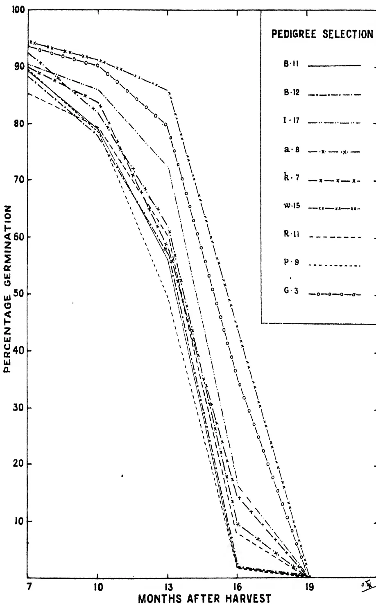

The graph illustrates the germination rate of nine different paddy seed pedigrees over a period of 12 months following harvest. The y-axis represents the percentage of germination, ranging from 0 to 100. The x-axis represents the time in months after harvest, from 7 to 19. All pedigrees start with high germination rates (between 85% and 95%) at 7 months. They all show a significant decline in germination between 10 and 13 months. The rate of decline varies by pedigree, with some showing a more gradual loss and others a sharper drop. By 19 months, all pedigrees have reached 0% germination.

<table border="1">
<thead>
<tr>
<th>Months After Harvest</th>
<th>B-11</th>
<th>B-12</th>
<th>I-17</th>
<th>a-8</th>
<th>k-7</th>
<th>w-15</th>
<th>R-11</th>
<th>P-9</th>
<th>G-3</th>
</tr>
</thead>
<tbody>
<tr>
<td>7</td>
<td>95</td>
<td>92</td>
<td>90</td>
<td>91</td>
<td>93</td>
<td>94</td>
<td>88</td>
<td>89</td>
<td>85</td>
</tr>
<tr>
<td>10</td>
<td>91</td>
<td>88</td>
<td>85</td>
<td>86</td>
<td>89</td>
<td>90</td>
<td>80</td>
<td>81</td>
<td>78</td>
</tr>
<tr>
<td>13</td>
<td>86</td>
<td>82</td>
<td>78</td>
<td>80</td>
<td>83</td>
<td>84</td>
<td>55</td>
<td>56</td>
<td>52</td>
</tr>
<tr>
<td>16</td>
<td>45</td>
<td>40</td>
<td>35</td>
<td>38</td>
<td>42</td>
<td>43</td>
<td>5</td>
<td>6</td>
<td>4</td>
</tr>
<tr>
<td>19</td>
<td>0</td>
<td>0</td>
<td>0</td>
<td>0</td>
<td>0</td>
<td>0</td>
<td>0</td>
<td>0</td>
<td>0</td>
</tr>
</tbody>
</table>

Fig. 1.  
The viability of long-aged paddy seed.

362------------------------------------------------


Normal maha sowing date, Peradeniya

LEGEND

- Period to flowering —————
- Period flowering to ripening - - - -
- ===== indicates profuse tillering

<table border="1">
<thead>
<tr>
<th>Month of sowing</th>
<th>Period to flowering (Days)</th>
<th>Period flowering to ripening (Days)</th>
</tr>
</thead>
<tbody>
<tr>
<td>Aug. 1928</td>
<td>145</td>
<td>145</td>
</tr>
<tr>
<td>Sept.</td>
<td>130</td>
<td>178</td>
</tr>
<tr>
<td>Oct.</td>
<td>135</td>
<td>178</td>
</tr>
<tr>
<td>Nov.</td>
<td>142</td>
<td>180</td>
</tr>
<tr>
<td>Dec.</td>
<td>305</td>
<td>328</td>
</tr>
<tr>
<td>Jan. 1929</td>
<td>312</td>
<td>340</td>
</tr>
<tr>
<td>Feb.</td>
<td>215</td>
<td>255</td>
</tr>
<tr>
<td>Mar.</td>
<td>165</td>
<td>210</td>
</tr>
<tr>
<td>April</td>
<td>150</td>
<td>170</td>
</tr>
<tr>
<td>May</td>
<td>122</td>
<td>155</td>
</tr>
<tr>
<td>June</td>
<td>102</td>
<td>142</td>
</tr>
<tr>
<td>July</td>
<td>85</td>
<td>130</td>
</tr>
</tbody>
</table>

Fig. II.  
The effect of sowing date on age of a maha paddy.

363------------------------------------------------

333

date than short-aged paddies and instances had been reported where long-aged paddies sown at the wrong time had never flowered.

The opportunity was taken at Peradeniya in 1928 and 1929 of sowing a *marvi* selection whose normal age was 6-6½ months, monthly throughout a complete year with the object of noting the changes in the growth period. These are shown graphically in Fig. II. The first sowing took place in August (the normal month for sowing at Peradeniya) and the last in the following July.

The normal age was 195 days and the September, October, and November sowing showed but little departure from this but from October onwards the panicles were not fully developed and yields in the field would have been unremunerative. The plants sown in December were caught by the north-east monsoon when normally they should have been flowering. No flowering took place at all and growth continued for 328 days. During the last 25 days profuse tillering took place. The January sown plants grew for 339 days and at maturity the few panicles formed were composed almost entirely of empty grains. From February onwards the age decreased until from May onwards it was very definitely sub-normal. In all these cases few panicles developed and all contained numerous empty grains. The effect of sowing at the wrong time will probably vary with different climates.

It will be seen that the meticulous care taken by the cultivator to sow the proper aged variety is sound agricultural practice.

364------------------------------------------------

334

## CHEMICAL NOTES (10)

### FURTHER ANALYSES OF LEGUMINOUS GREEN MANURES

S. KANDIAH AND D. G. PANDITTESEKERE

(DIVISION OF AGRICULTURAL CHEMISTRY)

DEPARTMENT OF AGRICULTURE, CEYLON

IN 1926, analyses of a number of green manure plants were made in the Chemical Division and the results published in *The Tropical Agriculturist* for October of that year. Since then several leguminous green manures have been introduced into Ceylon and it was thought desirable to analyse some of these, as well as a few of the more-important older species that had not been examined. With a view to obtain results which would be comparable, all samples were taken at the flowering stage only, and their leafy material and tender stems analysed. As previously pointed out it is obvious that the analytical figures obtained cannot be regarded as representing the composition of all samples of the same species. It is, however, hoped that they would give a fair idea of the manurial values of these green manures.

The results of the analyses are calculated on the fresh material and on dry matter at 100°C. The sample of *Parochetus communis* was obtained from Lippakelle Estate, Talawakelle, the two samples of *Psoralea corylifolia* and *Rhynchosis nummularia* from the Northern Division, and the others from the Experiment Station, Peradeniya.

The results are set out in the table. An examination of it would show that the nitrogen as well as the ash contents in the fresh material of the various green manures vary a great deal. Of all the plants analysed *Derris robusta* appears to be the best as it contains the highest amounts of nitrogen, ash, lime, and potash. Its phosphoric acid content is also high. Lowest figures for all constituents in the fresh material are obtained in the case of *Parochetus communis* and this is evidently due to its low dry matter content which is only 14.3%, as compared with dry matter contents of 38% and 33.4% in *Derris robusta* and *Albizia chinensis* respectively. The results on dry matter at 100°C show however that this plant has the highest amount of phosphoric acid and that its potash content too is comparatively

365------------------------------------------------

335

high. Thus it will be noted that a better idea of the relative value of the various green manures could be obtained by examining the results on material at 100°C.

The table shows that the figures for the various constituents obtained from these analyses are about the same as those obtained previously with the one exception of *Psoralea corylifolia* which has an ash content as high as 11.5% consisting chiefly of lime and potash. The percentages of nitrogen for the various species do not vary to any great extent. The nitrogen content is 3.47% obtained in the case of *Albizia chinensis* as against a minimum of 2.48% in *Psoralea*. As already pointed out the highest amounts of lime and potash are found in *Psoralea*. The smallest percentage of lime is found in *Crotalaria brownnei* and of potash in *Albizia chinensis*. The latter has also a low percentage of lime. The phosphoric acid content is highest in *Parochetus* and again lowest in *Albizia chinensis*. There does not appear to be any relation between the nature of the species analysed and their composition.

366------------------------------------------------

336Analyses of Green Manures

<table border="1">
<thead>
<tr>
<th rowspan="2">No.</th>
<th rowspan="2">Variety</th>
<th rowspan="2">Nature of plant</th>
<th colspan="6">On fresh material<br/>Per cent</th>
<th colspan="6">On dry matter at 100°C<br/>Per cent</th>
</tr>
<tr>
<th>Moisture</th>
<th>Organic matter</th>
<th>Ash</th>
<th>Nitrogen</th>
<th>Lime</th>
<th>Potash</th>
<th>Phos. acid</th>
<th>Organic matter</th>
<th>Ash</th>
<th>Nitrogen</th>
<th>Lime</th>
<th>Potash</th>
<th>Phos. acid</th>
</tr>
</thead>
<tbody>
<tr>
<td>1</td>
<td><i>Derris robusta</i></td>
<td>Tree</td>
<td>62.0</td>
<td>35.1</td>
<td>2.91</td>
<td>1.19</td>
<td>.74</td>
<td>.73</td>
<td>.19</td>
<td>92.3</td>
<td>7.68</td>
<td>3.14</td>
<td>1.98</td>
<td>1.93</td>
<td>.51</td>
</tr>
<tr>
<td>2</td>
<td><i>Albizia procera</i></td>
<td>"</td>
<td>73.5</td>
<td>24.1</td>
<td>2.43</td>
<td>0.69</td>
<td>.55</td>
<td>.68</td>
<td>.21</td>
<td>90.8</td>
<td>9.17</td>
<td>2.62</td>
<td>2.09</td>
<td>2.58</td>
<td>.81</td>
</tr>
<tr>
<td>3</td>
<td><i>Albizia chinensis</i></td>
<td>"</td>
<td>66.6</td>
<td>34.4</td>
<td>1.97</td>
<td>1.15</td>
<td>.46</td>
<td>.42</td>
<td>.15</td>
<td>94.1</td>
<td>5.92</td>
<td>3.47</td>
<td>1.37</td>
<td>1.24</td>
<td>.44</td>
</tr>
<tr>
<td>4</td>
<td><i>Crotalaria browniei</i></td>
<td>Bush</td>
<td>76.1</td>
<td>22.2</td>
<td>1.68</td>
<td>0.71</td>
<td>.29</td>
<td>.56</td>
<td>.16</td>
<td>92.9</td>
<td>7.06</td>
<td>2.93</td>
<td>1.24</td>
<td>2.36</td>
<td>.48</td>
</tr>
<tr>
<td>5</td>
<td><i>Psoralea corylifolia</i></td>
<td>"</td>
<td>-</td>
<td>-</td>
<td>-</td>
<td>-</td>
<td>-</td>
<td>-</td>
<td>-</td>
<td>88.5</td>
<td>11.53</td>
<td>2.48</td>
<td>5.26</td>
<td>4.14</td>
<td>.55</td>
</tr>
<tr>
<td>6</td>
<td><i>Tephrosia tinctoria</i></td>
<td>"</td>
<td>72.8</td>
<td>25.5</td>
<td>1.74</td>
<td>0.94</td>
<td>.47</td>
<td>.51</td>
<td>.14</td>
<td>93.6</td>
<td>6.41</td>
<td>3.45</td>
<td>1.75</td>
<td>1.88</td>
<td>.51</td>
</tr>
<tr>
<td>7</td>
<td><i>Desmodium heterocarpum</i></td>
<td>Bushy creeper</td>
<td>66.5</td>
<td>32.4</td>
<td>1.15</td>
<td>1.03</td>
<td>.46</td>
<td>.59</td>
<td>.16</td>
<td>94.2</td>
<td>5.81</td>
<td>3.07</td>
<td>1.38</td>
<td>1.76</td>
<td>.49</td>
</tr>
<tr>
<td>8</td>
<td><i>Parochetus communis</i></td>
<td>Creeper</td>
<td>85.3</td>
<td>13.4</td>
<td>1.34</td>
<td>0.42</td>
<td>.23</td>
<td>.37</td>
<td>.13</td>
<td>90.8</td>
<td>9.15</td>
<td>2.82</td>
<td>1.54</td>
<td>2.51</td>
<td>.87</td>
</tr>
<tr>
<td>9</td>
<td><i>Pycnospora hedyaroides</i></td>
<td>"</td>
<td>66.7</td>
<td>30.8</td>
<td>2.48</td>
<td>1.07</td>
<td>.58</td>
<td>.67</td>
<td>.21</td>
<td>92.5</td>
<td>7.45</td>
<td>3.24</td>
<td>1.74</td>
<td>2.02</td>
<td>.63</td>
</tr>
<tr>
<td>10</td>
<td><i>Rhyncosia nummularia</i></td>
<td>"</td>
<td>-</td>
<td>-</td>
<td>-</td>
<td>-</td>
<td>-</td>
<td>-</td>
<td>-</td>
<td>91.4</td>
<td>8.58</td>
<td>3.37</td>
<td>3.17</td>
<td>2.52</td>
<td>.69</td>
</tr>
</tbody>
</table>

367------------------------------------------------

337

## SPRAYING AGAINST CANKER OF CITRUS

L. S. BERTUS,  
ACTING MYCOLOGIST,

DEPARTMENT OF AGRICULTURE, CEYLON

**S**PRAYING experiments were begun on citrus trees (grapefruit) at the Experiment Station, Peradeniya, on 8 December, 1930. The trees were three to three-and-a-half years old and averaged about ten feet in height. Fifteen trees were selected for the experiment; of these, five were sprayed with a  $\frac{1}{2}$  per cent aqueous solution of concentrated lime-sulphur weekly, five with 1 per cent fortnightly while five served as controls. Before the experiment was started each tree was examined primarily to ascertain the severity of citrus canker on the leaves and branches.

*Citrus Canker* is one of the commonest diseases of citrus plants in Ceylon and is caused by the bacterium *Pseudomonas citri*. The disease is widespread in its distribution and is found in the United States of America (in Florida and some of the Southern States), in Japan, China, Java, India, Malaya, and Ceylon. In Ceylon it is more common at lower elevations, particularly in the wetter zones.

The first symptom of the disease is the appearance of yellow spots on the leaves. Later, small brown coloured, corky, eruptive growths are produced from these yellow spots. The character which distinguishes them from other eruptions of a similar nature is the yellowing of the leaf tissue round the eruption which gives the appearance of a sort of halo. The canker occurs on leaves, fruits, green twigs and young stems and in older stages may completely girdle twigs and young stems to cause the dying back of the parts above.

The presence of fungi and pests on these trees was also noted. Dr. J. C. Hutson, the Government Entomologist, identified the following pests: Fluted scale (*Ichneumon purchasi*), mussel-shell scale (*Lepidosaphes citricola*) and green bug (*Coccus viridis*) were found on the stems, while *Ichneumon seychellarum*, *Lepidosaphes gloveri*, *Lepidosaphes gloveri* var *pallida*, probably at least two species of *Chionaspis*, *Lecanium* sp., leaf miner (*Phyllocnistis citrella*) black fly (*Aleurocanthus* sp.) and aphids (*Toxoptera aurantii*) were present on the leaves.

Among the fungi recorded were *Septobasidium* sp. and sooty mould which develop on the secretions of scale insects, *Cephalosporium lecanii*, parasitic on green bug (*Coccus viridis*), *Microcera* sp. parasitic on *Lepidosaphes citriola* and *Chionaspis* sp.

368------------------------------------------------

338

The primary object of the experiment was to ascertain the efficacy of the spray fluid against the spread of the bacterium which caused citrus canker on leaves, branches, and fruits; it also afforded an indication of the effect of the spray on fungi and insects commonly present on citrus.

Fungi like sooty mould and *Septobasidium* sp. which live on the secretions of the scale insects are not very harmful when they are present in small quantity, but when they occur in abundance they may seriously retard growth and render the tree less resistant to drought. The dense, black structure which the sooty mould fungus forms on the leaves reduces the amount of light reaching the chlorophyll and consequently diminishes the activity of the latter in manufacturing food.

Pests like fluted scale, green bug, and aphids reduce the vitality of the tree by sucking its plant juice. All these factors working together may have a detrimental effect on the health of the trees and their subsequent production of fruit.

No attempt was made to cut off affected twigs and leaves as it is realized that this procedure would be impracticable especially in the case of large trees where in severe attacks a large percentage of the leaves are affected.

As stated above five trees were sprayed weekly with a  $\frac{1}{2}$  per cent aqueous solution of concentrated lime-sulphur, and five trees fortnightly with a 1 per cent solution. After the former group had received ten applications and the latter five, the trees were individually examined. It was observed that the spray did not arrest the spread of the canker to the young shoots to a marked degree, that some of the scale insects were not killed in the trees which were treated with the  $\frac{1}{2}$  per cent solution and that the leaf mining caterpillar was still active carrying the bacterium of the canker to young foliage.

On 16 February, 1931 a change was effected in the strength of the spray fluid. The trees that received a  $\frac{1}{2}$  per cent solution of the lime-sulphur were treated with a 1 per cent solution and those that received the 1 per cent were sprayed with a 2 per cent solution. After the former group had received eight applications and the latter four of the increased strengths the trees were again individually examined. The effect of the increased strength of the spray fluid was noticeable. Pests such as green bug and scales were completely wiped out together with the fungi such as sooty mould which lived on their secretions; the *Septobasidium* which enveloped the larger branches were seen to have cracked and dropped off; the spread of the canker to the young foliage was arrested to a considerable extent; the leaf mining caterpillar was present but the damage it did was

369------------------------------------------------

339

negligible. From observations made it appeared that the leaf miner infected the leaves in the interval between the application of the spray fluid. The spray did not appear to be completely effective against ants and aphids though their numbers were reduced considerably. No difference was noticeable in the trees sprayed weekly with the 1 per cent solution compared with the trees sprayed fortnightly with the 2 per cent solution.

From the above experiments and observations made in the field it is recommended that (1) trees should be sprayed weekly with a 1 per cent aqueous solution of concentrated lime-sulphur or fortnightly with a 2 per cent solution, (2) affected twigs and leaves should be cut off and burnt wherever possible. The Entomologist suggests that the application of a spray of tobacco wash between the application of lime-sulphur will be effective against aphids and leaf miner.

Canker infection takes place most readily on young leaves. If new foliage growth can be stimulated during the drier periods of the year in which canker infection is not so common, some infection may be avoided. Young trees should therefore be watered during dry weather to stimulate growth and, if manuring is undertaken it should be done so that the maximum effect is felt during dry weather.

Wherever possible infected twigs and foliage should be pruned out to remove sources of infection. Spraying against citrus canker is a preventive and not a curative measure. Once the bacterium is inside the tissues of the host plant spraying will not eradicate it but will, to a great extent, prevent it from spreading to neighbouring leaves and branches.

If citrus is planted 15 feet by 15 feet, 195 trees will cover an acre. In the experiments described above, 2 gallons of solution were used for five trees. This quantity was considered the minimum amount of spray fluid required for the trees of the size experimented upon. Based on these calculations roughly 13 pints of concentrated lime-sulphur solution will be required for spraying an acre of citrus with a 2 per cent solution.

If the citrus plants are young, spraying can be carried out with small hand sprayers; if done on a larger scale or if big trees are to be sprayed, the use of a knapsack sprayer will be most convenient.

If the routine spraying recommended above to control citrus canker is adopted, the spray will help to prevent infection by pink disease (*Corticium salmonicolor*) and mildew (*Oidium tinctaninum*) which are responsible for dieback in citrus and when once established on a plantation are troublesome to eradicate.

370------------------------------------------------

340

## TEA MANURING UNDER SLUMP CONDITIONS

W. R. THOMSON, B.Sc. (AGRIC.)

**T**HE problem facing those responsible for many tea estates at present is that of finding methods of reducing the cost of production of their tea. The drop in prices has in many cases reduced the margin of profit to a vanishing point and all expenditure must be scrutinised with the utmost care.

An obvious economy is the reduction or elimination of the eight or ten cents per lb. spent on manuring. Reports of the bad effects following on the cessation of manuring in the 1921 slump are however such that many regard the discontinuance of manuring as a policy of extremely doubtful value when a long view is taken.

While this is undoubtedly true, the problem of finding immediate economies is so pressing that some discussion of the problem as it affects manuring expenditure may be welcome.

The simplest method of economy is to apply the mixtures already in use at a reduced rate per acre but it can possibly be improved upon.

It must be remembered that the fate of the various plant foods which have been added to the soil in the past has varied considerably. Practically the whole of the Phosphoric Acid which has not been actually removed in the tea leaf will be found in the soil, the frames of the bushes, or in the green manure crop.

The bulk of the Potash will be found in the same way, though a larger amount will probably have been lost by drainage.

On the other hand the accumulation of reserve stores of Nitrogen is difficult and the effect of past applications can be very largely discounted. The process of building reserve stocks of Nitrogen even when slow acting organic manures are used and green crops are grown is very slow. The estate which has by these means built up the fertility of its soil to a really high degree is extremely fortunate at the present time. It must be remembered however that nothing is easier to lose than this fertility under Ceylon conditions where all the factors which make for Nitrogen losses are at their maximum.

The reduction in manuring expenditure should then, from theoretical considerations, fall rather more heavily on the Phosphates and Potash of the manure mixture than on the Nitrogen. The actual cuts which can be made in this expenditure will depend on the past manuring history of the estate as manuring

371------------------------------------------------

341

programmes vary widely in the proportions of plant food they supply. Reduction of the amount of Nitrogen used in mixtures is a more difficult problem but the fact that this ingredient is very much the most expensive used makes it essential to reduce the money spent on this item if at all possible.

One method of reducing the cost of this is to substitute cheap inorganic Nitrogen for more expensive organic forms, but it must be remembered that inorganic Nitrogen while it gives a rise in crop over a short period tends to lower the quality of the tea produced. Any increase in the amount of this form of Nitrogen at the present time is therefore so much against the general interests of the industry that it cannot be entertained even though the immediate results may be superficially attractive to individual estates. From both the estate and the general point of view the ideal must be to produce a crop of the best possible quality at a lower cost per lb. and these objectives must be attained without any damage to the high state of general agricultural health of the properties.

The only means of attaining this end is the use of good quality organic material as the source of the greater part of the Nitrogen.

The reduction that must be made in the total Nitrogen to be applied should then take effect to a greater degree on the inorganic Nitrogen while the organic Nitrogen is cut to a much smaller extent if at all.

There is no ground for selecting any particular form of Phosphoric Acid or Potash to be reduced in preference to any other and cuts can be made on the total amount without reference to the forms used. The amount of the cut should of course depend on the amounts previously used for the reasons set out above.

Such a programme should obviate the bad effects of a reduction in the amount spent on manure. The loss of crop is reduced to a minimum while quality is retained or even improved. No drastic alteration is made in the food supply to the bush and the evenness of action obtained from a largely organic mixture will maintain the general fertility and health of the estate as a whole.

The part played by inorganic Nitrogen in the production of the present surplus of tea is considerable and the quantity of tea attributable to this source in a normal year is estimated at 56,000,000 lb. While it is not suggested that the whole of this inorganic Nitrogen should be dispensed with a considerable reduction is possible and this combined with a smaller reduction in organic Nitrogen would restrict production to a considerable extent with a correspondingly good effect on the market.

372------------------------------------------------

342

## CONTRIBUTIONS FROM THE RUBBER RESEARCH SCHEME, CEYLON

### THE CAUSE OF VARIABILITY IN THE PLASTICITY OF PLANTATION RUBBER AFTER STORAGE

G. MARTIN, B.Sc., A.I.C., F.I.R.I.

AND

L. E. ELLIOTT, F.I.C., F.I.R.I.

(OF THE SCIENTIFIC STAFF IN LONDON OF THE  
CEYLON RUBBER RESEARCH SCHEME)

THERE are two reasons why a study of the plasticity of rubber is of importance to the planter, viz: (1) the variable plasticity of plantation rubber leads to many difficulties in manufacturing operations; and (2) first-grade plantation rubber is so hard that it is frequently mixed with inferior grades and other materials to enable it to pass more easily through the different processes.

The results of the investigations recorded in this report suggest a definite reason for the hardness and variability of first-grade rubber.

Tests carried out by De Vries in Java showed (1) the freshly prepared plantation rubber is uniform in plasticity but that many samples gradually become hard or soft on keeping and so develop differences; and (2) that rubber containing more serum substances than usual becomes hard and that containing less than usual becomes soft (Trans. I. R. I., **3**, 1927-28, p. 284). On the other hand tests carried out by the Scheme on a large number of samples of over three years show that in most cases rubber becomes harder on keeping for six months at 15°C. The hardening of the rubber at European temperatures has been confirmed by Griffiths of the Dunlop Rubber Co., Ltd., who stated that large-scale experiments on rubber from different estates showed that in all cases, after storage for three years, it was necessary to increase the time of milling by about 30 per cent in order to obtain the required plasticity (Trans. I. R. I., **3**, 1927-28, p. 300).

As raw rubber is subjected to a wide range of temperatures and humidity conditions before use by the manufacturer a detailed investigation is being carried out at the Imperial Institute on the effect of different conditions of storage.

The results of preliminary tests (Second *Quarterly Circular* of the Rubber Research Scheme, Ceylon, 1930) showed that (1) rubber becomes slightly harder at 15°C than at 0°C; and (2) rubber hardens more quickly in a dry than in a damp atmosphere.

373------------------------------------------------

343

Further experiments have now been made with crepe and sheet stored for six months at 0°C, 15°C, 30°C, and 45°C. As it was desirable to ascertain whether the changes in plasticity were due to changes in the rubber independent of external factors such as oxygen, some of the samples were kept in sealed glass tubes containing dry nitrogen and others in tubes containing dry oxygen. If oxygen is responsible for changes in the plasticity of rubber on storage, it might be anticipated that the changes would be accelerated by the removal of anti-oxidants from the rubber. Accordingly a portion of the sheet was treated with dilute ammonia solution for three weeks to remove anti-oxidants; another portion was treated with water for comparison; and a third with tannic acid solution, the tannic acid being regarded as a possible anti-oxidant. The results of the usual hardness tests at 100°C are shown in the following table and diagrammatically in Fig. 1.

<table border="1">
<thead>
<tr>
<th rowspan="3">Sample</th>
<th rowspan="3">* <math>D_{30}</math><br/>(mm./100)<br/>before<br/>storage</th>
<th colspan="8">* <math>D_{30}</math> (mm./100) after storage for six months in</th>
</tr>
<tr>
<th colspan="4">Dry nitrogen at</th>
<th colspan="4">Dry oxygen at</th>
</tr>
<tr>
<th>0°C</th>
<th>15°C</th>
<th>30°C</th>
<th>45°C</th>
<th>0°C</th>
<th>15°C</th>
<th>30°C</th>
<th>45°C</th>
</tr>
</thead>
<tbody>
<tr>
<td>Crepe ( No.<br/>1452 )</td>
<td>170</td>
<td>178</td>
<td>205</td>
<td>213</td>
<td>222</td>
<td>156</td>
<td>173</td>
<td>185</td>
<td>164</td>
</tr>
<tr>
<td>Smoked sheet<br/>(No. 1455)</td>
<td>191</td>
<td>186</td>
<td>203</td>
<td>208</td>
<td>215</td>
<td>173</td>
<td>183</td>
<td>182</td>
<td>182</td>
</tr>
<tr>
<td>Smoked sheet<br/>extracted<br/>with cold<br/>water</td>
<td>189</td>
<td>—</td>
<td>209</td>
<td>—</td>
<td>—</td>
<td>175</td>
<td>188</td>
<td>—</td>
<td>142</td>
</tr>
<tr>
<td>Smoked sheet<br/>extracted<br/>with ammonia</td>
<td>189</td>
<td>—</td>
<td>213</td>
<td>—</td>
<td>—</td>
<td>166</td>
<td>186</td>
<td>—</td>
<td>111</td>
</tr>
<tr>
<td>Smoked sheet<br/>soaked in<br/>tannic acid</td>
<td>189</td>
<td>—</td>
<td>217</td>
<td>—</td>
<td>—</td>
<td>170</td>
<td>191</td>
<td>—</td>
<td>162</td>
</tr>
</tbody>
</table>

\*  $D_{30}$  Thickness (in hundredths of a millimetre) of sphere 0.4 grams in weight after pressing under a load of 5 kgs. at 100°C for 30 minutes.

The results show that the changes in hardness which occur when rubber is stored in dry oxygen are different from those which occur on storage under the same conditions in nitrogen. In nitrogen the rubber becomes hard and the hardness increases with the temperature. In oxygen the rubber is always softer than in nitrogen at the same temperature and the difference increases with the temperature.

374------------------------------------------------

344

These results suggest that two fundamental factors are responsible for the changes which occur in the plasticity of rubber on storage: (1) a spontaneous hardening which occurs in nitrogen and therefore probably in any inert atmosphere; and (2) a softening induced by oxygen. These changes occur simultaneously when oxygen is present, but an increase in temperature accelerates the rate of softening more than the rate of hardening. At low temperatures hardening exceeds softening and at high temperatures softening exceeds hardening and, as will be seen from the diagram, the critical temperature is about 30°C but depends upon accessory substances in the rubber.

The ammonia-extracted rubber became extremely soft in oxygen at 45°C, although it hardened at 15°C, whilst the same rubber not treated with ammonia had a tendency to harden even at 45°C. Previous experiments with ammonia-extracted rubber have indicated that it possesses poor ageing properties when vulcanised, and it is assumed that this is due to the removal of anti-oxidants. (Trans. I. R. I., 1926-7, 2, p. 368). The removal of these constituents therefore appears to affect not only the ageing properties of the vulcanised material but also those of the raw material.

The water-extracted rubber also softened in oxygen at 45°C but not as much as the ammonia-extracted rubber; this also agrees with the results of the ageing tests on the vulcanised material referred to above. Tannic acid does not appear to have a marked anti-oxidant effect.

These results explain the differences previously observed between the effect of storage in the tropics and in Europe. At European temperatures spontaneous hardening nearly always exceeds softening due to oxygen, even when the amount of anti-oxidants present is much less than usual. At tropical temperatures rubber becomes hard or soft according to the amount of serum substances present. These contain natural anti-oxidants, with the result that even at tropical temperatures rubber containing more serum than usual becomes hard.

Although this work is only in its initial stage the results indicate methods by which it may be possible to control the plasticity of rubber on estates.

375------------------------------------------------

HARDNESS (D<sub>30</sub>) of raw rubber after exposure for six months in dry OXYGEN or NITROGEN at different temperatures.


The graph plots Hardness (D<sub>30</sub>) on the y-axis (100 to 230) against Temperature of Exposure (°C) on the x-axis (0 to 45°). The graph is divided into two main regions: **NITROGEN** (top right) and **OXYGEN** (bottom right).

**Legend:**

- — Tannic acid extracted sheet
- — Ammonia extracted sheet
- — Water extracted sheet

**Approximate Data Points:**

<table border="1">
<thead>
<tr>
<th>Temperature (°C)</th>
<th>Nitrogen: Tannic acid sheet</th>
<th>Nitrogen: Ammonia sheet</th>
<th>Nitrogen: Water sheet</th>
<th>Oxygen: Tannic acid sheet</th>
<th>Oxygen: Ammonia sheet</th>
<th>Oxygen: Water sheet</th>
</tr>
</thead>
<tbody>
<tr>
<td>0</td>
<td>185</td>
<td>175</td>
<td>165</td>
<td>175</td>
<td>165</td>
<td>155</td>
</tr>
<tr>
<td>15</td>
<td>205</td>
<td>200</td>
<td>195</td>
<td>190</td>
<td>185</td>
<td>180</td>
</tr>
<tr>
<td>30</td>
<td>215</td>
<td>210</td>
<td>205</td>
<td>185</td>
<td>175</td>
<td>165</td>
</tr>
<tr>
<td>45</td>
<td>220</td>
<td>215</td>
<td>210</td>
<td>165</td>
<td>155</td>
<td>145</td>
</tr>
</tbody>
</table>

Fig. I.

376------------------------------------------------


377------------------------------------------------

345

## THE EFFECT OF MATURATION ON THE PLASTICITY OF SMOKED SHEET

G. MARTIN, B.Sc., A.I.C., F.I.R.I.

AND

L. E. ELLIOTT, F.I.C., F.I.R.I.

(OF THE SCIENTIFIC STAFF IN LONDON OF THE  
CEYLON RUBBER RESEARCH SCHEME)

**I**T is the practice in Java when preparing smoked sheet rubber to remove the coagulum from the serum on the same day as the acid is added, but in Malaya and Ceylon it is more useful to remove the coagulum on the day following. During the period the coagulum remains in the serum, changes occur in the non-rubber accessory substances which affect the rate of vulcanisation of the rubber. It is to be expected therefore that these changes occur to a greater extent in Ceylon and Malaya than in Java, and that the different practices lead to some variability in the properties of rubber.

Although the effect of keeping the coagulum in the serum has been studied thoroughly as regards rate of vulcanisation little is known as to whether the changes which occur affect the plasticity of rubber. This also is an important property affecting the utilisation of rubber.

Two sets of experiments were described in Bulletin 49, p. 2, showing that crepe from coagulum kept in the serum for two days was harder than crepe from coagulum removed after a few hours.

Two further sets of experiments have now been carried out in which the coagulum after keeping for different periods in the serum was rolled to sheet and smoked. The results obtained are not in agreement with those given by crepe, the period the coagulum remained in the serum apparently having no effect on the plasticity of sheet. Mr. O'Brien (who prepared the samples) has suggested that the difference in the results given by crepe and sheet is due to the addition of sodium bisulphite to the latex when preparing crepe. This is a probable explanation because it has already been shown that sodium bisulphite has a hardening effect on rubber, and it is possible that the longer the coagulum remains in the serum the greater is the effect of the bisulphite.

More information concerning the different results given by crepe and sheet could be obtained by determining the plasticity of crepe prepared from latex containing no bisulphite and matured for different periods, and it is hoped to carry out this experiment when opportunity occurs.

378------------------------------------------------

346

The two sets of sheet samples were prepared at an interval of 18 months. A description of the first set and the results obtained are given in the Rubber Research Scheme *Quarterly Circular*, Vol. 6, Part 2, 1929, p. 1. The samples in each set were prepared from latex divided into two portions, one being coagulated with acetic acid and the other with a mixture of acetic acid and paranitrophenol. The latter is a disinfectant used chiefly for the prevention of mould. It was employed in these experiments to determine whether it retarded changes in the accessory substances during the period the coagulum was kept in the serum. In the second set a portion of the sheet from the coagulum which had been allowed to remain in the serum for the longest period was rolled up wet and kept in this condition for five days before drying in smoke. At the end of this period the sheets without paranitrophenol had a putrid odour but the others were still fresh.

*Plasticity Tests.*—The results of plasticity tests are shown in table I. They include a hardness test soon after the arrival of the samples in London and after keeping for six months, and in addition a mastication test on the stored samples.

The results show that keeping the coagulum in the serum had no definite effect on the hardness of the sheet samples on arrival in London or after storage for six months under different conditions (for detailed particulars of conditions of storage of the first set and the results obtained see *Quarterly Circular*, Vol. 6, 1929, Part 2, p. 2 and, Vol. 7, 1930, Part 2, p. 23). It is of interest however that the sample rolled up wet and free from paranitrophenol in the second set was harder than the others on arrival and required more mastication than the others after keeping at 60°F for six months. It is possible therefore that maturing the coagulum may cause a small decrease in plasticity, but this is not obvious from tests in which the coagulum is allowed to remain in the serum and then rolled and dried, because the biological changes may be accompanied by an alteration in the distribution of the non-rubber substances between the coagulum and the serum.

Paranitrophenol had no definite effect on the hardness of the samples except when these were stored in a damp atmosphere when the samples without paranitrophenol became mouldy and hard.

379------------------------------------------------

347

*Vulcanisation Tests.*—Most of the samples were submitted to tests to determine the extent to which the changes occurring during the maturing of the coagulum affected the rate of vulcanisation, and the influence of paranitrophenol on these changes. The results obtained are shown in table II. In the first set of experiments only small changes occurred in the rate of vulcanisation of the samples in consequence of keeping the coagulum in the serum and these changes were unaffected by paranitrophenol. In the second set of experiments the alterations were more marked. Keeping the coagulum in the serum for 44 hours as compared with 4 hours reduced the time of vulcanisation by 15 per cent in the absence of paranitrophenol and by 8 per cent in the presence of paranitrophenol. When the coagulum kept in the serum for 44 hours was rolled up wet, the time of vulcanisation was reduced by a further 10 per cent in the absence of paranitrophenol and by 5 per cent in its presence.

In the first set of experiments paranitrophenol had little effect on the changes which occurred when coagulum was allowed to mature but in the second set it definitely retarded these changes. As the changes which occur during maturing may be partly due to accidental infection it is not surprising that different experiments do not always agree. It is evident that paranitrophenol may reduce variability due to differences arising during maturation of the coagulum but insufficient evidence has yet been obtained as to its general effect in this direction.

380------------------------------------------------

348Table ISet 1

<table border="1">
<thead>
<tr>
<th rowspan="2">Sample No.</th>
<th rowspan="2">Coagulant</th>
<th rowspan="2">Interval between addition of coagulant and rolling<br/>hrs.</th>
<th>On arrival in London</th>
<th colspan="2">After storage for six months at 60°F</th>
</tr>
<tr>
<th><math>D_{80}</math><br/>mms./100</th>
<th><math>D_{80}</math><br/>mms./100</th>
<th>Mastication No.</th>
</tr>
</thead>
<tbody>
<tr>
<td>1,385</td>
<td>Acetic acid</td>
<td>4½</td>
<td>154</td>
<td>161</td>
<td>94</td>
</tr>
<tr>
<td>6</td>
<td>" "</td>
<td>17½</td>
<td>158</td>
<td>158</td>
<td>95</td>
</tr>
<tr>
<td>7</td>
<td>" "</td>
<td>35½</td>
<td>156</td>
<td>165</td>
<td>95</td>
</tr>
<tr>
<td>8</td>
<td>" "</td>
<td>40½</td>
<td>156</td>
<td>161</td>
<td>120</td>
</tr>
<tr>
<td>9</td>
<td>" "</td>
<td>55½</td>
<td>159</td>
<td>167</td>
<td>109</td>
</tr>
<tr>
<td>90</td>
<td>Acetic acid and</td>
<td>4½</td>
<td>151</td>
<td>156</td>
<td>104</td>
</tr>
<tr>
<td>1</td>
<td>paramitrophenol</td>
<td>17½</td>
<td>158</td>
<td>151</td>
<td>109</td>
</tr>
<tr>
<td>2</td>
<td>" "</td>
<td>35½</td>
<td>155</td>
<td>158</td>
<td>108</td>
</tr>
<tr>
<td>3</td>
<td>" "</td>
<td>40½</td>
<td>156</td>
<td>163</td>
<td>105</td>
</tr>
<tr>
<td>4</td>
<td>" "</td>
<td>55½</td>
<td>155</td>
<td>167</td>
<td>107</td>
</tr>
</tbody>
</table>

Set 2

<table border="1">
<thead>
<tr>
<th rowspan="3">Sample No.</th>
<th rowspan="3">Coagulant</th>
<th rowspan="3">Interval between addition of coagulant and rolling</th>
<th rowspan="3">On arrival in London</th>
<th colspan="4">After storage for six months at</th>
</tr>
<tr>
<th colspan="2">32°F</th>
<th colspan="2">60°F</th>
</tr>
<tr>
<th><math>D_{80}</math><br/>mms./100</th>
<th><math>D_{80}</math><br/>mms./100</th>
<th>Mastication No.</th>
<th><math>D_{80}</math><br/>mms./100</th>
<th>Mastication No.</th>
</tr>
</thead>
<tbody>
<tr>
<td>1,500</td>
<td>Acetic acid</td>
<td>4</td>
<td>159</td>
<td>153</td>
<td>92</td>
<td>157</td>
<td>98</td>
</tr>
<tr>
<td>1,501</td>
<td>" "</td>
<td>18</td>
<td>159</td>
<td>150</td>
<td>94</td>
<td>159</td>
<td>107</td>
</tr>
<tr>
<td>1,502</td>
<td>" "</td>
<td>23</td>
<td>164</td>
<td>154</td>
<td>93</td>
<td>161</td>
<td>107</td>
</tr>
<tr>
<td>1,503</td>
<td>" "</td>
<td>28</td>
<td>159</td>
<td>158</td>
<td>101</td>
<td>157</td>
<td>96</td>
</tr>
<tr>
<td>1,504</td>
<td>" "</td>
<td>44</td>
<td>160</td>
<td>161</td>
<td>97</td>
<td>153</td>
<td>98</td>
</tr>
<tr>
<td>1,505</td>
<td>Acetic acid and</td>
<td>4</td>
<td>152</td>
<td>152</td>
<td>93</td>
<td>158</td>
<td>92</td>
</tr>
<tr>
<td>1,506</td>
<td>paramitrophenol</td>
<td>18</td>
<td>158</td>
<td>155</td>
<td>94</td>
<td>160</td>
<td>101</td>
</tr>
<tr>
<td>1,507</td>
<td>" "</td>
<td>23</td>
<td>156</td>
<td>151</td>
<td>93</td>
<td>159</td>
<td>96</td>
</tr>
<tr>
<td>1,508</td>
<td>" "</td>
<td>28</td>
<td>161</td>
<td>156</td>
<td>101</td>
<td>168</td>
<td>98</td>
</tr>
<tr>
<td>1,509</td>
<td>" "</td>
<td>44</td>
<td>159</td>
<td>149</td>
<td>92</td>
<td>165</td>
<td>100</td>
</tr>
<tr>
<td>1,510</td>
<td>Acetic acid<br/>(sheeted coagulum rolled up wet)</td>
<td>44</td>
<td>169</td>
<td>156</td>
<td>96</td>
<td>170</td>
<td>110</td>
</tr>
<tr>
<td>1,511</td>
<td>Acetic acid and<br/>paramitrophenol<br/>(sheeted coagulum rolled up wet)</td>
<td>44</td>
<td>164</td>
<td>152</td>
<td>95</td>
<td>159</td>
<td>102</td>
</tr>
<tr>
<td>1,512</td>
<td>Estate sample</td>
<td>—</td>
<td>154</td>
<td>157</td>
<td>94</td>
<td>159</td>
<td>96</td>
</tr>
</tbody>
</table>

381------------------------------------------------

349Table IISet 1Mixing 90 rubber, 10 sulphur

<table border="1">
<thead>
<tr>
<th>Sample No.</th>
<th>Coagulant</th>
<th>Interval between addition of coagulant and rolling</th>
<th>Time of vulcanisation</th>
<th>Tensile Strength</th>
<th>Elongation at load of 1.04 kgs./sq. mm.</th>
<th>Calculated time of vulcanisation at 148°C (E 1.04 = 775)</th>
</tr>
<tr>
<th></th>
<th></th>
<th></th>
<th>mins.</th>
<th>lb./sq. in.</th>
<th>per cent</th>
<th></th>
</tr>
</thead>
<tbody>
<tr>
<td>1,385</td>
<td>Acetic acid</td>
<td>4½</td>
<td>120</td>
<td>1,580</td>
<td>853</td>
<td>120</td>
</tr>
<tr>
<td>6</td>
<td>" "</td>
<td>17¾</td>
<td>"</td>
<td>1,670</td>
<td>848</td>
<td>118</td>
</tr>
<tr>
<td>7</td>
<td>" "</td>
<td>35½</td>
<td>"</td>
<td>1,850</td>
<td>832</td>
<td>114</td>
</tr>
<tr>
<td>8</td>
<td>" "</td>
<td>40¼</td>
<td>"</td>
<td>1,840</td>
<td>840</td>
<td>116</td>
</tr>
<tr>
<td>9</td>
<td>" "</td>
<td>55½</td>
<td>"</td>
<td>1,850</td>
<td>820</td>
<td>111</td>
</tr>
<tr>
<td>90</td>
<td>Acetic acid and</td>
<td>4½</td>
<td>"</td>
<td>1,460</td>
<td>860</td>
<td>121</td>
</tr>
<tr>
<td>1</td>
<td>paranitrophenol</td>
<td>17¾</td>
<td>"</td>
<td>1,950</td>
<td>840</td>
<td>116</td>
</tr>
<tr>
<td>2</td>
<td>" "</td>
<td>35½</td>
<td>"</td>
<td>1,560</td>
<td>847</td>
<td>118</td>
</tr>
<tr>
<td>3</td>
<td>" "</td>
<td>40¼</td>
<td>"</td>
<td>1,830</td>
<td>824</td>
<td>112</td>
</tr>
<tr>
<td>4</td>
<td>" "</td>
<td>55½</td>
<td>"</td>
<td>1,950</td>
<td>824</td>
<td>112</td>
</tr>
</tbody>
</table>

Set 2Mixing 100 rubber, 10 sulphur

<table border="1">
<thead>
<tr>
<th>Sample No.</th>
<th>Coagulant</th>
<th>Interval between addition of coagulant and rolling</th>
<th>Time of vulcanisation</th>
<th>Tensile Strength</th>
<th>Elongation at load of 1.00 kgs./sq. mm.</th>
<th>Calculated time of vulcanisation at 148°C (E1.00 = 800)</th>
</tr>
<tr>
<th></th>
<th></th>
<th></th>
<th>mins.</th>
<th>lb./sq. in.</th>
<th>per cent</th>
<th></th>
</tr>
</thead>
<tbody>
<tr>
<td>1,500</td>
<td>Acetic acid</td>
<td>4</td>
<td>{ 120<br/>140</td>
<td>1,970<br/>1,990</td>
<td>846<br/>777</td>
<td>134</td>
</tr>
<tr>
<td>1,504</td>
<td>" "</td>
<td>14</td>
<td>{ 100<br/>120</td>
<td>1,710<br/>2,050</td>
<td>852<br/>780</td>
<td>114</td>
</tr>
<tr>
<td>1,505</td>
<td>Acetic acid and</td>
<td>4</td>
<td>{ 120<br/>140</td>
<td>1,960<br/>2,120</td>
<td>840<br/>776</td>
<td>133</td>
</tr>
<tr>
<td>1,509</td>
<td>paranitrophenol</td>
<td>44</td>
<td>120</td>
<td>2,100</td>
<td>807</td>
<td>122</td>
</tr>
<tr>
<td>1,510</td>
<td>Acetic acid<br/>(sheeted<br/>coagulum rolled<br/>up wet)</td>
<td></td>
<td>100</td>
<td>2,230</td>
<td>807</td>
<td>102</td>
</tr>
<tr>
<td>1,510</td>
<td>Acetic acid and<br/>paranitrophenol<br/>(sheeted<br/>coagulum rolled<br/>up wet)</td>
<td>44</td>
<td>120</td>
<td>2,320</td>
<td>784</td>
<td>116</td>
</tr>
</tbody>
</table>

382------------------------------------------------

350

## RESEARCH WORK ON RUBBER CULTIVATION IN 1929 (CONTINUED)\*

*Yield.*—An extensive enquiry was made by Tengwall on the production of 275 estates in Java and South Sumatra with a total of 64,482 hectares. He figured out the average yield of fields of the same age and got the following figures:

Table X

<table style="width: 100%; border-collapse: collapse;">
<thead>
<tr>
<th style="text-align: left;">Planting Year</th>
<th style="text-align: center;">Age of the fields<br/>years</th>
<th style="text-align: center;">Kilogram rubber per<br/>hectare</th>
</tr>
</thead>
<tbody>
<tr><td>1923</td><td style="text-align: center;">4-5</td><td style="text-align: center;">71</td></tr>
<tr><td>1922</td><td style="text-align: center;">5-6</td><td style="text-align: center;">223</td></tr>
<tr><td>1921</td><td style="text-align: center;">6-7</td><td style="text-align: center;">271</td></tr>
<tr><td>1920</td><td style="text-align: center;">7-8</td><td style="text-align: center;">291</td></tr>
<tr><td>1919</td><td style="text-align: center;">8-9</td><td style="text-align: center;">321</td></tr>
<tr><td>1918</td><td style="text-align: center;">9-10</td><td style="text-align: center;">352</td></tr>
<tr><td>1917</td><td style="text-align: center;">10-11</td><td style="text-align: center;">372</td></tr>
<tr><td>1916</td><td style="text-align: center;">11-12</td><td style="text-align: center;">417</td></tr>
<tr><td>1915</td><td style="text-align: center;">12-13</td><td style="text-align: center;">392</td></tr>
<tr><td>1914</td><td style="text-align: center;">13-14</td><td style="text-align: center;">393</td></tr>
<tr><td>1913</td><td style="text-align: center;">14-15</td><td style="text-align: center;">436</td></tr>
<tr><td>1912</td><td style="text-align: center;">15-16</td><td style="text-align: center;">467</td></tr>
<tr><td>1911</td><td style="text-align: center;">16-17</td><td style="text-align: center;">441</td></tr>
<tr><td>1910</td><td style="text-align: center;">17-18</td><td style="text-align: center;">435</td></tr>
<tr><td>1909</td><td style="text-align: center;">18-19</td><td style="text-align: center;">434</td></tr>
<tr><td>1908</td><td style="text-align: center;">19-20</td><td style="text-align: center;">398</td></tr>
<tr><td>1907</td><td style="text-align: center;">20-21</td><td style="text-align: center;">432</td></tr>
<tr><td>1906</td><td style="text-align: center;">21-22</td><td style="text-align: center;">375</td></tr>
<tr><td>1905</td><td style="text-align: center;">22-23</td><td style="text-align: center;">394</td></tr>
<tr><td>1900-1904</td><td style="text-align: center;">23-24</td><td style="text-align: center;">449</td></tr>
</tbody>
</table>

In representing these figures in a curve, it becomes apparent that the increase-decrease in following years shows several irregularities. It must be taken into consideration, that the average figures have been obtained from rather heterogeneous material from fields of very different productivity. The figures show, that the decrease in production generally sets in not before the 15th-16th year. When we realise, that in the old fields the cultural conditions have often been unfavourable (much soil-wash, no green-manuring, etc.), the tapping system too drastic, the bark renewal poor, it may be expected that the increase in yield with the younger fields will last longer than in the old fields, so that the decrease in yield will set in later than in the fields under consideration.

*Selection.*—A general review of Hevea selection in Java was given by De Vries, Schweizer and Ostendorf. From this exposition it is apparent that the planting of selected trees, either seedling or budded trees is in Java not yet so general as in Sumatra, but the interest in selection is at present very great and a great number of clones of superior mother trees are grown on different estates: 85 clones at 6 estates are under observation of the Rubber Experiment Station. Three clones of the Estate "Bodjong Datar" (from mother trees of the Estate "Pasir Waringin") have been well tested and could be recommended to the estates; the average production was at the age of 9 years: 6.35 kg., 7.65 kg., and 6.90 kg. rubber (dry) per tree per year.

\* From *International Review of Agriculture*, Part I, Year XXI, No. 9, September 1930. Part I of this paper was reproduced in *The Tropical Agriculturist*, Vol. LXXVI, No. 2, 1931.

383------------------------------------------------

351

In 1926 a beginning has been made with the more systematic testing of the different clones. To this purpose different clones have been planted together in one field, each clone in a number of plots (say 3 or 4) of  $\frac{1}{4}$  to  $\frac{1}{2}$  ha. each; or the different clones have been planted in rows, each row of no more than 20 trees and alternately a row of the clone to be tested with a row of the so-called "standard clone", i.e., a clone which has already been tested for several years and the production of which is used as a standard. Of each clone two to six rows have been planted. In these experiments the trees have been planted at a rather large distance, viz., at the rate of 240 to 330 trees per ha.

In Ceylon's selection as a plantation practice is still rather backward, L. Lord in a lecture delivered in Colombo, gave a general review of the situation in Ceylon and urged the planters to give the policy of rejuvenation a thorough and wide trial, using for all new plantings the best available material and prosecuting energetically research on the production of superior material. He advised strongly to test a great number of estate trees as mother trees and to test foreign clones. If these measures would be taken the lecturer thinks that there would be no reason for pessimistic views regarding the future of the rubber industry in Ceylon.

In selecting the high-yielding mother trees we are still obliged to follow the ordinary way of measuring the yield of the trees during at least one year. We have not a reliable method of estimating the yield by means of correlating characters.

As De Vries showed, it is still uncertain what may be expected from Ashplant's method of measuring the diameter of the latex tube.

As a general tapping system for the trees which must be tested for selection, the alternate-day tapping over  $\frac{1}{3}$  has been adopted in Java and in comparative experiments three clones (Ct 88, AV 36, and AV 50) are included as "control" or "standard clones." A reliable impression of the productivity of a clone can only be obtained by experimental tapping continued during one year, or, better still, during several years.

A short review is given by De Vries of the Hevea plants imported in Java from Brazil. It appears that practically all the Hevea trees in Java are descendants from the trees grown from seed which Wickham collected in Brazil in 1875.

On different estates a great number of mother trees have been selected and the yield has been recorded during several years. The Besoeki Experiment Station (Djember) and the Rubber Experiment Station (Buitenzorg) kept a number of these trees in regular observation. This collection contains trees which give an average of more than 150 gm. rubber (dry) per tapping, being tapped on alternate days over  $\frac{1}{3}$ ; a few trees give more than 300 gm. per tapping.

The simplest method of selecting consists in planting seedlings grown from "illigitime" seeds (seeds obtained by uncontrolled pollination) from selected mother trees. The fields planted with these seeds have shown that in this simple way a remarkable improvement of the production may be obtained. A field of the Estate "Passir Waringin" of  $21\frac{1}{2}$  ha. planted in 1916 with such seeds, gave the following yields:

<table>
<thead>
<tr>
<th>7th</th>
<th>8th</th>
<th>9th</th>
<th>10th</th>
<th>11th</th>
<th>12th</th>
<th>13th</th>
<th>year</th>
</tr>
</thead>
<tbody>
<tr>
<td>390</td>
<td>600</td>
<td>666</td>
<td>820</td>
<td>717</td>
<td>703</td>
<td>745</td>
<td>kg. dry rubber per ha.</td>
</tr>
</tbody>
</table>

A field of the Estate Petaroeman, planted in 1916 and 1917 with "illigitime" seeds from selected mother trees of the Estate Kiara-Pajoeng gave the following yields:

<table>
<thead>
<tr>
<th></th>
<th>6th</th>
<th>7th</th>
<th>8th</th>
<th>9th</th>
<th>10th</th>
<th>11th</th>
<th>year</th>
</tr>
</thead>
<tbody>
<tr>
<td>Estate Petaroeman</td>
<td>340</td>
<td>497</td>
<td>573</td>
<td>700</td>
<td>745</td>
<td>775</td>
<td>kg. dry rubber per year</td>
</tr>
<tr>
<td></td>
<td></td>
<td></td>
<td></td>
<td></td>
<td></td>
<td></td>
<td>per ha</td>
</tr>
<tr>
<td>Average production</td>
<td>200</td>
<td>280</td>
<td>360</td>
<td>420</td>
<td>450</td>
<td>470</td>
<td>do do</td>
</tr>
</tbody>
</table>

384------------------------------------------------

352

Artificial cross-pollinations between trees of high yield and specially between trees of the best clones have been effected in Java in the last few years on a large scale. Records of yield of the seedlings are not yet available.

A few estates have made isolated fields planted with two or more high yielding clones. Of the seeds produced in these fields it is certain that father tree as well as mother tree is a high-yielder. From the fields planted with seeds from these fields records are not available either.

Other *Hevea* species than *H. brasiliensis* have been imported in Java viz. *Hevea collina*, *H. spruceana*, and *H. guyanensis*, but they have not shown any character which seems especially desirable. They have not been used for hybridisation experiments.

The practice of budding has been the subject of various investigations. In Java De Vries and Vrolyk made an enquiry about the results of the budding practice on the estates; seventy-five estates gave the information asked for.

The average percentage of success is still low in Java: only 60%. This may be partly the consequence of lack of training of the labourers to whom the budding work is entrusted, but there are still other causes. One of these is that budding is sometimes effected under unfavourable circumstances, and the enquiry proved clearly that budding is not equally successful in the different months. De Vries and Vrolyk figured out for each estate the success of budding obtained in each month in comparison with the success obtained in the most successful month. The figures thus obtained are combined into the following list:

Oct. Nov. Dec. Jan. Feb. Mar. Apr.

Percentage of success (i.e., per-

centage of the success-per-

centage, obtained in the

best month)..... 69 72 76 [83 76 80 76

These figures show that it is advisable to wait some time after the beginning of the rainy season before starting budding; in October the stock and scion are generally not yet in the best condition for budding.

Vrolyk and Ramaer investigated this question more in detail. They realised that the differences in success obtained by budding in different months is the consequence of the differences in stage of growth of the scion and of the stock. The object of their investigation was to find in what stage of growth scion and stock are most suitable for the budding operation. They proved that the success in budding is greatest when the stock and the scion have just started to make a new sprout and the first leaves of this sprout are still very small and brown in colour. A little later when the new leaves have adopted a green colour and are still weak and hanging the percentage of success is already a little lower but still satisfactory. The older the new sprout of the stock the less suitable it is for budding, and the same is the case with the scion.

The question what seedlings are to be preferred for stock is still a puzzling one; one thing is apparent, viz., that quick-growing seedlings have the advantage of being earlier fit to serve as stock than slow-growing ones. This fact induced Schweizer to investigate whether seedlings of different mother trees show marked difference in quickness of growth. His investigations showed that this is indeed the case, so that "growth-velocity" must be regarded as a hereditary character; quick-growing mother trees seem to give as a rule quick-growing offspring. In using such seedlings some estates were able to perform the budding operation three months earlier: the seeds were collected in March and budding could be done in the beginning of the rainy season (November-December). Schweizer investigated also whether it is advantageous to use large seeds for

385------------------------------------------------

353

growing stock but, though the plants raised from large seeds are in the beginning stronger than plants from average or small seed, the difference is no longer to be seen after a few months. Thus there is no advantage in the use of large seeds for raising seedlings for stock.

As De Vries and Vrolyk mention, a thing which is in Java the cause of much disappointment is the dying off of buds after they have grown together with the stock. This occurs much more in the dry season than in the wet season (22.7% against 4.6%).

Budding in the nursery is in Java more generally applied than budding in the field (87% against 13%) and it has a greater success-percentage, as is to be seen from the following figures :

Table XI—Success-percentage of budding.

<table border="1">
<thead>
<tr>
<th rowspan="2"></th>
<th colspan="2">In the nursery</th>
<th colspan="2">In the field</th>
</tr>
<tr>
<th></th>
<th>%</th>
<th></th>
<th>%</th>
</tr>
</thead>
<tbody>
<tr>
<td>Besoeki (East Java) ...</td>
<td></td>
<td>53</td>
<td></td>
<td>36</td>
</tr>
<tr>
<td>Malang (East Java) ...</td>
<td></td>
<td>77</td>
<td></td>
<td>55</td>
</tr>
<tr>
<td>West Java ...</td>
<td></td>
<td>52</td>
<td></td>
<td>49</td>
</tr>
</tbody>
</table>

In this connection the investigations of Man in Malaya may be mentioned.

Budding in the field is carried on in Malaya to a great extent (figures are not given), though failures are more numerous than in budding in the nursery. Under nursery conditions it is possible to choose stocks in the best stage of growth for the operation, while under field conditions choice is much restricted. But the advantage is, that in budding in the field the budded plants are not checked in their growth by being transplanted.

Man considers the vigour of growth of stock and scion at the time of the budding operation as the most important factor influencing success, and the unfavourable results obtained with budding under drought conditions, especially on sandy soils, must be attributed to the less vigorous growth.

In order to prevent the dying off of the bud after opening the author advises to protect the bud. This may be done by trying a shade of leaves around the freshly budded stock immediately above the waxed binding. By this measure the newly-formed wound healing cells (callus) are prevented from dying. Another thing, which Man considers as important, is to take care in budding that patch and pannel fit well so that no wide gaps separate the edge of the patch from the cut edges of the bark of the stock. The following figures are given, which illustrate the influence of drought and of shading the bud :

Table XII

<table border="1">
<thead>
<tr>
<th>Period of budding</th>
<th>Percentage of success immediately after opening the bud</th>
<th>Percentage final success</th>
<th>Loss after opening as a percentage of initial success</th>
</tr>
</thead>
<tbody>
<tr>
<td>Clone 1 Showery<br/>(April-May)</td>
<td>98</td>
<td>84</td>
<td>14</td>
</tr>
<tr>
<td>Drought<br/>(May-June)</td>
<td>99</td>
<td>70</td>
<td>29</td>
</tr>
<tr>
<td>Clone 2 Showery<br/>(April-May)</td>
<td>88</td>
<td>85</td>
<td>3</td>
</tr>
<tr>
<td>Drought<br/>(May-June)</td>
<td>80</td>
<td>35</td>
<td>56</td>
</tr>
</tbody>
</table>

386------------------------------------------------

354Table XIII

<table border="1">
<thead>
<tr>
<th>Shading</th>
<th>Percentage of success immediately after opening the bud</th>
<th>Percentage final success</th>
</tr>
</thead>
<tbody>
<tr>
<td>Clone 1 Light or none</td>
<td>91</td>
<td>70</td>
</tr>
<tr>
<td>Heavy</td>
<td>99</td>
<td>87</td>
</tr>
<tr>
<td>Clone 2 Light or none</td>
<td>57</td>
<td>48</td>
</tr>
<tr>
<td>Heavy</td>
<td>88</td>
<td>84</td>
</tr>
</tbody>
</table>

In Java the most generally applied budding method is the "modified Forkert method"; in East Java, however, some estates apply the "patch budding". The success-percentages obtained by the two methods were as follows:

Table XIV

<table border="1">
<thead>
<tr>
<th>Estate</th>
<th>Modified Forkert method</th>
<th>Patch budding</th>
</tr>
</thead>
<tbody>
<tr>
<td>Besoeki (East Java)</td>
<td>55 %</td>
<td>49 %</td>
</tr>
<tr>
<td>Malang " "</td>
<td>76</td>
<td>66</td>
</tr>
</tbody>
</table>

The Forkert method seems thus slightly more successful.

Budding does not succeed equally easily with different clones. In Java for instance clone BD 5 gives the highest success-percentage. Clone AV 152 the lowest. The same experience of different success with bud-wood of different clones has been gathered in Malacca.

About the influence of the stock on the scion we are still entirely ignorant. Dias surprised us with the statement, that "to a certain extent" the growth of the scion is not at all influenced by the stock. He claims that the bud in developing envelope all round the stock, and that the stock "attains a dormant state" and "increases neither in girth, breadth, length or in any other manner."

This statement, which will certainly not be credited by many botanists and planters, was criticised by Taylor. This author lays stress on the fact, that there is a considerable amount of information available on the influence of stock on scion with other plants than *Hevea*. This information goes to show that while each of the two retains its general characteristics there is a decided interaction between the two. Taylor considers that research work on bud-grafting in *Hevea* should keep in mind the possibility of such influence. He says that there seems to be an indication that plants budded on their own stocks grow better. In Java the Rubber Experiment Station takes the same stand and an investigation has been started on the influence of the stock on the scion.

The use of cutting off the "snag" flush with the top of the bud was emphasised by Weir. If this is done in the proper way, the cut sloping downward away from the bud, and at the proper time, say when the bud has grown 4-8 ft. and shows considerable brown bark, the amount of decayed wood remaining on the stock may be very little or may be entirely absent. In many cases however, especially if the snag is cut square across or cut too high, the decay may advance so far below the point where the cut is

387------------------------------------------------

355

usually made that an appreciable amount of decayed wood may be sealed in by callus tissues. The decayed wood next to the bud side of the stock may, before the callus is complete, cause the young tree to be overthrown by the wind. Also the shoot may be broken off by the wind if the cut exposes the decay so close to the bud that the callus does not form rapidly at that point.

The packing of budwood is a practical question of some interest, as the budwood must often be obtained from places more or less remote. Billington recorded the success in budding with budwood packed in different ways. The budwood was transported from Siantar (Sumatra) to Kuala Lumpur. The material was sent from Siantar to Belawan by train, from Belawan to Penang by boat and from Penang to Kuala Lumpur by train, a journey which took three days. Three different methods were used: (1) coconut fibre was put between the layers of budwood sticks, (2) each group of sticks was wrapped in a banana-sheath securely tied with string, the bundles so formed being buried in dry saw-dust, (3) each stick was wrapped in dry sacking and tied with string, and each group of five sticks was rolled in a further piece of dry sacking, and tied and buried in charcoal. All three methods of packing have proved suitable. To differentiate definitely between the methods a longer journey is evidently necessary. In the opinion of Billington it seems, however, that the charcoal and sacking method appears to keep the bark in more pliable and tractable condition.

One common objection advanced against budding is that budded trees may not renew the bark so satisfactorily as seedlings and that they will have to be allowed a longer period for bark renewal.

Billington made measurements on the virgin and on the renewed bark of young budded trees of four clones. Tapping was done daily in alternate months on trees budded in the first half of 1924 and transplanted as stumps at the end of 1924. Records of bark thickness were taken on 23-28 July 1928 of parts tapped February 1, April 1, June 1, and July 20, and again taken on 14-18 January, 1929 of bark tapped at the same dates also on August 1, 1928. Fifty-eight trees from four clones were used in these experiments.

From figures given it may be quoted here that in January 1929 the bark tapped 1st February had a thickness of 5.0 mm. (clones B 50 and B 58), 5.0 (clone A 44) and 6.3 (B 85).

The conclusion is that bark renewal in the budded trees is satisfactory so far and that the bark is adequate for tapping.

Often difficulties have arisen from the fact that budwood of different clones had been confused and that budded trees have been planted out under erroneous names. The need was therefore felt to find characteristics which would enable to distinguish the different clones from each other. It was already well known that the seeds are often very characteristic and they have often been of great help in finding out mistakes. But seeds are not always available when we want to be certain to what clone a certain tree belongs and, besides, the seeds of different clones are sometimes much alike. For this reason the Rubber Experiment Station in Java has made a study to find other characteristics which might enable to distinguish the clone in a more satisfactory way. It was found that the form of the leaves, the shape of the leaf scars on the stem, the shape of the lenticles, the way in which the cork is formed on the stem, the shape of the stem, the shape of the buds, etc., are different in the different clones, and that the clones can

388------------------------------------------------

356

be determined with the help of these characters. For a successful determination some training is necessary. The Rubber Experiment Station in Buitenzorg gives regular courses in which the planters are trained in this determination work.

New figures of the best Sumatra-clones were given by Heusser.

Of the clones which have been in observation for several years the Nos. 49, 50, 71, 152, 163, and 256 may be considered as the best clones. The No. 36 is among the foremost as regards yield, but it has the drawback of being very sensitive to wind.

These excellent clones are closely followed as regards yield by Nos. 27, 35, and 53.

Among the clones which have been in observation only during the short time the Nos. 183, 185, 186, 209, and 214 justify full interest and accurate further observation.

The yields of these excellent clones are given in the following list. Tapping has been done alternate monthly (about 185 tapping days per year).

Table XV

<table border="1">
<thead>
<tr>
<th rowspan="2">Number of clones</th>
<th rowspan="2">Year of planting</th>
<th colspan="6">Yield per tapping in grams</th>
</tr>
<tr>
<th>4th</th>
<th>5th</th>
<th>6th</th>
<th>7th</th>
<th>8th</th>
<th>9th year</th>
</tr>
</thead>
<tbody>
<tr>
<td>49</td>
<td>1919</td>
<td>4.0</td>
<td>2.9</td>
<td>20.6</td>
<td>32.5</td>
<td>35.8</td>
<td>34.5</td>
</tr>
<tr>
<td>50</td>
<td>1919</td>
<td>6.1</td>
<td>14.7</td>
<td>30.3</td>
<td>34.0</td>
<td>29.5</td>
<td>31.1</td>
</tr>
<tr>
<td>71</td>
<td>1922</td>
<td>7.8</td>
<td>12.4</td>
<td>21.8</td>
<td>—</td>
<td>—</td>
<td>—</td>
</tr>
<tr>
<td>152.</td>
<td>1922</td>
<td>9.7</td>
<td>17.1</td>
<td>23.6</td>
<td>—</td>
<td>—</td>
<td>—</td>
</tr>
<tr>
<td>163</td>
<td>1922</td>
<td>9.8</td>
<td>12.7</td>
<td>20.8</td>
<td>—</td>
<td>—</td>
<td>—</td>
</tr>
<tr>
<td>256</td>
<td>1920</td>
<td>?</td>
<td>?</td>
<td>?</td>
<td>?</td>
<td>41.7</td>
<td>—</td>
</tr>
<tr>
<td>183</td>
<td>1922</td>
<td>?</td>
<td>14.8</td>
<td>24.0</td>
<td>—</td>
<td>—</td>
<td>—</td>
</tr>
<tr>
<td>185</td>
<td>1922</td>
<td>?</td>
<td>21.1</td>
<td>35.1</td>
<td>—</td>
<td>—</td>
<td>—</td>
</tr>
<tr>
<td>186</td>
<td>1922</td>
<td>?</td>
<td>14.4</td>
<td>20.5</td>
<td>—</td>
<td>—</td>
<td>—</td>
</tr>
<tr>
<td>209</td>
<td>1923</td>
<td>—</td>
<td>13.5</td>
<td>—</td>
<td>—</td>
<td>—</td>
<td>—</td>
</tr>
<tr>
<td>214</td>
<td>1923</td>
<td>—</td>
<td>14.5</td>
<td>—</td>
<td>—</td>
<td>—</td>
<td>—</td>
</tr>
</tbody>
</table>

It is interesting to compare with these yields those obtained from seedlings from selected trees by artificial pollination.

Heusser gave an account of the tapping results of such seedlings. Thirty combinations of different father and mother trees were investigated. The number of trees of these combinations were different and varied (from three to eighty-three). They were all tapped with one cut over  $\frac{1}{4}$  circumference alternate-monthly. As father trees were used the trees 36, 49, 138, 145, 146, 140, 141, 142, 157, 164, 165, and 166; as mother tree Nos. 26, 35, 36, 49, 138, 139, 140, 142, 146, 151, 157, 161, 164, 165, 166.

Cross-pollination was effected in March-May 1930, the seeds were gathered in August-October of that year and the seedlings were planted into the field in October 1921-January 1922. Tapping was started in November 1925. The yields of a few of the best yielding "families" (as a

389------------------------------------------------

357

"family" are designated the seedling descendants of the same father-and-mother-tree) and the average yield of all the seedlings are given in the following list :

Table XVI

<table border="1">
<thead>
<tr>
<th rowspan="2">Number of father- and-<br/>mother-tree</th>
<th colspan="3">Yield per tapping in grams</th>
<th rowspan="2">Number of<br/>trees<br/>tapped</th>
</tr>
<tr>
<th>4th</th>
<th>5th</th>
<th>6th year</th>
</tr>
</thead>
<tbody>
<tr>
<td>157 × 164</td>
<td>10.19</td>
<td>28.19</td>
<td>34.65</td>
<td>32</td>
</tr>
<tr>
<td>165 × 161</td>
<td>7.1</td>
<td>24.53</td>
<td>31.65</td>
<td>4</td>
</tr>
<tr>
<td>157 × 151</td>
<td>12.73</td>
<td>27.70</td>
<td>30.43</td>
<td>3</td>
</tr>
<tr>
<td>164 × 161</td>
<td>7.98</td>
<td>22.34</td>
<td>29.60</td>
<td>28</td>
</tr>
<tr>
<td>166 × 161</td>
<td>7.38</td>
<td>23.44</td>
<td>29.21</td>
<td>4</td>
</tr>
<tr>
<td>Average of all the seedlings</td>
<td>7.30</td>
<td>18.63</td>
<td>20.24</td>
<td>724</td>
</tr>
</tbody>
</table>

These figures prove that some combinations of parents give seedling families which are not less productive than the best clones.

390------------------------------------------------

358

## IDENTIFYING HEVEA CLONES \*

### REMARKABLE NEW METHOD DESCRIBED BY DR. BOBILIOFF

**I**N a preliminary communication to *De Bergcultures* (of 27 December 1930) Dr. Bobilioff describes what appears to be an entirely new and very important and remarkable chemical method of distinguishing between Hevea clones.

At present, he points out, a Hevea clone is identified by a subjective examination of the external morphological characters. This method has the advantage that in many instances a great number of buddings can be identified in a short time. It is, however, confined—at the moment—to normally grown buddings in a certain stage of development, and it demands as well as certain aptitude for this sort of work.

In the new "Chemical Method of Identification", on the other hand, the clones are distinguished by a definite chemical reaction of the latex. So far this method has been carried out only in experiments, and Dr. Bobilioff refrains at present from discussing how far it may have practical value.

His discovery is that the latex from each clone gives a definite chemical reaction and that this reaction is fairly constant in all individuals of a clone. One advantage of this chemical method of identification is that the identification is independent of the age of the plants, that is to say the latex from individuals of the same clone but of different ages will give the same reaction. Therefore it is possible to identify with clearness older test gardens.

In applying the method a few drops of latex are taken from young or half grown leaves by cutting through the leafstalk where it is attached to the branch. The drops that appear on the cut surface of the stalk are collected on a porcelain plate, preferably one with depressions. In each depression the latex from one tree of the clone that is being examined is collected. Three to five leafstalks will give sufficient latex for the reaction. To this small quantity of latex is added a reagent concerning which no particulars are given except that it is (1) a new discovery, (2) a colourless solution, and (3) the mixture of latex and reagent is white. In a short time, from half a minute to a few minutes, the latex begins to colour, and this colour increases in intensity.

*The time of colouring, the nuances of colour, the intensity of the colour are different in different clones, so that it is possible to distinguish clones from each other.*

---

\* From *The India-Rubber Journal*, Vol. I.XXXI, No. 12, 1931.

391------------------------------------------------

359

As an example Dr. Bobilioff takes three clones, namely BD 2, AV 256, and Tjir 1. After adding the reagent, the reaction occurs in about the same time for these clones. After one to two minutes the latex of these clones had assumed a rose colour, which in BD 2, and AV 256 is the same, but a careful examination indicates that in Tjir 1 a weak blue nuance appears to be present. It is in the second stage of the reaction that clear differences between these clones appear. The colour of Tjir 1 is pronouncedly blue, that of AV 256 is red and that of BD 2 is purple. These differences can be seen clearly in the third stage, that is from six to ten minutes. In these three clones the colour of the reaction can be used as a distinguishing character, while the intensity of the reaction and its time differ little.

There are, however, clones that can be distinguished merely by the intensity of the reaction, where, for example, the reaction is very weak and appears only after a long time. In the latex of AV 209 it is only after 45 minutes that a weak coloration begins to be apparent.

The method has been applied to a great number of clones in the experiment garden of the experiment station at Buitenzorg (Java) and also on several estates in West Java, where corresponding results were obtained.

392------------------------------------------------

360

## RECENT EXPERIMENTS ON THE BURNING QUALITIES OF TOBACCO \*

**T**HE burning quality of tobacco is of special value for all kinds of tobacco used as wrapper. There are of course several other factors, which determine the value of a tobacco leaf as a cigar wrapper, but one of the most important is without doubt its fire-holding capacity.

*The Journal of Agricultural Research* has published an article on the influence of chlorine on the growth of the tobacco plant and its influence on the quality of the cured leaf. Experiments on light sandy soils and sandy loam soils in North Carolina showed a stimulation of the growth of tobacco by a moderate supply of chlorine in the fertiliser. Under the conditions of the place where the experiment was made a quantity of 22 kg. to 33 kg. per ha. caused the maximum of growth stimulation. It was demonstrated that the presence of chlorine in the soil enables the tobacco plant to make better use of the soil magnesium for nutrition and that a certain amount of chlorine in the leaf improves the resistance to drought. Larger quantities of chlorine however may cause injury to the plant, not by direct toxic effects but by interference with the metabolism of carbohydrates. This injury is more serious on light than on heavier soils. Tobacco leaves from chlorine fertilised plots exposed to various relative humidities after curing, showed that the moisture content was increased. This may influence its elasticity, its combustibility and keeping qualities. Excess of chlorine produced muddy colours in the cured leaf which often showed intermingled colours: green, yellow, brown. The combustibility of the leaf was impaired.

The Tobacco Sub-Station at Windsor (Connecticut Exp. Sta.) in its report for 1929 gives many details on various experiments on tobacco of which those connected with its burning qualities may be shortly reviewed.

Experience showed that dry seasons usually produced a tobacco with poor burning qualities and that the reverse happens when the season has a high rainfall. Analyses of the tobacco of a dry season and of a wet season showed difference in chemical composition, a good burning tobacco having less chlorine, calcium, magnesium, nitrogen, phosphorus, sulphur and manganese and more potash, silica, iron and alumina. A good burning tobacco has a much higher alkalinity than a poor burning one. Even the seconds, usually the best burning leaves, showed a greater alkalinity than the darks from the same plot.

Experiments with potash as a fertiliser showed, that the fire holding capacity of tobacco grown on plots without potash manure diminishes every year. Plots receiving potash however produced a tobacco which did not show any deterioration in this respect. The percentage of potash in the leaf was influenced by the quantity of potash manure, although the soil was very rich in this element. The percentage was increased by applying a larger quantity of potash fertiliser. When the percentage of potash decreased, the same was true in regard to calcium and magnesium in the leaf.

---

\* From *International Review of Agriculture*, Part I, Year XXI, No. 12, December, 1930.

393------------------------------------------------

361

A general relation was observed between fire-holding capacity and the ratio of potash to calcium and magnesium, measured by strip set. A wider ratio was favourable to the fire holding capacity. Differences in this capacity caused by the use of different potash salts, e.g., sulphate, carbonate or nitrate or by the use of tobacco stems, were very small. By applying sulphates to the soil, the percentage of sulphates in the leaves was increased and the burning qualities were weakened.

The Tobacco Experiment Station at Klaten (Java) started experiments on manuring to find a suitable method to apply green manure in relation to the peculiar rotation conditions in accordance with which tobacco has to be carried on. These conditions are only of local interest, but some results may have a more general significance. It has been proved by these experiments: 1. That quality and length were improved by organic manures (dung and green manure); 2. That on phosphorus poor soils length was improved more by dung than by green manure, but that a small amount of P-fertiliser was sufficient to make them equal in this respect; 3. That P-fertiliser had a bad effect on the colour as it hastens the ripening of the leaf, especially in dry years and that not only on P-rich but also on P-poor soils (with only 0.004% cistr. sol.  $P_2O_5$ ); 4. The fire holding capacity was in general the best after green manuring (*Crotalaria* sp.) because the content of the dung in Cl. is considerably higher than that of the *Crotalaria*. But as the contents of *Crotalaria* augments with age, it should be applied as a green manure not later than after reaching flowering stage. 5. Experiments with fermented green manure showed improvement in length, quality, and colour. The same Station started a very thorough investigation in connection with the fire holding capacity of tobacco leaf, which may be of general interest.

(a) *Method of Examining Fire Holding Capacity.*—In order to examine the influence of various cultural practices on the fire holding capacity of the leaf, the average glowing duration was ascertained by noting, how many seconds each leaf continued to burn, when lit by means of a glowing carbon-point at the bottom of the leaf on the right side between two veins. In order to get sufficient reliability 800 leaves were burnt per test. Owing to the possibility of obtaining an average from a very large amount of experiments, this method was preferred to the "cigar-test".

Of the various burning qualities only the most important, namely the fire holding capacity, has been examined.

The figures thus obtained showed three types of frequency-distribution. The first with leaves of good fire holding capacity showed two summits: one not far removed from the arithmetic mean, the other as a result of leaves showing abnormal burning capacity. This made it impossible to apply the theory of probability and, as the investigation was started to find the causes of low-burning capacity, it was not necessary to spend time on it. The second type appeared by examining leaves with a very short glowing duration; it showed a flowing curve, of which the summit, as compared to the arithmetic mean, had largely shifted towards the side of the short glowing period. Provided that the frequency was expressed not in the time of glowing but in the logarithm of it, it was possible to employ the theory of probability to this case. The third type lay between the other two. The flowing curve did not deviate much from the binomial frequency-distribution and the theory of probability could be applied to observations of the glowing-time.

394------------------------------------------------

362

As the tests proved that the glowing duration was directly proportional to the logarithm of the percentage of moisture, it was possible to apply a correction for differences caused by moisture difference. It was proved that:  $\log A - \log B = k \times (a - b)$  in which  $A$  represents the corrected glowing duration by  $a$  percentage of moisture, and  $b$  the moisture—percentage at the determined glowing duration  $B$ .

(b) *Chemical Composition of Good and Bad Burning Leaf.*—A chemical investigation of the leaf confirmed the previous observations that a bad burning leaf contained more chlorine and less potash than a good burning one. Although in most cases the percentage of chlorine in the ash was sufficient in itself to settle the matter, it was found that exceptions did occur and that besides the contents in potash, the contents in lime and magnesia were also of influence. The correlation coefficient between average glowing duration per leaf per plant and the amount of chlorine, sulphate, potash, calcium + magnesium expressed by the quotient

$$\frac{K_2O}{Cl \times (CaO + MgO)}$$

were calculated from the average glowing duration, computed for some nineteen separately harvested plants growing side by side in one test field and where thus the influence of different soil conditions was eliminated.

The correlation coefficients between the period of combustion and the proportion of the different mineral elements in the ashes of the leaves are shown in the following table:

<table border="1">
<thead>
<tr>
<th rowspan="3"></th>
<th colspan="5">Mineral elements in the ash</th>
</tr>
<tr>
<th rowspan="2">Cl</th>
<th rowspan="2">CaO + MgO</th>
<th rowspan="2">K<sub>2</sub>O</th>
<th rowspan="2">SO<sub>3</sub></th>
<th>K<sub>2</sub>O</th>
</tr>
<tr>
<th>Cl × (CaO + MgO)</th>
</tr>
</thead>
<tbody>
<tr>
<td>Correlation coefficients</td>
<td>- 0.7</td>
<td>- 0.2</td>
<td>+ 0.4</td>
<td>0.0</td>
<td>+ 0.8</td>
</tr>
</tbody>
</table>

(c) *Influence of Manuring on Fire Holding Capacity.*—It has been proved, that the glowing period does not improve by fertilising. Among the organic fertilisers it was found that straw manure (fermented rice straw) and dung most seriously harmed the glowing capacity of the leaf. Oilcakes (kapok seed, coconut, groundnut, etc.) and *Crotalaria* choppings used as green manure had little or no injurious effect. The injurious effect was closely associated with the amount of chlorine in the organic fertilisers.

Also the usual inorganic fertiliser, sulphate of ammonia, if necessary supplemented with double superphosphate, is detrimental, although to a less degree than dung. Contrary to what was expected after the chemical examination of the tobacco, no improvement was recorded after the use of potash fertiliser.

(d) *Influence of Soil Conditions.*—The occurrence of non-burning tobacco was found to be most prevalent in places where quantities of chlorine existed in the soil moisture. It is therefore probable that all measures to soil-capillaries will be of value, whereas those precautions that tend to increase these soil capillaries will prove disadvantageous. In fact the early inundation of the soil, by which the soil particles are able to coalesce more closely, has disastrous results on the fire holding capacity.

(e) *Breeding Good Burning Varieties.*—A large number of plants grown side by side or close together under identical circumstances and harvested separately, showed that great differences are to be found with regard to the average glowing period per plant.

395------------------------------------------------

363

The hereditary character of these differences was also proved.

Among the chief practical measures for the improvement of fire holding capacity the following may be mentioned:

1. Improvement of drainage and system of tillage. 2. Replacing dung by green manure. 3. Avoidance of all not strictly necessary flooding. 4. Careful adaptation of sowing and transplanting dates to weather-forecasts. 5. Some reduction in planting distance. 6. Avoidance of excessive heating in the drying sheds.

(f) *Influence of Climate*.— Burning capacity however does not depend only on soil factors as climate also plays an important part. The Experiment Station of Scafati (Italy) started in 1929 an experiment to prove the influence of climate on combustibility of Kentucky tobacco. In the community of Bibbiena second class tobacco is produced and in the Valle di Chiana only a fourth class. Four wooden cases, each about  $\frac{1}{2}$  m<sup>3</sup> were filled with earth, two of them with soil from Bibbiena and two with soil from Chiana. The two containing Bibbiena soil were transported to Chiana and placed in a field at Chiana and with the other two the process was reversed. It was possible in this way to cultivate tobacco in Chiana soil at Bibbiena and vice versa at the same time with the surrounding tobacco plants growing in untouched soil.

The result has been that the tobacco cultivated in Chiana soil at Bibbiena has not been influenced by the climatic conditions of that place; in regard to its combustibility it belonged also to the fourth class, as that grown at Chiana itself. The tobacco cultivated in Bibbiena soil at Chiana however was influenced by the climatic conditions: it belonged also to the fourth class while at the same time the same tobacco grown at Bibbiena produced a second class product.

396------------------------------------------------

364

## THE CLOVE INDUSTRY IN ZANZIBAR \*

(A) *Production*.—It is impossible to deal with the industry of paramount importance to Zanzibar—clove growing—in a report confined to events falling within the calendar year. That report, written in October last, carried the review of the industry up to end of June, 1929, and indeed it was possible to remark upon the commencement of the 1929-30 harvest.

In this report we are, therefore, concerned with the season commencing in July, 1929 and terminating for statistical purposes at the end of June, 1930.

The previous season—1928-1929—having been an unusually poor one, cloves brought to town during July to June having amounted to only a trifle over two lakhs of fraslals (say 3,100 tons), it was only to be expected that the 1929-30 season would be unusually good. Expectations were realised and the season established a record.

Exactitude in statements of the measure of crops is an impossibility. Even when all cloves produced in the country had to pass through the Customs on entering town for the purpose of excise it was not necessarily the case that all the cloves picked between July and February, the normal limits of the harvesting period, were brought to market between July and the end of June, nor that all the cloves brought in during that period belonged to that particular harvest. I have known four-year-old cloves brought into town from the plantations, though this is very unusual.

Estimates have to be made of stocks from previous years brought in and hold-overs carried by the producers. Although old stocks coming in can be distinguished from new season's produce it frequently happens that, being drier, they are mixed with the new to enable the bulk to pass the standard required by the Produce Export Decree. As an estimate of the season's crop is fundamentally based upon the deliveries at the Customs, and such was not obligatory during the past two seasons, excise having been taken at the time of export only, even the fundamental data have been lacking in the accuracy of former years. The clove deliveries we may characterise as the raw figures to distinguish them from those which the Comptroller of Customs prepares to represent so far as can be ascertained by the quantity produced during the season.

In the season 1928-29 the deliveries were given as 200,568 fraslals, and during 1929-30 as 928,943. The latter raw figure requires various adjustments to allow for hold-over and parcels brought to town but not passing through the Customs House for weighing, and the Comptroller of Customs is of opinion that the season's production must have reached at least 10 lakhs of fraslals (over 15,500 tons) and therefore have beaten the previous record of 9.8 lakhs in the season 1922-23. Early in 1930 it was realised that the succeeding crop would be an almost complete failure.

The tremendous variation in size of crop from season to season has not so far received an explanation. Precisely what effect it would have upon the market if future crop could be foretold it would be difficult to say. Speculation quickens interest, and the uncertainty of the future position must necessarily lead to competition in buying stocks. There is probably hardly another crop in which it is such a gamble to deal. Growers and

---

\* From the Annual Report of the Agricultural Department of Zanzibar Protectorate for 1929.

397------------------------------------------------

365

merchants alike must speculate on the probability of the next crop and it is in vain that we look through the records of the past to give us a clue to the future.

An apparently safe system for the producer to adopt is to hold a proportion of his crop in years of great plenty; to hold very little when the crop is average and to sell that at the first sign of a large succeeding crop; to sell hold-over gradually and not expect to get the top price of the year for the whole of it.

Before attempting to peep into the future it is well to consider this question of variation in size of crop critically.

When I visited Singapore in 1924, the Director of Botanic Gardens there drew my attention to some clove trees which, though quite well developed, practically never produced a bud, whereas at Penang, about 380 miles way, clove production is an important industry which leads the world as regards quality. Mr. Birkill expressed the view that the difference in behaviour of the trees in the two islands was capable of a simple explanation, viz., that in Singapore the climate is uniformly moist whereas in Penang there are distinct dry periods, as in Zanzibar, and that this stimulus is necessary to cause the trees to flower.

Now were flowering a simple reaction to a climatic stimulus there would be no difficulty in correlating crops with meteorological observations, but so far a correlation has not been found. The Dutch botanists who have studied the tree in its native habitat state that the clove only flowers twice in three years and will bear heavily once in from four to seven years. Periodicity in flowering is a general phenomenon, that it to say that flowering plants have a tendency to flower at certain periods apart from any external stimulus. The coconut palm flowers every 26 to 30 days, many plants flower twice a year, some annually, others only once in their existence. The clove tree appears to have an obscure periodicity so that the effect of the external stimulus—climate—is obscured. The same stimulus will only produce the same reaction if the tree is in the same phase. There is also a clear indication that when the external stimulus acts upon the trees when in a phase preparatory to flowering an abnormally large crop results, but a reaction follows, presumably due to temporary exhaustion, and the trees will completely miss flowering for a season. There is a kind of oscillation produced and the pendulum does not come to rest at once, large and small crops alternating for perhaps four seasons.

We have probably three factors to take into consideration:

1. (1) The nature of the climatic stimulus.
2. (2) The phase in the periodicity of the trees.
3. (3) The reactions from a previous stimulation.

Obviously unless these factors are known and measured the resultant—the future crop—cannot be predicted.

During the first half of 1930 the trees certainly received a stimulus in the way of a dry period, and some of them will unfortunately never flower again. The dry period—May to August—was, however, not altogether seasonable, and it does not appear to have produced any tendency on the part of the trees to produce buds for the December-January portion of the crop. How many weeks or months pass before the effect of a stimulus is visible to the eye is not known, so that were we more certain even of its nature we should still be unable without further knowledge to gauge the effect upon a forthcoming crop whose size may be affected by the conditions obtaining only during a particular and short interval of time.

398------------------------------------------------

366

Our peep into the future—the season 1931-32—cannot therefore be made with anything approaching safety. We do not know how the past, present, or future climatic conditions will modify the trees' inherent tendency. There has been a violent oscillation, two lakhs, ten lakhs, the present (1930-31) crop of less than two lakhs. The oscillation would tend to carry the future crop upwards, but it is obvious that we are too near the last phase of the heavy bearing period for it to appear again, and a rather above average, say  $6\frac{1}{2}$  lakhs, crop would appear to be the most probable event.

In my last annual report attention was drawn to what appeared to be the repetition of a previous cycle, and the following figures will be found of interest :

<table>
<thead>
<tr>
<th>Season</th>
<th>Fraslas</th>
<th>Season</th>
<th>Fraslas</th>
</tr>
</thead>
<tbody>
<tr>
<td>1913-14</td>
<td>7,83,680</td>
<td>1924-25</td>
<td>7,61,412</td>
</tr>
<tr>
<td>1914-15</td>
<td>5,26,309</td>
<td>1925-26</td>
<td>6,11,814</td>
</tr>
<tr>
<td>1915-16</td>
<td>7,96,757</td>
<td>1926-27</td>
<td>7,33,209</td>
</tr>
<tr>
<td>1916-17</td>
<td>5,11,635</td>
<td>1927-28</td>
<td>6,90,752</td>
</tr>
<tr>
<td>1917-18</td>
<td>2,98,197</td>
<td>1928-29</td>
<td>2,00,568</td>
</tr>
<tr>
<td>1918-19</td>
<td>8,24,502</td>
<td>1929-30</td>
<td>10,00,000</td>
</tr>
<tr>
<td>1919-20</td>
<td>2,62,550</td>
<td>1930-31</td>
<td>1,75,000</td>
</tr>
<tr>
<td>1920-21</td>
<td>5,48,277</td>
<td>1931-32</td>
<td>6,50,000</td>
</tr>
<tr>
<td>1921-22</td>
<td>2,66,802</td>
<td>1932-33</td>
<td>?</td>
</tr>
<tr>
<td>1922-23</td>
<td>9,81,915</td>
<td>1933-34</td>
<td>?</td>
</tr>
<tr>
<td>1923-24</td>
<td>3,11,794</td>
<td>1934-35</td>
<td>?</td>
</tr>
</tbody>
</table>

The chief object in discussing the apparently fortuitous variations in the clove crop is to draw attention to the nature of the problem in the hope that observers in this and other countries will give some attention to the matter. It is possible that experience elsewhere with fruit or forest trees may put us in possession of the means to unravel the knot, and suggestions would be most gratefully received.

(B) *Finance*.—It is inevitable that violent fluctuations in production should be accompanied by corresponding fluctuations in price. Some idea of these fluctuations will be gathered from the following figures of the average price of Zanzibar cloves for the month, with duty added.

<table>
<thead>
<tr>
<th>Date</th>
<th>Duty paid price<br/>Rs. per frasl</th>
</tr>
<tr>
<th></th>
<th>Rs. Cts.</th>
</tr>
</thead>
<tbody>
<tr>
<td colspan="2"><b>1929</b></td>
</tr>
<tr>
<td>January ... ..</td>
<td>30 98</td>
</tr>
<tr>
<td>March ... ..</td>
<td>33 91</td>
</tr>
<tr>
<td>June ... ..</td>
<td>31 95</td>
</tr>
<tr>
<td>September ... ..</td>
<td>16 50</td>
</tr>
<tr>
<td colspan="2"><b>1930</b></td>
</tr>
<tr>
<td>January ... ..</td>
<td>14 74</td>
</tr>
<tr>
<td>March ... ..</td>
<td>18 65</td>
</tr>
<tr>
<td>June ... ..</td>
<td>19 84</td>
</tr>
<tr>
<td>September ... ..</td>
<td>22 21</td>
</tr>
</tbody>
</table>

There has during the past two or three years been a movement on foot in many parts of the world to stabilise production with the object of steady prices. The general principle of making the supply fit the demand; of managing that the production is economically carried out; and of arranging that the consumer is supplied regularly at a price satisfactory to all parties, has been called "Rationalization."

399------------------------------------------------

367

To what extent this principle can be applied to the Clove Industry has been the subject of much thought by many minds. In the early part of the year under review a Committee was appointed to consider the matter generally. That Committee did not reach any agreement but the views which were expressed by members, in many cases very divergent, were subsequently published with the object of stimulating thought upon the matter.

Possibly the word "Rationalization" is unfortunate. It cannot be translated into Arabic or Kiswahili in thought or word. The general impression gathered by the producers was that cloves should be "rationed" like food to soldiers, and the idea left them wondering. It was generally considered that we were dealing with a very difficult and abstruse matter, and the more the subject was discussed the further we appeared to get from understanding it. A speck of dust under the microscope becomes a boulder, and the smoothest pavement a land of impenetrable mountains.

Laying aside the rationalizer's microscope this simple issue appears :

Production of cloves cannot be stabilised. If the producers find it inconvenient to have a good income one year and practically none another they must not sell all their cloves at one time. If the consumers find it inconvenient to pay 1s. 6d. per lb. for cloves one season and 9d. per lb. another they must buy more freely when cloves are plentiful. One or the other must hold stocks. Whoever complains has the remedy in his own hands.

If the producers and consumers were rational the question of rationalizing the industry would not arise. It would not seem unreasonable to put our own house in order before attempting to dictate to people overseas how much and when they should buy.

Comparing the two seasons 1928-29 and 1929-30, the former a two lakh crop and the latter in the region of a ten lakh crop, the average selling prices per frasla duty paid during the twelve months of each season were in the former Rs. 28-15 for Zanzibar and Rs. 27-98 for Pemba, and in the latter Rs. 18-29 for Zanzibar and Rs. 17-55 for Pemba. Considering the size of the 1929-30 crop the prices were very satisfactory and could not have been maintained had there not been a very distinct effort at internal "rationalization" in the shape of holding over stocks. It is estimated that something like  $2\frac{1}{2}$  lakhs of fraslas (3,900 tons)—more than twice the maximum production of Madagascar (our only serious competitor)—were held from the market. This indicates the strength of our position in the producing world.

During the twelve months ending June, 1929, Zanzibar had exported 7.48 lakhs (11,700 tons), and Madagascar .54 lakhs (850 tons) of cloves. Neglecting the smaller contributions from other countries (perhaps 400 tons) it is evident that at least 12,550 tons of cloves were bought during the period in which the Zanzibar price was about Rs. 18 per frasla duty paid.

Overseas stocks do not appear to have increased and there is every appearance of this quantity having been actually consumed.

The twelve months July 1930 to June 1931, will have available some

<table style="margin-left: auto; margin-right: auto;">
<tr>
<td>3,900 tons Zanzibar hold-over</td>
<td style="text-align: right;">.</td>
</tr>
<tr>
<td>3,000 tons Zanzibar new crop</td>
<td></td>
</tr>
<tr>
<td>1,500 tons Madagascar</td>
<td></td>
</tr>
<tr>
<td><hr style="width: 100%;"/></td>
<td></td>
</tr>
<tr>
<td>8,400</td>
<td></td>
</tr>
</table>

This estimate shows that world supplies are 33 per cent less than the previous twelve months' consumption. At the moment of writing the duty paid price of Zanzibar cloves is about Rs. 24 per frasla. It would undoubtedly have been much higher had not the very important Indian market been dull owing to the general trade disturbance.

400------------------------------------------------

368

(C) *Inspection of Cloves.*—The Agricultural Produce (Export) Decree, 1929, came into force on August 17th. The object of this Decree is the same as that of the Agricultural Produce (Adulteration) Decree, 1927, which it revoked. The new legislation was necessary as experience had shown that the earlier decree was faulty, particularly in regard to fixation of responsibility as between owners, agents, shoppers, etc. Under the first decree it was an offence to deal in cloves which did not comply with the standards of quality laid down. Control could be exercised from the plantation to the wharf. The present decree limits control to the wharf, and therefore greatly reduces the amount of work involved in inspection. Refusal to permit exportation is the only punishment in the case of produce unfit for export being offered, but that this is a sufficient deterrent from attempts to ship such produce will appear from the following:

<table>
<thead>
<tr>
<th></th>
<th colspan="3">August 17th to December 31st, 1929.</th>
</tr>
<tr>
<th></th>
<th>Examined</th>
<th>Passed</th>
<th>Failed</th>
</tr>
</thead>
<tbody>
<tr>
<td>Consignments</td>
<td>1,139</td>
<td>1,115</td>
<td>24</td>
</tr>
<tr>
<td>Bales</td>
<td>91,955</td>
<td>89,320</td>
<td>2,635</td>
</tr>
<tr>
<th></th>
<th colspan="3">January 1st to June 30th, 1930.</th>
</tr>
<tr>
<th></th>
<th>Examined</th>
<th>Passed</th>
<th>Failed</th>
</tr>
<tr>
<td>Consignments</td>
<td>857</td>
<td>848</td>
<td>9</td>
</tr>
<tr>
<td>Bales</td>
<td>60,624</td>
<td>60,127</td>
<td>497</td>
</tr>
</tbody>
</table>

Of the 1,52,579 bales of cloves, representing 1,996 consignments, examined between 17th August, 1929, and 30th June, 1930, 97.9 per cent passed, these representing 98.3 per cent of the consignments.

The rapidity with which merchants adapted themselves to the new conditions imposed upon them by the decree is remarkable, but it must be remembered that the previous Adulteration Decree had already effected a tremendous improvement in the quality of produce coming into the market.

The members of a Committee advising upon the nature of the new decree were divided in opinion as to the desirability of retaining powers of control before the actual time of export, some fearing that the producers would not respond to the law unless pressure were applied directly to them with the result that the onus of conditioning cloves would fall upon the exporter and that he would necessarily give a very low price for produce desirously below or suspiciously near the standards prescribed. Particularly was this fear felt in regard to Pemba cloves as the producers were further away from the point of export and their produce would have changed hands many times before it was subject to examination.

How far these fears were justified will appear from the following figures supplied by the Comptroller of Customs:

(a) Before the Export Decree came into force

<table>
<thead>
<tr>
<th rowspan="2">Period</th>
<th colspan="3">Rupees per fraslā</th>
</tr>
<tr>
<th>Zanzibar<br/>Rs. Cts.</th>
<th>Pemba<br/>Rs. Cts.</th>
<th>Difference<br/>Rs. Cts.</th>
</tr>
</thead>
<tbody>
<tr>
<td>1925-26</td>
<td>16 83</td>
<td>16 86</td>
<td>0 03</td>
</tr>
<tr>
<td>1926-27</td>
<td>13 77</td>
<td>13 71</td>
<td>0 06</td>
</tr>
<tr>
<td>1927-28</td>
<td>12 85</td>
<td>12 64</td>
<td>0 21</td>
</tr>
<tr>
<td>1928-29</td>
<td>28 15</td>
<td>27 98</td>
<td>0 17</td>
</tr>
</tbody>
</table>

(b) Decree published

<table>
<thead>
<tr>
<th>1929</th>
<th></th>
<th></th>
<th></th>
</tr>
</thead>
<tbody>
<tr>
<td>July</td>
<td>20 07</td>
<td>19 07</td>
<td>1 00</td>
</tr>
</tbody>
</table>

401------------------------------------------------

369(c) Decree in force

<table>
<thead>
<tr>
<th></th>
<th>Rs.</th>
<th>Cts.</th>
<th>Rs.</th>
<th>Cts.</th>
<th>Rs.</th>
<th>Cts.</th>
</tr>
</thead>
<tbody>
<tr>
<td>August</td>
<td>16</td>
<td>00</td>
<td>13</td>
<td>02</td>
<td>2</td>
<td>98</td>
</tr>
<tr>
<td>September</td>
<td>13</td>
<td>20</td>
<td>12</td>
<td>20</td>
<td>1</td>
<td>00</td>
</tr>
<tr>
<td>October</td>
<td>14</td>
<td>51</td>
<td>13</td>
<td>57</td>
<td>0</td>
<td>94</td>
</tr>
<tr>
<td>November</td>
<td>12</td>
<td>96</td>
<td>12</td>
<td>16</td>
<td>0</td>
<td>80</td>
</tr>
<tr>
<td>December</td>
<td>12</td>
<td>26</td>
<td>11</td>
<td>64</td>
<td>0</td>
<td>62</td>
</tr>
<tr>
<td>1930</td>
<td></td>
<td></td>
<td></td>
<td></td>
<td></td>
<td></td>
</tr>
<tr>
<td>January</td>
<td>11</td>
<td>44</td>
<td>10</td>
<td>90</td>
<td>0</td>
<td>54</td>
</tr>
<tr>
<td>February</td>
<td>12</td>
<td>20</td>
<td>11</td>
<td>82</td>
<td>0</td>
<td>38</td>
</tr>
<tr>
<td>March</td>
<td>15</td>
<td>42</td>
<td>15</td>
<td>35</td>
<td>0</td>
<td>07</td>
</tr>
<tr>
<td>April</td>
<td>18</td>
<td>61</td>
<td>18</td>
<td>53</td>
<td>0</td>
<td>08</td>
</tr>
<tr>
<td>May</td>
<td>17</td>
<td>66</td>
<td>17</td>
<td>38</td>
<td>0</td>
<td>28</td>
</tr>
<tr>
<td>June</td>
<td>16</td>
<td>71</td>
<td>16</td>
<td>54</td>
<td>0</td>
<td>17</td>
</tr>
</tbody>
</table>

(July 1929—June 1930, Excise Duty Rs. 3-30 to be added).

These figures do not represent the extreme fluctuations caused by the decree, but they enable a measure to be taken of the loss to Pemba through its failure to meet requirements. On the quantities changing hands the loss during the year must be in the neighbourhood of four lakhs of rupees.

The plantation owners undoubtedly prefer to lose money than to be subject to direct pressure and the above figures whilst indicating how severely they have punished themselves also show that after about six months they recovered their position.

From time to time the question of grading cloves has been raised. It is perhaps not fully understood in the overseas markets what is the precise nature of the Government control in Zanzibar. Formerly cloves were frequently shipped quite wet, due either to careless preparation, deliberate adulteration, or accidental damage by rain or sea-water. Also large proportions of stems and other foreign matter were frequently present, again due either to careless preparation or deliberate adulteration. The inspection at present is directed exclusively towards preventing the exportation of cloves containing more than 16 per cent moisture or 5 per cent foreign matter. Although the decree provides for rules being made for prescribing grades of quality such rules have not been laid down. It must clearly be understood, therefore, that a certificate of quality under the decree only takes account of these two factors and does not purport to reflect upon the quality of the produce from any other point of view. Weather-beaten wind-fall cloves, the colour of ashes, swept up from the ground at the end of the harvest will, if they contain less than 16 per cent moisture and 5 per cent foreign matter, pass the test.

The Zanzibar Chamber of Commerce has recently given careful consideration to the advisability prescribing a limit to the proportion of withered cloves (locally called Khoker) which shall be permissible in cloves. At first sight this appears to be a sound and simple proposition. If ordinary or normal cloves were of a regular and definite appearance the addition of khoker could be detected and its amount determined. Unfortunately the appearance of normal cloves varies very greatly depending upon the precise stage of ripeness when gathered from the tree and upon the climatic conditions and methods of handling obtaining during the dry period.

If there is wet weather during a heavy harvest the producer is unable to protect his cloves. Heaped in sheds they degenerate and if left spread out in the rain the colour is washed out of them. Under these circumstances a large proportion of the crop becomes wrinkled and discoloured and, in fact, indistinguishable from the khoker obtained from plantation sweepings.

402------------------------------------------------

370

When the bulk of a sample is bold and bright, with a proportion of dull, wrinkled and discoloured cloves, it is obvious that the material has not been wholly prepared under the same conditions and is therefore a deliberate blending. The proportion of each quality present can easily be determined. When, however, the bulk is dull and discoloured it is impracticable to make any definite separation on an appearance basis.

The quality of a sample should be gauged by

1. 1. Dryness.
2. 2. Freedom from foreign matter.
3. 3. Colour (reddish-brown, dark-brown, black, dull or bright).
4. 4. Form (with or without crown, smooth or wrinkled, etc.).
5. 5. Size (weight per 100 cloves).
6. 6. Oil content.

The present inspection guarantees a product satisfactory as regards 1 and 2. If grading were established 3, 4, and 5 would have to be taken into consideration and the grades determined in relation to these factors. Item 6, perhaps the most important one of all—it is the oil in the clove which alone gives it any value whatsoever could not be undertaken as part of any general inspection, but the oil content of any sample can be obtained on payment of a fee.

In the grocery trade, including in that term the supply of cloves for all culinary and chewing purposes, colour, form and size, are important factors. The oil distiller can have no real interest in anything beyond the oil content, though he may perhaps, mistakenly regard the general appearance as a good guide to that point. The spice grinder is more interested in the oil content than in anything else as it is this which gives strength to the spice. Colour, however, may be some consideration to him.

Government is quite willing to undertake any grading which can be shown to be in the best interests of the industry and of this country. It is obvious that the consumers should indicate their requirements and to what extent they are prepared to pay a premium for the particular quality of produce which best meets their need. The producer would be prepared to offer fair-average-quality and premium cloves, the buyers would doubtless prefer fair-average-quality and discount cloves!

I have frequently observed very small differences in price between samples at the opposite ends of the scale. At the present moment with cloves at Rs. 24 per frasla duty paid, half a rupee is only 2 per cent of the price but represents buyers' opinion of the difference in value between the best cloves obtainable and some quite inferior produce.

Is grading therefore really required?

For the present at any rate the consumers must rely upon their agents or shippers to select for them the quality which they require. The best cloves are bought for the best price. If the consumer pays that price but gets "Khoker" he should change his agent. There are many firms in Zanzibar with long experience in shipping cloves to all the markets of the world and the Chamber of Commerce would always provide a list of such merchants on application.

(D) *Artificial Drying of Cloves.*—Rumphius, the 17th Century Dutch botanist, states that in his day cloves were covered with leaves and for some days subjected to a smoky fire. That was in Amboyna, the home of the clove. Nowhere in the world does fire-drying of cloves appear to be practised at the present day.

403------------------------------------------------

371

The question of artificial drying of cloves has been considered in this country from time to time, the first recorded experiments having been carried out by Mr. Lyne some twenty-seven years ago, though at a much earlier date hot-plates had been advocated but, so far as I know, not tried in practice. The 1903 experiments were more particularly tests on drying under glass, which process Mr. Withycombe is again exploring.

The Department of Agriculture experimented with fire-drying during the 1927-28 and 1928-29 seasons, reference to which was made in the previous annual report. During the 1929-30 season the crops on the Government Plantations were leased and there was no opportunity of carrying out field experiments on the subject; laboratory tests were, however, made to ascertain safe temperatures for drying so that loss of oil should not ensue. With the coming into force of the decree prohibiting the exportation of cloves containing more than 16 per cent moisture it was anticipated that some form of conditioning plant in the town would become necessary.

The merchants were quite convinced that it would be impossible for them to bring the cloves into condition for export—they then proceeded to do it! For a month or two Zanzibar was transformed into a drying ground. Public and private open spaces, school playgrounds, roofs of houses, even roads and foot-paths, were covered with drying mats and cloves. The merchants certainly made the careless producers pay for the trouble involved, but their enterprise in carrying out the conditioning was admirable. During the period from the commencement of the decree, 17th August until 31st December, there was a normal amount of rain and a lot of wet cloves were brought into town (as witness the variation in price referred to) and yet of the 91,955 bales examined, only 2,435 were rejected on the score of moisture. Of these 1,328 were removed from the Customs, dried and replaced, in time to catch the ships by which they were intended to be shipped. Only 1,107 bales (1·2 per cent) of all the cloves brought to the wharf during this period actually missed shipment on account of excessive moisture.

The producers have, since August 1929, learned something of their lesson and it now seems doubtful whether money spent on a mechanical drier would be a good investment.

The department invoked the aid of the Imperial Institute in ascertaining the probable outlay necessary to provide drying machinery for conditioning cloves. The proposals of a number of firms have been received but of their suitability for clove drying there is, of course, no experience.

It was intended to make further experiments to test the applicability of the different systems of drying to our produce, but the clove harvest ended so abruptly that green cloves became unobtainable before much could be accomplished.

The conclusions arrived at were :

1. 1. Hot air drying by natural draught is unsuitable. Quick drying is essential to obtain a good colour and air must be either at too high a temperature or else be under forced draught to remove the moisture at a satisfactory rate.

404------------------------------------------------

372

2. Drying on mats over a sand-bath type of kiln such as is used on Government plantations for preparing copra is very successful if the green cloves are spread at the rate of  $1\frac{1}{2}$  lb. per square foot, turned over at intervals, and the temperature not allowed to rise above  $60^{\circ}$  Centigrade. Under these circumstances the cloves dry out to a moisture content of 10 per cent (drier than required by the decree) by the end of the second day—actually only being hot for about 12-15 hours—and present a very good appearance, better in fact than the sun-dried article.

Analysis of material thus produced shows that there is no material loss in oil our material yielded 19 per cent essential oil with slightly less than 10 per cent moisture.

It is proposed next season to utilise the copra kilns on Government plantations whenever the weather interferes with sun-drying. It is worthy of note that after the first few days of careful attention by Mr. Raymond or myself the kilns were left entirely in the hands of the native plantation staff and not a single clove was damaged. The remarks on this subject in my last annual report were too pessimistic though it must be remembered that our native staff is perhaps more disciplined than that found on plantations generally.

The natives themselves were enthusiastic over the matter and consider that we need no longer trouble about the weather in clove harvest time. The produce commands a premium on the market.

(E) *Regeneration of Clove Plantations.*

(F) *Local Distillation of Clove Oil.*—Attention has continued to be paid to these important matters and it is confidently hoped that before the end of another year definite knowledge of the economic position in relation thereto will have been acquired.

405------------------------------------------------

373

## MEETINGS, CONFERENCES, ETC.

### RUBBER RESEARCH SCHEME (CEYLON)

**M**INUTES of a meeting of the Board of Management held at 10 a.m. on Thursday, February 19, 1931, in Committee Room No. 1 of the Legislative Council Chamber.

*Present:* The Hon'ble Dr. W. Youngman (in the chair), Messrs. A. S. Collett, A. E. de Silva, B. F. de Silva, C. E. A. Dias, J.P., J. Farley Elford, J. A. D. Finch Noyes, the Hon'ble Mr. H. R. Freeman, Messrs. F. H. Griffith, J. D. Hoare, C. A. Perera, D. C. Senanayake, and Mr. J. I. Gnanamuttu (Secretary).

Apologies for absence were received from Mr. C. W. Bickmore and Colonel T. Y. Wright.

Mr. T. E. H. O'Brien, Chief Technical Officer, was present by invitation.

The Chairman announced that the House Committee of the Legislative Council had allotted a Committee Room for the use of the Board until the introduction of the New Constitution. The Board appreciated this action of the House Committee and recorded its thanks.

#### 1. MINUTES

The minutes of the meeting held on December 5, 1930, copies of which had been circulated to members of the Board, were taken as read and were confirmed and signed by the Chairman.

#### 2. ANNUAL MEETING

The Chairman submitted that, as the funds of the erstwhile Rubber Research Scheme were expended up to December 1930, the annual report and balance sheet would be presented to a general meeting of the subscribers as had been done in the past years. It was also necessary to obtain the consent of the subscribers to handing over the assets, liabilities and staff of the Old Scheme to the Board of Management. Mr. Farley Elford suggested that the views of the old subscribers regarding the appointment of a Director of Research might be useful. Mr. B. F. de Silva submitted that the Board of Management had full authority in the matter. It was decided that the Board should take all responsibility for appointments. Mr. Dias stated that a date in April had hindered a fair attendance at past general meetings and proposed a date in March. The Board approved provisionally of March 26, and desired that the draft report and balance sheet be circulated as early as possible to members of the old Executive Committee and of the present Board of Management.

#### 3. ACCOUNTS

(a) The statement of receipts and disbursements of the Board of Management for the quarter ended December 31, 1930, was passed. The statement showed a credit balance at that date of Rs. 79,713.09.

(b) The statement of receipts and disbursements of the London Advisory Committee for the quarter ended December 31, 1930 was passed. The statement showed a credit balance at that date of £49.3.11.

The Chairman reported that £500 had been remitted to the London Advisory Committee in the current year and proposed that a further sum of £1,000 be now remitted to finance the work in London up to the middle of the year.

406------------------------------------------------

374

(c) The Chairman read the following suggestion from Messrs. Duncum, Watkins, Ford & Co., the auditors of the Old Scheme :

"*London Vulcanising Plant.*

We would suggest that this be written up to the equivalent of £850 which is the valuation which the London authorities placed on this plant in April 1930, and that the excess over the present book figure be credited to a London Plant Reserve Account and we shall be glad to hear if you approve of this. The present book figure is Rs. 4,849.64 and this procedure would result in this asset being increased to Rs. 11,333.34 (viz : £850 at Exchange 1s. 6d.)."

In reply to Mr. Dias the Chairman stated that the suggestion involved only a book transaction. Mr. Collett supported the auditors' view. The suggested procedure was sanctioned.

#### 4. STAFF

(a) *Director of Research.*—Copies of the advertisement sent out for publication in two consecutive issues of "Nature" were circulated. The Chairman stated that copies would be posted to institutions and individuals likely to be interested in the appointment. At Mr. B. F. de Silva's suggestion, the Board approved of the advertisement being inserted twice in the London "Times". It was mentioned that Mr. R. G. Hatton of the Horticultural Research Station, East Malling, Kent, would arrive shortly in Ceylon and might be able to help with suggestions. The Chairman stated that he would consult Mr. Hatton.

With regard to the posts of Physiological Botanist and Geneticist, the Chairman submitted that it would be advisable to defer the advertisement to a later date.

(b) *Chemist.*—The Chairman reported that Mr. T. E. H. O'Brien had asked that his new agreement should be on the same lines as those of the Tea Research Institute, and that the Coconut Research Scheme was adopting the same policy. Mr. B. F. de Silva suggested that the draft of the proposed agreement be submitted to members of the Board of Management. The Chairman stated that the lawyers of the Scheme who were to be nominated that day, should be consulted, and undertook to circulate the draft agreement as settled by the lawyers.

A letter from Mr. O'Brien was read suggesting that 3 months' home leave be granted to him as from April 22, and that the balance of leave due to him be availed of after the new Director of Research had settled down. The Chairman recommended that the extra passage cost involved be accepted in view of the consideration Mr. O'Brien had shewn for the interests of the Scheme and his conscientious work. Mr. O'Brien was then called in and questioned whether it would be advisable for him to take, say six months' leave straight away. Mr. O'Brien replied that a good many things could be shelved during an absence of three months, but a hiatus of six months might prove detrimental to the Scheme, although in his personal interest a longer period of leave would be acceptable. Mr. Dias submitted, now that Nivitigalakele Station was greatly improved, the Scheme might mark time till it secured its full staff, and seeing that most of the estates were not doing much work, the Board could spare Mr. O'Brien at the present time. It was resolved that the full leave due to Mr. O'Brien be granted to him now at one stretch, and that a fresh agreement with the new Board be drawn up. The Chairman mentioned that the erstwhile Executive Committee had agreed to allow Mr. O'Brien, in the event of his continuing in service, the same leave privileges as were enjoyed by permanent employees of Government. The Board agreed that the period of leave allowable under these conditions be determined by Mr. Bickmore.

407------------------------------------------------

375

Mr. Dias suggested that at future meetings the Chief Technical Officer be called in only when his advice was necessary upon any particular item on the agenda. This was agreed to.

(c) *Mycologist*.—The Board approved of the provision of a free passage for Mrs. Murray when Mr. Murray, who married recently, was due for home leave.

(d) *Agricultural Assistant*.—A letter from the Chief Technical Officer recommending that the services of Mr. Pieris be retained by the Board was read. The Chairman stated that Mr. Pieris had been appointed for a period of six months, and it was difficult to say at present what position he should occupy in the permanent scheme. Mr. Dias suggested that Mr. Pieris should continue in his temporary appointment until the arrival of the Director of Research. Mr. A. E. de Silva urged that Mr. Pieris should be offered a permanent appointment, considering his qualifications and the work he had done. He proposed that the Board should enter into an agreement with Mr. Pieris as Agricultural Assistant, subject to his transference to any other post in which he might be required by the Director of Research with the sanction of the Board. Mr. Senanayake seconded the motion and it was carried.

(e) *Provident Fund Scheme for the Staff*.—The Chairman informed the Board that the Coconut Research Scheme had requested Mr. Bickmore to draw up a Scheme of Provident Fund. The Board resolved that a similar Fund for both the Schemes was desirable and that Mr. Bickmore be asked to draw up such a scheme.

## 5. EXPERIMENT STATION

(a) The following resolution was moved by Mr. Dias :

"That the Board should take immediate steps to secure the forest land of three hundred odd acres in Pasdun Korale, Kalutara District, offered by Government to the Rubber Research Board for rubber research work."

Mr. Dias urged that the land at Liniyawa be secured, but that the utilization of it be deferred for further consideration. The Chairman drew attention to the memorandum of the Chief Technical Officer which had stressed the necessity of experiments upon the rejuvenation of an existing estate in preference to the planting up of new land. There was an estate which appeared to be suitable between Culloden and Nivitigalakele with an area of Crown jungle in proximity. This would keep the work in a compact area. Mr. Dias urged that it would be easier to prove a clone with new land than with old land, and new land could be bought very much cheaper. He thought that, for the purpose of rejuvenation, Nivitigalakele might be considered an old estate. The most pressing matter was replanting in its various aspects, and estates of varying types of soil would be wanted for that purpose—possibly estates in different localities. After further discussion, it was resolved that the reservation by Government of the 300 acres of forest land at Liniyawa for the purposes of the Scheme, be ensured, but that such acceptance should not involve any obligation to develop this land until the Board was in a position to do so. The Chairman was asked to interview the Colonial Secretary and to report at the next meeting whether or not this land would be reserved for the Scheme on such conditions. Mr. Dias further suggested that the Colonial Secretary be asked what other Crown land may be available for the purposes of the Scheme.

It was further resolved that investigations be undertaken into the question of rejuvenation of existing rubber. Mr. Griffith mentioned there was planted land available round about Moragalla. Mr. Dias stressed the

408------------------------------------------------

376

necessity of knowing one's clones before attempting rejuvenation, and suggested that as Dr. Cramer would pass through Colombo in May next his advice be sought as to how the Board should proceed. The Chairman enquired if there was any possibility of new land being opened out in Ceylon, and members doubted such possibility. Mr. Collett urged that as the persons who now provided the funds of the Scheme were the existing estate owners, the investigations of the Board should be principally in their interest. The view was accepted that the acquisition of developed land for the purpose of rejuvenation experiments was of immediate necessity.

It was proposed by Mr. Griffith, seconded by Mr. Farley Elford, and carried unanimously: that a Committee be appointed to take immediate steps to ascertain what properties were available for purchase for the purpose of experiments in rejuvenation in the rubber-growing districts. Mr. Collett proposed that the Committee should consist of Mr. F. H. Griffith (Convener), Mr. C. E. A. Dias, and Mr. B. F. de Silva. This was seconded by Mr. Freeman, and carried. Mr. Dias suggested a limit of about 50 acres each in (1) Matale, (2) Kelani Valley and Kegalle and (3) Kalutara Districts, and that no estate be visited until after the Committee had reported to the Board. This was agreed to. The Secretary was directed to communicate with District Planters' Associations, notifying them that it was the intention of the Board to undertake rejuvenation experiments on three small areas of old rubber and that the Board was prepared to consider offers of land of 50 to 100 acres. All offers received to be forwarded to the Estate Committee in the first instance.

It was understood that the working of three stations at the same time was a question of finance, which should receive consideration before any estate could be purchased.

(b) *Building of Bridge.*—The Chairman reported the completion of the bridge on the Nivitigalakele Experiment Station approach road, under the supervision of Mr. F. G. C. Busby, at a cost of Rs. 3,252.06, and suggested that Mr. Busby be thanked for his assistance and paid an honorarium to meet his out-of-pocket expenses in petrol, etc. This was agreed to, and on the motion of Mr. Freeman, seconded by Mr. Senanayake, an honorarium of Rs. 300 was sanctioned.

(c) *Accounts of the Experiment Station.*—The Chairman invited the opinion of the Board whether the detailed monthly expenditure statements of the Station should continue to be circulated to members. It was decided that circulation was not necessary, but that the accounts be tabled at the meetings of the Board and be available for inspection by any member at any time.

(d) *Assignment of the Lease of Nivitigalakele.*—The legal position of the Board regarding the Crown land at Nivitigalakele in favour of the erstwhile Rubber Research Scheme was referred to the opinion of the lawyers of the Scheme.

## 6. REPORTS

(a) The progress reports of the technical officers for November and December 1930, and January 1931, copies of which had been circulated, were passed without comments.

(b) A report by Messrs. G. Martin and L. E. Elliott upon "The Cause of Variability in the Plasticity of Plantation Rubber After Storage" copies of which had been circulated, was noted.

(c) "A Report on Diseases and Pests of Rubber, 1930," prepared by Mr. Murray for the Kalutara Planters' Association, was tabled.

409------------------------------------------------

377

## 7. TESTS OF PROPRIETARY PRODUCTS

A memorandum submitted by the Chief Technical Officer, together with a certain draft procedure was read. The Chairman suggested that any hard-and-fast rule would not be advisable, that, as a general policy, the Scheme should refuse to carry out tests, but that each application might be considered on its own merits. It was decided that in the case of any costly article reference should be made to the Board, tests of small articles being left to the discretion of the Chairman or the Chief Technical Officer. Under no circumstance should manufacturers be permitted to use any report of the Scheme for the purpose of advertisement; no report on any proprietary article or machine should be made by the staff without the sanction of the Board.

## 8. LAWYERS OF THE SCHEME

(a) Mr. Dias proposed that Messrs. F. J. and G. de Saram be appointed lawyers of the Board. Mr. Senanayake seconded.—Carried.

(b) *Seal and Crest.*—The Board desired that the design of the Ceylon crest be adopted, with an elephant and a rubber tree; a fresh drawing to be submitted at the next meeting.

## 9. PUBLICATIONS

(a) A letter from the Secretary of the London Advisory Committee asking that 57 copies of the Scheme's publications should continue to be supplied for circulation to members of the Committee, to technical journals, and to Government departments and other organisations in London with whom arrangements for the exchange of publications are in force, was noted. The Chairman reported that the Rubber Growers' Association had yet to state their requirements, but that their bulletins would be circulated through the Secretary only to the members of the Board. Consideration of a Scheme of local circulation of the Scheme's publications was deferred.

(b) A letter from the Malayan Fertilisers Ltd., asking for permission to reprint Mr. Taylor's booklet "Replanting and Rejuvenation of old Rubber" was left to be dealt with at the discretion of the Chairman.

(c) A reprint of Mr. Lord's report on a visit to Malaya, Indo-China, Sumatra and Java, which had appeared in *The Tropical Agriculturist* for October 1929, at a cost of Rs. 125 for 750 copies, was sanctioned.

By order,  
J. I. GNANAMUTTU,  
Secretary,  
Board of Management.

410------------------------------------------------

378

## RUBBER RESEARCH SCHEME (CEYLON)

### EXTRAORDINARY GENERAL MEETING

**A**N Extraordinary General Meeting of the members of the Rubber Research Scheme (Ceylon), subscribers to its funds up to July 31, 1930, was held in the ball-room of the Grand Oriental Hotel, Colombo, at 11 a.m. on Thursday, March 26, 1931.

*Present* :—The Hon. Dr. W. Youngman, ( in the chair), Messrs. C. W. Bickmore, Assistant Colonial Treasurer, C. L. Carson-Parker, representing Messrs. Bois Bros. & Co., J. A. D. Finch Noyes, representing Messrs. George Stuart & Co., F. F. Roe, representing Messrs. Gordon Frazer & Co., Ltd., Mr. J. S. McIntyre, representing Messrs. Leechman & Co., Mr. G. R. Whitby, representing Messrs. Bosanquet & Skrine, Ltd., Mr. Wilmot A. Perera, representing the Hegalla Tea & Rubber Estates Ltd., Mr. H. R. Freeman and Mr. A. E. de Silva, members of the present Board of Management, Mr. T. E. H. O'Brien, Chemist & Chief Technical Officer, and Mr. R. K. S. Murray, Mycologist, Mr. J. I. Gnanamuttu (Secretary).

In opening the proceedings, the Chairman drew the attention of the meeting to the accounts. There was a balance sheet and an income and expenditure account as at July 31, and a further set of accounts as at December 31. The former up to the date the new Board of Management was constituted under Ordinance No. 10 of 1930, and had been audited by Messrs. Duncum, Watkins, Ford & Co. The latter had been audited and certified by the Colonial Auditor. In the period August to December, the Board of Management had been carrying on the old Rubber Research Scheme from the balance of its funds which were now exhausted. These accounts complete the transactions of the whole of 1930. The Chairman asked the sanction of the meeting to pay Messrs. Duncum, Watkins, Ford & Co. the fee of Rs. 500 which had been voted for 1930. This payment was passed unanimously. The accounts as published were accepted.

The Chairman stated that following the main report of the Scheme for 1930, were the reports of the technical officers of the Scheme. Messrs. O'Brien and Murray would supply any information that might be desired in relation to those reports. The reports of the Chemist, the Physiological Botanist, and the Mycologist were accepted without comments.

The report of the London Advisory Committee was then passed without comments.

The Chairman then submitted that at the final meeting of the Executive Committee of the erstwhile Rubber Research Scheme, which was held on October 24, 1930, it had been unanimously resolved :

"That the entire assets, liabilities and staff of the old Rubber Research Scheme be offered to the Board of Management of the new Rubber Research Scheme, with effect from August 1, 1930, the date on which the Rubber Research Ordinance came into operation."

He moved that the meeting should confirm this decision on behalf of the subscribers. The resolution was assented to unanimously.

411------------------------------------------------

379

The Chairman then moved that the meeting should record the assent of the subscribers to the assignment of the lease of the land at Nivitigalakele entered into by the Crown with the erstwhile Rubber Research Scheme (Ceylon), to the Board of Management of the Rubber Research Scheme as constituted under Ordinance No. 10 of 1930. This was carried unanimously. The transference of the leases of land held at Culloden from the Rosehaugh (Ceylon) Rubber Co. Ltd., to the Board of Management of the new Scheme was also unanimously agreed to.

The Chairman concluded by stating that was all the business he had to put before the meeting which marked the passing of the old Rubber Research Scheme and the institution of the new Scheme constituted under Ordinance No. 10 of 1930. A résumé of the publications issued by the staff under the old Scheme was attached to the report, and it shewed that some 41 Quarterly and Special Circulars and 50 Bulletins had been issued. He had no doubt but that those publications had been of some use, and he hoped that the activities of the new Board would be of further use and do something to help, if possible, to put the rubber industry of Ceylon on its feet again.

The Chairman invited remarks from those present. Mr. Roe asked a question about the continuation of the research work in London. The Chairman replied that the new Board of Management had resolved to continue the London organization in 1931 and had under consideration a proposal to amalgamate the work in London for both Ceylon and Malaya.

J. I. GNANAMUTTU,  
Secretary,  
Board of Management,  
Rubber Research Scheme.

412------------------------------------------------

380

## TEA RESEARCH INSTITUTE

### MINUTES OF LAST BOARD MEETING

#### HELP FOR SMALL-HOLDERS ESSENTIAL SUB-COMMITTEE APPOINTED

A meeting of the Board of the Tea Research Institute of Ceylon, was held in the Victoria Commemoration Buildings, Kandy, in April.

Those present were: Mr. R. G. Coombe (Chairman), the Colonial Treasurer, the Director of Agriculture, Messrs. A. G. Baynham, J. W. Oldfield, John Horsfall, Jas. Forbes (Jnr.), R. R. Muras (Assistant Secretary), A. W. L. Turner (Secretary), and by invitation Dr. Roland V. Norris (Director, T.R.I.).

The Chairman announced that Mr. G. K. Stewart had been elected Chairman of the Ceylon Estates Proprietary Association, and automatically succeeded Mr. F. F. Roe on the Board.

He proposed that a cordial vote of appreciation be passed to Mr. F. F. Roe for his services on the Board. This was carried.

#### FINANCE

*Second Conference of the T.R.I.*—An additional vote of Rs. 500 was sanctioned to cover the expenditure incurred in connexion with the Conference of the T.R.I. held at St. Coombs in February last.

*Finance Sub-Committee.*—The Chairman remarked that this Sub-Committee had met that morning and all the members of the Board would receive minutes of that meeting in due course.

*Bungalows.*—The Chairman said that the last building programme which was drawn up allowed for one senior staff bungalow in 1932 and one in 1933. Certain difficulties had arisen in connection with the housing of the senior staff.

It was decided that should funds permit the programme should be advanced in six months.

#### ST. COOMBS ESTATE

*Visiting Agent.*—The Chairman announced that Mr. J. W. Ferguson had returned from leave and relieved Mr. J. E. B. Baillie-Hamilton, who was acting for him as Visiting Agent of St. Coombs.

Mr. John Horsfall proposed that a vote of thanks be recorded to the Acting Visiting Agent, Mr. Baillie-Hamilton. This was carried.

#### SECOND CONFERENCE OF THE T.R.I.

The Chairman announced that the Second Conference of the T.R.I. was held on the 26th and 27th February, the laboratories being opened by His Excellency the Officer Administering the Government. A full report would be published in *The Tea Quarterly*.

Major Oldfield proposed that a vote of thanks to Dr. Norris be recorded for the extremely able way in which the Conference was conducted. This was agreed to.

The Chairman said that he would like to associate himself with Major Oldfield's remarks.

#### THE PERSIAN TEA INSTITUTE

The consideration of an application of a request by the Persian Tea Institute for one of its representatives to be instructed in all branches of tea planted was postponed pending settlement of an outstanding account for tea seed purchased in October, 1929.

413------------------------------------------------

381

## SMALL-HOLDERS

The Chairman said that Mr. Panabokke was not able to be present that day and had asked that his resolution be postponed.

The Chairman added that his was not a new question and he thought that they should appoint a small Sub-Committee. It was very essential that they should do something to help the small-holders. He therefore proposed that a Sub-Committee be appointed to go into the ways and means to help the small-holders and that they should ask Mr. Panabokke to propose his resolution at the next meeting.

The Board decided to appoint the following Sub-Committee:—

Messrs. D. S. Senanayake, T. B. Panabokke, the Director, T.R.I., and the Director of Agriculture.

## PESTS AND DISEASES

*Termites.*—The Chairman stated that a circular, dated the 17th March, in connexion with Dr. Snyder's visit to Ceylon as well as the views of the various members of the Board thereon had been sent to each member of the Board.

It was decided that the Board write to Government and inform them that the Institute would be prepared to pay some proportion of the expenses.

## EXPERIMENTAL AND ESTATE SUB-COMMITTEE

The Chairman's action in having invited Mr. Jas. Forbes (Jnr.) to fill the vacancy created by the resignation of Mr. Huntley-Wilkinson as from the 1st March, 1931, was confirmed by the Board.

The Chairman said that this Sub-Committee had held a meeting at St. Coombs the previous day in connexion with pruning. Another meeting had been held that morning at the Experimental Station, Peradeniya, and it had been tentatively suggested that certain experiments in pruning should be carried out simultaneously at St. Coombs and Peradeniya. He considered that those interested should know that these experiments were to be carried out and that they could come and see them. In the course of time they hoped to shew villagers how pruning should be carried out. He suggested that the Director should be asked to make a statement at a General Committee Meeting of the P. A. and also address the next Estate Products meeting on the subject.

## PUBLICATIONS

The Director stated that a suggestion arose in regard to the publication of experimental result. At present the Institute's publications consisted of Bulletins and *The Tea Quarterly* and he thought that work which was in progress should be published in *The Tea Quarterly* and the Bulletins utilised for the publication of completed pieces of work. In the above publications the papers would not be in their technical form and officers naturally wished to publish their full technical results, but it would be agreed that if these were published in a very technical way in the Institute's publications and circulated to all planters and subscribers no very useful purpose would be served. He therefore thought that the best solution was that officers should be allowed to contribute to outside journals, but, of course, all such results would first be published in a popular form in the Institute's publications.

The Board agreed to these proposals.

*Factory Handbook.*—The Director mentioned that they had received a considerable number of enquiries about the Handbook of Factory Information. It required amplification and for that reason it had not yet been published in Bulletin form. It was his intention to amplify the book and publish it later—probably by the end of the year, when it would be sent to all subscribers to *The Tea Quarterly*.

The Board agreed to this course.

414------------------------------------------------

382

## DEPARTMENTAL NOTES

### PROGRESS REPORT OF THE EXPERIMENT STATION, PERADENIYA

FOR THE MONTHS OF MARCH AND  
APRIL, 1931

#### TEA

THE decision to cease experimentation in tea has been provisionally reversed, and the duplication of a pruning experiment, or part of experiment, to be carried out by the Tea Research Institute at St. Coombs is now under discussion.

The tea in general, suffered more severely from the drought that has been observed for a number of years. Though exact comparison is not possible owing to differentiation of treatment, it may be stated that the tea which survived the drought best was that under *Albizia* or *Gliricidia* with or without a cover crop, next tea under dadaps with *Indigofera endecaphylla*, next tea with *Indigofera* but no shade trees, next tea under dadaps but no cover crop, and lastly tea with no shade trees and no cover crop.

Supplies suffered severely and 46% of the plants put in 1930 were lost. Tentative conclusions as to the survival of supplies under different conditions drawn in the progress report for July and August, 1930, cannot be maintained

The usual manures were applied to the plots under the *Indigofera* trial in the usual manner in April. This will be the last application of these manures, as this trial, in its present form, is due to terminate at the end of September, 1931. Future manurial treatment will depend partly on the plans for a pruning experiment. All plots not included in the *Indigofera* trial were forked in alternate rows in the latter half of April. Alternate shade trees were lopped before this forking and all loppings were forked in. In plots where *Indigofera endecaphylla* was growing, as much of the creeper as possible was forked in, but without cutting the creeper it was found difficult to incorporate much of the green material. Two furrow forks supplied by Messrs. Harrisons and Crosfield were tried during these forking operations. These forks, which are fitted with a flat strip of metal across the prongs, certainly tend to prevent earth passing through the prongs during the pushing forward motion of envelope-forking and thus leave a clearer open "envelope" for the insertion of green material, etc.

#### RUBBER

##### *The Hilltop Rubber*

The experiments in this area terminated at the end of December, 1930. The final results are given below.

The Hilltop Rubber (which was planted in 1913) is divided into three blocks, A, B, and C.

Block A is planted with clumps of 4 trees 12 feet by 15 feet, with 40 feet between the clumps, giving 69 trees per acre.

Block B is planted in avenues 12 feet by 15 feet, with 40 feet between the avenues, giving 112 trees per acre.

415------------------------------------------------

383

Block C is planted 20 feet by 20 feet, giving 109 trees per acre.

Half the trees in blocks A and B are tapped with a V cut and half with a single cut, while in block C half the trees are tapped on alternate days and half every third day. To compare the three methods of planting, therefore, it is only possible to take into consideration those trees which are tapped on alternate days with a single cut, i. e., half the number of trees in each block. Tapping was started on April 1st, 1922, but thereafter yields were recorded from January to December so that the first period is one of nine months only. The yields are given in the following table:

<table border="1">
<thead>
<tr>
<th rowspan="2">Block and method of planting</th>
<th rowspan="2">No. of trees per acre</th>
<th colspan="6">Average yield per tree</th>
<th colspan="3">Calculated yield per acre</th>
</tr>
<tr>
<th colspan="2">1930</th>
<th colspan="2">Previous</th>
<th colspan="2">Total</th>
<th>1930</th>
<th>Previous</th>
<th>Total</th>
</tr>
<tr>
<th></th>
<th></th>
<th>lb.</th>
<th>oz.</th>
<th>lb.</th>
<th>oz.</th>
<th>lb.</th>
<th>oz.</th>
<th>lb.</th>
<th>lb.</th>
<th>lb.</th>
</tr>
</thead>
<tbody>
<tr>
<td>A Clumps of 4 trees 12 ft. by 15 ft. with 40 ft. between clumps</td>
<td>69</td>
<td>7</td>
<td>5</td>
<td>33</td>
<td>1</td>
<td>40</td>
<td>6</td>
<td>505</td>
<td>2430</td>
<td>2935</td>
</tr>
<tr>
<td>B Avenues. Trees 12 ft. by 15 ft. with 40 ft. between avenues</td>
<td>112</td>
<td>3</td>
<td>6</td>
<td>21</td>
<td>7</td>
<td>24</td>
<td>13</td>
<td>378</td>
<td>2377</td>
<td>2755</td>
</tr>
<tr>
<td>C Square planting 20 ft. by 20 ft.</td>
<td>109</td>
<td>4</td>
<td>3</td>
<td>25</td>
<td>3</td>
<td>29</td>
<td>6</td>
<td>456</td>
<td>2731</td>
<td>3187</td>
</tr>
</tbody>
</table>

The relative positions of the blocks as regards yield per tree has been the same throughout the experiment. The superiority of yield per tree in block A has progressively increased until in 1926 the calculated yield per acre of the block was within 1 lb. of that of block B which has 112 trees per acre. In 1927 and succeeding years the yield per acre in block A has exceeded that in block B but has never reached that of block C.

In growth, as shown by girth measurements, block A has shown the same superiority.

<table border="1">
<thead>
<tr>
<th></th>
<th>Average girth<br/>December 1921<br/>Inches</th>
<th>Average girth<br/>December 1930<br/>Inches</th>
<th>Average<br/>increase<br/>Inches</th>
</tr>
</thead>
<tbody>
<tr>
<td>Block A ..</td>
<td>28.5</td>
<td>54.8</td>
<td>26.3</td>
</tr>
<tr>
<td>Block B ..</td>
<td>29.5</td>
<td>43.9</td>
<td>14.4</td>
</tr>
<tr>
<td>Block C ..</td>
<td>27.5</td>
<td>43.0</td>
<td>15.5</td>
</tr>
</tbody>
</table>

The superiority in the development of side branches and in foliage of the trees in block A on the outside of the clumps is very marked. One side of this block adjoins a tea field and thus has the advantage of further additional light and air. On the other hand this side is also very exposed to wind and one would have expected this to have a detrimental effect on early growth.

The superiority of outside trees in branch development, foliage and yield is a matter of common observation and in the case of block A it would certainly appear that by giving two sides of each tree a clear space the yield per tree had been increased to such an extent as finally to more than compensate for the reduced number of trees per acre. Such a method of planting in widely spaced clumps would have the further advantage that the cultivation of a catch crop would be facilitated and could be continued considerably later than with ordinary planting. Alternatively, on flat land, cultivation by implements could be continued later. On the other hand there is the grave disadvantage that if a case of root disease occurs it is most probable that all four trees of the clump would be affected since their roots are intermingled and isolation is difficult or impossible.

416------------------------------------------------

384

The reason for the comparative inferiority of block B is hard to find. The trees are growing on almost flat land well sheltered on every side. Block C, on the other land, is steep and rocky but the trees have always yielded better than those of block B. One is rather led to infer from the yields of these blocks that light and air are more important factors than protection from wind.

As has been mentioned half the trees in blocks A and B were tapped with a V-cut and half with a single left-to-right cut. In both cases the cuts occupy half the circumference and are at the same height from the ground. The average yields per tree from the start of the experiment are given below :

<table border="1">
<thead>
<tr>
<th rowspan="2">Year</th>
<th colspan="3">Single cut</th>
<th colspan="3">V cut</th>
<th rowspan="2">Average increase per tree from use of V cut</th>
</tr>
<tr>
<th>Block A</th>
<th>Block B</th>
<th>Average</th>
<th>Block A</th>
<th>Block B</th>
<th>Average</th>
</tr>
<tr>
<th></th>
<th>lb. oz.</th>
<th>lb. oz.</th>
<th>lb. oz.</th>
<th>lb. oz.</th>
<th>lb. oz.</th>
<th>lb. oz.</th>
<th>lb. oz.</th>
</tr>
</thead>
<tbody>
<tr>
<td>1922</td>
<td>2 7</td>
<td>1 12</td>
<td>2 1</td>
<td>2 5</td>
<td>1 12</td>
<td>2 0</td>
<td>- 1</td>
</tr>
<tr>
<td>1923</td>
<td>3 11</td>
<td>2 4</td>
<td>3 0</td>
<td>4 0</td>
<td>2 12</td>
<td>3 6</td>
<td>+ 6</td>
</tr>
<tr>
<td>1924</td>
<td>4 14</td>
<td>2 13</td>
<td>3 13</td>
<td>5 10</td>
<td>3 7</td>
<td>4 9</td>
<td>+ 12</td>
</tr>
<tr>
<td>1925</td>
<td>5 0</td>
<td>3 2</td>
<td>4 1</td>
<td>5 7</td>
<td>3 10</td>
<td>4 9</td>
<td>+ 8</td>
</tr>
<tr>
<td>1926</td>
<td>4 8</td>
<td>3 0</td>
<td>3 12</td>
<td>5 3</td>
<td>3 0</td>
<td>4 1</td>
<td>+ 5</td>
</tr>
<tr>
<td>1927</td>
<td>5 0</td>
<td>2 14</td>
<td>3 15</td>
<td>5 6</td>
<td>3 9</td>
<td>4 8</td>
<td>+ 9</td>
</tr>
<tr>
<td>1928</td>
<td>4 7</td>
<td>2 10</td>
<td>3 8</td>
<td>4 15</td>
<td>3 6</td>
<td>4 2</td>
<td>+ 10</td>
</tr>
<tr>
<td>1929</td>
<td>5 11</td>
<td>3 0</td>
<td>4 6</td>
<td>6 11</td>
<td>4 3</td>
<td>5 7</td>
<td>+ 1 1</td>
</tr>
<tr>
<td>1930</td>
<td>7 5</td>
<td>3 6</td>
<td>5 6</td>
<td>7 15</td>
<td>5 2</td>
<td>6 8</td>
<td>+ 1 2</td>
</tr>
<tr>
<td>Total</td>
<td>42 15</td>
<td>24 13</td>
<td>33 13</td>
<td>47 8</td>
<td>30 13</td>
<td>39 2</td>
<td>+5 5</td>
</tr>
</tbody>
</table>

After the first period there has been a substantial, and apparently increasing, gain in favour of the V cut, amounting, over the whole period, to 5 lb. 5 oz. per tree.

One of the advantages claimed for the V cut is a reduction in the proportion of scrap to total crop. The percentage of scrap obtained by these two methods of tapping is shown below :

<table>
<thead>
<tr>
<th rowspan="2">Year</th>
<th colspan="2">Percentage scrap of total crop</th>
</tr>
<tr>
<th>Single cut</th>
<th>V cut</th>
</tr>
</thead>
<tbody>
<tr>
<td>1922</td>
<td>11'0</td>
<td>11'6</td>
</tr>
<tr>
<td>1923</td>
<td>10'7</td>
<td>13'9</td>
</tr>
<tr>
<td>1924</td>
<td>16'8</td>
<td>14'4</td>
</tr>
<tr>
<td>1925</td>
<td>17'7</td>
<td>10'0</td>
</tr>
<tr>
<td>1926</td>
<td>23'3</td>
<td>19'0</td>
</tr>
<tr>
<td>1927</td>
<td>17'1</td>
<td>17'9</td>
</tr>
<tr>
<td>1928</td>
<td>18'0</td>
<td>20'5</td>
</tr>
<tr>
<td>1929</td>
<td>21'4</td>
<td>15'8</td>
</tr>
<tr>
<td>1930</td>
<td>19'1</td>
<td>14'5</td>
</tr>
<tr>
<td>Average</td>
<td>17'2</td>
<td>15'3</td>
</tr>
</tbody>
</table>

Over the whole period there is a slight gain in favour of the V cut but this has not been consistent and is possibly fortuitous.

417------------------------------------------------

385

In block C a comparison between alternate day tapping and three-day tapping has been in progress. The cuts on the trees tapped every three days were started at two-thirds the height of the cuts on the trees tapped on alternate days so that the two cuts have reached the bottom of the trees at the same time. The following table shows the average yields per tree :

<table border="1">
<thead>
<tr>
<th rowspan="2">Year</th>
<th colspan="4">Alternate day tapping</th>
<th colspan="4">Three-day tapping</th>
<th rowspan="2">Percentage of alternate day tapping yields obtained by three day tapping</th>
</tr>
<tr>
<th>Series 1</th>
<th>Series 3</th>
<th>Series 5</th>
<th>Average</th>
<th>Series 2</th>
<th>Series 4</th>
<th>Series 6</th>
<th>Average</th>
</tr>
<tr>
<th></th>
<th>lb. oz.</th>
<th>lb. oz.</th>
<th>lb. oz.</th>
<th>lb. oz.</th>
<th>lb. oz.</th>
<th>lb. oz.</th>
<th>lb. oz.</th>
<th>lb. oz.</th>
<th>%</th>
</tr>
</thead>
<tbody>
<tr>
<td>*1922</td>
<td>2 2</td>
<td>2 3</td>
<td>1 13</td>
<td>2 1</td>
<td>1 10</td>
<td>1 9</td>
<td>1 9</td>
<td>1 9</td>
<td>75.5</td>
</tr>
<tr>
<td>1923</td>
<td>3 0</td>
<td>3 2</td>
<td>2 10</td>
<td>2 15</td>
<td>2 10</td>
<td>2 4</td>
<td>2 8</td>
<td>2 7</td>
<td>85.1</td>
</tr>
<tr>
<td>1924</td>
<td>3 6</td>
<td>4 1</td>
<td>3 5</td>
<td>3 9</td>
<td>2 12</td>
<td>2 13</td>
<td>2 13</td>
<td>2 13</td>
<td>79.0</td>
</tr>
<tr>
<td>1925</td>
<td>3 6</td>
<td>3 12</td>
<td>3 13</td>
<td>3 11</td>
<td>2 15</td>
<td>2 15</td>
<td>2 15</td>
<td>2 15</td>
<td>81.4</td>
</tr>
<tr>
<td>1926</td>
<td>3 3</td>
<td>3 4</td>
<td>3 1</td>
<td>3 3</td>
<td>2 14</td>
<td>2 12</td>
<td>2 11</td>
<td>2 12</td>
<td>80.9</td>
</tr>
<tr>
<td>1927</td>
<td>3 5</td>
<td>2 15</td>
<td>3 8</td>
<td>3 4</td>
<td>2 6</td>
<td>2 8</td>
<td>2 7</td>
<td>2 7</td>
<td>82.5</td>
</tr>
<tr>
<td>1928</td>
<td>3 1</td>
<td>3 0</td>
<td>2 13</td>
<td>2 15</td>
<td>2 2</td>
<td>1 15</td>
<td>2 2</td>
<td>2 1</td>
<td>74.6</td>
</tr>
<tr>
<td>1929</td>
<td>3 11</td>
<td>3 14</td>
<td>3 11</td>
<td>3 12</td>
<td>3 5</td>
<td>2 13</td>
<td>2 11</td>
<td>2 15</td>
<td>78.3</td>
</tr>
<tr>
<td>1930</td>
<td>4 12</td>
<td>4 0</td>
<td>4 0</td>
<td>4 4</td>
<td>3 13</td>
<td>3 4</td>
<td>3 0</td>
<td>3 6</td>
<td>79.4</td>
</tr>
<tr>
<td>Total</td>
<td>29 14</td>
<td>30 3</td>
<td>28 10</td>
<td>29 10</td>
<td>24 7</td>
<td>22 13</td>
<td>22 12</td>
<td>23 5</td>
<td>79.6</td>
</tr>
</tbody>
</table>

\* April to December only.

It would appear that a reduction of the number of tappings by one-third has only reduced the yield by about one-fifth. The cost of production would not of course be reduced by one-third but it appears probable that the cost of production of the rubber obtained from the trees tapped every third day would be less than the cost of the rubber obtained by alternate day tapping.

A possibly more potent argument in favour of three-day tapping is the undoubted reduction in brown bast incidence. At the end of 1930, out of 168 trees tapped by each method, 45 or 26.8%, had been treated for brown bast or showed symptoms of the disease among the trees tapped on alternate days against 12 trees, or 7.1%, of the trees tapped every three days. This difference has been consistently shown throughout the experiment and confirms a similar result found in a previous two-versus-three-day tapping experiment. A considerable number of fresh brown bast cases were noted in 1930.

### *The Hillside Rubber*

In this area an experiment has been carried on since April 1st, 1922 to compare the yields and disease incidence from tapping on alternate days throughout the year and tapping daily in alternate months. To obviate differences caused by unequal weather conditions in the different months, two series were tapped daily in the months of January, March, May, etc., two in the months of February, April, June, etc., while the remaining two series were tapped throughout the year on alternate days.

418------------------------------------------------

386

The average yields per tree from the start of the experiment are given below.

<table border="1">
<thead>
<tr>
<th rowspan="2">Year</th>
<th colspan="3">Alternate daily throughout the year</th>
<th colspan="3">Daily in January, March, May, etc.</th>
<th colspan="3">Daily in February, April, June, etc.</th>
<th rowspan="2">Average of all daily tapped blocks</th>
</tr>
<tr>
<th>Series 1</th>
<th>Series 6</th>
<th>Average</th>
<th>Series 2</th>
<th>Series 4</th>
<th>Average</th>
<th>Series 3</th>
<th>Series 5</th>
<th>Average</th>
</tr>
<tr>
<th></th>
<th>lb. oz.</th>
<th>lb. oz.</th>
<th>lb. oz.</th>
<th>lb. oz.</th>
<th>lb. oz.</th>
<th>lb. oz.</th>
<th>lb. oz.</th>
<th>lb. oz.</th>
<th>lb. oz.</th>
<th>lb. oz.</th>
</tr>
</thead>
<tbody>
<tr>
<td>*1922</td>
<td>1 14</td>
<td>1 14</td>
<td>1 14</td>
<td>1 13</td>
<td>2 0</td>
<td>1 14</td>
<td>1 15</td>
<td>1 15</td>
<td>1 15</td>
<td>1 15</td>
</tr>
<tr>
<td>1923</td>
<td>3 8</td>
<td>3 0</td>
<td>3 4</td>
<td>3 0</td>
<td>3 3</td>
<td>3 2</td>
<td>2 14</td>
<td>3 0</td>
<td>2 15</td>
<td>3 0</td>
</tr>
<tr>
<td>1924</td>
<td>4 1</td>
<td>3 11</td>
<td>3 14</td>
<td>3 9</td>
<td>3 8</td>
<td>3 8</td>
<td>3 14</td>
<td>3 14</td>
<td>3 14</td>
<td>3 11</td>
</tr>
<tr>
<td>1925</td>
<td>3 13</td>
<td>3 4</td>
<td>3 9</td>
<td>3 10</td>
<td>3 9</td>
<td>3 9</td>
<td>3 12</td>
<td>3 15</td>
<td>3 14</td>
<td>3 11</td>
</tr>
<tr>
<td>1926</td>
<td>3 10</td>
<td>3 5</td>
<td>3 8</td>
<td>3 11</td>
<td>3 9</td>
<td>3 10</td>
<td>4 5</td>
<td>3 8</td>
<td>3 15</td>
<td>3 13</td>
</tr>
<tr>
<td>1927</td>
<td>4 4</td>
<td>4 12</td>
<td>4 8</td>
<td>3 5</td>
<td>3 12</td>
<td>3 8</td>
<td>3 14</td>
<td>4 0</td>
<td>3 15</td>
<td>3 12</td>
</tr>
<tr>
<td>1928</td>
<td>4 2</td>
<td>4 2</td>
<td>4 2</td>
<td>2 15</td>
<td>3 6</td>
<td>3 3</td>
<td>3 4</td>
<td>3 9</td>
<td>3 6</td>
<td>3 4</td>
</tr>
<tr>
<td>1929</td>
<td>4 10</td>
<td>4 7</td>
<td>4 8</td>
<td>3 12</td>
<td>4 8</td>
<td>4 3</td>
<td>4 3</td>
<td>4 6</td>
<td>4 4</td>
<td>4 4</td>
</tr>
<tr>
<td>1930</td>
<td>5 10</td>
<td>5 7</td>
<td>5 8</td>
<td>4 5</td>
<td>5 5</td>
<td>4 13</td>
<td>5 10</td>
<td>5 2</td>
<td>5 6</td>
<td>5 2</td>
</tr>
<tr>
<td>Total</td>
<td>35 8</td>
<td>33 14</td>
<td>34 11</td>
<td>30 0</td>
<td>32 12</td>
<td>31 6</td>
<td>33 11</td>
<td>33 5</td>
<td>33 8</td>
<td>32 8</td>
</tr>
</tbody>
</table>

\* April to December only.

Over the whole period of 8 years and 9 months the average yield per tree shows a superiority of 2 lb. 3 oz. in the plots tapped on alternate days. It is found that after resting for a month, the trees which are tapped daily in alternate months usually take seven to ten days before attaining their maximum flow of latex and in view of this it is perhaps surprising that the yields of the daily tapped series come as close to the yields of the series tapped on alternate days as they do. From the results of this experiment one would say that there appears to be no advantage as regards yield to be gained by adopting monthly periodic tapping in place of the customary alternate day tapping, though it might be considered more convenient to have all the tapping labour concentrated in one portion of the estate during any one month.

In the matter of brown bast incidence there appears to be a decided disadvantage in tapping daily in alternate months. At the end of 1930, 22.9% of the trees tapped daily in alternate months had been treated for or showed symptoms of brown bast against 10.9% of those tapped on alternate days. Although the difference in brown bast incidence between alternate day tapping and tapping daily in alternate months has never been as striking as between alternate day tapping and three-day tapping, yet throughout the course of the experiment the trees tapped daily in alternate months have always shown a considerably higher incidence, and for this reason, if for no other, it does not appear possible to recommend the system.

### *The Change-over Experiment*

In the last report bark renewal figures for this experiment were given, and at the last meeting of the Estate Products Committee a question was asked as to the incidence of brown bast in this experiment. These figures are given below, but it would be difficult to draw from them any definite conclusion as to the effect of changing over the cut on the incidence of brown bast.

419------------------------------------------------

387

*Incidence of Brown Bast in Change-over Experiment  
at end of 1930*

<table border="1">
<thead>
<tr>
<th colspan="2">No change-over</th>
<th colspan="2">Change-over<br/>once yearly</th>
<th colspan="2">Change-over<br/>twice yearly</th>
</tr>
<tr>
<th>Plot</th>
<th>No. of<br/>cases</th>
<th>Plot</th>
<th>No. of<br/>cases</th>
<th>Plot</th>
<th>No. of<br/>cases</th>
</tr>
</thead>
<tbody>
<tr>
<td>(1)</td>
<td>1</td>
<td>(1)</td>
<td>2</td>
<td>(1)</td>
<td>nil</td>
</tr>
<tr>
<td>(2)</td>
<td>nil</td>
<td>(2)</td>
<td>1</td>
<td>(2)</td>
<td>nil</td>
</tr>
<tr>
<td>(3)</td>
<td>1</td>
<td>(3)</td>
<td>3</td>
<td>(3)</td>
<td>nil</td>
</tr>
<tr>
<td>(4)</td>
<td>nil</td>
<td>(4)</td>
<td>nil</td>
<td>(4)</td>
<td>1</td>
</tr>
<tr>
<td>(5)</td>
<td>1</td>
<td>(5)</td>
<td>1</td>
<td>(5)</td>
<td>3</td>
</tr>
<tr>
<td>(6)</td>
<td>2</td>
<td>(6)</td>
<td>4</td>
<td>(6)</td>
<td>nil</td>
</tr>
<tr>
<td>(7)</td>
<td>nil</td>
<td>(7)</td>
<td>1</td>
<td>(7)</td>
<td>3</td>
</tr>
<tr>
<td>(8)</td>
<td>nil</td>
<td>(8)</td>
<td>1</td>
<td>(8)</td>
<td>1</td>
</tr>
<tr>
<td colspan="2"><hr/>5 = 3.9%</td>
<td colspan="2"><hr/>13 = 10%</td>
<td colspan="2"><hr/>8 = 6.2%</td>
</tr>
</tbody>
</table>

**CACAO**

The pruning programme outlined in the January-February report has made fair progress. All the ordinary pruning has been completed and about half the Hillside Block, where a gradual removal of the old stems and rejuvenation from suckers is in progress, has been dealt with. This is very heavy and slow work and can only be done with a cross cut saw. The cutting up of the felled stems has not yet been attempted. No labour has yet been available to start the pollarding in the centre block.

The manurial experiment was brought to a conclusion at the end of March, and the results were incorporated in an article submitted in April for publication in *The Tropical Agriculturist*.

The yields of dry cacao per acre for the last 8 years have been as follows:

<table border="1">
<thead>
<tr>
<th>Year</th>
<th colspan="2">Cwt. dry cacao per acre</th>
<th>Rainfall</th>
</tr>
</thead>
<tbody>
<tr>
<td>1923-24</td>
<td>...</td>
<td>2.24</td>
<td>106.42</td>
</tr>
<tr>
<td>1924-25</td>
<td>...</td>
<td>3.10</td>
<td>103.82</td>
</tr>
<tr>
<td>1925-26</td>
<td>...</td>
<td>5.45</td>
<td>87.31</td>
</tr>
<tr>
<td>1926-27</td>
<td>...</td>
<td>5.03</td>
<td>98.11</td>
</tr>
<tr>
<td>1927-28</td>
<td>...</td>
<td>4.41</td>
<td>80.33</td>
</tr>
<tr>
<td>1928-29</td>
<td>...</td>
<td>2.49</td>
<td>88.95</td>
</tr>
<tr>
<td>1929-30</td>
<td>...</td>
<td>4.58</td>
<td>98.71</td>
</tr>
<tr>
<td>1930-31</td>
<td>...</td>
<td>3.15</td>
<td>89.75</td>
</tr>
</tbody>
</table>

The percentages of good and black cacao during the last four years have been as follows:

<table border="1">
<thead>
<tr>
<th>Year</th>
<th>Good</th>
<th>Black</th>
<th>Rainfall</th>
</tr>
</thead>
<tbody>
<tr>
<td>1927-28</td>
<td>82.9</td>
<td>17.1</td>
<td>80.33</td>
</tr>
<tr>
<td>1928-29</td>
<td>73.4</td>
<td>26.6</td>
<td>88.95</td>
</tr>
<tr>
<td>1929-30</td>
<td>83.2</td>
<td>16.8</td>
<td>98.71</td>
</tr>
<tr>
<td>1930-31</td>
<td>69.5</td>
<td>30.5</td>
<td>89.75</td>
</tr>
</tbody>
</table>

The percentage of black cacao is more influenced by the seasonal incidence of the rainfall than by the total fall. Very heavy rain fell in October and November 1930—19.02 and 10.98 inches respectively.

420------------------------------------------------

388

## COFFEE

Half the shade trees (*Gliricidia maculata*) were uprooted in plots 140 N, 140 J, and 140 K. Further thinning of coffee shade is required in the six-acre coffee field and elsewhere, and this will be done as soon as labour can be spared.

The last of the Hybrid coffee bushes in plot 140 H (round the show plots) were uprooted during April

Recent prices for coffee have been exceedingly low. Two auction sales were abandoned owing to lack of bidders and coffee sent to Colombo for sale fetched the equivalent of the following prices per pound:

<table>
<tr>
<td>Robusta varieties,</td>
<td>parchment</td>
<td>12 cts. per lb.</td>
<td></td>
<td></td>
</tr>
<tr>
<td>"</td>
<td>sundried</td>
<td>3½</td>
<td>"</td>
<td>"</td>
</tr>
<tr>
<td>Liberian</td>
<td>"</td>
<td>1¼</td>
<td>"</td>
<td>"</td>
</tr>
</table>

## FODDER PLANTS

A further area of the Panchikawatte paddy fields was drained and planted in April with Guinea grass. About half this area is now planted in different fodder grasses.

## GREEN MANURES AND COVER PLANTS

The *Centrosema pubescens* in the young budded rubber in plot 174 had got badly overgrown with couch, illuk, sensitive plant, and other weed growth. The whole cover was uprooted in March and strips were ploughed between the young trees and *Centrosema* sown again in April.

The green manure experiments which have been carried on in collaboration with the Agricultural Chemist in plots 16-20 and in the Annual Economic Area were brought to a conclusion with the taking of the last annual soil samples in April. Results will be published in due course by the Agricultural Chemist.

## OIL YIELDING PLANTS

In the terraced valley an additional 33 plants of *Taraklogenos kurau* (Chaulmoogra oil), and an additional 56 plants of *Aleurites montana* (tung oil) were planted out in April. Further plants of *Aleurites montana* are coming on in pots and a further area is being terraced and prepared for their reception.

During March a great deal of Croton oil seed was shed from the trees in the economic collection. Nearly all this seed was empty and useless. An examination of the seed by the Mycologist and by the Entomologist revealed no disease or pest, and the trouble must be presumed to be physiological and probably due to drought conditions.

An enquiry addressed to the Imperial Institute as to whether any new uses have been found for Croton oil produced the reply given below:

Imperial Institute,  
South Kensington,  
London. S. W. 7.  
April 1, 1931.

Sir,

" In reply to your letter (A. 2615) of the 23rd February, I have to send you the following information:

" Croton Tiglium oil is principally used in medicine, as a very powerful purgative. It appears to be customary for firms in this country to prepare the oil themselves from imported seed. Very little, if any, croton oil is

421------------------------------------------------

389

imported here. There is a more or less regular demand for the seed in the United Kingdom. Latterly there has been a severe shortage, and for the past six months the value of the seed in London has been between about 230s. and 290s. per cwt., that of the oil being about 14s. to 15s. per lb. The 'normal' values of the seed and of the oil are about 30s. to 40s. per cwt and 3s. 9d. per lb. respectively.

"Recent quotations were 280s. per cwt. for the seed, and 13s. 4½d. per lb. for the oil, and according to firms that have been consulted by the Imperial Institute there are indications that conditions in the market are becoming easier."

### THE IRIYAGAMA DIVISION

The clearing of a new area to contain three more foreign clones, with H2 as control, is in progress.

It will not be possible to import stumps of any more promising foreign clones for the present owing to lack of funds. The original estimates contained no provision for such importations.

Below area 2, 312 1928 seedling trees which are not included in any area remain standing. These trees are being utilised as follows: 42 trees for a small experiment to be known as the influence of scion on seedling stock experiment. These trees have been divided into two groups, in randomised pairs. One group is to be budded with B.D 5 at 3 feet from the ground; the other group will not be budded. The idea is to tap both groups above 3 feet and below three feet and note any effect produced on the yields of the stock by the addition of a scion of a proved high-yielding clone.

The remainder of the trees are to be used for an experiment to be called influence of scion on budded stock experiment. All these trees have been budded low down with AVROS 49 and when these bud shoots are sufficiently large and mature, half the trees will be budded high up with buds from a proved high-yielding clone and half with buds from a known low-yielding tree. The trees will then be tapped to determine whether the trees bearing crowns of a high-yielding clone yield better than those bearing crowns of a low-yielding clone. The experiment is considered to be likely to yield more valuable results than the influence of scion on seedling stock experiment, since in that experiment the yields of the seedling stocks (although they are all grown from seed of one tree) are likely to show more variation than the yields of the budded stocks in the influence of scion on budded stock experiment.

### GENERAL

With the advent of the rains the shortage of labour resulting from reduced funds, aided by the annual dislocation caused by the Sinhalese New Year, has been severely felt. It has not yet been possible to start the annual cleaning of drains, and women and children have had to be put on for the very urgent work of eradicating couch and illuk. The work of course has not been so efficiently performed and is not likely to prove very satisfactory.

T. H. HOLLAND,

Manager,

Experiment Station, Peradeniya.

422------------------------------------------------

390

## ANIMAL DISEASE RETURN FOR THE MONTH ENDED 31st MAY, 1931

<table border="1">
<thead>
<tr>
<th>Province, &amp;c.</th>
<th>Disease</th>
<th>No. of Cases up to Date since Jan. 1st 1931</th>
<th>Fresh Cases</th>
<th>Recoveries</th>
<th>Deaths</th>
<th>Bal-ance III</th>
<th>No. Shot</th>
</tr>
</thead>
<tbody>
<tr>
<td rowspan="5">Western</td>
<td>Rinderpest</td>
<td>328</td>
<td>88</td>
<td>54</td>
<td>239</td>
<td>19</td>
<td>16</td>
</tr>
<tr>
<td>Foot-and-mouth disease</td>
<td>665</td>
<td>195</td>
<td>615</td>
<td>15</td>
<td>35</td>
<td>...</td>
</tr>
<tr>
<td>Anthrax</td>
<td>...</td>
<td>...</td>
<td>...</td>
<td>...</td>
<td>...</td>
<td>...</td>
</tr>
<tr>
<td>Rabies (Dogs)</td>
<td>2*</td>
<td>...</td>
<td>...</td>
<td>...</td>
<td>...</td>
<td>2</td>
</tr>
<tr>
<td>Piroplasmosis</td>
<td>...</td>
<td>...</td>
<td>...</td>
<td>...</td>
<td>...</td>
<td>...</td>
</tr>
<tr>
<td rowspan="6">Colombo Municipality</td>
<td>Rinderpest</td>
<td>...</td>
<td>...</td>
<td>...</td>
<td>...</td>
<td>...</td>
<td>...</td>
</tr>
<tr>
<td>Foot-and-mouth disease</td>
<td>215</td>
<td>4</td>
<td>199</td>
<td>8</td>
<td>8</td>
<td>...</td>
</tr>
<tr>
<td>Anthrax (Sheep &amp; Goats)</td>
<td>11 †</td>
<td>...</td>
<td>...</td>
<td>11</td>
<td>...</td>
<td>...</td>
</tr>
<tr>
<td>Rabies (Dogs)</td>
<td>3</td>
<td>1</td>
<td>...</td>
<td>...</td>
<td>...</td>
<td>3</td>
</tr>
<tr>
<td>Haemorrhagic Septicaemia</td>
<td>...</td>
<td>...</td>
<td>...</td>
<td>...</td>
<td>...</td>
<td>...</td>
</tr>
<tr>
<td>Black Quarter</td>
<td>...</td>
<td>...</td>
<td>...</td>
<td>...</td>
<td>...</td>
<td>...</td>
</tr>
<tr>
<td rowspan="3">Cattle Quarantine Station</td>
<td>Bovine Tuberculosis</td>
<td>...</td>
<td>...</td>
<td>...</td>
<td>...</td>
<td>...</td>
<td>...</td>
</tr>
<tr>
<td>Rinderpest</td>
<td>...</td>
<td>...</td>
<td>...</td>
<td>...</td>
<td>...</td>
<td>...</td>
</tr>
<tr>
<td>Foot-and-mouth disease</td>
<td>28</td>
<td>28</td>
<td>...</td>
<td>...</td>
<td>28</td>
<td>...</td>
</tr>
<tr>
<td rowspan="5">Central</td>
<td>Anthrax (Sheep &amp; Goats)</td>
<td>97</td>
<td>9</td>
<td>...</td>
<td>97</td>
<td>...</td>
<td>...</td>
</tr>
<tr>
<td>Rinderpest</td>
<td>...</td>
<td>...</td>
<td>...</td>
<td>...</td>
<td>...</td>
<td>...</td>
</tr>
<tr>
<td>Foot-and-mouth disease</td>
<td>149</td>
<td>135</td>
<td>50</td>
<td>...</td>
<td>89</td>
<td>...</td>
</tr>
<tr>
<td>Anthrax</td>
<td>...</td>
<td>...</td>
<td>...</td>
<td>...</td>
<td>...</td>
<td>...</td>
</tr>
<tr>
<td>Rabies (Dogs)</td>
<td>7</td>
<td>1</td>
<td>...</td>
<td>...</td>
<td>...</td>
<td>7</td>
</tr>
<tr>
<td rowspan="4">Southern</td>
<td>Rinderpest</td>
<td>...</td>
<td>...</td>
<td>...</td>
<td>...</td>
<td>...</td>
<td>...</td>
</tr>
<tr>
<td>Foot-and-mouth disease</td>
<td>1346</td>
<td>307</td>
<td>1216</td>
<td>5</td>
<td>125</td>
<td>...</td>
</tr>
<tr>
<td>Anthrax</td>
<td>...</td>
<td>...</td>
<td>...</td>
<td>...</td>
<td>...</td>
<td>...</td>
</tr>
<tr>
<td>Rabies (Dogs)</td>
<td>...</td>
<td>...</td>
<td>...</td>
<td>...</td>
<td>...</td>
<td>...</td>
</tr>
<tr>
<td rowspan="4">Northern</td>
<td>Rinderpest</td>
<td rowspan="4">} FREE</td>
<td rowspan="4"></td>
<td rowspan="4"></td>
<td rowspan="4"></td>
<td rowspan="4"></td>
<td rowspan="4"></td>
</tr>
<tr>
<td>Foot-and-mouth disease</td>
</tr>
<tr>
<td>Anthrax</td>
</tr>
<tr>
<td>Black Quarter</td>
</tr>
<tr>
<td rowspan="4">Eastern</td>
<td>Rabies (Dogs)</td>
<td>...</td>
<td>...</td>
<td>...</td>
<td>...</td>
<td>...</td>
<td>...</td>
</tr>
<tr>
<td>Rinderpest</td>
<td>...</td>
<td>...</td>
<td>...</td>
<td>...</td>
<td>...</td>
<td>...</td>
</tr>
<tr>
<td>Foot-and-mouth disease</td>
<td>...</td>
<td>...</td>
<td>...</td>
<td>...</td>
<td>...</td>
<td>...</td>
</tr>
<tr>
<td>Anthrax</td>
<td>...</td>
<td>...</td>
<td>...</td>
<td>...</td>
<td>...</td>
<td>...</td>
</tr>
<tr>
<td rowspan="4">North-Western</td>
<td>Surra</td>
<td>5</td>
<td>...</td>
<td>...</td>
<td>5</td>
<td>...</td>
<td>...</td>
</tr>
<tr>
<td>Rinderpest</td>
<td>8972</td>
<td>2435</td>
<td>100</td>
<td>8042</td>
<td>55</td>
<td>775</td>
</tr>
<tr>
<td>Foot-and-mouth disease</td>
<td>44</td>
<td>44</td>
<td>...</td>
<td>...</td>
<td>44</td>
<td>...</td>
</tr>
<tr>
<td>Anthrax</td>
<td>...</td>
<td>...</td>
<td>...</td>
<td>...</td>
<td>...</td>
<td>...</td>
</tr>
<tr>
<td rowspan="3">North-Central</td>
<td>Pleuro-Pneumonia (in Goats)</td>
<td>...</td>
<td>...</td>
<td>...</td>
<td>...</td>
<td>...</td>
<td>...</td>
</tr>
<tr>
<td>Rinderpest</td>
<td>3335</td>
<td>914</td>
<td>449</td>
<td>2677</td>
<td>114</td>
<td>95</td>
</tr>
<tr>
<td>Foot-and-mouth disease</td>
<td>...</td>
<td>...</td>
<td>...</td>
<td>...</td>
<td>...</td>
<td>...</td>
</tr>
<tr>
<td rowspan="4">Uva</td>
<td>Anthrax</td>
<td>...</td>
<td>...</td>
<td>...</td>
<td>...</td>
<td>...</td>
<td>...</td>
</tr>
<tr>
<td>Rinderpest</td>
<td>...</td>
<td>...</td>
<td>...</td>
<td>...</td>
<td>...</td>
<td>...</td>
</tr>
<tr>
<td>Foot-and-mouth disease</td>
<td>5</td>
<td>4</td>
<td>1</td>
<td>...</td>
<td>4</td>
<td>...</td>
</tr>
<tr>
<td>Anthrax</td>
<td>...</td>
<td>...</td>
<td>...</td>
<td>...</td>
<td>...</td>
<td>...</td>
</tr>
<tr>
<td rowspan="7">Sabaragamuwa</td>
<td>Rabies (Dogs)</td>
<td>...</td>
<td>...</td>
<td>...</td>
<td>...</td>
<td>...</td>
<td>...</td>
</tr>
<tr>
<td>Rinderpest</td>
<td>...</td>
<td>...</td>
<td>...</td>
<td>...</td>
<td>...</td>
<td>...</td>
</tr>
<tr>
<td>Foot-and-mouth disease</td>
<td>68</td>
<td>27</td>
<td>45</td>
<td>...</td>
<td>23</td>
<td>...</td>
</tr>
<tr>
<td>Anthrax</td>
<td>...</td>
<td>...</td>
<td>...</td>
<td>...</td>
<td>...</td>
<td>...</td>
</tr>
<tr>
<td>Haemorrhagic Septicaemia</td>
<td>24</td>
<td>6</td>
<td>...</td>
<td>24</td>
<td>...</td>
<td>...</td>
</tr>
<tr>
<td>Piroplasmosis</td>
<td>2</td>
<td>1</td>
<td>1</td>
<td>...</td>
<td>1</td>
<td>...</td>
</tr>
<tr>
<td>Rabies (Dogs)</td>
<td>3</td>
<td>2</td>
<td>...</td>
<td>...</td>
<td>...</td>
<td>3</td>
</tr>
</tbody>
</table>

\* 1 case in a cow. † 2 cases amongst cattle.

G. V. S. Office,  
Colombo, 10th June, 1931.

G. W. STURGESS,  
Government Veterinary Surgeon.

423------------------------------------------------

391

# METEOROLOGICAL REPORT

MAY, 1931

<table border="1">
<thead>
<tr>
<th rowspan="3">Station</th>
<th colspan="4">Temperature</th>
<th colspan="3">Humidity</th>
<th colspan="3">Rainfall</th>
</tr>
<tr>
<th>Mean Maximum</th>
<th>Difference from Average</th>
<th>Mean Minimum</th>
<th>Difference from Average</th>
<th>Day</th>
<th>Night (from Minimum)</th>
<th>Amount of Cloud</th>
<th>Amount</th>
<th>No. of Rainy Days</th>
<th>Difference from Average</th>
</tr>
<tr>
<th>°</th>
<th>°</th>
<th>°</th>
<th>°</th>
<th>%</th>
<th>%</th>
<th></th>
<th>Inches</th>
<th></th>
<th>Inches</th>
</tr>
</thead>
<tbody>
<tr>
<td>Colombo</td>
<td>87.3</td>
<td>+0.3</td>
<td>77.2</td>
<td>+0.3</td>
<td>79</td>
<td>91</td>
<td>8.4</td>
<td>11.81</td>
<td>27</td>
<td>-2.39</td>
</tr>
<tr>
<td>Puttalam</td>
<td>89.0</td>
<td>+1.2</td>
<td>78.6</td>
<td>+1.0</td>
<td>75</td>
<td>87</td>
<td>6.6</td>
<td>1.33</td>
<td>12</td>
<td>-2.30</td>
</tr>
<tr>
<td>Mannar</td>
<td>90.4</td>
<td>-0.1</td>
<td>81.3</td>
<td>+1.1</td>
<td>74</td>
<td>81</td>
<td>4.5</td>
<td>0.84</td>
<td>2</td>
<td>-1.27</td>
</tr>
<tr>
<td>Jaffna</td>
<td>88.2</td>
<td>+0.6</td>
<td>82.8</td>
<td>+1.3</td>
<td>77</td>
<td>79</td>
<td>4.6</td>
<td>1.38</td>
<td>2</td>
<td>-0.44</td>
</tr>
<tr>
<td>Trincomalee</td>
<td>91.3</td>
<td>-0.8</td>
<td>78.3</td>
<td>+0.3</td>
<td>—</td>
<td>—</td>
<td>—</td>
<td>3.18</td>
<td>6</td>
<td>+0.47</td>
</tr>
<tr>
<td>Batticaloa</td>
<td>89.5</td>
<td>-0.7</td>
<td>77.3</td>
<td>+0.8</td>
<td>76</td>
<td>93</td>
<td>6.8</td>
<td>1.48</td>
<td>6</td>
<td>-0.37</td>
</tr>
<tr>
<td>Hambantota</td>
<td>87.8</td>
<td>+1.2</td>
<td>77.9</td>
<td>+1.9</td>
<td>77</td>
<td>89</td>
<td>5.4</td>
<td>1.87</td>
<td>10</td>
<td>-1.45</td>
</tr>
<tr>
<td>Galle</td>
<td>85.0</td>
<td>+0.1</td>
<td>78.1</td>
<td>-0.1</td>
<td>85</td>
<td>91</td>
<td>7.4</td>
<td>12.41</td>
<td>22</td>
<td>+0.92</td>
</tr>
<tr>
<td>Ratnapura</td>
<td>88.8</td>
<td>+0.9</td>
<td>75.1</td>
<td>0</td>
<td>78</td>
<td>93</td>
<td>5.6</td>
<td>18.47</td>
<td>22</td>
<td>+0.06</td>
</tr>
<tr>
<td>A'pura</td>
<td>90.3</td>
<td>-0.3</td>
<td>76.2</td>
<td>+0.1</td>
<td>71</td>
<td>88</td>
<td>8.4</td>
<td>5.05</td>
<td>7</td>
<td>+1.62</td>
</tr>
<tr>
<td>Kurunegala</td>
<td>89.3</td>
<td>0.3</td>
<td>76.2</td>
<td>+0.5</td>
<td>72</td>
<td>88</td>
<td>7.6</td>
<td>5.65</td>
<td>12</td>
<td>-1.09</td>
</tr>
<tr>
<td>Kandy</td>
<td>87.1</td>
<td>+1.6</td>
<td>70.9</td>
<td>+0.1</td>
<td>72</td>
<td>90</td>
<td>6.6</td>
<td>3.37</td>
<td>14</td>
<td>-2.45</td>
</tr>
<tr>
<td>Badulla</td>
<td>85.7</td>
<td>+0.4</td>
<td>66.8</td>
<td>+1.2</td>
<td>73</td>
<td>95</td>
<td>5.3</td>
<td>3.14</td>
<td>10</td>
<td>-1.59</td>
</tr>
<tr>
<td>Diyatalawa</td>
<td>86.6</td>
<td>+2.6</td>
<td>63.1</td>
<td>+1.5</td>
<td>67</td>
<td>84</td>
<td>6.0</td>
<td>3.13</td>
<td>8</td>
<td>-2.25</td>
</tr>
<tr>
<td>Hakgala</td>
<td>75.2</td>
<td>+1.7</td>
<td>58.8</td>
<td>+1.9</td>
<td>72</td>
<td>89</td>
<td>5.1</td>
<td>2.23</td>
<td>13</td>
<td>-5.00</td>
</tr>
<tr>
<td>N'Eliya</td>
<td>72.0</td>
<td>+1.3</td>
<td>53.3</td>
<td>+1.6</td>
<td>76</td>
<td>94</td>
<td>7.2</td>
<td>4.16</td>
<td>13</td>
<td>-2.86</td>
</tr>
</tbody>
</table>

The rainfall of May was distinctly below average, deficits being most marked in the upper part of the Kelani Valley and the Ambegamuwa and Pussellawa districts. The chief areas in which the average was passed were the western half of the S.P., and a few stations in central Sabaragamuwa and the northern part of the W.P. Averages were also exceeded at most of the stations in the N.C.P. and at a few in each of the N.P., N.W.P., and E.P., though in these cases the excess did not depend so much on very heavy rain as on the lowness of the averages for May.

In the first half of the month such rain as occurred was largely of the thunderstorm type. There were several noteworthy falls on the 3rd, chiefly near the west coast, including Angoda 9.69 and Horakelle 7.72, and also on the 7th when Eheliyagoda reported 9.05, and 9th including Kokkawita 7.45. Squally weather was also noteworthy in the Batticaloa district on the 10th and 11th. From the 15th to the 22nd there was comparatively little rain but from the 23rd to the end of the month there was pretty general rain over the south-west quarter, but comparatively few very heavy falls, though Mawarella and Morawake each recorded about 7 inches on the 25th.

The highest totals were at Carney 29.09 (which is however below the average at the station) and Eheliyagoda 28.60.

The total wind movement was above average in the north, and below it in the south. On the west coast there was less monsoonal activity than usual during the greater part of the month but some vigorous squalls from the 26th onwards, including a velocity of over 50 miles per hour at the Pilot Station on the 29th.

The duration of sunshine was a trifle below normal, although it will be seen that temperatures were on the whole slightly above average.

A. J. BAMFORD,  
Superintendent, Observatory.

424------------------------------------------------

A completely blank white page with no visible content, text, or markings.

425------------------------------------------------

11.8.31  
25  
81

# The Tropical Agriculturist

The Agricultural Journal of  
Ceylon

---

---

*Founded 1881*

**Published by  
The Department of Agriculture,  
Peradeniya**

*Vol. LXXVII*

---

**Containing Numbers 1 to 6,  
July to December, 1931**

PRINTERS—CAVE COLOMBO.

426------------------------------------------------

A completely blank white page with no visible content, text, or markings.

427------------------------------------------------

# INDEX

Volume LXXVII July-December, 1931

<table border="1">
<thead>
<tr>
<th>NUMBER</th>
<th>MONTH</th>
<th>PAGES</th>
</tr>
</thead>
<tbody>
<tr>
<td>1</td>
<td>July</td>
<td>1- 68</td>
</tr>
<tr>
<td>2</td>
<td>August</td>
<td>69-136</td>
</tr>
<tr>
<td>3</td>
<td>September</td>
<td>137-194</td>
</tr>
<tr>
<td>4</td>
<td>October</td>
<td>195-254</td>
</tr>
<tr>
<td>5</td>
<td>November</td>
<td>255-322</td>
</tr>
<tr>
<td>6</td>
<td>December</td>
<td>323-384</td>
</tr>
</tbody>
</table>

<table border="1">
<thead>
<tr>
<th></th>
<th>Page</th>
</tr>
</thead>
<tbody>
<tr>
<td><b>A</b></td>
<td></td>
</tr>
<tr>
<td>Agricultural Research and Demonstration in the Dutch East Indies</td>
<td>229</td>
</tr>
<tr>
<td>Agriculture, Systems of Agriculture and the Position of Tropical</td>
<td>40</td>
</tr>
<tr>
<td>Animal Disease Return</td>
<td>67, 135, 193, 253, 320, 383</td>
</tr>
</tbody>
</table>

<table border="1">
<thead>
<tr>
<th></th>
<th>Page</th>
</tr>
</thead>
<tbody>
<tr>
<td><b>B</b></td>
<td></td>
</tr>
<tr>
<td>Beetle (<i>Oryctes rhinoceros</i> L.), Habits and Control of the Coconut</td>
<td></td>
</tr>
<tr>
<td>    Black</td>
<td>99</td>
</tr>
<tr>
<td>Biological Control of Insect Pests</td>
<td>99</td>
</tr>
<tr>
<td>Biological Control of Noxious Weeds</td>
<td>128</td>
</tr>
<tr>
<td>Black Beetle (<i>Oryctes rhinoceros</i> L.), Habits and Control of the Coconut</td>
<td>99</td>
</tr>
<tr>
<td>Board of Agriculture, Minutes of Meeting of the Estate Products Committee of the</td>
<td>242</td>
</tr>
<tr>
<td>Board of Management of the Coconut Research Scheme, Minutes of Meeting of the</td>
<td>54, 247, 310</td>
</tr>
<tr>
<td>Board of Management of the Rubber Research Scheme Ceylon, Minutes of Meeting of the</td>
<td>56, 245, 312</td>
</tr>
<tr>
<td>Board of the Tea Research Institute of Ceylon, Minutes of Meeting of the</td>
<td>249, 380</td>
</tr>
<tr>
<td>Budding Routine at Nivitigalakele</td>
<td>125</td>
</tr>
</tbody>
</table>

<table border="1">
<thead>
<tr>
<th></th>
<th>Page</th>
</tr>
</thead>
<tbody>
<tr>
<td><b>C</b></td>
<td></td>
</tr>
<tr>
<td>Cacao, Green Manuring of Tea, Coffee and</td>
<td>71, 139</td>
</tr>
<tr>
<td>Ceylon, Principles of Green Manuring and their Application in</td>
<td>4</td>
</tr>
<tr>
<td>Characteristics and Treatment of Padi Soils, Some Observations on</td>
<td>219</td>
</tr>
<tr>
<td>Chillies in the Jaffna District, Cultivation of</td>
<td>167</td>
</tr>
<tr>
<td>Cinchona Culture in Java</td>
<td>277</td>
</tr>
<tr>
<td>Citrus Problems, Some</td>
<td>47</td>
</tr>
<tr>
<td>Citrus, Some Notes on</td>
<td>305</td>
</tr>
</tbody>
</table>

<table border="1">
<thead>
<tr>
<th></th>
<th>Page</th>
</tr>
</thead>
<tbody>
<tr>
<td><b>C—Contr.</b></td>
<td></td>
</tr>
<tr>
<td>Coconut Black Beetle (<i>Oryctes rhinoceros</i> L.), Habits and Control of the</td>
<td>99</td>
</tr>
<tr>
<td>Coconut Palms and Variation in Palm Productivity, Experiments with Fertilisers on</td>
<td>295</td>
</tr>
<tr>
<td>Coconut Research Scheme of Ceylon, Minutes of Meeting of the Board of Management of the</td>
<td>54, 247, 310</td>
</tr>
<tr>
<td>Coconuts, Green Manuring of</td>
<td>325</td>
</tr>
<tr>
<td>Coconuts in the West Coast of Madras, Some Experiments with Coffee and Cacao, Green Manuring of Tea,</td>
<td>71, 139, 197</td>
</tr>
<tr>
<td>Coffee in the Dutch East Indies, Improvement of</td>
<td>355</td>
</tr>
<tr>
<td>Coffee in South India</td>
<td>367</td>
</tr>
<tr>
<td>Coffee Production</td>
<td>255</td>
</tr>
<tr>
<td>Conferences, Meetings and</td>
<td>54, 242, 310</td>
</tr>
<tr>
<td>Control of Insects, Biological</td>
<td>33</td>
</tr>
<tr>
<td>Control of Noxious Weeds, Biological</td>
<td>128</td>
</tr>
<tr>
<td>Control of the Coconut Black Beetle (<i>Oryctes rhinoceros</i> L.), Habits and</td>
<td>99</td>
</tr>
<tr>
<td>Cotton Cultivation</td>
<td>69</td>
</tr>
<tr>
<td>Cultivation in Siam, Paddy</td>
<td>173</td>
</tr>
<tr>
<td>Cultivation of Chillies in the Jaffna District</td>
<td>167</td>
</tr>
</tbody>
</table>

<table border="1">
<thead>
<tr>
<th></th>
<th>Page</th>
</tr>
</thead>
<tbody>
<tr>
<td><b>D</b></td>
<td></td>
</tr>
<tr>
<td>Demonstration in the Dutch East Indies, Agricultural Research and</td>
<td>229</td>
</tr>
<tr>
<td>Departmental Notes</td>
<td>60, 189, 314</td>
</tr>
<tr>
<td>Disease Return, Animal</td>
<td>67, 135, 193, 253, 320, 383</td>
</tr>
<tr>
<td><i>Diseases of Tobacco in Southern Rhodesia</i></td>
<td>378</td>
</tr>
<tr>
<td>Dusting Experiments against <i>Oidium</i>, Further Sulphur</td>
<td>112</td>
</tr>
<tr>
<td>Dutch East Indies, Agricultural Research and Demonstration in the</td>
<td>229</td>
</tr>
<tr>
<td>Dutch East Indies, Improvement of Coffee in the</td>
<td>355</td>
</tr>
</tbody>
</table>

428------------------------------------------------

## INDEX—Contd.

<table style="width: 100%; border-collapse: collapse;">
<thead>
<tr>
<th style="text-align: left;"></th>
<th style="text-align: right;">Page</th>
<th style="text-align: left;"></th>
<th style="text-align: right;">Page</th>
</tr>
</thead>
<tbody>
<tr>
<td colspan="2" style="text-align: center;"><b>E</b></td>
<td colspan="2" style="text-align: center;"><b>M</b></td>
</tr>
<tr>
<td>Early Horticultural Experiments and Causes of the Failure thereof</td>
<td style="text-align: right;">- 185</td>
<td>Madras, Some Experiments with Coconuts in the West Coast of</td>
<td style="text-align: right;">- 349</td>
</tr>
<tr>
<td>Economic Situation</td>
<td style="text-align: right;">- 195</td>
<td>Manuring and their Application in Ceylon, Principles of Green</td>
<td style="text-align: right;">- 4</td>
</tr>
<tr>
<td>Editorial 1, 69, 137, 195, 255, 323</td>
<td></td>
<td>Manuring, Green</td>
<td style="text-align: right;">- 1</td>
</tr>
<tr>
<td>Estate Products Committee of the Board of Agriculture, Minutes of Meeting of the</td>
<td style="text-align: right;">- 242</td>
<td>Manuring of Coconuts, Green</td>
<td style="text-align: right;">- 325</td>
</tr>
<tr>
<td>Experiment Station, Nivitigalakele</td>
<td style="text-align: right;">- 120</td>
<td>Manuring of Rubber, Green</td>
<td style="text-align: right;">- 257</td>
</tr>
<tr>
<td>Experiment Station Peradeniya, Progress Report of the</td>
<td style="text-align: right;">60, 189, 314</td>
<td>Manuring of Tea, Coffee, and Cacao, Green</td>
<td style="text-align: right;">71, 139, 197</td>
</tr>
<tr>
<td>Experiments with Coconuts in the West Coast of Madras, Some</td>
<td style="text-align: right;">- 349</td>
<td>Meeting of Board of Management of the Coconut Research Scheme, Minutes of</td>
<td style="text-align: right;">54, 247, 310</td>
</tr>
<tr>
<td>Experiments with Fertilisers on Coconut Palms and Variation in Palm Productivity</td>
<td style="text-align: right;">- 295</td>
<td>Meeting of the Board of Management of the Rubber Research Scheme, Minutes of</td>
<td style="text-align: right;">56, 245, 312</td>
</tr>
<tr>
<td colspan="2" style="text-align: center;"><b>F</b></td>
<td>Meeting of the Board of the Tea Research Institute of Ceylon, Minutes of</td>
<td style="text-align: right;">249, 380</td>
</tr>
<tr>
<td>Fertilisers on Coconut Palms and Variation in Palm Productivity, Experiments with</td>
<td style="text-align: right;">- 295</td>
<td>Meeting of the Estate Products Committee of the Board of Agriculture, Minutes of</td>
<td style="text-align: right;">- 242</td>
</tr>
<tr>
<td>Fish, Plants used for Poisoning</td>
<td style="text-align: right;">- 308</td>
<td>Meteorological Return</td>
<td style="text-align: right;">68, 136, 194, 254, 321, 384</td>
</tr>
<tr>
<td>Flower-Peckers in the Propagation and Distribution of the Tree-Parasite <i>Loranthus longiflorus</i> in the Konkan (W. India), Rôle of Sun birds and</td>
<td style="text-align: right;">- 180</td>
<td>Minutes of Meeting of the Board of Management of the Coconut Research Scheme (Ceylon)</td>
<td style="text-align: right;">54, 247, 310</td>
</tr>
<tr>
<td>Fruit Culture, Passion</td>
<td style="text-align: right;">- 236</td>
<td>Minutes of Meeting of the Board of Management of the Rubber Research Scheme (Ceylon)</td>
<td style="text-align: right;">56, 245, 312</td>
</tr>
<tr>
<td>Further Sulphur Dusting Experiments against <i>Oidium</i></td>
<td style="text-align: right;">- 112</td>
<td>Minutes of Meeting of the Board of the Tea Research Institute of Ceylon</td>
<td style="text-align: right;">249, 380</td>
</tr>
<tr>
<td colspan="2" style="text-align: center;"><b>G</b></td>
<td>Minutes of Meeting of the Estate Products Committee of the Board of Agriculture</td>
<td style="text-align: right;">- 212</td>
</tr>
<tr>
<td>Ginger Cultivation in the Kandy District</td>
<td style="text-align: right;">- 336</td>
<td></td>
<td></td>
</tr>
<tr>
<td>Green Manuring</td>
<td style="text-align: right;">- 1</td>
<td colspan="2" style="text-align: center;"><b>N</b></td>
</tr>
<tr>
<td>Green Manuring and their Application in Ceylon, Principles of</td>
<td style="text-align: right;">- 4</td>
<td>Nivitigalakele, Budding Routine at</td>
<td style="text-align: right;">- 125</td>
</tr>
<tr>
<td>Green Manuring of Coconuts</td>
<td style="text-align: right;">- 325</td>
<td>Nivitigalakele Experiment Station</td>
<td style="text-align: right;">- 120</td>
</tr>
<tr>
<td>Green Manuring of Rubber</td>
<td style="text-align: right;">- 257</td>
<td>Notes, Departmental</td>
<td style="text-align: right;">60, 189, 314</td>
</tr>
<tr>
<td>Green Manuring of Tea, Coffee, and Cacao</td>
<td style="text-align: right;">71, 139, 197</td>
<td>Notes on Citrus, Some</td>
<td style="text-align: right;">- 305</td>
</tr>
<tr>
<td colspan="2" style="text-align: center;"><b>H</b></td>
<td>Noxious Weeds, Biological Control of</td>
<td style="text-align: right;">- 128</td>
</tr>
<tr>
<td>Habits and Control of the Coconut Black Beetle (<i>Oryctes rhinoceros</i> L.)</td>
<td style="text-align: right;">- 99</td>
<td colspan="2" style="text-align: center;"><b>O</b></td>
</tr>
<tr>
<td>Horticultural Experiments and Causes of the Failure thereof, Early</td>
<td style="text-align: right;">- 185</td>
<td>Observations on Characteristics and Treatment of Padi Soils, Some</td>
<td style="text-align: right;">- 219</td>
</tr>
<tr>
<td colspan="2" style="text-align: center;"><b>I</b></td>
<td><i>Oidium</i>, Further Sulphur Dusting Experiments against</td>
<td style="text-align: right;">- 112</td>
</tr>
<tr>
<td>Improvement of Coffee in the Dutch East Indies</td>
<td style="text-align: right;">- 355</td>
<td>Oil, Tung</td>
<td style="text-align: right;">- 323</td>
</tr>
<tr>
<td>Insect Pests, Biological Control of</td>
<td style="text-align: right;">- 33</td>
<td>Oil, Tung: A New Plantation Crop</td>
<td style="text-align: right;">- 340</td>
</tr>
<tr>
<td colspan="2" style="text-align: center;"><b>J</b></td>
<td><i>Oryctes rhinoceros</i> L., Habits and Control of the Coconut Black Beetle</td>
<td style="text-align: right;">- 99</td>
</tr>
<tr>
<td>Jaffna District, Cultivation of Chillies in the</td>
<td style="text-align: right;">- 167</td>
<td colspan="2" style="text-align: center;"><b>P</b></td>
</tr>
<tr>
<td>Java, Cinchona Culture in</td>
<td style="text-align: right;">- 277</td>
<td>Padi Soils, Some Observations on Characteristics and treatment of</td>
<td style="text-align: right;">- 219</td>
</tr>
<tr>
<td colspan="2" style="text-align: center;"><b>L</b></td>
<td>Paddy Cultivation in Siam</td>
<td style="text-align: right;">- 173</td>
</tr>
<tr>
<td><i>Loranthus longiflorus</i> in the Konkan (W. India), Rôle of Sun-birds and Flower-peckers in the propagation and distribution of the Tree-parasite</td>
<td style="text-align: right;">- 180</td>
<td>Palm Productivity, Experiments with Fertilisers on Coconut Palms and Variations in</td>
<td style="text-align: right;">- 295</td>
</tr>
<tr>
<td><i>Lucerne</i> Inoculation and the Factors affecting its Success</td>
<td style="text-align: right;">- 379</td>
<td>Passion Fruit Culture</td>
<td style="text-align: right;">- 236</td>
</tr>
</tbody>
</table>

2

429------------------------------------------------

# INDEX—Contd.

## P—Contd.

<table style="width: 100%; border-collapse: collapse;">
<thead>
<tr>
<th style="text-align: left;"></th>
<th style="text-align: right;">Page</th>
</tr>
</thead>
<tbody>
<tr>
<td>Peradeniya, Progress Report of the Experiment Station</td>
<td style="text-align: right;">60, 189, 314</td>
</tr>
<tr>
<td>Pests, Biological Control of Insect</td>
<td style="text-align: right;">- 33</td>
</tr>
<tr>
<td><i>Physical Properties of the Soil</i></td>
<td style="text-align: right;">- 252</td>
</tr>
<tr>
<td>Plantation Crop, A New: Tung Oil</td>
<td style="text-align: right;">- 340</td>
</tr>
<tr>
<td>Plants used for Poisoning Fish</td>
<td style="text-align: right;">- 308</td>
</tr>
<tr>
<td>Poisoning Fish, Plants used for</td>
<td style="text-align: right;">- 308</td>
</tr>
<tr>
<td>Position of Tropical Agriculture, Systems of Agriculture and the Principles of Green Manuring and their application in Ceylon</td>
<td style="text-align: right;">- 40</td>
</tr>
<tr>
<td>Production, Science and</td>
<td style="text-align: right;">- 4</td>
</tr>
<tr>
<td>Progress Report of the Experiment Station Peradeniya</td>
<td style="text-align: right;">- 137</td>
</tr>
<tr>
<td>Prophylaxis, Vitamins and</td>
<td style="text-align: right;">60, 189, 314</td>
</tr>
</tbody>
</table>

## R

<table style="width: 100%; border-collapse: collapse;">
<tbody>
<tr>
<td>Research and Development in the Dutch East Indies, Agricultural</td>
<td style="text-align: right;">- 229</td>
</tr>
<tr>
<td>Report of the Experiment Station Peradeniya, Progress</td>
<td style="text-align: right;">60, 189, 314</td>
</tr>
<tr>
<td>Return, Animal Disease</td>
<td style="text-align: right;">67, 135, 193, 253, 320, 383</td>
</tr>
<tr>
<td>Return, Meteorological</td>
<td style="text-align: right;">68, 136, 194, 254, 321, 384</td>
</tr>
<tr>
<td>Reviews</td>
<td style="text-align: right;">251, 378</td>
</tr>
<tr>
<td>Rôle of Sun-birds and Flower-peckers in the Propagation and Distribution of the Tree-parasite <i>Loranthus Longiflorus</i> in the Konkan (W. India)</td>
<td style="text-align: right;">- 180</td>
</tr>
<tr>
<td>Rubber, Green Manuring of</td>
<td style="text-align: right;">- 257</td>
</tr>
<tr>
<td>Rubber Research Scheme (Ceylon), Minutes of Meeting of the Board of Management of the</td>
<td style="text-align: right;">56, 245, 312</td>
</tr>
</tbody>
</table>

## S

<table style="width: 100%; border-collapse: collapse;">
<tbody>
<tr>
<td>Siam, Paddy Cultivation in</td>
<td style="text-align: right;">- 173</td>
</tr>
<tr>
<td>Science and Productoin</td>
<td style="text-align: right;">- 137</td>
</tr>
<tr>
<td>Soil Surveys and their Utilization</td>
<td style="text-align: right;">- 371</td>
</tr>
<tr>
<td>Soils, Some Observations on Characteristics and Treatment of Padi</td>
<td style="text-align: right;">- 219</td>
</tr>
<tr>
<td>Some Citrus Problems</td>
<td style="text-align: right;">- 47</td>
</tr>
<tr>
<td>Some Experiments with Coconuts in the West Coast of Madras</td>
<td style="text-align: right;">- 349</td>
</tr>
<tr>
<td>Some Notes on Citrus</td>
<td style="text-align: right;">- 305</td>
</tr>
</tbody>
</table>

## S—Contd.

<table style="width: 100%; border-collapse: collapse;">
<thead>
<tr>
<th style="text-align: left;"></th>
<th style="text-align: right;">Page</th>
</tr>
</thead>
<tbody>
<tr>
<td>Some Observations on Characteristics and Treatment of Padi Soils</td>
<td style="text-align: right;">- 219</td>
</tr>
<tr>
<td>South India, Coffee in</td>
<td style="text-align: right;">- 367</td>
</tr>
<tr>
<td>Sulphur Dusting Experiments against <i>Oidium</i>, Further</td>
<td style="text-align: right;">- 112</td>
</tr>
<tr>
<td>Sun-birds and Flower-peckers in the Propagation and Distribution of the Tree-parasite <i>Loranthus Longiflorus</i> in the Konkan (W. India), Rôle of</td>
<td style="text-align: right;">- 180</td>
</tr>
<tr>
<td>Systems of Agriculture and the Position of Tropical Agriculture,</td>
<td style="text-align: right;">49</td>
</tr>
</tbody>
</table>

## T

<table style="width: 100%; border-collapse: collapse;">
<tbody>
<tr>
<td>Tea Coffee and Cacao, Green Manuring of</td>
<td style="text-align: right;">71, 139, 197</td>
</tr>
<tr>
<td><i>Tea Planting in Ceylon</i></td>
<td style="text-align: right;">- 251</td>
</tr>
<tr>
<td>Tea Research Institute of Ceylon, Minutes of Meeting of the Board of the</td>
<td style="text-align: right;">249, 380</td>
</tr>
<tr>
<td>Treatment of Padi Soils, Some Observations on Characteristics and</td>
<td style="text-align: right;">- 219</td>
</tr>
<tr>
<td>Tree-parasite <i>Loranthus longiflorus</i> in the Konkan (W. India), Rôle of Sun-birds and Flower-peckers in the Propagation and Distribution of the</td>
<td style="text-align: right;">- 180</td>
</tr>
<tr>
<td>Tropical Agriculture, Systems of Agriculture and the Position of</td>
<td style="text-align: right;">- 40</td>
</tr>
<tr>
<td>Tung Oil: A New Plantation Crop</td>
<td style="text-align: right;">- 340</td>
</tr>
<tr>
<td>Tung Oil</td>
<td style="text-align: right;">- 323</td>
</tr>
<tr>
<td>Turmeric</td>
<td style="text-align: right;">- 133</td>
</tr>
</tbody>
</table>

## U

<table style="width: 100%; border-collapse: collapse;">
<tbody>
<tr>
<td><i>Use of Fertilisers in Tropical and Sub-tropical Agriculture</i></td>
<td style="text-align: right;">- 378</td>
</tr>
</tbody>
</table>

## V

<table style="width: 100%; border-collapse: collapse;">
<tbody>
<tr>
<td>Variation in Palm Productivity, Experiments with Fertilisers on Coconut Palms and</td>
<td style="text-align: right;">- 295</td>
</tr>
<tr>
<td>Vitamins and Prophylaxis</td>
<td style="text-align: right;">- 240</td>
</tr>
</tbody>
</table>

## W

<table style="width: 100%; border-collapse: collapse;">
<tbody>
<tr>
<td>Weeds, Biological Control of Noxious</td>
<td style="text-align: right;">- 128</td>
</tr>
</tbody>
</table>

3

430------------------------------------------------

## INDEX--Contd.

### ILLUSTRATIONS APPEARING IN Nos. 1-6 Vol. LXXVII

<table style="width: 100%; border-collapse: collapse;">
<thead>
<tr>
<th style="width: 50%;"></th>
<th style="width: 10%; text-align: center;">Page</th>
<th style="width: 50%;"></th>
<th style="width: 10%; text-align: center;">Page</th>
</tr>
</thead>
<tbody>
<tr>
<td><i>Albizia Moluccana</i> in Tea</td>
<td style="text-align: center;">- 87</td>
<td><i>Dolichos Hosei (Vigna oligosperma)</i><br/>in Young Rubber</td>
<td style="text-align: center;">- 262</td>
</tr>
<tr>
<td><i>Albizia procera</i> in Tea</td>
<td style="text-align: center;">- 90</td>
<td><i>Erythrina lithosperma</i> in Cacao</td>
<td style="text-align: center;">- 214</td>
</tr>
<tr>
<td><i>Albizia stipulata</i> in Tea</td>
<td style="text-align: center;">- 90</td>
<td><i>Erythrina lithosperma</i> in Tea</td>
<td style="text-align: center;">- 92</td>
</tr>
<tr>
<td><i>Cajanus cajan</i> (Pigeon pea) in Tea</td>
<td style="text-align: center;">- 144</td>
<td><i>Gliricidia maculata</i> in Coffee</td>
<td style="text-align: center;">- 202</td>
</tr>
<tr>
<td><i>Calopogonium mucunoides</i> in Young<br/>Rubber</td>
<td style="text-align: center;">- 263</td>
<td><i>Gliricidia maculata</i> in Tea</td>
<td style="text-align: center;">- 96</td>
</tr>
<tr>
<td><i>Centrosema pubescens</i> with Wind-<br/>belts of <i>Gliricidia maculata</i> in<br/>Young Rubber</td>
<td style="text-align: center;">- 262</td>
<td><i>Grevillea robusta</i> in Tea</td>
<td style="text-align: center;">- 96</td>
</tr>
<tr>
<td><i>Clitoria cajanifolia</i> in Tea</td>
<td style="text-align: center;">- 144</td>
<td><i>Indigofera arrecta</i> in Young Coffee</td>
<td style="text-align: center;">- 204</td>
</tr>
<tr>
<td><i>Crotalaria anagyrooides</i> in Tea</td>
<td style="text-align: center;">- 145</td>
<td><i>Indigofera endecaphylla</i> in Tea</td>
<td style="text-align: center;">- 157</td>
</tr>
<tr>
<td><i>Crotalaria striata</i> in Tea</td>
<td style="text-align: center;">- 146</td>
<td><i>Indigofera hirsuta</i> in Tea</td>
<td style="text-align: center;">- 147</td>
</tr>
<tr>
<td><i>Crotalaria usaramoensis</i> in Rubber</td>
<td style="text-align: center;">- 264</td>
<td>Kandanuwara Estate—Control<br/>(undusted) Field</td>
<td style="text-align: center;">- 115</td>
</tr>
<tr>
<td><i>Dalbergia assamica</i> in Tea</td>
<td style="text-align: center;">- 91</td>
<td>Kandanuwara Estate—Sulphur<br/>Dusted Field</td>
<td style="text-align: center;">- 114</td>
</tr>
<tr>
<td><i>Derris robusta</i> in Tea</td>
<td style="text-align: center;">- 92</td>
<td><i>Leucaena glauca</i> in Tea</td>
<td style="text-align: center;">- 98</td>
</tr>
<tr>
<td><i>Desmodium triflorum</i> and <i>D.</i><br/><i>heterophyllum</i> in Tea</td>
<td style="text-align: center;">- 156</td>
<td><i>Pueraria phaseoloides (P. javanica)</i><br/>in Rubber</td>
<td style="text-align: center;">- 263</td>
</tr>
<tr>
<td><i>Dolichos Hosei (Vigna oligosperma)</i><br/>under Old Rubber</td>
<td style="text-align: center;">- 264</td>
<td><i>Tephrosia candida</i> in Tea</td>
<td style="text-align: center;">- 149</td>
</tr>
</tbody>
</table>

## DIAGRAMS

<table style="width: 100%; border-collapse: collapse;">
<tbody>
<tr>
<td style="width: 50%;">Figure 1—Decomposition of Green<br/>manures under Arable Conditions<br/>in the Laboratory</td>
<td style="width: 10%; text-align: center;">- 16</td>
<td style="width: 50%;">Figure 4—Decomposition of Green<br/>manures applied <i>early</i> under<br/>anaerobic conditions in the<br/>laboratory</td>
<td style="width: 10%; text-align: center;">- 22</td>
</tr>
<tr>
<td>Figure 2—Decomposition of Green<br/>manures under Arable Conditions<br/>in the Field</td>
<td style="text-align: center;">- 17</td>
<td>Figure 5—Decomposition of Green<br/>manures under anaerobic conditions<br/>in the field</td>
<td style="text-align: center;">- 23</td>
</tr>
<tr>
<td>Figure 3—Decomposition of Green<br/>manures applied <i>late</i> under<br/>anaerobic conditions in the<br/>laboratory</td>
<td style="text-align: center;">- 21</td>
<td></td>
<td></td>
</tr>
</tbody>
</table>

4

431------------------------------------------------

# The Tropical Agriculturist

VOL. LXXVII.—~~PERADENIYA~~ PERADENIYA, JULY, 1931.

No. 1

<table><thead><tr><th></th><th style="text-align: right;">Page</th></tr></thead><tbody><tr><td>Editorial</td><td style="text-align: right;">1</td></tr></tbody></table>

## ORIGINAL ARTICLES

<table><tbody><tr><td>The Principles of Green Manuring and their Application in Ceylon.—Section I. By A. W. R. Joachim, Ph. D., F.I.C., Dip. Agric. (Cantab.)</td><td style="text-align: right;">4</td></tr></tbody></table>

## SELECTED ARTICLES

<table><tbody><tr><td>Biological Control: I. Insect Pests.</td><td style="text-align: right;">33</td></tr><tr><td>Systems of Agriculture and the Position of Tropical Agriculture, Part II.</td><td style="text-align: right;">40</td></tr><tr><td>Some Citrus Problems.</td><td style="text-align: right;">47</td></tr></tbody></table>

## MEETINGS, CONFERENCES, ETC.

<table><tbody><tr><td>Minutes of Meeting of the Board of Management of the Coconut Research Scheme (Ceylon).</td><td style="text-align: right;">54</td></tr><tr><td>Minutes of Meeting of the Board of Management of the Rubber Research Scheme (Ceylon).</td><td style="text-align: right;">56</td></tr></tbody></table>

## DEPARTMENTAL NOTES

<table><tbody><tr><td>Progress Report of the Experiment Station, Peradeniya, for the months of May and June, 1931.</td><td style="text-align: right;">60</td></tr></tbody></table>

## RETURNS

<table><tbody><tr><td>Animal Disease Return for the month ended June, 1931.</td><td style="text-align: right;">67</td></tr><tr><td>Meteorological Report for the month ended June, 1931.</td><td style="text-align: right;">68</td></tr></tbody></table>

432------------------------------------------------

# Central Seed Store at Peradeniya

Available on Application to Manager, P.D. & C.S.S., Dept. of Agriculture

Vegetable Seeds—All Varieties (See Price List)

Flower Seeds

## Green Manures and Shade Trees

<table border="1">
<thead>
<tr>
<th></th>
<th>(do<br/>do)</th>
<th>each in packets of</th>
<th>R. c.</th>
<th></th>
<th>R. c.</th>
</tr>
</thead>
<tbody>
<tr>
<td>Acacia decurrens</td>
<td>...</td>
<td>per lb.</td>
<td>0 10</td>
<td>Adlay, Coix Lacryma Jobi</td>
<td>0 15</td>
</tr>
<tr>
<td>Albizia falcata (Molluccana)</td>
<td>...</td>
<td>"</td>
<td>0 25</td>
<td>Anatto</td>
<td>0 10</td>
</tr>
<tr>
<td>Do chinensis (Stipulata)</td>
<td>...</td>
<td>"</td>
<td>7 00</td>
<td>Cacao—Pods</td>
<td>0 20</td>
</tr>
<tr>
<td>Calopogonium mucunoides</td>
<td>...</td>
<td>"</td>
<td>2 00</td>
<td>Coffee—Robusta varieties—fresh berries</td>
<td>0 50</td>
</tr>
<tr>
<td>Centrosema pubescens</td>
<td>...</td>
<td>"</td>
<td>5 00</td>
<td>Do do Parchment</td>
<td>1 00</td>
</tr>
<tr>
<td>Citronia laurifolia (C. ajanifolia)</td>
<td>...</td>
<td>"</td>
<td>0 40</td>
<td>Do do Plants</td>
<td>2 00</td>
</tr>
<tr>
<td>Crotalaria anagyrroides</td>
<td>...</td>
<td>"</td>
<td>0 40</td>
<td>Do do</td>
<td>0 50</td>
</tr>
<tr>
<td>Do</td>
<td>...</td>
<td>"</td>
<td>2 50</td>
<td>Cotton do parchment</td>
<td>1 00</td>
</tr>
<tr>
<td>Do</td>
<td>...</td>
<td>"</td>
<td>0 40</td>
<td>Cow-peas</td>
<td>0 12</td>
</tr>
<tr>
<td>Do</td>
<td>...</td>
<td>"</td>
<td>0 25</td>
<td>Croton Oil, Croton Tigilum</td>
<td>0 45</td>
</tr>
<tr>
<td>Do</td>
<td>...</td>
<td>"</td>
<td>0 40</td>
<td>Grevillea robusta</td>
<td>1 00</td>
</tr>
<tr>
<td>Do striata</td>
<td>...</td>
<td>"</td>
<td>0 40</td>
<td>Groundnuts</td>
<td>10 00</td>
</tr>
<tr>
<td>Do usaramoensis</td>
<td>...</td>
<td>"</td>
<td>2 00</td>
<td>Hibiscus Sabdariffa—variety altissima</td>
<td>0 15</td>
</tr>
<tr>
<td>Derris Robusta</td>
<td>...</td>
<td>"</td>
<td>1 00</td>
<td>Kapok (local)</td>
<td>0 50</td>
</tr>
<tr>
<td>Desmodium gyroides (erect bush)</td>
<td>...</td>
<td>"</td>
<td>2 50</td>
<td>Maize</td>
<td>0 12</td>
</tr>
<tr>
<td>Dolichos Hosei (Vigna oligosperma)</td>
<td>...</td>
<td>"</td>
<td>1 00</td>
<td>Oil palm</td>
<td>0 60</td>
</tr>
<tr>
<td>Dumbaria Henei</td>
<td>...</td>
<td>"</td>
<td>1 00</td>
<td>Papaw</td>
<td>0 20</td>
</tr>
<tr>
<td>Erythrina lithosperma (Dadap)</td>
<td>...</td>
<td>"</td>
<td>1 00</td>
<td>Pineapple Suckers—Kew</td>
<td>3 00</td>
</tr>
<tr>
<td>Eucalyptus Globulus (Blue gum)</td>
<td>...</td>
<td>"</td>
<td>7 00</td>
<td>Do</td>
<td>11 00</td>
</tr>
<tr>
<td>Do Rostrata (Red gum)</td>
<td>...</td>
<td>"</td>
<td>14 00</td>
<td>Sisal hemp—bulbs, per lb. 75 Cts.</td>
<td>2 00</td>
</tr>
<tr>
<td>Gliricidia maculata—4 to 6 ft. Cuttings per 100</td>
<td>...</td>
<td>"</td>
<td>10 00</td>
<td>Sugar-canes, per 100, Rs. 5-00; Tops Rs. 2-00</td>
<td>8 00</td>
</tr>
<tr>
<td>Indigofera arrecta</td>
<td>...</td>
<td>"</td>
<td>1 50</td>
<td>Sweet potato—cuttings</td>
<td>6 00</td>
</tr>
<tr>
<td>Do endecaphylla, 18 in. Cuttings per 1,000 Re. 1-50, Seeds</td>
<td>...</td>
<td>"</td>
<td>1 50</td>
<td>Velvet Bean (Mucuna utilis)</td>
<td>7 00</td>
</tr>
<tr>
<td>Do suffruticosa</td>
<td>...</td>
<td>"</td>
<td>0 75</td>
<td>Vanilla—cuttings</td>
<td>0 60</td>
</tr>
<tr>
<td>Do tinctoria</td>
<td>...</td>
<td>"</td>
<td>0 75</td>
<td></td>
<td>0 20</td>
</tr>
<tr>
<td>Leucaena glauca</td>
<td>...</td>
<td>"</td>
<td>0 50</td>
<td></td>
<td>3 00</td>
</tr>
<tr>
<td>Phaseolus radiatus</td>
<td>...</td>
<td>"</td>
<td>1 00</td>
<td></td>
<td></td>
</tr>
<tr>
<td>Pueraria phaseoloides</td>
<td>...</td>
<td>"</td>
<td>2 50</td>
<td></td>
<td></td>
</tr>
<tr>
<td>Sebastiania cannabina (Daincha)</td>
<td>...</td>
<td>"</td>
<td>0 50</td>
<td></td>
<td></td>
</tr>
<tr>
<td>Tephrosia candida</td>
<td>...</td>
<td>"</td>
<td>0 50</td>
<td></td>
<td></td>
</tr>
<tr>
<td>Do vogelii</td>
<td>...</td>
<td>"</td>
<td>0 50</td>
<td></td>
<td></td>
</tr>
</tbody>
</table>

## Fodder Grasses

<table border="1">
<thead>
<tr>
<th></th>
<th>Roots per 1,000</th>
<th>Cuttings per 1,000</th>
<th>R. c.</th>
</tr>
</thead>
<tbody>
<tr>
<td>Buffalo Grass (Setaria sulcata)</td>
<td>...</td>
<td>...</td>
<td>0 50</td>
</tr>
<tr>
<td>Etawakata Grass (Melinis minutiflora)</td>
<td>...</td>
<td>...</td>
<td>0 50</td>
</tr>
<tr>
<td>Guatemala Grass (Tripsacum laxum)</td>
<td>...</td>
<td>...</td>
<td>2 00</td>
</tr>
<tr>
<td>Guinea Grass (Panicum maximum)</td>
<td>...</td>
<td>...</td>
<td>2 60</td>
</tr>
<tr>
<td>Marker Grass (Pennisetum merkerii)</td>
<td>...</td>
<td>...</td>
<td>0 10</td>
</tr>
<tr>
<td>Napier (Pennisetum purpureum) 18 in. Cuttings or Roots per 1,000</td>
<td>...</td>
<td>...</td>
<td>1 00</td>
</tr>
<tr>
<td>Paspalum dilatatum</td>
<td>...</td>
<td>...</td>
<td>0 50</td>
</tr>
<tr>
<td>Paspalum Larranagai</td>
<td>...</td>
<td>...</td>
<td>2 60</td>
</tr>
<tr>
<td>Water Grass (Panicum muticum)</td>
<td>...</td>
<td>...</td>
<td>0 25</td>
</tr>
</tbody>
</table>

Available on application to the Curator, Royal Botanic Gardens, Peradeniya: Plants.

Fruit Tree plants  
Goatee plants; as Amherstia, &c.  
Herbaceous perennials; as Alternanthera, Coleus, etc. per plant  
Layered plants; as Odontodendron, &c.  
Para Rubber seed—unselected  
Do Unselected from Progeny of No. 2 Tree Heneragoda  
Do " Selected Seeds from good yielders  
Shrubs, trees, palms in bamboo pots each  
Special rare plants; as Licuala grandis, &c. each  
Miscellaneous.  
Seeds, per packet—palms  
• Applications for Fodder Grasses should be made to The Manager, Experiment Station, Peradeniya.

Kindly mention "The Tropical Agriculturist" when replying to advertisements.

433------------------------------------------------

# The Tropical Agriculturist

July 1931

---

## EDITORIAL

---

### GREEN MANURING

---

**A**GRICULTURE has in various countries and at various times attempted to solve the problem of obtaining cheap nitrogen. At the time that she has done it she has not always understood what actually was her quest, nor the way in which she was making it. She early obtained the empirical result that after certain crops some grew better than after others. The custom of growing leguminous crops, that is those with a legume, or pod, as their form of fruit, with the knowledge that those that followed them did well, undoubtedly existed long ages ago. It was a practice before the time when Jacob fed Esau on a sod potage of red lentils grown in the fields of Gerar. Sir Richard Weston about 1645 introduced to England from Flanders the growing of clover which eventually replaced the necessity to allow the land to lie fallow for long periods in order to recuperate from a state of nitrogen exhaustion due to continuous cropping with cereals. It introduced the leguminous crop into a system of rotation and supplied the land with nitrogen obtained from the air. The value of this system was enhanced because its introduction was accompanied by that of turnips. The two together effected a change of the first order in English agriculture. It was at a time too when the latter was in a very degraded condition. This change laid the way for mixed farming in which livestock played their part with crops in a method of returning nitrogenous substance to the soil. Such a system made possible the utilisation of the straw of the cereal crops which previously was of little worth after its head of corn had been removed in the field

434------------------------------------------------

2

leaving the stalk, or haulm, standing. The haulm which previously was only used in a common agricultural practice of burning the soil, or for thatching, now became trampled beneath the feet of cattle fed upon the clover and turnips and went eventually again on to the land in the form of a most valuable fertiliser and influence upon soil texture. Today it all seems such a commonplace procedure, but this application of science to agriculture effected in England a rural revolution. In central India the growing of crops, without rotation and without manuring, for more than two thousand years, has reduced the land to a condition of minimum yield from which only the introduction of a method like Weston's can ever lift it. In the uplands of Ceylon it is not age-long farming, nor wrong methods, that have produced the needs for soil revival. Although Ceylon is geologically an ancient land yet in large measure her upland soils have been but comparatively lately formed and are not yet reduced to a mass containing any large amount of nitrogenous and organic matters. We have not on our plantations in Ceylon the possibility of introducing either rotation of crops or mixed farming. Plantation crops are essentially perennial ones, occupying the soil for a number of years. The problem then is how to stay a system of continual nitrogen depletion by removal of produce from the soil. For Ceylon soils the quest for the nitrogenous element is a comparatively recent one, and along lines the way of which is now understood. This was not the case in Weston's day, the value of clover as a soil renovator had been stumbled upon blindly as it were. It was not until 1888 that the German botanists, Hellriegel and Wilfarth, established the fact that leguminous plants were not entirely dependent on the soil for their nitrogenous food but somehow obtained it elsewhere. They pursued their observations further and found that these plants were able to make use of the atmospheric nitrogen contained in the soil and that the power to do this was associated with the peculiar pill-like tubercles found on the roots. The English botanist, Marshall Ward, showed these tubercles to be due to the infection of the root by bacterium-like organisms. About the same time the Dutch botanist, Beijerinck, who died on the first day of the present year, 1931, added further to our knowledge by isolating from the root-tubercles a bacterium which he named *Bacillus radicicola* and which is an organism fixing the atmospheric nitrogen in a compound form such that the leguminous host plant can use it as food. Thus the leguminous plants obtain nitrogen from the air which, if they be later buried in the earth, gives to the soil an addition of this element.

435------------------------------------------------

3

The leguminous crops can only be introduced into Ceylon plantation agriculture when interplanted, and not rotated, with the economic crop, sometimes as a shade crop, or, at other times, as a green cover crop. This must later, either wholly or partially, be turned into the soil. Such green manuring by interplanting is a modern practice which seemingly originated in Ceylon within the memory of some now amongst us. It would be interesting if its introduction were recorded as history before it becomes wrapt in obscurity. From the introduction of this practice much benefit has accrued to plantation agriculture throughout the East. The custom is but still in an evolutionary stage, however, for fresh varieties of leguminous plants and new methods of utilising them are continually being tried. The term "green manuring" implies the ploughing in or otherwise burying any green crop. If the crop be a non-leguminous one then burying where the crop grew returns to the soil the nitrogen that it had taken from it, whilst the burying of a leguminous crop under similar conditions adds to the soil also the nitrogen that it had captured from the air. In the present number is given the first of a series of contributions by various writers upon the science and practice of green manuring as an adjunct to crop production in Ceylon. These will especially embrace information upon the subject which has been supplied by those who have practised it in the field. It was intended originally to publish these articles in book form which may still be done if demand indicates that course to be advisable.

436------------------------------------------------

4

## SECTION I

# THE PRINCIPLES OF GREEN MANURING AND THEIR APPLICATION IN CEYLON

A. W. R. JOACHIM, PH. D., F. I. C., DIP. AGRIC.  
(CANTAB.)

AGRICULTURAL CHEMIST TO GOVERNMENT

### INTRODUCTION

**G**REEN manuring is an agricultural practice which dates back to ancient times, but it is only comparatively recently that a scientific study of the subject was begun. Simultaneously with the development of our knowledge of green manuring, the adoption of the practice extended. At the present time it is widely practised in both temperate and tropical agricultural countries, and particularly so in the latter. The reason for this is not far to seek. Green manuring offers so many advantages to both soil and crop and its effect on the latter are so markedly evident, that it was bound to become popular wherever these advantages were demonstrated. In Ceylon, green manuring, in the widest sense of the use of plants for conserving or increasing soil fertility directly or indirectly, has come to be recognised as an essential agricultural operation on tea and, to a lesser extent, on rubber plantations. Within the last few years progressive coconut estates in Ceylon have started systematic green manuring. As for paddy, the value of turning in green leafy material while puddling the fields is universally recognised, but the practice is not followed as extensively as it should be. The scientific study of green manuring has received, in recent years, a considerable amount of attention from the staff of the Department of Agriculture, Ceylon, and much useful information has been secured. The results of investigations on the subject have been published from time to time in the various publications of the Department, but as they have been of a desultory nature, it has been considered advantageous to collect and classify all the available information. In this section, the general principles of green manuring with special reference to the various investigations carried out to determine how these apply to Ceylon agricultural conditions will be dealt with, and suggestions will be made as to how the Ceylon practices may be modified in order to secure the best results. The chemical data obtained on the composition of

437------------------------------------------------

5

specific green manures is also included in this chapter. Reference will further be made to the results of work carried out by investigators in other countries when they have a direct bearing on Ceylon agricultural problems. The specific green manures suitable for the different Ceylon crops and their treatment will not be considered in this section but in those that follow. Where a practice more particularly adopted in one crop is considered suitable for other crops as well, its advantages and applicability to the latter will be discussed.

Before progressing further, it would be best to explain the sense in which the terms *green manure*, *green manuring*, and *cover crop* will be used in this paper.

#### DEFINITIONS

By *green manuring* is meant the practice of incorporating into the soil undecomposed plant material with the object of increasing soil fertility. The green material may be grown *in situ* or brought from outside. It is commonly believed that only leguminous plants are beneficial as green manures, but this is not the case. Non-leguminous leafy material can be used for green manuring provided it is brought from outside and not grown on the area which is to be green manured. Leguminous plants are of value as green manures because of the large amounts of gaseous nitrogen they fix in the soil through the nodules on their roots. Most of the nitrogen contained in leguminous plants comes from the atmosphere<sup>(31)</sup>. The presence of nodules on leguminous roots is always an indication of nitrogen-fixation. All leguminous plants are not however nitrogen fixers. Further, varieties which normally produce nodules on their roots may not do so under certain conditions. Either the soil may not contain the specific bacteria necessary for nodule development, or, it may be so acid that the organisms are destroyed, or, it may supply such large quantities of available nitrogen to the legumes at all stages of their growth, that the latter will assimilate the nitrogen supplied and not fix any of, or all, the nitrogen they require, which they would do if the soil were not so fertile. The nodules contain bacteria which carry on the work of nitrogen-fixation, the energy for the process being derived from the carbohydrate material supplied by the plant. The greater part of the available nitrogen formed in the nodules is transferred to the stems and leaves where it is converted into organic nitrogen, but some of it is assimilated by the bacteria in the nodules or goes into the roots. When, therefore, leguminous plants that produce nodules on their roots are grown in a soil, they can be expected generally to increase the nitrogen content of the latter to a small

438------------------------------------------------

6

extent. If they are turned into the soil large quantities of nitrogen and organic matter may be added to it. On the other hand, though non-leguminous plants may contain large amounts of nitrogen, they take all of it from the soil. When these crops are turned into the soil on which they are grown, no extra nitrogen is added, but the available nitrogen assimilated from the soil is merely returned to it in organic form. As the plant material decays in the soil, the organic nitrogen it contains is transformed into inorganic nitrogen and the cycle is thus completed.

The term *green manure* will be employed for any crop material whether leguminous or non-leguminous, which is used for green manuring, and this will include *cover crops*, leguminous or otherwise, which are planted for the purpose of protecting and covering the soil. A cover crop can be used as a green manure crop.

#### ADVANTAGES OF GREEN MANURES AND GREEN MANURING

The chief advantages to be gained from the growing of green manures and the practice of green manuring are:

1. (1) Increase in the organic matter, especially the humus contents, of soils.
2. (2) Increase in the nitrogen content of soils.
3. (3) Conservation of the soil and its fertility and the improvement of its physical condition.
4. (4) Economy in the cost of weeding.
5. (5) A source of fodder..
6. (6) Conservation of the soil moisture.

These may now be considered more fully.

(1). *Increase in the organic matter and humus contents of soils.*—By ploughing in green manures, valuable organic matter is added to the soil; on decomposition this forms humus. Tropical soils in general, and Ceylon soils in particular, are for the most part deficient in organic matter. This is, as Mohr <sup>(1)</sup> points out because "the moisture and temperature conditions of the tropics are more favourable for the organic matter decomposing micro-organisms of the soil than for the higher plants which furnish the materials for these organisms to act upon, the organic matter being destroyed as rapidly as it is supplied by plants". In temperate regions where green manuring has been practised large gains in soil organic matter and nitrogen have been recorded <sup>(6)</sup>. Recent work <sup>(2)</sup> carried out at Peradeniya has shown that, under the conditions of these experiments, the carbon and nitrogen contents of soils may be maintained, or even

439------------------------------------------------

7

increased, by the use of green manures. Eden<sup>(3)</sup> has shown that soil from an estate which had liberal green manuring had a higher organic matter content than one which was not so liberally green manured. More recently still, the results of organic matter and nitrogen determinations on soils from the tea plots under *Indigofera endecaphylla* at the Experiment Station, Peradeniya, taken after a four years' growth of this cover, showed that there was a marked increase in the organic matter and nitrogen contents of the soils as a result of growing the cover. The average organic matter content of these plots was 3.73 per cent. in 1925, 4.56 per cent. in 1927 and 5.29 per cent. in 1929. Green manure crops give from 2 to 10 tons of green material per acre and the increase in humus will therefore be appreciable after a few years. Humus has many properties. Among others (1) it absorbs water and the mineral constituents of the soil and regulates the supply of these and of nitrogenous substances to plant roots. Reference will be made again to the soil moisture relationship of green manures; (2) it improves the texture or tilth of soils, breaking up heavy soils and binding together light soils, and rendering them better able to withstand drought. Its presence in the soil serves to diminish the resistance of the soil to tillage implements. This has been clearly demonstrated at Rothamsted<sup>(4)</sup> from trials with the dynamometer—an instrument for recording the draw-bar pull on tractors, etc; (3) it is directly and indirectly the main source of nitrogen in the soil; and (4) on it depends the activity and number of the micro-organisms which are responsible for all the organic changes taking place in the soil. Amongst these organisms are bacteria, whose chief function is to fix the free nitrogen of the soil, the energy required for so doing being derived from the organic matter of the soil. The carbon dioxide formed as a result of the various biological processes which organic matter undergoes in the soil makes available to the crop some portion of the mineral constituents of the soil.

(2). *Increase in the nitrogen content of soils.*—The amounts of nitrogen supplied to the soil by green manuring with leguminous crops grown *in situ* or with non-leguminous crops brought from outside can be considerable. In the case of the former reckoning on an average crop of 4 tons of green material per acre per annum, containing on an average .6 per cent of nitrogen, the amount of the latter added to the soil will be at least 50 lb. per acre. This is a conservative estimate as it does not take into account the amount of nitrogen contributed by the roots and nodules of a leguminous crop. An experiment at Rothamsted<sup>(5)</sup> showed that on a plot on which clover had been grown

440------------------------------------------------

8

previously, in addition to the 150 lb. of nitrogen taken up by the succeeding crop of barley, the soil nitrogen was enriched to the extent of about 450 lb. per acre to a depth of nine inches. Pieters<sup>(8)</sup> cites numerous other instances of the value of leguminous crops for increasing the nitrogen content of soils. Recent work carried out at Peradeniya has indicated that by the growth of green manures the nitrogen contents of soils are maintained while those of the controls have shown an appreciable fall. Thus the average nitrogen contents of the green manure plots were .107, .102, and .110 per cent in 1928, 1929, and 1930 respectively and those of the controls .098, .087, and .084 per cent respectively. The composition of the different green manure crops commonly grown in Ceylon will be dealt with separately later. Not all the nitrogen present in green manures is directly available for crops. Experiments in temperate countries have shown that if the availability of nitrate of soda is reckoned as 100, that of green manures is about 65. Some of the remaining nitrogen is incorporated in the soil humus, some of it is lost as free nitrogen or ammonia, and the rest leached from the soil in the drainage water in the form of nitrates.

(3). *Conservation of the soil and its fertility and the improvement of its physical condition.*—If a green manure crop is a cover crop, it prevents the loss of valuable surface soil from hilly and undulating land caused by the heavy rainfall of the tropics. This is entirely borne out by the soil erosion experiment carried out at the Experiment Station, Peradeniya, the results of which are shown in table I below<sup>(14)</sup>. The experiment was designed to compare the erosion on a hill slope from unprotected land (the control), with land growing a cover crop of *Indigofera endecaphylla* and with land where *Clitoria cajanifolia* was used as a contour hedge for preventing erosion. The plots were each one-thirtieth of an acre in extent. The table shows the average losses of soil in pounds per acre from differently treated plots. The figures in brackets show the percentage loss as compared with that of the control.

Table I

<table border="1">
<thead>
<tr>
<th></th>
<th>Control<br/>lb.</th>
<th>Growing<br/><i>Indigofera</i><br/>lb.</th>
<th>Growing<br/><i>Clitoria</i><br/>lb.</th>
</tr>
</thead>
<tbody>
<tr>
<td>1926-1927</td>
<td>863.8<br/>(100)</td>
<td>738.1<br/>(85.4)</td>
<td>1055.7<br/>(122)</td>
</tr>
<tr>
<td>1927-1928</td>
<td>1810.9<br/>(100)</td>
<td>1538.4<br/>(84.9)</td>
<td>2069.6<br/>(114.3)</td>
</tr>
<tr>
<td>1928-1929</td>
<td>1733.1<br/>(100)</td>
<td>732.35<br/>(41.7)</td>
<td>1416.6<br/>(81.7)</td>
</tr>
<tr>
<td>1929-1930</td>
<td>1039.7<br/>(100)</td>
<td>321.8<br/>(30.9)</td>
<td>577.9<br/>(55.6)</td>
</tr>
</tbody>
</table>

441------------------------------------------------

9

It will be noted that the plots in which *Indigofera endecaphylla* is grown as a cover crop show the lowest losses of soil. *Clitoria cajanifolia* as a contour hedge for preventing erosion, it will be observed, is not nearly so effective as *Indigofera* as a cover crop in the prevention of erosion.

Cover crops also take up the plant-fertilising constituents contained in the surface layers of soil which would otherwise be leached out. By green manuring the surface soil is supplied in a quickly available form with plant-food constituents obtained by the green manure crop from the lower layers of soil and the sub-soil. A cover crop also protects the soil against the beating action of the rain and the excessive heat of the sun. This in the tropics is a matter of great importance. Tropical rains are so heavy that the soil surface is often "capped" and made impervious to water. As a result, excessive losses of moisture from the soil surface take place through capillary action when dry weather sets in. When rain subsequently falls on the capped surface, the greater part of it flows over, and is not absorbed by, the soil. Green manures keep the soil open by their root action and hence rainwater is absorbed much more readily on green manured soils, and the natural drainage too is much improved. The growth of green manures thus improves the aeration and drainage of the soil and the roots of the main crop are enabled to penetrate deeper into the sub-soil. This is particularly the case with tree green manures as "dadap" (*Erythrina lithosperma*) and *Gliricidia* in tea.

The results of investigation at Peradeniya during the last three years have indicated that in the case of tree green manures the shade afforded by them, where good, is an important factor in counterbalancing losses of soil moisture by transpiration from the leaves and from the soil surface by evaporation, provided the drought is not too prolonged (7).

(4). *Economy in weeding costs.*—Green manures reduce weeding costs, especially on new clearings. Cover crops when firmly established smother out weeds and as weeding is a heavy item on many tropical estates, greater economy can thus be effected in the cost of production.

(5). *A source of fodder.*—The leafy material of many green manure plants, especially of the cover varieties, affords a very useful fodder for cattle. This is a point of great importance in certain planting districts where pasture land is generally not available and cattle essential for the welfare of the plantation. Part of the green manures grown under the crop can be reserved for feeding cattle. A few of these cover crops are, however,

442------------------------------------------------

10

poisonous to cattle, e.g., *Phaseolus lunatus*. Care must be taken to prevent the cattle from getting at such a crop.

(6). *The conservation of soil moisture.*—It has already been mentioned that by turning in green manures the humus formed will help in increasing the moisture content of the soil. Work at Peradeniya carried out since 1925 has indicated that, in the case of cover crops, more moisture is lost to a depth of 24 inches during periods of drought from soils under cover crops during the first two years of the growth of the covers than from bare soil, but that after this period the reverse is the case. This is due to the fact that in the early stages of the growth of the covers more moisture is lost from the soil through transpiration than is retained by the surface layer of decomposed organic matter or by the shade afforded. The reverse is the case once the cover is well established and a layer of organic matter has formed as a mulch on the surface (7, 8). The shade effect of tree green manures in relation to soil moisture conservation has already been referred to. Directly connected with the question of moisture conservation is that of the time of lopping and burying in green manures. This will be dealt with later. In the case of bush green manures, it has been found that the lopping and forking into the soil of these crops will ensure an increased soil moisture retention; by allowing them to grow during periods of drought considerable losses through transpiration will result, the shade effect of these crops not being sufficiently effective to counteract the transpiration losses. With reference to the soil moisture problem of green manures, it has to be pointed out that work carried out in America has shown that where the rainfall is less than 20 inches, green manuring is impracticable and not to be recommended (6, 9). The green manure crops take the moisture reserved for the main crop and, when turned under, do not have sufficient moisture for decomposition. The air spaces thus created cause further losses of moisture by evaporation.

### THE COMPOSITION OF GREEN MANURES

In view of the frequent enquiries made as to the chemical composition of the more extensively cultivated green manure crops, and in order to ascertain to what extent leguminous green manure crops are richer in nitrogenous constituents than non-leguminous crops used for green manuring, analyses of the more important species of these plants were made. These were published at various times in *The Tropical Agriculturist* (10, 11, 12, 18). A few typical analyses of leguminous and non-leguminous plants are quoted in table II below. Analyses were carried out in most cases on the leafy green material and tender stems. The

443------------------------------------------------

11

analytical figures cannot however be regarded as absolute for all samples of the same species of green manure, for it is obvious that they will vary with the age of the plant at the time of sampling, the soil and climatic conditions under which it was grown, the season at which it was cut, the proportion of leaf to stem, etc. They however give a sufficiently accurate idea of the manurial values of these plants, and as such may be of use and interest to agriculturists.

With regard to the leguminous green manures an examination of table II shows that there is a fairly wide range of variation in the nitrogen and ash contents of the different green manures. The nitrogen per cent of the leafy material on dry matter at 100°C varies from 2.95 to 4.84 except in the case of *Mimosa pudica*, the common sensitive plant, which has only .97 per cent of nitrogen. The ash contents vary from about 6 to 11 per cent. Of the individual ash constituents, the figures for lime are highest on the average; the potash contents are fair, while the phosphoric acid percentages are low for all green manures. The percentages of dry matter remain fairly constant in the case of all these leguminous plants. The table also illustrates the variation in composition of *Gliricidia* and dadap leaves and twigs, and tender stems and branches. As expected, the nitrogen and ash contents of the older branches are lower than those of the leaves and tender stems <sup>(12)</sup>.

In the analyses of the leafy material of non-leguminous green manure plants, the nitrogen contents on dry matter vary from about 1 to 2.95 per cent. These figures are much lower, on the average, than those of the leguminous green manures. It will be observed that in all cases where the leafy material is from large trees and hence in greater quantity than from shrubby or creeping green manure plants, low nitrogen percentages are obtained. The shrubby or creeping varieties, e.g. *Tethonia diversifolia* and *Micania scandens*, have nitrogen contents comparing favourably with those of leguminous green manures. The ash contents of the non-leguminous green manures are generally higher than those of the leguminous varieties. The figures for potash and lime are higher, but the phosphoric acid contents are about the same.

A point of importance about leguminous green manure crops is the amount of green matter they yield. The absolute amounts of fertilising constituents contributed by them will depend on their analytical compositions as well as on their total yields. The yields of green material vary considerably for the different

444------------------------------------------------

12

**Table II**  
**Analyses of Green Manures**

<table border="1">
<thead>
<tr>
<th rowspan="2"></th>
<th rowspan="2">Moisture</th>
<th colspan="6">Of green material</th>
<th colspan="6">Of material after drying at 100°C</th>
</tr>
<tr>
<th>Organic matter</th>
<th>Ash</th>
<th>Nitrogen</th>
<th>Lime</th>
<th>Potash</th>
<th>Phosphoric acid</th>
<th>Organic matter</th>
<th>Ash</th>
<th>Nitrogen</th>
<th>Lime</th>
<th>Potash</th>
<th>Phosphoric acid</th>
</tr>
<tr>
<th></th>
<th></th>
<th></th>
<th></th>
<th></th>
<th></th>
<th></th>
<th></th>
<th></th>
<th></th>
<th></th>
<th></th>
<th></th>
<th></th>
<th>per cent.</th>
</tr>
</thead>
<tbody>
<tr>
<td colspan="15"><b>Leguminous Green Manures</b></td>
</tr>
<tr>
<td><i>Dolichos hoesi</i> (Vigna)</td>
<td>79.0</td>
<td>17.8</td>
<td>2.3</td>
<td>.71</td>
<td>.43</td>
<td>.39</td>
<td>.18</td>
<td>88.8</td>
<td>11.2</td>
<td>3.53</td>
<td>2.13</td>
<td>1.94</td>
<td>.93</td>
<td></td>
</tr>
<tr>
<td><i>Indigofera endecaphylla</i></td>
<td>74.7</td>
<td>22.1</td>
<td>3.2</td>
<td>.78</td>
<td>.90</td>
<td>.41</td>
<td>.12</td>
<td>87.3</td>
<td>12.7</td>
<td>3.09</td>
<td>3.55</td>
<td>1.61</td>
<td>.48</td>
<td></td>
</tr>
<tr>
<td><i>Clitortia cajanifolia</i></td>
<td>74.2</td>
<td>23.6</td>
<td>2.2</td>
<td>.79</td>
<td>.39</td>
<td>.30</td>
<td>.15</td>
<td>91.4</td>
<td>8.6</td>
<td>3.05</td>
<td>1.50</td>
<td>1.16</td>
<td>.59</td>
<td></td>
</tr>
<tr>
<td><i>Crotalaria striata</i></td>
<td>75.2</td>
<td>22.8</td>
<td>2.0</td>
<td>1.00</td>
<td>.40</td>
<td>.33</td>
<td>.09</td>
<td>94.0</td>
<td>6.0</td>
<td>4.07</td>
<td>1.60</td>
<td>1.33</td>
<td>.38</td>
<td></td>
</tr>
<tr>
<td>do <i>anagyroides</i></td>
<td>72.8</td>
<td>25.4</td>
<td>1.8</td>
<td>1.32</td>
<td>.53</td>
<td>.38</td>
<td>.10</td>
<td>93.5</td>
<td>6.5</td>
<td>4.84</td>
<td>1.96</td>
<td>1.37</td>
<td>.37</td>
<td></td>
</tr>
<tr>
<td><i>Tephrosia candida</i> (boga)</td>
<td>64.7</td>
<td>33.8</td>
<td>1.8</td>
<td>1.72</td>
<td>.66</td>
<td>.49</td>
<td>.18</td>
<td>95.0</td>
<td>5.0</td>
<td>4.84</td>
<td>1.84</td>
<td>1.38</td>
<td>.50</td>
<td></td>
</tr>
<tr>
<td><i>Desmodium triflorum</i></td>
<td>50.9</td>
<td>44.8</td>
<td>4.3</td>
<td>1.40</td>
<td>.53</td>
<td>.67</td>
<td>.16</td>
<td>91.3</td>
<td>8.7</td>
<td>2.84</td>
<td>1.08</td>
<td>1.36</td>
<td>.32</td>
<td></td>
</tr>
<tr>
<td><i>Centrosema pubescens</i></td>
<td>65.5</td>
<td>32.3</td>
<td>2.2</td>
<td>1.39</td>
<td>.60</td>
<td>.34</td>
<td>.08</td>
<td>93.6</td>
<td>6.4</td>
<td>3.96</td>
<td>1.74</td>
<td>.99</td>
<td>.24</td>
<td></td>
</tr>
<tr>
<td><i>Calapagonium mucunoides</i></td>
<td>74.7</td>
<td>22.5</td>
<td>2.8</td>
<td>1.10</td>
<td>.79</td>
<td>.46</td>
<td>.14</td>
<td>88.8</td>
<td>11.2</td>
<td>4.34</td>
<td>3.11</td>
<td>1.83</td>
<td>.55</td>
<td></td>
</tr>
<tr>
<td><i>Mimosa pudica</i></td>
<td>69.4</td>
<td>29.2</td>
<td>1.4</td>
<td>.30</td>
<td>.29</td>
<td>.42</td>
<td>.10</td>
<td>95.5</td>
<td>4.5</td>
<td>.97</td>
<td>.95</td>
<td>1.37</td>
<td>.32</td>
<td></td>
</tr>
<tr>
<td><i>Dadap</i> (leaves and tender stems)</td>
<td>69.8</td>
<td>28.4</td>
<td>1.8</td>
<td>1.09</td>
<td>.38</td>
<td>.34</td>
<td>.14</td>
<td>93.9</td>
<td>6.1</td>
<td>3.62</td>
<td>1.91</td>
<td>1.13</td>
<td>.46</td>
<td></td>
</tr>
<tr>
<td>do (older stems and branches)</td>
<td>70.3</td>
<td>28.6</td>
<td>1.1</td>
<td>.32</td>
<td>.25</td>
<td>.24</td>
<td>.07</td>
<td>96.4</td>
<td>3.6</td>
<td>1.08</td>
<td>.83</td>
<td>.92</td>
<td>.24</td>
<td></td>
</tr>
<tr>
<td><i>Gliricidia maculata</i> (leaves and tender stems)</td>
<td>73.1</td>
<td>24.3</td>
<td>2.6</td>
<td>.79</td>
<td>.77</td>
<td>.37</td>
<td>.19</td>
<td>90.4</td>
<td>9.6</td>
<td>2.95</td>
<td>2.88</td>
<td>1.37</td>
<td>.71</td>
<td></td>
</tr>
<tr>
<td>do (older stems and branches)</td>
<td>71.8</td>
<td>27.3</td>
<td>.0</td>
<td>.39</td>
<td>.20</td>
<td>.19</td>
<td>.07</td>
<td>96.9</td>
<td>3.1</td>
<td>1.40</td>
<td>.72</td>
<td>.66</td>
<td>.25</td>
<td></td>
</tr>
<tr>
<td colspan="15"><b>Non-Leguminous Green Manures</b></td>
</tr>
<tr>
<td><i>Oxalis latifolia</i> (leaves and bulbs)</td>
<td>85.0</td>
<td>13.4</td>
<td>1.6</td>
<td>.36</td>
<td>.26</td>
<td>.34</td>
<td>.06</td>
<td>89.1</td>
<td>10.9</td>
<td>2.38</td>
<td>1.73</td>
<td>2.26</td>
<td>.40</td>
<td></td>
</tr>
<tr>
<td><i>Tethonia diversifolia</i> (wild sunflower)</td>
<td>77.1</td>
<td>19.5</td>
<td>3.4</td>
<td>.67</td>
<td>.73</td>
<td>1.21</td>
<td>.16</td>
<td>85.4</td>
<td>14.6</td>
<td>2.93</td>
<td>3.34</td>
<td>5.27</td>
<td>.68</td>
<td></td>
</tr>
<tr>
<td><i>Adathoda vasica</i></td>
<td>70.7</td>
<td>24.6</td>
<td>4.7</td>
<td>.81</td>
<td>.14</td>
<td>.93</td>
<td>.19</td>
<td>83.8</td>
<td>16.2</td>
<td>2.77</td>
<td>4.90</td>
<td>3.19</td>
<td>.65</td>
<td></td>
</tr>
<tr>
<td><i>Theaopsis populnea</i> (Suriya, S.)</td>
<td>85.8</td>
<td>12.5</td>
<td>1.7</td>
<td>.32</td>
<td>.39</td>
<td>.39</td>
<td>.11</td>
<td>88.7</td>
<td>11.3</td>
<td>2.26</td>
<td>2.74</td>
<td>2.75</td>
<td>.77</td>
<td></td>
</tr>
<tr>
<td><i>Crotou lacciferus</i> (Keppitiya, S.)</td>
<td>57.6</td>
<td>38.8</td>
<td>3.6</td>
<td>.80</td>
<td>.12</td>
<td>.38</td>
<td>.27</td>
<td>91.4</td>
<td>8.6</td>
<td>1.88</td>
<td>2.93</td>
<td>.91</td>
<td>.64</td>
<td></td>
</tr>
<tr>
<td><i>Micania scandens</i></td>
<td>85.7</td>
<td>13.1</td>
<td>1.2</td>
<td>.38</td>
<td>.10</td>
<td>.52</td>
<td>.05</td>
<td>91.5</td>
<td>8.5</td>
<td>2.64</td>
<td>.70</td>
<td>3.63</td>
<td>.39</td>
<td></td>
</tr>
<tr>
<td><i>Grevillea robusta</i> (leaves)</td>
<td>50.9</td>
<td>45.9</td>
<td>3.2</td>
<td>.53</td>
<td>1.30</td>
<td>.42</td>
<td>.06</td>
<td>93.4</td>
<td>6.6</td>
<td>1.08</td>
<td>2.65</td>
<td>.85</td>
<td>.12</td>
<td></td>
</tr>
<tr>
<td><i>Strychnos nux-vomica</i> (Tinda kaduru, S.)</td>
<td>—</td>
<td>—</td>
<td>—</td>
<td>—</td>
<td>—</td>
<td>—</td>
<td>—</td>
<td>92.3</td>
<td>7.7</td>
<td>2.38</td>
<td>2.61</td>
<td>1.26</td>
<td>.32</td>
<td></td>
</tr>
</tbody>
</table>

445------------------------------------------------

13

varieties of green manures. The weights of loppings of tree green manures vary from 8 to 14 tons of green material per acre per annum <sup>(13)</sup>, of bush varieties like *Tephrosia candida* from about 10 to 12 tons per acre, and of the creeping varieties from 3 to 6 tons per acre. The quantities of fertilising material added to the soil in the form of green manures can therefore be very considerable.

In order to determine the variation in composition and decomposability of green manures with age and hence the optimum time for lopping green manure crops in order to obtain the largest yield of quickly decomposing material containing large quantities of fertilising constituents, an investigation was started at Peradeniya with tree and bush green manure crops. The results obtained are interesting. They indicate that as the green manure crop advances in age the total amount of green material it gives increases but the proportion of leaf to stem decreases. In the case of bush green manures, the proportion falls from 2 to 1 when the plant is about four months old to 1 to 2 when the crop flowers. In the case of tree green manures the proportion falls from 3 to 2 when the branches are four months old, to 1 to 3 when they are nine months old. As the crop matures there is a steady fall in the percentages of nitrogen and ash of the leafy material. Of the constituents of the ash, phosphoric acid shows the maximum decrease, and lime the minimum. The nitrogen percentage of the stem is about one-fourth to one-fifth that of the leafy material and the ash percentage about half that of the latter. The largest amounts of nitrogen and ash constituents in the leafy material are found about the time of flowering and this would therefore appear to be the best time for cutting green materials in the case of bush and creeper plants. This finding is confirmed by the work of other investigators with creeping leguminous crops <sup>(6)</sup>. The "decomposability" of the green material from these types of green manures, which Rege <sup>(15)</sup> has demonstrated is dependent on its pentosan/lignin ratio, falls as the crop advances in age from about 1:1 at four months to 1:2 at the time of flowering in the case of the stems only. The pentosan/lignin ratio falls much more rapidly in the case of the branches of tree green manures. The "decomposability" of green manures therefore decreases with age. Work at Peradeniya has shown that, under the climatic conditions obtaining at this place, the optimum times for lopping *Glicidia* and dadap branches are when they are about three and five months old respectively.

446------------------------------------------------

14

## THE DECOMPOSITION OF GREEN MANURES IN THE SOIL

*Green Manuring Under Dry-land Conditions.*—The important factors connected with the decomposition of green manures in the soil are the physical state of the latter, climatic conditions, the soil micro-organic population, and the composition of the plant. Provided there is sufficient moisture in the soil, the decomposition of green manures will take place almost immediately they are turned in. Work carried out both in Ceylon and India indicated that the optimum soil moisture content for decomposition was three-eighths to one-half of the saturation moisture content of the soil. The actual amount will vary with the type of soil, but for a medium loam it was found to be some 15 to 20 per cent of moisture on dry soil (17, 18). If there is insufficient soil moisture the material will remain undecomposed. This is what happens in arid districts and even in districts with a good rainfall if green manuring is carried out during periods of drought. The best time for turning in green manures so as to effect speedy decomposition is towards the end of the rains, when dry weather alternates with showers. This was clearly indicated from an investigation carried out to determine the losses of nitrogen from green manures through drying on the field (29). The decomposition will be the more speedily effected the better aerated the soil is. This is directly due to the beneficial effect of aeration on the soil micro-organisms.

Green manures offer an available source of energy for the activities of a great many micro-organisms in the soil responsible for the decomposition. Among the latter are fungi and bacteria. The presence of different micro-organisms will also influence the speed and nature of the decomposition. Fungi are believed to play an important part in the decomposition of the cellulose of plant material, the final decomposition products formed being humus, organic acids, and carbon dioxide. Bacteria are chiefly responsible for the decomposition of the organic nitrogenous material of the tissue, nitrate nitrogen being the final product formed. Several species of bacteria help in the decomposition, some functioning at one and some at another stage of the process. So far as is known amino-acids are first formed. These undergo reduction to ammonia which in turn is converted by the soil carbon dioxide into ammonium carbonate. A bacterial species *Nitrosomonas* converts the ammonium carbonate into nitrite, and this is rapidly changed by *Nitrobacter*, another species of bacteria, into nitrate.

447------------------------------------------------

15

The composition of the plant material plays an important part in the decomposition. Young plants decompose quicker than mature plants and plant residues since the first contain the more readily-decomposing constituents, namely, sugar, pentosans and proteins in large amounts, while older plants contain more of the decomposition-resisting lignins and celluloses. If the plant material is too mature as in the case of the thick branches of dadap, *Glicidia* and even boga, its decomposition in the soil will be very slow indeed. Further, not only will there not be any liberation of ammonia or nitrates in the soil as a result, such as occurs in the decomposition of leafy green manure material, but there may be an actual consumption by the soil micro-organisms of the inorganic nitrogen of the soil. It has been found that for the liberation of ammonia and nitrate from green material buried in the soil, its nitrogen content should not be less than two per cent. <sup>(22)</sup> Most green manure materials have nitrogen contents considerably higher than this minimum; hence their incorporation in the soil should result in the liberation of large amounts of available nitrogen. The whole subject of the chemical and biological principles underlying the decomposition of green manures in soil has been ably dealt with by Waksman <sup>(22, 31)</sup>, to whose papers reference may be made for further details.

The results of both laboratory and field experiments carried out in Ceylon on the decomposition of the more widely-used green manures have been detailed in several papers in *The Tropical Agriculturist* <sup>(18, 19, 20)</sup>, but it may be well to review briefly the general conclusions obtained. It has been shown that, (1) maximum nitrate accumulation or nitrification in the soil resulting from green manuring takes place between the sixth and eighth week after the burial of the green material. The field experiments further demonstrate that nitrification takes place subsequent to this, but to a lesser extent, and that after the fifth or sixth month the direct effects of green manuring from the nitrogen standpoint are hardly appreciable. Figures I and II will illustrate the above observations. Figure I shows the progress of the decomposition for some of the green manures in the laboratory experiments and Figure II the stages of the decomposition in the field. The curve for the nitrate content in the green-manured plots represents the averages for all the plots at the different times of sampling. The green manures used in these experiments were *Erythrina lithosperma* (dadap), *Glicidia maculata*, *Tephrosia purpurea* (boga), *Albizia*, *Crotalaria anagyroides* of the leguminous varieties and *Tethonia diversifolia* (wild sunflower) of the non-leguminous species. Cattle

448------------------------------------------------

16
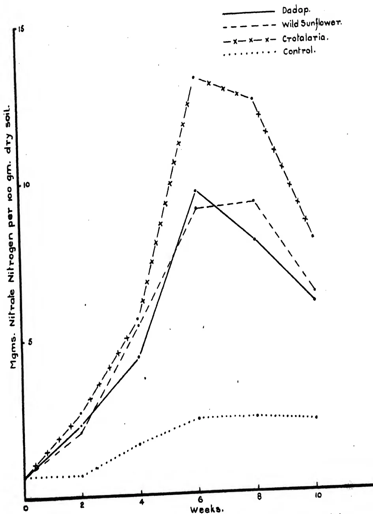

The graph illustrates the decomposition of four green manure types over a 10-week period. The Y-axis represents the amount of Nitrate Nitrogen in mgms per 100 gm of dry soil, ranging from 0 to 15. The X-axis represents time in weeks, from 0 to 10. The legend identifies the four series: Dadap (solid line), Wild Sunflower (dashed line), Crotalaria (line with 'x' markers), and Control (dotted line).

<table border="1">
<thead>
<tr>
<th>Weeks</th>
<th>Dadap.</th>
<th>Wild Sunflower.</th>
<th>Crotalaria.</th>
<th>Control.</th>
</tr>
</thead>
<tbody>
<tr>
<td>0</td>
<td>0</td>
<td>0</td>
<td>0</td>
<td>0</td>
</tr>
<tr>
<td>1</td>
<td>1.5</td>
<td>1.5</td>
<td>1.5</td>
<td>0.5</td>
</tr>
<tr>
<td>2</td>
<td>2.5</td>
<td>2.5</td>
<td>3.0</td>
<td>0.5</td>
</tr>
<tr>
<td>3</td>
<td>4.0</td>
<td>4.0</td>
<td>4.5</td>
<td>1.0</td>
</tr>
<tr>
<td>4</td>
<td>4.5</td>
<td>5.5</td>
<td>6.5</td>
<td>1.5</td>
</tr>
<tr>
<td>5</td>
<td>8.5</td>
<td>8.5</td>
<td>10.5</td>
<td>2.0</td>
</tr>
<tr>
<td>6</td>
<td>9.5</td>
<td>9.0</td>
<td>13.5</td>
<td>2.5</td>
</tr>
<tr>
<td>7</td>
<td>8.5</td>
<td>9.0</td>
<td>13.0</td>
<td>2.5</td>
</tr>
<tr>
<td>8</td>
<td>7.5</td>
<td>9.5</td>
<td>12.0</td>
<td>2.5</td>
</tr>
<tr>
<td>9</td>
<td>6.5</td>
<td>8.0</td>
<td>10.5</td>
<td>2.5</td>
</tr>
<tr>
<td>10</td>
<td>6.0</td>
<td>6.5</td>
<td>8.5</td>
<td>2.5</td>
</tr>
</tbody>
</table>

Figure I. Showing the decomposition of green manures under arable conditions in the laboratory.

449------------------------------------------------

17

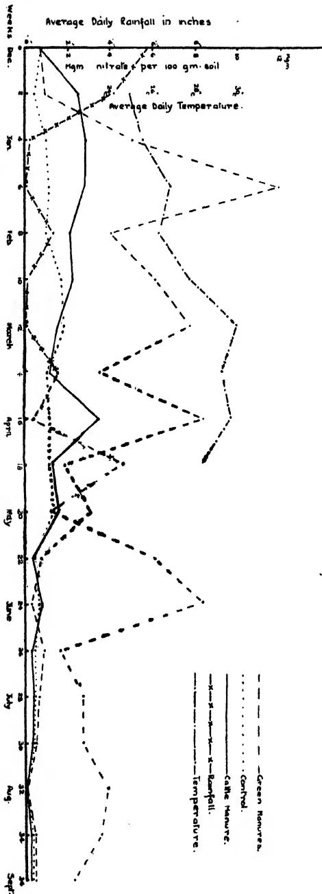

The graph displays four data series over a period from December to September. The x-axis represents time in weeks, with labels for each month. The y-axis has two scales: the top scale for 'Average Daily Rainfall in inches' (0 to 10) and the bottom scale for 'mgm nitrates per 100 gm. soil' (0 to 5). The legend identifies the series: Green Manure (dashed line), Control (dotted line), Cable Manure (solid line), and Rainfall (dash-dot line). The Rainfall series is plotted on the top axis, while the other three series are plotted on the bottom axis. The Green Manure and Control series show a significant increase in nitrates starting in April, peaking in May and June, and then declining. The Cable Manure series shows a steady increase in nitrates from December through July. The Rainfall series shows seasonal peaks in late winter and spring.

<table border="1">
<thead>
<tr>
<th>Month</th>
<th>Week</th>
<th>Rainfall (inches)</th>
<th>Green Manure (mgm nitrates)</th>
<th>Control (mgm nitrates)</th>
<th>Cable Manure (mgm nitrates)</th>
</tr>
</thead>
<tbody>
<tr>
<td>Dec.</td>
<td>1</td>
<td>0.0</td>
<td>0.0</td>
<td>0.0</td>
<td>0.0</td>
</tr>
<tr>
<td>Jan.</td>
<td>4</td>
<td>0.0</td>
<td>0.0</td>
<td>0.0</td>
<td>0.0</td>
</tr>
<tr>
<td>Feb.</td>
<td>6</td>
<td>0.0</td>
<td>0.0</td>
<td>0.0</td>
<td>0.0</td>
</tr>
<tr>
<td>March</td>
<td>10</td>
<td>0.0</td>
<td>0.0</td>
<td>0.0</td>
<td>0.0</td>
</tr>
<tr>
<td>April</td>
<td>14</td>
<td>0.0</td>
<td>0.0</td>
<td>0.0</td>
<td>0.0</td>
</tr>
<tr>
<td>May</td>
<td>20</td>
<td>0.0</td>
<td>0.0</td>
<td>0.0</td>
<td>0.0</td>
</tr>
<tr>
<td>June</td>
<td>24</td>
<td>0.0</td>
<td>0.0</td>
<td>0.0</td>
<td>0.0</td>
</tr>
<tr>
<td>July</td>
<td>28</td>
<td>0.0</td>
<td>0.0</td>
<td>0.0</td>
<td>0.0</td>
</tr>
<tr>
<td>Aug.</td>
<td>32</td>
<td>0.0</td>
<td>0.0</td>
<td>0.0</td>
<td>0.0</td>
</tr>
<tr>
<td>Sept.</td>
<td>36</td>
<td>0.0</td>
<td>0.0</td>
<td>0.0</td>
<td>0.0</td>
</tr>
</tbody>
</table>

Figure II. Showing the decomposition of green manures under arable conditions in the field.

450------------------------------------------------

18

manure and control plots were included in the series. The full data of the laboratory and field experiments are shown in tables III and IV respectively.

Table III  
Green Manure Laboratory Experiment Results

<table border="1">
<thead>
<tr>
<th rowspan="2">Treatment</th>
<th colspan="6">Mgm. nitrate nitrogen per 100 gm dry soil</th>
<th rowspan="2">Maximum<br/>per cent.<br/>nitrified</th>
</tr>
<tr>
<th>4/12/25</th>
<th>18/12/25</th>
<th>4/1/26</th>
<th>18/1</th>
<th>1/2</th>
<th>15/2</th>
</tr>
</thead>
<tbody>
<tr>
<td>Gliricidia</td>
<td>·61</td>
<td>1·11</td>
<td>3·48</td>
<td>7·82</td>
<td>8·96</td>
<td>2·20</td>
<td>43·7</td>
</tr>
<tr>
<td>Albizzia</td>
<td>"</td>
<td>·48</td>
<td>3·98</td>
<td>5·66</td>
<td>4·06</td>
<td>5·28</td>
<td>23·3</td>
</tr>
<tr>
<td>Dadap</td>
<td>"</td>
<td>2·28</td>
<td>4·36</td>
<td>9·60</td>
<td>7·93</td>
<td>5·99</td>
<td>68·6</td>
</tr>
<tr>
<td>Wild sunflower</td>
<td>"</td>
<td>2·07</td>
<td>5·44</td>
<td>9·06</td>
<td>9·12</td>
<td>6·31</td>
<td>67·2</td>
</tr>
<tr>
<td>Crotalaria</td>
<td>"</td>
<td>2·60</td>
<td>5·54</td>
<td>13·20</td>
<td>12·40</td>
<td>8·20</td>
<td>77·7</td>
</tr>
<tr>
<td>Tephrosia</td>
<td>"</td>
<td>3·23</td>
<td>5·09</td>
<td>14·40</td>
<td>14·20</td>
<td>8·19</td>
<td>60·0</td>
</tr>
<tr>
<td>Cattle manure</td>
<td>"</td>
<td>1·54</td>
<td>1·76</td>
<td>2·48</td>
<td>3·17</td>
<td>2·22</td>
<td>27·5</td>
</tr>
<tr>
<td>Control</td>
<td>"</td>
<td>·60</td>
<td>1·58</td>
<td>2·42</td>
<td>2·40</td>
<td>2·28</td>
<td>—</td>
</tr>
</tbody>
</table>

From what has been stated above it is apparent that under estate conditions it will be preferable to green manure at shorter intervals, e.g. at least twice a year and in smaller quantities than at longer intervals and with larger amounts of green material; (2) the amounts of nitrate present in the soil at any particular time in the green manure plots are dependent on the rainfall during the previous fortnight. As the rainfall increases the nitrate contents falls and vice versa. This is clearly seen in Figure II. The low nitrate content is probably due to (1) the washing away of the nitrate to the lower layers of soil, (2) excessive moisture which is detrimental to bacterial action. The temperature curve is noted to follow the nitrate curve; (3) the maximum nitrification percentages vary from 27·5 for cattle manure to 77·7 for *Crotalaria* in the laboratory experiment and from 40·2 for *Tephrosia* to 126·4 for dadap in the field experiment. The nitrification percentages are higher in all cases in the latter than in the former. This is probably due to the mineralisation of part of the organic matter of the soil, and the latter is certainly the cause of the high results obtained for dadap and wild sunflower in the field experiment. The great variation in the results is to be attributed to the variation in the composition and nature of the green materials used in the experiments; (4) the use of non-leguminous leafy material, e.g. wild sunflower, resulted in as great an accumulation of nitrate in the soil as when leguminous crops were used. The advantage of using such material for green manuring provided it is not grown on the field which is to be manured and provided it is cut before the flowering stage, is thus apparent; (5) the cattle manure plots show hardly any increase of nitrate over the controls. This is due to the low nitrogen content of the sample.

451------------------------------------------------

19

Table IV  
Green Manure Field Experiment Results

<table border="1">
<thead>
<tr>
<th rowspan="2">Treatment</th>
<th rowspan="2">Moisture on green material per cent.</th>
<th rowspan="2">Nitrogen on material at 100°C per cent.</th>
<th colspan="12">Mgm. nitrate and nitrite nitrogen per 100 gm dry soil</th>
<th rowspan="2">Maximum per cent. nitrate fed</th>
</tr>
<tr>
<th>4/12/25</th>
<th>18/12/25</th>
<th>18/12/25</th>
<th>4/1/26</th>
<th>18/1</th>
<th>1/2</th>
<th>15/2</th>
<th>3/3</th>
<th>16/3</th>
<th>30/3</th>
<th>12/4</th>
<th>26/4</th>
<th>10/5</th>
<th>25/5</th>
<th>4/6</th>
<th>22/6</th>
</tr>
</thead>
<tbody>
<tr>
<td>Gliricidia</td>
<td>58.7</td>
<td>3.63</td>
<td>.63</td>
<td>.47</td>
<td>.472</td>
<td>14.14</td>
<td>4.76</td>
<td>7.58</td>
<td>8.10</td>
<td>3.55</td>
<td>8.82</td>
<td>1.82</td>
<td>2.91</td>
<td>.95</td>
<td>—</td>
<td>.86</td>
<td>.67</td>
<td>86.3</td>
</tr>
<tr>
<td>Albizia</td>
<td>56.4</td>
<td>3.19</td>
<td>"</td>
<td>.56</td>
<td>.496</td>
<td>10.40</td>
<td>4.10</td>
<td>4.43</td>
<td>4.67</td>
<td>1.93</td>
<td>8.65</td>
<td>1.55</td>
<td>3.18</td>
<td>.52</td>
<td>.48</td>
<td>1.37</td>
<td>.57</td>
<td>66.3</td>
</tr>
<tr>
<td>Dadap</td>
<td>76.2</td>
<td>4.39</td>
<td>"</td>
<td>1.01</td>
<td>5.62</td>
<td>14.46</td>
<td>5.26</td>
<td>7.88</td>
<td>10.26</td>
<td>3.02</td>
<td>7.68</td>
<td>2.55</td>
<td>2.88</td>
<td>.53</td>
<td>—</td>
<td>.62</td>
<td>.15</td>
<td>126.4</td>
</tr>
<tr>
<td>Wild sunflower</td>
<td>77.1</td>
<td>4.36</td>
<td>"</td>
<td>2.06</td>
<td>4.55</td>
<td>11.69</td>
<td>4.87</td>
<td>4.77</td>
<td>7.43</td>
<td>1.94</td>
<td>7.62</td>
<td>1.47</td>
<td>2.22</td>
<td>.57</td>
<td>.46</td>
<td>.80</td>
<td>.78</td>
<td>105.0</td>
</tr>
<tr>
<td>Crotalaria</td>
<td>61.2</td>
<td>4.32</td>
<td>"</td>
<td>.96</td>
<td>6.26</td>
<td>10.99</td>
<td>4.28</td>
<td>5.33</td>
<td>7.61</td>
<td>4.78</td>
<td>9.07</td>
<td>1.88</td>
<td>3.44</td>
<td>.95</td>
<td>—</td>
<td>.35</td>
<td>.80</td>
<td>70.3</td>
</tr>
<tr>
<td>Tephrosia</td>
<td>54.5</td>
<td>4.33</td>
<td>"</td>
<td>.56</td>
<td>4.26</td>
<td>9.46</td>
<td>4.93</td>
<td>6.91</td>
<td>7.91</td>
<td>4.94</td>
<td>8.63</td>
<td>1.63</td>
<td>4.00</td>
<td>.43</td>
<td>—</td>
<td>.87</td>
<td>.66</td>
<td>40.2</td>
</tr>
<tr>
<td>Cattle manure</td>
<td>65.0</td>
<td>.81</td>
<td>"</td>
<td>2.50</td>
<td>2.81</td>
<td>2.78</td>
<td>1.98</td>
<td>2.27</td>
<td>1.71</td>
<td>1.13</td>
<td>3.50</td>
<td>1.10</td>
<td>1.50</td>
<td>.30</td>
<td>.68</td>
<td>.29</td>
<td>.25</td>
<td>57.9</td>
</tr>
<tr>
<td>Control</td>
<td>—</td>
<td>—</td>
<td>"</td>
<td>.41</td>
<td>1.00</td>
<td>1.19</td>
<td>1.00</td>
<td>1.74</td>
<td>1.81</td>
<td>.91</td>
<td>1.03</td>
<td>1.04</td>
<td>1.10</td>
<td>.37</td>
<td>.63</td>
<td>.19</td>
<td>.23</td>
<td>—</td>
</tr>
<tr>
<td>Green manures (Average)</td>
<td>64.0</td>
<td>4.07</td>
<td>.63</td>
<td>.94</td>
<td>5.06</td>
<td>11.90</td>
<td>4.03</td>
<td>6.08</td>
<td>7.66</td>
<td>3.36</td>
<td>8.40</td>
<td>1.82</td>
<td>3.10</td>
<td>.66</td>
<td>.76</td>
<td>.81</td>
<td>.60</td>
<td>—</td>
</tr>
<tr>
<td>Average daily rainfall during previous fortnight (inches)</td>
<td>—</td>
<td>—</td>
<td>.57</td>
<td>.41</td>
<td>.02</td>
<td>nil</td>
<td>.13</td>
<td>.03</td>
<td>nil</td>
<td>.16</td>
<td>.04</td>
<td>.45</td>
<td>.12</td>
<td>.60</td>
<td>.83</td>
<td>.16</td>
<td>.25</td>
<td>—</td>
</tr>
<tr>
<td>Average daily soil temperature during previous fortnight (°C)</td>
<td>—</td>
<td>—</td>
<td>—</td>
<td>—</td>
<td>24.8</td>
<td>25.4</td>
<td>26.8</td>
<td>26.2</td>
<td>27.7</td>
<td>29.9</td>
<td>29.1</td>
<td>29.6</td>
<td>28.3</td>
<td>—</td>
<td>—</td>
<td>—</td>
<td>—</td>
<td>—</td>
</tr>
</tbody>
</table>

452------------------------------------------------

20

The addition of lime hastens the decomposition of green manures, as in the case of organic manures (20, 21, 22).

Experiments carried out at Peradeniya on the effect of desiccation on the nitrification of the leaves and tender stems of leguminous plants indicate that drying delays as well as hinders nitrification. A later investigation showed that dry weather alone does not encourage decomposition of green manure materials (23). Other investigators too arrived at the above conclusions (24, 25). The delay in decomposition is attributed to the conversion of soluble hemi-celluloses into less soluble forms as a result of the drying. From the above it will be realised how important it is that leafy material should be buried green and not dry in order to secure speedy decomposition.

In connection with the decomposition of green manures under arable conditions, it may be stated that experiments at Peradeniya have indicated that the effect of green manures here is to make the soil somewhat less acid than what it originally was<sup>(2)</sup>. Work in other countries has shown that green manures do not materially, if at all, increase soil acidity in the field (6).

*Green Manuring Under Anaerobic (Paddy-land) Conditions.* In a paper such as this which deals with the general principles of green manuring in relation to all crops, reference should be made to investigational work carried out in Ceylon on green manuring under anaerobic (paddy-land) conditions. The practical aspect of this will be dealt with separately in the chapter on paddy and hence only the scientific aspect of green manuring under these conditions will be discussed in this chapter. The decomposition of green manures under anaerobic conditions such as obtain in swampy paddy land is brought about by soil micro-organisms. Harrison and Aiyer (28) showed that the gaseous products formed as a result of the decomposition of green manures under anaerobic conditions are carbon dioxide, hydrogen, marsh gas, and a small proportion of nitrogen. The main constituents of paddy soil gases are marsh gas and nitrogen. The former is oxidised to carbon dioxide by bacteria contained in the organized algal film on the soil surface. The carbon dioxide is in its turn decomposed with the evolution of oxygen, which becomes available for the aeration of the roots. The absence of carbon dioxide and hydrogen from paddy soil gases is attributed by Harrison to the reduction of the carbon dioxide by hydrogen as a result of a subsidiary bacterial action. Harrison and Aiyer attribute the efficiency of green manures upon paddy mainly to their indirect action on the soil by increasing root aeration, and not to the nitrogen contained in them,

453------------------------------------------------

21

which they consider is liberated to a great extent as free nitrogen. The chief point of difference between the decomposition of green manures under dry land and wet land conditions, is that in the latter case ammonia and not nitrate is the nitrogenous end-product. Most previous workers <sup>(26)</sup> had shown that the rice plant took its nitrogen in the form of ammonia and hence the value of green manuring became apparent. A detailed investigation of the decomposition of green manures under these conditions in order to determine how green manuring of paddy could most effectively be carried out <sup>(26)</sup>, has shown that as a result of incorporating green manures in paddy soils at the time of puddling, i.e., *late*, large quantities of ammonia are made available to the soil at all stages of the decomposition process and which coincide with the period of crop growth. Maximum


The graph illustrates the decomposition of green manures over a 24-week period. The Y-axis represents the amount of ammonia (Mgm. Nitrogen as Ammonia (NH<sub>3</sub>) in Soil & Water.) and the X-axis represents time in weeks. The legend identifies five series: Control (solid line), Dadap (dashed line), Dadap (Excess over Control) (dash-dot line), Sunn Hemp. (Excess over Contr) (dotted line), and Sunn Hemp. (crosses).

<table border="1">
<thead>
<tr>
<th>Time in weeks</th>
<th>Control</th>
<th>Dadap</th>
<th>Dadap (Excess over Control)</th>
<th>Sunn Hemp. (Excess over Contr)</th>
<th>Sunn Hemp.</th>
</tr>
</thead>
<tbody>
<tr>
<td>0</td>
<td>0</td>
<td>0</td>
<td>0</td>
<td>0</td>
<td>0</td>
</tr>
<tr>
<td>2</td>
<td>10</td>
<td>15</td>
<td>20</td>
<td>25</td>
<td>28</td>
</tr>
<tr>
<td>4</td>
<td>11</td>
<td>21</td>
<td>28</td>
<td>32</td>
<td>29</td>
</tr>
<tr>
<td>8</td>
<td>8</td>
<td>22</td>
<td>28</td>
<td>30</td>
<td>28</td>
</tr>
<tr>
<td>12</td>
<td>8</td>
<td>22</td>
<td>27</td>
<td>29</td>
<td>27</td>
</tr>
<tr>
<td>16</td>
<td>9</td>
<td>20</td>
<td>25</td>
<td>29</td>
<td>25</td>
</tr>
<tr>
<td>20</td>
<td>5</td>
<td>15</td>
<td>15</td>
<td>19</td>
<td>14</td>
</tr>
</tbody>
</table>

Figure III. Showing the decomposition of green manures applied *late* under anaerobic conditions in the laboratory.

454------------------------------------------------

22


Mgm. Nitrogen as Ammonia (NH<sub>3</sub>) in Soil & Water.

Time in weeks.

Before Puddling.

After Puddling.

Soils Puddled.

Legend:

- Control Early.
- " " Late.
- Green manure Early.
- " " Late.

<table border="1">
<thead>
<tr>
<th>Time (weeks)</th>
<th>Control Early</th>
<th>" " Late</th>
<th>Green manure Early</th>
<th>" " Late</th>
</tr>
</thead>
<tbody>
<tr>
<td>0</td>
<td>0</td>
<td>0</td>
<td>0</td>
<td>0</td>
</tr>
<tr>
<td>2</td>
<td>10</td>
<td>10</td>
<td>10</td>
<td>10</td>
</tr>
<tr>
<td>4</td>
<td>15</td>
<td>15</td>
<td>15</td>
<td>15</td>
</tr>
<tr>
<td>6</td>
<td>10</td>
<td>10</td>
<td>10</td>
<td>10</td>
</tr>
<tr>
<td>8</td>
<td>10</td>
<td>10</td>
<td>10</td>
<td>10</td>
</tr>
<tr>
<td>10</td>
<td>10</td>
<td>10</td>
<td>10</td>
<td>10</td>
</tr>
<tr>
<td>12</td>
<td>10</td>
<td>10</td>
<td>10</td>
<td>10</td>
</tr>
</tbody>
</table>

Figure IV. Showing the decomposition of green manures applied *early* under anaerobic conditions in the laboratory.

455------------------------------------------------

23


The graph illustrates the decomposition of green manures under anaerobic conditions. The Y-axis represents the amount of ammonia in mgm. per 100 gm dry soil, ranging from 0 to 4. The X-axis represents time in weeks, ranging from 0 to 15. The graph is divided into three sections: 'Before Puddling', 'Soils Puddled', and 'After Puddling'.

Legend:

- Control: Solid line
- G.M. Early: Dashed line with 'x' markers
- G.M. Late: Dashed line with 'o' markers

<table border="1">
<thead>
<tr>
<th>Time (weeks)</th>
<th>Control (mgm. NH<sub>3</sub>)</th>
<th>G.M. Early (mgm. NH<sub>3</sub>)</th>
<th>G.M. Late (mgm. NH<sub>3</sub>)</th>
</tr>
</thead>
<tbody>
<tr>
<td>0</td>
<td>0</td>
<td>0</td>
<td>0</td>
</tr>
<tr>
<td>1</td>
<td>0.1</td>
<td>0.2</td>
<td>0.1</td>
</tr>
<tr>
<td>2</td>
<td>0.2</td>
<td>0.3</td>
<td>0.2</td>
</tr>
<tr>
<td>3</td>
<td>0.3</td>
<td>0.4</td>
<td>0.3</td>
</tr>
<tr>
<td>4</td>
<td>0.4</td>
<td>0.5</td>
<td>0.4</td>
</tr>
<tr>
<td>5</td>
<td>0.5</td>
<td>0.6</td>
<td>0.5</td>
</tr>
<tr>
<td>6</td>
<td>0.6</td>
<td>0.7</td>
<td>0.6</td>
</tr>
<tr>
<td>7</td>
<td>0.7</td>
<td>0.8</td>
<td>0.7</td>
</tr>
<tr>
<td>8</td>
<td>0.8</td>
<td>0.9</td>
<td>0.8</td>
</tr>
<tr>
<td>9</td>
<td>0.9</td>
<td>1.0</td>
<td>0.9</td>
</tr>
<tr>
<td>10</td>
<td>1.0</td>
<td>1.1</td>
<td>1.0</td>
</tr>
<tr>
<td>11</td>
<td>1.1</td>
<td>1.2</td>
<td>1.1</td>
</tr>
<tr>
<td>12</td>
<td>1.2</td>
<td>1.3</td>
<td>1.2</td>
</tr>
<tr>
<td>13</td>
<td>1.3</td>
<td>1.4</td>
<td>1.3</td>
</tr>
<tr>
<td>14</td>
<td>1.4</td>
<td>1.5</td>
<td>1.4</td>
</tr>
<tr>
<td>15</td>
<td>1.5</td>
<td>1.6</td>
<td>1.5</td>
</tr>
</tbody>
</table>

Figure V. Showing the decomposition of green manures under anaerobic conditions in the field.

456------------------------------------------------

24

ammonification is obtained in about four weeks from the time of puddling. By *early* green manuring, i.e., ploughing in the green manures when the soil is semi-dry, large quantities of nitrates are formed. On the subsequent flooding and puddling of the soil these are lost as free nitrogen, leached in the drainage water, or reduced to nitrites which are injurious to paddy seedlings if present in excess. The amounts of ammonia found in *early* green-manured soils are very much less than those found in *late* green-manured soils. By the *late* green manuring of paddy soils their nitrogen contents can be maintained or even increased. *Early* green manuring results in large losses of soil nitrogen. No nitrates are found in paddy soils after they have been puddled, any nitrates present or added before puddling being denitrified or converted into nitrites. Large increases in crop yields of both grain and straw have been obtained through the *late* green manuring of paddy under anaerobic conditions <sup>(29)</sup>. Green manures can therefore be of direct manurial value to a crop like paddy if they are incorporated into the soil at the proper time.

Figures III, IV, and V will illustrate graphically the conclusions referred to in the above paragraphs.

#### CONSIDERATIONS ON GREEN MANURING PROBLEMS

(1). *On what soils should green manures be grown and under what climatic conditions?*—Provided there is sufficient rainfall, green manures can be grown on any type of soil. Poor sandy soils in particular will benefit most by green manuring, as their humus and nitrogen contents and water-holding capacities will eventually be increased by the practice.

It has already been stated that where the annual precipitation is less than twenty inches, green manuring is not practicable; but very few parts of Ceylon are as dry as this, and most districts get the benefit of at least one monsoon. It is only in certain parts of the Northern and North-Central Provinces that green manuring would appear to be impracticable. In the Puttalam and Chilaw districts the soils are of a light sandy type, the rainfall on the whole is low, and long periods of drought occur. The question then arises whether green manuring can successfully be practised under these conditions. It is possible to do so, but under such conditions a quick-growing annual leguminous crop should be grown. It should be cut and left as a mulch during the drought and ploughed in during the next rainy season, a second crop being planted at the same time; or, where possible, the green manure should be forked in early enough for decomposition to set in before the rains cease. In districts with adequate rainfall green manuring will offer all the advantages already referred to.

457------------------------------------------------

25

(2). *The optimum time for cutting and the best method of treatment of green manures.*—Green manures should be cut at a stage when (1) they produce the maximum quantity of easily-decomposable green material, (2) climatic considerations demand that they should not compete with the main crop for the moisture in the soil. On the first point it has already been stated that in general the optimum time for cutting green manures for forking into the soil is just about the time of flowering. This applies to the bush and cover types in particular. The tree types are best lopped when the branches are from three to four months old.

The loppings or cuttings of all green manures, particularly in drier districts, should be ploughed in towards the end of the rains when showers alternate with dry weather. If ploughing is not possible the green material should be left as a mulch on the surface. In this case a certain amount of the carbon and nitrogen of the green material will be lost, as was found at Peradeniya<sup>(23)</sup> but as in these dry districts moisture is the limiting factor of crop growth, the mulch will serve as a useful means of conserving soil moisture. It is preferable, however, to turn in the cuttings about three to four weeks before the drought sets in, as by that time a certain amount of decomposition will have taken place and the decomposed material will have been able to retain some moisture for the subsequent use of the crop. In wet districts or in districts with an evenly distributed rainfall it is preferable that green manures should be turned into the soil immediately. The reason for this is that the drying of green manures delays as well as hinders nitrification, and loppings left on the surface are completely dried in a short time if dry weather prevails. If dry weather should alternate with wet weather then large losses of nitrogen and organic matter may result<sup>(23)</sup>. Thus losses of over 43 per cent of the nitrogen of *Gliricidia* and 37 per cent of dadap leaves were found at Peradeniya, when alternate dry and wet weather occurred. When dry weather alone prevailed, decomposition of the leafy materials did not take place and no losses of nitrogen consequently occurred. The loss of nitrogen is also effected by the nature of the plant material and this is greater in the case of more easily-decomposed leaves such as *Gliricidia* than tea and *Grevillea* leaves. The forking in of green manures in the fresh state is therefore advocated whenever possible. On no condition should green manures be cut and forked into the soil during a drought, even at the beginning of it. This applies particularly to light sandy soils in dry districts where green manures are ploughed in. It may be necessary in some instances to compact the soil after green manuring in order to

458------------------------------------------------

26

minimise losses of soil moisture and to establish capillarity in the soil. The loppings of tree and bush green manures should not be allowed to become too woody. If in this condition, they should not be ploughed into the soil.

(3). *How can a good growth of green manures be obtained on poor soils?*—It may be found difficult to establish green manures for the first time both on medium and on poor soils. In this case the following methods may be tried:

(i) *Manuring the crop.*—The green manure should be given a start by applying cattle manure to the seed bed. If this is not available, some nitrogenous manure, e.g., a mixture of nitrate of soda and blood meal incorporated with twice its weight of soil should be supplied at the rate of a handful or two per hole. Leguminous crops will be benefited by the presence of nitrogen in the early stages of their growth till the formation of nodules has taken place. Potash and phosphoric acid should also be applied as the green manures have to compete with the main crops for these fertilising constituents. As a result of manuring, the nodule bacteria are reported to become more active and able to enter the plants readily, and nodule formation is increased<sup>(6)</sup>. The root growth of leguminous plants in general is stimulated by manuring with phosphatic acid.

(ii) *Inoculation.*—Leguminous crops at times do not come up well in new areas. This is because the soil does not contain the specific type of bacteria needed by the particular legume for the formation of the root nodules. In this case inoculation of the soil or of the seed becomes necessary. There are three methods of soil inoculation, of which the soil method is alone suitable under Ceylon conditions at the present time. It consists of broadcasting over the area to be planted 300-400 lb. of soil per acre which has been taken from an area on which the green manure, it is desired to establish, has been grown with success.

(4). *Other practical points on green manuring.*—As regards the period of retention of green manures it may be stated that, in general, perennial cover crops should not be allowed to grow for more than two or three years without being ploughed in. The reasons for this are that the soils on which these covers grow (1) need periodical cultivation and aeration, (2) get "sick" as the result of growing one particular crop. For the latter reason it is advisable to have a rotation of green manure crops. Bush green manures depending on the particular species will need replanting once in two to four years. Tree green manures can be left to grow for several years, but they should be rooted out if attacked by disease.

459------------------------------------------------

27

Cover crops should be ploughed under in alternate rows across the slope of the land once every year or so. Where the green manure crop is a heavy one, it should be cut up with a disc-harrow, or rolled before ploughing in. Bush green manures should preferably be planted in contour belts. When planting out green manures for the first time a heavier seed rate than is normally required, especially if seed is plentiful and comparatively cheap, is recommended. By this means a cover will be more quickly established and weeds more effectively suppressed. Generally speaking it is preferable to plant green manure seed in rows. A mixture of seed generally gives better results than seed of one variety. The seed bed should receive careful preparation. Planting should be carried out at the beginning of the rains and weeding should be done in the early stages in order to give the green manures a start.

When using a green manure as the main source of nitrogen, the inclusion of an organic manure such as groundnut cake or blood meal in the artificial mixture is not recommended; but the application of a small quantity of a concentrated nitrogenous fertiliser such as cyanamide along with the green manure is advised. The reason for this is that as the carbon/nitrogen ratio of the soil has been found to remain constant at about 10 to 1 <sup>(2)</sup>, and as green manures have a much higher carbon/nitrogen ratio, some concentrated nitrogenous fertiliser would appear necessary if a permanent improvement in the nitrogen content of the soil is to be effected. Further, only about half the nitrogen contained in green manures is available in a short time. It is also advisable to plough in some cattle manure along with the green manure as the large number of bacteria present in the former will hasten the decomposition of the latter.

(5). *Some limiting factors in green manuring.*—As with all other farm practices, green manuring has its limitations, and these are governed by crop and climatic conditions, cost of seed and of application, insect pests and fungus diseases of both the green manure crop and the main crop, and inadequate monetary returns <sup>(6)</sup>. Climatic conditions essential for green manuring have already been dealt with. As regards crop conditions it is known that some green manures will not grow under the heavy shade of the main crop, such as rubber, others in the open, as in young clearings. Again, certain green manures of the tree type will be unsuitable for young plantations. Others again have a climbing tendency and, therefore, should not generally be grown in new plantations, or if they are, they should be kept away from the young plants. In Ceylon, suitable green manures

460------------------------------------------------

28

for all crops under all conditions are available and there is no crop which will not benefit by green manuring, judiciously carried out. The cost of seed is a factor of importance at the start. Once green manuring has been adopted, however, this difficulty may be overcome as seed becomes available. The initial expenditure on green manuring may be fairly high, but this will more than be compensated for by a saving on the fertilisers purchased. Seed of all kinds can be obtained comparatively easily and cheaply in Ceylon. Though the cost of application, in which is included the cost of cutting and forking in, if the latter is carried out, will be found to vary in the different districts, it is not prohibitive.

The question of fungus diseases and insect pests both of the green manure crop and of the main crop in which they are grown in Ceylon will be dealt with in separate chapters.

Green manuring will not be an economic proposition if adequate monetary returns are not secured. The nett result should not be measured by the returns of produce obtained after one or two years, because the residual and cumulative effects of green manuring are considerable, and apart from directly benefiting the crop, soil conditions will also be greatly improved. As far as the main Ceylon crops are concerned, the satisfactory returns obtained by the judicious use of green manures in tea, cocoa, and paddy cultivation are recognised. Evidence to prove that green manuring benefits rubber and coconuts is also being obtained, and the practice with reference to these crops will be considered in detail in the chapters to follow.

(6). *Green manuring practices on Ceylon estates, and suggestions for their improvement where desirable.*—It may be well briefly to outline some of the practices followed by estates, and to indicate in which ways, if any, they may advantageously be modified. Tree green manures, e.g., dadap and *Gliciridia*, are lopped on nearly all estates from once to two or three times a year, and even more often. More frequent lopping is certainly preferable for the reasons that firstly a greater amount of easily decomposable green material and much less decomposable woody material is obtained and secondly, as the direct effects of green manures do not last for more than five or six months under Ceylon conditions, a continuous supply of nitrate nitrogen will be available to the plant if lopping is frequently carried out. On one estate as many as six loppings are done, the method adopted being to slash the green manure trees across as is now done to tea in the low-country. The loppings are left as a mulch on the surface either across the slope of the land or down the rows of the crop. Some estates envelope-fork all loppings into the

461------------------------------------------------

29

soil each time the trees are lopped either in every row or in alternate rows. Others fork in the loppings from certain cuttings only, e.g., along with artificial manures; at other times the loppings are left as a surface mulch. Others again fork in the leaves and more tender branches only, the more woody branches being used either for supplying vacancies or as firewood. Many estates use the tender leaves and stems for filling into supply holes. The loppings are either cut into small pieces or left as they are; or again, they are buried in deep trenches or holes between the rows of the main crop. Whenever this is done a layer of soil should be placed over a layer of the green material. The practice of burying in trenches is not one to be generally recommended, as it is likely that only the trees or bushes immediately adjacent to the trenches would profit most by it. Loppings may however be buried in large shallow trenches between the rows of the main crop as in the case of coconuts. The practice of forking in the loppings above each bush has distinct merits. Some estates plant out green manures on the manured areas between the rows of the main crop, e.g., coconuts. This is a mistake, for as pointed out already, if a leguminous crop is given a source of available nitrogen it will make no effort to obtain the nitrogen it requires for its use from the air. Further, the green manure crop will even temporarily compete with the main crop for some of the other available fertilising constituents contained in the manure mixture applied. Green manures should in these cases be grown in the unmanured areas.

Whenever it is possible and economical for green material to be turned into the soil, especially in districts with adequate rainfall where dry weather alternates with rain, this should be done. The woody portions of the loppings should not be forked in, but preferably left on the surface of the soil across the slope of the land, used for filling in vacancies or where either of these practices is not convenient or advisable, burnt and the ashes forked in. The reasons for not burying the woody loppings are that they take a very long time to decompose in the soil owing to their high lignin and low pentosan contents; secondly that they contain only very small amounts of nitrogen, so that in the process of decomposition the bacteria responsible for bringing it about will utilise some of the available soil nitrogen required by the crop and thus cause a temporary setback to the latter; and finally because of the danger of pests and diseases. If the green material is not turned in, a large percentage of the nitrogen and organic matter it contains may be lost <sup>(28)</sup>. The best practice would be to fork in the leaves and tender stems either along with artificial manures or alone during periods of light rainfall. The

462------------------------------------------------

30

loppings cut at the beginning of a period of drought may be left on the surface as a mulch, especially in dry districts, and the leafy material later forked in, if necessary. It need hardly be stated that tree green manures should not be left unlopped and the more frequent the loppings the better. Big trees like *Grevillea* and *Albizzia* are generally not lopped, the natural leaf fall affording sufficient organic material for forking in.

Bush green manures as boga and *Crotalaria* should be treated in the same way as the tree types.

The practices governing the use of cover crops vary a great deal and more experience with these needs to be obtained. Some estates leave the cover untouched for two years or more, except perhaps when manures are being supplied; others envelope-fork the covers periodically depending on the growth and nature of the cover. In some cases the cover is cut and artificial fertilisers may or may not be added at the time of forking in. In other cases the cover crop is cut and buried in trenches. Others again cut and envelope-fork in the green manure in alternate lines. The best practice would be to fork in alternate contour bands of the cover crop every year. This may not be convenient in the case of all crops, but it can always be adopted in some modified form. By so doing the cover acts as an effective soil conservor and also adds to its fertility.

#### SUMMARY

In the preceding pages an account has been given of the necessity for, the importance of, and the advantages of green manuring in tropical countries generally and in Ceylon in particular. It has been indicated that by the judicious use of green manures, which term includes cover crops, the nitrogen and carbon contents of the soil can be maintained, its physical condition improved, its moisture-retaining capacity enhanced and erosion effectively prevented. The analytical composition of certain plants, leguminous as well as non-leguminous, used in Ceylon for green manuring is tabulated and compared, and the conditions under which either class may be used as green manures explained. The results of investigations on the variation of composition with age are also briefly summarised. The principles underlying the decomposition of green manures in soils under both aerobic and anaerobic conditions are then discussed, and the results of experimental work on the subject in Ceylon are outlined. The chapter concludes with discussions on certain practical green manuring problems, viz., soil and climatic conditions suitable for the growth of green manures, the

463------------------------------------------------

31

optimum time for cutting and forking in green manures, measures to be adopted for securing good growth of green manures, some of the limitations of green manuring, and green manuring practices on Ceylon estates and the respects, if any, in which they may be advantageously modified.

### REFERENCES

1. 1. MOHR cited by WAKSMAN.—*Trans. of the Second Comm. of the Int. Soc. of Soil Sc.* Vol. A. 1929.
2. 2. JOACHIM and PANDITTESEKERE.—The Relation of Green Manures to the Carbon and Nitrogen Contents and Reaction of Soils at Peradeniya.—*The Tropical Agriculturist* LXXIV, 1, 1930.
3. 3. EDEN.—Annual Report of the Tea Research Institute for 1928, Bulletin No. 3
4. 4. RUSSELL.—Soils and Manures. Agr. Research in 1925.
5. 5. RUSSELL.—Soil Conditions and Plant Growth. 4th Edn.
6. 6. PIETERS.—Green Manuring. Principles and Practice.
7. 7. JOACHIM and KANDIAH.—The Effect of Green Manures and Cover Crops on Soil Moisture.—*The Tropical Agriculturist* LXXIV, 1, 1930.
8. 8. JOACHIM and HOLLAND.—Cover Crops at Peradeniya in Relation to Soil Moisture.—*The Tropical Agriculturist* LXIX, 5, 1927.
9. 9. RUSSELL.—Organic Matter Problems Under Dry Farming Conditions.—*Jour. Amer. Soc. Agron.* XXI, 10, 1929.
10. 10. JOACHIM.—The Analyses of Some Green Manures.—*The Tropical Agriculturist* LXVII, 4, 1926.
11. 11. DEPARTMENTAL NOTES.—Analyses of Kaduru Leaves used as Green Manure for Paddy.—*The Tropical Agriculturist* LXIX, 3, 1927.
12. 12. CHEMICAL NOTES.—Manurial Values of Dadap and Gliricidia Leaves, Stems and Branches.—*The Tropical Agriculturist* LXXI, 1, 1928.
13. 13. HOLLAND.—Some Green Manures and Cover Plants.—Leaflet No. 30.
14. 14. PROGRESS REPORT OF THE EXPERIMENT STATION, PERADENIYA.—July to August 1929.—*The Tropical Agriculturist* LXIII, 3, 1929.
15. 15. REGE.—Biochemical Decomposition of Cellulosic Materials, with Specific Reference to the Action of Fungi.—*Ann. Appl. Biology.* XIV, 1, Feb., 1927.
16. 16. KOCH.—The Value of Some Green Manures.—*The Tropical Agriculturist* LXII, 6, 1924.
17. 17. JOACHIM.—A Review of Scientific Investigations on Green Manuring in India.—*The Tropical Agriculturist* LXV, 6, 1925.
18. 18. JOACHIM.—The Decomposition of Green and Organic Manures Under Tropical Conditions.—*The Tropical Agriculturist* LXVI, 4-5, 1926.
19. 19. JOACHIM.—A Further Report on the Rate of Decomposition of Green Manures Under Peradeniya Conditions.—*The Tropical Agriculturist* LXVII, 4, 1926.
20. 20. JOACHIM.—Report on the Work of the Decomposition of Green and Organic Manures.—*The Tropical Agriculturist* LXVIII, 5, 1927.
21. 21. JOACHIM and PANDITTESEKERE.—Further Experiments on the Nitrification of Manures and Fertilisers and of Tea Prunings.—*The Tropical Agriculturist* LXXI, 3, 1928.
22. 22. WAKSMAN.—Chemical and Microbiological Principles Underlying the Decomposition of Green Manures in the Soil.—*Jour. Amer. Soc. Agron.* XXI, 1, 1929.

464------------------------------------------------

32

1. 23. JOACHIM.—Losses of Nitrogen from Green Manures and Tea Prunings Through Drying Under Field Conditions.—*The Tropical Agriculturist* LXXI, 6, 1928.
2. 24. HUTCHINSON and MILLIGAN.—Green Manure Experiments.—*Agr. Res. Inst. Pusa. Bulletin No. 40*, 1914.
3. 25. HILL.—Decomposition of Organic Matter in Soil.—*Jour. Agr. Res.* XXXIII, 1, 1926.
4. 26. JOACHIM and KANDIAH.—Laboratory and Field Studies on Green Manuring Under Paddy-Land (Anaerobic) Conditions.—*The Tropical Agriculturist* LXXII, 5, 1929.
5. 27. SUBRAMANYAN.—Biochemistry of Water-logged Soils.—*Jour. Agr. Sc.* XVII, 6, 1927.
6. 28. HARRISON and AIYER.—The Gases of Swamp Rice Soils. Part I, II, IV and VI.—*Mem. Dep. Agr. India. Chem. Series.* III. IV and V.
7. 29. LORD.—Manurial Experiments with Rice. Part I. A Temporary Green Manure Experiment.—*The Tropical Agriculturist* LXXIII, 2, 1929.
8. 30. BUNTING and MILSUM.—Cover Crops and Green Manures.—*Malayan Agric. Journ.* XVI, 7, 1928.
9. 31. WAKSMAN.—Principles of Soil Microbiology, p. 595.
10. 32. JOACHIM.—A Note on the Effects of *Indigofera cendacaphylla* on the Nitrogen and Organic Matter Contents and Mechanical Analyses of Tea Soils at Peradeniya.—*The Tropical Agriculturist* LXXIV, 3, 1930.
11. 33. JOACHIM and KANDIAH.—The Change in Composition and Decomposability of Green Manures with Age. (To be published).

465------------------------------------------------

33

## BIOLOGICAL CONTROL

### I. INSECT PESTS

**B**IOLOGICAL control, in the strict meaning of the term, embraces all agencies of a biological nature that exercise a restraining or controlling influence upon the multiplication of other forms of life. It represents, therefore, the sum-total of the activities of bacterial, fungal, and other diseases; of insectivorous birds and mammals; and of parasites and predators. In so far as the present article is concerned, reference is confined to the practical utilization of various species of beneficial insects, since it is in this connection that the greatest successes have been achieved.

The control of insect pests by biological methods has made rapid advances during recent years and there is now a bulky and increasing literature on the subject. It will be convenient to discuss these methods firstly with reference to the introduction of specific parasites, or predators, into countries where they did not previously exist; and secondly with regard to the utilisation of indigenous parasites.

*Parasite Introductions.*—Up to the present biological control has yielded the most satisfactory results in cases where injurious insects have become established in lands they did not previously inhabit, and have there developed into serious pests. In cases of this kind the noxious species have been free from the attacks of these parasites which restrain them in their lands of origin. Biological control therefore, aims at restoring a condition of natural equilibrium by the introduction of the missing parasite factor. It has to be remembered that introduced pests include some of the worst of the world's insect enemies of food supplies. The more trade is fostered between one country and another the greater are the chances of the spread of pests into fresh territories. Quarantine measures serve to delay and restrain such transfers taking place but sooner or later, one or other pest manages to run the gauntlet and establish itself in lands thus protected. Artificial measures of control have, in many cases proved impracticable and their application has involved expenditure of large sums of money to no real advantage. Biological control has consequently been resorted to as a sounder and, in the end, a less expensive measure. Every year brings fresh records of promising results achieved by its application, but it cannot be regarded as a universal panacea as the misinformed are too prone to view it. Each case requires the experience of skilled entomologists and has to be exhaustively considered on its merits. Biological control has had its failures and it cannot be assumed, as the growers did, at one time, in California, that all that is required is to obtain the natural parasites of a given pest and subjugation of the latter will follow.

*Insular Conditions.*—Up to the present time some of the most successful and complete examples of the biological method of pest control have come about when parasite introductions have taken place under insular conditions. There is the classical case of the Hawaiian Islands where biological methods have proved so successful that insecticides rarely form part of any control measure. Practically all the major pests of sugar-cane have been subjugated in this way. These include the cane leaf-hopper (*Perkinsiella saccharicida*), the Lammelicorn beetle (*Anomala orientalis*) and the cane borer weevil (*Rhabdocnemis obscura*).

---

\* By A. D. Imms, D.Sc., F.R.S., Rothamsted Experiment Station, Harpenden, in *Tropical Agriculture* Vol. VIII. No. 4, 1931.

466------------------------------------------------

34

In the last-mentioned example the control in certain localities is less complete and search for further parasites is being undertaken. To this list we have to add the successful control of the cottony cushion scale (*Icerya purchasi*) the avocado mealy-bug (*Pseudococcus nipae*) the cottony mealy bug (*Pseudococcus filamentosus*) and army worms. This is a most encouraging record yet it by no means includes all the successes achieved. Of the failures probably the most significant is in connection with the Mediterranean fruit fly: yet, in this case it is more properly regarded as a partial success than a real failure.

In Mauritius we find that the biological control of sugar-cane pests has also come to the fore. Among the most destructive enemies are larvae of several species of Lamellicorn beetles. One of these, *Oryctes tarandus*, is indigenous to the Island and is now largely kept under control by the solitary wasp *Scolia oryctophaga* which was introduced from Madagascar in 1917. With another species, *Phytalus smithi*, which got accidentally introduced from Barbados less complete control has been attained. The chief insect enemy of this beetle in Barbados is the solitary wasp *Tiphia paralella*. In 1914 the wasp was imported into Mauritius where it has since become established. Although the *Phytalus* has not so far been checked to the degree hoped for the *Tiphia* occasions considerable mortality. There is reason to believe that this parasite has not yet attained its full biological ascendancy, and that it will gradually exercise more complete control in future years. In the meantime, however, other methods of repression are still necessitated.

In New Zealand biological methods have resulted in a satisfactory control being achieved over the woolly aphid by the introduction of the Chalcid *Aphelinus mali* from the United States in 1921. The heavy expenses, entailed by repeated spraying of the orchards against this pest, has been very much reduced in consequence, with a resulting wider margin of profit in the pockets of the growers. Control of the blue gum scale (*Eriococcus coriaceus*) by the introduction of the ladybird *Rhizohius ventralis* from Australia, has been a complete success and the future control of the Oak Scale by biological means is stated to be well on the way towards being achieved. At the present time biological control is being applied with reference to a number of other pests which have found their way into New Zealand. In some cases the imported parasites have already become established, and the next few years should yield important results relative to the progress of these experiments.

The most recent example of the success of biological method comes from Fiji. The event has been celebrated by the appearance of a sumptuous monograph in 1930, wherein the whole campaign is recorded in detail. It is concerned with the repression of the coconut moth *Levruana iridescens* whose larvae, by destroying the palm foliage, threatened the copra industry of the islands with disaster. Since the *Levruana* proved to be free from natural parasites this fact suggested that its original home may be in some land other than Fiji. Search among the Pacific islands fail to reveal the incidence of this moth in any other locality so all hope of discovering its specific parasites had to be abandoned. Recourse, therefore, was made to allied coconut pests and the species, *Artona catoxantha*, was found to be subject to parasitism in Malaysia. On account of the close affinities of the two moths in question it appeared probable that *Artona* parasite would find in the *Levruana* an acceptable host. The campaign hinged on this possibility and after considerable difficulties the Tachinid parasite *Ptychomyia remota* was introduced from Malaysia, into Fiji. The success of the experiment was remarkable: six months after its introduction the Tachinid fly had spread throughout the area of Fiji affected

467------------------------------------------------

35

by the *Levuana*. More than three years have now elapsed and the pest has remained under control, while the copra industry has undergone revival.

The successes just recounted appear to be largely due to a combination of favourable circumstances that feature more particularly in many, although by no means all, islandic areas. Under such conditions the native fauna is generally of a peculiar and restricted kind which has evolved as the result of long isolation. The indigenous parasite element in such faunas is often comparatively poorly developed and consequently introduced parasites meet with comparatively few enemies. In other words, they are able to establish themselves readily owing to the absence of any severe competition of a biological character. Furthermore, such islands have a warm equable climate which allows of the multiplication of parasites to go on unchecked by seasonal factors. Also, it has to be remembered that the area to be covered by introduced parasites is more or less circumscribed, particularly so in the smaller islands.

*Continental Conditions.*—Up to the present the most marked successes obtained on continental areas are with reference to more or less restricted territories, enjoying a warm and tolerably equable climate, and where the affected crops are not widespread. The early successes attending the importation of *Vedalia cardinalis* which preys upon the cottony cushion scale (*Icerya purchasi*) of citrus fruits are well known. This predator has subjugated its host in almost every country where it has been introduced. Local successes of this kind have been achieved in California, Florida, South Africa, Portugal, Syria, Egypt and the South of France. In California, also, the introduction of the beetle *Cryptolaemus montrouzieri* from Australia for purposes of controlling the citrophilous mealy bug (*Pseudococcus gahani*) has proved a far less expensive measure than spraying. Although the *Cryptolaemus* is unable to maintain itself from year to year, it can be induced to dominate the citrophilous mealy bug if it be continuously bred and liberated in large numbers. There are now a number of local establishments, or insectaries, through the citrus fruit area of Southern California that are given over to the propagation and distribution of the *Cryptolaemus*. The latter is a most efficient predator and speedily cleans infested groves. On the other hand, the host mealy bug continues to extend its range, with the result that the breeding and liberation of the *Cryptolaemus* has had to be extended and intensified. Believing that the efficiency of biological control would be strengthened if additional enemies, more especially internal Hymenopterous parasites, were available efforts have been made to locate the country of origin of the pest. In 1916 and 1917 Clausen explored a number of countries in the Far East without success. Further search was also made by F. Silvestri, on behalf of the Californian growers, in the Orient without discovering the parasite. In 1927 the citrophilous mealy bug was found by Compere in Australia which appears to be its natural home. Here it was found to be kept largely under control by natural enemies of various kinds and a number of the latter have now been shipped to California and are already safely colonised in some of the orchards. The next few years will reveal the results of those experiments and whether the degree of subjugation called for becomes achieved. There are other serious Coccid enemies of citrus fruits that have found their way into California, and whose repression forms part of an active programme of biological control today. Thus, the Chalcid *Laptomastidia abnormis* introduced originally from Sicily plays an appreciable part in the reduction of *Pseudococcus citri*. A serious enemy in the form of the black scale (*Saissetia oleae*) is causing great trouble today, and its control by biological means is one of the main projects of the Citrus Experiment Station at Riverside. Various introduced

468------------------------------------------------

36

enemies obtained in South Africa have brought about a certain measure of control, but energetic measures are in progress with a view to augmenting their activities by the discovery of other parasites. The red scale (*Chrysomphalus aurentii*) and the purple scale (*Lepidosaphes beckii*) likewise have not so far been subjected to satisfactory biological control.

Passing now from citrus pests, the woolly aphid of the apple is one that troubles growers all over the world. Of recent years much attention has been devoted to the Chalcid parasite *Aphelinus mali* indigenous to North America. Reference has already been made to the successful introduction of this parasite into New Zealand. Its importation and liberation has also taken place in various continental areas: in many European countries it has so far proved of comparatively little value. In parts of Italy, however, it destroys its host at all seasons of the year and is proving an efficient parasite. In South America, especially in the Argentine, it has become particularly efficient, and is also giving promising results in parts of Australia. In South Africa it was at first a failure, but its re-introduction has been successful in certain localities.

Mention must also be made of the losses occasioned to the silk industry in Italy by the imported scale-insect *Diaspis pentagona*, which destroyed the mulberry. In 1891 the pest assumed such serious proportions that the Italian Government passed a legislative measure compelling mulberry cultivators to make strenuous efforts to cope with it. No satisfactory control was obtained, however, until the Chalcid parasite (*Prosaltella herlesei*) was introduced and became established. Extensive and widespread liberations of this insect have since led to the subjugation of the *Diaspis* over a large part of Italy.

In Canada the enormous damage entailed by the European larch sawfly (*Lygaeonematus erichsoni*) to forests led to the introduction during 1912-13 of its Ichneumon parasite *Mesoleius tenthredinis* from England. This parasite has steadily increased in efficiency and in 1927 was found in some localities to be destroying as much as 88 per cent of its hosts. It is now well established locally in South Manitoba where there appears to be no doubt that it has greatly reduced the prevalence of the saw-fly and its distribution among the forests of Eastern Canada is now being undertaken.

The successful introduction of the larch saw-fly parasite is now of especial interest and importance for the reason that the insect is subjected to the extremely cold winter conditions. For many years strenuous efforts have been made to control the gypsy and brown-tail moths in North America by biological means. Enormous numbers of parasites have been bred out and liberated and, in so far as the brown-tail moth is concerned, there is every indication that a tolerably successful degree of control has supervened. In 1924 the gypsy moth infestation reached its lowest level for twenty years and, in this connection, it is noteworthy that in the previous year the average collective parasiticism attained its greatest efficiency. Since then parasiticism has declined and a recrudescence of outbreak of the moth has occurred. The whole problem is complicated by many factors including climatic variations, wilt disease, reduction in planting of favoured hosts, arsenical spraying and the wholesale destruction of the egg-masses. It is therefore difficult to evaluate the amount of influence that parasitization exercises. The special parasite laboratory at Melrose Highlands in the meantime continues its work of the mass breeding and liberation of beneficial insects. More recently a number of other immigrant insects have attained a widespread range in the United States and their control by biological means is under weigh at the present time. Among these pests the alfalfa weevil (*Hypera variabilis*), the European corn borer (*Pyrausta nubilalis*), the Japanese beetle (*Popillia japonica*) and the oriental

469------------------------------------------------

37

peach moth (*Laspeyresia molesta*) are especially noteworthy. The alfalfa weevil was first reported in America in 1904, while the other pests mentioned are more recent immigrants. In the attempts to control these pests certain species of introduced parasites have become established, but the final outcome of the experiments can only be revealed in years to come. With the corn borer, for example, the greatest chances of success appear to be dependent upon the introduction of a whole range of parasite species, some being adapted to restrain their host in one part of its zone, and others in a different part. It seems unlikely that any one parasite, or group of parasites, will prove equally effective in relation to an insect which has already invaded over 100,000 square miles of territory, where there are notable climatic variations.

*Utilization of Indigenous Parasites.*—Suggestions have been frequently made, and actual attempts carried out, with a view to making use of indigenous parasites of native pests as agents in the control of the latter. It needs to be recollected that the subject involves somewhat different principles from those concerned with parasite introductions. In the latter case the building up of a condition of natural equilibrium by supplying the missing parasite element is aimed at. The utilization of indigenous parasites is largely concerned with efforts to modify a condition of equilibrium already highly adjusted. The operations consist either of conserving or increasing the numbers of a parasite or predator in a given area, with the object of obtaining a higher degree of control over an individual species of pest, or of attempting to colonise such parasites in a part of the country where they are scarce or wanting.

*Conservation of Parasites.*—The principle involved consists of either altering the host-parasites ratio by the adoption of methods which allow of more hosts than parasites being destroyed; or, of the abandonment of measures tending to reduce the existing parasite population. Various attempts have been made or advocated in Europe towards these ends but no clearly proved success has been reported. Such methods are only likely to be successful when carried out by general agreement among cultivators over a wide area; on a small scale only a fraction of the insect population would be affected and no appreciable result likely to supervene. In recent years the method has been put into effect in Louisiana where the practice of burning the sugar-cane trash is claimed to be an ineffective measure for decreasing infection by the moth-borer *Diatraea saccharalis*. The trash, it appears, affords shelter to large numbers of hibernating parasites and, following this contention, it was left unburned at the sugar experiment station farm near New Orleans for a period of years, while the State planters as a whole burned their trash. During the years 1915 to 1921 it is stated that the percentage losses due to *Diatraea* were less by three per cent. to 17 per cent. over fields where the trash was left unburned.

*Direct Increase of a Parasite Population.*—It has been contended that the alteration of the host-parasite ratio in specific cases by the artificial quantitative breeding of suitable parasites is a practical possibility. A species of parasite where behaviour lends itself favourably to the application of the method is the Chalcid *Trichogramma minutum*. At the present day attention is being concentrated on this species in various parts of the world as a means of controlling the codling moth (*Cydia pomonella*), the sugar-cane borer (*Diatraea saccharalis*) and other moth pests. The *Trichogramma* is a very widely spread parasite of the eggs of such species: many generations a year can be reared in captivity on suitable hosts, and it is claimed that up to one million per day can be bred with comparatively simple standardized technique. Early in the season this parasite is comparatively scarce, while its spread is very slow owing to its limited

470------------------------------------------------

38

powers of distribution, but it is maintained that if an intensive infestation can be induced at the right time, potential outbreaks of certain moth pests might be largely counteracted by the wholesale destruction of their eggs by this means. In a recent issue of *The Tropical Agriculture* (Vol. VII, pp. 292-295) R. W. E. Tucker has given an account of his experiments in controlling *Diatraea saccharalis* in Barbados by mass liberations of *Trichogramma*. The results so far obtained promise to give satisfactory control of the pest in question. In the meantime good work along similar lines is being carried out against the same pest in Louisiana; against the codling moth in California; and also against the oriental peach moth elsewhere.

*Transference of Parasites to New Areas.*—Theoretically this method appears to be a feasible one if the absence of a given parasite in a specific area is attributable to causes other than those of a climatic nature. As long ago as about 1872 experiments of this nature were stated to have yielded beneficial results, but it is not possible to discover whether such effects were permanent or not. Quite recently E. H. Hazlehoff has claimed to have achieved promising biological control of the sugar-cane aphid (*Oregma lunigera*) in Java by transferring its native parasite (*Encarsia flavoscutellum*) from established cane fields into newly-planted areas. Owing to the practice of crop rotation, it appears that the aphid establishes itself more readily than the parasite in new cane fields, but the parasite when artificially introduced readily adapts itself and holds its host in check.

L. O. Howard in his *History of Applied Entomology* (1930) instances two very recent experiments of a similar nature. In one case, an experimental reafforestation area in Nebraska was suffering severe losses of its young coniferous trees from larvae of the moth *Rhyacionia frustrana*. The transfer of colonies of an Ichneumon parasite from Virginia, and their liberation in Nebraska, led to an extraordinary change in the situation. In areas where the parasites were liberated as much as 80 per cent. of the hosts were attacked by them, and the percentage of affected trees declined by 60 per cent. In the summer of 1929 there was definite promise that the parasite would be the solution of a very difficult problem. The other case instanced concerns sugar-cane pests in the Island of Negros (*Philippines*), where W. Dwight Pierce, by redistribution of certain of the indigenous parasite among areas where they were scarce, is stated to have secured a greatly increased destruction of their hosts in such areas. An official report on this work has yet to be published and its appearance will be awaited with considerable interest.

*The Outlook for Biological Control.*—Biological control aims at bringing about a permanent measure of pest repression. In the most successful cases it may render the application of artificial measures no longer necessary, while in others it may serve to supplement insecticidal or other treatment. It is only in comparatively rare instances, and in a very favourable environment, that almost complete suppression of a pest results, while in many cases a successful outcome is regarded as having been achieved once an appreciable degree of permanent control over a given pest has come about. The subject has shown itself to be infinitely more complicated than it was believed to be about 20 years ago and a great deal of work has been carried out.

The general result of accumulated experience all tend to support the essential soundness of its basic principles. Every project, however, must be considered on its own merits and has to be regarded as an experiment whose final practical outcome cannot be forecasted with certainty. The operations of biological control have often failed through ill-advised or wrong procedures and it cannot be too strongly emphasised that they

471------------------------------------------------

39

require expert knowledge, special equipment and special methods. Technical knowledge of the behaviour of specific parasites in relation to their hosts is essential: it enables the most suitable parasites to be selected and the chances of failure, with the consequent waste of both energy and money, to be reduced as far as possible. Experience in the handling and transfer of delicate living insects over, perhaps, many thousands of miles of land and water is also called for. At the destinations of these living cargoes familiarity with the technique of breeding and liberating parasites, under favourable conditions, is of the utmost importance, or the efforts expended on their discovery and transmission will be discounted.

It has been pointed out, earlier in this article, that some of the most pronounced successes in biological control have resulted in its application under insular conditions. The remarkable work carried out in the Hawaiian Islands is partially due to the special combination of favourable conditions present in oceanic islands of this type, but every credit must be given to the insight and sound knowledge that prompted such schemes and brought so many to a successful conclusion. Probably all oceanic islands afford a more or less favourable environment for the prosecution of similar methods. Many islands of the continental type, as exemplified by New Zealand, Ceylon, the West Indies and others, appear also to lend themselves favourably to such experiments. In a few years' time we shall learn much with regard to the various biological control projects now under weigh in New Zealand and the experience so gained will be of the utmost value.

Over continental areas it has already been pointed out that certain localised conditions appear to be more favourable than others. California, bounded partly by the Pacific Ocean and partly by barriers of mountains and desert, is isolated physiographically to an exceptional degree. Conditions more or less analogous to those obtaining in this State prevail in other parts of the world. Thus, in Australia as R. J. Tillyard has observed, there are large areas bounded by mountains or by desert that are ecologically almost comparable with islands. Looked at from this point of view Western Australia, the elevated apple lands of South Queensland and other parts, should afford favourable conditions for the application of biological methods of pest control. Egypt, limited as it is by desert and sea, Mesopotamia, Palestine, Syria, and other lands likewise appear to be favourable for parasite introductions.

The biological control of pests menacing crops widely distributed over vast continental areas, where there are pronounced seasonal changes including hard winters, and a great variety of other ecological conditions, has to contend with manifold difficulties. The establishment and spread of an effective parasite population, over such areas, can scarcely result until after the elapse of a number of years. We have, as yet no proof that parasites alone will attain sufficient control and it remains to be seen whether artificial means will, or will not, be still necessitated as supplementary aids. The possibilities of utilizing indigenous parasites need much more thorough exploration than has yet been accorded to them. There is no promise that this method will become of general application but, so far as can be foretold, it is likely that it may prove efficacious under especially favourable conditions. Finally, the international transfer of the most valuable types of parasites between one country and another is a possibility held for the future. We may say in conclusion that, given due consideration of the factors so briefly outlined, the outlook for biological control is one full of promise. This also is borne out by the increasing number of examples of its application that are being put into being in countries practically all over the world. For a full discussion of the technique, and underlying principles of biological control, the reader cannot do better than digest the recent Bulletin by W. R. Thompson entitled *The Biological Control of Insect and Plant Pests*, published by the Empire Marketing Board, London, 1930, price 1s. net.

472------------------------------------------------

40

## SYSTEMS OF AGRICULTURE AND THE POSITION OF TROPICAL AGRICULTURE\*

### PART II

**A**LTHOUGH we have made a distinction between the methods used to prepare the soil for growing crops and the methods to maintain or restore its fertility, agricultural practice is such that both converge into one. The labour of the farmer for the working of his fields at the same time influences the productivity of the soil and what he does to maintain soil fertility has its influence on the growing crop as well as the method used for the preparation of the fields.

All agricultural activities are founded upon existing ecological conditions and their improvement in relation to the requirements of the crops to be grown. As agriculture is an economic occupation and man's existence is dependent upon its results, it is of utmost importance that the result of his labour should be as favourable as possible.

It is therefore a necessity that the farmer's efforts should be in accordance with ecological conditions; he has to make use of them. It is essential that the plants he grows are adapted to these conditions, that the animals he breeds are adapted to the climate as well as to the food that nature offers them.

But although he has to adapt his business to his ecological surroundings, at the same time he will have to intervene in favour of his crops. As soon as he makes a clearing in a forest or burns the grasses of the steppe, he changes the ecological conditions.

We may say that it is impossible for the farmer to have any influence on the heat factor. He can only adapt the choice of his crops and his labour to it. Only in horticulture this factor may be influenced by man. It is different with the light factor. It is possible within certain limits to change the light conditions of a given place. In a forest light may be intensified by clearing, in an open country it may be lessened by planting shade trees for a lower growing crop. Also the water factor may be changed. It is possible to remove water by draining or to supply it by irrigation.

This modification of one factor has its influence on others. When light is intensified by forest clearing, atmospheric humidity, soil moisture conditions and soil properties are changed at the same time and thereby also natural vegetation, apart from the cultivated plants. When soil is drained its properties may change enormously and under certain conditions the heat factor and atmospheric humidity also. The same may be true of irrigation and to a larger degree when more water is supplied. A desert soil may be changed into a mud pool.

Soil conditions are very apt to undergo alterations, not only by the indirect influence of changing light and humidity conditions, but also by the direct influence of labour, by the crops that are grown and harvested, by the application of humus forming material and chemicals.

It does not often happen that a country devoid of forest growth is changed by planting of trees. In most cases where forest is planted to a large extent it is a question of reafforestation. But this is only practised on soils not suitable for agriculture. In naturally forestless countries, the natural conditions prevent forest growth and it is not possible to interfere, with the possible exception of certain small areas.

---

\* From *International Review of Agriculture*, Year XXII No. 3, 1931. Part I of this paper was reproduced in *The Tropical Agriculturist*, Vol. LXXVI. No. 5, 1931.

473------------------------------------------------

41

We therefore may say that, in general, the farmer does not influence the light factor in open countries. But in forest countries it is different.

It is possible that by clearing a part of the forest while provision is made in regard to drainage, and by working the soil, its properties are changed, but the most characteristic feature is the changing of the light factor. This gives agriculture in forests its own character of which we will speak later.

This forest agriculture is limited to certain parts of the world. It can only occur where forests exist, and forest growth is confined by ecological factors, largely of climatic and geographic origin.

The open countries were originally for the most part covered by forest. The western part of Europe, the eastern States of North America, the lowlands of Java and Bengal, southern China, for example, which are now open, once were forested. By the removal of the forest they have not lost their adaptability to forest growth; it is only the interference of man that prevents them from turning to forest again.

Other large areas of the world are forestless as conditions do not allow of forest growth. They are covered with savannah, steppe, bush, or their vegetation is extremely scarce and we call them desert.

It must be clear that the difference between forest country and deforested country is less than between these and countries that are forestless by nature. The landscape of the second may resemble more that of the last but the ecological character of the last differs much from the others. Ecological conditions permitted forest growth in the first and second and prevented it in the last.

What has been the most important factor involved? In some places it has been temperature. In the extreme north and south and at high altitudes in mountain regions it was the low temperature that prevented forest growth. But this same condition also prevents agriculture proper and it is not possible to influence it.

In other places it has been lack of moisture.

Warming says: "no other influence impresses its mark to such a degree upon internal and external structures of the plant as does the amount of water in the air and soil, and no other influence calls forth such great and striking differences in the vegetation as do differences in the supply of water."

It has been demonstrated repeatedly that, to a certain extent in accordance with the nature of the plant, a larger supply of water yields a richer crop.

And so it is not to be wondered at, that the efforts of farmers in regions liable to water shortage are directed in the first place to measures which will ensure moisture conditions as favourable as possible to their crops. It is self-evident that the cultivated plants of these regions are adapted to their ecological conditions. They are therefore not only drought resistant, but as soon as the moisture supply moves from the optimum to too great abundance their growth will be checked and their yield will diminish. Farmers in these regions however have more to fear from moisture shortage than from excess.

Nature seldom traces boundaries; the transition from one region to another is almost always gradual. And so it is not possible to give the exact limits between the country adapted to forest and the regions where conditions are adverse to forest growth. And so too, agriculture from the steppe may invade the forest country as well as forest invading the steppe. The former however is bound to take place more often, as climatic

474------------------------------------------------

42

conditions may change from one period to another. Sometimes a sequence of years makes farming conditions possible in regions which may be extremely arid in other years. But also, extremely dry years may force farmers back from the forest boundary into the forest.

It is a human trait to adhere to the cultivated plants and domesticated animals that form the economic outfit of a farming community. They always followed human tribes on their wanderings. And so too, in invading the forest country the steppe farmer took with him his grain seeds. And so they came to grow under ecological conditions which were different from those in their home country. The humidity factor was different, in some places it was in excess. And here farmers had to adapt their methods to these conditions; they insisted on the cultivation of crops from an arid country in a more humid one and so they had to take care, that no adverse conditions should arise from the larger humidity. They had to get rid of excess of water. Where this was not possible by the topography of the country they did not settle.

It will be clear that in those parts of the forest adapted countries bordering the steppe region, about the same agricultural methods are and were practised as in the dry regions. But where humidity increases the farmer has to provide in a more or less thorough way, artificially arid conditions. It is of course not possible to influence climatic conditions, but by draining the soil it becomes possible to grow crops, which originated in arid countries. Where drainage was not possible the country remained for long uninhabited by farmers. Other factors were necessary to bring these parts of the country into use.

Cultivating the soil of a humid country has a different effect from that in an arid one. The properties of the soil are changed very much more, its fertility is influenced much more strongly. Farming methods must be adapted to these differences.

In the south-eastern part of Asia however conditions differ greatly. The forest country of this part of the world is separated by an enormous mountain barrier from the steppe regions. On the other hand it is the place of origin of a grain which is adapted as well to swamp conditions as to those of dry soil, provided there is sufficient moisture.

Here too forest disappeared and an open country was established in its place. This country has much greater rainfall and humidity than the European forest countries. Even if man had tried to drain the valleys and plains, it would have been impossible in the wet season. But rice, adapted to swamp conditions does not need drainage. And so especially the low regions, exposed to inundations, were sought by farmers to raise their grain crop. And where the topography of the country prevented swamp formation in a natural way, man, by building dams and ditches, made swamps even on terraced hillsides.

There are of course between these rice fields more or less extensive areas which cannot be irrigated. In as far as they too are used for crop raising do they belong to the same farming category as arable fields in western Europe. But more than that in the same region perennials are also grown which, for the most part, require ecological conditions that may be called forestic. So we find in many places of south-eastern Asia three different systems practised often by the same farmer.

But rice culture on land in swamp condition dominates the whole.

In the desert cultivation is not possible if water is not supplied by man. And as of course the quantity of water to be found is very limited, cultivation is also limited to certain relatively small parts of the desert.

475------------------------------------------------

43

It is not only the humidity factor that influences plant growth in the desert, but radiation as well. The great aridity of the soil, the very low atmospheric humidity and the cloudless sky expose plants to an intensive action of light as well as of heat. Differences between day and night temperature are enormous and the dry atmosphere causes a transpiration such as is only to be found here.

Only a limited number of plants are adapted to these extremes, notwithstanding artificial irrigation, of which the date palm is the most useful. It also provides shelter to other plants growing in its shade.

The influence of the desert reaches farther than its own borders. Desert winds may cause desert conditions at large distances, necessitating planting only such plants as are able to withstand them and providing shelter for less hardy ones.

As has already been indicated stock raising finds its place in these agricultural conditions.

Summarising we find the following results :

A. *Forest Agriculture.*

<table border="0">
<tr>
<td>1. Mainly on forest soil.</td>
<td>Livestock restricted to small</td>
</tr>
<tr>
<td>2. Plants requiring forest conditions.</td>
<td>animals; of not much importance.</td>
</tr>
</table>

B. *Agriculture in arid regions.*

<table border="0">
<tr>
<td>1. Stock raising. Cultivation of crops not of much importance.</td>
<td>Livestock the dominant factor.</td>
</tr>
<tr>
<td>2. Dry farming.</td>
<td>Livestock of not much importance.</td>
</tr>
<tr>
<td>3. Irrigated farming.</td>
<td>Livestock of differing importance.</td>
</tr>
</table>

C. *Agriculture in humid regions on dry soil.*

<table border="0">
<tr>
<td>1. Arable farming preponderent.</td>
<td>Livestock not important.</td>
</tr>
<tr>
<td>2. Mixed farming.</td>
<td>Livestock very important.</td>
</tr>
<tr>
<td>3. Pasture farming. Cultivation of plants not important.</td>
<td>Livestock the dominant factor.</td>
</tr>
</table>

D. *Agriculture in humid regions on irrigated soil.*

<table border="0">
<tr>
<td>1. Only rice cultivated.</td>
<td>Livestock of not much importance.</td>
</tr>
<tr>
<td>2. Rice alternating with other crops.</td>
<td>Livestock of more importance.</td>
</tr>
</table>

Each of these systems shapes the farming of the regions and determines its possibilities of development. It is impossible that a country adapted to agriculture of the second type should develop along lines followed by countries of the third or fourth type. Stockdale was therefore right when studying conditions in Sierra Leone and looking for a model by which these could be improved, he turned to those countries where the ecological conditions of farming are approximately the same. The problems of Sierra Leone are not solved by the introduction of new crops only but by the introduction of a system of which these crops may form a part.

476------------------------------------------------

44

But the farming system limits also the possibilities of production of the persons occupied in farming as well as of the land. We should take care not to compare farming types which differ in grade of development, but only those types which are at about the same stage of advancement. It would be wrong to compare results of native herding in East Africa with Japanese rice farming or with grain raising with modern implements on the American plains. But we may compare the last two. And then we see that some systems make possible a very large production per man and that other systems do not give that possibility; and at the same time we see that production per unit of area does not need to run parallel with production per man.

These facts have had and, so far as the structure of a country is built on agriculture, will always have an enormous influence on density of population and distribution of population, and thereby also on the economic and social structure, not only of the farming population but of the whole country.

It is not the kind of crops grown which exercises the main influence, but the system of which they form a part. It is not the wheat that makes the farming community of the American plains take a different shape from that of France, but the system of farming.

It has been the possibilities and limitations of the agricultural systems that have forced nations to take different paths of development in history. Where there were definite limitations nations were forced to look for other means of existence, and where with such limitations the possibilities of developing a highly specialised type were favourable, development of trade accompanied that of farming (Norway, Holland). In countries, however, which possessed possibilities of many kinds rural occupations were always predominant.

Scientific research and the application of its results originated in the countries of western civilisation, where agriculture belonged to the third system. And even here it is only recently that the problems relating to pasture farming have been understood to be different from those of arable or mixed farming. The problems of the second system, of agriculture in arid countries, have not long been the subject of scientific research, the United States taking the lead in it. Still more recent is the investigation of agriculture in forest countries and it is mostly by the interest of European enterprises in the tropics that attention has been drawn to it. The fourth system, however important it may be, is the last to which attention has been paid and that only recently.

It is not to be wondered at that many problems are not yet solved. With regard to the first and the last system we may even say that very much has still to be done to formulate the questions that need research.

There are of course many points common to all these systems, and they are all manifestations of the same kind of business; they all occupy themselves with the production of plants and animals by man for his own benefit.

The principles of the study of plant diseases and pests do not differ from one system to another, and the same is true with regard to animal diseases and to questions of animal and plant breeding. It may be that special adaptations are necessary for studying special diseases or special insects, or that selection methods differ more or less according to the type of plant to be improved, but it is not the agricultural system as such which influences these working methods, but the biological make-up of the individual species.

477------------------------------------------------

45

There is still more conformity between the study of these systems and that of the types of soil.

Agricultural science however is not a mixture of these different branches of knowledge, nor even a synthesis of them. It has its own object; agriculture as it is practised.

Where is now the position of tropical agriculture ?

It will be clear from the foregoing that there is not such a system, differing from others, that could be called a tropical one.

Agriculture in the tropics is not a unit. It is not possible to put into one system the farming of the Sudan, the herding of Kenya, the "ladang" of Malaya, the rice farming of Burmah, the plantation farming of Australasia.

When we study the different forms of farming in the tropics we can only conclude that they too belong to one of the systems mentioned.

These systems do not conform to geological conceptions. The third system, mainly limited to countries inhabited by Europeans, is also practised in the tropics; the second is not limited to North America or Australia but is practised in the African and Indian tropics as well; the last is not limited to the tropics but stretches from the South of Asia along its east coast near to the Vladivostok region of Siberia.

Perhaps we may say that the tropics are richer in agricultural systems than other parts of the world, as ecological conditions offer more divergence.

What then is the reason that agriculture in the tropics is still always considered as something standing apart and having its own character, forming more or less of a unit ?

It seems that two causes may be responsible for it; in the first place the circumstance that science got in touch with agriculture in the tropics mostly on behalf of European interests and in the second place because botanists started the first investigations.

The first contact with agriculture in the tropics was of a purely commercial character, products of native agriculture being brought to Europe and America. The increasing demand for these products caused the traders and the European governments to promote their production. It was botanists who went in search of the plants, who produced the desired products, and the botanic garden took an active part in the distribution of the plants to other tropical countries.

Not much later European enterprises were stated in the tropics to produce the products which till that time were obtained only from the natives. Much capital was invested and they were exploited for a profit. An agricultural enterprise was thus established differing in many respects from the farming business of the European countries of that time.

When difficulties arose in the production process they were mostly caused by plant diseases and insect pests. And so the second contact of science with agriculture in the tropics was of a botanical and entomological character. When first quality soils were no longer easily found soil science stepped in and when competition began to require lowering of the cost of production selection specialists were engaged.

But all this scientific work on agriculture in the tropics had to do only or almost only with that peculiar form that was created by European enterprise. And when tropical agriculture is discussed it is generally this form of agriculture that is meant. This "tropical agriculture" however is only a small part of agriculture in the tropics, it belongs for the most part to the system A, mostly A 2 and only a part of this, as its peculiar organisation differs very much from that of the native A 2 system.

478------------------------------------------------

46

It was not until Colonial Governments began to take an interest in native agriculture and European agronomists were engaged on behalf of this native business that it became clear that native farmers by centuries of experience had developed systems that are in accordance with ecological conditions.

It is not long since native agriculture was still looked upon as backward compared with plantation agriculture and that a solution was thought to be found when native farmers applied the same principles to their business as are applied in European enterprises. In most of the advanced colonial countries this idea has been abandoned. Native agriculture has been recognised as principally right and all experts on this subject agree that it has to be developed along its own lines.

It is therefore, on behalf of the most important branch of agriculture in the tropics, the native one, of utmost importance that the methods and principles of native farming should be studied. These studies should not be of botanical or agro-geological character but should be carried out by agronomists. And as a result of their investigations they will be able to ask for special research on botanical or other lines.

In some Colonial countries the organisation of the Department of Agriculture is based on these principles.

479------------------------------------------------

47

## SOME CITRUS PROBLEMS<sup>2</sup>

### ROOT FORMATION AND FERTILIZING

**T**HE results of a study of the root formation of citrus trees in Puerto Rico shows the feeding root area, in clay soils, to be much more limited than has been generally believed. This is of much importance considering that most of the existing groves are planted on clay soils. This paper was read at a citrus growers' field meeting held on March 31, 1931, and it is being published after consultation with the fruit-growers who have co-operated in the work upon which it is based. Some of these growers have already profited by the findings here reported and it is hoped that many more will do so after becoming acquainted with existing conditions.

Differences in root development that may be ascribed to the part of the tree above the bud-union were not studied, neither were differences due to individuality of the stock upon which any tree was budded. The conclusions drawn from the study are based entirely upon the root development of the average, apparently normal, tree growing in light sandy soil, heavy clay soil and some of the intermediate soil types.

*Rough Lemon Stock.*—The rough lemon is, at present, the predominating stock in most of the older groves in Puerto Rico, and therefore the data in connection with that are very complete. In well-aerated sandy soil the horizontal spread of the roots was found to be much greater than the horizontal spread of the branches of the same tree. The depth was found to be variable, usually the largest number of the feeding roots were found in the upper eight inches of the soil, but frequently many were found at a depth of two feet and occasionally as far down as five to six feet or more. But in no case a well-developed tap-root encountered.

In heavy clay soil the horizontal spread of the roots was found to be practically equal to that of the branches. In few cases only were feeding roots found a few inches beyond the horizontal spread of the branches. The depth of the feeding roots was found to be surprisingly small. Some roots were encountered at a depth of about twelve inches but practically all the feeding roots were located in the upper eight inches of soil, and usually more were present in the upper two than in the lower two inches of the eight inch stratum. A well-developed tap-root was not found on any of the trees examined.

In loose, well-aerated clay soils or in sandy clay, that was not too compact, the extent of the root development was found to differ according to the compactness, the amount of vegetation and the frequency of plowing or cultivation. Soils that had not been plowed or cultivated for many years, and which were covered by a heavy sod, were usually found to be fairly permeable. In such soils some feeding roots were usually found at some distance beyond the horizontal spread of the branches, but never as in the soil under the branches.

*Sour Orange Stock.*—For the purpose of the present discussion it is sufficient to state that in clay soils the horizontal spread of the roots of the sour orange is as great as that of the rough lemon but the number of roots per square foot is usually much less. The depth of the anchor roots

\* By Henry C. Henricken in *Agricultural Notes*, Nos. 56 and 57 of April 1931. Porto Rico Agricultural Experiment Station, San Juan.

480------------------------------------------------

48

of sour orange is usually much greater than that of the rough lemon, but most of the feeding roots are located close to the surface, similar to those of the rough lemon. A well-developed tap-root was found on most of the trees examined. It may be mentioned that in the heavy clay soils many of the deeper roots seemed to be unusually much decayed. That is perhaps due to a lack of aeration at some prolonged period in the trees' existence.

*Grapefruit Stock.*—The root development of grapefruit stock on clay soils seems to differ mainly from that of rough lemon stock in having some deep anchor roots. The feeding roots were found mainly in the upper eight inches of soil, spreading horizontally to a distance similar to those of the rough lemon stock in similar soils. A well-developed tap-root was usually found.

*Root Formation on Hillsides.*—The purpose of tree roots is partly that of anchorage and special provisions are usually made for resisting strains caused by wind or gravity. This is always noticeable on hillsides where the root system of citrus trees is much more extensive on the upper than on the lower side of the slope. That is of importance in fertilizing and will be discussed later.

*Conclusions.*—The following conclusions may be drawn from the data at hand: (1) In more or less impermeable soil, in which sufficient aeration is lacking, the feeding roots do not extend much below the upper eight inches. The horizontal spread is seldom beyond that of the tips of the branches except where the soil is not plowed or cultivated, where the surface is kept permeable by a heavy growth of annuals; (2) in well-aerated soils the feeding roots may spread out an indefinite distance beyond the branches, even though the soil is cultivated periodically, for under those conditions the roots may thrive in the deeper strata; (3) it is evident that soil aeration is the underlying reason for high planting, as practised in Puerto Rico, and that any contemplated change in method of planting must be based upon soil aeration. (4) The present method of planting must involve mulching in order that it may be most successful. The soil in the mound upon which the tree is planted is much subject to drying especially during the first few years before the branches afford much shade. Inevitably that restricts root development, and it can be prevented, to some extent, by maintaining a heavy grass mulch.

*An Experiment in Planting.*—With the premises that depth of root formation is governed by soil aeration, and that soil aeration is governed mainly by physical condition and moisture content, the conclusion follows that by meeting those requirements a deep root system can be induced. That this conclusion is correct needs to be proved and the following experiment was started for that purpose: Holes 5 feet in diameter and 4 feet deep were dug in clay soil. At one side of each hole a small excavation was made and filled with rock. A tube— $4\frac{1}{2}$  to 5 feet long was placed vertically upon that rock after which the hole was filled. Some holes were filled with clay mixed with varying amounts of decayed material from the San Juan dump heap. In other holes bamboo stakes were placed vertically a few inches apart and soil of varying composition was filled in. After the soil had settled, trees, budded on rough lemon, sour orange and grapefruit stocks were planted in the soil mounded up to a height of about 12 inches over each hole, and a heavy grass mulch was applied.

These trees will be liberally fertilized, and watered when the moisture content of the soil goes below what may be considered the minimum for normal tree growth. Once a week, or oftener when necessary, a rod will be let down into the tube, mentioned previously, when the water content of the hole is large enough to be pumped out the water will be removed by means of a hand pump inserted through the tube. After a few years'

481------------------------------------------------

49

growth the trees will be removed, a few at a time, for the purpose of studying root development. If the method is successful it can be used, advantageously, especially on hilly land where drainage can be provided by tubing connecting one hole with another and with the outlet at the bottom of the slope.

*Method of Fertilizing and Probable Loss of Fertilizers.*—The fertilizer problem includes many phases, two of which have been studied by the writer during the past few months. One, where shall the fertilizer be applied and how shall it be covered? And the other, what is the probable loss after it is applied? The first question will be answered upon the basis of the study of the root system mentioned previously, and the second upon the basis of present knowledge of soil physics and chemistry applied to local conditions.

*Where shall the Fertilizer be Applied?*—Three distinct methods of fertilizing have been practised in Puerto Rico in groves with trees ten years old, or older. (1) Spreading the fertilizers broadcast over the whole soil area except close to the trunk of the tree; (2) applying the fertilizer in a trench around the tree at the same distance from the trunk as the tips of the horizontal branches; (3) spreading the fertilizer on the soil area covering the outer part of a circle in which the tree trunk is the centre and the tips of the horizontal branches the circumference.

With present knowledge of root development it is obvious that no one will use the first-mentioned method on clay soils. The trench method has apparently given good result in many cases and it seems reasonable to suppose that it may do so. Yet, it must be remembered that after cutting most of fine roots in the region, in which the trench is made, much loss of fertilizer salts may take place before new roots are formed.

The third method has the advantage over the two former that the fertilizers cannot fail to come in contact with an abundance of feeding roots; and if there is sufficient moisture in the soil the roots will be able to avail themselves of the fertilizers immediately.

The trench method offers no problem in regard to covering the fertilizer, but the last-mentioned method does. The tree roots are so close to the surface that even very shallow hoeing destroys many of them. In one grove water is pumped from irrigation furrows and applied under each tree by means of a hose. That is an excellent method and not as costly as it may appear to be. One of the disadvantages of it is that it puddles the soil, more or less, and leaves it in a condition that is not very favourable to the tree roots.

The best method suggesting itself is that of mulching. A cover crop can be grown in most of the groves, for the trees seldom cover the ground entirely. If that were cut, from time to time, and spread over the roots, no hoeing would be needed. The old-time argument that mulch is undesirable because it draws the roots to the surface is valueless in this case for roots are as close to the surface as they can get. A combination of mulching and a suitable system of sprinkle irrigation will be almost ideal. The mulch will prevent puddling of the soil when the water is applied and it prevents evaporation after it is applied.

*Probable Loss of Fertilizers.*—In the loss of fertilizers after being applied the following factors are involved: (1) The amount of water supplied by precipitation or irrigation within a given period of time; (2) the chemical composition of the fertilizer and soil; (3) the amount of fertilizer applied at one time; (4) the physical condition of the soil and the inclination of the terrain.

482------------------------------------------------

50

*The Water Supplied.*—The importance of the amount of water reaching the surface of the soil in relation to the loss of fertilizers by leaching or percolation may be illustrated by the following concrete example: In a clay soil containing 65% colloidal matter, the trees have a spread of 20 feet and the fertilizer is applied under the branches. The weight of this soil is 40 Kg. per cubic foot and the water-holding capacity 30% of the weight. The question to be answered is how much rain may fall or how much irrigation water may be applied before fertilizer salts will be carried down below the feeding root. This question may be answered by means of the following calculations:

With the roots covering an area which is a circle 20 feet diameter, the total root area will be 314.16 sq. ft.

The feeding roots being in the upper 8 inches of soil the root inhabited soil mass will be 209.44 cubic feet.

At 40 Kg. per cubic foot the air-dry soil in the root area will weigh 8377.6 Kg.

With a water-holding capacity of 30% that volume of soil will be saturated with 2513 liters, or 664 gallons.

In percolation the rule is that the fluid applied replaces an equal amount of that present. Therefore, it should be possible to apply 2500 liters of water to this 314 square feet of soil after fertilizing without any of the soluble salts being percolated below the upper 8-inch limit. But practical experience with soils shows that some percolation takes place with an application of three-fourths or less of the water-holding capacity. In this case none of the salts applied were carried below the 8-inch limit when 1400 to 1500 liters water was added, or 4.72 liter per square foot, equal to 2 inches of rain.

In dealing with soils different from the one here considered the above calculations apply, provided the weight and water-holding capacity of the air-dry soil is known.

*The Chemical Composition of the Fertilizer and Soil.*—The tendency in fertilizing nowadays is to use concentrated salts which are mostly water-soluble; hence the importance of controlling the water supply after fertilizing. Fortunately most soils are not merely filters through which the fertilizer salts, in solution, may pass without change in quantity or quality. In fact most soils are so complex that with present knowledge it is not always possible to predict the changes that may take place in a fertilizer after it has been applied. It is known that organic matter is more or less retentive; that bases in the soil, such as calcium, are replaced by bases in the fertilizer, such as ammonium and potassium; that bases in the soil such as calcium, magnesium, manganese, iron and aluminum, combine with phosphoric acid forming salts which are not water-soluble.

On the basis of this general knowledge a number of citrus soils were examined for the purpose of determining their retentivity towards the various fertilizer salts. Measured soil areas in the field were enclosed by covered frames. Fertilizers were applied within the frames and measured volumes of water were added from time to time. Soil samples from these areas were analyzed from time to time and soil samples of the same types as that within the frames were air-dried, pulverized and used for percolation experiments in the laboratory. The results from this work indicate what may be expected to take place under field conditions.

In the experiments, field as well as laboratory, the fertilizer formula 6-8-10 was used as the basis, applied at the rate of 30 lb. per tree, because that approaches what many planters are applying to large trees. Thirty

483------------------------------------------------

51

pounds of a 6-8-10 mixture supplies 819 gr. nitrogen, 1090 gr. phosphoric acid,  $P_2O_5$ , and 1361 grams potash,  $K_2O$ . If that is applied on the outer 5 feet of a 20-feet circle it will cover 236 square feet, the soil of which, to a depth of 8 inches, will weigh 6294 Kg., at 40 Kg. per cubic foot. Consequently the fertilizing is at the rate of 130 mg. nitrogen per Kg. soil, 173 mg.  $P_2O_5$  and 216 mg.  $K_2O$ , which may also be expressed part per million, abbreviated ppm. The water was always applied in portions corresponding to the total water-holding capacity of the soil.

*Nitrate Nitrogen.*—When nitrogen is present in fertilizers as nitrates it occurs, usually, in the forms of sodium, potassium or calcium nitrate, which salts are readily soluble in water. No great quantity of nitrate nitrogen is retained by any soil. In the clay soil, formerly mentioned, the probable percolation through the upper 8 inches will be 50% or more of the quantity applied if water amounting to three-fourths of the soil's water-holding capacity is applied shortly after fertilizing, and about another 25% if a similar application is made within a few days. In other words the probable loss from the upper 8 inches of that soil, under a 20-ft. tree as described above, will be about 1 lb. nitrogen by an application of 6 liters water per square foot, or a rainfall of 2.55 inches. And another rain following shortly after will be liable to remove about one-half pound nitrogen, leaving but two to three ounces of the, nearly, 29 ounces applied.

How much the tree roots may remove within a given time is not yet clear but the indications are that the quantity is considerable. Several soil samples from among roots of large trees were examined and only few ppm. nitrogen were found three to six weeks after fertilizing. That phase of the problem will be reported on later.

*Ammonia Nitrogen.*—Nitrogen in the form of ammonia occurs in fertilizers, usually as sulphate or phosphate which salts are water-soluble. It is absorbed and held with considerable tenacity by the colloidal matter of the soil so that even very heavy rains remove but a small per cent of the amount applied in the fertilizer. The replaceable lime in the soil is of much importance in this respect, and most of the clay soils examined contain enough lime in replaceable form to make the ammonium loss negligible in the drainage water from a rainfall equal to the soil's water-holding capacity. If, however, rains fall equal to twice the water-holding capacity of the soil the ammonia loss may amount to upwards of 20% the amount applied unless the replaceable lime content is much larger than what it usually is, but calculated on a clay soil such precipitation is unusual.

After a few days the ammonia begins to nitrify in the soil, that is, it changes into nitric acid which is subject to loss by leaching, similar to that of the nitrates formerly mentioned. But although nitrification starts soon after fertilizing, all of the ammonia applied is not necessarily converted in a short time. In these experiments where ammonium sulphate was applied in covered frames, appreciable amounts of nitrates was found after a few days, yet some ammonia was present after six weeks. Which shows that loss of nitrogen, by leaching, is very much less with ammonia than with nitrates.

The question is often asked, what is the probable loss of fertilizer salts by evaporation when the fertilizers are not covered by soil? The answer is: None of the salts are volatile. Ammonia may escape into the air if there is much lime on the surface of the soil, but it is not volatile until it is liberated from its acid bond.

484------------------------------------------------

52

*Phosphorus.*—The phosphorus is present in fertilizers as phosphoric acid which is usually combined with calcium, potassium or ammonium. The two latter combinations are water-soluble as is also one form of calcium phosphate. The loss from leaching is therefore a possibility and undoubtedly some loss takes place in the sandy soils that are deficient in colloidal matter. But from the clay soils, as well as the sandy soils containing some clay, the loss is negligible according to the results from the percolation and covered-frame experiments.

The main loss of phosphorus is usually due to chemical combinations with bases in the soil from which plants cannot recover it. To what extent that takes place in the soils under consideration is not within the scope of this article. But the iron and manganese content was found to be sufficiently high in all of them to provide for possible combinations of phosphates that may supposedly be slowly or entirely unavailable to plants.

*Potassium.*—The potassium is usually present in fertilizers in combination with one of the following acids: sulfuric, hydrochloric, nitric, phosphoric and occasionally carbonic. These salts are all water-soluble but like ammonia the potash is held by the colloidal matter of the soil and it replaces lime. The results of these experiments show that the loss of potash by leaching is negligible provided the soil contains considerable colloidal matter and replaceable lime.

*Calcium.*—While calcium is present in commercial fertilizers only as a by-product it may properly be considered in this paper for it is as necessary to a citrus tree as are any of the, so-called, fertilizer elements. But aside from that it is, as mentioned previously, very important in connection with leaching of ammonia and potash. Most of the soils examined were found to contain some leachable lime, for instance the clay soil, mentioned previously, yielded in the first percolate 22 ppm CaO, but the second percolate none. After applying an ammonia or potash salt, and continuing the percolations, the first percolate contained 25 ppm, the second 45 ppm, the third 22 ppm, the fourth 10 ppm, and the fifth 4 ppm. Which shows that a small amount of the lime present would be lost in the first rain, but the rest of it the soil was capable of holding, at least until it should become more soluble. Yet the soil was not capable of retaining it after the ammonia or potash salts were applied. Seventy ppm were leached out in the first two percolates corresponding to 8 inches of rain and corresponding amounts of the other salts were retained by the soil.

The importance of lime in relation to phosphoric acid is also worth considering. It converts the water-soluble monobasic phosphate into the insoluble tribasic form which is undesirable. Yet tribasic calcium phosphate is more readily available to plants than are the iron and aluminum combinations and probably the latter feature outweighs the former.

*The Amount of Fertilizer Applied at any one Time.*—Soils containing an abundance of colloidal matter and replaceable bases are capable of retaining considerable qualities of ammonia, potash and phosphate, and in many cases the loss of these ingredients by leaching may not be much greater when 30 to 60 lb. are applied per tree than if only 15 pounds were applied. But in most cases the loss is liable to be comparatively great if very heavy rains fall shortly after the fertilizer has been applied. In the case of nitrate nitrogen there is no question but what the loss will be great under those conditions. How best to proceed is largely a local problem. If heavy rains are not to be feared large applications may be made. If, on the other hand, heavy rains may be expected the question becomes one of the probable value of the fertilizers lost by leaching, against the cost of making one or more extra applications.

485------------------------------------------------

53

## THE PHYSICAL CONDITION OF THE SOIL AND THE INCLINATION OF THE TERRAIN

It is superfluous to state that water runs down hill and that aside from gullying the soil it carries with it all the water-soluble matter. In some soils erosion is less a problem than in others due to the rapid absorption of the rain-water as it falls. Some of the tobacco soils on the steep hills in the Comerio district, which have been under cultivation for many years, may be pointed to as an example. In some of the heavy clay soils erosion is not as serious a problem, while the soil is covered with vegetation, as it is after the vegetation is removed, which is not due entirely to the fact that vegetation arrests the soil but partly so to the more or less porous condition of a soil permeated by plant roots.

This naturally suggests a system of cultivation in which the sod between the trees is left undisturbed. All of the fertilizer will naturally be applied on the hillside above the tree, especially in view of the fact that the main portion of the roots are there, as explained in the first part of this article. If a ditch is dug, running crosswise of the slope between the trees, for the purpose of catching the run-off, it should preferably be close enough to one of the rows to allow the roots of the trees in that row to get the benefit from it. Naturally, a heavy mulch around the trees will greatly minimize the run-off.

486------------------------------------------------

54

## MEETINGS, CONFERENCES, ETC.

### COCONUT RESEARCH SCHEME

#### BOARD OF MANAGEMENT

**M**INUTES of the eleventh meeting of the Board of Management of the Coconut Research Scheme (Ceylon), held in Committee Room No. 1 in the Legislative Council Chamber, Colombo, at 11.30 a.m. on Wednesday, May 13, 1931.

*Present.*—Dr. W. Youngman (in the chair), Mr. C. W. Bickmore, Assistant Colonial Treasurer, Sir H. Marcus Fernando, Mr. F. A. Obeyesekere, Mr. N. R. Outschoorin, Dr. W. E. de B. Diamond, Mr. John A. Perera, J.P., U.P.M., Gate Mudaliyar A. E. Rajapakse, J.P., U.P.M., Mr. A. W. Warburton-Gray, J.P., U.P.M., Mr. J. I. Gnanamuttu (Secretary).

*Minutes.*—The minutes of the meeting held on February 12, 1931, copies of which had been circulated to members, were taken as read and were confirmed and signed by the Chairman.

*Board of Management.*—The Chairman welcomed the following new members to the Board: Mr. F. A. Obeyesekere, Chairman of the Low-Country Products Association, in place of Mr. C. H. Z. Fernando, Mr. A. S. Warburton-Gray, in place of Mr. J. Sheridan-Patterson, resigned, and Mr. F. J. Holloway, to act for Mr. J. Fergusson during the latter's absence in England.

*Finance.*—A statement showing excesses and unspent balances on the votes for 1930 was considered. The Chairman explained that the unspent balances amounting to a total of Rs. 28,904.75 were mainly due to the non-employment of the full staff in 1930. The acquisition of Bandirippuwa Estate under the Land Acquisition Ordinance had resulted in a saving of Rs. 4,895 under legal expenses. The Board unanimously passed an excess of expenditure amounting to Rs. 179.05 under rent allowance and Rs. 120 under rent of bungalows.

A summary of receipts and expenditure for the quarter ended March 31, 1931, was considered. At Mr. Bickmore's suggestion it was decided to incorporate in future quarterly summaries the amount voted under each head, with a comparison with the expenditure of the corresponding quarter of the previous year.

Mr. Warburton-Gray added that proper estate progress accounts should be submitted when the estate begins to be worked. The Secretary was directed to prepare a standard form of estate accounts on lines similar to that of the Tea Research Institute. Mr. Warburton-Gray agreed to supply a specimen of the form used by him. Separate sets of accounts were desired, one for research work and the other for estate work, the form proposed to be circulated to members of the Board. Dr. Diamond stated that the great bulk of the work on the different plots into which the estate was to be divided would be research work.

It was further decided that details of the amounts in fixed deposit should be entered in future quarterly summaries, and that a report be made at each meeting of the sum or sums transferred to fixed deposit account since the previous meeting. The quarterly statement was passed.

487------------------------------------------------

55

*Bandirippurwa Estate.*—The Chairman reported that there had been two meetings of the Building Committee, one on the estate on April 21, 1931, and that the Building Committee had met that morning and discussed the plans of buildings with the representative of Messrs. Edwards, Reid & Booth, Architects. The plans were undergoing certain alterations in accord with suggestions made by the members of the Committee. He hoped that the erection of the building might be undertaken at an early date. The plans as approved by the Committee would be placed before the Board.

The Board approved of a well being sunk to provide water for the building contractor and later to serve as the supply to the laboratory and bungalows. This was to be the first item undertaken by the building contractor.

*Miscellaneous.*—The Chairman invited the views of the members upon the report of the Soil Erosion Commission which had been circulated. Dr. Diamond submitted that action was necessary in regard to the stream running through the estate, as nothing had been done in previous years and as the sides of the streams were eroded. Ridges had to be built to check the wash on the estate. It was decided that experiments be undertaken to see what could be done to deal with the erosion on the estate, in order to gather information with the idea of giving advice to other estates subject to soil erosion. Mr. Warburton-Gray suggested that samples of soil should be tested. Dr. Diamond said that there was a certain part of the estate which was not suitable for any other experiments and which could be utilized for this purpose. Mr. Obeyesekere suggested that experiments in relation to soil erosion ought to be confined to one acre. Further consideration was deferred till the Director of Research was able to submit his proposals.

The Director of Research was asked to submit alternative estimates to deal with the immediate problem of soil wash and damage to the sides of the stream bed as an emergency measure, and for permanent works of protection.

By order,  
J. I. GNANAMUTTU,  
Secretary,  
Coconut Research Scheme.

488------------------------------------------------

56

## RUBBER RESEARCH SCHEME (CEYLON)

### LAST BOARD MEETING

Minutes of a meeting of the Board of Management held at 11 a.m. on Thursday, May 21, 1931, in Committee Room No. 1 of the Legislative Council Chamber.

*Present.*—Dr. W. Youngman (in the chair), Messrs. C. W. Bickmore, Assistant Colonial Treasurer, I. L. Cameron, B. F. de Silva, C. E. A. Dias, J. Farley Elford, H. R. Freeman, F. H. Griffith, J. D. Hoare, C. A. Pereira, Colonel T. Y. Wright, and J. I. Gnanamuttu (Secretary).

*Minutes.*—The minutes of the meeting of February 19, 1931, were confirmed and were signed by the Chairman.

*Board of Management.*—The Chairman welcomed to the Board Mr. I. L. Cameron, who had been nominated by the Rubber Growers' Association in place of Mr. A. S. Collett, resigned, and announced that a nomination to fill the vacancy caused by the resignation of Mr. Hawes would no doubt be made after the elections to the new Council of State.

*London Advisory Committee.*—The Chairman proposed to deal with questions (a) continuation of the research work in London and (b) possibility of sharing this work with Malaya, conjointly. He stated that the research work in London originated at the suggestion of Professor Wyndham R. Dunstan of the Imperial Institute, who had desired to have associated with him a small scientific staff; this was agreed to by the old Ceylon Rubber Research Committee. The present London Advisory Committee recommended that this work should be continued. Its cost in the past had been between £2,000 and £2,500 a year. The work had consisted largely of analysis, for trade purposes, of the finished product sent home from Ceylon, and of technical suggestions as to possibilities for improvement. A joint meeting of the Ceylon and Malaya Rubber Research Committees suggested that £5,000 per annum should be initially budgeted for joint work by both Malaya and Ceylon. It was for the Board to decide whether or not the London research work should be continued beyond 1931, and if so, whether or not Ceylon should combine with Malaya. It was only right that the London staff should not be kept in uncertainty as to what the future position was to be. Mr. Hoare submitted that the Rubber Growers' Association was very anxious that the work should be continued and that Association was in a very good position to assess the value of the work that was being done in London, and its opinion was entitled to consideration. The rubber industry in Ceylon in its present condition could not pay much attention to standardisation of manufacture, standardisation of the plasticity of rubber, etc., and it was not possible to arrive at conclusions without exhaustive tests carried out in London. If that work was cut out, Ceylon would be manufacturing blindly and not providing what was wanted. Other countries were definitely catering for the manufacturers and they should not have an advantage over Ceylon.

Mr. Dias observed that Malaya had rubber interests five times that of Ceylon in magnitude. Malaya could afford to have a big scheme of its own. The bulk of Ceylon rubber went to America, but no effort was made to manufacture with special reference to that market. In Java all the research work was conducted at the central station.

489------------------------------------------------

57

The Chairman read out the terms of the preliminary proposals for the amalgamation of the Ceylon and Malaya London Advisory Committees, which had been received in July 1930. Mr. Hoare observed that it would be of mutual benefit to effect the proposed amalgamation, and that it would be a pity for two rubber producing countries to work separately. Mr. Bickmore added that, in any event, a scientific staff in London would be necessary. Mr. Griffith suggested that the matter be left over until the views of Malaya could be ascertained, which was agreed to.

The minutes of the meeting of the London Advisory Committee held on January 30, 1931, copies of which had been circulated, were passed without comments.

*Accounts.*—The Colonial Auditor's report dated March 31, 1931, on accounts for the five months ended December 31, 1931, copies of which had been circulated, was considered.

Under item Depreciation, Mr. Dias proposed and Mr. Griffith seconded that the Colonial Auditor's suggestion to calculate depreciation of buildings at 5 per cent. per annum, instead of at 10 per cent. be accepted. This was carried. At the instance of Mr. Dias, seconded by Mr. Cameron, the further suggestion that the rate of depreciation under Laboratory Apparatus should be reduced from 25 per cent to 20 per cent. was not approved. The Colonial Auditor's report was accepted.

The Chairman stated the Colonial Auditor had queried the price of 60 cents per lb. paid for rubber purchased for samples for the Imperial Institute, and added that the price had been fixed when the market price was above 60 cents. The bulk of that rubber was sold after experiment. Mr. Dias observed that the Board, as representing a new Research Scheme, should pay no more than the market price. Colonel Wright proposed that the market price should be adhered to in future. This was seconded by Mr. B. F. de Silva, and carried unanimously.

A statement showing excesses and unspent balances under the votes for 1930, copies of which had been circulated, was considered. Formal approval was given covering excesses totalling Rs. 8,249.23 as against unspent balances totalling Rs. 4,590.90.

The statement of receipts and disbursements of the Board of Management for the quarter ended March 31, 1931, copies of which had been circulated, was passed. This showed a credit balance at that date of Rs. 96,682.88. The Chairman reported that the fixed deposits now totalled Rs. 115,000. This included Rs. 30,000 which had been transferred from current account in April and placed with the National Bank of India Ltd., Colombo, at 4½%, approval for which action he now asked of the Board. The Board accorded its approval.

The statement of receipts and disbursements of the London Advisory Committee for the quarter ended March 31, 1931, copies of which had been circulated, was passed without comments. This statement showed a credit balance at that date of £879.10.8.

Letters from Messrs. Duncum, Watkins, Ford & Co. dated 14th and 18th March, 1931, requesting that their services as auditors to the Scheme be retained, were read.

The Chairman stated that, under the old Scheme, cheques were signed by both the Chairman and Secretary, and he desired the present Board to rule whether that practice should continue or not. Colonel Wright proposed, seconded by Mr. Griffith, and it was resolved, that the existing practice be adhered to.

490------------------------------------------------

58

*Staff.*—A letter from Mr. O'Brien, proposing to visit certain institutions and works in England during his leave period, was considered. Colonel Wright remarked that visits to manufacturers would be useful. Mr. Bickmore proposed that travelling expenses might be incurred by Mr. O'Brien in this connection. This was seconded by Mr. Griffith, and was sanctioned by the Board.

The Board approved of the occupation of the Chemist's bungalow, during Mr. O'Brien's absence, by Mr. G. O. Secker, free of rent, but on condition that Mr. Secker should vacate the bungalow if it be wanted in the meantime for a Director or other member of the Rubber Research Staff.

*Test-tapping of Budded Trees.*—A letter submitted by Mr. O'Brien, asking for instruction under what conditions tapping tests might be carried out on estates, was considered. The Chairman stressed the importance of uniformity in the system of tapping so that comparable results might be obtained. Mr. Murray submitted that a standard method of tapping would be difficult as various methods would have to be tried out and that, although very few estates were test-tapping at the present time, it was necessary to define a policy. Mr. Dias suggested that the Scheme should wait until the estates were in a position to ask for tests.

It was agreed that the technical staff should establish contact with interested estates, visit them before tapping was commenced and give them friendly advice. Mr. Dias pointed out that the earlier tappings would not be of much use and that no reliable testing would be possible before the end of 1931, after which a proper scheme could be drawn up with details of the requisite records. It was decided that a technique be worked out as soon as the staff is able to deal with the matter, and that in the meantime Mr. Murray should give any needful advice to estates which applied for assistance.

*Reports.*—The progress reports of the technical officers for February, March, and April, 1931, copies of which had been circulated, were passed. With reference to the Agricultural Assistant's report for April, 1931, it was observed that the passage relating to the extermination of *Mikania scandens* by *Cuscuta chinensis* should be modified, it being evident that the *Mikania* in this case had no room to spread. It was desired that the Agricultural Assistant should start tapping any suitable trees out of those planted in the 1926 clearing.

A letter from Mr. Murray re the issue to Messrs. Harrisons & Crossfield, agents of Messrs Drake & Fletcher, of his report on their "Dustejecta", was considered. The Board agreed to the issue of the report to the agents.

*Experiment Station.*—The detailed statement of expenditure for the months of January, February, and March 1931, was tabled.

Mr. Griffith reported that Estate Committee required that the policy of the Board as to future expansion be first defined before they could proceed. The extent of land required, whether for purchase or lease, and on what conditions, had to be settled. The Committee was of opinion that the Board should possess its own property.

*Soil Erosion.*—The Chairman invited suggestions or comments upon the report of the Soil Erosion Commission. Mr. Dias observed that, so far as the Board was concerned, all the recommendations of the Commission were being carried out at Nivitigalakele and nothing more could be done at present, but that when the Board had its own property there would be much to be done by way of further experiments. It was resolved that the attention of planters should be drawn in the next publication of the Scheme to the recommendations contained in the Commission's report.

491------------------------------------------------

59

*Seal and Crest.*—The Board approved of a fresh design of a seal and crest (black elephant between two rows of rubber trees).

*Publications.*—The Chairman invited the views of the Board regarding a scheme of distribution of its future publications. Seeing that there were no direct subscribers to be served, a scheme of supply to all estates of over 10 acres, as was done by the Tea Research Institute, would, in the case of rubber, entail an issue of 3,500 copies.

Mr. Dias suggested that applications should be called for from estates and individuals who desired to be registered at the beginning of each year for the supply of the bulletin and the quarterly circulars, a notice in respect of 1931 being published in the next three issues of *The Tropical Agriculturist*. This was agreed to. It was also decided that the next bulletin (No. 51) be printed at the cost of the Scheme and that the issue be limited to 1000 copies.

The Chairman announced that the 2nd and 3rd *Quarterly Circulars* of 1931 would be combined into one publication and issued in July.

*Other Business.*—It was resolved that future meetings be timed at 10 a.m., and that the next meeting be convened on July 16, the Estate Committee meeting before that date.

By order,  
J. I. GNANAMUTTU,  
Secretary,  
Board of Management.

492------------------------------------------------

60

## DEPARTMENTAL NOTES

### PROGRESS REPORT OF THE EXPERIMENT STATION, PERADENIYA

FOR THE MONTHS OF MAY AND  
JUNE, 1931

#### TEA

DURING the first week in June cuttings of *Gliricidia maculata* were planted 20 ft. by 20 ft. in all plots used in the *Indigofera* trial where no shade trees at present exist. The *Indigofera* trial in its present form is due to terminate at the end of September 1931 and it is thought that the planting of these cuttings can in no way affect the issue of the trial before that date.

A final thinning of *Albizzias* was done in plot 150. The widely spaced trees that are left will not in future be lopped.

Plans for the carrying out of a tea pruning experiment in collaboration with the Tea Research Institute are, at the time of writing, still not quite decided.

#### RUBBER

##### *Left-to-Right vs. Right-to-Left Cut*

This experiment was started in plot 87 on 1st April, 1926, and was brought to a conclusion on 31st March, 1931. Two cuts, one left-to-right and one right-to-left were put on each tree, each occupying a quarter of the circumference. The two cuts together formed an inverted V and occupied half of the circumference. The latex from all left-to-right cuts and all right-to-left cuts was collected separately. One hundred and fourteen trees were originally used but six treated for brown bast in 1929 and were taken out of tapping.

The yields for five years are shown below:

<table border="1">
<thead>
<tr>
<th rowspan="2">Year</th>
<th colspan="2">Grammes dry rubber</th>
<th rowspan="2">Difference</th>
</tr>
<tr>
<th>From left-to-right cuts</th>
<th>From right-to-left cuts</th>
</tr>
</thead>
<tbody>
<tr>
<td>1926-27</td>
<td>162681</td>
<td>151119</td>
<td>left-to-right 8% better</td>
</tr>
<tr>
<td>1927-28</td>
<td>136397</td>
<td>143728</td>
<td>right-to-left 5% "</td>
</tr>
<tr>
<td>1928-29</td>
<td>140121</td>
<td>139060</td>
<td>left-to-right <math>\frac{1}{2}</math>% "</td>
</tr>
<tr>
<td>1929-30</td>
<td>185739</td>
<td>182278</td>
<td>left-to-right 1% "</td>
</tr>
<tr>
<td>1930-31</td>
<td>189909</td>
<td>196424</td>
<td>right-to-left 3% "</td>
</tr>
<tr>
<td>Total</td>
<td>814847</td>
<td>812609</td>
<td>left-to-right <math>\frac{1}{4}</math>% "</td>
</tr>
</tbody>
</table>

It is quite obvious from these figures that the direction of the slope of the cut has not exerted any influence on yield and there would appear to be no object in recommending any change in the normal estate procedure of a left-to-right cut.

##### *The One-Third Resting Experiment*

This experiment was started on April 1st, 1928 in the Avenue Rubber. There are twelve plots of originally twenty-four trees each. Six of these plots are tapped on alternate days throughout the year. The other six plots are each divided into three sub-plots of eight trees each known respectively as the (a), (b), and (c) sub-plots. Each of these sub-plots is rested in turn for a month at a time so that only two-thirds of the trees in these six plots are in tapping at any one time.

The yields for the first three years are given below.

493------------------------------------------------

61ONE-THIRD · RESTING EXPERIMENT

<table border="1">
<thead>
<tr>
<th rowspan="2">Year</th>
<th colspan="6">Yield per tree of plots tapped continuously on alternate days</th>
<th colspan="6">Yield per tree of plots in which one-third of the trees are rested in turn for a month at a time</th>
<th rowspan="2">Percentage loss by one-third resting</th>
</tr>
<tr>
<th>1</th>
<th>2</th>
<th>3</th>
<th>4</th>
<th>5</th>
<th>6</th>
<th>1</th>
<th>2</th>
<th>3</th>
<th>4</th>
<th>5</th>
<th>6</th>
</tr>
</thead>
<tbody>
<tr>
<td></td>
<td>lb. oz.</td>
<td>lb. oz.</td>
<td>lb. oz.</td>
<td>lb. oz.</td>
<td>lb. oz.</td>
<td>lb. oz.</td>
<td>lb. oz.</td>
<td>lb. oz.</td>
<td>lb. oz.</td>
<td>lb. oz.</td>
<td>lb. oz.</td>
<td>lb. oz.</td>
<td></td>
</tr>
<tr>
<td>1928-29</td>
<td>3 1</td>
<td>3 2</td>
<td>3 1</td>
<td>3 1</td>
<td>3 6</td>
<td>3 5</td>
<td>3 3</td>
<td>3 1</td>
<td>2 13</td>
<td>2 11</td>
<td>2 14</td>
<td>2 14</td>
<td>10</td>
</tr>
<tr>
<td>1929-30</td>
<td>3 13</td>
<td>4 3.</td>
<td>3 10</td>
<td>3 13</td>
<td>4 5</td>
<td>4 8</td>
<td>4 1</td>
<td>3 8</td>
<td>3 8</td>
<td>3 3</td>
<td>3 2</td>
<td>3 6</td>
<td>20</td>
</tr>
<tr>
<td>1930-31</td>
<td>4 11</td>
<td>4 4</td>
<td>4 0</td>
<td>4 8</td>
<td>4 11</td>
<td>6 11</td>
<td>4 13</td>
<td>4 7</td>
<td>3 13</td>
<td>4 1</td>
<td>3 8</td>
<td>3 14</td>
<td>11</td>
</tr>
<tr>
<td>Total</td>
<td>11 9</td>
<td>11 9</td>
<td>10 11</td>
<td>11 6</td>
<td>12 6</td>
<td>14 8</td>
<td>12 1</td>
<td>11 0</td>
<td>10 2</td>
<td>9 15</td>
<td>9 8</td>
<td>10 2</td>
<td>13.6</td>
</tr>
</tbody>
</table>

494------------------------------------------------

62

It will be noticed that although in the one-third-resting plots only one-third of the trees are in tapping at any one time the loss in yield compared with the trees tapped continuously on alternate days has in no year been as much as one-third. In the second year the loss increased, rather surprisingly, to twenty per cent, but was reduced again to eleven per cent in the third year.

The high yield of plot 6 of the continuously tapped plots attracts attention and reference to the plan of the experiment shows that this is an outside plot bordering on an open space. Plot 1 of the one-third-resting plots is also an outside plot but in this case more rubber is found across the road on which the plot borders. The necessity for border rows in rubber experiments is thus further emphasised and it would appear probable that with perfectly equal conditions the loss in crop from resting one-third of the area at a time would be even less than is shown in this experiment.

The most striking point of all, however, is that twenty-one of the hundred and forty-four trees tapped continuously on alternate days have been treated for, or show symptoms of, brown bast against only one tree in the one-third-resting plots.

Bark measurements taken at the end of March showed no difference between the two treatments. The average thicknesses of renewed bark were identical.

### *The New Avenue Rubber Manurial Experiment*

The first manurial application in this experiment was made in December 1929, and tapping started on 1st April, 1930. There has not yet been time for a statistical examination of the first year's yields but in view of the writer's departure on three months' leave in July it has been thought advisable to publish the figures without statistical examination in this report.

Twenty plots of twenty trees each are used in this experiment and these plots are divided into five blocks of four plots each, the position of the plots in the blocks being randomised. The treatments are as follows:

- N plots (green bands). 2 lb. Sulphate of ammonia per tree per year = 40 lb. per plot = 40 lb. nitrogen per 100 trees.
- 2N plots (double green bands). 4 lb. Sulphate of ammonia per tree per year = 80 lb. per plot = 80 lb. nitrogen per 100 trees.
- NPHP Plots (green, red, and black bands). 2 lb. Sulphate of ammonia per tree per year = 40 lb. per plot = 40 lb. nitrogen per 100 trees; 2.2 lb. superphosphate per tree per year = 44½ lb. per plot = 40 lb. phosphoric acid per 100 trees; 8 lb. muriate of potash per tree per year = 16 lb. per plot = 40 lb. potash per 100 trees.
- C Plots (white bands). No manures, but same forking as the manured plots.

Briefly the treatments may be described as nitrogen, double nitrogen, general mixture, and control.

All manures are broadcasted down the middle of the avenues and forked in with envelope-forking once annually in the month of December. The control plots are similarly forked at the same time.

Tapping is on alternate days throughout the year on the half circumference.

A space of forty feet and a drain exists between avenues. The plots are transversely separated by leaving four trees between each plot and digging a drain between these two pairs of trees.

The first year's yields are found in the following table:

495------------------------------------------------

63

NEW AVENUE RUBBER MANURIAL EXPERIMENT

Yields per tree in Grammes 1930-31

N=2 lb. sulphate of ammonia per tree per year

2N=4 lb. sulphate of ammonia per tree per year

NPHP=2 lb. sulphate of ammonia, 2.2 lb. superphosphate and 8 lb. muriate of potash per tree per year

C=Control. Same forking but no manures

<table border="1">
<thead>
<tr>
<th rowspan="3">Plot</th>
<th colspan="3">Block 1</th>
<th colspan="3">Block 2</th>
<th colspan="3">Block 3</th>
<th colspan="3">Block 4</th>
<th colspan="3">Block 5</th>
</tr>
<tr>
<th rowspan="2">Yield per tree</th>
<th colspan="2">+ or -</th>
<th rowspan="2">Yield per tree</th>
<th colspan="2">+ or -</th>
<th rowspan="2">Yield per tree</th>
<th colspan="2">+ or -</th>
<th rowspan="2">Yield per tree</th>
<th colspan="2">+ or -</th>
<th rowspan="2">Yield per tree</th>
<th colspan="2">+ or -</th>
<th rowspan="2">Average of all blocks</th>
</tr>
<tr>
<th>over</th>
<th>con-</th>
<th>over</th>
<th>con-</th>
<th>over</th>
<th>con-</th>
<th>over</th>
<th>con-</th>
</tr>
</thead>
<tbody>
<tr>
<td>N1</td>
<td>1151</td>
<td>-29</td>
<td></td>
<td>N2</td>
<td>1123</td>
<td>+144</td>
<td>N3</td>
<td>1554</td>
<td>+402</td>
<td>N5</td>
<td>1273</td>
<td>+ 83</td>
<td>N4</td>
<td>1304</td>
<td>+74</td>
<td>1281</td>
<td>+96</td>
</tr>
<tr>
<td>2N1</td>
<td>1071</td>
<td>-109</td>
<td></td>
<td>2N3</td>
<td>1247</td>
<td>+268</td>
<td>2N4</td>
<td>1304</td>
<td>+142</td>
<td>2N5</td>
<td>1226</td>
<td>+ 16</td>
<td>2N2</td>
<td>1230</td>
<td>+19</td>
<td>1234</td>
<td>+49</td>
</tr>
<tr>
<td>NPHP1</td>
<td>1211</td>
<td>+ 31</td>
<td></td>
<td>NPHP2</td>
<td>1316</td>
<td>+335</td>
<td>NPHP4</td>
<td>1193</td>
<td>+ 41</td>
<td>NPHP5</td>
<td>1386</td>
<td>+176</td>
<td>NPHP3</td>
<td>1221</td>
<td>+10</td>
<td>1265</td>
<td>+80</td>
</tr>
<tr>
<td>C1</td>
<td>1180</td>
<td>—</td>
<td></td>
<td>C2</td>
<td>981</td>
<td>—</td>
<td>C3</td>
<td>1152</td>
<td>—</td>
<td>C4</td>
<td>1210</td>
<td>—</td>
<td>C5</td>
<td>1211</td>
<td>—</td>
<td>1185</td>
<td>—</td>
</tr>
</tbody>
</table>

496------------------------------------------------

64

In every block except block 1 all three manurial treatments show an increase over the control. Except in block 2 the single dose of nitrogen (2 lb. per tree) appears superior to the double dose. The high yield of plot N3 in block 3 is rather inexplicable and has resulted in the average yield of the N plots coming out higher than the average of the NPHP plots, although in every other block the general mixture is superior.

There is certainly an indication that manuring has increased yield in this experiment, though definite conclusions must await a statistical examination of the figures.

### *Disease*

A severe and widespread fall of leaves and pods was noticed early in June. Specimens of leaves and pods were sent to the Acting Mycologist who attributed the trouble to *Gloesporium alborubrum*.

### *Miscellaneous*

The eradication of rubber trees in plot 77A (out of tapping) was completed at the end of May and a start was made in June on plot 88 where the right and left cuts experiment has been brought to a conclusion.

### CACAO

The pollarding of the centre block was completed at the end of June. The re-shaping of these very much mutilated trees will be an interesting experiment.

New dadap cuttings were planted in the centre, Muniandy's, and hillside blocks. These cuttings were planted either in places where shade was deficient or near old or decayed trees which require replacing.

### TUNG OIL

A number of circulars were issued to persons known to be growing *Aleurites Fordii* and *Aleurites montana* and a summary of the replies obtained is here given.

Sixteen reports were received as to *A. Fordii*. The number of plants being grown was small. In no case were more than six trees planted. Out of sixteen reports only two are really favourable—one at Galboda at an elevation of 2,800 feet and with a rainfall of 196 inches, and the other near Badulla. The remainder all report partial or complete failure, or poor growth. In a number of cases the replies indicate that the plants failed to withstand periods of drought.

It would be interesting to hear of a somewhat larger trial of this species.

The reports on *Aleurites montana* are fewer but much more favourable. Only two reports are really unfavourable—one from Panwila and one from Wattegama. In other cases good healthy growth is reported from low and mid-country localities. In the case of this plant, planting on a field scale has been undertaken in at least four estates. The writer visited one such clearing in the low-country in May and was very favourably impressed by the healthy appearance of the young plants.

The writer would be glad to hear from any growers of these plants.

On the Experiment Station, fifty-three more plants of *Aleurites montana* were planted in new terraces dug as an extension to block B. of the terraced valley. There are now over a hundred trees of *A. montana* growing.

### SOIL EROSION EXPERIMENTS

Another year's figures are now available from area A. In this area two plots are under *Indigofera endecaphylla*, two have hedges of *Clitoria canianifolia*, while the remaining two plots act as controls. All plots are planted with tea interplanted with *Gliricidia maculata*.

497------------------------------------------------

65

In the first year of the experiment, 1926-27, the cover and hedge plants had not been planted and the true effect of the treatments can therefore only be gauged by comparison of the control plots with the treated plots before and after the application of the treatments.

The following have been the actual losses of soil during the five years of the experiment. The figures in brackets represent the percentage of the control plots.

<table border="1">
<thead>
<tr>
<th>Year</th>
<th>Control plots<br/>lb.</th>
<th>Indigofera plots<br/>lb.</th>
<th>Clitoria plots<br/>lb.</th>
</tr>
</thead>
<tbody>
<tr>
<td>1926-27</td>
<td>863.8<br/>(100)</td>
<td>738.1<br/>(85.4)</td>
<td>1055.7<br/>(122)</td>
</tr>
<tr>
<td>1927-28</td>
<td>1810.9<br/>(100)</td>
<td>1538.4<br/>(84.9)</td>
<td>2069.6<br/>(114.3)</td>
</tr>
<tr>
<td>1928-29</td>
<td>1733.1<br/>(100)</td>
<td>723.3<br/>(41.7)</td>
<td>1416.6<br/>(81.7)</td>
</tr>
<tr>
<td>1929-30</td>
<td>1039.7<br/>(100)</td>
<td>321.8<br/>(30.9)</td>
<td>577.9<br/>(55.6)</td>
</tr>
<tr>
<td>1930-31</td>
<td>651.4<br/>(100)</td>
<td>201.5<br/>(30.7)</td>
<td>562.9<br/>(86.4)</td>
</tr>
</tbody>
</table>

The growth of *Indigofera* was slow at first and even now the creeper has never become established in one corner of one of the plots. The effect of the cover however has been marked and progressive. The *Clitoria* hedges made satisfactory growth from the first and they certainly hold up a good deal of soil. The figures, however, show that, as might be expected, such hedges are not nearly as valuable as a cover crop in checking erosion.

Compared with the first year the reduction in erosion effected by the two treatments has been as follows:

*Indigofera* plots— $85.4 - 30.7 = 54.7$  per cent.

*Clitoria* plots— $122.0 - 86.4 = 35.6$  per cent.

It may be of interest to calculate the losses of soil per acre over five years from the actual losses in these plots.

Losses of soil in tons per acre in four years.

<table border="1">
<thead>
<tr>
<th>Control Plots</th>
<th>Indigofera Plots</th>
<th>Clitoria Plots</th>
</tr>
</thead>
<tbody>
<tr>
<td>47.6</td>
<td>27.5</td>
<td>44.4</td>
</tr>
</tbody>
</table>

### THE IRIYAGAMA DIVISION

The final selection was made of mother trees to be included in area 4, for which the budding will be done in August-September this year. The trees to be tested in this area will be as under:

<table border="1">
<tbody>
<tr>
<td>Heneratgoda</td>
<td>2</td>
<td>(control)</td>
</tr>
<tr>
<td>Dalkeith</td>
<td>3515</td>
<td></td>
</tr>
<tr>
<td>Talagolla</td>
<td>2</td>
<td></td>
</tr>
<tr>
<td>Govinna</td>
<td>771</td>
<td></td>
</tr>
<tr>
<td>Yogama</td>
<td>1H</td>
<td></td>
</tr>
<tr>
<td>Talgaswella</td>
<td>1</td>
<td></td>
</tr>
<tr>
<td>Procester</td>
<td>56</td>
<td></td>
</tr>
<tr>
<td>Madola</td>
<td>22</td>
<td></td>
</tr>
<tr>
<td>Madola</td>
<td>110</td>
<td></td>
</tr>
<tr>
<td>Heneratgoda</td>
<td>21</td>
<td></td>
</tr>
<tr>
<td>Nakiadeniya</td>
<td>2</td>
<td></td>
</tr>
<tr>
<td>"</td>
<td>3</td>
<td></td>
</tr>
<tr>
<td>"</td>
<td>8</td>
<td></td>
</tr>
</tbody>
</table>

Sixty-tree clones will be used and the arrangement of the area will be similar to that of previous areas.

498------------------------------------------------

66

As a result of a conference with the Chief Technical Officer of the Rubber Research Scheme a further twenty-six estate mother trees were selected for testing, and budwood of twenty of the trees was secured and budded on to nursery stocks in May. Some of the trees had not been pollarded and the budwood was poor, but present indications are that a sufficient number of successes will be obtained from all except one or two of these trees to produce enough budwood for rebudding and field testing next year. On this occasion the budwood was secured about eighteen months before the next budding is to be done as it has been found that a year's growth of budwood is not generally enough.

Filling of holes in a new small area of foreign clones, area 8, to be planted this year was completed, and terracing was started. In this area AVROS 71, B.R. 1 and B.R. 2 will be tested with H2 as control as usual.

Vacancies in areas 1, 2, 3, and 7 were supplied with stumps budded in the nursery.

### GENERAL

A tour of the station was fixed for May 12th but heavy rain prevented the tour being made.

Many hours have been spent during this year in overhauling and re-organising the office files. An enormous quantity of useless matter has been destroyed and a new system has been put into force which is designed to prevent future accumulation of useless papers.

T. H. HOLLAND,  
Manager,  
Experiment Station,  
Peradeniya.

499------------------------------------------------

67

## ANIMAL DISEASE RETURN FOR THE MONTH ENDED 30th JUNE, 1931

<table border="1">
<thead>
<tr>
<th>Province, &amp;c.</th>
<th>Disease</th>
<th>No. of Cases up to Date since Jan. 1st 1931</th>
<th>Fresh Cases</th>
<th>Recoveries</th>
<th>Deaths</th>
<th>Balance Ill</th>
<th>No. Shot</th>
</tr>
</thead>
<tbody>
<tr>
<td rowspan="5">Western</td>
<td>Rinderpest</td>
<td>180</td>
<td>52</td>
<td>77</td>
<td>278</td>
<td>9</td>
<td>16</td>
</tr>
<tr>
<td>Foot-and-mouth disease</td>
<td>715</td>
<td>50</td>
<td>678</td>
<td>16</td>
<td>21</td>
<td>...</td>
</tr>
<tr>
<td>Anthrax</td>
<td>...</td>
<td>...</td>
<td>...</td>
<td>...</td>
<td>...</td>
<td>...</td>
</tr>
<tr>
<td>Rabies (Dogs)</td>
<td>2*</td>
<td>...</td>
<td>...</td>
<td>...</td>
<td>...</td>
<td>2</td>
</tr>
<tr>
<td>Piroplasmosis</td>
<td>...</td>
<td>...</td>
<td>...</td>
<td>...</td>
<td>...</td>
<td>...</td>
</tr>
<tr>
<td rowspan="6">Colombo Municipality</td>
<td>Rinderpest</td>
<td>...</td>
<td>...</td>
<td>...</td>
<td>...</td>
<td>...</td>
<td>...</td>
</tr>
<tr>
<td>Foot-and-mouth disease</td>
<td>224</td>
<td>9</td>
<td>208</td>
<td>9</td>
<td>7</td>
<td>...</td>
</tr>
<tr>
<td>Anthrax (Sheep &amp; Goats)</td>
<td>12†</td>
<td>1</td>
<td>...</td>
<td>12</td>
<td>...</td>
<td>...</td>
</tr>
<tr>
<td>Rabies (Dogs)</td>
<td>3</td>
<td>..</td>
<td>...</td>
<td>...</td>
<td>...</td>
<td>3</td>
</tr>
<tr>
<td>Haemorrhagic Septicaemia</td>
<td>...</td>
<td>...</td>
<td>...</td>
<td>...</td>
<td>...</td>
<td>...</td>
</tr>
<tr>
<td>Black Quarter</td>
<td>...</td>
<td>...</td>
<td>...</td>
<td>...</td>
<td>...</td>
<td>...</td>
</tr>
<tr>
<td rowspan="4">Cattle Quarantine Station</td>
<td>Bovine Tuberculosis</td>
<td>...</td>
<td>...</td>
<td>...</td>
<td>...</td>
<td>...</td>
<td>...</td>
</tr>
<tr>
<td>Rinderpest</td>
<td>...</td>
<td>...</td>
<td>...</td>
<td>...</td>
<td>...</td>
<td>...</td>
</tr>
<tr>
<td>Foot-and-mouth disease</td>
<td>28</td>
<td>...</td>
<td>27</td>
<td>1</td>
<td>...</td>
<td>...</td>
</tr>
<tr>
<td>Anthrax (Sheep &amp; Goats)</td>
<td>99</td>
<td>2</td>
<td>...</td>
<td>99</td>
<td>...</td>
<td>...</td>
</tr>
<tr>
<td rowspan="4">Central</td>
<td>Rinderpest</td>
<td>...</td>
<td>...</td>
<td>...</td>
<td>..</td>
<td>...</td>
<td>...</td>
</tr>
<tr>
<td>Foot-and-mouth disease</td>
<td>423†</td>
<td>274</td>
<td>146</td>
<td>3</td>
<td>274</td>
<td>...</td>
</tr>
<tr>
<td>Anthrax</td>
<td>...</td>
<td>...</td>
<td>...</td>
<td>...</td>
<td>...</td>
<td>...</td>
</tr>
<tr>
<td>Rabies (Dogs)</td>
<td>8</td>
<td>1</td>
<td>...</td>
<td>8</td>
<td>...</td>
<td>...</td>
</tr>
<tr>
<td rowspan="4">Southern</td>
<td>Rinderpest</td>
<td>...</td>
<td>..</td>
<td>...</td>
<td>...</td>
<td>...</td>
<td>...</td>
</tr>
<tr>
<td>Foot-and-mouth disease</td>
<td>1346</td>
<td>...</td>
<td>1341</td>
<td>5</td>
<td>...</td>
<td>...</td>
</tr>
<tr>
<td>Anthrax</td>
<td>...</td>
<td>...</td>
<td>...</td>
<td>...</td>
<td>...</td>
<td>...</td>
</tr>
<tr>
<td>Rabies (Dogs)</td>
<td>...</td>
<td>...</td>
<td>...</td>
<td>...</td>
<td>...</td>
<td>...</td>
</tr>
<tr>
<td rowspan="4">Northern</td>
<td>Rinderpest</td>
<td rowspan="4">} FREE</td>
<td>...</td>
<td>...</td>
<td>...</td>
<td>...</td>
<td>...</td>
</tr>
<tr>
<td>Foot-and-mouth disease</td>
<td>...</td>
<td>...</td>
<td>...</td>
<td>...</td>
<td>...</td>
</tr>
<tr>
<td>Anthrax</td>
<td>...</td>
<td>...</td>
<td>...</td>
<td>...</td>
<td>...</td>
</tr>
<tr>
<td>Black Quarter Rabies (Dogs)</td>
<td>...</td>
<td>...</td>
<td>...</td>
<td>...</td>
<td>...</td>
</tr>
<tr>
<td rowspan="4">Eastern</td>
<td>Rinderpest</td>
<td>...</td>
<td>...</td>
<td>...</td>
<td>...</td>
<td>...</td>
<td>...</td>
</tr>
<tr>
<td>Foot-and-mouth disease</td>
<td>...</td>
<td>...</td>
<td>...</td>
<td>...</td>
<td>...</td>
<td>...</td>
</tr>
<tr>
<td>Anthrax</td>
<td>...</td>
<td>...</td>
<td>...</td>
<td>...</td>
<td>...</td>
<td>...</td>
</tr>
<tr>
<td>Surra</td>
<td>5</td>
<td>...</td>
<td>...</td>
<td>5</td>
<td>...</td>
<td>...</td>
</tr>
<tr>
<td rowspan="4">North-Western</td>
<td>Rinderpest</td>
<td>9955</td>
<td>983</td>
<td>259</td>
<td>8847</td>
<td>32</td>
<td>817</td>
</tr>
<tr>
<td>Foot-and-mouth disease</td>
<td>209</td>
<td>165</td>
<td>98</td>
<td>...</td>
<td>111</td>
<td>...</td>
</tr>
<tr>
<td>Anthrax</td>
<td>...</td>
<td>...</td>
<td>...</td>
<td>...</td>
<td>...</td>
<td>...</td>
</tr>
<tr>
<td>Rabies (Dogs)</td>
<td>2</td>
<td>2</td>
<td>...</td>
<td>...</td>
<td>...</td>
<td>2</td>
</tr>
<tr>
<td rowspan="3">North-Central</td>
<td>Rinderpest</td>
<td>3955</td>
<td>620</td>
<td>629</td>
<td>3074</td>
<td>154</td>
<td>98</td>
</tr>
<tr>
<td>Foot-and-mouth disease</td>
<td>...</td>
<td>...</td>
<td>...</td>
<td>...</td>
<td>...</td>
<td>...</td>
</tr>
<tr>
<td>Anthrax</td>
<td>...</td>
<td>...</td>
<td>...</td>
<td>...</td>
<td>...</td>
<td>...</td>
</tr>
<tr>
<td rowspan="4">Uva</td>
<td>Rinderpest</td>
<td>...</td>
<td>...</td>
<td>...</td>
<td>...</td>
<td>...</td>
<td>...</td>
</tr>
<tr>
<td>Foot-and-mouth disease</td>
<td>5</td>
<td>...</td>
<td>5</td>
<td>...</td>
<td>...</td>
<td>...</td>
</tr>
<tr>
<td>Anthrax</td>
<td>...</td>
<td>...</td>
<td>...</td>
<td>...</td>
<td>...</td>
<td>...</td>
</tr>
<tr>
<td>Rabies (Dogs)</td>
<td>...</td>
<td>...</td>
<td>...</td>
<td>...</td>
<td>...</td>
<td>...</td>
</tr>
<tr>
<td rowspan="6">Sibaragamuwa</td>
<td>Rinderpest</td>
<td>...</td>
<td>...</td>
<td>...</td>
<td>...</td>
<td>...</td>
<td>...</td>
</tr>
<tr>
<td>Foot-and-mouth disease</td>
<td>111</td>
<td>43</td>
<td>83</td>
<td>...</td>
<td>28</td>
<td>...</td>
</tr>
<tr>
<td>Anthrax</td>
<td>...</td>
<td>...</td>
<td>...</td>
<td>...</td>
<td>...</td>
<td>...</td>
</tr>
<tr>
<td>Haemorrhagic Septicaemia</td>
<td>31</td>
<td>7</td>
<td>...</td>
<td>31</td>
<td>...</td>
<td>...</td>
</tr>
<tr>
<td>Piroplasmosis</td>
<td>2</td>
<td>...</td>
<td>2</td>
<td>...</td>
<td>...</td>
<td>...</td>
</tr>
<tr>
<td>Rabies (Dogs)</td>
<td>3</td>
<td>...</td>
<td>...</td>
<td>...</td>
<td>...</td>
<td>3</td>
</tr>
</tbody>
</table>

\* \* 1 case in a cow. † 2 cases amongst cattle. ‡ 2 cases amongst pigs.

G. V. S. Office,  
Colombo, 9th July, 1931.

G. W. STURGESS,  
Government Veterinary Surgeon.

500------------------------------------------------

68

## METEOROLOGICAL REPORT

### JUNE, 1931

<table border="1">
<thead>
<tr>
<th rowspan="3">Station</th>
<th colspan="4">Temperature</th>
<th colspan="2">Humidity</th>
<th rowspan="3">Amount of Cloud</th>
<th colspan="3">Rainfall</th>
</tr>
<tr>
<th>Mean Maximum</th>
<th>Difference from Average</th>
<th>Mean Minimum</th>
<th>Difference from Average</th>
<th>Day</th>
<th>Night (from Minimum)</th>
<th>Amount</th>
<th>No. of Rainy Days</th>
<th>Difference from Average</th>
</tr>
<tr>
<th>°</th>
<th>°</th>
<th>°</th>
<th>°</th>
<th>%</th>
<th>%</th>
<th>Inches</th>
<th></th>
<th>Inches</th>
</tr>
</thead>
<tbody>
<tr>
<td>Colombo</td>
<td>85.6</td>
<td>+0.4</td>
<td>77.6</td>
<td>+0.7</td>
<td>82</td>
<td>89</td>
<td>8.4</td>
<td>10.60</td>
<td>29</td>
<td>+ 2.02</td>
</tr>
<tr>
<td>Puttalam</td>
<td>87.3</td>
<td>+1.6</td>
<td>80.1</td>
<td>+2.2</td>
<td>75</td>
<td>85</td>
<td>6.8</td>
<td>0.72</td>
<td>8</td>
<td>- 0.96</td>
</tr>
<tr>
<td>Mannar</td>
<td>89.0</td>
<td>+0.2</td>
<td>81.4</td>
<td>+1.3</td>
<td>73</td>
<td>81</td>
<td>5.6</td>
<td>0</td>
<td>0</td>
<td>- 0.53</td>
</tr>
<tr>
<td>Jaffna</td>
<td>86.8</td>
<td>+1.1</td>
<td>81.8</td>
<td>+1.0</td>
<td>78</td>
<td>83</td>
<td>5.8</td>
<td>0</td>
<td>0</td>
<td>- 0.62</td>
</tr>
<tr>
<td>Trincomalee</td>
<td>92.3</td>
<td>+0.7</td>
<td>79.6</td>
<td>+1.6</td>
<td>61</td>
<td>80</td>
<td>6.0</td>
<td>0</td>
<td>0</td>
<td>- 1.21</td>
</tr>
<tr>
<td>Batticaloa</td>
<td>92.5</td>
<td>+0.5</td>
<td>78.2</td>
<td>+1.5</td>
<td>59</td>
<td>82</td>
<td>6.8</td>
<td>0.58</td>
<td>3</td>
<td>- 0.39</td>
</tr>
<tr>
<td>Hambantota</td>
<td>85.5</td>
<td>-0.6</td>
<td>77.2</td>
<td>+1.8</td>
<td>80</td>
<td>89</td>
<td>6.1</td>
<td>4.75</td>
<td>21</td>
<td>+ 2.40</td>
</tr>
<tr>
<td>Galle</td>
<td>84.0</td>
<td>+0.5</td>
<td>77.4</td>
<td>+0.1</td>
<td>85</td>
<td>91</td>
<td>7.2</td>
<td>9.63</td>
<td>27</td>
<td>+ 1.32</td>
</tr>
<tr>
<td>Ratnapura</td>
<td>85.6</td>
<td>-0.1</td>
<td>75.6</td>
<td>+0.8</td>
<td>82</td>
<td>93</td>
<td>7.8</td>
<td>25.57</td>
<td>29</td>
<td>+ 5.71</td>
</tr>
<tr>
<td>A'pura</td>
<td>90.4</td>
<td>+0.3</td>
<td>77.4</td>
<td>+1.1</td>
<td>67</td>
<td>91</td>
<td>7.6</td>
<td>0.22</td>
<td>2</td>
<td>- 1.04</td>
</tr>
<tr>
<td>Kurunegala</td>
<td>86.4</td>
<td>-0.2</td>
<td>75.9</td>
<td>+0.5</td>
<td>80</td>
<td>91</td>
<td>8.7</td>
<td>9.77</td>
<td>26</td>
<td>+ 1.95</td>
</tr>
<tr>
<td>Kandy</td>
<td>81.9</td>
<td>0</td>
<td>71.6</td>
<td>+0.9</td>
<td>80</td>
<td>90</td>
<td>8.0</td>
<td>10.30</td>
<td>27</td>
<td>+ 0.87</td>
</tr>
<tr>
<td>Badulla</td>
<td>86.0</td>
<td>+0.8</td>
<td>66.9</td>
<td>+2.3</td>
<td>66</td>
<td>92</td>
<td>5.9</td>
<td>0.35</td>
<td>8</td>
<td>- 1.86</td>
</tr>
<tr>
<td>Diyatalawa</td>
<td>77.7</td>
<td>-0.1</td>
<td>64.7</td>
<td>+2.3</td>
<td>65</td>
<td>79</td>
<td>6.3</td>
<td>1.37</td>
<td>10</td>
<td>- 0.48</td>
</tr>
<tr>
<td>Hakgala</td>
<td>68.6</td>
<td>-0.7</td>
<td>59.2</td>
<td>+2.2</td>
<td>84</td>
<td>86</td>
<td>5.6</td>
<td>11.87</td>
<td>23</td>
<td>+ 4.24</td>
</tr>
<tr>
<td>N'Eliya</td>
<td>65.0</td>
<td>-0.2</td>
<td>56.7</td>
<td>+2.4</td>
<td>90</td>
<td>94</td>
<td>9.4</td>
<td>16.26</td>
<td>28</td>
<td>+ 3.74</td>
</tr>
</tbody>
</table>

The pressure gradient was steeper than usual in June, and rainfall was above average at most of the stations in the south-west quarter of the Island. These excesses were most marked among the hills in the western half of the C.P., and in Sab.

The highest total was at Theydon Bois (56.67), and other stations with over 50 inches were Watawala, Kitulgala and Midford, while there were several over 40 in the same district.

In the S.P. and in the N.W.P. south of Chilaw, practically all stations were in excess, though by smaller amounts, while in the W.P., though the majority were in excess, there were several cases of deficit. In the greater part of Uva rainfall was deficient, and deficits were slightly more marked in the N.C.P. and E.P., both of which contained a good many stations with no rain. In the N.P. hardly any rain was recorded, so the deficits, though not numerically very large, were equal to the June averages.

The bulk of the rain fell between the 3rd and 9th and in the last ten days of the month, though some stations reported rain on each of the thirty days.

A very interesting feature of the month was the typically monsoonal distribution of the rain, unhelped by any depression and with comparatively little thunder. Despite the large totals for the month, no station reported over 5 inches in a day, the highest figure for 24 hours being Geekiyankande's 4.98.

A natural concomitant of the steep gradient was strong wind, which was particularly well marked in the N.P. and showed on the west coast in a series of squalls, while Up-Country observers found much to criticise in it—particularly about the 6th and 20th. The way in which the rain at the coast was largely in the form of squalls with intermittent clearness also shows in the fact that, despite the heavy rain, the duration of bright sunshine was about normal.

A. I. BAMFORD.

501------------------------------------------------

# The Tropical Agriculturist

---

Vol. LXXVII

PERADENIYA, AUGUST, 1931

No. 2

---

---

<table><thead><tr><th></th><th style="text-align: right;">Page</th></tr></thead><tbody><tr><td>Editorial ... ..</td><td style="text-align: right;">69</td></tr></tbody></table>

## ORIGINAL ARTICLES

<table><tbody><tr><td>Section II.—The Green Manuring of Tea, Coffee, and Cacao.<br/>By T. H. Holland, Dip. Agric. (Wye) ... ..</td><td style="text-align: right; vertical-align: bottom;">71</td></tr><tr><td>Habits and Control of the Coconut Black Beetle (<i>Oryctes<br/>rhinoceros</i> L.). By C. N. E. J. de Mel, B.Sc., (Hons.),<br/>B.Sc., (Agric.) Lond., Dip. Agric. (Wye) ... ..</td><td style="text-align: right; vertical-align: bottom;">99</td></tr><tr><td>Further Sulphur Dusting Experiments against <i>Oidium</i>. By<br/>R. K. S. Murray, A.R.C. Sc. ... ..</td><td style="text-align: right; vertical-align: bottom;">112</td></tr><tr><td>The Experiment Station, Nivitigalakele. By W. I. Pieris,<br/>B.A., F.R.H.S. ... ..</td><td style="text-align: right; vertical-align: bottom;">120</td></tr><tr><td>Budding Routine at Nivitigalakele ... ..</td><td style="text-align: right; vertical-align: bottom;">125</td></tr></tbody></table>

## SELECTED ARTICLES

<table><tbody><tr><td>Biological Control: II Noxious Weeds ... ..</td><td style="text-align: right;">128</td></tr><tr><td>Turmeric. ... ..</td><td style="text-align: right;">133</td></tr></tbody></table>

## RETURNS

<table><tbody><tr><td>Animal Disease Return for month ended July, 1931 ... ..</td><td style="text-align: right;">135</td></tr><tr><td>Meteorological Report for month ended July, 1931 ... ..</td><td style="text-align: right;">136</td></tr></tbody></table>

502------------------------------------------------

August 1931.

# Central Seed Store at Peradeniya

Available on Application to Manager, P.D. & C.S.S., Dept. of Agriculture.

Vegetable Seeds—All Varieties (See Pink List) each in packets of

Flower Seeds (do do)

## Green Manures and Shade Trees

<table border="1">
<tr>
<td>Acacia decurrens</td>
<td>...</td>
<td>per lb.</td>
<td>7 50</td>
</tr>
<tr>
<td>Albizia falcata (Moluccana)</td>
<td>...</td>
<td>" "</td>
<td>2 00</td>
</tr>
<tr>
<td>Do chinensis (Stipulata)</td>
<td>...</td>
<td>" "</td>
<td>5 00</td>
</tr>
<tr>
<td>Calopogonium mucunoides</td>
<td>...</td>
<td>" "</td>
<td>0 40</td>
</tr>
<tr>
<td>Centrosema pubescens</td>
<td>...</td>
<td>" "</td>
<td>0 40</td>
</tr>
<tr>
<td>Clitoria laurifolia (C. cajanifolia)</td>
<td>...</td>
<td>" "</td>
<td>2 50</td>
</tr>
<tr>
<td>Crotalaria anagyroides</td>
<td>...</td>
<td>" "</td>
<td>0 40</td>
</tr>
<tr>
<td>Do Browniei</td>
<td>...</td>
<td>" "</td>
<td>0 40</td>
</tr>
<tr>
<td>Do juncea</td>
<td>...</td>
<td>" "</td>
<td>0 25</td>
</tr>
<tr>
<td>Do striata</td>
<td>...</td>
<td>" "</td>
<td>0 40</td>
</tr>
<tr>
<td>Do usaramoensis</td>
<td>...</td>
<td>" "</td>
<td>0 40</td>
</tr>
<tr>
<td>Derris Robusta</td>
<td>...</td>
<td>" "</td>
<td>2 00</td>
</tr>
<tr>
<td>Desmodium gyroides (erect bush)</td>
<td>...</td>
<td>" "</td>
<td>1 00</td>
</tr>
<tr>
<td>Dolichos Hosei (Vigna oligosperma)</td>
<td>...</td>
<td>" "</td>
<td>2 50</td>
</tr>
<tr>
<td>Dumbaria Henei</td>
<td>...</td>
<td>" "</td>
<td>1 00</td>
</tr>
<tr>
<td>Erythrina lithosperma (Dadan)</td>
<td>...</td>
<td>" "</td>
<td>1 00</td>
</tr>
<tr>
<td>Eucalyptus Globulus (Blue gum)</td>
<td>...</td>
<td>" "</td>
<td>7 00</td>
</tr>
<tr>
<td>Do Rostrata (Red gum)</td>
<td>...</td>
<td>" "</td>
<td>14 00</td>
</tr>
<tr>
<td>Gliricidia maculata—4 to 6 ft. Cuttings per 100</td>
<td>...</td>
<td>" "</td>
<td>10 00</td>
</tr>
<tr>
<td>Rs. 8.00, Seeds</td>
<td>...</td>
<td>" "</td>
<td>1 50</td>
</tr>
<tr>
<td>Indigofera arrecta</td>
<td>...</td>
<td>" "</td>
<td>1 50</td>
</tr>
<tr>
<td>Do endecaphylla, 18 in. Cuttings per 1,000 Re.</td>
<td>...</td>
<td>" "</td>
<td>0 75</td>
</tr>
<tr>
<td>Do suffruticosa</td>
<td>...</td>
<td>" "</td>
<td>0 50</td>
</tr>
<tr>
<td>Do tinctoria</td>
<td>...</td>
<td>" "</td>
<td>1 00</td>
</tr>
<tr>
<td>Leucaena glauca</td>
<td>...</td>
<td>" "</td>
<td>2 50</td>
</tr>
<tr>
<td>Phaseolus radius</td>
<td>...</td>
<td>" "</td>
<td>0 50</td>
</tr>
<tr>
<td>Pueraria phaseoloides</td>
<td>...</td>
<td>" "</td>
<td>0 50</td>
</tr>
<tr>
<td>Sebastiania cannabina (Daincha)</td>
<td>...</td>
<td>" "</td>
<td>0 50</td>
</tr>
<tr>
<td>Tephrosia candida</td>
<td>...</td>
<td>" "</td>
<td>0 50</td>
</tr>
<tr>
<td>Do vogelii</td>
<td>...</td>
<td>" "</td>
<td>0 50</td>
</tr>
</table>

## Fodder Grasses

<table border="1">
<tr>
<td>Buffalo Grass (Setaria sulcata)</td>
<td>Roots per 1,000</td>
<td>3 00</td>
</tr>
<tr>
<td>Efatakala Grass (Melinis minutiflora)</td>
<td>Cuttings per 1,000</td>
<td>3 00</td>
</tr>
<tr>
<td>Guatemala Grass (Tripsacum laxum)</td>
<td>" "</td>
<td>3 00</td>
</tr>
<tr>
<td>Guinea Grass (Panicum maximum)</td>
<td>Roots per 1,000</td>
<td>3 00</td>
</tr>
<tr>
<td>Merker Grass (Pennisetum merkeri)</td>
<td>" "</td>
<td>3 00</td>
</tr>
<tr>
<td>Nepier (Pennisetum purpureum) 18 in. Cuttings or Roots per 1,000</td>
<td>Roots per 1,000</td>
<td>3 00</td>
</tr>
<tr>
<td>Paspalum dilatatum</td>
<td>Roots per 1,000</td>
<td>3 00</td>
</tr>
<tr>
<td>Paspalum Larranagai</td>
<td>Cuttings per 1,000</td>
<td>3 00</td>
</tr>
<tr>
<td>Water Grass (Panicum muticum)</td>
<td>" "</td>
<td>3 00</td>
</tr>
</table>

## Miscellaneous

<table border="1">
<tr>
<td>Adlay, Coix Lacryma Jobi</td>
<td>...</td>
<td>per lb.</td>
<td>0 15</td>
</tr>
<tr>
<td>Annatto</td>
<td>...</td>
<td>" "</td>
<td>0 10</td>
</tr>
<tr>
<td>Cacao—Pods</td>
<td>...</td>
<td>" each</td>
<td>0 20</td>
</tr>
<tr>
<td>Cassava—cuttings</td>
<td>...</td>
<td>per 100</td>
<td>0 50</td>
</tr>
<tr>
<td>Coffee—Robusta varieties—fresh berries</td>
<td>...</td>
<td>per lb.</td>
<td>1 00</td>
</tr>
<tr>
<td>Do do Parchment</td>
<td>...</td>
<td>" "</td>
<td>2 00</td>
</tr>
<tr>
<td>Do do Plants</td>
<td>...</td>
<td>" "</td>
<td>2 00</td>
</tr>
<tr>
<td>Do Liberian-berries</td>
<td>...</td>
<td>per lb.</td>
<td>0 50</td>
</tr>
<tr>
<td>Do do parchment</td>
<td>...</td>
<td>" "</td>
<td>1 00</td>
</tr>
<tr>
<td>Cotton</td>
<td>...</td>
<td>" "</td>
<td>0 12</td>
</tr>
<tr>
<td>Cow-peas</td>
<td>...</td>
<td>" "</td>
<td>0 45</td>
</tr>
<tr>
<td>Croton Oil, Croton Tigilium</td>
<td>...</td>
<td>" "</td>
<td>1 00</td>
</tr>
<tr>
<td>Grevillea robusta</td>
<td>...</td>
<td>" "</td>
<td>10 00</td>
</tr>
<tr>
<td>Groundnuts</td>
<td>...</td>
<td>" "</td>
<td>0 15</td>
</tr>
<tr>
<td>Hibiscus Sabdariffa—variety altissima</td>
<td>...</td>
<td>" "</td>
<td>0 50</td>
</tr>
<tr>
<td>Kapok (local)</td>
<td>...</td>
<td>" "</td>
<td>0 12</td>
</tr>
<tr>
<td>Madras Thorn</td>
<td>...</td>
<td>" "</td>
<td>0 60</td>
</tr>
<tr>
<td>Maize</td>
<td>...</td>
<td>" "</td>
<td>0 20</td>
</tr>
<tr>
<td>Oil palm</td>
<td>...</td>
<td>" "</td>
<td>3 00</td>
</tr>
<tr>
<td>Papaw</td>
<td>...</td>
<td>" "</td>
<td>11 00</td>
</tr>
<tr>
<td>Pepper—Seeds per lb. 75 Cts.</td>
<td>Cuttings</td>
<td>per lb.</td>
<td>2 00</td>
</tr>
<tr>
<td>Pineapple suckers—Kew</td>
<td>" "</td>
<td>" "</td>
<td>3 00</td>
</tr>
<tr>
<td>Do</td>
<td>" "</td>
<td>" "</td>
<td>6 00</td>
</tr>
<tr>
<td>Sisal hemp—bulbils, per 1,000, Rs. 2.50; plants</td>
<td>" "</td>
<td>" "</td>
<td>7 00</td>
</tr>
<tr>
<td>Sugar-canes, per 100, Rs. 5.00; Tops Rs. 2.00;</td>
<td>Cuttings</td>
<td>per lb.</td>
<td>1 00</td>
</tr>
<tr>
<td>Sweet potato—cuttings</td>
<td>" "</td>
<td>" "</td>
<td>0 50</td>
</tr>
<tr>
<td>Velvet Bean (Mucuna utilis)</td>
<td>" "</td>
<td>" "</td>
<td>0 20</td>
</tr>
<tr>
<td>Vanilla—cuttings</td>
<td>" "</td>
<td>" "</td>
<td>3 00</td>
</tr>
</table>

Available on application to the Curator, Royal Botanic Gardens, Peradeniya: plants.

<table border="1">
<tr>
<td>Fruit Tree plants</td>
<td>0 25</td>
<td>0 50</td>
</tr>
<tr>
<td>Gootee plants; as Amherstia, &amp;c.</td>
<td>2 00</td>
<td>2 50</td>
</tr>
<tr>
<td>Herbaceous perennials; as Alternanthera, Coleus, etc. per plant</td>
<td>—</td>
<td>0 10</td>
</tr>
<tr>
<td>Layered plants; as Odontodendron, &amp;c.</td>
<td>0 50</td>
<td>1 00</td>
</tr>
<tr>
<td>Para Rubber seed—unselected</td>
<td>per 1,000</td>
<td>3 00</td>
</tr>
<tr>
<td>Do Unselected from Progeny of No. 2 Tree Heneratgod</td>
<td>per lb.</td>
<td>6 00</td>
</tr>
<tr>
<td>Shrubs, trees, palms in bamboo pots each</td>
<td>0 25</td>
<td>0 50</td>
</tr>
<tr>
<td>Special rare plants; as Licuala grandis, &amp;c. each</td>
<td>1 00</td>
<td>2 50</td>
</tr>
</table>

## Miscellaneous.

- Seeds, per packet—palms
- Applications for Fodder Grasses should be made to The Manager, Experiment Station, Peradeniya.

Kindly mention "The Tropical Agriculturist" when replying to advertisements.

503------------------------------------------------

# The Tropical Agriculturist

August 1931

---

## EDITORIAL

---

### COTTON CULTIVATION

---

**A**T the present moment there is a movement to grow cotton in Ceylon with the idea of encouraging spinning and weaving as cottage industries. The object of developing such a home craft is a most laudable one and nothing should be done to discourage it. It is wise however to weigh every factor concerned and to see how far the growing of cotton is a possible proposition. The song of the spinning wheel in India is set to a different tune from that in Ceylon. In India it directs the attention to the fact that the country was the cradle of the cotton industry and that it grows the raw material in abundance. India produces annually some five million bales of cotton, Ceylon has never yet produced five-hundred. Cotton has been associated with India as a national staple certainly from the time of the first Aryan invasions. Spun cotton that may be not less than four thousand years old has been found preserved in the ruins of the ancient cities of the Indus Valley. Sind, that will by the work of the irrigation engineers shortly be converted into a country capable of growing a vast crop of the staple without doubt, produced it in ancient times, for its very name is Babylonian for cotton. The people of India have thus been for ages associated with the cotton plant by sentiment, tradition, training, and hereditary accomplishment.

504------------------------------------------------

70

In Ceylon the national crop has not been cotton but paddy. The evidence is that the introduction of rice to Ceylon is contemporaneous with that of the Sinhalese themselves. It is in terms of paddy and not cotton that evolution has taken place in this Island. Engineering science developed to a high stage in the construction of wonderful irrigation works for paddy growing. All the implements of cultivation have been evolved to supply the needs of paddy husbandry. The architect has taken his idea for the shape of a dagaba from a heap of paddy.

Cotton may possibly be grown as a garden plant in many parts of the country and, if it supplies the housewife with a useful industry, is all to the good. As a field crop, and it is upon the development of field crops that the agricultural future of this Island depends, it can be grown in but few parts.

Cotton requires that, during its three to four months' growing period, there should be a fairly evenly distributed rainfall of not less than some thirty inches, and not more than forty-five. Further the growing period must be followed by a couple of months of little or no rain, during this period the ripening process takes place.

If the crop be intended for home industry an important point is to consider how it can be ginned, that is, how the lint can be separated from the seed. Ceylon has evolved no ginning implements and those of simple hand-power type that she has borrowed from India do not deal well with the fuzzy seeded variety of cotton that is now generally grown. Hand stripping of the seed is a tedious process. All these matters have to be thought about by those who would grow cotton and spin and weave it into cloth.

505------------------------------------------------

71SECTION II

## THE GREEN MANURING OF TEA, COFFEE, AND CACAO

**T. H. HOLLAND, DIP. AGRIC. (WYE),  
MANAGER, EXPERIMENT STATION, PERADENIYA**

### TEA

**T**HE use of leguminous and other plants in tea is widespread in most countries where tea is grown. The general principles involved in the use of such plants have been discussed in Section I. For a more detailed examination of the practices followed consideration of these plants under the headings trees, bush plants, and creepers can be conveniently employed.

### TREES

The advantages to be gained by planting trees among tea are as follows:

1. (1) Shade is provided for the crop and the soil.
2. (2) Some shelter from the wind is afforded.
3. (3) The roots of the tree help to open up the soil and may assist drainage.
4. (4) If leguminous trees are used the other advantages enumerated can be obtained without greatly depleting the store of nitrogen in the soil and an increase of nitrogen may even result.
5. (5) The direct impact of rain on the soil is to some extent broken and this, coupled with the effect of the leaf fall or loppings left on the surface, helps in checking soil erosion.
6. (6) There is evidence to show that high shade is beneficial in lessening tortrix attack.
7. (7) Natural leaf fall or loppings left on the surface of the soil form a mulch which helps to preserve soil moisture in dry weather. In addition such material will gradually decompose and will eventually augment the humus content of the soil.
8. (8) Loppings incorporated into the soil by forking or burying will make a valuable addition to the humus content of the soil and such green material provides nitrogen in a cheap form.

506------------------------------------------------

72

- (9) The shade provided by the trees helps to check weed growth.
- (10) In young tea clearings food, which might otherwise have been lost owing to the small area occupied by the roots of the young tea plants, is taken up by the trees and later returned to the soil in the form of leaf-fall or loppings.
- (11) The planting of trees may increase the rainfall, or check the diminution of the rainfall caused by clearing jungle.
- (12) The planting of trees may encourage birds which prey on insect pests.

The predominance of any one of these advantages will depend on the conditions in each case. It will often be impossible to say in which way the chief benefit is obtained.

Each of these points will now be discussed in detail.

(1) *Shade*.—The shading of the soil and of the tea must be considered separately. It is generally accepted that the constant exposure of soil to tropical sun results in loss of humus and consequent deterioration in fertility. There may be occasions where in very damp districts too heavy a shading of the soil would be detrimental. In this case, as will be mentioned later, the tea would also be directly detrimentally affected, so that on a well-managed estate such conditions are not likely to be allowed to develop.

The question as to whether tea actually requires or is benefited by shade has been frequently discussed. A good deal probably depends on the elevation and climatic conditions.

Elliott and Whitehead <sup>(13)</sup> write "In the low-country and mid-country the planting of trees is also done with a view to providing shade for the tea". Hope <sup>(20)</sup>, writing of North India, says "slight shade is probably of direct benefit to tea" and points out that after a certain point light retards the growth of plants. He also points out that tea in its natural habit is a jungle plant and is not accustomed to fierce light.

Hope and Tunstall <sup>(21)</sup> say "It is generally believed that the tea plant thrives best under light shade but it has also been proved that too much shade retards the growth and renders the plant liable to all manners of ailments".

Mann and Hutchinson <sup>(28)</sup> believe that in Northern India the slight shade given by *Albizzia stipulata* is beneficial in certain positions such as a hot south or south-west slope on the plains: they qualify their statement however by saying that it is extremely probable that the beneficial effects attributed to the actual casting of shadow are in reality obtained in other ways,

507------------------------------------------------

73

There is a fairly general opinion that low-country tea in Ceylon requires shade, though again this assertion is often qualified by the admission that shade is probably not the most important factor involved. It is also often stated that the mid-country tea requires shade. There are plots of perfectly healthy tea growing at Peradeniya without shade but there is also ample evidence of the value of planting leguminous plants in tea. If the value of planting trees in tea is generally admitted the question of whether the actual casting of shadow is beneficial or not rather loses importance since even if actual shade were proved to be of no importance the practice would still prevail.

There is one aspect of the question which deserves attention. Several superintendents, particularly in Uva, state that tea suffers much less in drought if shade is provided. The reason for this is not perfectly clear. Theoretically the presence of trees in full leaf should result in a greater loss of moisture through transpiration than is saved by shading the ground and checking surface evaporation and the proper course would be to lop the trees at the beginning of the drought, thus simultaneously reducing loss by transpiration and providing a mulch of leaves on the surface which would materially assist in checking evaporation. Joachim and Kandiah <sup>(29)</sup> have studied this subject during drought at Peradeniya. In the experiment of which they write there is no mulching of leaves done but the comparison between plots with unlopped green manure trees and bare control plots is of interest. The authors found that in the early stages of drought plots containing unlopped *Gliricidia* contained more moisture at all depths than the bare control plots, but in the later stages of the drought the moisture content in the bare control plots was very slightly greater than that of the plots containing unlopped *Gliricidia*. The droughts sustained in Uva are of long duration and one would expect a progressive loss of soil moisture to the final detriment of the tea in fields bearing shade in full leaf. The opinion however that tea weathers a drought best under shade is widely held and emphatically expressed.

Whatever ambiguity there may be over the question of the necessity for shade for tea there is none concerning the effect of too dense a shade, Mann and Hutchinson <sup>(28)</sup> state that too much shade tends to increase the amount of stalk. This view is generally born out by Ceylon planters. Overshaded tea has usually a healthy colour, but the crop is short, the leaf is stalky, and the quality of the made tea is poor.

508------------------------------------------------

74

(2) *Shelter from Wind.*—If trees are planted with the sole or principal object of breaking the force of the wind they are usually planted in close belts running roughly at right angles to the prevailing wind. Such a practice is really outside the scope of this treatise but as trees planted in belts as windbreaks benefit the tea to some extent in other ways, a brief mention will be made of the practice. Probably *Grevillea robusta* and *Acacia decurrens* are used for windbelts more than any other trees. Both these trees afford a heavy litter of fallen leaves and if they are planted in belts along the boundaries or in the tea a good deal of this litter will be scattered over a wider area than that actually occupied by the belt. The subject will be mentioned again in the notes on individual trees.

Trees spaced throughout the tea, however, will do much to protect the tea from the full force of the wind and in some windswept districts this may even be the principal object in planting trees. In such cases the ability to stand up to wind is the most important consideration in the choice of a tree.

The superintendent of an estate in Bogawantalawa writes that at 5,200 feet he plants *Acacia decurrens* because other shade trees will not stand up to the wind. The superintendent of an estate in Haputale testifies to the value of the dadaps in a windy district, but this is not generally borne out and the writer has seen on a very windy slope dadaps almost leafless and affording very little protection to the tea. In the case in question the superintendent was making use of a species of *Eugenia*, known locally as Wal-jambu, for planting in the most windswept portions of his estate. These trees stood the conditions well and afforded a considerable measure of protection.

Mr. F. A. Stockdale, commenting on the question, wrote "I have for some time considered that a breakaway from tradition in regard to windswept areas in Ceylon was very essential and this I attempted to make clear in a note to the Morawak Korale Planters' Association. I personally think that windbelts of mango—the common type—may well be worth while. This is commonly used, with an indigenous *Calophyllum*, in Grenada in the West Indies in windswept cacao in hilly areas".

"Definite windbelts appear to be desirable but what trees can be used has yet to be definitely ascertained. *Eucalyptus* and *Grevillea* suggest themselves, but neither of these will grow satisfactorily on heavy soils where drainage is inferior. For windbreaks it is not necessary to confine the choice to leguminous trees and it is quite possible that in badly blown areas breaks of mango, del, jak, domba, jambu or Malay apple could be grown with material advantage. Experiments with various

509------------------------------------------------

75

plants should be made. It is unnecessary to indicate the checking effect on the growth of tea that an uncontrolled full sweep of high wind will have."

Mr. Stockdale's remarks deserve the most serious consideration. Where a tree of proved value to tea will in other ways stand up to wind and effectively check its force its use is indicated. Examples are to be found in the use of *Acacia decurrens* at elevations between 5,000 and 7,000 feet and of *Grevillea robusta* round Hakgala, Welimada and elsewhere. Where the commonly grown trees will not serve the purpose fresh species should be tried.

The well-known incompatibility of tea and *Eucalyptus* precludes the planting of the latter actually among tea. There may be causes in which belts of tea seed bearers might be made use of but in that case conditions would not be favourable for the production of tea seed.

Where trees are planted primarily or largely for protection against wind lopping will have to be done some time before the windy season so that the trees carry as much foliage as possible when the wind comes.

(3) *Root Action*.—There is a considerable body of opinion in favour of the theory that root action is one of the principal ways in which benefit is obtained from planting trees in tea.

It is probable that in Ceylon this action is best exemplified in the case of *Albizia moluccana*.

Speaking of *Albizia stipulata* in India, Mann and Hutchinson<sup>(28)</sup> point out that the root action of this tree is most important; not only do the fine rootlets effect a most efficient cultivation of the soil but a considerable improvement to drainage is effected. In this way the root range of the tea bush is considerably increased. To show the enormous range of the roots of these trees the authors quote measurements taken on an estate. These figures are given below: \*

<table>
<thead>
<tr>
<th>Age from planting</th>
<th>Height of trees</th>
<th>Radius of root range</th>
</tr>
</thead>
<tbody>
<tr>
<td>1 year</td>
<td>6<math>\frac{3}{4}</math> feet</td>
<td>8 feet</td>
</tr>
<tr>
<td>2 years</td>
<td>14 ,,</td>
<td>17 ,,</td>
</tr>
<tr>
<td>3 ,,</td>
<td>16 ,,</td>
<td>27 ,,</td>
</tr>
<tr>
<td>4 ,,</td>
<td>17 ,,</td>
<td>33 ,,</td>
</tr>
<tr>
<td>5 ,,</td>
<td>20 ,,</td>
<td>55 ,,</td>
</tr>
</tbody>
</table>

510------------------------------------------------

76

Further records are quoted of comparative leaf obtained from bushes near *Albizia stipulata* and those far away from them.

<table border="1">
<thead>
<tr>
<th>Position of bushes</th>
<th>Weight of leaf from<br/>100 bushes</th>
<th>Weight of leaf<br/>per bush</th>
</tr>
</thead>
<tbody>
<tr>
<td>1. Near <i>Albizia</i> trees</td>
<td>180 lb.</td>
<td>1.8 lb.</td>
</tr>
<tr>
<td>2. " " "</td>
<td>160<math>\frac{1}{2}</math> ,,</td>
<td>1.6 ,,</td>
</tr>
<tr>
<td>3. " " "</td>
<td>180<math>\frac{1}{2}</math> ,,</td>
<td>1.8 ,,</td>
</tr>
<tr>
<td>4. Away from <i>Albizia</i> trees</td>
<td>91 ,,</td>
<td>.9 ,,</td>
</tr>
<tr>
<td>5. " " "</td>
<td>70 ,,</td>
<td>.7 ,,</td>
</tr>
</tbody>
</table>

There is of course no positive proof that the benefit obviously obtained is actually or only due to root action and against this contention may be set the obvious detrimental effect on tea of the proximity of large rubber trees. This latter fact would rather point to the view that *Albizia* being a leguminous tree the benefit is rather derived from its power of assimilating nitrogen. This is a question which cannot easily be solved but in Ceylon it is also frequently found that tea bushes growing close up against large *Albizias* have a particularly vigorous appearance. As far as the writer is aware there are no Ceylon figures with regard to the relative yield of tea bushes growing near to, or far from, shade trees but several superintendents have testified to the value of the root action of shade trees, particularly *Albizia*.

(4) *Nitrogen Assimilation*.—Leguminous plants usually form nodules on their roots in which are found bacteria capable of assimilating nitrogen from the soil atmosphere. This fact has been demonstrated by growing legumes in quartz sand wholly devoid of nitrogen, only the necessary bacteria and minerals being added. Under ordinary conditions, however, only a proportion of the nitrogen found in a leguminous plant is assimilated from the atmosphere, the remainder being taken from the soil in the ordinary way. Even so, if the entire plant were returned to the soil, an increase in the nitrogen content of the soil should reasonably be expected. This of course cannot be done with trees but a proportion of the leafy matter is usually returned to the soil. The proportion of the total nitrogen taken up which is assimilated from the atmosphere is stated to vary with different leguminous plants, and further the ability to assimilate atmospheric nitrogen varies with different leguminous plants. The fertility of the soil also affects assimilation of nitrogen—in a poor soil the plant assimilates more nitrogen from the atmosphere and in a fertile soil less. There are also other causes of variation in the amount of atmospheric nitrogen assimilated.

511------------------------------------------------

77

Apart from the question of the return of the green material to the soil is the problem of whether the mere presence of a leguminous tree, showing nodule formation on its roots results in an increase in soil nitrogen. Evidence in this connection under tropical conditions has recently been collected by Joachim and Pandittesekere <sup>(24)</sup>. As has been pointed out in Section I the automatic preservation of a more or less fixed carbon-nitrogen ratio largely determines the amount of nitrogen to be found in a soil. In the Peradeniya experiment discussed by the authors a slight loss in nitrogen was found to have occurred in most plots planted with leguminous trees and bush plants. This was so whether the trees were lopped and the loppings forked in or whether they were left unlopped. A larger loss however occurred in the bare control plots and the authors infer that the presence of these leguminous plants has checked the natural loss of nitrogen which occurred on the bare plots, even though the latter were uncultivated.

There is therefore no assurance that the presence of leguminous trees will result in an actual increase of soil nitrogen but there is every probability that the nitrogen content of the soil will be higher than it would have been if no leguminous trees had been present.

Where loppings are dug in moreover there is the certain knowledge that part of the nitrogen in the loppings has been obtained from the atmosphere (provided nodules are found on the roots of the tree) whereas with a non-leguminous tree all the nitrogen is obtained from the soil.

Other things being equal there is therefore a strong case for the preference of a leguminous tree though the benefit to be derived is more probably a saving in loss of nitrogen than necessarily an actual gain.

(5) *Soil Erosion*.—The extent to which the planting of trees in tea will check soil erosion is limited. Nevertheless the heavy litter of leafy material produced in particular by *Grevillea robusta* or *Albizia moluccana* is of considerable help, while the presence of trees—particularly those with a spreading habit—will to some extent prevent the direct beating of rain upon the soil.

(6) *Check to Tea Tortrix*.—In the opinion of a number of superintendents tortrix incidence is less where high shade is present. In the view of the Assistant Entomologist, Mr. F. P. Jepson, a heavy cover of old *Albizias* may interfere considerably with the free dispersal of the moths and in this way act as a flight break. It is not thought that shade itself is unfavourable to tortrix, in fact it is stated by some planters that the pest is more prevalent in shady situations.

512------------------------------------------------

78

(7) *A Mulch of Leaves.*—The natural leaf-fall from many of the trees commonly interplanted among tea is considerable. As previously mentioned probably *Grevillea robusta* and *Albizzia moluccana* are the most useful in this respect. Apart from natural leaf fall loppings are sometimes spread and left on the surface. There is little doubt that the greatest good is obtained from loppings if they are incorporated green into the soil. The question of labour however often precludes this being done at every lopping and it is certain that the spreading of such loppings over the surface of the ground is beneficial.

In dry weather a mulch of leaves will greatly help to retain soil moisture and, as has been mentioned in discussing the question of shade tea could theoretically be best helped as regards moisture by lopping shade trees at the beginning of a drought and spreading the loppings on the surface. One drawback to this system is that the shade trees themselves are left to recover from the lopping in the most unfavourable circumstances. Anstead <sup>(2)</sup> says that this practice is frequently adopted in India. The superintendent of an up-country estate reports that he allows dadaps, *Grevilleas*, and *Acacias* to grow up unlopped as he considers the leaf-fall is equal to lopping. The meaning of this statement is rather obscure. It cannot be contended that the amount of leafy material added to the soil is as great as when the trees are regularly lopped for it is well known that lopping or pruning stimulates vegetative growth. It is quite possible however that in certain circumstances the benefit obtained by the tea might be equal.

Apart from the question of moisture, fallen leaves or loppings left on the surface will eventually decay and to some extent become incorporated in the soil. The net chemical gain may not be large, but an improvement in physical condition is certain.

(8) *The Burial of Loppings.*—To obtain the maximum increase of humus in the soil by making use of the leafy material of trees planted in tea, this material should be forked in or buried.

Hope and Tunstall <sup>(21)</sup> state that the amount of organic matter in first-class tea soils varies enormously. Healthy bushes grow on soils containing as much as 60 per cent or as little as 3 per cent, but generally bushes grow more vigorously and flush more readily on soils containing a high percentage of organic matter, until a stage is reached at which the tendency is to make rank growth and yield leaf of poor quality.

513------------------------------------------------

79

Mann and Hutchinson <sup>(28)</sup> draw attention to the fact that organic matter is essential to the cultivation of tea.

The number of cases in Ceylon, if they exist at all, in which tea soils contain an excessive amount of organic matter is so small, that this possibility may be neglected. In the great majority of cases an increase in organic matter is desirable and one of the easiest ways of supplying it is to bury or fork in the loppings and fallen leaf of trees.

The practices on tea estates of dealing with trees may be summarised as follows:

1. The trees are lopped once, twice, or thrice a year, and the loppings forked in on each occasion by envelope-forking. The total cost of the operation is variously stated to be between Rs. 4 and Rs. 10 per acre. It is not always stated if the forking is done in every row or only in alternate rows but the latter method is thought to be more common.

2. Lopping as above, but spreading the loppings on the surface without burying. Sometimes the loppings are spread in lines along the contours to assist in preventing erosion. Lopping alone is said to cost between 75 cents and Rs. 2 per acre, while the whole operation of lopping and spreading may cost from Rs. 3 to Rs. 3-50 per acre.

3. Lopping as above, and spreading the loppings on the surface, except when manure is to be applied when the loppings are forked in with the manure. The cost of lopping will be the same as quoted above while an additional cost, stated to be from Re. 1 to Rs. 3 per acre, will be incurred in forking in the manure.

4. Lopping as above, and burying the loppings in pits or shallow trenches. The cost of this burying is said to be from 75 cents to Re. 1 per acre. The procedure adopted and the cost of the operation will vary with the type of tree planted and the treatment which it will stand, the elevation and climatic conditions of the estate, and—perhaps principally—the labour and funds available for such work. Practical considerations of labour, etc., will often necessarily outweigh scientific considerations, but as this is a matter for those responsible for the policy and working of each estate an attempt will be made here to indicate the practice which from the scientific point of view should prove most beneficial.

If it is admitted that there is little likelihood of any excess of organic matter resulting from the burial of loppings on Ceylon tea estates occurring, it follows that the greater the amount of green material that can be buried the better. Joachim <sup>(22)</sup> has shown that the young leaves and tender

514------------------------------------------------

80

twigs of dadaps and *Gliricidia* are richer in nitrogen, lime, phosphoric acid, and potash than older leaves and twigs. This is doubtless also so with other trees, and therefore from the point of view of enriching the soil trees should be lopped and the loppings incorporated in the soil as frequently as possible. If this principle were carried to excess the amount of green material obtained at each lopping would be reduced and though the number of loppings per year would be more numerous the total weight of green material obtained might be reduced to a greater extent than would be counterbalanced by the additional richness of the loppings.

Joachim and other workers have found that loppings lose considerable value if allowed to dry before forking in. The aim therefore should be to regulate lopping so as to obtain the greatest possible quantity of young leafy material and to fork in or bury such material as often and as quickly as possible with due consideration to the questions of the supply of labour, funds, wind protection, the desirability of leaving shade during a drought, and the capability of each tree to stand frequent lopping. The last point will be dealt with in the notes on individual trees.

It is believed that certain misconceptions are current as to the extent of the actual manurial value obtained from the burying of loppings. Elliott and Whitehead <sup>(13)</sup> in discussing *Acacia decurrens* give an instance where 6,127 lb. per acre of green material was obtained in one lopping. This weight dried down to 2,289 lb. per acre. The nitrogen content was stated to be 2.82 per cent, giving 64.54 lb. of nitrogen per acre. On this basis the authors state "With nitrogen worth Re. 1 per lb. the value of this ingredient added to the soil by means of *Acacia* loppings works out at Rs. 64.54 per annum. Three loppings per annum are usually obtained and the nitrogen added to the soil each year would, therefore, be worth at least Rs. 150 which is obtained at merely the cost of the labour employed, some Rs. 2 to Rs. 3 per acre per lopping, just depending on the growth made by the *Acacias* before they are coppiced". The burying of loppings is undoubtedly a cheap way of supplying nitrogen, but it is thought that the above statement is open to misconstruction. In the first place only a part, though possibly a large part, of the nitrogen in the loppings has been obtained from the atmosphere, the remainder has been obtained from the soil and though returned to it again cannot be considered as pure gain. Secondly, certain losses of free nitrogen will occur in the soil and it is certain that the whole quantity of nitrogen in the loppings will not be available for the tea bushes.

515------------------------------------------------

81

As an illustration of the improbability of large increases of nitrogen resulting from the burying of loppings under tropical conditions the following figures taken from Joachim and Pandittesekere's report on an experiment at Peradeniya are quoted:

<table border="1">
<thead>
<tr>
<th rowspan="2">Plots</th>
<th colspan="3">Per cent Nitrogen Increase or decrease</th>
</tr>
<tr>
<th>1928</th>
<th>1929</th>
<th></th>
</tr>
</thead>
<tbody>
<tr>
<td>Dadaps lopped and forked in</td>
<td>.106</td>
<td>.096</td>
<td>— .010</td>
</tr>
<tr>
<td>Gliricidia ,, ,, ,,</td>
<td>.109</td>
<td>.105</td>
<td>— .004</td>
</tr>
<tr>
<td>Control (bare, clean weeded monthly)</td>
<td>.097</td>
<td>.068</td>
<td>— .011</td>
</tr>
<tr>
<td>Tephrosia lopped and forked in</td>
<td>.103</td>
<td>.105</td>
<td>+ .002</td>
</tr>
<tr>
<td>Crotalaria ,, ,, ,,</td>
<td>.096</td>
<td>.096</td>
<td>.000</td>
</tr>
<tr>
<td>Control (bare, clean weeded monthly)</td>
<td>.096</td>
<td>.080</td>
<td>— .017</td>
</tr>
</tbody>
</table>

In this experiment the growth of the dadaps was very poor and but little green material was obtained. The growth of the other plants was good and a considerable weight of loppings was obtained at every cutting. The plants were lopped as soon as they were ready and the loppings forked in by envelope forking; yet not only was no large gain in nitrogen shown but there was a small loss in most cases. Larger losses, however, were sustained by the control plots, showing that the growing of leguminous trees and the forking in of loppings had arrested the natural decrease in soil nitrogen.

Figures are sometimes quoted of the quantity of organic matter returned to the soil, based on the analysis of the loppings. It must however be borne in mind that the carbon-nitrogen ratio in loppings is usually about 10 to 1. The carbon-nitrogen ratio in the soil will remain more or less constant and consequently unless there is a considerable supply of nitrogen already in the soil a loss of carbonaceous matter in the loppings will occur. To avoid this the application of a nitrogenous manure at the time of burying the loppings would appear to be advantageous. This is frequently done as a saving of labour is effected by forking in loppings and manure in one operation.

It has been advised that trees should be lopped as often as possible because young leaves and twigs are richer in mineral constituents than when they are older. The suitability of weather conditions for the burying of green material is, however, an equally important point. This matter has been dealt with in Section I where it has been pointed out that the burying of undecomposed green material immediately before or during a drought is undesirable, owing to the increased loss of

516------------------------------------------------

82

moisture that will result from the increase in air spaces in the soil. In the latter case the operation would in any case be impossible owing to the hardness of the ground. Decomposition will take place most rapidly in alternating periods of rain and fine weather. Here again practical considerations such as the availability of labour will necessarily determine the time chosen for the operation rather than optimum conditions from the scientific point of view.

It is probable that the improvement to the tilth of the soil is one of the most important advantages to be gained from the burying of loppings, while in districts of short rainfall the increased power of retaining moisture resulting from the addition of organic matter will assume proportionately greater importance.

(9) *The Check to Weed Growth.*—Shade almost always has the effect of considerably reducing weed growth—the relative cost of weeding young and old rubber will illustrate this strikingly. The reduction of weed growth is therefore a useful though secondary function of shade trees in tea.

(10) *The Retention of the Plant Food.*—In a new clearing the area occupied by the roots of the young tea plants must, for some time, be small. Trees planted in such a clearing therefore may take up and retain a certain amount of plant food which is beyond the reach of the tea roots and this plant food may later be returned in part to the soil in the form of leaf-fall and loppings. In the case of trees the amount of food material so taken up will usually be less than in the case of more closely planted bush plants or creepers.

(11) *Rainfall.*—Some doubts have recently been expressed as to the value of forests or plantations in conserving the rainfall of a country. The theory that trees are effective in maintaining rainfall, however, still forms one of the basic principles of the forest policy of many countries.

It is doubtful if in Ceylon trees have ever been planted among tea with the direct object of maintaining or increasing the rainfall but Mann and Hutchinson <sup>(28)</sup> record that in at least one Indian tea district *Albizia stipulata* has been planted with the direct object of retaining the rainfall. The authors state that the rain had a habit of following the jungle covered hills and leaving the gardens untouched and the planting of *Albizia stipulata* definitely remedied the state of affairs.

(12) *The Encouragement of Bird Life.*—Apart from the aesthetic point of view there are several species of Ceylon birds which are on occasion helpful in combating insect pests of tea

517------------------------------------------------

83

while there are no birds directly injurious to tea. The provision of additional trees for birds to nest in would therefore appear to be an advantage.

The advantages of planting trees in tea have now been discussed in some detail and it is thought that a good case has been made out in favour of such planting.

There are still a few general considerations connected with the planting and cultivation of trees in tea which will be briefly discussed.

### THE CHOICE OF A TREE

The notes on individual trees which are given later will, as far as information is available, give the characteristics, special advantages, adaptability, etc., of the different trees. The choice of a tree must depend in part upon the relative importance of the functions it is expected to perform and the advantages it is hoped to gain. Thus for low-country tea where shade is considered desirable *Albizia moluccana* might probably be chosen on account of its broad spread and the light shade afforded. If on the other hand shade was not considered essential but a plentiful supply of green material was desired the choice might fall on *Gliricidia maculata*, a tree which at suitable elevations can be lopped four times a year and will yield a heavy weight of green material. Again on a very windswept estate the question of wind protection might assume paramount importance and it might be advisable to plant, at any rate the most exposed portions of the estate, with mango or other wind-resisting trees.

The local prevalence of certain pests and diseases may also affect the question of the choice of a tree.

There is a great deal to be said in favour of mixing two or more kinds of trees and this point will be discussed later.

### HIGH AND LOW SHADE

The questions of the relative benefits of high shade and low shade are often discussed. The question appears to hinge to some extent on the necessity or desirability of shade as such. The term high shade is generally taken to mean shade provided by tall trees which are allowed to grow up unlopped. If shade is considered necessary or desirable the frequent lopping of shade trees and consequent periodical removal of most of the foliage would not appear desirable. Even if only alternate trees are lopped at one time, or trees are only partially lopped, the shading effect is not quite the same as if high shade is maintained. A drawback to allowing *Albizias* to grow unchecked is that they attain great size and when they eventually die their removal is a laborious and difficult operation

518------------------------------------------------

84

and entails considerable damage to the tea. If only *Albizzias* or other trees of a similar habit are grown and are left unlopped the full advantages obtained by the burying of loppings are not obtained. There would then seem to be considerable advantages in a mixture of high and low shade. Apart from the shading effect, high shade trees may be effective in reducing the incidence of tortrix attack and may give more efficient protection against wind. If unlopped, however, the amount of organic matter returned to the soil will be greatly reduced and this benefit could be obtained by planting trees such as dadaps, or *Gliricidia*, in addition to high shade.

In practice a mixture of high and low shade is frequently found on estates. The two trees most used for high shade are probably *Albizzia moluccana* and *Grevillea robusta* and in addition to these dadaps, *Gliricidia maculata* and others are frequently interplanted as low shade and to afford a supply of green material. A few actual estate examples are quoted below:

<table border="1">
<thead>
<tr>
<th></th>
<th>District</th>
<th>Trees planted</th>
<th>Spacing</th>
</tr>
</thead>
<tbody>
<tr>
<td rowspan="2">1.</td>
<td rowspan="2">Ratnapura</td>
<td><i>Albizzia moluccana</i></td>
<td>40 feet by 25 feet.</td>
</tr>
<tr>
<td><i>Gliricidia maculata</i></td>
<td>15 ,, ,, 15 ,,</td>
</tr>
<tr>
<td rowspan="3">2.</td>
<td rowspan="3">Pussellawa</td>
<td><i>Albizzia moluccana</i></td>
<td>40 ,, ,, 40 ,,</td>
</tr>
<tr>
<td>Dadap or <i>Gliricidia</i></td>
<td>12 ,, ,, 10 ,,</td>
</tr>
<tr>
<td><i>Albizzia moluccana</i></td>
<td>50 ,, ,, 40 ,,</td>
</tr>
<tr>
<td rowspan="2">3.</td>
<td rowspan="2">Badulla</td>
<td>Dadap or <i>Gliricidia</i></td>
<td>20 ,, ,, 25 ,,</td>
</tr>
<tr>
<td><i>Albizzia moluccana</i></td>
<td>30 ,, ,, 30 ,,</td>
</tr>
<tr>
<td rowspan="2">4.</td>
<td rowspan="2">Maskeliya</td>
<td>Dadaps</td>
<td>12 ,, ,, 12 ,,</td>
</tr>
<tr>
<td><i>Grevillea robusta</i></td>
<td>25 ,, ,, 25 ,,</td>
</tr>
<tr>
<td rowspan="2">5.</td>
<td rowspan="2">Dimbula</td>
<td>Dadaps</td>
<td>15 ,, ,, 15 ,,</td>
</tr>
</tbody>
</table>

In some cases only one kind of tree is grown but trees at definite intervals are allowed to grow up while the remainder are lopped.

Apart from the reasons given above for planting more than one variety of tree the following advantages may be mentioned:

(I) One variety of tree may be attacked by a pest or disease to which the others are immune.

(II) One variety may be deeper rooted than another and the two varieties therefore will not compete to the same extent for their food requirements.

#### REPLACEMENT AND REMOVAL

Elliott and Whitehead <sup>(19)</sup> state that it is desirable to cut out leguminous trees when they have developed thick trunks and wide-spreading root systems.

519------------------------------------------------

85

It is impossible to lay down a hard-and-fast rule in this matter. Trees grown for high shade will not of course be replaced unless they die, but there is a fairly general opinion that dadaps should be replaced and removed when they attain a certain age or size, though opinions as to the correct age or size differ widely. If the trees are grown principally to produce green material it would appear reasonable to replace them when the amount of leafy material produced in proportion to the size of the stem and roots showed considerable diminution. In the case of some trees such as *Albizzia moluccana* the inconvenient size to which they attain affords another reason for periodical replacement and removal. It is to be noted that replacement is mentioned before removal since it is always advisable to plant the new trees some time before the removal of the old ones so that the ground is not denuded of all tree growth.

#### NOTES ON INDIVIDUAL TREES

The following list of trees on which notes are given include trees actually grown in tea in Ceylon or elsewhere as well as trees which might prove useful for planting in tea in Ceylon. The list is by no means exhaustive and in some cases the available information is very meagre. Cases frequently occur in which a plant which has become well known under one botanical name is held by botanical authorities to be incorrectly named and the name is changed. These occurrences cause confusion and in this section the botanical names by which plants are generally known are used while a note is inserted at the end of the section indicating recent changes in the botanical names of the plant dealt with. Common names are given where they exist and are in common use. Only Ceylon vernacular names are inserted.

*Acacia decurrens*, Black Wattle.—This tree is largely grown in tea at elevations from about 4,500 feet upwards. Several reports of lack of success at lower elevations have been received. An estate at 3,800 feet at Ambegamuwa reports that the trees usually die out in four years, and on an estate at Dickoya at 4,000 feet it is reported that the trees do not live long and are subject to root disease.

Propagation is from seed. The seed is hard and to obtain quick germination soaking in hot water is desirable. Elliott and Whitehead <sup>(13)</sup> state that seed is sown in nurseries and the seedlings transplanted to the field when 4 to 6 inches high. Holing is said to be not necessary. Some estates use self-sown seedlings for preference as these are found to be hardier. An estate at Maturata finds the tree hard to establish and therefore allows self-sown seedlings to grow up and these are thinned out later. An estate at Nuwara Eliya reports that the roots of seedlings are always soaked in liquid manure before planting out.

520------------------------------------------------

86

The spacing adopted by estates varies between 15 feet by 15 feet and 30 feet by 20 feet. 15 feet by 20 feet might be taken as a fair average. In windy districts the trees are sometimes planted in thick belts.

The trees are usually lopped. Three loppings a year is the maximum but two loppings is more usual, while some estates lop only once annually. The practice on a certain estate at Nuwara Eliya is to lop lightly once between October and February and again more closely in May or June. Some estates stress the importance of close lopping before the south-west monsoon in order to minimise the incidence of the leaf disease *Cercospora theae* which spreads from *Acacias* to tea. Deaths after lopping appear to be of fairly common occurrence and the tree cannot be said to stand lopping really well. The cost of lopping is given as between Rs. 3 and Rs. 3-50 per acre. It is the general opinion that *Acacia decurrens* grows too big in time and requires uprooting though opinions differ as to the age at which this should be done. For example two estates (one in Dickoya and one in the Agra Patanas) give the limit of useful life at 4 to 5 years, but in these cases it may be taken that the elevations are possibly too low to be really suitable for the tree. A Haputale estate places the age at 12 to 15 years, while on an estate at Pundaluoya the trees are uprooted when the circumference at 3 feet is about 18 inches. One superintendent advocates the judicious cutting away of *Acacia* roots at every round of forking.

The chief objection to this tree is probably its susceptibility to the disease *Cercospora theae*, which is worst in districts subject to much mist. The incidence of the disease may be lessened by close lopping before the south-west monsoon but it is regarded so seriously in some quarters that a number of estates have gone to the length of cutting out all *Acacias*. On the other hand some estates (Maturata, Hewaheta, and Maskeliya) report that the disease is never serious. Fluted scale has been reported on *Acacias* in dry weather but the pest disappears with the rains. Deaths of *Acacias* for no apparent reason are reported to be fairly frequent. In clearings the roots of *Acacias* are said to be apt to strangle young tea plants. The tree certainly has disadvantages but as a means of supplying green material and for protection against wind it is of great value. It also affords a valuable source of fuel and the wood is useful for fence posts. No really suitable substitute for *Acacia decurrens* at high elevations has been found. The bark of the tree forms a well-known tanning material, but attempts to foster a local industry in this product have not succeeded.

521------------------------------------------------

A completely blank white page with no visible content, text, or markings.

522------------------------------------------------

A high-contrast black and white photograph of a large, spreading tree, identified as Albizzia moluccana, in a tea plantation. The tree has a thick, light-colored trunk and a dense canopy of dark leaves. The ground is covered in low-lying vegetation, and the background shows more trees and a bright sky.

*Albizzia moluccana in Tea*

523------------------------------------------------

87

*Acacia melanoxylon*, Australian Black wood.—This is a large tree which was tried in tea on several estates in Ceylon in 1907 but reports differ considerably. One estate reported that the tea was benefited but another stated that on account of its spreading root system the tree was injurious to tea. No more recent information is available.

*Acrocarpus fraxinifolius*.—This tree has been grown in tea in Dimbula, Maskeliya, and elsewhere but very little information is available. It seems liable to attack by pests notably *Terias silhetana*, the *Albizzia* caterpillar, which in some cases strips the tree bare of foliage. Apart from this it affords useful shade and gives a fair leaf-fall.

*Albizzia Gamblei*.—One of the *Albizzias* grown in tea in the Darjeeling districts in India.

*Albizzia Lebbek*, Mara (Sinh.) Kona Vakai (Tam.).—This tree is indigenous to Ceylon but although grown in tea in the Darjeeling districts it has not to the writer's knowledge been cultivated in Ceylon. It is a large tree with spreading but somewhat straggly habit. It is said to be subject to attack by a number of insect pests.

*Albizzia lopantha*, Brush Wattle.—This small tree has been tried on a number of estates at high elevations as a substitute for *Acacia decurrens* but reports do not indicate great success. Gadd <sup>(14)</sup> reports that it is just as liable to *Cercospora theae* as *Acacia decurrens*. Light <sup>(26)</sup> also reports it to be severely attacked by tea tortrix and other leaf-eating caterpillars as well as by a species of mealy bug.

Two superintendents report good growth at 5,000 feet but others state that it will not stand wind. It appears also very liable to root disease. All things considered the tree appears of little use as a substitute for *Acacia decurrens*.

*Albizzia fastigiata*.—No information is available as to the trial of this tree in tea but specimens growing in the Royal Botanic Gardens, Peradeniya, show a remarkably fine growth and a spread even larger than that shown by *Albizzia moluccana* to which the tree shows close resemblance.

*Albizzia moluccana*.—This is one of the best known high shade trees in Ceylon. It is a large tree with a spreading habit and light feathery foliage. It is also grown in India but to a less extent than *Albizzia stipulata*. It can be grown at almost any elevation in Ceylon but is less successful at higher elevations and its inability to stand strong wind is a further disadvantage. Elliott and Whitehead <sup>(19)</sup> state that it does well up to 4,000 feet.

524------------------------------------------------

88

Propagation is always from seed as cuttings are seldom successful. Soaking the seed in hot water will hasten germination. Basket plants are said to be most successful but seed at stake is often used, 3 to 6 seeds being sown together. If planted 25 feet by 25 feet, 6 seeds together, one pound of seed is said to be enough for 20 acres. Other estates plant out larger nursery plants stumped to 2 feet or 2 feet 6 inches high. Holing in any case is advised.

Spacing will depend on whether the *Albizia* is grown alone, or in conjunction with other trees, and also on the treatment it is intended to give the trees. If they are to be lopped closer planting can be adopted than if they are planted solely for high shade. A great variety of planting distances is reported by estates, ranging from 10 feet by 10 feet to an eventual stand of 70 feet by 70 feet. Probably 30 feet by 30 feet can be taken as an average where *Albizia* is planted alone. When mixed with dadaps the following examples of estate spacing may be quoted:

<table>
<thead>
<tr>
<th>Albizia</th>
<th>Dadaps</th>
</tr>
</thead>
<tbody>
<tr>
<td>20 feet by 20 feet</td>
<td>10 feet by 10 feet</td>
</tr>
<tr>
<td>20 ,, ,, 20 ,,</td>
<td>16 ,, ,, 16 ,,</td>
</tr>
<tr>
<td>40 ,, ,, 40 ,,</td>
<td>12 ,, ,, 10 ,,</td>
</tr>
<tr>
<td>35 ,, ,, 35 ,,</td>
<td>10 ,, ,, 10 ,,</td>
</tr>
<tr>
<td>16 ,, ,, 16 ,,</td>
<td>16 ,, ,, 16 ,,</td>
</tr>
</tbody>
</table>

One of the chief drawbacks of *Albizia moluccana* is the large size to which it attains. This growth can be kept in check by regular lopping from a comparatively early age. The tree, however, does not generally stand loppings well and the dying off of the bark of large branches or even the death of the tree is not uncommon. Moreover, the weight of green material obtained per acre is substantially less than that which can be obtained from dadaps or *Gliricidia maculata*. If grown in conjunction with other trees *Albizias* are usually used for high shade and to afford some measure of protection against tortrix. In this case the trees are not lopped. In other cases a proportion of the trees are lopped and the remainder allowed to grow up for high shade. Some estates report that they have given up lopping *Albizias* on account of the casualties that result. Lopping too early nearly always results in damage. A Dolosbage estate does not loo till trees are 18 inches in girth at 3 or 4 feet from the ground. Up-country estates usually start pollarding *Albizias* at 10 to 15 feet. Lopping is done at intervals varying between twice a year and once in 18 months. When lopping it is always advisable to leave a number of unlopped branches on the trees, otherwise death is liable to result,

525------------------------------------------------

89

especially if dry weather follows lopping. Sometimes lopping is only done at the time of manuring. The weight of green material per acre obtained from lopping *Albizzias* will always be considerably less than that which can be obtained from lopping dadaps, *Gliricidia* or *Acacia decurrens* and in view of this and the inability of the tree to stand hard or frequent lopping it would appear preferable to make use of one of the above trees as a source of green material and to plant *Albizia moluccana* only for high shade. An experienced superintendent of an estate in the Southern Province is of the opinion that *Albizzias* are excellent shade trees for tea but should never be lopped.

The question of the removal of old *Albizzias* in tea is an important one and is beset with considerable difficulties. As usual, opinions differ. Some are of the opinion that old *Albizzias* do no harm to tea but the general consensus of opinion is that the trees get too big and must periodically be removed. One superintendent states that the trees get out of hand at 5 years of age but the more general opinion is that they should be cut out after 8 to 12 years in the low-country and after about 15 years up-country. One mid-country estate reports that the trees are cut out when the girth exceeds  $2\frac{1}{2}$  feet at 18 inches from the ground. Some estates advocate ringing old trees and one superintendent states that the roots rot very fast and root disease in tea seldom results. On the other hand a superintendent in Morawak Korale says that *Albizzias* are responsible for a great deal of *Ustulina*. Others are averse to ringing as dead branches fall on the tea and are also a source of danger to coolies. One superintendent points out that if the branches are not lopped before felling much less damage will result to tea. The operation of eradicating large *Albizzias* is in any case very laborious and expensive and is bound to result in considerable damage. With these disadvantages it would appear questionable whether *Albizia moluccana* is worth planting in tea, and yet it is certain that tea under *Albizzias* almost always appears healthy, even bushes close up against the stems of large trees. Figures as to the comparative yield of bushes from far and near to *Albizzias* are not available in Ceylon but striking figures in this connection have been quoted with regard to *Albizia stipulata* in India. Probably the best solution is to use *Albizzias* unlopped as high shade mixed with other smaller shade trees and thus reduce the number of large trees per acre which will eventually have to be eradicated. The rapid growth and light filtered shade of *Albizzias* are two further points in their favour while it is probable that their root action is of especial benefit. An instance is given from Maskeliya of an abandoned field under *Albizia*; when the tea was again taken into cultivation it was found to be in excellent health and subsequently gave 700 lb. per acre.

526------------------------------------------------

90

Among disadvantages must be reckoned susceptibility to various pests and diseases especially *Terias silhetana*, the *Albizia* caterpillar, which especially defoliates the trees both in the low-country and up-country. Light <sup>(25)</sup> speaking of a serious outbreak of this pest where 400 acres were completely defoliated states that some trees which had been allowed to grow up to 30 or 40 feet unlopped were practically undamaged though standing among smaller trees which had been severely attacked. *Calotermes militaris* has in some districts also proved a serious pest of *Albizia*. The wood of *Albizia moluccana* is of value for making chests. It is also stated that the tree will often grow on poor soil where it has been found impossible to establish other trees.

The drawbacks to *Albizia moluccana* are many but its marked merits make one hesitate to recommend its rejection as a high shade tree for tea.

*Albizia odoratissima*, Suriya mara (Sinh.) Ponnaimuran-kai (Tam.).—This tree is grown as a shade tree for tea in certain districts in Assam, particularly on very light grey soils. It is also grown in the Darjeeling districts. It is said to be very beneficial to tea. A specimen in the Royal Botanic Gardens, Peradeniya, shows a straggly habit and poor thin foliage, but the tree is probably old.

*Albizia procera*, White siris, Kondha Vagha (Tam.).—A large spreading tree conspicuous for its yellowish white bark. It is said to be commonly grown in tea gardens in the east of the Duars where the growth is said to be slower than that of *Albizia stipulata*.

Plants grown at Peradeniya from seed imported from Assam have made good growth. Some of the trees have been lopped and have recovered well. Reports from higher elevations, however, speak of unsatisfactory growth.

*Albizia stipulata*, Sau, Kabal mara, Hulan mara (Sinh.).—This tree is but little known in Ceylon but is of immense importance in northern India. Anstead <sup>(2)</sup> says that it is largely grown in tea in India and is lopped at the beginning of the dry weather. It is believed however that more often the tree is not lopped. Bald <sup>(6)</sup> describes it as the most favoured tree for planting among tea in northern India. He says that the loppings form a valuable mulch and that the light foliage does not overshadow the tea. Mann and Hutchinson <sup>(28)</sup> state that it becomes almost leafless in the hot dry weather. It is very deep rooted and considerable store is set on its root action. It is propagated from seed which is freely produced. The tree is stated to be very indifferent to soil differences. The timber is

527------------------------------------------------

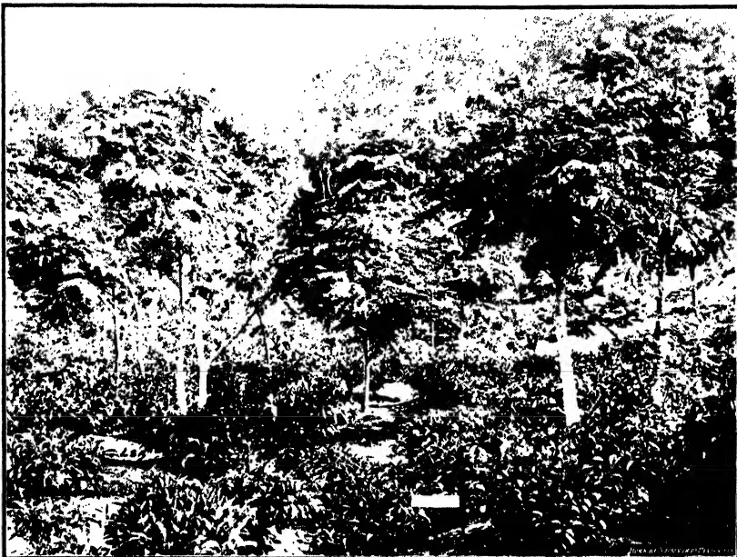A black and white photograph showing a dense forest of Albizzia procera trees. The trees have tall, slender trunks and large, spreading canopies. The ground is covered with low-lying vegetation and some fallen leaves. The lighting is bright, creating high contrast between the dark foliage and the lighter sky.

*Albizzia procera*

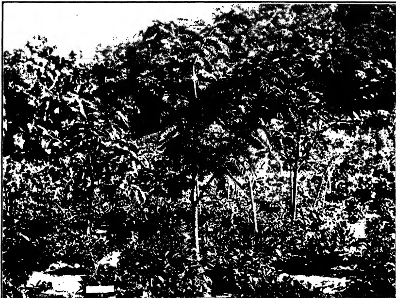A black and white photograph showing a dense forest of Albizzia stipulata trees. The trees have tall, slender trunks and large, spreading canopies. The ground is covered with low-lying vegetation and some fallen leaves. The lighting is bright, creating high contrast between the dark foliage and the lighter sky.

*Albizzia stipulata*

528------------------------------------------------

A black and white photograph of a young Dalbergia assamica tree, approximately 18 months old, standing in a dense forest. The tree has a slender trunk and a small canopy of leaves. A scale bar is visible at the bottom of the image, indicating a length of 1 meter.

*Dalbergia assamica*—18 months old

529------------------------------------------------

91

more valuable than that of *Albizia moluccana* and it does not grow so big or so fast. Reports of the use of this tree in Ceylon have been received from Haputale, Welimada, Wattegama, Morawak Korale, and Kalutara. The superintendent of an estate in the Morawak Korale describes the tree as superior to *Albizia moluccana* as it does not grow so big or so fast. These are not very convincing advantages and the other reports are in the main unfavourable. A few trees grown at the Experiment Station, Peradeniya, have not given great promise. The growth is comparatively poor and the trees do not stand lopping well.

*Cassia didymobotrya*, Candelabra tree.—This small tree has a handsome yellow flower and is often grown in gardens as an ornamental tree. It has been extensively cultivated in tea on an estate in Dickoya and on another near Nanuoya.

It is easily propagated from seed but cuttings are said not to be successful. This tree flourishes in the mid-country and at all higher elevations. It appears hardy, free from pests and diseases, has a very convenient habit and stands lopping well. The tree flowers profusely twice a year. This is its only obvious disadvantage as normally a tree should be lopped before it flowers. Loppings from a tree in flower, however, were sent for analysis and reported to be rich in mineral constituents. The weight of loppings which can be obtained per acre is obviously considerable. On the Dickoya estate mentioned the tree was being planted in places where dadaps were not doing well and formed a valuable substitute. Many estates have areas where dadaps do not flourish and a useful substitute will have considerable value.

When young the stems are said to be somewhat weak and staking may be required. The trees may be lopped twice a year or oftener.

*Cassia multijuga*.—The possibility of using this tree in tea has been discussed by the staff of the Tea Research Scheme. It is thought, however, that the tree is not sufficiently hardy to be of any great use.

*Dalbergia assamica*.—This native of Assam has been introduced to Ceylon tea estates in recent years. The circulars received back from estates contained only two reports on this tree though it is believed that it is being grown on a larger number of estates.

An estate near Gampola says that the tree is thriving well, while an estate at Haputale records that the tree is growing, but gives no further information. Trees planted from seed on the Experiment Station, Peradeniya, in 1928, are making remarkably rapid and healthy growth.

530------------------------------------------------

92

*Derris dalbergioides*.—This is a medium sized tree native to Burma and Malaya which is being grown on a tea estate at Haputale. No further information is given.

*Derris microphylla*.—Information as to this tree is mainly from Java where it is stated to be coming into considerable favour as a shade tree for tea. The following advantages are given:

1. 1. It thrives from sea level to 1,100 feet and probably higher.
2. 2. It is leguminous and forms many nodules.
3. 3. It gives a serviceable shade throughout the year and does not require much pruning.
4. 4. Growth is rapid.
5. 5. It stands wind well.
6. 6. It is largely immune to pests and diseases.
7. 7. It furnishes good firewood and the wood can be used for making boxes and for building.

If the range of elevation is similar in Ceylon the usefulness of the tree would be principally confined to low-country tea. The description is attractive, however, and it is interesting to note that an estate in Kalutara is growing it and describes it as an excellent shade tree for tea. The superintendent states that it stands wind well, is free from disease, and gives a fair leaf-fall.

The tree appears to be a most promising acquisition and well worthy of more extended trial.

*Derris robusta*.—Seed of this tree was imported into Ceylon from Assam, in May 1926, and distributed to several estates. Seedlings at Peradeniya were attacked by the Kalutara snail but those which survived have grown into handsome healthy trees.

Only six estates have furnished reports on this tree in their replies to the circulars. An Uva estate at an elevation of 4,000 feet reports that the tree was not a success. The tree apparently requires a lower elevation but appears well worthy of trial in the mid and low-country. It is attacked by shot-hole borer.

*Erythrina lithosperma*, Dadap, Eramudu (Sinh.), Murunka (Tam.).—This is quite the most common tree used in tea in Ceylon. It is also considerably used in South India. The highest cultivation at which it can be really successfully grown appears to be about 5,000 feet. At the higher elevations it is often reported that it can be grown in sheltered situations but not on wind-blown slopes. The tree can be grown at low elevations but generally speaking does not seem to be very successful below about 1,000 feet.

531------------------------------------------------

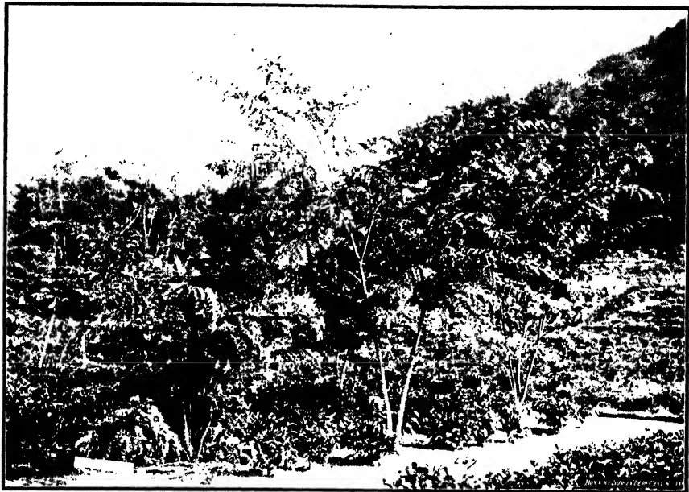A black and white photograph showing a dense, lush forest or tea plantation. The scene is filled with numerous tall, slender trees with thick, dark foliage. The ground is covered in a variety of plants and undergrowth. The lighting is bright, creating high contrast between the dark leaves and the lighter sky. The overall impression is one of a healthy, well-maintained natural environment.

*Derris robusta*

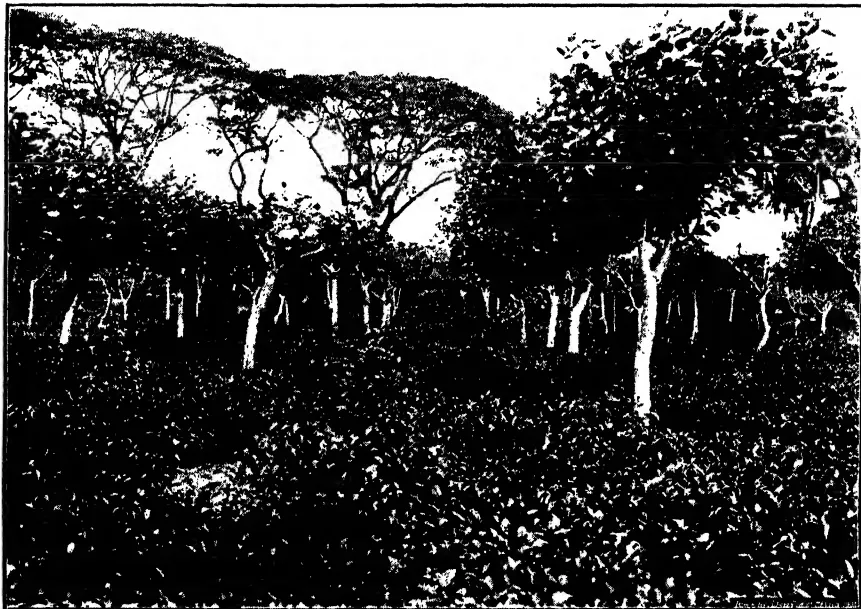A black and white photograph of a tea plantation. In the foreground, there are rows of dense, low-lying tea bushes. Behind the bushes, several tall, slender trees with light-colored trunks and dark foliage are visible. The trees appear to be planted in a somewhat regular pattern. The background shows more trees and a hint of a hillside or mountain range. The overall scene depicts a typical tea plantation landscape.

*Erythrina lithosperma* in tea.  
*Pithocolobium saman* in background

532------------------------------------------------

This image is a blank white page. It contains several small, dark specks which appear to be scanning artifacts or dust particles. There is no text, handwriting, or printed content on the page.

533------------------------------------------------

93

The tree is occasionally propagated from seed in which case the seed is usually sown in nurseries or baskets and the seedlings planted out later. The use of cuttings is, however, far more general and is to be preferred. Elliott and Whitehead <sup>(13)</sup> recommend the planting of 4-foot cuttings in prepared holes at an angle of 60 degrees with the ground, inserting 18 inches of the cutting in the ground.

The object of planting cuttings sloping is to enable the earth to be rammed more firmly round the cutting. This is certainly a point of great importance. On the other hand this method entails more trouble in training one upward shoot to form the future tree and removing others. If upright cuttings of sufficient length are used, and these shoot satisfactorily from the tops the original cutting forms the main stem and a tree of the desired shape is more easily produced. Probably 6-foot cuttings are more generally used and are likely to be the most successful. One estate reports greater success with a forked 6-foot cutting than with a plain one. Cuttings taken from the central branches of the tree are said to be more successful than outside branches. Holing is generally done but is by no means universal. A hole 18 inches deep and wide is usually considered to be sufficient. Often planting is done in alavangoe holes. Cuttings frequently die back to a considerable distance from the top and some estates adopt the practice of tarring the tops of cuttings or dipping them into Skene's wax and claim considerable advantage from the practice in the prevention of die-back.

An almost infinite variety of planting distances are found on estates. When planted alone spacing varies between 9 feet by 9 feet and 20 feet by 20 feet, but intermediate distances of 12 feet by 12 feet to 16 feet by 16 feet are most common. The actual spacing must depend on the spacing of the tea. Any closer spacing than 14 feet by 14 feet is likely to cause too dense a shade and to increase unduly the cost of lopping. Dadaps are frequently planted with *Albizia moluccana*, the latter tree forming the high shade. A few actual estate examples of spacing employed in such mixed planting are given:

<table>
<thead>
<tr>
<th colspan="2">Dadaps</th>
<th colspan="2">Albizia</th>
</tr>
</thead>
<tbody>
<tr>
<td>10 feet</td>
<td>by 10 feet</td>
<td>20 feet</td>
<td>by 20 feet</td>
</tr>
<tr>
<td>16</td>
<td>,, ,, 16 ,,</td>
<td>20</td>
<td>,, ,, 20 ,,</td>
</tr>
<tr>
<td>12</td>
<td>,, ,, 12 ,,</td>
<td>30</td>
<td>,, ,, 30 ,,</td>
</tr>
<tr>
<td>10</td>
<td>,, ,, 12 ,,</td>
<td>40</td>
<td>,, ,, 40 ,,</td>
</tr>
<tr>
<td>10</td>
<td>,, ,, 10 ,,</td>
<td>35</td>
<td>,, ,, 35 ,,</td>
</tr>
</tbody>
</table>

Dadaps as low shade are often interplanted with *Grevillea robusta* as high shade. In such cases planting distances will

534------------------------------------------------

94

be very similar to those quoted above except that the *Grevilleas* may be planted somewhat closer than *Albizzias*. Sometimes dadaps, *Grevilleas*, and *Albizzias* are interplanted. In other cases dadaps and *Gliricidia maculata* are mixed, with or without high shade.

In the large majority of cases dadaps on tea estates are periodically lopped. The frequency of loppings depends on the rate of growth (which is influenced by the elevation and climate), the labour supply, the manuring programme, and other practical considerations. The maximum possible number of loppings in very favourable conditions may be four per annum; usually not more than three will be possible, and in dry districts or at high elevations less than this. It is common to lop only one line at a time so as to remove all shade simultaneously. Sometimes, though somewhat rarely, the dadap is used as high shade, in which case trees at fixed intervals, or possibly whole rows, will be left unlopped. One estate in lower Dickoya reports that lopping results in the death of the trees. A few estates only trim up the side branches.

The cost of lopping and spreading the green material from dadaps, apart from any burial or forking in, is stated to be between 60 cents and Rs. 2 to Rs. 2.50 per acre. The more usual figure is in the neighbourhood of Re. 1.50.

The general estate practices with regard to the disposal of green material have been described and commented on. With dadaps the cost of forking in loppings by envelope-forking in alternate lines is given as between Rs. 4 and Rs. 7 per acre, or say, including lopping and spreading Rs. 6 to Rs. 10 per acre. Burying loppings in pits is not so general. The cost will probably be rather less than that of forking in. One estate gives the cost as Rs. 4.50 per acre per round.

The actual lopping should be done with some care; the dadap is a fairly hardy tree but repeated hard lopping is likely to result in dieback or even death.

Bamber <sup>(6)</sup> gives the annual average weight per acre of loppings of dadap at the Experiment Station, Peradeniya, as 9,622 lb. For a later period dadaps planted 16 feet by 16 feet, giving 170 trees to the acre yielded 12,212 lb. per acre per annum over a period of five years.

There is a very general opinion that at a certain age dadaps should be replaced and dug out but the age at which this should be done is more or less a matter of conjecture. Wright <sup>(36)</sup>, writing a good many years ago, recommends that dadaps in tea should be uprooted every year and replanted. Few would be found now to agree with such a view. The estimate of the

535------------------------------------------------

95

useful life of a dadap tree is generally estimated by estates to be about 10 years in the low-country, and 15 up-country. A good deal depends on the treatment the trees have received. One up-country superintendent says that by regular lopping the size of the trees will be kept down and states that he has seen 15-year-old dadaps no bigger than a man's leg and still vigorous. Some 18-year-old dadaps were dug out at Peradeniya; the roots were well provided with nodules, the trees were still providing a fair weight of loppings and appeared to be doing useful service. Other estates remove trees when they attain a maximum girth, e.g., 16 to 18 inches. The question is difficult and no rule can be given. The green manure experiment now in progress at Peradeniya may shed some light on the matter in the course of years. Clean extraction, preferably by monkey jack or wrinch, is advisable.

The dadap is subject to a number of pests and diseases but they are scarcely of sufficient seriousness to become a limiting factor in the planting of the tree and therefore do not call for detailed comment in this section. Probably eelworm is the most serious pest of dadaps at the present time, both on up-country and mid-country estates.

The wood of the dadaps is of little use except for smoking rubber or brick making. There is no disputing the fact that tea does well under dadaps. Plots at Peradeniya which have received no nitrogen for years other than that obtained from dadap loppings have throughout maintained their yield and healthy appearance.

The tree is certainly a valuable asset to tea estates over a considerable range of elevation.

*Gliricidia maculata*.—For a number of years the Department of Agriculture has drawn attention to the valuable properties of this medium-sized tree as a shade and green manure tree for tea.

The tree flourishes from sea level up to about 3,000 feet. Several reports have been received of lack of success at higher elevations.

The tree can be propagated from seed or cuttings. The latter is the easiest method and moreover good seed is not easy to obtain on account of insect attack. Many estates use short cuttings of about 3 feet planted sloping. If cuttings are scarce this may be economical but long vertical cuttings shoot so readily from the top that their use is always to be preferred and produce a tree of desirable shape much more quickly. Most estates use 6-foot cuttings. Some estates dip the ends of the

536------------------------------------------------

96

cuttings in Skene's wax or some such waterproof material, but this is scarcely necessary as the tree is very easily established in suitable districts.

The tree is very much the same size as the dadap and planting distances are consequently similar. *Glicicidia* is very often interplanted with *Albizia* or *Grevillea* and in this case also spacing will be similar to that used for dadaps.

The trees are usually lopped periodically. Rather more frequent lopping is possible than with the dadap. At Peradeniya dadaps usually afford three loppings a year but *Glicicidia* always four. Moreover the severest lopping can be employed without fear of damage. In districts suitable to both trees the weight of loppings from *Grevillea* will always be in excess of that from dadaps. Over a period of 5 years, *Glicicidia* at Peradeniya planted 16 feet by 16 feet yielded 24,514 lb. of green material per acre per year compared with 14,546 lb. from dadaps of the same age and with the same spacing.

It may be mentioned that it is necessary to lop the first growth fairly early or the tree will become top heavy and liable to be blown down. The tree is sometimes grown for the sake of its light shade and left unlopped. This is not the best way to make use of *Glicicidia*, since the large quantity of green material afforded by lopping is one of its great advantages.

The opinion that *Glicicidia* should be replaced at a certain age is not so frequently expressed as is the case with dadaps, 8 to 12 years is given by some as the economic life of a *Glicicidia*. As the tree has been compared with the dadap it may be convenient to tabulate its advantages:

1. 1. Easier to propagate in suitable districts.
2. 2. Superior resistance to drought and wind.
3. 3. A heavier yield of green material.
4. 4. Stands harder lopping.

Freedom from pests and diseases is one of the advantages usually ascribed to this tree. In certain drier districts, however, the tree is somewhat seriously attacked by scale insects, e.g., *Pseudococcus virgatus*, *Pseudococcus citri*, and *Coccus viridis*, the green bug. The latter pest has in certain instances spread from *Glicicidia* to tea and has caused some apprehension. It is believed, however, that if the *Glicicidia* was kept regularly lopped the danger from these pests would be greatly diminished.

It is said that neither cattle, goats, nor sambhur eat the leaves and this in itself is a considerable advantage.

*Glicicidia* is undoubtedly one of the most valuable of low shade trees and has certainly come to stay.

537------------------------------------------------

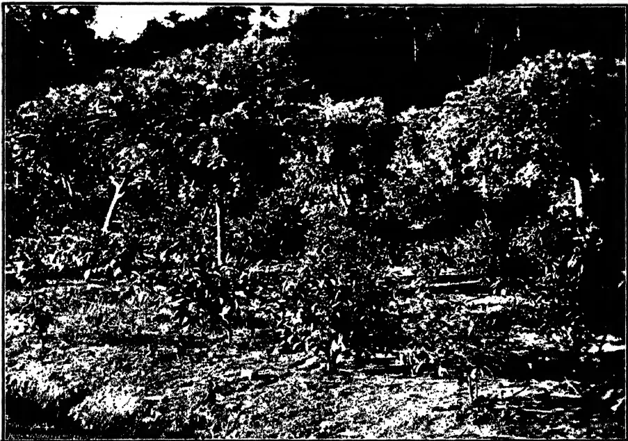A black and white photograph showing a dense, bushy plant, identified as *Gliricidia maculata*, growing in a tea plantation. The plant is situated in the foreground and middle ground, surrounded by other vegetation and trees in the background.

*Gliricidia maculata in Tea*

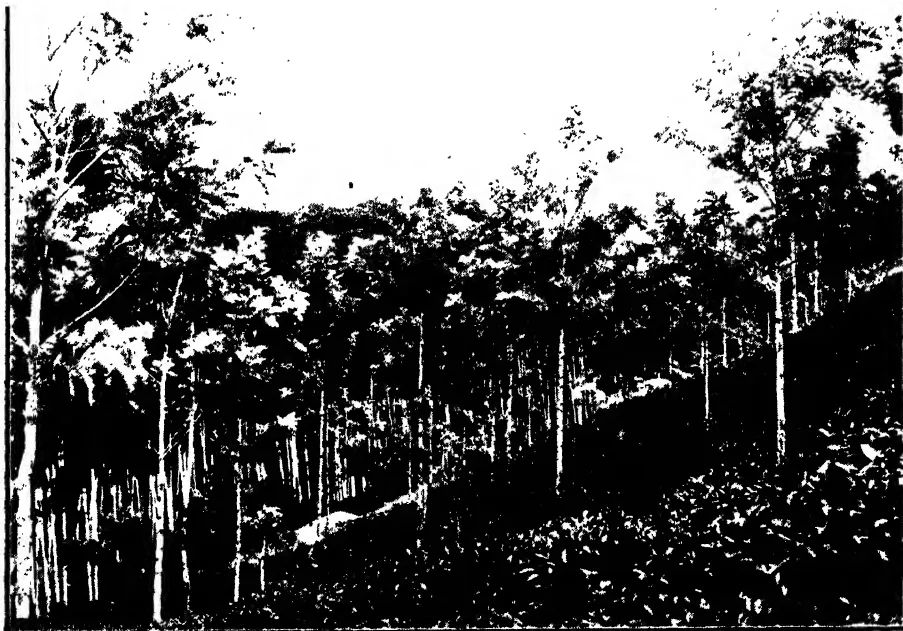A black and white photograph showing a dense, tall plant, identified as *Grevillea robusta*, growing in a tea plantation. The plant is situated in the foreground and middle ground, surrounded by other vegetation and trees in the background.

*Grevillea robusta in tea*

538------------------------------------------------

This image is a blank white page. It contains several small, dark specks which appear to be scanning artifacts or dust particles. There is no text, handwriting, or printed content on the page.

539------------------------------------------------

97

*Grevillea robusta*, silver oak, silky oak, Savuka maram (Tam.).—Though not leguminous this is considered by many superintendents to be the most valuable tree for tea. Though more common at higher elevations the range of this tree appears to be practically unlimited in Ceylon. Some estates report that the tree is hard to establish and the growth is slow, but this cannot be a matter of elevation since the complaint comes from estates of widely different elevations.

Propagation is by seed sown in nurseries or baskets. Sometimes large stumped nursing plants are planted out in the field, sometimes small plants 5 to 6 inches high. When small plants are used pegs are necessary to mark the spot. Basket plants are most successful.

The arrangement and spacing of the trees differ widely. Some estates plant windbelts only, some plant the trees along roads and boundaries, and some plant among the tea, with or without the addition of windbelts, roadside, or boundary lines. *Grevillea* is often used for high shade in addition to dadaps or *Gliricidia*. The following are examples of spacing employed by estates when *Grevillea* is planted alone: 30 feet by 30 feet, 20 feet by 40 feet, 30 feet by 15 feet, 20 feet by 20 feet. When planted in addition to dadaps and *Gliricidia* one estate plants 30 feet by 30 feet and another 100 feet by 40 feet. For windbelts one estate plants 15 feet by 15 feet. Another estate plants windbelts 25 to 30 feet wide and 300 to 400 feet apart.

Regular lopping of *Grevillea* is not generally practised. Low side branches are usually trimmed up. A Haldummulla estate cuts the trees across at 15 to 20 feet to induce a spread and claims that this practice saves damage by wind and makes it easier and cheaper to eventually cut out the trees. The superintendent of a Matale estate reports that *Grevilleas* were formerly lopped every 8 years but as poor foliage resulted and the trees were found to be more liable to root disease and gummosis the practice was given up. Some estates recommend that the trees should be periodically coppiced and a new shoot allowed to grow up.

There is again considerable difference of opinion as to the age at which *Grevilleas* should be eventually replaced and eradicated, and this would appear to depend largely on the district and suitability of soil. A Haputale estate reports that *Grevilleas* die out in patana soil in from 8 to 10 years, a Badulla estate reports that trees over 25 years old are gradually killed out by gummosis, while a Dimbula estate states that "40-year-old plants are now approaching the limit of useful life". Some estates cut out *Grevilleas* when they reach certain dimensions of girth but in the case of this tree it would appear to be a question of deterioration rather than size.

540------------------------------------------------

98

Root disease has frequently originated from coppiced *Grevilleas* which have failed to shoot again and clean eradication in such cases is highly desirable.

The re-establishment of *Grevilleas* in old tea is sometimes reported to be impossible. Complaints of this nature have been received from Dimbula which district is apparently not particularly suitable for *Grevilleas*. At least one estate in that district, however, has shown that with the care *Grevilleas* can be established in old tea.

*Loranthus* is the most general pest of *Grevillea*.

The particular value of the *Grevillea* is ascribed to the copious litter furnished by the constant dropping of leaves. The litter will be incorporated in the soil when manuring or forking is done, but as this is practically never incorporated in the green state it has therefore lost a considerable amount of value before it enters the soil. The root action of *Grevilleas* is extensive and to it great value is attached.

*Leucaena glauca*.—This small tree is one of the oldest green manuring plants cultivated in the Dutch East Indies (under the name of Lamtoro) where it is said to flourish up to 3,500 feet. The indications are that its range in Ceylon is similar—the growth of the tree in Dimbula and Dickoya at about 4,000 feet is unsatisfactory. Some mid-country estates have tried the tree in tea but their reports are not favourable.

Propagation is from seed. The seed has a very hard coat and should be immersed in hot water and allowed to soak for 24 hours before sowing.

The tree has a feathery foliage and gives a light shade but as a source of green material it cannot be compared with the dadap or *Glicidia*. It is too small as a high shade tree and therefore does not appear to perform any particularly useful function in tea.

The tree seeds profusely from an early age and the seedlings if once allowed to get a hold are hard to eradicate. The seeds when boiled and crushed makes a useful cattle food. The wood is stated to provide excellent fuel.

*Pongamia pinnata*, Karanda (Sinh.), Punkum (Tam.).—This is a large tree that has been planted among tea in Urugala. It has been planted mainly as a protection against wind for which purpose it is said to be very suitable.

(To be continued)

541------------------------------------------------

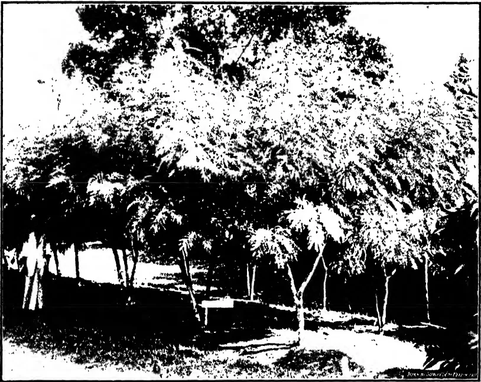A high-contrast black and white photograph of a large, dense tree, likely a Leucaena glauca, with several palm trees visible in the foreground and background. The tree has a very full, rounded canopy of leaves. In the foreground, there are several palm trees with long, slender trunks and feathery fronds. The ground appears to be a mix of grass and dirt. The overall scene is a tropical or subtropical landscape.

*Leucaena glauca*

542------------------------------------------------

This image is a blank white page. It contains several small, dark specks which appear to be scanning artifacts or dust particles. There is no text, handwriting, or printed content on the page.

543------------------------------------------------

99

## HABITS AND CONTROL OF THE COCONUT BLACK BEETLE (*ORYCTES RHINOCEROS* L.)

C. N. E. J. DE MEL,  
B.SC. (HONS.), B.SC. (AGRIC.), LOND.,  
DIP. AGRIC. (WYE),  
DEPARTMENT OF AGRICULTURE, CEYLON

**T**HE Black Beetle or Rhinoceros Beetle of coconut is a familiar insect in all coconut-growing districts of Ceylon. It has been found in this Island perhaps for centuries. Until recently the damage caused by this insect received little attention. In fact the losses caused were considered negligible by most owners of coconut estates, although the insect had been declared a pest so far back as 1907. Recently many inquiries and complaints about damage by this beetle have been made; and in this article some of the causes of the undoubted increase of this beetle in certain districts will be traced, and comments upon certain problems of cultivation raised in this connection will be made.

The Black Beetle (*Oryctes rhinoceros* L.) belongs to the sub-family *Dynastidae* which includes some of the largest members of the order *Coleoptera* or Beetles. It is widely distributed in the East, in India, Burma, Ceylon, the Straits Settlements, Federated Malay States, Siam, Dutch East Indies, and the Philippine Islands. Full details of its life-history in Ceylon are given in Leaflet No. 21 of the Department of Agriculture. The different stages in the life of this insect are as follows:

Egg.—Hatches in about two weeks.

Larva or grub.—Fully grown in three to four months, sometimes longer.

Pupa.—Lasts three to four weeks.

Beetle.—(Lives in captivity from 4 to  $4\frac{1}{2}$  months in the Dutch East Indies, according to Leefmans <sup>(1)</sup>. Period not known in Ceylon.

### EXTENT OF DAMAGE IN CEYLON AND IN OTHER COUNTRIES

The descriptions of the losses caused to coconut cultivation in other countries will provide strange reading to anyone whose acquaintance with this pest is limited to Ceylon. So will some of the control measures adopted. Leefmans <sup>(2)</sup> working at

544------------------------------------------------

100

Padang on the west coast of Sumatra found that 60 to 80 per cent. of the coconut palms were injured and over 10 per cent. killed by this insect in association with the Red Weevil. The annual losses in the Dutch East Indies are estimated by him in 1920 at several million florins. Mackie <sup>(3)</sup> estimates the losses in the Philippines as "an annual loss, in the tree values alone, throughout the Archipelago of 2,897,230 dollars due solely to the attacks of this one species". It must however be stated that this estimate is based not on the numbers of trees actually found dead, but on those which "were severely injured and would, in most cases, succumb as a direct result of attacks of this beetle". In percentages the probable annual loss in four districts is computed as 1.07% of the total number of trees, and this figure is adopted in calculating the total monetary loss for the Archipelago. In Burma, where in 1910 the cultivation of the coconut is said to have been limited to small groves or to mixed plantations with only occasional defined coconut estates, the damage in that year is recorded as most serious. "It was said to attack the young shoots at fruiting time with the result that the trees cease to bear permanently. One or two good producing tracts were reported to return no yield ....." <sup>(4)</sup>. In 1923, Ghosh <sup>(5)</sup> records about the same country that "the cultivation (of coconuts), instead of extending is fast decreasing, chiefly owing to the ravages of insects, of which the rhinoceros beetle or black coconut beetle is the most important". The pest is said to have been introduced into Samoa from Ceylon in 1909 <sup>(6)</sup>. Within three years it had invaded a large area, and by 1914 several plantations are said to have been wiped out. The alarm that ensued seems to have been such that a Commission of Enquiry in 1917 reported that "many trees not actually dead were cut down, some thirteen thousand on two plantations in close proximity, only a portion of which were actually dead". In Vaitele (Samoa) out of five hundred palms felled, only five per cent. were found dead. There are other instances of the felling of trees which might have recovered from the attack, and of elaborate and expensive control measures.

The position in Ceylon has never reached such a grave state. Friederichs <sup>(7)</sup> who made an extensive survey in the tropics in connection with this pest in Samoa, states in 1919 that although *Oryctes* spp. were found in great numbers in Ceylon and comparatively very little is done to combat them there, their presence does not apparently interfere seriously with coconut cultivation. He considers that the Ceylon palms evidently possess certain properties that enable them to resist the ravages of these beetles, and it is possible that they would

545------------------------------------------------

101

still prove resistant if cultivated in Samoa. It is not necessary to assume a special resistant type in Ceylon to explain our comparative immunity from this beetle. The area under coconuts in Ceylon is given in the Blue Book for 1928 as 878,501 acres of which 348,828 acres are in the North-Western Province where the present increase of the pest is found. The figure for 1929 for Ceylon is revised as 1,100,000 acres. The population of this insect is more or less evenly distributed in this large area, so that the damage done has not been fully appreciated, more so because it is chiefly superficial. With such extensive areas of the palm to feed upon, the beetle has not apparently been in need of doing very deep damage to the trees. But the severe localised attacks in instances where this pest has found attractive breeding places and has been allowed to increase unchecked amply illustrate the possibilities of serious damage even in this Island.

The literature on this pest shows very conflicting accounts not only of the details of the life-history of this insect, but also of the relative efficacy of the various methods of control. It can only be concluded that the nature of the damage and the habits of the beetle vary in different countries. It is therefore necessary to examine local conditions and to formulate the most usefully adaptable methods for this country.

#### NATURE OF THE DAMAGE

This insect does all its damage in the beetle stage. The adult beetle reaches the crown of the palm and proceeds to bore into the cabbage, which is its most favourite point of attack. It does not gnaw the wood. Its head and mouth parts are constructed to adapt it to chisel out the tissues by an up and down movement of its head. The beetle does not pass the pieces of wood or fibre through its body, but merely sucks the exuding sap. Holes made by the beetle are very conspicuous on young palms, on which the chiselled out material can be seen protruding from the wounds. Sometimes a gummy substance forms round the injury. In older palms the holes made by the insects can be seen on the leaf-bases, and sometimes on the trunks after the originally injured leaves have fallen off.

In most cases the injury does not proceed much deeper than the cabbage. The writer has seen instances where in young palms the tender cabbage had been so completely cut through that it came off at the injured place when pulled, or hung down dry and discoloured leading one to suspect the disease "Bud Rot". In other cases the damaged petioles snap when the branch fully unfolds. It is of course a common sight to see the leaflets that had been cut through in the cabbage hang down from one or both sides of the midrib after the branch

546------------------------------------------------

102

has unfolded. When the leaves have been attacked on a large scale a tree presents a very rugged appearance, and suffers a definite set-back and a stunting of growth.

In areas where there have been severe attacks the beetle has been known to work its way into the softer tissues near the bud or apex of the tree. It is possible in such cases that the growing point may be damaged killing the tree. Such cases have been recorded by observers in other countries, although the writer has not met with any trees directly killed by this beetle in this manner. A review of an article by Friederichs and Demandt <sup>(8)</sup> has the following account: "Palms of all ages from three months upwards are affected. Injury below the vegetative point or heart is comparatively rare and not directly dangerous, though it affords an entrance to other pests and to water. If much higher than the heart, it seldom extends to the latter, but should putrefaction ensue the heart-leaves may rot and the palm may die. Usually the attack occurs at the level of the heart or slightly above it, and this is very injurious. Direct injury to the heart is not necessary to kill the palm; a large hole, bored through the inner leaf-bundle 12 or even 16 inches above the heart and permitting moisture and rot to penetrate, is quite sufficient to cause death. Owing to the above three sites of attack being found in Samoa and in the Far East, the *Rhinoceros* beetle is more dangerous there than in Ceylon or than its related species in East Africa. In Ceylon (also perhaps in British India) and in East Africa, only the second form of attack (much higher than the heart) occurs, and the mine usually does not extend so far as the heart".

Serious loss of crop has however resulted on many estates in the Chilaw district due to the damaging of the inflorescences. These are either wholly or partly cut through even while they lie protected within the sheath. Most of these instances were noticed in areas where the beetle was breeding in large numbers. The intensity of the attack and the type of damage depend on the numbers of the beetle that are being bred on the estates. In normal cases the damage is superficial on the cabbage.

The sudden and severe outbreaks in many foreign countries mostly followed special circumstances which brought into being very extensive and favourable breeding places for this insect. Mackie <sup>(9)</sup> referring to the Island of Lete states as follows: "The above-mentioned district was in the direct path of a typhoon which swept that island in November 1912. As a consequence large numbers of coconut palms were either blown down or had their tops blown off. These were allowed to remain and no attempt was made to destroy them. By the beginning of 1914 the trees were soft enough to allow the

547------------------------------------------------

103

beetle to propagate therein. In this favourable environment they developed in enormous numbers and the trees that had escaped the typhoon were nearly all killed by the beetles". Evidence shows that the rapid spread and the phenomenal damage caused in Samoa, already referred to, were chiefly due to the excellent breeding places in refuse heaps and other sites which that Island supplied to the beetles said to have been introduced from Ceylon. In the Dutch East Indies, Leefmans <sup>(10)</sup> mentions dying and dead palms, rubbish from sugar cane and rice husking mills, and several other varieties of decaying material found in quantity everywhere, which can sufficiently account for the ravages of this beetle in that country. The present increase of the beetle in some districts in Ceylon can also be directly traced to a supply of breeding places created for the beetle by certain processes of cultivation as will be shown below.

#### INDIRECT DAMAGE

In Ceylon loss of crop is perhaps the most serious effect of beetle attack. But indirect damage of a more fatal nature may result. The Red Weevil (*Rhynchophorus ferrugineus* Fabr.) often finds entry into healthy palms through the injuries made by the Black Beetle. The writer has found these weevils, sometimes pairs of the male and female, in the burrows made in the crowns of palms by the Rhinoceros beetle. The weevil lays its eggs in the living palm, and its grubs on hatching cut their way into the palm where they spend their larval stage. If the grubs are in the upper part of the tree, they soon reach the apex and kill the tree. If in the lower part of the trunk, the damage generally goes undetected until after a large cavity has been cut out by the grubs definitely weakening the palm.

Another indirect effect is that this beetle, which flies into healthy and diseased palms alike, often acts as a carrier of the fatal "Bud Rot" disease caused by the fungus *Phytophthora*. Again, it has been recorded that rain water entering the burrows made by the Black Beetle leads to decay of the tissues around, finally involving portions of the trunk or causing progressive decay of the bud by the access of secondary organisms.

#### BREEDING PLACES

The Black Beetle attacks many other palms besides the coconut, and breeds in their decaying wood. Hutson <sup>(11)</sup> mentions the occasional occurrence of its larvae in "dead and decaying stumps of old dadap and jungle trees". Friederichs and Demandt <sup>(8)</sup> state that in Samoa few or no species of trees are rejected for oviposition. This however is not recorded in most other countries. The insect shows a very marked preference for the coconut palm.

548------------------------------------------------

104

The problem of this beetle in Ceylon centres mainly on its breeding places. The chief of these are enumerated below, with notes drawn from the writer's observation. Moisture is a necessary condition in breeding material, but the grubs cannot exist in sodden or water-logged conditions.

(a) *Dead Coconut Trees and Decaying Logs.*—These form the commonest breeding ground. A decaying coconut log invariably contains grubs of this beetle, a log six feet long often accommodating a hundred grubs of various sizes. Trees killed by "Bud Rot" if left standing supply egg-laying places in their upper ends, and in the trunks as decay proceeds. Decaying logs account for most of the beetles bred on the average coconut land. Stumps, logs used for fence-posts, for bridges across drains, for barricades, and for numerous other purposes in exposed situations become prolific breeding places as soon as decay sets in.

(b) *Cattle Manure.*—Accumulations of cattle manure are equally common and important breeding spots. Several hundred grubs can be picked up from a manure heap. Manuring by cattle in trenches has also led to breeding of the beetles on a large scale. In several cases where cattle had been tied on circular trenches or on shallow pits and where the dung had not been covered over immediately after by a sufficient layer of earth, grubs of this and of allied beetles were found in large numbers. On a small estate in Lunuwila about two hundred grubs were raked out from the thin layer of dung in each of many such trenches. Immediately after the cattle are removed, it is best to mix up the dung with a little earth, and to cover up the whole under a compact layer of earth at least one foot deep. As the trenches are usually shallow, earth may be heaped up above ground level to obtain the necessary covering.

(c) *Burying of Coconut and Other Refuse.*—The safety with which coconut branches and other refuse may be buried depends largely on the type of soil. On clay soils and the heavier types of soils such material may be buried in trenches and covered over immediately after under a foot or more of well-pressed earth. On porous sandy soils this practice is dangerous. Almost all the cases of recent increase of this pest have occurred on sandy soils where the theory that everything which drops from the tree excepting the nuts should be returned to the soil has been practised with zeal.

On most of these estates whole branches, flower stalks, and other woody material from the tree have been buried either in trenches or pits two feet or less in depth, or in furrows made by the trench plough. These furrows were both too shallow

549------------------------------------------------

105

and not wide enough to accommodate the branches fully, and the soil cover was nowhere more than six to eight inches deep. The result was that the beetles began to lay eggs as soon as the buried material showed signs of decay. The writer has found adult beetles in these furrows. The same result followed in the case of the trenches. Although the latter were two feet deep, the soil in the district in question is sandy and porous; and the beetle sensed a favourable breeding ground even at this depth. Leefmans' <sup>(10)</sup> finding "that even a thin layer of sand prevents the beetles from discerning the attractive breeding place hidden in this simple way" has not proved true for Ceylon, nor in Samoa according to Friederichs and Demandt <sup>(8)</sup>. The woody midribs of branches and the stalks of inflorescences form most attractive material for egg-laying when they remain moist and reach a certain state of decay as happens when buried.

A instructive example was studied by the writer in 1928. A severe attack of beetle occurred on an estate in Madampe. First the branches were attacked in the cabbage and the trees soon presented a very ragged sight. Then the inflorescences were cut through and no nuts would form.

On visiting the estate there was found a very well-kept plantation free from decaying logs and with no littering of branches or of refuse. It was an almost clean swept land, so that it was the greater surprise that so severe an attack of beetle was found. On enquiry it was learnt that everything that dropped off the tree except the nuts was buried in trenches two feet deep and two and a half feet wide. This had been systematically done over most of the estate eight to ten months previously. The contents of a trench were immediately unearthed, and at the bottom of the trench were branches and other woody material from the tree moist and in a partial state of decay. In this material the larvae of the beetle were found all along every trench exposed. In a portion of trench two and a half feet long, nearly two hundred grubs, a few pupae, and two adult beetles were collected. Ultimately all the trenches were re-opened and the decaying material thrown out. A very similar condition was found on a neighbouring estate of the same proprietor. Heavy rains at this time caused the trenches, which in this second case had not been covered up to ground level, to be filled with water. The grubs unable to exist in the sodden soil began to burrow their way to the surface of the trenches; and I was authoritatively informed on a later visit that an empty cement barrel was filled with these collected grubs from two acres alone. This sufficiently illustrates the possibilities of breeding the beetle in this type of soil by indiscriminately burying all droppings from the palm. It has to be

550------------------------------------------------

106

mentioned that on a recent visit, three years after, I found the trees on this land practically free from beetle damage, healthy, and in good bearing. This shows that it is easily possible to control this pest.

(d) *Burying of Town Garbage.*—Burying of scavengings from towns is practised for their manurial value. It was found in one instance that daily collections were dumped into a deep broad trench and only covered after each trench became full. The result was that the rather old trees on this land were soon reduced to a pitiable sight. There were more grubs in the trenches than can be estimated. The same result follows the improper burying of night-soil.

(e) *Decaying Vegetable Matter.*—Vegetable matter if left in thick accumulations for any length of time will become breeding places of this beetle. Rotting straw forms attractive breeding material.

(f) *Damaged Trees.*—Grubs of this beetle have been found on numerous occasions in the hollows of palms which had been treated for Red Weevil damage. Silt collects in these hollows, or decay of the exposed wood is caused by weathering. Black Beetles soon find a breeding place in these. Tar should be applied to the exposed wood of hollowed out trees, and the application renewed as required in order to prevent decay. The insect also breeds in trees killed by the Red Weevil.

An instance worthy of record is the case of a tree killed by "Bud Rot". The cabbage had fallen off, but the rest of the crown remained. The tree was cut down, and a thick accumulation of dust and debris was found in the crown. In this material about forty full-grown larvae of the beetle were found.

### COIR DUMPS

Palms in the vicinity of fibre mills invariably show considerable beetle damage. It has therefore been erroneously concluded that the recent increase is mostly due to the breeding of the beetle in these dumps. If it were so, one could reasonably expect to find on these small hills of coir dust millions of beetle larvae. The writer has examined these dumps at various times since 1926, and never found the beetle larvae in the dumps proper. Coconut fibre and coir dust are fully lignified material which take a very long time to decay. Coir dumps are very tightly packed within and the conditions obtaining inside them neither make for quick decay nor tolerate insect life. But round the margins of these heaps are found admixtures of material which remain moist and decay into humus matter. In these and in drains near by silted up with a mixture of coir dust and

551------------------------------------------------

107

vegetable matter a number of larvae may be found. These, and decaying logs, and sometimes manure heaps, sufficiently account for the ravages round fibre mills. These attacks are localised and the repeated damage on the same trees produces an exaggerated impression.

### BURYING OF COCONUT HUSKS

The writer has during the period 1926-1931 examined numerous trenches where husk had been buried, as also decaying accumulations of husks in the rings so familiar round young palms. The husk trenches examined ranged in age from six months to seven years and were on all varieties of soil. Rarely was a grub of this beetle found; in these cases admixture of woody material could be suspected. Burying husks in any soil is safe so long as no woody material is incorporated.

The practice may be recommended as a source of humus for light soils in which, as already pointed out, woody material should not be buried. Coir dust and husk however take a long time to decay. In sandy soils buried husks were found at the end of seven years crumbling into well-decayed matter. Leafmans <sup>(10)</sup> states “.....one breeding place mentioned in literature viz., coconut husks (coir) proved to be quite harmless”.

### GREEN MANURING

The burying of green manures is another question raised in connection with this pest. The writer recently examined many cases in which cuttings of Boga medeloa (*Tephrosia candida*) were buried. A few examples are mentioned below:

1. In circular trenches round the trees. Soil a sandy loam. Boga cuttings buried in quantity one month previously. Decaying leaves found. Stems still fresh. No trace of beetles.

2. In circular trenches. Boga cuttings buried in large quantity. One month old. Leaves decaying, stems fresh. Soil contains a little humus. No grubs of Black Beetle; but some grubs, pupae, and adult beetles of an allied species *Phyllognathus dionysius* found.

3. In circular trenches round the trees, six to eight inches deep. Cuttings of Boga buried six months previously. No trace of leaves. Plenty of stems. No beetle grubs found. Soil a sandy loam.

4. In trenches. Soil a sandy loam. Large quantities of Boga buried one year previously. Stems not decayed. No trace of beetle grubs of any species.

552------------------------------------------------

108

5. In trenches at a depth of 9 inches to one foot. Large quantities of Boga cuttings buried one year previously. Accumulations of stems supplying sufficiently thick strata for larvae to live in. Stems snapped when bent. Only their outer bark decayed. No traces of beetle larvae.

6. In trenches. Soil sandy loam. Large quantities of Boga buried 16 months previously. Stems not decayed. No traces of beetle grubs.

7. In trenches. Large quantities of Boga cuttings buried two years previously. Only stems found, soft and acted on by soil fungi. No traces of beetle grubs. In this and in all the above cases the stems had become woody.

In the above cases several places of each type were dug up for examination. Many other instances were examined. In no case was the beetle breeding in the green manures, which had been buried unmixed with other material. One superintendent has however reported the presence of Black Beetle larvae in shallow trenches in which Boga cuttings had been buried. In this instance he added that there had been large numbers of the grubs breeding in other furrows in which coconut branches had been buried, and that there was a possibility of an "overflow".

This last instance is a solitary case. There are also other beetle larvae which resemble that larvae of the Rhinoceros beetle. Green leaves incorporated in the soil decay very soon and become a source of nitrogen. Stems, if fibrous, decay only slowly. It has been seen above that at the end of two years the fibrous stems had only reached a soft state. The writer is not in a position to say whether or no such accumulations of stems will attract the beetle at a still later stage of decay. However, the practice of burying green manures is a very valuable one, both as a source of nitrogen and for adding humus to the soil. There is no reason so far why this practice should not be continued.

The mistake at present lies in burying loppings which have become woody and whose nitrogen content is low. Lignin decomposes very slowly in the soil and burying woody cuttings is a loss. Joachim <sup>(12)</sup> has pointed out that when the material to be buried contains less than two per cent. of nitrogen the micro-organisms have to draw on the nitrate and ammonia reserves of the soil. For this reason he advises that green manures, such as Boga medeloa, be cut and buried a little before flowering when the total nitrogen is greatest. If cut and buried at this stage or earlier, and towards the end of the rainy season or three

553------------------------------------------------

109

to four weeks before a drought sets in, Joachim points out that decomposition will be brought about by the micro-organisms almost immediately. This would avert any possible danger of breeding the beetle.

### CONTROL METHODS

Under this head will be included remarks on the disposal of refuse on estates, as the problems are closely related.

- (a) *Spearing the Beetle.*—Removal of beetles from the holes in the crowns of trees by means of a pointed wire, preferably with an arrow head, may be practised so long as a bad attack continues. This is not otherwise desirable, except on young palms. The holes should be plugged with dry coconut fibre.
- (b) *Dead Coconut Trees and Logs.*—Dead trees should be promptly felled. In doing so, trees should not be cut a few feet above ground level. The best method, at once speedy and cheap, is to clear round the roots as close to the tree as possible to a foot deep, and then with an axe to cut the roots slantwise towards and under the bole. The weight of the tree will bring up the bole with most of the roots. The remaining fibrous roots will not be a danger and can be covered with soil. The crown should be immediately severed and the cabbage burnt on a heap of dry branches. The trunk should be cut into logs, which should then be split in four. The hard wood may be put to any use.

Although decaying logs can be used as traps for this insect, this is neither permitted by the Regulations nor desirable. It will only lead to abuse of such a privilege and to danger.

- (c) *Manure Heaps.*—These should be disposed of within three months, and the grubs and other stages of the pest raked out and thrown on to a fire.
- (d) *Town Garbage and Vegetable Matter.*—These should not be buried on light porous soils. On heavier soils they should be covered over at once with a foot or more of well-pressed soil. Vegetable matter alone may, on light soils, be scattered in thin layers and covered in by the harrow to form a mulch.

554------------------------------------------------

110

(e) *Burying Coconut Branches.*—Branches and other droppings from the tree may be used as a surface mulch on sandy soils, after the thick woody portions have been severed and burnt. The ashes have a manurial value. The mulching should be in thin layers only, as the beetle will not be attracted by dry material.

### TRAPS

These may be very simply devised and employed with advantage. The writer has noticed elaborate traps made by burying coconut logs, branches and other material in trenches many yards long. This is expensive, while their value as traps will only follow the decay of the buried material after some months. Besides, burying logs is both undesirable and prohibited unless sufficiently deep. Two simple traps that may be constructed at intervals on the estate are here described.

1. (1) A shallow pit is dug 5 ft.  $\times$  3 ft.  $\times$  1 ft. A thick layer of cattle manure is placed at the bottom and covered over to a depth of six inches with straw. This will speedily attract the beetle to lay eggs. The pit should be cleaned out, all insects destroyed, and the trap re-made with fresh material every two months.
2. (2) Mr. E. Nicollier of Galle employed mounds of grass cuttings three feet high with good results. These mounds should be kept moist.

### USE OF CHEMICALS

Inserting Calcium Cyanamide dust in the holes made in palms by this beetle cannot be recommended either from the point of view of cost or of its effect on the tree. Neither is this material of much use for scattering over breeding places. Nor is there need to employ fumigants or other expensive chemicals in Ceylon. Lime, Basic Slag, and Calcium Cyanamide are not always a certain means of keeping off the beetle from buried material. These materials decompose in the soil and in the presence of moisture disappear as soluble compounds or are absorbed into the clay complex. They have their manurial value, and their action does hasten decomposition of the buried branches or other material. But when they cease to exist as such, the beetle will readily come into the decayed material. In

555------------------------------------------------

111

fact, hastening the decay, though advantageous to the soil, attracts the beetle sooner. The reference is to the use of these chemicals when burying branches and woody material in light soils.

As far as Ceylon conditions are concerned the incidence of this pest can be reduced to harmless proportions if clean cultivation is practised, and if certain processes of cultivation are avoided, as pointed out above, however desirable they may be for enriching the soil with humus or with manurial ingredients.

### REFERENCES

1. 1. 2. Review of Applied Entomology. Series A. Vol. IX, p. 47.
2. 3. 9. MACKIE.—*Oryctes Rhinoceros* in the Philippines. *The Philippine Agricultural Review* Vol. X, No. 4, pp. 316-319, and p. 326.
3. 4. MacKENNA AND SHIROFF.—Department of Agriculture, Burma. Bull. No. 4.
4. 5. GHOSH.—Dept. of Agriculture, Burma, Bull. No. 19.
5. 6. Coconut Beetle in Samoa. *The Tropical Agriculturist*, April, 1917.
6. 7. Review of Applied Entomology. Series A. Vol. VIII. p. 276.
7. 8. Review of Applied Entomology. Series A. Vol. X. p. 495.
8. 10. LEEFMANS.—English Summary p. 129, of "De Klappertor" in Meded. Inst. Plantenziekten, Buitenzorg, No. 41, 1920.
9. 11. HUTSON, J. C.—Dept. of Agriculture, Ceylon, Leaflet No. 21.
10. 12. JOACHIM, A. W. R.—Green Manuring with particular reference to coconuts. Dept. of Agriculture, Ceylon, Leaflet No. 57.

556------------------------------------------------

112

## CONTRIBUTIONS FROM THE RUBBER RESEARCH SCHEME (CEYLON)

### FURTHER SULPHUR DUSTING EXPERIMENTS AGAINST OIDIUM

R. K. S. MURRAY, A.R.C.SC.,  
MYCOLOGIST,  
RUBBER RESEARCH SCHEME (CEYLON)

#### INTRODUCTION

IN 1930 the first experiments to be undertaken in Ceylon on the sulphur dusting treatment for *Oidium* were carried out on Kandanuwara Estate, Matale. A fair measure of success in the control of the disease was obtained, and a brief report on the experiments (with photographic illustrations) was published in Rubber Research Scheme *Quarterly Circular* Vol. 7, Part 2, 1930. A further series of experiments was carried out later in the year on Gonakelle Estate, Passara, and a full report appears in Rubber Research Scheme *Quarterly Circular* Vol. 7, Part 4, 1930. As was to be expected with an entirely novel method of treatment complete control of the disease was by no means obtained, but it was possible to deduce various reasons for this lack of entire success. Particular attention has been paid to these points in the recent experiments which, thanks to the courtesy of the Warriapolla Estates Company, Limited, have been carried out on the same field on Kandanuwara Estate as in 1930. The following is a report on these experiments:

#### THE EXPERIMENTAL AREAS

The treated area is a field of 30 acres of mature rubber surrounded on three sides by Tea, and abutting, on the fourth side, on the area selected as a control. This somewhat isolated position was selected as being particularly suitable for the purpose since the risk of sulphur being blown on to the control area, and of *Oidium* spores being blown from the control to the treated area, was thereby reduced as far as was compatible with an efficient control. The trees are planted 30 ft.  $\times$  15 ft. on one side of a hill of moderate slope, and are well grown for the elevation. The field is well provided with paths so that the dusting operation is rendered relatively easy and quick. This area has been dusted during two successive "wintering" periods.

557------------------------------------------------

113

The area selected as a control occupies the side of a hill facing in the same direction as the treated field. The two fields are almost contiguous, being separated only by a narrow strip of land occupied by a road, buildings, etc. The slope of the land is somewhat steeper, than that of the dusted field and the trees, though of approximately the same age, are, for the most part, smaller. The planting distance is about 18 ft.  $\times$  15 ft.

Before the dusting was commenced ten rectangular 16-tree plots were marked at regular intervals throughout each field. Each tree in these plots is separately numbered so that the condition of the foliage can be periodically examined and recorded. The plots are tapped on alternate days by an employee of the Rubber Research Scheme, and the yields for each plot recorded. The results as regards yield figures and foliage observations are not considered separately for each plot, but the summation of the results from the ten plots in each field is considered to be representative of that field as a whole. This method has been adopted owing to the impossibility, with the land available, of laying out plots in accordance with statistical requirements.

In 1929, before any sulphur dusting was commenced, both experimental areas were severely affected with *Oidium*, the extent of defoliation being approximately equal in the two fields. (See figures for 1929 on page 119). The disease had been present since 1925, and defoliation severe since 1927. The undusted area may, therefore, be considered to serve as an effective control, so that any marked distinction between the two fields after sulphur dusting can be justifiably regarded as due to the treatment.

### THE DUSTING OPERATIONS

As in the previous experiments the machine used was the Björklund Motor Duster. Very little mechanical trouble was experienced, but on several occasions the sulphur in the fan chamber became ignited and caused somewhat serious conflagrations. On only one occasion, however, was any damage done to the machine, and in this case a new fan had to be fitted. The cause of these fires is not clearly understood, but it is hoped that they will not recur after the machine has been re-conditioned. A machine with a closed fan-box would have an advantage in this respect.

With the exception of a trial application of "Sulphur Smoke", "Flotate" sulphur from the Kawah Poetih volcanic deposits in Java was used throughout. On the day on which "Sulphur Smoke" was used a light "drizzling" rain was falling, and despite these adverse conditions the sulphur formed an

558------------------------------------------------

114

excellent cloud. It is possible that under the same conditions "Flotate" sulphur, being hygroscopic, could not have been applied to the same advantage. In other respects, however, "Flotate" sulphur, when thoroughly dried, is at least as good as the American product, and is to be preferred on account of its lower price. Further experiments are necessary before the most satisfactory dusting powder can be determined, but in the meantime it is the writer's opinion that within limits (regulated by the particle size) the brand of dusting sulphur used is not of such great importance as the technique employed in the dusting operation.

In all, six applications were made to the experimental field as follows:

<table>
<tr>
<td>December 9th, 1930</td>
<td>"Flotate" @ 13 lb. per acre.</td>
</tr>
<tr>
<td>December 30th, 1930</td>
<td>"Flotate" @ 15 lb. per acre.</td>
</tr>
<tr>
<td>January 13th, 1931</td>
<td>"Sulphur Smoke" @ 14 lb. per acre.</td>
</tr>
<tr>
<td>January 29th, 1931</td>
<td>"Flotate" @ 15 lb. per acre.</td>
</tr>
<tr>
<td>February 10th, 1931</td>
<td>"Flotate" @ 15 lb. per acre.</td>
</tr>
<tr>
<td>March 3rd, 1931</td>
<td>"Flotate" @ 13 lb. per acre.</td>
</tr>
</table>

Total 85 lb. per acre.

The work was supervised alternately by the writer and the Superintendent, Kandanuwara Estate.

The dusting operation has been described and illustrated in previous publications, and it is sufficient to state that working with 10 coolies the 30-acre field was dusted in an average time of  $1\frac{1}{2}$ -2 hours. This rate of progress would be considerably exceeded were a larger area to be treated.

It is of interest to record the progress of wintering in relation to the dates of application. When dusting was commenced on December 9th only an insignificant proportion of the trees had "wintered". *Oidium* could be found on such young leaves as were present, but the fungus had not attained its full virulence. The great majority of the trees shed their leaves during the latter part of December, and on January 13th, when the third application was made, 90% of the trees were completely bare. It may be remarked in passing that such a regular "winter" is unusual. During the next few weeks the trees were in progress of re-foliation. On February 10th the dusted field exhibited an excellent foliage in various stages of development. Although active *Oidium* was to be found throughout the field, the extent of defoliation was almost negligible, and most of the leaves were undistorted. In the control field, on the other hand, defoliation was very severe, and only the early winterers

559------------------------------------------------


Plate I Kandanuwara Estate Dusted field. 14-3-31.

560------------------------------------------------

A high-contrast, black and white photograph of a landscape. The left side is a bright, overexposed area, possibly a field or sky, while the right side is a dark, heavily textured area, likely a forest or dense vegetation. The image is framed by a thick black border.

Plate II. Kandanuwara Estate. Control (undusted) field 14-3-31.

561------------------------------------------------

115

had retained their leaves. A final visit was paid to Kandanuwara on March 14th. By this time the foliage in the dusted field was quite mature, and although "secondary" *Oidium* was prevalent throughout the field the applications were discontinued since it was thought that further leaf-fall was unlikely to occur. The condition of the foliage in the two fields on this date is further described below:

### RESULTS

(a) *Foliage*.—The two photographs shown bear testimony to the striking difference in the appearance of the two fields on March 14th. Whereas the control area is practically leafless, having the appearance of rubber during a normal "winter", the foliage of the dusted field, as viewed from a distance, would bear comparison with most areas at this elevation and, indeed, with many in the low-country. When comparing the two photographs it must be borne in mind, also, that the trees are more closely planted in the control than in the dusted field so that, other things being equal, a denser canopy in the former would be expected.

On March 14th an examination was made of every individual tree in the experimental 16-tree plots and the foliage was classified according to the intensity of *Oidium* attack. The figures together with those for 1929 and 1930, are shown on page 119. It will be noted that in the dusted field the proportion of trees classed as severely or completely defoliated (Classes E and F) has been reduced by the sulphur dusting from 56% in 1929 to 9% in 1931. In the control field, on the other hand, this percentage has risen from 51% to 76%. Correspondingly the proportion of trees in the dusted field in which leaf-fall is absent or very slight (Classes B and C) is 80%, as compared with 13% in the control field.

These figures indicate that the treatment has been extremely successful in preventing the most harmful effect of the disease viz: defoliation. Entire control of the fungus has, however, by no means been obtained, and "secondary" attack is still severe in comparison with low-country estates. It is probable that by continuing the treatment during March and April this attack on mature leaves could have been considerably reduced, but it is doubtful if such a procedure is an economic proposition. Although "secondary" attack is harmful in that the transpiration of the leaves is greatly increased, it is defoliation which imposes the severest tax on the vitality of the tree, and once the leaves are mature defoliation is not to be feared. On Kandanuwara the disease remains active throughout the greater part of the year so that at almost any time re-infection from neighbouring undusted rubber will occur. In order, therefore, to keep the

562------------------------------------------------

116

foliage healthy it would be necessary to make periodical applications throughout at least 9 months of the year, thus incurring an expenditure which would probably be disproportionate to the results achieved. In the most severely attacked areas the main aim of sulphur dusting must be to maintain the leaves on the tree, and it is probable that after two or three seasons the extent of "secondary" attack will also be reduced.

The present appearance of the control field is indicative of the worst effects of the disease if allowed to remain uncontrolled. Only the very early winterers have maintained their foliage, and even on these trees the leaves are small and distorted. As the result of the depletion of food reserves caused by continual defoliation many twigs and branches have died back, so that the number of branches left to bear leaves is greatly reduced. Consequently later in the year, when the trees recover to some extent, only the scantiest crowns are presented.

It must be mentioned that the above observations have been made at the time when there is the greatest contrast between the two fields. From about June to November *Oidium*, although not becoming entirely passive, loses some of its virulence, and the trees are able to recover to a great extent. Later in the year, therefore, most of the trees in the control field, instead of being leafless, will possess a thin crown of malformed leaves.

(b) *Yields*.—Comparative yields must constitute the ultimate criterion of the value of sulphur dusting as of any other treatment, and this matter is being investigated at Kandanuwara. Daily records of the latex and dry rubber are being taken from the ten 16-tree plots in each field, the same tapper being employed throughout. The results will be published later in the year, but in the meantime it may be stated that a large difference in yield in favour of the dusted field has been manifested during March, April, and May 1931.

#### QUANTITIES AND COSTS

The following is a full statement of the costs of the dusting operations. Owing to the small area involved it is difficult to give a significant figure for depreciation of the machine. This has been written down as Re. 1-00 per acre, which is considered to be a reasonable figure for work on a large scale.

563------------------------------------------------

117

### SULPHUR

(Costs include all transport, handling charges, etc.)

<table>
<thead>
<tr>
<th></th>
<th>Rs.</th>
<th>cts.</th>
<th>Rs.</th>
<th>cts.</th>
</tr>
</thead>
<tbody>
<tr>
<td>2,130 lb. "Flotate" @ 09 cents</td>
<td>191</td>
<td>70</td>
<td></td>
<td></td>
</tr>
<tr>
<td>420 lb. "Sulphur Smoke"<br/>@ 11 cents.</td>
<td>46</td>
<td>20</td>
<td>237</td>
<td>90</td>
</tr>
<tr>
<td></td>
<td colspan="2"><hr/></td>
<td></td>
<td></td>
</tr>
</tbody>
</table>

### LABOUR

<table>
<tbody>
<tr>
<td>76 coolies drying and dusting<br/>sulphur @ 60 cents.</td>
<td>45</td>
<td>60</td>
</tr>
<tr>
<td>Extra labour (Cleaning,<br/>transport, etc.)</td>
<td></td>
<td></td>
</tr>
<tr>
<td></td>
<td colspan="2"><hr/></td>
</tr>
</tbody>
</table>

### RUNNING EXPENSES

<table>
<tbody>
<tr>
<td>Petrol and Oil</td>
<td>9</td>
<td>00</td>
<td></td>
<td></td>
</tr>
<tr>
<td>Minor repairs to machine</td>
<td>5</td>
<td>87</td>
<td>14</td>
<td>87</td>
</tr>
<tr>
<td></td>
<td colspan="2"><hr/></td>
<td></td>
<td></td>
</tr>
<tr>
<td>Depreciation on machine<br/>@ Re. 1 per acre</td>
<td></td>
<td></td>
<td>30</td>
<td>00</td>
</tr>
<tr>
<td></td>
<td></td>
<td></td>
<td colspan="2"><hr/></td>
</tr>
<tr>
<td></td>
<td></td>
<td></td>
<td>331</td>
<td>07</td>
</tr>
<tr>
<td></td>
<td></td>
<td></td>
<td colspan="2"><hr/></td>
</tr>
</tbody>
</table>

This works out at approximately Rs. 11-00 per acre. Owing to the small area treated all costs are proportionately higher than if the work had been undertaken on an estate scale. It is calculated that if 200 acres were dusted the cost would be about Rs. 9-00 per acre. It may be remarked that the transport charges to Kandanuwara are probably higher than to the average estate.

As mentioned above the field was dusted in the previous season, and the results achieved must be to some extent regarded as cumulative. It is more accurate, therefore, to consider the results as due to two years' treatment. In 1930 the quantity of sulphur applied was 1,600 lb. and the inclusive cost about Rs. 7-00 per acre. The total expenditure in the two years has therefore been about Rs. 18-00 per acre. On a crop basis of 450 lb. per acre per year the cost of the treatment has therefore been about 2 cents per lb. of rubber produced per year.

### CONCLUSIONS

The experiments described above confirm the conclusions previously formed. The greater measure of control secured in these as compared with previous experiments is to be attributed mainly to the earlier start of the operations. Dusting

564------------------------------------------------

118

was commenced at the first sign of severe *Oidium* attack on the young leaf, whereas in previous experiments circumstances did not permit a start until the disease had already caused serious defoliation. Owing, however, to the limited time (10-14 days) during which the sulphur remains toxic on the leaves there is a limit to this early start, and it is valueless to commence dusting while the fungus is still passive. A careful watch must be kept for the first sign of *Oidium* activity, and no time lost in making the first application when this is apparent.

The question now arises—"Does sulphur dusting pay". Assuming that rubber will again become a remunerative crop the answer, as far as estates as severely attacked as Kandanuwara are concerned, is a definite affirmative. It is somewhat premature to discuss the yield figures obtained to date, but there is every indication that the comparative gain in yield as the result of dusting would pay for the treatment were rubber selling at even the moderate price of 20 cents per lb.

Disregarding yield figures the treatment could confidently be recommended as the result of the improvement in foliage alone. It may safely be asserted that for an addition of 2 cents per lb. to the cost of production no manurial or other treatment has ever effected so marked an improvement in the general condition of a field of rubber. The ultimate fate of the control field can only be viewed with the utmost apprehension. Bark renewal is almost negligible, the yield shows a considerable decline, and it seems possible that the very existence of the trees is jeopardised. The dusted field, on the other hand, possesses a fair foliage which should be further improved if the treatment is carried out in subsequent years, and the yield, so far from declining, appears in 1931 to be on the upward grade.

The experiments on sulphur dusting have, therefore, reached a stage at which the treatment can be definitely recommended on the most severely diseased areas. Whether the work should be undertaken on more mildly affected estates is a matter for further enquiry, and will largely depend on local conditions and the price of rubber.

#### ACKNOWLEDGMENT

The helpful co-operation of Mr. M. C. Evans, Superintendent of Kandanuwara Estate, is gratefully acknowledged.

565------------------------------------------------

119

<table border="1">
<thead>
<tr>
<th></th>
<th>No attack</th>
<th>Mild to moderate "secondary" defoliation</th>
<th>Severe "secondary" little or no defoliation</th>
<th>Moderate defoliation</th>
<th>Severe defoliation</th>
<th>Complete or almost complete defoliation</th>
<th>Total</th>
</tr>
</thead>
<tbody>
<tr>
<td colspan="8"><b>DUSTED PLOTS</b></td>
</tr>
<tr>
<td>March 1931</td>
<td>0</td>
<td>64<br/>(41%)</td>
<td>60<br/>(39%)</td>
<td>17<br/>(11%)</td>
<td>10<br/>(6%)</td>
<td>5<br/>(3%)</td>
<td>156</td>
</tr>
<tr>
<td>April 1930</td>
<td>0</td>
<td>31<br/>(20%)</td>
<td>51<br/>(33%)</td>
<td>26<br/>(17%)</td>
<td>30<br/>(19%)</td>
<td>18<br/>(11%)</td>
<td>156</td>
</tr>
<tr>
<td>April 1929<br/>(before dusting)</td>
<td>0</td>
<td>5<br/>(3%)</td>
<td>30<br/>(19%)</td>
<td>34<br/>(22%)</td>
<td>30<br/>(19%)</td>
<td>57<br/>(37%)</td>
<td>156</td>
</tr>
<tr>
<td colspan="8"><b>CONTROL PLOTS</b></td>
</tr>
<tr>
<td>March 1931</td>
<td>0</td>
<td>1<br/>(1%)</td>
<td>18<br/>(12%)</td>
<td>16<br/>(11%)</td>
<td>19<br/>(13%)</td>
<td>96<br/>(63%)</td>
<td>150</td>
</tr>
<tr>
<td>April 1930</td>
<td>0</td>
<td>4<br/>(3%)</td>
<td>18<br/>(12%)</td>
<td>22<br/>(15%)</td>
<td>26<br/>(17%)</td>
<td>80<br/>(53%)</td>
<td>150</td>
</tr>
<tr>
<td>March 1929*</td>
<td>0</td>
<td>49<br/>(7%)</td>
<td>162<br/>(24%)</td>
<td>126<br/>(18%)</td>
<td>147<br/>(22%)</td>
<td>197<br/>(29%)</td>
<td>681</td>
</tr>
</tbody>
</table>

\* These figures (March 1929) refer to a different series of plots in another portion of the control field.

566------------------------------------------------

120

## THE EXPERIMENT STATION, NIVITIGALAKELE

**W. I. PIERIS, B.A., F.R.H.S.,  
AGRICULTURAL ASSISTANT,  
RUBBER RESEARCH SCHEME (CEYLON)**

### INTRODUCTION

**S**INCE the inception of the Rubber Research Ordinance of 1930 a large number of rubber producers, big and small, who were formerly not members of the Rubber Research Scheme have, by payment of cess, automatically become subscribers. Such proprietors and superintendents have not had access to the publications of the Scheme in which the progress of work at the Experiment Station, Nivitigalakele, has been recorded, and it is thought that a note describing briefly the objects and work at this Station would be of interest.

### OBJECTS

The objects of the Station are primarily as follows:

1. (1) Proving of clones established from high-yielding trees on Ceylon estates with the object of discovering the best clones in the Island.
2. (2) Study of all points in connection with the process of budgrafting, influence of stock on scion, etc.
3. (3) Study of methods of opening up land for rubber cultivation, prevention of soil erosion, establishment and utilisation of green manures, etc.

### SELECTION OF MOTHER TREES

Before an estate tree, reputed to be a high-yielder, is admitted into the Experiment Station "to be proved" it has to fulfil certain requirements and undergo what may be termed a period of probation. During this period the officers of the R.R.S. are largely dependent on the co-operation of estate superintendents in assisting them. The best yielders in a particular estate are primarily ascertained through the tappers and kanganies who generally know which of the trees they tap yield the most latex. These are reduced to a workable number by a primary selection by keeping the records of their yields in cubic centimetres of latex for 12 successive full tappings. Thereafter, over a minimum period of one year, the yield-record of each tree, whose latex is collected, coagulated, dried, and weighed separately, is kept by the Superintendent in special quarterly

567------------------------------------------------

121

return forms supplied by the R.R.S. The average weight of dry rubber per tree per tapping and the average weight per tapping per foot length of tapping cut are deduced, and the figures are plotted as graphs in specially designed books so that the relative merits of the trees can be judged at a glance. This information is further supplemented by the findings of the Botanist of the R.R.S. who visits the estate, takes bark samples and reports on the number of latex vessel rows, thickness of bark and other details for each tree. A selection of the best trees and those which satisfy the required standards is made and the selected trees are finally introduced into the Experiment Station by vegetative propagation. In due course the "bud-dings" will be test-tapped with a view to finding out whether the vegetatively propagated progenies of the selected mother tree are capable of reproducing the same or better latex-yielding properties in relation to their parent tree. A criterion of the yield of a mother tree, for selection, cannot definitely be laid down owing to influence of environment, etc; but broadly speaking a tree yielding 1 oz. of dry rubber per tapping per foot length of tapping cut is considered promising and a yield approaching 2 oz. per foot is very good.

#### BUDDING

The means employed for vegetative reproduction of *Hevea* is "bud-grafting". This consists of affixing a bud extracted from a branch of the selected mother tree to the bottom of a young seedling plant. Details of the method of budding will be found in a booklet on "The Budding of Rubber" by R.A. Taylor obtainable from the Secretary, R.R.S., Peradeniya, or in the article entitled "Budding Routine at Nivitigalakele" appearing in the current issue of *The Quarterly Circular*.

Budwood from the mother tree is obtained preferably from a branch that has been "pollarded" (i.e. previously pruned to produce fresh, succulent growth). Pollarding, however, interferes with yield records and is not advocated where extensive records are not already available. In such cases a method often adopted is to first establish a supply of budwood in the budwood nursery by taking a few buds from an unpollarded branch. If records of the mother tree in the meantime are found satisfactory the clone is budded out in the field from the budwood nursery. Buds are attached generally as follows:

- (a) to a certain number of seedlings in the field which have been allotted to that particular clone;
- (b) to 5-7 trees in the budwood reproduction nursery;
- (c) to about 10 nursery seedlings (only in cases where the clone has been found to be difficult to bud and where "supplies" are likely to be required).

568------------------------------------------------

122

In most cases the seedling stocks on to which the buds are attached in the field are of known origin, and the fact that buds of a particular clone are grafted on to different stocks provides for the determining of "effect of stock on scion", if any.

### THE CLEARINGS

The Experiment Station, situated 1 mile away from Matugama in the Kalutara District, is 69 acres in extent and has been opened up in 3 stages now referred to as the 1926, 1927, and 1928 clearings. All these clearings have been laid out on the contour platform terracing system except 4 acres in the 1928 clearing where the Denham Till trench system has been adopted.

The contour platforms, running horizontally at right angles to the slope of the hill, are 6 to 12 ft. in width and dip back into the hill at an angle of 1 in 5. They are 20 ft. apart at the steepest portion of each hill, and where a more gentle gradient has necessitated their divergence to 30 ft. or more an extra platform has been introduced. The trees on the platform are 18 ft. apart and extend in rows up and down the hill. The stocks were planted out originally as "stumps" (6 acres only), basket plants or "seed at stake" in holes 3 feet deep by  $2\frac{1}{2} \times 2\frac{1}{2}$  and filled with top soil. All clearings have been budded in the field and only in cases of repeated casualties have stumps budded in the nursery been put out.

The 1926 clearing of 12 acres in extent contains 17 different clones. Eleven of these consist of approximately 100 trees each while the remaining six, planted as "budded stumps", are only represented by 3 to 20 trees each. The majority of the clones are Ceylon ones though two have been planted out as "budded stumps" from Java. They are as follows: *Eladuwwa* 3, *Eladuwwa* 5, *Govinna* 771, *Govinna* 1836, *St. George* 45, *Cuilcagh* 3, *Cuilcagh* 4, *Cuilcagh* 5, *Lavant* 28, *Lochnagar* 1/15, *Dalkeith* 3513, *Dalkeith* 19935, *Warwulugala* 197, *Heneratgoda* 2, *Heneratgoda* 401, *Java* 7, *Java* 18. The clearing was completely budded in July 1930 and by the end of 1931 some of its earlier buddings are expected to be ready for test-tapping.

The 1927 clearing of 17 acres consists of 19 Ceylon clones of approximately 100 trees each and is also completely budded. The clones are: *Kobowella* 41, *Kobowella* 42, *Eladuwwa* 1, *Eladuwwa* 4, *Palmgarden* 3183, *Palmgarden* 4849, *Yogama* 1H, *Yogama* 8Y, *Yogama* 21Y, *Frocester* 56, *Mirishena* 2, *Mirishena* 3, *Mirishena* 11, *Glendon* A4, *Madola* 15, *Madola* 110, *Millakanda* 10/2, *Bequ Sejour* 5, *Talagalla* 2.

The 1928 clearing of 32 acres which is to contain 90 odd clones is being budded with 25 to 30 trees to a clone. Budding was commenced in April 1930 and about 25 clones have been

569------------------------------------------------

123

completed to date. The unbudded trees in the incompletely budded clones of the 1928 clearings were manured in February 1931, with a view to obtaining robust "stocks" for the season's budding. The manure used was a mixture of Nicifos and Muriate of Potash (@ 1½ lb. per tree.

#### MARCOTS .

In the 1927 clearing there are 77 trees "marcotted" off (i.e. vegetative propagation by ring-barking and "layering") off the stocks of budded plants now growing in the 1926 clearing. In the 1928 clearing there are 21 others "marcotted" off the scions of the same budded plants. Thus there are three editions of plants as follows: (a) the stock growing on its own roots, (b) the scion growing on its own roots, and (c) the scion growing on the stock; and when tapped should give interesting results.

#### GREEN MANURES

The ground is well covered by a variety of leguminous cover plants both erect and creeping, and silt-pits opened along the lower side of the platforms receive the prunings thereof. The most promising among the erect cover crops established so far are *Clitoria cajanifolia*, *Tephrosia candida*, *Tephrosia noctiflora*, *Crotalaria usaramoensis*, *Sesbania cannabina*, *Indigofera arrecta*, and *Desmodium gyroides*. *Clitoria cajanifolia* has proved the easiest to establish, and responds excellently to pruning. It produces a large quantity of material for the siltpits each year and spreads rapidly by seeding. It has been used for sowing along the edges of platforms to bind the soil and prevent the earth from slipping. *Dolichos Hosei* (*Vigna oligosperma*) *Centrosema pubescens*, *Calopogonium mucunoides*, and *Pueraria phaseoloides* have done best as ground covers. Though *Calopogonium* starts off well it looks as if *Vigna* and *Centrosema* are going to replace it as a permanent cover. *Pueraria* once established is an extremely rapid grower but its adaptability to shade has not been determined yet. Conditions on the whole may change a few years hence under much denser shade. Most cover crops have been grown from seed. The creepers are sown 3 feet square and the erect covers in rows 3-4 feet apart according to the species. *Vigna* which is shy to seed can be easily reproduced by cuttings or by rooting its runners in a coconut husk containing a compost of soil and "adco".

Recently platforms have been cleared of cover crops and the latter confined to the space between the terraces.

Windbelts of *Gliricidia maculata* have been planted over the entire Station and serve as an excellent and quick-growing wind protection to the younger plants during the monsoon months, while *Albizia moluccana*, being a bulkier tree, has been utilised to shield gaps and more exposed situations.

570------------------------------------------------

124NURSERIES

*Budwood Nursery.*— $2\frac{1}{2}$  acres of "deniya" land have been assigned to a budwood nursery for multiplication of budwood. Here budwood is reproduced of every clone that is being proved at the Station besides others that are likely to be selected. 5 to 7 plants in a group, (planted 5 ft. apart) are assigned to each clone as "stocks" and at the first opportunity these "stocks" are budded with wood from the mother tree. In fact when a supply of budwood from a particular clone arrives it is a general rule that the required number of buds for the budwood nursery is reserved. This ensures a reserve supply of wood for subsequent rounds of budding in the field and saves the expense and trouble of sending to estates for wood too frequently.

Budding in the budwood nursery need not be done quite so low down as in field-budding, and any convenient height is permitted. At the Experiment Station 3 feet is the usual height. One or two buds are attached to a plant according as there is budwood available. Directly the budding is found to be successful and the stock is cut down, a tar band is painted immediately below the point of insertion of the bud accompanied by orders to budders that when budwood is taken from the nursery they must cut not less than 1 foot above the tar band. This ensures that (a) budwood and not stockwood is removed and (b) the budwood is cut sufficiently high to allow it to re-extend itself. As, after a time, a budshoot is sometimes easily mistaken for a stockshoot, this precaution has been found very useful.

When the attached bud has begun to shoot, all side shoots which keep on appearing are thumb-nailed off. The terminal bud thus extends with redoubled energy ultimately producing a clean, straight stick of budwood. Moreover too much unchecked growth causes a heavy head of foliage and perhaps damage by wind. Tarring of cuts and accurate labelling is strictly adhered to and cannot be over-emphasised. A chart of the nursery shows each tree in relation to its position, row and clone, and the amount of available budwood in yards. There are at present approximately 124 clones represented in the budwood nursery with "stocks" for many more.

*Other Nurseries.*—Besides the budwood nursery there are several seedling nurseries containing known as well as unknown "stocks". These are used for budding "supplies" for the field and for purposes of instruction.

A nursery containing 600 seedlings from selected Java seed has been recently opened.

571------------------------------------------------

125

## BUDDING ROUTINE AT NIVITIGALAKELE

### SEASON

**B**UDDING is carried out on suitable days between April and December. It is usually stopped if there are 7 consecutive days without rain and also during periods of heavy rain. July, August, and September are regarded as the best months for budding in this district.

### TIME

Budding is started as soon after 6 a.m. as possible and continued until 10 a.m. unless the sun is unusually hot. In the afternoons it is continued from 3 p.m. until sunset.

### TOOLS, ETC.

The budding tool designed by Mr. R. A. Taylor, of which two sizes are available, is generally used. An ordinary 'budding knife is used if the budwood is small or does not peel readily. A template is required for marking the stock.

Budding tape, cut into suitable lengths, is wrapped on to small sticks. A note book and indelible pencil should always be carried by the budder.

### BUDWOOD

Budwood is at its best after 12-18 months' growth, bright brown in colour, succulent and easy peeling, and 1-2 inches in diameter. Buds from the green part of the stem can also be used quite successfully and in fact frequently give better results on old stocks.

The budwood is sawn from the required tree and for convenience is cut into 1-yard lengths. It is marked in indelible pencil with the clone number in order to avoid mistakes. If not required at once it should be stood with the bottom end in moist sand.

If plenty of budwood is available only branches which are in a state of active growth should be cut, preferably those in which a new whorl of leaves is just appearing.

572------------------------------------------------

126

### PREPARING THE STOCK \*

The template is held against the tree about 2 inches above the ground and cuts made to the wood on the 2 sides and top. 10-20 trees are cut in this way (more earlier in the morning and less as the sun gets up) and 5 minutes allowed for the latex to dry up before opening the tongue to receive the budpatch.

### CUTTING AND INSERTION OF BUD, ETC.

The budpatch containing an undamaged, dormant bud is "lifted" from the budwood by means of the budding tool or else cut off together with a strip of wood by means of the knife. In the latter case the wood is then carefully peeled from the budpatch. The tongue of bark on the stock is carefully opened by the assistant with the spatula of the budding knife, taking care not to damage the cambium. Before opening the tongue the stock plant is thoroughly cleaned with a cloth and any coagulated strands of latex removed.

The budpatch is then carefully inserted, without rubbing, and with its correct side up, the tongue folded over and the whole tightly bandaged with waxed budding tape from bottom to top in the form of a puttee. When large stocks are being budded it is more economical to cover the budpatch with a square of waxed cloth and bind with coir rope.

About half a dozen rubber leaves are tied in position over the bandage for shade, and a split semicircular piece of bamboo (about 18 inches long) is stuck into the ground opposite and about 1 inch distant from the budpatch to provide additional shelter.

When experimental budding is in progress the clone number should be marked on the stock in indelible pencil as soon as the operation is completed. This is a check that the correct budwood has been used.

### EXAMINATION

At the end of three weeks the bandage is removed, the bark flap is cut off and the budpatch examined with the point of a knife. If green at both top and bottom of the patch the budding is regarded as successful.

---

\* Since these notes were written a new method of cutting the bud panel, understood to be that used in Malaya, has been employed experimentally. No template is used. Two vertical cuts  $1\frac{1}{2}$  in.-2 in. long are made about 1 in. apart and are continued upwards and inwards to meet in a point. The flap is therefore tapered at the top, and is about 3 in. long. The bud-patch is removed as described below and is fitted at the bottom of the panel. When the bud is bound in position the stock flap, being longer and broader than the patch, completely covers the latter so that the edge and tapered portion of the flap fit into their original position thus preventing any movement of the bud-patch. The bandaging is done very tightly, and it is believed that the large flap affords greater protection to the bud-patch if heavy rains are experienced soon after the budding operation. Preliminary tests have shown greater success with this than with the former method, and further comparative trials will be made.—R.K.S.M.

573------------------------------------------------

127.

In dry weather the bandage is loosely replaced leaving a small gap over the bud: the patch is reshadened with fresh leaves and the bamboo shade replaced. In wet weather it is better to discard the bandage as rain is liable to lodge behind it.

A second examination is made a week later, and if the budpatch is still green the bandage and leaves are discarded and the stock is cut at a height of six inches above the budpatch. The bamboo is replaced and allowed to remain until the budshoot appears over the top of it. Alternatively a protection basket is placed over the stump and allowed to remain until the first whorl of leaves has developed.

By some planters it is considered preferable to ring-bark about 6 inches above the budpatch and break down the stock at a height of 3 feet. Tests at the Experiment Station showed no advantage for this method but it is proposed to make further tests this year.

574------------------------------------------------

128

## BIOLOGICAL CONTROL\*

### II. NOXIOUS WEEDS

THE subject of the biological control of insect pests was discussed in a previous article (*Tropical Agriculture*, Vol. VIII, p. 98; reproduced in *The Tropical Agriculturist* for July 1931). The present contribution deals briefly with the application of the biological measures in controlling noxious plants. This phase of the problem is a very recent development, the first practical experiment being carried out in 1902. The biological control of noxious plants presents itself as a possibility in cases where alien weeds have invaded land to the extent of rendering it useless. So far as the subject can be envisaged at present it is only in special instances where such weeds have resisted cultural, chemical or other methods of control, or where such methods are impracticable, that biological measures may prove to be an economic proposition. The only biological agencies that have so far afforded any promise in this connection are phytophagous insects. The principle involved is the introduction of suitable types of plant-feeding species, free from their natural parasites, which are known to affect a given noxious plant in its country of origin. We have abundant evidence that alien insects which have entered countries, unaccompanied by their natural parasites, can exercise an immense destructive effect on cultivated crops. There consequently appears to be no valid reason why, similarly, properly chosen species of insects, introduced free from their particular parasites, should not likewise exercise a destructive effect upon noxious weeds given a favourable environment for their colonisation. It is this principle that is fundamental in problems of the insect control of weeds.

There are very obvious dangers attending the introduction of phytophagous insects from one country into another. The possibility always has to be faced that the introduced species may resort to feeding upon cultivated plants in a new environment, and so render the remedy little better than the disease. The introduction, therefore, of such hyptophagous insects, however promising the latter may seem to be, demands the strictest safeguards and the most exhaustive preliminary experimentation before liberations are effected.

It needs to be borne in mind, as Dr. W. R. Thompson has pointed out, that although insects entail an immense amount of destruction to economic plants, they rarely occasion sufficiently vital damage which will affect the survival of well-established species to any marked degree. Measured in economic terms such damage frequently assumes vast proportions, but in the biological sense it is not necessarily of the same importance. Furthermore the recuperative powers of plants are so great that they are much less liable to be killed outright as the result of insect attack than insects themselves, which almost always succumb from the effects of their parasites.

It will be obvious that, in any project of weed control involving the utilisation of phytophagous insects, the latter necessarily require to be species known to be either monophagous or oligophagous in habit. Species that are either stem-borers, or destroy flowers or seeds, offer many advantages over mere defoliators. They are, for example, more specialised

---

\* By A. D. Imms, D.Sc., F.R.S., Rothamsted Experiment Station, Harpenden, in *Tropical Agriculture*, Vol. VIII, No. 5, May 1931.

575------------------------------------------------

129

in habit and therefore less likely to become adapted to new plant-hosts in another environment. Also, species that check the multiplication and spread of a noxious plant are likely to produce more economic benefit than those which prey solely on the foliage.

The botanical affinities of the noxious plant it is desired to control is likewise a matter of great importance. With such plants as *Opuntia* the likelihood of insects which feed upon them resorting to other hosts is somewhat remote. Insects living on plants endowed with such acrid juices, along with other specialised physiological and structural features, exhibit so peculiar and rigid an adaptation to their particular mode of life, that they are unlikely to infest plants botanically only distantly related; and with entirely different physiological attributes. On the other hand, with plants of the natural order Rosaceae, for example, there is always a looming possibility that in a new environment insects, which normally feed upon a single species or genus of that order, will become pests of one or other of its numerous cultivated members.

It will be readily understood that, under the conditions demanded by noxious weed control, parasites assume an antagonistic rôle to the one they perform as agents in repressing insect pests. In other words, parasites require to be rigidly excluded in all cases where insects are utilized in the repression of weeds. The unforeseen or accidental entry of such agents, along with their phytophagous hosts, into a new and favourable environment, might well result in the biological control of the plant-feeding insects, and the utilization in any campaign of weed repression rendered of little value.

*The control of Lantana.*—The first attempt to control a noxious plant, by means of introducing specific insect enemies, was made in the Hawaiian Islands with reference to the alien weed *Lantana chamara*. This plant is native to the warmer parts of America and was originally introduced into the Hawaiian Islands for ornamental purposes. The shrub ultimately spread to such an extent that it became a real scourge in the pastures of low-lying regions, especially on the leeward side of the Islands. In 1902 an entomologist, A. Koebel, visited Mexico with a view to acquiring first-hand acquaintance with the insect fauna of *Lantana* in its native habitat. As the result of his investigation 23 species of insects were transmitted to Honolulu and from among these eight kinds were ultimately successfully established in the Islands. Each of the eight species attacks the plant in a somewhat different way and it seems likely that their combined influence would exercise considerable check upon its growth and spread. Three species that have proved the most effective are the Tortricid moth *Crocidosoma lantana* Busck., the seed fly *Agromyza lantanae* Frogg., and the Tingid bug *Teleonemius lantanae* Dist. Larvae of the first mentioned insect bore into the flower stems and devour both flowers and young fruit: the *Agromyza* larvae attack the berries and the Tingid bug checks growth and blossoming by destroying the young foliage. Of the remaining five species of insects, two are larvae of *Thecla* butterflies which feed on the flowers and thus restrain the production of berries; two are moth larvae and the fifth is the Trypaneid gall-fly *Eutreta xanthochaeta* Ald. Individually, none of these five species appears to be of much importance but collectively they are to be regarded as accessory agents in checking the plant. The nett result of these insect introductions is that the spread of *Lantana* has been appreciably restrained. It no longer readily colonises lands once cleared and the labour of its eradication has been lightened. It has, however, been too readily concluded, by those unfamiliar with the true state of affairs, that entire control of the plant has been accomplished. This, as a matter of fact, is not the case and the colonization of additional insect enemies is regarded as being necessary in order to try and secure more complete economic results.

576------------------------------------------------

130

*Lantana* is, likewise, a serious pest in other parts of the world. In Fiji it has become sufficiently troublesome and difficult to eradicate to cause the authorities there to turn to biological control methods. Certain of the *Lantana*-feeding insects have been introduced from Hawaii and it appears that the *Agromyzid* fly has already checked the spread of the plant to some extent. The two *Thecla* butterflies have also been introduced together with the Tingid bug *Teleonemia*. The control of the plant affords promise of becoming successful, but it is too early to forecast the results of the experiments.

Introductions of *Lantana*-feeding insects have also been made into Queensland and Mysore, but no satisfactory results have yet been recorded. It may be added that in several parts of the Indian Empire the spread of *Lantana* in the forests has become a serious problem since it is proving deleterious to natural regeneration.

*The control of Prickly Pear.*—The largest and most important campaign of biological control of noxious weeds concerns prickly pear (*Opuntia* spp.) in Australia. This pest is estimated to have taken possession of 60,000,000 acres of land in Queensland and New South Wales. In the main the affected areas comprise natural grazing land whose value is less than £3 an acre. Under such conditions chemical or cultural methods of control are not practical propositions, except where the infestations are relatively slight. In their native habitat in North and South America many species of *Opuntia* are known, yet none of them are serious menaces to agriculture. Of the few kinds introduced into Australia at least four are major or minor pests. In America, insects, diseases and other factors are responsible for keeping down prickly pear within reasonable bounds, whereas in Australia such natural controlling agencies are absent, and the spread of the plant has gone on unchecked.

The Prickly Pear Board of Australia has been engaged, for some years, with an attempt to bring about a condition of biological equilibrium, by the introduction of insects and other organisms likely to function as natural checks. Officers of that Board have covered widespread cactus areas in North and South America for the purpose of investigating insects affecting *Opuntias* in their natural surroundings. Extensive biological study is being carried out at the Station at Urvalde in Texas and, from here, likely species of insects are shipped to Australia. On arrival they are transferred to quarantine buildings at Sherwood near Brisbane, where breeding tests are carried out with respect to the possibility of any introduced species attacking crops or other useful plants. At the same time, safeguards are instituted against the accidental introduction of insect parasites. Finally, species that offer favourable potentialities are liberated at suitable centres, where they are left to colonise themselves. A number of species have now become acclimatised to Australian conditions and, among them, the moth *Cactoblastis cactorum*, whose larvae tunnel through the tissues, is probably the most important. The cochineal *Dactylopius tomentosus*, has become distributed almost through the infested areas, and the plant bug, *Chelinidea tubulata*, now flourishes in countless millions in many localities. The red spider, *Tetranychus opuntiae*, also covers many thousands of square miles and is rapidly extending its range. Mr. A. P. Dodd in his 1929 Report on this problem, states that the established complex of insect enemies is already bringing about a considerable degree of control of this noxious pest. In the heart of the pear country it is now possible to travel for one hundred miles without seeing any healthy plants. The success attained by the introduction of the *Cactoblastis*, which is known to be very rapid and drastic in its effect upon the plants, has changed the outlook of the whole problem, and it is reasonable to expect that vast areas of pear will be eradicated within a few years. Unless anything

577------------------------------------------------

131

untoward happens, or the beneficial insects become seriously checked by the activities of indigenous predators or parasites, the work of the Prickly Pear Board shows promise of ultimately solving the problem it is contending with.

Australia is by no means the only country that has become colonised by prickly pear. In Ceylon, for example, an extensive area of the Northern Province was formerly infested by *Opuntia monocantha* but was ultimately almost completely exterminated by the cochineal *Dactylopius indicus* which is stated to have come from Madras. According to F. P. Jepson, (*The Tropical Agriculturist*, Vol. LXXV, 1930, p. 63) the cochineal insect has not maintained the same efficiency in controlling this species of prickly pear in the southern provinces. Another *Opuntia*, viz., *O. dillenii* has become very prevalent in recent years in the Northern Province and it is believed to be an accidental introduction from Madras. *Dactylopius indicus* does not appear to be capable of exercising any controlling influence over this plant, a fact which led to the introduction in 1924 of *D. tomentosus* from Australia. According to Jepson the experiment has proved remarkably successful. A large area of scrub in the neighbourhood of Trincomalie was cleared by its agency in eighteen months. It has also given equally satisfactory results in other districts; land which was previously occupied by *Opuntia* scrub, 6-10 feet high, is now under cultivation.

In 1926-27 consignments of *Dactylopius tomentosus* were forwarded to Mysore and to Tuticorin with the object of endeavouring to control *Opuntia dillenii*. The insects have become established and it is stated that an area of 40,000 square miles is now covered by this species in southern Madras. Very large tracts of land have been cleared through its agency and land so liberated has now come under cultivation for the first time for many years. It is further claimed that the whole prickly pear area of 114,000 square miles offers prospects of being cleared by 1940, judging by the progress so far achieved. As Jepson remarks, if this forecast be fulfilled, the experiment promises to become a classic example of the control of weeds by biological methods.

Several species of *Opuntia* have become troublesome pests in Mauritius, notably *O. tuna* and *O. monocantha*. The introduction of *Dactylopius indicus* by d' Emmerez de Charmoy resulted in rapid destruction of *Opuntia monocantha*, and in his 1929 report on the subject, it is stated that within 15 years this plant has become completely controlled on the Island. The introduction of *D. tomentosus* from Ceylon, in an attempt to control *O. dillenii*, is a much more recent experiment. Its establishment has proved successful but the economic results of the experiment is a matter that future years can alone decide.

In Madagascar it appears that rather an anomalous state of affairs exists. R. Decary tells us that *Opuntia dillenii* was formerly prevalent in a wild state on uncultivated land and was an essential local fodder plant. Since 1924 the cochineal *Dactylopius coccus* entered Madagascar under accidental circumstances, it is believed, from the neighbouring Island of Reunion. The insect spread so rapidly under the prevailing conditions that, in about two years, the *Opuntia* was virtually destroyed and the cochineal insect itself became no longer evident. Decary has more recently suggested the introduction of some spineless species of *Opuntia* suitable to take the place of *O. dillenii* and which, in the same time, is resistant to the *Dactylopius*.

*The control of Clidemia.*—At the present time an experiment is being carried out in Fiji for the purpose of attempting to control the noxious shrub *Clidemia hirta*. Out in Trinidad the plant is not regarded as a pest, and is kept under restraint by a combination of various factors of which phytophagous insects are but one of them. Studies carried out in Trinidad

578------------------------------------------------

132

showed that the Thrips, *Liothrips urichi*, is common on this plant throughout the Island. It apparently causes its host to become stunted and to flower less freely. It therefore appeared to be a suitable insect for introduction into Fiji, provided that it were proved to exhibit no tendency to attack plants of economic importance. In October 1929 W. H. Simmonds visited Trinidad and studied the Thrips on the spot. It was found to be attacked by a number of natural enemies which had to be excluded in any effort made to introduce the insect into Fiji. He was able to send a large consignment of the species to Suva, where a proportion of its individuals were released in the field in 1930, and the remainder kept for breeding further stock. It is obviously too early for any forecast of the possible success of the experiment to be made, and it remains to be seen whether the *Clidemia* alone will prove an efficient controlling agency.

*Other weed control experiments.*—In New Zealand an extensive campaign has been inaugurated more particularly with reference to the control of blackberry (*Rubus fruticosus*), ragwort (*Senecio jacobaea*) and gorse or furze (*Ulex europaeus*), all of which are immigrants from Europe. In the case of blackberry, studies are being made with special reference to the suitability of the stem-boring Buprestid beetle (*Coraeus rubi*) of Southern Europe. A promising enemy of gorse is the pod-infesting weevil (*Apion ulicis*), while the Hypsid moth, *Tyria jacobaea* is an important enemy of ragwort. The two latter species, it may be added, are very common in England. At first studies on these three species were carried out at the Rothamsted Experiment Station, which were responsible for sending out to New Zealand large numbers of the insects mentioned. At a later stage, this work was transferred to the Parasite Laboratory at Farnham Royal where it is being undertaken at present. Preliminary liberations of the *Tyria* and *Apion* have been made in New Zealand, but the campaign is not sufficiently advanced to give any indication with regard to its outcome. In Australia the biological control of *Hypericum*, is an additional problem and, for the time being attention is being mainly given to Chrysomelid beetles and Cecidomyid gall midges as possible agents for this purpose.

In the Hawaiian Islands the obnoxious tropical sedge, known as nutgrass (*Cyperus rotundatus*), is a troublesome pest plant which probably entered the territory about the roots of imported plants. Attempts to control this plant by the introduction of certain insects, that are associated with it in the Philippine Islands, have been made. The Tortricid, *Bactra truculenta*, is now well established but has not so far proved of much value in this respect: in some localities, it may be added, it suffers heavily from the attacks of indigenous parasites. In the same Islands Pamakan (*Eupatorium glandulosum*) and gorse have become troublesome immigrants: while the subject of their control by biological means has received consideration no campaign has so far been undertaken.

In concluding these remarks it may be added that the biological control of species of prickly pear has so far proved more successful than in the case of any other pest plants. The *Opuntias* appear to be particularly susceptible to the effects of insect injuries which, in their turn, open the way to subsequent bacterial and fungal infection. The combined effects of such agencies have proved to be sufficiently potent to result in the practical eradication of plants of this type, from several areas in different parts of the world. It appears likely that, in *Opuntia*-feeding insects we have a most promising weapon destined to achieve far-reaching results in the future.

579------------------------------------------------

133

## TURMERIC \*

**T**URMERIC is the name for the fresh or dried rhizomes of *Curcuma domestica*, Thevenot, formerly called *C. longa*, a plant of the ginger family, indigenous to Southern Asia, where it is largely cultivated.

*History.*—From ancient and mediaeval times India has furnished this important drug to all countries of the world. Dioscorides and Pliny refer to it as the product of an Indian plant, *Cyperus indicus*, resembling ginger, but having, when chewed, a yellow colour like saffron. There is a record of the drug being brought overland to China by the Persians prior to 572 A.D. Garcia da Orta (1563) describes it as *Crocus indicus*; this and the name Safran des Indes show its relation to saffron, a yellow dye, so much admired in the East. The names Haridra (Sanskrit), Dar-halad (Hindi), and Zard-crubah (Persian), signifying "yellow sticks" or "yellow wood", distinguish it from saffron stigmas. In Arabic it has the names of Uruk-es-sufr "golden root", and Uruk-es-sabaghin, "dyer's root". In China it is called Huang chiang, "yellow ginger". In India other names for turmeric are Haldi (Hindustani), Halad (Bombay), and Manjal (Tamil). In Malay it is Kunyit and Kunyit-makan. The name *Curcuma* is evidently derived from the Persian Karkam, Hebrew Karkom, and the Arabic Kurkum. The origin of turmeric is more obscure. Terre merite (French), Terra merita (Lat.) meaning "deserved" or deserving earth", are names the powder bore in commerce among apothecaries in the sixteenth century. There may be a relation between this and other names recorded during that century: tarmaret (1545), turmerick (1577), turmeracke (1578).

*Description.*—*Curcuma* is extensively cultivated all over India, its cost is relatively equal to that of sugar-cane and ginger. Two main crops are raised, one forming a soft rhizome used as a condiment, and other, whose rhizome is harder and more highly coloured, employed for dyeing. The ovate rootstock develops in the first year and throws out shoots forming lateral or secondary rhizomes. The turmeric of commerce, therefore consists of two sorts: the central round or "bulbs", and the lateral, long or "fingers". They are distinguished locally as "hadua" or round and "gangakuria" or long shaped. The former are ovate or fusiform and the surface marked with concentric ridges. The lateral rhizomes are sub-cylindrical attenuated towards either end, covered with a rugose skin and marked with transverse rings. They are often sliced or split and usually scalded in order to destroy their vitality and facilitate drying. The rhizomes are hard and firm, with a dull, waxy or resinous fracture of an orange or orange-brown hue. They have a strong characteristic odour and peppery, bitter taste. There are several varieties of turmeric distinguished by the name of the countries or districts in which they are produced. In India the principal sorts are Madras, Bengal, Cochin, Calicut, Balseni and Rajaputi. Madras "finger" is highly esteemed, and Cochin split "bulbs" are a favourable line, but those of Bombay and Sind are considered inferior. Chinese turmeric is of great value and much superior to that of Java, but it is seldom met with in the European market.

*Composition.*—Turmeric yields to alcohol a deep yellow solution. The crystalline colouring matter called curcumin is obtained by exhausting

---

\* From *The Chemist and Druggist*, May 9, 1931.

580------------------------------------------------

134

the drug with benzene. According to Jackson and Menke (1882), it has the formula  $C_{14} H_{16} O_4$  and melts at  $178^\circ$ . The crystals have the odour of vanilla and form red-brown salts with alkalis. It is soluble in methyl and ethyl alcohol and in glacial acetic acid; it is less soluble in ether and very slightly in carbon bisulphide. Sulphuric acid dissolves it with a red purple colour, gradually changing to black. With weak oxidising agents it yields vanillin. Treated with a mixture of sulphuric acid and boric acid it yields a product rosocyanin, so called because it dissolves in alcohol with a fine red colour, turned blue by alkalis. Paper tinged with alcoholic solution of curcumin displays, on addition of an alkali, a brownish-red coloration, and when neutralised passes to a yellow; turmeric paper is thus a usual reagent for alkalis. Turmeric rhizomes yield from 3 to 5 per cent. of an orange yellow, slightly fluorescent volatile oil. The specific gravity is from 0.94 to 0.96. Turmerol, and a ketone, named curcumone, have been isolated, and phellandrene has been detected in fractions of a low boiling-point. But the oil is seldom distilled, and on account of the variation of source the characters of the oil are not very uniform.

*Uses.*—On account of its yellow colour turmeric was used by the ancient Arians, worshippers of the sun, as an auspicious article in religious observances. In certain Hindu ceremonies the tubers are always necessary; the powder is rubbed on the skin and the colour is a favourable yellow for the garments of the priests. As a dye for cotton haldi is in general use in India. Though considerably employed up to within recent years by the wool and silk dyer in the formation of olives, browns and other compound colouring matters turmeric is but rarely used in England. In a fresh state the root is an indispensable ingredient in curries, and when dried it is a constituent of exported curry powders. Mohammedans prescribe it in affections of the liver and in jaundice, and the decoction is a cooling eye-wash. Natives sometimes anoint their bodies with turmeric mixed with oil to ward off cutaneous affections. In Europe, turmeric is not regarded as medicinal, but is employed as a colouring matter in pharmacy and confectionery and for foodstuffs. Turmeric paper is an official reagent in the British Pharmacopoeia in testing for alkalies.

*Commerce.*—As a root-crop subject to climatic changes, turmeric exports as a rule show considerable fluctuations, but within recent years the exports from British India, classified under "Dyeing and Tanning Substances," have steadily increased:

<table border="1">
<thead>
<tr>
<th></th>
<th>1927</th>
<th>1928</th>
<th>1929</th>
</tr>
</thead>
<tbody>
<tr>
<td>Cwt. ...</td>
<td>56,974</td>
<td>58,180</td>
<td>76,052</td>
</tr>
<tr>
<td>Value, Rs. ...</td>
<td>10,88,817</td>
<td>12,48,743</td>
<td>16,24,644</td>
</tr>
</tbody>
</table>

The root is shipped from Culcutta, Madras and Bombay, but 85 per cent. of the exports now pass through Bombay. The exports of turmeric (figures in thousands) from India have been as follows:

<table border="1">
<thead>
<tr>
<th></th>
<th>Pre-war average</th>
<th>War average</th>
<th>Post-war average</th>
<th>1928-29</th>
<th>1929-30.</th>
</tr>
</thead>
<tbody>
<tr>
<td>Cwt.</td>
<td>92</td>
<td>78</td>
<td>53</td>
<td>65</td>
<td>71</td>
</tr>
<tr>
<td>Value (in thousands of rupees)</td>
<td>11.08</td>
<td>12.31</td>
<td>11.38</td>
<td>14.20</td>
<td>14.66</td>
</tr>
</tbody>
</table>

It will be seen that the shipments improved from 3,250 tons to 3,550 tons. The United Kingdom, Ceylon, Persia, Iraq and the United States increased their requirements, while exports to Aden and Dependencies declined.

581------------------------------------------------

135

## ANIMAL DISEASE RETURN FOR THE MONTH ENDED 31st JULY, 1931

<table border="1">
<thead>
<tr>
<th>Province, &amp;c.</th>
<th>Disease</th>
<th>No. of Cases up to Date since Jan. 1st 1931</th>
<th>Fresh Cases</th>
<th>Recoveries</th>
<th>Deaths</th>
<th>Balance III</th>
<th>No. Shot</th>
</tr>
</thead>
<tbody>
<tr>
<td rowspan="5">Western</td>
<td>Rinderpest</td>
<td>398</td>
<td>18</td>
<td>84</td>
<td>293</td>
<td>5</td>
<td>16</td>
</tr>
<tr>
<td>Foot-and-mouth disease</td>
<td>1108</td>
<td>393</td>
<td>1012</td>
<td>18</td>
<td>77</td>
<td>1</td>
</tr>
<tr>
<td>Anthrax</td>
<td>...</td>
<td>...</td>
<td>...</td>
<td>...</td>
<td>...</td>
<td>...</td>
</tr>
<tr>
<td>Rabies (Dogs)</td>
<td>2*</td>
<td>...</td>
<td>...</td>
<td>...</td>
<td>...</td>
<td>2</td>
</tr>
<tr>
<td>Piroplasmosis</td>
<td>...</td>
<td>...</td>
<td>...</td>
<td>...</td>
<td>...</td>
<td>...</td>
</tr>
<tr>
<td rowspan="6">Colombo Municipality</td>
<td>Rinderpest</td>
<td>...</td>
<td>...</td>
<td>...</td>
<td>...</td>
<td>...</td>
<td>...</td>
</tr>
<tr>
<td>Foot-and-mouth disease</td>
<td>225</td>
<td>1</td>
<td>215</td>
<td>9</td>
<td>1</td>
<td>...</td>
</tr>
<tr>
<td>Anthrax (Sheep &amp; Goats)</td>
<td>14 †</td>
<td>2</td>
<td>...</td>
<td>14</td>
<td>...</td>
<td>...</td>
</tr>
<tr>
<td>Rabies (Dogs)</td>
<td>4</td>
<td>1</td>
<td>...</td>
<td>...</td>
<td>...</td>
<td>4</td>
</tr>
<tr>
<td>Haemorrhagic Septicaemia</td>
<td>...</td>
<td>...</td>
<td>...</td>
<td>...</td>
<td>...</td>
<td>...</td>
</tr>
<tr>
<td>Black Quarter</td>
<td>...</td>
<td>...</td>
<td>...</td>
<td>...</td>
<td>...</td>
<td>...</td>
</tr>
<tr>
<td rowspan="4">Cattle Quarantine Station</td>
<td>Bovine Tuberculosis</td>
<td>...</td>
<td>...</td>
<td>...</td>
<td>...</td>
<td>...</td>
<td>...</td>
</tr>
<tr>
<td>Rinderpest</td>
<td>...</td>
<td>...</td>
<td>...</td>
<td>...</td>
<td>...</td>
<td>...</td>
</tr>
<tr>
<td>Foot-and-mouth disease</td>
<td>28</td>
<td>...</td>
<td>27</td>
<td>1</td>
<td>...</td>
<td>...</td>
</tr>
<tr>
<td>Anthrax (Sheep &amp; Goats)</td>
<td>106</td>
<td>7</td>
<td>...</td>
<td>106</td>
<td>...</td>
<td>...</td>
</tr>
<tr>
<td rowspan="4">Central</td>
<td>Rinderpest</td>
<td>...</td>
<td>...</td>
<td>...</td>
<td>...</td>
<td>...</td>
<td>...</td>
</tr>
<tr>
<td>Foot-and-mouth disease</td>
<td>725 †</td>
<td>302</td>
<td>359</td>
<td>3</td>
<td>363</td>
<td>...</td>
</tr>
<tr>
<td>Anthrax</td>
<td>10</td>
<td>1</td>
<td>...</td>
<td>10</td>
<td>...</td>
<td>...</td>
</tr>
<tr>
<td>Rabies (Dogs)</td>
<td>8</td>
<td>...</td>
<td>...</td>
<td>8</td>
<td>...</td>
<td>...</td>
</tr>
<tr>
<td rowspan="4">Southern</td>
<td>Rinderpest</td>
<td>...</td>
<td>...</td>
<td>...</td>
<td>...</td>
<td>...</td>
<td>...</td>
</tr>
<tr>
<td>Foot-and-mouth disease</td>
<td>1348</td>
<td>2</td>
<td>1343</td>
<td>5</td>
<td>...</td>
<td>...</td>
</tr>
<tr>
<td>Anthrax</td>
<td>...</td>
<td>...</td>
<td>...</td>
<td>...</td>
<td>...</td>
<td>...</td>
</tr>
<tr>
<td>Rabies (Dogs)</td>
<td>...</td>
<td>...</td>
<td>...</td>
<td>...</td>
<td>...</td>
<td>...</td>
</tr>
<tr>
<td rowspan="4">Northern</td>
<td>Rinderpest</td>
<td rowspan="4">} FREE</td>
<td rowspan="4"></td>
<td rowspan="4"></td>
<td rowspan="4"></td>
<td rowspan="4"></td>
<td rowspan="4"></td>
</tr>
<tr>
<td>Foot-and-mouth disease</td>
</tr>
<tr>
<td>Anthrax</td>
</tr>
<tr>
<td>Black Quarter Rabies (Dogs)</td>
</tr>
<tr>
<td rowspan="4">Eastern</td>
<td>Rinderpest</td>
<td>...</td>
<td>...</td>
<td>...</td>
<td>...</td>
<td>...</td>
<td>...</td>
</tr>
<tr>
<td>Foot-and-mouth disease</td>
<td>...</td>
<td>...</td>
<td>...</td>
<td>...</td>
<td>...</td>
<td>...</td>
</tr>
<tr>
<td>Anthrax</td>
<td>...</td>
<td>...</td>
<td>...</td>
<td>...</td>
<td>...</td>
<td>...</td>
</tr>
<tr>
<td>Surra</td>
<td>5</td>
<td>...</td>
<td>...</td>
<td>5</td>
<td>...</td>
<td>...</td>
</tr>
<tr>
<td rowspan="4">North-Western</td>
<td>Rinderpest</td>
<td>10,473</td>
<td>518</td>
<td>281</td>
<td>9298</td>
<td>38</td>
<td>856</td>
</tr>
<tr>
<td>Foot-and-mouth disease</td>
<td>339</td>
<td>130</td>
<td>271</td>
<td>2</td>
<td>66</td>
<td>...</td>
</tr>
<tr>
<td>Anthrax</td>
<td>...</td>
<td>...</td>
<td>...</td>
<td>...</td>
<td>...</td>
<td>...</td>
</tr>
<tr>
<td>Rabies (Dogs)</td>
<td>3</td>
<td>1</td>
<td>...</td>
<td>...</td>
<td>...</td>
<td>3</td>
</tr>
<tr>
<td rowspan="3">North-Central</td>
<td>Rinderpest</td>
<td>4394</td>
<td>439</td>
<td>849</td>
<td>3257</td>
<td>186</td>
<td>102</td>
</tr>
<tr>
<td>Foot-and-mouth disease</td>
<td>...</td>
<td>...</td>
<td>...</td>
<td>...</td>
<td>...</td>
<td>...</td>
</tr>
<tr>
<td>Anthrax</td>
<td>...</td>
<td>...</td>
<td>...</td>
<td>...</td>
<td>...</td>
<td>...</td>
</tr>
<tr>
<td rowspan="4">Uva</td>
<td>Rinderpest</td>
<td>...</td>
<td>...</td>
<td>...</td>
<td>...</td>
<td>...</td>
<td>...</td>
</tr>
<tr>
<td>Foot-and-mouth disease</td>
<td>5</td>
<td>...</td>
<td>5</td>
<td>...</td>
<td>...</td>
<td>...</td>
</tr>
<tr>
<td>Anthrax</td>
<td>...</td>
<td>...</td>
<td>...</td>
<td>...</td>
<td>...</td>
<td>...</td>
</tr>
<tr>
<td>Rabies (Dogs)</td>
<td>...</td>
<td>...</td>
<td>...</td>
<td>...</td>
<td>...</td>
<td>...</td>
</tr>
<tr>
<td rowspan="6">Sabaragamuwa</td>
<td>Rinderpest</td>
<td>...</td>
<td>...</td>
<td>...</td>
<td>...</td>
<td>...</td>
<td>...</td>
</tr>
<tr>
<td>Foot-and-mouth disease</td>
<td>246</td>
<td>135</td>
<td>176</td>
<td>...</td>
<td>70</td>
<td>...</td>
</tr>
<tr>
<td>Anthrax</td>
<td>...</td>
<td>...</td>
<td>...</td>
<td>...</td>
<td>...</td>
<td>...</td>
</tr>
<tr>
<td>Haemorrhagic Septicaemia</td>
<td>31</td>
<td>...</td>
<td>...</td>
<td>31</td>
<td>...</td>
<td>...</td>
</tr>
<tr>
<td>Piroplasmosis</td>
<td>2</td>
<td>...</td>
<td>2</td>
<td>...</td>
<td>...</td>
<td>...</td>
</tr>
<tr>
<td>Rabies (Dogs)</td>
<td>4</td>
<td>1</td>
<td>...</td>
<td>...</td>
<td>...</td>
<td>4</td>
</tr>
</tbody>
</table>

\* 1 case in a cow. † 2 cases amongst cattle. ‡ 2 cases amongst pigs.

G. V. S. Office,  
Colombo, 11th August, 1931.

M. CRAWFORD,   
Actg. Government Veterinary Surgeon.

582------------------------------------------------

136

## METEOROLOGICAL REPORT

### JULY, 1931

<table border="1">
<thead>
<tr>
<th rowspan="3">Station</th>
<th colspan="4">Temperature</th>
<th colspan="2">Humidity</th>
<th rowspan="3">Amount of Cloud</th>
<th colspan="3">Rainfall</th>
</tr>
<tr>
<th>Mean Maximum</th>
<th>Difference from Average</th>
<th>Mean Minimum</th>
<th>Difference from Average</th>
<th>Day</th>
<th>Night (from Minimum)</th>
<th>Amount</th>
<th>No. of Rainy Days</th>
<th>Difference from Average</th>
</tr>
<tr>
<th>°</th>
<th>°</th>
<th>°</th>
<th>°</th>
<th>%</th>
<th>%</th>
<th>Inches</th>
<th></th>
<th>Inches</th>
</tr>
</thead>
<tbody>
<tr>
<td>Colombo</td>
<td>84.9</td>
<td>+0.4</td>
<td>76.5</td>
<td>+0.1</td>
<td>80</td>
<td>86</td>
<td>8.2</td>
<td>12.12</td>
<td>23</td>
<td>+ 6.07</td>
</tr>
<tr>
<td>Puttalam</td>
<td>86.7</td>
<td>+1.6</td>
<td>79.0</td>
<td>+1.9</td>
<td>73</td>
<td>82</td>
<td>6.9</td>
<td>0.82</td>
<td>4</td>
<td>+ 0.02</td>
</tr>
<tr>
<td>Mannar</td>
<td>88.2</td>
<td>+0.4</td>
<td>80.0</td>
<td>+1.2</td>
<td>72</td>
<td>80</td>
<td>5.6</td>
<td>0</td>
<td>0</td>
<td>+ 0.38</td>
</tr>
<tr>
<td>Jaffna</td>
<td>85.9</td>
<td>+0.8</td>
<td>80.4</td>
<td>+0.8</td>
<td>77</td>
<td>82</td>
<td>5.3</td>
<td>0.18</td>
<td>1</td>
<td>+ 0.68</td>
</tr>
<tr>
<td>Trincomalee</td>
<td></td>
<td></td>
<td></td>
<td></td>
<td></td>
<td></td>
<td></td>
<td></td>
<td></td>
<td></td>
</tr>
<tr>
<td>Batticaloa</td>
<td>90.4</td>
<td>-1.2</td>
<td>76.3</td>
<td>+0.4</td>
<td>66</td>
<td>84</td>
<td>6.6</td>
<td>1.18</td>
<td>6</td>
<td>- 0.01</td>
</tr>
<tr>
<td>Hambantota</td>
<td>85.8</td>
<td>-1.3</td>
<td>76.0</td>
<td>+1.0</td>
<td>76</td>
<td>88</td>
<td>4.4</td>
<td>1.71</td>
<td>7</td>
<td>- 0.04</td>
</tr>
<tr>
<td>Galle</td>
<td>83.5</td>
<td>+0.7</td>
<td>76.3</td>
<td>-0.4</td>
<td>84</td>
<td>86</td>
<td>6.2</td>
<td>9.12</td>
<td>28</td>
<td>+ 3.08</td>
</tr>
<tr>
<td>Ratnapura</td>
<td>85.8</td>
<td>+0.5</td>
<td>73.7</td>
<td>-0.9</td>
<td>80</td>
<td>95</td>
<td>6.8</td>
<td>20.13</td>
<td>27</td>
<td>+ 7.59</td>
</tr>
<tr>
<td>A'pura</td>
<td>91.0</td>
<td>+0.2</td>
<td>75.8</td>
<td>-0.1</td>
<td>62</td>
<td>88</td>
<td>7.4</td>
<td>0.05</td>
<td>1</td>
<td>- 1.24</td>
</tr>
<tr>
<td>Kurunegala</td>
<td>86.1</td>
<td>+0.2</td>
<td>74.6</td>
<td>-0.3</td>
<td>76</td>
<td>88</td>
<td>8.5</td>
<td>4.30</td>
<td>19</td>
<td>+ 0.27</td>
</tr>
<tr>
<td>Kandy</td>
<td>83.0</td>
<td>+2.2</td>
<td>69.8</td>
<td>-0.7</td>
<td>76</td>
<td>92</td>
<td>7.4</td>
<td>4.19</td>
<td>24</td>
<td>- 3.25</td>
</tr>
<tr>
<td>Badulla</td>
<td>86.5</td>
<td>+1.0</td>
<td>63.6</td>
<td>-0.3</td>
<td>64</td>
<td>94</td>
<td>6.0</td>
<td>2.07</td>
<td>7</td>
<td>+ 0.07</td>
</tr>
<tr>
<td>Diyatalawa</td>
<td>78.9</td>
<td>+1.5</td>
<td>62.0</td>
<td>-0.2</td>
<td>60</td>
<td>78</td>
<td>6.3</td>
<td>0.62</td>
<td>5</td>
<td>- 1.32</td>
</tr>
<tr>
<td>Hakgala</td>
<td>69.3</td>
<td>+1.8</td>
<td>57.8</td>
<td>+1.6</td>
<td>76</td>
<td>83</td>
<td>5.1</td>
<td>0.98</td>
<td>12</td>
<td>- 5.84</td>
</tr>
<tr>
<td>N'Eliya</td>
<td>66.8</td>
<td>+2.6</td>
<td>54.7</td>
<td>+1.3</td>
<td>83</td>
<td>91</td>
<td>8.4</td>
<td>2.40</td>
<td>26</td>
<td>- 9.48</td>
</tr>
</tbody>
</table>

The general monsoonal drift in July did not reach its usual steady strength, and though strong wind occurred frequently, its incidence was somewhat varied both as regards area and duration. One result was that in many cases heavy rain was deposited in the Low-country of the south-west quarter of the Island that under more regular conditions would not have come down till it reached the main hills. Rainfall totals were consequently above average throughout the W.P. and western Sabaragamuwa, but were consistently below average in the C.P. In the remainder of the Island the July averages are not high, and small variations from them occurred in both directions, deficits being slightly more numerous than excesses. No rain was recorded in the Mannar district, at about half the stations in the Jaffna Peninsula, and at a few stations in the N.C.P. and the northern parts of the N.W.P. and Uva. The highest totals were in Sabaragamuwa, and the parts of the C.P. near the Sabaragamuwa boundary. Ingoya, Kitulgala and Padupola each recorded just over 30 inches, which in the case of the two former was decidedly above average. Watawala whose July average is 29.84 only recorded 22.68.

The distribution of rain throughout the month was fairly uniform and at Up-country stations, where the total amount of rain was deficient, the number of wet days was nevertheless usually up to average. The heaviest falls were on the 29th, when Gendagala reported 7.55 and Eheliyagoda 6.18, besides several stations with over 5 inches.

Cloudiness was on the whole below average, and hence day temperatures tended to be high. Batticaloa was an exception in both respects. The amount of cloud there was greater than usual and its mean maximum temperature, though over 90°, was below its own July average.

A. J. BAMFORD,  
Superintendent, Observatory.

583------------------------------------------------

# The Tropical Agriculturist

VOL. LXXVII.

PERADENIYA, SEPTEMBER, 1931.

No. 3.

---

<table><thead><tr><th></th><th style="text-align: right;">Page</th></tr></thead><tbody><tr><td>Editorial ... ..</td><td style="text-align: right;">137</td></tr></tbody></table>

## ORIGINAL ARTICLES

<table><tbody><tr><td>Section II—The Green Manuring of Tea, Coffee, and Cacao<br/>(Continued). By T. H. Holland, Dip. Agric. (Wye). ...</td><td style="text-align: right;">139</td></tr><tr><td>The Cultivation of Chillies in the Jaffna District. By<br/>N. Senathiraja. ... ..</td><td style="text-align: right;">167</td></tr><tr><td>Paddy Cultivation in Siam. By W. R. S. Ladell. ...</td><td style="text-align: right;">173</td></tr></tbody></table>

## SELECTED ARTICLES

<table><tbody><tr><td>The Rôle of Sun-Birds and Flower-Peckers in the Propagation<br/>and Distribution of the Tree-Parasite, <i>Loranthus longiflorus</i><br/>Dest., in the Konkan (W. India). ... ..</td><td style="text-align: right;">180</td></tr><tr><td>Early Horticultural Experiments and Causes of the Failure thereof</td><td style="text-align: right;">185</td></tr></tbody></table>

## DEPARTMENTAL NOTES

<table><tbody><tr><td>Progress Report of the Experiment Station, Peradeniya, for the<br/>months of July and August, 1931. ... ..</td><td style="text-align: right;">189</td></tr></tbody></table>

## RETURNS

<table><tbody><tr><td>Animal Disease Return for the month ended August, 1931. ...</td><td style="text-align: right;">193</td></tr><tr><td>Meteorological Report for month ended August, 1931. ...</td><td style="text-align: right;">194</td></tr></tbody></table>

584------------------------------------------------

September 1931.

# Central Seed Store at Peradeniya

Available on Application to Manager, P.D. & C.S.S., Dept. of Agriculture:

**Vegetable Seeds**—All Varieties (See Pink List) each in packets of ...

**Flower Seeds** (do do) ...

## Green Manure and Shade Trees

<table border="1">
<tr>
<td>Acacia-decurrens</td>
<td>...</td>
<td>per lb.</td>
<td>7 50</td>
</tr>
<tr>
<td>Albizia falcata (Moluccana)</td>
<td>...</td>
<td>"</td>
<td>2 00</td>
</tr>
<tr>
<td>Do chinensis (Stipulata)</td>
<td>...</td>
<td>"</td>
<td>5 00</td>
</tr>
<tr>
<td>Calopogonium mucanoides</td>
<td>...</td>
<td>"</td>
<td>0 40</td>
</tr>
<tr>
<td>Centrosema pubescens</td>
<td>...</td>
<td>"</td>
<td>0 40</td>
</tr>
<tr>
<td>Citioria laurifolia (C. cajanifolia)</td>
<td>...</td>
<td>"</td>
<td>2 50</td>
</tr>
<tr>
<td>Crotalaria anagroides</td>
<td>...</td>
<td>"</td>
<td>0 40</td>
</tr>
<tr>
<td>Do Brownnei</td>
<td>...</td>
<td>"</td>
<td>0 40</td>
</tr>
<tr>
<td>Do juncea</td>
<td>...</td>
<td>"</td>
<td>0 25</td>
</tr>
<tr>
<td>Do striata</td>
<td>...</td>
<td>"</td>
<td>0 40</td>
</tr>
<tr>
<td>Do uSaramoensis</td>
<td>...</td>
<td>"</td>
<td>0 40</td>
</tr>
<tr>
<td>Derris Robusta</td>
<td>...</td>
<td>"</td>
<td>2 00</td>
</tr>
<tr>
<td>Desmodium gyrroides (erect bush)</td>
<td>...</td>
<td>"</td>
<td>1 00</td>
</tr>
<tr>
<td>Dolichos Hosei (Vigna oligosperma)</td>
<td>...</td>
<td>"</td>
<td>2 50</td>
</tr>
<tr>
<td>Dumbaria Henlei</td>
<td>...</td>
<td>"</td>
<td>1 00</td>
</tr>
<tr>
<td>Erythrina lithosperma (Dadap)</td>
<td>...</td>
<td>"</td>
<td>1 00</td>
</tr>
<tr>
<td>Eucalyptus Globulus (Blue gum)</td>
<td>...</td>
<td>"</td>
<td>1 00</td>
</tr>
<tr>
<td>Do Rostrata (Red gum)</td>
<td>...</td>
<td>"</td>
<td>7 00</td>
</tr>
<tr>
<td>Gliricidia maculata—4 to 6 ft. Cuttings per 100</td>
<td>...</td>
<td>"</td>
<td>14 00</td>
</tr>
<tr>
<td colspan="4"><b>Rs. 3.00, Seeds</b></td>
</tr>
<tr>
<td>Indigofera arrecta</td>
<td>...</td>
<td>"</td>
<td>10 00</td>
</tr>
<tr>
<td>Do endecaphylla, 18 in. Cuttings per 1,000 Re. 1-50, Seeds</td>
<td>...</td>
<td>"</td>
<td>1 50</td>
</tr>
<tr>
<td>Do suffruticosa</td>
<td>...</td>
<td>"</td>
<td>1 50</td>
</tr>
<tr>
<td>Do tinctoria</td>
<td>...</td>
<td>"</td>
<td>0 75</td>
</tr>
<tr>
<td>Leucaena glauca</td>
<td>...</td>
<td>"</td>
<td>0 50</td>
</tr>
<tr>
<td>Phaseolus radiatus</td>
<td>...</td>
<td>"</td>
<td>0 50</td>
</tr>
<tr>
<td>Pueraria phascoloides</td>
<td>...</td>
<td>"</td>
<td>1 00</td>
</tr>
<tr>
<td>Sebastiania cannabina (Daincha)</td>
<td>...</td>
<td>"</td>
<td>2 50</td>
</tr>
<tr>
<td>Tephrosia candida</td>
<td>...</td>
<td>"</td>
<td>0 50</td>
</tr>
<tr>
<td>Do vogelii</td>
<td>...</td>
<td>"</td>
<td>0 50</td>
</tr>
</table>

## Fodder Grasses

<table border="1">
<tr>
<td>Buffalo Grass (Setaria sulcata)</td>
<td>Roots per 1,000</td>
<td>3 00</td>
</tr>
<tr>
<td>Efwatakala Grass (Melinis minutiflora)</td>
<td>Cuttings per 1,000</td>
<td>3 00</td>
</tr>
<tr>
<td>Guatemala Grass (Tripsacum laxum)</td>
<td>"</td>
<td>3 00</td>
</tr>
<tr>
<td>Guinea Grass (Panicum maximum)</td>
<td>Roots per 1,000</td>
<td>3 00</td>
</tr>
<tr>
<td>Merker Grass (Pennisetum merkerii)</td>
<td>"</td>
<td>3 00</td>
</tr>
<tr>
<td>Napier (Pennisetum purpureum) 18 in. Cuttings or Roots per 1,000</td>
<td>Roots per 1,000</td>
<td>3 00</td>
</tr>
<tr>
<td>Paspalum dilatatum</td>
<td>Roots per 1,000</td>
<td>3 00</td>
</tr>
<tr>
<td>Paspalum Larranagai</td>
<td>"</td>
<td>3 00</td>
</tr>
<tr>
<td>Water Grass (Panicum muticum)</td>
<td>Cuttings per 1,000</td>
<td>3 00</td>
</tr>
</table>

## Miscellaneous

<table border="1">
<tr>
<td>Adlay, Coix Lacryma Jobi</td>
<td>...</td>
<td>per lb.</td>
<td>0 15</td>
</tr>
<tr>
<td>Annatto</td>
<td>...</td>
<td>"</td>
<td>0 10</td>
</tr>
<tr>
<td>Cacao—Pods</td>
<td>...</td>
<td>each</td>
<td>0 20</td>
</tr>
<tr>
<td>Cassava—cuttings</td>
<td>...</td>
<td>per 100</td>
<td>0 50</td>
</tr>
<tr>
<td>Coffee—Robusta varieties—fresh berries</td>
<td>...</td>
<td>per lb.</td>
<td>1 00</td>
</tr>
<tr>
<td>Do do Parchment</td>
<td>...</td>
<td>"</td>
<td>2 00</td>
</tr>
<tr>
<td>Do do Plants</td>
<td>...</td>
<td>"</td>
<td>2 50</td>
</tr>
<tr>
<td>Do Liberian-berries</td>
<td>...</td>
<td>per lb.</td>
<td>0 50</td>
</tr>
<tr>
<td>Do do parchment</td>
<td>...</td>
<td>"</td>
<td>1 00</td>
</tr>
<tr>
<td>Cotton</td>
<td>...</td>
<td>"</td>
<td>0 12</td>
</tr>
<tr>
<td>Cow-peas</td>
<td>...</td>
<td>"</td>
<td>0 45</td>
</tr>
<tr>
<td>Croton Oil, Croton Tiglium</td>
<td>...</td>
<td>"</td>
<td>1 00</td>
</tr>
<tr>
<td>Grevillea robusta</td>
<td>...</td>
<td>"</td>
<td>10 00</td>
</tr>
<tr>
<td>Groundnuts</td>
<td>...</td>
<td>"</td>
<td>0 15</td>
</tr>
<tr>
<td>Hibiscus Sabdariffa—variety altissima</td>
<td>...</td>
<td>"</td>
<td>0 50</td>
</tr>
<tr>
<td>Kapok (local)</td>
<td>...</td>
<td>"</td>
<td>0 12</td>
</tr>
<tr>
<td>Madras Thorn</td>
<td>...</td>
<td>"</td>
<td>0 60</td>
</tr>
<tr>
<td>Maize</td>
<td>...</td>
<td>"</td>
<td>0 20</td>
</tr>
<tr>
<td>Oil palm</td>
<td>...</td>
<td>"</td>
<td>3 00</td>
</tr>
<tr>
<td>Papaw</td>
<td>...</td>
<td>per lb.</td>
<td>11 00</td>
</tr>
<tr>
<td>Pepper—Seeds per lb. 75 Cts.</td>
<td>Cuttings</td>
<td>"</td>
<td>2 00</td>
</tr>
<tr>
<td>Pineapple suckers—Kew</td>
<td>"</td>
<td>"</td>
<td>8 00</td>
</tr>
<tr>
<td>Do do Mauritus</td>
<td>"</td>
<td>"</td>
<td>6 00</td>
</tr>
<tr>
<td>Sisal hemp—bulbs, per 1,000, Rs. 2.50; plants</td>
<td>Cuttings</td>
<td>"</td>
<td>7 00</td>
</tr>
<tr>
<td>Sugar-canes, per 100, Rs. 5.00; Tops Rs. 2.00;</td>
<td>"</td>
<td>"</td>
<td>1 00</td>
</tr>
<tr>
<td>Sweet potato—cuttings</td>
<td>"</td>
<td>"</td>
<td>0 50</td>
</tr>
<tr>
<td>Velvet Bean (Mucuna utilis)</td>
<td>"</td>
<td>per lb.</td>
<td>0 20</td>
</tr>
<tr>
<td>Vanilla—cuttings</td>
<td>"</td>
<td>"</td>
<td>3 00</td>
</tr>
</table>

## Available on application to the Curator, Royal Botanic Gardens, Peradeniya:

<table border="1">
<tr>
<td colspan="4"><b>plants.</b></td>
</tr>
<tr>
<td>Fruit Tree plants</td>
<td>...</td>
<td>0 25</td>
<td>0 50</td>
</tr>
<tr>
<td>Goatee plants; as Amherstia, &amp;c.</td>
<td>...</td>
<td>2 00</td>
<td>0 10</td>
</tr>
<tr>
<td>Herbaceous perennials; as Alternanthera, Coleus, etc. per plant</td>
<td>...</td>
<td>0 50</td>
<td>1 00</td>
</tr>
<tr>
<td>Layered plants; as Odontodendron, &amp;c.</td>
<td>...</td>
<td>0 50</td>
<td>3 00</td>
</tr>
<tr>
<td>Para Rubber seed—unselected</td>
<td>...</td>
<td>per 1,000</td>
<td>5 00</td>
</tr>
<tr>
<td>Do Unselected from Progeny of No. 2 Tree Henereagoda</td>
<td>...</td>
<td>per lb.</td>
<td>7 00</td>
</tr>
<tr>
<td>Shrubs, trees, palms in bamboo pots each</td>
<td>...</td>
<td>0 25</td>
<td>0 50</td>
</tr>
<tr>
<td>Special rare plants; as Licuala grandis, &amp;c. each</td>
<td>...</td>
<td>1 00</td>
<td>2 50</td>
</tr>
<tr>
<td colspan="4"><b>Miscellaneous.</b></td>
</tr>
<tr>
<td>Seeds, per packet—palms</td>
<td>...</td>
<td>...</td>
<td>0 25</td>
</tr>
<tr>
<td colspan="4"><b>Applications for Fodder Grasses should be made to the Manager, Experiment Station, Peradeniya.</b></td>
</tr>
</table>

Kindly mention "The Tropical Agriculturist" when replying to advertisements.

585------------------------------------------------

# The Tropical Agriculturist

September 1931

---

## EDITORIAL

---

### SCIENCE AND PRODUCTION

---

IT is generally assumed that today we are living in an age of over-production of almost everything. It is a condition of affairs that does not lend itself to elucidation very readily. Is it that in the past we have been more in a position of equilibrium between consumption and production? If so, what are the disturbing forces that have recently come into play to upset our continuing in that state in which we found ourselves? Is it that the population of the earth has suddenly decreased but been left with a surfeit of previously produced or provided-for material—rubber or coconut trees, prairies turned into smiling fields of corn, accumulation of textiles, and machines with which to make them? No; generally it does not seem so, although there may be a halt in the birth rate of some countries the advance in others is too stupendous to allow of any explanation along these lines. India is said to be increasing her population at the rate of two and a half millions a year and China even faster. The tendency in Asia generally is for an enormous increase of human beings.

Malthus and Darwin both put forward the views that there was a tendency for population to increase beyond the bounds of subsistence but as great as is the increase that state of affairs seems now to be reversed and production to have increased beyond the pace of human reproduction.

To what then must we look for this seemingly never-ending increase of the wants of man at a pace far outstripping his own multiplication? This pace is the primary reason for the lowness in price of our rubber, coconuts, tea, and rice, to say nothing of the other man's commodities. The explanation is in very large part to be found in the development of modern science.

586------------------------------------------------

138

Crookes in 1898 called attention to the then low yield of the world's cereals and predicted starvation conditions within a measurable time owing to the rapidly increasing population unless the chemist could come to the aid of the cereal grower and provide him with a cheap and unlimited supply of nitrogen. The cheap supply of nitrogen is today the triumph of the chemist, it is an accomplished fact, he has harnessed the nitrogen of the air for the use of the earth. The engineer has given us mechanisation beyond the dreams of even our fathers. Land within the last half century required for the support of our beasts of burden and draught is now free for food production and is ploughed by the very mechanisation that has set it free. Not only has science made our land yield more individual plants per acre but she has gone further still and made the very plants themselves to multiply their produce. The plant breeder with increasing knowledge of that wonderful phenomenon called heredity has given us races of crops, the quantity and quality of whose products have far outstripped those of their ancestors. The foes of our field crops have been overcome by the studies of the entomologist who has often turned upon them methods of destruction previously peculiarly their own.

These are but the aspects of science applied to agriculture, that is production from the soil. Science applied to our manufacturing processes for the further elaboration of the primary products has achieved results by no means less startling. Our complaints of low prices would almost seem to be the penalty of science applied to human progress.

As Sir Harry McGowan recently put it when presiding at the Society of Chemical Industry—"*The balance between industrial and agricultural production had been dislocated. The scientist might congratulate himself upon having made two canes of sugar grow where only one grew before but the industrialist might see his financial structure tumbling about his ears. Every improvement in processes which increased mastery over Nature tended to lead to increased supply. The vast number of workers in industry were slow to realise that their products were bringing in less money, and therefore, slow to grasp that unless all costs fell proportionately with prices business would be lost and employment reduced*".

587------------------------------------------------

139SECTION IITHE GREEN MANURING OF TEA, COFFEE,  
AND CACAO—(CONTINUED)

T. H. HOLLAND. DIP. AGRIC. (WYE),  
MANAGER, EXPERIMENT STATION, PERADENIYA

BUSH PLANTS

The use of bush plants, nearly always leguminous, in tea cultivation in Ceylon is less general than the use of trees. Nevertheless a number of such plants are grown and with undoubted benefit. If shade for the tree is considered to be desirable the tree forms must be considered superior. To provide shelter from wind bush plants will not generally be considered very effective neither will they be of use in maintaining rainfall or encouraging beneficial birds.

One of the principal drawbacks to bush plants is their tendency to interfere with the growth of tea bushes and hinder the movement of labour in the rows. Apart from these disadvantages bush plants will confer most of the benefits to be derived from the growing of trees and in one or two respects will be found superior.

The use of bush plants varies between the planting at comparatively wide intervals of the more long-lived varieties such as *Tephrosia candida* and their retention, with periodical lopping, for a number of years, and the thick sowing of quick-growing short-lived varieties, such as the various species of *Crotalaria*, to be hoed or forked in at an early age. Intermediate between these two practices is the method of taking one or two loppings from the plants and then after one, two, or three years to uproot them and dig them in.

The first practice—that of using a bush plant in practically the same manner as a tree—is seldom found in Ceylon but is apparently sometimes adopted in India. An illustration in an Indian publication shows *Tephrosia candida* bushes widely spaced allowed to grow to their full height, and trimmed up at the sides. There would appear to be but little advantage in such a practice when there are trees that will serve the purpose more effectively.

The system of retaining bush plants for one, two, or three years only (depending on the kind of plant used and the rate of growth) would appear generally preferable, while the thick

588------------------------------------------------

140

sowing and early incorporation of the quick-growing kinds may, in certain circumstances, result in considerable benefit, particularly in clearings.

The advantages to be derived from the cultivation of bush plants in tea will now be briefly discussed in the same order as was adopted in the case of trees.

### SHADE

To shade tea, bush plants are of little use and they are not planted for the purpose. To shade the ground they can be put to effective use, more particularly in young clearings.

### SHELTER FROM WIND

Rows of bush plants, particularly if planted across the direction of the prevailing wind, may help to protect the tea, but partly on account of their comparative impermanence, such plants cannot be considered as effective as trees for this purpose.

### ROOT ACTION

The more deeply rooting bush plants, such as *Tephrosia candida*, will exercise considerable benefits in opening up the soil. The effect will not be so deep as that exercised by trees but the larger number of plants per acre will increase the area over which the action is felt. Hope and Tunstall <sup>(21)</sup> in comparing the use of bush plants with ground covers point out that the comparatively deeper root action of bush plants may prove actually disadvantageous since they will draw their moisture from those parts of the soil from which the tea bush draws its own supply. This drawback would not however be greatly felt in the wetter districts.

### NITROGEN ASSIMILATION

All the remarks made with reference to trees apply equally or with greater force to bush plants. With greater force possibly because the complete return to the soil of the bush plant, and therefore the nitrogen it has assimilated from the atmosphere, is in some cases possible, whereas with trees it is not.

### SOIL EROSION

Though not so effective as a ground cover plant more use can be made of bush plants than trees in the checking of soil erosion, a complete cover of low bush plants would sensibly decrease erosion but this is not generally feasible if only because there is no room for such a stand and it is probable that tea would suffer from the competition of a thick continuous stand of bush plants. It remains then to arrive at an arrangement of planting which will be most effective in checking erosion, and

589------------------------------------------------

141

to choose the most suitable plant for the purpose. Obviously the best way to make use of bush plants for this purpose is to plant them in thick contour hedges. If the tea were also planted in contour lines a very effective barrier to erosion would thus be formed, but if, as is usual, the tea is planted in straight lines without reference to the slope of the land the contour hedges and lines of tea will run in different directions. Coolies must pass up and down the tea lines and in doing so are bound to make gaps in the contour hedges and thus decrease their value. In young clearings where there is less movement of labour this objection does not apply with equal force. Such hedges are frequently planted above drains and roads and undoubtedly help in checking erosion.

The choice of a plant for this purpose is a vital matter. Hedges of *Crotalaria* and other such impermanent plants are sometimes seen. Such plants die out in a year or two and the soil that is banked up against them is then mostly lost. Unless then a practically permanent plant can be found contour hedges can be of little lasting value. *Crotalaria cajanifolia* has been found to be a most suitable plant for this purpose. It is very deep rooted, hardy and will stand repeated lopping with impunity, there is no difficulty about keeping it under control. In the soil erosion experiments at Peradeniya hedges of *Crotalaria cajanifolia* have effectively decreased soil erosion and after a life of five years have given no trouble and shown no loss of efficiency. Such hedges are to be found on several estates and the planters who have had experience of this plant have formed a high opinion of its value.

The considerable litter of leaves shed by some bush plants, particularly *Tephrosia candida* is of assistance in checking erosion.

### A MULCH OF LEAVES

A mulch of leaves or loppings from bush plants will exercise the same beneficial effects as that afforded by a mulch from trees.

No opinions have been recorded by planters as to the advisability or otherwise of leaving bush plants unlopped during a drought, but theoretically again such plants should be lopped before a drought so as to achieve the double object of reducing transpiration from the leaves and checking surface evaporation from the soil by means of a mulch.

590------------------------------------------------

142

As in the case of trees, green material left on the surface of the soil will eventually decompose (though with certain loss of valuable constituents) and increase the humus content of the soil.

### THE BURYING OF GREEN MATERIAL

As mentioned, one method of using these plants is to sow thickly and dig in the entire plant at an early age. This practice is rarely adopted in Ceylon but is fairly common in India, though a creeper is more frequently used for the purpose. Hope and Tunstall <sup>(21)</sup> state that daincha (*Sesbania cannabina*) is usually sown out at the rate of 15 to 30 pounds per acre after a light hoeing and is then hoed in about 2 months later. The weight of complete daincha plants pulled up from an area of tea on an Assam estate was found to be equivalent to 7,500 pounds per acre. The effect of such a thick cover would certainly be to reduce the soil moisture by transpiration, but if the crops were dug in sometimes before the dry weather there would probably be an eventual gain in moisture which would more than counterbalance the temporary loss.

The usual Ceylon practice, where bush plants are used, is to sow the plants in alternate rows, take one or more loppings and then pull up the plants, possibly burying the roots. The treatment of the different plants used will be dealt with in more detail in the notes that follow. As in the case of trees, loppings are either forked in by envelope-forking on each occasion or they are left on the surface and forked in only when manuring is to be done. As the plants will take up most of the space in the rows in which they are planted it will be more convenient to throw the loppings into the adjoining rows. It is customary to pile tea prunings into alternate rows and it is a common practice to fork in a pruning mixture together with the leaves from the prunings. If bush leguminous plants are sown in these rows the seedlings will have the benefit of the loosened soil and of the manure and should make a good start. The plants can then be lopped as often as their growth and nature allow and the loppings thrown into the adjoining rows to be forked in or buried in pits as often as circumstances permit. At the next pruning the plants can be pulled up and the roots thrown into the rows in which the loppings have been placed. These are the rows which will receive the pruning mixture and the roots can be buried when this is forked in. A fresh crop can then be sown and the previous cycle of operations repeated. Some of the nodules will be broken off and left in the soil when the plants are pulled up, others will adhere to the roots and

591------------------------------------------------

143

be buried with them. Such a system postulates a plant which will live and stand lopping for 2 to 3 years, according to the length of the pruning cycle. *Tephrosia candida* and, under up-country conditions, *Tephrosia vogelli*, are both suitable and several others will answer the purpose.

The question of whether more green material per acre can be obtained from trees or bush plants depends upon the planting distance in each case, but a very satisfactory weight of green material per acre can be obtained from bush plants without unduly close planting. One superintendent has drawn attention to the usefulness of *Tephrosia candida* loppings for burying in holes dug for supplies. The establishment of supplies in old tea is seldom easy and burying a little green material in every hole has been found to assist the growth of young plants.

#### CHECK TO WEED GROWTH

Any shading of the ground will naturally act as a check to weed growth and bush plants will afford material assistance in this direction.

#### THE PROTECTION OF PLANT FOOD

In young tea clearings bush plants may take up a considerable amount of good material which, owing to the small area occupied by the roots of the tea plants, might otherwise leach out and be lost. Part of this plant food will later be returned to the soil in the loppings.

#### THE CHOICE OF A BUSH PLANT

The number of bush plants in use in tea cultivation for green manuring is not great and the choice again depends on conditions of climate and elevation and the principal object in view.

For the rapid production of a large quantity of green material *Crotalaria anagyroides* is, at suitable elevations, one of the best plants. Where it is desired to retain the plants for a longer period *Tephrosia candida* or *Tephrosia vogelii* are two of the most popular plants. The former has rather a longer life but the latter will produce more green material in the early stages. For contour hedges there is no more useful plant than *Clitoria cajanifolia*.

#### NOTES ON INDIVIDUAL BUSH PLANTS

• *Atylosia trinervia*, Et-tora (Sinh.)—Anstead <sup>(2)</sup> records that this plant has been found useful in India for growing and digging in between tea. It is a much branched bush. There is no record of its use in tea in Ceylon.

592------------------------------------------------

144

*Cajanus cajan*, Dhall, Pigeon pea, Rata-tora (Sinh.), Thvarai (Tam.).—Bald <sup>(6)</sup> and Hope and Tunstall <sup>(21)</sup> report that this plant has been grown on Indian tea estates, treated in the same way as *Tephrosia candida*, but has not been found very satisfactory. Mann and Hutchinson <sup>(28)</sup> give a more satisfactory account though they state that definite figures are lacking. Only one Ceylon estate, in Wattegama, reports having tried the plant but without much success. At Peradeniya, dhall grown among young rubber died out after lopping and the quantity of green material obtained was small. More successful results are reported from dry or semi-dry districts but it is not thought that dhall can compare with *Tephrosia* and other plants for growing in tea. The seed pods are very liable to insect attack.

De Sornay <sup>(12)</sup> states that it prefers a semi-dry climate and will not stand much wind.

*Cardamine hirsuta*, Kaduku pillu (Tam.).—Anstead <sup>(5)</sup> states that this plant has been used in selective weeding on south Indian tea estates for the prevention of soil erosion.

*Cassia hirsuta*, Parangi-tora (Sinh.).—This plant was grown some years ago on the Experiment Station, Peradeniya, but as it was found that nodules did not form on the roots its cultivation was discontinued. It is, however, well spoken of in south India and has been grown on several estates in Ceylon. It stands lopping fairly well. It is not known if nodules are even found on its roots in Ceylon but if not there is no object in growing it where equally good plants which do form nodules are available.

*Cassia mimosoides*, Bin siyambala (Sinh.).—This plant has been grown on a tea estate in Dickoya. The superintendent reports that it is easy to establish from seed but dies off after seeding.

*Clitoria cajanifolia*.—This is a hardy, deep-rooted plant which, as far as information is available, appears only suitable for elevations up to about 2,500 feet. *Clitoria cajanifolia* is probably not suitable for a green manure or cover plant but is unsurpassed for contour hedges to check soil erosion. This view is supported by Bunting and Marsh <sup>(10)</sup>.

Its deep-rooted habit enables it to weather severe droughts and to stand repeated hard lopping. Hedges of this plant at Peradeniya have been lopped repeatedly for over 5 years and show no signs of dying out. The few estates which have made use of the plant in this manner are enthusiastic over its merits.

593------------------------------------------------

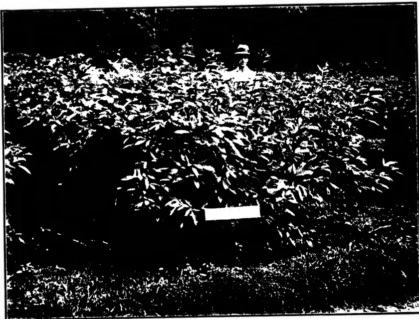

*Cajanus cajan* (Pigeon pea)

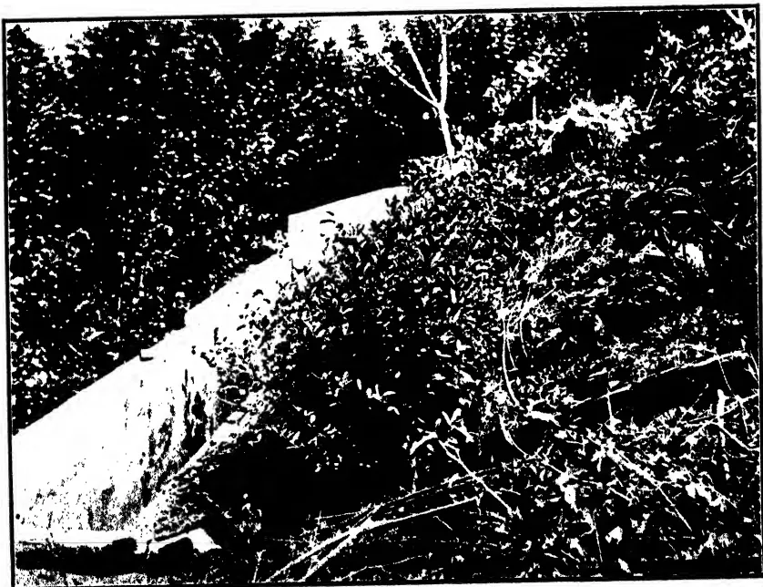

A contour hedge of *Clitoria cajanifolia*

594------------------------------------------------

A high-contrast black and white photograph showing a person standing in a field of dense, low-lying vegetation. The person is wearing a light-colored shirt and trousers. The background is filled with thick foliage and trees, creating a textured, dark appearance. The image is framed by a thin black border.

*Crotalaria anagyroides*

595------------------------------------------------

145

The seeds are large and very sticky and this makes sowing difficult. It is said, however, that washing the seed impairs germination. For hedges seed should be sown thick, not more than 4 inches apart.

*Crotalaria anagyroides*.—This is the finest *Crotalaria* which has been tried at Peradeniya in the last ten years and its merits have been frequently referred to. Not a single tea estate, however, reports having tried the plant although large quantities of seed have been sold. *Crotalaria anagyroides* will produce a large weight of green material in a shorter time than any other leguminous plant grown locally. The loppings have a high manurial value and decompose rapidly.

The plant stands lopping rather better than other *Crotalarias* grown at Peradeniya but it is unlikely that it will stand more than two loppings before dying out. *Crotalaria anagyroides* attains a height of about 8 feet in a year. The seed pods are very liable to insect attack.

*Crotalaria Brownei*.—The plant has been grown experimentally at Peradeniya. The leaves are large but the amount of foliage produced so far has been poor. A further trial is in progress.

*Crotalaria incana*.—This was one of the earlier *Crotalarias* tried in tea clearings at the Experiment Station, Peradeniya, but on account of its small size it cannot compare with *C. anagyroides* and others. Bunting and Marsh <sup>(10)</sup> report that in the F.M.S. the growth was poor and weak and it was found useless as a cover plant.

*Crotalaria intermedia*.—This has been grown experimentally at Peradeniya. The seed germinates very rapidly and evenly but the small size of the leaves and comparatively sparse foliage render it inferior to *C. anagyroides* and others.

*Crotalaria juncea*.—Sunn hemp, Hana (Sinh.), Shanal imappu (Tam.).—This plant has been very largely used for the green manuring of paddy, tobacco, and other crops in India. It is also cultivated for its fibre in South India and north Ceylon. As far as is known it has not been used for tea. If sown thickly it will produce a considerable quantity of green material in a short time. The growth at Peradeniya is inferior to that of *C. anagyroides*.

*Crotalaria laburnifolia*, Yak-beriya (Sinh.).—Hope and Tunstall <sup>(21)</sup> record that this plant has been tried in tea in India but was not found very successful. Wright <sup>(36)</sup> records its trial at Peradeniya but states that the yield of green material was low. The plant has been tried again more recently and this

596------------------------------------------------

146

opinion is confirmed. The superintendent of a Balangoda estate on the other hand reports that it is one of the most promising green manure plants he has tried. There is just a possibility however that the plant was not *C. laburnifolia*.

*Crotalaria longipes*.—Seed of this plant was sent to Peradeniya by the superintendent of a Maskeliya estate who had received it from India. The plant has a spreading habit. All the plants died out after two loppings and the amount of green material furnished was not large.

*Crotalaria semperflorens*.—The superintendent of an estate at an elevation of about 5,000 feet gives a very favourable report on this plant and states that it forms a good protection against wind. It is stated to be grown on high tea estates in south India. It has not been tried at Peradeniya.

*Crotalaria striata*.—This plant was extensively used in the earlier green manuring trials in tea at Peradeniya. It has also been grown in tea both in north and south India, where, however, the plant is not very favourably spoken of.

Elliott and Whitehead<sup>(19)</sup> state that it grows freely in Ceylon up to about 3,000 feet and that 3 or 4 loppings can be taken before the plants die out. At Peradeniya as many loppings as this cannot be taken, but the life of such plants is usually longer at high elevations. Wright<sup>(36)</sup> gives the seed rate at 10 to 20 lb. per acre sowing in alternate rows, and states that in six months 12,000 lb. of green material, per acre were obtained. He also states that in old tea at fairly high elevations little success was obtained unless the *Crotalaria* was sown after pruning and manuring. This is generally the best time to sow any green manure plant.

Willis<sup>(35)</sup> recommends 30 lb. of seed per acre and states that in four cuttings in a little over a year 20,827 lb. per acre of green material were obtained.

Bunting and Marsh<sup>(10)</sup> speak very highly of *striata* in the F.M.S. as a weed smotherer and source of green material. At Peradeniya both *C. anagyroides* and *C. usaramoensis* afford more green material and stand lopping better than *C. striata*. The plant is scarcely mentioned in the replies to the circulars. One estate in Dimbula reports that it was not very successful.

*Crotalaria walkeri*.—This plant has been grown experimentally at Peradeniya. Growth was fair but not very vigorous. The plants have a spreading habit. The recovery from lopping was fairly good.

597------------------------------------------------

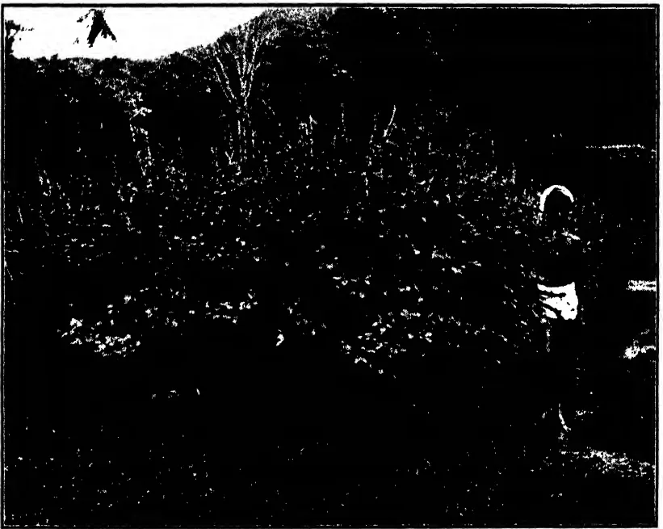A high-contrast black and white photograph showing a person standing in a field of tall, dense vegetation. The person is positioned on the right side of the frame, wearing a light-colored shirt and dark pants. The background features a dark, silhouetted mountain range under a bright sky. The image is framed by a thin black border.

\* *Crotalaria striata*

598------------------------------------------------


*Indigofera hirsuta*

599------------------------------------------------

147

*Crotalaria usaramoensis*.—At Peradeniya, this plant may be considered to come second to *C. anagyrooides* among *Crotalarias*. Bunting and Marsh <sup>(10)</sup> describe it as producing the heaviest and quickest growth of all the covers under observation by them. It has been used on some tea estates for contour hedges but, being short-lived like all *Crotalarias*, it is not considered suitable for this purpose. It has also been used by some estates at elevations between 3,500 feet and 5,200 feet as a source of green material. It, however, does not stand lopping well, and has not generally been received with much enthusiasm. The seed is very small and the seed rate is given by one superintendent as 2 to 3 lb. per acre. The seed pods are attacked by insects.

*Galinsoga parviflora*.—This is one of the plants stated by Anstead <sup>(5)</sup> to have been found useful in selective weeding on south Indian tea estates.

*Desmodium gyroides*.—Unlike most of the common *Desmodiums* in Ceylon this is a tall shrub attaining a height of 6 to 9 feet. It is described as the most useful of the many species of *Desmodiums* found in the Dutch East Indies where it is said to grow up to an elevation of 2,500 feet. Young plants are said to be liable to die off for some reason not yet satisfactorily explained.

At Peradeniya it grows well and furnishes a fair weight of loppings. It appears to die off, however, after lopping for 12 to 18 months.

It has a profuse root system on which many nodules are found.

*Indigofera arrecta*.—This plant grows vigorously at Peradeniya but the weight of green material furnished is not large. It was tried for contour hedges in tea but after taking three loppings in 18 months the plants died out. A Dimbula estate, however, reports that it has survived lopping for three years. Other estates at about 4,000 feet have tried the plant but do not report very favourably. The plant seeds profusely from an early age. The seedlings are deep-rooted and are apt to overrun a field unless kept in check. *I. arrecta* is one of the plants from which indigo dye is obtained. •

*Indigofera hirsuta*.—This plant has a more spreading habit and provides more leafy material than *I. arrecta*. It is, however, short-lived, its recovery from lopping is uncertain, and at Peradeniya it always appears to lodge after seeding. It forms a better protection for the soil than the more erect types.

600------------------------------------------------

148

A favourable account is given by Bunting and Marsh <sup>(10)</sup> who state that in the F.M.S. *Indigofera hirsuta* completely covered the ground in 4 months.

*Indigofera suffruticosa*.—The habit of this plant is rather more bushy than that of *I. arrecta*.

Willis <sup>(33)</sup> records that the plant was sown in alternate lines in tea at Peradeniya. He gives the seed rate as 10 lb. per acre and states that the yield of green material was comparatively poor. The life of the plant is likely to be similar to that of *I. arrecta* to which it bears close resemblance.

*Lupinus* sp., Lupins.—Though very valuable for green manuring purposes in temperate zones lupins do not promise to achieve any great results in Ceylon. A number of varieties are now being grown at Peradeniya but at present the indications are that the climate is quite unsuitable.

A few tea estates have tried lupins. Only one estate, in West Haputale, at an elevation of 4,000 to 6,000 feet, has given a favourable report. Other estates at high elevations report serious damage by grubs, and one records a disease, *Pestalozzia lupini*.

The general indications are that the plant is not suitable for Ceylon.

*Sesbania negyptica*, Chittakatti (Tam.).—This plant has been used for growing and digging in between tea in India.

It has been grown at Peradeniya where it yielded three cuttings of green material. The yield of loppings is, however, very meagre compared with many other plants.

*Sesbania cannabina*, Daincha.—This plant is referred to in many publications as *Sesbania aculeata* but as the name was changed to *Sesbania cannabina* a number of years ago at Peradeniya that name is here used.

Seed of this plant germinates with exceptional rapidity and evenness. It is very largely used for the green manuring of paddy in south India. It is hardy and will grow on a variety of soils, though it prefers a sandy one.

Hope and Tunstall <sup>(21)</sup> record that in tea seed is broadcasted at the rate of 15 to 30 lb. per acre. They state that the crop grows very rapidly and can be hoed in two months later. In Assam an average patch of daincha was dug up and the weight of the complete plants was equal to 7,500 lb. per acre. Mann and Hutchinson <sup>(26)</sup> state that in one set of experiments the hoeing in of daincha resulted in larger increases in the yields of tea than with *Phaseolus mungo* or *Crotalaria striata*.

601------------------------------------------------

A completely blank white page with no visible content, text, or markings.

602------------------------------------------------

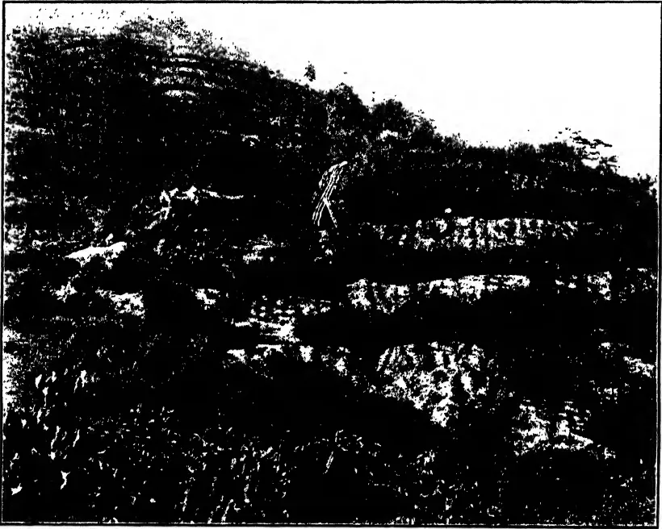A high-contrast black and white photograph of a dense, dark hedge of Tephrosia candida plants. The hedge is thick and appears to be planted in a row, possibly marking a boundary in a tea plantation. The background shows a sloping hillside with more vegetation and a clear sky. The image is framed by a thin black border.

Hedges of *Tephrosia candida* in a tea clearing

603------------------------------------------------

149

There is no doubt that when thickly sown and hoed in early daincha will provide a large quantity of organic matter, but this type of green manuring is but seldom practised in Ceylon and for lopping the plant is of very little use.

*Strobilanthus viscosus*, Nelu (Sinh.).—This wild plant grows prolifically in some up-country jungles and is quoted by Elliott and Whitehead <sup>(12)</sup> as a useful source of green material to be brought in from outside.

Several up-country estates record good results from the use of this green material.

*Tephrosia candida*, Boga medeloa.—This is probably the most popular and useful bush green manure plant in Ceylon from sea level to about 4,500 feet. If it has a rival it is *Tephrosia vogelii* but the latter plant is at present not so well known.

Bald <sup>(6)</sup> describes it as the most useful shrub for green manuring of tea in northern India. He states that the usual practice in India is to sow the seed with the early rains in alternate rows of tea. Three loppings a year are obtainable giving 7,200 to 8,000 lb. of green material per acre per lopping where the plants are spaced 8 feet by 4 feet. After about three years the plants are usually dug out and trenched in.

Hope and Tunstall <sup>(21)</sup> give the seed rate at 20 to 30 lb. per acre for sowing hedges in alternate rows. The authors add that the plants should be lopped as often as possible.

Mann and Hutchinson <sup>(28)</sup> recount the advantages of *Tephrosia candida* at length and state that the only disadvantages are interference with the working of the tea and red rust.

In Ceylon the plant is possibly used more for coconuts and rubber than for tea but it is considerably employed for the latter crop more particularly at low and medium elevations. Probably its greatest use is for contour hedges or hedges above drains and roads in clearings, and such hedges have undoubtedly done much to check erosion and at the same time furnish a considerable weight of green material.

In old tea the usual practice is to sow the seed in alternate rows. The general seed rate for this purpose is given at 4 to 6 lb. per acre though some estates use 10 lb. per acre and one recommends broadcasting 25 to 30 lb. per acre. Broadcasting is usually done, but one estate reports planting 20 feet by 20 feet interplanted with dadaps planted at a similar distance. In this case the bushes must be lopped and treated like trees. This is not thought to be the best way of using the plants. Some estates only plant *Tephrosia candida* in hedges above roads and drains

604------------------------------------------------

150

while others plant it only in poor places where vacancies in tea have occurred. Once established there are two methods of dealing with the plants. One is to pull up and fork them in after 8 months to a year, and the other is to leave them for a number of years and lop periodically. The former practice is not general but some planters consider it to be the best method. The superintendent of a Matala estate considers that the plants should be left in only so long as they can be pulled up by hand. The cost of pulling the plants and forking them in within a year is given as from Rs. 7.50 to Rs. 10 per acre.

Where regular lopping is done two to three loppings a year can be taken. The cost of lopping alone is given at various figures between 60 cents and Rs. 2 per acre. The age at which *Tephrosia candida* should be finally dug out must vary with the elevation. At low and medium elevations the plant will have become very woody and the yield of green material will have sensibly diminished after three years. At high elevations the plant can be economically retained for from four to six years.

The ability to grow on poor soil is one of the most valuable characteristics of the plant. There is considerable evidence of improvement to tea as the result of planting *Tephrosia candida*.

The pests and diseases to which the plant is prone are somewhat numerous; it is often severely attacked by shot-hole borer and some superintendents consider that its presence results in increased incidence of this pest. Several scale insects including *Pseudococcus virgatus* attack the plant more or less severely. The seed pods are attacked by a number of insects and good seed is often hard to obtain. Various fungoid diseases, including *Fomes lignosus* and *Poria hypobrunnea* are found on old plants, but such diseases will not be common if the plants are not left in too long.

These drawbacks, however, have done little to diminish the popularity of the plant which is still the most widely grown of any bush plant in Ceylon.

*Tephrosia noctiflora*, Ela-pila (Sinh.).—This plant was formerly known as *T. hookeriana*. It is much smaller than *T. candida* or *T. vogelii* and given similar conditions will not furnish more than a quarter of the green material that could be obtained from them. It has rather a low-spreading habit. It is possibly rather more hardy than *T. candida* but in other respects cannot be compared with it.

*Tephrosia tinctoria*, Alu-pila (Sinh.).—Anstead <sup>(3)</sup> records that this is the commonest wild legume found growing on some tea estates in the Wynaad and if encouraged will form an excellent light cover. It has a low-spreading habit.

605------------------------------------------------

151

*Tephrosia senticosa*.—This is a low-spreading shrub which has been grown experimentally at Peradeniya. It is of little use as a source of green material, and as a ground cover more suitable plants are available.

*Tephrosia villosa*, Bu-pila (Sinh.).—This plant has been grown experimentally at Peradeniya. It has been seen in a nursery in Dimbula but the yield of green material promised is not large.

*Tephrosia vogelii*.—This plant shows a considerable resemblance to *T. candida* but is easily distinguished by its pods which are larger, longer, and very hairy. The leaves are also larger and the foliage generally more luxuriant. It yields a larger quantity of green material when young than *T. candida* but its life is shorter. At Peradeniya it does not generally live for more than two years, but in Dimbula, where it grows very well, it appears to last for a number of years and stands lopping well. Burnett <sup>(1)</sup> records that it grows well in Dickoya but is inclined to grow out over the surface of the tea bushes and interfere with the plucking. The same however may be said of *T. candida*, though possibly to a less extent, and the more luxuriant foliage of *T. vogelii* is in other respects a point in its favour. Another advantage is that as far as is known the seed pods are not liable to insect attack. Good accounts have also been received of the plant from Kalutara and Balangoda.

*Tithonia diversifolia*, Wild Sunflower, Natta suriya (Sinh.), Suriyakandu (Tam.).—This plant is not leguminous but its prolific growth on waste land at low and medium elevations renders it a most useful source of green material. It was used in an experiment at Peradeniya in which green material brought in from outside was buried, and was found to result in as great an increase in nitrates in the soil as was obtained from the green material of leguminous plants.

### GROUND COVER PLANTS

The uses of ground cover plants differ somewhat from those of trees or bush plants and it will be desirable to set out afresh the advantages to be gained:

1. (1) The soil is shaded. . .
2. (2) The root action of the ground cover plants helps to open up the soil and aids the absorption of rain water.
3. (3) If a leguminous plant is used the other advantages enumerated can be obtained without depleting the supply of nitrogen in the soil and an increase of nitrogen may possibly result. . .

606------------------------------------------------

152

- (4) Soil erosion is effectively checked.
- (5) In spite of increased transpiration there is evidence to show that in regions of sufficient rainfall more moisture may eventually be retained in soil under a ground cover.
- (6) An increase in the organic matter in the soil may be expected to result even if the cover is not turned in, while an added increase may be expected if the creeper is buried or forked in.
- (7) Weed growth is checked.
- (8) In a young clearing, plant food which might otherwise have been lost is retained for future use.

These advantages will now be discussed in greater detail.

(1) *Shading the Soil.*—The advantages of shading the soil in a tropical climate have already been explained. A ground cover plant will achieve this object more effectually than a tree or bush plant, provided the growth is good.

(2) *Root Action.*—The root action of ground cover plants will naturally not extend to the same depth as that of trees or bush plants. The mass of rootlets afforded by such a cover plant as *Indigofera endecaphylla*, however, will permeate the surface soil more effectually than the roots of trees or bush plants could do.

(3) *Nitrogen Assimilation.*—All that has been said in this connection with regard to trees or bush plants will hold good for ground cover plants. Two sets of Peradeniya figures can be quoted in the matter of gain or loss of nitrogen when the plant is not turned in. In the trials of *Indigofera endecaphylla* in old tea on the Experiment Station, Peradeniya, soil analyses are made by the Agricultural Chemist every two years, just before pruning. The *Indigofera* was planted after pruning in October, 1925, and the average nitrogen contents of all the plots under treatment has been as follows:

<table style="margin-left: auto; margin-right: auto;">
<thead>
<tr>
<th style="text-align: center;">1925</th>
<th style="text-align: center;">1927</th>
<th style="text-align: center;">1929</th>
</tr>
</thead>
<tbody>
<tr>
<td style="text-align: center;">·096</td>
<td style="text-align: center;">·087</td>
<td style="text-align: center;">·098</td>
</tr>
</tbody>
</table>

It will be seen that a slight decrease occurred at the end of the first two years while at the end of four years a slight increase was registered. The full results of this trial will be found in two articles, one by the writer, and one by Dr. A. W. R. Joachim, Agricultural Chemist, in *The Tropical Agriculturist* of March, 1930.

607------------------------------------------------

153

Another set of figures has been published by Joachim and Pandittesekere <sup>(24)</sup> in connection with a further experiment at Peradeniya, and these have been quoted in connection with trees and bush plants. In this case the samples were taken from undisturbed plots of *Dolichos hosei* (Vigna), and the indication is that large increases of nitrogen cannot be expected from growing cover plants without turning them in periodically.

(4) *Check to Soil Erosion.*—In Ceylon this will usually be the principal object in planting a ground cover, and such a crop is the only really effective method of preventing the movement of surface soil, or minimising it to the utmost. Figures of a soil erosion experiment, being conducted at Peradeniya, have already been quoted in Section I. The evils of soil erosion are so well known and the beneficial effect of a ground cover in checking erosion so obvious that it appears unnecessary to discuss the matter further.

(5) *Soil Moisture.*—This is a most important consideration. The loss of soil moisture through transpiration appears at first sight to constitute a considerable drawback to the planting of a cover crop in tea. Before coming to any conclusion in this matter however, it will be necessary to examine the opinions and experience of other authorities and estate superintendents.

Hope and Tunstall <sup>(21)</sup> write "The soil is always losing moisture by evaporation on the surface; but at the same time the plant by transpiration is losing moisture also and it is found that in the cases investigated the amount of water lost by transpiration considerably exceeds the amount saved by the reduction in the evaporation from the soil surface". This view is generally supported by experiments elsewhere. The results of Ceylon investigations and experience, however, are generally more favourable to the cover crop, at all events after the latter has been in possession of the soil for some time. The matter has been already dealt with to some extent in Section I and the results of the investigations at Peradeniya into this aspect of cover crops may be summed by quoting from Joachim and Kandiah <sup>(23)</sup> "Soils planted with cover crops either cut or left uncut are found to retain more moisture than bare soils at nearly all depths up to 24 inches. The results of previous work on the subject are therefore confirmed". Turning to field experience it may be stated that tea under *Indigofera endecaphylla* at Peradeniya has never shown any sign of being more adversely affected by a drought than clean-weeded tea, in fact the impression gained has been the reverse. At Peradeniya, young supplies come on better in a cover of *Indigofera* than on clean

608------------------------------------------------

154

weeded land. A Ratnapura estate has reported that *Indigofera* has been a great success in young clearings and has had no adverse effect on the young tea plants. Similar reports have been received from Bandarawela and Moneragala which are dry districts. On the other hand two estates in Badulla have reported unfavourably of *Indigofera* in young clearings and one superintendent states this cover to be "definitely injurious" to young tea. It is probable that if there was an adverse effect it was due to undue absorption of moisture at the expense of the tea plants. Hope and Tunstall's remarks refer to Indian climatic conditions which are very different to those of Ceylon. There is no concrete evidence in Ceylon of any adverse effect caused by a cover crop in old tea, but opinions as to young clearings seem somewhat divided. Generally the principal object of planting a cover crop in a clearing is to save soil erosion which will naturally be most severe in the first two or three years. If the land is steep and no other special measures have been taken the necessity of checking erosion seems so urgent that the planting of a cover crop would appear generally advisable. It will always be necessary to keep a clear space round young tea bushes and it is thought that if in drier districts this clearing is done in a somewhat larger ring the adverse effects complained of may not be felt.

(6). *Increase of Organic Matter.*—This aspect of the practice of growing ground cover plants among tea has received far more attention in India than in Ceylon. The principal reason of this is probably that a considerable amount of tea in northern India is grown on comparatively flat land and on such land the practice of growing an annual leguminous ground cover crop and hoeing it in a few months can be adopted with benefit. For many Ceylon estates the erosion resulting from such a practice would probably more than counterbalance the benefit. It is thought, however, that by substituting envelope-forking for hoeing the practice of growing a ground cover crop to be incorporated later in the soil might be considerably extended. In spite of the difference of conditions it will be advisable to examine Indian practice and opinions in this matter.

Bald <sup>(6)</sup> after discussing the use of trees and bush plants gives it as his opinion that more rapid results can be obtained by sowing an annual crop between the lines of tea bushes, and further states that a green manure crop has reached its maximum usefulness when it has begun to flower and should then be hoed in. The possibility of soil erosion is not neglected for the author states that on steep hillsides "It is madness to dig during the

609------------------------------------------------

155

rains'', and in such cases the crop is merely sickled and left on the ground. By actual experiment the author claims to have noted an increase of fully 70 lb. of tea per acre on a hill estate at an elevation of 4,000 feet by this practice of green manuring and he states that the increase in the plains must be more.

Hope and Tunstall <sup>(21)</sup> describe *Phaseolus mungo* (a creeping leguminous plant) as the most satisfactory green manure at present known for replacing lost organic matter in tea land.

Mann and Hutchinson <sup>(28)</sup> in discussing the hoeing in of *Phaseolus mungo*, state that the effect on yield of tea appears to commence about three weeks after the hoeing in of the green crops. The importance of obtaining a quick growth of the creeper, is stressed and it is stated that the crop should not occupy the land for more than 6 to 8 weeks.

Conditions in different parts of India of course differ largely but it is gathered that, speaking generally, in northern India trees in tea are usually not lopped and reliance is placed on annual creeping legumes for the replenishment of organic matter. In Ceylon on the other hand the loppings of trees are the chief source of organic matter while, ground cover crops, if used at all, are planted principally with the object of checking soil erosion. Each country must suit its own needs but it is thought that the improvement in the physical texture of the soil and the increase in organic matter likely to result from the growing of a cover crop, even if it is not turned in to the soil, is not always realised. In the trial of *Indigofera endecaphylla* in progress at Peradeniya the following percentages of organic matter were found after planting *Indigofera* in 1925:

<table>
<thead>
<tr>
<th></th>
<th>1925</th>
<th>1927</th>
<th>1929</th>
</tr>
</thead>
<tbody>
<tr>
<td>Average percentage of organic matter</td>
<td>3.75</td>
<td>4.56</td>
<td>5.29</td>
</tr>
</tbody>
</table>

There is little doubt that these increases would have been larger if the creeper had been periodically forked in and this question will probably be the subject of the next trial. The question of erosion must always be considered along with the proposals to fork in a cover crop and it is gratifying to note that even without digging in the cover an increase in organic matter can be confidently expected.

A good many Ceylon tea estates have inaugurated a system of digging or forking in cover crops in order to obtain the maximum increase of organic matter. The information furnished by estates relates almost entirely to *Indigofera endecaphylla*. Some estates cut and fork in this creeper, others fork it in without cutting. Costs of cutting and forking in are

610------------------------------------------------

156

given as being between Rs. 4.80 and Rs. 5 per acre. One estate cuts the creeper at manuring, throws it in to the next row and forks it in at a total cost of Rs. 7.50 per acre. It may be mentioned that there is no difficulty about forking through the creeper without cutting it out but experience shows that it is difficult to incorporate any considerable quantity of green material without first cutting the creeper.

(7) *A Check to Weed Growth.*—This is a controversial subject. Some planters assert that once a satisfactory cover is established weeding is a thing of the past, while others assert that the presence of a cover crop increases the difficulty and cost of weeding.

There are two aspects of weeding in connection with a cover plant, one is the removal of the plant itself from the tea bushes—a weed is a plant in its wrong place, and if a cover plant is creeping over a tea bush it becomes a weed—and the other is the effect of the cover plant on other weeds. If the cover plant needs so much controlling that the labour involved more than counterbalances any saving in the removal of other weeds there is obviously no advantage gained as regards the weeding bill. The remedy is to choose a suitable plant. In the case of the best known cover plant for tea in Ceylon, *Indigofera endecaphylla*, the creeper does not twine round or climb up a tea bush; it will sometimes grow up through the middle of the bushes but is very easily removed by hand. Writers on green manuring of tea in India allude to the efficiency of soya bean (*Glycine hispida*) and of *Phaseolus mungo* in keeping down weed growth, but also mention the difficulty of preventing these plants from climbing up the bushes.

Figures are not available, but it is considered that in the case of *Indigofera endecaphylla* though the cost of weeding will be increased in the first year, thereafter it should gradually drop below the normal. At Peradeniya very few weeds, except couch grass, come through *Indigofera*. Cora will appear if the cover is removed, even if it has been apparently smothered for two or three years. It is not likely that a cover crop will ever enable weeding to be dispensed with altogether.

Little information is available about the effect of weeding of creepers other than *Indigofera endecaphylla*. *Dolichos hosei* has been used in tea and it is thought that the cost of keeping this plant from smothering the bushes is not excessive. The subject will be mentioned again in the notes that follow.

(8) *Retention of Plant Food.*—By its nature and habit a ground cover plant is better fitted to take up plant food which is not within reach of the root system of young tea than a tree or

611------------------------------------------------

157

bush plant. This plant food will thus be retained on the land and some will later be returned if the creeper is dug or forked in, and by the natural leaf-fall.

### THE CHOICE OF A GROUND COVER PLANT

A certain amount has been said on this subject in discussing the question of weeding. Perhaps the principal requirements of a cover plant for tea is that it should not climb over or unduly interfere with the progress of coolies. *Indigofera endecaphylla* fulfils these requirements better than any other plant that has been planted in tea in Ceylon. This creeper will thrive from sea level up to about 5,000 feet. It is not known whether any suitable creeper has been found for higher elevations than this. Next in popularity probably comes *Dolichos hosei* but this creeper cannot be said to be extensively planted as a cover for tea.

These remarks refer only to planted creepers; selective weeding will be discussed later.

### DISADVANTAGES OF A GROUND COVER IN TEA

The question of the smothering of tea bushes and undue absorption of moisture have already been dealt with. There remains the harbouring of snakes and leeches. At Peradeniya snakes have been fairly frequently found among *Indigofera endecaphylla*. Two pluckers have been bitten in four years though fortunately the results were not serious. There would seem to be no way of avoiding this disadvantage which is possibly the most serious objection to the planting of a ground cover in tea.

In *Indigofera* very few complaints of leeches have been received. The superintendent of one estate which has about 50 acres under *Indigofera* reports that leeches are never found in this creeper though they abound in the district. At Peradeniya a good many leeches were found after the heavy rains in November 1929. Previous to this they had been very little noticed.

### NOTES ON INDIVIDUAL GROUND COVER PLANTS

*Centella asiatica*, Gotukola, Hin-gotukola (Sinh.), Kalluvallarai (Tam.).—This plant was previously identified as *Hydrocotyle asiatica*. It is found growing vigorously in tea on many estates. Its value appears to be a matter of controversy. A superintendent at Kalutara describes the plant as a pest and states that large sums of money have been spent on its eradication. On the other hand a superintendent in the Kelani Valley considers that it gives a more desirable cover than *Vigna*, both for tea and rubber, but is hard to establish.

612------------------------------------------------

158

For a general opinion as to the encouragement of such plants the reader is referred to the later heading "Selective Weeding".

*Cotula australis*.—Anstead <sup>(5)</sup> states that use has been made of this plant in selective weeding for the prevention of soil erosion on south Indian tea estates.

*Desmodium triflorum*, Hin-undupiyali (Sinh.), Serupilladi (Tam.).—This is a very small, close-growing, perennial herb, indigenous to Ceylon found up to about 2,000 feet. It has probably never been planted in tea, but in some cases it has been encouraged to grow by selective weeding. Emphatic reports of its unfavourable effect on young tea have been received. Burnett <sup>(11)</sup> states that its matted root growth appears to prevent soil aeration and to affect the tea detrimentally.

Evidence generally points to the close matted growth formed by the plant as its chief disadvantage. It is thought that if forking through the cover was regularly done the ill-effects might be mitigated, but as the plant's only advantage appears to be that it grows spontaneously there seems to be no adequate reason for recommending it.

*Dolichos hosei* (Vigna).—This plant was for some years known as *Vigna oligosperma* and the term "Vigna" is almost accepted as a common name. The creeper is principally grown as a cover crop in rubber but has been planted to some small extent in tea.

Grigsby <sup>(15)</sup> points out that it thrives well in some places while in others it will not grow at all; in fact on some estates it is almost impossible to establish. When difficulty is found in establishing it a small application of a general mixture, rich in phosphates, is recommended. The author recommends starting nurseries from seed or cuttings so that fresh runners are available for planting out in the field. It is necessary that every runner planted out should contain a small root. This precaution has been found at Peradeniya to make all the difference between success and failure. Vigna usually grows downhill so that it is advisable to put the ends of the runners going downhill. Some estates report, however, that sowing seed in the field is more successful than runners.

On tea estates a number of trials have been made with Vigna from sea level up to 5,000 feet. The great objection to the use of this creeper in tea is that it is liable to creep over and smother the tea bushes. It is not, however, a very strong climber and it is thought the expense of keeping it off the bushes is by no means prohibitive. One or two estates have given up Vigna in tea on account of its climbing proclivity. An up-country

613------------------------------------------------

A black and white photograph of a rural landscape. In the background, a long, low building with a thatched roof is visible. The middle ground is filled with dense, tall vegetation, possibly a hedge or a field of tall grass. The foreground is a grassy field with some scattered debris or small plants. The image is framed by a thick black border.

*Desmodium triflorum* and *D. heterosphyllum*

614------------------------------------------------

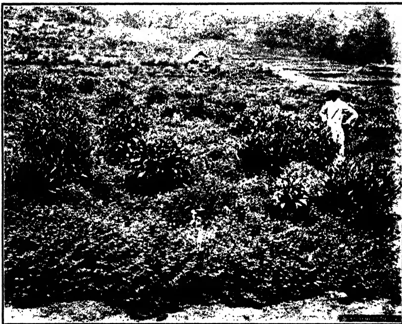A black and white photograph showing a person standing in a field of dense, low-lying vegetation, identified as Indigofera endecaphylla, which is used as a cover crop for tea. The field is bordered by trees in the background.

*Indigofera endecaphylla* as a cover crop for tea

615------------------------------------------------

159

estate reports that the creeper is delicate and is frequently attacked by caterpillars. It has been reported that the cost of weeding is reduced by the establishment of Vigna. An estate in the Agra Patanas at an elevation of 4,500 to 6,600 feet reports that the creeper is well established and no further weeding is necessary. *Dolichos hosei* certainly forms a possible cover crop for tea but *Indigofera endecaphylla* is to be preferred.

*Dolichos biflorus*, Horse gram, Kollu (Sinh. and Tam.).—Mann and Hutchinson <sup>(28)</sup> report that this creeper has been particularly successful on one estate in India as a green manure for tea. It is not a perennial, however, and in India is grown for early hoeing in. It is a strong climber and for this reason cannot be considered really suitable for tea.

*Drymaria cordata*, Kukulu pala (Sinh.), Patani pillu, Kadalai pillu (Tam.).—This indigenous creeper is, like *Oxalis*, found growing prolifically on some up-country estates. It is recorded in Kotmale, Dimbula, and Dickoya, but is probably found also in other districts. It is liable to climb up bushes and particular care must be taken to keep it off young supplies. Superintendents have been faced with the problem as to whether to encourage it or attempt its eradication and as regards the solution of this problem the reader is again referred to the later heading "Selective Weeding".

An estate in Dickoya reports that weeding among *Drymaria* is very difficult.

*Glycine hispida*, Soy bean, Soya bean.—Hope and Tunstall<sup>(21)</sup> record that a number of varieties are used for the green manuring of tea in the Darjeeling districts of India. It is usually sown broadcast in alternate rows immediately after hoeing. A seed rate of 80 lb. per acre is mentioned. At Tocklai the plant was found to do best in shady places. The plant is reported to be very effective in keeping down weeds and in preventing soil erosion.

A white-seeded variety is reported to have made good growth at Peradeiya but on another occasion the crop was almost completely destroyed by Kalutara shails.

Like *Dolichos biflorus* the soy bean is an annual and is moreover a strong climber.

*Indigofera endecaphylla*.—For some years this creeper has been considered at Peradeniya to be the best cover plant for tea of any so far tried. Possibly its principal advantage is that unlike Vigna and many other creepers it will not climb over tea. At Peradeniya 14 plots of tea comprising in all 8 acres, have been under this cover crop since 1925. For the period between the 1927 and 1929 prunings, in spite of short rainfall

616------------------------------------------------

160

and the loss of a number of bushes after the 1927 pruning, there was a general increase of yields of tea over the 1923-1925 period. There was also a satisfactory increase in the nitrogen content of the soil, and a most marked increase in organic matter, amounting to nearly 40 per cent.

*Indigofera endecaphylla* flourishes in Ceylon from sea level up to about 5,000 feet. An estate at Pundaluoya reports that cuttings did not strike at 5,300 feet, struck fairly well but grew slowly at 4,100 feet, and was easily established and grew rapidly at 3,400 feet. Another estate reports definite failure at 6,000 feet.

Alexander <sup>(1)</sup> says that in south India its natural habitat is 3,000 feet, but that it thrives well at altitudes varying from sea level to 6,000 feet. He adds that the creeper gives a heavier mulch than any other cover plant and protects the soil most efficiently from sun and erosion.

The plant is best propagated in the field from cuttings; seed in the fields has not been found successful. At Peradeniya two or three 18-inch cuttings were planted together, the middle of the cuttings being buried leaving both ends out. Such bunches of cuttings were put in 2 feet apart, but wider spacing can be adopted if an early cover is not of urgent importance. A fair cover was formed in 6 months and a continuous even cover in a year from planting.

The first object at Peradeniya has been to test the effect of the mere presence of the creeper on the tea, but there is little doubt that more benefit can be obtained by forking or digging it in. Some estates cut and fork in the creeper at a cost of from Rs. 4.80 to Rs. 5 per acre. An estate in Kalutara cuts and buries the creeper in holes at a similar cost. On another estate the creeper is cut at manuring time, the green material thrown into the next row and there forked in at a cost of Rs. 7.50 per acre. Some estates report that the creeper is forked in without cutting. There is no difficulty about forking through the creeper but experience shows that it is not at all easy to incorporate any considerable amount of the creeper in the soil without first cutting it.

*Indigofera endecaphylla* is remarkably free from pests and diseases. Light <sup>(25)</sup> reports that the only pest of importance is a caterpillar, *Dichomeris ianthes*, which sometimes completely defoliates the creeper. Experience at Peradeniya, however, is that the creeper recovers very quickly from such defoliation. The use of this creeper in young clearings has already been dealt with at some length in discussing the question of loss of moisture. Opinions on this matter are divided: generally in the wetter districts reports are favourable while in districts subject

617------------------------------------------------

161

to long droughts some adverse reports on its effect on young tea have been received. One estate complains that it grows too high for the young tea but any cover crop needs keeping away from the immediate proximity of young tea plants and *Indigofera* should give less trouble than most others in this respect.

In old tea reports are more favourable though the plant has by no means achieved universal popularity. The danger of snakes has already been mentioned.

An examination of the physical condition of soil which had been under *Indigofera* for some time compared with clean-weeded soil will convince the most sceptical that improvement is taking place, and analysis bears that out.

When once a good cover is established a reduction in weeding costs may be anticipated though weeding can never be dispensed with. Couch grass comes through the creeper at Peradeniya, and *Mycania scandens* and a convolvulus creeper have given some trouble.

There is little doubt that *I. endecaphylla* has come to stay.

*Oxalis corniculata*, Hin-embul-embiliya (Sinh.), Kottipuliari (Tam.).—This species of *Oxalis* does not form bulbs in the same way as do the others mentioned; it is therefore quite easy to control. It is a small close-growing indigenous creeper with a yellow flower. It is not leguminous.

Anstead<sup>(5)</sup> mentions it as a useful plant in selective weeding on south Indian tea estates that hundreds of acres of steep tea land are under *Oxalis*. He adds that the yields of tea have been maintained and in fact increased and the effect on the tea in the hot weather is very slight.

The plant was left unweeded in the tea plots at Peradeniya for about two years and formed a fair but patchy cover. It was not found to be a strong enough grower to keep down other weeds, and grasses grew freely through it. Without cultivation this cover might be open to the same objections as *Desmodium triflorum*. Only one estate mentions this plant and the superintendent says that *O. corniculata* dies off in dry weather but provides a fair amount of organic matter.

*Oxalis corymbosa*, Puliari pillu (Tam.).—This plant is rampant on many up-country tea estates and was formerly regarded as a noxious weed. Drastic and expensive efforts were made to eradicate the plant but owing to the bulbs which formed below ground these efforts generally resulted in a thicker growth. It then began to be thought that on a steep land the plant might do more good than harm. Efforts to eradicate this weed gradually ceased and there are now actual instances of the planting

618------------------------------------------------

162

of *Oxalis*. The plant dies down once a year in the hot weather and this is a great safeguard against it absorbing too much moisture at the expense of the tea.

Wilkinson <sup>(82)</sup> quotes an example of a very steep field where a prolific growth of *Oxalis corymbosa* has existed for 20 years. He shows by a graph that the yield of this field has throughout been satisfactorily maintained compared with the general average of the estate.

Superintendents in other estates in Dimbula, Dickoya, and Gammaduwa report that they do not consider *Oxalis* at all harmful and the yield of tea is not reduced by its presence.

*Oxalis latifolia*, Puliari pillu (Tam.).—This plant grows freely in Dimbula and other up-country tea districts and is often found mixed with *O. corymbosa*.

*Oxalis violacea*, Puliari pillu (Tam.).—Remarks made with regard to *O. corymbosa* would appear to apply equally to *O. violacea*.

*Parochetus communis*.—This is an indigenous creeper which has been found growing on several up-country estates and is highly spoken of.

Petch <sup>(29)</sup> says that it occurs in Ceylon from an elevation of 4,000 feet upwards being frequently met with on shady banks round Nuwara Eliya.

Anstead <sup>(5)</sup> says that it has been used in selective weeding in south India but that it is not easy to establish over large areas. It dies back in the dry weather but comes on again with rain.

Attempts to establish the plant at Peradeniya have so far failed.

*Phaseolus mungo*, Green gram, Mun-eta (Sinh.), Pasipayiru (Tam.).—Hope and Tunstall <sup>(21)</sup> state that a number of varieties are used for green manuring of tea in India. These are distinguished by the colour of the seed which varies from white to black. The authors state that both experiment and practical experience of planters have proved the value of the plant without doubt. They add that its twining habit is a disadvantage. A good crop is stated to give 8,000 lb. of green material per acre. It is said that the crop will not grow satisfactorily on poor soil without manure.

Mann and Hutchinson <sup>(28)</sup> give a seed rate of 40 lb. per acre.

The plant is attacked by several caterpillars. It is an annual and is grown only for hoeing in and not as a permanent cover crop.

619------------------------------------------------

163

It is not quite certain whether the numerous references in Indian literature are to the green gram only or whether they include the black gram. Both have been called *Phaseolus mungo*. In any case the growth of the two plants is similar. At Peradeniya the black gram (Sinhalese Undu and Tamil Ulundu) is the stronger grower of the two.

*Vigna sinensis*, Cow pea, Mekaral (Sinh), Paithankai (Tam.).—This plant is well known as a food crop in Ceylon but has not been used to any extent as a green manure in tea. Willis <sup>(33)</sup> reports that cow peas were not found very successful as a green manure for tea.

Again *V. sinensis* is an annual and is only suitable for digging in. Thick sowing is necessary to obtain a good cover.

#### MISCELLANEOUS PRACTICES

In addition to the planting of trees, bush plants, and creepers in tea there are a number of practices which deserve mention in this section.

#### SELECTIVE WEEDING

In effect there is little difference between allowing a plant which has appeared spontaneously to grow and planting it, except that the choice of a plant is limited to those found on the land. Plants thus allowed to grow in tea are usually the low-growing kinds that would come under the heading of ground covers, but occasionally bush plants are allowed to grow up.

Anstead <sup>(3)</sup> describes an experiment in a tea clearing in the Wynaad district in which all legumes were allowed to grow. The commonest were found to be *Tephrosia tinctoria* and *Cassia mimosoides*. A good leguminous cover was obtained at practically no cost. On another estate *Tephrosia tinctoria* and *Crotalaria nana* were found to be the commonest wild legumes.

In another publication <sup>(5)</sup> the same author reverts to this subject in connection with the prevention of soil erosion. He says that a plant which will not climb is desired. The ideal plant is hard to find but *Cassia mimosoides* comes nearest to it. He mentions also *Parochetus communis* as a useful native legume but says it is not so easy to establish and dies down during the hot weather. Where a leguminous plant is not available he recommends the encouragement of *Oxalis corniculata* and states that many hundreds of acres of tea are under this weed, the tea has been decidedly benefited and erosion is practically nil. Other plants are also mentioned.

620------------------------------------------------

164

In Ceylon the practice of selective weeding is perhaps not very widely adopted and is generally confined to one or two well-known plants. The most common are undoubtedly the species of *Oxalis* found in up-country tea districts. In early days strenuous efforts to eradicate these plants were made but with little success and with an undoubted increase in soil erosion. These expensive attempts were gradually abandoned, principally no doubt at first on account of their ineffectiveness. The realisation then gradually dawned that *Oxalis* undoubtedly helped in checking soil erosion and in this way possibly did more good than harm. This view gradually gained ground and today there are instances where the planting of *Oxalis* on tea estates has been undertaken.

Wilkinson <sup>(32)</sup> gives an interesting account of his experience with *Oxalis* in which he furnishes figures to show that a steep field covered with *Oxalis* has maintained its yield satisfactorily while a considerable amount of soil erosion has been saved.

Bamber <sup>(8)</sup>, writing in 1915, recommends leaving *Oxalis* if once established. He points out that scraping will only increase the thickness of the subsequent growth and that the plant in any case dies down almost entirely at the beginning of the dry season. He is of the opinion that if tea is properly manured the yield is not likely to fall on account of the presence of *Oxalis*.

It is now the considered opinion of the Department of Agriculture that the species of *Oxalis* found on up-country tea estates are probably more beneficial than harmful to tea.

Another plant commonly found in tea is *Centella asiatica* (*Hydrocotyle asiatica*) better known under its Sinhalese name of Gotukola. Opinions appear to differ as to the desirability of this plant in tea. Two Kalutara estates say that it has proved a pest and that large sums have been spent on its eradication while the superintendents of two estates in the Kelani Valley consider it a better cover for both tea and rubber than Vigna but complain that it is hard to establish.

Another plant which has recently been the subject of a good deal of correspondence and discussion is *Drymaria cordata*. This plant is very prolific on some up-country estates and is sometimes found mixed with *Oxalis*. There is at all events a probability that on steep slopes it will do more good than harm. Care must be taken to keep young supplies clear of the plant as unlike *Oxalis* it will creep over the bushes.

Another plant which has been the subject of experiment in selective weeding is *Desmodium triflorum*. In this case the evidence is almost unanimously unfavourable. Probably the

621------------------------------------------------

165

ill-effect of the plant on tea is due to the close mat it forms and possibly if forking through the cover were practised the effect might be different.

The whole question of selective weeding is one on which it is impossible to lay down hard-and-fast rules. Specimens of plants found growing among tea are often sent to the Department with an enquiry as to whether the plant will "do harm to the tea". Unfortunately plants cannot be classified into those harmful or beneficial to tea. The pros and cons must be considered in each case. The pros are, in the case of a leguminous plant, all the advantages of planting creepers in tea which have been enumerated. In the case of a non-leguminous plant, all the advantages hold good except the assimilation of atmospheric nitrogen by the plant. The cons are the well-known objections to "weeds", the absorption of plant food and moisture, possibly at the expense of the tea plant, and in the case of a close-growing plant interference with soil aeration. A further practical, though not very serious, difficulty is that of training labour to leave only the plant or plants desired and the possible increase in weeding costs entailed.

Of the advantages of planting a creeper in tea probably the checking of soil erosion will generally be the most potent factor in favour of some form of selective weeding.

It may be mentioned here that the toxic effect of grasses on fruit trees which was claimed to have been proved at the Woburn Experiment Station is not upheld by modern investigators. The detrimental influence of grass is generally accepted but the toxic action is disputed and it is held that the effect is due to physical causes such as lack of aeration.

The only safe general advice that can be given as regards the encouragement of any particular plant in tea is to make a trial with the plant and watch the effect on the tea, with the important proviso that definite patches or strips should be kept clean weeded as controls.

### THE USE OF OUTSIDE GREEN MATERIAL

Such material may be obtained from jungles or other uncultivated portions of an estate. This practice has one great advantage over green manuring with plants grown in the tea itself; all the nitrogen and mineral matter contained in the material has been obtained from outside and is consequently pure gain. The cost of cutting and transport will in most cases form the limiting factor for this practice. Once the green material has been brought on to the land it may be disposed of in any of the ways already described. Elliott and Whitehead <sup>(13)</sup>

622------------------------------------------------

166

mention the large quantity of green material which can be obtained from undergrowth in jungle adjoining estates, particularly where Nelu (*Strobilanthus viscosus*) is abundant.

Hope and Tunstall <sup>(21)</sup> also draw attention to this means of obtaining green material and point out that it is not necessary for the green material to be obtained from leguminous plants.

This point needs emphasis; the leaves of leguminous plants are not necessarily richer in nitrogen than those of non-leguminous plants and green material obtained from the latter may be just as valuable. In an experiment at Peradeniya it was found that burying the leaves of the wild sunflower, *Tithonia diversifolia*, resulted in just as great an increase of nitrates in the soil as the burying of leaves of leguminous plants. The wild sunflower grows prolifically in waste places in proximity to many mid and low-country estates and forms a valuable source of green material.

Material brought in from outside is often merely mulched on the surface, or is first mulched and later forked in. Two estates, one in the Welimada district and one in the Uda-Pussellawa, both dry districts, report that mana grass from patanas which is used for thatching is later forked in when it has rotted. Considerable benefit to the tea is reported to result from this procedure.

Bamber and Holmes <sup>(9)</sup> report a marked improvement in the yield and appearance of tea from the application of a heavy mulch of green jungle material and tea prunings.

### THE BURYING OF TEA PRUNINGS

Elliott and Whitehead <sup>(13)</sup> point out that the burying or forking in of tea prunings is a routine operation on nearly all Ceylon tea estates and that this operation contributes towards the maintenance of the necessary supply of organic matter in the soil. As in the case of other green material if the prunings are allowed to dry considerable losses in the value of the material are sustained. The burying of green tea prunings, however, involves the lopping off of the green leaves and small twigs immediately after the pruning and this work involves a good deal of expense. For this reason a common practice is to pile the prunings into alternate rows till the leaves drop off, then transfer the woody portion of the prunings to the next row and fork in the dried leaves, often in conjunction with the application of a pruning mixture.

(To be continued.)

623------------------------------------------------

167

## THE CULTIVATION OF CHILLIES IN THE JAFFNA DISTRICT

N. SENATHIRAJA,  
MANAGER, EXPERIMENT STATION, JAFFNA

### CULTIVATION

**T**HE amount of chillies consumed annually in Ceylon is about 1,250,000 lb. worth some three million rupees. These are principally imported from Madras. But there is a great difference in quality between the chillies grown in Ceylon, particularly in Jaffna, and the chillies imported from Madras—the former being the better. Chillies are a remunerative crop both to large and small cultivators. The Department of Agriculture has tried to encourage the cultivation of chillies in recent years by the distribution of leaflets on the cultivation of the crop and by the distribution of seeds and seedlings of improved varieties. The encouragement given to this crop in the Jaffna Peninsula alone is shown by the following figures of distribution from the Experiment Station, Jaffna:

<table>
<thead>
<tr>
<th>Year</th>
<th>Quantity of<br/>seed chillies<br/>distributed</th>
<th>Quantity of<br/>seedlings<br/>distributed</th>
</tr>
</thead>
<tbody>
<tr>
<td>1926</td>
<td>1659</td>
<td>21,850</td>
</tr>
<tr>
<td>1927</td>
<td>534</td>
<td>46,000</td>
</tr>
<tr>
<td>1928</td>
<td>344½</td>
<td>33,985</td>
</tr>
<tr>
<td>1929</td>
<td>354</td>
<td>4,600</td>
</tr>
<tr>
<td>1930</td>
<td>335½</td>
<td>125,800</td>
</tr>
</tbody>
</table>

Chillies are more especially successfully cultivated in the drier districts. In the wet zone where the rainfall is not excessive the crop should be planted during such seasons so that the crop may be ready for harvesting during dry months. In Jaffna the return from chillies is second to tobacco in point of money value. Places of heavy rainfall are not very suitable for this crop as rain is harmful to it, especially during the flowering season and the period of curing.

Well-drained red loams are best suited for chillies. It is on the lighter soils that the greater part of the wet season crop is grown. On the mixed and more loamy soils containing a fair quantity of lime, the finest crop of chillies is raised under irrigation. In the Jaffna District, in the Pachilapalli division, chillies are planted in sandy soils. It has been found by experience that even sandy soils when heavily manured are capable of giving a good yield. On light soils, the crop is said to be liable to leaf

624------------------------------------------------

168

and bud shedding after a light shower. Nowhere perhaps can more luxuriant crops of chillies be seen than in the red loamy soils of Valikamam North, Valikamam West, and Vadamarachi. The same variety, however, that is grown in the paddy lands of those places is not so luxuriant nor so productive. In the grey loamy villages of Manipay, Sandilipy and Sudumalai fairly good crops are given. There is some difficulty in draining these grey loamy soils, chillies cannot stand water-logging and transplanting of the crop has to be done in time to avoid the heavy rains of the North-East monsoon. Chillies grown in these soils are not so pungent as those grown in red soils.

On calcareous soils (called in Tamil "Makki Theri") chillies thrive well and yield a heavy crop. They would seem to have a liking for lime.

Among the crops that are grown in the Jaffna Peninsula the cultivators recognise some as beneficial to the soil and some as exhaustive. Tobacco is regarded as one of the former types of crop. It is liberally manured and is considered a good crop previous to chillies in rotation. The land is thoroughly tilled during the growth of tobacco. Chillies are an exhaustive crop and must be manured well. For manuring the Tamil farmers generally resort to the penning of livestock on the land. If the chilli crop follows paddy sheep penning is necessary. In some places where the crop follows yams or manioc the land is also well manured. The cultivator will not grow a crop of chillies after a crop of Tenai (Italian millet) as the latter is too exhaustive in its action on the soil. "Not even the palmyra palm will grow on land cropped with Italian millet" says the proverb. Chillies are said to do better after yams or manioc. This may be due to the fact that the land is usually well broken up when these crops are lifted and thus it gets a thorough cultivation. On garden lands to plant chillies after tobacco which is liberally manured, to follow this with manioc which stands for ten months and then millet and then to return to chillies after a crop of tobacco is considered a good practice in Valikamam North, one of the great chilli-growing districts in Jaffna. The growing of chillies mixed with a number of other crops is a general practice in some localities. In some places one may frequently see more than one crop being grown on the same land. It is not an infrequent practice while planting a crop of brinjal to put in at intervals a few plants of chillies and at the corners of the beds a few yams. This is a sort of insurance cropping, if one crop fails the other may not. In some localities a system of rotation prevails. Cowpeas are sown while the crop of chillies is being picked for the third or fourth time in the still standing crop in the early part of September. The cowpeas yielding a fair quantity of seed also serve as a good

625------------------------------------------------

169

fodder for cattle during the months of January, February and March when there is a general scarcity of green fodder in the district. In the paddy lands chillies follow paddy. Occasionally one may find a few cowpeas, ash pumpkins and water melon grown along the borders—sometimes chillies are grown mixed with onions.

Chilli plants are generally raised in nurseries and then transplanted. Beds three feet by three feet are formed with a mamoty on lands previously ploughed and hoed. The beds are then levelled and well-rotten cattle manure or village sweepings which contain a good proportion of ash are applied at the rate of two baskets per bed. About a quarter pound of seed is sown in each bed and well mixed with the soil by means of the fingers so that the seeds may be slightly covered by soil to prevent them from being exposed. Then powdered manure is generally applied after pot watering the beds to cover any seed which may still be lying exposed on the surface. Another method that is in vogue is to tie the seed in a cloth and immerse it in water for two hours and then suspend it for twelve hours. Then steep it again for a quarter of an hour and suspend it for four hours, and sow within eight hours of the last steeping well mixed with sand to ensure even distribution. The beds should be watered every morning with hand till the seedlings are ready for removal. To keep the soil moist and to ensure an even germination it is a general practice to have the beds covered with straw or dried plantain leaves. The beds must be kept continuously moist, but not wet. The plants appear on the seventh day and the first leaves appear on the tenth day. The beds should be weeded once or twice by hand whenever the weeds are of a size to give a sufficient hold to the fingers. On the thirtieth day the seedlings are ready for transplanting. If they are allowed to stand longer in the nurseries they seem to withstand drought but this is no advantage. Usually plants which have a vigorous growth are topped with a sickle while they are still standing a week previous to the removal from the nursery. They are also topped after removal for planting. The application of green leaves to nurseries is of considerable advantage to the growth of the seedlings. Tulip (*Thespesia*) and Adathodai (*Adhatodai vasica*) leaves are considered the best. The leaves should be buried two or three weeks previous to the formation of the beds. It is quite essential in the cultivation of chillies that the plants should have a good start. To this end the cultivator aims at securing healthy plants in the nursery by good manuring and careful treatment.

In the Jaffna district it is a common practice in the case of land which has carried an early crop to plough it up soon after harvesting in December or January. This is known as cold

626------------------------------------------------

170

weather ploughing. The ploughed land is left bare till April or May. These months are usually dry and the land gets thoroughly exposed to the air which is of very great value. During this long interval sheep penning is also done if it can be availed of cheaply. About 4,000 sheep per acre are usually penned. It costs about Rs. 60 to Rs. 90 per acre. Sheep penning is considered a good preparation for the crop. The sheep-penned areas are ploughed immediately. Sheep penning is only possible when the land is left bare during the cold weather. In the case of paddy and tobacco lands they are as a rule ploughed immediately after the harvest of the crops. In some parts of the district if the land becomes foul with weeds such as "Korai" (*Cyperus rotundus*), it is deeply tilled by ploughing and cross ploughing six or seven times. This is done between March and April. The principal object of this system of tillage is to thoroughly dry and aerate the soil during which process the weeds are killed. In the paddy lands it is not an uncommon practice to bury dried palmyra leaves at the rate of 8,000 leaves per acre. These are available in large quantities during certain parts of the year when roofing materials of houses are renewed. They cost 50 cents per 100. These serve as a good manure for chillies and the paddy crop that follows it is always luxuriant and the paddy grains are plump and of good quality. If the land is manured repeatedly with palmyra leaves for two or three years the cultivator applies no manure at all except a few cartloads of village sweepings for the succeeding five years, as the crops will grow well with the residuals. The land is prepared after breaking the clods with mamoties and mallets and thus the soil is reduced to a fine tilth. Then the rows are marked by means of a rope. If the planting is done in holes, the soil is dug up to a depth of six inches in the particular spots where the seedlings are to be planted and again filled up with loose earth. If the planting is done in furrows the land is formed into furrows and channels and then these are watered and seedlings are planted in bunches of three or four, some three feet by three feet apart. The distance of planting varies according to the nature of the soil. In the red soil garden lands it is 3 feet by 3 feet while in the paddy fields  $2\frac{3}{4}$  feet by  $2\frac{1}{4}$  feet is the usual distance. If the planting is done in holes they are pot-watered once in a day for about three weeks. During this period some cultivators pen sheep on the land bearing the crop. This is known as "Kanduppadi". The plants are hidden in the soil by bending the plants prostrate and covering them in holes made for them with soil. The plants are also pegged down by twigs. This is a somewhat extraordinary method of intensive cultivation. Heavy yields are obtained where this system of manuring is adopted. On the 18th day when the soil is sufficiently dry, the crop is hoed and the soil is allowed to dry for

627------------------------------------------------

171

five days. Then bigger beds are formed with the soil drawn towards the plants so that the water may stand at a distance from the base. The soil at the base of the plant is always kept loose. The crop is irrigated once in three days and the soil is then kept moist. Fifteen days after the first hoeing the second hoeing is done. Well-rotten manure is applied at the rate of ten to twelve cartloads per acre and mixed well with the soil by hoeing. Beds are then formed so that the plants will now be standing in the ridges of the beds while the capacity of the beds to hold water will be increased. Watering should commence about five days after this operation. In South India, in Ramnad, Madura, and Tinneveli districts a mixture of dung and earth is given. In about a month after this operation the plants will be well in flower and begin to bear young fruits. The soil should never be allowed to dry at this stage. The first batch of green fruits are picked in about three months after planting. It takes about thirty-eight days for a fruit to mature and ripen. The outstanding feature of cultivation is the great amount of attention given to the soil. It is intensive cultivation of an advanced type, and it pays.

#### HARVESTING AND CURING

The ripe fruits are picked every fortnight. Picking is generally done by women and children. The fruits are kept in gunny bags for about a day before they are spread on the drying floor for curing. This causes unripe fruits to mature. Otherwise owing to the presence of unripe fruits the colour and quality of the cured produce is much affected. Produce cured in the manner prescribed below always gives a uniform quality with a good colour. Clear weather is very essential for a good curing—cloudy and dewy weather is unfavourable for the curing of chillies. A clear sandy spot is usually selected as the drying floor. The fruits are spread on the floor very evenly. On the third day the fruits are heaped up in the evening and again spread out on the next morning. After spreading the fruits are trampled. This helps to flatten the berries and also to separate the seeds from the fleshy portion in the ovary. In five or six days, if the weather is clear, the produce will be completely cured. To test the fruits if they are properly cured a handful of the berries is taken and pressed between the hands and shaken to see whether there is any moisture left in the berries. For every one hundred pounds of wet chillies about thirty-three pounds of dried chillies are obtained. The dried chillies are stored in gunny bags—the bags must not be stored in moist places as the chillies become mouldy and get discoloured. The best method is in "Oomals" (palmyra leaf baskets). They are generally stacked on platforms made of wood. The cured produce must not be put out in the sun or

628------------------------------------------------

172

exposed as it has been found by experience that the berries get discoloured. Traders generally grade the chillies to get a good quality. The grading is done immediately before the sale and is largely based on the colour of the produce. A good glossy colour is always essential to secure higher prices. Some people rub oil on the fruits to give the desired glossiness. This does not in any way affect the quality if it is properly done. The oil extracted from the seeds of *Bassia longifolia*, i.e., "Elupennai", is always preferred. Coconut and gingelly oil when applied are said to produce mould and discolour the berries and consequently they are never used. Chillies are often sold in Jaffna as ripe fruits to middlemen who cure them and sell the dried chillies to traders. The cured produce is sold wholesale by the *thulam* (28 lb. = 1 *thulam*). The price varies from Rs. 4 to Rs. 12 per *thulam* according to the state of the market. The local chillies meet with considerable competition in the market with the imported produce from Madras. To secure good prices locally the imports want to be controlled and prices standardised, this would encourage home production of chillies in Ceylon.

#### YIELD

The average yield of cured chillies per acre is about 1,500 lb. With improved types of chillies yields as high as 2,000 lb. to 2,500 lb. per acre have been secured at the Experiment Station, Jaffna. To secure higher yields thorough preparation of the land with good manuring and a high-yielding type are quite essential. The crop would give as much as Rs. 500 to Rs. 800 per acre. The wet weather crops are not very remunerative and in localities where these are grown they are disposed of as green chillies. Rainy weather is prejudicial to the crop. The crop cured during rainy weather is inferior in quality.

#### PESTS AND DISEASES

Chillies, like brinjal, are very much subject to fungoid diseases but they are not so subject to insect attacks. "Karum thadi" or black stem disease is prevalent in the district. It is, however, easy to stop this disease from spreading by preventive measures. Plants affected by this disease should be uprooted and burnt. Another disease is leaf curl. The leaves and fruits become distorted and sometimes flowering ceases entirely. Plants affected by this disease rarely recover from it. The damage done by this is not great. It is generally believed by cultivators that continued dry weather coupled with the strong blowing of the South-West monsoon causes this disease. The disease was studied by the Bombay Department of Agriculture and it was found that the curling of the leaf is due to an *Aphis* living on the plant.

629------------------------------------------------

173

## PADDY CULTIVATION IN SIAM

W. R. S. LADELL,

CHIEF, DIVISION OF AGRICULTURAL SCIENCE, BANGKOK

*(Published by the Courtesy of H.R.H. the Minister of  
Commerce and Communications, Siam)*

**T**HE Kingdom of Siam is a territory of 200,149 square miles. It is one of the three great exporting countries that supply the rest of the world with rice. Siam and Indo-China together export an amount not quite equal to that from India including Burma. The latter country is rapidly increasing its production and the amount available for export, and is now more than ever a serious rival of Siam.

Rice is the chief product of Siam and accounts for 85 per cent. of the exports and, moreover, is the staple cereal of the people. The well-being of the whole country depends on the rice crop and all branches of the community follow anxiously the progress of the crop from the time it is sown until it is safely harvested. The Kingdom of Siam is divided into fourteen circles for administrative purposes, and rice is grown extensively in each of these. The major portion of the rice that is available for export is grown in the plains and delta between the large rivers that empty themselves into the Gulf of Siam. This area lies in the seven inner circles of Krungdeb (Bangkok), Ayuthia, Nagor Chaisri, Rajaburi, Nagor Svarga, and Bisnulok.

On these plains and deltaic tracts there are many intercommunicating canals, serving the double purpose of supplying the rice fields with water from the rivers, and with the help of locks and sluices, forming a system of irrigation by inundation which, supplementing the rainfall, greatly helps in the production of rice. These canals are also very important in providing, by boat, a cheap means of transport for the grain.

The natural means of supply of water for rice cultivation in the Great Central Plain of Siam are (a) rainfall and (b) a rise in the rivers to inundation level, so that the fields will be supplied with the water necessary for the growth of the crops.

The average annual rainfall is from 1,000-1,500 mm., and experience has shown that to mature a full rice crop 1,800 mm. is required.

After one or two failures, or partial failures of the rice crop, the Siamese Government seriously took up the question of irrigation in 1913.

630------------------------------------------------

174

Sir Thomas Ward came out to Siam in 1913, and after a year of tours and inspection, made a report embodying various irrigation schemes to ensure that the rice crop in the chief paddy-growing areas of the Great Central Plain of Siam should never fail. The first of these works, the South Prasak Canal, was completed in 1924, and has already justified its existence.

Complementary to the South Prasak Irrigation System is the Jengrak and Bang Hia Drainage Scheme.

An interesting feature of this project is the construction of a main drainage canal with level and tidal sluices along the shore of the Gulf of Siam between Paktalong and Bang Hia—a distance of 60 Km. with a view to preventing the periodic tidal inundations from the sea, which formerly rendered fertile lands in the southern portion of the area covered by the Drainage Project, unsuitable for the cultivation of staple crops.

By means of the sluices and fresh water canals the saline water from which these areas have suffered hitherto will be replaced by fresh water, and the area of rice-producing land will be added to very considerably.

#### THE VARIETIES OF PADDY IN SIAM

There are a vast number of named varieties of paddy, but these may be classified into two main groups, viz., Glutinous Rice and Non-Glutinous Rice. The Glutinous Rice derives its name from the fact that it is sticky when cooked. Those varieties of Glutinous Rice, with coarse, large, red, purple, or blackish grain, form the staple food of the people in north and north-eastern Siam, while the Non-Glutinous grain constitutes the staple food of the rest of the Kingdom, as well as the principal article of export from Siam.

The classification of paddy is a very complicated question as the divisions into which it is possible to group the different varieties overlap one another and one variety may be known by many different names.

#### HILL PADDY

This is known as Kao Rai or Kao Pa and is usually grown for the cultivator's own consumption. It is not necessarily planted on hills, but generally freshly cut jungle clearings are utilised. The cultivator cuts down large and small forest trees; roughly clears the land, dibbles in groups of paddy grains and sits and watches the result.

The crop is entirely dependent on rainfall. The soil from this virgin forest land is as a rule well provided with organic matter and possesses a good retentive capacity for water, but no water remains on the field.

631------------------------------------------------

175

Maize is often grown in between the paddy and neither crop is ever very productive. The fallen trunks and irregular mounds of soil from deserted anthills provide excellent cover for vermin of all sorts and rats are particularly destructive of the crops in all stages of growth. The cultivator finds after two or three seasons or often after only one season that his land is losing fertility and becoming infested with weeds, so moves on to another area, which he exploits in similar fashion.

This method of cultivation is extremely wasteful and should be discouraged as much as possible.

#### CULTIVATOR'S CLASSIFICATION OF IRRIGATED PADDY.

The cultivator groups his irrigated paddy into three divisions according to their life periods, the Early, Medium, and Late ripening. There is no hard-and-fast line to be drawn between these groups. A Kao Nak in one part of the country may be known as Kao Klang Pi in another part and vice versa. As far as the Central Plain is concerned the classification is:

<table>
<tr>
<td>Early Kao Bao (Light rice)</td>
<td><math>2\frac{1}{2}</math> to <math>3\frac{1}{2}</math> months.</td>
</tr>
<tr>
<td>Medium Kao Klang Pi (Mid year rice)</td>
<td><math>3\frac{1}{2}</math> to <math>4\frac{1}{2}</math> months.</td>
</tr>
<tr>
<td>Late Kao Nak (Heavy)</td>
<td>5 to <math>6\frac{1}{2}</math> months.</td>
</tr>
</table>

These paddies can be planted by either of the two methods: broadcasting and transplanting.

*Broadcasting (Na Wan).*—As soon as the rains of May or early June have softened the soil sufficiently the land is ploughed and harrowed. The weeds and grasses are removed if excessively abundant.

The seed is then scattered broadcast over the surface of the soil which is given another harrowing to cover up the seed as far as possible, and nature is then left to do the rest.

In some areas the field is furrowed at regular distances (6-12 feet.) These furrows serve as drainage channels in case of too abundant rainfall during the germination period.

In Ayuthia and Klong Rang Sit and similar districts large areas are devoted to Kao Wan, which area, in addition to the rainfall, benefit by the inundation from the rivers and canals (Klongs) when they rise to flood level.

The paddy from broadcasted areas is known to the rice miller as Na Muang or field rice and is generally of poorer quality than transplanted rice, which the miller calls Kao Na Suan or garden rice.

*Floating Rice or Creeping Rice.*—A variety of Na Muang is the floating rice sometimes known as Kao Khun Nam (the rice that rises on the water). There are certain areas in Siam where

632------------------------------------------------

176

at the end of the wet season the water in the fields rises to a great height. The rice planted in these fields is able to keep pace with the rising water except in the case of an abnormally rapid inundation. The growing tips of the plant always remain above the surface and the stem shoots off roots at the nodes that are submerged. This enables the plant to extract mineral material for its growth from the water in addition to the main roots in the soil, which act as an anchor.

Some varieties of floating rice have only the one set of roots in the soil until the water starts to recede and then they send out rootlets from the upper nodes into the muddy water. The plant becomes a big leafy mass as the tillering increases, and finally resembles a small island of paddy floating on the surface of the water. When the water subsides the roots fix themselves in the mud, and the tops of the stalks break off at the nodes and form separate plants.

The stems of floating paddy sometimes reach the amazing length of six metres or more. Harvesting is done from boats and followed by a final gleaning after the flood has subsided, and the mud has begun to dry.

*Transplanting (Na Dam).*—The fields intended for transplanted paddy are divided from one another by small bunds (Kun Na) according to the contour of the land. In the Great Central Plain of Siam these bunds are almost straight, and the fields approximately rectangular. All through the dry season these fields are sunbaked wastes with little or no grass growing in them. The soil is hard, and cracked to a depth of 20 inches or more, and often they look more like the dried up bed of muddy rivers than potentially fertile fields.

After the first rains the dried up grass changes from brown to green, the cracks disappear, and when the rains have softened the soil sufficiently the land is ploughed. The cultivator usually selects a low-lying portion of his holding, and turns it into a nursery. The nursery is ploughed and weeded, after which buffalo or cattle manure is sometimes incorporated with the soil. If a canal is handy water is pumped on to the field, which is then allowed to soak for several days, subsequently the land is ploughed, and harrowed while still under water. This has the effect of producing a soft sticky mud of gruel-like consistency, which should be 20-30 cm. in depth.

The grain for planting is put in sacks or baskets soaked in water overnight, and put aside for three days until germination is well advanced, and the germinated seed is sown in the mud of the nursery. The grain does not sink into the mud, but lies on the surface, giving the nurseries an appearance of having been

633------------------------------------------------

177

dusted with sand. After 5-7 days the nursery is covered with a bright green carpet of paddy seedlings that quickly grow to sturdy young plants, and after a month or six weeks are ready for transplanting.

Nurseries treated with phosphatic fertilisers grow more rapidly, and apparently the paddy is ready for transplanting earlier, but nevertheless it should be left there for the usual time to give it the advantage of starting in the field as healthier and sturdier plants.

When the fields have been prepared in a manner somewhat similar to the nursery, water is run on if necessary to flood the fields to a depth of 10 cm. or more. The seedlings are pulled up from their muddy home, the excess of mud is knocked off by the cultivator banging a bundle of them on his or her foot, and the bundle is then shaken into shape by dumping its roots downwards on to a little platform or table fixed in the nursery. The bundle is then laid on the table, and a considerable length of the stem is cut off with one blow of a knife. The bundles are then put aside with their roots in water until they are required for use.

The process of transplanting is done by taking three to five of the decapitated rice plants in the hand and plunging them through the water into the soft mud beneath. (Hence the word "Dam" meaning "dive"). The planting distance varies from 20-40 cm.; the greater distance is exceeded in parts of the Peninsula of Siam and other places where the soil is particularly rich.

The only attention now required is occasional weeding and irrigation in times of low rainfall. If the water in the fields shows signs of stagnation it should be run off and replaced, but this practice is seldom followed.

In the Seven Inner Circles planting begins in May and continues to October; in the North and East it begins in June and continues till October, while in Southern Siam it extends from July to December. Harvesting takes place in the first named part of the country from September to January, in the second from November to February, and in the third from January to May. Harvesting is done with a sickle applied low down on the stems of the plant, except in the South, where the Malay habit of cutting each ear off separately is followed.

In the Central Plain a farmer will plant a certain area with Kao Bao or Kao Klang Pi, usually broadcasted, then the main crop of Kao Nak, generally transplanted, and finally Kao Bao again as long as the weather is propitious. He never gets more than one crop annually off the same field. However, in Bang Bua Tong district of Nandaburi there is an enlightened cultivator who is planting his fields with Kao Nak after taking from

634------------------------------------------------

178

them a crop of Kao Bao. It remains to be seen what the effect of this will be on the soil, but it is certain that this continuous cropping will not be possible without treatment of the soil with lime and fertilisers.

The rice miller divides his paddy thus:

*Kao Na Suan* (Garden Rice) the best quality, a long thin grain full of fat, strong and well matured, and with a thin husk—giving a small percentage of broken rice. It may be a mixture of all three groups recognised by the cultivator.

*Kao Na Muang* (Field Rice) is the lowest quality. The grain is short and broad, wanting in fat, and inclined to be brittle. The husk is coarse and thick. This is derived mostly from Kao Nak broadcasted upon lands subject to heavy floods. The typical Na Muang is derived from the floating rice and is reaped from boats. A considerable portion of the husked grain is red in colour.

*Kao Sam Ruang* (Three-Eared Rice) is rather superior in quality to Kao Na Muang. It contains a greater proportion of long grain and fewer red kernels. Always derived from broadcasted paddy.

*Kao Bao* (Light Rice) is better in quality than Sam Ruang.

*Kao Nio* (Glutinous Rice) consisting of the superfine varieties of glutinous rice grown in small quantities in various districts of the Inner Circles and its price is usually on a par with the best Na Suan rice.

#### AREA UNDER RICE CULTIVATION IN SIAM

<table>
<thead>
<tr>
<th>Year</th>
<th>Acres</th>
<th>Tons</th>
</tr>
</thead>
<tbody>
<tr>
<td>1921-22</td>
<td>6,489,600</td>
<td>4,198,658</td>
</tr>
<tr>
<td>1922-23</td>
<td>6,318,200</td>
<td>4,306,015</td>
</tr>
<tr>
<td>1923-24</td>
<td>6,716,500</td>
<td>4,364,211</td>
</tr>
<tr>
<td>1924-25</td>
<td>6,942,400</td>
<td>4,902,354</td>
</tr>
<tr>
<td>1925-26</td>
<td>6,716,500</td>
<td>4,159,824</td>
</tr>
<tr>
<td>1926-27</td>
<td>7,236,712</td>
<td>5,184,560</td>
</tr>
<tr>
<td>1927-28</td>
<td>7,319,376</td>
<td>4,527,873</td>
</tr>
<tr>
<td>1928-29</td>
<td>7,123,828</td>
<td>3,851,354</td>
</tr>
<tr>
<td>1929-30</td>
<td>7,589,660</td>
<td>3,842,891</td>
</tr>
</tbody>
</table>

#### YIELD OF PADDY PER ACRE

According to the statistics the average yield of paddy over the whole Kingdom ranges from 1330 to 1660 lb. per acre, these estimates being based on the total crop harvested and the total area under cultivation. The highest yields recorded without the use of fertilisers are:

635------------------------------------------------

179

(a) 3,562 lb. per acre in some fields near Bangkok, the variety sown being known as Kao Samue.

(b) 2,900 lb. per acre in a district in the province of Nakor Chaisri, the variety sown being called Kao Lukon.

The yield of the same paddy varies considerably in different districts and in some swampy areas adjacent fields show very big divergencies. These are partly due to variation in the depth of water, dissimilar aeration of the water, and the proportion of saline constituents of the soil. The life periods of the various classes of paddy vary from 75-210 days. As a general rule, the other circumstances being equal, the longer-lived variety gives the higher yield.

#### EXPORTS OF RICE FROM SIAM

*(Prepared by the Adviser, Ministry of Commerce and Communications, Siam)*

<table>
<thead>
<tr>
<th>Year</th>
<th>Quantity in<br/>piculs (= 133 1/3 lb.)</th>
<th>Value in<br/>Bahts (= 1s. 10 d.)</th>
</tr>
</thead>
<tbody>
<tr>
<td>1915-16</td>
<td>... 18,785,985 ...</td>
<td>87,702,290</td>
</tr>
<tr>
<td>1916-17</td>
<td>... 19,784,592 ...</td>
<td>99,965,372</td>
</tr>
<tr>
<td>1917-18</td>
<td>... 18,745,144 ...</td>
<td>97,861,658</td>
</tr>
<tr>
<td>1918-19</td>
<td>... 14,201,434 ...</td>
<td>132,096,385</td>
</tr>
<tr>
<td>1919-20</td>
<td>... 7,409,453 ...</td>
<td>123,082,698</td>
</tr>
<tr>
<td>1920-21</td>
<td>... 4,660,487 ...</td>
<td>28,975,860</td>
</tr>
<tr>
<td>1921-22</td>
<td>... 21,000,584 ...</td>
<td>138,231,324</td>
</tr>
<tr>
<td>1922-23</td>
<td>... 21,424,556 ...</td>
<td>128,210,665</td>
</tr>
<tr>
<td>1923-24</td>
<td>... 22,249,294 ...</td>
<td>143,835,554</td>
</tr>
<tr>
<td>1924-25</td>
<td>... 19,389,040 ...</td>
<td>139,627,629</td>
</tr>
<tr>
<td>1925-26</td>
<td>... 22,929,114 ...</td>
<td>167,409,359</td>
</tr>
<tr>
<td>1926-27</td>
<td>... 21,799,541 ...</td>
<td>165,226,234</td>
</tr>
<tr>
<td>1927-28</td>
<td>... 28,670,654 ...</td>
<td>201,156,349</td>
</tr>
<tr>
<td>1928-29</td>
<td>... 24,667,309 ...</td>
<td>175,123,781</td>
</tr>
<tr>
<td>1929-30</td>
<td>... 18,860,087 ...</td>
<td>139,087,390</td>
</tr>
<tr>
<td>1930-31</td>
<td>... 13,241,984 ...</td>
<td>87,381,393</td>
</tr>
</tbody>
</table>

636------------------------------------------------

180

## THE RÔLE OF SUN-BIRDS AND FLOWER- PECKERS IN THE PROPAGATION AND DISTRIBUTION OF THE TREE-PARASITE, LORANTHUS<sup>^</sup> LONGIFLORUS, IN THE KONKAN (W. INDIA)\*

**E**VEN the most casual observer of Nature cannot but notice the ubiquitous clumps of the tree-parasite (*Loranthus*) with yellowish-green, rather long, oval-shaped leaves which infest the trees in such profusion in Western India and elsewhere throughout the country. Once it has secured root-hold, the parasite spreads from branch to branch with astounding rapidity, and unless removed in time it is not long ere the host is sucked dry and smothered to death. I have had special opportunities for studying the subject of the rôle of birds in the propagation of the species *L. longiflorus* Dest. during the past year. My observations have brought me to the conclusion that the life-history of the parasite is so inextricably linked up with the existence of Sun-birds and Flower-peckers that it would soon die out altogether without the intervention of the birds. Indeed it seems to me that the only effective way of eradicating the parasite lies in the extermination of the Sun-bird, a vandalism, it is to be hoped however, no one will seriously take into his head to practise. "Man cannot live by bread alone", and the Sun-bird is surely one of those *et ceteras* that help to supplement bread for the sustenance of man. This symbiosis has brought about the most remarkable specialization in the flowers of *L. longiflorus*, which is now without doubt one of our most highly developed "Bird-flowers" in India. And what is true of *Loranthus longiflorus* is likewise true of many other Indian species as well.

*Hosts of the Loranthus.*—In Western India, *L. longiflorus* is a serious menace to the mango, and in the mango-growing districts of Ratnagiri and North Konkan the damage it causes must run to thousands of rupees annually. In smaller numbers I have also found it affecting the following trees: *Zizyphus* sp., *Bombax malabaricum*, *Psidium guava*, *Thespesia populnea*, *Grewia* sp., *Ficus bengalensis*, and *Caesalpinia equisetifolia*, while at Roha, in the Kolaba district I noticed it parasitising on the teak trees (*Tectona grandis*) in the reserved forests. Fischer records *L. longiflorus* from hosts of no less than 104 different species. If those of its varieties are added, the total number of specific hosts given by him is 153.

*Flowering Season and Structure of Flowers.*—*Loranthus longiflorus* flowers in every month of the year, but the period from mid-November to about the middle of January seems to be that of most abundant inflorescence. Every clump of *Loranthus* is one mass of blossoms at this season. The flowers are white with a faint tinge of cream or sometimes pink. They are about 4 cm. in length, thin, tubular and slightly curved. Their shape and size form, in the upper part, a perfectly fitting sheath for the bill of the Sun-bird. The lower portion of the flowers, where the tube narrows down contains the nectar, one to two drops of a colourless, watery, sweet liquid. The stamens, five in number, rise from the petals and are overstopped by the style which is green and terminates in a tiny swollen knob—the stigma—

---

\* By Sâlim A. Ali in *The Journal of the Bombay Natural History Society*, Vol. XXXV, No. 1, (1931).

637------------------------------------------------

181

about the size of a pin's head. The anthers are so arranged that when the bill of a Sun-bird is inserted into the flower, they cannot but come into direct contact with the bird's forehead. The five stamens separate on the intrusion of the bill and the anthers lie flat against the feathers, encircling the forehead. The pollen—a golden yellow dust—readily comes off to the touch and adheres to the feathers. The style, extending beyond the stamens, is naturally the first to come into contact with the forehead feathers, and if the Sun-bird has been visiting other flowers previously, the pollen is brushed on to the mature stigma which is thus fertilized. The flowers of *L. longiflorus* belong to the ornithophilous type named by E. Werth "Explosionsblumen" or explosive flowers. How perfectly their mechanism is adapted for pollination exclusively by Sun-birds and Flower-peckers is seen from the fact that the buds will remain closed unless and until the necessary extraneous pressure is exerted to fling them open. The Sun-bird hops from one bunch of blossoms to another, gently squeezing the tops of the mature buds in his mandibles. The pressure causes the bud to spring open or "explode" exposing the essential organs. The bird immediately thrusts its bill into the flower, sucks up the honey by means of its specially adapted, extensible, tubular tongue and passes on to a second bud. The extent of his services in fertilizing the flowers is immense. I have frequently observed one probing into 8 or 10 flowers in less than a minute, and when it is remembered that the bird spends the greater portion of the day in flitting incessantly from clump to clump in the self-same quest, some estimate can be formed of its importance to the *Loranthus*. Doubts have been entertained in regard to the object of bird's visits to flowers being solely for the sake of the nectar, and even to-day some ornithologists are inclined to assume that the search of insects is the primary cause. In the case of the *Loranthus* there can be no such uncertainty as to the peculiar structure of the flowers precludes the possibility of the presence of insect prey within the tubes until the buds have first been visited and thrown open by Sun-birds or Flower-peckers. Besides, considering the high nutritive value of sugar, there seems no reason for doubting that some birds may, in a state of nature, exist exclusively on a diet of nectar. Sun-birds have been kept healthy in captivity for weeks together purely on a syrup of sugar and water and it is difficult to conceive that the "short cuts" by birds to the honey in the flowers of *Sesbania grandiflora* as described by Tiwary and of the many other species noted in Java by Porsche can be for any but this purpose. Birds may—and indeed often do—take in addition to the nectar, small insects if present on the flowers, but there can be no doubt that their visits to "bird-flowers" are mainly in quest of the nectar. The numerous stomach examinations made by myself in the course of this enquiry, chiefly in the season of profusest flowering, on *Leptocoma lotenia*, *L. asiatica* and *L. zeylonica* confirm this.

**Pollinating Agents.**—In Western India (Konkan) the birds chiefly responsible for fertilizing *Loranthus* flowers are the Sun-birds, three of the commonest species being *Leptocoma lotenia*, *L. asiatica* and *L. zeylonica*, while occasionally Tickell's Flower-pecker (*Dicaeum c. erythrorhynchum*) who visits the clumps principally to feed on the ripening berries, will also lend a hand. I have shot specimens of the last named from flower clusters with pollen adhering to their foreheads. Their stomachs contained much nectar which also dripped freely from the bill when the birds were held up by their legs.

To satisfy myself that the flowers were really incapable of developing without the interference of the bird visitors, I covered a bunch of 21 buds with 12 x 12 mesh wire gauge on 5th December. By the 19th all the buds

638------------------------------------------------

182

had withered and fallen off without a single one setting seed, though at one stage in the interval they were so mature that the red on the dorsal side of the anthers was partly visible through the slits near the top between the unopened, spring-like petals. Later the experiment was repeated on a larger bunch with the same result which shows that the agency of flower-birds is indispensable for fertilization in this species. Evans who tried similar experiments on two African species, *Loranthus kraussi* and *L. dregei* also came to the same conclusion.

*Dispersal and Propagation.*—The berries which are oval in shape about 10-12 mm. × 4-5 mm., with a minute concave cup at the apex, take about a fortnight to reach maturity, i.e., the stage when they become an attraction to the Flower-peckers. If allowed to ripen, they assume a beautiful rosy-red colour in about 20 days. It is not usual, however, to find fully ripe berries on the clumps as they are rarely allowed to remain long enough by the birds, and except when in the greatest profusion (in late January or February, as a result of the heavy winter flush) they are seldom met with in this condition. Usually by the time they have acquired a slightly yellowish tinge and even before—as soon as the outer pulp shows signs of softening—they are taken by the Flower-pecker. In every bunch of berries there are several with marks of the birds' beak upon them which have been tested and found unripe. The two common Flower-peckers in Western India which give the berries practically whole-time attention are: *Dicaeum e. erythrorhynchum* and *Piprisoma a. agile*.

Tickell's Flower-pecker (*Dicaeum e. erythrorhynchum*) in my opinion is undoubtedly the most important agent in the dispersal and propagation of the *Loranthus* parasite. I have studied their feeding habits and also examined the stomach contents of a great many specimens, shot in every month of the year, and find that while *Loranthus* berries are eaten whenever available, during the season when they are most plentiful they comprise practically the exclusive diet of this species. In addition to these, the other principal items of its food consist of the round, white berries of *Phyllanthus reticulatus*, an indigenous shrub, the berries of that pernicious imported weed *Lantana camara* which has now overrun and devastated thousands of square miles in India, and those of the "Mistletoe" *Viscum articulatum* another tree-parasite common in these parts on a species of wild *Grewia* and on the Ber (*Zizyphus*). Occasionally small spiders are also taken.

On the whole, its food and feeding habits constitute a serious indictment against the Flower-pecker. *Lantana*, *Loranthus*, and *Viscum* are all highly injurious to forestry and arboriculture. All three (except the first whose berries are eaten and scattered by innumerable other birds as well) owe their propagation and existence more or less exclusively to this Flower-pecker and the next species. It has also been frequently accused of damaging ripe mangoes, a charge which my own observations have been unable to confirm. The Flower-pecker seems to have regular beats or feeding territories within which the individuals flit from one *Loranthus* clump to another at all hours of the day. While on a clump, the bird hops restlessly from bunch to bunch uttering an almost incessant chick, chick which is occasionally varied by a series of twittering notes which might be termed its song. Each berry is first tested between the mandibles; if ripe it is plucked and swallowed, broad-end (i.e., where the stalk attaches) first. After it has bolted down three or four berries, one after another the bird retires to the extremity of some bare branch at the top of the host or on an adjoining tree and sits quiet for a few moments with the feathers partly puffed out. It is during this interval that the mischief is done, for hardly has the bird been there a couple of minutes than you see him becoming uneasy, and presently one of the viscous seeds is excreted. I have often watched this process,

639------------------------------------------------

183

carefully through glasses. It appears to involve some effort on the part of the bird, which considering the size of the seed is by no means surprising. The passage of the seed through the intestinal canal and its exit through the anus is no doubt greatly facilitated by the extremely viscous substance in which it is invested. This is clearly evident when a slight pressure is exerted on the abdomen of a freshly killed specimen which very often causes a *Loranthus* seed to slip out of the vent. The seed is invariably extruded broad-end first—therefore, in the identical position in which it entered the food canal—and by a final jerky, and dipping motion of the posterior part of the body, during which the bird often pivots round from its normal crosswise position on the branch to one nearly along it, it is passed out. The extruded seed promptly adheres to the perch, slightly to one side of it.

The discarded seed measure on an average  $10 \times 4$  mm. They are copiously covered with viscous matter and in addition have attached at the pointed end a sessile, thread-like, extremely viscid process about 22-25 mm. long. There is also a similar process on the broad-end which is much shorter, measuring about 10 mm. These processes resolve themselves into small sticky masses as soon as the seed comes in contact with a branch, helping it to secure its position.

The largest number of seeds taken by me from a single *Dicaeum* is four. One of these was on the point of extrusion and partly out of the vent when the bird was shot. The other three were found in the intestine one behind the other, all with their broad-ends in the direction of the vent. In birds the process of digestion is extremely rapid, but in the case of this Flower-pecker it seems to be exceptionally so. The seed probably does not occupy more than 3 or 4 minutes (perhaps even less) after the berry has been swallowed to pass out again. Time and again I have been able to watch the complete process from the swallowing of the berry to the extrusion of the seed, and as the inside of the Flower-pecker can obviously hold only a limited number of berries at a time—presumably not more than 4 or 5—my estimate cannot be far out. Immediately it has got rid of the unnecessary ballast, the bird flies off to some other clump uttering its lively chick, chick, chick. The normal method of feeding with *Dicaeum* is to swallow the berries entire. Thus he is responsible not only for conveying the seeds to other branches of the same tree, but also for spreading them further afield to other trees in the neighbourhood. Occasionally I have also seen him pinch and revolve a berry in his finely serrated mandibles, stripping off the fleshy part and wiping the seed on to a near by twig. This habit, however, is more common with the next species.

The thick-billed Flower-pecker *Piprisoma agile agile* is also responsible for much mischief in the propagation of the *Loranthus* parasite, though the damage it does is no doubt considerably less. Examination of stomach contents and a study of its feeding habits show that this species does not swallow the berries entire, except perhaps in very exceptional cases. The bird is in particular evidence on the *Loranthus* clumps between January and March when the berries are in greatest abundance. Like *Dicaeum*, it flits about singly from one clump to another also appearing to have well-defined feeding circuits. Its voice and notes are similar to those of the other species only perhaps somewhat shriller and more metallic; but with a little practice the two can easily be distinguished from one another. The bird twists its little tail from side to side as it searches amongst the clumps. The berry is plucked and invariably revolved between the mandibles which being thicker and stouter, appear better adapted to this method of eating. The flesh is soon detached and the seed wiped on to a neighbouring twig by a sweeping side-to-side motion of the head. Occasionally when disturbed at its meal

640------------------------------------------------

184

the bird will fly off with a berry in its bill and this is the only way in which *Piprisoma* may spread the parasite to neighbouring trees. On a *Loranthus* clump on a Guava tree near my bungalow which I had under continuous observation, I found that while the berries were present, *Piprisoma* visited the cluster on an average about six times a day. Three or four berries were plucked on each of these visits, whose seeds were wiped on to the adjoining branches, with the result that within a short time there were hardly a couple of inches in a radius of about three feet of the clump free from the adhering seeds. It is on account of this feeding habit of *Piprisoma* that when lopping off branches affected by the *Loranthus* parasite care must be taken that all the adjacent members are likewise removed as these are sure to harbour some of the seeds.

In addition to *Loranthus* berries, the food of the thick-billed Flower-pecker consists of a great variety of berries and fruits. *Lantana* is a favourite and here again the process of eating is the same as with *Loranthus*, the entire berries being rarely swallowed. It is therefore not responsible for scattering *Lantana* seeds far afield to the extent *Dicaeum* is. Other contents of the stomachs I have examined were pulp of the Jamun fruit (*Eugenia jambolana*) and Peepal figs (*Ficus religiosa*) and also small spiders.

When one considers that these two species, which are by no means uncommon in these parts, are ceaselessly engaged throughout the day and month after month on their task of seed dissemination, one can form a fair idea of their power for evil to humanity and of their vital services to the plants on which they are in turn dependent.

641------------------------------------------------

185

## EARLY HORTICULTURAL EXPERIMENTS AND CAUSES OF THE FAILURE THEREOF\*

**W**HEN Bedford and Pickering founded the Woburn Experiment Station for the elucidation of horticultural problems, little was known of the art of field experiment and there had been no horticultural experience at all. Pickering, therefore, followed the example of the Rothamsted experimenters and divided his land into a series of plots, in each of which he planted, instead of a cereal crop, a certain number of fruit trees or bushes. Some of these plots would be untreated and the others would each be subjected to a different treatment. Thus a plantation of 60 trees of Bramley's Seedling apple might be divided up into ten plots each containing six trees. Three of these plots might be untreated while each of the other seven would receive a different manurial treatment. Such a trial was repeated using several varieties of apples, but no plot combining the same variety and manurial treatment would occur more than once.

Pickering's problem, however, differed from that at Rothamsted, for, while Laws and Gilbert were content with the bulk yields from a single plot comprising a large number of individual plants, knowing that they could go on repeating this annually until their results were established, Pickering could not repeat his plantings indefinitely year by year and so was forced to observe the behaviour of each of the individuals within his plot over a period of years, in order to ascertain whether the average for that plot really represented the performance of the trees in it. In addition he found that it was useless to rely for his information on the records of mere crop, and found that such manifestations of vigour as girth of stem, length of new shoots formed, and stoutness of shoots, were all of the first importance in interpreting the tree's performance. This materially added to the labour involved.

The Woburn method was extensively copied, and American literature in particular is full of accounts of what Cooper calls the "old familiar plot series fertiliser experiments".

These earlier workers, however, soon found that experiments with fruit trees "exhibit errors from sources which do not generally affect experiments in agriculture," and it soon became apparent that both the material which they used and their methods of experimentation would need great improvement, if such experiments were to be of any practical value. Thus Chandler, one of the foremost of American workers, emphasizes the fact that such field experiments "have not yielded as valuable results as was expected of them". This he attributes to the high variation and notes that "experimental results have been published in which the yield of the treated plots was nearly twice that of the untreated plots and yet it was not certain that the difference was due to the treatment".

Workers at the Geneva and Pennsylvania Stations also deplored the meagreness of the results of a period covering some 30 years of fertiliser experiments.

Why have these early trials failed to yield information and what are the causes of these large errors to which they were subject?

---

\* From *Technical Communication No. 2 of the Imperial Bureau of Fruit Production*, March, 1931.

642------------------------------------------------

186

Field experiments are subject to error from two main sources: (1) the inherent variation in the material which is being dealt with, and (2) the variation which is due to outside factors reacting on the plant after the experiment has been planted up.

### (1) THE INHERENT VARIATION IN THE TREES THEMSELVES

The inherent variability in a set of fruit trees is primarily determined by the way in which the tree is built up. Three causes are mainly responsible for the very variable material with which the earlier workers had to deal.

(a) *The use of seedling varieties.*—Since practically no fruit tree can reproduce itself exactly from seed, it stands to reason that varieties so raised will always be very variable. With the exception of walnuts and certain tropical fruits, the use of trees raised in this way is now becoming rarer in horticulture, but where the method is still in use, the variation is so great that such material is of little value for any but the crudest experiments, which are at best a laborious and uncertain undertaking.

Thus Batchelor and Reed give the results of two years' crop records on a 24-year-old seedling walnut grove comprising 280 trees, which show the high coefficients of variability of 48% and 54% for the two consecutive years.

Similarly Jack notes the high variation in coconuts, and Heusser gives an account of the efforts to improve rubber plantations raised in this way.

(b) *The use of clonal varieties carelessly raised.*—Most of the small fruits of this country, such as raspberries and currants, were originally raised from a single plant and propagated by vegetative means.

Two causes have been responsible for variation in such material: (i) the presence of rogues in the nursery beds which were propagated together with the original clone; (ii) the taking of cuttings, etc., from diseased plants.

Hatton, and Grubb and Peren give accounts of the classification work necessary before trials could be commenced with black currants, and raspberries, which were badly mixed owing to the first cause; while the propagation of black currants from bushes affected with the disease known as "reversion" may be cited as an example of the havoc in such plantations due to the second.

(c) *The use of clonal varieties budded or grafted on to seedling rootstock.*—The building up of a tree from two individuals, the rootstock and the scion, is a very ancient practice and is the most usual method of propagating deciduous fruit trees, citrus, mangoes and more recently certain other tropical fruit trees. An exhaustive account of the method has been recently given by Hatton.

But while there is little evidence of inherent variation due to bud mutations, etc., in the scions, which are the vegetative progeny of clonal varieties with the exception of certain classes of citrus fruit, the seedling rootstock has been justly blamed as one of the chief causes of the enormous variation with which the workers of a generation ago had to contend.

Numerous examples of such variation can be found in horticultural literature, though it is difficult to find many cases in which a direct comparison between trees on seedling and standardised rootstocks is possible.

At East Malling few such comparisons are possible; for example on one plot devoted to an apple pruning trial 5 varieties are grown on both seedling crab and commercial paradise rootstocks, and in every case the trees on crab are more variable; indeed, it is possible to find amongst eight trees in one row of Early Victoria on crab two trees, one of which has in 14

643------------------------------------------------

187

years produced 10 times the crop of the other. The difficulty of trying to show a 50% increase due to manurial, or other treatment on such material is obvious. A plantation of young half-standard Lord Derby apples may also be cited. Here 10 trees on Siberian Crab seedlings had a coefficient of variability of 22% for cross section of stem, while two exactly comparable sets of 12 trees on clone rootstocks had coefficients of variability of only 7% and 6.6% for the same character.

Most of the evidence on variability to be found refers to the cropping of mature trees in one or more years and is thus difficult of comparison, but in nearly all cases given the coefficients are between 30% and 40% of the mean and in some cases over 50%. Space does not permit of a detailed presentation of the experiences of other workers; but such pomologists as Sax and Gowen, Hendrick and Anthony, Dorsey and Knowlton, and Anthony and Waring all agree that the seedling rootstock is the cause of much of the variation in their apple orchards, while Batchelor and Reed were reduced to the "not entirely satisfactory" expedient of discarding abnormal trees and substituting the mean of the eight surrounding trees and were even then only able to reduce the coefficient of variability of the yield of 224 Jonathan apple trees to 41.2%.

The same state of affairs has existed in the pear, plum and cherry orchards of this country, complicated by the fact that some seedlings display incompatibility with certain varieties, and Webber notes the probability of seedling rootstocks being responsible for the high variation in citrus groves.

Further support for the contention that the seedling rootstock really is responsible for much of this variation will be found in a succeeding section of this paper, when the behaviour of trees on standardized stocks will be discussed.

## (2) THE VARIATION DUE TO OUTSIDE CAUSES

(a) *Positional variation.*—Second only to rootstock influence, differences in position on the large areas of ground covered by horticultural experiments have been the most widely blamed source of error. Such influences as differences in soil fertility, wind, and sometimes disease show themselves in this way.

One example may be quoted of the effect of soil difference on apple trees on a known clonal rootstock at East Malling. Here eight trees of Lane's Prince Albert on Jaune de Metz in one part of the field gave an average of 63 lb. of fruit per tree, while another eight trees, identical except in position on the ground, averaged 90 lb. per tree, a difference which is statistically significant. That this difference is really due to variation in soil fertility and not to any other cause is in this case very clear owing to the unmistakably characteristic growth and cropping of trees on this rootstock.

(b) *Other outside influences.*—Once planted many factors may influence the behaviour of trees, some of which are unavoidable, while others may be avoided by constant observation and the greatest care in the management of the plantation.

Such neccessary operations as pruning, thinning, and spraying probably tend to make the trees more even, though they may lessen the differences between treatments, since it is seldom possible to treat each differently treated tree on its merits and a standard method is usually adopted for all of the same variety.

The occurrence of disease or other damage may as a rule be prevented by careful management, but it is bound to occur sometimes and it is of the first importance that such happenings should be carefully noted, since they may be the primary cause of that bane of pomologists, the tendency of apple

644------------------------------------------------

188

trees to bear heavy crops in one year and little or nothing the next. This may not seem to affect the variation very greatly at first sight, but unfortunately apparently identical trees are apt to start the habit in different years. Thus, while the variation over a period may be unaffected, that in individual years is greatly increased. Whereas in a year of generally heavy fruit bud formation the variation in cropping is low, the presence of one or two trees which are out of step with the others makes that in the "off" year very high indeed.

### IMPROVEMENTS IN MATERIAL

It is quite clear that drastic measures were needed if horticultural field experiments were to be of any practical utility. The first improvement which has been effected has been in material. The classification work which was carried out on the small fruits of this country has already been referred to.

With regard to the tree fruits, some workers have endeavoured to remove the potential source of variation in the seedling rootstock altogether by propagating the trees by vegetative means on their own roots. The methods in use have been described recently by Hatton. While in common use for certain plums in this country, the raising of commercial apples in this way is at present of doubtful practicability, if it is indeed desirable.

The standardization of the rootstocks seemed therefore the most practical way in which to obtain a greater uniformity, and in the paper quoted above, Hatton has given an exhaustive account of the way in which this has been done. One or two examples have already been given, which show that trees on vegetatively raised stocks are more uniform than those on seedlings.

Although few direct comparisons are possible the experience at East Malling with standardized stocks leads to the belief that this means the variation has been greatly reduced; thus in the first year of full cropping four sets of trees of Lane's Prince Albert at 10 years of age, on widely different rootstocks, had coefficients of variability of 23%, 26%, 16% and 29%. These all compare very favourably with Batchelor and Reed's 41% for the cropping of Jonathan apples on unknown rootstocks at the same age.

These same four sets of trees serve to drive home the case in favour of the abolition of the seedling rootstock, since each of the rootstocks here in use is a clone derived from a seedling in original collection made at East Malling, and while in eleven years trees on one of them have averaged over a thousand metres of wood, those on another have only averaged 170 metres.

The cropping history has been equally different, for in the first 5 years those trees on the vigorous rootstock had borne only half a pound of fruit per tree, while those on the dwarfing stock had already averaged 18 lb.

That these differences are not merely quantitative has been emphasised by Hatton, each stock communicating a set of characteristics, such as habit of growth, anchorage, or resistance to disease, which are indelibly stamped on every tree built up by this particular combination of stock and scion.

If further evidence need be given, the reader may be referred to the results of a manurial trial of apples recently published, wherein with units of 8 or 16 trees it has been possible to prove not only that in 10 years a balanced manurial treatment has proved superior to starvation, but also such finer results as the different response to manuring of trees on one rootstock compared with those on another. This goes far to explain the contradictory results obtained in fertiliser trials where the rootstock was unknown.

645------------------------------------------------

189

## DEPARTMENTAL NOTES

### PROGRESS REPORT OF THE EXPERIMENT STATION, PERADĚNIYA

FOR THE MONTHS OF JULY AND AUGUST, 1931

#### TEA

TOWARDS the end of July plots 141, 142, 143, 145, 146, 147 and 148 of the old tea, which are without high or medium shade, were all holed at 60 feet intervals and planted with self-sown seedlings of *Albizzia moluccana*. All the plants are doing well as a result of the recent rainy weather. This is in accordance with the decision reported in the September-October, 1930, report. *Indigofera endecaphylla* vacancies in the half-acre tea field were all supplied early in August. As the commencement of the pruning experiment previously reported to be carried out in collaboration with the Tea Research Institute has been postponed till next April details of this experiment have not yet been arranged.

Arrangements have been made for the first sixteen dadap trees in the lowest section of tea plot No. 163 to be reserved for the use of the Agricultural Chemist for his experiments in connection with the changes in composition with varied times of pruning. The previous trees utilised for this experiment died out; they were not actually in an area under tea and it is hoped, therefore, that the figures from plot 163, which is not under any tea experiment, may prove more useful.

#### RUBBER

##### *Height of Tapping Cut in Budded Rubber Experiment*

Details of this experiment are to be found in the last progress report for last year where details of the yields for the six months from May 1st to October 31st were given. Complete records for the fourteen months up to the end of June, 1931, are now available; these are as follows:

<table style="width: 100%; border-collapse: collapse;">
<thead>
<tr>
<th style="text-align: left;">Group.</th>
<th style="text-align: center;">Height of tapping cut.<br/>feet.</th>
<th style="text-align: right;">Average dry rubber<br/>per tree May 1st<br/>1930 to June 30th,<br/>1931.<br/>grammes.</th>
</tr>
</thead>
<tbody>
<tr>
<td>White      ...      5      ..</td>
<td></td>
<td style="text-align: right;">959.18,</td>
</tr>
<tr>
<td>Maroon     ...      3      ..</td>
<td></td>
<td style="text-align: right;">1366.03</td>
</tr>
<tr>
<td>Green       ...      1      ..</td>
<td></td>
<td style="text-align: right;">1706.04</td>
</tr>
</tbody>
</table>

These figures would appear to indicate that, as found to be the case in seedling rubber, the nearer the tapping cut approaches the base of the tree the higher the yield. This indication, however, should be regarded with caution till the results of at least a second year of tapping are available. There are indications of a change in that July figures for the quantity of latex figures, for dry rubber not yet being available, indicate a considerable increase in latex from the maroon group and a slight increase from the green group.

646------------------------------------------------

190

The average total yield of latex for the maroon group for the 14 months' period is 7,938.57 c.c.; while the July yield is 22,640.00 c.c. For the green group these figures are 10,775.00 c.c. and 17,640.00 c.c. respectively. The results of the next few months' figures for dry rubber may be of considerable interest in this respect.

With regard to the white group it should be noted that this group only comprises 29 trees now, instead of 30 as in the case of the other two groups, for, one (forked) tree had to be uprooted in January as a result of the splitting of its two main stems just above the tapping cut.

### CACAO

The cacao pruning has made very good progress and it is expected to complete all the cacao pruning programme, outlined in the January-February report, by the end of August. The recent weather has been very favourable for the growth of the heavily pollarded Centre Block and though this treatment looked particularly drastic when completed most of the trees are recovering well. The selection of suckers to provide the new bearing framework of these trees will require early and careful attention. The suckering of all cacao in the Cattle Shed, Hillside, and Muniandy Blocks was completed during July. In July and in the early part of August the resupplying of pepper cuttings to all suitable Dadap (*Erythrina lithosperma*) trees which had no pepper vines already established was completed throughout the cacao area.

### FODDER PLANTS

With the exception of a small area reserved for a tea nursery, the remainder of the Panchikawatte paddy fields have been ploughed up, dis-harrowed, weeded, and planted up with Guinea grass. This will come into the cropping area by the end of the year and will provide a useful additional area for the supply of rooted cuttings; it will thus form an additional revenue producing area on which maintenance costs will be negligible.

### OIL YIELDING PLANTS

The whole of the Terraced Valley has now been planted up and all vacancies of both *Taraktogenos kurzii* and *Aleurites montana* supplied. This area comprises three blocks: Blocks A and C respectively contain 143 and 121 plants of *Taraktogenos kurzii*, of these 21 of the oldest and better grown plants now 4 years and 4 months old have attained an average height of 8 ft. 4 in. and have an average spread of 6 ft. 7 in. Specimens of a spiny caterpillar feeding on the leaves of *Taraktogenos kurzii* were submitted to the Entomologist. These were reported to be the larvae of a butterfly *Cirrochroa thais-lanka*, which is known to feed on *Hydnocarpus* species but has not been recorded previously on *Taraktogenos*. Block B contains 144 plants of *Aleurites montana*, of these 23 plants of the original planting, which are now 13½ months old, have an average height of 2 ft. 3 in. (with a maximum of 4 ft.) and an average spread of 3 ft. 1 in.

A few diseased pods of *Aleurites montana*, from the only fruiting tree on the Experiment Station, were examined by the Mycologist. The only organism isolated was a species of *Diplodia*, but this is not regarded as the cause of the disease and observations are being maintained to see if any more pods become diseased and ascertain the causal organism.

There have been many enquiries and a considerable demand for Croton oil seed during the last few months. The demand has been considerably in excess of the supply as there is only a small area under *Croton tiglium* in the Economic Collection and, possibly as a result of the recent wet weather, much of the seed has been empty. A leaf and seed spotting fungus has been identified by the Mycologist as *Cercospora Tiglii*; this is the first time it has been recorded in Ceylon.

647------------------------------------------------

191

## GREEN MANURE PLANTS, SHADE TREES, AND COVER CROPS

The green manure and show plots have been well maintained and cut down and re-sown where necessary. Young plants of *Derris microphylla*, *Derris robusta*, *Calpurnia aurea*, and *Machaerium tipa* have been established in the show plots. The seed of the first named was obtained from Java and that of the two latter which are described as shade trees for tea, were from Kenya and supplied through the kindness of Mr. John Horsfall.

## FRUIT PLANTS

Considerable attention has been devoted to the various *Citrus* spp. during the last two months. In the Economic Collection, all lime plants in plot E 151 have been rooted out and burnt and the plot ploughed and sown with a green manure crop. There were nine vacancies in this plot previously, one plant was dead and most of the plants were suffering from one disease or another and their growth was extremely poor. It is proposed to improve the drainage of this and the other citrus plots, re-hole and re-plant, when supplies are available, with good budded varieties of limes using pummelo as a stock. Plots 152, 153, 154, and 156 containing rough-skinned lemon, sweet orange, pummelo and Seville orange have all been heavily pruned and all dead and diseased wood removed. Many of these plants were in a poor condition and some are not true to type; it is proposed to replace the worst of these gradually as plants become available with strong, budded, good bearing citrus varieties which have been definitely selected as being true to type. The existing plants in these plots are now receiving a regular weekly spraying with "sulfinette" to reduce and control the citrus canker and citrus mildew by which many of them are affected.

In the fruit plots all citrus plants which are not too large receive a regular weekly spraying with "sulfinette" for the control of citrus canker.

This disease considerably blemishes the fruits of the different varieties of young budded grape-fruit especially during the present wet weather. The older plants in bearing have all been carefully pruned and mulched and their condition has been improved considerably. Twenty-two budded grape-fruit plants, of named varieties, have recently been received from South Africa; these are strong and very healthy looking plants, they have all been planted and appear to be well established. Several old citrus plants, which have not borne fruit for several years, of unknown origin and variety, have been rooted out and only plants of which definite records are available are being kept for the present. As further information regarding the growth, good bearing capacity, and flavour of the fruits becomes available only selected ones, or those required for stocks for budding purposes, will be retained.

## THE IRIYAGAMA DIVISION

Attention is directed to an error in a clone number given in the November-December 1930, and January-February 1931 reports which requires correction. The clone given as "Hillcroft 34" has now been ascertained to be "Hillcroft 44" and the necessary amendments should be noted.

During July-August one hundred plants from each of the following clones were budded for planting in area 4 during the coming north-east season: Heneratgodia 2 and 21, Dalkeith 3513, Talagalla 2, Govinna 771, Talgaswella A, Procester 56, Madola 22 and 110, and Nakiadeniya 2, 3, and 8. For area 8 Heneratgodia 2, AVROS 71, BR 1, and 2 were budded; up to date there have not been many failures. The terracing in area 8

648------------------------------------------------

192

has been completed satisfactorily and single cuttings of *Gliricidia maculata* have been planted opposite the holes on the lower side of the terraces to serve as wind-breaks, as in the other areas. All the failures in the scion on budded stock and scion on seedling stock experiments have been rebudded on the opposite side of the stocks. The *Gliricidias* on the edge of the terraces opposite the rubber stumps in this same area have been lopped as the shade was becoming too dense. Vacancies in area 1, 2, 3, and 7 are being regularly supplied as budded stocks in the nursery commence to sprout and become available.

### GENERAL

The general work on the station has been as progressive as the availability of funds and labour would allow. The annual clearing of drains has been started and is progressing satisfactorily and considerable attention has been given to the uprooting of couch and illuk.

Attention is being given wherever possible to the prevention of soil erosion and a trial has been started with the planting of *Indigofera endecaphylla* and *Desmodium triflorum* in some of the drains which should prove a sort of filter and prevent the removal of fine silt after light rains. With some of the very heavy downpours that have been experienced, however, during the last two months the best of ground covers appear to be of little avail unless supplemented by high and medium shade which unfortunately is not possible in the case of all crops. The July rainfall, though nearly four times that of the same period last year, has not been higher than usual.

The highest 24-hour rainfall up to date of this year was recorded on August 2nd with a registration of 4.45 inches. The river (Mahaweli Ganga) has flooded twice during this period and small areas of the station were completely submerged.

The weather has been damp throughout on the whole and a little sickness and malaria has prevailed among the labour force, but this appears to be now on the wane. The nucleus of a small herd of local black cattle for selection purposes had been started when an unfortunate epidemic of foot-and-mouth disease broke out among the Kangayam herd. Only a few animals have not contracted the disease in at least a mild form despite rigorous isolation and treatment and the immediate isolation of any suspected cases. There have been no losses, however, and the majority of the affected animals are definitely improving. Affected and non-affected animals have been attended by separate cowmen and every possible precaution has been adopted to prevent the spread of the disease. Co-operation has been maintained with the Acting Systematic Botanist and arrangements have been made to provide the additional land he requires for experimental purposes at an early date. Demands for seed and plants have been fairly regular and enquiries have been mainly in connection with Tung and Croton oils. The demand for information on each of these crops is definitely apparent at present; but this may be only a temporary and depressional interest due to the fall in value of other crops. Data is being collected, but in Ceylon information is scarce and as indicated in the previous report reliable information from growers of *Croton tiglium*, *Aleurites montana*, and also *Aleurites Fordii* as well as from dealers in Croton and Tung oil seed would be welcome.

W. C. LESTER SMITH;  
Acting Manager,  
Experiment Station,  
Peradeniya.

649------------------------------------------------

193

## ANIMAL DISEASE RETURN FOR THE MONTH ENDED 31st AUGUST, 1931

<table border="1">
<thead>
<tr>
<th>Province, &amp;c.</th>
<th>Disease</th>
<th>No. of Cases up to Date since Jan. 1st 1931</th>
<th>Fresh Cases</th>
<th>Recoveries</th>
<th>Deaths</th>
<th>Balance III</th>
<th>No. Shot</th>
</tr>
</thead>
<tbody>
<tr>
<td rowspan="5">Western</td>
<td>Rinderpest</td>
<td>398</td>
<td>...</td>
<td>86</td>
<td>296</td>
<td>...</td>
<td>16</td>
</tr>
<tr>
<td>Foot-and-mouth disease</td>
<td>1205</td>
<td>97</td>
<td>1143</td>
<td>18</td>
<td>42</td>
<td>2</td>
</tr>
<tr>
<td>Anthrax</td>
<td>...</td>
<td>...</td>
<td>...</td>
<td>...</td>
<td>...</td>
<td>...</td>
</tr>
<tr>
<td>Rabies (Dogs)</td>
<td>2*</td>
<td>...</td>
<td>...</td>
<td>...</td>
<td>...</td>
<td>2</td>
</tr>
<tr>
<td>Piroplasmosis</td>
<td>...</td>
<td>...</td>
<td>...</td>
<td>...</td>
<td>...</td>
<td>...</td>
</tr>
<tr>
<td rowspan="6">Colombo Municipality</td>
<td>Rinderpest</td>
<td>...</td>
<td>...</td>
<td>...</td>
<td>...</td>
<td>...</td>
<td>...</td>
</tr>
<tr>
<td>Foot-and-mouth disease</td>
<td>225</td>
<td>...</td>
<td>216</td>
<td>9</td>
<td>...</td>
<td>...</td>
</tr>
<tr>
<td>Anthrax (Sheep &amp; Goats)</td>
<td>15 †</td>
<td>1</td>
<td>...</td>
<td>15</td>
<td>...</td>
<td>...</td>
</tr>
<tr>
<td>Rabies (Dogs)</td>
<td>4</td>
<td>...</td>
<td>...</td>
<td>...</td>
<td>...</td>
<td>4</td>
</tr>
<tr>
<td>Haemorrhagic Septicaemia</td>
<td>...</td>
<td>...</td>
<td>...</td>
<td>...</td>
<td>...</td>
<td>...</td>
</tr>
<tr>
<td>Black Quarter</td>
<td>...</td>
<td>...</td>
<td>...</td>
<td>...</td>
<td>...</td>
<td>...</td>
</tr>
<tr>
<td rowspan="3">Cattle Quarantine Station</td>
<td>Bovine Tuberculosis</td>
<td>...</td>
<td>...</td>
<td>...</td>
<td>...</td>
<td>...</td>
<td>...</td>
</tr>
<tr>
<td>Rinderpest</td>
<td>...</td>
<td>...</td>
<td>...</td>
<td>...</td>
<td>...</td>
<td>...</td>
</tr>
<tr>
<td>Foot-and-mouth disease</td>
<td>28</td>
<td>...</td>
<td>27</td>
<td>1</td>
<td>...</td>
<td>...</td>
</tr>
<tr>
<td rowspan="4">Central</td>
<td>Anthrax (Sheep &amp; Goats)</td>
<td>133</td>
<td>27</td>
<td>...</td>
<td>133</td>
<td>...</td>
<td>...</td>
</tr>
<tr>
<td>Rinderpest</td>
<td>...</td>
<td>...</td>
<td>...</td>
<td>...</td>
<td>...</td>
<td>...</td>
</tr>
<tr>
<td>Foot-and-mouth disease</td>
<td>1152 ‡</td>
<td>427</td>
<td>702</td>
<td>3</td>
<td>447</td>
<td>...</td>
</tr>
<tr>
<td>Anthrax</td>
<td>10</td>
<td>...</td>
<td>...</td>
<td>10</td>
<td>...</td>
<td>...</td>
</tr>
<tr>
<td rowspan="4">Southern</td>
<td>Rabies (Dogs)</td>
<td>8</td>
<td>...</td>
<td>...</td>
<td>7</td>
<td>...</td>
<td>1</td>
</tr>
<tr>
<td>Rinderpest</td>
<td>...</td>
<td>...</td>
<td>...</td>
<td>...</td>
<td>...</td>
<td>...</td>
</tr>
<tr>
<td>Foot-and-mouth disease</td>
<td>1348</td>
<td>...</td>
<td>1343</td>
<td>5</td>
<td>...</td>
<td>...</td>
</tr>
<tr>
<td>Anthrax</td>
<td>...</td>
<td>...</td>
<td>...</td>
<td>...</td>
<td>...</td>
<td>...</td>
</tr>
<tr>
<td rowspan="4">Northern</td>
<td>Rabies (Dogs)</td>
<td>...</td>
<td>...</td>
<td>...</td>
<td>...</td>
<td>...</td>
<td>...</td>
</tr>
<tr>
<td>Rinderpest</td>
<td rowspan="4">} FREE</td>
<td>...</td>
<td>...</td>
<td>...</td>
<td>...</td>
<td>...</td>
</tr>
<tr>
<td>Foot-and-mouth disease</td>
<td>...</td>
<td>...</td>
<td>...</td>
<td>...</td>
<td>...</td>
</tr>
<tr>
<td>Anthrax</td>
<td>...</td>
<td>...</td>
<td>...</td>
<td>...</td>
<td>...</td>
</tr>
<tr>
<td rowspan="4">Eastern</td>
<td>Black Quarter</td>
<td>...</td>
<td>...</td>
<td>...</td>
<td>...</td>
<td>...</td>
<td>...</td>
</tr>
<tr>
<td>Rabies (Dogs)</td>
<td>...</td>
<td>...</td>
<td>...</td>
<td>...</td>
<td>...</td>
<td>...</td>
</tr>
<tr>
<td>Rinderpest</td>
<td>...</td>
<td>...</td>
<td>...</td>
<td>...</td>
<td>...</td>
<td>...</td>
</tr>
<tr>
<td>Foot-and-mouth disease</td>
<td>...</td>
<td>...</td>
<td>...</td>
<td>...</td>
<td>...</td>
<td>...</td>
</tr>
<tr>
<td rowspan="4">North-Western</td>
<td>Anthrax</td>
<td>5</td>
<td>...</td>
<td>...</td>
<td>5</td>
<td>...</td>
<td>...</td>
</tr>
<tr>
<td>Surra</td>
<td>...</td>
<td>...</td>
<td>...</td>
<td>...</td>
<td>...</td>
<td>...</td>
</tr>
<tr>
<td>Rinderpest</td>
<td>10,968</td>
<td>495</td>
<td>403</td>
<td>9699</td>
<td>...</td>
<td>866</td>
</tr>
<tr>
<td>Foot-and-mouth disease</td>
<td>504</td>
<td>165</td>
<td>416</td>
<td>3</td>
<td>82</td>
<td>3</td>
</tr>
<tr>
<td rowspan="3">North-Central</td>
<td>Anthrax</td>
<td>...</td>
<td>...</td>
<td>...</td>
<td>...</td>
<td>...</td>
<td>...</td>
</tr>
<tr>
<td>Rabies (Dogs)</td>
<td>3</td>
<td>...</td>
<td>...</td>
<td>...</td>
<td>...</td>
<td>3</td>
</tr>
<tr>
<td>Rinderpest</td>
<td>5346</td>
<td>952</td>
<td>1094</td>
<td>3998</td>
<td>140</td>
<td>114</td>
</tr>
<tr>
<td rowspan="4">Uva</td>
<td>Foot-and-mouth disease</td>
<td>...</td>
<td>...</td>
<td>...</td>
<td>...</td>
<td>...</td>
<td>...</td>
</tr>
<tr>
<td>Anthrax</td>
<td>...</td>
<td>...</td>
<td>...</td>
<td>...</td>
<td>...</td>
<td>...</td>
</tr>
<tr>
<td>Rabies (Dogs)</td>
<td>5</td>
<td>...</td>
<td>5</td>
<td>...</td>
<td>...</td>
<td>...</td>
</tr>
<tr>
<td>Rinderpest</td>
<td>...</td>
<td>...</td>
<td>...</td>
<td>...</td>
<td>...</td>
<td>...</td>
</tr>
<tr>
<td rowspan="6">Sabaragamuwa</td>
<td>Foot-and-mouth disease</td>
<td>539</td>
<td>293</td>
<td>322</td>
<td>4</td>
<td>213</td>
<td>...</td>
</tr>
<tr>
<td>Anthrax</td>
<td>...</td>
<td>...</td>
<td>...</td>
<td>...</td>
<td>...</td>
<td>...</td>
</tr>
<tr>
<td>Haemorrhagic Septicaemia</td>
<td>31</td>
<td>...</td>
<td>...</td>
<td>31</td>
<td>...</td>
<td>...</td>
</tr>
<tr>
<td>Piroplasmosis</td>
<td>2</td>
<td>...</td>
<td>2</td>
<td>...</td>
<td>...</td>
<td>...</td>
</tr>
<tr>
<td>Rabies (Dogs)</td>
<td>6</td>
<td>2</td>
<td>...</td>
<td>...</td>
<td>...</td>
<td>6</td>
</tr>
</tbody>
</table>

\* 1 case in a cow. † 2 cases amongst cattle. ‡ 2 cases amongst pigs.

G. V. S. Office,  
Colombo, 10th September, 1931.

M. CRAWFORD,  
Actg. Government Veterinary Surgeon.

650------------------------------------------------

# METEOROLOGICAL REPORT

## AUGUST, 1931

<table border="1">
<thead>
<tr>
<th rowspan="3">Station</th>
<th colspan="4">Temperature</th>
<th colspan="2">Humidity</th>
<th rowspan="3">Amount of Cloud</th>
<th colspan="3">Rainfall</th>
</tr>
<tr>
<th>Mean Maximum</th>
<th>Difference from Average</th>
<th>Mean Minimum</th>
<th>Difference from Average</th>
<th>Day</th>
<th>Night (from Minimum)</th>
<th>Amount</th>
<th>No. of Rainy Days</th>
<th>Difference from Average</th>
</tr>
<tr>
<th>°</th>
<th>°</th>
<th>°</th>
<th>°</th>
<th>%</th>
<th>%</th>
<th>Inches</th>
<th></th>
<th>Inches</th>
</tr>
</thead>
<tbody>
<tr>
<td>Colombo</td>
<td>84.3</td>
<td>-0.1</td>
<td>76.2</td>
<td>-0.3</td>
<td>81</td>
<td>88</td>
<td>8.2</td>
<td>9.11</td>
<td>25</td>
<td>+ 6.22</td>
</tr>
<tr>
<td>Puttalam</td>
<td>86.0</td>
<td>+0.5</td>
<td>78.7</td>
<td>+1.9</td>
<td>75</td>
<td>82</td>
<td>6.8</td>
<td>0.07</td>
<td>4</td>
<td>- 0.62</td>
</tr>
<tr>
<td>Mannar</td>
<td>87.3</td>
<td>-0.4</td>
<td>79.2</td>
<td>+1.0</td>
<td>74</td>
<td>82</td>
<td>5.6</td>
<td>0</td>
<td>0</td>
<td>- 0.62</td>
</tr>
<tr>
<td>Jaffna</td>
<td>85.5</td>
<td>+0.4</td>
<td>80.2</td>
<td>+1.3</td>
<td>79</td>
<td>82</td>
<td>5.8</td>
<td>0.78</td>
<td>3</td>
<td>- 0.68</td>
</tr>
<tr>
<td>Trincomalee</td>
<td>92.6</td>
<td>+1.2</td>
<td>77.8</td>
<td>+1.1</td>
<td>59</td>
<td>80</td>
<td>6.5</td>
<td>0.02</td>
<td>1</td>
<td>- 4.08</td>
</tr>
<tr>
<td>Batticaloa</td>
<td>93.4</td>
<td>+3.1</td>
<td>77.4</td>
<td>+1.9</td>
<td>61</td>
<td>78</td>
<td>7.1</td>
<td>2.86</td>
<td>6</td>
<td>+ 0.66</td>
</tr>
<tr>
<td>Hambantota</td>
<td>86.9</td>
<td>+0.6</td>
<td>75.5</td>
<td>+0.5</td>
<td>74</td>
<td>88</td>
<td>5.2</td>
<td>4.44</td>
<td>16</td>
<td>+ 3.24</td>
</tr>
<tr>
<td>Galle</td>
<td>82.4</td>
<td>0</td>
<td>75.5</td>
<td>-1.2</td>
<td>86</td>
<td>91</td>
<td>7.4</td>
<td>11.57</td>
<td>25</td>
<td>+ 6.14</td>
</tr>
<tr>
<td>Ratnapura</td>
<td>85.1</td>
<td>-0.1</td>
<td>74.1</td>
<td>-0.3</td>
<td>80</td>
<td>93</td>
<td>8.0</td>
<td>25.67</td>
<td>30</td>
<td>+ 13.81</td>
</tr>
<tr>
<td>A'pura</td>
<td>91.7</td>
<td>-0.3</td>
<td>76.8</td>
<td>+1.4</td>
<td>61</td>
<td>86</td>
<td>8.1</td>
<td>0.10</td>
<td>2</td>
<td>- 1.58</td>
</tr>
<tr>
<td>Kurunegala</td>
<td>85.2</td>
<td>-1.6</td>
<td>74.8</td>
<td>+0.2</td>
<td>78</td>
<td>90</td>
<td>9.4</td>
<td>11.06</td>
<td>24</td>
<td>+ 7.67</td>
</tr>
<tr>
<td>Kandy</td>
<td>80.2</td>
<td>-0.8</td>
<td>70.7</td>
<td>+0.8</td>
<td>84</td>
<td>90</td>
<td>9.0</td>
<td>17.07</td>
<td>28</td>
<td>+ 11.43</td>
</tr>
<tr>
<td>Badulla</td>
<td>86.0</td>
<td>-0.1</td>
<td>66.4</td>
<td>+3.0</td>
<td>62</td>
<td>92</td>
<td>6.2</td>
<td>2.09</td>
<td>9</td>
<td>- 1.11</td>
</tr>
<tr>
<td>Diyatalawa</td>
<td>78.0</td>
<td>-0.3</td>
<td>64.6</td>
<td>+3.4</td>
<td>62</td>
<td>76</td>
<td>6.4</td>
<td>1.44</td>
<td>7</td>
<td>- 1.74</td>
</tr>
<tr>
<td>Hakgala</td>
<td>66.7</td>
<td>-2.7</td>
<td>57.8</td>
<td>+2.1</td>
<td>86</td>
<td>89</td>
<td>5.6</td>
<td>13.18</td>
<td>28</td>
<td>+ 8.52</td>
</tr>
<tr>
<td>N'Eliya</td>
<td>63.4</td>
<td>-1.9</td>
<td>55.6</td>
<td>+2.6</td>
<td>93</td>
<td>97</td>
<td>9.7</td>
<td>19.89</td>
<td>31</td>
<td>+ 11.98</td>
</tr>
</tbody>
</table>

The rainfall of August was above average over the whole of the south-west quarter of the Island. It was particularly heavy in the Ambegamuwa and adjacent districts, but all the western face of the main hills had at least ten inches above average, as had the northern half of Sabaragamuwa. About a quarter of all the stations in the Island beat their previous record for the month of August, which means that in the south-western area the great majority did so.

In the south of the N.W.P., the W.P. and the western half of the S.P. excesses of from 5 to 10 inches were the general rule, though even here there were cases of greater excess. The area in which the average was passed extended northward to a line from just south of Puttalam to Dambulla, included practically all the C.P., and in the south extended eastward to Hambantota.

Deficits were as consistently the rule in the N.P., N.C.P., and the extreme north of the N.W.P. in which areas about half the stations recorded no rain. Small deficits were also the general rule in Uva, and the eastern extremity of the S.P. They were in the majority, but by no means universal in the E.P.

Watawala with a total of 61.55 had not only more than double its average for August, but had 15 inches to spare above the highest total recorded in that month in any previous year. Other stations with over 50 inches were Blackwater, Theydon Bois, Kitulgala and Kenilworth.

The rain was essentially of monsoonal type and continuous throughout the month, many stations reporting some rain on each of the 31 days, while the wind was above average strength at nearly all stations and fairly consistent in direction. Freedom from the exceptionally heavy falls in a single day, that are experienced during depressional rain, was exemplified by the fact that, despite the large totals for the month, the height of the Kelani did not exceed 5 feet at Colombo, and only one instance of as much as 6 inches of rain in one day was reported, (at Carney on the 2nd), and only ten cases of falls of over 5 inches in a day. A hailstorm at Deanstone on the 19th was however noteworthy.

The degree of cloudiness was in general above its average, and as a result night temperatures tended to be high. The duration of sunshine was in general deficient—at some Up-country stations to a very marked extent.

A. J. BAMFORD,  
Superintendent, Observatory.

651------------------------------------------------

# The Tropical Agriculturist

VOL. LXXVII.

PERADENIYA, OCTOBER, 1931.

No. 4.

<table><thead><tr><th></th><th style="text-align: right;">Page</th></tr></thead><tbody><tr><td>Editorial ... ..</td><td style="text-align: right;">195</td></tr></tbody></table>

## ORIGINAL ARTICLES

<table><tbody><tr><td>Section II—(<i>Continued</i>). The Green Manuring of Tea, Coffee, and Cacao.—(<i>Concluded</i>). By T. H. Holland, Dip. Agric. (Wye) ... ..</td><td style="text-align: right;">197</td></tr></tbody></table>

## SELECTED ARTICLES

<table><tbody><tr><td>Some Observations on Characteristics and Treatment of Padi Soils ... ..</td><td style="text-align: right;">219</td></tr><tr><td>Agricultural Research and Demonstration in the Dutch East Indies ... ..</td><td style="text-align: right;">229</td></tr><tr><td>Passion Fruit Culture ... ..</td><td style="text-align: right;">236</td></tr><tr><td>Vitamins and Prophylaxis ... ..</td><td style="text-align: right;">240</td></tr></tbody></table>

## MEETINGS, CONFERENCES, ETC.

<table><tbody><tr><td>Minutes of Meeting of the Estate Products Committee of the Board of Agriculture ... ..</td><td style="text-align: right;">242</td></tr><tr><td>Minutes of Meeting of the Board of Management of the Rubber Research Scheme (Ceylon) ... ..</td><td style="text-align: right;">245</td></tr><tr><td>Minutes of Meeting of the Board of Management of the Coconut Research Scheme (Ceylon) ... ..</td><td style="text-align: right;">247</td></tr><tr><td>Minutes of Meeting of the Board of the Tea Research Institute of Ceylon ... ..</td><td style="text-align: right;">249</td></tr></tbody></table>

## REVIEWS

<table><tbody><tr><td>Tea Planting in Ceylon ... ..</td><td style="text-align: right;">251</td></tr><tr><td>The Physical Properties of the Soil ... ..</td><td style="text-align: right;">252</td></tr></tbody></table>

## RETURNS

<table><tbody><tr><td>Animal Disease Return for the month ended September, 1931 ...</td><td style="text-align: right;">253</td></tr><tr><td>Meteorological Report for the month ended September, 1931 ...</td><td style="text-align: right;">254</td></tr></tbody></table>

652------------------------------------------------

October 1931.

# Central Seed Store at Peradeniya

Available on Application to Manager, P.D. & C.S.S., Dept. of Agriculture:

**Vegetable Seeds**—All Varieties (See PINK List) each in packets of

**Flower Seeds** (do do)

## Green Measures and Shrub Trees

<table border="1">
<thead>
<tr>
<th></th>
<th>R. c.</th>
<th></th>
<th></th>
<th></th>
<th></th>
</tr>
</thead>
<tbody>
<tr>
<td><i>Acacia decurrens</i></td>
<td>0 10</td>
<td>per lb.</td>
<td>7 50</td>
<td>Adlay, Coix</td>
<td>Lacryma Jobi</td>
<td>0 15</td>
</tr>
<tr>
<td><i>Albizia falcata</i> (Moluccans)</td>
<td>0 25</td>
<td>"</td>
<td>2 00</td>
<td>Annatto</td>
<td>"</td>
<td>0 10</td>
</tr>
<tr>
<td>Do. chinensis (Stipulata)</td>
<td>0 10</td>
<td>"</td>
<td>5 00</td>
<td>Cacao—Pods</td>
<td>"</td>
<td>0 20</td>
</tr>
<tr>
<td><i>Catopogonium mucunoides</i></td>
<td>0 40</td>
<td>"</td>
<td>0 40</td>
<td>Cassava—cuttings</td>
<td>per 100</td>
<td>1 00</td>
</tr>
<tr>
<td><i>Centrosema pubescens</i></td>
<td>0 50</td>
<td>"</td>
<td>0 40</td>
<td>Coffee—Robusta varieties—fresh berries</td>
<td>per lb.</td>
<td>2 00</td>
</tr>
<tr>
<td><i>Clitoria aurifolia</i> (C. cajaniifolia)</td>
<td>0 40</td>
<td>"</td>
<td>0 40</td>
<td>Do do</td>
<td>Do</td>
<td>2 00</td>
</tr>
<tr>
<td>Do Browniei</td>
<td>0 25</td>
<td>"</td>
<td>2 50</td>
<td>Do do</td>
<td>Parchment</td>
<td>0 50</td>
</tr>
<tr>
<td>Do juncea</td>
<td>0 40</td>
<td>"</td>
<td>0 40</td>
<td>Do Liberian-berries</td>
<td>Plants</td>
<td>1 00</td>
</tr>
<tr>
<td>Do striata</td>
<td>0 40</td>
<td>"</td>
<td>0 25</td>
<td>Do do parchment</td>
<td>"</td>
<td>0 12</td>
</tr>
<tr>
<td>Do usaramoensis</td>
<td>0 40</td>
<td>"</td>
<td>0 40</td>
<td>Cotton</td>
<td>"</td>
<td>0 45</td>
</tr>
<tr>
<td>Derris Robusta</td>
<td>2 00</td>
<td>"</td>
<td>2 50</td>
<td>Croton Oil, Croton Tiglium</td>
<td>"</td>
<td>1 00</td>
</tr>
<tr>
<td>Desmodium gyrroides (erect bush)</td>
<td>1 00</td>
<td>"</td>
<td>1 00</td>
<td>Grevillea robusta</td>
<td>"</td>
<td>10 00</td>
</tr>
<tr>
<td>Dolichos Hosei (Vigna oligospermae)</td>
<td>1 00</td>
<td>"</td>
<td>2 50</td>
<td>Groundnuts</td>
<td>"</td>
<td>0 15</td>
</tr>
<tr>
<td>Dumbaria Henei</td>
<td>1 00</td>
<td>"</td>
<td>1 00</td>
<td>Kapok (local)</td>
<td>"</td>
<td>0 12</td>
</tr>
<tr>
<td>Erythrina lithosperma (Dadap)</td>
<td>7 00</td>
<td>"</td>
<td>1 00</td>
<td>Madras Thorn</td>
<td>"</td>
<td>0 60</td>
</tr>
<tr>
<td>Eucalyptus Globulus (Blue gum)</td>
<td>14 00</td>
<td>"</td>
<td>0 50</td>
<td>Maize</td>
<td>"</td>
<td>0 20</td>
</tr>
<tr>
<td>Do Rostrata (Red gum)</td>
<td>7 00</td>
<td>"</td>
<td>1 00</td>
<td>Oil palm</td>
<td>"</td>
<td>3 00</td>
</tr>
<tr>
<td><i>Gilicidia maculata</i>—4 to 6 ft. Cuttings per 100</td>
<td>10 00</td>
<td>"</td>
<td>1 00</td>
<td>Papaw</td>
<td>1,000</td>
<td>11 00</td>
</tr>
<tr>
<td>Rs. 9.00. Seeds</td>
<td>10 00</td>
<td>"</td>
<td>1 50</td>
<td>Papaw—Seeds per lb. 75 Cts.</td>
<td>Cuttings</td>
<td>2 00</td>
</tr>
<tr>
<td><i>Indigofera arrecta</i></td>
<td>1 50</td>
<td>"</td>
<td>0 75</td>
<td>Pineapple suckers—Kew</td>
<td>"</td>
<td>3 00</td>
</tr>
<tr>
<td>Do endecaphylla, 18 in. Cuttings per 1,000 Re., 1-50, Seeds</td>
<td>0 75</td>
<td>"</td>
<td>0 50</td>
<td>Do "</td>
<td>"</td>
<td>6 00</td>
</tr>
<tr>
<td>Do suffruticosa</td>
<td>0 75</td>
<td>"</td>
<td>1 00</td>
<td>Sisal hemp—bulbs, per 1,000, Rs. 2.50; plants</td>
<td>"</td>
<td>7 00</td>
</tr>
<tr>
<td>Do tinctoria</td>
<td>0 50</td>
<td>"</td>
<td>1 00</td>
<td>Sugar-canes, per 100, Rs. 5.00; Tops Rs. 2.00; Cuttings</td>
<td>"</td>
<td>1 00</td>
</tr>
<tr>
<td><i>Leucaena glauca</i></td>
<td>1 00</td>
<td>"</td>
<td>2 50</td>
<td>Sweet potato—cuttings</td>
<td>"</td>
<td>0 50</td>
</tr>
<tr>
<td><i>Phaseolus radiatus</i></td>
<td>2 50</td>
<td>"</td>
<td>0 50</td>
<td>Velvet Bean (Mucuna utilis)</td>
<td>"</td>
<td>0 20</td>
</tr>
<tr>
<td><i>Pueraria phaseoloides</i></td>
<td>0 50</td>
<td>"</td>
<td>0 50</td>
<td>Vanilla—cuttings</td>
<td>"</td>
<td>3 00</td>
</tr>
<tr>
<td><i>Seabania cannabina</i> (Daincha)</td>
<td>0 50</td>
<td>"</td>
<td>0 50</td>
<td></td>
<td></td>
<td></td>
</tr>
<tr>
<td><i>Tephrosia candida</i></td>
<td>0 50</td>
<td>"</td>
<td>0 50</td>
<td></td>
<td></td>
<td></td>
</tr>
<tr>
<td>Do vogelii</td>
<td>0 50</td>
<td>"</td>
<td>0 50</td>
<td></td>
<td></td>
<td></td>
</tr>
</tbody>
</table>

Available on application to the Curator, Royal Botanic Gardens, Peradeniya: plants.

<table border="1">
<thead>
<tr>
<th></th>
<th>R. c.</th>
<th></th>
</tr>
</thead>
<tbody>
<tr>
<td>Fruit Tree plants</td>
<td>0 25</td>
<td>0 50</td>
</tr>
<tr>
<td>Goatee plants; as Amherstia, &amp;c.</td>
<td>2 00</td>
<td>2 00</td>
</tr>
<tr>
<td>Herbaceous perennials; as Alternanthera, Coleus, etc. per plant</td>
<td>—</td>
<td>0 10</td>
</tr>
<tr>
<td>Layered plants; as Odontonedia, &amp;c.</td>
<td>0 50</td>
<td>1 00</td>
</tr>
<tr>
<td>Para Rubber seed—unselected</td>
<td>per 1,000</td>
<td>3 00</td>
</tr>
<tr>
<td>Do Unselected from Progeny of No. 2 Tree Heneratgoda</td>
<td>—</td>
<td>5 00</td>
</tr>
<tr>
<td>Do Selected Seeds from good yielders</td>
<td>per lb.</td>
<td>7 00</td>
</tr>
<tr>
<td>Shrubs, trees, palms in bamboo pots each</td>
<td>0 25</td>
<td>0 50</td>
</tr>
<tr>
<td>Special rare plants; as Licalua grandis, &amp;c. each</td>
<td>1 00</td>
<td>2 00</td>
</tr>
</tbody>
</table>

Miscellaneous.  
Seeds, per packet—palms  
• Applications for Fodder Grasses should be made to The Manager, Experiment Station, Peradeniya.

Kindly mention "The Tropical Agriculturist" when replying to advertisements.

## Fodder Grasses

<table border="1">
<thead>
<tr>
<th></th>
<th></th>
<th></th>
</tr>
</thead>
<tbody>
<tr>
<td>Buffalo Grass (Setaria sulcata)</td>
<td>Roots per 1,000</td>
<td>3 00</td>
</tr>
<tr>
<td>Efwatakala Grass (Melinis minutiflora)</td>
<td>Cuttings per 1,000</td>
<td>3 00</td>
</tr>
<tr>
<td>Guatemala Grass (Tripsacum laxum)</td>
<td>"</td>
<td>8 00</td>
</tr>
<tr>
<td>Guinea Grass (Panicum maximum)</td>
<td>Roots per 1,000</td>
<td>3 00</td>
</tr>
<tr>
<td>Merker Grass (Pennisetum merkerii)</td>
<td>"</td>
<td>3 00</td>
</tr>
<tr>
<td>Napiier (Pennisetum purpureum) 18 in. Cuttings or</td>
<td>Roots per 1,000</td>
<td>3 00</td>
</tr>
<tr>
<td>Paspalum dilatatum</td>
<td>Roots per 1,000</td>
<td>3 00</td>
</tr>
<tr>
<td>Paspalum Larranagai</td>
<td>Cuttings per 1,000</td>
<td>3 00</td>
</tr>
<tr>
<td>Water Grass (Panicum muticum)</td>
<td>"</td>
<td>8 00</td>
</tr>
</tbody>
</table>

653------------------------------------------------

# The Tropical Agriculturist

October 1931

---

## EDITORIAL

---

### THE ECONOMIC SITUATION

---

**A**T this time of economic strain there are many in Ceylon wondering what they can best do in the situation that surrounds them.

Many without doubt will be forced to turn their attention more intensively to the land. Abandoned and new acres must come under food crops for the simple reason that unless they actually produce food with their own hands many may not be able otherwise to obtain it. If this return to the land can in any way be directed into and fixed along the path of sound economy all to the good. There must be a realisation by all that the days of high profits have gone, perhaps not to return. The immediate producer of most commodities already realises it; merchant houses must go in for small profits and quick returns. The full import of this latter would be an increasing market in commodities now almost neglected, an expansion of peasant agriculture and increasing turnover in new produce and money, and the raising of the peasantry from a system of commensalism to one of independence. It may not offer a short cut to wealth but it is the only way to a sound development and return of lasting prosperity to this Island. To those with worldly shrewdness and the ability for hard work there are possibilities in the merchandise of so many of our crops even to those who do not actually produce them. Organisation should reap its reward in the placing of fruit and vegetables for sale in our larger towns. Milk and dairy produce await better development and marketing. Tobacco grows well in many parts of our Island and the overcoming of many

654------------------------------------------------

196

of the present marketing difficulties itself should offer success to those with the courage and enthusiasm to tackle it. The Madras Presidency, perhaps on the whole no better suited than parts of Ceylon for this crop, has a large industry concerned with its production and merchandise. Last year the Presidency exported sixteen million pounds of raw tobacco valued at fifty-nine lakhs of rupees. This industry in Madras is greater than that of our arecanuts, cacao, cinnamon or plumbago, and one in which there still is some measure of virility. Gingelly which last season, perhaps for the first time, was exported from this Island, and this by shrewd Indian traders who made handsome profits on their transactions, offers opportunities to the merchant bold enough to venture. Further selling facilities would probably open up an expanding trade in it to the mutual advantage of producer and industrialist. Ceylon, today, seemingly enjoys the unique reputation of being the only country in the world with practically no exports of her peasants' crops and which imports largely the simple necessities of life. Ceylon offers opportunity to those endowed with the spirit of business adventure if they dare share fully this opportunity with the smaller producer.

655------------------------------------------------

197SECTION II—(CONTINUED)THE GREEN MANURING OF TEA, COFFEE,  
AND CACAO—(CONCLUDED)

T. H. HOLLAND. DIP. AGRIC. (WYE),  
MANAGER, EXPERIMENT STATION, PERADENIYA.

COFFEE

THE cultivation of coffee in Ceylon is mostly confined to the growing of the Robusta types by small holders, although these types are found on a larger scale on a few estates.

Very little information is available on the green manuring of this crop in Ceylon. The subject may conveniently be dealt with, as before, under the headings trees, bush plants, and ground covers.

TREES

The advantages of planting trees in coffee are similar to those obtaining in tea. Each of these will now be discussed in detail.

SHADE

The provision of shade for coffee is considered highly desirable if not essential in almost all countries.

Ukers <sup>(3)</sup> writing of Arabian coffee says: "It requires shade when it grows in hot low-lying districts; but when it grows on elevated land it thrives without such protection".

Anstead <sup>(4)</sup> affirms the necessity of growing coffee under shade in south India, and adds that a tree should be chosen which will not lose its leaves during the hot weather. He mentions also the necessity of careful lopping in order that the shade may not become too dense.

A correspondent to an Indian journal states that the sole disadvantage in shading coffee is the reduction in yield and that coffee grown without shade will bear larger crops but live for a shorter time than shaded coffee.

There appears to be a much stronger case for the necessity of actual shade in coffee than in tea.

The first necessity is the provision of temporary shade for the young coffee plants. If artificial means are not used such

656------------------------------------------------

198

shade is most easily provided by the planting of quick-growing leguminous plants of the bush type round the young coffee plants.

At the Experiment Station, Peradeniya, almost all the coffee is grown under shade. An exception is a ring of widely-spaced bushes surrounding the green manure show plots. This coffee is a hybrid of unknown composition, though it is inferred from records (and the characteristics of the bushes bear this out) that it is a hybrid of *canephora*. These bushes are 27 years old; they are of considerable size, but look thin, straggly, and unhealthy, and show much more leaf disease than shaded coffee. Nevertheless, they have consistently borne larger crops than any other of the robusta types on the Station. The wide spacing has doubtless contributed to the yield and renders the evidence less reliable, but the general result is in accordance with the opinion of writers in other countries.

If the necessity for actual shade in coffee is admitted it follows that the choice of a tree and the control of such trees when planted will depend more upon the necessity of providing the right degree of shade than upon such consideration as the provision of a heavy quantity of loppings, etc. Anstead <sup>(4)</sup> postulates that a shade tree for coffee must not grow too big but should have a wide spread of branches so as to shade a large area and should retain its foliage during the hot weather. He adds that it should not be subject to pests and diseases which are liable to attack coffee. In the author's opinion *Grevillea robusta* is one of the best all-round shade trees for coffee in south India. He draws attention to the necessity for careful regulation of shade, since too dense a shade invariably reduces crop.

Haller <sup>(17)</sup> recommends that shade trees for coffee should be planted in avenues 10 to 15 feet apart and say 20 to 25 feet between the avenues, and that these avenues should run from east to west to ensure a lateral shadow being cast on the coffee from south to north. When the trees get bigger every alternate tree may be removed. From the fact that some of the finest coffee estates in India are found in Coorg and a mixture of shade trees is usually found there the author draws the conclusion that a variety of trees is preferable to the use of a single kind.

#### PROTECTION FROM WIND

Strong wind affects coffee adversely, as it does most plantation crops. Owing to the admitted necessity for shade this factor must assume predominance in considering the arrangement and spacing of shade trees. Shade trees, however planted, will help to break the force of the wind but the arrangement of

657------------------------------------------------

199

avenues suggested by Haller and others will probably be more effective than even spacing. Special windbelts may be planted as is sometimes done in tea.

### *ROOT ACTION*

Anstead <sup>(4)</sup> points out that a surface rooting tree is undesirable since it will compete with the root system of the coffee. The beneficial effect of a deep-rooted tree in opening the soil and improving drainage will apply as much to coffee as to tea.

### *NITROGEN ASSIMILATION*

All that has been said in this connection with regard to tea will apply in the case of coffee. Possibly in the case of tea nitrogen is of more importance but it is an essential food element to all crops, and, provided a leguminous tree which will give the right kind and quality of shade can be found, such a tree should be chosen in preference to one of another order.

### *CHECK TO SOIL EROSION*

This question is important with all tropical crops. Although trees will never be planted in coffee with the principal object of checking soil erosion they will nevertheless have some beneficial effect.

Anstead <sup>(4)</sup> points out that since coffee is a surface feeder the question of preventing the denudation of surface soil is even more important than with deeper-rooted crops.

### *A MULCH OF LEAVES*

The formation and maintenance of a mulch of leaves on the surface of the soil is generally considered to be of special importance in coffee cultivation. Anstead <sup>(4)</sup> says that the merits of a shade tree should be largely judged by the mulch it produces and points out that a mulch helps to preserve the soil in that loose and open condition so necessary to the growth of crops. He gives an instance from a Mysore estate where it was found that the actual weight of leaves deposited by the coffee itself and the shade trees was over four tons per acre. Analysis showed that this quantity of mulch contained 109 lb. of nitrogen, 36 lb. of phosphoric acid, and 118 lb. of potash. All this material was placed where the feeding roots of coffee could most easily get at it. He considers that a mulch saves the necessity of digging the soil and keeps it in a better mechanical condition than the usual amount of hoeing would do.

658------------------------------------------------

200

In this connection the figures of a small one-plot experiment with robusta coffee at Peradeniya may be quoted:

**Pounds fresh berries per bush**

<table border="1">
<thead>
<tr>
<th>Year</th>
<th>Cattle manure forked in annually</th>
<th>Heavy mulch of dadap leaves from outside as well as leaf-fall from shade trees. No cultivation</th>
<th>Plain forking once annually</th>
</tr>
</thead>
<tbody>
<tr>
<td>1921-22</td>
<td>1.78</td>
<td>1.94</td>
<td>1.10</td>
</tr>
<tr>
<td>1922-23</td>
<td>No yield</td>
<td>Bushes collar pruned</td>
<td></td>
</tr>
<tr>
<td>1923-24</td>
<td>.16</td>
<td>.13</td>
<td>.17</td>
</tr>
<tr>
<td>1924-25</td>
<td>1.52</td>
<td>1.86</td>
<td>2.23</td>
</tr>
<tr>
<td>1925-26</td>
<td>2.66</td>
<td>3.08</td>
<td>3.85</td>
</tr>
<tr>
<td>1926-27</td>
<td>9.25</td>
<td>7.51</td>
<td>7.88</td>
</tr>
<tr>
<td>1927-28</td>
<td>4.93</td>
<td>4.72</td>
<td>6.22</td>
</tr>
<tr>
<td>1928-29</td>
<td>5.33</td>
<td>7.32</td>
<td>6.27</td>
</tr>
<tr>
<td>Total</td>
<td>25.63</td>
<td>26.56</td>
<td>27.72</td>
</tr>
</tbody>
</table>

The results of this small experiment however do not appear to uphold the superiority of mulching over cultivation.

***THE CONTROL OF PESTS AND DISEASES***

One of the greatest drawbacks to the cultivation of coffee without shade was found in south India to the rapid increase of the coffee borer. It was found that trees which are deciduous during the dry weather were no protection against the borer as it is during this period that the eggs are hatched. As far as is known the borer is not very prevalent in coffee in Ceylon but it exists, and the protection against it apparently afforded by shade trees forms an additional argument in their favour.

***OTHER ADVANTAGES***

Other advantages of planting trees in coffee are the check to weed growth, the retention of a certain amount of plant food in young clearings, and the maintenance or increase of the humus content in the soil. The latter question is always important in the tropics, but, if the widely held opinion that the maintenance of a mulch upon the surface is preferable to cultivation is correct, the digging or forking in of loppings is automatically prohibited. It cannot be regarded as certain that this always is the correct policy for Ceylon, but there is unfortunately little proof one way or the other.

***THE CHOICE OF A TREE***

Some of the points to be considered in choosing a shade tree for coffee have already been touched upon. They may be summarised as follows:

659------------------------------------------------

201

1. 1. The tree should not grow too big but should have a large spread so that a small number of trees per acre will suffice.
2. 2. It should be deep rooted so as not to compete with the surface rooting coffee.
3. 3. It should not be liable to pests and diseases which may attack coffee.
4. 4. It should afford a light shade so that constant lopping, accompanied by the sudden removal of all or part of the shade, is not necessary.

Of trees grown among coffee at Peradeniya, *Leucaena glauca* is considered most suitable; its spread is not very large but it has all the other qualities described as desirable. *Gliricidia* and dadaps have both been grown, but if left unlopped for long their shade becomes too dense and its sudden removal is likely to be attended with adverse results. *Leucaena glauca* does not do well above about 3,500 feet so that at higher elevations another tree must be sought. Some of the species of *Albizia* might be employed, but, though the type of shade they afford is generally unsuitable, the large size to which they attain is a drawback. *Albizia stipulata* might possibly be the best as it does not grow so large. *Derris microphylla* is highly spoken of as a shade tree for coffee in Java and is well worthy of trial in the mid and low-country.

Anstead <sup>(4)</sup> considers that in south India *Grevillea robusta* is probably the best all-round tree for coffee and there is a good deal to be said in its favour for Ceylon. Various species of *Ficus* were formerly largely used in south India but apparently their popularity is declining and a leguminous plant is now generally preferred. The surface rooting propensity of *Ficus* trees is probably their greatest drawback. Where coffee is being planted on jungle land there is something to be said in favour of leaving a proportion of the forest as shade. If this is done the ground is never fully exposed to the sun and loss of organic matter is thus avoided. The forest trees can eventually be gradually eliminated when selected shade trees have been established, though the process is bound to be accompanied by damage to the coffee.

#### NOTES ON INDIVIDUAL TREES

Information as to the use of shade trees in coffee in Ceylon is very meagre and the following notes are in consequence very brief.

*Albizia fastigiata*.—No record of the use of this tree in coffee has been seen, but its exceptionally fine spread suggests it as a possible one.

660------------------------------------------------

202

*Albizia moluccana*.—The same advantages may be ascribed to this tree as to *A. fastigiata*. Its large size is a drawback.

*Albizia odoratissima*. Mara, Huriya (Sinh.)—Haller <sup>(17)</sup> states that this tree is used in south India. Its light shade renders it suitable for a northern aspect.

*Albizia stipulata*. Sau.—This tree affords a light shade and appears suitable.

*Artocarpus integrifolia*. Jak. Kos (Sinh.), Pila (Tam).—Although not leguminous this tree is considerably used in south India. Being deep rooted it does not compete with the coffee for plant food. The shade afforded, however, is not very suitable.

*Dalbergia assamica*.—This appears a possible shade tree for coffee at low and medium elevations.

*Dalbergia latifolia*. Eravadi (Tam).—Anstead <sup>(4)</sup> records that this large tree is commonly used in south India.

*Derris microphylla*.—This tree is stated to be a favourite in Java. It throws a suitable light shade and appears well worthy of trial at lower elevations.

*Derris robusta*.—This tree has not quite the spread which is desirable, but in other respects seems suitable.

*Erythrina lithosperma*. Dadap. Eramudu (Sinh), Murunka (Tam).—The dadap has been used as a shade tree for robusta coffee at Peradeniya, and elsewhere in Ceylon. It is fairly suitable but if left long unlopped its shade becomes too dense. It is used in the Dutch East Indies, but other trees, such as *Leucaena glauca* and *Derris microphylla* are now preferred.

*Ficus* sp.—Anstead <sup>(4)</sup> states that *F. glomerata*, *F. infectoria*, *F. isiola* and *F. mysorensis* are all used as shade for coffee in south India. The disadvantages of *Ficus* trees have already been mentioned and it is believed that they are not now so commonly planted. They supply a heavy mulch of leaves, however, and it is stated that coffee thrives well under them.

*Glicicidia maculata*.—This tree is used for coffee shade at Peradeniya but once it has been lopped it throws a very dense shade and the position alternates between too much and too little shade. This drawback can be mitigated by lopping only part of the branches, but there is no doubt that there are other trees more suitable..

*Grevillea robusta*. Silver oak, Savuku maram (Tam).—As already stated Anstead <sup>(4)</sup> considers this tree to be perhaps the best all-round tree for coffee in south India. For shade it cannot be considered ideal, but the heavy mulch of leaves produced is a point in its favour.

661------------------------------------------------


*Gliricidia maculata* in coffee.

662------------------------------------------------

A completely blank white page with no visible content, text, or markings.

663------------------------------------------------

203

*Leucaena glauca*.—This is certainly one of the best trees known in Ceylon for coffee. It is deep rooted, throws a light shade, and needs but little attention. It seeds prolifically and if the seedlings are allowed to get a hold they are hard to eradicate. Careful weeding is therefore essential. The tree has been found very satisfactory at Peradeniya.

### BUSH PLANTS

Practically no information is available as to the use of bush plants in coffee in Ceylon, and but little from other countries.

Anstead <sup>(2)</sup> says that in south India coffee is planted under shade and so closely that the growth of green manures is usually prevented. He adds, however, that in young clearings green manures have proved a valuable aid to the growth of coffee. The author quotes an instance of the use of green manures on a Mysore estate where a field of old coffee was collar pruned and the land round the stumps forked. In the following year *Cassia occidentalis* was sown. When it had grown vigorously and had completely smothered the coffee it was cut down and forked in. The coffee put out new wood rapidly and two years after it had been cut down to within six inches of the ground gave a yield of 4 cwt. per acre.

In Ceylon also coffee would normally be planted so close that when the bushes are fully grown little space remains for the planting of leguminous bush plants.

In young clearings the use of bush plants would generally be attended by the same advantage as have been described for tea. A special function for bush plants in clearing is the provision of temporary shade for the young coffee plants. Shade is particularly necessary for young coffee plants and when these are first planted out the shade trees will seldom have reached the age at which they are fully functioning. A ring of tall quick-growing bush plants, such as *Crotalaria anagyroides*, *Crotalaria usaramoensis* or *Cajanus cajan*, sown round the holes a season before the coffee is planted, will supply the deficiency.

The number of bush plants on which information as to special use in coffee is available is so small that it is thought hardly worth while to compile a list. Practically any of the plants which have been favourably spoken of for tea could be used with advantage in young coffee clearings. Anstead <sup>(4)</sup> mentions that various species of *Tephrosia*, *Indigofera*, *Cassia*, and *Desmodium* are common in Mysore and have been used with advantage. The same writer in another publication <sup>(2)</sup> mentions especially

664------------------------------------------------

204

*Cassia hirsuta*, *Cassia mimosoides*, *Indigofera tinctoria* and *Crotalaria heptaphylla* as being commonly used in the green manuring of young coffee in south India. A writer from Java enumerates the following plants as having been found especially suitable for use on coffee estates in that Island: *Tephrosia candida*, *Tephrosia vogelii*, *Crotalaria striata*, *Crotalaria juncea*, *Crotalaria quinquefolia*. *Tephrosia noctiflora* is being grown among Arabian coffee on the Experiment Station, Peradeniya. This plant from its low habit is less likely than the larger kinds to interfere with the coffee bushes.

### GROUND COVER PLANTS

Even less information is available as to the use of ground cover plants. As coffee is a surface feeder it might be considered undesirable to plant a surface rooting cover that would compete with the coffee. On the other hand the fact that coffee is a surface feeder renders the prevention of soil erosion all the more urgent. In young clearings the use of a ground cover plant would appear just as desirable as in tea, provided that care is taken that the cover is kept clear of the young coffee plants. As in the case of tea a plant that will not climb up and smother the bushes should be chosen for preference, and *Indigofera endecaphylla* would appear eminently suitable. This creeper has been planted round the edges of roads and drains in six acres of coffee at the Experiment Station, Peradeniya. The creeper has been allowed to spread at will through the coffee and the bushes surrounded by this creeper appear at least as healthy as those in clean-weeded land. Where coffee, especially the robusta types, is planted close and has developed well, the shade afforded (in addition to that of trees) will be so dense that the establishment of *Indigofera* will be hardly practicable. On steep slopes, however, where the growth is poor the planting of a suitable ground cover plant can be recommended.

Another writer from Java mentions that the creepers *Centrosema plumieri*, *Pueraria phaseoloides*, *Phaseolus mungo*, and *Vigna sinensis* have been found especially suitable for use on coffee estates. It is not stated whether these plants were used in clearings or in old coffee. These creepers are all strong climbers and if planted near the coffee would need careful controlling.

665------------------------------------------------


*Indigofera arrecta* in young coffee with *Gliricidia maculata*  
as shade

666------------------------------------------------

A completely blank white page with no visible content, text, or markings.

667------------------------------------------------

205

## CACAO

Shade is usually the prime consideration in interplanting trees and bush plants in cacao. The heading shade will be taken to include temporary as well as permanent shade, and, as bush plants are considerably used for the former purpose, these two types of plants will be considered together.

### TREES AND BUSH PLANTS

#### SHADE

Whatever doubts there may be about the necessity for permanent shade in cacao, there appears to be a general agreement that young cacao must have shade, and this is usually provided for two to three years. If the permanent shade trees are planted at the same time as the temporary shade they will probably afford the necessary shade by the end of that period.

Temporary shade is provided by planting rows of bush plants or small trees alongside the rows of cacao. In many countries plants of economic value are used for this purpose i.e., a system of catch-cropping is adopted which achieves the double object of providing some monetary return before the cacao comes into bearing and of shading the young plants. A description of this form of cultivation may be outside the scope of this treatise; yet it is impossible to separate shading and green manuring, and no account of shading cacao would be complete without a description of these practices.

The plants used for temporary shade for young cacao are many and various. Wright <sup>(34)</sup> mentions that in Java *Erythrina* and *Mamihot* (Cassava) are recommended.

Hart <sup>(18)</sup>, writing of the West Indies, says that the following plants are commonly used: *Zea mais* (Indian Corn), *Cajanus cajan* (Pigeon pea), *Ricinus communis* (the castor oil plant), *Manihot utilisissima* (Cassava), *Musa sapientum* (banana), and various kinds of tannias and eddocs (edible yams). He says that the distance of planting is immaterial, provided the young cacao is adequately shaded.

Hall <sup>(16)</sup>, writing of Java, endorses the view that temporary shade should always be provided and recommends the planting of bananas 10 to 15 feet apart. He says that too close planting of temporary shade will produce tall spindly cacao plants. The author then describes a system of planting *Leucaena glauca* so that some plants are kept for permanent shade and others used for temporary shade and later eradicated. It is not thought, however, that *Leucaena glauca* is likely to prove suitable as permanent shade for cacao in Ceylon, and for temporary shade the difficulty of eradicating the trees would be a drawback. The same author enumerates a large number of other plants used in

668------------------------------------------------

206

Java as temporary shade, including species of *Xanthosoma* and *Colocasia* (edible yams), *Ricinus communis*, *Manihot utilisissima*, *Indigofera* sp., *Cajanus cajan*, and *Clitoria cajanifolia*. Judging by its habit in Ceylon, the last-named is not considered suitable.

In Surinam the banana is commonly used as a temporary shade.

In Madagascar also the banana is used, *Albizia Lebbek* being usually planted at the same time for permanent shade.

Wright <sup>(34)</sup> states that in Samoa *Papaya carica*, the papaw, is used.

Hall <sup>(16)</sup> discusses the practice that is sometimes adopted of leaving a proportion of the forest trees for shade when land is being cleared for cacao. He does not regard this practice with favour as the shade left by large forest trees is not of the kind needed for young cacao plants.

Ceylon estates have given no information as to temporary shade in the replies to the circular sent out. There is little doubt, however, that cacao in Ceylon requires shade from the start. The area of cacao on the Experiment Station, Peradeniya, known as the "B" cacao, was originally divided into three plots—no shade, high shade, and low shade. It is recorded that there was little difference in the growth of cacao in the high shade and low shade plots, but that in the plot without shade, growth was so poor and such a large number of casualties occurred that the cacao was abandoned and rubber was planted instead. It is believed that in this instance only permanent shade trees (*Erythrina lithosperma*) were planted, and that no special provision was made for temporary shade.

The advantages of a leguminous plant over a non-leguminous plant have been already fully discussed. Nevertheless, the advantages of utilising a plant which will provide some monetary return before the cacao comes into bearing are obvious, and the practice probably deserves more attention than it receives in Ceylon. Plantains can still be grown with profit and possibly form the most suitable locally-grown economic crop for temporary shade for cacao. Of leguminous bush plants, *Tephrosia candida*, *Tephrosia vogelii*, *Cajanus cajan*, and *Desmodium gyroides* all appear suitable. The *Crotalaria*s are usually too short-lived to be effective.

The provision of permanent shade for cacao is considered to be necessary in most cacao-growing countries, though there are exceptions.

Wright <sup>(34)</sup> points out that the cacao tree is not a robust plant and in its natural state is usually shaded by the larger forest trees. He states that shade is provided in most of the

669------------------------------------------------

207

cacao-growing countries in Africa, *Erythrina* sp. being largely used. In Madagascar the opinion is held that shade can be reduced as the cacao grows older. He states that in Nicaragua and other Central American countries shade is extensively used, the trees commonly planted being *Gliricidia maculata*, *Jatropha* sp., *Caesalpinia exostemma*, and *Erythrina* sp.

Hart <sup>(18)</sup> says that a great diversity of opinion exists as to the necessity of shade but that he himself has been converted to the view that shade is necessary in moderation. He states that in Trinidad *Erythrina umbrosa* and *Erythrina velutina* are the two trees most commonly used. He points out that an estate in the plains which gets sun all day requires denser shade than one which is shaded part of the day by the hills and further states that Baron Eggers, a Danish botanist, has reported that in the forests of Ecuador, where the distribution of cacao depends mostly on the scattering of the seed by monkeys, trees found in the open are always stunted. Hall <sup>(16)</sup> considers shade is desirable, though probably not essential. He mentions a considerable number of shade trees used in Java. The author also discusses the possibility of growing trees of economic value as permanent shade trees for cacao. This possibility has been investigated in many cacao-growing countries, but it is usually found that trees of economic value do not afford the most suitable shade.

Several of the rubber-producing trees have been tried, but as all these trees, except *Hevea brasiliensis*, have lost their commercial importance, and as the latter tree is not particularly suitable as a shade tree, the question appears to have lost interest.

Kapok is said to have been successfully interplanted among cacao in Java but the shade afforded by this tree would not usually be considered sufficient, and the harvesting of the Kapok crop would be difficult. A further point against the sole employment of trees of economic value as shade for cacao is that it would seldom be possible to lop them, and the regulation of shade would thus be difficult.

It is now necessary to consider the views of those who consider permanent shade to be unnecessary. The Island of Grenada forms the best known example of the successful cultivation of cacao without shade. Hart <sup>(18)</sup> points out that in Grenada the cacao districts are very hilly and the trees are naturally shaded by the hills for some hours of the day. Hall <sup>(16)</sup> remarks that in Grenada cacao is planted very close (9 feet or at the most 12 feet apart), tillage is invariably carried out, and large quantities of cattle or sheep manure are applied. He argues from this that actual shade for cacao is probably not

670------------------------------------------------

208

necessary and that the other advantages of planting leguminous trees, e.g., shading of the ground, root action, nitrogen assimilation, increase of organic matter etc. are more important, and that in Grenada these benefits are obtained in other ways, e.g., ground shade by close planting, loosening of the soil by tillage, and nitrogen and organic matter by bulk manuring.

In the West Indies in general there is a diversity of opinion as to the necessity for shading cacao. Shade is generally planted but, in addition to Grenada, cacao is successfully grown without shade in parts of Jamaica and Dominica. In Brazil and San Domingo cacao is also often grown without shade. Hall <sup>(16)</sup> states that cacao grown without shade comes into bearing earlier, gives heavier crops, and is less liable to certain diseases; its life, however, is shorter.

There seems a good deal to be said for the argument that actual shade is not required and that the benefits accruing from the planting of shade trees can be obtained in other ways. This, however, does not constitute an argument against the planting of trees in cacao, since it would appear that the benefits referred to can be more easily and more cheaply obtained by the planting of leguminous trees than by any other means. Wright <sup>(36)</sup> says that in Ceylon the benefits of shade have been convincing, and in view of the evidence quoted it may be taken that the interplanting of leguminous trees among cacao is a practice to be strongly recommended.

The regulation of such shade is, however, a matter of first importance. Hart <sup>(18)</sup> emphasises the fact that too little or too much shade are both bad. He points out that densely shaded cacao is more liable to fungoid diseases, but that unshaded cacao is more liable to attack by insect pests. A Ceylon superintendent also states that shade reduces *Helopeltis*.

The early records of the Experiment Station, Peradeniya, show clearly the evil effects of overshadowing cacao and demonstrate that this factor has more influence on crop than any other. Excessive shade was found to reduce crop in years which were in general good cacao years, while when the lopping and proper control of shade trees were undertaken, improved yields at once resulted.

Wright <sup>(34)</sup> says that as a general principle shade trees should be regularly lopped during the dull weather and allowed to develop and retain their full foliage during the hot dry weather during which period the leaves which have accumulated on the ground will serve as a mulch and check the evaporation of moisture. This appears to be sound general advice; the amount and nature of the lopping required will vary with the type of tree planted.

671------------------------------------------------

209

### SHELTER FROM WIND

Cacao is very sensitive to strong wind and while ordinary shade trees will always afford some protection, the planting of additional windbelts may in certain circumstances be necessary.

In Samoa it is recommended that strips of the original jungle should be left, or alternatively, lines of rubber trees planted, to break the force of the wind. In Guam (one of the Marianne Islands in the Philippine group) the question of wind appears to have received even more attention than that of shade. Rows of bananas are planted for wind protection, or belts of forest trees left.

It is not possible to give general advice on a matter of this kind and the circumstances of each case must be considered. Attention is invited to the portion of this section dealing with wind protection for tea.

It is to be noted that some of the trees used for shading cacao, e.g., *Erythrina umbrosa*, are themselves very liable to be blown down by strong winds, causing great damage to cacao. The use of such trees in windy situations is therefore to be avoided.

### ROOT ACTION

The benefits of the root action of trees in opening up the soil and improving drainage have been several times alluded to. Generally speaking, a deep-rooted tree will be more effective in this respect.

### NITROGEN ASSIMILATION

The reasons in favour of the preference for a leguminous tree in tea and coffee hold equally good in the case of cacao.

### CHECK TO SOIL EROSION

The question of soil erosion in old cacao is not usually so acute as in other crops owing to the heavy cover afforded by the cacao trees themselves and the considerable mulch of leaves found under them. Shade trees will help, but the prevention of erosion is not one of the main reasons for planting them.

### A MULCH OF LEAVES

There is considerable evidence that a heavy surface mulch is very beneficial to cacao. Early experiments carried out in Dominica in 1906 demonstrated forcibly the value of a heavy mulch of grass and leaves to cacao. This treatment in fact resulted in a greater, more lasting, and more profitable increase in yield than any of the manurial applications included in the experiment. In 1913-14, with a view to deciding the quantity of mulch necessary, in the place of 4 and 5 tons previously

672------------------------------------------------

210

applied, a plot was started which received only  $2\frac{1}{2}$  tons per acre. In three years the yield of this plot was nearly doubled.

In view of this striking evidence any addition to the mulch of leaves from the cacao afforded by the leaf-fall and loppings from shade trees must be regarded as a major asset.

### INCREASE OF ORGANIC MATTER

Hardly any mention is made by writers from other countries or by Ceylon superintendents, of burying the loppings of shade trees. It may well be that in view of the benefits of mulching it is preferable to leave loppings on the surface rather than to bury or fork them in. This is believed to be the usual procedure on Ceylon estates. Only one estate reports the burying of loppings.

### THE CHOICE OF A TREE

Sufficient has already been said about the choice of a small tree or bush plants for purposes of temporary shade.

The choice of a permanent shade tree for cacao is somewhat more difficult owing to the large number of trees that have been used or recommended in different countries.

Wright <sup>(34)</sup> gives a long list of possible shade trees for cacao in Ceylon, but makes no positive recommendation and merely states that the trees most commonly used are *Albizia* sp., *Erythrina* sp., *Hevea brasiliensis*, *Castilloa elastica*, and *Manihot glaziovii*. The last two are rubber-producing trees which were still of possible economic importance in Wright's time. They are not now of commercial importance in Ceylon and neither of them nor *Hevea brasiliensis* can be considered a really suitable shade tree for cacao. In the replies to circulars sent out to estates only *Albizia*, *Erythrina*, Jak, and *Glicidia maculata* are mentioned. Coconuts are often interplanted, but generally as an economic crop and the coconut palm is not suitable as sole shade for cacao. In the small gardens in which cacao is found in the Kandy district dense mixed planting of cacao, jak, coconuts, arecanuts, and other trees and plants is usually found. The cacao is almost always overshadowed and if records were available it would probably be found that crops are very poor. Certainly canker and other diseases are very prevalent.

If it is admitted that there is no tree of economic value that is entirely suitable as the sole permanent shade for cacao the choice should rest on a leguminous tree unless no suitable tree of this order can be found. It will be advisable first to ascertain whether any of the trees in general use are entirely suitable and if not make recommendations based on experience in other countries. Undoubtedly *Erythrina* spp. are more widely used than any other tree in Ceylon. *Erythrina lithosperma* is the only shade tree used for cacao on the Experiment

673------------------------------------------------

211

Station, Peradeniya, but cannot be considered entirely satisfactory. The trees were apparently planted in 1904, though doubtless some are supplies of a later date. During the last 10 years a large number of these trees have been blown down and during 1929 and 1930, the trouble has been acute. The inference is that the trees should have been replaced earlier but even so it is impossible to remove trees of this size without considerable damage to cacao. The poor root system of *Erythrina* certainly constituted a serious disadvantage.

*Albizia moluccana* is probably the next commonest tree. When the Government took over the Experiment Station in 1902 the cacao was densely shaded by *Albizia* which, in the words of the first manager, had grown into "a veritable forest". The removal of the trees was at once commenced and when *Erythrina* had later been planted great improvement in the cacao was reported. It would appear possible, however, that the fault lay rather in the close planting than in the nature of the tree. *Albizia moluccana* gives a large spread and a light filtered shade and would appear, if planted at suitable intervals, to be a useful tree for the purpose. The difficulty of removing the trees when they reached the limit of their useful life is even more acute than with *Erythrina* and probably constitutes their greatest drawback. Moreover, the replanting of these trees in old cacao would be very difficult.

*Artocarpus integrifolia*, the Jak, is not leguminous and does not throw a suitable shade.

*Gliricidia maculata* is the only other tree mentioned as being used for cacao shade in Ceylon. The tree, however, does not usually grow to a sufficient height, nor is the type of shade very suitable.

None of the trees usually used in Ceylon can therefore be considered ideal and it may be advisable to study recommendations made in other countries.

Hart<sup>(18)</sup> considers that although the *Erythrinas* are in almost universal use in the West Indies *Pithecolobium saman*, the rain tree, is really a much more suitable tree. In addition to affording suitable shade its timber is valuable, while the wood of the *Erythrinas* is practically valueless. *Pithecolobium saman* flourishes in Ceylon at elevations at which cacao is grown, and would appear to be quite suitable.

Hall<sup>(16)</sup> states that *Derris microphylla* has come into considerable use in Java. It is known to do well in the low-country in Ceylon and might do well for cacao. Hall also states that *Caesalpinia dasyrrachis* is being used to some extent in Java in place of *Erythrina* as the tree is less prone to disease.

674------------------------------------------------

212

Macmillan <sup>(27)</sup> and Wright <sup>(34)</sup> mention the possibility of the use of *Adenanthera pavonina*, the bead tree. This certainly grows well at Peradeniya, but its short life is a disadvantage. *Derris robusta* also suggests itself as a possibility.

There would appear then to be no need to adhere to the *Erythrinas*, since there are promising alternatives.

### REPLACEMENT AND ERADICATION

Most superintendents who have given information as to shade trees in cacao agree as to the necessity of periodical replacement of these. The experience of the Experiment Station with *Erythrina lithosperma* appears to confirm this. Unfortunately, though easy to recommend, such a policy is very difficult to carry out. A shade tree for cacao must be a large tree and the removal of such trees not only absorbs a great deal of labour but of necessity results in much damage to the cacao. The planting of fresh shade is also a difficult matter. It is possible to establish large cuttings of *Erythrina* in old cacao but not easy. It is thought that the establishment of seedlings in similar circumstances would be even more difficult.

Several estates, however, report that the replacement and removal of old trees is periodically carried out but the difficulties involved make it desirable that a tree with as long a life as possible should be chosen.

### NOTES ON INDIVIDUAL TREES AND BUSH PLANTS

Of the following trees no information is to hand of their actual use in cacao either in Ceylon or elsewhere: *Acacia pycnantha*, *Albizia odoratissima*, *Artocarpus nobilis*, *Azadirachta indica* (Margosa), *Cassia siamea*, *Casuarina equisetifolia*, *Cedrela serrata*, *Cedrela toona*, *Erythrina ovalifolia*, *Eucalyptus leucoxylon*, *Eucalyptus marginata*, *Eugenia jambos*, *Filicum decipiens*, *Melia dubia* (Lunumidella), *Mesua ferrea* (iron tree), *Myristica laurifolia*, *Pterocarpus indicus*, *Pterocarpus Marsupium*, *Tamarindus indica* (Tamarind), and *Veteria acciminata*.

*Adenanthera microsperma*.—Hall <sup>(16)</sup> mentions that this tree is used for shade in Java. It is a rapid grower but its wood is very brittle and its life is short.

*Adenanthera pavonina*. Bead tree. Anaikuntumani (Tam.). Hall <sup>(16)</sup> gives the same description of this tree as of *A. microsperma*. Wright <sup>(34)</sup> suggests it as a shade tree for Ceylon, but its short life would be a drawback.

*Albizia fastigiata*.—This tree should be as suitable as *A. moluccana* which it much resembles.

675------------------------------------------------

213

*Albizzia moluccana*.—This tree is in use in Ceylon. It attains a large size and throws a light and suitable shade. Lopping is not advised, as, if planted at suitable distances, the shade is not too heavy; moreover, the lopping of large trees is practically impossible.

*Albizzia stipulata*.—Wright <sup>(34)</sup> mentions this as a possible shade tree for Ceylon, but the fact that the tree is leafless for a period up to three weeks at the beginning of each year is a disadvantage. In Java it is recommended in preference to *A. moluccana* or *A. Lebbek* on account of the greater value of its timber. It is used also in Samoa.

*Artocarpus integrifolia*. Jak. Kos (Sinh.), Pila (Tam.).—Several estates in the Kandy district use this tree in conjunction with *Erythrina umbrosa*. One estate reports that it takes up more moisture than *Erythrina* and its roots interfere with the cacao. Neither its shape nor the kind of shade afforded render the jak really suitable.

*Caesalpinia dasyrrachis*.—Hall <sup>(16)</sup> reports that this tree has come into considerable favour in Java and has to some extent superseded *Erythrina*.

*Caesalpinia exostemma*.—This tree is commonly used in Nicaragua.

*Cajanus cajan*. Dhall, Pigeon pea. Rata thora (Sinh.), Invarai (Tam.).—Hart <sup>(18)</sup> says that this shrub is used as temporary shade for cacao in the West Indies. Hall <sup>(16)</sup> observes that it is put to the same use in Java, but is not very popular, possibly because its economic value is less than that of the banana or cassava. The same argument would hold good in Ceylon and in the Kandy district the seed pods are nearly always badly attacked by insects.

*Castilloa elastica*. Catilloa rubber.—Wright <sup>(34)</sup> mentions that this large tree has been successfully grown in conjunction with cacao in Ceylon, Java, British Honduras, and Tobago. A drawback to the tree is that it is usually leafless during a part of the hot dry weather. The tree is now of no economic value in Ceylon and cannot be recommended.

*Cedrela odorata*.—Hall <sup>(16)</sup> quotes this as a fairly quick-growing shade tree for cacao.

*Colocasia* sp. Tannias, Eddoes, Cocoos.—Various edible yams have been used for temporary shade for cacao in the West Indies. Similar kinds are largely grown in Ceylon and some could be used for the same purpose.

*Derris microphylla*.—Hall <sup>(18)</sup> states that owing to the numerous pests and diseases attacking *Erythrina* in Java, *Derris microphylla* has come into considerable use. It grows well in the low-country in Ceylon, but the maximum elevation at which

676------------------------------------------------

214

it will thrive is not certain. If suitable for the cacao districts it should prove a useful shade tree.

*Derris robusta*.—The growth and habit of this tree at Peradeniya, suggest that it could well be employed as a permanent shade tree.

*Eriodendron anfractuosum*. Kapok, Silk cotton tree. Pulun imbul (Sinh.), Illanku (Tam.).—Hall <sup>(16)</sup> states that it is often interplanted among cacao in Java, where in addition to affording shade, it serves an economic purpose. Satisfactory crops of kapok and cacao are stated to have been obtained. It is not thought, however, that the tree by itself affords sufficient shade and the harvesting of kapok among cacao cannot be a very easy matter.

*Erythrina indica*. Eramudu (Sinh.), Murunka (Tam.).—This is a thorny variety which is used in St. Lucia, and elsewhere. It is useless for three weeks to a month during the hot weather and this characteristic as well as the fact that it possesses thorns are sufficient reasons for not recommending it.

*Erythrina lithosperma*. Dadap, Eramudu (Sinh.), Murunka (Tam.).—This is by far the most widely-used shade tree for cacao in Ceylon. In order to regulate the shade it is usual to lop the trees once a year. One estate reports that the trees are lopped once in four years only. As it is undesirable that all the shade should be removed at once the system on the Experiment Station is to lop only the central branches, leaving the side branches untouched. The trees have a poor root system and when they get old are easily blown down with resultant damage to cacao. Replacement in old cacao is possible but not easy. A large cacao estate near Kandy reports that for this purpose 8 to 10-foot cuttings are planted in holes. When they grow up they are kept clear of side branches, or such as interfere with cacao, and are pollarded at about 25 feet. The original spacing employed on that estate is about 20 to 24 feet and thinning-out is done later when the shade gets too dense. The removal of fallen trees has usually been beyond the labour resources of the Experiment Station, but it is to be noted that no case of root disease has occurred which could be traced to decaying dadap logs.

*Erythrina umbrosa*. Dadap, ananea, mortel, immortelle.—This is the almost universal shade tree for cacao in the hills in the West Indies where the usual spacing is 40 to 45 feet each way. It is also used in Java.

*Erythrina velutina*. Bocare mortel, immortelle.—This tree is extensively used in Trinidad and forms the usual cacao shade for the plains in the West Indies. It is usually planted 35 to 40 feet apart. It is also used in Java but is not common in Ceylon.

677------------------------------------------------

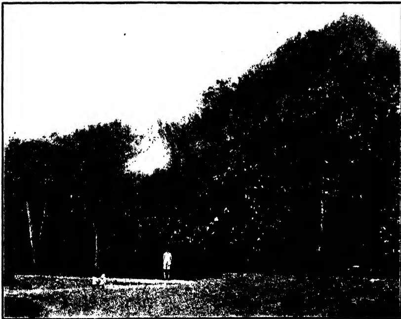A high-contrast black and white photograph showing a dense, dark forest. The trees are thick and their foliage is very dark, creating a silhouette effect against a bright, overexposed sky. In the lower center of the image, a small, light-colored figure of a person is standing on a path or clearing that cuts through the trees. The overall scene conveys a sense of a shaded, protected environment.

*Erythrina umbrosa* as shade for cacao

678------------------------------------------------

A completely blank white page with no visible content, text, or markings.

679------------------------------------------------

215

*Gliricidia maculata*.—There appears to be a confusion between this tree and *Gliricidia sepium*. One or the other is extensively used as a shade tree in Nicaragua where it is usually planted 30 to 35 feet apart in alternate lines of cacao.

One estate reports its use in Ceylon but it is not thought that the tree usually grows to a sufficient height nor does its habit or the shade it affords suggest the ideal type of tree for shading Ceylon cacao.

*Inga laurina*.—Macmillan <sup>(27)</sup> states that this tree is used in the West Indies as shade for cacao.

*Hevea brasiliensis*. Para rubber.—This has been interplanted among cacao in Ceylon and elsewhere, but more on account of its economic value than its suitability as a shade tree. Its extensive root system and the fact that it is leafless for part of the hot weather renders it unsuitable.

*Leucaena glauca*. Lamtoro.—Hall <sup>(16)</sup> mentions the use of this tree in Java, both for temporary and permanent shade for cacao. It does not appear to be particularly suitable for either purpose.

*Mangifera indica*. Mango. Amba (Sinh), Mankai (Tam).—Wright <sup>(34)</sup> states that this tree is in use in Ceylon as a shade tree for cacao. The shade it affords is probably too dense to make it suitable.

*Manihot utilisissima*. Cassava, Tapioca. Manioka (Sinh. and Tam.).—This well-known food plant is used as temporary shade for cacao in the West Indies, Java, and elsewhere. It is easily grown and is suitable as far as habit and shade are concerned, but it has the reputation of exhausting the soil and on this account cannot be strongly recommended.

*Musa paradisaca*, (*Musa sapientum*). Plantain, banana. Kehel (Sinh.), Vallai (Tam.).—A distinction is drawn between plantains and bananas in many countries, but in Ceylon all varieties are known as plantains. The plant is largely grown in many cacao-growing countries as temporary shade for cacao and on account of its economic value is a useful plant for the purpose.

*Papaya carica*. Papaw.—Wright <sup>(34)</sup> mentions the use of this plant as a temporary shade for cacao in Samoa. It has an economic value, but the shade afforded would appear rather inadequate.

*Pithecolobium saman*. Rain tree.—This tree is also frequently known as *Inga saman*. Hart <sup>(18)</sup> considers the tree more suitable for cacao than the *Erythrinas* in common use in the West Indies. It thrives in Ceylon in the cacao districts

680------------------------------------------------

216

and would appear to have a good deal to recommend it. It is hardy, long-lived, and stands lopping well. Wide spacing, say 50 to 60 feet, would be necessary. The timber is of some value.

*Peltophorum ferrugineum*. Iya vakai (Tam.).—Hall <sup>(16)</sup> mentions the tree as a fairly quick-growing shade tree for cacao in Java. Wright <sup>(34)</sup> mentions it as a possibility in Ceylon, but it does not appear to have been tried.

*Ricinus communis*. Castor oil Erandu (Sinh.), Chittamanakku or Amanakkam (Tam.).—Hart <sup>(18)</sup> mentions the possibility of the use of this small tree for temporary shade for young cacao, and Hall <sup>(16)</sup> states that it is occasionally, but rarely used for this purpose in Java. It is of some economic value and its habit is suitable for the purpose.

*Sterculia foetida*. Telambu (Sinh.), Pinari (Tam.).—Wright <sup>(34)</sup> states that this tree is sometimes used as shade for cacao in Ceylon.

*Swietenia macrophylla*. Large leaved mahogany.—Wright <sup>(34)</sup> and Hall <sup>(16)</sup> mention this as a possible shade tree for cacao. It grows well at Peradeniya, but has hardly the spreading habit and light foliage which is desirable.

*Tithonia diversifolia*. Wild sunflower. Nattasuriya (Sinh.), Suriya-kandu (Tam.).—The value of mulching for cacao has already been mentioned and this plant, which grows wild in great profusion throughout the cacao districts of Ceylon, forms probably the best source of green material to be cut and brought in from outside.

*Zea mais*. Indian corn, maize.—Hart <sup>(18)</sup> says that this plant is used for temporary shade in the West Indies.

## GROUND COVER PLANTS

Hardly any mention, either in Ceylon or elsewhere, is found of the use of ground cover plants in cacao. In old cacao the dense ground shade cast by the cacao and shade trees, and the heavy mulch of leaves usually found, would probably preclude the use of ground cover plants.

In young clearings on steep land the arguments which have been given in favour of the use of such a plant in tea and coffee would appear to hold good for cacao. Care would have to be taken that neither the young cacao plants nor the temporary shade plants were smothered, and probably a non-climber, such as *Indigofera endecaphylla*, would be preferable.

## CHANGES IN BOTANIC NAMES

Throughout this section the botanic names by which the plants mentioned have come to be most generally known, or by which they are alluded to by the authorities quoted, have

681------------------------------------------------

217

been used. In many cases these are not now held to be the correct names and the following list gives the names used, together with the correct botanic names:

<table>
<thead>
<tr>
<th>Names used</th>
<th>Correct names</th>
</tr>
</thead>
<tbody>
<tr>
<td><i>Albizzia moluccana</i></td>
<td><i>Albizzia falcata</i></td>
</tr>
<tr>
<td><i>Albizzia stipulata</i></td>
<td><i>Albizzia chinensis</i></td>
</tr>
<tr>
<td><i>Artocarpus integrifolia</i></td>
<td><i>Artocarpus integra</i></td>
</tr>
<tr>
<td><i>Caesalpinia dasyrachis</i></td>
<td><i>Peltophorum dasyrachis</i></td>
</tr>
<tr>
<td><i>Cedrela serrata</i></td>
<td><i>Toona sinensis</i></td>
</tr>
<tr>
<td><i>Cedrela toona</i></td>
<td><i>Toona sinensis</i></td>
</tr>
<tr>
<td><i>Clitoria cajanifolia</i></td>
<td><i>Clitoria laurifolia</i></td>
</tr>
<tr>
<td><i>Eriodendron anfractuosum</i></td>
<td><i>Ceiba pentandra</i></td>
</tr>
<tr>
<td><i>Erythrina indica</i></td>
<td><i>Erythrina variegata</i></td>
</tr>
<tr>
<td><i>Erythrina ovalifolia</i></td>
<td><i>Erythrina fusca</i></td>
</tr>
<tr>
<td><i>Ficus infectoria</i></td>
<td><i>Ficus lucescens</i></td>
</tr>
<tr>
<td><i>Ficus mysorensis</i></td>
<td><i>Ficus cotoneaeifolia</i></td>
</tr>
<tr>
<td><i>Myristica laurifolia</i></td>
<td><i>Myristica dactyloides</i></td>
</tr>
<tr>
<td><i>Malia dubia</i></td>
<td><i>Malia composita</i></td>
</tr>
<tr>
<td><i>Peltophorum ferrugineum</i></td>
<td><i>Peltophorum inerme</i></td>
</tr>
<tr>
<td><i>Pithocolobium saman</i></td>
<td><i>Enterolobium saman</i></td>
</tr>
<tr>
<td><i>Sesbania aegyptica</i></td>
<td><i>Sesbania sesban</i></td>
</tr>
</tbody>
</table>

## REFERENCES

1. 1. ALEXANDER, T. B. M.—*Indigofera endecaphylla*. *The Tropical Agriculturist* LXIV, 1, 1925.
2. 2. ANSTEAD, R. D.—Note on Green Manuring in the Planting Districts. *Pusa Bulletin* No. 56, 1916.
3. 3. ANSTEAD, R. D.—Second tour in the Wynaad. *The Planters' Chronicle* V, 38, 1910.
4. 4. ANSTEAD, R. D.—Coffee, Its Cultivation and Manuring in South India. Mysore State Department of Agriculture, *Bulletin* No. 6, 1915.
5. 5. ANSTEAD, R. D.—The Prevention of Soil Erosion on Tea Estates in South India. *The Tropical Agriculturist* LXVI, 3, 1923.
6. 6. BALD, C.—Green Manuring on Tea Estates. *The Agricultural Journal of India* IX, Pt. II, 1914.
7. 7. BAMBER, M. K.—Peradeniya Tea Plots. Ceylon Department of Agriculture, *Bulletin* No. 37, 1918.
8. 8. BAMBER, M. K.—Green Manures. *The Tropical Agriculturist* LXIV, 3, 1915.
9. 9. BAMBER, M. K. AND HOLMES, T. A.—Experimental Tea Plots, Peradeniya. *Circulars and Agricultural Journal of the Royal Botanic Gardens, Peradeniya, Ceylon*, V, 15, 1911.
10. 10. BUNTING, B. and MARSH, T. D.—Observations on Cover Crops at Casleton Estate. *Malayan Agricultural Journal* XIII, 10, 1925.
11. 11. BURNETT, W. S.—Green Manure. *The Tropical Agriculturist* LXX, 1, 1928.
12. 12. DE SORNAY, P.—*Green Manures and Manuring in the Tropics*. John Bale, Sons, and Danielsson Ltd. London, 1916.

682------------------------------------------------

218

1. 13. ELLIOTT, E. C. AND WHITEHEAD, F. J.—*Tea Planting in Ceylon*. The Times of Ceylon Co., Ltd., Colombo, 1926.
2. 14. GADD, C. H.—Report of the Mycologist. *Annual Report of the Tea Research Institute of Ceylon*, 1926.
3. 15. GRIGSBY, B. H.—*Vigna oligosperma (Dolichos Hosei)*. H. W. Cave & Co., Colombo, 1926.
4. 16. HALL, C. J. J. VAN.—*Cocoa*.—MacMillian & Co., Ltd., London, 1914.
5. 17. HALLER, GUSTAVE.—Coffee Cultivation in Coorg. *The Tropical Agriculturist* XXIX, 2, 1907.
6. 18. HART, J. HINCHLEY.—*Cacao, A Manual on the Cultivation and Curing of Cacao*. Duckworth and Co., London, 1911.
7. 19. HELTEN, W. M. VAN.—Results obtained with various Green Manures. *The Tropical Agriculturist* XLIII, 1, 1914.
8. 20. HOPE, G. D.—The Value of Leguminous Trees. *Indian Tea Association Quarterly Journal*, 1911-13.
9. 21. HOPE, G. D. AND TUNSTALL, A. C.—Green manuring. *Indian Tea Association Quarterly Journal*, 1911-13.
10. 22. JOACHIM, A. W. R.—Manurial Values of Dadap and *Gliricidia* Leaves, Stems, and Branches. *The Tropical Agriculturist* LXXI, 1, 1928.
11. 23. JOACHIM, A. W. R. AND KANDIAH, S.—The Effects of Green Manures and Cover Crops on Soil Moisture. *The Tropical Agriculturist* LXXIV, 1, 1930.
12. 24. JOACHIM, A. W. R. AND PANDITESEKERE, D. G.—The Relation of Green Manures to the Carbon and Nitrogen Contents and Reaction of Soils at Peradeniya. *The Tropical Agriculturist* LXXIV, 1, 1930.
13. 25. LIGHT, S. STUART.—Report of the Entomologist. *Annual Report of the Tea Research Institute of Ceylon*, 1927.
14. 26. LIGHT, S. STUART.—Report of the Entomologist. *Annual Report of the Tea Research Institute of Ceylon*, 1926.
15. 27. MACMILLAN, H. F.—*Tropical Gardening and Planting*. The Times of Ceylon Co. Ltd., Colombo, 1925.
16. 28. MANN, M. H. AND HUTCHINSON, C. M.—Green Manuring in Tea Culture in India. *Indian Tea Association Bulletin* No. 6, 1909.
17. 29. PETCH, T.—Cover Plants. *The Tropical Agriculturist* LXII, 4, 1924.
18. 30. PIETERS, A. J.—*Green Manuring, Principles and Practice*. John Wiley and Sons, New York, 1927.
19. 31. UKERS, W.—*All about Coffee*. *Tea and Coffee Trade Journal*, New York, 1922.
20. 32. WILKINSON, HUNTLEY.—Prevention of Soil Erosion Up-country.—*The Tropical Agriculturist* LXIV, 6, 1925.
21. 33. WILLIS, J. C.—The Tea Plots at the Experiment Station, Peradeniya. *Circulars and Agricultural Journal of the Royal Botanic Gardens, Peradeniya, Ceylon*, V, 1, 1910.
22. 34. WRIGHT, HERBERT.—*Theobroma Cacao, or Cocoa*. A. M. and J. Ferguson, Colombo, 1907.
23. 35. WRIGHT, HERBERT.—*Hevea brasiliensis, or Para Rubber*. A. M. & J. FERGUSON, Colombo, 1905.

683------------------------------------------------

219

## SOME OBSERVATIONS ON CHARACTERISTICS AND TREATMENT OF PADI SOILS\*

**I**N this paper it is proposed to give a summary of recent work on a few selected problems, many others, such as soil atmosphere, soil flora and nutrient requirements will be omitted.

### THE SOILS OF RICE-GROWING COUNTRIES AND THEIR RELATION TO YIELD

It has proved difficult to get a clear picture of the rice soils of other countries, even of soils on which experimental work has been carried out. Many writers content themselves with the statement that experiments were conducted at "X" station, others describe soils by a class name which may have only local significance and, quite frequently, writers differ widely as to the characteristics of what they describe as typical rice soils of a given country.

There is still more uncertainty as to the degree of care which has been exercised, when assigning yields, to secure reliable figures which have not been vitiated by extraneous factors such as pests or water supply.

Taking the figures for what they may be worth, we find for physical characters the following:

*Philippines* (*Riz and Riziculture* Vol. I).—The most usual soil is said to be sand 20 per cent, clay 45 per cent, humus 35 per cent. This would, of course, give an extremely open textured soil if the remarkably high humus figure is correct.

*Java*.—From internal evidence if Wulff's compilation (to be discussed later) Java soils appear to show a minority of stiff clays of silts.

*Burma*.—Warth (*Chem. Memoirs Dept. Agric. India* V. p. 131), who carried out pot experiments with a large number of Burma soils, unfortunately gives no physical analyses, but relies on "soluble silica" as an index of texture. This is unfortunate as degree of laterisation will affect the relationship—from his figures there would appear to be a very extensive range from very stiff to very sandy soils. The most ambitious attempt at comparison of soils emanates from Ceylon—"Contributions to the study of the paddy soils of Ceylon and E. Countries" Bruce, *Department of Agriculture, Ceylon, Bulletin* 57, '22.

Samples were collected from S. India, Ceylon, Burma, Malaya, Philippines, Siam, and Japan by workers in those countries and were analysed in Ceylon. In order to allow for changes in methods of expressing analyses, the results given by Bruce for Malaya are included in the following summary of his work:

### PHYSICAL CHARACTERS (BRUCE)

*Malaya*.—Malayan soils contain from 27 per cent. fine sand, (Titi Serong) to 46 per cent fine sand at Klebang Ketchil (Malacca). Fine fractions are approximately 40 per cent clay + fine silt and 20 per cent coarse silt (all analyses are, of course, on the old method). "Humus" is low, being 2.9 per cent for Titi Serong. Yields vary from 1,500 lb. per acre in the Ulu Muar district (=290 gantang approx.) to 2,500 lb. per acre in Malacca and 2,400 lb. per acre (=460 gantang) per acre in Titi Serong.

\* By W. N. C. Belgrave in *The Malayan Agricultural Journal*, Vol. XIX, No. 4. April, 1931.

684------------------------------------------------

220

*Ceylon*.—Soils from the S. E. Province of Ceylon (Galle and Matara districts) contain 5-12 per cent of humus, high clay, low fine sand (only 9 per cent) but about 12-20 per cent coarse sand and gravel. Those from the remainder of the Island have low fine fractions silt + clay 8-35 cent and high coarse sand and gravel (30-70 per cent) with low humus. All planting is broadcast; there is a small amount of manuring in some districts and irrigation is widespread. Yields in the S. E. Province are, on two of the soils examined, 500-700 lb. per acre and in one 3,000-4,500 lb. per acre; while on the others (sandy soils) they are 675-1,000; 900 and 1,440 lb. per acre respectively.

*S. India*.—Three soils were examined, all show low humus 27-40 per cent clay and fine silt, 22-36 per cent fine sand and 20-30 per cent coarse sand + fine gravel—transplanting is practised and in some cases cattle manure is applied—irrigation is practised. Yields are 1,800-2,600 lb. per acre.

*Burma*.—Five soils were examined and humus is low (1.8-3.1 per cent), clay and fine silt high (50-70 per cent), fine sand low (9-15 per cent) and coarser sand is absent. Yields are all approximately 2,000 lb. per acre. There is no irrigation.

*Philippines*.—Two soils. Humus low 1.2-5 per cent, clay and fine silt 20-33 per cent, fine sand 20 per cent, and coarse sand and fine gravel 40-50 per cent. Transplanting and irrigation are practised, manuring is not, and yields are 1,500-1,900 lb. per acre. The low figure for humus is difficult to reconcile with the very high one given above.

*Siam*.—Three soils. Humus is not given but from loss on ignition it may be expected to be moderate, clay and fine silt 60-65 per cent; fine sand 3-12 per cent; no coarse fractions. Neither transplanting, manuring nor irrigation; yields are 960-2,400 lb. per acre.

*Japan*.—Four soils. Humus moderate 2.5-5.6 per cent., clay and fine silt 17-38 per cent, fine sand 20-42 per cent, and coarse sand 16-24 per cent; in one case gravel 19 per cent. Transplanting, manure and irrigation are employed and yields are 1,700-3,500 lb. per acre.

### CHEMICAL CHARACTERS (BRUCE)

These are somewhat confusing—as usual the figures for pH lose most of their value as the method of determination is not given—for what they are worth our soils are stated to be “sour” pH 4.7-5.5. Japan comes next 6.5-7.2, Ceylon 5.7-8.3, Philippines 7.5; Siam is not given, and S. India and Burma 8.2-8.7.

Nitrogen is in general 0.10 per cent. to 0.25 per cent with very low figures for S. India of .05-.08 per cent.

Lime in Ceylon, Malaya, Siam and part of Japan is 0.1-0.5 per cent, while in S. India, Burma, Philippines, it is 0.6-2.0 per cent.

Magnesia varies in a similar manner.

Potash is very low 0.1 per cent in Siam and in some of the Ceylon soils, moderate 0.3-0.7 per cent in Malaya, the remaining Ceylon soils, Philippines and Japan, and high in S. India and Burma.

Phosphoric Acid ( $P_2O_5$ ) Total phosphorus is lowest in Siam 0.04-0.07 per cent and from 0.08-0.25 per cent in the remainder, no regular variation being found.

Available phosphoric acid is lowest in Malaya and Siam (0.004 per cent) averaging 0.015 per cent, in the others no great regularity is shown.

### ANALYSES FROM OTHER SOURCES

*Siam*.—Detailed analyses of Siam soils are given by Ladell (*Technical Station, Supplement to Record No. 6, 1930*) and agree with Bruce's figures. Ladell records instances of rapid fall in yield, in one case amounting to

685------------------------------------------------

50 per cent of the original in five years. He attributes this to accumulation of soluble salts and acidity owing to poor drainage. His pH in suspension varies from 3.75 to 4.53 and shows no correlation with yield; he finds his water extracts all to be 6.5 pH.

*Burma.*—Warth, mentioned above, deals in considerable detail with Burma soils, unfortunately without stating yields. Many of his total  $P_2O_5$  figures are as low as 0.01 per cent—but he extracted with unheated acid which renders comparison doubtful.

Hendry, who also deals with Burma soils and gives the country average yield as 1,500 lb. per acre, points out that, contrary to general belief, the better padi lands of Burma receive no annual silt deposit, being above flood level. He can trace no decline in fertility since 1872, the first year of reliable records. He considers this to be due to the fact that breakdown to soluble nutrients now equals uptake by the crop.

*Malayan soils.*—Most of our own analytical work has been on physical analysis—and I am deeply indebted to the field officers who collected the large number of samples required. With each soil was sent an estimate of yield; this naturally is only an approximation, but is unlikely to err by being too high. Taking the figures for what they are worth and excluding all samples in which an explanation other than that of soil was given for low yields or in which the analyses showed considerable differences between top and sub-soil, we have the results set out in table A. Naturally, these distribution tables must not be taken as representative of the relative *extent* of each class in Malaya, since no account is taken of the extent of any particular area. We find no correlation between mechanical composition and yield and further find, assuming yield of figures and sampling to be even approximately correct, that soils light in texture compared with those of the chief rice-growing districts are capable of providing quite useful yields.

This confirms the deductions to be drawn from the analyses given above for other countries, and suggests that given accessibility and an adequate water supply, caution should be exercised in condemning a soil on the ground that it is not heavy.

TABLE A  
Sand Percentage.

<table border="1">
<thead>
<tr>
<th>0-20</th>
<th>21-40</th>
<th>41-60</th>
<th>61-80</th>
<th>Total</th>
<th>Gantangs per acre</th>
</tr>
</thead>
<tbody>
<tr>
<td>3</td>
<td>1</td>
<td>1</td>
<td>1</td>
<td>6</td>
<td>0- 80</td>
</tr>
<tr>
<td>5</td>
<td>9</td>
<td>7</td>
<td>4</td>
<td>25</td>
<td>81-180</td>
</tr>
<tr>
<td>20</td>
<td>26</td>
<td>24</td>
<td>15</td>
<td>85</td>
<td>181-280</td>
</tr>
<tr>
<td>17</td>
<td>19</td>
<td>24</td>
<td>9</td>
<td>69</td>
<td>281-380</td>
</tr>
<tr>
<td>15</td>
<td>20</td>
<td>15</td>
<td>3</td>
<td>53</td>
<td>381-480</td>
</tr>
<tr>
<td>6</td>
<td>4</td>
<td>4</td>
<td>1</td>
<td>15</td>
<td>481 upwards</td>
</tr>
<tr>
<td><b>Total 66</b></td>
<td><b>79</b></td>
<td><b>75</b></td>
<td><b>33</b></td>
<td><b>253</b></td>
<td></td>
</tr>
</tbody>
</table>

Figures represent numbers of soils in each class.

686------------------------------------------------

222

Chemical analysis reveals nothing of special interest, and yield could not be correlated in any way with figures for nitrogen, ammonia, or phosphorus (total or available).

The soils are all acid in suspension varying from 4.2 to 5.8 pH. Acidity in clear extracts is very much less and does not confirm Ladell's theory of acid accumulation. Nitrogen varies from 0.1 per cent to 0.6 per cent and  $P_2O_5$  from 0.04 per cent to 0.17 per cent.

## MANURING

Manures may be divided into artificials, animal, and green; or mixtures of these. Taking artificials first we have:

*Nitrogen.*—There is general agreement that nitrates are without effect or are even deleterious to wet padi, although in the Philippines they have been found to be beneficial to dry padi. The explanation is usually sought in denitrification under anaerobic conditions, formation of nitrites, and rapid leaching. The popular view that rice can absorb nitrogen only as ammonium salts appears to be unfounded.

Nitrogen in artificial fertilisers is usually applied in the form of ammonium sulphate (or latterly one of the ammonium phosphates) and in general in conjunction with phosphatic fertilisers. In only a few instances have nitrogenous fertilisers alone in controlled experiments given considerable increases.

*Potash.*—Potash has not, in general, been found necessary in tropical rice-growing countries.

*Phosphorus.*—The majority of recorded increases of any magnitude have followed the application of phosphatic manures alone or in conjunction with nitrogenous manures. In general, superphosphate or one of the ammonium phosphates has been employed; unit for unit, little difference has been found between the newer and older fertilisers.

## RESULTS IN DIFFERENT COUNTRIES

*Malaya.*—Routine applications of fertilisers in Malaya are strictly limited, the exceptions being in Kedah where considerable quantities of naturally occurring phosphates are said to be regularly employed and in Malacca where ground bones have been employed for many years; the results in the former cases are said to be of great benefit, but no definite figures are available. As far as experimental work is concerned, fertilizers in Malaya have nowhere shown a great increase in yield. Even after making a number of unjustifiable assumptions in the working out of the results of experiments carried out over a term of years at Talang and Malacca, we find no significant increase at the latter, and only barely significant ones at the former Station—wherever increases of any kind occurred, phosphatic manures were concerned and at Talang the (theoretically) slow-acting Perlis phosphates appeared to be, over a term of years, as efficient as the quicker-acting artificials. In the few experiments which have been made with ammonium phosphates there are indications of considerable yield increases.

These experimental results form a curious contrast with those recorded in other countries where increases of yield of 70-100 per cent are not uncommon and where ammonium phosphates have exhibited no signs of specific action. It is impossible to say how far the apparent success of trials in other countries is due to a tendency to stress successes and to minimise failures, but it is a fact that one recent paper devotes several pages to a successful experiment and dismisses two unsuccessful ones in two lines! Another frequent fault is the expression of yield increase as a percentage without giving actual figures; it is clearly most important that the datum line from which an increase occurred should be known.

687------------------------------------------------

223

*Siam.*—The only recorded experiment (at the time of writing this paper) is with Leunaphos (ammonium sulphate) in which the smallest application used produced an increase over the unmanured control of 41 per cent of grain and of straw; further increase of manure increased the straw to 64 and 69 per cent but left grain increase unchanged.

*Java.*—The best record of manurial experiments on tropically-grown rice is to be found in Wulff's article in *Landbouw* I, page 25, No. 2.

A few typical results will be quoted: On Batam Tuffloam, super and ammonium sulphate raised a yield of 730 lb. per acre (say 140 gantang) to 2,760 (say 530 gantang). With fairly high controls on such soils (1,420 lb. per acre) the increase was to a similar figure, i.e., the percentage increase was much less. On brown weathered laterite in Batavia no manure gave any increase on 4,700 lb. per acre (900 gantang per acre).

On a marl loam in Begogan there was clear evidence of the beneficial action of nitrogen in combination with phosphorus, although the latter alone gave no increase over the control of 3,200 lb. per acre (610 gantang per acre). The nitrogen was here applied in 4 parts at  $\frac{1}{2}$ , 1,  $1\frac{1}{2}$  and 2 months after transplanting.

On brown marl loam there were divergencies, no increase being recorded at Semarang over 1,950 lb. per acre (375 gantang per acre) with any form of manure, while at Grobogan a control of 3,300 lb. per acre (640 gantang per acre) was unaffected by nitrogen, raised to 4,900 (940 gantang) by phosphorus or nitrogen and phosphorus and to 5,800 (1,100 gantang per acre) by a complete mixture: one of the few instances in which potash has done good.

In the Pate district on "gesek" soil (sandy and powdery when dry) a control of 700 lb. per acre (135 gantang) was raised by phosphorus to 1,350 (260 gantang) and by nitrogen, and phosphorus to 2,200 lb. per acre (420 gantang per acre).

On clays results varied, e.g., on a black clay at Madioen a control of 2,400 lb. per acre (460 gantang per acre) was raised to 3,000 lb. (575 gantang) by nitrogen and unaffected by phosphorus. At Ponorogo with a control of 3,000 lb. there was no increase with any manure, while a similar soil in the same district with a control of 1,600 (310 gantang) showed an increase to 2,600 (500 gantang) per acre with phosphorus, other manures having no effect.

Wulff very frequently found that the maximum effect of nitrogen was obtained by application in two or more doses after the plants were transplanted ("overbemesting"). Although he does not say so, this seems to imply very complete water control.

Very interesting figures for nursery manuring are given, using manures in the nurseries at a rate four times that of field manuring (since the area of the nursery is  $\frac{1}{4}$  that of the field) it was found that in the Bantam district on tuff loams in one case no increase was produced, in another a control of 1,700 lb. (325 gantang) was raised to 2,100 (400 gantang) by superphosphate.

In a complex experiment on marl loam the following results were obtained:

<table>
<tbody>
<tr>
<td>No manure</td>
<td>nursery</td>
<td>No manure</td>
<td>field</td>
<td>1250 lb. p.a.</td>
<td>(240 gantang)</td>
</tr>
<tr>
<td>No manure</td>
<td>"</td>
<td>Phosphatic</td>
<td>"</td>
<td>3100 "</td>
<td>(595 " )</td>
</tr>
<tr>
<td>Phosphates</td>
<td>"</td>
<td>No manure</td>
<td>"</td>
<td>2650 "</td>
<td>(510 " )</td>
</tr>
<tr>
<td>Phosphates</td>
<td>"</td>
<td>Phosphatic</td>
<td>"</td>
<td>3500 "</td>
<td>(670 " )</td>
</tr>
</tbody>
</table>

Similar results were obtained on a heavy clay with a control of 2,600 lb. (=500 gantang).

688------------------------------------------------

224

These Java results have been quoted at some length, not with a view to direct application, but to show that:

- (a) even on soils chemically far richer than those in Malaya, large responses can be obtained;
- (b) in a series of carefully recorded experiments numerous failures to secure response occur;
- (c) no one manurial mixture will suit all soils;
- (d) initial high yield is no bar to response.

*Japan.*—In Japan, where yields have risen from 310 gantang in 1885 to 525 in 1920, nitrogen rather than phosphorous or potash is found necessary.

The Japanese workers claim that lime is only useful if the magnesia content of the soil is high.

*Burma.*—A good account of manuring in Burma has been given by Hendry in *Agric. Journ. India* XXIII p. 357 '28 and XXV p. 126 '30. At Hamawbi, experiments ran for ten years, 5 years with manuring and 5 years without. The soil is obviously heavy as it is noted that green manures cannot be grown owing to the cement-like nature of the ground when dry. In the first paper, actual figures are not given—change being expressed merely as percentages.

Results obtained were:

<table border="1">
<thead>
<tr>
<th></th>
<th></th>
<th>5 years' manuring<br/>percentage change</th>
<th>5 years' residual<br/>effect percentage</th>
</tr>
</thead>
<tbody>
<tr>
<td>Cattle manure + 30-70 lb. N</td>
<td>...</td>
<td>40-70</td>
<td>21-31</td>
</tr>
<tr>
<td>Cotton cake</td>
<td>...</td>
<td>53</td>
<td>54</td>
</tr>
<tr>
<td>Bone meal</td>
<td rowspan="2">} 20 lb. (<math>P_2O_5</math>)</td>
<td>26</td>
<td>9</td>
</tr>
<tr>
<td>Superphosphate</td>
<td>35</td>
<td>15</td>
</tr>
<tr>
<td>Pot. sulphate</td>
<td>...</td>
<td>0</td>
<td>6</td>
</tr>
<tr>
<td>Sod. nitrate</td>
<td>...</td>
<td>17</td>
<td>35</td>
</tr>
<tr>
<td>Cyanamide</td>
<td>...</td>
<td>11</td>
<td>64</td>
</tr>
<tr>
<td>Ammon. sulphate</td>
<td>...</td>
<td>24</td>
<td>25</td>
</tr>
<tr>
<td>Lime</td>
<td>...</td>
<td>24</td>
<td>2</td>
</tr>
<tr>
<td>Complete</td>
<td>...</td>
<td>33</td>
<td>17</td>
</tr>
</tbody>
</table>

Like all workers in India, Hendry is careful to translate these results in terms of money, an excellent idea which should be more widely followed. As an example, ammonium sulphate at pre-war prices with a 25-30 per cent increase would have meant a loss of 5.5 Rs. per acre and in 1928 a gain of 2 Rs.

Experiments with ammophos (control=240 gantang), illustrate this point further—using 20:20 Hendry found 50 lb. fertiliser gave an increased yield of 48 per cent an increased profit of 15 Rs. per acre.

100 lb. fertiliser gave increased yield of 68 per cent 19 Rs. per acre increased profit.

200 lb. fertiliser gave increased yield of 103 per cent 11 Rs. per acre increased profit.

500 lb. fertiliser gave increased yield of 119 per cent 24 Rs. per acre increased profit.

Later experiment showed the following:

<table border="1">
<thead>
<tr>
<th rowspan="2">Manure</th>
<th rowspan="2">Yields =<br/>lb./ac.</th>
<th rowspan="2">G/ac.</th>
<th colspan="3">Percentage Profit Increase</th>
</tr>
<tr>
<th>Rs.</th>
<th>A.</th>
<th></th>
</tr>
</thead>
<tbody>
<tr>
<td>Control</td>
<td>1066</td>
<td>205</td>
<td>—</td>
<td>—</td>
<td>—</td>
</tr>
<tr>
<td>Diammophos</td>
<td>2098</td>
<td>405</td>
<td>97</td>
<td>15</td>
<td>7</td>
</tr>
<tr>
<td>Ammophos</td>
<td>2112</td>
<td>410</td>
<td>98</td>
<td>14</td>
<td>12</td>
</tr>
<tr>
<td>Super. am. sulph.</td>
<td>2112</td>
<td>410</td>
<td>98</td>
<td>11</td>
<td>6</td>
</tr>
</tbody>
</table>

689------------------------------------------------

225

These results are of particular interest to Malaya as the new synthetic manures show no special manurial virtues; they also show the considerable increases required to produce good monetary returns.

Hendry also makes the good point that the native cultivator must have quick returns, especially when he has bought his manures with money borrowed at a high rate of interest.

Results in Ceylon, as far as available, vary with the soil type and need not be considered in detail.

### ANIMAL MANURE

The only countries in which manure of this description is extensively employed appear to be China and Cochin-China. The Chinese are said to have rather a curious system of rotting down rice straw by making it into a compost with mud from the canal banks; the mixture is afterwards spread on the fields.

### GREEN MANURES

There are singularly few descriptions of experiments on modern lines with green manures; in an article in *The Agric. Jour. of India* 18 p. 104, 1923, the following results are given: Control 1,065 lb. per acre (205 gantang) green manure also or with a small quantity of apatite (mineral phosphate) gave no significant increase; green manure + 740 lb. apatite gave a rise to 1,400 lb.; superphosphate or basic slag gave 1,500 to 2,100 lb. The soils were poor and sandy. The Italians claim that green manures favour the action of phosphorus. Other workers in India stress the view that green manure is more effective on sandy than on heavy rice soils.

For manures, *Sesbania aculeata* is recommended in Ceylon, while *Calotropis gigantea* is a favourite in Cochin-China where, as in Japan and parts of India, the intensive collection of extraneous green matter is carried out.

Recent work by Joachim and Kandiah in Ceylon (*Trop. Agric.* 72 p. 254) reviewed in the *Malayan Agricultural Journal* (Jan. 1930) gives considerable data on the decomposition of green matter in dry and wet paddy soils both in the laboratory and in the field. Unfortunately, yield results were somewhat spoilt by floods; in one case, taking the control as 100, early application of green manure gave an increase of 16 per cent and late application of 30 per cent. The authors appear to be influenced throughout by the view that nitrates are deleterious to paddy, a view in turn based on the very numerous observations of previous workers that sodium nitrate had frequently no manurial value and was often deleterious while sulphate of ammonia increased yields. This fact has been, until recently, ascribed to conversion to harmful nitrites (more than 5 parts per million of nitrite having been found to be harmful), to loss as gaseous nitrogen, to leaching and to inability of rice to assimilate nitrates. It was observed that application of sodium nitrate was frequently productive of chlorosis. Gericke, as a result of his recent water culture work, has given what seems the most probable explanation, which is that the residual alkali, after removal of the nitrate radicle inactivates iron, and as rice has a great need of iron but can only very slowly assimilate it, chlorosis follows. This theory is confirmed by an observation of Willis recorded in *Jour. Agric. Research* 24 p. 621 '25, to the effect that calcium nitrate did not cause chlorosis. Clearly if Gericke's view is correct, nitrates produced by nitrification should not be deleterious to padi, although nitrification may be undesirable because of subsequent loss due to leaching.

The authors confirmed previous observations that only traces of nitrate and nitrite were present, but found considerable increases in ammonia—typical results for mbrs N as N·H<sub>3</sub> percentages were:

690------------------------------------------------

226

<table border="1">
<thead>
<tr>
<th></th>
<th colspan="5">Before puddling</th>
<th colspan="5">After Puddling</th>
</tr>
<tr>
<th>Time in Weeks</th>
<th>2</th>
<th>4</th>
<th>6</th>
<th>7</th>
<th>1</th>
<th>3</th>
<th>5</th>
<th>7</th>
<th>9</th>
<th>13</th>
</tr>
</thead>
<tbody>
<tr>
<td>Control</td>
<td>2</td>
<td>2.1</td>
<td>3.0</td>
<td>3.23</td>
<td>1.22</td>
<td>1.73</td>
<td>1.31</td>
<td>1.05</td>
<td>.91</td>
<td>.73</td>
</tr>
<tr>
<td>Green manure late</td>
<td></td>
<td></td>
<td></td>
<td></td>
<td>2.69</td>
<td>4.79</td>
<td>4.30</td>
<td>1.87</td>
<td>1.69</td>
<td>.87</td>
</tr>
<tr>
<td>Green manure early</td>
<td>3.4</td>
<td>3.7</td>
<td>5.2</td>
<td>5.8</td>
<td>1.85</td>
<td>2.13</td>
<td>2.13</td>
<td>1.36</td>
<td>1.16</td>
<td>.88</td>
</tr>
</tbody>
</table>

Weeds gave results very similar to the green manures and total nitrogen figures were:

<table border="1">
<thead>
<tr>
<th></th>
<th>Initial N per cent</th>
<th>Final N per cent</th>
</tr>
</thead>
<tbody>
<tr>
<td>Control</td>
<td>... 1895</td>
<td>1791</td>
</tr>
<tr>
<td>Green manure early</td>
<td>... 1971</td>
<td>1801</td>
</tr>
<tr>
<td>Green manure late</td>
<td>... 1885</td>
<td>1939</td>
</tr>
</tbody>
</table>

They further claim that in pot experiments with green manures, appreciable quantities of gases were given off after the second week from soil to which green matter had been added, but not from the controls and that the scum on the surface said by the Indian workers to be responsible for aeration had increased. They, therefore, claim better aeration for the padi roots. This claim must remain questionable until the evolved gases have been analysed; if they are poor in oxygen (which is highly probable) it is difficult to see, even with increased algal action, how aeration beneath the surface can be increased, as the tendency should be to sweep the oxygen out and upwards.

Work in our soils laboratory on rice soil atmosphere has been started and these points will be tested. While the balance of evidence is in favour of the conclusion drawn by Joachim, viz. that green matter should be turned in late, further work is needed both in the laboratory and field before definite advice can be given.

Lord in his review of his manurial results (*Trop. Agric.* 73 '29) finds that the effect of green manuring varies with soil, in one case there was distinct evidence that a green manure was necessary for the action of artificials to be manifested.

The practice of "Rab" cultivation (described in the *Chemical Memoirs Dept. of Agric. India* II p. 180) in W. India is of interest. In this the top layer of soil from seed beds is mixed *in situ* with cowdung and leaves and burned before sowing, giving increased fertility of 150 per cent. The action has been attributed to flocculation, but gypsum which also flocculate, gives an average of only 25 per cent. The analogy to the beneficial effect found by Russell to result from moderate heating of temperate soils is suggestive. This beneficial effect is generally attributed to reduction in numbers of protozoa with a consequent increase in numbers of beneficent bacteria, which are preyed on by protozoa.

Field experiments showed that a seed bed burned with—

<table border="1">
<tbody>
<tr>
<td>Cowdung rab will plant</td>
<td>2.4</td>
<td>times the area of untreated.</td>
</tr>
<tr>
<td>Branches</td>
<td>2.1</td>
<td></td>
</tr>
<tr>
<td>Grass</td>
<td>1.1</td>
<td></td>
</tr>
<tr>
<td>"Cowdung alone"</td>
<td>1.3</td>
<td></td>
</tr>
</tbody>
</table>

## DRAINAGE

Perhaps the most perplexing feature of rice literature is the insistence on the need for "drainage", which appears to be somewhat loosely used for, (a) the changing of irrigation water and (b) drainage in the usual sense of water movement downwards; most writers making drainage a *sine qua non* for the successful growth of the rice plant on the grounds that otherwise harmful acids will accumulate and/or the roots will lack necessary aeration.

691------------------------------------------------

227

There are many padi fields in Malaya in which there is little circulation of irrigation water and the majority (in area) can exhibit remarkably little sub-soil drainage; further in the case of padi fields which are never really dry, conditions may be expected to be always definitely anaerobic. Yet these fields produce year after year very reasonable yields of padi. Clearly further work on drainage, soil atmosphere and soil flora is indicated.

### THE WORK OF GERICKE ON WATER CULTURES

Perhaps the most interesting piece of research in connection with rice in recent years has been that of Gericke of which a brief résumé follows:

Gericke has been studying for some years the combination of salts giving best growth in water cultures, the time in the life-history of the plant at which absorption of any particular element occurs, and the effect on growth of the absence of certain elements. His most recent paper (*Soil Science* 29, '30) deals with rice. The method is one worked out by him in which the plants are grown for a definite period in a complete solution, then transferred to a solution lacking one so-called "essential" element. In favourable cases he obtained plants as large, heavy and healthy as those in a high yielding field, but failed to obtain with rice correspondingly large grain crops. The failure is attributed by him to pollination difficulties. He found that potash, nitrogen, and iron are required for a much longer period than the other elements, in fact almost throughout life, but that calcium, magnesium, sulphur and phosphorus do not seem to be needed after initial exposures of 4-6 weeks; from this he draws the conclusion that the former are the essential elements for rice. It is equally possible to argue that since the elements of the second group must be or are normally absorbed in a very short space of time they must be presented to the plant in an available form in considerable quantities or conversely that as the absorption of the first group is spread over a long period they can be more readily foraged for.

It must be realised that these experiments, conducted as they are in water culture, may not give a true picture of happenings in the soil—this work is, however, suggestive in the light of Wulff's nursery manuring experiments.

It is interesting to note that Espino working in the Philippines with water cultures (*Phil. Jour. Science* 16 p. 460 '20) claims to have found that a very high relative proportion of magnesium is necessary for successful growth. This, if confirmed, would be most important in Malaya on our (generally) magnesium poor soils. The point is being tested in the new standardised padi experiments.

### PADI ROOTS

Although not strictly a soil problem, a recent paper by Sethi in *Memoirs Dept. Agric. India Bot. Series* 18 No. 2, '30 is of interest. He claims as the result of studies in pot culture and in the field—

- (i) That two types of roots can be observed (a) thin, brown flaccid branched roots, (b) bold, white, almost unbranched.
- (ii) The root system becomes weak and flaccid at flowering.
- (iii) The root development shows distinguishing diagnostic characters for each variety which could be of help in the selection of varieties suited to particular localities.
- (iv) The texture of clay seems to suit root development better than that of other types of soil.
- (v) Anatomical observations confirm various views that rice is not strictly an aquatic plant, but that aeration is absolutely essential.

The importance of (iii) is self-evident and it is suggested that work on local varieties might be of considerable importance.

692------------------------------------------------

228

## CONCLUSIONS

*Soils.*—It has been shown that padi is commercially grown on a large variety of soils and that *given water* there seems no reason to suppose that many areas in Malaya could not be profitably employed which normally are considered to be on the light side. The point is being tested on the padi tanks at the Experimental Plantation, Serdang.

*Manures.*—The results quoted show that increases are not invariably to be obtained even on the same soil type; so far, no satisfactory explanation is forthcoming of many of the differences of response observed.

It is urged that the monetary return be always given a prominent place in the records of trials, and that a large margin of safety be established before recommendations are made to the ryot.

The effect of especially careful cultivation of Test and Demonstration Plots should be considered. It is urged that the final tests or demonstrations should always be made with the standard of cultivation current in the district. If it is desirable that the standard of cultivation be raised, it is suggested that this should be the subject of a separate campaign.

The question of nursery manuring, the application of nitrogen by instalments, green manuring, the use of cheap naturally occurring but slow acting manures and the use of basic or neutral instead of potentially actually acid manures on Malayan soils require study.

693------------------------------------------------

229

## AGRICULTURAL RESEARCH AND DEMONSTRATION IN THE DUTCH EAST INDIES\*

### ORGANIZATION OF DEVELOPMENT WORK

**T**HE work of agricultural development in the Dutch East Indies is being carried on by several more or less distinct organizations. Some of these are financed and controlled by Government, while others of very great importance are under the control of private bodies which are directly interested in plantation crops. The presence of this second class of organization is, in fact, one of the most striking features of agricultural development and as my attention was devoted mainly to plantation crops, I had a particularly favourable opportunity to study them.

The Government Department which has as its main function the development of agriculture, is the Department of Agriculture, Industries and Commerce with its Headquarters at Buitenzorg in West Java about 30 miles from Batavia. There are, in addition, other departments which have important functions to perform in connection with agriculture. Thus, the Department of Justice has, as one of its sections, a Labour Office which deals with (a) labour legislation and statistics, (b) supervision of the health and safety of labour, (c) labour unions, and (d) labour inspection. The Civil Service Department, which corresponds somewhat to our Revenue Department, has the control of Government land and the allotment of land for cultivation. The Department of Credit and Co-operation has to do with the organization of co-operative credit and has also under its control the organizing and subsidizing by Government of colonization in the so-called outer islands which are still, for the most part, sparsely populated. Finally, the Department of Public Works supervises the construction and management of irrigation works which are a most important factor in the development of the Dutch East Indies and more especially of Java.

The Department of Agriculture, Industries and Commerce, has very wide functions and an extensively and rather complicated organization. It has, in fact, the functions of at least three of our departments, viz., the Department of Agriculture, the Department of Industries and Commerce, and the Forest Department. In addition, it carries on work in connection with the development of Fisheries. It has, also, under its control the world-famous Buitenzorg Botanical Gardens with extensive laboratories attached to it and a large Zoological Laboratory and Museum which are concerned with a study of the fauna of the islands. It thus controls most of the work that is being done by Government in connection with the economic development of the Dutch East Indies.

It would, I consider, be out of place in a report such as this to go in great detail into the organization of the Department, and I shall therefore touch only upon what appear to me to be the most important features.

#### A. CENTRAL ADMINISTRATION

This is divided up into four sections which deal with the various divisions of work of the Department. As the organization of these sections does not appear to me to be particularly logical,\* I shall not go into the

---

\* By Leslie C. Coleman, M.A., Ph.D., Director of Agriculture in Mysore, in *General Services—Bulletin No. 14, 1931*, of the Department of Agriculture, Mysore State.

694------------------------------------------------

230

matter. It is interesting to note, however, that attached to the central administration is a central statistical office which deals not only with statistical data connected with the activities of the Department itself, but with the statistics of import and export and excise duties and the statistical data connected with education. It functions, therefore, as a central statistical office for Government.

## B. DIVISION OF AGRICULTURAL SERVICE

Under the Scientific and Sectional Services connected with agriculture, there is a division of Agricultural Service under a separate Chief. This section is, in the first instance, concerned with demonstrations and field experiment work on native holdings throughout all the islands. The staff consists of European (Dutch) officers trained in Holland (so-called consulting agriculturists, Landbouw Consulenten) with a large number of native assistants (Adjunct Landbouw Consulenten) trained in the secondary agricultural school of the Department. Up to a comparatively recent date, all of this work was directed from the head office at Buitenzorg. Now, however, the demonstration and field experiment work in the three provinces of Java proper (West, Central, and East Java) is under the control of the provincial administration concerned. These provincial demonstration services have not their own experiment stations and must, therefore, draw upon the central department for new varieties of seeds and for the technical information upon which new demonstration must be based. The central department continues to control demonstration work in the two native States of Java, (Djokjakarta and Soerakarta) and in all the Dutch East Indies outside Java.

Attached to the Agricultural Service Division is a section of agricultural economics whose function it is to study the economic condition of the various agricultural industries, both European and native owned. The Chief of this division is also temporarily in charge of the section of Marine Fisheries.

### AGRICULTURAL EDUCATION

Under the same division is to be found the Section of Agricultural Education. The organization of Agricultural Education embraces the following:

1. *A Secondary School of Agriculture at Buitenzorg.*—This school has a three years' course of training in Agriculture and Forestry with entrance requirements which are apparently about the same as for Agricultural Colleges in India. This institution is supposed to give young men training, fitting them for life as practical agriculturists but, as far as I could ascertain, is at present useful largely in training so-called Assistant Consulting Agriculturists (Adjunct Landbouw Consulenten) and Forestry officers who are employed under Dutch superior officers for demonstration and field work in connection with Agriculture, Horticulture and Forestry throughout the Dutch East Indies.

2. *"Culture" Schools.*—There are two of these institutions for the training of men for lower posts in the Agricultural and Horticultural Services and in the Forestry Service. These schools have also a three years' course.

3. Agricultural courses in village schools which are, on the whole, organised in much the same way as are similar courses in the schools of Mysore and are, of course, under the control of the Education Department.

4. *Industrial Schools.*—These schools are established with the aid of a Government subsidy and have as their object practical training in village industries.

It is inadvisable to deal at length with questions connected with Agricultural Education and Demonstration in a report on Organization. I shall go into this more fully in a separate report to be submitted later.

695------------------------------------------------

231

### C. DIVISION OF GENERAL AGRICULTURAL EXPERIMENT STATION

This division embraces all the definitely scientific and research activities of the Department in connection with Agriculture and includes the following :

- (a) A Central Laboratory Section including—
  - 1. A Soils Laboratory
  - 2. A Chemical Laboratory
  - 3. A Micro-biological Laboratory and
  - 4. A Botanical Laboratory.
- (b) The Agricultural Institute including—
  - 1. A sub-section for the study of meteorology and a bureau for the improvement of agricultural implements.
  - 2. A sub-section dealing with the selection and breeding of perennial crops. This section is at present engaged chiefly in breeding work on Rubber, Coconuts, and Kapok. It has also been conducting work on the breeding of coffee but the station for this purpose has been recently transferred to another Section.
  - 3. A sub-section for the selection and breeding of annual crops. The sub-section is at present engaged principally on the improvement of Rice, Soy Beans, Cassava, Maize and Groundnuts which comprise the most important annual crops grown in native agriculture.
- (c) The Institute for Plant Diseases. This Institute is engaged chiefly in the investigation of insect pests, but has also a sub-section dealing with plant diseases.

### D. DIVISION OF GOVERNMENT AGRICULTURAL ENTERPRISES

In addition to the definite experimental and demonstration work of the Department, it controls a very considerable number of estate enterprises which are conducted primarily for the sake of profit. Thus, there is a large Tea and Cinchona Estate (Gouvernement Tee-en Kina-Onderneming) under the control of Dr. M. G. J. Kerbosch which I visited and upon which I shall report in another connection. Then there is the so-called Government Rubber Industry (Gouvernements Rubber-Bedrijf) under Director A. van Gelder, which has the control of 17 estates viz., 13 rubber estates, one coconut, one guttapercha, one oil palm, and one coffee estate, in addition to an industrial enterprise for the manufacture of turpentine. While, as stated, these estates are run on a commercial basis for profit and have, in the past at least, given a handsome revenue to Government, a considerable amount of experimental work is also being done upon them and a separate scientific staff is maintained for this purpose. There is, so I was informed, a considerable amount of criticism on the part of private estate owners of the policy followed by Government in undertaking and pursuing agricultural enterprises for a profit. That they have been able to succeed as well as they have is, no doubt, due largely to excellent management. It is, however, only fair to state that the two enterprises which I visited (the tea and cinchona plantations, and the coffee estate) were very favourably situated, both as regards soil and climatic conditions. The work that is being done on these estates is undoubtedly of a very high character and the scientific results have already been of great benefit to some of the industries concerned. One cannot help but feel, however, that there must

696------------------------------------------------

232

be some lack of co-ordination in the Department itself between the work that is being carried out on the breeding of perennial crops at Buitenzorg and that which is being done on these various Government plantations.

### **E. DIVISION OF GOVERNMENT BOTANICAL GARDENS**

This division embraces all activities of the Department which have to do with pure as opposed to applied scientific work in the Natural Sciences. The various institutions are as follows:

(a) The Botanical Gardens in Buitenzorg with two branch gardens. These comprise the finest and best arranged collection of tropical plants in the world.

(b) The Herbarium and Museum for systematic botany.

(c) The Botanical Laboratories including the famous Treub Laboratory at Buitenzorg and a laboratory in the mountain garden at Tjibodas. It is interesting to note that these laboratories are maintained largely for the benefit of foreign research workers who wish to engage in research work in botany in the Tropics. A list of the men who have availed themselves of this great privilege is found in the laboratory and it is interesting to note the very large proportion of foreigners who have availed themselves of this privilege.

(d) The Zoological Museum and Laboratory.

(e) A Laboratory for research in Marine Biology, and

(f) A Phyto-chemical laboratory.

### **F. DIVISION OF FORESTRY SERVICE**

This division is under a Chief Inspector who is entrusted with the administration of Government Forests and Plantations. These are very extensive. In Java alone, there are at present about 3,500,000 acres of reserve forests, approximately half of this area being under Teak. In the outer islands, where the forest areas have been much less fully surveyed, the area has been estimated at approximately 275 million acres.

The work of the Forest Service is carried out by 5 divisions:

1. 1. Division of working plans, sub-divided into working plan section and section of forest survey and mapping.
2. 2. Forest Research Institute.
3. 3. Administration of teak forests in Java.
4. 4. Administration of mixed and hill forests in Java.
5. 5. Administration of forests in the outer islands.

The superior staff consists of 11 inspectors and 123 assistant inspectors. In addition, there is a subordinate staff of 165 chief rangers, etc., and 2,073 foresters, timber yard overseers, forest guards. It is interesting to note that all the superior staff and most of the higher subordinate staff consist of Europeans.

### **G. DIVISION OF CIVIL VETERINARY SERVICE**

This division has the charge of disease control and the improvement of livestock. In addition to the District Staff, which is directly concerned with veterinary work throughout the Dutch East Indies possessions, there is a very well-organised and equipped Veterinary Institute under the direction of Dr. C. Bubberman. This Institute is engaged in research work on animal diseases, chiefly those of cattle. It has also an important section engaged in the preparation of sera and vaccines for the control of the more important cattle diseases. Lastly, the division controls a Veterinary School with a four years' course of veterinary instruction. This school is the training place for the native staff of the division.

697------------------------------------------------

233

## H. DIVISION OF INDUSTRIES

This division has a laboratory for conducting research work in connection with industries, both agricultural and otherwise, and has, as its main function, the furnishing of information to industrial enterprises, European and native.

## I. DIVISION OF COMMERCE

This division has, as its main function the spreading of information in the Netherlands East Indies and abroad with reference to the various products of the country and the economic situation in general. It has under it a Museum and Enquiry Office for Economic Botany. The Stores Department and the Bureau of Weights and Measures are also under the control of this division.

The organization outlined above is seen to emphasise the paramount importance of agriculture to the economic development of the Dutch East Indies. I am by no means prepared to suggest that the organization found in the Dutch East Indies is one that we should copy. It should, and I believe does, ensure a co-ordination of effort towards the economic development of the country which, with a division of the activities among various separate departments it would be difficult if not impossible to attain.

### ORGANIZATION UNDER PRIVATE CONTROL

As already stated, a characteristic feature of work concerned with agricultural development in the Netherlands East Indies is the extent to which private organizations of growers (largely Europeans) support agricultural research. This is a feature which should be borne constantly in mind. It is not too much to say that the acknowledged reputation of these colonies for research in tropical agriculture is based largely on the work that has been done on experiment stations supported and controlled by private enterprise. Until comparatively recently, the individual experiment stations were organised and supported by comparatively small organizations of planters formed, either on the basis of crops, or on geographical position. Within the last few years, however, a need for co-ordination of effort has been felt and this has led to the formation of large organizations controlling a number of separate stations. Thus the sugar industry, which formerly had three separate experiment stations controlled by three separate organizations, has now one organization for the control of all its experimental work. Similarly, all the experimental work done in Java on the so-called "mountain cultures" tea, coffee, rubber, and cinchona, which was formerly controlled by a number of different organizations is now under the control of the General Agricultural Syndicate. There are, however, still a number of experiment stations under the control of smaller organizations who have not joined the Syndicate. Thus, the Experiment Station for Vorstenland Tobacco at Klaten is supported by a comparatively small group of tobacco companies. The rubber planters of East Sumatra and the tobacco planters of the province of Deli in Sumatra have each their own experiment station. The tobacco companies of Besoeki province (East Java) have retained their independence and partially support the Experiment Station at Djember in that province where valuable work on the improvement of tobacco is in progress.

Before describing the research organizations under these various associations of planters, it may be well to refer to two central organizations. These are two general organizations in Batavia, the Board of Estates (Ondernemersraad) and the Indian Association of Estate Owners (Indische Ondernemersbond). These two organizations look after the political, commercial, and shipping interests of different branches of plantation agriculture.

698------------------------------------------------

234

## PRIVATE RESEARCH ON SUGARCANE AND SUGAR MANUFACTURE

As stated above, this work is under the control of an organization which represents practically the whole of the European-owned sugar industry in Java. This is the General Syndicate of Sugar Manufacturers in the Netherlands East Indies, with which is associated a central sales organization, the Associated Java Sugar Growers.

The standing committee of the Sugar Syndicate acts as a consultative committee relative to the sugar industry whose function it is to give advice and information and to put proposals with regard to this industry before Government, the Directors of Government Departments and the heads of the Provincial Administrations. The Syndicate publishes its own journal, the "Archief voor die Zuikerindustrie" which, incidentally, is no longer free for general distribution outside the Syndicate.

The Sugar Syndicate controls a very large and well-equipped Experiment Station for sugarcane cultivation and sugar manufacture at Pasoeroean, in East Java, with a branch devoted to the study of the diseases of cane at Cheribon, in West Java. At the time of my visit, this branch laboratory was being closed and the work on cane diseases transferred to Pasoeroean.

The Station at Pasoeroean is undoubtedly one of the best equipped stations for sugar in the world. It has a budget of 14,00,000 guilders (about Rs. 15 lakhs) with a staff of approximately 50 European scientific officers. It is divided into three sections, each with its own Director. There is a very large agricultural section under Dr. V. J. Koningsberger with 30 scientific associates, a technological section under Dr. P. Honig with 12 scientific associates and an Engineering Section under Professor E. C. von Pritzelwitz van der Horst with 6 scientific associates. These three sections are independent, the general control of the station being under the Board of Directors with Professor von Pritzelwitz van der Horst as Chairman. I shall deal fully with the work of this station in a separate report.

*The General Agricultural Syndicate.*—This syndicate controls a Tea Experiment Station in Buitenzorg under Director Dr. J. J. B. Deuss, a Rubber Experiment Station in Buitenzorg under Dr. J. Gandrup as Director, a Cinchona Experiment Station at Pengalengan, under Dr. M. G. J. Kerbosch, a Station mainly for Robusta Coffee at Malang under Dr. A. J. Ultee as Director, a Station mainly for Arabia coffee in Djember under Dr. J. Schweitzer as Director, and a small Experiment Station at Salatiga. In addition to the work on experimental plots or estates controlled by the stations themselves, a very great deal of experimental work is done on private estates. I shall refer to this in more detail elsewhere but would commend to the attention of planters in South India the very serious manner in which the planters of Java view the problems upon which their prosperity depends. I may point out here that in addition to bulletins and memoirs published by the various experiment stations under the General Agricultural Syndicate, a very great deal of information of much practical value is published in the form of short papers in a special journal published by the Syndicate, "De Bergcultures". This journal is not available for circulation to anyone who is not a member of the Syndicate.

In addition to the experiment stations controlled by these two large Syndicates, there are three stations (two in Sumatra and one in Java) which are controlled by smaller and more local organizations. These are (a) the Deli Tobacco Experiment Station at Medan, Sumatra, Director Dr. J. Kuyper (b) the Experiment Station of the A.V.R.O.S. (Algemeen vereeniging van Rubber planters ter Oostkust van Sumatra or General Association

699------------------------------------------------

235

of Rubber planters on the East Coast of Sumatra) also at Medan, Director Dr. A. d Angremond and the Experiment Station for Vorstenland Tobacco at Klaten near Djokja, Director Dr. Tollenaar.

The budgets of all these various experiment stations amount to about Rs. 10 lakhs per annum so that with the budget of the Sugar Experiment Station we have a total of Rs. 25 lakhs per annum spent by private organizations of estate owners in Java and Sumatra on experimental work for the benefit of their respective planting industries. • This is in addition to what must be a very considerable sum spent by individual estates on experimental work. It is, I think, safe to say that no less than Rs. 30 lakhs are spent every year by planters on experimental work for the improvement of the planting industry as a whole. This is more than the total budget of the Department of Agriculture in Madras Presidency and considerably more than double that of the Agricultural and related Departments in Mysore.

With the large number of different privately controlled experiment stations which exist in the Netherlands East Indies, there must, I think be a considerable lack of co-ordination and evidence was not lacking in this direction. As far as the stations controlled by the General Agricultural Syndicate are concerned, efforts are being made to reduce unnecessary duplication of work. Thus the soils work for all the stations of the Syndicate has been concentrated in a special soils laboratory which is attached to the Tea Experiment Station in Buitenzorg. Annual conferences of workers are also held to discuss problems of general interest and this must aid in preventing misunderstanding and unnecessary duplication.

As regards the relation between the Government Department of Agriculture and the privately controlled stations, the situation is not quite so clear. A certain amount of correlation is achieved from the fact that the Director of the Department of Agriculture, Industries and Commerce, is also a member of the Board of the General Agricultural Syndicate. In fact, the Government through its Tea and Cinchona Plantation is a subscriber to the syndicate funds. There was also sufficient evidence that in the case of special danger such as that created by the presence of the Coffee Berry Borer, the help of the Department is freely sought and given. Still, it must not be forgotten that these privately owned stations are quite naturally being conducted primarily in the interests of subscribers and only indirectly in the interests of agriculture in general. Undoubtedly, many of the new varieties and new methods originated on the stations get out into general use by native growers but the interests of the two groups of growers are hardly considered as one. In fact, in the case of rubber, and I think, to a lesser extent, in that of coffee, they are looked upon by the European planter as distinctly antagonistic. I believe the relationships in South India in this direction are distinctly happier and I, for one, look upon the example set by our Coffee Experiment Station where the needs of coffee planters of all classes and nationalities are dealt with equally as a happy augury for the future. I would look on any change in this relationship as a very distinctly retrograde step.

700------------------------------------------------

236

## PASSION FRUIT CULTURE

**T**HE *Passiflora* family is of wide distribution throughout coastal Queensland, indigenous varieties being found from the south to the far north. None of these, however, produce fruit which could be classed as edible. *Passiflora* and *Tacsonias* were originally listed separately, but are now included under the former heading. Thirty-six species which have edible fruits are enumerated by Mr. P. J. Wester in the February (1931) issue of the "American Chamber of Commerce Journal", who remarks: "Here lies a tremendous virgin field open to the plant-breeder to effect new flavour combinations, enlarge the fruits, reduce the seediness, improve shipping qualities, and extend the cultivable range of the passion fruits". Two varieties, *Passiflora amethystina* and *P. laurifolia* (both producing hard-shelled fruit of most excellent quality, though the latter in sparse quantity on account of its being more tropical) existed in southern Queensland some forty years ago, and appear to have been almost forgotten. Both of these varieties, particularly the latter, are considered to be almost or entirely immune to the diseases known as "leaf spot" which causes such heavy losses with the common variety *P. edulis*.

All passion fruits are climbers, and the varieties above referred to are either semi-tropical or tropical, and require a well-drained friable rich sandy loam soil to be grown to the best advantage; but the common passion fruit can be grown on comparatively poor soils that are naturally well-drained, provided they are systematically manured, well cultivated, and are not subject to severe frosts. Stagnant water at the roots is fatal, and very heavy soils should not be selected.

As with all other fruits the land should be thoroughly prepared prior to planting, so as to reduce to a state of perfect tilth and provide the right soil conditions in which to start the young plants. This is a matter of very great importance and one that does not receive the attention it should, as not only passion fruit but all other fruits are frequently planted in land that is very far from being in good order, and which should have received much more care and attention in order to enable it to produce healthy vigorous plants that will yield payable returns.

*Passiflora edulis*—Passion Fruit.—This variety is the one that is most commonly grown, not only in Queensland, but throughout Australia. There are at least three types, the large-fruited or "giant" passion fruit, sometimes called "Mexican", which attains a size of over 2 inches in diameter, the common type which averages about 1½ inches in diameter, also a yellow-coloured variety. The former, though a larger and more showy fruit, is somewhat disappointing, as it is frequently a shy bearer and the fruit does not contain as large a percentage of pulp as the common type, which is the best all-round commercial fruit. The best fruit has a very dark purple skin, which is filled with an orange-coloured pulp in which the seeds are imbedded. The pulp is slightly sub-acid and possesses a very distinctive agreeable flavour, so that when used as an ingredient of a fruit salad it imparts its characteristic flavour to it, and the salad is greatly improved thereby.

The plant is easily propagated from seed, all that is necessary being to select perfect fruit, fully matured, from a perfectly healthy plant that is free from leaf, root, vine, or fruit affection of any kind. The pulp, when

\* From *Queensland Agricultural Journal*, Vol. XXXVI, Part I, 1 July, 1931.

701------------------------------------------------

237

removed from the fruit, should be placed in a tub or suitable vessel, and be covered with water, the mass being then allowed to ferment long enough to free the seeds from the pulp, when they should be strained off, well-washed and dried. Prior to planting, the seed should be soaked overnight by placing it in the bottom of a basin and pouring hot water, at a temperature of 180 degrees over it, and allowing it to remain until the following morning. If early spring-ripened fruit is selected and the seed is planted as soon as ready, good strong plants will be available for summer planting, but, if plants are wanted for early spring planting, the seed must be sown the previous autumn. The seed should be sown in a specially prepared seed-bed in soil of a light, free nature, containing a quantity of leaf mould or humus—a good potting soil—and the young plants should be sheltered from the sun and judiciously watered should the soil become dry. When the seedlings are about 1 foot high or larger they should be planted out in the permanent position, taking care to keep them moist so that they will not dry out.

Prior to planting, the land is marked off in rows not less than 10 feet apart. A trellis consisting of good fencing posts, placed 15 feet apart in the row, is erected along the row, the posts being set with their width across, not in the direction of the row. The posts should be about 8 inches wide by 3 inches thick by 6 feet 6 inches long, and be set 20 inches in the ground. The end posts must be much heavier, sunk much deeper in the soil, and well strutted as they have to act as strainers, and prevent the wires that are attached to the top of the posts from sagging when they have to carry a heavy growth of vines. Two No. 8 galvanised wires are firmly fixed to the top of the posts, one on each side, so that when in position they form two parallel lines, 8 inches apart, on which the vines are trained. The young plants are planted midway between the posts, right under the wires, and are tied to a light stick or other temporary support till they reach the height of the wires, when they are topped and two main lateral stems are allowed to develop, all other lateral growths on the main stem from the ground to the wire being removed. The two main laterals are then trained on to the wires, and when they meet those of the adjacent plants their growth is topped by pinching back the terminal growth, which causes secondary laterals on which fruit is borne to be thrown out all along the main lateral. These secondary laterals, if left alone, throw out further laterals and these again in turn make more lateral growth, with the result that a very dense and tangled growth of vines is produced from which it is hard to separate the primary and secondary laterals and which, owing to its dense habit of growth, is frequently prone to be attacked by disease. Systematic pruning is, therefore desirable—first to keep the plants healthy, secondly to produce strong new lateral growth on which good fruit will be grown, and thirdly to bring in the crop at different periods of the year, so as to get a better distribution of the crop instead of a glut at one time and a scarcity at another. When an autumn or winter crop is desired the main summer crop must be sacrificed. This is done by pruning the vines right back to the secondary laterals when they are showing their blossoms for the summer crop, and this will have the effect of throwing out a new growth which will blossom at a later period. A word of warning is, however, necessary; don't prune hard back in dry weather—you will probably kill the plants if you do so—but wait till the ground has had a good soaking, when the plants will throw out a fresh growth very quickly and will not be permanently injured. A good dressing of quick-acting manure at this time will be found beneficial and materially increase the following crop.

Mr. Brunnich, in the publication "Complete Fertilisers for Farm and Orchards", recommends the following manure for passion fruit:

702------------------------------------------------

238

"Use per acre, in accordance with the richness of the soil, a mixture of 1 to 2 cwt. nitrate of soda; 4 to 8 cwt. blood and bone manure; 1 to 2 cwt. superphosphate; 1 to 2 cwt. sulphate of potash. A top-dressing of 1 cwt. of nitrate of soda in spring will be found beneficial."

This is a complete manure rich in organic and inorganic nitrogen, citrate and water soluble phosphoric acid as well as potash, and should not only act quickly but be fairly lasting in its effect.

The passion fruit is liable to be attacked by several different pests and diseases, of which the leaf disease is by far the most serious. This disease has only made its presence felt during recent years, and is of an obscure nature. It attacks every part of the plant above ground—the flowers, leaves, and laterals. The latter are killed by a small portion of the stem becoming affected to such an extent that it dies and all the rest of the lateral that is beyond the part attacked shrivels and dies, frequently when it is covered with fully grown but immature fruit which shrivels up. This affection has received the careful attention of the Vegetable Pathologist, and the result being the discovery of a new fungus controlled by Bordeaux mixture. Red spiders and spinning mites frequently injure the leaves and young laterals. These pests can be kept in check by spraying with sulphide washes or dusting with finely ground sulphur.

Scale insects of various kinds also attack the wood, leaves, and fruit, generally where plants are grown under adverse conditions. These may be kept in check by systematic spraying, but can only be effectual when the vines are systematically pruned, as when grown in a dense mass the spraying material used has little chance to come in contact with the majority of the insects.

Nematodes injure the roots, particularly in light soils, and an application of cyanogas to the soil prior to planting will temporarily eliminate the pest from treated soil. The material is best applied when ploughing by being lightly distributed along the bottom of each furrow immediately prior to its being covered. A simple attachment may be fitted to the plough to allow the cyanogas to fall immediately in front of the falling earth which is being turned by the mould board. When a small area has been treated a heavy roller should be passed over the surface to close the soil and delay the escape of the gas fumes. The addition of nitrogen to the soil also militates against the effect of the pest. Light dressings of nitrate of soda or sulphate of ammonia at intervals of not more than three months are recommended. The quantity for each dressing (February, May, August, and November) in light soils should be at the rate of about 1 cwt. per acre. In medium and heavy soils this quantity may be reduced by one-half.

Fruit fly also attacks the fruit, as does also the sucking bug. The latter sometimes causes a heavy loss, as the punctured fruit either drops or if it remains on the vine becomes hard and woody. The bug is very fond of the red prickly cucumber, commonly known as the "Cape or African Cucumber", and if this is used as a trap, a large number of the bugs can be caught and destroyed.

When fruit fly is troublesome, trapping with Harvey's fruit fly lure as soon as the first sign of the fly's presence is seen, or with the following lure originated with Mr. H. Jarvis (Entomologist)—1 teaspoonful synthetic vanilla, 1 tablespoonful Scrubb's ammonia, and  $1\frac{1}{2}$  pints of water—and systematically attending to the traps will result in the destruction of large numbers of female flies, and thus reduce the loss they would cause were they allowed to lay their eggs in the immature fruit while the skin is still soft and before it becomes so hard that the fly cannot pierce it. Ordinary glass fly traps, placed not more than 30 feet apart, are recommended, and the renewal of the lure contained in these every three days is desirable.

703------------------------------------------------

239

*Passiflora quadrangularis*—Granadilla.—The granadilla is a tropical fruit that is better suited to the northern than to the southern part of this State, though excellent examples of the large type of granadilla—"Macrocarpa"—can be produced in the coastal districts both to the south and north of Brisbane, provided the situation is a warm one, free from frost and well protected. The *Macrocarpa*, as its name signifies, is a very large type of granadilla, the fruit frequently weighing several pounds. The seed cavity is small for the size of the fruit, and is surrounded by a thick layer of whitish flesh which has no distinctive flavour, but which, when flavoured with lemon or other suitable flavouring, is used for pies. It is not as a rule a heavy bearer, and must be grown on a horizontal (not lateral) trellis.

The northern granadilla—*quadrangularis*—is a smaller fruit of a somewhat irregular, oblong shape, about 4 to  $4\frac{1}{2}$  inches in diameter. The pulp cavity is large and filled with large seeds surrounded with a pale-yellow pulp of exceptionally high flavour when the fruit is fully ripe, which is known by the outer fleshy covering becoming soft, and the skin, instead of being a pale green turns a dull yellowish-green colour. This variety when fully ripe is one of the highest flavoured tropical fruits, and eaten either alone or used in combination with the papaw, pineapple, banana, and the juice of a lemon or lime to form a fruit salad, it is very hard to beat. Unfortunately, it does not carry well and consequently can only be obtained in perfect conditions where grown. The granadilla requires a deep, well-drained, rich loamy soil to be grown to perfection, and it does best when trained to an overhead trellis. Similar manuring to that recommended in the case of the common passion fruit will be found beneficial.

*Passiflora laurifolia*—Bell Apple—The Bell Apple is practically unknown in this State, though its fruit is quite equal to that of the previously mentioned varieties. It is a handsome and vigorous climber, and is more valuable for covering unsightly edifices or for ornamental purposes than for fruit production, and its cultivation for the latter purpose is not recommended. Without hand fertilising it carries but few fruit in the south, but would probably be much more productive in the tropics.

*Passiflora ligularis*—Mexican Passion Fruit.—This fruit may be eliminated from the list. The pulp is almost flavourless beyond a trace of sugar, and the appearance of the fruit is not attractive.

*Passiflora mollissima*—the Banana-shaped Passion Fruit.—The fruit of this variety is used as a substitute for the genuine passion fruit, which the pulp somewhat resembles, also the seeds. The latter are in excessive quantity, whilst that of the pulp is correspondingly reduced. The vine is hardy and of very free growth but cannot be recommended for planting for commercial purposes.

704------------------------------------------------

240

## VITAMINS AND PROPHYLAXIS \*

Vitamins are substances of very pronounced physiological activity, and can produce remarkable changes in the normal body, even in minute doses. Lack of adequate vitamin supplies results in the occurrence of what are known as deficiency diseases, and recognition of the need of sufficient of the various vitamins in our diet enables us to practise with advantage the art of preventing disease. A good mixed diet contains, as a rule, most if not all of the vitamins required, but additional vitamins are needed by children and adolescents. Milk of good quality contains most if not all, of the vitamins, and its regular consumption in fairly large quantities, in conjunction with leafy vegetables and the ordinary cereals, tubers and muscle meats, provide a satisfactory type of diet, particularly if a certain amount of raw vegetable food, such as oranges, be taken daily to provide a sufficient amount of anti-scorbutic material. There are six vitamins now universally recognised, and two or three more are, as it were, on probation. Vitamins A, D, and E are oil-soluble substances, consisting of carbon and hydrogen, with a small quantity of oxygen; they are probably alcohols or ketones, or both. Vitamins B, and C are water-soluble substances, the former being a complex of five or more separate factors, the most important of which are known as B<sub>1</sub> and B<sub>2</sub>. Vitamin D is the only factor which can be synthesised in the animal body, or which has any fundamental association with sunshine. It can be formed by the action of the ultra-violet rays of sunlight upon ergosterol contained in the skin of animals, and is the only factor which is not present in sufficient quantity in an ordinary good mixed diet.

### THE FUNCTIONS OF THE VITAMINS

Vitamin A is essential in the diet if it is to be adequate for growth and the maintenance of health. It occurs in cod-liver oil, butter, and other fats, also in egg yolk and green leaves. In experiments on animals fed on materials containing no vitamin A, infections were found to occur regularly and invariably. As a preventive of infection in human beings, it is proving itself invaluable, while administration of large quantities has been found to cure certain infections. An adequate supply of Vitamin A in the blood is necessary to maintain the mucous membranes in a state of full physiological activity, including their function of preventing the bacteria normally inhabiting the interior spaces of the respiratory and intestinal tracts from penetrating into the body and producing a toxaemia. If the bacteria should so penetrate the mucous membranes and get into the blood stream, Vitamin D can be used with advantage to increase the bactericidal power of the blood. In clinical practice, therefore, it has been found advantageous to administer Vitamins A and D together in intensive doses for controlling severe infections.

Vitamin B is necessary for growth in the young and for maintenance of health in the adult. Deficiency of it is associated with loss of appetite, constipation and lassitude. Conversely the conditions can be remedied by administration of Vitamin B. Fresh milk, eggs, and yeast extract are excellent sources of supply. Malt extract of good quality contains it in fair proportion, but much of the malt extract on the market contains none. All the factors contained in the Vitamin-B complex are essential to mammalian nutrition.

---

\* By John Humphrey in *The Chemist and Druggist*, Vol. CXIV, No. 2671, April 18, 1931.

705------------------------------------------------

241

Vitamin C prevents scurvy. It is plentiful in raw cabbage, orange and lemon juice (not lime juice), tomatoes and juice of swedes. Concentrated orange juice provides a satisfactory means of providing Vitamin C in a suitable form for addition to preparations containing other vitamins. Fresh milk contains this vitamin, also dried milk prepared by the hot-roller process. Other sources of supply are germinated legumes, spinach, and various soft fruits.

Vitamin D prevents rickets, dental decay, general ill-health and lack of tone. Its richest natural source of supply is the liver of the cod fish, but it is also found in fresh and dried milk, cream, butter, and animal fats and oils generally. It is now produced commercially by the irradiation of ergosterol from yeast, and can thus be obtained in a tasteless form which lends itself to addition to foods and medicines as required. Its importance in connection with calcium and phosphorus metabolism is being recognised to an increasing extent, and many disorders due to imperfect supply and assimilation of calcium are found to yield rapidly to treatment, including the administration of Vitamin D.

Vitamin E appears to be essential for normal reproduction and lactation. It is found in the unsaponifiable fraction of wheat-germ oil, and shows close relationship to the group containing Vitamin A, and D. Milk contains a little of this vitamin, but lettuce and wheat-germ are the most potent sources of supply.

706------------------------------------------------

242

# MEETINGS, CONFERENCES, ETC.

## BOARD OF AGRICULTURE

### ESTATE PRODUCTS COMMITTEE

**Minutes of the Fiftieth Meeting of the Estate Products Committee of the Board of Agriculture held at the Board Room of the Department of Agriculture at 2-30 p.m. on Tuesday, September 8, 1931.**

**Present.**—The Director of Agriculture (Chairman), the Director of Irrigation, the Director of the Tea Research Institute, the Entomologist, the Agricultural Chemist, the Mycologist, Messrs. R. G. Coombe, C. C. du Pré Moore, F. A. E. Price, T. J. Wilson, J. B. Coles, H. D. Garrick, J. Ferguson, F. H. Griffiths, C. E. A. Dias, T. Sathasivam, S. Pararajasingham, James W. Fergusson, A. T. Sydney-Smith, W. S. Burnett, A. H. Reid, James Forbes (Jr.), J. Carson-Parker, A. G. Baynham, B. M. Selwyn, Chas Bouchier, Gordon Pyper, R. Murdoch, L. P. Roundell, R. P. Gaddum, J. P. Blackmore, G. B. Foote, and W. C. Lester-Smith (*Acting Secretary*).

**Visitors.**—Messrs. R. P. Hudson, C. N. E. J. de Mel, V. Canagaratnam, J. I. Gnanamuttu, Stanley Dias, H. P. G. Young (Provincial Engineer, C.P.), Rolf Smerdon, J. R. Northway, R. K. S. Murray, and F. R. Tubbs.

Letters or telegrams regretting their inability to attend the meeting were received from Sir Solomon Dias Bandaranaike, Mudaliyar S. M. P. Vanderkoen, Messrs. E. C. Villiers, A. W. Winter, A. W. Ruxton, C. Drieberg, Felix R. Dias, L. G. Byatt, N. D. S. Silva, J. H. Titterington, Allen Coombe, A. W. Warburton-Gray, A. Mahadeva, and the Government Agent, North-Western Province.

The Chairman commented upon the good attendance and read the names of those from whom letters or telegrams had been received regretting their inability to attend.

#### AGENDA ITEM 1. CONFIRMATION OF MINUTES

The minutes of the last meeting which had been circulated to members were taken as read and were confirmed.

Sir Henry L. de Mel and Mr. T. Sathasivam, members of the Estate Products Committee, who had received honours from His Majesty the King since the last meeting, were congratulated by the Chairman.

#### PROGRESS REPORTS OF THE EXPERIMENT STATION, PERADENIYA

Three Progress Reports of the Experiment Station, Peradeniya, then came up for discussion.

Points in connection with some of the rubber tapping experiments were raised by Mr. Bruce Foote and Mr. C. E. A. Dias. The latter suggested that an experiment be undertaken to try the results of high budding on some old rubber trees as being of possible value in connection with the rejuvenation of old rubber areas. This was agreed to.

Exception was taken to a sentence (last section, lines 9-12) in connection with cover crops in the July-August report. Mr. C. E. A. Dias requested that the statement might be deleted as being contradictory to the Soil Erosion Report.

Mr. Bruce Foote strongly supported Mr. Dias. There was a prolonged discussion over this subject, despite the fact that it was pointed out that the period in question was one of exceptionally heavy rainfall. It was feared that certain waverers might be influenced against the use of cover crops. It was finally agreed that in the minutes of the meeting it be recorded that certain members had taken exception to that particular sentence.

707------------------------------------------------

243

## AGENDA ITEM 2. CO-OPTING OF MEMBERS

The Acting Secretary proposed and Mr. R. G. Coombe seconded that the following gentlemen be co-opted as members of the Estate Products Committee: Mr. Carson-Parker, in place of Mr. J. Sheridan-Patterson, resigned, Mr. G. R. Whitby, in place of Mr. G. O. Hunt, resigned, Mr. A. W. Winter, during the absence of Mr. J. H. Titterington. The proposal was unanimously carried.

## AGENDA ITEM 3. NEW DEFINITION OF THE SHOT-HOLE BORER AREA

Mr. C. N. E. J. de Mel, Plant Pest Inspector, Central Division, explained to the meeting the very desirable need for a new definition of the shot-hole borer area; the proposal being to gazette no area smaller than a Chief Headman's Division as an infested area.

After some discussion the Chairman's proposal that before taking further action in the matter, it should be referred by him to the Planters' Association of Ceylon, was agreed to unanimously.

## AGENDA ITEM 4. NETTLE GRUB

Mr. J. Carson-Parker, Chairman of the Uva District Planters' Association dealt briefly with this question and indicated that it was the unanimous opinion of their district that the present legislation should include Nettle Grub as a declared pest. The Chairman indicated that the matter would be referred to the Planters' Association of Ceylon and Mr. Carson-Parker's proposal seconded by Mr. R. G. Coombe, that Nettle Grub be declared a pest in Ceylon and that the infested area in the first place be declared to be Uva—was put to the meeting and carried unanimously.

Dr. Norris, Dr. Hutson, and Messrs. H. D. Garriek, A. G. Baynham, A. H. Reid, and B. M. Selwyn also contributed to the discussion.

## AGENDA ITEM 5. THE REPORT ON SOIL EROSION

Mr. R. G. Coombe, after indicating that the Tea Research Institute Experiment Committee were taking action with regard to the question of Soil Erosion, enquired whether Government, the Department of Agriculture, or any other body were making any move in this connection.

The Chairman indicated that the Department of Agriculture proposed to devote its attention mainly to the problem of the small-holder and soil erosion. The matter was under consideration by the Rubber and Coconut Research Schemes and the Department were giving lectures to villagers on the subject.

Mr. C. E. A. Dias indicated, by reference to the Dutch East Indies, the importance of this question in connection with the small-holder and the colonisation schemes in progress and under contemplation.

Dr. Norris indicated the work in this connection which the Tea Research Institute had started and the future lines of work which they proposed to take up.

Mr. Coombe commented on the desirability of Government consulting the Department of Agriculture, prior to settlement, with regard to the suitability of land for colonisation purposes.

The Chairman indicated that the matter would be referred to the Minister and that he was sure that the remarks would have the results desired by the Committee.

Mr. C. E. A. Dias indicated that he considered it most desirable that the present soil erosion experiments at Peradeniya be amplified and similar experiments instituted on the Iriyagama Division. Further, that an officer be seconded for work in connection with soil erosion.

708------------------------------------------------

244

The Chairman considered it possible that the desired further records could be obtained and promised to consider the question of the extension of the experiments to the Iriyagama Division. He indicated that the question of soil erosion propaganda by an officer specially deputed for this work would receive the necessary consideration.

Mr. Gaddum brought up the question of clean weeding and soil erosion and Mr. R. G. Coombe stressed its importance and requested that this subject be put on the agenda for the next meeting.

Mr. Bruce Foote suggested that it be the first item after the necessary preliminaries.

The Chairman agreed and promised to see to the matter.

Messrs. J. P. Blackmore and A. H. Reid also contributed to the discussion.

#### **AGENDA ITEM 6. TEA PRUNING EXPERIMENTS**

Mr. R. G. Coombe, at whose request this subject was put on the agenda, said that a series of tea pruning experiments had been started on St. Coomb's Estate by the Tea Research Institute. At a meeting of the Board the Hon'ble Mr. Panabokke (representative of the small-holders) had stressed the importance of all the information in connection with pruning experiments being made available to small-holders. It was considered that the only way in which this information could be usefully carried to small-holders was through the Department of Agriculture; he asked, therefore, for the assistance of the Department in this matter through the services of the Agricultural Instructors.

The Chairman indicated that there would be no difficulty in this connection; he had no doubt that he could assist the Tea Research Institute in the manner desired and he thought the details could be left for consideration by Dr. Norris and himself. It would be possible, probably, to prepare a leaflet in the vernacular for distribution.

#### **AGENDA ITEM 7. TEA TORTRIX RETURNS**

The Chairman called for comments on the returns which had been circulated to all members.

Mr. A. H. Reid, by quoting from the returns, indicated that Demodera was wasting money in collecting egg masses if other estates were not doing so and asked if it were any use insisting on the collection of egg masses.

Mr. C. N. E. J. de Mel (Plant Pest Inspector, Central Division), indicated that nil returns were not unusual; the returns were for a past quarter and he had no means of checking their correctness. In reply to a further question he indicated that owing to economy they had to confine their attention to the areas where tortrix was most serious.

Mr. W. S. Burnett commented on the irregular figures and pointed out that these were not necessarily an indication of irregularity of incidence.

Mr. De Mel agreed that the figures were irregular and that some estates did not co-operate as much as was desirable.

After some further discussion the Chairman agreed with Mr. Reid that the situation was discouraging in some respects but that it was considerably more discouraging to the Plant Pest Inspectorate. The Department had to administer the Ordinance as amicably as possible and he requested the very whole-hearted co-operation of the planting community in the matter.

W. C. LESTER-SMITH,  
Acting Secretary,  
Estate Products Committee.

709------------------------------------------------

245

## RUBBER RESEARCH SCHEME (CEYLON)

### BOARD MEETING

Minutes of the Fourth Meeting of the Board of Management, held at 10 a.m. on Thursday, July 16, 1931, in Committee Room No. 1, State Council Chamber, Colombo.

*Present.*—Dr. W. Youngman (in the chair) Messrs. I. L. Cameron, A. E. de Silva, B. F. de Silva, C. E. A. Dias, J. Farley Elford, J. D. Finch Noyes, F. H. Griffith, J. D. Hoare, F. A. Obeyesekere, C. A. Pereira, the Hon'ble Mr. D. S. Senanayake, Colonel T. Y. Wright, Mr. J. I. Gnanamuttu (Secretary).

Mr. C. W. Bickmore, Deputy Financial Secretary, was present from 11 a.m.

Letters were received from Messrs. H. R. Freeman and E. C. Villiers explaining that they were unable to be present that morning owing to a meeting of the Executive Committee on Works.

*Minutes.*—The Minutes of the Third Meeting of the Board, held on May 21, 1931, copies of which had been circulated to the members, were confirmed and were signed by the Chairman.

*Board of Management.*—The Chairman said it was his duty to report the death of their colleague, Mr. D. C. Senanayake, and to move that a vote of condolence with his family be recorded. The vote was passed, the members standing in silence.

The Chairman announced that Mr. F. A. Obeyesekere, Chairman of the Low-country Products Association, had been nominated by that Association to take the place of Mr. C. H. Z. Fernando, who had resigned, and that upon the Constitution of the State Council, the Hon'ble Mr. D. S. Senanayake, Mr. H. R. Freeman and Mr. E. C. Villiers had been nominated by His Excellency the Governor, in their capacity as Members of the State Council. The Chairman said he had no doubt the Board wished to thank their retiring members, Messrs. C. E. Hawes and C. H. Z. Fernando.

*London Advisory Committee.*—(a) Mr. Obeyesekere desired information about the status and functions of the London Advisory Committee. The Chairman explained the genesis of the Committee and its subsequent history and employment of a small scientific staff in London to carry out technical work there for Ceylon. The Chairman proceeded to read a letter received from the Director of the Rubber Research Institute, F. M. S., in reply to the enquiry addressed to him, at the instance of the Board. The Malayan Institute stated that the subject of amalgamation of the Ceylon and Malaya London Advisory Committees was still under discussion, but its Board was in favour of amalgamation of the London Committees. The Malayan Institute was not prepared to agree to any financial contribution towards the work at present being carried out at the Imperial Institute by the Rubber Research Scheme (Ceylon) since it was doubtful whether such additional expenditure would be justified. The matter remained in abeyance as far as that Institute was concerned. A telegram received from the London Advisory Committee was read by the Chairman; it suggested that the final decision on any reply from Malaya should be deferred until negotiations with Dr. Tempany, who was now in London, were completed. The Chairman also read from a personal

710------------------------------------------------

246

letter received from Mr. Burgess and from his own reply wherein he had expressed the hope that the Board might be able to come to an early decision upon the questions now pending.

The Board had to decide :

1. 1. Whether it desired an Advisory Committee in London.
2. 2. Whether, if the Committee should be continued, it should be a joint Committee with Malaya.
3. 3. Whether scientific work in London is to continue with or without collaboration with Malaya.

Mr. Finch Noyes submitted that this question was one of the most important that ever came up before the Board. He thought that the new Director of Research should have a say in the matter. Till then the matter must lie in abeyance, or a Special Committee should be appointed to go into the whole question. He personally thought that if Malaya could get on without making a financial contribution to London, so could Ceylon. Mr. Obeyesekere observed that the Board must focuss its enquiries upon the need of a London organization and arrive at a decision to satisfy the public of Ceylon. He suggested that details be furnished to the Board to show what contributions had been made to London, what results have been obtained and what, in the Chairman's opinion, would be the advantages to be derived in the future. Mr. Bickmore pointed out that the Rubber Growers' Association had provided the initial funds and had put up 40% of the money after Government came in and before the institution of the present Scheme. The Chairman stressed the obligations to the London Staff and Committee to let them know early where they stood. The Chairman agreed to circulate all available information for the next meeting, which would be summoned at an early date.

(b) The draft minutes of the London Advisory Committee meeting held on 24th April, 1931, were tabled.

*Experiment Station.*—(c) The following supplementary votes were sanctioned :

<table>
<tbody>
<tr>
<td>Upkeep of Contours</td>
<td>...</td>
<td>...</td>
<td>Rs.</td>
<td>100</td>
</tr>
<tr>
<td>Paths</td>
<td>...</td>
<td>...</td>
<td>„</td>
<td>250</td>
</tr>
<tr>
<td>Nurseries</td>
<td>...</td>
<td>...</td>
<td>„</td>
<td>325</td>
</tr>
<tr>
<td>Manuring</td>
<td>...</td>
<td>...</td>
<td>„</td>
<td>600</td>
</tr>
<tr>
<td>Bridge</td>
<td>...</td>
<td>...</td>
<td>„</td>
<td>120</td>
</tr>
</tbody>
</table>

*Other Business.*—The Board sanctioned the payment of resthouse charges and incidental expenses incurred by the members of the Estate Committee, in connection with visits to Liniyawa, etc.

The Chairman was authorised to fix the dates of future meetings at his discretion after consultation with the Clerk to the State Council so as to avoid clashing of meetings.

By order,

J. I. GNANAMUTTU,  
Secretary,

Board of Management.

711------------------------------------------------

247

## COCONUT RESEARCH SCHEME (CEYLON)

### BOARD OF MANAGEMENT

Minutes of the twelfth meeting of the Board of Management of the Coconut Research Scheme, held in the office of the Ministry of Agriculture and Lands, Colombo, at 11-30 a.m. on Wednesday, August 5, 1931.

*Present.*—Dr. W. Youngman (in the chair), Mr. C. W. Bickmore, C.C.S., Deputy Financial Secretary, Mr. W. A. de Silva, M.S.C., Mr. J. Fergusson, Sir H. Marcus Fernando, Mr. F. A. Obeyesekere, M.S.C., Gate Mudaliyar A. E. Rajapakse, M.S.C., Mr. A. W. Warburton-Gray, J.P., U.P.M., and Mr. J. I. Ginanamuttu, (Secretary).

Apology for absence, due to indisposition, was received from Mr. N. R. Outschoorn.

*Minutes.*—The minutes of the meeting held on May 13, 1931, copies of which had been circulated to members, were taken as read and were confirmed and signed by the Chairman.

*Board of Management.*—The Chairman reported that Mr. J. Fergusson, for whom Mr. F. J. Holloway had been acting, had, on his return to the Island, resumed his place on the Board, and welcomed Mr. W. A. de Silva who had been nominated by His Excellency the Governor in place of Mr. A. Mahadeva. The Hon'ble Mr. D. S. Senanayake had been re-nominated as a Member of the State Council. The Chairman added that he had no doubt he was speaking for the Board in recording their appreciation of the services of Mr. Mahadeva.

*Finance.*—(a) With reference to the statement of receipts and expenditure for the quarter ended June 30, 1931, of which copies had been circulated to members, Mr. Bickmore suggested that the receipts and expenditure sides might be shewn on separate sheets in future for convenience of filing. The statement was passed.

(b) The Chairman invited criticisms of the draft estate progress account up to June 30, 1931. It had been drawn up at the instance of the Board and copies had been circulated. Mr. Warburton-Gray suggested that serial numbers be assigned to the various items of expenditure. The Chairman mentioned that when the experimental plots were working it would be somewhat difficult to maintain separate details of general estate expenditure apart from expenditure on experiments, seeing that practically the whole estate would be under experiment. A rigid system of cut-and-dry accounting could not therefore be expected. Mr. Bickmore said it would become necessary to allocate on each voucher or check-roll how much of the cost represented estate work and how much represented research work, such details would be irksome and then only approximate. Mr. Fergusson's proposal that the details of expenditure be made as full as possible was accepted. Mr. Warburton-Gray undertook to suggest additional headings under which the expenditure might be detailed. The Board decided that the coconut husks should be used on the estate as far as possible, and not sold. It was also decided that manuring should not be undertaken at present.

(c) The notes of Audit inspection of Bandirippuwa estate accounts, which were carried out on the 25th May, were read.

*Bandirippuwa Estate.*—The position with regard to the buildings was that the plans for the staff bungalows and quarters for the menial staff had been approved by the Building Committee. Tenderers had been invited by

712------------------------------------------------

248

advertisement to submit their names for consideration. With the Board's approval the architects would issue plans and specifications to the approved tenderers. A clerk-of-works had to be appointed. The Board resolved that such details should be left in the hands of the Building Committee and empowered it to advertise and select a clerk-of-works at a pay of Rs. 150 per mensem. A supplementary vote of Rs. 450 to meet his salary during the remainder of the year was sanctioned.

Mr. Warburton-Gray suggested that digging should be done uniformly throughout the estate. This was agreed to.

The question of implements was considered, but the purchase of ploughs and harrows was deferred for the present, and the purchase of carts and buffaloes, though considered to be necessary at an early date, was also deferred.

*Reports.*—(a) A report on Bandirippuwa estate for the period January to June, 1931, which had been circulated to members, was passed. Mr. Warburton-Gray drew attention to the fact that the June crop was below that for April. The Chairman thought it was perhaps due to the drought and the lack of manure. It was decided that the figures of the crops in 1930 be obtained from the records of the late owner. Mr. Fergusson questioned the necessity to employ three watchers on a single block of 150 acres. The question of reduction of this number would be gone into with the superintendent.

(b) Consideration of the geneticist's report covering the period January 7 to June 30, 1931, copies of which had been circulated to members, was deferred to the next meeting.

By order,  
J. I. GNANAMUTTU,  
Secretary,  
Coconut Research Scheme.

713------------------------------------------------

249

## TEA RESEARCH INSTITUTE

### MINUTES OF BOARD MEETING

Following are the minutes of a meeting of the Board of the Tea Research Institute of Ceylon, held in the Ceylon Chamber of Commerce, Colombo, on Friday, July 24th.

*Present.*—Mr. R. G. Coombe (Chairman), the Hon. the Financial Secretary, the Hon. Mr. D. S. Senanayake, the Hon. Mr. T. B. Panabokke, Mr. A. G. Baynham, Mr. R. D. Morrison, Major J. W. Oldfield, Major H. Scoble Nicholson, Messrs. J. D. Finch Noyes, Jas. Forbes (Jnr.), Gordon Pyper, A. W. L. Turner (Secretary), R. R. Muras (Assistant Secretary), and by invitation Dr. Roland V. Norris (Director, Tea Research Institute of Ceylon).

Before proceeding with the business of the meeting, the Chairman congratulated the Hon. Mr. D. S. Senanayake, and the Hon. Mr. T. B. Panabokke on being elected to the Ministries of Agriculture and Lands, and of Health, respectively, as well as Major J. W. Oldfield on his nomination to the new Council.

He also welcomed Mr. R. D. Morrison, Acting Chairman, Ceylon Estates Proprietary Association, and Mr. Gordon Pyper, who had been temporarily elected to the Board, *vice* Mr. G. K. Stewart and Mr. John Horsfall.

*Estimates of Income and Expenditure for the period 1st July to 31st December, 1931.*—The Chairman announced that the Finance Sub-Committee after carefully considering the financial position had recommended that the question of additional bungalows should be re-considered in three months' time and that in the meantime nothing should be done.

Major Oldfield proposed that the recommendations of the Finance Sub-Committee should be accepted, and that the whole question be re-considered in three months.

This was seconded by Major Scoble Nicholson and unanimously agreed to.

### VISITING AGENT'S REPORT

The Chairman referring to the report dated the 21st April, 1931, which had been sent to all members reported that more than 50 per cent of the work on the new clearing had, he was informed, been completed, the whole should be completed by the end of July. The four acres experimental block was finished on July 23rd.

The additional tea stumps required had been obtained.

The question of shade trees and windbelts has been satisfactorily arranged.

### NETTLE GRUB

*Field Assistants.*—Reported the appointment of Mr. W. T. Fonseka as first field assistant to Mr. Austin. The appointment to date from May 25th, 1931.

Reported the appointment of Mr. K. H. M. Goonatillake, as second field assistant also to Mr. Austin. The appointment, which is at present a temporary one, to date from May 7th, 1931.

### EIGHTEENTH REPORT (TEA) OF THE IMPERIAL ECONOMIC COMMITTEE

The Board unanimously decided that it was opposed to the suggestion of establishing Government tea seed gardens in Ceylon on the lines proposed by the Economic Committee.

714------------------------------------------------

250

The Chairman added that the Planters' Association of Ceylon and the Ceylon Estates Proprietary Association also he understood held the same views.

### EXPERIMENTAL PROGRAMME

The Director reported that arrangements had been made to start pruning experiments at St. Coombs next month and at Peradeniya and Galatura estate (Ratnapura District) in April, 1932.

With regard to the Galatura experiment, the Board endorsed the vote of thanks passed at the meeting of the Experimental Sub-Committee and instructed the Secretary to write to Messrs. Jas. Finlay and Co., Ltd., conveying the Board's thanks and appreciation to the Director of the Amalgamated Tea Estates Company, Limited, for the facilities afforded to the Tea Research Institute.

Hon. Mr. T. B. Panabokke expressed a wish that small-holders should be advised of experiments, which are to be carried out at Peradeniya. The Chairman undertook with the assistance of the Department of Agriculture to endeavour to give effect to his wish.

### TERMITES

Reported that owing to the unsettled conditions in India, Dr. Snyder's visit has been cancelled.

### SENIOR SCIENTIFIC STAFF

*Renewal of Mr. Eden's Agreement.*—It was resolved unanimously to renew Mr. Eden's agreement on the present terms for a further period of five years as from October 18th, 1932.

*Superintendent's Agreement.*—The Chairman announced that this agreement was duly signed and sealed on July 8th, 1931.

### JUNIOR SCIENTIFIC STAFF

Reported the appointment of Mr. Koch, who will take up duties as from the 1st September. Confirmed.

*Future Appointments of Field Assistants.*—The Director suggested that these assistants should be on a scale of Rs. 1,080-75-1,380. One man was immediately required for St. Coombs and could temporarily occupy the Superintendent's old quarters near the factory. This was agreed to.

### SMALL-HOLDERS

The Chairman said that the Sub-Committee consisting of Hon. Mr. T. B. Panabokke, Hon. Mr. D. S. Senanayake, the Director of Agriculture, the Director, T. R. I. and the Secretary had so far been unable to meet.

Hon. Mr. T. B. Panabokke undertook to call a meeting in Colombo at an early date.

### PUBLICATIONS

(a) The Board agreed that from the 1st January, 1932, 25 cts. should be added to the amount of subscription for those resident in India, to cover commission due on Indian cheques.

(b) The Chairman read the following figures:—

### SÁLE OF PUBLICATIONS

<table>
<thead>
<tr>
<th></th>
<th>1930.</th>
<th>1931.</th>
</tr>
</thead>
<tbody>
<tr>
<td>India ... ..</td>
<td>58</td>
<td>115</td>
</tr>
<tr>
<td>Outside Ceylon and India ... ..</td>
<td>31</td>
<td>33</td>
</tr>
<tr>
<td>Ceylon ... ..</td>
<td>9</td>
<td>9</td>
</tr>
<tr>
<td>Publications issued free ... ..</td>
<td>1,266</td>
<td>1,287</td>
</tr>
</tbody>
</table>

715------------------------------------------------

251

## REVIEWS

### TEA PLANTING IN CEYLON\*

**T**HE authors are to be congratulated in their endeavour to bring this useful book up to date, embodying modern ideas and experience of the different phases of the tea industry.

The days of obtaining results by trial and error are definitely passing, and the aid of science is being called for by the modern planter who is confronted with the problem of how to maintain the acreage of tea planted by his pioneering predecessors, and how to manufacture the most suitable teas to compete against the keen competition of rival tea-producing countries.

There are several publications dealing with the methods usually adopted when opening new land, but it is pleasing to find that here the authors have included the most modern ideas for draining which have developed during the past few years to combat the serious loss of soil which has been taking place for years on all tea estates, and to conserve moisture.

The method of opening patna land by forking the grass and undergrowth into the soil without burning so as to preserve all, humus content, and the planting of seed without holing is not mentioned which is surprising. A fairly large acreage has been opened in this fashion with results which show signs of having distinct bearing on future new openings of land and one naturally looks into this book to learn something upon the subject, but does not find it.

Ideas on weeding have advanced considerably and the planter who said at one time that he believed in weeds was looked upon as an incompetent person unable to manage his property, and many an unfortunate assistant has been dismissed if his division was not scraped clean. Now the growth of some ground cover is considered the first step in arresting soil erosion, and estates that had been dubbed "dirty" are becoming the fashion, and weeding as known and practised by the older generation of planters has a different meaning to their successors of the present day.

The various styles of pruning now being practised are mentioned. Hundreds of acres of fine tea have been destroyed by adhering to one system of pruning irrespective of local conditions, and loss has been very prominently brought before the planting community by the successful efforts of some planters who adopted new ideas which rejuvenated old tea, that had been considered fit only for abandoning.

The chapter on cultivation and manuring shows what has been tried in Ceylon, and how modern ideas are shaping. The use of mineral and synthetic manures are destined to play an important part in the near future, as they are doing all over the world, owing to economic conditions.

The many enemies of the tea bush in the form of pests and diseases are clearly described.

The Tea Research Institute, now an accomplished fact, with its home at St. Coombs Estate, Talawakelle, is proving a great stimulus in the art of tea manufacture. In the chapter on manufacture, the authors have

---

\* By E. C. Elliott and F. J. Whitehead. Second Edition. The Times of Ceylon Co., Ltd. Price, including postage, Rs. 15-80.

716------------------------------------------------

252

embodied all the most recent ideas on withering, rolling, and firing. Messrs. Elliott and Whitehead themselves are the originators of many of these ideas.

There is no doubt whatever that present tea-making methods have greatly advanced and improved. Ceylon teas stand on a higher level than those of other producing countries who know this and are steadily copying us. This higher level is in predominating measure due to advancement in factory methods.

The chapters on buildings, machinery, labour, transport, and other economic factors connected with an estate have all been brought up to date and afford instructive reading.

*Tea Planting in Ceylon* contains information founded on actual practice. This information will enable planters of the old school to keep in touch with modern agricultural and manufacturing developments. The younger planter will find herein a wealth of information which is a combination of the experience of the past with the recent discoveries of scientific investigation.

## THE PHYSICAL PROPERTIES OF THE SOIL\*

This book is a welcome addition to the four previously published "Rothamsted Monographs on 'Agricultural Science'" edited by Sir John Russell. The primary object of the book is, in the words of the author, "to provide, for those interested in agricultural science, a connected and critical survey of our knowledge of the physical properties of the soil". The book is excellent as a work of reference for research workers in soil science, but obviously too advanced as a text-book for the average student of agriculture, and still more so for the practical man who wishes to keep himself informed of scientific development in agriculture. It is by no means easy reading, and presumes on the part of the reader a knowledge of advanced mathematics and physics. The monograph does not in any way purport to be an exhaustive treatise on soil physics, but present an up-to-date survey of fundamental researches on the subject. As is to be expected, it comprises a full account of the work carried out in the Soil Physics Department of the Rothamsted Experiment Station.

Like its predecessor—"Soil Conditions and Plant Growth" by Sir John Russell—it has a very useful historical introduction replete with interesting references to old agricultural works and papers. The other chapters deal with mechanical analysis, the distribution and movement of water in the soil, soil and clay pastes and suspensions, soil constants and equilibrium points, soil temperature, the soil atmosphere, and soil factors bearing on cultivation. Of these the chapter on the last-mentioned subject would perhaps most interest agriculturists, while the chapters on mechanical analysis and soil constants should prove most instructive to the advisory soil analyst. Much of the information contained in the book will be new even to the soil scientist who has had easy access to libraries with a large periodical list. To the isolated worker on soil problems the work is invaluable for it presents to him, as a connected whole, the results of researches carried out in Britain and foreign countries.

The get-up of the book leaves little to be desired. It is well illustrated, containing as it does no less than ninety-three diagrams and two plates. A comprehensive bibliography, and an author and subject index complete the volume.—A.W.R.J.

---

\* By Bernard A. Keen, Longmans, Green & Co., Ltd., 1931. Price 21s nett.

717------------------------------------------------

253

## ANIMAL DISEASE RETURN FOR THE MONTH ENDED 30th SEPTEMBER, 1931

<table border="1">
<thead>
<tr>
<th>Province, &amp;c.</th>
<th>Disease</th>
<th>No. of Cases up to Date since Jan. 1st 1931</th>
<th>Fresh Cases</th>
<th>Recoveries</th>
<th>Deaths</th>
<th>Balance Ill</th>
<th>No. Shot</th>
</tr>
</thead>
<tbody>
<tr>
<td rowspan="5">Western</td>
<td>Rinderpest</td>
<td>398</td>
<td>...</td>
<td>86</td>
<td>296</td>
<td>...</td>
<td>16</td>
</tr>
<tr>
<td>Foot-and-mouth disease</td>
<td>1267</td>
<td>62</td>
<td>1239</td>
<td>19</td>
<td>7</td>
<td>2</td>
</tr>
<tr>
<td>Anthrax</td>
<td>...</td>
<td>...</td>
<td>...</td>
<td>...</td>
<td>...</td>
<td>...</td>
</tr>
<tr>
<td>Rabies (Dogs)</td>
<td>2*</td>
<td>...</td>
<td>...</td>
<td>...</td>
<td>...</td>
<td>2</td>
</tr>
<tr>
<td>Piroplasmosis</td>
<td>...</td>
<td>...</td>
<td>...</td>
<td>...</td>
<td>...</td>
<td>...</td>
</tr>
<tr>
<td rowspan="6">Colombo Municipality</td>
<td>Rinderpest</td>
<td>...</td>
<td>...</td>
<td>...</td>
<td>...</td>
<td>...</td>
<td>...</td>
</tr>
<tr>
<td>Foot-and-mouth disease</td>
<td>227</td>
<td>2</td>
<td>216</td>
<td>9</td>
<td>2</td>
<td>...</td>
</tr>
<tr>
<td>Anthrax (Sheep &amp; Goats)</td>
<td>19†</td>
<td>4</td>
<td>...</td>
<td>19</td>
<td>...</td>
<td>...</td>
</tr>
<tr>
<td>Rabies (Dogs)</td>
<td>7</td>
<td>3</td>
<td>...</td>
<td>...</td>
<td>...</td>
<td>7</td>
</tr>
<tr>
<td>Haemorrhagic Septicaemia</td>
<td>...</td>
<td>...</td>
<td>...</td>
<td>...</td>
<td>...</td>
<td>...</td>
</tr>
<tr>
<td>Black Quarter</td>
<td>...</td>
<td>...</td>
<td>...</td>
<td>...</td>
<td>...</td>
<td>...</td>
</tr>
<tr>
<td rowspan="3">Cattle Quarantine Station</td>
<td>Hovine Tuberculosis</td>
<td>...</td>
<td>...</td>
<td>...</td>
<td>...</td>
<td>...</td>
<td>...</td>
</tr>
<tr>
<td>Rinderpest</td>
<td>...</td>
<td>...</td>
<td>...</td>
<td>...</td>
<td>...</td>
<td>...</td>
</tr>
<tr>
<td>Foot-and-mouth disease</td>
<td>28</td>
<td>...</td>
<td>27</td>
<td>1</td>
<td>...</td>
<td>...</td>
</tr>
<tr>
<td></td>
<td>Anthrax (Sheep &amp; Goats)</td>
<td>153</td>
<td>20</td>
<td>...</td>
<td>153</td>
<td>...</td>
<td>...</td>
</tr>
<tr>
<td rowspan="4">Central</td>
<td>Rinderpest</td>
<td>...</td>
<td>...</td>
<td>...</td>
<td>...</td>
<td>...</td>
<td>...</td>
</tr>
<tr>
<td>Foot-and-mouth disease</td>
<td>1305‡</td>
<td>153</td>
<td>961</td>
<td>7</td>
<td>337</td>
<td>...</td>
</tr>
<tr>
<td>Anthrax</td>
<td>14</td>
<td>4</td>
<td>...</td>
<td>14</td>
<td>...</td>
<td>...</td>
</tr>
<tr>
<td>Rabies (Dogs)</td>
<td>8</td>
<td>...</td>
<td>...</td>
<td>7</td>
<td>...</td>
<td>1</td>
</tr>
<tr>
<td rowspan="4">Southern</td>
<td>Rinderpest</td>
<td>...</td>
<td>...</td>
<td>...</td>
<td>...</td>
<td>...</td>
<td>...</td>
</tr>
<tr>
<td>Foot-and-mouth disease</td>
<td>1348</td>
<td>...</td>
<td>1343</td>
<td>5</td>
<td>...</td>
<td>...</td>
</tr>
<tr>
<td>Anthrax</td>
<td>...</td>
<td>...</td>
<td>...</td>
<td>...</td>
<td>...</td>
<td>...</td>
</tr>
<tr>
<td>Rabies (Dogs)</td>
<td>...</td>
<td>...</td>
<td>...</td>
<td>...</td>
<td>...</td>
<td>...</td>
</tr>
<tr>
<td rowspan="5">Northern</td>
<td>Rinderpest</td>
<td>...</td>
<td>...</td>
<td>...</td>
<td>...</td>
<td>...</td>
<td>...</td>
</tr>
<tr>
<td>Foot-and-mouth disease</td>
<td>...</td>
<td>...</td>
<td>...</td>
<td>...</td>
<td>...</td>
<td>...</td>
</tr>
<tr>
<td>Anthrax</td>
<td>...</td>
<td>...</td>
<td>...</td>
<td>...</td>
<td>...</td>
<td>...</td>
</tr>
<tr>
<td>Black Quarter</td>
<td>65</td>
<td>65</td>
<td>...</td>
<td>65</td>
<td>...</td>
<td>...</td>
</tr>
<tr>
<td>Rabies (Dogs)</td>
<td>...</td>
<td>...</td>
<td>...</td>
<td>...</td>
<td>...</td>
<td>...</td>
</tr>
<tr>
<td rowspan="4">Eastern</td>
<td>Rinderpest</td>
<td>...</td>
<td>...</td>
<td>...</td>
<td>...</td>
<td>...</td>
<td>...</td>
</tr>
<tr>
<td>Foot-and-mouth disease</td>
<td>...</td>
<td>...</td>
<td>...</td>
<td>...</td>
<td>...</td>
<td>...</td>
</tr>
<tr>
<td>Anthrax</td>
<td>...</td>
<td>...</td>
<td>...</td>
<td>...</td>
<td>...</td>
<td>...</td>
</tr>
<tr>
<td>Surra</td>
<td>5</td>
<td>...</td>
<td>...</td>
<td>5</td>
<td>...</td>
<td>...</td>
</tr>
<tr>
<td rowspan="4">North-Western</td>
<td>Rinderpest</td>
<td>11,110</td>
<td>142</td>
<td>410</td>
<td>9795</td>
<td>7</td>
<td>898</td>
</tr>
<tr>
<td>Foot-and-mouth disease</td>
<td>612</td>
<td>108</td>
<td>568</td>
<td>7</td>
<td>35</td>
<td>2</td>
</tr>
<tr>
<td>Anthrax</td>
<td>...</td>
<td>...</td>
<td>...</td>
<td>...</td>
<td>...</td>
<td>...</td>
</tr>
<tr>
<td>Rabies (Dogs)</td>
<td>3</td>
<td>...</td>
<td>...</td>
<td>...</td>
<td>...</td>
<td>3</td>
</tr>
<tr>
<td rowspan="3">North-Central</td>
<td>Rinderpest</td>
<td>6086</td>
<td>740</td>
<td>1411</td>
<td>4397</td>
<td>134</td>
<td>144</td>
</tr>
<tr>
<td>Foot-and-mouth disease</td>
<td>...</td>
<td>...</td>
<td>...</td>
<td>...</td>
<td>...</td>
<td>...</td>
</tr>
<tr>
<td>Anthrax</td>
<td>...</td>
<td>...</td>
<td>...</td>
<td>...</td>
<td>...</td>
<td>...</td>
</tr>
<tr>
<td rowspan="4">Uva</td>
<td>Rinderpest</td>
<td>...</td>
<td>...</td>
<td>...</td>
<td>...</td>
<td>...</td>
<td>...</td>
</tr>
<tr>
<td>Foot-and-mouth disease</td>
<td>5</td>
<td>...</td>
<td>5</td>
<td>...</td>
<td>...</td>
<td>...</td>
</tr>
<tr>
<td>Anthrax</td>
<td>...</td>
<td>...</td>
<td>...</td>
<td>...</td>
<td>...</td>
<td>...</td>
</tr>
<tr>
<td>Rabies (Dogs)</td>
<td>...</td>
<td>...</td>
<td>...</td>
<td>...</td>
<td>...</td>
<td>...</td>
</tr>
<tr>
<td rowspan="6">Sabaragamuwa</td>
<td>Rinderpest</td>
<td>...</td>
<td>...</td>
<td>...</td>
<td>...</td>
<td>...</td>
<td>...</td>
</tr>
<tr>
<td>Foot-and-mouth disease</td>
<td>696</td>
<td>157</td>
<td>581</td>
<td>5</td>
<td>110</td>
<td>...</td>
</tr>
<tr>
<td>Anthrax</td>
<td>...</td>
<td>...</td>
<td>...</td>
<td>...</td>
<td>...</td>
<td>...</td>
</tr>
<tr>
<td>Haemorrhagic Septicaemia</td>
<td>31</td>
<td>...</td>
<td>...</td>
<td>31</td>
<td>...</td>
<td>...</td>
</tr>
<tr>
<td>Piroplasmosis</td>
<td>2</td>
<td>...</td>
<td>2</td>
<td>...</td>
<td>...</td>
<td>...</td>
</tr>
<tr>
<td>Rabies (Dogs)</td>
<td>7</td>
<td>1</td>
<td>...</td>
<td>...</td>
<td>...</td>
<td>7</td>
</tr>
</tbody>
</table>

\* 1 case in a cow. † 2 cases amongst cattle. ‡ 2 cases amongst pigs.

G. V. S. Office,  
Colombo, 10th October, 1931.

M. CRAWFORD,  
Actg. Government Veterinary Surgeon.

718------------------------------------------------

254

## METEOROLOGICAL REPORT

### SEPTEMBER, 1931

<table border="1">
<thead>
<tr>
<th rowspan="3">Station</th>
<th colspan="4">Temperature</th>
<th colspan="2">Humidity</th>
<th rowspan="3">Amount of Cloud</th>
<th colspan="3">Rainfall</th>
</tr>
<tr>
<th rowspan="2">Mean Maximum</th>
<th rowspan="2">Difference from Average</th>
<th rowspan="2">Mean Minimum</th>
<th rowspan="2">Difference from Average</th>
<th rowspan="2">Day</th>
<th rowspan="2">Night (from Minimum)</th>
<th rowspan="2">Amount</th>
<th rowspan="2">No. of Rainy Days</th>
<th rowspan="2">Difference from Average</th>
</tr>
<tr>
<th>Inches</th>
<th>Inches</th>
</tr>
</thead>
<tbody>
<tr>
<td>Colombo</td>
<td>84.4</td>
<td>-0.3</td>
<td>76.8</td>
<td>+0.9</td>
<td>79</td>
<td>86</td>
<td>7.8</td>
<td>5.54</td>
<td>17</td>
<td>-0.92</td>
</tr>
<tr>
<td>Puttalam</td>
<td>86.1</td>
<td>+0.2</td>
<td>77.9</td>
<td>+1.3</td>
<td>73</td>
<td>84</td>
<td>5.5</td>
<td>0.43</td>
<td>3</td>
<td>-0.79</td>
</tr>
<tr>
<td>Mannar</td>
<td>87.5</td>
<td>-0.4</td>
<td>78.6</td>
<td>+0.4</td>
<td>72</td>
<td>82</td>
<td>4.8</td>
<td>0.19</td>
<td>1</td>
<td>-0.94</td>
</tr>
<tr>
<td>Jaffna</td>
<td>85.8</td>
<td>+1.0</td>
<td>79.7</td>
<td>+0.8</td>
<td>75</td>
<td>82</td>
<td>5.0</td>
<td>0.65</td>
<td>3</td>
<td>-2.20</td>
</tr>
<tr>
<td>Trincomalee</td>
<td>92.3</td>
<td>+1.5</td>
<td>76.4</td>
<td>+0.2</td>
<td>65</td>
<td>82</td>
<td>5.6</td>
<td>4.81</td>
<td>6</td>
<td>+0.42</td>
</tr>
<tr>
<td>Batticaloa</td>
<td>89.6</td>
<td>-0.1</td>
<td>75.9</td>
<td>+0.6</td>
<td>69</td>
<td>84</td>
<td>5.6</td>
<td>2.20</td>
<td>7</td>
<td>-0.54</td>
</tr>
<tr>
<td>Hambantota</td>
<td>85.9</td>
<td>-0.2</td>
<td>75.8</td>
<td>+1.0</td>
<td>75</td>
<td>88</td>
<td>5.2</td>
<td>1.75</td>
<td>12</td>
<td>-0.81</td>
</tr>
<tr>
<td>Galle</td>
<td>82.2</td>
<td>-0.4</td>
<td>76.3</td>
<td>-0.2</td>
<td>86</td>
<td>91</td>
<td>6.4</td>
<td>6.13</td>
<td>22</td>
<td>-2.19</td>
</tr>
<tr>
<td>Ratnapura</td>
<td>85.9</td>
<td>+0.3</td>
<td>73.4</td>
<td>-0.4</td>
<td>76</td>
<td>95</td>
<td>7.2</td>
<td>13.16</td>
<td>23</td>
<td>-1.94</td>
</tr>
<tr>
<td>A'pura</td>
<td>91.9</td>
<td>+0.2</td>
<td>75.2</td>
<td>+0.1</td>
<td>61</td>
<td>82</td>
<td>6.2</td>
<td>1.72</td>
<td>4</td>
<td>-1.46</td>
</tr>
<tr>
<td>Kurunegala</td>
<td>85.9</td>
<td>-1.3</td>
<td>74.2</td>
<td>+0.1</td>
<td>74</td>
<td>90</td>
<td>8.2</td>
<td>3.45</td>
<td>18</td>
<td>-2.00</td>
</tr>
<tr>
<td>Kandy</td>
<td>82.2</td>
<td>+0.6</td>
<td>69.0</td>
<td>-0.1</td>
<td>74</td>
<td>92</td>
<td>7.2</td>
<td>7.18</td>
<td>19</td>
<td>+1.15</td>
</tr>
<tr>
<td>Badulla</td>
<td>85.7</td>
<td>+0.8</td>
<td>65.1</td>
<td>+1.2</td>
<td>62</td>
<td>92</td>
<td>5.2</td>
<td>1.14</td>
<td>7</td>
<td>-2.44</td>
</tr>
<tr>
<td>Diyatalawa</td>
<td>78.4</td>
<td>+1.5</td>
<td>62.6</td>
<td>+1.8</td>
<td>60</td>
<td>81</td>
<td>5.6</td>
<td>1.90</td>
<td>7</td>
<td>-2.23</td>
</tr>
<tr>
<td>Hakgala</td>
<td>69.4</td>
<td>-1.3</td>
<td>57.2</td>
<td>+1.1</td>
<td>80</td>
<td>83</td>
<td>5.6</td>
<td>6.89</td>
<td>21</td>
<td>+0.69</td>
</tr>
<tr>
<td>N'Eliva</td>
<td>66.3</td>
<td>+0.7</td>
<td>54.2</td>
<td>+1.9</td>
<td>83</td>
<td>93</td>
<td>8.6</td>
<td>9.03</td>
<td>23</td>
<td>+0.57</td>
</tr>
</tbody>
</table>

The rainfall of September was below average over by far the greater part of the Island. The chief exceptions were on the upper western face of the main hills, where several stations in Ambegamuwa, Dimbula and Dickoya were above average, while Watawala's total of 32.27 was the highest in the Island.

Averages were also exceeded in the Neboda, Kalutara area where Geekiyanakande's total of 23.85 was ten inches above average, and at a number of stations in the E.P., chiefly in the Kalmunai district, though in these cases the result depends as much on the smallness of the averages as on the heaviness of this month's rain.

Deficits, though general, were for the most part not numerically great. At a few stations in the middle of the Kelani Valley they exceeded 5 inches but over the whole Island deficits of less than 2 inches were more numerous than those between 2 and 5. Very few stations failed to record any rain but in several areas, e.g., Mannar, the cumulative effect of several months in deficit has become marked.

The days of heaviest rain were the 9th and 10th, when it was chiefly in the western low-country and included 6.84 at Geekiyanakande, and about the 20th to 22nd when it was chiefly up-country, and included 5.66 at Watawala on the 21st.

Wind has been slightly above average on the whole, and included a few severe local gusts, notably one at Colombo on the 24th, whose effect, though violent over a few hundred yards, and showing vigorously in the record at the Surveyor-General's Office, produced practically no effect on the instrument at the Pilot Station.

Temperatures, the duration of sunshine, and humidities, were all on the whole a trifle above average, but not to a very marked extent.

A. J. BAMFORD,  
Superintendent, Observatory.

719------------------------------------------------

# The Tropical Agriculturist

VOL. LXXVII

PERADENIYA, NOVEMBER, 1931

No. 5

---

<table><thead><tr><th></th><th style="text-align: right;">Page</th></tr></thead><tbody><tr><td>Editorial ... ..</td><td style="text-align: right;">255</td></tr></tbody></table>

## ORIGINAL ARTICLES

<table><tbody><tr><td>Section III.—The Green Manuring of Rubber. By R. K. S. Murray, A.R.C.Sc. ... ..</td><td style="text-align: right;">257</td></tr></tbody></table>

## SELECTED ARTICLES.

<table><tbody><tr><td>Cinchona Culture in Java ... ..</td><td style="text-align: right;">277</td></tr><tr><td>Experiments with Fertilisers on Coconut Palms and Variation in Palm Productivity ... ..</td><td style="text-align: right;">295</td></tr><tr><td>Some Notes on Citrus ... ..</td><td style="text-align: right;">305</td></tr><tr><td>Plants used for Poisoning Fish ... ..</td><td style="text-align: right;">308</td></tr></tbody></table>

## MEETINGS, CONFERENCES, ETC.

<table><tbody><tr><td>Minutes of Meeting of the Board of Management of the Coconut Research Scheme (Ceylon) ... ..</td><td style="text-align: right;">310</td></tr><tr><td>Minutes of Meeting of the Board of Management of the Rubber Research Scheme (Ceylon) ... ..</td><td style="text-align: right;">312</td></tr></tbody></table>

## DEPARTMENTAL NOTES

<table><tbody><tr><td>Progress Report of the Experiment Station, Peradeniya, for the months of September and October, 1931 ... ..</td><td style="text-align: right;">314</td></tr></tbody></table>

## RETURNS

<table><tbody><tr><td>Animal Disease Return for the month ended October, 1931 ... ..</td><td style="text-align: right;">320</td></tr><tr><td>Meteorological Report for the month ended October, 1931 ... ..</td><td style="text-align: right;">321</td></tr></tbody></table>

720------------------------------------------------

November 1931.

# Central Seed Store at Peradeniya

Available on Application to Manager, P.D. & C.S.S., Dept. of Agriculture:

**Vegetable Seeds**—All Varieties (See Pm<sup>r</sup> List)

**Flower Seeds** (do do) each in packets of ...

## Green Manures and Shade Trees

<table border="1">
<tr>
<td><i>Accia decurrens</i></td>
<td>per lb.</td>
<td>7 50</td>
<td>R. c.</td>
<td>0 10</td>
</tr>
<tr>
<td><i>Albizia falcata</i> (Mollucana)</td>
<td>"</td>
<td>2 00</td>
<td>R. c.</td>
<td>0 25</td>
</tr>
<tr>
<td>Do <i>chinensis</i> (Stipulata).</td>
<td>"</td>
<td>5 00</td>
<td></td>
<td></td>
</tr>
<tr>
<td><i>Calopogonium mucunoides</i></td>
<td>"</td>
<td>0 40</td>
<td></td>
<td></td>
</tr>
<tr>
<td><i>Centrosema pubescens</i></td>
<td>"</td>
<td>0 40</td>
<td></td>
<td></td>
</tr>
<tr>
<td><i>Citioria laurifolia</i> (C. <i>cajanifolia</i>)</td>
<td>"</td>
<td>2 50</td>
<td></td>
<td></td>
</tr>
<tr>
<td>Do <i>junccea</i></td>
<td>"</td>
<td>0 40</td>
<td></td>
<td></td>
</tr>
<tr>
<td>Do <i>striata</i></td>
<td>"</td>
<td>0 25</td>
<td></td>
<td></td>
</tr>
<tr>
<td>Do <i>usaramoensis</i></td>
<td>"</td>
<td>0 40</td>
<td></td>
<td></td>
</tr>
<tr>
<td><i>Derris Robusta</i></td>
<td>"</td>
<td>2 00</td>
<td></td>
<td></td>
</tr>
<tr>
<td><i>Desmodium glyroides</i> (erect bush)</td>
<td>"</td>
<td>1 00</td>
<td></td>
<td></td>
</tr>
<tr>
<td><i>Dolichos Hosei</i> (<i>Vigna oligosperma</i>)</td>
<td>"</td>
<td>2 50</td>
<td></td>
<td></td>
</tr>
<tr>
<td><i>Erythrina lithosperma</i> (Dadap)</td>
<td>"</td>
<td>1 00</td>
<td></td>
<td></td>
</tr>
<tr>
<td><i>Eucalyptus Globulus</i> (Blue gum)</td>
<td>"</td>
<td>7 00</td>
<td></td>
<td></td>
</tr>
<tr>
<td>Do <i>Rostrata</i> (Red gum)</td>
<td>"</td>
<td>14 00</td>
<td></td>
<td></td>
</tr>
<tr>
<td><i>Gliricidia maculata</i>—4 to 6 ft. Cuttings per 100</td>
<td>"</td>
<td>10 00</td>
<td></td>
<td></td>
</tr>
<tr>
<td><b>Rs. 3.00, Seeds</b></td>
<td></td>
<td></td>
<td></td>
<td></td>
</tr>
<tr>
<td><i>Indigofera arrecta</i></td>
<td>"</td>
<td>1 50</td>
<td></td>
<td></td>
</tr>
<tr>
<td>Do <i>endecaphylla</i>, 18 in. Cuttings per 1,000 Re. 1-50, Seeds "</td>
<td>"</td>
<td>0 50</td>
<td></td>
<td></td>
</tr>
<tr>
<td><i>Leucaena glauca</i></td>
<td>"</td>
<td>2 50</td>
<td></td>
<td></td>
</tr>
<tr>
<td><i>Pueraria phaseoloides</i></td>
<td>"</td>
<td>0 50</td>
<td></td>
<td></td>
</tr>
<tr>
<td><i>Sesbania cannabina</i> (Daincha)</td>
<td>"</td>
<td>0 50</td>
<td></td>
<td></td>
</tr>
<tr>
<td><i>Tephrosia candida</i></td>
<td>"</td>
<td>0 50</td>
<td></td>
<td></td>
</tr>
<tr>
<td>Do <i>vogelii</i></td>
<td>"</td>
<td>0 50</td>
<td></td>
<td></td>
</tr>
</table>

## Fodder Grasses

<table border="1">
<tr>
<td><i>Buffalo Grass</i> (<i>Setaria sulcata</i>)</td>
<td>Roots per 1,000</td>
<td>3 00</td>
</tr>
<tr>
<td><i>Efwatakala Grass</i> (<i>Melinis minutiflora</i>)</td>
<td>Cuttings per 1,000</td>
<td>3 00</td>
</tr>
<tr>
<td><i>Gustemalia Grass</i> (<i>Tripsacum laxum</i>)</td>
<td>"</td>
<td>3 00</td>
</tr>
<tr>
<td><i>Guinea Grass</i> (<i>Panicum maximum</i>)</td>
<td>Roots per 1,000</td>
<td>3 00</td>
</tr>
<tr>
<td><i>Merker Grass</i> (<i>Pennisetum merkerii</i>)</td>
<td>"</td>
<td>3 00</td>
</tr>
<tr>
<td><i>Napier</i> (<i>Pennisetum purpureum</i>) 18 in. Cuttings or Roots per 1,000</td>
<td>Roots per 1,000</td>
<td>3 00</td>
</tr>
<tr>
<td><i>Paspalum dilatatum</i></td>
<td>Roots per 1,000</td>
<td>3 00</td>
</tr>
<tr>
<td><i>Paspalum Larranagai</i></td>
<td>"</td>
<td>3 00</td>
</tr>
<tr>
<td><i>Water Grass</i> (<i>Panicum muticum</i>)</td>
<td>Cuttings per 1,000</td>
<td>3 00</td>
</tr>
</table>

## Miscellaneous

<table border="1">
<tr>
<td><i>Adlay</i> Coix <i>Lacryma Jobi</i></td>
<td>per lb.</td>
<td>0 15</td>
</tr>
<tr>
<td><i>Annatto</i></td>
<td>"</td>
<td>0 10</td>
</tr>
<tr>
<td><i>Cacao</i>—Pods</td>
<td>each</td>
<td>0 20</td>
</tr>
<tr>
<td><i>Cassava</i>—cuttings</td>
<td>per 100</td>
<td>0 50</td>
</tr>
<tr>
<td><i>Coffee</i>—Robusta varieties—fresh berries</td>
<td>per lb.</td>
<td>1 00</td>
</tr>
<tr>
<td>Do do Parchment</td>
<td>"</td>
<td>2 00</td>
</tr>
<tr>
<td>Do do Plants</td>
<td>"</td>
<td>2 00</td>
</tr>
<tr>
<td>Do <i>Liberian-berries</i></td>
<td>per lb.</td>
<td>0 50</td>
</tr>
<tr>
<td>Do do parchment</td>
<td>"</td>
<td>1 00</td>
</tr>
<tr>
<td><i>Cotton</i></td>
<td>"</td>
<td>0 12</td>
</tr>
<tr>
<td><i>Cow-peas</i></td>
<td>"</td>
<td>0 45</td>
</tr>
<tr>
<td><i>Croton Oil, Croton Tiglium</i></td>
<td>"</td>
<td>1 00</td>
</tr>
<tr>
<td><i>Grevillea robusta</i></td>
<td>"</td>
<td>10 00</td>
</tr>
<tr>
<td><i>Groundnuts</i></td>
<td>"</td>
<td>0 15</td>
</tr>
<tr>
<td><i>Kapok</i> (local)</td>
<td>"</td>
<td>0 12</td>
</tr>
<tr>
<td><i>Mauras Thorn</i></td>
<td>"</td>
<td>0 60</td>
</tr>
<tr>
<td><i>Maize</i></td>
<td>"</td>
<td>0 20</td>
</tr>
<tr>
<td><i>Oil palm</i></td>
<td>"</td>
<td>3 00</td>
</tr>
<tr>
<td><i>Papaw</i></td>
<td>per lb.</td>
<td>11 00</td>
</tr>
<tr>
<td><i>Pepper</i>—Seeds per lb. 75 Cts.</td>
<td>"</td>
<td>2 00</td>
</tr>
<tr>
<td><i>Pineapple suckers</i>—Kew</td>
<td>Cuttings</td>
<td>3 00</td>
</tr>
<tr>
<td>Do "—Mauritius</td>
<td>"</td>
<td>6 00</td>
</tr>
<tr>
<td><i>Sugar-canes</i>, per 100, Rs. 5.00; Tops Rs. 2.00;</td>
<td>Cuttings</td>
<td>1 00</td>
</tr>
<tr>
<td><i>Sweet potato</i>—cuttings</td>
<td>"</td>
<td>0 50</td>
</tr>
<tr>
<td><i>Velvet Bean</i> (<i>Mucuna utilis</i>)</td>
<td>per lb.</td>
<td>0 50</td>
</tr>
<tr>
<td><i>Vanilla</i>—cuttings</td>
<td>"</td>
<td>3 00</td>
</tr>
</table>

Available on application to the Curator, Royal Botanic Gardens, Peradeniya: plants.

<table border="1">
<tr>
<td><i>Fruit Tree plants</i></td>
<td>0 25</td>
<td>0 50</td>
</tr>
<tr>
<td><i>Goatee plants</i>; as <i>Amherstia</i>, &amp;c.</td>
<td>2 00</td>
<td>2 60</td>
</tr>
<tr>
<td><i>Herbaceous perennials</i>; as <i>Alternanthera</i>, <i>Coleus</i>, etc. per plant</td>
<td>0 50</td>
<td>1 00</td>
</tr>
<tr>
<td><i>Layered plants</i>; as <i>Odontodendron</i>, &amp;c.</td>
<td>per 1,000</td>
<td>3 00</td>
</tr>
<tr>
<td><i>Para Rubber seed</i>—unselected</td>
<td>per 1,000</td>
<td>5 00</td>
</tr>
<tr>
<td>Do Unselected from Progeny of No. 2 Tree <i>Heneratgoda</i></td>
<td>per lb.</td>
<td>0 25</td>
</tr>
<tr>
<td><i>Shrubs, trees, palms</i> in bamboo pots each</td>
<td>per lb.</td>
<td>2 50</td>
</tr>
<tr>
<td><i>Special rare plants</i>; as <i>Licania grandis</i>, &amp;c. each ...</td>
<td>1 00</td>
<td>2 50</td>
</tr>
</table>

## Miscellaneous.

Seeds, per packet—palms ... 0 25  
Applications for Fodder Grasses should be made to The Manager, Experiment Station, Peradeniya.

Kindly mention "The Tropical Agriculturist" when replying to advertisements.

721------------------------------------------------

# The Tropical Agriculturist

November 1931

---

## EDITORIAL

---

### COFFEE PRODUCTION

---

**T**HE nineteenth report issued by the Imperial Economic Committee is recently to hand and treats of coffee. It should be read by all interested in any way in the coffee industry. The coffee produced in the British Empire, we are told, is the finest in the world, but constitutes only three per cent of the world's total coffee trade. The United Kingdom is still the great coffee mart of Europe and some one-half of the coffee imported there is Empire produced. It is interesting to read in the report that Indian coffee is finding an expanding market at home in India which absorbs nearly a quarter of her own crop and finds an export market for the rest to Europe. The consumption of home-grown coffee in India is steadily expanding, being four times as great in 1930 as it was in 1925. The quality of Indian coffee ranks high in the world's grades holding second pride of place in the price table of commercial coffees. The recent slump in prices has been less serious amongst the higher-priced coffees than in the cheaper grades such as Brazilian, a state of affairs similar to that in the tea industry where, it is remarked, the fall in prices for Ceylon and the better Indian teas had been less severe than was the case with Javan and lower grade Indian teas. The greatly increased quantity of coffee produced in East Africa, in recent years, has found its market in London. In the highlands of Kenya and Tanganyika, and in Uganda, there has developed a large and important industry, East African coffee from these sources having increased from two thousand tons in 1913 to thirty thousand tons in 1930. Kenya and Tanganyika

722------------------------------------------------

256

coffees now approach Indian coffee in the matter of quality. The great surfeit producing country has been Brazil whose coffee is but of medium quality, far below that of most Empire coffees, but whose production is more than half the world's demands. The report strongly advises Empire producers to continue to improve quality by paying increasing attention to research. It is more than probable that had this been done in the coffee days in Ceylon, the industry, as an export one, would still be with us. One of Ceylon's impediments in the past has been that instead of retaining her industries she has perhaps too readily cast them off like clothes when they have become threadbare, and taken on a new crop like a new suit. This has been the very opposite with our competitors, the Dutch in the East Indies. Each crop, as Ceylon has dropped it, they have taken up and, at this day, they have so developed their agriculture that they have a considerable series of crops upon which to ring the changes as world's prices fluctuate. There is a great danger in a one-crop system of agriculture and unfortunately it has been too much along such lines that Ceylon has tended to develop industries in her fields. Coffee in Ceylon like so many more things still presents possibilities of home production for home consumption. A survival from the old coffee days is the extent to which coffee is consumed by the people of Ceylon. In large numbers of humble families coffee is the beverage rather than tea, this is locally grown coffee. The value of imported coffee consumed in the Island amounts to over a million-and-a-quarter rupees annually.

723------------------------------------------------

257SECTION IIITHE GREEN MANURING OF RUBBER

R. K. S. MURRAY, A.R.C.SC.,

MYCOLOGIST,

RUBBER RESEARCH SCHEME (CEYLON)

I HISTORICAL INTRODUCTION

IN the early days of rubber planting the importance of the conservation of the surface layers of soil was not fully recognised. For the prevention of soil erosion on steep land entire reliance was placed on earth works, such as drains, stone-terraces, and silt-pits, the utilization of which is now regarded as only a second line of defence. On European managed plantations clean weeding was an almost universal practice, and in no country were planters more ruled by this custom than in Ceylon. To keep the estate free from weeds was the test as to the fitness of a planter to keep his billet.

That the damage done to bare soils exposed to a tropical sun and rain was realised by some to be of great consequence is, however, shown by the following extracts from "*Hevea brasiliensis* or Para Rubber" by Herbert Wright, 1912<sup>(1)</sup>. "Planters, even in Ceylon, are convinced that it is impossible to exaggerate the soil loss that must take place when young clearings are, year by year, exposed to tropical heat and rain, and scraped by weeding contractors". "Clean weeding in the tropics, though appalling in its effects on the soil and costly to the enthusiasts accustomed only to agriculture in temperate zones, seems, nevertheless, to be the most desirable system from the commercial point of view". The latter sentence summarises the view-point of advanced planters at that time. Quoting again from Herbert Wright's book, clean weeding "is the only system whereby labour can be retained, costs kept near the minimum, and the *Hevea* trees made to show the most rapid growth". . .

From an agricultural point of view the main objection to a ground cover appears to have been the conviction that the growth of the rubber trees would be thereby greatly retarded. The impoverishment of the soil and competition for moisture by weeds was held to more than counterbalance their value as preventives of soil movement. Although it was recognised that leguminous crops could be utilised so as to enrich, rather than impoverish the soil, their establishment as green manures

724------------------------------------------------

258

growing amongst the rubber was opposed mainly on account of the increased difficulty and expense of weeding. To keep weeding costs as low as possible it was essential that all weeds be eradicated and the ground kept entirely clean. A few planters practised a system of "selective weeding" whereby those weeds thought to be obnoxious, such as "illuk" and other grasses, were removed and the harmless species retained, but the great majority of visiting agents and planters condemned any system other than that of clean weeding from the first.

In direct contrast to these methods it is now the almost universal practice to keep a permanent ground cover under rubber of all ages, and many lakhs of rupees have been spent in the establishment and utilization of leguminous crops. To what can such a complete reversal of policy be ascribed? The retarding influence of weeds on the growth of young rubber cannot be entirely denied, and on new clearings even leguminous crops may cause a temporary check to growth. There can be no doubt, however, that on the one hand the harmful influence of weeds was greatly exaggerated, and on the other the importance of checking soil erosion underestimated. In course of time the scouring effect of tropical rains became manifested on the older estates by exposure of lateral roots, unhealthy foliage and stag-heads on hill slopes, and diminution in yields, and it became evident that unless effective measures to prevent soil erosion were adopted, the surface soil, containing most of the plant foods and humus, would soon be entirely washed into the sea.

Planters are justifiably conservative as regards agricultural politics, and it was perhaps natural that those of Ceylon, formerly so ardently attracted to clean weeding, should require more convincing than those of other countries. In Java and Sumatra, the beginning of the last decade saw a greatly extended use of green manures and ground covers, experiments with various species of *Leguminosae* having been carried out by the experiment stations during the previous few years. In 1920 many thousands of acres of both young and mature rubber were under a ground cover in both these countries, though on many estates this cover consisted simply of weeds and indigenous *Leguminosae*. Interest in green manures was stimulated in Malaya in about 1922. The establishment of leguminous plants on new clearings soon became a general practice. But for some years opinion was sharply divided as to the rival merits of clean weeding and ground covers under mature rubber. Owing to the flat and almost peaty nature of much of the coast land in Malaya, the problems of soil erosion and conservation of humus were not of such acute importance as in other countries.

725------------------------------------------------

259

In south India clean weeding was formerly as general a practice as in Ceylon, and the loss of top soil in conjunction with *Phytophthora* leaf-fall was largely responsible for the poor conditions and low yields of many estates in that country. Early in the last decade *Tephrosia candida* (Boga medeloa) became popular as a green dressing, and in more recent years the use of a leguminous ground cover has become almost universal.

The attention of agriculturists in Ceylon was forcibly directed to the question of soil erosion in the Department of Agriculture *Year Book* for 1924, and it was then stated to be the most serious agricultural problem with which the country was faced. In addition to the provision of adequate drains, stone-terraces, and silt-pits, the use of contour hedges and ground cover crops was advocated. In 1926 the Director of Agriculture <sup>(2)</sup> was able to report that most estate superintendents were taking the question of soil erosion in hand, and that considerable progress had been made on old and young rubber estates. Although the growth of leguminous crops on new clearings quickly became an established practice, the "die-hard" advocates of clean weeding advanced various objections to their adoption on old estates. Increased cost of weeding, danger from snakes and leeches, competition with the roots of the rubber trees for food substances and moisture, and increased danger from root diseases, were amongst the objections advanced against green manures and cover crops. The majority, however, soon realised that these disadvantages were outweighed by the conservation of soil and improvement in fertility effected.

In all countries difficulty was at first experienced in establishing and retaining a permanent ground cover in heavy shade, and many species of *Leguminosae* were tried. The use of most of the ground covers at present in vogue originated in Java and Sumatra, but the quest for further suitable species is now also being conducted in other rubber-growing countries. In Ceylon the establishment of erect shrubby green manures has been almost confined to new clearings, and in no country have the possibilities of providing the maximum quantity of green material for mature rubber been fully exploited. As will be evident from the succeeding paragraphs there is at present a wide selection of green manures and cover crops available for use under various conditions.

The extension of the cultivation of green manures and cover crops on rubber estates during the past ten years has been one of the most notable developments in the rubber plantation industry. From a position in which the retention or establishment of any crop other than *Hevea* was almost universally

726------------------------------------------------

260

condemned, the cultivation of green manures and cover crops has grown until it now fills one of the most important places in the agricultural routine of the estate.

## II FUNCTIONS OF GREEN MANURES AND COVER CROPS

In contradistinction to the practice in Europe and America the term "green manures" refers, in the East, not only to plants grown solely for the provision of green material, but also to cover crops and even to high shade plants. There can be no hard line of distinction between green manure crops and cover crops since each fulfils in part the functions of the other. The functions of green manures, in the broadest sense, are the conservation of the surface soil and the improvement of its fertility. In more detail, the benefits derived from the cultivation of such crops on rubber estates may be briefly described as follows:

1. (1) The prevention of soil erosion due to the wash of tropical rain.
2. (2) The protection of the soil and lateral roots from the excessive heat of the sun.
3. (3) The addition of humus to the soil by the natural leaf-fall, and, incorporation of leaves and decaying stems.
4. (4) The improvement of the physical condition of the soil due to root penetration.
5. (5) The retention of moisture in the soil as the result of improved tilth.
6. (6) The conservation, of the fertility of the soil by taking up available plant food which might otherwise be lost. This is partly returned to the soil by leaf-fall and when loppings are buried.
7. (7) The fixation of additional nitrogen from the air (in the case of leguminous plants).
8. (8) The reduction of weeding costs, obviating the harmful scraping on bare soils.

Although it is difficult to draw a hard line of distinction between green manures and cover crops there are clearly certain types which are more effective as sources of green material, and others whose main value is a ground cover. In general the erect shrubby species provide the greatest quantity of leaf mulch though they are obviously less effective as preventives of soil movement than ground creepers. The former are mainly soil builders and the latter soil conservators, and the two types must be used in conjunction if the maximum benefit of each is to be obtained.

727------------------------------------------------

261

### III GREEN MANURES AND COVER CROPS IN NEW CLEARINGS

The principle of growing cover crops and green manures was more quickly assimilated and adopted in new clearings than under mature rubber. In the first place the necessity for protecting the newly-exposed soil from the ravages of tropical heat and rain was more immediately evident, and in the second place the establishment of covers is more easily effected and a greater choice of suitable species available. Although there still remain a few advocates of clean weeding under mature rubber, it is doubtful if the most conservative planter can deny the tremendous benefits which may be obtained by the growth and utilization of green manures and cover crops on newly-opened land.

There are various minor objections to the growth of any subsidiary crop in conjunction with young *Hevea* plants, but these can mostly be obviated by selecting the most suitable species and taking the necessary precautions. Once established the cover should be kept some distance from the young rubber plants to avoid any serious competition for water and plant food. The danger of low-growing creepers twining round the young plants and smothering them is thus also obviated. It is possible that in any event the growth of the young rubber may at first be slightly retarded, but this disadvantage is far outweighed by the subsequent benefits conferred by a fertile soil.

#### (1) CHOICE OF SPECIES

Cover plants may be divided into two distinct types:

- (a) Low-growing types especially valuable for the prevention of soil wash.
- (b) Erect shrubby types more suitable for the provision of green manure.

Both these types are valuable on new clearings, and are used in conjunction with one another.

(a) *Ground Covers*.—Desirable attributes of a ground cover may be enumerated as follows:

- (1) A perennial plant is preferable to an annual on account of its greater permanency.
- (2) Plants belonging to the family *Leguminosae* are preferable to others on account of the nitrogen-fixing properties of the bacteria in their root nodules.
- (3) A creeping plant which will root at the nodes and thus spread over a large area of ground is desirable.
- (4) A plant which will entwine and smother grasses and other weeds is to be preferred.

728------------------------------------------------

262

1. (5) The plant should be easily established from seed and make rapid growth.
2. (6) It should have a well-developed root system to aerate and bind the surface soil.
3. (7) It should have a luxuriant foliage to provide an effective protection to the soil from heat and rain, and to provide a plentiful leaf mulch.
4. (8) It should not be subject to diseases or pests liable to attack *Hevea*.

A considerable number of leguminous species fulfil these conditions, and it is unnecessary to look beyond this family for suitable covers. For new clearings the most suitable and extensively used covers are *Dolichos Hosei* (*Vigna oligosperma*), *Centrosema pubescens*, and *Calopogonium mucunoides*. These three covers are all easily established from seed, and *Vigna* is also often propagated by means of cuttings. Under favourable conditions these species will rapidly form an extensive cover tending to choke out grasses and other weeds. *Vigna* and *Centrosema* form permanent covers in that they will grow well in the increasing shade of the maturing rubber. *Calopogonium*, on the other hand, although perhaps the best of all plants for establishing a quick cover on newly-opened land, is intolerant of shade and dies out as the rubber grows older. It should therefore, always be mixed with a cover of greater permanency.

A plant which is of more recent introduction to Ceylon and which gives excellent promise is *Pueraria phaseoloides* (*P. javanica*). This forms a dense cover similar to *Calopogonium mucunoides*, though more easily controlled, and appears to thrive equally well on new and old areas. It is planted extensively in Malaya and the Dutch East Indies.

*Indigofera endecaphylla* forms a compact cover which is easily kept under control, but is not very effective in keeping down weeds. It is readily established from seed or cuttings and flourishes on a good moist soil. *Indigofera* requires a fair amount of humus, however, and is therefore not easily grown in badly washed areas. It has been tried as a cover under old rubber in Ceylon and Malaya but with little success.

In Java, Sumatra, and Malaya, *Mimosa invisa* has been used extensively on new clearings, and its value in improving poor soils is very marked. It dies out, however, under heavy shade. There are two important objections to its use: (1) the risk of fire in dry weather, and (2) the damage to coolies' feet owing to its thorny nature. In Ceylon *Mimosa invisa* has been regarded as a potentially serious weed on waste or chena lands, and has not been introduced.

729------------------------------------------------

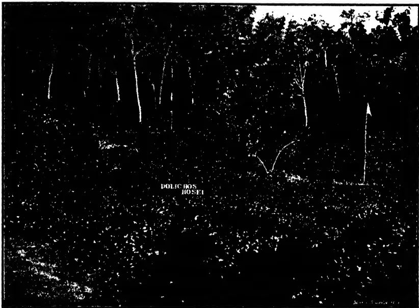A black and white photograph of a rubber plantation. In the background, several tall, slender rubber trees stand against a bright sky. The foreground is filled with a dense field of low-growing plants, identified as Dolichos Hosei (Vigna oligosperma). A small white label with the text 'DOLICHOS HOSEI' is placed in the middle of the field. In the bottom right corner, there is a small, faint text that reads 'Agricultural Science 1952'.

*Dolichos Hosei (Vigna oligosperma)* in young rubber

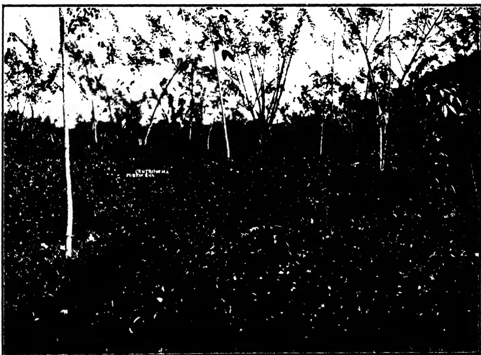A black and white photograph of a rubber plantation, similar to the one above. It shows young rubber trees in the background and a field of Centrosema pubescens plants in the foreground. A small white label with the text 'CENTROSEMA PUBESCENS' is placed in the middle of the field.

*Centrosema pubescens* with Wind-belts of "*Gliricidia maculata*"

730------------------------------------------------

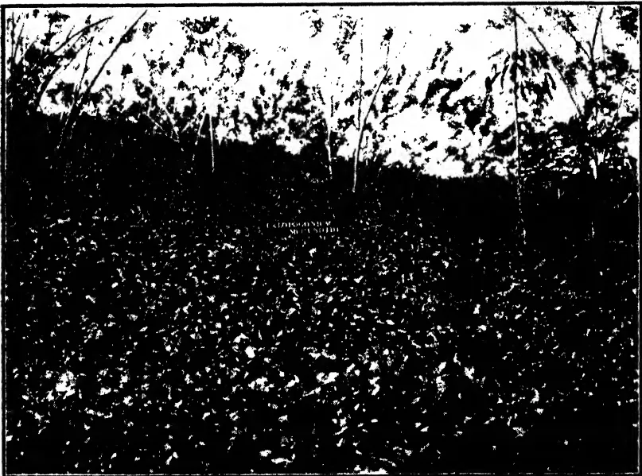A black and white photograph showing a dense field of Calopogonium mucunoides plants in the foreground, with a line of young rubber trees in the background. The plants are low-growing and have small, light-colored flowers. The rubber trees are tall and slender, with many thin trunks. The background is bright, suggesting a sunny day.

*Calopogonium mucunoides* in young rubber

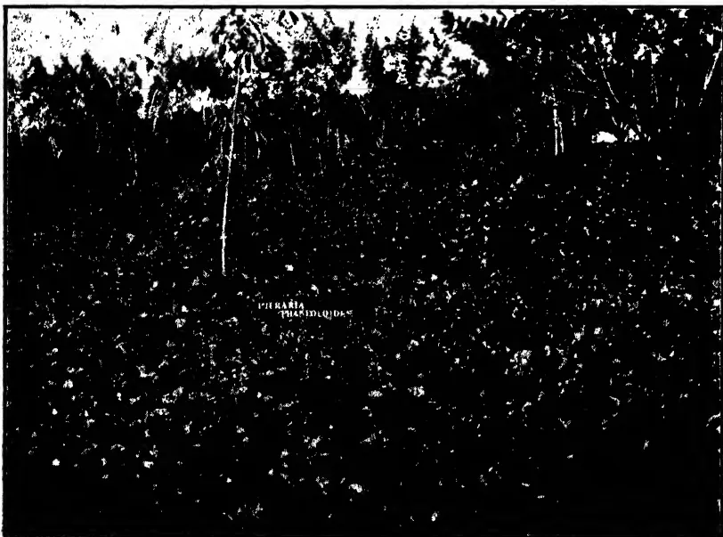A black and white photograph showing a dense field of Pueraria phaseoloides (P. javanica) plants in the foreground, with a line of young rubber trees in the background. The plants are low-growing and have small, light-colored flowers. The rubber trees are tall and slender, with many thin trunks. The background is bright, suggesting a sunny day.

*Pueraria phaseoloides* (*P. javanica*)

731------------------------------------------------

263

Many other species have been tested by the Department, and some of these form excellent covers in new clearings. Amongst these are: *Desmodium* spp., *Centrosema plumieri*, *Dunbaria Heynei*, *Phaseolus radiatus*, etc. Although not used extensively in Ceylon at the present time these plants are worthy of trial on estates.

(b) *Erect Green Manures*.—The most important characteristic of a good green manure plant is that it should provide large quantities of nitrogen and organic matter for the soil. This is mostly supplied by periodically cutting back the plants and burying the loppings. When turned into the soil the green material not only increases the humus content, but, in the process of decomposition, also has the effect of rendering some of the mineral constituents of the soil more readily available as plant foods. Species vary in the extent to which they may be pruned without permanent detriment to their growth, and the ideal cover must clearly be able to stand periodical severe lopping.

As with creeping covers there is a wide range of leguminous plants which can be employed for this purpose. *Tephrosia candida* (Bogo medeloa), *Clitoria cajanifolia*, *Crotalaria usaramoensis*, and *Crotalaria anagyroides* are the most extensively used green manures on new clearings in Ceylon.

*Tephrosia candida* has been a favourite green manure in the East for many years, and grows well on almost all types of soil and at all elevations. It produces a very large quantity of green material from prunings and fallen leaves. The plant is not, however, very tolerant of severe pruning and should be cut back lightly at relatively frequent intervals. *Tephrosia* should be cut out and replanted after two or three years owing to the fact that, on account of its woody habit, it is liable to attack by "pink disease" (*Corticium salmonicolor*), and by the root diseases caused by *Fomes lignosus* and *Fomes lamaoensis*. *Tephrosia candida* and *Clitoria cajanifolia* are commonly planted in hedges, and are thereby useful as preventives of soil movement in addition to their green manurial properties.

*Clitoria cajanifolia* is an excellent species for permanent hedge planting. It does not provide so great a quantity of green leafy material as *Tephrosia*, but has the advantage that it may be repeatedly lopped without becoming excessively woody. Recent experiments by Holland <sup>(3)</sup> have shown that hedges of *Clitoria* are very effective in checking soil erosion.

732------------------------------------------------

264

*Crotalaria anagyrooides* and *Crotalaria usaramoensis* are usually sown broadcast on new clearings in conjunction with ground covers, and both provide a large quantity of leaf mulch. The former species grows to a larger plant than the latter, and is preferable on account of its quicker growth and exceptionally deep-root system. Both species propagate abundantly by self-seeding, but neither are tolerant of severe lopping.

A plant which has not been used extensively in Ceylon, but which has given a favourable impression on the Rubber Research Scheme Experiment Station, Nivitigalakele, is *Desmodium gyroides*. This grows quickly to a large bushy shrub and provides a good weight of green material.

*Leucaena glauca* (Lamtoro) is grown as a low hedge on new clearings in the Dutch East Indies. It is kept lopped at a height of about 2 feet and is stated to stand periodical pruning better than any other species.

Amongst other species which have been used and which are worthy of trial are: *Desmodium heterocarpum*, *Indigofera arrecta*, *Crotalaria striata*, *Sesbania cannabina*, *Tephrosia vogelii*, *Tephrosia noctiflora* etc.

## (2) MIXTURES OF COVER PLANTS

It is clear from the foregoing remarks that both types of cover plants, i.e., ground covers and erect green manures are necessary on new clearings. Although some species of green manures are usually planted in hedges it is a sound practice to broadcast a mixture of seeds of both types so that the various species grow up together. The erect covers then provide the small amount of shade beneficial to the young seedlings of some of the ground covers. Instances are known in which *Dolichos Hosei* was quickly established in this way, whereas by sowing the seed by itself on exposed soil the plant made little progress.

It is found that certain cover crops which make rapid growth at first gradually die off, whereas others, which are less quickly established, are of greater permanency. It is, therefore, desirable to plant a mixture of these two types so that the more permanent cover may, in course of time, replace that which made the earliest growth. Thus *Calopogonium* should be planted in conjunction with a cover such as *Dolichos Hosei*, *Centrosema pubescens*, or *Pueraria phaseoloides*. The *Calopogonium* will provide most of the cover during the first year or two, and this gradually be replaced by the other species which flourish in the shade of the maturing rubber.

733------------------------------------------------

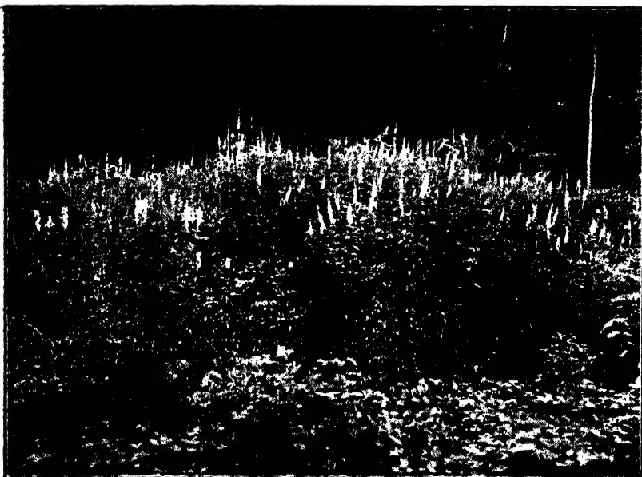

*Crotalaria usaramoensis*

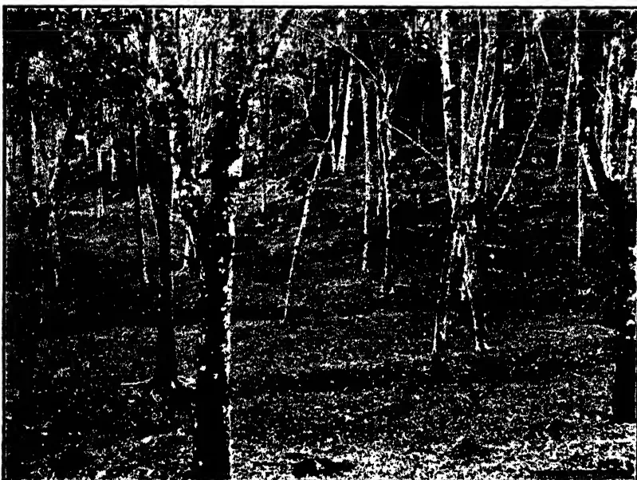

*Dolichos Hosei (Vigna)* under old rubber

734------------------------------------------------

A completely blank white page with no visible content, text, or markings.

735------------------------------------------------

265

### (3) METHODS OF PLANTING

In planting up a new clearing with cover crops and green manures the most important consideration is that the ground should be covered as soon as possible after felling and burning the timber so as to prevent the loss of surface soil and humus consequent upon exposure to the tropical sun and rain, and to keep weeds in check. At the same time, whether seeds or cuttings be used, it is valueless to attempt to plant a cover in settled dry weather, and the planting operations should always be carried out when wet weather can be expected. The ideal condition for planting is, therefore, when a spell of wet or showery weather follows a few weeks after the timber is burned. In the main rubber-growing districts of Ceylon it is usually arranged that the "burn" takes place in January or early February, and every effort should be made to "smother" the land in cover crops during the rains commonly experienced in April.

Whether seeds or cuttings are to be used, the first essential is to clear the area of weeds, and subsequently to carry out a regular weeding programme until the cover is thoroughly established. It is the general experience that if the eradication of weeds is rigorously carried out while the cover is becoming established, the thick cover that subsequently develops chokes out weeds to a great extent and enables hand weeding to be carried out at a greatly reduced cost.

All the species recommended above are best planted in new clearings from seed, and unless for some reason seed is not available there is no necessity to propagate vegetatively. Seed of the various species selected should, as a general rule, be mixed, and for quick germination may be soaked for 24 hours in warm water immediately before planting. Seed treated in this way must on no account be allowed to dry out before sowing. The seed may be planted in small holes two or three seeds to a hole, scattered irregularly throughout the area, or may be distributed in rows on loosened soil and pressed well down. The distance apart of the rows or holes and quantity of seed per acre naturally depends on the species used.

When it is necessary to propagate from cuttings care must be taken to use only mature stems, and to press these well down into the soil to prevent them drying out. A useful method of procuring rooted cuttings is to embed "split coconut" shells (*sheraties*) in the nursery beds before planting seeds, and to plant these out in the field when the nursery is well established.

Some species of erect green manures are best planted in hedges, thereby forming valuable checks to soil movement. These hedges should be planted along the contours, their position depending to some extent on the method of opening.

736------------------------------------------------

266

In Java and Sumatra soil erosion is largely prevented by silt-pits, the earth from which being used to build continuous ridges about one foot high immediately above the pits. The ground cover is commonly planted on these soil erosion ridges.

On poor soils the establishment of leguminous species may be materially assisted by the application of manure at the time of planting. Phosphoric acid is the chief requirement, and this is probably best supplied by basic slag. Bulk cattle manure is often used when available. The manure should be mixed with good surface soil and planted with the seed.

#### (4) SUBSEQUENT TREATMENT

In order that the maximum benefit from cover crops may be obtained it is not sufficient simply to plant them and ensure their vigorous growth. Erect covers are grown as sources of green material, and in order to obtain the maximum quantity of humus the plants must be periodically pruned.

The extent and frequency to which the bushes should be cut back varies with the different species, but in general it is advisable to lop twice a year. In determining the time of year at which lopping should be undertaken a number of factors must be taken into consideration. In order to obtain the maximum quantity of food substances the plants should be lopped when in full bloom, before the seed has been set. On the other hand the seed may be required for further planting. The plants should not be pruned in dry weather. If possible lopping should be undertaken in showery weather at the end of a monsoon, so that the green material is buried in a moist soil. The plants will then have made a small renewed growth before the succeeding spell of dry weather, but will not take much moisture from the soil.

The correct treatment of the loppings provides a debatable problem. There is no doubt that in order that the soil should derive the greatest benefit by the addition of nitrogen and humus-forming material, the loppings should, in some way, be turned into the soil. Joachim <sup>(4)</sup> has shown that if green material is allowed to dry on the surface of the soil nearly 50 per cent of the nitrogen may be lost. Where possible, therefore, green manure loppings should be forked into the soil or buried in pits, and it is probably advisable to alternate these two methods. Where expenditure must be reduced to a minimum it is customary to spread the loppings behind the bushes, or, where platform planting has been adopted, at the back of the platforms.

The extent to which ground covers should be kept back from the young rubber plants is, again, a debatable point. On

737------------------------------------------------

267

the one hand the growth of covers in close proximity to the young plants will result in slower growth owing to competition between the rival root systems for plant foods and moisture, and on the other hand any bare soil will tend to deteriorate as the result of exposure to a hot sun and heavy rain. It is clearly necessary at first to maintain a small area around each young plant free from any ground cover on account of the danger of a cover with a twining habit climbing up the rubber plants and smothering them. As the root system of the rubber spreads so this cleared area should be kept larger and larger if competition between the roots is to be avoided. The logical outcome of this treatment, however, would be the eventual removal of the entire cover, thus returning to the policy of clean weeding. It is clear that a compromise must be effected. Observation in Ceylon and other countries has shown that the growth of young plants is definitely retarded by the presence of a close cover, and it is therefore probable that an area corresponding approximately to the spread of the root system should be kept clear around each plant until the rubber is approaching tappable age. Where the platform system of planting has been adopted it is simple to keep the platforms wholly or partly clear of any green manures or cover plants while the rubber is between the ages of about 2 to 5 years. Where the rubber plants are very young a cleared area corresponding to the size of the holes is sufficient, and when the rubber is mature the cover may, with certain limitations, be allowed free scope.

It has been found that on areas planted with a mixture of ground covers and erect green manures, the former tend, after two or three years, to somewhat smother the latter. It is therefore, necessary to re-establish the green manures periodically.

### (5) WIND-BREAKS

Although wind-breaks do not strictly come under the category of green manures, in that their primary function is not concerned with soil improvement, by the selection of suitable species, many of the benefits associated with green manure plants may also be obtained. By planting leguminous species the soil is enriched by the fixation of atmospheric nitrogen, and by selecting varieties which not only give effective protection against the wind, but which may also be lopped to yield green material, the dual functions of wind-breaks and green manures are fulfilled.

Young rubber plants are very susceptible to strong winds, and their growth may be materially retarded or even completely inhibited when planted in exposed situations. On clearings which are at all exposed to wind, it is therefore necessary to

738------------------------------------------------

268

protect the plants as far as possible by the establishment of wind-belts. In the past the use of wind-breaks on new clearings has not received its merited consideration.

One of the most effective wind-break trees is *Albizia moluccana* which grows very rapidly and has a deep-root system. On new clearings it should be planted as early as possible along the ridge of all exposed hills, the establishment and rapid growth of these trees being at first regarded as of equal importance to the growth of the rubber plants. A row of *Albizias* planted lower on the slope of a ridge at right angles to the direction of the prevailing wind is also of great value in deflecting the wind above the top of the ridge. *Albizia* grows with a spreading habit and quickly forms a substantial wind-belt. It is a matter for discretion whether the trees should be removed when the rubber is approaching maturity, or whether they should be retained permanently. Mature rubber has been seen growing excellently in conjunction with large *Albizias*, and it is possibly of advantage to retain these trees in particularly exposed areas.

*Albizia* may also be planted between the rows of rubber both for wind protection and as a source of green manure, but it must be kept pruned so that the young rubber trees are not overshadowed or "spindly" development of the latter will result. Pruning must, however, be undertaken with discretion so that the rubber trees are not left without protection when high winds are prevalent. *Albizia* can most conveniently be grown from seed in nurseries, and thence planted out in the field.

In addition to the establishment of major wind-breaks *Gliricidia maculata* may be planted in rows at right angles to the direction of the prevailing wind. If kept lopped at a suitable height this species gives valuable protection to the young rubber plants in the first two or three years, and also provides a great quantity of green manure. *Gliricidia* is most easily planted in the form of cuttings about 6 feet in length.

Dadap, *Erythrina lithosperma*, is also commonly planted in young clearings as an alternative to *Gliricidia*. In certain localities it thrives better than the latter. It is easily established from cuttings or seed; grows rapidly, and is valuable as a source of green material.

*Leucaena glauca* grows to a small tree 15 to 20 feet in height and forms a useful wind protection for young rubber. Subsequently it may be cut low and retained as a green manure hedge. It must be stated, however, that this plant has shown indifferent growth at the Rubber Research Scheme Experiment Station.

739------------------------------------------------

269

#### IV GREEN MANURES AND COVER CROPS UNDER MATURE RUBBER

The value of green manures and cover crops in re-conditioning badly washed soil under old rubber was recognised some years before the establishment of such plants became a general custom. This delay in adopting an obviously sound agricultural practice was due, not only to the conservative attitude of many influential planters, but also to the difficulty in finding suitable species which could be easily established and retained in heavy shade. The earliest efforts towards checking soil erosion and providing mulch consisted of "selective weeding", whereby certain weeds thought to be noxious were eradicated and other harmless species retained. When certain leguminous plants were found to be tolerant of the normal shade under mature rubber it was clearly preferable to substitute the mixed weed growth by a leguminous cover, thus obtaining the additional soil enrichment due to the activities of the nitrogen-fixing bacteria in the root nodules characteristic of the family.

The influence of a ground cover on the growth of weeds has always provided a basis for argument between the respective advocates of clean weeding and cover crops. It was at first feared that the existence of a cover would increase the difficulties and therefore the cost of weeding. It has been the general experience, however, that provided the ground is rigorously weeded, while the cover is establishing itself, a thick cover will subsequently be formed which will tend to choke out weeds and thus enable hand weeding to be carried out at a reduced cost. If, on the other hand, weeds are not kept in check while the cover is still thin, a mixed growth will result and the eradication of the undesirable species may present considerable difficulty.

##### (1) CHOICE OF SPECIES

The choice of species for use under mature rubber is less extensive than for new clearings. As far as ground cover is concerned it is essential that the plant should be easily established, and should be of a permanent nature. The number of leguminous plants fulfilling these conditions under the shade of mature rubber is relatively limited. As regards erect green manures the same limitation is experienced, and the possibilities of supplying mature rubber areas with green manure are as yet largely unexploited.

(a) *Ground Covers*.—One of the earliest ground covers to be used was *Mimosa invisa*. This is probably unsurpassed on badly washed soils where the foliage of the rubber trees, is scanty, and many areas in the Dutch East Indies have been

740------------------------------------------------

270

greatly improved by the use of this cover. *Mimosa* will not, however, grow under heavy shade, and there are various objections to its use which have been considered of sufficient importance to bar its introduction to Ceylon.

An important advance in the use of cover crops in rubber cultivation was made when it was discovered that *Dolichos Hosei*, the Sarawak bean, flourished in the normal shade of old rubber. (*Dolichos Hosei* is universally known to planters in Ceylon as *Vigna* (*oligosperma*); to avoid confusion the latter name will therefore be employed). This species was the earliest ground cover to be planted extensively in mature areas, and has remained up to the present time the only important cover in Ceylon. *Vigna* is easily grown from seed, but since seed is somewhat expensive, it is preferable to establish a nursery, and thence to plant out cuttings in the field. The plant has a comparatively shallow rooting system and is, therefore, probably of greater value on flat and undulating land than on steep hill slopes. *Vigna* has, nevertheless, proved invaluable in checking soil erosion in hilly districts in Ceylon, the clearness of the drainage water bearing adequate testimony to its efficacy. It is also valuable as a soil builder, and under a thick cover of *Vigna* a quantity of leaf mulch is always to be found. In addition to the soil benefits due to ground cover it has been the general experience in Ceylon that a cover of *Vigna*, by inducing moist atmospheric conditions and keeping the ground temperature low, is beneficial to the flow of latex so that late tapping does not result in so great a diminution of yield.

In Java and Sumatra *Vigna* has, of recent years, been largely replaced by *Centrosema pubescens*. This forms a very similar cover to *Vigna*, but is probably to be preferred on account of its deeper root system, its marked twining habit which makes it very effective in choking out weeds, and its ability to withstand prolonged periods of dry weather. *Centrosema* is, however, more difficult to establish in shade than *Vigna*, and at first makes slower growth. Efforts to establish this plant under mature rubber have been made on many estates in Ceylon, but except where the shade is light very little success has been obtained. *Centrosema* requires a fairly good soil, and it is probable that the poverty of eroded Ceylon soils, in conjunction with heavy shade, is largely responsible for the different experiences with this cover in Ceylon and Java. It seems likely, however, that once established on a new clearing *Centrosema* will persist when the trees become mature.

741------------------------------------------------

271

*Centrosema plumieri* has been seen growing under mature rubber where the shade is light, but this species is no more tolerant of heavy shade than *C. pubescens*, and is generally regarded as inferior to the latter in other respects.

*Pueraria phaseoloides* (*P. javanica*) has only recently received attention in Ceylon, but promises to be of considerable value under mature rubber as well as in new clearings. Although growth is somewhat slow at first a dense cover is eventually obtained. *Pueraria* has been planted extensively in Malaya and the Dutch East Indies, and in Ceylon may prove to be a useful substitute for *Vigna* where the latter has died out.

Various indigenous species of *Desmodium* grow well in old areas in Ceylon. *Desmodium triflorum* is a very small-leafed species which forms a close mat over the ground. It is effective as a preventive of soil erosion, but its close "mat-like" growth is an objection. It is not to be recommended where other covers can be grown. *Desmodium heterocarpum* is a sub-erect woody plant which is, perhaps, of more value as a source of green manure than as a ground cover. It is grown extensively in south India under the synonym *Desmodium polycarpum*.

(b) *Erect Green Manures*.—As regards erect green manures the ideal plant for mature areas has yet to be found. Most of the leguminous species which flourish on new clearings produce, but a stunted growth in heavy shade. There is no doubt, however, that humus is the most important soil requirement of the average rubber estate in Ceylon, and the establishment of green manures in addition to cover crops is therefore much to be desired.

*Tephrosia candida* grows rapidly under mature rubber, and, although not attaining its full development under shady conditions, is a valuable source of green material. The plant, however, must be periodically re-established, not only because it weakens under the shade, but also because when woody it is liable to attack by some of the root diseases fungi to which *Hevea* is prone.

*Crotalaria anagyroides* and *Crotalaria usaramoensis* will both grow in old areas, but, if an adequate supply of green material is to be maintained, they must be frequently replanted. Both species grow more rapidly than *Tephrosia*, but are less tolerant of lopping. They produce seed in great abundance in open areas or where the shade is light.

It is suggested that *Glicidia maculata* would be of great value as a green manure if planted between the rows of trees. Further experience is necessary, however, before this species can be definitely recommended.

742------------------------------------------------

272

## (2) METHODS OF PLANTING

The greater part of the ground cover of *Vigna* under mature rubber in Ceylon has been planted from cuttings. Owing to the fact that the plant is a shy seeder, seed is relatively expensive, and the establishment of *Vigna* by seed over a large area would be a costly proceeding. Where cuttings are not readily available from neighbouring areas it is, therefore, advisable to establish nurseries from seed and thence to plant out cuttings in the field. After cuttings have been removed from the nursery a new flush of growth will take place so that in a few months further cuttings may be taken. A useful method of procuring rooted cuttings is to embed split coconut shells in the nursery beds before sowing, and to plant these out in the field when the nursery is well grown.

Provided that good soil is selected and weeds are eradicated there is no difficulty in establishing a good nursery of *Vigna* in a short space of time. In transferring the cover to the field, however, considerable trouble is often experienced in certain areas. It has been the experience of many planters that whereas a thick cover is easily established on the greater part of the estate, certain areas are apparently unable to support the cover. This is usually due to the absence or scarcity of the particular bacteria without which the plant is unable to make vigorous growth. In such cases large mats of *Vigna* should be planted together with a quantity of the soil in which they were growing. The "barren" soil is thus inoculated with the necessary organisms, which multiply rapidly as humus is formed. The split coconut shell method of planting (described above) is also useful in such areas.

*Centrosema pubescens* is best established from seed. Germination usually takes place within 10 to 14 days of the time of sowing, but the growth of the seedling is slow, and on most Ceylon soils under heavy shade the plant makes little progress. According to a recent report <sup>(5)</sup> very successful results have been obtained in Sumatra by soaking the seed in an extract of crushed *Centrosema* root nodules, thus securing the inoculation with the necessary bacteria. This method might also be useful where difficulty is found in establishing *Vigna*.

Owing to the scarcity and cost of its seed, *Pueraria phaseoloides* is most satisfactorily grown from cuttings. If mature stems about 2 feet long are used the plant roots very readily. Growth is somewhat slow at first, but eventually a thick cover is obtained.

743------------------------------------------------

273

The establishment of ground covers on poor soil is materially assisted by the application of small doses of manure. Phosphate is the most important requirement, and basic slag appears to be the most suitable source. The addition of a small proportion of nitrogen is also beneficial, and excellent results on a thin cover of *Vigna* have been obtained with ammonium phosphate. Cattle manure, when available, has also been found useful for starting a cover.

Under mature rubber erect green manures are probably most beneficial when grown in hedges along the contours. In addition to their green manurial properties they are then valuable as checks to soil movement. It must again be stated that in Ceylon very little use has been made of such plants in mature areas, and that such planting as has been undertaken has been somewhat haphazard in nature.

*Tephrosia candida* and *Crotalaria* spp. should be sown thickly in rows along the contours midway between the rubber trees. Care must be taken that the growth is not too close to the trees, or the drying of the tapping cuts after rain will be seriously retarded by the damp atmospheric conditions caused. Haphazard planting will also result in interference with the supervision of tapping.

### (3) SUBSEQUENT TREATMENT

There is no general agreement as regards the correct use of cover plants under mature rubber, and further investigation is required on many points. In Ceylon it is customary to allow *Vigna* to form a complete cover over the whole estate, a small circular area being sometimes kept round each tree to aid in the detection of root disease and collar rot. Although by this means soil erosion is very effectively prevented, it is argued by some that the cover competes with the rubber trees for moisture and food substances, heavy toll being taken of any manure which may be applied. It is thus the practice on some estates in Java and Sumatra to confine the cover to the soil erosion ridges, reliance being mainly placed on the latter for the prevention of soil wash. Although this method may be suitable on flat or gently undulating ground, it would seem that on the steep hillsides on which *Hevea* is commonly grown in Ceylon a complete cover is preferable. In such cases the only limitation to the growth of a ground cover is the presence of root disease. In areas where root disease, particularly *Fomes lignosus*, is known to be present, it is important that the ground should be kept strictly clean weeded.

744------------------------------------------------

274

In order to obtain the maximum benefit from a ground cover it is not sufficient simply to ensure its establishment and vigorous growth. Although experiences differ with regard to the direct effect of green manuring on latex yield, there can be no doubt that the soil is materially improved by the addition of humus-forming tissues so that an increased crop will eventually result. A ground cover adds a certain quantity of humus to the soil by reason of its normal leaf-fall, but in the process of decomposition on the surface a large proportion of the available nitrogen escapes into the air in the form of ammonia and is lost to the soil. In order that the soil should reap the maximum benefit, it is, therefore, necessary that the cover should be periodically buried in the green state.

It must be stated that it is not at present customary on Ceylon estates to utilise the ground cover as a green manure. Where artificial manures are applied to ground bearing a thick cover the latter is usually rolled back from the strips or squares to be manured, and either left as "bunds" or replaced on the surface of the ground. There can be no doubt that from the agricultural view-point this is not the ideal method, and that the opportunity of incorporating valuable green material with the soil is lost. Alternative methods of incorporating the cover with the soil are: (1) forking, and (2) burying in pits, and the choice of these two methods is largely dependent at present on individual preference. Where artificial manures are being applied by envelope-forking the cover can be torn up and forked into the furrows together with the manure. With certain mixtures the cover is often killed, but in course of time the ground is usually again covered, by encroachment from the unmanured strips. An objection advanced against envelope-forking the cover into the soil is that the feeding roots of the rubber are thereby disturbed and damaged. There is, however, no doubt that forking is itself beneficial in certain areas, and in choosing the method of utilising a cover the planter must be guided by the condition of the soil in question. Burying the cover in pits has the obvious objection that the green material is thereby less evenly distributed, so that the soil loses some of the benefits due to the humus formed.

Another method has been adopted on some estates where the expense of forking has been considered unjustified. The cover is rolled back in strips like a carpet and replaced on the ground upside-down. Although this method is doubtless of some benefit, a large proportion of the nitrogen and organic matter is lost.

Whatever method of utilising the ground cover may be adopted, it is clearly inadvisable on hilly ground to remove the

745------------------------------------------------

275

entire cover at one time. Strips of cover should be retained along the contours so that the ground is not left entirely unprotected against soil erosion.

In addition to the soil improvement consequent upon the incorporation of green material, there is another important reason why the periodical disturbance of a ground cover is desirable. It has been a common experience in Ceylon that healthy covers of *Vigna* have unaccountably died off after four or five years of growth. Although the depredations of the Kulatara snail (*Achatina fulica*) have been responsible for considerable damage, there can be little doubt that in many cases the death of the cover has been due to a soil factor which, for want of more exact terminology, is called "staling". The disturbance, aeration, and enrichment of the soil consequent upon periodically turning in a green cover helps to enable the soil to maintain a fresh growth of the same plant. Ground which has become "stale" should be rested before endeavouring to re-establish a cover, and a different species should, if possible, be used on such areas.

Although a ground cover in addition to its value in the prevention of soil erosion, can be utilised to provide green manure, a considerably larger bulk of green material can be obtained by growing shrubby leguminous plants and periodically turning them into the soil. There can be no doubt as to the theoretical value of such a procedure, but there is a great diversity of opinion among practical men as to the economic aspects of growing erect green manures under old rubber. In the first place such species as have so far been used are somewhat difficult to establish and costly to maintain. In order that the soil may derive the maximum benefit, the plants must be lopped frequently, and the loppings forked into the ground or buried in pits. Although forking is undoubtedly beneficial to some soils, its frequent practice is open to objection on account of the damage caused to the rubber roots. It is argued by many planters that the money spent on the establishment and utilization of such plants could be more usefully employed in providing artificial manures. It must be borne in mind, however, that inorganic manures cannot cause any permanent improvement in the chemical and physical condition of the soil unless humus is also present. Artificial manuring should, therefore, be combined with green manuring.

A judgment as to the economic value of growing green manures in old areas must await the outcome of further experiments and field experience. An important advance will be made when a species is revealed which is easily established and maintained under the normal soil and shade conditions of mature rubber areas.

746------------------------------------------------

276LIST OF SPECIES MENTIONED

<table>
<tr>
<td><i>Albizia moluccana</i></td>
<td><i>Erythrina lithosperma</i></td>
</tr>
<tr>
<td><i>Calopogonium mucunoides</i></td>
<td>(Dadap)</td>
</tr>
<tr>
<td><i>Centrosema Plumieri</i></td>
<td><i>Gliricidia maculata</i></td>
</tr>
<tr>
<td><i>Centrosema pubescens</i></td>
<td><i>Indigofera arrecta</i></td>
</tr>
<tr>
<td><i>Clitoria cajanifolia</i></td>
<td><i>Indigofera endecaphylla</i></td>
</tr>
<tr>
<td><i>Crotalaria anagyroides</i></td>
<td><i>Leucaena glauca</i> (Lamtoro)</td>
</tr>
<tr>
<td><i>Crotalaria striata</i></td>
<td><i>Mimosa invisa</i></td>
</tr>
<tr>
<td><i>Crotalaria usaramoensis</i></td>
<td><i>Phaseolus radiatus</i></td>
</tr>
<tr>
<td><i>Desmodium gyroides</i></td>
<td><i>Pueraria phaseoloides</i></td>
</tr>
<tr>
<td><i>Desmodium heterocarpum</i></td>
<td>(<i>P. javanica</i>)</td>
</tr>
<tr>
<td>(<i>D. polycarpum</i>)</td>
<td><i>Sesbania cannabina</i></td>
</tr>
<tr>
<td><i>Desmodium triflorum</i></td>
<td><i>Tephrosia candida</i></td>
</tr>
<tr>
<td><i>Dolichos Hosei</i></td>
<td>(boga medeloa)</td>
</tr>
<tr>
<td>(<i>Vigna oligosperma</i>)</td>
<td><i>Tephrosia noctiflora</i></td>
</tr>
<tr>
<td><i>Dunberi Heynei</i></td>
<td><i>Tephrosia vogelii</i></td>
</tr>
<tr>
<td></td>
<td><i>Vigna</i> (see <i>Dolichos Hosei</i>)</td>
</tr>
</table>

REFERENCES

1. 1. WRIGHT, HERBERT.—*Hevea brasiliensis* or Para Rubber. Maclaren & Sons, Ltd. 4th Edition, 1912, pp. 128-129.
2. 2. STOCKDALE, F. A.—Soil Erosion. Year Book of the Department of Agriculture, Ceylon, 1926, p. 3.
3. 3. HOLLAND, T. H.—Progress Report of the Experiment Station, Peradeniya, for the months of July and August, 1930. *The Tropical Agriculturist*, LXXV, 4, 1930, p. 249.
4. 4. JOACHIM, A. W. R.—Losses of Nitrogen from Green Manures and Tea prunings through drying under Field Conditions. *The Tropical Agriculturist*, LXXI, 6, 1928, pp. 348-351.
5. 5. Annual Report of the Director of the General Experiment Station of the A.V.R.O.S. 1st July, 1929-30th June, 1930, p. 31.

747------------------------------------------------

277

## CINCHONA CULTURE IN JAVA<sup>1</sup>

### ITS HISTORY AND PRESENT SITUATION

**I**N 1589, one of the last survivors of the Spanish Conquistadores of Peru, Marcio Serra de Lejesama, wrote a most remarkable confession to King Philip II.

"Your Majesty must understand", he writes, "that my reason for making this statement is to relieve my conscience, for we have destroyed the Government of this people by our bad example. Crimes were once so little known amongst them that an Indian, with 100,000 pieces of gold and silver in his house, left it open only placing a little stick across the door, as a sign that the master was out, and nobody went in. But when they saw that we placed locks in our doors, they understood that it was from fear of theft".

That the old Incas should have such confidence in those who passed their dwellings, is not only a proof of the general honesty of their fellow-citizens but must also chiefly be taken as a proof of the relatively small value, which gold possessed in the immured economic state of the Incas before the Spanish invasion. And if the writer of the above-mentioned confession could have foreseen that not only the gold but also a treasure of much greater value, namely the precious remedy cinchona-bark, would permanently disappear from Peru, he would perhaps have made his confession in somewhat different words. However ideal the condition of national honesty of the old Incas may appear, it is certainly better, in view of the "sacra auri fames", to preserve and cultivate the most precious gifts which nature has bequeathed to mankind, so that they may be used for the good of as many people as possible, rather than to leave them to reckless exploitation.

To a certain extent it may be said, that the treasure of cinchona bark in the primeval forests of Peru and Bolivia was as inadequately guarded as the gold in the dwellings of the ancient Incas. The Jesuits, it is true, did their best to convince the Indian bark collectors, that they were morally compelled to plant a young cinchona shoot in the ground for each tree they cut down; also the Government of Bolivia subsequently attempted to restrict the extermination of the cinchona by legal regulations. But owing to the pressure of rapid exploitation of this most profitable product of the forest, stimulated as it was by the constantly growing demand for cinchona bark, neither the well-meant advice nor the later legal regulations could be more than "a little stick across the door".

For a space of more than two centuries the unbridled exploitation of the cinchona, growing in its natural forests, went on, and although the danger of its extermination had already been emphatically pointed out by men of great authority, such as De La Condamine and von Humboldt, it took many decades for the conviction to become more general, that the enormous store of cinchona-bark in the South American forests was in danger of becoming exhausted. The danger was even increased owing to the fact, that after the discovery that quinine was the most active febrifugal component, the commercial world had learnt to value cinchona-bark according to the percentage of quinine it contained, and that from the analyses it appeared that the importation of high percentage barks from South America was constantly diminishing.

---

<sup>1</sup> Lecture by Dr. M. Kerbosch, Director of the Cinchona Experimental Station, Tinjiroean, at the celebration of the 300th Anniversary of the first recognised use of Cinchona held in the Missouri Botanical Garden, St. Louis. Reproduced from *De Berg-cultures*, No. 18, May 2, 1931.

748------------------------------------------------

278

It is chiefly due to the French savant Weddel, who visited the cinchona districts from 1843 to 1848, that attempts were eventually made to preserve the cinchona from total extermination by attempting to introduce this plant in other tropical regions and to cultivate it there. In his "Histoire naturelle des Quinquinas" (Paris 1849) he emphatically pointed out the necessity of attempting to produce cinchona bark in regular plantations if the world were not to lose a medical remedy which had already become indispensable. "Reste la ressource de la culture", he writes, "et il faut l'employer. S'il est un arbre digne d'être acclimatisé, c'est certes le quinquina, et la posterité bénérerait ceux qui auraient mis en execution une semblable idée".

In one respect, however, Weddel's statement was not complete. It is not only those, who carried out Weddel's idea, but also the indefatigable promoters and propagandists of this idea to whom the gratitude of later generations is due. Therefore, Weddel's name will remain one of the first and greatest to which this grateful remembrance will be paid.

When in the year 1852 the Netherlands Government determined to attempt the transfer of the cinchona from South America to Java in order to cultivate, if possible, this plant in regular plantations, it was certainly not the calculations of a possible financial profit which induced them to take such a resolution. On the contrary, considerations of a more idealistic nature ranked first in every way. The whole object was to preserve to future generations a medical remedy which had become indispensable, and to make it possible to obtain it regularly in adequate quantities. "Il s'agit, pour ainsi dire, de procurer son pain au malade, et de le lui procurer a des prix qui ne surpassent pas ses moyens. Ce n'est comme speculation, c'est comme acte humanitaire que le Gouvernement Néerlandais a entrepris et poursuivi cette oeuvre". With these words Rochussen, Governor-General of the Netherlands East Indies, most correctly described the motive which led to the transplantation of the cinchona.

The actual reason, why far-seeing men of science had urged the transplantation of the cinchona, was the danger of a scarcity of cinchona bark and the wish to ensure a permanently adequate production of bark by regular cultivation. The same motives prevailed when the Netherlands and the British Governments determined to make an attempt to transplant the cinchona to their colonies.

Without entering into details, I may briefly record here the two expeditions to South America, namely the Dutch expedition in 1852 and the English one in 1860, sent out with the object of collecting as many cinchona plants and seeds as possible in order to transfer these to Java and to British India respectively.

Instructions to collect and transfer cinchona plants and seeds to Java were given by the Dutch Government to the botanist Justus Carl Hasskarl, who had already been employed in the service of the Netherlands East Indies Government in the botanical gardens at Buitenzorg near Batavia. Hasskarl left for South America in December 1852, and he remained there till August 1854. He succeeded in collecting live plants and the seeds of several varieties of the cinchona. Of the 500 plants shipped in Ward cases, only 75 proved to be alive on arrival at Buitenzorg. From the seeds brought by Hasskarl and from those, which had been previously sent by him, a great number of plants were later on obtained.

The leadership of the British expedition to South America was entrusted to Sir Clements R. Markham. As he himself had not studied botany, Markham had, to carry out his enterprise, secured the collaboration of a number of scientific men, several of whom were already more or less acquainted with the cinchona regions after a personal sojourn there. His collaborators were Dr. R. Spruce, R. Cross, J. Weir and Pritchett. The success of the expedition was chiefly due to Spruce and Cross; together they

749------------------------------------------------

279

explored the district of the "red bark", viz. the western slopes of the Chimborazo, and ultimately succeeded in delivering in British India more than 450 live plants and about 100,000 seeds of the *C. succirubra* variety which, besides being the producer of pharmaceutical barks, has become of such an extraordinary importance as the base on which to graft the *Ledgeriana* varieties.

Very soon after the cinchona seeds and plants had been received from South America, British India and Java exchanged the varieties they missed, so that early in the 'sixties both countries possessed a fair number of cinchona varieties, of which the principal were:

<table>
<tbody>
<tr>
<td><i>C. lancifolia</i></td>
<td rowspan="3">} Columbia</td>
</tr>
<tr>
<td><i>C. cordifolia</i></td>
</tr>
<tr>
<td><i>C. trianae</i></td>
</tr>
<tr>
<td><i>C. succirubra</i></td>
<td>Chimborazo</td>
</tr>
<tr>
<td><i>C. officinalis</i></td>
<td>Loja</td>
</tr>
<tr>
<td><i>C. micrantha</i></td>
<td rowspan="2">} Huanuca</td>
</tr>
<tr>
<td><i>C. pahudiana</i></td>
</tr>
<tr>
<td><i>C. calopera</i></td>
<td rowspan="3">} Carabaya</td>
</tr>
<tr>
<td><i>C. josephiana</i></td>
</tr>
<tr>
<td><i>C. calisaya</i></td>
</tr>
</tbody>
</table>

The successful transplantation of the cinchona was followed by a period of researches and experiments for the proper ways and means of propagating the new plant, a period with which the names of Anderson, Mac Ivor, Teysmann, Junghuhn, De Vrij, and Van Gorkom are honourably connected.

On the island of Java, where we shall now more particularly follow the development of the cultivation of cinchona, it appeared that with but few exceptions all varieties of cinchona thrived more or less favourably. The new culture succeeded best on the plateau of Pengalengan and on the out-runners of the neighbouring mountains, a district which had been pointed out by Junghuhn as being especially suitable for the cultivation of cinchona.

By further shipment new quantities of seeds came from South America to Java, and so the number of plants available increased rapidly, especially as the planters soon learned to propagate the most important varieties in many thousands by means of cuttings.

After many dangers and sacrifices in transferring the cinchona and after much devotion in tending the experimental plantations, it then appeared as if the cultivation of cinchona in Java could look forward to a splendid future and yet, without a fortunate accident, the cultivation of cinchona in Java could not have developed and attained the great economic importance, which it now possesses.

When, after a number of years, the oldest cinchonas had grown to such an age and size that they could furnish sufficient quantities of bark, so that an analysis of these barks could be made, all the imported varieties proved to possess a low percentage of quinine, with the sole exception of the *C. officinalis*. It was of this variety, however, that the growth was least favourable, and therefore the prospects that this variety could be used for plantation on a large scale were poor. Since the discovery of quinine by Pelletier and Cavantou medical science had found quinine to be the febrifugal component "par excellence" of the cinchona bark, and began to prescribe quinine to a greater and greater extent; consequently there was a constantly growing demand on the market for cinchona barks of a high quinine percentage. The barks with a low quinine percentage supplied only a small quantity of this product, and for the quinine manufacturers these barks were also objectionable owing to the fact that the preparation of pure quinine was rendered more difficult by their relatively high percentage of total alkaloids.

750------------------------------------------------

280

And yet sufficient attention had been paid to the importation and propagation of the good varieties from the very beginning. For a number of years previously the *Calisaya* barks had been by far the most appreciated kind in the cinchona bark trade, and consequently great attention had been devoted to the importation and propagation of this variety. At that time the planters in Java possessed four *Calisaya* varieties which were classified as follows according to their origin:

<table border="0">
<tr>
<td><i>C. Calisaya javanica</i></td>
<td>{</td>
<td>Descendants of the first cinchona plant received from Botanical Gardens at Leiden in 1851. This plant was grown from seed collected in South America by Weddel.</td>
</tr>
<tr>
<td><i>C. Calisaya javanica</i></td>
<td>{</td>
<td>Descendants of seeds and plants collected in South America by Hasskarl.</td>
</tr>
<tr>
<td><i>C. Calisaya Schuhkraft</i></td>
<td>{</td>
<td>Plants grown from seed collected in North Bolivia and received through the Dutch Consul at la Paz, Mr. C. N. Schuhkraft.</td>
</tr>
<tr>
<td><i>C. Calisaya anglica</i></td>
<td></td>
<td>Grown from seed received from British India.</td>
</tr>
</table>

Of all these *Calisaya* varieties, however, the barks appeared to contain in average no more than 1.15 per cent of quinine, as will be seen from the following figures:

<table border="1">
<thead>
<tr>
<th rowspan="2">Variety of Cinchona bark</th>
<th colspan="5">Type of alkaloid contents</th>
</tr>
<tr>
<th>Quinine</th>
<th>Cinchonidine</th>
<th>Kinidine</th>
<th>Cinchonine</th>
<th>Total alkaloids</th>
</tr>
</thead>
<tbody>
<tr>
<td>Cal. Javanica, trunk bark I</td>
<td>1.0</td>
<td>0.5</td>
<td>0.3</td>
<td>1.1</td>
<td>3.8</td>
</tr>
<tr>
<td>" " " " II</td>
<td>0.7</td>
<td>0.2</td>
<td>0.2</td>
<td>0.8</td>
<td>2.5</td>
</tr>
<tr>
<td>" " root "</td>
<td>1.2</td>
<td>1.0</td>
<td>0.4</td>
<td>1.9</td>
<td>5.2</td>
</tr>
<tr>
<td>Cal. Schuhkraft, trunk I</td>
<td>1.0</td>
<td>0.3</td>
<td>0.5</td>
<td>1.6</td>
<td>4.0</td>
</tr>
<tr>
<td>" " " " II</td>
<td>0.3</td>
<td>0.2</td>
<td>0.1</td>
<td>0.7</td>
<td>2.0</td>
</tr>
<tr>
<td>" " root "</td>
<td>1.2</td>
<td>0.7</td>
<td>0.2</td>
<td>2.3</td>
<td>5.0</td>
</tr>
<tr>
<td>Cal. anglica, trunk I</td>
<td>1.5</td>
<td>1.3</td>
<td>0.1</td>
<td>2.1</td>
<td>5.7</td>
</tr>
<tr>
<td>" " " " II</td>
<td>1.0</td>
<td>1.2</td>
<td>0.1</td>
<td>1.4</td>
<td>4.6</td>
</tr>
<tr>
<td>" " root "</td>
<td>1.5</td>
<td>1.7</td>
<td>0.0</td>
<td>3.1</td>
<td>6.9</td>
</tr>
</tbody>
</table>

  

<table border="1">
<thead>
<tr>
<th rowspan="2"></th>
<th colspan="4">Extremes of alkaloid contents</th>
</tr>
<tr>
<th>Quinine</th>
<th>Cinchonidine</th>
<th>Kinidine</th>
<th>Cinchonine</th>
</tr>
</thead>
<tbody>
<tr>
<td>Cal. javanica, trunk bark I</td>
<td>0.4</td>
<td>0.2</td>
<td>0.3</td>
<td>0.3-2</td>
</tr>
<tr>
<td>" " " " II</td>
<td>0.1-0.3</td>
<td>0.1-0.3</td>
<td>0.15-0.25</td>
<td>0.7-1</td>
</tr>
<tr>
<td>" " root "</td>
<td>0.7-2.1</td>
<td>0.8-1.5</td>
<td>0.3-0.5</td>
<td>1.6-2.5</td>
</tr>
</tbody>
</table>

Although the object aimed at, viz. the preservation of the cinchona from extermination had to a certain extent been attained, it did not appear, at least for the present, as if the cultivation of cinchona in Java would prove to be an economic success, since the cinchona barks with a high percentage of quinine, which the market demanded, could only be produced in insignificant quantities.

751------------------------------------------------

281

In the meantime, however, a new variety of *Calisaya* seeds had been received from Charles Ledger in 1865. This seed had been collected by Ledger in the forests of the province of Caupolican in North Bolivia through information supplied to him by an old Indian bark collector named Manuel Inca Mamani.

The story of the collection and the subsequent adventures of this kind of seed is too romantic not to be recalled here in a few words.

Charles Ledger was an Englishman who had been in Peru and Bolivia since 1836. He had also been engaged in the cinchona bark trade. Encouraged by the expeditions of Hasskarl and Markham, he determined to go and collect *Calisaya* seeds himself with the intention of offering these seeds for sale to the British Government. Thanks to his many years' experience and knowledge of the country and its people, especially in Southern Peru and Bolivia in the districts where the *Calisayas* were to be found, he was the very man to carry out such a task successfully. Moreover, he could also count on the very reliable support of his Indian servant, Manuel, who had formerly been a bark collector and who possessed considerable knowledge with regard to the origin and the value of the varieties of cinchona bark.

In the year 1861, Ledger ordered this Indian servant of his to collect seeds of the best *Calisaya* varieties in the forests of North Bolivia. It was in 1865, however, before Manuel returned with a quantity of cinchona seeds which he had collected from about 50 cinchonas in the neighbourhood of the valley of the Rio Mamore in the Bolivian Province of Caupolican. Markham relates that Manuel had not been able to collect seeds before, because in the preceding years the flowers of the cinchonas had been repeatedly destroyed by frost during the month of April.

Ledger sent these seeds to his brother Mr. George Ledger in London with instructions to offer them for sale to the British Government. But when the negotiations with the officials in London were not successful, George Ledger began to fear that the seed would lose its germinating faculty and therefore offered it to the Netherlands Government, which purchased one pound of these seeds. This quantity of Ledger seed was immediately sent to Java, while Ledger's remaining stock of 13 lb. was sold shortly afterwards to a British Indian planter, who exchanged it with the British Government for *Succirubra* seed.

The seed purchased from Ledger by the Dutch Government was received at the Government Cinchona Plantation in December 1865 and was taken great care of by the then Director of the plantation, Mr. K. W. van Gorkam. Although a large proportion of the seed had been spoilt, about 20,000 seeds germinated and of these about 12,000 plants were, somewhat more than a year later, planted out in the open. In the year 1872 the first analyses of the barks of these Ledger cinchonas were made in Java.

Up to this moment there had been no reason whatever to expect that those *Calisaya* varieties of bark would produce a particularly high percentage of quinine. The first analyses showed, however, that the bark of the Ledger cinchona excelled all other varieties, including those of the other *Calisayas* considerably in the percentage of quinine. In the report of the Government Cinchona Plantation for that year the Director, Mr. J. C. Bernélot Moens, writes: "This variety of cinchona bark is not only remarkable for the high percentage of quinine but also for the facility with which the quinine crystallizes as sulphate".

As the bark of a further number of Ledger plants was analysed, higher and higher percentages of quinine were found. The highest percentage of quinine in the Ledger bark in 1872 was 8 per cent; 11 per cent was found

752------------------------------------------------

282

by Moens in 1874, and in the annual report for 1876 we find the statement "The proportion of 13·25 per cent of quinine, which has certainly never been found in cinchona bark, is extremely remarkable".

Accordingly with the increasing of the percentages of quinine, found by analyses of Ledger trees, the Government plantations in Java grew more and more exacting with regard to the qualities of the Ledger trees from which seeds and cuttings should be collected. It is interesting to record here what is mentioned on this subject in the subsequent annual reports of the Government Cinchona Plantations.

1873 "Fresh plants will in the future only be grown from seeds of trees containing more than 5 per cent of quinine in their bark".

1875 "If the bark contains less than 7·5 per cent of pure quinine, the tree is disqualified for seed production purposes".

1877 "On the Government Plantations seeds of trees which contain 9 to 10 per cent or more quinine in their bark will in future only be used".

1879 "In this report Mr. Moens states that more than 1,000 grafts were made with cuttings from Ledger trees with the highest quinine percentage, including 100 cuttings from tree No. 67 which contained 13·5 per cent of quinine".

The significance of these figures becomes clear if we consider that, before the discovery of the Ledger barks, the other *Calisayas* with an average percentage of 1 to  $1\frac{1}{2}$  per cent of quinine were considered to be the best quinine producers and that the other cinchona varieties, with the exception only of the poor growing *C. officinalis*, as a rule only contained 0·5 to 1 per cent of quinine.

The difference between the Ledger cinchonas and the remaining cinchona varieties is even perhaps more striking if we compare the prices obtained at the bark auctions. On the 17th of April, 1877, a cinchona bark auction was held in Amsterdam at which the Government barks were sold at the following prices:

<table>
<thead>
<tr>
<th><i>Ledger cinchona barks</i></th>
<th><i>f</i></th>
<th>17·58</th>
<th>per</th>
<th>kilogramme</th>
</tr>
</thead>
<tbody>
<tr>
<td><i>C. Calisaya javanica</i></td>
<td>"</td>
<td>4·92</td>
<td>"</td>
<td>"</td>
</tr>
<tr>
<td><i>C. Hasskarliana</i></td>
<td>"</td>
<td>4·78</td>
<td>"</td>
<td>"</td>
</tr>
<tr>
<td><i>C. Calisaya Schuhkraft</i></td>
<td>"</td>
<td>3·80</td>
<td>"</td>
<td>"</td>
</tr>
<tr>
<td><i>C. Succirubra</i></td>
<td>"</td>
<td>3·36</td>
<td>"</td>
<td>"</td>
</tr>
<tr>
<td><i>C. Caloptera</i></td>
<td>"</td>
<td>3·18</td>
<td>"</td>
<td>"</td>
</tr>
</tbody>
</table>

When the first analytical results of the Ledger cinchona barks became known, the Netherlands Indian Government had already during the previous 20 years established many experimental plantations. The laying out and maintenance of these experimental plantations and also the transference of plants and seeds to Java had cost much time, labour, and money which, until that moment, had shown no prospects for reasonably profitable results. Nevertheless, the Government continued the experiments with great perseverance, in spite of the fact that the public, not appreciating the ideal significance of this work, frequently expressed their dissatisfaction regarding the costly Government Cinchona Plantations. "In the East Indies", Mr. Van Gorkom writes, "the public ridiculed the expensive hobby of the Government in maintaining a cinchona plantation which after so many years had not yet shown any prospect of results in hard cash and of which only negative results could be expected. The cultivation of cinchona was looked upon as a hobby of the Governor-Generals, who rapidly succeeded each other. Private persons or companies could not be induced to make experiments with the cultivation of cinchona".

753------------------------------------------------

283

It was amazing to see how swiftly all this changed after the discovery of the value of the Ledger cinchona and particularly after it had been proved on the open market that the Ledger barks met a ready demand at much higher prices than the other varieties of bark. Private enterprises now soon exhibited a growing interest in the new culture and gratefully accepted the generous offer of the Government to supply the planters with seeds and cuttings of Ledger cinchona without charge, if they were prepared to devote their land to the cultivation of cinchona. There were, consequently, in a very short time a number of private cinchona plantations besides the very large plantations belonging to the Government.

Relying on the experience of the Government estates, the planters sought out by preference for these plantations soils of porous structure with much humus and of recent volcanic origin. Such lands at a suitable height above the level of the sea were chiefly found in the Preanger Regencies on the slopes of the volcanoes and on the plateaux between them, all of which are covered with the fertile soil formerly thrown out by these volcanoes.

This explains the fact why the cultivation of cinchona is chiefly concentrated in the mountainous districts of the Preanger. Of 127 cinchona estates on the island of Java, 85 are in the Preanger Regencies and these together produce almost 75 per cent of the total Java production. The most important producing district is certainly the plateau of Pengalengan and its surrounding mountain slopes.

In this way has cinchona cultivation in Java developed within a few years after having become acquainted with the Ledger cinchona, from "a costly hobby of the Government" to an economically profitable agriculture on a large scale, employing thousands of hands and relieving millions of sufferers from malaria, bringing them healing and new life.

If the Netherlands Indian Government has contributed largely to the extension of the cultivation of cinchona by supplying on a large scale seeds and cuttings gratis, in no less degree is the rise of Java cinchona culture due to the special care devoted by the Government plantations from the very beginning to the quality of the planting material. The cultivation of cinchona owes an immense debt to the insight of Mr. J. C. Bernelot Moens, then Director of the Government Cinchona Plantations, who selected for the production of seeds exclusively trees with the highest percentage of quinine in their bark.

Mr. J. Elliott Howard of London, the well-known quinelogist to whom Mr. Moens had communicated the results of his research and told of his plans, wrote to him in 1875: "I commend very much the pains you have taken in this respect and think you will reap the advantage by keeping considerably ahead of all other growers of cinchona". More literally perhaps than Mr. Howard intended, his prophecy has since been realised. For many years past the Netherlands Indian Cinchona Plantations produce 79 per cent of the total world production.

Now, as in consequence of the importation of the Ledger cinchona a complete revolution was brought about in the Java cinchona cultivation, there is every reason for us to enquire whether further particulars could not be ascertained as to the special qualities by which the Ledger cinchonas are distinguished from the ordinary *Calisaya* plants. It will also be interesting to see what has been done in Java to retain and improve these qualities, in so far as they are of importance for the cultivation and production.

Generally speaking, the Ledger cinchona is distinguished from the other *Calisayas* by two qualities, viz. the botanical type and the high quinine-percentage.

754------------------------------------------------

284

With regard to the botanical type: Mr. Howard looked upon the Ledger cinchona as the original form of the genuine *Calisaya* and has given it the name of *Cinchona Ledgeriana*; Mr. Moens was of the same opinion and expressed the probability that the *C. Calisaya*, which had been found by Weddel in the same district, had been produced by hybridization from the *Ledgeriana* with other cinchonas (*C. Josephiana*). Now that experience in the plantations of British India and Java has shown how extraordinarily easy it is for various cinchona varieties to hybridize, it may be safely assumed that hybridization has frequently taken place in the original habitat, so that Mr. Moens' explanation seems to be very acceptable.

In any case it is certain that the plants obtained from the imported seed of *C. Ledgeriana* were far from being homogeneous. In the first place, Mr. Moens soon had to distinguish two varieties which chemically differed from the ordinary *C. Ledgeriana*, viz. the variety *A. cinchonadifinera* and the var. *B. chinidinifera*, characterised by a particularly high percentage of cinchonidine and quinine respectively.

It further appeared that in the ordinary *C. Ledgeriana* plants, very considerable fluctuations occurred as regards the percentage of quinine; for instance, among the 8 trees which were analysed in 1872, one of them was found to contain a percentage of only 4.16 per cent, whereas the highest percentage was 8.15 per cent. In 1876, 34 Ledger trees were examined, the highest percentage of quinine being 13.25 per cent and the lowest 6.61 per cent.

Further, it appears that among a number of approximately 200 still living of the original trees of *C. Ledgeriana*, very great differences occur both with regard to their habit or outward form and with regard to the chemical composition of the barks. The differences in chemical composition came to light when a few years ago all original *Ledgeriana* trees now still living were again sampled and analysed.

In the table given below are collected the results of analyses of 155 original *Ledgerianas* to be found in the district of Tjinjiroean of the Government Cinchona Estates. As is shown by these figures the extreme differences in percentages are very great, viz. from 2 to 6.8 per cent.

Quinine Content of 155 original *Ledgeriana* trees 60 years old.

<table>
<thead>
<tr>
<th>Quinine content</th>
<th>Number of trees</th>
</tr>
</thead>
<tbody>
<tr>
<td>2.0-2.3 per cent</td>
<td>4</td>
</tr>
<tr>
<td>2.3-2.6 "</td>
<td>5</td>
</tr>
<tr>
<td>2.6-2.9 "</td>
<td>7</td>
</tr>
<tr>
<td>2.9-3.2 "</td>
<td>11</td>
</tr>
<tr>
<td>3.2-3.5 "</td>
<td>13</td>
</tr>
<tr>
<td>3.5-3.8 "</td>
<td>18</td>
</tr>
<tr>
<td>3.8-4.1 "</td>
<td>28</td>
</tr>
<tr>
<td>4.1-4.4 "</td>
<td>27</td>
</tr>
<tr>
<td>4.4-4.7 "</td>
<td>15</td>
</tr>
<tr>
<td>4.7-5.0 "</td>
<td>14</td>
</tr>
<tr>
<td>5.0-5.3 "</td>
<td>4</td>
</tr>
<tr>
<td>5.3-5.6 "</td>
<td>2</td>
</tr>
<tr>
<td>5.6-5.9 "</td>
<td>2</td>
</tr>
<tr>
<td>5.9-6.2 "</td>
<td>2</td>
</tr>
<tr>
<td>6.2-6.5 "</td>
<td>2</td>
</tr>
<tr>
<td>6.5-6.8 "</td>
<td>1</td>
</tr>
<tr>
<td></td>
<td><hr/>155</td>
</tr>
</tbody>
</table>

Average quinine percentage: 3.99 per cent.

755------------------------------------------------

285

Finally, we may also record Mr. Moens' observation that among the descendants of the original Ledger trees there are many specimens which deviate from the type of the mother trees and exhibit very great likeness to Weddel's description of *C. Calisaya*. For this reason also Mr. Moens concluded that hybridization must have taken place in the original forests.

There is consequently every reason to believe that the first generation of *C. Ledgeriana* in Java was already hybridized to a greater or lesser extent and this fact should certainly be taken into account if one wishes to obtain a correct appreciation of the results obtained from the Ledger seed.

Immediately after the results of the first analyses of Ledger barks had been received, Mr. Moens formed a very clear picture of the further methods to be adopted, which briefly may be described as follows:

1. Seeing that quinine in the sphere of medicine had been found to be an active component of cinchona bark and that medical practice had learned to apply it, an increasing demand for this alkaloid was to be expected; the Ledger barks now proved to be the ideal raw material for the manufacture of quinine, and the cultivation of this variety of cinchona should therefore be energetically pushed.

2. The future *Ledgeriana* planting material should be improved as much as possible by logical selection.

It is due to the insight of Mr. Moens on both these points, that the Java cultivation of cinchona largely owes its rise and its present important position.

No further explanations need be given as to the first point. The general application of quinine as a remedy for malaria and the indispensability of cinchona bark for its manufacture are now of common knowledge, and this forms the best evidence of the correctness of Mr. Moens' insight.

With regard to what has been done to improve the *Ledgeriana* planting material, I shall now briefly mention a few facts.

It must therefore be remembered once more, that after experiments covering many years the cultivation of cinchona in Java had practically reached an *impasse*, because only barks with a very low percentage of quinine could be produced; it was only after the high percentage *Ledgerianas* had been secured, that the cultivation of cinchona could develop and flourish in a brief space of time.

If we bear this historical development of affairs in mind, it will be perfectly intelligible that for selecting the best plants from the *Ledgerianas* available, the qualities taken into account in the first place were those which distinguished this variety from the other cinchonas, viz: (1) the high percentage of quinine; (2) the botanical type.

Trees were therefore selected, which in outward form or habit resembled as much as possible Mr. Moens' description of *C. Ledgeriana* and which over and above this excelled in possessing a high percentage of quinine. As a rule the method adopted was then, that from these selected trees grafts were taken, and these grafts were planted out together in a properly isolated field, where hybridization with inferior kinds of cinchona was impossible, so that one would eventually be able to collect from these isolated gardens seeds, that were exclusively due to mutual fertilisation of high percentage *Ledgerianas*.

It is to this method, introduced and applied on the Government cinchona estate, that the Java cinchona industry owes the privilege of its constant supply of good cinchona seed, and that the excellent quality of the original *Ledgeriana* seed has not only been retained but also considerably improved. I will try to make the latter statement clear.

756------------------------------------------------

286

From among the original *Ledgerianas* two trees were selected with a high percentage of quinine. Of these two trees (No. 23 and 38) seed (A) was taken and from the descendants, obtained from this seed, those possessing the highest percentages were again selected. These were multiplied by means of grafts and planted out in an isolated seed garden. The seed, produced by this garden, we will call seed (B). Now if we can compare the yield of the plantations from seed (A) with the yield of plantations from seed (B), we shall be able to draw a conclusion with regard to the effect of the selection. The Government cinchona estates now actually possess such figures, and from these figures it has appeared, that the plantations from seed (B) produce about 25 per cent above the production of the plantations from seed (A).

Although results of considerable importance were obtained, it cannot be denied that the method adopted possessed in one respect a serious defect. The method was too one-sided; it led to excessive attention being paid to the percentage of quinine only. It is true that for selecting also other factors such as growing power and thickness of bark were considered, but these factors were not determined in an exact manner and in the ultimate selection played only an extremely subsidiary part. Practically speaking it was always the percentage of quinine which determined the selection and another factor which is also of the greatest importance for the estimation of the production of the quinine, namely the amount of bark produced, was but little or most inadequately taken into account.

It is obvious that the amount of quinine produced is certainly in ratio to the percentage in the bark, but it is not exclusively determined by the percentage; it is found by multiplication of quinine percentage and bark production. To ascertain the amount of quinine produced, the bark production is therefore a factor of equal importance with the percentage. For it will be clear, that a plantation (A) with lower percentage may be able to produce more quinine per acre than a plantation (B) with a higher percentage of quinine, if in plantation (A) the bark production is considerably larger.

In order to be able to estimate the value of a cinchona tree or of a cinchona plantation, we must possess a method, by which we can readily assemble facts, which will furnish a sufficiently accurate measure whereby to estimate the quantity of quinine which is present at a given moment. Further, the method must be able to register with sufficient accuracy comparatively small changes in the stock of quinine in consequence of measures as for instance, manuring, draining, digging, etc., etc.

If we now carefully keep in mind the precise significance of the percentage-figure, viz:

$$\text{Quinine content} = \frac{\text{quinine quantity}}{\text{bark quantity}}$$

it will be clear, that the percentage alone is not sufficient to give us a correct estimate of the stock of quinine and of the subsequent changes in this stock, unless the amount of bark in stock is not also accurately determined.

For a number of years past we have now adopted a method which enables us, in a simple and sufficiently accurate manner, to measure the stocks of bark and quinine in the trees or groups of trees and also to estimate comparatively small changes in such stocks. In this method the point of departure was the consideration, that the quantity of quinine, which is present in comparable quantities of bark, forms a practical standard of measure for the comparison of their respective producing power. It would take too long to describe this method in detail here. It may be sufficient,

757------------------------------------------------

287

therefore, I think, to state, that this method has proved equal to our expectations and that has enabled us to secure a better insight into the value of the various factors influencing the production of quinine such as the quality of the soil, manure selection, etc., etc.

As I have already mentioned, the Netherlands Indies practically supply the total world demand for cinchona bark. Now if we see how this state of affairs, which is frequently described as the "Dutch Cinchona Monopoly", has come about, it will appear that two circumstances have been of preponderating influence in this respect, viz., the scientific advice, which has from the very first supported the cultivation of cinchona, and the extraordinary perseverance of the Netherlands cinchona planter.

As has already been demonstrated, the cultivation of cinchona in Java owes a great debt to the scientific insight of Mr. Moens, who not only preserved the *Ledgeriana* material for the future, but also improved it in quality. There is not the slightest doubt that the strong position of the culture of cinchona in Java, which enabled this culture to withstand long periods of depression, during which the cultivation was given up entirely in other countries, is greatly due to the possession of planting material and seed derived from selected high percentage trees.

A great number of experiments were also made on other cultural and technical problems, such as the distance from each other at which the plants should stand, the method of working the soil, manuring, etc.

Also the fact that a suitable grafting method was soon found on the Government cinchona estates has been of great influence for the practical cultivation. Not only could by means of this grafting method the high percentage plants be multiplied and the grafts be devoted to the production of seed in isolated gardens, but moreover by grafting *Ledgeriana* cuttings on *Succirubra* bases one obtained the advantage, that on less fertile soils, where *Ledgeriana* seedlings would no longer thrive Ledger barks could still be produced. In this way the *Ledgeriana* was, as it were, supplied with the strong root system of the *Succirubra*, which can develop freely even on less fertile soils, and which moreover possesses greater resistance against the dreaded root fungus than the Ledger roots.

In this way science continued to supply to the cultivation of cinchona its support and advice, so that the culture of cinchona was soon raised to a very high level of technical perfection. The natural results of this was, that in Java, cinchona culture was, better than elsewhere, able to resist the periods of depression which were to come and, unfortunately, repeatedly did come.

Instead of the shortage of cinchona bark previously feared, a considerable overproduction was the result of the successful cultivation. The supply of cinchona bark was considerably greater than the demand, with the inevitable effect of a severe drop in the price. In the year 1880, for instance, the price of 1 Kg of sulphate of quinine was still *f* 250 while in 1893, with a constantly growing consumption, this price had dropped to *f* 18. In 1885 the unit price\* was still 25 Dutch cents (10 American cents); in 1890 this price had dropped to 7.5; in 1892 to 1897 to about 4; and in 1895 even to slightly more than 2.5 Dutch cents. At the latter price it was impossible even for the Java estates to continue a profitable exploitation. For the sufferer from malaria the condition hoped for by Rochussen, viz., "des prix qui ne surpassent pas ses moyens" had certainly been attained, but the cinchona planter saw his livelihood threatened by market prices which were lower than his costs of production. No doubt many a capable planter who had hoped for a golden harvest from the cultivation of cinchona would sigh with Schiller:

\* As unit is considered on the cinchona market a quantity of 5 gr. of sulphate of quinine in the bark ( $=\frac{1}{2}$  Kg of bark of 1 per cent of sulphate of quinine). The unit price is the amount in cents in Netherlands currency that is paid for 5 gr. of quinine in the bark, i.e., per  $\frac{1}{2}$  Kg. of bark and per per cent of sulphate of quinine.

758------------------------------------------------

288

Die Ideale sind zerronnen,  
 Die einst das trunke Herz geschwellt.

It is certainly due to the perseverance of the Dutch planter who with great tenacity, whilst constantly looking for new ways and means of arriving at a cheaper production, steadily continued and improved the cultivation of cinchona, that cinchona culture was not generally given up, especially when in Ceylon the planters began to convert the cinchona plantations into tea plantations. The position of the Java planters then became even more acute owing to the large quantity of bark which Ceylon dumped on the market for a considerable length of time.

If we may justifiably consider the maintenance of a constant production as of vital importance for mankind in general, then the whole of the world certainly owes a debt of gratitude to the Java cinchona planters for persevering in the cultivation of cinchona at that time in spite of the unfavourable circumstances and in spite of the fact that tea plantations held out better prospects financially. Thanks to their perseverance the production of an indispensable medicine has been preserved to future generations.

The Dutch planter need therefore not pay great attention to the views expressed in articles in periodicals and newspapers in which the so-called Dutch Cinchona Monopoly is discussed in a manner which as a rule exhibits much unfriendliness but little knowledge of the true state of affairs. The planter himself knows, how the Dutch position in the cultivation of cinchona has been created by science and maintained by perseverance. It is with great satisfaction that after so much lack of appreciation from persons who are mostly incompetent, he may point to the verdict of Mr. E. M. Mellor, a well-known pharmacologist, who writes: "The introduction of Cinchona and the struggle to make it a commercial success is a fine example of the indomitable pluck, grit and dogged perseverance of the Dutch. Holland has achieved her success this time by forethought, by research, by taking risks, and by doggedness", although the word doggedness does not point to excessive friendliness.

After Ceylon had given up the cultivation of cinchona in favour of the more profitable cultivation of tea and after most of the private planters in British India had also given up the cultivation of cinchona as not being sufficiently profitable, the Netherlands Indies remained practically alone as a producing country of cinchona bark. Consequently, we may say that the so-called cinchona monopoly of the Netherlands Indies has come about in an entirely natural way, the way which led to the "survival of the fittest".

When now I am further using the word monopoly, I only mean to say that practically the whole world's consumption of cinchona bark is produced in the Dutch East Indies.

This is quite a different thing from other monopolies, which, in most cases, are created by special laws and maintained strictly by official measures and regulations (Tobacco, opium, etc.). The cinchona bark monopoly in the Dutch East Indies has grown exclusively by the natural law that results in survival of the fittest and never have the N.E.I. Government tried to maintain this monopoly by special laws or measures. On the contrary, repeatedly our Government has given its highly selected cinchona seeds to those Colonial Governments, that wished to grow cinchona bark. Consequently, these Governments could dispose at once of the best quality of seeds and thus were spared the trouble and difficulties of the work of selection. By doing so, our Colonial Government clearly showed how largely its standpoint differs from that of a monopolist, who tries with all possible means to maintain and strengthen his position, and to guard the fruits of his work for himself.

759------------------------------------------------

289

It may now properly be asked, what obligations does the special cinchona position impose upon the Netherlands Indies. This is a question which cannot be answered before first enquiring in a general manner what requirements may be imposed in connection with the production of an important drug like quinine.

From a purely theoretical point of view, one may state the desideratum that every sufferer from malaria, even the very poorest, should be able to obtain a sufficient quantity of quinine without difficulty. From statistical figures, the number of sufferers from malaria in the whole world can be calculated, and therefrom the quantity of quinine, which should have to be produced in order to provide all these patients with a complete cure. A typical example of such a method of calculation is found in the report of the Eighth Session of the "Comite d'Hygiene" of the League of Nations, held at Geneva from the 13th to the 18th of October, 1926 (Fifth Session on the 16th of October, 1926, work of the Malaria Commission 250).

"Recent statistics compiled by Dr. Andrew Balfour gave", so we read there, "the annual figure for the whole world of two million deaths, and the authority of Dr. Balfour was a guarantee that this figure was fairly correct. The death rate being from three to four deaths per thousand cases, it followed that there must be 650,000,000 people suffering from malaria, or a third of the human race. Though this figure might appear to be fantastic and paradoxical, it should be remembered in considering the everwelding, inadequacy of the present resources of quinine. Taking a yearly average of forty grams of quinine per patient, 26,000 tons per annum would be necessary. It was urgent that an international conference should be called in order to examine methods of considerably intensifying the production".

It is obvious such a calculation as above cited can only be considered as being of theoretical value. The conclusion that the production should be increased to 26,000 tons of quinine per annum is exclusively based on theoretical consideration, and has no connection with the actual requirements demanded of an economical system of production. From a humanitarian point of view, it may be comprehensible that one would like to see the production and distribution of quinine organized in such a manner, that the very poorest of sufferers from malaria could obtain this medicine, but it is undeniable that this state of affairs is Utopian. Millions of sufferers are so poor that their purchasing power is practically nil, or at any rate so small that they would not be able to pay even approximately the cost of production of quinine.

In practice the production of quinine can only take into account the law of supply and demand; the industry cannot produce on the basis of a theoretically desired quantity to be consumed at prices which are far below the cost price. If it is desired that the cinchona planters should considerably increase their production with the absolutely certain prospect that the extra production could only be sold at a considerable loss, then one may say that an economic absurdity is desired.

Cinchona growers in the N. E. Indies certainly will not agree with Dr. Balfour, who thinks that an International Committee ought to be appointed in order to see how the production of cinchona bark can be raised considerably. If ever an International Committee will take up the matter of cinchona production, the first question to be answered will be the following: How can it be realised that large stocks owned by the cinchona growers at present and also their normal production are used to the benefit of malaria-stricken countries whilst, at the same time, the cultivation of cinchona is safeguarded and may be maintained on an economically sound basis?

760------------------------------------------------

290

It is evident that this question deserves to receive the attention of the League of Nations. Nobody, who is sufficiently informed about the present situation of the cinchona industry, can deny the importance of this problem.

Moreover, this question evidently is of the greatest importance where malaria has to be suppressed. All experts agree on this point that whatever other measures may be desirable, a well-conducted quinine treatment of the sufferers is indispensable. I may quote here the resolution of the Malaria Commission of the League of Nations: "The first and most important thing to do in malarious localities is to arrange for the treatment of the disease by quinine".

Each serious endeavour to bring present large stocks of quinine at the disposal of sufferers of malaria in an inexpensive and convenient way must, therefore, be considered as being of great hygienic importance. On the other hand it is quite clear that, as long as interested parties in the struggle against malaria do not sufficiently take into account the conditions, that make quinine production economically possible, all discussions about low prices and larger production will be vain and worthless.

About this question the Dutch cinchona bark and quinine producers have tried to come into contact with the Malaria Commission of the League of Nations. It has now been arranged that the matter will be discussed by representatives of the Kinabureau and delegates of the said Commission.

The Kinabureau has also tried to interest the Health Board of the Rockefeller Foundation for the question of distribution of cheap quinine and we hope that this large and mighty institution of your country, which has done such splendid work in the struggle against malaria, will decide to put its shoulders to the task.

The Dutch cinchona planters and quinine manufacturers, I may declare, will be found ready to give all possible assistance.

For the whole of humanity the continuation of the cultivation of cinchona is a matter of vital importance. Such continuation, however, can only be guaranteed if the cinchona planters are enabled to maintain the industry on an economically profitable basis.

The Netherlands Indies are in the very first place under the obligation to see that the cultivation of cinchona continues to be an economically possible one so that it will not eventually, as in Ceylon, be given up for more profitable cultures; and also on the other hand care has to be taken, that any abuse of the monopolistic position should be prevented.

The cinchona planters have attempted to preserve an economically profitable cultivation by means of the Cinchona Agreement. In order to make clear to you this much disputed agreement, I shall first of all give you a few facts about its origin.

I have already given you some facts with regard to the periods of depression affecting the cultivation of cinchona, during which the prices of the bark were so low that the entire industry was in grave danger. The first and principal cause of these periods of depression was the overproduction of cinchona bark. The supplies of bark frequently greatly exceeded the demand. It goes without saying that, when such a condition of things prevailed, it was not difficult for the quinine manufacturers to obtain cheap supplies of bark for their industry. This was so much easier, because a certain degree of co-operation between the quinine manufacturers had been reached already since many years. On the other hand, among the producers of the bark, any trace of a well-organised co-operation was entirely absent; for many years past they had been accustomed to acting each according to his own views and they steadily continued to overload the market with cinchona bark. No further demonstration is required to prove that under

761------------------------------------------------

291

such circumstances the manufacturers were the real masters of the cinchona market, and had it in their power to fix the prices practically as they chose, a power which they, as businessmen, could hardly refrain from making use of. Consequently, if we compare the price of cinchona bark and the prices of quinine during that period, we shall as a rule find low prices for the bark and an ample margin between the prices for quinine in the bark and the quinine as a ready product.

It is clear that only by the united action of all the producers of bark an end could be made to this condition of uncertainty in the cultivation of cinchona. This unanimity was not reached, however, until the existence of many cinchona estates had once more been placed in a most critical position during the years 1910-1912 owing to a very low price of bark (average unit price 3 Dutch cents). Only then did the bark producers, chiefly under the leadership of Dr. H. J. Lovink, the then Director of Agriculture in the Netherlands Indies, create a sound organisation and adopt the firm resolution to act unanimously and in mutual agreement. The new organization of bark producers opened up negotiations with the quinine manufacturers, which in July 1913 led to the Cinchona Agreement; after an unequal fight of many years' duration this Agreement at last provided a proper basis of co-operation between the producers and the manufacturers. Until today this co-operation has been maintained by fresh agreements, though in a somewhat amended form. The control of the correct execution of this Agreement is entrusted to the Kinabureau in Amsterdam. This bureau is constituted of 6 representatives of the cinchona planters and 6 representatives of the quinine manufacturers, and may be considered the executive power of the Cinchona Agreement.

From the manner in which the Cinchona Agreement was brought about, it will be clear that there is no question of a "trust" arising from a desire to exploit a monopolistic position by forcing up the prices; the co-operation between the producers themselves and later on between the producers and the manufacturers grew exclusively from the imperative need of making an end to the condition of great uncertainty for the bark production, which would eventually have led to a general surrender of the cultivation of cinchona in favour of more profitable crops. "Par droit de naissance", the main object of the Cinchona Agreement thus is and will be: to ensure as much as possible the continued existence of an economically profitable cultivation of cinchona.

We can understand, however, that many an outsider will ask, whether the condition, thus created by the Cinchona Agreement, will not ultimately lead to a purely mercantile exploitation of the favourable monopolistic position. It seems to me that those who argue thus are entitled to a further explanation because, ultimately, everything depends upon the manner in which the management of this monopolistic position is conducted.

Seeing that the Cinchona Agreement has existed since 1913 we may first of all ask the question whether in the 17 years, during which this agreement has controlled the cinchona situation, it was observed that it led to the abuse of the position, in other words to an unreasonably forcing up of the prices.

When answering this question we must leave out of consideration the period in which, in consequence of the great war, the prices of practically all commodities reached an abnormal level. It would have been very strange if, during this period, a medical remedy, which all the belligerents urgently required, had not also increased in price.

It may, however, be remembered that, compared with other important medicines, the rise in price of quinine was rather moderate. Moreover, one has to give attention to the fact that during that period, a considerable

762------------------------------------------------

292

stock of second-hand quinine existed, and the Kinabureau had nothing whatever to say in the selling price of these stocks.

The best proof of the fact that the Kinabureau did not take advantage of its favourable position during the war to ask too high prices, lies in its war agreement with the Allied Powers. By this agreement large quantities of quinine were sold at a moderate price, far below the market price at that time. As an impartial judgment on this agreement, I may quote here from Martindale and Westcott's well-known *Extra Pharmacopoeia*: "The famous War Agreement saved the situation. The Associated Countries secured practically the whole year's production of Java quinine on reasonable terms."

If we now leave out of consideration the period during which the war has influenced the prices, it will appear that, taking the production cost into account, the prices have fluctuated at a normal level. Moreover, the prices during the war may be regarded as a compensation for the very bad position before the war, when the prices were much lower than the cost of production.

It is certainly a pity that owing to the prolonged influence of the war period figures for a comparatively small number of years only are available, and the conclusion drawn from them can only be of relative value. Therefore, it is fortunate, that there is another fact that gives us every guarantee that the Cinchona Agreement will not be abused for the purpose of unreasonably forcing up the prices, namely, the fact that the Government of the Netherlands East Indies, as the largest producers of cinchona bark, have a preponderating influence in the matter.

At great pains and with great devotion did the Government introduce and encourage the cultivation of cinchona in Java, not for financial profit but "humanitatis causa". As far as the economic side of the bark production is concerned, the Government has always adopted the standpoint, that only a reasonably profitable industry can be the sound basis for a normal and constant production. The Government have therefore greatly helped towards the making of the Cinchona Agreement and as a bark producer, have become a signatory to this agreement, firmly convinced that the Cinchona Agreement is to be looked upon as an absolutely necessary step to enable the cultivation of cinchona to be maintained as an economically profitable industry. It is absolutely out of the question that the Government either directly or indirectly would participate in a measure which would serve as a means of unreasonably forcing up the price of cinchona bark with an eye to purely mercantile considerations.

With the Government of the Netherlands, Indies the object which originally led to the introduction of the cultivation of cinchona still ranks first, namely, the assurance of a regular production of a medicine, which has become indispensable for the whole world, in order to place it within the reach of as many people as possible. This standpoint came out very clearly when in 1874 the Government had to pass a resolution with regard to a petition presented by private cinchona planters asking to sell to them the Government plantations. The answer then was, that the Government would not give up their plantations, because in Java cinchona was then not yet cultivated on a large enough scale.

The proof that the Government seriously desires to safeguard against any possible abuse is clearly demonstrated in Article 117 of the Cinchona Agreement which was inserted in the agreement because the Netherlands East Indian Government made it a condition of their subscribing to the agreement. This article reads as follows: "The Government of the Netherlands East Indies reserve the right to surrender membership of the Association at a year's notice, if the Government are of the opinion that the Cinchona Agreement forms an impediment for the supply of cheap quinine to the malarial districts".

763------------------------------------------------

293

The Government thus made their permanent co-operation in the Cinchona Agreement dependent on the manner in which the supply of cheap quinine is continued to the malarial regions. If in the opinion of the Government this supply of cheap quinine to the malarial regions is impeded by the agreement, their collaboration to the agreement will cease.

It will be clear that in this way a most reliable safeguard against possible abuse of the agreement is assured, for without the collaboration of the Government, which control about 10 per cent of the entire bark production through the Government cinchona estates, the Agreement could not be maintained. The supply of cheap quinine has thus indirectly become the condition sine qua non for the existence of the Cinchona Agreement.

That the Kinabureau is quite sincere in its endeavours to distribute quinine at low prices to malaria-stricken countries, may appear from its contracts for the supply of cheap quinine, f.i., with Albania, Bulgaria, Greece, Russia, and Italy. Moreover, Russia was presented with 1,000 kilos of quinine hydrochlorate a short time after the war, when there were many difficulties in that country and there was a great need for quinine. The Kinabureau also has asked for the co-operation of the Protestant and the Roman Catholic Missions to bring cheap quinine to malaria sufferers in the remotest parts of the earth, f.i., in China and the Belgium Congo.

From a purely mercantile standpoint it will certainly appear strange that a combine, favoured by all the advantages of an undisputed monopolistic position, has undertaken to supply her products in extensive regions at a very low price. As stated, this stipulation was inserted in the Agreement at the express desire of the Netherlands East Indian Government. And yet, it is not exclusively due to the preponderating influence of the Netherlands East Indian Government as producers of bark that this obligation was accepted by the parties to the Agreement, but also to the conviction that by accepting this condition they not only fulfilled a duty towards mankind but would also promote a sound development of the cinchona position.

To make this clear I shall now briefly review the main points of the general question of the cinchona production.

The cinchona position is entirely governed by the overproduction, which is partly due to the extension of the plantations and partly to the more intense cultivation of the last ten years, particularly in consequence of selection and manure.

It is obvious, that it is greatly in the interest of the producers that the consumption should be increased, as can for example be induced by a systematic supply of cheap quinine to the regions infested by malaria. Their interest cannot lie in a "trust" for forcing up the prices. On the contrary, their interest demands the sale of as much quinine as possible at average prices at which a profitable cultivation can be maintained permanently. It is therefore logical that the producers will try, side by side with a normal sale of quinine, to supply as large quantities of quinine as possible at very low prices with a view to the quinisation of malaria regions with impoverished populations.

If it is asked what would be the position as to the supply of cheap quinine to malarial regions, if the producers and manufacturers were not organized in the Cinchona Agreement, the answer would most probably be: "Deplorable". In fact, without the Cinchona Agreement, the supply of cheap quinine to the malarial districts would by no means be assured. As was the condition before the war, quinine would then frequently become a speculative article in the hands of middlemen, who are not at all interested in the ethical side of the question of the distribution of an important drug. The trade would then be chiefly interested in the supply of quinine to markets where the largest profits could be made and certainly not in

764------------------------------------------------

294

supplies of cheap quinine to impoverished sufferers from malaria, and the various Governments, interested in quinisation of malarial regions, would then not have the assurance, that they could obtain adequate supplies of cheap quinine for many years, a certainty which the Cinchona Agreement now furnishes them.

However strange this may sound, it is precisely the much discussed "Cinchona Trust" which offers the best chance of supplying the malarial regions with cheap quinine.

I hope that in this brief review of the quinine situation I have made it clear that the Cinchona Agreement is by no means an ordinary "trust" but that it should rather be considered as an understanding, by means of which an economically profitable cultivation and the supply of cheap quinine to malarial regions are guaranteed on a sound basis.

There was a time when the so-called "Dutch Cinchona Monopoly" in the press, also in this country, was discussed in anything but friendly terms, a time during which, thanks to these incorrect press views, it frequently appeared as if the Dutch bark producers were a kind of cinchona usurers. Perhaps it has been an error on our part that we have not previously made the public aware of the history and the true significance of the Cinchona Agreement. I therefore consider it a so much greater privilege, that I have now had the opportunity of putting this more clearly before you.

The remarkable development of your enormous country, in which the youthful energy of your nation has created so much that is great has, there is no doubt, to no little extent been advanced by the regular production of the Netherlands cinchona plantations. It is, thanks to the supply of sufficient quantities of quinine, that in this country you have been able to develop more rapidly and on a larger scale many regions where malaria prevailed. The Dutch nation are proud that, thanks to the introduction of cinchona cultivation in Java, they have also indirectly been able to help in the great building up of your country. But we, Netherlanders, would also appreciate it, if you would realize and I hope that I have contributed something to this end—how the ideal interests, which the cinchona cultivation must serve, are well protected against purely mercantile exploitation. We desire, that the Dutch cinchona cultivation shall continue to deserve fully the name, which was given it shortly after its introduction in Java, viz., "a pearl in the crown of the Netherlands".

765------------------------------------------------

295

## EXPERIMENTS WITH FERTILISERS ON COCONUT PALMS AND VARIATION IN PALM PRODUCTIVITY\*

**C**OCONUTS valued at approximately \$700,000 were annually exported from Porto Rico before the hurricane of September 13, 1928. The storm destroyed many palms, but their loss is expected to constitute only a temporary drawback to the local development of the coconut industry. Most of the coast of Porto Rico is fringed with coconut palms. The area in this crop varies greatly in width but is generally rather narrow. The soils range from beach sand to sandy loam and are probably more uniform in texture than are those planted with most of the other kinds of crops.

### FERTILISER EXPERIMENTS

Co-operative fertiliser experiments on coconut palms were begun in 1922 in Porto Rico by C. F. Kinman, former horticulturist of the station, and were continued by him until his transfer to the mainland in 1918. Since then they have been conducted under the direction of the writer. All field work was terminated by the hurricane of September, 1928, which destroyed nearly two-thirds of the palms in the two groups then under test.

The experiments were made on three plantations in different localities. The palms in each locality were in a different stage of development, and each group represented a distinct period in the life of the tree. At San Jose fertiliser treatment was begun less than two years after the date of planting the nuts, and production of the palms was recorded during the first 15 years. At Corsica the palms were about 16 years old at the time they received the first fertiliser application, and production was recorded for approximately seven years. At Boquillas the palms were decidedly older than those at Corsica, and production was recorded for more than 11 years. Individual production records of nearly 500 palms over a period of years have yielded data which are important not alone as showing production following the application of certain fertilisers, but for what is of broader value, information as to the bearing habits of the coconut palm. This bulletin gives the results of the observations and contains information that should be of value wherever the coconut is grown.

### SAN JOSE PLANTATION

The San Jose Plantation of the Harvey brothers is located near the coast and a few miles east of San Juan. The soil is a sandy loam and apparently of uniform texture in the area selected for the fertiliser tests. Late in the fall of 1913 unsprouted nuts were set in this plantation in carefully aligned rows 33 feet apart each way. For treatment the trees were grouped in 1915 in nine plats of parallel rows of 10 palms each. No guard rows were left between the plats, as it was originally intended to continue the experiment for only a limited time after the palms should come into bearing.

---

\* Abstracted from Bulletin No. 34 of the Porto Rico Agricultural Experiment Station, June, 1931.

766------------------------------------------------

296

*Treatment.*—Table I shows the treatment given the different plats.

Table I

Fertiliser treatments, yield of coconuts, and distribution among the plats of the 25 least and the 25 most productive palms, at San Jose.

<table border="1">
<thead>
<tr>
<th rowspan="3">Plot No.</th>
<th rowspan="3">Fertiliser applied semi-annually from July 1915 to January 1926</th>
<th colspan="10">Average production of nuts per palm in</th>
</tr>
<tr>
<th>1920</th>
<th>1921</th>
<th>1922</th>
<th>1923</th>
<th>1924</th>
<th>1925</th>
<th>1926</th>
<th>1927</th>
<th>1928 (half year)</th>
<th>1920 to 1928</th>
</tr>
<tr>
<th>No.</th>
<th>No.</th>
<th>No.</th>
<th>No.</th>
<th>No.</th>
<th>No.</th>
<th>No.</th>
<th>No.</th>
<th>No.</th>
<th>No.</th>
</tr>
</thead>
<tbody>
<tr>
<td>1</td>
<td>Salt (NaCl) ...</td>
<td>13</td>
<td>45</td>
<td>69</td>
<td>74</td>
<td>90</td>
<td>70</td>
<td>68</td>
<td>75</td>
<td>39</td>
<td>544</td>
</tr>
<tr>
<td>2</td>
<td>Nitrogen and phosphoric acid...</td>
<td>5</td>
<td>41</td>
<td>64</td>
<td>84</td>
<td>95</td>
<td>72</td>
<td>82</td>
<td>72</td>
<td>43</td>
<td>558</td>
</tr>
<tr>
<td>3</td>
<td>Nitrogen and potash ...</td>
<td>7</td>
<td>36</td>
<td>64</td>
<td>78</td>
<td>76</td>
<td>53</td>
<td>67</td>
<td>54</td>
<td>29</td>
<td>465</td>
</tr>
<tr>
<td>4</td>
<td>Phosphoric acid and potash ...</td>
<td>3</td>
<td>19</td>
<td>44</td>
<td>73</td>
<td>70</td>
<td>47</td>
<td>64</td>
<td>57</td>
<td>27</td>
<td>403</td>
</tr>
<tr>
<td>5</td>
<td>No fertiliser ...</td>
<td>1</td>
<td>11</td>
<td>36</td>
<td>60</td>
<td>56</td>
<td>45</td>
<td>57</td>
<td>52</td>
<td>35</td>
<td>352</td>
</tr>
<tr>
<td>6</td>
<td>Nitrogen; phosphoric acid; and potash ...</td>
<td>4</td>
<td>31</td>
<td>67</td>
<td>73</td>
<td>75</td>
<td>56</td>
<td>71</td>
<td>65</td>
<td>30</td>
<td>472</td>
</tr>
<tr>
<td>7</td>
<td>Nitrogen; phosphoric acid; and potash (in double quantity)</td>
<td>1</td>
<td>32</td>
<td>66</td>
<td>68</td>
<td>80</td>
<td>59</td>
<td>76</td>
<td>59</td>
<td>34</td>
<td>474</td>
</tr>
<tr>
<td>8</td>
<td>Cow manure supplemented with phosphoric acid and potash ...</td>
<td>3</td>
<td>20</td>
<td>42</td>
<td>59</td>
<td>65</td>
<td>51</td>
<td>68</td>
<td>59</td>
<td>41</td>
<td>407</td>
</tr>
<tr>
<td>9</td>
<td>Tobacco stems supplemented with nitrogen and phosphoric acid ...</td>
<td>8</td>
<td>38</td>
<td>51</td>
<td>67</td>
<td>76</td>
<td>55</td>
<td>74</td>
<td>66</td>
<td>42</td>
<td>477</td>
</tr>
<tr>
<td>1-9</td>
<td>Average or total...</td>
<td>5</td>
<td>30</td>
<td>56</td>
<td>70</td>
<td>76</td>
<td>56</td>
<td>69</td>
<td>62</td>
<td>35</td>
<td>460</td>
</tr>
</tbody>
</table>

The basal fertiliser formula used in plats Nos. 2, 3, 4, 6, and 7. from July, 1915, to July, 1919, was 6 per cent nitrogen, 8 per cent phosphoric acid, and 4 per cent potash. In January, 1920, the percentage of potash was increased to 12 for that and subsequent applications. The fertilisers applied to plats Nos. 2, 3, and 4 were the same in amount of each of two elements as was given plat No. 6, but lacks one element which plat No. 6 received. Plat No. 6 received the standard amount of complete fertiliser. Plat No. 7 received the same kind of fertiliser as Plat No. 6 but in double portion. Applications were made semi-annually, beginning with a standard rate of 2 pounds per palm at the first application in July, 1915. Subsequent rates per palm per application were  $1\frac{1}{2}$  pounds in 1916, 2 pounds in 1917,  $2\frac{1}{2}$  pounds in 1918, 3 pounds in 1919, 4 pounds in 1920, and 5 pounds thereafter. The final application was made in January, 1926. Plats Nos. 8 and 9 were fertilised with cow manure and tobacco stems respectively, supplemented with mineral fertilisers to make the total application of nitrogen, phosphoric acid, and potash comparable to that given plat No. 6. Since both cow manure and tobacco stems show decided variability in analyses the applications were only approximately equivalent, and prior to 1920 it is considered that Plat No. 8 received slightly less nitrogen and more potash than were contained in the standard application given plat No. 6. When the fertiliser applications were given in full amount in 1921 and later, plat No. 8 received at each application 600 pounds of manure,  $11\frac{1}{2}$  pounds of superphosphate, and 6 pounds of potassium sulphate, and plat No. 9 received 100 pounds of tobacco stems,  $2\frac{1}{2}$  pounds of ammonium sulphate, and 214 pounds of superphosphate. Plat No. 1 received salt (NaCl) alone. Until 1920 the applications of salt equalled in weight the standard fertiliser application. Thereafter the amounts per palm per application were 3 pounds in 1920,  $3\frac{1}{2}$  pounds in 1921 and in 1922, and 4 pounds in 1923 and later.

767------------------------------------------------

297

The fertiliser was broadcast more or less over the area overhung by the leaves. Beginning in 1921, deep furrows were ploughed between plats prior to applying fertiliser to cut the encroaching roots of palms in adjacent plats. In May, 1926, the fertiliser treatments outlined above having been discontinued, new plats were established crossing the original plats at right angles, and salt was applied to the four palms centrally located in respect to each of the original plats. The salt was broadcast at the rate of 5 pounds per palm, and the application extended as far as the guard row on both sides. The application was repeated in November, 1926, in May and November, 1927, and in May, 1928. The four palms, the two at either end of each of the original plats, which remained untreated, constituted the check in the new alignment. The applications of salt were made for so brief a period prior to the termination of the record that the effect on nut production could have been only slight. Moreover, since all the original plats fared alike in the new treatment, the production records will first be considered without regard to the later salting. Beginning in August, 1927, the field was heavily pastured. Since the last harvest from these palms was in June, 1928, the manure received through the pasturing presumably had no effect on recorded production.

*Nut Production.*—In vigorously growing young trees the crown is much less compact than in older trees and the bunches of nuts are much less securely supported. Consequently, in the early fruiting period of a tree numerous well-developed nuts drop before reaching maturity. No distinction is made here between nuts that drop prematurely and nuts that mature before they are picked, because the production tendency rather than the actual number of saleable nuts produced is the main point of interest.

Prior to the beginning of production the thrifty appearance of the palms in plat No. 1, receiving salt alone, was noted.

By January, 1920, six years after planting was done, 10 of 90 palms had blossomed and 25 had flower buds. Six months later, 47 palms had blossomed and 3 additional palms were budded. At that time 10 palms, or all in plat No. 9, and 9 palms in plat No. 1 had blossomed. In each of the other fertilised plats 4 to 6 palms had blossomed or were budded, whereas in the check plat only two had blossomed and none of the others showed buds. This appeared to indicate that fertilization tended to bring the palms into production slightly earlier than would have been the case with unfertilized palms. By January, 1921, all palms had blossomed but one, and it blossomed prior to July, 1921. The average production per palm by plats is given in table I.

All treated plats exceeded the check plat in yield, apparently indicating that some benefit had been derived from the materials applied. This assumption is further borne out by the preponderance of low producers among the palms of the check plat and the fact that it included none of the high producers.

Unfortunately, the hurricane terminated the experiment in September, 1928. In the brief duration of the experiment the recorded production indicated a possible benefit from the application of salt, but the period was too brief to warrant drawing conclusions.

### CORSICA PLANTATION

In 1922, a fertiliser experiment with coconut palms was begun at Corsica, P. R., on a plantation owned at the time by Cesar de Chudens and later by Jose Gonzalez. The plantation was chosen because the palms there were mature though not very old, evidently not in maximum production although in fair condition, and as uniform as were to be found in that

768------------------------------------------------

298

locality. The palms were said to be about 16 years old. They were growing in a sandy loam, typical of that usually planted with coconuts. The palms were in rows in one direction only, the spacing in the rows not being uniform. The average spacing was about 33 feet. The older coconut plantations were made with little regard to spacing or alignment. In some of the plantings no rows are to be seen, the palms being scattered here and there apparently without order or system, and in other plantings the palms are somewhat more orderly through alignment in a single direction.

*Treatment.*—A block of 14 rows of palms was selected for the fertiliser tests. It was divided into five plats of two rows each, leaving guard rows between plats. Each plat contained 20 palms. Owing to the fact that the rows of palms ran parallel to the water front, the plats were unequally distant from the beach, plat No. 1 being farthest removed from, and plat No. 5 nearest to, the water front, about 200 feet distant. It is common knowledge that the beach offers particularly favourable conditions for coconut palms. In order that a possibly higher yield resulting from advantageous location might not be attributed to fertilisation, the plat nearest to the beach was selected as the check and left untreated. Although this did not constitute a satisfactory check, the arrangement seemed to be advisable at the time.

Fertilisers were applied twice annually from March, 1922, to July, 1928, making 14 applications in all. Except on three occasions the applications were made in January and July. Each fertilized palm, plats Nos. 1 to 4, inclusive, received 2 pounds of ammonium sulphate and 2 pounds of superphosphate at each application. In addition to this, each palm in plat No. 2 received 2 pounds of potassium sulphate, in plat No. 3, 2 pounds of potassium chloride, and in plat No. 4, 1 pound 9 ounces of sodium chloride. The fertiliser was broadcast over an area inclosed by a circle of approximately 18 feet in diameter with the palm in the centre and lightly hoed in. The palms in plat No. 5 received no fertiliser.

*Nut production.*—Two palms died during the course of the experiment, and their production is not included in the record. The experiment was terminated by the hurricane of September, 1928, which left standing only 32 of 98 palms.

The nuts were collected thirty times during the course of the experiment. On two occasions a labourer removed some nuts prior to recording production, thus necessitating the elimination of these two harvests from the comparative record. The nuts mature throughout the year, and a division of production into calendar years gives an accurate idea of the distribution of production only when the collections are made at brief or regular intervals. Collections were at somewhat variable intervals. Since an average interval of two and three-fourths months elapsed between pickings, there were four collections in some calendar years and five in others. For an analysis of the effect of fertilisation on production, the harvests were divided into three periods, the first of 8, the second of 12, and the third of 8 harvests. This arrangement placed one of the eliminated harvests between the first and second periods and the other within the second period. The first period extended from January 1922 to August 1923, and the last period from February, 1927, to September, 1928, the seasonal range of the two periods being much the same.

Since the first fertiliser application was in March, 1922, seventeen months prior to the end of the first period, and since a coconut requires a year in which to mature, very little, if any, effect of the fertiliser would be expected to show in an increased number of nuts produced during the first period. The production during this period was used accordingly as a check on subsequent production.

769------------------------------------------------

299

Of the five plats, No. 3 showed the greatest increase in yield. The four fertilised plats differed only in regard to potash, its omission, from, or replacement by sodium. If the notable increase in yield of plat No. 3 were due to the application of potassium chloride, an increase in yield would be expected to follow either the application of potash in the form of potassium sulphate in plat No. 2 or the application of chlorine in the form of sodium chloride in plat No. 4. A comparison of the total yield during the second and third periods with that of the first period shows that plat No. 1, receiving no potash, made practically the same increase in yield as plat No. 2, which received potassium sulphate. Certainly no benefit appeared to have resulted in plat No. 2 from the application of potash. The ratios of total production of first period to that of combined second and third periods were as 1 to 2.926 for plat No. 1 and 1 to 2.922 for plat No. 2, which is a difference of less than one-half of 1 per cent. The ratio for plat No. 4, which received sodium chloride, was 1 to 2.62. This plat showed very little increase in yield throughout the duration of the experiment and gave the lowest yield of any plat in the second and third periods. Since in the experiments at the San Jose plantation the second highest production was from the plat which received sodium chloride alone, it would be unreasonable to attribute the poor production of plat No. 4 to the application of sodium chloride. In view of these contradictory results it would be illogical to ascribe the increase in yield in plat No. 3 to the application of potassium chloride.

The unfertilised plat gave the highest yield of any in both first and third periods, but was surpassed by one plat in the second period. The production of the second and third periods as a unit showed a slight decline for the check and an increase for all fertilised plats. That a wide variation existed between the individuals comprised in a plat is shown by dividing the plats into north and south halves and considering each half plat as a unit. A comparison of the yield of the last with that of the first period shows that the north half of plat No. 1 decreased 10 per cent, whereas the south half increased 75 per cent. In like manner, the halves of plat No. 2 showed increases of 4 and 22 per cent, respectively; plat No. 3, increases of 60 and 67 per cent; plat No. 4, a decrease of 11 per cent in the north half and an increase of 30 per cent in the south half; and plat No. 5, an increase of 5 per cent in the north half and a decrease of 4 per cent in the south half. Thus, a group of 9 or 10 palms receiving the same fertiliser treatment as a second group of 9 or 10 palms responded very differently from the latter in most of the comparisons. These inconsistencies are such as to indicate the presence of a potent factor or factors veiling the effects of the fertilisers. If the difference in yield between the first and last periods be calculated on an annual basis, it is seen that the increase per palm was 6.2 nuts for plat No. 1, 4.4 nuts for plat No. 2, 13.8 nuts for plat No. 3, 1.8 nuts for plat No. 4, and 0.4 nut for plat No. 5. An average annual increase of less than 7 nuts per palm followed annual applications of 8 to 12 pounds of high grade fertiliser costing from 15 to 25 cents at the local fertiliser agencies. An additional cost of 5 cents may be added for transporting, mixing, and applying the fertiliser, which would bring the total cost to between 20 and 30 cents per palm. If the production of the first period is taken as the normal production, an assumption fairly well supported by the subsequent record of the check, the increase in production following fertilisation was insufficient to cover the expenditure involved except with abnormally high prices prevailing for coconuts.

The 20 lowest yielders among the palms produced 2,161 nuts, in contrast with a production of 6,938 nuts by the 20 highest yielders. For every nut produced by the former, 3.2 nuts were produced by the latter.

770------------------------------------------------

300

Although the palms occupied the same area of land, those in one-fifth of the whole area were worth more than three times as much as those in another fifth.

The 25 lowest yielders, or one-quarter of the number included in the experiment, produced 2,930 nuts, whereas the 25 highest yielders produced 8,357 nuts. Thus, one quarter of the palms were almost three times as valuable as another quarter.

Of the 25 palms in the high-yielding group, 8 received no fertiliser and 17 received fertiliser. Of the 8 unfertilised palms, 5 gave a higher production per picking in the first than in either the second or the third period, and 3 gave a higher production per picking in both the second and third periods than in the first period. Of the 17 fertilised palms of this group, 5 produced more per picking in the first period than in either the second or the third period, and 8 produced more in both the second and third periods, than in the first period. The remaining 4 palms showed in the second period an opposite trend from that shown in the third period when compared with the first period. If the second and third periods are considered as a unit, the 17 high-yielding fertilised palms will be found to have averaged in this period 11.7 nuts per palm per picking, whereas in the first period the yield was 11 nuts per palm per picking, the average interval between pickings being the same, 2.7 months. These high-yielding palms thus failed to show any pronounced response to fertilisation.

Twenty-one of the twenty-five lowest yielders were fertilised. Nineteen of the fertilised palms yielded more in the third than in the first period. The increase in yield under fertilisation was pronounced. Notwithstanding the increased production, the low-yielding palms maintained their relative positions as low yielders in comparison with the other palms. When ranked in order of increasing yield, only one of the twenty-five palms got beyond the thirty-ninth place in either the first or the last period, a fact which shows that these palms were consistently low yielders. The highest rank held in the first period by any palm of the 13 lowest yielders was twenty-first place, and in the last period only 2 of the 13 ranked higher than twentieth place.

### BOQUILLAS PLANTATION

In 1912 a fertiliser experiment was begun in the Boquillas coconut plantation near the coast south-west of Anasco. Both as to palms and soil the area chosen was typical of the average plantation of old palms. The palms were in fairly good alignment and spaced about 27½ feet apart. They were average to tall in height, and evidently had been in production for many years. The soil was slightly rolling sandy loam. The water in a small spring about 6 feet below the surface of the ground between the experimental plats, and the ocean was said to be salty in flavour. Analysis of the water by the station chemist showed that it contained practically no salt (sodium chloride), but was heavily charged with calcium bicarbonate. Its chlorine content was less than 0.05 part per million.

*Treatment.*—For the work with fertilisers seven parallel plats were set aside, each containing two rows of 24 palms, excepting palms missing or excluded, with guard rows between plats. During the course of the experiment several trees were eliminated on account of bud rot or other cause. Hence, of the 303 palms included in the first period, only 287 palms remained in the last period. The plats thus varied slightly from period to period in number of palms included, ranging in the first period from 41 to 47 palms each and in the last period from 40 to 42 palms each.

The plats were treated at the rate of 5 pounds per palm with a fertiliser combination having as its basal formula 6 per cent nitrogen, 8 per cent phosphoric acid, and 12 per cent potash. Applications were made twice annually from June, 1912, to June, 1916. The fertiliser was broadcast as

771------------------------------------------------

301

far as the guard rows. The guard rows received at each side, respectively, the same kind and amount of fertiliser as was given to the adjacent test plat, in order to obviate robbing by the trees in the guard rows. Three plats were given incomplete fertiliser, three were given complete fertiliser, and one received nothing. Of the three plats receiving complete fertiliser, plat No. 6 received double quantity, and in plat No. 7 the nitrogen was carried in dried blood. For all plats except the latter the nitrogen was supplied in ammonium sulphate. The other elements were supplied in superphosphate and in potassium sulphate. After a 5-year interval following the fertiliser applications, salt (sodium chloride) was applied semi-annually from July, 1921, to January, 1924, to four plats. Two plats were given  $2\frac{1}{2}$  pounds and two were given 5 pounds per palm per application. As was the case in the earlier applications, the salt was broadcast to the guard rows, for which salt was provided at the same rate for the area treated. Table 3 shows the fertiliser treatments.

Table III

Fertiliser treatments, yield of coconuts, and distribution among the plats of the 50 least and of the 50 most productive palms, at Boquillas.

<table border="1">
<thead>
<tr>
<th rowspan="3">Plat No.</th>
<th colspan="4">Fertiliser applied per palm from June 1912 to June 1916</th>
<th rowspan="3">Amount of NaCl per application from July 1921 to January 1924</th>
<th colspan="6">Average yield of nuts per palm during—</th>
</tr>
<tr>
<th rowspan="2">Amount per application</th>
<th>N</th>
<th>P<sub>2</sub>O<sub>5</sub></th>
<th>K<sub>2</sub>O</th>
<th>First period, July 1913 to May 1915</th>
<th>Second period, August 1915 to June 1917</th>
<th>Third period, September 1917 to July 1919</th>
<th>Fourth period, October 1919 to June 1921</th>
<th>Fifth period, October 1921 to January 1924</th>
<th>Total yield</th>
</tr>
<tr>
<th>lb.</th>
<th>P. ct.</th>
<th>P. ct.</th>
<th>P. ct.</th>
<th>lb.</th>
<th>No.</th>
<th>No.</th>
<th>No.</th>
<th>No.</th>
<th>No.</th>
</tr>
</thead>
<tbody>
<tr>
<td>1</td>
<td>5</td>
<td>6</td>
<td>0</td>
<td>12</td>
<td><math>2\frac{1}{2}</math></td>
<td>68.7</td>
<td>54.7</td>
<td>58.7</td>
<td>44.7</td>
<td>33.8</td>
<td>260.6</td>
</tr>
<tr>
<td>2</td>
<td>5</td>
<td>6</td>
<td>8</td>
<td>0</td>
<td>0</td>
<td>60.9</td>
<td>45.3</td>
<td>60.9</td>
<td>36.7</td>
<td>31.7</td>
<td>235.5</td>
</tr>
<tr>
<td>3</td>
<td>5</td>
<td>0</td>
<td>8</td>
<td>12</td>
<td>5</td>
<td>65.5</td>
<td>51.6</td>
<td>68.3</td>
<td>42.5</td>
<td>32.8</td>
<td>260.7</td>
</tr>
<tr>
<td>4</td>
<td>0</td>
<td>0</td>
<td>0</td>
<td>0</td>
<td>0</td>
<td>71.6</td>
<td>81.8</td>
<td>70.7</td>
<td>46.3</td>
<td>40.9</td>
<td>291.3</td>
</tr>
<tr>
<td>5</td>
<td>5</td>
<td>6</td>
<td>8</td>
<td>12</td>
<td>0</td>
<td>76.3</td>
<td>75.9</td>
<td>71.1</td>
<td>37.9</td>
<td>36.8</td>
<td>298.0</td>
</tr>
<tr>
<td>6</td>
<td>10</td>
<td>6</td>
<td>8</td>
<td>12</td>
<td>5</td>
<td>77.7</td>
<td>80.5</td>
<td>68.8</td>
<td>33.3</td>
<td>33.6</td>
<td>293.9</td>
</tr>
<tr>
<td>7</td>
<td>5</td>
<td>6</td>
<td>8</td>
<td>12</td>
<td><math>2\frac{1}{2}</math></td>
<td>69.8</td>
<td>73.1</td>
<td>65.5</td>
<td>47.3</td>
<td>50.5</td>
<td>306.2</td>
</tr>
</tbody>
</table>

*Nut Production.*—The production of each palm was recorded separately as in the other experiments. The intervals between harvests were not uniform but averaged approximately three months. The first recorded harvest was in February, 1913, and the last in September, 1924. Through accidents the record was unobtainable for certain harvests. However, between the third harvest in July, 1913, and the forty-fifth harvest in January, 1924, the record was broken by the omission of only three harvests—the twenty-second, the thirty-eighth, and the forty-third.

Since fertiliser applications were begun in June, 1912, and terminated in June, 1916, benefits resulting from the application would be expected to appear during the first or the second period, that is, between July, 1913, and June, 1917. The production of the plats as a unit during the second period, however, was less than that during the first period, and gained slightly during the third period, one to three years after the final application. Production thus failed to indicate any progressive benefit from the fertilisers as a whole.

772------------------------------------------------

302

The yield of each plat for each period is given in table 3. The diagrams of plat yields for the first and second periods closely resemble each other in sequence. If it be assumed that the increased production shown by the three plats which received complete fertiliser was due to the fertiliser, then the conclusion would naturally follow that the three plats each of which received two rather than three fertiliser elements were injured by the fertilisers received, since their production fell short of that of the check by as much as that of the others exceeded it. Since it is clearly incredible that of three fertilising elements each combination of two should prove to be injurious, whereas the three together should prove to be beneficial, the differences are without particular significance.

*Drainage.*—As this field is only very slightly above sea level and in places is inclined to be swampy in the rainy season, a survey was made to learn whether or not a correlation existed between production and elevation, in this case the equivalent of drainage. The elevation above sea level was measured to one-tenth inch of a point within several feet of, and approximately on a level with, the base of each palm. The elevations were found to range from 4·2 to 9·2 feet above sea level.

If the palms in each plat are grouped according to the elevation of each palm and the plats are compared, it is seen that the two plats which had the greatest number of palms at elevations of 7 feet and over, and also the fewest at elevations below 6 feet, were the most productive, whereas the least productive plat had the greatest number of palms at elevations below 6 feet. The average elevation of the 50 most productive palms was 6·9 feet, whereas that of the 50 least productive palms was 5·9 feet. The production of the 303 palms during the first two periods was compared on a basis of elevation. The 131 palms at elevations of less than 6 feet averaged 113·6 nuts per palm, whereas the 114 palms at 6 to 6·9 feet elevation averaged 130·7 nuts and the 58 palms at 7 to 9·2 feet elevation averaged 180·8 nuts. Evidently the better drainage afforded by the higher elevations was an important factor in promoting heavier production.

*Nut Size.*—The diameters of 100 unselected, intermixed nuts from each plat were measured in each of the first 20 harvests. The minimum, average, and maximum of the 20 average diameters obtained for each plat show the variation between plats in average nut diameter to have been slight. The greatest difference in minimum measurements between plats was only 0·1 inch and between maximum measurements 0·15 inch, whereas the averages showed an extreme difference in nut diameter of only 0·05 inch or 1 per cent.

For a more detailed examination for possible effects of fertiliser on nut size, the measurements for the 20 harvests were grouped into four periods of five harvests each. The size of the average nut in the second five-harvest period was greater than that in the first similar period in every plat. Since this increase in size occurred in the check as well as in the treated plats, it could not be attributed to fertilization. The third period showed a decrease in size in every plat except the check, followed by an increase in size in five plats in the fourth period. The average nut size in plat No. 3 varied from one period to another by only 0·04 inch. The next smallest difference, 0·06 inch, occurred in both the check plat No. 4 and in the completely fertilised plat No. 5. The greatest difference, 0·18 inch, was in plat No. 1. No correlation was shown between nut size and fertilisation. The influence of fertiliser on nut size, if operative at all, was insignificant.

## SUMMARY AND CONCLUSIONS

Individual production records were obtained on 490 coconut palms producing 145,850 nuts in the course of the experiments. The palms were in three different localities, and each group represented a distinct stage in

773------------------------------------------------

303

the life of the tree. The production record on the youngest palms extended to 15 years after planting and for the older groups through more than 6 and 11 years, respectively. The data collected furnish information on the bearing habits of the coconut palm, which should be of value wherever the coconut is grown.

The palms in the youngest group appeared to have benefited from fertilisation inasmuch as all the treated plats considerably surpassed the untreated plat in production. However, in view of the contradictions displayed in the other plats, and also of the existence of but a single check plat, it may be questioned whether the inferiority of the latter was due mainly to the lack of fertilisation or to an aggregation of naturally low-yielding palms within it. The results from plats fertilized with nitrogen, phosphoric acid, and potash in combinations of two or more elements were so contradictory as to lead to the conclusion that the differences between plats resulted principally from factors other than fertiliser treatment. It is illogical to assume that the application of nitrogen and phosphoric acid, the fertiliser treatment given to the most productive plat, resulted in significant increases when similar and even twice the amounts of nitrogen and phosphoric acid in combination with potash gave increases only a little more than half as great.

In the fertiliser tests with palms of intermediate age the yield of low-production palms increased decidedly under fertilisation, whereas high-production palms showed little change in productivity. The inconsistencies presented by the production record were such as to warrant no conclusions in regard to the favourable effect of any particular treatment.

The tests with the oldest palms, conducted on a larger scale than with the younger trees, presented much the same contradictions in regard to effects of nitrogen, phosphoric acid, and potash on production. Pronounced inequalities in productivity were shown which were geographical, since they were related to the location of the palms in the field and unrelated to the fertiliser treatment.

No correlation between nut size and fertilization was shown to exist. Average diameters of nuts from each of seven plats receiving different fertiliser treatments differed by 1 per cent and less, as was shown by the measurements of 14,000 nuts.

Salt (NaCl) was applied to palms in each of the three groups. In the youngest palms the salted plat produced particularly well and contained a larger number of highly productive palms than did any other plat. Also the early results of salting on a larger scale were promising, but the trees were destroyed by hurricane before yielding conclusive evidence. In palms of intermediate age, the application of salt in conjunction with nitrogen and phosphoric acid resulted in no apparent benefit. Following the termination of the experiments with the commonly used fertilisers on the older palms, salt was applied, but without any observed effect on production. Salted and check plats alike showed a decline in production which was notable principally for uniformity.

These results do not justify the recommendation of any particular element or combination as a fertiliser for cocoanuts. The most striking thing about the results is their inconsistency. In seeking for a more satisfactory answer to the question of fertilisation of coconut palms, fertiliser experiments should be made with a much larger number of trees than were used in this case, and in replicate, in view of the pronounced variation in productivity between individual palms and the impossibility of securing uniformity through a sexual propagation.

774------------------------------------------------

304

The study of production in relation to elevation of palms grown at 4.2 to 9.2 feet above sea level showed that the better drainage afforded by higher elevation was an important factor in the promotion of heavier production. Adequate drainage ditches would presumably greatly increase production in many plantations, as the low-lying littoral usually planted to coconuts is often very poorly drained. General soil-improvement practices, such as providing drainage and supplying humus through the growing of leguminous cover crops, may accomplish far more than applications of fertilisers and at a smaller cost.

The important fact clearly brought out by the data was the wide variation in production between individual palms. This held true even for palms of the same age, receiving the same cultural and fertiliser treatment, and grown under apparently very uniform soil conditions. Such differences could be ascribed only to inherent differences in the palms themselves.

Ten palms produced three times as many nuts as were produced by 10 others in the youngest group of palms. Twenty-five palms, somewhat more than one-quarter of the group, produced more than twice as many nuts as were produced by 25 other palms. In the intermediate age group, 25 palms, one quarter of the group, produced nearly three times as many nuts as were produced by another quarter. In the older group, the 50 most productive palms, constituting one-sixth of the whole, produced 4.7 times as many nuts as were produced by the 50 least productive palms.

In the youngest group, although no highly productive palms were found in the untreated plat, the distribution of palms of low and high yield through the other plats was such as to indicate that the wide variation in individual productivity was due mainly to some factor far more potent than the fertiliser treatment. In the older groups the distribution among the plats of the high and low-yielding palms showed a tendency to produce much or little unrelated to the kind of fertiliser applied. In the intermediate-age group, although the low-production palms showed a decided increase in yield under fertilisation, in contrast with the absence of any similar response to fertilisation on the part of the high-production palms, the former continued to maintain their relative positions as low yielders in comparison with the other palms. Fertilisation as employed in the experiments failed to transform low-production palms into palms of high production.

The tendency to produce much or little becomes evident early in the life of the palm. The high yielders are likely to mature early and so come into production ahead of the low yielders. A long record is unnecessary for a comparative classification of palms as to productivity. Production recorded through several years should suffice for a general classification, and extremes of high and low production should be indicated in an even briefer period.

The pronounced, inherent differences in productivity between palms indicate the line along which lies the greatest promise of improvement in coconut production. No longer should any chance nut whatever serve for planting. Nor should the selection of seed nuts from the best palms be sufficient. The flowers from which such nuts developed may easily have been fertilised by pollen from the poorest drone tree in the plantation. Nature has provided against self-fertilisation in the coconut. Man should see to it that for propagation purposes only the best palms, considered in respect to both quality and quantity production, serve as pollen parents and mother plants, so that each nut planted may be of pedigreed stock and carry a double inheritance of desirable characteristics. The results would repay the effort manifold.

775------------------------------------------------

305

## SOME NOTES ON CITRUS\*

**T**HE term Pomelo, although recognised as the correct common name for this fruit in horticultural literature is less used than the name grapefruit by the growers, the trade, and the consumer.

Most of the trees in the citrus orchard were planted out as 1-year-old budded trees about May, 1925, and hence, at time of harvesting in January and February, 1930, had been approximately four and one-half years planted. A few of the varieties will be mentioned here because of their performance at the Gardens and their promise as fruits for further culture on the Isthmus. Several varieties of Pomelo or grapefruit have produced well and yielded fruit of excellent quality, prominent among these is the McCarty (Syn. Indian River). In Florida which is renowned for the quality of its grapefruit, this is regarded as one of the very best varieties. There is always a possibility of error in labels, but the fruits produced on the trees labelled McCarty at the Gardens, correspond rather closely to the description of this variety given by Hume which is as follows: "McCarty (Indian River). Form oblate; size large,  $4\frac{1}{2} \times 5$  inches; stem small; base slightly creased; colour very light yellow; rind  $\frac{3}{8}$  inch thick; oil cells large, slightly depressed; sections 13, large, rather irregular; flesh grayish green; bitterness marked; acidity and sweetness normal; pulp melting; juice plentiful; juice-sacs large; quality excellent; seeds 49-59, large, long, creased; core  $\frac{7}{8}$  inch, open. Season January to March."

The origin of this variety is unknown. The late C. T. McCarty, of Eldred, Florida, from whom specimens were first received, and after whom it was named, wrote as follows: "This pomelo is known here as the Standard, or Indian River; I don't know its origin. It came here from Rockledge 16 years ago (about 1886). One of the very best varieties. Its fruiting habit is worthy of note because it bears its fruit singly on the branches".

The fruit on the trees at the Gardens checks with the above description, except that the flesh was somewhat golden in colour, rather than grayish green, the core was closed in the several specimens examined, and in one or two instances the fruits did not hang singly. There is some evidence that environment may alter the colour of flesh of citrus, and it is not impossible that other slight changes may have been brought about under the different conditions existing here. For the present, at least, this variety at Summit is being propagated under the name McCarty. Whether the identity is beyond question or not, the variety grown here is a most excellent fruit of high quality and productivity, so far as the limited experience can indicate.

Marsh (Marsh Seedless) which is the standard variety of California, presents evidence of being a good producer under Canal Zone conditions. The form is oblate-roundish, size medium, colour light-yellow, flesh of good quality but somewhat lacking in the slightly bitter principle, that is characteristic of most pomelos. The variety, as grown here, seems to have rather more seeds than it has in the United States, but less than are found in other varieties. Although commonly called a "seedless" grapefruit, it is not absolutely free from seeds in Florida where it originated. The nearly seedless condition is in its favour from the standpoint of the consumer, although this seems less important than formerly, as pomelos are now more carefully prepared for serving and special simple devices are on the market for removing the core and the seeds. From the standpoint of the grower, seedlessness affords some advantage, as such fruit may be held longer on the trees..

The Foster is another of the pomelos of much interest in the collection because of its precocity, its heavy production, and its highly attractive pink colour of flesh and even of the rind. The trees of this variety were among

---

\* Extracted from the Annual Report of the Canal Zone Experiment Gardens, 1930.

776------------------------------------------------

306

the heaviest producers and carried the fruit well without any breaking of the limbs. The pink colour of flesh is found in several of the pomelos or grapefruit, and is quite common in the closely related pummelo. But among the true pomelos or grapefruit, this variety, as grown in the Canal Zone, appears to combine best the beautiful colour with excellent quality. Here again the character of colour within the fruit seems to differ in some degree from that regarded as typical of the variety in Florida, where it originated. Hume states that "the pink colour in this variety is confined to the section membranes, and often shows through to the rind". The fruit as grown in the Gardens at Summit, although corresponding otherwise rather closely with the descriptions of Foster, is decidedly pink through the flesh and the colour extends to the rind in many places.

The Duncan is another of Florida's best grapefruit which has been doing well here and, as is true of all the other varieties mentioned, must be more thoroughly tested in different parts of Panama and the Canal Zone.

### PUMMELOS

The pummelo, in its best varieties, is best little known or cultivated in the Western Hemisphere; but in some of the Oriental countries it has reached a high degree of perfection and is much prized as a dessert fruit and also for its ornamental value. Although it is closely related to the pummelo or grapefruit, and by some botanists is regarded as the same species, variously determined as *Citrus decumana*, *C. grandis*, and *C. maxima*, other specialists in this group place the grapefruit by itself, as a distinct species, designated *C. paradisii*, Macf. Whether the grapefruit is to be regarded botanically as only a variety of the Oriental pummelo or otherwise, it is, from a horticultural viewpoint, distinct. Everybody in this country is thoroughly familiar with the grapefruit, but perhaps some have not seen the pummelo. Without attempting here to discuss the latter botanically, it may be said that it is usually larger than the grapefruit, with greater tendency to be pyriform. Perhaps its most distinguishing character is in its juice-vesicles which are larger, long and tapering, and only very loosely adhering, so that they can easily be separated without breaking and served in salad or dessert, while these vesicles, in the grapefruit, adhere so closely that they cannot be separated without breaking. Hence the fruits have somewhat different uses in culinary art. In the pummelo, the segments usually have a thick leathery covering which, however, is not complete, leaving the inner pulp-vesicles exposed when the fruit is opened. As already indicated, the pulp may be light in colour or almost any shade of pink. The rind may be a light yellow, as in the ordinary grapefruit, or as dark as an orange. The so-called shaddocks, of Florida and the West Indies, may be regarded as seedling pummelos, and some are probably worthy of being propagated by budding. But the best pummelos of the Orient have been propagated by air-layering, or Chinese layering, for centuries. The Amoy pummelo is renowned in China, while Siam has several varieties of great merit.

Some of the pummelos of the Orient have been introduced into the Canal Zone, through the United States Department of Agriculture. One of the Siamese pummelos, known as Kao Pan, fruited at Summit in February and March. The following is a brief description: Form, pyriform with prominent neck and with apex flattened; rind, light orange yellow,  $\frac{1}{2}$  inch to  $\frac{2}{3}$  inch thick except at neck where it is  $1\frac{1}{2}$  inches thick; flesh, tender, of good flavour, golden yellow in colour and having fairly abundant juice.

### TREATMENT OF CITRUS FRUITS

Nearly all of the citrus fruits harvested at the Gardens were submitted to several treatments in preparing them for sale. It may be said parenthetically that all fruits not required for experimental purposes are sold, usually through the Commissary Division. It seems desirable that some description

777------------------------------------------------

307

of these processes of treatment be given here as some of them at least are much needed in the handling of the crop of oranges and grapefruit on the Isthmus.

The first process is washing with soap and water and is now common in good citrus practice. Regularly prepared citrus washing powders are much used, and of course, in commercial practice the work is done by machinery and the fruit is brushed with mechanically operated soft brushes which remove the dust, the sooty-mold, and the few scale insects which may be found, but the washing process must not be attempted as a substitute for insect control in the orchard. When the washing is completed, the fruit passes to a rinsing bath where the soapy water is removed. The second treatment which is now rather extensively used in California is the bicarbonate of soda bath for the control of various decays. This consists in passing the fruit through a solution composed of three pounds of bicarbonate of soda per hundred pounds of water, in which the fruit remains from three to five minutes. This process also, although seemingly very beneficial in preventing decays, is never considered as a substitute for the extreme care in picking, grading, packing, and shipping which has become standardized in good citrus practice. Here in the tropics where fungi multiply so rapidly, it would seem that this treatment might be especially valuable, but it is doubtful whether it would be of much use in the keeping of oranges that are gathered by the usual crude methods, thrown in bulk into trucks and then carried to market. Such oranges must be sold at once and be consumed at the earliest possible moment or heavy losses by decay are inevitable. On the other hand it might be possible to do successful business and extend the season of available seedling oranges by buying these on the trees, carefully picking and grading them, selling the small and inferior grades at once, and after cleaning and otherwise treating those of first grade, placing them in cold storage for the return of better prices than those that prevail during the height of the orange season.

The third process, which was used on nearly all citrus fruits at the Gardens during the year, was the ethylene gas treatment to produce attractive colouring. It is well known that oranges and grapefruit, especially in the tropics, frequently become ripe before they have acquired the desired colour. The lack of colour detracts much from their appearance and market value. Gases, especially ethylene, have now come into very general use, in cases where the colour acquired on the tree is not sufficient. For the purpose, it is only necessary to have a tight room, and a drum of ethylene gas equipped with gauge with which to measure the volume of gas that is allowed to escape in the ripening room. With this equipment, it is all very simple and anyone can soon acquire familiarity with the operation, but it is important to remember that the gas is inflammable and in 5 per cent concentration with air is explosive, but no such concentrations are ever required. There is some difference of opinion and practice as to the amount of gas used, the concentration varying from 1 cubic foot of gas per 1,000 cubic feet of air to 1 to 5,000. In some cases, the greater concentration is used for the first few hours and followed by less concentrated mixtures, until the fruits are properly coloured. The best results seem to be attained by exposures of a few hours followed by a brief period of ventilation before the gas is again applied. In the experiments followed at the Gardens, the following are some of the results obtained: Meyer (Hsieh, Yuang) lemons, all green when picked, exposed mostly in 6-hour periods, at concentration of 1 part to 3,000 became well coloured after 32 hours of exposure. Oranges and grapefruit, half-coloured when harvested, exposed for two hours at 1 to 3,000, 2 hours at 1 to 5,000, and two 4-hour periods at the same concentration, making a total of 12 hours' exposure, all became fully coloured. Again, oranges and grapefruit, estimated to be one-third coloured, were exposed 2 hours at 1 to 3,000 and 14 hours in divided periods at 1 to 5,000. All were well coloured after this total of 16 hours' exposure.

778------------------------------------------------

308

## PLANTS USED FOR POISONING FISH\*

**C**ERTAIN plants have been used by primitive people from time immemorial for the purpose of poisoning or stupefying fish. There is little doubt that many of these plants are of potential economic value and may in time be put to more profitable use than fish poisoning. The practical utility of some, notably species of *Derris*, has already been demonstrated in the commercial manufacture of efficient contact insecticides. This interesting subject is fully dealt with by F. N. Howe in the "Bulletin of Miscellaneous Information" (No. 4, 1930, Stationery Office, 1s. 1d. nett). The intention of the work is to mention plants more recently recorded as fish poisons, and also to dwell upon those among the better-known ones to which particular interest may be attached. It is also suggested that the active principles peculiar to certain of the plants may prove of further use in pharmacognosy and toxicology. Mr. Howe deals with the different species according to the continent to which they belong.

*Methods of Use.*—The fact that certain of the fresh-water snails, known to be hosts of, and essential for the complete life cycle of, the organism responsible for schistosomiasis or bilharzia in man, are sensitive to the influence of fish-poisoning species of *Tephrosia*, suggests the possibility of such plants being of use in those areas where the incidence of the disease is high. The genus *Tephrosia*, states Mr. Howe, is quite one of the most interesting genera among fish-poison plants, not only on account of the large number of species of a toxic nature which it contains, but on account of the wide range of the genus throughout both hemispheres. The method of using these plants for procuring fish, he states, varies a great deal. The poison acts on the respiratory organs of the fish, producing first a stupefying effect and later death, in the event of escape from the infected water being impossible. With most of the better-known fish-poison plants their deleterious action has been proved definitely to be due to the presence of alkaloidal substances.

The best known fish-poison plant in South Africa is no doubt *Tephrosia macropoda*, Harv., known as "lozane". The plant is characterised by a somewhat fleshy variously shaped root-stock. It is this portion of the plant that is used, being merely mashed between stones at the side of a pool or stream before use by the Zulus and other tribes. Another common plant utilised in Africa in fish poisons is *Mundulea suberosa*, Benth. This species, probably as a result of age-long cultivation, has now a very wide range. The plant is stated to be the source of the Indian fish-poisons known as "Soopli" or Soopee".

Dealing with South America, Mr. Howe states that that country probably possesses a greater number of recorded fish-poisoning plants than any other continent. A few of the more virulent of these plants, especially those occurring in British Guiana, have in recent years been studied from the biochemical standpoint, with a view to ascertaining their insecticidal value, and have yielded interesting results. The active principles of both black and white hiaiari (*Lorchoocarpus*) from British Guiana have been studied in some detail by recent workers. Extracts from the stems and roots of both have been found to be highly toxic to insects, due to the presence, in not inconsiderable quantity, of a compound identical with tubatoxin (the substance to which species of *Derris* owe their toxicity). Tubatoxin and the resins proved to be several times more poisonous to certain insects than nicotine. When tried as a stomach-poison extracts of hiaiari showed both a toxic and a repellent action to the larvae of the insects tested.

\* From *The Chemist and Druggist*, Vol. CXV, No. 2691, Sept., 5, 1931.

779------------------------------------------------

309

One of the most widely spread and best known of Asiatic fish poisons is undoubtedly *Anamirta Cocculus*, Wight et Arn. (*A. paniculata* Colebr.), the fruits of which have long been known to possess peculiar and poisonous properties. Their use in medicine, under the name of "cocculus indicus" or "Indian berries", chiefly as a stimulant and parasiticide, has long been established. The berries are extensively used in parts of India, Malaysia and the Philippines in procuring fish. Their use for this purpose has even extended to European countries, and it is stated that, as a result of cases of poisoning among those who have consumed fish caught in this way, it has been found necessary in some countries to forbid the sale of the berries except in pharmacies. The berries owe their poisonous properties to the presence primarily of picrotoxin and to the alkaloid menispermine. The *Derris* fish poisons of Malaya and neighbouring countries are of particular interest on account of the extent to which they are now used in the commercial manufacture of insecticides. The use of *Derris* as an insecticide was practised in the East long before its appearance in Europe and America. Chinese market-gardeners in Malaya frequently make use of an infusion of the pounded root in water, which is sprayed over the plants or brushed over with a bunch of feathers. Used as a powder in water, with or without soap or other emulsifying agent, it was effective against most of the aphids tested, cabbage-worms (*Autographa brassicae*, Riley), potato-beetle larvae and certain caterpillars. Other investigators have found the larvae of lepidoptera and sawflies to be very susceptible, and mosquitto larvae and pupae, fresh-water crustaceans and molluscs to be sensitive also, while certain aphides such as the bean-aphis (*A. rumicis*) and woolley aphid (*A. lanigera*) were resistant to wet application. Wray found that 0.03 per cent of the green root in water was sufficient to kill fish, and that 0.00029 per cent of the resin was quickly fatal, while 0.00001 per cent proved fatal in from fifteen to thirty minutes according to the species of fish.

*Familiar Plants as Piscicides.*—*Croton Tiglium*, Linn, has been recorded as a piscicide in several Eastern countries, and appears to have been much used by natives of the Philippine and neighbouring islands, where the fruit is sometimes known as "tuba". In the Celebes a common method of using the plant is to grind the fruits up with the strong-smelling root of an aroid (*Homalonema rubra*, Hassk.) and scatter upon the surface of the water. The toxic effect is doubtless due to toxaalbumin (croton). Among the plants recorded in use as fish poisons among the aboriginal inhabitants of Australia are a number with very marked astringent or tanniferous properties, such as species of *Acacia* and *Eucalyptus*. The injurious effects of such plants are due to tannins and saponins rather than to the presence of any alkaloid.

In Europe, particularly the Mediterranean countries, the practice of killing fish by means of toxic plants is a very ancient one and dates back to pre-historic times. In an interesting account by Grøshoff dealing with the significance of the genus *Verbascum* in the past, early references to the uses of the plants in medicine and as piscicides are given. *Hyoscyamus niger* appears in Ernst's list of fish-poison plants, and according to Day is made use of in India, though information as to the manner of employment is not stated.

780------------------------------------------------

310

## MEETINGS, CONFERENCES, ETC.

### COCONUT RESEARCH SCHEME (CEYLON)

#### BOARD OF MANAGEMENT

Minutes of the thirteenth meeting of the Board of Management of the Coconut Research Scheme, held in the office of the Hon'ble the Minister of Agriculture and Lands, Colombo, at 2-30 p.m. on Wednesday, September 16, 1931.

*Present.*—Dr. W. Youngman (in the chair), Mr. C. W. Bickmore, C.C.S., Deputy Financial Secretary, Mr. W. A. de Silva, M.S.C., Mr. J. Fergusson, Sir H. Marcus Fernando, Mr. F. A. Obeyesekere, M.S.C., Mr. N. R. Outschoorn, Gate-Mudaliyar A. E. Rajapakse, M.S.C., Mr. A. W. Warburton-Gray, J.P., U.P.M., Mr. J. I. Gnanamuttu (Secretary).

Apologies for absense were received from the Hon'ble Mr. D. S. Senanayake and Mr. John A. Pereira.

*Minutes.*—(a) The minutes of the meeting held on August 5, 1931, copies of which had been circulated to members, were taken as read and were confirmed and signed by the Chairman.

(b) Mr. Warburton-Gray proposed that future meetings be timed at 11-15 a.m. instead of at 11-30 a.m. as had been the recent practice. This was seconded by Mr. Obeyesekere and carried.

(c) Mr. Warburton-Gray suggested that a room in the Chamber of Commerce would be desirable for future meetings. Mr. Bickmore thought that one of the Board Rooms in the new Secretariat building ought to be available. The Secretary was asked to apply, in the first instance, to the Secretary to the Ministry of Agriculture and Lands, in the alternative to the Treasury, for the loan of a Board Room in the new Secretariat.

#### BANDIRIPPUWA ESTATE

In regard to the crops in 1931, the Board agreed that there had been a general falling-off in the June crop all over the district. It was desired that the crops harvested up to the end of each month should be recorded in the estate progress account, for the purpose of comparison with costs; likewise that the number of acres dug up each month should be specified.

The Chairman reported that the number of watchers had been reduced from 3 to 2 as desired by the Board, and stated that the Geneticist had recommended the early appointment of a conductor for supervisory work. Sir Marcus Fernando proposed, seconded by Mr. Obeyesekere, that such an appointment be disallowed.—Carried.

The Chairman invited the views of the members as to the desirability of harrowing the dug-up land. Mr. Warburton-Gray suggested that the dug-up soil should be allowed to weather down and should not be disturbed. This view was endorsed by the Chairman and Mudaliyar Rajapakse. The Chairman added that the question of the purchase of harrows and other implements would be brought up in connection with the Estimates for 1932. It was decided that, in any case, harrowing would not be necessary before February next.

781------------------------------------------------

311

The Chairman submitted that manuring experiments would become necessary some time. If the Board proposed to consider manuring the estate, two points should be borne in mind: the manuring should be carried out as soon as possible, and the whole estate should be manured uniformly. The Board was of opinion that the best season for manuring would be October-November. Sir Marcus Fernando and Mudaliyar Rajapakse were opposed to any manuring until the experimental plots were laid out by the Technological Chemist. The sense of the meeting was that there was at present no need to manure, seeing that mamoty-digging had been carried out recently.

### REPORTS

In connection with the Geneticist's report for the period October, 1930, to June, 1931, the Chairman suggested that inquiries be started as to the possibility of acquiring a piece of Crown land in the neighbourhood of Bandirippuwa for carrying out experiments with different varieties of seeds. The Board agreed that such inquiries should be made.

The Geneticist's report was passed without further comments.

### FINANCE

Mr. Bickmore pointed out that the present detailed classification of expenditure differed from the items shown in the passed Estimates for 1931. It was agreed that this section of the Estimates should be re-classified and that the Estimates for 1932 should be drawn up on the lines of the progress accounts now being rendered to the Board.

The Chairman reported that Rs. 30,000 had been transferred to fixed deposit account on August 29, for a period of one year with interest at 4%. The Treasury representative suggested that in any case of doubt the Treasury would be able to say whether the offers received represented the best rate obtainable.

By order,  
J. I. GNANAMUTTU,  
Secretary,  
Coconut Research Scheme (Ceylon).

782------------------------------------------------

312

## RUBBER RESEARCH SCHEME (CEYLON)

### BOARD MEETING

Draft Minutes of the adjourned meeting of the Board of Management, held at 10 a.m. on Thursday, September 24, 1931, in the office of the Hon'ble the Minister of Agriculture and Lands, Colombo.

*Present.*—Dr. W. Youngman (in the chair), Mr. C. W. Bickmore, (Deputy Financial Secretary), Mr. I. L. Cameron, Mr. A. E. de Silva, Mr. B. F. de Silva, Mr. C. E. A. Dias, J.P., Mr. J. Farley Elford, Mr. H. R. Freeman, M.S.C., Mr. J. A. D. Finch Noyes, Mr. J. D. Hoare, Mr. C. A. Pereira, the Hon'ble Mr. D. S. Senanayake, M.S.C., Colonel T. Y. Wright, Mr. J. I. Gnanamuttu (Secretary).

Apologies for absence were received from Messrs. F. H. Griffith and E. C. Villiers, M.S.C.

Mr. R. K. S. Murray, Officiating Chief Technical Officer, was present by invitation.

*Minutes.*—The minutes of the 4th meeting of the Board, held on July 16, 1931, copies of which had been circulated to the members, were confirmed and were signed by the Chairman.

It was agreed that the loan of a Board Room in the new Secretariat buildings should be obtained if possible for future meetings of the Board, and that the time of meeting should be altered from 10 a.m. to 11 a.m.

### ACCOUNTS

(a) The statement of receipts and payments of the Board for the quarter ended June 30, 1931, copies of which had been circulated, was passed without comments. The statement showed a credit balance on that date of Rs. 121,371.42.

The Board approved of the transfer made on August 22, 1931, of a sum of Rs. 10,000 to fixed deposit account for a period of one year, with interest at  $4\frac{1}{2}$  per cent per annum.

(b) The statement of receipts and payments of the London Advisory Committee for the quarter ended June 30, 1931, was passed without comments. The statement showed a credit balance on that date of £299.19.8.

(c) The Chairman reported that the Executive Committee for Agriculture and Lands had recommended to Government that the accounts of the Board should be audited by the Auditor-General.

### REPORTS

The reports of the technical staff for the months of May, June, July, and August, 1931, were considered.

Mr. Dias drew attention to the fact that disease of bud shoots was on the increase and suggested that the importation of material from foreign countries should be stopped. The disease was first observed in 1929; in the current year one estate had to cut down trees of 3 years. The disease spread from one clone to other clones. He attached no value to the official certificates of freedom from disease. Colonel T. Y. Wright pointed out that bud-wood from Java and Malaya was cheaper than local bud-wood. The Chairman observed that all imported bud-wood was inspected at the port and a certificate issued by an inspector at the Fumigatorium. He doubted

783------------------------------------------------

313

whether it would be practicable to prohibit imports. The Chairman added that no other rubber-producing countries had yet attempted prohibition. The Hon'ble Mr. D. S. Senanayake proposed and Mr. Finch Noyes seconded, that the matter be referred to the technical staff for report. This was carried.

### EXPERIMENT STATION

A letter from Mr. J. Fergusson offering 10 acres of rubber 3 to 4 years old, in Kegalle, with ample budding material for the purpose of rejuvenation experiments, was considered. It was resolved that Mr. Murray should get into touch with Mr. Fergusson and report at the next meeting whether experiments by a bud-grafting expert were practicable, or in what other manner the offer may be pursued. It was understood that any advice or assistance that Mr. Fergusson might desire would be given by the technical staff.

A letter from Mr. A. W. Winter offering an estate of 110 acres in the District of Galle was also considered. The Board decided to thank Mr. Winter for his offer, but regretted that at present it could not consider the purchase of such an estate.

The expenditure statements for the months of April, May, June, and July, 1931, were tabled.

### PUBLICATIONS

A letter received from a Ceylon Agency asking for the free supply of the Board's publications to their London agents and secretaries, in the same way as to local estates, was considered. After discussion it was decided that London agents and secretaries should be supplied with publications of the Scheme only on payment of the usual inclusive subscription of Rs. 15 per annum.

The Board considered a letter from Messrs Julius and Creasy offering the patent rights on a certain method of tapping. The Board decided it was not interested in the patent.

Mr. Dias alluded to a process published in the report of the Rubber Research Scheme of Malaya by which when rejuvenating old rubber they secured from old trees a yield equal to 2½ years in about 6 months to one year, and inquired whether any information of this process could be secured. It was agreed that such information was not likely to be available.

By order,  
J. I. GNANAMUTTU,  
Secretary,  
Board of Management,  
Rubber Research Scheme (Ceylon).

784------------------------------------------------

314

## DEPARTMENTAL NOTES

### PROGRESS REPORT OF THE EXPERIMENT STATION, PERADENIYA FOR THE MONTHS OF SEPTEMBER AND OCTOBER, 1931

#### TEA

**T**HE trial of *Indigofera endecaphylla* in plots 141-143, 145, and 146-149 terminated at the end of September 1931. The results will be incorporated in an article for *The Tropical Agriculturist* when the necessary soil analyses have been completed.

With the termination of this trial the old plot numbers have been abandoned and the whole tea area has been divided into two fields for plucking purposes. Field No. 1 includes all the old tea (planted in 1904) with the addition of the Half-acre tea plot and a part of plot 166. All the remainder of the tea (planted 1917-18) is included in field No. 2.

Tea field No. 1 was due to be pruned in October, but as that month is not considered to be a good time for pruning at Peradeniya the pruning of this field is to be left over till April 1932.

For economy in labour, the practice of plucking weekly, which has been in force for many years, has been abandoned in favour of a ten-day round.

A mixture consisting of Calcium cyanamide 70 lb., Ephos phosphate 50 lb., and Muriate of potash 20 lb. per 1,000 bushes (or approximately double that quantity per acre) has been applied to the whole of tea field No. 2 and to the old plot 150 in field No. 1. These areas will contain the plots to be used in the tea pruning experiment to be started in collaboration with the Tea Research Institute in April 1932, and the application was made at the request of the Institute.

#### RUBBER

The tapping to death experiment in plots 151-154 terminated according to plan at the end of September. The results will be published when the dry weights of rubber are available.

Plot 2 of the old rejuvenation experiment completed the two years' tapping allotted to it at the end of August.

785------------------------------------------------

315

A summary of the results of the experiment to date is given below :

<table border="1">
<thead>
<tr>
<th rowspan="2">Plot and treatment</th>
<th rowspan="2">No. of trees</th>
<th colspan="2">Percentage of cuts gone dry</th>
<th colspan="2">Yield of dry rubber per tree</th>
<th colspan="2" rowspan="2">Calculated yield of dry Rubber per tree in last year before intensive tapping started lb. oz.</th>
</tr>
<tr>
<th>End of 1st year</th>
<th>End of 2nd year</th>
<th>1st year lb. oz.</th>
<th>2nd year lb. oz.</th>
</tr>
</thead>
<tbody>
<tr>
<td><i>Plot 1.</i>—Tapped daily to the wood on two cuts on half circumference. Bark consumption 2 inches per month. To be tapped for 1 year.</td>
<td>68</td>
<td>41</td>
<td>—</td>
<td>13 15</td>
<td>—</td>
<td>6 7</td>
<td></td>
</tr>
<tr>
<td><i>Plot 2.</i>—Tapped daily to the wood on two cuts on half circumference. Bark consumption 1 2/3 inches per month. To be tapped for 2 years.</td>
<td>76</td>
<td>33</td>
<td>31</td>
<td>14 7</td>
<td>6 10</td>
<td>8 8</td>
<td></td>
</tr>
<tr>
<td><i>Plot 3.</i>—Tapped daily to the wood on two cuts on half circumference. Bark consumption 1 1/12 inches per month. To be tapped for 3 years.</td>
<td>43</td>
<td>35</td>
<td>32</td>
<td>18 6</td>
<td>10 9</td>
<td>8 4</td>
<td></td>
</tr>
<tr>
<td><i>Plot 4.</i>—Tapped daily in alternate months on two cuts on half circumference. Fine tapping but not to the wood. To be tapped for 4 years.</td>
<td>40</td>
<td>2</td>
<td>3½</td>
<td>14 8</td>
<td>5 7</td>
<td>8 7</td>
<td></td>
</tr>
</tbody>
</table>

These figures need a little elucidation. As regards the percentages of cuts gone dry, plot 2 was to be tapped for a year on one side of the tree and for a year on the other side, while plot 3 (to be tapped for 3 years) was to be tapped for 18 months on one side and 18 months on the other. When a cut went dry during the tapping of the first side, however, the cut was at once transferred to the other side of the tree, so that in the case of plot 2, the total number of cuts opened at the end of the second year was not double the number opened at the end of the first year, but less than this. Moreover, when cuts went dry on the second side of the tree tappers were instructed to go back to the cuts on the first side if any latex was found in them, and only stop tapping when all four cuts were dry. All that can be said is that the rapid drying up of cuts continued in the second year at a rate only slightly less than that experienced in the first year of tapping.

As regards yield it is to be noted that the yield per tree has been worked out on the total number of trees in the experiment—not the number of trees left in tapping. Weather conditions have confused the issue—in plots 2 and 3 there were 50 days on which tapping was stopped or, interfered with on account of rain against 25 in the previous year, and in plot 4, 22 days against 9 in the previous year. Climatic conditions were therefore partly responsible for the fall in yields to a figure lower than that obtained with normal tapping in the year previous to the start of the experiment. The drying up of cuts, resulting in some

786------------------------------------------------

316

trees going wholly or partly out of tapping, must, however, share the responsibility, and the suggestion that this form of drastic tapping, if carried out for considerable periods, might defeat its own ends appears likely to be justified.

It is to be noted that 129 top cuts have gone dry against only 25 bottom cuts.

The actual causes of the drying up of cuts has been under discussion—in the writer's opinion continuous daily tapping is the principal if not the sole cause, but the experiment in plots 151-154 alluded to above was specially designed to shed light on this point and further comment will be reserved till the results of that experiment are known.

At present it can be tentatively concluded that in tapping trees to death drastic daily tapping may not prove profitable for more than a year at the most.

### CACAO

The trees in the centre block which were heavily pollarded last June have shown on the whole good recovery. A few casualties may be expected. The after treatment of these trees will require careful consideration.

The superintendents of estates on which individual pod yield records of selected trees have been maintained since November 1st, 1930, have been written to asking if they will continue these records for another year and in addition undertake the recording of wet weights of cacao from these trees. These additional records are asked for because it has been found that when trees bear large numbers of pods the pods are frequently of small size.

Records of the Experiment Station trees under observation will be continued.

### COFFEE

Another year's yields are now available.

Yields in pounds fresh berries per bush.

<table border="1">
<thead>
<tr>
<th rowspan="2">Year</th>
<th colspan="5">Robusta Types</th>
<th colspan="4">Liberian Types</th>
<th colspan="3">Arabian Types</th>
</tr>
<tr>
<th>Robusta</th>
<th>Uganda</th>
<th>Quillou</th>
<th>Canephora</th>
<th>Hybrid</th>
<th>Excelsa</th>
<th>Abeokuta</th>
<th>Liberian<br/>Pasir Pogor</th>
<th>Klainii</th>
<th>Arabica<br/>(plot 1401)</th>
<th>Kent's Arabica</th>
<th>Jackson's<br/>Hybrid</th>
</tr>
</thead>
<tbody>
<tr>
<td>1923-24</td>
<td>2.37</td>
<td>3.43</td>
<td>6.91</td>
<td>3.01</td>
<td>8.38</td>
<td>5.56</td>
<td>9.16</td>
<td>6.68</td>
<td>—</td>
<td>2.39</td>
<td>—</td>
<td>—</td>
</tr>
<tr>
<td>1924-25</td>
<td>4.01</td>
<td>5.29</td>
<td>3.43</td>
<td>3.88</td>
<td>5.62</td>
<td>19.82</td>
<td>12.84</td>
<td>13.34</td>
<td>—</td>
<td>2.39</td>
<td>.64</td>
<td>.18</td>
</tr>
<tr>
<td>1925-26</td>
<td>3.23</td>
<td>2.06</td>
<td>3.91</td>
<td>3.09</td>
<td>9.78</td>
<td>14.00</td>
<td>15.26</td>
<td>11.71</td>
<td>—</td>
<td>2.00</td>
<td>1.36</td>
<td>1.39</td>
</tr>
<tr>
<td>1926-27</td>
<td>8.54</td>
<td>8.99</td>
<td>5.01</td>
<td>10.29</td>
<td>7.61</td>
<td>25.80</td>
<td>18.94</td>
<td>21.21</td>
<td>—</td>
<td>3.26</td>
<td>.21</td>
<td>.58</td>
</tr>
<tr>
<td>1927-28</td>
<td>5.57</td>
<td>6.86</td>
<td>13.45</td>
<td>7.63</td>
<td>8.26</td>
<td>19.75</td>
<td>17.77</td>
<td>12.76</td>
<td>6.54</td>
<td>1.25</td>
<td>.69</td>
<td>.15</td>
</tr>
<tr>
<td>1928-29</td>
<td>7.44</td>
<td>6.69</td>
<td>6.18</td>
<td>8.55</td>
<td>5.19</td>
<td>22.00</td>
<td>31.20</td>
<td>27.16</td>
<td>2.54</td>
<td>1.93</td>
<td>1.84</td>
<td>.76</td>
</tr>
<tr>
<td>1929-30</td>
<td>7.58</td>
<td>7.82</td>
<td>5.94</td>
<td>8.38</td>
<td>7.82</td>
<td>26.16</td>
<td>32.28</td>
<td>29.69</td>
<td>10.14</td>
<td>1.20</td>
<td>.67</td>
<td>.63</td>
</tr>
<tr>
<td>1930-31</td>
<td>6.60</td>
<td>4.62</td>
<td>4.55</td>
<td>5.57</td>
<td>2.55</td>
<td>19.45</td>
<td>27.36</td>
<td>28.80</td>
<td>4.71</td>
<td>1.20</td>
<td>.09</td>
<td>.03</td>
</tr>
<tr>
<td>Average</td>
<td>5.66</td>
<td>5.72</td>
<td>6.17</td>
<td>6.30</td>
<td>6.90</td>
<td>19.07</td>
<td>20.60</td>
<td>18.92</td>
<td>5.98</td>
<td>1.95</td>
<td>.78</td>
<td>.53</td>
</tr>
</tbody>
</table>

787------------------------------------------------

317

The falling off in yield in 1930-31 was mainly due to the prolonged south-west monsoon rains which have resulted in the 1931 crop maturing very late. A certain amount of crop can usually be picked in September, but this year up to the end of October hardly any ripe berries were to be seen.

The low yield of the Hybrid compared with previous years is due to all the old bushes of this variety (principally round the show plots) having been uprooted.

The large yields of the Liberian types are noteworthy, but the value of these larger yields is offset by the larger proportion of pulp and the fact that for local sale the produce has only about half the value of that of the Robusta types.

The Kent's Arabica and Jackson's Hybrid crops were practically a failure.

A year's individual yields are now available from 49 selected bushes. The yields vary from 1 to 45½ lb. of fresh berries. Although some of the yields are small it is thought advisable to continue records from all these trees at least for another year since bushes that bear a large crop one year often bear a small crop in the following year and vice-versa.

### GRAPE FRUIT

Records of yields from five seedling trees have been recorded for a year in order to gain information as to the fruiting season for grape fruit. These yields are given below and show that though there is no very definite season at Peradeniya the majority of the crop can be expected in September and October.

• Tree No.  $F_5/3$  was noted for some time as bearing very uniform fruits of good quality and all available budwood from this tree has been used during the past year by the Curator, Royal Botanic Gardens, for commercial propagation of grape fruit plants.

These records are being continued.

Summary of Yields from five Seedling Grape Fruit Trees for one year from 1st October 1930 to 31st September 1931.

<table border="1">
<thead>
<tr>
<th>Month</th>
<th>Tree <math>F_5/2</math><br/>No. of Fruits</th>
<th>Tree <math>F_5/3</math><br/>No. of Fruits</th>
<th>Tree <math>F_5/5</math><br/>No. of Fruits</th>
<th>Tree <math>F_5/11</math><br/>No. of Fruits</th>
<th>Tree <math>F_5/13</math><br/>No. of Fruits</th>
<th>Total from all trees</th>
</tr>
</thead>
<tbody>
<tr>
<td>1930 October</td>
<td>18</td>
<td>47</td>
<td>5</td>
<td>6</td>
<td>8</td>
<td>84</td>
</tr>
<tr>
<td>„ November</td>
<td>—</td>
<td>13</td>
<td>7</td>
<td>2</td>
<td>—</td>
<td>22</td>
</tr>
<tr>
<td>1931 February</td>
<td>—</td>
<td>10</td>
<td>—</td>
<td>—</td>
<td>—</td>
<td>10</td>
</tr>
<tr>
<td>„ July</td>
<td>—</td>
<td>3</td>
<td>—</td>
<td>—</td>
<td>—</td>
<td>3</td>
</tr>
<tr>
<td>„ August</td>
<td>—</td>
<td>—</td>
<td>—</td>
<td>4</td>
<td>—</td>
<td>4</td>
</tr>
<tr>
<td>„ September</td>
<td>—</td>
<td>35</td>
<td>—</td>
<td>4</td>
<td>18</td>
<td>57</td>
</tr>
<tr>
<td><b>Total</b></td>
<td><b>18</b></td>
<td><b>108</b></td>
<td><b>12</b></td>
<td><b>16</b></td>
<td><b>26</b></td>
<td><b>180</b></td>
</tr>
</tbody>
</table>

788------------------------------------------------

318

The collection of stocks for the grape fruit variety and stock experiment to be carried out in plots 151-154 is being continued. Great difficulty is being experienced owing to confusion of local names. At present the stocks that are certain to be included are Pomelo and Seville orange. Other possibilities are *Citrus hystrix*, the nataran lemon, and the rough lemon. The Systematic Botanist is engaged, in attempting to sort out the stocks of which confusion in naming exists.

### ALEURITES

The question of which is the best shape of *Aleurites montana* tree for seed production, is engaging attention, and to gain information on this point in half of block B of the terraced valley the trees are being left to branch naturally while in the other half side branches are being removed so as to develop a clean single stem.

### CROTON OIL

A year's yield records are now available from 277 trees of *Croton tiglium* in the Economic collection. A number of empty or half empty seed capsules are always found at Peradeniya, and this year the trouble has been worse than usual. In March seed was examined by the Entomologist and the Mycologist who, however, were unable to find any cause for the failure of the trees to mature good seed. During the gathering of the main crop in July and August, a disease, *Cercospora tiglii*, was found on the capsules, but this disease does not penetrate deep and is not thought to be the origin of the trouble. The Systematic Botanist now suggests that the trouble might be due to imperfect fertilisation due to the male flowers appearing before the female flowers. This possibility will be studied.

The yield per tree in 1931 was 2.90 lb. of seed capsules, but the outturn of clean seed from this crop was only 14.6% by weight amounting to 42 lb. per tree, and out of the 118 lb. of cleaned seed obtained only 45½ lb. was picked out as fit for sale for sowing purposes. The yield per tree of good seed was therefore only 17 lb. and the outturn only 5.6% of the weight of seed capsules gathered. The remainder of the cleaned seed will probably be saleable for medicinal purposes, though not fit for sowing. A point of interest was that in one plot one row of trees was pollarded to about 7 feet high in December, 1930. The result of this was that the yield per tree of the pollarded trees was exactly double that of the unpollarded trees in 1931. The operation can therefore be recommended and two out of the four rows in the remainder of the Croton area are to be pollarded shortly.

### GREEN MANURES AND COVER PLANTS

Of the leguminous trees more recently obtained, plants of *Derris microphylla* are making excellent growth while *Calpurnea aurea* and *Machaerium tipa* are doing well. Seed of the latter two trees was obtained by Mr. John Horsfall from Kenya.

Two promising cover plants are *Vigna marina* and *Dolichos ciliatus* which are very similar in habit. The former took a very long time to become established but growth, once started, was rapid and vigorous and an excellent cover is now formed. Mr. P. J. Wester, on his recent visit, stated that he considered *Vigna marina* to be the best ground cover in the Philippines.

### FODDER PLANTS

A quarter acre plot of lucerne was sown in April last. Though germination was good it was once again demonstrated that the crop is not worth growing at Peradeniya.

789------------------------------------------------

319

## GENERAL

The Revenue and Expenditure of the Station (exclusive of monthly paid salaries) for the last eight years is given below :

<table style="width: 100%; border-collapse: collapse;">
<thead>
<tr>
<th style="text-align: left;">Year.</th>
<th style="text-align: center;">Revenue.</th>
<th style="text-align: center;">Expenditure.</th>
</tr>
<tr>
<th></th>
<th style="text-align: center;">Rs. cts.</th>
<th style="text-align: center;">Rs. cts.</th>
</tr>
</thead>
<tbody>
<tr>
<td>1923-24</td>
<td style="text-align: center;">19,904.14</td>
<td style="text-align: center;">31,400.81</td>
</tr>
<tr>
<td>1924-25</td>
<td style="text-align: center;">33,546.44</td>
<td style="text-align: center;">32,446.08</td>
</tr>
<tr>
<td>1925-26</td>
<td style="text-align: center;">29,731.13</td>
<td style="text-align: center;">33,091.59</td>
</tr>
<tr>
<td>1926-27</td>
<td style="text-align: center;">33,775.61</td>
<td style="text-align: center;">35,061.58</td>
</tr>
<tr>
<td>1927-28</td>
<td style="text-align: center;">29,204.98</td>
<td style="text-align: center;">37,820.95</td>
</tr>
<tr>
<td>1928-29</td>
<td style="text-align: center;">24,284.77</td>
<td style="text-align: center;">40,234.37</td>
</tr>
<tr>
<td>1929-30</td>
<td style="text-align: center;">20,165.44</td>
<td style="text-align: center;">40,998.73</td>
</tr>
<tr>
<td>1930-31</td>
<td style="text-align: center;">12,537.17</td>
<td style="text-align: center;">34,800.69</td>
</tr>
</tbody>
</table>

Progress has been made in October with the annual round of cleaning drains which is several months in arrears.

## THE IRIYAGAMA DIVISION

In area 2 half the trees have been budded on their own stocks and half on mixed stocks. The plants are now approximately a year old and measurements were taken in October of the average heights of the plants in each case. These are given below :

<table style="width: 100%; border-collapse: collapse;">
<thead>
<tr>
<th style="text-align: left;">Clone.</th>
<th style="text-align: center;">Average height of<br/>plants on own<br/>stocks.</th>
<th style="text-align: center;">Average height of<br/>plants on mixed<br/>stocks.</th>
</tr>
<tr>
<th></th>
<th style="text-align: center;">inches.</th>
<th style="text-align: center;">inches</th>
</tr>
</thead>
<tbody>
<tr>
<td>P 5</td>
<td style="text-align: center;">25.93</td>
<td style="text-align: center;">32.45</td>
</tr>
<tr>
<td>P 12</td>
<td style="text-align: center;">28.59</td>
<td style="text-align: center;">29.91</td>
</tr>
<tr>
<td>H 400</td>
<td style="text-align: center;">24.90</td>
<td style="text-align: center;">25.27</td>
</tr>
<tr>
<td>H 2</td>
<td style="text-align: center;">26.70</td>
<td style="text-align: center;">21.20</td>
</tr>
<tr>
<td>H 445</td>
<td style="text-align: center;">38.84</td>
<td style="text-align: center;">29.02</td>
</tr>
<tr>
<td>H 75</td>
<td style="text-align: center;">31.48</td>
<td style="text-align: center;">27.93</td>
</tr>
<tr>
<td>H 440</td>
<td style="text-align: center;">22.50</td>
<td style="text-align: center;">18.96</td>
</tr>
<tr>
<td>H 82</td>
<td style="text-align: center;">26.96</td>
<td style="text-align: center;">26.73</td>
</tr>
<tr>
<td>H 26</td>
<td style="text-align: center;">31.94</td>
<td style="text-align: center;">24.27</td>
</tr>
<tr>
<td>H 140</td>
<td style="text-align: center;">17.09</td>
<td style="text-align: center;">24.60</td>
</tr>
<tr>
<td>Average</td>
<td style="text-align: center;">27.49</td>
<td style="text-align: center;">26.03</td>
</tr>
</tbody>
</table>

It will be noticed that in the case of 5 clones greater growth is recorded in the trees budded on their own stocks, in one (H 82) the measurements are practically the same, while in four clones greater growth is recorded on mixed stocks.

In the early stages such large differences in height at any given time are caused by the rate of shooting of the buds that it is not thought that much store can be set on the first year's measurements.

## STAFF

The writer resumed charge of the Station on October 1st, 1931.

T. H. HOLLAND,  
Manager,  
Experiment Station,  
Peradeniya.

790------------------------------------------------

320

## ANIMAL DISEASE RETURN FOR THE MONTH ENDED 31 OCTOBER, 1931

<table border="1">
<thead>
<tr>
<th>Province, &amp;c.</th>
<th>Disease</th>
<th>No. of Cases up to Date since Jan. 1st 1931</th>
<th>Fresh Cases</th>
<th>Recoveries</th>
<th>Deaths</th>
<th>Balance III</th>
<th>No. Shot</th>
</tr>
</thead>
<tbody>
<tr>
<td rowspan="5">Western</td>
<td>Rinderpest</td>
<td>398</td>
<td></td>
<td>86</td>
<td>296</td>
<td>...</td>
<td>16</td>
</tr>
<tr>
<td>Foot-and-mouth disease</td>
<td>1294</td>
<td>27</td>
<td>1263</td>
<td>19</td>
<td>10</td>
<td>2</td>
</tr>
<tr>
<td>Anthrax</td>
<td>...</td>
<td>...</td>
<td>...</td>
<td>...</td>
<td>...</td>
<td>...</td>
</tr>
<tr>
<td>Rabies (Dogs)</td>
<td>2 *</td>
<td>...</td>
<td>...</td>
<td>...</td>
<td>...</td>
<td>2</td>
</tr>
<tr>
<td>Piroplasmosis</td>
<td>...</td>
<td>...</td>
<td>...</td>
<td>...</td>
<td>...</td>
<td>...</td>
</tr>
<tr>
<td rowspan="6">Colombo Municipality</td>
<td>Rinderpest</td>
<td>...</td>
<td>...</td>
<td>...</td>
<td>...</td>
<td>...</td>
<td>...</td>
</tr>
<tr>
<td>Foot-and-mouth disease</td>
<td>227</td>
<td>...</td>
<td>218</td>
<td>9</td>
<td>...</td>
<td>...</td>
</tr>
<tr>
<td>Anthrax (Sheep &amp; Goats)</td>
<td>20 †</td>
<td>1</td>
<td>...</td>
<td>20</td>
<td>...</td>
<td>...</td>
</tr>
<tr>
<td>Rabies (Dogs)</td>
<td>8</td>
<td>1</td>
<td>...</td>
<td>...</td>
<td>...</td>
<td>8</td>
</tr>
<tr>
<td>Haemorrhagic Septicaemia</td>
<td>...</td>
<td>...</td>
<td>...</td>
<td>...</td>
<td>...</td>
<td>...</td>
</tr>
<tr>
<td>Black Quarter</td>
<td>...</td>
<td>...</td>
<td>...</td>
<td>...</td>
<td>...</td>
<td>...</td>
</tr>
<tr>
<td rowspan="3">Cattle Quarantine Station</td>
<td>Rinderpest</td>
<td>...</td>
<td>...</td>
<td>...</td>
<td>...</td>
<td>...</td>
<td>...</td>
</tr>
<tr>
<td>Foot-and-mouth disease</td>
<td>28</td>
<td>...</td>
<td>27</td>
<td>1</td>
<td>...</td>
<td>...</td>
</tr>
<tr>
<td>Anthrax (Sheep &amp; Goats)</td>
<td>173</td>
<td>20</td>
<td>...</td>
<td>173</td>
<td>...</td>
<td>...</td>
</tr>
<tr>
<td rowspan="4">Central</td>
<td>Rinderpest</td>
<td>...</td>
<td>...</td>
<td>...</td>
<td>...</td>
<td>...</td>
<td>...</td>
</tr>
<tr>
<td>Foot-and-mouth disease</td>
<td>2089 †</td>
<td>784</td>
<td>1323</td>
<td>7</td>
<td>759</td>
<td>...</td>
</tr>
<tr>
<td>Anthrax</td>
<td>14 §</td>
<td>...</td>
<td>...</td>
<td>14</td>
<td>...</td>
<td>...</td>
</tr>
<tr>
<td>Rabies (Dogs)</td>
<td>8</td>
<td>...</td>
<td>...</td>
<td>7</td>
<td>...</td>
<td>1</td>
</tr>
<tr>
<td rowspan="4">Southern</td>
<td>Rinderpest</td>
<td>...</td>
<td>...</td>
<td>...</td>
<td>...</td>
<td>...</td>
<td>...</td>
</tr>
<tr>
<td>Foot-and-mouth disease</td>
<td>1348</td>
<td>...</td>
<td>1343</td>
<td>5</td>
<td>...</td>
<td>...</td>
</tr>
<tr>
<td>Anthrax</td>
<td>...</td>
<td>...</td>
<td>...</td>
<td>...</td>
<td>...</td>
<td>...</td>
</tr>
<tr>
<td>Rabies (Dogs)</td>
<td>...</td>
<td>...</td>
<td>...</td>
<td>...</td>
<td>...</td>
<td>...</td>
</tr>
<tr>
<td rowspan="4">Northern</td>
<td>Rinderpest</td>
<td>...</td>
<td>...</td>
<td>...</td>
<td>...</td>
<td>...</td>
<td>...</td>
</tr>
<tr>
<td>Foot-and-mouth disease</td>
<td>...</td>
<td>...</td>
<td>...</td>
<td>...</td>
<td>...</td>
<td>...</td>
</tr>
<tr>
<td>Anthrax</td>
<td>...</td>
<td>...</td>
<td>...</td>
<td>...</td>
<td>...</td>
<td>...</td>
</tr>
<tr>
<td>Black Quarter</td>
<td>187</td>
<td>122</td>
<td>...</td>
<td>187</td>
<td>...</td>
<td>...</td>
</tr>
<tr>
<td rowspan="4">Eastern</td>
<td>Rinderpest</td>
<td>...</td>
<td>...</td>
<td>...</td>
<td>...</td>
<td>...</td>
<td>...</td>
</tr>
<tr>
<td>Foot-and-mouth disease</td>
<td>...</td>
<td>...</td>
<td>...</td>
<td>...</td>
<td>...</td>
<td>...</td>
</tr>
<tr>
<td>Anthrax</td>
<td>...</td>
<td>...</td>
<td>...</td>
<td>...</td>
<td>...</td>
<td>...</td>
</tr>
<tr>
<td>Surra</td>
<td>5</td>
<td>...</td>
<td>...</td>
<td>5</td>
<td>...</td>
<td>...</td>
</tr>
<tr>
<td rowspan="4">North-Western</td>
<td>Rinderpest</td>
<td>11,135</td>
<td>25</td>
<td>407</td>
<td>9813</td>
<td>2</td>
<td>913</td>
</tr>
<tr>
<td>Foot-and-mouth disease</td>
<td>681</td>
<td>69</td>
<td>672</td>
<td>7</td>
<td>...</td>
<td>2</td>
</tr>
<tr>
<td>Anthrax</td>
<td>...</td>
<td>...</td>
<td>...</td>
<td>...</td>
<td>...</td>
<td>...</td>
</tr>
<tr>
<td>Rabies (Dogs)</td>
<td>3</td>
<td>...</td>
<td>...</td>
<td>...</td>
<td>...</td>
<td>3</td>
</tr>
<tr>
<td rowspan="3">North-Central</td>
<td>Rinderpest</td>
<td>6918</td>
<td>832</td>
<td>1512</td>
<td>4954</td>
<td>308</td>
<td>144</td>
</tr>
<tr>
<td>Foot-and-mouth disease</td>
<td>...</td>
<td>...</td>
<td>...</td>
<td>...</td>
<td>...</td>
<td>...</td>
</tr>
<tr>
<td>Anthrax</td>
<td>...</td>
<td>...</td>
<td>...</td>
<td>...</td>
<td>...</td>
<td>...</td>
</tr>
<tr>
<td rowspan="4">Uva</td>
<td>Rinderpest</td>
<td>...</td>
<td>...</td>
<td>...</td>
<td>...</td>
<td>...</td>
<td>...</td>
</tr>
<tr>
<td>Foot-and-mouth disease</td>
<td>5</td>
<td>...</td>
<td>5</td>
<td>...</td>
<td>...</td>
<td>...</td>
</tr>
<tr>
<td>Anthrax</td>
<td>...</td>
<td>...</td>
<td>...</td>
<td>...</td>
<td>...</td>
<td>...</td>
</tr>
<tr>
<td>Rabies (Dogs)</td>
<td>...</td>
<td>...</td>
<td>...</td>
<td>...</td>
<td>...</td>
<td>...</td>
</tr>
<tr>
<td rowspan="6">Sabaragamuwa</td>
<td>Rinderpest</td>
<td>...</td>
<td>...</td>
<td>...</td>
<td>...</td>
<td>...</td>
<td>...</td>
</tr>
<tr>
<td>Foot-and-mouth disease</td>
<td>749</td>
<td>53</td>
<td>711</td>
<td>5</td>
<td>33</td>
<td>...</td>
</tr>
<tr>
<td>Anthrax</td>
<td>...</td>
<td>...</td>
<td>...</td>
<td>...</td>
<td>...</td>
<td>...</td>
</tr>
<tr>
<td>Haemorrhagic Septicaemia</td>
<td>...</td>
<td>...</td>
<td>...</td>
<td>...</td>
<td>...</td>
<td>...</td>
</tr>
<tr>
<td>Piroplasmosis</td>
<td>31</td>
<td>...</td>
<td>2</td>
<td>31</td>
<td>...</td>
<td>...</td>
</tr>
<tr>
<td>Rabies (Dogs)</td>
<td>2</td>
<td>...</td>
<td>...</td>
<td>...</td>
<td>...</td>
<td>...</td>
</tr>
<tr>
<td></td>
<td></td>
<td>7</td>
<td>...</td>
<td>...</td>
<td>...</td>
<td>...</td>
<td>7</td>
</tr>
</tbody>
</table>

\* 1 case in a cow. † 2 cases amongst cattle. ‡ 2 cases amongst pigs. § amongst cattle. All other cases amongst Sheep and Goats.

G. V. S. Office,  
Colombo 7th November, 1931.

M. CRAWFORD,  
Government Veterinary Surgeon.

791------------------------------------------------

321

## METEOROLOGICAL REPORT

### OCTOBER, 1931

<table border="1">
<thead>
<tr>
<th rowspan="3">Station</th>
<th colspan="4">Temperature</th>
<th colspan="2">Humidity</th>
<th rowspan="3">Amount of Cloud</th>
<th colspan="3">Rainfall</th>
</tr>
<tr>
<th rowspan="2">Mean Maximum</th>
<th rowspan="2">Difference from Average</th>
<th rowspan="2">Mean Minimum</th>
<th rowspan="2">Difference from Average</th>
<th rowspan="2">Day</th>
<th rowspan="2">Night (from Minimum)</th>
<th rowspan="2">Amount</th>
<th rowspan="2">No. of Rainy Days</th>
<th rowspan="2">Difference from Average</th>
</tr>
<tr>
<th>Inches</th>
<th>Inches</th>
</tr>
</thead>
<tbody>
<tr>
<td>Colombo</td>
<td>85.6</td>
<td>+1.3</td>
<td>76.3</td>
<td>+1.8</td>
<td>76</td>
<td>91</td>
<td>6.4</td>
<td>7.03</td>
<td>16</td>
<td>- 6.95</td>
</tr>
<tr>
<td>Puttalam</td>
<td>86.8</td>
<td>+1.2</td>
<td>77.0</td>
<td>+2.4</td>
<td>74</td>
<td>89</td>
<td>5.6</td>
<td>7.27</td>
<td>8</td>
<td>- 1.55</td>
</tr>
<tr>
<td>Mannar</td>
<td>87.5</td>
<td>+0.3</td>
<td>77.7</td>
<td>+0.8</td>
<td>74</td>
<td>84</td>
<td>5.5</td>
<td>3.47</td>
<td>7</td>
<td>- 4.34</td>
</tr>
<tr>
<td>Jaffna</td>
<td>85.7</td>
<td>+1.2</td>
<td>79.0</td>
<td>+1.5</td>
<td>77</td>
<td>82</td>
<td>5.6</td>
<td>1.94</td>
<td>5</td>
<td>- 7.53</td>
</tr>
<tr>
<td>Trincomalee</td>
<td>91.5</td>
<td>+4.4</td>
<td>76.4</td>
<td>+1.3</td>
<td>70</td>
<td>84</td>
<td>5.6</td>
<td>6.71</td>
<td>10</td>
<td>- 1.67</td>
</tr>
<tr>
<td>Batticaloa</td>
<td>89.0</td>
<td>+2.6</td>
<td>75.6</td>
<td>+1.2</td>
<td>70</td>
<td>88</td>
<td>5.2</td>
<td>3.08</td>
<td>6</td>
<td>- 3.47</td>
</tr>
<tr>
<td>Hambantota</td>
<td>86.5</td>
<td>+1.0</td>
<td>76.0</td>
<td>+2.0</td>
<td>74</td>
<td>88</td>
<td>4.0</td>
<td>2.02</td>
<td>6</td>
<td>- 2.68</td>
</tr>
<tr>
<td>Galle</td>
<td>83.2</td>
<td>+0.5</td>
<td>76.5</td>
<td>+1.2</td>
<td>85</td>
<td>93</td>
<td>5.6</td>
<td>8.15</td>
<td>19</td>
<td>- 4.81</td>
</tr>
<tr>
<td>Ratnapura</td>
<td>88.6</td>
<td>+2.6</td>
<td>73.2</td>
<td>0</td>
<td>72</td>
<td>95</td>
<td>5.6</td>
<td>7.46</td>
<td>20</td>
<td>- 11.29</td>
</tr>
<tr>
<td>A'pura</td>
<td>92.1</td>
<td>+3.1</td>
<td>74.4</td>
<td>+0.7</td>
<td>64</td>
<td>90</td>
<td>6.8</td>
<td>13.26</td>
<td>11</td>
<td>+ 3.66</td>
</tr>
<tr>
<td>Kurunegala</td>
<td>88.1</td>
<td>+1.1</td>
<td>74.0</td>
<td>+1.2</td>
<td>70</td>
<td>90</td>
<td>7.7</td>
<td>10.36</td>
<td>9</td>
<td>- 5.42</td>
</tr>
<tr>
<td>Kandy</td>
<td>85.1</td>
<td>+2.6</td>
<td>68.9</td>
<td>+0.5</td>
<td>71</td>
<td>92</td>
<td>5.8</td>
<td>12.08</td>
<td>12</td>
<td>+ 0.47</td>
</tr>
<tr>
<td>Badulla</td>
<td>86.6</td>
<td>+4.1</td>
<td>64.3</td>
<td>- 0.6</td>
<td>60</td>
<td>91</td>
<td>5.0</td>
<td>7.00</td>
<td>9</td>
<td>- 2.68</td>
</tr>
<tr>
<td>Diyatalawa</td>
<td>79.1</td>
<td>+3.8</td>
<td>61.0</td>
<td>+0.7</td>
<td>62</td>
<td>84</td>
<td>5.5</td>
<td>6.24</td>
<td>15</td>
<td>- 3.83</td>
</tr>
<tr>
<td>Hakgala</td>
<td>71.4</td>
<td>+1.4</td>
<td>56.9</td>
<td>+1.7</td>
<td>76</td>
<td>83</td>
<td>5.2</td>
<td>8.56</td>
<td>12</td>
<td>- 3.70</td>
</tr>
<tr>
<td>N'Eliya</td>
<td>68.6</td>
<td>+1.8</td>
<td>51.8</td>
<td>+0.8</td>
<td>78</td>
<td>94</td>
<td>7.2</td>
<td>7.68</td>
<td>13</td>
<td>- 3.30</td>
</tr>
</tbody>
</table>

The rainfall of October was below average. Deficits were most marked in the Kelani Valley and low-country areas in the S.W., including several deficits of as much as 15 inches.

The only appreciable area in which there was a preponderance of stations above average was the N.C.P., and some adjacent parts of the N.W.P., N.P., and C.P., though there were one or two isolated cases elsewhere, where the average was just reached, e.g., Kandy, and a few stations in the south of the Eastern Province.

The highest totals were at Kitulgala, Kenilworth, Maliboda, and Kellie, each of which recorded between 17 and 18 inches, but was decidedly below its own average for October.

The deficit was most marked in the first half of the month. On the 17th thunderstorms gave over an inch at some of the stations on the east side and from the 18th to 25th there was a good deal of rain throughout, the heaviest falls being on the 24th and particularly marked in the N.W.P., where they included Kalaoya 8.77, Maho (Agricultural) 7.60, Galgamuwa 7.21, and Magalawewa 6.84.

In the latter part of the month two depressions in the Bay came near enough to the N.E. shoulder of the island to have an effect on both the velocities and direction of the wind. Their effect on the rain was recognisable, but not intense, the bulk of the rain being of the thunderstorm type.

As a natural concomitant of the low rainfall, the duration of sunshine and mean temperatures were consistently above average, while the amount of cloud was below its average and responsible for the day temperatures being decidedly high, especially on the east side.

A. J. BAMFORD,  
Superintendent, Observatory.

792------------------------------------------------

A completely blank white page with no visible content, text, or markings.

793------------------------------------------------

# The Tropical Agriculturist

VOL. LXXVII PERADENIYA, DECEMBER, 1931

No. 6

---

<table><thead><tr><th></th><th style="text-align: right;">Page</th></tr></thead><tbody><tr><td>Editorial ... ..</td><td style="text-align: right;">323</td></tr></tbody></table>

---

## ORIGINAL ARTICLES

<table><tbody><tr><td>Section IV.—Green Manuring of Coconuts. By A. W. R. Joachim, Ph.D., F.I.C., Dip. Agric. (Cantab). ...</td><td style="text-align: right;">325</td></tr><tr><td>Ginger Cultivation in the Kandy District. By W. Molegode</td><td style="text-align: right;">336</td></tr></tbody></table>

## SELECTED ARTICLES

<table><tbody><tr><td>Tung Oil: A New Plantation Crop ... ..</td><td style="text-align: right;">340</td></tr><tr><td>Some Experiences with Coconut in the West Coast of Madras ... ..</td><td style="text-align: right;">349</td></tr><tr><td>The Improvement of Coffee in the Dutch East Indies ...</td><td style="text-align: right;">355</td></tr><tr><td>Coffee in South India ... ..</td><td style="text-align: right;">367</td></tr><tr><td>• Soil Surveys and their Utilisation ... ..</td><td style="text-align: right;">371</td></tr></tbody></table>

## REVIEWS

<table><tbody><tr><td>Diseases of Tobacco in Southern Rhodesia ... ..</td><td style="text-align: right;">378</td></tr><tr><td>The Use of Fertilisers in Tropical and Sub-tropical Agriculture ... ..</td><td style="text-align: right;">378</td></tr><tr><td>Lucerne Inoculation, and the Factors affecting its Success</td><td style="text-align: right;">379</td></tr></tbody></table>

## MEETINGS, CONFERENCES, ETC.

<table><tbody><tr><td>Minutes of Meeting of the Board of the Tea Research Institute of Ceylon ... ..</td><td style="text-align: right;">380</td></tr></tbody></table>

## RETURNS

<table><tbody><tr><td>Animal Disease Return for the month ended November, 1931</td><td style="text-align: right;">383</td></tr><tr><td>Meteorological Report for the month ended November, 1931</td><td style="text-align: right;">384</td></tr></tbody></table>

## ERRATA

Vol. LXXVII, No. 3.

Page 141, lines 19 and 23, read "*Clitoria*" for "*Crotalaria*".

Vol. LXXVII, No. 4.

In legend of illustration facing Page 214, read "*lithosperma*" for "*umbrosa*".

794------------------------------------------------

December 1931.

# Central Seed Store at Peradeniya

Available on Application to Manager, P.D. & C.S.S., Dept. of Agriculture:

<table border="1">
<thead>
<tr>
<th>Vegetable Seeds—A<sup>1</sup> Varieties (See Price List)</th>
<th>R. c.</th>
<th>R. c.</th>
</tr>
</thead>
<tbody>
<tr>
<td><b>Flower Seeds</b></td>
<td>each in packets of 4</td>
<td>each in packets of 4</td>
</tr>
<tr>
<td><b>Green Manures and Shade Trees</b></td>
<td></td>
<td></td>
</tr>
<tr>
<td><i>Adunia decurrens</i></td>
<td>per lb.</td>
<td>per lb.</td>
</tr>
<tr>
<td><i>Albizia falcata</i> (Moluccana)</td>
<td>2 00</td>
<td>2 00</td>
</tr>
<tr>
<td>Do <i>chinensis</i> (Stipulata)</td>
<td>5 00</td>
<td>5 00</td>
</tr>
<tr>
<td><i>Calopogonium mucunoides</i></td>
<td>0 40</td>
<td>0 40</td>
</tr>
<tr>
<td><i>Centrosema pubescens</i></td>
<td>0 40</td>
<td>0 40</td>
</tr>
<tr>
<td><i>Citioria laurifolia</i> (C. cajanifolia)</td>
<td>2 50</td>
<td>2 50</td>
</tr>
<tr>
<td><i>Crotalaria anagroides</i></td>
<td>0 40</td>
<td>0 40</td>
</tr>
<tr>
<td>Do <i>juncata</i></td>
<td>0 25</td>
<td>0 25</td>
</tr>
<tr>
<td>Do <i>striata</i></td>
<td>0 40</td>
<td>0 40</td>
</tr>
<tr>
<td>Do <i>usaramoensis</i></td>
<td>0 40</td>
<td>0 40</td>
</tr>
<tr>
<td><i>Derris microphylla</i></td>
<td>2 50</td>
<td>2 50</td>
</tr>
<tr>
<td><i>Derris Robusta</i></td>
<td>5 00</td>
<td>5 00</td>
</tr>
<tr>
<td><i>Desmodium gyroides</i> (erect bush)</td>
<td>1 00</td>
<td>1 00</td>
</tr>
<tr>
<td><i>Dolichos Hosei</i> (Vigna oligosperma)</td>
<td>2 50</td>
<td>2 50</td>
</tr>
<tr>
<td><i>Erythrina lithosperma</i> (Dadap)</td>
<td>1 00</td>
<td>1 00</td>
</tr>
<tr>
<td><i>Eucalyptus Globulus</i> (Blue gum)</td>
<td>7 00</td>
<td>7 00</td>
</tr>
<tr>
<td>Do <i>Rostrata</i> (Red gum)</td>
<td>14 00</td>
<td>14 00</td>
</tr>
<tr>
<td><i>Gliricidia maculata</i>—4 to 6 ft. Cuttings per 100</td>
<td>10 00</td>
<td>10 00</td>
</tr>
<tr>
<td><b>Rs 3.00, Seeds</b></td>
<td></td>
<td></td>
</tr>
<tr>
<td><i>Indigofera arrecta</i></td>
<td>1 50</td>
<td>1 50</td>
</tr>
<tr>
<td>Do <i>endecaphylla</i>, 18 in. Cuttings per 1,000 Re. 1-50, Seeds</td>
<td>1 50</td>
<td>1 50</td>
</tr>
<tr>
<td><i>Leucaena glauca</i></td>
<td>0 50</td>
<td>0 50</td>
</tr>
<tr>
<td><i>Pueraria phaseoloides</i></td>
<td>2 50</td>
<td>2 50</td>
</tr>
<tr>
<td><i>Scabiosa cannabinum</i> (Daincha)</td>
<td>0 50</td>
<td>0 50</td>
</tr>
<tr>
<td><i>Tephrosia candida</i></td>
<td>0 50</td>
<td>0 50</td>
</tr>
<tr>
<td>Do <i>vogelii</i></td>
<td>0 50</td>
<td>0 50</td>
</tr>
<tr>
<td><b>Fodder Grasses</b></td>
<td></td>
<td></td>
</tr>
<tr>
<td>Buffalo Grass (<i>Setaria sulcata</i>)</td>
<td>Roots per 1,000</td>
<td>Roots per 1,000</td>
</tr>
<tr>
<td><i>Erfwetakala Grass</i> (<i>Melinis minutiflora</i>)</td>
<td>Cuttings per 1,000</td>
<td>Cuttings per 1,000</td>
</tr>
<tr>
<td><i>Guanacaste Grass</i> (<i>Tripsacum laxum</i>)</td>
<td>Roots per 1,000</td>
<td>Roots per 1,000</td>
</tr>
<tr>
<td><i>Guzania Grass</i> (<i>Panicum maximum</i>)</td>
<td>Roots per 1,000</td>
<td>Roots per 1,000</td>
</tr>
<tr>
<td><i>Macker Grass</i> (<i>Pennisetum merkeri</i>)</td>
<td>Roots per 1,000</td>
<td>Roots per 1,000</td>
</tr>
<tr>
<td><i>Napier</i> (<i>Pennisetum purpureum</i>) 18 in. Cuttings or Roots per 1,000</td>
<td>Cuttings or Roots per 1,000</td>
<td>Cuttings or Roots per 1,000</td>
</tr>
<tr>
<td><i>Paspalum dilatatum</i></td>
<td>Roots per 1,000</td>
<td>Roots per 1,000</td>
</tr>
<tr>
<td><i>Paspalum Larranagai</i></td>
<td>Cuttings per 1,000</td>
<td>Cuttings per 1,000</td>
</tr>
<tr>
<td>Water Grass (<i>Panicum muticum</i>)</td>
<td>Cuttings per 1,000</td>
<td>Cuttings per 1,000</td>
</tr>
</tbody>
</table>

## Miscellaneous

<table border="1">
<tbody>
<tr>
<td>Adlay, Coix <i>Lacryma Jobi</i></td>
<td>per lb.</td>
<td>per lb.</td>
</tr>
<tr>
<td>Anatto</td>
<td>0 10</td>
<td>0 10</td>
</tr>
<tr>
<td>Cacao—Pods</td>
<td>0 20</td>
<td>0 20</td>
</tr>
<tr>
<td>Cassava—cuttings</td>
<td>0 50</td>
<td>0 50</td>
</tr>
<tr>
<td>Coffee—Robusta varieties—fresh berries</td>
<td>per 100</td>
<td>per 100</td>
</tr>
<tr>
<td>Do do Parchment</td>
<td>2 00</td>
<td>2 00</td>
</tr>
<tr>
<td>Do do Plants</td>
<td>2 00</td>
<td>2 00</td>
</tr>
<tr>
<td>Do Liberian-berries</td>
<td>per lb.</td>
<td>per lb.</td>
</tr>
<tr>
<td>Do do parchment</td>
<td>1 00</td>
<td>1 00</td>
</tr>
<tr>
<td>Cotton</td>
<td>0 12</td>
<td>0 12</td>
</tr>
<tr>
<td>Cow-peas</td>
<td>0 50</td>
<td>0 50</td>
</tr>
<tr>
<td>Croton Oil, Croton Tiglium</td>
<td>1 00</td>
<td>1 00</td>
</tr>
<tr>
<td><i>Crivillea robusta</i></td>
<td>10 00</td>
<td>10 00</td>
</tr>
<tr>
<td>Groundnuts</td>
<td>0 15</td>
<td>0 15</td>
</tr>
<tr>
<td>Kapok (local)</td>
<td>0 12</td>
<td>0 12</td>
</tr>
<tr>
<td>Madras Thorn</td>
<td>0 20</td>
<td>0 20</td>
</tr>
<tr>
<td>Maize</td>
<td>3 00</td>
<td>3 00</td>
</tr>
<tr>
<td>Oil palm</td>
<td>1 000</td>
<td>1 000</td>
</tr>
<tr>
<td>Papaw</td>
<td>per lb.</td>
<td>per lb.</td>
</tr>
<tr>
<td>Pepper—Seeds per lb. 75 Cts.</td>
<td>2 00</td>
<td>2 00</td>
</tr>
<tr>
<td>Pineapple suckers—Kew</td>
<td>5 00</td>
<td>5 00</td>
</tr>
<tr>
<td>Do Mauritius</td>
<td>6 00</td>
<td>6 00</td>
</tr>
<tr>
<td>Sugar-canes, per 100, Rs. 5.00; Tops Rs. 2.00;</td>
<td>Cuttings</td>
<td>Cuttings</td>
</tr>
<tr>
<td>Sweet potato—cuttings</td>
<td>per lb.</td>
<td>per lb.</td>
</tr>
<tr>
<td>Velvet Bean (<i>Mucuna utilis</i>)</td>
<td>3 00</td>
<td>3 00</td>
</tr>
<tr>
<td>Vanilla—cuttings</td>
<td>100</td>
<td>100</td>
</tr>
</tbody>
</table>

Available on application to the Curator, Royal Botanic Gardens, Peradeniya: plants.

<table border="1">
<tbody>
<tr>
<td>Fruit Tree plants</td>
<td>0 25</td>
<td>0 25</td>
</tr>
<tr>
<td>Gootee plants; as Amherstia, &amp;c.</td>
<td>2 00</td>
<td>2 00</td>
</tr>
<tr>
<td>Herbaceous perennials; as Alternanthera, Coleus, etc. per plant</td>
<td>0 10</td>
<td>0 10</td>
</tr>
<tr>
<td>Layered plants; as Odontodendron, &amp;c.</td>
<td>0 50</td>
<td>0 50</td>
</tr>
<tr>
<td>Para Rubber seed—unselected</td>
<td>per 1,000</td>
<td>3 00</td>
</tr>
<tr>
<td>Do Unselected from Progeny of No. 2 Tree Heneratgod</td>
<td>5 00</td>
<td>5 00</td>
</tr>
<tr>
<td>Do " Selected Seeds from good yielders</td>
<td>per lb.</td>
<td>7 00</td>
</tr>
<tr>
<td>Shrubs, trees, palms in bamboo pots each</td>
<td>0 25</td>
<td>0 25</td>
</tr>
<tr>
<td>Special rare plants; as <i>Licuala grandis</i>, &amp;c. each</td>
<td>1 00</td>
<td>2 00</td>
</tr>
</tbody>
</table>

## Miscellaneous.

Seeds, per packet—palms  
 • Applications for Fodder Grasses should be made to The Manager, Experiment Station, Peradeniya.

Kindly mention "The Tropical Agriculturist" when replying to advertisements.

795------------------------------------------------

# The Tropical Agriculturist

December 1931

---

## EDITORIAL

---

### TUNG OIL

---

**T**UNG Oil or, as it is often called, Wood Oil, is a substance used in modern paint and varnish manufacture. It is a vegetable oil extracted from the seeds of a moderately-sized tree. It has come greatly into prominence in recent years largely, it would seem, because combined with cheaper resins than previously used, it makes as high a grade of varnish as linseed oil combined with the more costly gums and resins. It is also used in the manufacture of certain insulating materials required in modern electrical development. It is a water-proofing material for fabrics and the paper cases of cartridges. The oil becomes hard and solid on exposure to air and light. For some time its use in the varnish trade was excluded by virtue of the film on drying being opaque, but, it was found that by mixing with linseed oil and certain oxides used in the colour industry a fine hard transparent film was obtained.

The Chinese were the discoverers of tung oil for they have long used it as a water-proofing material. Masonry in China is often protected from the weather with a coat of tung oil. In the boat building trade in China it is a customary paint, and with other ingredients goes to make lacquer, to water-proof silk, and to dress leather. The automobile industry in America has found many uses for it, apart from its primary one as a body varnish. It is used in the manufacture of linoleum, oilcloth, brake linings, gaskets, and packings. With the great development of the automobile industry in America the possibility of home grown and manufactured tung oil soon attracted attention. Especially so as it was found that a much better product could be produced by modern machinery from the home-grown material than was imported from China. That objectionable

796------------------------------------------------

324

constituent in almost all oils—free fatty acid was largely present in Chinese oil but absent from American. There is no doubt that American business interests thought they saw in tung oil a product that they could grow and one connected with the motor industry like rubber and that might place American capital in the industry on a prosperous footing as had been the case with English capital in rubber. The wish was father to the thought as it were.

The first tung oil seed seems to have been taken to America by Fairchild, a plant explorer of the United States Department of Agriculture, in 1905. In 1912 an American paint and varnish corporation recommended that Fairchild's introduction should be widely planted. It is estimated that today some seven thousand acres of tung oil trees are under cultivation in the U.S.A. and a large area in addition exists in Florida. Experience in Florida shows that the tung oil tree prefers an acid soil free from limestone, well drained, with the water table at least six feet below the surface. It is considered by some that not less than 500,000 acres will be necessary to supply the present demand. It should be recognised at once that so far much of the booming of, and attention attracted to, the crop, have come from America, and largely for the automobile trade. The possibilities of the oil in the general paint and varnish industry in Europe may be said to be only now beginning to receive attention. This wants to be clearly remembered by those contemplating planting tung oil trees. It does not seem possible yet to say that tung oil in Europe is a commodity for which there is a proved demand. Tung oil development at present seems to be a "wave of enthusiasm" but whether that wave will lead on to the flood remains to be seen. The American Tung Oil Corporation, however, advises distinctly against planting small acreages, but recommends tracts of 100 to 1,000 acres to be necessary to keep overhead charges low and they do not seem to recommend it to the small investor at all. There are some who give similar advice today with regard to rubber.

Tung Oil has attracted attention in Ceylon because species of some of the producing trees will grow in the Island. In fact *Aleurites triloba* is already here as a wild species. The oil extracted from the seed of this tree unfortunately is of little value. *Aleurites Fordii* from the seeds which the best oil is extracted does not seem to do well in Ceylon as it appears to require a colder wintering season than our climate provides. *Aleurites montana* grows well in many parts and may offer opportunities. At present, however, the latter oil as known commercially is generally in mixture with that of *Aleurites Fordii*.

797------------------------------------------------

325SECTION IVGREEN MANURING OF COCONUTS

A. W. R. JOACHIM, PH. D., F. I. C., DIP. AGRIC.  
(CANTAB.)

*AGRICULTURAL CHEMIST TO GOVERNMENT*

THE practice of green manuring on coconut estates, though, gradually extending, is not as popular as it might be. The reasons for this appear to be threefold. Firstly, the value and advantages of green manuring in the tropics are not sufficiently well understood and, where realised, the practice is not adopted either through lack of funds or from general apathy, the policy on many coconut estates being apparently to let well alone until periods of low prices compel estate owners to take some measures to increase crop yields. Secondly, coconuts are not generally cultivated on hilly land but on flat or undulating land, in many cases under grass. The adoption of measures for the prevention of soil erosion, of which the planting of cover crops is one of the most effective, is therefore not rendered so imperative if the estate is to be saved from deterioration, as on tea and rubber estates. Finally, in a large portion of the coconut area in Ceylon the soils are very light and sandy with low water-retaining capacities and the rainfall is comparatively low. Soil moisture, therefore, becomes the limiting factor of crop growth in these districts. The fear is thus entertained that by the growth of cover crops and green manures the coconut will be deprived of the little moisture present in the soil during periods of drought.

The systematic green manuring of coconut estates in Ceylon has only been recently undertaken, and the practice is far from being general. Individual estates are, however, carrying out useful work on the subject. In the Dutch East Indies and the Philippines it is extensively practised on European and American owned plantations. In Malaya conditions are similar to those in Ceylon. In general, coconut estates in Ceylon on which green manuring has been adopted, as it should be, have reported favourably on the results obtained, and neglected properties for years under grass are being brought into condition by cultivation and green manuring. Green manuring is not only practicable in all the coconut districts of the Island but also essential if yields are to be appreciably increased at a comparatively small cost. The advantages resulting from the

798------------------------------------------------

326

practice are so many that if only they are brought home to coconut planters, universal adoption of the practice is bound to follow.

The term "green manure" is employed in its widest sense to mean the use of plants and plant material, leguminous as well as non-leguminous, for incorporating into the soil or as cover crops.

The advantages of green manures which have already been fully explained in Section I on the principles of green manuring, may, at the risk of repetition, again be summarised:

(1) Green manures when used as cover crops prevent soil erosion, improve the physical condition of the soil and increase its water-holding capacity, and reduce weeding costs.

(2) By ploughing in green manures large quantities of organic matter, so deficient in tropical soils, available nitrogen, potash and phosphoric acid are supplied to the soil. It is reckoned that with a crop of 4 tons per acre, containing on an average 20 per cent of dry matter and .6 per cent of nitrogen, about .8 tons of organic matter are added to the soil and about 35 lb. of nitrogen are made directly available to the crop.

(3) Most green manures can be used as fodder.

In contrast to the advantages derived from green manuring, the disadvantages of present-day estate practice where neither green manuring nor artificial manuring is adopted will be apparent and need little elaboration. Estates on which only regular ploughing is carried out are bound sooner or later to have their yields fall to a very low level, owing to the exhaustion of the soil organic matter which is so closely connected with soil fertility.<sup>(4)</sup>

Estates on which no cultivation whatever is carried out, no weeding is done, and no measures taken to prevent the loss of soil moisture during drought or of the surface soil during heavy rains if the land is undulating, will necessarily give low yields. Estates left under grass and which are uncultivated are generally reported to yield well. This is probably because of the accumulation of organic matter and nitrogen under uncultivated grass.<sup>(7)</sup> There is little doubt however that grass has some detrimental effect on yields and it is more than probable that if it were replaced by a leguminous cover crop, higher yields would be obtained. Grass can affect coconut palms adversely by depriving the latter of some of the soil moisture, by causing the surface soil to get "bound" and so preventing good soil aeration and the absorption of the rain water, by increasing the carbon dioxide content of the soil air and by assimilating the available nitrate of the soil as well as a part of the manure applied to the crop. On hilly and undulating

799------------------------------------------------

327

land grass will prove useful against soil erosion, but its disadvantages may counterbalance any advantages accruing therefrom.

### PRACTICAL CONSIDERATION ON GREEN MANURING COCONUTS

Under this heading will be discussed the soil and climatic conditions under which green manuring of coconuts can be carried out, and the treatment of green manures in various coconut districts.

*Soil and climatic conditions determining the adoption of green manuring.*—The greater part of the coconut areas of the Negombo, Chilaw and Puttalam districts consists of light sandy soils markedly deficient in organic matter. The rainfall conditions are not ideal, especially in the Puttalam district and long periods of drought are not unknown. The question may well be asked: Will not the light soils of these areas be deprived of the little moisture they contain by the growth of green manures? The results of investigations carried out at Peradeniya on this question have shown that once cover crops have been well established, more moisture is found in the soil after a period of drought than in bare soil or in one in which such crops are not grown.<sup>(6)</sup> In the case of bush green manures it has been found that, from the point of view of soil moisture, lopping before the drought sets in is essential and that forking the loppings into the soil towards the end of the rains is distinctly advantageous.

Provided there is sufficient rainfall, green manures can be grown with advantage even on poor sandy soils. In such a case, growing a green crop and turning it in will eventually increase the water holding capacity of the soil and enrich it with nitrogen and humus.

*The treatment of green manures, especially in the season prior to drought.*—In order to secure maximum amounts of nitrogen and optimum decomposability, bush and creeping green manures should be cut just before flowering. In the case of the former care must be taken that the branches do not get too woody before they are lopped as the more woody they become the more resistant they are to decomposition.

But in dry districts particularly, green manures should be cut towards the end of the rainy season when the showers alternate with dry weather, and should be ploughed in at once. On sandy soils in districts where a long drought follows the rains, if it has not been found possible to turn in the loppings, these should be cut at the commencement of the drought and left as a mulch on the surface. On these soils moisture and

800------------------------------------------------

328

not nitrogen is often the limiting factor of crop growth, and the mulch of green material will form a useful means of conserving soil moisture. It is preferable, however, to turn in the cuttings about three to four weeks before the drought sets in, as by that time a certain amount of decomposition will have taken place and the decomposed material will have been able to retain some moisture for the subsequent use of the crop. On no condition should green manures be cut and forked into the soil during a drought, even at the beginning of it. This applies particularly to light sandy soils. The decomposition of green manures does not take place if the soil has insufficient moisture at the time of burying or subsequently. If they are ploughed in during dry weather when the soil is dry, the material remains undecomposed and leaves large air spaces that cause loss of water by evaporation. It may be necessary in some instances to compact the soil after green manuring in order to minimise the losses of soil water and to establish capillarity in the soil.

In districts of average quality soil and with average rainfall the general treatment of cover crops under coconuts before a drought is a comparatively simple matter. Most covers die down during a prolonged drought, and the decayed leafy material obtained forms a very good mulch. If, in addition, light disc-harrowings are periodically given, the palms should not be affected to any great extent by drought. Immediately the rains start, the cover crops come up again. In the case of those covers which stand drought well, experiments at Peradeniya indicate that once the cover has been well established less moisture is lost from the covered area than from the bare soil. In districts with a good rainfall, though some moisture will be lost from the soil through cover crops in the early stages of their establishment, there will not be any permanent ill-effects on old coconuts. In young plantations it would perhaps be useful to grow a mixture of drought-resisting and non-resisting covers. Where the soil is sandy and rainfall good and evenly distributed, the growing and forking in of quick-growing annual covers (such as cowpeas and *Mucuna*) are advised; and when the soil is sufficiently enriched with organic matter, this should be followed by the establishment of a more permanent cover. In the case of sandy coconut soils in dry districts quick-growing annual crops should be established in the rainy season and ploughed in towards the end of the rains. Boga medeloa or other bush green manure should also be grown and the loppings cut and left as a mulch on the surface at the beginning of the drought. After a few years of this treatment, the question of the establishment of a permanent cover should be considered.

801------------------------------------------------

329

It is necessary to emphasise the point that cover crops must periodically be turned into the soil. It has been observed that on estates where cover crops had been established they have often been allowed to get quite out of hand, no agricultural treatment whatever having been given since the establishment of the cover crops. In some cases the cover crop had grown to a height of from 2 to 3 feet and had even climbed up the trunk of the palms. Further, on many of the estates no artificial manuring whatever had been done since the covers were first planted. On estates which had been manured, the manures had often been either broadcasted over the cover or forked around the palms clear of the cover and the latter allowed to grow over the manured areas. Sometimes cover crops and green manures had been established on areas fertilised with a mixture intended for the coconuts. The impression seemed to be fairly general that green manuring meant merely the growing of leguminous cover crops and not their incorporation into the soil. A warning must be issued against such misunderstanding of the process of green manuring which, instead of producing any results of value, would only cause a setback to the crop.

Green manuring is the practice of *turning into the soil* undecomposed plant material with the object of increasing soil fertility. If the green manure is a leguminous cover crop, the turning in of the green material will add to the available nitrogen content of the soil, as practically all leguminous crops fix free nitrogen in the nodules present on their roots. Some of the nitrogen so fixed in the nodules is steadily transferred to the leaves and stems, and therefore, unless the green material is incorporated with the soil, the main crop would get comparatively little benefit from the nitrogen so fixed. In regard to potash and phosphoric acid it has to be emphasised that green manure crops take the whole of their needs of these constituents from the soil. Unless the green manure crop is turned in, it would therefore be depriving the main crop of some of the available phosphoric acid and potash present in the soil. As phosphoric acid and potash are the chief manurial ingredients required by the coconut palm for good yield production, there is little doubt that on estates where these fertilisers are not applied, the cover plants are bound in time adversely to affect yields, unless they are systematically incorporated into the soil. In fact, estates are known on which cover crops have been grown for some years now, but to which latter no treatment whatever has been given, and the results have been disappointing. This is not in the least surprising. On the other hand, by turning

802------------------------------------------------

330

cover crops into the soil, the phosphoric acid and potash assimilated by them is returned to the soil in an easily available form, with obvious benefit to the main crop.

From an economic point of view, by the growth of green manures and the practice of green manuring on coconut estates weeding costs are reduced, and a free source of organic nitrogen is obtained. The manure bill can be very appreciably reduced by eliminating all organic nitrogen from it. Any nitrogen added, where required, should be in the form of cheap artificial nitrogenous manures. But green manuring cannot obviate the necessity for the application of potassic and phosphatic fertilisers to coconut. It is essential that on green manured coconut estates potash and phosphoric acid be applied, and preferably in larger quantities than those normally required by the crop.<sup>(5)</sup>

On some estates the manure mixture is broadcasted over the cover crop. This is obviously a practice to be avoided wherever possible, as a great deal of the manure intended for the main crop will be taken up by the green manure crop even temporarily. Further, if the mixture contains artificial nitrogen, a leguminous crop will make no attempt whatever to fix free nitrogen, which it would otherwise do. Broadcasting of artificial manures over a cover crop is advisable only when the cover is to be turned in immediately after. The practice of growing leguminous green manures on fertilised areas is also to be discouraged for the reasons just stated.

In regard to all coconut manuring it has to be remembered that manures are applied for the benefit of the main crop, and that green manuring is for the same purpose. If, therefore, the manuring is so carried out that the cover crop gets the chief benefit of the manures applied, and if the cover is left unturned into the soil for long periods, it cannot be expected that the main crop will derive an appreciable advantage for the expenditure incurred on manuring. When coconuts under covers are manured it would be advisable, where the application is made between the rows of palms, to plough or turn the green manure in along with the artificials. Where manuring in trenches around the palms or in trenches between the rows is adopted, the green manure should be kept a good distance away from the manured trenches for at least three months after the application. The green manure material obtained from the cleared areas should be buried in the trenches along with the artificials. If ploughing or turning in cannot be done, cattle and buffaloes can be tethered around the palms in order to eat the cover and to trample down the soil at the same time. The manure can then be applied in circular trenches or forked in circles around the trees.

803------------------------------------------------

331

In regard to the treatment of cover crops on coconut estates, the most beneficial practice would be to cut and deep fork the green material into the soil at or just before flowering. This involves a heavy expenditure and will not be practicable at the present prices ruling for coconut. Ploughing in, if the cover is not too thick, is the next best procedure to adopt. Disc-harrowing as a preliminary to ploughing is also useful. If the cover is too thick it would be advisable to let cattle or buffaloes lightly graze over the area before the ploughing. The latter will doubtless utilise some of the nitrogen and minerals of the green cover for their own purposes, but a fair proportion of these fertilising ingredients will be returned to the soil in the dung. Keeping cover crops low by means of cattle is a wise practice, especially if such crops cannot be frequently turned into the soil, as the losses of nuts are minimised and snakes will perhaps not be so numerous. The frequency of forking in covers will depend entirely on the growth of the cover. Once a cover is well established it should be turned in about every other year. Alternate rows of cover, if convenient, may be treated every year.

#### THE PRACTICE OF GREEN MANURING AND CHOICE OF CROPS

Now that the advantages of green manuring coconuts have been indicated and some practical considerations have been dealt with, the question of suitable green manure crops will be considered in detail. Many varieties have been found useful for new clearings and mature palms. Mention will be made of only a few. It is not proposed to deal in detail with such considerations as seed rate, method of sowing or green manures suitable for a particular district. These are matters essentially for the man on the spot to discover by experiment or enquiry.

The practice of growing green manures under coconuts and oil palms is popular in the Dutch East Indies, where it is doubtless to some extent responsible for the high yields of coconuts obtained. Most of the varieties now grown in coconut and rubber-producing countries were first experimented with, and grown on a large scale, in the Dutch East Indies.<sup>(3)</sup> In the Philippines cover crops are grown on every progressive estate.<sup>(2)</sup> The green manures found most suitable are certain varieties of the lima bean (*Phaseolus lunatus*). This bean is a long-lived perennial of exceedingly vigorous growth which has been reported to be useful in exterminating illuk (*Imperata arundinacea*). It dies down in prolonged dry weather, but comes up again with the rains. Unlike those of most green manure plants, its leaves cannot be used as fodder owing to the prussic acid they contain. Other plants found useful for

804------------------------------------------------

332

coconuts in the Philippines are *Tephrosia candida* (Boga medeloa) and *Tephrosia vogeli*. On the poor sandy coast soils of Porto Rico, species of *Mucuna* have been very successful. *Mucuna* grows very quickly and thick, and quantities of green material (up to 6 tons per acre) are obtained. The leaves are rich in nitrogen and can be used as fodder.

Many varieties of green manure have been found suitable for coconuts in Malaya <sup>(1, 8)</sup>. Among these are *Centrosema pubescens*, *Calopogonium Mucunoides*, *Dolichos Hosei* (*Vigna*), *Centrosema plumieri*, *Pueraria phaseoloides*, besides bush varieties like *Tephrosia candida* (boga), *Tephrosia vogeli*, and *Crotalaria* spp. In India *Vigna catiang* (cowpeas) and *Dolichos uniflorus* (horse gram) are grown successfully, both as catch-crops and green manure crops <sup>(9)</sup>.

In Ceylon green manuring of coconuts was undertaken as early as 1905 at the Experiment Station, Peradeniya <sup>(10)</sup>. The crops tried were cowpeas, groundnut, soy bean, *Crotalaria* spp. and boga. Cowpeas gave very good results, and so did boga and *Crotalaria*. Soy beans were not a success, perhaps due to the deficiency in the soil of the specific bacteria associated with this crop. It has been found in America that inoculation of soy beans is always necessary before the crop can be introduced into new areas. Recent trials with soy bean at Peradeniya have proved successful on areas which had grown legumes previously. Groundnut (*Arachis hypogea*) is useful as a green manure owing to its rapid growth provided it is turned in when young. It is not to be recommended as a catch-crop owing to its attraction to rats, which attack the coconuts

In young coconut plantations where the rainfall conditions are satisfactory, the growth of a cover crop is very advantageous. The bush varieties, e.g., boga, are not entirely suitable as they are inclined to become too dense and to compete with the young coconut plants unless they are grown in rows not more than 6 feet wide between the palms and are regularly lopped. The practice of growing shrubby green manures like boga or even tree green manures like *Gliricidia maculata* round very young palms is not to be recommended unless they are frequently lopped and kept low. In regard to all cover plants in young coconuts, it has to be emphasised that they must never be allowed to climb over the young palms; if they do, the latter will suffer a setback. The following will be found useful and can be recommended for young coconut areas in Ceylon: *Calopogonium mucunoides* grows well on most soils but requires good drainage. It has a tendency to climb. During periods of prolonged drought it may die out, but with the advent of the rains a fresh cover is obtained. It is best sown in rows

805------------------------------------------------

333

3 to 5 feet apart and requires weeding in its early stages. A good cover about 2 feet thick can be obtained in about four months which will die out in twelve to eighteen months. It can also be grown under old coconuts which do not give much shade, but it does not thrive so well as in the open. *Mucuna* spp., after they have formed a good cover in new clearings, should be ploughed in and followed by a more permanent cover, such as *Centrosema pubescens*, a twining creeper requiring a fairly good soil. It is rather slow in growth but forms an excellent cover in about five or six months; difficulty may be experienced at first in establishing it. If it is grown after a crop like *Mucuna* has been ploughed in, its growth will be quicker. It stands drought admirably. It does not thrive under heavy shade, but it grows well under the light shade of coconuts. *Dolichos Hosei* (commonly known as *vigna*) is more suitable for heavy shade, but does well in young clearings. The disadvantages with *vigna* are that it is rather difficult to establish on eroded hilly land, needs constant weeding, and dies down during drought. *Pueraria phaseoloides* (*javamica*) is a strong twining cover and is useful for young clearings, but it must be kept away from the young palms. It dies down in drought. It is better suited for heavy land than for sandy soils. *Centrosema plumieri*, *Dolichos lab lab*, *Dolichos biflorus* (horse gram) have also been recommended as green manures for young coconuts. *Vigna catiang*, *Vigna sinensis* (cowpeas) are suitable for both young plantations and old coconuts. The cowpea is a quick-growing annual which forms an excellent cover in three to five months. It thrives on the poorest land and stands drought well. It is, therefore, very suitable for Ceylon coconut lands. It has been successfully used at Peradeniya as a green manure for coconuts and also in the Kurunegala district. *Soja max* or *Glycine hispida* (soy bean), where it could be established would be suitable for young clearings as well as old coconuts. There are more than 400 varieties of this bean in existence. It is a herbaceous annual of erect growth, varying in height according to the species. It is particularly resistant to drought and will thrive on most soils except the very poor ones. Inoculation is often necessary when this crop is grown for the first time. It can be treated both as a catch-crop and a green manure crop.

Of the bush varieties of green manures *Tephrosia* spp. and *Crotalaria* spp. are most suitable for coconuts. *Clitoria cajanifolia* is also a suitable hedge plant. Of the former, *Tephrosia candida* (Boga medeloa) is perhaps the best for Ceylon conditions; hence its popularity as a green manure for coconuts. If the land is rich boga will, unless lopped, grow too tall and

806------------------------------------------------

334

affect the young coconuts adversely. It should be sown in rows whenever possible. On hilly land boga should be grown in contour hedges across the slope. On poor and badly-drained soils, on which it is difficult to establish the crop, the following methods will be found useful: (1) a drain is cut and the soil heaped in mounds over husks. The seed is then sown on the mounds, a little artificial or cattle manure being added if necessary. It can also be grown on the mounds of contour terraces of coconuts; (2) cattle or buffalo manure is forked in lines between the rows before sowing the seed, the lines being previously limed if necessary. Boga gives a very heavy yield of loppings rich in nitrogen and organic matter and also in minerals because it is so deep rooted. It stands lopping well, and, like all shrubby green manures, it must be cut before the drought sets in, towards the end of the rains. It is preferable to fork the loppings into the soil if a sufficient interval of time between the turning in and the onset of the drought is anticipated. In case a sufficiently early forking is not possible, the bushes should be lopped at the beginning of the dry period and the loppings left as a mulch on the surface. In this case, the soil moisture must be conserved even at the risk of incurring appreciable losses of nitrogen. The leafy portions and the less woody material should subsequently be forked under the soil at manuring time in the manure trenches. When shrubby green manures are cut at other periods the cutting should be done just before or at flowering. The disadvantages of shrubby green manures are the difficulty of supervising labour and of gathering the crop. Other varieties of shrubby green manures suitable for coconuts young and old are *Tephrosia vogelii*, *Cajanus indicus* (dhal), *Crotalaria striata*, *Crotalaria usaramoensis*, and *Crotalaria anagyroides*. The latter are quick growers and give large amounts of organic matter. They need frequent lopping but die off comparatively soon.

*Green Manures for Old Coconuts.*—The shrubby green manures have been dealt with. Of cover crops, *Centrosema pubescens*, *Centrosema plumieri*, *Dolichos Hosei*, *Pueraria phaseoloides*, *Phaseolus lunatus*, *Vigna catiang* (cowpea), *Arachis hypogea* (groundnut), *Mucuna* spp. will grow successfully if the shade is not too heavy. *Calopogonium mucunoides* is suitable if the shade is light. *Desmodium polycarpum* has been found to be a very good green manure for coconuts in the Kurunegala district. Some estates grow *Glicidia maculata* and dadap (*Erythrina lithosperma*) between the rows of old coconuts for green manuring. While these trees may be useful in districts with good annual precipitations, they are not suitable for dry coconut districts. They are inclined to interfere with the cultivation operations of the main crop and to compete with the

807------------------------------------------------

335

coconut roots for the phosphoric acid and potash of the soil. Especially on poor soils *Mikania scandens* can be left where it grows if it cannot be replaced by a green manure crop. It must, however, be ploughed in before the drought sets in. It is a non-leguminous twining weed common on estates and is useful for suppressing other weeds, e.g., illuk. It has been found useful in Malaya<sup>(1)</sup> and the Philippines<sup>(2)</sup> as a cover crop for coconuts. In general it may be stated that any leguminous plant growing on a coconut plantation should be encouraged and, if indigenous legumes grow well in the neighbourhood, attempts should be made to introduce them on the estate. In the case of non-leguminous plants which grow well outside estates, e.g., wild sunflower, it would be advantageous to lop them before they have flowered and to use the cut material for green manuring coconuts.

### SUMMARY

In the preceding pages the benefits to be derived from green manuring coconuts in Ceylon are pointed out, the varieties of green manures suitable for the different soil and climatic conditions under which coconuts are grown in Ceylon have been indicated, and their treatment, especially before periods of drought, detailed. No statistical data are available to demonstrate the effects of green manures on crop yields and the increased profits derived by the adoption of the practice, but it is acknowledged by all coconut planters who have used green manures for some time on their estates that they are distinctly beneficial both to crop and soil. Green manuring has been adopted in progressive coconut-growing countries like the Dutch East Indies and the Philippines. The wider adoption of the practice in Ceylon should eventually result in increased yields of better quality, and in a permanent improvement of the condition of coconut estates.

### REFERENCES

1. 1. BUNTING and MILSUM.—Cover Crops and Green Manures—*Malayan Agricultural Journal*, XVI, 7, 1928.
2. 2. COPELAND.—*The Coconut* (2nd Edition): Macmillan & Co., London.
3. 3. DE JONG.—Considerations on Manuring our Perennial Cultivations—*Comm. Gen Expt. Stn. AVROS*, No. 28.
4. 4. JOACHIM.—Chilaw Coconut Trials. A Statistical Examination of the Data of Manurial and Cultural Experiments, 1917-1928—*The Tropical Agriculturist*, LXXIII, 4, 1929.
5. 5. JOACHIM.—Green Manuring with particular reference to Coconuts—*Ceylon Agricultural Department Leaflet* No. 57.
6. 6. JOACHIM and KANDIAH.—The Effect of Green Manures and Cover Crops on Soil Moisture—*The Tropical Agriculturist*, LXXIV, 1, 1930.
7. 7. LYTTLETON LYON.—Organic Matter Problems in Humid Soils—*Jour. Amer. Soc. Agron.* 21, 10, 1929.
8. 8. SAMPSON.—Cover Crops in Tropical Plantations—*Kew Bulletin* 5, 1928.
9. 9. SAMPSON.—*The Coconut Palm*: John Bale, Sons & Danielsson Ltd., London.
10. 10. WRIGHT.—Experiments with Green Manures—*R.B.G. Circulars* III, 12, 1905.

808------------------------------------------------

336

## GINGER CULTIVATION IN THE KANDY DISTRICT

W. MOLEGODE,

AGRICULTURAL INSTRUCTOR, KATUGASTOTA

**G**INGER is an everyday requirement of the people. It is used largely in medicine and as a spice for flavouring and seasoning. The part used is the rhizome of the plant in its fresh or raw state (amuguru) or when dried (yeli inguru). Ginger is one of the chief drugs of the *vederalas* (Ayurvedic medical men) and there is hardly a disease for which it is not prescribed in some form or other.

A large quantity of dry ginger and ginger products is imported into the Island.

Ginger is grown in villages for home use. Nearly every village compound grows a few plants. Ginger cultivation, in recent years, has extended very appreciably in the Kandy district, particularly in Yatinuwara, in villages bordering Kadugannawa and Peradeniya, where it is considered one of the best-paying minor products. Ginger cultivation is also scattered in parts of Harispattu and Tumpane. Efforts have recently been made to extend the cultivation, especially in Harispattu. In Yatinuwara gardens from  $\frac{1}{4}$  acre to 5 acres in extent have been planted with ginger. A recent census has revealed that during 1931 there are between 200 to 250 acres planted with ginger in Yatinuwara alone, and that there are many individual fields of from 3 to 5 acres.

In 1918 when investigations into the question of ginger cultivation in Kandy district were initiated, there were only about 80 acres planted with ginger and gradually the extent has increased and if small plots in village compounds are also reckoned, the extent under ginger at the present time can be stated to be about 400 acres.

Ginger is an annual crop. Planting begins in April and the crop is ready to be harvested from the end of December to February. If not raised in the first year, it will continue to grow and produce a larger crop of a better quality. Sometimes the crop is not raised and is allowed to remain in the soil for a few years. A large extent planted in 1930 was not lifted as the ruling prices were below normal. This year, too, it seems likely the crop will not be lifted.

809------------------------------------------------

337

Soils ranging from a light loam to heavy alluvium are considered most suitable for the crop. An essential condition is that the land on which ginger is grown should be well drained and it is to be observed that ginger is preferably grown on sloping land. The best results have been obtained in rich loamy soils that are capable of easy draining and on loams with about 30 per cent of sand. The soil for ginger is prepared with care. The land is cleared of all growth and tilled to a depth of 8 to 9 inches. It is then worked into fine condition.

Good size plump rhizomes from the previous crop are used for seed. These are stored in a cool place till needed for planting. Pieces of the rhizomes or sets, which contain 2 or 3 "eyes" or buds, are planted about three inches deep at about a foot apart. These are then covered lightly and a good application of straw, paddy chaff, or dried leaves, is given to keep the soil cool and moist. The seed rate varies very considerably. Some cultivators plant up to 2,000 pounds per acre but the average seed rate may be put down at from 1,200 to 1,500 pounds. The weight depends largely on the size of the rhizomes planted.

Sometimes a good quantity of well-decomposed cattle manure is spread over the soil as the plants grow up. The land is kept free of weeds till the plants have grown sufficiently themselves to smother the growth of weeds. Usually one or two weeding is given. Watering is not resorted to unless a very severe spell of dry weather sets in during the growing period.

If planted about the end of April and conditions and cultivation methods adopted are satisfactory, the main crop is ready to be raised by December. When the leaves begin to wither the rhizomes have attained a stage ready to be lifted. Before raising the crop, the withered leaves and stems are cut off. If at the period there is much rain, lifting is delayed. Harvesting can be spread over a period of three months from the time the ginger is ready, but, if a long period of very wet weather intervenes, the crop is not raised but allowed to grow for a second season. Ginger left in the ground for a second season's growing produces a heavier crop. The influence of this practice upon the quality of the produce however wants investigation. The yield per acre varies according to soil and other conditions and treatment afforded. A yield of fourfold is a fair average crop. Under good and satisfactory conditions yields of sixfold have been obtained. On the average the yield varies from 60 to 100 hundredweights per acre.

The cost of cultivating an area, including harvesting, has been estimated at about Rs. 200. To this has to be added the

810------------------------------------------------

338

cost of seed ginger which may be anything between Rs. 150 to Rs. 300 according to prevailing prices. Against this, taking an average crop of 80 hundredweights of green ginger which will sell in an average year at about Rs. 15 per hundredweight, a profit of about Rs. 500 can be made per acre. But, owing to heavy imports of Indian ginger in some years, the prices fall to Rs. 5 per hundredweight, and sometimes, it is a matter of difficulty to sell green ginger at all. There have been years, however, when ginger sold at Rs. 25 to Rs. 30 per hundredweight. In one year the price went up as high as Rs. 40 per hundredweight. There seems no reason why Ceylon could not produce all its own requirements of ginger. An improvement in the quality of the present material is a first necessity.

The common form in which locally grown ginger comes to the market is in its raw, green or fresh state (*amu inguru*). Very little curing or drying is done locally. The possibilities with dry or cured ginger are immense. Ceylon imports ginger and ginger products to the value of about a lac of rupees.

In 1930—2,889 hundredweights of dry ginger valued at Rs. 66,175 were imported, from British India alone. The whole of the Island's requirements can easily be met if growers would take to drying at least a part of their crops. The main reasons why the product is put on the market in its raw or green state are: (1) need for quick money; (2) lack of knowledge of proper curing methods, and the expense of curing. Ginger can be kept fresh from 3 to 4 months or even longer after removal from the soil, if carefully stored in a cool dark room. The rhizomes are heaped up and covered with dry leaves or straw which is kept moist. The heaps are broken up at intervals of about a fortnight and are re-made after removing any decaying or spoilt rhizomes. In this way the ginger is kept in its raw condition, but, considerable precaution is, however, needed to avoid deterioration in this practice and, perhaps, it is one by which an originally good article eventually often obtains a bad name.

In Ceylon very little ginger is cured or dried. The best locally dried ginger compares poorly with the imported article, and reports received on samples forwarded to London are unfavourable. There are several processes of drying. The commonest method is to dry the ginger in the sun after any adhering earth has been removed. This is then soaked in water to soften the ginger so as to enable the removal of the outer skin. The ginger is carefully peeled of its skin and washed in soft water after which it is spread out evenly and thinly on clean mats in the sun to dry in gentle heat. The process of drying is repeated for

811------------------------------------------------

339

3 or 4 days, until the ginger is well and uniformly dried. During the early stages of drying care is required to see that every part of the rhizomes gets evenly dried. If during the process of drying the ginger is exposed to rain or becomes moist or damp, it will get mildewed and lose colour.

Another method of curing is to steep the ginger in boiling water for about half-a-minute before the sun-drying process begins. The Jamaica method was tried locally some years back with satisfactory results. The rhizomes were lifted and the hanging roots were carefully removed without injuring the rhizomes which were then lightly dried and the adhering earth rubbed off. The ginger was then boiled or scalded. The skin was carefully peeled off and immediately after the clean ginger was exposed to the sun and a gradual process of morning sun-drying was followed for six days, or until the ginger was hard and attained a sharp breaking stage. This method of preparing ginger for the market produces best results.

### CONCLUSION

In some years, as happened during the 1930-1931 season, growers have had to dispose of their fresh crops at a loss. It is therefore necessary, in the interests of ginger cultivation, that everything possible should be done to put on the market a readily saleable product and to investigate thoroughly the possibilities of manufacturing ginger products locally.

A move in this direction has now been made in Yatinuwarara by the formation of a Ginger Growers' Union, and trials with imported types of ginger and manuring tests are being planned.

As stated before, the entire needs of the Island can be met locally and if the Ginger Growers' Union organises its work on proper lines, there is a hopeful future for this industry.

812------------------------------------------------

340

## TUNG OIL: A NEW PLANTATION CROP\*

*Commercial Importance.*—This oil was first introduced on a commercial scale from China into the Western world under the name of Chinese Wood Oil, over 30 years ago, and reached its greatest development during the war, when it was an essential ingredient of airplane paints and varnishes. Today it forms one of the most important export products of China. As all countries for their supply are dependent upon China there is a strong competition for this oil and the price has been maintained at a high level, notwithstanding the quality offered often being poor and sometimes adulterated.

Its unique properties as a drying oil render it indispensable for certain types of varnish in which tough water-resistant films of high gloss are desired. It is now also widely used as an ingredient of certain types of paint media and in the manufacture of electrical insulating varnishes. Other industries are also interested, for example, the linoleum industry.

The exports from China and their destinations are given in the following table :

<table border="1">
<thead>
<tr>
<th rowspan="2">Exported to:</th>
<th colspan="5">Tons of 1016 Kg.</th>
<th colspan="5">Value in 1000£</th>
</tr>
<tr>
<th>1924</th>
<th>1925</th>
<th>1926</th>
<th>1927</th>
<th>1928</th>
<th>1924</th>
<th>1925</th>
<th>1926</th>
<th>1927</th>
<th>1928</th>
</tr>
</thead>
<tbody>
<tr>
<td>U. S. A.</td>
<td>37 324</td>
<td>42 029</td>
<td>32 144</td>
<td>34 066</td>
<td>44 062</td>
<td>2 339</td>
<td>2 438</td>
<td>1 705</td>
<td>2 099</td>
<td>2 375</td>
</tr>
<tr>
<td>Hongkong</td>
<td>4 402</td>
<td>1 728</td>
<td>3 186</td>
<td>7 957</td>
<td>8 252</td>
<td>188</td>
<td>71</td>
<td>129</td>
<td>295</td>
<td>336</td>
</tr>
<tr>
<td>Great Britain</td>
<td>3 179</td>
<td>2 297</td>
<td>2 896</td>
<td>2 660</td>
<td>5 945</td>
<td>195</td>
<td>129</td>
<td>157</td>
<td>161</td>
<td>321</td>
</tr>
<tr>
<td>Germany</td>
<td>4 719</td>
<td>3 778</td>
<td>2 738</td>
<td>3 228</td>
<td>2 553</td>
<td>291</td>
<td>215</td>
<td>148</td>
<td>196</td>
<td>138</td>
</tr>
<tr>
<td>Holland</td>
<td>474</td>
<td>619</td>
<td>927</td>
<td>3 429</td>
<td>1 537</td>
<td>29</td>
<td>36</td>
<td>50</td>
<td>207</td>
<td>83</td>
</tr>
<tr>
<td>France</td>
<td>978</td>
<td>847</td>
<td>1 193</td>
<td>815</td>
<td>1 024</td>
<td>60</td>
<td>47</td>
<td>65</td>
<td>49</td>
<td>55</td>
</tr>
<tr>
<td>Japan</td>
<td>708</td>
<td>358</td>
<td>457</td>
<td>391</td>
<td>473</td>
<td>44</td>
<td>19</td>
<td>24</td>
<td>23</td>
<td>25</td>
</tr>
<tr>
<td>Italy</td>
<td>365</td>
<td>265</td>
<td>225</td>
<td>327</td>
<td>335</td>
<td>23</td>
<td>15</td>
<td>12</td>
<td>20</td>
<td>18</td>
</tr>
<tr>
<td>Denmark</td>
<td>249</td>
<td>156</td>
<td>144</td>
<td>202</td>
<td>333</td>
<td>15</td>
<td>9</td>
<td>8</td>
<td>12</td>
<td>18</td>
</tr>
<tr>
<td>Belgium</td>
<td>157</td>
<td>159</td>
<td>198</td>
<td>205</td>
<td>136</td>
<td>10</td>
<td>9</td>
<td>11</td>
<td>12</td>
<td>7</td>
</tr>
<tr>
<td>Other countries</td>
<td>786</td>
<td>983</td>
<td>427</td>
<td>358</td>
<td>487</td>
<td>48</td>
<td>57</td>
<td>21</td>
<td>21</td>
<td>27</td>
</tr>
<tr>
<td>Total...</td>
<td>53 336</td>
<td>52 219</td>
<td>44 535</td>
<td>53 648</td>
<td>65 137</td>
<td>3 242</td>
<td>3 045</td>
<td>2 330</td>
<td>3 095</td>
<td>3 403</td>
</tr>
</tbody>
</table>

The home consumption should be very much more important than the export.

Prices show rather much fluctuation: 1924 from £70-95, in 1925 from £62-50, in 1926 from £69-85, 1927 from £75-100 per long ton (1016 kg.) London. In 1928 and 1929 prices were rather constant gradually slowing down from £80 to 70.

\* By M. B. Smits in *The International Review of Agriculture*, Year XXII, No. 8, August, 1931.

813------------------------------------------------

341

*Botanical aspect.*—Tung oil is obtained from the seeds of *Aleurites Fordii* Hemsl. growing in central and western China. Another species, *Aleurites montana* E. H. Wilson, is found in south-eastern and southern China, northern Indo-China, Siam and Burma and yields an oil which possesses similar properties to those of tung oil. These two oils, often mixed, are exported under the name of Chinese Wood Oil.

*Aleurites Fordii* is a quick-growing small tree which occurs especially in the Yangtze valley, where it is grown on hillsides in land unsuitable for ordinary cultivation. Summers are hot and humid, winters relatively dry and slight frosts occur and snow may cover the high spots. For Itchang, in the centre of this part of the country, the following climatological data are available:

<table>
<thead>
<tr>
<th></th>
<th>Rain (mm.)</th>
<th></th>
<th>Temperature</th>
</tr>
</thead>
<tbody>
<tr>
<td>Spring (March-Apr.-May)</td>
<td>301</td>
<td>April</td>
<td>16.5°</td>
</tr>
<tr>
<td>Summer (June-July-Aug.)</td>
<td>515</td>
<td>July</td>
<td>28.5°</td>
</tr>
<tr>
<td>Autumn (Sept.-Oct. Nov.)</td>
<td>242</td>
<td>October</td>
<td>18.7°</td>
</tr>
<tr>
<td>Winter (Dec.-Jan.-Febr.)</td>
<td>71</td>
<td>January</td>
<td>3.5°</td>
</tr>
</tbody>
</table>

For *A. montana*, a quick-growing tree of large dimensions which is cultivated in the same way, climatological data from Canton and Hongkong may be used as an average.

<table>
<thead>
<tr>
<th></th>
<th>Rain (mm.)</th>
<th>Temperature (C)</th>
</tr>
<tr>
<th></th>
<th>Canton</th>
<th>Hongkong</th>
</tr>
</thead>
<tbody>
<tr>
<td>Spring (March-Apr.-May)</td>
<td>613</td>
<td>21.5°</td>
</tr>
<tr>
<td>Summer (June-July-Aug.)</td>
<td>720</td>
<td>27.3°</td>
</tr>
<tr>
<td>Autumn (Sept.-Oct.-Nov.)</td>
<td>187</td>
<td>24°</td>
</tr>
<tr>
<td>Winter (Dec.-Jan.-Feb.)</td>
<td>143</td>
<td>15.7°</td>
</tr>
</tbody>
</table>

The presumption, therefore, is that *A. Fordii* is likely to thrive best in climates which are less tropical than those which favour *A. montana*. In the region between the Yangtsekiang and the southern provinces both species occur, *A. Fordii* dominating to the north and *A. montana* to the south.

Both trees are desiduous and shed their leaves at the commencement of the cold weather.

*A. Fordii* has a low-branching habit of growth. The flowers are produced before the leaves in drooping clusters. Each cluster is made up of one or more female flowers surrounded by male flowers, but usually there is but one female flower to the cluster. In America it is hoped to develop by selection a multiple cluster type, which may be expected to crop more heavily.

*A. montana* produces flowers after the leaves have been formed, the flower clusters being developed in the young wood.

The fruits also differ in some respects. Those of *A. montana* are pear-shaped, spotted and wrinkled, the fruits of *A. Fordii* being apple-shaped, smooth and not much spotted. The first species contains three seeds in the fruit, the second five.

*Its culture in China.*—Its culture is restricted to land unsuitable for other use, but as the steep hillsides of the Yangtse basin offer many small patches which may carry one or a few trees, the production still is very important.

The seeds are laid out in nurseries and this practice seems to be of importance for the ultimate results. As is known from experiments in other countries a large number of the seedlings are very weak and not of much value. This nursery practice enables the farmer to eliminate the poorest growers.

814------------------------------------------------

342

Sometimes a small grove is found on less steep ground. Here every tree usually gets 20-25 sq.m. room and yields are obtained of from 9,000 to 11,000 kg. of seeds per ha.

The fruits are harvested when not yet fully ripe. They are put into small heaps and covered with straw and grass. A fermentation process sets in by which the seeds are freed and are easily cleaned.

It is, however, supposed that this fermentation process is deleterious to the quality of the oil; in America an oil was obtained from ripe fruits without fermentation of higher quality and very much lighter colour.

*Experiments in the United States of America.*—Very soon after the war American consumers of tung oil realised the danger of absolute dependence on one source of supply. A period of high prices in 1923 caused the American Tung Oil Corporation to be formed, which started with a capital of 100,000 dollars as a co-operative effort among the members of the American Paint and Varnish Manufacturers' Association. This Corporation was not formed with the sole aim of making profit out of the growing of tung oil trees as a business, but primarily to demonstrate what could be done with tung oil trees as a crop in the hope of encouraging farmers to cultivate the tree on a large scale upon a commercial basis. Also it was thought that tung oil plantations on the less profitable sections of average farms in suitable localities might ease the lot of the farmers in the southern States who had suffered heavy losses with sugar and citrus growing.

A few tung oil trees had already been successfully grown in various parts of the southern States; the oldest of those trees was some fourteen years old at that time (1923).

The Corporation acquired land adjacent to the Agricultural Experiment Station of the University of Florida, about 270 acres. The first seedlings were planted out in the spring of 1924 and since then the work has steadily proceeded with ever-increasing confidence and indications of a successful outcome. By 1926—2,500 acres had been planted; 4,000 at the end of 1928, and about 5,000 at the end of 1929. In addition 500 acres have been planted in States other than Florida. In January, 1929, an oil mill was erected at Gairsville (Fl.) with a capacity of 1,000 lb. of seeds per hour.

A most important feature in the study of tung oil is the fact that it has always been liable to heavy adulterations. One of the most interesting points of attention about the American production is the prospect of securing a really pure oil. And apart from the question of adulteration, the Chinese methods of manufacturing the oil are so primitive that the oil is often much darker in colour and more variable in its characteristics than it need be.

It has been found that the American produced oil is superior to the imported oil. The Florida Experimental Station gives the following recommendations:

1. The best time to sow is the middle of February (under Florida conditions). About 60 days are required for germination, but great variation is found in germinating energy, particularly when the seed is old. Single seeds should be used, and not the whole fruits. The seeds should be planted 3-4 inches deep and from 8-12 inches apart in the nursery rows. These rows should not be less than 3 feet apart, to permit ample cultivation between them.

The nursery site should be moist but at the same time should have good drainage. Water-logging is fatal to the young plants and unduly dry conditions cause a severe setback.

Cultivation should be shallow.

2. After one year in the nursery the seedlings may be transplanted to the field, using the same methods as are used in transplanting fruit trees. After transplanting they should be cut back leaving a shoot 12-14 inches long.

815------------------------------------------------

343

Experience has shown that the mortality among transplants is 1-3 per cent. After the third year mortality is negligible.

3. It is recommended that trees should be planted  $12\frac{1}{2}$  by 30 feet; after the seventh year alternate trees should be removed giving a distance of 25 by 30 feet. In hilly country contour planting is to be recommended.

4. In Florida the fruits are allowed to ripen on the trees. When ripe they fall to the ground and are left under the trees until thoroughly dry. On a commercial scale the seeds are separated from the fruits by means of mechanical decorticators. The seed after removal of the husk can be stored in any dry place.

For seedling purposes the seed should not be removed from the fruit until immediately before sowing, and not carried over from one season to another.

In Florida trees of an age of 8 years are nearly 30 feet high with a spread of 28 feet. Some young trees commence to bear fruit in the third year though cropping on a commercial basis is not expected to commence until the fifth year. It is generally held that the trees will reach full bearing in their tenth year. The oldest trees in Florida are not more than 25 years and are vigorous.

Figures from a company at Gainsville for a garden of 30 acres with well-cared-for trees of 5-6 years of age are: in 1927—9,182 lb. of dry fruits; in 1928—16,421 lb.; in 1929—39,006 lb. At the end of six years there were, according to these figures, 1,300 lb. of fruit to the acre, yielding approximately 280 lb. of oil and, at a price of 15 cents per lb. an outside return of 42 dollars per acre.

A tree aged 20 years produced a crop of 250 lb. of fruits, which is equivalent to approximately 54 lb. of oil, giving 7 dollars per tree or 700 dollars per acre; if all these should yield as much.

The Florida Experiment Station reports that *A. montana* grows vigorously but comes later into bearing than *A. Fordii*. Both species being dormant in winter were not injured by a low temperature of  $15^{\circ}\text{F}$  ( $= -9.5^{\circ}\text{C}$ ). Hybrids of both species have been secured by cross pollination, *A. montana* being used as the male parent. Fertiliser experiments were started with *A. Fordii*.

*Experiments in Australia.*—In New South Wales experiments were started by the Botanic Gardens at Sydney. There are some 1,000 trees now planted, at intervals since 1919. The first experiments were made in 1913; of these only one tree (*A. Fordii*) remained, which began to bear fruit after three years and yielded  $1\frac{1}{2}$  bushels in 1918.

The composition of fruits and oil is normal but no data on yields of commercial fields are available.

Prospects for tung oil production in New South Wales are regarded as very satisfactory, the trees developing very well and showing a vigorous healthy growth.

Considerable efforts have been made in New Zealand to establish this new industry on the Northern Island. A syndicate of local agriculturists has been formed to plant 2,000 acres under tung oil in the Helensville district. A nursery was started with a nucleus of 1,000 plants.

Another report shows that it was proposed to develop 8,000 acres in Auckland Province with *A. Fordii*.

The Queensland Forests Ltd., is energetically preparing to develop tung oil plantations in North Queensland. This company reported a vigorous growth, plants being 12 inches high at 3-4 months from the time of sowing.

816------------------------------------------------

344.

*Experiments in Malacca.*—As the temperature in China during the growing season equals that of tropical regions, or is even higher, and the rainy season coincides with the high temperature, it seemed possible that the cultivation of tung oil trees would be possible also in the tropics. Moreover, the related species *A. triloba* Forst. (= *A. moluccana* Wild.) and *A. trispersma* Blanco are very common in the tropical part of Asia.

It was to be expected, however, that *A. Fordii*, coming from the northern part of China, would be the least adapted to tropical conditions.

The Department of Agriculture of the Straits Settlements and Federated Malay States started a first experiment in 1914, importing seeds of *Aleurites Fordii* through the Bureau of Plant Introduction of the U.S.A. in January of that year.

These seeds germinated freely and the resultant seedlings were planted at the Government Experimental Plantation at Kuala Lumpur. Although the plants showed considerable promise at the start after attaining a height of about 5 or 6 feet, their growth was completely arrested and they soon developed a stunted appearance which clearly indicated that this species was unsuited to cultivation under local climatic conditions. In March, 1924, over 10 years from the date of planting, the Agriculturist then in charge reported: "Only few plants of this species now remain and they are in very poor condition, although they have been well cultivated and manured. The trees average 5 feet in height, have very few branches and are practically devoid of leaves". The plants in question never showed any signs of flowering and their cultivation was eventually abandoned.

It is now intended to carry out further trials at the Cameron Highlands (Malacca) at an elevation of about 5,000 feet above sea level, but the possibility of success is regarded as doubtful since there is no definite resting period.

Two experiments were made with *Aleurites montana*. The first was started also at Kuala Lumpur in 1919 and the second at Serdang in 1924, both with seed from Hongkong.

The seeds from the first shipment showed a very good percentage of germination and the plants made vigorous growth at first, but after a time they became somewhat straggly and began to throw out numerous suckers near the ground. Measurements taken in 1923 showed that they ranged in height from 4 feet to 16 feet, while the girth varied from 6 inches to 14 inches at two feet from the ground. A few trees commenced to flower in January, 1924, but the majority of flowers did not set; only two isolated fruits were produced. Their cultivation was abandoned in 1926, the experiments having proved a complete failure.

The second consignment consisted of 735 seeds, giving about 45 per cent of germination in seed boxes. As they developed they were removed to small bamboo baskets and in March, 1925, they were planted at a distance of 20 feet by 20 feet.

After planting growth was fairly rapid. One tree commenced to flower in March, 1926.

A number of trees flowered during 1927 and a small quantity of seed was collected during that year. At the end of 1928 the majority of the trees had reached the flowering stage but only a small number were bearing fruit. The following is a record of the weight of cleaned nuts produced during the past three years from an area of approximately  $3\frac{1}{2}$  acres: 34 lb. in 1928; 30 lb. in 1929, and 68 lb. in 1930.

Flowering and fruiting occurs throughout the year but is more pronounced during the dry seasons January-February and July-August.

817------------------------------------------------

345

The records show that the weight and composition of the fruits is approximately the same as those of the seeds arrived from Hongkong. The composition of the oil also is about the same, the iodine value (Wijs) only being somewhat lower for the oil and somewhat higher for the fatty acids. The general behaviour of the individual trees is most erratic and specimens are to be found flowering, fruiting, and wintering at the same time, which may possibly be due to the absence of a definite resting period. It has also been observed that so far the number of female flowers produced is proportionately small.

It would appear that this species of *Aleurites* is also unsuited to the conditions prevailing in Malaya.

*Experiments in Kenya.*—As in Malacca experimental plantings of *A. Fordii* and *A. montana* have been established, the first originating from Hankow, the second from Hongkong. The results have been more promising than in Malacca. The seeds of *A. Fordii* were sown in August, 1922, at an altitude of 5,500 feet. Germination was poor and took 52 days. In May, 1924, the resulting plants were from 3-5 feet high and in a healthy condition. Other seeds were sown at 8,000 feet altitude; they germinated in 82 days; 12 of the seedlings were planted out, but in May, 1924, only one remained which was 9 inches high. Towards the end of 1923 more sowing took place at various altitudes from 5,000-8,000 feet. In 1926 it was reported that those planted at Nairobi in 1923 at 5,600 feet were in some cases 5-7 feet high, while others were stunted, being only 18 inches high. A few of those planted at 8,000 feet were still alive in 1926.

In February, 1928, the trees were fruiting pretty fairly freely. They showed, however, great differences in development, some being 10 feet high and others only 18 inches. Experiments made in Kenya, elsewhere than at Nairobi, were not successful.

The *A. montana* seed was sown in 1922 at Nairobi at an altitude of 5,500 feet. Germination took place in 56 days but was poor, only one plant surviving, which reached 18 inches in height by May, 1924. Further sowings took place towards the end of 1923 at various altitudes ranging from 5,000 to 8,000 feet. The germination was again poor and only a few plants remained. In September, 1926, only one plant was still alive and though healthy in appearance, the growth had been slow, it then being only 3 feet 6 inches high. This tree flowered for the first time in February, 1928. The fruits of the *A. Fordii* were very slow in ripening, having been nearly six months off the trees, all through the hot dry weather and the main part of the rains.

Composition of seeds and oil from Kenya fruits did not differ from the Chinese.

*Experiments in other tropical countries under British Government.*—In 1922 seeds of *A. Fordii* were imported into Tanganyika in the Morogoro district. From these seeds a certain number of fruit-bearing trees have been developed, which made it possible to distribute African grown seeds in 1927 among planters in Tanganyika and Kenya.

In 1917 growing experiments were started in India, Ceylon, and Burma, which were not successful in Ceylon, but more promising in North-west India and the northern part of Burma.

No data are published about these experiments.

In 1927 the Research Association of British Paint, Colour and Varnish Manufacturers purchased selected seed of *A. Fordii* of the 1927 American crop and distributed it to privately-owned farms and estates, Government agricultural stations and forest officers from Kenya to the Cape, and in Nigeria. A further distribution was made in 1928.

818------------------------------------------------

346

New experiments were started in the Nilgiri Hills, the Malwa Plateau of Central India, in Behar and Orissa, Bengal and Assam.

Seed was also sent to the West Indies. The results in Jamaica were negative.

*Tung oil trees in Madagascar.*—In 1902 Dubord reported in *l'agriculture pratique des Pays chauds* that an *Aleurites* growing spontaneously in Central Madagascar might be *A. cordata*, which is planted in Japan. An investigation of botanical material by Jumelle showed it not to be *A. cordata* but *A. Fordii*. According to Perrier de la Bathie this tree, in which nobody there takes an interest, is tending to disappear. It must have been introduced a long time ago, but the natives do not make much use of it. It bears fruit regularly and abundantly and the habit of the trees is healthy and strong.

*Experiments in Java.*—In 1835 Jacobson imported an *Aleurites* sp. of China into Java, but it is not known if it was *A. Fordii* or *A. montana*. The more probable is the former. At Buitenzorg the trees produced mostly male flowers. At an elevation of 3,000 feet trees developed less rapidly, but produced fruits at an age of 5-6 years. These experiments were not continued and no *A. Fordii* or *montana* is now to be found in Java, with the exception of some experiments which have been recently started.

*Discussion of results.*—It will be clear from the foregoing, that success has resulted from the experiments in Florida and in Australia and it seems that conditions are also favourable in central Madagascar. In Kenya results have been more promising than in other tropical countries but it is not possible to speak of a complete success.

From the conditions in the country of origin it may be deduced that the climate should provide a resting period for the trees.

Taking into consideration the climatic conditions of the central Yangtze basin and Southern China it seems that any intermediate climate should be favourable for one or both of the wood oil producing species; where the climate resembles that of Southern China conditions would be most adapted for *A. montana*, and where the data compare favourably with those of the Yangtze basin, *A. Fordii* may have the best chances.

Considering first the temperature conditions, we find (degrees C.):

<table border="1">
<thead>
<tr>
<th></th>
<th>S. China</th>
<th>Yangtze</th>
<th>Florida</th>
<th>Sydney</th>
<th>Tanana-rivo</th>
<th>Ft. Smith (Kenya)</th>
</tr>
</thead>
<tbody>
<tr>
<td>3 coldest months</td>
<td>15.7</td>
<td>3.6</td>
<td>12.9</td>
<td>12.9</td>
<td>13</td>
<td>14</td>
</tr>
<tr>
<td>Next 3 months</td>
<td>21.5</td>
<td>16.5</td>
<td>19.9</td>
<td>17.3</td>
<td>17.3</td>
<td>16</td>
</tr>
<tr>
<td>Following 3 months</td>
<td>27.3</td>
<td>28.5</td>
<td>26.4</td>
<td>21.6</td>
<td>19.2</td>
<td>17.1</td>
</tr>
<tr>
<td>Last 3 months</td>
<td>24</td>
<td>18.7</td>
<td>16.6</td>
<td>17.8</td>
<td>17.4</td>
<td>17</td>
</tr>
</tbody>
</table>

From these data it seems that temperature conditions in Florida and Sydney compare favourably with that part of China lying between the two mentioned. Next comes Central Madagascar, although temperature in the main growing season is about 9 degrees lower than in China. This difference is still larger in Kenya. It is, therefore, not improbable that the lower temperature of the high mountain plateau of Kenya is the cause of success not being complete.

819------------------------------------------------

347

Rainfall data are the following (total in 3 months in mm.) :

<table border="1">
<thead>
<tr>
<th></th>
<th>S. China</th>
<th>Yangtze</th>
<th>Florida</th>
<th>Sydney</th>
<th>Tanana-rivo</th>
<th>Ft. Smith (Kenya)</th>
</tr>
</thead>
<tbody>
<tr>
<td>3 coldest months</td>
<td>143</td>
<td>71</td>
<td>100</td>
<td>111</td>
<td>8</td>
<td>38</td>
</tr>
<tr>
<td>Next 3 months</td>
<td>613</td>
<td>301</td>
<td>101</td>
<td>74</td>
<td>68</td>
<td>72</td>
</tr>
<tr>
<td>Following 3 months</td>
<td>720</td>
<td>515</td>
<td>146</td>
<td>90</td>
<td>292</td>
<td>74</td>
</tr>
<tr>
<td>Last 3 months</td>
<td>187</td>
<td>242</td>
<td>105</td>
<td>134</td>
<td>89</td>
<td>215</td>
</tr>
</tbody>
</table>

Florida and Central Madagascar compare most favourably with China; Sydney and Ft. Smith show important alterations. When, however, temperature is of more importance for a resting period than rainfall, the better results in New South Wales may be explained thereby. Distribution of rainfall in Kenya, however, shows many irregularities, caused by the topography of the country. It is, therefore, not improbable that places may be found, which show a better combination of rainfall and temperature.

When we compare these data from places where the experiments met with more or less success, with those where only failure was met with, we see the following :

<table border="1">
<thead>
<tr>
<th></th>
<th>Jan.</th>
<th>Feb.</th>
<th>March</th>
<th>April</th>
<th>May</th>
<th>June</th>
<th>July</th>
<th>Aug.</th>
<th>Sept.</th>
<th>Oct.</th>
<th>Nov.</th>
<th>Dec.</th>
<th></th>
</tr>
</thead>
<tbody>
<tr>
<td>Colombo ...</td>
<td>26.1<br/>82</td>
<td>26.5<br/>48</td>
<td>27<br/>121</td>
<td>27.5<br/>290</td>
<td>27.8<br/>307</td>
<td>26.9<br/>212</td>
<td>26.7<br/>113</td>
<td>26.9<br/>97</td>
<td>26.9<br/>127</td>
<td>23.6<br/>365</td>
<td>26.4<br/>31.9</td>
<td>26.2<br/>161</td>
<td>Temp.<br/>Rain</td>
</tr>
<tr>
<td>Singapore ...</td>
<td>25.7<br/>215</td>
<td>26.1<br/>155</td>
<td>26.8<br/>166</td>
<td>27.1<br/>174</td>
<td>27.5<br/>182</td>
<td>27.3<br/>169</td>
<td>27.2<br/>172</td>
<td>27<br/>217</td>
<td>26.9<br/>181</td>
<td>26.7<br/>208</td>
<td>26.3<br/>254</td>
<td>25.9<br/>263</td>
<td>Temp.<br/>Rain</td>
</tr>
<tr>
<td>Bulenzorg...</td>
<td>24.9<br/>449</td>
<td>24.3<br/>408</td>
<td>24.7<br/>422</td>
<td>25.2<br/>412</td>
<td>25.2<br/>374</td>
<td>24.9<br/>277</td>
<td>24.5<br/>265</td>
<td>25<br/>227</td>
<td>25.3<br/>345</td>
<td>25.3<br/>420</td>
<td>25.1<br/>395</td>
<td>24.6<br/>373</td>
<td>Temp.<br/>Rain</td>
</tr>
</tbody>
</table>

These data show that temperature and rain do not provide conditions for a resting season. We, therefore, may presume that the wet tropics are not adapted for the growing of *A. Fordii* nor of *A. montana*. The best conditions are to be found in the wet sub-tropics.

If the results of the experiments in New South Wales remain satisfactory they may indicate the suitability also of the Mediterranean climate for the growing of these *Aleurites* species, which would be of enormous importance for the countries of these regions.

As, however, the *Aleurites* species prefer a soil with a slightly acid reaction, and in countries under Mediterranean conditions alkaline soils mostly prevail, much stress should be laid on the choice of the soil.

820------------------------------------------------

348

*Chinese wood oil production in the wet tropics.*—Although climatic conditions are not favourable in the wet tropics for the growing of *A. Fordii* or *A. montana*, there are other *Aleurites* sp. that are native to them. The most common is *A. moluccana* Wild. (*A. triloba* Forst.), known under the name of candlenut tree (Bankulnussbaum, Bancoulier). The seeds of this tree produce a drying oil (also known as *lumbang* oil) but of greatly inferior quality to the Chinese wood oil. When during the war supplies of linseed oil became scarce in Java, a substitute was found in this oil. As soon as normal supplies became available, however, this new industry vanished.

A far better quality of oil is produced by *A. trisperma* Blanco, native of the Philippine Islands, but also planted in Java. The oil of this tree seems to be used for adulteration of the Chinese wood oil. It is a good drying oil and is much used as a varnish and for caulking of vessels.

These species cannot of course be substituted for *A. Fordii* or *A. montana* as their products differ much from tung oil.

It seems, however, probable that they could provide a good base for hybridisation. By this process it might be possible to get a hybrid adapted to the wet tropics and producing an oil of the same qualities as the tung oil. As moreover, *A. moluccana* and *A. trisperma* grow more strongly than the Chinese species it is not improbable that the production of the hybrids would be larger. It is known that the different species of *Aleurites* cross readily. As it is also known that grafting or budding of *Aleurites* does not offer difficulties, it would be easy to propagate a valuable hybrid by using one of the tropical *Aleurites* sp. as stock

821------------------------------------------------

349.

## SOME EXPERIENCES WITH COCONUT IN THE WEST COAST OF MADRAS\*

**I**T is generally the rule in plant life, as in the case of animal life, that the characters of the parent determine the progeny. The object of this study on coconut is to find out how far the visible characters of a tree influence its yielding quality and whether this yielding quality can be improved, modified or altered by cultural and manurial treatments.

It is a matter of common observation that, in spite of similar conditions of light, spacing, cultivation and manuring, remarkable differences are often seen between individual trees of any coconut garden not only in the yielding capacity, but also in the colour, size and shape of nuts.

Seed-selection is an important, well-recognised fact in the case of any crop, and especially so in the case of any valuable perennial crop like coconut. The attempt at seed-selection to improve the progeny, in the case of coconuts, has not always been attended with happy results. The writer had read before the Science Congress at Benares in 1924 a paper on 'Pollination in Coconut' where it was stated that Nature has fitted the coconut tree mostly for cross-fertilization, although there is provision for self-fertilization as well. Even under very careful selection of seednuts, one notices all sorts of variations in the trees. In the Government coconut stations at Nilesbwar and Pilicode of South Kanara, though the seeds were collected from some of the best trees available on the West Coast under the direct supervision of responsible officers, variations are observed in the young trees. Attempts are, however, being made in the Government coconut stations to make a study of self-pollinated seeds.

For purposes of this study, observations made at the Kasargod coconut station are fairly conclusive. This station was acquired in 1916, when the age of the coconut trees was between 20 and 25. The soil is red loam with a good admixture of sand.

Detailed studies of the character and yield of trees in Block 1 of this station, which is 2.5 acres in area containing 144 trees, of almost the same age, and situated at about 27 feet apart, were made. All the trees in this block receive the same or similar cultural and manurial treatment. During the monsoon, the monsoon plough is worked three times, and during the hot weather the cultivator or *guntaka* is worked six to eight times. The block is manured uniformly with a mixture of 10 lb. of fish guano and 20 lb. of ashes per tree. A green manure and cover crop is grown during the monsoon. The soil in this block is uniform for all practical purposes. Other factors, like season, affect all trees alike, although a good tree would stand an unfavourable season better than a bad tree.

Coming to classification, the character of a coconut tree can be determined by examining its various parts, such as the stem, the crown, and the leaves, in addition to the most important factor, yield. The colour and size of nuts give a clue to the classification of the trees. Thus, the coconut trees have been classified into different types according to the colour and shape of their nuts.

**Colour.**—The main types of coloration, commonly met with, are the greenish and the reddish, although variations extending from green to reddish-green, and from reddish-green to red, are also noted. One can

\* By M. Govinda Kidavu in *The Madras Agricultural Journal*, Vol. XIX, No. 7, July, 1931.

822------------------------------------------------

350

easily fix the colour of the nut, as this is generally correlated with that of the leaf and flower-stalk. In attempting a broad classification of the nuts into greenish and reddish, difficulty was experienced with those whose colour lay near about the border line. But they have been classified according to the type to which they appeared to approach most. That there are still exceptions, which cannot be brought under the above classification, is no doubt undisputed; for example the writer, during his recent tour in the Laccadives, observed on one coconut tree, in the Kalpeni Island, three bunches with green nuts, one bunch with yellow nuts and another, a fifth bunch, with both yellow and green nuts.

*Shape.*—Taking the shape of the nuts into consideration, a classification was also made. Here also, they are, for purposes of this study, grouped into two broad divisions, the round and the oval, although in this case also, there are variations in shape, which are sometimes appreciable from bunch to bunch, and even from nut to nut of the same bunch of a tree. Then, there are nuts more long than oval—exceptions to the above classification. But they have been brought under either of the two divisions to which they appeared to approach most.

Thus, the two main types of character, colour and shape, are grouped into and classified under the following four divisions:

- (i) Greenish round.
- (ii) Greenish oval.
- (iii) Reddish round.
- (iv) Reddish oval.

The table, below, shows the classification of the trees in Block 1 according to the colour and shape of their nuts. The numbers denote the tree numbers.

<table border="1">
<thead>
<tr>
<th colspan="4">Greenish round</th>
<th colspan="4">Greenish oval</th>
<th colspan="2">Reddish round</th>
<th colspan="2">Reddish oval</th>
</tr>
</thead>
<tbody>
<tr>
<td>2</td><td>6</td><td>7</td><td>9</td>
<td>11</td><td>3</td><td>10</td><td>14</td>
<td>15</td><td>27</td><td>50</td>
<td>26</td><td>52</td>
</tr>
<tr>
<td>12</td><td>13</td><td>17</td><td>20</td>
<td>16</td><td>19</td><td>21</td><td>25</td>
<td></td><td></td><td></td>
<td></td><td></td>
</tr>
<tr>
<td>22</td><td>23</td><td>24</td><td>29</td>
<td>28</td><td>32</td><td>33</td><td>37</td>
<td>113</td><td>134</td><td></td>
<td>77</td><td>122</td>
</tr>
<tr>
<td>30</td><td>31</td><td>36</td><td>39</td>
<td>41</td><td>42</td><td>44</td><td>48</td>
<td></td><td></td><td></td>
<td></td><td></td>
</tr>
<tr>
<td>43</td><td>45</td><td>57</td><td>58</td>
<td>51</td><td>55</td><td>56</td><td>59</td>
<td>146</td><td>158</td><td></td>
<td>128</td><td>129</td>
</tr>
<tr>
<td>60</td><td>62</td><td>76</td><td>81</td>
<td>61</td><td>63</td><td>64</td><td>65</td>
<td></td><td></td><td></td>
<td></td><td></td>
</tr>
<tr>
<td>83</td><td>84</td><td>86</td><td>87</td>
<td>66</td><td>67</td><td>68</td><td>74</td>
<td>182</td><td></td><td></td>
<td>130</td><td>135</td>
</tr>
<tr>
<td>88</td><td>93</td><td>103</td><td>104</td>
<td>78</td><td>79</td><td>80</td><td>82</td>
<td></td><td></td><td></td>
<td></td><td></td>
</tr>
<tr>
<td>106</td><td>109</td><td>127</td><td></td>
<td>85</td><td>91</td><td>100</td><td>101</td>
<td></td><td></td><td></td>
<td>138</td><td>139</td>
</tr>
<tr>
<td>118</td><td>119</td><td>121</td><td></td>
<td>102</td><td>105</td><td>110</td><td>111</td>
<td></td><td></td><td></td>
<td></td><td></td>
</tr>
<tr>
<td>123</td><td>124</td><td>126</td><td></td>
<td>114</td><td>116</td><td>120</td><td>125</td>
<td></td><td></td><td></td>
<td>142</td><td>143</td>
</tr>
<tr>
<td>133</td><td>147</td><td>149</td><td></td>
<td>127</td><td>131</td><td>132</td><td>136</td>
<td></td><td></td><td></td>
<td></td><td></td>
</tr>
<tr>
<td>156</td><td>159</td><td>170</td><td></td>
<td>148</td><td>151</td><td>152</td><td>154</td>
<td></td><td></td><td></td>
<td>161</td><td>162</td>
</tr>
<tr>
<td>171</td><td>173</td><td></td><td></td>
<td>155</td><td>157</td><td>160</td><td>163</td>
<td></td><td></td><td></td>
<td></td><td></td>
</tr>
<tr>
<td></td><td></td><td></td><td></td>
<td>164</td><td>165</td><td>167</td><td>168</td>
<td></td><td></td><td></td>
<td>166</td><td>175</td>
</tr>
<tr>
<td></td><td></td><td></td><td></td>
<td>169</td><td>172</td><td>174</td><td>176</td>
<td></td><td></td><td></td>
<td></td><td></td>
</tr>
<tr>
<td></td><td></td><td></td><td></td>
<td>177</td><td>178</td><td>179</td><td>183</td>
<td></td><td></td><td></td>
<td>180</td><td>181</td><td>184</td>
</tr>
<tr>
<td colspan="2">Total</td><td colspan="2">50</td>
<td colspan="4">86</td>
<td colspan="2">7</td>
<td colspan="2">19</td>
</tr>
</tbody>
</table>

To classify the trees according to their bearing capacity, the average yield for the past five years ending 1927 was taken into consideration. Trees which yield up to 30 nuts per year are classified as poor bearers, those

823------------------------------------------------

351

which yield between 30 and 100 nuts, as medium bearers, and the rest, i.e., those which yield above 100 nuts per year, as heavy bearers. Under the two types, the greenish and the reddish, the trees are again classified according to their bearing capacity into the above three divisions as given in the following table:

<table border="1">
<thead>
<tr>
<th colspan="4">Reddish nuts</th>
<th colspan="8">Greenish nuts</th>
</tr>
<tr>
<th>Poor</th>
<th colspan="3">Medium</th>
<th>Heavy</th>
<th>Poor</th>
<th colspan="7">Medium</th>
<th>Heavy</th>
</tr>
</thead>
<tbody>
<tr>
<td>26</td>
<td>50</td>
<td>52</td>
<td>77</td>
<td>180</td>
<td>2</td>
<td>3</td>
<td>7</td>
<td>9</td>
<td>11</td>
<td>12</td>
<td>13</td>
<td>14</td>
<td>10</td>
</tr>
<tr>
<td></td>
<td></td>
<td></td>
<td></td>
<td></td>
<td></td>
<td></td>
<td>15</td>
<td></td>
<td></td>
<td></td>
<td></td>
<td></td>
<td></td>
</tr>
<tr>
<td></td>
<td></td>
<td></td>
<td></td>
<td></td>
<td></td>
<td></td>
<td>16</td>
<td>23</td>
<td>17</td>
<td>20</td>
<td>21</td>
<td>22</td>
<td>41</td>
</tr>
<tr>
<td>27</td>
<td>113</td>
<td>122</td>
<td>128</td>
<td>182</td>
<td>6</td>
<td>19</td>
<td>24</td>
<td></td>
<td>28</td>
<td>29</td>
<td>30</td>
<td>31</td>
<td>44</td>
</tr>
<tr>
<td></td>
<td></td>
<td></td>
<td></td>
<td></td>
<td></td>
<td></td>
<td>32</td>
<td></td>
<td></td>
<td></td>
<td></td>
<td></td>
<td></td>
</tr>
<tr>
<td></td>
<td></td>
<td></td>
<td></td>
<td></td>
<td></td>
<td></td>
<td>33</td>
<td>43</td>
<td>36</td>
<td>37</td>
<td>39</td>
<td>42</td>
<td>58</td>
</tr>
<tr>
<td>143</td>
<td>129</td>
<td>130</td>
<td>134</td>
<td>184</td>
<td>25</td>
<td>45</td>
<td></td>
<td>48</td>
<td>51</td>
<td>55</td>
<td>56</td>
<td></td>
<td>62</td>
</tr>
<tr>
<td></td>
<td></td>
<td></td>
<td></td>
<td></td>
<td></td>
<td></td>
<td>57</td>
<td></td>
<td></td>
<td></td>
<td></td>
<td></td>
<td></td>
</tr>
<tr>
<td></td>
<td></td>
<td></td>
<td></td>
<td></td>
<td></td>
<td></td>
<td>67</td>
<td>59</td>
<td>60</td>
<td>61</td>
<td>63</td>
<td>64</td>
<td>76</td>
</tr>
<tr>
<td>162</td>
<td>135</td>
<td>138</td>
<td>139</td>
<td></td>
<td>74</td>
<td>66</td>
<td></td>
<td>65</td>
<td>68</td>
<td>78</td>
<td>79</td>
<td>80</td>
<td>109</td>
</tr>
<tr>
<td></td>
<td></td>
<td></td>
<td></td>
<td></td>
<td></td>
<td></td>
<td></td>
<td>81</td>
<td></td>
<td></td>
<td></td>
<td></td>
<td></td>
</tr>
<tr>
<td></td>
<td>142</td>
<td>146</td>
<td>158</td>
<td></td>
<td>84</td>
<td>82</td>
<td></td>
<td>88</td>
<td>83</td>
<td>85</td>
<td>86</td>
<td>87</td>
<td>114</td>
</tr>
<tr>
<td></td>
<td></td>
<td></td>
<td></td>
<td></td>
<td></td>
<td></td>
<td></td>
<td>100</td>
<td>101</td>
<td>102</td>
<td>103</td>
<td></td>
<td>168</td>
</tr>
<tr>
<td></td>
<td>161</td>
<td>166</td>
<td>175</td>
<td></td>
<td>91</td>
<td></td>
<td></td>
<td>104</td>
<td></td>
<td></td>
<td></td>
<td></td>
<td></td>
</tr>
<tr>
<td></td>
<td>181</td>
<td></td>
<td></td>
<td></td>
<td>93</td>
<td>105</td>
<td></td>
<td>106</td>
<td>110</td>
<td>110</td>
<td></td>
<td></td>
<td>174</td>
</tr>
<tr>
<td></td>
<td></td>
<td></td>
<td></td>
<td></td>
<td></td>
<td></td>
<td></td>
<td>117</td>
<td></td>
<td></td>
<td></td>
<td></td>
<td></td>
</tr>
<tr>
<td></td>
<td></td>
<td></td>
<td></td>
<td></td>
<td>111</td>
<td>119</td>
<td></td>
<td>120</td>
<td>121</td>
<td>123</td>
<td></td>
<td></td>
<td></td>
</tr>
<tr>
<td></td>
<td></td>
<td></td>
<td></td>
<td></td>
<td></td>
<td>124</td>
<td></td>
<td></td>
<td></td>
<td></td>
<td></td>
<td></td>
<td></td>
</tr>
<tr>
<td></td>
<td></td>
<td></td>
<td></td>
<td></td>
<td>118</td>
<td>125</td>
<td></td>
<td>126</td>
<td>131</td>
<td>132</td>
<td></td>
<td></td>
<td></td>
</tr>
<tr>
<td></td>
<td></td>
<td></td>
<td></td>
<td></td>
<td></td>
<td>133</td>
<td></td>
<td></td>
<td></td>
<td></td>
<td></td>
<td></td>
<td></td>
</tr>
<tr>
<td></td>
<td></td>
<td></td>
<td></td>
<td></td>
<td>127</td>
<td>136</td>
<td></td>
<td>147</td>
<td>149</td>
<td>151</td>
<td></td>
<td></td>
<td></td>
</tr>
<tr>
<td></td>
<td></td>
<td></td>
<td></td>
<td></td>
<td></td>
<td>152</td>
<td></td>
<td></td>
<td></td>
<td></td>
<td></td>
<td></td>
<td></td>
</tr>
<tr>
<td></td>
<td></td>
<td></td>
<td></td>
<td></td>
<td>148</td>
<td>154</td>
<td></td>
<td>155</td>
<td>157</td>
<td>159</td>
<td></td>
<td></td>
<td></td>
</tr>
<tr>
<td></td>
<td></td>
<td></td>
<td></td>
<td></td>
<td></td>
<td>160</td>
<td></td>
<td></td>
<td></td>
<td></td>
<td></td>
<td></td>
<td></td>
</tr>
<tr>
<td></td>
<td></td>
<td></td>
<td></td>
<td></td>
<td>156</td>
<td>163</td>
<td></td>
<td>164</td>
<td>165</td>
<td>167</td>
<td></td>
<td></td>
<td></td>
</tr>
<tr>
<td></td>
<td></td>
<td></td>
<td></td>
<td></td>
<td></td>
<td>169</td>
<td></td>
<td></td>
<td></td>
<td></td>
<td></td>
<td></td>
<td></td>
</tr>
<tr>
<td></td>
<td></td>
<td></td>
<td></td>
<td></td>
<td></td>
<td>170</td>
<td></td>
<td>171</td>
<td>172</td>
<td>173</td>
<td></td>
<td></td>
<td></td>
</tr>
<tr>
<td></td>
<td></td>
<td></td>
<td></td>
<td></td>
<td></td>
<td>176</td>
<td></td>
<td></td>
<td></td>
<td></td>
<td></td>
<td></td>
<td></td>
</tr>
<tr>
<td></td>
<td></td>
<td></td>
<td></td>
<td></td>
<td></td>
<td>177</td>
<td></td>
<td>178</td>
<td>179</td>
<td>183</td>
<td></td>
<td></td>
<td></td>
</tr>
<tr>
<td>Total</td>
<td>4</td>
<td colspan="3">19</td>
<td>3</td>
<td>15</td>
<td colspan="7">93</td>
<td>10</td>
</tr>
</tbody>
</table>

It would be interesting to describe the main characteristics of a few (say three) typical trees classified according to their bearing capacity.

824------------------------------------------------

352

*Poor bearers.*—1. *Tree No. 3.*—Annual yield of nuts:

<table border="1">
<thead>
<tr>
<th>Tree No.</th>
<th>1923</th>
<th>1924</th>
<th>1925</th>
<th>1926</th>
<th>1927</th>
<th>Average of 5 years<br/>(1923-7)</th>
</tr>
</thead>
<tbody>
<tr>
<td>3</td>
<td>16</td>
<td>9</td>
<td>15</td>
<td>21</td>
<td>9</td>
<td>14.00</td>
</tr>
</tbody>
</table>

*Short description.*—Stem is rough due to stunted growth. Crown loose. Leaves apart. Petioles long and slender. Flower stalks lean and weak. There was a *nux vomica* tree near this, which was removed. Nuts green oval.

2. *Tree No. 25.*—Annual yield of nuts:

<table border="1">
<thead>
<tr>
<th>Tree No.</th>
<th>1923</th>
<th>1924</th>
<th>1925</th>
<th>1926</th>
<th>1927</th>
<th>Average of 5 years<br/>(1923-7)</th>
</tr>
</thead>
<tbody>
<tr>
<td>25</td>
<td>18</td>
<td>11</td>
<td>16</td>
<td>18</td>
<td>17</td>
<td>16.00</td>
</tr>
</tbody>
</table>

*Short description.*—Stem rough due to deep leaf-scars. Crown compact and rather closed. Petioles broad and narrow. Leaflets broad and near. Flower-stalks short, but somewhat slender. Nuts green oval.

3. *Tree No 127.*—Annual yield of nuts:

<table border="1">
<thead>
<tr>
<th>Tree No.</th>
<th>1923</th>
<th>1924</th>
<th>1925</th>
<th>1926</th>
<th>1927</th>
<th>Average of 5 years<br/>(1923-7)</th>
</tr>
</thead>
<tbody>
<tr>
<td>127</td>
<td>21</td>
<td>7</td>
<td>13</td>
<td>21</td>
<td>12</td>
<td>14.8</td>
</tr>
</tbody>
</table>

*Short description.*—Tree tapering towards the crown and inclining south-west. Stem rough due to scars caused by peeling of leaves, leaves apart. Petioles thin, short and very weak. Flower stalks short and strong. Leaflets short and slanting to the tip. The tree is suspected of root-disease and so isolated by trenching. Nuts green oval.

### MEDIUM BEARERS

1. *Tree No. 29.*—Annual yield of nuts:

<table border="1">
<thead>
<tr>
<th>Tree No.</th>
<th>1923</th>
<th>1924</th>
<th>1925</th>
<th>1926</th>
<th>1927</th>
<th>Average of 5 years<br/>(1923-7)</th>
</tr>
</thead>
<tbody>
<tr>
<td>29</td>
<td>69</td>
<td>57</td>
<td>69</td>
<td>72</td>
<td>57</td>
<td>64.8</td>
</tr>
</tbody>
</table>

*Short description.*—The stem is rough due to leaf-scars. Crown compact. Petioles fairly long and thick. Leaflets near and pretty broad. Flower-stalks long and rather weak. Nuts green round.

825------------------------------------------------

3532. Tree No. 65.—Annual yield of nuts:

<table border="1">
<thead>
<tr>
<th>Tree No.</th>
<th>1923</th>
<th>1924</th>
<th>1925</th>
<th>1926</th>
<th>1927</th>
<th>Average of 5 years<br/>(1923-7)</th>
</tr>
</thead>
<tbody>
<tr>
<td>65</td>
<td>67</td>
<td>72</td>
<td>68</td>
<td>67</td>
<td>55</td>
<td>65.8</td>
</tr>
</tbody>
</table>

*Short description.*—Stem smooth and a bit sloping to the west. Crown rather closed. Petioles short and thick and leaves apart. Leaflets broad, near and drooping. The tree is very shady. Stalks are short, but slender, though well supported. Nuts green oval.

3. Tree No. 167.—Annual yield of nuts:

<table border="1">
<thead>
<tr>
<th>Tree No.</th>
<th>1923</th>
<th>1924</th>
<th>1925</th>
<th>1926</th>
<th>1927</th>
<th>Average of 5 years<br/>(1923-7)</th>
</tr>
</thead>
<tbody>
<tr>
<td>167</td>
<td>73</td>
<td>47</td>
<td>58</td>
<td>93</td>
<td>50</td>
<td>64.2</td>
</tr>
</tbody>
</table>

*Short description.*—Tree is tapering towards the crown. The girth at the base is about 3 feet 6 in. Scars, due to peeling of leaves, are seen on the stem. Leaves are rather apart. Petioles broad and weak. The crown not shady. Flower stalks rather long. Nuts green oval and of good size.

HEAVY BEARERS1. Tree No. 58.—Annual yield of nuts:

<table border="1">
<thead>
<tr>
<th>Tree No.</th>
<th>1923</th>
<th>1924</th>
<th>1925</th>
<th>1926</th>
<th>1927</th>
<th>Average of 5 years<br/>(1923-7)</th>
</tr>
</thead>
<tbody>
<tr>
<td>58</td>
<td>125</td>
<td>122</td>
<td>126</td>
<td>118</td>
<td>113</td>
<td>121</td>
</tr>
</tbody>
</table>

*Short description.*—Stem is fairly smooth with an average girth of 2 feet 4 inches. Crown quite compact. Petioles long, thick and broad, leaves are strong, and of a persistent nature with plenty of broad leaflets arranged very close. Flower-stalks strong and rather long. Nuts are light green in colour, oval in shape and medium in size.

2. Tree No. 76.—Annual yield of nuts:

<table border="1">
<thead>
<tr>
<th>Tree No.</th>
<th>1923</th>
<th>1924</th>
<th>1925</th>
<th>1926</th>
<th>1927</th>
<th>Average of 5 years<br/>(1923-7)</th>
</tr>
</thead>
<tbody>
<tr>
<td>76</td>
<td>113</td>
<td>111</td>
<td>98</td>
<td>121</td>
<td>101</td>
<td>110</td>
</tr>
</tbody>
</table>

*Short description.*—Stem is smooth with an average girth of 2 feet 4 inches. Crown is very compact with broad and well-formed leaves arranged very close. Petioles short, broad and strong. Peduncle is very strong. Nuts, green, oval and medium-sized.

826------------------------------------------------

3543. Tree No. 168.—Annual yield of nuts :

<table border="1">
<thead>
<tr>
<th>Tree No.</th>
<th>1923</th>
<th>1924</th>
<th>1925</th>
<th>1926</th>
<th>1927</th>
<th>Average of 5 years<br/>(1923-7)</th>
</tr>
</thead>
<tbody>
<tr>
<td>168</td>
<td>154</td>
<td>129</td>
<td>114</td>
<td>100</td>
<td>104</td>
<td>120</td>
</tr>
</tbody>
</table>

*Short description.*—Stem is rough and not uniform in girth. Crown compact and spiral distinct. Leaves long and closely packed, with long, broad and strong petioles. Flower-stalks are strong and long. Nuts are light green, oval and medium-sized.

Analysing the various factors which influence the yield of trees, one finds the inherent quality of the tree counts and not the environmental factors like soil, manure, etc. The fundamental difference between any two plants whether it be in the physical appearance or yielding capacity, is due to their heredity. It is seen from the individual records of trees that, in spite of the uniform cultural treatment, certain trees are inherently superior yielders and certain others poor yielders. Better cultivation or manuring can improve the yields only up to a certain limit. It is the inherent yielding quality that is primarily responsible to make a certain individual a good yielder, another a medium yielder and a third a poor yielder.

The ultimate aim in the improvement of this crop should, therefore, be to get a strain which has an inherent good yielding quality and develop a race from it. The first step to achieve this object is to see that the seeds are selected from the best types; for, it is clear that it is through seeds that all characters are inherited. Hence, seed-selection from reputed bearers is one of the important things that can be done at present to improve the progeny.

827------------------------------------------------

355

## THE IMPROVEMENT OF COFFEE IN THE DUTCH EAST INDIES\*

### INTRODUCTION

JAVA and the other Dutch East Indies have to thank India largely for their coffee industry. Plants of *Coffea arabica* were taken to Java from Malabar in 1696 and from these developed the extensive arabica coffee industry which flourished up to about the year 1885. From that time coffee cultivation began to decline due to unsuitable cultural methods, and the ravages of leaf disease and eelworms. Leaf disease appeared in the experimental coffee gardens in Buitenzorg about the year 1879 and spread from there. It appeared in East Java, the main centre of the coffee industry, in 1884 and, in 1885, had already begun to affect the yield. The damage due to leaf disease between 1884 and 1888 has been estimated at 100 million guilders (One guilder = 1 shilling and 8 pence). As a result, cultivation of coffee on the lower elevations became impossible and gradually the growing of arabica coffee at elevations below 3,000 feet was given up.

An attempt was made to replace *Coffea arabica* by *Coffea liberica* and although much was hoped from this new species, it was soon found that, when planted in the areas where arabica had been severely attacked by leaf disease, it suffered also. Various plants which were apparently hybrids between *C. liberica* and *C. arabica*, among which may be mentioned the so-called "Klein Getas" and "Kawisari" hybrids and which were much more resistant to the disease than either of the parents, were discovered and these were used for multiplication by grafting usually on a liberica stock. These hybrids, although they did not give uniformly high-yielding progeny and although they showed a high percentage of empty berries, helped to tide over the period till 1900 when the first *Coffea robusta* was planted in Java both by Government and by private planters.

By 1907 the value of *Coffea robusta* as a species which would grow under conditions where neither *C. arabica* nor *C. liberica* would flourish was recognised and plans were made for extensive breeding and grafting experiments. These were undertaken on the Government Experimental Coffee Plantation at Bangelan under the direction of Dr. P. J. S. Cramer, a scientist whose name is most intimately connected with the more recent history of coffee in Java. These experiments included selection work on the best of the *liberica-arabica* hybrids, grafting of these hybrids and of selected robusta plants, hybridisation and the importation of new varieties of coffee. This was undertaken in the fear that robusta might succumb to disease on the lower elevations where it was being planted much as arabica and liberica had before it. As it was believed that arabica would no longer grow satisfactorily at the lower elevations, this species was not included in the selection work at Bangelan.

It would be out of place here to consider all the various species and varieties which have been imported into Java. I shall confine my attention to those which are, at present, mainly being used for breeding and grafting work. These are *Coffea excelsa* and *coffea liberica* (of the liberica group),

\* By Leslie C. Coleman, M.A., Ph. D., Director of Agriculture in Mysore, in *General Series—Bulletin No. 15, 1931*, of the Department of Agriculture, Mysore State.

828------------------------------------------------

356

*Coffea robusta* and the related *Coffea canephora*, *Coffea bukobensis* and *Coffea Uganda* and finally *Coffea congesta* which more nearly resembles *arabica*. Of these, undoubtedly the most important are *Coffea robusta* and *Coffea congesta*.

*Organization of Research.*—Before describing the work on coffee at present in progress in the Dutch East Indies, it is necessary to give some idea of its organisation. In connection with coffee as with other plantation crops, the experimental work controlled and financed by private organizations is of outstanding importance. There are two experiment stations in East Java, viz., the Malang Experiment Station at Malang and the Besoeki Experiment Station at Djember whose main attention is devoted to coffee. In addition, work on coffee is carried out on the Experiment Station at Salatiga in Middle Java. In Sumatra, experimental work on coffee is undertaken on the Experiment Station of the General Union of Rubber Planters of East Sumatra at Medan. Unfortunately, time did not permit my visiting these last two stations. All these stations were previously controlled and financed by separate planters' organisations. Within recent years, the need for co-ordination of activities among the different experiment stations dealing with planters' crops in Java itself has led to the union of the various Associations of coffee, rubber, and tea planters into a central organisation, the General Agricultural Syndicate (Algemeen Landbouw Syndicaat). As a result, there has been a somewhat sharper division of work between the two main coffee stations than previously existed. The Malang Station which is situated in the neighbourhood of important *robusta coffee* areas found mainly on the slopes of the Smeroe, Kawi and Kloet, devotes its chief attention to that species of coffee. It has its own experimental coffee plantation, Soember Asin, situated about 25 miles from Malang and a small garden at the station itself where important work on the selection of *robusta coffee* and the hybridization of *robusta* with other species is in progress. Dr. A. J. Ultee, the Director of the Malang Station, has devoted almost the whole of the twenty odd years he has spent in Java to work on coffee. The actual work of selection and hybridization is in the charge of Dr. Hille Ris Lambers, the Selectionist (Plant Breeder) of the Station. In addition to the selection work on *robusta* and related types of coffee such as quillou, Uganda and *canephora* and on *congesta*, a considerable amount of hybridization work has already been undertaken. This work will be described later. Here, as is the case with all privately-financed experiment stations in the Dutch East Indies, much experimental work is done in co-operation with the experiment station on private estates, a feature which is well worthy of the attention of coffee planters in South India.

The Besoeki Experiment Station is situated in Djember, the capital of Besoeki district, the most easterly district in Java. As the main *arabica* area of Java, situated on and in close proximity to the Idjen plateau, is in this district, one of the chief functions of the station is the improvement of *arabica coffee*. There are also large and important *robusta* plantations in the Besoeki district and the conditions are particularly favourable for the testing of varieties as to their suitability for an intermediate zone between 2,000 and 3,000 feet where neither *robusta* nor *arabica* finds optimum conditions for growth. The Director of the Station, Dr. J. Schweitzer, was previously Plant Breeder on the Station and, as will be indicated later, has been one of the foremost scientific workers in the attempts to improve *arabica* by selection and to produce hybrids of *arabica* with other more hardy species. The Besoeki Station, situated as it is at a low elevation, has no land in the immediate neighbourhood suited for the growing of *arabica coffee*. Fortunately it has, through the co-operation of coffee planters, a number of excellently laid out selection gardens on private

829------------------------------------------------

357

estates where this work as well as hybridization work is being carried out. As will be noted later, the Besoeki Station has also done selection work on robusta coffee more especially with reference to the conditions of the important Besoeki robusta areas.

In addition to these organizations under private control, the Government Department of Agriculture has, in Bangelan, about 30 miles from Malang, a fairly large and well-laid-out coffee plantation on which experimental work has been in progress for the last 30 years. It is on this station that Dr. P. J. C. Cramer did most of his work. Here, extensive experiments on selection, grafting, and hybridization have been in progress for many years, more especially with reference to the improvement of coffee on the lower elevations. This station, which was till recently under the control of the Experimental Division of the Agricultural Department, has been transferred to the Division of Government Plantations, a division which is chiefly concerned with the management of large Government plantations for profit. What effect this will have upon the policy of the station as far as scientific work is concerned remains to be seen. The fact remains that the section for the selection and breeding of perennial crops of the Department of Agriculture has no area upon which it can carry on its work on coffee except a small garden in Buitenzorg in West Java. This area is, from the standpoint of geographical position and climate, unsuitable for the purpose. I was given to understand that proposals had been submitted for the establishment of an experimental coffee plantation in Sumatra. This will, if established, be under the control of the section for the improvement of the perennial crops and will be devoted to work for the benefit of the native coffee industry. As Java has not escaped the general economic depression, it seems doubtful whether this station will be established in the near future.

It is perhaps ungracious to introduce a note of criticism into this account of experimental work in Java, more especially as I was, throughout my stay there, treated with the utmost kindness and courtesy. Still one cannot help but be struck by the apparent line of cleavage between the European and the native coffee interests and with the fact that the European coffee interests are, at present, very much better served from a scientific standpoint than are the native ones. While our work on coffee in South India has not advanced nearly as far as has that in Java and while we are not spending nearly as much money as they are, still we have the satisfaction of knowing that our work is organized to unite all coffee interests—Indian and European. This is, in my opinion, a matter of great importance at the present moment and is likely to become of even greater importance in the near future.

*Improvement of Robusta Coffee.*—If we consider first selection work, the main attention has been paid to *Coffea robusta* which is a very variable species. Of this a large number of selections have been made at Bangelan, Soember Asin, the plantation of the Malang Experiment Station, and on the experimental plots of the Besoeki Experiment Station. Some of these which are being widely distributed appear to give fairly uniform progeny from seed but can hardly be considered as pure strains. Some of the most promising of them are Bangelan 72-01, Bangelan 105-03, Soember Asin 7, Soember Asin 24, Soember Asin 56, and Besoeki Proefstation 42. The work on selection of the other species of coffee has not been so intensive and has not progressed so far. There are, however, selections of *canensis*, *canephora* and *Uganda* which breed more or less true to type.

In order to avoid the mixed progeny produced from seed, recourse has been had to grafting from selected mother trees. The early promise of this method of improvement has hardly been realized apparently for two reasons. In the first place, the choice of the original stock for grafting

830------------------------------------------------

358

work was not happy. The stock chosen was *Coffea excelsa*, apparently on account of its vigour. The later growth of robusta scions on this stock has, however, not been satisfactory. Thus it has commonly been found that grafts from a particular robusta selection on excelsa stock does not grow so well as seedlings from the same selection. Plots of seedlings and grafted plants growing side by side at Bangelan show this quite clearly, very frequently the incompatibility of stock and scion is evidenced by a large swelling at the point of union. In the second place, it has been established by Dr. Hille Ris Lambers, Selectionist on the Malang Station, and others that robusta coffee when self-fertilized sets a poor crop. When, therefore, a considerable area is planted up with scions from one mother tree, fertilization between plants of the same strain is inevitable and while the plants may show a magnificent blossom only a comparatively small part of it sets fruit. This partial self-sterility does not seem to be so prominent a factor in arabica coffee.

These difficulties are apparently now being overcome, excelsa has been practically abandoned as a stock and certain robusta selections are being used instead. A selection which has proved most suitable as a stock on which to graft most of the varieties of coffee is Bangelan 124-01. To avoid the second difficulty, scientific officers are advising the planting of a mixed population of grafts from a number of mother trees. Even then, the Experiment Station, Malang, is advising caution in the planting of grafts and grafting has undoubtedly not yet assumed anything like the importance for coffee cultivation that budding has for the cultivation of rubber.

The grafting of arabica coffee has not been so extensively tried as that of robusta. As far as I was able to ascertain, it has been done mainly with the use of robusta as a stock. While it is too early to say whether the use of robusta will have an unfavourable effect on the yield or not, the growth of scion on stock seems quite normal. The line of fusion of stock and scion can however be frequently made out by differences in colour of the bark on stock and scion.

*Hybridization Experiments.*—What I have already said refers particularly to the cultivation of robusta coffee which is now by far the most important coffee species grown in the Dutch East Indies covering most of the area planted with coffee in East Java from little above sea level up to approximately 3,000 feet. As pointed out already, this species generally does not produce such good yields above about 2,000 feet and one of the problems of the scientific officer and the coffee planter in Java at present is to obtain either by importation, selection or hybridization a variety which will prove disease resistant and produce good yields in the zone between 2,000 and 3,000 feet.

One of the most interesting attempts in this direction has been the hybridization of *Coffea arabica* with *Coffea congesta* and *Coffea robusta*, which was first undertaken under controlled conditions in 1925 by Dr. Schweitzer, now Director of the Besoeki Experiment Station. Similar hybrids are being tested at Malang, both on Soember Asin and the Government Plantation, Bangelan. The previous work on hybridization which has been undertaken on the Bangelan Estate has not been on a strictly controlled nature. Hybrids have been obtained by growing one species or variety in close proximity to, or surrounded by, another. The definite parentage of the hybrids produced can, therefore, not be known. Dr. Hille Ris Lambers is now engaged actively on hybridization under controlled conditions, both at Malang and at Soember Asin. It is too early to say what the result from these crossings will be. The first generation plants have been very vigorous indeed but the crop indications have not been very promising, there being a rather high percentage of empty berries. This material is being propagated by grafting on robusta stock. Further propagation by seed

831------------------------------------------------

359

is also being carried on plants of the second generation of the robusta-arabica cross which, I saw on the Malangsarie Estate, showed a distinct splitting into robusta and arabica types.

The crossing of arabica with robusta and with *congensis* is being pursued vigorously at both the Malang and the Besoeki Experiment Stations. I believe very valuable results may be anticipated from this work. In connection with hybridization work, it may not be out of place to describe the methods being followed by Dr. Hille Ris Lambers at Malang. The trees to be used as female parents are emasculated the day before the flowers open. This is done simply by pulling off carefully the closed corolla tube so as not to disturb the female organ (stigma). This can be done easily with the fingers, neither knife nor forceps being required. The tree or that portion of it which it is proposed to use is then tied loosely with thread, a bag of closely woven cotton supported near each end with a bamboo ring is placed over it and tied at the bottom. Pollen from the male parent collected either one or two days previous to pollination is applied with a fine brush. The mother tree is again covered with the cloth bag which is removed four days later. Dr. Hille Ris Lambers has found pollination possible as long as two days after emasculation but has not tried longer periods. He uses labels cut from very thin brass sheet on which the record is written with an ordinary wire nail. These labels, of course, last indefinitely.

It may be pointed out here that *Coffea congensis* which resembles *C. arabica* very considerably but is a much more vigorous plant apparently gives better yields at elevations between 2,000 and 3,000 feet than does *Coffea robusta*. Unfortunately, however, the experience in Java has been that the progeny from seed of this species is very variable while, as already stated, reproduction by grafting has not yet reached that established basis that would warrant its being recommended for general use.

*Improvement of Arabica Coffee.*—If we now turn to the improvement of arabica coffee, we find that very much less has been done on it in Java than on robusta. The reason for this is, of course, the fact that arabica coffee is now a much less important crop than robusta in the Dutch East Indies. From the standpoint of European plantations it is now practically confined to the Idjen plateau in East Java and to certain higher elevations in Sumatra. There is a considerable amount of native arabica cultivation in Sumatra, Bali and Celebes but, as has already been pointed out, the work of the Government Agriculture Department for the improvement of native coffee has not assumed anything like the proportions of that carried out by private organization which is directed almost, if not quite, exclusively to improvement of European-owned coffee.

The improvement of arabica coffee through selection and hybridization is, as has already been stated, one of the main functions of the Besoeki Experiment Station whose Director, Dr. J. Schweitzer was formerly Selectionist on this Station.

Systematic work in this direction was started by this Station in 1920, the previous work done by estate managers and notably by Ottolander having been, to a large extent, lost through lack of continuity. The varieties considered by Dr. Schweitzer as of some practical importance for selection, crossing or grafting purposes are the following, the description being taken mainly from his publication.

1. *C. arabica laurina*, from Sierra Leone, a thick set plant with short internodes; it is possible to plant twice as many plants per acre as in the case of typical arabica.

2. *C. arabica erecta* discovered by Ottolander on the Pantjoer Estate, is especially suitable for steep slopes and windy sites.

832------------------------------------------------

360

3. *C. arabica columnaris* discovered by Ottolander on Pantjoer excels in vigourous growth: this type should prove very suitable as a stock for grafting purposes.

4. A hybrid of *C. arabica* and *C. arabica mokka* distinguished by its fruit-bearing qualities and short internodes; this variety may prove suitable for dry areas.

5. *C. arabica maragogype*.—This variety on account of the high quality might prove suitable for crossing purposes. In Java as in South India, it is a light cropper.

6. *C. arabica Pasoemah*, discovered by Kissing in Sumatra. This is characterised by sturdy growth and low dense branches. It is not so dependent upon external circumstances for the setting of fruit as is the ordinary arabica and so is a more regular cropper. Pasoemah seed is used extensively in the planting of new plantations.

The work on selection has been undertaken in experimental gardens on three private estates, Pantjoer, Kajoemas and Kalisat on the Idjen plateau and its northern slopes and according to Dr. Schweitzer holds out considerable promise. In addition, work on the planting out of the arabica varieties mentioned above and of others was commenced in a special experimental garden on the Kalisat Estate in 1926. As will be noted, all of these gardens are on private estates. In addition controlled hybridization between selected robusta and *congensis* trees and arabica Pasoemah plants was undertaken by Dr. Schweitzer in 1925. Some of these have produced, in the first generation, very vigorous plants which under varying conditions have remained practically free from leaf disease. While they are still too young to allow for a definite opinion on their yielding capacity, they have been apparently somewhat disappointing in this regard while the percentage of empty berries has been large. I saw only one plot of second generation plants (on the Malangsarie Estate) and this, as already stated, showed a quite definite splitting into robusta and arabica types. As these second generation plants were only one year old, nothing can be said as regards their yielding-capacity and their disease resistance. The general opinion of those who are engaged in this hybridization work seemed to be that the crossing of arabica with *congensis* holds out more promise than the crossing of arabica with robusta.

In this connection Dr. Schweitzer has noted as follows:

“The arabica x *congensis* hybrids deserve special attention. *C. congensis* was imported into Java in 1907 by the Department of Agriculture and later on Cramer imported still more valuable varieties. *Congensis* coffee is practically immune from *Hemileia*; the habitus of this plant leans towards arabica and the bean is also very similar to the arabica, the productivity is very good and the taste of the coffee is very close to that of arabica. The arabica x *congensis* hybrids are very closely related to the Java coffee as regards bean and leaf; the habitus is, however, more robust and leaf disease has not yet been encountered”.

The testing of these arabica selections and arabica hybrids is not being confined to plots at higher elevations. The Besoeki Experiment Station has in addition six arabica experimental gardens on estates with elevations between 1,000 and 2,500 feet. While these will be used mainly for the testing of hybrids and of grafts from them, the testing of selected arabica strains for disease resistance is also being carried out on them. During my stay in Besoeki District, I visited two of these gardens on the Bajoekedoel and Malangsarie Estates respectively and was greatly struck with the carefully arranged tests and the promising material that is being tested. I also visited the very fine experimental garden on the Kalisat Estate which is situated on the Idjen plateau at an elevation of between 3,000 and 4,000 feet.

833------------------------------------------------

361

## GRAFTING METHODS

With regard to grafting methods, I found that grafting was being done both in the field on stumped coffee as well as in the nursery. The grafting in the nursery has invariably given better results. Most estimates for nursery grafting that had been given to me showed from 100 to 150 graftings per day by a single grafter with about 90 per cent of successes. Grafting in the field is undertaken to replace poor yielders with scions from trees of established high yield. In one exceptionally well-managed estate that I visited (Malangsarrie, Manager Mr. de Licht), the practice had been introduced of stumping all trees which have, in two successive years, given low yields and grafting on to one or two suckers scions from selected mother trees with high yield records. There are no less than 80 selected mother trees in the estate from which scions are being taken. These had their primaries cut back so as to force the production of suckers. The poor bearers are marked with rings of tar on the stem. Two such rings indicating two successive years of poor yield mark the tree for removal.

While grafting in the field is not quite so successful nor so speedy as grafting in the nursery, still I was informed that over 70 per cent of successes are being obtained, provided the work is confined to the most favourable season. As to the best season for grafting whether in the nursery or in the field, Mr. Arntz, the Manager of Bangelan Estate, informed me that the dry season was the most favourable time. He claims to get as high as 98 per cent of successes in grafting robusta in the nursery during the dry months. As regards the condition of stock and scion most favourable for grafting, he considers that the condition of the stock is much more important than that of the scion which can be taken from the portion of the sucker with the stem still green. He cuts his stock at the first internode below the green portion. While both strap grafting and cleft grafting can be used successfully, the latter gives a stronger union and is now universally practised. No grafting wax is used, the graft being tied with ordinary gunny twine and then covered with a paper tube. I saw many successful grafts where green portions of the robusta suckers had been used as scions. Our experience with grafting arabica indicates that the best results are obtained when the brown portion of suckers is used. It must not be forgotten that conditions in South India are not likely to be so favourable for grafting as our grafting season is drier. Our experience indicates that the months immediately after the monsoon from September to December are the most favourable for this work but further experimental work on our station is now in progress to decide the best period for grafting.

As regards stock, as already pointed out, excelsa which has been so extensively used for the purpose in the past is not suitable. One special selection of robusta, Bangelan 124-01, is now looked upon as the most suitable and Mr. Arntz considers it suitable for practically all species and varieties of coffee, including arabica. It was suggested to me by one planter, Mr. Lucht of Bajoekedoel Estate, that the special variety of arabica known as *columnaris* would prove a suitable stock for arabica and Dr. Schweitzer is apparently of the same opinion. Where as in parts of Mysore, one of the chief values of grafting arabica is likely to be the prevention of root disease, it seems almost certain that we shall have to use a robusta or hybrid stock. Where root disease is not a serious factor, a vigorous arabica strain or a hybrid such as the *Netrakonda* hybrid might be satisfactory. Experiments in this direction will be started.

The use of glass tubes to cover the young grafts was still being practised on one estate visited but the Malang Experiment Station as well as the Government Estate, Bangelan, were using a much cheaper and more convenient method, first introduced by Dr. Stahel in Surinam. This is the

834------------------------------------------------

362

use of paper tubes, which are made by rolling the paper around glass tubes of about 1 inch diameter, tying with twine at one end and then dipping in melted paraffin wax. Even old newspapers can be used for the purpose. These paper tubes are very cheap, light, cool and unbreakable and have thus, in practically every way, proved superior to the glass tubes previously used. They will be used on our station regularly in future.

Notwithstanding the fact that grafting has not yet been established as a regular practice on coffee estates in Java, I believe this method of coffee improvement holds out great promise for the future. Much experimental work in connection with it undoubtedly remains to be done and the experience in Java should enable us to avoid many of the mistakes which they have made in the past.

*General Cultivation.*—Let us turn now to the more general planting questions. To understand the present coffee industry in Java, it must be remembered in the first place that it is an extremely modern one. Nearly all the estates are robusta estates and as robusta was introduced on an estate scale only in 1905, many of the present estates can be little over 20 years old. It is true that much of the area has been replanted with robusta after arabica but a good many of the estates which I visited were plantings on land which had not previously borne coffee. In other words, the introduction of robusta coffee has shifted coffee cultivation to the lower elevations and considerable areas of arabica on the higher elevations have been abandoned. I came across old abandoned arabica while walking through the jungle on the slopes of the Ardjoeno at an elevation of about 4,500 feet. A next important factor to be considered is that the soils on which coffee is being grown are recent volcanic soils whereas our coffee soils are among the oldest in the world. These volcanic soils are of very great fertility. It need, therefore, cause no surprise that the manuring of coffee has not yet been very seriously dealt with in Java. On only one estate which I visited had manurial trials given any definite results in the way of increased growth or yield.

The formation of nurseries and the growth of nursery plants call for little comment. Certainly, I found no greater care and attention being devoted to this important phase of coffee cultivation than are exercised on a well-managed estate in South India. A fairly common practice seems to be the use of live shade for nurseries, *Leucaena glauca* being the tree used.

As regards clearing for coffee, where jungle is used the practice of clean felling and burning is followed. This is partly due to the fact that much of the land used contains no good jungle trees. I saw a good deal of pure grass land (covered with lalang) being prepared for planting arabica coffee on the Idjen plateau. The growth of lalang was extremely heavy and the soil apparently excellent. A striking feature of preparation on steep land is the terracing that is very generally practised on robusta estates at least. These terraces hold one row of trees each. The lower edge is usually protected by a low cut hedge of *Leucaena glauca* (Lamtoro), the shade tree now very commonly used. The use of this plant as well as of creeping leguminous plants as a cover in young clearings is general. The commonest one seems to be *Indigofera endecaphylla* but a considerable number of others such as *Calopogonium mucunoides*; *Crotolaria anagyroides* and *Vigna oligosperma* are also used. As my visit was at the end of a very severe dry season, it was impossible for me to judge of the effectiveness of these cover crops in keeping down weeds though the thickly matted growth of *Indigofera* suggested that it must be very effective. Mr. Arntz, Manager of Bangelan, assured me that while it was by no means a perfect smother for weeds, it reduces the cost of weeding very considerably.

835------------------------------------------------

363

As to shade trees, as stated, the one now commonly used on robusta estates is *Leucaena glauca* though *Erythrina lithosperma* is also used. Mr. Arntz expressed the view that *Erythrina* is the better tree of the two as it drops its leaves while *Leucaena* has to be lopped. The shade on these robusta estates is commonly extremely light.

On arabica estates, *Leucaena* is also used as a lower shade while as a higher shade various species of *Albizia* are employed. On the higher elevations, so I was informed, the species commonly used is *Albizia montana*. Another species commonly grown is *Albizia stipulata*. Here also the shade would be looked upon by a South Indian coffee planter as very light but it must be remembered that one of the main reasons for fairly heavy shade in South India, viz., the danger of damage by the coffee borer (*Xylotrechus quadripes*) does not exist, while, the same or a very closely related species is present in Java, it is very rare. The serious danger of too great a reduction of shade for arabica coffee even under Java conditions was very forcibly brought home to me on one of the estates I visited. On this arabica estate, all the *Albizias* had been rung and killed leaving only the light *Leucaena* shade. The result had been a single very heavy crop followed by heavy leaf-fall and lying back of the primaries. I have rarely seen a more disastrous result from shade felling. The present manager, who incidentally was not responsible for the felling, informed me that he feared he would have to stump fairly large areas to bring the coffee around into a good bearing condition again.

As regards planting distances, these are wider for both robusta and arabica than those generally used in South India. I found robusta planted from 10 to 12 feet apart each way while arabica was, in the estates I visited, about seven feet apart. Mr. Goemoes, Manager of Kalisat Estate, said that in his opinion, this was too wide for arabica and he proposed using a planting distance of 6 feet in future.

The habit of growth of the coffee bushes, both robusta and arabica, is decidedly different from that generally found in South India. There is a much greater preservation of the lower primaries and the plants are allowed to grow up higher. Robusta is commonly from 10 to 12 feet high and as a result a good deal of the picking has to be done from ladders. In the case of arabica, the tree is kept in the form of a cylinder of about 6 or 7 feet in height. If the tree is a strong one, one or two suckers (Bayonets) are allowed to grow up from the top to a height of perhaps 10 or 12 feet. After these have produced one or two crops, they are pruned off and another one or two are allowed up. This is commonly done only on vigorous trees. The umbrella shape of arabica with most of the lower primaries gone is one which Java planters do their best to avoid. The different habit of growth is no doubt due partly to differences in soil and climatic conditions and the wider planting but I believe that the lighter shade and the different handling of the tree has much to do with it. Thus, in the case of arabica, the tree is first topped at 5 or 6 feet, which is of course very much higher than that generally practised in South India. This is followed by a much more extensive thinning of the inner secondaries than is practised here, the result being a mass of leaf and fruit bearing branches all round the tree from top to bottom. Whether, with our heavier shade, we could produce such trees remains to be seen. While I believe we should on our Experiment Station carry out comparative tests of different methods of training arabica, I am not prepared to express an opinion on the relative merits from the standpoint of yield. As a matter of fact the enquiries I was able to make indicate that yields on good arabica estates in South India are by no means lower than those of the best arabica estates in Java.

As to robusta estates, we have no extensive data on yields of this species in South India to enable us to institute comparisons. Where robusta is grown as a pure crop in Java, yields of 15 cwt. per acre in favourable

836------------------------------------------------

364

years do not appear to be exceptional. A great deal of robusta in East Java is, however, being grown as a mixed crop with rubber. The original intention obviously was gradually to remove the coffee as the rubber came into regular bearing. With the present prices of coffee and rubber, a decided change in policy has had to be introduced and, unless rubber prices rise very considerably or coffee prices fall still further, I should expect to hear of the rubber being removed and the coffee retained. On some of the best of these mixed estates, I was informed of yields up to 9 or 19 cwt. of coffee per acre but I should imagine this is a very great exception. Needless to say figures of yields that can be gathered on a hurried trip such as I was compelled to make must be treated with a very great deal of caution.

*Preparation of Coffee for the Market.*—One of the most striking features of coffee cultivation in Java is the complete preparation of the coffee for export before it leaves the estate. This necessitates a much larger equipment of buildings and machinery than is found on our coffee estates and a fairly large staff of labour at the harvest season for the sorting which is an essential part of that preparation, we thus have installations which can be properly called coffee factories where the processes of pulping, fermenting and washing, drying, hulling and sorting are carried out in quick succession. As regards pulping, fermenting, and washing processes, those followed on arabica estates are still generally similar to those practised in South India and the pulpers are of the same type. On robusta estates, however, a different type of pulper is now generally used. This is the Vis pulper manufactured by the Factory "Smeroe", Malang. This pulper has been designed especially to deal with robusta coffee where, as in the mixed population now existing, the beans and berries vary greatly in size, the ordinary type of breast or disc pulper cannot deal with this crop as, if it is set for the larger berries, the smaller go through unpulped. The Vis pulper is one in which a cylinder somewhat similar to the one used in our ordinary pulpers works against a breast at the lower end of which is a long and thick strip of rubber. This strip is able to adjust itself to the unevenness of the berries. The installation is really two pulpers placed in series, the second being set somewhat closer than the first so as to catch the berries which pass through the first unpulped. In keeping with the large size of robusta plantations (1,000 acres would be a small plantation) these are built to deal with large quantities of berries. The capacity of the full-sized Vis pulper is 150 piculs of berries per acre (1 picul=137 lb.). There is a correspondingly large amount of power required. It requires a 25 H.P. engine to run this pulper. The firm also makes a pulper of about half the size requiring 12 H.P.

In addition to these large pulpers, special washers are installed which are used to wash the coffee after fermentation. These are mainly of two types. The one is an open semi-cylindrical trough in which works a series of stirrers on a longitudinally placed shaft. The coffee with running water is placed in this and the stirring apparatus set in motion. A battery of two washers is required, one being in action while the other is being emptied. In the other type, which is a continuous one, the unwashed coffee is fed into the space between two vertical and concentric cylinders. Both cylinders have perforated walls. The inner cylinder into which is fed the water revolves, thus rubbing the coffee beans against each other, the wash water passing outwards through the perforations of the outer cylinder. I did not have an opportunity of seeing these washers in action, so cannot speak of their relative merits. The second type undoubtedly allows for a more speedy action but, I was also told, is not quite so efficient where fermentation has been imperfect.

I may point out that attempts have been made to avoid fermentation and to perform pulping and washing all in one operation. The Raoeng pulper has been designed to do this. As I was informed that the power

837------------------------------------------------

365

required to run this machine was very high and the results unsatisfactory, I did not make further enquiries in connection with it.

As far as the operations of pulping and washing are concerned, I do not think that any of the contrivances used in Java could with advantage be introduced here. If, however, the area under robusta coffee grows and if, as seems probable, we shall have estates mainly or wholly given over to the cultivation of this coffee, a change in pulping machinery may become necessary.

After the washing, a preliminary draining and drying takes place on open grounds or draining floors consisting of raised platforms of perforated iron sheets. This drying removes about 25 per cent of the moisture and is invariably followed by drying with artificial heat. The drying is done in special houses constructed for the purpose. The heat is supplied from furnaces or heaters placed at or near the opposite ends of the buildings, these being fed with wood or coffee hulls, a special apparatus for feeding the latter being attached. The actual heat is carried in large pipes above which is an air space, about 10 feet high. Then comes a platform or floor of perforated iron plates upon which the coffee is spread in a layer up to 6 inches deep. Above this comes the protecting roof. The temperature at the level of the drying floor is usually not allowed to rise above 65°C. I was informed by one manufacturer of drying houses that during the later stages of drying it could be safely raised to 100°C in the case of robusta coffee. The coffee is kept constantly stirred day and night by coolies, a gang of six at a time being required per drying house for each shift. The whole operation takes from two to three days. The actual drying operations do not involve very much expense more especially as the wood and coffee hulls which are used can be obtained on the estates. The cost of the installation is however fairly heavy and the time consumed is considerable. Recently proposals have been made by the technical officer of the Malang Experiment Station, Dr. Knaus, to adapt a drying apparatus used in America for maize drying, to drying of coffee. One such drying apparatus has been installed on a coffee estate in Java at a cost of about 7,000 guilders (Rs. 7,700). But the firm of Driessen and Holman in Malang have estimated that they can make a similar drier adapted to coffee for approximately 5,000 guilders (Rs. 5,500). This drier, which is essentially a tower down which coffee moves between flues carrying heated air, is a continuous one, the coffee being returned to the top by a carrier till it is thoroughly dried when it is drawn off at the bottom of the tower. This drier is designed to dry 30 piculs (nearly 2 tons) of market coffee per day of 24 hours. It would be too large for most of our estates but I have little doubt that a smaller drier of the same design could be manufactured here at a considerably lower cost. From the standpoint of possible spread of coffee berry borer, the question of drying coffee thoroughly on the estates is an important one but, leaving this out of account, I consider the complete manufacture of coffee on the estate one of considerable importance to the coffee planters of South India. If funds can be made available, I propose starting experiments in this connection on our coffee experiment station.

In this connection, I may say I am quite aware that trials have been made with coffee driers on coffee estates in South India. As far as I am aware, however, these experiments have been made with the rotary driers generally used in Brazil. These have not come into use in Java mainly for the following reasons which I take from Dr. Knaus' paper on Modern Coffee Driers (*De Bergcultures*, p. 1009, 20 September, 1930.):

1. 1. They cost too much in comparison with their capacity.
2. 2. They use too much fuel (about 1½-2 piculs) wood per picul of market coffee.

838------------------------------------------------

366

3. They require continuously much power (about 20 H.P.) for the production of two tons of coffee per 24 hours.

In this connection, I may say that Mr. Holman's estimate for the new drier is about 2 H.P. for the same quantity of coffee per 24 hours. I may point out if the coffee planters in South India are to push the sale of their coffee in India itself, it will be necessary for them to organise the manufacture and preparation of coffee for the market. Some form of co-operation seems to be indicated but on this subject it would probably be unwise to speak here.

### CONCLUSIONS

What have we to learn from the cultivation of coffee in Java and the efforts that are being made towards its improvement?

The most striking lesson is, I think, the importance of scientific investigation. While questions relating to manuring, cultivation, shade and the control of insect pests and plant diseases are all receiving attention, undoubtedly the work which is looked upon by the Java coffee planter as of most value to him is that which has to do with the production of new high-yielding and disease-resistant varieties by selection and hybridization and the propagation of these varieties vegetatively by grafting. As is well known, this work has been given a very prominent place in the programme of the Mysore Coffee Experiment Station and I believe that the results already obtained in Java may make us confident that we shall achieve results of great value. The importance of the choice of stock in grafting, of age of material to be used, of the most suitable time for grafting, and of the methods to be followed, have all been emphasized in this report and the information which has been collected in this connection should be of value to the Agricultural Department and to coffee planters in general.

A second point which I wish particularly to emphasize is the importance of experimental work on the estates themselves. As I have pointed out above, on every private estate visited by me, carefully planned experimental work was in progress. On some estates, the work would have done credit to an experiment station devoted entirely to the elucidation of problems connected with coffee cultivation. Dutch coffee planters realize that if they are to survive in the competition of the future it can be only if they utilize every bit of information that science can place at their disposal and if they test all such information under the conditions existing on their estates. With the present coffee prices, which as far as one can see, are not likely to increase greatly for some time to come, it is only the most efficiently run coffee estate that can make a profit and this is something which the South Indian coffee planter will have to realise if he hopes and expects to survive. The Coffee Experiment Station will do all that it can to provide information but the results obtained must not be blindly accepted. They must be tested with reference to the particular soil and climatic conditions of the individual estates, something which obviously must be done on the estates themselves.

Lastly, the fact that, in Java, all the operations connected with the production of coffee up to the stage when it can be put on the market are carried out on the estates themselves, is worthy of serious consideration. It is true that the much larger average size of estates in Java and the greater abundance of labour practically on the spot greatly simplifies the problems of manufacture. Still, I am by no means convinced that the manufacture of coffee either on individual estates or through co-operative factories is not an economically sound proposition. Certainly as far as drying is concerned, our conditions during the harvest season are very much more favourable than those in Java. As stated, I propose, if possible, taking up experimental work in the designing of a cheap coffee drier to suit our conditions and I would present this subject to coffee planters as one worthy of their serious consideration.

839------------------------------------------------

367.

## COFFEE IN SOUTH INDIA\*

**S**OUTH INDIAN coffee is grown at about 4,000 feet above sea-level. The soil is of medium texture and contains a little laterite, the slopes are not usually very steep, but the general lie of the land is hilly. Most of the coffee appears to be in a healthy condition.

Arabica coffee is the chief variety cultivated in South India. There are also areas of hybrid varieties known locally as "Robusta" although some of the leaves are of the large dark Liberian type; the fruits are in clusters as in the Robusta type, but larger than the Robusta usually grown in Malaya. The older fields are all planted with Arabica seed imported from Mysore, but practically all the new planting is "Kent's Arabica".

The Arabian bush is much more uniform and symmetrical than are the varieties grown on the plains. It has one main central shoot from which the primaries grow parallel with the ground, the secondaries being almost at right angles in the same plane. The "Kent's Arabica" is a very similar bush, but the branches tend to grow in a more upward direction than the Mysore variety and curve over at the ends.

The "Robusta" is usually allowed to grow unchecked and becomes a large bush as much as fifteen feet high, the branches spreading out so that they overlap from about eight feet above the ground.

*Planting.*—Basket plants are much preferred to "stumps" as they develop very much better in the field and average four inches at two years old instead of only three as in the case of "stumps", while the general appearance of the basket plants also indicates that they are more vigorous. Another objection to stump planting is that as many as 40 per cent may die off shortly after planting out.

The planting distance on all estates is 8 feet by 8 feet square at which distance the mature bushes of Arabica just touch, but the "Robusta" intermingle.

The only form of cultivation is the digging of trenches along the spaces between the rows regardless of the contour of the land. These trenches are 18 inches deep, 18 inches wide and usually about 34 feet long, unless there is a natural obstacle such as a rock or a shade tree. If an artificial stop is left it is from 3 to 4 feet long.

The trenches are either cut in alternate spaces and left till they are full of debris, when fresh trenches are cut in the other alternate spaces, or they are cut in every fourth space. In the latter case it is usual to cut a fresh set of trenches each year, so that every space is dug over once in four years. Owing to the porous nature of the soil there are no signs of the overflow from these trenches starting streams down the hill.

*Weeding.*—The weeding is done by hand or scrapers. It is essential that the blades be not long enough for the tools to be used sideways and the handles only just long enough to obtain sufficient leverage to remove the roots of the weeds from the soil.

During the monsoons it is usual to hand pull only the big weeds so that the small weeds assist in checking soil erosion; scrapers are only used between the monsoons. As a result of this light weeding, the fields are dirty by the end of the south-west monsoon. During the drought preceding the break of the south-west monsoon practically all the weed growth is killed with the result that "Dry wash" frequently starts.

\* By E. A. Curtler in *Malayan Agricultural Journal*, Vol. XIX, No. 7, July, 1931.

840------------------------------------------------

368

**Shade.**—It is quite usual to see coffee grown under jungle shade, all trees of eighteen inches diameter and over being left when the jungle is felled for planting. After completion of the felling, groups of big trees are thinned out so that there is a fairly even stand of shade throughout the field. Some of the coffee growing under jungle shade is of excellent appearance.

The shade tree most commonly planted is *Grevillea robusta*, which grows very well. The planting distance varies between 15 and 25 feet square, the most usual being 20 feet. Closer planting makes the shade rather too close and results in less vigorous growth of the coffee. The object is to create a complete shade, but not so dense as to be definitely dark.

The *Grevilleas* are often topped at between 18 and 20 feet and kept at that height to encourage the trees to branch. The shade requires to be kept well above the bushes so that it does not "draw" the coffee.

The wild Jak Fruit (*Artocarpus* sp.) is considered to be a suitable tree for shade in coffee. On one estate dadaps (*Erythrina* spp.) were interplanted with the *Grevilleas*. These trees are topped in September or October, the branches being placed between the rows of coffee. Some of the old dadaps, 40 to 50 feet high, were still looking healthy and being topped annually.

**Pruning.**—The Arabian variety is usually topped at 4 feet 6 inches. If a bush has been cut back too low, or if the head is broken off, a new shoot is allowed to grow till the brown wood is just below the correct height, at which point it is cut back at the correct height.

The centre of the bush, for 9 inches all round the main stem, is kept open to allow entrance of light and air. With this object in view the bushes are examined thrice annually, about April, during the south-west monsoon (July-August), and again in October just before harvesting commences. All secondaries within the area are removed and at the same time any suckers from the base are cut off.

The actual pruning is carried out early in the year, when all secondaries growing upward from the primaries and those which cross are cut out; at the same time, any others that have not a good show of flowering buds are removed. Any branch that has started to "die back" is also cut off just in front of the outside living bud.

The pruning system on one estate is as follows:

If the lower primaries start to die off, the strongest basal sucker is left on the bush and allowed to remain till it attains the correct height for topping. When it is topped the old stem is cut off just above the base of the sucker so that the old bush is entirely removed and the sucker becomes the main stem of a new bush. This practice is not general since some planters consider that bushes, on which the lower primaries die, should be cut out and replaced by supplies from nursery.

**Harvesting.**—In South India coffee flowers from March until May and the bulk of the crop is ripe in November and December; a few odd berries ripen during October and the harvest usually continues into January.

As a general rule, the bushes are not allowed to carry a crop till they are in their fifth year, but some of the more forward bushes may be allowed to carry a small crop during the third year. The primaries are not allowed to carry any crop, all flowers and small fruits being rubbed off when the centre of the bush is cleaned out during the flowering season.

The berries are collected as soon as they are a deep red colour, the fields being gone through as frequently as may be economically possible with the available labour force. The crop per acre varies between 4½ and 5 cwt. per annum.

841------------------------------------------------

369

**Manuring.**—The coffee is usually manured twice a year, in April and in October. For the first application, the dressing is 2 cwt. per acre and for the second it is increased to 3 cwt. On some estates even more than this is normally given, but owing to the low price of coffee in 1930 manuring had been considerably reduced and in some places entirely omitted.

The mixture is sent up by the Agents ready for application so that no exact details as to its ingredients were available. It is generally a complete mixture with nitrogen in the form of sulphate of ammonia, phosphate as bone-meal and potash as nitrate of potash.

The manure mixture is applied in a small trench scraped out with the hand, below the perimeter of the branches on the upper side of each bush. Each labourer has a tin which, when full, holds enough manure for one bush and he spreads the manure evenly along the trench previously opened out, then covers the mixture with a thin layer of soil. This work requires to be closely watched to make certain that the correct amount of manure is applied per acre, since with 680 bushes per acre, a small error in the amount applied per bush becomes an appreciable error in the aggregate.

**Pests and Diseases.**—Although the coffee berry borer (*Cryphalus hampei*) is common at the lower elevations in South India, it has not yet attacked the up-country areas. In fact, no serious pest was brought to the writer's notice.

The coffee leaf disease (*Hemileia vastatrix*) is common, particularly during October, but the attacks are not virulent. The Mysore variety of coffee is more liable to attack than is "Kent's Arabica", but in no case was the disease serious. It is usual to spray any diseased bush with Bordeaux mixture, but the estimate for this work is frequently reduced or cut out by the Agents.

Occasionally, a case of black leaf rot (*Corticium Koleroga*) occurs. The effect of this disease is to turn all the leaves black, and they subsequently fall off the bushes, sometimes collecting together and forming "birds' nests" among the branches.

This disease should be controlled by the collection and burning of attacked leaves and branches. Bordeaux mixture effectively controls this disease as well as *H. vastatrix*.

**Manufacture.**—The site for the coffee store, as it is commonly called, should be as high up on the estate as possible, provided that there is an adequate supply of water, a ready access to a road and a sufficient slope so that the pulp can be carried out of the store by gravity assisted by the flow of water.

The water supply must be constant and should be as clean as possible. In order to ensure an ample supply, the ravine down which the stream comes is dammed at a suitable spot to form a reservoir, from which the water can be drawn if the stream runs too slowly. The reservoir also acts as a catch-pit for any stones or debris that may be brought down by the stream. To ensure that no stones or debris are carried into the factory, at least three pits must be provided in the duct, while beyond each pit there must be a piece of wire-netting placed across the duct to hold up any leaves or light material held in suspension.

The only machine used in the factory is the coffee pulper, which removes the outer coat from the fruit. This is done by squeezing the fruits between a stationary and a rotating surface. The most common type of machine is one with a narrow wheel of about 30 inches in diameter, with indentations which carry the fruit along and squeeze it against an inclined plane. The more modern type of machine has a cylinder at the bottom of the hopper which squeezes out the berries from the fruits, against an adjustable breast, which can be set according to the size of the fruits that are being pulped. The

842------------------------------------------------

370

larger machines of this type are fitted with rotary screens which separate the half-pulped fruits from those that have been pulped clean. This machine is more efficient than the previously mentioned type which allows half-pulped fruits to pass.

With both types of machines the fruits are carried through by a stream of water, which afterwards flows away with the pulp in suspension, hence the need for a good supply of clean water to the factory.

As mentioned previously, the store should be on the side of a hill, so that the fruit may be brought into the upper floor of the factory at the higher end and stored there. The pulpers are placed on the floor with a shoot leading from the storage room to the machines. The water duct and fruit should be close together, so that one attendant can control the flow of both the machines.

The berries from the pulpers are carried into a fermenting tank, which should be large enough to hold a maximum day's crop when filled to within six inches of the top.

On the up-country estates it is usual to have four fermenting tanks, since at altitudes of between 3,500 and 4,000 feet it is not always possible to obtain a satisfactory fermentation in three days.

The beans are allowed to remain in the fermenting tank till every particle of the mucilaginous layer has been removed by rubbing with the feet of the labourers.

When the berries have been sufficiently fermented they are floated off into the washing tank, which should be twice the area of the fermenting tank and have a separate supply of clean water flowing into it. Beyond the main washing tank is a smaller tank into which all the small and broken berries are floated to keep them separate from the main lot, as their presence in the main part of the crop considerably reduces its market value.

After the berries have been thoroughly washed, they are sun-dried. The drying may be done either on a cement barbecue or on hessian spread over a framework of lathes about three feet from the ground. The latter method has the advantage that it allows a current of air to pass under the beans thus expediting the drying process. If a barbecue is used it should have a convex surface so that all the water can run off rapidly after a shower of rain.

When the beans are thoroughly dry they are packed in sacks for despatch to the dealers.

A shed should be provided at a considerably lower level than the floor of the washing tank. In this shed a conical or pyramidal frame is erected, which will hold back pulp but allow water to drain through. The pulp from the machines washed down over the frame and left to drain, as is also the refuse from the fermenting tanks. At the end of the cropping season this pulp is mixed with dactyl toppings or other vegetable matter and chemical manures, then kept under cover in the form of a compost for use as a coffee manure in the following October.

843------------------------------------------------

371

## SOIL SURVEYS AND THEIR UTILIZATION\*

**F**OR some years past, many countries of the world have engaged in the making of soil surveys. Various methods have been suggested and tried, and numerous reports published. Of special interest is the work in the United States which, for the past thirty years, has proceeded without interruption under the guidance of the Bureau of Soils and, later, of the Bureau of Chemistry and Soils of the United States Department of Agriculture; in co-operation with the various States. This work has been very extensive and has covered all parts of the Union. It has also embraced the surveying of a great variety of agricultural, climatic and soil conditions, so that it might well be considered an outstanding example of the successful application of soil surveys to the classification of the soils of a nation. There are no available data, regarding the extent of the soil surveys completed to date within the United States, but, up to, and including the year 1912, the survey of over 333,000,000 acres had been completed. It is impossible to say what acreage has been added during the seventeen years, but it is quite possible that the present surveys would show published work concerning well over 600,000,000 acres.

A soil survey may be defined as the identification, classification and mapping of the various soils of any given district. It should embody fundamentally a detailed study of their present and possible future utilization—the methods of cultivation and fertilization now in use on the various soil types, and suggestions for their improvements. Such important factors as crop adaptations and systems of farming as applied to the different soils also receive careful consideration. The soils recognized are then classified and their occurrence and distribution accurately recorded on a map. The completed soil survey with the accompanying report and map represents a complete inventory of the soils of the particular district, together with many important facts concerning their cultivation, treatment, and utilization.

In America, soil surveys have been more extensively made and utilized than anywhere else in the world. It may be of interest, therefore, to describe briefly the American system of soil classification, which has worked very satisfactorily in the United States, and to refer to some of the field methods, and to the value of the work to varied agricultural interests.

*The American Method of Soil Classification.*—The most important principle of the American system of classification is that it is an economic one, and that soils are defined, and classified on the basis of the *characteristics of the soils themselves*, rather than in their relationship to other factors, such as geology, climate, natural vegetation or crop. The unit of classification is the "soil type", which is a combination of a "Series Name" and a "Class (Texture) Name" as, for example, "Sassafras Loam" in which "Sassafras" indicates the "Series Name" and "Loam" the "Class (Texture) Name", the two names together representing "the soil type".

*The Soil Series.*—The determination of the Soil Series is based upon the following soil characteristics:

1. I. Geological Origin of Soil Material
2. II. Mode of Formation.
3. III. Topographical Position.
4. IV. Drainage.
5. V. Profile.

---

\* By Professor Linwood L. Lee, B.S. (of the Agricultural Experiment Station, New Jersey, U.S.A.) in *The Journal of the Mysore Agricultural and Experimental Union*, Vol. XII, No. 1, 1931.

844------------------------------------------------

372

*The Soil Class (Texture).*—In the United States it is recognized that all soils are made up of the following soil separates:

<table>
<tbody>
<tr>
<td>Fine Gravel</td>
<td>...</td>
<td>...</td>
<td>2</td>
<td>to 1</td>
<td>mm.</td>
</tr>
<tr>
<td>Coarse Sand</td>
<td>...</td>
<td>...</td>
<td>1</td>
<td>to 0.5</td>
<td>„</td>
</tr>
<tr>
<td>Medium Sand</td>
<td>...</td>
<td>...</td>
<td>0.5</td>
<td>to 0.2</td>
<td>„</td>
</tr>
<tr>
<td>Fine Sand</td>
<td>...</td>
<td>...</td>
<td>0.2</td>
<td>to 0.1</td>
<td>„</td>
</tr>
<tr>
<td>Very Fine Sand</td>
<td>...</td>
<td>...</td>
<td>0.1</td>
<td>to 0.05</td>
<td>„</td>
</tr>
<tr>
<td>Silt</td>
<td>...</td>
<td>...</td>
<td>0.05</td>
<td>to 0.005</td>
<td>„</td>
</tr>
<tr>
<td>Clay</td>
<td>...</td>
<td>...</td>
<td>0.005</td>
<td>to 0</td>
<td>„</td>
</tr>
</tbody>
</table>

together with more or less organic matter.

The content of organic matter in soils, except in rare cases, is small, seldom amounting to more than 10 per cent in agricultural soils and usually much less. Furthermore, if thoroughly decomposed, as in the average soil, it is extremely fine in grain and falls within the clay group of the soil separates. It is evident, therefore, that the texture of most soils depends mainly upon their mineral composition. It is further evident that the heaviness or lightness (texture) of any soil depends upon the relative proportion of the various soil separates of which that soil is composed. Experience has shown that a great range of combinations exists and therefore twenty textural groups are recognized. These groups are as follows:

<table>
<tbody>
<tr>
<td>(1) Coarse Sand.</td>
<td>(11) Fine Sandy Loam.</td>
</tr>
<tr>
<td>(2) Sand.</td>
<td>(12) Very Fine Sandy Loam.</td>
</tr>
<tr>
<td>(3) Fine Sand.</td>
<td>(13) Loam.</td>
</tr>
<tr>
<td>(4) Very Fine Sand.</td>
<td>(14) Silt Loam.</td>
</tr>
<tr>
<td>(5) Loamy Coarse Sand.</td>
<td>(15) Sandy Clay Loam.</td>
</tr>
<tr>
<td>(6) Loamy Sand.</td>
<td>(16) Clay Loam.</td>
</tr>
<tr>
<td>(7) Loamy Fine Sand.</td>
<td>(17) Silty Clay Loam.</td>
</tr>
<tr>
<td>(8) Loamy Very Fine Sand.</td>
<td>(18) Sandy Clay.</td>
</tr>
<tr>
<td>(9) Coarse Sandy Loam.</td>
<td>(19) Clay.</td>
</tr>
<tr>
<td>(10) Sandy Loam.</td>
<td>(20) Silty Clay.</td>
</tr>
</tbody>
</table>

If gravel, stones or shale be present in such quantities as to influence the economic value of the soil type the terms "gravelly", "stony" or "shale" are used in addition to the class name.

In the actual determination of the soil class (texture) in the field only the surface layer (6 in. to 12 in.) received consideration and the class of the soil type is named accordingly. The other characteristics of the particular soil type under observation are also examined in the field and the type is classified in a definite "Soil Series" according to these characteristics. The series name, together with the class name, designates the "Soil Type".

*Making the Soil Map.*—In the actual soil mapping in the United States, the fieldmen available in a given area are divided into field parties, two or more men working together in each party. Three men often work together to advantage. Automobiles equipped with special speedometers for the measuring of short distances are used for transportation. The usual procedure is to choose each day a circuit for survey surrounded by roads or lanes, one man remaining with the car and surveying the soils along the roads, the other men walking through the fields also identifying and mapping the soils and joining the car at a previously appointed place. The soil boundaries mapped by the various men are then discussed and joined. Each man is, of course, equipped with a base map upon which the soil boundaries are placed, or having no base map, constructs his own with the assistance of a plane table. One man, usually the one having the greatest experience, is placed in charge of all the parties and is responsible for the planning and conduct of all the field work. At the completion of the survey, he is also charged with the preparation, for publication, of the report of the area.

845------------------------------------------------

373

*How Soil Types are Determined.*—The soil surveyor's tools are a soil auger about  $3\frac{1}{2}$  to 4 ft. in length capable of extension to 2 or 3 ft. deeper if necessary, a spade and a hand trowel. In ordinary soil surveys, the auger is the implement most used. With this instrument, the surveyor determines the texture of the surface soil and establishes the class of the soil type under examination, together with the other various characteristics of the whole soil section to a depth of 3 ft. or more. He, therefore, examines the whole of the soil profile with the soil auger. The number of examinations necessary depends entirely upon the amount of detail encountered in the field, but in no case, in detailed mapping, are examinations made at a greater distance than a quarter-of-a-mile apart. When all the soils of the selected area are identified and mapped, the report of the area is written.

*The Soil Survey Report.*—The soil survey report aims to give a very brief description of the area under survey, such as its location, boundaries, size, the general physiography, topography and the drainage of the region. Brief statements are made concerning the character and destiny of the population; principal towns; transportation facilities by rail, road or water; markets; and climate. The distribution and amount of rainfall; extremes of heat and cold, frosts, and the length of the growing and grazing season are given; and the influence of these climatic factors on the agriculture of the region is stated. Considerable information concerning the present agriculture of the area is also included, such as the history of crops and soil usage, the present status of agriculture, with particulars of the main money crops and principal subsistence crops. Census figures are quoted showing the extent, yield and value of the different crops produced and the number and value of livestock. The adaptations of various crops to the soils of the region are mentioned, together with such facts as methods of cultivation; farm equipment used in the area; rotations practised; fertilizer treatments to pastures and the various crops; the kind, efficiency, wage and abundance of labour available; the average size of farms, and the tenure and money value of land. This information aims to furnish the reader with a clear idea of the general nature of the various agricultural conditions existing within the region.

Most of the report, however, is given to a detailed discussion of the soils, each soil type is named, its colour, depth, texture and profile described, together with a detailed description of the location, topography, drainage, agricultural importance and nature of use, i.e., whether as arable land, permanent or temporary pasture or for forestry. The relative importance of crops grown on each soil type; the average and range of crop yields obtained; how the cultivation of each particular soil type is handled; the kind and amount of fertilizer used on crops; the cash value of each soil type; and such suggestions concerning the improvement of cultural practices as comparative observations may dictate—all these points are also related in detail for each individual soil type.

The completed report, therefore, furnishes a considerable fund of agricultural and soil information of great value to both practical and scientific interests, and it is the aim of this paper to attempt to point out the value of such soil surveys and to indicate how soil survey reports may be best utilized by all those interested in the various agricultural pursuits.

*Value of Soil Surveys to Institutions of Research.*—Soil surveys are of inestimable value to agricultural research institutions and especially to those engaged in the solution of crop production and other problems of the soil, from whom advisory information upon these subjects may be expected. Usually in England and elsewhere, such institutions are charged with the duty of supplying this information in some specific district, such as two or three counties or a large political sub-division. In the United States, each State supports at least one, and sometimes more than one, agricultural

846------------------------------------------------

374

experiment station having the same responsibility within its respective State. These institutions are, therefore, greatly interested in their own local problems of crop and soil treatment. It is also generally recognised that different soils respond differently to given crops and given treatment, and it is, therefore, very essential that the extent and identity of the soils under treatment be thoroughly understood. This information the soil survey supplies. The manifold advantage of such basis information can hardly be questioned. By such a system in experimental soil work, all experiments are located on typical soil types with the assurance that results secured are applicable to the same soil under the same climatic conditions, and that conclusions drawn are of the utmost scientific accuracy and practical value. The State Experimental Stations of the State of Iowa are so convinced of the soundness of the system that there have been established throughout the State many soil experiment fields located upon specific representative soil types as identified and classified by soil surveys. The results from these experimental fields are giving basic comparative information for each soil type, and upon such soil problems as the use of farm manure, the application of lime, the addition of phosphorus either in the form of rock phosphate or super (acid) phosphate, the use of complete commercial fertilizers and the turning under of crop residues. By such work, the experimental error due to soil variation is reduced to a minimum. The same principle applies in other lines of agricultural research in which the soil factor plays a part, and satisfactorily, accurate experimental results will only be obtained by an understanding and classification of the soil types concerned. This information the soil survey supplies.

*Soil Surveys and the County Organizer, Advisory Chemist and Advisory Specialist.*—The task of the county organizer and advisory chemist in any agricultural community is a most difficult one, and each crop-year brings with it additional problems and responsibilities. If the fruit crop of John Smith fails to respond to a certain cultural treatment or method of disease control or if Will Jones desires to grow a crop of sugar beets and has never before attempted the cultivation of the crop, the adviser is expected to furnish the necessary magic to bring about the desired result. Great advances in agricultural science in the past decade have enabled the adviser to give most helpful advice. In the case of the proposed sugar beet crop, he is able to tell the grower at once the name and variety of the best seed, the kind and fertilizer needed, and complete information concerning the cultural practices known to be successful in the production of the crop. In fact, he has available and actually furnishes very full information upon every condition necessary for successful production except the soil and the weather. Weather conditions are, of course, beyond human control, and add just another speculative element to crop production and the interest of farming practice; but concerning the soil, how much more simple the problem would be were the adviser able to designate and, upon examination, point out on the grower's farm the soil best suited to the sugar beet crop, or, in the too frequent absence of a desirable soil type, advise against the proposed planting and suggest other crops which he knows are successfully grown on the soils in question.

With the many duties of the adviser, he is quite unable to make personal detailed soil studies, and for lack of a soil survey the necessary information would not be to hand. Once the soil survey is completed and published, however, a great fund of soil information is at once available, and, with a little study of the report and soil map, the adviser soon finds himself in a position to say to Will Jones that the best soil on his farm for the growing of sugar beet is the "Rexton Sandy Loam"; further that there are about 40 acres available, and to obtain maximum results with this soil crop requires about 750 pounds of commercial fertilizer to supplement the

847------------------------------------------------

375

application of about 15 tons of farmyard manure. He can further advise that there are or are not other soils on the farm worthy of consideration for the production of the crop, and the programme of beet production must be regulated accordingly. Information of such a basic character cannot fail to be appreciated in any agricultural community, and it is only through the availability and utilization of soil survey reports and maps that it becomes available. The expansion of the application of such advice to the production of any crop on available soil types of a country, or even national, area is of inestimable value in the planning of present or future economic production programmes.

*The Soil Survey and the Farmer.*—The farmer is the ultimate consumer of all economic agricultural information, whether it concerns machinery, animals, crops or the tilling of the soil upon which all his efforts depend. He it is that all agricultural research aims, directly or indirectly, to help. To be successful, soil surveys must be of benefit to the farmer or their existence can hardly be justified, and the expenditure of public funds in obtaining them would be entirely unwarranted. How then do soil surveys benefit the farmer, and how can he utilize them to his advantage? This at first thought seems a difficult task; for, as an individual, he is already nearly overwhelmed with his many practical problems; and it is indeed difficult for him to find time and a place in his overcrowded mind for the new discoveries the science of agriculture has to offer. He does, however, realize that his whole well-being is to a large extent dependent upon the skill with which he cultivates and understands the responsiveness of his soil to his efforts. For years and, sometimes, even generations, he and his ancestors, consciously or unconsciously have been close students of the soil, and have learned by experience, just when the "clay field" should be ploughed and how the best seed bed is prepared on that "sandy piece" that the "sandy piece" grows good sugar beet but poor wheat, while on the "clay field" the conditions are reversed. In the little sphere of his own farm, he is an expert on the utilization of his own land, but at a total loss to express himself in *soil* terms universally understood by himself and others. Here the soil survey comes to his assistance. He obtains a soil survey report of the area in which his farm is located, he refers to the soil map and perhaps with some effort locates his land; closer observation shows him that the "clay field" really isn't "clay" at all, but Sassafras Loam, and the report also says that this soil grows excellent wheat but a poor quality of sugar beet, just as he knows it does. Reading further he finds that it also gives excellent returns with lucerne or potatoes. Immediately comes the idea—"there on my Sassafras Loam I'll put the lucerne crop I need so badly and have always been afraid to attempt". The educational work is started; *soil terms* come into use in the community; the county organizer and advisory specialist, with the use of soil survey maps and reports, are soon able to identify, name and understand the crop adaptations, cultural treatment and economic utilization of the soils of the district.

All the agricultural interests find themselves, on common "soil ground" and just as heretofore they have been able to recognize, name and understand the economic value of Jersey cows, white leghorn chickens and alike clover, they are able by reference to soil survey value maps and reports to identify, recognize, and understand the economic value and crop adaptations of soil types. Scarcely more need be said of the value of such information to the individual farmer, once it finds root in the agricultural community. It should be emphasized, however, that it is difficult for the average farmer, personally, to seek and digest soil survey reports, but the duty of conveying the soil facts lies with the county organizer, advisory specialists and other agricultural agencies who must, of course, first acquaint themselves with the use of available soil survey reports and maps.

848------------------------------------------------

376

*Soil Surveys and Land Utilization.*—Perhaps the broadest and most useful application of the practical value of soil survey reports finds expression in the study of the utilization of lands for agriculture or other purposes. Such studies embrace the present as well as future possibilities of the land, and thus assist in the economic utilization of land already developed and indicates its potential possibilities. All agriculture is, of course, dependent upon the land available for cultivation or other purposes, and a complete understanding of its classification and utilization is essential for success. This applies to the agriculture of an individual farm, a country and even a nation.

As an example of its application to large land areas the State of New Jersey, U.S.A., is of interest. The boundaries of New Jersey embrace an area of approximately 7,000 square miles or 4,500,000 acres. The value of agricultural products varying from season to season is between £20,000,000 and £30,000,000. This return comes from a great variety of crops and other agricultural products. Among the crops produced (in 1925) and their approximate average the following deserve mention:

Less intensive crops such as maize, wheat, oats and rye occupied approximately 340,000 acres. There were about 412,000 acres of hay made up of timothy, clover, and alfalfa (lucerne). Pastures took up 355,000 acres. There were over 5,000,000 fruit trees, mostly apple and peaches nearly 200,000 acres of intensive crops, such as white potatoes, sweet potatoes, tomatoes, asparagus and a great variety of other market garden crops. In addition, there were about 122,000 cows and 4,000,000 chickens. Forests occupied about 2,000,000 acres. In this State, the lands are, therefore, being utilized in a most diversified manner. Further land values are high and agriculture is becoming rapidly intensified. It is highly essential, therefore, that each soil type be utilized in the most efficient and economic manner. Fortunately, a complete detailed soil survey of the whole of New Jersey is available. This representing, as it does, a complete inventory of the soil resources of the State, is assisting in the solution of many agricultural problems.

An analysis of the data made available by the soil surveys shows that, in New Jersey as a whole, there are 2,511,194 acres of well-drained arable soils available, 1,091,510 acres of soils needing drainage and above 717,000 acres of soils not adapted to cultivation and therefore best utilised as permanent pasture or as forest lands. Of the arable lands, it is known and well established that certain crops and crop varieties grown in the State are better adapted to certain soil types than others. For example, the field studies of the soil survey indicate that the best soil for the production of white potatoes is the Sassafras Loam, and the State possesses a total of 184,290 acres of this soil type. The acreage of potatoes produced is now only about 70,000 acres, showing that there still remains a potential acreage of about 114,000 acres available for this crop. Should economic conditions warrant the expansion of the potato acreage, therefore, the Sassafras Loam would be the soil type strongly recommended for development. The same information is available for wheat and oats, timothy and clover, maize, rye, alfalfa, sweet potatoes, orchards and small fruits, cranberries and vegetables—in other words, all the crops under cultivation within the State.

Of the land needing drainage, it is estimated that approximately 200,000 acres of these soil types are of sufficient potential value to warrant the expense of immediate reclamation. The balance of all land of this type in the State, under present economic conditions, is best utilized either as permanent pasture or for forestry. With the study of such complete soil information, this State is putting into effect a sound policy; land utilization and agricultural development are being made possible only through information available, in the completed soil survey.

849------------------------------------------------

377

The county organizers, advisory specialists and research workers of the agricultural college and experiment station, and the farmers of New Jersey, are being educated in the application of soil surveys so that they may all be able to identify soil types by name and understand the characteristics, utilization, and value of the various soils in the State and on their own farms. This phase of the work naturally take some time but it is progressing rapidly and, in the near future, the county organizer and the farmer will discuss the value of Sassafras Loam as compared with the Shrewsbury Sandy Loam for the production of potato or any other crop, just as they now talk over the relative possibilities of Shorthorn and Jersey cattle for the farm herd. In short, the soil survey has enabled all those engaged in agriculture to express themselves in soil terms, the lack of which, hitherto, has been a serious handicap to the exchange of helpful ideas gained either by experimentation or practical experience in the cultivation of soil types.

Soil surveys already completed throughout the United States have given soil terms and soil classification a national scope; the completion of additional surveys in other countries makes for international soil understanding. Agricultural conditions of one nation constantly affect others, for present agricultural problems are world-wide; changing economic conditions constantly affect crop production; while shifting markets and increasing competition further complicate matters. As the centres of population increase, extensive methods of production give way to intensive cultivation; new irrigation projects develop and unsuccessful ones fall by the wayside; afforested areas become new arable and pasture lands; there is an over-production of agricultural products; prices fall; unprofitable marginal lands go out of production; erosion takes its toll and further depletes them; there is a world-wide depression in agriculture; farmers become bankrupt and leave the land.

'All this has taken place from time immemorial; it is taking place at the present time; "What is the solution?" we all ask at the same time realizing the many complicated factors involved. The solution of all our agricultural problems is most difficult and perhaps, sometimes, seems impossible. We may, at least, be sure that the sooner the soils of individual farms, counties and nations are completely surveyed, the sooner we may hope that world-wide prosperity of agriculture to which every conscientious tiller of the soil is entitled.

850------------------------------------------------

378

## REVIEWS

### DISEASES OF TOBACCO IN SOUTHERN RHODESIA

[By J. C. E. Hopkins, Department of Agriculture, Salisbury, S. Rhodesia. Three shillings and sixpence, post free].

**T**HIS booklet by the Government Plant Pathologist, Southern Rhodesia, is published under the authority of the Minister of Agriculture and Lands who writes a foreword.

As a scientific treatment of its subject in a way that can be read and understood by the practical tobacco grower, this book is a most welcome one. Its value, too, is greatly enhanced by the character of its illustrations. The 24 photographs, 14 figures and 6 coloured plates being models of what is required to enable the grower of the crop to recognize and understand what is wrong in his fields.

Tobacco is a crop that is perhaps never entirely free from diseases and it is very necessary that signs of various pathological conditions should be known to the grower so that he can early decide the particular disease attacking his crop and the importance to be attached to it as well as any remedial measures advisable to apply. These matters are simply explained without too bewildering an attempt to cover a large field of scientific references upon the subject.

We need say little more about this book than that it can be very highly recommended to all who would produce a commercial crop of tobacco.

### THE USE OF FERTILISERS IN TROPICAL AND SUB-TROPICAL AGRICULTURE

[By A. Jacob, Ph.D., and V. Coyle, M.Sc. (pp. 272, 101 illustrations), ten shillings and sixpence net: E. Benn, Ltd., London, 1931].

Part I of this book deals in a general manner with "Fertilisers and their relation to plant growth and soil conditions". The functions of the various fertiliser constituents in the physiology of plants are described. A chapter is devoted to the composition and formation of tropical soils, here attention is drawn to the necessity for care in taking samples of soil for examination, and details are given for satisfactory sampling. The more important fertilisers are described, with direction for calculating the composition of mixtures, for avoiding incompatibles, and similar information. An account is also given of the general conduct of manurial trials in plantations, and this is a chapter to which attention may be paid; the difficulty of estimating the effect of different manurial treatments—even when scientific accuracy is not aimed at—is not always realised and is here well pointed out.

This part of the book, though covering familiar ground, does present a clear survey of the subject.

Part II, dealing with the manuring of individual crops, covers a wide field. If must be said, however, that it will not add much to the planter's knowledge; thus, the coconut planter may be presumed to know of Mudaliyar, Rajapakse's experiments, and of the Colombo Commercial Company's trials, which form the basis of the chapter on coconut palms. The fact is, that there remain many questions to which definite answers cannot be given and as the authors rightly point out in their foreword, at this time of trade depression, it may seem idle to write of manuring or anything involving outlay. Actually it is just the time to study the balance between the cost of manuring and increased yield, and to that extent the present work is useful in indicating lines on which to work.

851------------------------------------------------

379

IMPERIAL BUREAU OF SOIL SCIENCE  
—TECHNICAL COMMUNICATION No. 20

“LUCERNE INOCULATION, AND THE FACTORS  
AFFECTING ITS SUCCESS”

[By H. G. Thornton, D.Sc., 39pp. 1s. 6d. nett.]

Dr. Thornton is the chief bacteriologist of Rothamsted Experimental Station, England, and more than any other worker, he has been instrumental in advancing the successful use of bacterial inoculation in the growing of lucerne.

The booklet contains a short summary of the researches that led up to the discovery that the enrichment of nitrogen in the soil, following the growth of a leguminous crop, was due to the action of nitrogen-fixing bacteria in the root nodules of the legumes. It has further been shown that the presence of the bacteria is essential for the healthy growth of the host plant, and the frequent failure of lucerne, under apparently suitable soil and climatic conditions, is often attributable to the absence of the necessary organism from the soil. The idea of “inoculating” unsatisfactory soils dates back to 1887, but it is only recently that the practice has come into prominence, owing to the success following improved methods of technique in the preparation and application of the bacterial cultures.

Dr. Thornton gives full details of both the scientific and practical aspects of modern lucerne inoculation, with some remarkable figures illustrating the success of its use in England. Similar success has followed inoculation in many of the Dominions, although carefully controlled experiments have not been made on any large scale. Dr. Thornton believes that there is great scope for its use overseas, especially in tropical countries.

The Communication should receive the serious attention of all interested in the growth of lucerne.

852------------------------------------------------

380

## MEETINGS, CONFERENCES, ETC.

### TEA RESEARCH INSTITUTE

#### MINUTES OF BOARD MEETING

Following are the minutes of a Meeting of the Board of the Tea Research Institute of Ceylon, held in the Victoria Commemoration Buildings, Kandy, at 10-30 a.m. on Friday, the 23rd October, 1931.

*Present*.—Mr. R. G. Coombe (Chairman), the Director of Agriculture, the Hon'ble Mr. T. B. Panabokke, Messrs. A. G. Baynham, C. E. Hawes, J. W. Oldfield, H. Scoble Nicholson, J. D. Finch Noyes, John Horsfall, Jas. Forbes (Jnr.), A. W. L. Turner (Secretary), R. R. Muras (Asst. Secretary), and by invitation Dr. Roland V. Norris (Director, T. R. I.), and Mr. J. W. Ferguson (Visiting Agent).

*Absent*.—The Hon'ble the Financial Secretary and the Hon'ble Mr. D. S. Senanayake.

1. Notice calling the Meeting was read.

2. Minutes of a Meeting of the Board of the Tea Research Institute of Ceylon, held on the 24th July, 1931, were confirmed.

*Meetings*.—The Chairman said that he had received a letter from the Director of the Institute, suggesting that one Board Meeting each year should be held at St. Coombs.

He proposed that their April Meeting be held at St. Coombs.

The Board agreed to this suggestion.

3. *Members of the Board*.—The Chairman welcomed back Mr. John Horsfall, who had returned from leave, and thanked Mr. Gordon Pyper for acting during his absence.

#### 4. FINANCE

(a) *Statement of Accounts as at 30th September, 1931*.—A copy of which had been sent to each member of the Board was adopted without comment.

(b) *Estimates for the year 1932 with the Finance Sub-Committee's recommendations thereon*.—The Chairman said that these Estimates had received more than ordinary scrutiny by the Finance Sub-Committee.

After the Estimates had been considered, Major Oldfield proposed and Major Nicholson seconded that the Estimates for 1932 be adopted.

This was unanimously carried.

It was also decided that Messrs. Hemachandra's tender for the bungalows be accepted.

#### 5. ST. COOMBS

The Chairman announced that the Visiting Agent's Report had been sent to all Members of the Board under cover of Circular No. A. 2328/31, dated the 25th August.

#### 6. SENIOR SCIENTIFIC STAFF

*Leave*.—Mr. Eden and Dr. Evans. —The Chairman said that the Director's proposals to grant to each of these officers two weeks' extra study leave had been circulated to the Board and accepted.

853------------------------------------------------

381

The Director explained that these proposals were made to meet the housing difficulty and not at the request of the officers concerned. Actually each officer was spending much longer than the time in question on courses of study. Under the arrangements now sanctioned Mr. Eden's leave would commence from the 16th December and Dr. Evans would return to duty on the 21st December.

The Director proposed that during Mr. Eden's absence on leave Mr. C. A. de Silva should be placed in sub-charge of the Agricultural Section. Mr. Eden's field experiments would be under the general supervision of Mr. Tubbs. The Board approved of these proposals.

## 7. JUNIOR STAFF

(a) *Assistant Entomologist* (Mr. G. D. Austin).—The Chairman announced that Mr. Austin had been taken on the Staff as from the 1st October.

(b) *Field Assistants*.—The Director said that Mr. Nicol had been appointed in August as sanctioned by the Board and provision had been made for a second field assistant in next year's Estimates.

## 8. SMALL-HOLDERS

The Chairman reported that the Small-holders' Sub-Committee had held a Meeting on the 27th August, and their deliberations had been circulated to each member of the Board.

Mr. Panabokke said that as a preliminary, he thought the Director should draw up an estimate of the expenditure as to how much it would cost to appoint officers, etc., to supervise this work. The estimated expenditure would give them all idea as to whether the scheme was practical or not.

The Director said that he had not yet gone into the matter in detail. He would, however, try and get out some figures.

Mr. Panabokke pointed out that his idea was that some action should be taken without delay.

The Chairman informed him that to carry out all the recommendations which had been made by the Sub-Committee would entail considerable expenditure. He wished to emphasise that the Board was in sympathy with Mr. Panabokke's idea and if a scheme could be presented which would not entail too much expenditure, the Board would, he felt, consider it sympathetically.

## 9. MINUTES OF EXPERIMENTAL AND ESTATE SUB-COMMITTEE MEETING HELD ON 17-10-31

The Chairman asked the Director to report on the various decisions arrived at the Meeting held on the 17th October.

The Director said that the Minutes of this Meeting had at present only been sent to Members of the Experimental Sub-Committee and would be circulated to the Board in due course.

The Sub-Committee had recommended that 10½ acres be opened in 1932.

The Sub-Committee also considered that a definite reserve of about 5 or 6 acres unopened land should be made. Otherwise if they went straight ahead and opened all their land now, it might happen that they would ultimately have no land for experimental purposes. They had therefore set aside a small block as a reserve for future purposes. Survey Section 82 had been selected for this purpose. 4½ acres were also being reserved in Survey Section 86 for experimental work on different jats and varieties of tea.

854------------------------------------------------

382

Another question was in connection with openings. They had been approached by one or two gentlemen with the suggestion that they should have a small area for demonstration, on the contour system of planting. The question had been fully considered by the Committee and they decided that a small area should be planted on the contour system as a demonstration plot in due course.

*Cover Crops.*—The present cover crops included ground covers and bush covers, but prior claim was being given to ground crops in preference to bush crops. The Committee decided that a definite area of  $2\frac{1}{2}$  acres should be put down under cover crops. The details of what crops should be used had been left over.

Mr. Horsfall said that if any members could give detailed figures of cost of control of cover crops it would be most useful. He had already come across one case, which he had asked to be sent to the Director and if any Colombo Members could obtain figures it would be most useful.

(10). (a) *Tuition to Visitors from other Countries.*—The Chairman stated as the Finance Meeting at St. Coombs had been such a long one, the Sub-Committee had been unable to carry out the Board's instruction, viz., to frame rules and regulations in this connection.

(b) *Advisory work on specimens sent to Ceylon from other Countries.*—The Director said that he had received several applications for advice from South India. Sometimes it happened that it was an application from some planter known to the Staff, when as a matter of courtesy, the information was supplied. In other cases the applicants were referred to their appropriate research stations.

## 11. PUBLICATIONS

(a) *Russia.*—An application for the publications of this Institute had been received from Soviet Russia through the Ceylon Association in London. It was the unanimous decision of the Board that the publications should be sent.

(b) The Board agreed that the supply of publications should be increased from 1,500 copies to 1,600 copies.

(c) *Advertisements in "The Tea Quarterly".*—The Chairman said that the Director had already communicated his ideas on the subject. He too, thought that they should reverse their original decision not to accept advertisements for *The Tea Quarterly*.

The Director's proposal was put to the Meeting and it was decided with one dissentient vote that advertisements should be accepted, but that these should not be interleaved with the reading matter.

The Meeting terminated with a vote of thanks to the Chair.

A. W. L. TURNER,  
Secretary.

855------------------------------------------------

383

## ANIMAL DISEASE RETURN FOR THE MONTH ENDED 30 NOVEMBER, 1931

<table border="1">
<thead>
<tr>
<th>Province, &amp;c.</th>
<th>Disease</th>
<th>No. of Cases up to Date since Jan. 1st 1931</th>
<th>Fresh Cases</th>
<th>Recoveries</th>
<th>Deaths</th>
<th>Balance Ill</th>
<th>No. Shot</th>
</tr>
</thead>
<tbody>
<tr>
<td rowspan="5">Western</td>
<td>Rinderpest</td>
<td>398 †</td>
<td>...</td>
<td>86</td>
<td>296</td>
<td>...</td>
<td>16</td>
</tr>
<tr>
<td>Foot-and-mouth disease</td>
<td>1304</td>
<td>10</td>
<td>1275</td>
<td>19</td>
<td>8*</td>
<td>2</td>
</tr>
<tr>
<td>Anthrax</td>
<td>...</td>
<td>...</td>
<td>...</td>
<td>...</td>
<td>...</td>
<td>...</td>
</tr>
<tr>
<td>Rabies (Dogs)</td>
<td>2*</td>
<td>...</td>
<td>...</td>
<td>...</td>
<td>...</td>
<td>2</td>
</tr>
<tr>
<td>Piroplasmosis</td>
<td>...</td>
<td>...</td>
<td>...</td>
<td>...</td>
<td>...</td>
<td>...</td>
</tr>
<tr>
<td rowspan="6">Colombo Municipality</td>
<td>Rinderpest</td>
<td>...</td>
<td>...</td>
<td>...</td>
<td>...</td>
<td>...</td>
<td>...</td>
</tr>
<tr>
<td>Foot-and-mouth disease</td>
<td>227</td>
<td>...</td>
<td>218</td>
<td>9*</td>
<td>...</td>
<td>...</td>
</tr>
<tr>
<td>Anthrax (Sheep &amp; Goats)</td>
<td>20 †</td>
<td>...</td>
<td>...</td>
<td>20</td>
<td>...</td>
<td>...</td>
</tr>
<tr>
<td>Rabies (Dogs)</td>
<td>12</td>
<td>4</td>
<td>...</td>
<td>...</td>
<td>...</td>
<td>12</td>
</tr>
<tr>
<td>Haemorrhagic Septicaemia</td>
<td>...</td>
<td>...</td>
<td>...</td>
<td>...</td>
<td>...</td>
<td>...</td>
</tr>
<tr>
<td>Black Quarter</td>
<td>...</td>
<td>...</td>
<td>...</td>
<td>...</td>
<td>...</td>
<td>...</td>
</tr>
<tr>
<td rowspan="4">Cattle Quarantine Station</td>
<td>Bovine Tuberculosis</td>
<td>...</td>
<td>...</td>
<td>...</td>
<td>...</td>
<td>...</td>
<td>...</td>
</tr>
<tr>
<td>Rinderpest</td>
<td>...</td>
<td>...</td>
<td>...</td>
<td>...</td>
<td>...</td>
<td>...</td>
</tr>
<tr>
<td>Foot-and-mouth disease</td>
<td>28</td>
<td>...</td>
<td>27</td>
<td>1</td>
<td>...</td>
<td>...</td>
</tr>
<tr>
<td>Anthrax</td>
<td>201*</td>
<td>28</td>
<td>...</td>
<td>201</td>
<td>...</td>
<td>...</td>
</tr>
<tr>
<td rowspan="4">Central</td>
<td>Rinderpest</td>
<td>...</td>
<td>...</td>
<td>...</td>
<td>...</td>
<td>...</td>
<td>...</td>
</tr>
<tr>
<td>Foot-and-mouth disease</td>
<td>2113 †</td>
<td>24</td>
<td>1903</td>
<td>10</td>
<td>200</td>
<td>...</td>
</tr>
<tr>
<td>Anthrax</td>
<td>14 $</td>
<td>...</td>
<td>...</td>
<td>14</td>
<td>...</td>
<td>...</td>
</tr>
<tr>
<td>Rabies (Dogs)</td>
<td>8</td>
<td>...</td>
<td>...</td>
<td>7</td>
<td>...</td>
<td>1</td>
</tr>
<tr>
<td rowspan="4">Southern</td>
<td>Rinderpest</td>
<td>...</td>
<td>...</td>
<td>...</td>
<td>...</td>
<td>...</td>
<td>...</td>
</tr>
<tr>
<td>Foot-and-mouth disease</td>
<td>1349</td>
<td>1</td>
<td>1344</td>
<td>5</td>
<td>...</td>
<td>...</td>
</tr>
<tr>
<td>Anthrax</td>
<td>...</td>
<td>...</td>
<td>...</td>
<td>...</td>
<td>...</td>
<td>...</td>
</tr>
<tr>
<td>Rabies (Dogs)</td>
<td>...</td>
<td>...</td>
<td>...</td>
<td>...</td>
<td>...</td>
<td>...</td>
</tr>
<tr>
<td rowspan="5">Northern</td>
<td>Rinderpest</td>
<td>...</td>
<td>...</td>
<td>...</td>
<td>...</td>
<td>...</td>
<td>...</td>
</tr>
<tr>
<td>Foot-and-mouth disease</td>
<td>...</td>
<td>...</td>
<td>...</td>
<td>...</td>
<td>...</td>
<td>...</td>
</tr>
<tr>
<td>Anthrax</td>
<td>...</td>
<td>...</td>
<td>...</td>
<td>...</td>
<td>...</td>
<td>...</td>
</tr>
<tr>
<td>Black Quarter</td>
<td>207</td>
<td>20</td>
<td>...</td>
<td>207</td>
<td>...</td>
<td>...</td>
</tr>
<tr>
<td>Rabies (Dogs)</td>
<td>...</td>
<td>...</td>
<td>...</td>
<td>...</td>
<td>...</td>
<td>...</td>
</tr>
<tr>
<td rowspan="4">Eastern</td>
<td>Rinderpest</td>
<td>...</td>
<td>...</td>
<td>...</td>
<td>...</td>
<td>...</td>
<td>...</td>
</tr>
<tr>
<td>Foot-and-mouth disease</td>
<td>...</td>
<td>...</td>
<td>...</td>
<td>...</td>
<td>...</td>
<td>...</td>
</tr>
<tr>
<td>Anthrax</td>
<td>...</td>
<td>...</td>
<td>...</td>
<td>...</td>
<td>...</td>
<td>...</td>
</tr>
<tr>
<td>Surra</td>
<td>5</td>
<td>...</td>
<td>...</td>
<td>5</td>
<td>...</td>
<td>...</td>
</tr>
<tr>
<td rowspan="4">North-Western</td>
<td>Rinderpest</td>
<td>11,209</td>
<td>74</td>
<td>410</td>
<td>9867</td>
<td>5</td>
<td>927</td>
</tr>
<tr>
<td>Foot-and-mouth disease</td>
<td>681</td>
<td>...</td>
<td>672</td>
<td>7</td>
<td>...</td>
<td>2</td>
</tr>
<tr>
<td>Anthrax</td>
<td>...</td>
<td>...</td>
<td>...</td>
<td>...</td>
<td>...</td>
<td>...</td>
</tr>
<tr>
<td>Rabies (Dogs)</td>
<td>3</td>
<td>...</td>
<td>...</td>
<td>...</td>
<td>...</td>
<td>3</td>
</tr>
<tr>
<td rowspan="3">North-Central</td>
<td>Rinderpest</td>
<td>7880</td>
<td>962</td>
<td>1666</td>
<td>5782</td>
<td>284</td>
<td>148</td>
</tr>
<tr>
<td>Foot-and-mouth disease</td>
<td>...</td>
<td>...</td>
<td>...</td>
<td>...</td>
<td>...</td>
<td>...</td>
</tr>
<tr>
<td>Anthrax</td>
<td>...</td>
<td>...</td>
<td>...</td>
<td>...</td>
<td>...</td>
<td>...</td>
</tr>
<tr>
<td rowspan="4">Uva</td>
<td>Rinderpest</td>
<td>...</td>
<td>...</td>
<td>...</td>
<td>...</td>
<td>...</td>
<td>...</td>
</tr>
<tr>
<td>Foot-and-mouth disease</td>
<td>5</td>
<td>...</td>
<td>5</td>
<td>...</td>
<td>...</td>
<td>...</td>
</tr>
<tr>
<td>Anthrax</td>
<td>...</td>
<td>...</td>
<td>...</td>
<td>...</td>
<td>...</td>
<td>...</td>
</tr>
<tr>
<td>Rabies (Dogs)</td>
<td>...</td>
<td>...</td>
<td>...</td>
<td>...</td>
<td>...</td>
<td>...</td>
</tr>
<tr>
<td rowspan="6">Sabaragamuwa</td>
<td>Rinderpest</td>
<td>...</td>
<td>...</td>
<td>...</td>
<td>...</td>
<td>...</td>
<td>...</td>
</tr>
<tr>
<td>Foot-and-mouth disease</td>
<td>767</td>
<td>18</td>
<td>744</td>
<td>5</td>
<td>18</td>
<td>...</td>
</tr>
<tr>
<td>Anthrax</td>
<td>...</td>
<td>...</td>
<td>...</td>
<td>...</td>
<td>...</td>
<td>...</td>
</tr>
<tr>
<td>Haemorrhagic Septicaemia</td>
<td>36</td>
<td>5</td>
<td>...</td>
<td>...</td>
<td>...</td>
<td>...</td>
</tr>
<tr>
<td>Piroplasmosis</td>
<td>2</td>
<td>...</td>
<td>2</td>
<td>...</td>
<td>...</td>
<td>...</td>
</tr>
<tr>
<td>Rabies (Dogs)</td>
<td>8</td>
<td>1</td>
<td>...</td>
<td>1</td>
<td>...</td>
<td>7</td>
</tr>
</tbody>
</table>

\* 1 case in a cow. † 2 cases amongst cattle. ‡ 2 cases amongst pigs. § amongst cattle. \* amongst Sheep and Goats.

G. V. S. Office,  
Colombo, 9th December, 1931.

M. CRAWFORD,  
Government Veterinary Surgeon

856------------------------------------------------

384

## METEOROLOGICAL REPORT

### NOVEMBER, 1931

<table border="1">
<thead>
<tr>
<th rowspan="3">Station</th>
<th colspan="4">Temperature</th>
<th colspan="2">Humidity</th>
<th rowspan="3">Amount of Cloud</th>
<th colspan="3">Rainfall</th>
</tr>
<tr>
<th>Mean Maximum</th>
<th>Difference from Average</th>
<th>Mean Minimum</th>
<th>Difference from Average</th>
<th>Day</th>
<th>Night (from Minimum)</th>
<th>Amount</th>
<th>No. of Rainy Days</th>
<th>Difference from Average</th>
</tr>
<tr>
<th>°</th>
<th>°</th>
<th>°</th>
<th>°</th>
<th>%</th>
<th>%</th>
<th>Inches</th>
<th></th>
<th>Inches</th>
</tr>
</thead>
<tbody>
<tr>
<td>Colombo</td>
<td>85.6</td>
<td>+0.8</td>
<td>73.5</td>
<td>+0.2</td>
<td>78</td>
<td>95</td>
<td>6.8</td>
<td>15.74</td>
<td>24</td>
<td>+4.15</td>
</tr>
<tr>
<td>Puttalam</td>
<td>85.7</td>
<td>+0.9</td>
<td>73.9</td>
<td>+1.3</td>
<td>81</td>
<td>93</td>
<td>6.6</td>
<td>5.98</td>
<td>23</td>
<td>-4.17</td>
</tr>
<tr>
<td>Mannar</td>
<td>84.5</td>
<td>-0.3</td>
<td>75.4</td>
<td>+0.1</td>
<td>82</td>
<td>91</td>
<td>7.4</td>
<td>15.69</td>
<td>23</td>
<td>+5.63</td>
</tr>
<tr>
<td>Jaffna</td>
<td>83.5</td>
<td>+0.4</td>
<td>75.5</td>
<td>+0.6</td>
<td>80</td>
<td>88</td>
<td>6.6</td>
<td>20.06</td>
<td>23</td>
<td>+5.48</td>
</tr>
<tr>
<td>Trincomalee</td>
<td>83.0</td>
<td>-0.5</td>
<td>74.8</td>
<td>+0.4</td>
<td>84</td>
<td>93</td>
<td>6.2</td>
<td>13.97</td>
<td>24</td>
<td>-0.14</td>
</tr>
<tr>
<td>Batticaloa</td>
<td>84.0</td>
<td>+0.2</td>
<td>74.3</td>
<td>+0.7</td>
<td>80</td>
<td>95</td>
<td>6.6</td>
<td>10.39</td>
<td>24</td>
<td>-3.17</td>
</tr>
<tr>
<td>Hambantota</td>
<td>85.1</td>
<td>+0.2</td>
<td>73.8</td>
<td>+0.6</td>
<td>75</td>
<td>93</td>
<td>5.8</td>
<td>9.46</td>
<td>17</td>
<td>+2.52</td>
</tr>
<tr>
<td>Galle</td>
<td>84.1</td>
<td>+1.1</td>
<td>73.8</td>
<td>-0.4</td>
<td>82</td>
<td>95</td>
<td>6.1</td>
<td>10.41</td>
<td>23</td>
<td>-1.08</td>
</tr>
<tr>
<td>Ratnapura</td>
<td>88.3</td>
<td>+1.8</td>
<td>72.6</td>
<td>-0.2</td>
<td>81</td>
<td>95</td>
<td>6.0</td>
<td>17.34</td>
<td>27</td>
<td>+2.98</td>
</tr>
<tr>
<td>A'pura</td>
<td>86.2</td>
<td>+0.8</td>
<td>73.1</td>
<td>+1.3</td>
<td>79</td>
<td>95</td>
<td>7.7</td>
<td>11.98</td>
<td>22</td>
<td>+1.30</td>
</tr>
<tr>
<td>Kurunegala</td>
<td>88.3</td>
<td>+1.3</td>
<td>72.3</td>
<td>+0.4</td>
<td>75</td>
<td>95</td>
<td>7.6</td>
<td>10.76</td>
<td>24</td>
<td>-0.93</td>
</tr>
<tr>
<td>Kandy</td>
<td>83.8</td>
<td>+1.5</td>
<td>68.5</td>
<td>+0.5</td>
<td>74</td>
<td>95</td>
<td>6.6</td>
<td>11.30</td>
<td>24</td>
<td>+0.81</td>
</tr>
<tr>
<td>Badulla</td>
<td>79.5</td>
<td>+0.3</td>
<td>66.2</td>
<td>+1.3</td>
<td>79</td>
<td>95</td>
<td>6.6</td>
<td>22.12</td>
<td>27</td>
<td>+11.45</td>
</tr>
<tr>
<td>Diyatalawa</td>
<td>74.8</td>
<td>+1.8</td>
<td>61.1</td>
<td>+1.4</td>
<td>80</td>
<td>92</td>
<td>7.2</td>
<td>13.88</td>
<td>24</td>
<td>+3.89</td>
</tr>
<tr>
<td>Hakgala</td>
<td>69.2</td>
<td>+0.4</td>
<td>55.3</td>
<td>+0.9</td>
<td>86</td>
<td>91</td>
<td>7.7</td>
<td>39.56</td>
<td>29</td>
<td>+28.01</td>
</tr>
<tr>
<td>N'Eliva</td>
<td>69.0</td>
<td>+2.0</td>
<td>51.0</td>
<td>+0.9</td>
<td>78</td>
<td>97</td>
<td>7.4</td>
<td>15.24</td>
<td>26</td>
<td>+6.19</td>
</tr>
</tbody>
</table>

The rainfall of November has been generally above normal. Excess of rainfall has been most marked in the Uva plateau and some neighbouring districts, where excesses up to 28 inches have been reported. In the hill country and neighbouring districts excesses up to 10 inches were fairly common, but in the rest of the island, the greater part of the excess was not over 5 inches, and occasional deficits were reported, more particularly in the Southern, Eastern, and North-Western Provinces.

The highest monthly totals were at Hakgala, 39.56 inches, Hendon, 36.35 inches, and Ledgerwatte, 35.32 inches.

Local thunderstorms have been well developed throughout the month, and account for most of the rainfall, though some heavy rain in the north and east of the island is probably better classified as monsoonal, due to the coming in of the incipient north-east monsoon. Twelve daily rainfalls of over 5 inches were reported during the month, mainly from the north and east of the island; the highest figures being 7.00 inches at Hendon and 6.96 inches at Nārangalla.

Temperatures and humidities were both generally a little above average, while the amount of cloud was about normal. The wind in the north and east of the island was generally N.-E., and above average, while elsewhere it was variable.

H. JAMESON,

\*Actg. Supdt., Observatory.

857------------------------------------------------

A completely blank white page with no visible content, text, or markings.

858------------------------------------------------

A completely blank white page with no visible content, text, or markings.

859------------------------------------------------


<!-- stage4: FAINT old-images-only -->

[Faint page: no legible print of its own could be verified; text withheld (stage 4 review list)]
