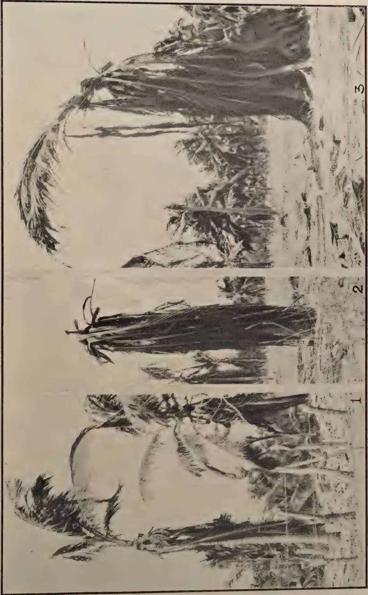

# The Tropical Agriculturist

January, 1932

---

## EDITORIAL

---

### HORTICULTURAL RESEARCH

---

NEW varieties of many garden fruits have been developed by horticulturists using methods often but little understood and in many cases for that reason not capable of any considerable repetition. By no means must one belittle the achievements of such men for the many varieties of the apple, for instance, almost all of which have been produced in this way, speak volumes for those who have taken part in the accomplishment.

The conquest of Science over Nature, or what is really nothing more than an advance in our knowledge of nature's laws is in horticulture a matter of the systematic study of the fundamentals governing the inheritance, control, and behaviour of characters in plant idiosyncrasy. As our knowledge advances our conquest will become more complete. Most of the discoveries that have contributed to human progress have originated from academic curiosity. Agriculture, of which horticulture is but a part, has afforded exception to this generalisation. Here discovery has essentially been the outcome of a long process of trial and survival of the fit. The Empire now has an institution for the pursuit in a scientific way, of fundamental problems relating to one branch of horticulture, fruit production, in the Imperial Bureau of Fruit Production at East Malling, England. This is one of the Imperial Agricultural Bureaux. It also serves the very valuable function for horticultural workers of collating for ready reference the work of scattered investigators.

1------------------------------------------------

2

Fruit production in Ceylon is a subject deserving of much wider attention than it has so far received. To those possessing land the planting of permanent fruit trees can be recommended. The extent of one's possessions matters little for almost any area will accommodate at least one fruit tree and the wisdom of planting a tree wherever possible is a great one. Yet it is an astonishing thing what few fruit trees one finds around the homes in our midst, be they cottage or bungalow. Much of this absence of fruit trees is due to too ready an assumption that none will grow and to too great a disinclination to experiment for the finding and improvement of those that will do so. So various are our climatological conditions that in almost every district some fruit of value can be grown. At different times the possibilities of citrus cultivation have been shown in this journal. Suitable varieties for many districts have now demonstrated themselves. There still remains, however, much to be done in the multiplication and distribution of such varieties. Acclimatization of fruit trees has to be regarded from two aspects—the congeniality of the soil to the root, and through it to the plant's physiology generally, and the fitness of the climate for the shoot. Both of these aspects afford considerable latitude for necessary experimentation. It is sometimes possible to engraft a shoot upon a more suitable rootstock than its own and so obtain a simple advantage quite apart from the much debated point of the influence of stock upon scion. Experimental work on these lines is in progress at Peradeniya with several varieties of citrus fruits. Such work is necessarily slow but none the less of value.

The possibilities of producing the cherimoyer (*Anona cherimolia*) upon a more quickly growing tree by engrafting it upon a rootstock of entirely different species is being worked at conjointly by Peradeniya and Hakgala. This fruit is one of the finest producible in the Island and yet it is strange how few people know it and how rarely it is seen on the market or table in our towns. It grows well in many places at elevations of some four thousand feet. It is a fruit which if marketed in good condition, as it can be, will command a high price. Large numbers of seedling trees are now being distributed in the hill districts from Hakgala Gardens. Peaches, very acceptable for culinary uses, and not altogether to be despised for other purposes, can be grown in the hills. Peach plants are being placed out in increasing numbers from Hakgala, the object being that every cottage garden can have a peach tree if it will care for it. The indigenous wild raspberry too is receiving attention. Whilst already affording a pleasant fruit it should be capable of serving as a basis for improvement by selection and hybridisation.

2------------------------------------------------

3SECTION VGREEN MANURING OF PADDY

L. LORD, M.A.,

DEPARTMENT OF AGRICULTURE, PERADENIYA

THE application of green leaves and of green herbaceous plants to paddy fields has been practised in certain districts in Ceylon for many years but the number of acres annually manured in this manner is small. Definite green manure crops like *Crotalaria juncea* are not grown on the paddy fields in readiness for a succeeding crop of paddy; only the green leaves of trees and the herbaceous plants found near the fields are used. Many varieties of plants are utilised, including *keppitiya* (*Croton lacciferus*), *pila* (*Tephrosia purpurea*) and *pem tora* (*Cassia occidentalis*). Among the trees whose leaves are used are tamarind (*Tamarindus indica*), margosa (*Azadirachta indica*), kaduru (*Cerbera adollam*), palmyra (*Borassus flabellifer*), dadap (*Erythrina lithosperma*), *Gliricidia maculata*, and *telkekuna* (*Aleurites triloba*). The list is by no means complete and any form of green material may be used. The wild sunflower (*Tithonia diversifolia*) which grows luxuriantly and is found wild in the mid-country makes an excellent green manure and its use is thought to be extending. The green material is applied either before the first or second ploughing and generally in relatively small amounts.

The effect of applying green manures to paddy varies according to the different conditions under which the crop is grown in Ceylon. It may be said to be invariably beneficial although where a loose soil overlies a porous subsoil the addition of large amounts of green matter may militate against the formation of the good puddled condition of the soil necessary to retain in the field the irrigation water. Such conditions will rarely be found. Generally the effect of green manuring will depend upon the amount of weed growth present on the paddy field prior to the preliminary cultivation and this in turn depends upon the water supply (either direct or indirect) and largely on the length of time the land is fallow between two crops. This period may vary from less than a month to as much as eight months. Where water is available for a short period and for

3------------------------------------------------

4

one monsoon only (which frequently happens in the North-Central Province) one three-months', or at the most four-months', crop is all the land will carry for the whole year. During the seven or eight months' fallow there is generally sufficient rain to produce a vigorous weed growth. The application here of additional green material brought from outside will not produce the same effect as in districts where the weed growth is much less or where it may be entirely absent. At Peradeniya, for example, the *maha* crop is on the ground for about 200 days and the *yala* crop for 120-130 days. Preparation of the fields takes up the remaining time and at ploughing only the paddy stubble and the few weeds which have survived among the paddy plants are incorporated in the soil. Experience has shown that under these conditions (if both crops are grown during the year) the yield of the *yala* crop is very small and that the fertility of the fields can only be maintained by manuring. The villagers frequently forego the *yala* crop in order to ensure a good yield for *maha*. Under these conditions the effect of applying green material is large.

The principles and advantages of green manuring under ordinary conditions and under the anaerobic conditions in which swamp paddy is cultivated have been dealt with in Section I. Any but practical considerations will be mentioned here only briefly.

The effect of applying green material to paddy is normally to increase the yield. This is due to increasing the available nitrogen in the soil and also, it is thought, to supplying carbon dioxide to the algal film found on all paddy fields. The decomposition of the organic material may also have other effects on the chemical and physical condition of the soil and on the soil micro-organisms.

Under anaerobic conditions the decomposition of green material produces, among other things, ammonia and carbon dioxide. It has been shown by Kelly (1) and other workers that swamp paddy takes up its nitrogen mainly in the form of ammonia. The anaerobic decomposition of green material, then, directly increases the supply of that form of nitrogen useful to the paddy plant. The other effect of the decomposition of organic matter under anaerobic conditions which will be dealt with here is that due to the production of carbon dioxide.

It is stated by Brizi (2) that the roots of rice are not of the true aquatic type and he has shown that oxygen is essential to their growth. The algae which are found as a film on the surface of paddy fields (Esmarch (3, 4) has pointed out that algae are found in the lower layers as well as in the surface soil) liberate

4------------------------------------------------

5

oxygen and require for their existence carbon dioxide. The oxygen which is liberated is believed to be carried to the roots of the paddy plants dissolved in the irrigation water (Harrison and Aiyar, (5)). Brizi was the first to point out the significance of algae in the aeration of the higher plants and his contention is supported by Harrison and Aiyar who conclude that the surface film of algae is the chief agency in the aeration of the roots of rice. It will be seen, therefore, that the rôle of green manures is a dual one: they supply for the paddy plant nitrogen in the assimilable form of ammonia and carbon dioxide for the algae which liberate the oxygen necessary for root growth under the anaerobic conditions of paddy fields.

The necessity of obtaining experimental evidence as to the effect of the green manures on yield has been recognized and a preliminary experiment was carried out at Anuradhapura in 1926. There a green manure (*Crotalaria juncea*) grown *in situ* on the paddy fields resulted in a 35 per cent increase of yield in the following crop. The experiment which has already been described (Lord (6)) was not capable of valid statistical examination and moreover the control plots were ploughed later than the treated plots. The experiment, however, pointed out the necessity for obtaining information as to the effect of ploughing in green material at different times before sowing or transplanting the main crop and accordingly an experiment was started at Peradeniya in 1927. This experiment was laid down in collaboration with the Agricultural Chemist in order that the nitrogen changes in the soil could be studied. The treatments consisted of green manures ploughed in 'early' (seven weeks before sowing) and 'late' (one week before sowing), the normal weed growth ploughed in 'early' and 'late' and control plots. The five treatments were replicated four times in randomized blocks and *Crotalaria juncea* was sown on the green manure plots to supply the green material. This growing of the manures *in situ* was not satisfactory owing to the unequal growth on the different plots. Unfortunately heavy rain at harvest time spoiled yield records. The nitrogen changes which took place were extremely interesting and have been already published by Joachim and Kandiah (7) who included these results in a comprehensive field and laboratory study of the question. Essentially it was found that after ploughing in both weeds and green manures early there was an appreciable increase in the amount of ammonia present in the soil with but little increase of nitrate nitrogen. After puddling there was a sudden decrease in ammonia content but both plots remained above the level of the controls. The green manure and weed plots ploughed in late reached their maximum ammonification during the time the paddy was in active need

5------------------------------------------------

6

of ammonia. Both the late plots contained more ammonia than the early plots and the green manure late more than the weeds late. Table I taken from Joachim and Kandiah (7) shows the actual figures.

Table I

*Green manure experiment (a), nitrogen determinations.*

Upper figures=Mgms of nitrogen as ammonia in 100 gms. of soil at 100° C.  
Lower figures=Mgms. of nitrogen as nitrate in 100 gms. of soil at 100° C.

<table border="1">
<thead>
<tr>
<th rowspan="2">Time of sampling in weeks.</th>
<th colspan="4">Before puddling</th>
<th colspan="8">After puddling</th>
</tr>
<tr>
<th>2</th>
<th>4</th>
<th>6</th>
<th>7</th>
<th>1</th>
<th>3</th>
<th>5</th>
<th>7</th>
<th>9</th>
<th>11</th>
<th>13</th>
<th>17</th>
</tr>
</thead>
<tbody>
<tr>
<td>Control</td>
<td>1.5 .55</td>
<td>2.1 .96</td>
<td>3.0 .75</td>
<td>3.23</td>
<td>1.22 nil</td>
<td>1.73 nil</td>
<td>1.31 nil</td>
<td>1.05 nil</td>
<td>.91 nil</td>
<td>.88 nil</td>
<td>.73 nil</td>
<td>.27 nil</td>
</tr>
<tr>
<td>Green-manure (<i>late</i>)</td>
<td></td>
<td></td>
<td></td>
<td></td>
<td>2.69 nil</td>
<td>4.79 nil</td>
<td>4.30 nil</td>
<td>1.87 nil</td>
<td>1.69 nil</td>
<td>1.30 nil</td>
<td>.87 nil</td>
<td>.96 nil</td>
</tr>
<tr>
<td>Green-manure (<i>early</i>)</td>
<td>3.4 .37</td>
<td>3.7 .70</td>
<td>5.2 .78</td>
<td>5.8</td>
<td>1.85 nil</td>
<td>2.13 nil</td>
<td>2.13 nil</td>
<td>1.36 nil</td>
<td>1.16 nil</td>
<td>1.05 nil</td>
<td>.83 nil</td>
<td>.63 nil</td>
</tr>
<tr>
<td>Weeds (<i>late</i>)</td>
<td></td>
<td></td>
<td></td>
<td></td>
<td>2.14 nil</td>
<td>3.06 nil</td>
<td>2.50 nil</td>
<td>1.41 nil</td>
<td>1.42 nil</td>
<td>1.37 nil</td>
<td>1.25 nil</td>
<td>.70 nil</td>
</tr>
<tr>
<td>Weeds (<i>early</i>)</td>
<td>1.4 .45</td>
<td>1.6 .55</td>
<td>2.7 .45</td>
<td>3.0</td>
<td>2.02 nil</td>
<td>2.36 nil</td>
<td>1.89 nil</td>
<td>1.27 nil</td>
<td>1.08 nil</td>
<td>1.04 nil</td>
<td>.63 nil</td>
<td>.44 nil</td>
</tr>
</tbody>
</table>

The formation of ammonia prior to puddling is probably unusual and due to the plots being water-logged. Normally, as Joachim and Kandiah, have shown, the decomposition of green material prior to puddling results in the formation of nitrates. Nitrates are not used by the paddy plants and after puddling (that is under anaerobic conditions) are reduced to nitrites which may be definitely harmful to the plant. Laboratory investigations have shown that it is useless to incorporate the green material in the soil under aerobic conditions unless just prior to flooding the soil.

A similar experiment, slightly modified, was laid down at Peradeniya for the *maha* crop of 1928-29, again with the collaboration of the Agricultural Chemist. In order to ensure that the green manure plots received similar quantities of green material it was decided not to grow the manure *in situ* but to use wild sunflower brought in from outside. The application per acre was 5 tons of the green unwilted material. Green manure ploughed in early and late (respectively five weeks and one week before transplanting) was tested against control plots.

6------------------------------------------------

7

There were four replications in randomized blocks and in each 1/80 acre plot an inner area of 1/100 acre was harvested to eliminate border effect.

The results of the experiment will be found in table II.

Table II

*Green manure experiment (b), yields of grain*

<table border="1">
<thead>
<tr>
<th>Treatment</th>
<th colspan="2">Calculated yield per acre mean of 4 plots of 1/100 acre</th>
<th>Control = 100</th>
<th>Value of increase over control @ Rs. 2.50 per bushel</th>
</tr>
<tr>
<th></th>
<th>lb.</th>
<th>bus.</th>
<th></th>
<th></th>
</tr>
</thead>
<tbody>
<tr>
<td>Control</td>
<td>2482</td>
<td>59</td>
<td>100.0</td>
<td>—</td>
</tr>
<tr>
<td>5 tons green manure (<i>early</i>)</td>
<td>3318</td>
<td>69</td>
<td>116.7</td>
<td>Rs. 25.00</td>
</tr>
<tr>
<td>5 tons green manure (<i>late</i>)</td>
<td>3847</td>
<td>80</td>
<td>135.3</td>
<td>Rs. 52.50</td>
</tr>
</tbody>
</table>

The z test is satisfactory and the standard error of the difference between means is 5 per cent. The increased yields of both the treated plots are significant and green manure *late* has beaten green manure *early*. It will be noticed that this application of a five-ton dressing of green material has had a definite effect on land whose fertility is high as judged by the mean yield of the control plot which was 2,482 lb. per acre.

The nitrogen fluctuations in the plots are interesting and will be found in table III and fig. I. The table and figure have been taken from Joachim and Kandiah (7) with the permission of the authors.

Table III

*Green manure experiment (b), nitrogen determinations*

Mgms. of ammonia in 100 gms. of soil at 100° C.

<table border="1">
<thead>
<tr>
<th colspan="4">Before puddling</th>
<th colspan="10">After puddling</th>
</tr>
<tr>
<th>Time of sampling in weeks</th>
<th>At start</th>
<th>1</th>
<th>3</th>
<th>½</th>
<th>2</th>
<th>4</th>
<th>6</th>
<th>8</th>
<th>11</th>
<th>15</th>
<th>Nitrogen added as green manure in lb. per acre</th>
<th>Period of maximum ammonification in weeks</th>
<th>Maximum percentage ammonified</th>
</tr>
</thead>
<tbody>
<tr>
<td>Control</td>
<td>1.40</td>
<td>1.26</td>
<td>1.25</td>
<td>1.40</td>
<td>1.60</td>
<td>1.91</td>
<td>1.44</td>
<td>1.44</td>
<td>1.18</td>
<td>1.10</td>
<td>—</td>
<td>2.4</td>
<td>—</td>
</tr>
<tr>
<td>Green-Manure (<i>early</i>)</td>
<td>1.44</td>
<td>2.39</td>
<td>2.17</td>
<td>1.81</td>
<td>2.48</td>
<td>2.06</td>
<td>1.80</td>
<td>1.91</td>
<td>1.52</td>
<td>1.65</td>
<td>65.5</td>
<td>2.4</td>
<td>24.9</td>
</tr>
<tr>
<td>Green-Manure (<i>late</i>)</td>
<td>1.47</td>
<td>1.25</td>
<td>1.15</td>
<td>2.32</td>
<td>3.49</td>
<td>3.45</td>
<td>3.27</td>
<td>2.94</td>
<td>1.84</td>
<td>1.77</td>
<td>65.5</td>
<td>2.4</td>
<td>53.4</td>
</tr>
</tbody>
</table>

7------------------------------------------------

8
![Line graph showing the decomposition of green manures under anaerobic conditions in the field. The Y-axis is 'Mgm. Ammonia (NH3) per 100 gm dry soil.' ranging from 0 to 4. The X-axis is 'Time in weeks.' ranging from 0 to 15. The graph is divided into three sections: 'Before Puddling' (weeks 0-5), 'Soils Puddled' (weeks 5-10), and 'After Puddling' (weeks 10-15). Three series are shown: Control (solid line with circles), G.M. Early (dashed line with crosses), and G.M. Late (dash-dot line with circles).](d278c940e163d45258fbcb475c211d36_2_img.webp)

Figure I is a line graph showing the decomposition of green manures under anaerobic conditions in the field. The Y-axis represents 'Mgm. Ammonia (NH3) per 100 gm dry soil.' ranging from 0 to 4. The X-axis represents 'Time in weeks.' ranging from 0 to 15. The graph is divided into three sections: 'Before Puddling' (weeks 0-5), 'Soils Puddled' (weeks 5-10), and 'After Puddling' (weeks 10-15). Three series are shown: Control (solid line with circles), G.M. Early (dashed line with crosses), and G.M. Late (dash-dot line with circles).

<table border="1">
<thead>
<tr>
<th>Time (weeks)</th>
<th>Control (Mgm. Ammonia)</th>
<th>G.M. Early (Mgm. Ammonia)</th>
<th>G.M. Late (Mgm. Ammonia)</th>
</tr>
</thead>
<tbody>
<tr>
<td>0</td>
<td>0.0</td>
<td>0.0</td>
<td>0.0</td>
</tr>
<tr>
<td>1</td>
<td>0.0</td>
<td>0.0</td>
<td>0.0</td>
</tr>
<tr>
<td>2</td>
<td>0.0</td>
<td>0.0</td>
<td>0.0</td>
</tr>
<tr>
<td>3</td>
<td>0.0</td>
<td>0.0</td>
<td>0.0</td>
</tr>
<tr>
<td>4</td>
<td>0.0</td>
<td>0.0</td>
<td>0.0</td>
</tr>
<tr>
<td>5</td>
<td>0.0</td>
<td>0.0</td>
<td>0.0</td>
</tr>
<tr>
<td>6</td>
<td>0.0</td>
<td>0.0</td>
<td>0.0</td>
</tr>
<tr>
<td>7</td>
<td>0.0</td>
<td>0.0</td>
<td>0.0</td>
</tr>
<tr>
<td>8</td>
<td>0.0</td>
<td>0.0</td>
<td>0.0</td>
</tr>
<tr>
<td>9</td>
<td>0.0</td>
<td>0.0</td>
<td>0.0</td>
</tr>
<tr>
<td>10</td>
<td>0.0</td>
<td>0.0</td>
<td>0.0</td>
</tr>
<tr>
<td>11</td>
<td>0.0</td>
<td>0.0</td>
<td>0.0</td>
</tr>
<tr>
<td>12</td>
<td>0.0</td>
<td>0.0</td>
<td>0.0</td>
</tr>
<tr>
<td>13</td>
<td>0.0</td>
<td>0.0</td>
<td>0.0</td>
</tr>
<tr>
<td>14</td>
<td>0.0</td>
<td>0.0</td>
<td>0.0</td>
</tr>
<tr>
<td>15</td>
<td>0.0</td>
<td>0.0</td>
<td>0.0</td>
</tr>
</tbody>
</table>

Figure I. Showing the decomposition of green manures under anaerobic conditions in the field.

8------------------------------------------------

6

Nitrate nitrogen was not found at any stage during the experiment and it was absent before puddling—the time nitrate can normally be expected—almost certainly owing to the plots being somewhat water-logged during that period. Even with soil in this condition the gain in burying the green material late, that is just before puddling, is clearly shown both by the yield figures and by the analyses.

It has been stated in India that the anaerobic decomposition of green manures gives rise to toxic products which may effect the germination of the paddy seeds. Pot experiments at Peradeniya have shown that puddling in the green material even one day before sowing has had no effect on germination. To be on the safe side, however, it is recommended that green manures should be incorporated in the soil one or two weeks before sowing or transplanting.

It will be noticed that a five-ton dressing of wild sunflower supplies a relatively large amount of nitrogen, roughly as much as is contained in 3 cwt. of sulphate of ammonia. It is quite possible that a one or two-ton dressing may be the economic or practical limit and it is also exceedingly probable that the addition of some form of phosphate to the green material will be advantageous. In many places it will be impossible to procure sufficient green material to supply a five-ton dressing per acre so the effect of a one-ton dressing is now being studied at Peradeniya. An experiment has also been devised to test the relative efficacy of green manures and sulphate of ammonia in order to determine if possible the actual value of the organic matter in the green material.

The cost of applying green manure has not been mentioned as it varies so greatly according to the ease with which it can be cut and the distance it has to be transported. Many cultivators, too, will be willing to cut green material in their spare time. It is impossible to arrive at any definite cost, although the value may be based on the amount of nitrogen the material contains. The possibility and economy of growing green manure *in situ* will have to be determined by local experience and conditions. In some districts there is insufficient time, in others insufficient water and probably in all insufficient inclination. The practical difficulties are great. Where a paddy crop is not sown cattle graze the paddy fields at will and enclosures after a crop has been harvested are unknown. There is little doubt that *Crotalaria juncea* will do well on drier fields but at Peradeniya on the wetter fields the following have been tried with little success: *Crotalaria juncea*, *C. anagyroides*, *C. usaramoensis*, *Sesbania cannabina*, *Desmodium gyroides*, *Mucuna* sp., *Tithonia diversifolia* and *Vigna sinensis*.

9------------------------------------------------

10

## RECOMMENDATIONS

In the present state of our knowledge of paddy cultivation the following practical recommendations may be made:

1. Green manure can confidently be applied to all normal soils except perhaps those whose fertility is well above the average.

2. One or two tons of green material per acre is a suitable dressing although smaller applications should not be disdained.

3. The green material should be applied as late as possible before sowing or transplanting, say from one to two weeks previously, and after ploughing in the soil should be kept flooded or very moist.

4. With large dressings a hundredweight of superphosphate and with small dressings a half to one hundredweight of some ammonium phosphate per acre may be recommended.

5. Where weed growth is poor application of inorganic manures should invariably be accompanied by at least a small dressing of green manure.

## REFERENCES

1. 1. KELLY, W. P.—The assimilation of nitrogen by rice—*Hawaii Agric. Expt. Sta. Bull.* 24, 1911.
2. 2. BRIZI, U.—Ulteriori ricerche intorno al brusone del riso—*Ann. Istit. Agr. Ponti* 6:61, 1906.
3. 3. ESMARCH, F.—Beitrag zur Cyanophyceen—Flora unsera Kolonien—*Jahrb. Hamburg Wiss. Aust.* 28:62, 1910.
4. 4. ESMARCH, F.—Untersuchungen über die Verbreitung der Cyanophyceen auf und in verschiedenen Boden—*Hedwigia* 55: 224, 1914.
5. 5. HARRISON, W. H. AND AIYER, P. A. S.—The gases of swamp rice soils. Parts I and II—*Mem. Dept. Agric. India. (Chem. Ser.)* III and IV.
6. 6. LORD, L.—Paddy notes (2)—*The Tropical Agriculturist* LXIX, 6, 1927.
7. 7. JOACHIM, A. W. R. AND KANDIAH, S.—Laboratory and field studies on green manuring under paddy-land (anaerobic) conditions—*The Tropical Agriculturist* LXXII, 5, 1929.

10------------------------------------------------

11

## MYCOLOGICAL NOTES (23)

### THE EFFECTS OF DROUGHT ON COCONUTS AT PUTTALAM

MALCOLM PARK, A.R.C.S.,

MYCOLOGIST,

DEPARTMENT OF AGRICULTURE, PERADENIYA

IN September 1931, it was reported that there was a serious outbreak of disease in the neighbourhood of Puttalam; that the disease was rapid in its action; that palms were dying in large numbers; and that the disease was suspected to be bud-rot.

Puttalam was visited in October and it was seen at once that the reports regarding the severity of the outbreak had been by no means exaggerated. The number of coconut palms which were dying, particularly in those estates and village gardens to the east and south-west of Puttalam, was alarming. In one badly affected village garden containing 48 palms, 27 palms were dead and crownless and 15 palms were in a moribund condition. The severity of the outbreak in this garden was exceptional and it is probable that neglect and lack of cultivation had contributed largely to the high degree of mortality. An estate of 100 acres contained 600 dead or dying palms and that the majority of the palms were suffering to some extent was seen by the wilting of the older leaves. The standard of cultivation on this estate was not very high.

The affected area is low-lying, with sandy soil which has a tendency to hard-pan formation. The disease was observed to be more severe in the absence of cultivation, well-cultivated gardens suffering but little damage. Palms on land which in wet weather becomes water-logged and swampy were markedly affected and it may be stated that, as a general rule, the best grown palms were the least affected. Young palms which were growing as supplies in vacancies among older palms in estates and gardens were not affected. It was stated that, on the estate to which reference is made above, there had been no rain for six months. The rainfall figures of Puttalam as published by the Superintendent, Colombo Observatory, show that 3.37 inches of rain fell from the beginning of May, 1931, to the end of

11------------------------------------------------

12

September, 1931, as against an average of 8.12 inches. During this period a strong, dry S. W. wind blows more or less continuously.

#### SYMPTOMS

The symptoms displayed by affected palms are those of a wilt and correspond closely to those described by Briton-Jones (1) for what is known as Bronze Leaf Wilt in Trinidad. The wilt is marked by a progressive wilting and drooping of the leaves in order of age. The oldest leaf turns brown and hangs down the stem of the palm and is followed by other leaves in fairly rapid succession. The branches bearing the nuts wilt in the same way and the nuts fall. The brown pendent leaves remain attached to the trees for some time, in a manner shown in the photographs reproduced with this article, but finally fall; the palms with the older leaves hanging in a wilted condition and with the young leaves and cabbage standing erect or leaning to one side present a typical appearance (figs. 1 and 3). Subsequently the young crown breaks off just below or at the level of the bud, in some cases falling to the ground at once (fig 2) or in others remaining attached to the tree, where it rots; such rotting crowns provide excellent breeding places for the coconut beetle (*Oryctes rhinoceros*), numerous larvae being found in specimens examined.

The roots of affected palms were examined *in situ*. The proportion of healthy to dead roots was not less than in a healthy palm and the death of the palms did not appear, therefore, to be due to a root disease. The stems of the affected palms which had been cut down showed in some cases a general reddening of the whole of the ground tissue. This is similar to the discoloration of the tissue observed in Bronze Leaf Wilt in Trinidad which has been ascribed to physiological causes rather than to the presence of a disease-causing organism.

The writer had the good fortune to be present when the young leaves and cabbage of one of the affected palms broke off and fell. The break occurred just at the level of the bud where the tissue was soft and flaccid but not diseased. The breaking of the crown appeared to be due to mechanical causes only, the tissues becoming soft owing to shortage of water and losing mechanical strength thereby. There was no indication of a rotting of the bud in this specimen and it is to be assumed that rotting of the bud tissues takes place only after the breaking off of the crown. The brown discoloration of the older leaves did not appear to be due to the parasitic action of a fungus.

#### CAUSE

It has been stated above that one estate had reported a drought for six months and that the rainfall records of the

12------------------------------------------------

The image consists of three vertical panels, each showing a coconut tree in a different state of drought stress. Panel 1 (left) shows a tree with a large, rounded crown of leaves that appear somewhat drooping. Panel 2 (middle) shows a tree with a more elongated crown, where the leaves are more tightly packed but still show signs of wilting. Panel 3 (right) shows a tree with a very large, dense, and rounded crown, where the leaves are severely drooping and curled, indicating advanced drought damage. The numbers 1, 2, and 3 are printed vertically on the right side of each panel, corresponding to the panels from left to right.

The Effects of Drought on Coconuts at Puttalam.

13------------------------------------------------

<!-- stage4: FAINT old-images-only -->

[Faint page: no legible print of its own could be verified; text withheld (stage 4 review list)]

This image is a scan of a blank page. The background is a uniform light beige or off-white color. There are several small, dark specks scattered across the page, which appear to be scanning artifacts or dust particles. No text, lines, or other graphical elements are present.

14------------------------------------------------

13

meteorological station show that in the period from May 1st to September 30th, 1931, only 3.37 inches of rain fell as against an average of 8.12 inches of rain. No sign of fungus disease was seen in affected palms and it is, therefore, concluded that the death of the palms was due to drought. This is confirmed by the observations of Briton-Jones who attributes the Bronze Leaf Wilt disease in Trinidad to drought. It appears probable that similar outbreaks have occurred in Ceylon in previous years. In 1918, the Botanist and Mycologist visited Batticaloa to report on the cause of death of a number of palms in that district and stated that drought was responsible. The writer has been informed, but unfortunately has not been able to obtain proof, that in 1921 a severe drought in Puttalam district led to an outbreak similar to the one under discussion.

The fact that the disease is worse on low-lying land which is liable to water-logging in wet weather can be explained by the effect of such water-logging on the root system of the palms. In water-logged soil or soil with a high water-table the effective root system of the coconut is confined to the upper layers of the soil. When drought sets in, the upper layers of the soil are the first to dry and the shallow-rooting palms are in consequence the first to suffer from drought. It is also possible that the soil in areas where water is allowed to stagnate becomes excessively saline on drying and this again may contribute to the marked effect of drought on palms growing in such soil.

The effect of good cultivation was marked; the improvement of the tilth of the soil and an increase in the humus content enable the palms to overcome the effects of drought by encouraging deep rooting and by increasing vitality and consequent resistance to adverse conditions. This effect explains the reason why young palms, used as supplies among older palms, were less affected than the palms among which they were grown. Supply plants receive special cultivation and manure and these factors, together with the shading by the older palms, which must have the effect of decreasing transpiration from the leaves tend to increase their resistance to drought conditions.

#### TREATMENT

The remarks made in the preceding section show that by improving cultivation, increased resistance to drought conditions is to be obtained. Preventive measures which suggest themselves are the improvement, where possible, of the drainage in low-lying land in order to induce deeper root growth and the removal and ploughing in of weeds at the beginning of the dry season, which will have the double effect of increasing the humus

15------------------------------------------------

14

content of the soil and at the same time of reducing the competition for water in the soil. With the advent of rain palms in which the bud tissues are still sound will recover and the resultant effect will consist only of a check to their growth and a lowering of yield. Those palms in which the bud tissues have decayed will never recover and it is to these palms that attention must be paid.

It has been stated above that in the decaying bud tissues of some of the dead palms a number of larvae of the coconut beetle were found. As a result of the severe drought this year the number of dead palms in Puttalam district is unusually great and it can be foreseen that, unless rigorous action is taken in destroying dead palms, an epidemic of coconut beetle damage will occur. It is, therefore, the duty of each owner of coconut palms in Puttalam district to see that the dead palms in his own holding are destroyed and to use his influence in seeing that his neighbour does so. The Department is aware of the danger of an outbreak of coconut beetle and is empowered by the regulations under the Plant Pests Ordinance (No. 10 of 1924) to enforce the cutting down and burning of all dead trees.

#### REFERENCE

BRITON-JONES, H. R.—Wilt diseases of coconut palms in Trinidad (Part I): Supplement to *Tropical Agriculture*, May, 1928.

16------------------------------------------------

15

## CHEMICAL NOTES (11)

### ANALYSES OF SOME BY-PRODUCTS OF THE COCONUT INDUSTRY

A. W. R. JOACHIM AND S. KANDIAH

DURING the last three months a number of samples of oils, poonacs, and manurial by-products of the coconut industry have been received for analysis in this laboratory. As all except one of these by-products should find a ready sale, and as the analytical data will be of general interest to coconut estate and mill owners, an account of them may be given.

#### MANURIAL BY-PRODUCTS

Three of these have been examined. They are: drain oil residue or desiccated coconut water refuse cake, coconut oil sediment cake, and copra dust or sweepings. The analyses are shown in table I below:

Table I

<table border="1">
<thead>
<tr>
<th></th>
<th>Drain Oil Residue Cake</th>
<th>Coconut Oil Residue Cake</th>
<th>Copra Dust or Sweepings</th>
</tr>
<tr>
<th></th>
<th>%</th>
<th>%</th>
<th>%</th>
</tr>
</thead>
<tbody>
<tr>
<td>Moisture</td>
<td>7.58</td>
<td>10.17</td>
<td>5.04</td>
</tr>
<tr>
<td>Organic matter</td>
<td>83.16</td>
<td>83.19</td>
<td>46.42</td>
</tr>
<tr>
<td>Ash</td>
<td>9.26</td>
<td>6.64</td>
<td>48.54</td>
</tr>
<tr>
<td>Insoluble ash and sand</td>
<td>—</td>
<td>—</td>
<td>20.75</td>
</tr>
<tr>
<td>Nitrogen</td>
<td>4.03</td>
<td>4.91</td>
<td>1.16</td>
</tr>
<tr>
<td>Lime</td>
<td>0.55</td>
<td>1.09</td>
<td>1.24</td>
</tr>
<tr>
<td>Potash</td>
<td>0.84</td>
<td>1.80</td>
<td>0.38</td>
</tr>
<tr>
<td>Phosphoric acid</td>
<td>1.44</td>
<td>2.13</td>
<td>0.39</td>
</tr>
<tr>
<td>Oil</td>
<td>2.67</td>
<td>16.44</td>
<td>14.49</td>
</tr>
</tbody>
</table>

*Drain Oil Residue Cake.*—The sample examined was a grey-coloured cake containing bits of coconut shell, pieces of coconut kernel, straw and other foreign matter. It is a by-product of the desiccated coconut industry and is obtained from the scum formed in the tanks containing the coconut "milk" and washings of the nuts. The scum is boiled with a little water in flat pans and the oil, called drain oil, periodically skimmed off. The sediment is hand-pressed in bags and the residue obtained sold as drain oil cake. The oil content of the sample examined was about 2.7% and its moisture content 7.6%. Its nitrogen content was over 4%, and phosphoric acid and potash amounted to about 1.5% and 1% respectively. The cake is therefore very suitable as an organic manure, and on the basis of the present price of

17------------------------------------------------

16

groundnut cake at about Rs. 100-00 per ton, is worth about Rs. 55-00 per ton f.o.r. Colombo.

*Coconut Oil Residue Cake.*—This is a by-product of the coconut oil industry. It is the residue obtained in the filtration and sedimentation processes of coconut oil manufacture. The samples examined in this laboratory were of a black colour and of a fine texture and had a very rancid smell. The latter is due to their high oil contents. In some mills the residue is treated in the same way as the drain oil residue cake. The resulting product has therefore much less oil and a higher manurial value. Owing to their high oil contents the untreated samples will decompose in the soil only very slowly, but good results have attended the use of both pressed and unpressed samples as manures on dry land and for paddy crops. The results of analysis of an unpressed sample were reported in *The Tropical Agriculturist* Vol. 74, No. 3, March, 1930. The nitrogen content of this sample was 4.9% and its phosphoric acid and potash contents 2.1% and 1.8% respectively. A sample recently examined showed 5.1% nitrogen. An oil-extracted sample showed a nitrogen content as high as 7%. The oil-extracted cake can be estimated as being worth about Rs. 70-00 per ton f.o.r. Colombo, on the basis of groundnut cake at Rs. 100-00 per ton.

*Copra Dust or Sweepings.*—A sample received in the laboratory was a greyish-brown organic mixture containing small pieces of copra, jute hessian, dust, etc. On analysis it showed the following composition: organic matter 45%, ash 48% of which no less than 21% is insoluble silica and sand, nitrogen and lime 1.2% each, potash and phosphoric acid each 36%. Its manurial value is therefore small. As the oil content of the sample is comparatively high its decomposition in the soil will be very slow. The value of the sweepings is not much more than Rs. 15-00 per ton compared with groundnut cake at Rs. 100-00 and it is doubtful whether the results of its usage as a manure will justify transport charges.

### COCONUT OILS

The analyses of samples of parings, drain, and ordinary copra oil obtained from a desiccated coconut and oil mill combined are shown in table II below:

Table II

<table border="1">
<thead>
<tr>
<th>Specific gravity</th>
<th>Copra Oil 915 (34°C) 15</th>
<th>Parings Oil 914 (34°C) 15</th>
<th>Drain Oil 9125 (29°C) 15</th>
</tr>
</thead>
<tbody>
<tr>
<td>Refractive index @ 28.5°C</td>
<td>1.4535</td>
<td>1.4566</td>
<td>1.4515</td>
</tr>
<tr>
<td>Acid value</td>
<td>2.08</td>
<td>5.41</td>
<td>52.51</td>
</tr>
<tr>
<td>Iodine value</td>
<td>7.81</td>
<td>19.37</td>
<td>9.76</td>
</tr>
<tr>
<td>Saponification value</td>
<td>255.1</td>
<td>237.6</td>
<td>256.1</td>
</tr>
</tbody>
</table>

18------------------------------------------------

17

The sample of drain oil was prepared as already described. It is darker and more cloudy in appearance than either of the others. The sample of copra oil was prepared from the kernels found unsuitable for the manufacture of desiccated coconut and that of parings oil from the parings of the kernels used for making the latter. The latter oil is partially solid at the ordinary room temperature at Peradeniya.

It will be noted that: (1) the iodine value of parings oil is highest and that of copra oil lowest. That for drain oil is within the range of copra oils generally; (2) on the other hand, the saponification value of parings oil is the lowest of the three. The values for copra and drain oil are almost identical; (3) the percentage of free fatty acid in the drain oil is considerably higher than that in the other oils. This is due to its origin and method of manufacture; (4) drain oil is similar in other respects to ordinary copra oils. It should, therefore, find a ready sale for soap manufacture.

### COCONUT POONACS OR CAKES

In table III are shown analyses of an average sample of mill poonac and of samples of parings and ordinary poonac prepared from the same consignment of nuts in a desiccated mill. Of the latter, the ordinary poonac is much lighter in colour than the parings poonac, and is generally the more popular as a cattlefood.

**Table III**

<table border="1">
<thead>
<tr>
<th></th>
<th>Parings poonac</th>
<th>Ordinary poonac</th>
<th>Average mill poonac</th>
</tr>
</thead>
<tbody>
<tr>
<td>Moisture</td>
<td>13.97</td>
<td>15.07</td>
<td>11.7</td>
</tr>
<tr>
<td>Oil</td>
<td>12.27</td>
<td>13.36</td>
<td>11.6</td>
</tr>
<tr>
<td>Proteins</td>
<td>16.60</td>
<td>17.78</td>
<td>19.0</td>
</tr>
<tr>
<td>Carbohydrates</td>
<td>31.54</td>
<td>30.94</td>
<td>43.2</td>
</tr>
<tr>
<td>Woody fibre</td>
<td>21.44</td>
<td>18.25</td>
<td>6.0</td>
</tr>
<tr>
<td>Ash</td>
<td>4.18</td>
<td>4.60</td>
<td>8.5</td>
</tr>
</tbody>
</table>

The analyses show that: (1) the sample of parings poonac is similar to that of the ordinary poonac except in regard to the woody fibre content, in which it is higher. This would probably account for the difference in market price between the two; (2) both samples are much higher in woody fibre and lower in carbohydrates than an average sample of mill poonac. Their feeding value will therefore be correspondingly lower than that of the latter.

19------------------------------------------------

18

## A VACCINE FOR THE PREVENTION OF FOWL POX

M. CRAWFORD, M.R.C.V.S.,  
*GOVERNMENT VETERINARY SURGEON*

**F**OWL POX commonly spoken of as Chicken Pox is probably the commonest and most widely-distributed disease of Poultry in Ceylon.

It is caused by an ultravisible virus, the symptoms produced varying according to the tissues of the body which are attacked. When the comb, wattles, lobes, and bare skin of the face are attacked warty nodules are produced, and it is this type of the disease which is commonly referred to as Chicken Pox. When the tissues of the mouth, tongue, and throat are affected yellow cheesy membranes are developed. This form of the disease is often spoken of as fowl diphtheria. When the eyes and nose are affected catarrhal and inflammatory symptoms resembling those of a severe cold or even Roup are produced.

All three forms of the disease are caused by the same virus and may be present in one bird at the same time. So long as the disease is confined to the comb and wattle, especially in older birds, it does not cause very serious results. When the throat and eyes are affected the death rate may be high. When young chicks are attacked the mortality is usually high.

In Ceylon the disease is very common and it is the cause of considerable losses every year among young birds.

According to workers who have studied this disease in England infection is in nearly all cases contracted by direct contact with a sick bird. It is, however, no uncommon experience in Ceylon to find the disease break out in a flock to which it is known definitely that no diseased bird has had access.

Such outbreaks have always been difficult to explain, but recent work in other countries has shown that mosquitoes are capable of transmitting the disease. It would appear from field observations that this is a common mode of transmission of infection in Ceylon. It is probably for this reason that infection so often gains entrance to poultry yards in Ceylon in spite of all precautions with regard to quarantine of newly purchased birds, etc.

20------------------------------------------------

19

## PREVENTION BY VACCINATION

Many attempts have been made in the past to produce a reliable vaccine against this disease. The results obtained were very variable; in some cases good results were obtained, in others the vaccine failed to confer any immunity, while in yet others the vaccine produced severe effects almost as bad as a natural attack of the disease.

In 1930, Doyle working in the Veterinary Laboratory of the Ministry of Agriculture, England, obtained very good results with a vaccine which was prepared from pigeons. This vaccine produced no ill-effects on the fowls and gave a very strong resistance to infection which lasted about 4 months.

The results obtained were so encouraging that it was decided to test it in Ceylon. Capt. Doyle very kindly supplied some of his material which arrived safely in Ceylon. From this material a quantity of vaccine has been prepared. It was tested at first on chickens at the laboratory and later supplied to a number of poultry breeders in various parts of Ceylon.

Results on the whole appear to be satisfactory. The vaccine is a preventive and appears to have little value as a curative. When used in a poultry yard in which the disease is wide-spread results are not so good.

A poultry keeper who has in the past suffered considerable losses among his young stock every year adopted the following method during the past twelve months and reports that he is highly satisfied with the results obtained. His method was to make a routine practice of vaccinating every batch of chickens hatched as soon as they reach the age of 2 to 3 weeks. This was done systematically with every batch of chickens. He found that in quite a number of cases the disease made its appearance among the vaccinated chickens some 2 or 3 months after vaccination, but in all cases it was very mild and almost entirely confined to the comb and wattles. The birds showed practically no ill-effects and continued to eat normally. No deaths occurred. It is of interest that no cases occurred among the very young chicks. This is in striking contrast to this breeder's experience in other years before using the vaccine. His losses among young chicks were always considerable. This method appears to be well adapted to Ceylon and can be recommended to poultry breeders.

## METHOD OF VACCINATION

The method of vaccination is simple and can be carried out by the poultry keeper himself.

21------------------------------------------------

20

Vaccination is done on the thigh just above the hock joint, that is immediately above the unfeathered portion of the leg. A few feathers, say about 8 to 10, are plucked from the thigh. The bare skin exposed after plucking these feathers is then lightly scratched with a clean darning needle. It is not necessary to scratch deeply nor to make the skin bleed freely; just sufficient to roughen the skin and remove the more superficial layers. The points on the skin from which the feathers were removed should be scratched. A drop or two of the vaccine is then dropped on to the piece of skin which has been scratched and well rubbed into the scratches.

It is convenient to do this at night because the chickens are then quiet and easily caught and handled. No further treatment is necessary. It should be remembered that the vaccine does not confer immunity immediately, it takes from 10 to 14 days to develop, and during this period care should be taken to avoid exposure of the chicks to infection. The best time to vaccinate is *before* the disease makes its appearance. Do not wait for an outbreak and then vaccinate.

It is advisable to examine the chicks five or six days after vaccination to see whether it has 'taken'. This will be indicated by a swollen condition of the skin especially marked at the points from which the feathers were removed. If there is no swelling the vaccine has not taken and should be repeated.

Supplies of vaccine can be obtained on application to the Government Veterinary Surgeon, Colombo.

22------------------------------------------------

21

## SOME ASPECTS OF THE WORK OF THE CEYLON RUBBER RESEARCH SCHEME IN LONDON\*

**T**HE Ceylon Rubber Research Scheme is an organization which, as its name implies, carries out investigations on behalf of the rubber growers in Ceylon. The funds for this work are collected by a Cess on the exports of rubber, and in a normal year the income of the Scheme is over £10,000. The bulk of this money is devoted to studies of methods for the reduction of costs of production. These methods mostly involve an increased output of rubber per tree. The search for high-yielding material in Ceylon is particularly interesting because some of the well-known high yielders in other countries ultimately owe their origin to seed from Ceylon. The most unsatisfactory feature of these studies is that they tend to depress the rubber market in proportion to their success. A portion of the income of the Scheme is therefore devoted to investigations on the quality of rubber partly with a view to ensuring that the rubber from Ceylon is in accordance with the requirements of the manufacturing industry, and partly to encourage the use of plantation rubber. This work is carried out under the control of an Advisory Committee in London where the properties of the rubber can be studied under the same conditions as those occurring in rubber factories and where contact can be maintained with the requirements of the industry. This Advisory Committee works in close co-operation with English rubber manufacturers, and would welcome suggestions, criticisms and queries from Continental manufacturers who have points to raise concerning the quality and use of plantation rubber.

The methods employed for the evaluation of raw rubber have been discussed by the author in a recent paper. Other aspects of the work in London are dealt with in Bulletins and Quarterly Circulars issued by the Scheme in Ceylon. The present paper deals with one of the investigations which aim at increasing the demand for plantation rubber through an improvement in its suitability for manufacturing purposes.

The applications of rubber depend upon its chemical and physical properties, and a thorough knowledge of these properties is of considerable value in its utilisation for any purpose. It is not always realised, however, that there is considerable scope for increasing the consumption of rubber by a careful study of its quality as well as by the exploitation of new uses. Investigations on quality with a well-defined purpose have the merit of inevitability. They are bound to accomplish something of value. In addition, when attention is concentrated on properties which cause alternative materials to have an advantage, there are prospects of improving rubber in directions which are most likely to affect its consumption.

For example, when plantation rubber was first placed on the market in large quantity it was received by manufacturers with considerable prejudice on the ground that it did not come up to the standard of fine hard Para. It was eventually established that fine hard Para was more uniform in rate of vulcanisation than plantation rubber. Research work on the causes

---

\* A paper read by G. Martin, B.Sc., F.I.R.I., at the International Congress for the development of applications of Rubber, Paris, 1931—Reproduced from *The Bulletin of the Rubber Growers' Association*, Vol. 13, No. 10, October, 1931.

23------------------------------------------------

22

of variability led to the standardisation of estate factory procedure and the production of less variable rubber. This is one of the factors which have reduced the prejudice against plantation rubber and wild Para is no longer a serious competitor.

Since then it has been assumed that plantation rubber has no competitor worthy of serious attention from a technical point of view, and only the complete collapse of the raw rubber market has recently brought into prominence that such is far from being the case. Several alternative materials to plantation rubber have firmly established themselves in public favour, and others are trying to gain a market.

The most striking example of a successful alternative is afforded by the huge market in the United States of America for alkaline reclaimed rubber. Under present conditions the best grades of reclaim command a much higher price than the best grade of raw rubber, yet the consumption of reclaim in the United States is one-third that of raw rubber. Taking into account that only half the world's production of raw rubber is prepared under carefully controlled conditions on large estates, it is presumed that in America nearly as much reclaim is used as first grade plantation rubber. Reclaim may be regarded merely as a compounding ingredient of raw rubber, but it is also a plastic medium which can be vulcanised and with which other compounding ingredients can be incorporated. There is no doubt that if there had been no reclaim the raw rubber market would be on a larger scale than it is today.

On account of the large market involved the Ceylon Rubber Research Scheme is giving much attention to the technical reasons for the use of high-priced reclaim. There are a number of reasons, but most of them are associated with ease of manipulation during manufacture and not with an improvement in quality of the finished article. Although it may be impossible and even undesirable to prepare plantation rubber with all the manipulative qualities of reclaim, the market for first grade plantation rubber can be safeguarded and probably extended by a study of properties which ensure such a large market for an alternative material.

The manipulative qualities of rubber and reclaim are associated with the plastic and elastic properties of these materials. Reclaim is softer and less springy than plantation rubber, and this is a principal reason why it can be more easily manipulated. The plastic properties of plantation rubber are therefore of considerable importance, and investigations have been in progress for some time with a view to preparing rubber which will have some of the advantages of reclaim in addition to the quality of first grade rubber.

The investigations were handicapped at the start by lack of information and experience concerning methods for the determination of plasticity. Two methods had been introduced by manufacturers for factory control purposes. These consisted of (1) a process by which masticated rubber was forced through a narrow orifice and the rate of extrusion regarded as a measure of plasticity, and (2) a process by which the rubber free to move laterally was pressed under load and the plasticity calculated from the diminution in thickness in a given time. An extended trial was given to both these methods, and the following procedure was eventually standardised for routine investigations:

(1) The hardness of the raw rubber is determined by compressing a ball of the material weighing 0.4 grams under a load of 5 kilogrammes at a temperature of 100°C for 30 minutes. This method could be improved in detail but it is identical with that adopted by the Rubber Proefstation in Java. It is considered that more is to be gained by a standardisation of methods than by each testing station making small modifications which would prevent the correlation of results.

24------------------------------------------------

23

(2) The rubber is masticated by passing 100 grams through laboratory rolls 80 and 120 times respectively. The plasticity of the masticated rubber is determined at 100°C by compressing a flat circular disc of the rubber with a smaller metal disc (1.875 cms. diameter) supporting a load of 5 kilogrammes. The plasticity of the rubber is calculated from the formula

$$\frac{\frac{1}{S^2} - \frac{1}{S_0^2}}{t}$$

when  $S_0$  and  $S$  are the thickness of the rubber under the metal disc at the beginning and end of the time interval  $t$ .

From the results obtained with the two mastications the amount of mastication required to reduce the rubber to a fixed plasticity is calculated. The calculation is easily made because it has been found that the mastication of rubber causes a linear increase in plasticity. The hyperbolic curve obtained by other workers is due to the fact that they have plotted apparent viscosity and not its inverse apparent plasticity, against time.

The fixed plasticity was obtained from a determination of the plasticity of samples of rubber from a number of manufacturers after they had masticated it to the ideal condition for their purpose.

As a matter of convenience these two tests are referred to as (1) a hardness test, and (2) a mastication test, respectively. They do not cover the whole of the important plastic properties of rubber; they neglect altogether the relation of plastic properties to the absorption of compounding ingredients and they afford no information concerning the elastic properties of rubber. They are, however, of fundamental importance, and by concentrating in the first place on these tests it is possible to effect a considerable simplification of the investigation.

Concurrently with these investigations, with a view to establishing suitable methods for the determination of plasticity, an examination was commenced of the effect of different operations in estate factories on the plasticity of rubber. A similar but independent investigation was also undertaken by De Vries in Java, but his tests were confined to a hardness test. He found that different methods of preparing the rubber had little effect on hardness when the rubber was tested soon after preparation, but that on keeping differences developed. On the whole samples containing more than the usual amount of serum substances became hard and those with less than the usual amount became soft. The Ceylon Rubber Research Scheme in London was not able to test the rubber immediately it was prepared, but was able to confirm that the effect of modifying the method of preparation was not as marked as might be expected. For example, the first grade estate rubber from Ceylon after storage in London for twelve months varies in hardness between the limits 1.35 and 2.00, and for ordinary purposes the hard rubber requires nearly twice as much mastication as the soft. No reasonable modification of the method of preparation will produce a change in hardness of rubber stored for a similar period of more than 0.20 units, which is approximately the extent of the variation when rubber is obtained from latex from a single group of trees for a period of twelve months. The results obtained on the whole confirm the conclusion of De Vries that serum substances control the changes which occur in the plasticity of rubber on storage, and they also show that sodium bisulphite (which is used in crepe preparation) has a hardening effect and causes crepe to require more mastication. Immersing the coagulum for a few minutes in boiling water has a softening effect and causes crepe to

25------------------------------------------------

24

require less mastication. Neither the hardening with bisulphite nor the softening on boiling appears to be connected with serum substances. In the case of boiling, the period of immersion (10 minutes) was too small for the removal of serum substances and analysis failed to indicate that an appreciable amount of water-soluble substances had been removed.

As the changes which occur in the plasticity of rubber on keeping appear to be the principal cause of the differences observed by manufacturers, an investigation was carried out to determine the effect of external factors on these changes, viz., air, temperature, and humidity. The principal conclusion from this investigation is that rubber has a natural tendency to become less plastic on keeping (not to be confused with the tendency to "freeze"), and this tendency is reduced by oxidation which has a softening effect. The results also indicate that the changes in the plasticity of rubber on keeping are determined by the natural antioxidants in the rubber. If they are present in smaller amounts than usual rubber quickly becomes soft owing to oxidation, but they are adequate to restrain oxidation, the rubber becomes hard. This agrees with all the facts so far observed concerning the changes in plasticity on keeping.

Serum substances are known to contain natural antioxidants, and sodium bisulphite is a reducing agent added to prevent the discoloration of crepe by oxidation. In addition, it has been found that smearing raw rubber with proprietary antioxidants causes it to become much harder than the untreated rubber on keeping.

An increase in temperature accelerates both hardening and softening, but the latter more than the former. In fact, at very high temperatures (between 70 and 150 degrees C.) rubber no longer becomes hard on keeping but softens even in the absence of oxygen. A practical consequence of the effect of temperature on this tug-of-war between two opposing effects is that when rubber is stored in London it almost invariably increases in hardness, but in the tropics the same samples may become soft owing to increased oxidation caused by an increase in temperature.

A hard raw rubber could be prepared by using antioxidants to prevent oxidation, but a demand for such material is not likely to arise except in the case of sole crepe. Unoxidised rubber is probably superior in quality to oxidised, but by the time it has been softened and oxidised by mastication and other manufacturing processes, its superiority over ordinary crepe and sheet would probably have disappeared. With regard to the manufacture of sole crepe these investigations have important practical applications as there are prospects of preparing much harder material than is now on the market without recourse to vulcanisation.

As regards the production of soft rubber, the investigations indicate that oxidation is an important factor. Previously, it was well known that soft tacky rubber could be obtained by oxidation but it was not realised that such soft rubber as was on the market probably owed its softness to oxidation. As this soft rubber is in great favour it would be logical to market a type of soft rubber which has been definitely oxidised. From the point of view of quality, however, it is probable that this would be a retrograde step, and it is doubtful if manufacturers would be willing to purchase rubber which they knew had been deliberately oxidised. Nevertheless, the production of soft rubber by carefully controlled oxidation is a possibility which requires full consideration and examination.

These investigations have also shown that certain of the rubber accessory substances, particularly those soluble in acetone, have a softening effect, but the production of soft rubber by this means is unlikely to prove a commercial success as a wide range of materials can be added more economically by the manufacturer during milling operations.

26------------------------------------------------

25

The softness of reclaim is mostly due to the high temperature to which vulcanised scrap rubber is subjected. When unvulcanised rubber is submitted to a high temperature it also becomes somewhat softer even in the absence of oxygen, and some manufacturers have softened rubber before mastication by submitting it to the action of steam under pressure. It should be possible, therefore, to obtain a soft rubber without resorting to oxidation. Preliminary experiments show that boiling freshly machined coagulum in water for only ten minutes leads to a type of rubber which is distinctly softer than that obtained from unboiled coagulum. Crepe from boiled coagulum requires 20 per cent less mastication than crepe from unboiled coagulum. On the other hand boiling water has only a small effect on the palasticity of the dry rubber. It appears likely, therefore, that freshly prepared coagulum is more sensitive to the effect of heat than dry rubber and that an economical process might be devised on estates for the preparation of soft rubber which would have important advantages over crepe and sheet.

The boiling process prolongs the time of vulcanisation in a rubber-sulphur mixing by nearly 10 per cent. It is possible, therefore, that this type of rubber would have less tendency to "scorch" in accelerator mixing than "unboiled" rubber. It also has the advantage that it absorbs about 20 per cent less moisture from the atmosphere than strictly comparable "unboiled" crepe, and would therefore, be more suitable for purposes where insulating properties are of importance.

The boiled material ages satisfactorily after vulcanisation in a rubber-sulphur mixing. The only disturbing feature is that the boiled rubber contains much less fatty acid than usual and stearic acid or similar material must be added to secure satisfactory vulcanisation in some mixings. As many manufacturers already add stearic acid for this purpose the deficiency in fatty acids is unlikely to prove a definite objection to the boiling process.

Investigations on the production of hard rubber for sole crepe and soft rubber for general manufacturing purposes are still proceeding. They have not yet reached the stage when definite recommendations can be used, but considerable progress has been made, practical possibilities are in sight and there is reasonable hope that the investigation will lead to the production of material which will extend the market for raw rubber.

Further particulars of the work carried out in London on behalf of the Ceylon Rubber Research Scheme will be found in the Annual Reports of the Scheme, copies of which may be obtained on application to the Secretary, Ceylon Rubber Research Committee, Imperial Institute, South Kensington, London, S.W.7.

27------------------------------------------------

26

## COLOUR-REACTIONS OF LATEX AS A MARK OF IDENTIFICATION OF HEVEA CLONES\*

**T**HE presence of oxydases in the latex of *Hevea brasiliensis* is a well-known phenomenon. The differences in the discoloration of crepe-rubber, prepared of latex from individual trees, show, that the amount and also the quality of the enzymes in the latex from different trees varies. The crepe-rubber of the latex from some trees or clones may show a strong spontaneous discoloration, whilst the rubber from others will not, or only slightly discolour. Not only the intensity of the discoloration but also the nuance of the colour varies strongly.

The results of our first investigation on oxydases were published in 1924; in that article we treated the influence of various factors on the action of these enzymes. Attention was paid to the influence of various chemical compositions on the oxydases, and specially to the effect of calcium and magnesium salts on the activity of these enzymes. After addition of such salts, and more specially of chloride of calcium, nitrate of calcium and monophosphate of calcium, a striking strengthening of the activity of the enzymes was observed, which appears by a rapid and intensive discoloration of the latex. These salts, therefore, may be considered to be inorganic activators. The change in the colours of the latex, after the addition of calcium salts, differs for different trees, as well as to the intensity as to the nuances of the discoloration.

The manner in which the latex from the bark of different trees reacts upon the addition of calcium salts, may be elucidated by the following quotation:

“Latex from 21 different trees was collected separately. Nine of these show a spontaneous discoloration; and the latex thus contained a great amount of enzymes. However, the latex from the other trees did not discolour, but after addition of calcium salts the discoloration of the nine first mentioned latices was observed in the course of 5 to 25 minutes; further with latices which were poor in enzymes, it lasted much longer, before discoloration appears. With one tree  $1\frac{1}{2}$  hour; with two other trees 2 hours; with another tree  $3\frac{1}{2}$  hours; and with the remaining trees it lasted much longer; but on the following day all latices were more or less discolored.”

From this it appears, that it lasts in most cases rather long, and even after addition of activators, before the enzymes in the latex from the bark grow active. The deportment of the latex in young organs (fruits, flowers, and young leaves) is quite different; almost immediately after being exposed to the air, and specially after addition of chloride of calcium, the latex begins to discolour. The intensity and the nuance of the discoloration varies also with such latex. In some cases an orange colour appears at first, which changes into black or bluish; and in other cases the orange or orange-red discoloration is very weak and is rapidly superseded by black or dark-blue.

The occurrence of intensive discoloration in latex from young organs is considered to be a general phenomenon. We wish, however, to point out, that such is not always the case, and that trees exist, which show none or almost no discoloration of the latex from young organs. This fact

\* By W. Bobiloff in *Archief voor de Rubbercultuur* Vol. 15, No. 7, July, 1931.

28------------------------------------------------

27

appears to be of a certain interest from a general physiological point of view, since the presence of "oxydase-less" latex shows that these enzymes are not indispensable for the various processes in the latex vessels.

An example of the absence of oxydases, the trees CRS 45 and 6 (in the garden of the station) can be mentioned; the latex of the young organs of these trees does not discolour at all or very slightly. In the same garden also the trees 26, 60, and 75 are growing and they all react very intensively, so that the mentioned difference cannot be explained by variations of the soil.

The investigations on the occurrence of oxydases in the latex have in the last time been extended to a number of clones; we came to the conclusion that the enzymeous colour-reaction can be used as a mark of identification for the clones; the reaction is useful for the recognition of clones and for the examination of the purity of clones, either as an independent characteristic or as a supplement to the determination on habitus. The first mentioned application refers to such cases, where a determination on habitus is for some reason impossible or very difficult.

*Characteristics of the Reactions.*—The reaction is accomplished by adding some drops of and 1% solution of chloride of calcium to a few drops of latex. The latex is withdrawn from the stems of young leaves; these are cut with a sharp knife on the connection place; on the cutting plane drops of latex appear, which are collected in the hollows of a white colour tray made of porcelain.

It would be desirable always to excuse the reaction under the same conditions and thus always to add an accurately measured quantity of chloride of calcium to a certain quantity of latex. These simple requirements however cannot be satisfied, as the quality of latex obtained generally is very small and therefore is difficult to measure.

After the addition of chloride of calcium to the latex the first discolorations appear in a short time. These show a different intensity and all sorts of nuances, such as orange-yellow, light-violet, and red.

After a certain time, sometimes only a few seconds, other colours begin to appear, viz. violet, blue and now and then a greenish colour. The differences in intensity between these second colours are greater than between the first appearing colours; the discoloration becomes darker, until black, blue-dark and grey-black, which colours characterize the final phase of the reaction.

When executing the reaction the following points have to be taken into consideration:

1. The *intensity* of the reaction and, as a part of it, the intensity of each separate discoloration.

2. The *time*, which elapses between the adding of the  $\text{CaCl}_2$  and the *beginning of the reaction* and the epoch, in which the first colour (orange, orange-red, red, yellow, violet) changes into the second (violet, blue, brown, grey).

3. The *colour-nuance* of the reaction as a whole and of the different phases.—It is possible to speak about a red, an orange-red, a blue or a violet reaction, and also about a colourless one, which possesses a very weak reaction, appearing as a light greyish tinge after a long time.

4. The *colour of the serum*.—Till now such changes are mentioned, which occur in the flocculations. The serum also generally shows a colour-reaction, which however, can differ rather much from the reaction of the coagulum; sometimes the serum remains almost colourless, whilst the reaction as a whole is rather strong.

29------------------------------------------------

28

5. *Particularities.*—The structure of the latex after the addition of chloride of calcium can sometimes be used as a valuable mark of identification. After addition of chloride of calcium to the latex coagulation and curdling processes occur, which give a special character to the reaction; sometimes small coagula arise, which show a more intensive reaction than the environment. In that manner strongly coloured tips, small staves, and small islands are forming.

It is self evident that all the points mentioned above have to be taken into consideration when a certain latex has to be distinguished. Sometimes the differences are such, that there can be no doubt about the distinction; in other cases, however, the differences are not so clear, so that the subjective element will take up a large room in the appreciation.

*The Influence of Various Factors on the Reaction.*—In a biochemical reaction the external circumstances play a leading part. When executing the colour-reaction of the latex, it is not however possible to act under constant conditions.

As mentioned above, the quantity of latex, with which the reaction is executed, varies strongly. Moreover, it has to be taken into consideration, that the reaction progresses rather quickly and it is necessary to work as promptly as possible when executing the reaction on a number of trees, which have to be compared simultaneously with each other. The temperature and the exposure are not the same in the various moments of the reaction; and they exercise their influence on it. It is advisable to take certain precautionary measures and to proceed in the following manner, in order to obtain the best results with the reaction:

1. Only robust and healthy looking leaves have to be used when collecting the drops of latex.

2. It is preferable to cut the leaves from the intact tree and not to take them from cut suckers. This is easily done with young trees, but with older trees (e.g., from clone testing gardens of some years age) the suckers, which mainly occur at the top of the trees, have to be cut at first. It is undesirable to let the suckers lie for a long time, as the flow of the latex then strongly falls off.

3. The best time to execute the reaction is between 8 and 11 o'clock in the morning. If the reaction is performed earlier, the chances are that the latex drops will soon coagulate, resultant on the low temperature and mixing with dew-water. After 11 o'clock the temperature is generally too high and the reaction therefore runs irregularly.

4. The precaution has to be taken, that the reaction always is executed in the shade and never in the clear sun.

*Reaction of Latex, Originating from Different Parts of the Tree.*—The first investigations on oxydases were performed with latex from the bark. The reaction with such latex runs very slowly, even after addition of activators. As contrasted with this the latex from the fruit-wall gives in most cases an intensive discoloration, as soon as it is exposed to the air; when adding chloride of calcium the reaction, which is moreover extremely intensive, is still accelerated. The latex from the bark and from the fruit-wall of the same tree are two extreme cases and form a good example of a very slow and a very fast reaction; for our purpose these organs therefore are of little use. On closer investigation of the reaction of the latex from leaves in various stadia of development, it appeared that leaves of a certain stadium of development furnished the most adapted latex.

30------------------------------------------------

29

In the development of the leaves the following stadia can be distinguished:

1. 1. Very young leaves, dark-brown, turned stiffly down below.
2. 2. Very young leaves, brown, turned down below.
3. 3. Young leaves, yellow-green (bronze-green) still limp.
4. 4. Young leaves, light-green, still limp.
5. 5. Half grown leaves, light-green, not limp.
6. 6. Full grown leaves, dark-green, stiff.

The reaction of the latex, originating from leaves in the stadia 1, 2, and 3, is a little weaker compared with that from the leaves in the stadia 4 and 5, whilst full grown leaves (stadium 6) show a weaker and different reaction. Therefore, the leaves in the stadia 4 and 5 are used for the reaction; only if such are missing one has to shift with leaves in the stadia 1 to 3. Full grown leaves however are not usable for the reaction.

The reaction of the latex from different parts of a budding. The budding was about 5 metres high and had already formed 9 stories of leaves; during the investigation all the leaves of the 4 highest stories were still present. The reactions in these stories were as follows:

1st story from top, leaves in the fourth stadium; young, light green still limp leaves, typical reaction of clone AV 49.

2nd story from top, leaves in the fifth stadium; half grown, light-green, not limp leaves, reaction a little weaker than in the topmost story, yet still typical for AV49.

3rd story from top, full grown leaves (sixth stadium), no or weak reaction.

4th story from top, full grown leaves (sixth stadium), no or weak reaction.

From this it is evident, that full grown leaves are not usable for the reaction, whilst leaves in the fourth or fifth stadium are suitable for examination.

Besides, the reaction of the latex from the bark was traced, and this may be important, as we originally meant, that it should be possible to determine by means of the reaction to which clone budwood belonged. In the bark of the young budding 5 different stadia could be distinguished according to the colour of the stem, thus to the forming of cork.

The first (lowest) part of the stem is all corky; the latex is reactionless.

The second part of the stem has a light-brown, here and there still a somewhat green bark; forming of cork not complete; no reaction.

The third part of the stem is predominately green; weak reaction, generally irregular.

The fourth part of the stem is all green (not corky); reaction rather intensive, yet weaker than in the latex from young leaves.

The fifth part of the stem has a light-green bark; reaction of the latex equal to that from young leaves.

It appears from this, that the reaction restricts itself to the young and not yet full grown part of the branches, and that as soon as these have turned corky, the intensity decreases strongly.

Owing to this, determination of budwood by means of the reaction is not possible.

31------------------------------------------------

30

In order to obtain a clear reaction it is therefore necessary to have young leaves at one's disposal, which hinders the investigation somewhat, as such leaves are not always present.

The age of the tree, from which the leaves originate, is without importance, save one case, (namely the first story of a budding). The latex from a budding one year old, gives, e.g., the same reaction as the latex from a tree of four years. We will demonstrate this by means of two examples only:

AV 50-budding, about 5 years old, from a test-garden (Tjiomas). Marks of reaction: intensity very strong, beginning after  $\frac{1}{2}$  minute, finished after  $15\frac{1}{4}$  minutes, first discoloration orange to orange-red.

AV 50-budding, about 1 year old, from multiplication-garden (Tjiomas). Marks of reaction: intensity very strong, beginning after  $\frac{1}{2}$  minute, finished after 15 minutes, first discoloration orange to orange-red.

Tjir I-budding about 4 years old, from a test-garden (Tjiomas). Marks of reaction: intensity strong, beginning after  $\frac{3}{4}$  minute, finished after  $6\frac{1}{4}$  minutes, first discoloration red-orange with violet tinge.

Tjir I-budding, about 1 year old, from multiplication-garden (Tjiomas). Marks of reaction: intensity strong, beginning after  $\frac{3}{4}$  minute, finished after 5 minutes, first discoloration red-orange with violet tinge.

It is evident from the above mentioned examples that the reaction is the same in old and young buddings of one clone.

An exception is formed by the first story of young buddings. This gives sometimes no reaction, and sometimes a weak and irregular one. The investigation has shown that the reaction of the first story is not fit for the determination of buddings.

The preliminary result of the investigation is, that only young, preferably half-grown leaves are fit for the determination, and that the reaction is not dependent on the age of the tree, from which the leaves originate, except those from the first story of buddings, and finally that latex from bark, that is already corky, is not suitable for the reaction. Therefore, testing budwood by means of the reaction is not possible. Efforts to find other activators, which would accelerate the action of the latex from the bark, have failed till now.

## SUMMARY

1. 1. The enzymes present in the latex of Hevea, are activated by salts of calcium and magnesium. The best results were obtained with and 1% solution of chloride of calcium. The activity of the enzymes utters itself as a discoloration of the latex and of the serum.
2. 2. The discoloration, resultant on the mentioned reaction, is an individual property of the trees.
3. 3. The discoloration can be used as a mark of testing clones on their purity.
4. 4. In one clone the reaction is fairly constant, small variations, however, may occur.
5. 5. When executing the reaction, it is advisable always to work under the same external conditions.
6. 6. The reaction is made on a few drops of latex from the connecting place of the leaves.

32------------------------------------------------

31

1. 7. Only latex from young leaves will give a typical reaction. The same reaction, however, is obtained with latex from green, still young bark. Latex from bark, already corky, is not usable for the reaction.
2. 8. A description of the reaction of various clones is made. Composing a determination-table is however impossible, since the appreciation of the colours is somewhat subjective, by what such a table would possess only a relative value.

---

## JELUTONG\*

---

THE production of jelutong in Malaya and Borneo continues to increase the bulk of the output being taken by the U.S.A., where it is used as a substitute for chicle in the manufacture of chewing-gum. Chicle, the coagulated latex of the *Sapodilla (Achras sapota L.)* derived principally from Central America, commands a higher price than jelutong. The high relative cost of collection of chicle, combined with the fact that supplies are rapidly diminishing as a result of destructive tapping methods, renders it probable that the demand for jelutong will continue to increase. Borneo jelutong is derived from *Dyera Lowii* Hk.f., a tree confined to the swamps. In Malaya the product is derived from *Dyera costulata* Hk., f. and *Dyera laxiflora* Hk. f., two species occurring chiefly on flat land and low hills at altitudes below 1,500 feet. There does not appear to be any intrinsic difference in the jelutong of these three species though the Malayan product, owing to better methods of preparation, is generally preferred and commands an enhanced price. It has been found from experimental work in Malaya that the exercise of certain precautions in coagulation and in the agents used as coagulants results in a markedly superior product. Iron, from the use of rusty tins, is now known to cause oxidation and subsequent deterioration of the finished product. Consequently attempts are being made to induce collectors to refrain from using as coagulating vessels, iron receptacles or wooden boxes caulked with clay, which also contaminate the product.

It is estimated that in America, where the consumption of chewing-gum is steadily increasing, the markets are capable of absorbing about 5,000 tons of jelutong annually. The use of chewing-gum is stated to be on the increase in parts of Europe and also in the north of England among factory hands.

---

\* From *Bull. of Mis. Inf.*, No. 10, 1930.

33------------------------------------------------

32

## RESEARCH WORK ON COCONUT PALMS\*

*Origin of the Coconut Palm.*—It is still always a disputed question in which part of the tropics the coconut palm originated. De Candolle, Beccari, Chiavenda, etc. etc., considered the Indian Archipelago as such, but Cook, Guppy and Hedley thought it to be found in America. The last supposed its spreading over the tropics to be brought about by men, the first thought natural conditions and the structure of the fruit to be sufficient. A strong argument of Cook, Guppy, Hedley and De Vries was that it must be considered very improbable that seaborne coconuts could be cast ashore in such a favourable position that they could germinate without the aid of man.

The fact remains however that coconuts are common strand palms on almost every tropical Island and that they were found established when uninhabited Islands were discovered. Another fact which lends support to the original home of the coconut being the Indian Archipelago or Polynesia is the great variety of the coconuts found in the East.

A new fact which supports the view that *Cocos nucifera* is of eastern origin is afforded by the recent discovery of fossil nuts of a *Cocos* in the Pliocene deposits of Mangoni, North Auckland, New Zealand. Though they are small, they show no marked features, except as regards size, to differentiate from the existing genus *Cocos*.

It has also been proved that coconuts cast ashore can germinate and develop without aid of men. In this way coconut palms and coconut groves originated on the Cocos Kerling Islands, on some cays off the coast of Honduras, on the Bay of Cocal (Trinidad), on Krakatau.

All this evidence may be considered to strengthen the view that Polynesian or East Indian Islands are the original home of the coconut palm.

*Variation in Coconuts.*—From a block containing 471 coconut palms in Malakka, growing under apparently uniform conditions, production has been noted of every tree for a period of 8 years. The following figures show the group frequencies, i.e., the number of palms in each group divided according to the average production of fruits per palm per annum.

<table>
<tbody>
<tr>
<td>Group</td>
<td>5</td>
<td>15</td>
<td>25</td>
<td>35</td>
<td>45</td>
<td>55</td>
<td>65</td>
<td>75</td>
<td>85</td>
<td>95</td>
<td>105</td>
<td>115</td>
</tr>
<tr>
<td>Number of trees</td>
<td>1</td>
<td>11</td>
<td>34</td>
<td>44</td>
<td>65</td>
<td>88</td>
<td>83</td>
<td>71</td>
<td>35</td>
<td>32</td>
<td>5</td>
<td>2</td>
</tr>
</tbody>
</table>

The coefficient of variability (derived from these figures) of production of an average population of coconut palms (talls) is 34 % of the mean production. 19% of the palms on an average plantation are not profitable. Poor yielding palms remain poor yielders and high yielders are constantly high yielders.

*Cost of production of copra in Malaya.*—Figures have been collected annually from mature areas from 30 representative estates, all of which are under European management and the area from which the figures are derived is approximately 50,000 acres, over the years 1921-1927 (inclusive).

<table>
<tbody>
<tr>
<td>Average yield of copra per ha.</td>
<td>1,260 kg.</td>
<td>per annum.</td>
</tr>
<tr>
<td>" " of nuts " "</td>
<td>5,475</td>
<td>" "</td>
</tr>
<tr>
<td>" number of nuts per palm</td>
<td>45.6</td>
<td>" "</td>
</tr>
</tbody>
</table>

The palms are still growing; the oldest have only been planted some 28 years. The highest recorded average over a large area (800 acres = 320

\* By M. B. Smits in *International Review of Agriculture* Part I, Year XXI, No. 10, October, 1930.

34------------------------------------------------

33

ha.) was 90 nuts per tree in 1926, while in the same year the lowest record was 34 nuts; in normal years the highest and lowest records were respectively 75 and 25. Only few estates adopt any regular cultural methods.

Averages concerning cost of production were collected from 16 representative estates during 1927:

Table I.—Cost of Production of Copra in Straits dollars.

<table border="1">
<thead>
<tr>
<th></th>
<th>highest</th>
<th>lowest</th>
<th>average</th>
</tr>
</thead>
<tbody>
<tr>
<td>Capital cost per ha.</td>
<td>1625</td>
<td>550</td>
<td>972.50</td>
</tr>
<tr>
<td>F.O.B. cost per 100 kg. of copra</td>
<td>11.66</td>
<td>5.58</td>
<td>9.37</td>
</tr>
<tr>
<td>Nut picking and collection per 1000 nuts</td>
<td>1.55</td>
<td>0.61</td>
<td>1.18</td>
</tr>
<tr>
<td>Husking per 1000 nuts</td>
<td>0.70</td>
<td>0.45</td>
<td>0.53</td>
</tr>
<tr>
<td>Splitting per 1000 nuts</td>
<td>0.51</td>
<td>0.28</td>
<td>0.34</td>
</tr>
<tr>
<td>Meat extraction per 1000 nuts</td>
<td>0.70</td>
<td>0.18</td>
<td>0.41</td>
</tr>
<tr>
<td>Curing per 100 kg. of copra</td>
<td>0.78</td>
<td>0.05</td>
<td>0.53</td>
</tr>
<tr>
<td>Cost of bags per 100 kg. of copra</td>
<td>1.12</td>
<td>0.47</td>
<td>no data</td>
</tr>
<tr>
<td>Transport to port per 100 kg. of copra</td>
<td>0.63</td>
<td>0.07</td>
<td>no data</td>
</tr>
<tr>
<td>Drainage upkeep per ha.</td>
<td>11.35</td>
<td>3.75</td>
<td>6.72</td>
</tr>
<tr>
<td>Weeding and cultivation per ha.</td>
<td>65.87</td>
<td>10.50</td>
<td>30.07</td>
</tr>
<tr>
<td>General charges per 100 kg. of copra</td>
<td>10.22</td>
<td>2.82</td>
<td>6.22</td>
</tr>
</tbody>
</table>

*Dwarf Coconut Palms Experiments.*—The three dwarf and closely allied races of the coconut palm are those with ivory-yellow, apricot-red and green fruits respectively. The flowers, as a rule, self pollinate and a high percentage of the resulting fruits breed true to type even when exposed to cross pollination. It is possible to make a fairly accurate separation of the dwarf races from hybrid and tall forms by noting the growth and colour characters of young plants in the nursery.

For the purpose of obtaining additional information fruits of each of the three races were obtained in June 1921 from open pollinated palms in a large plantation, where dwarf forms were mainly grown. The nuts after germinating were planted at Parit Buntar in the State of Perak (Malakka). Six palms of each were planted in December 1921 of which five were selected for the purpose of investigation.

The average period which elapsed from planting to flowering was for the "yellows" 3 years 86 days; the "reds" 3 years 105 days; the "greens" 3 years 263 days. The "greens" however flowered unevenly. Apparently they were not so pure, genetically, as the "yellows" and the "reds".

Spadix production was fairly well distributed throughout the seasons for each year, which, no doubt, was due to the fact that water supply was always ample for the requirements. The number of days between the opening of successive spathes varied for the "yellows" from 10.5-21.1 days; the "reds" from 19.3-24.2 days; the "greens" from 18.7-23.1 days.

The average for a dwarf race is therefore 20 days.

From the time of flowering to February 28th, 1929 the results of flowering and fruits have been as follows:

Table II

<table border="1">
<thead>
<tr>
<th rowspan="2">Race</th>
<th rowspan="2">No. of palms</th>
<th rowspan="2">Total Spadices</th>
<th rowspan="2">Total of fem. flowers</th>
<th rowspan="2">Total of fruits at 2 months</th>
<th colspan="4">Total mature fruits</th>
</tr>
<tr>
<th>for 1925/26</th>
<th>for 1926/27</th>
<th>for 1927/28</th>
<th>from flowering till March 1929</th>
</tr>
</thead>
<tbody>
<tr>
<td>Yellow</td>
<td>5</td>
<td>344</td>
<td>4672</td>
<td>1822</td>
<td>138</td>
<td>458</td>
<td>549</td>
<td>1553</td>
</tr>
<tr>
<td>Red</td>
<td>5</td>
<td>284</td>
<td>3062</td>
<td>1629</td>
<td>119</td>
<td>411</td>
<td>486</td>
<td>1464</td>
</tr>
<tr>
<td>Green</td>
<td>5</td>
<td>292</td>
<td>6261</td>
<td>1655</td>
<td>66</td>
<td>338</td>
<td>479</td>
<td>1390</td>
</tr>
</tbody>
</table>

35------------------------------------------------

34

The "greens" had the highest average number of female flowers per spadix (21.4), the "yellows" 13.6; the "reds" 10.6. A high percentage of female flowers fails to set fruit. The percentage of loss of fruit after two months from the time of flowering is very low:

Table III.—The average production per tree (nuts per palm per annum).

<table border="1">
<thead>
<tr>
<th></th>
<th>1926/27</th>
<th>1927/28</th>
<th>1928/29</th>
<th>Average</th>
</tr>
</thead>
<tbody>
<tr>
<td>Yellow</td>
<td>91.6</td>
<td>109.8</td>
<td>82.2</td>
<td>94.5</td>
</tr>
<tr>
<td>Red</td>
<td>82.2</td>
<td>97.2</td>
<td>89.6</td>
<td>89.6</td>
</tr>
<tr>
<td>Green</td>
<td>67.6</td>
<td>94.8</td>
<td>102.4</td>
<td>88.2</td>
</tr>
</tbody>
</table>

The average time from flowering till picking has been for the "yellows" 12.5 months; for the "reds" 13.4 months; for the "greens" 13.1 months.

The flowers are usually self-pollinated owing to the fact that the male and female phases of flowering of each spadix produced by these dwarf palms overlap. Numerous insects, more particularly bees, visit the male flowers to collect pollen and nectar but few appeared to be attracted by the female flowers.

From these 15 trees a number of fruits was collected to germinate in order to see if any appreciable amount of cross-pollination had occurred, as this would be noticeable in their progeny. The germination results of 642 nuts showed that they were apparently true to the type of palm from which they were taken. Twenty-five plants from each palm were planted out from the germinating beds and these are now nearing flowering stage. No characters suggesting hybridisation have been observed:

Table IV.—Analysis of dwarf nuts.

<table border="1">
<thead>
<tr>
<th rowspan="2"></th>
<th colspan="3">Average weight in gms. per nut</th>
<th rowspan="2">% Moisture in copra</th>
<th rowspan="2">% oil in copra on dry basis</th>
</tr>
<tr>
<th>Nut</th>
<th>Meat</th>
<th>Copra</th>
</tr>
</thead>
<tbody>
<tr>
<td>Greens</td>
<td>584</td>
<td>243</td>
<td>143</td>
<td>7.80</td>
<td>65.02</td>
</tr>
<tr>
<td>Reds</td>
<td>557</td>
<td>243</td>
<td>139</td>
<td>8.37</td>
<td>65.94</td>
</tr>
<tr>
<td>Yellows</td>
<td>511</td>
<td>245</td>
<td>129</td>
<td>7.74</td>
<td>64.78</td>
</tr>
</tbody>
</table>

*Dwarf Coconut Palms on Estates.*—It was possible to get figures from actual returns from six estates which represent 1,300 acres (520 ha.) of dwarf palms. So it is possible to make a comparison between the Dwarf coconut and the Tall. As the size of the Dwarf is very much smaller than that of the Talls, the number of trees per ha. is very much larger.

Table V.—Production per hectare of dwarf and tall palms.

<table border="1">
<thead>
<tr>
<th rowspan="2"></th>
<th colspan="2">Number of palms</th>
<th colspan="5">Crops in kg. copra per ha.</th>
<th>From</th>
</tr>
<tr>
<th>per ha.</th>
<th>4th yr.</th>
<th>5th yr.</th>
<th>6th yr.</th>
<th>7th yr.</th>
<th>8th yr.</th>
<th>10th yr.</th>
<th></th>
</tr>
</thead>
<tbody>
<tr>
<td>Dwarf</td>
<td>225</td>
<td>343</td>
<td>928</td>
<td>1128</td>
<td>1386</td>
<td>1752</td>
<td>1950</td>
<td>(estim.)</td>
</tr>
<tr>
<td>Talls</td>
<td>100-138</td>
<td>—</td>
<td>75</td>
<td>300</td>
<td>600</td>
<td>900</td>
<td>1309</td>
<td></td>
</tr>
</tbody>
</table>

Table VI.—Comparison of yields of dwarf and tall palms.

<table border="1">
<thead>
<tr>
<th></th>
<th>Dwarf</th>
<th>Talls</th>
</tr>
</thead>
<tbody>
<tr>
<td>Weight in grammes of copra per nut</td>
<td>130</td>
<td>260</td>
</tr>
<tr>
<td>No. of nuts per palm per annum</td>
<td>90</td>
<td>56 (favourable conditions).</td>
</tr>
<tr>
<td>Production of copra per ha. per annum in kg.</td>
<td>2530</td>
<td>1900</td>
</tr>
<tr>
<td>Production of oil per ha. per annum in kg.</td>
<td>1518</td>
<td>1080</td>
</tr>
</tbody>
</table>

Of the estates included above in the averages of production from dwarfs in the eighth year, production ranged from 1308 kg. copra per ha. (780 kg. of oil) to 2893 kg. copra (1740 kg. of oil).

36------------------------------------------------

35

On most estates the yellow type predominates, being popular on account of its bright appearance. But this type produces a smaller fruit yielding less copra than the "reds" and "greens". The last is undoubtedly the hardiest.

The Dwarfs offer still other advantages over the Talls, e.g., similar growth and fruiting characters; each palm is genetically a high yielder; the palms mature evenly; the production of copra is of a less variable quality.

*Oil Content of Malayan Estate Copra.*—Reports from London to the Straits said that the oil content of Straits copra was tending to diminish. Figures were quoted to the effect that, while Straits copra formerly contained 66.67 per cent of oil, recent consignments had been found to contain 63.64 per cent only.

As estate produce is of greater uniformity than that of small cultivators the investigations were limited to the first. A total of 62 determinations showed a moisture content (loss at 100°C) of 6.90 per cent with 4.68 per cent and 9.08 per cent as minimum and maximum. Also 62 determinations showed an oil content (calculated on moisture basis) of 65.61 per cent with 62.29 per cent and 67.27 per cent as minimum and maximum. It is further shown that with an increase of one per cent in moisture content of the copra there is a corresponding decline from 0.6-0.7 per cent in the oil content.

It was not possible to give a reason for the alleged diminution in oil content.

*Coconut Cultivation in Ceylon.*—As may be known methods of coconut cultivation in Ceylon are practised more scientifically than in Malaya. As a result of this yields are very much higher. Of nine estates the yield of copra per ha. in kg. per annum was respectively: 1890-1890-1969-2047. 2047-2047-2047-2126-2677. As only the Tall palms are planted this may be regarded as the result of better cultivation and manuring. Soil conditions vary from light and to light loam or light clay along the coast; in the undulating country red gravel and light red laterite soils are met with. Plantations vary from 100-400 ha. Planting distances vary from 25 by 25 feet to 27 by 27 feet.

The general practice by intensive cultivation is to plough and harrow alternate rows every two years. On a sandy soil excessive cultivation in such soils in a dry district has resulted in a marked falling off in yield of copra per palm.

It is generally recognised that more satisfactory returns can be obtained by periodical application of artificial manures. The general practice is to apply from 6-7 kg. per palm of a complete mixture every two years, but under the present system of manuring alternate rows every other year, each palm actually receives half the above quantity each year. These mixtures contain organic fertilisers (e.g., bonemeal, fish meal, groundnut meal) as well as inorganic. They always contain some form of potash manure.

On the Manuring Trial Grounds results were as follows:

Table VII.—Fertiliser trials.

<table border="1">
<thead>
<tr>
<th rowspan="2"></th>
<th rowspan="2"></th>
<th colspan="4">Yield per ha.</th>
</tr>
<tr>
<th>1925</th>
<th>1926</th>
<th>1927</th>
<th>1928</th>
</tr>
</thead>
<tbody>
<tr>
<td>Nuts</td>
<td>...</td>
<td>6395</td>
<td>4600</td>
<td>8595</td>
<td>10760</td>
</tr>
<tr>
<td>Copra</td>
<td>...</td>
<td>1685</td>
<td>1897</td>
<td>2315</td>
<td>2803</td>
</tr>
</tbody>
</table>

37------------------------------------------------

36

The highest estate yield from trees of 35-45 years was 85 nuts (Tall type) per palm per annum. A high yielding estate (13,965 nuts per ha. per annum over an area of 500 ha.) has adopted a system of manuring to apply 9 kg. of a complete mixture per palm every alternate year.

To prepare a good quality of copra, it is essential that only ripe nuts should be harvested. After picking, the nuts are collected in small heaps of 3,000 to 4,000 nuts where they remain for a period of 3 to 4 weeks in dry weather, which may be extended to 5 weeks during wet weather. It is said that by doing this the oil content of the copra is improved.

*Iron Sulphate as a Fertiliser.*—According to information from M. Bodin very remarkable results have been obtained by applying iron sulphate to coconut palms on the Tuamotu islands. The soil consists almost exclusively of coral debris. Every three years 250 to 300 grammes of pure iron sulphate are used per palm. On the island of Pukapuka yields have increased from 350 to 2000 kg. per ha. (average planting distance 8 by 8 m.). The trees, first yellow coloured and with small leaves, turn dark-green within a year and normal leaves are formed. On Pukapuka the use of iron sulphate for this purpose was 5000 kg. in 1927.

*Disease of Coconut Palms.*—In Malayan Tall coconut plantations a feature known locally as "Bud-Rot" due to lightning strike is common. In a typical case, a group, usually not more than about 10-12 trees, is affected: two or three of the central trees may be killed outright, the surrounding trees show symptoms of varying intensity, which to some extent support the suggestions of lightning strike. The lightning damage affecting only a small group of trees was not considered to be serious, but during the last four years, large compact blocks of mature palms have been suddenly affected and in such cases the suggested explanation appears inadequate.

As a result of a thorough investigation *Marasmus palmivorus* (Sharples) may be indicated as the cause of the disease.

Dwarf coconuts and African oil palms however are very much more susceptible than Tall coconuts. The only methods that can be adopted are the usual sanitation methods: to clean away vegetable debris between the bases of the leaves and to decrease atmospheric humidity in the places where the fungus is growing strongly; green leaves showing the fungus prominently must be cut off even if ripe fruits have to be sacrificed.

Recent contributions to coconut diseases lead the writer to think that confusion may again arise unless the present situation is clearly defined. In several contributions the question of palm diseases seems to have been given undue prominence. In many cases it is obvious that the improvement of bad cultural conditions (drainage and aeration of the soil) is of greater importance than the question of the cause and prevention of specific diseases,

38------------------------------------------------

37

## RICE: CULTIVATION AND TREATMENT\*

### WORLD PRODUCTION

**A**MONG tropical products, there is no crop so vast as rice; the geographical incidence of this cereal is probably more widespread than that of any other vegetable product, whether cereal or otherwise. There is no other food so universally employed: rice is the staple diet of nearly half the human race.

Rice yields vary from year to year and annual records of these yields are available in most of the agricultural journals of the world. The writer of these notes sees no reason, however, to modify appreciably the approximate figures collected a few years ago for his little handbook on "Rice",—which figures are reproduced here by courtesy of Sir Isaac Pitman & Sons.

The yields of husked rice credited to the principal rice-growing countries, per annum, are as follows:

<table>
<thead>
<tr>
<th></th>
<th></th>
<th>Tons</th>
</tr>
</thead>
<tbody>
<tr>
<td>British India</td>
<td>... ..</td>
<td>35,000,000</td>
</tr>
<tr>
<td>The Japanese Empire</td>
<td>... ..</td>
<td>10,600,000</td>
</tr>
<tr>
<td>The Netherlands East Indies</td>
<td>... ..</td>
<td>4,250,000</td>
</tr>
<tr>
<td>French Indo-China</td>
<td>... ..</td>
<td>3,500,000</td>
</tr>
<tr>
<td>Siam</td>
<td>... ..</td>
<td>2,250,000</td>
</tr>
</tbody>
</table>

The United States of America, the Philippine Islands, Madagascar, Egypt and Italy, each produced from 350,000 to 600,000 tons per annum, varying according to seasonal conditions.

It should be noted, however, that while the average yield of the great Eastern rice countries may keep reasonably constant, the production of the smaller rice-producing countries may vary considerably from year to year merely because rice is not their principal crop, nor is its cultivation and treatment their principal industry: in these cases the extent of its cultivation in any year is governed by other and more important considerations.

The figures for the main rice countries are, however, sufficiently impressive. When one reads of 12 million acres under rice in Burma, another 12 or 13 million in the Central Provinces of India, with perhaps 40 million acres in Bengal, Bihar and Orissa (and an area probably at least equal to the sum of all these in China), one begins to realize the vast extent to which this particular cereal is grown.

Again, comparing Oriental with Occidental production, the exportable surplus from Burma alone is equal to the total production of the United States of America, the Philippine Islands, Egypt, Spain, Italy, Brazil and Ceylon, all lumped together.

So much for the general total yield. There is, however, a notable difference in the yield per cultivated acre. While the yield of British Indian rices averages out at rather over half-a-ton per acre, yield in Japan, Spain, and Egypt, and also in British Guiana, average out three times as high.

\* By C. E. Douglas in *Tropical Agriculture*, Vol. VII, No. 7.

39------------------------------------------------

38

The writer has personally met with not specially isolated cases where the yields have been as high as three to three-and-a-half tons per acre, and that in areas not prepared, manured or irrigated in any special way with a view to high yields.

### VARIETIES

Turning now to varieties, we know that there are, literally, several thousands of these: but neither the merchant nor the housewife—who, in Europe and America at least is the ultimate criterion, is concerned with such distinctions, but only with three or four types.

In certain areas, special rices are grown which never appear in the world markets, except as curiosities: they are grown for local demands and, however valuable they may be within the limits of these localities they have no place in the world's commerce.

Take, for instance, the fine small rices of Tonkin; the red Sabaini (so called 70-day) rice of the Fayoum, in Egypt; or the small Muttusamba rice of Ceylon: these are perfectly good as food and even no doubt highly prized by the people living in their area of production. Outside that area, however, such rices are unknown and create no demand.

Roughly speaking, the world's markets demand three standardized types which may be classified as Japanese, Patna and American. Burma rice stands almost by itself, and yet, as might be expected in a country having such vast areas under cultivation, there are some definitely different types among well over 1,000 varieties cultivated there.

It is not proposed to deal at length here with the production of any specific area, but rather to give a general review of the subject as the result of observations in different countries visited by the writer.

The three main types referred to above are quite definitely distinguishable.

1. *Japanese Type*.—This is an almost round, barley type grain which has been successfully cultivated in many lands outside Japan, notably in Spain and Egypt.

As paddy, i.e., in the husk, this grain runs about 7 mm. long by  $3\frac{1}{2}$  mm. wide by  $2\frac{1}{2}$  mm. thick: shelled, or after the husk is removed, the corresponding dimensions become, say, 5 mm. by 3 mm. by 2 mm.

2. *Patna Type*.—This is a relatively long, thin, cylindrical grain as far opposed as possible to the Japanese type. Siamese rice is similar in form. The average dimensions of the paddy run to  $10\frac{1}{2}$  to 11 mm. by  $2\frac{3}{4}$  mm. by 2 mm. while the shelled rice runs about 7 $\frac{1}{2}$  mm. by 2 to  $2\frac{1}{4}$  mm. wide by  $1\frac{3}{4}$  mm. thick.

3. *American Type*.—The well-known Carolina rice is chosen in this comparison because it is a recognized standard variety of distinction, commanding a high price in the world's market.

As paddy, this grain runs from 9 to 10 mm. long by 3 to  $3\frac{1}{4}$  mm. wide by  $2\frac{1}{2}$  mm. thick: the corresponding dimensions of the shelled rice are 7 mm. by  $2\frac{1}{2}$  mm. by 2 mm.

Generally speaking, genuine Carolina rice fetches the highest price, running to as much as £30 a ton, and over. Genuine Patna rice comes next, at round about £26 to £27 per ton. Spanish-Japanese type rice varies in price more than the other two, but has run from £16 to £19 during 1929. Burma rice, while of admirable quality and having a food value at least equal to that of the more expensive varieties, runs from about £12 to £15 per ton.

40------------------------------------------------

39

## RICE CULTIVATION

Apart from Western countries where wages are much higher than in the East, and where more money, and the latest agricultural machinery are alike available, there is little difference between the methods of cultivation adopted in one Oriental country compared with another.

It is remarkable how closely individual grains of recognized standard varieties conform not only to type but as regards dimensions. An interesting comparison can be instituted by setting out diagrams indicating the length, width, and thickness of the individual paddy grains. The length of the diagram is, say, six times the length of the grain, the width of the centre six times the breadth of the grain, the width at each end is six times the thickness of the grain. Even if several diagrams, based on the dimensions of similar type grains, are made and superimposed on one another, such variations as may well occur in individual grains are found to be confined within narrow limits.

Three conditions are essential for growing rice: plenty of water, an impervious subsoil to prevent that water from draining away, and an adequate temperature.

A medium loam is a suitable soil in which to grow rice, provided always that it can retain water. Water there must be, whether obtained from natural rainfall over a sufficiently extended period, as in India, Siam, French Indo-China, Japan and Java; or by irrigation only and not from rainfall, as, for example, in Egypt, and to a great extent in Italy.

The usual procedure is to plough the land thoroughly in the Spring or immediately the first rains have softened it sufficiently; it is then harrowed and levelled and probably ploughed again. A level rice field is essential otherwise it is impossible to maintain an even depth of water over the soil.

Almost universally throughout the East ploughing is done by a pair of oxen, the plough being of the simplest possible description. Deep ploughing is not necessary for rice. The use of light American ploughs operated by motor tractors is now becoming more common, although such machinery is far beyond the dreams of the great majority of Eastern cultivators.

While a pair of oxen will plough on the average three quarters of an acre per day, a light tractor plough can easily deal with six acres in the same time.

Tractors, if employed, must have amply broad wheels; in certain districts depending on the nature of the soil, tractors with caterpillar wheels are almost essential.

At this point, a word about manure is appropriate. Heavy cropping occurs, year after year, in British Guiana, without using manure of any description. In Egypt, apart from experimental plot work, the only manurial effect is obtained by sowing berseem or clover, among the rice as it comes to maturity. After the rice is harvested, cattle are turned on to the field to graze, and ultimately, the berseem roots together with the old rice stubble are ploughed in.

In some of the important rice areas in the United States of America soya bean is planted as a green manure: all such leguminous crops are of great value to rice.

Farmyard manure is excellent, but difficult to collect and distribute in countries where millions of acres are under rice; for the same reason, as well as on the score of expense, the application of chemical manures is strictly limited. In any case, the application of artificial manures should only be done in consultation with a soil chemist.

41------------------------------------------------

40

In Japan—as in China—a dressing compounded of green and farm-yard manures and village sewage, is almost universally employed, with highly satisfactory results.

### SEED SELECTION

While this obviously is of primary importance, it constitutes a very difficult problem in the great rice-growing countries of the East, where production is in millions, and seeds must, therefore, be reckoned in tens of thousands of tons. Japan, more than any other great rice country, has more or less solved the problem by most rigorous inspection in all the rice-growing prefectures. In a highly developed agricultural country like the United States of America, seed selection becomes a relatively simple matter, the more so as the total quantity grown in the Southern States and in California combined, is only a fraction of the production of British India alone.

The smaller the area under cultivation, the more easily can the difficulty be got over. It is a trivial matter to grade and specially select one ton of seed to produce 50 or 100 tons of paddy; but how to set about the selection of the quantity of seed necessary to yield several million tons of paddy is a problem of infinitely greater magnitude. It can only be dealt with by the gradual introduction, in the most favourable areas, of seed selecting stations and seed farms, and the gradual extension of the system as and when circumstances permit.

Various mechanical methods of seed selection, have been tried in different countries. Naturally, the principal object of seed selection is to get uniform grain—uniform not only as to its behaviour in the field, its time of maturity and its yield—but also as to its physical characteristic on milling, and its subsequent appearance on the market.

Paddies which grow with a long awn or beard at the end of the grain are a curse to the good miller, though the rice itself may be excellent. Rices which exhibit a red cuticle surrounding the kernel under the husk are also most annoying; they require an unnecessarily high degree of milling—often involving considerable breakage of the grain—before commercially attractive white rice can be produced.

Personally, the writer would say: "rot up and burn all awaned and red rice"; there are plenty of other varieties to select from.

Selection being more or less satisfactorily effected, the seed is frequently placed in bags which are well soaked in water and then covered over with mats to start germination; immediately after which it is sown, the surface of the soil having previously been well puddled.

In America, rice is sown by drills but in the East it is broadcast—at least as regards the nursery beds. As soon as the seed has taken root, water is admitted to the field and a depth of from five to six inches is maintained, if possible, during the whole period of growth.

Rice is preferably sown in nursery beds, from which after four to six weeks, it is transplanted to the main fields, which of course must also be levelled, puddled and watered to receive the seedlings. These are planted in rows some eight or nine inches apart, two or three seedlings to each hole.

### HARVESTING

The life period of different rices varies considerably; in some cases it is as short as 80 or 90 days, as for example, in the case of Sabaini rice in Egypt; in other cases, it may require a period of 200 or 210 days, or even more, to attain maturity. From 140 to 150 days is a fair average:

42------------------------------------------------

41

generally speaking, the longer the period of growth, the better the rice. Efforts have been made to find a reliable short-dated variety suitable for conditions and countries where rainfall is deficient or irrigation supplies are difficult: but up to the present, it may be stated in general terms that even 120 days is little enough time in which to expect a sound crop.

When the grain is ripe, it is customary to run all water off the fields two or three weeks before harvesting, so as to allow the ground to dry out.

While in America reaping is done by machine, by far the bulk of the world's supply is harvested by hand, being cut with a longer or a shorter straw according to local requirements. The remaining straw is left on the land and is either trampled down by cattle or is allowed to rot and is ploughed in next season. In certain cases it is burnt.

After the grain is cut, it should be stacked or hung in the open for two or three weeks, if possible, in order to dry it out. It is dangerous to store damp grain. Thereafter, it is thrashed either by being trampled out by oxen (in which case the grain may be cut with a relatively short straw) or it is cut with a long straw, and thrashed by striking the grain over the edge of a tub, a sparred table, or even over a board set up on edge. Needless to say, all these methods are crude, slow and wasteful, but they are cheap, and they persist.

Properly designed mechanical thrashers are being increasingly employed to take the place of the older methods. These are usually most conveniently operated by crude oil, or paraffin engines. The machine may be stationary or portable, depending on local conditions: it may often be convenient to place the thrasher and engine in a barge, which can then be towed, by means of irrigation canals, to appropriate centres. Village districts may instal a machine to which the small cultivators can often conveniently enough convey their paddy in the straw. A well-designed rice thrasher will clean and dress the paddy.

Where mechanical thrashers are not employed, it is essential to clear the paddy which has been trodden out by oxen. It is impossible to prevent the grain thus thrashed becoming mixed with mud, straw and animal excreta; moreover, there is usually a certain amount of dead or immature grain; all this waste matter would be taken out in mechanical thrashers; but if these are not available, the trodden-out grain should at least be passed through suitably designed grain cleaners, to remove useless material.

## MILLING

We now come to the final treatment of the cleaned thrashed paddy. In India, in Ceylon, in British Guiana, and now to a considerable extent in Burma, the paddy is subjected to a preliminary process known as par-boiling. The process is carried out almost exclusively for the benefit of East Indian consumers, whether in their own or other countries.

The paddy is first steeped in warm water for a period varying from 20 to 30 hours, and, after draining, is then subjected for a period of 10 to 15 minutes, to the passage of low pressure steam. The sodden grain is then spread out on concrete floors and exposed for a day or two to the heat of the sun, which dries it uniformly. It is then ready for milling.

The advantages derived from this process are, that the grain is shelled with the greatest possible ease: that being greatly toughened by the process, it can be subjected to severe milling without too great loss from breakage: that it keep better; and that it is undoubtedly more nourishing than the white rice of European and Western commerce.

43------------------------------------------------

42

It is freely eaten and appreciated by Europeans living in the areas where it is prepared, while yellow or pale coffee colour when milled, it turns practically white on cooking.

Rosetta, in Egypt, has a method of rice preparation entirely its own. There the paddy is pounded in large mechanically operated mortars with an admixture of salt rock and gypsum. The resultant rice finds a ready market in the Levant but the writer has never come across a similar method of treatment outside Rosetta.

As far as the pounding is concerned, this is a more or less modern development of the crude method of milling adopted by most native races throughout the world. The mortar may be a hollow scooped out of the hard earth, or it may be a hole cut in the stump of a tree; the pestle may be a bamboo shod with an iron band and raised and lowered by hand, or it may be a ram of hard wood attached to one end of a pivoted wooden beam the other end of which is depressed and released by foot. The principle is the same; the process is slow, but the results are not too bad.

The primitive miller then scoops out the contents of his mortar and probably tosses them in the air to give the wind a chance of winnowing away the husk and light bits of broken grain. The balance is his rice of commerce.

Where the paddy has been previously toughened by par-boiling, or where its form and character is robust enough to stand the treatment, this machine does wonderfully good work. It requires, however, considerable power in relation to its output; it destroys the husk, and provides no means for the separation and recovery of the valuable bran (from the cuticle of the rice) or of the broken grain.

In small native mills treating four or five tons of paddy per day and producing par-boiled rice, or a second or third quality white rice, this machine has a definite place. Where it is a question of treating high grade white (unboiled) rice in considerable quantities, other methods are adopted.

It is perhaps difficult for the layman to appreciate that, in Burma, French Indo-China and Siam, there are probably hundreds of mills each treating several tons of paddy per day. One hundred tons of paddy will produce approximately 65 tons of rice. There are mills in Burma and in Indo-China capable of milling anywhere from 1,000 to 1,500 tons of paddy per mill per day.

In these modern mills, paddy-cleaning machines, of one design or another, are always installed because the miller can never be sure that all, or indeed any, of his incoming grain has been cleaned.

The clean paddy is then passed to the shellers, which consist of an upper fixed disc and a lower one rotating at high speed. Both discs are coated with a special mixture of emery and cement and the paddy is introduced through a central hole in the upper fixed disc. The distance between the emery faces and the discs can be adjusted—even while the machine is working—to suit the character of the grain.

The product of this machine is shelled grain mixed with a proportion of smaller still unshelled grain, and husk.

All this is passed through a winnowing or aspirating machine to remove the husk which is collected and used as fuel. All the mills in Burma, Siam and Indo-China are driven by steam engines and the only fuel used is the husk obtained from the paddy.

The shelled and unshelled rice are then passed to a special separator which divides the shelled from the unshelled grain. The latter is returned to the shellers, while the shelled grain is passed on to be whitened.

44------------------------------------------------

43

The shelled grain at this point is often termed "Loonzain", it is also shipped as "Cargo Rice", containing say from two per cent to five per cent of paddy and ten per cent of broken rice. As the husk is 20 per cent of the weight of the full paddy grains this weight is saved in shipment and the husk is retained as fuel. The brown, or Cargo rice (or 'Loonzain') is then often shipped to Europe and to America and Canada to be milled up to the required degree of finished white rice.

Whitening consists of removing the cuticle (which lies beneath the husk and surrounds the kernel) by attrition between a rapidly revolving iron cone—again covered with a mixture of emery and cement and a stationary wirecloth casing. The cuticle is rubbed off the kernel and passes through the meshes of the wirecloth as meal or bran. It is a most valuable cattle food as it contains from 16 per cent to 18 per cent of oil.

The now whitened rice may be, and often is, passed through yet another cone machine, coated perhaps with finer emery, and surrounded possibly by a lighter wirecloth. Thus the whitening process is continued; by using several cones in series, each lightly milling only a small percentage off the surface of the grain, a high degree of finish can be attained with a minimum of broken rice.

It is incorrect to speak of this rice as polished; it is only pearled or whitened, and it is not necessary to carry the process further. Modern markets, however, demand something even more attractive; when this is the case, the whitened rice is passed through polishers, consisting of wooden drums covered with sheepskin (wool exposed), the rice being rubbed by the soft skins against still finer wirecloth.

The surface of the grain is now white and smooth, but still further refinements are often adopted. The rice may be lightly steamed and oiled to give it a transparent appearance, or it may be revolved in a drum along with a previously prepared mixture of talc and glucose, which together impart an artificial glaze to the grains. This is known as glazed or coated rice, which has no merit beyond an attractive appearance. Incidentally, all the polish and glaze disappear when the rice goes into the cooking pot.

There are, of course, intermediate stages and auxiliary machinery for separating out broken rice, which, in large mills, is often carried to an accurate degree of classification. Graded broken white rice usually commands a good market; it is used for conversion into high-class laundry starch, into alcohol, for brewing, for making rice flour, and when finely crushed, for making face powder and pharmaceutical preparations.

In short, there is very little of the original grain lost in a modern mill. Husk, broken rough rice, bran or meal, whole rice and broken white rice are all recovered and bagged off for their particular use or market.

Accurate records are kept of input and outputs, and by this means it is possible to control, easily and intelligently, the most economical operation of a mill to suit varying market conditions.

This briefly, is the condensed story of the cultivation, and treatment of rice from start to finish.

45------------------------------------------------

44

## COFFEE\*

IT is well known that production of coffee has undergone a development excessive in relation to world needs. The statistics of production that are available are still, however, in most cases very imperfect. Often, owing to the lack of crop estimates, recourse must be had to export data as indices of production. Still it may be admitted that the results on the whole represent fairly faithfully in their main outlines the actual situation. According to these statistics the quantities harvested in the five-year periods 1909-10 to 1913-14 and 1926-27 to 1930-31 were respectively as follows:

### *Average annual production of coffee*

(In thousand pounds)

<table style="width: 100%; border-collapse: collapse;">
<thead>
<tr>
<th></th>
<th style="text-align: center; border-bottom: 1px solid black;">1909-10 to 1913-14</th>
<th style="text-align: center; border-bottom: 1px solid black;">1926-27-1930-31</th>
</tr>
</thead>
<tbody>
<tr>
<td>Brazil ...</td>
<td style="text-align: center;">1,753,000</td>
<td style="text-align: center;">2,535,000</td>
</tr>
<tr>
<td>Other countries ...</td>
<td style="text-align: center;">959,000</td>
<td style="text-align: center;">1,587,000</td>
</tr>
<tr>
<td style="text-align: right;">Total</td>
<td style="text-align: center; border-top: 1px solid black; border-bottom: 1px solid black;">2,712,000</td>
<td style="text-align: center; border-top: 1px solid black; border-bottom: 1px solid black;">4,122,000</td>
</tr>
</tbody>
</table>

There has thus between the two periods, been an increase of about 50 per cent in production. The increase is due, on the one hand to Brazil with its record crops in 1927-28 and 1929-30, on the other hand, to the development of coffee cultivation in a series of other countries notably Columbia, Salvador, the Netherlands East Indies and several producing countries of Africa.

As regard consumption the total quantities imported into the non-producing countries—quantities that, grosso modo, may be considered as equivalent to real consumption are as follows:

### *Average annual import of coffee into non-producing countries*

(In thousand pounds)

<table style="width: 100%; border-collapse: collapse;">
<thead>
<tr>
<th></th>
<th style="text-align: center; border-bottom: 1px solid black;">1909-13</th>
<th style="text-align: center; border-bottom: 1px solid black;">1926-30</th>
</tr>
</thead>
<tbody>
<tr>
<td>Europe ...</td>
<td style="text-align: center;">1,270,000</td>
<td style="text-align: center;">1,398,000</td>
</tr>
<tr>
<td>North America ...</td>
<td style="text-align: center;">900,000</td>
<td style="text-align: center;">1,523,000</td>
</tr>
<tr>
<td>Other countries ...</td>
<td style="text-align: center;">173,000</td>
<td style="text-align: center;">212,000</td>
</tr>
<tr>
<td style="text-align: right;">Total</td>
<td style="text-align: center; border-top: 1px solid black; border-bottom: 1px solid black;">2,343,000</td>
<td style="text-align: center; border-top: 1px solid black; border-bottom: 1px solid black;">3,133,000</td>
</tr>
</tbody>
</table>

According to these figures the growth of consumption between these two periods is about 34 per cent. But taking account of the fact that in Europe and the United States the stocks at the end of 1930 were heavier than at the beginning of 1926, the real increase in consumption in the non-producing countries is only a little above 30 per cent; in any case it is considerably less than that of production.

For the producing countries there are no statistical data available that allow of a complete or sufficiently exact estimation of their consumption. However, given the preponderant importance of consumption in the importing countries there are grounds for believing that conclusions based on the figures relating to the latter countries may be considered as of general value.

\* From the *International Review of Agriculture*, Year XXII, No. 11, November, 1931.

46------------------------------------------------

45

Besides the disproportion between production and consumption is clearly demonstrated by the movement of stocks. According to the data available, which includes stocks in Brazil and visible stocks in Europe and the United States, the quantities of coffee existing at the beginning of each commercial year (1 July) in the last five years underwent the following changes:

*Stocks on 1 July*  
(In thousand pounds)

<table border="1">
<thead>
<tr>
<th></th>
<th>Brazil</th>
<th>Europe (1)</th>
<th>United States (1)</th>
<th>Total</th>
</tr>
</thead>
<tbody>
<tr>
<td>1927</td>
<td>661,000(2)</td>
<td>267,000</td>
<td>172,000</td>
<td>1,100,000</td>
</tr>
<tr>
<td>1928</td>
<td>2,004,000</td>
<td>375,000</td>
<td>183,000</td>
<td>2,562,000</td>
</tr>
<tr>
<td>1929</td>
<td>1,426,000</td>
<td>362,000</td>
<td>148,000</td>
<td>1,936,000</td>
</tr>
<tr>
<td>1930</td>
<td>3,338,000</td>
<td>316,000</td>
<td>159,000</td>
<td>3,813,000</td>
</tr>
<tr>
<td>1931</td>
<td>2,815,000</td>
<td>423,000</td>
<td>252,000</td>
<td>3,490,000</td>
</tr>
</tbody>
</table>

(1) Visible Stocks. (2) Figure partly estimated.

The total of stocks in the four last seasons has increased by about 2,300 million pounds so that, in this period, the excess of production in relation to consumption has averaged almost 600 million pounds a year. The quantities of old crop existing on 1 July, 1931, corresponded approximately to the needs of the importing countries during the whole year.

The situation has become the more serious since the 1931-32 crop in Brazil is reported to be very abundant. According to the first estimates it is about 3,320 million pounds.

On the basis of a probable export in 1931-32 of about 2,100 million pounds it is considered that stocks in Brazil may reach on 1 July, 1932, about 4,000 million pounds, the highest figure so far recorded.

Prices, which, thanks to the efforts of governmental authorities in Brazil, to the regulation of arrivals at the ports and to the financing of stocks, had up to October, 1929, remained fairly stable at a relatively high level, have undergone a depression since that date owing to the exceptional abundance of the 1929-30 crop and the heavy production in 1931-32, now added to the very large stocks.

Other causes—the general economic depression, the depreciation of the milreis—have contributed to render the crisis more acute.

According to the quotations of No. 4 coffee at Santos at the beginning of each month and taking into account the variations of exchange between the milreis and the dollar, an average price of about 17½ dollar-cents per pound is obtained for the period January 1926 to October 1929, despite the fall of prices from October 1926 to October 1927 in relation to the forecast of an abundant crop in 1927-28. During the 24 months following October 1929 the steady fall in prices brought them in October 1931 to the level of about 3½ dollar-cents per pound, that is one-fifth of the average price of 1926-29:

*Price of No. 4 coffee at Santos*  
(Reduced to dollar-cents per lb.)

<table border="1">
<thead>
<tr>
<th>Period</th>
<th>Minimum</th>
<th>Maximum</th>
<th>Average</th>
</tr>
</thead>
<tbody>
<tr>
<td>January-September 1926</td>
<td>17.15</td>
<td>19.75</td>
<td>18.14</td>
</tr>
<tr>
<td>October 1926-October 1927</td>
<td>11.25</td>
<td>16.05</td>
<td>14.15</td>
</tr>
<tr>
<td>November 1927-October 1929</td>
<td>17.35</td>
<td>20.85</td>
<td>19.30</td>
</tr>
<tr>
<td>November 1929-March 1930</td>
<td>11.75</td>
<td>15.05</td>
<td>13.25</td>
</tr>
<tr>
<td>April 1930-September 1930</td>
<td>8.85</td>
<td>12.35</td>
<td>10.40</td>
</tr>
<tr>
<td>October 1930-March 1931</td>
<td>5.85</td>
<td>10.10</td>
<td>7.40</td>
</tr>
<tr>
<td>April 1931-September 1931</td>
<td>4.35</td>
<td>6.30</td>
<td>5.50</td>
</tr>
<tr>
<td>October 1931</td>
<td>—</td>
<td>—</td>
<td>3.55</td>
</tr>
</tbody>
</table>

47------------------------------------------------

46

In face of the situation so created the Brazilian Government authorities have taken a series of measures with a view to diminishing the disproportion between stocks of coffee and world demand consumption. They propose on the one hand to reduce stocks and avoid the further growth of production and on the other hand to encourage the development of consumption. Under the first group of measures come in the first place those relating to the purchase and destruction on the part of the National Coffee Council of a part of the surplus; toward 20 October the quantity so eliminated exceeded 220 million pounds; according to the projected financial programme it was hoped to eliminate in the very near future a total of 530 million pounds. At the same time the transport and sale of coffee of inferior quality, below type No. 8, has been forbidden. Finally, the creation of new coffee plantations is practically prohibited for a period of four years by means of a tax of one milreis for each new tree (excepting only those planted to replace old trees in the districts that are almost exhausted).

The measures in view for the development of consumption include assistance to the Coffee Institute for propaganda, agreement with importing countries with a view to obtaining a reduction of tariff duties, repression of fraud, improvement in quality and drying of the product.

Some idea of the possibility of expanding the consumption of coffee may be obtained from the following table, in which are calculated, on the basis of figures of averages, net import and population toward the middle of each period, the average annual consumption per capita in the most important importing countries, in the five-year periods 1909-1913, 1921-25, and 1926-30.

*Consumption of coffee in the most important importing countries*

<table border="1">
<thead>
<tr>
<th rowspan="2"></th>
<th colspan="3">Total annual consumption (in thousand pounds)</th>
<th colspan="3">Annual consumption per capita (in pounds)</th>
</tr>
<tr>
<th>1909-13</th>
<th>1921-25</th>
<th>1926-30</th>
<th>1909-13</th>
<th>1921-25</th>
<th>1926-30</th>
</tr>
</thead>
<tbody>
<tr>
<td>United States</td>
<td>857,600</td>
<td>1,288,400</td>
<td>1,469,200</td>
<td>9.0</td>
<td>11.7</td>
<td>12.3</td>
</tr>
<tr>
<td>France</td>
<td>245,800</td>
<td>369,300</td>
<td>364,600</td>
<td>6.2</td>
<td>9.3</td>
<td>8.8</td>
</tr>
<tr>
<td>Germany</td>
<td>399,500</td>
<td>143,300</td>
<td>293,200</td>
<td>6.2</td>
<td>2.4</td>
<td>4.6</td>
</tr>
<tr>
<td>Italy</td>
<td>58,200</td>
<td>102,500</td>
<td>101,200</td>
<td>1.8</td>
<td>2.6</td>
<td>2.4</td>
</tr>
<tr>
<td>Sweden</td>
<td>74,300</td>
<td>87,100</td>
<td>93,700</td>
<td>13.4</td>
<td>14.6</td>
<td>15.4</td>
</tr>
<tr>
<td>Belgium</td>
<td>78,000</td>
<td>85,500</td>
<td>90,800</td>
<td>10.4</td>
<td>11.2</td>
<td>11.5</td>
</tr>
<tr>
<td>Netherlands</td>
<td>94,400</td>
<td>78,000</td>
<td>75,800</td>
<td>15.7</td>
<td>10.8</td>
<td>9.9</td>
</tr>
<tr>
<td>Denmark</td>
<td>32,000</td>
<td>48,100</td>
<td>56,700</td>
<td>11.7</td>
<td>14.3</td>
<td>16.1</td>
</tr>
<tr>
<td>Argentina</td>
<td>28,200</td>
<td>46,500</td>
<td>54,000</td>
<td>3.7</td>
<td>4.9</td>
<td>4.9</td>
</tr>
<tr>
<td>Spain</td>
<td>29,300</td>
<td>47,200</td>
<td>51,100</td>
<td>1.5</td>
<td>2.2</td>
<td>2.2</td>
</tr>
<tr>
<td>Finland</td>
<td>28,700</td>
<td>33,700</td>
<td>38,400</td>
<td>9.0</td>
<td>9.7</td>
<td>10.6</td>
</tr>
<tr>
<td>Great Britain and Ireland</td>
<td>23,600</td>
<td>27,800</td>
<td>37,700</td>
<td>0.4</td>
<td>0.7</td>
<td>0.9</td>
</tr>
<tr>
<td>Norway</td>
<td>28,900</td>
<td>34,800</td>
<td>36,400</td>
<td>11.9</td>
<td>12.8</td>
<td>13.0</td>
</tr>
<tr>
<td>Switzerland</td>
<td>24,500</td>
<td>29,100</td>
<td>29,100</td>
<td>6.4</td>
<td>7.5</td>
<td>7.3</td>
</tr>
<tr>
<td>Union of South Africa</td>
<td>25,800</td>
<td>30,200</td>
<td>28,200</td>
<td>4.4</td>
<td>4.2</td>
<td>3.5</td>
</tr>
<tr>
<td>Canada</td>
<td>12,600</td>
<td>20,500</td>
<td>26,900</td>
<td>1.8</td>
<td>2.2</td>
<td>2.9</td>
</tr>
<tr>
<td>Algeria</td>
<td>16,800</td>
<td>19,600</td>
<td>23,400</td>
<td>3.1</td>
<td>3.3</td>
<td>3.7</td>
</tr>
<tr>
<td><b>Total</b></td>
<td><b>2,058,200</b></td>
<td><b>2,491,600</b></td>
<td><b>2,870,400</b></td>
<td><b>5.7</b></td>
<td><b>6.4</b></td>
<td><b>7.1</b></td>
</tr>
</tbody>
</table>

48------------------------------------------------

47

The total consumption of the above 17 countries, which in the last five-year period represented over nine-tenths of the total world import, has increased from before the war to 1921-25, that is in twelve years, by about 21 per cent, and from 1921-25 to 1926-30, that is in five years, by 15 per cent. The average consumption per capita in the last five-year period is almost everywhere considerably above that of pre-war and in the majority of cases it is still growing in relation to the preceding five-year period. Even if account is taken of the fact that the figures of average consumption per capita in 1926-30 in certain countries are slightly exaggerated by the fact that, stocks in these countries having increased from 1926-30, a certain part of the imports has not entered into real consumption, there is no doubt that average individual consumption for the total of the countries concerned has increased in nearly the same measure in the twelve years that separate the two periods 1909-13 and 1921-25, and in the five years that separate the periods 1921-25 and 1926-30, so that the rhythm of growth has been relatively much more rapid in the more recent years.

Any forecast in the development of consumption in the near future would be hazardous. It is certain that possibilities of expansion exist, both in the countries where consumption per capita is already relatively high and in those where it is still very low. The low prices may have a powerful effect in the realisation of these possibilities. Still it must be equally kept in mind that in many importing countries, the high Customs duties partly reduce the benefits of the fall in prices and that on the other hand, the present economic difficulties, which have reduced the purchasing power of the populations in a large part of the world, tend to restrict consumption, especially of commodities that are not of prime necessity.

49------------------------------------------------

48

## ANIMAL HUSBANDRY

### TROPICAL DAIRYING PROBLEMS \*

*Feeding Problems.*—Things which have a seasonal distribution have also a geographic range, and an interesting comparison can be made between the seasonal variation and geographic differences in milk yields. Sanders has investigated the seasonal variation in the yields of cows in two different districts in England, which show that on the average in commercial herds, the yield rises at the time the grass begins to grow in the spring and falls again as the hot weather begins and the grass matures and becomes fibrous. Woodman's work on the composition of grass has shown that in the early stages of growth it is a concentrated food (plus water) and that its high protein content, high digestibility and low fibre content makes it a very suitable food for milk production purposes. As the grass gets older, however, and especially after the flowering shoots appear, lignified fibre is formed, the proportion of protein and the digestibility fall and the bulkiness is increased. Thus even in England where the supply of concentrated feeds is abundant, commercial herds on the average show well-marked seasonal changes due to the type of roughages fed, for a large proportion of the cow's food intake in commercial production always consist of home-grown forages or grazing. High-producing animals have not the capacity to hold the bulk of food required to supply sufficient nourishment to support high yields where the feeding stuffs are of low quality and contain much fibre: this is the main cause for low yields under commercial conditions.

The seasonal variation in the milk yields will then give a measure of the feeding value for milk production of the forages used during the different months of the year. These have been calculated from milk records obtained under tropical conditions in Jamaica and Trinidad: the yields of milk are low during the "dry season" (December to March) and rise with the onset of the "wet season", but begin to fall again before the end of the wet season. A comparison with the seasonal variations in England shows that the primary influence is, as stated above, the amount and quality of the grasses and forages, for a comparison with rainfalls and temperatures shows that, while in the Temperate Zone the growth of grass in the winter months is limited by temperature and begins as this rises in the spring (rather earlier in the South-Norfolk, than in the North-Cumberland), in the Tropics the growth of the grass is limited by rainfall and begins with the onset of the wet season, and is reduced during any intervening short dry period.

That these seasonal differences in milk yields are due to the effects of climate on the plant and so on the nutrition of the cow (in addition to any direct action the temperature or rainfall may have on the animal) is also shown by the fact that in Jamaica during wet "dry seasons" (1925, 1927) the yields are much above those in dry "dry seasons" (1926, 1928).

Thus the main problem of feeding in the Tropics would appear to be the supply of high protein, low fibre and if possible, succulent foods during the dry season. Ensilage of grass or forage crops in the early stages of growth in either the tower or pit silo, or irrigation of pastures are methods which are being used with success. Forages on the whole in the Tropics like those in England during the hot weather soon develop fibre and become bulky and unsuited for milk production. Much variation exists however among the different grasses and there is much scope for the selection of low fibre and high protein species. Digestibility trials of those in common

\* By John Hammond in *Tropical Agriculture*, Vol. VIII, No. 12, December, 1931.

50------------------------------------------------

49

use, are also now being made at the Imperial College of Tropical Agriculture in Trinidad. In the Temperate Zones, the deep rooting and high protein leguminous plants such as lucerne and white clover supply a high protein feed during the summer months and these not only supply suitable food for growing and milking animals but also raise the fertility of the soil by fixing nitrogen. At present no such leguminous crops are cultivated in the West Indies, and the discovery and use of such would do much to improve cattle production in the Tropics.

While deficiencies of home-grown forage crops for high milk production can be made up in European countries by the use of the comparatively abundant bye-products of industrial manufacture (oil cakes, meals, etc.) and in Temperate Zone by the rotational cereal (oats) and pulse (bean) crops grown, these products are difficult to obtain and are expensive in the Tropics. The local production of coconut meal may in the future supply such a product but the prevailing tendency in the West Indies for the cultivation of trees and perennial crops to the exclusion of annual crops (which is encouraged by the nature of the climate) will always limit the local supply of concentrated feeding stuffs of this nature and render their importation necessary for high production. One of the functions of the animal in agriculture is to form a means of cashing those crops, or bye-products of crops, which are not fitted for human consumption direct. Of the staple crops which are grown in the West Indies, the sugar cane is almost the only one which supplies such bye-products suitable for feeding cows: the tops in the cutting season and the mollasses form useful feeding stuffs and a variety called Uba cane which produces an abundance of leafy growth, is particularly valuable for this purpose. A peak in the milk production curve about February in Trinidad is probably due to the use of these fresh cane tops during the cutting season. It is necessary that improvements in feeding should go hand in hand with breeding, for unless this is done the nutrition will either limit the yield of cows with high milk capabilities or undermine their constitution so that they die at an early age.

*Management.*—The problems of management vary greatly in different districts according to the availability of pasturage, etc., and the details, although very important, can only in a few cases be drawn into general statements. Under natural conditions cattle graze in the early morning and evening and lie in the shade during the middle of the day when the sun is hot. Housing during this part of the day not only falls in with this natural desire for shade but allows of the feeding of concentrates according to yield and may be used to increase the intake of water (by the addition of a little mollasses to it: and concentrates if in meal form may also be fed in this way). Provision of shade, and so the continuance of feeding throughout the day, is in some areas in Jamaica obtained by the use of the Peruvian rain tree (*Pithecolobium saman*) which allows grass to grow under it: a combination of these trees with small wired-in paddocks receiving water from neighbouring irrigated land and managed by a system of rotational grazing, appeared to give excellent results during the dry season.

*Breeding.*—Cattle in the Tropics have not been improved to the same extent for either milk or meat production as they have been in the Temperate Zone. From time to time importations of South American, European and Indian (Zebu) cattle have taken place and the present native stock, the survivors of these various importations, is very mixed. Various methods of improvement have been tried and the following are the main conclusions reached:

(a) *Selection of Native Stock.*—This method is very slow. Great difficulty is experienced in breaking in the animals to be milked; having been used mainly for work purposes, they do not let down their milk unless a calf is being suckled or other means are taken and they frequently fail

51------------------------------------------------

50

to breed again until the calf is weaned or the milk yield falls. Possible methods of overcoming this difficulty are the haltering of young stock to induce docility and the selection of sires from docile dams. The method of selection of this stock would, however, prove slow although not impossible.

(b) *Importation of European stock and grading up of native stock with these.*—At first very good results were obtained by this process but just as it is found difficult to keep and breed pure European stock in the Tropics commercially because of a variety of causes which require further study and analysis (disease resistance, heat regulation, etc., but summarized as constitutional disabilities), so the stock which had been graded up by the use of European bulls for three or more generations failed to produce much milk and became degenerate. Table I for example, shows that in the Tropics a very well-bred Guernsey bull used on high grade European cows reduced rather than increased the milk yields.

**Table I**

<table>
<thead>
<tr>
<th colspan="3">Progeny of a Guernsey bull used on high grade European cows</th>
</tr>
<tr>
<th>Corrected Mature Milk Yields</th>
<th></th>
<th>Lb.</th>
</tr>
</thead>
<tbody>
<tr>
<td>Average of 11 dams</td>
<td>... ..</td>
<td>5,200</td>
</tr>
<tr>
<td>Average of 11 daughters</td>
<td>... ..</td>
<td>4,800</td>
</tr>
<tr>
<td></td>
<td></td>
<td>
- 400
</td>
</tr>
</tbody>
</table>

Of the various European breeds tried, the short-horn and Ayrshire appear to have a constitution least suited to the Tropics and signs of degeneration appeared at a lower concentration of their blood than those of other breeds (Friesian, Jersey, Red Poll) more adaptable to tropical conditions. It would appear that a long thick coat and white skin are inimical characters in the Tropics. Periodic clipping is essential for the health of such animals. The methods of importing pure European stocks and the grading of native cattle to such stocks appear to offer no solution of the problem of breeding commercial dairy cattle in the Tropics.

(c) *European cattle—Zebu crosses.*—The Zebu has been very little improved for milk production and has a poor udder development, but it has a constitution eminently suited to the Tropics. On the other hand European cattle have a well developed udder, but their constitution is unsuited to the Tropics and for this reason the body is not sufficiently vigorous under commercial conditions in the Tropics, to support the udder and high milk production. Crosses between the two types, however, have both constitution and udder development and so give better production, particularly life production than the pure breeds. This is not merely a matter of hybrid vigour for different European breeds crossed together in the Tropics give no better results than those breeds when pure. On the other hand it was surprising to find that the use of a pure Zebu bull on high grade European cows (although he came from lower milk yielding strain) increased instead of lowered the yields (see Table II).

**Table II**

<table>
<thead>
<tr>
<th colspan="3">Progeny of a Zebu (Montgomery) bull used on high grade European cows.</th>
</tr>
<tr>
<th>Corrected Mature Milk Yields</th>
<th></th>
<th>Lb.</th>
</tr>
</thead>
<tbody>
<tr>
<td>Average of 10 dams</td>
<td>... ..</td>
<td>4,730</td>
</tr>
<tr>
<td>Average of 10 daughters</td>
<td>... ..</td>
<td>5,700</td>
</tr>
<tr>
<td></td>
<td></td>
<td>
+ 970
</td>
</tr>
</tbody>
</table>

52------------------------------------------------

51

It is believed that both constitution and udder development are multiple factor characters in inheritance and this being so it would follow that, cattle having many chromosomes, the inheritance of these characters is fairly accurately described by Galton's law of blending inheritance or percentages of blood. If this is so the first point to determine is what proportions of Zebu and European blood give the best results under any climatic conditions. According to results obtained in Jamaica  $\frac{1}{4}$  to  $\frac{1}{8}$  of Zebu blood appears to give the best results. Conditions here, however, are not so severe as may exist elsewhere in the Tropics, where a higher proportion of Zebu blood may be required. These results are taken from lactation periods in the years 1923-28 only and probably a more certain estimate of the proportion of Zebu blood best suited to commercial milk production would be obtained if the life production of the different grades were considered. As the proportion of European blood is increased from half to three quarters and seven-eighths so the average lactation yield will go up, but the cows do not last so long in the herd and their life production becomes less. Promiscuous and repeated cross-breeding, however, does not lead anywhere, although the trial of the different European breeds has been necessary in the beginning to find out which were best. Once this is determined it is better to keep to one breed and its crosses with the Zebu and avoid that promiscuous mixing of breeds which leads only to mongrels.

Although the fancy points such as colour and horns segregate sharply when the first crosses are bred together there is every indication that the commercial qualities of constitution, body form and milk yield (which appear to be multiple factor characters) do not segregate sharply and only vary about a mean. If this mean produces a profitable commercial animal, the numbers to be weeded out will, therefore, be small, and there would appear to be no reason why a new breed of dairy cattle suited to the Tropics should not be produced by breeding together whichever grade of Zebu-European cross give the best results in a district. The Suffolk, Dorset Down and Corriedale breeds of sheep have been produced in this way.

The evolution of such a new breed could best be obtained by its being adopted on a large scale in a given area, so as to allow of interchange of blood between herds; and by the formation of a herd book which would act by segregating such animals from the common stock, a primary necessity in the creation of a new type. As with European cattle the chief difficulties would be met with the bulls; the cows could be selected on their milk yields but the bulls could only be selected by progeny tests.

*Marketing.*—The high temperature in the Tropics make this a troublesome matter; for without precautions the milk would not keep sweet long. Consequently it is found that, as in England many years ago the family cow is kept in towns and forage is brought in to feed her. Town dairies, where only a few hours elapse between milking and consumption are also numerous; but such milk is comparatively expensive to produce, due to the high cost of the land and the transport of food. Town dairies in Great Britain have almost disappeared since the pasteurization of milk has been adopted. In the West Indies clean milking, cooling, bottling and keeping the cans in cold storage and ice are being used in some districts, but these methods are comparatively expensive and while the extra cost is willingly paid by the European population the price is too high for the large proportion of the native population. As in Great Britain it would appear that pasteurization and bottling would afford the best means of ensuring a safe and cheap supply of milk for the bulk of the population. Such a process would, as it has done in England, extend the radius from which a town could collect its milk supply.

53------------------------------------------------

52

## MEETINGS, CONFERENCES, ETC.

### RUBBER RESEARCH SCHEME (CEYLON)

#### BOARD OF MANAGEMENT

Summary of proceedings of a meeting of the Board of Management, held on November 26, and of its adjourned session on December 10, 1931.

#### LAND REQUIRED FOR RESEARCH STATION

A deputation composed of Messrs. J. D. Finch Noyes, C. E. A. Dias, F. H. Griffith, and I. L. Cameron was nominated to wait on the Hon'ble, the Minister for Agriculture and Lands, to discuss with him the question of handing over the Crown land reserved at Liniyawa for the purposes of the Research Scheme.

The members of the deputation reported at the adjourned meeting that the Minister received them sympathetically but desired that a definite scheme must be put up before Government shewing how the land was going to be utilised and how the money derived from the cess was to be spent. It was resolved that an application for the handing over of 566 acres of Crown land in the village of Liniyawa be forwarded to the Assistant Government Agent, Kalutara, without delay, and that a copy of that application, together with the scheme drafted by the Committee, be submitted to the Hon'ble the Minister for Agriculture and Lands.

#### STAFF

It was noted that Mr. T. H. O'Brien had accepted the terms of re-engagement as Chemist offered to him by the Board.

A Provident Fund Scheme for the staff was approved.

#### WORK AND STAFF IN LONDON

A letter from the London Advisory Committee containing proposals for joint work in London for Ceylon and Malaya, was considered. After a full discussion, it was resolved that Ceylon should accept the scheme and contribute £1,400 from 1st January, 1932, provisionally for one year.

#### ACCOUNTS

The accounts for the quarter ended 30th September, 1931, were passed.

The Estimates of Expenditure for the Nivitigalakele Experiment Station for 1932 were referred to a Committee consisting of Messrs. C. E. A. Dias, J. D. Hoare, F. H. Griffith, James P. Fernando, and I. L. Cameron.

Consideration of the Estimates of the Scheme in their entirety was deferred.

By order,  
J. I. GNANAMUTTU,  
Secretary,  
Board of Management,  
Rubber Research Scheme (Ceylon).

54------------------------------------------------

53

## COCONUT RESEARCH SCHEME (CEYLON)

### BOARD OF MANAGEMENT

Minutes of the fourteenth meeting of the Board of Management of the Coconut Research Scheme, held in Room No. 153, Galle Face Secretariat, Colombo, at 11.15 a.m. on Wednesday, December 2, 1931.

*Present.*—Dr. W. Youngman (in the chair), Messrs. C. W. Bickmore, C.C.S., Deputy Financial Secretary, J. Fergusson, J. L. Kotalawala, M.S.C., F. A. Obeyesekere, M.S.C., John A. Perera, J.P., U.P.M., N. R. Outshoorn, A. W. Warburton-Gray, J.P., U.P.M., and J. I. Gnanamuttu (Secretary).

### MINUTES

The minutes of the meeting held on September 16, 1931, copies of which had been circulated to members, were taken as read and, subject to two minor amendments, were confirmed.

The Chairman announced that a room in the Galle Face Secretariat had been made available for meetings of the Board.

### BOARD OF MANAGEMENT

The Chairman welcomed Mr. J. L. Kotalawala, M.S.C., to the Board in place of the Hon'ble Mr. D. S. Senanayake who had found it necessary to resign owing to the pressure of ministerial duties.

### STAFF

*Director of Research.*—The Chairman reported that Dr. Child, Technological Chemist, had arrived on October 11, and that he was touring the various coconut producing districts and examining the processes of manufacture of coconut products. The question of the appointment of a Director of Research had now to be considered. At present Bandirippuwa Estate was being supervised by Mr. Pieris, the Geneticist. The original scheme was that the Director of Research should be the Soil Chemist of the Scheme. The Chairman invited the views of the Board without wishing to influence them. Mr. Kotalawala inquired whether the Technological Chemist could not act as Director of Research. Mr. Warburton-Gray disagreed with the suggestion and said that a separate Director of Research was essential. In reply to Mr. Kotalawala the Chairman said that a Director or some one holding supervisory charge was necessary, and at no time perhaps more so than at the initial stages. Dr. Child's scientific work would be as Technological Chemist. Mr. Warburton-Gray expressed the view that the combined duties of Director and Technological Chemist would be too much for one man. Mr. Bickmore pointed out that the provision for an expenditure of Rs. 78,351 in the Estimates for 1932, against an income of Rs. 94,500, did not represent the maximum expenditure for a full year, and it was a question whether the Scheme could afford the entire technical staff that had been proposed. Mr. Obeyesekere suggested that seniority might be given to one of the present staff. Mr. Warburton-Gray urged that a Director of Research was necessary if any scheme of research was to be carried on. The Chairman asked whether the Board did not consider a Soil Chemist to be necessary. Mr. Obeyesekere replied that the services of a Soil Chemist would be the most in requisition. The Chairman

55------------------------------------------------

54

pointed out that the original intention was that the Soil Chemist should be the Director of Research as well. There was no insuperable difficulty in appointing a Soil Chemist apart from the post of Director. Mr. Kotalawala moved that the Board should not at present fill the post of Director. Mr. Warburton-Gray suggested that Dr. Child be asked to be in charge as Chief Technical Officer in addition to his own duties until such time as a Soil Chemist be appointed, when the matter could come up again. Mr. Obeyesekere formally proposed that Dr. Child should hold charge of the work of the Scheme for the present as Chief Technical Officer. Mr. Fergusson seconded.—This proposal was carried.

In reply to Mr. Kotalawala, the Chairman stated that Dr. Child would be expected to draw up a scheme of research work as early as possible for the approval of the Board.

*Geneticist.*—The Chairman stressed the urgency of the staff getting into touch with the estates and carrying out a definite programme of work. It was decided that Dr. Child be asked to submit a programme of work for himself and Mr. Pieris as early as possible. The Chairman proceeded to say that one of the essential points of the Geneticist's duties would be to select seeds from high-yielding trees and multiply them. That would entail a considerable amount of travelling. A letter which contained the Geneticist's proposals, was read. Mr. Warburton-Gray wished that the meaning of "high-yield" be defined, namely whether that term meant the number of nuts yielded per tree or the copra content. It was agreed that the weight of copra per acre should be the measure of high-yield and that the Geneticist should be instructed accordingly. It was also desired that the Geneticist's work should extend throughout the coconut districts of the island generally, and not be confined to any district or districts. The yield recording experiments proposed by the Geneticist were approved of as part of the full programme of work to be submitted to the Board. The Geneticist should arrange a tour programme for the approval of the Board and might start on such with the sanction of the Chairman.

*Provident Fund Scheme.*—The Chairman stated that the Scheme of Provident Fund drawn up by Mr. Bickmore and which had been circulated to members had been passed by the Board of Management of the Rubber Research Scheme, who had arrived at the following decisions:

Minimum salary qualifying an employee for admission to the Scheme—Rs. 50 per mensem.

Rate of interest payable by the Scheme— $4\frac{1}{2}$  per centum per annum.

Date of commencement of the Scheme—1st January, 1932, except for the staff officers whose dates would be from the commencement of their new agreements.

After discussion, these decisions were accepted for the staff of the Coconut Research Scheme. It was agreed that the fund should be open only to permanent employees and exclude officers serving on probation. It was also decided that officiating or other allowances would not be reckoned for the purpose of the Provident Fund. The Board recorded its appreciation of Mr. Bickmore's services in drawing up the Scheme.

## BUILDINGS

The Chairman reported that the contract, specifications and plans for the buildings had been signed; they were tabled for inspection by the members. The contract was a formidable document and had been carefully revised by the Building Committee, and the Board was indebted to

56------------------------------------------------

55

the Hon'ble Mr. D. S. Senanayake, Sir Marcus Fernando and Gate Mudaliyar A. E. Rajapakse for the very hard work they had put in on that Committee. It was agreed that the Board should meet at Bandirippuwa Estate at an early date.

The Chairman reported the commencement of building operations and the progress so far made by the contractors.

### BANDIRIPPUWA ESTATE

The Chairman reported that the Assistant Government Agent, Puttalam, had reduced the rent claimed for the road reservations from Rs. 25 to Rs. 7. The Board approved of the payment, and desired that the Assistant Government Agent should be asked to instruct the headmen to see that the nuts from the trees on the reservations were conserved for the Board. It was understood there was one such reservation on the north boundary of the estate for a distance outside the present fence.

The Chairman stated that the District Road Committee had approved of the approach road being improved at the Board's expense and that the Building Committee considered that the work should be undertaken. An existing culvert had to be re-built, and to make up the road, two trackways of metal, one under each wheel track were required. Only this big metal would be put down at present and allowed to consolidate when later smaller metal and a surface dressing must be given to complete the job. The Building Committee was negotiating to have the work taken in hand at once. The Board approved of the action taken by the Building Committee.

The Chairman stated that enquiries had been made as to the possibility of acquiring a piece of Crown land for carrying out experiments with different varieties of seeds. There were two lots of Crown jungle available, and the Assistant Government Agent, Puttalam, had reported that they were the only Crown lands of any appreciable extent in the neighbourhood of Bandirippuwa Estate. If the extent was not large the Assistant Government Agent was prepared to consider the alienation of a small block from Nugahahakele in Haldanduwana, which was two miles from Bandirippuwa Estate, but no part of Katupilagodella Mukalana in Kirimetiyana, which was  $\frac{3}{4}$  mile distant, could be alienated. The land offered was the less desirable of the two. After discussion, it was decided that the point should be presented to the Hon'ble the Minister for Agriculture and Lands, that it would be a great convenience for the work and in the best interests of the Scheme, which was for the public good, to have 15 acres out of the Crown land at Kirimetiyana handed over to the Scheme.

### FINANCE

(a) The statement of receipts and expenditure for the quarter ended September 30, 1931, and which had been circulated to members, was passed. The Chairman reported that Rs. 160, 800 remained on fixed deposit and that as these deposits matured it would be necessary to take them into current account in view of the commitments on buildings.

(b) The estate progress accounts for September and October, 1931, which had been circulated to members, were passed. It was desired that the total crop of the year up to the end of each month and the cost to date per 1,000 nuts be recorded in future accounts.

(c) The Board approved of the following revised allocation of the vote for 1931 under Sub-head, Estate:

57------------------------------------------------

56

<table>
<tr>
<td>I. Estate Account :</td>
<td></td>
<td></td>
<td></td>
</tr>
<tr>
<td>    A. General Charges</td>
<td>...</td>
<td>...</td>
<td>Rs. 3,600</td>
</tr>
<tr>
<td>    B. Upkeep</td>
<td>...</td>
<td>...</td>
<td>„ 7,600</td>
</tr>
<tr>
<td>    C. Cultivation</td>
<td>...</td>
<td>...</td>
<td>„ 2,800</td>
</tr>
<tr>
<td>    D. Collection</td>
<td>...</td>
<td>...</td>
<td>„ 800</td>
</tr>
<tr>
<td>II. Research Account :</td>
<td></td>
<td></td>
<td></td>
</tr>
<tr>
<td>    Genetical Work</td>
<td>...</td>
<td>...</td>
<td>„ 500</td>
</tr>
<tr>
<td></td>
<td></td>
<td></td>
<td>-----</td>
</tr>
<tr>
<td></td>
<td></td>
<td></td>
<td>Rs. 15,300</td>
</tr>
</table>

(d) The Draft Estimates of Income and Expenditure for the year 1932, which had been circulated to members, were considered. In reply to Mr. Bickmore, the Chairman stated that the Board might not have to ask for the second moiety of the Government loan of Rs. 200,000 provided in the Coconut Research Ordinance. Mr. Bickmore suggested that the provision of Rs. 13,500 voted for the Director of Research be cut down to Rs. 1,800. After discussion, it was agreed that the amount might be allowed to stand, though it was not likely to be used, and that at the end of six months, when the laboratory was expected to be finished, this matter and the appointment of a Soil Chemist could be considered.

The Chairman submitted a list of books and apparatus that had been drawn up by Dr. Child and Mr. Pieris. The Board approved of indents being placed through the Crown Agents for the apparatus and chemicals up to the limit of Rs. 5,000 voted for the purpose; books and periodicals to be obtained by direct order.

The Draft Estimates for 1932 were passed without any alteration or amendment.

By order,  
J. I GNANAMUTTU,  
Secretary,  
Coconut Research Scheme, (Ceylon).

58------------------------------------------------

57

## DEPARTMENTAL NOTES

### PROGRESS REPORT OF THE EXPERIMENT STATION, PERADENIYA

FOR THE MONTHS OF NOVEMBER AND  
DECEMBER, 1931

#### TEA

FROM the 1st of December plucking in tea field No. 1 has been stopped and the bushes will be rested till they are pruned in April, 1932. This step has been taken primarily as a measure of economy but the procedure was also recommended by the Entomologist on account of the rather severe incidence of shot-hole borer in this tea.

Half-a-maund of dark leaf Manipuri seed was obtained from Kotiyagala Estate, Norwood. Part of this seed was sown at stake ungerminated in tea field No. 2, part was sown ungerminated in nursery beds and part was germinated in moist sand in the propagating shed before transference to nursery beds.

The results of the trial of *Indigofera endecaphylla* in tea have been written up for publication. The Agricultural Chemist has also prepared a separate account on the data obtained from the two yearly soil analyses in these plots.

*Gliricidia* cuttings have been planted in the old plots 144 and 149 (now part of tea field No. 1) eventually to take the place of the dadaps in these plots which are old and deteriorating.

Mr. F. R. Tubbs of the Tea Research Institute visited the station on December 16th and 17th in connection with the tea pruning experiment to be started in April 1932.

#### RUBBER

The manures were applied in the New Avenue Rubber Manurial Experiment according to plan on December 1st.

The Agricultural Chemist has statistically examined the first year's figures (published in Progress Report for May and June, 1931) and it is found that the results are not significant. There is, however, an indication that the application of sulphate of ammonia has increased the yield and it is possible that the second or third year's figures may produce significant results.

The results of the tapping to death experiment carried out in plots 151-154 have been submitted for publication. The trees in these plots are now awaiting uprooting.

The trees comprising plot 2 of the rejuvenation experiment have been uprooted with the exception of a few left for shade for cattle. The whole area which comprised plots 87, 86, 85 and half of 84 is now clear of rubber, except for trees left round the edge to support a fence and trees left for shade, has been planted with *Paspalum dilatatum*. From January 1st, 1932 this area of about  $3\frac{1}{2}$  acres will be deleted from the rubber acreage and will be known as "grazing area No. 4". Pepper cuttings have been planted on all rubber trees left in the area for shade or fencing.

59------------------------------------------------

58

## CACAO

The Autumn crop promises to be below the average.

Budding of seedlings planted in the vacancies in the cacao plots of the Economic Collection was carried out in November. The buds were obtained from suckers of trees bearing pods true to the type for which they were planted. Very heavy rain followed but fair success was obtained. Alternate plants were budded by the patch method and the remainder by the inverted T method. The former was slightly more successful and will be used in future. 63 buds were put on and the number of final successes was 34 or 55.5%. Failures have been rebudded.

Progress has been made in the cacao selection work. Pod records from the selected trees for the year November 1st, 1930 to October 31st, 1931, have been furnished by all estates which undertook to co-operate, except in one case where the superintendent, has left on sick leave and the work has lapsed. Estates have been asked to maintain these pod records for another year and in addition, where possible, to record wet weights of cacao from individual trees and to furnish a cured sample from every selected tree.

Great interest has been taken in this work and valuable help afforded by Mr. E. W. Keith of Kondesalle Estate. Mr. Keith has furnished for each tree for the first year of the experiment, the figures of the number of pods, the weight of pods, the wet weight of good beans, the wet weight of black beans, the number of beans, the average weight of a pod, the average number of beans per pod, the weight of cured good beans and the weight of cured black beans. These figures have amply confirmed the writer's previous finding that pod records alone are most unreliable since trees bearing larger numbers of pods usually bear small pods. Mr. Keith has also furnished samples of the cured cacao from each tree and these show such a diversity that it is most apparent that the question of the type and quality of the bean must form an important consideration in making the final selection of trees. For this reason all co-operating estates have been asked to supply cured samples from each tree but it is not yet certain how many will be able to comply with this request.

Estates have also been asked to allow two suckers to grow on every tree so that budwood may be available at an early date for budding on to nursery stocks now available at the Experiment Station for multiplication of budwood. The number of Experiment Station trees of which yields are being recorded has been reduced to 32 and cured samples of produce are being prepared from these trees.

It is intended to gradually replace the dadáps grown as shade in cacao with other species. For this purpose a nursery of *Derris robusta* plants is being raised for eventual planting in the centre block, and a number of plants of *Adenanthera pavonina*, the bead tree, are being raised in plots for planting in the cattle shed block.

## COFFEE

All vacancies in the six plots comprising the six-acre coffee field were supplied during November, and most of these plants are coming on well.

A small trial of budding on suckers of collar pruned robusta coffee was made but no successes were obtained. Cleft grafting in the manner described by Dr. Cramer as being successfully used in Java was then tried, a test tube being put over the graft to keep off the rain. No successes, however, were obtained. It is thought that the very wet weather experienced was detrimental to success and that the test tubes were too small

60------------------------------------------------

59

for the purpose. A small nursery of seedlings has been set aside for these trials and further experiment will be made when the weather is more suitable and when test tubes of a larger size have been obtained.

The annual treatment in the small experiment in 140 E for the comparison of forking in cattle manure, mulching, and plain forking was carried out in December.

In plot 140 F where the bushes were collar pruned in November 1930 the four suckers which had been allowed to grow on each stump were in alternate rows cut down to two feet. The bushes in the remaining rows were left and will be topped to four-and-a-half feet as usual. The object is to test the method of low topping and then allowing one sucker to grow up, thus building up the bush in two stages.

The demand for coffee plants and seed has been above normal.

A certain loss of crop has been sustained apparently from civets. These animals appear to devour the berries, presumably for the sake of the sweet pulp, and then excrete the seeds practically undigested.

### CITRUS FRUITS

Transplanting of citrus seedling stocks from seed beds to permanent nursery beds has been continued. The kind of stocks at present being maintained are:

1. (1) Pomelo
2. (2) "Nattaran"
3. (3) "Siddaran"
4. (4) *Citrus hystrix*
5. (5) Seville orange.

The botanical identity of "Nattaran" and "Siddaran" is still uncertain but as these stocks are making fairly good growth they are being maintained pending further investigation. In addition to an original application of cattle manure these beds have received a general mixture of artificials. "Siddaran" and Seville orange show possibly the most vigorous growth, but none of the stocks show at present quite that free growth which is required for successful budding.

A small budding experiment with grape fruit budwood all taken from one tree was carried out on Pomelo stocks in the fruit plots. The treatments and results are shown below:

<table border="1">
<thead>
<tr>
<th colspan="5">Treatment.</th>
<th>Number budded</th>
<th>Successes</th>
<th>Per cent successes</th>
</tr>
</thead>
<tbody>
<tr>
<td>Young budwood on small stocks</td>
<td>budded</td>
<td>low</td>
<td>15</td>
<td>5</td>
<td>33</td>
<td></td>
<td></td>
</tr>
<tr>
<td>"</td>
<td>"</td>
<td>"</td>
<td>high</td>
<td>15</td>
<td>3</td>
<td>20</td>
<td></td>
</tr>
<tr>
<td>"</td>
<td>"</td>
<td>large</td>
<td>low</td>
<td>15</td>
<td>2</td>
<td>14</td>
<td></td>
</tr>
<tr>
<td>"</td>
<td>"</td>
<td>"</td>
<td>high</td>
<td>15</td>
<td>6</td>
<td>40</td>
<td></td>
</tr>
<tr>
<td>Older</td>
<td>"</td>
<td>"</td>
<td>low</td>
<td>15</td>
<td>4</td>
<td>28</td>
<td></td>
</tr>
<tr>
<td>"</td>
<td>"</td>
<td>"</td>
<td>high</td>
<td>15</td>
<td>6</td>
<td>40</td>
<td></td>
</tr>
</tbody>
</table>

The number of successes is poor and may possibly be attributed to wet weather and lack of vigour of the stocks. The number of plants is somewhat small to give conclusive results. It appears from observation that budding near the base of the plant produces a less vigorous shoot than budding higher up.

One or two of the grape fruit trees imported from South Africa in 1928 as well as a seedling tree in F5 planted in 1920 fruited for the first time in the period under review. The fruit of the latter was of excellent quality and distinctly superior to that of at least one of the imported plants.

61------------------------------------------------

60

of named variety. It is indicated that trees already growing in the Island, whether their origin is known or not, should not be overlooked as a source of material for propagation.

### SHADE TREES AND GREEN MANURES

Ten plants of *Derris microphylla* have been planted out in tea field No. 1 and saven in plot 140 O. These trees are making rapid growth and promise well.

*Dolichos ciliatus*, which was mentioned in the last report as a promising cover, has been somewhat severely attacked by a disease which has the appearance of *Rhizoctonia solani*.

*Vigna marina* in a neighbouring plot is very vigorous and has not been attacked.

### FODDER PLANTS

One acre of sorghum was sown in the Annual Economic Area for fodder in April, 1931, and the crop flowered and was cut in November.

The utilisation of the crop was somewhat of a problem since during the year the areas under fodder grasses have been considerably extended and any decrease in the grass ration and substitution of sorghum would have resulted in grasses flowering before cutting and thus losing part of their value. It was thought that the coarseness of the sorghum stems would prevent sufficiently tight packing for conversion into silage and the crop was consequently cut and allowed to dry in the field and later carted and stacked for subsequent chaffing and feeding in the event of a shortage of fodder during the dry weather. Unfortunately torrential rains fell after cutting and much of the value of the crop must have been lost. It is noted that sorghum should not be sown before June or July at Peradeniya in order that the flowering period may not coincide with the heavy north-east rains.

### TUNG OIL

The *Aleurites montana* trees in the terraced valley were manured with a mixture of Nicifos and Sulphate of Potash at the rate of  $\frac{1}{2}$  lb. per tree.

### DERRIS

An enquiry has been received as to the commercial possibilities of growing *Derris* for the production of insecticides. As it has been stated that the plants will grow under rubber 156 cuttings of *Derris malaccensis* and 162 cuttings of *Derris elliptica* have been planted out 2 ft. by 2 ft. under old rubber in plots 78 and 79.

### THE IRIYAGAMA DIVISION

The planting of area 4 (Ceylon clones) and area 8 (foreign clones) has been completed. Up to the end of the first week in December plants were put out as soon as the buds began to shoot. After that, as it was feared that dry weather might set in, all planting was completed whether the buds had shot or not. Rather more than half the plants in each area were planted after the buds had shot. Good rain followed the last planting.

A considerable thinning out of the nursery was carried out. It was thought useless to maintain budwood of unproved clones under test since there is at present no demand even for budwood of good proved clones. All the unsupplied orders for budwood of proved foreign clones have been withdrawn. All unbudded 1929 stocks or stocks on which the buds have failed have been uprooted. There is a nursery of some 2,000 vigorous 1930 plants but possibly these will not now be required.

62------------------------------------------------

61

All supplies planted in the south-west monsoon in areas 1, 2, 3, and 7 were manured with  $\frac{1}{2}$  lb. Nicifos per plant.

*Gliricidia* cuttings were planted round the boundary fence eventually to take the place of the present posts.

The cut ends of stocks in area 4 were painted with the Mexphalte-Kerosene mixture used by the Rubber Research Scheme.

Pricking tests on five trees of suitable size, in each clone in areas 1, 3, and 6 were carried out with the instrument supplied by Dr. Cramer. All the work was done before 8.30 a.m. The method was to make the incision at a height of three feet, wait till the latex had stopped flowing and then measure the length of the flow from the lowest "Chevron" in inches. Only five trees were taken in every clone so as to bring the procedure into conformity with that adopted previously by the Rubber Research Scheme, but the very wide variations found between measurements of flow between the five trees indicate that reliance cannot be placed on the averages. As an example the measurements of flow for the five trees of Heneratgoda No. 24 are:

1. 1.  $4\frac{1}{2}$  inches.
2. 2.  $30\frac{1}{4}$  ,,
3. 3.  $4\frac{1}{2}$  ,,
4. 4.  $\frac{3}{4}$  ,,
5. 5.  $11\frac{3}{4}$  ,,

This is the worst case. Some of the clones show fairly even results but one would hesitate to place much reliance on figures of this nature.

The average measurements are given below. The results of each area are shown separately, the clones being placed in order of merit. Area 6 is a year older than areas 1, and 3.

<table border="1">
<thead>
<tr>
<th colspan="2">Area 1</th>
<th colspan="2">Area 3</th>
<th colspan="2">Area 6</th>
</tr>
<tr>
<th>Clone</th>
<th>Inches flow</th>
<th>Clone</th>
<th>Inches flow</th>
<th>Clone</th>
<th>Inches flow</th>
</tr>
</thead>
<tbody>
<tr>
<td>Mirishena 11</td>
<td>15.45</td>
<td>Heneratgoda 47</td>
<td>16.65</td>
<td>Heneratgoda 2</td>
<td>11.00</td>
</tr>
<tr>
<td>Cuilcagh 5</td>
<td>13.50</td>
<td>,, 401</td>
<td>14.55</td>
<td>B.D. 5</td>
<td>8.65</td>
</tr>
<tr>
<td>Wawulagala 120</td>
<td>7.55</td>
<td>,, 203</td>
<td>11.60</td>
<td>Tjirandji 1</td>
<td>4.55</td>
</tr>
<tr>
<td>Nakiadeniya 10</td>
<td>6.35</td>
<td>,, 24</td>
<td>10.35</td>
<td>AVROS 50</td>
<td>3.25</td>
</tr>
<tr>
<td>Heneratgoda 2</td>
<td>6.05</td>
<td>,, 439</td>
<td>6.25</td>
<td>Seedlings</td>
<td>2.95</td>
</tr>
<tr>
<td>Eladuwa 1</td>
<td>3.35</td>
<td>,, 2</td>
<td>6.05</td>
<td>Tjirandji 16</td>
<td>2.90</td>
</tr>
<tr>
<td>Gövinna 1836</td>
<td>3.20</td>
<td>Milleniya 162</td>
<td>2.75</td>
<td>,, 8</td>
<td>1.95</td>
</tr>
<tr>
<td>Mirishena 2</td>
<td>2.50</td>
<td>Udapolla 24</td>
<td>2.00</td>
<td>S.R. 9</td>
<td>1.75</td>
</tr>
<tr>
<td>Heneratgoda 411</td>
<td>1.82</td>
<td>Seedlings</td>
<td>1.90</td>
<td>AVROS 49</td>
<td>1.20</td>
</tr>
<tr>
<td>Yogama 21Y</td>
<td>0.85</td>
<td>Hillcroft 44</td>
<td>1.30</td>
<td></td>
<td></td>
</tr>
</tbody>
</table>

It is somewhat remarkable that the trees of the proved foreign clones in area 6, which are a year older than the trees of the unproved local clones in areas 1, and 3, give on an average lower figures than the latter. There is no reason why some of the Ceylon clones should not be superior to the proved imported clones, and it is hoped that this will prove to be the case, but if these measurements were to be taken as a reliable means of forecasting yields then one would have to accept the supposition that mixed seedlings were superior to AVROS 49, S.R. 9, Tjirandji 8, and Tjirandji 16!

63------------------------------------------------

62

## RETRENCHMENT

It has become necessary to put the following measures of retrenchment into force as a result of the reduction of funds:

1. (1) Curtailment of labourers and stoppage of children's work.
2. (2) A general reduction in pay.
3. (3) Reduction of head money from 5 cents to 4 cents.
4. (4) Reduction of working days to 5 days per week in most weeks.
5. (5) Abandonment of tapping in all rubber areas except for the following experiments: New Avenue Rubber manurial experiment, Change over experiment, height of tapping of budded rubber experiment, one-third testing experiments, and plots 3 and 4 of the rejuvenation experiment.
6. (6) Abandonment of weeding in all rubber areas except the New Avenue Rubber, Plot 165 (height of tapping experiment) and Plot 174. In the latter plot weeding round the trees only is practised, the remainder of the plot is occasionally disced.
7. (7) Abandonment of weeding of all roads and substitution of spraying with sodium chlorate.
8. (8) Abandonment of plucking in tea field No. 1.
9. (9) Abandonment of all cultivation and weeding in the Bandarattenne coconuts and in the dwarf coconuts.
10. (10) Reduction in rates of weeding contracts.

It is quite possible that the above measures may not prove adequate to meet the reduction in allocation.

A number of works are being held up for want of funds and the proper maintenance of the station is becoming increasingly difficult. The most urgent need is for the reduction in the large number of cattle maintained.

T. H. HOLLAND,  
Manager,  
Experiment Station,  
Peradeniya.

64------------------------------------------------

63

## ANIMAL DISEASE RETURN FOR THE MONTH ENDED 31 DECEMBER, 1931

<table border="1">
<thead>
<tr>
<th>Province, &amp;c.</th>
<th>Disease</th>
<th>No. of Cases up to Date since Jan. 1st 1931</th>
<th>Fresh Cases</th>
<th>Recoveries</th>
<th>Deaths</th>
<th>Balance Ill</th>
<th>No. Shot</th>
</tr>
</thead>
<tbody>
<tr>
<td rowspan="5">Western</td>
<td>Rinderpest</td>
<td>398</td>
<td>...</td>
<td>86</td>
<td>296</td>
<td>...</td>
<td>16</td>
</tr>
<tr>
<td>Foot-and-mouth disease</td>
<td>1304</td>
<td>...</td>
<td>1283</td>
<td>19</td>
<td>...</td>
<td>2</td>
</tr>
<tr>
<td>Anthrax</td>
<td>...</td>
<td>...</td>
<td>...</td>
<td>...</td>
<td>...</td>
<td>...</td>
</tr>
<tr>
<td>Rabies (Dogs)</td>
<td>2*</td>
<td>...</td>
<td>...</td>
<td>...</td>
<td>...</td>
<td>2</td>
</tr>
<tr>
<td>Piroplasmosis</td>
<td>...</td>
<td>...</td>
<td>...</td>
<td>...</td>
<td>...</td>
<td>...</td>
</tr>
<tr>
<td rowspan="6">Colombo Municipality</td>
<td>Rinderpest</td>
<td>...</td>
<td>...</td>
<td>...</td>
<td>...</td>
<td>...</td>
<td>...</td>
</tr>
<tr>
<td>Foot-and-mouth disease</td>
<td>227</td>
<td>...</td>
<td>218</td>
<td>9</td>
<td>...</td>
<td>...</td>
</tr>
<tr>
<td>Anthrax</td>
<td>22 †</td>
<td>2</td>
<td>...</td>
<td>22</td>
<td>...</td>
<td>...</td>
</tr>
<tr>
<td>Rabies (Dogs)</td>
<td>15</td>
<td>3</td>
<td>...</td>
<td>...</td>
<td>...</td>
<td>15</td>
</tr>
<tr>
<td>Haemorrhagic Septicaemia</td>
<td>...</td>
<td>...</td>
<td>...</td>
<td>...</td>
<td>...</td>
<td>...</td>
</tr>
<tr>
<td>Black Quarter</td>
<td>...</td>
<td>...</td>
<td>...</td>
<td>...</td>
<td>...</td>
<td>...</td>
</tr>
<tr>
<td rowspan="4">Cattle Quarantine Station</td>
<td>Bovine Tuberculosis</td>
<td>...</td>
<td>...</td>
<td>...</td>
<td>...</td>
<td>...</td>
<td>...</td>
</tr>
<tr>
<td>Rinderpest</td>
<td>...</td>
<td>...</td>
<td>...</td>
<td>...</td>
<td>...</td>
<td>...</td>
</tr>
<tr>
<td>Foot-and-mouth disease</td>
<td>28</td>
<td>...</td>
<td>27</td>
<td>1</td>
<td>...</td>
<td>...</td>
</tr>
<tr>
<td>Anthrax (S &amp; G).</td>
<td>238</td>
<td>37</td>
<td>...</td>
<td>238</td>
<td>...</td>
<td>...</td>
</tr>
<tr>
<td rowspan="4">Central</td>
<td>Rinderpest</td>
<td>14</td>
<td>14</td>
<td>...</td>
<td>14</td>
<td>...</td>
<td>...</td>
</tr>
<tr>
<td>Foot-and-mouth disease</td>
<td>2149 ‡</td>
<td>36</td>
<td>1956</td>
<td>10</td>
<td>183</td>
<td>...</td>
</tr>
<tr>
<td>Anthrax</td>
<td>14 §</td>
<td>...</td>
<td>...</td>
<td>14</td>
<td>...</td>
<td>...</td>
</tr>
<tr>
<td>Rabies (Dogs)</td>
<td>8</td>
<td>...</td>
<td>...</td>
<td>7</td>
<td>...</td>
<td>1</td>
</tr>
<tr>
<td rowspan="4">Southern</td>
<td>Rinderpest</td>
<td>...</td>
<td>...</td>
<td>...</td>
<td>...</td>
<td>...</td>
<td>...</td>
</tr>
<tr>
<td>Foot-and-mouth disease</td>
<td>1349</td>
<td>...</td>
<td>1344</td>
<td>5</td>
<td>...</td>
<td>...</td>
</tr>
<tr>
<td>Anthrax</td>
<td>...</td>
<td>...</td>
<td>...</td>
<td>...</td>
<td>...</td>
<td>...</td>
</tr>
<tr>
<td>Rabies (Dogs)</td>
<td>...</td>
<td>...</td>
<td>...</td>
<td>...</td>
<td>...</td>
<td>...</td>
</tr>
<tr>
<td rowspan="4">Northern</td>
<td>Rinderpest</td>
<td>...</td>
<td>...</td>
<td>...</td>
<td>...</td>
<td>...</td>
<td>...</td>
</tr>
<tr>
<td>Foot-and-mouth disease</td>
<td>40 §</td>
<td>40</td>
<td>40</td>
<td>...</td>
<td>...</td>
<td>...</td>
</tr>
<tr>
<td>Anthrax</td>
<td>...</td>
<td>...</td>
<td>...</td>
<td>...</td>
<td>...</td>
<td>...</td>
</tr>
<tr>
<td>Black Quarter</td>
<td>207</td>
<td>...</td>
<td>...</td>
<td>207</td>
<td>...</td>
<td>...</td>
</tr>
<tr>
<td rowspan="4">Eastern</td>
<td>Rabies (Dogs)</td>
<td>1</td>
<td>...</td>
<td>...</td>
<td>...</td>
<td>...</td>
<td>1</td>
</tr>
<tr>
<td>Rinderpest</td>
<td>...</td>
<td>...</td>
<td>...</td>
<td>...</td>
<td>...</td>
<td>...</td>
</tr>
<tr>
<td>Foot-and-mouth disease</td>
<td>...</td>
<td>...</td>
<td>...</td>
<td>...</td>
<td>...</td>
<td>...</td>
</tr>
<tr>
<td>Anthrax</td>
<td>...</td>
<td>...</td>
<td>...</td>
<td>...</td>
<td>...</td>
<td>...</td>
</tr>
<tr>
<td rowspan="4">North-Western</td>
<td>Surra</td>
<td>5</td>
<td>...</td>
<td>...</td>
<td>5</td>
<td>...</td>
<td>...</td>
</tr>
<tr>
<td>Rinderpest</td>
<td>11209</td>
<td>...</td>
<td>410</td>
<td>9872</td>
<td>...</td>
<td>927</td>
</tr>
<tr>
<td>Foot-and-mouth disease</td>
<td>681</td>
<td>...</td>
<td>672</td>
<td>7</td>
<td>...</td>
<td>2</td>
</tr>
<tr>
<td>Anthrax</td>
<td>...</td>
<td>...</td>
<td>...</td>
<td>...</td>
<td>...</td>
<td>...</td>
</tr>
<tr>
<td rowspan="4">North-Central</td>
<td>Rabies (Dogs)</td>
<td>3</td>
<td>...</td>
<td>...</td>
<td>...</td>
<td>...</td>
<td>3</td>
</tr>
<tr>
<td>Rinderpest</td>
<td>9013</td>
<td>647 ¶</td>
<td>1911</td>
<td>6797</td>
<td>141</td>
<td>164</td>
</tr>
<tr>
<td>Foot-and-mouth disease</td>
<td>...</td>
<td>...</td>
<td>...</td>
<td>...</td>
<td>...</td>
<td>...</td>
</tr>
<tr>
<td>Anthrax</td>
<td>...</td>
<td>...</td>
<td>...</td>
<td>...</td>
<td>...</td>
<td>...</td>
</tr>
<tr>
<td rowspan="4">Uva</td>
<td>Rinderpest</td>
<td>...</td>
<td>...</td>
<td>...</td>
<td>...</td>
<td>...</td>
<td>...</td>
</tr>
<tr>
<td>Foot-and-mouth disease</td>
<td>5</td>
<td>...</td>
<td>5</td>
<td>...</td>
<td>...</td>
<td>...</td>
</tr>
<tr>
<td>Anthrax</td>
<td>...</td>
<td>...</td>
<td>...</td>
<td>...</td>
<td>...</td>
<td>...</td>
</tr>
<tr>
<td>Rabies (Dogs)</td>
<td>...</td>
<td>...</td>
<td>...</td>
<td>...</td>
<td>...</td>
<td>...</td>
</tr>
<tr>
<td rowspan="6">Sabaragamuwa</td>
<td>Rinderpest</td>
<td>...</td>
<td>...</td>
<td>...</td>
<td>...</td>
<td>...</td>
<td>...</td>
</tr>
<tr>
<td>Foot-and-mouth disease</td>
<td>767</td>
<td>...</td>
<td>762</td>
<td>5</td>
<td>...</td>
<td>...</td>
</tr>
<tr>
<td>Anthrax</td>
<td>...</td>
<td>...</td>
<td>...</td>
<td>...</td>
<td>...</td>
<td>...</td>
</tr>
<tr>
<td>Haemorrhagic Septicaemia</td>
<td>36</td>
<td>...</td>
<td>...</td>
<td>36</td>
<td>...</td>
<td>...</td>
</tr>
<tr>
<td>Piroplasmosis</td>
<td>2</td>
<td>...</td>
<td>2</td>
<td>...</td>
<td>...</td>
<td>...</td>
</tr>
<tr>
<td>Rabies (Dogs)</td>
<td>8</td>
<td>...</td>
<td>...</td>
<td>1</td>
<td>...</td>
<td>7</td>
</tr>
</tbody>
</table>

\* 1 case in a cow. † 2 cases amongst cattle, the rest amongst (S & G) — Sheep and Goats. ‡ 2 cases amongst pigs. § Amongst cattle. § At the Cattle Quarantine Camp, Kayts. ¶ All returns not in.

G. V. S. Office,  
Colombo, 12th January, 1932.

M. CRAWFORD,  
Government Veterinary Surgeon

65------------------------------------------------

64

[JULY, 1926.

METEOROLOGICAL

JUNE, 1926.

<table border="1">
<thead>
<tr>
<th rowspan="2">Station</th>
<th colspan="2">Temperature</th>
<th rowspan="2">Mean Humidity %</th>
<th rowspan="2">Mean amount of Cloud or Clear 10-OVERCAST</th>
<th rowspan="2">Mean Wind Direction during Month</th>
<th rowspan="2">Daily Mean Velocity Miles</th>
<th colspan="3">Rainfall</th>
</tr>
<tr>
<th>Mean Daily Shade</th>
<th>Difference from Average</th>
<th>Amount Inches</th>
<th>No. of Rainy Days</th>
<th>Difference from Average</th>
</tr>
</thead>
<tbody>
<tr>
<td>Colombo</td>
<td>82.0</td>
<td>0</td>
<td>84</td>
<td>8.8</td>
<td>SW</td>
<td>170</td>
<td>13.25</td>
<td>28</td>
<td>5.28</td>
</tr>
<tr>
<td>Observatory</td>
<td>83.2</td>
<td>+0.4</td>
<td>77</td>
<td>4.3</td>
<td>SW</td>
<td>287</td>
<td>1.77</td>
<td>8</td>
<td>0.05</td>
</tr>
<tr>
<td>Puttalam</td>
<td>85.9</td>
<td>+1.1</td>
<td>74</td>
<td>6.0</td>
<td>SSW</td>
<td>269</td>
<td>0.00</td>
<td>1</td>
<td>0.56</td>
</tr>
<tr>
<td>Mannar</td>
<td>84.0</td>
<td>+0.2</td>
<td>82</td>
<td>5.0</td>
<td>SSW</td>
<td>433</td>
<td>2.29</td>
<td>0</td>
<td>0.37</td>
</tr>
<tr>
<td>Jaffna</td>
<td>86.4</td>
<td>+0.8</td>
<td>66</td>
<td>5.7</td>
<td>WSW</td>
<td>338</td>
<td>0.56</td>
<td>2</td>
<td>0.70</td>
</tr>
<tr>
<td>Irincomalee-</td>
<td>86.4</td>
<td>+1.2</td>
<td></td>
<td></td>
<td></td>
<td></td>
<td>0.04</td>
<td>2</td>
<td>0.95</td>
</tr>
<tr>
<td>Batticaloa</td>
<td>81.6</td>
<td>0</td>
<td>84</td>
<td>6.0</td>
<td>SW</td>
<td>273</td>
<td>3.83</td>
<td>14</td>
<td>1.46</td>
</tr>
<tr>
<td>Hambantota-</td>
<td>81.1</td>
<td>+0.5</td>
<td>86</td>
<td>6.4</td>
<td>W</td>
<td>274</td>
<td>10.27</td>
<td>24</td>
<td>1.95</td>
</tr>
<tr>
<td>Galle</td>
<td>81.1</td>
<td>+0.5</td>
<td>86</td>
<td>8.2</td>
<td></td>
<td></td>
<td>24.76</td>
<td>30</td>
<td>4.95</td>
</tr>
<tr>
<td>Ratnapura</td>
<td>83.8</td>
<td>+0.6</td>
<td>76</td>
<td>7.0</td>
<td></td>
<td></td>
<td>0.00</td>
<td>0</td>
<td>1.34</td>
</tr>
<tr>
<td>Anu-pura</td>
<td>81.4</td>
<td>+0.6</td>
<td>82</td>
<td>8.0</td>
<td></td>
<td></td>
<td>7.77</td>
<td>26</td>
<td>0.34</td>
</tr>
<tr>
<td>Kurunegala</td>
<td>81.4</td>
<td>+0.6</td>
<td>82</td>
<td>8.0</td>
<td></td>
<td></td>
<td>7.77</td>
<td>26</td>
<td>0.34</td>
</tr>
<tr>
<td>Kandy</td>
<td>77.8</td>
<td>+1.2</td>
<td>81</td>
<td>8.3</td>
<td></td>
<td></td>
<td>5.65</td>
<td>25</td>
<td>3.87</td>
</tr>
<tr>
<td>Badulla</td>
<td>77.0</td>
<td>+1.6</td>
<td>77</td>
<td>5.6</td>
<td></td>
<td></td>
<td>0.93</td>
<td>4</td>
<td>1.33</td>
</tr>
<tr>
<td>Idiyatalawa</td>
<td>72.7</td>
<td>+2.2</td>
<td>70</td>
<td>6.9</td>
<td></td>
<td></td>
<td>0.48</td>
<td>7</td>
<td>1.64</td>
</tr>
<tr>
<td>Hakgala</td>
<td>64.4</td>
<td>+2.6</td>
<td>86</td>
<td>6.8</td>
<td></td>
<td></td>
<td>5.77</td>
<td>28</td>
<td>1.88</td>
</tr>
<tr>
<td>N. Eliya</td>
<td>62.6</td>
<td>+2.6</td>
<td>84</td>
<td>9.0</td>
<td></td>
<td></td>
<td>8.90</td>
<td>28</td>
<td>3.79</td>
</tr>
</tbody>
</table>

The rainfall of June 1926 was considerably above average in the Kelani Valley and on such western faces of the main hills as the Ambegamuwa, and Ratnapura to Adam's Peak districts. Actual figures for the month include Ingoya 58.9 inches, Padupola 54.6, Blackwater 50.8, Carney 49.0, while the highest figures for 24 hours were led by Carney with 13.35 on the 1st. Blackwater 8.53 and Ingoya 7.90 inches on the 8th.

Rainfall was also above average, though to a lesser extent, in the Western Province, the remainder of Sabaragamuwa, and about half of each of the North-Western and Southern Provinces. In the Central Province, apart from Abegamuwa, the majority of stations were slightly below average in total rainfall, though it was noticeable that many stations that were below average in quantity, had more than their usual number of rainy days and there were numerous cases in which some rain was recorded on each of the thirty days of the month. In the remainder of the Island, comprising roughly those areas whose average for June is low, the rainfall of June 1926 was still lower, and no rain was recorded at most of the stations in Northern Uva, the North-Central Province, and the Northern Province, excluding the Jaffna Peninsula.

Temperatures and amount of cloud were on the whole above average. Wind velocity was below average on the south coast but slightly above average elsewhere.

A. J. BAMFORD,  
Supt. Observatory.

ANIMAL DISEASE RETURN FOR THE MONTH ENDED 30th JUNE, 1926.

<table border="1">
<thead>
<tr>
<th>Province, &amp;c.</th>
<th>Disease</th>
<th>No. of Cases up to date since 1st. Jan. 1st. 1926</th>
<th>Fresh Cases</th>
<th>Recoveries</th>
<th>Deaths</th>
<th>Bal- ance III</th>
<th>No. Shot</th>
</tr>
</thead>
<tbody>
<tr>
<td rowspan="2">Western</td>
<td>Rinderpest</td>
<td>3</td>
<td>...</td>
<td>...</td>
<td>...</td>
<td>...</td>
<td>...</td>
</tr>
<tr>
<td>Foot-and-mouth disease</td>
<td>6</td>
<td>...</td>
<td>...</td>
<td>...</td>
<td>...</td>
<td>...</td>
</tr>
<tr>
<td rowspan="2">Colombo</td>
<td>Rinderpest</td>
<td>2</td>
<td>...</td>
<td>...</td>
<td>...</td>
<td>...</td>
<td>...</td>
</tr>
<tr>
<td>Foot-and-mouth disease</td>
<td>3</td>
<td>...</td>
<td>...</td>
<td>...</td>
<td>...</td>
<td>...</td>
</tr>
<tr>
<td rowspan="2">Municipality</td>
<td>Rinderpest</td>
<td>8</td>
<td>...</td>
<td>...</td>
<td>...</td>
<td>...</td>
<td>...</td>
</tr>
<tr>
<td>Foot-and-mouth disease</td>
<td>5</td>
<td>...</td>
<td>...</td>
<td>...</td>
<td>...</td>
<td>...</td>
</tr>
<tr>
<td rowspan="2">Cattle Quarantine Station</td>
<td>Rinderpest</td>
<td>10</td>
<td>...</td>
<td>...</td>
<td>...</td>
<td>...</td>
<td>...</td>
</tr>
<tr>
<td>Foot-and-mouth disease</td>
<td>2</td>
<td>...</td>
<td>...</td>
<td>...</td>
<td>...</td>
<td>...</td>
</tr>
<tr>
<td rowspan="2">Central</td>
<td>Rinderpest</td>
<td>231x</td>
<td>...</td>
<td>...</td>
<td>...</td>
<td>...</td>
<td>...</td>
</tr>
<tr>
<td>Foot-and-mouth disease</td>
<td>119</td>
<td>...</td>
<td>...</td>
<td>...</td>
<td>...</td>
<td>...</td>
</tr>
<tr>
<td rowspan="2">Southern</td>
<td>Rinderpest</td>
<td>1,646</td>
<td>...</td>
<td>...</td>
<td>...</td>
<td>...</td>
<td>...</td>
</tr>
<tr>
<td>Foot-and-mouth disease</td>
<td>301</td>
<td>...</td>
<td>...</td>
<td>...</td>
<td>...</td>
<td>...</td>
</tr>
<tr>
<td rowspan="2">Northern</td>
<td>Rinderpest</td>
<td>...</td>
<td>...</td>
<td>...</td>
<td>...</td>
<td>...</td>
<td>...</td>
</tr>
<tr>
<td>Foot-and-mouth disease</td>
<td>...</td>
<td>...</td>
<td>...</td>
<td>...</td>
<td>...</td>
<td>...</td>
</tr>
<tr>
<td rowspan="2">Eastern</td>
<td>Rinderpest</td>
<td>758</td>
<td>...</td>
<td>...</td>
<td>...</td>
<td>...</td>
<td>...</td>
</tr>
<tr>
<td>Foot-and-mouth disease</td>
<td>...</td>
<td>...</td>
<td>...</td>
<td>...</td>
<td>...</td>
<td>...</td>
</tr>
<tr>
<td rowspan="2">North-Western</td>
<td>Rinderpest</td>
<td>71</td>
<td>...</td>
<td>...</td>
<td>...</td>
<td>...</td>
<td>...</td>
</tr>
<tr>
<td>Foot-and-mouth disease</td>
<td>...</td>
<td>...</td>
<td>...</td>
<td>...</td>
<td>...</td>
<td>...</td>
</tr>
<tr>
<td rowspan="2">North-Central</td>
<td>Rinderpest</td>
<td>45</td>
<td>...</td>
<td>...</td>
<td>...</td>
<td>...</td>
<td>...</td>
</tr>
<tr>
<td>Foot-and-mouth disease</td>
<td>...</td>
<td>...</td>
<td>...</td>
<td>...</td>
<td>...</td>
<td>...</td>
</tr>
<tr>
<td rowspan="2">Uva @ a horse</td>
<td>Rinderpest</td>
<td>102</td>
<td>...</td>
<td>...</td>
<td>...</td>
<td>...</td>
<td>...</td>
</tr>
<tr>
<td>Foot-and-mouth disease</td>
<td>5</td>
<td>...</td>
<td>...</td>
<td>...</td>
<td>...</td>
<td>...</td>
</tr>
<tr>
<td rowspan="2">Sabaragamuwa</td>
<td>Rinderpest</td>
<td>205</td>
<td>...</td>
<td>...</td>
<td>...</td>
<td>...</td>
<td>...</td>
</tr>
<tr>
<td>Foot-and-mouth disease</td>
<td>...</td>
<td>...</td>
<td>...</td>
<td>...</td>
<td>...</td>
<td>...</td>
</tr>
</tbody>
</table>

G. W. STURGESS.

Government Veterinary Surgeon.

Colombo, 6th July, 1926.