The  
**Tropical Agriculturist**  
March, 1932

---

**EDITORIAL**

---

**COVER CROPS AND WEED CONTROL**

---

**W**E finish in this number the series of articles upon green manuring. Closely associated with this practice is the subject of cover cropping for the control of weeds.

The control of weeds in crops and especially in perennial crops is a matter that is given great consideration by cultivators in all lands. The problem in plantation agriculture is often made more difficult because of the perennial nature of the crops and further in a country like Ceylon it is intensified by the high rainfall, the result of two monsoon periods, and the consequent general high humidity of the atmosphere. Weeds are but plants in the wrong place. The objection to them is manifold. They compete with the main crop by robbing the soil of moisture and food that that crop requires. They as a felt upon the soil surface may deprive the soil of the very valuable influences of light and heat, an exact statement as to whether these influences be harmful or otherwise however depends upon other environmental factors. In a very bad form weeds may deprive not only the soil of these benefits but even the above-ground portion of the main crop plants themselves of them. In some cases they may exert a very great influence upon the roots of the main crop apart from purely removing nutritional substances from the soil. These influences may be of the nature of mechanical or physical effects in the soil, or, they may suffocate or congeal the roots of the main crop, or, they may have an effect in a subtle way about which at present we know but little—here reference is made to the effect of the secretion of substances such as carbon-dioxide and other substances which have an indirect action through their influence upon the micro-organisms of the fauna and flora of the soil.

1------------------------------------------------

128

In their aggregate effect there is little wonder that the cultivator desires to be rid of weeds. This may be attained by cultivation, a process often difficult and costly. An alternative however is by the smothering propensity of cover crops which is increasingly being resorted to. A weed more dominant than the rest which is capable of winning in the struggle for existence is given an initial start and the other weed growth is suppressed. If the dominant plant be a leguminous one capable of returning to the soil on death, or, by casting off some of its organs, more nitrogen than it has taken from it, something of a manurial effect too will have been obtained. This is the principle of selective weeding. A warning however must be given. The cover crop must be thought of other than as a mere smotherer of weeds, and if a leguminous one, as a means of placing more fixed nitrogen in the soil. It must be considered as a competitive plant with the main crop plant and unless its competition is controllable as liable to be more of a danger than a blessing. This competition of cover crops with the main crop must receive the greatest care and aforethought before one decides between the merits of clean weeding, and, with it too in many crops, the possibilities of surface cultivation as opposed on the other hand to the growing of cover crops. It is from this aspect that cover cropping must receive a far fuller study at the hands of thoughtful planters and scientists than has so far been given to it. Cover crop control wants to be studied from two main aspects—seasonal control and quantitative control. One great factor in these studies will be the type of cover crop itself. Indeed the most suitable to grow under a particular condition will be one whose natural life conforms most suitably to the seasonal and quantitative requirements demanded by the main crop in the area in which it is grown, and whose biology allows of artificial control as to season and quantitative factors so as to fit it more so than naturally to the nutritional functions of the main crop.

These are points in the use of a cover crop that must be given considerable aforethought before it is decided to make use of such in a particular main crop and a particular environment.

2------------------------------------------------

129SECTION VIIINSECT PESTS AND GREEN MANURING

J. C. HUTSON, B.A., PH.D.,

*GOVERNMENT ENTOMOLOGIST*

IN this section it is proposed to touch briefly upon some of the more important insect pests by which green manures are liable to be attacked and to suggest certain measures of control. The term "green manures" will be used throughout to include shade trees and cover crops.

At the Agricultural Conference held at Peradeniya in March 1927, the writer (7) drew attention to the fact that the vast extension within recent years of the areas under leguminous green manure plants is being followed not only by a marked increase in the prevalence of certain insects already known to attack these plants but also by the appearance of other insects not previously recorded on them. This increase in the actual prevalence of the established green manure pests and in the number of potential pests of these plants is only to be expected when we take into consideration that many of our present insect pests of the principal cultivated crops of the Island, including green manures, are indigenous to Ceylon or to South India and have been polyphagous or general feeders on a great variety of wild host plants for very many years.

The introduction into Ceylon of most of our estate crops has provided, and will continue to provide, many of our native insects with a great variety of new and attractive food plants. Moreover, it is probable that many of these insects, while gradually transferring their attention to cultivated plants, have still retained their liking for their original wild host plants. This persistent ability of many of the insect pests of our plantation crops to live on a great variety of wild plants tends to make the eradication of these pests a practical impossibility. There is, however, some compensation in the fact that many of our local insect pests are native to this Island or to South India, namely, that many of their natural enemies, such as parasitic and predaceous insects, are also probably indigenous and we are thus

3------------------------------------------------

130

guaranteed a periodical control of many of our native insect pests by their local enemies. Since no parasitic insect can be expected to accomplish anything more effective than a partial, and therefore only periodical, control of its insect host, it follows that from time to time we are bound to suffer from more or less serious attacks on our cultivated crops, including green manure plants, by certain insects which have succeeded in breeding up rapidly during a temporary weakness in the prevalence of their natural enemies.

The following account of some of the green manure pests which have come under the observation and investigation of this Department and of the Tea Research Institute within recent years, together with brief notes on a few other newly-recorded potential pests of these crops, will be given under three main headings, indicating the nature of the damage, namely, leaf-eating pests, borers, and sucking insects. The various insects are grouped under their favourite green manure plant. The leaf-eating insects include grass-hoppers or locusts, caterpillars and beetles; a few leaf-eaters also attack the flowers and pods of their food plants. The borers usually attack the shoots, branches, and stems, but occasionally their injury may extend down into the roots; among the boring insects are included caterpillars, beetles, and termites. Sucking insects include plant bugs, aphids, scale insects, and mealy-bugs; this group of insects may attack almost all portions of the plants except perhaps the lower roots.

### LEAF-EATING INSECTS

*Pests of Dadap (Erythrina spp.)*.—One of the most voracious pests of dadap is the spotted locust (*Aularches miliaris*) which attacks this crop mainly in the northern portion of the Central Province, and outbreaks occur annually in some part of this area. The following brief note taken from a fuller account of this pest published by the writer (6) in 1927 summarises the main features of its life-history and indicates briefly the control measures to be adopted. The locusts attain the adult winged stage (Pl. I, Fig. 1) during July, August, and September, and after a period of wide-spread activity and voracious feeding, during which many acres of dadap may be completely stripped even to the tender bark, they mate, and egg-laying goes on during October, November, and December. The eggs are laid in masses in holes in the ground (Fig. 4) and the adult locusts of both sexes die after egg-laying is completed. The eggs hatch in about four months and the young locusts or "hoppers" (Fig. 6) come swarming out of the ground in seething masses during the following February, March, and

4------------------------------------------------

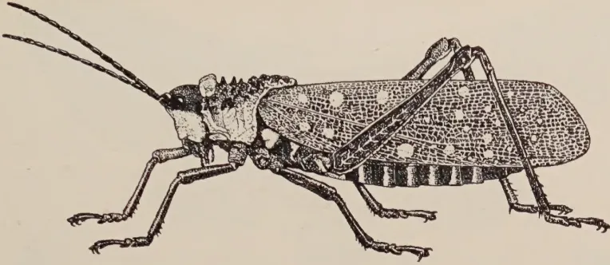

1

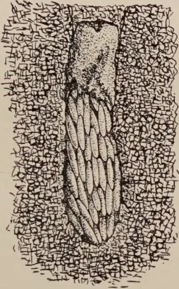

4

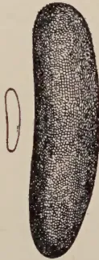

5

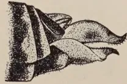

2

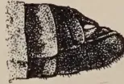

3

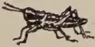

6

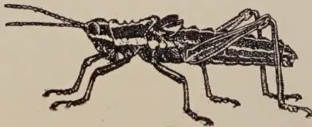

9

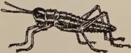

7

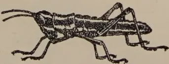

8

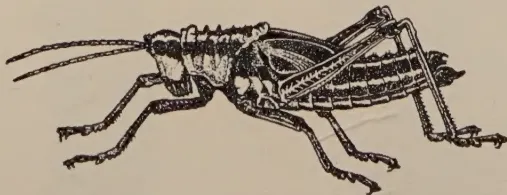

10

Block by Survey Dept. Ceylon

Plate I.—The Spotted Locust (*Aularches miliaris*)

- Fig. 1. Full grown female.
- Fig. 2. Side view of posterior portion of female.
- Fig. 3. Side view of posterior portion of male.
- Fig. 4. Section of soil showing egg-mass in its hole.

A portion of the porous matter enclosing the eggs has been removed, but the plug of the same material is seen above the eggs.

Fig. 5. Egg  $\times 4$ .

Figs. 6-10.—Five of the six stages of the nymphs or young locusts.

All figures are natural size except Fig. 5.

5------------------------------------------------

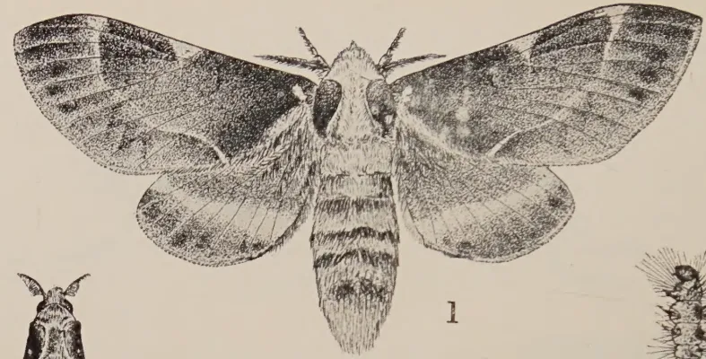

1

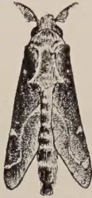

2

a

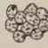

b

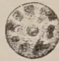

c

3

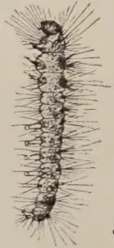

5

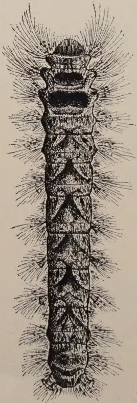

6

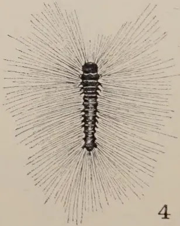

4

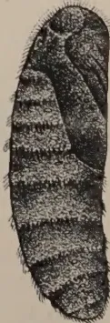

8

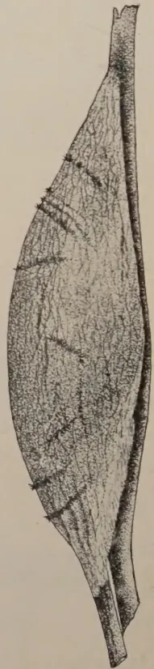

7

Block by Survey Dept. Ceylon.

George L. de Silva

Plate II.—The Various Stages of *Taragama dorsalis*

- Fig. 1. Female moth, wings spread, nat. size.
- Fig. 2. Male moth, wings closed, nat. size.
- Fig. 3. Eggs, a, side view  $\times 5$ , b group of eggs, nat. size, c, top view  $\times 5$ .
- Fig. 4. First instar caterpillar,  $\times 3$ .

- Fig. 5. Second instar caterpillar,  $\times 1\frac{1}{2}$ .
- Fig. 6. Fifth instar or full-grown caterpillar, nat. size.
- Fig. 7. Cocoon of female, nat. size.
- Fig. 8. Pupa of female, removed from cocoon, nat. size.

6------------------------------------------------

131

April. For the first few days they cluster thickly on any low-growing plant and even at this early stage they can collectively strip any favourite food plant, such as dadap. They gradually scatter further afield with ever-increasing appetites, and, unless they are killed off within the first few weeks after emergence, they gradually spread from one field to another or to an adjoining estate, defoliating the dadaps in their advance. They become full-grown and get their wings in about five months, that is during July, August, and September again. Only one brood is produced during the twelve months.

*Control Measures.*—These include the collection and destruction of the winged locusts on their breeding grounds during October to December, the marking down and forking over the egg-laying areas during November to January and the destruction of the newly-hatched hoppers by spraying them as they emerge or cluster on low-growing vegetation during the early months of the year. A simple and effective spray is a solution of soap and water made by dissolving any good hard or soft soap in water at the rate of 1 lb. in 8 gallons for hoppers up to about two weeks old (Fig. 6) and at the rate of 1 lb. in 6 gallons for hoppers from about two to about six weeks old (Fig 7). The hoppers should be sprayed as soon as possible after emergence and while they are still crowded together on low-growing plants. It is useless attempting to spray them after they are more than six weeks old, since they are then too active and too hardy to be wet and killed by the spray.

*Caterpillar Pests of Dadap.*—There are several kinds of caterpillars which are known to attack the leaves of dadap from time to time, but fortunately their outbreaks are few and far between. The keen interest in insect pests now being taken on most estates usually leads to the detection and destruction of any outbreak before much damage is done; occasionally, however, acres of dadaps may be defoliated by armies of caterpillars which seem to appear almost in a night.

The largest and most destructive of the caterpillar pests of dadap are those of the two Lasiocampid moths, *Taragama dorsalis* (Pl. II, Fig. 1) and *Suana concolor*. Of these two, *Taragama* occurs more frequently on dadap than *Suana* and the following brief note from a previous article by the writer (5) may be of interest: The rather large brown-spotted eggs (Fig. 3) of *Taragama* are usually stuck in masses to the branches of dadap and other plants and hatch in about 12 days. The caterpillars are full-grown (Fig. 6) in about 5 or 6 weeks and during the last two weeks of their development they consume vast quantities of leaf. Dadap and *Albizia* are their favourite food plants but

7------------------------------------------------

132

they may also feed to some extent on almost any of the main crops, such as tea, rubber, cacao, etc. The caterpillars attach their stoutly-woven cocoons (Fig. 7) to any convenient objects, such as the branches and stems of their food plants. The pupal stage lasts for about 2 to 3 weeks. Under field conditions the complete life cycle probably occupies from 8 to 9 weeks.

*Control.*—A serious outbreak can only be checked by an organised campaign of lopping the dadaps within and just around the infested area and burning the loppings and by collecting and burning or burying deeply all the larvae and cocoons throughout the attacked area. The caterpillars and cocoons should be handled very cautiously on account of their irritating hairs, and the collecting coolies should be provided with rough forceps made of a piece of bent hoop iron.

Dadap is sometimes attacked by the rather slender hairy caterpillars of rather large pale-yellow moths (*Eupterote* spp.). The following is a brief description of *Eupterote geminata*, a pest of dadap. The hemispherical eggs are usually laid in masses so as to form a cylindrical tube encircling a twig or small branch. They are whitish to pale-yellow when freshly laid and may change to a pale-bluish colour before hatching:

*Young to half-grown larva.* Head orange-red, body with a broad pale-coloured stripe along the back and a dark stripe on each side, covered with rather long whitish hairs.

*Full-grown larva.* Nearly 3 inches long, pale-brown, with tufts of buff-coloured hairs on each segment. The younger caterpillars usually feed in large clusters on the leaves or they may be found in masses on the stems just before a moult. They may sometimes be seen crawling about the plants in long lines, usually in single file, with a leader, and each larva keeps closely in touch with the one in front of it. This habit of walking in processions is characteristic of the family *Eupterotidae* and has earned them the name of "processionary caterpillars". The older larvae usually scatter about over the plants while feeding. The larval period in some species is a long one, lasting about 10 weeks. The full-grown larvae burrow into the soil and pupate in earthen cells, the pupa being rather stout and dark brown to almost black. The pupal stage may last for 7 or 8 weeks. The moths lay their eggs soon after emergence and usually live only a few days. For further information on *Eupterote* larvae on dadap see Rutherford(16).

*Control.*—Collect and destroy the egg-masses on the branches and the younger larvae when massed together on the leaves and stems. Fork the soil beneath the attacked plants to break up and expose the pupal cells.

8------------------------------------------------

<!-- stage4: FAINT old-images-only -->

[Faint page: no legible print of its own could be verified; text withheld (stage 4 review list)]

9------------------------------------------------

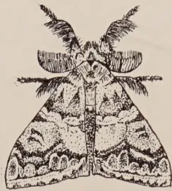

1

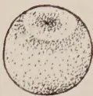

4

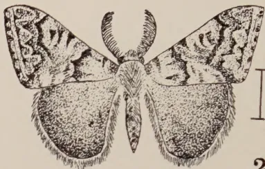

2

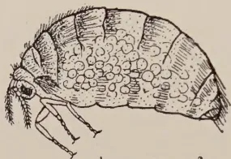

3

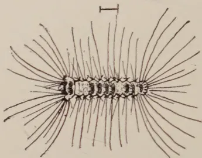

5

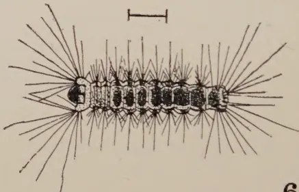

6

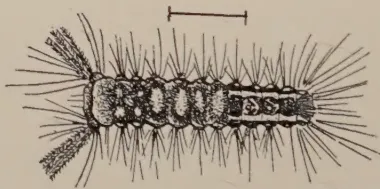

7

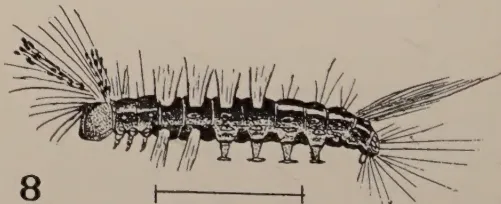

8

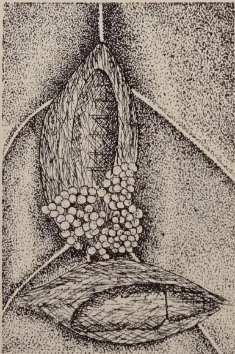

9

Block by Survey Dept. Ceylon

Plate III.—The Small Tussock Caterpillar (*Notolophus posticus*)

- Fig. 1. Male moth, resting position,  $\times 2$ .
- Fig. 2. Male moth, wings spread,  $\times 2$ .
- Fig. 3. Female moth, side view,  $\times 2$ .
- Fig. 4. Egg,  $\times 15$ .
- Fig. 5. Larva, first stage,  $\times 5$ .

- Fig. 6. Larva, second stage,  $\times 4$ .
- Fig. 7. Larva, third stage,  $\times 3$ .
- Fig. 8. Larva, fourth stage,  $\times 2$ .
- Fig. 9. Portion of leaf, showing cocoons, and eggs,  $\times 2$ .

10------------------------------------------------

133

Another caterpillar pest of dadap is the small tussock caterpillar (*Notolophus posticus*) which is widely distributed throughout the southern half of the Island at all elevations from sea level to over 6,000 feet. Besides being an occasional pest of dadap and *Albizia* it is known to feed on a variety of other cultivated plants.

The following summary is taken from an article by De Alwis (1) who has studied the bionomics of this insect:

The male moth (Pl. III, Figs. 1 and 2) is an active winged insect with brownish wings mottled with black, while the female (Fig. 3) is a sluggish pale-brown creature with redimentary wings. It lays its shining white eggs in irregular masses usually on the cocoon from which it has emerged and a single moth may lay up to 600 eggs. The eggs hatch in from 7 to 11 days and the young larvae (Fig. 5) feed in masses on the younger leaves, sometimes completely hiding these with their bodies and masses of long hairs. The older larvae (Figs. 7 and 8) are quite conspicuous with their reddish heads and four short closely-set tufts or tussocks of yellowish or brownish hairs on the back; they also have a pencil of feathery hairs projecting forwards on each side of the head and a pair of long brownish tufts extending backwards from the anal segment. They are fully grown in about 16 to 20 days and spin their loosely woven cocoons between two or three leaves or on the twigs and usually cover them thinly with hairs from their bodies. The pale-brownish pupa is formed inside the cocoon and the moths emerge in about 7 to 9 days.

*Control.*—The caterpillars are normally controlled by parasites, the most important of which is the Tachinid fly (*Tricholyga sorbillans*). Small outbreaks can usually be checked by the collection and destruction of the cocoons with egg-masses on them and the clusters of young larvae.

Mention may also be made here of the dadap leaf-folder (*Agathodes ostentalis*), a description of which was given by De Alwis (2). The brownish moth (Pl. IV, Figs. 1 and 2) has rather long olive-green forewings with a bright-pink band across the outer end. It lays its whitish scale-like eggs (Fig. 3.) mainly on the leaves and twigs. A single moth may lay nearly 400 eggs. These hatch in 5 to 6 days and the young larvae (Fig. 4) feed inside the undeveloped leaves, protecting themselves with a fine web. The older larvae (Fig. 5) feed within a fold on older leaves, and are full grown in 14 to 18 days. The cocoons (Figs. 8 and 9) are often formed in a crevice in the bark or inside the empty tunnels of the dadap shoot-borer, and the slender brownish pupae (Figs. 6 and 7) are well protected by a closely woven covering. The pupal stage lasts from 15 to 19 days.

11------------------------------------------------

134

*Control.*—Usually no special control measures are necessary for this insect, since it is partially checked by the removal of the shoots injured by the shoot-borer.

*Pests of Albizzia spp.*—The most serious leaf-eating pests of *Albizzia* are the caterpillars of some three or four species of *Terias*, a group of small to medium-sized yellow butterflies with dark edges to their wings. For convenience these are usually mentioned under the name of *Terias silhetana*, but Ormiston (14) has pointed out that there are many variations in colour markings within the group, since wet and dry season forms of the various species are usually found together.

The butterflies fly in vast swarms from the jungles across cultivated areas and lay their eggs on the leaves of various species of *Albizzia*. The eggs are fusiform, or spindle-shaped, and pearly white at first, but turning to pale cream colour before hatching in 6 or 7 days. They are usually attached singly by one end to either the upper or lower surface of the leaves. The young larvae are whitish with pale-brown heads broader than the body. The older larvae are dull-green, with roughened bodies having a pale stripe along the sides and with either conspicuous black heads (*T. silhetana*) or green heads (*T. hecabe*). The caterpillars of *silhetana* are gregarious, while those of *hecabe* usually feed singly. They have a rapid development occupying only about 2 weeks. The pupae, or chrysalides, are somewhat boat-shaped, pointed at both ends, those of *silhetana* ranging from pale to dark-brown or almost black, while those of *hecabe* are usually pale to dark-green. The pupae are usually attached by the tail end and slung by a girdle from the leaves and bare leaf-ribs of their food plants or from any convenient object under or near the defoliated *Albizzia* plants or trees. The pupal stage lasts about one week. It will be seen that these insects undergo a rapid development, the whole life-cycle from the laying of eggs to the emergence of the butterflies occupying only about one month.

*Control.*—These pests are controlled to some extent by their natural enemies, mainly parasites, but usually the parasites do not get a start until after the *Albizzia* plants have been completely stripped over many acres. The attacked plants are sometimes seriously injured by successive defoliations and in such cases lopping may result in a die-back of the branches. The pupae can sometimes be collected in large numbers and destroyed. On young *Albizzia* plants the young caterpillars can be killed by spraying them with a solution of soft soap and water at the rate 1 lb. to 6 gallons.

12------------------------------------------------

1

2

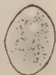

3

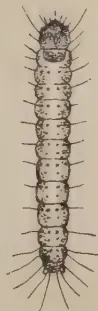

4

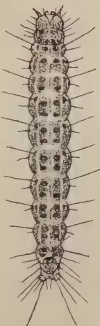

5

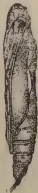

6

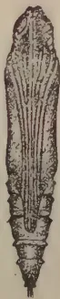

7

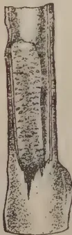

8

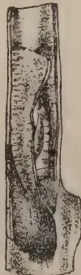

9

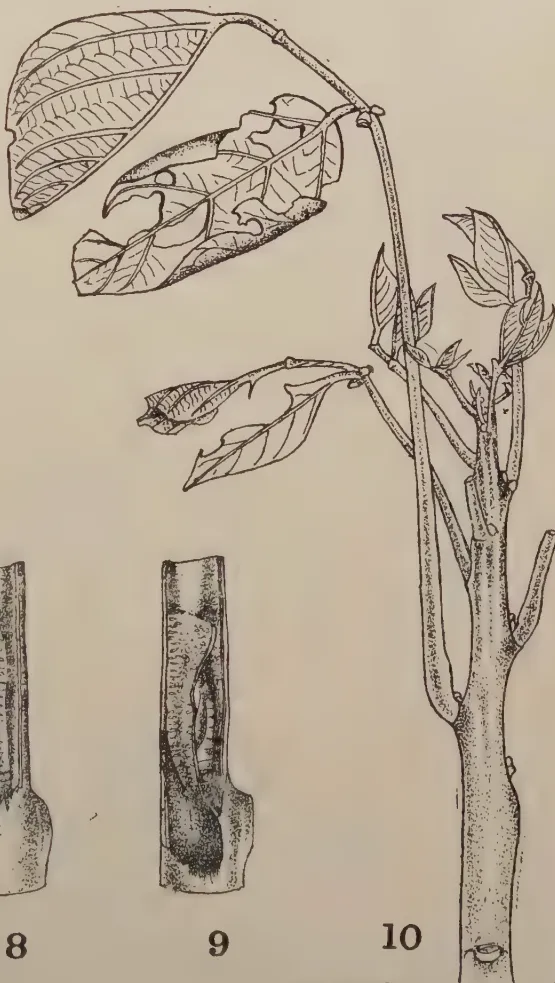

10

Block by Survey Dept. Ceylon.

Plate IV.—The Dadap Leaf-Folder (*Agathodes ostentalis* Hubn.)

Fig. 1. Moth, resting position, with tip of abdomen turned up,  $\times 2$ .  
 Fig. 2. Moth, wings spread,  $\times 2$ .  
 Fig. 3. Egg,  $\times 10$ .  
 Fig. 4. First stage caterpillar,  $\times 5$ .  
 Fig. 5. Full grown caterpillar,  $\times 2$ .  
 Fig. 6. Pupa, lateral view,  $\times 2$ .

Fig. 7. Pupa, ventral view,  $\times 2$ .  
 Fig. 8. Portion of shoot showing cocoon of *Agathodes* in old tunnel of *Terastia*, nat. size.  
 Fig. 9. Lateral view of fig. 8, showing pupa inside cocoon, nat. size.  
 Fig. 10. Showing young leaves for partially eaten, nat. size.

13------------------------------------------------

![Plate V showing ten figures of bagworm pests of Albizzia. Fig. 1: Clania variegata case with slit showing pupa. Fig. 2: Clania variegata leaf-covered case. Fig. 3: Acanthopsyche sp. two cases. Fig. 4: Acanthopsyche sp. dark coloured male moth. Fig. 5: Clania doubledayi case with empty male pupal skin. Fig. 6: Chalia doubledayi larva. Fig. 7: Chalia doubledayi clear winged male moth. Fig. 8: Clania spp. larva. Fig. 9: Psyche vitrea case with empty male pupal skin. Fig. 10: Psyche albipes feeding on tea leaf.](051e30f4e1eea5ea3e1a83454e7304dd_1_img.webp)

Geo. L. de Silva.

BLOCK BY SURVEY DEPT. CEYLON. 1931.

Plate V.—Some Bagworm Pests of *Albizzia*.

- Fig. 1. *Clania variegata*, case slit to show pupa inside.
- Fig. 2. *Clania variegata* leaf-covered case, with empty male pupal skin protruding.
- Fig. 3. *Acanthopsyche* sp., two cases  $\times 3$ , one with empty male pupal skin protruding; nat. size at side.
- Fig. 4. *Acanthopsyche* sp.; type of dark coloured male moth,  $\times 3$ .
- Fig. 5. *Clania doubledayi*, with empty male pupal skin, nat. size.

- Fig. 6. *Chalia doubledayi*, larva removed from case,  $\times 3$ .
- Fig. 7. *Chalia doubledayi*, type of clear winged male moth,  $\times 3$ .
- Fig. 8. *Clania* spp., larva removed from case, nat. size.
- Fig. 9. *Psyche vitrea*, case with empty male pupal skin, nat. size.
- Fig. 10. *Psyche albipes*, feeding on tea leaf, nat. size.

14------------------------------------------------

135

Another caterpillar (*Macaria pluvicata*) has recently been recorded by Light (13) as a pest of *Albizia* seedlings in nurseries. This is one of the Geometrids or "loopers" and Light found that while the larvae feed in preference on the tender leaves they may strip the plants completely. He also noted that the continued destruction of the growing points may result in the death of the young plants or cause a serious set-back. Details of the habits, life-history and control measures are given in the article.

*Control.*—Spraying with Paris Green at the rate of 1 lb. to 50 gallons of water is recommended. This works out at about 1 oz. to 3 gallons, which seems rather a strong dose for young plants. As an alternative to spraying, dusting with Paris Green diluted with four or five of its weight of sifted lime, is recommended. Probably a dilution of 1 in 8 would be safer for young plants and is quite effective at this strength against most leaf-eating insects.

*Bagworms on Albizzia.*—There is evidence that various species of bagworms and faggotworms, formerly regarded as pests of tea and rubber only among crops of economic value, are now becoming prevalent on *Albizia*, particularly at lower elevations. These insects are the caterpillars of several different species of moths belonging to the family Psychidae, and they all have a similar characteristic development, in that, with the exception of the active-winged male moths, the larval, pupal, and female moth stages are spent within cases made by the larvae. These cases are constructed of finely woven silk to form a tough tubular covering which in some species is adorned with the pieces of twigs, leaves, etc. Some of these insects are illustrated in Plate V. Most species consistently employ their own characteristic covering, but *Clania variegata* sometimes attaches only a few small pieces of twigs or leaves to its case (Fig. 1), while at other times the case may be completely hidden by large pieces of leaf (Fig. 2).

The female insects remain inside their cases after struggling out of their pupal cases and the eggs are laid also inside the cases. The young caterpillars on hatching find their way out and each soon makes its individual case, which is gradually enlarged with the growth of the inmate. A caterpillar when feeding may move about dragging its case along or it may attach its case loosely to a leaf, exposing only the head and front part of the body; these segments have a thicker and darker skin than the hinder portion of the body which always remains inside the case and is soft and whitish (Fig. 8.). The full-grown larva before pupating attaches its case very strongly to a leaf or twig and seals

15------------------------------------------------

136

up the mouth of the tube with silk. The actual pupation has not been observed, but Green (3) states that the larva, when ready to pupate, turns round inside the case with its head towards the hinder opening of the tube and changes into a chrysalis in this position. If the insect happens to be a male it emerges later as a moth, usually of a brownish colour (Fig. 4) but sometimes with colourless transparent wings (Fig. 7). The male moth on emerging leaves its empty pupal skin protruding from the case (Figs. 2, 3 and 5). As indicated, the female does not leave its case, but is fertilised therein by the male which has a very flexible and extensile abdomen and organ.

Recent records by Light (12) and by the writer indicate that albizzia may be attacked by the following species of bag worms and faggotworms: *Clania variegata* (Figs. 1 and 2), *Psyche vitrea* (Fig. 9), *Psyche albipes* (Fig. 10), *Acanthopsyche* sp. (Figs. 3 and 4), and *Chalia doubledayi* (Figs. 5, 6 and 7). In the case of a serious outbreak the *Albizzia* plants may be completely stripped and sometimes even the bark is gnawed away in patches, particularly by *Psyche albipes* and *Chalia doubledayi*.

*Control.*—Since the females are wingless and do not leave their cases it follows that these pests can only spread in the larval stage. It is probable that the young larvae may be blown by the wind or they attach themselves to coolies' clothing and be carried to uninfested areas. All cases found attached to plants should be removed periodically and destroyed, especially on estates which have had attacks of these pests, since some of these cases may contain egg-laying females about to start new centres of infestation.

In the early stage of an attack the insects are usually confined to small patches of plants and are probably the progeny of a few females; it is at this stage that a serious increase can be checked by handpicking the cases and destroying them. These pests are normally controlled by parasites, but once an outbreak has got out of hand the parasites are unable to resume control until a vast amount of damage has been done.

*Pests of Crotalaria spp.*—The cultivated species of *Crotalaria* may sometimes be severely injured by the attacks of the caterpillars of at least two species of *Argina* moths, namely *Argina argus* and *Argina syringa*. The conspicuously coloured moths of both species have a wing-spread of over two inches, the front wings of *argus* being brownish pink with numerous irregular white-ringed black spots, while the hind wings are salmon pink with ringless black spots; the *syringa* moths are very similar in appearance to those of *argus* except that the colours are darker.

16------------------------------------------------

137

The newly-hatched hairy caterpillars of both species are gregarious, feeding in masses on the tender shoots of various species of *Crotalaria*, both wild and cultivated. The full-grown larvae of *argus* are about 2 inches long, black, with a line of white spots along the middle of the back, while those of *syringa* are dull greenish-gray, with transverse series of narrow black bands, three on each segment of the body. Both species of larvae are hairy and very conspicuous on the plants. They usually feed on the leaves and flowers and sometimes bore into the pods in order to eat the seeds. They are also capable of doing serious injury to the stems of the plants by gnawing the bark and sometimes girdling the stem so that the plants wither and die back or break off at the point of injury. The pupa or chrysalis is reddish-brown, spotted and banded with black and is usually slung in a thin silken web and attached to the plant.

*Life-History.*—The eggs are laid in clusters on the young shoots, and hatch in about 4 days. The larval period of *argus* in captivity ranges from 18 to 23 days and the pupal period averages about 10 days. The moths may live for nearly a month in captivity during which time they may lay from about 250 to well over 1,000 eggs.

*Control.*—The caterpillars can be collected and destroyed, especially in the young stage when they are massed together on the shoots and leaves. The pupae in their cocoons on the plants also lend themselves to easy control by hand-picking. It is essential to control the pests in its early stages before any serious permanent injury can be done to the plants.

*The Indigofera leaf-webber (Dichomeris ianthes).*—The various species of *Indigofera* are sometimes attacked by a small greenish caterpillar which webs the leaves together and feeds within the webbed masses of leaves. The cocoons are formed within the masses of shrivelled leaves on the plants or within individual fallen leaves. The moth is a small grayish brown insect.

*Control.*—The tipping of the plants and burning of the tassels with any eggs, larvae and cocoons is probably the only practicable method of control for this pest on *Indigofera* interplanted with tea. *Indigofera* in nursery beds or among other main crops can be sprayed or sprinkled with the Paris Green mixture.

*Pests of tea and green manures.*—Mention may be made here of some of the more important leaf-eating insects formerly regarded mainly as tea pests which have become increasingly prevalent within recent years on various green manure crops. The recent records of several species of bagworms which are

17------------------------------------------------

138

becoming addicted to *Albizia* have already been indicated but there are several other leaf-eating insects to which attention should be called as potential pests of green manures.

Tea tortrix (*Homona coffearia*) is known to feed on the commoner species of *Acacia*, on dadap (*Erythrina* spp.) on *Crotalaria* spp. and on *Grevillea*.

There are a few species of leaf-eating weevils which have been minor pests of tea for many years and some of them are known to feed on green manures; and it is probable that they are extending their range of food plants among these crops. The gray weevil (*Myllocerus curvicornis*), a common pest of dadaps, also attacks *Acacia* and *Albizia* and has been recorded by Light (11) on *Glicicidia*. The bronze weevil (*Astycus immunis*) is known to feed on *Acacia*, while a green variety (*bilineatus*) of this species has been recorded by Light (11) on dadap.

Very little is known about the life-histories of these weevils. The eggs are laid in the soil and the grubs probably feed on the roots of plants, while the weevils emerge from the soil after pupation. They attack the young shoots and nibble the edges of the older leaves of their host plants.

### BORERS

The dadap shoot-borer (*Terastia meticulosalis*) probably occurs in most districts where dadap is grown as a green manure crop and its damage is well known. The bionomics of this pest have been studied by De Alwis (2) and the different stages of this insect are shown in Plate VI. The following is a brief summary of our information on this boring caterpillar.

The grayish-brown moth usually rests in the position shown in Figures 1 and 2, the rather narrow forewings not completely covering the hindwings and the abdomen turned up at the tip. The somewhat oval, soft and whitish eggs are laid singly on the bases of the tender leaf-stalk (Figs. 9b and 10) and hatch in about a week. The larva (Fig. 4) on hatching first of all bores into an immature leaf and in about 2 days it enters a young shoot near the tip and tunnels down the centre gradually causing the shoot to die back. A mass of excrement or frass usually protrudes from the tip of an attacked shoot, (Fig. 9a). The larva is full-grown (Fig. 5) in about a month and spins its cocoon inside the hollow decaying shoot. The pupal stage occupies

18------------------------------------------------

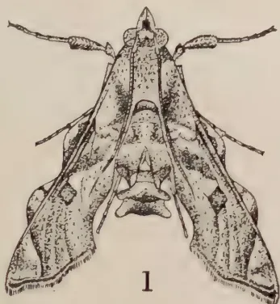

1

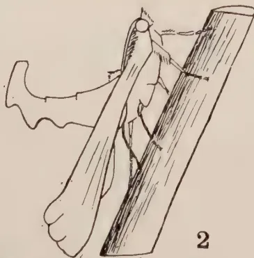

2

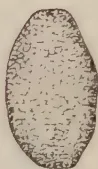

3

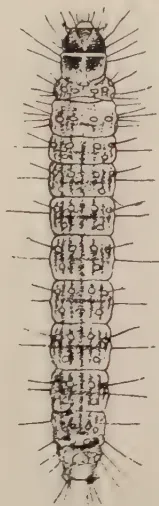

5

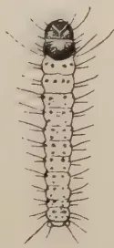

4

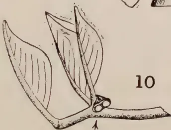

10

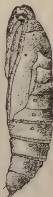

6

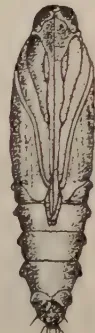

7

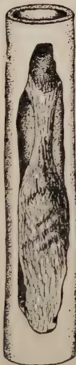

8

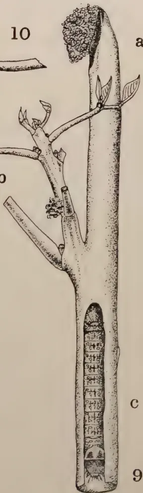

a

b

c

9

Block by Survey Dept. Ceylon

Plate VI.—The Dadap Stem-borer (*Terastia meticulosalis* Guen.)

- Fig. 1. Moth, resting position, with tip of abdomen turned up,  $\times 2$ .
- Fig. 2. Moth, resting position, side view,  $\times 2$ .
- Fig. 3. Egg,  $\times 20$ .
- Fig. 4. First stage caterpillar,  $\times 6$ .
- Fig. 5. Full grown caterpillar,  $\times 2$ .
- Fig. 6. Pupa, lateral view,  $\times 2$ .
- Fig. 7. Pupa, ventral view,  $\times 2$ .

- Fig. 8. Section of hollow shoot with portion removed to show cocoon inside,  $\times 2$ .
- Fig. 9. Showing damage by borer,  $\times 2$ .
  - (a) Primary shoot killed back,
  - (b) Secondary shoot being attacked,
  - (c) Caterpillar in tunnel.
- Fig. 10. Portion of 9b, enlarged to show two whitish eggs (indicated by arrow).

19------------------------------------------------

This image is a scan of a blank page. The paper has a light beige or cream-colored tint. There are a few very small, dark specks scattered across the surface, which appear to be scanning artifacts or dust particles. No text, lines, or other markings are present on the page.

20------------------------------------------------

139

about 2 to  $2\frac{1}{2}$  weeks. The dying-back of the first shoots usually causes the plants to throw out several side shoots resulting in the production of more leaf, but sometimes these secondary shoots may also be attacked.

*Control.*—This pest can usually be controlled by the ordinary periodical lopping, but individual attacked shoots should be removed and burnt at any time that the borer threatens to increase; their destruction will kill either the larva or pupa inside.

The bark-eating borer (*Arbela quadrinotata*) is sometimes a pest of dadap and *Albizzia* and is known to attack tea and cacao. The eggs are probably laid in crevices in the bark and the larva makes a tunnel in the stem or at a fork within which it lives, coming out to feed on the bark under the protection of a silken gallery covered with frass.

*Control.*—The borers can sometimes be killed within their tunnels on young or low-growing plants by probing with a stout pointed wire; the holes are sometimes plugged with tar. During an outbreak of this pest on *Albizzia* in 1926 Holland (4) found that it could be effectively controlled by stopping the holes with "Plascom" and liquid fuel. This melted in the sun, but the caterpillars, while attempting to emerge, were caught in the sticky material and almost all killed.

Termites (*Calotermes* spp.).—The various species of *Calotermes* now so well-known as serious and widespread pests of tea have been found within the last few years to attack such green manure plants as *Acacia*, *Albizzia*, *Erythrina*, and *Grevillea*. They have also been found in other economic crops, in timber and ornamental trees and in various jungle trees.

As in the case of tea the termites may gain entry through wounds and snags and gradually bore into the sound heartwood causing further die-back of the branches and stems and eventually the death of the plants. Recent observations indicate that *Calotermes* may gain entry into tea and green manure plants through the roots from old infested jungle stumps and roots. Dadap (*Erythrina* spp.) is known to be attacked by *Calotermes* (*Neotermes*) *militaris* and *Calotermes* (*Neotermes*) *greeni*, *Albizzia* by *C. (N) militaris*, and *C. (Glyptotermes) jepsoni*, and *Acacia* by *C. (N) militaris*. *Grevillea* is attacked by *C. (N) militaris*, *C. (N) greeni*, and *C. (Glyptotermes) dilatatus*. For full information on these pests the work of Jepson (8, 9, 10) should be consulted.

*Pod-boring insects.*—The seed-pods of boga medeloa (*Tephrosia candida*), *Indigofera* spp. and occasionally *Crotalaria* spp. are attacked by the grubs of a small brownish beetle

21------------------------------------------------

140

(*Araecerus fasciculatus*), commonly known as the *Tephrosia* beetle. This beetle sometimes causes serious losses in the seed crop of boga.

The eggs are laid in the seams of half-ripe pods in small holes previously gnawed by the beetles, a single egg to a hole usually near a seed. The eggs hatch in about a week and the grubs bore into the adjoining seeds, consuming these. The grubs are full-grown in about one month and pupate inside the pods. The pupal stage lasts about one week, and the beetles may remain inside the pods for about another week or so before gnawing holes in the side for emergence, which may take place before the pods open.

*Control.*—Where *Tephrosia* is grown as a green manure among a main crop such as tea or rubber, this pest is usually controlled by the periodical loppings before the flowering and fruiting of the plants. This removal of the flowers and pods in green manure areas of *Tephrosia* is essential if there are any areas of this plant being grown for seed anywhere near the inter-planted *Tephrosia*, since it has been found in Java that the beetles can fly long distances up to half-a-mile and that *Tephrosia* can be infested from green manure areas of *Tephrosia* and from wild pod-bearing leguminous plants.

Petch (15) gives a review in *The Tea Quarterly* of an article describing the methods of combating the *Tephrosia* weevil in Java. These measures include the systematic removal of the first nearly ripe pods by special collecting gangs. The destruction of these pods prevent the further development of the infesting grubs and pupae into beetles which would otherwise emerge and attack the later crop of pods.

The three or four species of small pod-boring caterpillars which attack the seeds of boga medeloa can also be controlled by the above methods.

### SUCKING INSECTS

Among the sucking insects which are known to feed on green manure crops may be mentioned a few of the larger plant-sucking bugs and some of the smaller insects, such as aphids, scale insects, and mealy-bugs.

*Cyclopelta siccifolia* is a Pentatomid bug, a little more than  $\frac{1}{2}$  inch long, oval in shape and of a very dark brownish-black colour, except the membranous portions of the front wings which are of a lighter brown colour. The nymphs, or younger bugs are lighter in colour. Both adults and nymphs have the habit of feeding in large masses on the twigs and branches of dadap and on *Indigofera* spp., sometimes causing the injured portions to wither. The insects have a strong odour and when

22------------------------------------------------

141

disturbed they may sometimes eject a liquid which produce a smarting sensation to the skin. Adult bugs have been kept in captivity for several months on end at various times, but never laid any eggs. Rutherford (16) noted that the eggs are placed in longitudinal rows on the branches.

*Control.*—Since the bugs usually feed in clusters, it is a simple matter to brush them off into a tin of water with a little kerosene on the top.

The smaller Membracid bugs (*Otinotus* spp.) are occasionally very numerous on the young shoots of dadap, while closely related bugs belonging to the genera *Leptocentrus* and *Gargara* occur on *Indigofera*, *Tephrosia*, and *Crotalaria*. These bugs are remarkable by reason of their horn-like appendages of various shapes giving them a most grotesque appearance. Both adults and nymphs usually cluster together in small groups and when disturbed they exhibit remarkable jumping powers.

The eggs are laid in slits made in the bark by the females with their saw-like ovipositors. The combined feeding of numbers of these bugs and the egg-slits sometimes injure the young twigs. These minor pests are usually checked by egg-parasites.

Turning to the smaller and less active sucking insects we find that the tender shoots of *Gliricidia* are sometimes heavily infested with aphids (*Aphis gossypii*), which cause a distortion and withering of the young leaves. These insects are usually controlled by lady-bird beetles and their larvae and by syrphid fly maggots, but if they become a pest they can be sprayed with the soap and water solution 1 in 8.

Of the scale insects attacking green manures, probably the only one of any serious importance is the boga scale *Ceroplastodes cajami*) which sometimes covers patches of boga with a whitish incrustation. Unless the infested shoots and branches are lopped the scales spread down the stems and the plants may die back or be seriously weakened. In cases where scale-infested boga plants die out entirely there is usually some evidence of root disease as well. This scale is often controlled by parasites. For other control measures see Insecticides.

Boga shoots are sometimes attacked by mealy-bugs (*Pseudococcus virgatus* and *Pseudococcus citri*), but these are usually of minor importance as compared with the scale.

*Albizzia* and *Gliricidia* are also attacked by *P. virgatus* and *P. citri* is found on dadap and *Gliricidia*.

The roots of green manure plants are sometimes infested with mealy-bugs, but there is no evidence to show that they cause any serious injury. Light (12) has recorded *Pseudococcus maritimus* on the roots of *Albizzia lopantha*.

23------------------------------------------------

142

The recent extension of the areas under *Glicidia* as a green manure for tea has been followed by the appearance of green bug (*Coccus viridis*) on this plant in districts where green bug has not been known previously. This scale insect usually gets on to the tea from the *Glicidia* and under favourable conditions it may succeed in establishing itself there.

The most conspicuous feature of attacks of sucking insects, such as scales, mealy-bugs, and aphids is the blackened appearance of the leaves popularly termed "black blight" or "black bug". This unsightly condition of the plants is to "sooty mould" a non-parasitic fungus which develops wherever the secretions of the insects happen to fall. It usually forms a superficial film on the upper surfaces of the leaves and sometimes covers the twigs and branches, but is of no special importance, except that it often calls attention to the presence of the pests. It gradually disappears after the insects are killed.

### HIGH CULTIVATION

It is now becoming generally recognised that green manure plants should receive similar care and attention as regards cultivation and manuring as do the main crops among which they are grown. High cultivation not only enables them to recover from the attacks of the numerous leaf-eating pests mentioned above and from the frequent loppings which they have to undergo, but helps them to maintain their vigour in spite of attacks by sucking insects. Normally vigorous plants growing under suitable conditions can usually maintain an ordinary infestation of scale insects or mealy-bugs without any apparent loss of vitality and for some reason or other the scales do not increase unduly. On the other hand, plants whose vitality has been impaired by attacks of leaf-eating or boring insects or by diseases or by unsuitable soil and climatic conditions are usually unable to cope with the additional drain—and it is literally a drain on their vigour caused by a scale or mealy-bug attack. The scales or mealy-bugs usually increase rapidly, and unless the pest is temporarily checked by parasites or by artificial measures, such as loppings or spraying, the plants seem unable to throw off the attack in spite of high cultivation. Therefore, it is recommended that if scales tend to persist in any given area, then the infested branches should be lopped and burnt or the plants should be sprayed with a contact insecticide, in order to get rid of the pest and give the plants a chance to regain their lost vitality and withstand any subsequent renewal of the attack. If high cultivation is maintained and provided that the plants are not naturally weak they should remain free from a recurrence of serious scale attacks.

24------------------------------------------------

143

### *INSECTICIDAL MEASURES OF CONTROL*

It will have been observed that practically the only measures which have been recommended above for the control of insect pests of green manures are collection and destruction of leaf-eating pests and lopping and burning the infested portions of the plants for sucking insects, such as scales and mealy-bugs. As a general rule these are measures which can be carried out at a reasonable cost as part of the estate routine by the ordinary estate coolies and they are usually effective against most outbreaks if applied in the early stages of an attack.

There are, however, alternative measures of control for leaf-eating pests and one of these is the application of a stomach poison, usually an arsenical, to the leaves of the infested plants; these insecticides are usually applicable only to low-growing plants unless high-powered spraying machines can be used. Those green manure plants which are grown primarily for their loppings, as opposed to those which are grown mainly for shade, can usually be kept down to a reasonable height and therefore accessible to the spray or dust from ordinary spraying machine or powder gun, so that spraying or dusting with an arsenical stomach poison should be quite practicable from the purely mechanical operation of getting the poison on to the plants.

Since, however, green manure plants are usually interplanted with a main crop for the benefits they confer indirectly on the main crop, it would be practically impossible to prevent any insect poison used on the green manure crop from also getting on to a low-growing main crop such as tea. Since the leaves of tea are made into a product for human consumption it follows that the use of arsenicals on any green manure interplanted with tea is out of the question, so far as we know at present.

Experiments have been made by this Department with a few non-arsenical poisons, such as lead chromate and sodium silicofluoride, on such tea pests as tortrix and nettle grubs, but so far these have not given satisfactory results. Recent experiments against nettle grubs with various contact insecticides, such as usually recommended for sucking insects, have indicated that some of these give promising results against young to half-grown larvae and it is possible that as the result of further experiments, some of these may be useful against the younger stages of some of our green manure caterpillars. The cost of most of these contact sprays is at present rather high for use on large areas under estate conditions and the cost of materials and application are among the limiting factors in any large scale spraying operations.

25------------------------------------------------

144

While the use of arsenicals is at present not advisable on green manure crops interplanted with tea, there seems to be no objection, beyond that of cost, to their application to green manures of moderate height and to cover crops interplanted among such crops as rubber, coconuts, cacao, etc. They can also be used on young green manure plants in nurseries or on any of these plants grown in separate areas for seed. For this purpose, the Paris Green formula given below will be found suitable for practically all leaf-eating insect pests on green manure crops. As an alternative a fairly cheap contact insecticide for young caterpillars and young locusts is a soft soap solution at the rate of 1 lb. of soap in 6 to 8 gallons of water, depending on the age of the pest. Kerosene emulsion is a useful contact insecticide against the hardier sucking insects, while the soft soap solution can be used against aphids.

### FORMULAE OF INSECTICIDES

*Stomach poisons* for leaf-eating insects, such as caterpillars and beetles.

#### *Paris Green Spray Formula:*

<table>
<tr>
<td>Paris Green</td>
<td><math>\frac{1}{2}</math> oz. or 3 large level teaspoonfuls.</td>
</tr>
<tr>
<td>Quick lime</td>
<td>2 oz. or a handful.</td>
</tr>
<tr>
<td>Water</td>
<td>4 gallons, or a kerosene tin full.</td>
</tr>
</table>

Slake the quick lime, or fresh stone lime, in some of the water; mix the Paris Green in a little of the water to make a thin paste; add the slaked lime to the remainder of the water in the tin and stir in the Paris Green paste thoroughly.

The above ingredients should not be mixed until just before they are needed for application nor should more of the mixture be made up than is likely to be used the same day. The mixture should be kept stirred thoroughly while in use so as to prevent the Paris Green settling to the bottom. The addition of quick lime is intended to neutralise any free arsenic which might burn the foliage. The above formula is suitable for use on tender foliage against young caterpillars; for older caterpillars and for beetles use double the quantity of Paris Green and lime for the same amount of water. Apply the liquid so as to wet both sides of the leaves thoroughly using a machine giving a fine misty spray.

If no suitable spraying machine or syringe is available then the mixture can be distributed in wide-mouthed earthenware chatties to coolies supplied with a bunch of leafy twigs (such as *Grevillea*) with which the mixture can be sprinkled on to the

26------------------------------------------------

145

plants. Stir the mixture thoroughly while pouring into the chatties so that each vessel gets an even distribution of the portion. This method of application is more wasteful than spraying but is useful in an emergency.

*Paris Green Dust Formula.*—Paris Green can be mixed thoroughly with any fine dust, such as finely sifted slaked lime, wood ashes, flour, etc., in the proportion of 1 part of the poison to 8 parts *by weight* of the dust for large caterpillars and for beetles, and 1 to 16 or even 1 to 32 for small larvae on tender foliage.

*Contact insecticides* for sucking insects, e.g., scales, mealy-bugs, and aphids.

*Kerosene Emulsion Formula:*

<table>
<tr>
<td>Any good bar soap</td>
<td>...</td>
<td><math>\frac{1}{2}</math> lb.</td>
</tr>
<tr>
<td>Soft water</td>
<td>...</td>
<td>1 gallon.</td>
</tr>
<tr>
<td>Kerosene</td>
<td>...</td>
<td>2 gallons.</td>
</tr>
</table>

Shave the soap into fine flakes and dissolve it in hot water; then add the kerosene and churn the mixture thoroughly by drawing it up into a garden syringe and forcing it back into the vessel, such as a kerosene tin. Keep on churning until the mixture begins to thicken; the emulsion is completed when the creamy mass begins to pass through the pump with difficulty. If the water is fairly soft, as it usually is in most parts of the Island except in the Jaffna district, the emulsion should be formed fairly soon. Hard water can be softened by adding a little borax or soda. Unless a proper emulsion is obtained there will be a residue of free oil which would burn the leaves. The resulting emulsion is the stock solution and for application mix 1 part of the stock with 9 or 10 parts of water for soft bodied insects, such as aphids, soft scales, and mealy-bugs. For tougher scales, such as the boga scale, the *lantana* bug, and other scales which are well protected, use 1 part of the stock to 5 or 6 parts of water, although tender foliage may sometimes be injured at this strength. Apply the liquid so as to wet the insects on the plants thoroughly, first examining them to see where most of the insects are feeding.

*Soaps.*—Quite a useful contact insecticide can be obtained by dissolving any good bar soap in water at the rate of 1 lb. of soap to 6 or 8 gallons of water. Soft soaps or ready made resin-fish-oil soap are usually more effective and more adhesive than hard soaps at the same strength, but they are not always available in an emergency. This soap solution is effective not only against aphids, soft scales, but has recently been found useful against young to half-grown caterpillars and young locusts.

27------------------------------------------------

146REFERENCES

1. 1. DE ALWIS, E.—The Small Tussock Moth. A Pest on Dadap.—*Year Book, Department of Agriculture, Ceylon*, 1926, pp. 19-21, 1 pl.
2. 2. DE ALWIS, E.—Two Caterpillar Pests of the Dadap.—*Year Book, Department of Agriculture, Ceylon*, 1927, pp. 54-56, 2 pls.
3. 3. GREEN, E. E.—Some Caterpillar Pests of the Tea Plant.—*Circular, Royal Botanic Gardens, Peradeniya, Ceylon*. Ser. 1, 19, 1900, pp. 260-262.
4. 4. HOLLAND, T. H.—Progress Report, Experiment Station, Peradeniya.—*The Tropical Agriculturist* LXVII, 1925, p. 248.
5. 5. HUTSON, J. C.—Notes on a Caterpillar Pest of Dadap.—*The Tropical Agriculturist*, LXVI, 1925, pp. 27-32, 5 pls.
6. 6. HUTSON, J. C.—The Spotted Locust.—*Year Book, Department of Agriculture Ceylon*, 1926, pp. 36-44, 1 pl.
7. 7. HUTSON, J. C.—Recent work on some Pests of Economic Crops.—*The Tropical Agriculturist*, LXVIII, 4, 1927 pp. 220-228.
8. 8. JEPSON, F. P.—Some Preliminary Notes on Tea Termites.—*The Tropical Agriculturist*, LXVII, 2, 1926, pp. 67-71.
9. 9. JEPSON, F. P.—The Control of "Calotermes" in Living Plants.—*Department of Agriculture, Ceylon, Bulletin No. 86*, August, 1929.
10. 10. JEPSON, F. P.—Report on Termites.—*Reports on Insect Pests in Ceylon during 1928, Department of Agriculture, Ceylon*.
11. 11. LIGHT, S. S.—Weevils Injurious to Tea.—*The Tea Quarterly*, 1, 2, 1928, pp. 45-47.
12. 12. LIGHT, S. S.—Newly Recorded food plants of some Pests of Tea and Green Manures.—*The Tea Quarterly*, 1, 3, 1928, pp. 77-79.
13. 13. LIGHT, S. S.—On a Caterpillar attacking Albizzia Seedlings.—*The Tea Quarterly* II, 3, 1929, pp. 105-108, 1 pl.
14. 14. ORMISTON, W.—The Butterflies of Ceylon, pp. 85-91.
15. 15. PETCH, T.—Combating the Tephrosia Weevil (Review).—*The Tea Quarterly* II, I, 1929, pp. 22, 23.
16. 16. RUTHERFORD, A.—Insects Destructive to Dadap.—*The Tropical Agriculturist*, XLIII, 2, 1914, pp. 129-134.

28------------------------------------------------

This image shows a blank page with a light beige or cream color. The surface has a subtle texture and slight discoloration, typical of aged paper. There are no markings, text, or illustrations on the page.

29------------------------------------------------

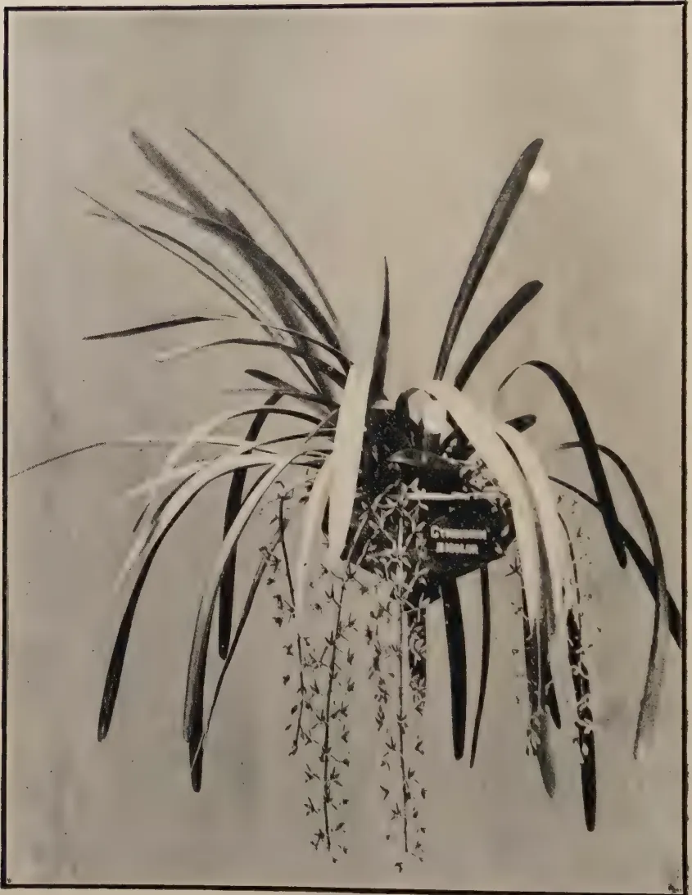A black and white photograph of a Cymbidium bicolor orchid plant. The plant is shown in a hanging basket, with its long, narrow, sword-like leaves arching outwards. A dense cluster of small, light-colored flowers hangs from the center of the plant, creating a cascading effect. The background is a plain, light color. The photograph is framed by a thin black border.

*Cymbidium bicolor*

30------------------------------------------------

147

## CYMBIDIUM BICOLOR

K. J. ALEX. SYLVA, F.R.H.S.,

ASSISTANT CURATOR,

HENERATGODA BOTANIC GARDENS

**T**HIS plant (*Cymbidium bicolor* Lindl.), fairly common in the low-country, is one of Ceylon's prettiest orchids. It is confined to the forests under 3,000 feet altitude. On account of its beautiful flowers and easy culture the plant in recent years has earned the admiration of the orchid lover and has been introduced and placed on the trunks of palms and other large-stemmed trees around many of our homes.

The plant has short stout pseudo-bulbs crowded together, and sword-like narrow fleshy leaves about eighteen to twenty four inches long.

The flowers have a slight but pleasing fragrance and are borne on a long drooping raceme some eighteen inches in length. The petals and sepals of the flowers are of a creamy white colour with reddish purple streaks.

*Culture.*—The plant responds to cultivation admirably and once established on tree trunks it requires little or no attention except periodical clearing of dead leaves and flowers. When the flowers are over, the whole of the flower stalk should be removed or several seed-bearing capsules will be formed to the detriment of the health and development of the plant.

In consequence of its drought-resisting and robust habit of growth, the plant thrives freely in any position placed on tree trunks or between forks of branches. When placing pieces of the plant in such positions a little leafmould or moss firmly secured by coir fibre around the tuft of roots will be all that is necessary. If the weather be dry a little syringing with water for a week or so should be given.

Some of the fine specimens at Heneratgoda are grown in wooden baskets or hanging earthen pots and have flowered freely three or four times a year, especially at the end of a dry spell.

31------------------------------------------------

148

Owing to its pendulous racemes the plant may be grown in hanging pots suspended from the roof to best advantage. Being a vigorous grower the receptacle in which the plant is to be potted should be slightly bigger than it may seem at first to demand. After cutting off the useless back pseudo-bulbs and dead leaves, etc., the whole of the tuft of roots should be covered with leafmould. A handful of charcoal and finely chopped wood should be added when filling to make the compost porous. After a good soaking in water the newly-potted specimens should be placed in the shade. The plant resents disturbance and, should not be re-potted for about three years unless the compost has turned sour or become impoverished.

Slight top-dressings may be given as often as required. This, however, should be done after the flowering has ceased.

32------------------------------------------------

149

## THE PINEAPPLE CANNING INDUSTRY IN MALAYA\*

*General.*—The Malayan pineapple canning industry took its rise somewhere about 1904. Up to the present it has been maintained practically exclusively as a means of handling pineapples grown as a catch-crop between young rubber, and has been carried on almost entirely by Chinese. It will thus be seen that the origin of the pineapple industry is contemporaneous with that of the rubber industry and in its present form it may be described as a by-product of the rubber industry.

The industry began in Singapore and was until about 1921 practically entirely confined to that Island, the produce being known as Singapore pineapples. The very considerable extensions of rubber planting which took place in South Johore about that time, however, brought about a corresponding increase in the planting of pineapples as a catch-crop in that State; this was the outcome of the fact that much of the development in Johore was effected by Chinese planting interests in Singapore which naturally tended to make use of methods similar to those which had been already employed successfully in Singapore in a similar connection. Up to the present, the only other area in Malaya in which pineapple growing has become established is in Selangor; elsewhere in Malaya the crop is not at present grown for export.

It is obvious that under these conditions the industry has no great amount of stability, while the setback which the rubber industry has lately suffered owing to the slump seems in due course bound to have its repercussion on the pineapple industry; the situation is accentuated by the fact that the Malayan Governments have decided that until further notice no lands should be alienated for rubber planting. In existing circumstances it would seem that during the next few years the area under catch-crop pineapples will in all probability decrease considerably, inasmuch as the planting of new areas under rubber is in the circumstances bound to decrease also. It is true that in Johore considerable areas still exist which have been alienated for rubber but not yet planted and that on these pineapple cultivation may be undertaken for some time to come, but on the whole, it seems probable that the general tendency will be towards the decrease in the area planted in pineapple as a catch-crop, inasmuch as when the rubber matures the pineapple crop must be removed and unless the new restriction on fresh alienation of land for rubber cultivation is rescinded, there seems little possibility of continuing the existing system on the present scale for any lengthy period.

The prospects of the industry are still further adversely affected by the price at present ruling for canned pineapples, which are lower than any recorded since 1915. While the price for rubber continued to be high, and large new areas were being opened up for rubber planting, the cultivation of pineapples as a catch-crop could be undertaken profitably inasmuch as the return, even at very low prices for pineapples, constituted a distinct saving in respect of weeding and cultivation charges which would in any event have to be faced, while not infrequently rubber plantations established

\* From *The Malayan Agricultural Journal* Vol. XIX, No. 9, September, 1931. [An abridged Report of the Pineapple Conference held in Singapore on December 18, 19 and 20, 1930, and March 9, 1931.]

33------------------------------------------------

150

in this way changed hands at very profitable figures once they came into tapping. Now, however, the only possibility for the indefinite continuation of the industry would appear to lie either in its development as a main crop or as a catch-crop between some other form of permanent plantation. It is impossible to say in the present disturbed state of the world's markets what the prospects in this latter direction are: they may be appreciable, but in any event on purely a catch-crop basis it seems unlikely that the industry can ever have any real permanent stability.

At present prices there would not seem to be great possibilities of establishing the industry on a permanently paying basis as a main crop: nevertheless, the industry is a valuable one: the total exports of Malayan canned pineapples during the year 1929 amounted 58,692 tons valued at \$9,233,732, while those for 1930 were 57,959 tons valued at \$7,859,026. A definite market and demand exists for the product in the United Kingdom and it is certain that whatever else may happen, that demand will continue if the price to the consumer is not materially increased. This demand will keep pace with the strongly increasing demand for canned fruit of all descriptions. It is obvious especially at the present juncture, that an industry with an established and certain demand for its products in the United Kingdom is an asset of great potential value. In consequence, a critical examination of the position having for its object the ascertaining of the cause of the weakness of the industry, together with possible remedies, is of importance.

*Quantity and Value of Exports of Malayan Pineapples.*—Between the years 1904 and 1921 the annual export from Malaya ranged between 100,000 and 850,000 cases with corresponding wide fluctuations in price; in 1919 the price underwent a sudden rise probably due to the post-war boom and shortage of supply which had occurred as the result of war conditions. Thereafter the production has steadily augmented, while prices have steadily declined. Compared with other years the average price for the year 1930 is lower than for any corresponding period since 1915, while during the month of September, 1930, the market price of \$3.30 per case is almost the lowest ever recorded.

If these figures are taken at their face value it would appear that they present an example of the operation of the ordinary law of supply and demand, that if the natural course of events is allowed to operate the present low market value is bound to result in a shortage of supplies which will in due course bring in its train a rise in price. To an extent this is undoubtedly true; on the other hand there is also no doubt that there are a number of other factors operating which tend to make the position worse than it should be.

This is more clearly seen when it is stated that at the present time stocks of canned pineapples are lower than they have been for many years, both in Singapore and London; that the demand is steadily increasing; that the reputation which the fruit enjoys in the English market has considerably improved of recent years; and that on evidence presented to us from a number of sources, there is definitely no over-production at present.

*The Position of Malayan Canned Pineapples in the World's Market.*—The world's production of canned pineapples at the present time is principally divided between two countries, viz. Hawaii and British Malaya: there is also a small export from South Africa and Australia, while in Formosa there is also a steadily increasing production, which, at the present time, is actually consumed in Japan and China.

34------------------------------------------------

151

The average annual export from Hawaii would appear to be about 425,000,000 lb. valued at about \$40,000,000 gold. The Malayan trade comes second in importance. Hitherto, Hawaiian canned pines have hardly entered into competition with the Malayan product, as the aim of the Hawaiian producer has always been to produce an article of first class quality selling at a relatively high price. Malayan pineapples have, on the other hand, always ranked as a comparatively inexpensive article and have come to occupy the place of the cheapest canned fruit on the market.

During the past two years efforts have, however, been made to improve the quality of Malayan pineapples, and as a result the opinion has been expressed that the best brands of Malayan fruit can now compete on level terms with the product of Hawaii. This, however, only applies to a small fraction of the pack; in general the quality still falls decidedly below the highest standard. The principal defects at present encountered appear to be:

- (a) Irregularity of cutting and slicing;
- (b) Lack of uniformity in the number of slices or cubes packed per unit tin;
- (c) Lack of care in the preparation of the syrup.

The Malayan product at the present time has by far the largest share of the English market. It is estimated that 86 per cent of the canned pineapples consumed in the United Kingdom are the produce of the British Empire and of this Malaya's share represents 80 per cent of the total. The latest available figures show that for 1929 Malayan pineapples constituted 84 per cent of the total exports from all countries into the United Kingdom.

The reputation and popularity of Malayan pineapples in Great Britain has been considerably enhanced during the past two years by the systematic advertising campaign which has been carried out by the Malayan Information Agency acting in collaboration with the Empire Marketing Board. There is also reason to believe that a large untapped market may exist for the produce on the continent of Europe.

Another important factor which influences the position at the present time is the prevalence of a disease among pineapple plantations in Hawaii, known as pineapple wilt. This disease is reported to have severely affected the output of many of the Hawaiian plantations, while so far no satisfactory remedy has been found for it, so much so that certain of the Hawaiian companies are reported to be opening up plantations in the Philippines, while one of the most important, namely Messrs. Libby & Co. have recently acquired a large block of land in Kenya for the purpose of embarking on pineapple cultivation on a large scale in that colony.

*Soils and conditions suitable for Pineapple Cultivation.*—Pineapples grow best on fairly open sandy soils as the plants require free drainage; for this reason also gently sloping lands are to be preferred. These conditions are to be met with on the majority of the inland areas, where topography lends itself to free natural drainage. In particular the quartzite soils and the granite soils are known to produce the crop very satisfactorily. Considerable areas of this type of soil exist. Pineapples can also be grown on other soil types and also, in particular, are frequently grown in Malaya on peat soils, although under the latter conditions the fruit is not of such good quality, nor does it ripen so readily.

Equatorial conditions such as are encountered in Malaya are particularly favourable for the crop, inasmuch as thereunder the fruit is harvested in two crops of about three months' duration each, viz., May, June and

35------------------------------------------------

152

July, and October, November and December respectively, of which the May-July crop is somewhat heavier and of slightly longer duration than the October-December crop, instead of one big crop and one small crop as occurs in latitudes further north and south of the Equator. Conditions such as these make possible the employment of smaller factory units, and, make for economy in labour inasmuch as they enable a smaller labour force to be employed for a longer period and tend to minimise the necessity for having a large labour force deal with a harvest covering a short period of time.

*The marked suitability of Malaya for pineapple cultivation.*—From what has been said it is clear that Malaya is peculiarly favourably situated for the cultivation of pineapples; added to its considerable natural advantages it possesses an established market for the produce, combined with a steadily increasing demand. Against this must be set the fact that at present the industry is in considerable difficulties and is certainly not remunerative to growers. Until recently the industry has always been regarded locally as a mere incident in the development of the rubber industry and as such of little real or permanent importance. No attempts have been made to improve the cultural methods or to assist the growers. The inception and development of the industry is entirely the outcome of the initiative and enterprise of members of the Chinese community and to them credit is exclusively due for having endowed Malaya with an industry of considerable importance, the produce of which is valued at upwards of £1,000,000 annually, coming fifth in this respect in the exports of Malaya. The fact should not, however, be overlooked that other countries are becoming alive to the opportunities presented by this form of cultivation. Mention has already been made of developments likely to take place in Kenya, and of the growing trade in Formosa, in Mauritius also the Government has recently heavily subsidised an experimental factory with the object of endeavouring to develop a pineapple industry.

*Areas Under Cultivation in Pineapples in Malaya.*—The Malayan pineapple industry is confined to three administrative areas, namely Singapore, Johore, and Selangor. The approximate total areas under the crop are estimated as follows: Johore 40,000 acres, Singapore 8,000 acres, Selangor 4,000 acres. As stated, practically the entire area is interplanted as a catch-crop between young rubber and although various proposals have been put forward for planting pineapple as a main crop, none of these so far have materialised. In Singapore land has been given out for cultivation in small areas of 2 to 5 acres each but in practice they have tended to become combined into blocks of approximately 200 acres each under the control of one individual and worked by the lessor by contract and day labour. In Johore areas have been given out in large blocks and are subdivided by the owners and worked either on contract or on the "squatter" basis. There is, however, an area of approximately 10,000 acres in Senai District, Johore, which is entirely worked by small-holders. In Selangor there is only one large area worked by a Chinese planter; the remaining areas under cultivation in that State consist of small holdings.

*Methods and Cost of Cultivating Pineapples in Malaya.*—Figures for the cost of cultivating pineapples are to some extent conjectural. From information gathered by the Department of Agriculture the following is an estimate of the probable cost per acre of cultivating the crop: Rent, say \$3/-, Clearing the land \$30-\$40, Purchase of suckers \$3-\$5, Planting suckers \$3, Weeding and cultivation 1st year about \$24. The subsequent upkeep would amount \$2-\$5 per mensem.

36------------------------------------------------

153

As the crop is at present grown entirely as a catch-crop on virgin lands or reclaimed secondary jungle, the question of manuring does not come in to the calculation, but if the crop is to be grown as a main crop, manuring must in due course become essential. No information is at present available concerning the manurial requirements of the crop in Malaya.

The variety of pine principally cultivated is that locally known as the Queen pine. A number of other varieties are also cultivated on a small scale, but are not locally considered as suitable for canning. The Queen pines give a fruit which when ripe possesses flesh of a golden yellow colour and excellent flavour. The smooth Cayenne pine which is the standard variety grown in Hawaii is not, so far as is known, grown at present. Planting is usually performed at a distance of 5 feet by  $2\frac{1}{2}$  feet with a six foot path at about every 100 feet. This spacing gives from 3,000 to 3,400 plants per acre. No information is available regarding optimum planting distances. Cultivation consists in weeding between the rows and in mounding up the pines.

The Department of Agriculture is now undertaking the organisation of a Pineapple Experiment Station in Singapore which will be devoted to obtaining information on all these points; an experimental programme has been laid down which is being duplicated at the Experimental Plantation, Serdang. We think that information on these points is of vital importance if the industry is to be established on the basis of cultivation as a main crop and we would here emphasise that the cultivation of pineapples as a sole crop constitutes the most promising development for the permanent existence of the industry. Though the industry has now been carried on successfully for about 26 years with pineapples as a catch-crop, it seems improbable, though not impossible, that opportunities for cultivation on these lines will continue to occur.

The first crop is generally harvested 18 months after planting, from 1,200 to 1,500 fruits per acre being obtained, thereafter, for a further  $3\frac{1}{2}$  years to 4 years, two main crops are reaped annually, namely in May, June and July, and in October, November and December, although small amounts of fruits are coming in all the year round. After the crop is in full bearing the first four crops give 4,000 to 5,000 fairly large fruits per acre per annum followed by three or more crops smaller in number and poorer in quality. One witness stated that cropping could be maintained up to ten years, but it is considered doubtful whether this is an economic procedure.

*Disposal of the Fruit by Growers.*—The fruit is either sold by the growers to the canneries at the factory doors or on the road-side, and is also purchased by passing lorries at road-side for re-sale to the factories. Prices vary according to the market value for canned produce and also according to the supply and the quality of the fruit. At present the average price in Johore ranges from 70 to 85 cents per hundred fruit delivered at the factory, although for first-class fruit prices have ranged as high as \$1.50.

When the market is low it is apparently the practice to endeavour to pass on to the grower the whole of any fall in price which takes place, though it is not clear that the grower obtains the full advantage of any rise that may occur.

In Singapore prices rule slightly higher than in Johore. This is apparently due to the fact that an export duty on both fresh and canned fruit is levied by the Johore Government, viz.  $12\frac{1}{2}$  cents per 100 on fresh and 4 cents per case on canned fruit and also to the cost of transporting fruit from Johore to Singapore. A certain proportion of the Johore crop goes to the Singapore canneries which are unable to operate full time on the produce of Singapore Island alone.

37------------------------------------------------

154

At existing prices, viz. 80 cents per 100, the return apparently does little more than pay for the cost of collection and transport and yields practically no profit. Various witnesses informed us that it was considered that a fair price for pines would be about \$2 per hundred and that at this figure a reasonable margin of profit to the grower would be assured. To enable such price to be paid we were informed that a minimum of \$4.50 per case f.o.b. Singapore would be required. It is to be observed that this price is considerably below the values which have ruled for a number of years past with the exception of 1930.

No system of advances to assist small growers exists; frequently growers are not paid for their produce on delivery and have to wait for payment until the factory has realised an advance on a delivery for shipment. A small growers' co-operative society, if and when possible, might provide a remedy. At present it does not appear to be feasible.

*Conditions in Relation to Manufacture.*—There are at present 18 canning factories in Malaya. Of these 5 are situated in Singapore, 12 in Johore and 1 in Selangor. These are for the most part primitive and consist of temporary buildings constructed of wood and galvanised iron. It is stated that some of these were not built as pineapple factories but as godowns. This form of construction was adopted owing to the conditions under which the industry existed; the cultivation being in the shape of a catch-crop between young rubber was fugitive, and was bound to be displaced as soon as the rubber approached maturity. Consequently the type of factory evolved was such as required comparatively little capital for its erection and at the same time could readily be dismantled and re-erected elsewhere as soon as the area which it was originally intended to serve had become converted into mature rubber plantations.

For the same reason there has been little or no expenditure on expensive or heavy machinery; the whole of the operations of peeling, coring and slicing the fruit as well as the syruping and sterilising of the cans being performed by hand. In Hawaii all of these operations are performed by highly ingenious machinery, but none of these machines have so far been imported into Malaya. The only machinery which forms part of the equipment of the ordinary Malayan pineapple factory is that required for the making of cans. All factories at present working in Johore have now introduced tile-topped tables, but in some of these factories the water supply is still defective. In particular one factory has erected a modern building, installed a satisfactory water supply and more modern plant for can making. In Singapore all factories are situated within the Municipal limits and as such are subject to Municipal regulations and in consequence have the advantage of a pure water supply from the Municipal areas. All factories in Singapore employ white tiled trimming tables.

Lately, the Health Authorities in Johore have become active in this connection and have insisted on the maintenance of a better standard in relation to pineapple factories than formerly existed. Their activities have been regulated by the new Food and Drugs Enactment of Johore. It is to be remarked that the improvement in conditions thereby effected is an asset and that the attainment of a satisfactory standard of hygiene in these factories is of considerable importance. The Health Officer at Johore, Dr. Gross, who gave evidence before the conference, stated that he proposes to undertake a series of tests of the bacteriological purity of the products from different factories. It may be remarked that the Canadian Government has recently taken an interest in this question and the Canadian Trade Commissioner visited all the pineapple factories in Johore and Singapore

38------------------------------------------------

155

for the purpose of preparing a list of products which would be admitted to Canada by reason of the fact that the factories in which they were produced had obtained a satisfactory standard of hygienic production.

Of the 18 factories one owner controls four. It is stated that this represents about 40 per cent of the total output. A London firm now controls the output of two of the largest factories in Johore; this represents a further 30 per cent, so that 70 per cent of the total output may now be said to rest in the hands of two producers. At the time of writing, of the remaining 12 factories, 5 are not operating owing to the fact that the proprietors have become finally embarrassed as a result of the general slump conditions at present prevailing which have affected their financial interests in other directions.

*Forms of Packing Adopted.*—The fruit is generally packed in tins, each containing  $1\frac{1}{2}$  lb. of fruit. The  $1\frac{1}{2}$  lb. tins are packed in standard cases containing 48 tins. The fruit is packed in slices or cubes or whole pines; three grades are recognised viz. "Golden Yellow", "Good Average Quality", and lower grades. The "Golden Yellow" and "Good Average Quality" (G.A.Q.) grades are shipped to England and the lower grade to China. The percentage of "Golden Yellow" quality to "Good Average Quality" has been variously stated to range from 10 to 40 per cent. of the pack of individual factories, it is estimated to contribute 10-15 per cent of the total output of Malaya. It is considered that with more intelligent cultivation and greater attention to the selection of fruit for canning, the percentage could be raised to 60 per cent of the entire crop. A small amount of produce is shipped in the shape of pulp; at the present time the market for this article is better than for either cubes or slices. Up to the present it has not been possible to extend its production greatly on account of the fact that a larger size of tin containers is required which cannot be conveniently made by the existing can making machinery, while sterilisation of the product presents special difficulties with the existing sterilising plants. We understand that one firm is considering the introduction of special machinery for producing grated pineapple. The pines are packed in syrup of 11 per cent strength, the cane sugar for making which is imported from Java.

Until recently complaints were very numerous concerning the quality of the packing especially in relation to the grading of the fruit, it being quite usual to find that fruit shipped as "Golden Yellow" contained an appreciable quantity of slices or cubes of a lower grade. The differentiation is practically entirely on colour: the "Golden Yellow" quality consists of fully ripe fruit, "G.A.Q." and lower grades being obtained from less ripe fruit.

*By-Products of the Industry.*—The present methods of pineapple canning necessitate the rejection of about one-third of the fruit received in the factory, in the form of peeling, cores, and bad fruit. The disposal of this waste has frequently been a source of considerable embarrassment to canners who have had the alternative of accumulating a considerable heap of this waste in close proximity to the factory or of incurring expense in its disposal at a distance from the factory.

The utilisation of this waste has been a subject of investigation by the Department of Agriculture, S.S. and F.M.S., and by the Hawaiian canners. It has been shown that for economic disposal of the waste matter, removal of the juice by expression is essential. The fermentation and distillation of the fresh juice for the production of potable alcoholic liquor similar to brandy or "Samsu" is a simple process.

More recently, Hawaiian canners have commercialised the preparation of "Pineapple Bran" from the solid portion of the waste, and the export of pineapple juice obtained from the fresh peelings and cores. The former

39------------------------------------------------

156

is employed for cattle feeding, while the latter finds a ready market in America, and a developing market in the United Kingdom. The general adoption of similar methods of disposing of the pineapple waste from the Malayan factories is obviously desirable, both on hygienic and economic grounds.

*Economic and Financial Position of the Canneries.*—The industry is characterised by the fact that it has always suffered from insufficient capitalisation. The small expense that has hitherto been involved in starting a factory, the transient nature of the cultivation, and the fact that the industry has in the past been largely regarded as a means to the end of inauguration of rubber plantations which were intended to be sold as soon as they reached maturity has tended to attract thereto people of little or no financial stability but with a strongly developed speculative bent; as a result the whole industry is under-financed and is distinctly in the nature of a gamble. The present method of financing can only be described as hand to mouth; packers frequently depend on obtaining advances from merchants on deliveries of packed pineapples as they are effected to enable them to meet their obligations to growers for deliveries of fruit and to pay for the operation of the factories. No system of financing canneries by shippers or by merchants at Home is generally practised, although certain firms gave credit to factories for purchases of tin plate and other supplies, and also handle the produce of the factories, the two transactions to an extent mutually offsetting one another, although they are treated as being separate and independent.

The only exception to this consists in the two factories in Johore which are being operated by an English firm. It seems possible that this may prove the first step towards the greater stabilisation of the industry, but it is as yet too early to pronounce an opinion on this point.

*Marketing Methods current in relation to the Industry.*—The speculative character of the industry is reflected and continued in the marketing methods employed. As stated above, the produce is delivered by the factories to various firms of merchants in Singapore who in turn dispose of the product to distributors.

Practically all the exporters are branch offices of London general merchant houses and the majority of these firms receive orders from England only through their own offices there. The Singapore Branch of one firm is an exception as it ships to its Export Department in London which in turn sells to its own Canned Provision Department. Another exception is the London firm which has assumed control of two Johore Factories and which market their own products in the United Kingdom and Canada and sells to export firms in Singapore.

Fully reliable information as to the London position is not obtainable in Singapore, but many London firms sell most if not all of their imports to brokers, and it is probable that the majority of the trade passes through their hands. One firm has an organisation of travellers and sells part of its stock direct to wholesale or retail grocers, but a part is also sold through brokers. The brokers sell to, or rather buy on behalf of, wholesale and retail grocers.

The major part of the crop is disposed of in England, but of recent years there has been also a steadily increasing export to Canada and New Zealand while there is also a certain amount of trade with China.

For the most part the tins as they leave the factory have no distinguishing mark. A certain canner informed us that some time ago he had installed an embossing plant in his factories for the purpose of stamping the name of his firm on the tin lids, but that he was unable to find a market for produce stamped in this way in the United Kingdom and at present the only market for it is in China. Another firm has recently adopted an embossed design for the tops of tins produced from the two factories controlled

40------------------------------------------------

157

by them. It is understood that the firm adopted this course for their own protection, but that they met opposition to the course from their clients in the United Kingdom. We have recently been informed by the Malayan Information Agency, who at our request have instituted enquiry in London as to the reception in London that was likely to be given to a proposal for embossing tins with the name of the canner, that it was undesirable to stamp tins with the name of Chinese factories. We are also informed that one exporting firm has received instructions from their London office to accept no tins whatever that are embossed.

Malayan pineapples are thus largely a more or less standard trade article and the wholesale and retail buyers in the United Kingdom have no means of identifying the factories from which the produce which they handle emanates, the only link being the Singapore mercantile firms which handle the produce at this end.

The produce is sold under the label of the English wholesale distributor, which usually contains no reference to the factory where the products are made. Labels are affixed either before shipment in Singapore or after arrival in the country of distribution. The tendency has been of recent years for the proportion of tins labelled prior to shipment steadily to increase, and at present it is stated that 70-75 per cent of the exports are labelled in Malaya. The reason underlying this would appear to be mainly that labelling can be carried out more cheaply in Malaya than in the country of destination. Formerly labels when affixed in Malaya were supplied entirely from abroad, but recently some have been printed in Singapore.

In some cases the name of the exporting firm is printed on the labels. For instance, one firm of exporters receive labels printed with the name of their London house or that of a wholesale grocer, while another firm receives them printed with the name of their London house or without a name. Probably each label without a name is reserved for some large grocer of the chain store type. It may be mentioned here to show the complicated character which the industry has assumed that while at the present time there are only 13 factories operating in Malaya and 70 per cent of the crop is handled by two canneries, Malayan pineapples are sold under at least 70 different trade labels.

The state of affairs has led to a vast amount of speculation and Malayan pineapples have been not inantly described as a speculative counter in the market. Speculative forward buying is largely practised while the lack of financial resources on the part of many of the canners and the consequent inability to hold stocks has further favoured destructive competitive buying and selling. In this connection may be quoted the following remarks from a memorandum supplied by the Malayan Information Agency:

"The destructive competition in the English Market . . . . is undoubtedly a serious contributory factor making for low prices which arises from :

1. (1) Canneries offering through more than one source here, thus creating competition in selling :
2. (2) English export houses in Singapore selling pines short through their London offices.

"In regard to (1) and (2) canners have the remedy in their own hands, as to (2) while the existence of this factor and of the important part it plays is known, it is not an easy matter to convince canners that it is not ultimately to their interests to encourage trade with English Singapore Exporting Houses who are known to speculate in Singapore pines. For example, on May 1st canners' price is, say 3/3 for  $1\frac{1}{2}$  cubes May-June

41------------------------------------------------

158

shipment. On the same date an English Exporting House will be offering firm May-June shipment at 3/1½—he takes the business—the canners then drop to 3/1¼, but provided there is no firmer tendency in the market and with the English exporting house still offering freely at 3/-, this goes on and the English exporting house chooses the right moment for buying in their requirements in Singapore. Assuming the market has dropped to 3/-, buyers here have had their requirements filled or have withdrawn in anticipation of still lower prices and the exporting house, being the only buyer in Singapore, appears to the canner as a very useful ally. It is difficult to persuade the canner that had it not been for the activities of the particular exporting house the price would never have dropped from 3/3d. When it is obvious that certain houses are selling short and London representatives suggest buying for joint account the canners suggest that their London representatives buy for their own account. When this is done the canners almost immediately drop their prices, involving the London representative at a loss. It appears obvious that if it is not good enough for canners to support their own market it is not good enough for the London representative to undertake it. There is reason to believe that certain firms have frequently sold short during the past nine months".

We desire to add that all local interests whom we have consulted agree that the above is a fair and accurate statement of the position. We also desire again to point out that the present low prices are not the result of overproduction, inasmuch as stocks at the present time are lower than they have been for many years. We have been assured also that the London market would probably have no objection to paying somewhat higher prices, but in view of the fact that pineapples are offering at very low rates, wholesalers naturally see no point in paying prices higher than those which are asked. In consequence, the conclusion is arrived at that while the present position is no doubt in part to be attributed to the present world-wide depressed trade conditions, the greater part of it is due to lack of financial resources and inability to combine on the part of the growers or canners.

*Measures which have been taken to improve the demand for Malayan Pineapples.*—It is convenient at this point to refer to the work done by the Malayan Information Agency and the Empire Marketing Board with a view to popularising Malayan pineapples by means of systematic displays at various trade and other exhibitions. The work commenced during the year 1928 when the Empire Marketing Board suggested to the Malayan Government participation in the Colonial Fruit Show in that year with a view to advertising Malayan pineapples. The suggestion was accepted by the Malayan Government and a very successful display was made. Thereafter the Malayan Information Agency commenced a systematic campaign with the object both of popularising the fruit by means of displays at exhibitions and also of showing new uses to which the fruit might be put by means of cooking demonstrations. Up to the present displays have been made at several exhibitions and as a result the demand for Malayan pineapples has been considerably stimulated, while the reputation of the product with the trade has been decidedly enhanced, this being clearly shown by the readiness with which all important firms are now joining in and assisting the work.

Recently, the attempt has also been commenced to extend the market for the fruit for the Continent of Europe and a considerable display with this object in view was staged at the Colonial and Flemish Art Exhibition at Antwerp. The question is now under consideration of organising displays at other Continental shows, particularly Leipzig and Lyons Fairs: on the Continent, Malayan canned pineapples are at present almost

42------------------------------------------------

159

unknown and there does not seem to be much doubt that a large untapped market exists there. One result of this new move is to bring into evidence more the unsatisfactory condition in relation to marketing: as the result of the Antwerp Exhibition a demand for pineapples was created in Holland, but it was found impossible to arrange for shipment direct from Singapore to Holland on account of existing trade channels; the only possibility being to purchase pines in London for re-sale in Holland.

It seems reasonable to suppose from the effects of the only systematic effort so far made to improve the market for pineapples that similar efforts in other directions would probably be equally effective. It may here be mentioned that during the visit of Mr. Ormsby-Gore to Malaya in 1928, Mr. E. M. H. Loyd, Secretary to the Empire Marketing Board who accompanied Mr. Ormsby-Gore on his tour, held a conference with canners and exporters in Singapore with a view to ascertaining whether something could be done to improve the standing of the industry. The conference met under the chairmanship of Mr. F. W. South, then Acting Secretary for Agriculture, and suggested that pineapples should not be exported except in cans which have embossed on them the name of the maker. Otherwise the conference was unproductive of results.

It should further be stated that in 1926 the various canners endeavoured to form an Association to regulate the selling of the produce. The Association continued in existence till 1928 and then came to an end. The reason for the failure of the Association appears to have been that in the first instance the canners attempted to hold produce for too high prices, and that subsequently various members of the combine, under the pressure of economic conditions, went behind the arrangement and sold produce at prices below the minimum agreed on by the combine; as a result, the combine collapsed and we are informed that at present there are no prospects of being able to revive it.

*Possible means of improving the conditions of the Industry.*—From what has been said it appears that the main causes for the present condition of the pineapple industry are:

1. (1) Instability owing to the fact that cultivation has always been carried on as a catch-crop, and as such has no permanent basis;
2. (2) Insufficient financial resources of both growers and canners;
3. (3) Inability on the part of the growers and of the canners to control stocks and sales;
4. (4) Lack of uniformity in packing and grading which has tended to give the produce a bad name;
5. (5) Lack of organisation in marketing which has led to pineapples being sold through a number of different channels and hence to destructive competition;
6. (6) Lack of incentive to maintain an adequate standard for produce and lack of means of tracing shipments back to the factories whence they originated;
7. (7) Speculative forward selling combined on occasions with short deliveries;
8. (8) General lack of confidence in the industry.

The matter may perhaps be summed up by saying that the industry suffers from lack of funds, lack of organisation, and lack of confidence. Consequently, any step calculated to inspire greater confidence may be regarded as likely to bring about some improvement.

43------------------------------------------------

160

It seems not improbable that the existing conditions, comprising a very low price, an increasing demand, low stocks and a tendency for supplies to shorten may at some time in the near future bring about a very rapid firming up of the market. If and when this occurs it seems probable that the immediate results will be :

- (a) A further impetus to speculative buying ;
- (b) A sharp move towards further planting ;
- (c) A deterioration of quality.

The last event will probably be brought about by growers endeavouring to dispose of large quantities of immature fruits in order to take immediate advantage of the rise in price, while packers, in the absence of any scheme of control of quality, will also try to take advantage of the rise by forcing on to the market increased quantities of badly graded fruits ; the results of this will probably be that conditions will become more precarious than ever and confidence will be further shaken.

One might be tempted to urge that the direct remedies for the existing situation should follow those which have been successfully adopted in not dissimilar conditions in other places, viz., the organisation of both growers and canners on a co-operative basis for buying and selling, the elimination of middlemen and direct sales to one or two selected distributing agents in the United Kingdom combined with some form of inspection and grading of produce which will afford the necessary guarantee of quality. These are the methods which are understood to have been employed with outstanding success, for example, in the Californian fruit market where formerly production was in a condition somewhat resembling to that prevailing in Malaya and where during the past 20 years, as the result of systematised work done on co-operative lines, the position of growers and packers has been very greatly strengthened and the industry placed on a firm basis.

Unfortunately, the adoption of these methods does not appear to be feasible at present among the bulk of the producers in Malaya. Many of the individuals concerned have numerous other interests, the interlocking of which precludes combination, while the view is also held that the personnel of the industry, owing to its racial admixture, is unsuited to combination. We cannot help feeling that the chief hope for the future of the industry in all probability lies in the development of large scale undertakings with modernised factories which will grow a proportion of their pines and will also purchase produce from small growers on a fair basis.

It seems possible that the taking over of two of the best factories in Johore by an English firm may perhaps be the prelude to developments in this direction, but it is as yet too early to express an opinion on this point. At the present moment, many of the canneries are not satisfactory economic units, and they are so weak financially that they are very largely dependent upon exporters ; without the financial support of the latter the industry would collapse as it is unable to obtain funds from any other source. Moreover, it is doubtful whether any individual factory is strong enough to keep the important retail distributors in the United Kingdom of the chain store type supplied with stocks of fruit which can be relied on for regularity in delivery and uniformity of quality. Consequently, the United Kingdom distributors find that the only way they can handle Malayan pineapples is to depend on Singapore shippers who are provided with their supplies by various factories. If it were possible for the canners to form a selling combine on the lines established in Hawaii, which fixes a price each season according to the demand and of which each member is free to ship under his own factory label, it might provide a solution of the case, but unfortunately there is little doubt that under present conditions such a scheme has small prospects of success.

44------------------------------------------------

161

Two of the gentlemen who gave evidence before us orally, strongly held the view that in order to improve the market for the produce it was necessary that legislation should be enacted requiring that all pineapple products exported from Malaya should either be labelled with the name of the factory which produced it, or alternatively, that the lid of the tin should be embossed therewith.

It was pointed out by them that Malayan pineapples are being sold in England under a large number of labels practically none of which bear any reference to the factories in which they are produced, and that this militates against the produce of any particular factory becoming known for its quality and is a bar to attempts to improve the produce by individual concerns.

One witness stated that he had for some time past been attempting to introduce his own mark on to the English market, but so far had obtained practically no success, the only place where his produce marked in this way had obtained a market was in China. He believed that if compulsory labelling or stamping was required it would put an end to the existing state of affairs, whereby Malayan pineapples were sold as a trade article in bulk, would substitute for it a condition, whereby the produce of the individual factories would be sold on their own marks, and so would put an end to the existing speculative element.

At first sight the proposal seems attractive, but there are a number of points which militate against it. The first is that, as previously pointed out, it is doubtful whether any one factory could guarantee supplies of pineapples of sufficient quality and quantity to meet the demands of the largest retailing firms in England. The second and even more important, is that such a course will necessarily involve the elimination of a large number of brands which have already become known on the English market and their replacement by a smaller number of quite unknown brands. Such a process may be expected to be resisted vigorously by wholesale dealers in England who, it may be pointed out, have been responsible for building up the trade and by shippers in Malaya who are the only people at present who finance it. Between them they have popularised their own marks and at present hold the bulk of the trade in their own hands. The proposal, in fact, involves breaking down a trade that has become established along certain lines and replacing it on a different basis in the face of considerable opposition from financially powerful business organisations with established connections which, it should be observed, embrace not merely pineapples but a large range of other description of canned goods and other food products.

In the present disorganised state of the local industry there is no hope that it could surmount successfully difficulties of this description. The inability of the industry to form successfully a selling combine on the very simple lines previously attempted is, in our view, a clear index of its inability to face the much more difficult situation which legislation of the type proposed would create. It is also certain that any formal proposal for such legislation would be vigorously resisted by the Malayan exporters and by the English importers and wholesalers. Finally it may be pointed out, actual instances have occurred in the past where certain canners have acquired some reputation in the London market and have subsequently taken advantage of their brands being established in this way to ship grades far below market quality. In the circumstances it seems to us by no means improbable that if the Government acceded to this suggestion and enacted legislation on the lines desired, the next thing would be an urgent request for its repeal emanating from the very sources which had proposed it.

45------------------------------------------------

162

We do not wish it to be inferred that the building up of a trade based on canners' marks and labels on the lines of the Hawaiian system is an undesirable end in itself, but the weakness of the industry itself, in our view, rendered such method incapable of achievement at present. If the industry could attain a satisfactory standard of organisation with adequate financial backing and with properly controlled sales-distributing agencies in England, there seems to be no reason why, in due course, a trade on these lines should not evolve itself, but before this can happen greater stability must be sought by other less drastic methods.

A further point which affects the situation is that practically all the factories are either owned by Chinese or operated under Chinese names. Rightly or wrongly, at the present time, there is a decided popular prejudice against Chinese food in the United Kingdom; it may be misplaced, but it is a factor which must be allowed for; further, the Malayan pineapple industry has hitherto been systematically advertised as Empire produce in connection with the propaganda of the Empire Marketing Board; it might be very difficult to reconcile, in the eyes of the British consumer, the advertisement of goods bearing a characteristic Chinese name with their continued inclusion in a scheme for pushing sales of Empire produce. For all these reasons we consider that legislation on the lines advocated by two witnesses is inexpedient.

There is, however, another aspect of the case which, in our opinion, merits more favourable consideration. At the present time most of the produce comes forward in packages which bear no mark enabling them to be traced to their origin after they have left Malaya. This seems to be a distant source of weakness inasmuch as the fact that tins cannot be traced after they have left the country is a direct incentive to careless work in grading and packing. We, therefore, consider that legislation is desirable, requiring that each case and tin before it leaves the factory should be stamped or embossed with an identifying mark which would be registered by Government and would be known to shippers and wholesale buyers, but would be of such a nature as to disclose nothing to the retailer and the consumer.

This would in part meet the wishes of the producers as expressed above; it would be free from the objection which we have previously set out, and provided no opposition is offered to it by wholesalers in England, seems to us to be a reasonable and desirable provision.

We have already alluded to the dangers which exist in relation to the lack of standardisation and the probability of a fall of quality following on a rise in price. We think that a case may exist here in which Government assistance might be forthcoming by the introduction of systematic Government grading and inspection of produce before it leaves the factory and the enactment of legislation requiring that such grading should be done. Government produce inspection schemes have been successfully introduced in West, East, and South Africa in the case of various industries and have brought considerable benefit in their train. There appears to be good reason to believe that if the establishment of some form of Government grading could be effected a marked step towards the stabilisation of the pineapple industry would be achieved. There does not appear to be any insuperable obstacle in the way of the establishment of such a system of grading and it would certainly have according to the evidence that has been presented to us, a very appreciable stabilising effect on the market. Those representatives of the canners and exporters whom we have consulted stated that such a scheme would be welcome, while there does not appear to be any ground for supposing that it would be opposed by buying interests at Home; on the latter point the Chairman has recently caused enquiries to be made

46------------------------------------------------

163

through the Malayan Information Agency in England, and information has been received that such a proposal would be strongly supported by English firms.

It is estimated that such a scheme could be financed by a small export cess on canned pineapples; to give an idea of the probable amount, we may point out that in Australia the cess charged for a similar service is 1d. per case. We recommend that the question should be fully investigated with a view to working out a scheme for the imposition of such a cess and the organisation of a system of inspection, and that, if and when a satisfactory scheme has been worked out, the necessary legislation should be imposed to bring it into force. The necessary legislation could probably be combined with the recommendation in the preceding paragraph to make an enactment which would be enacted in each of the territories concerned.

It is considered that probably the most satisfactory method of inaugurating such a system would be to make it voluntary during the initial stages—say during the first twelve months. Such a course would have the advantages:

- (a) That it would materially facilitate the organisation of the grading service, since all who adhered to it voluntarily may be expected to assist the grader to the utmost of their power, and this would greatly ease the overcoming of the inevitable initial difficulties.
- (b) It would afford a demonstration of the advantages following such a course and so would facilitate the adoption of the measure by all concerned when it is considered expedient to render it compulsory on all.

In relation to the organisation of growers on co-operative lines, the difficulties foreseen have been indicated. We think, however, in spite of these, some efforts might be made further to explore possibilities in this direction. We are informed that a Chinese Agricultural Inspector for Singapore has recently been appointed and we suggest that among the activities of this officer should be comprised an enquiry as to the possibility of bringing about some measure of co-operation amongst growers.

We have already pointed out that conditions for the cultivation of pineapples are probably more favourable in Malaya than in most other places and that considerable tracts of potential pineapple land still exist. It seems reasonable, in view of what has been said, to suppose that an opening exists for the further extension of the industry and also for the development of a higher class trade in pineapple, once a measure of rationalisation and confidence can be imparted to the industry. There is probably a considerable market for a better class of article than is at present produced in Malaya and if a reasonable standard of production is assured with a reasonable financial stability, consumption can further be extended.

It has been suggested that before attempts are made to develop pineapple growing as a main industry it is necessary to await the results of the experiments on the manuring and cultivation of pineapples in order to ascertain whether it would be an economical proposition to grow pines as a main crop, and that until this information is forthcoming, it might be unwise to take active steps to attempt to develop an industry on a main crop basis.

We think that this view may be ultra cautious and conservative. There is no doubt that experimental work on these points is desirable; there is, however, also no doubt that natural conditions on suitable lands in Malaya are more favourable to pineapple growing than is the case in the majority of countries, that the experience obtained in other countries is available as

47------------------------------------------------

164

a guide, and that in other places developments are beginning without any such preliminary investigations. We have already alluded to the initiative being taken in Mauritius and Kenya, and we would here also like to point out that a report very recently received from the Empire Marketing Board indicates that the Japanese Government is making very considerable efforts to foster the development of the pineapple industry in Formosa, and that a beginning has already been made with what appears to be a serious attempt under Government assistance and advice to capture a part of the English market. In connection with the industry, the Japanese Government has already established nurseries for the raising and distribution of plants, introduced a system of compulsory inspection and grading of produce, and given considerable money grants for the purpose of subsidising the creation of modern factories.

Malaya is better situated than Hawaii, Formosa, Mauritius, or East Africa, from the point of view of both climate and labour supply to retain and to extend the pineapple industry, and we think it would be unfortunate if it failed to retain the trade which it has built up, if this can be avoided by timely measures of assistance similar to those which are forthcoming to aid developments elsewhere.

We, therefore, think that Malayan Governments would be well advised to examine the possibilities of fostering and assisting developments by alienating land suitable for pineapple cultivation on favourable terms, e.g., comparable with those adopted for oil palms, provided that adequate guarantees are forthcoming both as to cultivation and also manufacture in order that the obvious advantages which Malaya presents in this direction should not be overlooked in favour of other countries. This suggestion has been strongly endorsed by the Malayan Information Agency.

We suggest that the desirability of providing facilities for assisting companies or undertakings that are desirous of establishing pineapple cultivation and canning on a sound basis, might be considered. Government assistance to agricultural undertakings in the Federated Malay States is by no means a new idea; in this connection we may draw attention to the work of the Planters' Loans Board during the past 17 years; elsewhere the principle has been adopted on a considerable scale in relation to other industries, notably in relation to erection of sugar factories in South Africa and in the West Indies, while recently the Mauritius Government has subsidised an experimental pineapple factory in that Island. We do not wish it to be inferred that we desire to advocate advances, except where fully adequate guarantees are forthcoming and there appears to be—on export investigation—satisfactory prospects of success.

In conclusion, we desire to emphasise once more that a trade of very considerable value has been built up in Malaya in canned pineapples, that the circumstances in which this trade has become evolved have tended to cause it to be regarded as an ephemeral thing with no great stability; that this view is almost certainly wrong and that the present condition of affairs is merely the outcome of the thoroughly unsound conditions on which the industry has been evolved and is maintained. It seems to us clear that if under these admittedly unsatisfactory conditions an industry of considerable value can become evolved, given rationalisation and a sound financial basis, it is capable of becoming an asset of great permanent value to Malaya at a time when additional resources are most urgently required.

48------------------------------------------------

165

## FACTORS INFLUENCING ROOT DEVELOPMENT IN RICE AND SOME CONSEQUENCES\*

**I**T has been already recognised as a most important factor in the development of plants, that growth of roots should not be hindered by any obstacles or by any adverse conditions. Experience has taught the farmer that the yield of crops depends in a large measure on the development of the roots.

Agricultural practice, therefore, has always sought for means to remove obstacles which the roots might encounter in the soil and to provide the best conditions for their development. We may assume that this happened not only in Europe but also in the Asiatic countries, where rice-growing is the most important industry, but which requires soil conditions totally different from those to which the European farmer is accustomed.

It has been thought that rice could develop different types of roots, according to conditions: those grown in a dry soil comparable to our common grain roots, and those grown in a muddy soil comparable to the roots of swamp plants. A careful examination of paddy roots of different types has shown, however, that they do not resemble those of typical aquatic plants, but are similar to those of ordinary dry-land crops.

Root development of dry-land plants has been promoted in agricultural practice by different means: by removing physical obstacles (such as hard-pans) by improving aeration by tilling operations, by drainage, and by manuring. The choice of devices to obtain favourable conditions depends largely on the character of the soil and topographical limitations. Aeration of the soil is usually most pronounced in soils of a sandy character and least in heavy clays and loams. Drainage is usually required more urgently in the last. By manuring with organic material soil structure is improved, so that penetration of roots is promoted. After the farmer became accustomed to the use of artificial fertilizers, it was found that different chemical substances have a different influence, phosphoric acid having a stimulating influence on root development.

It is known that root development in relation to that of the stems and leaves is more pronounced in poor than in rich soils and that the same is true when soils of different grades of humidity are compared, the drier soils forcing the plant to develop a larger root system.

That rice as a dry-land crop does not differ in these respects from other grain-plants has recently been proved by Sethi. He planted rice in pots in different soils, under different manurial treatment and determined at different intervals the quantities of dry material of root and shoot. In this experiment two different groups of varieties were represented: early and late manuring ones. By fixing the root ratio of the unmanured plants grown on loam soil at 100, the results of the experiments on the influence of manuring may be summarised as follows:

<table border="1">
<thead>
<tr>
<th rowspan="2">Days after sowing</th>
<th rowspan="2">No Manure</th>
<th colspan="2">Stable manure</th>
<th colspan="2">Ammo. Sulph.</th>
<th colspan="2">Superphosph.</th>
<th colspan="2">Muriate of Potash</th>
</tr>
<tr>
<th>Early</th>
<th>Late</th>
<th>Early</th>
<th>Late</th>
<th>Early</th>
<th>Late</th>
<th>Early</th>
<th>Late</th>
</tr>
</thead>
<tbody>
<tr>
<td>15</td>
<td>100</td>
<td>68</td>
<td>150</td>
<td>85</td>
<td>73</td>
<td>128</td>
<td>130</td>
<td>150</td>
<td>217</td>
</tr>
<tr>
<td>30</td>
<td>100</td>
<td>158</td>
<td>70</td>
<td>61</td>
<td>19</td>
<td>70</td>
<td>116</td>
<td>166</td>
<td>70</td>
</tr>
<tr>
<td>45</td>
<td>100</td>
<td>100</td>
<td>110</td>
<td>59</td>
<td>49</td>
<td>143</td>
<td>205</td>
<td>132</td>
<td>213</td>
</tr>
<tr>
<td>72</td>
<td>100</td>
<td>81</td>
<td>108</td>
<td>75</td>
<td>50</td>
<td>125</td>
<td>270</td>
<td>94</td>
<td>180</td>
</tr>
<tr>
<td>99</td>
<td>100</td>
<td>...</td>
<td>50</td>
<td>...</td>
<td>37</td>
<td>...</td>
<td>55</td>
<td>...</td>
<td>81</td>
</tr>
</tbody>
</table>

\* From *International Review of Agriculture*, Year XXII, No. 5.

49------------------------------------------------

166

There was a very large difference in the production of dry material between the pots that did not receive manure and the others, indicating that the loam used in this experiment was very poor. It may be questioned therefore if the experiment should not have given other results when richer loam had been used or when the action of different manuring had been deducted by comparing complete manuring with different combinations, omitting the principle whose action was to be determined. The results, however, confirm those already obtained with other grains, viz., that phosphoric acid stimulates root production and that nitrogenous manure favours development of shoot.

Another set of pot experiments was concerned with the influence of different soil types. Some pots were filled with gravel, others with sand, loam, or clay, and two other sets with clay and sand in such a way that the upper layer of one set consisted of clay with a sub-soil of sand, and the other of sand with a sub-soil of clay. No manure was given.

After a short time, however, the plants growing in gravel and sand died, apparently for lack of manure. The production of dry material on clay and loam showed large differences. It may, therefore, be questioned if the differences found by this experiment are due to the differences of the types of soil as such, or to differences in content of manuring principles, the clay being a very rich soil, the other soils being poor or very poor. It seems, therefore, that these experiments do not allow of any conclusion on the influence of soil type. Only when differences in richness are excluded can the action of differences in physical character be deduced from the results.

The question of root development of rice under aquatic conditions, the most important question in relation to rice-growing is however, quite different from that of root development of grain plants grown under dry-land conditions.

*Irrigated Rice-growing and Aeration of Soil.*—As the roots of rice grown under aquatic conditions do not resemble those of aquatic plants, but are similar to those of ordinary dry-land crops, they require oxygen to be healthy and strong. This oxygen can be brought to them only as a solution in the water that surrounds the roots.

If the oxygen dissolved in the surface water is to aerate the roots, drainage would seem to be an important factor. If the soil is badly drained, the oxygenated water cannot enter the soil and consequently aeration would be restricted to the surface layers, and on the other hand, in well-drained soils, the aerated water would penetrate deeper, allowing the rice plant to develop a larger root system and therefore a proportionally higher crop. If this is the case aeration can be promoted by a thorough periodical draining of the soil.

There are, however, several agricultural practices that do not conform to this theory.

In many of the rice-growing countries a hardpan is formed by the action of the irrigation water only a little below the surface and farmers take much care not to break this hardpan. Even more remarkable is the fact, that in new rice fields where such a hardpan is not found, puddling is a universal practice, by which a more or less impervious layer is artificially formed. Sometimes this is done by men, but in several places it is done by driving cattle for a considerable time over the irrigated plots. It may be, that the purpose of this practice is to prevent the loss of irrigation water by drainage, in this way making it possible, to irrigate a larger acreage with a given quantity of water. But the practice is also found where it cannot be explained thus. It will be seen later that another explanation has been found, that throws fresh light on this question.

50------------------------------------------------

167

With regard to the question of periodical drainage, in some parts of the rice-growing countries it has been practised generally and in others it is not known and experiments have given contradictory results. In Sumatra, for instance, it is a common practice, in Java, not.

Khoi gives some valuable information in regard to the practice of rice-growing in the Van-Trai region of Indo-China. Irrigation water is given from the start, to allow the forming of a thin mud by repeated ploughing and harrowing. Water is covering the field during transplanting, till the tillering process has ended when the water is allowed to flow off. As soon as flowering commences water is given again till the time of fruit setting. This practice is the same as in the larger part of Sumatra, but in Java water is given from planting till a short time before harvest, and this method is followed in many other countries.

We may ask whether the application of one method or another depends on the kind of soil or whether different varieties also require different treatment.

That soils influence the practices in rice-growing is without question. Khoi gives also a description of rice-growing on fields formed by marine sands in the same region. Here the soil is not worked into a mud but ploughed and harrowed in a dry state and rice is transplanted without irrigation. No water is given till the plants have reached the stage at which the soil is no longer visible. In the time before irrigation starts, several hoeings are given. At this stage of development hoeing is regarded as more valuable than irrigation. This is quite right, for such sandy soil becomes very compact under water, in this way preventing aeration and root development.

Under aquatic conditions certain sand soils provide bad aeration and some heavy clays, that easily form a thick layer of thin mud, facilitate it, in this way reversing the aeration conditions of the same soil types in dry conditions.

It would be unwise, however, to generalise. For several sandy soils give perfect aeration when irrigated and several heavy clays offer very poor aeration. An example of the first may be found in the residency of Tapani in Sumatra and of the last in the residency of Demak in Java.

In the Netherlands Indies rice varieties are divided into two main groups, according to morphological and physiological characters. One group does not respond favourably to periodical drainage, of the other group many varieties require it to give a maximum yield.

Summarising, we may say, that agricultural practice, developed by centuries of experience, has developed features which seem to be contradictory to the aeration of soil, such as puddling and uninterrupted irrigation, though we may assume, that where this is practised, root development is promoted.

*Use of Fertilizers.*—Viswanath in a short but a very suggestive article gives the results of valuable investigations in rice-growing in the Madras part of India.

The general results of manuring experiments have been that nitrogenous and phosphatic manures are in general need and are responded to by the crop when applied singly or together, but their effect when combined is better.

Phosphatic manures have been found to stimulate the assimilation of nitrogen which would otherwise not be utilized.

It has been shown that artificial manures are not as efficient as green manures for paddy and that the efficiency of either class of manures can be considerably improved by combining them. This raises the question as to the proportion in which artificials and green manures should be used.

51------------------------------------------------

168

Large dressings of green manure appear to render supplements of artificial nitrogen, like sulphate of ammonia, ineffective.

The results of a large number of experiments in the field and in pot cultures spread over a number of years have shown that all the natural and artificial nitrogenous manures are more or less beneficial to paddy *but that they are more economical when applied in conjunction with bulky organic manures.*

*Problems of Green Manuring.*—Results of green manuring experiment on paddy fields have been of the most contradictory character, in many cases they have been satisfactory, but many too have given negative results.

Since green manure undergoes putrefactive fermentation under water, it was considered that an examination of the soil gases would open up the problem. On this examination Viswanath gives much information.

The first examination showed that the normal fermentation of green manure in swamp paddy soils leads to the production of different gases and that the introduction of a crop into that field modifies the proportion in which some of the gases are produced and inhibits the production of others. The soil conditions are found to be anaerobic in character and therefore nitrification is impossible and nitrates produced during the period when the soil was dry are quickly denitrified. Under these conditions, therefore, the nitrogen required by the crop is obtained in the form of ammonia and probably from other nitrogenous organic compounds produced by the anaerobic decomposition of the proteins in the green manure.

This gives a very important practical indication: that growing a green manure crop in a field to which it has to be subsequently applied as a green manure in a dry condition is not advantageous, as the nitrogen is largely dissipated as gas. This is especially true when a non-leguminous plant is used for green manuring, for, as this crop has taken its nitrogen originally from the soil, it involves a distinct loss of nitrogen.

Certain substances formed as a result of the decomposition are toxic to the rice crop and should be removed in the drainage water or should be destroyed by prolonged decomposition before seedlings are transplanted.

This result is in correspondence with agricultural practice. Oriental farmers know, that the best method of preparing a paddy field when submerged and covered by a more or less dense vegetation is, to give it a rest after the first ploughing before the finishing operation is started. The duration of this rest differs considerably. In Sumatra, where spontaneous vegetation on the rice field is mostly very luxuriant, a period of at least three weeks is considered the best. But when a paddy field not covered by vegetation has to be prepared, this period of rest is not considered necessary.

A more detailed study of the soil gases revealed the fact that the gases escaping through and at the surface of the water in the paddy fields are different from those that are present in the soil and consist mostly of oxygen and nitrogen as against methane, hydrogen and carbon dioxide that are formed in the soil. A certain relationship was also noticed between the evolution of oxygen and the presence or absence of a rice crop, and pot experiments have clearly shown that the effect of this crop is to diminish the evolution of oxygen. The supposition is, therefore, correct that the oxygen is used for aeration of the roots.

The evolution of oxygen has been traced to a film of algae commonly seen on the soil surface of paddy fields and this film is found to contain bacteria which oxidise hydrogen and methane with production of carbon dioxide. The carbon of this gas is utilized by the algae for food, liberating oxygen which dissolves in the soil water and aerates the roots.

52------------------------------------------------

169

It appears reasonable to presume that the better the drainage the deeper would be the aeration and therefore the better the development of roots and the results of cropping. But actual experiments have shown that this is not the case. The mere draining of the soil is inadequate for this purpose.

The simple system of slow movement of water through the soil and therefore through the root range has been found to be most beneficial for the crop. The reason for this has been found to be that the water percolating through the soil is strongly charged with oxygen and therefore supplies it to the roots; whereas the simple admission of air into the soil by thorough draining would yield only a weak solution of oxygen. The best results are obtained with a moderate amount of drainage and too slow or too rapid drainage would result in decreased yield.

The reason for this has been traced to the fact that the development of the film which is responsible for the supply of oxygen occurs best under moderate drainage conditions. Thus the most efficient drainage in paddy fields is not the quickest but one that permits the surface film to maintain its full activity.

The practical aspect of these investigations from the point of view of the farmer is that the relationship of green manures to the aeration of roots is of the greatest importance and that, apart from all other considerations of manurial value or influence on the texture of the soil, *one of the most important functions of green manuring with reference to paddy soils lies in promoting the activity of the surface film, which is responsible for the proper aeration of the roots.*

It is in this way that an explanation may be found of the influence of bulky organic manures on the results of manuring with artificial fertilizers. The first by their biological influence promote the development of the root-system and this enables the plant to make use of the non-organic food offered by the second.

It is, however, of interest to note that agricultural practice in several cases is in accordance with these findings. The practice of puddling, questionable before this discovery of the algal flora and its biology, fits remarkably well in this system; it would be very doubtful if it is possible to develop a better device to retard drainage on hillside terraces.

Another practice often to be seen in sparsely populated regions with plenty of water is to restore the small dykes surrounding the fields after harvest, to cut down the remaining straw and submerge the fields. It has been thought that by this practice soil conditions would be harmed by lack of aeration, but it now seems to be in accordance with science. In other places, heaps of coarse organic material are put on the field after harvest, which is submerged again, and small fish are brought in, which feed on the algae that develop on the heaps and in the bottom. This practice has often been rejected on account of its supposed bad influence on soil conditions, but this now seems unwarranted and indeed crop results already have justified the practice.

Some observations made in Java are in accordance with this theory. In the eastern parts of this Island a very large acreage is devoted to fish ponds. By accident it was found that molasses of sugarcane had a very beneficial influence on the development of the blue algae on which the fish feed, and thereby on the fish crop. It also has been found in Java that molasses used as a fertilizer on paddy fields gave very good results on heavy clay and light sands both usually giving poor crops. The explanation given was not very satisfactory but combining the influence of molasses on the rice crop and its influence on the development of algae in the fish ponds, it seems, that the first action may be explained by the promoting of algal flora on the rice

53------------------------------------------------

170

field surface and better aeration of the roots of the paddy, molasses taking here the place of bulky organic matter.

Nguyen-Cong-Tieng in an article on the remarkable practice of using an azolla propagated between the young rice as a green manure, remarks that after the death of the azolla and its decomposition the colour of rice improves very much, turning from a yellowish-green to a dark-green. This change in colour he attributes to the nitrogen becoming available for the rice by the decomposing of the azolla. It seems, however, that it also may be attributed to a better aeration of the soil, as a bad aeration also causes the leaves of the rice to turn yellow.

Several questions arise as a sequel to these investigations and the theory built on them. One of the most important is whether the development of the algal film is influenced by temperature and light. If temperature is of importance what occurs in those countries where the planting time of rice does not coincide with high temperature and what is the consequence in regard to soil aeration, drainage and green manuring or the application of large quantities of stable manure? The practices in Italy and Japan where large quantities of bulky organic manure are applied to the rice fields seem to indicate that the lower temperature does not prevent the formation of the film. If light has an important influence it may be expected that the algae play an important part in the development of the root only so long as the crop does not yet cover the field. During that time the growth of the roots is most pronounced. May drainage be beneficial after that time?

Has soil itself anything to do with the formation of the algal film?

It is clear, that numerous other questions of practical importance may be raised, and research on rice-growing may be stimulated and led into new paths.

*Light and Root Development.*—It is sufficiently established, that rice is an intense light-loving plant. In an experiment made by Espino and Pantaleon the importance was established of the intensity of sunlight in the production of dry matter in the rice plant. Great differences exist between development under full daylight conditions and under diffuse light conditions, as may be shown by the following results:

<table border="1">
<thead>
<tr>
<th rowspan="2">Light conditions</th>
<th colspan="2">Length of</th>
<th colspan="3">Weight of dry matter</th>
<th rowspan="2">Shoot Root Ratio</th>
<th rowspan="2">Dry matter</th>
</tr>
<tr>
<th>Shoot cm.</th>
<th>Root cm.</th>
<th>Shoot gr.</th>
<th>Root gr.</th>
<th>Total gr.</th>
</tr>
</thead>
<tbody>
<tr>
<td>Full direct</td>
<td>67.0=100</td>
<td>30.4=45.4</td>
<td>7.38</td>
<td>1.87</td>
<td>9.25</td>
<td>100:25.3</td>
<td></td>
</tr>
<tr>
<td>Diffuse</td>
<td>57.3=100</td>
<td>22.2=39.0</td>
<td>2.49</td>
<td>0.79</td>
<td>3.28</td>
<td>100:31.7</td>
<td></td>
</tr>
<tr>
<td>Early morning</td>
<td>51.8=100</td>
<td>12.8=25.0</td>
<td>2.67</td>
<td>0.53</td>
<td>3.20</td>
<td>100:20.0</td>
<td></td>
</tr>
<tr>
<td>Early afternoon</td>
<td>32.3=100</td>
<td>10.5=32.5</td>
<td>0.56</td>
<td>0.17</td>
<td>0.73</td>
<td>100:30.3</td>
<td></td>
</tr>
</tbody>
</table>

These figures relate to the average of one plant, grown during 15 days under normal conditions and under different exposures for the following 30 days, harvested when 45 days old.

It seems that there is a large difference in the influence of morning and afternoon exposure. Morning exposure and diffuse light give about equal results, except in the ratio between root and shoot development.

What causes this apparently more beneficial influence of the morning light, or rather the harmful effects of the afternoon light, is now a pertinent question.

It is common knowledge that the temperature in the tropics is higher in the afternoon than in the morning. Might it not be that the higher tempera-

54------------------------------------------------

171

ture is the principal cause of the harm, although other causes may exist? Several investigators as Copeland and others have already established the fact that plants transpire more rapidly during the first hour or during the first two or three after midday than at any other time of the day. Therefore, it appears, that the harmful effects of the afternoon exposure were due to excessive transpiration. This in turn is facilitated or accelerated by the excessive heat usually experienced in the afternoon. Absence of water could not be the cause as the cultures were always sufficiently supplied.

The plants showed the following features :

1. 1. Full direct light. Plants healthy, with broad dark-green leaves. Heavy tillers.
2. 2. Diffuse light. Plants slender, with long narrow light-green leaves. Few tillers produced.
3. 3. Morning light. Similar to plants in culture 2.
4. 4. Afternoon light. Plants rather weak and stunted in growth. Leaves chlorotic, short, narrow, and thin.

Let us now turn our attention to the harmful effects on plants of excessive transpiration. It is known that when the loss of water by transpiration though the leaves is not replaced, the leaf cells lose turgescence. This loss of turgidity, in turn, closes the stomatal pores and may produce a drooping or flagging position of the leaves. Evidently, this was the case, as during afternoon exposure the plants appeared drowsy. From general knowledge of plant behaviour it may be supposed that the lack of growth and the development of the plants during afternoon hours was due to lack of turgor of the leaf cells. Turgor is essential, at least for the initial growth of the leaves. Moreover, the closing of the stomata and the drooping position of the leaves are two conditions well known as interfering with photosynthetic activity of plants. It is, therefore, within reason to suppose that the manufacture of food slackens in the afternoon, hence the poor growth.

From the figures reproduced above it seems that the plant under unfavourable light conditions tries to restore equilibrium by developing more energy in root formation. The shoot-root ratio for the dry matter weight might give indications in this direction. The authors, however, state that the figures given for the weight of dry matter are not reliable and that therefore those relating to length of shoot and root are of much more value. From this it is seen, that the shoot/root ratio of plants exposed to full light conditions is highest. When we take into consideration the fact that the leaf surface is proportionally larger than that of the other parts of the plant we may assume that unfavourable light conditions upset the equilibrium between root and shoot development exposing the plant to the results of excessive evaporation and diminished photosynthetic activity.

*Root Diseases.*—In all rice-cultivating countries the rice crop is often damaged by diseases of the roots, which are known under different names. They may be caused by different factors, e.g., acidity, insufficient aeration of the soil, reduction processes, etc.

Van der Elst studying this question in Java found a certain relation between more or less severe outbreaks of such disease and climatological factor, at least in some parts of the country, where large acreages are often damaged.

As a result of his investigations, which have not yet been published, he has already made recommendations to the agricultural extension service of the island, which has made several experiments in accordance with his advice.

Van der Elst found, that as a general rule a wet season following on a dry season which had, however, more than its normal rainfall is certain to show a large outbreak of the disease.

55------------------------------------------------

172

The largest acreage of rice is planted at the beginning of the wet season, at which time the number of sunshine hours is very low. He found too that under such conditions root development was inferior to that under good light conditions. When, however, light conditions improved gradually outbreaks of the disease are not so severe as when the dark days of the rainy season are interrupted by a period of full bright sunshine.

Van der Elst concluded that the outbreak of this disease, at least in part, is due to the disequilibrium between the development of shoot and root.

To prevent this outbreak he therefore recommended the use of all means that may be useful to promote development of roots. He, therefore, recommended in the first place the use of phosphoric acid as a fertilizer, especially in the nurseries. The seedlings after transplanting show a much larger development of their root system than when grown on non-fertilized seed beds. The disease may grow under influence of nitrogenous fertilizers, as the disequilibrium between root and shoot becomes still more pronounced.

The influence of green manuring on the outbreak of this disease has not yet been studied, but it may be expected that a combination of phosphates and green manure will do much to check severe results.

*Yields in Different Countries.*—There is a large difference in oecological conditions of rice-growing in the tropics and sub-tropics. In the later rice-growing is restricted to the summer months by reason of the temperature. But this means that rice is grown in that part of the year in which the days have the largest number of sunshine hours. In the tropics the main crop is grown in the rainy season, only a comparatively small acreage being planted in the dry season, as there is no water available at that time to plant a larger acreage. The result is that in the main growing season only a few hours of sunlight are available per day, the day being shorter than in the sub-tropical summer and heavy clouds overhanging the sky often for many days.

This factor has a large influence on the production of dry matter by the rice-plant, but a still larger influence on the development of its roots. And for this reason the plant cannot make use of manures in the same way as is the case in sub-tropical countries.

Spain, Italy, and California are especially favoured in this respect, Japan having its rainy season also in summer time. It is, however, very difficult to make comparison between these countries for the reason that in the first three, rice being mainly a commercial crop, only the best adapted fields are used for rice, whereas in the Oriental countries every field that can be irrigated is used.

Comparing, therefore, Japan only with other Oriental countries, we find for the yield per ha. for Japan 34.1 centner, for Siam 17.3, the Philippines 12.2, Indo-China 11.2, and Java 16.

We may expect that in Japan manuring plays an important part to get this average, but the numerous experimental fields in Java give by a liberal use of fertilizer yields that do not exceed the average yield of Japan. The highest yields there must be still very much larger.

It is at the same time interesting to see that the average yield of Korea is not more than 16.7 centner per ha. But it is known that the sky of Korea in summer-time is very much more cloudy than in Japan, often for many days at a stretch.

This question is of great importance, for in tropical countries, it is often asked why even in the experimental fields, the high yields of Japan are not reached. It seems questionable if it is possible to reach those figures.

56------------------------------------------------

173

## THE SCIENTIFIC AND ECONOMIC DEVELOPMENT OF THE RUBBER PLANTATION INDUSTRY\*

THE commercial product that is known as rubber can be obtained from a variety of trees and shrubs, but the only variety of present importance is the *Hevea Brasiliensis*, a tree indigenous to Brazil. As compared with other rubber-producing plants, it contains a far higher proportion of rubber in the dry content of its latex and a correspondingly smaller proportion of resins and other non-rubber constituents. Of other rubber-bearing trees, mention may be made of the *Ficus elastica*; the planted area is, however, small and the tapping of the tree under modern conditions is uneconomical. Of rubber-bearing shrubs the most important is Guayule (*Parthenium Argentatum* Gray) a shrub indigenous to Mexico; this has been planted on a somewhat extensive scale as a field crop in Mexico and California. It matures in four years and yields a rubber of excellent quality. Despite the adoption of the most scientific methods in the growth of the crop and in the extraction of its rubber content, it is improbable that it can ever compete economically with the *Hevea Brasiliensis*. In Russia extensive investigations are in progress towards providing a rubber that will be required for the national industries under the 5-year plan. Information on this subject is not too precise, but it is known that the two plants looked upon with the greatest favour are the Guayule shrub and the Chondrilla, a shrub indigenous to Russia. There seems to be little possibility of the product of these shrubs competing either in price or in quality with the latex of *Hevea Brasiliensis*, which is likely to remain the only important source of supply of the world's rubber requirements.

Until the commencement of this century the rubber requirements of the world were supplied by products obtained from different varieties of wild trees or shrubs growing almost entirely in South America and Africa, the main species being *Hevea Brasiliensis*, *Ficus elastica* and *Castillos elastica*. In 1827 world requirements were a little more than 30 tons; by 1850 they were in excess of 1,500 tons while by 1900 requirements had risen to 50,000 tons. All these supplies were obtained from trees or shrubs growing in their natural state. The increasing requirements in the second half of the last century raised considerable interest in the cultivation of rubber as a crop, and in 1876 Sir Henry Wickham brought from the Amazon Valley to Kew a number of seeds of the *Hevea Brasiliensis*. A proportion of this seed germinated, and young plants were sent to Ceylon and Malaya in the hope that they might form the foundation of a new agricultural industry. Despite the enthusiasm of a few scientists in the East—notably H. N. Ridley—it was only the collapse of the local coffee industry that induced the planter to adopt rubber as an alternative crop. Enthusiasm for the new crop increased rapidly with increasing demand and subsequently the industry extended to the Netherlands East Indies, Siam, Indo-China, Borneo, Sarawak and to a lesser extent to the Philippines and West Africa.

---

\* By F. D. Ascoli, C.I.E. in *The Bulletin of the Rubber Growers' Association*, Vol. 13, No. 12.

57------------------------------------------------

174

Rubber is the youngest of important industrial crops, its importance being largely due to the growth of the automobile industry from the end of the first decade of the century. In the year 1900 the production of plantation rubber amounted to only 1 ton. By 1914 its production had outstripped the wild product, and 71,000 tons of plantation rubber were produced compared with 49,000 tons of wild rubber. By 1930 production of wild rubber had decreased by 50 per cent while that of plantation rubber had risen to 800,000 tons, and under normal economic conditions potential production of plantation rubber is considerably higher.

The industry was started originally by Europeans, largely planters interested in the growing of tea and coffee, but the great developments and profits of the industry in the first 15 years of this century resulted in the creation of an extensive native rubber-growing industry. So rapid has been the development of the latter that production is at present divided about equally between European and native plantations.

The world's rubber supplies are thus derived from three main sources: the wild tree, the European plantation, and the Native plantation, approximately  $2\frac{1}{2}$  per cent being derived from the wild tree and the balance from plantation rubber. It must be realised in the first place that the supersession of wild by cultivated rubber has been due to economic rather than to scientific causes, for there is nothing in the quality of the rubber produced from the cultivated tree which is in any way superior to the product of the wild tree. The decline in the use of wild rubber has been due not to inferiority of quality, nor to lack of trees, but to the lower cost of harvesting the cultivated crop. 82 per cent of wild rubber comes from the *Hevea Brasiliensis* in South America, the balance from miscellaneous rubber-bearing trees mainly in Africa. The cost of collecting wild rubber is obviously great. The trees are located often in almost impenetrable jungle; there are no facilities of communication and tapping is heavy and unsystematic. Much damage is done to the trees, and year by year trees must be sought still further away in the forests. The cost of living for the native in Brazil is considerably higher than for the Asiatic in the East. It is extremely improbable that wild rubber will ever again become a factor of importance in the world's rubber economy.

It follows that the bulk of the world's rubber requirements must be obtained from plantation sources. These, as has been stated, may be European or Native and, excepting the facts that in both cases the trees are grown in comparatively compact blocks, and are subject to a system of tapping which is basically similar, these two sources of supply have little in common. World's supplies are at present met in almost equal quantities from both sources and the main problem of the industry is whether this balance will be maintained or which of the two systems will survive.

To understand the distinction between the European and the Native, it is essential to understand the habit of the tree, the nature of its crop, and the main problems that have arisen from its peculiarities. The rubber tree is a quasi-permanent growth, and its only value lies in the quantity of latex which it can economically produce. Its product (latex) which is obtained by tapping or cutting the bark, differs fundamentally from the crop of any other cultivated plant. Though the tree grows to an enormous size in its wild state, it was found that the size of the tree in its cultivated state is not a matter of major importance; for with certain reservations, the quantity of the crop does not depend on the size of the tree. Its habits of growth may not be an essential. From the economic point of view the planter has been confronted solely with problems of securing a maximum quantity of rubber latex per tree by a regular process of extraction without injuriously affecting the life of that tree. These problems may be classified into two groups;

58------------------------------------------------

175

firstly, the evolution of the most suitable type of tree and the most suitable conditions for its growth; and, secondly, the most suitable methods of extracting the product

Though this paper deals solely with the first of these two problems, it is essential that the importance of both should be recognised, for they have been of fundamental importance to the economy of the world's rubber supplies. The solution of the second group of problems has definitely transferred the main source of supply from the West to East, from the wild to the plantation tree. The first group of problems is not fully solved, but on its solution will depend the answer to a question of vital importance to the industry—that of the predominance of the European over the native.

From the scientific aspect, the distinction between the European and the Native is of major importance, for the two communities have adopted very different methods of planting. The Native, relying probably on the simple thought that two trees will produce twice as big a crop as one, plants and retains a very heavy stand of up to 300 or 400 trees per acre. Though he does not consider the development of the individual tree, and though the average yield per tree per annum is less than 2 lb. he succeeds over a large part of the planted area in securing a bigger crop per acre than the European. This success may be due to the unconscious working of scientific principles, his disregard for weeds and secondary jungle prevents leaching and erosion of the soil, while the heavy shade of this closely grown young trees helps to keep the soil cool and damp. He achieves conditions closely approximating to those of the jungle. If there is any thought in these methods, it can only be that of the Roman poet.—*Naturam expellas furca tamen usque recurret*''.

It is, of course, impossible in a short paper to distinguish between varying Native practices in different countries, but it may be accepted as a general fact that hitherto he has not interested himself in the planting of high-yielding stock and, so long as high-yielding trees are obtained mainly by the application of a complicated technique such as budgrafting, it may be taken that he will not do so on an extensive scale. Even if he did, the effect on his economic position would be small. For the main economic effect of a high yield per acre is the reduction of overhead charges per lb. of rubber cropped, and the incidence of overheads is negligible in the case of Native plantations. But where the Native gains in the absence of overheads, he loses in the price which he obtains for his crop, the smaller price being due to defective preparation of his product for the market and to poor market facilities. Increased yield per acre will not remedy these disadvantages and the difference between the average price that he receives for his rubber and that received by the European plantation is considerably greater than the incidence of overheads on a European plantation producing from high-yielding budded trees.

From the point of view of the European the Native method is, generally speaking, uneconomical. If the crop is obtained by hired labour, the greater the number of trees to be tapped for a given yield, the greater must be the cost. The object of the European is to obtain the maximum yield from the minimum stand of trees per acre at a minimum cost. Such ideas had not, it is true, been formulated at the birth of the industry, which had inherited (and still in part clings to) forms of cultivation more suitable to the growing of tea and coffee. The method of planting was literally by rule of thumb—a seed thumbed into the ground normally produced a tree. It was, however, soon discovered that a production of somewhat over 300 lb. per acre could under normal conditions be obtained by planting 120 trees per acre, subsequently reducing to about 80 trees by removing weedy and diseased specimens. At the prices prevalent early in this century, when

59------------------------------------------------

176

supply could barely keep pace with demand and the competition of the Native producer had not commenced, such crops were very remunerative; but, largely due to excessive production and the rapid development of the powerful Native industry, the position has changed materially, and it is to science that the European industry must look for salvation from the intense competition of the Native.

The main problem of the scientist has been to obtain the maximum economic yield per acre; that, it is true, has been one of the main problems of every agricultural scientist. But there the analogy with other products of agriculture ends. In all other crops, including quasi-permanent crops, such as tea and coffee, the scientist has aimed at improving the quality as well as the quantity of the crop; in the case of rubber the quality of the product of the good tree and the bad tree shows no difference. The scientist can aim at improving the quality of the tree, but his results will only show in the quantity not the quality of the crop. The crop differs fundamentally as has been stated from every other agricultural crop. Nothing is yet known of the origin or *raison d'être* of the latex—the commercial product of the tree; despite detailed study, especially by Bobiloff, investigations into the nature and layout of the latex-holding vessels of tubes are still incomplete; and little or nothing is known as to how or why these tubes are filled or what is the real function of the latex. The physiology or internal economy of the tree still leaves much scope for further study. In aiming at maximum yield per tree, the scientist has accordingly had to contend with a very exceptional difficulty—viz., a lack of knowledge of the nature and origin of the product which he wished to obtain.

By the time the scientist appeared on the scene, the industry was already well established, and the problem naturally divided itself into two parts, the first the economic improvement of areas already planted, the second the production of high-yielding and consequently more profitable strains of trees for planting up new areas. The first part of the problem necessitated the study of cultivation conditions, the second part required also investigations into plant selection and breeding.

*Treatment of Planted Areas.*—In areas already planted the scientist was required to devise methods of improving or maintaining the yield of latex by arresting the degeneration of trees already showing a decline in yield and by attempting to increase the yield in areas not yet showing signs of degeneration. Degeneration could be caused by excessive or unscientific tapping, but it was due primarily to inferior or impoverished soil or lack of soil conservation resulting in quantitative or qualitative deterioration of the soil. Where degeneration had not set in, it was still to soil conditions that the scientist must look. It was at an early date shown that yield must be dependent largely on the rate and quality of the renewal of the bark which contains the latex vessel, and in the case of growing trees it was soon established that this depended very largely on soil conditions.

The *Hevea Brasiliensis* is largely a surface feeder. In most rubber-producing areas—with a notable exception in Java—the top soil constitutes only a thin layer and, owing to lack of precautions in the past, has been subject to heavy wash caused by tropical rain. The creation of humus from fallen leaves has been prevented by the absence of soil conservation measures. It was soon realised that degeneration of the tree was due largely to scouring and the attention of scientists was at an early date turned towards remedying this defect by mechanical treatment of the soil. But the scientist gradually began to realise that this was only part of his problem; though the rubber tree removed from the soil a very small amount of plant food compared with annual crops or other quasi-permanent crops

60------------------------------------------------

177

such as tea, a slow process of exhaustion was, nevertheless, in progress, and that process was intensified where the land had previously been used (as was so often the case with old rubber) for the growth of crops such as pineapples, sugarcane, etc. This intensification in the process of exhaustion was largely due to the stimulation of bacterial action by exposure to the sun, resulting in the too rapid conversion of soil ingredients into available plant food and consequent subsequent deficiency. Grantham came to the conclusion that under normal conditions deterioration of the tree commenced in Sumatra on white soil in about 6 years, on red soil in about 15 years; and though these figures obviously require modification for different types of soil in different areas, his experiments showed that diminution of the nutritive value of the soil within the life of the tree was a fact that had to be faced. This necessitated chemical treatment.

*Mechanical Treatment.*—I do not propose to describe in detail measures that have been adopted for this purpose, as they differ in no material respect from measures required for other crops. In flat land the main essential has been the construction of drainage channels to lower the level of the water table, the sides of the channels being protected by "bunds" to prevent soil erosion. In undulating and hilly areas various measures have been tried, from silt-pits and short aeration drains to continuous contour bunds and terracing. Where trees are planted on the square (the almost universal practice in early days) the terracing system is impossible, and irregular bunding following the contour, so far as possible, is essential. In modern practice, however, terracing is universal in hilly areas—the standard terrace being 6 ft. in width with a fall of 30 degrees from lip to back, intermediate slopes being protected by cover crops in undulating areas continuous trenches are dug—about 30 chains to the acre, the earth being thrown above the trench and consolidated to form a continuous bank or bund; cross bunds are built to stop lateral wash and the bunds are protected by leguminous cover crops. The effect of this system is to provide a level platform for each tree or group of trees. The object of terracing and contour bunds is to stop all wash, to hold up all rain water and allow it to percolate through and thus aerate the soil.

*Cover crops* are used both for mechanical and chemical purposes. It has been stated above that they are used to prevent wash on slopes and bunds. In Ceylon, and to some extent in Java, they are grown in substitution of mechanical treatment of the soil, but, as has been clearly pointed out by Gallagher, they cannot hold up the fine silt which is most essential for the tree. The cover crops most generally used are creeping leguminous plants which are grown largely on account of their ability to fix free atmospheric nitrogen which is subsequently available as plant food in the soil, e.g., *centrosema pubescens*, *calapogonium mucunoides* and *vigna oligosperma*; in modern practice such cover crops are kept clear of the trees themselves. Of other types the most common are *tephrosia candida* and *mimosa invisa*—the latter being grown especially for the purpose of breaking up and aerating the soil.

As regards *chemical treatment*, the scientist has been faced with a very difficult problem. Firstly, he was investigating a function of the tree of which little was known; his aim was not necessarily to increase height, spread, or girth, but to produce more latex, the source of which was a mystery. Secondly, it was soon learned that the potential productive capacity of any tree was limited by its internal structure and that it was impossible to increase that potential capacity. Thirdly, he had to face an economic problem—an acre of rubber cannot be fertilised effectively in normal times with the cheapest known fertiliser at less than £2 annually. Assuming that the cost of collecting, curing, packing and shipping each additional pound of

61------------------------------------------------

178

rubber obtained is 2d. and that the market price were as high as 5d. per lb. an increase of 160 lb. per acre would be necessary to cover costs.—viz., a 40 per cent increase on an average area. This calculation is, of course, only an approximate one, as other variable cost factors would require consideration, while the value of the fertiliser in arresting decrease of yield constitutes a factor in which the unknown quantity  $X$  looms large. The problem of chemical fertilisers in relation to rubber is still unsolved. Grantham, it is true, over an extensive white soil area in Sumatra, succeeded in the space of 10 years in doubling the crop by the application of sulphate of ammonia; the results of his experiments in red soil areas have been less spectacular, but most recent reports suggest that the ultimate response of this particular red soil to artificial fertilisers is definite and substantial, though the response is materially slower than in the white soil areas. In Ceylon experiments have given increases of about 10 per cent but it is not clear to what extent deterioration has been stopped. Experiments have not been confined only to nitrogenous manures, but have extended to potash, superphosphates, and complete organic manures. A series of experiments covering all such fertilisers is at present in progress in Malaya on the randomised selection principle, and this is being supplemented by a soil survey over an area of 85,000 acres, in the hope of being able to short-circuit the present trial and error method.

Even if science can come to the aid of the planter, the main problem will still be an economic one, and the planter will still have to decide whether it will be more profitable to fertilise his old rubber or to cut it out and replant with selected strains of trees from which a greater yield will be certain. This brings us to the outstanding contribution which science has made to the rubber producing industry, viz., the improvement of planting material by plant selection and breeding.

*Plant Selection and Breeding.*—The problem sounds quite simple. Is it possible to breed a tree capable of producing more than say 400 lb. of rubber per acre from the same stand per acre and thus materially reduce the cost of production by spreading the fixed overhead charges over a bigger crop? In his preliminary investigations the scientist had to bear in mind that the epoch-making seed which Wickham obtained in Brazil was collected under considerable difficulties and there is no evidence to suggest that any method of selection was employed. The seed, therefore, was of a hybrid character. Further, the scientist was faced by the axiom that the potential yield of any individual tree cannot be increased, but he knew, on the other hand, that the yield of individual trees varied enormously. Scientists in Java had obtained wonderful results with coffee, cinchona, and sugar; could they obtain similar results with rubber? Investigations were taken in hand by Van Halten between 1910 and 1913. He was succeeded in the work by Cramer in Java, and to him the main credit for the progress made is due; many scientists were soon in the field, the most notable being Heusser and Grantham in Sumatra. They commenced with a review of economic facts. Investigations in Java showed the existence of trees yielding six or seven times the average; detailed investigation in Sumatra over a large area showed that 23 per cent of the trees produced 40 per cent of the crop. Another experiment showed that 72 per cent of the trees were below, 28 per cent above, the average in yield. Further experiments showed that differences in yield were permanent and that a good yielder always remained a good yielder—the characteristic being inherent in the constitution of the tree and being only conditioned to a minor extent by external conditions. The facts showed that a small percentage of the trees yielded far more than the average—could these trees be isolated and reproduced?

62------------------------------------------------

179

It was obvious that the application of Mendel's law would make improvement of the strain by the collection of seeds, even from well-known high yielders, a practical impossibility. It was necessary to substitute a vegetative for a generative method of propagation.

The system of layering or marcoting proved to be difficult in execution, and, as a commercial proposition, poor in results, as the marcot grew no tap-root. Budgrafting, however, proved to be successful, and it was found possible, subject to one major and one minor qualification, to reproduce the yield of high-yielding trees. The major qualification is that (for some reason still unknown) only in a very small proportion of cases is the high yield reproduced, and in such cases it cannot be proved until the offspring is from 6 to 8 years old; but where once the reproduction of the yield has been obtained, it was found that all buddings made from buds of that mother tree and from budded offspring of that mother tree (the budded offspring of one tree being known as a clone) gave approximately the same yield. The minor qualification is that the yield of the vegetative offspring appears to be slightly lower than that of the mother, which indicates that possibly the process of budding causes some setback.

It must be remembered that budding on the *Hevea Brasiliensis* besides reproducing the yield, reproduces other characteristics of the tree, and accordingly before any clone can be accepted as fit to bud from—i.e., proven—its secondary characteristics have to be approved—e.g., bark renewal, resistance to disease and climate, etc. Scientific advance in budding rubber has in practice centred on the production of a high-yielding tree with good secondary characteristics.

The search for high-yielding clones has been a slow and arduous one. Five years ago there were hopes of being able to raise average yields from 400 to 1,000 lb. per acre—hopes now centre on yields from 2,000 to 2,500 lb. per acre.

The budding of rubber has differed in one important respect from the grafting of other plants, where, for example, a special stock of a different species is used to give certain definite results under different conditions. With the *Hevea Brasiliensis* so far there has been little selection of stocks, seedlings of good average growth being used for the purpose. The scientist, however, is not idle in this respect, and experiments are in progress in which buddings of proved clones have been applied to different species of strong rooted rubber-producing trees, e.g., *collina*, *guyanensis*, in order to ascertain whether the strong root system will improve the tree and its yield. If the experiments are successful it is possible that stocks for specific conditions may be sold in the future by numbers, like the West Malling stocks. Experience to date, however, does not indicate that the type of stock materially affects the latex yield. On the contrary, however, there are indications that the scion does to some extent affect the yield of the stock.

Unless definite results are obtained by budding on the stock of a different species, scientists are generally agreed that budding of rubber is only a means to an end; the end being the production of a pure high-yielding seed. Budding segregates and reproduces the higher yielders; it does not improve their yield. The seed from budding will be of a superior character to that of unselected trees and by a process of budding from such seedlings, after several generations a high-yielding pure seed may be obtained. Though budded rubber is now the order of the day, there are still companies which prefer to plant with seed obtained from specially grown and isolated high-yielding trees, dense planting being adopted to enable the poorer seedlings to be removed. But the method is open to criticism, for the scientist has not yet discovered the insects which carry the pollen from tree to tree, and

63------------------------------------------------

180

accordingly the distance they can travel; the risk of contamination is accordingly unknown. One known fact is that though the tree grows both male and female flowers, it is seldom self-fertilising. If a higher yield is required than that of the parent trees, that can only be obtained by selective crossing. Scientists have not, however, neglected the short cut to the production of a suitable seed and many important experiments have been made towards the production of a high-yielding seed:

- (a) By heavy thinning out of fields until only high-yielding trees remained for seed production;
- (b) By isolated planting of high-yielding seeds or clonal buddings;
- (c) By artificial pollination.

This last method is a very laborious process, and is in reality experimental work prior to the adoption of the second method. It can never be applied on an extensive scale. It has, however, produced results of great interest; it has shown that the crossing of two high-yielding clones does not necessarily produce a high-yielding seed; it has further shown that the crossing of certain moderate yielding clones can produce a very high-yielding seed. The yield characteristics of the parent trees do not necessarily prevail over their other poorer qualities. In all cases of seed-selection however, a far greater difference is found between the yields of seedlings of the same crosses than in cases of buddings of the same mother tree. This in actual practice would involve denser planting to enable the poorer yielders to be abstracted. An ingenious method has been invented by Dr. Cramer for testing yields of nursery plants, thus avoiding the necessity of dense planting; the system, however, is not yet certain.

A further method of selecting high-yielders amongst young plants has been propounded by Mr. Ashplant—the theory being based on the hypotheses that the yield depends on the diameter of the bore of the latex tubes, that the diameter in each tree is constant and can be determined from the bores in the leaf-stalks. The theory, however, has not been proved.

The adoption of budgrafting as the standard method of planting is leading to further developments in planting methods. Originally the method was adopted with some trepidation and budded trees were mixed with seedlings to allow the removal of the buddings if unsuccessful; subsequently, as confidence increased, seedlings were abandoned and mixed clonal areas were planted, containing from 6 to 10 clones densely planted to allow of the removal of failed clones. Now the scientist has recommended and the planter is adopting the method of planting a single clone over large areas—confidence in certain clones is now complete. This enables a clone to be selected most suitable in growth and habit for each particular area; it makes possible the commercial collection of a pure clonal seed and, what is perhaps the most important practical advantage, it makes possible the adoption, for extensive areas, of the system of tapping best suited to the particular clone.

Science has now given to the industry a certain method of obtaining vastly increased yields. Where 300 lb. per acre was a fact 20 years ago, we now can see the certainty of yields as high as 1,500 lb. per acre, with the probability of materially higher yields in the immediate future.

The title of this paper is "The Scientific and Economic Development of the Rubber Plantation Industry." Perhaps some of you had thought that I would arm you with statistical facts and figures that would enable you to foretell with scientific precision the future economics of the industry. I have—perhaps of malice aforethought—evaded this grave responsibility. My object has been to impress upon you the important rôle that the scientist

64------------------------------------------------

181

had had to assume in the life of the industry. Its economic development is now dependent, to an extent that is possibly not fully realised on the work of the scientist.

I trust that I have not implied that the work of the scientist is in any way complete; the goal of the scientist is always ahead and the success of the scientist is measured by the advance that he has made towards that goal. I am not bold enough to visualise the ultimate goal of the scientist in the rubber plantation industry, but it is possible to look ahead along the path by which he must advance. It is on the physiology and the anatomy of the rubber tree with particular reference to its latex mechanism, that the light of further research must first be thrown. Though the scientist will be striving for the ideal tree, which will probably be produced from a highly selected seed, he must still devote his attention to the humbler budded tree, allocating specific clones for specific environment, determining the best method of extracting the latex from specific clones in accordance with the reaction, powers of resistance to disease and yield capacity of each. He will be called upon to apply his increased knowledge of the physiology of the tree to the problems of its care, its growth and nutrition, saving the old from degeneration, building up strength and virility in the young with one end in view—the maximum production of latex at a minimum cost over the longest obtainable life of the tree.

When I read from time to time of the discovery by scientists of new stars and new elements in the universe, I feel that the time cannot be far distant when he will solve so simple a problem as the origin and meaning of the latex in the *Hevea Brasiliensis* and thus inaugurate the Golden Age of the Rubber Plantation Industry.

65------------------------------------------------

182

## PLANT PROTECTION AND APICULTURE\*

**I**T is not so long ago that beekeeping was considered by many as the hobby of a few cranks, but if we go further back, we find that it was an important pursuit and means of wealth long before Great Britain became a part of the civilised world. At the present time apiculture is a most important industry in many countries, not only for the production of honey, but also on account of its importance for the efficient fertilisation of fruit-trees and flowers.

Plant protection is not of such ancient date as beekeeping, but is a most important part of present-day agriculture; and its aim, like that of apiculture, is to increase the agricultural wealth of the country. Diseases and pests attacking cultivated trees and plants, and the excessive growth of weeds, are responsible for many crop failures. Plant protection by the use of washes, sprays, dusts, and traps aims at controlling or destroying these pests and thus increasing the yield.

Apiculture has to struggle against the competition of sugar, diseases which attack bees, and the destruction of nectar-bearing trees. To these has been added another danger—that of plant protection. If diseased plants are treated at the wrong time, or in an unsuitable manner, bees as well as pests may be destroyed.

It is to be feared that many orchardists and market gardeners do not realise the importance of the little insect, of which so many persons are afraid, for the success of their industry, and that the bee is really their friend. It is a certain fact that if all bees were destroyed many crops would fall to an unprofitable figure.

The importance of the bee as a pollinating agent is in some countries realised to such an extent that orchardists will pay beekeepers 12s. to 15s. per colony to place their hives in their orchards at blossoming time. This may seem an excessive amount but if the colonies are strong and in condition for the work, and the orchard conditions are correct, the increased crop much more than compensates for the outlay. In market gardening much the same applies, particularly in the case of pumpkins. Many instances are known where there has been a good flowering of pumpkins, but very little setting of fruit but in the following year, bees having been introduced, there has been a heavy crop. Bearing these facts in mind, it behoves all those interested in plant protection to insure that when they are destroying pests, they are not also destroying their friends.

The chief danger lies in the fact that the means most convenient for the combating of pests and diseases contain chemical substances such as sulphur, copper, arsenic, fluorine, etc. If these are used in the winter to destroy eggs of pests, or diseases, very little harm results to the bees, as the blossom is not there to attract them; also, many of the sprays and washes used at this season do not contain substances harmful to bees. The most harm is done in the spring and the summer, when the bees are most active and blossom is most plentiful. The danger, however, is not so great if sweet substances, attractive to bees, are not added to the sprays. The greatest care is required in the spring time, when orchards are in blossom. It is essential that sulphur, copper, or arsenical mixtures are not applied at the time of blossom, as this is certain to result in the destruction of many thousands of bees. The same applies to vegetable gardens.

\* By H. Willoughby Lance, Apiculturist, in the *Journal of the Department of Agriculture, Western Australia*, Vol. 8, (Second Series) No. 3, September, 1931.

66------------------------------------------------

183

In America and Germany aeroplanes have been used to distribute poisonous dusts over the forests, to destroy forest pests. Serious damage has resulted to many beekeepers as a result, and in one case in Germany a beekeeper, who lost 353 colonies as a result of this dusting, was fortunate in securing compensation of £370.

Seeing that many apiculturists depend upon beekeeping for a living, and that beekeeping is a most important branch of agriculture owing to the great services rendered by bees, it is only right and in the interests of all persons concerned that measures of plant protection should be carried out in such a way as not to be harmful to bees. Bees are very sensitive to poisons and it is stated that  $2/1,000,000$ ths of a gramme of metallic arsenic,  $9/1,000,000$ ths of copper or  $13/1,000,000$ ths of sodium fluorine is sufficient to kill a bee.

Abundant evidence has been produced by investigators working in all parts of the world, which shows that, other factors being equal, the honey bee is the principal factor in the efficient pollination of fruit trees and many vegetables.

Remember that *More Bees means More Fruit*.—In the opinion of many, the honey bee is more valuable to mankind on account of the work it does in the pollination of plants and trees—that produce millions of pounds' worth of food—than for the amount of honey it produces. Beekeeping has, therefore, a double value, not only being profitable to the apiarist himself, but of even greater value to his neighbour.

67------------------------------------------------

184

## ANIMAL DISEASE RETURN FOR THE MONTH ENDED 29 FEBRUARY, 1932

<table border="1">
<thead>
<tr>
<th>Province, &amp;c.</th>
<th>Disease</th>
<th>No. of Cases up to Date since Jan. 1st 1932</th>
<th>Fresh Cases</th>
<th>Recoveries</th>
<th>Deaths</th>
<th>Balance Ill</th>
<th>No. Shot</th>
</tr>
</thead>
<tbody>
<tr>
<td rowspan="4">Western</td>
<td>Rinderpest</td>
<td rowspan="4">} FREE</td>
<td></td>
<td></td>
<td></td>
<td></td>
<td></td>
</tr>
<tr>
<td>Foot-and-mouth disease</td>
<td></td>
<td></td>
<td></td>
<td></td>
<td></td>
</tr>
<tr>
<td>Anthrax</td>
<td></td>
<td></td>
<td></td>
<td></td>
<td></td>
</tr>
<tr>
<td>Rabies (Dogs)</td>
<td></td>
<td></td>
<td></td>
<td></td>
<td></td>
</tr>
<tr>
<td rowspan="7">Colombo Municipality</td>
<td>Piroplasmosis</td>
<td></td>
<td></td>
<td></td>
<td></td>
<td></td>
<td></td>
</tr>
<tr>
<td>Rinderpest</td>
<td>..</td>
<td>...</td>
<td>...</td>
<td>...</td>
<td>...</td>
<td>...</td>
</tr>
<tr>
<td>Foot-and-mouth disease</td>
<td>...</td>
<td>...</td>
<td>...</td>
<td>...</td>
<td>...</td>
<td>...</td>
</tr>
<tr>
<td>Anthrax</td>
<td>6</td>
<td>4</td>
<td>...</td>
<td>6</td>
<td>...</td>
<td>...</td>
</tr>
<tr>
<td>Rabies (Dogs)</td>
<td>2</td>
<td>2</td>
<td>...</td>
<td>...</td>
<td>...</td>
<td>2</td>
</tr>
<tr>
<td>Haemorrhagic</td>
<td></td>
<td></td>
<td></td>
<td></td>
<td></td>
<td></td>
</tr>
<tr>
<td>Septicaemia</td>
<td>...</td>
<td>...</td>
<td>...</td>
<td>...</td>
<td>...</td>
<td>...</td>
</tr>
<tr>
<td rowspan="3">Cattle Quarantine Station</td>
<td>Black Quarter</td>
<td>...</td>
<td>...</td>
<td>...</td>
<td>...</td>
<td>...</td>
<td>...</td>
</tr>
<tr>
<td>Bovine Tuberculosis</td>
<td>...</td>
<td>...</td>
<td>...</td>
<td>...</td>
<td>...</td>
<td>...</td>
</tr>
<tr>
<td>Rinderpest</td>
<td>...</td>
<td>...</td>
<td>...</td>
<td>...</td>
<td>...</td>
<td>...</td>
</tr>
<tr>
<td rowspan="3"></td>
<td>Foot-and-mouth disease</td>
<td>97*</td>
<td>97</td>
<td>66</td>
<td>1</td>
<td>30</td>
<td>...</td>
</tr>
<tr>
<td>Anthrax</td>
<td>116</td>
<td>67</td>
<td>...</td>
<td>116</td>
<td>...</td>
<td>...</td>
</tr>
<tr>
<td></td>
<td></td>
<td></td>
<td></td>
<td></td>
<td></td>
<td></td>
</tr>
<tr>
<td rowspan="4">Central</td>
<td>Rinderpest</td>
<td>141</td>
<td>120</td>
<td>4</td>
<td>132</td>
<td>5</td>
<td>...</td>
</tr>
<tr>
<td>Foot-and-mouth disease</td>
<td>175</td>
<td>28</td>
<td>165</td>
<td>2</td>
<td>8</td>
<td>...</td>
</tr>
<tr>
<td>Anthrax</td>
<td>...</td>
<td>...</td>
<td>...</td>
<td>...</td>
<td>...</td>
<td>...</td>
</tr>
<tr>
<td>Rabies (Dogs)</td>
<td>...</td>
<td>...</td>
<td>...</td>
<td>...</td>
<td>...</td>
<td>...</td>
</tr>
<tr>
<td rowspan="4">Southern</td>
<td>Rinderpest</td>
<td rowspan="4">} FREE</td>
<td></td>
<td></td>
<td></td>
<td></td>
<td></td>
</tr>
<tr>
<td>Foot-and-mouth disease</td>
<td></td>
<td></td>
<td></td>
<td></td>
<td></td>
</tr>
<tr>
<td>Anthrax</td>
<td></td>
<td></td>
<td></td>
<td></td>
<td></td>
</tr>
<tr>
<td>Rabies (Dogs)</td>
<td></td>
<td></td>
<td></td>
<td></td>
<td></td>
</tr>
<tr>
<td rowspan="4">Northern</td>
<td>Rinderpest</td>
<td>...</td>
<td>...</td>
<td>...</td>
<td>...</td>
<td>...</td>
<td>...</td>
</tr>
<tr>
<td>Foot-and-mouth disease</td>
<td>55</td>
<td>25</td>
<td>55</td>
<td>...</td>
<td>...</td>
<td>...</td>
</tr>
<tr>
<td>Anthrax</td>
<td>...</td>
<td>...</td>
<td>...</td>
<td>...</td>
<td>...</td>
<td>...</td>
</tr>
<tr>
<td>Black Quarter</td>
<td>...</td>
<td>...</td>
<td>...</td>
<td>...</td>
<td>...</td>
<td>...</td>
</tr>
<tr>
<td rowspan="4">Eastern</td>
<td>Rabies (Dogs)</td>
<td>...</td>
<td>...</td>
<td>...</td>
<td>...</td>
<td>...</td>
<td>...</td>
</tr>
<tr>
<td>Rinderpest</td>
<td rowspan="4">} FREE</td>
<td></td>
<td></td>
<td></td>
<td></td>
<td></td>
</tr>
<tr>
<td>Foot-and-mouth disease</td>
<td></td>
<td></td>
<td></td>
<td></td>
<td></td>
</tr>
<tr>
<td>Anthrax</td>
<td></td>
<td></td>
<td></td>
<td></td>
<td></td>
</tr>
<tr>
<td rowspan="4">North-Western</td>
<td>Surra</td>
<td></td>
<td></td>
<td></td>
<td></td>
<td></td>
<td></td>
</tr>
<tr>
<td>Rinderpest</td>
<td rowspan="4">} FREE</td>
<td></td>
<td></td>
<td></td>
<td></td>
<td></td>
</tr>
<tr>
<td>Foot-and-mouth disease</td>
<td></td>
<td></td>
<td></td>
<td></td>
<td></td>
</tr>
<tr>
<td>Anthrax</td>
<td></td>
<td></td>
<td></td>
<td></td>
<td></td>
</tr>
<tr>
<td rowspan="4">North-Central</td>
<td>Rabies (Dogs)</td>
<td></td>
<td></td>
<td></td>
<td></td>
<td></td>
<td></td>
</tr>
<tr>
<td>Rinderpest</td>
<td>1720†</td>
<td>739</td>
<td>186</td>
<td>1501</td>
<td>16</td>
<td>17</td>
</tr>
<tr>
<td>Foot-and-mouth disease</td>
<td>...</td>
<td>...</td>
<td>...</td>
<td>...</td>
<td>...</td>
<td>...</td>
</tr>
<tr>
<td>Anthrax</td>
<td>...</td>
<td>...</td>
<td>...</td>
<td>...</td>
<td>...</td>
<td>...</td>
</tr>
<tr>
<td rowspan="4">Uva</td>
<td>Rinderpest</td>
<td rowspan="4">Foot-and-mouth disease is reported from 5 divisions in the Province</td>
<td></td>
<td></td>
<td></td>
<td></td>
<td></td>
</tr>
<tr>
<td>Foot-and-mouth disease</td>
<td></td>
<td></td>
<td></td>
<td></td>
<td></td>
</tr>
<tr>
<td>Anthrax</td>
<td></td>
<td></td>
<td></td>
<td></td>
<td></td>
</tr>
<tr>
<td>Rabies (Dogs)</td>
<td></td>
<td></td>
<td></td>
<td></td>
<td></td>
</tr>
<tr>
<td rowspan="6">Sabaragamuwa</td>
<td>Rinderpest</td>
<td>...</td>
<td>...</td>
<td>..</td>
<td>...</td>
<td>...</td>
<td>...</td>
</tr>
<tr>
<td>Foot-and-mouth disease</td>
<td>99</td>
<td>4</td>
<td>93</td>
<td>2</td>
<td>4</td>
<td>...</td>
</tr>
<tr>
<td>Anthrax</td>
<td>..</td>
<td>...</td>
<td>...</td>
<td>...</td>
<td>...</td>
<td>...</td>
</tr>
<tr>
<td>Piroplasmosis</td>
<td>3</td>
<td>...</td>
<td>...</td>
<td>...</td>
<td>3</td>
<td>...</td>
</tr>
<tr>
<td>Haemorrhagic</td>
<td>...</td>
<td>...</td>
<td>...</td>
<td>...</td>
<td>...</td>
<td>...</td>
</tr>
<tr>
<td>Septicaemia</td>
<td>...</td>
<td>...</td>
<td>...</td>
<td>...</td>
<td>...</td>
<td>...</td>
</tr>
<tr>
<td></td>
<td>Rabies (Dogs)</td>
<td>...</td>
<td>...</td>
<td>...</td>
<td>...</td>
<td>...</td>
<td>...</td>
</tr>
</tbody>
</table>

\* Among Sheep and Goats.

† 981 cases were reported during January, 1932.

G. V. S. Office.  
Colombo, 10th March, 1932.M. CRAWFORD,  
Government Veterinary Surgeon.

68------------------------------------------------

185

## METEOROLOGICAL REPORT

### FEBRUARY, 1932

<table border="1">
<thead>
<tr>
<th rowspan="2">Station</th>
<th colspan="4">Temperature</th>
<th colspan="2">Humidity</th>
<th rowspan="2">Amount of Cloud</th>
<th colspan="3">Rainfall</th>
</tr>
<tr>
<th>Mean Maximum</th>
<th>Difference from Average</th>
<th>Mean Minimum</th>
<th>Difference from Average</th>
<th>Day</th>
<th>Night (from Minimum)</th>
<th>Amount</th>
<th>No. of Rainy Days</th>
<th>Difference from Average</th>
</tr>
<tr>
<th></th>
<th>°</th>
<th>°</th>
<th>°</th>
<th>°</th>
<th>%</th>
<th>%</th>
<th></th>
<th>Inches</th>
<th></th>
<th>Inches</th>
</tr>
</thead>
<tbody>
<tr>
<td>Colombo</td>
<td>85.8</td>
<td>-1.5</td>
<td>69.9</td>
<td>-2.1</td>
<td>71</td>
<td>93</td>
<td>4.0</td>
<td>3.59</td>
<td>7</td>
<td>+1.46</td>
</tr>
<tr>
<td>Puttalam</td>
<td>87.1</td>
<td>-1.6</td>
<td>68.5</td>
<td>-1.5</td>
<td>69</td>
<td>90</td>
<td>2.2</td>
<td>2.82</td>
<td>5</td>
<td>+1.56</td>
</tr>
<tr>
<td>Mannar</td>
<td>85.0</td>
<td>-2.6</td>
<td>71.4</td>
<td>-2.3</td>
<td>70</td>
<td>88</td>
<td>3.6</td>
<td>0.52</td>
<td>1</td>
<td>-0.78</td>
</tr>
<tr>
<td>Jaffna</td>
<td>85.9</td>
<td>+0.4</td>
<td>71.0</td>
<td>-0.8</td>
<td>66</td>
<td>90</td>
<td>3.8</td>
<td>0.77</td>
<td>3</td>
<td>-0.49</td>
</tr>
<tr>
<td>Trincomalee</td>
<td>83.2</td>
<td>+0.4</td>
<td>74.1</td>
<td>-2.3</td>
<td>71</td>
<td>81</td>
<td>3.4</td>
<td>0.49</td>
<td>3</td>
<td>-1.70</td>
</tr>
<tr>
<td>Batticaloa</td>
<td>82.6</td>
<td>-0.6</td>
<td>72.1</td>
<td>-1.9</td>
<td>75</td>
<td>90</td>
<td>4.6</td>
<td>9.37</td>
<td>9</td>
<td>+5.93</td>
</tr>
<tr>
<td>Hambantota</td>
<td>85.9</td>
<td>-0.8</td>
<td>71.3</td>
<td>-2.1</td>
<td>66</td>
<td>88</td>
<td>2.6</td>
<td>1.40</td>
<td>2</td>
<td>-0.01</td>
</tr>
<tr>
<td>Galle</td>
<td>85.3</td>
<td>-0.9</td>
<td>72.4</td>
<td>-1.2</td>
<td>72</td>
<td>88</td>
<td>4.2</td>
<td>2.75</td>
<td>10</td>
<td>-0.16</td>
</tr>
<tr>
<td>Ratnapura</td>
<td>92.2</td>
<td>0</td>
<td>69.6</td>
<td>-1.9</td>
<td>64</td>
<td>93</td>
<td>3.9</td>
<td>8.41</td>
<td>13</td>
<td>+3.86</td>
</tr>
<tr>
<td>A'pura</td>
<td>86.7</td>
<td>-0.3</td>
<td>68.5</td>
<td>-1.1</td>
<td>64</td>
<td>95</td>
<td>5.1</td>
<td>5.06</td>
<td>4</td>
<td>+3.53</td>
</tr>
<tr>
<td>Kurunegala</td>
<td>90.0</td>
<td>-0.2</td>
<td>67.9</td>
<td>-2.5</td>
<td>60</td>
<td>90</td>
<td>4.5</td>
<td>7.01</td>
<td>8</td>
<td>+5.32</td>
</tr>
<tr>
<td>Kandy</td>
<td>86.1</td>
<td>-0.4</td>
<td>64.6</td>
<td>-3.0</td>
<td>58</td>
<td>86</td>
<td>3.0</td>
<td>6.62</td>
<td>8</td>
<td>+4.39</td>
</tr>
<tr>
<td>Badulla</td>
<td>78.7</td>
<td>-0.4</td>
<td>61.1</td>
<td>-1.7</td>
<td>72</td>
<td>94</td>
<td>3.9</td>
<td>3.09</td>
<td>7</td>
<td>+0.14</td>
</tr>
<tr>
<td>Diyatalawa</td>
<td>75.7</td>
<td>+0.5</td>
<td>54.8</td>
<td>-0.6</td>
<td>64</td>
<td>84</td>
<td>4.7</td>
<td>3.58</td>
<td>9</td>
<td>+1.29</td>
</tr>
<tr>
<td>Hakgala</td>
<td>71.8</td>
<td>+0.4</td>
<td>49.2</td>
<td>-1.0</td>
<td>73</td>
<td>81</td>
<td>3.7</td>
<td>8.12</td>
<td>11</td>
<td>+4.82</td>
</tr>
<tr>
<td>N'Eliva</td>
<td>70.4</td>
<td>+0.1</td>
<td>39.5</td>
<td>-4.4</td>
<td>56</td>
<td>92</td>
<td>7.0</td>
<td>3.35</td>
<td>10</td>
<td>+1.34</td>
</tr>
</tbody>
</table>

The rainfall for February has been in excess over the greater part of the Island, the chief exceptions being the Northern Province, the northern part of the Eastern Province and the Southern part of the Southern Province. Rainfall averages are low in February, however, and even with this excess, few stations report as much as 10 inches for the month. Several places in the Jaffna peninsula report no rain at all.

Last month's dry spell continued until the 11th, after which, for a few days, conditions became distinctly unsettled, and there was widespread rain over the Island. The weather then improved, but local evening thunderstorms were common during the last third of the month.

There were seven falls of over 5 inches in a day reported, all on the 13th-14th, the highest being 7.79 inches at Kadukkamunai.

Temperatures were usually below normal, particularly at night. Humidity was about normal, and cloud on the whole below. The general direction of the wind was north to east.

H. JAMESON,  
Actg. Supdt., Observatory.

69------------------------------------------------

<!-- stage4: FAINT old-images-only -->

[Faint page: no legible print of its own could be verified; text withheld (stage 4 review list)]
