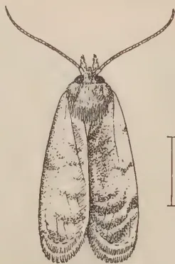
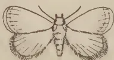
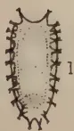
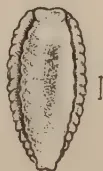
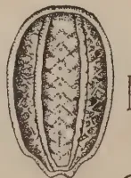
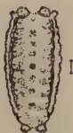
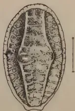
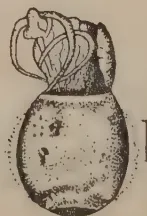

# The Tropical Agriculturist

April, 1932

---

## EDITORIAL

---

### NETTLE GRUBS

---

FROM time to time Nature startles us with an appearance of life in some form in such unusual abundance that we may be unable to offer an explanation for such a phenomenon. Swarms of butterflies all supposedly making their way to Adam's Peak, the gregarious flowering of an entire forest area of bamboos in India, the migration of birds and animals, the periodic flowering of the "Nelu" (*Strobilanthes*) in our hill districts followed by the consequent appearance of flocks of jungle fowl are but a few examples that will occur to anyone.

In recent years the tea plantations in Uva, and Lower Uva especially, have afforded an example of a super-abundance of unwanted visitors in the shape of caterpillars, often brightly coloured and of a slug-like habit and furnished with batteries of stinging hairs. The slug-like habit has given to them the group-name of *Limacodidae* by the scientific naturalist, and the equally apt term Nettle Grubs is applied by those acquainted with them as a pest of crops in the field.

Whether these noxious insects have increased to an enormous extent in recent years, or, whether with keener observation and care of the tea crops they have been more largely brought to the attention of the planting community so as to give the psychological impression that they have become more abundant may be unanswered questions. The objectionable grubs, however, are undoubtedly there and evidence of their presence is afforded in certain fields by the stripping of the tea bushes of their leaves. The grub is the feeding stage in the life-history of a moth, of which there are several species.

The Nettle Grubs and their life-histories are fortunately better known to Entomologists than is sometimes the case with insect enemies. Previously they had only been regarded as pests of minor importance of economic crops. Species were known attacking cinchona in India, coffee in East Africa, and tea in Java and Ceylon.

1------------------------------------------------

188

The presence of these pests and the damage done by them have now made it necessary to declare all Chief Headmen's Divisions in all the Revenue Districts of the Province of Uva as infested areas under the Plant Protection Ordinance and to require that where the pest appears all larvae and cocoons be collected and destroyed. In the meantime the Entomological staff of the Tea Research Institute are investigating the natural history of the insects and their enemies with the idea of devising more effective means of control. For some years past a great deal of information upon Nettle Grubs and other pests of tea has been accumulated at Peradeniya and whilst investigation of all that pertains to the tea plant is now especially the work of the Tea Research Institute yet it is considered the accumulations of the past might with advantage now be made more generally known. An article on Nettle Grubs appears in this number.

The Plant Protection Ordinance No. 10 of 1924.

*Declaration of Pest*

It is hereby notified that His Excellency the Governor has been pleased in exercise of the powers vested in him by Regulation 5 of Part II of the regulations set forth in the schedule to "The Plant Protection Ordinance No. 10 of 1924", to declare the insects known as nettle grubs (*Limacodidae*) to be pests to which the regulations contained in Part II aforesaid shall apply.

D. S. SENANAYAKE,

*Minister for Agriculture and Lands.*

Ministry of Agriculture and Lands.

January 10, 1932.

The Plant Protection Ordinance No. 10 of 1924.

*Regulations.*

Regulations made by virtue of the powers vested in him by Article 93 of the Ceylon (State Council) Order-in-Council 1931 by His Excellency the Governor, under Section 9 (2) of the Plant Protection Ordinance No. 10 of 1924.

D. S. SENANAYAKE,

*Minister for Agriculture and Lands.*

January 10, 1932.

*Regulation.*

All larvae and cocoons of nettle grubs (*Limacodidae*) must be collected and destroyed within 24 hours of collection.

The Plant Protection Ordinance No. 10 of 1924.

*Infested Areas.*

In accordance with Regulations 9 of Part II of the regulations set forth in the schedule to "The Plant Protection Ordinance No. 10 of 1924", it is hereby declared that the areas enumerated in the annexed list are infested areas for the purpose of the regulations relating to nettle grubs (*Limacodidae*) published in the *Government Gazette* No. 7903 of January 29th, 1932.

W. YOUNGMAN,

*Director of Agriculture.*

Department of Agriculture,

January 10, 1932.

*List Referred to*

All Chief Headmen's Divisions in all the Revenue Districts of the Province of Uva.

2------------------------------------------------

This image shows a blank page with a light beige or cream-colored background. The surface is not perfectly smooth, showing numerous small, faint, dark specks and scratches, which are likely dust particles or scanning artifacts. There is no text, handwriting, or printed content on the page.

3------------------------------------------------

![Plate I: Common Nettle grubs. A detailed botanical illustration showing various stages of nettle grub infestation on a tea plant. The central figure (1) is a branch with several leaves. On the leaves, there are dark and light forms of larvae, cocoons, and a male moth. Figure 1a is a magnified view of a larva. Figure 2a shows a moth with wings spread. Figure 3 shows a male moth on a leaf. Figure 4 shows a larva and two cocoons on a branch. Figure 4b shows a moth on a twig. Figure 5 shows two larvae on a leaf. Figure 6 shows two larvae and a cluster of cocoons on a leaf. The artist's signature 'Geo. L. de Silva' is in the bottom right corner.](b4e8eb7d75b0f3b4e6a219ff01ef25ed_1_img.webp)

ENGRAVED AND PRINTED BY H. W. CAVE & CO.

Plate I.—Common Nettle grubs. All figures slightly reduced except 1a.

1. *Spatulicraspeda castaneiceps*. Dark form of larva and female cocoon below; light form of larva and male cocoon above—larva of same  $\times 3$ . 2. *Narosa conspersa*. Two full grown larvae dorsal and lateral views, and one cocoon. 2a Moth of same, wings spread. 3. *Natada nararia*. Two full grown larvae showing dark and light forms and one cocoon on leaf—male moth above, female moth below in natural resting positions. 4. *Parasa lepidia*. Full grown larva on leaf. 4a Two cocoons of same attached to tea branch. 4b Moth of same in natural resting position. 5. *Thosea cervina*. Two full grown larvae on leaf showing variation in markings. 6. *Thosea recta*. Two larvae on leaf. Cluster of cocoons at base of leaf. Moth in natural resting position on stems of twig, head downwards with abdomen extended.

4------------------------------------------------

189

# SOME INSECT PESTS OF TEA IN CEYLON

J. C. HUTSON, B. A., PH. D.

ENTOMOLOGIST,

DEPARTMENT OF AGRICULTURE, CEYLON

## NETTLE GRUBS. PART I

### INTRODUCTION

THE term "nettle grub" is commonly applied to a group of limaciform, that is, slug-like, caterpillars which are the young stages of a family of moths known as the *Limacodidae*. Many of these species of caterpillars bear tufts of stinging spines or bristles which are connected with glands secreting an irritant fluid. This toxic substance, the composition of which does not seem to be definitely known, is said to be contained within the spines and is apparently injected into the skin of anyone touching them. In some cases the points of the spines seem to break off in the skin of anyone touching them and irritation is set up which may last for several hours(19)\*. In this family are also included the so-called "gelatine grubs" which do not have stinging spines on the older caterpillars.

The older stages of nettle grubs usually feed in exposed situations on their host plants and it may be of interest to note, as Rutherford(20) has suggested, that those which are armed with stinging spines, such as *Natada*, *Parasa* and *Thosea*, are rather brightly or conspicuously marked, possibly as a warning to their enemies, while those without such spines, such as *Narosa*, may gain some measure of protection from their somewhat inconspicuous colour.

The object of this article is to bring together for the information of the planting community all the data which the Department of Agriculture has available on the habits and life-histories of this group of caterpillar pests of tea. This information has been obtained from field observations extending over a number of years and from laboratory studies carried out at Peradeniya by past and present officers of the Entomological Division. Certain general measures of control applicable to these various nettle grubs under estate conditions will also be included, pending the further special investigation of these pests by the Tea Research Institute.

\* Numbers in brackets refer to the bibliography which will be published at the end of part II.

5------------------------------------------------

190

There are twenty-two different species of *Limacodidae* recorded from Ceylon by Hampson (12), but so far only about one-third of this number can be considered to be more or less important pests of tea, namely: (1) *Natada nararia*, "The Fringed Nettle grub"; (2) *Parasa lepida*, "The Blue-striped or Green-striped Nettle grub"; (3) *Narosa conspersa*, which may be called "The Small Gelatine grub"; (4) *Thosea cervina*, "The Saddle-backed Nettle grub"; (5) *Thosea recta*, "The Morawak Korale Nettle grub"; (6) *Thosea cana*, "The Green Nettle grub"; and (7) *Spatulicraspeda castaneiceps*, which may be called, "The Red-banded Limacodid". I propose to discuss them in the order named, although this is probably not their order of importance as tea pests. Brief notes will be given on two other species of Limacodids recorded on tea in Ceylon.

### 1. THE FRINGED NETTLE GRUB (*NATADA NARARIA* Moore)

Records at Peradeniya indicate that this is by far the most widely distributed species of nettle grub in Ceylon and it probably occurs in most tea districts. Green (9) says that his first acquaintance with it as a pest of tea was in November 1897 when he received specimens from Badulla. From that time it has become established in most of the north-eastern portion of the Uva tea areas, since, within the last ten years or so, it has developed into a chronic pest on many estates in the Demodera, Badulla, Namunukula and Passara districts, with occasional outbreaks in Madulsima. In the Central Province it has been reported from time to time as a tea pest in the Kandy, Hantane, Pussellawa, Hunasgyriya, Madulkele, and Dolosbage districts, and outbreaks have also occurred in Rangalla and Matale East. There seems to be only one record of its presence in the Kelani Valley, but reports have indicated that it is a periodical pest in the Galle district of the Southern Province.

#### DESCRIPTION OF STAGES EGGS

(Pl. II. Figs. 1c. 1d.). About 1.25 m.m. long by 1 m.m. broad, at first pale-yellow, or greenish when seen on a leaf, oval, flattened and transparent, but becoming opaque and pale-brown before hatching; laid singly and scattered about on the leaves, usually on the upper surface, each egg covered with a shiny iridescent film.

#### LARVAE

*First instar.\** about 1 m.m. long. Head retractile, legs, small and retractile; body pale-yellow to whitish, with two

\* The larvae or grubs during their life cast their skin several times. The term *instar* is used to denote the period of feeding and growth between two such moults.

6------------------------------------------------

Plate II.—*Natada nararia*.

Fig. 1. (a) Male; (b & c) Female. (d) Egg enlarged. (e) Newly hatched caterpillars and feeding spots on leaf. (f) "Spotting" of leaf done by young caterpillars. 2. (a) Showing injury by young and half-grown nettle grubs; (b) Full grown nettle grubs eating holes in leaf. 3. Second stage larva (enlarged). 4. Cocoons, one showing raised cap at top. 5. Male moth. 6. Female moth.

7------------------------------------------------

This image shows a blank, aged, cream-colored page. The paper has a visible texture with subtle variations in tone and some minor blemishes or discolorations, particularly towards the edges. There is no text or other content on the page.

8------------------------------------------------

191

narrow purplish-brown sub-dorsal stripes and four rows of pointed tubercles, two sub-dorsal rows and two lateral rows along the edges of the body; each tubercle with single bifid, or two-branched, spine.

*Second instar:* about 1.5 to 2 m.m. long, pale-greenish yellow, with sub-dorsal stripes deeper in colour; spiniferous tubercles bearing clusters of dark-tipped spines surrounding central spine which is no longer bifid.

*Third instar:* (Pl. II. Fig. 3.) about 2.5 to 3 m.m. long, pale-green; sub-dorsal stripes concentrated mainly along the two rows of sub-dorsal tubercles.

*Fourth instar:* from about 3.5 m.m. to about 6 m.m. long, body colour variable, from almost whitish-green to pale apple-green; dorsal stripe now concentrated around and between sub-dorsal tubercles, variable in colour, sometimes purplish-brown for whole length, sometimes with anterior half pale-green, bordered by pale-yellow, constricted in two places, once near middle and once near hinder end; sub-dorsal tubercles whitish with dark spines, three anterior pairs of lateral tubercles may be dark with pale spines, posterior tubercles longest, whitish with dark spines.

*Fifth instar:* (Pl. II. Fig. 2b.) full-grown larvae from 8-12 m.m. long; two distinct forms of larvae, a dark and light form with numerous gradations between the two. *Dark form:* body apple-green, three anterior pairs of tubercles purplish-brown, the third pair suffused with brown; anterior third of mid-dorsal stripe greenish, edged with narrow yellow and red stripes on each side, posterior two-thirds purplish-brown edged with narrow yellowish to orange stripes on each side; purplish-brown area constricted twice, and on each side of the three expanded portions there may be a bright-reddish spot; a narrow pale-yellow mid-dorsal line runs almost the length of the body; sub-dorsal tubercles with numerous small dark-tipped, sometimes red-tipped, spines; lateral tubercles long and pointed, posterior pair longest, all with numerous small spines. *Light form:* body pale-green, tips only of three anterior pairs of tubercles pinkish to reddish-brown, basal portions greenish; anterior third of mid-dorsal stripe pale-green without coloured stripes; posterior two-thirds either pale-brown, green or even whitish, edged by narrow whitish stripes; the three expanded areas sometimes without reddish spots; some larvae almost entirely pale-green or greenish-white with no darker mid-dorsal stripe; sub-dorsal and lateral series of tubercles as in darker larvae, but spines may be paler. All healthy full-grown larvae turn pinkish on the underside a day or two before pupation.

9------------------------------------------------

192

### COCOONS

(Pl. II. Fig. 4.) *Female*: 7-8 m.m. long by 5-6 m.m. wide, broadly oval, sometimes almost spherical, dull-brown, reddish-brown or purplish-brown, usually smooth, or with a few small soil particles adhering when formed on the ground, but surrounded with a loosely woven mass of brownish hairs when attached to the leaves or twigs.—*Male*: similar to that of female, but usually rather smaller and sometimes oval. Pupae pale-brown, with a sharp, transverse, strongly chitinised ridge between the eyes.

### MOTHS

*Female*.—(Pl. II. Figs. 1b, 1c and 6).—Body pale-brown to reddish-brown. Fore wing with basal two-thirds pale-brown to reddish-brown, sometimes with an indistinct central darkish spot, distal third with whitish transverse band edged by pale-brown; wing sometimes spotted with black scales giving it a dusky appearance. Hind wing pale-ochreous with slightly darker fringe. Antennae filiform or thread-like. Wing expanse, 20-27 m.m.

*Male*.—(Pl. II. Figs. 1a and 5).—Body pale-ochreous. Fore wing with whitish area at base, middle area reddish-brown, to pale-brown, with distinct central black spot and sometimes with a less defined dark spot below it; distal third with whitish transverse band and brownish edge. Hind wing as in female. Antennae bi-pectinate or feathered. Wing expanse, 12-20 m.m.

Hampson gives the habitat of *Natada nararia* as "Dharm-sala; Mhow; Nilgiris; Ceylon".

The presence of a black spot on the fore wing of the male moth is characteristic of the form *signata* from Ceylon mentioned by Hampson, and originally described by Moore(16) from Ceylon under the name *Susica signata*. Hampson also describes another Ceylon species from Pundaloya, *Natada sericea*, in which he says the male "differs from *nararia* in being uniformly silky ochreous white; fore wing with an indistinct darker submarginal line". Further investigation may show that there may be several varieties or forms of the one species *nararia* in Ceylon.

### HABITS AND LIFE-HISTORY OF THE PREVIOUS STAGES (*NATADA NARARIA*)

#### EGGS

*Position*.—Under field conditions the eggs are usually laid singly on the upper surface of the older leaves of tea and, when *Natada* is present in an area only in small numbers, are seldom detected. During a serious outbreak, when thousands of moths

10------------------------------------------------

193

are laying their eggs about the same time over a few acres, the eggs may be found on almost every leaf on a bush, sometimes on the under surface as well. At such times they are quite noticeable as small shiny, iridescent spots when the leaves are viewed obliquely.

*Number of eggs per moth.*—In experiments carried out at Peradeniya (14) several pairs of *Natada* moths were isolated at various times in order to ascertain, among other details, how many eggs a female would lay in captivity. Definite records were obtained from 17 moths as follows:—185, 411\*, 60, 408\*, 126, 305\*, 115, 18, 206\*, 49, 198\*, 63, 178\*, 119\*, 67, 159\*, and 92. In the case of the numbers marked with an asterisk (\*), the great majority, over 90 per cent, of the eggs hatched, while in the remaining totals the eggs failed to hatch. The above records indicate that under insectary conditions at Peradeniya a single female may lay over 400 eggs, with an average of about 156 eggs per moth.

*Incubation.*—Under the above conditions at Peradeniya the eggs hatched in about 5-7 days. In Passara Austin has found that the incubation period is 6-8 days in the laboratory.(18)

*Development.*—The freshly laid egg is pale-yellow and almost transparent. By the second day the edges of the egg become semi-opaque and granulated, leaving a clear kidney shaped space in the middle; by the third day the developing embryo can be seen. About the fourth to fifth days the eye-spots appear, and a reddish-brown band, apparently the dorsal stripe can be seen later just before hatching when the egg has a pale-brown appearance.

## LARVAE

*Young larvae.*—During the *first* instar the larvae are quite inconspicuous and appear as minute whitish, elliptical objects with dark centres. They usually move to the underside of the older leaves soon after hatching, but hardly feed at all during the *first* instar, except perhaps to nibble the epidermis slightly. During the *second* instar the larvae begin eating away small portions of the under or upper surfaces of the leaf leaving only a thin skin. When a number of these young caterpillars are feeding on the same leaf this soon becomes marked with numerous small whitish to pale-brown spots. (Pl. II. Fig. 1f.) This spotting of the leaves is quite characteristic of the early stage of nettle grub outbreak. At the end of about two weeks after hatching, that is, during the *third* instar, the larvae are able to eat right through the leaves which very soon assume a ragged appearance.

11------------------------------------------------

194

*Older larvae.*—During the *fourth* and *fifth* instars the larvae feed voraciously under field conditions, sometimes stripping the bushes entirely of leaves during a serious outbreak. In the breeding cages at Peradeniya the larvae may become full-grown in a minimum of 30 days, while others take up to 45 days; the average larval period under these conditions is about 35 days. There are five instars, each stage occupying about 6-8 days on the average. Some of the earlier instars may be shorter than this, while the *fifth* instar may take about 10-12 days. The range of larval development at Peradeniya is therefore from about  $4\frac{1}{2}$  to about  $6\frac{1}{2}$  weeks, with an average of about 5 weeks. Austin gives the larval period under laboratory conditions at Passara as 29-42 days (18). *Natada* larvae, in common with other nettle grubs, frequently eat their cast skins after moulting, sometimes leaving only the hard head capsule. In the laboratory the larvae usually moult during the night.

The full-grown larvae usually turn a pinkish colour underneath a day or two before starting to form their cocoons. Parasitised larvae are often a bright yellow colour, while those affected with the "wilt disease", especially the older larvae, turn brown and become swollen and shiny.

### COCOONS

*Position.*—Under field conditions the full-grown *Natada* larvae, after they have stopped feeding and are ready to form their cocoons, usually descend to the base of the bush and form them either among the fallen leaves or on the top layer of the soil, frequently on the surface. A few cocoons may be attached to the leaves or twigs, but this position seems to be comparatively rare for *Natada* under natural conditions. Before passing to a description of the manner in which *Natada* cocoons are probably constructed it is proposed to make a few general introductory remarks on nettle grub cocoons.

*Cocoons of Limacodidae.*—In the case of all species of *Limacodidae* which have been under observation at various times the construction of their cocoons almost invariably takes place at night and the actual process has not been followed from start to finish. Dissections of cocoons of most of the species reviewed in this article have been made and these investigations indicate that the cocoons of the various species are all constructed of similar materials, mainly silken threads and a rapidly hardening liquid "cement", which are excreted from glands in the body of the larva. These cocoons are all built on the same general plan, with slight specific modifications for the different nettle grubs. Since I have been unable to find any reference to any detailed description or explanation of the formation of a *Limacodid*

12------------------------------------------------

195

cocoon, it may be of interest to outline briefly the way in which it seems to me that a nettle-grub cocoon is constructed.

Green (8) writing of the *Parasa lepida* cocoon says that "it is thin but very compact, formed of silk strengthened with a tough cement secreted by the insect". Several writers allude to the hard globular cocoons of this family with a lid or cap prepared by the larva for the emergence of the moth. Lefroy (15) in mentioning the various types of lepidopterous cocoons and the different methods by which the moths emerge, says, "Finally, there are a great number of stout cocoons in which a definite lid is provided which comes off. *Limacodidae* are a conspicuous example. In these cases there is a definite line of weakness along the wall of the cocoon and we may admire both the instinct of the larva in providing it and its ability to so make the cocoon".

*Formation of Natada cocoon.*—As mentioned previously, the cocoon of this nettle grub is commonly found on the soil, but is sometimes formed on leaves, usually among fallen leaves. Let us suppose that a *Natada* larva, in search of a suitable place for its cocoon, chooses a leaf. Those cocoons formed on leaves are usually covered with a loosely woven tangle of threads, while those on the soil are often smooth or with a few soil particles still adhering. The larva, after selecting its spot on the leaf, spins over and around itself a loosely woven web of reddish-brown threads which may serve as a temporary shelter and camouflages the completed cocoon. It then proceeds to build up around itself an ovoid or almost spherical shell composed of a sort of liquid cement which rapidly hardens. In the case of *Natada* this shell is quite thin and papery but is strengthened with a thin lining of fine threads which adhere closely to the outer shell and are probably applied before the shell dries. The larva, before completing its shell, probably leaves a circular opening, the future cap, and then spins a thin, rather closely woven inner lining of pale-brown threads which is closely applied to the shell without adhering to it. It then completes the cap leaving it unlined and therefore thinner and weaker, and a "line of weakness" is created around the edge of the inner lining and the cap. If the larva leaves the formation of the cap until the last, it is remarkable that there is no external evidence of any join or "line of weakness". It may be mentioned that the pupa is armed with a hard, rather sharp transverse ridge between the eyes, as originally described by Rutherford, and it is suggested here that the pupa, by turning round inside the cocoon and at the same time pushing against the circular "line of weakness", is able to detach the cap for the emergence of the moth. The larva, when finally ready to pupate, moults for the last time inside the completed cocoon and changes into the pupa.

13------------------------------------------------

196

*Duration of cocoon stage.*—Under insectary conditions at Peradeniya the cocoon stage of *Natada* occupied from 17-25 days, while at Passara it was found to range from 18-21 days in the laboratory (18). There seem to be no records available at present as to the duration of the cocoon stage under field conditions, nor is it known whether this nettle grub is capable, under certain conditions, of resting for long periods in the pre-pupal stage inside the cocoon before actually pupating, as observed in the case of *Parasa lepida* mentioned elsewhere. The comparatively short duration of the cocoon stage of *Natada nararia* in captivity seems to indicate that under these conditions the pre-pupal stage lasts only a few days at most.

### MOTHS

*Emergence from the cocoon.*—This takes place during the night or early hours of the morning and has not been observed. As mentioned previously, the pupa has a hard, sharp ridge between the eyes, and it is suggested that this process may assist the pupa in pushing off the cap. The pupal skin is usually left protruding from the cocoon after the emergence of the moth.

*Mating and oviposition.*—Mating may begin within a short time after emergence and the females may lay their first lot of eggs during the first night or early morning, or they may postpone oviposition for a day or two. In captivity the females frequently lay their eggs without being fertilised, if no male is available, as indicated above. The majority of the eggs are laid during the first 3 or 4 nights after emergence, while the oviposition period may last from 2 to 10 days.

*Habits and Duration of Moth Stage.*—Under natural conditions in the field the moths may be found inside the bushes resting in the position shown in Plate II Fig. 1b, the body being held at an acute angle to the twig or leaf stalk, usually with the head uppermost. The moths appear to hold on by the second and third pairs of legs, the front pair being folded close to the body. It has been remarked (3) that they possess "the rather quaint habit of sitting up like a begging dog". When disturbed the moths fly only a very short distance and quickly seek refuge in an adjoining bush.

When kept supplied with sweetened liquid the females lived for periods ranging from 3 to 14 days and the males from 3 to 13 days.

### TOTAL LIFE-CYCLE

The complete life-cycle from the laying of eggs to the emergence of moths under insectary conditions at Peradeniya is as follows: *Egg stage*, 5-7 days; *larval period*, 30-45 days, *cocoons*, 17-25 days; *total*, 52-77 days, or from about 7½ to 11

14------------------------------------------------

197

weeks. At Passara (18) the total life-cycle is from 53-71 days in the laboratory. The normal period of development from egg to moth is about 8-9 weeks under favourable climatic conditions at Peradeniya, and it is probable that *Natada nararia* passes through its life-cycle in approximately the same time in other districts where it is known to occur. So that this pest by breeding continuously could complete about 6 generations a year on tea.

### FOOD PLANTS

The fringed nettle grub is now known to feed on a number of wild and cultivated plants in addition to tea, and there is evidence that these larvae, especially in the older stages, feed quite readily on most of these. Further investigation would show on what host plants, apart from tea, it can complete its development. This, it would be of interest to know.

### NATURAL ENEMIES

*Natada nararia* is known to be attacked in the larval stages by more than one species of parasite; these and the "wilt disease" may be important factors in its control under certain conditions. Parasitised larvae usually turn bright yellow at any stage, while larvae attacked by "wilt" show the following characteristic external symptoms. The younger larvae turn brown, dry up and adhere to the leaves, while the older larvae first of all become brown, swollen and shiny and then burst open and disintegrate. The wilt disease which attacks such caterpillars as tea tortrix and nettle grubs in Ceylon appears to be similar to the wilt of gipsy moth caterpillars in America which has been the subject of investigation for several years by Chapman and Glaser (5a). This disease is one of the so-called nuclear or polyhedral diseases of which the causative organism is a filterable virus. The internal symptoms are characterised by the deterioration of the nuclei of the tissue cells, specially of the blood and fat cells, and by the presence in the tissues of the victims of myriads of polyhedral bodies which are considered to be by-products of the disease.

In the case of the gipsy moth it has been observed that epidemics of the wilt disease occur only in localities heavily infested by the caterpillars, and it is considered that climatic conditions may have an important bearing on the disease. Epidemics of wilt disease in Ceylon have been observed by Jardine (14a) in the case of tea tortrix and by the writer in the case of *Natada* to occur when the caterpillars are overcrowded and short of food within limited areas of tea, while conditions of excessive humidity appear to have some influence on the disease in such areas.

15------------------------------------------------

198

Chapman and Glaser state that wilt seems to be transmitted from one generation to another through the egg and that certain individuals among gipsy moth caterpillars seem to be immune towards wilt. A similar immunity to the Ceylon wilt disease has been observed by Jardine in the case of individual tortrix larvae during severe epidemics and by the writer in the case of individual *Natada* larva under similar conditions. This means that a certain number of caterpillars are able to survive even a severe epidemic and carry on the infestation.

It is considered by various writers that, until more is known about the nature and methods of transmission of these polyhedral diseases, little success can be expected from attempts to spread them artificially for the control of insect pests.

The whole problem of the biological control of *Natada* and other species of nettle grubs is now being investigated by the Tea Research Institute.

## 2. THE BLUE-STRIPED OR GREEN-STRIPED NETTLE GRUB

(*PARASA LEPIDA* Cram)

This species of nettle-grub was first mentioned as a pest of tea in Ceylon by Green (8) in 1890 and was reviewed by him in 1900 (9) although at that time he remarked that he had had no recent complaints of damage to tea by this pest. No serious outbreaks of *Parasa* appear to have been recorded up to the present time, and it is probable that it is controlled normally by its natural enemies. Small outbreaks occurred in 1913 on an estate in the Ratnapura district and in 1922 on an estate in the Dolosbage district, while within the last two or three years it has appeared in appreciable numbers on two or three estates in Pasara. The full-grown *Parasa* larvae are among the largest of the nettle grubs associated with tea and there is evidence that in this stage a few larvae can rapidly strip a bush. This species has rather a long life-cycle as compared with some of the other nettle grubs mentioned in this article, but it is rather more prolific and there are features in its development which may make it less amenable to artificial control in the event of an unusually large outbreak.

### DESCRIPTION OF STAGES

#### EGGS

(Pl. III. Fig. 2) about 2.5 m.m. long, pale-yellow and almost transparent at first, turning to pale-brown and somewhat opaque before hatching, oval in outline, flattened and scale-like, usually laid in small clusters of from 10 to 30, overlapping each other on the surface of a leaf.

16------------------------------------------------

![Plate III showing various stages of the moth Parasa lepida and its host plant, the tea plant. Figure 1: A moth with its wings spread, showing a dark pattern on the wings. Figure 2: A close-up of a mass of small, oval eggs on a leaf. Figure 3: A 1st stage larva, a small, spiny caterpillar. Figure 4: A 2nd stage larva, larger and more spiny. Figure 5: A 4th stage larva, showing a more complex body structure with many spines. Figure 6: A 6th stage larva, the largest, with a long, segmented body and many spines. Figure 7: A tea branch with several large, oval, spiny grubs (larval cocoons) attached to the leaves. Figure 8: A tea branch showing a moth in its resting position, with its wings folded, and two empty cocoons below it.](4c539905ef6ce8a851ead194cff6a52c_1_img.webp)

Geo. L. de Silva

BLOCK BY SURVEY DEPT. CEYLON. 1931.

Plate III.—*Parasa lepida*. The lines at sides of figures 3-6 show natural size. Other figures natural size.

1. Moth, wings spread. 2. Eggs mass on leaf. 3. 1st stage larva. 4. 2nd stage larva. 5. 4th stage larva. 6. 6th stage larva. 7. Various stages of nettle grubs. 8. Tea branch showing moth in resting position (above) and 2 empty cocoons (below).

17------------------------------------------------

<!-- stage4: FAINT old-images-only -->

[Faint page: no legible print of its own could be verified; text withheld (stage 4 review list)]

This image is a scan of a blank page. The paper has a light beige or cream-colored tint. There are a few very small, faint dark spots scattered across the surface, which appear to be scanning artifacts or dust particles. No text, lines, or other markings are present on the page.

18------------------------------------------------

199

*Larvae.*—*First instar*: (Pl. III. Fig. 3.) about 1.25 m.m. long, head and legs retractile, body whitish to pale-yellow; a sub-dorsal series of four prominent, pointed tubercles on each side, two near anterior end and two towards posterior end of body and five small blunt tubercles between the anterior and posterior pairs; a sub-lateral series of several small blunt tubercles on each side; spines at tips of tubercles dark and trifid, or three-branched.

*Second instar*: (Pl. III. Fig. 4.) about 2 m.m. long, body pale-yellow, with three pale olive-green stripes, one broader and mid-dorsal, two narrower and lateral; sub-dorsal series of larger tubercles more prominent, with numerous small dark spines and a longer unbranched central spine, other sub-dorsal tubercles small; sub-lateral series of tubercles quite small with simple spines.

*Third to eighth instar*: body pale-yellow in earlier stages, later pale-green to whitish in some larvae or apple-green in others; dorsal and lateral stripes, pale-green at first, edged with olive green lines; in older stages olive green edged with dark-green lines; anterior and posterior sub-dorsal tubercles gradually becoming less prominent as compared with the sub-lateral tubercles which gradually become longer and more pointed, other sub-dorsal tubercles still remaining small; spines at first yellowish, later greenish, dark-tipped in all these stages; *seventh* instar larva with a few stout, reddish-brown blunt processes near tips of second anterior pair of sub-dorsal tubercles; *eighth* instar larva with similar reddish processes both on second anterior pair and first posterior pair of sub-dorsal tubercles; round the posterior end of the body, just above the four posterior sub-lateral tubercles are four small black spots composed of numerous closely set and easily detachable black hairs; in *seventh* and *eighth* instars, sub-lateral tubercles with blunt whitish tips.

Lengths of larvae including tubercles. *Third instar*, 2.5-3 m.m. *Fourth instar*, 3.5-4 m.m. *Fifth instar*, 4.5-5.5 m.m. *Sixth instar*, 6-7 m.m. *Seventh instar*, 8-15 m.m. *Eighth instar*, 18-27 m.m. The above measurements are taken from larvae which developed into female moths; potential male larvae are smaller.

*Ninth or tenth instar*: full-grown larva, (Pl. III. Fig. 7.) potential female, 28-35 m.m. long, potential male, 21-29 m.m. long. The following description is that of a typical larva from tea.

Head pale-brown, retractile; prothoracic plate pale-green with a pair of semi-circular black spots near anterior edge; legs

19------------------------------------------------

200

pale-yellow, well-formed, retractile; body colour bright apple-green to yellowish-green; dorsal stripe either olive green edged with dark green or lilac to purplish-blue edged with dark blue; lateral stripes either pale olive green edged with darker-green or pale to bright blue edged with darker blue; sub-dorsal tubercles all about the same size, with pale-green dark-tipped spines, the two anterior pairs and the penultimate pair slightly larger than the others and furnished with central tufts of blunt, cylindrical reddish-brown processes, varying from 2-12 on a tubercle, usually fewer on the first anterior tubercles; sub-lateral tubercles with some of the lower spines ending in pale slender hairs and with a central blunt whitish to yellowish process; the four black spots at end of body larger than in previous stage.

Larvae bred on tea in the laboratory, or sometimes collected from other host plants, may be whitish to pale greyish-blue in colour with greenish tubercles and pale green dorsal and lateral stripes edged with darker-green.

#### COCOONS

(Pl. III Fig. 8.) *male*: 15 m.m. long by 10 m.m. broad, *female*: 18 by 12 m.m., hemispherical or broadly oval and flattened, dark brown to purplish-brown, surrounded with a loosely woven, whitish to pale-brown webbing; usually attached to tea stems or larger branches. *Pupa*: dark-brown, with a hard, rather pointed process between the eyes.

#### MOTHS

*Male*: head pale-green at sides, reddish-brown on top. antennae bi-pectinate for basal half, serrated for distal half; thorax green with a brownish dorsal stripe broader at posterior end, legs dark brown with a pale-green spot near bases of front pair; abdomen brown to pale-brown. Fore wing with reddish-brown to dark-brown basal area narrowing distally, outer area reddish-brown, a broad pea-green to emerald-green area crossing the wing obliquely. Hind wing yellowish at base, becoming darker-brown towards outer margin. Wing expanse, 28-31 m.m. *Female*: similar to male; antennae filiform; brown stripe on thorax usually broader; hind wing, basal area yellowish or occasionally with a pale-greenish tinge, reddish-brown for outer half. Wing expanse, 33-43 m.m.

The above description of the moths is adapted from Hampson who gives the habitat of *Parasa lepida* as, "Throughout India and Ceylon; Java". It is recorded by Bernard (4) on tea in Sumatra and by Duport (6) on tea in Indo-China,

20------------------------------------------------

201HABITS AND LIFE-HISTORYEGGS

*Position, etc.*—The eggs have not been found under field conditions, but are probably laid on either surface of the leaves. In the insectary the eggs were often laid on the glass sides of the cages, but occasionally on the underside of a leaf. They are laid in small masses of about 10-35 eggs per mass, and "closely overlapping each other like the scales of a fish", as observed by Green (9). A single female may lay several masses during a night and sometimes three or more masses are placed together so that they form larger groups of over 100 eggs.

*Number of eggs per moth.*—Oviposition records of only 4 *Parasa* females are available, as follows: 558, 518 and 1024 (between two moths.)

*Incubation.*—The eggs hatch in 6-8 days in the breeding cages at Peradeniya.

*Development.*—This is similar to that of *Natada* eggs, except that the rate of development is somewhat slower, since *Parasa* eggs take a day or so longer to hatch.

LARVAE

The young larvae do practically no feeding during the *first* instar which lasts only about  $2\frac{1}{2}$  days. During the next  $3\frac{1}{2}$  weeks of their lives they grow very slowly, but pass through 4 more instars, and at the end of the *fifth* instar or when about 4 weeks old they are only about  $\frac{1}{5}$  inch long. It is during this early period that they cause the spotting of the leaves. During the next 4-5 weeks before becoming full-grown they pass through another 3-5 instars, 4 being the more usual number. During the *sixth* instar they start eating holes in the leaves and their growth is more rapid, as indicated previously.

21------------------------------------------------

202

The following table gives approximate figures in days for the life-cycle of 14 individual larvae from eggs to moth.

TABLE SHOWING LIFE-CYCLE OF *PARASA LEPIDA*

*The figures indicate number of days*

<table border="1">
<thead>
<tr>
<th>Cage No.</th>
<th>A1.</th>
<th>A2.</th>
<th>A3.</th>
<th>A4.</th>
<th>A5.</th>
<th>A6.</th>
<th>A8.</th>
<th>A10.</th>
<th>B2.</th>
<th>B4.</th>
<th>B5.</th>
<th>B7.</th>
<th>B8.</th>
<th>B9.</th>
</tr>
</thead>
<tbody>
<tr>
<td>Incubation</td>
<td>6</td>
<td>6</td>
<td>6</td>
<td>6</td>
<td>6</td>
<td>6</td>
<td>6</td>
<td>6</td>
<td>6</td>
<td>6</td>
<td>6</td>
<td>6</td>
<td>6</td>
<td>6</td>
</tr>
<tr>
<td>1st instar</td>
<td>2½</td>
<td>2½</td>
<td>2½</td>
<td>2½</td>
<td>2½</td>
<td>2½</td>
<td>2½</td>
<td>2½</td>
<td>2½</td>
<td>2½</td>
<td>2½</td>
<td>2½</td>
<td>2½</td>
<td>2½</td>
</tr>
<tr>
<td>2nd ,,</td>
<td>5</td>
<td>5</td>
<td>5</td>
<td>5</td>
<td>5</td>
<td>5</td>
<td>5½</td>
<td>5½</td>
<td>3½</td>
<td>3½</td>
<td>3</td>
<td>3</td>
<td>3</td>
<td>3</td>
</tr>
<tr>
<td>3rd ,,</td>
<td>7</td>
<td>7</td>
<td>9</td>
<td>7</td>
<td>9</td>
<td>9</td>
<td>7½</td>
<td>7</td>
<td>8</td>
<td>8</td>
<td>9½</td>
<td>9½</td>
<td>9½</td>
<td>10</td>
</tr>
<tr>
<td>4th ,,</td>
<td>6½</td>
<td>5</td>
<td>5</td>
<td>5½</td>
<td>5½</td>
<td>5</td>
<td>4½</td>
<td>4½</td>
<td>6</td>
<td>6</td>
<td>12</td>
<td>5</td>
<td>5</td>
<td>5</td>
</tr>
<tr>
<td>5th ,,</td>
<td>5½</td>
<td>5½</td>
<td>5½</td>
<td>5</td>
<td>5</td>
<td>5½</td>
<td>5½</td>
<td>6</td>
<td>6</td>
<td>6</td>
<td>6½</td>
<td>5</td>
<td>6</td>
<td>5½</td>
</tr>
<tr>
<td>6th ,,</td>
<td>7½</td>
<td>5</td>
<td>7</td>
<td>7½</td>
<td>8½</td>
<td>5½</td>
<td>5</td>
<td>6</td>
<td>5½</td>
<td>5</td>
<td>13½</td>
<td>7</td>
<td>5</td>
<td>5</td>
</tr>
<tr>
<td>7th ,,</td>
<td>8</td>
<td>7</td>
<td>7½</td>
<td>6½</td>
<td>6</td>
<td>6½</td>
<td>6½</td>
<td>6</td>
<td>8</td>
<td>8</td>
<td>8½</td>
<td>15½</td>
<td>7</td>
<td>7</td>
</tr>
<tr>
<td>8th ,,</td>
<td>8½</td>
<td>7½</td>
<td>8</td>
<td>7½</td>
<td>7½</td>
<td>6</td>
<td>7</td>
<td>5½</td>
<td>14½</td>
<td>15</td>
<td>8</td>
<td>8</td>
<td>7</td>
<td>12</td>
</tr>
<tr>
<td>9th ,,</td>
<td>10½</td>
<td>11½</td>
<td>8½</td>
<td>15½</td>
<td>8½</td>
<td>14</td>
<td>15</td>
<td>12</td>
<td>—</td>
<td>—</td>
<td>5½</td>
<td>8½</td>
<td>12</td>
<td>—</td>
</tr>
<tr>
<td>10th ,,</td>
<td>—</td>
<td>—</td>
<td>11</td>
<td>—</td>
<td>14½</td>
<td>—</td>
<td>—</td>
<td>—</td>
<td>—</td>
<td>—</td>
<td>—</td>
<td>—</td>
<td>—</td>
<td>—</td>
</tr>
<tr>
<td>Total larval</td>
<td>61</td>
<td>56</td>
<td>69</td>
<td>62</td>
<td>72</td>
<td>59</td>
<td>59</td>
<td>55</td>
<td>54</td>
<td>54</td>
<td>69</td>
<td>64</td>
<td>57</td>
<td>50</td>
</tr>
<tr>
<td>Prepupal + pupal</td>
<td>39</td>
<td>35</td>
<td>53</td>
<td>75</td>
<td>C</td>
<td>36</td>
<td>35</td>
<td>36</td>
<td>C</td>
<td>42</td>
<td>43</td>
<td>C</td>
<td>46</td>
<td>C</td>
</tr>
<tr>
<td>Egg to adult</td>
<td>106</td>
<td>97</td>
<td>128</td>
<td>143</td>
<td>—</td>
<td>101</td>
<td>100</td>
<td>97</td>
<td>—</td>
<td>102</td>
<td>118</td>
<td>—</td>
<td>109</td>
<td>—</td>
</tr>
<tr>
<td>Sex</td>
<td>M</td>
<td>M</td>
<td>F</td>
<td>F</td>
<td></td>
<td>F</td>
<td>F</td>
<td>M</td>
<td></td>
<td>M</td>
<td>M</td>
<td></td>
<td>F</td>
<td></td>
</tr>
</tbody>
</table>

C = Cocoon formed, but moth failed to emerge. M = Male. F = Female.

The records of the above 14 larvae bred individually and developing normally from eggs to full-grown larvae indicate that 3 of them passed through 8 instars, 9 of them had 9 instars and 2 took 10 instars before becoming full-grown. Their larval period ranged from 50-72 days, approximately, the average being about 60 days, or about 8½ weeks.

A number of other larvae were bred together in three large cages and altogether 31 of these became full-grown in periods ranging from 49-74 days, the average larval period being about 61 days.

As in the case of *Natada* larvae, the cast skins are frequently eaten after moulting and before normal feeding is resumed.

22------------------------------------------------

203

### COCOONS

*Position.*—The cocoons of *Parasa* are formed on the stems and larger branches of tea and other host plants and it is probable that they can also be found on the stems or branches of any convenient green manure or shade tree growing among tea. The cocoons may be formed singly or in fairly large clusters and are so protectively coloured and camouflaged that they may easily escape detection. Moreover, they are so firmly stuck down to the object of their attachment and are so effectively armed against ordinary hand-collecting by reason of their fringe of intensely irritating hairs that the control of this pest in the cocoon stage presents a rather more difficult problem than does the control of *Natada* at the same stage.

*Formation of Cocoon.*—The full-grown larva stops feeding for two or three days before actually beginning to form its cocoon and, during this period of starvation, gradually shrinks to about two-thirds its former size. It then prepares a place for its cocoon by spinning over itself a fairly closely woven circular “tent” which has a radius about double that of the cocoon and is attached all around to the stem or branch by stout threads. About half way up this tent the larva incorporates a ring of the black spines from the tufts on the end of its body and these form a “cheval-de-frise”, or spiky fence, of intensely irritating hairs around the future cocoon; this “tent” probably serves as a temporary shelter for the larva during the formation of the cocoon and very effectively protects and obscures the completed structure. Unfortunately the final stages of construction have not been observed so far, but dissections of completed cocoons seem to give a clue to the method of formation. Possibly before completing the tent the larva lays down an oval area of rapidly hardening liquid “cement” which forms the floor of the cocoon and incidentally sticks it down very firmly to the bark. It then probably builds up around the edge of this floor an oval, cement wall, at first perpendicular then gradually curved inwards and upwards all around to form a hemispherical domed roof which is the outer shell of the cocoon. The larva then lines this shell with a closely woven layer of fine yellowish threads which adhere to the shell, making it tough and impervious to climatic conditions; the fact that this lining is stuck to the shell suggests that the larva lines each portion of the outer shell as soon as it is built on and before the cement dries. It does not spin an inner lining as do the larvae of *Natada* and *Narosa*. At one end of the cocoon a circular area is left unlined and therefore thinner and more fragile, as in the case of the *Natada* cocoon; it is possible that the completion of the cap may be left to the last, but

23------------------------------------------------

204

in any case, the future cap, seen from inside after dissection, is distinctly less opaque and browner than the lined portion of the cocoon. The *Parasa* pupa has a hard ridge on its head similar to that of the *Natada*, except that it is stouter and has a rather sharper cutting edge, perhaps because the *Parasa* cocoon is much harder and tougher. The emergence of the moth is probably similar to that of *Natada*. The larva, when ready to pupate, moults for the last time inside the cocoon and transforms into the pupal stage.

*Duration of cocoon stage.*—A reference to the life-history table for *Parasa* will show that all of the individually bred larvae succeeded in forming their cocoons, but only 10 moths emerged later, the sexes being equally divided. The cocoon stages of the 5 males ranged from 35-43 days with an average of 39 days, while the 5 females occupied from 35 to 75 days, with an average of 49 days.

All of the 31 larvae bred to the full-grown stage in the larger cages were able to form their cocoons, but only 10 moths emerged, 4 males and 6 females. The cocoon periods of the males ranged from 46-53 days, with an average of 49 days, while the females took from 42-68 days and averaged about  $53\frac{1}{2}$  days.

There are indications that the larvae of *Parasa lepida* are capable of remaining for long periods in the pre-pupal condition inside their cocoons before pupating, and in this state they are probably able to survive long dry periods or other unfavourable climatic conditions. Nietner(17), in his notes on this species on coffee under the name *Limacodes graciosa*, remarked that "the chrysalis rests from the middle of August to the middle of October".

## MOTHS

*Emergence.*—The pupa, when ready to change into the moth, probably prepares the way for the escape of the moth somewhat in the manner described above. The moth then sheds the pupal skin, leaving this usually half protruding from the cocoon. The process of emergence has not been observed, as it usually takes place at night.

*Mating and Oviposition.*—The moths begin mating within two days after emergence and in the cases of the few moths under observation most of the eggs were laid between the third and fifth nights after emergence and rarely at any other times except during the night or early hours of the morning.

*Habits and Duration of Moth Stage.*—*Parasa* moths have not been observed under field conditions, but their habits are probably somewhat similar to those of *Natada* moths. In captivity

24------------------------------------------------

205

they rest in the position shown in Plate III, fig. 8, which is similar to that taken up by other Limacodids when on their host plants. Both sexes were found to live from 5 to 7 days in the cages, the females dying within a few hours after the last eggs are laid. Our opportunities of observing the habits of *Parasa* moths have unfortunately been somewhat rare.

#### TOTAL LIFE-CYCLE

*Individual cages.*—The life-cycles of the 5 males ranged from 97-118 days, or from about 14-17 weeks, with an average of 104 days, or about 15 weeks. The complete development of the 5 females from the eggs occupied from 100-143 days, or about 14-20½ weeks, with an average of about 116 days, or about 16½ weeks.

*General cages.*—The 4 males completed their development in periods ranging from 109-123 days, or about 15½-17½ weeks, averaging about 115 days, or 16½ weeks per moth. The life-cycles of the 6 females occupied from 111-131 days or about 14-18½ weeks, with an average of 120 days, or about 17 weeks.

The life-history records of *Parasa lepida* under insectary conditions at Peradeniya show that one complete generation takes approximately 4 months on the average, that is, there could be 3 generations a year under favourable conditions. Under Uva conditions there might be only 2½ or even 2 generations under certain conditions.

#### FOOD PLANTS

This species was originally a pest of coffee as recorded by Nietner in 1861. It was subsequently mentioned as a tea pest by Green in 1890 who observed that it "is frequently found on coffee and occasionally upon cinchona trees". Rutherford, in addition to mentioning tea and coffee as host plants, records it on coconut, cacao and plantain (*Musa paradisiana*). It has since then been recorded on a number of other cultivated plants, namely: longan (*Nephelium Longana*); mango (*Mangifera indica*); dadap (*Erythrina lithosperma*); Barringtonia racemosa; country almond (*Terminalia Catappa*); milla (*Vitex altissima*); castor-oil plant (*Ricinus communis*); *Acalypha* sp.; fig (*Ficus Carica*); banyan (*Ficus benghalensis*); and *Ficus glomerata*.

#### NATURAL ENEMIES

*Parasa lepida*, like other nettle grubs, is attacked by the "wilt disease". Its insect natural enemies are under investigation by the Tea Research Institute.

25------------------------------------------------

206

### 3. THE SMALL GELATINE GRUB

(*NAROSA CONSPERSA* Wlk.)

This species of Limacodid was first reported on tea in Uda-Pussellawa in 1905 and in the Kelani Valley in 1906, as shown in Green's records. It does not seem to have been mentioned again as a pest of tea until 1928, when it began to be noticed in the Badulla and Passara districts. So far, it has not shown any tendency to increase in those areas, but it can usually be found in small numbers along with other species of nettle grubs. It cannot strictly speaking be called a nettle grub, since it is entirely bare of the usual stinging spines except in the early stages. The older larvae are rather protectively coloured, possibly to compensate for the lack of defensive spines, and are not easily detected on the leaves or young twigs with which they harmonise in general colouring.

#### DESCRIPTION OF STAGES

##### EGGS

Closely resemble eggs of *Natada nararia* in size and appearance laid singly on the leaves, each egg covered with a transparent film.

*Larvae.*—*First instar*: (Pl. IV. Fig. 3.), 1.5-1.75 m.m. long, body whitish to pale-yellow, narrowly oval, slightly broader at anterior end; head and legs pale-yellow and retractile; a sub-dorsal row of small pointed tubercles on each side, anterior pair longest, a single bifid spine at the tip of each tubercle.

*Second instar*: (Pl. IV. Fig. 4.), 2.2-2.5 m.m. long, pale-yellow; sub-dorsal tubercles small, rounded, situated along a ridge on each side, anterior pair largest; a few minute hairs or spines on each tubercle.

*Third instar*: (Pl. IV. Fig. 5.), 3-4 m.m. long, pale-green to yellowish-green, still rather narrowly oval, naked (i.e. without spines); a prominent sub-dorsal ridge and a sub-lateral flange on each side; tubercles rudimentary.

*Fourth instar*: (Pl. IV. Fig. 6.), 5-7 m.m. long, naked, broadly oval with anterior end rounded, posterior end narrowing and truncate; with prominent paired dorsal ridges, highest in the middle and sloping downwards to each end, and sub-lateral flanges; body green to yellowish-green, transversely corrugated between the ridges and flanges, corrugations pale-yellow interspersed with shallow, greenish depressions.

*Fifth instar*: full-grown larva, (Pl. IV. Fig. 7.), 8-10.5 m.m. long, outline as in previous stage; naked; anterior half of body usually darker-green than posterior half; paired dorsal ridges rising towards centre of body to paired dorsal humps, sometimes

26------------------------------------------------

1

2

9

3

5

6

4

7

8

Geo. L. de Silva

BLOCK BY SURVEY DEPT. CEYLON 1931.

Plate IV.—*Narosa conspersa*.

1. Moth, wings spread. Natural size shown below it. 2. Moth, resting position  $\times 3$ . 3. 1st stage larva. 4. 2nd stage larva. 5. 3rd stage larva. 6. 4th stage larva. 7. 5th stage larva. 8. Cocoon, empty, pupal skin protruding,  $\times 3$ . 9. Various stages of nettle grubs, natural size. The lines at sides of figures 3—7 show natural size.

27------------------------------------------------

This image is a scan of a blank page. The paper has a light beige or cream-colored tint. There are a few very small, dark specks scattered across the surface, which appear to be scanning artifacts or dust particles. No text, lines, or other markings are present on the page.

28------------------------------------------------

207

with a slightly curved brownish line on outer side of each hump; mid-dorsal area with yellowish transverse corrugations more marked on posterior half, interspersed with shallow greenish depressions; sub-lateral areas with pale reticulated lines; sub-lateral flanges pale-yellow. Full-grown larvae turn lemon to orange yellow a day or two before pupating.

### COCOONS

*Cocoons*.—*Male*: usually 6 m.m. long by 5 m.m. broad, *female*: usually 7 by 6 m.m., broadly oval, whitish, mottled with greyish-brown; cap end with circular whitish spot with brown outer ring, opposite end with circular dark brown spot with whitish outer ring, occasionally position of cap reversed. Usually attached to leaves.

### MOTHS

*Male*.—Head white, antennae filiform, simple for basal half, serrated or ciliated for dorsal half; thorax and abdomen whitish with reddish-brown tufts; fore wing yellowish white, outer half streaked with reddish-brown oblique transverse bands, spots of the same colour near base of inner margin; hind wing straw-coloured to whitish. Wing expanse 18-20 m.m. *Female*: similar to male but usually larger and slightly darker in colour. Antennae, filiform, simple, slightly ciliated towards tip. Wing expanse 23-27 m.m.

The above description of the moths of *Narosa conspersa* is adapted from Hampson, who gives the habitat of this species as "Nagas; S. India; Ceylon; Borneo".

### HABITS AND LIFE-HISTORY

#### EGGS

*Position*.—Not actually observed in the field, but probably laid on either surface of the older leaves, mostly on upper surface. In the breeding cages the eggs are laid singly and mostly on the glass sides, but occasionally on tea leaves.

*Number of eggs per moth*.—Oviposition records of only 3 females are available, namely: 237, 150, and 162.

*Incubation*.—The eggs hatch within 5-7 days in the cages; they may take slightly longer under Uva conditions.

*Development*.—This is similar to that of *Natada*; eggs pale-yellow at first, becoming slightly darker before hatching.

#### LARVAE

The young larvae, as in the case of *Natada* and *Parasa* larvae, remain mostly on the underside of the older leaves during the first instar and hardly feed at all. The "spotting" of the

29------------------------------------------------

208

leaves begins during the second instar, and about the middle of the third instar, when about two weeks old, the larvae begin eating through the leaves, and their growth to full-grown larvae is more marked. The larvae pass through 5 instars of which the last is usually the longest, as indicated in the table given below. The full-grown larvae turn pale-yellow to pale-orange a day or two before starting to form their cocoons. Parasitised larvae are usually bright yellow, while diseased larvae turn brown.

TABLE SHOWING LIFE-HISTORY OF *NAROSA CONSPERSA*

The figures indicate number of days

<table border="1">
<thead>
<tr>
<th>Cage No</th>
<th>A1</th>
<th>A2</th>
<th>A3</th>
<th>A4</th>
<th>A5</th>
<th>A6</th>
<th>A7</th>
</tr>
</thead>
<tbody>
<tr>
<td>Incubation</td>
<td>7</td>
<td>7</td>
<td>7</td>
<td>7</td>
<td>7</td>
<td>7</td>
<td>7</td>
</tr>
<tr>
<td>1st instar</td>
<td>6</td>
<td>5</td>
<td>5</td>
<td>5</td>
<td>5</td>
<td>5</td>
<td>5</td>
</tr>
<tr>
<td>2nd "</td>
<td>5½</td>
<td>5½</td>
<td>6½</td>
<td>6½</td>
<td>6½</td>
<td>6½</td>
<td>7</td>
</tr>
<tr>
<td>3rd "</td>
<td>9</td>
<td>8½</td>
<td>5½</td>
<td>7</td>
<td>8</td>
<td>8½</td>
<td>9</td>
</tr>
<tr>
<td>4th "</td>
<td>5½</td>
<td>8</td>
<td>6½</td>
<td>5½</td>
<td>5½</td>
<td>7</td>
<td>5½</td>
</tr>
<tr>
<td>5th "</td>
<td>10</td>
<td>13</td>
<td>13½</td>
<td>13</td>
<td>13</td>
<td>11</td>
<td>10½</td>
</tr>
<tr>
<td>Total larval</td>
<td>35</td>
<td>40</td>
<td>37</td>
<td>37</td>
<td>38</td>
<td>38</td>
<td>37</td>
</tr>
<tr>
<td>Pre-pupal + pupal</td>
<td>21</td>
<td>19</td>
<td>C</td>
<td>21</td>
<td>20</td>
<td>21</td>
<td>21</td>
</tr>
<tr>
<td>Egg to adult</td>
<td>63</td>
<td>66</td>
<td>—</td>
<td>65</td>
<td>65</td>
<td>66</td>
<td>65</td>
</tr>
<tr>
<td>Sex</td>
<td>F</td>
<td>M</td>
<td>—</td>
<td>F</td>
<td>M</td>
<td>F</td>
<td>M</td>
</tr>
</tbody>
</table>

C  $\frac{3}{4}$  Cocoon formed, but moth failed to emerge. M = Male. F = Female.

The above records of 7 larvae bred individually from eggs to full-grown larvae show that *Narosa* has only 5 instars. Their larval periods vary only from 35-40 days, with an average of nearly 37½ days.

A number of other larvae were bred together in a few larger cages and altogether 14 of these became full-grown, the duration of their larval periods ranging from 29-42 days, the average being about 34 days.

The larvae frequently eat their cast skins after moulting and this habit seems to be usual with Limacodid larvae.

An attempt was made to breed about 40 larvae on coconut leaves, since they have been recorded as feeding on this plant, but most of them died in the early stages. Eventually only one survived to form its cocoon, the larval period being 48 days. A female moth emerged in the normal time of 3 weeks. This experiment seems to indicate that under more favourable conditions in the field *Narosa conspersa* could breed on coconut.

30------------------------------------------------

209

## COCOONS

*Position.*—The cocoons of *Narosa conspersa* are usually attached to the upper surface of the older leaves of a tea bush and are quite conspicuous by reason of their whitish appearance.

*Formation of Narosa Cocoon.*—The full-grown larva stops feeding for about a day before starting on its cocoon and becomes noticeably reduced in size. First of all the larva covers a small portion of the leaf with a closely woven "mat" of fine white threads which it impregnates with a pinkish fluid; this "mat" is stuck down firmly on the leaf and forms a shallow grooved foundation on which the cocoon will rest on its side like a barrel. The actual construction of the shell is probably similar to that of a *Natada* cocoon, but no sign of any loose tangle of threads has ever been observed around a *Narosa* cocoon. The actual shell is a dark chocolate brown and is overlaid with a sort of whitish substance, giving it a somewhat roughened appearance. This covering is somewhat sketchily overlaid on the brown shell, sometimes giving it a somewhat mottled greyish-brown appearance. This substance, which may possibly be the result of some sort of oxidation of the outer surface, can be scraped off quite easily, leaving the smooth dark brown shell exposed. A circular brown area is left bare at one end of the cocoon, almost invariably at the end opposite to the cap. The inside of the cocoon, except for the cap end, is lined with closely woven threads which are applied to the inner surface without adhering to it.

The completed *Narosa* cocoon is quite hard and tough, and the cap, seen from inside, is distinctly outlined with a narrow circular brown line bare of any covering; the usual "line of weakness" is thus prepared for the removal of the cap. The *Narosa* pupa has the usual hard ridge between the eyes, but rather blunt in this instance, since the cap seems to be easily detachable.

*Duration of Cocoon Stage.*—A reference to the life-history table for *Narosa* shows that all of the 7 individually bred larvae formed their cocoons and 6 moths emerged later, the sexes being equally divided. The 3 females all took exactly three weeks to emerge, while the 3 males averaged a day less.

The cocoon stages of 12 larvae bred in the general cages ranged from 18 to 22 days, but no record was kept of the sex of the emerging moths, except that one female took 19 days. As in the case of *Natada*, we have no records of the duration of the cocoon stage of *Narosa* under field conditions, but in view of the short duration of this stage in the insectary it seems improbable that the larva remains for more than a few days in the cocoon before pupating.

31------------------------------------------------

210

## MOTHS

*Mating, Oviposition and Duration of Moth Stage.*—The few moths under observation in the insectary began mating within a day of emergence, which is a similar process to that of other Limacodids. The first eggs are laid within another day or two later and oviposition continues for 3 or 4 days.

Of two pairs of moths under observation, the males lived for 6 and 9 days, while the associated females lived for 9 and 5 days respectively.

Nietner, in his notes on *Narosa conspersa* as a pest of coffee, observes that "The moth, which is rather common during the dry weather, is very pretty and often flies into rooms at night".

## TOTAL LIFE-CYCLE

The complete life-cycle of this species from the laying of the eggs to the emergence of the moths under insectary conditions at Peradeniya work out as follows: *Egg stage*, 5-7 days; *larval period*, 29-42 days; *cocoon stage*, 18-22 days; total, 52-71 days, or from about 7½ to 10 weeks. The normal period of development from egg to moth is probably about 8½-9 weeks at Peradeniya, and further investigations will doubtless indicate that the life-cycle is approximately the same in other districts. *Narosa* can probably complete about 6 generations a year on tea under favourable conditions.

## FOOD PLANTS

As mentioned above, this species was recorded by Nietner in 1861 as a pest of coffee. Since that time, apart from tea, the only other food plants of which we have records are coconut, an ornamental palm (*Chrysalidocarpus lutescens*), and wood apple, (*Feronia elephantum*). Further investigations will probably reveal other host plants, both wild and cultivated.

## NATURAL ENEMIES

*Narosa conspersa* is occasionally attacked by the "wilt disease". A study of its insect natural enemies is being made by the Tea Research Institute.

(*To be continued*).

32------------------------------------------------

211

## A SURVEY OF RECENT WORK ON THE ECONOMIC IMPROVEMENT OF THE RICE INDUSTRY IN CEYLON

G. V. WICKRAMASEKERA, DIP. AGRIC. (POONA)

Of late there has been considerable criticism, both in and out of season, regarding the progress of work for rice improvement in Ceylon. Those better informed acknowledge that some appreciable progress has been made. Success is possible only by securing the active co-operation of the public. The first step in enlisting this interest is to set out in as simple a way as possible the problems and solutions of this complex subject. Hence, the object of this article is to bring to the notice of the general public the present position of the rice industry in Ceylon and the progress effected during the past decade.

Since the last food crisis in 1920-21 new areas have been and are being gradually brought under cultivation, and local production has increased from a yearly average of some  $8\frac{1}{4}$  million bushels during 1903-13 to  $13\frac{1}{2}$  million bushels during the decade 1914-24 to a little over 15 million bushels during 1929, the last year for which we have estimates. The annual requirements of the Island amount to some 37 million bushels of rice of which only about one-third is produced locally. The remaining two-thirds is imported annually from India and Burma at a cost of about a hundred million rupees, at normal market rates. The estimated population of the Island at the end of 1929 was 5,479,000 and it is assumed to have increased by some 980,000 persons or 21.8 per cent since the census of 1921. Of these about 800,000 are Indian labourers. Rice is the staple food of these labourers and it is estimated they consume about one-third of the imported rice as they have not the facilities for producing it locally. Of the remaining imports one-third is consumed in the townships and the remaining one-third in the rural areas. The rural population do not prefer the cheap grades of unpleasant odoured so-called white rice to the wholesome unpolished local red rice; but because of their economic conditions they are obliged either to dispose, from time to time, of small quantities of locally grown rice, the proceeds from which enabled them to purchase an equal quantity of the cheaper imported grades and in addition find the wherewithal to obtain some of the other ingredients necessary for a meal; or, as in the case of the smaller and poorer cultivators, pledge their crop as security, and in return obtain from the local boutique-keeper the necessities of life. The boutique-keeper stocks the imported polished white

33------------------------------------------------

212

rice as it is both cheaper and keeps better in storage than the unpolished rice and also because dealing in this commodity affords him a greater scope for speculation.

The population has increased during the last two decades chiefly on account of the development of the rubber, tea, and coconut industries and consequent increase of prosperity of the country. The increase in local production is not in proportion to the increase in population, hence as is to be expected the imports have increased. There does not exist the remotest possibility of over-production for home consumption of home-grown rice and Ceylon will essentially always to some extent remain a rice importing country. In 1930 even a small short-lived disturbance amongst two sections of labourers at the Rangoon docks threatened a food crisis in Ceylon. Food crises are bound to occur periodically at short notice. The recent temporary suspension of the Indo-Ceylon train service due to damage caused by heavy rains was reflected in as high a rise in price of rice as Re. 1 per bushel. All this indicates the extent of our dependence on India and Burma for the supply of our staple food.

It is acknowledged that the most important and pressing economic problem of the Island is the development of its rice industry which would greatly influence the prosperity of the other industries and consequently the general prosperity of the country. At the present time when depression hangs over our chief industries greater attention is focussed on the question of local food production—chiefly over rice. The recent increased duty on some of our imported foodstuffs is a blessing in disguise which should stimulate local production. An additional reason for the development of the local rice industry is indicated in the Administration Report of the Director of Agriculture for 1930, in which he states: "There is indication that in some countries rice is being produced under conditions that give insufficient return for the labour expended, and this introduces a factor that may not induce the growers to continue". The possibility of increasing the rice crop obviously depends on the increase in yield per acre and on the increase in area of production by owners of suitable land opening them under rice and gradually extending the area until all suitable available Crown land is brought under cultivation. The adoption of economic methods to increase the yield per acre would reduce the cost of production and make the cultivation of rice more remunerative and a slightly more attractive industry, thereby encouraging new areas to be brought under cultivation. This object could be achieved by improving the conditions under which the crop grows, through better cultivation, and judicious systems of manuring, and by the use of improved seed.

34------------------------------------------------

213

We shall now proceed to draw attention to some of these more economic methods of production that are possible in Ceylon Agriculture.

1. *Preparatory Tillage.*—An essential feature in the management of a paddy soil is that puddling must be very thorough. If a heavy weed growth or a green manure crop has to be ploughed under, the *Ceres* plough is recommended for preparatory tillage even with average village cattle. It is more the later churning than the ploughing which is important. The soil should be rendered very fine and puddled to the consistency of thick gruel. The Department of Agriculture realised that what the *goiya* required was an efficient but inexpensive and portable implement capable of bringing this about with readily replaceable parts and a minimum number of nuts and bolts or preferably none at all. Such an implement suitable for use after the first ploughing is the five-toothed wooden harrow used in Burma and some parts of the Konkan, India. The implement is easily constructed of light jungle timber at a cost of about three rupees and can be conveniently drawn by buffaloes; with the teeth removed it serves the purpose of a leveller. It is so light that it can readily be carried by hand.

2. *Manuring.*—Bulk organic manures are a necessity for swamp cultivation not only for the supply of plant food, particularly of ammonia in which form nitrogen is utilised by swamp paddy, but also for the supply of carbon-dioxide for the algae present in a film on the surface of paddy soils. These algae are believed to play an important part in the supply of oxygen to the roots of the rice plant, and to be a necessary foundation in order to obtain the maximum response to artificial manures. The response to green manure is very marked particularly in soils cropped twice a year or where natural weed growth is poor or where cattle are of necessity permitted to graze on the available weed growth in the fields during the off season. Results of field experiments conducted by the Economic Botanist and of laboratory experiments conducted by the Agricultural Chemist clearly indicate that the application of green manure is efficacious in increasing the yield of grain. Green manure for rice should be applied a week to ten days prior to sowing or transplanting in order that the maximum benefits by its application may be obtained. At Peradeniya a 1-ton dressing of green manure has given a very satisfactory increase in yield of grain. If, however, practical considerations necessitate its application early the fields should be kept thoroughly moist until sowing or transplanting as the case may be, since the decomposition of green manure under normal arable land conditions results in the formation of nitrates which the rice

35------------------------------------------------

214

plant does not want. The rice plant prefers nitrogen in combination as ammonia. If green manure is applied late the period of maximum formation of ammonia coincides with the period when the paddy plant is in active need of ammonia. Whenever green manure is applied a few days prior to sowing it is advisable to drain the fields in order to remove any toxic products of decomposition. The application of 1 cwt. of ordinary superphosphate or 100 lb. of steamed bone meal per acre will give, on average Ceylon soils an increase of 25 per cent and the benefits will last and effect a 12 per cent increase on the succeeding crop. Larger dressings or repeated applications of superphosphate result in upsetting the balance of the principal manurial ingredients in the soil and are not to be recommended. High yielding pedigree strains of paddy, when placed in the hands of cultivators are, in the majority of cases, grown on poor unmanured or indifferently cultivated fields. High yielding strains necessarily need more nutrition than poor yielding paddies and unless this requirement is met by improved cultivation their yields will necessarily fall off. Improved seed demands improved cultivation. The normal seed rate for broadcasted field is 2-2½ bushels per acre. In most parts of the Eastern Province where an extensive system of cultivation is in vogue the seed rate is as high as 3-4 bushels per acre. This high seed rate is in order to make allowance for the presence of dirt and empty grain through faulty winnowing of seed-paddy and mainly with the object of establishing a thicker stand of crop in order to smother weed growth. Experiments conducted by the Department of Agriculture have shown that with proper tillage 1½ bushels of good viable seed is sufficient to ensure an even stand of crop. Simple arithmetic will show the colossal waste of big seed rates with no benefit to the cultivator. Overcrowding prevents the production of tillers and also weakens the stems thereby causing the crop to lodge when ear-heads form. The result in either case is a reduction in yield of both grain and straw.

*Transplanting.*—When cheap labour is available varieties which take over 4 months from sowing to harvesting would, if transplanted, yield increased monetary returns. Based on results of trials a conservative estimate would be an increased yield of 20 per cent or a net profit of between Rs. 10 to Rs. 15 per acre, according to the price per bushel. By transplanting paddy instead of broadcasting there is the additional advantage of affording more time, during the nursery stage, for thorough preparatory tillage of the fields, thereby appreciably reducing weeding expenses. In fields which cannot be dried off at harvest loss of grain could be reduced by transplanting the crop as the

36------------------------------------------------

215

degree of lodging is much less with transplanted than with broad-casted paddy. Single seedlings are recommended, or, where damage by land crabs is appreciable, three seedlings per hill 6 in.-8 in. apart, according to the fertility of the soil. On poor and sandy types of soil it is doubtful whether transplanting produces increased returns commensurate with the additional expenditure incurred.

*Weeding.*—With proper preparatory tillage the necessity to weed a crop which takes about 3-3½ months from sowing to maturity would not arise. With crops of longer duration a 20-25 per cent increase of grain, through a single weeding about six weeks after sowing would be a conservative estimate.

*Use of Pedigree Seed.*—Manuring undoubtedly is the quickest method of increasing output but the means of effecting a more important and lasting improvement which involves least expense to the cultivator is the use of selected high-yielding strains. The different varieties of rice grown in various tracts have been found, by experience, to be suited to the particular tracts. These varieties, however, have deteriorated to a marked degree by being grown for considerable periods on comparatively poor soils and through mixture and cross-pollination with inferior varieties. The obvious method of improving such varieties is by isolating some of the better types possessing desirable characters and finally selecting the best types for gradually replacing the original variety in the entire tract.

On behalf of the rice industry the Department of Agriculture undertook in 1920 the task of improving the local paddies by selection of high-yielding strains. A collection of Ceylon paddies were sown at the Experiment Station, Anuradhapura, and on the limited area available at the Experiment Station, Peradeniya. Owing to the overwhelming amount of material in hand it was decided to work on a few of the most popular paddies only. Selection work was confined to straight selection for high yield. Several extremely promising selections were isolated and sent for trial in the areas from which the original varieties were obtained. Unfortunately most of the selections failed owing to the period from sowing to flowering or sowing to maturity altering to a remarkable degree. It was then realised that the paddy plant is very susceptible to changes in environment and that selection for a particular area should be made in that area under normal conditions. Except in the flat, drier parts of Ceylon where rice is grown under irrigation, climatic factors, such as rainfall, temperature and elevation, and soil conditions vary to such an extent that even in tracts a few miles apart it is necessary to grow different varieties of paddy. In fact it is not uncommon to find the same variety requiring

37------------------------------------------------

216

different maturing periods in different tracts not far remote from one another. After several years of selection work, on the same lines as that in Ceylon, the experience of Java has been the same. When this knowledge was brought to light small paddy seed stations were established in the important rice-growing tracts of the Island with the object of testing the existing pedigree selection for suitability to particular tracts and for selection work on the local varieties in their customary environment. The best selection amongst those which yield at least 15 per cent more than the local paddy is released for distribution amongst cultivators. At these stations it is necessary to maintain the purity of the successful selections, as the pedigree paddies in the hands of cultivators would again in a few seasons deteriorate by mixture and hybridisation with inferior paddies.

*Areas under selected seed.*—A summary of progress made in some areas and based on a conservative estimate would be as follows:

About 90 per cent of the 2,000 acres sown for *kalapokam* or *maha* under the Iranaimadu Tank is under a pedigree selection of *vellai illankalayan* which was tested at, and distributed from, the Paranthan Paddy Seed Farm. The same selection is popular in the North-Central Province and its cultivation is rapidly spreading around Alankulama, Anuradhapura, and Ratmale.

A shorter-aged selection of *vellai illankalayan* occupies about 500 acres under the Karachchy scheme during the *sirupokam* season. In Harispattu and Yatinuwara during the *maha* season the *mawi* selections occupy about 500 acres. In the Colombo District pedigree selection of *kurulutudurwi*, a small grained samba type, tested at, and distributed from Belunmahara Paddy Seed Station is popular. The same selection is also popular in the Negombo and Ratnapura districts. In the Pasdun Korale East and West a selection from *kaharamana* is popular. This selection is also spreading from the Borala Paddy Seed Station in the Weligam Korale in the Southern Province. *Sudurwi* selected at the Batugedera Paddy Seed Station is being taken up in the Nawadun Korale.

Around about Tissamaharama, over 600 acres, at *maha* 1931-32 are under the *sudu heenati* selection which was made at the Tissamaharama Paddy Seed Station. This selected paddy is in high favour and is rapidly spreading. It will yield some 36 bushels an acre, whilst the local paddies give about 24 bushels. It is hoped that by next *maha* season half of the 15,000 acres sown under the Tissa tanks will be of this variety in which case the increased yield due to selected seed will at a conservative estimate be not less than 50,000 bushels in this one district. When the small annual expenditure incurred on the Tissa Experiment Station is compared with such a result the wisdom

38------------------------------------------------

217

of incurring such is evident. The same selection is suitable both for *maha* and *yala* seasons. This indicates the vast possibilities of increasing local production by use of improved seed, on the already *asweddumized* land capable of cultivation. It is now considered that greater progress could be made by concentrating on selection of paddies suited to the large, more or less uniform, paddy tracts in the flat drier parts of Ceylon. The introduction of suitable selected strains has been necessarily slow and has met with considerable difficulties in the wet zone owing to the existence of such marked variations in soil and climatic conditions in the paddy tracts, even those in close proximity to one another. Improvement by selection, however careful it may be, has its limit; but the possibilities of increasing the heritable yielding capacity of a selection are further afield. The modern method of breeding by cross-fertilization has a much wider scope. Further improvements could be effected by combining in one strain desirable economic characters which hitherto existed in two or more different strains. This process known as hybridisation when followed by selection makes it possible to evolve desirable new strains. That this is not mere theory will be acknowledged by those who are aware of the enormous strides made in other countries with crop improvement work. The gradual establishment of desirable proved pedigree strains provides material for further improvement by hybridisation combined with selection, and this work will be undertaken as room and conditions warrant. With the ultimate object of establishing a milling industry in the Eastern Division attempts are being made along these lines to breed a short-aged, high-yielding white coated rice. Intensive work in the Eastern Division has been taken in hand recently. Speedier and greater progress in increasing the Island's yield of paddy is correlated with factors. The promulgation of laws ensuring more equitable conditions of tenancy; greater security of tenure and encouragement and compensation for improvements effected by tenant-cultivators; the prevention of fragmentation of holdings into infinitesimal shares; the provision of properly co-ordinate irrigation and drainage facilities; the establishment of regulated communal pastures; the emancipation of cultivators from recurrent state of indebtedness and the availability of cheap credit; the establishment of proper marketing facilities; and the provisions of medical aid and adoption of sanitary methods to combat malaria are some of these.

In matters of rural development all State Departments concerned should act in unity. It is acknowledged that extraordinarily difficult problems await solution. It is for all directly or indirectly interested in the agricultural welfare of Ceylon to develop her rice industry to the utmost, and in order to do so these problems must be tackled.

39------------------------------------------------

218

## VEGETATIVE PROPAGATION\*

*Introduction.*—The application of entirely vegetative methods of propagation has in recent years become of great importance in temperate orchard practice, and the researches of horticultural experimental stations in Europe and America have demonstrated the great advantages, both from a scientific and a commercial standpoint which have accrued from planting standardised material obtained by vegetative means. There seems every reason to believe that similar advantages might be anticipated from the application, in a wider field, of vegetative propagation to several tropical crops, but the realisation of this will depend primarily on the discovery of methods of vegetative propagation suitable to commercial application, and secondly in the interest shown by the planters themselves in the use of vegetatively raised stock. This article has been prepared to summarise and to afford a discussion of the most important work which has been done in recent years, as most of the literature may be unavailable to the tropical grower.

*Seedling and Vegetative Propagation.*—When a plant is propagated from seed, it stands in a different relation to the parent plant than do the other products of its growth, such as the leaves, twigs, roots, and buds. In nearly all plants the “germ” of the seed is a sexually formed structure, produced as the result of a fusion between two sexual cells known as gametes, one of which may have been contributed by another plant. This process involves a re-combination of inheritance factors and produces a new individual with characters usually differing from those of either parent. Even if a plant is self-pollinated, the seedling would not, in general, grow into a plant exactly duplicating the parent in all its characters. Actually, if a crop were habitually self-pollinated for several generations, the progeny would tend to come true to seed, but this systematic breeding rarely, if ever, occurs in orchard crops. Moreover, such pure lines would, with these crops, take many years to breed experimentally owing to the long generation periods.

This production of variation in the offspring is characteristic of sexual reproduction, and it is believed by some botanists to play an important part in the production of new forms in nature. The hybridisation made possible by sexual reproduction is of great importance to the horticulturist in the production of new types. Some new varieties arise as “bud sports” without any sexual process occurring, but the majority are the result of hybridisation. It is impracticable in slow-breeding plants such as most tree crops, to continue breeding from the initial hybrid until the desired new qualities are fixed so that they come true to seed. Instead, a method of multiplying the first hybrid unchanged must be used, and this may be achieved by one of the methods of vegetative propagation. Both vegetative propagation and seedling reproduction are processes in which either juvenile parts, or in vegetative propagation, parts capable of rejuvenation, are removed from a plant and used to establish another plant. The fundamental difference is that in seedling reproduction the new plant originates in a single fertilised cell, whereas in vegetative propagation the new plant develops from multicellular tissues in which no fertilisations take place. The vegetative propagation of a new plant takes place by the “germination” of almost any

---

\* By E. E. Pyke, B.Sc., A.R.C.S., in *Tropical Agriculture*, Vol. IX, No. 1, January, 1932.

40------------------------------------------------

219

part of a plant except the seed, by placing the part selected in a suitable environment, either before or after severing it from the plant. There are several fundamental methods used, but not all are suitable for any particular type of plant. The practical details of technique differ considerably for different subjects, according to their capacities for regeneration, and each new variety tried may require its own special treatment.

A practical classification of methods may be made into :

1. (1) Rooting processes, and
2. (2) Grafting processes.

The first group of methods aims at the production of new roots and shoots upon plant parts such as stems, roots, or even leaves, the new root and shoot system being eventually established as a new plant. This group may be further sub-divided according to whether the new roots are formed while the organ is still retained on the parent plant, or after it has been removed as a cutting.

Thus there are :

1. (1) Layering, stooling and allied processes such as "bagging" or "marcotting".
2. (2) Cuttings, which may be either hardwood or softwood stem cuttings, root cuttings or leaf cuttings.

The second main group consists of the method of grafting, budding, and approach grafting, sometimes collected under the general term "graftage". There are many modifications of practical methods, but the basic principle is always that of inducing the tissues of two separate plants to grow together, in order to form one composite plant. In grafting and budding a part of one plant, either a small piece of stem or a piece of bark including a bud, is removed and placed in contact with the cambial tissue of the other plant, so that the tissues grow together. In approach grafting two plants are made to grow together while each is still on its own roots, by removing the bark from portions of the stems to expose the cambium, and binding the two stems together with the bared surfaces in contact. It is not necessary to enter into details of the different methods of vegetative propagation, as they are described in horticultural books on the subject. Unfortunately, the literature dealing with vegetative propagation of tropical crop plants is very scanty and is confined almost entirely to budding and grafting methods. The importance of the root stock on the performance of a fruit tree seems to have received practically no attention from tropical workers, and the problems of propagation of tropical root-stocks remain practically a virgin field.

*Advantages :* (a) *Uniformity.*—Vegetative propagation essentially extends a genetic type unchanged, no sexual process intervening. Thus, no matter how hybrid the individual selected for propagation may be, the vegetative offspring preserves its identical genetic constitution. Such a family of plants, all of one genetic type, is called a clone (Gr. *klonos*, a twig). Hence, in a clonal plantation, the variability between the plants, due to differences in genetic constitution, is eliminated and the only variability is that due to the environment. In some crops, notably cacao, it is known that the variability in a normal seedling population is very high owing to the very hybrid constitution of the plants, and a considerably smaller variability is to be expected in a clonal population. On the other hand, some crops which possess a purer genetic make-up, show a comparatively small variability in a seedling population, but such crops are rare among tropical perennials.

41------------------------------------------------

220

In practice, two aspects of variability are to be considered, firstly, variability in *type of crop*, and secondly, variability in *yield of crop*. The fixation of fruit type by some form of vegetative propagation is essential in temperate fruit crops such as apples and pears, in which seedlings produce fruit of very poor quality. The variety to be propagated is usually budded or grafted on to a stock. In tropical fruit crops, similar methods are sometimes used, but the practice is not universal. Certain types of citrus are propagated by budding, and "improved" mango and avocado pear varieties also are vegetatively propagated. In cacao, which does not produce a directly edible fruit, the necessity of a uniform fruit type is less obvious but equally certain. The propagation of a uniform good bean type would be of great value, as cacao, after picking, undergoes a series of technical processes in which uniformity of bean in size, chemical composition, texture, thickness of shell, etc., is highly desirable. It cannot be too much stressed, that in cacao, uniformity may represent an important factor of quality.

The reduction of variability in yield is probably quite as important, as reliable scientific work is greatly complicated by a crop showing high variability. The lay-out of a manurial trial, for example, is made very much similar and cheaper if the material to be worked with is as uniform as possible. This can only be realised by having clonal material throughout. The advantages to the commercial grower are no less. The poor bearing trees in a plantation may be regarded as being merely a load upon the more productive trees; their presence increase production costs per acre, and renders intensive cultivation impossible. This is particularly the case with cacao, where a large proportion of the trees consists of poor, or very poor, bearers.

The root-stock upon which a variety is budded often has a marked influence upon the yielding capacity of the scion. In fact the variation of yield when seedling stocks are employed may actually be as great as if the trees were entirely seedlings. If uniform yielding material is required, the variety must either be established on its own roots by rooting cuttings or stool shoots, or else it must be budded on to a clonal root-stock. Only if the root system is clonal can a reasonable uniformity of yield be obtained.

(b) *Extension of Environmental Range of a Crop.*—The propagation of uniform types may enable a crop to be grown under conditions of soil and climate which would be unsuitable for the growth of the majority of the original mixed seedling population. Thus, a particular plant may be noticeable by its greater resistance to drought, cold, or disease than its neighbours and will on propagation yield a clone, incorporating this property, and capable of successful cultivation in a situation where the original types would fail. When top-worked varieties are considered, there is additional control over environment in the possibility of selecting a suitable clonal root-stock. Hanson dealing with apple growing in the prairie north-west of United States of America and Canada, where the winter conditions are very trying for fruit trees gives two factors for success with orchard fruits:

(i) A hardy variety.

(ii) A hardy stock for budding and grafting.

The ordinary commercial seedling apple stocks were found to be subject to root killing. Seedling stocks of the Siberian Crab, "*Pyrus baccata*" were found to be much more resistant and certain "*Pyrus baccata*" seedling hybrids were very satisfactory. However, Hansen emphasises the advantages of being able to obtain a clonal root-stock of a hardy type: "It would be a great advance over the present method of growing seedlings, to root these vigorous "*Pyrus baccata*" hybrids from cuttings. The ideal future apple stock may be some  $F_1$  hybrid derived in part from "*Pyrus baccata*" grown from cuttings to ensure uniformity",

42------------------------------------------------

221

Tropical crops do not have to contend with winter cold, but the similar problem of drought resistance occurs. A series of clonal root-stocks in cacao, for example, worked with scion clones, would yield valuable information on the question of the degree of drought resistance of different cacaos, and its correlation with cropping and premature wilting of crop.

Sands gives a good example of the increase of the environmental range of a tropical crop by vegetative propagation in the cultivation of cinchona in Java: "The 'Ledgeriana' types of cinchona can only be successfully grown on their own roots on virgin land, of which there is a very limited area now available. Practically all the fields when replanted are put under selected 'Ledgeriana' strains grafted on *Cinchona succirubra*, which has a much stronger root system than 'Ledgeriana' and grows well over a wider range of territory and poorer soils".

(c) *Increase of Vigour of Weakly Types by Working on to Suitable Clonal Root-stocks.*—In a budded grafted plant, that is a worked plant, the root-stock frequently has a marked effect on the performance of the scion. The growth of any plant may be regarded as a balanced process between vegetative and reproductive activity, and under given conditions, a definite ratio exists in the expenditure of effort between these two activities. In worked stocks the type of root-stock seems to be an important controlling factor of this balance; in difference root-stocks with the same scion variety produce quite different growth habits and fruiting capacities in the scion. A variety which does not do very well on its own roots in a certain situation may be improved in general vigour by a root-stock which modifies any tendency to produce too much "wood" or fruit. The work of the breeder often produces such types, which possess valuable qualities, but which are not sufficiently vigorous to be grown well on their own roots, and requires the assistance of a suitable root-stock. Thus the apple variety "Cox's Orange Pippin" is a delicate subject on its own roots and neither crops well nor makes good vegetative growth; in particular, it is readily attacked by apple canker. If worked on to a suitable dwarfing stock, however, the habit of growth is made more sturdy and the tree also crops better. In tropical crops, at the present day, delicate "improved varieties" are rare, the plants are all very near to the "wild" form. Improvement by selection and breeding has not been going on for centuries, as in the temperate pome fruits. Hence, most of the types one might select for varieties would be hardy. However, breeding work will soon bring out the necessity for the mothering of new varieties by sturdy root-stocks. In cacao, the more delicate types such as *Theobroma Cacao*, var. *Criollo*, *Th. pentagona*, and possible *Th. Cacao* × *Th. pentagona* hybrids, may be rendered hardier by working on to clonal root-stocks.

(d) *Propagation of Sterile Types.*—A sterile type may be defined as one which cannot be propagated by seed. Either no seed at all may be produced, or the seeds, if formed, may be incapable of germination or further growth. If such a variety is to be propagated, some vegetative method must be used.

An edible fruit variety may be esteemed on account of its absence of seeds. Seedless oranges, grapefruit, sapodillas, etc., are well-known. In the citrus fruits such types have frequently been propagated as clones, such as the Marsh seedless grapefruit and the Washington navel orange. Although seedless sapodillas sometimes occur, no method of vegetative propagation has so far been used to extend such varieties.

(e) *Early Maturity.*—Frequently a vegetatively raised sapling will come into bearing sooner than a seedling of corresponding age. Also, a bud from a seedling, "mothered" by budding on to an older stock often

43------------------------------------------------

222

bears much sooner than the seedling itself. This is not always the case, however; in some crops, notably apples, each fertilisation seems to introduce a "juvenile period" of a definite time, during which the variety will not fruit, whatever the nutritional conditions. If the juvenile period of a seedling can be shortened by working on to a stock, it is of great value in breeding investigations, as fruit is produced earlier and the delay between generations is appreciably lessened.

*Disadvantages of Vegetative Propagation: (Initial Cost).*—The view is often expressed that it would cost much more to plant up a plantation of a crop, such as cacao, for example, with vegetatively propagated plants, than with seedlings. This question of initial cost, strictly speaking, is purely an economic one and cannot legitimately be brought against vegetative propagation as a horticultural method. At present with a plantation crop such as cacao, planting is usually done by putting in seeds at stake, which certainly establishes a plant very cheaply. Nursery plants could never be produced sufficiently cheaply to compete in first cost with this method of planting, and also contract planting, as practised in Trinidad would not probably be satisfactory in establishing these expensive plants. However, it is unfair to quote increased cost per acre in planting as an argument against planting up with a high-yielding clonal stock instead of with seed, for if the clonal material yields consistently a higher crop than the seedlings, it will in consequence yield a higher rate of interest. In general the overhead costs of an estate are little affected, if at all, by the type of material planted, and since it costs about the same to maintain good stock as to maintain bad, it is generally the accepted principle of horticulture that adequate expenditure on planting material is the truest economy in the long run.

(b) *The Root System.*—It is a wide-spread belief among planters that a tree raised from rooted cutting or sucker fails to form a good system, and that in consequence, the sapling does not develop into a healthy bearing tree. In particular, with cacao trees, it is stated that when they have been raised from detached basal suckers—"chupons"—they do not develop a tap-root, and that therefore they will be of no value, as, for some reason, great importance seems to be placed on the presence of a tap-root. Granted that no vegetatively raised individual can develop a true tap-root, in cacao the supposition that basal suckers do not develop main roots which function exactly similarly, is untrue; most "chupons" which have rooted on the trees have a main root when they are young, and if this subsequently decays it must indicate that the soil conditions are not suited to its persistence.

In work at the Imperial College of Tropical Agriculture on the vegetative propagation of cacao, both rooted shoots from stools and from layered stems, have been found to develop sturdy main roots, similar to the tap-roots of seedlings. Plants raised from this material form quite as good root systems as nursery seedlings.

Recent work at East Malling has shown that the type of root system developed by a stock is constant, irrespective of any particular method of propagation, under uniform soil conditions. Even in different soils, in an experiment with some of the East Malling apple stocks it was found that each stock still developed its characteristic type of root system with sufficient constancy to be identifiable in the different soils. Only the extent of development of the root systems was markedly affected by the type of soil. It is true that the layered stocks used did not develop tap-roots, but adequate root systems, both for assimilation and anchorage,

44------------------------------------------------

223

were formed—"the main scaffolding of roots spread out in the top 18 inches of soil; but vertical roots often descend from these scaffold roots to a depth of many feet".

(c) *Senescence and Degeneration.*—This heading covers the remaining major criticism which must be considered. Does continued vegetative propagation necessarily result in any lack of vigour, either vegetative or sexual, in the plant? On a *priori* grounds one would think that it must do so, for in vegetative propagation there is no sexual act to intervene with the production of a new individual; the act of vegetative propagation merely extends in space an individual which normally has a finite existence, for every tree seems to become feeble with age, and eventually to die. How can this act be expected to result also in an indefinite extension in time? The conception is not difficult when the probable causes of senescence in a perennial plant are considered. Even in a tree which reckoned to be 1,000 years old, the canopy of leaves is renewed every year or every few years, and most of the active root system is of young growth. There is no need to postulate any degeneration or tiring of the protoplasm of the meristems to explain the general moribund aspect of an old tree, the explanation probably lies in the difficulty which the tree finds in nourishing its young growing parts—the conducting path for the sap is long and much of it is rendered inefficient by air blocks. The cambium of the trunk cannot form new tissue sufficient to overcome the difficulty, and is itself working under stressed conditions, for respiration must be a serious problem in an old encrusted trunk. Further, fungi enter the trunk and limbs of the tree *via* broken branches or pruning wounds and cause decay, first in the pith and eventually in the more vital tissues. Thus the senility may be brought on by a progressive failure of the separate parts of the organism to work harmoniously together, and eventually, when one part breaks down, the whole tree as an organism dies. If young tissue from an old tree is removed and put in a favourable environment (the act of vegetative propagation) the resulting growth, after a time, is in every way comparable to that of similar tissue taken from a tree in the prime of life. Stout gives examples of the persistence of vigour upon vegetative propagation. Cuttings of Lombardy poplar taken from slow-growing twigs of a large tree, root poorly, and those which do root, grow poorly for a time. But after two or three years of nursery treatment the stock becomes vigorous and makes fine sucker branches that are excellent for propagation as cuttings.

Cacao is a tree which may be regenerated from basal suckers even though the old tree be moribund. There seem to be no grounds for supposing that these "secondary" trees are less vigorous or fruitful than the original seedlings; in fact many of the best bearing trees in the older Trinidad orchards are probably regenerated "chupons" themselves many decades old, from trees which would now be aged at least 150 years.

However, it must be granted that the question as to whether senile degeneration does or does not occur in clones, is not satisfactorily answered even to-day. For over a century the "Degeneration" problem has been discussed, without conclusive evidence coming forward either for or against, but, as in most controversial subjects, the field of enquiry has been littered with much unsatisfactory evidence, based on faulty observations or faulty deductions, or both. On the whole, true cases of senile degeneration remain unproved. The cases cited have always had some explanation in terms of disease or environmental unsuitability. Even if work of the future does show that, for certain crops at least, some degeneration must occur on continued vegetative propagation, the fact will not be of much importance.

45------------------------------------------------

224

Even if the old varieties were still as vigorous as ever, the public taste would forsake them for new ones, the admirable properties of which would be supplemented by new varietal names, which, suitably chosen, would most probably enhance the appeal to novelty.

The subject of senile degeneration as it stands today, is admirably discussed by A. P. C. Bijhouwer in a review of the literature recently published by the Imperial Bureau of Fruit Production.

*Apparent Senescence.*—This is quite a different thing from the true senescence discussed above, but is much more likely to occur in practice with large-scale vegetative propagation. It is often called "reversion", "running out", and other terms suggestive of degeneration. The deterioration may arise, in general, in two ways, although both may play a part. The first way is by the infection of the clone with some disease, which is passed on by vegetative propagation. The virus diseases are the ones which must be especially looked for to cause this trouble; they are systemic, cause morphological and physiological changes, often indeed suggestive of a reversion to the wild state, and they exhibit no trace of any organic parasite. The classic example, of a virus disease causing a general deterioration of a vegetatively propagated crop, is the "reversion" disease of black currants. This virus is transmitted by a Mite, which itself causes the malformity known as "big-bud". The virus also spreads through the branches of the black currant bushes, and cuttings taken from affected twigs spread the disease. By this means the disease was generally disseminated in England, causing immense loss to the growers. The only remedy was found to lie in establishing fresh propagation nurseries from carefully selected healthy material, together with rigorous "rogueing" of any diseased shoots which might appear.

The other way in which deterioration of a stock may occur is by the accidental introduction of extraneous stocks, usually chance seedlings, when the nursery plants are lifted; this is likely to occur in a plant which fruits in the nursery, such as the raspberry. With raspberry the canes fruit, and seedlings spring up, which may not be obviously different in appearance from the clonal stock, but which develop into plants with poorer fruiting capacities. Prevention of this contamination must also be sought by clean cultivation and rogueing. In addition to these seedling rogues, objectionable types may appear even in rigidly maintained clones of some plants, by the production in the clone of bud sports or branch mutations. This is particularly liable to occur in some citrus types such as grapefruit. Shamel notes the occurrence of undesirable branch mutations in various citrus fruits, and stresses the danger of the propagation of such poor types. There is always the possibility in a variety which is unsuitable, such as the Marsh seedless grapefruit, or the Washington Navel orange, that special "improved" forms might be sold which would be merely unstable chimaeras, liable to revert, on part or whole of the tree, to the normal form.

(d) *Problems of Sterility within a Clone and between Clones.*—The planting up of an orchard with uniform clonal material may introduce problems of sterility which would not arise in a plantation of seedlings. Many cultivated clonal varieties of orchard crops are partly or wholly self-sterile, that is, they do not set fruit with their own pollen. Vegetative propagation of such a type does not remove this condition; all the members of the clone will have the same degree of fertility or sterility to one another as the original plant possessed when self-pollinated. With such sterilities as male sterility, and self-incompatibility seed production depends on a

46------------------------------------------------

225

suitable cross-pollination, which would not take place if self-incompatible clonal material were planted up in blocks away from other types. Thus, unless a clone is found to be reasonably self-fertile, it should not be planted exclusively in blocks, but with rows of some other cross-fertile variety chosen to ensure successful mutual cross-fertilisation. In a crop, such as cacao, where the seed is the part required, partial sterility is serious in that few seeds are developed. On the other hand, in most fruit crops the edible portion is not the seed, and is often developed in the absence of seeds, as in bananas and seedless citrus fruits, and in these cases self-incompatibility may not matter.

With cacao, as it exists at present, the question of self-sterility would not appear to be of much importance, for the crop seems to have a high degree of self-fertility, according to Harland and Frechville, about 70 per cent of the pods set are self-pollinated. However, cacao must be considered to be a virtually wild crop, and the best yielding trees which exist at present probably would not bear comparison with so-called "improved varieties", which will no doubt be produced as systematic selection and breeding work progresses. These improved varieties may be expected to exhibit various degrees of self-incompatibility and even, in some cases, imperfect cross-compatibility amongst each other, due to doubled incompatibility factors. In varieties where these effects occur, suitable mutually compatible varieties must be planted with them to obtain effective fertilisation.

*Summary.*—(1) A fresh plant may generally be raised by two methods: from seed, or from some fragment of a parent plant other than a seed, or as in budded seedling stocks, by a combination of both methods. Seed propagation involves a sexual act, and produces a definitely new individual which may or may not closely resemble the parent type. In most orchard crops, the offspring usually show considerable variation. Vegetative propagation is not a sexual process, and does not produce a new type, it merely extends the original parental type.

(2) Vegetative methods may be used to propagate either a complete plant or a scion plant which is worked on to another stock. Complete plants or root-stocks are raised from rooted cuttings, stool shoots or layers. Scion clones may be raised by budding or grafting the desired variety on to stocks, which may be either seedlings or members of a clone.

(3) The extension of a type by vegetative propagation makes possible a degree of crop uniformity, both of yield and of quality which is rarely attained in a seedling population. This uniformity is of great advantage both in the scientific and the commercial fields. In scientific work a high intrinsic variability in the experimental material obscures the variability caused by the experimental conditions; for the grower, the presence of low-yielding types increases the overhead costs of the plantation. To obtain the highest degree of uniformity of yield, the plants should be entirely clonal, both stock and scion.

(4) The isolation of individual plants, chosen for special qualities, such as cold or drought tolerance, and their subsequent vegetative propagation, can increase the range of cultivation of a crop by bringing in districts which are unsuited to the average type. This is analogous to the breeding of hardy strains of wheat, where however, vegetative propagation is not necessary to fix a type, as pure genetic lines are readily raised.

(5) In temperate horticulture it is a standard practice to work certain varieties on to vigorous stocks, thus improving either their vegetative growth or cropping capacity, or both. In tropical crops modern breeding work will probably produce similar delicate varieties which require the assistance of a hardy root-stock.

47------------------------------------------------

226

(6) Some desirable fruit varieties are highly sterile and thus cannot be propagated by seed. In these fruits, vegetative propagation must be used to extend the variety.

(7) A bud from a seedling may often be made to grow and bear fruit sooner than the original seedling, by working it on to a stock. This hastening of maturity would be of great value in speeding up genetic work on an orchard crop.

(8) The first cost of a vegetatively raised nursery plant will usually be higher than that of a seedling planted at stake. However, the increased yield expected from such nursery plants should amply justify the initial increased expenditure.

(9) A tap-root is by definition an organ peculiar to a seedling. However, exactly similarly functioning roots can grow on vegetatively raised plants. It is highly probable that in most orchard crops, after a certain age, the root systems of trees which grew from seedling root-stocks and those which grew from vegetative root-stocks will be found to be indistinguishable. Even in seedlings it is doubtful whether the primary tap-root is persistent in a mature tree.

(10) The question of senescence always arises in connection with the vegetative extension of varieties. At the present day the occurrence of true senescence in clones on continued vegetative propagation is neither proved nor disproved. However, even if some senescence were proved to occur, it would not affect very much the policy of orchard crop growers, who normally would wish to plant new varieties from time to time rather than to replant with old varieties which had begun to wane in popular favour.

There is however, the problem of contamination of clonal varieties by rogue plants, either of seedling or clonal origin, or by diseased plants. This contamination may materially reduce the yield from a plantation and give the impression of a senile change, or "running-out" in a variety. The solution must lie in the prevention of the propagation of rogue types by care in taking budwood or cuttings and by vigilance in the nursery.

(11) Self-sterility occurs in many varieties of fruit crops. Even different varieties may not be sufficiently cross-fertile to ensure sufficient setting. Some edible fruits develop with a low percentage of ovules fertilised, and in these, high degrees of sterility can occur without affecting yield. In a seed crop, however, a high percentage of ovules must be fertilised, as seed is rarely produced without fertilisation. In such crops, therefore, precautions must be taken against sterility by planting mutually cross-fertile varieties together.

48------------------------------------------------

227

## COCOA CULTIVATION IN TRINIDAD\*

**P**ROBABLY few people realise, when drinking a cup of cocoa or eating a piece of chocolate, that these products of the cacao tree form the basis of a very great industry in tropical countries. The industry has considerable historical interest, as cacao was one of the curiosities which Columbus brought back with him to Europe, and some years later, in 1519, when Cortes marched into the interior of Mexico and discovered the civilisation of the Aztecs, he found the Emperor Montezuma living in a state of luxury and taking no other beverage than "Chocolate" no fewer than two thousand jars of it being prepared for the royal household. It is evident that the industry received considerable attention from this ancient race, for we read that "Twenty chests of ground chocolates, twenty bags of gold dust, and again two hundred loads of chocolates" were paid in tribute by different cities to the Lords of Mexico.

From the New World this "Drink of the Gods" spread rapidly to the Old. The Spaniards were the first to manufacture and drink chocolate to any extent, and they endeavoured to preserve a monopoly but it soon spread to Italy, Germany, France and England, and the first "Chocolate House" opened in London was in Queen's Head Alley, in 1657. It was not however, until about a hundred years ago that the modern article of commerce "Cocoa" was introduced.

The growing of cacao is one of the most important industries of the island of Trinidad, the export of cacao being equal in value to that of Sugar, and exceeding that of the total of all the other islands of the British West Indies. That conditions in the island are very suitable for its cultivation, and that the planters take intelligent advantage of these conditions is proved by the fact that Trinidad cacao has established a reputation for quality, and always commands a higher price in the market than other Cocoas.

The cacao tree is a strictly tropical plant, and is at home in the zone lying between 28° north and 28° south latitude. It does not succeed in the sub-tropics or at high elevations, for it is sensitive to cold and temperatures below 60° to 65°F. seriously affect it. It succeeds best in warm, sheltered valleys, with a temperature range of about 65° to 95°. Rainfall and humidity are also important factors, both in themselves and in their relation to the general climatic environment and to soil conditions. A precipitation which may constitute an excessive rainfall under one set of conditions may be quite the reverse under another, and the rainfall occurring in different cocoa producing areas varies very considerably. Generally speaking, the total annual rainfall in the principal cocoa areas ranges from sixty-five inches to seventy inches, to twice that amount. On flat land, with a friable soil in which capillary is maintained naturally, or by the use of adequate mulching and cultivation, two or three inches per month may be sufficient to supply the needs of the tree, while on a hillside, or uncultivated land, several times that amount might be inadequate. Generally speaking, two hundred inches per annum is apt to be injurious, but that again depends on its distribution, the natural or artificial drainage capacity of the soil, and other conditions. The humidity of the atmosphere as distinct from rainfall usually depends largely on the amount of wind protection that the plantation has. In a plantation where the soil is shaded and where the trees

\* From *The Gardeners' Chronicle*, No. 2355, Vol. XCI, February, 13, 1932.

49------------------------------------------------

228

are protected from the wind, evaporation and transpiration from the leaves does not take place so rapidly as where the air is constantly in motion: hence, the soil moisture is not depleted so rapidly, and the trees may continue to flourish where those not so well protected might suffer.

The requirements of the cacao tree in respect to soil are not essentially different from those of other cultivated trees. The soil should be fairly friable and of good depth, and stiff clays lacking in organic matter should not be chosen, but, judging from the widely different soil types on which trees are growing and apparently thriving in the various cocoa producing areas, it is evident that climatic conditions and cultural methods may make up for certain defects in soils.

In the older plantations large trees were, and are yet in many cases, planted among the cacao trees for the purpose of shading them. Trees belonging mostly to the Leguminous family, such as *Erythrinas*, *Albizzias*, and *Gliricidias*, were chosen because they were recognised as being of value to the cacao, although the reason was not always known. The modern planter, however, is usually aware that such beneficial action is due to the fact that these Legumes possess the power of feeding, through the tubercles on their roots, on the nitrogen supply of the air. It is now generally recognised that such plants do not work for nothing for the benefit of the cacao tree. Like all plants, they exact their toll on soil plant food and moisture, besides introducing in a very marked degree the prejudicial factor of reduced light intensity. As a consequent, permanent shading is much less practised than formerly, but it is common practice to grow plants for the purpose of giving temporary shade while cacao trees are small. Sometimes such crops as Corn, Cassava, Tannias or Bananas are grown between the rows, because of the quick returns in the market value of the crops, but they have decided disadvantages as they rob the soil of plant food, and where the permanent welfare of the cacao plantation is considered the Pigeon Pea, *Cajanus indica*, is much favoured. It is of sufficiently tall growth to afford shelter and partial shade to the trees in their early stages of growth, and provides an excellent means of soil protection and enrichment.

In cases where the belts of original forest are not available for wind protection, the planting of suitable wind-breaks becomes a practical question of the first importance. Among economic trees which may be used for this purpose are the Mahogany, *Swietenia Mahagoni* and Para Rubber, *Hevea brasiliensis*, but something more is needed to break the wind under the branches of these hedges of Rose, therefore, Apple, *Eugenia malaccensis*, Siberian Coffee, *Coffea liberica* and Dracaenas, Aralias, Hibiscus, etc., are planted.

There are three species of cacao of importance in the production of cocoa, viz., *Theobroma Cacao*, *T. pentagona* and *T. bicolor*. From the first two originate all the cultivated varieties of commercial value, while the last, which has no commercial value in so far as the beans are concerned, possesses some qualities as a hardy stock on which finer commercial sorts may be budded or grafted. For practical purposes, the various kinds of cacao of any importance originating from *T. Cacao* are classified under two groups, the Criollo group and the Forastero group, both of which contain many types. The pods of the Criollo group are marked by the characters of a warty and irregular fruit wall, which is soft and easily cut. They contain round, plump, white beans, only slightly bitter in taste which, when properly prepared, produce a very fine quality of marketable cocoa. The Forastero group includes numerous varieties, known by their smooth outer fruit wall, which is hard and difficult to cut. The beans are flattened in

50------------------------------------------------

229

form, deep violet in colour and very bitter in taste. The pods of *T. pentagona* have very prominent, warty excrescences, and are divided into five longitudinal ridges from which latter character the name is derived. Otherwise, it resembles the Criollo group, but it is capable, under suitable conditions, of producing cocoa of finer quality. The important practical consideration in regard to varieties is that some are hardier and more suitable for cultivation on certain soils and under certain climatic conditions, while some yield a bean of much higher quality than others.

The best quality of bean is produced by *T. pentagona*, but, unfortunately, the tree is not hardy in many localities, is subject to disease, and may only be grown satisfactorily in sheltered positions under a system of high cultivation. Under such conditions, and especially if grafted or budded on hardier stocks, some surprising results are obtained.

The Criollo bean is next in order of excellence, and the tree is hardy enough to do fairly well under most ordinary estate conditions, provided the soil and the climate are favourable, and cultural methods are given a proper degree of attention.

The Forestero group is hardier than either of the above and produces a bean of such quality as to meet general market conditions. Hence, it is much in favour with the growers, and is cultivated more extensively than the other two.

The methods employed in the propagation of any crop are of the greatest importance in the success or otherwise of its cultivation, and cacao is no exception to the rule. Scant attention has been paid to this matter in the past by the average planter, with the result that many of the older plantations are found containing a miscellaneous assortment of trees of various types, many of them being of poor bearing strains. This fact has been clearly illustrated by records extending over several years of the yearly pickings of some 10,000 trees, by the Department of Agriculture. The data gathered from these experiments tend to show that the average cacao tree, outside such factors as age, season, etc., is fairly constant in bearing a fact which should be of great value in future propagation. In the past cacao trees were entirely propagated by seeds, and it is only in recent years that any other method has been adopted. It is now generally recognised however, that grafting or budding are the only means of propagation by which reliable varieties or strains of cacao may be reproduced, and the importance of such methods in the cocoa production of the future is being realised by present-day planters.

Whatever the method of propagation used may be, the thorough preparation of the land for planting is of the utmost importance. The distances of planting are affected by such factors as climate and soil, and also to some extent whether seedling or grafted trees are to be used, so that the ultimate decision rests with the planter himself, but from twelve feet to fifteen feet comprises the range usually found in the best plantations. Subsequent cultivation varies considerably, and in some of the older plantations scarcely exists, but with the advent of grafted trees and a more modern system of planting, machine cultivation becomes materially simplified, and should be an important factor in more intensive methods of production in the future.

As already shown, the quality of cocoa varies very considerably, according to the variety grown, but the final quality from the manufacturers' point of view depends very largely on the proper fermentation and drying of the beans. Beans of good quality may be spoiled by not observing conditions of cleanliness during fermentation, or by exposing them to bad odours. On

51------------------------------------------------

230

curing, these defects may be hidden, only to be revealed again on roasting, when the objectionable flavour is developed. The primary object of fermentation is to separate the mass of pulp encircling the beans, and the fermentation is usually done in wooden tanks provided with holes at the bottom for the escape of liquid. The beans are stirred daily for a period of three days, and the aeration which results favours an acetic fermentation, the temperature rising to about  $110^{\circ}\text{F}$ . Under this process of fermentation the colour and aroma of the bean changes considerably and affect greatly the value of the product. On the completion of the fermenting process the beans are subjected to a drying process, which also involves considerable skill, and has to be graduated so as not to affect the skin of the bean. The optimum point of desiccation calls for much skill and experience, as if it is not reached the bean absorbs moisture and depreciates, whereas if it is exceeded, the bean becomes brittle and breaks. Desiccation is generally done in the open, the beans being exposed to the sun on large, rectangular trays and stirred constantly. So delicate is this operation that on most plantations these trays are constructed to run on small metal lines, so that on the first signs of rainfall they may be easily drawn under adjoining roofed shelters. The operation lasts for ten or fifteen days, according to the condition of the weather.

52------------------------------------------------

231

## THE CURING OF VANILLA\*

THE following particulars have been compiled from published information in response to enquiries received at the Imperial Institute.

The drying and curing of the pods of vanilla are of much practical importance, since they have a great effect on the value of the final product.

If left to ripen on the plant, the pod, which is at first green, gradually turns yellow (beginning at the lower end) and splits open. It continues to darken, changing through brown to black, and takes about a month to ripen fully. The characteristic vanilla odour, which is not present in the freshly ripened pod, develops as the pods darken. If left to themselves the pods dry up and become brittle and odourless.

The object of the artificial methods of curing that are employed is to accelerate the ripening and to render it uniform throughout the length of the pod, and also, by arresting the natural vegetative processes, to prevent the splitting of the pod which entails loss of perfume.

*Methods used in Mexico.* (1) *Sun curing.*—Sun curing is the ordinary method of curing adopted in Mexico. The pods are picked when they are just beginning to turn yellow at the end; if allowed to remain on the plant beyond this stage there is a risk that they may split. The pods are then spread out in single layers on shelves ("camillas") in a clean place, which is well ventilated and protected from rain, and are left for twenty-four hours, during which they lose moisture and shrivel.

During this stage they are kept under observation and sorted according to their degree of ripeness, those pods that show a tendency to blacken being smeared thinly with castor oil.

The next day the pods are spread out on tables in the sun, preferably alongside a whitened wall facing south. The tables are covered with sackling, on which are placed woollen blankets, of a dark colour (to conserve the heat), and on these the pods are spread out, singly, with their thick ends towards the sun.

Before sunset, the pods, which are now almost too hot to handle are placed in boxes. These boxes have themselves stood all day in the sun, and are lined with blanket material that has also been similarly exposed. The pods are piled in the boxes with their thick ends in the centre of the box, and the blanket lining is folded over the top of the pile. In this condition, with every precaution to conserve the heat, the pods undergo the process known as "sweating". After 16-22 hours they have usually acquired a dark-brown colour and are removed from the boxes, any pods that have remained green being set aside and treated in ovens (see below).

The pods are then allowed to dry for a period which may last from 20 to 30 days, according to the weather. During this period they are placed on the camillas, advantage being taken of fine days to expose them to the sun for one or two hours at the hottest part of the day. They are also subjected again during this period to the sweating process some 4 or 5 times; this number should not be exceeded or the pods may become soft and discoloured.

(2) *Oven Curing.*—The curing of vanilla by sun heat is only possible in fine weather. If the weather is unfavourable, recourse is had to the oven method of treatment, which, indeed, is stated to be used increasingly in place of the sun process. The oven process requires close attention and skill in order to avoid loss of material through faulty curing.

The pods are tied up in bundles, of flat rather than cylindrical shape, each consisting of from 100 to 400 pods. Each bundle is wrapped in a

\* From *Bulletin of the Imperial Institute*, Vol. XXIX, No. 4, 1931.

53------------------------------------------------

232

woollen covering, then enclosed in sacking, and tied up with cord. The bundles are then placed in an oven.

The oven has been previously heated, and the fire removed, the temperature at which the treatment commences being from 89° C. to 125° C. according to the number of bundles to be treated (the larger the number the higher the temperature). An average number of bundles to be treated at a time is from 16 to 20, for which the commencing temperature would be 111° C. to 115° C. The oven should be made to cool as slowly as possible; it is recommended that, if it is not in frequent use, the oven should be kept at a high temperature for some time before use, and, in any case, it should first be heated to a higher temperature than that at which it is to be used, and then allowed to cool to the required temperature, a thermometer being placed in the middle of the oven to indicate when this temperature is attained.

The oven being at the correct temperature the bundles are rapidly introduced by means of a rod having a hook at its end, and the oven is then closed.

After 16-22 hours the pods have generally acquired the proper colour, though it is a common practice after about 12 or 14 hours to remove and examine one bundle in order to gauge the further length of treatment necessary. Should the temperature have become too low, the oven is re-heated, the bundles being temporarily removed. Or less satisfactorily, the bundles may remain in the oven, being protected by damp sacking.

When the bundles are finally removed from the oven they are wrapped in blankets in order that they may cool very slowly. The next day they are exposed in the sun or on the camillas, according to the weather.

For a subsequent 20 to 30 days the pods are dried in the same way as described under "sun curing", and are "sweated" 4 or 5 times.

During the drying process the pods are carefully inspected, and any that are misshapen or unripe, or that have split open, or show mould or abnormal crystallisation, are separated and placed in different classes according to their particular defects.

Finally, the pods are graded according to colour firmness and length. They are made up into packets of 50, and packed in tin boxes, each box containing 60 packets all of the same grade.

*Methods used in other Countries.*—In the French islands of Madagascar and Reunion a process that is commonly employed is treatment with hot water. This is known as the "boiling water" process, as when it was originally introduced the water was employed at a temperature near its boiling point. At present a temperature of 60° C.-65° C. is regarded as more satisfactory.

The pods are placed in baskets according to grades, and the baskets are dipped into a cauldron of hot water for 2 to 3 minutes according to the grade, the larger pods having the longer treatment.

An alternative to this treatment is exposure to steam, the pods being placed on a perforated shelf over water near its boiling point, the whole being contained in a closed vessel.

In either case the pods are afterwards immediately transferred (after being allowed to drain for a few moments, and while still hot) to sweating boxes similar to those already described. They are then exposed in the sun for 6-8 days until they reach the proper condition, and are finally allowed to dry slowly in the shade in a well-ventilated drying house.

Less elaborate methods are used in other countries. Thus in Peru the pods are immersed in boiling water and hung up to dry in the open air. After drying for some 20 days they are smeared with castor oil and tied up in bundles.

54------------------------------------------------

233

## THE IMPORTANCE OF AND REASONS FOR A PLANT PATHOLOGICAL SERVICE\*

**F**ROM the earliest times, domesticated varieties of plants grown for food or for economic purposes have been subject to the attacks of fungus diseases and early references to the terms "blight" and "blasting" show that they obtruded themselves on the mind of the cultivator long before their true nature was known. A community dependent on local food supplies would suffer severely from an attack on its crops of a fungus disease in epidemic form and such visitations were not infrequently looked upon as acts of God and punishment for past misdeeds. It was not until some years after the invention of the microscope that their real nature was understood.

Such terms as Blight, Mildew, Rust, and Smut are the popular names of diseases of plants caused by fungi. For the most part all diseases of plants not directly caused by insects are due to the attacks of fungi in some form or other. In general it can be said that all plants have their fungal parasites but in the case of wild plants they do little harm and pass unnoticed. A disease, however, that attacks cultivated plants quickly attracts attention.

With the development of intensive cultivation and the increase of the facilities for communication, the economic aspect of plant diseases has become more and more important. In the wild state most plants live in a state of equilibrium with their environment which includes many parasitic fungi. When a plant is removed from its natural habitat, or developed to meet the special needs of man, this state of equilibrium no longer exists and much of the natural resistance of the plant to disease breaks down. For this reason cultivated plants suffer more severely than wild ones and are subject to serious diseases and waves of epidemics. The losses resulting from these represent enormous sums of money. The Downy Mildew of the vine alone is responsible for a loss to the vine-growing countries of the world, running into millions of pounds annually. In Canada in 1916 Black Rust of wheat accounted for a loss of £35,000,000 in the Prairie Provinces alone. In the United States of America the estimated losses in their main crop for 1919 were a range of from 2 per cent to 50 per cent. In Ontario, Smut of cereals alone costs £1,000,000 annually. The annual loss in Australia amounts to 15 per cent of the total output or £7,000,000. Similar depredations are reported from other agricultural countries. With the great variety of crops grown in Cyprus, nearly all of which are subject to certain fungus diseases, the total annual loss must be very great. In Palestine, where conditions are similar to those of Cyprus the loss from wastage in Jaffa oranges from fruit rots amount to £50,000 per annum. It is the gradual realization of the extent of these losses that has led to the appointment of Plant Pathologists and the formation of a Plant Pathological Service in all civilized countries. In such a service it is the duty of the Mycologist to deal with all matters relating to fungi and the diseases caused by them.

\* Abstracted from the *Agricultural Supplement* No. 42 to *The Cyprus Gazette* No. 2189, 24 December, 1931.

55------------------------------------------------

234

The chief duty of a Mycologist is to give advice on the control and prevention of fungus diseases. Every country has its own peculiar problems connected with disease control and a study of local conditions is necessary before advice can be given. In this connection the farmer himself can be of great assistance both in early notification of the appearance of the disease and by recounting the recent history of the crop. Fungus diseases are combated in a variety of ways; crops may be sprayed with fungicides consisting of compounds of copper, sulphur, and other chemicals; others may be more effectively controlled by dusting with certain powders. Any treatment must usually be first tried experimentally in every country before it can confidently be recommended to the grower for use. Much damage has been done and expense incurred by the indiscriminate application of fungicides. New products and new methods are continually being invented and experiments must be carried out in order that the grower can have the most efficient means of control at his disposal. Certain seed-borne diseases can only be attacked by treating the seed with dusts or solutions of chemicals. Recent advances in the science of disease control indicate that breeding for disease resistance plays an increasingly important part. The selection of strains and the testing of them experimentally are an important part of the duties of a mycologist.

A certain number of plant diseases can be recognized at sight but there are a great many, especially in a country whose possibilities have not yet been explored, about which little or nothing is known. Many diseases require a considerable amount of research and investigation before the causal organism can be identified and control measures prescribed. The chain in the life-history of the fungus must be known in order that it can be attacked at the weakest link. As an example of this may be quoted many of the rust fungi, a knowledge of the life-history of which enables control measures to be taken. Rust on pears, for instance, can be controlled by the eradication of the juniper and so on. Most fungi can only be recognized by their fruit bodies or definite stages in their life-history. It is to elucidate these points that an endeavour is made to reproduce the life-history of the pathogenic fungus in the laboratory. By means of a highly specialized technique the trained worker is able to separate out from the diseased tissue the fungus responsible in a pure form. This is then grown under artificial conditions and induced to form the various fruit bodies by which it can be recognized. This not infrequently necessitates study by a specialist in the group and comparison with a type specimen. It is only then that the mycologist can with certainty indicate the lines on which control measures can be taken.

Every country has peculiarities of climate, flora, etc., which necessitate a study on the spot of the local conditions and the parasitic fungi affecting the well-being of the agricultural and horticultural crops. Not only is a knowledge of the fungi attacking cultivated plants required but also of those which parasitise wild plants. It is one of the first needs of a Government mycologist to ascertain, as far as possible, what known diseases and fungi are already in existence. Records from direct observation, and from the reports of agricultural officers throughout the Island, are card indexed and the results summarised at the end of each year. In this way important information is obtained on the incidence of fungus diseases from year to year. In connection with the survey, herbarium specimens are prepared of all the fungi observed; this collection is made in duplicate in order that specimens may be compared with those at the Imperial Mycological Institute and at the Herbarium of the Royal Botanic Gardens at Kew.

56------------------------------------------------

235

It is a well-known fact that plants introduced into an alien country may lose their resistance to certain fungus diseases indigenous in their country of origin. Such introduced plants are liable to severe epidemics, should this parasite be introduced at a later period. An example of this is seen in the Late Blight of potatoes which followed the introduction of the potato into Europe many years after it had become established there. In its native country in the Andes the potato is more or less resistant to attack by the fungus but, when with the advent of quicker transport it was able to survive the voyage, it caused an epidemic of unprecedented severity and caused widespread famine and distress. Similarly the parasite itself may acquire fresh vigour and virulence and play havoc with a plant not previously known to be susceptible. A fungus introduced accidentally into America from Japan attacked the sweet chestnut and rendered the cultivation of this tree in the Eastern States impossible, the damage done in seven years was estimated at £6,000,000. The coffee leaf disease completely wiped out coffee growing in Ceylon which was a flourishing industry in 1870. In many instances the accidental introduction of a parasitic fungus has led to epidemics of great economic importance. The danger is now generally realized and strict quarantine laws and inspection are in operation to enable the mycologist to prevent such a danger occurring.

Fungus diseases once established are extremely difficult to eradicate and constant inspection of crops by agricultural officers and the early notification of outbreaks of diseases are necessary to enable the mycological branch effectively to deal with fungus diseases before they are able to obtain a footing. In this respect the agricultural community can be of great assistance by seeking advice whenever they find their crops attacked.

57------------------------------------------------

236

## MEETINGS, CONFERENCES, ETC.

### BOARD OF AGRICULTURE

#### ESTATE PRODUCTS COMMITTEE

**Minutes of the Fifty-first Meeting of the Estate Products Committee of the Board of Agriculture held at the Head Office of the Department of Agriculture at 2.30 p.m. on Thursday, March 10th, 1932.**

**Present.**—The Director of Agriculture (*Chairman*), the Government Entomologist, the Government Mycologist, the Government Agricultural Chemist, Dr. R. V. Norris, Sir Solomon Dias Bandaranaike, Mudaliyars S. M. P. Vanderkoen and C. Rasanayagam, Messrs. T. Sathasivam, S. Pararajasingham, C. Drieberg, G. Pandithasekera, R. G. Coombe, J. Horsfall, R. Smerdon, B. M. Selwyn, C. Bouchier, J. W. Ferguson, J. Carson-Parker, H. D. Garrick, F. A. E. Price, R. W. Murdoch, T. E. H. O'Brien, A. T. Sydney-Smith, C. H. Wilkinson, G. B. Foote, A. H. Reid, W. S. Burnett, F. R. Dias, C. A. M. de Silva, Wace de Niese, C. E. A. Dias, L. F. Roundell, J. Fergusson, R. P. Gaddum, C. C. du Pré Moore, J. B. Coles, A. W. Warburton-Gray, and T. H. Holland (*Secretary*).

**Visitors.**—Dr. J. C. Haigh, Messrs. W. C. Lester-Smith, J. S. Kennedy, D. J. Maitland, R. S. Hall, C. N. E. J. de Mel, H. Scoble-Nicholson, J. E. de Silva, and H. A. Webb.

Letters or telegrams regretting inability to attend were received from the Government Veterinary Surgeon, Gate Mudaliyar A. E. Rajapakse, the Government Agent, Southern Province, the Government Agent, North-Western Province, Messrs. N. D. S. Silva, G. R. Whitby, J. H. Titterington, H. W. Roy-Bertrand and A. Mahadeva.

#### AGENDA ITEM 1. CONFIRMATION OF MINUTES

The minutes of the last meeting, which had been circulated to members were taken as read and were confirmed.

#### AGENDA ITEM 2. REPORT OF THE SOIL

##### EROSION COMMITTEE AND CLEAN WEEDING

The Chairman stressed the importance of the subject which was worthy of considerable discussion and thought. The subject was not so simple as it might appear. It was not merely a question of covering up the ground with a cover crop and simply selecting the one that grew best in any particular district. A cover crop had to be considered in the light of its effect on the growth of the main crop. He referred to Mr. Eden's lecture to the Sabaragamuwa Planters' Association which dealt ably with this aspect of the question. He enlarged on the question of the compatibility of the cover crop and main crop, particularly as regards moisture and nitrogen requirements, and said that a good deal of experiment was still required on this question.

Mr. R. P. Gaddum said he had been prompted by a spirit of enquiry to ask for this subject to be put on the agenda. He thought that it was the duty of the Estate Products Committee to guide public opinion in such matters. He reviewed and commented on the report of the Soil Erosion Committee chapter by chapter. He stressed the prominence given in the report to the planting of cover crops. Referring to the contention that

58------------------------------------------------

237

the ideal cover crop for tea had not yet been found, Mr. Gaddum blamed planters themselves for this and urged that more experiments should be undertaken on estates.

Mr. J. P. Blackmore supported Mr. Gaddum's views and said that it was a remarkable thing that the question of scraper-weeding and hand-weeding had not formed the subject of more experiments. Very few estates were hand weeded. He thought the blame for the paucity of experiments rested more on the Visiting Agents than on the Superintendents. He quoted the case of a mid-country estate where *Indigofera* had been grown for many years. The results were very satisfactory and the yields had gone up. He quoted another instance of a clearing where a scraper had not been used and the growth of the tea was excellent. There must be others present who could give their experience in these matters. He mentioned the common practice in Assam of burying green manures, and remarked that this practice was carried out on very few Ceylon estates. He drew attention to the erosion caused by forking very steep land.

Dr. Norris outlined the attitude of the Tea Research Institute in the matter. He referred to the Institute's memorandum which had been submitted to the Committee. He stressed the primary importance of a ground cover, and indicated generally the lines of experimental work on this question which were being undertaken at St. Coombs. He dealt with the question of leguminous plants and suggested that the importance of using plants of this order had possibly been exaggerated. He mentioned the probability that in some instances a leguminous crop could not be grown because the necessary bacteria were absent, and said that Dr. Gaddum was now working on this subject. He expressed surprise at the contention that the control of cover crops presented a difficulty—no difficulty was ever made about the control of shade trees. He appealed again for superintendents to send to the Institute information on the results of any trials of cover crops undertaken. Dealing with the green manuring aspect of the matter Dr. Norris said that the use of cover crops and their incorporation in the soil acted as a stabilising influence and resulted in less fluctuation of crops than on clean weeded land.

Mr. Tubbs gave further details of the work being undertaken by the Tea Research Institute and explained further the attitude of the Institute towards this problem.

Mr. Wilkinson referred to an article in *The Tea Quarterly* by Mr. George Brown in which a suggestion was made that expenditure ordinarily charged to weeding should be split up into (1) Pests (2) Weeding (3) Green Manuring. He thought the suggestion a valuable one. He enquired if the fact that *Oxalis* died down during dry weather did not indicate that it was not taking up moisture at the expense of the tea bush during such periods.

The Chairman agreed that this character was probably an advantage.

Mr. Carson-Parker said that the Uva planters had at first declined to give evidence before the Soil Erosion Committee until assured that no legislation would be introduced before the subject had been thoroughly discussed by the Planters' Association. He spoke strongly in defence of clean weeding and gave instances of yields falling when fields got weedy, and rising again when the fields were cleaned up.

He also expressed surprise that the only evidence quoted in the report was that which was in accordance with the views of the Committee. He complained of the difficulties of selective weeding.

59------------------------------------------------

238

Mr. Foote said that no evidence in favour of clean weeding supported by figures had been given to the Committee. He maintained that selective weeding in rubber was perfectly feasible.

Dr. Norris suggested that in the case quoted by Mr. Carson-Parker, lack of cultivation rather than weeds might have been the cause of the fall in yield.

Mr. J. W. Ferguson suggested that some superintendents might have been afraid to give evidence before the Soil Erosion Committee.

Mr. Wilkinson mentioned that no names were given in the report.

Mr. Carson-Parker said that when a man was put in charge of an estate that had got out of hand, his first orders were always to clean it up. This was practical common-sense based on years of experience.

Mr. Wilkinson suggested that it would be an improvement to order only the eradication of cheddy and grasses.

Dr. Haigh drew attention to the fact that most weeds found on estates *were* grasses and that the report specifically recommended the removal of grasses.

Mr. Selwyn asked whether grasses were toxic to rubber.

Mr. Tubbs said that work done in orchards indicated that deleterious effect of grasses was more in the lack of cultivation and aeration that resulted from their presence, and the possible removal of nitrogen, than from any definite toxic action.

Mr. Blackmore enquired whether an experiment in hand-weeding was being carried out at St. Coombs.

Dr. Norris replied in the affirmative.

Mr. Garrick said that he had been a visiting agent for many years and he had found, contrary to what Mr. Gaddum had said, that many superintendents were constantly experimenting with cover crops. He admitted that he was usually against it.

He drew attention to certain Indian experiments where the presence of grasses had been proved to be deleterious to tea.

The Chairman spoke on the undoubted injurious influence of some plants on other crops—he instanced the effect of sorghum on following crops. This influence was at present not well understood but was hard to explain except by the assumption of some toxic property in the roots of certain weeds, or possibly the encouragement of the presence of some bacteria, harmful or beneficial.

Mr. Scoble-Nicholson enquired the effect of a ground cover on the main crop during a period of drought, such as the country was now undergoing.

Dr. Joachim replied that it was found at Peradeniya that when the cover had been established for some time less moisture was lost than from bare land.

Mr. Price enquired what was the Committee's proposal as regards weeds left. He asked whether they should be left indefinitely or forked in.

Mr. Horsfall referred Mr. Price to page 17 of the Report and quoted an estate where the weeds were forked in every three months and where excellent yields were obtained.

Mr. Sydney-Smith suggested that neighbouring estates might be giving even higher yields. He went on to say that he thought that most people were in agreement with a great deal of the matter contained in the report but he did not think that opinions gathered as were those of the Committee

60------------------------------------------------

239

had quite the same value as those based on long, practical, cumulative experience. Such experience showed that when weeds were cleaned up yields improved. He considered that the trouble lay in the *abuse* of clean weeding and the *abuse* of the scraper. He considered that the attitude of the Soil Erosion Committee had been somewhat intolerant. He advocated a gradual advance in such matters.

Mr. R. G. Coombe complained that many leading visiting agents could not, or would not, give evidence before the Committee and much valuable evidence was therefore withheld.

He spoke against the use of the scraper and advocated that every planter—whether a selective weeder or a clean weeder—should set his face against the use of this instrument.

Mr. Dias gave his experience with rubber and coconuts. In the latter crop clean weeding had resulted at first in increased yields but these had later gradually declined. When cover crops were established an improvement both in yield and number of nuts per candy had then taken place. He asked whether any steps had been taken to implement the recommendation of the Committee that a special officer should be appointed to work on soil erosion.

The Chairman said that he hoped the Department would soon have an officer available for propaganda purposes.

Mr. Foote asked Mr. Sydney-Smith if he did not consider the general condition of estates in Dimbula to be better than some years ago.

Mr. Sydney-Smith agreed that this was probably so but indicated there were many ways of improvement, and that he was more inclined to attribute improvement to expenditure on manure and intelligence than to any modification of clean weeding.

Mr. O'Brien said that when the Rubber Research Scheme came into possession of the land it hoped to obtain, experiments on cover crops and the prevention of erosion would certainly form part of the Scheme's programme.

A discussion then arose on the practices of weeding and green manuring adopted in Assam.

Messrs Webb and Horsfall said that conditions in Assam were so different that comparison was not of great value.

Mr. C. A. M. de Silva disagreed with Mr. Dias' conclusions as regards the effect of cover crops on coconuts.

Mr. Sydney-Smith paid a tribute to Mr. Roy-Bertrand who had done pioneer work in cover crops and anti-erosion measures.

The Chairman, in winding up the debate, said that the discussion had been most useful and interesting. He felt that the subject should not be allowed to drop but should be periodically revived.

### AGENDA ITEM 3. PROGRESS REPORTS OF THE EXPERIMENT STATION, PERADENIYA

The Chairman said that three reports had been circulated to members, and he invited questions.

Mr. Smerdon asked the cost of sodium chlorate.

The Chairman said that the material had been supplied free by a French Firm. The cost was not known but could be ascertained.

Mr. Smerdon, referring to a suggestion to spray cover crops with sodium chlorate before dry weather, asked whether any harmful effect on the main crop could be anticipated.

61------------------------------------------------

240

The Chairman thought that on a tree crop such as rubber no harm would result. He would not like to give an opinion about tea.

Mr. Foote enquired if grasses were getting in to the rubber areas on the Experiment Station where weeding had been abandoned.

Mr. Holland replied in the affirmative.

Messrs. Foote and Bouchier quoted examples where rubber under grass was healthy and vigorous. In some cases allowing grass to grow appeared even to have effected an improvement.

Mr. R. G. Coombe enquired what was the sum involved which rendered necessary the measures of retrenchment enumerated in one of the reports. While appreciating the necessity for economy he suggested that in an agricultural country retrenchment on an experiment station of the nature indicated in the report was inadvisable.

The Chairman said that the vote for major experiment stations had unfortunately been reduced by Rs. 25,000 and that all stations had to bear a share of this.

Mr. Dias enquired whether any action had been taken on his suggestion, made at the last meeting, that an experiment in the budding of old trees at three feet from the ground should be made with a view to ascertaining the influence of scion on stock.

Mr. Holland pointed out that two experiments in high budding had already been started on the Iriyagama Division known respectively as the scion on seedling stock experiment, and the scion on budded stock experiment. He explained the object of these experiments.

Mr. O'Brien said that he did not think the influence of scion on stock was yet proved.

Mr. Fergusson said that he had put some 300 buds on 100 old trees, only 3 had taken and the success of these was doubtful.

Mr. Bourcheir said that he was trying budding on new shoots obtained by cutting down old trees.

Mr. O'Brien thought that if old trees were cut down to say 3 feet shoots for budding on might be obtained but that cutting trees right down to the base was usually not successful.

Mr. Foote doubted if the stumps of twenty-five-year-old trees could be successfully protected against rot.

Mr. Dias gave his experience in budding old trees.

Mr. Foote made an enquiry about the cost of uprooting rubber trees with a Trehella Monkey winch. He had found a monkey jack quite effective.

A discussion took place in the relative efficiency of the jack and the winch.

Mr. Holland undertook to supply complete figures when the operation was completed.

#### AGENDA ITEM 4. PUBLICATION OF YIELDS OF RUBBER CLONES

Mr. B. M. Selwyn said that very little information was available about the various well-known foreign clones which were being propagated on many estates. He suggested that a periodical publication giving the latest yields of such clones with notes and comments would be of great value. He

62------------------------------------------------

241

enquired also as to Ceylon clones and asked when the first records would be available. He also asked for information on the results of the early budding done by Mr. Tamotheram on his return from the Dutch East Indies in 1922 or 1923. He made some further enquiries as to the yield of No. 2 tree Heneratgoda.

Mr. O'Brien said that Mr. Selwyn's suggestion was being adopted by the Rubber Research Scheme and it was hoped that the first publication on the performances of proved clones would appear shortly. He said that the yields of high-yielding Ceylon trees were only of interest when such yields were reproduced in the budded offspring. A few trees at Nivitigalakelle were test tapped towards the end of last year. Already one hundred and twenty-four clones were being tested at Nivitigalakelle and there was room for a few more.

The Scheme had records of about a thousand trees, from about a hundred estates. He appealed for records from more estates.

Mr. Dias emphasised the urgent need for more land for testing Ceylon Clones. He proposed the following resolution:

"That this Committee invites the attention of the Board of the Rubber Research Scheme to the urgent need of acquiring more land for Experimental Purposes."

The resolution was seconded by Mr. Foote and was carried.

Mr. Holland, referring to the question of early budding, said that as far as he remembered Mr. Tamotheram's demonstrations were mostly on the technique of budding. Budding on the Experiment Station had been done in 1922 with budwood from what were then the twelve best yielding trees of a block of seedling offspring of No. 2 tree Heneratgoda. These budded plants had been planted out in plot 165 of the station and the yields of the trees had been fully published on more than one occasion. No good clones were found among those tried.

#### AGENDA ITEM 5. TEA TORTRIX RETURNS

Returns for the last quarter of 1931 had been circulated to members and returns for the first quarter of 1932 were tabled.

The Chairman invited comments.

Mr. Wilkinson asked why some estates were collecting larvae and damaged leaves.

Mr. de Mel replied that although the information was of no particular use as a criterion of the incidence of the pest it gave an indication that the estates in question were carrying on tortrix work.

Before the conclusion of the meeting Mr. Sydney-Smith asked the Chairman when the next meeting of the Committee would be held.

The Chairman replied that this depended mainly on the agenda.

Mr. Sydney-Smith pointed out that the last meeting was held five months ago. He urged the more frequent holding of meetings even if there were not many questions on the agenda—points always cropped up which provided valuable matter for discussion.

63------------------------------------------------

242

Mr. R. G. Coombe strongly supported Mr. Sydney-Smith's remarks. The membership of the Estate Products Committee was about equally divided between Europeans and Ceylonese and the meetings formed a valuable opportunity for the two communities to meet and discuss matters. He had recently suggested to the Minister for Agriculture that this Committee and one or two others in existence in the Island could be of considerable assistance to the Ministry. He advocated the holding of more frequent meetings.

The Chairman said that after the very gratifying attendance and the valuable discussions that had taken place due attention would be paid to the suggestion.

He mentioned that the amalgamation of the Estate Products and the Food Products Committees with a view to securing a wider and more effective combination of European and Ceylonese opinion was under discussion.

Mr. Gaddum finally proposed that the Report of the Soil Erosion Committee should again appear on the agenda of the next meeting with a view to the Committee's endorsing or otherwise the findings and recommendations set forth in the report.

The Chairman agreed to this proposal.

T. H. HOLLAND,  
Secretary,  
Estate Products Committee.

64------------------------------------------------

243

## THE TEA RESEARCH INSTITUTE OF CEYLON

Minutes of a Meeting of the Board of the Tea Research Institute of Ceylon, held in the Ceylon Chamber of Commerce, Colombo, on Friday, the 5th February, 1932, at 2.15 p.m.

*Present.*—Mr. R. G. Coombe (Chairman), the Director of Agriculture, Major J. W. Oldfield, O.B.E., M.C., M.S.C., Messrs. A. G. Baynham, G. K. Stewart, J. A. D. Finch Noyes, John Horsfall, C. C. du Pré Moore, A. W. L. Turner (Secretary), and by invitation Dr. Roland V. Norris, D.Sc., F.I.C., (Director, T.R.I.).

*Absent.*—The Hon'ble the Financial Secretary, Mr. D. H. Kotalawala, M.S.C., Major H. Scoble-Nicholson, O.B.E., and Mr. C. H. Z. Fernando.

1. Notice calling the Meeting was read.

2. Minutes of a Meeting of the Board of the Tea Research Institute of Ceylon held on the 23rd October, 1931, were confirmed.

Letters and telegrams regretting inability to be present at the Meeting were received from the following members: The Hon'ble the Financial Secretary, Mr. D. H. Kotalawala, M.S.C., and Major H. Scoble-Nicholson, O.B.E.

### 3. MEMBERS OF THE BOARD, T.R.I.

On the proposal of the Chairman, votes of thanks were recorded for services rendered by the Hon'ble Mr. D. S. Senanayake, M.S.C., the Hon'ble Mr. T. B. Panabokke, M.S.C., and Mr. R. D. Morrison whilst serving on the Board of the Institute.

The Chairman announced that the Low-Country Products Association had elected Mr. C. H. Z. Fernando in place of the Hon'ble Mr. D. S. Senanayake who had been a member of the Board since the 31st October, 1928. His Excellency the Governor had nominated Mr. D. H. Kotalawala to represent the small-holders vice the Hon'ble Mr. T. B. Panabokke, who had been a member of the Board since the Institute was founded in 1925; and Mr. G. K. Stewart had resumed his seat on the Board vice Mr. R. D. Morrison who acted for him.

He also announced that Mr. C. C. du Pré Moore had been elected by the Planters' Association of Ceylon to serve on the Board during Mr. Jas. Forbes' absence on leave.

### 4. FINANCE

(a) *Statement of Accounts as at 31st December, 1931*, which had been sent to each member of the Board prior to the Meeting was discussed.

After a general discussion, Mr. Finch Noyes proposed and Major Oldfield seconded that the Accounts be adopted. This was carried.

The Secretary tabled an abbreviated form of Analysis of Expenditure, the adoption of which would result in considerable savings.

This was approved and in future the monthly statement will be issued in this form.

### 5. ST. COOMBS ESTATE.

(a) *Visiting Agent's Report dated the 28th November, 1931.*—This report was sent to each Member of the Board under cover of Circular No. A. 31/32, dated 3rd December, 1931. No comments were made.

65------------------------------------------------

244

The Chairman said that instead of publishing the official Report, he had asked the Visiting Agent to write a special review on the estate for inclusion in the Annual Report. This proposal received the approval of the Board.

(b) *Bungalows*.—The Chairman stated that he had inspected the work on the two new senior staff bungalows and good progress was being made.

The Director expressed himself as satisfied with the quality of the work.

## 6. SENIOR SCIENTIFIC STAFF.

(a) *Mr. T. Eden, Agricultural Chemist*.—Announced that Mr. Eden proceeded on 9½ months' leave on the 16th December, 1931.

(b) *Dr. D. I. Evans, Biochemist*.—Announced that Dr. Evans returned from leave on the 21st December, 1931.

## 7. JUNIOR STAFF

(a) *Field Assistants*.—Announced that Mr. I. R. Nicol was appointed Second Field Assistant to the Plant Physiologist as from the 4th January, 1932. The appointment was confirmed.

(b) *Mr. B. N. Sastri, Assistant to the Biochemist*.—The Director said that with his permission, Mr. Sastri had applied for an Assistantship in the Biochemistry Department of the Indian Institute of Science, Bangalore, and had been duly appointed.

Mr. Sastri wished to take up his new appointment as from the 1st April, 1932. It was decided to accept Mr. Sastri's resignation with regret and to relieve him of his duties from the 31st March, 1932.

In this connection, the Director proposed that instead of appointing a Research Assistant in place of Mr. Sastri, two Junior Assistants should be appointed. The matter had been discussed with Dr. Evans and both he and Dr. Evans were of opinion that the work of the section would be facilitated by this change, which would also lead to some saving under salaries during the next few years.

In reply to Major Oldfield, the Director said that arrangements for housing could be made as the new Assistants would share one bungalow.

After some discussion it was decided to appoint two Junior Assistants. It was also decided that in all new appointments the officers appointed should be required to become efficient in both Tamil and Sinhalese.

## 8. PROVIDENT FUND OF THE JUNIOR STAFF

Announced that during the absence of Mr. Jas. Forbes (Jnr.) on leave, Mr. Baynham had agreed to act as one of the Trustees.

## 9. NETTLE GRUB

It was announced that Nettle Grub had been declared a Pest in the Province of Uva.

## 10. SMALL-HOLDERS

The Director said that thanks to the Director of Agriculture, he had been able to obtain returns as to the number and size of small holdings in tea in various districts. These figures were now being analysed in order that an area might be selected for preliminary work. It was likely that this area would be in the Gampola or Nawalapitiya districts. In these two areas there was some 1803 small holdings, but 1513 of these were of less than 5 acres so the problem was not an easy one. There were, however, a few larger holdings which might perhaps be made centres for propaganda work. He hoped to put up more definite proposals at the March Meeting.

66------------------------------------------------

245

With regard to the pruning experiment at Peradeniya, steps would be taken to advise small-holders in the neighbourhood of these experiments and arrangements for demonstrations were under consideration. It might also be possible to make somewhat similar arrangements at Galatura, but there the experiment was being carried out on a private estate.

The Director of Agriculture suggested that vernacular leaflets announcing the experiment might be issued. The Director agreed with this proposal but stated that in regard to demonstration work generally he did not think leaflets would be effective.

The Chairman announced that Messrs. James Finlay & Co., Ltd. agreed to allow the use of a bungalow, rent free, at Galatura in connection with pruning experiments. He suggested that the Board's appreciation of this action should be conveyed to Messrs. James Finlay & Co., Ltd. and Mr. J. D. Hoare, the Superintendent.

The Chairman announced that the Experimental and Estate Sub-Committee had met on the 4th February and Minutes of the Meeting would shortly be sent to each member of the Board.

11.

### PROGRAMME OF WORK

Mr. Finch Noyes suggested that any information the Research Staff could give on the following items would be appreciated:

1. (1) Assessment of the value of Artificial Withering and comparison with Natural Withering.
2. (2) Utility or otherwise of exhaust fans in rolling rooms, with particular reference to any possible loss of flavour.
3. (3) Fireproofing of hessian tats.
4. (4) Utility of pruning mixtures.

The Director said that Dr. Evans who had recently returned from leave had just commenced a series of experiments on Withering and the points referred to would certainly be brought to his notice. In regard to withering tats, arrangements had just been made to carry out tests with fireproofed hessian, particularly in regard to the possibility of taints arising from such treatment.

Some reference to pruning mixtures would be found in the Annual Report for 1931, and this question was already receiving the active consideration of the Staff.

The Chairman said that Dr. Evans' Department had been paying considerable attention to the moisture contents of tea prior to packing. This should be about 6 per cent but much higher figures were frequently found. In future all St. Coombs' invoices were to be tested before despatch.

12.

### ANNUAL REPORT

The Secretary's portion of the Annual Report for 1931, was slightly altered and adopted.

13.

### NEXT MEETING

It was decided that the next Meeting of the Board should be held at St. Coombs on March 29th at 2.15 p.m. The Chairman expressed the hope that as many members of the Board as possible would reach St. Coombs at 8.30 a.m. and inspect the property and laboratories. He added that the Senior Staff would do their best to provide accommodation and lunch.

14.

### CHAIRMANSHIP

It was decided to leave this matter over until the next Meeting. The Meeting terminated with a vote of thanks to the Chair.

A. W. L. TURNER,  
Secretary.

67------------------------------------------------

246

## REVIEWS

### THE COCONUT

[*The Coconut* by Edwin Copeland: Macmillan & Co., Ltd. Price 20 shillings nett. Third Edition, Revised.]

**T**HIS is a revised edition of Copeland's standard work on the Coconut, a crop which he reminds us made life easy on islets which without it must have been uninhabitable.

The introduction states: "In a business sense it is sufficient that coconut raising is profitable and that its future is safe. I know no other business which seems to me quite so certain as this one to continue for a term of decades to pay large profits at all times". It is right to state this was written in 1914.

The first chapter deals with the physiology of the tree and we could wish that the section on the root were longer. The great diversity of the root system according to the nature of the soil is shown. This is an aspect worthy of much further study by those, who would grow cover crops in coconuts. It is demonstrated that the problem in one district is by no means the same as that in another.

Chapter III on Diseases and Pests is a very full one and deserving of study by the practical grower. On page 68 it is stated that the egg of the coconut beetle (*Oryctes*) is not positively known except from specimens dissected from the females. This is true only in so far that no one has actually carried the egg through all its stages up to the winged beetle. Attempts to rear the beetle from the egg are usually cut short at the grub or pupa stage by fungus attack. Eggs of *Oryctes* have, however, been found amongst decaying vegetable matter and reared at Peradeniya up to the grub stage. It might with equal truth be said that the grub is not positively known as its development into a beetle has never been seen. The carrying through under observation of a complete life-cycle of this beetle is wanted if such can be achieved, for much information useful in effecting control would thus be gained if only the time taken by the various stages in the metamorphosis were definitely known. There are indications that these vary in length considerably in different environments, correlated perhaps with the amount of moisture in the atmosphere. This accounts for the very varying statements that one finds with regard to the length of the various stages in the history of the beetle. "The manure dump from a large stable is sometimes found fairly filled with these larvae in all sizes". The custom of keeping fowls on coconut estates in proximity to manure dumps and occasionally raking over the surface might be tried as a method of controlling this state of affairs, and incidentally, the beetle. The last chapter deals with coconut products. Considering the advance in knowledge that is being made in this field it is to be regretted that the section on copra especially is not fuller and more up to date. After all the coconut is grown for its products and the accounts of them appears too meagre. The new edition of this book can however be recommended as one of the volumes that should be on the desk or shelf of every coconut grower. The matter contained within its two covers is authoritative. The type and general presentation of the volume are excellent for easy reading and reference.

68------------------------------------------------

247

## BAILLIERE'S ENCYCLOPAEDIA OF SCIENTIFIC AGRICULTURE

[Published by Bailliere, Tindall & Cox., London. 2 Volumes, Pp. xvi+1362,  
Plates 29, Figs. 44. Price 63 shillings nett.]

**T**HESE are two very interesting volumes to those engaged in, or connected with, agriculture. Their object is "to present the various branches of agriculture in the new aspect they are gradually assuming under the influence of scientific enquiry, and to outline the changes in former practice rendered possible and necessary in the light of new knowledge." It is a pity that the volumes are too exclusively confined to agriculture as practised in temperate climates. Aspects of plantation and tropical agriculture are very largely ignored. It is true that there are headings dealing with some plantation crops such as cotton, cacao, banana, rice, and rubber, but it is difficult to understand why they should be included when such important crops as tea, coffee, coconut, and tobacco are not mentioned at all. It is indeed impossible to understand the reason for the inclusion of some topics and the omission of others from the volumes. The first volume opens with "Acetylene" but there is nothing in the account of this gas to show any connection with agriculture, and "Ethylene" to which one interested in fruit might turn for information is not to be found.

"The ordinary operations and equipment of agriculture which are comprehended in the term "husbandry" have been adequately described in works published previously, and except where for special reasons, it has been found necessary to supplement this information, the reader's acquaintance with it is assumed." This statement made in the preface does not however explain the editor's, or should we say, the contributors' rambling caprice in the choice of subjects.

The whole page 1201 devoted to a comparison of only some degrees in the different thermometer scales seems of very doubtful value for practical reference to what tables of comparison of all degrees in the three scales would have been.

The two volumes must however be judged from their title as an Encyclopaedia of *Scientific* Agriculture rather than as a popular compendium of farming from which the practical man might seek information. As a scientific anthology they can be turned to with interest by one familiar with the groundwork of modern agriculture and he will not fail to find in most of the subjects treated references to the newest aspects and ideas revealed by modern research.

Although as already stated aspects of tropical agriculture have not received so full a treatment as could be desired yet, everywhere suggestion and food for thought for the grower of crops in the tropics are to be found. Under "Seed, artificial drying of" we are at once reminded of the great difficulty of obtaining and keeping viable seed in the humid atmosphere of the tropics and the article is of a most practical and suggestive

69------------------------------------------------

248

nature. "Seeds, weight of common agricultural", gives an interesting table of the weight in grams of thousand seeds of many varieties. The table would have been of much greater value had it also given the weight per bushel which is what the agriculturist frequently wants to know and fails to find in so many books.

"Rotations" includes reference to the "System of shifting cultivation often known by its Ceylon name of Chena" which was that first adopted by all primitive peoples. "It tends to persist wherever land is plentiful in proportion to the population although under certain circumstances the clearing and breaking up may be so costly in labour that it becomes more economical to maintain the fertility of a permanent arable area."

The Encyclopaedia is essentially one that will appeal to the more thoughtful agriculturist and to such it can be recommended as a book of reference for a long evening or a rainy day. The articles have been written by contributors of authority upon their subjects. The book is extremely well printed and its contents are presented in a generally very pleasing form. It is a book for the library of every intelligent producer of agricultural crops.

70------------------------------------------------

249

## DEPARTMENTAL NOTES

### PROGRESS REPORT OF THE EXPERIMENT STATION, PERADENIYA

FOR THE MONTHS OF JANUARY AND  
FEBRUARY, 1932

#### RUBBER

THE majority of the trees in plots 151-154 were uprooted by means of Trewella monkey winch during January and the first half of February. It was not possible to finish the area as the winch was wanted at another station. It was unfortunate that very dry weather coincided with the period during which the winch was available. The winch worked splendidly at first, but as the ground became progressively harder and the trees drier, the tap roots usually broke off and in some cases the whole trunk split.

It is proposed to sell the uprooted trees by auction as they lie, since labour for cutting them up is not available.

#### CACAO

The pruning of the cacao in the centre block pollarded last June, is in progress. The re-shaping of the trees is not presenting the difficulty anticipated, but the cutting back of numerous large snags to the point of shooting makes the work very laborious. These snags are being painted with a mixture consisting of two parts of mexphalte and one of kerosene.

A loss of 31 trees has occurred in the pollarded block. This represents  $2\frac{1}{2}$  per cent of the trees, and is not in excess of anticipations.

Samples of beans from the 32 trees, of which individual yields are being recorded, were examined and served to emphasise further the necessity of careful attention to this factor in selecting trees for propagation. In two cases the whole sample consisted of absolutely worthless beans. Eleven trees were rejected on account of the poor quality of beans produced leaving twenty one trees of which records are being kept.

Eradication of dead cacao and dadap trees has been carried out in all blocks. It was found that dadap trees killed with Atlas Tree Killer in March 1931, had gradually dropped off most of their branches, so that the felling and cutting up of the trees was accomplished with less damage to the cacao than if they had been alive.

#### COFFEE

Cattle manure at the rate of three baskets per bush was applied to all plots with the exception of the six-acre coffee field which will receive artificial manuring shortly.

#### OIL-YIELDING PLANTS

It has now been decided to allow low branching in all *Aleurites montana* trees in the terraced valley.

71------------------------------------------------

250

The one old tree of *Aleurites montana* near the store yielded in the last season 262 fruits from which were obtained 710 seeds weighing 4½ lb. This yield is low compared with yields quoted from other countries. The tree is believed to be 12 years old.

#### DRAINS

Stone steps have been inserted in all side drains in the Hillside Rubber and New Avenue Rubber.

#### DERRIS

Cuttings of *Derris malaccensis* and *Derris elliptica* were planted in old rubber in December 1931. Of these cuttings 97 per cent were alive at the end of the January-February drought in the case of *D. malaccensis*, and 35 per cent in the case of *D. elliptica*.

#### SPRAYING ROADS

The spraying of roads with sodium chlorate as a weed killer had to be discontinued after February 1st as the supply of the material was exhausted.

#### THE IRIYAGAMA DIVISION

The majority of the labour has been employed during the period under review in clearing and re-shaping the terraces throughout the Division. This has not been systematically done since the terraces were dug.

Considerable quantities of *Centrosema*, *Calopogonium*, and *Pueraria* seed were collected and sent to the Seed Store.

#### VISITS TO ESTATES

Visits were paid to the following estatets: Mahaberiattenne and Coolbawn, to inspect coffee plantations; Rutland to inspect plantation of grape fruit and oranges; Kondesalle, in connection with cacao selection work.

T. H. HOLLAND,  
Manager, Experiment Station,  
Peradeniya.

72------------------------------------------------

251

## ANIMAL DISEASE RETURN FOR THE MONTH ENDED 31 MARCH, 1932

<table border="1">
<thead>
<tr>
<th>Province, &amp;c.</th>
<th>Disease</th>
<th>No. of Cases up to Date since Jan. 1st 1932</th>
<th>Fresh Cases</th>
<th>Recoveries</th>
<th>Deaths</th>
<th>Balance III</th>
<th>No. Shot</th>
</tr>
</thead>
<tbody>
<tr>
<td rowspan="5">Western</td>
<td>Rinderpest</td>
<td>..</td>
<td>..</td>
<td>..</td>
<td>..</td>
<td>..</td>
<td>..</td>
</tr>
<tr>
<td>Foot-and-mouth disease</td>
<td>5</td>
<td>5</td>
<td>5</td>
<td>..</td>
<td>..</td>
<td>..</td>
</tr>
<tr>
<td>Anthrax</td>
<td>..</td>
<td>..</td>
<td>..</td>
<td>..</td>
<td>..</td>
<td>..</td>
</tr>
<tr>
<td>Rabies (Dogs)</td>
<td>8</td>
<td>8</td>
<td>..</td>
<td>1</td>
<td>..</td>
<td>7</td>
</tr>
<tr>
<td>Piroplasmosis</td>
<td>..</td>
<td>..</td>
<td>..</td>
<td>..</td>
<td>..</td>
<td>..</td>
</tr>
<tr>
<td rowspan="6">Colombo Municipality</td>
<td>Rinderpest</td>
<td>..</td>
<td>..</td>
<td>..</td>
<td>..</td>
<td>..</td>
<td>..</td>
</tr>
<tr>
<td>Foot-and-mouth disease</td>
<td>..</td>
<td>..</td>
<td>..</td>
<td>..</td>
<td>..</td>
<td>..</td>
</tr>
<tr>
<td>Anthrax</td>
<td>7</td>
<td>1</td>
<td>..</td>
<td>7</td>
<td>..</td>
<td>..</td>
</tr>
<tr>
<td>Rabies (Dogs)</td>
<td>3</td>
<td>1</td>
<td>..</td>
<td>..</td>
<td>..</td>
<td>3</td>
</tr>
<tr>
<td>Haemorrhagic Septicaemia</td>
<td>..</td>
<td>..</td>
<td>..</td>
<td>..</td>
<td>..</td>
<td>..</td>
</tr>
<tr>
<td>Black Quarter</td>
<td>..</td>
<td>..</td>
<td>..</td>
<td>..</td>
<td>..</td>
<td>..</td>
</tr>
<tr>
<td rowspan="4">Cattle Quarantine Station</td>
<td>Vovine Tuberculosis</td>
<td>..</td>
<td>..</td>
<td>..</td>
<td>..</td>
<td>..</td>
<td>..</td>
</tr>
<tr>
<td>Rinderpest</td>
<td>..</td>
<td>..</td>
<td>..</td>
<td>..</td>
<td>..</td>
<td>..</td>
</tr>
<tr>
<td>Foot-and-mouth disease</td>
<td>105*</td>
<td>8</td>
<td>66</td>
<td>5</td>
<td>34</td>
<td>..</td>
</tr>
<tr>
<td>Anthrax (Sheep &amp; Goats)</td>
<td>120</td>
<td>4</td>
<td>..</td>
<td>120</td>
<td>..</td>
<td>..</td>
</tr>
<tr>
<td rowspan="5">Central</td>
<td>Rinderpest</td>
<td>210</td>
<td>69</td>
<td>10</td>
<td>200</td>
<td>..</td>
<td>..</td>
</tr>
<tr>
<td>Foot-and-mouth disease</td>
<td>204</td>
<td>29</td>
<td>193</td>
<td>4</td>
<td>7</td>
<td>..</td>
</tr>
<tr>
<td>Anthrax</td>
<td>..</td>
<td>..</td>
<td>..</td>
<td>..</td>
<td>..</td>
<td>..</td>
</tr>
<tr>
<td>Rabies (Dogs)</td>
<td>..</td>
<td>..</td>
<td>..</td>
<td>..</td>
<td>..</td>
<td>..</td>
</tr>
<tr>
<td>Black Quarter</td>
<td>8</td>
<td>8</td>
<td>..</td>
<td>8</td>
<td>..</td>
<td>..</td>
</tr>
<tr>
<td rowspan="3">Southern</td>
<td>Rinderpest</td>
<td rowspan="3">} FREE</td>
<td></td>
<td></td>
<td></td>
<td></td>
<td></td>
</tr>
<tr>
<td>Foot-and-mouth disease</td>
<td></td>
<td></td>
<td></td>
<td></td>
<td></td>
</tr>
<tr>
<td>Anthrax</td>
<td></td>
<td></td>
<td></td>
<td></td>
<td></td>
</tr>
<tr>
<td rowspan="5">Northern</td>
<td>Rabies (Dogs)</td>
<td></td>
<td></td>
<td></td>
<td></td>
<td></td>
<td></td>
</tr>
<tr>
<td>Rinderpest</td>
<td>..</td>
<td>..</td>
<td>..</td>
<td>..</td>
<td>..</td>
<td>..</td>
</tr>
<tr>
<td>Foot-and-mouth disease</td>
<td>95</td>
<td>40</td>
<td>89</td>
<td>..</td>
<td>6</td>
<td>..</td>
</tr>
<tr>
<td>Anthrax</td>
<td>..</td>
<td>..</td>
<td>..</td>
<td>..</td>
<td>..</td>
<td>..</td>
</tr>
<tr>
<td>Black Quarter</td>
<td>..</td>
<td>..</td>
<td>..</td>
<td>..</td>
<td>..</td>
<td>..</td>
</tr>
<tr>
<td rowspan="3">Eastern</td>
<td>Rabies (Dogs)</td>
<td></td>
<td></td>
<td></td>
<td></td>
<td></td>
<td></td>
</tr>
<tr>
<td>Rinderpest</td>
<td rowspan="3">} FREE</td>
<td></td>
<td></td>
<td></td>
<td></td>
<td></td>
</tr>
<tr>
<td>Foot-and-mouth disease</td>
<td></td>
<td></td>
<td></td>
<td></td>
<td></td>
</tr>
<tr>
<td>Anthrax</td>
<td></td>
<td></td>
<td></td>
<td></td>
<td></td>
<td></td>
</tr>
<tr>
<td rowspan="3">North-Western</td>
<td>Surra</td>
<td></td>
<td></td>
<td></td>
<td></td>
<td></td>
<td></td>
</tr>
<tr>
<td>Rinderpest</td>
<td rowspan="3">} FREE</td>
<td></td>
<td></td>
<td></td>
<td></td>
<td></td>
</tr>
<tr>
<td>Foot-and-mouth disease</td>
<td></td>
<td></td>
<td></td>
<td></td>
<td></td>
</tr>
<tr>
<td>Anthrax</td>
<td></td>
<td></td>
<td></td>
<td></td>
<td></td>
<td></td>
</tr>
<tr>
<td rowspan="3">North-Central</td>
<td>Rabies (Dogs)</td>
<td></td>
<td></td>
<td></td>
<td></td>
<td></td>
<td></td>
</tr>
<tr>
<td>Rinderpest</td>
<td>2376</td>
<td>656</td>
<td>237</td>
<td>2096</td>
<td>22</td>
<td>21</td>
</tr>
<tr>
<td>Foot-and-mouth disease</td>
<td>..</td>
<td>..</td>
<td>..</td>
<td>..</td>
<td>..</td>
<td>..</td>
</tr>
<tr>
<td rowspan="3">Uva</td>
<td>Anthrax</td>
<td>..</td>
<td>..</td>
<td>..</td>
<td>..</td>
<td>..</td>
<td>..</td>
</tr>
<tr>
<td>Rabies (Dogs)</td>
<td>..</td>
<td>..</td>
<td>..</td>
<td>..</td>
<td>..</td>
<td>..</td>
</tr>
<tr>
<td>Outbreaks in 5 divisions</td>
<td></td>
<td></td>
<td></td>
<td></td>
<td></td>
<td></td>
</tr>
<tr>
<td rowspan="6">Sabaragamuwa</td>
<td>Rinderpest</td>
<td>..</td>
<td>..</td>
<td>..</td>
<td>..</td>
<td>..</td>
<td>..</td>
</tr>
<tr>
<td>Foot-and-mouth disease</td>
<td>251</td>
<td>152</td>
<td>204</td>
<td>2</td>
<td>45</td>
<td>..</td>
</tr>
<tr>
<td>Anthrax</td>
<td>..</td>
<td>..</td>
<td>..</td>
<td>..</td>
<td>..</td>
<td>..</td>
</tr>
<tr>
<td>Piroplasmosis</td>
<td>3</td>
<td>..</td>
<td>3</td>
<td>..</td>
<td>..</td>
<td>..</td>
</tr>
<tr>
<td>Haemorrhagic Septicaemia</td>
<td>48</td>
<td>48</td>
<td>12</td>
<td>36</td>
<td>..</td>
<td>..</td>
</tr>
<tr>
<td>Rabies (Dogs)</td>
<td>..</td>
<td>..</td>
<td>..</td>
<td>..</td>
<td>..</td>
<td>..</td>
</tr>
</tbody>
</table>

\* 97 Cases among Sheep and Goats.

G. V. S. Office.  
Colombo, 12th April, 1932.

M. CRAWFORD,  
Government Veterinary Surgeon.

73------------------------------------------------

252METEOROLOGICAL REPORT

MARCH, 1932

<table border="1">
<thead>
<tr>
<th rowspan="3">Station</th>
<th colspan="4">Temperature</th>
<th colspan="2">Humidity</th>
<th rowspan="3">Amount of Cloud</th>
<th colspan="3">Rainfall</th>
</tr>
<tr>
<th rowspan="2">Mean Maximum</th>
<th rowspan="2">Difference from Average</th>
<th rowspan="2">Mean Minimum</th>
<th rowspan="2">Difference from Average</th>
<th rowspan="2">Day %</th>
<th rowspan="2">Night (from Minimum) %</th>
<th rowspan="2">Amount Inches</th>
<th rowspan="2">No. of Rainy Days</th>
<th rowspan="2">Difference from Average Inches</th>
</tr>
<tr>
<th></th>
<th></th>
</tr>
</thead>
<tbody>
<tr>
<td>Colombo</td>
<td>88.2</td>
<td>-0.2</td>
<td>73.7</td>
<td>-0.4</td>
<td>70</td>
<td>93</td>
<td>6.1</td>
<td>2.60</td>
<td>11</td>
<td>-2.00</td>
</tr>
<tr>
<td>Puttalam</td>
<td>89.1</td>
<td>-0.9</td>
<td>72.3</td>
<td>-0.4</td>
<td>72</td>
<td>95</td>
<td>3.5</td>
<td>2.84</td>
<td>8</td>
<td>-0.14</td>
</tr>
<tr>
<td>Mannar</td>
<td>88.1</td>
<td>-2.9</td>
<td>74.3</td>
<td>-0.8</td>
<td>70</td>
<td>88</td>
<td>4.7</td>
<td>0.41</td>
<td>4</td>
<td>-1.05</td>
</tr>
<tr>
<td>Jaffna</td>
<td>88.0</td>
<td>-0.6</td>
<td>73.4</td>
<td>-1.9</td>
<td>68</td>
<td>93</td>
<td>4.8</td>
<td>0.68</td>
<td>2</td>
<td>-0.48</td>
</tr>
<tr>
<td>Trincomalee</td>
<td>84.6</td>
<td>-0.8</td>
<td>76.6</td>
<td>0</td>
<td>74</td>
<td>84</td>
<td>4.7</td>
<td>1.28</td>
<td>3</td>
<td>-0.47</td>
</tr>
<tr>
<td>Batticaloa</td>
<td>84.1</td>
<td>-1.5</td>
<td>74.6</td>
<td>-0.5</td>
<td>78</td>
<td>90</td>
<td>5.8</td>
<td>4.41</td>
<td>8</td>
<td>+1.26</td>
</tr>
<tr>
<td>Hambantota</td>
<td>86.4</td>
<td>-0.9</td>
<td>73.6</td>
<td>-0.6</td>
<td>72</td>
<td>90</td>
<td>5.0</td>
<td>3.30</td>
<td>6</td>
<td>+0.76</td>
</tr>
<tr>
<td>Galle</td>
<td>86.7</td>
<td>-0.5</td>
<td>74.3</td>
<td>-0.8</td>
<td>75</td>
<td>90</td>
<td>6.2</td>
<td>2.53</td>
<td>11</td>
<td>-2.16</td>
</tr>
<tr>
<td>Ratnapura</td>
<td>91.1</td>
<td>-1.5</td>
<td>72.1</td>
<td>-0.6</td>
<td>71</td>
<td>93</td>
<td>6.0</td>
<td>10.61</td>
<td>15</td>
<td>+1.66</td>
</tr>
<tr>
<td>A'pura</td>
<td>89.5</td>
<td>-2.6</td>
<td>71.6</td>
<td>0</td>
<td>65</td>
<td>93</td>
<td>6.7</td>
<td>1.51</td>
<td>6</td>
<td>-1.43</td>
</tr>
<tr>
<td>Kurunegala</td>
<td>91.5</td>
<td>-2.4</td>
<td>71.6</td>
<td>-1.2</td>
<td>62</td>
<td>93</td>
<td>6.2</td>
<td>3.44</td>
<td>8</td>
<td>-1.72</td>
</tr>
<tr>
<td>Kandy</td>
<td>86.2</td>
<td>-2.1</td>
<td>68.7</td>
<td>-0.4</td>
<td>64</td>
<td>90</td>
<td>4.8</td>
<td>3.53</td>
<td>10</td>
<td>-0.67</td>
</tr>
<tr>
<td>Badulla</td>
<td>80.8</td>
<td>-1.9</td>
<td>64.0</td>
<td>-0.4</td>
<td>72</td>
<td>94</td>
<td>5.0</td>
<td>3.27</td>
<td>11</td>
<td>-1.36</td>
</tr>
<tr>
<td>Diyatalawa</td>
<td>76.2</td>
<td>-1.3</td>
<td>57.9</td>
<td>-0.5</td>
<td>66</td>
<td>91</td>
<td>5.6</td>
<td>3.36</td>
<td>9</td>
<td>-0.99</td>
</tr>
<tr>
<td>Hakgala</td>
<td>72.2</td>
<td>-1.3</td>
<td>51.5</td>
<td>-1.2</td>
<td>74</td>
<td>91</td>
<td>4.9</td>
<td>6.32</td>
<td>10</td>
<td>+0.76</td>
</tr>
<tr>
<td>N'Eliya</td>
<td>70.1</td>
<td>-1.2</td>
<td>45.2</td>
<td>-1.3</td>
<td>65</td>
<td>93</td>
<td>6.0</td>
<td>1.85</td>
<td>12</td>
<td>-1.66</td>
</tr>
</tbody>
</table>

The rainfall during March was generally below normal. Though an appreciable number of stations, in all parts of the Island, showed slight excess, very few were more than 2 inches above their average, and none were as much as 5 inches above. Excess was most marked in the E.P., (in the districts near Kalmunai) near Avisawella and near Maturata. The rain was chiefly due to local thunderstorms, and most of it fell from the 15th to the 17th, and from the 24th to the end of the month. There was only one fall of over 5 inches reported, 6.55 at Meeriabedde, on the 30-31st.

Mean monthly temperatures were everywhere below normal, but not by large amounts. At Nuwara Eliya, on several occasions night air temperatures went down to only a few degrees above freezing point, and on the morning of the 23rd, a temperature of 29.5 was recorded for the minimum on grass.

Humidity and amount of cloud were on the whole slightly above normal. Barometric pressure was above normal as was also the strength of the wind. Wind directions were on the whole north-easterly.

H. JAMESON,  
Actg. Supdt, Observatory.