# The Tropical Agriculturist

May, 1932

---

## EDITORIAL

---

### AGRARIAN POLICY

---

**C**EYLON is a country in whose economic evolution the tendency for the population to produce any pressure upon the land has not occurred. Apart from paddy cultivation there has so far been but little desire on the part of the people to engage in the intensive raising of agricultural crops. Excepting three products grown on the larger plantation system with immigrant labour, there are but comparatively small exports from the Island of a few spice crops grown on smaller cultivations. Possibly the people in the past with their considerable knowledge of cultivation under irrigation developed a disdain for other methods. Nature was kind with her two monsoon seasons. In highly developed agricultural countries depression is usually accompanied by a rural exodus, a reduction of yield and of employment from agricultural operations both due to the same cause—the necessity for economy in production. The use of fertilisers decreases, improvement of holdings does not take place, more land is not brought under cultivation. In Ceylon peasant agriculture, paradoxical as it may seem, the reverse is the case. In this time of depression the cry is back to the land. This shows the peculiarity of the agricultural problem around us. The present crisis is forcing attention upon the cultivation of hitherto neglected areas of land. Two announcements of agrarian reform have arisen out of this situation from the Ministry of Agriculture and Lands: One is the recommendations upon the future disposal of Crown Land for the growing of economic products upon a larger or plantation scale. The other relates to the development of the land in the so-called “dry zone”. It must be remembered that the term “dry zone” is used in a comparative sense, the standard of

1------------------------------------------------

254

comparison being the general climate of the Island. Two monsoon seasons and fifty to seventy-five inches of rainfall would not be considered "dry" in India, where in many parts intensive agriculture exists producing good crops from one monsoon confined to three to four months in the year, and yielding only half this rainfall.

The latter scheme allows of land being more readily available than in the past to the cultivator for permanent settlement and of an area suited to economic farming. It makes an attempt to meet difficulties by recognising the suggestions put forward by the Agricultural Department in 1928 for the leasing of land for farming in the dry zone. We have two dry zones in the Island one toward the north-west and the other in the south-east. Their agricultural problems are in the main the same and the great difficulties experienced are the prevalence of malaria and the frequent impossibility to obtain a good supply of drinking water, more especially perhaps is this latter the case in the southern zone. The abundant crop from virgin soil is a pre-disposing cause of the preference for a chena system. The difficulty and cost of removing the stumps, whose presence after burning the brush-wood prevents at first the employment of implemental tillage, and the control of weeds in consequence, are serious problems to be overcome in the development of a scheme of permanent agriculture. Much help can accrue to these schemes from a near-by Departmental plot, the calling of it either an experimental or demonstration station is purposely avoided for it must serve both purposes and in addition that of a supply station for seeds and planting material. Such a station cannot as many expect be a profit-making concern but if it meets a demand then it is a wise institution. Much of the difficulty in the past that has been cause of criticism has been that in the absence of surrounding experience, the varieties of crops that would grow were not known, nor the best way to grow them in the particular surroundings.

2------------------------------------------------

This image shows a blank, aged page with a light beige or cream color. The surface has a subtle texture and some minor blemishes or discolorations, particularly towards the bottom. There is no text or other content on the page.

3------------------------------------------------

The plate contains 11 numbered illustrations of *Thosaea cervina* Moore. Figure 1 shows a male moth with its wings spread. Figure 2 shows a female moth with wings spread. Figure 3 is a single, oval egg. Figures 4 and 5 are young larvae, shown as elongated, segmented bodies with numerous long, hair-like setae. Figure 6 is a one-third grown larva, showing more distinct segments and setae. Figure 7 is a two-thirds grown larva, with a more complex body structure and prominent setae. Figure 8 is a full-grown larva, showing a large, oval body with a dense covering of setae. Figure 9 is a small, rounded cocoon. Figure 10 is a side view of a pupa, showing its segmented structure and a ridge in front of the head. Figure 11 is a large illustration of a leaf with several larvae attached to it. Labels 'a', 'b', 'c', 'd', and 'e' indicate specific larvae: 'a' is a male, 'b' is a female, 'c' is a two-thirds grown larva, and 'd' and 'e' are older larvae. Scale bars are present next to figures 4, 5, 6, 7, 8, 10, and 11.

Geo. L. de Silva

BLOCK BY SURVEY DEPT. CEYLON. 1931.

Plate V.—*Thosaea cervina* Moore.

1. Male moth. 2. Female moth. 3. Egg. 4. and 5. Young larvae. 6. One-third grown larva. 7. Two-thirds grown larva. 8. Full-grown larva. 9. Cocoon. 10. Pupa side view, ridge in front of head. 11. a. male, b. female, c. two-thirds grown larva, d. and e. older larvae. Young larvae also shown on leaf.

Figures. 1, 2, 9, and 11 natural size, other figures enlarged.

4------------------------------------------------

255

# SOME INSECT PESTS OF TEA IN CEYLON

(Continued)

J. C. HUTSON, B. A., PH. D.

ENTOMOLOGIST,

DEPARTMENT OF AGRICULTURE, CEYLON

## NETTLE GRUBS, PART II

### 4. THE SADDLE-BACKED NETTLE GRUB,

(*THOSEA CERVINA* Moore)

THE first mention of this species as a pest of tea in Ceylon is by Green (11) in 1906 from information supplied by an estate in the Haputale district of Uva, where the caterpillars were said to be present in millions and attacking the best flushing tea on the estate. Green indicated that up to that time *cervina* had seldom attracted much attention on tea in Ceylon, although previously recognised as an important tea pest in parts of India under the name of the "Assam Nettle Grub" (23). This species of nettle grub is about twice the size of the other two species of *Thosea* to be described later, and many of the older larvae are very conspicuously marked with a brilliantly coloured saddle-shaped patch in the middle of the back which suggested the name "saddle-backed nettle grub" given by Green. There seems to have been no further mention of this nettle grub on tea until 1921 when it appeared in small numbers, along with serious attacks of *Natada*, on one estate in the Hunasgiriya district and on another in the Dolosbage district. It came into prominence again in Uva in 1922 on an estate in the Badulla district and within the last few years it has been prevalent in the Passara and Lunugala districts of Uva.

#### DESCRIPTION OF STAGES

##### EGGS

(Pl. V, Fig. 3). 3.25 m.m. long by 2 m.m. broad; pale-yellow at first, but darker before hatching, a long oval in outline, flattened and scale-like, usually laid singly or in small irregular groups on either surface of a leaf, each egg being covered with a shiny film.

##### LARVAE

Since the life-history has not been studied in detail the larval stages cannot be described separately by instars, but are grouped under various stages from young to full-grown larvae.

5------------------------------------------------

256

*Young larvae.*—(Pl. V, Figs. 4 and 5) 4-8 m.m. long; head and legs yellowish, retractile; sides of body yellowish to greenish-yellow. Dorsal stripe not yet clearly defined, consisting of a narrow whitish mid-dorsal line edged with lilac running nearly the length of the body; a sub-dorsal series of five, pointed, yellow tubercles on each side, small at first (fig. 4), but later becoming more prominent (fig. 5), each tubercle with a few dark spines near its tip and paler spines near the base; a sub-lateral series of pointed pale-green tubercles, small at first (fig. 4), but later becoming longer and more pointed (fig. 5), each tubercle with several whitish spines.

*One-third grown larvae.*—(Pl. V, Fig. 6), 9-12 m.m. long; sides of body yellowish-green to pale-green. Dorsal stripe divided into three lilac to purple areas, anterior, middle, and posterior, middle area the largest; these areas are edged with dark lines and separated by two yellowish-green to greenish areas, one between the third pair and the other between the fourth pair of sub-dorsal tubercles; a narrow whitish mid-dorsal line running the length of the body; five pairs of prominent, pointed orange-red sub-dorsal tubercles, the anterior pair the smallest, with dark spines and yellow to orange basal areas extending along the sides of the dorsal stripe; sub-lateral tubercles pointed, greenish, with pale spines, the posterior pair longest.

*Half to two-thirds grown larvae.*—(Pl. V, Figs. 7, 11c and 11d), 15-19 m.m. long; sides of body yellowish-green to pale-green with a yellowish tinge along the sub-dorsal area. Dorsal stripe divided into three well-defined areas which are very variable in size, outline, and colour; anterior area usually more or less linear, constricted twice; middle area either broad and saddle-shaped (fig. 11c), medium and long pear-shaped (fig. 7), or, narrow and spindle-shaped, as in some older larvae (fig. 11d); posterior area either quadrate (fig. 11c), broad oval (fig. 7), or, narrowly oval (fig. 11d); anterior area varying in colour from pale-pink, pale-lilac to mauve; middle and posterior areas usually of the same colour which may be either bright reddish-brown (fig. 11c.), pinkish (fig. 7), or whitish (fig. 11d); mid-dorsal line surviving as two pale-yellow to whitish linear marks on the middle area and one on the posterior area; all three areas clearly defined by dark reddish-purple to bluish-purple outer lines and pale-lilac to pale-blue inner lines, and usually joined to each other by fainter lines of the same colour when the whole stripe is narrow (fig. 11d). Sub-dorsal tubercles pointed, pale greenish-yellow with dark spines; sub-lateral tubercles pointed, pale-green with pale spines; both series of tubercles become relatively smaller with each moult.

6------------------------------------------------

257

*Older larvae.*—(Pl. V, Figs. 11d and 11e), 20-25 m.m.; body pale-green to green, with a faint yellow tinge along the sub-dorsal area. Dorsal stripe variable as before; anterior area linear, constricted twice; middle area either broad and extended at sides, as in some full-grown larvae (fig. 8), fusiform with lateral angles (fig. 11e), or narrowly fusiform (fig. 11d); colour of dorsal stripe variable from whitish with a lilac tinge to purplish-brown, but colour of the three areas usually the same for each variation; all three areas clearly defined by dark-blue to purplish-blue outer lines and paler inner lines, and usually joined by faint lines of the same colour as the areas. Sub-dorsal tubercles relatively smaller, pale-green with several long dark spines; sub-lateral tubercles relatively longer and more pointed, greenish with shorter pale spines.

*Full-grown larvae.*—(Pl. V, Fig. 8), 28-30 m.m.; head brownish, legs small and rudimentary, retractile; body long oval in outline, varying in colour from yellowish-green to dark-green. Dorsal stripe very variable in size, outline, and colour patterns; anterior portion always linear and constricted slightly in two places; middle portion broadest, either saddle-shaped (fig. 8), or pyriform to fusiform, usually with rounded lateral extensions; posterior portion quadrate broadly oval, or pyriform to narrowly oval; colour of whole stripe very variable, but constant for each variation; sometimes whitish with faint lilac to mauve markings on each portion (fig. 8); sometimes deep lilac, purplish-brown or reddish-brown with paler markings of variable patterns; all three portions clearly outlined by dark-blue or purplish-blue outer lines and paler inner lines, and usually connected by fainter lines of the same colour as the areas; middle portion usually with a pinkish, reddish, orange, or purplish spot on each side of the lateral extensions; the whole stripe surrounded by a yellowish tinge. Sub-dorsal tubercles slender and pointed, greenish with numerous long, pointed darkish spines especially two posterior pairs; sub-lateral tubercles slender and pointed, posterior pair longest, all with numerous pale spines, some shorter, pointed and dark tipped, others longer, truncate and ending in long slender hairs; all this series of tubercles, except the first two pairs and the last pair, with tufts of fine short pale, dark-tipped hairs on upper side of basal area; these types of spines and hairs may also be found in the older larvae.

### COCOONS

(Pl. V, Fig. 9). *Male*: 10-12 m.m. long by 8-10 m.m. broad. *Female*: 12-14 m.m. long by 9-11 m.m. broad; oval to almost spherical dark-brown, sometimes irregularly mottled with paler-brown, roughened, usually formed in the soil, sometimes with

7------------------------------------------------

258

soil particles adhering. *Pupae* (fig. 10), at first pale-yellow, but before emergence the legs and wings become dark-grey tinged with pale-brown and the abdomen pale-brown tinged with grey; a hard dark-brown rather pointed transverse ridge between the eyes which are dark-grey.

### MOTHS

*Male*.—(Pl. V, Fig. 1). Head, thorax, and abdomen reddish-brown to dark-brown, antennae bipectinate to tips, with whitish basal joint; tibiae of front legs with a conspicuous white spot at end. Fore wing silky greyish-brown to dark-brown, with a small black spot at end of cell (i.e., near middle of wing) and a slightly incurved line running from costa just before apex to near outer angle, this line being reddish-brown with a pale outer edge. Hind wing and underside of both wings dull greyish-brown. Wing expanse, 23-30 m.m.

*Female*.—(Pl. V, Fig. 2). Body and wings paler-brown than in male and speckled with black; antennae filiform, basal joint pale-brown; no white spot on fore tibiae. Fore wing with reddish-brown submarginal transverse line as in male, but straighter, with whitish outer edge. Wing expanse, 31-35 m.m.

The above description of the moths, after examination of fresh specimens, is adapted from Hampson, who gives the habitat as "Sikkim; Ceylon," and wing expanse as 38 m.m. for male and 44 m.m. for female. The Ceylon moths of this species from tea are usually smaller, as indicated above.

*Thosea cervina* was recorded by Watt and Mann, (24) as a serious pest of tea in Assam and Darjeeling and is mentioned more than once by Andrews as one of the tea pests in Assam. Anstead (2) records it on tea in South India, while Bernard (4, 5) and van Hall (22) have found it to be an occasionally serious tea pest in the Dutch East Indies.

### HABITS AND LIFE-HISTORY

Several attempts have been made at various times to work out the life-cycle of this species, but so far without success, owing to the difficulty of getting the female moths to lay fertile eggs under insectary conditions. We have sufficient evidence, however, from observations on numerous larvae in various stages of development, to indicate that the life-cycle is a fairly long one, probably approximating to that of *Parasa lepida* in duration. The following notes give all the information available at Peradeniya on the habits and life-history of *cervina*:

#### EGGS

*Position*.—Under field conditions these may be laid on either surface of the leaves, singly or in small groups, with the eggs close together or slightly overlapping, but without the regular

8------------------------------------------------

259

arrangement of *Parasa* eggs. In the insectary the eggs were usually laid on the glass sides of the cages, but occasionally on either side of a leaf.

*Number of eggs per moth.*—The only oviposition records available are those of 8 unfertilised females, as follows: 35, 109, 36, 145, 124, 27, 118, 23, 11. There is evidence, from the records of *Natada nararia* and other species, that fertilised females usually lay many more eggs than unfertilised, and it is not improbable that under natural conditions *cervina* moths would be capable of laying upwards of 400 eggs.

*Incubation.*—No records are available for this period, but the eggs probably hatch in about a week, which seems to be about the usual incubation period for nettle grub eggs under insectary conditions at Peradeniya.

### LARVAE

As in the case of other young nettle grubs, *cervina* larvae probably feed very little during the first instar and the spotting of the leaves probably begins in the second instar. As soon as the larvae are able to eat through the leaves, the serious damage begins. Although the older larvae are voracious feeders their development is rather slow. We have no data available as to the number and duration of the various instars nor on the total larval period, but there are certainly more than 5 instars, possibly from 8-10 as in the case of *Parasa*, and the duration of the larval period of *cervina* is probably about 8 weeks and upwards. As indicated by the detailed descriptions of *cervina* larvae given previously, these nettle grubs are among the most conspicuous of those usually found on tea, the younger larvae by reason of their bright orange tubercles and purple or reddish spots along the back, the older larvae because of their large size and brilliant patches of colour on the middle of the back. These patches are usually saddle-shaped, but vary to such an extent in size, shape, and colour that one might almost take the variously marked larvae for different species. Our breeding experiments have shown, however, that these larvae all prove to be the same species. In the numerous attempts made to obtain fertile eggs we have tried different combinations of pairs of moths bred from the various kinds of larvae, but the moths have never been observed mating nor have the females ever laid fertile eggs.

The full-grown larvae, when ready to form their cocoons, turn yellowish on top and pinkish underneath, mainly towards the head end.

### COCOONS

*Position.*—The cocoons have not actually been observed under field conditions, but in breeding cages supplied with soil

9------------------------------------------------

260

the larvae usually form their cocoons on the top of the soil or just under the surface; a few cocoons may be formed on the leaves and twigs. It is probable that under field conditions the great majority of the cocoons are formed in the soil, although some may be formed among fallen leaves. Describing this species in Assam, Watt and Mann say, "The cocoon is exactly like a tea seed both in shape and size and is buried in the ground about an inch deep under the bushes . . . So far as we know they are never formed on the bush, but always beneath the surface of the soil, where they remain for some months, usually till the following March when the moths appear". The above remarks refer to cold weather conditions during which the larvae retire into the soil and hibernate inside the cocoon for 3 or 4 months. Bernard (5), in describing an outbreak of *Thosea cervina* in Java, says that the cocoons "roll about on the ground and are carried some distance by water".

*Formation of cervina cocoon.*—This is constructed on the same general plan as those of other nettle grubs mentioned elsewhere. Those cocoons formed on the ground are usually encrusted with soil particles, except when washed clean by rains, while those formed among leaves and twigs are thinly covered with a few loosely woven dark-brown threads. The cocoon is rather thin but fairly tough, and the dark-brown shell is somewhat irregularly roughened and mottled with a buff-coloured substance. The inside of the shell, including the future cap, has a very thin lining of closely adhering brownish threads, while the larvae also spins an inner lining of more loosely woven brown threads, except over the cap, which is left almost bare inside. The *pupa* (Pl. V, Fig. 10) is armed with the usual hard, and, in this instance, somewhat pointed ridge between the eyes for freeing and pushing off the cap.

*Duration of Cocoon Stage.*—We have records of the cocoon stages of 35 individual cocoons, 21 of which were males and 14 females. The male cocoons ranged from 29-46 days, with an average of about 35½ days, while the females occupied from 31-42 days in the cocoon stage, with an average of about 34½ days. There is evidence from dissection of cocoons that under laboratory conditions the larvae may remain from about 1-3 weeks inside the cocoon in a torpid and shrunken condition before pupating. The hibernation of the larvae inside the cocoon during the cold weather in Assam for 3 or 4 months has already been mentioned, and Andrews (1) confirms this habit of *Thosea cervina* in Assam. It is not unlikely that *cervina* under field conditions in Ceylon may aestivate for several weeks during long hot dry periods or other unfavourable climatic conditions,

10------------------------------------------------

261

## MOTHS

*Emergence, mating, and oviposition.*—The moths usually emerge at night in the manner previously described and the empty pupal skin is usually left protruding from the cocoon. For some reason the moths do not mate readily under insectary conditions, but under field conditions mating probably begins at night and may continue during the day time, as in the case of other Limacodids. The females begin oviposition usually the night after emergence and lay eggs nightly until they die.

*Habits and Duration of Moth Stage.*—During the day the moths remain quiet, clinging to the twigs or leaf-stalks (Pl. V, figs. 11a and 11b), and become active about dusk. In the breeding cages the duration of the moth stage was found to be about the same for both sexes. The pairs either lived for only 3 or 4 days, or they both survived for longer periods of 10-12 days, the male rarely outliving the female for more than a day.

### TOTAL LIFE-CYCLE

As indicated above, we have no data available as to the duration of the earlier stages. There are certainly more than five instars and the slow development of the older larvae points to a fairly long larval period of about 8-10 weeks. Allowing about 1 week for the egg stage and knowing the cocoon stage to be from 4-6 weeks, we have an approximate life-cycle from egg to moth ranging from about 13-17 weeks, under insectary conditions at Peradeniya. Allowing about  $3\frac{1}{2}$  months for a normal brood it would be possible for *cervina* to pass through about 3 generations a year at Peradeniya, but under field conditions in Uva these may be only about 2- $2\frac{1}{2}$  broods per annum.

### FOOD PLANTS

This species has been recorded by Green and by Rutherford as feeding on the leaves of pepper (*Piper nigrum*) in addition to tea. Further investigation will doubtless reveal other host plants.

#### 5. THE MORAWAK KORALE NETTLE GRUB (*THOSEA RECTA* Hmpsn.)

This species was discussed by Green (9) in 1900 in view of the serious outbreak of this pest which had taken place in the Morawak Korale district during 1899. He mentioned that he had been acquainted with it as a tea pest for about eight years, first of all in Ambegamuwa and then in Balangoda. It was said to have occurred as far back as 1885. Since 1900 several outbreaks have occurred at intervals in the following districts: Morawak Korale, Dolosbage, Kelani Valley, and Galle. Within recent years it has been a pest of tea mainly in

11------------------------------------------------

262

the two last-mentioned districts. It appeared in Galaha in 1906 along with *Thosea cana*, with which it is frequently associated, and in the Kandy district in 1907. It was first recorded from Uva in 1900 and has recently appeared there again in small numbers with the other two species of *Thosea*. It probably occurs in other tea districts without becoming a pest.

## DESCRIPTION OF STAGES

### EGGS

Similar to those of *Thosea cervina*, but smaller, and indistinguishable from those of *T. cana*.

### LARVAE

The younger larvae have not been observed either in the field or in the insectary, nor do there seem to be any descriptions available elsewhere.

*Older larvae.*—(Pl. VI. Figs. 3, 5a & b) 12-14 m.m. long; long oval, pale-green to yellowish-green. Dorsal stripe narrow, divided into three distinct portions, anterior, middle, and posterior, surrounded by a pale-yellow area constricted twice by pale-green areas; anterior portion linear and slightly constricted at two points, ending posteriorly in a conspicuous white spot ringed with bright crimson to purplish; middle portion whitish, sometimes almost linear with two slight constrictions (fig. 3.), or broader and diamond-shaped, tapering posteriorly, outlined with reddish to purplish lines; posterior portion of intermediate width, constricted twice, with middle area expanded laterally, edged with reddish lines. A sub-dorsal series of small tubercles with a few small dark spines; sub-lateral tubercles larger, with several pale-green spines, posterior pair slightly longer than the others.

*Full-grown larvae.*—(Pl. VI, Fig. 3) 15-16 m.m. long; oval, apple green with a slight bluish tinge, or yellowish-green. Dorsal stripe in three distinct portions; anterior portion just an oval whitish red-ringed spot, or linear, reddish and constricted twice; middle portion variable in size and shape, either linear (fig. 3), whitish tinged with pink or lilac, narrow in the middle and dilated at each end, edged with pinkish, reddish or purplish lines, or somewhat diamond-shaped with lateral extensions (fig. 5a), reddish to purplish, edged with darker lines of the same colour; posterior portion either linear, dilated anteriorly, or fusiform, reddish, pinkish or pale-lilac, edged with darker lines of the same colour. Sub-dorsal tubercles small, with a few small reddish-brown spines; sub-lateral tubercles larger with several paler spines, posterior pair longer and more pointed than the others.

12------------------------------------------------

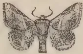

1

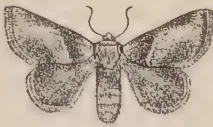

2

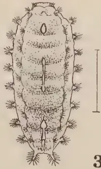

3

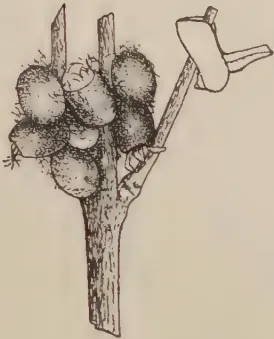

4

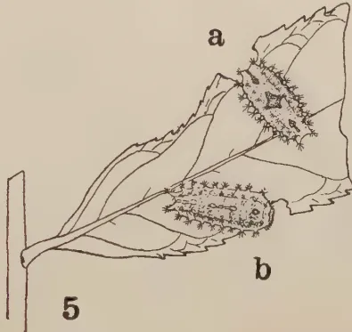

5

a

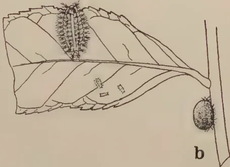

6

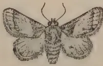

7

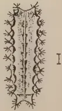

8

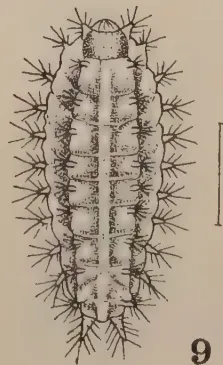

9

Geo. L. de Silva

BLOCK BY SURVEY DEPT. CEYLON. 1981.

Plate VI.—*Thosea recta* Hmpsn. and *Thosea cana* Wlk.

1. *T. recta*, male. 2. Female. 3. Full-grown larva. 4. Cocoons on left, and moth resting head downwards, on right. 5. a. older larva, b. full-grown larva. 6. *T. cana*. Male. 7. Female. 8. Second instar larva. 9. Older larva. 10. a. older larva, b. cocoon.

All figures natural size, except 3, 8, and 9.

Figures 1 and 2 redrawn from Watt & Mann, Plate X, figs, 1 b. and c.

13------------------------------------------------

This image is a scan of a blank page. The paper has a light beige or cream-colored tint. There are a few very small, dark specks scattered across the surface, which appear to be scanning artifacts or dust particles. No text, lines, or other markings are present on the page.

14------------------------------------------------

263

## COCOONS

(Pl. VI, Fig. 4) *Male*: 7 m.m. long by 4 m.m. broad. *Female*: 8 by 5 m.m.; oval, dark-brown to purplish-brown, usually mottled with paler-brown patches, frequently formed in clusters among branching twigs or occasionally attached singly to leaves or twigs; sometimes the cluster of cocoons is covered thinly with a few loosely woven threads giving it a greyish-brown appearance. *Pupae*: yellowish at first, later pale-brown, with dark-grey on the wings, armed with a small, rather blunt ridge, between the eyes.

## MOTHS

(Pl. VI, Figs. 1 and 2)—*Male*: (fig. 1) Head, thorax, and abdomen brown to reddish-brown; antennae bipectinate to tips. Fore wing silky greyish-brown with a faint pinkish tinge; a small triangular brown patch at base sharply defined by a short pinkish-white, transverse, slightly oblique band; middle area of costa dark-brown to blackish, a dark-brown patch at outer angle of wing; remainder of wing suffused with pale-pinkish white. Hind wing greyish-brown. Wing expanse, 19-22 m.m.

*Female*: (Fig. 2).—Body colour similar to that of male; antennae filiform. Brown patch at base of fore wing larger and not so clearly defined outwardly, mid-costal area paler-brown. Wing expanse, 20-26 m.m.

The above description of the moths is made from fresh specimens after reference to previous descriptions by Hampson, Green, and Rutherford. Hampson gives the habitat of *Thosea recta* as "Nawalapitiya, Ceylon." It is also recorded by Bernard (4) on tea in Sumatra.

## HABITS AND LIFE-HISTORY

We have never had sufficient material available for a study of the life-cycle of *Thosea recta* nor of the habits of the different stages, so that no complete information can be given on these points.

## EGGS

*Position*.—The eggs have not been observed under field conditions, but are probably laid singly on either side of the older leaves, as observed in the insectary. The eggs are of the usual Limacodid type and closely resemble those of *Thosea cana*, both species of eggs being smaller and paler than those of *Thosea cervina*.

*Number of eggs per moth*.—The only record available is 145 eggs from an unfertilised female. As indicated previously, a normal fertilised female usually lays many more eggs than an unfertilised moth.

15------------------------------------------------

264

*Incubation and Development.*—The incubation period is probably about 1 week, as in the case of *T. cana*. The development is probably similar to that of *T. cana* eggs, the eggs turning slightly darker before hatching.

### LARVAE

No data are available as to the duration of the larval stage or on the number of instars. The development and feeding habits of these nettle grubs will doubtless be found to be similar to those of other species, the younger larvae spotting the leaves. In a bad attack the older larvae are capable of stripping large areas of tea almost bare. The full-grown larvae turn yellowish a day or two before starting to form their cocoons and gradually shrink in size.

### COCOONS

*Position.*—Material received from the field (Pl. VI, Fig. 4) serves to confirm the observations made by Green (9) that these cocoons are "attached either to the under surface of a tea leaf or in the angles of the twigs and stems. When the pest is at its height, the cocoons may be found in clusters on the twigs, the leaves of the trees having been completely devoured".

*Formation of recta cocoon.*—This is formed on similar lines to those of other small Limacodid cocoons, and is stuck down firmly to the object of attachment with a layer of the "cement". The shell is dark-brown to almost blackish, but is usually mottled all over with paler-brown patches; clusters of cocoons may be thinly covered with a loose tangle of greyish threads and occasionally a few small pieces of leaf or bark are stuck on the outer surface, the whole mass having a greyish-brown appearance. The shell is usually rather thin and papery, as in the case of a *Natada* cocoon, but is double-lined with pale-brown threads, except the cap end which can be seen from inside as a noticeably darker and less opaque circular area. The usual pupal ridge is rather blunt and not very prominent in this species.

*Duration of cocoon stage.*—Green (9) has observed that specimens kept in captivity remained as cocoons for from 17 to 21 days. More recent records at Peradeniya indicate that 4 males occupied 21, 23, 21, and 24 days respectively, while 6 females individually took 20, 20, 21, 20, 23, and 20 days, the period for females being slightly shorter than that of males. The comparatively short duration of the cocoon stage in the insectary indicates that the larvae probably change into pupae within a few days after the formation of the cocoon. It is possible, however, that under unfavourable climatic conditions in the field they may go for longer periods before pupating, thus prolonging the actual cocoon stage.

16------------------------------------------------

265

## MOTHS

*Emergence, Mating, and Oviposition.*—These habits are characteristic of the other Limacodids under review, that is, emergence takes place during the night and the pairs under natural conditions probably mate soon after emerging. Egg-laying may begin during the first night or may be postponed until the second night, and it continues nightly until within a few hours of the death of the female.

*Habits and Duration of Moth Stage.*—The moths remain inactive during the day, clinging to the twigs or smaller branches in the usual position, except that when resting head downwards they often hold the abdomen outwards at angle (Pl. VI, fig. 4). Our few records on the moth stage show that males lived from 5-6 days, and females from 7-9 days in captivity.

### TOTAL LIFE-CYCLE

Without any figures or any other evidence available as to the probable duration of the larval period, it is impossible to calculate the total life-cycle even approximately. It will probably turn out to be shorter than that of *Thosea cervina*.

### FOOD PLANTS

Apart from tea the only other recorded food plant of *Thosea recta* is *Albizzia*, first mentioned by Green in 1906 and again by Rutherford in 1914. It will doubtless be found to have many other host plants.

## 6. THE GREEN NETTLE GRUB

(*THOSEA CANA* Wlk.)

This species was first mentioned as a tea pest by Green (9) in 1900 when he stated that he had "recently received specimens from the Kelani Valley district, where the pest appears to have been prevalent for more than a year and to have steadily increased its area of attack in spite of persistent attempts to check it by hand picking". An outbreak also occurred in the Galle district in 1900. Green's subsequent records indicated that it broke out in Galaha in 1906 and in Morawak Korale in 1907, while Rutherford received reports of a serious attack on an estate in the Ratnapura district in 1914 on tea and *Albizzia*. Our more recent records show an outbreak in the Kalutara district in 1923 and another in the Galle district in 1929. Recently it has appeared in small numbers in Passara along with the other two species of *Thosea*. It has usually been recorded with *recta*, and Green mentioned that these two species "have similar habits and appear to be equally destructive".

17------------------------------------------------

266DESCRIPTION OF STAGESEGGS

Similar to those of *Thosea recta*.

LARVAE

*First instar*.—about 1 m.m. long, pale-yellow to whitish; dorsal stripe consisting of a longitudinal row of minute pinkish triangular areas, broadest anteriorly, arranged segmentally, with a faint whitish mid-dorsal line running the length of the body; a pale-pink lateral stripe on each side. A sub-dorsal series of tubercles with five pairs more prominent than the others, apparently with small three-branched spines; sub-lateral tubercles small and pointed, posterior pair longest, apparently with three-branched spines.

*Second instar*.—(Pl. VI, Fig. 8), about 2 m.m. long; pale-yellowish green; dorsal stripe with segmentally arranged triangular areas and a mid-dorsal white line, a reddish lateral stripe on each side. Sub-dorsal tubercles small and all about the same size, except anterior pair, which are longer and suffused with a pinkish tinge at their bases, all with a few small dark spines; sub-lateral tubercles small and pointed, posterior pair largest, with a faint pinkish line across their bases; all with a few small pale spines.

*Intermediate instars*—not observed.

*Older larvae*.—(Pl. VI, Figs 9, & 10a) about 13 m.m. long; apple green to yellowish-green; dorsal area with a broad whitish to pale-yellowish mid-dorsal stripe running the length of the body and slightly broader anteriorly; this stripe is broken by faint transverse lines defining the body segments posteriorly, each segment being pale-green on each side of the dorsal stripe and pale-yellow near the bases of the sub-dorsal tubercles; sometimes the anterior end of the stripe may be edged with a few reddish spots, according to Rutherford. Sub-dorsal tubercles small with several dark spines, anterior pair largest and green at their bases; sub-lateral tubercles longer and pointed, with several longer pale spines and hairs, posterior pair longest.

COCOONS

(Pl. VI, Fig. 10b).—Similar to those of *Thosea recta* in size, shape, and colour, "probably attached to the stems" (Green).

MOTHS

(Pl. VI, Figs. 6, and 7).—*Male*: (fig 6). General colour greyish-brown; antennae bipectinate to tips. Fore wing with a greyish-brown triangular basal area bounded outwardly by a

18------------------------------------------------

267

dark oblique line running from middle of costa to inner margin and similar but slightly sinuate sub-marginal line from costa before apex to outer angle; middle area of wing paler with a pinkish tinge and a small dark spot at end of cell (i.e., in middle of wing). Hind wing sometimes slightly darker-brown. Wing expanse, 21-24 m.m.

*Female*: (Fig. 7).—Similar to male; antennae filiform. Fore wing with submarginal line straighter. Wing expanse, 26-27 m.m.

The moths of *Thosea cana* may be distinguished from those of *T. recta* by their more uniform greyish-brown colour, by the absence of the short oblique white line and the dark middle area of the costa, and by the presence of the dark spot in the middle of the fore wing. The description of the *cana* moths is made from fresh specimens after reference to Hampson, who gives the habitat of this species as "Kulu; Sikkim; Poona; Nilgiris; Ceylon". Wing expanse, male 26, female 30 m.m., which shows our specimens bred from tea-field cocoons to be on the small side.

#### HABITS AND LIFE-HISTORY

We have very little information available either on the life-cycle or on the habits of the different stages of *cana*.

##### EGGS

*Position*.—Not observed in the field, but in the breeding cages the eggs are laid on either side of the older leaves or on the sides of the cages, usually singly and scattered, but sometimes several eggs are placed near each other to form small groups. The eggs closely resemble those of *recta* in size and appearance, and develop in the usual manner.

*Number of eggs per moth*.—Records of 3 females are 215, 110, and about 170.

*Incubation*.—The first total of eggs failed to hatch, while the second and third lots hatched in 7 and 9 days respectively.

##### LARVAE

Attempts were made to breed the larvae emerging from the above eggs, but they all died in the young stages, so that no figures are available for the larval period. The larvae, as usual, scarcely feed during the first instar, but start spotting the leaves during the second instar. The subsequent development doubtless proceeds in the usual way, and records of outbreaks show this nettle grub can be quite as destructive as *recta*. The full-grown larvae when nearing cocoon formation turn yellowish and shrink in size.

19------------------------------------------------

268

## COCOONS

*Position.*—Not observed under field conditions, but probably attached to the stems, twigs, and leaves, as in the case of *recta*.

*Formation of cana cocoon.*—This seems to be constructed in the same manner as that of *recta*, which it closely resembles, being sometimes slightly larger.

*Duration of Cocoon Stage.*—We have no definite figures on the time spent by *cana* in this stage, but there are indications that it is about 3 weeks.

## MOTHS

*Emergence, Mating, and Oviposition.*—The moths emerge during the night in the usual way and mating begins within a day after emergence. Egg-laying may begin during the second or third night, and several eggs are laid nightly until the death of the female soon after the last eggs are laid.

*Habits and Duration of Moth Stage.*—During the day the moths rest in the position described for *recta* (Pl. VI, fig. 4). Records of three pairs of moths show that the males lived for 9, 7 and 5 days, while their partners lived for 9, 6 and 4 days respectively.

## TOTAL LIFE-CYCLE

As in the case of *recta*, no figures are available for the complete life-cycle of this species.

## FOOD PLANTS

Moore records that, according to Thwaites, *Thosea cana* (under the name of *Aphendala cana*) feeds on *Cassia auriculata*, etc. During the Ratnapura outbreak in 1914 and the Kalutara outbreak in 1923, this species was recorded as attacking *Albizia* as well as tea. Doubtless many other host plants will be listed by future investigators.

## 7. THE RED-BANDED LIMACODID

(*SPATULICRASPEDA CASTANEICEPS* Hmpsn.)

This species is one of the smallest of the Limacodids found on tea and, so far as I am aware, has been recorded only from Ceylon, originally under the name *Spatulifimbria castaneiceps*. In common with the other nettle grubs on tea it has been known for upwards of thirty years, but no serious outbreaks appear to have been recorded. Green, during a tour of the Kelani Valley in November, 1900, observed that some of the planters realised the importance of regular collections of all caterpillars and cocoons on tea, and he was able to examine the day's catch on a few

20------------------------------------------------

This image is a scan of a blank page. The paper has a light beige or cream-colored tint. There are a few very small, dark specks scattered across the surface, which appear to be scanning artifacts or dust particles. No text, lines, or other markings are present on the page.

21------------------------------------------------

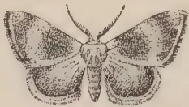

1

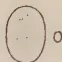

3

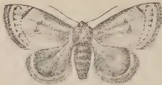

2

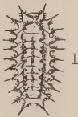

4

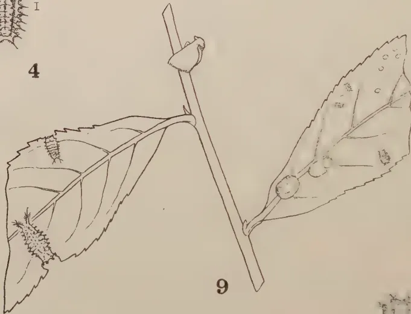

9

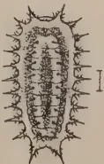

5

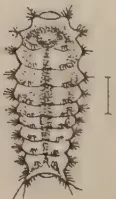

6

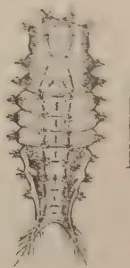

7

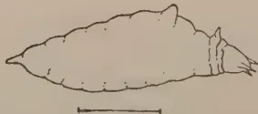

8

Geo. L. de Silva

BLOCK BY SURVEY DEPT. CEYLON. 1931.

Plate VII.—*Spatulicraspeda castaneiceps* Hmpsn.

1. Male. 2. Female. 3. Egg. 4. Second instar larva. 5. Third instar larva. 6. Fourth instar larva. 7. Fifth instar larva. 8. Fifth instar larva side view showing "dorsal hump". 9. Showing resting position of moth, top centre; fourth and fifth instar larvae on left; eggs, young larvae and cocoons on right; all of natural size.

Figure 1. redrawn from Hampson, Fauna of British India, Moths 1, p. 391, fig. 265.

22------------------------------------------------

269

estates in the Yatiyantota and Dehiowita districts. Among the specimens collected he noted 'the curious little Limacodid, *Spatulifimbria castaneiceps*, which has previously been recorded only from the neighbourhood of Nawalapitiya'. In 1903 Green (10) reported its occurrence in the Kalutara district and in 1913 Rutherford in his notes mentions it as being found among specimens of *Natada* sent in from an estate in the Demodera district of Uva. Within more recent times it appeared again in the Ambergamuwa district near Nawalapitiya in 1919 and was observed on an estate in the Kandy district in 1920. Specimens were received from the Galle district in 1926, and during the last few years it can usually be found in appreciable numbers during outbreaks of *Natada* in the tea areas stretching in a north-easterly direction from Demodera to Madulsima. So far it is the only Limacodid on tea which has a fairly wide distribution without ever causing any serious damage. There are indications, however, that it is on the increase in Uva, as I have reported on more than one occasion, and it should not be allowed to get out of control.

## DESCRIPTION OF STAGES

### EGGS

(Pl. VII, Fig. 3).—About 1.25 m.m. long; pale-yellow, oval, of the usual Limacodid type, resembling eggs of *Natada*, or *Narosa*.

### LARVAE

*First instar*.—only observed as small, whitish elliptical objects about 1 m.m. long.

*Second instar*.—(Pl. VII, Fig. 4) 1.50-1.75 m.m. long; elliptical, slightly broader anteriorly, whitish to pale-buff colour, with a narrow pale-brown mid-dorsal stripe along the middle two-thirds of the back and two lateral brownish stripes curving round to meet anteriorly and posteriorly; sub-dorsal tubercles small with central whitish spines; sub-lateral tubercles with short dark spines and a longer central whitish spine.

*Third instar*.—(Pl. VII, Fig. 5) about 3 m.m. long; shape as in previous stage, pale-brown with darker brown, fusiform, mid-dorsal stripe; lateral stripes dark-brown, curving round to meet at both ends; sub-dorsal tubercles as in previous stage; sub-lateral tubercles small, posterior pair largest, pale brown, except those on last four segments which are whitish, all with short dark spines and a longer central spine.

*Fourth instar*.—(Pl. VII, Fig. 6) about 5 m.m. long, body becoming more distinctly segmented, pale-brown; dorsal stripe darker brown, narrowly fusiform, with a short transverse band across anterior end between first pair of sub-dorsal tubercles;

23------------------------------------------------

270

lateral stripes brownish, curving round to meet anteriorly, narrowing posteriorly above whitish area on last four segments; sub-dorsal tubercles small with short pale spines; sub-lateral tubercles more prominent and rounded, with short dark spines and a longer central spine, posterior pair becoming longer and more pointed.

*Fifth instar*:—(Pl. VII, Fig. 7) from 7-10 m.m. long; body rounded anteriorly, broadest across middle, narrowing for posterior third, distinctly segmented; head and prothorax brownish. Two distinct forms of larvae, a dark and a light form. *Dark form*: general colour dark chocolate brown to reddish-brown, with lateral areas of second to fifth abdominal segments deep crimson to maroon and a prominent reddish mid-dorsal hairless tubercle or "hump" (Pl. VII, fig. 8) on the first of these segments; lateral areas of last four abdominal segments pale-yellow with a reddish tinge above, and a white spot on sub-dorsal area of seventh segment; dorsal stripe broad, chocolate brown to dark greyish-brown except for reddish hump, bounded laterally by the small dark sub-dorsal tubercles with their short pale spines and by a narrow black sub-dorsal line; when this stripe is greyish brown there is narrow-black mid-dorsal line broken segmentally and running from behind the hump to posterior end of body. Sub-lateral tubercles rounded, darker anteriorly with several dark spines, yellowish on seventh to ninth segments with paler spines; the four anterior tubercles more prominent and forming a semi-circular collar; the two posterior tubercles, or terminal processes, long, pointed and divergent, darker above, paler and pinkish laterally, with numerous longer dark spines. *Light form*: body colour pale-brown, with a pinkish tinge, except lateral areas of last four segments which are whitish to pale-yellow without reddish tinge; a white spot on sub-dorsal area of seventh segment. Mid-dorsal hump pale-brown at base, dark tipped; a narrow, dark mid-dorsal line running from behind hump to posterior end of fifth abdominal segment. Sub-dorsal tubercles small, with several minute pale spines and connected on each side by a narrow dark sub-dorsal line. Sub-lateral tubercles pale, with dark centres and numerous small dark spines, except the yellowish tubercles which have paler spines; terminal processes pale with longer dark spines.

### COCOONS

*Male*: (Pl. VII, Fig. 9) 5 m.m. long by 4 m.m. broad, sometimes smaller; *female*: 6 by 5 m.m.; broadly oval or long oval, pale-brown to whitish, sometimes greyish, mottled with brown and white, smooth, usually attached to the upper surface of a leaf.

24------------------------------------------------

271

## MOTHS

*Male*: (Pl. VII, Fig. 1) Head and collar chestnut to pale-brown; antennae bipectinate or serrated to tips; thorax and abdomen darker brown. Fore wing dark brown, with a dark band across middle of wing and another near apex. Hind wing dark brown. Wing expanse, 12-16 m.m.

*Female*: (Pl. VII, Fig. 2) Antennae filiform, thorax and fore wing chestnut to pale-brown; a narrow curved sub-marginal dark line from near apex to inner margin, sometimes a small dark patch in middle of wing. Hind wing dark-brown to smoky black. Wing expanse, 14-20 m.m.

The above description of the moths is made from fresh specimens after reference to Hampson, who gives the habitat as "Ceylon", and wing expanse as male 17, female 22 m.m.

## HABITS AND LIFE HISTORY

### EGGS

*Position, etc.*—The eggs have not been observed in the field but are probably laid on the leaves. They resemble other Limacodid eggs, but are quite small and inconspicuous. We have only one oviposition record of 292 eggs, many of which hatched, the incubation period being about 7 days.

### LARVAE

The development of the larvae is similar to that of other nettle grubs. The newly-hatched whitish larvae do no appreciable feeding during the first instar of about 5 days. Then the usual spotting of the leaves becomes evident during the next 10 days or so of the second instar. During the third week the larvae are pale-brown to darker-brown and quite inconspicuous, almost resembling in colour the small patches which they nibble away from the upper or lower epidermis; a few of the more advanced third instar larvae may eat holes in the leaves. During the fourth instar of about a week the brownish larvae are rounded anteriorly and taper slightly towards the posterior end where the two terminal processes are becoming conspicuous; they are quite active at this stage and may sometimes be seen undulating over the leaves, like "whippet tanks", as a planter remarked. At the end of about the fifth or sixth week after hatching they are full-grown, being nearly half-an-inch long. They may be either dark-brown in colour, with a reddish band on each side of the middle of the body and a reddish hump on the back, or they may be paler-brown with a pinkish tinge. This species is usually found along with *Natada*, but rarely occurs in sufficiently large numbers over a limited area to do any serious damage.

25------------------------------------------------

272

An attempt was made to breed a number of these larvae through to the adult stage, but only one individual came through to form its cocoon, the larval period being about 39 days; a few other larvae reached the full-grown stage, but died when about to form their cocoons. There were apparently only 5 instars and the total larval period ranged from about 34-50 days, or about 5-7 weeks, but further studies are needed to verify these figures.

### COCOONS

*Position.*—These are formed almost invariably on the upper surface of the leaves and often along the mid-rib; they are usually quite conspicuous, especially when almost entirely white, but are sometimes mottled with various shades of greyish-brown.

*Formation of Spatulicraspeda cocoon.*—The larva selects a spot on the upper surface of a leaf, usually along the mid-rib, and covers a small area of leaf with a "mat" of closely woven threads which is stuck down with cement, as in the case of a *Narosa* cocoon. This mat forms the foundation of the cocoon, which is apparently constructed in the usual way. The actual shell is pale-brown, but a whitish substance forms on the outside, as on *Narosa* cocoons, sometimes completely covering the shell, sometimes leaving portions uncovered, giving it a mottled appearance; occasionally a brownish cocoon is seen without the white covering. The cocoon seems to be only single-lined with closely adhering threads, and the cap does not appear to be marked off, as in some of the other species. The pupa is small and compact and has a small hard, ridge for pushing off the cap.

*Duration of Cocoon Stage.*—Only 4 records of this period of the life-cycle are available from individual cocoons formed at different times, namely, 17, 15, 16, and 19 days respectively, with no note as to the sex of the moth.

### MOTHS

*Emergence, etc.*—The moths emerge during the night and mating may take place during the first or second nights. In the case of the single pair of moths under observation, the moths emerged during the same night from cocoons received from the field, the date of formation of the cocoon being unknown. The female laid 119 eggs during the second night, 121 eggs during the third night and 42 eggs during the fourth night; both moths died before morning, having lived about 4 days each. During the daytime the moths assume the usual resting position on the twigs and remain inactive.

### TOTAL LIFE-CYCLE

The above records indicate that, under insectary conditions at Peradeniya, the complete life-cycle from egg to moth may be approximately as follows:

26------------------------------------------------

This image is a scan of a blank page. The background is a uniform light beige or tan color. There are several small, dark specks scattered across the surface, which appear to be dust or scanning artifacts. No text, lines, or other graphical elements are present.

27------------------------------------------------

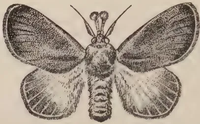

1

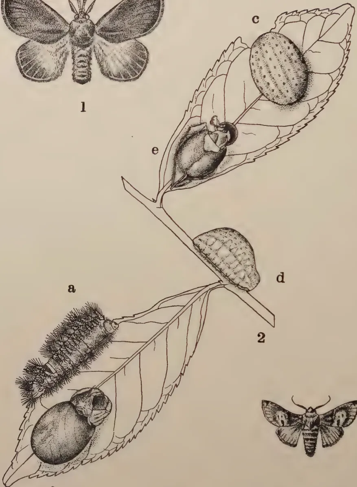

a

2

b

d

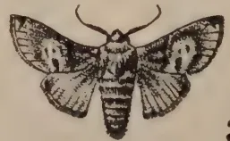

3

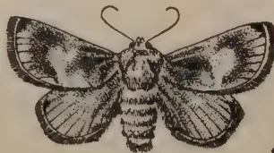

4

Geo. L. de Silva

BLOCK BY SURVEY DEPT. CEYLON. 1931.

Plate VIII.—*Scopelodes venosa* Wlk. and *Belippa laleana* Moore.

1. *Scopelodes*, male. 2a. Full-grown larva. 2b. Cocoon. 3. *Belippa*, male. 4. Female. 2c. Full-grown larva, top view, 2d. Full-grown larva, side view. 2e. Cocoon.

All figures natural size. Figures 2a, 2c, 2d, 2e, and 3 have been redrawn from Moore, Lepidoptera of Ceylon, Plates 128 and 132.

All figures in Plates I-VIII are original, except where otherwise stated.

28------------------------------------------------

273

*Egg Stage.*—7 days; larval period 34-50 days; cocoons, 15-19 days; *total*, 56-76 days, or about 8 to 11 weeks. The normal period may be about 9-10 weeks under field conditions, in which case this species, by breeding continuously could complete about 5 generations a year.

#### FOOD PLANTS

Tea seems to be the only recorded host plant, so far as I am aware, but doubtless others will be found.

#### OTHER LIMACODIDS ON TEA

Before passing to a few general remarks on nettle grubs and to a brief discussion of certain control measures, mention should be made of two other species of Limacodids which have been recorded as feeding on tea, but up to the present time they may be regarded as curiosities. Their large size, however, would make them particularly formidable pests if ever they outstripped their natural enemies and got out of control. We appear to have no information as to their habits and life-history under Ceylon conditions, but I propose to give brief descriptions of the larval, cocoon and moth stages, with illustrations (Pl. VIII) as a means of identification in the event of their re-appearance at any time.

#### 8. THE LARGE NETTLE GRUB

(*SCOPELODES VENOSA* Wlk.)

Apparently the only definite record of this species on tea is by Green (10) in 1903, as received from an estate in Peradeniya. He gives the following note on this insect: "This is the largest of the nettle grubs, measuring  $1\frac{1}{2}$  inches in length. It is of a bright grass green colour, with rather a glossy surface, and with a conspicuous creamy white band across the hinder part of the back. It is densely covered with tufts of stinging hairs, contact with which is extremely painful. The cocoon is of the compact oval form common to the members of this family. The moth—a large furry reddish-brown insect—escapes through a lid-like opening at one end. This species has not yet shown any inclination to increase and multiply to an alarming extent, as have so many of its allies, but it should be regarded with suspicion and destroyed when found on the tea plant".

I have not seen a living specimen of this larva and the drawing reproduced in Plate VIII, fig. 1a is an adaptation of the coloured illustration in Moore's *Lepidoptera of Ceylon* (Pl. 128, fig. 1b), where this insect is described under the name of *Scopelodes aurogrisea*. The cast skin of a full-grown larva found inside the cocoon described below indicates that while the sub-dorsal tubercles are armed with numerous long, pointed, dark-tipped spines, there are also on the sub-lateral tubercles many

29------------------------------------------------

274

blunter spines ending in long slender hairs; this latter type of spine is also found on some of the other large nettle grubs, such as *Parasa lepida* and *Thosea cervina*. Quite recently I have been able to examine two preserved specimens of nettle grubs kindly loaned by Austin as having been found on an estate in Passara; these larvae I take to be a younger stage of *Scopelodes venosa*, since they have the whitish band across the back and their spines on the two series of tubercles are similar to those on a full-grown *Scopelodes* larva. Moore and Hampson both mention that the band across the hinder part of the back is "red, white and blue" and that there is "a black spot on the anal segment". This may be one of the colour variations so common among nettle grubs.

The *cocoon* (Pl. VIII, Fig. 2b) containing the cast skin mentioned above is about 25 m.m. long by 18 m.m. broad, oval, purplish brown and mottled with a pale-brown substance. It is stuck down firmly along the mid-rib of a tea leaf and seems to be constructed on the same plan as other Limacodid cocoons. It is very hard and tough and is lined with a fairly thick but somewhat loosely woven mesh of brown threads which adhere closely to the shell; the cap is unlined, except for a few threads and is thinner than the rest of the shell, thereby forming the usual "line of weakness". The empty pupal skin shows that the pupa is provided with the characteristic hard ridge, which in this species has a sharp cutting edge. It is suggested that some of these larger pupae may actually have to cut their way out of the cocoon for the emergence of the moths.

The *moths* are fine looking creatures with their beautiful golden-brown wings, their fat, furry, brown black-striped bodies and their conspicuous "brushes" in front of the head (Pl. VIII, fig. 1). They have been described by Moore and by Hampson, and the latter mentions four distinct forms, with the fore wings ranging in colour from smoky brown to pale ochreous. In Ceylon we apparently have at least two of these forms, the darkest form *venosa* and one of the paler forms *aurogrisea*. The specimen bred from the larva on tea is apparently *aurogrisea*, while another moth from mango is probably *venosa*.

*Description of moths.*—Head, thorax, and fore wing either silky golden brown and tinged with grey in the form *aurogrisea* or smoky brown in the form *venosa*. *Antennae*: male, bipectinate on basal half; female, simple and filiform. Palpi reddish, the brush whitish at base, black at tip. Hind wing pale ochreous at base with greyish-brown border. Abdomen yellowish-brown, the distal segments sometimes fringed dorsally with black or with a black spot; anal tuft black. Wing expanse, one male 54 m.m.; three females, 62, 70, and 75 m.m.

30------------------------------------------------

275

The above description, after examination of specimens, is modified from Hampson, who gives the habitat of this species as "Sikkim; Sylhet; Moulmein; Ceylon".

#### FOOD PLANTS

Moore gives Thwaites' record, "Larva nearly omnivorous; on Coffea, Rosa, etc." We have specimens in the collection from tea and mango.

#### THE LARGE GELATINE GRUB

(*BELIPPA LALEANA*, Moore)

Speyer (21) records this insect on tea in 1917 as *Belippa* sp., but it was evidently not a serious pest at that time nor have we any subsequent note of its re-appearance on tea.

#### LARVAE

(Pl. VIII, Figs. 2c and 2d). We have no specimens of the larvae available and the following description of a full-grown larva is taken from Hampson: "Larva, naked, oval, convex above; pale bluish-green, with several longitudinal rows of small yellow spots and a sub-dorsal row of black dots". The illustration of the larvae given in Plate VIII is adapted from Moore (16), Plate 132, fig. 1b, under the name *Cheromettia ferruginea*.

#### COCOONS

(Pl. VIII, Fig. 2e). Watt and Mann under the name *Belippa lohor* say that the surface of the cocoons is "whitish-brown coloured and never smooth, always bearing traces of having been stuck between leaves or twigs". Furthermore, that in their experience it is never buried in the ground. An examination of two cocoons found on *Gliricidia* in 1915 indicates that in each case these were formed between two leaves. The shell is dark-brown, but is completely covered by a whitish substance and hidden by the leaves; the cocoon is hard and tough and is lined with a closely adhering mat of threads, the cap being apparently unlined. The pupal ridge is quite stout, but apparently somewhat blunt in this species.

#### MOTHS

(Pl. VIII, Figs. 3 and 4) *Male*: (Fig. 3).—Head, thorax, and abdomen reddish-brown to tawny; antennae with basal one-third bipectinate. Fore wing reddish for basal third, with paler patches across middle and at apex; a small white-spotted black patch at apex where the tip of the fringe is also black. Hind wing paler and yellower, with small black marginal streak at apex and anal angle. Wing expanse, 34 m.m.

31------------------------------------------------

276

*Female*: (Fig. 4).—Somewhat similar to male, but body colour and wing markings paler brown. Antennae, filiform, ciliated. Wing expanse, 39 m.m.

The above description of the moths is adapted from Hampson who gives the habitat of this species as "Sikkim; Ceylon; Rangoon; Bhamo".

*Note on distribution and food plants*.—Green first mentioned *Belippa laleana* on cacao in 1909, while Henry (13) recorded it on *Glinicidia* in 1915. Thwaites, according to Moore, says that it "feeds on Coffea, .etc., etc." Fletcher, (6a) referring to this species in India says, "The fat, slug-like pale-green, yellow-dotted larva is common on coffee in South Coorg, but is scarcely a pest. Also occurs on apple, pear, walnut, and other fruit trees at Shillong and does slight damage by feeding on the leaves". Andrews (*loc. cit.*) mentioned that "in Assam about eighty per cent of the larvae are parasitised". This species is also recorded by van Hall (22) in the Dutch East Indies on the leaves of coconut, coffee, and tea, and by Gater (7) in Malaya on *Derris*. The above records indicate that *Belippa laleana* has a wide range of food plants in other countries and further investigation will probably extend the list in Ceylon.

#### GENERAL OBSERVATIONS ON NETTLE GRUBS AND ON CERTAIN CONTROL MEASURES

Before passing on to a consideration of certain control measures which it is suggested might be employed, pending the investigation of insecticidal and biological methods of control by the Tea Research Institute, it may be of interest to make a few general remarks, mainly on the following points, namely, the size of nettle grub outbreaks and the periodical incidence of this pest in some districts as opposed to the chronic infestation in others. These observations are based partly on information previously recorded by Green and by Rutherford and partly on my own personal observations on this group of pests and together involve an experience of nettle grub outbreaks in various parts of the tea area extending over a period of some forty years. These remarks may be taken to apply in a general way to all the commoner species of nettle grubs known to attack tea in Ceylon.

The notes which I have given on the various species of nettle grubs found on tea have indicated, among other points, firstly, that most of the species have a fairly wide distribution throughout many of the important tea areas of the Island ranging in elevation from almost sea level up to about 5,000 feet, and secondly, that these different species of caterpillars all have similar habits of feeding and that the development of the various

32------------------------------------------------

277

stages from egg to moth takes place on the same general lines, with specific differences, such as position of cocoons, duration of life-cycle, etc. One or two points I wish to emphasise, however, namely that while these various caterpillars may be regarded as a composite group under the general term "nettle grub", it is advisable to bear in mind that they do have their individual peculiarities of development, and that it is essential for planters, especially those in the infested districts, to be able to recognise the different species and to become familiar with their peculiarities. For these reasons, I have given full descriptions of the various stages of each species where possible, and have supplied illustrations of any material available. The coloured plate included in Part I shows only the full-grown larvae, cocoons, and moths of the more important species.

*Size of nettle grub outbreaks.*—If nettle grubs are able to breed and spread unchecked by their natural enemies or by artificial measures of control, such as regular collection of larvae and cocoons in the early stages of an attack, then estate superintendents may sometimes find themselves confronted with problems somewhat similar to those mentioned below.

Green (9) gives some details of nettle grub outbreaks which occurred some thirty years ago, as supplied by the superintendents of the infested estates. During the Morawak Korale outbreak of *Thosea recta* in 1899 many acres of tea were stripped almost bare and one correspondent mentioned the pest as spreading at the rate of 5 acres a day over 25 acres. Another correspondent referring to an outbreak of *Natada* in January 1900 on an estate in Passara reported that the pest was first noticed in July 1899 when the caterpillars were half-grown. They gradually spread over almost the whole estate, stripping about 100 acres of all leaves. For some time 500 coolies were collecting a bushel a day of the cocoons from under the fallen leaves. He further mentioned that moths were in existence in September and that clouds of moths appeared again in November and observed that the pests "ran through the changes of their existence in about two months". The caterpillars were also found on many jungle trees near the tea fields. Another instance may be given of an outbreak of *Thosea cana* on an estate in the Kelani Valley in March 1900 during the course of which as many as 2,000 caterpillars were being caught per coolie. The superintendent mentions that the pest "attacks the same field every time, a somewhat poor jât of tea, appearing as far as I can make out—about every two or three months. Sick and small bushes are quite denuded of leaves".

33------------------------------------------------

278

Green (9) in commenting on the Morawak Korale outbreak pointed out that this rapid extension of the affected area could not have been caused by any actual migration of the army of caterpillars, which are sluggish and travel very slowly. He considered that it probably arose from successive batches of eggs hatching out on consecutive days, deposited by moths which had dispersed from the centre of infection where a smaller previous brood had undergone its transformations unnoticed.

Referring to nettle grub outbreaks Green (9) remarks that before they could have assumed the proportions described above there must have been at least two earlier and smaller broods, and in this connection he emphasises the importance of keeping a good lookout for these preliminary broods and of destroying them before they have had time to gain ground.

The above remarks made by Green bear out my own observations made during large outbreaks of *Natada* on an estate in the Kandy district in 1920 and on an estate in the Hunasgiriya district during 1921. In both of these outbreaks no nettle grub had been known to occur on either of the estates for several years and there was no evidence of the pest on adjoining estates or of any invasion of larvae having taken place from outside. It is suggested that the pest had probably carried on in small numbers for several years and had then got a chance to increase in the absence of the usual natural checks.

The following instance of an unusually large outbreak of nettle grub came under my observation in 1928 on an estate in Passara. *Natada nararia* was the pest concerned and the attack occurred in a fairly well isolated top division field of about 40 acres which had not suffered from any noticeable infestation for many years. By the time the outbreak was noticed it was developing so rapidly that it became practically impossible to check the attack by the collection of larvae alone. The assistant superintendent in charge of the control campaign noticed that the cocoons were being formed on the soil under the bushes in enormous numbers and started a systematic collection of these, at the same time keeping an account of the weight of cocoons brought in for destruction. During a period of 6 months it was calculated that nearly  $5\frac{1}{2}$  tons of cocoons had been taken from the infested area. *Natada* cocoons average about 400 to the ounce, thus making a total collection of about 75 million cocoons. These figures do not take into account either the larvae previously collected, or the larvae which died before pupation or the moths which were continually emerging from undetected

34------------------------------------------------

279

cocoons. I visited the infected area towards the end of the campaign, and found that, in spite of the regular and thorough collection of cocoons, there were thousands of moths throughout a good portion of the field and that innumerable eggs were being laid not only on the tea but practically every bush and tree in an adjoining ravine. Fortunately, the subsequent heavy rains and overcrowding of the pest in a fairly limited area helped in the spread of the "wilt disease" which checked any further increase.

My opinion is that in the above-mentioned instance the pest had persisted in small numbers since the last serious attack and had gradually increased during the last year or so prior to the outbreak.

*Incidence of nettle grub.*—The observations recorded by Green, by Rutherford, and made more recently by myself, altogether extending over a period of some forty years, have indicated that generally speaking nettle grub is only a periodical pest in certain districts, while in others it is tending to become a chronic pest, and I should like to emphasise these two aspects of nettle grub outbreaks.

*Periodical attacks.*—In some districts, such as the northern part of the Central Province, the Kelani Valley, Morawak Korale. Galle, etc., it may be said that one or more species of these nettle grubs usually occur only periodically at longer or shorter intervals. This periodicity of nettle grub attacks in certain districts is probably due to the periodically effective control of these pests by their natural enemies, such as parasites and wilt disease, the spread of the latter being possibly facilitated to some extent by the damp climatic conditions which prevail for the greater part of every year in the above districts and by the overcrowded conditions of the pest in comparatively small areas. Planters in those districts which suffer only from periodical outbreaks are in a difficult position, since on the apparently complete disappearance of the pest they can hardly be expected to carry on regular collections on the chance of being able to forestall the next attack, which may not occur for several years; the result is that they are usually caught unprepared owing to the rapid increase of the pest. I have indicated above that these apparently sudden outbreaks cannot be expected to occur without the development of at least two smaller preliminary broods, which usually pass more or less unnoticed or are disregarded in the hope that they will fade away. In those districts which have only intermittent attacks of nettle-grub and other caterpillar pests it is urged that planters should instruct their kanganies and coolies to keep a lookout during the periods of immunity and report any unusual "spotting" or other injury to the leaves, which are usually the first warnings of any undue increase of these pests. At the first

35------------------------------------------------

280

sign of the insects a special gang should be put on to go over the infested area thoroughly for larvae and cocoons, which should be destroyed.

*Chronic infestations.*—There are certain other districts, comprising mainly the Demodera, Badulla, Namunukula, Passara, Madulsima and Lunugala tea areas of Uva, in which nettle grubs as a group have become thoroughly established and on some estates are tending to become chronic pests. Regular collections on a few estates have indicated that all the more important species mentioned in this article can be found in varying degrees of intensity throughout a large part of this area. *Natada nararia* seems to be the outstanding pest in these districts and might almost be called the “Uva nettle grub”. At the same time the other species are also making themselves felt and much of the damage attributed to *Natada* is being done by them. *Thosea cervina* appears to be on the increase on a few estates in the Passara and Lunugala districts of the area, while the two other species of *Thosea* are usually to be found here and there in small numbers. *Narosa* and *Spatulicraspeda* have broken out to a noticeable degree, especially in the Demodera and Badulla areas within recent years. *Parasa* appeared in 1931 on at least one estate in Passara and required a special gang of collectors to control it. A rather alarming feature of these more recent attacks has been the tendency of these pests to attack fields of young tea or fields within the first year from pruning. It is in the above large areas of Uva that nettle grubs as a group present the most difficult problems of control.

In view of the heavy infestations by various species of nettle grubs over a large portion of the tea areas in the north-eastern part of Uva, that is, mainly in the districts previously mentioned, it seems essential that a general campaign of control should be started by the districts concerned, pending the results of the investigations on these pests now being carried out by the Tea Research Institute. These investigations were started in March 1929 at the request of the Uva Planters’ Association by seconding a whole-time officer of the Entomological Division of the Department of Agriculture to work in Passara under supervision from Peradeniya. After about six months’ work the investigation had to be stopped owing to lack of accommodation for the officer, but was resumed again early in 1930 by the same officer, Mr. G. D. Austin, who has carried on his work for the past year or so under the supervision of the Tea Research Institute.\*

---

\* Since the above was written Mr. Austin has joined the Staff of the Tea Research Institute and has published a report on “The Nettle Grub Pest of Tea in Ceylon.” The first two parts of this report have appeared in *The Tea Quarterly* for November, 1931, and February, 1932, and it is understood that the third part of the report will appear shortly in the same Journal.

36------------------------------------------------

281

So far as I am aware, up to the time of writing this, no general campaign has been started against nettle grub in Uva and the following suggestions are put forward for consideration. They are mainly a repetition of the recommendations made in my reports from time to time.

*Collection of larvae and cocoons.*—As indicated above, all the more important nettle grubs of tea are present in certain parts of Uva, and, since their broods overlap and the durations of their life-cycles vary in length, the general effect during a bad attack in any given area is an almost continuous prevalence of various species in all stages of development, with usually one or two species predominating. These attacks may not be confined to definite fields or even to definite areas in a field, but there may be scattered attacks of more than one species over the greater part of an estate, or of a group of adjoining estates, for most of the year. There are, however, usually brief intervals during the year when there is a lull in the intensity of the attack and it is during such comparatively quiet periods that the opportunity should be taken of starting a campaign of systematic, daily, or even bi-weekly, collections of larvae and cocoons. Up to the present time in Uva, with very few exceptions, such collections have been made only on heavily infested areas during an outbreak and perhaps for a few weeks or months following such attacks. These collections have usually been stopped as soon as it was found that only a few specimens were being obtained daily or weekly and may have been resumed only when the pests become really noticeable again.

In my opinion, such collections, if they are to be of any value, should be carried on regularly and systematically throughout the year, if not daily, then two or three times a week. The superintendent of one estate, which has been making almost daily collections for a long period, has kindly given me figures showing that the average monthly expenditure over a period of 28 months to the end of April, 1931, amounts to about Rs. 270 a month or about Rs. 3,200 a year. It should be mentioned that this estate has not had a serious attack of nettle grub since 1928, during which outbreak caterpillars and cocoons were collected in millions over about three fields at a high cost over a period of several months. The above figures give some indication of the monthly expenditure on nettle grub control during the so-called off season, that is, during the periods when the presence of these pests on an estate is not noticeable on a casual inspection. It may be mentioned, in passing that these regular collections have shown that nettle grub, even during the "off season", is present on an estate in small numbers throughout the year.

37------------------------------------------------

282

It is not known at present how far serious outbreaks can be prevented by regular collecting over long periods, but this long term collecting has the advantage of enabling a superintendent to keep the pests well in hand and, at any rate, gives him a chance to try and forestall any usual increase by putting on extra coolies where necessary. It is perhaps not out of place for me to add that groups of adjoining estates would benefit mutually to a very appreciable extent if they were able to take up the regular collection of larvae and cocoons as a routine measure.

I have touched upon this aspect of nettle grub control at some length, since I consider that some concerted action must be taken for the control of these nettle grub pests in Uva during the period that the results of the investigation are being awaited. It is not unlikely, however, that the present financial depression will be one of the chief deciding factors as to whether general collection can be adopted or not.

#### GENERAL SUMMARY

The *Limacodidae* or nettle grubs associated with tea in Ceylon form a group of insects which are of much interest and importance not only because of their individual status as serious pests, but also by reason of their fascinating and curious habits of development.

Notes on the local distribution, habits, and life-histories of the seven more important species are given wherever sufficient data are available, and a brief account is appended of two other Limacodids which, although recorded from tea in Ceylon, have not up to the present time appeared as pests. Detailed descriptions, with illustrations, are given of the more important species, special attention being paid to as many of the younger stages as possible, since these, so far as I am aware, have not been described in detail in Ceylon or elsewhere, with the exception of *Natada nararia*, previously described in India (3).

An attempt has been made to explain how the various cocoons may be formed, but since the actual formation of a Limacodid cocoon from start to finish has not been observed it is not improbable that other investigators may be able to throw some light on the actual process of construction. The article concludes with notes on the size of outbreaks and on the periodical outbreaks which occur in some of the tea areas as opposed to the almost chronic attacks now becoming prevalent in parts of Uva. Concerted action in the collection of larvae and cocoons is urged, pending further investigation by the Tea Research Institute.

38------------------------------------------------

283

## SUMMARY OF HABITS AND LIFE-HISTORIES

The larvae of the *Limacodidae* vary considerably in size, colour, and general appearance, not only among individuals of different species, as might be expected, but among individuals of the same species. This family includes not only the "nettle grubs", so called from the irritating properties of numerous groups of spines and hairs arranged in rows along the back and sides, but also comprises the less conspicuous and spineless "gelatine grubs", which are usually unarmed. In spite of their great variation in colour, size, and form, these Limacodids all have somewhat similar habits of feeding and development, with certain individual peculiarities, especially as regards the position of the cocoon.

The eggs are usually laid on either surface of the older leaves either singly, as in the case of *Natada* and most of the other species here reviewed in detail, or in small masses with the eggs regularly overlapping, as in the case of *Parasa*. The young larvae on hatching after about a week usually move to the underside of the leaves where they remain quiet during the first instar with practically no feeding. During the second and third instars, while they are still quite small and inconspicuous, they start nibbling small pieces out of either the upper or lower epidermis of the older leaves, and gradually become more active. When they are about 3 weeks old they are able to eat through the leaves and from then onwards until they become full-grown they have voracious appetites; when concentrated in vast numbers over a limited area of tea they are capable of stripping the bushes almost bare. The full-grown larvae, when ready to pupate, usually turn yellowish and sometimes pinkish on the underside. Parasitised larvae may turn a bright yellow at any stage while diseased larvae affected by "wilt" turn brown and dry up, or become swollen and shiny, eventually bursting and disintegrating. The normal larvae just before forming their cocoons shrink to about two-thirds of their former size. The cocoons vary in size according to the species but are all compact, oval, or almost spherical bodies and are constructed by the various species of larvae on the same general plan, being composed of a kind of cement-like liquid which rapidly hardens. They are usually lined with closely woven threads adhering to the inside of the shell, and some of the smaller cocoons, such as those of *Natada* and *Narosa*, are given an inner lining of a loosely woven mesh which does not adhere to the shell. A cap is provided by the larva for the escape of the moth and this circular area usually has only one lining and is thinner and less opaque than the rest of the shell; thus a distinct "line of weakness" is formed, along which

39------------------------------------------------

284

the cap can be pushed off by the pupa before the emergence of the moth. The *pupae* of the various species are all provided with a hard transverse ridge between the eyes, this ridge is usually blunter and less prominent on those species which have fairly thin cocoons (e.g., *Natada*, *Thosea recta*, etc.), but has quite a sharp edge in those species with hard tough cocoons, such as *Parasa* and *Scopelodes*.

The following brief notes give the usual position of the cocoons of the various species, so far as is known:

*Natada*—small, brown, oval or almost spherical; usually on the ground or among fallen leaves, occasionally on the bushes.

*Parasa*—medium size, brown, oval, hemispherical; in clusters on the larger branches or stems and covered with loose threads.

*Narosa*—small, whitish or mottled, with a brown spot at one end, oval; usually on the upper surface of the older leaves—quite conspicuous.

*Thosea cervina*—medium size, dark-brown, broadly oval to almost spherical; said to be just under the surface of the soil.

*Thosea recta*—small to medium, brownish or mottled greyish-brown, oval; in clusters among the angles of the twigs or leaf-stalks.

*Thosea cana*—similar to that of *recta*; probably attached to leaves, twig's or stems, singly or in clusters.

*Spatulicraspeda*—small, whitish or mottled brown and white, oval; usually on the upper surface of the leaves (cf. *Narosa*).

*Scopelodes*—large, dark-brown or mottled, flat oval; position not known definitely, but probably on leaves and stems.

*Belippa*—large, whitish, to pale-brown, oval; said to be between two leaves which hide it.

The duration of the cocoon stage of the different species varies considerably under laboratory conditions. *Natada*, *Narosa*, *Thosea recta* and *T. cana* usually occupy about 3 weeks in this stage, while *Spatulicraspeda* takes only about  $2\frac{1}{2}$ -3 weeks. *Thosea cervina* usually takes from about 4-6 weeks, while *Parasa* varies from 5 to about 11 weeks. Nothing definite is known about the cocoon periods of *Scopelodes* and *Belippa* under Ceylon conditions, but they are both probably rather long. There is evidence, especially in the case of *Parasa* and *T. cervina*, that under certain unfavourable climatic conditions, such

40------------------------------------------------

285

as drought or cooler weather, the larvae may remain inside their cocoons in a torpid, pre-pupal stage for several days or even weeks before actually pupating. In the cold weather in India such species as *Thosea cervina* and *Belippa laleana* are known to hibernate in their cocoons for long periods ranging from 3-5 months.

The moths of the various species all emerge in the insectary during the night and mating usually takes place during the first 48 hours after emergence. The females may start egg-laying almost at once and continue laying almost nightly until their death. These moths usually live only from 1-2 weeks. The few oviposition records we have obtained in the insectary indicate that *Natada* moths can lay over 400 eggs, *Narosa*, *Spatulicraspeda* and *T. cana* over 200, while *Parasa* may produce over 500 eggs per moth. No satisfactory data were obtained from *T. cervina*, and *T. recta*, as the females were unfertilised. There is evidence that unfertilised females lay fewer eggs than those normally fertilised.

The above details indicate that the smaller species, such as *Natada nararia*, *Narosa conspersa* and *Spatulicraspeda castaneiceps* have fairly short life-cycles under laboratory conditions ranging from about 7 to 10 or 11 weeks from egg to moth, while the larger species such as *Parasa lepidia* and possibly *Thosea cervina*, have longer life-cycles ranging from about 14 to about 20 weeks.\* We have no reliable data on the life-cycles of *T. recta* and *T. cana*, but they are probably of short to medium duration. *Scopelodes* and *Belippa* will probably be found to have long life-histories.

A further study of these nettle grubs will doubtless indicate that they all have a long and varied list of food plants.

#### REFERENCES

1. 1. ANDREWS, E. A.—On Caterpillar Control by Collection of Chrysalids.—*Qtrly. Jl. Sci. Dept. Ind. Tea Assoc.*, Calcutta, Pt. 4, 1921, pp. 175-194, 1 pl.
2. 2. ANSTEAD, R. D.—Note on the More Important Insect Pests of Planting Districts of South India and the Methods of Control Used.—*Rept. Proc. 3rd Ent. Meet. Pusa*, Feb. 1919, Calcutta, I, 1920, pp. 328-332.
3. 3. BALLARD, E., AND RAMACHANDRA RAO, Y.—Notes on *Natada nararia* Moore.—*Rept. of Proc. Fourth Ent. Meeting, Pusa*, 1921, pp. 153-156, 1 pl.
4. 4. BERNARD, C.—Some Diseases and Pests of Tea on the East Coast of Sumatra.—*Meded. Proefstation voor Thee*, Buitenzorg, No. 54, 1917, pp. 1-21. Extract in *Rev. Appl. Ent.* Series A, VI, p. 37.
5. 5. BERNARD, C.—Various Caterpillar Pests in Tea Estates.—*Meded. Proefst. voor Thee*, Buitenzorg, No. 68, 1919, pp. 11-27. Extract in *Rev. Appl. Ent.*, Series A, VIII, p. 455.

---

\* My thanks are due to my assistants, Mr. G. D. Austin (now on the Staff of the Tea Research Institute) and Mr. E. de Alwis, for their help in the life-history work of the species mentioned above.

41------------------------------------------------

286

1. 5a. CHAPMAN, J. W. AND GLASER, R. W.—Further Studies on Wilt of Gipsy Moth Caterpillars.—*Jl. of Econ., Ent.*, IX, No. 1, Feb. 1916, pp. 149-167.
2. 6. DUPORT, L.—Notes on Certain Diseases and Enemies of Cultivated Plants in the Far East.—*Bull. Econ. de l'Indochine*, Hanoi-Haiphong, 1912-1913.—Extract in *Rev. Appl. Ent.* Series A, II, p. 490.
3. 6a. FLETCHER, T. B.—Note on *Belippa laleana* Mo.—*Rept. Proc. 3rd Ent. Meeting*, Pusa, Feb., 1919, Calcutta I. 1920, p. 105.
4. 7. GATER, B. A. R.—Ann. Rept. of Ento. Div. for 1924.—*Malayan Agric. Jl.* VIII, No. 7, Kuala Lumpur, July, 1925.
5. 8. GREEN, E. E.—Insect Pests of the Tea Plant.—“*Ceylon Independent*” Press, Colombo 1890, pp. 66-71, 1 pl.
6. 9. GREEN, E. E.—Some Caterpillar Pests of the Tea Plant.—*Circ. R.B.G.*, Peradeniya, Series I, No. 19, Sept. 1900, pp. 249-258.
7. 10. GREEN, E. E.—Report for 1903 of the Government Entomologist, *Circ. R.B.G.*, Peradeniya, Series II, No. 17, Aug. 1904, pp. 244-245.
8. 11. GREEN, E. E.—Note on *Thosea cervina*.—*Trop. Agriculturist*, Peradeniya, XXVII, No. 1, July 1906, p. 82.
9. 12. HAMPSON, G. F.—Fauna of British India, Moths, I, 1892, pp. 371-402.
10. 13. HENRY, G. M.—Rept. of Assistant Entomologist, *Trop. Agriculturist*, Peradeniya, XLVII, No. 2, Aug. 1916.
11. 14. HUTSON, J. C.—The Fringed Nettle Grub, *Natada nararia*, Moore.—Year Book, *Dept. Agric. Ceylon*, 1923, pp. 11-15, 1 pl.
12. 14a. JARDINE, N. K.—The Tea Tortrix.—*Dept. Agric. Ceylon, Bulletin No. 40*, Nov. 1918, pp. 35, 36.
13. 15. LEFROY, H. M.—Indian Insect Life, 1909, p. 483.
14. 16. MOORE, F.—The Lepidoptera of Ceylon II, 1882-3, pp. 125-135.
15. 17. NIETNER, J.—Observations on the Natural History of the Enemies of the Coffee Tree on Ceylon, 1861. English Translation from the French Colombo, 1872, pp. 15 and 16.
16. 18. NORRIS, R. V.—Quarterly Report on the Work of the Scientific Staff of the Tea Research Institute, Ceylon.—*The Tea Quarterly*, III, Pt. 3, Aug. 1930.
17. 19. PATTON, W. S. AND EVANS, A. M.—Insects, Ticks, Mites and Venomous Animals of Medical and Veterinary Importance, Part I, Medical, 1929. Note on “Stinging Insects”, pp. 694-696.
18. 20. RUTHERFORD, A.—“Slug Caterpillars” or “Nettle Grubs” of Tea.—*Trop. Agriculturist*, Peradeniya, XLIII, No. 1, July 1914, pp. 51-55.
19. 21. SPEYER, E. R.—Report of the Acting Entomologist, Dept. of Agric., Ceylon, for 1917.
20. 22. VAN HALL, C. J. J.—Diseases and Pests of Cultivated Plants in the Dutch East Indies in 1919 and 1920.—*Meded. Inst. Plantenziekten, Buitenzorg*, No. 39, 1920 and No. 46, 1921. Extracts in *Rev. Appl. Ento.* Series A. VIII, p. 330, and IX, pp. 507, 508.
21. 23. WARDLE, R. A.—*The Problems of Applied Entomology*. 1929. Nuclear Diseases, pp. 109-111.
22. 24. WATT, G. AND MANN, H. H.—The Pests and Blights of the Tea Plant (Second Edition), Calcutta, 1903, Limacodidae, pp. 202-211.

42------------------------------------------------

287

## RECENT RESEARCH ON THE INFLUENCE OF FORESTS IN CHECKING EROSION AND SURFACE RUN-OFF\*

**T**HE occurrence in recent years of most disastrous floods in widely distant parts of the world has greatly impressed public opinion and the World Press has devoted much attention to the matter, it being generally believed that the main cause of these catastrophes is to be found in deforestation. The responsible authorities have been severely criticised and charges made, alleging culpable weakness and negligence in regard to the proper preservation of the forests in the catchment areas of the rivers.

Scientific journals have likewise supplied information as to the various unfavourable conditions, which taken as a whole, have affected prejudicially the situation in particular cases even where the watersheds have been relatively well afforested. Thus the beneficial influence of afforestation in checking erosion and surface run-off has been once again emphasised, though with the object of discouraging any hazardous generalisation, expert writers have laid special stress on the necessity for establishing the maximum limits of such influence. In justice it must be confessed that the data at present available for arriving at any reasonably definite conclusions are neither numerous nor always particularly convincing, knowledge of the general question has been considerably extended by recent experiments of a quantitative character but there is general feeling that these experiments must be continued and their scope extended. Fortunately at the present time experimental work in the problems of forestry is being greatly developed and intensified and that even in countries in which organization and settlement are of quite recent origin.

In certain instances the study of different forms of influence exercised by forests has been carried out on the basis of investigations made over extensive areas, the object for a long period observation in afforested conditions, which have been unexpectedly deprived of forest growths. This review has already published an account of the experiments carried out at Colorado in these conditions. Comparative studies have also been made on a large scale between the conditions prevailing in watersheds which are afforested, covered with busy growths or simply grassed.

The value of an extensive and prolonged study of pre-existing conditions and corresponding study of the changed conditions subsequently brought about is fully recognised by the experts though it is felt on the other hand that the artificial element in the method vitiates the general applicability of the conclusion reached. As a matter of fact the results of a sudden and sweeping deforestation of a catchment basin, unaffected by the outbreak of forest fires, pasturing and erosion and therefore accelerated can scarcely be compared with the cases of gradual deforestation accompanied by the vigorous play of regenerative forces which are of normal occurrence.

Here, however, it is the intention to give a brief description of the experimental work that has been carried out on the subject with reference to the particular forms of influence exercised by afforestation, all of which in the long run act as a check on erosion and tend to regulate the run-off of rain waters.

*Evolution of land reliefs.*—Prof. Di Tella (Italy), in referring to the views of the leading authorities in geodynamics and geology, sums up the

---

\* By S. Cabianca in the *International Review of Agriculture*, January, 1932.

43------------------------------------------------

288

general function of the forest in the constant levelling process by which the land contours are affected as follows:

"The evolution of the mountain towards the *peneplain* corresponds to a universal law from which no land surface which has emerged is exempt. In the action of this law, the forest intervenes as an essentially climatic expression of a biological reaction, whereby the land through the continuity of the plant life with which it arms itself, attempts to combat the levelling tendency and is successful in retarding if not in wholly arresting, its development during age-long geological periods."

This biological reaction has its origin in the presence of suitable climatic conditions, the results of the simple interplay of external mechanical agencies. Henceforward progress and relapse in continuous climatic evolution alternate in the land surfaces that are the direct offspring of the bedrock and set up plant associations varying with their evolution. Braun-Bianquet (France) considers that a plant association is a true biological unity and immutable, each association constituting a stage in an evolutionary series starting from the bare soil and proceeding in ascending scale. The idea of *zonal* and *climatic* soils, hitherto very generally accepted, must now be materially restricted and modified. Gaussen (France) is of opinion that in studying the evolutionary cycle of a land area, it should be recognised that, while paying due attention to the *geological series*, it is also important to take into account the *stages of transformation in these series themselves*. According to this authority in the course of the normal evolutionary process, in which neither human nor external agencies are concerned, various types of climatic areas will have long been fixed. Writers on botanic geography would not however be in agreement, for the influence exercised by vegetation on a strict geographical succession in its evolutionary phases would seem insignificant if brought into relation with the whole period of the existence of our world. Mercelin and Negre (France) hold that it is also important to observe the evolutionary process as manifested in the form of the land relief to obtain an idea of the influence of this external transformative action in the formation of climatic zones. Purely topographical modifications in great mountain masses may be the result of some interruption or indefinite arrest in the evolutionary cycle of the area. Such modifications may be of natural origin, either direct or induced. The evolutionary stages in a strict succession brought about through a prolonged forest protection on certain soils are at times interrupted by the access of disaggregated fragments the results of some later disruption of the outcropping rocks. These fragments would have modified the soil characteristics quite differently if they had freely followed the strict cycle. Human agency in the form of deforestation and the breaking up of lands may also bring about marked topographical modifications in land reliefs. The effects of human effort in checking the evolutionary process may be considered as merely temporary when not persistently carried out over long periods in the same area but, intense and prolonged, it may involve complete resistance to the formation of the land surface. In this case the direct influence of the bedrock is felt directly and to the full in the vegetation. The soil stratum evolved in humid granite mountain masses which have been for long ages covered with forests seems to be weak according to the writer's observations in the south of France, being as a rule 20 per cent and sometimes rising to 30 per cent. On the other hand, where the rocks break up readily there are to be found under the surface strong strata, several metres deep, producing a skeletal formation.

Erhart (France) points out that in Madagascar the process of laterisation is apparently checked by the low temperatures in the high mountains whereas in the south the scantiness of the rainfall is the chief agents in

44------------------------------------------------

289

this sense. At the present time lateritic soils, even when covered with forest growth, derived no benefit from organic matter. This fact however does not signify that they were not fertile at the time of their first formation when associated with virgin forests, but the later denudation of the soil caused by forest fires has brought about such a solidification of the surface that they are now practically barren.

In harmony with the principle of the biological reaction of the earth to any rapid formation of peneplain, the present stage of investigation of the question justifies the statement that the forest, as a higher climatic expression, makes itself felt only on favourable vertical land profiles in a state of evolution and is thereafter an element serving to bring about the section formation which is best adapted for facilitating the gradual and continuous evolution of the land relief.

*Retention of water by the soil.*—It has long been observed that wooded areas have a greater capacity for retaining rainfall than open lands and in recent years observers have also taken special account of situation and of cases of rainfall accompanied by wind. Hirata in Japan has obtained the following results:

For every hundred units of rainfall

<table border="1">
<thead>
<tr>
<th rowspan="2">Land surfaces</th>
<th colspan="3">Reaching the land surface</th>
<th rowspan="2">Intercepted by the crowns</th>
</tr>
<tr>
<th>Directly</th>
<th>Indirectly through the stems</th>
<th>Total</th>
</tr>
</thead>
<tbody>
<tr>
<td><i>Plains</i> with various forest species (Miguro Station)</td>
<td>74.1</td>
<td>5</td>
<td>79.1</td>
<td>19.9</td>
</tr>
<tr>
<td><i>On the slope</i> and wooded, rains accompanied by wind (Motouyama Station)</td>
<td>68</td>
<td>9</td>
<td>77</td>
<td>23</td>
</tr>
<tr>
<td><i>On the slope</i> and wooded, ordinary rains</td>
<td>71.20</td>
<td>7.80</td>
<td>79</td>
<td>21</td>
</tr>
</tbody>
</table>

Where rain is accompanied by fog, the fall on the wooded areas was more abundant than on open lands. On wooded areas the maximum retention capacity was observed after long periods of drought, the reverse being as a rule the case on unwooded surfaces. These results are in agreement with those obtained in Colorado. Henry has made tests of the retention capacity of forest litter from different species with the following results:

<table border="1">
<thead>
<tr>
<th rowspan="2">Forest litter</th>
<th colspan="3">Quantity of water absorbed</th>
</tr>
<tr>
<th>In relation to specific gravity</th>
<th>Per hectare</th>
<th>Rainfall corresponding to</th>
</tr>
</thead>
<tbody>
<tr>
<td>Red fir</td>
<td>3.4 times</td>
<td>116 cubic metres</td>
<td>116 millimetres</td>
</tr>
<tr>
<td>Beech</td>
<td>5.38 „</td>
<td>55.68 „</td>
<td>55 „</td>
</tr>
</tbody>
</table>

45------------------------------------------------

290

The amount of time required for the decomposition of the litter obviously depends on the mineral basis of the soil and may also be affected by the lack of other physical elements. As however the establishment and continuance of the dominating types of vegetation is evidence that it is well suited by existing conditions, the rate of decomposition is in harmonic relation with the degree of filtration capacity, Burger has tested percolation capacity on surfaces having different kinds of covering, tree growths, grasses, etc., making use of the purpose of a column of water under atmospheric pressure. His results are as follows :

<table border="1">
<thead>
<tr>
<th colspan="3">Column of water passing through in an hour on areas under</th>
</tr>
<tr>
<th>Cembran pine</th>
<th>Red fir</th>
<th>Herbage only</th>
</tr>
</thead>
<tbody>
<tr>
<td>670 mm.</td>
<td>295 mm.</td>
<td>40 mm.</td>
</tr>
</tbody>
</table>

The absolute percolation capacity of any given area appears to be a less decisive factor in the phenomenon of retention than such capacity in relation to the time unit, and further it should as a rule tend to diminish at the lower levels, being at the maximum and continuously effective in the strata which are nearest to the surface. It is on the degree of effective percolation capacity that the power of retention of the whole mass depends and its continuity is an important element in respect to what is known as invisible precipitation in the form of dew and absorption. According to Chaptal (France) the absorption which takes place continuously on the forest floor and in the crowns of the trees is merely a particular case of the attraction and fixation of the gases given off by the solid surfaces. The average temperature of the whole mass determines this phenomenon which is essentially connected with the surface.

It is considered that the formation in the course of soil evolution of the section profile most favourable to satisfactory percolation in a very lengthy process. Hence it is not to be expected that, after any form of disturbance, it can be fully restored within a short space of time. Burger has observed that the best conditions for percolation are to be found where the forest growth is of long standing whereas, where artificial re-afforestation has taken place with species hastily introduced *ad hoc*, the influence of the plantations on the soil comes to be felt slowly and with well-marked intermissions as compared with that exercised by natural constructive growths.

It also happens that quite slight and apparently harmless changes in the litter of forest land may be fraught with serious consequences. Wolsey (United States) noted that in forests where the surface had been burnt over, capacity to retain rain water was reduced by six-sevenths in consequence of the burning. Huffel (France) also observed that litter, when remaining intact on the forest floor, completely absorbed the precipitations of a continuous rain giving 61-71 mm. The experiments made at Wagon Wheel Gap, Colorado, show that the amount of water retained in the strata of the forest floor was from 30 to 40 times less when the litter was removed.

Other results of a diminution of retention capacity which are less obvious but of undoubted importance, are a reduction in microbial activity and a consequential reduction also in temperature which serves as a check upon the circulation of water. Starkey (United States) has recently pointed out that the presence and development of the higher plant forms exercise a powerful effect upon the proportion of micro-organisms in the soil which becomes still more marked with the progress of their development. In the course of time they tend to determine a marked disproportion

46------------------------------------------------

291

in the distribution of micro-organisms in the soil and become the most important factor in *seasonal microbic fluctuation* except where this fluctuation is regularly controlled by prevailing conditions of temperature and humidity. Bedford (Canada) recently carried out experiments to test the rate at which the decomposition of organic matter takes place by measuring the microbial activity exhibited by the bacteria found in four types of virgin soil in Alberta. These virgin soils showed an abundant microbial flora and vigorous biological activity while containing an adequate proportion of nitric nitrogen.

It is generally recognised that the presence of organic matter in the solution in the water circulating in the soil may, according to the degree of concentration, give rise to important evolutionary processes in a land surface. The condition and quality of the surface covering are powerful factors in this connection. Dunnewald (United States) has demonstrated that in meadow lands organic matter accumulates to a degree three times in excess of that found in lands under conifers. In meadow lands the solubility of the organic matter increases with depth, a fact which may help to explain the podsolisation of the brown meadow soils which occurs on passing from the lower to higher levels. In similar environmental conditions the decomposition of organic matter is influenced by its chemical content. The work of Tenney (United States) goes to show that organic matter with a low nitrogen content, is enriched during decomposition by crude proteins as a result of a microbial synthesis.

The facts described and their harmonious succession undoubtedly indicate that in effect any form of continuous vegetation, when once established at some given stage of the evolution of a land area contributes to the maintenance of continued existence by assisting to set up an indefinite series of factors which combines to arrest any levelling process affecting the land profile.

*Evaporation.*—As regards the phenomenon of the evaporation of rainfall in its relation to the condition of the covering of the land surface, it should be borne in mind that this evaporation in the case of forest land takes place: (1) In the crowns of the trees so far as concerns the amount of rainfall intercepted thereby; (2) On the land itself, (a) directly from the surface, (b) indirectly through transpiration in the trees. The evaporation process is liable to often quite rapid modifications in accordance with its sensitiveness to the variations in external climatic agencies. These however influence extensive land areas with varying conditions of the soil covering and, leaving them aside, recent experiments confirm the view that afforested conditions safeguard evaporation from sudden changes and conserves its effects and that the case is otherwise with open land or lands under other forms of vegetation.

The experiments conducted in Japan indicate that the evaporation activity in the tree crown varies according to the degree of saturation of surrounding atmosphere. Evaporation of the solid forms of precipitation such as snow and hail gives in effect a contribution equal to that of the corresponding precipitation in liquid form. Direct evaporation from the land surface in similar external conditions is regulated by the circulatory power of the water in the soil, which in turn depend on the constancy of the land temperature according to the period of the year. In the warm season a high temperature stimulates the circulation of water in forest land even though accumulated at some distant previous date at a time of low temperature. The strong influence of litter on the elements which facilitate the circulation of the soil waters is thus confirmed. Serrato (Mexico) has noted that on afforested land with the litter intact evaporation represents only 85 per cent of the comparable evaporation on lands not so afforested and that where the litter was removed the proportion fell to 61 per cent.

47------------------------------------------------

292

The evaporation process is closely connected with the question of the sources of supply for the underground water. On this point two theories are held, the one by the French and the other by Swiss-German experts. The former school considers that rainfall is the principal source of supply, the latter that the chief source is to be found in the condensation of the air on contact with the soil, i.e., through absorption. Dienert, the French authority, has recently reaffirmed the French theory, pointing out that the supply due to the direct fixation of atmospheric moisture cannot be accepted until it is proved that air penetrates and circulates freely in the subsoil strata. Evaporation due to physiological transpiration in the trees themselves is dependent fundamentally on the specific capacity of the various species, though it is also well known that the requirements of particular species are readily modifiable and may vary between wide limits according to the amount of water actually available for evaporation. Pavari (Italy) holds the view that it is not practically possible to make any true estimates of the amount of water evaporated from tree crowns when allowance is made for the variability of the transpiration process in accordance with the changes in external conditions. As regards Western Europe it may be assumed that as a rule the evaporation of the crowns of forest trees is on an average equivalent to 25 per cent of the rainfall retained in the soil. There is on the other hand sound reason for maintaining the view that afforested lands make sparing use of the precipitations which reach them, this being conspicuously the case in dry climatic conditions.

*Control of run-off and streamflow.*—In order that the capacity for retention may be constantly effective, it is necessary that the evaporation of the retained precipitations and the penetration of that part of them which is not evaporable should proceed regularly and continuously. Speaking generally it may be considered that such precipitation only as enter into the regular course of evaporation and form part of the regular supply of the deep-lying waters affect the normal evolutionary process of particular land areas. Irregularity in local distribution of rainfall is not so much the result of general disturbances in the atmosphere as of ill-balanced conditions in the local covering of vegetation on lands which have already reached a high stage of evolution. Instances of unsatisfactory permeability of the sub-soil and land skeleton should be considered as intermediary stages in the definitive formation of the land profile which is best adapted to secure an increasingly complete balance between external agencies and the gradual shaping of the relief. In such cases of imperfect permeability the reduced percolation gives rise to the phenomenon of surface run-off which is an essential factor in speeding up erosion. Where however the waters percolate freely and reach the strata where but little or no further permeation is possible, subterranean flow takes place which is manifested on the surface, the superfluous waters being held in the depressions of the soil. It is naturally impossible to take into separate account the two forms of flow of the waters that are not retained in the land. The observations of the contribution of the declivities with varying types of vegetation is as a rule the only one attempted and is made at the level of the waters in rivers which receive water in all its forms. This contribution is expressed under the comprehensive title of the coefficient of run-off. Certain authorities are sceptical as to the value of these measurements for giving an idea of the influence of forests in determining this contribution and some attempt has been made to correct the results by introducing into the calculation the degree of the afforestation of the watersheds examined.

Maurice Parde, the French hydrologist, states that the coefficient of run-off gives the only key possible to the hidden cause of inundations. Variations in the coefficient depend solely on the extent of the power of

48------------------------------------------------

293

retention shown by the land surface which in turn varies in accordance with concurrent meteorological phenomena. Human enterprise, both agricultural and industrial may, according to the season, absorb some share of the precipitations or again increase their volume by some unexpected addition.

Hirata's experiments in Japan led him to the following conclusions : (i). In the topographical, geological and climatic conditions of the drainage basins under observation the nature of the vegetation had no marked effect upon outflow. (ii.) In the years immediately following on the total deforestation of the basin, the increase in the amount contributed to the water-courses was equal to the fractional amount originally retained in the tree-crowns (19-21 per cent) and this increase gradually diminishes and vanishes altogether within a short period. It should be observed that natural regeneration was in no way checked after rapid deforestation. The experiments carried out at Wagon Wheel Gap in Colorado have shown that the land of a wooded drainage basin, when saturated with water as the result of the melting of the snows, shows a marked reduction in capacity for absorption, the contrary being the case with the heavy and prolonged autumn rains. The outflow of waters not retained in the soil was more rapid for such a basin after deforestation and in consequence the run-off at its lower extremity was more irregular than in the previous conditions. The Japanese series of experiments on the rapidity of outflow before and after deforestation have confirmed the view that temperature exercises considerable influence in this connection. After similar precipitations the flow slackened more rapidly in the basin divested of vegetation. In the basin which remained afforested the check on flow was more marked only when there was a rise in temperature, the contrary being the case for the cleared basin.

Engler, who made his observations on six watersheds in the Emmenthal, has shown that in the case of heavy general rainfall, three were uninfluenced as regards final outflow. In certain cases the outflow from the afforested basins was higher than where the basins were cleared. In shallow land surfaces saturation of the upper soil layers takes place rapidly despite wooded conditions. Burger is of opinion that no general principle can be derived from Engler's results. According to his experience for 26 instances of prolonged general rainfall, in three cases only was the flow from wooded basins higher than the corresponding flow from unwooded lands. Maran (Czechoslovakia) maintains that it is not true to say that a forest area, once saturated with water, forms an impermeable mass which no longer exercises any influence to check flooding. In every verified instance superficial run-off has always been less than on lands without vegetation. In special conditions determined by the coincidence of certain meteorological factors, the outflow of infiltrated waters may be for the time being greater from wooded than from cleared lands and in such cases its coefficient may be remarkably high. Dugados and Gaussin (France) have recorded coefficients practically equivalent to 100 per cent from lands impregnated with winter rains in which saturation point was easily reached with the melting of the snow. Very high coefficients have also been registered when there has been a heavy accumulation of subterranean waters which have flowed over from the strata by which they are ordinarily retained.

*Erosion.*—The protection against the erosion of the soil surface produced by permanent and more particularly by arboreal vegetation is regarded as the best and longest recognised instance of the value of the influence of the forests. The important and authoritative experiments carried out by Penck and Chittenden and also by Burr, Harts, Moore, Munns, Bates and Teasman, Bernet and others have added greatly to the knowledge of the true nature of erosion and have without exception confirmed general opinion as to the value of the action of vegetation in controlling surface

49------------------------------------------------

294

erosion, which is a highly important factor in the normal evolution of a land area. Erosion may bring about a sharp setback in a long-established stage of evolution, especially with steeply sloping lands. This setback is manifested in a rapid modification of the vertical section of the permeable vertical land section which has been attained.

In spite of the careful experimental methods followed, no measurements of erosion have been made on the site where the process was started in such a way as to give separate data for the influence of other frequently concomitant factors. Experiments made at Utah by Sampson, Weyl, and others, described by Forsling in 1931, on drainage basins covered with bush and grasses have clearly shown that the influence of excessive pasturage on the resistance of the land covering to erosion is very marked.

On the other hand direct measurements of erosion with a proper control of precipitations, as regards duration, intensity and frequency, which were initiated in China in 1926 have been continued at Berkeley in California. For the very careful and detailed experiments made at Berkeley special run-off plots were designed at suitable altitudes with different types of soil and a surface slope of 30 per cent. Each plot was in two sections, one left in the natural state for purpose of control, the other being cleared. By means of carefully controlled apparatus the samples tested were subjected to artificial rains simulating natural rainfall as regards duration, intensity, and wind accompaniment. Run-off and percolation waters were immediately collected and all necessary measurements and observations were taken. These experiments have gone far to show that forest litter holds the secret of the regulation of outflow. In all cases it serves to maintain the land section profile at its maximum percolating capacity and to secure a free circulation of the soil waters while at the same time checking the discharge of excessive infiltrations. At Berkeley it was proved that the capacity of forest litter to absorb water is only of secondary importance in the complex series of factors whereby the speed of outflow is regulated. Thus *the most important and chief function of forest litter is the maintenance of the land profile in the condition which is best suited in the particular environment for facilitating the infiltration of the rainfalls.*

Lowdermilk (U.S.A.), describing the Berkeley experiments, is of opinion that it is now possible to lay down as follows a geological norm of erosion. Normal erosion depending on the natural vegetation mantle always becomes accelerated erosion when some artificial disturbance of the factors which control locally the development or evolution of the land section profile arises. Accelerated erosion is a direct result of accelerated surface run-off and suffices by itself to establish the clear interrelation of the various processes of surface removal.

In the Berkeley experiments the tests were made for different groups of soil samples for a period of six months, during which 198 inches of artificial rain were applied in seven series of 10 runs each under different conditions of duration and intensity. Surface run-off in the samples from the burnt and cleared surfaces, was from three to thirty times greater than where they were covered with forest litter and the volume of eroded material was from five to six thousand times higher. The litter mantle continued to exercise its favourable influence on infiltration even after saturation point was reached. This fact was conclusively established by the application of 80 inches of rain, distributed in 10 runs of 8 hours each within a period of 23 days. It was also demonstrated that the filtration of solid soil particles in muddy surface run-off as it percolated into the ground formed a thin layer determining the rate of percolation for the soil profile. This layer tended to seal the soil at the surface and hence the percolation capacity of the soil did not enter into the question. Where the forest

50------------------------------------------------

295

litter remained this sealing was only partial as a result of the longer suspension of the soil particles in the water circulating in the litter which facilitate deposition on its ample surface.

As regards the varying quantities of the eroded material in accordance with the intensity and duration of the precipitations, the explanation is to be found in the relative fineness of the texture of the land surface and in this connection it should be remembered that the fineness of the soil texture is an important element in normal development. Kourtikoff, of the Agricultural Institute of Odessa, has recently shown that the condition of dispersion in a land surface has a decisive influence on its percolation capacity. He points out that such dispersion varies with temperature and other physical factors. The humus element also enters into the particles of the upper ranges of dispersion and, by reason of the variation in the mechanical composition of the soil at different levels, as a general rule percolation capacity diminishes with depth. Dispersion conditions are also related to the biochemical phenomena shown at different depth levels and in differing conditions of air or water circulation.

As the strata affected by erosion are forcibly displaced, their sudden dislocation, most marked at the lower levels, involves a modification in the evolutionary cycle of other land surface as the effect of the access of elements which in the normal course could not have been brought down by any form of mechanical transport but only as the result of long continued process of leaching and of complex wearing down.

In countries that have been recently settled, the effects of accelerated erosion followed by extensive deforestation have been manifested on a large scale. Artificial reservoirs of exceptional capacity, which it was anticipated, could not be filled with sedimentary deposits for a long period of years, have contrary to expectation, become rapidly choked as the result of accelerated erosion. It was useless to raise the heights of the containing dykes by way of defence, as the influence of this safeguard was quickly restricted owing to the increased degree of evaporation in the watershed consequent on the diminution in the depth of the water held in the reservoirs. An official enquiry by the State of Idaho into the facts as to the influence of the deforestation which has taken place during recent years in the Fortier and Blancy watersheds, showed that in the Hoover Dam district of the Imperial Valley from 283,000 to 268,000 tons of sediment are eroded annually and carried off by the waters of the Colorado, which frequently overflows its banks and deposits the sediment mainly on the cultivated plain land. The enquiry showed that in the mountains near the Boise River, the run-off waters from which are heavily loaded with mud, only 27 per cent of the total area of the watersheds can as yet be considered as immune from accelerated erosion.

The erosion which takes place on the summits of mountains follows its own special course on account of the more resistant quality of the material subject to the process. Blache (France) states that erosion differs in degree according to the height of the land reliefs affected. At moderate elevations the process is intermittent in its effects, being strong in certain sections and relatively weak in others, though in certain conditions it becomes generally uniform. On the other hand on very lofty mountain masses the eroding process is general and continuous over the whole surface and may also be arrested for quite lengthy periods.

51------------------------------------------------

296

## VEGETATIVE REPRODUCTION IN CACAO\*

**T**EMPERATE fruits—apples, pears, cherries, plums, peaches, grapes, walnuts, etc.,—have been propagated asexually for hundreds of years with very marked improvements in uniformity, quality, and quantity.

In the tropics, until comparatively recently, all fruit trees were raised from seeds, but with the advent of more rapid means of transport and increased demands for tropical fruits, growers soon realised that uniformity of their produce was essential and that this desirable characteristic could not be obtained from seedling trees.

Citrus in particular, although stated by some authorities to come true to seed, was one of the first fruits to be budded or grafted, and this method of propagation is now general, except in countries where citrus culture is neglected.

Mangoes, avocado pears, coffee, hevea and many other tropical and semi-tropical fruits and economic trees are now propagated asexually, resulting in marked improvements in bearing capacity and uniformity as compared with seedlings.

It is safe to assume that if such improvements in temperate, sub-tropical and tropical fruits can be obtained by asexual methods of propagation, bearing capacity, uniformity of beans and quality in cacao could be improved to a considerable extent and by similar methods.

Cacao is always raised from seed by the peasant farmer in the Gold Coast, the pods usually being indiscriminately used without consideration as to whether the parent tree is or is not a prolific bearer, or produces beans of good quality.

Individual records of a large number of cacao trees collected over a period of nearly 20 years disclose that, whereas some trees are consistently high yielders, others do not produce more than two or three pounds of cacao in any one season and many much less than this. Since every farm or plantation in the Colony is composed of trees of these mixed types the potentialities for very considerable improvements in yields and quality are obvious.

No definite proof that cacao plants raised from seeds selected from consistently high-yielding trees will transmit their high-yielding characteristics to their progeny are yet available in this country. They may or may not do so, there being no known method, excepting by trial, to determine these points.

It may be reasonably expected that a proportion of the seedlings will inherit the desirable high-yielding characteristics of their parents and once this has been proved in the second generation it is probable that the third and subsequent generations will retain these characteristics.

A plot of Amelonado cacao consisting of seedlings raised from seed of the highest-yielding cacao trees at Aburi was planted out on the Kumasi Experiment Station several years ago, but has not yet reached the stage at which yields can be correlated with the high yields of the parent tree.

---

\* By G. H. Eady in the *Year Book* of the Department of Agriculture, Gold Coast, 1930.

52------------------------------------------------

297

Cacao trees propagated by vegetative methods do not exist anywhere in the Gold Coast, therefore, comparison between yields of seedings and asexually produced plants cannot be made at the present time.

Extensive experiments in the latter method of reproduction have however been carried out by the Division of Horticulture, during the past two and a half years. The results of these tests prove that budding is practicable though difficult, and that 80 per cent of successes can be obtained by this method.

Many methods of vegetative reproduction have been tested with the following results :

*Cuttings.*—These have been taken from every part of the tree including water shoots, large branches and even the main stem. Large numbers of specially prepared cuttings were stratified in damp sand to induce callus formation, and many types of rooting medium were used, pure sand to pure clay and in situations varying from being in dense shade to being in full sun.

In no instance could any sign of callus or root formation be detected, most of the cuttings being dead within a week. This method has proved entirely unsuccessful.

*Layering.*—Hundreds of branches of trees in cacao plot 11 were layered by the usual method of making a diagonal cut half way through a node, by ring barking, and by fracturing the stem, the branches being layered either in boxes of soil, large flower pots, tubs, or in the soil of the plantation. The chief difficulty experienced was preventing movement of the pegged-down branches, and it is probably due to this factor that results were unsatisfactory.

A few plants have been produced by this method, which although possible, is slow and not considered practicable.

*In-arching.*—In this method it is necessary to raise stocks in bamboo pots, fix the pots to strong stakes, and place the stakes near a suitable branch. The difficulty experienced was that by the time the stocks were large enough the bamboo pots were decayed or destroyed by white ants. Cacao seedlings do not thrive well in pots, but even so it is possible to produce plants in this manner.

The junction has of necessity to be high up on the stock, and it is undesirable in cacao which frequently fruits at ground level on the main stem.

*Gootee Layering.*—A small percentage of successes have resulted from this method which is effected by wounding or ringbarking a portion of a branch about 12 inches from the apex, surrounding the wounded portion with a ball of soil, covering with moss, and binding it to the branch. For upright branches, split bamboo pots may be used, the two halves being fitted to the branch separately, bound together and then filled with soil. The soil must be maintained in a moist condition either by the use of a watering-can or by a vessel of water suspending above the layer, the water being conducted to the soil by a wick of suitable material.

Roots are produced in a few months, when the branch may be severed. When a large number of plants are required quickly this form of propagation is not recommended. It is practicable if only a few plants are required for experimental purposes.

*Root Wiring.*—Many plants will produce aerial growth from totally exposed roots if a piece of strong wire is twisted around a lateral root close to the collar. Sections of the lateral root with the new growth may thus be treated as separate plants. This method has not proved successful at Aburi, most of the lateral roots dying soon after exposure and wiring. Two plants were however obtained, but died soon after they were planted out.

53------------------------------------------------

298

*Grafting.*—Many methods of grafting have been tried with stocks and scions of different sizes and ages. The scions all died within one week without union being effected.

*Budding.*—In October, 1928, 9,000 stocks planted were raised from seeds selected from 300 trees, each line of 30 plants being given the number of the parent tree. A number of seedlings were raised in bamboo pots at the same time.

Up to the middle of September, 1930, *i.e.*, two years later, over 3,000 of these stocks have been budded, the buds being selected from some of the highest yielding pedigree trees at Aburi.

Many methods of budding were tried on stocks varying from six months to two years of age. Buds were taken from different portions of twigs, water shoots, branches, and stems. The tying materials were raffia, tape, grafting tape, insulating tape, silko and wool, used either as bought, or impregnated with paraffin wax. Of the 3,000 stocks budded, only ten proved successful, the "buds" generally decomposing within a week after insertion.

In September, 1930, a system of "H" budding was devised with very considerably improved results.

*"H" Method of Budding.*—An elongated H-shaped cut is made on the stem of the stock as near ground level as possible. The length of the longitudinal side cuts should be from  $3\frac{1}{2}$  inches to 4 inches with a horizontal cut joining the two side cuts in the centre. The distance between the side cuts naturally varies with the size of the stocks, but it should not be more than half the diameter.

Budding should only be attempted when the stocks are in an active condition of growth which is denoted by the new foliage produced. This condition occurs several times during a year, one of the periods being in the middle of the dry season.

*Preparation of the Buds.*—Experience has proved that buds must be selected from wood three to five years old, and that those taken from younger wood are unsatisfactory. The buds must be forced into slight growth by heading back the branches several weeks before budding operations take place.

Buds must be from  $3\frac{1}{2}$  inches to 4 inches in length and of a width suitable to the stocks. A perfectly clean sterilised sharp knife should always be used, and the bud itself must not be damaged. The woody portion at the back of the bud must be carefully removed, before the bud is inserted into the stock.

*Insertion of the bud into the stock.*—The bark of the stocks previously prepared should be carefully lifted and the two sections held apart whilst the bud is inserted, and immediately covered again. This operation, together with the removal of the bud from the selected branch must be carried out quickly, otherwise the delicate cambium layer will be damaged. The bud may be tied in with any suitable material, narrow tape being useful for the purpose. Hot paraffin wax should then be painted over the wounded area with a soft brush.

As soon as the bud begins to grow the stock should be cut back as close to the bud as possible, and no subsequent growth from the stock allowed.

Six months after the bud has taken, the plants may be planted out in their permanent quarters. All growth occurring on the stock must be rubbed out when quite small by pruning and tarring the young tree.

54------------------------------------------------

299SUMMARY

1. Figures comparing yields between budded and seedling cacao will not be available in the Gold Coast until the plots of budded plants at Kpeve Investigational Station come into bearing.

2. Comparison of yields between the high-yielding Amelonado cacao trees at Aburi and the seedling progeny raised from these trees and planted out on the Kumasi Experimental Station cannot be made until these seedlings are several years older.

3. Cacao raised from seed may or may not inherit the high-yielding characteristics of the parent tree.

4. Budded cacao may inherit the high-yielding characteristics of the scion mother or totally fail to do so. Trials alone will determine this point.

5. No information is yet available as to the influence a particular stock may have on the scion, but if the desired characteristics are transmitted by a certain combination of stock and scion to the second generation, the probabilities are that this character will be fixed.

6. Cacao cannot be propagated by cuttings by any method yet tried.

7. The grafting of cacao at Aburi have proved impossible with every method experimented with to date.

8. Cacao can be reproduced by several methods of layering, but entails a large amount of work and careful supervision. Roots are formed very slowly. Despite these difficulties comparisons between layered and budded plants would yield interesting information, since layered plants should, other factors remaining the same, be a replica of their parent.

9. In-arching is possible but since portions of separate plants are used no advantage over budded plants would result, budding is undoubtedly the easier and better method.

10. Budding is considered to be the best method of propagating cacao vegetatively, and in quantity, the advantage being that the influence of the stock on the scion is an unknown quantity.

11. Budding should only be performed when marked flushes of growth occur; buds must be forced into slight growth by heading back the branches.

12. The best results have been obtained with buds  $3\frac{1}{2}$  inches to 4 inches in length and subsequently painting over competely the budded area with hot paraffin wax.

13. The information given in connection with experiments outlined in this paper on vegetative reproduction in cacao are the results of tests initiated by the writer in the Botanic Gardens, Aburi.

55------------------------------------------------

300

## RECENT RESEARCH IN FOOT-AND-MOUTH DISEASE\*

[This article may be regarded as a brief summary of recent research as outlined in the Fourth Progress Report of the Foot-and-Mouth Disease Research Committee, including reference to work described in earlier Reports.]

**T**HE existing Committee for Research on Foot-and-Mouth Disease was appointed by the Minister for Agriculture and Fisheries in March, 1924, and it has issued four reports.

When the work of the Committee began, certain fundamental problems regarding the disease were still unsettled, since effective research on the subject had only been carried on at a few centres abroad, and in several instances the conclusions of different workers had been contradictory.

A great advance was made in the methods of investigating the disease when in 1921, Waldmann and Pape, working at the isolation station for foot-and-mouth disease research on the Island of Reims in Germany, made the valuable discovery that guinea-pigs could be infected with foot-and-mouth disease regularly if the virus was inoculated on the under surface of the foot, i.e., the plantar pad. A minute inoculation at this spot reproduces the disease which manifests itself by vesicles at the site of the inoculation and on the tongue, lips and other feet, as in cattle. This discovery made research into the disease very much easier and less expensive, since the inoculation of guinea-pigs can now be used to detect the presence of active virus and to estimate its strength.

Up to this time the suggestion that guinea-pigs, rats and other small animals might contract foot-and-mouth disease was regarded as very unlikely, since many unsuccessful attempts had been made to infect them experimentally. There are great inherent difficulties in working with farm animals that are costly to buy, to feed and to look after, and that need a large space. All experiments, therefore, that can be performed on such animals as the guinea-pig, are best carried out on them.

The virus of foot-and-mouth disease was the first infective agent of the kind to be recognized. Loeffler and Frosch made the discovery in 1892 that the serious fluid or lymph taken from a vesicle on the tongue of a calf could be diluted 40 times with water and passed through a Berkefeld filter that kept back all ordinary bacteria, and that the resulting liquid was infective for a calf in a dose of one cubic centimetre (about 20 drops), injected into a vein, and further that lymph might be diluted 5,000 to 20,000 times and still produce the disease in calves. The particles of this virus are so small that they will not only pass through finer filters than those of almost every other virus, but are quite invisible with the highest powers of the microscope.

Like most other viruses that the foot-and-mouth disease cannot be cultivated on artificial culture media as can ordinary bacteria. The exact strength and activity of a sample of a virus can be estimated by inoculating guinea-pigs with different dilutions of the virus and determining the highest

\* By J. A. Arkwright, F.R.S. in *The Journal of the Ministry of Agriculture*, Vol. XXXVIII, No. 12, March, 1932.

56------------------------------------------------

301

dilution with which infection can be obtained. A good sample of vesicle fluid will still infect a guinea-pig after it has been diluted with water 500,000 or 5,000,000 times. By estimating the strength in this way the survival or rate of destruction of the virus under different conditions can be accurately measured. Experiments have shown that the virus in vesicle fluid or blood, even when diluted, will withstand rapid drying and if kept chemically dry may remain active for as long as two years. Exposed to the air and allowed to dry, the virus does not, as a rule, remain infective very many days. If vesicle fluid is dried in this way in the open air on blotting paper or wooden articles, the survival does not exceed one or two weeks, but on some substances (such as leather), and especially on certain articles of fodder (such as hay and bran), active virus has been found to persist for a very much longer time at ordinary temperatures.

At a temperature of 122° to 140°F., the virus is killed in a few minutes and sunlight is also very destructive.

*Disinfectants.*—Experiments with disinfectant liquids under conditions as far as possible like those met with in practice show that carbolic and cresylic acids and similar materials are less powerful against the virus than against most bacteria. A 4 per cent. solution of common washing soda in water was found to be the most practical disinfectant. A solution in hot water at 140°F. can be used effectively for washing butchers' utensils and for scrubbing tables and floors of slaughterhouses. A 1 per cent solution of caustic soda is also a very useful disinfectant and is much used in Germany. The disinfection of hides requires special care since many disinfectants spoil the leather. Immersion in a solution of 1 part bisulphate of sodium in 10,000 of water for five hours or of 1 of sodium fluoride in 20,000 of water for two hours killed the virus and did not damage the hide.

*Distribution of the Virus in the Animal Body.*—When a cow has been inoculated with virus by scratching or by injecting a minute quantity into the thickness of the mucous membrane of the lip or tongue, a period of incubation follows, usually lasting three or four days. A vesicle then appears at the site of inoculation and one or two days later secondary vesicles also break out in the mouth and on the feet. In guinea-pigs, the incubation is usually only 24 hours after inoculation on the sole of the foot. The distribution of the virus in the body of an infected animal has been carefully studied. It has been found, that in cattle, the time between infection and the presence of the virus in the blood is usually three to five days, but in the guinea-pig only one or two days; but the maximum infectivity of the blood is usually reached about the time when secondary vesicles first appear, or shortly before, and then it rapidly decreases, until after the full outbreak on the feet and mouth the blood has almost ceased to be infective. The skin or mucous membrane at the sites of the vesicles has been found to retain active virus longest, but even here it can seldom be detected for more than 10 days in cattle, or a week in the guinea-pig, from the onset of the disease. During the first few days the milk and urine are usually infected, like the blood, and the virus is also present in the internal organs and bone-marrow, but disappears from them also when it leaves the blood.

*Persistent Infectivity of the Live Animal.*—Some observers maintain that cattle that have passed through an attack do not all rid themselves of the virus so readily, but that a very few remain infectious for months. Whether such persistent "carriers" of the virus really occur is not yet finally settled.

*Duration of Infectivity of the Carcass.*—Although during life an animal usually rids itself of the virus rapidly and completely, if it is killed at the height of the disease the carcass may remain infectious for a very long time.

57------------------------------------------------

302

Direct experiments have shown that carcasses of cattle killed and dressed by trade methods remain infective when kept frozen or chilled for long periods.

*Effect of Storage at Different Temperatures on the Infectivity of Carcasses.*—In view of the importance of the persistence of infectivity in stored carcasses, experiments have been made on the carcasses of cattle and guinea-pigs. The virus was recovered from the bone-marrow of carcasses of guinea-pigs killed at the height of the disease after the carcasses had been kept for 13 days at 64°F. and had become partly putrid. Other experiments have shown that the virus usually remains active for very much longer periods when carcasses are kept at "chilling" or freezing temperatures. It is known that freezing and thawing has the effect of killing some bacteria, but it has been found that repeated freezing and thawing has little or no effect in lessening the activity of the virus. In order to test more exactly the conditions under which carcasses are kept when stored for trade purposes, cattle were allowed to acquire infection by contact with other animals and were slaughtered by a butcher at the stage of the disease which was believed to be the most infective. The results of experiments made with 10 cattle show that if animals at a highly infective stage of foot-and-mouth disease are killed, dressed, and stored at a "chilling" or freezing temperature they may remain infective for some weeks.

*Resistance of the Virus to Pickling.*—Not only does the virus survive in the carcass kept in the refrigerator, but it has been found that parts of a carcass may still be infective after preservation in pickling solution of salt, etc. Virus in the feet of infected guinea-pigs remained active in different pickling solutions for periods up to 35 and 49 days.

*Milk.*—The use of the milk of the infected cows is believed to be a common means of spreading the disease on the Continent, since if it is not heated, milk may infect calves or pigs fed on it. The time during which virus will survive in milk depends on the circumstances, and especially on the temperature. The virus is soon killed when the milk becomes sour.

*Dried Milk.*—Milk powder is usually made by drying on a heated roller or by spraying milk into a dry and heated chamber. Experiments suggest that the virus may not be killed by the spraying method if the milk has not previously been sterilized by heat; but that drying on heated rollers is much more likely to do so.

*Types of Virus.*—One attack of foot-and-mouth disease generally protects an animal against further attacks for at least one or two years. Practical experience on the Continent has shown that cattle occasionally have two or more attacks of the disease within a few months and this has been explained by the discovery in 1922 that there is more than one type of virus. Each type causes an attack of foot-and-mouth disease, but the attacks due to two distinct types of virus do not protect the one against the other. Three distinct types are known, O and A described by Vallee, and C by Waldmann, and there is evidence that others exist. The three known types of virus produce similar attacks of disease. The only way of discovering the types to which a newly-acquired strain belongs is by inoculating with it animals immune to known types of virus in order to see whether they are susceptible to the new strain. In all, 40 strains have been examined from outbreaks in this country, and of these 37 conformed to the O type.

*Foot-and-Mouth Disease in other Animals besides Cattle, Pigs, Sheep and Coats.*—(1) *Man.*—The occurrence of foot-and-mouth diseases in man has seldom been conclusively proved, but two undoubted accidental infections of laboratory workers have been recorded.

58------------------------------------------------

303

(2) *Rats*.—The infection of the wild rats can be obtained by inoculation, and they can also be infected by feeding them with virus from Guinea-pigs. Rats caught on a farm in Yorkshire, the site of a foot-and-mouth disease outbreak, were noticed to have suspicious sores and were sent to the Ministry's Laboratories at Pirbright for examination. Material from one of these rats was inoculated into a guinea-pig and produced definite foot-and-mouth disease. virus was also obtained from a rat caught at the experimental station at Pirbright; from this, guinea-pigs, wild and albino rats and swine have been infected. Swine have also been infected by feeding them on bodies of guinea-pigs inoculated with this strain of virus. The signs of infection in rats may be very slight, but include vesicles on the feet and toes, on the tongue and lips and on the tail. Altogether 132 rats have been caught at Pirbright and in the immediate vicinity of the compound, and six of these have been found to be infected.

(3) *Hedgehogs*.—Infection of hedgehogs has been repeatedly obtained by inoculating them with virus. After inoculation they usually become very ill and were killed or died in a week or ten days. Healthy hedgehogs kept in contact with those recently inoculated also showed signs of severe infection. The virus recovered from hedgehogs was highly infective for guinea-pigs. The hedgehog is the only species of animal, besides farm animals, in which rapid spread of a severe form of the disease by contagion is known to occur, though it has also been found that the transmission by contact may occur fairly often among rats in captivity.

(4) *Rabbits, Dogs and Cats* have all been infested in the laboratory, but scarcely anything is known of cases occurring naturally, and the disease has not been shown to spread readily among these animals.

*Virulence and Adaptation of the Virus*.—(1) *Virulence*.—It is a common experience in infectious disease, whether due to bacteria or a virus, that the infective agent varies in activity at different times and in different conditions and epidemics. A strain of foot-and-mouth disease virus of low activity can often be restored to full virulence by rapid infection of one susceptible animal after another by direct transmission.

(2) *Adaptation*.—In attempted transmission of the disease from one kind of animal to another even a very active virus may fail to infect the new species. Such a virus may often be adapted to the new kind of host by the inoculation of two or more individuals in succession with very large doses. In some outbreaks among swine or sheep, foot-and-mouth disease does not readily spread to cattle and *vice versa*. In a similar way certain strains of virus from cattle have only been adapted to guinea-pigs with great difficulty, and repeated inoculations with some such strains have failed to infect the latter animals. Observations on adaptation show how dangerous it is to conclude without prolonged trial that a given species is not susceptible to the disease or is not infective for another species.

*Artificial Production of Immunity*.—Four methods have been used with several variations to produce specific resistance against foot-and-mouth disease. (1) The injection into animals of the blood-serum of inoculated cattle gives some protection for about 10 days. It has been found useful in the case of animals exposed to infection in markets, shows, etc., but the appearance of the disease may only be delayed. The serum is prepared by Waldmann at Reims, and is said to be "hyperimmune" and "polyvalent" because the cattle from which it is taken have received several doses of each of the chief types of virus. An average of 200 cubic centimetres or about 6 oz. of serum is required to protect each adult bovine.

(2) Inoculation with active virus and at the same time with serum, so as to diminish the severity of the attack while not preventing it altogether, allows an animal to acquire the more lasting kind of resistance and usually

59------------------------------------------------

304

follows an attack of the disease. By this means the disease may be rapidly passed through all the cattle in a herd, but in some cases the eruption of vesicles is delayed by the serum given. The period of quarantine imposed in Prussia is about five weeks after the inoculation. Since the cattle inoculated by this combined method are infective for a time for other animals, all the cattle in their immediate neighbourhood are given a protective dose of serum in order to prevent them from becoming infected and so spreading the disease. In Germany this method is called the "Ringimpfung" and is considered, especially in Prussia, to give very valuable results; but for various reasons the spread of disease and the renewed occurrence of outbreak is not always prevented.

(3) Several methods of inoculation with attenuated virus have been used at different times, in imitation of the vaccination of a man against small-pox, but no method of obtaining an attenuated virus that would be certain not to produce severe disease has yet been discovered.

(4) The inoculation of animals with virus that had been killed by treatment with formalin has been tried. A considerable degree of resistance can be regularly produced in this way, but it is necessary to use a very large amount of virus of the prevalent type and high potency, and this it may be difficult to obtain. It is important that such a vaccine should be prepared by an exact method and that it should be thoroughly tested both for loss of infectivity and for its protective power on guinea-pigs before it is used on cattle.

*Sources of Infection.*—Evidence adduced from long experience on the re-appearance of foot-and-mouth disease after slaughter and disinfection in England has recently been summarized. Out of 5,554 infected centres that have occurred in the course of the last 20 years, where re-stocking has taken place from 4 to 18 weeks after disinfection, the disease has re-appeared in 57 centres, though in 13 of these the disease was probably re-introduced. It has been pointed out that the material taken experimentally from animals at the height of the disease retains infectivity as a rule much longer than the flakes of epithelium, etc., thrown off naturally by the animal during recovery. The recovered animal also usually becomes rapidly disinfected. It has been found that infection was much more persistent in cow byres in winter. It has been claimed that affected cattle and the stalls in which they had been confined often ceased to be infective for fresh animals 4 or 5 days after the onset of the disease. This has been confirmed at Pirbright at all seasons of the year under experimental conditions.

Observation and research during the last eight or ten years have indicated certain sources of infection that, in addition to the possible occurrence of "carriers" especially demand further attention and experiment. These sources of infection may be placed in three categories :

1. (1) Foci of virus outside the animal body. The conditions needed for survival of the virus have been discussed in the Progress Reports and in the earlier pages of this summary.
2. (2) It has been shown that a wide range of animal species can be infected with foot-and-mouth disease. The transference of infection from one species to another does not always take place easily, and adaptation of the virus to the new species has sometimes to be acquired gradually before a well-marked infection occurs with regularity. The fact that the rats are susceptible, and the discovery that the signs of the disease in them may be very inconspicuous, must increase the care with which symptoms of infection in these animals are sought for, and adds fresh importance to the warfare waged against them. The nocturnal and unobserved habits of the hedgehog and its undoubted high susceptibility make further inquiries concerning this animal important.

60------------------------------------------------

305

(3) The carcasses of animals that have been killed during the infective period may contain deposits of active virus for long periods after they have been subjected to various pickling processes, or when they have been kept at low temperatures. Pigs can become infected by feeding on parts of such carcasses, especially on crushed bones. It is clear that this importation of infected meat or offals in the chilled or frozen state is a ready means by which infective material can be brought to this country, and that one way in which the infection may be transmitted to farm animals is by feeding pigs. Whether this source of infection is operative or not depends on the state of the animals at the time and place of slaughter and on how the carcasses are disposed of after arrival in this country.

*Preventive and Curative Treatment.*—Apart from inoculation with serum or vaccines, no special method of countering the infection by means of drugs have been discovered. Hyper-immune serum in large doses may reduce the severity of an attack. Many claims have been made that the disease can be prevented or an attack cut short by the injection of chemical substances, but none have so far stood the test of carefully controlled experiments. Very many chemical substances have been tested, but not one of them has been found to modify the course of the disease in doses that were not seriously poisonous to the animals. In conclusion, the following passage from the Fourth Progress Report may be quoted:

“It may be said with confidence that during the past two or three years the knowledge of foot-and-mouth disease, the conditions which promote the infection and the means for its prevention have been materially advanced by work in many parts of the world and that the research workers in this country have taken their fair share in furthering that progress.”

61------------------------------------------------

306

## MEETINGS, CONFERENCES, ETC.

---

### COCONUT RESEARCH SCHEME (CEYLON)

---

#### BOARD OF MANAGEMENT

Draft minutes of the fifteenth meeting of the Board of Management of the Coconut Research Scheme, held in Room No. 202, New Secretariat, Colombo, at 11.15 a.m. on Friday, February 5, 1932.

*Present.*—Dr. W. Youngman (in the chair), Sir H. Marcus Fernando, Messrs. E. Rodrigo, C.C.S., Deputy Financial Secretary, J. Fergusson, J. L. Kotalawala, M.S.C., G. E. Madawela, M.S.C., F. A. Obeyesekere, M.S.C., C. E. G. Panditsekere, J.P., U.P.M., A. W. Warburton-Gray, J.P., U.P.M., Gate Mudaliyar A. E. Rajapakse, J.P., U.P.M., and Mr. J. I. Gnanamuttu (Secretary).

Dr. R. Child, Chief Technical Officer, was present by invitation.

1. *Minutes.*—The minutes of the fourteenth meeting held on December 2, 1931, copies of which had been circulated to members, were taken as read and confirmed and were signed by the Chairman.

2. *Board of Management.*—The Chairman welcomed to the Board Sir Marcus Fernando and Gate Mudaliyar Rajapakse, who had been re-nominated as representatives of the Low-Country Products Association, and Mr. J. Fergusson who had been re-nominated by the Planters' Association of Ceylon. He also extended a welcome to Mr. Graham Panditsekere and Mr. G. E. Madawela, who had been nominated by His Excellency the Governor to represent the small-holders in place of Mr. John A. Perera and Mr. N. R. Outschoorn, retired on the expiry of their service of three years. The thanks of the Board were recorded for the services of the retiring members.

3. *Buildings.*—The Chairman submitted that the Building Committee of the Board had to be re-constituted in consequence of the new nominations. It had consisted of Sir Marcus Fernando, Gate Mudaliyar Rajapakse and the Hon'ble Mr. D. S. Senanayake (until his resignation), with himself as Chairman. He was sure the Board would like to express its thanks to that Committee for the very hard work done in going into the plans, tenders and contract and visiting the lawyers and the estate. He considered it would be wise to appoint a small committee as before and if the Board agreed to re-nominate Sir Marcus Fernando and Mudaliyar Rajapakse as they were conversant with the building work already in progress. Mr. Warburton-Gray expressed the thanks of the Board to the Building Committee and proposed that the Chairman, Sir Marcus Fernando, and Mudaliyar Rajapakse be re-nominated to form the Building Committee. Mr. Fergusson seconded—Carried.

The laboratory plans, which were now complete, would be examined by the Building Committee probably on February 6. The sanction of the Board was desired to call for tenders for that building. The plans could not have been completed earlier as they had to await consideration by the Technological Chemist. The Board approved of the Building Committee proceeding with the work.

4. *Annual Report.*—The Chairman invited comments upon the draft of the annual report of the Board for 1931, which had been circulated to members. The report was accepted.

62------------------------------------------------

307

5. *Finance*.—(a) The statement of receipts and expenditure for 1931 and the Balance Sheet as at 31st December, 1931, together with the report of the Auditor-General, copies of which had been circulated, were considered. In reply to Mr. Kotalawala, the Chairman explained that the Provident Fund of the Coconut Research Scheme had been opened in October, 1930, although definite rules were framed only lately and that the fund of Rs. 1,140.48 represented the officers' and the Scheme's contributions for a period of fifteen months. The reserve of Rs. 2,700 under Passage Fund represented the contribution voted by the Board in two years (for 1930 and 1931) towards the cost of passages for officers recruited in Europe.

(b) With reference to the Estate Progress Accounts for November and December, 1931, which had been circulated to members, Mr. Fergusson observed that the cost of production was cheap. The Board desired that the nuts should be sold as fast as they were harvested. Sir Marcus Fernando stated that there was a great demand in that district for nuts for desiccation and for shipping and that the Indian market was at the disposal of producers.

(c) The Chairman enquired whether the Board would like to approve of the Banks with which their fixed deposits should be placed. At present, the Imperial Bank of India, the National Bank of India, Limited, the Hongkong and Shanghai Banking Corporation, the Mercantile Bank of India, Limited, and the Chartered Bank of India, Australia and China, were being asked to quote their rates of interest, and the most favourable rate was accepted after reference to the Treasury in any case of doubt. The Deputy Financial Secretary said that the five Banks named were acceptable to the Treasury. The Board approved of the present practice being continued.

By order

J. I. GNANAMUTTU,  
Secretary,  
Coconut Research Scheme.

63------------------------------------------------

308

## THE TEA RESEARCH INSTITUTE OF CEYLON

---

Minutes of a Meeting of the Board of the Tea Research Institute of Ceylon, held at St. Coombs Estate, Talawakelle, on Tuesday, the 29th March, 1932, at 2.15 p.m.

*Present*.—Mr. R. G. Coombe (Chairman), the Hon'ble the Financial Secretary, The Director of Agriculture, Messrs. A. G. Baynham, G. K. Stewart, D. H. Kotalawala, M.S.C., J. A. D. Finch Noyes, John Horsfall, C. C. du Pré Moore, A. W. L. Turner, (Secretary), and by invitation Mr. J. W. Ferguson, Dr. Roland V. Norris, Mr. C. Huntley Wilkinson, Mr. J. A. Rogers, Dr. C. H. Gadd, Dr. D. I. Evans, Messrs. C. B. Redman King and F. R. Tubbs.

*Absent*.—Major J. W. Oldfield, O.B.E., M.C., M.S.C., Major H. Scoble-Nicholson, O.B.E., and Mr. C. H. Z. Fernando.

Most of the Members of the Board assembled at St. Coombs Factory at 8.30 a.m. on the same date and inspected the Institute's property.

1. Notice calling the Meeting was read.

2. Minutes of the Meeting of the Board of the Tea Research Institute of Ceylon, held on the 5th February, 1932, were confirmed.

Letters regretting inability to be present at the Meeting were received from the following members: Major J. W. Oldfield, Major H. Scoble-Nicholson, and Mr. C. H. Z. Fernando.

3. *Members of the Board, T.R.I.*—Before proceeding with the business of the Meeting, the Chairman welcomed Mr. D. H. Kotalawala, M.S.C., on his presence at a Board Meeting for the first time. He also welcomed the Members of the Senior Scientific Staff, who were present by his invitation.

He congratulated Mr. Baynham on being elected Chairman of the Planters' Association of Ceylon for the third time in succession.

He announced that the Planters' Association of Ceylon had elected Mr. C. Huntley Wilkinson to act for him (Mr. Coombe) on the Board during his absence from Ceylon.

4. *Programme of work.*—Arising out of the Minutes, the Chairman invited the Scientific Staff to report progress on certain points raised by Mr. Finch Noyes at the last Meeting of the Board, as follows:

(a) *Assessment of the Value of Artificial Withering and Comparison with Natural Withering.*—Mr. Finch Noyes asked if it was possible to say how far quality in tea was affected by the length of time of withering.

Dr. Evans said that he had commenced investigations on this subject prior to the last Meeting. At present he had insufficient data to make a definite statement, but the whole question of withering was now receiving intensive study.

Mr. Stewart asked whether any opinion could be given as to the relative merits of different withering systems. Dr. Evans said that some data had already been collected and every opportunity would be taken to compare the working of "reversible" and "alternating" withering systems.

If Members at any time wished for information, on any specific points he would be glad to give them any figures available.

64------------------------------------------------

309

Mr. Horsfall suggested that before pronouncing an opinion on such systems it might be as well to ascertain whether the installation tested had been put in accordance with the specification of the firm concerned and was working to their satisfaction.

(b) *The Utility or otherwise of exhaust fans in rolling rooms with particular reference to any possible loss of flavour.*—Dr. Evans said that at present he had nothing to report.

5. *Finance: Statement of Accounts for the month ending February 29th, 1932.*—The Chairman said that a copy of these accounts had been sent to each Member of the Board on the 23rd February, 1932, and drew attention to the fact that two instalments (1/9th) i.e., for February and March, of the repayment of the loan from Government had been placed on Fixed Deposit, and 2/9th would be placed in April, and 1/9th per mensem thereafter.

It was decided that the appropriate proportion of Furlough and Passage Money should also be placed on Fixed Deposit monthly.

There being no further comments, the Accounts were passed.

6. *St. Coombs Estate Bungalows.*—Satisfactory progress on the two new bungalows was reported.

7. *Junior Staff, T.R.I.*—The Director stated that in accordance with the Board's instructions, he had advertised for two Assistants in the Biochemical Division vice Mr. B. N. Sastri resigned. He had received some 170 applications, and had finally selected two ex-University College men.

The Board approved of the Director's selections.

Mr. E. L. Keegal as from the 15th March, 1932, and Mr. P. R. Perera as from the 1st April, 1932.

8. *Provident Fund of the Junior Staff.*—The Director announced that the Junior Staff had elected Mr. E. N. Perera as a Trustee to fill the vacancy caused by the resignation of Mr. B. N. Sastri.

9. *Witches' Broom Disease.*—This subject was brought forward by Mr. C. C. du Pré Moore who wished to know if the Institute was making investigations in this connection.

Dr. Gadd replied that the disease was first noticed in Ceylon in 1920 in the Bandarawela District and from then until recently it had been investigated from a Mycological point of view only. The disease was known in Nyasaland and India, and in some cases appeared to be curable with extra applications of manure, but this was by no means true in all cases. A later suggestion was that it was a virus disease but this had not yet been proved. Work on the subject would continue in collaboration with other sections.

10. *Reports on Manufacture.*—Speaking to this item, a Member suggested that it was unwise to publish the Institute's discoveries.

The Chairman pointed out that the Empire Marketing Board's grants were made on condition that all discoveries were to be at the disposal of the Empire.

The Director said that there were three main reasons against the suggestion:

- (a) The condition on which the Empire Marketing Board granted assistance.
- (b) If the institute did not pass on information it would soon be found that they could not get information from other institutes.
- (c) The information passed to estates in Ceylon was bound to be transmitted to South India because many Colombo Agents had estates in both countries.

The question was dropped.

65------------------------------------------------

310

11. *Conferences of the T.R.I. (Third Conference).*—It was decided that the Third Conference should be held at St. Coombs, Talawakelle, on January 26th and 27th, 1933.

12. *Minutes of the Experimental and Estate Sub-Committee Meeting held on the 4th February, 1932.* (a) *Factory data.*—Dr. Evans announced that he had procured a balance from Messrs. Baird, Tatlock & Company, made to his specification, which would enable superintendents to ascertain the water content of their manufactured teas.

It was decided that details of the cost and working of these instruments should be passed on to the Chairman of the Ceylon Estates Proprietary Association and the Chairman of the Planters' Association of Ceylon with the request that the Chairman of the C. E. P. A. should inform the Members of his Association who in turn would inform their tea estate superintendents, while the P. A. should inform District Planters' Associations.

(b) *Tuition.*—The Director stated that he had consulted his staff on this matter that it was felt that due to the want of accommodation the time was not ripe for instituting classes of instruction for senior and subordinate staffs on estates. The Director further pointed out that if accommodation was available they could hold classes for 10 or 12 individuals when the benefit resulting would be commensurate with the time and trouble taken. Instruction to smaller numbers hardly seemed to justify the interruption of the work of the Scientific Staff.

(c) *Cover Crops.*—Mr. Tubbs stated that  $2\frac{1}{2}$  acres in new clearing and  $2\frac{1}{2}$  acres in old tea had been allotted to these experiments and that these areas would be sub-divided into quarter-acre plots. Four species of cover crops had already been planted for seed production and in all 10 species would be tried and the results made known in due course.

(d) *Pruning Experiments.*—Mr. Tubbs announced that further pruning experiments would commence on the following dates :

<table>
<tr>
<td>Galatura</td>
<td>April 20th.</td>
</tr>
<tr>
<td>Peradeniya</td>
<td>April 27th.</td>
</tr>
<tr>
<td>St. Coombs</td>
<td>May 4th.</td>
</tr>
</table>

(e) *Jât.*—Mr. Horsfall suggested that in addition to the present jâts of tea seed which were under observation a few pounds of the original mother type of dark and light leaf variety should be obtained if possible.

The Director of Agriculture said that he did not anticipate insurmountable difficulty in obtaining permission to import a few pounds only. He suggested that it should be ascertained where the original tea seed came from.

It was decided that the matter should be referred to Tocklai.

13. *Small-holders.*—The Director said that he had gone further into this question and again thanked the Director of Agriculture for the details he had supplied him with. He proposed to send Dr. Gadd to one District (to be decided on later) to study conditions of the Small-holders with the assistance of the District Officer of the Department of Agriculture.

The Director of Agriculture undertook to assist in any way he could.

66------------------------------------------------

311

Mr. Kotalawala referred to figures of Small-holders in the Gampola and Nawalapitiya Districts which were published in the Minutes of the Meeting of the Board held on the 5th February, 1932.

After full discussion it was decided to await Dr. Gadd's report which should be referred to the small-holders Sub-Committee to which Mr. D. H. Kotalawala, M.S.C., and Mr. C. H. Z. Fernando were duly elected vice the Hon'ble Mr. T. B. Panabokke, M.S.C., and the Hon'ble Mr. D. S. Senanayake, M.S.C., Dr. Gadd was also nominated as a member of this Committee.

14. *Tortrix*.—At the Chairman's request Mr. Redman King outlined the progress made in connection with parasite control of *Tortrix*.

15. *Chairmanship*.—Mr. C. C. du Pré Moore proposed that Mr. G. K. Stewart be appointed Chairman during Mr. Coombe's absence on leave.

Mr. John Horsfall seconded the proposal.—Carried unanimously.

Mr. Baynham speaking on behalf of the Board thanked Mr. Coombe for services he had rendered to the tea industry during the long period he had occupied the Chair of the Institute.

Mr. Baynham's remarks were received with applause and Mr. Coombe having thanked him, the meeting terminated.

A. W. L. TURNER,  
Secretary.

67------------------------------------------------

312

## DEPARTMENTAL NOTES

---

### INSECT INFESTATION OF STORED CACAO

---

#### A SUMMARY OF RECENT INFORMATION

J. C. HUTSON, B. A., PH. D.

**W**ITHIN the last few years the whole problem of the insect infestation of stored cacao has been under investigation by a Joint Committee comprising representatives of the Cocoa Association of London, the Manufacturing Confectioners' Alliance, and the Research Association of the Cocoa, Chocolate, Sugar Confectionery, and Jam Trades.

A brief note on some of the more important points arising from these various investigations may be of interest to those in Ceylon who are concerned with the producing and exporting of cacao.

Munro and Thompson (1929, p. 7), in their report prepared for the Empire Marketing Board, drew attention to the increasing importance of this problem, which, they indicate, has three main aspects:

1. (1) Infestation in the exporting country;
2. (2) Infestation in the wharves and warehouses in the importing country;
3. (3) Infestation in the cocoa and chocolate factories in the importing country.

The Joint Committee, in the course of its investigations of this problem in all its aspects, came to the conclusion that its main object should be "prevention rather than cure", and with this end in view it has suggested certain "simple and practical measures of prevention" which it is hoped will gradually reduce insect infestation to a minimum not only in the tropical cacao-producing countries, but in the wharves, warehouses and manufacturers' stores in the importing country. These measures will be outlined later.

In the following notes we are concerned mainly with the first aspect of the problem, namely, the infestation of cacao in the exporting country. Early in 1931 the committee sent out a *questionnaire* to the Directors of Agriculture in all the cacao-producing countries, including Ceylon, with the object of obtaining as much information as possible as to the "original infestation of the cacao bean in the tropics". Among the more important points raised by the committee were the possible origin of the infestation, whether this occurs on the estate, either during the drying process or in the stores before despatch, or whether it takes place later in the merchants' godowns while awaiting shipment. Further questions asked were the care taken to avoid producing cracked beans, the duration of storage in the producing country, whether the beans are usually bulked, with the result that good cacao may be mixed with infested, and whether the cacao is exposed to infestation in any other way than those previously mentioned. In submitting the above questionnaire the committee pointed out that with most cacao it has been found that the infestation is chiefly due to the cocoa moth, *Ephestia elutella*.

68------------------------------------------------

313

The replies received by the committee from the various cacao-producing countries have indicated that an appreciable amount of infestation by *Ephestia elutella* occurs in tropical countries, and that in many cases the cacao is stored before shipment for a period sufficient for infestation to take place. The committee urges the necessity for planters, merchants and others in the tropics to take the greatest care in examining their stores for any sign of infestation. Further, it points out that "the impossibility of judging by inspection whether eggs have been laid on cacao beans or bags makes it absolutely necessary to keep all places where cacao is stored or handled free from the cocoa moth and other insects", that is, the cacao should be stored under as ideal conditions as possible, such conditions being indicated in the recommendations given later.

Before outlining the recommendations suggested by the committee it is proposed to give a brief note on the three most important insects associated with cacao beans in various cacao-producing countries. These will be dealt with here in the order of their importance under Ceylon conditions, namely:

1. 1. The cacao moth (*Ephestia elutella*).
2. 2. The rice moth (*Corcyra cephalonica*).
3. 3. The tephrosia beetle (*Araecerus fasciculatus*).

1. *The cocoa moth*.—Munro and Thompson (1919, p. 22) consider this moth to be by far the most important of the various insects which infest stored cacao generally. During their survey of the various insects found infesting stored cacao they were able to make "a careful though limited examination of about 3,270 bags of cacao". This survey was carried out in the Port of London between April and December 1928, and represents a sampling of 88 shipments of cacao from 15 different countries, including Ceylon. Various stages of *Ephestia elutella* were found in cacao from all the countries and in 49 bags out of 143 examined from Ceylon. They give a long list of the different types of food, apart from cacao beans, which the larvae of this moth will eat, and point out that "it is this catholicity of taste which constitutes one of the chief reasons why *Ephestia elutella* is so important as an insect economically".

Noyes (1930) gives details of the three species of the genus *Ephestia* which are known to attack stored cacao, namely, *E. kuhniella* (the Mediterranean flour moth), *E. elutella* (the cocoa moth) and *E. cautella* (the fig moth), and states that these closely resemble one another in appearance, habits, and duration of their life-histories.

The following notes on *Ephestia* are taken mainly from the articles by Munro and Thompson (1929, pp. 27-29) and by Noyes (1930 pp. 77-80). The moths avoid the light and during the day rest in the more shaded portions of the store. They are active at night when egg-laying takes place. Each female moth is capable of laying from 100-250 eggs, which may be deposited singly or in small clusters, usually on or near the future food. They are often pushed through the meshes of a sack by means of the ovipositor and laid on the cacao beans inside. The eggs are ovate, and white to pale-yellow in colour, about half the size of a pin's head and just visible to the naked eye. The moths are said to prefer a still, heavy atmosphere and dislike a draught. Under tropical conditions the eggs will probably hatch in about 5-9 days, and the young larva, which is very difficult to detect, immediately searches for a crack in the shell of cacao bean, into which it crawls and begins to feed, spinning around itself a silken tube within which it lives until full-grown. Larvae that are unable to find any cracks in the shells eventually die of starvation. Noyes points out that it is practically impossible for a moth to lay eggs inside a cacao bean unless the shell is cracked, but the young caterpillars may gain entry to a bean

69------------------------------------------------

314

through the smallest crevice. Munro and Thompson state that the larva feeds entirely inside the bean, gradually filling the cavity with small excretory nodules loosely bound together by webbing. Eventually the whole contents are devoured, leaving only the husk, excreta, and webbing; the presence of the webbed excreta protruding through a crack in the shell is a sure indication of *Ephestia* injury.

In the tropics the larva probably becomes full-grown in about 8-10 weeks and then eats its way out of the bean and searches for a suitable place in which to spin its cocoon. The larvae avoid the light as much as possible but wherever they wander before settling down they leave a trail of silken thread behind them; this tangled mass of threads crossing and recrossing is very noticeable in a heavily infested store. Under warm conditions the pupal stage lasts about 9-12 days; the total life-cycle being about 10-13 weeks under favourable conditions. The fig moth (*Ephestia cautella*) is also known to attack stored cacao in Ceylon, but is apparently of little importance as compared with *elutella*, which is the species usually found in shipments of Ceylon cacao on arrival in London.

2. *The rice moth (Corcyra cephalonica)*.—This is another moth of cosmopolitan distribution which is sometimes found attacking stored cacao, although its natural food seems to be rice. Out of the 143 bags of Ceylon cacao examined by Munro and Thompson (1929, p. 20) only 6 were found to contain traces of *Corcyra*, and they mention that "traces" includes, larvae, pupae, adults and damaged beans. Traces of this species were found in cacao from ten countries out of the fifteen, but, except in one instance, the infestation was almost insignificant. The above authors, however, regard *Corcyra* as an insect "potentially dangerous to cacao" by reason of the fact that it has been found in all forms of cacao in widely distant parts of the world.

They noted that *Corcyra* larvae damage cacao beans in the same way as *Ephestia*, and found that the life-histories of the two insects are similar. Full-grown *Corcyra* larvae are larger than full-grown *Ephestia* larvae and the excretory nodules are larger. The cocoons of *Corcyra* consist of strong, thickly woven, very white silk, whereas those of *Ephestia* are smaller, thinly woven, greyish, sometimes almost transparent and much less conspicuous. The larvae of *Corcyra* appear to be somewhat gregarious and their cocoons are frequently found not merely close to one another, but actually matted together, so that it is a difficult matter to separate individual cocoons.

3. *The tephrosia beetle (Araecerus fasciculatus)*.—This small beetle is important in Ceylon mainly as a pest of the seed pods of boga medeloa (*Tephrosia candida*) and is rarely found here associated with stored cacao. Munro and Thompson (1929, p. 18) record traces of this beetle in only 4 (3 doubtful, of the 143 bags of Ceylon cacao examined. They have described the characteristic damage caused by *Araecerus* larvae to cacao beans as follows: "There is usually a large exit-hole, while inside the bean a varying proportion of the cotyledons is replaced by the frass of the larva. The frass takes the form of rather fine dust, often yellowish in colour, and is entirely distinct from that *Ephestia* larvae, whose frass appears as small nodules, the colour of the cacao itself, adhering to strands of webbing exuded by the larvae as they move about. The beans are often considerably hollowed out by *Araecerus* larvae, not more than one of which is generally found in a single bean. Pupation as a rule takes place within infested beans, whereas in *Ephestia* the reverse is usually the case". They have also suggested that *Araecerus*, which bores into the beans, may serve as an auxiliary of *Ephestia*, whose larvae can successfully attack beans only when the shell or husk is broken.

70------------------------------------------------

315

Further investigation of the above pests is being taken up in Ceylon.

It will be seen from the above notes that the cocoa moth (*Ephestia elutella*) is the most important of the insect pests found to infest stored cacao in most of the cacao-producing countries and that this pest is being frequently introduced into the Port of London in cacao from these countries; traces of the other two pests are also found in cacao received from some of the countries. Ceylon cannot be held blameless in this respect and it is most important that local cacao planters should produce and despatch their cacao under the best possible conditions and that Colombo exporting firms should see that the cacao is kept as free as possible from insect pests before shipment.

The Joint Committee held a conference with the Association of Public Wharfingers of the Port of London with the object of securing the co-operation of the warehouse proprietors in carrying out certain essential measures which could be applied immediately without undue expense and which would have the effect of causing a marked reduction in infestation. The committee, as a result of this conference, was able to secure agreement on almost all of the essential points, namely those relating to cleanliness, ventilation, lighting, and stacking.

The committee require fuller information as to the condition of the cacao on arrival in London, in order to apportion the onus between the exporters and wharfingers. Steps are being taken by the committee to have a system of reports on cacao found to be infested on arrival; such reports would indicate which of the exporting countries are chiefly to blame for the re-introduction of *Ephestia* and other pests into warehouses.

### CONTROL MEASURES

The following suggestions made by the committee with a view to keeping infestation of cacao at a minimum were forwarded towards the end of 1931 from London:

#### SUGGESTIONS TO MERCHANTS AND OTHERS WHO STORE CACAO

1. (1) Kill any cacao moth or caterpillar, or other insect seen in stores.
2. (2) Stores should be kept perfectly clean. The walls and roof should be whitewashed once a year; and any broken beans or debris should not be allowed to remain in corners, between sacks, or in any other places. Crevices and ledges, e.g., those formed by the junction of the walls and roof timbers, should receive particular attention.
3. (3) The store should be amply ventilated, with plenty of moving air round the cacao day and night. It should be well lighted.
4. (4) Cacao should be despatched, as far as possible, in order of date of production. The period of storage in the tropics should be as short as possible.
5. (5) Freshly produced cacao should be kept separate from that which has been stored over one month.
6. (6) Consideration should be given to the suitability and condition of other goods stored alongside cacao.
7. (7) Infested cacao should not be mixed with good cacao.
8. (8) If cacao is stored loose in bins, the surface should be kept covered with a clean cover.
9. (9) Use only clean sacks. If the bags of cacao are in the store some time before shipping, the ears and seams of the sacks should be examined for cocoons, and if they are found the cacao should be re-bagged.

71------------------------------------------------

316

## SUGGESTIONS TO CACAO PLANTERS TO AVOID INFESTATION OF THE BEAN

(1) Kill any cacao moth or caterpillar, or other insect, seen on drying platforms or in stores.

(2) Sweep up and get rid of cacao fragments and debris from drying places, etc. Bean fragments should not be allowed to accumulate in cacao houses—in the crevices or joints—nor should the fractured shell be swept outside and allowed to accumulate. This applies to all places or rooms where cacao is dried, cleaned, sorted, bagged, or stored.

(3) Rooms or sheds in which cacao is dried, cleaned, sorted, bagged, or stored, should be cool and have the maximum ventilation, with plenty of moving air day and night. These rooms or sheds should be well lighted.

(4) All rooms or sheds where cacao is handled or stored should be whitewashed at least once a year.

(5) Planters should avoid, as far as possible, the production of cracked beans. Fragile shells are produced by over-fermentation, over-drying, or washing. Planters should avoid germinated beans as, like cracked beans, they allow easy access to the insect.

(6) Planters should avoid producing unfermented or damp cacao beans as the soft nature of these enables them to be more readily attacked by insects.

(7) Use only clean sacks.

The following note has been added by the committee to the above recommendations :

It will be readily understood that cacao may show no sign of infestation and yet later be obviously infested. It may be that moths have settled on the cacao and every moth has deposited 250 eggs. These eggs are altogether too minute to be noticed. The eggs may hatch out on the voyage, but the caterpillar is so minute as to escape detection. The minute 'grubs' start to feed on the beans and frequently only become obvious two or three months later when they are fully fed and come out of the cacao bags in large numbers.

## REFERENCES

MUNRO, J. W. AND THOMPSON, W. S.—1929. Report on Insect Infestation of Stored Cacao. *E. M. B.* 24.

NOYES, WINEFRED M.—1930. Moth Pests in Cocoa and Confectionery. *Bull. Ent. Res.* xxi, pp. 77-121.

Report of the Joint Committee on Infestation of Cacao.—Reproduced in the W.I.C. Circular, Jan. 7, 1932.

72------------------------------------------------

317

## PROGRESS REPORT OF THE EXPERIMENT STATION, PERADENIYA

FOR THE MONTHS OF MARCH AND APRIL, 1932

### TEA

**P**RUNING of the areas excepting those to be included in the pruning experiment was started in the last week in March. Rim-lung pruning is being practised. In field No. 1 considerable improvement is noted from allowing the bushes to run up since December 1st, 1931. Shot-hole borer attack is fairly severe. The pruning of the experimental plots is to be done early in May.

A start has been made at holing the spaces between the old acre plots.

### RUBBER

The change-over experiment finished its six-year course at the end of March, but according to the plan the last bark renewal measurement in the change-over-six-monthly plots does not take place till October 1st, 1932. A contract for uprooting the remainder of the trees has been given out.

The one-third resting experiment completed four years at the end of March and tapping has been stopped.

Tapping in the experiment to determine the influence, if any, of the height of tapping budded rubber was stopped at the end of April. The experiment has run only two years but the cuts at one foot from the ground have reached the junction of stock and scion. Results of the last two experiments will be published as soon as the rubber has been weighed.

Owing to the failure of a contractor to remove the rubber trees from plots 151-154 in due time it has not yet been possible to dig out the remainder of the roots and the cost of the whole work cannot yet be stated.

Two mistakes have been found in the report on the rejuvenation experiment included in the Progress Report for September and October, 1931. In consequence that report should be considered as cancelled and the following report substituted. Plot 2 of the old rejuvenation experiment completed the two years' tapping allotted to it at the end of August, 1931.

73------------------------------------------------

318

A summary of the results of the experiment to date is given below :

<table border="1">
<thead>
<tr>
<th rowspan="2">Plot and treatment</th>
<th rowspan="2">No. of Trees</th>
<th colspan="2">Percentage of cuts gone dry</th>
<th colspan="2">Yield of dry rubber per tree</th>
<th colspan="2" rowspan="2">Calculated yield of dry rubber per tree in last year before intensive tapping started lb. oz.</th>
</tr>
<tr>
<th>End of 1st year</th>
<th>End of 2nd year</th>
<th>1st year lb. oz.</th>
<th>2nd year lb. oz.</th>
</tr>
</thead>
<tbody>
<tr>
<td><i>Plot 1.</i>—Tapped daily to the wood on 2 cuts on half circumference. Bark consumption 2 inches per month. To be tapped for 1 year.</td>
<td>68</td>
<td>41</td>
<td>—</td>
<td>13 15</td>
<td>—</td>
<td>6</td>
<td>7</td>
</tr>
<tr>
<td><i>Plot 2.</i>—Tapped daily to the wood on 2 cuts on half circumference. Bark consumption 1 2/3 inches per month. To be tapped for 2 years.</td>
<td>76</td>
<td>33</td>
<td>31</td>
<td>14 7</td>
<td>6 10</td>
<td>8</td>
<td>8</td>
</tr>
<tr>
<td><i>Plot 3.</i>—Tapped daily to the wood on two cuts on half circumference. Bark consumption 1 1/12 inches per month. To be tapped for 3 years.</td>
<td>43</td>
<td>35</td>
<td>32</td>
<td>18 6</td>
<td>12 13</td>
<td>8</td>
<td>4</td>
</tr>
<tr>
<td><i>Plot 4.</i>—Tapped daily in alternate months on two cuts on half circumference. Fine tapping but not to the wood. To be tapped for 4 years.</td>
<td>40</td>
<td>2</td>
<td>3½</td>
<td>14 8</td>
<td>11 8</td>
<td>8</td>
<td>7</td>
</tr>
</tbody>
</table>

These figures need a little elucidation. As regards the percentages of cuts gone dry, plot 2 was to be tapped for a year on one side of the tree and for a year on the other side, while plot 3 (to be tapped for 3 years) was to be tapped for 18 months on one side and 18 months on the other. When a cut went dry during the tapping of the first side, however, the cut was at once transferred to the other side of the tree, so that in the case of plot 2, the total number of cuts opened at the end of the second year was not double the number opened at the end of the first year, but less than this. Moreover, when cuts went dry on the second side of the tree tappers were instructed to go back to the cuts on the first side if any latex was found in them, and only stop tapping when all four cuts were dry. All that can be said is that the rapid drying up of cuts continued in the second year at a rate only slightly less than that experienced in the first year of tapping.

As regards yield it is to be noted that the yield per tree has been worked out on the total number of trees in the experiment—not the number of trees left in tapping. Weather conditions have confused the issue—in plots 2 and 3 there were 50 days on which tapping was stopped or interfered with on account of rain against 25 in the previous year, and in plot 4, 22 days against 9 in the previous year. Climatic conditions were therefore partly responsible for the fall in yields in plot 2 to a figure lower than that obtained with normal tapping in the year previous to the start of the experiment. The drying up of cuts, resulting in some trees going

74------------------------------------------------

319

wholly or partly out of tapping, must, however, share the responsibility, and the suggestion that this form of drastic tapping, if carried out for considerable periods, might defeat its own ends appears likely to be justified.

It is to be noted that 129 top cuts have gone dry against only 25 bottom cuts.

### CACAO

The cacao year ends on March 31st. The crop for 1931-32 amounted to 2.03 cwt. per acre. This low yield may be attributed firstly to unfavourable weather conditions—both the flowering and ripening periods of the autumn crop were very wet—and secondly, to the pollarding in the centre block (10½ acres) and the cutting down of old stems in the process of rejuvenation from suckers in the Hillside block (4½ acres). These two blocks, representing nearly one-third of the cacao acreage, naturally gave greatly reduced yields.

Yields for the last 9 years have been as follows :

<table>
<thead>
<tr>
<th>Year.</th>
<th>Cwt. dry cacao per acre.</th>
<th>Rainfall</th>
</tr>
</thead>
<tbody>
<tr>
<td>1923-24</td>
<td>2.24</td>
<td>106.42</td>
</tr>
<tr>
<td>1924-25</td>
<td>3.10</td>
<td>103.82</td>
</tr>
<tr>
<td>1925-26</td>
<td>5.45</td>
<td>87.31</td>
</tr>
<tr>
<td>1926-27</td>
<td>5.03</td>
<td>98.11</td>
</tr>
<tr>
<td>1927-28</td>
<td>4.41</td>
<td>80.33</td>
</tr>
<tr>
<td>1928-29</td>
<td>2.49</td>
<td>88.95</td>
</tr>
<tr>
<td>1929-30</td>
<td>4.58</td>
<td>98.71</td>
</tr>
<tr>
<td>1930-31</td>
<td>3.15</td>
<td>89.75</td>
</tr>
<tr>
<td>1931-32</td>
<td>2.03</td>
<td>98.50</td>
</tr>
</tbody>
</table>

The percentages of good and black cacao during the last five years have been as follows :

<table>
<thead>
<tr>
<th>Year</th>
<th>Good</th>
<th>Black</th>
<th>Rainfall</th>
</tr>
</thead>
<tbody>
<tr>
<td>1927-28</td>
<td>82.9</td>
<td>17.1</td>
<td>80.33</td>
</tr>
<tr>
<td>1928-29</td>
<td>73.4</td>
<td>26.6</td>
<td>88.95</td>
</tr>
<tr>
<td>1929-30</td>
<td>83.2</td>
<td>16.8</td>
<td>98.71</td>
</tr>
<tr>
<td>1930-31</td>
<td>69.5</td>
<td>30.5</td>
<td>89.75</td>
</tr>
<tr>
<td>1931-32</td>
<td>86.3</td>
<td>13.7</td>
<td>98.50</td>
</tr>
</tbody>
</table>

Cacao pruning has been delayed by the necessity of taking away men for tea pruning but more than half the acreage was completed by the end of April. The task of re-shaping the trees after the heavy pollarding in the centre block last June proved easier than was expected.

### COFFEE

In plot 140F a trial was made on collar pruned bushes of a method of low topping mentioned in a paper read at the last Agricultural Conference. In alternate rows the suckers allowed to grow up after collar pruning were topped when brown wood was found at 2 feet. Subsequently one sucker was allowed to grow up from each of the shoots so topped. In the other rows topping was done at 4½ feet. The low topping has resulted in a distinctly better development of side branches.

The six-acre coffee field was manured in March. In two acres a mixture consisting of 225 lb. sulphate of ammonia, 300 lb. superphosphate and 100 lb. sulphate of potash per acre was forked into alternate rows with *Gliricidia* loppings, while in the other four acres 300 lb. of Nicifos was similarly forked in.

75------------------------------------------------

320

### CITRUS

Stocks in the nursery have made good growth, that of Seville orange and the so called "Siddaran" being most vigorous. Superfluous lower branches and double stems were removed from these stocks in April. It will be at least 6 to 8 months before budding on these stocks for the grape fruit variety-cum-stock experiment can start.

It would appear that citrus seedlings are best transplanted from the seed bed to the nursery bed when not more than 2 to 3 inches high. Plants transplanted when larger than this have not done so well.

The last two of a number of seedling grape fruit trees planted in 1910 were dug out in April in a moribund condition. The other trees planted at the same time were dug out between the ages of 18 and 20 years.

### FODDER GRASSES

With the sale of ten head of Kangayam cattle the supply of grass has been in excess of requirements and plots 159, 160 and 162, planted respectively with Buffalo grass, Guatemala grass, and *Paspalum dilatatum* have been temporarily abandoned.

### GREEN MANURE AND COVER PLANTS

The cultivation of *Cassia didymobotria* as a green manure tree in tea has been abandoned. Rapid growth results in an unsatisfactory habit and too early flowering.

*Dolichos ciliatus*, at first favourably reported on as a cover crop, has again been attacked by *Rhizoctonia solani* with the advent of the rains.

### ALEURITES

Owing to complaints of twisted seedlings in *Aleurites montana*, seeds have been sown in a bed of moist sand in three different positions for observation.

### PEPPER

Pepper cuttings have been planted against the rubber trees forming an avenue up the centre of the Economic collection, and against all rubber trees left to support a fence round the newly-formed grazing area No. 4 (formerly rubber).

The object of this planting is to multiply cuttings for supply.

A small block of old rubber (part of plots 78-82) has also been planted with pepper with the object of seeing how the crop will thrive under such conditions.

### DERRIS

Owing to a growing interest in the possibilities of *Derris malaccensis* and *Derris elliptica*, plot B4 ( $\frac{1}{4}$ -acre) has been planted with cuttings of *Derris malaccensis* (the more valuable of the two) in order to multiply the supply of available cuttings.

### CATTLE

Three cows of the black cattle herd have calved, though one calf has since died. These cows were all in calf at the time of purchase and thus the calves will be of no use in the proving of a stud bull. All calves have been hand fed from birth in order to obtain complete milk yield records from the cows. One cow (B6) has proved a good milker for the type of animal, giving 6 to 7 pints per day. The other two are poor milkers.

76------------------------------------------------

321

Neither of the two bulls bought for stud purposes has proved satisfactory and steps have been taken to find another bull.

### SOIL EROSION EXPERIMENTS

It is proposed at the end of another year of the experiment in area A (May 31st) to extend the scope of the experiment by measuring the run-off of rainfall. This necessitates making the bits absolutely waterproof and roofing them in. This work is in progress.

### ROADS

All metalled and gravel roads were given a top dressing of earth and sand during March-April.

### ECONOMIC COLLECTION

All citrus trees in plots E 151-155 were uprooted. It is intended to replace these with sapodilla.

### THE IRIYAGAMA DIVISION

A few trees in Area 6 (foreign clones planted in 1929) were attacked by *Gleosporium alborubrum* which caused a die-back. In only one case did the die-back extend more than about two feet down the stem, new shoots appearing below this point. Cutting off the diseased portion is difficult since the trees are too tall to enable the diseased portion to be reached from the ground and not strong enough to climb.

T. H. HOLLAND,  
Manager, Experiment Station,  
Peradeniya.

77------------------------------------------------

322

## ANIMAL DISEASE RETURN FOR THE MONTH ENDED 30 APRIL, 1932

<table border="1">
<thead>
<tr>
<th>Province, &amp;c.</th>
<th>Disease</th>
<th>No. of Cases up to Date since Jan. 1st 1932</th>
<th>Fresh Cases</th>
<th>Recoveries</th>
<th>Deaths</th>
<th>Balance Ill</th>
<th>No. Shot</th>
</tr>
</thead>
<tbody>
<tr>
<td rowspan="5">Western</td>
<td>Rinderpest</td>
<td>...</td>
<td>...</td>
<td>...</td>
<td>...</td>
<td>...</td>
<td>...</td>
</tr>
<tr>
<td>Foot-and-mouth disease</td>
<td>16</td>
<td>11</td>
<td>16</td>
<td>...</td>
<td>...</td>
<td>...</td>
</tr>
<tr>
<td>Anthrax</td>
<td>...</td>
<td>...</td>
<td>...</td>
<td>...</td>
<td>...</td>
<td>...</td>
</tr>
<tr>
<td>Rabies (Dogs)</td>
<td>8</td>
<td>...</td>
<td>...</td>
<td>1</td>
<td>...</td>
<td>7</td>
</tr>
<tr>
<td>Piroplasmosis</td>
<td>...</td>
<td>...</td>
<td>...</td>
<td>...</td>
<td>...</td>
<td>...</td>
</tr>
<tr>
<td rowspan="6">Colombo Municipality</td>
<td>Rinderpest</td>
<td>...</td>
<td>...</td>
<td>...</td>
<td>...</td>
<td>...</td>
<td>...</td>
</tr>
<tr>
<td>Foot-and-mouth disease</td>
<td>...</td>
<td>...</td>
<td>...</td>
<td>...</td>
<td>...</td>
<td>...</td>
</tr>
<tr>
<td>Anthrax</td>
<td>9</td>
<td>2</td>
<td>...</td>
<td>9</td>
<td>...</td>
<td>...</td>
</tr>
<tr>
<td>Rabies (Dogs)</td>
<td>5</td>
<td>2</td>
<td>...</td>
<td>...</td>
<td>...</td>
<td>5</td>
</tr>
<tr>
<td>Haemorrhagic Septicaemia</td>
<td>...</td>
<td>...</td>
<td>...</td>
<td>...</td>
<td>...</td>
<td>...</td>
</tr>
<tr>
<td>Black Quarter</td>
<td>...</td>
<td>...</td>
<td>...</td>
<td>...</td>
<td>...</td>
<td>...</td>
</tr>
<tr>
<td rowspan="4">Cattle Quarantine Station</td>
<td>Bovine Tuberculosis</td>
<td>...</td>
<td>...</td>
<td>...</td>
<td>...</td>
<td>...</td>
<td>...</td>
</tr>
<tr>
<td>Rinderpest</td>
<td>...</td>
<td>...</td>
<td>...</td>
<td>...</td>
<td>...</td>
<td>...</td>
</tr>
<tr>
<td>Foot-and-mouth disease</td>
<td>192*</td>
<td>87</td>
<td>160</td>
<td>5</td>
<td>27</td>
<td>...</td>
</tr>
<tr>
<td>Anthrax (Sheep &amp; Goats)</td>
<td>127</td>
<td>7</td>
<td>...</td>
<td>127</td>
<td>...</td>
<td>...</td>
</tr>
<tr>
<td rowspan="5">Central</td>
<td>Rinderpest</td>
<td>347</td>
<td>137</td>
<td>13</td>
<td>320</td>
<td>...</td>
<td>14</td>
</tr>
<tr>
<td>Foot-and-mouth disease</td>
<td>207</td>
<td>3</td>
<td>200</td>
<td>4</td>
<td>3</td>
<td>...</td>
</tr>
<tr>
<td>Anthrax</td>
<td>...</td>
<td>...</td>
<td>...</td>
<td>...</td>
<td>...</td>
<td>...</td>
</tr>
<tr>
<td>Black Quarter</td>
<td>8</td>
<td>...</td>
<td>...</td>
<td>8</td>
<td>...</td>
<td>...</td>
</tr>
<tr>
<td>Rabies (Dogs)</td>
<td>...</td>
<td>...</td>
<td>...</td>
<td>...</td>
<td>...</td>
<td>...</td>
</tr>
<tr>
<td rowspan="4">Southern</td>
<td>Rinderpest</td>
<td>...</td>
<td>...</td>
<td>...</td>
<td>...</td>
<td>...</td>
<td>...</td>
</tr>
<tr>
<td>Foot-and-mouth disease</td>
<td>32</td>
<td>32</td>
<td>24</td>
<td>...</td>
<td>8</td>
<td>...</td>
</tr>
<tr>
<td>Anthrax</td>
<td>...</td>
<td>...</td>
<td>...</td>
<td>...</td>
<td>...</td>
<td>...</td>
</tr>
<tr>
<td>Rabies (Dogs)</td>
<td>...</td>
<td>...</td>
<td>...</td>
<td>...</td>
<td>...</td>
<td>...</td>
</tr>
<tr>
<td rowspan="4">Northern</td>
<td>Rinderpest</td>
<td>...</td>
<td>...</td>
<td>...</td>
<td>...</td>
<td>...</td>
<td>...</td>
</tr>
<tr>
<td>Foot-and-mouth disease</td>
<td>95</td>
<td>...</td>
<td>95</td>
<td>...</td>
<td>...</td>
<td>...</td>
</tr>
<tr>
<td>Anthrax</td>
<td>...</td>
<td>...</td>
<td>...</td>
<td>...</td>
<td>...</td>
<td>...</td>
</tr>
<tr>
<td>Black Quarter</td>
<td>...</td>
<td>...</td>
<td>...</td>
<td>...</td>
<td>...</td>
<td>...</td>
</tr>
<tr>
<td rowspan="4">Eastern</td>
<td>Rabies (Dogs)</td>
<td>...</td>
<td>...</td>
<td>...</td>
<td>...</td>
<td>...</td>
<td>...</td>
</tr>
<tr>
<td>Rinderpest</td>
<td rowspan="4">} FREE</td>
<td rowspan="4"></td>
<td rowspan="4"></td>
<td rowspan="4"></td>
<td rowspan="4"></td>
<td rowspan="4"></td>
</tr>
<tr>
<td>Foot-and-mouth disease</td>
</tr>
<tr>
<td>Anthrax</td>
</tr>
<tr>
<td>Surra</td>
</tr>
<tr>
<td rowspan="4">North-Western</td>
<td>Rinderpest</td>
<td>17</td>
<td>17</td>
<td>...</td>
<td>11</td>
<td>6</td>
<td>...</td>
</tr>
<tr>
<td>Foot-and-mouth disease</td>
<td>...</td>
<td>...</td>
<td>...</td>
<td>...</td>
<td>...</td>
<td>...</td>
</tr>
<tr>
<td>Anthrax</td>
<td>...</td>
<td>...</td>
<td>...</td>
<td>...</td>
<td>...</td>
<td>...</td>
</tr>
<tr>
<td>Rabies (Dogs)</td>
<td>...</td>
<td>...</td>
<td>...</td>
<td>...</td>
<td>...</td>
<td>...</td>
</tr>
<tr>
<td rowspan="3">North-Central</td>
<td>Rinderpest</td>
<td>3014</td>
<td>638</td>
<td>249</td>
<td>2548</td>
<td>196</td>
<td>21</td>
</tr>
<tr>
<td>Foot-and-mouth disease</td>
<td>...</td>
<td>...</td>
<td>...</td>
<td>...</td>
<td>...</td>
<td>...</td>
</tr>
<tr>
<td>Anthrax</td>
<td>...</td>
<td>...</td>
<td>...</td>
<td>...</td>
<td>...</td>
<td>...</td>
</tr>
<tr>
<td rowspan="4">Uva</td>
<td>Rinderpest</td>
<td>...</td>
<td>...</td>
<td>...</td>
<td>...</td>
<td>...</td>
<td>...</td>
</tr>
<tr>
<td>Foot-and-mouth disease</td>
<td>(Outbreaks occurred in 5 divisions)</td>
<td>...</td>
<td>...</td>
<td>...</td>
<td>...</td>
<td>...</td>
</tr>
<tr>
<td>Anthrax</td>
<td>...</td>
<td>...</td>
<td>...</td>
<td>...</td>
<td>...</td>
<td>...</td>
</tr>
<tr>
<td>Rabies (Dogs)</td>
<td>...</td>
<td>...</td>
<td>...</td>
<td>...</td>
<td>...</td>
<td>...</td>
</tr>
<tr>
<td rowspan="6">Sabaragamuwa</td>
<td>Rinderpest</td>
<td>...</td>
<td>...</td>
<td>...</td>
<td>...</td>
<td>...</td>
<td>...</td>
</tr>
<tr>
<td>Foot-and-mouth disease</td>
<td>460</td>
<td>209</td>
<td>384</td>
<td>7</td>
<td>69</td>
<td>...</td>
</tr>
<tr>
<td>Anthrax</td>
<td>...</td>
<td>...</td>
<td>...</td>
<td>...</td>
<td>...</td>
<td>...</td>
</tr>
<tr>
<td>Piroplasmosis</td>
<td>3</td>
<td>...</td>
<td>3</td>
<td>...</td>
<td>...</td>
<td>...</td>
</tr>
<tr>
<td>Haemorrhagic Septicaemia</td>
<td>50</td>
<td>2</td>
<td>12</td>
<td>38</td>
<td>...</td>
<td>...</td>
</tr>
<tr>
<td>Rabies (Dogs)</td>
<td>...</td>
<td>...</td>
<td>...</td>
<td>...</td>
<td>...</td>
<td>...</td>
</tr>
</tbody>
</table>

\* 8 Cases among Cattle, the rest among Sheep and Goats.

G. V. S. Office,  
Colombo, 10th May, 1932.

MARTIN WIJAYANAYAKA,  
Acting Govt. Veterinary Surgeon.

78------------------------------------------------

323

# METEOROLOGICAL REPORT

## APRIL, 1932

<table border="1">
<thead>
<tr>
<th rowspan="3">Station</th>
<th colspan="4">Temperature</th>
<th colspan="2">Humidity</th>
<th rowspan="3">Amount of Cloud</th>
<th colspan="3">Rainfall</th>
</tr>
<tr>
<th rowspan="2">Mean Maximum</th>
<th rowspan="2">Difference from Average</th>
<th rowspan="2">Mean Minimum</th>
<th rowspan="2">Difference from Average</th>
<th rowspan="2">Day</th>
<th rowspan="2">Night (from Minimum)</th>
<th rowspan="2">Amount</th>
<th rowspan="2">No. of Rainy Days</th>
<th rowspan="2">Difference from Average</th>
</tr>
<tr>
<th>Inches</th>
</tr>
</thead>
<tbody>
<tr>
<td>Colombo</td>
<td>87.2</td>
<td>-0.8</td>
<td>76.3</td>
<td>+0.8</td>
<td>76</td>
<td>91</td>
<td>7.0</td>
<td>11.27</td>
<td>15</td>
<td>+2.38</td>
</tr>
<tr>
<td>Puttalam</td>
<td>88.4</td>
<td>-0.8</td>
<td>76.2</td>
<td>+0.5</td>
<td>74</td>
<td>91</td>
<td>4.2</td>
<td>3.81</td>
<td>7</td>
<td>-1.68</td>
</tr>
<tr>
<td>Mannar</td>
<td>89.6</td>
<td>-2.4</td>
<td>77.6</td>
<td>-0.1</td>
<td>74</td>
<td>86</td>
<td>4.8</td>
<td>0.72</td>
<td>5</td>
<td>-2.20</td>
</tr>
<tr>
<td>Jaffna</td>
<td>88.8</td>
<td>-0.5</td>
<td>79.4</td>
<td>-0.4</td>
<td>78</td>
<td>87</td>
<td>3.6</td>
<td>3.81</td>
<td>6</td>
<td>+1.76</td>
</tr>
<tr>
<td>Trincomalee</td>
<td>89.4</td>
<td>+0.9</td>
<td>77.6</td>
<td>+0.2</td>
<td>74</td>
<td>86</td>
<td>4.0</td>
<td>1.27</td>
<td>5</td>
<td>-0.85</td>
</tr>
<tr>
<td>Batticaloa</td>
<td>88.2</td>
<td>+0.5</td>
<td>76.8</td>
<td>+0.7</td>
<td>72</td>
<td>91</td>
<td>4.8</td>
<td>0.08</td>
<td>3</td>
<td>-1.87</td>
</tr>
<tr>
<td>Hambantota</td>
<td>86.4</td>
<td>-1.2</td>
<td>75.7</td>
<td>-0.1</td>
<td>76</td>
<td>91</td>
<td>3.6</td>
<td>5.81</td>
<td>13</td>
<td>+2.35</td>
</tr>
<tr>
<td>Galle</td>
<td>85.9</td>
<td>-0.8</td>
<td>76.7</td>
<td>+0.6</td>
<td>79</td>
<td>91</td>
<td>5.1</td>
<td>9.85</td>
<td>12</td>
<td>+0.15</td>
</tr>
<tr>
<td>Ratnapura</td>
<td>90.2</td>
<td>-1.3</td>
<td>73.9</td>
<td>+0.2</td>
<td>78</td>
<td>95</td>
<td>5.6</td>
<td>12.43</td>
<td>22</td>
<td>+0.06</td>
</tr>
<tr>
<td>A'pura</td>
<td>90.3</td>
<td>-1.7</td>
<td>74.4</td>
<td>-0.6</td>
<td>70</td>
<td>90</td>
<td>7.1</td>
<td>10.19</td>
<td>18</td>
<td>+3.37</td>
</tr>
<tr>
<td>Kurunegala</td>
<td>90.0</td>
<td>-2.6</td>
<td>74.6</td>
<td>-0.2</td>
<td>72</td>
<td>90</td>
<td>7.0</td>
<td>13.62</td>
<td>23</td>
<td>+3.68</td>
</tr>
<tr>
<td>Kandy</td>
<td>86.5</td>
<td>-1.4</td>
<td>69.3</td>
<td>-0.7</td>
<td>74</td>
<td>95</td>
<td>5.0</td>
<td>5.47</td>
<td>16</td>
<td>-1.36</td>
</tr>
<tr>
<td>Badulla</td>
<td>84.2</td>
<td>+0.6</td>
<td>65.9</td>
<td>-0.4</td>
<td>78</td>
<td>95</td>
<td>4.7</td>
<td>5.46</td>
<td>16</td>
<td>-2.04</td>
</tr>
<tr>
<td>Diyatalawa</td>
<td>78.0</td>
<td>+0.8</td>
<td>60.7</td>
<td>+0.9</td>
<td>70</td>
<td>86</td>
<td>5.0</td>
<td>6.35</td>
<td>13</td>
<td>+0.19</td>
</tr>
<tr>
<td>Hakgala</td>
<td>74.1</td>
<td>-0.3</td>
<td>55.0</td>
<td>+0.3</td>
<td>77</td>
<td>91</td>
<td>4.7</td>
<td>3.14</td>
<td>12</td>
<td>-4.22</td>
</tr>
<tr>
<td>N'Eliya</td>
<td>71.3</td>
<td>+0.4</td>
<td>48.0</td>
<td>-1.7</td>
<td>68</td>
<td>96</td>
<td>5.8</td>
<td>2.72</td>
<td>12</td>
<td>-3.00</td>
</tr>
</tbody>
</table>

The rainfall during the early part of April was mainly due to local afternoon or evening thunderstorms. About the 13th, however, a definite barometric gradient from the south-west set in, and for several days caused weather conditions that simulated those of the early south-west monsoon, i.e., south-westerly winds and frequent rain-squalls, particularly in the south and west of the Island. This rain died away about the 15th, but the south-westerly gradient persisted till the 18th, after which, till the end of the month, weak gradients and local afternoon or evening thunderstorms were again the rule.

Excesses and deficits of rainfall were somewhat irregularly distributed throughout the Island. The low-country immediately to the west of the hills showed distinct excess, probably as a result of the pseudo-monsoon condition about the middle of the month. The northern slopes of the hills were also appreciably above normal. Elsewhere, on the whole slight deficits predominated, particularly in the main hill country and in the east of the Island.

There were only 3 falls of over 5 inches in a day, the highest being 6.40 inches at Marambekande estate, on the 1st-2nd.

During the day the temperature was on the whole, below normal, and the relative humidity above; at night neither temperature nor humidity showed in general, marked deviations from average. Clouding was in deficit, while both the mean pressure and the mean wind were above normal.

Indications for the ensuing monsoon season are not definite. On the whole, the local conventional rains of March and April have been below the average which suggests greater monsoon rain than usual. Temperatures during February and March, however, were distinctly below normal, a condition which is frequently followed by a deficit in the monsoon rainfall.

H. JAMESON,  
Supdt., Observatory.

79------------------------------------------------

THE HISTORY OF THE  
CITY OF CLEVELAND  
IN THE COUNTY OF CLEVELAND