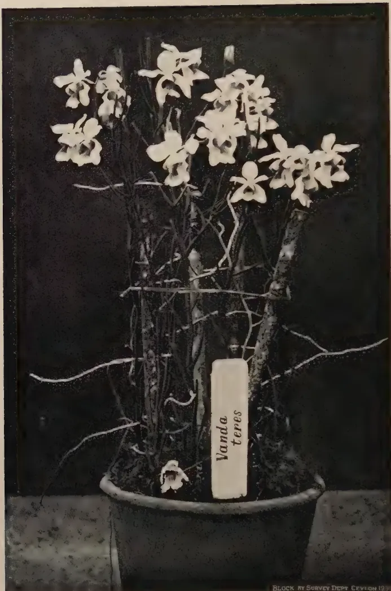

# The Tropical Agriculturist

June, 1932

---

## EDITORIAL

---

### TWO REMEDIES

---

**T**WO interesting memoranda have recently issued from the Colonial Advisory Council of Agriculture and Animal Health which, though primarily concerned with East Africa, yet are of more than passing interest to Ceylon. One is the result of investigations by the Plant Pathologist of the East African Agricultural Research Station, Amani, upon a previously somewhat mysterious disease of tea in Nyasaland; and the other is the report of a sub-committee appointed to examine the possibilities of growing cinchona as a successful crop in East Africa.

The yellowing of tea bushes in Nyasaland indicative of a disease appropriately known as the "yellows" was one with which a short time ago Ceylon was predicted as certain to be afflicted, with dire results to her chief plantation industry. The scare was an unnecessary one, especially so as little was then known of the disease and its cause. Today it is gratifying to read that as a result of investigation the Plant Pathologist can assure us with confidence that "yellows disease" of tea is curable and preventable, and the means of cure and prevention are available to every planter. The previously held virus hypothesis of the cause of infection has had to be abandoned, and the cause is now definitely stated to be due to a deficiency in the soil of a mineral element.

The experimental work carried out so far indicates, that the element deficient from the soil in a form absorbable by the plant is sulphur and the way to supply this deficiency is by the application of sulphate of ammonia to the crop. The active ingredients of this fertiliser are nitrogen and sulphur. As so often happens with deficiency diseases the general lowering of the vitality of the subject makes it easily susceptible to attack from pathological organisms and their frequent association with the disease is

1------------------------------------------------

326

liable to be regarded as its cause rather than as a secondary effect and manifestation of the primary agency. Tea plants affected with the "yellows disease", it is suggested, have to contend with an increasing shortage of sulphur owing to loss of absorbing power through the destruction of their roots by fungi. If sulphur be applied to the plants before the fungi have advanced too far the parasitic invasion is checked. The effect, if any, of sulphur treatment upon the quality of made tea is, however, not known.

The second memorandum is upon cinchona cultivation in East Africa. It was considered that the pertinent facts connected with the possibility of growing cinchona as a plantation crop wanted to be examined. The Colonial Advisory Council of Agriculture therefore recommended that the Secretary of State for the Colonies should have the subject thoroughly reviewed. The subject of cinchona cultivation generally has received attention in the columns of this journal from time to time. Quinine is still too high in price to permit of the mass treatment of malaria in the tropics. Cinchona grows well in East Africa, as it does in some parts of Ceylon, but there is uncertainty as to whether synthetic compounds are likely to replace the vegetable product in the near future in the treatment of malaria. Planters and Governments require exact information as to whether cinchona cultivation is worth embarking upon. The information supplied in the memorandum on these points is valuable. Sufficient progress it is considered has been made in the synthetic production of drugs such as to justify the belief that the medical profession will soon be in a position to fight malaria with specifics more efficacious than quinine. It does not seem that quinine could be produced in East Africa cheaper than is now the case in Java. The question of cheap production of the mixed alkaloids or febrifuge from the cinchona bark is another matter. Unfortunately the therapeutic value of these mixed alkaloids in comparison with pure quinine seems an unsettled point in medical science. What are largely required in fighting malaria in Africa are facilities for distribution of the febrifuge. In Ceylon, as in India, there should be no greater difficulty in distributing doses of febrifuge than in supplying postage stamps. With the small increase in the price of cinchona bark it is considered it might be commercially profitable to market bark grown in East Africa but it is the opinion that at the present moment the most important avenue to explore is the possibility of the production of synthetic chemical substances having a higher potency against the malarial parasite than the products of the cinchona plant.

2------------------------------------------------

This image shows a blank, aged page with a light beige or cream color. The surface has a subtle texture and contains several small, dark specks or blemishes, characteristic of old paper. There is no text or other content on the page.

3------------------------------------------------

Geo L. de Silva

BLOCK BY SURVEY DEPT. CEYLON. 1981.

Plate IX.—*Stauropus alternus* Wilk.

1. Male moth, resting position. 2. Female moth, wings spread. 3. Eggs x 4. 4. Various stages of larvae on tea shoot. 4a. First instar larva x 6. 5. Full-grown larva. 6. Pupa x 2. 7. Leaves sheltering cocoon. 8. Same as 7, with top leaf removed showing cocoon and pupa.

Figures 1, 2, 4, 5, 7, and 8 natural size.

4------------------------------------------------

327

## SOME INSECT PESTS OF TEA IN CEYLON

(Continued)

J. C. HUTSON, B. A., PH. D.

ENTOMOLOGIST,

DEPARTMENT OF AGRICULTURE, CEYLON

### THE LOBSTER CATERPILLAR

(*STAUROPUS ALTERNUS* Wlk.)

THE caterpillar stage of the moth *Stauropus alternus* is noteworthy because of the extraordinary appearance of its larval stage, with its long stick-like front legs, its swollen terminal segments and its habit of assuming the most unusual attitudes (see Plate IX, Figures 5 and 6). Its curious form showing a fancied resemblance to a lobster has given rise to the name "Lobster Caterpillar". The name of the genus *Stauropus* means "stake-footed". The insect belongs to a family, the *Notodontidae*, whose moths are nocturnal and which includes the European and Eastern Puss Moths and "Lobsters".

The caterpillar, under favourable conditions, may cause quite considerable damage to tea.

It has been known as a minor pest of tea in Ceylon for many years and during the last 40 years only two serious outbreaks have been recorded, one in 1903, which seems to have been a "lobster" year, and the other in 1928, both from the Kalutara district; fuller details of the former will be given later. Were it not for these two notable outbreaks the lobster caterpillar would be regarded "more as a curiosity than as a pest", as remarked by Green (5), who mentioned it as an instance of an "insect which may exist for a number of years without attracting attention and may then suddenly assume the proportions of a serious pest".

Our records indicate that, in addition to the two Kalutara outbreaks, *Stauropus* has also occurred in the Galle district, and has appeared occasionally in the Kelani Valley, in most of the districts of the Central Province and in the Badulla district of Uva. The elevations range from almost sea level to over 5,000 feet. These other attacks seem to have been confined mainly to individual bushes or to small patches of tea which have been easily rid of the pest.

5------------------------------------------------

328

As regards seasonal occurrence, the reports of about 40 attacks indicate that this caterpillar may be found during any month in the year, but most of the small outbreaks seem to have occurred during the latter half of the year. Of the two Kalutara outbreaks, the one in 1903 was first noticed in January and continued for several months, while the smaller 1928 attack was first reported in August and carried on for several weeks.

#### DESCRIPTION OF STAGES

Larvae of various sizes and ages have come under my observation from time to time, including specimens sent in by estates and those being bred in the insectary. During the course of the breeding experiments only two larvae came through from egg to moth and both of them were males. The descriptions of the larvae are taken from living specimens under observation and reference has been made to the descriptions of the various stages given by Susainathan and Sundaram (10) and to those of the full-grown larvae made by Green (4, 5) and by Rutherford (9).

*Eggs.*—(Fig. 3) circular, with a diameter of about 1.5 m.m., somewhat flattened dorso-ventrally, at first whitish to pale-yellow, but changing, before hatching, to pale-gray with a small dark depression in the centre; shell finely sculptured.

*Larvae: First instar.*—(Fig. 4a) about 4.4.5 m.m. long. General body colour brown to dark-brown and shiny, giving the larvae a glassy appearance. Head, dark-brown to blackish, prothorax globular, larger than the head, brown for anterior two-thirds, dark-brown to blackish for posterior third; mesothorax with dorsal pair of pale spots; metathorax and first six abdominal segments each with a dorsal pair of pointed tubercles, those on metathorax smallest, those on first three abdominal segments largest. First pair of legs much smaller than the other two pairs which are long and slender, the second pair slightly longer than the third, the three pairs ending in minute hooks. Third to sixth abdominal segments with a pair of clasping legs or prolegs, posterior pair slightly the largest. Seventh abdominal segment with a pair of small blunt dorsal tubercles and a small flattish extension on each side. Terminal segments distended, convex dorsally and flattened ventrally, with a lateral flange and an anal pair of slender curved appendages, slightly swollen near the tips.

*Second instar.*—about 5-8 m.m. long. General body colour pale-brown tinged with olive green, glassy. Head black, flattened dorso-ventrally, larger than the other body segments; prothorax small, dark-brown; mesothorax brown with a dorsal pair of whitish spots; dorsal tubercles more prominent, those on metathorax the smallest and those on first two abdominal

6------------------------------------------------

329

segments largest; prolegs dark-brown, posterior pair largest. Second to fifth abdominal segments with short whitish lines extending obliquely backwards and forwards from the outer sides of the tubercles; dorsal and lateral tubercles on seventh segment of abdomen more prominent. Terminal segments dark-brown, distended, strongly convex at eighth segment, flattened ventrally, with a lateral flange on each side bearing 3 or 4 small tubercles along its edge. A faint whitish mid-dorsal line running from mesothorax to seventh abdominal segment. Head and body closely pubescent.

*Third instar.*—9-12 m.m. long. Similar to second instar larva. General body colour brown with faint tinges of green. Head black, larger in proportion to the body. Second to fifth segments of abdomen marked with patches of dark-brown and oblique whitish lines. Terminal segments more swollen, usually held erect; anal appendages enlarged near tips.

*Fourth instar.*—14-18 m.m. General body colour becoming more variable, sometimes grayish-black with black patches, sometimes mottled light and dark-brown with whitish areas; body no longer shiny, but of a dull velvety appearance. Head black, finely pubescent. Prothorax dark-brown to blackish; mesothorax to second abdominal segment brown with a faint greenish tinge including tubercles; third segment of abdomen entirely dark-brown to black; fourth segment black ventrally with whitish to grayish sub-dorsal areas, tubercles pale-brown; fifth segment sometimes whitish to grayish almost entirely, sometimes darker ventrally; sixth segment varying from grayish to dark-brown; prolegs brown to blackish, posterior pair largest; tubercles on metathorax pointed, those on first six abdominal segments somewhat blunter, those on middle portion of body more prominent; seventh segment of abdomen dark-brown to black with rounded dorsal tubercles and a small lateral extension on each side; terminal segments dark-brown to black, eighth segment bearing a dorsal group of six small tubercles and ninth segment with four small dorsal tubercles across its posterior edge, anal segment with brownish anal appendages as before; ventral surface of terminal segments finely pubescent. Whole body covered with minute whitish warts from which arise slender short hairs; a whitish mid-dorsal line extending from behind the head to seventh segment of abdomen.

*Fifth instar.*—20-30 m.m. long. General body colour variable from grayish-black with black areas to dark-brown mottled with grayish-brown and pale-brown areas. Head either grayish-black or dark-brown, finely pubescent. Thorax grayish-black, a dorsal pair of small pointed tubercles on metathorax. Dorsal

7------------------------------------------------

330

tubercles on first six abdominal segments somewhat bluntly rounded to conical, those on first and third segments sometimes with dark-red centres, sometimes all the tubercles pale-brown to grayish-brown. First and second abdominal segments ashy-white to grayish-brown; third and fourth segments with a ventro-lateral black semi-circular patch or sometimes mottled black and grayish-brown, sometimes oblique white lines on first to fourth segments; fifth to seventh segments blackish to grayish-brown, lateral flange of seventh segment sometimes tinged with dark-red and bearing a central spine. Terminal segments now much enlarged, dark-brown to black, lateral flange sometimes tinged with dark-red; eighth and ninth segments with small black tubercles as in previous stage; anal appendages black. Body covered with minute whitish dots and fine hairs as before.

*Sixth instar, full-grown larvae.*—(Fig. 5) 35-50 m.m. General body colour about the same as in previous stage and variable as before, some larvae being distinctly black, while others are noticeably dark-brown mottled with paler areas, while occasionally a pale-brown larva is seen mottled with reddish-brown to dark-brown areas. The black larvae usually have dark red areas on some of the tubercles and on the lateral flanges of the terminal segments, the tubercles on the first three segments being more prominent. The whole body is studded thickly with minute grayish-white dots and is more noticeably pubescent than in previous stages.

*Cocoons:* (Fig. 8) loosely woven of rather coarse yellowish to brownish silk and formed between two leaves (Figs. 7 and 8) or in the angle of a branch.

*Pupae:* (Fig. 6) about 18-20 m.m. long, dark-brown to chestnut colour, smooth and shiny, terminating in a cremaster, consisting of minute hooks which serve to anchor the pupa to its cocoon.

## MOTHS

*Male.*—(Fig. 1) general colour pale-gray, sometimes yellowish-gray, suffused with darker shades of gray and brown. Head and thorax grayish-brown, antennae pectinate or comb-like; abdomen about the same colour as thorax, with small darker tufts of hairs along the middle of the back. Fore wing with a sub-marginal row of reddish spots on lighter areas; hind wing with middle area paler than the margins; both wings with a marginal row of reddish-brown and pale spots. Wing expanse, 35-45 m.m.

*Female.*—(Fig. 2), similar to male in colour and markings; antennae filiform or thread-like, ciliated; hind wing a more uniform brown. Wing expanse 50-68 m.m. The moths rest

8------------------------------------------------

331

with their front wings drawn back on each side of the body so that the front portion of the hind wings is exposed on each side (Fig. 1).

The above description of the moths is adopted from those given by Green (5) and Hampson (6), of whom the latter gives the habitat of *Stauropus alternus* as, "Sylhet; Bombay; Ganjam; Carnaria; Ceylon; Rangoon; Java." Fletcher (3) mentions that it occurs throughout India and Ceylon, while Bernard (1) records it from tea in Sumatra.

## LIFE HISTORY AND HABITS

### EGGS

*Position.*—In the breeding cages the eggs were laid singly at irregular intervals near the edges of tea leaves, usually on the underside, or on the stems of the twigs placed in the cages. I have not seen them on tea under field conditions, but according to Green (5) they are laid in a similar position on both upper and under surfaces of the leaves under such conditions, but no mention is made of any other position. On guava they were laid on the underside of a leaf near the edge.

*Number of eggs per moth.*—The only oviposition records we have are from unfertilised females, two of which laid 120 and 110 eggs, while two others laid 100 eggs between them. Under natural conditions the egg-laying capacity of fertilised moths is probably much greater.

*Incubation period.*—Green (5) mentions that the eggs hatch in about 8 days and this seems to be the only information available on the duration of this stage. The freshly-laid eggs are whitish to pale-yellow, but they gradually become a grayish colour before hatching and the central spot becomes more conspicuous. A fully-developed egg is shown on the bottom left corner of Figure 3, as being darker than the other three eggs above.

### LARVAE

*Habits.*—During the first instar the larvae are very restless, since they not only crawl about frequently, but, even when hanging on by their prolegs, constantly twist the two ends of the body into every imaginable position. At this stage they do practically no feeding except to nibble slightly at the epidermis of the older leaves. After the first moult they feed on the older and harder leaves and prefer these all through the larval period. During a serious outbreak under field conditions the older larvae consume both old and young leaves entirely, eventually stripping the bushes, so that usually only bare sticks are left.

9------------------------------------------------

332

At certain times the larvae of all ages, especially when disturbed or excited, assume their characteristic threatening attitude; the head and the front part of the body are raised and curved backwards so that the top of the head almost touches the raised end of the abdomen; the two longer pairs of front legs are stretched forwards or else straddled widely apart and quiver repeatedly with the convulsive movements of the body, while the terminal appendages are extended backwards.

Green (5) in his notes on the 1903 Kalutara outbreak refers to the difficulty of detecting these caterpillars under certain conditions. When they are present in large numbers in any given area, one's attention is attracted by the bare condition of the bushes or the insects may be detected by the pellets of excreta covering the ground under the bushes. He continues: "The caterpillar itself in its characteristic contorted attitude very closely resembles a piece of withered and crumpled leaf or such a collection of dead blossoms and buds as are to be found on any tea bush. When a caterpillar is actually feeding upon a leaf, its body partially fills the gap that it has made and in that position suggests an accidentally torn piece of the leaf that has become crumpled and discoloured; while when resting on a small branch it simulates a few withered blossoms that may have become entangled in that position. When searching for the caterpillars in other parts of the estate we were repeatedly deceived by such chance aggregations of dead flowers or some torn and twisted leaf.

*Duration of larval period.*—As mentioned above only two larvae have been bred through from egg to adult. Their larval period occupied about 26 days and they passed through 6 instars, lasting 2, 5,  $3\frac{1}{2}$ ,  $4\frac{1}{2}$ , 4 and 7 days respectively. In South India (10) the larval period of *Stauropus alternus* was found to occupy about 5 weeks. There the larvae also passed through 6 instars, lasting 2, 5, 5, 4, 7 and 11 days respectively. It is probable that under Ceylon field conditions in the low-country with an abundant food supply the larvae may become full-grown in about a month or less, but may take a week or two longer at higher elevations.

#### COCOONS AND PUPAE

*Position.*—In the insectary and when only a few bushes are attacked under field conditions, the cocoons are usually formed between two or three adjacent leaves (see Figs. 7 and 8), but when a large area of tea has been almost completely stripped by a severe outbreak or has been pruned in order to check the attack it was observed by Green (5) that the cocoons were formed "at the base of the stems and in the angles of the branches".

10------------------------------------------------

333

*Formation of cocoon.*—The actual process has not been observed, as it takes place during the night under insectary conditions, but the full-grown larva draws the edges of two or three adjacent leaves together to form a shelter, within which the cocoon is constructed of loosely woven yellowish-brown to reddish brown silken threads.

*Pupation.*—After making its cocoon the larva gradually shrinks in size and changes into the pupal stage. The whole process of cocoon formation and pupation takes from about 2-3 days.

*Pupal period.*—Green (5) gives the duration of this stage as 7-10 days in the low-country; at Coimbatore (10) it was found to be about 9 days in the laboratory. Under insectary conditions at Peradeniya the records of 16 pupae show that the duration of this period varies from about 12-19 days, with an average of 15 days. This includes the pre-pupal period of about 2-3 days

#### MOTHS

*Emergence, etc.*—In the breeding cages the moths usually emerge from their cocoons during the night and, if males are available, mating may take place and eggs may be laid during the night of emergence, but sometimes the first eggs are not laid until the next night or two. Our few records indicate that the females only live about 1 week and the males from 2-4 days.

With regard to the habits of the moth under field conditions Green (5) has observed that it "may be found, during the day-time, resting upon the stems of tea or other trees, or upon rocks, in which situations it harmonises with the pale lichens".

#### TOTAL LIFE CYCLE

Our records indicate that the life cycle of the lobster caterpillar from egg to moth ranges from about 6-8 weeks as follows: Egg stage about 1 week; larval stage about 4 weeks; pupal stage about 1-3 weeks. Under favourable conditions in the low-country it will probably be found to occupy between 6 and 7 weeks.

#### FOOD PLANTS

*Stauropus alternus* has been recorded as feeding on a number of different local cultivated plants in addition to tea. The following have been noted in our records so far, but doubtless others are known: *Acacia dealbata*, silver wattle; *Acacia decurrens*, black wattle; *Amherstia nobilis*; *Albizia stipulata*; *Cajanus indicus*, dhal, pigeonpea; *Cassia Fistula*, Indian laburnum; *Cassia javanica*; *Gossypium* spp., cotton; *Grevillea robusta*, silky oak; *Mangifera indica*, mango; *Rosa* spp., roses; *Tamarindus indicus*, tamarind; and *Theobroma cacao*, cacao. Probably the caterpillars can also feed on many wild plants in jungle areas.

11------------------------------------------------

334

### NATURAL ENEMIES

*Parasites.*—The only parasite of *Stauropus alternus* which has been definitely recorded from Ceylon, so far as I know, is a Tachinid fly *Carcelia gnava* (2), formerly identified as *Exorista gnava* (7).

In South India (8) a small hymenopteron belonging to the family *Braconidae* and known as *Apanteles stauropi* is a parasite of this caterpillar. According to Wilkinson (11) *A. stauropi* is the same as *Apanteles taprobanae* which was originally described from Ceylon, although not as a parasite of the lobster caterpillar.

*Birds.*—During the Kalutara outbreak in 1903, Green (5) observed that crows were the most active enemy of this caterpillar. These birds flocked to the infested fields in thousands when the attack was at its worst and were seen gorging themselves in spite of the acrid secretion given off by the caterpillars. They were also observed picking the cocoons to pieces and eating the contents.

### CONTROL MEASURES

*Collection of caterpillars.*—Nearly all the recorded appearances of lobster caterpillar indicate that only a few larvae were found in each case and any further development of the attack was checked at once by collecting. In the outbreak of 1903 the earlier broods of this pest evidently passed unnoticed and when first detected it was increasing so rapidly that the ordinary collections of 2,500 larvae a day by each of several coolies seemed to make no impression. The collectors were therefore put on to the fields where the attack was more scattered and the worst areas were pruned and the prunings burnt. Green estimated from collections counted on individual bushes that in one field of 24 acres there must have been at least 29 million larvae present on the day of his visit. The collectors had complained that the caterpillars bit or stung them, so were supplied with rough forceps made of bent hoop iron. Green investigated the reasons for this complaint and found that the larvae ejected from their mouths a fluid smelling like strong acetic acid. This fluid can cause considerable pain if it enters a wound and blisters may form in a few days.

Mention has been made elsewhere (see *Larvae—Habits*) of the difficulty of detecting lobster caterpillars, especially when they occur only in small numbers. Therefore as soon as a few caterpillars have been found in any area a careful search should be made on all the surrounding bushes, so that the attack can be wiped out immediately. The lobster caterpillar is usually regarded as a curiosity, but at the same time its potentialities for rapid increase under favourable conditions are so serious that no tea estate can afford to neglect it.

12------------------------------------------------

335

*Collection of cocoons.*—As indicated above, when this pest occurs only in small numbers, the cocoons are usually sandwiched between two or three adjacent leaves webbed together and any such peculiar arrangement of leaves should be investigated at once. But when an area of tea has been partially stripped by a more severe attack the cocoons may also be formed on the branches or at the bases of the bushes. The unusually short duration of the pupal stage makes it imperative that all cocoons should be removed and destroyed as soon as they are detected, so as to prevent the emergence and dispersal of the moths over the surrounding tea.

*Spraying with insecticides.*—The application of an insecticide to tea is sometimes quite effective in checking small local outbreaks of caterpillar pests, especially when the larvae are in the younger stages. As mentioned in previous articles, a solution of soap and water has given promising results against the immature stages of various caterpillars, and it is possible that this and other insecticides being investigated by the Tea Research Institute may prove useful against the lobster caterpillar under certain conditions.

*Control of the moths and eggs.*—The moth stage lends itself to comparatively easy control, owing to the fact that during the daytime the moths rest in a more or less torpid condition on the stems of tea and of interplanted shade and green manure trees, and upon rocks. They can easily be destroyed on the spot. Green (5) mentions that light traps did not prove very attractive to the moths.

At such times when the moths are in evidence a search should be made for the rather conspicuous eggs which are laid near the edges of the leaves on either surface; all leaves bearing eggs should be collected and burnt.

### SUMMARY

The lobster caterpillar although usually known in many districts "more as a curiosity than as a pest", can under favourable conditions cause serious injury, as happened during the two Kalutara outbreaks of 1903 and 1928. The rather large moths which emerge from the chrysalis stage of this caterpillar usually rest during the day in conspicuous positions on the stems of trees with the front wings drawn back so as to expose a part of the hind wings, but their grayish colour makes them liable to be mistaken for lichens on trees and rocks. The eggs are laid singly along the edges of the leaves on either surface, and hatch in about a week. The larvae of all stages seem to prefer the older leaves, but in a bad outbreak the bushes may be completely stripped. The larval period occupies from about 4-5 weeks, and

13------------------------------------------------

336

the yellowish to brownish loosely-woven cocoons are usually formed between two or three leaves on the bushes; in stripped or pruned areas they may be found on the stems and branches. The pupal stage is comparatively short, being only about 7-10 days at low elevations and from 2-3 weeks elsewhere.

Under normal conditions the lobster caterpillar is probably controlled mainly by a parasitic fly, while during the 1903 attack crows were much in evidence devouring the larvae and pupae.

Remedial measures include the collection of all stages of the pest whenever found. Insecticides may be of value against the younger larvae during small outbreaks.

#### REFERENCES

1. 1. BERNARD, C.—Some Diseases and Pests of Tea on the East Coast of Sumatra.—*Meded. Proefstation voor Thee*, Buitenzorg, No. 54, 1917, pp. 1-21. Extract in *Rev. Appl. Ent.* Series A, VI, p. 37.
2. 2. BEZZI, M.—Some Tachinidae (Dipt) of Economic Importance from the Federated Malay States.—*Bull. Ent. Res.*, XVI, 1925-26, p. 116.
3. 3. FLETCHER, T. B.—Note on *Stauropus alternus*.—*Rept. Proc. Third Ent. Meeting*, Pusa, Feb. 1919, 1, p. 101, Calcutta, 1920.
4. 4. GREEN, E. E.—Insect Pests of the Tea Plant.—“*Ceylon Independent*” Press, Colombo, 1890, pp. 25-30.
5. 5. Green, E. E.—“The Lobster Caterpillar” (*Stauropus alternus*). A Remarkable Pest of Tea in Ceylon.—*Circ. R.B.G., Peradeniya*, Series II, No. 5, March 1903.
6. 6. HAMPSON, G. F.—Fauna of Brit. India Moths. I, 1892, pp. 149, 150.
7. 7. HUTSON, J. C.—Ceylon Admin. Repts., Peradeniya. Rept. of the Ento. 1921.
8. 8. RAMAKRISHNA AYYAR, T. V.—The Parasitic Hymenoptera of Economic Importance from South India.—*Bull. Ent. Res.* XVIII, 1927-28, p. 74.
9. 9. RUTHERFORD, A.—*Stauropus alternus* Wlk. The Lobster Caterpillar.—*Trop. Agriculturist*, Peradeniya, XLIII, No. 5, Nov. 1914, p. 380, 381.
10. 10. SUSAINATHAN, P., AND SUNDARAM, C. V.—Life-history Notes on *Stauropus alternus* Wlk.—*Rept. Proc. Fourth Ent. Meeting*, Pusa, Feb. 1921, pp. 291-292, Calcutta, 1921.
11. 11. WILKINSON, D. S.—Indo-Australian Species of Genus *Apanteles*.—*Bull. Ent. Res.* XIX, 1928-29, pp. 100, 101.

14------------------------------------------------

337

## THE CULTIVATION OF FRUITS IN CEYLON WITH CULTURAL DETAILS—I

T. H. PARSONS, F. L. S., F. R. H. S.,

CURATOR,

ROYAL BOTANIC GARDENS, PERADENIYA

**T**HE fruit-grower in Ceylon can derive much satisfaction from fruit culture if carried out in the right way and careful attention be given to selection of site and soil, and if a study of the requirements and type of the particular fruit be made.

He has various climatic conditions and a variety of soils at his disposal. The climate exhibits both tropical and sub-tropical conditions, each of which are to be found in wet and dry zones. The soils are of sand, sandy loam, gravel, marl, loam, and of a clayey texture.

A blending of suitable soil, rainfall and temperature conditions with the best variety or type of fruit, together with good cultural methods will enable a grower to produce a great variety of fruits to perfection. It is generally found that the best fruits are produced in semi-dry countries or where dry weather favours their ripening season, and in most cases a district with prolonged wet periods adversely affects the proper development of flavour, keeping qualities, and also of colour.

As an instance of this a good variety of mango grown in the wet districts of Colombo and Kalutara compares unfavourably with the same variety produced in Jaffna or even Anuradhapura, especially it lacks acidity in flavour. Certain fruits on the other hand, such as mangosteen, durian, sapodilla, thrive in the moist wet conditions of Colombo, Kalutara, and Galle, whilst these fruits cultivated at Jaffna and Anuradhapura would afford very poor examples.

The object of these notes is to afford would-be cultivators useful information on individual fruits in the direction of a description of the fruits themselves, requirements as to soils upon which to grow them, planting, spacing and cultural requirements, and the importance of growing only the best and selected varieties of fruit. Many useful fruits have been introduced to Ceylon but very few efforts have in the past been made to successfully establish them as a useful or paying proposition, yet these same fruits are held in high esteem in other tropical countries.

15------------------------------------------------

338

The mere collection and sowing of seed, or striking of cuttings and the establishment of these in plots or gardens does not constitute fruit-growing. This is only accomplished, in the first place, by careful attention to details by a selection of only the large and plump seed from the best variety and from healthy trees, and later by particular attention to subsequent propagation and cultivation, which, at this stage of fruit cultivation, means layering, budding, or grafting. The strongest and the most healthy seedlings only should be budded and the budwood or scion should be obtained only from those healthy trees which give fruits of high quality in combination with fair yields.

Whilst progress in this respect must necessarily be slow a commencement has already been made on the improvement of certain major fruits, such as the grapefruit, orange, mango, and avocado, but little or nothing has been done with regard to the minor fruits. There is every reason, therefore, that a start should now be made, and since budding facilities on most of the latter fruits are not yet available, the cultivation of selected seedlings to the best possible advantage is a considerable step forward.

The fruit trees suited to the various localities might be summarised as follows and particulars of such as are usually available for disposal at Peradeniya will then be described.

Group A.—Low-country wet zone (sea level up to 1,500 feet):  
Mangosteen, durian, grapefruit, rambutan, sapodilla, uguessa, soursop, custard apple, lovi-lovi, jam fruit.

Group B.—Low-country dry and semi-dry zones (preferably under irrigation):  
Mango, lime, lemon, pomegranate, grape, grapefruit, jujube.

Group C.—Mid-country wet zone (1,500 to 4,000 feet):  
Avocado pear, China guava, grapefruit, Brazil cherry, soursop, loquat, orange, Ceylon gooseberry.

Group D.—Mid-country semi-dry zone, Uva, etc., (2,000 to 4,000 feet):  
Orange, Brazil cherry, China guava, mandarin, litchi, loquat, fig.

Group E.—Up-country (4,000 feet and over):  
Orange, tree tomato, cherimoya, China guava, passion fruit, cape gooseberry, mountain papaw, peach, blackberry, persimmon, plum, loquat.

16------------------------------------------------

339GROUP A

(1) SAPODILLA (*Achras Sapota*).—Known as the Sapota, Sapodilla-plum, Bully-tree, Naseberry, Chikku, Rata-mi (Sinhalese), Shimai-eluppai (Tamil). A small slow-growing West Indian tree 20 to 30 feet high with rather small leathery shining leaves and bearing rounded to egg-shaped fruits varying from 2 to 3 inches in diameter. The skin of the fruit is nut brown and the flesh when ripe is yellow-brown, soft and sweet. Whilst immature the fruit contains tannin and a milky latex but when properly ripe is a rich and slightly fragrant fruit of sugary taste. The fruit is essentially a dessert fruit and is not ordinarily used in any cooked or preserved form. The number of seeds varies from nil to 10 or 12, are hard and black and easily separated from the flesh. The bark contains a milky latex known commercially as "chickle" which is secured by tapping the trunk, and is used in considerable quantities in the United States of America as a basis for chewing gum, the source of supply being chiefly from Mexico, and Central America.

The tree is best suited to the low-country wet zone but will thrive in less moist regions also, and prefers a rich sandy loam, but does well in poor soils if well manured, being suited to the Colombo, Kalutara, and Galle districts and other localities with similar conditions.

Propagation is by selected seed and by gooteeing or inarching of outstanding trees, but budding and grafting is possible if suitable stocks can be found. *Bassia longifolia*, the "mee" tree of the Sinhalese and *Sideroxylon dulcificum* the "miraculous fruit" tree of tropical West Africa, afford suitable stock and grafting on to these offers a means of raising suitable trees.

Seeds should be sown in pans or prepared beds of light sandy soil and covered to a depth of half-an-inch. Germination occurs in 3 to 4 weeks and the seedlings can be transplanted or potted on attaining their second leaves, usually at about  $2\frac{1}{5}$  months of age. Permanent plantings can be made at from 12 to 15 months from sowing and should be put into well-prepared holes  $3\frac{1}{2}$  feet  $\times$   $2\frac{1}{2}$  feet and at a distance of twenty feet from tree to tree. In favourable conditions more space may be required.

Seedlings take 5 to 6 years to come into bearing but inarched plants can be expected to fruit earlier. Crops are usually heavy and two crops a year is the general rule in August to September and February to March, the former being the heavier. Some varieties fruit nearly all the year round. The fruit should be picked when practically ripe and kept in a dry room or shed for several days until soft to the touch. The fruit must not be wrongly judged by attempting to eat it before it is properly ripe.

17------------------------------------------------

340

Application of organic manure such as well-rotted cattle manure cannot be beaten and light dressings twice a year towards the end of each monsoon, is most beneficial. No pruning is required as the tree is of shy growth. The removal of any dead or unshapely branches or shoots is all that is necessary.

(2) MANGOSTEEN (*Garcinia Mangostana*).—Known also as the Mangus (Sinhalese) and Mangus-Kai (Tamil). A moderately sized conical tree indigenous to Malaya. With large leathery leaves and bearing globular, purplish-brown, smooth fruits averaging 3 inches in diameter. The flesh is snow-white, sweet, and of exquisite flavour, the flesh separating entirely from the rind of the fruit but adhering to the seed. The latter rarely average more than one per fruit in well-cultivated trees. It is throughout the East eaten as a dessert fruit but makes a very good preserve if boiled with the seeds in brown sugar.

The tree is specially adapted to a humid climate, from sea level to an elevation of 1,500 feet or so, the better quality fruit however being produced in the lower levels such as Moratuwa, Kalutara, Colombo, and inland to Mirigama and Polgahawela. So far as is known the tree is not cultivated anywhere on any large scale but mostly in small groups or single specimens and is restricted mostly to the eastern tropics. This is partly accounted for by the great difficulty experienced in raising the young plant and in getting such established owing to its weak root system.

The usual mode of propagation is by selected seed and by gooteeing. Inarching, budding, or grafting on to a more robust stock should overcome the difficulties usually experienced with seedling plants. The common "Goraka", the "Cochin Goraka", and the "Kanagoraka" all of more robust habit than the mangosteen if used as a stock should be the solution to this difficulty and is at Peradeniya under trial as such.

The seed should be removed from the fruit, the mucilaginous tissue around it being partially removed and the seed sown at once since the vitality of such is of short duration. Sow in pans of rich soil with ample leaf-mould and good drainage, covering the seed to a depth of  $\frac{1}{2}$  to 1 inch and keep in a well shaded and sheltered position. The seeds germinate in three weeks to one month and must be kept well shaded all the time, otherwise the first pair of young leaves is generally injured and the seedlings stunted or killed outright. The seedlings can be potted up on attaining their second pair of leaves, but this is recommended only where lengthy transport from nursery to plantation is involved, otherwise, it is much preferable to transplant into prepared beds, with shade, at a distance of 12 to 15 inches apart and allowed to remain till ready for planting into permanent quarters, usually at about two years of age.

18------------------------------------------------

341

Permanent plantings should be made into well-prepared holes, good drainage being assured, at a distance of at least  $25 \times 25$  feet, but  $28 \times 28$  feet is preferable.

Seedlings do not, owing to the slow growth of the tree, produce fruit till about 8 or 9 years of age, but having attained fruiting age crops increase annually, a normal crop at maturity amounting to approximately 500 fruits per tree, the market price of which varies from 60 cents to one rupee per dozen. Crops can, under suitable conditions and cultivation, be maintained over a very long period. The fruiting season is from May to July in low-country, and August to September at higher elevations, but occasionally a second light crop is obtained in February.

Light shade throughout the early life of the tree is beneficial and in fact essential, and the tree responds to manuring if light dressings of well-rotted cattle manure be applied annually. Rotted leaves or coconut husks can be used as a mulch in dry weather with advantage. Pruning is rarely required and usually restricted to a thinning out of the inner branches when such become too thick and congested.

(3) RAMBUTAN (*Nephelium lappaceum*).—The local name for this is “ramtam” but it is generally known as “Rambutan” throughout the tropics. It is a large handsome spreading tree of the Malayan regions which, although well-distributed, is rarely found as an orchard tree, being cultivated in small groups or as an isolated specimen. The fruits are produced in clusters, oval in shape and roughly  $1\frac{1}{2}$  to 2 inches in diameter, being crimson or yellow in colour, each fruit being covered with long fleshy spines. The interior represents a seed with a fleshy aril which adheres to the seed. The flesh (or aril) is white, juicy and of most agreeable taste not unlike that of the grape, and the fleshy portion moreover separates easily from the outer covering of the fruit and is eaten as a dessert fruit.

The tree is strictly tropical and thrives from sea level to 1,500 feet, but prefers a moist hot climate with well-distributed rainfall. It succeeds best in deep, rich, and moist soils, but is adapted to other soils also.

Propagation is usually by seed and by the gootee method, the latter being preferable since many poor varieties of this tree are existent in Ceylon. Budding of the best varieties on seedlings stock is also recommended. Selected seed should be sown either in beds or pans at a depth of one inch below the surface. Germination is fairly rapid and usually of good percentage, and occurs in roughly two weeks. Transplanting into bamboo pots or nursery beds can be undertaken when the seedlings are 3 inches high.

19------------------------------------------------

342

When the seedlings attain a height of 12 inches, transplanting should be undertaken. The tree attains large dimensions and plantings should therefore be from 35 to 40 feet apart. With such wide spacing an interplanted catch-crop of some other commodity can be grown for the early years.

The tree fruits at about 5 to 6 years of age if well-cultivated and mature trees are very productive, the usual season being June, July to August according to elevation. Flying bats and squirrels are troublesome pests. They can be kept away to some degree by the suspension near the top of the tree of tin cans containing a few rounded pebbles so arranged that the tins are swayed to and fro by the wind.

Well-decayed cattle manure supplied in liberal quantities towards the end of the monsoon or after the fruiting season is most beneficial. Since there are many poor varieties of the fruit in cultivation it is very essential that propagating material either of the seed, budwood, or that selected for gootee should be only from those trees of the best quality.

*(To be continued.)*

20------------------------------------------------

This image is a scan of a blank page. The paper has a light beige or cream-colored tint. There are a few very small, dark specks scattered across the surface, which appear to be scanning artifacts or dust particles. No text, lines, or other markings are present on the page.

21------------------------------------------------

A black and white photograph of a potted orchid plant, Vanda teres. The plant has several upright, slender stems with clusters of white, tubular flowers. A small white label is placed in the pot, with the text 'Vanda teres' written on it. The plant is in a dark, shallow pot. The background is dark and indistinct. The entire photograph is enclosed in a thin black rectangular border.

BLOCK BY SURVEY DEPT CEYLON 1931

*Vanda teres*

22------------------------------------------------

343

## VANDA TERES

K. J. ALEX. SYLVA, F.R.H.S.,

ASSISTANT CURATOR,

HENERATGODA BOTANIC GARDENS

*Vanda teres* Lindl. is indigenous to the woods of India and Burma and has received the universal admiration of all orchid fanciers in Ceylon during the half century since its introduction. It belongs to a magnificent genus of epiphytic orchids containing upwards of a score of species, most of which attain considerable size and produce handsome scented flowers.

*Vanda teres* is a very floriferous species, the blooms being of a most pleasing colour. The texture is extremely delicate and the deep purple hue of the petals softens away to the margin and gradually melts into the purer white of the sepals. The brilliancy of the petals and the brownish-yellow lip renders the whole flower both fascinating and conspicuous. The flower is large, being about three inches across, and is borne on erect racemes which last for a considerable time.

The plant is a sun-loving species but at the same time prefers a constant supply of moisture at the roots. Plants of this hardy species and also of *Vanda Hookeriana*, *V. Andersoniae*, and the hybrid *Miss Joaquim* could be cultivated to great advantage in the open. After the blooms are removed or have faded the plants need attention. All plants that have lost the lower leaves and appear leggy should be cut to a point that will allow the bottom leaves to rest on the surface of the compost in the pot. The cuttings should be taken just below a node with a couple of roots to each and placed in pots in a compost made up of equal parts of adhesive red earth, well-decomposed cattle manure, and coarse sand. The surface of the pot may be raised with a top-dressing of Sphagnum moss or in the alternative a layer of finely chipped wood, charcoal, and pieces of brick. The young end shoots of the stem are liable to wither off and should be at least eighteen inches long when cut. When sufficient plants are available they may be grown to best advantage in the open in beds. In the cultivation of the plant in such situations, sound drainage is essential. The bed should be at least eighteen inches deep

23------------------------------------------------

344

and a quarter of its depth should be filled with drainage material, such as brick-bats, crocks, etc. The remaining three quarters should contain the same compost as for pots and be finished off with a layer of finely broken charcoal and pieces of brick with a sprinkling of coir dust previously treated by being washed to remove tannin. A good many fairly thick stakes may be driven into the bed close to the plants for rooting on. When the plants are fairly tall it will be found necessary to have good strong posts at suitable intervals with bamboo strips tied across to which the plants may be secured.

During the growing season the plants will need ample supplies of water at the roots and sunshine overhead. For decorative purposes the top shoots with flower buds may be cut to suitable lengths and placed in pots or boxes filled with the above compost. The life and freshness of the flowers may be prolonged and enhanced by keeping the plants when in flower in a cool and shady spot sheltered from rain.

24------------------------------------------------

345

## THE REFINING OF COCONUT OIL\*

**C**OMMERCIAL coconut oil has a disagreeable smell. This peculiar property and, to a less extent, the brownish colour of the oil are hindrances to its finer applications. The oil also contains in common with other oils of a vegetable origin, free fatty acids liberated by its hydrolytic decomposition. The commercial oil is used for dressing the hair by the masses in many parts of India who are not particular about the odour or the colour, but the better class people cannot tolerate the odour and are obliged to have recourse to other expensive oils for their toilet. Experiments were, therefore, conducted in the Industrial Research Laboratory to find out if the use of coconut oil could not be further extended by so removing its odour and colour as to make it acceptable to the critical consumer as a decent hair oil. Various methods and refining agents were tried with varying degrees of success. A point of considerable importance, however emerged as a result of experimentation viz., that the complete removal of the odour and colour of the oil as well as its acidity favoured the early development of rancidity in the refined oil. Considering the experimental fact that in a given time the rancid odour becomes much more pronounced in a sample of refined oil than in the bazaar oil, it is highly probable, though not yet definitely proved, that the original oil contains a protective element which prevents the oil from turning rancid all too soon, and that the removal of this element in course of the rigorous refinement of the oil exposes the latter to the reactions responsible for the quick developments of rancidity.

Considerable quantities of coconut oil are consumed with food in South India and also in parts of the southern districts of Bengal where the coconut tree abounds, and it is as well to mention in this connection that an oil refined by means of chemical reagents is not suitable for edible purposes even though the chemicals used in its purification are removed as completely as practicable. It should also be pointed out that coconut oil required for the manufacture of soap—a purpose for which large quantities of the oil are consumed annually—need not be purified at all.

The methods employed in the Industrial Research Laboratory for refining the oil, together with the result yielded by each of them, are described in these pages for the benefit of those who would like to refine the oil for commercial purposes. It will be seen that by the use of proper methods the ordinary coconut oil of the bazaar can, subject to the foregoing remarks, be refined into an oil clear and colourless as water, free from objectionable odour and having only a nominal acid value.

Potassium bichromate was the first chemical reagent tried to refine commercial coconut oil. It did not decolourise or deodorise the oil satisfactorily; moreover, it imparted a brown colour to the oil which required repeated washes for its removal. A solution containing caustic soda and sodium chloride was next tried, and although it caused the acid value of the oil to fall to a certain extent, it failed to remove the odour or the colour to any appreciable extent.

---

\* By Dr. R. L. Datta, D.Sc., Industrial Chemist Bengal; Tinkari Basu B.Sc., F.C.S., and Purna Chandra Mitra, B.Sc., in *The Mysore Economic Journal*, Vol. 18, No. 4, April, 1932.

25------------------------------------------------

346

Sodium silicate yielded much better results. It left the oil odourless and colourless and with practically no free fatty acid. But the process suffered from a serious drawback in that the refined oil did not keep sweet for a sufficiently long time but developed rancidity quickly even though the oil was dried properly after the refining. The method of refining is described below.

The oil was boiled with its own volume of a three per cent aqueous solution of sodium silicate. The acid value of the oil fell very rapidly at first, the fall considerably slowing down after the first hour's boiling. In a particular case it fell from the original value of 5.25 to 0.49 in the first hour, and to 0.29 and 0.25, respectively, at the end of the third and fifth hours. The odour was removed in course of boiling and became less and less noticeable as the boiling proceeded. On the conclusion of boiling, the oil was washed by agitating it with water. The mixture was then left alone to allow of the oil and water to separate out in two layers. The lower layer consisting of water and sodium silicate charged with the impurities, was drawn off. Several such washings were needed to remove the silicate. The oil still somewhat cloudy, was next kept for some time in a warm place in course of which a thick frothy mass settled at the bottom, leaving a clear upper layer of oil which was then decanted off. In order to drive away the traces of moisture the oil was kept for a few hours in a hot chamber having a temperature of 100°C. The dried oil was filtered through bone charcoal, and the filtrate was a colourless and odourless oil of a very low acid value. In general appearance a sample of the refined oil could not be distinguished from clear water.

In course of a few weeks, however, the oil refined as above began to disclose distinct signs of developing rancidity, a marked rancid odour being evident thereafter. The appearance of the refined oil did not, however, show any change, and at the end of the third year following the above treatment a sample of it was found to be clear and colourless as water.

The next process tried was based on the assumption that the removal of organic and mucilaginous matter from the copra prior to the expression of the oil would prevent the hydrolysis of the oil and the development of rancidity. The copra was freed from the extraneous matter by boiling in water and the oil expressed from the clean copra was purified by filtration through bone charcoal. The refined product was free from odour and colour but within a short time this oil too turned distinctly rancid, although there was no appreciable increase in its acid value. The process was carried out as follows:

Copra freshly separated from the shell was cut into thin strips and boiled in water for five to six hours with occasional change of water to free it from extraneous matter. The strips were then thoroughly dried in a steam jacketed chamber, and crushed to a rough pulp in an iron mortar, and the oil was expressed in a small hydraulic press. The oil, as expressed, had a slightly brown colour and gave out a comparatively less pronounced smell of the coconut. On filtration through bone charcoal the colour and odour were removed and an oil having a nominal acid value was obtained. The colour of the refined product did not deteriorate in course of fifteen months although a distinct rancid odour came to be noticeable within a short time of the refining.

The method which was found to deodorise the oil with some degree of permanence and also decolourise it, was one involving the percolation, as distinct from filtration, of the oil through powdered and acid washed animal charcoal. The treatment left the acid value of the original oil unmodified but the rancid odour was conspicuous by absence. There appears to be a limit to the extent of decolourization obtainable by this process beyond which it is not safe to go. The best

26------------------------------------------------

347

result was obtained by stopping at the point when the oil had only a very pale colour. This point was reached when the percolating oil viewed in a layer one inch in thickness could not be distinguished from clear water, —but would have a pale colour in a sufficiently thick layer. Up to this stage the oil was found to be stable against rancidity, and kept sweet for months together even when exposed to the atmosphere. When however, the decolourization was pushed farther to obtain a sample as clear as water when viewed in a layer several inches thick the oil showed a tendency to develop rancidity. The percolation was effected in the following manner :

A cylindrical vessel with fine perforations at the bottom was placed on a stand below which was placed a receptacle for collecting any liquid dropping through the perforations. The false bottom of the vessel was covered with a layer of powdered and dried animal charcoal twelve to fifteen inches in thickness. The oil was gently poured over the bed of charcoal and left to work its way through the same by gravity. Each particle of oil had to traverse the entire thickness of the charcoal bed before dropping down to the vessel placed underneath and in course of its descent it gave up its colour and odour to the charcoal with which it came into contact. The process was necessarily a slow one but it needed no attention and could be continued day and night. For a large out-turn the dimensions of the percolator may be suitably increased, or better a series of percolators may be used.

The animal charcoal used in the percolator loses its power of absorbing colour and odour after use for some time and requires re-vivification. As charcoal is the refining agent employed in this process it is as well to mention the methods of preparing it.

Good pieces of bones are thoroughly cleaned by boiling in water. The dried bones are broken into smaller pieces and charred in a retort or a closed vessel out of contact with air. The charring should be done in such a way that all parts of the vessel up to the neck should receive, as far as practicable the same amount of heat. The charring will be completed when no further fumes are given off on opening the lid of the heating vessel. The charcoal should now be allowed to cool with the mouth of the vessel still covered up, and it should thereafter be taken out and powdered. The powdered mass is next boiled with hydrochloric acid and washed with water until the washings are perfectly colourless. The washed charcoal powder is then dried, care being taken to protect it from contamination with dirt and dust and stored up for use. Bone charcoal is available in the market ready for the refining of oil.

The cost of refining with animal charcoal will not exceed Rs. 2 per maund and it will be less if the spent charcoal is re-vivified and used again.

27------------------------------------------------

348

## THE CONTROL OF WEEDS\*

**W**EEDS add enormously to the cost of crop production. They present to agriculture a tremendous problem which seems not to have received due attention. Certainly, less effort and expense have been expended in combating weeds than in reducing the losses from insects and from fungus diseases. And yet weeds are said to cause more losses than do insects and fungi combined.

We are prone to take weeds for granted. Yet, some orchards and farms, large and small, have so effectively combated weeds, by carefully applying the best known methods of control, that now their cultivated fields and uncultivated areas are clean, their seed is clean, and the usual losses attributed to weeds are reduced to a minimum. The cost annually charged by most farmers to weed control can be largely eliminated.

Weed control requires community as well as individual effort, organized with a definite programme and a definite object; not for one year, or for two years, but for a series of years. Any programme outlined must be followed faithfully over a long period. The operations must be prompt and persistent. The initial cost may be great, but eventually the expense will become less and less.

Research on weeds is much needed—studies of life-history, effects of tillage, and methods of control. Particularly is more study required concerning the use of herbicides, and the application of eradication methods as related to the physiology of the plant. The economics of the weed situation should be studied in more detail. Engineering problems include the development of various weeders, of harvester and thresher adjustments, of burners, of ditch cleaners, of chemical sprays and the apparatus to apply them. The solution of certain problems, now neglected, will mean better regulatory methods of weed control, which in turn, will bring rich rewards to agriculture.

### LOSSES CAUSED BY WEEDS

There are four groups of agricultural pests: namely, (1) animal diseases, (2) plant diseases, (3) insects, rodents, and predatory animals, and (4) weeds. A recent report by the Agricultural Service Department Committee of the United States Chamber of Commerce pointed out that the annual losses from weeds considerably exceed the combined losses of the other three groups.

Few people, probably ever realize what a burden weeds add to human existence. The production of almost all crops largely consists of a battle with weeds. The preparation of many products of the soil for human consumption involves the elimination of weeds or their effects. Weeds may cause illness or even death in men or animals. They militate against our full enjoyment of the out-doors; they are the bane of every home owner and amateur gardener. Few human activities, in fact, are not affected in some measure by weeds—pests which increase the cost of our food and clothes, hamper our movement, menace our health, and dampen many of our pleasures.

---

\* Extracted from *California Agricultural Extension Service Circular 54, June, 1931.*

28------------------------------------------------

349

Weeds have been said to levy, in one way or another, an annual tax on agriculture and industry in the United States of about three million dollars. Weeds cause losses in many ways, the more important of which are as follows:

1. 1. They offer serious competition to crops for plant food, moisture, and light.
2. 2. They add to the cost of crop production because of the large amount of labour necessary to keep them in check.
3. 3. They increase the cost of preparing many crop products for consumption.
4. 4. They impair the quality and destroy or reduce the value of many products of the soil.
5. 5. They harbour insects and fungus pests destructive or injurious to economic plants.
6. 6. They are sometimes poisonous and may endanger the health or life of men and animals.

*Weeds Rob Crops of Plant Food, Water, and Light.*—Probably the heaviest loss by weeds, results from their competition with crops for plant food, moisture, and light. The crop-producing power of most of our agricultural soil is limited either by the moisture obtained frequently only at high cost, or the plant food available. When the crop must share this limited supply with weeds, the inevitable result is lower yields.

On most of our unirrigated land, water is the limiting factor in crop production, and poor yields or total crop failures often occur because the water supply has been exhausted before the crop matures. Weeds may contribute greatly to this exhaustion of the water supply. Grain fields infected with wild oats, mustard, radish, or other weeds obviously produce much lighter crops than do fields free from weeds. The reduced yield results partly, perhaps, from shading and from robbing of plant foods, but chiefly from the use of water by the weeds. One principal reason for cultivation is, in fact, the elimination of the undesirable plant growth which, except in the first few inches, is the principal reason for loss of water from the soil.

On irrigated land, competition may be mainly for plant food rather than water; but the effect is just as striking. For example, in an alfalfa field infected with foxtail or Bermuda grass, the alfalfa plants usually make but a slow, weak growth. When, however, the weeds are removed by cultivation or burning, the alfalfa is at once noticeably stimulated to greater growth and vigour.

The effect of patches of morning-glory, creeping-mallow and other perennials in depressing or preventing the growth of summer crops like corn, cotton, and beans is too well known to need discussion.

*Weeds Add to the Cost of Labour and Equipment.*—Another heavy tax incurred through weeds is the large amount of labour and equipment necessary to keep weeds in check on those areas where they would seriously interfere with crop production. The main reasons for cultivating annual crops are the preparation of the land for planting, and the keeping down of weed growth. For vineyards and orchards the principal, if not the sole, reason for cultivation is weed control. The average cost of such tillage on cultivated lands has been estimated to equal about one-twelfth the value of the crop.

Also chargeable against weeds is an enormous investment in equipment. Almost every farm possesses one or more implements used primarily for the destruction of weeds.

29------------------------------------------------

350

*Weeds Add to the Cost of Preparing Crop Products for Consumption.*—After the crop is grown, weed contamination of the product may involve further expense in handling and processing. This is especially true of the seed crops of rice, wheat, and other cereals. Millers must instal costly equipment for the removal of weed seeds and other material of weedy origin before the products are fit for consumption.

Most of the seed crops grown are contaminated with weed seed, which must be removed before the seed can be used. In fact one main reason for the relatively high price of seed to the farmer is that such seed, as grown, is usually foul with weeds, which the dealer must remove by expensive methods before the product can be marked.

An excellent example of the extent to which weeds increase the handling costs may be found in our cereal crops. The average annual production of wheat, oats, barley, and rice in California is about 1,444,000 tons, with an average dockage of well over one per cent, consisting mostly of weed seed or material of weedy origin. In the harvesting and marketing of these crops, therefore, more than 11,000 tons of weed seeds and residue must be handled and transported. Further, as already indicated, much of the cleaning cost to which most cereals must be subjected should be charged against weeds.

*Weeds Impair the Quality of Farm Products.*—Weed contamination of many crops reduces their quality and market value. The market value of wheat may be greatly reduced by the presence of certain weed seeds. Even a few seeds of sour clover, for example, will render a sack of wheat unfit for milling.

*Weeds Harbour Insect and Fungus Pests.*—Weeds serve as hosts for many fungus and bacterial diseases and for insect pests which prey on crop plants. Thus they aid in the propagation of such crop enemies, which they render more destructive and more difficult to control. The bacterial organism causing bean blight lives on some of the wild legumes, while the organism causing black leg of cabbage thrives also on wild mustard. Certain wild mustards may serve as a host for the fungus which causes club-root in cabbage. Many insect enemies of crop plants may be carried over on weeds during periods when crops are not available.

## PRINCIPLES OF WEED CONTROL

Before formulating a method of control for a weed, one should certainly know its habits of growth and reproduction. In fact the first question asked is usually: Is the weed an annual, a biennial, or a perennial?

*Annuals.*—Annual weeds are those which live but one year; they produce seed but once and then die down entirely, roots and all. An annual has no parts underground by means of which it is capable of spreading; it propagates itself by seed alone. Obviously, all methods of controlling such weeds have one principal object—the prevention of seeding. This end may be attained in a variety of ways: mowing, cultivating, burning, spraying. If seed production is consistently prevented over a series of years, and if the introduction of weed seeds from neighbouring areas is largely eliminated, the annual weed population will gradually decrease. Of course, weed seeds of many annuals may live a number of years in the soil, and the working of the soil only brings them to the surface, where conditions for their growth are favourable. The germination of much seeds should, in fact, be encouraged before the crop is in or is well along, in order to insure an opportunity to kill the young plants before they are of such size as to injure the crop and to defy easy, inexpensive destruction. Annuals in the early stage are very easily and cheaply destroyed by cultivation and by chemical sprays. Remember that, with annuals, once the top has been destroyed the root has no power or rejuvenating the plant.

30------------------------------------------------

351

One must distinguish between *summer annuals* and *winter annuals*. In the case of *summer annuals*, the seeds germinate in the spring and the plants grow to maturity during the same season, develop a crop of seeds, and die before the end of the colder part of the year. In *winter annuals* the seeds germinate in the fall or early winter, or when soil moisture conditions are favourable; and the young plants live throughout the winter in a vegetative condition, often forming a rosette-like growth. The next spring they resume growth, flower soon and shed their seeds.

Winter annuals are effectively destroyed by shallow cultivation soon after they germinate in the fall, or they may be killed by this means at any subsequent time. But, the older they get, the more difficult and expensive is their destruction; and postponement also increase the chances of some plants going to seed. The great value of growing clean-cultivated crops, from the weed-control standpoint, is that the care normally given them destroys weeds and prevents seeding.

Mowing annual weeds, will prevent seeding; but some annuals, such as wild lettuce and radish, will send up new shoots from buds in the axils of the lowermost leaves and may, if seasonal conditions permit, produce another crop of flowers and seed. Procrastination in the destruction of weeds always means increased cost of control. A trite saying, but one apparently often overlooked, is that *all plants are killed more readily and cheaply when young*.

*Biennals*.—A biennial weed is one which lives two years, producing seed at the end of the second year. It lives through the first winter usually in a low rosette form, producing a crop of seed the second summer, and then dies, root and all. The methods of control given for annuals apply to biennials as well.

*Perennials*.—The most troublesome weeds are perennials, for their control requires special method and systematic, painstaking endeavour. Plants in this group, as contrasted with annuals and biennials, live three years or more and spread not only by seed but also by underground roots or stems.

Perennials may be placed in three classes, based upon their methods of reproduction.

The simple perennials have either a large taproot, like the dandelion, or a fibrous root system, like certain bunch grasses; in either case there is a well-developed perennial crown. Under natural conditions these perennials propagate only by means of seed; but if the roots of such plants as the dandelion, or the crowns of the bunch grasses, are broken into pieces, each piece is capable of rejuvenating the plant.

The creeping perennials are the worst type to control because its representatives produce by creeping underground stems (rootstocks or rhizomes) as well as by seed.

The type known as bulbous perennials reproduces by means of bulbs or bulblets, and by seeds. Examples are the wild onion or field garlic, and nut-grass.

## WAYS OF DESTROYING OR HOLDING PERENNIALS IN CHECK

The two chief ways in which perennials are destroyed or held in check are by prevention of seeding, and destruction of the top growth or food-manufacturing tissue. This latter may be accomplished by mechanical means, such as the hoe, scythe, mower, cultivator; and by cutting off light, thus preventing the food-manufacturing process from going on. This

31------------------------------------------------

352

in turn may be accomplished by the use of smother crops, mulches of straw, manure, etc., and by the use of tar paper or other opaque material. Destruction of the top growth may also be accomplished by chemical means, employing sprays, such as oils, which merely destroy top growth but may not penetrate to the roots or rootstocks.

Perennials may also be held in check by destroying the structures beneath ground which store food. This involves a chemical treatment which will penetrate these subterranean structures and kill them.

*Prevention of Seeding.*—The first and most important step in the control of a perennial weed, in fact of any weed, is, of course, the planting of clean seed. This truism should scarcely require even mention. A second point, which likewise should need no emphasis, is that perennials should not be permitted to mature their seed, even though they spread in other ways.

*Destruction of Food-Manufacturing Tissue.*—As stated above, a very striking character of perennial weeds is the possession of underground structures which store food and also serve as propagative organs. These subterranean structures may be either roots or stems, or both. In the dandelion, for example, food is stored in the root, which may also propagate the plant; in Johnson grass the underground stems (rootstocks) are the food-storage and propagative organs; and in morning-glory, both underground stems and roots act as storage and propagative organs. The important and distinctive feature of a perennial weed is the occurrence of underground structures which have a reserve food supply and can send forth from these structures new shoots. In perennials, as in all other plants, the leaves are the principal food-manufacturing organs. Underground structures devoid of a green colouring matter and shut off from the light, are incapable of manufacturing food. The reserves of starch, sugar, or other kinds of foods which they may possess are manufactured in the leaves and conducted down the stems to the storage organs. These storage roots or underground stems increase in size as they grow older, and their supply or reserve becomes correspondingly larger.

If the top growth of a perennial is destroyed, the plant, as is well known, shortly sends up new shoots from the structures underground. This new shoot growth was assuredly made at the expense of stored food, and the amount of reserve food in the underground organs was therefore certainly decreased to an extent depending upon the amount of shoot growth produced. If these new shoots are destroyed, a second group of shoots will again be sent forth, and reserve food will again be called upon to produce them. If top growth, that is, food-manufacturing tissue, is repeatedly destroyed before it has an opportunity to make food, and if in consequence of this destruction new shoots are repeatedly produced, the result must be an exhaustion of the food-storage organs in the ground. Now, the question is frequently asked: "How many times must one destroy the top growth of a perennial weed in order to starve or exhaust the storage organs underground? In the first place, the number of times required will depend upon the amount of food stored in these subterranean organs, which amount in turn depends upon their age and the area of their food-making surface. In the second place, the number will depend upon the thoroughness and promptness with which the top growth is destroyed. Obviously, a young plant with little reserve in its underground parts is more readily killed by destruction of the top growth than is an old plant replete with food. No perennial weed, it is safe to say, can ultimately escape being starved out by persistent and frequent destruction of the top growth. More practical methods may, however, be found; and of these we shall speak later.

32------------------------------------------------

353

*Clean Cultivation.*—As mentioned above, perennial weeds have the ability to store in structures underground the food manufactured by the green leaves of the plant. Seeding may be prevented and top growth kept down by clean cultivation, which, if properly done, prevents all the leaves or food-manufacturing parts of the plant from appearing above the ground. By this means the storage system will eventually be starved out. Growers must realize, however, that some weeds can in one season store enough food to last them several years. Consequently, one summer of conscientious clean cultivation may be insufficient to exhaust the plants and the grower may then be disappointed when new growth appears the following spring. The only way to ensure results from clean cultivation is by persistence in keeping down all top growth, which may require several cultivations during one or more seasons. Many tools have been especially designed for this particular method of weed control: Special knives can be attached to cultivators, which will cover a given area in a short time, thus cutting down labour and other costs.

Clean cultivation, though it aims primarily at starvation of roots or underground stems of perennials, also continually keeps the soil stirred and brings seeds formerly produced by weeds to the soil surface where, under favourable conditions, they germinate, the seedlings being killed by subsequent cultivations. Thus clean cultivation serves to bring about a decrease in the number of weed seeds in the soil. Clean-cultivated crops always form a part of any successful crop rotation and, when alternated with grain and alfalfa, have proved very successful. If clean cultivation of a row crop is carried on for a year or two, perennials are very much weakened, if not killed out. If the clean-cultivated crop is followed by a smother crop, competition may become so great that the weaker weeds are unable to grow and to replenish themselves with stored food.

In dry-land grain areas where a crop rotation may not be so easily established, inasmuch as row crops without irrigation may not be profitable, summer fallowing greatly disturbs the root system of weeds and will very often thin out, if not eradicate them. In summer fallowing, systematic plans must be formulated whereby cultivation can be carried on at such intervals during the summer as to keep down all plant growth. The entire summer's conscientious, persistent work may be lost if weeds are subsequently allowed to produce much vegetative growth. So, before attempting clean cultivation methods, be sure that nothing will interfere with the programme.

*Crop Rotation.*—In any serious programme of weed control, crop rotation plays a leading part. Among the many well-established reasons for such procedure, control of weeds is one of the most important. On those farms where weeds are of little consideration, either in increasing labour costs or in decreasing crop yields, a definite plan of crop rotation is systematically adhered to. Planting land to the same crop for a series of years in succession encourages weed growth, and a lack of proper rotation is a cause of weedy fields.

*Smothering.*—Top growth may be more or less successfully prevented by smothering, either with a smother crop or with non-living material. Smother crops are effective chiefly as a result of excluding light.

### CHEMICAL WEED CONTROL

California has unique weed problems. With its great highway system, its large acreages of farm and orchard land under control of one man or organization, its tremendous areas in ditch banks and levees, practical weed control becomes a somewhat different problem from that facing a community made up of small landowners. California, accordingly must develop methods

33------------------------------------------------

354

of weed control and eradication which can be applied in a practical way on large areas. In this connection, it seems probable that chemicals, the various toxic salts, acids, and oils, will find wider and wider application in California. In another ten years they may be employed on a scale undreamed of at the present time, particularly in the case of roadsides, ditch banks, and other uncropped areas; but also in a modified fashion for land in crops, and for small patches of highly pernicious weeds.

The employment of chemicals in weed control has the added advantage of utilizing a number of by-products of the industries, including some almost waste materials which thus find their greater economic use as an herbicide, as well as the cost of their application, will be a constant problem. By necessity, herbicides must be not only effective but cheap if they are to find wide application. The agricultural interests and the industries which have such products for disposal must co-operate to the fullest extent so that herbicides may be sold at the very lowest price which will permit a reasonable profit to the manufacturer. The expense will decrease as the volumes of business increase. As the difference between the cost of small quantities and carload lots is usually very great, farmer groups will be able, through co-operation, to secure large quantities of herbicides at very much reduced prices.

*Kinds of Herbicides.*—Herbicides may be classified according to the effect which they produce:

1. Herbicides which are applied to the tops and which do not affect the root or rootstocks of perennials. These are employed to kill annuals and to prevent the seeding of biennials and perennials. At present oils are the most extensively used chemicals belonging to this group; for their use we have practical and effective equipment. Sulphuric acid is another chemical in this class which is finding increased usefulness, but difficulties are being experienced in developing equipment to apply it.

2. Herbicides which are applied to the tops and which not only kill top growth but are carried down various depths to destroy the roots or rootstocks. Depth of penetration into the structures underground varies with a number of factors, not well understood, among which are the following: nature of the chemical, strength of the chemical, species of plant, stage of growth of plant, soil, humidity, and other environmental conditions. This type of herbicide is greatly in demand for the destruction of perennials. The ideal perennial herbicide, one which will, under ordinary conditions, kill such plants as morning-glory, Johnson grass, hoary cress, Bermuda grass, and camel's thorn, should be cheap, easy, and safe to apply, and should not only destroy top growth but be carried down to the extremities of the roots and rootstocks and bring about their death. Certain chemicals now in use answer these specifications in part, but this class of herbicides, and their behaviour under varied plant, soil, and other environmental conditions, should be more thoroughly investigated. The principal chemicals of this group that have shown a varying degree of practicability are the chlorates and the arsenicals.

3. Herbicides which are applied to the soil and are directly absorbed by the roots. The chief chemical in this class is carbon bisulphide. This, though an extremely toxic chemical, is usually so expensive to purchase and apply that its use is confined to small areas infested with some highly pernicious weed.

4. Herbicides which act as soil sterilizers. Chief of these is sodium arsenite. These destroy seedlings and the shoots arising from underground structures; they may in instances kill seeds in the surface layers of soil.

34------------------------------------------------

355

5. Herbicides which destroy weed seeds without sterilizing the soil. Oils employed in the control of puncture vine are an example. Others are dilute solutions of sulfuric acid, and a number of other chemicals.

Remember that oils are, for the most part, top-killers, and when applied as a spray to the top growth, do not ordinarily penetrate tissue underground. In the case of certain perennials, however, such as Johnson grass, oil may slightly penetrate roots or rootstocks sufficiently to thin somewhat an infested area. With hoary cress, the effect of an oil spray has been traced to a depth of 8 or 10 inches below the surface. Generally, however, the oils are most efficient in controlling annual weeds and preventing biennials and perennials from seeding. However, they are effective on some of the simple perennials and fairly valuable even on shallow-rooted creeping perennials, such as Bermuda grass and Johnson grass. Roots within direct reach of the oil will be killed to the extent of its penetration.

The rate of killing of plants sprayed with oil depends largely upon the temperature and type of plant. On very hot days the effects of the oil may be seen within a few hours, and within 12 to 24 hours the plants may be completely shrivelled and dead; but cold weather retards the rate of killing.

For satisfactory results, complete coverage of the plant is essential. This may not be possible if the vegetation is too heavy and thick. Oils are most efficient when the vegetation is small for then complete coverage is more easily brought about and the cost per unit area is much less. The attempt to cover tall and thick vegetation thoroughly with oil usually involves waste of material. Labour, furthermore, is sometimes careless in handling of the spray nozzle and, consequently, causes criticism of the use of oil because the coverage is incomplete.

Waste crankcase oil, if used, should be diluted with distillate or Diesel oil to a proper consistency for spraying. Crude oil also may be diluted as above and used satisfactorily for "spot" work and with small equipment.

Among the many different factors which affect the cost of applying oil may be mentioned (a) species of weeds, (b) density of growth, (c) type and efficiency of spray equipment, and (d) efficiency of the operator.

### THE CHLORATES

The chlorates are white crystalline substances, the two principal herbicides being sodium chlorate and "Atlacide" (calcium chlorate). Sodium chlorate usually comes in the pure crystalline form. "Atlacide" is a commercial herbicide, which is chiefly sodium chlorate with an addition of calcium chloride which, because of its deliquescence, lessens the fire hazard.

The chlorates are non-poisonous to animals. They have been employed rather extensively in a number of States, and in certain instances very successfully; but in some particulars their use is still in the experimental stage. Unpublished results of several workers appear to show that, chlorates are most effective when the solution has an acid reaction. If this be true, chlorate solutions should not be made with alkaline water, unless it is rendered acid by adding a small amount of acid. Much more must be learned about the amount to use, the time and application, relation of time of application to environmental conditions, the method of application, etc. Evidently, however, the chlorates are among the most promising chemicals yet employed to control perennial weeds when applied as a spray to the top of the plant. They will also effectively kill annuals; but thus far, in most instances, there are other herbicides for annuals more economical than the chlorates and just as effective. As regards perennials, remember that a desirable herbicide is one which, when applied to the top of the plants will be absorbed and be carried to or result in the death of a large percentage of roots and rootstocks.

35------------------------------------------------

356

*Time to Apply Chlorates.*—The chlorates are evidently most effective if applied on mature plants or plants approaching maturity. They should accordingly, be applied when the plants are in full bloom, or just after this stage. In the case of perennials a maximum of top growth seems advisable if a large proportion of the underground parts of the plants is to be killed. Late summer and autumn applications seem more effective than spring or early summer. A perennial which develops its seed in the summer may, perhaps, be prevented from seeding more economically by means of cultivation, mowing, oil sprays or some other methods less expensive than the use of chlorate, the chlorate treatment being thus postponed until fall, when the plants are attaining dormancy. In other words, chlorates apparently bring about a better root kill if applied when the plants are going into a dormant condition.

*Amount of Solution Required.*—The usual solution employed is that made by dissolving 1 to  $2\frac{1}{2}$  pounds of the chlorate in 1 gallon of water. The amount required depends upon the density and kind of vegetation. If the growth is heavy and rank the dilution can be less than when the growth is moderate or slight; but the number of gallons of solution must be increased. In the case of "Atlacide" for example, for a rank and heavy growth of morning-glory in full bloom there is a recommendation that there be applied 2 gallons to the square rod of a solution which contains  $1\frac{1}{2}$  pounds per gallon; but with less dense stand or growth, 1 to  $1\frac{1}{2}$  gallons to the square rod of solution containing  $2\frac{1}{2}$  pounds to the gallon. Often 1 to 2 gallons of solution may be expected to cover a square rod, if applied conservatively with a hand sprayer. But if a large area rather completely covered with vegetation is to be sprayed with power equipment, it will usually require at least 300 gallons per acre to secure satisfactory coverage. The type of vegetation being sprayed may be such that a greater amount, even as much as 1,000 gallons per acre, will be required. In any event the important consideration is to secure complete coverage of the vegetation and apply an adequate amount of the material per unit area. Remember, also, that power equipment varies in its efficiency.

*Effectiveness of Chlorates as Influenced by External Conditions.*—The effectiveness of the chlorates is lessened if the treated areas are disturbed in any way before the following spring. That is, the treated plants, even though dry and with tops dead, should not be burned off, or moved, or cultivated until the spring following their application.

The Ohio Agricultural Experiment Station states that sodium chlorate applied to quack grass and Canada thistle is most effective if applied on cloudy days and when the air is humid; also that the effectiveness appears to be greater when the soil is somewhat moist. The Kansas Agricultural Experiment Station also states that chlorates are best applied when the air is moist as in the late afternoon on damp days. They further point out that rain a short time after spraying has little retarding action. The Idaho Agricultural Experiment Station states that for the eradication of most perennials more chlorate is necessary on irrigated areas than on unirrigated areas, and that where high water tables prevail more chlorates are required than where the water table is low. Experiments in Colorado, using equal amounts of chlorates on irrigated and non-irrigated plots, show better results on the latter.

At the present time experimenters are closely observing many field plots in different parts of California with a view to determining the influence of various factors upon the effectiveness of the chlorates.

*Effect of Chlorates on the Soil and Subsequent Crops.*—Some variation appears in the effect of chlorates upon the soil and subsequent crops. This variation might well be expected, for the soils to which the chlorates have

36------------------------------------------------

357

been applied undoubtedly differ, and the treatments these soils received before and after the chemical application were by no means the same.

In Kansas it has been found in field bindweed plots sprayed with sodium chlorate August 19, September 2nd and September 16, where the soil was sampled to a depth of 7 inches in May of the following year, that bacterial action had not been seriously interfered with, and that these plots sown to wheat in September bore a normal crop. Aslander, in New York, also found that autumn applications of sodium chlorates did not influence the ammonification and nitrification processes in the soil the following spring, and did not injure the oats then sown on the plots. In Idaho it was found that in irrigated sections, grain crops seeded the spring following chlorate treatments turn yellow, but are usually restored to normal by the first application of water. In Oklahoma areas sprayed twice with sodium chlorate in the summer and fall of 1928 showed considerable decrease in the yield of oats in 1929.

In California the writers have observed instances in which trees have developed disorders following the applications of chlorates to weeds in orchards. In these cases injury resulted from the chemical coming in direct contact, not with the foliage but with the roots through the soil. Present knowledge advises caution in the application of chlorates to weeds in orchards.

At Davis, California, barley seeded in December on land sprayed with sodium chlorate in October and November failed completely. In the spring, after a winter rainfall of more than 12 inches, the seedlings of morning-glory and other weeds came up, soon turned yellow, and died. Two heavy irrigations were necessary before a satisfactory stand and a healthy growth of Sudan grass could be obtained.

*Application of Chlorates, Dry.*—It may be impracticable to provide spray equipment to treat a few small patches of weeds. In such cases, chlorates may be applied dry. Spread the crystals broadcast with the hand, about one pound to the square rod. The chemical will not be effective until it goes into solution. Commercial "Atlacide" (calcium chlorate) is a finely powdered material and hence may be dusted. Special equipment, both of the knapsack and power types, has been devised for dusting of "Atlacide" (calcium chlorate).

In New York it was found that about 175 pounds of sodium chlorate per acre, applied dry on the ground late in the fall, was effective in killing the roots of Canada thistle. The fall application was more effective than the spring.

*Precautions in the Use of Chlorates.*—The chlorates are a *fire hazard*. In a number of instances individuals have been seriously burned in the use of a chlorate. The chlorates are strong oxidizing agents; that is, in contact with organic matter of any sort they readily give up oxygen to it, thus rendering it highly combustible. Thus, clothing, chaff, straw, sacks, wool, etc., covered with chlorate will readily ignite when dry. For example, parts of clothing worn while spraying with chlorate may become wet with the chemical; then the clothing and chlorate become dry and, in this condition, *become highly inflammable*. Ashes from smoking tobacco, a match thoughtlessly lighted, or a spark from an exhaust pipe of spray equipment may set a fire.

Men should preferably not work alone in using chlorates. If two or more are working together, assistance is at hand in case of fire. A bucket of water may extinguish the blaze and prevent what otherwise might be a serious accident. Spray equipment sometimes carries a fire extinguisher.

37------------------------------------------------

358

In handling chlorates, as during loading or unloading, or in the preparation of the spray solution, any crystals or solution accidentally spilled on floors, trucks, or machinery, should be thoroughly washed off with a hose or otherwise drenched with water.

Chlorates are particularly combustible in contact with sulphur. Consequently, great caution should be taken not to store sulphur, or sulphur-containing spray materials, near chlorates. Moreover, a spray machine once employed in applying sulphur spray should be thoroughly washed inside and outside before it is used in applying chlorates.

Accidents are more likely to occur after spraying operations are completed, and the clothing is allowed to dry on the body. This danger can be eliminated by having two pairs of overalls. At noon one pair can be rinsed out in clean water to remove all chlorate, and the dry pair put on for the afternoon; this pair should, in turn, be washed in the evening. Operators of chlorate sprays sometimes wear rubber boots. The material should not be allowed to dry on these, and they should be washed thoroughly every evening.

Keep spray equipment well painted so that the solution does not saturate the wood. Metal rather than wooden containers are better for chlorate solutions. Wooden containers, if employed, should be washed out thoroughly after use and even be allowed to stand for several days filled with water. A wooden barrel, for example, in which chlorate solution has been made may, once emptied and dried out, become a highly combustible object.

As an extra precaution, mix solutions away from outbuildings, barns, straw stacks, etc.

Chlorates should be purchased preferably in metal containers. If shipped and stored in sacks, they should be kept in a dry place, for they absorb moisture from the atmosphere, and the chemical, coming in close contact with the fibre of the sack, presents when dry a fire hazard.

In emphasizing the precautions to be employed, one should remember that chlorate sprays are no more dangerous than gasoline and other chemicals used daily on the farm as insecticides and fungicides, and no more dangerous than dozens of chemical compounds handled constantly in the industries. If chlorates are effective herbicides, the care necessary in handling them should not be a serious drawback.

### CARBON BISULPHIDE

This is a highly explosive, volatile, clear liquid, employed with considerable success in the destruction of perennial weeds, such as morning-glory, Russian knapweed, poverty weed, Canada thistle, and Johnson grass. It has also rather effectively killed willows. It is applied by injecting into the soil, where it volatilizes and diffuses. As carbon bisulphide is heavier than air, the direction of diffusion is more rapid downward than upward; however, the gas diffuses in all directions from the point of application. Being highly toxic it usually kills the weeds within a short time, depending upon soil conditions. The effect may sometimes be seen within a few hours after application, and destruction of the weeds will be completed within 4 to 10 days. There seems to be a minimum concentration which will destroy plant tissue of any given species. In an experiment with Johnson grass, for example, the rootstocks within a radius of 8 or 10 inches from the point of application were killed for their entire length, whereas rootstocks originating beyond this radius were unaffected. At the same time, the carbon dioxide differed in 24 hours throughout a radius of 36 inches in the soil.

38------------------------------------------------

359

Carbon bisulphide, on account of its cost and the expense of application, is applicable only to small areas heavily infested with a highly pernicious weed which threatens to spread to a much larger area of valuable land. Under such conditions of threatening infestation, an apparently high cost of eradication may be justified and wholly practicable.

### WEEDS IN RICEFIELDS

Because of the conditions under which rice is grown, the weeds which infest ricefields are in the main different from those occurring in other field crops. The most troublesome ones grow, like rice, in standing water. After the rice has been seeded, there is no practical means of combating the weeds; and as the rice requires a long growing season, most of the weeds mature and drop their seeds before it is harvested. As a consequence, weeds in ricefields multiply very rapidly. Three years is, by common experience, about the maximum time in which a field can be cropped continuously to rice before becoming so weedy as to render the crop unprofitable.

The weeds most troublesome in the ricefields are varieties of water grass, red stem, scale grass or sprangle top, red rice, spikerush, cat-tail, the various umbrella plants or nut-sedges of which there are several species, tule or bulrush, and arrowhead.

Up to the present time, more war has been waged on water grass than on most of the other species. Yet the water grasses, though most prevalent, are by no means the most serious. Such perennials as the nutsedge, cat-tail, and spikerush, reproducing by underground parts as well as from seed, are much more difficult to eradicate when once established than is the water grass.

Water grass is of two types: common, and white. Common water grass fruits abundantly, matures and sheds its seed before the rice crop is ripe. It spreads and infests the fields very rapidly. Fortunately, common water grass and also scale grass or sprangle top can be controlled successfully by *keeping the fields flooded from the time the seed bed is prepared until the rice crop is mature*. Submerged under 4 to 6 inches of water, the seed of common water grass will not germinate. When, however, rice is drilled or broadcast and irrigated lightly for two to four weeks to bring it up before it is permanently submerged, shallow submergence at 2 to 4 inches apparently does not control the water grass. The second type, the so-called "white water grass", matures somewhat later at about the same time as the rice, so that when the crop is harvested most of the seed is removed from the field. Although, in consequence, it does not spread so rapidly as common water grass, it cannot be controlled by flooding. Its seeds will germinate and produce plants with any submergence which will permit the growth of rice.

None of the other important annuals can be controlled by flooding, so that at present the only known method of checking them is the periodic fallow, as now commonly practised.

The perennials are a more difficult problem. The nutsedge, for example, is spreading rapidly and, as it may be reproduced either by seed or vegetatively by the nut-like tubers, it constitutes a real problem. It thrives equally well on moderately moist and on wet soil. Because of its vegetative mode of reproduction it is extremely difficult to eradicate by the usual methods of cultivation.

Cat-tails likewise, reproduce both vegetatively and by seed. In the field, the weed can be controlled by proper cultivation; but a fairly dense stand, once developed, is not easily destroyed by cultivation. Once cat-tail infests the land, heavy seeding with rice apparently does not control the weed; but a heavy stand of rice does prevent somewhat the entrance of

39------------------------------------------------

360

cat-tail. Ploughing in the spring and thorough drying of the roots will destroy many plants. In fact, spring ploughing with good preparation of seed bed aids greatly in the control of many rice weeds. Disked stubble does not, as a rule provide a satisfactory seed bed. Such roots as remain in the soil will, however, renew growth; and cultivation must usually be repeated two to three times during the season to be most effective. Most perennials can be controlled by cultivation repeated often enough to prevent an appreciable development of the above-ground organs. The number of cultivations necessary and time required will vary with the species. Preliminary tests indicate the possibility of controlling cat-tails and some other perennial weed pests with chlorate sprays, but the conditions necessary have not yet been fully worked out.

Destruction of weeds in ricefields will not, however, solve the rice weed problem; equally important is the prevention of their introduction from outside sources. Weed seeds are introduced into ricefields in three ways: with the rice seed, with the irrigation water, and by the wind and other agencies from plants growing on adjacent waste or unused land.

New weeds are, as a rule, introduced first into a district with the rice seed. Thus some of the sedges now spreading in the rice area were brought in with rice seed from the Orient. Red-rice is, as a rule, also distributed with the rice seed. The use of clean seed is, therefore, important in preventing the introduction of potentially troublesome weeds.

Since most weed seeds float or are readily transported by flowing water, the seeds of weeds and grasses once allowed to mature on the ditch banks soon find their way to the land under irrigation. Unsuccessful attempts to filter off such seed from irrigation water by the use of screens have shown that the amount of weed seed thus transported is enormous.

Weeds allowed to grow on leaves and waste land adjoining the fields constantly produce seed for re-infestation of the cultivated areas. Seed of the cat-tail, for example, is readily disseminated by birds, animals, or mechanical agencies. Any plan, therefore, for the control of weeds in ricefields must seek to prevent the introduction of weed seed from outside sources.

40------------------------------------------------

361

## CONTROL OF FUNGUS DISEASES\*

### DIRECT METHODS OF CONTROL

**D**IRECT methods of controlling fungus diseases consist of the use of certain chemical poison, or rather agencies such as heat, to kill the parasitic fungi or to prevent their spores from infecting healthy plants. Before embarking on a campaign of spraying or dusting with a view to control fungus diseases, some knowledge of the properties, action, and methods of applying the various fungicides available will enable the cultivator to make the best use of the materials at his disposal. All direct methods of combating fungus diseases are somewhat expensive so that the crop must be of a valuable nature to make the expenditure worth while. Hence such measures of control are only widely employed on valuable crops such as vines, fruit trees, potatoes, and other market garden and orchard crops, some of which are liable to be totally destroyed by severe epidemics of fungus diseases.

The poisons (fungicides) by which fungus diseases can be successfully attacked may be divided into three groups:

- (a) Those which kill or destroy the fungus immediately on coming into contact with it; the so-called "hitting" spray fluids.
- (b) Those which form a poisonous layer on the surface of the foliage and on which the germinating spores of the fungus are killed before they can gain entry into the plant.
- (c) Those which are intermediate in their action between (a) and (b); i.e., they kill the fungus on coming into contact with it but to a certain extent they also form a poisonous layer.

Fungicides may be in the form of dusts or powders or in liquid form, composed of solutions or fine particles suspended in a liquid.

A fungicide should fulfil two conditions: (a) it must contain a poison sufficiently strong to kill the fungus or to prevent its spores from germinating, but at the same time it must not be injurious to the plant, and (b) it should be inexpensive and easy to handle.

Of the liquid fungicides of the first group which have a direct action may be mentioned washing soda and soft-soap (Formula No. 1) which is useful for controlling powdery mildews in small gardens, the ingredients being common household commodities. In common with "hitting" fluids of this nature, several applications must be given, as only the fungus present is killed; the plant is not protected from future infection. The mixture of soap and soda has a further advantage in possessing the power of breaking down the film which causes water to run in drops. It is thus able to penetrate the tightly woven mass of fungus threads of which the mildew is composed. The property of spray fluids is discussed further below.

A weak solution of carbolic acid and soft soap is another example of a "hitting" fluid useful for combating rose mildew.

Of the protective layer type of fungicides are the well-known copper spray fluids, Bordeaux Mixture (Formula No. 2) and Burgundy Mixture (Formula No. 3). Both these contain copper sulphate as the poisonous principle. Copper sulphate is one of the most efficient fungicides known. A solution of this substance, however, even when greatly diluted, has an

\* From *The Cyprus Agricultural Journal*, Vol. XXVII, Part I, March, 1932.

41------------------------------------------------

362

injurious effect on plant foliage. The interaction of the copper sulphate with lime or washing soda produces a compound which, while retaining much of the fungicidal property of the copper sulphate, does not injure the foliage. Further when the liquid evaporates it leaves a poisonous layer which is washed off by rain only with considerable difficulty. This persistent layer serves to protect the leaves from infection, as spores alighting on it are either killed directly or when they commence to germinate.

Burgundy Mixture, though slightly more expensive to make than Bordeaux Mixture, is to be preferred where lime is of an inferior quality or is difficult to obtain. It has certain other advantages in that it is rather less likely to be washed off by rain and is not so likely to clog the spraying machine. These spray fluids have a wide application against a large number of fungus diseases, especially the Downy Mildew of the Vine and the Early and Late Blight of Potatoes.

An example of a spray fluid which acts both as a "hitting" spray and also forms a protective layer is lime sulphur. It is best bought in the concentrated form and before use merely has to be diluted with the requisite amount of water. It is a valuable fungicide for use on fruit trees which are liable to be injured by certain copper fungicides and is particularly effective against the powdery mildews of apple, peach, and almond.

It is a matter of common observation that rain or water sprayed on the surface of a cabbage leaf immediately forms drops or globules which tend to run off the inclined leaf surface. If the leaf on the other hand, is dipped into a solution of soap, the globules do not form but the water "spreads" over the surfaces as a film of moisture. In the same way pure water sprayed on wool will remain on the surface of the fibres in the form of drops. The soap solution, however, will penetrate between the wool fibres and thoroughly "wet" the wool. This spreading and wetting property of spray fluids is of great importance, for without it the fluid will not spread and make an even film on the leaf surface, nor will it penetrate and wet the tangled mass of fungus threads of which the powdery mildews are composed. Various substances as well as soap can be added to spray fluids to increase their wetting and spreading powers, as much as calcium caseinate, saponin, skim milk, etc. Certain proprietary substances such as "Agrol" are also on the market.

## DUSTS

The only fungicidal dust at present in general use in Cyprus is sulphur, which should be in the form of "Flowers of Sulphur" or very finely ground or precipitated sulphur. This kills the fungus by direct action of the sulphur particles in contact with the fungus. Its chief value lies therefore in combating the powdery mildews and is the chief specific in use against the "Oidium" of the vine. The chains of spores where they have come into contact with the particles of sulphur have shrivelled up. As the particles of sulphur are in actual contact with the fungus, it follows that, to obtain the best effect, the sulphur should be in a fine state as the smaller the sulphur particles the greater the amount of mildew with which they can come into contact.

Other dusts, which have not yet had a wide application in Cyprus, are the copper-lime dusts which, on coming into contact with moisture on the surface of the foliage dissolve and form a deposit similar to that left by Bordeaux Mixture. They are not on the whole as efficient as the wet sprays but have useful application in districts where water is not readily obtainable or in hilly districts where water is difficult to carry to the spraying machines.

42------------------------------------------------

363

## APPLICATION OF FUNGICIDAL MATERIAL

A spray fluid whose efficacy depends on its penetrating or wetting power such as the soap and the soda mixture may be put on with a fairly coarse nozzle. With the protective layer type of spray fluid the foliage must not be "washed". A fine misty spray is required which will form a film on the surface of the leaf without causing it to drip. Spray fluids can be readily applied by means of the numerous knapsack machines on the market. The pneumatic type of machine which can be pumped up to a considerable pressure is on the whole more efficient than the lever pump type. Knapsack machines can be used for all garden and field crops and for trees not more than ten feet high. With a knapsack machine one man can use about 60 gallons of spray fluid a day. For larger orchards, vine plantations, and potato plots a hand pump mounted on a 15-gallon tank on wheels is a more suitable type of apparatus to use, especially as with this machine a higher pressure can easily be maintained.

Powders can be applied by means of small hand bellows or a knapsack dusting machine. The most efficient of the mechanical dusters are those fitted with a rotary fan in place of the bellows. The chief desideratum is to produce a cloud which will penetrate the thickest foliage and leave a deposit of particles on both surfaces of the leaves. For this reason powder can usually only be applied when there is little wind. It is generally necessary to dust in the morning or evening when the foliage is wet with rain or dew. This is essential with the copper-lime dusts which depend for their efficiency on the solution and interaction of their component particles. For dusting on a very small scale a muslin bag filled with powder and beaten with a stick will give fairly good results.

In deciding which of the various fungicides should be employed to combat a particular disease a knowledge of the life-history and mode of infection is required. Parasitic fungi may be divided for this purpose into two groups: (a) those which spend the greater part of their existence on the surface of the plant merely sending down minute suckers into the plant tissue to obtain nourishment, and (b) those which live inside the plant tissue only appearing on the surface to produce spores or fruit bodies. As an example of the first group may be mentioned the powdery mildews which each year take a heavy toll from vines, cucurbits, cereals and many other plants. All the fungus threads of this group are entirely superficial with the exception of the minute suckers. A fungus of this nature is susceptible to treatment by a fungicide having a direct action such as a "hitting" spray fluid or a powder-like sulphur which kills the fungus on coming into contact with it.

In the second group are a very large number of the fungi such as the Downy Mildew of the vine, the Early and Late Blight of potatoes. Since these fungi live inside the tissue of the plant the external application of fungicides can have no effect on them. The small portion of the fungus which emerges to produce spores can be killed by the direct action of fungicides but the effect is only temporary; a fresh crop of spores being produced after a short time. The most effective way of dealing with this type of fungus is to cover the surface of the plant with a poisonous layer which either prevents the spore from germinating or kills it during the process of germination. It will be at once obvious that with this type of fungicide early application is necessary in order to get the poisonous layer into position before the spores alight on the surface. Once the spores have penetrated the leaf of the protective poisonous layer will be of little avail. The golden rule is to *spray early before the disease appears*. Further additional applications must be made from time to time in order to cover the fresh foliage as it unfolds.

43------------------------------------------------

364

The following formulae for the preparation of liquid fungicides are recommended:—

Formula No. 1.—*Washing Soda and Soft Soap.*

<table>
<tr>
<td>Soft soap</td>
<td>...</td>
<td>...</td>
<td>40 drams.</td>
</tr>
<tr>
<td>Washing soda</td>
<td>...</td>
<td>...</td>
<td>70 grams.</td>
</tr>
<tr>
<td>Water</td>
<td>...</td>
<td>...</td>
<td>10 okes. (oke=2.75 lb.).</td>
</tr>
</table>

The soap is dissolved in a small quantity of hot water boiling if necessary, and is then added to the solution of soda.

Formula No. 2.—*Bordeaux Mixture.*

<table>
<tr>
<td>Copper sulphate</td>
<td>...</td>
<td>1 oke</td>
<td>or 32 drams.</td>
</tr>
<tr>
<td>Stone lime</td>
<td>...</td>
<td>1 oke</td>
<td>or 32 drams.</td>
</tr>
<tr>
<td>Water</td>
<td>...</td>
<td>125 okes</td>
<td>or 10 okes.</td>
</tr>
</table>

The copper sulphate should be of 98 per cent purity and the lime must be freshly-made quicklime.

The copper sulphate should be dissolved in about one-tenth of the water in a wooden vessel. The lime should be carefully slaked with as little water as possible in another vessel. In slaking the lime as much heat as possible should be developed. The lime must not be flooded but first slaked to a powder, then to a cream and finally to a milk. It is then diluted to nine-tenths of the final volume and the copper sulphate solution poured slowly into it, the mixture being stirred during the process. The two solutions may be kept separately for a long time but when mixed they should be used as soon as possible.

To be sure that the mixture has been properly made it should be tested by dipping into it a bright knife blade or iron nail. If after one minute the colour of the iron remains unchanged the mixture is safe to use, if it becomes stained more lime must be added and the test repeated.

Formula No. 3.—*Burgandy Mixture.*

<table>
<tr>
<td>Copper sulphate</td>
<td>...</td>
<td>1 oke</td>
<td>or 32 drams.</td>
</tr>
<tr>
<td>Washing soda</td>
<td>...</td>
<td>1<math>\frac{1}{4}</math> okes</td>
<td>or 40 drams.</td>
</tr>
<tr>
<td>Water</td>
<td>...</td>
<td>125 okes</td>
<td>or 10 okes.</td>
</tr>
</table>

The copper sulphate should be dissolved as in Formula No. 2 in one-tenth of the water and the solution then made up to nine-tenths of the final volume. The washing soda should be dissolved in one-tenth of the water and then added slowly to the copper sulphate solution; the whole mixture being well stirred during the process.

The same safety test may be carried out as with Bordeaux mixture, if the iron is stained more soda must be added.

44------------------------------------------------

365

## THE CASSIA INDUSTRY IN FRENCH INDO-CHINA\*

IT has long been realized that the cassia industry centering largely in Annam, French Indo-China, is one of the more important ones of the colony and that practically the entire output is shipped to Hongkong and Canton where it is sorted and mixed with Chinese cassia to be re-exported to the United States under the name of Saigon cassia. This method of shipment to the United States is a wasteful and costly one.

The exporters and bankers of Tourane are greatly interested in obtaining direct contracts with the United States and a report has been submitted which endeavours to place before the American purchasers the conditions in the local market so that they may study the question of direct buying.

### TERMINOLOGY

There appears to be some confusion in the local market as to what the trade name of "cassia" really means. Upon the authority of M. G. Frontou, Ingenieur Agronome, ex-Chief des Services Agricoles d'Annam, the Indo-Chinese article is not a cassia but a cinnamon. He states that the cinnamonons of Ceylon and Annam, although both belonging to the species *cinnamomum*, are two distinct varieties and their products are not comparable. The bark from Annam is largely used in the Chinese pharmacopoeia, above all for its aphrodisiac effect, and is also used as spice in China where it is greatly appreciated, so that there is no direct competition with the cinnamon of Ceylon. The Indo-Chinese cinnamon is classified as the *Cinnamomum Obtusifolium*, Nees and differs slightly from that of China in that the fruit is larger.

The term cassia is not known at all to the French trade and the impression prevails at Tourane that the word comes from the French word "casse" or broken particularly as the broken cassia is the principal article of American import. Throughout the rest of this report, however, the word "cassia" will be used to denote the Indo-Chinese variety.

A consular report from Canton states:

"Saigon cargo is usually differentiated from Canton cassia by placing the ground bark in boiling water. If a large deposit of fibrous material remains in the bottom of the cup, the cassia is probably Canton. The Saigon commodity is granular and free from glutinous properties, leaving a much smaller deposit of fibrous material; it has a thinner bark and contains more oil of cassia. In flavour and odour it resembles true cinnamon more closely than the Canton variety."

From the foregoing it would appear that the Annam cassia, wrongly named "Saigon cassia", is superior in quality to the Kwangtung and Kwangsi cassias with which it is mixed in Canton and that American importers buying direct in Tourane should be able to obtain at an equal or cheaper price a better article.

### GENERAL

Practically all of the so-called "Saigon cassia" found on the American market has its origin in certain sections of Annam, the term being in every sense a misnomer inasmuch as none is actually exported from the

\* By Henry S. Waterman (American Consul, Saigon, French-Indo-China) in *The Spice Mill*, Vol. LV., No. 4, April, 1932.

45------------------------------------------------

366

port of Saigon. The port of egress for this product is Tourane, from which the bulk is shipped. As will be seen in the following discussion almost all of this cassia is sent to Canton, where certain grades employed in Chinese medicines are sorted out. The rest is shipped to the United States, Hongkong being the central market for this product as well as for the cassia of Kwangsi.

This situation arises principally from the fact that the buyers throughout Annam are all Chinese who operate for bourses having close connection with business associates in Hongkong or directly for Hongkong dealers and exporters.

In the absence of exact price statistics it is difficult to determine just what profit is taken by the Chinese middleman in Hongkong who sorts and re-exports Indo-Chinese cassia to the United States, but it has been estimated that the excess cost is at least 8.50 piasters (\$3.40) per 100 kilograms (220 pounds) which charge on the goods, after they arrive in the United States, is paid by the American buyer.

### OCCURRENCE

Cassia is the most important product exported from Annam in point of value. The cassia tree seems to have been exploited for several centuries in the mountainous region of Thanh-Hoa, for the last two centuries in the mountains of the provinces of Quang-Nam, of Quang-Ngai, and Kontum. Formerly only wild cassia trees were exploited and that situation has continued in the provinces of North Annam. At the present day, however, in the back country of Tourane considerable cultivated cassia trees are found.

The cassia tree in the forests of the Annamite mountain chain is a tree which may reach a height of fifteen meters. Its leaves measure about twenty centimeters in length, are dark-green in colour, waxy in appearance, and tough in texture.

This tree, which is a species of *Lauracea* is found also in upper Tonkin, the production thereof is negligible, and on both slopes of the mountains which separate Laos from Annam, down as far as the present border of Cochin-China.

### WILD CASSIA

In spite of its wide distribution, wild cassia is obtained only in the following regions: (1) in Thanh-Hoa and Nghe-An, particularly in the settlement Chau Moung of Thuong-Xuan, the sole region in which the "Royal Cassia" (que rung ya thanha ba) is found; (2) in Quang-Nam, the Quang-Ngai, and Kontum, whose cassia is sold under the name of "forest cassia" (que rung). Cultivated cassia trees are found only in the latter area. The wild trees of the former are becoming more and more difficult to find. Several years may go by without a single one being encountered. By special privilege these particular trees belong to the Court of Annam. In the second region, however, these wild trees are more numerous. The Mois (savage) population living there, when they find one of these trees, clear out a space around it and cultivate it for several years either until it has reached a satisfactory size or when the need of money obliges them to sell it. One of these trees may bring in as much as 5,000 piastres to the fortunate Moi who finds it.

### CULTIVATED CASSIA

But more and more all cassia tends to be the product of trees cultivated either by the Annamite along with palm, tea, jackfruit, and banana trees in the orchards which surround their houses or by the Mois

46------------------------------------------------

367

in their villages or here and there in the depths of the forest where the plants are obtained from natural seedlings. The cassia produced by the Mois is more sought after than that from the Annamite orchards.

It is rather difficult to determine the areas planted to cassia trees, first because they are largely disseminated in tiny gardens, and also because the trees are scarcely if ever found in unmixed groups. The cassia tree grows well in any soil, even the poorest, a preference being for a well-drained soil such as mountain slopes which seem to be best suited to it. It demands more special conditions with regard to rain, however. In fact the price of cassia varies in direct proportion to the abundance of rain in the region from which it may come. The regions of Quang-Nam and Quang-Ngai, where the cassia is cultivated, is one of the sections of Annam which receives the highest rainfall of any, sometimes more than four meters per year, while the dry season is of short duration and is also broken by numerous downpours.

### REMOVAL OF BARK

The removal of the bark takes place in the dry season, from February to October, at the time when the tree is denuded of leaves. At that period the bark is most easily detached from the trunk and the younger the tree the earlier in the season this phenomenon takes place. From the point of view of profit it is more advantageous to remove the bark from only those trees more than twenty years old. But often the cultivator from necessity sells his cassia trees as young as four years. Among the Mois, on account of the altitude, the growth is slower and trees are not exploited until they are twenty or thirty years old, and for this reason their bark is more prized.

The tree is killed and the bark is taken off as it stands. It is not cut down until this operation has been terminated. The bark is first cut in sections representing the circumference of the tree and then following the knots.

### GRADING

The Chinese market value of the bark varies with the age of the tree, the older the tree the higher price its bark will command. The bark of the trunk is more valued than that of the branches and that of the large branches higher than that of the small. However, that which is most highly prized is taken from the trunk immediately below the first fork, thus there are obtained several commercial grades of which the market value corresponds in nowise with the oil content. In their order of descending value the following types are recognized:

1. 1. Unrolled cassia from the trunk, "thanh que khong cuon bien" (translation: strip of cassia with unrolled edges).
2. 2. Rolled cassia from the trunk, "than que cuon bien" (translation: strip of cassia with rolled edges).
3. 3. Cassia from small trees, "que kep" or "que thuc" (translation: cassia rolled or in bundles).
4. 4. Cassia from branches, "que ngon" or "que thuc".
5. 5. Pieces.

In each of these grades there are found still more classifications whose price varies according to the beauty or defects of the strip.

There is furthermore the French export grading, which is as follows: Cannelle fine (small cinnamon), Cannaelle moyenne (medium cinnamon), cannelle grosse (coarse cinnamon), Brisures de Cannelle (broken cinnamon).

47------------------------------------------------

368

Samples of each of these four general varieties are being sent as accompaniments to this report.

### PRODUCTION BY TREE

The production of these cultivated trees varies in quantity and quality according to their age. A cassia tree twenty years old may give (1) eight kilograms of rolled cassia from the trunk, (2) five kilograms of rolled cassia from the branches, (3) two kilograms of cassia of the last two grades. A cassia tree fifty years old may give (1) twenty kilograms of unrolled cassia, (2) thirty kilograms of rolled cassia, and (3) ten kilograms of cassia of the lower grades.

### COMMERCE

The commerce in this commodity is entirely in the hands of the Chinese. In north Annam it is almost inexistent due to the rarity of the commodity itself. In Central Annam the large market is Tra-My, the port of exportation being generally Tourane. Hongkong alone receives more than 95 per cent of the Indo-Chinese cassia exported. Exportation to France is very light and irregular.

Practically all of the cassia arrives and is sold and sorted at the two towns of Feifoo and Tam-Ky approximately 20 and 35 miles, respectively, south of Tourane. The cassia is brought down the rivers from Tra-My and surrounding districts in dugout canoes where it is sold direct to the many small Chinese shopkeepers, dealing in cassia, who have made advances. Agents of the Chinese buyers also reside at Tra-My, the centre of the Annamite gardens, and make purchases direct on the tree. These Chinese shopkeepers undeniably control the market and practically no outsider is in a position to buy direct from the cultivators.

French firms have been, in the past and still are, in a position to buy this cassia from the Chinese middlemen at Tam-Ky or Feifoo at the same prices these Chinese would receive were it sold in Canton. On account of the great demand in China for certain special qualities or grades of the product, which can be separated and marketed only by the Chinese familiar with that particular demand, it would be impossible for Europeans to replace the Chinese. Certain high grades of wild cassia in large pieces bring as much as \$40 or more per kilogram. These high qualities, of course, have not a corresponding value in America and would not be included in shipments.

At the present time there is only one European firm in a position to gather, pack, and export cassia to United States, and it is certain that if the demand for direct trade in cassia to the United States warrants, buying organizations would soon be improved to handle this trade. Tourane is the centre for the export trade.

### PACKING AND SHIPPING

The recommended method of packing varies slightly from that in common usage at Canton. The cassia rolls or sticks are packed in wooden cases amply protected on the inside with matting to prevent breakage, each case containing from 25 to 30 kilograms of bark. The broken cassia is packed in bales of 60, 80, or 100 kilograms according to the desire of the customer. As it has been estimated that the cost of the freight and transshipping at Canton adds 8.50 piasters (\$3.40) per 100 kilograms (220 pounds) to the purchase price of cassia, the method of shipping is of prime importance.

The vessels of the Oceanic and Oriental Navigation Company of 215, Market Street, San Francisco (American-Hawaiian Steamship Company, general agents), maintain a service from the Pacific Coast ports of the

48------------------------------------------------

369

United States to French Indo-China approximately every three weeks. Every alternate vessel touches at Haiphong and whenever oil cargoes are sent to the storage station of Tourane belonging to a large American oil company, they also touch at Tourane, so that direct shipping facilities are available. As it costs \$10.80 per metric ton to ship cassia from Tourane to Haiphong for transhipment, the saving due to direct shipment is quite appreciable.

The best time of shipment is during the months of June, July, and August. The shipping company must guarantee "gasoline odourless space available".

### CONDITIONS OF SALE

Quotations are made in United States dollars per 100 kilograms nett. Terms, irrevocable banker's letter of credit at the Banque de l'Indochine, Tourane, fifteen days before shipment.

Samples represent the "type of the quality and not the quality itself". In case of differences, the French court of justice at Tourane to have jurisdiction.

Quotations will be made either f.o.b. Tourane or c.f. San Francisco or New York, the insurance to be taken care of by the purchaser. The f.o.b. Tourane quotation will be preferable as it is believed the American importer may arrange better freight terms in the United States.

### WEIGHT

The loss in weight due to evaporation will probably be larger than from Canton shipments because the cassia is shipped fresher. A loss of 6 to 8 per cent must be expected from Tourane shipments and must be borne by the American importer. Shipments made in July or August suffer less loss in weight, but prices are cheaper in April or May, so that May or June shipments may prove more advantageous to the importer in spite of the heavier evaporation.

All shipments to America are weighed in the presence of a "huissier" (a court officer); who issues a certificate to accompany them that the weights were correct upon the date stated.

It is very difficult to give exact prices for exportable lots as they vary according to the demands of the Chinese market. It may be stated, however, that cassia is the one product of Indo-China which has appreciated in value during the year 1931 as it has gone up about 25 per cent. Exact quotation to American importers can only be given after the receipt of an inquiry and due investigation in the marketing centres of Tam-Ky and Feifoo.

Prices are furthermore very variable as they are based on such indefinite qualities as origin, impression given to the sense of touch, odour, and general appearance of each strip. The royal cassia of Thanh-Hoa is sold in pieces weighing about thirty grams and worth as much as Piastres 30.00 (one piastre equals approximately U.S. \$0.3918) and over per strip. The cassia from the forest of Quang-Nam is sold as high as Piastres 100 per kilogram. Moi cultivated cassia is sold according to type and quality from Piastres 30.00 per 100 kilograms to Piastres 50.00 per kilogram. Annamite cultivated cassia sells for Piastres 20.00 to Piastres 300.00 per 100 kilograms.

The principal French exporter of the district states as an approximation that the black cinnamon in exportable quantities at the present time is worth about Piastres 75.00 (\$30.00) per 100 kilograms. This is the quality similar to that sent in the accompaniment under the name "Cannelle Fine".

49------------------------------------------------

370

Broken cassia of course is correspondingly cheaper. This approximate price is compared with the price for "Saigon rolls all thin" received from the Consulate General at Hongkong and dated October 19, 1931, of 78.50 Hongkong dollars per picul or 133 $\frac{1}{3}$  pounds. The price, according to the present exchange rates, is approximately \$5.00 per 100 kilograms more expensive than the estimated quotation given by the French exporter at Tourane.

\$5.00 per 100 kilograms is an appreciable saving and when it is taken into consideration that the cassia shipped direct from Tourane will not be adulterated with different varieties of Chinese cassia of inferior grade, the advantages of direct dealing are obvious.

### PRODUCTION AND EXPORTS

It is impossible to evaluate the total production but it can only be a small percentage more than the total amount exported. It can, of course, be varied according to the demand and price by cutting more and younger trees. The following are the official export statistics:

#### *Exportation of Large Bark Cassia*

<table>
<thead>
<tr>
<th rowspan="2">Countries of Destination</th>
<th colspan="3">Quantities in Metric tons</th>
<th colspan="3">Value in Thousands of Francs</th>
</tr>
<tr>
<th>1928</th>
<th>1929</th>
<th>1930</th>
<th>1928</th>
<th>1929</th>
<th>1930</th>
</tr>
</thead>
<tbody>
<tr>
<td>France</td>
<td>1</td>
<td>...</td>
<td>...</td>
<td>23</td>
<td>...</td>
<td>...</td>
</tr>
<tr>
<td>Hongkong</td>
<td>48</td>
<td>71</td>
<td>52</td>
<td>1,695</td>
<td>2,483</td>
<td>1,774</td>
</tr>
<tr>
<td>China</td>
<td>2</td>
<td>2</td>
<td>3</td>
<td>59</td>
<td>20</td>
<td>36</td>
</tr>
<tr>
<td>Siam</td>
<td>0.2</td>
<td>0.1</td>
<td>0.1</td>
<td>9</td>
<td>5</td>
<td>2</td>
</tr>
<tr>
<td>Total</td>
<td>51</td>
<td>72</td>
<td>54</td>
<td>1,786</td>
<td>2,512</td>
<td>1,812</td>
</tr>
</tbody>
</table>

#### *Exportation of Small Bark Cassia*

<table>
<thead>
<tr>
<th></th>
<th>1928</th>
<th>1929</th>
<th>1930</th>
<th>1928</th>
<th>1929</th>
<th>1930</th>
</tr>
</thead>
<tbody>
<tr>
<td>France</td>
<td>18</td>
<td>17</td>
<td>12</td>
<td>305</td>
<td>249</td>
<td>58</td>
</tr>
<tr>
<td>Hongkong</td>
<td>716</td>
<td>532</td>
<td>634</td>
<td>12,175</td>
<td>7,881</td>
<td>13,169</td>
</tr>
<tr>
<td>China</td>
<td>0.1</td>
<td>3</td>
<td>...</td>
<td>10</td>
<td>47</td>
<td>...</td>
</tr>
<tr>
<td>Siam</td>
<td>0.2</td>
<td>...</td>
<td>0.2</td>
<td>4</td>
<td>1</td>
<td>1</td>
</tr>
<tr>
<td>Germany</td>
<td>0.1</td>
<td>...</td>
<td>...</td>
<td>2</td>
<td>...</td>
<td>...</td>
</tr>
<tr>
<td>United States</td>
<td>...</td>
<td>...</td>
<td>21</td>
<td>...</td>
<td>...</td>
<td>103</td>
</tr>
<tr>
<td>Other Amer. Countries</td>
<td>15</td>
<td>20</td>
<td>...</td>
<td>251</td>
<td>300</td>
<td>...</td>
</tr>
<tr>
<td>Total</td>
<td>749</td>
<td>573</td>
<td>666</td>
<td>12,747</td>
<td>8,758</td>
<td>13,331</td>
</tr>
</tbody>
</table>

#### *Total Exports of Cassia*

<table>
<thead>
<tr>
<th></th>
<th>1928</th>
<th>1929</th>
<th>1930</th>
<th>1928</th>
<th>1929</th>
<th>1930</th>
</tr>
</thead>
<tbody>
<tr>
<td>France</td>
<td>19</td>
<td>17</td>
<td>12</td>
<td>328</td>
<td>249</td>
<td>58</td>
</tr>
<tr>
<td>Hongkong</td>
<td>764</td>
<td>603</td>
<td>686</td>
<td>13,870</td>
<td>10,364</td>
<td>14,943</td>
</tr>
<tr>
<td>China</td>
<td>2.1</td>
<td>4</td>
<td>52</td>
<td>69</td>
<td>67</td>
<td>36</td>
</tr>
<tr>
<td>Siam</td>
<td>0.4</td>
<td>0.1</td>
<td>0.3</td>
<td>13</td>
<td>6</td>
<td>3</td>
</tr>
<tr>
<td>Germany</td>
<td>0.1</td>
<td>...</td>
<td>...</td>
<td>2</td>
<td>...</td>
<td>...</td>
</tr>
<tr>
<td>United States</td>
<td>...</td>
<td>...</td>
<td>31</td>
<td>...</td>
<td>...</td>
<td>103</td>
</tr>
<tr>
<td>Other Amer. Countries</td>
<td>15</td>
<td>20</td>
<td>...</td>
<td>251</td>
<td>300</td>
<td>...</td>
</tr>
<tr>
<td>Total</td>
<td>800.6</td>
<td>644.1</td>
<td>771.3</td>
<td>14,198</td>
<td>10,986</td>
<td>15,143</td>
</tr>
</tbody>
</table>

50------------------------------------------------

371

To France there is exported only the bark of inferior qualities sold in the form of powdered cinnamon or to be distilled, though in general the bark of Annamite cassia even of low quality is too expensive to permit of profitable distillation. From Hongkong probably more than two-thirds of the value exported from this country is re-exported to the United States. To China and to other countries of the Far East (Siam, Malaya, Netherlands East Indies), where there are numerous Chinese colonies living, the higher qualities most primed, by Asiatics are sent.

### CONCLUSION

After considerable personal research at the distributing centres in Annam it has been proven that it is possible for American importers to open up direct trade relations with cassia exporters in Tourane. There is no doubt that better grades of cassia may be bought and at a lower figure than in Canton, the only doubtful point being the freight rates which may be quoted for the direct shipments from Tourane to American ports.

It may be slightly difficult to open up trade relations on account of the terms exacted by French exporters in the beginning, but it is certain that once satisfactory business relations have continued over a reasonable length of time agreements mutually satisfactory may be arrived at easily.

This report has presented the conditions in the local cassia industry in as much details as is possibly procurable. There is no regular cassia export market where grades and prices are quoted for the American market so that it is only by direct inquiry in advance that these may be determined.

The general conclusion, however, to be reached is that it will be both practical and profitable to deal direct with Tourane.

51------------------------------------------------

372

## THE RECLAMATION OF A PART OF THE ZUYDER ZEE\*

[To those interested in the problems of "Soil Erosion" this great effort at reclamation of lost land may not be without interest. To appreciate the vastness of the project the article should be read with a map of Holland before one.—Editor., *T.A.*]

### 1. KWELDERS AND POLDERS

**M**OST of Holland consists of deposits of the rivers and the sea, and, lying below high sea and river level, it is protected from the sea and the rivers by dunes and dikes.† In this paper I will confine myself to the sea-deposits.

The sea-deposits, partly sandy, partly clayey, are brought by the recurrent tides against our sea-dikes, until they are so high as not to be covered by the normal summer tides. The salts of the sea-water are then, at least for the greater part, washed out of the upper layer by the rainwater, so that a grass-flora makes its appearance. These grass-grown deposits are called "kwelders" (German: Groden); they are covered only by the high tides, especially in winter. When the kwelder is high enough, a dike is built to keep out the sea-water; the kwelder is now transformed into a young sea-polder.

In the same manner the river-polders are formed by the river-deposits.

It is obvious that the oldest maps of Holland differ much from the present map.

The soil of a young sea-polder, especially if it contains a large amount of clay, is extremely fertile. In consequence of the formation of the kwelder soil in salty water (which flocculates the clay particles) and of the grass crop (whose roots penetrate the upper soil layer), the kwelder soil, and later the young polder soil, is extremely permeable to water. This causes the salts of the sea water to be washed out by the rains, as early as the first winter after endiking to an appreciable depth, so that the young polder is immediately ready for cultivation. The clay-sea-polders especially yield very good crops, without any fertilizing, within as little as 12 months after their endiking and during a long period of years. It should further be noted that young sea-polder soils possess a good structure and are easy to plough. The principal precaution that must be taken is to plough the soil, to a very slight depth, at first only a few centimetres gradually to plough deeper, and especially not to plough the wet soil. All these measures are intended to preserve the good soil structure and especially the high permeability of the soil as long as possible, not only till the salts are washed out, but long enough for the sodium clay to be transformed into calcium clay soil.

Holland is a small country with a big population, so that the idea of reclaiming a part of the Zuyder Zee was mooted 80 years ago. This is now being done. The work consists of two different operations:

1. 1. The enclosure of the Zuyder Zee.
2. 2. The work of reclaiming part of this sea.

---

\* By Dr. D. J. Hissink (Director of the Institute of Soil Science, Groningen, Holland) in *Transactions of the Sixth Commission of the International Society of Soil Science*, Vol. A, 1932.

† The term "dike" which is not always used in the same sense in this article implies embankment or "bunds".

52------------------------------------------------

373

## 2. THE ENCLOSURE OF THE ZUYDER ZEE

A dam 30 kilometres (18.6 miles) long is being built from the coast of the province of Noord—Holland by way of the island of Wieringen, to the coast of the province of Friesland; we hope this work will be completed by 1932.

## 3. THE RECLAMATION OF PART OF THE ZUYDER ZEE

The dam, having been made, the Zuyder Zee is being transformed into an inland sea, a lake, the plan being to endike in this lake four polders, of respectively 20,000; 55,000; 95,000; and 55,000 hectares (49,400; 135,850; 234,650; and 135,850, acres respectively) total 225,000 hectares (555,750 acres), an area, that is equal to 7 per cent of the total area of Holland, and to 10 per cent of the area now available for cultivation.

Owing to the increase in the population and the resultant need for new arable land, and partly, perhaps, to the increasing amount of unemployment, it was decided in 1925 to endike the Wieringermeer at once. This work was completed by the end of 1929, and since January, 1930, two gigantic stations, at Medemblik and Den Oever (on the island of Wieringen), have been pumping out the water, so that in September, October, 1930, the 20,000 hectares of the new Wieringermeer Polder were above water.

## 4. EXPERIMENTAL POLDER NEAR ANDIJK

The soil of the new Zuyder Zee polders consists of more or less sandy or clayey deposits, from nearly pure sand to very heavy clay. The land emerging from the water is of course not covered with any vegetation. At first the clay soils form a mass with little or no structure, and consequently with small permeability or none at all. The reclamation of the young Zuyder Zee polders is therefore quite a different matter from that of the young polders which were previously grass-grown kwelders, and whose soil possessed, as stated above, a very good permeability for water, and but little salt in the upper layer.

According to the report of the Commission presided over by Dr. Lovink, published in 1924, the Government of the Netherlands undertook the endiking, in 1926, of a small part of the Zuyder Zee, near the village of Andijk. The object with which the creation of this experimental polder of about 40 hectares was decided upon, was to study the cultivation of the soils of the Zuyder Zee, which are entirely devoid of any grass-growth and have, on becoming exposed, a not very favourable structure or none at all. In 1927 the water was pumped off this polder. The Government then called into being a Commission under the presidency of Dr. Lovink, for the purpose of studying the technical and scientific problems which presented themselves during the cultivation of this experimental polder. The study of the soil was entrusted to the present writer. The results of these researches have been published in the proceedings of the Lovink Commission (Blue Book No. 1), which contains a report on "The Constitution of the Soil of the Experimental Polder near Andijk in 1927-1928". The following résumé is partly taken from this report.

The upper part of the soil of the greater part of this experimental polder was a very wet, very clayey mass, averaging about 55 cm. ( $21\frac{1}{2}$  inches) in thickness. This muddy upper layer contained in 1927, 4 per cent of dry matter, 12.2 per cent calcium carbonate, 3.6 per cent humus, 61.6 per cent clay (fractions I and II)—19.7 per cent sand, and 2.86 per cent sodium chloride.

53------------------------------------------------

374

The original soil was of a dark colour owing to the presence of ferrosulphide (FeS), and further very wet, containing an average of 172 grams water per 100 grams dry matter; 1 litre soil water therefore contained 16 grams sodium chloride ( $1000 \times 2.86 : 172 =$  approximately 16).

This muddy, very watery soil, to be converted into normal soil, has first to dry. Very fortunately, the summers of the years 1928 and 1929 were very hot and dry, whilst in the two severe winter periods not much rain fell. As a result, the soil dried rapidly, large fissures and non-capillary pores, which later on crumbled, appearing, and the originally structureless soil consequently acquired a very good structure, and became permeable to water.

In our humid climate a permeable soil rapidly loses its salts. The muddy mass of 1927, averaging about 55 cm. in thickness, and coloured black with ferrosulphide (FeS), with 172 grams water and 2.86 grams sodium chloride per 100 grams dried matter, had changed in 2 years, that is from 1927 to 1929, to a grey, fairly dry upper layer, 20 cm. (8 inches) thick, with 66 grams water and only 0.2 grams sodium chloride, 1 litre soil water containing about 3 grams sodium chloride, and a sub-layer, about 23 cm. thick (from 20 to 43) still in parts black and fairly wet, with 116 grams water and 1.3 per cent sodium chloride, 1 litre soil water still containing about 11 grams sodium chloride.

The tests made in March, 1930, showed that little change had taken place in the water-content of the layers of 20 cm. and of about 20-40 cm. the percentage of sodium chloride had, however, fallen to 0.04 per cent and 0.42 per cent respectively, 1 litre soil water containing 0.6 and 3.8 grams sodium chloride respectively.

Some physical values of the successive layers were also determined at two spots in the summer of 1930, to wit: the permeability of the soil for water, according to Kopecky's method, and the volume-weight. Together with the specific gravity and the water content of the soil, this latter figure gives us the amount of cubic centimeters soil, water and air per 100 cubic centimeters.

The upper 30 cm. was already quite grey in colour, fairly dry ( $a=$  from 31.9 to 80.2), and extraordinarily permeable for water (D-values, in m per diem 34 and 115); the layer of 40-50 cm. was still partly black, rather wet ( $a=124$ ) and still only very slightly permeable ( $D=1.9$ ). The air-content of the upper 20 cm. was very high (36.6 per cent and 24.0 per cent), as a result of which the water-containing capacity of the layer of 0-20 cm. amounted to not less than  $36.6 + 24.0 = 60.6$  mm. It should be noted that this is not the whole water-containing capacity (this is much greater, viz  $67 + 66.7 = 133.7$  mm water), but the temporary water-containing capacity. This means, therefore, that a further rainfall of 66 mm. after the middle of July, 1930, when samples were taken, could be entirely contained in the upper 20 cm. This fact, plus the great permeability of the upper layers, accounts for the soil not being overburdened with water notwithstanding the heavy rains after the middle of July, 1930.

In addition to the drying and de-salting processes, the soil has to undergo still another change; the original sodium clay soil, or rather, the sodium magnesium clay soil, has to be changed into a calcium clay soil. Whereas the clay substance of normal Dutch polder soils contains an average of 79 calcium, 13 magnesium, 2 potassium, and 6 sodium per 100 milligram-equivalents of exchangeable bases, the original muddy mass of the Andijk Experimental Polder contained in 1927, about 24 calcium, 49 magnesium, 8 potassium, and 19 sodium per 100 mg equivalents. The transformation of

54------------------------------------------------

375

this sodium clay into calcium clay must take place under the influence of the calcium of the calcium carbonate of the soil which must first be brought into solution by means of the carbon dioxide as calcium bicarbonate. Sodium clay and calcium bicarbonate then give further calcium clay and sodium bicarbonate.

As this process is reversible, it is in the first place necessary that the sodium bicarbonate formed should be led off, which takes place if the soil is well permeable for water and the rainwater is rapidly led off by a system of drains or ditches.

In the second place an abundant production of carbon dioxide in the soil, or in any case a good penetration of the carbon dioxide of the air into the soil, is important. It is obvious that in this regard also a high permeability of the soil is of the greatest importance.

Finally, a good aeration of the soil (presence of oxygen) promotes the conversion of iron sulphide ( $\text{FeS}$ ) into iron sulphate ( $\text{FeSO}_4$ ), which latter product, with calcium carbonate, gives gypsum, which is soluble in water. This gypsum promotes in turn the conversion of the sodium clay substance into calcium clay.

Mainly owing to the drying up of the soil and the consequent good permeability of the soil for water and air (presence of carbon dioxide and oxygen), the conversion of the sodium clay had already proceeded satisfactorily, simply as a result of the calcium carbonate present in the soil, from 1927 to 1930. Fertilizing tests have shown that extra fertilizing even with calcium sulphate and sulphur (S) has not had the slightest effect.

It follows from what has thus far been said that all endeavours must be directed to prompting as far as possible a good permeability of the soil for water and air, and, where this already exists, to doing everything to retain it and nothing to mar it. More especially the leading-off of the surplus water by means of a good system of drainage, and further a judicious cultivation of the ground, superficial ploughing, and certainly no ploughing in the wet soil, are amongst the measures most to be recommended.

The reclamation of the young soil of the Andijk Experimental Polder was therefore, in any case in the beginning, in the main a question of a physical nature. I may add that the Andijk clay soil had no very great need of fertilizers.

The Andijk clay soil contained an average of only 3.3 per cent organic matter and 0.3 per cent nitrogen (N). The nitrogen content of the organic matter was therefore 9 per cent, a fairly high figure which points to the good state of decomposition of the organic substance and to a high assimilability of the organic nitrogen. On the other hand, the content of only 0.3 per cent nitrogen is not high. Fertilizing experiments have shown that only those crops requiring a great deal of nitrogen, such as sugar-beets, showed a slight reaction to nitrogen fertilizers. The content of potassium of the Andijk clay soil was not determined, but in all probability this young sea-clay soil did not require any potassium fertilizing, with which supposition the results of fertilizing experiments were in full agreement.

Finally, the Andijk clay soil contained an average of 0.232 per cent of phosphoric pentoxide ( $\text{P}_2\text{O}_5$ ) soluble in nitric acid and of 0.105 per cent ( $\text{P}_2\text{O}_5$ ) soluble in 1 per cent citric acid; the relative solubility of the phosphoric acid according to Lemmermann was therefore no less than 45.3 per cent, a very high value indeed. In full agreement with this, the Andijk clay soil did not react to phosphoric acid ( $\text{P}_2\text{O}_5$ ) fertilizing.

55------------------------------------------------

376

## 5. THE WIERINGERMEER POLDER

The big work now ahead of us is the problem of the reclamation of the soils of the young Wieringermeer Polder to an area of about 20,000 hectares of land.

The dike from Medemblik to Wieringen was completed about January 1930; the water was pumped out by about September 1930.

The mapping of this young Polder, provisionally carried out by van Bemmelen as early as 1880, was resumed, also provisionally, in 1927 by the present writer. These two series of mapping operations were carried out at a time when the land was still under the sea. The report mentioned above (Blue Book No. 1) contains a report of van Bemmelen's Researches in the year 1880, with a soil map of the bottom of the Wieringen Lake; further the present writer's report entitled "The Constitution of the soil of the future Wieringermeer Polder according to the borings made in 1927".

When the surface was exposed, a new and a more detailed mapping was undertaken, in 1930 and 1931, under the directions of the writer by Engineer A. Zuur, head of the Pedological Laboratory, at Medemblik. This work is nearly completed for the four sections of the new polder, whilst the detailed analysis of a large collection of samples has been carried out at the Institute of Soil Science at Groningen. The results of this operation and these analyses show that the soil of the first section of the Wieringermeer Polder is largely composed, at the surface, of a layer of sand of varying thickness, below which clay is found at several places; there is further a slight percentage of clay and light clay and an inconsiderable quantity of peat. The second section, on the contrary, is principally composed of clayey soils. In the other sections soils are found varying from rather heavy clay soils to more sandy soils. Owing to the fact that some parts of the Wieringermeer Polder have been exposed for about 6 to 7 centuries, soils are found there which are already absolutely free from calcium and frequently very acid (pH as high as 1 and even 0.6). Fortunately these parts are only of slight extent, whilst the calcium carbonate of the new deposits of the sea are present nearly everywhere in large quantities.

The various types of soil each present their own peculiar difficulties with regard to cultivation, more especially as regards the drying and de-salting of the soil. In this respect two types may be more particularly distinguished, namely sandy soils and clayey soils. All over the Wieringermeer Polder it is necessary to dig ditches or to make a drainage system, but there are differences between the rates of drying and de-salting of these two types.

As a result of a good system of drainage the sandy soils lose their surplus water and their salts fairly rapidly. The analysis of soil samples taken in October, 1930, from the sandy area S.E. of De Haukes (island of Wieringen) demonstrated that in the parcels first ditched the leaching out of the salt was satisfactory, so that it was possible to sow some 200 hectares (494 acres) of these sandy soils with rye and grass and clover as early as the autumn of 1930; this area bore a fine crop in the summer of 1931. On this type of soil the provisions of water will probably cause trouble in the future; the possibility of infiltrating these soils with fresh water is now being studied.

The drying and de-salting process of the heavy clay soils proceeds more slowly, even if ditches have been dug or drains laid down. Especially in this area the problem of the intensity with which the soils has to be drained constitutes a point of extensive research. An experimental field, 30 hectares (74 acres) in extent, was therefore laid out in the year 1930, near Kolhorn, to permit of a study of the drying and de-salting processes on the clayey soils,

56------------------------------------------------

377

and also of the conversion of the sodium clay into calcium clay and other conversion processes. For this purpose ditches were dug and drains were laid down at various intervals on 8 plots, whilst 6 plots were left untreated. The result of this drainage system was for the moment studied only by means of :

1. a. Soil tests (changes in volume-weight, permeability for water, water and sodium chloride content, etc.).
2. b. The changes in the level of the soil-water in 300 soil-water-level pipes distributed over the field.

A detailed report of the results of these investigations will be published later. It may suffice for the moment to say that a difference has been found to exist between the physical condition (the structure) of the original muddy mass of the Experimental Polder near Andijk and that of the clay soil of the Experimental Field near Kolhorn. In 1927, the former was very wet, without any structure; fissures, however, very soon appeared, the soil speedily becoming permeable for water. The clay soil of the Experimental Field near Kolhorn (Wieringermeer Polder) is, however, a much older soil. On becoming exposed, it consequently contained somewhat less water, was more compact and already had a slight permeability for water. In contrast with these advantages, however, the formation of fissures will possibly be less rapid, so that a good permeability for water may be reached more slowly.

Besides the drainage experimental field near Kolhorn, experiments are being made with a new drainage system devised by Prof. Ir. M. F. Visser, Wageningen. In this system a wooden pipe with a square cross section (3 in. by 3 in.) is pulled through the soil by means of a mole drain plough across the whole width of a parcel (275 yards).

Most of the soils in the clayey areas were still, in the autumn of 1931, too salty to sow plants in. Of course, it is of great importance to investigate at certain intervals the stage reached by the desalting process, in order to determine when it will be possible to begin sowing. With this object the contents of water and of sodium chloride of the various parcels of the Wieringermeer Polder were constantly tested in 1930 and 1931. This work, which is more particularly under the supervision of Engineer A. Zuur, will be repeated early in 1932.

57------------------------------------------------

378

## GAPEWORMS OF CHICKENS AND TURKEYS\*

**A**ROUNDWORM which produces unmistakable symptoms of disease is the gapeworm, *Syngamus trachea*. This parasite occurs in turkeys and chickens but with a decided difference in effects. As a rule, the gapeworm will live in chickens only when the chickens are very young, the first few weeks of life being the danger period. The chicks that live through the acute stage of gapeworm disease soon lose the worms, and therefore, do not remain carriers. On the other hand adults as well as young turkeys commonly harbour gapeworms and usually show no bad effects, and it is apparently the infested turkey that is the chief cause of the spread of gapes to chicks. Exceptionally young turkey poults suffer from gapes and very exceptionally gapeworms may be found in a mature chicken.

Gapeworms are attached to the wall of the windpipe or trachea, on its inner surface. The male and female worms are joined together so that the two worms form a Y.

*Symptoms and damage produced by parasite.*—The worms clog the windpipe of chicks, and because of an insufficient supply of air young chicks which have gapeworms in the windpipe will open the beak and gape; this behaviour has given rise to the name "gapes" as applied to the disease. There is often a convulsive shaking of the head with a hissing cough. This continuous effort to obtain air prevents the chicks from feeding; this and also the fact that the worms are bloodsuckers weaken the chickens so that they become thin and pale. Death may result from suffocation or from general weakness.

*Life-History of the parasite.*—This parasite has a direct life-history. Eggs of the parasite are coughed up from the windpipe and swallowed by the chicken or turkey which harbours the worms, these eggs pass out in the droppings, develop and some of them hatch. Either the infective eggs or the young roundworms which hatch from them may then be swallowed by fowls in the act of feeding or drinking. Within a week the young worms will have reached the lungs, and from there they work their way up into the windpipe and may be fully developed within another week or ten days.

Earthworms may play an important part in the spread of gapes. The infective eggs or the young gapeworms which have hatched in the soils from the eggs in the fowls' droppings may be eaten by earthworms, they burrow into the body muscles of the earthworm and may remain alive for considerable period. The earthworm in these cases is not a necessary intermediate host of the parasite; it is merely a mechanical carrier or reservoir protecting the young gapeworms from conditions such as drought and high and low temperatures, conditions which would otherwise kill the young parasites. Earthworms may thus carry the young gapeworms over from one warm season to another.

---

\* Extracted from U.S. Department of Agriculture Farmers' Bulletin, No. 1652.

58------------------------------------------------

379

Another important factor in the spread of gaps is the fact that turkeys may carry gapeworms throughout their whole life and thus may spread them to young chickens, if turkeys and chickens are being raised together.

*Prevention.*—Raising young chicks entirely separate from turkeys and areas ranged by turkeys is the most important preventive measure. If gapeworm disease has been present in the vicinity, dry sandy soil should be selected for young chicks to run on, since such soil is unfavourable to earthworms, or young chickens should be shut up until the dew has dried off in the mornings, when most of the earthworms which have come to the surface will have disappeared.

*Treatment.*—No treatment has been found to be thoroughly satisfactory. Mechanical removal although a slow, difficult and rather dangerous procedure may be accomplished by the insertion of a loop of horse hair down the windpipe and the rotation of the loop in such manner as to dislodge the worms from the wall and entangle them in the hair, which is then withdrawn. A small quill feather, which is stripped off all its web except a small tuft at the end, may also be used in place of the hair; a little kerosene or oil of turpentine put on the feather will aid in loosening the worms and later will cause the chick to sneeze or cough and thus help to bring up the worms. Wire extractors made by commercial firms are used in the same manner.

Various medicinal treatments have been advocated but none can be regarded as of proved value.

59------------------------------------------------

380

## MEETINGS, CONFERENCES, ETC.

### RUBBER RESEARCH SCHEME (CEYLON)

#### BOARD OF MANAGEMENT

A meeting of the Board of Management of the Rubber Research Scheme (Ceylon) was held in the New Secretariat, Colombo, on April 28th, 1932.

*Present.*—Dr. W. Youngman (in the chair); Mr. C. W. Bickmore, C.C.S., Deputy Financial Secretary; Messrs. I. L. Cameron; B. F. de Silva; C. E. A. Dias, J.P.; J. Farley Elford; H. R. Freeman, M.S.C.; James P. Fernando; F. H. Griffith; J. D. Hoare; J. L. Kotalawala, M.S.C.; C. A. Pereira; Colonel T. Y. Wright; and Mr. J. I. Gnanamuttu (Secretary). Mr. T. E. H. O'Brien, Director of Research, was present by invitation.

#### FINANCE

The Balance Sheet and the Income and Expenditure Account of the Board for 1931, and the Auditor-General's report thereon showing them to be in order, were accepted. With reference to collections from the cess, which amounted to Rs. 172,835 in 1931, the Chairman drew attention to the possibility of this revenue shrinking in 1932 and suggested Rs. 100,000 might not be an unlikely eventuality. A minimum of Rs. 100,000 per annum was necessary in order to carry on the work undertaken, and he thought it most wise that the Board should have at least this sum in hand as a reserve so that in the event of any possible contingency the Board would be able to carry on for a period of say one year; this point to be borne in mind in connection with any expansion that might be proposed. Rs. 115,000 had been placed on fixed deposit since the last meeting.

#### FUTURE DEVELOPMENT

The following resolution passed by the Estate Products Committee of the Board of Agriculture was read: "that the Committee invite the attention of the Board of Management of the Rubber Research Scheme to the urgent need of acquiring more land for experimental purposes."

Mr. T. E. H. O'Brien, who had been recently appointed Director of Research to the Scheme, made a statement as to the future policy. He outlined the functions for which the Board was established as laid down in the Ordinance. These were: (1) investigations concerning clearing and planting, (2) steps to provide improved planting material, (3) investigations concerning the maintenance and improvement of existing rubber areas, including replanting, (4) demonstration of methods of cultivation and manufacture, (5) experiments concerning existing and new methods of manufacture, (6) investigations concerning the application and use of raw rubber, and (7) measures for bringing the results of the above to the notice of growers, including small-holders.

The area of rubber in Ceylon was approximately 500,000 acres and the further area of virgin land suitable for rubber had been estimated at 100,000 acres. There seemed however little likelihood at present of an

60------------------------------------------------

381

increase in the planted area. The future of the rubber industry in Ceylon seemed to centre round the possibilities of the improvement of part of the existing area and the replanting of the other part with improved material.

The Board would have to consider whether it was preferable to test foreign and local clones on virgin or replanted land. He recommended that problems that were peculiar to Ceylon should receive their exclusive attention and that results of research elsewhere should be relied on upon subjects of more general application. The establishment of isolated seed gardens for the production of seed from proved clones was a work of importance. The Scheme should have a sufficient area of mature rubber under its own control for comparison of different tapping systems and for the study of means of prevention of soil erosion, of methods of replanting and for experiments on top budding of old rubber. The Research Scheme should be in a position to answer enquiries from estates from its own first-hand experience, and also to demonstrate sound methods of preparation in its own factory. Experimental apparatus had to be installed for the preparation of concentrated latex to enable rubber to be used in a number of new directions. Special measures had to be adopted for bringing information to the notice of small-holders, including the employment of a Ceylonese officer in the Kalutara District, to begin with, and the preparation of a short manual in Sinhalese. He suggested a consideration of the technical staff required for the development of research and a survey of the funds likely to be available.

A discussion ensued as to whether a new scheme should be considered in the light of Mr. O'Brien's recommendations, or whether the scheme already submitted by a Committee of the Board should be proceeded with. It was resolved that the Estate Committee be re-appointed to examine the financial position and the advisability of opening any further land.

It was also decided that certain queries of the Hon'ble the Minister for Agriculture upon its previous recommendations be referred to the Committee, which now consists of Messrs. F. H. Griffith, C. E. A. Dias, I. L. Cameron, B. F. de Silva, J. L. Kotalawala and Mr. T. E. H. O'Brien (Convener).

Several reports upon areas of land inspected by the Director of Research were committed for examination by the Committee.

### POLICY GOVERNING EXPERIMENTAL WORK

After discussion of the terms under which experiments may be undertaken by the technical officers upon private land, it was resolved:

"that any experiments carried out by the officers of the Scheme should be on condition that they took no responsibility, and that the results obtained from such experiments would be available for publication if so desired by the Scheme".

An offer of land in Kegalle for experiments by the Scheme was referred to the Estate Committee for report.

### JOINT LONDON ADVISORY COMMITTEE WITH MALAYA

The Chairman read correspondence relating to the constitution of the new London Joint Ceylon and Malaya Advisory Committee. The names provisionally suggested from London were as follows:

F. A. Stockdale, Esq., C.B.E., nominated by the Colonial Advisory Council of Agriculture and Animal Health,

61------------------------------------------------

382

Sir George Maxwell, nominated by the Malayan Governments,  
A member to be nominated by the Ceylon Government,  
Messrs. P. J. Burgess, W. J. Gallagher, and H. E. Miller, representing  
Malayan interests and nominated by the Rubber Growers' Association,  
Sir Herbert Wright, and Messrs. G. H. Masefield and G. Brown,  
representing Ceylon interests and nominated by the Rubber  
Growers' Association,  
Two nominees of the Research Association of British Rubber Manu-  
facturers, representing manufacturing interests,  
The Director of the Imperial Institute,  
The Director of the Botanical Laboratories, Imperial College of  
Science and Technology,  
The Director of the Imperial Mycological Institute, and  
The Director of the Rothamsted Experimental Station.

#### **OTHER BUSINESS**

A telephone connection to the Director's bungalow was sanctioned.

62------------------------------------------------

383

## REVIEW

### SOIL CONDITIONS AND PLANT GROWTH\*

[*Soil Conditions and Plant Growth* by Sir E. J. Russell, D.Sc., F.R.S. Sixth Edition 1932. Longman, Green & Co. 21 shillings.]

**T**HE present edition of the book with the above title is the sixth, the first having appeared in 1912. It was then what its author calls a modest volume of 168 pages; it has now been expanded to 636 pages and this gives some indication of the advance which has been made in our knowledge of the soil and of its relations to plant growth. The author, Sir E. Russell, is not only one of the leading soil scientists of the day but is also the Director of what is perhaps the best known agricultural research station in the world—the Rothamsted Experimental Station at Harpenden, England.

Even for a popular review it may be unnecessary to draw attention to the excellence of this work; the present edition will take the place of the former ones as the standard text-book on this subject. In his introduction the author states that as the advances in knowledge of the soil in recent years have been rapid and extensive and almost all branches of science having been made to contribute no one person can adequately deal with the whole of it. Accordingly the help of colleagues at Rothamsted and elsewhere was asked for and freely received. The materials for the section on laterites and lateritic soils, for example, a section of special interest to workers in the tropics, were mainly supplied by Prof. F. Hardy of Trinidad.

The book is exhaustive as the following chapter headings show: historical and introductory; soil conditions affecting plant growth; the composition of the soil; the soil in nature, (I) changes in its mineral matter, (II) changes in its organic matter; the micro-organic population of the soil and its relation to the growth of plants; the biotic conditions in the soil; the soil in relation to plant growth; methods of characterising soils. The appendices include: methods of soil analysis; a selected bibliography of papers on soil conditions and plant growth (covering 23 pages); an index of authors; and an index of subjects. In addition to the selected bibliography the text is fully documented by means of footnotes.

It is impossible to give more than a very general account of this comprehensive book but it is interesting to see that the peculiar problems of swamp and paddy soils are not neglected and that the work of Harrison & Aiyar in Madras, of Subrahmanyam at Rothamsted, of Kelly in Hawaii, and of the Japanese workers is discussed. The recent work in Ceylon on the green manuring of swamp rice is not yet included.

"Soil Conditions and Plant Growth" may be thoroughly recommended and it will be found essential for all soil workers. Agriculturists generally will find it extremely useful. The book is published as one of the Rothamsted Monographs on Agricultural Science.—L.L.

63------------------------------------------------

384

## DEPARTMENTAL NOTES

### A SHORT REVIEW OF THE PADDY WORK DONE BY THE ECONOMIC BOTANIST

J. C. HAIGH, PH. D.,

*ECONOMIC BOTANIST*

THE efforts that have been made now for over ten years to improve the paddy are beginning to be rewarded. It may be interesting to give some little idea of the amount of work that has been put into those years of investigation. Research work has taken the form of isolation of pure races of paddy from the very mixed populations growing in cultivator's fields, and the testing of those pure races against the local paddy. Selections that gave more than 15 per cent over the local variety were looked upon as promising and were retained for further trial, while the rest were discarded. It has even happened occasionally that none of the selections have reached the desired standard, and in this event it has been necessary to discard all the material and to start again. There are at present about 120 pure lines that are either established or in process of being tested, and it is estimated that they are the relics of something like 3,500 selections that have been isolated and tested since 1920. The rest have been discarded at some time during the four years that are necessary to establish a selection as being definitely superior to its fellows. During those four years the plants are subjected to repeated and strict tests, and the results are treated by complicated mathematical calculations that enable us to eradicate the influences caused by soil, water supply and the thousand and one things that make up a plant's surroundings and to leave only the differences that belong to the plants themselves. At the end of these rigorous tests, any survivors are sent to the field to be tested under ordinary conditions, and if they are still successful they are multiplied for distribution to cultivators.

It must be obvious that if it is necessary to extract a pure line from the cultivator's paddy in order to get higher yields, it is equally necessary to keep that line pure if the increased yields are to be maintained. If the pure line, once obtained, is merely sown and harvested year after year without precautions, it will very soon become contaminated with the poorer varieties from which it has been selected and in a short time will be lost. Thus it is necessary to maintain the purity of the selected pure strains. This is done by covering with muslin bags the flowers of single plants so that they are protected from the pollen of outside plants, for a pure line will remain pure so long as it is protected from contamination at flowering time. The seeds from these protected plants are grown and multiplied, and by making the process continuous we can ensure that fresh, pure seed is available every year.

In addition to the attempts to improve yield by purifying the mixed strains grown by cultivators, attention has been given to methods of cultivation. The practices of the cultivator have been studied,

64------------------------------------------------

385

and those that were thought capable of improvement have been tested. For example, the common practice at sowing time is to broadcast the seed, although transplanting is done by more careful cultivators. The two systems have been tested side by side on the Experiment Stations of the Department, and quite definite results have been obtained. With long-aged paddies an increase in yield of 20 per cent and more has been obtained and it has been shown that the value of the increase of yield is more than enough to compensate for the cost of transplanting. Apart from the actual increase in yield there are other advantages to be gained; the amount of seed required is less than half that necessary for broadcasting, the cultivator has an extra month (while the plants are in the nursery) in which to prepare his fields and to get rid of weeds, and transplanted paddy does not lodge so badly as the more thickly sown broadcasted paddy. It is realised that extra labour is required where transplanting is practised, and the availability of labour in any particular district is no doubt a limiting factor.

Another practice which in Ceylon is not so widely practised as could be desired is that of weeding. It has again been shown by experiment that weeding gives an increase of yield of 20 to 25 per cent and that the value of extra paddy obtained is more than enough to pay for the weeding. Of course it is assumed here that the value of the extra paddy goes to the cultivator; where, as so often happens, the produce has to be shared with the landlord (and the cost of weeding paid for by the cultivator) the profit will be less, or may even vanish altogether as far as the grower is concerned. Some of the more progressive landlords are beginning to see the value of encouraging their tenants to weed and to take steps to encourage it.

Another way in which the yield can be increased is by the use of manure. Here again is a method by which definite and profitable increases of yield can be obtained, but the prevalence of the share system proves a handicap unless encouragement comes from the landlord.

The above questions may be considered as fundamental ones in paddy cultivation, but the activities of the Department are not confined to fundamental problems. There are among the varieties of paddy in Ceylon some that have a red seed coat and some in which the seed coat is white, but the former are much more common. There are also people who prefer the red rice and many others who prefer the white. The Department is trying to produce a white rice that is equal in yielding power to popular red strains. The task is a difficult one, but the Department is confident of success.

65------------------------------------------------

386

## ANIMAL DISEASE RETURN FOR THE MONTH ENDED 31 MAY, 1932

<table border="1">
<thead>
<tr>
<th>Province, &amp;c.</th>
<th>Disease</th>
<th>No. of Cases up to Date since Jan. 1st 1932</th>
<th>Fresh Cases</th>
<th>Recoveries</th>
<th>Deaths</th>
<th>Bal-ance Ill</th>
<th>No. Shot</th>
</tr>
</thead>
<tbody>
<tr>
<td rowspan="5">Western</td>
<td>Rinderpest</td>
<td>...</td>
<td>...</td>
<td>...</td>
<td>...</td>
<td>...</td>
<td>...</td>
</tr>
<tr>
<td>Foot-and-mouth disease</td>
<td>22</td>
<td>6</td>
<td>21</td>
<td>...</td>
<td>...</td>
<td>1</td>
</tr>
<tr>
<td>Anthrax</td>
<td>...</td>
<td>...</td>
<td>...</td>
<td>...</td>
<td>...</td>
<td>...</td>
</tr>
<tr>
<td>Rabies (Dogs)</td>
<td>9</td>
<td>1</td>
<td>...</td>
<td>1</td>
<td>...</td>
<td>8</td>
</tr>
<tr>
<td>Piroplasmosis</td>
<td>...</td>
<td>...</td>
<td>...</td>
<td>...</td>
<td>...</td>
<td>...</td>
</tr>
<tr>
<td rowspan="6">Colombo Municipality</td>
<td>Rinderpest</td>
<td>..</td>
<td>...</td>
<td>...</td>
<td>...</td>
<td>...</td>
<td>...</td>
</tr>
<tr>
<td>Foot-and-mouth disease</td>
<td>79</td>
<td>79</td>
<td>...</td>
<td>...</td>
<td>79</td>
<td>...</td>
</tr>
<tr>
<td>Anthrax</td>
<td>10</td>
<td>1</td>
<td>...</td>
<td>10</td>
<td>...</td>
<td>...</td>
</tr>
<tr>
<td>Rabies (Dogs)</td>
<td>5</td>
<td>...</td>
<td>...</td>
<td>...</td>
<td>...</td>
<td>5</td>
</tr>
<tr>
<td>Haemorrhagic Septicaemia</td>
<td>...</td>
<td>...</td>
<td>...</td>
<td>...</td>
<td>...</td>
<td>...</td>
</tr>
<tr>
<td>Black Quarter</td>
<td>...</td>
<td>...</td>
<td>...</td>
<td>...</td>
<td>...</td>
<td>...</td>
</tr>
<tr>
<td rowspan="3">Cattle Quarantine Station</td>
<td> Bovine Tuberculosis</td>
<td>...</td>
<td>...</td>
<td>...</td>
<td>...</td>
<td>...</td>
<td>...</td>
</tr>
<tr>
<td>Rinderpest</td>
<td>..</td>
<td>...</td>
<td>...</td>
<td>...</td>
<td>...</td>
<td>...</td>
</tr>
<tr>
<td>Foot-and-mouth disease</td>
<td>200</td>
<td>8</td>
<td>184</td>
<td>8</td>
<td>8</td>
<td>...</td>
</tr>
<tr>
<td rowspan="5">Central</td>
<td>Anthrax (Sheep &amp; Goats)</td>
<td>151</td>
<td>24</td>
<td>...</td>
<td>151</td>
<td>...</td>
<td>...</td>
</tr>
<tr>
<td>Rinderpest</td>
<td>830</td>
<td>483</td>
<td>27</td>
<td>716</td>
<td>71</td>
<td>16</td>
</tr>
<tr>
<td>Foot-and-mouth disease</td>
<td>207</td>
<td>...</td>
<td>203</td>
<td>4</td>
<td>...</td>
<td>...</td>
</tr>
<tr>
<td>Anthrax</td>
<td>...</td>
<td>...</td>
<td>...</td>
<td>...</td>
<td>...</td>
<td>...</td>
</tr>
<tr>
<td>Black Quarter</td>
<td>8</td>
<td>...</td>
<td>...</td>
<td>8</td>
<td>...</td>
<td>...</td>
</tr>
<tr>
<td rowspan="4">Southern</td>
<td>Rabies (Dogs)</td>
<td>...</td>
<td>...</td>
<td>...</td>
<td>...</td>
<td>...</td>
<td>...</td>
</tr>
<tr>
<td>Rinderpest</td>
<td>...</td>
<td>...</td>
<td>...</td>
<td>...</td>
<td>...</td>
<td>...</td>
</tr>
<tr>
<td>Foot-and-mouth disease</td>
<td>32</td>
<td>...</td>
<td>32</td>
<td>...</td>
<td>...</td>
<td>...</td>
</tr>
<tr>
<td>Anthrax</td>
<td>...</td>
<td>...</td>
<td>...</td>
<td>...</td>
<td>...</td>
<td>...</td>
</tr>
<tr>
<td rowspan="4">Northern</td>
<td>Rabies (Dogs)</td>
<td>...</td>
<td>...</td>
<td>...</td>
<td>...</td>
<td>...</td>
<td>...</td>
</tr>
<tr>
<td>Rinderpest</td>
<td>...</td>
<td>...</td>
<td>...</td>
<td>...</td>
<td>...</td>
<td>...</td>
</tr>
<tr>
<td>Foot-and-mouth disease</td>
<td>145</td>
<td>50*</td>
<td>115</td>
<td>6</td>
<td>24</td>
<td>...</td>
</tr>
<tr>
<td>Anthrax</td>
<td>...</td>
<td>...</td>
<td>...</td>
<td>...</td>
<td>...</td>
<td>...</td>
</tr>
<tr>
<td rowspan="4">Eastern</td>
<td>Black Quarter</td>
<td>...</td>
<td>...</td>
<td>...</td>
<td>...</td>
<td>...</td>
<td>...</td>
</tr>
<tr>
<td>Rabies (Dogs)</td>
<td>...</td>
<td>...</td>
<td>...</td>
<td>...</td>
<td>...</td>
<td>...</td>
</tr>
<tr>
<td>Rinderpest</td>
<td rowspan="3">} FREE</td>
<td>...</td>
<td>...</td>
<td>...</td>
<td>...</td>
<td>...</td>
</tr>
<tr>
<td>Foot-and-mouth disease</td>
<td>...</td>
<td>...</td>
<td>...</td>
<td>...</td>
<td>...</td>
</tr>
<tr>
<td>Anthrax</td>
<td>...</td>
<td>...</td>
<td>...</td>
<td>...</td>
<td>...</td>
</tr>
<tr>
<td rowspan="4">North-Western</td>
<td>Surra</td>
<td>...</td>
<td>...</td>
<td>...</td>
<td>...</td>
<td>...</td>
<td>...</td>
</tr>
<tr>
<td>Rinderpest</td>
<td>47</td>
<td>30</td>
<td>1</td>
<td>36</td>
<td>6</td>
<td>4</td>
</tr>
<tr>
<td>Foot-and-mouth disease (among Goats)</td>
<td>12</td>
<td>12</td>
<td>7</td>
<td>5</td>
<td>...</td>
<td>...</td>
</tr>
<tr>
<td>Anthrax</td>
<td>...</td>
<td>...</td>
<td>...</td>
<td>...</td>
<td>...</td>
<td>...</td>
</tr>
<tr>
<td rowspan="3">North-Central</td>
<td>Rabies (Dogs)</td>
<td>...</td>
<td>...</td>
<td>...</td>
<td>...</td>
<td>...</td>
<td>...</td>
</tr>
<tr>
<td>Rinderpest</td>
<td>430†</td>
<td>608</td>
<td>593</td>
<td>3523</td>
<td>141</td>
<td>43</td>
</tr>
<tr>
<td>Foot-and-mouth disease</td>
<td>...</td>
<td>...</td>
<td>...</td>
<td>...</td>
<td>...</td>
<td>...</td>
</tr>
<tr>
<td rowspan="4">Uva</td>
<td>Anthrax</td>
<td>...</td>
<td>...</td>
<td>...</td>
<td>...</td>
<td>...</td>
<td>...</td>
</tr>
<tr>
<td>Rabies (Dogs)</td>
<td>...</td>
<td>...</td>
<td>...</td>
<td>...</td>
<td>...</td>
<td>...</td>
</tr>
<tr>
<td>Rinderpest</td>
<td>...</td>
<td>...</td>
<td>...</td>
<td>...</td>
<td>...</td>
<td>...</td>
</tr>
<tr>
<td>Foot-and-mouth disease</td>
<td>(Outbreaks occurred in 5 divisions)</td>
<td>...</td>
<td>...</td>
<td>...</td>
<td>...</td>
<td>...</td>
</tr>
<tr>
<td rowspan="6">Sabaragamuwa</td>
<td>Anthrax</td>
<td>...</td>
<td>...</td>
<td>...</td>
<td>...</td>
<td>...</td>
<td>...</td>
</tr>
<tr>
<td>Rabies (Dogs)</td>
<td>...</td>
<td>...</td>
<td>...</td>
<td>...</td>
<td>...</td>
<td>...</td>
</tr>
<tr>
<td>Rinderpest</td>
<td>...</td>
<td>...</td>
<td>...</td>
<td>...</td>
<td>...</td>
<td>...</td>
</tr>
<tr>
<td>Foot-and-mouth disease</td>
<td>526</td>
<td>66</td>
<td>486</td>
<td>7</td>
<td>33</td>
<td>...</td>
</tr>
<tr>
<td>Anthrax</td>
<td>...</td>
<td>...</td>
<td>...</td>
<td>...</td>
<td>...</td>
<td>...</td>
</tr>
<tr>
<td>Piroplasmosis</td>
<td>3</td>
<td>...</td>
<td>3</td>
<td>...</td>
<td>...</td>
<td>...</td>
</tr>
<tr>
<td rowspan="3"></td>
<td>Haemorrhagic Septicaemia</td>
<td>50</td>
<td>...</td>
<td>12</td>
<td>38</td>
<td>...</td>
<td>...</td>
</tr>
<tr>
<td>Rabies (Dogs)</td>
<td>...</td>
<td>...</td>
<td>...</td>
<td>...</td>
<td>...</td>
<td>...</td>
</tr>
<tr>
<td></td>
<td>...</td>
<td>...</td>
<td>...</td>
<td>...</td>
<td>...</td>
<td>...</td>
</tr>
</tbody>
</table>

\* Among Goats.

† 678 cases had occurred in the areas of officers engaged in vaccination during the months of February, March, and April.

G. V. S. Office,  
Colombo, 11 June, 1932.MARTIN WIJAYANAYAKA,  
Acting Govt. Veterinary Surgeon.

66------------------------------------------------

387

# METEOROLOGICAL REPORT MAY, 1932.

<table border="1">
<thead>
<tr>
<th rowspan="3">Station</th>
<th colspan="4">Temperature</th>
<th colspan="2">Humidity</th>
<th rowspan="3">Amount of Cloud</th>
<th colspan="3">Rainfall</th>
</tr>
<tr>
<th rowspan="2">Mean Maximum</th>
<th rowspan="2">Difference from Average</th>
<th rowspan="2">Mean Minimum</th>
<th rowspan="2">Difference from Average</th>
<th rowspan="2">Day</th>
<th rowspan="2">Night (from Minimum)</th>
<th rowspan="2">Amount</th>
<th rowspan="2">No. of Rainy Days</th>
<th rowspan="2">Difference from Average</th>
</tr>
<tr>
<th>Inches</th>
<th>Inches</th>
</tr>
<tr>
<th></th>
<th>°</th>
<th>°</th>
<th>°</th>
<th>°</th>
<th>%</th>
<th>%</th>
<th></th>
<th></th>
<th></th>
</tr>
</thead>
<tbody>
<tr>
<td>Colombo</td>
<td>85.9</td>
<td>-1.1</td>
<td>76.3</td>
<td>-1.1</td>
<td>80</td>
<td>91</td>
<td>8.6</td>
<td>28.98</td>
<td>25 + 14.88</td>
</tr>
<tr>
<td>Puttalam</td>
<td>87.0</td>
<td>-0.6</td>
<td>77.2</td>
<td>-1.5</td>
<td>78</td>
<td>91</td>
<td>6.4</td>
<td>8.15</td>
<td>+ 4.56</td>
</tr>
<tr>
<td>Mannar</td>
<td>88.4</td>
<td>-1.7</td>
<td>78.5</td>
<td>-2.1</td>
<td>76</td>
<td>86</td>
<td>7.3</td>
<td>3.29</td>
<td>+ 1.20</td>
</tr>
<tr>
<td>Jaffna</td>
<td>87.7</td>
<td>+0.2</td>
<td>79.9</td>
<td>-1.7</td>
<td>80</td>
<td>87</td>
<td>5.6</td>
<td>2.59</td>
<td>+ 0.78</td>
</tr>
<tr>
<td>Trincomalee</td>
<td>89.7</td>
<td>-1.5</td>
<td>78.1</td>
<td>-0.2</td>
<td>70</td>
<td>84</td>
<td>6.2</td>
<td>4.33</td>
<td>+ 1.62</td>
</tr>
<tr>
<td>Batticaloa</td>
<td>90.4</td>
<td>+0.6</td>
<td>77.4</td>
<td>+0.1</td>
<td>68</td>
<td>89</td>
<td>7.4</td>
<td>1.38</td>
<td>- 0.46</td>
</tr>
<tr>
<td>Hambantota</td>
<td>86.0</td>
<td>-0.4</td>
<td>76.8</td>
<td>-0.2</td>
<td>79</td>
<td>88</td>
<td>6.5</td>
<td>5.81</td>
<td>+ 2.52</td>
</tr>
<tr>
<td>Galle</td>
<td>84.4</td>
<td>-0.3</td>
<td>76.9</td>
<td>-0.8</td>
<td>83</td>
<td>91</td>
<td>7.0</td>
<td>11.22</td>
<td>- 0.29</td>
</tr>
<tr>
<td>Ratnapura</td>
<td>87.0</td>
<td>-1.4</td>
<td>74.9</td>
<td>+0.4</td>
<td>81</td>
<td>93</td>
<td>7.5</td>
<td>24.72</td>
<td>+ 6.31</td>
</tr>
<tr>
<td>A'pura</td>
<td>88.3</td>
<td>-0.9</td>
<td>75.5</td>
<td>-0.8</td>
<td>74</td>
<td>93</td>
<td>8.5</td>
<td>10.82</td>
<td>+ 7.37</td>
</tr>
<tr>
<td>Kurunegala</td>
<td>87.9</td>
<td>-0.9</td>
<td>75.5</td>
<td>-0.3</td>
<td>77</td>
<td>91</td>
<td>8.6</td>
<td>7.51</td>
<td>+ 0.80</td>
</tr>
<tr>
<td>Kandy</td>
<td>84.1</td>
<td>-2.4</td>
<td>70.8</td>
<td>+0.1</td>
<td>80</td>
<td>92</td>
<td>8.0</td>
<td>9.81</td>
<td>+ 4.03</td>
</tr>
<tr>
<td>Badulla</td>
<td>84.1</td>
<td>-0.9</td>
<td>67.0</td>
<td>+0.8</td>
<td>80</td>
<td>95</td>
<td>6.4</td>
<td>3.26</td>
<td>- 1.44</td>
</tr>
<tr>
<td>Diyatalawa</td>
<td>77.0</td>
<td>-2.2</td>
<td>64.3</td>
<td>+3.0</td>
<td>73</td>
<td>82</td>
<td>7.3</td>
<td>4.88</td>
<td>- 0.42</td>
</tr>
<tr>
<td>Hakgala</td>
<td>—</td>
<td>—</td>
<td>—</td>
<td>—</td>
<td>—</td>
<td>—</td>
<td>—</td>
<td>—</td>
<td>—</td>
</tr>
<tr>
<td>N'Eliva</td>
<td>67.3</td>
<td>-3.4</td>
<td>53.8</td>
<td>+0.8</td>
<td>84</td>
<td>94</td>
<td>8.7</td>
<td>10.86</td>
<td>+ 3.89</td>
</tr>
</tbody>
</table>

The rainfall of May was generally above normal, particularly on the western slopes of the hills, where many stations showed excesses of 10 inches or more above their long-period averages. The greatest excess reported was 18.34 inches at Rasagalla Estate, while the greatest monthly totals reported were 44.92 inches at Theydon Bois Estate and 37.20 inches at Watawala. The only appreciable areas reporting deficits were those contained between the eastern slopes of the main hill country and the east coast, south of Batticaloa.

There were 11 daily falls reported of over 5 inches in a rainfall day, the greatest being 10.43 inches, at Colombo Observatory, a record for that station. The greater part of this fell on the morning of the 10th, and was remarkably intense, 9½ inches being recorded in 3½ hours. This rain-storm, however, seems to have been confined to a comparatively small area in or near South Colombo, as neighbouring stations report considerably smaller falls.

The weather in the first eight days of the month was mainly of the inter-monsoon variety, with local afternoon or evening thunderstorms, and only occasional indications of the coming monsoon. On the 9th and 10th, however, there was a fairly strong south-westerly gradient, accompanied by increased rain, particularly in the south-western low-country districts. After these two days, the gradient again weakened, and weather conditions reverted to the inter-monsoon type, till about the 18th, when south-west monsoon conditions may be said to have set in permanently over the Island.

Temperatures were generally below normal by day, and to a lesser extent, by night. Humidity and cloud were slightly above normal. Barometric pressure was below normal.

Monthly means of wind strength were nearly everywhere above normal, probably mainly because of the heavy winds that the Island experienced after the setting in of the monsoon. A "cyclone" which was reported to have done much damage near Hanwella on the 12th was evidently, from the newspaper reports of places affected, a whirlwind, of comparatively limited extent, which moved from south to north in an approximately straight path, only a few miles in length. Particularly heavy monsoon winds were experienced about the 24th, two gusts at the Colombo Pilot Station reaching values of 59 and 57 miles per hour, respectively.

The general direction of the wind was south-westerly or westerly.  
H. JAMESON, Supdt., Observatory.

67------------------------------------------------

This image is a scan of a blank page. The paper has a light beige or cream-colored tint. There are a few very small, dark specks scattered across the surface, which appear to be scanning artifacts or dust particles. No text, lines, or other markings are present on the page.

68------------------------------------------------

This image is a scan of a blank page. The paper has a light beige or cream-colored tint. There are several small, dark specks scattered across the surface, which appear to be scanning artifacts or dust particles. The overall texture is slightly grainy, typical of a scanned document.

69------------------------------------------------

This image shows a blank, aged, light beige page, likely an endpaper or flyleaf from an old book. The paper has a slightly textured appearance with some minor discoloration and faint smudges, characteristic of old paper. There is no text or other markings on the page.

70------------------------------------------------

71------------------------------------------------

