# The Tropical Agriculturist

The Agricultural Journal of  
Ceylon

---

---

*Founded 1881*

**Published by**  
**The Department of Agriculture,**  
**Peradeniya**

*Vol. LXXIX*

---

Containing Numbers 1 to 6,  
July to December, 1932

PRINTERS:—CAVE COLOMBO.

1------------------------------------------------

<!-- stage4: FAINT old-images-only -->

[Faint page: no legible print of its own could be verified; text withheld (stage 4 review list)]

2------------------------------------------------

# The Tropical Agriculturist

VOL. LXXIX

PERADENIYA, JULY, 1932

No. 1

<table><thead><tr><th></th><th style="text-align: right;">Page</th></tr></thead><tbody><tr><td>Editorial ... ..</td><td style="text-align: right;">1</td></tr></tbody></table>

## ORIGINAL ARTICLES

<table><tbody><tr><td>Some Insect Pests of Tea in Ceylon (<i>Continued</i>).—The Red Slug. By J. C. Hutson, B.A., Ph.D. ... ..</td><td style="text-align: right;">3</td></tr><tr><td>The Cultivation of Fruits in Ceylon with Cultural Details—II. By T. H. Parsons, F.L.S., F.R.H.S. ... ..</td><td style="text-align: right;">19</td></tr><tr><td>Proved Hevea Clones. By R. K. S. Murray, A.R.C.Sc. ... ..</td><td style="text-align: right;">25</td></tr></tbody></table>

## SELECTED ARTICLES

<table><tbody><tr><td>Anthracnose and Important Insect Pests of the Mango in the Philippines, with a Report on Blossom-Spraying Experiments. ... ..</td><td style="text-align: right;">38</td></tr><tr><td>The Vegetative Propagation of Citrus. ... ..</td><td style="text-align: right;">51</td></tr></tbody></table>

## REPORTS

<table><tbody><tr><td>Report on the Oil of <i>Aleurites montana</i> Seed from Ceylon. ... ..</td><td style="text-align: right;">60</td></tr><tr><td>Progress Report of the Experiment Station, Peradeniya, for the Months of May and June, 1932. ... ..</td><td style="text-align: right;">62</td></tr></tbody></table>

## MEETINGS, CONFERENCES, ETC.

<table><tbody><tr><td>Minutes of Meeting of the Board of Management of the Coconut Research Scheme (Ceylon) ... ..</td><td style="text-align: right;">68</td></tr></tbody></table>

## RETURNS

<table><tbody><tr><td>Animal Disease Return for the Month ended June, 1932. ... ..</td><td style="text-align: right;">71</td></tr><tr><td>Meteorological Report for the Month ended June, 1932. ... ..</td><td style="text-align: right;">72</td></tr></tbody></table>

3------------------------------------------------

July, 1932.

# Central Seed Store, Peradeniya

Available on Application to Manager, C.S.S. Dept. of Agriculture.

Vegetable Seeds—All Varieties (See Pink List) each in packets of

Flower Seeds (do do)

## Green Manures and Shade Trees

<table border="1">
<tr>
<td>Acacia decurrens</td>
<td>...</td>
<td>per lb.</td>
<td>7 50</td>
</tr>
<tr>
<td>Albizia falcata (Moluccana)</td>
<td>...</td>
<td>" "</td>
<td>2 00</td>
</tr>
<tr>
<td>Do chinensis (Strupulata)</td>
<td>...</td>
<td>" "</td>
<td>5 00</td>
</tr>
<tr>
<td>Calopogonium mucunoides</td>
<td>...</td>
<td>" "</td>
<td>0 40</td>
</tr>
<tr>
<td>Centrosema pubescens</td>
<td>...</td>
<td>" "</td>
<td>0 40</td>
</tr>
<tr>
<td>Clitoria laurifolia (C. cajanifolia)</td>
<td>...</td>
<td>" "</td>
<td>2 50</td>
</tr>
<tr>
<td>Crotalaria anagyroides</td>
<td>...</td>
<td>" "</td>
<td>0 40</td>
</tr>
<tr>
<td>Do Brownei</td>
<td>...</td>
<td>" "</td>
<td>0 25</td>
</tr>
<tr>
<td>Do juncea</td>
<td>...</td>
<td>" "</td>
<td>0 40</td>
</tr>
<tr>
<td>Do striata</td>
<td>...</td>
<td>" "</td>
<td>0 40</td>
</tr>
<tr>
<td>Do usaramoensis</td>
<td>...</td>
<td>" "</td>
<td>2 50</td>
</tr>
<tr>
<td>Derris microphylla</td>
<td>...</td>
<td>" "</td>
<td>5 00</td>
</tr>
<tr>
<td>Derris Robusta</td>
<td>...</td>
<td>" "</td>
<td>1 00</td>
</tr>
<tr>
<td>Desmodium gyrooides (erect bush)</td>
<td>...</td>
<td>" "</td>
<td>2 50</td>
</tr>
<tr>
<td>Dolichos Hosei (Vigna oligosperma)</td>
<td>...</td>
<td>" "</td>
<td>1 00</td>
</tr>
<tr>
<td>Erythrina lithosperma (Dadap)</td>
<td>...</td>
<td>" "</td>
<td>7 00</td>
</tr>
<tr>
<td>Eucalyptus Globulus (Blue gum)</td>
<td>...</td>
<td>" "</td>
<td>14 00</td>
</tr>
<tr>
<td>Do Rostrata (Red gum)</td>
<td>...</td>
<td>" "</td>
<td>10 00</td>
</tr>
<tr>
<td>Gliricidia maculata—4 to 6 ft. Cuttings per 100</td>
<td>...</td>
<td>" "</td>
<td>1 50</td>
</tr>
<tr>
<td>Rs. 3-00, Seeds</td>
<td>...</td>
<td>" "</td>
<td>1 50</td>
</tr>
<tr>
<td>Indigofera arrecta</td>
<td>...</td>
<td>" "</td>
<td>0 50</td>
</tr>
<tr>
<td>Do endecaphylla, 18 in. Cuttings per 1,000 Re. 1-50, Seeds</td>
<td>...</td>
<td>" "</td>
<td>2 00</td>
</tr>
<tr>
<td>Leucaena glauca</td>
<td>...</td>
<td>" "</td>
<td>0 50</td>
</tr>
<tr>
<td>Pueraria phaseoloides</td>
<td>...</td>
<td>" "</td>
<td>0 50</td>
</tr>
<tr>
<td>Sesbania cannabina (Daincha)</td>
<td>...</td>
<td>" "</td>
<td>0 50</td>
</tr>
<tr>
<td>Tephrosia candida</td>
<td>...</td>
<td>" "</td>
<td>0 75</td>
</tr>
<tr>
<td>Do vogelii</td>
<td>...</td>
<td>" "</td>
<td>3 00</td>
</tr>
</table>

## Fodder Grasses

<table border="1">
<tr>
<td>Buffalo Grass (Setaria sulcata)</td>
<td>Roots per 1,000</td>
<td>3 00</td>
</tr>
<tr>
<td>Efwatakala Grass (Melinis minutiflora)</td>
<td>Cuttings per 1,000</td>
<td>3 00</td>
</tr>
<tr>
<td>Guatemala Grass (Tripsacum laxum)</td>
<td>" "</td>
<td>3 00</td>
</tr>
<tr>
<td>Guinea Grass (Panicum maximum)</td>
<td>Roots per 1,000</td>
<td>3 00</td>
</tr>
<tr>
<td>Merker Grass (Pennisetum merkerii)</td>
<td>" "</td>
<td>3 00</td>
</tr>
<tr>
<td>Napier (Pennisetum purpureum) 18 in. Cuttings or Roots per 1,000</td>
<td>Roots per 1,000</td>
<td>3 00</td>
</tr>
<tr>
<td>Paspalum dilatatum</td>
<td>Roots per 1,000</td>
<td>3 00</td>
</tr>
<tr>
<td>Paspalum Larranagai</td>
<td>" "</td>
<td>3 00</td>
</tr>
<tr>
<td>Water Grass (Panicum muticum)</td>
<td>Cuttings per 1,000</td>
<td>8 00</td>
</tr>
</table>

## Miscellaneous

<table border="1">
<tr>
<td>Adlay, Coix Lacryma Jobi</td>
<td>...</td>
<td>per lb.</td>
<td>0 15</td>
</tr>
<tr>
<td>Annatto</td>
<td>...</td>
<td>" "</td>
<td>0 10</td>
</tr>
<tr>
<td>Cacao—Pods</td>
<td>...</td>
<td>each</td>
<td>0 20</td>
</tr>
<tr>
<td>Cassava—cuttings</td>
<td>...</td>
<td>per 100</td>
<td>0 50</td>
</tr>
<tr>
<td>Coffee—Robusta varieties—fresh berries</td>
<td>...</td>
<td>per lb.</td>
<td>0 50</td>
</tr>
<tr>
<td>Do do Parchment</td>
<td>...</td>
<td>" "</td>
<td>2 00</td>
</tr>
<tr>
<td>Do do Plants</td>
<td>...</td>
<td>" "</td>
<td>2 00</td>
</tr>
<tr>
<td>Do Liberian-berries</td>
<td>...</td>
<td>" "</td>
<td>0 50</td>
</tr>
<tr>
<td>Do do parchment</td>
<td>...</td>
<td>per lb.</td>
<td>1 00</td>
</tr>
<tr>
<td>Cotton</td>
<td>...</td>
<td>" "</td>
<td>0 12</td>
</tr>
<tr>
<td>Cow-peas</td>
<td>...</td>
<td>" "</td>
<td>0 50</td>
</tr>
<tr>
<td>Croton Oil, Croton Tiglium</td>
<td>...</td>
<td>" "</td>
<td>1 00</td>
</tr>
<tr>
<td>Grevillea robusta</td>
<td>...</td>
<td>" "</td>
<td>10 00</td>
</tr>
<tr>
<td>Groundnuts</td>
<td>...</td>
<td>" "</td>
<td>0 15</td>
</tr>
<tr>
<td>Kapok (local)</td>
<td>...</td>
<td>" "</td>
<td>0 12</td>
</tr>
<tr>
<td>Madras Thorn</td>
<td>...</td>
<td>" "</td>
<td>0 60</td>
</tr>
<tr>
<td>Maize</td>
<td>...</td>
<td>" "</td>
<td>0 20</td>
</tr>
<tr>
<td>Oil palm</td>
<td>...</td>
<td>" "</td>
<td>3 00</td>
</tr>
<tr>
<td>Papaw</td>
<td>...</td>
<td>1,000</td>
<td>11 00</td>
</tr>
<tr>
<td>Pepper—Seeds per lb. 75 Cts.</td>
<td>Cuttings</td>
<td>per lb.</td>
<td>2 00</td>
</tr>
<tr>
<td>Pineapple suckers—Kew</td>
<td>" "</td>
<td>" "</td>
<td>8 00</td>
</tr>
<tr>
<td>Do —Mauritius</td>
<td>" "</td>
<td>" "</td>
<td>6 00</td>
</tr>
<tr>
<td>Sugar-canes, per 100, Rs. 5-00; Tops Rs. 2-00</td>
<td>Cuttings</td>
<td>per lb.</td>
<td>1 00</td>
</tr>
<tr>
<td>Sweet potato—cuttings</td>
<td>" "</td>
<td>" "</td>
<td>0 50</td>
</tr>
<tr>
<td>Velvet Bean (Mucuna utilis)</td>
<td>" "</td>
<td>per lb.</td>
<td>0 20</td>
</tr>
<tr>
<td>Vanilla—cuttings</td>
<td>" "</td>
<td>" "</td>
<td>8 00</td>
</tr>
</table>

Available on application to the Curator, Royal Botanic Gardens, Peradeniya:

## Plants

<table border="1">
<tr>
<td>Fruit Tree plants</td>
<td>...</td>
<td>0 25</td>
<td>0 50</td>
</tr>
<tr>
<td>Goatee plants; as Amherstia, &amp;c.</td>
<td>...</td>
<td>2 00</td>
<td>2 50</td>
</tr>
<tr>
<td>Herbaceous perennials; as Alternanthera, Coleus, etc. per plant</td>
<td>...</td>
<td>—</td>
<td>0 10</td>
</tr>
<tr>
<td>Layered plants; as Odontodendron, &amp;c.</td>
<td>...</td>
<td>0 50</td>
<td>1 00</td>
</tr>
<tr>
<td>Para Rubber seed—unselected</td>
<td>...</td>
<td>per 1,000</td>
<td>3 00</td>
</tr>
<tr>
<td>Do Unselected from Progeny of No. 2 Tree Heneragoda</td>
<td>...</td>
<td>5 00</td>
<td>7 00</td>
</tr>
<tr>
<td>Do " Selected Seeds from good yielders</td>
<td>...</td>
<td>per lb.</td>
<td>0 50</td>
</tr>
<tr>
<td>Shrubs, trees, palms in bamboo pots each</td>
<td>...</td>
<td>0 25</td>
<td>2 50</td>
</tr>
<tr>
<td>Special rare plants; as Licuala grandis, &amp;c. each</td>
<td>...</td>
<td>1 00</td>
<td>—</td>
</tr>
</table>

## Miscellaneous

<table border="1">
<tr>
<td>Seeds, per packet—palms</td>
<td>...</td>
<td>—</td>
<td>0 25</td>
</tr>
<tr>
<td>Applications for Fodder Grasses appearing in this list should be made to The Manager, Experiment Station, Peradeniya.</td>
<td>...</td>
<td>—</td>
<td>—</td>
</tr>
</table>

4------------------------------------------------

# The Tropical Agriculturist

July, 1932

---

## EDITORIAL

---

### THE POSSIBILITIES OF A CASHEW NUT INDUSTRY

---

THE cashew nut had its original home in Central and South America and the West Indies. It was however introduced, probably by the Portuguese, to India, Ceylon, the Malay Peninsula, and the Philippine Islands. It has for long been known on the markets of Europe and America where it has always commanded a remunerative price. The tree grows well at low levels in Ceylon and there must be a considerable production of nuts although, as with so much of our produce, there is no organised market for them. Village girls can be seen tending piles of the nuts exposed for sale on tables or in baskets by the roadside in the neighbourhood of Pasyala on the Colombo-Kandy road.

Attempts have been made in the past to export the nuts from Ceylon but they have not been a success largely, it is believed, because the commodity is very prone to insect attack and moisture and arrives at its destination in a damaged condition. This difficulty, however, can be, and has been overcome by others by the employment of simple scientific methods and the produce is landed in good condition.

The Bombay and Madras Presidencies are exporting large quantities of these nuts to the United States.

Some seven million pounds weight of the shelled nuts were imported into the United States in 1930. The total world production of kernels is possibly only about ten million pounds. There is a large potential market in the United States alone for it is capable of absorbing many times the present quantity. The European market is but little supplied and offers considerable scope for development. Nine months' imports into the U.S.A. from June 18th, 1930 to March 31st, 1931 showed some 5,000,000

5------------------------------------------------

2

pounds weight from British India, some 114,000 from Haiti, and small quantities from Egypt and the West Indies totalling in all 5,196,352 pounds valued at 1,094,758 American dollars. The nuts exported from India are not all grown there for that country is developing a considerable import trade of unshelled nuts from Portuguese East Africa, which are shelled and packed for export in India. Five years ago the Agricultural Department tried to stimulate an interest in cashew nuts and sent to England from Ceylon a sample of two hundredweights which sold at seventy shillings a hundredweight. There would still seem to be an opportunity for the industry here, provided proper organisation and methods are attended to. It is imperative that the nuts be cleanly shelled, methods of shelling are well known in Ceylon, and that the kernels be unbroken and free from dust. The nuts must be graded. Especially must they be free from insect attack, indeed if they be not so, there is likelihood of their being refused admission on their arrival at American ports. A method of securing this that is adopted by exporting interests in India is to pack the nuts in metal containers and to drive through them after filling a stream of carbonic acid gas from a cylinder such as is used in the manufacture of soda water. The container is then hermetically sealed. By this means insect attack is prevented even should the weevil egg be present at the time of packing. Proper precautions, at every stage to ensure a high grade, clean and untainted sample, will repay the trouble.

6------------------------------------------------

This image is a scan of a blank page. The paper has a light beige or cream-colored tint. There are several small, dark specks scattered across the surface, which appear to be dust or scanning artifacts. A faint, thin horizontal line is visible near the top edge of the page. The overall texture is slightly grainy, typical of a scanned document.

7------------------------------------------------

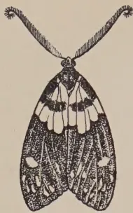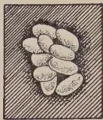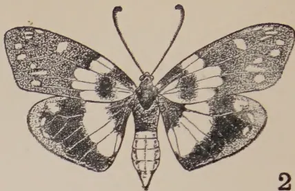

1

3

2

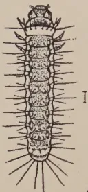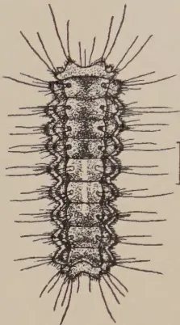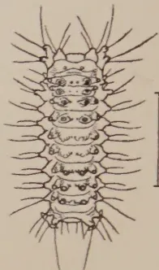

4

6

7

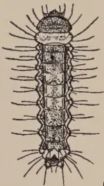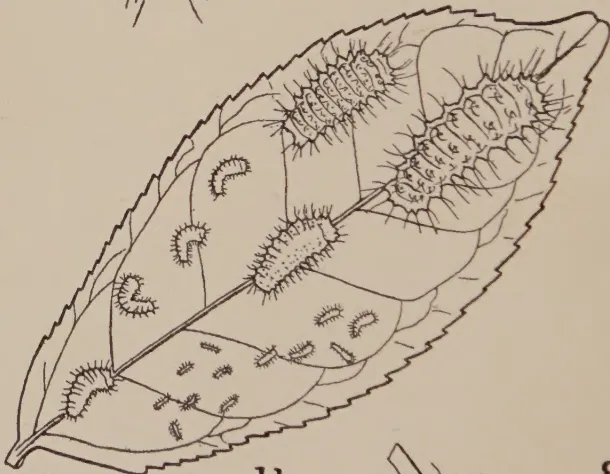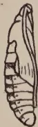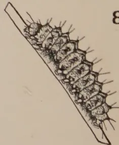

9

11

8

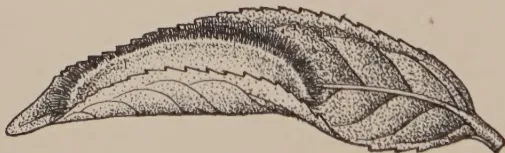

10

Geo. L. de Silva

BLOCK BY SURVEY DEPT. CEYLON 1931

Plate X.—*Heterusia cingala* Moore

1. Male moth, resting position. 2. Female moth, wings spread. 3. Group of eggs. 4. First instar larva. 5. Second instar larva. 6. Third instar larva. 7. Fourth instar larva. 8. Fifth instar larva, full grown. 9. Pupa, side view. 10. Cocoon, on tea leaf. 11. Various stages of larvae on tea leaf. Figures 1, 2, 8, 9, 10, and 11 natural size. Other figures enlarged.

8------------------------------------------------

3

*Each part done separately in XX, 496, 498.*

## SOME INSECT PESTS OF TEA IN CEYLON

(Continued)

J. C. HUTSON, B. A., PH. D.,

ENTOMOLOGIST,

DEPARTMENT OF AGRICULTURE, CEYLON

### THE RED SLUG

(*HETERUSIA CINGALA* Moore)\*

“**R**ED SLUG” is probably one of the better known caterpillar pests of tea in Ceylon, partly owing to its wide local distribution and partly because of its conspicuous moth and larval stages. The moths are brightly coloured with their blue-black and yellow bodies, their dark-bronze green fore wings mottled with white spots and their peacock-blue, yellow and black hind wings. Because of their conspicuous colours and their activity during the day they are sometimes taken for butterflies.

The full-grown red slug larvae are often a brilliant orange-red to brick red colour. They are sometimes found in small numbers amongst a swarm of nettle grubs, for which they are not uncommonly mistaken, since there is a superficial resemblance. Red slug, however, has the usual number of well-developed legs (Pl. X Fig. 8) and no stinging spines, whereas nettle grubs have very small thoracic legs and no prolegs and are usually armed with urticating spines. Reports have been received that red slug is capable of stinging, but probably nettle grubs were the real cause of the trouble. The red slug when disturbed usually exudes drops of a clear sticky liquid from pores on the tubercles along its back and sides, but, so far as is known, this substance has no harmful effect on the skin.

The 100 records which we have of red slug attacks from about 1,900 to the end of 1925 indicate that this pest has occurred mainly in mid-country to up-country tea areas, since 90 of these reported outbreaks have taken place at elevations ranging from about 1,000-5,000 feet. These records also show that red slug has been prevalent mainly from July to February, since 86 per cent of the attacks have fallen within these months and 36 per cent have occurred during August to October. This pest is

\* Order, Lepidoptera; Family, Zygaenidae; sub-family, Chalcosiinae.

9------------------------------------------------

4

known to have occurred in most of the tea districts at various times except possibly in those areas above 5,500 feet. We do not, however, appear to have any records of *Heterusia cingala* from the Morawak Korale and Galle districts in the southern part of the Island, but it probably occurs there also in small numbers along with nettle grubs. The fact that red slug is only periodically prevalent and that so far it has not become a chronic pest in any district is probably due to the very effective control maintained by its natural enemies, mainly parasites.

## DESCRIPTION OF STAGES

### EGGS

(Pl. X Fig. 3).—About 1 m.m. long by about 5 m.m. broad, very pale-yellow when freshly laid, long oval and equally rounded at both ends, but turning to a greyish colour after the fifth day and becoming slightly broader; a day or so before hatching the curled-up larvae with their reddish sub-dorsal stripes and black eye-spots can be seen through the egg-shell; a faint reticulation is visible on the iridescent empty egg-shell under a high magnification.

### LARVAE

*Early first instar.*—About 1 m.m. long, slightly broader anteriorly. Head retractile, pale-brown, with a black eye-spot on each side near base of brownish mandibles; three pairs of well-formed thoracic legs and five pairs of abdominal prolegs, the anal pair largest. General body colour on hatching dirty white, mesothorax and last two abdominal segments paler; a pinkish sub-dorsal stripe on each side running from third thoracic to eighth abdominal segment; three longitudinal rows of small rounded hair-bearing tubercles on each side, one sub-dorsal, one sub-lateral above spiracles and one lateral below spiracles. After the larvae have fed a little a faint greenish tinge shows along the back between the sub-dorsal stripes.

*Later first instar.*—(Fig. 4) about 2 m.m. long; head darker-brown, prothorax brown with dark-anterior edge; mesothorax and last two abdominal segments whitish; remainder of body pale-green at first, later becoming faintly suffused with a pinkish to purplish tinge between the sub-dorsal stripes which are now reddish to purplish; sometimes a mid-dorsal patch on the fourth to sixth abdominal segments appears faintly white; rows of tubercles somewhat more prominent and hairs longer.

*Early second instar.*—(Fig. 5) about 3 m.m. long. Prothorax brown, mesothorax white, these two segments being distinctly broader than remainder of body; ninth abdominal segment whitish. General appearance of larva somewhat similar

10------------------------------------------------

5

to late first instar larva, except that the faint purplish tinge along the back is sometimes purplish brown and the mid-dorsal patch on the fourth to sixth abdominal segments may become more conspicuous; lateral tubercles more prominent and hairs longer. Larva in Figure 5 fully extended to show all the segments.

*Later second instar.*—about 4 m.m. long. Larvae becoming variable in colour, the sub-dorsal stripes sometimes purplish brown to almost brown, the mid-dorsal area sometimes brownish except for the whitish patch in the middle of the body; tubercles more prominent. Sometimes with darkish centres, except those on whitish patch which are pale.

*Third instar.*—(Fig. 6) about 5-8 m.m. long. Variable in colour from dark to light forms with numerous inter-gradations between the two. Prothorax and anal segment pale-yellow to pale-brown, usually hidden. Tubercles rounded but becoming more prominent, thus making the body appear proportionately broader; hairs longer. *Dark forms:* General body colour varying from brown, purplish-brown to dark-brown, except mesothorax, ninth abdominal segment, mid-dorsal patch and lateral tubercles, which are all pale-brown to orange-brown; dark mid-dorsal areas on metathorax and first to third abdominal segments followed by pale mid-dorsal linear areas on fourth, fifth, and anterior portion of sixth segments. Sub-dorsal tubercles with dark centres, except those on mesothorax, mid-dorsal patch and ninth abdominal segment which have paler centres; sub-lateral tubercles with dark centres, except those on mesothorax and ninth abdominal segment; lateral tubercles all with paler centres. *Light forms:* General body colour sometimes pale translucent honey colour with faint pinkish tinge, except mid-dorsal patch which is quite pale to almost whitish; or with a faint purplish tinge, except mesothorax, mid-dorsal patch, ninth abdominal segment and lateral tubercles which are all pale-orange. Tubercles on purplish areas usually with dark centres, those on other areas usually with paler centres.

*Fourth instar.*—(Fig. 7) 12-20 m.m. long. Larvae not so markedly variable in colour as in previous stage. Some larvae pale-honey colour, translucent, with pale-centred tubercles; others pale-yellow to pale-orange, with a pink to pale lilac tinge on mesothorax, first three and sixth to ninth abdominal segments and darker-centred tubercles on these areas; others deeper orange to reddish-brown, with dark-centred tubercles on the above areas; mid-dorsal patch pale in the lighter forms, more conspicuous in the darker forms. Tubercles somewhat more pointed; hairs brownish, comparatively shorter and somewhat spiny. Figure 7 shows a larva with dark-centred tubercles.

11------------------------------------------------

6

*Fifth instar.*—Full-grown (Fig. 8). 25-32 m.m. fully extended, as in figure 8. Head retractile, brownish; thoracic legs and abdominal prolegs well developed, anal pair usually the largest; prothorax and anal segment usually not visible from above. General body colour varying from pale-brown, sometimes with a pinkish to pale-lilac tinge; through reddish-brown to bright brick red, the lateral and ventral areas usually paler than the remainder of the body; mid-dorsal patch rarely noticeable. In the darker forms a dark mid-dorsal linear area runs the length of the body. Tubercles quite prominent, sub-dorsal series somewhat rounded and each apparently with two pores; sub-lateral series similar in shape, but apparently with only one pore each, both series dark-centred; lateral series somewhat tapering, with rounded paler heads, apparently without pores. The larvae when disturbed exude drops of a clear sticky liquid through the pores; these pores become noticeable in the third instar. There is also a row of small rounded tubercles on each side above the legs and prolegs. On each abdominal segment between the sub-dorsal and sub-lateral tubercles is a light coloured spot. Spiracles black and circular, situated between the sub-lateral and lateral tubercles; hairs slender, usually pale to almost whitish, longer on lateral tubercles. The above description of the full-grown larva is amplified from previous descriptions by Green (6) and Rutherford (9).

### COCOON

(Fig. 10). Usually formed in the fold of any convenient leaf, somewhat oval in shape, whitish to pinkish-buff colour, closely woven and fairly tough. *Pupa*: (Fig 9), creamy white at first, becoming yellowish-brown, the head, thorax and wing-sheaths being usually of the darker colour; the pupa becomes quite dark before the emergence of the moth. The dorsal surface of the abdomen is covered with numerous very short small, pointed spines, closely arranged in brownish transverse bands on the anterior portion of the third to tenth segments, but sparsely scattered over the posterior portion, the tenth or anal segment having only a narrow band. The tip of the abdomen is rounded and has no cremaster or group of hooked spines.

### MOTHS

*Male*: (Fig. 1), *Female*: (Fig. 2). Head, thorax, and basal portion of dorsal surface of abdomen black, shot with blue, remainder of abdomen bright yellow dorsally with lateral black spots, black tipped in males; ventral surface of abdomen dark-brown to blackish ventrally with narrow whitish to yellowish bands. Antennae with shaft steel-blue or green, broadly bipectinate, or feathered, for whole length in males, narrowly bipecti-

12------------------------------------------------

7

nate with a terminal tuft in females. Fore wing black with a dark-olive green to bronze-green tinge, basal third whitish to creamy white, edged outwardly with blue-black and crossed by a broad irregular greenish-black band in females and by a narrower band in some males or only by a few dark spots in others; several whitish to creamy white spots between the veins on outer third of wing in both sexes. Hind wing with base and outer half black suffused with bright peacock-blue along the veins and outer margin; a pale-yellow band across the middle broader in females, sometimes narrower in males, a few pale-yellow sub-apical spots, conspicuous in females, indistinct in males. Underside of both wings as above, but veins streaked with peacock blue in places.

*Wing expanse*: males, 44-52 m.m.; females, 45-61 m.m. The above description of the moths is made from fresh specimens after reference to previous descriptions by Moore (8), Hampson (6), and Green (5).

The insect now commonly known as "Red Slug" in Ceylon was originally named by Moore in 1877 as *Heterusia cingala* and then by him again (8) in 1882 as *Sephisa cingala*, but both the generic names *Heterusia* and *Sephisa* were found by Kirby in 1897 to be pre-occupied. *Eterusia* was the original name given to this genus by Hope in 1840 and this name was restored by Jordan in 1908, who regarded the Ceylon species *cingala* as being one of five sub-species under the Far-Eastern species *Eterusia aedea*. The full scientific name of the Ceylon red slug is therefore *Eterusia aedea cingala* Moore, as adopted by Fletcher (3).

## LIFE-HISTORY AND HABITS

### EGGS

*Position*.—Green (4) observed that, as the moth has a prominent ovipositor, it is probable that under natural conditions the eggs would be deposited either in crevices of the ground or of the bark of trees. Breeding experiments\* in field cages at Peradeniya have indicated that the eggs may be laid in small masses on the tea bushes either (1) in the forks of branches, or (2) under the edges of mosses growing near the base of the stem, or (3) partially concealed within cracks and crevices on the stem and larger branches. They have not been found deposited actually "in crevices of the ground at the foot of the plants upon which the caterpillar is to feed", a possibility suggested by Green (5), but have been observed among the soil particles thrown up around the base of the stem by heavy rains. Mann and Antram (7) observed that the eggs of a related species of *Heterusia* in North-East India were "laid by the moths in heaps on the

\* My thanks are due to Mr. E. de Alwis for assistance in the life-history work.

13------------------------------------------------

8

underside of old leaves or on the main trunk or larger branches of tea bushes and are stuck on to the surface by a sticky substance."

In the wooden breeding cages in the insectary the eggs were at first laid in any small cracks in the corners of a cage or along the edges of the door or lid when closed. Accurate counts of the numbers of eggs laid in such positions were impossible without injury to the eggs. It was then found that by placing two or more small flat pieces of wood one on top of the other on the bottom of the cage the moths would oviposit almost invariably between the edges of the pieces of wood or between the floor and the bottom piece. Eggs were occasionally deposited in loose masses on the floor of the cage, as noted by Green (4, 5). Mann and Antram (7) found that the moths when kept in captivity seemed to prefer to lay eggs on the underside of leaves. This position of the eggs has not been observed either in the field or in the insectary in the case of *cingala*.

*Number of eggs per moth.*—Oviposition records of 12 individual females showed that these moths laid a total of 14,126 eggs, giving an average of about 1,177 eggs per moth. The actual counts are as follows: 1,254; 2,005; 1,735; 1,683; 2,399; 865; 1,150; 292; 920; 80; 967; 776.

*Incubation period.*—Under insectary conditions the incubation period ranged from about 7 to about 10 days, with an average of about 8½ days for 24 masses of eggs from several different females.

*Development.*—Freshly-laid eggs are pale-yellow, but after about a day or two before hatching they turn greyish and the curled-up larva with reddish stripes and black eye-spots can be faintly distinguished through the egg-shell during the last few hours before hatching.

## LARVAE

*Emergence.*—The young larvae emerge by biting their way through the egg-shells and the larvae from the same cluster usually emerge within a short time of each other.

*Habits of young larvae.*—The eggs have not been observed to hatch under natural conditions on a tea bush, but it seems probable that the newly-emerged larvae very soon make their way on to the older and harder leaves; no young larvae have been found on the flush. During the first day or two of the larval period they hardly feed at all, but after that they nibble small portions from either the upper or lower surface of the

14------------------------------------------------

9

older leaves, thus producing small irregular pale-yellowish patches where the upper or lower epidermis has been eaten away. Attempts were made to induce the young larvae to feed on the younger leaves alone, but they died without feeding. When given the choice between old and young leaves they invariably preferred the older and harder leaves and feed and developed normally on them. The younger larvae have a habit of resting in a curved position as shown in Figure 11.

*Older larvae.*—On attaining the fourth instar, that is, after about 3-4 weeks from hatching, the larvae begin to eat holes in the older leaves, and when numerous over a small area, they soon strip the bushes completely, devouring even the flush. In a scattered attack over larger areas the older leaves are partially eaten and many drop off, while the flush is usually left untouched so long as older leaves are available. The older larvae are very active, especially when in search of food, and travel rapidly to uninfested areas.

The larvae, whether young or old, feed mostly at night, in the early morning and late afternoon, that is, at almost any time except during the middle of the day, when it is often hot. When not feeding they may retire to the lower portion or the centre of a bush or on to the ground where they hide under fallen leaves or any convenient shelter. On well-shaded tea this habit of sheltering may not be so common, but wherever they are, they seem to do little or no feeding for 5 or 6 hours during the heat of the day. Mann and Antram (7) have found that the Indian species of red slug have somewhat similar habits.

*Duration of larval period.*—During the course of the life-history experiments carried out a few years ago a number of *cingala* larvae have been bred through from egg to moth, and the table given below indicates the development of 27 such individuals, with fairly accurate figures for the different instars of 22 of the larvae. A reference to this table will show that 13 larvae developed into male moths, while 14 became females. The larval period of the potential males ranged from 37-42 days, with an average of about 38.3 days, while that of the potential females ranged from 41-49 days, with an average of about 45.7 days. It is of interest to note that while all the larvae passed through 5 instars, the larval period of the potential males is on the average, about  $8\frac{1}{2}$  days shorter than that of the potential females.

15------------------------------------------------

10

TABLE SHOWING LIFE-CYCLE OF HETERUSIA CINGALA

The figures indicate numbers of days

<table border="1">
<thead>
<tr>
<th>Cage No.</th>
<th>A1.</th>
<th>A2.</th>
<th>A3.</th>
<th>A4.</th>
<th>A18.</th>
<th>A19.</th>
<th>A20.</th>
<th>A21.</th>
<th>B1.</th>
<th>B4.</th>
<th>B7.</th>
<th>B8.</th>
<th>B9.</th>
<th>B10.</th>
<th>B11.</th>
<th>B12.</th>
<th>B15.</th>
<th>B16.</th>
<th>B18.</th>
<th>B19.</th>
<th>B20.</th>
<th>B21.</th>
<th>Cd1.</th>
<th>Cd2.</th>
<th>M2.</th>
<th>M4.</th>
<th>M5.</th>
</tr>
</thead>
<tbody>
<tr>
<td>Incubation</td>
<td>8</td>
<td>8</td>
<td>8</td>
<td>8</td>
<td>8</td>
<td>8½</td>
<td>8½</td>
<td>8</td>
<td>8</td>
<td>8½</td>
<td>8</td>
<td>8</td>
<td>8</td>
<td>8</td>
<td>8</td>
<td>8½</td>
<td>8½</td>
<td>8½</td>
<td>9</td>
<td>9</td>
<td>9</td>
<td>9</td>
<td>8</td>
<td>8</td>
<td>8</td>
<td>8</td>
<td>8</td>
</tr>
<tr>
<td>1st instar</td>
<td>8½</td>
<td>8½</td>
<td>8</td>
<td>8</td>
<td>8</td>
<td>9</td>
<td>9</td>
<td>9</td>
<td>8</td>
<td>9</td>
<td>8</td>
<td>8</td>
<td>8</td>
<td>8</td>
<td>8½</td>
<td>8½</td>
<td>8½</td>
<td>9</td>
<td>9</td>
<td>9</td>
<td>9</td>
<td>9</td>
<td>—</td>
<td>—</td>
<td>—</td>
<td>—</td>
<td>—</td>
</tr>
<tr>
<td>2nd "</td>
<td>8</td>
<td>8</td>
<td>8</td>
<td>8</td>
<td>8</td>
<td>8½</td>
<td>8½</td>
<td>9</td>
<td>8½</td>
<td>7</td>
<td>9</td>
<td>7</td>
<td>7</td>
<td>7</td>
<td>7</td>
<td>7½</td>
<td>7½</td>
<td>7½</td>
<td>8</td>
<td>8½</td>
<td>9</td>
<td>9</td>
<td>9</td>
<td>—</td>
<td>—</td>
<td>—</td>
<td>—</td>
</tr>
<tr>
<td>3rd "</td>
<td>6</td>
<td>6</td>
<td>7</td>
<td>7</td>
<td>7</td>
<td>8½</td>
<td>8½</td>
<td>8</td>
<td>8½</td>
<td>7</td>
<td>9</td>
<td>7</td>
<td>7</td>
<td>7</td>
<td>7</td>
<td>7½</td>
<td>7½</td>
<td>7½</td>
<td>8</td>
<td>8</td>
<td>8½</td>
<td>8½</td>
<td>8½</td>
<td>—</td>
<td>—</td>
<td>—</td>
<td>—</td>
</tr>
<tr>
<td>4th "</td>
<td>6</td>
<td>6</td>
<td>7½</td>
<td>7½</td>
<td>7½</td>
<td>9</td>
<td>8½</td>
<td>8½</td>
<td>8½</td>
<td>8</td>
<td>10½</td>
<td>6</td>
<td>6</td>
<td>6</td>
<td>6½</td>
<td>6½</td>
<td>6½</td>
<td>6½</td>
<td>7</td>
<td>7</td>
<td>7½</td>
<td>7½</td>
<td>7½</td>
<td>—</td>
<td>—</td>
<td>—</td>
<td>—</td>
</tr>
<tr>
<td>5th "</td>
<td>9½</td>
<td>10½</td>
<td>6½</td>
<td>7½</td>
<td>12</td>
<td>12</td>
<td>12</td>
<td>12½</td>
<td>9</td>
<td>11½</td>
<td>9</td>
<td>9</td>
<td>9</td>
<td>9</td>
<td>9</td>
<td>9</td>
<td>10</td>
<td>11</td>
<td>13½</td>
<td>13</td>
<td>13</td>
<td>13</td>
<td>13</td>
<td>—</td>
<td>—</td>
<td>—</td>
<td>—</td>
</tr>
<tr>
<td>Total larval</td>
<td>38</td>
<td>39</td>
<td>37</td>
<td>38</td>
<td>46</td>
<td>46½</td>
<td>46½</td>
<td>47</td>
<td>39</td>
<td>49</td>
<td>37</td>
<td>37</td>
<td>37</td>
<td>37½</td>
<td>38</td>
<td>39</td>
<td>40</td>
<td>43</td>
<td>46</td>
<td>47</td>
<td>47</td>
<td>47</td>
<td>41</td>
<td>42</td>
<td>39</td>
<td>47</td>
<td>48</td>
</tr>
<tr>
<td>Pre-pupal and pupal</td>
<td>19</td>
<td>19</td>
<td>19</td>
<td>19</td>
<td>20</td>
<td>20</td>
<td>20</td>
<td>20</td>
<td>19½</td>
<td>20</td>
<td>19½</td>
<td>20½</td>
<td>20½</td>
<td>20½</td>
<td>19</td>
<td>19½</td>
<td>19</td>
<td>20½</td>
<td>20</td>
<td>21</td>
<td>21</td>
<td>21</td>
<td>19½</td>
<td>19½</td>
<td>19½</td>
<td>20</td>
<td>21</td>
</tr>
<tr>
<td>Egg to adult</td>
<td>65</td>
<td>66</td>
<td>64</td>
<td>65</td>
<td>74</td>
<td>75</td>
<td>75</td>
<td>75½</td>
<td>66½</td>
<td>77½</td>
<td>64½</td>
<td>65½</td>
<td>65½</td>
<td>66</td>
<td>65</td>
<td>67</td>
<td>67½</td>
<td>72</td>
<td>75</td>
<td>77</td>
<td>77</td>
<td>77</td>
<td>68½</td>
<td>69½</td>
<td>66½</td>
<td>75</td>
<td>77</td>
</tr>
<tr>
<td>Sex</td>
<td>M</td>
<td>M</td>
<td>M</td>
<td>M</td>
<td>F</td>
<td>F</td>
<td>F</td>
<td>F</td>
<td>M</td>
<td>F</td>
<td>M</td>
<td>M</td>
<td>M</td>
<td>M</td>
<td>M</td>
<td>M</td>
<td>M</td>
<td>F</td>
<td>F</td>
<td>F</td>
<td>F</td>
<td>F</td>
<td>F</td>
<td>M</td>
<td>M</td>
<td>F</td>
<td>F</td>
<td>F</td>
</tr>
</tbody>
</table>

16------------------------------------------------

11

In addition to the above individual records we have figures showing the larval period of 20 other larvae which formed their cocoons, but failed to emerge as moths. In some cases the larvae died before pupating, while in others the pupae died before the sex could be accurately determined. The larval period of this series ranged from 38-56 days, with an average of about  $46\frac{1}{2}$  days for the 20 larvae. Probably some of these larvae did not develop normally and in some cases they only just managed to form their cocoons before dying.

### COCOONS AND PUPAE

*Position.*—Under field conditions the cocoons (Fig. 10) are usually formed on the older leaves on the bushes or on fallen leaves. They may also be formed on the leaves of interplanted green manure trees. It was reported many years ago from an estate in the Kelani Valley that, during an outbreak of red slug on tea interplanted with rubber, many of the full-grown larvae climbed the rubber trees and formed their cocoons on the leaves; they also invaded an adjoining rubber clearing for the same purpose. There were no indications that the larvae had attacked the leaves. Mann and Antram (7) state that the cocoons of *magnifica* in Assam are formed in the fold of a leaf or in the fork of a branch of the tea bush; in the latter position they are said to be very difficult to discover owing to the fact that their colour harmonises with that of the branches to which they are attached.

*Formation of cocoon.*—I was fortunate enough to be able to observe this process which takes place somewhat in the following manner: The larva, before pupating on a living leaf, settles down on the upper surface along the midrib and first of all gradually draws up the two sides of the leaf towards each other by means of a number of cross threads so as to form a trough within which the cocoon is to rest. It then constructs a thin but closely woven top covering sloping downwards at each end, and impregnates this with a frothy liquid exuded from its mouth; this substance dries rapidly and hardens to form a buff-coloured roof which is fairly tough and apparently waterproof. Finally the larva encloses itself completely by weaving a thin bottom layer of silk on the leaf surface, leaving this untreated; the cocoon is closed at both ends by a loosely woven mass of threads. Cocoons on fallen leaves are formed in the natural fold of the leaf.

*Pupation.*—The larva then shrinks to about two-thirds its former size, moults for the last time within the cocoon and gradually changes into the pupal stage. The pre-pupal period,

17------------------------------------------------

12

including the formation of the cocoon, occupies about  $1\frac{1}{2}$  to 2 days.

*Pupal period.*—The breeding experiments indicated that the pupal periods for both sexes, from the formation of the cocoons to the emergence of the moths, were as follows: males, from about 19 to about  $20\frac{1}{2}$  days, with an average of 19.5 days for 13 individuals; females, from about  $19\frac{1}{2}$  to about 21 days, with an average of 20.2 days for 14 individuals.

There is evidence that pupae formed on the way from estates or which pupated shortly after arrival at the laboratory, all from field larvae may have a shorter pupal period than those from larvae bred in the insectary. Our records of pupae from field larvae show that the pupal period of 28 males ranged from 14-19 days, with an average of nearly 17 days, while that of 12 females ranged from 15-20 days, with an average of about  $17\frac{1}{2}$  days.

## MOTHS

*Emergence, etc.*—In captivity the moths emerge from their cocoons mostly at night, but emergence has been observed to take place during the day. The emerging moth gradually works its way out through one end of the cocoon, leaving the empty pupal skin projecting more than half way out of the cocoon or sometimes entirely free. Mating takes place mainly at night but may continue during the day. The pre-oviposition period ranges from about  $1\frac{1}{2}$  to about  $5\frac{1}{2}$  days, the average for 14 females being about  $2\frac{1}{2}$  days. The moths are active during the daytime when some egg-laying was observed in the breeding cages, but most of the eggs were laid during the night. Oviposition takes place almost daily and the females usually die within 24 hours after the last eggs are laid. The few records kept of the duration of the moth stage under insectary conditions indicate that the males lived for about 7-10 days, with an average of about  $8\frac{1}{2}$  days for 5 moths, while the females lived from about 6 to about  $19\frac{1}{2}$  days, with an average of about 12 days for 13 moths. All moths under observation in the insectary had access to sweetened water.

I have been unable to make any detailed observations on the habits of *cingala* moths under field conditions, except that they shelter during the earlier half of the day and become active towards late afternoon and evening. It is not unlikely that the habits of our *cingala* moths are similar to those of *magnifica* and other varieties in Assam as observed by Mann and Antram (7) in the following notes: "During the daytime these moths usually hide themselves away in shady places whether in the tea bushes

18------------------------------------------------

13

or in other trees. In the latter part of the afternoon, however, they begin to fly in all directions, generally swarming round trees or any similar high object." Mention is made of such trees as *Albizia*, *Grevillea*, *Toona*, etc., on the stems and leaves of which the females rest and are there visited by the males in considerable numbers; at such times the moths can be destroyed in large numbers. A further note indicates that in the early morning the moths can be also seen in fair numbers on the tops of tea bushes, often apparently drying their wings, and this affords another opportunity of killing many of them.

### TOTAL LIFE-CYCLE

A reference to the table will indicate that under insectary conditions the range of the life-cycles of the 13 males was as follows: egg stage, 8-8½ days; larval stage, 37-42 days; pupal period 19-20½ days, giving a range of 64-71 days, or about 9-10 weeks. The range of the life-cycles of the 14 females under similar conditions was as follows: egg stage, 8-9 days; larval period, 41-48 days; pupal period, 19½-21 days, giving a range of 68½-78 days, or from nearly 10 to about 11 weeks.

Taking all our life-cycle records together for both sexes, a much wider range is indicated, as follows: egg stage, 7-10 days; larval stage, 37-56 days; pupal stage, 14-21 days, giving a range of 58-87 days or about 8 to about 12½ weeks.

Mann and Antram (7) give the life-cycle of a related species, *Heterusia magnifica*, in Assam as follows: egg, 8-12 days; caterpillar, about 5 weeks; chrysalis (or pupa), 17-21 days, with an average of about 10 weeks.

*Seasonal distribution of Red Slug in Ceylon.*—The life-cycle and field records indicate that under field conditions the moths would appear about every 9 or 10 weeks if the pest were able to breed continuously in any given locality. As mentioned previously our seasonal records show that, while an outbreak may start in any particular tea area during any month in the year, the caterpillars are prevalent mainly from July to February in most districts. During this period the pest would probably pass through 3 complete generations, the moths appearing approximately during mid-August to mid-September, during November and from mid-January to mid-February. Owing to the effective control maintained by its natural enemies it rarely happens that *Heterusia cingala* is able to complete more than 3 generations in any given locality, the first generation usually passing unnoticed.

19------------------------------------------------

14

## FOOD PLANTS

All our records seem to be from tea. Moore (8) gives the following food plant notes on red slug under the name *Sephisia cingala*: "Feeds on Lagerstraemia, etc., (Thwaites). In jungle. Low-country (Hutchison)". In North-East India Mann and Antram (7) state that red slug occurs, in one form or another, almost all over the tea districts as a common jungle caterpillar.

## NATURAL ENEMIES

*Parasites.*—The fact that red slug is only periodically prevalent and that so far it has not become a chronic pest in any district is probably due mainly to the very effective control maintained by a parasite fly (*Exorista heterusiae*) belonging to the family *Tachinidae*. The characteristic hum of these flies can usually be heard in a red slug area and the flies can sometimes be seen hovering over the infested bushes. A close examination of the caterpillars in areas frequented by these flies reveals the presence of small, oval whitish objects on their backs; these are the flies' eggs which are usually placed in the folds of the body behind the head so as to be out of the reach of the larva. The fly maggots, on hatching, enter the body of their host and feed on the less vital portions. The parasitised larvae are usually able to spin their cocoons, but fail to pupate. The full-grown maggots emerge from the body of their host and pupate inside the host's cocoon from which the flies emerge later instead of the moths, sometimes as many as five or six from one cocoon.

Red slug has also been found to be parasitised by very small wasps belonging to the family *Braconidae*. These turned out to be a new species and were described by Wilkinson (10) of the Imperial Institute of Entomology under the name of *Apanoteles heterusiae*.

*Birds.*—Reports have been received occasionally from superintendents of estates that crows have been very useful in devouring large numbers of red slug during outbreaks.

We do not appear to have any records of the moths being attacked by birds and it is possible that they may be distasteful to birds, since they secrete a strong smelling liquid which suddenly bubbles forth from the sides of the body when they are disturbed or handled. This characteristic habit was first observed by Green (5) and later mentioned by Fletcher (2) who suggests that the bubbles probably secure a larger surface for the evaporation and rapid diffusion of the smell. Possibly the

20------------------------------------------------

15

conspicuous colours of the *Heterusia* moths associated with distasteful qualities may serve as a "warning" to birds, thus affording these moths some protection, but further evidence is needed on this point. In this connection it may be mentioned Green observed that a preying mantis kept in captivity devoured moths of *Heterusia cingala* with apparent relish, so that in this instance the strong smell exuded by the moths gave them no protection.

*Wilt.*—This disease, which is known to attack such pests as tortrix, nettle grubs, etc., sometimes plays an important part in checking an outbreak of red slug, especially when the caterpillars have become overcrowded in a restricted area.

### CONTROL MEASURES

*Collection and destruction of caterpillars and cocoons.*—As in the case of other caterpillar pests of tea which occur only at long intervals on any particular estate it usually happens that the first brood or two escape detection, with the result that the third brood has increased to such proportions that the ordinary methods of collection and destruction are often impracticable. Fortunately, red slug is known to have at least one efficient parasite, but this cannot be expected to exert any really effective control until the pest has got well ahead and much damage has been done to the tea. Red slug usually confines its attention to the older and harder leaves and may remain hidden in the lower portions of the bushes, especially in the younger stages; its presence in unusual numbers can sometimes be detected by the spotting of the leaves caused by the young larvae, but such damage is rarely noticed unless special precautions are taken. Kanganies and plucking coolies should be encouraged to look out for, and report any unusual spotting of the older leaves which generally indicates the presence of a caterpillar pest such as red slug or nettle grub.

In the case of red slug special collecting gangs should be put on at once to collect the caterpillars and drop them into tins of kerosene and water. Collecting should be done in the early morning and late afternoon, so as to find the larvae when they are active and in evidence on the bushes and not hiding as they sometimes do in the middle of the day. In spite of reports to the contrary, the larvae have no stinging hairs, and the sticky substance they exude is not known to be harmful to the skin, so that they can be handled with impunity.

Cocoons on the older leaves of tea bushes or of any convenient green manure tree serve as further indications of the presence of this pest and should be collected and burnt as soon

21------------------------------------------------

16

as they are detected; the fallen leaves should also be examined and if necessary all dead leaves should be swept up and burnt, whenever possible.

Red slug is not a new pest and these control measures were all urged by Green (5) some thirty years ago. This caterpillar, owing to its wide-spread distribution throughout most of the tea areas in Ceylon and because of its great activity in the caterpillar stage is not a pest that any planter can afford to neglect. The prompt application of control measures at the first sign of the pest will prevent loss of crop and weakening of the bushes, to say nothing of the additional expense which a serious outbreak of any pest involves. In my opinion the comparatively small cost involved in employing regular collecting gangs is an insurance against the sudden increase of such pests as red slug, nettle grub, etc., and against a considerably greater expense if the pest gets beyond control.

*Spraying with insecticides.*—Some ten years ago Andrews and Tunstall (1) carried out some experiments in Assam against *Heterusia magnifica*, a related species of red slug. They found that the larvae did not eat the sprayed foliage, but that they could travel a considerable distance to unsprayed foliage. They suggested therefore that spraying, if adopted, should be carried out with the object of driving the insects into a small area when they can be easily caught, that is, the spraying should begin some distance from the affected area and should gradually work in towards the centre of this area. More recent experiments carried out on a small scale at Peradeniya with lead chromate against caterpillar pests of tea have indicated that this poison acts mainly as a deterrent. Experiments were also carried out with contact insecticides with the object of killing the caterpillars on the tea and it was found that a soap and water solution gave promising results. Experiments with various insecticides are being carried out by the Tea Research Institute against nettle grub in Uva, and further investigation with red slug may indicate some insecticide, other than lead chromate, which would be effective against this pest.

*Control of the moths.*—Green, during a tour of the Kelani Valley in November, 1900, observed that numbers of male moths of *Heterusia cingala* came in to bungalow lights, but made no mention of females being so attracted. Light traps would only be of real value under field conditions if they were to attract female *Heterusia* before they had laid their eggs, and definite experiments to ascertain this point are desirable. Mann and Antram (7) found that the males of the Assam species came to light in large numbers, and suggested that "the wholesale

22------------------------------------------------

17

destruction of the males is bound to have a mitigating effect on the number of caterpillars in the next generation”.

Since the moths are in evidence during the day, especially during the mornings and afternoons, resting on any convenient trees or rocks in or near the tea, they should always be destroyed wherever found.

### SUMMARY

The red slug is probably well known as a pest of tea in Ceylon partly owing to its wide distribution and partly because of its conspicuous moth and larval stages. The full-grown caterpillar is reddish-brown to brick-red in colour and bears a superficial resemblance to nettle grubs among which it is sometimes found, but it has well-developed legs and no stinging hairs. The brightly-coloured moths, with their bronze-green white spotted fore wings and their peacock-blue, yellow and black hind wings, are in evidence during the day and lay their eggs mostly at night. These eggs are usually laid on tea bushes, either in cracks and crevices of the stems or branches or under mosses, etc., growing near the base of the stem. A single female may lay nearly 2,400 eggs, but the average for 12 moths is 1,177. The eggs hatch in about a week and the young larvae crawl on to the older leaves where they soon start eating away small patches, causing a spotting. After about 3 or 4 weeks they are able to chew pieces out of the leaves and the older larvae when numerous can cause serious injury, almost stripping the bushes. The larval period occupies from about 5-7 weeks, the development of the potential male larvae being about a week shorter than that of the potential female larvae. The rather tough buff-coloured to pinkish cocoons are formed in folds of the older leaves, either on the tea bushes or on convenient trees; quite a number are formed on fallen leaves. The cocoon stage lasts from 8-9 weeks under field conditions. If the nest is allowed to breed unchecked the moths may be expected to appear in numbers about every 10 weeks.

Red slug is normally controlled by a parasitic fly and occasionally by small parasitic wasps. Crows are sometimes useful in devouring the caterpillars during a heavy attack, while the wilt disease is occasionally of value in checking the pest under certain conditions.

Control measures include the collection of caterpillars and cocoons. Collecting coolies should be put on as soon as the pest is detected and all fallen leaves should be swept up from

23------------------------------------------------

18

infested areas and burnt. Spraying with insecticides may be of value in checking small outbreaks. The moths should also be collected wherever found.

#### REFERENCES

1. 1. ANDREWS, E. A. and TUNSTALL, A. C.—Notes on the Spraying of Tea.—Ind. Tea Assoc. Bull. No. I, 1915, pp. 10, 11.
2. 2. FLETCHER, T. B.—Some South Indian Insects, Madras, 1914, p. 42.
3. 3. FLETCHER, T. B.—Catalogue of Indian Insects.—Part 9—Zygaenidae. Calcutta, 1925, pp. 57-60.
4. 4. GREEN, E. E.—Ceylon Admin. Reports, R.B.G., Peradeniya.—Report of the Hon. Ento. 1898.
5. 5. GREEN, E. E.—Some Caterpillar Pests of the Tea Plant.—Circ. R.B.G., Peradeniya, Series I, No. 19, Sept. 1900, pp. 258-260.
6. 6. HAMPSON, G. F.—Fauna of Brit. India. Moths I, 1892, pp. 261, 262.
7. 7. MANN, H. H. and ANTRAM, C. B.—The "Red Slug" caterpillar. Ind. Tea. Assoc. Pamphlet No. 5, 1906.
8. 8. MOORE, F.—The Lepidoptera of Ceylon, II, 1882-83, p. 41.
9. 9. RUTHERFORD, A.—"Red Slug" of Tea.—*The Trop. Agric.*, Peradeniya, XLIII, No. 2, Aug. 1914, pp. 128, 129.
10. 10. WILKINSON, D. S.—Indo-Australian Species of Genus *Apanteles*.—(Hym. Bracon.) Part II. *Bull. Ent. Res.*, XIX, 1928-29, p. 127.

24------------------------------------------------

19

## THE CULTIVATION OF FRUITS IN CEYLON WITH CULTURAL DETAILS—II

T. H. PARSONS, F.L.S., F.R.H.S.,

CURATOR,

ROYAL BOTANIC GARDENS, PERADENIYA

### GROUP B

#### SOME FRUITS FOR THE LOW-COUNTRY, DRY AND SEMI-DRY ZONES (PREFERABLY UNDER IRRIGATION)

(1) LIME (*Citrus aurantifolia*).—Dehi. S., Dhaisi-kai, T. The lime tree is usually spiny having a wide distribution in all parts of the tropics. It yields one of the most important of the acid fruits. There are now several varieties of yielding fruits which vary in size, acidity, juiciness and oil content, and in shape from round to ovoid. The lime is grown commercially in many of the West Indian Islands, the raw or concentrated lime juice, citrate and lime oil, being products of the tree which are largely exported from those Islands.

In Ceylon the tree thrives from sea level to 3,000 feet and prefers sandy conditions but will grow and fruit well in the dry region proper if irrigation facilities are afforded. Its soil requirements are a rich sandy loam, but a light sandy soil is suitable if organic manure is available. As with all citrus, good drainage is essential with protection from strong wind. Under these conditions lime can be grown fairly successfully in the wet zone also. The soil to be avoided is that of a clayey nature as such gives rise to innumerable root troubles.

The local lime is of good type and well repays propagation if the best trees are selected. There is also a spineless form but little known in Ceylon as yet, and a seedless form which is not common since this variety can only be propagated by budding or grafting. The British Guiana lime is another variety introduced about 1917 and established at the Anuradhapura Experiment Station from whence it has spread very largely throughout the northern half of the Island. Seeds and seedlings are available from the Experiment Station there.

The latter lime can be recommended on the grounds of its bearing fruit all the year round whereas the local lime does not as a rule fruit during prolonged periods of drought or during very wet weather.

25------------------------------------------------

20

Propagation is by seed, and having selected a suitable parent, the seed should be removed from the fruit and carefully washed, cleaned and dried for a few hours either in the sun or on a warm verandah. Sowing should be done in prepared beds in rows with the holes 3 inches apart and 9 inches between rows, care being taken to see the beds are afterwards carefully watered and shaded.

Germination occurs in some 4 to 5 weeks and the seedlings should be carefully tended at this stage. When these reach a height of three inches they should be transferred to open nursery beds at 9-10 inches apart or potted into bamboo pots, and well cultivated till they attain a height of 12 inches, when transplanting to a permanent site can be undertaken.

Plantings should be made 15 feet by 15 feet on good soil. Holes 2 feet square and 2 feet deep should be prepared and the bottom of the holes forked up and loosened, refilling the hole with the excavated soil to which some cattle manure or some form of good humus is added. It answers to make the holes of the dimensions given and with care as indicated. Shading and watering will be necessary for a few weeks after planting but limes appreciate full sun subsequently.

The lime bears fruit at an earlier age than most other varieties of citrus and the trees should begin to fruit at  $3\frac{1}{2}$  to 4 years of age. The tree reaches maturity at about 8 years so that for the first four or five years catch-crops could be grown in between the limes with few disadvantages. Crops are usually heavy and in Dominica the average yield of mature trees is from 100 to 150 barrels per acre (at about 1,500 fruits to the barrel) or in other words between 800 to 1,200 fruits per tree at 192 trees to the acre.

Periodical dressings of organic manure are most beneficial and mulching just prior to the dry season is of special benefit. Though often considered a short-lived plant this condition is frequently due to its susceptibility to insect and fungoid attacks soon after maturity, and if proper attention is given to the question of drainage, good cultivation and protection from winds, a healthy tree can be maintained and many such troubles accordingly eliminated.

(2) MANGO (*Mangifera indica*).—Known as the Amba. S. and Manga, T. A medium to large-sized spreading and quick-growing tree with fruit of many forms and varieties ranging from a small and practically seedless fruit up to choice specimens of  $1\frac{1}{2}$  to 2 lb. each. There is a wild form also, the "Etamba" of poor quality but of probable use as a stock on which to graft the

26------------------------------------------------

21

better varieties. Originally a tree of India alone, mango cultivation in its grafted form has now spread to most tropical countries and a good selection is available.

The tree is best cultivated where a pronounced dry season is experienced as it requires the stimulus of a dry season at the time of flowering and setting of fruits, and though the tree thrives and fruits in the low moist zone also, crops are invariably erratic owing to the lack of any pronounced dry season of any regularity. Saharanpur on the dry plains of Northern India lies at an elevation of 1,000 feet with an annual rainfall of 35 inches, these conditions suiting mangoes to perfection, and since there are many localities in Ceylon with similar conditions the cultivation of really good mangoes should not be difficult.

Soil is a not too important factor fortunately, for the mango grows well in almost all types of soil from deep rich alluvial soil to a poor sandy soil, provided the sub-soil is suitable, but a deep sandy loam is preferable and gives excellent results. As with all other fruits good drainage is essential, for few trees fruit successfully if the sub-soil is permanently wet or very poorly drained.

Though mangoes can, and are propagated by seed, this is not advisable since such cannot be relied upon to be true to type, and propagation by vegetative means is by far the best, in that a true representative of the parent plant is secured and earlier fruiting is obtained. The usual methods employed are gooteering and inarching but later experiments show that budding and grafting is equally as successful if not more so and particularly the grafting method.

Where seed sowing is decided on, the seed should be specially selected from good sound fruit from healthy trees, the fruits being cleaned of the edible portion and sown at once in prepared beds, inserting the seeds 2 in. deep and 9 in. apart, and one foot between rows. If well-looking after seedlings should be ready for transplanting to permanent positions at 12 months of age. If grafting is preferred the seedling can at this stage be used as a stock plant and cut back at 12 inches to 15 inches from ground with a horizontal cut. The stem of the seedling is then cut in a vertical line through the centre to the depth of 1 in. or  $1\frac{1}{2}$  in. according to the size of the stock, care being taken that a clean cut is made and the tissues are not torn. The scion or graft wood is suitable for grafting purposes after the flush of growth has matured, and terminal growth of 5 in. to 6 in. in length should be cut from the parent tree and all leaves removed. The cut end of the scion piece should be shaped into the form of a wedge and pushed gently into the vertical cut made

27------------------------------------------------

22

in the stock as far as it will go with normal pressure and if correctly carried out the point of the wedge in the scion should meet the base of the cut in the stock.

Care should be taken that the thickness of the scion is equal to the thickness of the seedling stock at the point of junction, so as to allow the cambium surfaces of the stock and scion to meet and unite. The graft should then be bound tightly with waxed tape and the grafted plants shaded for a time. Successful union is obtained in three weeks or so and the grafted plant is ready for removal to its permanent site from 3 to 4 months from the date of grafting.

Planting distances should be 30 feet by 30 feet for seedling and for most grafted trees, though certain of the latter do not attain large dimensions, and 25 feet by 25 feet would be preferable in this case. Good holes 3 feet wide by  $2\frac{1}{2}$  feet deep should be prepared for the young plants and the monsoon period is the usual season in which plantings should be made.

Moderate supplies of manure are appreciated and well-decayed cattle manure is most beneficial. Over manuring however leads to excessive leaf growth at the expense of fruit crop and should be avoided.

Pruning should be restricted, till the tree reaches maturity, to a careful thinning undertaken when growth becomes so thick as to prevent proper circulation of air through the tree, and after maturity pruning would consist of cutting out the dead wood only.

Good varieties among others to cultivate are the "Rupee" selected varieties of the "Jaffna" mango, "Malgoa", "Alphonso", "Bangaloora", and "Dilpassand".

(3) GRAPE (*Vitis vinifera*).—Known generally throughout the world as the grape or grape-vine, this is largely cultivated in the Mediterranean regions, Australia, and South Africa in its best varieties. In Northern India grapes of good quality are grown both from indigenous and from introduced varieties and in the dry parts of Ceylon certain varieties have long been cultivated with some degree of success.

The wild grape of Ceylon, the To-wel or Rata-bulat-wel S. (*Ampolocissus indica*) is unfortunately of no value in its fruit, which is bitter in taste. It is possible, however, that use can be made of this as a stock on which to graft the better and the more valued varieties, as more productive and better flavoured kinds could no doubt be produced in Ceylon in large quantities.

28------------------------------------------------

23

Propagation is chiefly by cuttings from selected wood, that from the middle of the previous season's bearing canes being considered the most suitable, and should be 10 inches to 12 inches in length. The nursery beds should contain a fair percentage of sand to encourage rapid rooting and as soon as root action begins and new growth appears the cuttings should be staked to allow the vine to form a leader. All lateral shoots should be pinched back at this stage, and if this is done a leader of three to four feet should be formed the first year, and then the rooted cutting is large enough for transplanting to permanent site.

Ordinary garden soil is suitable, but a rich soil is preferable and holes 3 feet by 2 feet should be dug and refilled with the addition of well-decayed manure and a percentage of porous material, such as broken bricks, tiles, etc.

The grape-vine requires an open position with plenty of sun and well away from overhanging trees. At time of transplanting the vine should be cut back to 2 feet from the ground, the number of laterals subsequently allowed being regulated by the individual, since there are a variety of ways in which a vine can be trained such as on trellis, espalier, pandal, arches, etc. The planting distances also are governed by this, since if trained on a low terrace larger spacing is required as the vine would cover a large area.

The vine should be allowed to grow freely the first year and shaping of the vine is best done by pruning of the second year's wood. A point to remember in pruning is that the auxiliary buds at the base of the cane are usually woody shoots only, the fruit buds being situated higher up on the cane.

The methods of pruning vary greatly and the drastic cutting back adopted by growers in Europe is not applicable to the outdoor vine of Ceylon and India. Pruning should be done only after growth has ripened and the best procedure is to firstly cut out all dead or dying wood, and then cut out all sub-lateral shoots, leaving only the main stem and its healthy lateral branches. The latter should be shortened back to a few good plump visible buds. Regular watering is necessary when the vine begins to make its new growth and should be kept up until the fruits are fully formed after which the water supply can be diminished.

A periodical rest is essential to the vine and this is partially attained in the tropics by periodically baring the roots and exposing them to the sun for a few weeks, usually after growth is completed and just prior to the annual pruning.

29------------------------------------------------

24

The berries should be thinned out by means of a pair of fine scissors soon after the bunch of fruit has formed and again when the fruit is from half to three-quarter grown, as only by this means can good-sized fruit be obtained.

The Jaffna, Mannar, Trincomalee, and Batticaloa districts can be recommended for profitable growing if the proper methods of cultivation are adopted. Grape-growing at Jaffna has in the past been successful, but the cultivation of this is now reported to be dwindling, presumably owing to the degeneration of the original stock with a consequent deterioration of the quality of fruit produced. The use of the wild vine already referred to above or of the present original variety, used as a stock for such scions as "Gordo Blanco", "Walthan Cross", and "Black Hambro" of the Australian varieties or Buckland Sweet "Kabul Sweet" and Muscat White of the Indian varieties should resuscitate grape-growing in the dry zones and yield profitable returns.

*(To be continued).*

30------------------------------------------------

25

CONTRIBUTIONS FROM THE RUBBER  
RESEARCH SCHEME (CEYLON)

PROVED HEVEA CLONES

R. K. S. MURRAY, A. R. C. SC.,\*

MYCOLOGIST,

RUBBER RESEARCH SCHEME (CEYLON)

FOREWORD

RUBBER growing interests in Ceylon are devoting increasing attention to the subject of budgrafting, but very few planters have the opportunity of keeping in touch with the latest information regarding proved clones. Until proved Ceylon clones become available the best planting material must be derived from other countries, and the yields and other data regarding such material are only published in foreign periodicals. The object of these notes is to present to the Ceylon planter the main facts regarding the imported clones growing in his nursery or clearing. The clones selected are those which, in the writer's experience, have been most commonly established on Ceylon estates. All the best of the older clones are included, but of those mentioned some must now be relegated to the second class. Under each heading is given a list of the clones which can be specially recommended.

There is a number of very promising newer clones being tested in Malaya, Java, and Sumatra, some of which are being used for new plantings in these countries. As far as the writer is aware these clones have not yet been introduced to Ceylon, so the data regarding them is not given in this article. Information regarding any particular clone not mentioned can be obtained on request.

It must be borne in mind that all yields and most of the other information refer to the countries in which the clones have been tested and, inasmuch as none of this material has yet been tapped commercially in Ceylon the data, as concerning the potentialities of the clones in this country, must be regarded as indicative rather than absolute. In the present state of our knowledge it is difficult to recommend a particular clone as being specially suitable for any one locality. Certain general principles, however, can be followed. In a dry district, for example, a vigorous grower with good bark renewal should receive preference, while clones susceptible to Brown Bast should be avoided. Under

---

\* Notes regarding certain of the clones have been revised in accordance with recent information since Mr. Murray's departure on furlough.—T. E. H. O'Brien.

31------------------------------------------------

26

dry conditions, also, it would probably be preferable to select a clone with only a slight reaction in yield to wintering. Again, in replanting old rubber areas clones should be selected which have been found to grow vigorously even on poor soils.

The yields are in all cases expressed in lb. of dry rubber per annum, the number of tapping days in each year being given wherever this figure is available. It is to be noted that the number of tapping days is in nearly all cases greater than the average for Ceylon. The average yield per tapping is also given in table 5, for all the clones according to age.

The following is a list of the clones mentioned:

Prang Besar 23, 24, 25, 86, 123, 183, 186  
 Sungei Reko 9  
 A.V.R.O.S. 49, 50, 71, 80, 152, 163, 256  
 Bodjong Datar 2, 5, 10  
 Tjirandji 1, 8, 16  
 Cultuurtuin 88  
 Djasingha 1

## PRANG BESAR CLONES

### GENERAL NOTES

These clones are established and tested under careful supervision on Prang Besar Estate, Malaya. Yields and other information regarding the best clones are issued annually in pamphlets, from which the following notes are extracted.

All the clones mentioned below (with the exception of P.B. 86) have been tapped continuously since May, 1927, and the records for each clone have been kept from the 1st February, 1928. Tapping throughout has been on the single half cut alternate daily system without any resting, bark consumption being 10 to 11 inches per year. Renewed bark of  $3\frac{1}{2}$  years has been tapped, and second renewal of all the undermentioned clones is stated to be satisfactory.

It is claimed that Prang Besar clones are tapped under strictly commercial conditions. The clones are not planted in groups, but are widely scattered over several hundred acres so that varied environmental conditions are encountered. The yield figures given below are obtained from 10 trees of each clone chosen at random over as large an area as possible. Tests have shown that the average yield from the 10 trees in test tapping is substantially the same as that from the total number of trees in the clone. The stand of trees per acre is approximately 100. The yields include scrap. Sungei Reko clone 9 is for convenience included among the Prang Besar clones, though the trees test-tapped are on Kajang Estate.

32------------------------------------------------

27

The clones to be chiefly recommended are P.B. 23, 86, 123, 183, 186, and S.R. 9.

#### NOTES ON INDIVIDUAL CLONES

*Clone P.B. 23.*—As regards growth, bark, resistance to wind, etc., this clone is very satisfactory, and does not appear to be susceptible to Brown Bast under the normal tapping system. The trees winter irregularly so that the drop in yield at the wintering period is not so pronounced as usual.

The latex has a somewhat low rubber content and there is a tendency to late dripping.

*Clone P.B. 24.*—As regards growth, bark, and resistance to wind, this clone is very good, but it is susceptible to Brown Bast and to external injuries. It is an early maturing clone.

*Clone P.B. 25.*—Growth and bark renewal is very good, but the trees appear to be liable to wind damage. Susceptibility to Brown Bast and severe and somewhat prolonged wintering are the chief defects of this clone.

*Clone P.B. 86.*—This clone has no serious defects. Tapping experience is more limited than for the other clones, but its excellent promise is considered to justify its selection.

*Clone P.B. 123.*—Growth is poor, the trees possessing little or no crown. Primary bark is good, renewal very good, and wound recovery fair. There have been a few cases of Brown Bast, but none of wind damage.

The chief merits of this clone are:

1. (1) It finishes yielding about  $2\frac{1}{2}$  hours after tapping.
2. (2) It has a high rubber content (about 40%), and the percentage of lower grades is small.
3. (3) It is early maturing.

*Clone P.B. 183.*—Growth is vigorous and the trees, though large, have a small crown. Bark renewal and wound recovery are good, and no trees have been in any way damaged by wind. A few buddings have developed Brown Bast, and there is a tendency to fluted growth in about 5% of the trees.

*Clone P.B. 186.*—This clone is by far the highest yielder amongst the Prang Besar clones for 1930 and 1931. Growth is good even on poor soils, and bark renewal is satisfactory. Its chief defect is poor wound recovery. Observations on the oldest trees of this clone have revealed no tendency towards Brown Bast. It has been found in Ceylon that budwood of this clone arrives after long transport in much better condition than the average material.

*Clone S.R. 9.*—Growth is vigorous, and bark and wound recovery good. The clone is stated to be resistant to disease; a few cases of Brown Bast, amounting to rather over 1%, have occurred.

33------------------------------------------------

28

TABLE I  
*Prang Besar Clones*  
*Test-Tapping Records*

<table border="1">
<thead>
<tr>
<th rowspan="2">Clone</th>
<th colspan="2">Tapping Period</th>
<th colspan="2">1927</th>
<th colspan="2">February 1928 to January 1929</th>
<th colspan="2">February 1929 to January 1930</th>
<th colspan="2">February 1930 to January 1931</th>
<th colspan="2">January to December 1931</th>
<th rowspan="2">When bud- ded</th>
</tr>
<tr>
<th>No. of trees under observation</th>
<th>Acreage over which distributed</th>
<th>1927</th>
<th>Yield per tree per annum</th>
<th>No. of tappings</th>
<th>Yield per tree per annum</th>
<th>No. of tappings</th>
<th>Yield per tree per annum</th>
<th>*No. of tappings</th>
<th>Yield per tree per annum</th>
<th>No. of tappings</th>
<th>Yield per tree per annum</th>
</tr>
</thead>
<tbody>
<tr>
<td>P.B. 23</td>
<td>44</td>
<td>76</td>
<td colspan="2">Tapped. Yields not recorded</td>
<td>150</td>
<td>14 15</td>
<td>151</td>
<td>17 9</td>
<td>167</td>
<td>21 3</td>
<td>158</td>
<td>158</td>
<td rowspan="2">April 1922</td>
</tr>
<tr>
<td>P.B. 25</td>
<td>128</td>
<td>106</td>
<td>12</td>
<td>—</td>
<td>149</td>
<td>13 10</td>
<td>151</td>
<td>15 15</td>
<td>165</td>
<td>19 3</td>
<td>155</td>
<td>155</td>
</tr>
<tr>
<td>P.B. 186</td>
<td>265</td>
<td>130</td>
<td>11</td>
<td>9</td>
<td>151</td>
<td>15 2</td>
<td>153</td>
<td>22 7</td>
<td>168</td>
<td>27 9</td>
<td>160</td>
<td>160</td>
<td rowspan="2">Dec. 1922</td>
</tr>
<tr>
<td>P.B. 24</td>
<td>94</td>
<td>157</td>
<td>10</td>
<td>1</td>
<td>149</td>
<td>15 1</td>
<td>153</td>
<td>18 4</td>
<td>168</td>
<td>18 2</td>
<td>164</td>
<td>164</td>
</tr>
<tr>
<td>P.B. 123</td>
<td>173</td>
<td>89</td>
<td>11</td>
<td>11</td>
<td>149</td>
<td>15 3</td>
<td>152</td>
<td>16 12</td>
<td>167</td>
<td>16 14</td>
<td>156</td>
<td>156</td>
<td rowspan="2">June 1923</td>
</tr>
<tr>
<td>P.B. 183</td>
<td>120</td>
<td>50</td>
<td>8</td>
<td>12</td>
<td>—</td>
<td>12 12</td>
<td>151</td>
<td>16 2</td>
<td>167</td>
<td>19 14</td>
<td>156</td>
<td>156</td>
</tr>
<tr>
<td>P.B. 86</td>
<td>250</td>
<td>155</td>
<td></td>
<td>tapped but not recorded</td>
<td>—</td>
<td>11 15</td>
<td>151</td>
<td>16 —</td>
<td>168</td>
<td>18 11</td>
<td>162</td>
<td>162</td>
<td>October 1923</td>
</tr>
<tr>
<td>†S.R. 9</td>
<td>84</td>
<td>—</td>
<td>10</td>
<td>10</td>
<td>—</td>
<td>16 8</td>
<td>160</td>
<td>17 3</td>
<td>160</td>
<td>—</td>
<td>—</td>
<td>—</td>
<td>Oct.-Nov. 1921</td>
</tr>
</tbody>
</table>

\* These figures refer to the period January-December 1930

† Tested at Kajang Estate

34------------------------------------------------

29

## A. V. R. O. S. CLONES

### GENERAL NOTES

The buddings of the A.V.R.O.S. clones are planted on various estates and experimental gardens in Sumatra, the test-tapping being under the general supervision of the A.V.R.O.S. Proefstation. Some of the clones are represented in more than one plantation, and the yields given in table II are for the oldest buddings of which a representative number of trees exists. The yield records show that any one clone may give a higher yield in one locality than in another, and an evaluation of two clones planted in different areas by a comparison of their yield records alone is not, therefore, strictly valid. In this respect the figures given in table II may be somewhat misleading, but a full consideration of all the records available is hardly within the scope of an article of this nature. In this connection it must be borne in mind that a definite figure cannot be given as the potential yield of any particular clone; the yield of budded trees varies according to environmental conditions in the same way as seedlings.

Tapping has been carried out daily in alternate months. Clone 256 is tapped on a single spiral cut over  $\frac{1}{2}$  circumference, while the remaining clones have been tapped on a single cut over  $\frac{1}{3}$  circumference since 1928, previous to which they were tapped on  $\frac{1}{2}$  spiral. The average bark consumption is 10-11 inches a year. No yield records subsequent to 1929 are available for publication, but with the exception of clone 163 satisfactory figures for 1930 have been seen.

The best clones are Nos. 49, 50, 152, and 256. There is also a number of promising newer clones with less extensive records.

Notes on the clones have been compiled from published reports supplemented by information kindly provided by the Director of the A.V.R.O.S. Proefstation.

*A.V.R.O.S. 49.*—The buddings lack the straight stem of some other clones but growth is vigorous and bark renewal good. The trees appear to be resistant to conditions of drought and the yield does not fall markedly during the wintering period. A report issued in 1930 indicated distinct susceptibility to Brown Bast among the trees of this clone on one estate but according to more recent information liability to disease has not been observed. It is presumed that the earlier report was based on false diagnosis. The latex has a tendency to lump formation.

*A.V.R.O.S. 50.*—The growth, habit, and bark renewal of this clone are very good. Several of the trees have been tapped

35------------------------------------------------

30

on renewed bark without detriment to the yield. No case of Brown Bast has been recorded. Reduction of yield during wintering is normal.

*A.V.R.O.S.* 71.—Growth is slow and the trees have a crooked stem with a tendency to early branching and wart formation. Bark is not very satisfactory and renewal is slow. The latex is somewhat yellow. The yield of the clone is good but there is a marked reduction in yield during wintering.

*A.V.R.O.S.* 80.—The growth of this clone is exceptionally good and the stem straight. Bark renewal is also satisfactory. The trees are susceptible to Pink disease and a few cases of Brown Bast have been reported. At one stage the yields of this clone were not increasing according to expectations but recent figures show an improvement.

*A.V.R.O.S.* 152.—Growth varies according to the type of soil and appears to be indifferent on poor soils. Bark renewal is satisfactory. It is a high-yielding clone and the reaction to wintering is negligible.

*A.V.R.O.S.* 163.—The buddings of this clone are liable to damage by wind, the stems being split from the base of the crown downwards. This injury has sometimes been followed by Brown Bast.

*A.V.R.O.S.* 256.—This is one of the highest yielders of the *A.V.R.O.S.* clones, but it is to be noted that the tapping is over  $\frac{1}{2}$  circumference as opposed to  $\frac{1}{3}$  circumference for the other buddings. Growth of the trees is vigorous, but is said to be less satisfactory on some soils; bark is thick and renewal satisfactory. The trees do not appear to be susceptible to Brown Bast. There is no marked reaction to wintering.

36------------------------------------------------

31TABLE IIA. V. R. O. S. Clones      Test-Tapping Records

<table border="1">
<thead>
<tr>
<th rowspan="2">Clone</th>
<th rowspan="2">Year</th>
<th colspan="2">†1927</th>
<th colspan="2">1928</th>
<th colspan="2">1929</th>
<th rowspan="2">When budded</th>
</tr>
<tr>
<th>No. of trees</th>
<th>Yield per tree per annum</th>
<th>No. of tappings</th>
<th>Yield per tree per annum</th>
<th>No. of tappings</th>
<th>Yield per tree per annum</th>
</tr>
</thead>
<tbody>
<tr>
<td rowspan="2">49</td>
<td rowspan="2">106-112</td>
<td rowspan="2">lb. oz.</td>
<td>8</td>
<td rowspan="2">lb. oz.</td>
<td>10</td>
<td rowspan="2">lb. oz.</td>
<td>11</td>
<td rowspan="2">1920</td>
</tr>
<tr>
<td>6</td>
<td>14</td>
<td>11</td>
</tr>
<tr>
<td rowspan="2">50</td>
<td rowspan="2">6</td>
<td rowspan="2">lb. oz.</td>
<td>11</td>
<td rowspan="2">lb. oz.</td>
<td>11</td>
<td rowspan="2">lb. oz.</td>
<td>15</td>
<td rowspan="2">1919</td>
</tr>
<tr>
<td>12</td>
<td>12</td>
<td>10</td>
</tr>
<tr>
<td rowspan="2">71</td>
<td rowspan="2">100</td>
<td rowspan="2">lb. oz.</td>
<td>* 4</td>
<td rowspan="2">lb. oz.</td>
<td>7</td>
<td rowspan="2">lb. oz.</td>
<td>11</td>
<td rowspan="2"></td>
</tr>
<tr>
<td>8</td>
<td>10</td>
<td>4</td>
</tr>
<tr>
<td rowspan="2">80</td>
<td rowspan="2">50</td>
<td rowspan="2">lb. oz.</td>
<td>* 4</td>
<td rowspan="2">lb. oz.</td>
<td>5</td>
<td rowspan="2">lb. oz.</td>
<td>7</td>
<td rowspan="2"></td>
</tr>
<tr>
<td>4</td>
<td>5</td>
<td>12</td>
</tr>
<tr>
<td rowspan="2">152</td>
<td rowspan="2">100</td>
<td rowspan="2">lb. oz.</td>
<td>* 6</td>
<td rowspan="2">lb. oz.</td>
<td>8</td>
<td rowspan="2">lb. oz.</td>
<td>12</td>
<td rowspan="2"></td>
</tr>
<tr>
<td>—</td>
<td>4</td>
<td>—</td>
</tr>
<tr>
<td rowspan="2">163</td>
<td rowspan="2">50</td>
<td rowspan="2">lb. oz.</td>
<td>* 4</td>
<td rowspan="2">lb. oz.</td>
<td>7</td>
<td rowspan="2">lb. oz.</td>
<td>8</td>
<td rowspan="2"></td>
</tr>
<tr>
<td>8</td>
<td>5</td>
<td>7</td>
</tr>
<tr>
<td rowspan="2">256</td>
<td rowspan="2">8-20</td>
<td rowspan="2">lb. oz.</td>
<td colspan="2">No records</td>
<td rowspan="2">lb. oz.</td>
<td rowspan="2">lb. oz.</td>
<td rowspan="2">lb. oz.</td>
<td rowspan="2">1920</td>
</tr>
<tr>
<td colspan="2"></td>
<td>1</td>
</tr>
</tbody>
</table>

\* These figures are calculated from the yield per tapping, the number of tapping days being taken as 160.

† Tapping over  $\frac{1}{4}$  circumference. Remaining figures refer to  $\frac{1}{2}$  circumference.

37------------------------------------------------

32

## BODJONG DATAR CLONES

### GENERAL NOTES

In 1922 tapping was commenced on an area of mixed bud-  
grafts on Bodjong Datar Estate, Java. With the co-operation  
of the Proefstation voor Rubber the identification of the various  
clones present was undertaken, and test-tapping of the now  
well-known B.D. clones was started in 1926.

The yield records of the three best-known clones are shown  
in table III. With the exception of B.D. 2 which was tapped  
on  $\frac{1}{4}$  circumference in 1930, the yields are derived from a single  
cut on  $\frac{1}{3}$  circumference tapped on alternate days, the bark con-  
sumption being 11-12 inches a year. It will be noted that the  
average yields per tapping of these clones, which are now in  
their 14th year, are more or less stationary.

Clones B.D. 5 and 10 are amongst the best proved clones,  
but B.D. 2 is no longer recommended.

### NOTES ON INDIVIDUAL CLONES

*B.D. 2.*—This is the least vigorous of the B.D. clones.  
The bark renewal is inferior to that of B.D. 5 and 10 and pro-  
nounced fluting of the tapping panel has been noted. Several  
cases of Brown Bast have been reported, and this clone is no  
longer recommended for planting.

*B.D. 5.*—This has been found a very vigorous grower in  
other countries though the buddings often take a long time to  
shoot. Primary bark is exceptionally thick and renewal is  
excellent. There are no records of wind damage and Brown  
Bast does not appear to be common.

It has been found in Ceylon that B.D. 5 is extremely suscep-  
tible to *Phytophthora* attack on green shoots, and in many  
nurseries the plants of this clone are backward on this account.  
The probable susceptibility of the mature trees to *Phytophthora*  
"secondary" leaf-fall may prove a serious objection to the  
planting of this clone in the wet districts in Ceylon.

*B.D. 10.*—Slightly less vigorous than B.D. 5, primary bark  
and renewal also being not quite so good. There is a slight  
tendency to form corrugations on the tapping panel, but these  
do not interfere with tapping of renewed bark. Wound  
recovery is not good. There is a slight tendency to Brown Bast.  
No losses have been reported from wind damage.

38------------------------------------------------

33TABLE IIIBodjong Datar Clones Test-Tapping Records

<table border="1">
<thead>
<tr>
<th rowspan="2">Clone</th>
<th rowspan="2">No. of trees</th>
<th rowspan="2">Year</th>
<th rowspan="2">June 1926 to May 1927</th>
<th rowspan="2">1928</th>
<th rowspan="2">1929</th>
<th rowspan="2">1930 (11 months)</th>
<th rowspan="2">1931</th>
</tr>
<tr>
<th>No. of tappings</th>
<th>Age</th>
<th>Yield per tree per annum</th>
<th>Yield per tree per annum</th>
<th>Yield per tree per annum</th>
</tr>
</thead>
<tbody>
<tr>
<td></td>
<td></td>
<td></td>
<td>170</td>
<td>162</td>
<td>171</td>
<td>158</td>
<td>173</td>
</tr>
<tr>
<td></td>
<td></td>
<td></td>
<td>9</td>
<td>10½</td>
<td>11½</td>
<td>12½</td>
<td>13½ yrs.</td>
</tr>
<tr>
<td>B.D.2</td>
<td>10-17</td>
<td></td>
<td>15</td>
<td>17</td>
<td>18</td>
<td>*12 8</td>
<td>*13 3</td>
</tr>
<tr>
<td>B.D.5</td>
<td>6-8</td>
<td></td>
<td>18</td>
<td>25</td>
<td>25</td>
<td>26 10</td>
<td>29 15</td>
</tr>
<tr>
<td>B.D.10</td>
<td>44-50</td>
<td></td>
<td>16</td>
<td>18</td>
<td>20</td>
<td>17 13</td>
<td>21 12</td>
</tr>
</tbody>
</table>

\* Tapped over ¼ circumference. Remaining figures refer to ¼ circumference.

39------------------------------------------------

34

## TJIRANDJI CLONES

### GENERAL NOTES

The Tjirandji clones are planted on Tjirandji Estate, Java, and are test-tapped under the general supervision of the Proefstation voor Rubber. Tapping is alternate daily on a single cut over  $\frac{1}{3}$  circumference, with the exception of Tjirandji I which has been test-tapped on  $\frac{1}{4}$  circumference since October, 1928. Bark consumption is stated to be 3 cm per month, or about 14 inches a year.

Tjir I and XVI have been planted on a very extensive scale, but Tjir VIII is only recommended for mixed planting. The yields of these three clones since 1928 are given in table IV.

### NOTES ON INDIVIDUAL CLONES

*Tjirandji I*.—Only two of the original five trees are remaining, the other three having unfortunately been destroyed by a cyclone in January, 1929. They are consequently very widely spaced, and the published yield figures may be higher than would be expected under normal commercial conditions. The yield is markedly depressed during wintering. The clone is a very vigorous grower and bark renewal is satisfactory. The period of flow of the latex extends to the early afternoon. In 1928 one of the five trees was reported to have developed Brown Bast, but there has been no recurrence of this disease. It is now stated by the Proefstation at Buitenzorg that "the occurrence of Brown Bast has never been ascertained". There is no reason to suppose that the clone is specially liable to wind damage; the storm which destroyed three of the trees also blew down most of the trees in its path.

Information has recently been received from a reliable source that younger buddings of Tjir I, which are being test-tapped at an age of 4-5 years, are yielding well, but no figures are at present available.

*Tjirandji VIII*.—The trees show vigorous growth and there has been, in Ceylon, a tendency to favour the clone on this account. The yields are lower than those of Tjir I and XVI and it is only recommended in Java for planting in mixed areas.

*Tjirandji XVI*.—Growth is stated to be slightly less vigorous than Tjir I, and in Ceylon it has been found to be a slow grower. Primary bark is thick and renewal very good. The fall in yield during wintering is less than for Tjir I. No Brown Bast or windbreaks have been reported.

40------------------------------------------------

35TABLE IV

*Tjirandji Clones*                      *Test-Tapping Records*

<table border="1">
<thead>
<tr>
<th rowspan="2">Clone.</th>
<th rowspan="2">Year</th>
<th colspan="2">1928</th>
<th colspan="2">1929</th>
<th colspan="2">1930</th>
<th colspan="2">1931</th>
</tr>
<tr>
<th>Age</th>
<th>8½</th>
<th>9½</th>
<th>10½</th>
<th>11½ yrs.</th>
</tr>
<tr>
<th></th>
<th></th>
<th>No. of trees</th>
<th>Yield per tree per annum</th>
<th>No. of tappings</th>
<th>Yield per tree per annum</th>
<th>No. of tappings</th>
<th>Yield per tree per annum</th>
<th>No. of tappings</th>
<th>Yield per tree per annum</th>
</tr>
</thead>
<tbody>
<tr>
<td>Tjir I</td>
<td></td>
<td>2-5</td>
<td>lb. oz. 30 9</td>
<td>lb. oz. *26 10</td>
<td>lb. oz. *35 3</td>
<td>lb. oz. 178</td>
<td>lb. oz. *41 6</td>
<td>lb. oz. 179</td>
<td>lb. oz. 179</td>
</tr>
<tr>
<td>Tjir VIII</td>
<td></td>
<td>34-35</td>
<td>15 13</td>
<td>16 5</td>
<td>17 10</td>
<td>178</td>
<td>18 1</td>
<td>179</td>
<td>—</td>
</tr>
<tr>
<td>Tjir XVI</td>
<td></td>
<td>11</td>
<td>24 —</td>
<td>23 13</td>
<td>20 3</td>
<td>180</td>
<td>21 6</td>
<td>—</td>
<td>—</td>
</tr>
</tbody>
</table>

\* Tapping over ¼ circumference.      Remaining figures refer to ½ circumference.

41------------------------------------------------

36

## MISCELLANEOUS CLONES

### CULTUURTUIN 88

The buddings of this clone were planted in the Cultuurtuin, Buitenzorg in 1918 and it is therefore one of the oldest clones. The yields have not increased in accordance with expectations and it is now only regarded as being of historical interest. The trees are subject to wind damage owing to the peculiar type of branching.

### DJASINGHA 1

Buddings were planted out in 1920 on the Peuteuj division of Djasingha Estate and were separated into clones in 1928 by the Proefstation voor Rubber. The only yield figures available locally are those shown in table 5, on the basis of which the clone cannot be considered very promising.

42------------------------------------------------

37TABLE V

<table border="1">
<thead>
<tr>
<th rowspan="2">Clone</th>
<th rowspan="2">Tapping system</th>
<th rowspan="2">No. of trees</th>
<th colspan="13">Yield in grams of dry rubber per tapping at the ages of (from date of establishment to middle tapping year).</th>
</tr>
<tr>
<th>4</th>
<th>4½</th>
<th>5</th>
<th>5½</th>
<th>6</th>
<th>6½</th>
<th>7</th>
<th>7½</th>
<th>8</th>
<th>8½</th>
<th>9</th>
<th>9½</th>
<th>10</th>
<th>10½</th>
<th>11</th>
<th>11½</th>
<th>12</th>
<th>12½</th>
<th>13½</th>
</tr>
</thead>
<tbody>
<tr>
<td>P. B. 23</td>
<td>½ a. d.</td>
<td>10</td>
<td></td>
<td></td>
<td></td>
<td>32.8</td>
<td>39.3</td>
<td></td>
<td>44.7</td>
<td></td>
<td>54.0</td>
<td></td>
<td></td>
<td>60.9</td>
<td></td>
<td></td>
<td></td>
<td></td>
<td></td>
<td></td>
<td></td>
</tr>
<tr>
<td>P. B. 24</td>
<td>½ a. d.</td>
<td>10</td>
<td></td>
<td></td>
<td></td>
<td></td>
<td>44.8</td>
<td></td>
<td>49.2</td>
<td></td>
<td>50.3</td>
<td></td>
<td></td>
<td></td>
<td></td>
<td></td>
<td></td>
<td></td>
<td></td>
<td></td>
<td></td>
</tr>
<tr>
<td>P. B. 25</td>
<td>½ a. d.</td>
<td>10</td>
<td></td>
<td></td>
<td></td>
<td></td>
<td>36.0</td>
<td></td>
<td>40.9</td>
<td></td>
<td>42.9</td>
<td></td>
<td></td>
<td>56.2</td>
<td></td>
<td></td>
<td></td>
<td></td>
<td></td>
<td></td>
<td></td>
</tr>
<tr>
<td>P. B. 86</td>
<td>½ a. d.</td>
<td>10</td>
<td></td>
<td></td>
<td>32.3</td>
<td></td>
<td></td>
<td>42.3</td>
<td></td>
<td>52.4</td>
<td></td>
<td></td>
<td></td>
<td></td>
<td></td>
<td></td>
<td></td>
<td></td>
<td></td>
<td></td>
<td></td>
</tr>
<tr>
<td>P. B. 123</td>
<td>½ a. d.</td>
<td>10</td>
<td></td>
<td></td>
<td></td>
<td></td>
<td>45.3</td>
<td></td>
<td>45.5</td>
<td></td>
<td>49.2</td>
<td></td>
<td></td>
<td></td>
<td></td>
<td></td>
<td></td>
<td></td>
<td></td>
<td></td>
<td></td>
</tr>
<tr>
<td>P. B. 183</td>
<td>½ a. d.</td>
<td>10</td>
<td></td>
<td></td>
<td></td>
<td></td>
<td>38.3</td>
<td></td>
<td>43.5</td>
<td></td>
<td>57.8</td>
<td></td>
<td></td>
<td></td>
<td></td>
<td></td>
<td></td>
<td></td>
<td></td>
<td></td>
<td></td>
</tr>
<tr>
<td>P. B. 186</td>
<td>½ a. d.</td>
<td>10</td>
<td></td>
<td></td>
<td></td>
<td></td>
<td></td>
<td>34.8</td>
<td></td>
<td>45.0</td>
<td></td>
<td>58.4</td>
<td></td>
<td>78.3</td>
<td></td>
<td></td>
<td></td>
<td></td>
<td></td>
<td></td>
<td></td>
</tr>
<tr>
<td>S. R. 9</td>
<td>½ a. d.</td>
<td>84</td>
<td></td>
<td></td>
<td></td>
<td></td>
<td></td>
<td>30.3</td>
<td></td>
<td>46.2</td>
<td></td>
<td>(49)</td>
<td></td>
<td></td>
<td></td>
<td></td>
<td></td>
<td></td>
<td></td>
<td></td>
<td></td>
</tr>
<tr>
<td>AVROS 49</td>
<td>½ d.a.m.</td>
<td>106-112</td>
<td>*6.2</td>
<td></td>
<td>*14.5</td>
<td></td>
<td>*21.3</td>
<td></td>
<td>*25.6</td>
<td></td>
<td>30.7</td>
<td></td>
<td>34.9</td>
<td></td>
<td></td>
<td></td>
<td></td>
<td></td>
<td></td>
<td></td>
<td></td>
</tr>
<tr>
<td>AVROS 50</td>
<td>½ d.a.m.</td>
<td>6</td>
<td>*8.2</td>
<td></td>
<td>*18.7</td>
<td></td>
<td>*37.5</td>
<td></td>
<td>*40.6</td>
<td></td>
<td>31.6</td>
<td></td>
<td>33.4</td>
<td></td>
<td>43.3</td>
<td></td>
<td></td>
<td></td>
<td></td>
<td></td>
<td></td>
</tr>
<tr>
<td>AVROS 71</td>
<td>½ d.a.m.</td>
<td>100</td>
<td>*7.8</td>
<td>*12.8</td>
<td></td>
<td>21.8</td>
<td></td>
<td>31.2</td>
<td></td>
<td></td>
<td></td>
<td></td>
<td></td>
<td></td>
<td></td>
<td></td>
<td></td>
<td></td>
<td></td>
<td></td>
<td></td>
</tr>
<tr>
<td>AVROS 80</td>
<td>½ d.a.m.</td>
<td>50</td>
<td>*6.3</td>
<td>*12.1</td>
<td></td>
<td>15.2</td>
<td></td>
<td>21.6</td>
<td></td>
<td></td>
<td></td>
<td></td>
<td></td>
<td></td>
<td></td>
<td></td>
<td></td>
<td></td>
<td></td>
<td></td>
<td></td>
</tr>
<tr>
<td>AVROS 152</td>
<td>½ d.a.m.</td>
<td>100</td>
<td>*9.7</td>
<td>*17.1</td>
<td></td>
<td>23.6</td>
<td></td>
<td>33.2</td>
<td></td>
<td></td>
<td></td>
<td></td>
<td></td>
<td></td>
<td></td>
<td></td>
<td></td>
<td></td>
<td></td>
<td></td>
<td></td>
</tr>
<tr>
<td>AVROS 163</td>
<td>½ d.a.m.</td>
<td>50</td>
<td>*7.8</td>
<td>*12.7</td>
<td></td>
<td>20.8</td>
<td></td>
<td>23.3</td>
<td></td>
<td></td>
<td></td>
<td></td>
<td></td>
<td></td>
<td></td>
<td></td>
<td></td>
<td></td>
<td></td>
<td></td>
<td></td>
</tr>
<tr>
<td>AVROS 250</td>
<td>½ d.a.m.</td>
<td>8-20</td>
<td></td>
<td></td>
<td></td>
<td></td>
<td></td>
<td></td>
<td></td>
<td></td>
<td>43.4</td>
<td></td>
<td>46.1</td>
<td></td>
<td></td>
<td></td>
<td></td>
<td></td>
<td></td>
<td></td>
<td></td>
</tr>
<tr>
<td>B. D. 2</td>
<td>½ a. d.</td>
<td>10-16</td>
<td></td>
<td></td>
<td></td>
<td></td>
<td></td>
<td></td>
<td></td>
<td></td>
<td></td>
<td></td>
<td>41.2</td>
<td></td>
<td>48.8</td>
<td></td>
<td>47.9</td>
<td></td>
<td>†36.2</td>
<td></td>
<td>†34.9</td>
</tr>
<tr>
<td>B. D. 5</td>
<td>½ a. d.</td>
<td>7-8</td>
<td></td>
<td></td>
<td></td>
<td></td>
<td></td>
<td></td>
<td></td>
<td></td>
<td></td>
<td></td>
<td>49.4</td>
<td></td>
<td>71.0</td>
<td></td>
<td>69.0</td>
<td></td>
<td>76.8</td>
<td></td>
<td>78.7</td>
</tr>
<tr>
<td>B. D. 10</td>
<td>½ a. d.</td>
<td>48-50</td>
<td></td>
<td></td>
<td></td>
<td></td>
<td></td>
<td></td>
<td></td>
<td></td>
<td></td>
<td></td>
<td>44.7</td>
<td></td>
<td>53.1</td>
<td></td>
<td>53.2</td>
<td></td>
<td>51.5</td>
<td></td>
<td>55.4</td>
</tr>
<tr>
<td>Tji I</td>
<td>½ a. d.</td>
<td>2-5</td>
<td></td>
<td></td>
<td></td>
<td></td>
<td></td>
<td></td>
<td></td>
<td></td>
<td></td>
<td>(79)</td>
<td></td>
<td>†(69)</td>
<td>†89.8</td>
<td></td>
<td>†105.0</td>
<td></td>
<td></td>
<td></td>
<td></td>
</tr>
<tr>
<td>Tji VIII</td>
<td>½ a. d.</td>
<td>34-35</td>
<td></td>
<td></td>
<td></td>
<td></td>
<td></td>
<td></td>
<td></td>
<td></td>
<td></td>
<td>(41)</td>
<td></td>
<td>†(42)</td>
<td>44.7</td>
<td></td>
<td>45.9</td>
<td></td>
<td></td>
<td></td>
<td></td>
</tr>
<tr>
<td>Tji XVI</td>
<td>½ a. d.</td>
<td>11</td>
<td></td>
<td></td>
<td></td>
<td></td>
<td></td>
<td></td>
<td></td>
<td></td>
<td></td>
<td>60.2</td>
<td></td>
<td>62.1</td>
<td>51.3</td>
<td></td>
<td>53.9</td>
<td></td>
<td></td>
<td></td>
<td></td>
</tr>
<tr>
<td>Djasingha I</td>
<td>½ t. d.</td>
<td>42-151</td>
<td></td>
<td></td>
<td></td>
<td></td>
<td></td>
<td></td>
<td></td>
<td>(30)</td>
<td></td>
<td>36.4</td>
<td></td>
<td></td>
<td>†37.8</td>
<td></td>
<td></td>
<td></td>
<td></td>
<td></td>
<td></td>
</tr>
<tr>
<td>Ct 88</td>
<td>½ d.a.m.</td>
<td>25</td>
<td></td>
<td></td>
<td></td>
<td>18.5</td>
<td></td>
<td>(16)</td>
<td></td>
<td>(15)</td>
<td></td>
<td>(26)</td>
<td></td>
<td></td>
<td></td>
<td></td>
<td></td>
<td></td>
<td></td>
<td></td>
<td></td>
</tr>
</tbody>
</table>

Figures in brackets have been calculated from available data, and are only approximate. \* Tapping on ½ d.a.m. † Tapping on ½ a.d. ‡ Tapping on ½ a.d.

Yields in this table are shown as grams per tapping in order to facilitate comparison with the performance of young Ceylon clones.

43------------------------------------------------

38

# ANTHRACNOSE AND IMPORTANT INSECT PESTS OF THE MANGO IN THE PHILIPPINES, WITH A REPORT ON BLOSSOM-SPRAYING EXPERIMENTS \*

## INTRODUCTION

THE mango is the most important and the favourite dessert fruit in the Philippines. It has become very popular because of its aroma and its luscious richness of flavour. Some mango growers in the provinces around Manila not only have extended their orchards but also have established new plantations in order to keep pace with the growing demand for the fruit. As the industry flourishes, the planters are confronted with several troubles that greatly reduce their output. The situation of the mango industry at present is discouraging if no means be found to reduce the enormous discrepancy between the volume of inflorescences produced and the number of fruits that develop to maturity. Field studies and observations made in Batangas, Laguna, Rizal, and Bulacan Provinces have shown that this discrepancy may be attributed to many causes, among which the following are important: The low proportion of complete to staminate flowers on certain trees; the abundance of the hopper pest; the infestation of tip-borers; the outbreak of anthracnose; the severity of fruit shedding; and weather factors which may affect the fertilization of the flowers injuriously.

The loss of the crop may be due to one or more of the above factors. In 1930 and 1931 the serious loss of the crop, particularly in Bulacan and Rizal Provinces, was due to a combination of three or more factors, with the hopper pest almost always gaining predominance. In December, 1930, many of the developing panicles of certain smudged trees in Quingua, Bulacan Province, were noted to have been seriously damaged by the tip-borers. The inflorescences that were not destroyed by the tip-borers were subsequently damaged by the mango hoppers, and a number of the few fruits that developed on the hopper-infested inflorescences showed the symptoms of anthracnose disease. Added to all these injurious factors was the occasional occurrence of rains which, at the time of blossoming, might affect fertilization injuriously.

## FLOWERING HABITS OF THE PHILIPPINE VARIETIES OF THE MANGO AND THEIR RELATION TO PRODUCTION

In the Philippines knowledge of the flowering habits of mangoes is inadequate and is largely based upon general observations. The volume of flowering appears to be influenced by climatic conditions that prevail during the months immediately preceding the blooming season. It was generally observed that the occurrence of rainy weather in November, December, and January does not favour the production of a heavy flower flush in February and March. On the other hand, if these months are dry, the mangoes generally produce heavy inflorescences. This observation conforms to that of Ramachandra Rao for the mangoes of Southern India.

\* By Macario A. Palo, in *The Philippine Journal of Science*, Vol. 48 No. 2, June, 1932.

44------------------------------------------------

39

The blooming season usually does not exceed a period of three months; namely, February, March, and April. The heaviest flower flush occurs from the middle of February to the middle of March. It was observed occasionally that a few mango trees growing in dry places bear flowers as early as December, and January, but the inflorescences produced during these months are relatively few. Likewise, the inflorescences produced in the last wave of flowering, which usually takes place in April but occasionally in May, are few; and many of the fruits that develop from them are abnormal in size and are of less commercial value. In the first wave of flowering many of the trees may be covered almost entirely with inflorescences. These exhaust them to such an extent that such trees frequently do not flower in succeeding months. The heaviest yield of mangoes is always obtained from the first wave of flowering.

It has been the practice in Bulacan Province and in some mango-growing sections of Rizal Province to force the trees to bear fruits off-season by smudging them from morning until evening for eight to twelve or more consecutive days. The smudge is applied in October, November, and December to trees which are not in leaf flush. At Muntinlupa, Rizal Province, mango trees are sometimes smoked in December, January, and the early part of February. A tree that has been smudged properly frequently produces heavy inflorescence. Such trees do not generally flower again during the blooming season. On the other hand, if the smudged tree produces few inflorescences it may flower profusely during the blooming period. Owing to the fact that smudging mango trees is done in the months during which pests and diseases are prevalent, generally not more than 10 per cent of those trees give a good harvest.

A normal mango inflorescence produces two kinds of flowers; namely, the staminate, which bear the male character, and the perfect or hermaphroditic, which bear both male and female elements. Although no actual count has been made, it may be presumed from observations of the flowering habits of the different varieties that the proportion of complete to staminate flowers may not be the same for all. In this connection, Popenoe states that mango panicles vary from a few inches to 2 feet in length and carry from two hundred to more than four thousand flowers, of which, in some instances, 2 or 3 per cent are perfect, and in others 60 to 75 per cent. It is doubtful that the relative proportion of perfect to staminate flowers has any correlation with production, but from the theoretical point of view the trees that bear a greater number of complete flowers have a correspondingly greater chance to give a good harvest under equal conditions. This may perhaps be the reason why at Muntinlupa, Rizal, the pico and pahutan varieties produced a far greater number of fruits than the carabao variety when all of them were equally infested by hoppers. The pahutan variety retained as many as fifteen mature fruits, the pico variety up to ten, and the carabao variety generally one to four mature fruits on each panicle.

### THE MANGO HOPPER PROBLEM IN THE PHILIPPINES

The mango hopper is the worst pest of mango inflorescences. It is now of wide-spread economic importance. The enormous loss in the crops of 1930 and 1931 in practically all the mango-growing sections around Manila was due mainly to the severe infestation of this pest. The enormous loss occasioned by this pest came particularly to the writer's attention in March, 1930, when he observed a heavy destruction of inflorescences on about 50 per cent of the trees in the Hacienda Madrigal at Muntinlupa, Rizal Province, including all those that he sprayed with Bordeaux

45------------------------------------------------

40

mixture and lime sulphur to protect the flowers from being attacked by anthracnose disease.

In the Philippines the life-history of the leaf hoppers on mango inflorescence is not very well known. Specimens of the insects collected at Muntinlupa, Rizal Province, were sent to Dr. L. B. Uichanco, Professor of Entomology in the College of Agriculture, University of Philippines, for identification. In his reply under date of July 15, 1931, Dr. Uichanco stated: "There are two species in your lot. They are as follows: Order Homoptera, family Cicadellidae, sub-family Bythoscopinae. 1. *Idiocerus niveosparsus* Lethierry. This is the large brown species about 4.5 millimeters long. 2. *Idiocerus clypealis* Lethierry: A much smaller species only about 3.5 millimeters long, ground colour light greenish. Judging from the relative numbers in your samples, it appears that this species is the more abundant of the two".

The greater bulk of the damage noted on the mango inflorescences in Muntinlupa, Rizal Province, is due to *I. clypealis* since it is far more numerous than *I. niveosparsus*.

After the inflorescence buds have appeared and the developing panicles have grown out to a certain length, the hoppers begin to show their activity in laying eggs. Egg punctures may be noted on the flower stems and buds. Owing to the profuseness of egg laying of the hoppers, the inflorescences may wither and die before the opening of the flowers is completed. It seems as if the egg-laying activity of the hoppers is influenced by the climatic conditions prevailing in the locality. In November and December, 1930, the inflorescences produced by smudged trees in Bulacan Province, particularly in Quingua, Pulilan, and Baliuag, were seriously damaged, owing to the dense oviposition of the hoppers. At Muntinlupa, Rizal Province, it was noted that, owing to the heaviness of egg-laying, more than 5 per cent of the developing panicles were heavily damaged during four or five days of cool, cloudy weather following a shower that occurred on January 12, 1931. The inflorescences produced in the dry months of March and April, however, were but lightly damaged by the hoppers; consequently a fairly good harvest was obtained in June and July.

It was also observed at Muntinlupa in 1931 that two or more broods of the hoppers occurred before the flowers dropped off. One or two broods sometimes occurred before the opening of the flowers, and another one or two broods during the blossoming period.

The nymph feeds on the inflorescences by piercing the tissues with its proboscis and drawing the sap from them. In a severe infestation nymphs may occur by the hundreds or thousands on a single inflorescence, thereby causing it to appear blighted after a few days. When the infested inflorescence is agitated violently the nymphs on the flowers may be seen moving downward to hide on the lower parts of the twigs and lower surfaces of the leaves.

The hoppers excrete droplets of sticky, sweetish, amber-coloured fluid known as "honey dew". In severe cases of infestation the inflorescences, as well as the leaves and twigs below them, are covered with this substance. The honey dew has an injurious effect upon the flowers since it prevents their fertilization to a certain extent and at the same time serves as a favourable medium for the growth of sooty mould (*Chaetothyrium magniferae* Mendoza). Within a brief period following rainy weather the growth of sooty mould on all parts of the tree covered with honey dew may become evident. The black growth of the mould on the leaves and peduncles may persist until the fruits mature.

46------------------------------------------------

41

When there are no more flowers upon which the hoppers can feed, they migrate to the leaves. On the new leaf flushes, egg punctures made by the hoppers may again be noted on the midribs of leaves and a new hatching of the hoppers may occasionally be observed. In May, the adult hoppers, particularly *I. clypealis*, occur in great abundance on the leaves. Although their number has considerably decreased, still, many of them were found on the leaves of a number of trees at Muntinlupa Plantation in July, August, September, and October, 1931. In the second half of September, 1931, when nearly 50 per cent of the trees in this plantation were in flush, egg punctures made by the hoppers were again noted on the midribs and petioles of the young leaves and occasionally on the tender stems. Probably the broods during this time were mostly *I. niveosparsus*, since when several nymphs of different stages were reared on a mango seedling inclosed in a celluloid cylinder with its top covered with cheesecloth, the adults that emerged from the last moulting were in all cases *I. niveosparsus*.

### THE ANTHRACNOSE DISEASE OF MANGO

*Economic Importance.*—Anthracnose is the most important fungous disease of the mango. Its epidemic outbreak is largely influenced by high humidity so that in certain years it causes serious loss; in other years it is of practically little economic significance. Wester claimed that "the failure of mango to set fruit may be due to excessive humidity or precipitation during the blooming period, but the cause is more probably the mango blight fungus, which was identified by P. H. Roits as *Colletotrichum gloeosporioides* Penzig". In 1924, it was reported by the Philippines Bureau of Agriculture to have caused a severe blossom-blight of mango in the Islands. Clara describes the diseases on the ripening fruits and states that it causes about 39 per cent of the storage decay in this fruit. In 1930 and 1931, anthracnose occurred in the mango-growing sections of Bulacan, Laguna, and Rizal Provinces, but the infection shown on the leaves and occasionally on the flowers and fruits was not severe enough to warrant serious attention. Although anthracnose infection may be light, its occurrence should be feared because it may serve as a source of a severe outbreak when the conditions for its development become favourable. The writer has noted but one instance of heavy anthracnose infection. This occurred on 60 per cent of nearly a thousand seedlings growing in beds beneath the mango trees at Muntinlupa, Rizal Province. A few of these seedlings died of the disease and the rest showed typical anthracnose spots on the leaves. Undoubtedly the trees that sheltered the seedlings served as the source of infection, as these showed symptoms of anthracnose on some of their leaves. The development of the disease on the seedlings was favoured by the occurrence of rains, alternating with drizzles, over a period of four days (June 4 to 7, 1931). It may be inferred that the splashing of the rain on the diseased parts of the trees might have transferred the spores of the anthracnose organism to the seedlings beneath them.

*Symptoms of Disease.*—On the young leaves the incipient stage of the anthracnose disease may be recognised by the development of small, circular, vinaceous-brown or deep brownish vinaceous spots. These spots develop slowly under dry weather conditions under humid conditions. They form large Mars brown or mummy brown blotches, causing the affected leaves to appear blighted. The blotches may become 20 to 50 millimeters in diameter; the tissue around the affected parts are deep olive-buff. White mycelial threads and light ochraceous-buff to salmon-buff masses of spores may develop on the surface of the blotches under humid conditions. On the leaves the disease may be found commonly associated with injuries caused by scale insects, certain beetles, and midges. The midge larvae

47------------------------------------------------

42

mine the leaves and form small galls on them. After the larvae have left the leaves in order to pupate in the soil the injuries caused by them on the leaves develop into spots and subsequently into shot holes. The anthracnose organism may frequently be isolated from such injuries.

Anthracnose attacks also the tender shoots and stems of seedlings, forming at first small, circular, or slightly oblong, spots, which may later develop into large dusky brown or blackish-brown blotches. Wither tip or die-back resulting from the attack of anthracnose is of rare occurrence. The drying of the young shoots is commonly a result of the merging together of the blotches which, in serious attacks, may cause the dying of all the tissues above the affected parts.

On the inflorescence the earliest recognizable symptoms of the disease is the production of blackish-brown specks on the peduncles and flowers. In case of severe attack the flowers are distinctly blighted. This blighting is sometimes so very rapid that its incipient stages may escape observation. The infected flowers fall off, leaving the more persistent spikes on the peduncles.

Anthracnose attacks the young as well as the ripening fruits, but is rarely observed on prematuring ones. It is commonly observed blighting, and subsequently blackening, the newly set fruits. Infection of these is believed to be a continuation of the progress of the disease on the flowers. The disease may also attack 20 to 30-day-old fruits, forming on the rind small, circular, blackish-brown spots, which may merge together or enlarge into slightly depressed blotches. On the ripening fruit the disease occurs as sunken, blackish brown blotches upon which salmon-buff masses of spores develop.

*Causal organism.*—The anthracnose disease of mango is caused by the *Gloesporium* stage of *Glomerella cingulata* (Stonem) S. and v.S., of which there appear to be several strains of a single species.

Culture of the organism from different isolations do not always display the same characters of mycelial growth even on the same medium. The growth may be flat or it may be slightly or largely aerial. It may be white or nigrescent. Some cultures are dark, while others are light or may assume various shades of gray. Again, some cultures develop abundant salmon-coloured masses of spores; others produce few or none at all.

The fungus develops pustular acervuli on the diseased parts of the stem and leaves. An acervulus forms beneath the epidermis, and as it develops it ruptures the epidermis and exposes the spores. The conidiophore are hyaline, nearly filiform, and generally short. They generally arise from the stromatic layer of fungous structure. In culture they may also be borne either singly or as lateral outgrowths of the hyphae or in groups arising from the hyphal cell. Interspersed occasionally with the conidiophores in an acervulus are long, stiff, fuscous-black setae. These are generally 2-to 3-septate, wider at the base and gradually tapering towards the tips. In some cultures they are produced abundantly, but in others they are either few or entirely lacking. The spores are borne on the tips of the conidiophores. They are single celled, hyaline and elliptical to oblong. From various culture media they measure  $8.3 \mu$  to  $27.4 \mu$  in length and  $2.0$  to  $6.6 \mu$  in width. On the average they are  $14.2 \mu$  long and  $4.4 \mu$  wide. They are finely and uniformly granular while young, but with age they become prominently vacuolate. They are produced in masses on the surface of the lesions and may behave likewise on the culture medium.

48------------------------------------------------

43

Since they adhere to one another, they are not well adapted to wind dissemination. Some cultures isolated from mango produce black, stromatoid bodies, which when sectioned show nothing but a mass of interlaced hyphae.

When a number of mango seedlings in leaf flush were sprayed with a spore suspension, the symptoms of anthracnose disease were produced on the young leaves and occasionally on the tender stems. The control seedlings remained clean and healthy. Under greenhouse conditions and in the presence of much moisture the disease causes the blighting of the young leaves of the inoculated seedlings within four days. It may spread downward to the stem, upon which are developed numerous acervuli and abundant masses of spores.

### OBSERVATIONS ON THE FRUIT SHEDDING OF MANGOES AT MUNTINLUPA, RIZAL PROVINCE

The shedding of mango fruits at Muntinlupa was severe in 1931. It is estimated that not more than 5 per cent of the newly-set fruits on certain trees reached maturity, the greatest amount of fruit fall taking place before the fruits attained a length of 30 millimeters. It then gradually decreased as the fruit approached maturity. The first to fall were the unfertilized pistils, and also those weakened by the hoppers. This was followed by a number attacked by anthracnose and a few spotted and nummified fruits, the cause of which is still unknown. This unknown trouble was at first mistaken for anthracnose, but tissue isolations from the diseased parts of the fruits were all negative. A number of the diseased fruits were placed in a moist chamber but, again, no fungous growth developed on the lesions.

The great majority of the fruits that were shed within twenty-five to thirty days after setting appeared normal. They did not show any evident fungous lesion or insect injury. It was noted in one instance that as many as fifty-two young fruits of the pico variety were counted on a single panicle but after a month only two were left to mature. The rest were weeded out. This phenomenon of natural thinning out of the fruits is believed to be a physiological trouble. Popenoe in his studies of mango sterility has concluded that the problem is a physiological one, connected with nutritional conditions, as influenced by changes in soil moisture and food supply, principally the former. Ramachandra Rao reports that the deficient soil nutrition, coupled with adverse climatic factors, such as dry season, while the mangoes are in blossom do not allow sufficient nourishment for a great number of fruits, and consequently many are weeded out. He supported this idea by observational evidence, stating that the trees are able to retain larger number of fruit if good summer rains are received, if irrigation is given after the fruits have set, and if the soil moisture is assured by suitable cultural methods.

Another physiological cause of fruit fall of mangoes is the cracking of prematuring and maturing fruits. These cracks are generally longitudinal. They appear dry, with the exception, in some cases, of a flow of a small amount of sap coming from the injured tissues. Rot organisms invade these injured tissues and cause them to fall away.

A number of fruits may also shed owing to the attack of the caterpillars which bore into them. The pest may be recognized by the presence of an exudate coming from the wound made by the caterpillar, which as it progresses covers itself with excrement and refuse. The occurrence of maggots in a few fruits showed that certain flies bred in them. The maggots entered perhaps through bruises on the rind. The injuries made by both the caterpillars and maggots favour the development of rot organisms and the fruits subsequently rot and fall away.

49------------------------------------------------

44

## MANGO TIP-BORER ANOTHER FACTOR OF LOSS

The mango tip-borer (*chlumatia transversa* Walker) is wide-spread in all the central and southern provinces of Luzon. It was noted to have caused damage to about 25 per cent of the inflorescences on certain trees in the Barrio of Dampol in Quingua, Bulacan Province. On other trees the infestation was so light that sometimes only 0.5 per cent of the total volume of inflorescence was damaged. At Muntinlupa, Rizal Province, it damaged on the average about 10 per cent of the panicles that developed on trees smudged in January, and about 2 to 4 per cent of the panicles produced during the normal blooming season.

The injury is produced by the larva, which enters at, or about the apex of the developing panicles and then tunnels its way into the central part, forming a cavity in it and causing the upper spikes and spikelets to shrivel and dry. If it tunnels its way down to the base of the panicle the entire inflorescence may die. This pest attacks also the young shoots of the new flushes, causing the shrivelling and drying of the top parts. The drying of the shoots means a reduction of the flowering area in the succeeding blooming period. September 25, 1931, the tip-borer-infested young shoots in every hundred counted on one portion of each of the twelve trees in flush at Muntinlupa Plantation varied from 11 to 50 per cent, with an average of 29 per cent.

## PRELIMINARY REPORT ON MANGO BLOSSOM-SPRAYING EXPERIMENTS AT MUNTINLUPA, RIZAL PROVINCE

*Spraying Experiments of 1930.*—The first spraying experiments were conducted in February and March to determine three points: namely, the efficacy of Bordeaux mixture and lime-sulphur sprays in preventing anthracnose infection on the inflorescences, the strength of spray necessary to obtain the desired results, and when to apply the spray and the intervals between applications. Trees that showed anthracnose disease on the foliage were selected for these experiments. The sprays were applied with a bucket spray pump fitted with an 18-meter hose. An effort was made to cover the leaves and panicles with a thin coating of sprays. While the experiments were progressing the inflorescences of the sprayed trees were unexpectedly attacked severely by hoppers when the flowers were beginning to open. As a result, the inflorescences of the treated and the check trees were equally damaged. However, a few things were learned from these experiments. It was found that lime sulphur in a dilution of 1:50 up to 1:30 and Bordeaux mixture in strengths of 2:4:50, 3:4:50, and 4:4:50 do not have any injurious effect upon the mango inflorescences if given before the opening of the flowers.

*Spraying Experiments of 1931.*—Condition of the smudged trees in flower before the spraying experiments of 1931 were started: In December, 1930, a trip was made to Muntinlupa, Rizal, with the view to securing additional data on the hopper infestation in that locality. A few smudged trees were in flower. It was noted that the hoppers occurred in great abundance on the inflorescences. The tip-borers which formed cavities in the panicles were also noted to have shared prominently in the destruction of the inflorescences. Anthracnose occurred also and, although the infection was light, it was feared that it might become a source of a severe outbreak under favourable weather conditions. Owing to the fact that the inflorescences which had been smudged in December were damaged by a variety of factors, the use of combination sprays in subsequent experiments was resorted to so as to bring as many of those factors under control as possible.

50------------------------------------------------

45

*Methods of Spraying.*—The spraying experiments were conducted in an orchard at Hacienda Madrigal in Muntinlupa, Rizal, from January to March, but the observations were continued until July. The orchard consisted of a mixture of carabao, pico, and pahutan varieties. The trees which were about a hundred in number, were all normally bearing and varied from 10 to 15 meters in height, with crowns 11 to 18 meters in diameter. About sixty trees in this orchard were forced to bear flowers by smudging. Trees of the carabao variety which showed a more or less uniform distribution of the inflorescence buds on their crown were used. The sprays were applied over an experimental area of 15 to 25 square meters on each tree. The other portions of the crown were used as controls.

The spraying outfit consisted of a Gould's New Combination Hand Sprayer No. 1640 with a 9-meter hose, the nozzle of which was tied to a light 4-meter bamboo rod. Two labourers were required in spraying, one operating the pump, which was mounted on a stage made of wood, and the other applying the spray to the inflorescences, leaves, and twigs. The higher parts of the side branches were sprayed with the aid of the bamboo rod and a 3-meter bamboo ladder provided with props.

Bordeaux mixture and lime sulphur were the principal sprays used, but to these were added either nicotine sulphate or lead arsenate, or both, for the control of insects. Chinese soap and nicotine sulphate were also introduced in the Bordeaux-mixture series.

A clue as to the best time of application developed from a preliminary trial in which the writer failed to prevent severe infestation of hoppers by spraying weekly to mango trees of the pico variety with 3:4:50 Bordeaux mixture to which nicotine sulphate (Blackleaf 40) was added at the rate of 1 to 800 parts of the spray. In this preliminary trial the inflorescences appeared healthy until the third spraying despite the fact that they were slightly weakened by the abundant egg-laying of the hoppers. The spray did not show any burning effect upon the flowers. The eggs of the hoppers began to hatch a day after the third spraying, and within three days after the appearance of the first hatching the flowers were found swarming with the nymphs of the hoppers, the majority of the inflorescences being severely damaged before the date of the fourth spraying. The inflorescences which were partially damaged developed young fruits only on their apices after the fifth spraying. Nearly all the inflorescences of the control tree were damaged. Two things were shown in this trial: namely, that Bordeaux-nicotine sulphate is useless as a spray for the adult hoppers, and that weekly spraying may not prevent a severe infestation of the hoppers, especially if new hatchings of the hoppers occur immediately after the application of the spray. Having known that weekly spraying will not help much in preventing severe infestation of the hopper nymphs, it was then planned to apply the spray containing the nicotine sulphate while the new broods were hatching.

In subsequent sprayings, in which Bordeaux mixture was the chief fungicide, five applications were made as follows:

1. A preliminary spray 5:5:50 Bordeaux mixture, to which lead arsenate powder (1.5 pounds to 50 gallons of Bordeaux mixture) was added, was given when the inflorescence buds were bursting, in order to protect the developing panicles from an early attack of anthracnose and tip-borers.

2. A second spray of 3:4:50 Bordeaux mixture, to which the nicotine sulphate (1 to 800 parts of the spray) and lead arsenate powder (0.8 pound to 50 gallons of mixture) were added, was given before the opening of the flowers, to prevent further attack of anthracnose and tip-borers, and also the hoppers, in case a brood occurred within this period.

51------------------------------------------------

46

3. A thorough spray of nicotine-soap solution was given, when a new brood of hoppers was noticed.

4. The third spray was repeated within three to six days when further hatching was noticeable.

5. The fifth spray consisted of a repetition of the second spray. It was given when the petals were withering, in order to protect the young fruits from the attacks of anthracnose, hoppers, and certain insects.

In a second series lime sulphur, which has both fungicidal and insecticidal properties, was used instead of Bordeaux mixture to prevent anthracnose infection. In this series four sprayings were made as follows:

1. A preliminary spray of lime sulphur, 3° Beaume, to which lead arsenate powder (1.5 pounds to 50 gallons of lime sulphur spray) was added, was given while the inflorescence buds were bursting, in order to protect the developing panicles from the attack of anthracnose and tip-borers.

2. A second spray of lime sulphur, 1.28° Beaume to which nicotine sulphate (1 to 800 parts of lime sulphur spray) and lead arsenate (0.8 pound to 50 gallons) were added, was given before the flowers began to open, or when the first brood of the hoppers occurred.

3. A third spray of lime sulphur-nicotine sulphate was given when further hatchings were noticed.

4. The last spray was the same as the second. It was given when all of the flowers had opened.

After the third spraying one hundred panicles on one sprayed section and another hundred on one control section of each tree were counted and the number of tip-borer-infested inflorescences recorded.

As the inflorescences developed they were examined from time to time for the occurrence of new hatching of the hoppers and for anthracnose, while a number of both the inflorescences and fruits that developed from the control and sprayed sections of each tree were brought to the laboratory for further studies and isolation of the anthracnose organism.

The comparative yield of the sprayed and control parts of each tree was determined when the fruits matured. This was done by placing at random a 3-square-meter circle, made of bamboo, over the sprayed and unsprayed parts of each tree, the fruits inclosed by the circle being counted. The fruits produced within the crown and which lay within the horizontal level of the circle were also counted.

*Discussion of the Spraying Experiments of 1931.*—The use of lead arsenate in combination with Bordeaux mixture or with lime sulphur appears to be of little value as a control for the tip-borer pest on the panicles. The first two sprayings were given during the period of rapid growth of the panicles and the failure of lead arsenate to control the tip-borer pest was perhaps due to the fact that as the panicles elongated there were numerous points which were not covered by the spray, and the larvae of the tip-borer pest might have entered through these unprotected parts. It is also doubtful whether or not the use of lead arsenate in the first and second sprayings reduced materially the tip-borer injury.

The first two sprayings were of no value in preventing the adult hoppers from laying eggs on the developing panicles. Egg punctures were noted on the flower stems and buds. The first brood of the hoppers occurred frequently before the opening of the flowers, since the spraying had no effect on the eggs. On some trees it occurred when the flowers

52------------------------------------------------

47

were beginning to open. The second and third broods occurred generally during the blossoming period. The application of the second spray was found to have killed the nymphs of the first brood except those which were not covered by the spray. It was observed that when the spray disturbed the panicles, the nymphs began to move downward to the twigs and those that were missed by the spray were found hiding beneath the leaves. This behaviour of the nymphs necessitates a thorough application of the spray, not only to the inflorescences but also to the leaves and twigs. When the spray containing nicotine sulphate covered the soft bodies of the nymphs they were killed almost immediately. The third and fourth sprays were found fairly efficient in killing the nymphs of the second and third broods. Nicotine-soap solution as the third and fourth sprays was also noted to be very effective in killing the nymphs.

Although the sprays containing nicotine sulphate were effective in killing the nymphs of the hopper, they only partially reduced the damage done by this pest, since the adult hoppers weakened the tissues of the panicles by withdrawing a quantity of sap and making egg punctures in them, and the spray not being applied until two or three days after the appearance of the new hatchings permitted the nymphs from the early-hatched eggs to feed on the inflorescences during this interval. Although the application of the spray seemed to be thorough, there were still some nymphs that were not covered by the spray. Likewise, when it rained hard, nymphs from the upper, unsprayed portions of the crown probably migrated and perhaps a few were washed down to the treated portions. These trees were in blossom and their sprayed parts were almost free from hoppers before the heavy rain of March 19 occurred. Numerous nymphs of different stages were then noted on the sprayed sections after the rain had ceased. The treated parts were sprayed again (March 20,) at which time the nymphs had fed for about twenty-four hours. Despite the treatment that was given on this day the flowers were severely damaged, but the damage on the sprayed parts could not be attributed solely to the nymphs, since they fed on the inflorescences for only twenty-four hours. It was, therefore, presumed that the rain of March 19 might have had an injurious effect upon the fertilization of the complete flowers. Few fruits developed to maturity on the sprayed parts of trees. The unsprayed portions were almost totally ruined.

It is not certain whether the use of Bordeaux mixture and lime sulphur prevented anthracnose infection on the inflorescences. The sprayed portions of the trees did not show the symptoms of anthracnose disease; but owing to the difficulty of diagnosing anthracnose disease on the hopper-infested inflorescences, it is not known whether or not the controls were attacked by this disease. Several attempts were made to isolate the anthracnose organism from the hopper-infested inflorescences, but the organisms that grew in the culture plates were mostly molds, *Acrothecium* and *Pestalozzia*. However, the symptoms of anthracnose were noted on a number of young fruits as well as those up to 20 or 30 days old. The infection was so light, however, that they were observed only on one tree. On the other trees the disease was not noted. Since anthracnose infection on inflorescences and fruits was not general in the orchard its absence on the sprayed parts of the trees under experiment was not strange.

Again it would be difficult to ascertain which of the two spray programs gave the best results against the various agents concerned, because

53------------------------------------------------

48

not all the trees used in both series blossomed at the same time; consequently, the blossoms were not exposed to the same climatic influences. Both procedures seem to be highly beneficial if no rains occur during blossoming period to damage the inflorescence. Comparing the average yield of the treated trees with the controls it may be inferred that the increase in yield of the treated portions over the controlled portions is due to the beneficial effect of the spraying.

*Cost of Spraying.*—It was computed that the cost of spraying a tree with a crown of approximately 100 square meters would be 12.02 pesos—10.02 pesos for the sprays and 2 pesos for labour. (Peso=5 francs).

Profit that might be realized in spraying mango trees of the carabao variety under the conditions that existed during the course of the investigation. Computing from these data, a sprayed tree with a crown of 100 square meters would yield 893 fruits or 6 kaings. (Kaing is a bamboo basket used for marketing mangoes and contains approximately 150 mangoes of the carabao variety.) If the same tree were not sprayed, it would yield 113 fruits, or less than 1 kaing. The price of carabao mangoes in the market varies according to the months in which they are harvested. Before the end of April a kaing of carabao mangoes costs 8 pesos or more. This price gradually falls until a kaing costs only 5 pesos at about the end of May and 2.50 to 4 pesos in June. Then it gradually rises again until the harvest period ends. Taking 5 pesos as an average price of one kaing of carabao mangoes, the profit that may be realized in spraying a tree with a crown of 100 square meters may be computed as follows:

<table>
<thead>
<tr>
<th></th>
<th>Pesos.</th>
<th>Pesos</th>
</tr>
</thead>
<tbody>
<tr>
<td>Value of 6 kaings</td>
<td>30.00</td>
<td>—</td>
</tr>
<tr>
<td>Cost of spraying</td>
<td>—</td>
<td>12.02</td>
</tr>
<tr>
<td>Cost of smudging</td>
<td>—</td>
<td>4.00</td>
</tr>
<tr>
<td>Cost of picking 6 kaings of mangoes</td>
<td>—</td>
<td>0.48</td>
</tr>
<tr>
<td>Nett returns</td>
<td>—</td>
<td>13.50</td>
</tr>
<tr>
<td></td>
<td>30.00</td>
<td>30.00</td>
</tr>
</tbody>
</table>

Smudging mango trees is done within an average of ten consecutive days. A labourer working at 80 centavos a day can smudge two trees within this period.

A labourer working at 80 centavos a day can pick on the average 10 kaings.

Following the above computation the same tree would give nett returns of 9.12 pesos. If the trees were unsprayed there would be a nett loss of approximately 32 centavos per tree according to the following computation:

<table>
<thead>
<tr>
<th></th>
<th>Pesos</th>
<th>Pesos</th>
</tr>
</thead>
<tbody>
<tr>
<td>Value of 0.75 kaing (113 fruits)</td>
<td>3.76</td>
<td>—</td>
</tr>
<tr>
<td>Cost of Smudging</td>
<td>—</td>
<td>4.00</td>
</tr>
<tr>
<td>Cost of picking</td>
<td>—</td>
<td>0.08</td>
</tr>
<tr>
<td>Nett loss</td>
<td>0.32</td>
<td>—</td>
</tr>
<tr>
<td></td>
<td>4.08</td>
<td>4.08</td>
</tr>
</tbody>
</table>

The above data are in accord with the general observation of the people who saw the conditions of the orchard and with the statement of Mr. Ambrosio Reyes, overseer of Hacienda Madrigal, that the trees of the

54------------------------------------------------

49

carabao variety which were smudged, but not sprayed, this year (1931) at the Hacienda did not give sufficient returns to cover the expenses for labour; only a number of trees of the pico variety which were smudged in the first half of February, gave a fairly good harvest.

A further proof that spraying is practicable may be mentioned. A trial was made in which the entire crown of a smudged carabao tree was sprayed. The tree was sprayed on January 19, January 31, February 4, February 10, and February 14. Another smudged carabao tree of practically the same size and equal volume of inflorescence was used as control. The fruits were harvested in the latter part of April. The control tree yielded nearly 2 kaings and the sprayed tree more than 10 kaings. The price of mangoes at this time was 8 pesos a kaing. It cost 13.82 pesos to spray and 4 pesos to smudge the tree. Eighty centavos were spent for picking the mangoes from the sprayed tree and 16 centavos from the unsprayed one. A nett profit of 61.38 pesos was thus realized from this single-sprayed tree as against 11.84 pesos for the unsprayed, the difference of 49.50 pesos being clear gain.

### SUMMARY

1. The great loss in the mango crop in the Philippines is due to a combination of several factors, among which the following are important: Abundance of the hopper pest, infestation of tip-borers, severity of fruit shedding, outbreak of anthracnose, and occurrence of rains during the blossoming time.

2. The hopper pest has been noted to be the most important. In severe cases nearly all the inflorescences on a tree may be damaged. Two species of leaf hoppers on the inflorescence have been recognized. The large brown species, about 4.5 millimeters long, is *Idiocerus niveospar-sus* Lethierry. A much smaller species, only about 3.5 millimeters long, ground colour light greenish, is *I. clypealis* Lethierry. *Idiocerus clypealis* is more destructive than *I. niveospar-sus* owing to its great abundance. The hoppers destroy the inflorescences by (a) making egg punctures on them, (b) drawing the sap from the tissues, and (c) excreting sticky, sweetish "honey dew" which favours the growth of sooty mold and prevents the fertilization of complete flowers to a certain extent. Two or more hatchings of the hoppers occur during the life of the inflorescence. The nymphal stage is the most destructive part in the life-cycle.

3. Anthracnose is the most important fungous disease. High humidity increases the severity of attack. On the young leaves, it forms vinaceous brown or deep brownish vinaceous spots which may develop into large Mars brown or mummy brown blotches under humid conditions. It develops blackish-brown spots on the flowers, fruits and young shoots. It is also found commonly associated with insect injuries on the leaves. It is caused by the *Gloeosporium* stage of *Glomerella cingulata* (Stonem) S. and v. S., which organism has also been found pathogenic on the young leaves and tender stems of mango seedlings.

4. Fruit shedding of mangoes is serious in Muntinlupa, Rizal Province. It is caused by various agencies but, since the majority of the shed fruits appear healthy, the trouble has been regarded as primarily physiological.

5. The tip-borer pest (*Chlumetia transversa* Walker) tunnels the panicles and young shoots of mango causing them to shrivel and dry.

55------------------------------------------------

50

6. In spraying experiments conducted at Muntinlupa, Rizal Province, on trees infested with hoppers and tip-borers, and lightly attacked by anthracnose disease, spraying increased the yield of the treated trees from eight to fourteen times over the control. The first spraying consisted of: (a) A preliminary application of rather strong Bordeaux-lead arsenate given while the inflorescence buds were bursting. (b) A second spray of weaker Bordeaux mixture to which nicotine-sulphate and lead arsenate were added. (c) A third spray of nicotine-soap solution when a new brood of the hopper was noticed, and repeated at intervals of three to six days when further hatchings were observed. (d) Another spray of Bordeaux mixture-nicotine sulphate-lead arsenate when the petals were withering. A second set of tests consisted of: (a) A preliminary spray of lime sulphur 3° Beaume to which lead arsenate was added, this being applied when the inflorescence buds were bursting. (b) A thorough spray of lime sulphur, 1°28° Beaume, to which nicotine-sulphate and lead arsenate were added, applied on the appearance of the first brood of the hoppers, and repeated when further hatchings were noticed. (c) Another spray of lime sulphur-lead arsenate when the petals were withering.

The results obtained in the use of Bordeaux mixture and lime sulphur in both series did not prove conclusively that they can fully prevent the attack of anthracnose on the inflorescence. Likewise, it was also not certain that the number of tip-borers had been reduced by lead arsenate used in combination with the first and second sprays. The use of nicotine-sulphate in both series proved effective in reducing the damage by hoppers. Both preliminary spray series increased the yield from eight to fourteen fold and in the 1931 experiments led to a good nett profit, whereas unsprayed trees handled at a loss.

Further experiments must be carried out, however, under less favourable climatic conditions before safe generalizations can be made.

It is also very probable that the spray procedure can be considerably simplified and still yield good returns.

56------------------------------------------------

51

## THE VEGETATIVE PROPAGATION OF CITRUS\*

### RESULTS OF PRELIMINARY EXPERIMENTS

#### INTRODUCTION

IN a previous note a description was given of the Solar Propagator and its application to the rooting of "semi-hardwood" cuttings of Citrus. In the present communication a description is given of all the methods of vegetative propagation which have been applied experimentally to various Citrus species. The ultimate aim in view has been the production of uniform plants suitable for use as rootstocks. Propagation has been achieved by means of roots, stems, and leaves. In stem propagation both old stems, "hardwood" propagation and young stems, "softwood" or "semi-hardwood" propagation, have proved successful with many species. For reasons which are given below, the further investigation of hardwood propagation was soon discontinued and all effort concentrated upon the more promising softwood type. The results obtained by various methods of hardwood propagation are described below in some detail for purposes of record and in the hope that they may be of some use to other investigators in the field of vegetative propagation.

#### MATERIALS AND METHODS

The following Citrus species and varieties have been used to a greater or lesser extent in the experiments on propagation:

Citron: *Citrus medica* L.

Ponderosa lemon: *C. medica* L. var. *Limonia* Osb.

Rough lemon: *C. medica* L. var. *Limonia* Osb.

Trinidad lime: This variety appears to have affinities with the Citron.

Rangpur lime: *C. medica* var. *acida*. *C. aurantifolia*, Swingle.

Kusai lime: *C. medica* var. *acida*, *C. aurantifolia*, Swingle.

West Indian lime: *C. medica* var. *acida* *C. aurantifolia*, Swingle.

T. I. lime: *C. medica* var. *acida*. *C. aurantifolia*, Swingle. This is a hybrid lime raised by the Trinidad Department of Agriculture.

Sour orange: *C. aurantium* L. var. *amara*.

Grapefruit: *C. decumana* L. *C. maxima* (Burm.) Merril.

Shaddock: *C. decumana* L. *C. maxima* (Burm.) Merril. The Shaddock has also been separated as *C. grandis* Osbeck.

*C. nobilis*: A loose skinned type with acid lime-like fruits introduced from Burma.

*C. hystrix* D. C.

*C. excelsa*, Wester: Provisional identification. Introduced from Burma.

In the earlier experiments, which are mainly with hardwood propagation, the numbers of branches and cuttings used in each experiment was of necessity rather small, owing to lack of experimental material. The plants furnishing the material were grown from seed and at first were not of sufficient size to yield large numbers of cuttings. In many cases the

\* By R. E. Hunter, M.Sc., in *Tropical Agriculture*, Vol. IX, No. 5, May, 1932.

57------------------------------------------------

52

material had to be collected from several plants which introduced an error due to seedling variation. This error was reduced as far as possible by selecting plants of similar growth characteristics.

The physiological age of material used in the experiments was judged approximately by the position it occupied on the parent plant, and from its appearance, used in conjunction with a knowledge of the growth habit of citrus. The branch extension of mature citrus trees takes place by means of successive "flushes" or "cycles of growth". At certain times of the year there are main growth flushes when most of the branches extend in length. At almost any time, however, a few branches may be found in the activity elongating condition. During the dormant period when the branch is not elongating, very little secondary increase in stem diameter takes place along the length of the ultimate flush, i.e., the last length of stem to be produced. Marked thickening only begins when the terminal bud becomes active and adds a new length of branch. Secondary thickening is to a certain extent cyclic but succeeding cycles tend to merge into one another producing a steady increase in stem diameter as the particular branch ages, and the end of the branch grows further away from the original point observed. Secondary thickening of the branch is correlated externally with changes in the appearance of the stem surface. The epidermis becomes ruptured giving the stem a russetted appearance. The russetting first appears on small areas just above those buds which are situated towards the base of the particular flush and it gradually appears just above all the buds of the flush, spreading basifugally. Later the russetting appears as lines and streaks roughly parallel to the buds and finally becomes general all over the stem. In some species the russetting is delayed, as, for instance, in *C. excelsa*, where very little may be apparent except just above the buds, even on growth flushes of the third order in age. The growth of young citrus plants is less periodic than in older ones, the main seedling axis tending to grow steadily and continuously for about two years. In this respect, however, there is a certain amount of variation between the different species.

Information as to the rooting responses of various species has been sought by the following methods:

1. *Root Cuttings*.—Root cuttings have been taken from trees varying in age from two to five years. The cuttings were made to a length of about six inches and were taken from roots running horizontally at a depth of about eight inches. The root pieces were set in sand in the Solar Propagator and were placed in a horizontal position covered by sand to a depth of from one to two inches.

2. *Layering*.—For layering, branches were bent downwards and covered about two inches deep with sand and grit. In some cases the branches were left for a time after bending downwards until young shoots had developed to a length of about two inches, at which time the sand and grit were applied just leaving the tips of the young shoots uncovered. The layers were kept moist by watering daily.

3. *Wiring or Strangulation*.—Branches propagated by this method were surrounded by a couple of turns of soft brass wire drawn up fairly tightly and applied just below the region of the stem from which it was intended that the roots should develop. The stems were bound up at the region of the wire with damp moss which was kept moist by watering.

4. *Marcottage*.—This method with minor differences is variously known as Air Layering, Circumposition and Gootee. It is an ancient method of propagation which may have originated in the East and is mainly applied to woody plants which are not easily propagated by cuttings. In

58------------------------------------------------

53

the experiments a ring of bark about half-an-inch wide was removed from the stems to be propagated. The exposed wood was lightly scraped to make sure that all soft bark-tissues were removed and the ring-barked region bound up with damp moss and watered as in strangulation.

5. *Ringed-Hardwood Cuttings*.—In experiments with this type of cuttings the stems were ring-barked as in marcottage, but the ring was left bare and not bound up with moss or any other medium. When the upper cut made in ring-barking had healed and formed a visible callus tissue, the stem was clipped off and set as a cutting. Care was taken not to injure the healed surface as this becomes the base of the cutting when set in the rooting bed. For making these cuttings well matured stems were used such as had become russetted as explained above. They were cut to a length of about 12 inches. Five to seven leaves were left at the top, the rest being removed when the cuttings were set.

6. *Hardwood Cuttings*.—The material used in making cuttings of this type was similar to that used for ringed hardwood cuttings, differing only in that as the cuttings were made and set directly in the rooting bed, they were unhealed at the basal ends.

7. *Semi-hardwood or Softwood Cuttings*.—The term semi-hardwood applied to this type of cutting was apparently coined by Swingle to distinguish it from the horticulturists' common use of the term softwood, which is generally applied to a very sappy type of cutting. The cuttings consisted of leafy twigs of the last flush or growth cycle. After the growth in length of each flush ceases, the leaves, which are yellowish in the juvenile condition, begin to develop their full green colouration. As the leaves become dark-green the woody part of the stem begins to harden and the stems seem somewhat to dry. As far as possible twigs were selected for semi-hardwood cuttings, the leaves of which had just developed the full green colour. The cuttings were made to a length of from six to ten inches, all leaves being removed with the exception of five or six at the upper end. They were clipped from the parent tree with sharp secateurs and were set immediately in the Solar Propagator. The cuttings were made as far as possible on dull or rainy days when there was less chance of their wilting during transport to the Propagator.

From the results of the early experiments the use of "heel" cuttings was advocated. However, experimental evidence which has since accumulated indicates that there is on the whole no special advantage in making cuttings with a "heel" of older tissue.

8. *Leaf Cuttings*.—Experiments have been carried out with two types of leaf cuttings. In the first type the cuttings consisted of the leaf only, the leaves being removed by cutting through the leaf stalks close to the stem; whilst in the second type the leaf was removed together with a slip of stem tissue which included the bud, the cut being made in exactly the same way as in the removal of a bud for shield budding. Leaf cuttings were made with the same precautions, and received the same treatment as semi-hardwood cuttings.

*Propagators*.—A description of the Solar Propagator has previously appeared. This is a device for obtaining a certain amount of bottom heat for the rooting bed by utilizing the radiant energy of the sun. The rooting chamber has a close-fitting lid and thereby the atmosphere inside is kept saturated with moisture. In the Solar Propagator the semi-hardwood, the leaf, and the root cuttings were set. Watering was carried out once daily, in the early morning, and the Propagator was thereafter not opened again during the day, as with the leafy cuttings of the softwood type every precaution has to be taken to prevent the leaves from drying.

59------------------------------------------------

54

The hardwood cuttings were set in ten-inch pots in a tank in the greenhouse. The tank was covered with light wooden frames upon which was nailed a single thickness of Victoria lawn. The frames have since been glazed, which keeps the inside atmosphere at a higher degree of moisture saturation than formerly. However, it worked quite satisfactorily with the lawn covering, provided the sides and bottom of the tank were sprayed over with water twice daily to keep up the humidity.

*Rooting Bed.*—Well washed sand has been used for the rooting bed and two types have been tested in the experiments. The first was a coarse sea beach sand which contained a high proportion of broken shell fragments. The second was a fine quartz sand of which there are several deposits in Trinidad.

## RESULTS OF ROOTING EXPERIMENTS

### *Root Cuttings*

Soon after they were set, the root pieces began to produce callus tissue at both cut ends, but chiefly at the proximal end, that is, the end of the cutting which was towards the centre of the plant when the cuttings was still part of the parent tree. Later, buds appeared upon the callus at the proximal end and occasionally from other parts of the cuttings. The buds developed into leafy shoots and when these had remained in the Propagator for a sufficient length of time, roots were formed from the bases of the shoots. It will be noted that some species root from the shoots with far greater facility than do others. The West Indian lime roots much more easily than *C. excelsa*. The cuttings had been set for approximately nine months, at the end of which time over 50 per cent. of the cuttings in each species had rotted without producing any shoots. Root pieces of *C. nobilis* set at the same time all rotted without producing shoots.

Laboratory experiments of a preliminary nature indicate that root cuttings are very sensitive to over-watering, which causes decay before a callus tissue can develop. The use of a coarse sand for the rooting bed, the very careful control of watering and the use of a considerable degree of bottom heat would probably give better results for callusing and shoot production. These difficulties rule out the root cutting method as a practical measure. There is in addition the unwillingness of Citrus species to produce roots from the shoots except in those species most easily propagated by any of the methods used.

The bases of the shoots produced from root cuttings are perfectly etiolated, having pushed up through the rooting bed, but root production does not appear to be stimulated except in the readily rooting species. With a number of plants, etiolating the stem greatly facilitates root production, but with many Citrus species it appears to have little effect. These observations are in accord with some preliminary tests which were made with etiolated stem cuttings.

### *Layering*

The success of layering as a horticultural practice is generally considered to be due in large measure to the production of etiolated shoots. In experiments with sour orange and grapefruit, the buds on the layered branches which were covered with sand and grit, failed to develop. From this it appears that the buds of Citrus are very susceptible to pressure and will not grow out if covered by even a shallow layer of sand. In some experiments, the buds were allowed to grow out to a length of about two inches before the sand and grit were applied. The shoots were then covered, leaving the tips free. This is a modification of the layering

60------------------------------------------------

55

method which is successfully applied to the propagation of apple and quince stocks. Although the shoots are not etiolated they root satisfactorily if covered while still young and tender. In the Citrus experiments the method proved quite unsuccessful and no rooting occurred. The two species used, sour orange and grapefruit, are not particularly easy to propagate and possibly greater success might have attended the use of the more easily propagated species.

### Wiring

Some success has attended the use of this method. Kusai lime and grapefruit have been rooted, but a few tests with sour orange were quite unsuccessful. The method requires a considerable time for root production and as more rapid ways of rooting Citrus were found, the experiments were soon discontinued. Roots are only formed after the increase in diameter of the woody cylinder of the stem has constricted the bark tissues, by pushing them outwards against the coil of wire. The constriction prevents the downward translocation of food substances in the bark and as these accumulate above the wire, greatly increased stem growth takes place at this point. If the region above the wire is kept moist with damp moss, damp coconut fibre, or earth, roots are thrown out.

In this manner branches of Kusai lime wrapped up with damp moss were well rooted at the end of three months and grapefruits after five months.

### Marcottage

This is probably the most certain method of propagating woody plants. By this method most species of Citrus can be rooted. In the early experiments the region of the stem which had been ring-barked was covered with grit and sand or bound up with coconut fibre, and watered every day. With both these treatments a very large callus tissue developed from the upper edge of the ring-bark but no roots were formed. Paring the callus, a procedure which assists rooting in some plants, had no beneficial effect. Finally, success was achieved by using damp moss with which to bind up the ring-bark. The moss "ball" so formed was surrounded on the outside with a sheet of rubber cut from old automobile tyre, tubes and tied on somewhat funnel-wise. Water was given every day and it was found that the rubber efficiently prevented the moss from drying out in between waterings. It thus appeared that neither the sand and grit nor the coconut fibre maintained sufficiently wet conditions for root formation. Experiments have shown that the position of the ring-bark in relation to the buds on the stem, whether nodal or internodal, is quite immaterial. The roots spring from the region of the callus tissue and not from any pre-formed root initials as in some plants.

The exact age of the stem has apparently little effect upon rooting, for, in different experiments branches varying in age from mature current flushes, i.e., the last growth cycle, having stems of approximately quarter inch diameter, and other branches of several cycles of growth having stems of about one inch diameter were rooted with equal facility. Below is a table giving approximately the number of days which elapsed from ring-barking to the first appearance of roots for several different species:—

<table>
<tbody>
<tr>
<td>Citron</td>
<td>...</td>
<td>...</td>
<td>20-25 days.</td>
<td></td>
</tr>
<tr>
<td>West Indian lime</td>
<td>...</td>
<td>...</td>
<td>20-30 days.</td>
<td></td>
</tr>
<tr>
<td>Kusai lime</td>
<td>...</td>
<td>...</td>
<td>20-30 days.</td>
<td></td>
</tr>
<tr>
<td><i>C. excelsa</i></td>
<td>...</td>
<td>...</td>
<td>25-40 days.</td>
<td></td>
</tr>
<tr>
<td>Sour orange</td>
<td>...</td>
<td>...</td>
<td>30-50 days.</td>
<td></td>
</tr>
<tr>
<td>Grapefruit</td>
<td>...</td>
<td>...</td>
<td>30-50 days.</td>
<td></td>
</tr>
<tr>
<td><i>C. nobilis</i></td>
<td>...</td>
<td>...</td>
<td>130 days.</td>
<td>Result of one test only.</td>
</tr>
</tbody>
</table>

61------------------------------------------------

56

### *Ringed Hardwood Cuttings*

The special feature of this type of propagation is that the cutting is set with a pre-formed basal callus. The bark tissue is already healed when the cutting is removed from the parent tree. This method was developed when early experiments with ordinary hardwood cuttings failed, owing to decay setting in at the basal ends which failed to callus when the cuttings were set. In most of these experiments the cuttings were ring-barked and left on the tree for 20 days before being clipped off and set. A few experiments on the effect of removal or non-removal of the leaves at the time of setting were inconclusive; there were, however, indications that if all the leaves were left on the cutting, then greater care had to be taken to keep the air in the Propagator thoroughly moisture laden. If the air at any time became too dry the leaves lost water and thereby tended to dry out the stems. Cuttings bearing from five to six leaves which were successfully rooted, developed a large number of roots, the roots were thicker and bore more secondaries than those cuttings which were completely defoliated. Some species, and in these experiments especially West Indian lime, tended to produce leafy shoots before any roots had formed. Having no water-absorbing organs, the shoots wilted rapidly and the cuttings died. In experiments with cuttings ring-barked for 20 days and then set, the approximate number of days from setting to first appearance of roots is given for a few species in the table below:

<table>
<tr>
<td>Citron</td>
<td>...</td>
<td>...</td>
<td>15-20 days.</td>
</tr>
<tr>
<td>Ponderosa lemon</td>
<td>...</td>
<td>...</td>
<td>25-40 days.</td>
</tr>
<tr>
<td>Rangpur lime</td>
<td>...</td>
<td>...</td>
<td>25-40 days.</td>
</tr>
<tr>
<td>Sour orange</td>
<td>...</td>
<td>...</td>
<td>60-80 days.</td>
</tr>
</table>

It is probable, however, that the 20 days given was not the optimum period for all species. In one experiment with Rangpur lime the period was varied from five days to 30 days with five-day intervals. The cuttings were set for 30 days and then dug up and examined, with the following results:

<table>
<thead>
<tr>
<th>Days. Ring-Barked.</th>
<th>Number of Cuttings.</th>
<th>Cuttings Rooted 30 Days Set.</th>
</tr>
</thead>
<tbody>
<tr>
<td>0 Control</td>
<td>5</td>
<td>0</td>
</tr>
<tr>
<td>5</td>
<td>5</td>
<td>1</td>
</tr>
<tr>
<td>10</td>
<td>5</td>
<td>2</td>
</tr>
<tr>
<td>15</td>
<td>5</td>
<td>5</td>
</tr>
<tr>
<td>20</td>
<td>5</td>
<td>1</td>
</tr>
<tr>
<td>25</td>
<td>5</td>
<td>1</td>
</tr>
<tr>
<td>30</td>
<td>5</td>
<td>1</td>
</tr>
</tbody>
</table>

For the Rangpur lime the optimum period for ring-barking was clearly in the neighbourhood of 15 days.

### *Hardwood Cuttings*

Citrus cuttings of this type are not easy to root and on the whole little success has attended the use of this method. Failure is usually due to the cuttings decaying from base upwards. Only in the easily propagated species was a reasonable percentage of rooted cuttings obtained. Laboratory experiments upon the callusing of hardwood cuttings have shown that no callus forms if the cut end is continuously covered by a film of water. In practice this means that hardwood cuttings must only be watered very sparingly in the early stages of propagation. Later, when the basal ends have callused, watering may be increased to stimulate root production.

62------------------------------------------------

57

### Semi-Hardwood Cuttings

Cuttings of this type have been rooted fairly successfully in the Solar Propagator. Compared with hardwood cuttings, semi-hardwood cuttings callus much more readily and few cuttings have been lost owing to decay setting in at the basal ends. The different species all have their own characteristic speed of root formation. Approximate periods from setting to root formation are given below. The first figure refers to the shortest time in which the cuttings of a given batch begin to form roots. At the end of the period given by the second figure all cuttings in the batch have usually produced roots. In the slower rooting species the lack of uniformity is much more marked and even at the end of several months there may be some cuttings still not rooted. When this occurs the second figure is omitted.

<table border="1">
<thead>
<tr>
<th>Species</th>
<th></th>
<th>Days to Root Formation</th>
</tr>
</thead>
<tbody>
<tr>
<td>Citron</td>
<td>... ..</td>
<td>10-15</td>
</tr>
<tr>
<td>Trinidad lime</td>
<td>... ..</td>
<td>10-15</td>
</tr>
<tr>
<td>Rangpur lime</td>
<td>... ..</td>
<td>15-35</td>
</tr>
<tr>
<td>Kusai lime</td>
<td>... ..</td>
<td>15-35</td>
</tr>
<tr>
<td>West Indian lime</td>
<td>... ..</td>
<td>15-35</td>
</tr>
<tr>
<td><i>C. excelsa</i></td>
<td>... ..</td>
<td>25-</td>
</tr>
<tr>
<td><i>C. hystrix</i></td>
<td>... ..</td>
<td>30-</td>
</tr>
<tr>
<td>Sour orange</td>
<td>... ..</td>
<td>30-</td>
</tr>
<tr>
<td>Shaddock</td>
<td>... ..</td>
<td>35-</td>
</tr>
<tr>
<td><i>C. nobilis</i></td>
<td>... ..</td>
<td>250-</td>
</tr>
</tbody>
</table>

### Leaf Cuttings

The first type of leaf cutting, consisting of leaf only, has not been found very successful. The time taken to root is longer than in the case with semi-hardwood cuttings, and after rooting a considerable time elapses before any shoot is formed. These eventually appear as tiny shoot-buds upon the callus developed from the cut end of the leaf stalk. The second method in which a portion of stem tissue is removed along with the leaf, has been very successful. These have rooted in just about the same number of days as the corresponding semi-hardwood cuttings. When the leaf is well established, the bud breaks and makes a good strong shoot. The method has not long been tried but appears promising. Many more cuttings can be taken from one tree and they occupy less space in the Propagator and are more easily handled than is the case with semi-hardwood cuttings.

### DISCUSSION OF RESULTS

The hardwood methods of propagation, comprising wiring, marcottage, hardwood cuttings and ringed-hardwood cuttings, all suffer from one serious defect from the point of view of root-stocks, which is that the type of plant produced is not suitable for use as stock for budding. The plant produced consists of a hard stem, the bark of which does not "slip" easily for budding, whilst the shoots which are produced in profusion at the summit of the cuttings are too thin and sappy to bud for some time. The most promising of the hardwood method is the ringed-hardwood cuttings. This involves less time and labour than wiring or marcottage. Ordinary hardwood cuttings which require less labour are considered to be too uncertain owing to the liability to decay. One method of using the ringed-hardwood cuttings is to bud the stem at the same time that the ring-barking is done. When the cutting is set it is cut at the ring-bark and also just above the bud which by this time should have taken, but should not have grown out.

63------------------------------------------------

58

The cutting is then set and when rooted the scion bud will grow out along with others on the stock. The latter must be removed as they appear. This has proved successful using Citron as stock and T. I lime as scion. There was, however, a certain mortality of buds while the cuttings were set and before they had rooted.

The semi-hardwood or softwood methods of propagation on the whole appear the most promising. These cuttings grow away with a stem quite suitable for budding. The production of side shoots which have to be removed is probably not much more marked than in seedling stocks. Economically, the chief drawback to semi-hardwood propagation is the necessity for some fairly efficient type of Propagator, inside which the cuttings can be maintained in an atmosphere saturated with moisture until rooting takes place. The cuttings must only be made on dull rainy days or at early morning or in the evening, otherwise the leaves wilt before the cuttings reach the Propagator. Watering should be done once a day and that in the early morning so as to avoid having to open the Propagator during the heat of the day.

Reference has been made to "easy" and "difficult" species from the point of view of propagation. A rough classification of the species used in the experiments is as follows:

Easily propagated: Citrons, lemons, limes.

Not easily propagated: Oranges, grapefruit.

Only propagated with difficulty: *Citrus nobilis*.

The successful establishment of rooted cuttings may be said to take place in three phases. In the first phase the walls, of these cells which lie close to the cut surface but which have not actually been themselves injured, become suberized. Fatty substances are apparently released from these cells which oxidize upon the surface of the cell walls to form a varnish-like layer of suberin. This suberin deposit protects the cells from invasion by micro-organisms which cause decay. Suberization takes place best in an atmosphere saturated with moisture and under conditions of ample aeration. It is prevented if the cut surface is kept covered with a film of liquid water, for under these conditions the fatty substances leach away from the cell walls and no suberin deposit results. The second phase is characterized by the formation of callus tissue which arises as a result of cell division and multiplication which takes place beneath the suberised layer. The callus tissue forms a second, and still more efficient barrier against the entry of decay organisms. The third phase is marked by the differentiation of roots from the wood cambium and their growth outwards piercing the callus tissue.

The results so far obtained indicate that callus formation, and therefore in all probability suberization first of all, takes place far more readily in semi-hardwood than in hardwood Citrus cuttings. In semi-hardwood cuttings callusing will take place under wetter conditions than are suitable for hardwood. There is some evidence also which indicates that the quantity of callus tissue formed is greater when the rooting bed is relatively dry. Rooting, on the other hand, is favoured by wetter conditions. The conditions to aim for in Citrus propagation are therefore to keep the rooting bed on the dry side at the start to encourage suberization and callusing.

64------------------------------------------------

59

Later on the watering should be increased to check excessive callus formation and to stimulate rooting. Semi-hardwood propagation is more successful than hardwood because far less care is required in controlling the preliminary watering. The success of ringed hardwood cuttings is due to their starting with a ready formed basal callus.

Some of the factors which have an effect upon the speed of rooting in semi-hardwood cuttings are receiving special attention. One of the most important of these is undoubtedly the age of the material. The most recent experiments seem to indicate that cuttings should be made from material, the leaves of which have not yet developed their full dark-green colour. The stems of such material are quite soft and fairly "sappy". Another factor which seems to be of importance, though results have so far been rather conflicting, is the size of the sand particles in the rooting bed. The indications are that if the sand can be kept sufficiently wet the size and type of sand grain is quite immaterial. If, however, water supply is cut down, then in the coarser grades of sand a large development of callus takes place and rooting is retarded. A treatment, which may prove of use in hastening rooting, in the soaking of the cuttings previous to setting in dilute solutions of potassium permanganate. Some encouraging results have been obtained, but require confirmation on a large scale.

### SUMMARY

1. The results obtained from preliminary experiments on the Vegetative Propagation of various *Citrus* species are described.

2. The methods of Propagation which were used comprised: Root cuttings, layering, wiring, marcottage, ringed-hardwood cuttings, hardwood cuttings, semi-hardwood cuttings, and leaf cuttings.

3. It has been found that the relative speed of root formation in stem propagation is a specific attribute. The relative rates of root formation of various species remain approximately the same whatever the method of propagation used.

4. Semi-hardwood cuttings of *Citrus* are propagated with much more certainty than are hardwood, this being due to the inability of hardwood cuttings to callus at the basal ends except under very carefully controlled moisture conditions of the rooting bed. Semi-hardwood cuttings callus satisfactorily under far wetter conditions than do hardwood, and therefore demand less care in watering.

65------------------------------------------------

60

## REPORTS

### REPORT ON THE OIL OF ALEURITES MONTANA SEED FROM CEYLON

[The following is a report received from the Imperial Institute, London on a sample of *Aleurites montana* seed grown at Peradeniya and supplied by the Department of Agriculture, Ceylon.—Ed., T.A.]

**T**HE sample of *Aleurites montana* seed which is the subject of this report was forwarded to the Imperial Institute by the Director of Agriculture, and is referred to in his letter No. A.-2018 of 21 January, 1932.

The seed was stated to have been obtained from known trees grown at Peradeniya which are just beginning to bear. It was requested that the oil furnished by the seed should be examined in comparison with that from *Aleurites Fordii* seeds.

The seed was submitted for examination to Dr. L. A. Jordan, Director of the Paint Research Association and a member of the Imperial Institute Sub-Committee on Tung Oil, in accordance with an arrangement whereby that Association is carrying out, on behalf of the Committee, comparative investigations of Tung seeds and oil from different sources. The following report has been furnished by Dr. Jordan on the results of the investigation.

#### ALEURITES MONTANA NUTS (SEED) FROM PERADENIYA, CEYLON

##### *Composition of Nuts*

Average weight of nuts ... .. 2.79 grams

The nuts consist of:

<table style="width: 100%; border-collapse: collapse;">
<tr>
<td style="width: 40%;">Shell, per cent</td>
<td style="width: 20%;">...</td>
<td style="width: 20%;">...</td>
<td style="width: 20%; text-align: right;">43.8</td>
</tr>
<tr>
<td>Kernel, per cent</td>
<td>...</td>
<td>...</td>
<td style="text-align: right;">56.2</td>
</tr>
</table>

---

<table style="width: 100%; border-collapse: collapse;">
<thead>
<tr>
<th style="width: 70%;"></th>
<th style="width: 30%; text-align: right;">per cent</th>
</tr>
</thead>
<tbody>
<tr>
<td>Moisture ... ..</td>
<td style="text-align: right;">4.91</td>
</tr>
<tr>
<td>Oil (by solvent extraction) ... ..</td>
<td style="text-align: right;">47.3</td>
</tr>
<tr>
<td>Oil on dry kernel ... ..</td>
<td style="text-align: right;">49.75</td>
</tr>
<tr>
<td>Oil on nuts ... ..</td>
<td style="text-align: right;">26.59</td>
</tr>
</tbody>
</table>

##### *Examination of Oil*

Solvent extraction: On 300 grams meal from decorticated nuts.

Method: Petrol ether (60-80°C).

Pressed: 300 grams meal from decorticated nuts.

Method: Pressed co'd.

---

<table style="width: 100%; border-collapse: collapse;">
<thead>
<tr>
<th style="width: 40%;"></th>
<th style="width: 30%; text-align: center;">Solvent Extraction</th>
<th style="width: 30%; text-align: center;">Pressed Oil</th>
</tr>
<tr>
<th>Colour</th>
<th style="text-align: center;">Yellow</th>
<th style="text-align: center;">Yellow</th>
</tr>
</thead>
<tbody>
<tr>
<td>Acid Value* ...</td>
<td style="text-align: center;">0.434</td>
<td style="text-align: center;">0.406</td>
</tr>
<tr>
<td>Iodine Value (Wijs)* ...</td>
<td style="text-align: center;">163.0</td>
<td style="text-align: center;">163.3</td>
</tr>
<tr>
<td>Heat Test* ...</td>
<td style="text-align: center;">14.6</td>
<td style="text-align: center;">14.9</td>
</tr>
<tr>
<td>Refractive Index 25°C ...</td>
<td style="text-align: center;">1.5142</td>
<td style="text-align: center;">1.5140</td>
</tr>
<tr>
<td>Density 25°C ...</td>
<td style="text-align: center;">0.9311</td>
<td style="text-align: center;">0.9311</td>
</tr>
<tr>
<td>Hydrogenation Value ...</td>
<td style="text-align: center;">216.2</td>
<td style="text-align: center;">216.8</td>
</tr>
<tr>
<td>Partial Iodine Value</td>
<td style="text-align: center;">80.2</td>
<td style="text-align: center;">79.6</td>
</tr>
</tbody>
</table>

\* By method prescribed in British Standards Institution Specification.

66------------------------------------------------

61

### Composition of Oil

<table>
<thead>
<tr>
<th></th>
<th>Solvent Extraction per cent</th>
<th>Cold Pressed per cent</th>
</tr>
</thead>
<tbody>
<tr>
<td>Glycerides of :</td>
<td></td>
<td></td>
</tr>
<tr>
<td>Elaeostearic acid</td>
<td>77.9</td>
<td>78.7</td>
</tr>
<tr>
<td>Oleic acid</td>
<td>14.2</td>
<td>12.8</td>
</tr>
<tr>
<td>Saturated acids and Unsaponifiable matter (by difference)</td>
<td>7.9</td>
<td>8.5</td>
</tr>
</tbody>
</table>

### REMARKS

The sample consisted of nuts, that is the fruit from which the outer husks had been removed. The condition of the nuts on arrival was good. The oil was obtained both by cold pressing and by solvent extraction; the solvent used was petrol ether, range 60-80°C. The oil had the usual straw yellow colour, rather on the pale side, and possessed a desirable low acid value. It is not possible to conclude from the figures given as to the cropping capacity of this sample.

We have not had sufficient *montana* oils to reach any more than a general conclusion that they are rather different from *Fordii* oil in certain respects. Such evidence as we have been able to collect shows that *montana* oils tend to have a low hydrogenation value, which indicates a low elaeostearic glyceride content. In consequence, the heat test time required for *montana* oils is always on the long side.

This Ceylon *montana* oil is on the general *montana* level, beyond which it is impossible to say any more at the present.

Although the present specifications make no provision for *montana* oils as such, and in consequence of which they sometimes fall outside tung oil specification range in certain respects, nevertheless oil of this quality would be quite saleable and valuable for varnish making on the British market at the moment.

It is as well to point out, however, that there will be an increasing tendency sooner or later to discriminate between these different classes of oils and *montana* may sometimes be forced to a discount as compared with *Fordii* oils.

67------------------------------------------------

62

## PROGRESS REPORT OF THE EXPERIMENT STATION, PERADENIYA

FOR THE MONTHS OF MAY AND JUNE, 1932  
TEA

### *Tea Pruning Experiment*

THE pruning of the plots included in the pruning experiment being carried out in collaboration with the Tea Research Institute was done early in May. Mr. Tubbs of the Tea Research Institute was present during the course of the pruning. The three methods being compared are clean pruning, rim-lung pruning, and the cut-across.\* Each method is carried out in five plots of 250 bushes each.

The week following pruning a mixture consisting of blood meal, superphosphate, and muriate of potash at the rate of 56 lb. per plot of 250 bushes was forked in, together with all the loppings of dadap and *Gliricidia* by envelope-forking.

Leaf counts have since been carried out at fortnightly intervals by an assistant specially detailed for work in connection with this experiment in accordance with the plan of the St. Coombs experiment.

On June 7th a demonstration on the subject of pruning in general and the methods employed in the experiment in particular was given to small-holders by the Manager. Attendance was unfortunately poor and it is hoped to arrange another demonstration at a later date.

### *Pruning*

The pruning of the remainder of the tea area was completed at the end of May. The method employed was a modified rim-lung pruning, that is, all side branches below the pruning level were left untouched but none were left above the level.

### *Manuring and Forking*

In June tea field No. 1 (except the pruning experimental plots) was manured with 300 lb. nicifos per acre forked in to alternate rows with shade tree loppings by envelope-forking.

In tea field No. 2 (except the pruning experimental plots) the loppings were similarly forked in to alternate rows but no manure was applied.

### *Supplying*

In the last half of May, 1677 vacancies were supplied with small nursery plants grown from Kotiyagalla dark leaf Manipuri seed and moved with a transplanting tool.

### *Holing*

All the spaces between the old acre plots, except two which have been converted into paths, were holed in May. A sufficient number of plants remains in the nursery for planting up all these spaces. Some will be planted up during the present monsoon, if favourable weather is experienced,

68------------------------------------------------

63RUBBER*The One-Third Resting Experiment*

This experiment was started on April 1st, 1928, and was brought to a conclusion on March 31st, 1932.

There are twelve plots which originally contained twenty-four trees each. Six of these plots were tapped on alternate days throughout the year. The other three plots were each divided into three sub-plots of eight trees each known respectively as the (a), (b), and (c) sub-plots. Each of these sub-plots was rested in turn for a month at a time so that only two-thirds of the trees in those six plots were in tapping at any one time.

The yields for the four years are given below:

<table border="1">
<thead>
<tr>
<th>Year.</th>
<th>Average yield per tree in six plots tapped continuously on alternate days.</th>
<th>Average yield per tree of plots in which one-third of the trees are rested in turn for a month at a time.</th>
<th>Percentage loss by one third resting.</th>
</tr>
<tr>
<td></td>
<td>lb. oz.</td>
<td>lb. oz.</td>
<td>.</td>
</tr>
</thead>
<tbody>
<tr>
<td>1928-29</td>
<td>... 3 3</td>
<td>... 2 14</td>
<td>... 10</td>
</tr>
<tr>
<td>1929-30</td>
<td>... 4 1</td>
<td>... 3 5</td>
<td>... 20</td>
</tr>
<tr>
<td>1930-31</td>
<td>... 4 1</td>
<td>... 3 14</td>
<td>... 11</td>
</tr>
<tr>
<td>1931-32</td>
<td>... 5 8</td>
<td>... 3 13</td>
<td>... 31</td>
</tr>
<tr>
<td>Total</td>
<td>... 16 13</td>
<td>... 13 14</td>
<td>... 72</td>
</tr>
</tbody>
</table>

At the end of the experiment 14 trees among those tapped continuously on alternate days had been treated for or showed incipient symptoms of brown bast against 3 trees in the one-third resting plots.

No satisfactory explanation can be found for the increased relative superiority in yield of the continuously tapped plots in the last year. It is to be noted that although the trees in the one-third resting plots have received only two-thirds of the number of tappings of the continuously tapped trees in no year has the yield fallen by one-third.

*Height of Tapping of Budded Rubber in Plot 165*

This experiment was started on May 1st, 1930, and was terminated on April 30th, 1932.

Ninety trees (comprising 12 different clones) were divided into three groups, each of thirty trees. In one group tapping was started at five feet from the ground, in the second group at three feet, and in the third group at one foot. At the end of two years' tapping the yields were as follows:

<table border="1">
<thead>
<tr>
<th rowspan="2">Height of Cut.</th>
<th colspan="2">Grammes dry Rubber per tree.</th>
<th colspan="2">Percentage of yield at one foot.</th>
</tr>
<tr>
<th>1930-31</th>
<th>1931-32</th>
<th>1930-31</th>
<th>1931-32</th>
</tr>
</thead>
<tbody>
<tr>
<td>5 feet</td>
<td>813</td>
<td>1,260</td>
<td>59</td>
<td>64</td>
</tr>
<tr>
<td>3 feet</td>
<td>1,113</td>
<td>2,085</td>
<td>81</td>
<td>107</td>
</tr>
<tr>
<td>1 foot</td>
<td>1,373</td>
<td>1,941</td>
<td>100</td>
<td>100</td>
</tr>
</tbody>
</table>

It has been found elsewhere that when the cut is approaching the union of stock and scion the yield declines, and this is born out by the relative decline in yield in second year's tapping at one foot—in some cases the

69------------------------------------------------

64

lower end of the cut at one foot had actually crossed the union and passed into the stock. Otherwise, on the trees in question, the yield has increased as the cut gets lower as is found to occur on seedling rubber.

It is to be noted that the experiment was conducted on a mixture of clones. Recent work in the Dutch East Indies has shown that the relative yields at different heights differ with the individual clone.

### *The New Avenue Rubber Manurial Experiment*

Tapping in this experiment was started on April 1st, 1930, and the second year was completed on March 31st, 1932.

The treatments are as follows:

<table>
<tbody>
<tr>
<td>N plots (5 plots of 20 trees)</td>
<td>2 lb. sulphate of ammonia per tree per year.</td>
</tr>
<tr>
<td>2N plots ( , , , , )</td>
<td>4 lb. sulphate of ammonia per tree per year.</td>
</tr>
<tr>
<td>N P H P plots ( , , , , )</td>
<td>2 lb. sulphate of ammonia 2.2 lb. superphosphate and .8 lb. muriate of potash per tree per year.</td>
</tr>
<tr>
<td>C plots ( , , , , )</td>
<td>No manure but the same cultural treatment as the other plots.</td>
</tr>
</tbody>
</table>

In the first year of tapping all three manurial treatments gave increases over the controls but the increases were not statistically significant. The order of merit was, single dose of nitrogen, complete mixture, and double dose of nitrogen. In the second year the order of merit was the same and all three treatments showed significant increases over the controls. The increase of the plots getting the complete mixture over those getting the double dose of nitrogen was small and not significant, while the complete mixture plots have actually yielded slightly less than those receiving the single dose of nitrogen. It is, therefore, apparent that the addition of neither phosphoric acid nor potash has had any influence on yield. It would also appear that the double dose of nitrogen has produced no benefit and may even have had a depressing effect. As this is the first manurial experiment with rubber designed on modern lines which has been carried out on the station, it is intended that the first two years' result shall be written up in full and published in a separate article.

### *Eradication of Rubber Trees*

As previously reported the trees in part of plots 151-154 were uprooted with a Trewella monkey winch in January and February. It was reported that owing to the hardness of the ground and the dryness of the trees results were not so successful as might have been expected in better conditions but the full extent of the subsequent work involved was not realised till this was undertaken. It must be mentioned that there had been *Fomes* in the block and it was therefore thought advisable to carefully extract every root—the work could have been greatly reduced by leaving the lower portions of the taproots in the ground. 217 trees were dealt with and the area covered was 2.23 acres. After pulling down with the winch the trees were sold to a contractor who paid Re. 1 per tree for them.

The full cost was as follows:

<table>
<tbody>
<tr>
<td>48 men working winch @ 45 cts.</td>
<td>=</td>
<td>Rs. 21.60 = Rs. 9.68 per acre.</td>
</tr>
<tr>
<td>371 , , digging out roots @ 45 cts.</td>
<td>=</td>
<td>, , 166.95 = , , 74.86 , ,</td>
</tr>
<tr>
<td>Total</td>
<td>, ,</td>
<td><u>188.55 = , , 84.54 , ,</u></td>
</tr>
</tbody>
</table>

70------------------------------------------------

65

This cost works out at 86 cts. per tree so that the sale of trees actually covered the expenditure. The price however was exceptional and resulted from rivalry between two buyers at an auction. It is thought that in future work it might be advisable to leave a few trees standing so that the winch could be fixed to them and used a second time in dragging out some of the larger roots left in the ground after these had been exposed by digging.

### CACAO

In the course of the selection work in progress budwood from the six trees under test on Katugastota Estate was obtained in May and buds were put on to nursery stocks for multiplication of budwood. Out of 48 buds put on, 38 or 80 per cent proved successful. Suckers from trees on other estates and on the station are not yet sufficiently mature to use as budwood. The intention is to multiply budwood of all trees under test on the station so that no recourse to outside material need be had when the budding for field testing is done.

Cacao vacancies in the cattle shed block were supplied with one-year-old nursery plants.

All vacancies in shade trees in the Centre block and Hillside block were planted up in May with a mixture of *Derris robusta* and *Adenanthera pavonina* in equal numbers. It is thought that the former will prove the better shade tree but the growth of the latter is at present more satisfactory.

### COFFEE

Success has been obtained in cleft grafting of coffee by grafting the terminal green shoot of the scion into green wood on the stock. With the previous trial of grafting in brown wood no success was obtained.

### GREEN MANURES

*Desmodium cephalotes*, of which a quarter acre plot was planted out last year, has stood two loppings well and may be added to the list of leguminous bush plants which will yield a fair quantity of green material and stand lopping well.

### ALEURITES

As it is generally agreed that a low-branching tree is desirable, all the plants of *Aleurites montana* in the Terraced Valley which had grown a single stem only and which had reached a certain size were cut down into the brown wood in May.

The trees so cut down have shot out again satisfactorily.

### PEPPER

The growth of pepper planted in old rubber is not at present very satisfactory. 222 cuttings were planted in holes filled with soil from the neighbouring jungle on April 28th. On May 19th, 74 cuttings were dead and were replaced. On June 2nd another 84 cuttings were replaced, making a total of 158, or nearly three quarters of the cuttings which had to be replaced in a little over a month from planting.

### DERRIS

In May half-an-acre of open land was planted with cuttings of *Derris malaccensis* for the double purpose of multiplying planting material for distribution and to provide material for periodical analysis of roots by the Agricultural Chemist at different ages.

In June a quarter-of-an-acre of *Derris elliptica* was similarly planted.

*Derris malaccensis* planted under old rubber is making good progress.

71------------------------------------------------

66

An article on the cultivation of *Derris* for the manufacture of insecticides was completed in June.

### CROTON

Some crop was gathered in the latter half of June and the seed is of better quality than last year.

### WORK OF THE FARM SCHOOL

In addition to the usual demonstrations one or both of the classes of students now do field work on the station for  $3\frac{1}{2}$  hours daily on five days per week. Their major work has been the clearing of a block of scrub jungle known as the Getambe area. When clearing is completed the students will cultivate this area themselves.

A new ferry has been started at the south-eastern end of the station to bring the students over to work.

### *Spraying Weeds with Sodium Chlorate*

Figures are now available of the cost of spraying roads with sodium chlorate for destruction of weeds, of which trial was made from November, 1931 to February, 1932.

The sodium chlorate was applied, dissolved in water, by means of a Four Oaks Sprayer.

The strength of the solution was 4 oz. per gallon for the first application, 8 oz. per gallon for the second, 10 oz. per gallon for the third, fourth and fifth applications, and 1 lb. per gallon for the last two applications. The progressive increase in strength was made owing to the comparative lack of effect of the earlier applications.

Two applications per month were made. A water cart was used to supply water for the sprayer.

The cost of sodium chlorate is quoted as 6.20 gold dollars per cwt. which, taking the dollar at Rs. 3.70, is equal to Rs. 22.94 per cwt. As the substance was supplied by a French firm it is not known why the quotation is in dollars.

As it is desirable to compare the cost with that of hand weeding, and as the cost of weeding is usually reckoned per acre per month, the cost of the spraying operation has been similarly worked out. The cost of two sprayings have been debited monthly to the total acreage covered at each spraying, since weeding would certainly not be done more than once a month. The area treated was 6.73 acres.

The cost of the sodium chlorate used in each spraying is worked out at the *average* amount used at each spraying. In all 7 sprayings were given and the operations covered a period of  $3\frac{1}{2}$  months.

<table border="1">
<thead>
<tr>
<th></th>
<th>Total cost of operations.</th>
<th>Cost per month. (2 sprayings)</th>
<th>Cost per acre per month.</th>
</tr>
<tr>
<th></th>
<th>Rs. cts.</th>
<th>Rs. cts.</th>
<th>Rs. cts.</th>
</tr>
</thead>
<tbody>
<tr>
<td>Labour, 37 men @ 45 cts. per day.</td>
<td>16.65</td>
<td>4.75</td>
<td>.70</td>
</tr>
<tr>
<td>Sodium chlorate 552 lb. @ Rs. 22.94 per cwt.</td>
<td>104.13</td>
<td>29.75</td>
<td>4.43</td>
</tr>
<tr>
<td>Total</td>
<td>120.78</td>
<td>34.50</td>
<td>5.13</td>
</tr>
</tbody>
</table>

72------------------------------------------------

67

No charge is made for the water cart bull or for depreciation of the sprayer. Moreover the average amount of water used in a spraying was 117 gallons, and where the use of a water cart is not possible a considerable additional charge for labour for carrying water would be necessitated.

Even if the treatment had been successful the cost would be prohibitive, and no great measure of success can be claimed. The first half of the trial was carried out in wet weather but conditions during the latter half were extremely dry. Even during dry weather, and with the highest concentration used, the effect was never more than to cause a partial dying back of the above ground portions of the weeds. Hardly any weeds were killed outright and the treatment produced no permanent benefit.

### THE IRIYAGAMA DIVISION

In area 6 (foreign clones) there were eleven cases of dieback caused by *Gloeosporium alborubrum*. This dieback occurred at the apices of the young trees. The diseased portions were removed and the trees made satisfactory recovery. Out of the eleven cases seven occurred in B.D. 5 and four in Tjirandji I.

Two cases of *Fomes lamoensis*, brown root disease, occurred in the same area. Both these were traced to decaying stumps. In one case two *Gliricidia* trees were first attacked and the disease passed from these to a rubber tree.

The eradication of stumps in this area is already about half completed and is being proceeded with whenever labour is available.

On account of the early drought experienced in January, 1932, the planting of areas 4 and 8 in the north-east monsoon of 1931 proved less successful than that of any areas yet planted. Vacancies amounted to 40 per cent in area 4 and 16 per cent in area 8. These vacancies are being supplied during the present monsoon as soon as the buds on the spare nursery plants begin to shoot.

T. H. HOLLAND,  
Manager, Experiment Station,  
Peradeniya.

73------------------------------------------------

68

## MEETINGS, CONFERENCES, ETC.

### THE COCONUT RESEARCH SCHEME (CEYLON)

#### BOARD OF MANAGEMENT

Minutes of the sixteenth meeting of the Board of Management of the Coconut Research Scheme, held in Room No. 202, New Secretariat, Colombo, at 11.15 a.m. on Wednesday, June 1, 1932.

*Present.*—Dr. W. Youngman (in the Chair), Messrs. C. W. Bickmore, C.C.S., Deputy Financial Secretary, J. Fergusson, J. L. Kotalawala, M.S.C., C. E. G. Pandittesekere, J.P., U.P.M., and J. I. Gnanamuttu, (Secretary).

Dr. R. Child, Chief Technical Officer, was present by invitation.

Apologies for absence were received from Messrs. G. E. Madawela, M.S.C., and A. W. Warburton-Gray, J.P., U.P.M.

#### 1. MINUTES

The minutes of the fifteenth meeting held on February 5, 1932, copies of which had been circulated to members, were taken as read and confirmed and were signed by the Chairman.

#### 2. BOARD OF MANAGEMENT

The Chairman announced that Mr. W. A. de Silva, M.S.C., had resigned his place on the Board as a Member of the State Council and that Mr. G. E. Madawela, M.S.C., had been nominated in his place. Mr. G. E. Madawela's place on the Board as a representative of the small-holders had been filled by the nomination of Mr. T. B. Madawela R.M. He also announced that Sir H. Marcus Fernando, one of the two representatives of the Low-Country Products Association, had become an ex-officio member of the Board upon his election as Chairman of that body. A nomination to fill the vacancy caused by this change was pending.

#### 3. GRANTS TO RESEARCH INSTITUTES

The Chairman explained that the position with regard to the Imperial Entomological and Mycological Institutes was that the Ministry of Agriculture had come to the conclusion that the difficult financial situation made it necessary to refer the matter to the Research Schemes for Coconut, Tea, and Rubber. These Research Schemes derived benefit from these Imperial Institutes, and the Ministry enquired if they could see their way in recognition of some of this benefit to contribute toward these Institutes. Although the Ministry did not express such an opinion, it might be that if the Research Schemes were prepared to become contributors, the Ministry might agree to recommend the Government of Ceylon to vote a further sum toward the object. He proceeded to say that the advantages derived from the two Imperial Institutes were considerable, and of all the original Imperial Bureaux, he thought this Colony had most value for its money from these two and the Imperial Bureau of Soil Science (which was not at present under consideration). The Entomological and Mycological Research Institutes were identifying considerable material for Ceylon. They also

74------------------------------------------------

69

placed our scientists in touch with workers in other parts of the world, enabling them to control insect and fungus diseases. Their work was highly specialised and it would be a pity if Ceylon were to lose the practical assistance afforded by them. At the same time, the finances were in such a state that perhaps they could not expect Government solely to bear the cost as in the past. It was for the three Research Schemes who were obtaining assistance from these Institutes to say whether they were prepared to make a contribution.

Mr. Fergusson enquired whether the Board had power to make a contribution to Imperial Institutes. Mr. Bickmore was of opinion that the point required fuller consideration and drew attention to Section 9 of the Coconut Research Ordinance which empowered the Governor in Council to decide questions of doubt. Mr. Kotalawala enquired whether, in the event of the Coconut Research Scheme making a contribution, it would receive directly any advice that might be desired. The Chairman replied that the Tea Research Institute had received direct information. In the case of the other products, it was the Department of Agriculture that corresponded with the Institutes in London. In the absence of an Entomologist for the Coconut or the Rubber Research Schemes, the Department had to correspond with London, seeing that the Entomologist attached to that Department was responsible for the insect pests of both coconuts and rubber. Mr. Kotalawala added that, in the event of the Research Schemes being unable to contribute, the Executive Committee for Agriculture was not prepared to consider a vote for the purpose. Mr. Fergusson suggested that a small contribution should be made to these two Institutes subject to the other Research Schemes agreeing to a similar step. Mr. Panditsekere supported this view. Dr. Child submitted that the Annals of these Institutes would be useful to the Scheme. The Chairman thought that the Scheme would receive the Institutes' journals and other publications as a subscriber. With regard to the Bureaux of Soil Science and Genetics, the Chairman said they were more or less corresponding bodies, while the former Entomological and Mycological Bureaux were now regular Institutes with buildings and staff of their own.

Mr. Fergusson then formally proposed that a contribution of Rs. 750 each to the Imperial Entomological Institute and to the Imperial Mycological Institute be voted for the present year, provided that the Rubber Research Scheme and the Tea Research Institute also voted a grant. Mr. Panditsekere seconded—Carried. It was agreed that the question whether or not the Scheme had legal power to make such a contribution be referred to the Executive Committee for Agriculture.

#### 4. TECHNICAL REPORTS

(a) The Progress Reports of the Chief Technical Officer and the Geneticist, for the quarter ended 31st March, 1932, copies of which had been circulated to members, were passed without comments.

(b) The programme of work submitted by the Chief Technical Officer copies of which had been circulated to members, was also approved.

#### 5. BUILDINGS

The Chairman reported that the Building Committee had been very active in connection with the buildings on the estate. The present situation was that the menial lines were finished and ready to be taken over. The junior staff quarters were completed except for the glazing of doors and windows and the supply of electric current and water. These buildings were served by a smaller well than the one for the main buildings. There had been difficulty in finding water, and this well had to be carried down to 68 feet instead of 40 to 50 feet as had been anticipated. The bricking of

75------------------------------------------------

70

the well all the way down involved extra expense, and pumping arrangement with a power engine had become necessary. The main well had proved unfortunate; insufficient water was found at 48 feet, although within 200 yards on adjoining property there was another well with a good supply of water at that depth. Further boring at the centre of the well had become necessary.

The two staff bungalows were almost completed. The Director's bungalow was approaching the eaves. The site of this building had proved to be very badly infested with white ants, and, upon the Architects' advice, the foundations were reinforced beyond what had been intended. The whole area inside the foundations had been dug out and saturated with "tarnap".

Tenders for the laboratory block had been called for. On the advice of the Architects, the Building Committee decided that, to ensure a cheap and sound structure, the building should be on steel framework. Three contractors submitted tenders for this work and the tender of the Colombo Commercial Co., Ltd., was accepted, and the contract and plans were signed on May 18, 1932. Tenders were then obtained for the masonry work to encase the steel frame. The tender of Messrs. Julian Fernando & Co. was accepted.

The buildings in their entirety would be now completed well within the estimate, and the second moiety (Rs. 100,000) of the Government loan under the Coconut Research Ordinance might not require to be drawn from the Treasury. The Chairman added that the Board was indebted to Sir Marcus Fernando and Gate-Mudaliyar Rajapakse, members of the Building Committee, for the very considerable time and attention they had devoted to inspections and consultations connected with the buildings.

In reply to Mr. Fergusson, the Chairman said that the approach road had now been converted into a good motorable road.

It was agreed that the Board should hold its next meeting on the estate.

## 6. ESTATE

(a) The Chairman invited comments upon the estate progress accounts for January, February, March, and April, 1932, which had been circulated to members. It was desired that the cost of production per 1000 nuts should be recorded in future monthly progress statements.

(b) The Chairman said that the purchase of bullocks was now necessary to save the hire of carts for transport of nuts, for clearing out the building areas and for road work. Mr. Fergusson suggested that the hiring of carts and bulls might continue for the next six months. After further discussion, it was decided that the Chief Technical Officer should submit an estimate of cost, for cattle, cattlekeeper, cattle and cart sheds and implements, for consideration at the next meeting. He should also report how the cost of upkeep would be distributed between the sub-heads of the vote under Estate.

## 7. FINANCE

The statement of receipts and disbursements for the quarter ended 31st March, 1932, which had been circulated to members, was passed. It was considered that the fall in cess collections was due to the poor crops of the season which resulted in diminished exports.

By order,  
J. I. GNANAMUTTU,  
Secretary.  
Coconut Research Scheme (Ceylon).

76------------------------------------------------

71.

## ANIMAL DISEASE RETURN FOR THE MONTH ENDED 30 JUNE, 1932

<table border="1">
<thead>
<tr>
<th>Province, &amp;c.</th>
<th>Disease</th>
<th>No. of Cases up to Date since Jan. 1st 1932</th>
<th>Fresh Cases</th>
<th>Recoveries</th>
<th>Deaths</th>
<th>Balance III</th>
<th>No. Shot</th>
</tr>
</thead>
<tbody>
<tr>
<td rowspan="5">Western</td>
<td>Rinderpest</td>
<td>...</td>
<td>...</td>
<td>...</td>
<td>...</td>
<td>...</td>
<td>...</td>
</tr>
<tr>
<td>Foot-and-mouth disease</td>
<td>54</td>
<td>32</td>
<td>45</td>
<td>...</td>
<td>8</td>
<td>1</td>
</tr>
<tr>
<td>Anthrax</td>
<td>...</td>
<td>...</td>
<td>...</td>
<td>...</td>
<td>...</td>
<td>...</td>
</tr>
<tr>
<td>Rabies (Dogs)</td>
<td>9</td>
<td>...</td>
<td>...</td>
<td>1</td>
<td>...</td>
<td>8</td>
</tr>
<tr>
<td>Piroplasmosis</td>
<td>...</td>
<td>...</td>
<td>...</td>
<td>...</td>
<td>...</td>
<td>...</td>
</tr>
<tr>
<td rowspan="6">Colombo Municipality</td>
<td>Rinderpest</td>
<td>...</td>
<td>...</td>
<td>...</td>
<td>...</td>
<td>...</td>
<td>...</td>
</tr>
<tr>
<td>Foot-and-mouth disease</td>
<td>193</td>
<td>114</td>
<td>114</td>
<td>2</td>
<td>77</td>
<td>...</td>
</tr>
<tr>
<td>Anthrax</td>
<td>12</td>
<td>2</td>
<td>...</td>
<td>12</td>
<td>...</td>
<td>...</td>
</tr>
<tr>
<td>Rabies (Dogs)</td>
<td>12</td>
<td>7</td>
<td>...</td>
<td>...</td>
<td>...</td>
<td>12</td>
</tr>
<tr>
<td>Haemorrhagic Septicaemia</td>
<td>...</td>
<td>...</td>
<td>...</td>
<td>...</td>
<td>...</td>
<td>...</td>
</tr>
<tr>
<td>Black Quarter</td>
<td>...</td>
<td>...</td>
<td>...</td>
<td>...</td>
<td>...</td>
<td>...</td>
</tr>
<tr>
<td rowspan="3">Cattle Quarantine Station</td>
<td>Bovine Tuberculosis</td>
<td>...</td>
<td>...</td>
<td>...</td>
<td>...</td>
<td>...</td>
<td>...</td>
</tr>
<tr>
<td>Rinderpest</td>
<td>...</td>
<td>...</td>
<td>...</td>
<td>...</td>
<td>...</td>
<td>...</td>
</tr>
<tr>
<td>Foot-and-mouth disease</td>
<td>221</td>
<td>21*</td>
<td>204</td>
<td>10</td>
<td>7</td>
<td>...</td>
</tr>
<tr>
<td></td>
<td>Anthrax (Sheep &amp; Goats)</td>
<td>184</td>
<td>33</td>
<td>...</td>
<td>184</td>
<td>...</td>
<td>...</td>
</tr>
<tr>
<td rowspan="5">Central</td>
<td>Rinderpest</td>
<td>1284</td>
<td>454</td>
<td>152</td>
<td>1073</td>
<td>37</td>
<td>22</td>
</tr>
<tr>
<td>Foot-and-mouth disease</td>
<td>207</td>
<td>...</td>
<td>203</td>
<td>4</td>
<td>...</td>
<td>...</td>
</tr>
<tr>
<td>Anthrax</td>
<td>...</td>
<td>...</td>
<td>...</td>
<td>...</td>
<td>...</td>
<td>...</td>
</tr>
<tr>
<td>Black Quarter</td>
<td>8</td>
<td>...</td>
<td>...</td>
<td>8</td>
<td>...</td>
<td>...</td>
</tr>
<tr>
<td>Rabies (Dogs)</td>
<td>...</td>
<td>...</td>
<td>...</td>
<td>...</td>
<td>...</td>
<td>...</td>
</tr>
<tr>
<td rowspan="4">Southern</td>
<td>Rinderpest</td>
<td>...</td>
<td>...</td>
<td>...</td>
<td>...</td>
<td>...</td>
<td>...</td>
</tr>
<tr>
<td>Foot-and-mouth disease</td>
<td>32</td>
<td>...</td>
<td>32</td>
<td>...</td>
<td>...</td>
<td>...</td>
</tr>
<tr>
<td>Anthrax</td>
<td>...</td>
<td>...</td>
<td>...</td>
<td>...</td>
<td>...</td>
<td>...</td>
</tr>
<tr>
<td>Rabies (Dogs)</td>
<td>1</td>
<td>1</td>
<td>...</td>
<td>...</td>
<td>...</td>
<td>1</td>
</tr>
<tr>
<td rowspan="4">Northern</td>
<td>Rinderpest</td>
<td>...</td>
<td>...</td>
<td>...</td>
<td>...</td>
<td>...</td>
<td>...</td>
</tr>
<tr>
<td>Foot-and-mouth disease</td>
<td>145†</td>
<td>...</td>
<td>139</td>
<td>6</td>
<td>...</td>
<td>...</td>
</tr>
<tr>
<td>Anthrax</td>
<td>...</td>
<td>...</td>
<td>...</td>
<td>...</td>
<td>...</td>
<td>...</td>
</tr>
<tr>
<td>Black Quarter</td>
<td>...</td>
<td>...</td>
<td>...</td>
<td>...</td>
<td>...</td>
<td>...</td>
</tr>
<tr>
<td rowspan="3">Eastern</td>
<td>Rabies (Dogs)</td>
<td>...</td>
<td>...</td>
<td>...</td>
<td>...</td>
<td>...</td>
<td>...</td>
</tr>
<tr>
<td>Rinderpest</td>
<td rowspan="3">} FREE</td>
<td></td>
<td></td>
<td></td>
<td></td>
<td></td>
</tr>
<tr>
<td>Foot-and-mouth disease</td>
<td></td>
<td></td>
<td></td>
<td></td>
<td></td>
</tr>
<tr>
<td>Anthrax</td>
<td></td>
<td></td>
<td></td>
<td></td>
<td></td>
</tr>
<tr>
<td rowspan="4">North-Western</td>
<td>Surra</td>
<td></td>
<td></td>
<td></td>
<td></td>
<td></td>
<td></td>
</tr>
<tr>
<td>Rinderpest</td>
<td>55</td>
<td>8</td>
<td>5</td>
<td>46</td>
<td>...</td>
<td>4</td>
</tr>
<tr>
<td>Foot-and-mouth disease</td>
<td>222</td>
<td>210‡</td>
<td>69</td>
<td>15</td>
<td>138</td>
<td>...</td>
</tr>
<tr>
<td>Anthrax</td>
<td>...</td>
<td>...</td>
<td>...</td>
<td>...</td>
<td>...</td>
<td>...</td>
</tr>
<tr>
<td></td>
<td>Rabies (a bull)</td>
<td>1</td>
<td>1</td>
<td>...</td>
<td>...</td>
<td>...</td>
<td>1</td>
</tr>
<tr>
<td rowspan="3">North-Central</td>
<td>Rinderpest</td>
<td>4835</td>
<td>535</td>
<td>787</td>
<td>3880</td>
<td>83</td>
<td>85</td>
</tr>
<tr>
<td>Foot-and-mouth disease</td>
<td>...</td>
<td>...</td>
<td>...</td>
<td>...</td>
<td>...</td>
<td>...</td>
</tr>
<tr>
<td>Anthrax</td>
<td>...</td>
<td>...</td>
<td>...</td>
<td>...</td>
<td>...</td>
<td>...</td>
</tr>
<tr>
<td rowspan="4">Uva</td>
<td>Rinderpest</td>
<td>...</td>
<td>...</td>
<td>...</td>
<td>...</td>
<td>...</td>
<td>...</td>
</tr>
<tr>
<td>Foot-and-mouth disease</td>
<td>(5 Out reaks)</td>
<td>...</td>
<td>...</td>
<td>...</td>
<td>...</td>
<td>...</td>
</tr>
<tr>
<td>Anthrax</td>
<td>...</td>
<td>...</td>
<td>...</td>
<td>...</td>
<td>...</td>
<td>...</td>
</tr>
<tr>
<td>Rabies (Dogs)</td>
<td>...</td>
<td>...</td>
<td>...</td>
<td>...</td>
<td>...</td>
<td>...</td>
</tr>
<tr>
<td rowspan="6">Sabaragamuwa</td>
<td>Rinderpest</td>
<td>...</td>
<td>...</td>
<td>...</td>
<td>...</td>
<td>...</td>
<td>...</td>
</tr>
<tr>
<td>Foot-and-mouth disease</td>
<td>526</td>
<td>...</td>
<td>519</td>
<td>7</td>
<td>...</td>
<td>...</td>
</tr>
<tr>
<td>Anthrax</td>
<td>...</td>
<td>...</td>
<td>...</td>
<td>...</td>
<td>...</td>
<td>...</td>
</tr>
<tr>
<td>Piroplasmosis</td>
<td>3</td>
<td>...</td>
<td>3</td>
<td>...</td>
<td>...</td>
<td>...</td>
</tr>
<tr>
<td>Haemorrhagic Septicaemia</td>
<td>51</td>
<td>1</td>
<td>12</td>
<td>39</td>
<td>...</td>
<td>...</td>
</tr>
<tr>
<td>Rabies (Dogs)</td>
<td>1</td>
<td>1</td>
<td>...</td>
<td>...</td>
<td>...</td>
<td>1</td>
</tr>
</tbody>
</table>

\* 14 cases occurred among Goats.

† 50 cases occurred among Goats.

‡ 21 cases occurred among Goats.

G. V. S. Office,  
Colombo, 11 July, 1932.

MARTIN WIJAYANAYAKA,  
Acting Govt. Veterinary Surgeon.

77------------------------------------------------

72METEOROLOGICAL REPORT

JUNE, 1932

<table border="1">
<thead>
<tr>
<th rowspan="3">Station</th>
<th colspan="4">Temperature</th>
<th colspan="2">Humidity</th>
<th rowspan="3">Amount of Cloud</th>
<th colspan="3">Rainfall</th>
</tr>
<tr>
<th rowspan="2">Mean Maximum</th>
<th rowspan="2">Difference from Average</th>
<th rowspan="2">Mean Minimum</th>
<th rowspan="2">Difference from Average</th>
<th rowspan="2">Day %</th>
<th rowspan="2">Night (from Minimum) %</th>
<th rowspan="2">Amount Inches</th>
<th rowspan="2">No. of Rainy Days</th>
<th rowspan="2">Difference from Average Inches</th>
</tr>
<tr>
<th></th>
<th></th>
</tr>
</thead>
<tbody>
<tr>
<td>Colombo</td>
<td>85.4</td>
<td>0</td>
<td>78.3</td>
<td>+1.2</td>
<td>79</td>
<td>86</td>
<td>7.2</td>
<td>1.68</td>
<td>18</td>
<td>-6.98</td>
</tr>
<tr>
<td>Puttalam</td>
<td>85.3</td>
<td>-0.8</td>
<td>79.3</td>
<td>0</td>
<td>78</td>
<td>85</td>
<td>5.7</td>
<td>0.04</td>
<td>2</td>
<td>-1.62</td>
</tr>
<tr>
<td>Mannar</td>
<td>87.0</td>
<td>-2.3</td>
<td>79.4</td>
<td>-1.4</td>
<td>76</td>
<td>85</td>
<td>6.7</td>
<td>0</td>
<td>0</td>
<td>-0.52</td>
</tr>
<tr>
<td>Jaffna</td>
<td>86.2</td>
<td>-0.2</td>
<td>79.9</td>
<td>-1.1</td>
<td>80</td>
<td>85</td>
<td>5.2</td>
<td>0.69</td>
<td>1</td>
<td>+0.08</td>
</tr>
<tr>
<td>Trincomalee</td>
<td>91.5</td>
<td>0</td>
<td>78.4</td>
<td>-0.4</td>
<td>60</td>
<td>78</td>
<td>5.1</td>
<td>0.77</td>
<td>3</td>
<td>-0.43</td>
</tr>
<tr>
<td>Batticaloa</td>
<td>93.3</td>
<td>+1.2</td>
<td>77.1</td>
<td>-0.2</td>
<td>60</td>
<td>78</td>
<td>6.4</td>
<td>0</td>
<td>0</td>
<td>-0.96</td>
</tr>
<tr>
<td>Hambantota</td>
<td>86.4</td>
<td>+0.3</td>
<td>77.2</td>
<td>+0.5</td>
<td>76</td>
<td>89</td>
<td>4.2</td>
<td>1.04</td>
<td>6</td>
<td>-1.35</td>
</tr>
<tr>
<td>Galle</td>
<td>83.5</td>
<td>-0.5</td>
<td>77.3</td>
<td>+0.4</td>
<td>85</td>
<td>89</td>
<td>5.6</td>
<td>5.92</td>
<td>23</td>
<td>-2.42</td>
</tr>
<tr>
<td>Ratnapura</td>
<td>87.1</td>
<td>+1.2</td>
<td>75.1</td>
<td>+0.7</td>
<td>76</td>
<td>93</td>
<td>6.8</td>
<td>9.19</td>
<td>27</td>
<td>-10.76</td>
</tr>
<tr>
<td>A'pura</td>
<td>87.8</td>
<td>-1.3</td>
<td>76.2</td>
<td>+0.4</td>
<td>68</td>
<td>88</td>
<td>8.1</td>
<td>0</td>
<td>0</td>
<td>-1.24</td>
</tr>
<tr>
<td>Kurunegala</td>
<td>86.9</td>
<td>+0.5</td>
<td>75.6</td>
<td>-0.2</td>
<td>74</td>
<td>91</td>
<td>8.1</td>
<td>1.45</td>
<td>14</td>
<td>-6.41</td>
</tr>
<tr>
<td>Kandy</td>
<td>83.1</td>
<td>+0.4</td>
<td>70.6</td>
<td>-0.8</td>
<td>76</td>
<td>90</td>
<td>7.5</td>
<td>4.07</td>
<td>18</td>
<td>-5.38</td>
</tr>
<tr>
<td>Badulla</td>
<td>86.7</td>
<td>+1.5</td>
<td>64.2</td>
<td>-1.6</td>
<td>62</td>
<td>94</td>
<td>5.0</td>
<td>0.83</td>
<td>6</td>
<td>-1.35</td>
</tr>
<tr>
<td>Diyatalawa</td>
<td>78.6</td>
<td>+0.5</td>
<td>63.2</td>
<td>+0.4</td>
<td>61</td>
<td>79</td>
<td>6.1</td>
<td>3.80</td>
<td>8</td>
<td>+1.96</td>
</tr>
<tr>
<td>Hakgala</td>
<td>—</td>
<td>—</td>
<td>—</td>
<td>—</td>
<td>—</td>
<td>—</td>
<td>—</td>
<td>—</td>
<td>—</td>
<td>—</td>
</tr>
<tr>
<td>N'Eliya</td>
<td>66.8</td>
<td>+1.2</td>
<td>54.4</td>
<td>-1.4</td>
<td>83</td>
<td>91</td>
<td>7.6</td>
<td>6.66</td>
<td>25</td>
<td>-5.92</td>
</tr>
</tbody>
</table>

The rainfall of June was below normal over almost the whole Island. Deficits were greatest in the south-west, where several stations were over 15 inches below average; one, Blackwater estate, which recorded 22.80 inches, was over 20 inches in deficit. Many stations in the north and a few along the east coast reported no rain at all during the month.

Small excesses were reported by a few stations, but these were all in the east and north of the Island, where monthly averages are low in June. The majority of these stations were along the eastern and south-eastern borders of the hill-country.

In the lee of the hills, the last few days of the month were marked by conditions distinctly unusual for this season of the year, local thunderstorms being common. Such excess of rain as was reported was evidently due to these storms. Pilot-balloon observations at Colombo showed that the monsoon wind currents at heights of a few thousand feet had weakened considerably just then. Such weakening would give greater scope for the formation of convection currents on the other side of the Island, and thus affords a feasible explanation of the unusual thunderstorms there.

Neither temperature, humidity, nor cloud showed marked deviations from normal for the month. The barometric pressure was slightly above normal, and the gradient was a little stronger than usual.

Winds were generally south-westerly.

H. JAMESON,  
Supdt, Observatory.