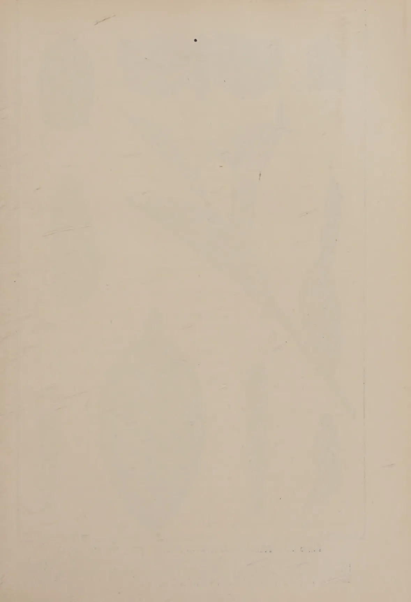

# The Tropical Agriculturist

VOL. LXXIX

PERADENIYA, AUGUST, 1932

No. 2

<table><thead><tr><th></th><th style="text-align: right;">Page</th></tr></thead><tbody><tr><td>Editorial ... ..</td><td style="text-align: right;">73</td></tr></tbody></table>

## ORIGINAL ARTICLES

<table><tbody><tr><td>Some Insect Pests of Tea in Ceylon (<i>Continued</i>)—The Tea Tortrix. By J. C. Hutson, B.A., Ph.D. ... ..</td><td style="text-align: right;">75</td></tr><tr><td>The Cultivation of Fruits in Ceylon with Cultural Details—III. By T. H. Parsons, F.L.S., F.R.H.S. ... ..</td><td style="text-align: right;">86</td></tr></tbody></table>

## SELECTED ARTICLES

<table><tbody><tr><td>The Experimental Cultivation of Tung Trees in the Empire ... ..</td><td style="text-align: right;">91</td></tr><tr><td>On the Growth of Coconut Roots ... ..</td><td style="text-align: right;">98</td></tr><tr><td>Coffee Production in Brazil Today ... ..</td><td style="text-align: right;">100</td></tr><tr><td>Rubber Latex ... ..</td><td style="text-align: right;">104</td></tr></tbody></table>

## MEETINGS, CONFERENCES, ETC.

<table><tbody><tr><td>Minutes of Meeting of the Estate Products Committee and the Food Products Committee of the Board of Agriculture ... ..</td><td style="text-align: right;">109</td></tr><tr><td>Minutes of Meeting of the Board of Management of the Rubber Research Scheme (Ceylon) ... ..</td><td style="text-align: right;">120</td></tr></tbody></table>

## REVIEW

<table><tbody><tr><td><i>Investigations on Coconuts and Coconut Products</i> ... ..</td><td style="text-align: right;">124</td></tr></tbody></table>

## DEPARTMENTAL NOTES

<table><tbody><tr><td>The Cultivation of <i>Derris</i> for the Manufacture of Insecticides ... ..</td><td style="text-align: right;">126</td></tr></tbody></table>

## RETURNS

<table><tbody><tr><td>Animal Disease Return for the Month ended July, 1932 ... ..</td><td style="text-align: right;">133</td></tr><tr><td>Meteorological Report for the Month ended July, 1932 ... ..</td><td style="text-align: right;">134</td></tr></tbody></table>

1------------------------------------------------

*Of great interest to those engaged in the  
cultivation of plantation crops.*

# A MANUAL OF GREEN MANURING

Being a reprint of articles published in  
*The Tropical Agriculturist* by the  
Staff of the Department of  
Agriculture, Ceylon.

*34 Illustrations and Figures*

Price Rs. 5/-, postage extra (Ceylon, 35 cents)

— • • • —

*Obtainable from:*

**THE MANAGER, PUBLICATION DEPOT,  
PERADENIYA.**

2------------------------------------------------

# The Tropical Agriculturist

August, 1932

---

## EDITORIAL

---

### COCOA IMPROVEMENT

---

THE cocoa produced by small-holders in Ceylon is often reduced to the condition of an inferior grade article by the depredations of the cocoa moth. This small moth haunts the dark storage places of village houses and boutiques and deposits its eggs upon the sacking containing cocoa beans or upon the beans themselves. From these eggs the larvae hatch out. They enter beans that have a cracked or damaged skin, seemingly being quite unable to penetrate a bean with an undamaged coat. Once inside the bean they convert it to nothing but a shell of refuse. As can readily be understood the stores of the shippers and the ships holds also become infested with the insect.

From time to time the Agricultural Department has drawn attention to the necessity to take precautions against this insect infestation of cocoa beans. The matter has now assumed an aspect of considerable importance in the cocoa world in view of legislation enacted by the United States of America for the control of the quality of the imported raw cocoa. The United States takes comparatively small amounts of Ceylon cocoa but her dependency the Philippine Islands which may adopt similar legislation is our best customer. Since April of the present year the United States has refused admission to shipments of cocoa beans containing more than ten per cent of damaged material. After October next year, 1933, a more drastic course is contemplated by the threat of destruction of such shipments. This action

3------------------------------------------------

74

which is taken under the Federal Food and Drugs Act is a precaution to ensure the sound quality of the food offered for consumption by the citizens of the United States. It behoves every producer and shipper of Ceylon cocoa to at once take steps to improve or maintain the quality of his cocoa. Much of our village-grown cocoa is quite capable of being raised from an inferior standard to the high one enjoyed in the main by Ceylon cocoa.

The cocoa plant in Ceylon is generally of a type yielding a high quality bean. For the past three years the Agricultural Department has been seeking to demonstrate in the Katugastota area that the production of a better sample is not an expensive process and involves but simple precautions in pruning, collection of damaged pods, and other measures against disease, and care in the drying and storing of the beans. A small type of cheaply constructed drying house has been devised. This can be used by a group of neighbouring growers if but the co-operative spirit can be inculcated. It is possible that the legislation taken against inferior produce as explained above may stimulate the adoption of methods for raising an inferior sample to a superior one, certainly it is the more likely to do so if the premium for quality equally rises. It is hoped that both results may accrue to the benefit of the cocoa grower in Ceylon.

4------------------------------------------------

This image shows a blank, aged, cream-colored page. The paper has a slightly textured appearance with some faint, irregular smudges and discoloration, particularly towards the edges. A small, dark, circular speck is visible near the top center of the page. There is no text or other markings on the page.

5------------------------------------------------

Plate XI is a detailed scientific illustration of the tea tortrix moth, *Homona coffearia*. It includes nine numbered figures: 1. Male moth, resting position; 2. Female moth, flying position; 3. Female moth, resting position; 4. Older tea leaf showing egg-masses; 5. Egg-mass; 6. Young caterpillar; 7. Full-grown caterpillar; 8. Tea shoot showing damage; 9. Pupa removed from leaf. The illustration is signed 'George L. de Silva' at the bottom right.

Block by S. G. O

Plate XI.—*Homona Coffearia* Nietn. (The Tea Tortrix.)

1. Male moth, resting position  $\times 3$ . 2. Female moth, flying position  $\times 3$ . 3. Female moth, resting position  $\times 3$ . 4. Older tea leaf showing egg-masses, natural size:—(a) freshly laid, pale-yellow; (b) developing, darker-yellow; (c) ready to hatch, spotted black and yellow, (d) empty, silvery white. 5. Egg-mass, much enlarged. 6. Young caterpillar, much enlarged. 7. Full-grown caterpillar  $\times 3$ . 8. Tea shoot, showing damage by caterpillar, natural size. 9. Pupa removed from leaf  $\times 3$ .

6------------------------------------------------

75

## SOME INSECT PESTS OF TEA IN CEYLON

(Continued)

J. C. HUTSON, B. A., PH. D.,

ENTOMOLOGIST,

DEPARTMENT OF AGRICULTURE, CEYLON

### THE TEA TORTRIX

(*HOMONA COFFEARIA* Nietn.)

**T**HIS pest is the larva or caterpillar of a small moth belonging to the family *Tortricidae*, several other members of which are known in Ceylon without being pests.

The moths of this family can usually be recognised by their bell-shaped outline when at rest (Plate XI, Fig. 3), while the larvae of some species usually have the habit of webbing together and distorting the leaves or flowers of various plants and feeding within and around the masses of rolled or twisted material.

The tea tortrix has been known as a pest of tea in Ceylon for many years. It was first mentioned in this connection by Green (1) in 1890 as having "quite recently become a serious plague in some localities", particularly in Dimbula and Dickoya. During the next twenty-five years or so this insect gradually spread over large areas of tea covering most of the southern or higher portion of the Central Province, and during this early period, speaking generally, its attacks on infested estates seem to have been severe over fairly small areas but of comparatively brief duration. From 1911 to 1914 the pest developed to an alarming extent, and from 1917 to 1919 it was the subject of a special investigation by Jardine (9-11); the results of that investigation were published in Bulletins Nos. 40, 45, and 46 of this Department. Tea Tortrix was discussed from time to time at various meetings until in July, 1924, at a representative meeting, it was agreed that some concerted action to control this pest should be taken. A Sub-Committee of the Maskeliya District Planters' Association drew up certain recommendations and the co-operation of all estates for the carrying out of these measures was invited, but the response was far from general and no concerted action was taken. The matter was brought up again towards the end of 1925 at a General Meeting of the Planters' Association of Ceylon, and a request was

7------------------------------------------------

76

made that a further investigation of tea tortrix should be undertaken by this Department. As a preliminary to such investigation visits were paid by officers of the Entomological Division to estates in some of the tortrix districts and breeding experiments and observations of the bionomics of this pest were started by the writer early in 1926. Upon the establishment of the Tea Research Institute before the end of 1926 it was decided to transfer the investigation of tea tortrix to that Institute. The notes of the results of the life-history work, together with a brief discussion of the various control measures recommended at different times were published in the Year Book of this Department for 1927 (6). A review of the tea tortrix situation (written before the Year-book article appeared) by the Entomologist of the Tea Research Institute was published in the local press in April, 1927, and reproduced in *The Tropical Agriculturist* for June, 1927 (14). In that article attention was called to the serious nature of the tortrix outbreaks in 1926, these attacks having been both wide-spread and severe in some districts. A contrast was drawn between the recent tendency of tortrix to produce milder attacks spread over large areas and its former habit of causing sharp outbreaks in restricted areas; and the difficulty of controlling tortrix over large areas was pointed out. A resolution was passed at a general meeting of the Planters' Association of Ceylon held in August, 1927, to the effect that the Director of Agriculture should be asked to take steps to have tea tortrix declared a pest. The matter was subsequently discussed at the September, 1927, meeting of the Estate Products Committee of the Board of Agriculture, with the result that this Committee recommended to Government that tea tortrix be declared a pest under the Plant Protection Ordinance No. 10 of 1924. Government agreed with this recommendation and in November, 1927, the whole of the tea-growing area of the Island was declared to be an infested area. The measures scheduled for the control of this pest are the collection by all tea estates of all egg-masses, larvae, and pupae of the tea tortrix from tea and the destruction of the same within twenty-four hours of collecting. It should be noted that a resolution was passed at the above-mentioned meeting of the Estate Products Committee that the matter should be reconsidered in two years' time.

At the November, 1929, meeting of the Estate Products Committee the collection returns of tortrix egg-masses for the previous two years were reviewed by the Plant Pest Inspector, Central Division, who pointed out that at the beginning of the campaign it was decided to concentrate on the five districts which were known to be badly attacked, namely, Ambegamuwa, Dikoya, Lower Dikoya, Maskeliya, and Dimbula. He added

8------------------------------------------------

77

that the returns from these main tortrix districts had been very encouraging during the period under review. The feeling of the meeting was that the regulations should be continued if the District Planters' Associations concerned wished them to be retained. At a subsequent meeting of the Estate Products Committee it was decided, in view of the general opinion of the District Planters' Associations, that the regulations should be continued, no period of duration being specified.

At the September, 1931, meeting of the above Committee the recent tortrix returns were reviewed by the Plant Pest Inspector, Central Division, and the co-operation of all estates concerned in the collection of tortrix egg-masses was urged. The regulations are being continued for an indefinite period.

#### DESCRIPTION OF STAGES

*Eggs.*—The eggs are flat, disc-shaped, irregularly oval objects, rather small, measuring from about 0.8 m.m. to about 1 m.m. long by about 0.5 m.m. to about 0.7 m.m. broad. They are laid in rows overlapping each other like fish scales, so as to form, in the case of a typical mass, a compact, flattened, long-oval or elliptical group. The eggs are covered by a thin film giving them a varnished appearance. An average size mass of about 120-130 eggs is about 12 m.m. long by about 4 m.m. broad. Some masses are long and narrow, while others, especially the smaller ones, are broadly oval in outline; others again are quite irregular in outline. The sizes and shapes of four typical masses are shown in Figure 4, while the arrangement of the eggs in a mass enlarged about 4 times, is illustrated in Figure 5.

The freshly laid egg-mass is of an opaque pale-lemon colour, but in a day or two it begins to get darker and gradually changes to a deep orange colour. A day or two before hatching, that is about the fifth day after deposition, the dark heads of the young larvae give the mass a variegated yellow and black appearance.

*Larvae.*—The newly hatched larva is about 2 m.m. long; the head is black and the body is pale-yellowish and is thinly covered with fine pale hairs (Fig. 6). As soon as the larva has fed for a day or two the body takes on a pale-greenish tinge.

The second stage larva is about 3 to 4 m.m. long and has a dark plate on the first segment behind the black head; this plate is found in all the subsequent stages of the larva. The body is pale-green and covered with fine hairs.

The full-grown larva varies in length from about 18 m.m. to about 30 m.m.; those larvae which are destined to become male moths being usually smaller than those which are to become female moths. The body is grayish-green to dark-green in

9------------------------------------------------

73

colour and is covered with fine pale hairs of different sizes; there is a conspicuous shiny black plate on the segment behind the head and separated from it by a transverse white line (Fig. 7). Sometimes larvae with dark-brown heads and plates are found, but breeding experiments have shown that these develop into the same species of moth as do the normal tortrix larvae.

It may be mentioned here that the very slender pale-greenish larvae with pale-brown heads occasionally found webbing tea flush are the immature stage of another tortrix moth, *Adoxophyes privitana*, which is not known to be a pest.

*Pupae*.—The pupae vary in colour from pale-brown through reddish-brown to dark-brown, the male pupa being usually paler in colour than the female pupa. The pupae are not enclosed in any specially woven cocoons, but are usually to be found among the masses of younger leaves webbed together by the larvae or within the folds of single leaves, or even between two older leaves fastened together by the larvae before pupating. The tip of the abdomen ends in a somewhat flattened blunt process, called the cremaster, which in this instance bears eight very small hooks. These serve to anchor the pupa to any silken threads within its "nest". The dorsal surface of the abdomen is furnished with rows of minute spines which may assist the pupa in its movements especially at the time of the emergence of the moth. The male pupa is usually smaller than that of the female, being about 6 to 8 m.m. long as compared with the 10 to 12 m.m. length of the female.

*Moths*.—These differ in size and colour according to the sex. A typical *female* moth is yellowish to reddish-brown and usually has a dark band stretching obliquely across each forewing (Fig. 2) and when the wings are closed these two bands appear as a single transverse curved band (Fig. 3). The bases and tips of the forewings may also be tinged with dark-brown. A typical *male* moth (Fig. 1) is grayish-brown with grayish spots and a dark-brown band on each forewing, which also has a prominent shoulder fold not found in the *female* moth. The hind wings of both sexes are of a uniform yellowish to grayish colour. There is a considerable variation in the shades of brown as exhibited on the forewings of the *female* moths and this range of colouration is seen not only on moths emerging under natural conditions, but on those bred in captivity. In some cases the forewings may be of an almost uniform shade of brown ranging from buff colour to almost blackish-brown without conspicuous bands, while in other cases the banded markings may be clearly defined. Wing expanse: *female*, 23 to 28 m.m., *male*, 15 to 17 m.m.

For a fuller description of the different stages reference should be made to Bulletin No. 40 (9).

10------------------------------------------------

79

## LIFE-HISTORY AND HABITS

### EGGS

*Position.*—In the case of tea the egg-masses are deposited almost invariably on the upper surface of the leaves; usually the harder and older leaves are chosen and especially those low down on the bush. The masses are not uncommonly in a conspicuous position and their pale-yellow to orange colour during the first few days of their development makes them still more conspicuous objects on the dark-green leaves. Towards the end of the incubation period the eggs become variegated black and yellow, as the heads of the young larvae become visible; at this stage the egg-masses are not so easily detected and doubtless some of them are overlooked by the collecting gangs.

*Number of eggs in a mass.*—Counts were taken by the writer (6) of 1,000 egg-masses sent in from three estates in the Maskeliya district as collected by experienced coolies during the ordinary routine of egg-collection, and the number of eggs per mass ranged from 29 to about 400. The average number of eggs per mass for the 1,000 egg-masses was found to be about 122. Jardine (8) found that the approximate average from over 15,000 egg-masses was 125 to 150 eggs per mass.

*Number of eggs per moth.*—During the course of the breeding experiments carried out by the writer at Peradeniya the oviposition records of 100 individual female moths were kept and altogether these moths laid about 21,650 eggs, or an average of about 216 eggs per moth. Of these 100 moths, 15 laid no eggs, giving an average of about 254 eggs per moth for the 85 egg-laying moths. The individual totals of eggs laid by the 85 moths in captivity ranged from 2 to about 710, and 47 of these laid over 200 eggs each. Table I shows the egg-laying records of 10 representative moths. For further notes on oviposition see *Moths—Oviposition period*.

*Incubation period.*—Under laboratory conditions at Peradeniya the eggs hatched in about  $6\frac{1}{2}$  to  $7\frac{1}{2}$  days, and it may be said that between 95 and 100 per cent of the eggs laid normally on fresh leaves under these conditions were able to hatch. Jardine (9) has found that the incubation period of tortrix egg-masses under field conditions at elevations of 3,000 to 4,000 feet ranged from 10 to 12 days.

*Development.*—The freshly laid egg-mass is of an opaque pale-lemon colour. By the second day the developing embryo larvae can usually be detected, and the mass gradually darkens to a dull orange-yellow by the fourth or fifth days. The dark heads of the young larvae can be seen by the sixth day, giving the mass its variegated yellow and black appearance.

11------------------------------------------------

80LARVAE

*Emergence.*—When about to emerge the young larvae struggle about inside until they can get their jaws to work on the egg-shells, after which they quickly bite their way through the shells and the film covering these. Usually they all emerge within a few minutes of each other, and quickly disappear from sight.

*Habits of young larvae.*—Some retire to the underside of the older leaves or between the leaves webbed together by older larvae, others make their way up to the flush almost immediately and settle down within an hour after hatching. Others again, if there is a wind blowing, are swept off the leaf on which they hatched and each larva immediately lets itself go at the end of a thread. In this way a steady breeze gradually carries them throughout the original bush and into the next two or three bushes to leeward of their starting point, and a few larvae are able to establish themselves on each bush as they get blown along (6). It is probable that under calm conditions many of the first stage larvae may live gregariously on the underside of matured leaves, as indicated by Jardine (9). During the first instar, the larvae merely nibble small portions of the leaf surface; the mortality during this stage is high, being at least 30 per cent of the number which originally hatched.

*Older larvae.*—After the first moult, which takes place from 4 to 8 days after hatching, the larvae become more active and in about another week later they begin feeding ravenously, without, however, confining their attentions to one leaf. As indicated by Jardine and observed by the writer, they do not steadily devour a leaf, but nibble it here and there, biting into growing buds, gnawing around young shoots and twisting and arresting the natural growth of the flush. During the last two instars the larvae, especially the larger ones which usually become female moths, devour large portions of leaves, feeding on a part of their nests or coming out to feed on other leaves.

The general result of a bad attack of tortrix is that the bushes present a very thin and ragged appearance, the individual branches standing out with all their shoots webbed together and partially eaten and their older leaves distorted and discoloured; seen from a distance the affected area looks scorched and shrivelled.

*Duration of larval period.*—The following table gives the individual life-cycle records obtained from the breeding experiments carried out under laboratory conditions at Peradeniya:

12------------------------------------------------

81

TABLE I TOTAL LIFE-CYCLE OF TEA TORTRIX  
*The figures indicate numbers of days*

<table border="1">
<thead>
<tr>
<th>Serial No.</th>
<th>1</th>
<th>2</th>
<th>3</th>
<th>4</th>
<th>5</th>
<th>6</th>
<th>7</th>
<th>8</th>
<th>12</th>
<th>13</th>
<th>14</th>
<th>15</th>
<th>16</th>
<th>17</th>
<th>18</th>
<th>20</th>
<th>21</th>
<th>22</th>
<th>23</th>
<th>24</th>
<th>25</th>
<th>28</th>
<th>29</th>
</tr>
</thead>
<tbody>
<tr>
<td>Incubation period</td>
<td>7</td>
<td>7</td>
<td>7</td>
<td>7</td>
<td>7</td>
<td>7</td>
<td>7</td>
<td>7</td>
<td>7</td>
<td>7</td>
<td>7</td>
<td>7</td>
<td>7</td>
<td>7</td>
<td>7</td>
<td>7</td>
<td>7</td>
<td>7</td>
<td>7</td>
<td>7</td>
<td>7</td>
<td>7</td>
<td>7</td>
<td>7</td>
</tr>
<tr>
<td>First instar (approx.)</td>
<td>4</td>
<td>4</td>
<td>4</td>
<td>4</td>
<td>4</td>
<td>4</td>
<td>4</td>
<td>4</td>
<td>4</td>
<td>4</td>
<td>4</td>
<td>4</td>
<td>4</td>
<td>4</td>
<td>4</td>
<td>4</td>
<td>4</td>
<td>4</td>
<td>4</td>
<td>4</td>
<td>4</td>
<td>4</td>
<td>4</td>
<td>4</td>
</tr>
<tr>
<td>Second instar "</td>
<td>3</td>
<td>3</td>
<td>3</td>
<td>3</td>
<td>3</td>
<td>3</td>
<td>3</td>
<td>3</td>
<td>3</td>
<td>3</td>
<td>3</td>
<td>3</td>
<td>3</td>
<td>3</td>
<td>3</td>
<td>3</td>
<td>3</td>
<td>3</td>
<td>3</td>
<td>3</td>
<td>3</td>
<td>3</td>
<td>3</td>
<td>3</td>
</tr>
<tr>
<td>Third instar ..</td>
<td>4</td>
<td>4</td>
<td>4</td>
<td>4</td>
<td>4</td>
<td>4</td>
<td>4</td>
<td>4</td>
<td>4</td>
<td>4</td>
<td>4</td>
<td>4</td>
<td>4</td>
<td>4</td>
<td>4</td>
<td>4</td>
<td>4</td>
<td>4</td>
<td>4</td>
<td>4</td>
<td>4</td>
<td>4</td>
<td>4</td>
<td>4</td>
</tr>
<tr>
<td>Fourth instar ..</td>
<td>4</td>
<td>4</td>
<td>4</td>
<td>4</td>
<td>4</td>
<td>4</td>
<td>4</td>
<td>4</td>
<td>4</td>
<td>4</td>
<td>4</td>
<td>4</td>
<td>4</td>
<td>4</td>
<td>4</td>
<td>4</td>
<td>4</td>
<td>4</td>
<td>4</td>
<td>4</td>
<td>4</td>
<td>4</td>
<td>4</td>
<td>4</td>
</tr>
<tr>
<td>Fifth instar ..</td>
<td>7</td>
<td>6</td>
<td>6</td>
<td>5</td>
<td>—</td>
<td>—</td>
<td>—</td>
<td>—</td>
<td>6</td>
<td>5</td>
<td>6</td>
<td>5</td>
<td>4</td>
<td>4</td>
<td>7</td>
<td>8</td>
<td>4</td>
<td>7</td>
<td>5</td>
<td>7</td>
<td>5</td>
<td>6</td>
<td>—</td>
<td>—</td>
</tr>
<tr>
<td>Sixth instar ..</td>
<td>—</td>
<td>—</td>
<td>—</td>
<td>—</td>
<td>—</td>
<td>—</td>
<td>—</td>
<td>—</td>
<td>8</td>
<td>7</td>
<td>—</td>
<td>7</td>
<td>6</td>
<td>—</td>
<td>—</td>
<td>—</td>
<td>7</td>
<td>—</td>
<td>—</td>
<td>—</td>
<td>—</td>
<td>—</td>
<td>—</td>
<td>—</td>
</tr>
<tr>
<td>Total larval period (approx.)</td>
<td>23</td>
<td>22</td>
<td>23</td>
<td>22</td>
<td>18</td>
<td>20</td>
<td>19</td>
<td>23</td>
<td>38</td>
<td>35</td>
<td>26</td>
<td>33</td>
<td>32</td>
<td>25</td>
<td>22</td>
<td>24</td>
<td>27</td>
<td>21</td>
<td>25</td>
<td>30</td>
<td>18</td>
<td>22</td>
<td>33</td>
<td>—</td>
</tr>
<tr>
<td>Pupal period (approx.)</td>
<td>6</td>
<td>6</td>
<td>6</td>
<td>6</td>
<td>7</td>
<td>6</td>
<td>6</td>
<td>6</td>
<td>6</td>
<td>7</td>
<td>6</td>
<td>6</td>
<td>6</td>
<td>6</td>
<td>6</td>
<td>6</td>
<td>6</td>
<td>6</td>
<td>6</td>
<td>6</td>
<td>6</td>
<td>6</td>
<td>6</td>
<td>7</td>
</tr>
<tr>
<td>Egg to adult (approx.)</td>
<td>36</td>
<td>35</td>
<td>36</td>
<td>35</td>
<td>32</td>
<td>33</td>
<td>33</td>
<td>37</td>
<td>—</td>
<td>49</td>
<td>39</td>
<td>46</td>
<td>—</td>
<td>39</td>
<td>36</td>
<td>38</td>
<td>40</td>
<td>34</td>
<td>38</td>
<td>43</td>
<td>31</td>
<td>—</td>
<td>47</td>
<td>—</td>
</tr>
<tr>
<td>Sex</td>
<td>F</td>
<td>F</td>
<td>F</td>
<td>F</td>
<td>M</td>
<td>M</td>
<td>M</td>
<td>F</td>
<td>F</td>
<td>M</td>
<td>F</td>
<td>F</td>
<td>F</td>
<td>M</td>
<td>M</td>
<td>F</td>
<td>F</td>
<td>F</td>
<td>F</td>
<td>F</td>
<td>F</td>
<td>M</td>
<td>M</td>
<td>M</td>
</tr>
<tr>
<td>Pre-oviposition period</td>
<td>+</td>
<td>+</td>
<td>+</td>
<td>4</td>
<td>2</td>
<td>—</td>
<td>—</td>
<td>2</td>
<td>—</td>
<td>—</td>
<td>1</td>
<td>—</td>
<td>—</td>
<td>—</td>
<td>—</td>
<td>1</td>
<td>2</td>
<td>2</td>
<td>3</td>
<td>—</td>
<td>—</td>
<td>—</td>
<td>—</td>
<td>—</td>
</tr>
<tr>
<td>Oviposition period</td>
<td>—</td>
<td>—</td>
<td>1</td>
<td>10</td>
<td>—</td>
<td>—</td>
<td>—</td>
<td>5</td>
<td>—</td>
<td>—</td>
<td>7</td>
<td>—</td>
<td>—</td>
<td>—</td>
<td>—</td>
<td>5</td>
<td>4</td>
<td>1</td>
<td>4</td>
<td>—</td>
<td>—</td>
<td>—</td>
<td>—</td>
<td>—</td>
</tr>
<tr>
<td>Post-oviposition period</td>
<td>—</td>
<td>—</td>
<td>1</td>
<td>2</td>
<td>—</td>
<td>—</td>
<td>—</td>
<td>1</td>
<td>—</td>
<td>—</td>
<td>2</td>
<td>—</td>
<td>—</td>
<td>—</td>
<td>—</td>
<td>1</td>
<td>1</td>
<td>1</td>
<td>1</td>
<td>—</td>
<td>—</td>
<td>—</td>
<td>—</td>
<td>—</td>
</tr>
<tr>
<td>Total adult period</td>
<td>—</td>
<td>—</td>
<td>19</td>
<td>14</td>
<td>8</td>
<td>14</td>
<td>—</td>
<td>8</td>
<td>—</td>
<td>—</td>
<td>10</td>
<td>10</td>
<td>—</td>
<td>9</td>
<td>10</td>
<td>7</td>
<td>6</td>
<td>4</td>
<td>7</td>
<td>9</td>
<td>2</td>
<td>—</td>
<td>—</td>
<td>+</td>
</tr>
<tr>
<td>Total life egg to death</td>
<td>—</td>
<td>—</td>
<td>56</td>
<td>49</td>
<td>41</td>
<td>47</td>
<td>—</td>
<td>45</td>
<td>—</td>
<td>—</td>
<td>49</td>
<td>57</td>
<td>—</td>
<td>48</td>
<td>46</td>
<td>45</td>
<td>46</td>
<td>38</td>
<td>45</td>
<td>52</td>
<td>34</td>
<td>—</td>
<td>—</td>
<td>—</td>
</tr>
<tr>
<td>No. of eggs</td>
<td>—</td>
<td>—</td>
<td>26</td>
<td>710</td>
<td>—</td>
<td>—</td>
<td>—</td>
<td>118</td>
<td>—</td>
<td>—</td>
<td>585</td>
<td>0</td>
<td>—</td>
<td>—</td>
<td>—</td>
<td>570</td>
<td>355</td>
<td>4</td>
<td>13</td>
<td>0</td>
<td>—</td>
<td>—</td>
<td>—</td>
<td>—</td>
</tr>
</tbody>
</table>

The larvae in Nos. 9, 10, 11, 19, 26, and 27 died before pupation. \* Pupa died. † Destroyed by ants. ‡ No record.

13------------------------------------------------

82

It will be seen from the above table that 23 larvae were bred through to the pupal stage and that 19 of these larvae reached the moth stage. Of these 23 larvae, 9 were males and 14 were females. The number of instars varied from 4 to 6 in the case of potential males, while the potential females passed through either 5 or 6 instars; 5 of the 9 males passed through only 4 instars and 9 of the 14 females had only 5 instars, and it is suggested that 4 instars may be the normal number for a male and 5 instars for a female under field conditions. The male larval period ranged from 18 to 35 days, with an average of nearly 24 days, while the female larval period occupied from 21 to 38 days with an average of about  $26\frac{1}{2}$  days.\* The records of 11 cages containing groups of larvae allowed to develop together gave the shortest range of the larval period as 18 to 23 days and the longest range as 21 to 31 days. The larval period includes a pre-pupal stage of at least two days during which time the larva stops feeding and gradually shrinks; it then moults its skin for the last time and changes into the pupa.

#### PUPAE

Under field conditions the pupae are usually found within the "nests" of webbed leaves occupied by the larvae or between portions of two older leaves webbed together to form a pupal chamber.

*Pupal period.*—In the individual breeding experiments the male pupal period ranged from 6 to  $7\frac{1}{2}$  days, while the females occupied from 6 to  $6\frac{1}{2}$  days in the pupal stage. In the collective breeding cages the pupal period ranged from 6 to 9 days.

#### MOTHS

*Emergence.*—In captivity the majority of the moths of both sexes emerge during the early hours of the morning, but emergence may also take place during the forenoon and early afternoon. The moths remain quiescent during the daytime and under field conditions they shelter normally among dry leaves or near the bases of the bushes; during bad attacks some of them may be seen resting on the leaves of tea bushes.

*Flight.*—Jardine (9) indicates that there is a noticeable difference between the male and female moths as regards their flying habits. "The female, when disturbed, will fly with a quick fluttering of the wings, in a wide circle, evenly and in the same plane, returning to within a few yards of the place she was disturbed from. The male never flies in the same plane, but 'tumbles' like a tumbler pigeon and zig-zags like a snipe; the direction of his flight is not a circle, nor is it sustained; rather does he zig-zag from bush to bush when disturbed".

\* The figures given in the Year Book for 1927, page 13, have been slightly revised.

14------------------------------------------------

83

*Oviposition.*—It has been mentioned previously that the oviposition records of 100 individual female moths were kept and that 15 of these laid no eggs. The records of the 85 egg-layers showed that 58 moths began oviposition before the end of 72 hours after emergence, 5 moths starting during the first 24 hours, 29 moths during the second 24 hours, and 24 moths during the third 24 hours. Also that 63 of the 85 egg-layers had completed oviposition by the end of the eighth day after emergence. It may be said, therefore, that the majority of the egg-laying moths under observation in the laboratory oviposited between the second and eighth days, both inclusive. It was observed that 25 of these egg-layers died within 12 hours after the last eggs were laid, while the remaining 60 moths lived for about  $2\frac{1}{2}$  days on the average after completing oviposition.

*Duration of moth stage.*—Records were kept of the duration of life of 68 males and 100 females used during the breeding experiments. The life of the males ranged from 3 to 16 days with an average of about 7 days, while that of the females ranged from 3 to 19 days, with an average of about 8.3 days per moth. The 15 non-egg-laying moths lived for about 6.6 days on an average, while the 85 egg-layers averaged about  $8\frac{1}{2}$  days per moth. It should be mentioned that all the moths under observation were provided with a weak solution of sugar and water.

#### TOTAL LIFE-CYCLE

The following table gives a summary of the complete life-cycle occupied approximately by an average male and an average female under laboratory conditions at Peradeniya from the laying of the eggs to the death of the moth. The approximate range within which the life-cycle varies is also given for both sexes.

TABLE 2. SUMMARY OF LIFE-CYCLE

<table border="1">
<thead>
<tr>
<th rowspan="2">Stage</th>
<th colspan="2">MALES</th>
<th colspan="2">FEMALES</th>
</tr>
<tr>
<th>Average in days.</th>
<th>Range in days.</th>
<th>Average in days.</th>
<th>Range in days.</th>
</tr>
</thead>
<tbody>
<tr>
<td>Egg</td>
<td>7</td>
<td><math>6\frac{1}{2}</math> to <math>7\frac{1}{2}</math></td>
<td>7</td>
<td><math>6\frac{1}{2}</math> to <math>7\frac{1}{2}</math></td>
</tr>
<tr>
<td>Larva</td>
<td><math>23\frac{1}{2}</math></td>
<td>18 to 35</td>
<td>26</td>
<td>20 to 37</td>
</tr>
<tr>
<td>Pupa</td>
<td>7</td>
<td>6 to <math>7\frac{1}{2}</math></td>
<td><math>6\frac{1}{2}</math></td>
<td>6 to <math>6\frac{1}{2}</math></td>
</tr>
<tr>
<td>Adult</td>
<td>7</td>
<td>3 to 16</td>
<td>8</td>
<td>3 to 19</td>
</tr>
<tr>
<td>Total</td>
<td><math>44\frac{1}{2}</math></td>
<td><math>33\frac{1}{2}</math> to 66</td>
<td><math>47\frac{1}{2}</math></td>
<td><math>35\frac{1}{2}</math> to 70</td>
</tr>
</tbody>
</table>

It will be seen from the above table that the complete life-cycle of a male from egg to adult is on the average nearly 6 $\frac{1}{2}$  weeks and the range is between about 5 weeks to nearly 9 $\frac{1}{2}$  weeks. A female, from egg to adult, averages nearly 7 weeks, with a range of about 5 to 10 weeks.

15------------------------------------------------

84

Jardine (9) states that the actual life-history of the insect from the laying of the egg to death is six to eight weeks and gives the following table:

Egg to larva, 1 week 3 days; larva to pupa 4 to 5 weeks;  
Pupa to adult, 1 week; adult to death, 1 week.

### FOOD PLANTS

A number of food plants of tea tortrix was listed by Jardine (9) among which may be mentioned acacia (*Acacia decurrens*); dadap (*Erythrina lithosperma*); grevillea (*Grevillea robusta*); gum (*Eucalyptus robusta*); cacao (*Theobroma cacao*); jak (*Artocarpus integrifolia*); inga saman or rain tree (*Pithecolobium saman*); duranta (*Duranta plumieri*); roses (*Rosa* spp.), and various other garden plants. The present writer recorded this insect on coffee (*Coffea robusta*) and bandakka (*Hibiscus esculentus*). Light (14) states that "tortrix appears to be steadily enlarging its range of food plants, as evidenced by the great number of wild and cultivated forms showing damage that are encountered everywhere in the infested regions".

### CONTROL MEASURES

Various measures have been suggested from time to time during the past twenty-five years or so for controlling tea tortrix in the different stages of its development. All the more important suggested control measures have been discussed by the writer in the Year Book for 1927 and have been reviewed by Light in *The Tropical Agriculturist* for June, 1927. As indicated in the early part of this article the collection of egg-masses, larvae, and pupae of tortrix from tea is being given an extended trial by all tea estates concerned.

Meanwhile other possible measures of control are being investigated by the Tea Research Institute, including the study of the local parasites of tortrix. The possibility of introducing parasites from outside is also under consideration. For further information on these points reference should be made to the publications of the Institute.

### REFERENCES

A list of the more important references to the literature on tea tortrix are given below:

1. 1. GREEN, E. E.—Insect Pests of the Tea Plant.—*Ceylon Independent Press*, Colombo, 1890. pp. 89-93, 1 plate.
2. 2. GREEN, E. E.—Some Caterpillar Pests of the Tea Plant.—*Circ. R.B.G.*, Peradeniya, Ser. I, No. 19, pp. 244-247, September, 1900.
3. 3. GREEN, E. E.—The Tea Tortrix (*Capua coffearia*, Nietner.) *Circ. R.B.G.*, Peradeniya, Vol. II, No. 3, 1 plate, January, 1903.
4. 4. GREEN, E. E.—*Trop. Agriculturist*, Peradeniya, XXVI, No. 4, pp. 301-307, May, 1906.

16------------------------------------------------

85

1. 5. GREEN, E. E.—*Trop. Agriculturist*, Peradeniya, XXXVI, No. 4, pp. 328-330, April, 1911.
2. 6. HUTSON, J. C.—Some Notes on Tea Tortrix, *Year Book Dept. Agric. Ceylon*, 1927, pp. 11-18, 1 plate.
3. 7. HUTSON, J. C.—Recent work on some Pests of Economic Crops, *Trop. Agriculturist*, Peradeniya, LXVIII, No. 4, pp. 220-222, April, 1927.
4. 8. HUTSON, J. C.—The Tea Tortrix.—*Dept. Agric. Ceylon, Leaflet No. 33*, 1 plate.
5. 9. JARDINE, N. K.—The Tea Tortrix.—*Dept. Agric. Ceylon, Bulletin No. 40*, 2 plates, November, 1918.
6. 10. JARDINE, N. K.—Tortrix Flight Breaks.—*Dept. Agric. Ceylon, Bulletin, No. 45*, 1 plate, Sept. 1919.
7. 11. JARDINE, N. K.—Field Experiments with Anti-Tortrix Fluids.—*Dept. Agric. Ceylon, Bulletin No. 46*. 4 plates, 1 plan, November, 1919.
8. 12. JARDINE, N. K.—The Control of Tea Tortrix.—*Year Book Dept. Agric. Ceylon*, 1925, pp. 4-6.
9. 13. LEEFMANS, S.—Bijdrage tot het Vraagstuk der Bladrollers van de Thee. (A contribution to the Question of the leaf-rollers of Tea). Meded-Inst. Plantenziekten, Buitenzorg, No. LXXVII, 1921, 83, pp. 20 plates. (With a summary in English).
10. 14. LIGHT, S. S.—Tea Tortrix in Ceylon—Review of the Present Situation.—Local Press, Ceylon, April 27, 1927. *Trop. Agriculturist*, Peradeniya LXVIII, No. 6, pp. 349-362, June, 1927.
11. 15. LIGHT, S. S.—*Tea Research Institute, Ceylon, Bulletin No. 1*, Annual Report, 1926. Report of the Entomologist Page 17.

17------------------------------------------------

86

## THE CULTIVATION OF FRUITS IN CEYLON WITH CULTURAL DETAILS—III

T. H. PARSONS, F.L.S., F.R.H.S.,  
CURATOR,  
ROYAL BOTANIC GARDENS, PERADENIYA

### GROUP C

#### MID-COUNTRY WET ZONE (1,500-4,000 FEET)

(1) GRAPE FRUIT (*Citrus maxima* var. *uvacarpa*).—Known generally as the "Grapefruit" but in America as the Pomelo (not to be confused with the Ceylon Pummelo). A large globose fruit approximately 4 inches in diameter used chiefly as a breakfast fruit and for fruit salads, having a slightly bitter acid pulp, is an excellent appetiser and also possesses tonic properties. The name of the fruit apparently originated from the fact that the fruits are borne in clusters, not unlike a bunch of grapes.

It is cultivated now in most parts of the tropics and in many sub-tropical regions also, and particularly in Florida, West Indies, South Africa, and Australia.

Low to mid-country districts are more suited to it than the higher elevations and 4,000 feet appears to be the limit of its successful cultivation in Ceylon and at this elevation sheltered aspects are desirable. There is a large demand for the fruit and for plants, indicating that the utility of this fruit is at last beginning to be realised in Ceylon. It can be grown over such a large area that there is every incentive to increase the areas of grapefruit not only for home consumption but subsequently to meet the demands of the boats calling at Colombo.

The tree, like most other citrus, prefers a light well-drained soil that is porous, and thrives under rainfall conditions varying from 60 to 120 inches per annum. Under 60 inches per annum irrigation is required but with over 120 inches per annum particular attention must be paid to drainage.

Owing to very free cross-pollination of the flowers and the consequent mixed origin of the seed, propagation by seed is not usually recommended, budding being the method adopted in nearly all cases. Occasionally, however, seedlings produce a good fruiting specimen and even seedling grapefruit are obviously preferable to none at all. Budding is, however, quite easy and results in a crop true to type and earlier in fruiting.

18------------------------------------------------

87

Seed should be obtained from ripe fruit of sound and healthy trees and carefully selected, rejecting all but the big and plump seed which should be thoroughly washed and should not be allowed to dry before planting. Sowings should be made in prepared beds, in drills, planting the seed half an inch below the surface, two inches apart in rows, and nine to twelve between the rows, keeping the beds shaded whilst the seeds are germinating. On attaining a height of three inches above ground the seedlings should be transplanted to nursery beds at twelve inches apart keeping the beds well shaded and watered for a week or two after the operation. Transplanting to a permanent site can be done when the seedlings reach six to eight inches, but if budding is decided on the seedlings should remain until they attain at least the thickness of a lead pencil at four to five inches above the ground. Recent experiments at Peradeniya indicate that larger stocks than the above give excellent results, buddings being made on the inverted "T" system at a point twelve to fifteen inches above ground level, a more standard form of tree being produced and subsequent growth appears to be more rapid.

Budded plants can be removed to permanent sites as soon as the inserted bud has completed its first flush of growth, usually not later than three months after budding. Distances vary according to soil and elevation or to the type of stock used and should generally not be less than eighteen by eighteen feet or more than thirty by thirty feet, the normal planting distances being between these two.

Cattle manure should wherever possible be employed and the trees given a good dressing prior to the monsoons. Mulching with dried leaves or grass at the commencement of the dry season is also to be recommended.

Little pruning is called for as a rule, this being limited to the removal of any dead or dying wood, or in the event of the tree becoming too dense in growth a thinning of the interior branches or where branches overlap.

Pests and diseases are unfortunately very common on all citrus in Ceylon, but the use of suitable sprays, such as tobacco juice, kerosene emulsion, and lime sulphur solution applied during the growing periods goes far to counteract the attacks.

The variety most in favour is undoubtedly "Marsh's Seedless" and it is to be recommended for Ceylon since fruit superior to any of the imported fruits has been grown in the Island from this variety. Others also with strong recommendations are "Duncan", "Triumph", and "Conner's Prolific", the latter being more suited to the higher elevations.

19------------------------------------------------

88

(2) BRAZIL CHERRY (*Eugenia Michelli*).—The Brazil or Surinam Cherry and referred to as the Goraka Jambu S. the Pitanga, the Cayenne, or Florida Cherry. The species is the best of the Eugenias and is cultivated on a large scale in Brazil where it is indigenous, and latterly in Florida also. It is to be found in cultivation in parts of India, South China, Hawaii and along the Mediterranean coast. It is a small shrubby tree often branching close to the ground, bearing small dark-green leaves rather broad and pointed. The fruit is one-seeded, small, and ribbed, about one inch or more in diameter, and flattened at the ends, deep red in colour not unlike a small ripe tomato, and is of good flavour, being soft and juicy. It has a sweetish acid somewhat aromatic taste and is excellent for jellies, preserves, or stewing. It is also suitable for dessert.

The tree is best suited to mid-country elevations but grows well in low elevations also and will attain a height of 25 feet on good soil, though 15 feet to 18 feet is usual. Moisture is a necessity and a light sandy loam is preferred, but the tree is adapted to varieties of soil and thrives in Brazil even in stiff clay.

Propagation by seed is in common use, but whip grafting is recommended though not extensively employed anywhere. Seedlings germinate freely and should be sown either in prepared beds in rows at two inches apart and nine inches between rows or separately in bamboo pots or other receptacles. The seed must be put in whilst fresh, at half or not more than one inch below the surface of the soil. Germination takes place in 3 to 5 weeks but the seedlings grow slowly and should not be transplanted until they attain a height of 3 inches when they should be either potted up or transplanted into nursery beds at nine inches apart. At a height of eight to nine inches the seedlings can be planted in permanent sites.

Good sized holes should be prepared and the bottom of the hole forked up and loosened, well-rotted cattle manure being incorporated in the soil on refilling. Planting distances should be fifteen by fifteen feet and shading is necessary for a time, after which full exposure is appreciated. Growth is not rapid under the best circumstances and it takes 4 to 5 years to reach the fruiting stage. After attaining sufficient age, however, heavy crops are borne regularly and often two crops a year are obtained.

Before full ripeness the flavour of the fruit is resinous and pungent but as the fruits ripen they lose their green colour, becoming first yellow, then an orange colour, and finally a scarlet or crimson colour. They should be picked for dessert only on attaining the latter stage and never eaten until fully ripe.

20------------------------------------------------

89

Two peculiarities are attached to this fruit tree, the first that some trees throw up an enormous number of root suckers around the stem and these should always be cut out from below the ground as they appear, and secondly the tree requires ample water at the time the fruit is beginning to change colour, as dryness at the root at that period will otherwise cause the fruit to remain small.

Pruning is not generally called for except in the direction of removal of all dead wood or should the centre branches of the head of the tree become too crowded, though, if required, the tree will withstand very heavy pruning. Regular manuring each year with well-rotted cattle manure and mulching of dried leaves or grass during periods of drought is beneficial to this fruit as to most others.

(3) CHINA GUAVA (*Psidium cattleianum*).—Known also as the Calcutta guava, the Strawberry guava and the Hill guava. A rather small, shrubby and ornamental tree of Brazil, attaining a height of 25 feet when full-grown, with smooth gray-brown bark and small leathery and shining leaves. The fruits are produced in great abundance of an average diameter of one inch, being bright purplish red in colour with a thin skin. The flesh is soft and juicy and the flavour sweet and aromatic. When properly ripe the fruit is eaten raw and much appreciated, it is the most palatable of the guavas, and deserves to be more widely known. It is also used considerably for jelly making and is in demand for tarts and jams.

The tree thrives best at medium elevations in both the wet and the dry zones and produces two crops a year, in May and in September to October, and well repays good cultivation. It is cultivated in China, parts of India, Southern Spain, North Africa, Mexico, West Indies, and in Florida and covers therefore a wide range of soils and climate, but a rich sandy loam suits it best.

Propagation is chiefly by seed as there is less variation among the seedlings than in most other fruits, but with a very choice variety propagation by cuttings or by budding on to the large yellow fruited guava proper is advisable. Although the seed retains its germinating power for a long time it is advisable always to sow as soon as it is removed from the fruit. The seed should be sown in boxes or pans of light sandy soil and covered to a depth of a quarter-of-an-inch.

Germination is usually slow and the pans or boxes should not be watered too liberally but kept rather on the dry side. On the appearance of the second pair of leaves, usually at 3 to 4

21------------------------------------------------

90

months of age, the seedlings should be removed from the seed pan and transferred into bamboo pots and grown on to a height of six inches or more. Transplanting to permanent sites should be done very carefully and as much soil as possible retained on the roots since this tree does not take kindly to root disturbance.

Planting distance should be from fifteen to fifteen feet up to eighteen to eighteen feet. For the first year the tree retains a bushy growth, later developing trunks to form moderate size trees. Growth throughout is slow but small crops are available usually from the fourth year, increasing as the tree structure improves and at maturity very large crops are usual.

Pruning is rarely required and the removal of any dead wood is sufficient throughout the life of the tree. This species is also particularly free from pests. Well-decayed cattle manure should be applied in periodical dressings and although this tree thrives in dry as well as wet regions, mulches during dry spells are beneficial.

There is a yellow fruited variety, *Psidium cattleianum* var. *lucidum*, reputed to be of more delicate flavour, but this does not seem very suited to Ceylon.

(To be continued).

22------------------------------------------------

91

## THE EXPERIMENTAL CULTIVATION OF TUNG TREES IN THE EMPIRE\*

THE Chinese wood oil of commerce is derived from two trees, *Aleurites Fordii* Hemsl. and *A. montana* E. H. Wilson. The former occurs abundantly in the warm temperate parts of central and western China, especially in the Yangtze valley, and yields tung oil, while the latter is found in southern China and requires a more tropical climate and a heavier hot-weather rainfall. The oil from *A. montana* is known in China as "Mu-yu" and is stated to possess similar properties to those of tung oil.

Chinese wood oil was introduced commercially into western Europe over thirty years ago and to-day is an essential raw material of paint and varnish manufacture. It possesses unique drying properties which render it indispensable for certain types of varnish in which tough, water-resistant films of high gloss are desired. The oil is also widely used in the manufacture of electrical insulating varnishes.

At the present time the only source of commercial supplies of the oil is China, from which over 69,000 tons were exported in 1930. The principal market for the oil is in the United States of America, where increasing quantities are being used every year, some 56,000 tons having been imported in 1930. In comparison, only small quantities are imported into the United Kingdom, the figure for 1930 being about 4,000 tons. The use of Chinese wood oil in the latter country is, however, becoming more general, while other European countries also are beginning to display an interest in the oil and increasing amounts will doubtless find a market in these countries.

It is estimated that about 90 per cent of the oil exported from China is derived from tung trees (*A. Fordii*), while the remaining 10 per cent is obtained from *A. montana*. The oils are sometimes indiscriminately mixed.

In view of the importance of Chinese wood oil to the paint and varnish manufacturers, the need has been felt of freeing this industry from its sole dependence on China for supplies. Accordingly attempts have been made to grow the trees in other countries of the world. In the United States of America the cultivation of *Aleurites Fordii* on a commercial scale has been started within the last ten years in certain southern States, and the acreage under the crop is being continually increased. For example, in Florida the area was 2,500 acres in 1926, 4,000 in 1928, and 5,000 by the end of 1929. In Georgia 2,000 acres had been planted up to 1930, and it was proposed to add another 3,000 acres in the autumn of 1931. In the first half of that year (1931), 4,000 acres were planted in Mississippi and 2,000 in northern Florida. A few of these plantations are now in bearing. On one estate of 30 acres, six-year-old trees have given a yield of approximately 1,300 lb. of fruits per acre, equivalent to about 280 lb. of oil per acre. On the whole, the yields of fruit obtained in America have not come up to expectations. This may be due to the fact that late spring frosts are liable to occur when the trees are in blossom in those States where plantations have been established, with the result that the yield of fruit has been adversely affected. It is possible that in countries where the danger of frosts does not occur, higher yields will be obtained.

\* From *Bulletin of the Imperial Institute*, Vol. XXX, No. 1, 1932.

23------------------------------------------------

92

As regards the British Empire, the Imperial Institute as long ago as 1917 initiated experiments in the cultivation of both species of trees in India and a number of the Colonies. The results of these trials were on the whole inconclusive. In Kenya, however, two of the *A. Fordii* trees fruited and a sample of the produce was examined at the Imperial Institute, when it was found that the seeds contained a normal percentage of oil of the usual character.

The question of the cultivation of tung trees in the Empire was again taken up in 1927 by the Imperial Institute Advisory Committee on Oils and Oilseeds and this Committee, in collaboration with the Director of the Royal Botanic Gardens, Kew, and the Director of the Research Association of British Paint, Colour, and Varnish Manufacturers, distributed supplies of seed obtained from China and Florida to various countries of the Empire.

In view of the importance of producing tung oil in the Empire, the question was considered by an inter-departmental conference convened by the Department of Scientific and Industrial Research in March, 1929, and on their recommendation a special Sub-Committee was appointed by the Advisory Committee on Oils and Oilseeds to deal with this problem. Besides continuing the encouragement of the experimental cultivation of tung trees within the Empire by the distribution of seed and the dissemination of related information, the Sub-Committee have arranged for the investigation at the Paint Research Station of cognate problems, the elucidation of which will contribute to the success of this Imperial production. Among the cultivations that have been commenced are a comparison of the chemical and physical properties of the oils of *A. Fordii* and *A. montana* and the determination of the value as a feeding-stuff for animals of the cake or meal left after the removal of the oil from the seeds. In addition, a memorandum entitled "The Production of Tung Oil in the Empire" was prepared at the Imperial Institute with the co-operation of the Sub-Committee and issued by the Empire Marketing Board, who, besides undertaking the publication of this pamphlet, have provided the necessary funds for the investigations.

During the last four years nearly 4 tons of *A. Fordii* seed and about 700 lb. of *A. montana* seed have been distributed by the Royal Botanic Gardens, Kew, in co-operation with the Sub-Committee, mainly for experimental trials in those parts of the Empire where climatic conditions were considered suitable for the cultivation of the crop. Among the other countries where trials are now in progress are the following: Australia, New Zealand, New Guinea, Fiji, India, Ceylon, British Malaya, Seychelles, Mauritius, Union of South Africa, Kenya, Tanganyika, Nyasaland, Rhodesia, Sudan, Nigeria, Sierra Leone, St. Helena, Cyprus, Palestine, Iraq, British Honduras, Bermuda, Leeward Islands, Jamaica, and other West Indian Islands. In some of these countries cultivation experiments have also been started independently of the Sub-Committee.

Up to the present time much more attention has been given to the experimental cultivation of *A. Fordii* than of *A. montana*. The reasons for this are that, as already stated, the former species furnishes about 90 per cent of the Chinese wood oil of commerce and also because, prior to the recent developments, practically the whole of the experience in the cultivation of the trees was that gained in the United States of America, where *A. Fordii* is being grown. In many cases the trials with *A. Fordii* have not been in progress sufficiently long for the trees to have had time to fruit, while in those where fruit has been produced the experiments will have to be continued before any conclusion can be drawn as to likely yields.

24------------------------------------------------

93

At the same time as trials have been made with *A. Fordii*, the experimental cultivation of the allied species, *A. montana*, has been carried on. In the main these tests have been failures, as the seed, which has to be obtained from China, appears to lose its viability very readily with the result that very little germination, if any, has taken place after the seed has been sown.

In view of the great interest which is being displayed in the production of tung oil, a brief summary of the experiments so far carried out with both species of *Aleurites* is given below. It must be understood that the trials in Empire countries are still in the experimental stage and that in no case has it yet been established that the cultivation of the trees on a commercial scale will prove remunerative.

*India.*—The principal trials in this country are being conducted in Burma and Assam.

Near Taunggyi, Southern Shan States, at an elevation of 4,650 feet, the Department of Agriculture in 1929 established plantations of *A. Fordii* totalling about 30 acres and containing some 2,100 plants. These plants were in a healthy condition in October, 1930, and showed every sign of successful development with the exception of a small area transplanted too late in October of the previous year. Although good results are anticipated, it is not expected that they will be equal to those obtained in the plantation of Tung Oil Estates, Ltd., at Hsum Hsai, Northern Shan States, as the elevation at Taunggyi of 4,650 feet is possibly rather high and tung trees grow better on a well-drained, porous soil, which is more in evidence in the Northern than the Southern Shan States. The Tung Oil Estates, Ltd. commenced operations during the latter half of 1930. By the end of 1931, some 720 acres had been cleared and planted, the nurseries and seed at stake both looking exceptionally well. From a small batch of seed planted in 1929 in the same area, the plants are now over 6 feet in height and look very healthy. It is hoped to receive the first sample of nuts from the 1929 plants during the current year. A further 750 acres are being cleared and planted up this year. Both *Aleurites Fordii* and *A. montana* are growing on the estate, but it is too early at present to give any opinion as to their comparative suitability.

The Department of Agriculture, Burma, have also made experiments at Maymyo, Mandalay, and at Hmawbi Agricultural Station. At the former place germination of the seed of *A. Fordii* was good, and although the plants made little growth in the first year, they did well in the following year, reaching an average height of about 4 ft. A number of two-year-old plants were subsequently transplanted with very few casualties. Good germination was also obtained at Hmawbi and growth was so vigorous that three-month-old seedlings were removed from the nursery and transplanted. They made satisfactory, but rather uneven, growth and twelve months after being transplanted were robust and had an average height of four feet, the tallest being seven feet. Some of the same lot of seedlings were transplanted when fourteen months old but, although healthy, have not made such rapid growth as those planted out at an earlier age. Only eighty-four plants of *A. Fordii* at present are established at Hmawbi.

In Assam *A. Fordii* trees are making good growth and fruiting in some cases when only 18 months old. A number of tea estates have made experimental plantings, but no particulars of the acreage planted have been received. Some of these tea estates which were supplied with seed in 1928 are now using their own seed for sowing. At Naojan, Mr. D. S. Withers on his estate of 1,200 acres had in July, 1930, approximately 35,000 seedlings of *A. Fordii* in the nursery and 1,000 plants had been transplanted to

25------------------------------------------------

94

clearings. The seedlings made good growth and many of the trees fruited in 1931. Some of the seed produced was sown and germinated in 18 days. A portion of the crop from these plants was crushed and a sample of the oil obtained has been received at the Imperial Institute. Further seed was sown in April, 1931, and one hundred acres had been planted by the end of that year. Seventy plants of *A. montana* have also been raised on this estate and are making good progress. Mr. Withers is inclined to think that this species will do better than *A. Fordii* in most of these parts of Assam which have an annual rainfall of from 60 to 100 inches, as he has found that the latter species does not grow so well where the rainfall is 80 inches as it does with a rainfall of 50 inches.

Small-scale trials have also been started by the Director of the Indian Lac Research Institute at Sabaya and Namkum in the Ranchi district of Chota Nagpur, Bihar and Orissa. *A. Fordii* trees have made good progress and started flowering towards the end of the second year.

*Ceylon*.—Repeated trials in Ceylon have shown that *A. Fordii* will not flourish in that Island. *A. montana*, on the other hand, appears to grow well. At the Experiment Station, Peradeniya, there are some 36 trees of the latter species which are just beginning to bear. A sample of the seeds has been sent to the Imperial Institute for examination.

*British Malaya*.—Experiments indicate that although *A. Fordii* shows considerable promise during the first year or so after sowing, subsequent growth appears to be arrested and the trees fail to flower or fruit. This is probably due to the absence of a cold season during which the plants may rest. With *A. montana* rather better results have been obtained. At the Government Experimental Plantation, Serdang, a small area was planted in 1925 with seed obtained from Hongkong. By the end of three years a small number of the trees had fruited, one bearing as many as a hundred fruits. Upon chemical examination a sample of fruits from these trees was found to contain 43.2 per cent of oil in the kernels. This yield is rather low, as two samples from China examined at the Imperial Institute gave yields of 56.3 and 59.8 per cent respectively, expressed on the kernels. The position in British Malaya has been summarised by the Agricultural Department as follows: "As a result of the various trials carried out by the Department with *A. Fordii* and *A. montana* at the Experimental Plantations, Kuala Lumpur and Serdang, it would appear that both these species of *Aleurites* are unsuitable for cultivation on the plains in this country. Further trials, however, are being carried out at the Experimental Plantation, Cameron's Highlands, at an elevation of about 5,000 feet, and until such trials have proved successful the cultivation of either *A. Fordii* or *A. montana* on a commercial scale in Malaya cannot be recommended".

*Australia*.—As a result of a distribution of seed made several years ago from the Royal Botanic Gardens, Kew, to the Botanic Gardens, Sydney, there were in New South Wales at the beginning of 1930 about 1,000 *A. Fordii* trees, many of which were then in bearing.

In the Fennant Hills, Mr. Rawes Whittell, and Messrs. Smith, Wylie & Co., (Aust.) had in 1931 over 6 acres planted; a company—Tung Oil (Australia), Ltd.—has been formed to develop this enterprise and proposes to establish a 1,000-acre plantation at Bundanoon near Sydney. A sample of fruits grown by Mr. Rawes Whittell was recently received at the Imperial Institute for examination and found to contain a normal percentage of oil, which was of very similar composition to that of oil of Chinese origin.

In Queensland also the experimental cultivation of *A. Fordii* has been started, and according to private communications good progress is being made. The Department of Agriculture and Stock has established two

26------------------------------------------------

95

experimental plantations of two and four acres respectively in the Mary Valley near Gympie, while in Innisfail District, Queensland Forest, Ltd., has two plantations of 45 acres each.

*New Zealand.*—Seeds of *A. Fordii* have been sown annually for the past three or four years at the Government Horticultural Station at Te Kauwhata. The germination has been good and satisfactory plants have been raised without any special difficulty. As yearlings these plants have been set out in plantations or on farms in Auckland, Hawkes Bay, and Nelson Provinces. There are a few trees eight years old in private gardens in the suburbs of Auckland. These have made normal growth and the trees have carried a small crop. It is considered that the most northerly parts of North Island are the only districts suitable, as there the frosts are rare and light. Should these parts of the Dominion prove satisfactory as regards soil and climate for the growth and fruiting of the trees a valuable industry might be established. The number of trees, however, that have been grown to maturity in the Auckland district is too small to enable a confident opinion to be formed of the future prospects of this industry. But the experimental trials already made in numerous localities by the Department of Agriculture and the State Forest Service should serve to indicate what parts, if any, are suitable for the establishment of large-scale plantations.

Five public companies with a total nominal capital of £780,000 have been formed to develop the cultivation of tung trees on a commercial scale in the North Auckland district. One of the five companies, the New Zealand Tung Oil Corporation, has acquired land at Kaukapakapa, North Island, for the purpose of establishing plantations. Five hundred acres have already been planted. Another company, Paerenga (N.Z.) Tung Oil Ltd., has an estate in the extreme north-west corner of North Island. No trees had been planted out by last October, but there were sufficient seedlings in the nursery for 500 acres. The Northern Tung Oil Ltd., owns plantations in Mangonui district about 300 miles north of Auckland, and has about 500 acres under preparation. Other companies interested are Empire Wood Oil (N.Z.) Ltd. and Natural Products (N.Z.) Ltd.

*Africa.*—Experimental trials with tung trees are in progress in all British countries in South and East Africa from the Union of South Africa to Kenya. In the Union of South Africa Messrs. Banger and Allen on their farm at Bushbuck Ridge, Pilgrim's Rest, Transvaal, had in June, 1930, about 4,000 three-year-old trees of *A. Fordii*. In February, 1931, several of these were bearing fruits. A sample of fruits from a six-year-old tree grown on the same farm was received at the Imperial Institute and on examination was found to yield a normal percentage of oil of character similar to the tung oil of commerce.

At Groot Drakenstein, Cape Province, the Rhodes Fruit Farm Ltd., have successfully reared about 250 two-year-old seedlings of *A. Fordii*. In Natal trials carried out in several places have given results which in cases were disappointing and in others satisfactory. Some of the trees raised by Imperial Chemical Industries, Ltd., at their Umbogintwini factory in Natal have flowered fairly profusely and a number of fruits have set.

In Southern Rhodesia the Forest Officer, as the result of trials made in several places, is of opinion that *A. Fordii* will most probably grow in certain localities, but he does not think "it will ever thrive as a commercial tree". At Abercorn, Northern Rhodesia, one-year-old plants were reported to be doing well on the whole.

27------------------------------------------------

96

Results of trials with *A. Fordii* carried out in East Africa continue to be disappointing throughout the whole range of trials between sea-level at Zanzibar and 4,000-5,000 feet in the Moshi-Arusha area of Tanganyika, though in the Mbeya district of Iringa Province—a more promising result appears probable. At Amani only two trees show any appreciable growth. In Kenya the Conservator of Forests considers it clear that the Nairobi climate does not suit the trees, but it may acclimatise itself in due course. Reports from the other parts of the Colony show that the tree will make better growth at altitudes of 6,000 feet and over and that the climate in these places at any rate appears to be more suitable.

*Cyprus.*—At several experimental stations in different parts of Cyprus trials have been carried out with both species and the results have not been altogether encouraging, although in certain areas isolated plants seem to have attained some degree of development. Polis is the only station where trials on anything approaching a commercial scale have been made and there seem to be average prospects of success in this area. The Director of Agriculture stated last September that he was inclined to think that the extremes of temperature in Cyprus in the long summer and hot-dry winds are not favourable to the growth of *Aleurites*, but the experimental plot now established at Polis should in due course give more definite information as to the possibility of cultivating these trees commercially.

*Other Countries.*—The results of trials made in other parts of the Empire have been not very promising. In some cases, experiments have shown that the trees will not thrive or fruit. This failure is often due in the case of *A. Fordii* to the absence of a cold season which prevents the tree from having the annual resting period which is essential.

In addition to the trials carried out in the United States of America and the British Empire, attempts are being made to cultivate Chinese wood oil trees in the following countries: Argentine, Paraguay, Brazil, Sumatra, Java, Portuguese East Africa, Madagascar, Cuba, Hawaii, and the Philippine Islands. Of these trials the most important are those being made in South America. In the Argentine the most favourable area appears to be in the Provinces of Misiones and Corrientes and in the northern portion of the Province of Entre Rios. The greatest activity centres round San José and Pindapay in Misiones, where it is estimated there were some 50,000 trees last October. All the trees have made rapid growth and many have fruited. In Paraguay there are about 30,000 trees, the largest single planting being that made by the Paraguay Central Railway. With this exception most of the plantings consist of 25 to 500 trees each.

In connection with the cultivation of the trees the question naturally arises whether it is better to grow *A. Fordii* or *A. montana*. As far as present experience would indicate, it seems advisable to give preference, *ceteris paribus*, to the former species in view of the fact that, as already stated, most of the commercial supplies of Chinese wood oil are derived from this tree. Moreover, it has not yet been definitely established that the oil of *A. montana* possesses equal powers of gelation or is of equal value to *A. Fordii* oil. Investigations rather tend to show that it is somewhat inferior and takes a longer time to polymerise.

The influence of the increased production on the price of tung oil is another point which will occur to those who are contemplating engaging in this new industry. Will the larger quantities available have the effect of reducing the price to a figure which will render the cultivation of the trees unprofitable? On this question it must be stated that during the last two years the price of the oil has fallen considerably, as is shown by a comparison of the price in January, 1930, of £69-10s. per ton in London for Hankow

28------------------------------------------------

97

Chinese wood oil with that in September, 1931, of £37-10s. This heavy fall in price was due largely to the lower value of silver and has been accentuated by the general decline in the price of all commodities. During the last few months the price of tung oil has risen again owing to the depreciation in the value of sterling and was in February, 1932, quoted at £51. It is considered, however, that tung oil will always command a price at least £10 per ton above that of linseed oil, on account of its special properties, which make its use essential in the manufacture of certain types of varnishes. It must also be remembered that new uses may be found for tung oil, which will result in a demand for increased quantities. A potential new use is in the linoleum industry, as it is possible that tung oil, on account of its property of gelation, may prove more suitable for this purpose than the linseed oil now used and that the process of manufacture may be quickened and cheapened when tung oil is employed. Should this prove the case, large quantities of this oil will be required, as the linoleum industry in the United Kingdom alone uses some 50,000 tons of linseed oil annually.

It may be mentioned that tung oil produced on plantations should be of better quality and colour than the present supplies from China, because it will be prepared by modern machinery under skilled supervision. In addition, Chinese oil is often adulterated, while in the case of the plantation product the likelihood of such sophistication is remote. Therefore, unless the quality of the Chinese oil improved, the plantation oil should command a higher price and there should be a large demand for this grade.

As will be seen from the above account considerable interest has been aroused by the steps that have been taken by the Imperial Institute Sub-Committee and others to encourage the production of tung oil within the Empire. In some countries commercial undertakings have been started to cultivate the tree. It should, however, be pointed out that it is very desirable that before the public are invited to subscribe funds for the establishment of plantations, definite evidence should be obtained by small-scale trials that tung trees can be successfully grown in the particular locality and that they are likely to prove a remunerative crop. Data are necessary as to the rate of growth of the trees, the age at which they will bear commercial supplies of fruit, the average yield of fruit per tree and the yield and quality of the oil. These particulars can only be obtained by establishing experimental plots of trees in the actual locality and maintaining them for a period of years until they come into bearing. Until this preliminary work has been carried out, it is impossible to form a trustworthy estimate as to the probable commercial success of any scheme for the cultivation of the trees and their planting on a large scale cannot be recommended.

29------------------------------------------------

98

## ON THE GROWTH OF COCONUT ROOTS\*

*Introduction.*—In the Philippines at present there are over 105,000,000 coconut trees planted covering an area of over 500,000 hectares. A person going through the coconut plantations, especially those about 15 years of age or older, can very often see a tree with the upper part of the root system entirely exposed. This is mainly due to the erosion of the soil caused by the heavy tropical rains. The roots become stunted and fail to reach the ground. As far as the tree is concerned they are entirely useless. But if these roots could be made to grow, the tree would have many more roots with which to obtain the necessary food elements from the ground. Moreover, there would be more roots to hold the tree firm, and this is of especially great import during typhoons.

As a matter of general observation, productivity of a plant is correlated with the development of the root system. Physiologically this should be so, since high productivity is possible only when there is ample provisions for facilities to obtain plant food materials from the ground. The roots of corn have been found to increase in number continuously until the plant is mature. In the case of sugar cane, Wolters summarizes the findings of a number of investigators by stating "that it appears to be a definite conclusion that heavy root weights are correlated with heavy cane tonnage," and Roxas and Villano found in their experiments in the Philippines that increased shoot development corresponded to increase root development, without exception. Sampson in his investigation of coconut productivity found that regular bearing trees showed better developed root systems than irregular bearing ones.

*The Problem.*—Here, then, is a problem the solution of which would certainly result in tremendous benefit to the country considering that there are more than 105,000,000 coconut trees in the Philippines.

These trees are in all stages of growth and in all conditions of health. In many cases they bear scarcely any nuts and have a very anaemic appearance because the root systems are not sufficiently developed to meet the requirements of a healthy productive tree adequately. It should be stated in this connection that new coconut roots are produced above the older ones in the bole. After a certain age the oldest roots die. New roots to take the place of those that die must develop. If on account of exposure to the air the new roots fail to reach the ground, then the tree will have to depend solely on the roots already present, which naturally diminish in number as the old ones die.

*Experiments and Results.*—It seems that by covering these roots with soil or other materials they may continue to grow. The exposed roots of a coconut tree, therefore, have been covered with soil in February, 1927. In November, 1927, part of the soil covering was removed. It was found that the roots which otherwise would have become dormant and of no use to the tree, had grown rapidly and luxuriantly. In September, 1928, the same part of the root system was uncovered and they showed still more luxuriant growth.

\* By Vicente C. Aldaba of the Bureau of Plant Industry, Manila, in *The Philippine Journal of Agriculture*, Vol. III, No. 1, First Quarter, 1932.

30------------------------------------------------

99

The dormant roots when covered by soil do not continue to grow but instead they produce branches of almost the same size a little behind the tip.

The covering of the exposed roots by soil in many cases may not be practicable except when the owner has only a few trees. When it comes to plantations of big areas, covering the exposed roots with soil becomes difficult and in many cases would be unprofitable because of the labour involved.

Considering, however, the present cultural practice in the Islands there is another material, the coconut husk, which may readily be used and which is now either burned or just allowed to rot. At present in order to save in transportation the practice in many places consists in husking the nuts right in the place where they are gathered, taking only the husked nuts to the drying sheds or to more distant places for sale. The husks are piled between the trees and burned. This is done after every harvesting which takes place from 3 to 4 times a year. If instead of doing this the husks were piled at the bases of the coconut trees to cover the exposed roots, no extra expense would be incurred. At the same time a tremendous benefit would accrue to the trees, for it stands to reason that the husks piled around the bases of the trees would have practically the same influence on the growth of the dormant roots as a soil covering.

*Discussion.*—There are enough husks wasted to cover the roots of all the coconut trees completely all the time. Taking the average production per tree all over the Islands which was 33 in 1929, certainly in 3 years of this practice, the bases of the coconut trees should be so completely covered that the roots should develop as luxuriantly as when it is covered by soil. No extra work was spent in doing this and the benefit to the industry in the form of greater productivity of the individual trees would be incalculable, remembering again that there are at present over 105,000,000 coconut trees.

There is, however, a problem in connection with such disposition of the husks. The old practice of burning the husks is evidently due to the idea that when left decaying in the ground they may serve as breeding places for coconut beetles. This, however, had been found not to be true. As shown by well-controlled investigation the coconut beetles do not breed in piles of coconut husks.

*Summary and Conclusion.*—1. On account of the erosion of the soil due to the heavy tropical rains, a large part of the root system of the coconut trees in the Philippines become exposed in due time and the new roots fail to reach the ground. They are thus entirely useless to the trees.

2. Experiments have shown that by covering the exposed roots with soil or coconut husks they continue to grow into the ground and thus become useful to the coconut tree.

3. On physiological grounds and in the light of the results of investigations on coconut and other plants it is concluded that when these exposed roots reach the ground, thus giving them a chance to be of service to the tree, greater productivity should result.

4. Considering the present cultural practice, the exposed part of the root system may be adequately covered to stimulate the growth of the stunted roots into the ground without extra expense by piling husks around the bole of the trees instead of between the rows to be burned or to be allowed to rot.

31------------------------------------------------

100

## COFFEE PRODUCTION IN BRAZIL TO-DAY\*

**N**O other part of the world possesses conditions so favourable for the production of coffee as the plateau region of South-Central Brazil, chiefly in the State of Sao Paulo, Minas Geraes and Paraná, and to a lesser extent in the States of Espirito Santo, Rio de Janeiro, Goyaz, and Matto Grosso.

The coffee tree was introduced into Brazil over one hundred years ago from Africa and the East Indies, and while the production has not been successful in all the regions where it was introduced, yet production has increased steadily in the plateau region, referred to above, until the production of coffee has become the dominant industry of the country, furnishing nearly seventy per cent of the total exports.

Where soil and climatic conditions are favourably combined with sufficient elevation, the production per tree is not only much greater than in other coffee-producing countries, but also the climatic conditions are such that the coffee cherries mature at more or less the same time, thereby reducing the cost of harvesting the crop. It is for this reason that Brazil produce 75 per cent of the world's coffee. Brazil possesses 2,290,763,000 of the world's total of 3,366,896,000 coffee trees distributed among the various coffee-producing States as follows: Sao Paulo, 51.5 per cent; Minas Geraes, 25.7 per cent; Rio de Janeiro, 6.5 per cent; Espirito Santo, 5.6 per cent; Bahia, 3.1 per cent; Pernambuco, 2.4 per cent; Paraná, 1.2 per cent; and other States, 4.0 per cent.

Since 1927, Brazil has been suffering from overproduction of coffee due to too much credit in the form of loans furnished by British and American bankers for the purpose of stabilizing coffee prices at too high a level. Statistics show that there is enough coffee in the world today to supply the world's consumption requirements for almost two years; however, this is only partly true. There is too much low-grade coffee and not enough high-grade. The problem confronting Brazil is to reduce production of low-grade coffee as well as the cost of production. Also consumers must be found for the immense stocks of low-grade coffee, or some method must be devised for treating the low-grade coffee in such a manner as to separate the high-grade coffee contained therein from the low-grade coffee and impurities.

The consumption of coffee is increasing steadily at the rate of about 450,000 sacks, of 132 pounds each, per year, but the per capita rate of consumption is not increasing in all countries at the same rate; in fact, it has diminished in some countries as compared to 1913. The per capita consumption of coffee throughout the world varies from 15 pounds in Denmark to forty-four ten thousandths of a pound in China. In the United States, the per capita rate of consumption has increased from 9.7 pounds in 1913 to 12 pounds in 1930, while in Germany the per capita rate of consumption has decreased from 5.5 pounds in 1913 to 5.2 pounds in 1930; in fact the per capita consumption of coffee has decreased in most Central European countries, including Russia since 1913. Before the war, Germany

\* By Eugene F. Horn, in *Tea and Coffee Trade Journal*, Vol. 62, No. 4, April, 1932

32------------------------------------------------

101

purchased large quantities of Brazilian coffee and distributed it to the various countries of Central and South-Eastern Europe with profit to herself and Brazil as well. Up to the present time no new distributing agency has taken over German activity in this field. An encouraging factor in the present coffee situation lies in the fact that frosts, cold winds, and dry weather this year probably will reduce next year's coffee crop thirty or forty per cent.

*Topography and Climate.*—South-Central Brazil consists of a plateau sloping gently to the west and drained mostly by tributaries of the Paraná River. The lands best suited for growing coffee are situated at elevations varying from 1,200 to 2,300 feet above sea level. Except in certain parts of the States of Espírito Santo, Rio de Janeiro, and Minas Geraes, which are mountainous, the topography of this region can best be described as "rolling". The topography of at least 60 per cent of the land planted with coffee is such as to permit mechanical cultivation.

The climate is sub-tropical and healthful. There are two seasons: a rainy season from October to June, and a dry season from June to October. The annual rainfall is about 55 inches and is distributed throughout the rainy season with occasional showers throughout the dry season. The rainy season is the warmer of the two, and while the days are frequently hot, the nights are always cool. The summer heat is less noticeable than in the Central States of the U.S.A. The dry season is the winter season and light frosts are not uncommon at the lower elevations. For this reason it is essential to plant coffee on the ridges and higher elevations, since it is easily damaged by frost. Irrigation is not necessary since there is sufficient rainfall for the production of all crops.

*Soil.*—In Brazil, there are two types of soil best adapted for producing coffee; namely, *terra roxa* and *massape*. The former is a stiff reddish or purplish clay derived from decomposed basaltic rock, which underlies this type of soil, and the latter is a sandy loam varying in colour from greyish to reddish brown. *Terra roxa* is the richer soil of the two, and coffee trees 80 years old in the State of Sao Paulo are still producing on this soil. Coffee trees require five years to come into full production on *terra roxa*, whereas full production is reached in four years on *massape*. It is claimed that coffee trees will not produce so long on *massape*, however, there are trees 40 years old still producing excellent crops on this soil in the State of Sao Paulo. In general, the production of coffee planted on *terra roxa* is greater and the bean is larger than in the case of coffee planted on *massape* soil. There is, besides, another type of soil suitable for the production of coffee. This is a yellowish-red clay derived from decomposed granite, and the greater part of the coffee in the State of Espírito Santo, Rio de Janeiro, and Minas Geraes is produced on this type of soil.

*Coffee Plantations.*—In Brazil, coffee is planted in hills with from four to six plants in a hill. The hills are in rows spaced from 11.5 to 14.5 feet apart each way, depending on the quality of the soil. The plants when mature form rather bushy trees, usually from 10 to 16 feet in height. The term "coffee tree" therefore is a misnomer since each unit consists of from four to six trees growing very close together, but the mature coffee has the appearance of a single tree. The plantations are sub-divided by roads into sections, or *talhoes*, containing 5,000 trees and usually spaced 50 by 100 trees.

*Cultivation.*—At least 95 per cent of the coffee plantations in Brazil are cultivated exclusively with a hoe. In order to keep the coffee clean, it is necessary to hoe four and sometimes five times per year. This work usually is done on a contract basis and the average family consisting

33------------------------------------------------

102

two coffee plantation workers will treat 5,000 trees per year at a contract price varying from 120 to 150 milreis per thousand trees per year. Converted into dollars at the present exchange rate of  $6\frac{1}{4}$  cents to the milreis, a family of two workers will receive from \$37.50 to \$46.87 per year. During the coffee harvesting season the entire family will be engaged in gathering coffee on a piece work basis, but their earnings from this source will never exceed 600 milreis, or \$37.50. The total earnings of a coffee plantation worker and his family will, therefore, never exceed \$84.37 per year. Their economic situation is, therefore, not to be envied, and it is becoming increasingly difficult each year to secure sufficient labour especially in the State of Sao Paulo.

*Harvesting the Crop.*—In the State of Sao Paulo the coffee trees usually bloom after the first rains at the beginning of the rainy season; however, if rains occur during the dry season, as quite frequently happens, blossoms will come early as late June or early July. The flower buds do not all mature at one time, so there are several flowering periods; usually two major blooms, and sometimes one or more minor blooms. An early flowering period in early July, for example, is disadvantageous since the coffee cherries will mature before the rainy season ends—in February or March—and drop off on the ground and decay.

When ripe, the cherries are not unlike common red cherries, although somewhat more oblong. The slender branches or twigs frequently bend under the weight of the ripe cherries which are borne directly on the sides of the twigs or branches. The cherries usually contain two grains, each enclosed in a rather tough capsule. The cherries, if permitted to remain on the trees, will dry and become black in colour and eventually fall to the ground. At present, two methods are followed in harvesting the crop: namely, the stripping process, *derricande*, and the natural process, *colheta natural*.

The first process is most widely used, and perhaps 90 per cent of the coffee is gathered in this way. Long before the harvesting season commences, usually in February or March, the loose dirt and trash is cleaned from under the trees with a hoe and raked around them. Provided the work is done on time, the greater part of the coffee of the first flowering period will fall on the clean ground under the trees. Since the rainy season is not over until April or May much of this coffee will decay, or the grains within the cherries will become black or discoloured, thereby affecting the appearance, flavour, and aroma of the cleaned coffee. It is customary, therefore, to gather up the first coffee which falls and treat it separately, since it is always of inferior quality.

The harvesting season in the State of Sao Paulo commences on the larger estates, the first of June and continue until September or until the crop is harvested. The harvesting season commences somewhat later in Paraná and in the southern part of the State of Sao Paulo. In harvesting the crop of coffee cherries are shaken or pulled off on to the ground, where they are raked together, screened of dirt, and separated from twigs and leaves, all by hand labour. On the best managed estates it is customary to spread cotton cloth under the trees upon which the cherries fall when they are shaken or pulled off, thus facilitating the harvesting process as well as securing a higher quality of coffee.

The coffee trees are more or less injured by stripping or pulling off the cherries. Twigs and small branches often are broken and many leaves are stripped from the twigs. If this process is continued during or after the flowering period, much damage is done to the future crop by injuring or destroying a part of the flower buds, blossoms, or newly-formed cherries,

34------------------------------------------------

103

The harvesting of the crop is usually done by contract; the contract price varying from  $1\frac{1}{2}$  to  $2\frac{1}{2}$  milreis per sack of 110 liters of coffee cherries sacked and delivered along the road for transportation to the drying area. One hundred and ten liters of undried cherries will yield approximately 37 lb. of coffee grains after being dried and cleaned.

Due to shortage of labour on the larger estates, it is necessary to commence the harvest before all of the cherries are ripe, and if harvesting commenced in May or June the first coffee harvested will contain a high percentage of unripe cherries. These green cherries impart an acrid flavour to the finished product and lower its quality. Due also to the labour shortage, the harvesting period often is prolonged until after the rainy season commences, and this part of the crop is much damaged thereby. After the harvesting process is completed—usually in October—the loose dirt and trash is hoed or raked under and around the trees again and mixed with the hulls from the coffee-cleaning machines. In this operation the fine roots which have penetrated the ridges of earth and trash surrounding the trees are cut and the trees are injured.

*The Natural Process.*—In order to eliminate some of these disadvantages, the natural system of harvesting, *colheta natural*, was devised. Under this system the ground under and around the coffee trees is permanently maintained clean by hoeing or raking the loose dirt and trash from under and around the trees into low ridges in the centre of the rows between the coffee trees, in such a manner that the tree grows in the centre of a clean area, usually square in shape. Coffee hulls or other manure are buried by the loose dirt in the centre of the rows. In this process the coffee cherries which fall before the harvesting season commences are gathered during the month of May. In June the trees and limbs are gently shaken or vibrated with cornstalks or a special tool used for this purpose, and the dried or semi-dried cherries fall to the ground and are raked together, screened of dirt, and separated in the usual manner. Usually three vibrations spaced a month apart are sufficient to gather all of the crop. However, in some cases a fourth vibration is necessary in September. The coffee cherries are not stripped from the small branches, and only the cherries which fall to the ground naturally, or when the trees are shaken, are gathered.

Among the advantages of this process are the following:

No coffee is lost, since the ground under the trees is permanently maintained clean; the trees are not damaged by cutting the small roots; and neither the trees nor the future crop are injured. It is claimed also that the productive capacity of the coffee trees is increased from 20 to 50 per cent.

35------------------------------------------------

104

## RUBBER LATEX\*

### PRODUCTION OF RAW AND CRUDE RUBBER FROM LATEX

**I**N the Amazon valley crude rubber is prepared by dipping a paddle into latex and rotating it in the smoke of burning urikuri nuts. The hot, astringent smoke coagulates and dries the rubber; part of the serum trickles away, the rest is dried with the rubber. Many dippings are required to build up a large ball or "biscuit" in which form Para rubber comes to the market.

On plantations latex is almost invariably coagulated by the addition of a small amount of acetic acid. The coagulum may be sheeted between corrugated rolls and dried in smoke houses to produce *ribbed smoked sheet* or it may be passed between rolls running at different speeds in a spray of water to produce *pale crepe*. The light colour of the latter is preserved by the addition of sodium bisulphite to the latex prior to coagulation. In case of both of these important commercial grades of rubber, and particularly the latter, the serum constituents are rather completely removed from the rubber. This is not wholly an advantage since some constituents which improve the ageing characteristics of rubber are removed.

With a view to remedying this shortcoming, various processes have been devised for making whole-latex rubber. One of the best known of these is the Hopkinson process whereby latex is evaporated in a spray drier. The latex-sprayed rubber thus obtained has superior ageing properties and is uniform and tough, but has the disadvantage of including a large proportion of non-rubber constituents than standard plantation rubber.

*Preservation, Concentration, and Shipping of Latex.*—Latex normally begins to coagulate within a few hours after tapping on account of the formation of acid by bacterial action. Coagulation may be prevented by the addition of an alkali to neutralize the acid, or of an antiseptic to prevent the growth of micro-organisms. The alkalies commonly used are ammonia and sodium hydroxide. The former has the advantage that it is volatile and consequently may be readily removed from rubber products made with latex. The ordinary latex available in the United States at the present time is preserved with about 3 per cent by weight of concentrated aqueous ammonia solution, specific gravity, 0.882. The preservation of latex with alkalies has the disadvantage that the protein layer on the latex particle is slowly hydrolyzed by the alkali with the resultant change in properties of the latex.

Formaldehyde has been used as a preservative of latex in the proportion of 2 to 3 per cent of ordinary 40 per cent formaldehyde solution. Although it has greater anti-coagulating power and is a better antiseptic than ammonia, it is not held in favour because the rubber produced from latex preserved with it has low tensile strength, decreased rate of vulcanization and other unsatisfactory properties.

Various means are employed for shipping latex. One of these is in five-gallon oil or gasoline tins which are packed in wooden boxes. Such

---

\* Extracted from *Letter Circular LC 321* of Department of Commerce, Bureau of Standards, Washington.

36------------------------------------------------

105

tins are available second-hand in the tropics, and are convenient for handling latex in small quantities. Shipments of latex from plantations to regular customers are sometimes made in light metal containers so designed that they can be returned to the plantation packed in small space. Large shipments of latex are made in tank steamers and tank cars. In some cases oil tank steamers are used, but vessels have been built exclusively for the transportation of latex.

Since natural latex contains only about one-third its weight of rubber, shipment involves the transportation of two-thirds its weight of useless water. For this reason many means have been devised for concentrating latex prior to shipment. These include creaming, centrifuging, filtration, and evaporation. Creaming may be effected by adding an alkali such as sodium hydroxide to the latex and allowing it to stand for a few hours at 60° or 65°C. This causes the separation of the latex into two layers, the upper of which is thick and rich in rubber. Creaming may also be brought about by means of colloidal substances, such as Irish moss, gelatine ammonium alginate, and the like. The products thus obtained may contain as much as 75 per cent of rubber, but are reasonably stable and may be redispersed when water is added to them.

The concentration of latex by filtration involves difficulties of large scale operation, and the same appears to be true of the use of the centrifuge.

The concentration of latex by evaporation is the basis of the "Revertex" process, which is operated on a commercial basis at the present time. The latex is treated, on collection, with a non-volatile alkaline preservative to keep it unchanged until it is subjected to the evaporation process. The evaporation is effected by means of a rotary dryer of special design. An alkaline protective colloid such as sodium oleate is added to the latex before evaporation and permits the concentration to be carried to a thick paste without destroying the capacity of the latex to redisperse on the addition of water.

### VULCANISATION OF LATEX

The individual rubber particles in latex may be vulcanized without coagulating the latex and without altering many of its properties and characteristics. Vulcanization may be effected by as simple a procedure as stirring powdered sulphur into the latex and heating it in an autoclave for two or three hours at about 140°C. Vulcanization is quicker and more effective if the sulphur is used in the form of a dispersion which does not settle readily, or an alkaline polysulphide, which remains in solution. Accelerators which are employed to speed up the vulcanization of ordinary rubber compounds have relatively less effect on the vulcanization of latex than on the vulcanization of rubber.

When vulcanized latex is evaporated, a film of vulcanized rubber is obtained which is fully as strong as the product obtained by the vulcanization of crude rubber. Vulcanized latex may be coagulated or electrodeposited in the same way as ordinary latex, the only essential difference being that vulcanized rubber is obtained.

Vulcanized latex has the obvious advantage for many manufacturing processes that no treatment beyond drying is required to produce strong, durable rubber. Vulcanized latex is particularly suitable for use in the production of rubber-textile combinations where the heat or the materials employed for vulcanizing rubber would affect the colour or injure the fabric.

37------------------------------------------------

106

## MANUFACTURE OF RUBBER PRODUCTS DIRECTLY FROM LATEX

Rubber latex has been suggested for direct use in the manufacture of practically all types and kinds of rubber articles but the applications which have been most successful, thus far, have been those in which the rubber is formed in thin layers as in dipped goods, rubberized fabrics, and rubber coatings on metal.

The importance of latex in manufacture is indicated by the fact that in 1930 the United States imports were equivalent to almost ten million pounds of dry rubber, or approximately one per cent of the total rubber imports. International Trade in Rubber Latex is the subject of Special Circular No. 3147 issued by the Rubber Division of the Bureau of Foreign and Domestic Commerce, November 30, 1931.

Latex may be used in manufacture in either the natural or the vulcanized state. Where vulcanized latex is employed it is only necessary to deposit rubber in the desired form and dry it in order to secure a finished rubber article. Products made from natural latex are ordinarily vulcanized after they have been formed. This may be done simply and quickly by treatment with a dilute solution of sulphur chloride in carbon bisulphite or carbon tetrachloride, but stronger and more durable rubber may be obtained by hot vulcanization with sulphur. This requires that the sulphur and accelerator of vulcanization shall have been incorporated in the latex before the rubber product was formed from it. Methods have been developed whereby not only sulphur and accelerators but also fillers, pigments, softeners, and the like may be dispersed in the latex so as to be co-deposited with it in a uniform and intimate mixture.

The processes in which latex is used for the production of rubber goods include spreading, dipping, electrodeposition, chemical deposition, and froth or foam formation. Fabrics may be coated with rubber by simply spreading latex on them and allowing it to dry. While this process is very simple in principle, careful attention to the composition and the consistency of the latex is required in order to obtain a product of good spreading quality. The impregnation of fabrics, ropes, and cords with latex may be accomplished by passing them through a bath of latex and subsequently drying them on heated rolls or by other means.

Thin rubber articles may be produced by dipping a form or mould into latex and allowing it to dry. This process is less expedient than the common dipping process employing cements made from rubber and benzene or gasoline, because the low viscosity of the latex necessitates a number of dippings in order to build up a layer of useful thickness.

This difficulty may be obviated by employing a porous form so that the serum of the latex is absorbed in the pores by capillary action, while the rubber particles are deposited in the coherent layer on the surface.

Another means of depositing a layer of rubber on a form is electrodeposition. This method is finding extensive commercial application not only in the manufacture of rubber articles, such as gloves, toy balloons, tobacco pouches, bathing caps and rubber tubing, but also in the application of rubber coatings to metal surfaces, including plates, rods, gauze, pipe, pipe-fittings, insulated wire, and the like. Rubber may be deposited with either a small or a large proportion of sulphur so as to produce on vulcanization either soft rubber or ebonite.

38------------------------------------------------

107

The basis for electrodepositing rubber from latex is the negative charge which resides on the latex particle. When electrodes are immersed in latex and a potential is applied, the rubber particles, by reason of this charge, move to the anode where they are discharged and coagulate to form a coherent layer. It might be expected that a very thin deposit of rubber would insulate the anode, but such is not the case for sufficient water is held in the deposit to permit the penetration of ions and layers of rubber as much as one-quarter-of-an-inch in thickness may be formed without difficulty.

The potential used for electrodepositing rubber is of the order of 100 volts, and the current density, from 3 to 5 amperes per square decimeter. The ratio of mass to charge in the latex particle is very high. The amount of deposit obtained per unit of current consumption is relatively much greater than in case of the electrodeposition of metals.

Various metals may be employed as the anode on which rubber is to be deposited, but zinc is most commonly used and gives the most satisfactory results. A porous cup or semi-permeable membrane may be used around the anode and the deposit formed on this rather than directly on the metal.

Sulphur and many accelerators, pigments, and fillers may be dispersed in latex and co-deposited with the rubber. Consequently rubber compounds may be produced employing the same ingredients, in general, as are used in mill-mixed rubber. The hydrogen ion concentration in a latex bath must be carefully controlled in order to obtain a satisfactory deposit. If the attempt is made to electrodeposit rubber from commercial ammonia-preserved latex, the product obtained will be spongy and porous on account of the evolution of oxygen gas by the electrolysis of the alkaline solution. If the solution be dialyzed, however, until most of the ammonia is removed, the deposit will be uniform and free from inclusions of gas.

The "throwing power" of a latex bath is poor and the deposit in recessed portions of an irregular anode is apt to be thin. A uniform deposit may be obtained on irregular forms by the chemical deposition process in which the form is first dipped into a solution of a coagulant and then into the latex bath. The coagulant causes a layer of rubber to be deposited, the thickness of which depends on the time of immersion in latex and on the nature and concentration of the coagulant. The deposit obtained by this means is similar in character to that obtained by electrodeposition. Coagulants which have been suggested for use in this process include acetic acid, alum, formic acid, and various other acids and salts.

Making use of this same principle, rubber thread may be produced by squirting latex into a coagulating bath in a fine stream, in a manner similar to that employed in making rayon and other synthetic fibres.

Rubber that has been freshly deposited from latex by coagulation or by electrodeposition, is soft and contains both water and some enclosed serum. The serum constituents which are soluble may be partially removed by careful washing. The drying of the rubber is best effected in an atmosphere of controlled humidity so as to avoid the early formation of a surface layer of dry rubber which would be difficulty permeable to moisture from the layers beneath.

Ordinarily when the rubber deposit from latex is dried the globules of latex shrink together as the water is removed and coalesce so as to form a product that is substantially without voids or porosity. A process has recently been developed, however, whereby it is possible to convert latex into a gel containing considerable proportions of water, and then to remove the water without destroying the structure of the gel. The product

39------------------------------------------------

108

thus obtained is known as microporous rubber. The gel may be vulcanized to any desired stage before the abstraction of the water, so it is possible to produce either a microporous soft rubber, or a microporous hard rubber.

Quite different from microporous rubber is rubber sponge which may be produced from latex by whipping it into a froth or otherwise incorporating gas into it so as to produce a microscopically porous structure, and coagulating and vulcanizing the rubber in this state.

### PROPERTIES OF RUBBER PRODUCED DIRECTLY FROM LATEX

Rubber made directly from latex is generally characterized by greater strength and resistance to tear, and better ageing properties than rubber made by processes involving the milling of crude rubber. The tensile strength of latex rubber made without fillers is usually 4,000 to 6,000 pounds per square inch, though strengths as high as 7,000 pounds per square inch have been reported.

The better ageing of rubber made from latex in comparison with that made from crude rubber may be attributed both to the lack of mechanical mastication, and to the inclusion of a relatively larger proportion of natural antioxidants. The natural antioxidants are present in the serum of latex and are to a large extent lost in the usual preparation of plantation rubber.

A rubber compound made directly from latex has a lower resistance to some types of abrasive wear than a similar compound made from milled rubber. This may be observed, for example, by scraping a latex glove with the finger nail or with a knife blade. It is relatively easy to roughen and "pick up" the surface of the rubber or, even to remove small particles of rubber. It is much more difficult to produce this effect with milled rubber, though the latter may have a decidedly lower tensile strength. A critical study of the resistance of latex rubber to abrasion does not seem to have been made. This is not, however, a matter of particular practical consequence since the majority of the products made from latex are not of types that are likely to be subjected to severe mechanical wear.

### NON-HEVEA LATICES

Many plants in addition to the tropical rubber tree, *Hevea brasiliensis*, produce latex. In some cases such as *Castilloa elastica* and *Funtumia elastica*, the latex may contain rubber equal in quality to that of the *Hevea*. *Ficus elastica*, a tropical tree closely related to the household rubber plant, and other plants yield latices that contain a considerable proportion of resins along with the rubber. Still other latices contain not rubber, but related gums such as gutta-percha, balata, and chicle.

The various latices differ markedly in behaviour as well as in composition. Some of them are readily coagulable by acids, just as the *Hevea* latex, while others are relatively stable towards acids. Formaldehyde, which is sometimes used to preserve *Hevea* latex, may actually coagulate the latex of other plants. Microscopic examination of latices indicates that the particles differ in size, and that in some instances the particles are globular, and in other instances, rod-shaped.

No latex, other than *Hevea*, is commercially available, chiefly for the reason that the trees, vines, or shrubs producing the other latices are wild, and adequate facilities do not exist for collecting, preserving, transporting, and marketing them. It is true that gutta-percha is now cultivated on an experimental plantation, but the gum is obtained by collecting the leaves rather than by tapping the trees, since the latex does not flow freely.

40------------------------------------------------

109

# MEETINGS, CONFERENCES, ETC.

## BOARD OF AGRICULTURE

### ESTATE PRODUCTS AND FOOD PRODUCTS COMMITTEES

Minutes of the Fifty-second Meeting of the Estate Products Committee and the Sixteenth Meeting of the Food Products Committee held jointly at the Head Office of the Department of Agriculture at 2.30 p.m. on Thursday, July 7th, 1932.

**Present.**—The Director of Agriculture (*Chairman*), the Government Entomologist; the Government Mycologist; the Government Agricultural Chemist; the Director of the Tea Research Institute; the Director of the Rubber Research Scheme; the Chief Technical Officer of the Coconut Research Scheme; the Divisional Agricultural Officers of the Northern, Central, Southern, Eastern, and South-western Divisions; Sir Solomon Dias Bandaranaike; Mudaliyar S. Mututamby, Father L. W. Wickramasinghe; Messrs. T. Sathasivam; A. Ramanathan; C. Muthiah; J. W. Ferguson; L. F. Roundell; A. A. Wickramasinghe; Mudaliyar M. B. Wettawe; Wace de Niese; S. Pararajasingham; A. W. Warburton-Gray; H. A. Webb; J. H. Titterington; V. A. de Mauny; G. R. Whitby; J. P. Blackmore; H. D. Garrick; C. H. Wilkinson; F. R. Dias; C. Drieberg; G. Panditsekere; R. Smerdon; B. M. Selwyn; R. P. Gaddum; E. C. de Fonseca (Jnr.); F. A. E. Price; C. A. M. de Silva; A. T. Sydney-Smith; J. Carson Parker; T. H. Holland (*Secretary, Estate Products Committee*) and Mudaliyar N. Wickramaratna (*Secretary, Food Products Committee*).

**Visitors.**—Messrs. W. C. Lester-Smith; C. N. E. J. de Mel; K. O. Chetwood-Aitken; J. F. Philpott; W. R. Thomson; J. I. Gnanamuttu; G. V. Wickramasekera and J. S. Kennedy.

Letters or telegrams expressing regret at inability to attend the meeting were received from Sir Henry de Mel; Gate Mudaliyar G. A. Goonatilleke; Mudaliyars G. W. Goonaratne; C. Rasanayagam; and S. P. Vanderkoen; W. A. Udugama Dissawa; the Hon'ble Mr. T. B. L. Moonemalle; Messrs. N. D. S. Silva; J. Horsfall; W. S. Burnett; W. H. Field; and J. B. Coles.

#### AGENDA ITEM 1. CONFIRMATION OF MINUTES

The minutes of both Committees had been circulated to members.

Mr. Garrick wished it to be placed on record that the remarks attributed to him in the minutes of the previous meeting of the Estate Products Committee were intended facetiously.

The minutes of both Committees were then taken as read and confirmed.

#### AGENDA ITEM 2. CO-OPTING OF MEMBERS

The following gentlemen having been appointed to the Board of Agriculture by His Excellency the Governor for the periods specified were co-opted as members of the Estate Products Committee: Mr. V. A. de Mauny—for the remaining period of three years ending December, 1932; Mr. H. A. Webb—until the return of Mr. Gordon Pyper to the Island in October, 1932; Mr. W. H. Field—until the return of Mr. H. D. Ditmas to the Island in September, 1932.

41------------------------------------------------

110

**AGENDA ITEM 3. PROGRESS REPORTS OF THE EXPERIMENT STATION, PERADENIYA, FOR THE MONTHS OF MARCH AND APRIL, AND MAY AND JUNE, 1932**

The Chairman asked for comments on these reports.

Mr. Foote, alluding to the figures of cost of uprooting rubber trees, enquired if the land in question was rocky.

Mr. Holland replied in the negative. He added that as reported the ground had at the time been very hard and the trees very dry with the result that many taproots had broken off. Work on a new block had now started, and in soft ground very little trouble was being experienced in breaking of taproots.

**AGENDA ITEM 4. REPORT OF THE COMMITTEE ON SOIL EROSION**

Mr. Gaddum recapitulated the action taken at the conclusion of the last meeting of the Estate Products Committee which had resulted in this item being included in the agenda of the present meeting. He described the subject as one of paramount importance and thought it was the duty of the Estate Products Committee to focus the attention of the Government Department most concerned, and of the general public, on the appalling amount of unchecked erosion taking place. He drew the attention of the meeting to several paragraphs of the report and said that he was more concerned at the position on small-holdings than on the larger estates. He instanced the severe erosion which could be seen on small tea holdings between Gampola and Peradeniya.

He thought that the somewhat dogmatic manner in which the Committee had advanced their principles had tended to antagonise many leading agriculturalists, but he considered nevertheless that the report was one of the most sincere contributions that had ever been made to the study of this important question, and as such should be endorsed by all who had the welfare of the Island at heart.

Mr. Gaddum then proposed the following resolution :

“That this Committee desires to place on record its great appreciation of the Report of the Committee on Soil Erosion and recommends that the findings embodied in Chapter V should receive the earnest consideration of the Minister of Agriculture and Lands, particularly with regard to checking erosion on small-holdings of tea.”

The resolution was seconded by Mr. Sydney-Smith.

The Chairman emphasised the necessity for keeping the subject ever-green. He said that the Department was endeavouring to bring the subject home to the small-holder and those who visited some of the older tea settlement schemes would see that some progress had been made.

Mr. Carson-Parker wished to move an amendment that, in accordance with a paragraph on p. 42 of the Report, the Planters' Associations should be consulted before any legislation was introduced.

Mr. Wilkinson pointed out that Mr. Gaddum's resolution automatically supported this recommendation.

The Chairman said that there was no idea at present of legislation but that educational measures should form the first step.

Mr. Foote thought that the evil was just as serious on some large estates and quoted an example he had seen recently.

42------------------------------------------------

111

Mr. Blackmore said that in the absence of Mr. R. G. Coombe, he wished to bring forward a proposal that the Estate Products Committee should express its condemnation of scraper weeding and advocate "Kootchy" weeding.

Before proceeding with this discussion the Chairman put Mr. Gaddum's resolution to the meeting. The resolution was carried unanimously.

The Chairman then invited further discussion on the subject of hand weeding and "Kootchy" weeding, particularly in the matter of cost.

Mr. Carson-Parker pointed out that the outcry against scrapers was a very old one.

Mr. Selwyn was uncertain whether the "Kootchy" did much less damage than the scraper and suggested an expression of opinion by the Committee in favour of hand weeding.

Mr. Blackmore thought that after hand weeding for some time grasses began to appear and could only be removed by the use of the "Kootchy".

Mr. Sydney-Smith pointed out that the scraper was disallowed in the coffee days but came in with increased cultivation and manuring. The scraper was a useful instrument and was necessary for some kinds of weeds. It was the abuse and not the use of the scraper which should be guarded against.

Mr. Blackmore contended that once scrapers were allowed it was not possible to control their abuse. He had found that hand weeding costs Rs. 6/- per acre for the first weeding but that after about a year the cost could be reduced to Re. 1/50 per acre.

Mr. Foote agreed with Mr. Blackmore that it was impossible to control the abuse of the scraper.

Mr. Wilkinson pointed out that if a suitable ground cover was grown the scraper did very little harm.

Mr. Blackmore's resolution condemning the use of the scraper was then put to the meeting and lost.

Dr. Norris said that at the last meeting he had called the attention of the Committee to the urgent necessity of estates carrying out trials with different cover crops. This, he felt, was the only way in which information could be rapidly accumulated. He proposed the following resolution:

"In view of the urgent necessity of obtaining as rapidly as possible further information on the types of cover crops most suitable for the various areas, this Committee desires to call the attention of estate owners and agencies to the desirability of carrying out on estates trials of different cover crops".

The Chairman said he thought the resolution was a very timely one and he hoped it would receive unanimous support.

Mr. Foote enquired if the resolution was meant to apply only to leguminous cover crops.

Dr. Norris replied in the negative.

Mr. Gaddum seconded Dr. Norris' resolution which was put to the meeting and carried.

Mr. Foote pointed out that Dr. Norris' resolution might only apply to cover crops suitable for tea.

43------------------------------------------------

112

Dr. Norris said that his idea was that all possible information should be collected and there should be some sort of clearing house where the merits of the different cover crops could be appraised.

The Chairman suggested that a Sub-Committee to consist of Dr. Norris (for tea), Mr. O'Brien (for rubber), and Dr. Child (for coconut) should be appointed to consider the question of cover crops for the three major products—Dr. Norris might act as Convener, the sub-Committee to report to the proposed future joint Committee.

This resolution was seconded by Mr. Wace de Niese and carried unanimously.

## AGENDA ITEMS 5 AND 6. MARKETING OF PRODUCE AND THE FORMATION OF A CEYLON MARKETING BOARD

These two items were taken together.

The Secretary of the Estate Products Committee read an extract from a letter from Sir Henry de Mel who expressed the opinion that in normal times the market fairs organised at important centres throughout the Island did give the villager the opportunity to dispose of his produce, though at the present time general inability of the public to purchase had resulted in poor prices and in some cases in a resort to bartering of commodities. He thought that when conditions were normal again the existence of buyers' rings might be investigated but he was generally against legislation in such matters and favoured allowing the law of supply and demand to adjust the prices of commodities.

The Chairman said that the subject of marketing was one to which the meeting should give its earnest consideration. There was no doubt that marketing problems formed an impediment to the introduction of new crops. He gave instances of the difficulty the Department had had in disposing of produce from experiment stations, particularly chillies, and tobacco. If the Department found this difficulty it was easy to understand the difficulties of the small grower. He quoted from a letter received from Mr. Northway who emphasised the difficulties of growers in disposing of their produce owing to the activities of the middleman.

Referring to cotton the Chairman said that the plight of this crop was not due to the marketing difficulty. Owing to the enormous amount of cotton consumed during the war there was an acute shortage after the war and prices were very inflated. Later production overtook consumption and the price fell to a depth never before reached. He thought that there was still a profit at the rates at which the best cotton grown by peasant cultivators in the Southern Province had been disposed of this year. At the time of sale the buyer had paid a good price in comparison with the price ruling at the time. He said that the Island produced little except agricultural products and it was essential if such produce were to increase that there should be a ready and competitive market to absorb it.

Mr. Harbord (Divisional Agricultural Officer, Southern Division) said that a large part of his time was spent in stimulating and assisting the production of minor economic crops by small-holders but such work could only be successful if the machinery for disposing of the produce was satisfactory. He said that the existing machinery—the boutique keeper, the middleman, and the local market, worked fairly well when supplies of produce were normal, but where increased efforts had resulted in a larger quantity of produce the machinery broke down. Without further marketing organisation there was little hope of the Island becoming self

44------------------------------------------------

113

supporting as regards the foodstuffs which could be grown locally. He believed that definite action in the formation of co-operative marketing societies was contemplated but development on these lines must necessarily be slow and he considered that buying and distributing depôts were required in the case of certain crops such as chillies. In the case of paddy the establishment of rice mills greatly assisted the grower. Lack of credit on the one side and vested interests on the other side were the great difficulties to be overcome.

He attributed the large reduction in cotton cultivation largely to the fact that the grower was unable to raise credit on the crop—a small advance at the flowering stage might restore the position.

He said that the Department was trying to introduce the Tuticorin type of chilli for the production of the dried article, but unless a buying organisation was provided at the initial stage, the prospect of inaugurating a local industry in dried chillies was not hopeful.

Turning to paddy he instanced the selected sudu-heenati paddy which had been introduced by the Department in the Tissamaharama district and which had become very popular, but the large paddy buyers from the Matara district were offering Re. 1/- less per amunam for this paddy than for the local paddy. Fortunately there was a rice mill at Tissa which to some extent remedied the situation. He was hopeful of organising the export of this sudu-heenati to Galle.

Mr. H. A. Webb said that in the past producers had been very slack as regards both advertising and marketing their produce. The sale of an article was as important as its production. He proposed the following resolution :

“That the Government be asked to form a Marketing Board that should act in conjunction with the Empire Marketing Board and also take into consideration how all local produce could be most successfully marketed so as to help producers to gain a fair price for their goods.”

Mr. Webb said that such a Board would have to be a large body because its activities would cover a wide range. In Empire business he advocated the adoption of common measures and coinage, and a common language. He thought that this was by no means an impossible achievement. The immediate concern, however, was a Marketing Board to deal with all kinds of produce. There was no question that the small man found it very difficult to market his produce and was often cheated by the middleman.

Father L. W. Wickramasinghe said that all the boutique keepers in the southern dry zone obtained their stock on credit from the big merchants in Galle who in turn got theirs from importers in Colombo. There was a shortage of ready cash among the buyers. It was only through the agency of a Marketing Board that opportunities could be found for disposing of new foodstuffs. Paddy buyers claimed that the sudu-heenati referred to by Mr. Harbord gave a smaller out-turn of rice than the local paddy but he had found that the contrary was the case. He said that buyers of paddy often insisted on using their own measures and thus cheated the grower.

Mr. Carson-Parker seconded Mr. Webb's resolution.

Mr. Webb suggested that paddy should be bought by weight.

Mr. Wilkinson suggested that the moisture content might affect the weight.

Mr. Foote inquired whether it was intended to form a committee on the matter or whether a deputation should wait on the Governor.

45------------------------------------------------

114

Mr. Webb was in favour of a deputation.

Mr. Pararajasingham doubted if a Marketing Board would serve any useful purpose and thought that the extension of co-operative marketing formed a more promising solution. He emphasised the desirability of producing a variety of chilli that could be dried and disposed of in the Colombo market. The middleman who dealt in chillies were mostly Indian Borahs and they naturally wished to help the produce of their own country. Propaganda was the first essential.

Mr. A. A. Wickramasinghe welcomed the proposal for a Marketing Board. He said that fairs were constantly held all over the country but rings of buyers forced down prices. He dwelt on the attendant evils of fairs and suggested that proper control might perhaps be exercised by a Marketing Board. He said that even in London there were rings of buyers with which the Empire Marketing Board was powerless to deal. To break rings control at the bottom was necessary. He gave instances of profiteering.

Mr. Webb said that a Board such as he envisaged would have local organisations for the control of fairs.

Mr. Titterington disagreed with Mr. Wickramasinghe that fairs as a rule did any harm, he thought that they gave an opportunity to the villagers to dispose of their produce. He commented on the difficulty of disposing of mangosteens.

Mr. Foote said that a Marketing Board might help to arrange the export of mangosteens.

Mr. Wilkinson commented on the difficulty in getting fruit up-country.

Mr. H. A. Pieris (Divisional Agricultural Officer, Central Division) spoke of the difficulty which villagers had in his Division in disposing of perishables such as vegetables. Considerable areas of paddy land not cultivated for the yala crop had been used for vegetable growing but little profit was reaped. Some form of co-operative marketing was the only remedy and should be applied early.

Mr. Sydney-Smith said that the problem of the middleman was not confined to Ceylon. He thought it was not of importance whether improvement was effected by co-operative societies or by a Marketing Board so long as it was effected. He instanced the salvation of the fruit industry of California by co-operation. A great deal would depend on the men who worked the proposed Board. He supported Mr. Webb's resolution.

Mr. Ramanathan said that lack of transport facilities for distribution presented a difficulty. He advocated the formation of co-operative selling societies and Government control of markets by means of local committees. Another great difficulty was the absence of adequate storage facilities at markets. This should be remedied. The problem of rural indebtedness had also to be solved. Salvation lay in co-operative societies.

Mr. C. A. M. de Silva complained of the poor price that could be got for eggs. He suggested that the Director of Agriculture should ask the Ministry to get the duty on imported eggs raised.

Mr. Webbs' resolution was then put to the meeting and carried unanimously.

## AGENDA ITEM 7. SOME ASPECTS OF GROWING FOOD CROPS IN CEYLON

This subject was postponed.

46------------------------------------------------

115

## AGENDA ITEM 8. ALTERNATIVE CROPS FOR RUBBER AREAS

Mr. Smerdon said that there were large acreages of rubber which would never again be able to compete in the market. Some of these areas had been planted in tea and before that in coffee, they were thoroughly exhausted and would require re-conditioning. There were other areas where rubber had been planted without reference to climate or elevation and the crop was not economical. He raised the question of substituting other crops for rubber and thought that the Estate Products Committee, at the meetings of which the experiences of planters were pooled, was the most competent body to advise those concerned. He suggested that it might be necessary to try new crops.

He referred to the accumulation of local agricultural knowledge handed down in England from father to son. This did not occur to the same extent in Ceylon as the population was more shifting. He suggested that the Committee might remedy this by acting as a clearing house for accumulated information. He suggested the compilation of more bulletins on the lines of Bulletin 87. He said it was impossible to wade through all the volumes of *The Tropical Agriculturist* to extract the desired information. He asked all members to be ready to assist in collecting all local information necessary for compilation of the bulletins referred to.

The Chairman said that he thought that Mr. Smerdon's suggestion was a valuable one. Mr. Holland had already made a start by compiling some notes on crops which might be grown in rubber areas and he would ask him to read them.

Mr. Holland read brief notes on Pepper, *Derris*, *Croton*, *Aleurites*, Robusta coffees, Pineapples, and Arecanuts, quoting in each case what literature was available locally.

The Chairman added some remarks on Cashew nuts. He said that the European market was scarcely tapped yet and there appeared to be money in the crop. He considered that the present output, which was largely produced by India, could be absorbed many times over.

Mr. Sydney-Smith spoke on Balsa wood. He said that he had obtained seed from Nicaragua in 1920. The wood was remarkably light and, he had recently read, was increasing in commercial value.

The Chairman said he believed the wood was chiefly attractive on account of its sound resisting properties.

Mr. Sydney-Smith thought that it was more valuable on account of its resistance to friction. The tree was ready for felling in about five years.

Mr. Foote enquired whether Kapok did well in the Kelani Valley.

Mr. Smerden replied that growth was rapid and good.

## AGENDA ITEM 9. METHODS OF PLANTING NEW CLEARINGS WITH BUDDED RUBBER CLONES

Mr. Foote, who introduced this subject, spoke of an interesting article in the journal of the Rubber Research Institute of Malaya to which he had been referred, but was not sure whether the recommendations were applicable to Ceylon conditions. He gave his own views on the best way of randomising clones and asked if any of the rubber members of the Estate Products Committee could give any advice on the question.

47------------------------------------------------

116

Mr. O'Brien (Director of the Rubber Research Scheme) said that the real problem was to know to what extent clones proved in other countries could be relied upon to be satisfactory in Ceylon. Some of the older clones had been tapped in their own countries for seven years and considerable information on them was available. Assuming that the clones to be planted were proved the question was whether they were to be planted separately or mixed. The advantage of separate blocks was that each clone could be given separate treatment. Different clones might require different tapping methods and some clones were known to be particularly susceptible to certain diseases. If clones were mixed, on the other hand, there would be more certainty of obtaining an average yield per acre. He thought that in the case of some young clones insufficient knowledge was available to warrant separate planting, and in such cases he would recommend compromising by planting closely alternate rows of a young clone and a well-proved clone and after a period of tapping cutting out the clone which appeared **inferior**.

Mr. Foote asked Mr. O'Brien if he would advise planting well-proved clones in separate blocks.

Mr. O'Brien replied in the affirmative.

At this stage Mr. Sydney-Symith said that tea was usually served near the end of meetings and no opportunity therefore occurred of expressing thanks. He was not sure who provided the tea but he believed it was the Director of Agriculture. He wished to move a very hearty vote of thanks to the Director for providing tea.

The Chairman said he was only too glad to have this opportunity of entertaining members.

#### AGENDA ITEM 10. NEW METHODS OF MANUFACTURING OF TEA AND RUBBER

Mr. Webb said that sufficient attention had not been paid to the possibility of new methods of manufacture of tea and rubber. The method of manufacturing tea was substantially the same as that used by the Chinese two thousand years ago. He thought that too much attention was paid to appearance. He alluded to new McKirchner process of tea manufacture which appeared to give promising results. He asked too if rubber could not be produced in some way so that it could be more easily and cheaply manufactured into the final product.

Dr. Norris assured Mr. Webb that the Tea Research Institute was not overlooking the points raised. Any clues to possible new methods of manufacture were being followed up. While agreeing with Mr. Webb that the value of appearance was overestimated, where the sale of the crop was concerned poor appearance was one of the factors which resulted in low prices. A meeting with the selling interests in Colombo had already been arranged and it was hoped that some clearer understanding as to the factors which influenced the price of tea would be arrived at.

Mr. Smerdon said that the district which he represented had brought up this matter as regards rubber some time ago. It was felt that the cost of local manufacture was disproportionately high and that the ultimate manufacturer was not so concerned with the appearance of the rubber. The matter had been referred to the Rubber Growers' Association and was now under consideration by that body.

Mr. Gaddum said that the standardisation of the phraseology used by brokers in reporting on tea samples was another essential. It was often difficult to understand what brokers really meant.

48------------------------------------------------

117

Mr. A. A. Wickramasinghe gave an instance supporting Mr. Gaddum's contention.

Dr. Norris said that the Institute had suffered from the trouble described by Mr. Gaddum and the point was on the agenda for the Colombo Conference mentioned. He advocated a system of allotting marks for different qualities.

Mr. O'Brien said that as regards rubber the main object of the production of sheet or crêpe was to accelerate the drying of the rubber. He thought both processes were fairly logical and doubted if much cheaper methods could be evolved. He spoke of sprayed rubber and described the process, but said that there had been no tendency on the part of manufacturers to adopt sprayed rubber as a standard grade. He mentioned also the marketing of liquid latex in which the development of which the Dunlop Company had taken a leading part. He said that the Rubber Research Scheme were also experimenting with a new process but he was not yet in a position to make a pronouncement.

#### AGENDA ITEM 11. MONTHLY OR TWO-MONTHLY PICKING OF COCONUTS

Mr. C. A. M. de Silva introduced this subject. He said that he found that by removal of some of the weight of the nuts from the tree the yield improved. He suggested that the Coconut Research Scheme might examine the question of whether the mature nuts on the tree did not absorb moisture and other materials at the expense of the developing nuts. He said that trees liable to theft always bore well.

Dr. Child (Chief Technical Officer of the Coconut Research Scheme) said that there was a very good case for letting the nuts fall naturally and he thought that the two-monthly picking was a good compromise. He did not think any appreciable benefit would result from earlier removal of nuts.

Mr. Warburton-Gray said that he thought monthly picking resulted in better quality of copra but that any gain thus resulting would be more than counterbalanced by the extra cost of picking.

Mr. De Silva did not think that monthly picking was more expensive—a smaller labour force and less carts and bulls would suffice.

Mr. Holland read an extract from a letter from Sir Henry de Mel who was not in favour of monthly picking because the inauguration of such a system would upset all records and would be too expensive where trees were tall.

Mr. G. R. Whitby spoke in favour of monthly picking.

#### AGENDA ITEM 12. MIMOSA INVISA AS A LEGUMINOUS CROP

The Chairman said that the question of the declaration of *Mimosa invisa* as a pest under the Plant Protection Ordinance had been discussed by the Estate Products Committee in 1925 but no definite action had been taken. Though considered in some countries a valuable cover crop it was apt to get out of hand and on account of its thorns was liable to become a dangerous pest.

Mr. Sydney-Smith described the very vigorous growth of the plant and thought that if it escaped from cultivation it was a potential danger.

Other members supported this view.

49------------------------------------------------

118

Mr. De Mel (Plant Pest Inspector, Central Division) said that it was believed that this plant had remarkable nodular growth but that eelworm galls, which had recently been found on the plant, had probably been mistaken for the nodules found on leguminous plants. He spoke of an example of enormously rapid growth that he had recently seen in the Matale district (specimens were exhibited outside the Board room) and thought the question of the prohibition of the import of seed should be considered.

Mr. Holland read an extract of a letter from Sir Henry de Mel who said that although *Mimosa invisa* had many good qualities its cultivation should be prohibited as it was liable to become a most troublesome weed.

Mr. W. R. Thomson said that he had seen several hundreds of acres of young rubber under this cover crop in Java. Paths were kept open through the cover. The quality of mulch produced was enormous. As the rubber grew older *Mimosa* died out.

Mr. Lord (Divisional Agricultural Officer, Eastern Division) said he had also seen it used in Java to reclaim poor rubber. An enormous quantity of humus was produced and the root range was very deep. If the plant escaped from cultivation, however, it was liable to become a serious weed. He thought that the question as to whether it was required in Ceylon should be considered, if not he thought steps should be taken to eradicate it. He mentioned that it was successfully used to control Illuk in Sumatra.

Mr. Lester-Smith mentioned that it was largely used in the Dutch East Indies for reclaiming tobacco land when the tobacco had suffered from Wilt. He remarked that the specimen shown by Mr. De Mel contained an eelworm which also attacked tobacco.

The Chairman suggested that although a good deal of information on the plant was available, their knowledge was not perhaps sufficiently complete to come to a decision, and it would be advisable to refer the question to the Scientific Staff of the Department for report at a future meeting.

The meeting agreed to this course.

At the conclusion of the business on the agenda some questions were asked as to the future of the Committees of the Board of Agriculture.

Sir Solomon Dias Bandaranaike suggested that if the two Committees were to sit jointly meetings should start at 2 p.m. instead of 2.30.

The Chairman thought that this could be arranged.

Mr. Wilkinson asked if the Chairman could tell the meeting exactly what the future of the Committees was.

The Chairman replied that there was a suggestion that the Estate Products Committee and the Food Products Committee should be combined to form a New Board of Agriculture to meet three or four times a year. The present Board was now in some respects redundant since a Ministry of Agriculture existed. The two Committees had been extremely useful in the past and were capable, he thought, of being even more useful in the future, but some reconsideration of the Ordinance incorporating the Board of Agriculture was necessary. The new Board should make recommendations to the Department of Agriculture and to the Ministry and would serve as a clearing house for the collection and dissemination of knowledge as at present.

Mr. Sydney-Smith enquired from whom the suggestion of the change came. He enquired also whether retrenchment had anything to do with the infrequency of meetings. He further inquired whether the Committees would be given an opportunity of discussing their future.

50------------------------------------------------

119

Dealing with the latter point the Chairman indicated that paucity of agenda and the need for retrenchment had been two factors which had affected the frequency of meetings. He said he was sure that the Ministry would be glad to receive recommendations on this question. He was sure the Ministry fully realised the value of the two Committees and had no idea of curtailing that value. He thought that if the two Committees pulled together more could be achieved.

Sir Solomon Dias Bandaranaike thought that the cost to Government of the meetings must be negligible.

The Chairman replied that there was the matter of travelling expenses.

Sir Solomon Dias Bandaranaike inquired what this amounted to.

The Chairman believed that in the past year the cost had amounted to something like Rs. 1,200/-.

Mr. Sydney-Smith stressed the value of the meetings from the point of view of liaison and said that he for one, and probably many others, would rather receive no travelling expenses than see fewer meetings held.

Mr. Foote spoke in favour of more frequent meetings and shorter agenda.

The Chairman said he was sure the Ministry would receive all these suggestions sympathetically.

T. H. HOLLAND,  
Secretary,  
Estate Products Committee

N. WICKRAMARATNA,  
Secretary,  
Food Products Committee.

51------------------------------------------------

120

## RUBBER RESEARCH SCHEME (CEYLON)

### BOARD OF MANAGEMENT

The ninth meeting of the Board of Management was held on Thursday, June 30, 1932, and adjourned and met again the following day.

*Present.*—Dr. W. Youngman (in the chair), Messrs. C. W. Bickmore, C.C.S., Deputy Financial Secretary, I. L. Cameron, A. E. de Silva (2nd day only), B. F. de Silva, C. E. A. Dias, J.P., James P. Fernando (2nd day only), H. R. Freeman, M.S.C., F. H. Griffith, J. D. Hoare, J. L. Kotalawala, M.S.C., (1st day only), F. A. Obeyesekere, M.S.C., (2nd day only), C. A. Pereira, G. K. Stewart, M.S.C., E. C. Villiers, M.S.C., (1st day only), Colonel T. Y. Wright, Mr. J. I. Gnanamuttu (Secretary). Mr. T. E. H. O'Brien, Director of Research, was present by invitation.

Mr. G. K. Stewart, M.S.C., attended the Board for the first time as a member representing the Ceylon Estates Proprietary Association, in place of Mr. J. A. D. Finch Noyes, for whose services the Board recorded its thanks. Mr. J. Farley Elford, who had been associated with the Rubber Research Scheme since its inception, had also tendered his resignation. A vote of special appreciation of Mr. Farley Elford's services was recorded.

### TECHNICAL REPORTS

The Director of Research drew attention to the report on the subject of distillation of rubber. Although a Committee of the Rubber Growers' Association had concluded that there was no likelihood of successful economic exploitation of the process, it appeared that it might at some future date, form a suitable basis for the neutralisation of surplus crop on the lines put forward by the Ceylon Rubber Industry Committee.

The possibility of importing diseases with imported budwood was discussed, but it was generally agreed that the whole incidence of *Phytophthora palmivora* could not be attributed to imports. With regard to the efficacy of disinfection upon entry, an affection within the tissues could not be treated by any known method of disinfection, although certain experiments to try and reach the internal spores without killing the wood were being carried out. A motion that importation of budwood from abroad should be stopped was not supported.

The Chairman reported that the London Committee had found that the physical properties of rubber from certain high-yielding trees displayed considerable differences, and that the matter should be followed up by the London and Ceylon staff. A further report from London was awaited.

It was resolved that the sulphur dusting experiments be continued, irrespective of the districts that would benefit thereby, and that a second dusting machine be obtained at a cost of £26.

### PUBLICATIONS

It was decided that a form of application for registration should be attached to the last *Quarterly Circular* of each year and that each of the subscribers to the old Scheme who had not registered be notified at once of the rule and invited to make application for the publications of the current year.

52------------------------------------------------

121

## ACCOUNTS

The statements of receipts and payments of the Board and of the London Advisory Committee for the quarter ended March 31, 1932, were passed. A cash balance of Rs. 177,533-22 was held in Ceylon and of £85-12-9 in London.

## REVISED ESTIMATES FOR 1932

The Finance and Development Committee estimated the Cess collections at Rs. 98,000 which, added to other receipts, totalled Rs. 105,053 as the estimated income for the present year. Against this, the estimated expenditure for 1932 was Rs. 91,964, leaving an estimated surplus of Rs. 13,089. The sum on fixed deposit on March 31, 1932, was Rs. 175,000 and the working capital at the end of the present year was estimated at some two lakhs. Of this, the Board had agreed that one lakh should be retained as a reserve in case of emergency. Should the Cess dwindle away, or other unforeseen difficulty arises, that reserve would enable the Board to wind up in a solvent condition.

It was agreed that any development scheme must await the release of money from the Rubber Restriction Fund, which stood at some rupees 4½ lakhs.

## PROPOSALS FOR EXPANSION

The Chairman reviewed the situation with regard to the expansion of their estate. He said that the first question to be decided by the Board was whether there was urgent need for expansion of field work at the present time. It was considered by some that more clones of rubber of known origin must be tried. It was thought that the Scheme had not yet tried sufficient to be in a position to give out replanting or budding material that would enable the industry in Ceylon to hold its own in the matter of yield with other producing countries, and that unless Ceylon could do this, its rubber industry must for ever give way to that of other rubber-producing lands. There were 124 clones under trial at Nivitigalakele, of which 6 were foreign and 118 Ceylon clones; and there was room for 4 more clones. At the Iriyagama Experiment Station, 52 clones, Ceylon and foreign, were under trial. At the Kegalle Experiment Station there were 30 clones, 22 foreign and 8 local. On private estates, undoubtedly, there were several clones under trial, of which perhaps the Board had no exact information.

The Finance and Development Committee considered that 115 acres were wanted for further trials of new clones and 175 acres for manurial and replanting experiments. The Committee also thought that 5 isolated two-acre plots would be required for seed gardens. Whilst there were some who thought that the Scheme should develop on these lines; there were others who were not satisfied that the securing of increased yields was the correct thing.

The Chairman read extracts from an article in the "India Rubber World" which tried to show that there was a limit to the advantages derived from a policy of decreasing costs by increasing outputs. Sir Herbert Wright at the last annual meeting of the Rubber Growers' Association had emphasised that the urgent problem was not that of producing more rubber at a lower cost but of finding more outlets for our produce. He also alluded to the speech of Sir Stanley Bois at the fourth meeting of the British Rubber Manufacturers' Association wherein he had stated that research in the Far East might be slackened for a time for it was useless to produce two pounds of rubber where one used to be obtained if that one could not be sold, but research on applications of rubber must be pressed with greater vigour. At the first meeting of the newly-constituted London Advisory Committee

53------------------------------------------------

122

surprise was expressed that in the existing economic condition of the rubber industry serious consideration is being given by the Board of Management here to proposals for extending work in the field, and it was urged that, as in other rubber-producing countries, all investigations connected with problems relating to increased output should be severely restricted and that expenditure on research should be concentrated on subjects likely to lead to an increased demand for rubber. It should be remembered that the Board had to convince the Ministry of Agriculture that its policy was correct. The Hon'ble the Minister for Agriculture, at the meeting of the Board of Management on September 24, 1931, doubted whether Government would be prepared to encourage further planting under rubber, even with new clones.

The scheme as put forward by the Committee would divide up the work into three isolated and detached areas, namely, Culloden, Nivitigalakele and the contemplated station at Liniyawa. The distances would militate against economy. It must be also borne in mind that Government does not easily grant any land except for development in the near future. Out of the 375 acres of Liniyawa Crown land, only an area of 175 acres was going to be developed. Could the Board make a good case for the land and the money with which to develop it? These points were being put forward without any desire to prejudice the issue but because the Board must see all aspects of the case.

### AN ALTERNATIVE SCHEME

The Board might perhaps consider an alternative scheme. It would seem that if Government could make a definite promise of 100 acres of virgin land near the present station at Nivitigalakele, then satisfactory arrangements for acquiring mature land could be made. At the present stage of the industry planted areas were certain to be thrown up. As a last resort, there was the possibility of experiments being carried out on private land. The Department of Agriculture had a small area at Bandaragama and certain other mature rubber land would become available shortly. Could the Scheme not go on testing a few more clones in a comparatively small area?

Mr. Hoare suggested that the Board should first decide whether it favoured any planting, even with new clones. Mr. Griffith submitted that the Committee had the idea of placing this country in a favourable position as compared with other producing countries. Mr. O'Brien said, it would be agreed that Ceylon was behind other producing countries in its knowledge of budgrafting and replanting. If Ceylon was to maintain its position as a producing country in the future it must endeavour to make up that leeway. He hoped that a balanced policy of research would be decided upon. However limited the funds available, he would like to see progress made both in regard to the utilisation of rubber and also the testing of clones and kindred subjects. Mr. Stewart and Mr. Hoare favoured, at the present transitional period, a very conservative policy of purchase or planting of land on a reasonable scale, and submitted that possibly the Restriction Fund might be more usefully employed when the situation of the industry became sufficiently clear. The Chairman suggested that the Board would do well to decide whether to go on as at present, with a slight expansion on moderate lines and the acquisition of a small area, or whether a large scheme of planting was to be undertaken.

After discussion upon various suggested courses, the Board decided to recommend that the Scheme should acquire some 100 acres of Crown jungle at Liniyawa, provided nearby planted land could be acquired at a reasonable price.

54------------------------------------------------

123

**THE LONDON ADVISORY COMMITTEE FOR RUBBER  
RESEARCH (CEYLON AND MALAYA)  
GRANTS TO THE RUBBER GROWERS' ASSOCIATION  
AND RESEARCH INSTITUTES**

The Finance and Development Committee had considered the advisability of continuing the annual grant of £1,400 for the work of the London Committee and recommended its continuance in 1933 and 1934. The London Committee was carrying on important work on manufactured rubber so that it could be applied to new uses. The Board approved of the annual grant of £1,400 being continued up to December, 1934.

Correspondence bearing on a suggested grant to the Rubber Growers' Association for carrying out research for the development of new uses for rubber was read, and after discussion, the matter was deferred for further consideration at the next meeting.

The Chairman stated that in the past Government had made liberal contributions to the Imperial Mycological and Entomological Institutes, but the Ministry of Agriculture now enquired if the Research Schemes which derived benefit from these Institutes could see their way to make some contribution. The Board approved of a contribution of Rs. 750 each to the Imperial Entomological Institute and to the Imperial Mycological Institute being voted for the present year.

By order,

J. I. GNANAMUTTU,  
Secretary, Board of Management  
Rubber Research Scheme (Ceylon).

55------------------------------------------------

124

## REVIEW

### INVESTIGATIONS ON COCONUTS AND COCONUT PRODUCTS

[By F. C. Cooke, A.R.C.S., B.Sc., A.M.I. Chem. E. (Pp. 99+x; illustrated). Price \$ 1, Department of Agriculture, Straits Settlements and Federated Malay States, Kuala Lumpur.]

**H.** C. SAMPSON'S report on Copra Manufacture (1928) reviewed the Empire position with regard to copra and, in outlining the avenues of research to be explored in an attempt to improve the general quality, suggested that "Malaya" seems to offer the best scope for carrying out this work.

"The Empire Marketing Board (following a visit of the Secretary Mr. E. K. M. Llyod to Malaya) agreed to contribute to the expenses of the investigation jointly with the Federated Malay States Government, and in September, 1929, Mr. F. C. Cooke assumed duty as Acting Chemist for Copra Research. In June-July, 1931, he visited Ceylon to compare the conditions under which copra is produced in this Island and in Malaya. Mr. B. Bunting, Agriculturist to the Department of Agriculture, S.S. & F.M.S., had previously visited Ceylon in February, 1930, with a similar object and confined his attention to the North-Western Province (see the "Malayan Agricultural Journal" for August, 1930). Mr. Cooke took a somewhat wider scope, though naturally the western coast as the premier coconut district claimed most attention, and indeed, many Ceylon readers of the Bulletin under review will have little difficulty in identifying the estate (though it is not named) from which much of the information and the photographs have been drawn.

The Bulletin is in two parts, the first a survey of conditions and methods of coconut cultivation and copra manufacture in Ceylon; and the second an account of the results of copra research in Malaya up to June 30th, 1931.

In the first part, which will be read with interest by those concerned with the coconut industry, the author following a discussion of general conditions relating to soils, water movement, land contour, altitude, and climate, gives a summary of usual Ceylon practice in methods of planting, weeding, cultivation, and manuring (though cover crops and green manuring are but lightly touched upon—indeed a brief visit could not permit of an exhaustive study of this subject). He points out the considerable differences between the soils of Ceylon and Malaya, and finds that the cultivation methods practised here can afford no guide to the treatment of the heavy clay soils of Malaya.

Again there would appear to be considerable difference in the conditions of nuts which fall naturally (in the coastal districts of Malaya they are brown and contain a one-inch haustorium); and the practice in Ceylon of storing nuts after picking, for a month cannot be exactly followed in Malaya. These differences extend to Malabar and the Philippines and have not been wholly explained.

Copra manufacture is considered in considerable detail and it is stated that "kilns of unusual and improved design incorporating indirect heating, do not appear to exist", and the opinion is confirmed that the use of patent driers is not likely to lead to any useful economic result. The system of

56------------------------------------------------

125

grading copra is spoken of with approval, but comment is made on the poor results (as reckoned by the percentage of No. 1 copra produced) of middlemen, which is correctly ascribed to the use of immature nuts. It is in the direction of introducing Ceylon methods (suitably modified) of copra drying, with some reorganization of marketing methods that it is hoped to raise the standard of Malayan copra.

Recognition is due to the author for his good general account of the commercial and industrial aspects of coconut production. It would not be easy to find elsewhere a connected account of the disposal of coconut products, with due reference to desiccated coconut, coconut oil, coir fibre, charcoal, and to the methods of disposing of husks and fronds, and the recovery of "drain oil" and a fertiliser cake from coconut water. Some idea of production cost and marketing methods is also given.

The second and shorter part of the Bulletin under review deals with research carried out in Malaya. The results of selection experiments and manurial trials are of course not yet forthcoming. The laboratory experiments upon copra deterioration by insect and fungus attack and the experiments on copra drying (both in the laboratory and on a large scale) have given some interesting results. In particulars the study of methods of sampling will be useful to other workers in this field. One point of interest is that the average difference in oil percentage of 2.5 between Ceylon No. 1 and Straits No. 1 copra is only partly due to the more careful drying practised here; Ceylon nuts and Malayan nuts dried under the same conditions gave copra of 66.8 and 65.8%, (dry basis) respectively, the difference of 1% being somewhat vaguely ascribed to differences in photochemical light value, atmospheric humidity, and soil types; the comparative duration and intensity of sunshine and rainfall; the use of fertilisers and freer soil water movement. It does not seem unlikely that varietal differences may be concerned, but clearly here is a subject for further investigation.

The Bulletin may be read with interest not only for what it has to say about Ceylon methods, but also for the portions suggestive of new lines of investigation; and it may accordingly be recommended to all connected with the coconut industry.—R. C.

57------------------------------------------------

126

## DEPARTMENTAL NOTES

### THE CULTIVATION OF DERRIS FOR THE MANUFACTURE OF INSECTICIDES

T. H. HOLLAND, DIP. AGRIC. (WYE)

#### INTRODUCTORY

**W**HEN thousands of acres of rubber are lying untapped or the crop is being collected at a loss, the idea of a new crop which can be interplanted among standing rubber trees with any hope of profit offers particular attractions.

It appears at all events possible that some of the species of *Derris* used in the manufacture of insecticides might be successfully grown under old rubber.

The following notes indicate the species of insecticidal value which are indigenous to, or have been, introduced into Ceylon, the trials so far made, and the possibility of the extension of this cultivation.

The valuable toxic principle in *Derris* roots is known as "Rotenone" or "tubatoxin" and the determination of the dry ether extract in the roots gives a measure of the quantity of the rotenone that is present. Unfortunately not only does the quantity of this valuable principle differ largely in different species of *Derris* but it appears probable that analyses of roots of the same species of *Derris* of the same age grown in different countries, or different localities in the same country, would yield different results. Another factor of importance is the age of the roots. There is an optimum age at which the greatest quantity of rotenone is present and it is quite possible that this optimum age may not be the same in different countries or in different districts. It becomes apparent therefore that to obtain full information on the value of any particular species a fairly intensive study in the district in which it is to be grown is necessary.

#### EARLY TRIALS

Interest in the cultivation of *Derris* in Ceylon appears to have started in recent times with the arrival in Ceylon of Mr. D. E. Baxter, an agent working on behalf of the "Cooper Technical Bureau" an institution affiliated with Messrs. Cooper, McDougall and Robertson Ltd., manufacturers of insecticides. As Mr. Baxter was working for a private institution no full report of his researches is available. Trials were made by him at Balangoda with both indigenous species and species imported from Malaya and the following is a list of the species tried, of which the Agricultural Department has information.

*Derris Benthamii*.—This plant is indigenous. The ether extract was reported to be low and the plant was therefore not considered valuable. The plant is, however, used locally as a fish poison.

*Derris scandens*.—This is also an indigenous species but the ether extract was nil and the plant was therefore considered of no value. A trial with the leaves of this plant was also proposed but apparently did not materialise.

58------------------------------------------------

127

*Derris uliginosa*.—Although this indigenous species was reported to have been found to contain no ether extract, it is believed that it has been used as a fish poison and in the preparation of insecticides in other countries and is therefore worthy of further trials. A German Chemist has reported that the active principle in this species of *Derris* is chemically different from that found in others. *D. uliginosa* was reported by Baxter to be the best of the indigenous species. Possibly this refers to growth or yield. It was further remarked that it was curious that *D. uliginosa* should show good growth in the comparatively dry conditions of Balangoda, since it was considered to be a swamp plant.

*Derris malaccensis* and *Derris elliptica*.—Both these varieties were imported from Malaya by Mr. Baxter. No analysis figures were given but a general remark is made that the results were much more favourable than those obtained with indigenous species.

It is to be noted that there is another indigenous species, *Derris parviflora*, which is stated to be used as a fish poison in Ceylon.

*Derris thysiflora*, a climbing shrub, is another variety, not indigenous to Ceylon, which has insecticidal value.

The fact that some of the species reported to give negative results on analysis are used as fish poisons go to show that it would be unsafe to assume from analyses of plants grown in one locality that the plant has no insecticidal value.

It appears also that some of the species tried at Balangoda were sent for trial at the Experiment Station, Anuradhapura. The Manager of that station, writing in June, 1928, reported that cuttings of four kinds were received by him but that only four cuttings of *Derris uliginosa* struck root and that conditions at Anuradhapura did not appear to be suitable for *Derris*. He stated that Mr. Baxter agreed with this view.

Mr. Baxter speaks of the "comparatively dry conditions at Balangoda" and evidently attributes this lack of success in part to these conditions. Actually the mean annual rainfall at Balangoda is slightly in excess of that at Peradeniya but it may be that the better distribution of rainfall and more humid climate of Peradeniya is more suitable for *Derris*. This opinion in fact was expressed by Mr. Baxter in a letter to Mr. Stockdale after his departure from the Island.

In September, 1928, at the request of the Director of Agriculture, cuttings of two species of *Derris* were sent to Ceylon by the Director of Agriculture of Sarawak. These two species were described as "Tuba Tedong" (creeping) and "Tuba Rabut" (erect). "Tuba Tedong" was later identified as *Derris elliptica* and "Tuba Rabut" as *Derris malaccensis*. A recent letter from the Director of Agriculture, F.M.S., gives the Malay name for *Derris elliptica* as "Tuba Puteh" and that of *D. malaccensis* as "Tuba Merah". He states also that the Malay "Tuba" includes a large number of plants used as fish poisons, not necessarily belonging to the genus *Derris*. Any attempt therefore to use the Malayan names is likely to lead to confusion and it would appear better to use the botanic names.

The cuttings received from Sarawak were planted in the fruit plots of the Experiment Station, Peradeniya, and most of them readily struck root and grew well.

Early in 1929 some plants of *Derris thysiflora* were received at Peradeniya from the Anuradhapura Experiment Station where they had been raised from seed obtained from the Director of the Royal Botanic Gardens, Singapore. The growth of these plants at Peradeniya was for a long time exceedingly slow but they later made rapid growth and are now tall shrubs

59------------------------------------------------

128

or small trees, 10 to 12 feet high, and are sending out climbing tendrils. As the special purpose of this article is to deal with the species which might be cultivated in rubber, and since on account of its habit, *Derris thrysiflora* does not appear suitable for this purpose, no further mention will be made of this plant.

### TRIALS IN RUBBER

In 1931 the possibility of planting *Derris* among standing rubber trees was considered and in December of that year small areas of old rubber on the Experiment Station, Peradeniya, were planted with both *Derris malaccensis* and *Derris elliptica*. Although the 1932 dry weather started a month earlier than usual and January was almost entirely rainless, 97% of the cuttings of *Derris malaccensis* took root and 35% of the cuttings of *D. elliptica*. Subsequent growth has been mainly satisfactory and though it is not yet possible to say how root formation and yield will be affected by the presence of the rubber trees it seems at least possible that the crop may be satisfactorily grown in these conditions. An extension of this planting in the same block was made in May, 1932, *Derris malaccensis* only being planted.

In December, 1931, 300 cuttings of *Derris malaccensis* and 300 of *Derris elliptica* were sent to the Bandaragama Experiment Station to be planted there under old rubber.

On these cuttings the Agricultural Instructor in charge reported as follows: "A severe drought followed up to April, 1932, during which period only 9.77 inches of rain fell in 22 days. Out of 300 cuttings of *Derris elliptica* only 129 plants survived and out of 300 cuttings of *D. malaccensis* only 29 plants survived. The plants are showing signs of improvement since the April rains".

Weather conditions were unfortunate and this trial can hardly be taken as a criterion of the possibility of growing the crop in rubber.

It may be mentioned that if rubber tapping is to be continued *Derris elliptica* has a convenient low creeping habit whereas a thick growth of *D. malaccensis* would render movement difficult. As will be shown later, however, the latter is probably the more valuable plant. Cuttings of both these varieties have also been supplied to several rubber estates for interplanting in old rubber. No reports of results have yet been received. In May, 1932, half-an-acre of open land was planted with *Derris malaccensis* in order to multiply the supply of cuttings to meet any future demand.

The Director of Agriculture, F.M.S., states "In Johore, tuba is frequently grown as an intercrop amongst young rubber. Reports from oil palm estates in Selangor state that the cultivation of tuba amongst young oil palms is detrimental to their growth".

### METHODS OF CULTIVATION

The following is an extract from a very informative letter received in May, 1932, from the Director of Agriculture F.M.S.:

"*Derris* may be propagated readily by means of stem cuttings, about eighteen inches long, planted in sandy soil. If exposed to the full sun, it is advisable to remove the leaves to prevent the stems from dying from excessive transpiration. Cuttings are usually purchased at about ten dollars per thousand.

Under light shade, in nursery beds of light soil, the cuttings root earlier, often within a month from planting. The rooted cuttings may then be planted out in the field during favourable weather. By this method a better stand of plants is obtained and supplying is usually unnecessary.

60------------------------------------------------

129

As a sole cultivation, the best results will be obtained by ridging the land. The ridges should be made three feet apart, the soil being worked into a fine tilth during the operation. On virgin land where there is considerable timber it is customary to merely dig good sized holes and plant the cuttings as in the case of tapioca. *Derris* will grow in most soils, but is partial to a clayey loam containing a fair quantity of sand. The cuttings should be planted at a distance of three feet apart, giving 4,840 plants to the acre.

The Director of Agriculture, Sarawak, states that Tuba Tedong (*Derris elliptica*) thrives best on flats and Tuba Rabut (*D. malaccensis*) on hills in that country.

### HARVESTING

As already stated there is an optimum period for harvesting when the ether extract percentage is highest. In this connection the Director of Agriculture, F.M.S., writes as follows:

"The roots mature according to cultural conditions, the average period of growth being 25 months when the ether extract of *D. elliptica* is greatest. After this the toxic content of the roots begin to fall off considerably.

"In harvesting, care must be taken to collect the fine roots which have a higher toxic content than the large roots. Nothing larger than  $\frac{1}{2}$  inch roots should be included for the London market."

Messrs. Mackay & Co., a Singapore firm dealing in Tuba roots state "The most important point is to get roots which have been harvested at the optimum age, say 2 years' growth. This is not always possible when dealing with native growers. The cultivators here, however, have a fairly good idea of when to collect the roots".

The Director of Agriculture, Sarawak, states that it is a two years' crop.

Georgi and Curtler (1) carried out an interesting experiment on the Serdang Experiment Station, F.M.S., to determine the optimum time to harvest *Derris elliptica*, while a later paper by Georgi (2) describes a similar trial with *D. malaccensis*. The first experiment was carried out on four acres of *D. elliptica* interplanted among kapok. The authors describe the actual harvesting operation as follows: "The first process of harvesting was to cut all stems and runners as close to the ground as possible and remove them to one side of the plot. The entire roots were then lifted, cleaned of soil, and tied into bundles, which were transported to the store and weighed". The roots were then divided into coarse roots and fine roots, the writers remarking that coarse roots are only acceptable when fine roots are not offering. The roots were then sun-dried till they ceased to lose weight when the coarse and fine roots were separately weighed and analysed.

Samples of roots were thus treated at 21 months, 23 months, 25 months, and 27 months from the time of planting. The yield increased from 500 lb. per acre at the shortest period to 1,165 lb. at the longest—a remarkable increase in 6 months.

The proportion of ether extract present was highest at 25 months and thereafter declined although the increased crop harvested at 27 months made the total amount of ether extract obtained practically the same as that obtained at 25 months. In every case the quantity of ether extract was very much larger in the fine roots than in the coarse roots. The conclusion was that the optimum period for harvesting *Derris elliptica* roots was 25 months.

61------------------------------------------------

130

The second experiment, with *Derris malaccensis*, was conducted on a smaller scale and only the ether extract content and not the yield was taken into consideration. The result showed that the ether extract content of *Derris malaccensis* was much higher than that of *Derris elliptica* and that 23 months appeared to be the optimum age for harvesting.

### YIELD

No Ceylon yield figures are yet available.

Mr. Baxter, writing to Mr. Stockdale in 1928, states "It may serve as a guide to know that the minimum crop must be 1,000 lb. per acre of dried root (without stump), otherwise the cost of production will be so high as to render it an uneconomical proposition. Also the toxic content should not be lower than 15%".

The Director of Agriculture, Sarawak, states that the yield of roots runs from 25 to 30 piculs per acre. This is equal to 3,333 to 4,000 lb. per acre and possibly refers to undried roots.

The Director of Agriculture, F.M.S., states that the yield of dry roots is about 1,000 lb. per acre.

An actual yield of 12 piculs or 1,600 lb. per acre is quoted by another writer from Malaya.

Georgi and Curtler (1) quote yields of dried roots of *Derris elliptica* in the Serdang experiment from 500 lb. per acre at 21 months to 1,165 per acre at 27 months, when the *Derris* was grown as an intercrop in kapok. From these figures they calculate the yield of air-dried roots per acre as a sole crop to be from 681 lb. per acre at 21 months to 1,586 lb. per acre at 27 months. It may be here noted that the moisture content was found to vary between 9.49% (fine roots at 21 months) and 16.54% (coarse roots at 25 months). In each case the highest moisture content was found at the greatest age.

In comparing the two varieties cultivated in the F.M.S. the Director of Agriculture states "Although the ether extract of *D. malaccensis* is in excess of that of *D. elliptica*, and the roots have therefore a greater market value, there is a lack of reliable information regarding the yield of marketable roots from the former species. Recent reports state that the yields of *D. malaccensis* are less than *D. elliptica*.

### PREPARATION FOR THE MARKET

The Director of Agriculture, F.M.S., gives the following description:

"Immediately after harvesting the fresh roots are placed in open sheds, where they are spread out and allowed to dry for about 10 days. On one estate, at least, the roots are passed through a hot-air drier of the Chula type. It is essential that the roots be dry and quite clean before packing. The dried root is usually packed in bales measuring 6 ft. x 6 ft. x 4 ft., and containing about 200 lb. (nett). The approximate market price is 30 cents marketing of this produce".

"The Fletcher Trading Co., Ltd., Kuala Lumpur, are exporters of Tuba root and may be able to supply further information regarding the marketing of this produce".

Messrs. Cooper, McDougall & Robertson state "It is our custom to have the *Derris* roots dried and then pressed into bales before shipment to this country, all treatment of the roots being conducted at our factories here".

The preparation of the crop for the market, therefore, presents no difficulty and involves no erection of expensive plant.

62------------------------------------------------

131

## PRICES

The Director of Agriculture, F.M.S., gives the present price at 30 cents per lb. F.O.B. which is equal to 48 cents in Ceylon currency.

Messrs. Mackay & Company of Singapore, writing in March, 1932, state "The price delivered here is about twenty-five dollars per picul for good average Tuba roots. Certain users pay as much as thirty-five to forty-five dollars for particular growers roots. No doubt they have good reasons for doing so, but this is not apparent to us". These prices are equal respectively in Ceylon currency to 30 cts., 42 cts., and 54 cts., per lb.

## ANALYSIS

From what has already been said it will have been gathered that the percentage of dry ether extract, which is a measure of the rotenone content, is the crucial factor. However well the plants may grow their cultivation is useless if the valuable principle is absent or not present in sufficient quantity to render the cultivation profitable. It must be admitted that it is not yet proved that Ceylon grown *Derris* can be relied upon to show satisfactory results in this respect and it is not till regular analyses have been carried out at different ages, preferably of roots from more than one locality, that any definite conclusion can be reached.

Mr. Baxter laid down 15% of ether extract as the profitable minimum. Messrs. Mackay & Co. of Singapore state:

"We expect on commercial shipments to get about 17½% of ether extract in analysis".

In the Serdang experiments quoted the actual percentages of ether extract found on analysis were as follows:

<table>
<tbody>
<tr>
<td><i>Derris elliptica</i></td>
<td>...</td>
<td>Fine roots</td>
<td>5.2% to 9.6%</td>
</tr>
<tr>
<td></td>
<td></td>
<td>Coarse roots</td>
<td>3.2% to 7.0%</td>
</tr>
<tr>
<td><i>Derris malaccensis</i></td>
<td>...</td>
<td>Fine roots</td>
<td>21.5% to 33.19%</td>
</tr>
<tr>
<td></td>
<td></td>
<td>Coarse roots</td>
<td>21.3% to 32.2%</td>
</tr>
</tbody>
</table>

It will be seen that the percentages in *Derris malaccensis* were considerably in excess of the normal percentage stated to be expected for commercial shipments but that the percentages in *Derris elliptica* were in all cases less than half that figure.

It would appear that since *Derris elliptica* is cultivated on a commercial scale in Malaya, the attainment of Mr. Baxter's minimum percentage is not essential, or Mr. Baxter was possibly referring only to *Derris malaccensis*.

Samples of the roots of *Derris malaccensis* and *Derris elliptica* grown at Peradeniya from cuttings imported from Sarawak in 1928 were sent to Rothamstead, England, for analysis and testing in February, 1930, i.e., 17 months after planting. The ether extracts were given as *Derris malaccensis* 13.5% and *Derris elliptica* 7.35%. It is to be noted that the former figure is less than any of the Serdang figures for *D. malaccensis* but the latter conforms approximately to the higher figures found for *D. elliptica*. As the samples were taken at an earlier age than that shown in Malaya to be the optimum there seems no reason to suppose that a satisfactory percentage of ether extract might not be obtained at Peradeniya if the roots are dug at the best time, and the Agricultural Chemist has undertaken to conduct periodical analyses of roots from the new areas recently planted with this crop.

63------------------------------------------------

132

Messrs. Cooper, McDougall & Robertson, Ltd., have also kindly offered their assistance in examining samples of *Derris* grown by the Department.

### TRADE PREPARATIONS

Several proprietary insecticides of which the essential ingredient is obtained from *Derris* roots are on the market. Examples are "Polvo" (a powder), "Kotakila" (powder and soap), and "Derrisine" (a liquid). These preparations were originally patented by Messrs. McDougall & Yalding Ltd., now Messrs. Cooper, McDougall & Robertson, Ltd.

It is believed that extended uses for *Derris* are in view and that its employment for insecticidal purposes is likely to increase.

### ACKNOWLEDGMENT

The writer is indebted to the Systematic Botanist, the Assistant Mycologist, and the Agricultural Chemist for the loan of files and notes bearing on this subject.

### BIBLIOGRAPHY

1. (1) GEORGI, C. D. V. and CURTLER, A. E.—The Periodic Harvesting of Tuba Root (*Derris elliptica*, Benth). *Malayan Agricultural Journal*, Vol. XVII, 9.
2. (2) GEORGI, C. D. V.—Variation in the Amount of Ether Extract from Tuba Root (*Derris malaccensis*, Prain) *Malayan Agricultural Journal*, Vol. XVII, 10.

64------------------------------------------------

133

## ANIMAL DISEASE RETURN FOR THE MONTH ENDED 31 JULY, 1932

<table border="1">
<thead>
<tr>
<th>Province, &amp;c.</th>
<th>Disease</th>
<th>No. of Cases up to Date since Jan. 1st 1932</th>
<th>Fresh Cases</th>
<th>Recoveries</th>
<th>Deaths</th>
<th>Balance Ill</th>
<th>No. Shot</th>
</tr>
</thead>
<tbody>
<tr>
<td rowspan="5">Western</td>
<td>Rinderpest</td>
<td>...</td>
<td>...</td>
<td>...</td>
<td>...</td>
<td>...</td>
<td>...</td>
</tr>
<tr>
<td>Foot-and-mouth disease</td>
<td>91*</td>
<td>23</td>
<td>89</td>
<td>1</td>
<td>...</td>
<td>1</td>
</tr>
<tr>
<td>Anthrax</td>
<td>...</td>
<td>...</td>
<td>...</td>
<td>...</td>
<td>...</td>
<td>...</td>
</tr>
<tr>
<td>Rabies (Dogs)</td>
<td>15</td>
<td>6</td>
<td>...</td>
<td>2</td>
<td>...</td>
<td>13</td>
</tr>
<tr>
<td>Piroplasmosis</td>
<td>...</td>
<td>...</td>
<td>...</td>
<td>...</td>
<td>...</td>
<td>...</td>
</tr>
<tr>
<td rowspan="6">Colombo Municipality</td>
<td>Rinderpest</td>
<td>...</td>
<td>...</td>
<td>...</td>
<td>...</td>
<td>...</td>
<td>...</td>
</tr>
<tr>
<td>Foot-and-mouth disease</td>
<td>206</td>
<td>13</td>
<td>188</td>
<td>5</td>
<td>13</td>
<td>...</td>
</tr>
<tr>
<td>Anthrax</td>
<td>15</td>
<td>3</td>
<td>...</td>
<td>15</td>
<td>...</td>
<td>...</td>
</tr>
<tr>
<td>Rabies (Dogs)</td>
<td>15</td>
<td>3</td>
<td>...</td>
<td>...</td>
<td>...</td>
<td>15</td>
</tr>
<tr>
<td>Haemorrhagic Septicaemia</td>
<td>...</td>
<td>...</td>
<td>...</td>
<td>...</td>
<td>...</td>
<td>...</td>
</tr>
<tr>
<td>Black Quarter</td>
<td>...</td>
<td>...</td>
<td>...</td>
<td>...</td>
<td>...</td>
<td>...</td>
</tr>
<tr>
<td rowspan="3">Cattle Quarantine Station</td>
<td>Bovine Tuberculosis</td>
<td>...</td>
<td>...</td>
<td>...</td>
<td>...</td>
<td>...</td>
<td>...</td>
</tr>
<tr>
<td>Rinderpest</td>
<td>...</td>
<td>...</td>
<td>...</td>
<td>...</td>
<td>...</td>
<td>...</td>
</tr>
<tr>
<td>Foot-and-mouth disease</td>
<td>231</td>
<td>24</td>
<td>217</td>
<td>9</td>
<td>5</td>
<td>...</td>
</tr>
<tr>
<td rowspan="5">Central</td>
<td>Anthrax (Sheep &amp; Goats)</td>
<td>311</td>
<td>127</td>
<td>...</td>
<td>311</td>
<td>...</td>
<td>...</td>
</tr>
<tr>
<td>Rinderpest</td>
<td>1425</td>
<td>141</td>
<td>210</td>
<td>1161</td>
<td>28</td>
<td>26</td>
</tr>
<tr>
<td>Foot-and-mouth disease</td>
<td>207</td>
<td>...</td>
<td>203</td>
<td>4</td>
<td>...</td>
<td>...</td>
</tr>
<tr>
<td>Anthrax</td>
<td>...</td>
<td>...</td>
<td>...</td>
<td>...</td>
<td>...</td>
<td>...</td>
</tr>
<tr>
<td>Black Quarter</td>
<td>8</td>
<td>...</td>
<td>...</td>
<td>8</td>
<td>...</td>
<td>...</td>
</tr>
<tr>
<td rowspan="4">Southern</td>
<td>Rabies (Dogs)</td>
<td>...</td>
<td>...</td>
<td>...</td>
<td>...</td>
<td>...</td>
<td>...</td>
</tr>
<tr>
<td>Rinderpest</td>
<td>...</td>
<td>...</td>
<td>...</td>
<td>...</td>
<td>...</td>
<td>...</td>
</tr>
<tr>
<td>Foot-and-mouth disease</td>
<td>32</td>
<td>...</td>
<td>32</td>
<td>...</td>
<td>...</td>
<td>...</td>
</tr>
<tr>
<td>Anthrax</td>
<td>...</td>
<td>...</td>
<td>...</td>
<td>...</td>
<td>...</td>
<td>...</td>
</tr>
<tr>
<td rowspan="5">Northern</td>
<td>Rabies (Dogs)</td>
<td>1</td>
<td>...</td>
<td>...</td>
<td>...</td>
<td>...</td>
<td>1</td>
</tr>
<tr>
<td>Rinderpest</td>
<td>...</td>
<td>...</td>
<td>...</td>
<td>...</td>
<td>...</td>
<td>...</td>
</tr>
<tr>
<td>Foot-and-mouth disease</td>
<td>145†</td>
<td>...</td>
<td>139</td>
<td>6</td>
<td>...</td>
<td>...</td>
</tr>
<tr>
<td>Anthrax</td>
<td>...</td>
<td>...</td>
<td>...</td>
<td>...</td>
<td>...</td>
<td>...</td>
</tr>
<tr>
<td>Black Quarter</td>
<td>...</td>
<td>...</td>
<td>...</td>
<td>...</td>
<td>...</td>
<td>...</td>
</tr>
<tr>
<td rowspan="3">Eastern</td>
<td>Rabies (Dogs)</td>
<td>...</td>
<td>...</td>
<td>...</td>
<td>...</td>
<td>...</td>
<td>...</td>
</tr>
<tr>
<td>Rinderpest</td>
<td rowspan="2">} FREE</td>
<td>...</td>
<td>...</td>
<td>...</td>
<td>...</td>
<td>...</td>
</tr>
<tr>
<td>Foot-and-mouth disease</td>
<td>...</td>
<td>...</td>
<td>...</td>
<td>...</td>
<td>...</td>
</tr>
<tr>
<td rowspan="4">North-Western</td>
<td>Anthrax</td>
<td>...</td>
<td>...</td>
<td>...</td>
<td>...</td>
<td>...</td>
<td>...</td>
</tr>
<tr>
<td>Rinderpest</td>
<td>60</td>
<td>5</td>
<td>5</td>
<td>46</td>
<td>1</td>
<td>8</td>
</tr>
<tr>
<td>Foot-and-mouth disease</td>
<td>222‡</td>
<td>...</td>
<td>69</td>
<td>15</td>
<td>138</td>
<td>...</td>
</tr>
<tr>
<td>Rabies (a bull)</td>
<td>1</td>
<td>...</td>
<td>...</td>
<td>...</td>
<td>...</td>
<td>1</td>
</tr>
<tr>
<td rowspan="3">North-Central</td>
<td>Rinderpest</td>
<td>5023</td>
<td>188</td>
<td>865</td>
<td>4036</td>
<td>32</td>
<td>90</td>
</tr>
<tr>
<td>Foot-and-mouth disease</td>
<td>...</td>
<td>...</td>
<td>...</td>
<td>...</td>
<td>...</td>
<td>...</td>
</tr>
<tr>
<td>Anthrax</td>
<td>...</td>
<td>...</td>
<td>...</td>
<td>...</td>
<td>...</td>
<td>...</td>
</tr>
<tr>
<td rowspan="3">Uva</td>
<td>Rinderpest</td>
<td>...</td>
<td>...</td>
<td>...</td>
<td>...</td>
<td>...</td>
<td>...</td>
</tr>
<tr>
<td>Foot-and-mouth disease</td>
<td>6 Outb</td>
<td>reaks.</td>
<td>1 Fresh</td>
<td>Wew</td>
<td>h out</td>
<td>break at</td>
</tr>
<tr>
<td>Anthrax</td>
<td>...</td>
<td>...</td>
<td>...</td>
<td>...</td>
<td>...</td>
<td>...</td>
</tr>
<tr>
<td rowspan="7">Sabaragamuwa</td>
<td>Rabies (Dogs)</td>
<td>...</td>
<td>...</td>
<td>...</td>
<td>...</td>
<td>...</td>
<td>...</td>
</tr>
<tr>
<td>Rinderpest</td>
<td>...</td>
<td>...</td>
<td>...</td>
<td>...</td>
<td>...</td>
<td>...</td>
</tr>
<tr>
<td>Foot-and-mouth disease</td>
<td>526</td>
<td>...</td>
<td>519</td>
<td>7</td>
<td>...</td>
<td>...</td>
</tr>
<tr>
<td>Anthrax</td>
<td>...</td>
<td>...</td>
<td>...</td>
<td>...</td>
<td>...</td>
<td>...</td>
</tr>
<tr>
<td>Piroplasmosis</td>
<td>4</td>
<td>1</td>
<td>3</td>
<td>...</td>
<td>1</td>
<td>...</td>
</tr>
<tr>
<td>Haemorrhagic Septicaemia</td>
<td>61</td>
<td>10</td>
<td>12</td>
<td>49</td>
<td>...</td>
<td>...</td>
</tr>
<tr>
<td>Rabies (Dogs)</td>
<td>1</td>
<td>...</td>
<td>...</td>
<td>...</td>
<td>...</td>
<td>1</td>
</tr>
</tbody>
</table>

\* 14 cases occurred among Goats.

† 50 cases occurred among Goats.

‡ 21 cases occurred among Goats.

G. V. S. Office,  
Colombo, 9th August, 1932.

MARTIN WIJAYANAYAKA,  
Acting Govt. Veterinary Surgeon.

65------------------------------------------------

134

# METEOROLOGICAL REPORT

## JULY, 1932

<table border="1">
<thead>
<tr>
<th rowspan="3">Station</th>
<th colspan="4">Temperature</th>
<th colspan="2">Humidity</th>
<th rowspan="3">Amount of Cloud</th>
<th colspan="3">Rainfall</th>
</tr>
<tr>
<th rowspan="2">Mean Maximum</th>
<th rowspan="2">Difference from Average</th>
<th rowspan="2">Mean Minimum</th>
<th rowspan="2">Difference from Average</th>
<th rowspan="2">Day</th>
<th rowspan="2">Night (from Minimum)</th>
<th rowspan="2">Amount</th>
<th rowspan="2">No. of Rainy Days</th>
<th rowspan="2">Difference from Average</th>
</tr>
<tr>
<th>Inches</th>
<th>Inches</th>
</tr>
</thead>
<tbody>
<tr>
<td>Colombo</td>
<td>85.2</td>
<td>+0.3</td>
<td>76.9</td>
<td>-0.3</td>
<td>77</td>
<td>88</td>
<td>7.2</td>
<td>1.56</td>
<td>10</td>
<td>-4.75</td>
</tr>
<tr>
<td>Puttalam</td>
<td>85.4</td>
<td>-0.1</td>
<td>78.3</td>
<td>+0.1</td>
<td>77</td>
<td>85</td>
<td>6.4</td>
<td>0.04</td>
<td>2</td>
<td>-0.76</td>
</tr>
<tr>
<td>Mannar</td>
<td>86.5</td>
<td>-2.3</td>
<td>78.5</td>
<td>-0.8</td>
<td>76</td>
<td>84</td>
<td>7.4</td>
<td>0</td>
<td>0</td>
<td>-0.37</td>
</tr>
<tr>
<td>Jaffna</td>
<td>—</td>
<td>—</td>
<td>—</td>
<td>—</td>
<td>—</td>
<td>—</td>
<td>—</td>
<td>0</td>
<td>0</td>
<td>-0.85</td>
</tr>
<tr>
<td>Trincomalee</td>
<td>92.3</td>
<td>+0.8</td>
<td>78.0</td>
<td>+0.7</td>
<td>58</td>
<td>78</td>
<td>5.8</td>
<td>0.13</td>
<td>1</td>
<td>-1.96</td>
</tr>
<tr>
<td>Batticaloa</td>
<td>94.0</td>
<td>+1.8</td>
<td>77.3</td>
<td>+1.1</td>
<td>56</td>
<td>76</td>
<td>4.9</td>
<td>0.15</td>
<td>2</td>
<td>-1.04</td>
</tr>
<tr>
<td>Hambantota</td>
<td>88.2</td>
<td>+0.2</td>
<td>76.8</td>
<td>+0.8</td>
<td>68</td>
<td>84</td>
<td>4.5</td>
<td>0.32</td>
<td>2</td>
<td>-1.43</td>
</tr>
<tr>
<td>Galle</td>
<td>83.0</td>
<td>-0.3</td>
<td>77.5</td>
<td>+0.7</td>
<td>83</td>
<td>89</td>
<td>5.6</td>
<td>1.88</td>
<td>12</td>
<td>-4.21</td>
</tr>
<tr>
<td>Ratnapura</td>
<td>87.0</td>
<td>+0.5</td>
<td>74.6</td>
<td>+0.3</td>
<td>72</td>
<td>90</td>
<td>6.6</td>
<td>9.37</td>
<td>25</td>
<td>-3.29</td>
</tr>
<tr>
<td>A'pura</td>
<td>88.9</td>
<td>-2.0</td>
<td>75.7</td>
<td>-0.1</td>
<td>54</td>
<td>86</td>
<td>7.9</td>
<td>0.20</td>
<td>6</td>
<td>-1.07</td>
</tr>
<tr>
<td>Kurunegala</td>
<td>86.6</td>
<td>0</td>
<td>75.3</td>
<td>+0.1</td>
<td>72</td>
<td>86</td>
<td>8.9</td>
<td>2.96</td>
<td>13</td>
<td>-1.07</td>
</tr>
<tr>
<td>Kandy</td>
<td>81.7</td>
<td>-1.1</td>
<td>70.6</td>
<td>-0.1</td>
<td>76</td>
<td>87</td>
<td>7.7</td>
<td>6.60</td>
<td>18</td>
<td>-0.79</td>
</tr>
<tr>
<td>Badulla</td>
<td>87.1</td>
<td>+1.2</td>
<td>64.0</td>
<td>+0.6</td>
<td>56</td>
<td>91</td>
<td>4.7</td>
<td>0.07</td>
<td>3</td>
<td>-1.93</td>
</tr>
<tr>
<td>Diyatalawa</td>
<td>77.7</td>
<td>-1.0</td>
<td>63.5</td>
<td>+1.9</td>
<td>58</td>
<td>76</td>
<td>5.6</td>
<td>1.17</td>
<td>4</td>
<td>-0.73</td>
</tr>
<tr>
<td>Hakgala</td>
<td>—</td>
<td>—</td>
<td>—</td>
<td>—</td>
<td>—</td>
<td>—</td>
<td>—</td>
<td>—</td>
<td>—</td>
<td>—</td>
</tr>
<tr>
<td>N'Elia</td>
<td>65.0</td>
<td>-1.4</td>
<td>54.4</td>
<td>-0.2</td>
<td>85</td>
<td>91</td>
<td>6.4</td>
<td>8.93</td>
<td>21</td>
<td>-2.80</td>
</tr>
</tbody>
</table>

The rainfall for July has been nearly everywhere below average, and particularly so in the south-west of the Island, where usually the July totals are high. Nearly every station in this area reported deficits of at least two inches and quite a number were between 5 and 10 inches below their averages.

Small excesses were reported from a few stations scattered about the Island, but in no case has an excess of over 2 inches been recorded.

There were no falls of over 5 inches in a day, while a number of stations in the north and east of the Island reported no rain at all during the month.

Temperature and cloud were about normal during the month, but humidity both day and night was on the whole below average.

Winds were generally south-westerly.

D. T. E. DASSANAYAKE.

Actg. Supdt., Observatory.