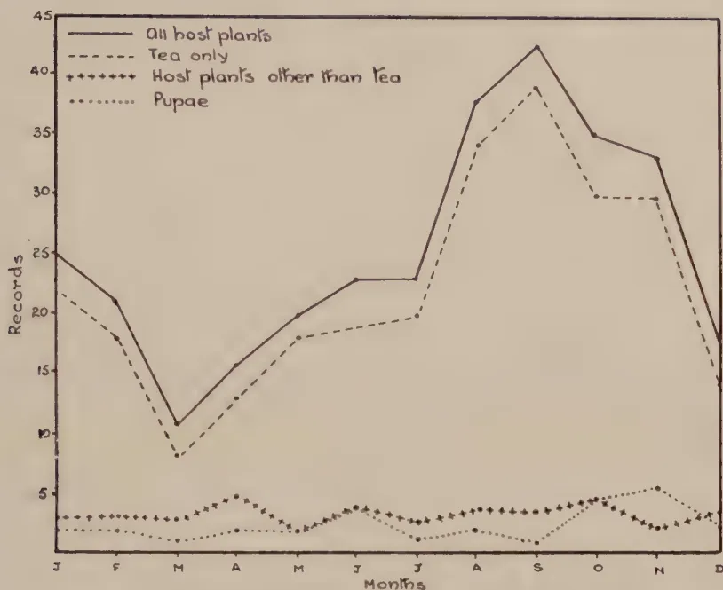

# The Tropical Agriculturist

VOL. LXXIX

PERADENIYA, SEPTEMBER, 1932.

No. 3

<table><thead><tr><th></th><th style="text-align: right;">Page</th></tr></thead><tbody><tr><td>Editorial</td><td style="text-align: right;">135</td></tr></tbody></table>

## ORIGINAL ARTICLES

<table><tbody><tr><td>Some Insect Pests of Tea in Ceylon (<i>Continued</i>).—The Red Borer. By J. C. Hutson, B.A., Ph.D.</td><td style="text-align: right;">137</td></tr><tr><td>The Cultivation of Fruits in Ceylon with Cultural Details—IV. By T. H. Parsons, F.L.S., F.R.H.S.</td><td style="text-align: right;">149</td></tr><tr><td>A Trial of <i>Indigofera endecaphylla</i> in Tea at Peradeniya By T. H. Holland, Dip. Agric. (Wye)</td><td style="text-align: right;">155</td></tr><tr><td><i>Indigofera endecaphylla</i> as a Conserver of the Fertility of Tea Soils at Peradeniya. By A. W. R. Joachim, Ph.D., B.Sc. (Lond.), F.I.C., Dip. Agric. (Cantab.)</td><td style="text-align: right;">161</td></tr></tbody></table>

## SELECTED ARTICLES

<table><tbody><tr><td>Tea Research in Nyasaland</td><td style="text-align: right;">166</td></tr><tr><td>Some Methods of Grafting</td><td style="text-align: right;">172</td></tr><tr><td>Air and Sun Curing Tobacco Leaf</td><td style="text-align: right;">186</td></tr><tr><td>Charcoal Burning on the Farm</td><td style="text-align: right;">191</td></tr><tr><td>Consistency Constants of the Soil with Special Reference to Field Operations</td><td style="text-align: right;">194</td></tr></tbody></table>

## RETURNS

<table><tbody><tr><td>Animal Disease Return for the Month ended August, 1932</td><td style="text-align: right;">198</td></tr><tr><td>Meteorological Report for the Month ended August, 1932</td><td style="text-align: right;">199</td></tr></tbody></table>

1------------------------------------------------

*Of great interest to those engaged in the  
cultivation of plantation crops.*

# A MANUAL OF GREEN MANURING

Being a reprint of articles published in  
*The Tropical Agriculturist* by the  
Staff of the Department of  
Agriculture, Ceylon.

*34 Illustrations and Figures*

Price Rs. 5/-, postage extra (Ceylon, 35 cents)

---

*Obtainable from:*

**THE MANAGER, PUBLICATION DEPOT,  
PERADENIYA.**

2------------------------------------------------

# The Tropical Agriculturist

September, 1932

---

## EDITORIAL

---

### FORESTRY METHODS APPLIED TO RUBBER ESTATES

---

**A**T the present time it seems impossible to predict what the ultimate fate of the rubber plantation industry will be. Whilst the financial papers with an optimism that can only come from a desire to encourage speculation still devote their portion to conditions and recommendations on the rubber share market, the producer sees no signs of early-returning prosperity and knows that evolution of the industry must take one of two courses. Either estates must go out of production until the great balance of raw rubber, which is more than the present world's requirements, becomes exhausted, or, the manufacturing side of the industry must quickly develop some considerable and important new use for rubber that will consume the present excessive stocks. This huge unconsumed store places the manufacturing industry in the strong position of a bank with large reserves. It is the producer who is in the perilous position. Under these conditions rubber estates must simply stand still until time, which is the gear wheel of evolution, arrives at such a period that there is equilibrium between supply and demand. Whilst this waiting policy must be pursued, the question is what is best to do with the estate. It is possible that rubber plantations if left entirely to themselves would take much less harm than many think, the trees would certainly deteriorate less than the factory.

The forestry method applied to the plantation is one that is just now attracting attention in Malaya. Some there have tried, and others are advocating, that rubber should be treated as a forest crop. Seedling rubber is itself allowed to form an undergrowth, all material that falls to the ground is permitted

3------------------------------------------------

136

to remain. Poor yielding trees are killed by girdling and eventually felled. Indeed, it would seem that spacing to a greater degree than is usually seen on Ceylon estates is a necessity if undergrowth is to make any headway. As the young seedlings form a covering in the gaps the strongest can be selected to survive as they are, or form a stock for budding. This form of natural undergrowth prevents soil erosion.

The forestry method of growing rubber is not advocated simply as an expedient during an enforced period of resting the estate but is actually being practised as a method of growing rubber for tapping. This method, if so it can be called, is based on the principle that naturally rubber is a forest tree and this is the forest's own way of growing its trees. For an estate out of tapping on a care and maintenance basis it is the way involving the least expense. When tapping is again revived the estate can be brought back into production with a minimum of outlay and be cheaply maintained. The uneven age of the trees is claimed to be an advantage in that new tappable trees can constantly be brought in as bark exhaustion occurs on the older ones. The forestry method of rubber production may be a means of solving some of the problems now confronting rubber estates, certainly it is that it involves the least expenditure on labour whilst just keeping the estate together.

4------------------------------------------------

This image shows a blank, aged page with a light beige or cream color. The surface has a subtle texture and some minor blemishes or discolorations, particularly along the left edge and a few small spots scattered across the page. There is no text or other content on the page.

5------------------------------------------------

![Plate XII showing various stages of Zeugera coffeae (The Red Borer). 1. Male moth, resting position, natural size. 2. Female moth, wings spread, natural size. 3. Group of eggs, x 5. 4. Half-grown larva, x 2. 5. Full-grown larva, x 1 1/2. 6. Prothoracic shield, dorsal view, x 10. 7. Prothoracic shield, lateral view, x 10. 8. Pupa, ventral view, x 1 1/2. 9. Pupa, lateral view, x 1 1/2. 10. Section of tea branch showing (a) bore holes with frass protruding; (b) larva; and (c) pupa, in exposed position of gallery; and (d) empty pupal skin protruding through exit hole.](d44de5156c588db38420ec97e4c73d73_1_img.webp)

Geo. L. de Silva

Plate XII.—*Zeusera coffeae* Nietn. (The Red Borer)

1. Male moth, resting position, natural size. 2. Female moth, wings spread, natural size. 3. Group of eggs,  $\times 5$ . 4. Half-grown larva,  $\times 2$ . 5. Full-grown larva,  $\times 1\frac{1}{2}$ . 6. Prothoracic shield, dorsal view,  $\times 10$ . 7. Prothoracic shield, lateral view,  $\times 10$ . 8. Pupa, ventral view,  $\times 1\frac{1}{2}$ . 9. Pupa, lateral view,  $\times 1\frac{1}{2}$ . 10. Section of tea branch showing (a) bore holes with frass protruding; (b) larva; and (c) pupa, in exposed position of gallery; and (d) empty pupal skin protruding through exit hole.

6------------------------------------------------

137

# SOME INSECT PESTS OF TEA IN CEYLON

(Continued)

J. C. HUTSON, B. A., PH. D.,

ENTOMOLOGIST,

DEPARTMENT OF AGRICULTURE, CEYLON

*done*

## THE RED BORER

(ZEUZERA COFFEAE Nietn.)

**T**HE Red Borer belongs to a family of moths, the *Cossidae*, the larvae or caterpillars of which are borers in the stems of plants and trees. It is a near relative of the "leopard moth" of Europe and America. Our red borer was first mentioned by Nietner (3) in 1861 as a pest of coffee and in those days it was said to be responsible for serious injury to older trees and for the death of many plants in young clearings. Although sometimes known now as the "coffee borer", it is quite a different insect from the South Indian coffee borer, or "white borer", which is the grub of a long-horned beetle.

*Zeuzera coffeae* has now become thoroughly well established in most of the tea areas and can also breed in a number of other cultivated plants. Although occurring frequently in older tea it is essentially a pest of nurseries and new clearings where it is capable of killing young plants. The presence of this caterpillar borer can usually be detected in older tea by the withering of the leaves on a branch and of the small heap of reddish or yellowish pellets of excreta, or frass, lying on the ground beneath the injured branch. As originally pointed out by Green (1) the dead leaves on such branches "will show where the borer is at work, for they do not fall as in some other diseases, but dry up and remain fixed in their original position".

### DESCRIPTION OF STAGES

*Eggs*.—(Pl. XII, Fig. 3). About 1 m.m. long by about 6 m.m. broad, very pale-yellow and of an opaque waxy appearance when freshly laid, but turning to amber colour before hatching.

*Full-grown larvae*.—(Pl. XII, Fig. 5). About 38-40 m.m. long. Head, dorsal surface of first and second thoracic segments and of eighth, ninth and tenth abdominal segments brownish; dorsal surface of remainder of the body varies from a

7------------------------------------------------

138

pinkish to an almost purplish-brown colour, but it is sometimes reddish-brown or brick-red; ventral surface of body yellowish to brownish-yellow; dorsal surface of prothorax, or first thoracic segment, and of the ninth and tenth abdominal segments covered by smooth glossy plates or shields, which vary in colour from brown to almost black, being sometimes mottled brown and black. Prothorax larger than the head and somewhat arched (Fig. 4); its shield sometimes has blackish markings along its anterior and posterior edges, and bears along its hinder margin a number of minute broadly rounded backwardly directed processes, the general appearance and arrangement of which are shown enlarged in Figures 6 and 7. Body of larva thinly covered with rather long whitish hairs arising from small shiny areas. Three pairs of true legs, four pairs of abdominal prolegs and one pair of anal prolegs.

Younger larvae in various stages of development have been examined and have been found to be similar in appearance to full-grown larvae.

*Pupae*.—(Pl. XII, Figs. 8 and 9). About 22-27 m.m. long. Almost cylindrical, slightly flattened dorso-ventrally, tapering suddenly at posterior end, shining chestnut-brown; anterior end dark-brown to almost blackish, sculptured and ending in a short blunt process; dorsal surface of each segment of abdomen, except the first, with two transverse, backwardly directed ridges or rows of irregular blunt projections, the anterior ridges extending laterally to below the level of the spiracles, the posterior ridges shorter and dorsal only; ventral surface of fourth to eighth segments of abdomen with two median single spines and two groups of three spines on each side of these; terminal segment of abdomen with a group of five or six larger black spines on each side of the anus.

*Moths*.—*Male* (Pl. XII, Fig. 1). Head thorax and abdomen white; each of the three thoracic segments with a pair of small black spots. Abdomen dark-brown to blackish, clothed with white hairs. Wings white, forewing with numerous small black spots, hindwing with a few black spots. *Female* (Fig. 2) similar to male. Spots on forewing fewer in number, but more conspicuous and tinged with metallic blue.

*Wing expanse*: Males, 35-40 m.m.; females, 38-47 m.m.

The descriptions of the larvae and pupae are modified from those given by Green (1) and Rutherford (4) after examination of living specimens. The descriptions of the moths are adapted from Hampson (2), who gives the habitat of *Zeuzera coffeeae* as Naga Hills; Nilgiris; Rangoon; Ceylon; Borneo. Other references in literature indicate that it occurs also in Assam, Tonkin, Formosa, and the Dutch East Indies.

8------------------------------------------------

139

### LOCAL DISTRIBUTION

We have just over 300 definite records of the observed or reported occurrences of red borer in various cultivated plants; about 86 per cent of these records are from tea, while the remainder are from a great variety of cultivated plants (see Food Plants). This information goes back to 1900 and includes records made by previous entomologists, by the staff of the entomological division since 1919 and by the plant pest inspectors of the Central, and Southern divisions. These records indicate that the distribution of *Zeuzera coffeae* in all its known host plants is confined to the south-central and south-western portions of the Island, which include the whole of the tea area.

It is of interest to note that the area covering the recorded distribution of red borer comprises all the wetter districts of the Island, that is, those having an annual average rainfall of from 75 to 200 inches, with the exception of two small isolated areas, one in the Dumbara Valley near Kandy and the other in a rough triangle formed by Welimada, Diyatalawa, and Badulla in the Province of Uva; these two small areas have an average of less than 75 inches per annum.

Furthermore, the accumulated data indicate that, while this pest has been recorded in tea areas ranging from about sea level to about 5,500 feet elevation, about 75 per cent of our tea records have come from low to mid-country districts, that is the wetter coastal areas, the Kelani Valley, and the mid-country wet and semi-dry districts up to about 4,000 feet; there are comparatively few records from up-country tea districts. In host plants other than tea practically all our records are from elevations below about 3,000 feet, the great majority of them being below about 1,600 feet, since most of these alternate host plants grow normally at lower elevations.

### HABITS AND LIFE-HISTORY

There are various difficulties connected with working out the life-cycle of an insect, such as the red borer, which spends most of its life in the larval and pupal stages well protected within the stems and branches of its host plant and which is susceptible to any changes from its normal environment. Attempts have been made to breed larvae in different stages of development, but these have rarely attained the moth stage. Individual pupae have produced moths, but it has never been possible to obtain fertile eggs, either in the laboratory or under field conditions.

9------------------------------------------------

140

## EGGS

These have not been observed under natural conditions in the field, but it seems probable that they are laid in cracks and crevices of the stems and branches, as happens in the case of the leopard moth and other near relatives of the red borer in other countries. In breeding cages the eggs may be laid in clusters (Fig. 3), or in ropey masses either end to end or side by side, according to Green, and are said to look like strings of minute amber beads (5).

## LARVAE

The young larvae on hatching make their way into almost any woody portion of a bush by means of their powerful jaws or mandibles. Rutherford (4) states that their entrance holes have been found at leaf-scars, and in the angle between a twig and the main stem. From careful dissections of numerous injured branches at various times it seems evident that the larvae have a variety of feeding habits. For instance, a young larva entering a branch of a tea seedling or a young plant may work its way into the main stem and continue steadily downwards into the taproot, the gallery gradually increasing in diameter with the growth of the larva; in such cases the young bush may be killed before the larva has become full grown. Or again, a larva entering an older bush may work upwards for a time until the branch becomes too small for it, in which case it either dies or is compelled to bore its way out and enter another branch or the same branch lower down.

The tunnels of the young larvae in small branches are usually straight and cylindrical, but those of the older borers widen out at intervals into irregularly shaped cavities, so that, at such places, only a thin wall of cambium and bark may be left; if, however, the cambium is eaten away then the branch may be girdled and withers. These irregular cavities may possibly be made to allow the larva to turn in its tunnel and are sometimes used as pupal cells.

At intervals in the course of its tunnels the larva cuts circular holes to the outside through which it periodically ejects pellets of frass and excrement (Fig. 10a); these holes when not in use are usually covered on the inner side by a few cross threads mixed with frass.

Sometimes two or more larvae of different sizes may be found in a large branch in different portions of a continuous gallery. Rutherford (4) records that narrow and wider galleries may be found in the same branch; these galleries may or may not be continuous, which seems to indicate that two larvae may sometimes occupy separate and independent galleries in the

10------------------------------------------------

141

same branch. The eventual connecting up of two such galleries probably serves to account for the very irregular galleries which I have sometimes observed in large branches.

*Duration of larval period.*—We have no definite data as to the duration of the larval period of *Zeuzera coffeeae* under Ceylon conditions, but it seems probable that it lasts several months. Possibly at lower elevations the entire life-cycle may be completed within a period of 12 months, and if so, the larval period would be about 10 months. At higher elevations it is possible that the duration of the life-cycle may be extended well into the second year. The notes on the observed or reported occurrences of this pest given elsewhere (under Seasonal Occurrence) indicate that it is capable of breeding continuously all the year round at any elevation; moreover, that this insect may be found in any given locality in almost every stage of development during every month throughout any continuous period of 12 months, indicating that individuals of several overlapping broods may be present throughout such a period.

#### PUPAE

*Pupation.*—The full-grown larva (Fig. 10b.) when nearing pupation first cuts a circular trap-door for the subsequent emergence of the moth leaving just a thin layer of outer bark not completely cut through. Then it spins a loosely-woven web on the wall of the tunnel, usually in an enlarged cavity, blocks the hinder end of the pupal chamber with a plug of frass and sometimes leaves a few pellets of frass to guard the trap-door on the inner side. After completing these preparations for pupation the larva moults for the last time and shrinking in size gradually changes into the pupa (Fig. 10c.). The pupa lies with its head towards the trap-door, usually head downwards.

*Pupal period.*—We have records of only 4 pupae which were formed in captivity at Peradeniya from larvae sent in from other localities. These pupae occupied 23, 23, 26, and 31 days respectively in the actual pupal stage.

#### MOTHS

*Emergence.*—The pupa when fully developed apparently works its way to the trap-door by means of the spines on its abdomen and hinder end (Figs. 8, and 9) and probably pushes out the circular door by means of the blunt process at the top of its head. Then the moth emerges, usually leaving the empty pupal skin protruding through the exit hole (Fig. 10d.). Nothing is known about the habits of the moths except that they are night-fliers.

11------------------------------------------------

142

### AMOUNT OF DAMAGE

There seems to be no very reliable or definite evidence available as to the actual amount of damage which the red borer is capable of causing to tea. It would appear from the reports of correspondents that this borer is sometimes to be found in considerable numbers during a period of several months and in some cases the damage is described as "serious" or "severe". One superintendent in Passara reported in April, 1900, that this pest had been rather severe in young tea on his estate since the previous October, mentioning that at first about 5,000 larvae were collected in a week, but that after about a month this number was gradually reduced to about 200 a week. Another superintendent writing in July, 1913, from Uda-Pussellawa estimated that 15 per cent of the bushes in a field were being attacked. One correspondent in Haputale reported in October, 1913, that red borer was "causing considerable loss in the nurseries, while another in the Kalutara district mentioned in September, 1918, that a large number of bushes were attacked in tea which had run a long time". Several other reports speak of serious damage in nurseries, in new clearings, and in young tea being centred, while there are occasional references to injury in many individual bushes scattered throughout older fields. In several instances the damage done by this pest has been attributed to shot-hole borer, while in few cases the destruction of bushes attributed to red borer may have been due to other agencies.

### SEASONAL OCCURRENCE

In the case of an insect such as the red borer which spends its larval and pupal stages, that is, most of its life-cycle, inside the stems and branches of its host plant, it is to be expected that its damage will be detected only when it has become sufficiently serious to be noticeable. For instance, the dying back or rapid death of young plants of various kinds or the withering of branches in the case of older plants are sometimes found to be due to this borer. In the case of tea, however, there are other opportunities of detecting damage caused by boring insects such as red borer, shot-hole borer, termites, etc., and the reports of damage caused by red borer have frequently mentioned that the larvae or pupae were found when new clearings were being planted from nurseries, when young tea was being centred or when fields of older tea were undergoing their periodical pruning. These cultural operations may be carried out during almost any month in the year depending on such local factors as elevation, climate, pruning interval, labour conditions, etc., and planting and pruning seasons will be found to vary in different districts and on individual estates in the same district. Taking the tea area as a whole it may be said that planting and pruning

12------------------------------------------------

This image is a scan of a blank page. The background is a uniform light beige or tan color. There are a few very small, dark specks scattered across the surface, which appear to be scanning artifacts or dust particles. No text, lines, or other graphical elements are present.

13------------------------------------------------

<table border="1">
<thead>
<tr>
<th>Month</th>
<th>Records</th>
</tr>
</thead>
<tbody>
<tr><td>J</td><td>4</td></tr>
<tr><td>F</td><td>9</td></tr>
<tr><td>M</td><td>4</td></tr>
<tr><td>A</td><td>10</td></tr>
<tr><td>M</td><td>14</td></tr>
<tr><td>J</td><td>10</td></tr>
<tr><td>J</td><td>5</td></tr>
<tr><td>A</td><td>4</td></tr>
<tr><td>S</td><td>8</td></tr>
<tr><td>O</td><td>11</td></tr>
<tr><td>N</td><td>10</td></tr>
<tr><td>D</td><td>5</td></tr>
</tbody>
</table>

Graph 1. Wet Districts, sea level to 1000 ft. (approx.)

<table border="1">
<thead>
<tr>
<th>Month</th>
<th>Records</th>
</tr>
</thead>
<tbody>
<tr><td>J</td><td>10</td></tr>
<tr><td>F</td><td>3</td></tr>
<tr><td>M</td><td>4</td></tr>
<tr><td>A</td><td>2</td></tr>
<tr><td>M</td><td>5</td></tr>
<tr><td>J</td><td>9</td></tr>
<tr><td>J</td><td>6</td></tr>
<tr><td>A</td><td>10</td></tr>
<tr><td>S</td><td>18</td></tr>
<tr><td>O</td><td>5</td></tr>
<tr><td>N</td><td>6</td></tr>
<tr><td>D</td><td>1</td></tr>
</tbody>
</table>

Graph 2. Wet Districts, 1000 ft. to 3500 ft. (approx.)

<table border="1">
<thead>
<tr>
<th>Month</th>
<th>Records</th>
</tr>
</thead>
<tbody>
<tr><td>J</td><td>2</td></tr>
<tr><td>F</td><td>1</td></tr>
<tr><td>M</td><td>1</td></tr>
<tr><td>A</td><td>0</td></tr>
<tr><td>M</td><td>1</td></tr>
<tr><td>J</td><td>3</td></tr>
<tr><td>J</td><td>5</td></tr>
<tr><td>A</td><td>6</td></tr>
<tr><td>S</td><td>8</td></tr>
<tr><td>O</td><td>5</td></tr>
<tr><td>N</td><td>4</td></tr>
<tr><td>D</td><td>3</td></tr>
</tbody>
</table>

Graph 3. Wet Districts, 3500 ft. to 5500 ft. (approx.)

<table border="1">
<thead>
<tr>
<th>Month</th>
<th>Records</th>
</tr>
</thead>
<tbody>
<tr><td>J</td><td>9</td></tr>
<tr><td>F</td><td>7</td></tr>
<tr><td>M</td><td>2</td></tr>
<tr><td>A</td><td>3</td></tr>
<tr><td>M</td><td>0</td></tr>
<tr><td>J</td><td>0</td></tr>
<tr><td>J</td><td>5</td></tr>
<tr><td>A</td><td>15</td></tr>
<tr><td>S</td><td>8</td></tr>
<tr><td>O</td><td>14</td></tr>
<tr><td>N</td><td>11</td></tr>
<tr><td>D</td><td>8</td></tr>
</tbody>
</table>

Graph 4. Semi-dry Districts, 2000 ft. to 5000 ft. (approx.)

14------------------------------------------------

143

operations are carried out mainly between the months of May and January and it is within this period that one would expect most of the red borer records to fall.

*Analysis of red borer records.*—During the period from January, 1900, to July, 1932, there have been accumulated 306 definite records of the occurrence of red borer in tea and various other host plants, and as indicated previously, the great majority of these records come from tea, and most of them are of the larval stage. Among these are 31 records of pupae, some of which were received, while others were formed from full-grown larvae obtained the previous month or so. A reference to graph 5 will indicate that pupae have been found during every month in the year and that one-third of the total number have been recorded in October and November. The presence of pupae in any given month means the emergence of moths within a month or so later, to be followed almost immediately by eggs. These pupal records are of interest as indicating that red borer can breed continuously at various elevations with overlapping generations in any given district. Various other points of interest will be brought out in the following notes on the analysis of the records.

These 306 records cover such a wide range of territory and are so scattered over most of the tea area at such irregular intervals of time that the information to be obtained from them is somewhat meagre. However, it was considered that the available information could be brought out to the best advantage by grouping the records under four different areas comprising (1) coastal and low-country wet districts from about sea-level to about 800-1,000 feet; (2) mid-country wet districts from about 1,000 feet to about 3,000-3,500 feet; (3) up-country wet districts from 3,500 feet to about 5,500 feet; and (4) semi-dry districts from about 2,000 feet to about 5,000 feet. These records from these four areas are illustrated separately in graphs 1-4.

The *first* area comprises all the coastal areas from Negombo to Matara on the west and south-west of the Island and includes the Kelani Valley and the lower Ratnapura elevations. In this group there are 100 records, or nearly one-third of the total number, and 76 of them are from tea while 24 are from other host plants. A reference to graph 1 indicates that larvae may be found in this area throughout the year, with three main periods of frequency, namely, during February, from April to June and

15------------------------------------------------

144

from September to November. There are only 8 records of pupae from this area and these fall between April, 1914, and May, 1925. Among these the following are of interest as indicating the possibility of two generations of this pest within a period of about 12 months: One in tea at Horana in November, 1924, another in mahogany at Uragaha in December, 1924, and one each in mahogany at Uragaha in April and May, 1925.

The *second* area covers the wetter mid-country districts at elevations ranging from about 1,000 feet to about 3,000-3,500 feet and includes mainly the lower elevations in the Central Province. In this group we have 81 records, of which 66 are from tea and 15 from other plants. The monthly distribution of these records is illustrated in graph 2, which shows the occurrence of larvae throughout the year, with two minor periods of frequency in January and June and a main period in August and September. The 9 records of pupae in this area occur in different districts over long intervals and have been found mostly between June and November.

The *third* area includes the wetter up-country districts from about 3,500 feet to about 5,500 feet, being mainly the higher elevations in the Central Province. We have only 40 records from this area and all of them are from tea; graph 3 indicates that most of the records have been made during the last six months of the year. The 6 records of pupae fall between August, 1907, and March, 1915, and have been found from August to March.

The *fourth* area comprises the semi-dry districts from about 2,000 feet to about 5,000 feet, including mainly the tea areas in the Province of Uva. Here we have 85 records, of which only 4 are from plants other than tea. Graph 4 indicates that practically all the records fall between July and February. Among the 8 records of pupae in this area we find one pupa recorded in February and another in October, both in 1900 from the same estate. Is this an indication of a life-cycle considerably shorter than 12 months, or is it evidence of a much longer life-cycle with overlapping broods? Pupae in these semi-dry districts have been found only between October and February, which seems to indicate overlapping broods with the possibility of rather a long life-cycle.

16------------------------------------------------

145

The graph displays the monthly distribution of red borer records across four categories. The 'All host plants' line (solid) shows a significant peak in August and September. The 'Tea only' line (dashed) follows a similar but lower-magnitude trend. The 'Host plants other than tea' line (dash-dot) and 'Pupae' line (dotted) remain consistently low throughout the year.

<table border="1">
<thead>
<tr>
<th>Month</th>
<th>All host plants</th>
<th>Tea only</th>
<th>Host plants other than tea</th>
<th>Pupae</th>
</tr>
</thead>
<tbody>
<tr><td>J</td><td>25</td><td>22</td><td>3</td><td>2</td></tr>
<tr><td>F</td><td>21</td><td>18</td><td>3</td><td>2</td></tr>
<tr><td>M</td><td>11</td><td>8</td><td>3</td><td>1</td></tr>
<tr><td>A</td><td>16</td><td>13</td><td>5</td><td>2</td></tr>
<tr><td>M</td><td>20</td><td>18</td><td>2</td><td>2</td></tr>
<tr><td>J</td><td>23</td><td>19</td><td>4</td><td>3</td></tr>
<tr><td>J</td><td>23</td><td>20</td><td>3</td><td>2</td></tr>
<tr><td>A</td><td>38</td><td>34</td><td>4</td><td>2</td></tr>
<tr><td>S</td><td>42</td><td>39</td><td>4</td><td>1</td></tr>
<tr><td>O</td><td>35</td><td>30</td><td>5</td><td>4</td></tr>
<tr><td>N</td><td>33</td><td>30</td><td>3</td><td>6</td></tr>
<tr><td>D</td><td>18</td><td>15</td><td>3</td><td>3</td></tr>
</tbody>
</table>

Graph 5. All Districts. Sea level to 5500 ft. (approx.)

In graph 5 we have the 306 records of red borer in all host plants at all elevations from about sea level to about 5,500 feet brought together from the first 4 graphs, as shown in the continuous line. The 263 records from tea alone and the 43 records from other plants are also shown separately for all elevations.

It will be seen that the tea records are most numerous between August and November with a drop in December, followed by a rise in January. There is a downward trend in February to the lowest number in March, then a gradual rise up to June and July with a rapid rise up to August. As indicated previously, red borer injury in tea is sometimes detected in nurseries and in older tea when borers have caused the death of young plants or the withering of branches, but there is no doubt that most of our records are the result of red borer injury being more or less accidentally detected, either when new clearings are being planted from nurseries, or when young tea is being centred or again when older tea is being pruned. These operations are carried out mainly between May and January at various elevations and it is during this period that our red borer records in tea are most numerous, comprising nearly 86 per cent of all the tea records. Therefore these tea records may be rather misleading as indicating a seasonal distribution of red borer from about May until about January. But there is evidence that of the larvae submitted or collected at various times throughout the year over

17------------------------------------------------

146

a period of many years, many have been more than half-grown, some have been two-thirds grown and several full-grown, indicating the presence of the pest throughout the year. The records of 31 pupae (28 of them from tea, as illustrated at the bottom of graph 5) also give evidence that pupae and therefore moths may be found during any month in the year.

The records from other host plants, (also illustrated at the bottom of graph 5), are of interest as showing that red borer occurs continuously throughout the year, but these records are too meagre to give any definite evidence as to the seasonal distribution of this pest. More information is needed about the duration of the life-cycle under the different conditions of temperature, climate and elevation prevailing within the range of the red borer in Ceylon, before we can say whether our records give a true idea of its seasonal occurrence or not.

#### FOOD PLANTS

The following list indicates the very wide range of cultivated plants in which *Zeuzera coffeae* has been recorded in Ceylon: *Acalypha* spp.; Custard apple (*Anona squamosa*); *Amherstia nobilis*; Chilli (*Capsicum* spp.); *Cassia auriculata*; Indian Laburnum (*Cassia fistula*); Horse Cassia (*Cassia grandis*); Queen of the night (*Cestrum nocturnum*); Chittagong wood (*Chickrassia tabularis*); Cinnamon (*Cinnamomum zeylanicum*); Lime (*Citrus aurantifolia* = *Citrus medica* var. *acida*); Sweet orange (*Citrus sinensis* = *Citrus Aurantium*); Gaspinna, S. (*Clerodendron infortunatum*); Coffee (*Coffea robusta*); Ketambilla, S. (*Dorvalis hebecarpa* = *Aberia Gardneri*); Loquat (*Eryobotrya japonica*); Cocaine plant (*Erythroxylon Coca*); *Pehimbiya*, S. (*Filicum decipiens*); Cotton (*Gossypium* spp.); Silky oak (*Grevillea robusta*); Shoe-flower (*Hibiscus rosa-sinensis*); *Hydnocarpus Wightiana*; Nedun, S. (*Pericopsis Mooniana*); Avocado pear (*Persea gratissima*); Guava (*Psidium Guajava*); Sandal wood (*Santalum album*); large-leafed mahogany (*Swietenia macrophylla*); Chaulmoogra oil tree (*Taraktogonus Kurzii*); Teak (*Tectona grandis*); Tea (*Thea sinensis*); Cacao (*Theobroma cacao*).

#### NATURAL ENEMIES

The larvae of *Zeuzera coffeae* are occasionally killed in their galleries by a species of small hymenopterous parasite, identified by the Imperial Institute of Entomology as *Bracon* sp.

#### CONTROL MEASURES

The ability of the red borer to breed in such a variety of host plants makes it a difficult pest to control, but fortunately so far it has not proved to be a pest of any cultivated plants except

18------------------------------------------------

147

tea, and mahogany. In the case of tea all young plants in nurseries or in new clearings which have been killed by red borer should be removed and burnt. In older tea all withered and dead branches should be cut off below the injury and burnt as soon as possible after the presence of the borer is detected; unless this is done early the borer may go into another branch, or, if full-grown, it may complete its development to the moth stage and escape. Sometimes the tunnel may extend down into the main stem below the level of any practicable pruning; in such cases the larva or pupa may sometimes be killed in its tunnel by probing with a stout but flexible wire or by putting into the tunnel a piece of cotton soaked with carbon bisulphide or petrol and then plugging the hole. Red borer is controlled to some extent by the ordinary periodical prunings.

#### SUMMARY

The red borer is the caterpillar stage of one of the so-called leopard moths and is sometimes a serious pest in tea nurseries and young clearings and is occasionally found attacking individual bushes of older tea. The presence of this pinkish or reddish-brown caterpillar in older tea is usually detected by the withered appearance of the leaves on a branch and by the heap of reddish or yellowish pellets of frass on the ground underneath the affected branch. These pellets are ejected periodically by the larva through holes cut in the branch. The moths lay their eggs in strings or small masses probably in cracks in the stems or branches and the newly-hatched larvae bore into the wood and spend the remainder of their existence inside their host plant tunnelling up and down the branches and sometimes penetrating into the stem. The duration of the larval period is not definitely known, but probably lasts several months. The pupal stage is passed inside the larval tunnel and occupies about one month, and the moth emerges through the hole previously cut by the larva before it pupates.

Our records of the occurrence of the red borer in Ceylon amounting to just over 300 during a period of some 30 years indicate that this pest is distributed throughout most of the tea area from about sea level to about 5,500 feet, and that it is known to occur in about 30 other species of cultivated plants, most of which are grown in the wetter low and mid-country portions of the Island. These records also give evidence that this pest probably breeds continuously throughout any period of 12 months with overlapping broods. Since this borer is detected mainly during the cultural operations which tea undergoes, including the planting of new clearings, the centring of young plants and the periodical pruning of older tea, the result

19------------------------------------------------

148

is that most of these records fall between May and January during which period these operations are usually carried out. Until more is known about the duration of the life-cycle of this pest it cannot be stated definitely whether the records of its occurrence at various elevations, as illustrated by the graphs, give a true picture of its seasonal distribution or not.

Although the red borer larvae are well protected inside their tunnels they are occasionally parasitised by small wasps. Control measures include the removal and burning of all dead and dying plants in nurseries and new clearings and of all attacked branches in older tea. In cases where the injury has extended below the ordinary pruning level, the galleries can be probed with wire to kill the inmates or a piece of cotton soaked with carbon bisulphide or petrol can be inserted into the tunnel which is then plugged.

#### REFERENCES

1. 1. GREEN, E. E.—Insect Pests of the Tea Plant. "*Ceylon Independent*" Press, Colombo, 1890, pp. 8-12.
2. 2. HAMPSON, G. F.—Fauna of Brit. India. Moths. I, 1892, p. 312.
3. 3. NIETNER, J.—Observations on the Natural History of the Enemies of the Coffee Tree in Ceylon, 1861. English Translation from the French. "*Observer Press*", Colombo, 1872. p. 16.
4. 4. RUTHERFORD, A.—*Zeuxera coffeae* (Red borer, Coffee borer). *Trop. Agriculturist*. Peradeniya, XLI, No. 6, December, 1913, pp. 486-488.
5. 5. WATT, G. and MANN, H. H.—The Pests and Blights of the Tea Plant. (Second edition) Calcutta, 1903. Cossidae p. 201.

20------------------------------------------------

149

## THE CULTIVATION OF FRUITS IN CEYLON WITH CULTURAL DETAILS—IV

T. H. PARSONS, F.L.S., F.R.H.S.,

CURATOR,

ROYAL BOTANIC GARDENS, PERADENIYA

### GROUP D

#### MID-COUNTRY SEMI-DRY ZONE (2,000-4,000 FEET)

(1) LOQUAT (*Eriobotrya japonica*).—Known chiefly as the Loquat or Japanese plum. The tree is very ornamental and reaches 25 feet in height with deep green leaves of elliptical shape six to nine inches long and with very jagged, or toothed, edges. The small white and fragrant flowers are borne in crowded woolly panicles, whilst the fruit varies in shape from spherical to pyriform and is of pale-yellow to orange in colour, and often three inches in diameter. The skin is thin and smooth, the flesh firm, white in colour, very juicy and of a sweet acid flavour. It is when fully ripe essentially a dessert fruit but can be used for jams, jellies and preserved if picked at maturity but before the fruits are fully ripe.

Being a fruit tree of Japan and China, the mid to high elevations of Ceylon are best suited to this fruit, for though the tree grows well at lower elevations it fruits but sparsely under such conditions. It can be, and is, grown on a variety of soils but prefers a rather heavy and well-drained soil although sandy loam of good depth is also very suitable. The present culture of this fruit covers a large area, including Australia, Sicily, Algeria, and other localities along the Mediterranean and in Florida and the milder districts of California. In Japan alone the production is stated to exceed two million pounds of fruits annually.

In most countries propagation is by seed but there is much variation among the seedlings and hence gooteeing and inarching, which have been very successful in Ceylon, are to be recommended. Budding is, however, practised and is successful, seedling loquats being used as stocks for a selected variety of scion. The seed leaves the fruit very freely, and the largest and plumpest seed should be selected and sown immediately in well prepared beds at an inch below the surface, or alternately single

21------------------------------------------------

150

seeds can be sown direct in a bamboo pot. The advantage of the latter method is that the pot plant can be put out later without disturbance of the soil and if used for inarching the seedling is already established and transportable to the parent tree. For budding purposes seedlings in nursery beds appear to be preferable. The seedlings attain a height of ten inches at twelve to fifteen months from the time of sowing, and can at this stage be transplanted to permanent sites or budded in the nursery, the patch or inverted "T" method being suited to such. The Japanese use the Quince as stock for the Loquat because its fibrous root system permits of easier transplanting but little trouble in this respect is observed in the root system of the Loquat in Ceylon. The Quince also considerably dwarfs the tree. Budwood should be of young and smooth growth, brown in colour and from which the leaves have dropped, and large bud shields at least one inch in length are preferable. Inspection at three weeks from budding should indicate if the buds have taken or not and it is advisable to keep the bandages around the top and base of the bud shield leaving the bud exposed, otherwise the bark is apt to open around the bud shield. This occurs also in the Avocado Pear and occasionally in the mango and is an important point to guard against.

Planting distances should be approximately 18 feet by 18 feet on good soil, the tree being more pyramidal in habit than round, but closer planting is advisable on average soil. Good holes 3 feet by 2 feet should be prepared and the soil well mixed with well-decayed farmyard manure when refilling. A well-bearing Loquat tree will rapidly exhaust the fertility of the soil so that from maturity onward regular dressings of manure are advisable each monsoon.

The tree is a compact grower and regular pruning after each crop is necessary to reduce the number of internal branches and to admit light and air to the centre of the tree. The tendency of this tree is to overbear in both wood and fruit and to obtain fruit of good size and quality it is desirable to thin the crop as soon as the young fruits have set.

The reason why so poor a fruit is usually produced in Ceylon is due to these characteristics and regular pruning and thinning of wood and fruit would considerably remedy this.

Budded plants should fruit in the fourth year and full crops can be expected from 10 years of age and upward, mature trees yielding approximately 200 fruits per tree or more. Of the types available the "Advance" is of good quality and size and already in cultivation here and there in Ceylon but the Japanese have established many other varieties of excellent quality. These

22------------------------------------------------

151

include "Japanese Mammoth", "Golden Yellow", "Thales", "Early Red", "Champagne", and "Premier". Most imported varieties are, however, budded on to Quince stocks and to obtain the best results in Ceylon it is wise to multiply the varieties by budding on to the Loquat seedlings as such are more suited to Ceylon conditions than the Quince.

(2) SWEET ORANGE (*Citrus sinensis*).—The Peni-dodan S. or Naran-kai T. This small tree is well known and needs no description being one of the oldest of cultivated fruits. Indigenous to Indo-Chinese regions it is now distributed over practically all sub-tropical and tropical regions. There are many good sweet orange trees established in Ceylon villages and if propagation is restricted to the best trees only, and this by vegetative means, some improvement would soon become apparent. In addition there are numerous varieties of known high value available by importation, the "Washington Navel" being that in most favour at the present moment.

For the grower of this fruit on a large scale the perusal of Departmental *Leaflet* No. 59 is recommended but for the small grower whose efforts are spread over a lesser and more varied selection of fruit, these notes may suffice.

The sweet orange is grown in most parts of Ceylon but in the more moist and hot regions a coarse thick-skinned fruit, invariably green when ripe and of poor flavour is the result. For successful cultivation drier and mid-country conditions are required and Uva and Ragala side is to be preferred.

Propagation is now practically restricted to budding, since owing to cross pollination seedling trees cannot be depended on to be true to type and cuttings strike with great difficulty. Seedling trees, however, appear to be very healthy and long lived and if due care is exercised in their selection, by propagation of the heaviest and best seed of a good quality fruit, these seedlings may result in quite good fruit suited for home consumption, but budding pays in the long run. Selected seed of the best sweet orange should be sown in open beds or in boxes of well-prepared soil at a depth of half-an-inch, and germination takes place in three to four weeks. Seedlings should be potted into bamboo pots on attaining a height of three to four inches and thence grown on till they become sufficiently pot bound, usually at about 18 months of age and of nine to ten inches in height when they may be planted into permanent sites.

If it is intended to raise the seedlings as stock plants on which to bud, sour orange and not sweet orange should be used, the same care in selection being taken, as the former for stock purposes has proved itself a much better plant on which to bud.

23------------------------------------------------

152

Seedlings in this case should not be potted but transferred to beds at 1 foot apart each way and can be budded at 2 years of age. Budding well up on the stem on the inverted "T" system is recommended and the buddings should be sufficiently grown for transplanting to permanent sites at 6 to 9 months later.

Planting should be done on well-drained land at 15 feet by 15 feet at the minimum, or 20 feet by 20 feet at the maximum, large and deep holes being prepared to which is added a half cart of well-rotted manure on refilling. Shade and regular watering is essential to the newly-planted tree for a few weeks following planting.

Pruning for the first years is generally limited to shaping the tree by the formation of a good standard structure with an open head. Subsequently any dead wood, or any fresh growth, tending to overlap other branches should be removed. Budded plants generally form a thicker head than a seedling and the use of the knife is more frequently required in their case accordingly.

As the orange tree roots are active throughout the year manuring can be done at any time, but just before the dry season sets in is the best period. Growth should in fact be encouraged during the drier parts of the year owing to severe attacks by citrus canker being liable on growth made in the monsoons, and, moreover, spray preventives against pests and diseases are much more effective during the drier months.

The true Mandarin Orange (*Citrus nobilis*) though distinct in growth and in fruit from the sweet orange, requires much the same conditions as the latter, but being cultivated commercially chiefly in Japan and China the higher elevations of Ceylon are indicated for this fruit. The Ceylon Mandarin (Jambu Naran S.) well repays cultivation if good varieties are selected for propagation, very fine fruits of this being obtained occasionally in the local market. The cultural methods indicated for the sweet orange are applicable but being a smaller tree plantings at 15 feet by 15 feet should be sufficient.

(3) LITCHI (*Nephelium Litchi*).—The name is Chinese. This tree does not usually exceed 30 feet in height with a broad and round topped head with glossy foliage, and apart from its fruit it is a remarkably handsome foliage-tree and much valued for ornamental purposes. The fruits which are oval in shape and  $1\frac{1}{2}$  inch in diameter and a deep rose colour when fully ripe, consist of a seed, a fleshy aril which is free from the seed, and a hard and brittle outer covering. The aril is the edible portion of the fruit and is white in colour, with a sub-acid flavour, and is firm and juicy. The fruit is eaten chiefly as a dessert fruit but is considered by some to be more delicious when preserved (canned) than when fresh.

24------------------------------------------------

153

The tree is indigenous to the south of China from where most of the supplies are obtained but is also cultivated in Australia, Florida, Northern India, Burma, Cochin-China, and Mauritius, but does not appear to have yet reached the western tropics. Mid-country elevations in Ceylon, and those preferably on the dry side, are best suited to this tree though it grows well in the wet intermediate zones also, but a dry season is necessary during the period of flowering and setting of fruits to ensure good crops. It is very adaptable as regards soil but a deep, well-drained soil, with ample humus is best suited to it.

The most common means of propagation here is by gooteeing, but layering and inarching are also practised in India, rooting by means of cuttings being nowhere attended with success. The variation among seedling Litchis is so great that propagation by seed is not to be recommended and the best varieties should be propagated by vegetative means only.

Seedlings, moreover, take 7 to 8 years at least to fruit, growth being very slow in the young stages, and layering has the advantage of reproducing a known variety, trees so propagated bearing fruit several years earlier than seedling plants. Inarching can also be undertaken successfully, seedling Litchis being the stock usually employed.

For gootee or layering, the cut or incision is made on a well-ripened section of wood and the branch should be, at point of cut, approximately three-quarter-of-an-inch or one-inch in diameter, a compost of well-rotted manure and coarse sand being applied around the cut, this being securely held together with stranded coir fibre and bandaged with coir string. This operation is best undertaken at the beginning of the monsoon which coincides with the active growth of the tree, and in three to four months roots should be observed protruding through the gootee. At this stage it should be removed from the parent tree, potted, and kept in a shady position or planted in the permanent site.

If inarching is undertaken, seed from selected fruit should be cleaned and planted immediately in pots at half-an-inch below surface of soil. Litchi seeds are short lived and when removed from the fruit do not retain viability for more than a week or eight days. If retained in the fruit this period can be extended to a period of three or four weeks.

After germination, the seedlings should be kept under partial shade and grown on until they attain a diameter of half-an-inch at the base at  $1\frac{1}{2}$  to  $2\frac{1}{2}$  years of age generally according

25------------------------------------------------

154

to conditions. At this stage inarching to the scion can be undertaken. The period taken to successfully unite can vary from three to six months, but having done so the new plant can be treated as indicated for gootee or layered plants.

Planting distances should be 22 feet by 22 feet, as the tree does not, in Ceylon, reach the large dimensions recorded in some other regions.

Good-sized holes should be prepared and refilled with the best soil available, together with half-a-cartload or so of manure per hole. Growth is slow at all times and the tree is consequently a very long-lived one, and is in fact famous as such in China. Mature trees are reported to yield 200 to 300 lb. of fruit annually at Hawaii and much larger crops are reported from elsewhere, but in Ceylon no records as to the fruiting ability of the tree on any scale is available. At Peradeniya the tree grows luxuriously but fruits sparsely, due presumably to a too low elevation and too wet conditions.

There are many varieties of the fruit, including a so-called seedless form, actually a variety with a very small stone which is usually sterile. The plants distributed locally are of a Canton variety imported through Mauritius and reported to be one of the best horticultural forms of this fruit.

*(To be continued).*

26------------------------------------------------

155

## A TRIAL OF INDIGOFERA ENDECAPHYLLA IN TEA AT PERADENIYA

T. H. HOLLAND. DIP. AGRIC. (WYE),  
MANAGER, EXPERIMENT STATION, PERADENIYA

### INTRODUCTORY

THE question of the general use of a ground cover crop in tea, and of *Indigofera endecaphylla* in particular, has been dealt with in the series of articles on Green Manuring which recently appeared in *The Tropical Agriculturist*. In this article, therefore, only the results of the particular trial in question will be dealt with.

### DESCRIPTION OF THE TRIAL

From 1917 to 1924 twelve half-acre tea plots and two one-acre plots on the Experiment Station, Peradeniya, were under a manurial experiment. At the conclusion of that experiment it was decided that all the plots should be planted up with *Indigofera endecaphylla* and that the manurial treatment applied to each plot should be continued unchanged. The same plucking and pruning methods were also continued so that, apart from climatic fluctuations, the only change in the conditions under which the tea had been growing was that a cover of *Indigofera* was formed whereas clean weeding was formerly practised.

The principal object of the trial was to determine whether the presence of the cover crop would exert any depressing influence on the yield of the tea or in any way affect the health or vigour of the bushes. Further, the conditions of the soil has been studied throughout and for this purpose two-yearly analyses have been undertaken by the Agricultural Chemist.

In order that the cover crop should have every opportunity of "doing its worst" only the necessary minimum of cultural operations were undertaken. The creeper was cut and rolled back to the side of alternate rows to permit the annual application of manures and of the pruning mixture every two years. No forking in of the creeper was attempted.

### YIELDS

For the purpose of this trial yields have been recorded in two-year inter-pruning periods starting from the 1923 pruning which was done two years before the planting of *Indigofera*. The period 1923-25 is taken as the basis of comparison, and both in the table and in the graph the percentage increase or decrease in weight of green leaf after the planting of *Indigofera* is shown in comparison to that period.

27------------------------------------------------

156

Percentage increase or decrease in actual yields of green leaf over 1923-25. Pruning, together with bushes in bearing and manures applied.

<table border="1">
<thead>
<tr>
<th rowspan="2">Plot</th>
<th rowspan="2">Acreage</th>
<th rowspan="2">Bushes in bearing 1923-25</th>
<th>Percentage increase or decrease of 1925-27 over 1923-25 with <i>Indigofera</i></th>
<th>Bushes in bearing 1925-27</th>
<th>Percentage increase or decrease of 1927-29 over 1923-25 with <i>Indigofera</i></th>
<th>Bushes in bearing 1927-29</th>
<th>Percentage increase of 1929-31 over 1923-25 with <i>Indigofera</i></th>
<th>Bushes in bearing 1929-31</th>
<th>Manures applied annually in April Pounds per acre</th>
</tr>
<tr>
<th></th>
<th></th>
<th></th>
<th></th>
<th></th>
<th></th>
</tr>
</thead>
<tbody>
<tr>
<td>141A</td>
<td><math>\frac{1}{2}</math></td>
<td>938</td>
<td>- 9</td>
<td>1028</td>
<td>+ 4</td>
<td>891</td>
<td>+ 24</td>
<td>944</td>
<td>Ground nut cake . . . . . 286</td>
</tr>
<tr>
<td>141B</td>
<td><math>\frac{1}{2}</math></td>
<td>946</td>
<td>- 8</td>
<td>1051</td>
<td>+ 2<math>\frac{1}{2}</math></td>
<td>966</td>
<td>+ 22</td>
<td>928</td>
<td>Sulphate of potash . . . . . 50</td>
</tr>
<tr>
<td>142A</td>
<td><math>\frac{1}{2}</math></td>
<td>942</td>
<td>+ <math>\frac{1}{2}</math></td>
<td>961</td>
<td>+ 10</td>
<td>941</td>
<td>+ 34</td>
<td>892</td>
<td>Ground nut cake . . . . . 286</td>
</tr>
<tr>
<td>142B</td>
<td><math>\frac{1}{2}</math></td>
<td>1055</td>
<td>- 1</td>
<td>1148</td>
<td>+ 5</td>
<td>914</td>
<td>+ 32</td>
<td>956</td>
<td>Ground nut cake . . . . . 286</td>
</tr>
<tr>
<td>143A</td>
<td><math>\frac{1}{2}</math></td>
<td>876</td>
<td>- <math>\frac{1}{2}</math></td>
<td>758</td>
<td>+ 5</td>
<td>696</td>
<td>+ 46</td>
<td>685</td>
<td>Superphosphate . . . . . 111</td>
</tr>
<tr>
<td>143B</td>
<td><math>\frac{1}{2}</math></td>
<td>778</td>
<td>- 2</td>
<td>676</td>
<td>- 4<math>\frac{1}{2}</math></td>
<td>674</td>
<td>+ 35</td>
<td>625</td>
<td>Ground nut cake . . . . . 286</td>
</tr>
<tr>
<td>145</td>
<td>1</td>
<td>2286</td>
<td>- 10</td>
<td>2036</td>
<td>- 7</td>
<td>1918</td>
<td>+ 38</td>
<td>1963</td>
<td>Sulphate of potash . . . . . 50</td>
</tr>
<tr>
<td>146A</td>
<td><math>\frac{1}{2}</math></td>
<td>1171</td>
<td>- 3</td>
<td>1186</td>
<td>+ 4</td>
<td>1106</td>
<td>+ 19</td>
<td>1142</td>
<td>Ground nut cake . . . . . 286</td>
</tr>
<tr>
<td>146B</td>
<td><math>\frac{1}{2}</math></td>
<td>1134</td>
<td>- <math>\frac{1}{2}</math></td>
<td>917</td>
<td>+ 3</td>
<td>1102</td>
<td>+ 14</td>
<td>1145</td>
<td>Sulphate of potash . . . . . 50</td>
</tr>
<tr>
<td>147A</td>
<td><math>\frac{1}{2}</math></td>
<td>954</td>
<td>- 3</td>
<td>1056</td>
<td>+ 5</td>
<td>1056</td>
<td>+ 12</td>
<td>935</td>
<td>Ground nut cake . . . . . 286</td>
</tr>
<tr>
<td>147B</td>
<td><math>\frac{1}{2}</math></td>
<td>1018</td>
<td>+ 6</td>
<td>917</td>
<td>+ 9</td>
<td>1119</td>
<td>+ 22</td>
<td>1110</td>
<td>Ground nut cake . . . . . 286</td>
</tr>
<tr>
<td>148A</td>
<td><math>\frac{1}{2}</math></td>
<td>877</td>
<td>+ 8</td>
<td>900</td>
<td>+ 20<math>\frac{1}{2}</math></td>
<td>1005</td>
<td>+ 57</td>
<td>868</td>
<td>Ground nut cake . . . . . 286</td>
</tr>
<tr>
<td>148B</td>
<td><math>\frac{1}{2}</math></td>
<td>999</td>
<td>+ 4</td>
<td>1062</td>
<td>+ 19</td>
<td>1130</td>
<td>+ 51</td>
<td>1104</td>
<td>Superphosphate . . . . . 111</td>
</tr>
<tr>
<td>149</td>
<td>1</td>
<td>2276</td>
<td>+ 5</td>
<td>2270</td>
<td>+ 4</td>
<td>2186</td>
<td>- 2</td>
<td>2520</td>
<td>Sulphate of potash . . . . . 50</td>
</tr>
<tr>
<td>Total</td>
<td>8</td>
<td>16250</td>
<td>- 1</td>
<td>14956</td>
<td>+ 4<math>\frac{1}{2}</math></td>
<td>15704</td>
<td>+ 25</td>
<td>15754</td>
<td>Ground nut cake . . . . . 286</td>
</tr>
<tr>
<td>150</td>
<td>1</td>
<td>2928</td>
<td>+ 6</td>
<td>—</td>
<td>- 42</td>
<td>—</td>
<td>- 21</td>
<td>2662</td>
<td>Sulphate of potash . . . . . 50</td>
</tr>
<tr>
<td colspan="2">Rainfall in inches for crop period</td>
<td></td>
<td>1923-25</td>
<td>1925-27</td>
<td>1927-29</td>
<td>1929-31</td>
<td></td>
<td></td>
<td></td>
</tr>
<tr>
<td colspan="2"></td>
<td></td>
<td>198.77</td>
<td>186.46</td>
<td>169.33</td>
<td>188.66</td>
<td></td>
<td></td>
<td></td>
</tr>
<tr>
<td colspan="9">In addition to the above manures all plots receive 100 lb. of basic slag and 60 lb. of sulphate of potash per acre after pruning.</td>
<td>Albizzias. No <i>Indigofera</i>.</td>
</tr>
</tbody>
</table>

28------------------------------------------------

This image is a scan of a blank page. The background is a uniform light beige or tan color. There are a few very small, dark specks scattered across the surface, which appear to be scanning artifacts or dust particles. No text, lines, or other graphical elements are present.

29------------------------------------------------

<table border="1">
<thead>
<tr>
<th></th>
<th>1923-25</th>
<th>1925-27</th>
<th>1927-29</th>
<th>1929-31</th>
</tr>
<tr>
<th>NO INDIGOFERA</th>
<th>INDIGOFERA</th>
<th>INDIGOFERA</th>
<th>INDIGOFERA</th>
</tr>
<tr>
<th>RAINFALL</th>
<th>198.80</th>
<th>186.46</th>
<th>169.33</th>
<th>188.66</th>
</tr>
</thead>
<tbody>
<tr>
<td>INCHES</td>
<td></td>
<td></td>
<td></td>
<td></td>
</tr>
<tr>
<td>PLOT</td>
<td></td>
<td></td>
<td></td>
<td></td>
</tr>
<tr>
<td>141 A</td>
<td>0</td>
<td>10</td>
<td>10</td>
<td>10</td>
</tr>
<tr>
<td>141 B</td>
<td>0</td>
<td>10</td>
<td>10</td>
<td>10</td>
</tr>
<tr>
<td>142 A</td>
<td>0</td>
<td>10</td>
<td>10</td>
<td>10</td>
</tr>
<tr>
<td>142 B</td>
<td>0</td>
<td>10</td>
<td>10</td>
<td>10</td>
</tr>
<tr>
<td>143 A</td>
<td>0</td>
<td>10</td>
<td>10</td>
<td>10</td>
</tr>
<tr>
<td>143 B</td>
<td>0</td>
<td>10</td>
<td>10</td>
<td>10</td>
</tr>
<tr>
<td>145</td>
<td>0</td>
<td>10</td>
<td>10</td>
<td>10</td>
</tr>
<tr>
<td>146 A</td>
<td>0</td>
<td>10</td>
<td>10</td>
<td>10</td>
</tr>
<tr>
<td>146 B</td>
<td>0</td>
<td>10</td>
<td>10</td>
<td>10</td>
</tr>
<tr>
<td>147 A</td>
<td>0</td>
<td>10</td>
<td>10</td>
<td>10</td>
</tr>
<tr>
<td>147 B</td>
<td>0</td>
<td>10</td>
<td>10</td>
<td>10</td>
</tr>
<tr>
<td>148 A</td>
<td>0</td>
<td>10</td>
<td>10</td>
<td>10</td>
</tr>
<tr>
<td>148 B</td>
<td>0</td>
<td>10</td>
<td>10</td>
<td>10</td>
</tr>
<tr>
<td>149</td>
<td>0</td>
<td>10</td>
<td>10</td>
<td>10</td>
</tr>
<tr>
<td>TOTAL OF ALL PLOTS</td>
<td>0</td>
<td>0</td>
<td>0</td>
<td>0</td>
</tr>
<tr>
<td>150</td>
<td>0</td>
<td>10</td>
<td>10</td>
<td>10</td>
</tr>
<tr>
<td>NO INDIGOFERA</td>
<td>0</td>
<td>10</td>
<td>10</td>
<td>10</td>
</tr>
</tbody>
</table>

![Line graph showing percentage increase or decrease in actual yields of Green Leaf after planting Indigofera for various plots across four seasons. The y-axis represents percentage change from 0 to 10. The x-axis represents four seasons: 1923-25, 1925-27, 1927-29, and 1929-31. Plots are labeled 141 A through 150, with a 'TOTAL OF ALL PLOTS' and 'NO INDIGOFERA' row at the bottom. Most plots show a decrease in yield when Indigofera is planted, with the 'NO INDIGOFERA' row showing a significant decrease in the final season.](7d52cc466cf236bcd4f600a5159154d2_1_img.webp)

Percentage Increase or Decrease in actual yields of Green Leaf after planting *Indigofera*.

30------------------------------------------------

157

Four points call for comment.

1. (1) The number of bushes in bearing in the different plots has varied, increases being due to supplies coming into bearing and decreases to loss of bushes after pruning or from other causes. Increases or decreases in yield have not, however, been calculated according to the number of bushes in bearing since such a calculation would be based on the false assumption that the yield of all bushes is alike. The number of bushes in bearing in the middle of each period is, however, shown in the table. It is noteworthy that in nine out of the fourteen plots the number of bushes in bearing was less in 1929-31 than in 1923-25, the total showing a decrease of 496 bushes. The yield increases, therefore, cannot be ascribed to increase in number of bushes in bearing.
2. (2) The 1929 pruning was, owing to a misunderstanding, done in September instead of in October, thus the 1927-29 period was deprived of a month's yield and the 1929-30 period gained a month. If this had not occurred the 1927-29 percentage increase would have been greater and the 1929-31 increase would have been less. In the graph the final sharp upward curves would have been to some extent flattened out.
3. (3) It is somewhat remarkable that plot 149 is the only plot which has shown a decrease in the last period. It will be noticed that this is the only plot under dadaps and that it has received no manure other than the pruning mixture given at the foot of the table. Probably owing to the somewhat heavy shade of dadaps in this plot *Indigofera* has never become well-established and in parts of the plot the cover is negligible. This would appear to afford additional evidence that the increases in the other plots are due to the presence of the *Indigofera*.

31------------------------------------------------

158

(4) The absence of proper control plots is regrettable. The nearest approach to a control is plot 150. This plot lies alongside plot 149. It is planted with *Albizzias*. Parts of the plot received various manures in 1927, 1928, and 1929 in the course of a manurial experiment in small plots. It is one of the best plots on the Station. The yields of plot 150 are shown at the foot of the table and in the graph, and it will be seen that its performance compares unfavourably with that of those under *Indigofera*.

It would be hard to ascribe the obvious improvement in soil conditions and the general increase in yields to any other cause than the presence of the *Indigofera*.

#### THE APPEARANCE AND HEALTH OF THE BUSHES

There has never been any indication at Peradeniya that the presence of a cover of *Indigofera* has had any adverse effect on the health and vigour of the bushes.

In a previous article (*The Tropical Agriculturist* of March, 1930) the writer stated "1929 was a particularly dry year and if any ill-effect was to have been observed as the result of undue absorption of moisture by the cover crop one would have expected to observe it in that year. The tea, however, remained vigorous and looked better than clean-weeded tea".

In the Progress Report of the Station for November and December, 1929, the following statement is found. "In August 1927, the Hillside tea was planted with six-row strips of *Indigofera endecaphylla* alternating with six clean-weeded rows. These strips have not been separately plucked but periodical inspections have been made to note any difference in the appearance of the tea. At the last inspection it appeared that the tea under *Indigofera* was slightly more vigorous, and certainly the young supplies in these strips appear healthier".

Again in the report for March and April, 1931, the following statement is made: "The tea in general suffered more severely from the drought than has been observed for a number of years. Though exact comparison is not possible owing to differentiation of treatment it may be stated that the tea which survived the drought best was that under *Albizzia* or *Gliricidia* with or without a cover crop, next tea under dadaps with *Indigofera endecaphylla*, next tea with *Indigofera* but no shade trees and lastly tea with no shade and no cover crops."

32------------------------------------------------

159

Nothing has occurred to alter these statements.

It has been repeatedly observed that supplies growing in *Indigofera* have a healthier appearance than those in clean weeded plots. It is, of course, necessary to keep them fairly clear of the creeper and it has been noticed that centred plants among *Indigofera* fail to bush out well.

#### WEEDING

Weeding was undoubtedly more expensive in the early stages of the establishment of the cover. Since a thick cover has been established weeding has certainly been cheaper than the weeding of clean-weeded plots. The writer, however, cannot subscribe to the statement that has been made that once the cover is established weeding is a thing of the past. Couch-grass, which has always been troublesome in some of these plots is certainly not effectively controlled by *Indigofera*. Other grasses always appear where the cover is at all thin, while *Mikania scandens* and other creepers have given a certain amount of trouble. Cora (*Cyperus rotundus*) has been effectively controlled as long as a thick cover is present but re-appears if the cover is removed.

The removal of strands of *Indigofera* which grow up through the bush to the plucking table is one of the most important duties of the weeders. Since they do not cling to the bush, however, such strands are very easily removed by hand, and in the writer's opinion the apprehension expressed by some planters on this account is quite unfounded.

#### DRAINS

The saving on upkeep work on drains is probably one of the largest items to be placed to the credit side of the cover crop account. After about a year the drains in the *Indigofera* plots were completely covered. Practically no further clearing has been done and it is now difficult to see where the drains are.

Erosion, if not entirely a thing of the past, has been reduced to negligible proportions.

#### SNAKES AND LEECHES

Three years ago two pluckers were bitten by snakes. Fortunately both recovered quickly. It was thought at the time that the question of snakes might form an almost insuperable objection to the growing of *Indigofera* in tea. An attempt was made to ameliorate the position by cutting the *Indigofera* close. The cover grew so fast again, however, that this attempt was

33------------------------------------------------

160

given up as impracticable. No further trouble has been experienced, however, and though the possibility of harbouring snakes forms possibly the most potent objection to growing a cover crop in tea it would hardly appear sufficient to outweigh the advantages to be gained.

Leeches are remarkably scarce, though the neighbouring jungle swarms with them, very few are found in the *Indigofera*—the writer, who has walked through this tea in all weathers can only recollect having picked up two leeches during the five years that the cover has been well established.

### SOIL IMPROVEMENT

Analyses of soil samples from all plots have been carried out every two years in the Chemical Laboratory. The full results and conclusions are contained in a separate article. The results of this report are briefly summarised below.

The nitrogen and loss on ignition (organic matter) contents of the 1931 samples are on the average higher than the contents of any of the previous samples and there has been a steady increase in these constituents since 1925.

The average silt and clay percentages show a small fall since 1925 due perhaps to the washing away of a small proportion of the finer particles in spite of the *Indigofera* cover. The coarse sand and gravel figures, though somewhat variable, indicate that these constituents are well retained in position by the cover.

On the whole the chemical data, coupled with the yield results, indicate that the *Indigofera* is effectively preventing erosion and conserving and even increasing soil fertility.

34------------------------------------------------

161

## INDIGOFERA ENDECAPHYLLA AS A CONSERVER OF THE FERTILITY OF TEA SOILS AT PERADENIYA

A. W. R. JOACHIM, PH. D., B.S.C. (LOND.)

F.I.C., DIP. AGRIC. (CANTAB.)

AGRICULTURAL CHEMIST

**I**N this number of *The Tropical Agriculturist* is published an account by Mr. T. H. Holland, Manager, Experiment Station, Peradeniya, of a trial with *Indigofera endecaphylla* in tea.

The experiment, started in 1925, has just concluded. The yield data, recorded for each two-year period—the duration of a pruning cycle—indicate that the cover has had no deleterious effects on crop yield. On the contrary, the yield during 1929-1931 is appreciably higher than that obtained in 1927-1929 and much higher than the 1925-1927 crop. The beneficial effects of the cover would therefore appear to be cumulative.

This brief paper deals with the analytical data obtained on soil samples taken from the plots in 1925 and at the end of each pruning cycle, the object being to determine the effectiveness of the *Indigofera* cover as a conserver of the soil and of its fertility. The analytical data up to the end of 1929 have been recorded in an earlier paper (1), but as the experiment is now under review, it is considered advantageous to publish the entire data. The previously-published averages comprised those from two plots which were not actually in the experiment. The figures from these latter are here omitted and the average results worked out on the remaining fourteen. On each soil sample a mechanical analysis (by the old British method), nitrogen and loss of ignition determination were carried out. The last-mentioned is considered, for the purpose of this paper, as representing the organic matter content. As the results are comparative this is considered satisfactory.

The percentages of gravel + sand and silt + clay are shown in tables I and II and of nitrogen and organic matter in table III. Table IV gives the average figures for these constituents at the different times of sampling.

35------------------------------------------------

162TABLE I

Per cent fine gravel + coarse sand + fine sand

<table border="1">
<thead>
<tr>
<th rowspan="2">Year</th>
<th colspan="14">FLOT</th>
</tr>
<tr>
<th>141A</th>
<th>141B</th>
<th>142A</th>
<th>142B</th>
<th>143A</th>
<th>143B</th>
<th>145</th>
<th>146A</th>
<th>146B</th>
<th>147A</th>
<th>147B</th>
<th>148A</th>
<th>148B</th>
<th>149</th>
</tr>
</thead>
<tbody>
<tr>
<td>1925</td>
<td>70.4</td>
<td>67.5</td>
<td>74.6</td>
<td>71.3</td>
<td>71.1</td>
<td>65.9</td>
<td>68.1</td>
<td>67.0</td>
<td>70.5</td>
<td>70.8</td>
<td>77.5</td>
<td>73.9</td>
<td>70.5</td>
<td>—</td>
</tr>
<tr>
<td>1927</td>
<td>69.5</td>
<td>71.9</td>
<td>74.4</td>
<td>75.3</td>
<td>67.6</td>
<td>61.3</td>
<td>70.5</td>
<td>77.4</td>
<td>74.3</td>
<td>73.2</td>
<td>76.2</td>
<td>80.4</td>
<td>78.2</td>
<td>73.5</td>
</tr>
<tr>
<td>1929</td>
<td>65.3</td>
<td>72.7</td>
<td>73.2</td>
<td>70.1</td>
<td>65.3</td>
<td>72.3</td>
<td>74.4</td>
<td>73.7</td>
<td>74.3</td>
<td>72.7</td>
<td>70.2</td>
<td>77.8</td>
<td>71.4</td>
<td>72.6</td>
</tr>
<tr>
<td>1931</td>
<td>67.5</td>
<td>75.2</td>
<td>73.2</td>
<td>75.1</td>
<td>69.7</td>
<td>74.4</td>
<td>75.9</td>
<td>76.5</td>
<td>74.7</td>
<td>70.9</td>
<td>71.0</td>
<td>76.2</td>
<td>73.3</td>
<td>72.6</td>
</tr>
</tbody>
</table>

TABLE II

Per cent silt + fine silt + clay

<table border="1">
<thead>
<tr>
<th rowspan="2">Year</th>
<th colspan="14">FLOT</th>
</tr>
<tr>
<th>141A</th>
<th>141B</th>
<th>142A</th>
<th>142B</th>
<th>143A</th>
<th>143B</th>
<th>145</th>
<th>146A</th>
<th>146B</th>
<th>147A</th>
<th>147B</th>
<th>148A</th>
<th>148B</th>
<th>149</th>
</tr>
</thead>
<tbody>
<tr>
<td>1925</td>
<td>21.5</td>
<td>26.0</td>
<td>19.0</td>
<td>22.1</td>
<td>23.6</td>
<td>26.8</td>
<td>26.4</td>
<td>26.0</td>
<td>22.7</td>
<td>22.9</td>
<td>16.6</td>
<td>20.0</td>
<td>24.6</td>
<td>—</td>
</tr>
<tr>
<td>1927</td>
<td>22.7</td>
<td>20.5</td>
<td>19.8</td>
<td>18.2</td>
<td>24.3</td>
<td>29.5</td>
<td>23.1</td>
<td>18.0</td>
<td>20.9</td>
<td>21.1</td>
<td>19.0</td>
<td>14.5</td>
<td>15.5</td>
<td>19.4</td>
</tr>
<tr>
<td>1929</td>
<td>26.8</td>
<td>19.9</td>
<td>19.4</td>
<td>22.4</td>
<td>27.9</td>
<td>20.2</td>
<td>18.4</td>
<td>18.3</td>
<td>18.7</td>
<td>20.1</td>
<td>21.3</td>
<td>15.6</td>
<td>22.0</td>
<td>19.4</td>
</tr>
<tr>
<td>1931</td>
<td>25.0</td>
<td>18.1</td>
<td>19.7</td>
<td>18.0</td>
<td>24.2</td>
<td>18.6</td>
<td>16.3</td>
<td>15.6</td>
<td>18.4</td>
<td>21.2</td>
<td>22.1</td>
<td>16.1</td>
<td>19.0</td>
<td>19.3</td>
</tr>
</tbody>
</table>

36------------------------------------------------

163

An examination of the above tables would show that the soils from the different plots are, as was to be expected, of the same type—light sandy loams. The individual plot results vary to a small extent from year to year, but the average figures (shown in table IV) indicate that on the whole the change in the mechanical constitution of the soils during the six years is not greatly marked. There appears, however, to be a small but steady loss of the finer clay and silt particles during the period, the average percentage of these constituents falling from 22.9 in 1925 to 19.4 in 1931. This would indicate that though the cover is certainly effective in preventing large losses of clay and silt, there is still a slight infiltration of these finer soil constituents through the intervening open spaces of the cover. The gravel and sand percentages show greater variation, but on the whole the cover seems to be retaining these constituents quite well.

37------------------------------------------------

164

TABLE III

<table border="1">
<thead>
<tr>
<th rowspan="2">Year</th>
<th colspan="14">PLOT</th>
</tr>
<tr>
<th>141A</th>
<th>141B</th>
<th>142A</th>
<th>142B</th>
<th>143A</th>
<th>143B</th>
<th>145</th>
<th>146A</th>
<th>146B</th>
<th>147A</th>
<th>147B</th>
<th>148A</th>
<th>148B</th>
<th>149</th>
</tr>
</thead>
<tbody>
<tr>
<td></td>
<td colspan="14" style="text-align: center;">Per cent nitrogen</td>
</tr>
<tr>
<td>1925</td>
<td>.066</td>
<td>.085</td>
<td>.092</td>
<td>.068</td>
<td>.058</td>
<td>.100</td>
<td>.169</td>
<td>.104</td>
<td>.096</td>
<td>.108</td>
<td>.091</td>
<td>.083</td>
<td>.084</td>
<td>—</td>
</tr>
<tr>
<td>1927</td>
<td>.090</td>
<td>.084</td>
<td>.110</td>
<td>.080</td>
<td>.077</td>
<td>.105</td>
<td>.082</td>
<td>.072</td>
<td>.092</td>
<td>.080</td>
<td>.071</td>
<td>.077</td>
<td>.096</td>
<td>.093</td>
</tr>
<tr>
<td>1929</td>
<td>.099</td>
<td>.104</td>
<td>.103</td>
<td>.111</td>
<td>.091</td>
<td>.091</td>
<td>.101</td>
<td>.097</td>
<td>.092</td>
<td>.103</td>
<td>.092</td>
<td>.082</td>
<td>.106</td>
<td>.112</td>
</tr>
<tr>
<td>1931</td>
<td>.091</td>
<td>.081</td>
<td>.111</td>
<td>.103</td>
<td>.107</td>
<td>.091</td>
<td>.117</td>
<td>.135</td>
<td>.103</td>
<td>.103</td>
<td>.096</td>
<td>.116</td>
<td>.108</td>
<td>.111</td>
</tr>
<tr>
<td></td>
<td colspan="14" style="text-align: center;">Per cent loss in ignition (organic matter)</td>
</tr>
<tr>
<td>1925</td>
<td>5.69</td>
<td>3.78</td>
<td>4.15</td>
<td>4.41</td>
<td>3.52</td>
<td>5.14</td>
<td>2.85</td>
<td>4.63</td>
<td>4.43</td>
<td>3.68</td>
<td>3.69</td>
<td>3.93</td>
<td>2.89</td>
<td>—</td>
</tr>
<tr>
<td>1927</td>
<td>5.12</td>
<td>4.64</td>
<td>4.45</td>
<td>4.15</td>
<td>5.42</td>
<td>6.25</td>
<td>4.21</td>
<td>3.28</td>
<td>3.44</td>
<td>3.66</td>
<td>2.99</td>
<td>3.68</td>
<td>4.62</td>
<td>4.87</td>
</tr>
<tr>
<td>1929</td>
<td>5.58</td>
<td>5.37</td>
<td>5.17</td>
<td>5.38</td>
<td>4.81</td>
<td>5.29</td>
<td>5.14</td>
<td>5.67</td>
<td>4.96</td>
<td>5.04</td>
<td>6.13</td>
<td>4.63</td>
<td>3.66</td>
<td>5.52</td>
</tr>
<tr>
<td>1931</td>
<td>5.48</td>
<td>4.84</td>
<td>5.03</td>
<td>4.88</td>
<td>5.02</td>
<td>4.92</td>
<td>5.55</td>
<td>5.84</td>
<td>5.08</td>
<td>5.81</td>
<td>4.94</td>
<td>5.54</td>
<td>5.56</td>
<td>5.80</td>
</tr>
</tbody>
</table>

TABLE IV

<table border="1">
<thead>
<tr>
<th></th>
<th colspan="4">1925</th>
<th colspan="4">1927</th>
<th colspan="4">1929</th>
<th colspan="4">1931</th>
</tr>
</thead>
<tbody>
<tr>
<td>Average nitrogen</td>
<td>...</td>
<td>...</td>
<td>...</td>
<td>...</td>
<td>...</td>
<td>...</td>
<td>...</td>
<td>...</td>
<td>...</td>
<td>.086</td>
<td>.086</td>
<td>.099</td>
<td>.103</td>
</tr>
<tr>
<td>loss on ignition (organic matter)</td>
<td>...</td>
<td>...</td>
<td>...</td>
<td>...</td>
<td>...</td>
<td>...</td>
<td>...</td>
<td>...</td>
<td>...</td>
<td>4.06</td>
<td>4.35</td>
<td>5.17</td>
<td>5.38</td>
</tr>
<tr>
<td>silt + clay</td>
<td>...</td>
<td>...</td>
<td>...</td>
<td>...</td>
<td>...</td>
<td>...</td>
<td>...</td>
<td>...</td>
<td>...</td>
<td>22.9</td>
<td>20.5</td>
<td>20.7</td>
<td>19.4</td>
</tr>
<tr>
<td>gravel + sand</td>
<td>...</td>
<td>...</td>
<td>...</td>
<td>...</td>
<td>...</td>
<td>...</td>
<td>...</td>
<td>...</td>
<td>...</td>
<td>70.7</td>
<td>73.1</td>
<td>72.0</td>
<td>73.2</td>
</tr>
</tbody>
</table>

38------------------------------------------------

165

The nitrogen and loss in ignition (organic matter) figures of tables III & IV show that there is a decided increase in the contents of these soil constituents during the period. It is true that some of the plots have received annually organic nitrogen at the rate of 20 lb. per acre; but the fact that, in spite of the withdrawal by the crop of the available soil nitrogen, the plots record a steady average increase in nitrogen and organic matter, does clearly indicate that the *Indigofera* cover has been largely responsible for this increase. The increase is the more noteworthy as the green material has never been forked into the soil. In calculating the nitrogen averages the results of plot 145 in 1925 and of plot 146A in 1931 are omitted as they are considered unrepresentative. The average nitrogen content of the soils in 1931 is .103 per cent, an increase of about 20 per cent over that in 1925. The average organic matter (loss in ignition) content in 1931 is 5.38 per cent, an increase of about a third of the 1925 average.

#### CONCLUSION

The results of mechanical analyses and of nitrogen and organic matter determinations on soil samples from 14 tea plots at the Experiment Station, Peradeniya, under *Indigofera endecaphylla* carried out at two-year intervals from 1925 to 1931, indicate that the cover has acted effectively against any appreciable losses of soil through erosion and has been largely responsible for increasing the nitrogen and organic matter contents of the soils and hence their fertility. The increased yields of tea obtained can therefore be understood. The establishment of a cover of *Indigofera endecaphylla* in tea would therefore appear to be doubly justified.

#### REFERENCE

1 A Note on the Effect of *Indigofera endecaphylla* on the Nitrogen and Organic Matter Contents and the Mechanical Constitution of Tea Soils at Peradeniya.—A. W. R. Joachim, *The Tropical Agriculturist* LXXIV, 3, 1930.

39------------------------------------------------

166

## TEA RESEARCH IN NYASALAND\*

THE Imperial Economic Committee recently published its Eighteenth Report. The subject of the report is *The Preparing for Market and Marketing of Tea*; the report itself is a most valuable and illuminating document. Its survey of the various aspects of the tea trade, the history of the growth of the trade, the cultivation and preparation of tea for the market, marketing in the United Kingdom, blending, the economics of home consumption, wholesale prices and competition between imports into the United Kingdom, retail prices, market expansion, tea research, is both complete and practical, and I have no hesitation in recommending every tea planter to acquire and to study the report. At the moment I cannot do better than quote from the concluding paragraph of the report. "The prime fact, however, is that tea drinkers are on the whole critical of quality and buy the best that their purses can afford. It is by high quality on the average that tea producers in the Empire have secured their present position in the world market. It is by quality that they must defend their market in the United Kingdom against the invasion of competitors who are becoming more efficient in production. It is, by quality that they should take and retain the lead in the new markets in which there is the greatest scope for stimulating demand. It is, therefore, essential to maintain and improve quality by continued research and incessant care, both in cultivation and manufacture". I do not think that the wisdom of these words will be disputed and I do think that it behoves all of us who wish to see Nyasaland tea maintain and improve its position to consider their every implication. The maintenance of quality implies the use of the best field and factory methods; the improvement of quality demands the use of improved methods.

The necessity for investigation of field and factory methods and processes with a view to their improvement has been realised in all tea-growing countries. In India and Ceylon research or investigational work in tea has been well organised and is financed for the most part by the industry itself. In India the scientific staff consists of eight or nine officers and Ceylon of six, with in both cases, the necessary field and laboratory assistants. In the Dutch East Indies a staff of nine scientific officers is maintained by the Tea Research Institute which is supported by the industry and is entirely independent of the Government. Dutch expenditure on tea research is on a higher scale per acre than that of either India or Ceylon and in their work the Dutch employ both specialist workers and agriculturists who are concerned primarily with crop production and its problems. We are unable to provide research specialists for tea work alone, and the best we can do is to give our investigational work on tea in Nyasaland a strong agricultural bias and to secure an agriculturist for our officer-in-charge. Further, it is only right that there should be associated with the Department of Agriculture an Advisory Committee composed of members of the Tea Research Association. The members of the Committee are practical planters, and I hope that the co-operation of practical and scientific men will lead to the best results.

You will note that the words "continued research and incessant care both in cultivation and manufacture" are used in the quotation given above. I shall come later to the discussion of matters of cultivation and in the first place shall say a few words regarding manufacture. I am told

\* By W. Small, M.B.E., M.A., B.Sc., Ph.D., Director of Agriculture, Nyasaland Protectorate, in *Bulletin No. 1* (New Series), 1932.

40------------------------------------------------

167

that a few years ago the average Nyasaland tea was not a pleasant beverage. There has been great improvement in the last few years. Over-hring has been stopped and the appearance of the tea has been bettered. There was, and I imagine still is, a strong feeling among the members of this Association that the various processes of tea manufacture require investigation of the kind that will show up faults in manufacture and the remedies required, the eventual aim being the improvement of quality. I am in sympathy with the feeling, but I think it is understood that neither the tea industry nor the Government is able to afford the expensive type of biochemical investigation which is really required. Improvements in tea manufacture should be founded upon and induced by an intimate knowledge of the chemical and physical changes which take place in the leaf as it passes from field to sifting machine, but the knowledge in question is not available. The want of it has been appreciated and several eastern workers are now endeavouring to supply the lack and fill in the blanks. The results of their researches will be available in the course of time and I hope that we shall be able to take advantage of them, but in the meantime there is no reason why we should sit still, fold our hands and do nothing. The processes of manufacture can be investigated by empirical methods, that is, by methods of trial and error, which may give useful results. A certain amount has been done on these lines and I would suggest that the Tea Research Association take the matter in hand and develop it in a systematic manner. I for my part am willing to help by sending samples of tea made under varied conditions to the Imperial Institute for examination and report. The plan of work will have to be carefully thought out. Attention may be required to all the factory processes and it may be thought advisable to investigate them one by one or make a beginning with withering and rolling or with a test of the product of different jâts prepared under identical conditions with a view to relating quality to jât, and I would suggest that the Advisory Committee should be empowered by the meeting to discuss the matter and recommend a plan of campaign. I have one word to add before leaving factory matters and that is that these are not the days for inter-estate or inter-company jealousy but are rather an opportunity for the display of a co-operative spirit. All available knowledge should be pooled. The more factories in which weak points in manufacture can be found and remedied, the better for the tea industry of Nyasaland and the name of Nyasaland tea on the market. Good invoices attract attention, but what we want is a rise in the general average.

I shall now discuss for a little the agricultural aspect of tea-growing in Nyasaland and shall then go on to outline the proposed work of the Tea Experimental Station. All aspects of field work are worth examination for we do not know whether factory or field has the greater influence on quality and we are therefore well advised to attend to both. I do not intend to urge certain courses of action upon you, courses which the industry perhaps cannot afford at the moment. I intend rather to draw attention to certain points and to suggest that they are worthy of being investigated or tested and tried on the proposed Tea Experimental Station and on estates. Certain questions occur to me as a basis of the following remarks because they strike at the root of the agricultural aspect of tea-growing. They are: Is soil erosion on Nyasaland tea estates prevented or thoroughly under control? Are measures being taken to maintain and improve the fertility of our tea soils? Is all that is possible being done to combat the effects of our long dry season?

With regard to the first question, I am aware that a large proportion of our tea land has been ridge-terraced, and I am sure that ridge-terracing is a long step in the direction of control of wash and retention of soil,

41------------------------------------------------

168

but I doubt if ridge-terracing gives a complete control of wash. Soil may not be removed in large quantities from ridge-terraced land but it is possible that the fine clay fraction is being carried away and that much plant food is being lost. As soil erosion is caused primarily by the free movement of water on the soil surface, it is obvious that, apart from the relatively unimportant effect of dry or wind wash on loose soils, the key to the prevention of wash is the prevention of movement of surface water. In practice it is impossible to prevent altogether the movement of surface water and efforts must be concentrated on keeping the velocity of the water at a minimum. It is necessary, therefore, to protect the soil from the direct erosive action of rain water falling upon it, to ensure the maximum absorption of rain water and to remove surplus water under control. It may also be necessary to have a means of collecting eroded soil so that it can be returned to its original site, but control of wash should render this unnecessary in time. In the early days of planting it was the custom to lead the water off the land by the quickest possible route, e.g., a system of herring-bone drains, and little account was taken of the soil which went with it. The modern view is that every means should be taken to keep the water on the land. The more water is absorbed by the soil, the less will run down the slope carrying soil with it. Up to a point, soil absorbs water to its advantage since it also absorbs air. Too much absorption will cause water-logging, but it is very unlikely that water-logging will occur to any extent on the tea slopes of Nyasaland. It should therefore be the aim to ensure absorption of the maximum amount of water, both for the prevention of wash and for the benefit of the soil itself and it is apparent from these considerations that the first step in the prevention or control of erosion must be the provision of an efficient protection for the surface of the soil.

The best protection of the nature demanded is a permanent ground cover plant or plants. A ground cover is a plant of low or creeping habit; it may be leguminous or non-leguminous. Taller plants like *Tephrosia*, sunn-hemp and pigeon pea are not regarded as ground covers. A ground cover may be an indigenous plant which would ordinarily be called a weed. The dictionary definition of a weed is "a wild herb springing where it is not wanted", and it follows that a weed should not be called a weed if it can be shown to have an economic value. At the same time, a distinction must be made between harmless and harmful weeds. It would not be wise to advocate, for example, the use of grasses as cover plants in tea.

In Ceylon, where the use of ground covers in tea has been extending rapidly in the last few years, many objections have been raised to the new practice. It has been said that permanent ground covers cause yellowing of the tea, that they steal manure that is meant to benefit only the tea, that they are difficult to establish, that they harbour noxious weeds, that they compete for moisture with the main crop, that they climb the tea bushes, that they lead to increase working costs, that they have large root systems, that they look untidy, that their use is contrary to custom and that they cannot be eradicated. Now all these objections were carefully considered in Ceylon by a Soil Erosion Committee with which I was associated as chairman, and it was found that they were based very largely on ignorance and prejudice. Ground covers had been condemned without trial in many cases and in others without a fair trial. It was proved to the Committee that the continued use of permanent ground covers had had no harmful effect on yield and that tea suffered in no way from the presence of *Oxalis* and other non-leguminous cover plants. In the case of *Indigofera endecaphylla*, a leguminous cover plant which we have in Nyasaland, it has been proved that the nitrogen and organic matter content of tea soils under *Indigofera* has increased over a period of four years and that over

42------------------------------------------------

169

the same period tea under *Indigofera* has definitely increased its yield. Ground covers may take a proportion of the manure that is meant for the tea but even if they do so no harm is done. The constant decay of the rootlets of the permanent ground cover and the periodical digging in for green manuring return to the soil manure which has been locked up temporarily in the roots of the cover plants. Some Ceylon planters are so convinced of the value of ground cover plants that they apply manure for the direct use of the covers, and there is no doubt that, if noxious weeds are under control before the establishment of ground covers, the covers do not encourage or assist their growth. With regard to competition for moisture during dry spells, a matter that concerns the tea industry of Nyasaland, it has been proved in Ceylon that after the cover has been in use for two years or more less moisture is lost from soil under a cover crop than from bare clean-weeded soil. These facts are significant. The other objections to the use of ground covers can be met, and I do not propose to enter into them for the present. It is more profitable to proceed to discuss shortly the full tale of their advantages. I have emphasised the value of a permanent ground cover as an actual protection of the soil surface against erosion by rain water. It is also an effective protection against erosion by wind. In addition, a permanent ground cover helps the porosity or absorptive power of the soil through the decay and growth of its rootlets. It is thus an anti-erosive device in two directions. Further, the larger the roots of the cover plant, the greater the aeration; the greater the aeration, the more the soil is improved in fertility as well as in porosity. The fertility and porosity of the soil are very important matters. I have attempted to show how the mere growing of a permanent cover crop may assist them, but we can go further. The ground cover may be dug in at intervals in alternate rows across the slope or on the contour. It thus becomes a green manure and it not only gives the advantages of green manuring but, it saves the expense of growing a separate plant for green manuring.

To come back to the question of erosion, another method of helping to stop the movement of surface water which is the beginning of wash is the provision of high and medium shade. Shade breaks the fall of rain water and thus deprives it of some of its transporting power when it reaches the ground. There are many other advantages of shade. They have already been put before you in an able manner by Mr. Davy and at the moment I need allude to only one of them, namely, the use of the loppings and droppings of the trees for green manuring by incorporating them in the soil. Here again a double purpose is served with regard to porosity and maintenance of fertility. I do not assert that every inch of every Nyasaland tea estate should be shaded and supplied with ground cover plants, but I do think that trials and careful observation of the effects of high and medium shade and cover plants should be made to a much greater extent than hitherto, both on estates and the proposed Experimental Station.

Ridge-terracing has been mentioned in this paper. It may be that a universal use of ground cover plants will do away with the need for ridge-terracing but, in any case, I suggest that trials of level-terraces should be made. The terraces would then be on the contour and would be called contour platforms in the east. I have seen in Ceylon old rubber land which was converted to contour platforms and covered with a permanent ground cover. In its original state it was subject to heavy wash and it had a complete system of lateral and up-and-down or main drains. In its new form, wash was stopped and the drains went out of action, despite the steepness of the land and a very heavy rainfall. The rainfall was so completely held up and absorbed that there was no surplus water to use the

43------------------------------------------------

170

drains, and the yield went up. I should like to see a similar state of affairs on the tea estates of Nyasaland; that is, I should like to see soil wash under control and every drop of water absorbed into the soil for the benefit of the tea, particularly during the long dry season. We should endeavour to see if it is possible to attain the ideal state of affairs with the help of the ground covers, with or without level-terracing and with a soil which has been made as porous and absorptive as it is possible to make it.

It is in accordance with the trend of my remarks that I should draw your attention to the fact that the old idea that drains are required and should be designed to take water off the land as quickly as possible is obsolete. The modern conception is that estate drains may not be required at all and that in any case they are a secondary means of ensuring the maximum absorption of water falling on the land, a means of controlling the removal of surplus water, and a means of collecting silt which has been carried into the drains by surface water. I do not wish to belittle any drainage work that has been done in Nyasaland tea but I wish to put before you the point of view that the function of a drainage system is purely secondary and that the first line of defence against erosion should be ground cover and terracing. Green manuring should be added as a supplementary first line of defence because of its influence on the porosity of the soil. This point brings me to a consideration of the manuring question. I do not propose to go into details but I should like to put before you a recommendation made not long ago by the Director of the Tea Research Institute of Ceylon. It was to the effect that manuring in general, whether green manuring or cattle or artificial, should be regarded as a means of building up a permanent soil fertility rather than a means of increasing yields. It should, therefore, lead to an improvement of quality instead of an increase of quantity and at the same time should help to keep production down to an economic limit per acre for each estate. I shall only add that there is much room for experimentation in tea manuring in Nyasaland and that I hope to see the work taken up in time. I have not gone into details of the advantages of green manuring and shade and I might have said much more about ground cover, but it will be apparent, I hope, that I think that our tea experimental work should proceed along certain lines.

I should, therefore, plan the work of the proposed Tea Experimental Station (which, I may remind you, will include an area of old tea kindly granted for experimental purposes by the Ruoh Estates) in order to have plots with and without high and medium shade, with and without ground covers (with special reference to the use of ground covers in new clearings), with and without green manuring, with and without ridge-terraces or contour platforms, with and without drains and silt-pits. It would also be a good thing to demonstrate hedge planting of tea and to have parallel strip plots so arranged that the results of different treatments would be shown in the amounts of silt washed from the plots and collected in specially constructed cement tanks at the lower ends of the plots. Besides providing data on erosion and on the value of various anti-erosive measures, these plots would also provide data on the maintenance of fertility and would give an opportunity of investigating the value of indigenous and other plants as ground cover and green manures, the details of their optimum treatment, the difficulties of establishing them and of eradicating harmful weeds prior to their establishment, soil temperatures and soil moisture under cover plants, the best time and at what intervals to dig in green manures, the composition of green manures, whether whole plant or leaves stripped from shade trees, and other points which are concerned with the practical side of tea-growing and concerning which we have as yet little or no local knowledge. We should also obtain information

44------------------------------------------------

171

regarding soil conditions during our long dry spell and the best methods of ameliorating them, and mucing experiments should also be undertaken. With regard to artificial manures we want to know the most suitable type, the amount of plant food to be supplied, the frequency and best time of application, and the influence of soil, climate, and methods of cultivation on manuring. Farmyard manure should be compared in its effects with green and other manures, and liming experiments are required with particular reference to the decomposition of green manures. Manurial investigations should be extended to pot-culture work and study of soil profiles and reactions should be useful. The Experimental Station should also maintain certain stocks of, for example, cover plants and green manures, and perhaps also shade trees and tea seed bearers. Spacing, pruning, and plucking experiments are also required but I doubt if they can be undertaken at once. Enough work has been outlined to keep the officer-in-charge of the Tea Experimental Station and the Agricultural Chemist of the Department of Agriculture very busy; in fact, I do not anticipate that we shall be able to take up all the lines of work from the beginning. It is hoped also that the work of the Tea Experimental Station will be extended and amplified in certain directions with the co-operation of estate owners and managers.

I trust I have made clear the directions in which tea experimental work should be pursued and also the agricultural bias of the suggested work. Allow me to conclude by quoting from the report of Mr. F. A. Stockdale, Agricultural Adviser to the Secretary of State for the Colonies, on his visit to Nyasaland last November. Mr. Stockdale says: "The majority of the tea planted is of hybrid origin and resembles the poorer hybrid types found in Ceylon. The older areas are mixed and of poor jât. In recent years the planting of Assam jâts has been undertaken, and on the most recently opened property, over thirty have been tried in small quantities and six of the most suitable selected for general planting. The soils are good tea soils but resemble—as do the climatic conditions—Assam rather than Ceylon. *Grevilleas* are grown in some estates as shade trees but are allowed to become too large before they are removed. Indigenous trees have also been left for shade, but they have been allowed to grow unchecked and unpruned with disastrous results to the tea under them. The periodic lopping of shade trees is not practised and the utilisation of such loppings is not known. Pruning is done annually but there is some tendency towards the adoption of two-year pruning with intervening slashings across. Plucking is done in the Assam method and attempts are made to maintain flat-topped bushes. Many of the bushes were, however, at the time of my visit full of banji. Greater attention is required to be given to the maintenance of soil fertility, to the use of systematically controlled shade trees, to the use of green manures and to the check of soil wash. Pruning methods can also be considerably improved."

After a mention of factory work, Mr. Stockdale goes on to say that "there is, however, much investigation on the agricultural side required for the tea industry. This is recognised by the Tea Research Association which has recently been formed, and it is to be hoped that it may be possible to establish an experimental station for tea at an early date."

Mr. Stockdale adds that he was impressed with the wealth in East Africa of indigenous leguminous plants suitable for trial as ground covers, green manures and shade trees, and I may say that we have already begun to collect in Zombâ native leguminous plants suitable for ground covers and deserving of trial and that trials of cover plants on certain Manje estates have been arranged. Mr. Stockdale's criticisms are pertinent and to the point, and it behoves us to set to work to meet them and ensure that in the future there will be no justification for them.

45------------------------------------------------

172

## SOME METHODS OF GRAFTING\*

**T**O the ancients the phenomenon of grafting and budding was a very misunderstood subject. Many wild claims were made even by prominent men. Virgil speaks of a plum tree that bore apples after having been grafted. Martial advised the grafting of the cherry on the poplar. Columella in a like manner claims that the olive should be grafted on to the fig. Other extravagant claims included the following: that the orange grafted on the holly would ensure the former being acclimatised to the open woods, and that the vine grafted on to the walnut would enable the grapes to contain oil.

These wild claims, however, indicate that the art of grafting was recognised, and to some extent it must have been practised, but it is only recently that the absurdity and the idea that man was degrading Nature by such practices, have been mostly eliminated.

The scope of grafting is enormous—a fact not realised by many people. Together with budding, it is employed on nearly all our orchard trees, though to some extent walnuts, plums, and loquats are propagated by cuttings. Grape vines in the main viticultural countries also require to be grafted. One would naturally assume that a tree on its own roots would flourish much better than when grafted on to another's. Perhaps it would, but there are other factors to be considered. The following are some of the more important:

1. 1. Grafting is used to perpetuate a variety of fruit. Let us take an example. The "Granny Smith" apple tree was noticed many years ago growing in New South Wales. Its qualities were outstanding. Since then many thousands of trees have been derived from it. The seeds very rarely come true to type, and in the early stages of propagation, cuttings would be a more wasteful way of perpetuation.

The navel orange furnishes another excellent example of the perpetuation of a variety. The navel orange is seedless, and this fact is important, for without the process of grafting and budding, and the use of cuttings (which is a slow means of propagation), it would be impossible to perpetuate the variety.

Brazil is the home of this orange, where it arose as a "sport". It possessed so many obvious advantages over the other varieties of oranges, that for its commercial perpetuation a rapid and sure means of propagation was desired. The means, rapid, easy, and reliable, was at hand—budding—a form of grafting in which only a single bud, with or without adhering wood, was used as the scion—the stock, the rough lemon or citron. Since then, in a comparatively few years the navel orange has spread over the world, and forms today one of the most common and popular varieties of orange.

Most of our varieties of fruit trees are budded or grafted—they are kept true to name and variant factors are kept at a minimum. When these variant factors do arise, possessing exceptional qualities, then they, too, can be perpetuated. The varieties of navel oranges again form examples.

---

\* By H. R. Powell, B.Sc., Agric., Agricultural Adviser, Ray C. Owen, Dip. Agric., Orchard Supervisor, in *Quarterly Journal* of the Department of Agriculture, Western Australia, Vol. 9. (Second Series) No. 2., June, 1932.

46------------------------------------------------

173

2. Grafting is employed also to mitigate the ravages of disease—particularly for such fruits as the apple, citrus, and the grape vine. Most apples are in Australia grafted on to "Northern Spy" stocks for the reason that this variety of apple is very resistant to the root attack of Woolly Aphid (*Shizoneura lanigera*).

European grape vines are grafted in most other countries of the world on to American varieties. The reason being to prevent the practical extinction of the varieties of the *Vitis vinifera* due to the ravages of the terrible disease known as Phylloxera, caused by a species of aphid known as *P. vastatrix*. This disease was introduced into France during the last century on stocks imported from America to minimise the effects of the fungus disease known as Powdery Mildew (*Oidium*). The ultimate result was the complete annihilation of the European vines, except in some isolated areas. This meant that fresh plantings had to be made of grafted vines and cuttings—all on American stocks which are very resistant to the disease.

Vinegrowers in Western Australia are particularly fortunate, for this dread disease is not present.

3. Grafting may modify the stature of the plant. One may desire dwarf trees, and these may be obtained by using for apples the stock known as "Paradise", and for pears, quince stocks.

4. Grafting is also very useful, in many cases imperative for the adaption of varieties of fruit trees to various soil types. It is common knowledge that the various kinds of fruit trees have individual tastes concerning location, soil, and climate, and grafting is used to modify these preferences. Plum stocks are used for peaches on heavy lands, and vice versa, peach stocks for plums on light lands. In some chalky districts in England almond stocks are used for apricots. These are a few examples **only of stock modification of varietal preferences.**

5. Grafting, including budding, is very useful in nurseries to accelerate the fruitfulness of new varieties of fruits under test. One would have to wait a considerable time for a seedling to fruit naturally, but by using grafts and buds we are able to secure results in a very short space of time.

Grafting, although not a new method, may be freshly adapted to meet varying conditions of soils, and to change over unprofitable varieties of fruit trees to those better suited to climatic and market requirements.

The terms used in grafting will be understood by most, but for those not so conversant a few explanations will be necessary.

A graft is composed of two components—one, the scion, the portion of the plant one desires to propagate, whether bud, spur, terminal shoot, or matured wood one season old, and the other the stock, or host plant. The stock, whether root, trunk, or limb, nourishes the scion if the union is congenial, permitting its growth and the retention of its varietal characters.

However, these varietal characters may be subject to modifications, as shown by recent research. Certain modifications one may remember, such as (a) dwarfness, (b) the adaptive nature of certain stocks for soil types, (c) increased vigour, and (d) many other modifications not usually noticed, but nevertheless playing very important parts.

Many fertiliser experiments on fruit trees have been failures, due almost entirely to the non-standardisation of stocks affecting the standardised scions, leading to results at once misleading and meaningless, even though carried out for thirty or forty years.

47------------------------------------------------

174

For most practical reasons, however, the propagation is true to type wherever the union of stock and scion is congenial. The scion is inserted into the stock by means, which we will later explain, and commences to grow if the conditions are favourable. These can be enumerated:

(1) The contact between scion and stock must be perfect so that the cambiums are in close proximity. The cambium is that part of the plant that separates the xylem, wood, or water conducting and skeletal system of the tree from the phloem, or food conducting system. In young wood this cambium has the wonderful power of regeneration, furnishing wood cells on the inside and phloem on the outside. The cells occurring in the cambium are analogous to those found in the growing points of shoot or root. They are actively alive and are capable of fresh growth. It is now obvious that for a successful union these portions of our components must be in close contact so that by the rapid production of callous tissue the union is initiated before the scion is subject to the hot rays of the sun and desiccating winds.

(2) There must be a close affinity between stock and scion, i.e., there must be close relationship botanically, though exceptions occur as they do in most rules. The flowering plants are divided into two sections—the Monocotyledenae and the Dicotyledenae: the former including the cereals and grasses, and the other our fruit trees. As one easily sees there is no affinity between a grass and a fruit tree. The Dicotyledenae is divided again into families, viz., the Rhamnales includes the grape vine and the Rosales includes the apple and pear trees. Therefore, the families are groups of plants possessing characters differing widely from each other, and are again lacking in affinity. The families are further divided into genera, each possessing allied features—for instance there are two genera in the Rhamnales, of which one is the Vitaceae, and seven in the Rosales. The genera then confined to a family are more closely connected, but still it is remarkably difficult for inter-grafting to take place except in rare instances. The genera are further divided into species. In the genus Vitaceae we have, amongst others, the following species:

<table style="border: none;">
<tr>
<td style="padding-right: 20px;">(a) <i>Vitus vinifera</i>,</td>
<td>the European grape vine as grown here:</td>
</tr>
<tr>
<td>(b) <i>V. labrusca</i></td>
<td rowspan="3" style="vertical-align: middle; padding-left: 10px;">} American vines.</td>
</tr>
<tr>
<td>(c) <i>V. riparia</i></td>
</tr>
<tr>
<td>(d) <i>V. rupestris</i></td>
</tr>
</table>

Here there is a fairly close affinity, but not so close as one would expect. The American vines form stock of varying utility, and the unions are often bad. Even amongst a genus the affinities of species for each other may still be poor. The change over to American stocks in other parts of the world entailed a tremendous amount of research work and many resultant failures and still the lives of the grafted vines are comparatively short.

The species are again divided into varieties. There are the Muscats, the Malagas, the Sultanas, the Red Princes, the Ohanez and thousands of others. Usually the affinities between these varieties are quite good and grafting is easily accomplished, but again we find that these varieties have individual tastes for soil, location, and climate and much remains to be done to render desired varieties successful on stocks that in certain soils and locations on their own roots would be failures or else only partial successes.

For successful grafting a close affinity is necessary, and one finds it chiefly amongst varieties where, even there, it may still be a variable factor. The quince and loquat furnish an example of close affinity where the members of the union do not belong to the same genus.

48------------------------------------------------

175

(3) *Season.*—The usual time for grafting is in the spring at leaf-burst when the soil is moist and conditions ideal. The roots had commenced activity weeks before in preparation for the work ahead of them. The condition of the tree at this stage can be compared to a greyhound straining at the leash—all eagerness for the chase. The cambial tissues have the reserves of last year's growth and the early preparation of water and mineral requirements by the roots behind them, and they are eager and ready for the moment to commence growth. It is not surprising, then, that this is the ideal time for grafting, where the unions rapidly callous and growth commences, before the severe conditions of summer make themselves felt.

Other forms of grafting can be done at various times during active growth, viz., herbaceous grafting.

Budding can be done either in the spring or December-January for deciduous trees, or in the early autumn for citrus trees. The dormant buds give much better results.

(4) *Implements and Materials.*—The implement, of course, can do much to make or mar a successful graft, even when all the other factors have been favourable.

The grafting knife must be strong, finely bladed and possessing a keen edge. All cuts must be smooth and clean, thus ensuring a rapid callousing of the wounds. The mallet, or—as is sometimes used when much grafting is to be done—a wooden club, retained on the wrist by means of a leather band, must be strong and not too heavy.

The implement used for cleft grafting consists of:

- (a) Handle.
- (b) Blade—the extended portion forming a stout and sharp cutting edge.
- (c) The distal extremity is curved upwards in the form of a wedge.

This tool is very convenient, the cutting edge, by the force of the mallet forms the cleft; when withdrawn and the wedge inserted, one is able to shape the stock, insert the grafts and when the wedge is withdrawn the scions are held firmly in position.

All implements, including saws, etc., must be kept clean and in good condition, for when one stops to consider one realises that a clean, healthy wound heals much more readily than does a dirty, ragged one.

The graft when made must be protected from the weather, otherwise drying winds would promptly end all chances of success. Therefore, all the wounds must be amply protected and this is done by the use of grafting wax, waxed calico or muslin, or grafting clay.

A good grafting wax can be made from the following formula: Resin, 2 lb.; beeswax, 1 lb.; tallow, 1 lb. This is applied by means of a brush—hot, but not too hot—over all the wounds.

The waxed cloth may be made by passing the strips of cloth from two rollers through the hot prepared wax, and, by means of boards, stripping off the surplus. When dried it can be rolled and used when required.

The grafting clay is sometimes utilised, but it is more used when one is grafting vines. A useful formula is as follows: Clay, 2 parts; rotted horse manure, 1 part; plus a little chopped hair.

(5) *Treatment.*—The care meted out to the grafts is usually meagre. They reward careful attention by well-directed growth, free from the competition of water shoots that often on vigorous stocks arise in profusion.

49------------------------------------------------

176

It is necessary—

(a) To bind the grafts, especially in windy locations, to stakes attached either to the limbs or fixed in the soil. Many losses occur every year that can be directly attributed to the force of the wind on unstaked grafts. The first callousing is, of course, composed of soft tissues that possess no strength of cohesion. Later the strength that very seldom becomes a weakness in the tree is developed.

(b) That the raffia or bindings used in tying the grafts must be removed before they become a menace in constricting the union as the graft commences vigorous growth. Many unions are ruined in this way.

(c) That water shoots and competing growths must be removed, otherwise the flow of sap is diverted to the stronger channels to the detriment of the graft. In some instances, it is wise to retain such growths in order to subdue to some extent too vigorous scions, whose rate of growth is out of proportion to the rate of strength developed in the union.

This restraint on the scion can be applied also by judicious pinching out of the growing point. The rate of growth is checked and time is thus given for strength to develop in the union.

The care of the graft is amply repaid by strong well-directed growth capable of easy manipulation, and in the following season rewarding the operator by increased fruit production. Alas, too often is the graft left to struggle, unaided, by itself, and in the event of failure—only too common—the system, and not the operator, is to be roundly condemned, and, therefore, useless.

The preceding are, briefly some of the factors affecting grafting. The subject is extremely large, and the scope of this article does not permit us to further enlarge on this particularly fascinating subject.

The following is a broad outline of the systems of grafting commonly used. We have done some considerable work on such methods of grafting that apply to the grape vine, the fig, the apple, citrus, and stone fruits.

## METHODS OF GRAFTING

1. I. Bud grafting or budding.
2. II. Grafting proper.
3. III. Bridge grafting and inarching.

### I. BUD GRAFTING

(a) *Shield Budding.*—The name “shield” is derived from the resemblance of the cut bud to the medieval shield. With deciduous trees, well-developed buds are cut from healthy shoots during the months of December, January, and February. By means of a T-shaped cut just reaching to the wood they are inserted into the stock and firmly bound with raffia or wool. This can only be successfully accomplished when the so-called bark comes easily away from the wood. The ligatures require to be removed 8 to 14 days after the operation, and the bud remains dormant until the following spring, when the stock above the bud is removed.

(b) *Flute Budding.*—This method can be used for fig and walnut trees. The bud is obtained by two parallel and two perpendicular cuts into the bark: in the former case about half-an-inch below and above the bud, and in the latter about the same distance from the sides of the bud, which can then be easily detached. The shape is now fluted; hence the name.

The bud on the stock where the scion is to be received is cut similarly and removed. The exchange can now be accomplished, and the union is bound firmly with wool or raffia, care being taken not to cover or injure the bud

50------------------------------------------------

177

proper. Flute budding is usually recommended in the spring for figs. Somewhat later in December, it is used in other parts of the world for grape vines.

## II. GRAFTING PROPER

There are many systems in vogue but the following are in general use under most conditions in Western Australia. They will be discussed in detail later.

(a) *Whip and Tongue Grafting*.—This is, perhaps, the graft in most common use. It is particularly adapted for stocks of small diameters, and is extensively used by nurserymen for such trees as the apple and pear. It can also be applied by the orchardist to nearly all deciduous fruit trees.

(b) *Strap Grafting*.—This form of grafting is an ingenious device for the grafting of stocks of large diameters, ensuring a quick and sure covering of the stump. Strap grafting is, perhaps, the most efficient system we possess, and can be applied to apple, pear, and stone fruit trees.

(c) *Cleft Grafting*.—Presenting such ease of operation, cleft grafting is used extensively in the field for such fruits as apple, and pear, stone fruits, figs, grape vines, mulberries, and citrus.

(d) *Bark Grafting*.—This method of grafting, with several modifications is also commonly used for such fruits as apple, pear, stone fruits, mulberries, figs, and citrus.

(e) *Inlaying*.—As will be seen later, inlaying presents features that appear to be admirably suited to the grafting of grape vines.

(f) *Herbaceous Grafting*.—The green shoots are used in this form of grafting. It is extensively used in European countries for grape vines, and is seen here practised by Slav workers in the Swan and Spearwood districts.

(g) *Bottle Grafting*.—The late Mr. Catton Grasby introduced this graft from abroad. Though tedious in maintenance, this system is an admirable and sure method of overhead working the grape vine.

## III. INARCHING

Skin grafting and blood transfusions as practised by the surgeon have interesting corollaries in the realm of the horticulturist. The system of inarching seeks to transfuse new life into a tree weakened by root injuries, and the following method:

(b) *Bridge Grafting* seeks to correct trunk wounds too large to deal with in Nature's way.

## GRAFTING THE GRAPE VINE

Grafting to many vignerons does not appear to be worth the trouble, nor to be worth while. We assure them that it is, and that returns are obtained much faster than from fresh plantings. Usually, it is most difficult to secure vigorous growth from initial plantings in situations where old vines have stood for years, unless the soil is removed and fresh good soil substituted.

The stock method of grafting is the cleft graft noted for the ease and comparative success of its operation.

It is performed in the spring when the shoots on the stock are several inches in length and the sap pressure somewhat reduced. The scions are obtained from those stored during the winter months in moist sand. The stock is cut with the saw on a level, or a few inches above, the surface

51------------------------------------------------

178

of the ground. The cleft grafting implement is placed diametrically across the stump and the force of the hammer or mallet ensures the splitting of the stump to a distance of three inches, when the implement is withdrawn and the wedge-like distal extremity is inserted into the cleft. While still in position, the cleft on each side is cut, starting from an inch to an inch and one half from the top, in a triangular fashion, being careful that the cuts are clean and smooth, not too deep nor yet removing too much wood.

The two scions are now selected—firm, healthy, dormant canes, consisting of one to two buds each. They are given a slanting cut on one side through the pith. On the other side a cut is now given to expose the cambium, not through the pitch, to form a triangular wedge that fits exactly the excavations made in the stock.

The two scions are now inserted, care being taken that they fit perfectly, and that the cambial layers of stock and scion are in close and intimate contact. The wedge is carefully withdrawn and the scions bound with raffia or twine.

It is preferable to bind the grafts, otherwise dislodgements are possible, ruining all hopes of success. After tying, grafting clay is pressed firmly and carefully over the stump to cover the surface of the wound, though this can be dispensed with. Soil is now heaped over the graft to a height of 15 inches to prevent desiccation and to permit the union to take place. If the soil is very clayey, it is advisable to finish the heaping process with a layer of sand, otherwise the clay may become caked, and the growth of the scions have difficulty in growing through it.

The scions commence growth amidst a profusion of suckers and water shoots, and care must be exercised that the scion is not permitted to play a minor rôle subservient to such growths. Sometimes if the scion is growing too rapidly a weakness may develop at the union, and in this case it would be wise to allow some sucker growth to take place, or else to pinch out the growing points of the scion shoots.

The cleft graft, however, is difficult when it is desirous of grafting twisted stocks, and the following method overcomes this:

*Grafting by Inlaying.*—The stock is cut down in a similar manner to that described under cleft-grafting. The implement used to form the inlay, parallel to the long axis of the stock, is a half-inch triangular gouge that forms a clean triangularly-shaped wound an inch or so in length, and from a quarter to a half-inch in depth, on the most projecting side of the stock. If the stock is straight, the inlay is made anywhere just above ground level.

The scion, 14 to 18 inches in length, is cut on one side to fit the inlay by cutting to the pith, to meet another cut exposing the cambial layer, just below the second bud from the top. A hole is then dug to take the length of scion and the graft is secured by firmly tying with raffia. Care, of course, must be taken that the cambial regions of stock and scion are in close and firm contact. The earth is heaped over the stump as for the cleft graft.

The scions for this graft need not necessarily be dormant: a slight bud burst has been successfully used in a Caversham vineyard. Six vines were grafted—five by the above method, and the other by adapting the cleft of the cleft-graft to take the place of the inlay. They were all successful, making vigorous growth that compared more than favourably with neighbouring vines cleft-grafted. The stocks used were muscats, and the scions currants. No misses were recorded—a fault that sometimes occurs with cleft-grafting even if performed in a capable manner.

52------------------------------------------------

179

The following, I think, are some advantages that this system of grafting suggests:

1. (1) It permits knotted and twisted stumps to be grafted.
2. (2) On weak-growing vines the stock acts as a nurse, nourishing the scion until it can establish itself on its own roots. The deep planting of the scion enables roots to be formed out of danger from the reach of cultivating implements.
3. (3) The deep planting of the scion enables it to withstand drying conditions better, the moist subsoil being analogous to the bottle of the bottle graft, keeping the scion moist until the union takes place.

Really the scion starts life as a cutting, then as the union is consummated, as a graft, to be followed later by a phase of symbiotic existence, and then ultimately, if required, to establish itself on its own roots.

1. (4) The scion being so firmly held in the soil proves more difficult to dislodge.
2. (5) If it is intended that the scion should not establish itself on its own roots, the lower portions can be removed when the union has become safe enough for the purpose.

### BOTTLE GRAFTING

This curious method of grafting can be used at any season of the year, when partially or wholly matured wood is available. It is the only sure means of overhead grafting that we possess, though we have been successful in some overhead cleft-grafts carefully waxed.

Instead of the moist subsoil, the bottle, filled with water enables the union to take place before drying conditions eventuate to kill the scion. In all cases observed, contrary to deciduous fruit-tree grafting, the bud burst precedes the callousing over of the union, and it is thus why the overhead working of the vine is so difficult.

The part of the stock to receive the scion is obtained usually on a spur, as close as possible to the main arm.

The scion varies in length from 8 to 10 inches depending upon the depth of the container used. A slanting cut just below the topmost two buds is made reaching to the pith, pointing to the lower extremity of the scion. The edge of the lip is on the outside for a quarter to a half-inch cut to a cambial layer. The stock is now treated in the reverse manner, care being taken to ensure that the lower extremity of the scion will be pointing downwards. The lip of the stock is treated in the same way as that of the scion and the graft is effected by bending back both stock and scion. A firm intimate contact is essential.

The graft is firmly bound with raffia, and a bottle or any container with a narrow neck, permitting a minimum amount of evaporation, is to be used. It is filled with water and fitted over the hanging portion of the scion and fixed securely.

The only maintenance necessary is that the water level should never recede beyond the end of the scion.

*The Bottle Graft.*—Muscat on Black St. Peter, grafted in March 1931, although in an inferior position made good growth, and ripened two bunches of fruit. The lower extremity was kept in water until the union was effected. It is now dead and can be removed.

53------------------------------------------------

180

In a suburban garden we obtained excellent results from this graft by performing it in March. In the following spring a strong healthy growth ensued, and at the end of November the lower portion of the scion was found to be dead. The union was excellent.

This method suggests, if the vine is to be commercially top-worked, that two spurs, as near as possible to the trunk, should be grafted. From these two grafts subsidiary main arms could be established that when developed enough could take the place of the old. During this time the crop of the vine has not been seriously interfered with.

The method involved in bottle grafting is simple and most efficient. The chief criticism is that a fair amount of attention is required filling the containers during the summer months when the vigneron is working at full pressure.

### HERBACEOUS GRAFTING

We have seen excellent examples of this form of grafting.

The vigorously growing cane, when it attains the diameter of one's little finger, is cut with a short, slanting cut about an inch from the basal bud. The scion approximating to the same thickness and at the same stage of maturity is cut in a similar way, leaving only one bud, and placed to fit exactly over the exposed surface of the stock. The graft is then bound with wool or rubber bands. A considerable degree of judgment is required in selecting both stock and scion.

We are not in favour of the method adopted in the grape districts, where the stock, usually old, is cut down during the winter months a foot or so from the ground. During the spring a water shoot—if one is lucky—springs from the stump, and that is the one selected for the operation.

The old stump is then left to the mercy of the weather roughly hewn, inviting the inroads of fungal parasites and the depredations of white ants.

The utility of the type of grafting, apart from the decorative reasons, lies in the same direction as the bottle graft. Spurs situated on the main arms, near the trunk, can be worked over later to take the place of the main arms.

### GRAFTING THE FIG

The fig has generally been regarded in the past as difficult to graft. This we found was not substantiated. The fig is easy to graft, but the stock must be vigorous: the callousing process takes a long time, and in weak stocks the scion dies before a union of the surfaces in contact can take place. The chief methods of grafting this tree are:

(1) *The Cleft Graft*.—Here the graft is overhead and care is necessary that the whole tree is not grafted in the one season, and that the grafts are carefully waxed. In the section on apple and pear grafting the system will be more fully described.

*Cleft Grafting*—the Fig.—The success of the operation is obvious. The grafts were done in September, 1931, finalising the top-working of the tree commenced in 1930.

(2) *Bark Grafting*.—The method involved in this system of grafting will be described in detail later. The same precautions as in the cleft grafting must also be observed.

We have obtained equally satisfactory results with both types of grafting. The scion growth has been vigorous, but care is necessary that the profusion of sucker growth does not smother or dwarf the grafts that are usually later in starting growth than other kinds of grafted trees.

54------------------------------------------------

181

## GRAFTING THE APPLE AND PEAR

These are two of the easiest kinds of trees to graft, and the usual method of changing the variety or "top-working" is by grafting. The stock of the apple is often propagated by root-grafting, and is practically the only stock treated in his way.

When top-working an old tree to change the variety, it is usual to cut the top of the tree back to the secondary arms using a sharp fine-toothed saw. If the tree is very large it may be advisable to spread the operation over two seasons, doing one-half of the tree one year, and the remainder the following year. Another method of dealing with large trees is to cut the limbs off at a considerable height and insert the grafts there. This usually means that many extra scions must be used, but it lessens the shock to the tree, and the resulting rapid growth of the scions makes the extra trouble well worth while.

After the tree has been cut back, one must decide which method, or type, of graft should be employed. This is governed largely by the size of the limb or stock to be grafted.

For limbs up to three inches in diameter the cleft-graft gives good results. The chief advantages of this method are that the scions are held firmly in position without the necessity of tying, and that, unlike the bark graft, this method can be done before the bark lifts easily. One disadvantage is that the cleft or crack may harbour disease, but if the work is carried out carefully this possibility is almost negligible.

### METHOD OF CLEFT-GRAFTING

After the stock has been sawn off, trim the rough edges of the bark with the knife, and then with a wide chisel or grafting tool split the limb across the diameter to the depth of 2 to 3 inches. Insert a hardwood wedge to hold the cleft slightly open while the rough edges of the cut are trimmed, smoothed and to a narrow V-shape.

Next, select the scion (usually three buds are sufficient), and cut it wedge-shaped and slightly thinner on the inside. This will ensure a firm pressure being kept where the cambium layers contact. When cutting the scion for this, and all other grafts, make the cut in such a manner that the top or terminal bud will be facing the direction that you wish the graft to grow. When the scion has been cut to fit snugly in the cleft of the stock, insert it in such a manner that the two cambium layers are in contact, then withdraw the hardwood wedge, thus allowing the two sides of the stock to hold the scion firmly in position. Unless the stock is very small it is usual to insert two scions, one on either side of the cleft. When the scions are firmly in place, wax over all cut surfaces and the job is complete.

*Method of Strap Grafting.*—Where the limb of the stock is over three inches in diameter, it is advisable to use the "strap" graft. This method is somewhat more involved than the cleft, but gives very good results, and the cut end of the stock is more quickly healed over. When using the strap-graft the stock is cut and smoothed off in the same manner as when using the cleft.

The scion needs to be a comparatively long one. In gauging the length of the scion, allowance must be made for the diameter of the stock. Allow the usual three buds, the diameter of the stock plus about two inches for the "turn down" on the opposite side. Thus, to graft a stock four inches in diameter one would need a scion about nine inches long. To shape the scion, make a long sloping cut, starting about three inches

55------------------------------------------------

182

below the third bud and cutting one-third of the way through the scion, and to within half-an-inch of the bud. Then start from the bottom of the scion at the opposite side and cut a thin strip of bark and wood right up in level with the top of the previous cut. Then turn the knife at right angles and cut through to the first incision.

Now raise the bark on one side of the stock and insert the shorter side of the scion, turning the longer side, at right angles so that it lies across the diameter of the stock. Bend down the projecting end, and after opening or raising the bark, insert this bent-down portion.

If the edge of the stock is rounded off it will prevent the "strap" from breaking at that bend.

The stock is then bound round with twine to hold the scion in position, and then the whole of the cut surfaces are covered with wax or clay to exclude the air.

*Method of Bark Graft.*—Another type of graft often used in conjunction with the "strap" graft on a large limb is the bark graft. This is a very simple graft and consists of merely cutting the scion with a long sloping cut to form a "chisel point". This is then inserted under the bark in a similar way to the two separate points of the strap graft. After tying in place, wax or clay is used to exclude the air. One big drawback of this method is that until the growing scions have healed on strongly they are very apt to be blown out by the wind.

*Method of Whip and Tongue Graft.*—If one desires to graft very small limbs, say, up to three-quarters-of-an-inch in diameter, the "whip and tongue" graft may be employed. This is the method generally used in root grafting apple stock. It gives best results when both stock and scion are nearly the same diameter.

The stock is prepared by making two sloping cuts. The first is the downward cut, which should be little over an inch long, turning slightly with the grain, and cutting about half-way through the stock. The second cut is made upwards, commencing from the opposite side level with the bottom of the first cut, and meeting the first cut, at a very acute angle, near the middle of the stock. These two separate cuts leave a long sloping surface with a wedge like a tongue.

The scion is prepared in a similar manner, but in this case the position is reversed and the upward cut is made first.

The stock, and scion are then fitted together, and if they are of the same diameter will form a neat and firm joint with the cambium layers in contact all round. If the stock and scion are not of the same size, make sure that the cambium layers contact on at least one side. The graft is completed by binding with waxed cloth or by tying with raffia and waxing over.

There is another type of graft which is sometimes used—the side graft.

*Method of Side Graft.*—Where a big tree has been worked high up, the side graft is used to form new laterals or fruiting wood on the old limbs. It is also used to form an extra "leader", where another variety is needed for cross-pollination. In using this method of grafting it is not necessary to cut the stock back as the graft is inserted in the side.

An oblique cut is made in the side of the stock with a thin chisel or a strong knife, and the scion, after being prepared in a similar way to that of the bark graft, is inserted and tied in position. As in all other grafts care must be taken to see that the cambium layers are in contact.

56------------------------------------------------

183

Where this method is used to form a new leader the top of the stock can be cut off after the graft has taken.

When top-working any of the stone fruits—peaches, plums, apricots, etc., the general practice is to cut the tree back to the secondary arms while the tree is dormant, and then bud the resulting fresh growth during the following summer. A quicker result may be obtained by cutting the tree back during the early spring and grafting in the same manner as when top-working apples and years.

We have seen peach trees worked in this manner make over six feet of growth during the first season, and produce nearly a bushel of fruit the following year. The advantage of this method is that if the grafts should fail the trees always make sufficient new growth suitable for budding in the usual manner. Although stone fruit can be satisfactorily top-worked we do not recommend this operation on trees that are over twelve years old. The grafts will probably take all right, and may produce quite a good tree, but the cut stump is usually very slow in healing over. Dry rot and even white ants are very liable to gain access and so weaken the stump, that when the rejuvenated top is carrying a nice crop of fruit the main limbs will break down and the tree is ruined.

Most varieties of stone fruits may be worked one on to another, i.e., plums on to peaches, and vice versa, but it is generally safest to keep the plum stocks only for plums. English plums top-worked on Japanese plums and the reverse operation are not always satisfactory. The peach stocks give good results all round, but especially as a stock for plums and apricots on light soils.

Care must be taken when working English plums on to peaches for some varieties do not make a good union. The "Grand Duke", for instance, seldom unites satisfactorily. It generally grows vigorously, but there is always an unsightly bump where the union has taken place.

Where it is desired to work the "Grand Duke" on to a peach stock, it is necessary to double work the tree to get a neat union. The peach is first worked with a variety such as the "President," which will make a good union and then the "President" is later worked over to the "Grand Duke".

Peaches and plums generally take well on to almond trees, and we have had good results when top-working apricot trees with peaches and Japanese plums.

The same types of grafts as used for the apple and pear may be employed in grafting the stone fruits.

### GRAFTING CITRUS

Citrus trees may be top-worked like any other kind of fruit tree. Although budding is generally employed for this operation we have had excellent results with grafting. As with top-working other varieties of trees, if the grafts happen to fail one can always resort to budding later on in the season.

In grafting citrus it is advisable to cut back only about half the number of limbs during the first year so that sufficient top is left to shade the main limbs which are very prone to sunscald. The remaining limbs may be cut back and grafted during the following year. This method always allows one to harvest a portion of the usual crop for a season after the first grafts are inserted.

57------------------------------------------------

184

Best results are obtained by grafting citrus early in October, just before active growth commences, and before the weather becomes too hot.

The cleft-graft, as described for the apple and pear, is very successful for top-working the orange. The scion should be cut from good round wood of one to two years old and should be about the thickness of a lead pencil.

Another graft which may be used with good results is the "Crown" graft, as used when grafting the grape vine. In this case the main trunk is cut off at ground level and several scions are inserted, either the "cleft" or the "bark" graft may be used. The whole lot is then covered with soil leaving only the top buds protruding. After growth commences all but one—the most suitable scion—are removed. The selected one is then trained as a new tree. This method has a serious drawback in that the sawn-off stump left in the ground is liable to rot, and to harbour the *Armillaria* fungus, which is a serious trouble with citrus.

*Bridge grafting and inarching* are two special modifications of the practice of grafting.

Bridge grafting, as its name implies, is generally used for bridging over any extensive injury to the bark of the trunk or main limbs of a tree.

The operation is performed by taking a scion—usually the same variety as the tree being treated—several inches longer than the length of the injury to be bridged. The scion is shaped at both ends in the same manner as when doing the bark graft. An opening is then made an inch or so below the injury by making a "T" cut through the bark and raising the two edges. A similar opening is made just above the injury by making an inverted "T" incision.

The scion is then bent bow fashion while the two ends are inserted in their respective openings. The scion is then allowed to straighten and the shaped ends are forced into position under the bark with their cambium layers in contact with the cambium of the stock. The graft is then tied in position and covered with wax or clay.

If the operation is being done before the sap is moving, i.e., before the bark lifts readily, the scion may be inserted by making an oblique cut through the bark into the wood instead of the "T" incision. One must then use extra care to make sure that the cambium layers are in contact.

Bridge-grafting has its special value in saving trees that have been partly or wholly ringbarked by bark-eating animals, or by the attacks of fungus diseases such as Collar Rot and Fire Blight. It is quite safe to bridge-graft any injured tree provided the bark is healthy immediately above and below the injury. In the case of a large injury, two or more scions may be inserted so that there will be less check to the normal flow of sap.

Where a tree has had a severe injury to the trunk and there is no healthy bark below the injury, the tree can often be saved by "inarching." This operation consists of planting a young tree, or cutting, close to the trunk of the injured tree and then grafting or inarching it into the healthy trunk above the injured portion. The method of operation is similar to that of inserting the top end of the scion when bridge-grafting.

The young tree or cutting must be planted during the dormant season. Although the inarching is best left till both trees are showing signs of growth, we have had good results with inarching apple-trees at various times between August and November. The scope of inarching is much wider than that of "bridge-grafting", for it may be used not only in case of injury to the trunk, but also, if necessary, to give a tree a complete new rooting system—perhaps of a different variety from its original system.

58------------------------------------------------

185

## CONCLUSION

Apart from the commercial systems of grafting, there are many types of fancy grafts that can afford much pleasure to those interested. The various forms of grafting by approach can increase the size of show fruit and can interlock trees and branches together into fantastic shapes. The procedure of grafting operations is similar to the method described previously under inlaying the grape vine or under inarching.

In conclusion, we would like to emphasise that for successful grafting one must carefully observe :

- (a) The condition of the tree or vine—if too old, or diseased in any way, it is preferable to use fresh plantings.

One sometimes sees instances of old trees grafted. For a time the scions make vigorous growth until the previous balance between the roots and the aerial portion is reached. The tree then relapses into its former condition of senility.

- (b) *The affinity between stock and scion.*—This must be ascertained from an authoritative source.
- (c) *Method.*—Whatever method of grafting is used the work must be done carefully, and the cambial layers of stock and scion must be in close and intimate contact.
- (d) *Season.*—The tree or vine must, together with the scions, be chosen at the right stage of development.
- (e) That care of the growing scions is necessary for successful results.

59------------------------------------------------

186

## AIR AND SUN CURING TOBACCO LEAF\*

**T**HOUGH an almost universal demand is at present made by Australian manufacturers for bright flue-cured tobacco, there is a limited market for leaf that is air or sun cured provided the smoking quality is satisfactory.

At present this class of leaf is almost wholly used in the manufacture of the cheapest brands of tobacco, but if leaf of sufficient quality, more especially of the White Burley variety, is produced, which will allow of satisfactory manufacture or of blending with flue-cured leaf for pipe or cigarette mixture, it is probable that sales would be more readily made and a more remunerative return secured.

The Department of Agriculture has not recommended the production of air-cured leaf of those varieties most suited for flue-curing, but has supplied seed of a variety known as White Burley, which is usually air or sun cured, and for which an increased demand is thought probable if leaf of acceptable quality can be produced.

In anticipation of a more informative article at a future date and to assist those growers of bright varieties who are compelled in the absence of a flue-curing barn to otherwise cure their leaf, as well as to inform those undertaking the production of White Burley, the following brief notes are submitted:

*Air Curing Barns.*—In order to secure the best results in air curing tobacco leaf it is important that the barn should be so constructed as to allow as nearly as possible a perfect control of ventilation, through which the curing and drying out of the leaf can be regulated.

Suitable material for curing barns will be found in bricks, concrete, pisé, corrugated iron, wood, and thatch. Of these no doubt most consideration will be given to corrugated iron and thatch; the former has a disadvantage, in that during dry, hot, and windy weather the leaf is apt to dry out too quickly and present a greenish colour which reduces its value while in the latter, if the weather is cool and moist, the leaf dries too slowly with a darkness in colour. In North Queensland it has been found that thatched barns—that is, those in which both walls and roof are so covered—have given more satisfactory cures than structures wholly sheeted and roofed with corrugated iron.

A satisfactory sized barn is suggested in a structure 20 feet wide by 16 feet high and 32 or more feet long. With tier poles spaced at intervals, horizontally, of 4 feet apart centre to centre and 2 feet 9 inches vertically, the bottom tier being 5 feet from the earthen floor, the capacity of a barn 32 feet long, allowing eight plants to a stick and the sticks 6 inches apart on the tier poles, would be 12,800 plants. With a structure twice the length the capacity would be doubled. Where, however, the plants are large as in the case of White Burley variety, it may be advisable to increase the distance between tiers to 3 feet 6 inches; generally, however, a space of 2 feet 9 inches will suffice if the method of harvesting, later described, is followed out.

---

\* By N. A. R. Pollock, H.D.A., Senior Instructor in Agriculture, in the *Queensland Agricultural Journal*, XXXVII, Part 5, May, 1932.

60------------------------------------------------

187

The plan which was suggested for the curing of cigar leaf by the late R. S. Neville, when Instructor in Tobacco Culture for the Queensland Department of Agriculture, illustrates the method of ventilation. This plan with a modification of the distances between tiers as suggested will be found most suitable. It will be noted that provision is made for the tiers to be extended immediately under the roof, which, if thatched, will require a greater pitch and thus provide extra space. The site for an air-curing barn should be so well drained that the earthen floor will not become damp in any period of wet weather.

*Harvesting.*—Tobacco leaf should not be harvested when it is wet with rain or dew, nor should it be touched immediately after a heavy fall of rain; it should be left until the gummy matter is again apparent on the surface of the leaf, which is usually in two or three days.

While picking of single leaves can go on through the day provided they are protected from the direct rays of the sun before transfer to the barn or stringing shelter, it is not advisable to harvest the whole plant when the sun is very hot, as owing to its necessary exposure the leaf is liable to be scorched or so affected that greenish blotches will occur in the leaf however well cured.

On hot bright days the cutting of the whole plant should be deferred until about 3 o'clock in the afternoon or later if they can be sufficiently wilted to allow of placing on the sticks before darkness sets in.

When the days are hazy or cloudy without the likelihood of rain cutting can be accomplished as soon as the dew has disappeared.

For air curing a usual practice is to harvest the whole plant in one operation, but better results can be expected when the leaves are picked singly as described under "Bright Tobacco." Under this latter system a better quality can be expected since the leaves would be harvested at a ripener stage than would be possible with the former. For indications of ripeness in the harvesting of single leaves reference should be made to the Departmental publication "Tobacco Growing in Queensland", under "Ripening". When the whole plant is to be harvested care should be exercised in seeing that the top leaves are sufficiently matured to permit of a satisfactory cure. This would be suggested when a rough surface is presented accompanied by an extreme brittleness, the web of the leaf breaking readily on being doubled.

A combination of the two systems will probably be found most advantageous in securing the best quality without unduly prolonging the period of harvest. Thus the lower and middle leaves could be primed as they become ripe, and the upper leaves, later on, harvested with that part of the stem on which they are carried.

*Priming.*—Under this method the leaves are picked as they ripen and strung on sticks as described in "Tobacco Growing in Queensland" for flue curing. As picking can go on every day, provided the leaf is strung the same day, a better colouring on the plant can be secured than when, as in flue curing, a week or so must elapse before another picking can be made. In this manner over-ripeness in the leaf is avoided.

*Cutting the Whole Plant.*—The plants in any field will not all ripen at the same time, so in cutting a nice discrimination must be exercised in selecting only those that are sufficiently matured. It is far better to allow a plant to stand a little too long than to harvest it too soon, as green leaf brings the lowest price and is liable to rejection by the manufacturer.

61------------------------------------------------

188

In cutting the plant it is usual to split the stem from the top to within 3 or 4 inches of the lowest leaves, and then, while holding the top of the plant, to bend it slightly over and cut through the stem an inch or so below where the bottom leaf is attached. The plant is now turned over and laid gently on the hill and left until it is sufficiently wilted, usually in half-an-hour, to allow of handling without danger of breaking the leaves. A stout butcher's knife preferably with a skinning blade, is frequently used to cut tobacco plants, but a well-worn cane knife about  $2\frac{1}{2}$  inches broad with the end well sharpened will be found effective. Probably a more satisfactory implement could be fashioned by taking half the length of the blade of a cane knife and attaching a handle shaped like a "T" or that of a saw which will be much easier on the hand.

As soon as the plants are sufficiently wilted to allow of careful handling without damage, they should be placed astride tobacco sticks thrust into the soil at an angle of about 45 degrees pending transfer to the barn or scaffold.

Tobacco sticks are usually about 4 feet 6 inches long so that they will rest securely on the tier poles placed four feet apart. Each stick will hold from five in the case of very large plants up to twelve of small plants, with an average of eight.

*Air Curing.*—In air curing, as practised by cigar leaf growers, the plants as soon as possible after being wilted, or the single leaves as soon as strung, are hung in the barn, the sticks being placed close together on the tier poles and the barn closed up for two or three days until the leaf shows a greenish yellow colour, when they are spaced further apart so that the air will freely circulate between. Sticks with the leaves strung thereon would then be spaced about 6 inches apart on the tier poles, while those carrying whole plants would be spaced from 8 to 10 inches.

The ventilators while the weather is favourable, are now kept fully open so that the tobacco will dry gradually. Should the weather be dry and hot with a drying wind the ventilators on the windward side should be closed and the others so regulated as to prevent a too rapid evaporation. If wet weather prevails and the air becomes charged with moisture it will be necessary to close all except the top ventilators, and if the leaf becomes very limp to introduce heat by burning some charcoal in holes or trenches cut in the floor so that the atmosphere will become drier.

The correct rate of curing allows the moisture, as it is transpired from the leaf, to be absorbed and carried off by the circulating air. If, as would be the case under a drying wind, the moisture in the leaf is evaporated too rapidly, a depreciation in quality would result, while if it remained in too moist an atmosphere, pole burn or a formation of fungus on the midribs of the leaf would occur.

Where the curing is nicely regulated the leaf will change from green to greenish-yellow, then to a clear-yellow, after which the brown appears. With whole plants a cure under satisfactory weather conditions can be effected in six to eight weeks, while with single leaves it will be much less. With the occurrence, however, of wet weather the time of curing will be prolonged and may occupy as long as twelve or fourteen weeks.

*Sun Curing.*—While cigar leaf is usually cured without exposure to the sun, other classes of tobacco in which a brighter colour in the leaf is desired are either cured partly or wholly under exposure to sunshine. In either case the leaves can be picked singly or the whole plant harvested.

62------------------------------------------------

189

A wilting room or room in which the passage of air can be prevented will be found a convenience. In this the tobacco is placed until the leaf changes to a greenish-yellow colour and is then transferred to the scaffold.

If such a room, however, is unavailable the sticks carrying the strung leaf or plants, as the case may be, are placed close together on scaffolds and covered until the desired yellowish colour is obtained. The sticks are then spread out 6 to 10 inches apart and exposed to the sun until the leaf is thoroughly dry. The scaffolds are formed of poles (preferably running north to south) in parallel lines 4 feet apart supported by trestles or forks or posts sunk in the ground.

During the process of sun curing it is advisable to have some form of covering to break the sun's rays in the middle of the day when scorching is liable to occur and to throw off any light shower that may fall, as well as the dew at night. Hessian, calico, or canvas, supported on an overhead wire a foot or so above the sticks and carried on wires at either side will give shades when required and some protection against rain while allowing ease of removal and replacement.

While a light dampening from a shower of rain if dried off immediately will not be very detrimental, a thorough wetting with heavy or prolonged rain can be calculated to seriously reduce the value if not to ruin the leaf.

*Varied Curing.*—Where it is not practicable to completely sun cure the leaf it can, after becoming nicely yellowed on the scaffold, be removed to the barn and allowed to dry naturally, or the drying can be accelerated by small charcoal fires or the use of a heating flue.

As many growers will be unable to provide the type of curing barn recommended, other buildings or open sheds will be brought into requisition. With these a partial sun curing should be accomplished before the leaf is transferred to the shed, which if open will be improved by walling with hessian or otherwise protecting the sides on which rain is likely to be driven.

The time required for sun curing varies according to atmospheric conditions and the size of the leaf from two to three weeks with primed leaves and from four to six weeks when the whole plant is cured.

*Conditioning.*—After the tobacco has been cured, which is denoted by the brittleness of the midribs of the leaf and the dryness of the stem, it must be brought into condition before it can safely be handled without damage.

Very frequently during cool nights when there is heavy dew the leaf is sufficiently ordered by early morning. Where this occurs it is advisable to take the sticks of leaf or plants down from the tier poles and to shingle them to form a bulk, which should be covered with a tarpaulin, bags, rugs, or such like, to prevent the leaf becoming too dry before stripping and grading are completed. Where atmospheric conditions will not allow of conditioning in this manner a conditioning collar could be excavated or the leaf ordered by the use of steam as suggested with flue-cured tobacco.

*Stripping and Grading.*—Stripping the leaf is merely pulling it from the stalks, commencing with the lowest on the stem. Opportunity should now be taken to class the leaves into several grades, which are largely determined by their situation on the plant as well as by their colour, length, and freedom from damage. Thus the lower leaves will be of much the

63------------------------------------------------

190

same texture and size and could be placed in two piles according to their freedom from damage. Similarly the middle leaves, which are the finest on the plant, as well as the top leaves can be divided in their turn, and later, if thought fit, further classified according to length and colour before being tied into hands.

With leaf primed before curing classing can be as easily effected on removal of the strings, as the sticks, if taken in their order of filling, will carry leaf from the same position on each plant.

A rougher classification, however, could be adopted1 by assorting merely into colour, undamaged and damaged. Thus a bright yellow colour would indicate the first grade, red to reddish-brown the second, and a darker colour the third grade.

It should be remembered that more accurate the classification of leaf the better the price it will realise, so a little extra time and care spent in that direction will be well repaid.

After the leaves have been tied into hands they should be strung on sticks and given as much sun as possible on scaffolds outside the barn for a few days in the case of sun-cured, and for a couple of weeks in the case of air-cured tobacco other than cigar leaf (which is not sunned), and then brought back into the barn and hung until the whole of the crop is ready for bulking.

*Bulking.*—In bulking air and sun cured leaf for pipe or cigarette the same procedure is adopted as with flue-cured leaf, no rise of temperature in the bulks being desired. In this connection it is advisable for the leaf, especially the sun cured, to carry just sufficient moisture to allow of safe handling.

The bulking of cigar leaf in which a fermentation with rise of temperature occurs is not referred to, as it requires considerable experience and close attention.

Growers of cigar leaf on experimental areas should pack their tobacco with as little moisture as possible, so that the manufacturer could attend to the fermentation and storage to his own satisfaction.

64------------------------------------------------

191

## CHARCOAL BURNING ON THE FARM\*

**W**OOD charcoal may be used for numerous purposes on the farm. The chief uses to which it is put are: It is a cheap source of power for running suction gas engines, smelting and smithy work. In a crushed form it is also fed to poultry.

Wood consists chiefly of the carbohydrate cellulose and lignin, and by burning or subjecting to a high temperature, without free admission of air, most of the organic substances can be driven off, leaving a residue of impure carbon called charcoal.

The manufacturing of charcoal is a very simple operation: There are two ways in which this may be done. These are: (1) in a hole in the ground; (2) in a kiln.

The first is a time and labour wasting method. Even where wood has no value, it should never be employed. Half of it is burnt to ashes and cannot be used.

A hole is dug in the ground, four feet deep, six feet long and four feet wide. Dry grass and branches are placed in this and set alight. A quantity of dry wood is added and allowed to burn well. When this has been reduced to embers, more wood is placed in the hole and the process repeated until it is full of glowing embers. It is then covered with green grass and earth to a depth of 12 inches, and left for twenty-four to thirty-six hours to cool, before the charcoal can be removed.

*Burning in a Kiln—Species and size of Wood used.*—Some woods burn quicker than others, and for this reason only one kind should, if possible, be burnt in kiln. Should two or more be burnt in the same kiln, it may happen that the one has overburnt or turned to ashes before the other is ready to be removed.

The size of the wood varies in accordance with the shape of the kiln.

*Shape and Size of the Kiln.*—The shape of the kiln is that of a paraboloid, i.e., resembling a cricket ball cut in half.

In size, this is twelve feet in diameter at the base and four feet high. Before attempting to burn in kilns larger than this, one should first gain a little experience. This is best done by keeping to the size mentioned.

*Construction of the Kiln-Flue and Firing Chamber.*—Select a spot which is level and sheltered from strong winds. To construct the flue: (1) Clear and level the ground; (2) describe a circle twelve feet in diameter; (3) cut three poles, each five feet long and three inches in diameter; (4) drive these one foot deep into the ground, twelve inches apart, in the form of a triangle in the centre of the circle; (5) within these poles place a layer of dry grass. On top of this place a layer of dry kindling wood; both these layers should be approximately one foot deep; add one layer of dry grass; fill up to the tops of the poles with dry kindling wood.

\* By R. J. Allen, Forester, Rhodes Matopo Estate, Matopo School of Agriculture and Experiment Station, in *The Rhodesia Agricultural Journal*, Vol. XXIX, No. 7, July, 1932.

65------------------------------------------------

192

To construct the firing chamber: (1) From two of the poles, forming one side of the flue, draw two parallel lines twelve inches apart, in the direction of the prevailing wind, to the edge of the circle; (2) cut nine pieces of wood, each fifteen inches long by nine inches in diameter; (3) lay three of these lengthwise, at intervals, on each of the two lines; across each of the three pairs lay one of the three remaining pieces; (4) cut a log five feet long by nine inches in diameter; place this so as to rest on top of the three crosspieces, the outside end being immediately above the circle; (5) in the enclosed space thus formed, pack as much dry grass and kindling wood as it will contain. This must connect up with the kindling in the flue.

*Stacking the Wood.*—Use only dry wood from which the bark has been removed. The wood is stacked in three tiers, completely enclosing the firing chamber and flue, the firing point and the top of the flue not being covered in. The larger pieces are placed in the centre of the circle round the flue. In the first tier the billets are placed on one end and stand erect. In the second tier the billets rest on top of these in the first and are inclined upwards, towards the flue, at an angle of about 60 degrees. On the top of this is placed the third tier. In this the billets are laid flat.

All the wood must be packed as close as possible, and all spaces should be filled in with dry kindling wood, from which the bark must be removed.

*Thatching.*—Having stacked the wood, the next thing to be done is the thatching. This is done with green grass, or, if none is available, use grass which has been damped with water. The grass is not tied down, but is placed on loosely to a depth of six inches evenly, leaving none of the wood exposed. Commence thatching from the bottom and work upwards. This will prevent the tips of the grass from standing erect and enabling the earth covering to slide through in places. The top of the flue and the outside end of the firing chamber are left uncovered.

*Covering with Earth.*—(1) To prevent its being stopped with earth, cover the top of the flue with a bucket turned upside down.

(2) Using three short, stout pieces of wood about 10 inches in diameter, build an archway in front and round the mouth of the firing chamber to prevent earth sliding down.

(3) Commence digging three feet away from the base of the kiln and work outwards. The soil should be well pulverised and contain no stones or clods. With this, cover the kiln to a depth of two feet at the bottom, working up to the top, where it should not be less than fifteen inches thick. This must be well formed by patting with a spade.

*Firing the Kiln.*—This is done at sunrise. First remove the bucket covering the top of the flue, and then set alight at the entrance of the firing chamber. It is necessary to keep a good fire going, and as soon as the material in the chamber has been burnt out, more must be added. This must be kept for at least three or four hours to ensure thorough firing. When this has happened, seal the mouth of the firing chamber and the flue with green grass, or green branches and earth. The kiln must now be watched. Where it shows cracks or has fallen in, beat the covering down and add more earth.

Where it is not burning lead the fire by making a hole in the covering about twelve inches square and open up the grass. Open the mouth of

66------------------------------------------------

193

the firing chamber a little bit for a short while. This will draw the fire to the required spot. Close the holes again.

*Time required to Burn.*—A rough guide to the above is one day to each ton of wood in the kiln. It may be taken that wood in reduction to charcoal loses about 50 per cent of its volume and 75 per cent of its weight.

*Opening the Kiln.*—When the kiln has cooled down sufficiently it may be opened, care being taken that it does not blaze up. To prevent this happening, it is necessary to have a few buckets of water ready for use, or if none is available, smother the flames with earth and leave for a day or two longer before opening again. Place the charcoal in three or four heaps, as a chance spark may cause a blaze which can more easily be extinguished in a small heap than in a large one.

The best time to open a kiln is at night, when any sparks can be seen at once.

*General.*—Only sound and not rotten wood should be used. Charcoal, which is reddish-brown in colour, is not completely carbonised.

Dull colour and softness also indicate overburning and use of rotten wood.

Careful and slow burning yields a better quality and greater quantity of charcoal.

A good charcoal gives a metallic sound when struck, and should not soil the hands.

67------------------------------------------------

194

## CONSISTENCY CONSTANTS OF THE SOIL WITH SPECIAL REFERENCE TO FIELD OPERATIONS\*

*Introduction.*—The various properties associated with the behaviour of a soil under the influence of stress are of supreme importance to the investigator of the physics of field operations, such as drainage, irrigation, and cultivation, and, in fact, to all who seek to apply soil science to agricultural technology. Many of these properties come under the general heading of Consistency (or Consistence), which has been defined as "That property of a material by which it resists permanent change of shape" and, with special reference to soil, as "A term expressing the degree of cohesion of the soil and the resistance opposed to forces tending to deform or rupture the aggregates". Certain of these properties are undoubtedly much affected by field operations, while most people believe that others are so dependent on the ultimate chemical and physical composition of the soil as to make any changes due to field operations extremely, if not negligible, slow in their operation. But before it is pertinent even to discuss such questions, it is necessary to have a clear idea as to the meaning of the terms used to denote the various properties. Such clear ideas are still very difficult to apprehend. Most of the terms in use are old words at first used loosely to define some property noticed only in a qualitative way, and then more rigidly defined (often differently by different investigators) to meet the quantitative needs of more advanced research. While the investigator is at liberty to give any meaning which seems fit to him to newly-coined words, in the case of old words, any exact definition should come well within the scope of the original meaning as accepted by the outside world. Where this principle has not been followed, confusion has invariably resulted.

Perhaps the most striking case of this is to be seen in the different definitions of the word "Plasticity". Plasticity has been perhaps best defined as "That property which enables a material to be deformed continuously and permanently without rupture during the application of a force which exceeds the yield-value of the material". This definition, although specific enough to satisfy the requirements of modern knowledge, is well within the bounds imposed by the original and age-worn meaning of the word (C.V. Latin *plasticus*, Greek *plastikos*, deformable, mouldable. Plasso=I mould): a meaning still in full conformity with its use by workers in the ceramic industry. It is clear that plasticity is not defined as the force required to deform—this is the yield-value. The plasticity is the property enabling deformation, i.e., the deformability. It is felt that Shaw's definition that a plastic soil is one "readily deformed without rupture" is a trifle ambiguous. It is not clear whether "readily deformable" refers to the small magnitude of the stress required to cause deformation, or to the

\* By G. W. Scott Blair, M.A., A.I.C., (Physics Department, Rothamsted Experiment Station, Harpenden, England) in *Transactions of the Sixth Commission of the International Society of Soil Science*, Volume A, 1932.

68------------------------------------------------

195

large extent to which the material can be deformed. It is clear from what follows that the two properties are quite distinct. Unfortunately, certain other workers, either in forgetting the original definition which they themselves really accept, or in substituting new definitions, have so confused the issue that entirely different properties have, in different places, come to be known as plasticity, a situation which has added immeasurably to the difficulties in research in plastic materials. For example, it was long *assumed*, as a result of confused definition, that the plasticity of materials can be compared simply by taking the ratio of the extrapolated intercepts (yield-values) of curves relating the rate of flow of a material in water to the stress applied to cause this flow, the slopes of these curves (mobilities) being adjusted so as to become coincident; and we find similar ideas persisting (on the part of those who are clearly under no misapprehensions as to the meaning of the word "plasticity") even after it had been shown definitely (at the Colloid Symposium, June, 1930) that no such relationship holds for clays, and that a much less simple function of the flow curve must be employed to correlate it even empirically with plasticity. The only possible *experimental* justification which the author can find, which could conceivably be quoted as supporting this idea, is given by Wilson and Hall, who, being quite clear that plasticity comparisons between different clays cannot be made at the same moisture contents, prefer to compare clays at constant mobility, and suggest that "Instead of considering the yield-value at constant mobility as a direct measure of 'plasticity', the term be entirely dropped when referring to the physical properties of the slips". They do, however, point out that for five of the six clays investigated by them, (bentonite is exceptional,) the order in which the yield-values at constant mobility place the clays appears to be the same at the order of their believed plasticities. No actual measurements of "plasticity" seem to have been made even for these few clays, and the extravagant assumptions of later authors clearly find no real support in this carefully prescribed work. It has also been stated materials having the same yield-values have mobilities depending on their plasticities. The possibility of both these statements being true introduces considerable dimensional difficulties, if we accept Wilson's definition of plasticity. In the case of clays, (compared at the same moisture contents) the more hydrated material will show, in general, a higher yield-value and lower mobility, although the extent to which it can be deformed without rupture is often less than that of the less hydrated clay. It is likewise clear that there is no *a priori* reason to relate plasticity to differences in moisture contents, such as the so-called plasticity number. Any relationships claimed to exist between these properties require to be substantiated by experimental evidence. This is but a single instance of the complications arising from ambiguous definitions. It is essential that we should benefit by such experience, so that when we shall be in a position to narrow our definitions of other terms, we may avoid unnecessary confusion.

*Consistency and similar constants of soils.*—We may divide these properties into two main classes: (A) those which are measured on a soil whose natural structure has been largely destroyed; and (B) measurements of the properties of the soil as it is in the field which are at least partly dependent on the state of tilth and are changed when the soil is made into a paste. Group (A) may be further sub-divided into (a) measurements made on the soil under moisture conditions not unlike those found in the field and (b) measurements made on thin paste or suspensions made from the soil.

69------------------------------------------------

196

The Atterberg consistency constants (Ausrollgrenze, sticky point, etc.) are measures of moisture contents corresponding to given consistencies, and do not measure consistency as such. In the following discussion we will confine our attention to the case of actual measurements of consistency, under specified moisture conditions. The following four properties will be considered:

1. *Plasticity*.—The extent to which the soil can be deformed without rupture when a stress great enough to cause deformation is applied.

2. *Heaviness* (or *shearing strength* or *yield value*).—The stress required to start a deformation.

3. *Stickiness*.—Still only loosely definable. Represents the adhesion of the soil to some extraneous object (plough, fingers, etc.) relative to its cohesion.

4. *Breaking strength*.—The stress required to break independent of the amount of deformation prior to breaking.

We will now proceed to consider each of these in turn with reference to the group divisions indicated above, and with a view to discussing how far each is affected by field operations.

## 1. PLASTICITY

Semi-quantitative measurements have been made by the author, chiefly on clay fractions, by measuring the thinness to which a plastic mass of soil can be rolled in the form of a thread or wire before breaking occurs. It has been shown that plasticity measured in this way is closely correlated with Flow-plasticity.

Although there is no *a priori* relation between plasticity and data derived from the flow-curve obtained from the aqueous paste, nor any simple experimental relationship of the type discussed above, yet it is possible to measure a certain dimensionless constant (the Flow-plasticity) by studying the flow of a paste through a tube at very low stresses such that the material flows as a solid plug. Details of measurement need not be repeated here but, if we bear in mind that the method is strictly empirical, a study of the variations of Flow-plasticity with changes in field conditions, meteorological and cultural, should give useful information about the nature of soil plasticity. It has been shown that plasticity, as measured in the paste, does depend on the previous history of the soil from which the paste was made, thus yielding a parallel to the work of Vinokurof who showed that "the quantity of highly dispersed particles of the absorbing complex" of the soil is greater in cold dry weather, and less in warm wet weather. Scott Blair and Yates have shown that Flow-plasticity is increased by low temperature and low moisture content, and decreased by the reserve. Flow-plasticity is increased by the addition of organic matter to the soil, and decreased by lime and chalk.

The author is not aware of any measurements of plasticity of soil in its natural state. Such measurements would be very difficult to carry out.

## 2. HEAVINESS

The heaviness of a soil whose structure has been destroyed has been measured in various ways, only two of which need be mentioned here. In one, Baver measures the force required to draw a chisel through the soil, and in the other Schofield and Scott Blair determine the stress required to cause

70------------------------------------------------

197

a cylinder of soil rolled between two plates to elongate. The latter experiments seem to show that heaviness is but little affected by conditions of tilth, lumpiness, etc., and even organic matter does not produce any very powerful effect.

The *shearing-strength* or yield-value of soil pastes has been shown to be decreased by lime and chalk which agrees well with the conclusions from the *drawbar pull*.

The *drawbar pull* is diminished by the addition of lime, chalk, and organic matter to the soil, and is clearly dependent on the state of tilth and of disintegration. It is questionable whether drawbar pull measurements should not come under the heading of *breaking strength*.

### 3. STICKINESS

There is as yet no reliable quantitative measure of stickiness in any form. Very little is known about this property or its measurement. It is perhaps worth recalling that the adhesion between the soil and the plough mouldboard can be reduced by charging the plough electrically.

### 4. BREAKING STRENGTH

It is naturally not possible to do breaking tests on diluted soils, but many tests of this type have been done on dried out soil prepared from sieved material.

In a sense, measurements of drawbar pull come under this heading, but as they are so closely related to measurements made under heading 2, they have been listed there.

*Conclusions.*—It has not been possible, nor is it desirable to refer to all the work which might be included under the above headings. It is believed that enough has been quoted to establish the following points:

1. The study of the effect of field operations on consistency constants of the soil should constitute a useful means for the application of Soil Science to Agricultural Technology.

2. The definitions of consistency constants are as yet by no means clear. Since so much confusion is liable to result from bad definition, it is important not only to ensure that a clear meaning is essential for the terms used, but also that this meaning does not conflict either with the significance of a word as in common usage, nor with its technical definition as already established in industries other than agriculture.

3. Measurements of consistency constants may be made on (A) soil whose natural structure has been largely destroyed, and (B) soil of which the field-tilth has been preserved. In general, measurements in class (A) are easier to make and to define, while those in class (B), though less exact, have a more direct application to practical problems. A choice of methods must take into consideration and balance these opposing forces.

4. It is not as simple as it would at first sight appear to be, to decide how far certain physical properties (or their immediate effects) persist when the structure of the soil has been destroyed. The physical properties of a soil paste depend to a large extent on the conditions of the structured soil from which it has been prepared.

5. A more exact classification of the results of consistency measurements than has hitherto been made would seem to be desirable.

71------------------------------------------------

198

## ANIMAL DISEASE RETURN FOR THE MONTH ENDED 31 AUGUST, 1932

<table border="1">
<thead>
<tr>
<th>Province, &amp;c.</th>
<th>Disease</th>
<th>No. of Cases up to Date since Jan. 1st 1932</th>
<th>Fresh Cases</th>
<th>Recoveries</th>
<th>Deaths</th>
<th>Balance Ill</th>
<th>No. Shot</th>
</tr>
</thead>
<tbody>
<tr>
<td rowspan="5">Western</td>
<td>Rinderpest</td>
<td>...</td>
<td>...</td>
<td>...</td>
<td>...</td>
<td>...</td>
<td>...</td>
</tr>
<tr>
<td>Foot-and-mouth disease</td>
<td>91*</td>
<td>...</td>
<td>89</td>
<td>1</td>
<td>...</td>
<td>1</td>
</tr>
<tr>
<td>Anthrax</td>
<td>...</td>
<td>...</td>
<td>...</td>
<td>...</td>
<td>...</td>
<td>...</td>
</tr>
<tr>
<td>Rabies (Dogs)</td>
<td>17</td>
<td>2</td>
<td>...</td>
<td>2</td>
<td>...</td>
<td>15</td>
</tr>
<tr>
<td>Piroplasmosis</td>
<td>...</td>
<td>...</td>
<td>...</td>
<td>...</td>
<td>...</td>
<td>...</td>
</tr>
<tr>
<td rowspan="6">Colombo Municipality</td>
<td>Rinderpest</td>
<td>...</td>
<td>...</td>
<td>...</td>
<td>...</td>
<td>...</td>
<td>...</td>
</tr>
<tr>
<td>Foot-and-mouth disease</td>
<td>213</td>
<td>7</td>
<td>198</td>
<td>5</td>
<td>10</td>
<td>...</td>
</tr>
<tr>
<td>Anthrax</td>
<td>24</td>
<td>9</td>
<td>...</td>
<td>24</td>
<td>...</td>
<td>...</td>
</tr>
<tr>
<td>Rabies (Dogs)</td>
<td>15</td>
<td>1</td>
<td>...</td>
<td>...</td>
<td>...</td>
<td>15</td>
</tr>
<tr>
<td>Haemorrhagic Septicaemia</td>
<td>...</td>
<td>...</td>
<td>...</td>
<td>...</td>
<td>...</td>
<td>...</td>
</tr>
<tr>
<td>Black Quarter</td>
<td>...</td>
<td>...</td>
<td>...</td>
<td>...</td>
<td>...</td>
<td>...</td>
</tr>
<tr>
<td rowspan="3">Cattle Quarantine Station</td>
<td>Bovine Tuberculosis</td>
<td>...</td>
<td>...</td>
<td>...</td>
<td>...</td>
<td>...</td>
<td>...</td>
</tr>
<tr>
<td>Rinderpest</td>
<td>...</td>
<td>...</td>
<td>...</td>
<td>...</td>
<td>...</td>
<td>...</td>
</tr>
<tr>
<td>Foot-and-mouth disease</td>
<td>274</td>
<td>43</td>
<td>253</td>
<td>9</td>
<td>12</td>
<td>...</td>
</tr>
<tr>
<td rowspan="5">Central</td>
<td>Anthrax (Sheep &amp; Goats)</td>
<td>389</td>
<td>78</td>
<td>...</td>
<td>389</td>
<td>...</td>
<td>...</td>
</tr>
<tr>
<td>Rinderpest</td>
<td>1567</td>
<td>142</td>
<td>299</td>
<td>1217</td>
<td>20</td>
<td>31</td>
</tr>
<tr>
<td>Foot-and-mouth disease</td>
<td>207</td>
<td>...</td>
<td>203</td>
<td>4</td>
<td>...</td>
<td>...</td>
</tr>
<tr>
<td>Anthrax</td>
<td>...</td>
<td>...</td>
<td>...</td>
<td>...</td>
<td>...</td>
<td>...</td>
</tr>
<tr>
<td>Black Quarter</td>
<td>8</td>
<td>...</td>
<td>...</td>
<td>8</td>
<td>...</td>
<td>...</td>
</tr>
<tr>
<td rowspan="4">Southern</td>
<td>Rabies (Dogs)</td>
<td>1</td>
<td>1</td>
<td>...</td>
<td>...</td>
<td>...</td>
<td>1</td>
</tr>
<tr>
<td>Rinderpest</td>
<td>...</td>
<td>...</td>
<td>...</td>
<td>...</td>
<td>...</td>
<td>...</td>
</tr>
<tr>
<td>Foot-and-mouth disease</td>
<td>32</td>
<td>...</td>
<td>32</td>
<td>...</td>
<td>...</td>
<td>...</td>
</tr>
<tr>
<td>Anthrax</td>
<td>...</td>
<td>...</td>
<td>...</td>
<td>...</td>
<td>...</td>
<td>...</td>
</tr>
<tr>
<td rowspan="5">Northern</td>
<td>Rabies (Dogs)</td>
<td>1</td>
<td>...</td>
<td>...</td>
<td>...</td>
<td>...</td>
<td>1</td>
</tr>
<tr>
<td>Rinderpest</td>
<td>...</td>
<td>...</td>
<td>...</td>
<td>...</td>
<td>...</td>
<td>...</td>
</tr>
<tr>
<td>Foot-and-mouth disease</td>
<td>145†</td>
<td>...</td>
<td>139</td>
<td>6</td>
<td>...</td>
<td>...</td>
</tr>
<tr>
<td>Anthrax</td>
<td>...</td>
<td>...</td>
<td>...</td>
<td>...</td>
<td>...</td>
<td>...</td>
</tr>
<tr>
<td>Black Quarter</td>
<td>...</td>
<td>...</td>
<td>...</td>
<td>...</td>
<td>...</td>
<td>...</td>
</tr>
<tr>
<td rowspan="3">Eastern</td>
<td>Rabies (Dogs)</td>
<td>...</td>
<td>...</td>
<td>...</td>
<td>...</td>
<td>...</td>
<td>...</td>
</tr>
<tr>
<td>Rinderpest</td>
<td>...</td>
<td>...</td>
<td>...</td>
<td>...</td>
<td>...</td>
<td>...</td>
</tr>
<tr>
<td>Foot-and-mouth disease</td>
<td>FREE</td>
<td>...</td>
<td>...</td>
<td>...</td>
<td>...</td>
<td>...</td>
</tr>
<tr>
<td rowspan="4">North-Western</td>
<td>Anthrax</td>
<td>...</td>
<td>...</td>
<td>...</td>
<td>...</td>
<td>...</td>
<td>...</td>
</tr>
<tr>
<td>Rabies (a bull)</td>
<td>1</td>
<td>...</td>
<td>...</td>
<td>...</td>
<td>...</td>
<td>1</td>
</tr>
<tr>
<td>Rinderpest</td>
<td>60</td>
<td>...</td>
<td>5</td>
<td>46</td>
<td>...</td>
<td>9</td>
</tr>
<tr>
<td>Foot-and-mouth disease</td>
<td>222‡</td>
<td>...</td>
<td>207</td>
<td>15</td>
<td>...</td>
<td>...</td>
</tr>
<tr>
<td rowspan="3">North-Central</td>
<td>Anthrax</td>
<td>...</td>
<td>...</td>
<td>...</td>
<td>...</td>
<td>...</td>
<td>...</td>
</tr>
<tr>
<td>Rabies (a bull)</td>
<td>...</td>
<td>...</td>
<td>...</td>
<td>...</td>
<td>...</td>
<td>...</td>
</tr>
<tr>
<td>Rinderpest</td>
<td>5347</td>
<td>283</td>
<td>928</td>
<td>4266</td>
<td>18</td>
<td>135</td>
</tr>
<tr>
<td rowspan="4">Uva</td>
<td>Foot-and-mouth disease</td>
<td>...</td>
<td>...</td>
<td>...</td>
<td>...</td>
<td>...</td>
<td>...</td>
</tr>
<tr>
<td>Anthrax</td>
<td>...</td>
<td>...</td>
<td>...</td>
<td>...</td>
<td>...</td>
<td>...</td>
</tr>
<tr>
<td>Rabies (Dogs)</td>
<td>...</td>
<td>...</td>
<td>...</td>
<td>...</td>
<td>...</td>
<td>...</td>
</tr>
<tr>
<td>6 Out reaks.</td>
<td>...</td>
<td>...</td>
<td>...</td>
<td>...</td>
<td>...</td>
<td>...</td>
</tr>
<tr>
<td rowspan="6">Sabaragamuwa</td>
<td>Rinderpest</td>
<td>...</td>
<td>...</td>
<td>...</td>
<td>...</td>
<td>...</td>
<td>...</td>
</tr>
<tr>
<td>Foot-and-mouth disease</td>
<td>526</td>
<td>...</td>
<td>519</td>
<td>7</td>
<td>...</td>
<td>...</td>
</tr>
<tr>
<td>Anthrax</td>
<td>...</td>
<td>...</td>
<td>...</td>
<td>...</td>
<td>...</td>
<td>...</td>
</tr>
<tr>
<td>Piroplasmosis</td>
<td>4</td>
<td>...</td>
<td>3</td>
<td>...</td>
<td>1</td>
<td>...</td>
</tr>
<tr>
<td>Haemorrhagic Septicaemia</td>
<td>70</td>
<td>9</td>
<td>12</td>
<td>58</td>
<td>...</td>
<td>...</td>
</tr>
<tr>
<td>Rabies (Dogs)</td>
<td>1</td>
<td>...</td>
<td>...</td>
<td>...</td>
<td>...</td>
<td>1</td>
</tr>
</tbody>
</table>

\* 14 cases occurred among Goats.

† 50 cases occurred among Goats.

‡ 21 cases occurred among Goats.

G. V. S. Office,  
Colombo, 8th September, 1932.MARTIN WIJAYANAYAKA,  
Acting Govt. Veterinary Surgeon.

72------------------------------------------------

199

# METEOROLOGICAL REPORT

## AUGUST, 1932

<table border="1">
<thead>
<tr>
<th rowspan="3">Station</th>
<th colspan="4">Temperature</th>
<th colspan="2">Humidity</th>
<th rowspan="3">Amount of Cloud</th>
<th colspan="3">Rainfall</th>
</tr>
<tr>
<th rowspan="2">Mean Maximum</th>
<th rowspan="2">Difference from Average</th>
<th rowspan="2">Mean Minimum</th>
<th rowspan="2">Difference from Average</th>
<th rowspan="2">Day</th>
<th rowspan="2">Night (from Minimum)</th>
<th rowspan="2">Amount</th>
<th rowspan="2">No. of Rainy Days</th>
<th rowspan="2">Difference from Average</th>
</tr>
<tr>
<th>Inches</th>
<th>Inches</th>
</tr>
</thead>
<tbody>
<tr>
<td>Colombo</td>
<td>84.8</td>
<td>-0.2</td>
<td>75.8</td>
<td>-0.8</td>
<td>79</td>
<td>91</td>
<td>7.6</td>
<td>15.99</td>
<td>25</td>
<td>+12.84</td>
</tr>
<tr>
<td>Puttalam</td>
<td>86.4</td>
<td>+0.6</td>
<td>76.4</td>
<td>-1.6</td>
<td>77</td>
<td>91</td>
<td>6.2</td>
<td>4.93</td>
<td>16</td>
<td>+4.25</td>
</tr>
<tr>
<td>Mannar</td>
<td>87.3</td>
<td>-1.1</td>
<td>77.5</td>
<td>-1.2</td>
<td>76</td>
<td>89</td>
<td>8.0</td>
<td>2.95</td>
<td>8</td>
<td>+2.34</td>
</tr>
<tr>
<td>Jaffna</td>
<td>85.8</td>
<td>+0.4</td>
<td>78.3</td>
<td>-0.5</td>
<td>85</td>
<td>91</td>
<td>5.6</td>
<td>3.22</td>
<td>9</td>
<td>+1.78</td>
</tr>
<tr>
<td>Trincomalee</td>
<td>90.3</td>
<td>-1.1</td>
<td>75.9</td>
<td>-0.9</td>
<td>70</td>
<td>84</td>
<td>5.9</td>
<td>7.49</td>
<td>16</td>
<td>+3.46</td>
</tr>
<tr>
<td>Batticaloa</td>
<td>87.7</td>
<td>-3.8</td>
<td>75.6</td>
<td>-0.6</td>
<td>70</td>
<td>86</td>
<td>5.4</td>
<td>5.13</td>
<td>13</td>
<td>+2.92</td>
</tr>
<tr>
<td>Hambantota</td>
<td>85.4</td>
<td>-1.4</td>
<td>75.9</td>
<td>+0.5</td>
<td>77</td>
<td>88</td>
<td>6.2</td>
<td>6.00</td>
<td>17</td>
<td>+4.75</td>
</tr>
<tr>
<td>Galle</td>
<td>82.8</td>
<td>+0.4</td>
<td>76.1</td>
<td>+0.3</td>
<td>84</td>
<td>91</td>
<td>7.0</td>
<td>22.15</td>
<td>22</td>
<td>+16.63</td>
</tr>
<tr>
<td>Ratnapura</td>
<td>86.8</td>
<td>-0.2</td>
<td>73.5</td>
<td>-0.6</td>
<td>76</td>
<td>93</td>
<td>7.3</td>
<td>16.84</td>
<td>25</td>
<td>+4.76</td>
</tr>
<tr>
<td>A'pura</td>
<td>89.8</td>
<td>-2.1</td>
<td>74.1</td>
<td>-1.7</td>
<td>60</td>
<td>93</td>
<td>9.0</td>
<td>6.85</td>
<td>16</td>
<td>+5.19</td>
</tr>
<tr>
<td>Kurunegala</td>
<td>88.0</td>
<td>+0.8</td>
<td>74.0</td>
<td>-0.8</td>
<td>72</td>
<td>90</td>
<td>8.4</td>
<td>6.06</td>
<td>16</td>
<td>+2.50</td>
</tr>
<tr>
<td>Kandy</td>
<td>83.9</td>
<td>+2.0</td>
<td>69.4</td>
<td>-0.7</td>
<td>74</td>
<td>92</td>
<td>7.4</td>
<td>3.42</td>
<td>22</td>
<td>-2.40</td>
</tr>
<tr>
<td>Badulla</td>
<td>85.6</td>
<td>-0.7</td>
<td>64.8</td>
<td>+0.8</td>
<td>74</td>
<td>94</td>
<td>6.3</td>
<td>7.88</td>
<td>21</td>
<td>+4.70</td>
</tr>
<tr>
<td>Diyatalawa</td>
<td>76.7</td>
<td>-2.0</td>
<td>61.3</td>
<td>-0.3</td>
<td>70</td>
<td>86</td>
<td>6.8</td>
<td>8.47</td>
<td>17</td>
<td>+5.34</td>
</tr>
<tr>
<td>Hakgala</td>
<td>70.6</td>
<td>+1.2</td>
<td>57.0</td>
<td>+0.1</td>
<td>80</td>
<td>92</td>
<td>6.0</td>
<td>4.91</td>
<td>25</td>
<td>+0.07</td>
</tr>
<tr>
<td>N'Eliva</td>
<td>68.1</td>
<td>+2.3</td>
<td>53.3</td>
<td>-0.8</td>
<td>80</td>
<td>91</td>
<td>8.0</td>
<td>6.50</td>
<td>26</td>
<td>-1.60</td>
</tr>
</tbody>
</table>

The rainfall for August was well above average over the greater part of the Island, this being particularly so in the low-country between Colombo and Matara, where excesses of 10 to 20 inches were the rule. Hiniduma, with a rainfall of over 33 inches above its average, was easily the most outstanding case. Excesses of between 2 to 5 inches, and between 5 to 10 inches, were fairly evenly distributed about the Island. Quite a number of stations in the Island had broken their previous records for the month.

The stations reporting deficits were almost entirely confined to the western slopes of the central hills and the neighbourhood. No station, however, was as much as 10 inches below average.

The distribution of rainfall during the month was rather striking in the way the rain had concentrated into the second half of the month. During the first fortnight, there was a moderately steep south-westerly gradient across the Island. A partial collapse of this gradient about the middle of the month resulted in conditions usually associated with the inter-monsoon period.

There were 20 daily falls reported of over 5 inches in a rainfall day, the greatest being 10.55 inches at Morawaka on the 25th. The majority of these falls occurred between the 25th and the 27th.

Temperatures were generally below average during the month, while humidity and cloud were in excess.

Monthly means of wind strength were nearly everywhere below normal, mainly due to the weakness of the gradient during the latter part of the month.

The general direction of the wind was south-westerly.

D. T. E. DASSANAYAKE.

Actg. Supdt., Observatory.

73------------------------------------------------

<!-- stage4: FAINT old-images-only -->

[Faint page: no legible print of its own could be verified; text withheld (stage 4 review list)]
