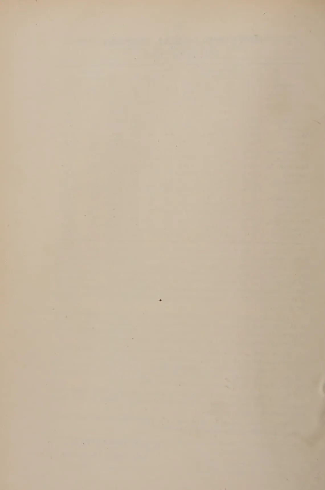

# The Tropical Agriculturist

VOL. LXXIX

PERADENIYA, NOVEMBER, 1932.

No. 5

<table><thead><tr><th></th><th style="text-align: right;">Page</th></tr></thead><tbody><tr><td>Editorial ... ..</td><td style="text-align: right;">263</td></tr></tbody></table>

## ORIGINAL ARTICLES

<table><tbody><tr><td>The Cultivation of Fruits in Ceylon with Cultural Details— VI. By T. H. Parsons, F.L.S., F.R.H.S. ...</td><td style="text-align: right;">265</td></tr><tr><td>Turmeric, its Cultivation and Preparation in the Kandy District. By W. Molegode. ... ..</td><td style="text-align: right;">271</td></tr><tr><td>The Marketing of Produce in Ceylon. By G. Harbord, Dip. Agric. (Wye). ... ..</td><td style="text-align: right;">274</td></tr></tbody></table>

## SELECTED ARTICLES

<table><tbody><tr><td>Tea Yellows Disease ... ..</td><td style="text-align: right;">277</td></tr><tr><td>Tea in Other Lands ... ..</td><td style="text-align: right;">284</td></tr><tr><td>The Coconut Beetle ... ..</td><td style="text-align: right;">286</td></tr><tr><td>Coir or Coconut Fibre ... ..</td><td style="text-align: right;">296</td></tr><tr><td>Practical Immunisation of Plants by Genetic Methods ...</td><td style="text-align: right;">308</td></tr><tr><td>Virus Diseases of Plants ... ..</td><td style="text-align: right;">312</td></tr></tbody></table>

## REVIEWS

<table><tbody><tr><td>Rothamsted Experimental Station, Harpenden, Herts— Annual Report 1931. ... ..</td><td style="text-align: right;">314</td></tr><tr><td>Cacao ... ..</td><td style="text-align: right;">316</td></tr></tbody></table>

## MEETINGS, CONFERENCES, ETC.

<table><tbody><tr><td>Minutes of Meeting of the Board of Management of the Rubber Research Scheme (Ceylon) ... ..</td><td style="text-align: right;">318</td></tr></tbody></table>

## DEPARTMENTAL NOTES

<table><tbody><tr><td>Progress Report of the Experiment Station, Peradeniya, for the Months of September and October, 1932. ...</td><td style="text-align: right;">320</td></tr></tbody></table>

## RETURNS

<table><tbody><tr><td>Animal Disease Return for the Month ended October, 1932.</td><td style="text-align: right;">326</td></tr><tr><td>Meteorological Report for the Month ended October, 1932. ...</td><td style="text-align: right;">327</td></tr></tbody></table>

1------------------------------------------------

*Of great interest to those engaged in the  
cultivation of plantation crops.*

# A MANUAL OF GREEN MANURING

Being a reprint of articles published in  
*The Tropical Agriculturist* by the  
Staff of the Department of  
Agriculture, Ceylon.

*34 Illustrations and Figures*

Price Rs. 5/-

— • • • —

*Obtainable from:*

**THE MANAGER, PUBLICATION DEPOT,  
PERADENIYA.**

2------------------------------------------------

# The Tropical Agriculturist

November, 1932

---

## EDITORIAL

---

### TEA IN MANY LANDS

---

THERE is published in this number a series of extracts showing the progress of tea planting in what may be called the new tea lands of the Empire. They furnish material for very serious contemplation at the present moment and without any selfish thoughts one cannot but help wondering whither a policy of bringing these new areas under tea is going to lead. At a time when one hears so much about Imperial Preference, Restriction, and Overproduction, one is also bound to think of a rational system of production control so that the world's requirements are grown in those lands best suited to do so. Such an arrangement ought to be possible amongst an imperially-minded people, for the British Empire produces some seventy per cent of the world's tea. There can be but one eventual result of expansion if it is going on uncurbed and that must be exactly of the same nature as has overtaken the rubber industry. To call a halt to the production of further quantities of ordinary quality tea within the Empire would be Imperial cooperation of a most valuable nature.

Simple restriction of quantity by refraining from plucking or even by destroying or withholding from the market when plucked is only an expedient, the ability of which to produce any lasting relief is very doubtful. If the price of tea be raised in this way those undeveloped countries capable of growing the

3------------------------------------------------

264

article will only be encouraged to do so. The great Indian advertising campaign simply substituted the consumption of some amount of Ceylon and other tea by Indian tea. It did not raise the world's requirements for tea.

Tea does possess an aspect very encouraging to a certain method of restriction that is that by diminishing the crop by resorting to finer plucking the quality of the product is enhanced. That is not so with rubber for instance where there is no means of controlling the latex and thereby obtaining a superior article. Tea thus offers a prospect somewhat unique in that one can gain on the quality what one loses on the quantity were it possible to create a demand for better quality tea. If such a demand for quality be instilled there would be but little incentive for those undeveloped countries only capable of producing mediocre tea to open new lands under the crop. The greatest value that research could bestow in Ceylon would be derived from a raising of the quality of much of our mid-country tea to a higher standard and in retaining for Ceylon herself any peculiarity of her teas that appeals to the public palate. The opportunity for Ceylon would thus seem to lie rather in developing the taste for quality than in merely increasing the demand for tea. That there are difficulties in the way of this cannot be denied, not the least of these presumably is that so much of Ceylon tea is not at present sold to the public as such on its intrinsic merits, but is used to bring a quantity of what would otherwise be an unacceptable article up to a standard such that people will consume it.

4------------------------------------------------

265

## THE CULTIVATION OF FRUITS IN CEYLON WITH CULTURAL DETAILS—VI

T. H. PARSONS, F.L.S., F.R.H.S.,

CURATOR,

ROYAL BOTANIC GARDENS, PERADENIYA

### GROUP A

#### SOME FURTHER FRUITS FOR THE LOW-COUNTRY WET ZONE

(4) DURIAN (*Durio zibethinus*).—A semi-cultivated tree much esteemed in the Malay region and introduced to Ceylon before 1850. It is rapid growing and attains very large dimensions, sometimes up to 100 feet or more in height and bears large round to oval fruits often exceeding 6 lb. in weight. When mature the fruit has a whitish buttery flesh which surrounds the seed and is enclosed in a hard bony shell set with sharp-pointed prickles. In Ceylon it is but rarely cultivated and during the season—July and August—there is a ready demand for all available fruit. To those unaccustomed to the fruit it has a strong and disagreeable smell, but when the taste of the fruit has been acquired it is considered sufficiently delicious to overcome this prejudice. The seeds are edible and when roasted are most palatable.

In the Malay Islands the tree is usually found in open country on the edges of forests and in and around villages and clearings. It does not appear to exist in any large numbers outside its natural home and this is most probably due to the fact that the seeds are of very short vitality. There appears to be at least two varieties at Peradeniya, the majority of the trees bearing various sized roundish fruits, whilst one particular tree has a particularly long, oval, and very large fruit, the flavour of the latter being considered superior to the roundish fruits. Generally speaking the trees vary considerably in productiveness, size, shape, and flavour and quality of pulp, some trees being almost barren. Selection and good cultivation should therefore be practised in order to obtain the best fruits.

Though the tree usually flowers in March-April and fruits in July-August, the flowering and fruiting season does occasionally change if an abnormal dry spell in September-October is experienced, the fruits then being produced in February and March.

5------------------------------------------------

266

The climatic requirements of this tree are strictly tropical—ample moisture and warmth—and the laterite soil of the low moist region of Ceylon from sea level up to 2,000 feet is suited to it, but if a good deep soil is available, this is appreciated. The tree is propagated from seed which should be sown at once after extraction from the fruit.

Experience shows that it is advisable to sow the seed singly in bamboos or other pots and plant out direct from the pot, as transplanting from beds results in many casualties. The seedlings germinate within a week to 10 days and attain sufficient height at 3 months of age to be planted in permanent sites.

Owing to its lofty and spreading nature planting as an orchard tree is rendered impracticable and plantings here and there in open spaces is advised, large holes 4 feet by 3 feet deep being prepared for the young plants. Protection should be afforded in the early stages against damage by cattle and such like and a single stemmed tree should be encouraged since the wood is very brittle, and a many stemmed tree becomes a source of damage in high winds.

No pruning data is available as the tree is not generally cultivated but the use of the knife in the formation of a single stem where necessary and the removal of any dead branches is all that is required.

(5) CUSTARD APPLE (*Anona squamosa*) known also as the Sugar apple, Sweetsop, and Anoda, S. is a small tree not exceeding 20 feet in height and is of tropical American origin. It has been established in this Island for some considerable time and is commonly cultivated throughout the tropics. There are several species of *Anona* yielding useful fruits, their order of importance being, the Cherimoya (already dealt with), Ilama (*Anona diversifolia*), Custard apple (*Anona squamosa*), Soursop (*Anona muricata*), Bullock's Heart (*Anona reticulata*), and the Alligator Apple (*Anona palustris*), the latter being considered very suitable as a stock plant on which to bud and graft the other species.

The Custard apple (with the possible exception of the Ilama, a new plant received here in 1924 and dealt with later) is the best of the tropical anonas and there is a ready market at all times for good fruit. The latter is normally of average size attaining the dimensions of a good sized orange but is heart shaped, the skin or rind being scaly, which when ripe breaks away separately.

The pulp is white, granular, sweet and custard like and has a pleasant, slightly acid flavour, thereby forming a very useful dessert fruit. There is a purple skinned variety, but beyond this rather attractive colour it has little to recommend it.

6------------------------------------------------

267

Though cultivation is restricted to tropical regions it thrives in both wet and dry zones from sea level up to 3,000 feet and in a large variety of soils. Its versatility in this respect is remarkable and it can be found growing in quite heavy soil if the drainage is good, and in almost pure sand since it stands drought very well. Its range comprises tropical America, West Indies, tropical Africa, India, Malaya, Cochin-China, the Philippines, the Polynesian Islands, and along the coastal region of Queensland. If preference can be given, a deep loamy to loose sandy soil with perfect drainage is best suited to the tree and in such soils remarkably good crops can be anticipated, provided good cultivation is given. Some trees are, however, as with Cherimoya, more productive than others, and variation in size and quality of the fruits are observable from trees of seedling origin. Propagation of superior trees by budding as with the Cherimoya, is therefore advisable and experiments here show that this can be done, the stock used being the Soursop. Seedling stocks of the Bullock's Heart and Alligator Apple are, however, being raised for further experiment in this respect.

The seeds should be sown whilst fresh in prepared pans or boxes, germination taking from 3 to 5 weeks according to elevation. Growth of the seedling is fairly rapid at low elevations but at 1,500 feet and over is proportionally slower. Potting into pots or tins can be undertaken when the seedling reaches 3 to 4 inches in height and at 9 to 12 months of age according to elevation, the seedlings can be transplanted to a permanent site, setting them out at from 15 to 18 feet apart in well-prepared holes to which a fair amount of well-rotted cattle manure has been added. It is well to remember that this fruit will not tolerate bad drainage conditions and when sickly trees are observable it can in most cases be traced to lack of drainage.

Seedlings fruit in 3 to 4 years and are normally very productive if of a good strain. Where budding is undertaken the inverted T method as described for the Cherimoya is applicable.

(6) SOURSOP (*Anona muricata*).—This robust tree is similar to the Custard apple in its requirements and attains a similar height. The leaves, however, differ in being more leathery and of a dark-green colour and the tree is of more rapid growth. The fruit, often weighing 5 lb. each, is sweet and juicy and used considerably for flavouring and in beverages. In tropical America, Cuba, and the West Indies the Soursop is unrivalled for the preparation of sherbets and other refreshing drinks. It thrives best in the wet zones from sea level to 2,000 feet or more, and prefers a good loamy soil to any other. Owing to their

7------------------------------------------------

268

enormous size a crop of 2 dozen or so fruits can be considered a fairly good yield for a mature tree. Selected trees should here also be propagated by budding either on to own seedlings or on the Alligator Apple or Bullock's Heart, the method being the same as applied to the Cherimoya and the Custard apple.

Seedlings germinate more quickly than the Custard apple and are ready for transplanting at a relatively earlier age, 6 to 8 months from sowing being the usual period. The tree is somewhat erratic in its fruiting. It is believed that attention to pollination results in better crops, and this applies also to most of the other Anonas, and hand-pollination of the flowers should be undertaken. A further aid to fruit production is generous manuring and a commercial fertiliser containing 3% Nitrogen, 10% Phosphoric acid, and 10% Potash has been found in Cuba to be very effective.

(7) ILAMA (*Anona diversifolia*).—Though this plant is not yet available at Peradeniya for distribution, it is mentioned because of its high reputation in the Western tropics. It is there considered the finest anonaceous fruit which can be grown in tropical lowlands, superior to the Custard apple and only slightly inferior to the Cherimoya and is called the low-country Cherimoya. A description of this new fruit was published by Washington in 1912, and dissemination of the species began soon after. The first seed reached Peradeniya in 1922 but all failed to germinate. A second consignment of a few seeds received in 1925 resulted in 2 plants being raised and these are now being grown at Peradeniya. The habit of the plant is very similar to the Cherimoya as are the characters of leaf and fruit.

It is reported to be of slender growth, attaining a height of 25 feet, the fruits weighing up to 1 lb. each and varying in colour from pale-green to magenta pink, the latter being more acid and very closely resembling the Cherimoya. It is indigenous to the foothills of Mexico, Gautemala, and Salvador but not known to occur above an elevation of 2,000 feet. It should, therefore, be suited to the semi-dry regions of Ceylon up to 3,000 feet but in the dry region proper irrigation facilities would be required. The soil requirements presume a deep rich loose loam, but with good drainage the tree would appear suitable to most parts of Ceylon within the elevations stated.

The tree reaches bearing age in America in 3 to 4 years but the Peradeniya trees, not yet acclimatised, have not yet reached this stage. It is further stated that a mature tree will often bear 100 fruits in a single season but that it varies in production and size of fruit as do the other Anonas and budding, therefore, of the best sorts is necessary. Budding on the Soursop at Peradeniya for purpose of multiplication of material has not so

8------------------------------------------------

269

far been attended with success but trials on the Alligator Apple and Bullock's Heart are being made and some success is expected in due course. The plant seems a valuable acquisition and every effort is being made to increase the quantity and later to improve the type for cultivation in Ceylon.

(8) RATA UGURESSA (*Flacourtia cataphracta*).—This group of fruits to which the Uguressa of Ceylon, the Lovi-Lovi of Malaya, and the Philippine Rukum are related, are usually small trees which produce abundance of small but pleasant fruit. The Rata Uguressa appears the best of the group, the tree attaining a height of about 20 feet with a spreading head when fully grown, and the stems are armed with stout thorns. The fruit is globular in shape, the largest attaining a diameter of one inch or more and is of a dull reddish to deep maroon colour. The flavour is sweet and agreeable but even when ripe the fruit is hard and astringent and apparently uneatable, but if rolled in the hand or pressed with the fingers it becomes quite soft and the astringent taint disappears entirely. The fruit, and particularly that of the more acid varieties is used to a considerable extent in the making of jams and preserves.

It is a native of India and Malaya and now widely scattered throughout the tropics though not extensively cultivated, and is suited to both wet and dry zones of the low-country. It will grow in moist soils if well drained but prefers a dry soil and is of rapid growth attaining the fruiting stage in 4 years. It prefers an open position in the full sun or at the most very light shade.

Propagation is invariably by seed though there are superior varieties that should be propagated by budding on to own seedling stock. A drawback with the seedling method is that the species, being dioecious, more male plants are produced than is necessary for pollination purposes.

The seeds are small and thin and should be sown carefully in a prepared soil in boxes or pans. Germination is slow and the boxes should not be kept too wet during this period. The seedlings are large enough for removal into pots when they attain 3 inches in height, usually at 3 to 4 months of age after which growth is more rapid. At 12 to 15 months of age the potted plants can be transferred to permanent quarters, ample spacing being afforded since the tree is of a remarkably spreading character, a full-grown individual specimen often covering an area 40 feet or more across.

The tree should be allowed to take its natural shape and little pruning is required beyond the periodical removal of any dead shoots.

9------------------------------------------------

270

Its cultural requirements are few but periodical manuring with well-decayed cattle manure and mulching during prolonged dry spells is, as with other fruits, to be recommended.

(9) UGURESSA (*Flacourtia Ramontchi*) known in parts of the Eastern tropics as the Ramontchi and in the West Indies as the Governor's plum and in Ceylon as the Uguressa, S. Katukali, T. It is a native of the low-country, but is rare in the wild state and mostly found cultivated. The fruit is fairly sweet and of a dark-purple colour,  $\frac{1}{2}$  an inch or so in diameter, but is in general inferior in both size and flavour to the Rata Uguressa though excellent jelly is made of this fruit.

The mature tree is less spreading in habit than the Rata Uguressa and is more thorny in character but otherwise closely resembles the latter fruit and requires much the same treatment in cultivation. It is strictly tropical, will grow on soils of various types and is not exacting as to its cultural requirements.

Where known, the fruit is appreciated and attention to selection with good cultivation should improve the quality considerably.

(10) LOVI-LOVI (*Flacourtia inermis*).—A relative of the Uguressa and the Rata Uguressa and is a very ornamental tree of Malayan origin, thornless, and attains a height of some 25 feet. The fruit is from 1 to  $1\frac{1}{2}$  inches in diameter, a bright cherry red in colour and very acid, not unlike the European Red Currant. Though not attractive as a dessert fruit owing to its excessive acidity it makes excellent jellies and preserves, and can be used in tarts and also stewed if plenty of sugar is supplied.

Two crops a year can be obtained, in March-April and again in August-September and the tree is a remarkably heavy cropper.

It is propagated by seed, which is small, and should preferably be sown in boxes and kept under cover until the seedlings are about 2 months old, when they should be allowed more light and exposed to harden them off. Care is required in the young stages since the seedlings are small and delicate and transplanting into baskets or bamboo pots should be undertaken at 3 to 4 months of age. At the age of 15 to 18 months the seedlings should be ready for transplanting to permanent sites, good sized holes of 4 feet by 2 feet deep having been prepared and well-decomposed cattle manure added when refilling the hole. Planting distances should not be less than 20 feet by 20 feet as the mature tree attains a spreading habit and once established grows very freely.

The tree is suited to the low moist zones from sea level to 2,000 feet and thrives on most soils but prefers a deep loamy soil with ample moisture combined with good drainage.

10------------------------------------------------

271

## TURMERIC, ITS CULTIVATION AND PREPARATION IN THE KANDY DISTRICT

W. MOLEGODE,

*AGRICULTURAL INSTRUCTOR, KATUGASTOTA*

**T**URMERIC, which is the prepared rhizome of the plant *Curcuma Longa*, Sinhalese *Kaha*, Tamil *Manjal*, is an indispensable condiment employed largely as an ingredient in Ceylon curries. The country's requirements, however, are met by the importation of very large quantities from British India.

Turmeric is a crop which can easily be cultivated in Ceylon up to an elevation of about 2,000 feet. It may be seen growing in patches in nearly all village gardens. A fair quantity has been raised in the Harispattu division since 1918, and prepared for home consumption. During the past few years, a number of villagers who have cultivated this crop on a small scale, have secured satisfactory results. Hitherto, the method of preparing a good grade marketable commodity was not understood; but trials carried out recently have shown that it is possible to produce turmeric that compares favourably with the best imported stuff, and samples of the locally prepared product have been valued by wholesale importers in Colombo at the same price as the best imported turmeric. Retail dealers in village bazaars have bought quantities of locally produced turmeric, paying the same rate as for the Indian stuff. This shows that if villagers will extend the cultivation of turmeric as a garden crop, and adopt the proper method of curing, there is the possibility of replacing the imported article.

Ceylon imported 11,810 cwt. of turmeric, valued at Rs. 120,000 in 1931, and the average quantity imported annually during the past few years has been 11,600 cwt. An acre of well-cultivated turmeric, under favourable conditions, would yield from 2,000 to 3,000 lb. of the prepared product. Taking even

11------------------------------------------------

272

the lower figure, if a thousand three hundred cultivators grow half an acre each of this crop, Ceylon need not import any turmeric. Efforts are being made towards encouraging the growing of turmeric on an increased scale in the Harispattu division, and it is hoped that within the next few years, the district will raise a quantity sufficient to meet, at least, a considerable part of the Island's needs.

### CULTIVATION

Turmeric is propagated by sets or pieces of rhizomes. It is cultivated in the same way as ginger of which an account appeared in a recent number of this journal. It does best in loose rich soils, under partial shade, and requires a hot and moist climate with an equable distribution of rainfall.

Planting in Kandy District is usually done in March-April, and the crop is ready to be lifted in January the following year; but experience has shown that the crop improves both in quality and quantity, if allowed to remain over another season. Yields varying from 10,000 to 15,000 lb. of green or raw turmeric per acre have been obtained locally from second year crops. Even with ordinary cultivation, a yield of 50 cwt. of raw turmeric, which on curing would be reduced to 10 cwt. of the prepared product per acre, is easily secured. The cost of cultivating an acre has been estimated at Rs. 75.00.

### PREPARATION

Turmeric in its raw state has no value; and so has to be prepared for the market. The process of curing, however, is a simple one. After a trial of several methods, the most satisfactory results were obtained from the following: The raw or fresh rhizomes were cleaned of any adhering earth by washing, and any roots were removed. Large sized rhizomes were cut into two or more pieces lengthwise. These were then placed in an earthen pot at the bottom of which a layer of dry turmeric leaves was placed. Water just sufficient to cover the contents of the pot was poured in, and the space up to the mouth of the pot was filled with more dry leaves of the plant. The mouth of the pot was then closed with a piece of gunny bag, and sealed with a paste of cattle-dung and earth so that no vapour or steam escaped in the process of boiling. The pot was placed over a fire, and the contents gradually boiled for 3 hours. (It is important that the boiling should be carefully carried out, as

12------------------------------------------------

273

under-boiling as well as over-boiling were found to result in a product of poor quality). The fire was then allowed to die out, and the pot left to cool. When the contents were quite cold, they were removed and spread out on mats to dry in the sun for five days. When they were *very nearly* dry, they were put in a *Koraha*, (an earthen vessel with a rough surface in which rice is washed.) Water was sprinkled and the dry rhizomes were rubbed against the surface of the vessel to remove the skin. After this the turmeric was again dried in the sun for two days. The turmeric prepared in this way, was valued at the same price as the best imported stuff.

The following method of removing the skin and securing a good colour was also adopted with success. The dried turmeric was placed in a long, narrow gunny bag along with pieces of small sharp stone, and the bag worked forward and backward as is done in the colouring and polishing of cacao. The samples prepared in this way, were valued in Colombo by wholesale dealers at Rs. 3.00 per cwt. less than the first sample, but petty traders were prepared to pay the same price as for imported turmeric with which the sample compared well.

13------------------------------------------------

274

## THE MARKETING OF PRODUCE IN CEYLON

G. HARBORD, DIP. AGRIC. (WYE),

*DIVISIONAL AGRICULTURAL OFFICER, SOUTHERN DIVISION*

**A** large part of the time of a Divisional Agricultural Officer is spent in assisting growers of minor economic crops to increase their production, and the subject of the "Marketing of Produce" is an aspect thereof with which one is vitally concerned.

Our efforts at stimulating production can only succeed if the machinery for disposal of produce is operating satisfactorily from the point of view of the grower.

"The machinery under present arrangements is represented by the local boutique-keeper, the middleman, and the local market if any; and it deals fairly well with the present situation of limited production though not always to the satisfaction of the growers, but where increased efforts produce a surplus, this machinery breaks down. It is necessary to stress this point as it is at this stage, where organisation is so badly required if there is to be any hopes of the country becoming self-supporting as regards foodstuffs which can be produced locally.

"Much has been written in the press and much more has been said recently on the subject of intensifying the production and consumption of Ceylon-grown foodstuffs. Some definite and organised action is desired in the near future such as the introduction of co-operative marketing and co-operative sale societies which should naturally follow the Co-operative movement. Development in this way, however, must necessarily be slow.

"In order to bring about any rapid 'change over' to home consumption, buying and distributing depôts in the case of certain crops, such as chillies would appear to be required and rice mills in the case of paddy, would assist greatly in establishing a sense of mutual confidence in both grower and merchant, which is so essential to progress, otherwise the grower will not continue to grow, and the merchant will continue to import.

14------------------------------------------------

275

“Lack of credit on the one side, and vested interests on the other side are very real obstacles, which must be met and overcome before any real progress can be made.

“The burden of my contention is that unless you provide practical assistance in the matter of disposal you cannot in this country bring about a new order of things.

“A brief mention of the position regarding three of the most important minor economic products of the Hambantota district in the Southern Division will illustrate a few points:

“(a) To take the case of Cotton—

“A definite organisation or purchase scheme has been in operation for the last 10 years whereby the Agricultural Department buys the crop on behalf of a large Colombo consumer.

“In past years, when prices were better at Rs. 15.00 to Rs. 20.00 per cwt. for seed cotton, a crop of 2,000 to 3,000 cwt. has been produced to the benefit of the growers of upwards of Rs. 40,000 in cash.

“Now, even in those days, this crop was sufficient to keep the mills working for about one week only.

“To-day prices are lower at Rs. 10.00 per cwt. but are still remunerative for the energetic cultivator. But, what is the present position? This year the crop has produced 30 cwt. This requires some explanation. It is true that the cotton crop requires a little extra work, and for a longer time than is the case with the usual chena crop kurakkan, and it is not a food crop.

“But the real explanation is, I believe, that the cultivator is unable to raise credit on the crop. The provision of a small advance at the flowering stage might restore the position.

“(b) To turn to chillies—

“The cultivation of chillies is extensive around Weeraketiya and Middeniya in the Giruwa Pattus, and it is on the increase towards Ambalantota, Wirawila and Tissa—the local short fat chilli is invariably grown, and the sale of green chillies is the main objective.

“As a result of extended trial, the cultivation of the Tuti-corin type of chilli is now being encouraged. It is a greatly superior chilli for the production of the dried article, but unless

15------------------------------------------------

276

a buying organisation is provided at the initial stage, the prospect of developing a local dried chilli industry does not appear to be very hopeful to judge from the recent experience of an enthusiastic grower, who, when he offered his crop to the local boutique-keepers was told that they would accept it on credit only.

### PADDY

“(c) And lastly paddy—

“At Tissa, which is an important rice-producing centre, the Agricultural Division has since the year 1927 been trying out on its small  $2\frac{1}{2}$ -acre Paddy Seed Station a number of pure-line selections isolated by the Economic Botanist; in 1930 a Suduheenati selection was proved to be satisfactory and has since become very popular with paddy growers on account of (a) its great superiority in yield over the local Rathkarayal, (b) its satisfactory milling percentage when converted into rice and (c) the quality of its white rice which in Galle is declared to be superior to the best Muttusamba.

“The acreage cultivated with this strain is as follows: For Maha season 1931-32, 360 acres, Yala season 1932, 1,057 acres, and for Maha 1932-33 is expected to exceed 3,000 acres. The cultivation of this particular ‘pure line’ is extending into Ambalantota where about 1,000 acres will be grown next season. Not much paddy is yet available for the market, and already the large paddy buyers from Matara District are making themselves felt, by offering Re. 1.00 per amunum *less* for this Suduheenati paddy than for the old variety because they know that the cultivator gets a higher yield! Fortunately there is at Tissa a rice mill which is prepared to accept all available supplies of the paddy at the current rate, and if organisation of the export of Suduheenati rice to Galle can be arranged, as is hoped, it will readily be accepted by consumers in preference to white imported rice.”

These are some of the difficulties and possibilities which the Agricultural Department and the cultivators experience in the introduction and marketing of improved crops.

16------------------------------------------------

277

## TEA YELLOWS DISEASE\*

### INTRODUCTION

**T**EA yellows disease has been a source of trouble to Nyasaland tea planters for many years. Captain C. Smee, Government Entomologist, was the first to report on the disease and suggested that a fungus (*Botryodiplodia theobromae*) was the cause of the disease. Soon afterwards, in 1927, Dr. E. J. Butler, Director of the Imperial Bureau of Mycology, visited Nyasaland and was so struck by the serious nature of the disease that he stated it to be "unquestionably one of the most serious diseases to which the tea bush is liable". He was unable to diagnose the cause of the disease but suggested it might be due to a virus.

Our investigations started in 1929. Although our results have been obtained by one of us working in Nyasaland and the other at the East African Agricultural Research Station, Amani, we have at all times co-operated fully in the design and layout of experiments. We are jointly responsible for the conclusions reached. . . . .

This paper gives an account in brief of our investigations and submits proposals for control measures against tea yellows disease. We have found that the disease is caused by a deficiency of sulphur in the tea plant. The disease is both preventable and curable by means which are easily available to planters.

### SYMPTOMS OF THE DISEASE

Four distinct stages of the disease can be recognised which indicate a gradual degeneration in the health of affected tea plants. *First stage.*—The leaves are normal in size but mottled; various degrees of mottling are found from light and dark green to markedly contrasted yellow and green. The veins always remain a darker green than the other parts of the leaf. *Second stage.*—The leaves gradually diminish in size and show the characteristic mottling and a stiffening of texture. The young leaves tend to become uprolled and brittle and their tips and margins scorched. *Third stage.*—The newly formed leaves are very small and chlorotic; the internodes of the stem are considerably shortened and most of the older leaves are shed. *Fourth stage.*—The thin whippy shoots die back and the last signs of life are usually a few minute axillary shoots at the base of the branches.

Root development is curtailed considerably in young plants suffering from the disease. No difference has been noted in the development of fibrous roots in old diseased bushes.

A plant which has died from yellows is readily distinguished from one which has died from other causes. No leaves can be seen attached to the plant and the length of the internodes of the thin whippy shoot is much reduced in comparison with normally developed shoots of plants which have died from root disease, such as *Armillaria*.

---

\* From Nyasaland Protectorate Department of Agriculture, *Bulletin No. 3*, (*New Series*).

17------------------------------------------------

278

## OCCURRENCE OF THE DISEASE IN THE FIELD

The disease is found both on virgin soil and on long-cultivated soils. It has been found on virgin soil only of the black friable type which is distributed irregularly throughout the Mlanje district. The disease has undoubtedly been the chief cause of the trouble which planters have encountered in the past when getting their plants established on this type of soil. A count made in a garden planted in 1931 showed that at the end of the first year's growth the incidence of the disease averaged 36 per cent on a fifteen-acre block. General experience has shown that the disease becomes less severe as the plants gradually become established. The reason for this is difficult to explain at present.

The disease is commonly seen on both Mlanje and Cholo soils where deterioration in fertility has been allowed to go unchecked. Here yellows is seen on badly eroded slopes, on the sides of roads and drains, along forest margins and round the base of shade trees in old established gardens and on old cultivated land, particularly old tobacco land and sites of native gardens.

An exception occurs in certain areas where springs run only in the wet season. The explanation would seem to be that the spring leaches more sulphates from the vicinity of the tea roots than it brings down to those roots in drainage water.

In all cases there is a seasonal variation in the severity of the disease which is at its worst in the hot dry season and gradually lessens from December onwards.

## EXPERIMENTAL WORK

*Field Experiments.*—In all these experiments our results have been based on observations taken at different intervals of time on *individual* bushes from the start to the finish of the experiment.

This has enabled us to assess the effect of the fertilizer treatments as accurately as we consider possible with this type of disease.

It is not intended to burden this paper with any tables and figures. The results are too striking to need a statistical analysis to be put in this paper in order to show their significance. This analysis has been made, however, and will be published in a technical paper.

1. Ruo Estates started an experiment in 1927 with dressings of ammonium sulphate on a garden which Dr. Butler chose as being the most severely diseased on the estate. In 1929 this stood out at a distance as a healthy green patch compared with the surrounding gardens which were very yellow. We started to take records in January, 1930. At that time 88 per cent of the plants in the treated plot were healthy, while an adjacent plot treated in July 1929 with nitrophoska had only 32 per cent healthy. The ammonium sulphate had changed the tea from the worst to the best.

These gardens were fertilized with sulphate of ammonia in 1930. The result was a complete transformation of the tea. The originally treated garden no longer stands out, all those around it being equally green and the percentage of healthy plants approximately the same. This experiment gave a clear indication that tea yellows could be cured temporarily at any rate by applications of sulphate of ammonia.

2. Our first experiment was one in general fertilization. Separate plots were treated with double superphosphate, with double superphosphate and potassium sulphate, with double superphosphate, potassium sulphate and ammonium sulphate, and one was left untreated. The results

18------------------------------------------------

279

at the end of two years showed that the healthiness of the untreated plot fell slightly and that of the double superphosphate considerably. On the other hand, the plots receiving potassium sulphate and ammonium sulphate became nearly healthy.

Double superphosphate contains no sulphur. Both potassium sulphate and ammonium sulphate, as their names imply, contain sulphur. Both plots showing marked improvement had received potassium sulphate. It might, therefore, have been concluded that the potash was responsible for the improvement.

3. An experiment was carried out to compare two forms of potash. The plants receiving muriate (chloride) of potash increased in healthiness compared to the controls (untreated) but not sufficiently to be compared to those receiving sulphate of potash which became nearly healthy.

4. An experiment comparing two forms of nitrogen fertilizers showed that while nitrate of soda increased the severity of the disease ammonium sulphate considerably decreased the severity. Both fertilizers are considered suitable sources of nitrogen for the plant. Nitrate of soda contains no sulphur.

5. A more elaborate experiment with nitrogen fertilizers in quadruplicated plots planted in 1931 showed that nitrate of soda, whale meat meal and urea had no beneficial effect compared to the untreated plots up to 1932. The plots treated with ammonium sulphate, however, showed a marked beneficial effect on the health and also on the final stand of plants.

6. A further elaborate experiment was carried out to compare the effect of various sources of nitrogen and sulphur. The fertilizers used were ammonium sulphate, nitrate of soda, urea, sodium sulphate and magnesium sulphate. Untreated bushes showed a small decrease in health at the end of a year. Treatment with nitrate of soda resulted in a considerable decrease in health, with urea a small increase in health; on the other hand, treatment with a sulphate, whether combined with nitrogen as ammonium sulphate, with magnesium as magnesium sulphate or with sodium as sodium sulphate, resulted in a marked and about equal improvement in all cases.

7. A similar experiment to No. 6 was carried out on Indian tea on the black friable Milanje soil. The treated bushes were in an advanced stage of the disease. Unfortunately they were pruned six weeks after treatment. This is now considered to have been a mistake. In consequence of it, it is probable that the results of sulphate treatment were not so striking at the end of a year or so rapid as in other experiments. The amount of complete recovery after eleven months of plants treated with ammonium sulphate, sodium sulphate and potassium sulphate was considerably greater than that of the untreated plants and those receiving potassium chloride and sodium nitrate. The plants treated with superphosphate showed an interesting result. At the time of application the material was believed to be double superphosphate which should contain no sulphate. The recoveries, however, from this fertilizer equalled in number some of these obtained from the sulphate fertilizers. A test showed that the material used contained considerable sulphate. It can hardly be doubted that the anomalous behaviour of the treatment with what was believed to be double superphosphate was due to the sulphate contained in it.

8. On similar soil to that on which No. 7 experiment was carried out yellows is particularly prevalent in newly cleared land, as pointed out previously. Treatment with a sulphate fertilizer at the time of planting has been shown to be effective in producing a stand of healthy plants. Plots

19------------------------------------------------

280

laid out on Chisambo Estate were treated with a mixed fertilizer a month after planting. A year later the fertilized plots were 88 per cent healthy compared with 37 per cent healthy in the unfertilized plots.

9. An experiment with nitrophoska which is a modern concentrated fertilizer containing all the major elements, nitrogen, potash and phosphorus, was compared in use by itself and with sulphur in the form of sodium sulphate. Although the final results of the experiment had to be recorded when the normal seasonal improvement was at its highest (April), plants treated with nitrophoska failed to improve in health to the same extent as those untreated. Nitrophoska with sodium sulphate, however, improved the health of the bushes beyond that of the untreated bushes.

The experimental results so far described point inevitably to one conclusion—that it is to the sulphate part of the various fertilizers that improvement of treated bushes must be attributed. If a sulphate will cure yellows an application of sulphur alone is expected to be effective. It is well known that sulphur is readily converted into sulphate in the soil.

10. Three separate experiments with ground sulphur all gave satisfactory results both on the red and black soils of Mlanje. These experiments were carried out on old and young tea. Treatment with sulphur in all cases has been beneficial.

All the experiments so far described give very strong proof that tea yellows is preventable and curable by the application of sulphur in one form or other in which it may become available to the plant. The experiments, however, do not give any proof that the disease is caused by a deficiency of sulphur in the plant. It is possible that the application of sulphur free or in the form of sulphates had a detrimental effect on some living parasitic organism which may cause the disease. Such a possibility is tenable on the strength of the experimental proof so far given.

Critical experiments at Amani have given results which are of prime importance in strengthening our hypothesis that sulphur deficiency in the tea plant is the cause of tea yellows.

### WATER-CULTURE EXPERIMENTS

Tea seedlings were grown with their roots immersed in distilled water to which the essential elements, nitrogen, phosphorus, magnesium, chlorine and sulphur, were added in forms suitable for their normal absorption by the plant. A solution containing all the above elements is called a full nutrient solution. Seedlings were also grown in full nutrient solution lacking in turn one of the above elements. The growth of the seedlings in the series of different solutions varied as shown below:

*Full-nutrient solution.*—Growth was normal.

*Without nitrogen.*—All leaves became pale green and dull and tended to be reduced in size slightly. Growth stopped at an early age. The plants were quite different from yellows.

*Without potash.*—Scorching of the older leaves was particularly severe but growth otherwise was normal.

*Without phosphorus.*—Growth was normal.

*Without chlorine.*—The leaves were badly scorched; otherwise nearly normal.

*Without magnesium.*—Plants all showed bad scorching and there was a marked tendency to shed leaves. Young leaves were normal.

*Without sulphur.*—The exact symptoms of yellows disease were produced even down to the scorching of the young leaves.

20------------------------------------------------

281

The root systems of the seedlings were healthy in almost every case. This experiment, which was duplicated, shows that tea yellows disease is produced by withholding sulphur from the plant.

### CHEMICAL ANALYSIS

Analysis of young leaves from healthy and diseased bushes has shown a significant difference in their sulphur content; the diseased contain less sulphur. This difference also occurs in older leaves and stems but not to the same extent. We are indebted to the Soil Chemist, Amani, for carrying out these analyses.

### INDICATOR PLANT EXPERIMENTS

Experiments with tobacco used as an indicator plant have also shown that sulphur is not available in sufficient quantity in certain Mlanje soils for the normal development of that plant. When grown in soils taken from diseased tea areas and without the application of a sulphur fertilizer, tobacco plants developed the characteristic general yellowing of the leaves which American workers have shown to be induced by withholding sulphur from the plant.

These indicator experiments showed also that the red soils of diseased tea areas were deficient in nitrogen.

### UNILATERAL FERTILISATION EXPERIMENTS

One of the most difficult facts to explain in a deficiency disease is how one side of a bush can be affected and not the other. Experiments have shown that under certain conditions (i.e., distribution of roots in the soil) it is possible to fertilize one half of a bush so that half becomes healthy while the other half does not. If, however, the roots of the plant curve round from one side to the other the result is that the plant is fed with fertilizer on both sides and no unilateral effect is noted.

Another experiment showed how this unilateral effect could be readily induced. The soil on one side of uniformly diseased bushes was fertilized with a sulphate. In one case the lateral roots were cut off close to the tap root on the side opposite to that fertilized, and in another case the tap root was also cut off at a depth of two feet. The result was that in the first case the fertilized half of the bush became healthy while the other half (feeding by the tap root) remained diseased; in the second case the whole bush became healthy as it was forced to feed entirely from the fertilized side of the plant.

These experiments explain satisfactorily some of the puzzling unilateral effects of the disease in the field. All the experimental data which have been given so far have yielded sufficient evidence in our opinion to prove conclusively that tea yellows disease is caused by a deficiency of sulphur in the tea plant.

### RELATION OF TEA YELLOWS TO FUNGI

During our investigations Dr. Small, Director of Agriculture, pointed out that a fungus (*Rhizoctonia bataticola*) was commonly associated with the disease and could be readily found on the roots of plants killed by yellows. We confirm the presence of this fungus in connection with the disease but in view of our experiments we do not consider that the fungus is connected with the cause of the disease.

The water-culture experiment referred to shows definitely that tea yellows disease is produced without the aid of a fungus. It is possible, however, that the symptoms of yellows may be produced by two different agents of which sulphur deficiency is one and *Rhizoctonia bataticola* is

21------------------------------------------------

282

another. We are not in a position to say that the latter cannot produce yellows symptoms in the tea plant. Attempts to inoculate tea with the fungus failed in most cases. One experiment showed that the fungus could travel freely up the roots of badly diseased tea plants only. Experiments have also shown that an application of sulphate will cure the disease in plants, the roots of which are known to harbour *R. bataticola*.

Another experiment has shown that diseased bushes can suck up dilute solutions of various substances through their side branches, the cut ends of which are immersed in the solutions. Within a few days branches treated with solutions of sulphates become green and later make normal healthy growth. The branches which received substances other than sulphates (e.g., nitrogen, potash, etc.) remained diseased. If this disease were the result of a fungus invasion of the roots, it is difficult to understand how the introduction directly into the shoot of a small quantity of sulphate could cure that shoot of disease.

Summarising our views, we consider that tea yellows disease lays the roots of the plant open to invasion by weakly parasitic fungi. Of these *R. bataticola* is probably the most important in Nyasaland. In the later stages of the disease it is likely that the plant has to contend with an increasing shortage of sulphur owing to loss of absorbing power through the destruction of its roots by fungi and diminution in reserves for root growth due to a much diminished leaf area. Thus in all probability fungi play a part in the last stages of the disease which lead to the death of the plant. If sulphur is applied, however, to the plants before the fungi have advanced too far their parasitic invasion is checked and the plant makes a complete recovery. With sufficient fertilization, plants nearly dead in which by experience we might expect to find that the fungus (*R. bataticola*) had penetrated into some of the larger roots may occasionally recover.

### DISCUSSION

The importance of sulphur to plants has received attention largely in America in the past. In parts of the United States increase of yield has followed the treatment of certain crops with sulphur. Some workers have described a general yellowing effect of the foliage of certain crops due to sulphur deficiency. Usually when a plant suffers from a deficiency of food substances its growth is stunted and unthrifty, but it is not regarded as diseased. In the instance of tea yellows, however, the symptoms are so distinctive—an abnormal type of growth rather than general poorness—that use of the word *disease* seems justified. In India tea has been reported to respond to sulphur treatment. We believe, however, that in Nyasaland we have the first instance of a definite and characteristic disease which is attributed to a deficiency of sulphur in the plant.

We are of the opinion that a considerable proportion of the failures in planting of tea in Nyasaland is attributable to sulphur deficiency. It is now recognised that root growth of other plants may be reduced in sulphur-deficient soils. In our experience newly set out plants may show clearly defined yellows symptoms, while others may die without producing definite symptoms. We suspect however, that sulphur deficiency may be largely responsible for the latter deaths. This conjecture is supported by experimental evidence (see *Field Experiment No. 5*).

### CONTROL MEASURES

The control measures for this disease are now obvious. The application of sulphur in a form which will become available to the diseased tea plant will effect a cure if the plant is not too severely affected. Our advice, therefore, is as follows:

22------------------------------------------------

283

1. A sulphur supplying fertilizer should be applied to diseased plants and to supplies in affected areas. Bearing in mind expense and general fertility of the soil, we suggest the following fertilizers for use. The amount of each fertilizer per plant for old and young plants is given as a *minimum* in order to obtain satisfactory results from that fertilizer alone.

<table border="1">
<thead>
<tr>
<th>Fertilizer</th>
<th></th>
<th>Old plant</th>
<th>Young or supply plant</th>
</tr>
</thead>
<tbody>
<tr>
<td>Ammonium sulphate</td>
<td>...</td>
<td>1 oz.</td>
<td>... <math>\frac{1}{2}</math> oz.</td>
</tr>
<tr>
<td>Potassium sulphate</td>
<td>...</td>
<td>1 oz.</td>
<td>... <math>\frac{1}{2}</math> oz.</td>
</tr>
<tr>
<td>Sulphur</td>
<td>...</td>
<td><math>\frac{1}{4}</math> oz.</td>
<td>... <math>\frac{1}{8}</math> oz.</td>
</tr>
</tbody>
</table>

We wish to stress the following points in connection with the use of the above quantities of fertilizer; (a) the sulphur or sulphate is applied with intent to cure tea yellows; (b) once diseased areas have been brought back to a state of health, sulphur need not be applied at the above rates; (c) we are not in a position to state what effect sulphur has on the quality of the made tea.\*

2. Virgin soil in general should not be expected to show a deficiency of available sulphur except in clearings on the black friable soils of Mlanje. Great difficulty has been and will continue to be experienced by planters opening up tea estates on this type of soil unless sulphur in one form or other is applied at the time of planting.

3. Full use should be made of all available kraal manure as it should contain an appreciable percentage of sulphur. Considerably more attention might be paid to the conservation of this valuable fertilizer, especially in regard to its liquid constituents.

4. General agricultural practices will tend to alleviate the disease under certain conditions. Soil erosion should be prevented. Good cultivation may render available some of the sulphur held back naturally in the soil. Green manuring, however, has not been found to have any beneficial effect on the disease; a deficiency of sulphur has been found both in Nyasaland and other countries to discourage the formation of nodules in leguminous plants.

5. The best time of the year to apply the fertilizer is November. This will enable the plant to attain its maximum vitality in preparation for pruning in the following year. Starch reserves are low in the roots of diseased plants.

Pruning is inclined to aggravate the disease in unfertilized bushes. It is not advisable to prune bushes treated heavily until the second year after treatment at the earliest. Light pruning, however, is advantageous in order to eradicate all spindly growths.

6. It is not advisable to fertilize bushes in the last stage (fourth) of the disease. Such bushes should be dug out and replaced as soon as possible by supplies which should be fertilized.

We wish to thank the many planters who gave us much valuable assistance throughout our investigations. We are also indebted to the Director of Agriculture, Nyasaland, and the Director of the East African Agricultural Research Station, Amani, for providing the facilities for our investigations and to Messrs. African Explosives & Industries, Ltd., for assistance in some of our experiments.

\* A well-known authority has given the opinion that the use of sulphur is unlikely to affect adversely the quality of the made tea.

23------------------------------------------------

284

## TEA IN OTHER LANDS

### IN TANGANYIKA TERRITORY

**T**EA is being grown or established on a commercial scale in three main areas :

- (i) The Usambara where a large estate is approaching the producing stage;
- (ii) The Mufindi area where plantations are expanding but where production is at present insignificant;
- (iii) The Rungwe area where expansion is taking place, and production has commenced from one small factory. Small consignments of tea have sold at prices running from 1s. 8d. to 2s. 2d. per pound in London.

The conditions appear to be suitable to the production of good quality tea. The lack of development money is actually felt and the planting up to now has unfortunately not all been on the contour. Failure to check erosion completely from the moment of clearing of the area is a phase which it is trusted will pass, and planters must realise that for the permanence of their crop and the safeguarding of their capital they must conserve their soil asset from the commencement.

One condition of the free issue of tea seed made in Rungwe at the end of the year is that the plants must be put out in an approved fashion. This means contour planting and contour level troughing as a minim, combined with cover-cropping.

It is important for the maintenance and expansion of this industry that adequate finance and manufacturing facilities be provided, otherwise the efforts made will be practically abortive. It is hoped that the situation will be sufficiently explored and the necessary commercial backing be secured. Further, insufficient consideration has been given as regards the "jât" of seed imported for the establishment of plantations, this phase is now happily passing and planters can be advised fairly definitely as to what type to plant.—An extract from the *Annual Report* of the Department of Agriculture, Tanganyika).

### IN NYASALAND

The acreage under tea increased by 1,728 during the year under review. The total acreage is now 11,414 of which 8,287 acres are in the Mlanje district and 3,127 acres are in Cholo. The acreage under plucking in 1931 was 6,514. Production amounted to 2,193,296 lb. of made tea as against 1,904,000 lb. in 1930. Local sales accounted for 179,536 lb. while actual export of tea in 1931 amounted to 1,963,452 lb. valued at £49,129.

An extended acreage and an increased production seem to point to prosperous times, but the actual state of affairs was that tea could not be marketed at a profit and that estates were kept open and development proceeded only with the exercise of the strictest economy. Salaries and wages were reduced, labour was cut down, and the services of ten European managers and assistants were dispensed with. Importations of seed

24------------------------------------------------

285

from Ceylon and India were restricted and the use of fertilisers was discontinued or reduced to a minimum. Transport costs also received attention and fine plucking was done with resulting smaller bulk. The building of new factories foreshadowed in last year's report was postponed.

In a paper given to the members of the Tea Research Association the attention of the industry was directed to certain aspects of tea growing and factory practice which were open to improvement or worthy of investigation. It was not possible to make a beginning with the work of a new experimental station, the plans for which are prepared, but arrangements were made for estate experiments with ground cover plants. On the other hand, it is a pleasure to record the successful results of the investigation of the disease known as tea yellows. The Mycologist continued to reside in the Mlanje district and to devote most of his time to tea work. The Tea Research Association appointed several of its members to serve on an advisory committee along with members of the Department of Agriculture and the writer wishes to thank the committee for its helpful co-operation during the year.—(An extract from the "*Annual Report*" of the Department of Agriculture, Nyasaland Protectorate, 1931.).

#### IN KENYA

The tea industry is now well established, both in the Kericho and Limuru areas. The area under tea increased to 11,258 acres, from 10,052 acres in 1930. The production of "prepared" leaf increased from 930,209 lb. in 1930-31 to 1,500,249 lb. in 1931-32. The industry has now succeeded in supplying the domestic demand to a large and ever-increasing extent and provides an appreciable surplus for export. The net exports in 1931, including consignments to Uganda amounted to 480,848 lb.—(An extract from the "*Annual Report*" of the Department of Agriculture, Kenya Colony and Protectorate, 1931).

#### IN MALAYA

The estimated area planted with tea in Malaya is 1,944 acres; 701 acres of which are in Selangor; 415 acres in Pahang and 700 acres in Kedah. Of this, 1,529 acres are estimated to be planted on lowlands and 415 acres on uplands. In Selangor there is an appreciable area planted in tea by Chinese market gardeners. The attempt was made during the year to interest the people in improved varieties and methods of preparation. In Kedah one large plantation of about 700 acres exists which during the year completed the erection of an up-to-date factory. Tea produced by this estate is now being sold on the local market. Increasing interest attaches to the possibilities of cultivating upland tea in the mountainous regions in the centre of the Peninsula. Developments in this direction are being facilitated by the opening of the newly constructed road to the Cameron Highlands area in Pahang. Approximately 415 acres have already been planted in the crop and about 5,857 acres of land have been alienated mainly for this form of cultivation in these regions, while alienation of a further area of 6,080 acres has been approved. Experiments conducted by the Agricultural Department give some grounds for the belief that these regions are well adapted for the growth of the finer type of tea. The experimental investigations both on highland and lowland tea were advanced a stage further and pluckings were made from tea areas at the Experimental Station at Cameron Highlands. The erection of an Experimental Tea Factory at Serdang was commenced and proposals approved for the installation of tea-making machinery at Cameron Highlands.—(An extract from "*The Planters Journal and Agriculturist*", Volume XVI. No. 7., October, 1932.)

25------------------------------------------------

286

## THE COCONUT BEETLE (ORYCTES RHINOCEROS LINN.)

### THE BLACK OR RHINOCEROS BEETLE

[This article is extracted from "Insects of Coconuts in Malaya" by G. H. Corbett, Government Entomologist, S.S. & F.M.S., obtainable from the Department of Agriculture, Kuala Lumpur, price one dollar fifty cents. The article is upon an old subject but contains some new facts which may interest our readers.—Ed., T.A.]

THE members of the genus *Oryctes* are mostly confined to Africa and Asia. The three species recorded in the Middle and Far East are:

*Oryctes rhinoceros* Linn.—is found in Malaya, Labuan, South Sea Islands, Dutch East Indies, Indo-China, Samoa, India, Hongkong, Ceylon, Philippines, Zanzibar, Formosa, and Seychelles; *Oryctes trituberculatus* Lansb. in Malaya and the Dutch East Indies and *Oryctes centaurus* Sternb. in Dutch East Indies and New Guinea.

These three species cause similar damage to coconut palms, but so far as Malaya is concerned the most important species is *Oryctes rhinoceros*.

Palms in the immediate vicinity of the breeding places of *Oryctes rhinoceros* are always heavily attacked. In endeavouring to locate these habitats, the best way is to proceed outwards until only a few damaged palms are seen and then to be guided inwards, following the direction of the increasing number of damaged palms. This method will enable the breeding places to be found without difficulty. Coconut palms forming a fringe adjoining a new clearing or in the immediate vicinity of refuse or manure heaps are always more heavily attacked than those further removed. The range of the flight of this insect has not been ascertained with accuracy, but from field observations, a distance of 200 yards appears to be the maximum range from its breeding ground: the largest number of grubs is generally found in the nearest suitable place.

The extent of the damage inflicted by *Oryctes* to coconut palms is difficult to estimate but it is undoubtedly responsible for causing the death of palms as well as for reducing considerably the leaf surface, thereby retarding the growth and reducing the yield of nuts. Coconut palms are, however, highly resistant to the attacks of this beetle, some having frequently been observed with all their leaves damaged.

This beetle may be responsible for the death of a palm in three ways:

- (a) By destroying the growing bud of the palm;
- (b) By setting up decay, owing to rain lodging in the holes and providing suitable conditions for the growth of bacteria and fungi;
- (c) By allowing access to the red-stripe weevil (*Rhynchophorus schach* Oliv.).

The destruction of palms by *Oryctes rhinoceros* in Malaya over large areas is improbable. The education of the people and the enforcement of control measures are largely responsible for this state of affairs. Most damaged palms, however, in Malaya are frequently encountered in the vicinity of dumps, the owners of which are often difficult to bring within the scope of the law.

26------------------------------------------------

287

## HOST PLANTS OF *ORYCTES RHINOCEROS* LINN.

In addition to the coconut palm, this beetle has been recorded damaging several other palms, preference, however, being shown in Malaya and other countries for the coconut. This statement can be verified by comparing the number of damaged coconut to oil or other palms growing in the immediate vicinity of each other.

The palms recorded in Malaya damaged by *Oryctes rhinoceros* Linn. are the coconut (*Cocos nucifera*), the oil (*Elaeis guineensis*), the areca (*Areca catechu*), the nipah (*Nipa fruticans*), the nibong (*Onco-perma tigularia*) and the sago (*Metroxylon sagu*).

## DESCRIPTION, HABITS, AND PERIODS OF DIFFERENT STAGES OF *ORYCTES RHINOCEROS* LINN.

Copeland in his book "The Coconut" (1921) was not aware that the eggs of *Oryctes rhinoceros* had been found in nature, considering that they were only known from dissected females and stating that no definite information existed as to the length of life of the larva. Ghosh (1911) described the egg and other stages of this beetle and recorded that the life cycle, from egg to adult took about 336 days. The length of life cycle, however, has been variously stated at different times, one writer considering the period to be probably up to two years. Such variations, when founded on reliable observations, may be accounted for by the influence of different climatic conditions.

The writer devoted considerable time to the study of this insect during 1920 and subsequent years at Kuala Lumpur and the results of these observations are here briefly summarised.

### THE EGG

The egg, when laid, is about 3.5 mm. in length and 2 mm. in breadth, globular, white in colour and surrounded with hardened earth. The egg during incubation increases in size considerably and just before hatching measures about 4 mm. in length and 3 mm. in breadth. The eggs if dropped bounce in a manner similar to ping-pong balls. Prior to hatching, the segmentation and the brown jaws of the larva within the egg are distinctly seen.

The egg stage was found to vary from 10-18 days.

### THE LARVA

The larva, when it emerges from the egg, with the exception of the brown mouth parts is yellowish white, and measures about 7 mm. in length. Soon, however, the head and the three pairs of legs become brown. The colour of the body changes later, especially posteriorly to a greyish blue. The full-grown larva varies in size, the average length being about 75 mm. and the average breadth about 25 mm. The body widens from the head to the considerably swollen anal segment. It is sparsely covered with short brownish coloured hairs—these are not so numerous on the last three abdominal segments. The reddish brown coloured spiracles are seen laterally on the prothoracic and the first eight abdominal segments.

Some difficulty was experienced in ascertaining the length of the life of the larva since large numbers under laboratory conditions died owing to the fungus, *Metarrhizium anisopliae* Metch. and success was only eventually achieved by sterilising the food material. As soon as the eggs hatched, the larvae were placed individually in separate cigarette tins, bullock droppings providing the food material. Considerable variation in the larval stage was found; this was possibly due to the degree of suitability of the dung. In illustration of this, larvae from the same batch of

27------------------------------------------------

288

eggs, supplied with similar food material and treated in precisely the same manner, took 163, 212, 168, 209, 160, 193 and 159 days before preparing their cocoons; in another batch, 129, 116, 122, 128, 104, 114, 110 and 120 days; in another 100, 130, 103, 122, 98, 75 and 84 days and in another 97, 98, 90, 112, 130, 70, and 119 days. The minimum time recorded for the larval period from the hatching of the egg to the formation of the cocoon was seventy days.

Refuse heaps, dead and decaying palms of probably every kind, manure heaps of all descriptions, partially burnt vegetable matter, leaf refuse, the waste from oil palms and oil palm factories and probably decaying vegetable matter of every variety form suitable breeding places. Mann recorded the grubs of black beetles in ash from burnt rubbish, heaped around coconut palms. In this connection, enquiries have been received from time to time as to the possibility of coconut husks heaped around coconut palms becoming suitable breeding places. Such accumulations have frequently been examined but no larvae have ever been found. The danger might arise, however, if these heaps were mixed with other organic matter, and would undoubtedly arise if they were partially burnt. Sawdust has been found to contain grubs of *Oryctes*, *Xylotrupes*, *Chalcosoma* and *Anomala*. It should be mentioned, however, that the sawdust was exposed to rains and probably, if it had been kept dry, would not have been rendered suitable. Sometimes difficulty has been experienced in locating a breeding place. Frequently this has been solved by discovering grubs in bridges, and even supports for sheds, made of coconut and other palm trunks.

The grubs have been found occasionally in standing decaying palms with the green leaves still attached. This appearance has given rise to the idea that *Oryctes* lays its eggs in healthy palms. This is erroneous, since on investigation other causes have accounted for the presence of the grubs of the beetle. Lightning is frequently a contributory cause to decay and so is the red-stripe weevil. On several occasions, stages of the red-stripe weevil and of the black beetle have been found in the standing palm, but the feeding of the former and the decay of the palm would seem to have rendered it suitable for the breeding of the black beetle. The writer is unaware of an authentic case where the black beetle has deposited eggs in healthy palms.

## THE COCOON

When about to pupate, the larvae descend, the cocoons being frequently found in the earth beneath refuse and manure heaps. Cocoons have been found to a depth of at least one foot in the soil.

The cocoons are oval, internally smooth and of an earthy appearance. They are brittle and hard, undoubtedly due to a secretory product.

Pupation is not immediate, the larva passes through a transitory stage, gradually shrinking and becoming inactive. The duration of this inactive stage varies and is illustrated by the following figures: 11, 9, 8, 8, 10, 9, 9, 8, 10, 11, 12, 8, 8, 8, 10, 8, 7, 7, 8, 9, 7, 7 days. The minimum period is 7 days.

The pupa varies in size, its average length being about 50 mm. and breadth about 22 mm. It is slightly convex dorsally, with the legs and wing cases distinctly folded on the ventral surface. The colour is uniformly brown; the sex of the developing adult is generally indicated by the size of the horn on the head.

The number of days from the formation of the pupa to the emergence of the adult in the cocoon has been found to vary as follows: 18, 19, 20, 21, 22, 23, 24, most figures for the pupal period being 21 days, with a minimum period of 18 days.

28------------------------------------------------

289

Emerging from the pupa, the beetle is yellowish in colour, gradually turning brown and finally black. The cocoon is not immediately vacated, the beetle remaining quiescent for a period of from 12-21 days. These changes were observed by making small observation holes in the side of cocoons.

### THE BEETLE

The beetle is black, lower surface reddish brown with similarly coloured pubescence. The size varies, general average length 40 mm. and breadth 20 mm. Pronotum about as broad as long, broadest posteriorly and about two-thirds anteriorly occupied by a broadly rounded depression, posteriorly two truncate elevations directed forwards. Two other depressed areas, situated anteriorly and laterally on both sides of dorsal depression, are present. Depressions rugose, remainder pronotum smooth and shining but sparsely punctured. Scutellum rugose, elytra strongly and closely punctured. From tibia with four conspicuous teeth on upper and one on lower surface.

The following characters will enable the reader to distinguish the male and female.

Head and thorax similar, but male generally with a longer horn and the pygidium bare; in the female, the horn is generally smaller and the pygidium densely clothed with reddish brown pubescence.

The beetles are responsible for boring the crowns of coconut palms and eating through the unopened young growing leaves which after development, show a ragged appearance, frequently resembling a fan in shape. They merely extract the juice, discarding the fibrous tissue which is frequently seen filling the bore holes. The beetles visit sound palms for feeding only and the idea that they sometimes lay their eggs in their bores is erroneous. It is possible, however, that if sufficient decay follows this attack, beetles may then visit such a palm and deposit eggs, as when a palm has decayed owing to previous damage by the grubs of the red-stripe weevil.

The beetles live in concealment during the day time and if disturbed always endeavour to hide. They fly in the early evening, mostly between 6.30 and 7.30 and during that time are often attracted to light.

Under laboratory conditions the maximum number of eggs laid by a female was 62; they were laid in successive days as follows: 30, 15, 8, 7, 2. The greatest number of eggs obtained in one day was 30. The minimum number of days between the emergence of the female and first egg-laying was 29, but generally between 40 and 50 days.

The maximum length of life observed for the male was ninety-three and for the female one hundred and two days.

### PERIOD OF LIFE-CYCLE

The periods of the stages of *Oryctes rhinoceros* Linn., as determined in Kuala Lumpur, are summarised herewith:

<table>
<tbody>
<tr>
<td>Egg Stage</td>
<td>...</td>
<td>...</td>
<td>10- 18 days</td>
<td></td>
</tr>
<tr>
<td>Larval stage</td>
<td>...</td>
<td>...</td>
<td>70-212 "</td>
<td></td>
</tr>
<tr>
<td>Inactive larval stage</td>
<td>...</td>
<td>...</td>
<td>7- 12 "</td>
<td rowspan="3">} Cocoons stage</td>
</tr>
<tr>
<td>Pupal stage</td>
<td>...</td>
<td>...</td>
<td>18- 24 "</td>
</tr>
<tr>
<td>Inactive beetle stage</td>
<td>...</td>
<td>...</td>
<td>12- 21 "</td>
</tr>
<tr>
<td></td>
<td></td>
<td></td>
<td></td>
<td>37-57 days.</td>
</tr>
</tbody>
</table>

117-287

29------------------------------------------------

290

These figures for the development of the rhinoceros beetle from the deposition of the egg to the emergence of the adult from the cocoon give the minimum time as just under four months. Under more propitious circumstances, the life cycle may probably be slightly less.

### THE CONTROL OF *ORYCTES RHINOCEROS* LINN.

The foregoing observations have shown that the adults of *Oryctes rhinoceros* damage the crown of the coconut and other palms and return for egg-laying to decaying vegetable or animal refuse of almost every description. In such refuse the eggs, larvae, pupae and adults of both sexes are found. The destruction or the treatment of all such refuse will eventually decrease the numbers of this beetle, thereby reducing the damage to coconut palms. It is important to realise this, as the control is sometimes attempted merely by instituting a regular routine collection of the adult. Such a procedure is an aid but is almost useless when suitable food material for the larvae exists in any quantity in the immediate vicinity.

What then are the measures which are advocated for the control of this beetle?

#### (1) BY NATURAL AGENTS

##### (a) *Metarrhizium anisopliae* Metch

It has been recorded that the writer experienced considerable difficulty in breeding successfully the larva of the black beetle. This was due to the fungus, *Metarrhizium anisopliae* Metch. Before the food material was sterilised batches of larvae succumbed to this fungus. Friedrichs and Demanat, using this fungus in Samoa, considered that successful results obtained were due to the intensification of an existing infection and not to the creation of one. This procedure was as follows: About 3 months after a trap heap had been established it was opened and all adult beetles destroyed. The larvae and eggs were mixed with fungus material which was used at the rate of 10 cubic decimetres per cubic metre of trap heap material (about 610 cubic inches per 35 cubic feet) and were buried at the bottom of the heap which was then re-made. In a small heap 100 larvae were considered enough and an excess of larvae from one heap was used to make up any deficiency in another. About six weeks afterwards the heap was examined and then closed up without removing anything. Three months later a third examination was made and the fungus material was renewed if necessary. The authors recorded the fact that they knew of no case when the infection had failed.

On the other hand, Bryce working on this fungus in Ceylon, would not advocate its use, since he was of opinion that the disease would only occur when conditions favoured the fungus and were unfavourable to the insect. Another writer stated that no results justified much hope of this fungus becoming economically valuable against these insects.

In the control of any insect, consideration must be given to the economic as well as the purely technical side. The evidence so far as the successful and economical use of this fungus is concerned is conflicting. It is certainly doubtful whether the collecting of eggs and larvae and afterwards mixing them with fungus material is economically justified. The writer has seen hundreds of these grubs in the field and has only occasionally met with a solitary specimen in nature suffering from the disease. On the other hand, apparently healthy larvae when brought to the laboratory have died owing to the disease caused by this fungus. Observations in the field and laboratory would certainly indicate that the larvae are decidedly more

30------------------------------------------------

291

immune and more resistant in the field than those kept under artificial conditions. This supports Bryce's observations in so far that laboratory conditions were probably unfavourable to the larvae and possibly favourable to the fungus owing to additional moisture in the food material.

### (b) Parasites

Consideration has been given to the control by Scoliid parasites. Richards recorded *Scolia procer* Ill. as destroying a large percentage of grubs. The writer, however, has no evidence to support the definite statement that *Scolia procer* is responsible for reducing to any extent the number of the grubs of this beetle. In fact, the evidence of the enormous numbers of grubs which may be found in any suitable breeding ground, suggests that this or any other parasite exerts little controlling influence. In this connection, it is interesting to record that *Scolia carnifex* Coq. and *Scolia oryctophaga* Coq. were imported from Madagascar into Mauritius in 1917 for the control of *Oryctes tarandus* Ol., an enemy of sugar cane. The introduction was successful, as the wasps became established and apparently controlled *O. tarandus*.

The introduction of parasites or the propagation of those existing, if any, in countries in the Far East for the control of *Oryctes rhinoceros* has not received any appreciable attention and the evidence in this as well as in adjoining countries justifies the conclusion that under normal conditions parasites have little influence in the control of this beetle.

## (2) BY OTHER AGENTS

The control of this insect by other means has, on the other hand, received considerable attention. One basic fact is pre-eminent; the destruction and/or treatment of breeding places are essential for its control. The breeding places are never difficult to find. The presence of cattle sheds and the refuse heaps from villages and cooly lines should always be viewed with suspicion. Decaying palms, such as "serdang", "nibong" and "gebang" in recently felled jungle areas provide also ideal homes for the beetle. Omitting, for the moment, the consideration of the manorial value of some of the habitats of this beetle, the argument frequently used against burning centres around the difficulty in its execution. It would also appear to be frequently used merely to postpone the day for disposing of these accumulations. Malaya, in general, but more especially on coconut estates, is comparatively free from rhinoceros beetle and when palms are damaged, those attacked are confined almost entirely to the vicinity of neighbouring cooly lines, village communal heaps, decaying coconut or other palm stumps, felled coconut trunks or other readily recognised breeding places.

### (a) Refuse Heaps

Refuse heaps are useless and should be destroyed by burning. They are undesirable from the point of view of public health as well of agricultural sanitation. Such accumulations can be burnt in simply constructed incinerators which should be found in all villages and at cooly lines. An incinerator was constructed at the village of Alor Gajah with kerosene tins filled with earth and was in daily use for some six years, serving this village admirably. The results were so satisfactory that in recent years incinerators of the same or of a more permanent type have been constructed to burn refuse of many villages and of cooly lines. It is realised that if

31------------------------------------------------

292

this rubbish is not entirely burnt, the unburnt residue will again form a breeding ground and that in consequence it is particularly important that burning should be complete. In some instances better results would be obtained if the incinerators were roofed thereby preventing the refuse from being drenched with rain.

### (b) *Dead and Dying Palms*

The destruction of dead trunks and stumps of palms presents possibly greater difficulties, but these are not insurmountable. In this connection it might be mentioned that dead or decaying palms need not be destroyed for some two months, as neither the black beetle nor the red-stripe weevil in that time completes its life-cycle.

Mason, Agricultural Field Officer, has shown interest in the destruction of palms in Penang and Province Wellesley and has described two methods which are considered to be of considerable value. His description of the methods are herewith recorded.

(1) "The secret of effective burning of felled palms lies in the building of really large bonfires and in their careful construction. The felled palms, the stumps of which should be entirely uprooted, are cut into lengths of 4-5 feet and conveniently stacked for drying; splitting the stems is not essential, although it facilitates drying. When moderately dry, a number of stumps are placed in two rows, parallel to one another and about 2-3 feet apart. This is to form a kind of flue. Lengths of trunk are placed, as close together as possible, across the space between the rows of stumps, so forming a roof to the flue. On the top of these and around the stumps should be placed other lengths of trunk, split or unsplit, laid lengthwise and closely compacted. Any number of lengths of trunk may also be piled on the top, so long as they are all placed the same way and close together. Logs should never be built up criss-cross fashion with the idea of allowing for circulation of air. This is unnecessary and, in fact, causes the fire to burn through so quickly that most of the wood is merely scorched.

"To start the fire, the flue should be filled with really dry material, such as palm leaves, dry fruit branches and any odd pieces of stick or fibre lying about. It is better to fill the 'flue' with this material before it is covered on top. If circumstances allow, a few odd lengths of dry rubber wood or other timber should be introduced into the 'flue'. This gives the fire a much better chance to get a hold. The whole secret is to induce a large body of heat in the centre of the pile. Once this is obtained the fire will continue to burn for hours, even a couple of days, if the pile has been properly built, and should burn through an average rainstorm.

"This method of burning has been carried out with great success on two large estates in Province Wellesley. In one case an area of 250 acres of felled palms was treated by the method described above. Despite the fact that rubber had been planted at stake before burning took place, over the whole area only six seedlings, which were then 1-2 feet high, were injured by scorching. Adequate protection was, of course, given to all young seedlings within range of the bonfire.

(2) "The writer has witnessed another method of burning dead coconut timber which may be of use to those confronted with the problem of destroying felled palms from areas on which it is impossible to burn *in situ*, i.e., areas where the subsequent crop is too advanced to allow burning with safety, or where coconuts are cut out from mature rubber, as is often done.

32------------------------------------------------

293

"In this case it is necessary that the coconut timber be removed to an open space where burning can take place with safety. Having chosen a spot, accessible to all parts of the felled area, a trench is dug, say 3 feet wide, 2 feet deep, and about 12 feet in length, this gives a permanent 'flue' over which are piled, first a number of lengths of trunk and on top of these the stumps and other lengths of trunk, up to a height of 8-10 feet, but all lying with their axes parallel.

"The trench is filled with dead leaves and other rubbish which can be easily ignited. The burning is just as effective and the same body of heat is obtained. In this case it is quite unnecessary to split the trunks or the stumps. After putting down the first layer of trunks it will be found an easy matter to build others on top by using two lengths of trunk as runners and rolling the remainder up on to the pile with the aid of two coolies with levers.

"This method is of course more expensive than burning *in situ*, as it entails extra labour in carrying out the timber. It is surprising how quickly an area can be cleared of timber by a gang of coolies carrying out the trunks and stumps with the aid of slings.

"If space permits, it is advantageous to dig two trenches sufficiently far apart to enable the building of a second pile to be carried on while the other is burning, a gang of coolies is thus kept employed practically the whole time.

"For this method to be effective it is essential to see that all timber is packed as close together as possible and all placed the same way, never criss-cross fashion".

It was at one time advocated in Malaya and elsewhere that trunks and stumps and indeed any material suitable for the propagation of this beetle should be buried at least three feet deep to prevent any stage of the beetle which might be contained therein emerging as adults. This has been proved to be a fallacy as black beetles can emerge through that depth of soil. Burying, however, has another aspect as it is considered an objectionable practice, merely from a sanitary view-point.

South in an article on "Buried Coconut Trunks and Root Diseases of Rubber" referring to a certain estate states that "after this discovery (viz, that a badly diseased and decayed root of each of the rubber trees attacked by root disease ran into one of the pits in which coconuts had been buried) all the coconut pits were opened up and the decaying trunks were taken cut, split up, and piled crosswise to dry before being burnt". "It was remarkable how little the larger fibrous portions of the coconut had decayed". "The trunks had been buried between three or four years". Birkinshaw, writing on the same subject, records as follows: ". . . . . Estate has cut out several acres of coconut. In this case the trees were felled below the ground level, split up straightaway, and the pieces piled up to dry. At the end of December burning had been commenced upon the split trunks. This method of dealing with felled coconut trees is one which might be followed by others with advantage to all concerned. It may be mentioned that not only are recently felled trees being cleared up in this effective way but trunks previously buried are being unearthed, split and dealt with in the same way. Some of the buried trunks have been underground for nearly two years and yet on being unearthed many of them appear to be as hard as when they were buried".

33------------------------------------------------

294

### (c) Manure Heaps

The treatment of two favoured breeding places, refuse heaps and decaying or dead palms, has been reviewed. The third to be discussed is that of manure heaps. Closely associated with these heaps is the consideration of manurial values. If manure is not wanted, burning should be resorted to, but if required, the best procedure is undoubtedly to spread the manure on the ground as soon as possible. Unfortunately this is not always convenient and other methods must be adopted. Investigators hold varying views with regard to the treatment of such heaps and none would appear to be entirely satisfactory. In the writer's opinion, such heaps should be regularly turned over and carefully inspected and all stages of this beetle destroyed. If this is done every month, no local trouble should be experienced.

The covering with a layer, two inches thick, of sand or clay (or other soils wanting in humus) is effective in hiding breeding places of every description from *Oryctes*, but this method is not recommended, since owing to heavy rains and wind occurring almost daily during certain times of the year, constant attention would be required and additions of sand or other material would have to be made at regular intervals to prevent the buried palms becoming exposed. Small heaps, however, could be roofed over to prevent natural agents from disturbing the covering.

In this connection it should be mentioned that this layer will not prevent the grubs already in the manure from emerging eventually as adults. The beetles are capable of emerging through at least three feet of soil, and such covering is therefore useless in preventing the ultimate emergence of the adult, if the buried material contains eggs, larvae or pupae.

Poisoning heaps have been the subject of inquiry, but this measure, while successful in keeping heaps free from the black beetle, has two objections. The first, and probably the most important, would be the difficulty of buying suitable poisons and the second would be the possible danger of poisoning plants after this manure had been incorporated with the soil.

### (d) Traps

The method advocated in several quarters is the employment of traps. A measure creating breeding grounds has never been favoured by the writer, but apparently in some countries workers have placed considerable reliance on this procedure. Traps consist of accumulations which are either deposited on or placed in pits below the surface of the ground. These are regularly searched and all stages of beetle destroyed. This work must be carefully supervised and in practice, the larvae which have pupated in the ground, are probably overlooked. The materials most generally favoured are village refuse and manure heaps but emphasis must be laid on the fact that these materials do not continue indefinitely to possess attraction and fresh traps must be made. Leefmans considers that refuse reaches its optimum attraction in about three months, but that subsequently its attraction decreases until about nine months when no more beetles visit the traps. Traps in Samoa and Zanzibar would appear to have been successful in attracting large numbers of beetles, but possibly the results would have been equally satisfactory if attention had been concentrated on destroying or hiding the breeding places. The work entailed also in examining these traps must have been very exacting.

34------------------------------------------------

295*(e) Light Traps*

Black beetles occasionally fly into bungalows in the early evening, but never in large numbers. This habit has given rise to the general belief that light traps would be useful in controlling this insect. The writer, however, has never observed this beetle attracted in sufficiently large numbers to justify him in advocating the employment of light traps for its control.

*(f) Examination of Palms*

The foregoing remarks have dealt almost exclusively with the breeding grounds, but it is particularly important to realise that the adult is responsible for the continuance of its species and any economical measure reducing its numbers is advocated. Beetles may be extracted from their bore holes in palms by means of a hooked wire. Puncturing beetles and allowing them to rot is not advised, since the danger of setting up decay in the palm exists. The hole should be treated with a disinfectant, then pugged with sand also treated with disinfectant and finally covered with a pad of clay. Such treatment will prevent decay and the attraction of the red-stripe weevil.

**SUMMARY OF CONTROL MEASURES**

Readers will have gathered that the writer is in favour of the complete destruction of the breeding places of this beetle. The results from this procedure in Malaya have undoubtedly been very convincing and in the light of this experience the adoption of other control measures is not advocated. The enforcement of the destruction and even the burying of breeding grounds have been largely instrumental in attaining the comparative freedom which Malaya enjoys to-day from the activities of this insect.

35------------------------------------------------

296

## COIR OR COCONUT FIBRE\*

### SEPARATION OF THE FIBRE FROM THE HUSK

**I**T has become an axiom amongst those workers engaged in scientific investigation of industrial processes and practice that "there is always a good scientific basis for established industrial practice" even though this may be unknown to those actually performing the several functions of the process itself.

Thus when one considers the question of soaking and retting of the coconut husk in the tropics, although at first sight there may seem to be somewhat haphazard methods employed, yet closer observation will probably reveal that there is reason for each and every part of the performance. Let us therefore first of all review the various methods utilised at present for soaking the husks and then later study the question from the point of view of more recent discoveries in modern science and industry.

### SOAKING

Choudary, in his excellent and critical review of the various factors regarding the retting of coconut husks outlines the methods used for soaking of coir on the West Coast of India very lucidly.

(1) The husks are usually soaked in pits by the side of the backwaters, which are provided with a channel to allow the water to flow in and out according to the state of the tide. To accommodate 1,000 nuts, a volume of 250 cubic feet is allowed, with a water depth of approximately four feet. The soil and water conditions for the sites of the retting pits are carefully selected since the owners realised that certain conditions produce the right colour and quality of fibre.

The knowledge thus utilised, perhaps empirical, but born of experience, is sound and as will be seen later, is based upon the presence of a suitable admixture of sand and clay in the mud and the amount of water movement in the mud of the river or backwater. The pits are basin shaped, but in contour may be square or round. The husks are laid in the basin of the pit upon a carpet of coconut or palmyra leaves and the whole mass is covered with further leaves after pressing the husks hard and levelling the top surface. The whole mass is then weighted down to prevent flotation when the water is admitted.

The latter is admitted through a small deep channel, and if effectively set in the pit, the tidal action should leave the husks undisturbed in position. Choudary states that the narrow channel is opened just before high tide, in order to let out the dirty water which has accumulated and is closed once more as soon as the flood of the tide has effected a complete change so that the pit is filled again with clear water.

(2) In other cases the husks are enclosed in a coir net, which is securely weighted and affixed to four stakes driven into the bed of the backwater, at the corners of a square. This method is frequently used in ponds and rivulets of fresh water not subjected to tidal action.

---

\* From a Memorandum on Coir or Coconut Fibre, A Report on its Extraction and Properties by S. G. Barker, Ph.D.

36------------------------------------------------

297

(3) Soaking is commonly done on the West Coast of India in enclosures, divided off from the lagoons or backwaters. Places where a constant water depth of 4 to 5 feet is maintained are selected, and stakes of bamboo or poles are driven in as the primary foundation of the boundary of the enclosure. The interspaces are then filled in with coconut leaves or cadjan, whereafter the husks are put into the enclosure so made, covered with leaves, pressed down by the feet, and weighted in position. The poles project 18 inches above water level and are firmly fixed in the mud. This method finds more popular favour than the others mentioned above.

(4) The Bulletin of the Imperial Institute, (Vol. X. No. 2. July, 1912) makes the following statement: "In the preparation of the best commercial coir by modern methods, the husks are retted by being steeped in tanks of water warmed by steam, thus shortening the treatment considerably".

(5) Copeland in his book gives an insight into modern practice in the Philippines wherein he states that in the best equipped factories the husks are soaked in concrete tanks in fresh water and for only two or three days.

They are then removed and subjected to a mechanical decorticating or combing device, which holds them against a revolving cylinder furnished with long sharp teeth in the periphery. The combing is repeated four times or so. After this the fibre is washed by brushing in fresh water until practically clean, then it is sun dried in open yarns or upon concrete courts. The fibre thus obtained is combed again when dry, before sorting.

### INVESTIGATION OF FACTORS CONCERNED IN RETTING

Before passing to a discussion of newer chemical methods of retting etc. let us examine the processes involved in the natural methods outlined above. Two outstanding pieces of research work on these points are available, namely that of Fowler and Marsden, and that of Choudary. The former workers devoted their attention to the microbiological and bacteriological aspects of the process, whilst the latter closely investigated the relative importance and functions of the several factors involved in retting as ordinarily practised. Fowler and Marsden concluded that the process of retting was due to organisms which were derived from the coconut husk direct, irrespective of water conditions, and they elucidated the activity of such organisms fully. Their argument may be quoted as follows: "If the coconut husk itself carries the bacteria which assist the sproutlet of the seed to force its way through the husk, and these bacteria in the presence of water are able to disintegrate and destroy the matter binding the fibres together, then soaking in water under suitable conditions should permit them to develop their activity and whether the water is salt or fresh should be immaterial so long as the necessary conditions for maintaining full bacterial activity are assured. The main condition for this would seem to be a controlled temperature and a sufficiently frequent change of water to prevent the killing of the bacteria by any accumulation of toxic life-products". After an exhaustive and logical sequence of experiments, they stated the following opinions:

(1) "That the effective retting of the coconut husk requires only suitable water-conditions. The effective organisms reside in the husk itself, and can exert their full influence in water changing sufficiently frequently to prevent the organisms being poisoned by the products of their action, provided the change is not so violent as to remove too rapidly the accumulating bacteria, etc. That temperature plays a part, and that the influx of cold water retards the retting process by diminishing the activity of the organisms.

37------------------------------------------------

298

(2) That the blue-black colour of the water and the dulling of the fibre are due to its coming into contact with ferruginous water brought down by fresh-water floods from inland, forming tannate of iron with the tannin-matter in process of extraction from the husk.

(3) That the brown colour of the water on first setting to soak is due to the tannin-matter extracted with the juice and that the reddening of the fibre is caused by exposure of the husk to the action of the air, the tannin-matter being highly oxidisable and readily convertible into coloured, insoluble phlobaphenes, similar to the oak-red obtained from the tannin of oak-bark. The growing organisms remove oxygen from the water, and if their activity is checked by fall of temperature, or they are washed away by too rapid a flow of water, the dissolved oxygen in presence of oxidising enzymes suffices to oxidise some of the residual tannin and cause discolouration.

(4) That the cork or pith of the husk is not itself the binding material, but that it is associated with a gum, mucilage or hemi-cellulose, which is disseminated throughout its cells, is insoluble in water and can be resolved by the action of bacteria or by treatment with water under pressure or by chemical agents. The nature of the tannin-matter however will preclude the possibility of obtaining a coir equal in quality to that obtainable by natural retting unless it can be removed by working under anaerobic conditions.

For producing good coir the conditions near Anjengo appeared to be the best suited, as there the husks are soaked in submerged fields of a fair area, the water being sufficiently shallow for the warming effect of the sun to have full value in accelerating the rate of retting and the narrow openings in the bunds regulating the flow of water and preventing the change being too rapid. No appreciable oxidation of the tannin-matter in the husk can take place therefore and if the openings into the 'fields' could be closed at flood time and clean water alone admitted, at high tide say, and any entry of ferruginous water thus prevented, there would be a diminished risk of 'blue' fibre being obtained.

As regards shortening of the period required for retting, experiments have shown that it might be feasible to set the husk to soak until the bacterial growth is well established and softening has commenced; then to lift, pass between heavy squeezing rollers and return without delay the squeezed husk to another pit, already prepared. The bacteria could then more rapidly remove the binding matter and since a period of five weeks sufficed for the complete disintegration of a husk in the laboratory the present requirement of ten or twelve months might be reduced to a period of at least three months".

Now let us turn to the work of Choudary and examine his conclusions.

With regard to the freshness of the husks for soaking his experiments showed that it was far easier to beat soaked fresh green husks than soaked stored husks, i.e., whether soaked in salt or fresh water. In point of time, the stored husks took 1.8 times as long to beat as the fresh husks, showing that the economic factor of labour costs comes into the matter. The colour of the fibre, an important item in assessing its value, from the stored husks is invariably deeper and darker than that from the fresh husks showing that when once the husks are dried, mere water retting alone even under the best conditions, the fibre will be discoloured. It is thus obvious why the current practice postulates that the husks from the freshly harvested green nuts, should not be exposed to storage etc. for more than 48 hours after removal by splitting. Exposure to sun and weather, results

38------------------------------------------------

299

in the husks not soaking properly, the fibre being distinctly more difficult to separate, discoloured and more pithy. The conclusions of Fowler and Marsden would indicate that the nature of the water had little to do with the efficiency of retting, provided that proper conditions of flow and temperature were maintained etc.

Choudary's work confirms this view largely. He found that there is no difference observed in the ease with which fibres can be separated from husks soaked in fresh as compared with salt water. The colour of the fibre is very nearly the same. He made one vital observation, however, regarding the relative merits of the two methods, namely, that if the husks are kept in fresh water in ponds for as long a time as they are in salt water they are ruined. The salt in salt water or brackish water prevents over fermentation without discolouring the fibre, whereas the same is not the case with fresh water. Even with salt water one year seems to be the maximum time of soaking, if loss of colour, strength and brilliancy are to be avoided. If, however, the husks are removed from fresh water after six months' soaking the trouble does not arise, neither does it do so if frequent movement of the water, i.e. removal and renewal is maintained. Further experiments upon the addition of salt to fresh water retting tanks, led to the conclusion that "salt does not in any way add to the essential quality of the water for retting". The two main advantages of the salt water method are—(a) the constant changing of water due to tidal action and in consequence the continuous removal of deleterious matter which has been created; (b) the time of soaking may be extended to 10 months, thus rendering the process more complete and further, giving greater purity of product with ease of extraction. Where fresh water has to be used it is found that running water is a great advantage, and a shortening of the time of retting by as much as one third is recorded.

Whatever may be the method of soaking, the husks have to be soaked until complete separation is possible and incidentally not for a longer time in fresh water than in salt water. On the West Coast of India the husks are soaked for from six to ten months, and somewhere about the mean of these two figures, i.e., eight months may be taken as about the minimum necessary, under ordinary conditions, to obtain the best coloured fibre. In fresh water soaking, after about seven months, the outer skin gets rotten and cannot easily be removed, therefore, the husks should in these cases be removed when they are well-soaked after about six months. It has been found that the period of soaking can be shortened by crushing the husks before soaking. A simple crushing machine consists of two heavy rollers, similar to sugar cane crushers, and immediately after splitting the green husks are passed through such an arrangement. If, after soaking husks so crushed for one month, they are removed from the retting pit and again crushed, upon subsequent restoration to the retting pit the action proceeds more rapidly, the period of soaking being appreciably shortened even reducing the time to as little as three months. To sum up, therefore, it would seem that the time of retting could be reduced, if the economic factors involved made it worth while, and secondly thanks to the workers mentioned above, a much more complete understanding of current practice is now extant.

### EXTRACTION OF THE COIR FROM THE RETTED HUSK

Before treating the subject of chemical retting, it would be well to note the methods used for extraction of the fibre after the retted husk is recovered from the pit. When the husk is sufficiently soft it is removed from the pit and any adhering mud or slime is removed by washing in fresh water, the outer skin being peeled off with the hand by squeezing. The husks are then placed upon wooden blocks and beaten with wooden mallets to separate

39------------------------------------------------

300

the soft inner fibre from the cork and pith, the latter being eliminated by the beating and shaking. The fibres, still wet, are next spread out in the shade to dry, and when this is attained they are threshed with smooth bamboos about 6 or 8 feet long, thus accomplishing a twofold purpose of freeing the fibre from entanglement and from residual pith or dust. Smooth and soft fibres should result from the treatment. The fibre, after extraction should not remain wet for more than 24 hours, and should be dried in the shade. Drying in the full sun is reputed to render the fibre more difficult to spin, even after re-wetting.

As thus obtained the material is now ready for willowing. A hand driven willowing machine is used, which consists of a cylindrical drum in the axis of which revolves a wooden shaft carrying a number of teethed blades set spirally and radially on its axis, which pass through similar teeth fixed to the inner part of the machine at the top and bottom. The pith and cork are thus removed leaving the clean and soft fibre ready for sorting and subsequent processing. Two persons can thus willow some 300 lb. of fibre in 8 hours. There are variations of the willowing process but in all cases the object is to secure clean fibre free from pith, dust or cork, and ready for subsequent use.

It will be convenient at this stage to leave the description of these uses until a consideration of other methods of retting has been accomplished.

### CHEMICAL AND MECHANICAL METHODS FOR QUICK RETTING OF HUSK

It is generally recognised, that provided the raw material from which the start of a process is made, is of the same type and quality, great uniformity of final product can be obtained by carefully controlled and manipulated chemical treatment. It would seem a *sine qua non* that previous to chemical treatment the husks should be split or crushed as much as possible, a factor which may not be economic except upon a fairly big scale. In the study of such processes one may perhaps concentrate upon a discussion of some three or four methods:

1. (1) The Nanji Process,
2. (2) The Van der Jagt Process,
3. (3) The "H. G." Process.

These are all different in principle. Now as to crushing. There are already machines on the market for this purpose, but in both the Van der Jagt and the H. G. methods, special apparatus is provided to render the husk in the most suitable form for their specific treatment.

Apart from this a machine exists wherein the husks, fresh from the opening, are passed through heavy rollers into which they are fed mechanically and continuously through a hopper from above. One of the rollers is so arranged that it is capable of movement sliding backwards and forwards to meet the requisite variability in husk size. Although only occupying a floor space of five square feet, it is claimed that such a machine could deal with 8,000 husks per day, i.e. the total yearly crop from  $2\frac{1}{2}$  acres of plantation, approximately, thus requiring a large area and further, good transport facilities. The husks, crushed in one way or another, are then ready for the retting process.

#### (1) THE NANJI PROCESS

An Indian scientist, Dr. D. R. Nanji, working in the University of Birmingham, has studied the question of retting and separation of various vegetable fibres, one of which was coir. Owing to the low economic price level prevailing in the coir industry, his process has not yet found a

40------------------------------------------------

301

commercial application, and even so, needs careful investigation before adoption. The process briefly consists in the treatment of partially crushed green or dry husks with a mixture of lime or sodium sulphate or sodium carbonate containing a trace of aluminium sulphate at steam pressures of 80 to 100 lb. per square inch, for a period of one to two hours. On such treatment the inter-cellular pithy substance gets completely loosened from the fibre proper. It is then removable by washing off the digestion liquor and the remnant drops off completely in willowing or opening after subsequent drying. It is claimed that the strength of the fibre is not affected by the treatment although the colour is darker than that of commercial coir. The fibre so obtained is, in general, finer than that obtained by ordinary retting, and the best results are obtained with green husks freshly opened, although dried husks are quickly responsive to the treatment.

A similar method is apparently covered by Elod and Thomas in a U. S. A. Patent taken out in November, 1931. They state that the material is immersed for a short time in hot water, pressed, immersed again for a short time in hot water, after which the embedded fibres are separated from the cork and pith by mechanical treatment. During the second hot water treatment, substances of "the slaked lime type" are added to the water and discolouration is thus avoided. The author has had no experience of this method and therefore cannot pass judgment thereon.

## (2) THE VAN DER JAGT PROCESS

It is claimed that by this method it is possible to extract the fibre in marketable form from fully matured nuts in less than two hours by chemical and mechanical means. The method also covers the subsequent spinning and weaving, and since matured nuts can be used it is stated that copra can be produced in the same factory, utilising the waste, the shell and coir dust in suction gas generators, to provide heat and power to drive the machines and dry the products. There is, no doubt, that such co-ordination of all branches of the industry would be most economical but it remains to be seen whether the methods now proposed could accomplish this. A full description of the Van der Jagt process has appeared in the "Engineer" for June, 1912, and can be consulted for details.

The raw husks are fed on to a conveyor and opened in a husk preparing machine. A second conveyor takes the opened husks to a boiler in which revolves an endless chain, equipped with paddles, carrying the husks round with it in a weak solution of caustic soda, raised to the boiling point. After boiling for the requisite time, adjustable by the speed of the endless chain, the soft weak husks are conveyed to a machine which not only opens but squeezes them thoroughly. The opening is performed by pinned bars fitted on chains moving at different speeds and finally the excess caustic soda solution is expressed from the fibre by means of fluted rollers. It is stated that the liquor thus recovered can be used again for boiling fresh charges, in fact the caustic soda seems to be only utilised to start the operations. Thus the process is really more mechanical than chemical. A picker card specially constructed to work fibre more than 100 per cent. wet, reopens the compressed fibre, and discharges it on to a conveyor, which delivers it to a softener and cleaning machines which, equipped with six pairs of fluted rollers, removes the last remnant of coir dust from the fibre. The material passes from the fluted rollers immediately on to a series of six pinned rollers, which after opening it out once more, cause separation of the coir dust; the action of cleansing and dust elimination being continued in the machine, where the fibre passes through four sections each of four rollers.

41------------------------------------------------

302

The fibre is now dried mechanically and softened for the spinning process which is to follow. The latter process is accomplished in an ordinary jute softener. The coir fibre so obtained is adapted for carding and thence forward, the process is carried out on machinery similar to jute machinery, with modifications to meet the special characteristics of the fibre. At the delivery end of the breaker card, there is an arrangement for subjecting the sliver to heavy pressure in order to keep it together. The sliver is collected in four rolls, side by side on the same shaft and is then fed into a finisher card.

From this stage a set of drawing frames of the ordinary jute type are employed and at the conclusion of this process the material is spun on a self-regulating gill spinner of the ordinary type, suitably modified. It is claimed that coir fibre can be thus spun into one lea yarn or 48 lb. yarn.

The cost of a complete unit, inclusive of buildings and bungalows for employees, for working five million coconuts per annum is given as £40,000.

Coir so produced has been woven into sacking for transport of manures, etc. and is certainly softer than ordinary type of coir produced normally. It is, however, considerably darker in colour than the best fibre produced ordinarily. The inventor claims that by rendering the fibre flat in form through compression, the binding power of the yarn is increased and thereby the strength is enhanced greatly. This statement should be carefully considered in practice. The process is one for which full patent rights have been acquired. It would seem, however, that such a softening process, would render the fibre unsuitable for many of its ordinary uses, and yet open out new spheres of utility, in some of which it would undoubtedly have to meet the competition of other fibres of similar character. The economic consequences are as yet undetermined. On the other hand, the progress of other industries is continually bringing forth new demands which might reasonably be met by such material as will be seen later.

### (3) THE "H.G." PROCESS

This process has been developed by E. V. Hayes-Gratze of London, and is distinct from any other in regard to the method and the material used. Further it is adaptable to either factory or cottage conditions, although under the latter circumstances it is obviously not such an economic proposition as in the former.

Taking full cognisance of the existing methods for extraction of coir, it is proposed in the following short résumé to divide the description of the Hayes-Gratze process into three sections so that its alternative applications to existing methods and conditions may be understood, namely:

1. (1) General outline of the process with mechanical and fluid treatment.
2. (2) The treatment and softening of coir fibre already extracted and available.
3. (3) Adaptability to the widespread extraction by native labour and methods.

For bulk production a central factory is necessary and here the process will embody:

1. (a) The handling and treatment of the whole nut and husk.
2. (b) The handling and processing of the husks alone.

In the former case (a) the nut is extracted and husk removed in one operation, effected by a single machine, the useless "core" or top where the stem had been connected being cut away and the husk (fleshy pith and fibre) sliced into sectional layers running lengthwise with the grain of the fibre therein.

42------------------------------------------------

303

The husk is, therefore, ready for retting treatment and the nuts for cracking and extracting of the kernel for copra, etc.

The husk contains a considerable percentage of moisture, etc. and as these are apt to stain the fibre during treatment the sections are compressed or rolled to exclude excess of these substances, after which they are passed continuously through one or more washes of water (preferably hot) and then rolled again.

The next operation subjects the husk sections to immersion in a solution of water and ionised water soluble H.G. oil, having a pH value of not less than 7, the solution being maintained for preference at boiling point, or not less than 200°F. The period of immersion depends on the freshness of the husk and will vary from one to four hours during which time the mass of saturated pith and fibre is kept in constant movement and subjected to intermittent mechanical pressing and rubbing action, by a special machine combining the tank and pressure jets, etc.

This machine ensures removal of the bulk of the fleshy and other extraneous matter through suitable grids and frames by allowing it to sink to the bottom where its removal is facilitated. The extracted fibre piles up at one end and may be removed at periods or continuously.

The ionised oil not only facilitates the splitting up and separation of the fibre and adhering matter, but has the effect of being absorbed by the former. The fibre is thus softened to an extent which enables it to be spun and woven on machinery of the jute type, eliminating the necessity of "flattening" the filamenis, thus leaving them with their natural sectional structure. It is claimed, moreover, that the colour is lighter and elasticity improved without impairing their natural strength.

After removal from the ionised H.G. oil machine the fibre is pressed or rolled to exclude the excess of liquor; the fleshy matter or pith being treated in the same manner and the liquor returned and used again. By this means very little oil is wasted and that remaining on the fibre facilitates the subsequent operations of brushing, combing, carding, and spinning, etc. It may easily be made into a sliver, impregnated or dyed, moreover, it is absolutely immune from bacterial attack and enables the worked yarn or fabric to be self-scoured.

An even greater flexibility and softness may be imparted to the fibres by washing them after they have been pressed or rolled (following the oil treatment) if they are then dried and again immersed in a second solution of H.G. oil and water, squeezed again and finally dried.

No appreciable loss of oil or liquor (beyond the small percentage absorbed by the fibre) should occur during these operations and the excluded fluid is returned to the tanks.

The process is covered by patents. The ionised oils undoubtedly have a bleaching effect as well as being easily emulsified.

It may be noted that the splitting of the husk into sections enables the division or separation of the coarse and finer fibres to be attained more easily.

The fibre may be carded and spun immediately after the squeezing following the oil process provided machinery for this purpose is available.

Experiments are being carried out with a view to finding uses for the waste pith, which, when dried is similar to cork dust but physically stronger.

Many oils have been subjected to the ionisation and *ozonising* process, and there appears to be few limitations regarding the type of oil which can be used, coconut oil and groundnut oil, etc. already available, can be used after ionisation, with equally good results.

43------------------------------------------------

304

Alternatively, if the split husks, i.e. those husked on the field, are received at the factory for treatment, these are sliced into sections by a special cutting machine, and as they are naturally drier than the husk as in (a) they are first immersed in water, and then compressed or rolled, thus enabling the bulk of staining juices to be removed, after which the procedure is exactly the same as already detailed.

(2) Quite apart from the large amount of coir fibre already extracted and in existence, the supply is bound to continue to come from existing methods of extraction and sources. This fibre is unsuitable for fine spinning or making into thinner fabrics and the fact that it may be softened by the ionised H.G. oils at low cost is very useful.

The procedure is as follows :

The fibre is first immersed in hot (or preferably boiling) water for 30 minutes to one hour, then pressed or rolled to exclude as much moisture as possible. After drying it is placed in a tank containing the H.G. ionised oil and water solution and boiled for about one hour, the immersion period depending on the quality and fineness of the fibre. The solution is then excluded, the fibre dried and is ready for the following processing as previously detailed.

(3) With regard to the uses of the oil for local extraction by native labour, the method should reduce the time for retting from months to hours. Assuming financial and other problems preclude installation of large plant, it may be advisable to form small "centres" where the husks can be treated. This would enable the operations for cutting or sectioning the husks, mechanical action during immersion in the H.G. oil solution and rolling or pressing to be carried out in semi-bulk fashion. On the other hand individual or small growers can install a tank to contain the oil solution, heat this from a fire made with shell or waste and immerse the broken husks for several hours, agitating occasionally. The loosened fibre and fleshy matter or pith must then be pressed or drained after which the fibre is cleaned and washed by the usual methods as performed after water retting. The consumption of oil will naturally be higher but further saving could possibly be effected by allowing the husks to dry partly (tailing facilities for squeezing same) then steeping them first in a tank containing "used" oil solution.

The provision of suitable tanks should not present any great difficulty as these may be, if necessary, made of concrete, etc. at low cost.

It is claimed that in any case the extra cost would be more than compensated by the saving of time, higher yield and better fibre, quite apart from doing away with the pollution of water and other unpleasant effects of existing procedure.

Generally it is claimed that the technical and production advantages of the use of ionised oils over existing processes are :

1. (1) Saving in time and cost of extraction.
2. (2) Bigger yield of fibre.
3. (3) Fibre lighter in colour, soft, flexible and maintaining its natural strength and structure.
4. (4) Elimination of smells and fouling of rivers or ponds, etc.
5. (5) Greater facilities for handling.
6. (6) Adaption of the process to suit all conditions.

Commercial advantages are :

1. (1) The fibre, being softer, will bale better and in less bulk for weight.

44------------------------------------------------

305

1. (2) Easier grading for quality and fineness.
2. (3) The better quality should command higher prices.
3. (4) Its softness and strength should find new outlets and uses.
4. (5) Its "self-scouring" properties after spinning.
5. (6) Adaptability for weaving into fabric with existing jute machinery.

These claims have been investigated and to a large extent can be vindicated. It must be remembered, however, that full scale experiments on a manufacturing basis have not yet been completed; on the other hand, samples submitted in sufficient quantity to be treated on ordinary jute machinery have been successfully carded into a sliver and spun with little modification of the ordinary jute process. The colour of the fibre so produced left little to be desired and it was demonstrated that by further treatment the fibre could be almost bleached to a pale-straw colour, although in so doing, there was a slight loss of strength.

In any case, the process is now being developed and in view of the new uses for the fibre resulting therefrom, it is worthy of careful consideration and investigation.

Before passing on to the discussion of subsequent treatment of the coir there are two aspects that seem to call for investigation. Although the question of salinity of the retting liquor has been closely observed, yet the question of alkalinity, or in general, the pH value of such liquors has been apparently largely disregarded.

That such is of importance is indicated by the bacterial action which is stimulated upon ordinary pit retted coir fibre in contrast to the chemically and mechanically separated material. Retting with a view to subsequent dyeing or even with a view to subsequent utilisation may become a possibility when conditions, etc. are more definitely controllable.

### SORTING THE FIBRE

Before utilisation, the coir has to be sorted into the various market gradings. The fibre has to be subjected to a process of combing or hackling with a view to ready separation into sorts of different lengths and qualities. Roughly a threefold commercial classification is made.

1. (1) "*Mat Fibre*".—This is of the finest quality and is spun into yarns for the manufacture of ropes, twines and matting.
2. (2) "*Bristle Fibre*".—A coarser and thicker quality employed in the manufacture of brushes and brooms.
3. (3) "*Cured Fibre*".—A short variety, used for mattresses or for stuffing upholstery as a substitute for horse hair, etc.

Any dust or refuse resulting from such separation may be used locally as a manure or as fuel.

It has been suggested that the opening of the husk and sorting of the fibre could be mechanised. A method has been put forward by a British firm of machine makers and briefly may be described as follows:

After the retting is complete, by any method, the husk is quickly passed through a crusher and the crushed and retted husks are conveyed directly into an opening machine. Here they are seized by a pair of fluted rollers which carry the husks through to a cylinder and hold them whilst a serrated or toothed drum extracts the fibre and so shreds the whole husk up completely. In the extraction of the fibre, facilities can be provided for the separation of fibres of various degrees of fineness. The first treatment would subject the husk to the action of a steel drum, round the periphery

45------------------------------------------------

306

of which are fixed steel teeth. The teeth attack the husk and tear away the fibres. If the process is only partially completed on this machine and the husk then subjected to a similar treatment on a drum clothed with finer teeth, the second product naturally completed the extraction of all the fibre except that next the skin or outer layer. The outer layer consists of long, harsh, strong fibres known as "bristles" or "brush" fibre. This needs special treatment. The bristle fibre is passed into steel combs several times, and finally, after being freed from all extraneous matter, is dried, sorted into sizes, and made up in bundles ready for the brush makers.

The above processes separate the classes of the fibre mechanically and keep distinct the separate qualities of the fibre. Of course, if this separation is not required the whole extraction can be done in one treatment.

The fibre and the separated dirt and former adhering matter now fall together and are transferred to a willowing machine. This consists essentially of a gauze cage capable of rotation, attached to the axis of which are rapidly rotating steel beaters, carried spirally. The cage rotates slowly and the beaters rapidly, thus ensuring thorough willowing and cleansing. The waste matter, dust, dirt, short bits of fibre, etc. are thrown out through the interstices of the mesh of the cage and the fibre remains to be gradually withdrawn as the process is completed. By tilting the cage, the length of time of operation of the treatment can be controlled at will. The fibre is now ready for drying, either normally or by artificial heating methods. There seems to be a point here for investigation. Can quick artificial drying yield the same fibre characteristics as ordinary method? A partial bleaching action would seem to go on simultaneously with drying and one is tempted to wonder whether some form of irradiation during the process would ensure a better product. The speed of such a process as outlined above is obvious. On the other hand, Choudary and others have shown that removal of the husk from the pit and mechanical crushing during the time of ordinary retting greatly reduces the period necessary. This is the principle of the Van der Jagt and in part the H.G. Systems.

Mechanical action is maintained during the whole time of treatment continuously, so that the question of mechanical opening does not arise directly in their processes.

Sorting, however, is important, and no doubt both manual and machine methods could be profitably employed. The whole point would seem to become economic and if sufficient quantities are available for machine treatment without undue transport charges, then probably hand methods would prevail for sorting. Local conditions of production and marketing have to be considered in this regard. Nevertheless, just as in India the jute industry has progressed towards industrialisation in factories, and the cotton spinning and weaving industry, has moved similarly, it may be that the future of the coir industry, in conjunction with the copra and coconut oil industry will traverse a similar path. In any case, the latter has already done so to a large extent, the power driven driers and oil presses quickly replacing the older methods.

It may be argued that such developments would have a profound effect upon the economic life of the country in the coir producing districts. History shows that wherever progress is made from manual to power production, from the cottage industry to the factory, economic life is altered for a large number of people. On the other hand, history shows, as exemplified in the jute industries, that such transition inevitably results in larger production and a great increase in the number of the personnel

46------------------------------------------------

307

employed. Such economic dislocations are, therefore, to a large extent only temporary. At any rate the fact remains that in the Hayes-Gratz process, use can be made of coconut oil, *ionised and suitably treated*, and on this account it is worthy of close investigation.

### UTILISATION OF THE RESIDUES FROM FIBRE EXTRACTION

It has been estimated that in point of weight the yield per nut of the pithy and cork-like matter constitutes as much as 70 per cent. of the husk. At present this is a waste product, which is largely irrecoverable. The mechanical and chemical retting methods suggested above make this portion of the nut definitely recoverable. Van der Jagt suggests its use as a source of gas or for combustion to supply heat and power, along with the shell, etc. Hayes-Gratz suggests that it is recoverable as a fine dust for which a variety of uses could be found, amongst others he mentions its possibility as a substitute for cork dust.

On the other hand, as Sampson has pointed out, in most countries coconuts are generally husked in the field and these are often spread on the ground to form a mulch as well as to assist in the maintenance of the fertility of the soil. Thus the idea of rendering the waste residues, which are highly carboniferous and contain a fair proportion of nitrogen, into manure may be examined. The scarcity of manure for purposes of tropical agriculture is often a serious matter in the production and development of various forms of cultivation. The creation of manure from waste products on the spot, with only minor transport costs, is worthy of consideration.

Sampson quotes comparative figures regarding the amounts of nitrogen, potash and phosphoric acid present in coir dust and cattle manure. His figures are appended below:

<table>
<thead>
<tr>
<th></th>
<th></th>
<th>Cattle Manure lb. per ton</th>
<th>Coir Dust lb. per ton</th>
</tr>
</thead>
<tbody>
<tr>
<td>Nitrogen</td>
<td>...</td>
<td>21.73</td>
<td>9.75</td>
</tr>
<tr>
<td>Phosphoric acid</td>
<td>...</td>
<td>10.66</td>
<td>1.54</td>
</tr>
<tr>
<td>Potash</td>
<td>...</td>
<td>4.00</td>
<td>2.24</td>
</tr>
</tbody>
</table>

The analyses of the fresh and the retted husk suggest that there is not an excessive loss of fertiliser ingredients in the process of retting, except in the case of potash.

<table>
<thead>
<tr>
<th>Calculated on Dry Weight</th>
<th></th>
<th>Fresh Husk</th>
<th>Retted Husk</th>
</tr>
<tr>
<th></th>
<th></th>
<th>%</th>
<th>%</th>
</tr>
</thead>
<tbody>
<tr>
<td>Nitrogen</td>
<td>...</td>
<td>0.53</td>
<td>0.74</td>
</tr>
<tr>
<td>Ash</td>
<td>...</td>
<td>6.71</td>
<td>8.07</td>
</tr>
<tr>
<td>    containing Phosphoric acid</td>
<td></td>
<td>0.111</td>
<td>0.076</td>
</tr>
<tr>
<td>Potash</td>
<td>...</td>
<td>2.65</td>
<td>0.15</td>
</tr>
</tbody>
</table>

These figures for comparison of coir dust and cattle manure are taken allowing the same amount of moisture in each (50 per cent.) and the latter refers to stall-fed bullocks in the tropics. It is evident that in this form, as taken from pit-retted husk, the value is considerably less than cattle manure, but on the other hand, there may be, as a result of research, a method—bacterial or otherwise—as is known for other carbonaceous materials, of rendering the final product more valuable, in this direction. Alternatively, it is probable that the dust will prove to be most economically used as fuel in the process, especially where copra drying is done continuously and would supplement the supply of shell for this purpose.

47------------------------------------------------

308

## PRACTICAL IMMUNISATION OF PLANTS BY GENETIC METHODS\*

**I**T is an established fact that prevention is better than cure, and it is difficult to imagine a more completely preventative measure against the diseases and enemies of plants than the use of immune varieties. This method is all the more advisable during this period of crisis which calls for economy on all sides. It is, therefore, natural to find in phytopathology a diminution in the use of chemical products and all other costly methods, and on the other hand an increasing tendency throughout the world to adopt the cheap and simple method of immunisation, as soon as suitable varieties are created.

A distinction must be made between acquired immunity and innate immunity. The first which is of immense importance in human and veterinary medicine, but has, up till now, been considered of no practical value with regard to plants, has aroused considerable interest owing to the labours of Carbone and Arnaudi (Milan). These authors have actually proved that plants can be successfully inoculated against pathogenic micro-organisms. They have several times been able to increase the resistance of a plant to a given fungus by preliminary treatment with more or less virulent cultures or extracts of the same fungus. This artificially proved resistance, however, lasts only about three weeks at a time. The observations and experiments made by Montemartini on the *Oidium* of the oak, however, give reason to hope that there are cases in which acquired resistance may last longer. These cases would be suitable for the practical application of inoculation. Besides this certain diseases, such as bunt of wheat, only attack the plants at a certain stage of development, often during a very short period. It would then be enough to immunise the plant during this receptive period, which would appear to be practicable.

Undoubtedly, acquired immunity, especially by inoculation, can never be of such practical importance in the vegetable world as it is in the animal kingdom. The contrary is true of innate immunity. This has, up till now, played only a secondary rôle in animal husbandry. Only quite recently has it become known that experiments began in 1924 with the cross-breeding of wild boars and improved domestic pigs have been successful in producing a race of pigs resistant to swine plague by combining the immunity of the boar with the good qualities of the pig which served as mother.

On the other hand, innate immunity is of very great interest with regard to plant selection. The researches of Biffen and Nilsson-Ehle have shown that hereditary resistance is transmitted according to the Mendelian rule. In the simplest cases resistance is determined by one dominant factor which will produce in the second generation one susceptible individual to three resistant. This has been verified by Hubert who crossed Peragis spring wheat with Normandy wheat, which latter is resistant to rust. But the case is often more complicated. Zeiner, for instance, crossed a "Walspersii" barley resistant to loose smut (*Ustilago nuda*) with another variety, the "Heils Franken", of high value but non-resistant to smut. Here also resistance seems to be dominant. However, the vigour, with which it is manifested depends on three factors which transmit independently and which produce in the descendants variation from complete resistance to

\* By N. von Gescher, in *International Review of Agriculture*, Year XXIII, No. 8., August, 1932.

48------------------------------------------------

309

complete susceptibility. The same holds good for the resistance of the potato against *Phytophthora infestans*, which likewise depends on a whole series of factors. Resistance is not shown unless the combined effect of these factors passes a certain limit. The case becomes still further complicated if several different biologic strains of the parasite are present. In order to obtain resistance the plant breeder must then combine in his products all the individual factors causing resistance to the various biologic strains of the parasite. Where there are, for instance, 60 different strains of the parasite, as in the case of wheat rust, the task may appear well-nigh impossible. However, Schreiber has shown in dealing with anthracnose of the bean (*Gleosporium Lindemuthianum*), that it is possible to obtain immune varieties although there are 34 biologic strains of this fungus. He has been able to divide these forms into three groups: A, B, and C, to which correspond three different independent factors guaranteeing immunity against the corresponding group. By infecting the  $F_2$  generation of a cross between a susceptible and a resistant variety with one of the groups (A, B or C) of the biotypes of the fungus, he obtained a segregation of susceptible to resistant in a proportion of 1:3. By infecting with two groups at a time (A+B, A+C or B+C) the result was 7:9 corresponding to a two-factorial segregation. An infection with all the groups at once (A+B+C) gave a three-factorial segregation: susceptible 37; resistant 27. In the  $F_3$ , out of a total of 288 lines of descendants, 5 were found to be homozygotes resistant to all the biologic strains of the fungus.

It goes without saying that such varieties, having undergone so severe a trial, are far more likely to resist still other biologic strains which might appear later.

In practice, selection for resistance depends very largely on the manner in which the test is made. Observation in the field is not enough as the element of chance is too strong (soil conditions, weather, specific climatic conditions within the crop itself, etc.). It is necessary to use artificial infection and to make observation in the laboratory. There are available simple and well tried methods of dealing with potato wart disease, rust of cereals and potato *Phytophthora*. The method of artificially infecting barley with *Ustilago nuda* is also good but difficult. If a correlation between immunity and some morphological or anatomic character could be found, the work of selection would be greatly simplified. In this regard, Longree's work on the correlation between the resistance of the potato to wart disease and the plant's aptitude to produce callus tissue should be mentioned.

The very nature of the immunity of plants is as yet little known; it is, however, of great interest for the plant breeder to learn the mechanism and to know, for instance, if the immunity of a given plant is *active*, arising from a defensive reaction of the plant itself (such as the formation of layers of cork cells), or if it is *passive*, due to certain qualities (hairs, structure of the epidermis, acidity of cell sap, etc.) which render it immune from the attacks of micro-organisms. Quite recently Ezekiel has been able to prove that the resistance of some species of plants to root rot (*Phymatotrichum omnivorum*) is dependent on the presence and the concentration in the plant of certain specific elements which hinder the development of the fungus. The resistance of onions to smut, J. C. Walker has shown to be dependent on the presence of protocatechuic acid.

Selection by cross-breeding cannot be begun unless strains known to be resistant are available. It is, therefore, necessary to obtain the largest possible assortment of varieties. In order to remedy the poverty of "genes" in our cultivated plants, which have lost part of their valuable genes during the centuries in which man has been gradually bringing them from their centres of origin (Vavilov) to their present places of cultivation,

49------------------------------------------------

310

it is sometimes necessary to return to the wild varieties for crossing with the improved species. The resistance-determining factors if not found in our cultivated plants can be discovered in the wild and primitive varieties. In testing the descendants of a cross between a wild and a cultivated species for resistance, the susceptible forms are easily eliminated. The main difficulty consists in afterwards eliminating the undesirable qualities which will have been introduced by the wild species. To do this it may be necessary to cross several times with a cultivated variety, testing each time for resistance. This laborious work must be carried on throughout several generations of the plant, usually entailing a like number of years. It is, therefore, fortunate that the researches of T. D. Lyssenko (Odessa) have resulted in the perfection of a process which will reduce the ordinary length of the work of selection to a half or even to one-third. This process, called by the Russians "iarovisation" (1) consists mainly in treating seeds with high or low temperatures. Seeds thus treated develop rapidly from the vegetative to the reproductive stage. Moreover, if the duration of light is artificially regulated so as to influence favourably the photoperiodicity of the plants in question, they will complete their growth cycle in a much shorter time. "Iarovisation" is practised in the U.S.S.R. both for selection and in ordinary agriculture, and it would appear to be acquiring great value for grain cultivation in dry climates.

The practical examples mentioned above prove that it is possible by selection to arrive at varieties which combine with their other qualities the faculty of resistance to disease. The Americans have been very active in the practical application of immunisation by selection. As far back as 1908 W. A. Orton was able to produce in South Carolina varieties of cotton and melon resistant to wilt and a variety of rust-resistant wheat. Since that date scientific research and practical experiment have advanced every year. Experiment stations in different States of the Union, amongst which that at Minnesota takes first place, have produced varieties of ever-increasing resistance, particularly of rust-resistant wheat. Today, resistance to disease is everywhere the main purpose of numerous experiments in plant selection. We have already mentioned the work recently done at Halle on these lines. We must add to this the research on cereal rust done by the "Biologische Reichsanstalt" (Dahlem) in collaboration with Professor Gassner (Brunswick), and that of R. H. Biffen (Cambridge) and Nilsson-Ehle (Sweden). Satisfactory practical results have been attained in British India with the creation of a variety of barley resistant to *Helminthosporium sativum*, in Japan with the creation of a rice resistant to *Helminthosporium Oryzae*, etc. Of late years the most conclusive demonstration of selection with an aim to immunisation was the creation of the sugar cane variety P. O. J. 2878 by J. Jeswiet (Dutch Indies). This variety, which combines with almost complete immunity against mosaic and sereh a quite extraordinary productivity, has, within a few years, supplanted all other varieties grown in the Dutch Indies. It is thanks to this new variety that the sugar cane cultivation of those countries has been able to compete successfully with beet sugar growing.

The selection of immune varieties still raises many problems and possibilities. Practical agriculture may still derive many benefits from it, just as was the case in the cultivation of the vine on phylloxera resistant stock which was the salvation of French viticulture at the end of the 19th century.

(1) From the Russian "iarovoi"=of or belonging to the spring, from which is derived the expression "iarovisatia"=iarovisation, which might be translated as "springisation".

50------------------------------------------------

311

One of the most urgent problems today is the creation of direct producers resistant to phylloxera. Another problem is that of the creation of a bunt-resistant wheat. Realisation is in sight. There are many other problems of which the solution will gradually be reached. Often a new resistant variety may be of only local or temporary value, but these limitations apply to almost all new varieties and must not be allowed to hinder the progress in the right direction which has already led to such happy results. It is, however, necessary to enter a protest against articles in the daily press which are apt to mislead the uninformed public by raising too great expectations and which do not lay sufficient stress on the great difficulties and the immense amount of patience entailed in the work of the plant breeder.

In order to strengthen the scientific bases of the selection of resistant varieties, there must be close collaboration between plant pathologists and geneticists, a collaboration which should have no national boundaries but should, on the contrary, embrace the whole world. It is to be noted with satisfaction that, in the case of rusts, collaboration is being effectively realised between Germany, the United States and Uruguay, and it was with a view to intensifying this spirit that the General Assembly of 1931 of the International Association of Plant Breeders recognised the Biological Institute of Berlin-Dahlem as the international centre for research on the biological strains of rust.

An international agreement should be made whereby the plant breeders' produce would be put under legal protection throughout the world, rendering it impossible for any country to refuse to export new and valuable varieties, as has occurred in the case of some disease-resistant species.

If world agriculture is to make real progress it is necessary that all innovations should be communicated as soon as possible and that all progress made should be put without restriction at the disposal of all the members of that large family which is formed by the agriculturists of the world.

51------------------------------------------------

312

## VIRUS DISEASES OF PLANTS\*

1. *The Nature of Virus.*—Juices extracted from diseased plants are usually themselves infective and remain so after passage through most porcelain filters. By using graded collodion membranes it has been found possible to determine a limiting porosity (varying with different viruses), above which the filtrate remains infective but below which the virus is held back and the filtrate does not cause disease. Again, when infective material is rubbed on the leaves of certain plants, virus enters through the broken hairs and produces a local lesion at the point of entry. If the material is suitably diluted before rubbing on the leaves, infection occurs in only a few of the many broken hairs and only a few local lesions result. Such experiments show that in infective material virus exists in a particulate state and not generally diffused. The size of these particles has been estimated approximately; but it is still uncertain whether the virus is itself particulate or merely attached to other particles. Work is in progress to determine which is the true explanation. Nothing has yet been found incompatible with the view that virus is a living organism.

It is frequently asserted that viruses are invisible stages in the life-cycle of visible bacteria, largely because there is a regular association of specific bacteria with certain virus diseases. We have investigated one such case, and find that when the plants are grown aseptically throughout from sterile seed, inoculation with bacterium-free virus produces the typical disease, and the bacteria usually associated with it do not appear. It is also said that intracellular inclusions which are characteristic of virus disease are either colonies of the virus or visible stages of a usually invisible parasite. The development of such inclusions has been watched in individual living cells from their first beginnings to their complete formation, and in the cases investigated they are essentially aggregates, made up by the coalescence of small particles of cytoplasm which has been locally coagulated or precipitated under the influence of the virus.

A cinematograph film has been prepared showing the whole process. The final form of the inclusion varies with the host plant and with the virus.

2. *The Behaviour of Virus in, and its effects on, the host plant.*—Within the infected plant the virus does not travel in the transpiration or water stream, nor, indeed, does it normally enter the stream. If deliberately introduced into the xylem vessels, it cannot normally escape; it, therefore, does not produce the disease, unless and until it is artificially liberated. In none of the experiments devised to test the point did virus enter an unbroken cell. Large quantities of virulent juice can be injected into the leaf of a plant through the stomata, but symptoms will not develop unless some of the cells are ruptured. The development of virus in the leaves of an infected plant is followed by considerable alteration in the enzyme content. The

---

\* From the Annual Report for 1931 of the Rothamsted Experimental Station, Harpenden.

52------------------------------------------------

313

mechanism of respiration is also greatly affected. This is being investigated in detail, and the work is still incomplete, but it seems clear that one of the first effects of the entry of virus into the cell is a greatly enhanced respiration rate and a state of general excitation.

3. *The relation of Virus to Insect-Vectors.*—By the development of a technique for maintaining insects upon solutions apart from the plant, considerable control has been obtained over the conditions determining the infection of the insect. Data have been obtained as to the time required for dyes and other substances taken in by the alimentary canal to reach the salivary glands, information which is necessary for the correct evaluation of the incubation or non-infective period after the insect has fed upon diseased material. By use of this technique it has become possible to investigate such problems as the filterability of viruses which are not transmissible by juice, e.g. lead-roll of potatoes, and to approach the question why one insect carries and another does not.

A new virus disease has been discovered in *Hyoscyamus*, which is readily transmitted both by needle and by aphid, and has an incubation period in the insect. At the same time, at least two other unrecorded virus diseases were distinguished in commercial crops of this plant. These may prove to be due to viruses already better known in other crops, e.g. potato; and there is reason to believe that one at least of these new diseases is a composite disease caused by the simultaneous action of two different viruses.

53------------------------------------------------

314

## REVIEWS

### ROTHAMSTED EXPERIMENTAL STATION, HARPENDEN, HERTS.

[ANNUAL REPORT 1931. 199 pages. Price 2/6d. Obtainable from the Secretary.]

**T**HE Report for 1931 of Rothamsted Experimental Station contains the results of many experiments dealing with three problems that are of great importance in the present conditions of agriculture :

1. (1) The most efficient use of artificial fertilisers on grass and arable land.
2. (2) The provision of keep for animals when farm supplies fall short.
3. (3) The maintenance of soil fertility in regions where mechanization is advancing and live-stock is being reduced.

The experiments on the manuring of grassland have led to some important results. Nitrogenous manuring has increased the growth of grass but depressed the growth of clover. Phosphates on the other hand increase the proportion of clover in the herbage and so add greatly to its protein content. Phosphates, however, differ in their availability to plants and much valuable information on this point dealing with a variety of soils and weather conditions is contained in the Report.

Work in connection with Fodder-Mixtures and with Lucerne is providing information concerning the maintenance of farm animals. Mixtures of leguminous and cereal crops have been grown. These were either cut green and converted into hay or silage, or allowed to ripen for use as straw and crushed grain. The advantages of these mixed crops lies in the fact that they are cheap and easy to grow, besides helping to a very great extent in keeping down weeds.

The manuring of a fodder mixture differs from that of a single crop on account of the element of competition among the plants themselves. The crops without manure, or with potash or with phosphate only, are rich in protein, and have a high starch equivalent and so make excellent feeds. On the other hand nitrogenous manures, increase the growth of the cereal component, but reduce that of the vetches and peas. The result is that the total produce per acre is larger, but the feeding value is entirely altered. It does not contain increased protein, but increased starch equivalent and resembles hay of a moderate quality.

The work on legume inoculation has been successfully introduced into farming practice, and search has begun for new strains of organisms even more efficient than the one at present available to farmers.

Mechanization being usually combined with a reduction in live-stock brings forward the problem of maintaining soil fertility.

54------------------------------------------------

315

Four important problems are being investigated at Rothamsted :

1. (1) Can fertility be sufficiently maintained by artificial fertilisers or is it necessary to return the straw to the land in the form of manure, and if the straw must be returned what is the best method ?
2. (2) Is it possible to produce, by any cultural process, the same good effects on light land as are obtained by sheep folding ?
3. (3) Effects of Green Manuring.
4. (4) Effects of Fallowing.

The results so far obtained are contained in the Report.

The laboratory investigations, although highly technical in character are an essential part of the Rothamsted programme; they provide the scientific knowledge on which improvements in agricultural methods must be based.

Additional rapid methods of testing and classifying soil have been introduced, one of which—the 'Pachimeter' test—is also likely to be of use outside the sphere of soil investigations.

The results of researches on the micro-biological activities in soil have been applied with success to the problem of purifying the effluent from sugar beet factories.

Progress has been made in the very difficult problem of virus diseases in plants. The virus has been shown not to travel in the transpiration or water stream; and its entry into a cell is accompanied by marked increase in the respiration rate.

New types of insecticides have been investigated, notably Pyrethrum. The Pyrethrum plant can be successfully grown in this country and excellent samples have been obtained on poor sandy soil.

The Report gives full summaries of 62 scientific papers published during the year and a list of 40 articles dealing with technical aspects of agriculture.

55------------------------------------------------

316

## CACAO

[1. "Cacao" by Dr. C. J. J. van Hall. Second Edition. 176 Illustrations, 28s. net., Macmillan & Co., Ltd.]

[2. "The Economic Botany of Cacao" by E. E. Cheesman. 1 shilling. Government Printing Office, Port-of-Spain, Trinidad.]

[3. "Twenty-second Report of the Imperial Economic Committee on Cocoa", 6d. net., London H.M. Stationery Office.]

1. A welcome addition to the literature of cacao is the second edition of Dr. van Hall's authoritative book. The author treats his subject in a most readable manner and an excellent type with copious illustrations give an added pleasure to the user of the book.

The historical chapter shows how the cacao tree rose from a cultivation for purely domestic use amongst the Mexican Indians to be the producer of the main constituent of the prepared chocolate cakes at first a monopoly of Spain. It was in the form of the beverage prepared from this chocolate that the cocoa bean entered the households of Europe. In spite of Spain's efforts to keep the monopoly of cacao, Venezuela which had become a cacao growing country was at the end of the seventeenth century secretly selling all her produce to the Dutch. When the English took possession of Jamaica in 1655, the cacao tree had been introduced there and into others of the Spanish colonies. Venezuela and Ecuador in the early days were the two principal cacao producing countries, soon to be followed by Brazil, but Ecuador after becoming first producer later dropped behind as a result of disease among her trees. The production of cacao in these old producing countries has been unable to withstand competition from newer growing lands prominent among which are the Gold Coast and Nigeria. This competition in large part marks the conquest of quantity over quality. The expansion of cacao cultivation in the Gold Coast is indeed remarkable. In 1879 we are told an inhabitant of this Island who had been working on a cacao plantation in Fernando Po took some cacao fruits home with him and from this small beginning the Gold Coast industry has risen until today it stands first among the world's producers contributing annually some 240,000 tons, being 40 per cent. of the world's supply. The remarkable success of cacao in West Africa is all the more interesting when it is seen that in many cases it was introduced by the inhabitants themselves. Cacao was first exported from Ceylon in 1872, and as in Java its increase was arrested by the success of rubber.

The consumption of cacao products has enormously increased in the last 50 years. This is attributed in the main to the discovery, originally by a Dutchman, van Houten, of a method of removing the cacao-butter which constitutes some fifty per cent. of the cacao bean. The powder prepared from the bean after extracting this fat is soluble in water and milk and is the cocoa of our homes.

The author is somewhat sceptic of the value of the work of the chemist both in Chapter III on the Chemistry of Cacao and Cacao Soils and again in Chapter VIII on Fermentation, Washing, and Drying.

56------------------------------------------------

317

The Chapter on Diseases and Enemies is a very complete and most useful one.

The book is one that should be read and kept for frequent perusal by the cacao grower in any land.

---

2. The second book is Professor Cheesman's introduction to an attack upon what may be described as the cacao complex. It consists of the preliminary marshalling of the fundamental points of information and the subjecting of them to the test of critical examination. This complex would seem to include an intermingling of three interfertile species of *Theobroma* which gives the economic product, but the use of the single specific name cacao for these cultivated forms is scientifically inaccurate. The extraordinary variation in every conceivable character seen in the crop is the result of this intermingling. This indicates the improvement of yield to be limited to two problems, selection and vegetative propagation on a field scale. The information presented in this booklet is a most valuable survey prefatory to the study of the subject in the field. A very full bibliography is given.

---

3. The twenty-second report of the Imperial Economic Committee presents a useful economic survey of the commercial product.

57------------------------------------------------

318

## MEETINGS, CONFERENCES, ETC.

### THE RUBBER RESEARCH SCHEME (CEYLON)

#### BOARD OF MANAGEMENT

The Tenth Meeting of the Board of Management was held on Thursday, September 22nd, 1932.

*Present.*—Dr. W. Youngman (in the chair), Messrs. C. W. Bickmore, C.C.S., Deputy Financial Secretary, I. L. Cameron, C. E. A. Dias, J.P., H. R. Freeman, M.S.C., F. H. Griffith, J. D. Hoare, J. L. Kotalawala, M.S.C., F. A. Obeyesekere, M.S.C., C. A. Pereira, B. M. Selwyn, E. C. Villiers, M.S.C., Col. T. Y. Wright, and Mr. J. I. Gnanamuttu (Secretary).

Mr. T. E. H. O'Brien, Director of Research, was present by invitation.

Apology for absence was received from Mr. G. K. Stewart, M.S.C. The Chairman welcomed to the Board Mr. B. M. Selwyn who had been nominated by the Planters' Association of Ceylon to fill the vacancy caused by the retirement of Mr. J. Farley Elford.

#### DEVELOPMENT OF THE RESEARCH SCHEME

The Chairman summarized the present position regarding the proposals for the development of the Research Scheme which had been adopted at the last meeting of the Board. Correspondence with the Honourable the Minister for Agriculture and Lands (copies of which had been circulated to members) indicated that the Executive Committee was prepared to allot to the Research Scheme 100 acres of undeveloped Crown land in Liniyawa village but that it was doubtful whether the Committee would favour the allocation of funds from the balance of the Rubber Restriction Fund for the purchase of a mature rubber estate for experimental purposes.

The position was fully discussed and it was decided that the following resolution, proposed by Mr. I. L. Cameron and seconded by Mr. F. H. Griffith, should be forwarded to the Hon'ble the Minister for Agriculture and Lands.

“With reference to paragraph 2 of the letter from the Hon'ble the Minister for Agriculture and Lands of August 22, 1932, the Board wishes to proceed with the Scheme for acquiring mature rubber land and would like a definite ruling whether the interpretation of this paragraph is that under no circumstances would money be allocated from the Restriction Fund for the purchase of a mature rubber estate”.

It was agreed that a statement indicating the purposes for which a developed estate was required, should be prepared by the Director of Research and forwarded with the resolution.

58------------------------------------------------

319

### STAFF

(a) The Chairman reported that Mr. Murray (Mycologist) had signed his agreement for a further period of service. The Chairman and Mr. Bickmore were deputed to sign the agreement on behalf of the Board.

On the recommendation of the Director of Research it was agreed that arrangements should be made for Mr. Murray to spend 3 weeks at Rothamsted Experiment Station, before his return from leave, for the purpose of studying modern methods of field experimentation.

(b) The Chairman stated that the Provident Fund of the Scheme had been approved by the Income Tax Commissioner under Section 9 (i) (g) of the Income Tax Ordinance. The Deputy Financial Secretary was asked to examine the position and advise the Board thereon.

(c) Consideration of the proposed amendments to the rules of the Provident Fund was deferred.

(d) The Chairman reported that Mr. Gnanamuttu, the Secretary-Accountant, would revert to Government service on October 1st, and that it would be possible for Mr. O'Brien, the Director of Research, to carry on the secretarial and financial work with the present staff of clerks. The proposals were approved.

### GRANT TO THE RUBBER-GROWERS' ASSOCIATION

The following resolution was proposed by Mr. H. R. Freeman and seconded by Col. T. Y. Wright.

"This Board is of opinion that the general interests of rubber will be served by a contribution from the Rubber Restriction Fund to the Rubber-Growers' Association, for developing new uses of rubber". (The Rubber-Growers' Association has applied, through the Ceylon Estates Proprietary Association, to the Chief Secretary, Ceylon).

After discussion the motion was put to the meeting and carried. It was decided, on the proposal of Col. T. Y. Wright, seconded by Mr. I. L. Cameron, to recommend that a sum of Rs. 50,000 should be allocated from the Rubber Restriction Fund for the above purpose.

By order,  
J. I. GNANAMUTTU,  
Secretary, Board of Management,  
Rubber Research Scheme (Ceylon).

59------------------------------------------------

320

## DEPARTMENTAL NOTES

---

### PROGRESS REPORT OF THE EXPERIMENT STATION, PERADENIYA

---

#### FOR THE MONTHS OF SEPTEMBER AND OCTOBER, 1932

#### TEA

**I**N September the old *Gliricidias* in Tea Field No. 2 were thinned out to approximately half their number.

Failures among tea plants put in during the early part of the South-West monsoon were supplied by sowing seed at stake.

#### RUBBER

Interesting trials in the use of the Trewella monkey winch for up-rooting rubber trees were carried on. It was found, as anticipated, that when the ground was soft the number of tap roots which broke off when the trees were pulled down was greatly reduced. Trials were then made in using the winch for extracting the broken roots after digging round them. For this purpose a strong frame is really required with a pulley to take the cable and convert a horizontal into a vertical pull. A cylindrical log placed on the edge of the hole at right angles to the cable was found to form a serviceable substitute, and several very long tap roots were successfully extracted in this way.

The last bark renewal measurement in the change-over experiment (in which tapping ceased at the end of March) was made at the end of September. The results of the experiment, which has been in progress for six years, have been incorporated in an article and submitted for publication in *The Tropical Agriculturist*.

The Rejuvenation experiment which was started on September 1st, 1929 was brought to a conclusion at the end of August, 1932—one year earlier than was originally intended.

60------------------------------------------------

321

A summary of the results is given below:

<table border="1">
<thead>
<tr>
<th rowspan="3">Plot and Treatment</th>
<th rowspan="3">No. of trees</th>
<th colspan="3">Percentage cuts gone dry</th>
<th colspan="3">Yield of dry rubber per tree</th>
<th rowspan="3">Calculated yield of dry rubber per tree in year before intensive tapping started lb. oz.</th>
</tr>
<tr>
<th>1st year</th>
<th>2nd year</th>
<th>3rd year</th>
<th>1st year</th>
<th>2nd year</th>
<th>3rd year</th>
</tr>
<tr>
<th>lb. oz.</th>
<th>lb. oz.</th>
<th>lb. oz.</th>
<th>lb. oz.</th>
<th>lb. oz.</th>
<th>lb. oz.</th>
</tr>
</thead>
<tbody>
<tr>
<td><i>Plot 1</i>—Tapped daily to the wood on two cuts on half circumference. Bark consumption 2 in. per month. To be tapped for 1 year</td>
<td>68</td>
<td>41</td>
<td>-</td>
<td>-</td>
<td>13</td>
<td>15</td>
<td>-</td>
<td>6</td>
<td>7</td>
</tr>
<tr>
<td><i>Plot 2</i>—Tapped daily to the wood on two cuts on half circumference. Bark consumption <math>1\frac{1}{2}</math> in. per month. To be tapped for 2 years</td>
<td>76</td>
<td>33</td>
<td>-</td>
<td>31</td>
<td>-</td>
<td>14</td>
<td>7</td>
<td>6</td>
<td>13</td>
<td>-</td>
<td>-</td>
<td>-</td>
<td>8</td>
<td>8</td>
</tr>
<tr>
<td><i>Plot 3</i>—Tapped daily to the wood on two cuts on half circumference. Bark consumption <math>1\frac{1}{2}</math> in. per month. To be tapped for 3 years.</td>
<td>43</td>
<td>35</td>
<td>-</td>
<td>32</td>
<td>-</td>
<td>56</td>
<td>-</td>
<td>18</td>
<td>6</td>
<td>12</td>
<td>13</td>
<td>5</td>
<td>10</td>
<td>8</td>
<td>4</td>
</tr>
<tr>
<td><i>Plot 4</i>—Tapped daily in alternate months on two cuts on half circumference. Fine tapping but not to the wood. To be tapped for 4 years</td>
<td>40</td>
<td>2</td>
<td>-</td>
<td>3<math>\frac{1}{2}</math></td>
<td>-</td>
<td>10</td>
<td>-</td>
<td>14</td>
<td>8</td>
<td>11</td>
<td>8</td>
<td>10</td>
<td>7</td>
<td>8</td>
<td>7</td>
</tr>
</tbody>
</table>

Plot 2 was to have been tapped for a year on one side of the trees and for a year on the other side, plot 3 for 18 months on each side, and plot 4 for 2 years on each side. When a cut went dry during the tapping of the first side, however, the cut was transferred to the other side. Subsequently when cuts on the second side went dry tappers were instructed to go back to the first cuts again, and in some cases it was found that latex could again be obtained from these. A considerably greater number of top cuts than bottom cuts went dry.

From the results of another experiment carried out and published it must be concluded that the principal cause of the drying up of cuts was the daily tapping, and not the tapping to the wood.

The general conclusion is that drastic daily tapping with the object of obtaining large yields from trees to be uprooted may defeat its own ends if continued for too long a period, and that such treatment can probably not be profitably carried on for more than two years at the most.

The trees used in this experiment are now to be uprooted.

## CACAO

465 large holes were dug for the supplying of vacancies in cacao. These holes were filled in September and October, three baskets of cattle manure being buried in each hole.

The "B" cacao was manured with cattle manure in August and September, five baskets of cattle manure being forked in round each tree by envelope forking.

Budwood was collected in September from all estate trees of which individual records are being maintained, and budded on to nursery stocks for the multiplication of budwood.

In some trees no suckers were available and rather inferior budwood had to be taken from the branches. In all 207 buds were put on and 132 successes were obtained, making 63.7 per cent.

61------------------------------------------------

322COFFEE

The 1932 crop is again late owing to the long duration of South-West monsoon conditions.

Yields for the year 1931-32 and the average for eight previous years are given below:

*Yields in pounds of fresh berries per bush*

<table border="1">
<thead>
<tr>
<th></th>
<th colspan="5">Robusta Types</th>
<th colspan="3">Liberian Types</th>
<th colspan="4">Arabian Types</th>
</tr>
<tr>
<th></th>
<th>Robusta</th>
<th>Uganda</th>
<th>Quillou</th>
<th>Canephora</th>
<th>Hybrid</th>
<th>Excelsa</th>
<th>Abeokuta</th>
<th>Liberia Pasir Pogor</th>
<th>Klainii</th>
<th>Arabica (Plot 140 I)</th>
<th>Kent's Arabica</th>
<th>Jackson's Hybrid</th>
</tr>
</thead>
<tbody>
<tr>
<td>Average 1923-24 to</td>
<td></td>
<td></td>
<td></td>
<td></td>
<td></td>
<td></td>
<td></td>
<td></td>
<td></td>
<td></td>
<td></td>
<td></td>
</tr>
<tr>
<td>1930-31</td>
<td>5.66</td>
<td>5.72</td>
<td>6.17</td>
<td>6.30</td>
<td>6.90</td>
<td>19.07</td>
<td>20.60</td>
<td>19.92</td>
<td>5.98</td>
<td>1.95</td>
<td>.78</td>
<td>.53</td>
</tr>
<tr>
<td>1931-32</td>
<td>6.94</td>
<td>4.33</td>
<td>4.74</td>
<td>5.83</td>
<td>2.69</td>
<td>19.93</td>
<td>31.40</td>
<td>30.91</td>
<td>5.57</td>
<td>1.40</td>
<td>.70</td>
<td>.43</td>
</tr>
<tr>
<td>Average to date</td>
<td>5.81</td>
<td>5.55</td>
<td>6.01</td>
<td>6.29</td>
<td>6.43</td>
<td>19.16</td>
<td>21.80</td>
<td>20.25</td>
<td>5.90*</td>
<td>1.89</td>
<td>.77†</td>
<td>.52†</td>
</tr>
</tbody>
</table>

\* Average of 5 years.

† Average of 8 years.

The falling off in the yield of Hybrid in the last two seasons is due to the uprooting of all the old bushes (principally round the show plots) in 1931.

Somewhat extensive thinning of shade was done in the period under review. In the coffee plots of the Economic Collection approximately half the *Leucaena glauca* trees were uprooted, while in the six-acre coffee field, where alternate rows of *Gliciridia* trees have already been uprooted, alternate trees in the remaining rows were dug out. The intention is gradually to eliminate all *Gliciridia* shade in this field and leave only *Leucaena glauca*.

Two years' individual yields are now available from the bushes of which records are being maintained in the course of the selection work being undertaken.

These are given below:

<table border="1">
<thead>
<tr>
<th>Number of bush</th>
<th>Pounds 1930-31</th>
<th>Fresh berries 1931-32</th>
<th>Average</th>
</tr>
</thead>
<tbody>
<tr>
<td>Ec R 1</td>
<td>12</td>
<td>9½</td>
<td>10¼</td>
</tr>
<tr>
<td>Ec R 2</td>
<td>4¾</td>
<td>8½</td>
<td>6¾</td>
</tr>
<tr>
<td>N R 1</td>
<td>14</td>
<td>1½</td>
<td>7¼</td>
</tr>
<tr>
<td>N R 2</td>
<td>4</td>
<td>4½</td>
<td>4¼</td>
</tr>
<tr>
<td>N R 3</td>
<td>19</td>
<td>1</td>
<td>10</td>
</tr>
<tr>
<td>G R 1</td>
<td>19</td>
<td>18</td>
<td>18½</td>
</tr>
<tr>
<td>G R 2</td>
<td>17½</td>
<td>18¾</td>
<td>18½</td>
</tr>
<tr>
<td>G R 3</td>
<td>21¼</td>
<td>17</td>
<td>19½</td>
</tr>
<tr>
<td>G R 4</td>
<td>40¼</td>
<td>22</td>
<td>31¾</td>
</tr>
<tr>
<td>G R 5</td>
<td>45½</td>
<td>18¼</td>
<td>32¼</td>
</tr>
<tr>
<td>E R 1</td>
<td>18¼</td>
<td>11</td>
<td>14¾</td>
</tr>
<tr>
<td>E R 2</td>
<td>23</td>
<td>6½</td>
<td>14¾</td>
</tr>
<tr>
<td>E R 3</td>
<td>20¼</td>
<td>6½</td>
<td>13¾</td>
</tr>
<tr>
<td>K R 1</td>
<td>8</td>
<td>13½</td>
<td>10¼</td>
</tr>
<tr>
<td>K R 2</td>
<td>26½</td>
<td>12½</td>
<td>19½</td>
</tr>
<tr>
<td>K Q 1</td>
<td>22¾</td>
<td>36</td>
<td>29¾</td>
</tr>
<tr>
<td>K Q 2</td>
<td>27½</td>
<td>22</td>
<td>24¾</td>
</tr>
<tr>
<td>K Q 3</td>
<td>5</td>
<td>16</td>
<td>10¾</td>
</tr>
<tr>
<td>E Q 1</td>
<td>4¾</td>
<td>2½</td>
<td>3½</td>
</tr>
</tbody>
</table>

62------------------------------------------------

323

<table border="1">
<thead>
<tr>
<th>Number of bush</th>
<th>Pounds 1930-31</th>
<th>Fresh berries 1931-32</th>
<th>Average</th>
</tr>
</thead>
<tbody>
<tr><td>S A Q 1</td><td>1</td><td><math>\frac{1}{2}</math></td><td><math>\frac{3}{4}</math></td></tr>
<tr><td>S A Q 2</td><td><math>\frac{1}{2}</math></td><td>1</td><td><math>\frac{3}{4}</math></td></tr>
<tr><td>S A Q 3</td><td><math>\frac{3}{4}</math></td><td><math>\frac{1}{2}</math></td><td>1</td></tr>
<tr><td>S A Q 4</td><td><math>3\frac{1}{2}</math></td><td><math>\frac{1}{2}</math></td><td><math>1\frac{7}{8}</math></td></tr>
<tr><td>S A Q 5</td><td><math>\frac{3}{4}</math></td><td>1</td><td><math>\frac{7}{8}</math></td></tr>
<tr><td>S A U 1</td><td><math>4\frac{1}{2}</math></td><td><math>\frac{1}{2}</math></td><td><math>2\frac{1}{2}</math></td></tr>
<tr><td>S A U 2</td><td>8</td><td><math>\frac{3}{4}</math></td><td><math>4\frac{3}{8}</math></td></tr>
<tr><td>N U 1</td><td>5</td><td>1</td><td>3</td></tr>
<tr><td>J U 1</td><td>11</td><td><math>8\frac{1}{2}</math></td><td><math>9\frac{3}{4}</math></td></tr>
<tr><td>J U 2</td><td><math>14\frac{1}{2}</math></td><td><math>7\frac{1}{4}</math></td><td><math>10\frac{7}{8}</math></td></tr>
<tr><td>J U 3</td><td><math>13\frac{1}{2}</math></td><td>6</td><td><math>9\frac{3}{4}</math></td></tr>
<tr><td>J U 4</td><td><math>7\frac{1}{2}</math></td><td><math>10\frac{1}{4}</math></td><td><math>8\frac{7}{8}</math></td></tr>
<tr><td>N C 1</td><td><math>17\frac{1}{4}</math></td><td><math>5\frac{1}{2}</math></td><td><math>11\frac{3}{8}</math></td></tr>
<tr><td>N C 2</td><td><math>23\frac{1}{4}</math></td><td><math>10\frac{1}{2}</math></td><td><math>16\frac{7}{8}</math></td></tr>
<tr><td>E C 1</td><td>14</td><td>2</td><td>8</td></tr>
<tr><td>E C 2</td><td><math>3\frac{3}{4}</math></td><td><math>1\frac{1}{2}</math></td><td><math>2\frac{3}{4}</math></td></tr>
<tr><td>E C 3</td><td><math>4\frac{1}{2}</math></td><td><math>1\frac{1}{2}</math></td><td>3</td></tr>
<tr><td>L C 1</td><td><math>30\frac{1}{2}</math></td><td><math>18\frac{1}{2}</math></td><td><math>24\frac{1}{2}</math></td></tr>
<tr><td>L C 2</td><td><math>12\frac{3}{4}</math></td><td><math>10\frac{1}{4}</math></td><td><math>11\frac{1}{2}</math></td></tr>
<tr><td>L C 3</td><td><math>16\frac{1}{2}</math></td><td><math>19\frac{1}{4}</math></td><td><math>17\frac{7}{8}</math></td></tr>
<tr><td>L C 4</td><td><math>26\frac{7}{8}</math></td><td><math>17\frac{3}{4}</math></td><td><math>22\frac{1}{4}</math></td></tr>
<tr><td>L C 5</td><td><math>11\frac{3}{4}</math></td><td>9</td><td><math>10\frac{3}{4}</math></td></tr>
<tr><td>L C 6</td><td><math>18\frac{1}{8}</math></td><td><math>21\frac{1}{2}</math></td><td><math>19\frac{3}{4}</math></td></tr>
<tr><td>E H 1</td><td><math>4\frac{1}{2}</math></td><td>5</td><td><math>4\frac{3}{4}</math></td></tr>
<tr><td>E H 2</td><td><math>4\frac{1}{2}</math></td><td><math>2\frac{3}{4}</math></td><td><math>3\frac{3}{8}</math></td></tr>
<tr><td>S A H 1</td><td>11</td><td><math>8\frac{1}{2}</math></td><td><math>4\frac{7}{8}</math></td></tr>
<tr><td>S A H 2</td><td>—</td><td><math>6\frac{1}{2}</math></td><td><math>3\frac{1}{4}</math></td></tr>
<tr><td>S A H 3</td><td><math>1\frac{1}{2}</math></td><td><math>3\frac{1}{2}</math></td><td><math>2\frac{1}{2}</math></td></tr>
<tr><td>S A H 4</td><td><math>2\frac{1}{4}</math></td><td><math>1\frac{1}{2}</math></td><td>1</td></tr>
</tbody>
</table>

A number of these bushes have now been rejected. Records for the remainder are being maintained for a third year.

### FRUIT

Two years' yields from five mature seedling grape fruit trees are given below:

<table border="1">
<thead>
<tr>
<th rowspan="2">Tree</th>
<th colspan="2">Number of fruits</th>
<th rowspan="2">Average</th>
</tr>
<tr>
<th>1930-31</th>
<th>1931-32</th>
</tr>
</thead>
<tbody>
<tr><td>F 5/2</td><td>18</td><td>44</td><td>31</td></tr>
<tr><td>F 5/3</td><td>108</td><td>103</td><td>105</td></tr>
<tr><td>F 5/5</td><td>12</td><td>5</td><td>8</td></tr>
<tr><td>F 5/11</td><td>16</td><td>51</td><td>33</td></tr>
<tr><td>F 5/13</td><td>26</td><td>64</td><td>45</td></tr>
<tr><td>Average</td><td>36</td><td>53</td><td>44</td></tr>
</tbody>
</table>

These figures illustrate the irregularity of yields from seedling trees. The general average is low, F 5 3, besides being the highest yielder, gives fruits of even size and excellent quality.

Individual yield records of all imported budded trees have been maintained since January 1st, 1932.

During August, September and up to the time of writing in October, 1932, 523 grape fruits have been sold for Rs. 69.78, an average of 13 cents per fruit.

63------------------------------------------------

324

The question of the optimum time for picking grape fruit has received attention. Formerly ripeness was judged by colour, but this often resulted in too early picking. The present system is to pick the fruits only when they come away easily on being given a slight sideways movement with the hand. Fruit picked according to this standard has still been found to keep satisfactory for some time, and the change of system has certainly resulted in an improvement in quality.

### FODDER GRASS PLOTS AND GRAZING AREAS

Owing to the deterioration of the grasses, Buffalo grass, *Setaria sulcata*, in plot 159, and Guatemala grass, *Tripsacum laxum*, in plot 160, were both uprooted in October, and, after ploughing, the two plots (which are planted with young coconuts) were sown with *Centrosema pubescens*.

Buffalo grass is not thought worth retaining, while another plot of Guatemala grass exists in the Panchikawatte grass area.

A swampy portion of grazing area No. 1 was drained in September.

### SUGAR CANE

Plot A2 was planted in September with cuttings of P.O.J. 2878. This is the only variety now maintained. Canes of all other varieties in A3 were uprooted in October.

### CROTON TIGLIUM

The crop this year is much better and very little trouble is being experienced from empty seed.

Alternate rows of trees were pollarded to about 6 feet in October, 1931. From June 1st to October 18th, 1932, 4.9 lb. of fruits per tree had been collected from the pollarded trees and 4.3 lb. from the unpollarded trees. Pollarding gives a better shaped and more accessible tree, and as the operation appears to result, if anything, in an increase of crop, it can be recommended.

There is still a considerable amount of crop to be gathered; full yield figures will be given on completion.

### SOIL EROSION EXPERIMENTS

All pits in both areas have now been rendered thoroughly watertight by re cementing and painting with sodium silicate with the object of conducting experiments for the measurement of run-off. Iron roofs have been made for the pits in area A for the same purpose. A scheme of new experiments on these lines is under contemplation.

### DESTRUCTION OF SOIL-NESTING TERMITES

179 nests were treated with petrol during the months of July and August. The amount of petrol used worked out to  $3\frac{1}{2}$  fluid ounces per nest and the cost of petrol and labour was  $13\frac{1}{2}$  cents per nest, including levelling, but not digging up for inspection. It is thought that the amount of petrol used was perhaps not enough, although in the majority of cases the treatment appears to have been successful.

The cost depends largely on the amount of time taken in looking for nests, and this depends in turn on the nature of the crop and the ground.

### ROADS

The earth road running through the Bandarattenne coconuts was re-cut in September to enable the passage of carts for carting coconuts. A culvert was rebuilt and steps were built in the side drains to prevent recurrence of damage by erosion.

64------------------------------------------------

325

A short length of road running to the new cattle shed was metalled in October.

### COUCH AND ILLUK

Another round of forking of couch and illuk was completed in September. Three, or better four, rounds per year are necessary to keep these weeds in check.

### THE IRIYAGAMA DIVISION

In area 2 where half the trees are on their own stocks (stocks grown from seed of the mother trees) and half on mixed stocks, the second annual height measurements were taken in October. The figures are given below:

Average height measurements of budded rubber plants in Area 2.

<table border="1">
<thead>
<tr>
<th>Clone</th>
<th></th>
<th></th>
<th>Average height Own stocks feet</th>
<th></th>
<th>October 1st, 1932. Mixed stocks feet</th>
</tr>
</thead>
<tbody>
<tr>
<td>Heneratgoda</td>
<td>445</td>
<td>...</td>
<td>8.91</td>
<td>...</td>
<td>7.46</td>
</tr>
<tr>
<td>"</td>
<td>75</td>
<td>...</td>
<td>10.29</td>
<td>...</td>
<td>8.13</td>
</tr>
<tr>
<td>"</td>
<td>440</td>
<td>...</td>
<td>4.64</td>
<td>...</td>
<td>5.45</td>
</tr>
<tr>
<td>"</td>
<td>82</td>
<td>...</td>
<td>6.85</td>
<td>...</td>
<td>7.97</td>
</tr>
<tr>
<td>"</td>
<td>400</td>
<td>...</td>
<td>5.40</td>
<td>...</td>
<td>5.45</td>
</tr>
<tr>
<td>"</td>
<td>2</td>
<td>...</td>
<td>8.61</td>
<td>...</td>
<td>6.76</td>
</tr>
<tr>
<td>"</td>
<td>26</td>
<td>...</td>
<td>8.28</td>
<td>...</td>
<td>7.09</td>
</tr>
<tr>
<td>"</td>
<td>140</td>
<td>...</td>
<td>4.44</td>
<td>...</td>
<td>6.50</td>
</tr>
<tr>
<td>Peradeniya</td>
<td>5</td>
<td>...</td>
<td>7.51</td>
<td>...</td>
<td>9.92</td>
</tr>
<tr>
<td>"</td>
<td>12</td>
<td>...</td>
<td>9.06</td>
<td>...</td>
<td>8.39</td>
</tr>
<tr>
<td>Average</td>
<td></td>
<td>...</td>
<td>7.49</td>
<td>...</td>
<td>7.12</td>
</tr>
</tbody>
</table>

It will be noted that in five cases the average height on "own stocks" is greater, while in five cases the reverse is the case. These figures are very similar to those obtained from last year's measurements and there appears little evidence at present to show that growing trees on their own stocks results in any appreciable improvement of growth.

Most of the labour was again engaged in the eradication of stumps. Area 6 was completed in October and a start was made in Area 2.

T. H. HOLLAND,  
Manager, Experiment Station,  
Peradeniya.

65------------------------------------------------

326

## ANIMAL DISEASE RETURN FOR THE MONTH ENDED 31 OCTOBER, 1932

<table border="1">
<thead>
<tr>
<th>Province, &amp;c.</th>
<th>Disease</th>
<th>No. of Cases up to Date since Jan. 1st 1932</th>
<th>Fresh Cases</th>
<th>Recoveries</th>
<th>Deaths</th>
<th>Balance III</th>
<th>No. Shot</th>
</tr>
</thead>
<tbody>
<tr>
<td rowspan="5">Western</td>
<td>Rinderpest</td>
<td>...</td>
<td>...</td>
<td>...</td>
<td>..</td>
<td>...</td>
<td>...</td>
</tr>
<tr>
<td>Foot-and-mouth disease</td>
<td>273</td>
<td>110</td>
<td>241</td>
<td>1</td>
<td>51</td>
<td>...</td>
</tr>
<tr>
<td>Anthrax</td>
<td>...</td>
<td>...</td>
<td>...</td>
<td>..</td>
<td>...</td>
<td>...</td>
</tr>
<tr>
<td>Rabies (Dogs)</td>
<td>23</td>
<td>2</td>
<td>...</td>
<td>2</td>
<td>...</td>
<td>21</td>
</tr>
<tr>
<td>Piroplasmosis</td>
<td>...</td>
<td>...</td>
<td>...</td>
<td>...</td>
<td>...</td>
<td>...</td>
</tr>
<tr>
<td rowspan="6">Colombo Municipality</td>
<td>Rinderpest</td>
<td>..</td>
<td>...</td>
<td>...</td>
<td>...</td>
<td>...</td>
<td>...</td>
</tr>
<tr>
<td>Foot-and-mouth disease</td>
<td>365</td>
<td>52</td>
<td>299</td>
<td>13</td>
<td>53</td>
<td>...</td>
</tr>
<tr>
<td>Anthrax</td>
<td>29</td>
<td>2</td>
<td>...</td>
<td>29</td>
<td>...</td>
<td>...</td>
</tr>
<tr>
<td>Rabies (Dogs)</td>
<td>24</td>
<td>6</td>
<td>...</td>
<td>...</td>
<td>...</td>
<td>24</td>
</tr>
<tr>
<td>Haemorrhagic Septicaemia</td>
<td>...</td>
<td>...</td>
<td>...</td>
<td>...</td>
<td>...</td>
<td>...</td>
</tr>
<tr>
<td>Black Quarter</td>
<td>...</td>
<td>...</td>
<td>...</td>
<td>...</td>
<td>...</td>
<td>...</td>
</tr>
<tr>
<td rowspan="4">Cattle Quarantine Station</td>
<td>Bovine Tuberculosis</td>
<td>...</td>
<td>...</td>
<td>...</td>
<td>...</td>
<td>...</td>
<td>...</td>
</tr>
<tr>
<td>Rinderpest</td>
<td>...</td>
<td>...</td>
<td>...</td>
<td>...</td>
<td>...</td>
<td>...</td>
</tr>
<tr>
<td>Foot-and-mouth disease</td>
<td>420</td>
<td>135</td>
<td>312</td>
<td>24</td>
<td>84</td>
<td>...</td>
</tr>
<tr>
<td>Anthrax (Sheep &amp; Goats)</td>
<td>454</td>
<td>54</td>
<td>...</td>
<td>454</td>
<td>...</td>
<td>...</td>
</tr>
<tr>
<td rowspan="5">Central</td>
<td>Rinderpest</td>
<td>1593</td>
<td>16</td>
<td>316</td>
<td>1237</td>
<td>11</td>
<td>29</td>
</tr>
<tr>
<td>Foot-and-mouth disease</td>
<td>207</td>
<td>...</td>
<td>203</td>
<td>4</td>
<td>...</td>
<td>...</td>
</tr>
<tr>
<td>Anthrax</td>
<td>...</td>
<td>...</td>
<td>...</td>
<td>...</td>
<td>...</td>
<td>...</td>
</tr>
<tr>
<td>Black Quarter</td>
<td>8</td>
<td>...</td>
<td>...</td>
<td>8</td>
<td>...</td>
<td>...</td>
</tr>
<tr>
<td>Rabies (Dogs)</td>
<td>1</td>
<td>...</td>
<td>...</td>
<td>...</td>
<td>...</td>
<td>1</td>
</tr>
<tr>
<td rowspan="4">Southern</td>
<td>Rinderpest</td>
<td>...</td>
<td>...</td>
<td>...</td>
<td>...</td>
<td>...</td>
<td>...</td>
</tr>
<tr>
<td>Foot-and-mouth disease</td>
<td>32</td>
<td>...</td>
<td>32</td>
<td>...</td>
<td>...</td>
<td>...</td>
</tr>
<tr>
<td>Anthrax</td>
<td>...</td>
<td>...</td>
<td>...</td>
<td>...</td>
<td>...</td>
<td>...</td>
</tr>
<tr>
<td>Rabies (Dogs)</td>
<td>1</td>
<td>...</td>
<td>...</td>
<td>...</td>
<td>...</td>
<td>1</td>
</tr>
<tr>
<td rowspan="5">Northern</td>
<td>Rinderpest</td>
<td>6</td>
<td>6</td>
<td>...</td>
<td>6</td>
<td>...</td>
<td>...</td>
</tr>
<tr>
<td>Foot-and-mouth disease</td>
<td>145*</td>
<td>...</td>
<td>139</td>
<td>6</td>
<td>...</td>
<td>...</td>
</tr>
<tr>
<td>Anthrax</td>
<td>...</td>
<td>...</td>
<td>...</td>
<td>...</td>
<td>...</td>
<td>...</td>
</tr>
<tr>
<td>Black Quarter</td>
<td>...</td>
<td>...</td>
<td>...</td>
<td>...</td>
<td>...</td>
<td>...</td>
</tr>
<tr>
<td>Rabies (Dogs)</td>
<td>...</td>
<td>...</td>
<td>...</td>
<td>...</td>
<td>...</td>
<td>...</td>
</tr>
<tr>
<td rowspan="2">Eastern</td>
<td>Rinderpest</td>
<td>...</td>
<td>...</td>
<td>...</td>
<td>...</td>
<td>...</td>
<td>...</td>
</tr>
<tr>
<td>Foot-and-mouth disease</td>
<td>FREE</td>
<td>...</td>
<td>...</td>
<td>...</td>
<td>...</td>
<td>...</td>
</tr>
<tr>
<td rowspan="4">North-Western</td>
<td>Anthrax</td>
<td>...</td>
<td>...</td>
<td>...</td>
<td>...</td>
<td>...</td>
<td>...</td>
</tr>
<tr>
<td>Rabies (a bull)</td>
<td>1</td>
<td>...</td>
<td>...</td>
<td>...</td>
<td>...</td>
<td>1</td>
</tr>
<tr>
<td>Rinderpest</td>
<td>60</td>
<td>...</td>
<td>5</td>
<td>46</td>
<td>...</td>
<td>9</td>
</tr>
<tr>
<td>Foot-and-mouth disease</td>
<td>222†</td>
<td>...</td>
<td>207</td>
<td>15</td>
<td>...</td>
<td>...</td>
</tr>
<tr>
<td rowspan="3">North-Central</td>
<td>Anthrax</td>
<td>...</td>
<td>...</td>
<td>...</td>
<td>...</td>
<td>...</td>
<td>...</td>
</tr>
<tr>
<td>Rabies (a bull)</td>
<td>...</td>
<td>...</td>
<td>...</td>
<td>...</td>
<td>...</td>
<td>...</td>
</tr>
<tr>
<td>Rinderpest</td>
<td>6073</td>
<td>304</td>
<td>1045</td>
<td>4814</td>
<td>45</td>
<td>169</td>
</tr>
<tr>
<td rowspan="4">Uva</td>
<td>Foot-and-mouth disease</td>
<td>...</td>
<td>...</td>
<td>...</td>
<td>...</td>
<td>...</td>
<td>...</td>
</tr>
<tr>
<td>Anthrax</td>
<td>...</td>
<td>...</td>
<td>...</td>
<td>...</td>
<td>...</td>
<td>...</td>
</tr>
<tr>
<td>Rabies (Dogs)</td>
<td>...</td>
<td>...</td>
<td>...</td>
<td>...</td>
<td>...</td>
<td>...</td>
</tr>
<tr>
<td>Outbreaks</td>
<td>6</td>
<td>...</td>
<td>...</td>
<td>...</td>
<td>...</td>
<td>...</td>
</tr>
<tr>
<td rowspan="6">Sabaragamuwa</td>
<td>Rinderpest</td>
<td>...</td>
<td>...</td>
<td>...</td>
<td>...</td>
<td>...</td>
<td>...</td>
</tr>
<tr>
<td>Foot-and-mouth disease</td>
<td>526</td>
<td>...</td>
<td>519</td>
<td>7</td>
<td>...</td>
<td>...</td>
</tr>
<tr>
<td>Anthrax</td>
<td>...</td>
<td>...</td>
<td>...</td>
<td>...</td>
<td>...</td>
<td>...</td>
</tr>
<tr>
<td>Piroplasmosis</td>
<td>4</td>
<td>...</td>
<td>4</td>
<td>...</td>
<td>...</td>
<td>...</td>
</tr>
<tr>
<td>Haemorrhagic Septicaemia</td>
<td>78</td>
<td>7</td>
<td>12</td>
<td>66</td>
<td>...</td>
<td>...</td>
</tr>
<tr>
<td>Rabies (Dogs)</td>
<td>1</td>
<td>...</td>
<td>...</td>
<td>...</td>
<td>...</td>
<td>1</td>
</tr>
</tbody>
</table>

\* 50 cases occurred among Goats.

† 21 cases occurred among Goats.

G. V. S. Office,

Colombo, 8th November, 1932.

MARTIN WIJAYANAYAKA,  
Acting Govt. Veterinary Surgeon.

66------------------------------------------------

327

# METEOROLOGICAL REPORT

OCTOBER. 1932

<table border="1">
<thead>
<tr>
<th rowspan="2">Station</th>
<th colspan="4">Temperature</th>
<th colspan="2">Humidity</th>
<th rowspan="2">Amount of Cloud</th>
<th colspan="3">Rainfall</th>
</tr>
<tr>
<th>Mean Maximum</th>
<th>Difference from Average</th>
<th>Mean Minimum</th>
<th>Difference from Average</th>
<th>Day</th>
<th>Night (from Minimum)</th>
<th>Amount</th>
<th>No. of Rainy Days</th>
<th>Difference from Average</th>
</tr>
<tr>
<td></td>
<td>°</td>
<td>°</td>
<td>°</td>
<td>°</td>
<td>%</td>
<td>%</td>
<td></td>
<td>Inches</td>
<td></td>
<td>Inches</td>
</tr>
</thead>
<tbody>
<tr>
<td>Colombo</td>
<td>84.3</td>
<td>-0.6</td>
<td>75.3</td>
<td>+0.3</td>
<td>82</td>
<td>91</td>
<td>8.4</td>
<td>30.74</td>
<td>31</td>
<td>+17.05</td>
</tr>
<tr>
<td>Puttalam</td>
<td>85.0</td>
<td>-0.9</td>
<td>75.7</td>
<td>+0.2</td>
<td>80</td>
<td>91</td>
<td>7.0</td>
<td>11.01</td>
<td>19</td>
<td>+2.21</td>
</tr>
<tr>
<td>Mannar</td>
<td>85.7</td>
<td>-2.1</td>
<td>76.5</td>
<td>-0.9</td>
<td>80</td>
<td>91</td>
<td>8.7</td>
<td>15.86</td>
<td>19</td>
<td>+8.12</td>
</tr>
<tr>
<td>Jaffna</td>
<td>84.9</td>
<td>0</td>
<td>76.3</td>
<td>-1.2</td>
<td>87</td>
<td>93</td>
<td>6.5</td>
<td>14.92</td>
<td>21</td>
<td>+5.58</td>
</tr>
<tr>
<td>Trincomalee</td>
<td>86.0</td>
<td>-2.3</td>
<td>74.8</td>
<td>-0.6</td>
<td>82</td>
<td>90</td>
<td>7.3</td>
<td>15.46</td>
<td>25</td>
<td>+7.10</td>
</tr>
<tr>
<td>Batticaloa</td>
<td>86.1</td>
<td>-1.1</td>
<td>75.0</td>
<td>+0.2</td>
<td>76</td>
<td>90</td>
<td>5.4</td>
<td>16.62</td>
<td>22</td>
<td>+10.13</td>
</tr>
<tr>
<td>Hambantota</td>
<td>85.8</td>
<td>-0.4</td>
<td>75.2</td>
<td>+0.1</td>
<td>77</td>
<td>88</td>
<td>6.0</td>
<td>3.79</td>
<td>11</td>
<td>-0.86</td>
</tr>
<tr>
<td>Galle</td>
<td>83.2</td>
<td>+0.1</td>
<td>75.9</td>
<td>+0.4</td>
<td>84</td>
<td>91</td>
<td>7.0</td>
<td>12.91</td>
<td>26</td>
<td>+0.02</td>
</tr>
<tr>
<td>Ratnapura</td>
<td>85.7</td>
<td>-1.9</td>
<td>73.3</td>
<td>+0.8</td>
<td>84</td>
<td>95</td>
<td>8.4</td>
<td>16.39</td>
<td>31</td>
<td>-2.18</td>
</tr>
<tr>
<td>A'pura</td>
<td>85.9</td>
<td>-3.2</td>
<td>73.7</td>
<td>+0.1</td>
<td>79</td>
<td>93</td>
<td>9.3</td>
<td>13.25</td>
<td>22</td>
<td>+3.59</td>
</tr>
<tr>
<td>Kurunegala</td>
<td>85.3</td>
<td>-2.0</td>
<td>73.4</td>
<td>+0.1</td>
<td>80</td>
<td>93</td>
<td>9.0</td>
<td>15.94</td>
<td>28</td>
<td>+0.28</td>
</tr>
<tr>
<td>Kandy</td>
<td>82.1</td>
<td>-1.5</td>
<td>68.9</td>
<td>+0.4</td>
<td>80</td>
<td>95</td>
<td>8.6</td>
<td>10.86</td>
<td>28</td>
<td>-0.76</td>
</tr>
<tr>
<td>Badulla</td>
<td>81.0</td>
<td>-2.3</td>
<td>66.4</td>
<td>+1.4</td>
<td>78</td>
<td>97</td>
<td>6.9</td>
<td>8.71</td>
<td>22</td>
<td>-0.93</td>
</tr>
<tr>
<td>Diyatalawa</td>
<td>75.9</td>
<td>-0.8</td>
<td>61.6</td>
<td>+1.6</td>
<td>76</td>
<td>92</td>
<td>8.0</td>
<td>9.13</td>
<td>21</td>
<td>-0.81</td>
</tr>
<tr>
<td>Hakgala</td>
<td>69.0</td>
<td>-1.4</td>
<td>56.3</td>
<td>+0.1</td>
<td>82</td>
<td>94</td>
<td>7.0</td>
<td>11.12</td>
<td>25</td>
<td>-1.07</td>
</tr>
<tr>
<td>N'Eliya</td>
<td>67.1</td>
<td>-0.4</td>
<td>54.0</td>
<td>+1.9</td>
<td>83</td>
<td>91</td>
<td>8.6</td>
<td>12.77</td>
<td>30</td>
<td>+1.84</td>
</tr>
</tbody>
</table>

The rainfall for October was nearly everywhere above average, excesses being most marked on the western face of the central hills and along the west and east coasts of the Island. Kitulgala with 46.15 inches recorded at once the highest total for the month and the largest offset, namely 24 inches above its average. Other stations that recorded over 35 inches for the month were Padupola and Maliboda, while quite a number of stations in the same part of the Island recorded falls between 30 to 35 inches during the month.

The only stations that recorded deficits of over 5 inches formed a group in the Southern Province a little north of Matara, while small deficits were recorded by about a score of stations generally distributed on the eastern and southern slopes of the hill ranges and in the south of the Island.

There were over 50 daily falls of 5 inches and above in a rainfall day, the greatest being 11.15 inches recorded at Kalutara on the 27th, on which day the gauge at Panadura registered 10.48 inches, the next highest daily fall during the month. The majority of these heavy falls occurred between the 7th and 9th and between the 24th and 28th.

Day temperatures were consistently below average, while night temperatures were, on the whole, a little above average. Humidity and cloud were markedly above average.

Winds were generally south-westerly during the month and below average strength at the majority of stations.

D. T. E. DASSANAYAKE.

Actg. Supdt., Observatory.

67------------------------------------------------

<!-- stage4: FAINT old-images-only -->

[Faint page: no legible print of its own could be verified; text withheld (stage 4 review list)]

This image shows a blank page with a light beige or cream-colored background. There are faint, horizontal lines visible across the page, suggesting it might be a ledger or a form. A small, dark speck is located near the center of the page. The overall appearance is that of an old, slightly worn piece of paper.
