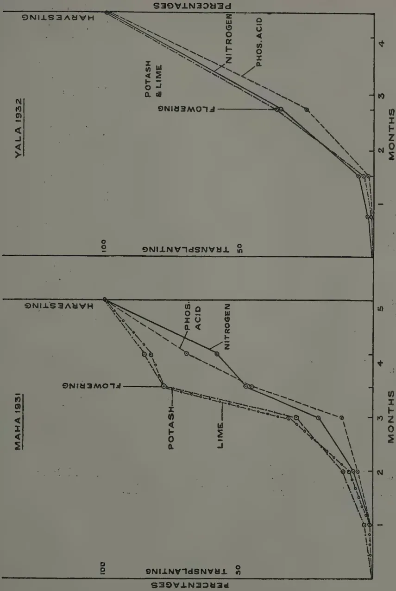

# The Tropical Agriculturist

July, 1933

---

## EDITORIAL

---

### PADDY INVESTIGATIONS IN CEYLON

---

**T**HE Department of Agriculture already has available some results of experiments which have indicated the beneficial effects on local paddy yields obtained from the application of certain manures and of such cultural practices as transplanting, but the reasons for these increased yields have not hitherto been investigated in Ceylon.

The Divisions of Chemistry and of Economic Botany have started in collaboration a further series of three main field experiments with the objects of ascertaining, if possible, what conditions are necessary for the best results to be obtained and of getting answers to certain questions indicated elsewhere.

The first two papers appearing in this issue give details of the first main experiment carried out during the *Maha 1931-32* and *Yala 1932* seasons. The results of manurial treatments on the paddy crop are given, and indicate, so far as they go, first, that phosphoric acid is the limiting factor of paddy yields under the conditions of the experiment and, it may be stated, under Ceylon conditions generally; and secondly, that considerable amounts of plant food constituents are either taken up by the crop or lost from the soil under the irrigation system of paddy cultivation. The need for replacing some at least of the more essential constituents required by this crop is therefore indicated,

1------------------------------------------------

2

The second main experiment is being conducted during the *Maha* 1932-33 and *Yala* 1933 seasons when the efficiency of different systems of cultivation, such as transplanting, broadcasting, etc., with and without manuring are being compared. Furthermore, cost figures are being kept in order to determine, as far as possible, the most economic system to adopt.

In the course of the third experiment to be carried out during the *Maha* 1933-34 and *Yala* 1934 seasons it is proposed to investigate further certain points arising from the results of the first experiment detailed in this issue. One of these points is the question as to the optimum time of application of fertilisers to local paddy crops. There are indications that smaller doses of manure, one of which would be applied just before flowering, may be found to give better results than the application of one large dose at sowing. Another point about which further information is required is the question as to which is the most suitable phosphatic manure to be used for paddy in order to secure maximum efficiency. The results of the two remaining experiments will be awaited with interest and should be of considerable value to paddy growers in Ceylon.

2------------------------------------------------

3

## STUDIES ON PADDY CULTIVATION

### I. THE PADDY CROP IN RELATION TO MANURIAL TREATMENT—A GENERAL DISCUSSION

J. C. HAIGH, PH. D.,

*ECONOMIC BOTANIST,*

AND

A. W. R. JOACHIM, PH. D.,

*AGRICULTURAL CHEMIST,*

*DEPARTMENT OF AGRICULTURE, CEYLON*

**T**HIS paper is the first of a series of studies on paddy cultivation in Ceylon. It has already been determined by experiment that manuring and transplanting of paddy give statistically significant increases of yield, and that the increases are economic, but it has never been asked how and why the increases take place, or whether the particular processes (which in the case of manuring are based on temperate experience) are the best that can be applied. It is the object of the present series of papers to answer some of these questions; to enquire of the plant itself whether the manure it is getting is the best mixture applied at the most favourable time, or whether the methods of cultivation are really responsible for increase in yield, and why.

The method to be adopted is to carry out randomised and replicated field experiments and at the same time to observe, by chemical analysis, what is happening in the plant and in the soil throughout the season. The first of these experiments has just been completed, and is described in the following pages; the more technical chemical data are omitted and appear separately in the second paper of the series. The experiment was the comparatively simple one of testing the effects of green manure (*Tithonia diversifolia*) at the rate of one ton per acre, superphosphate at the rate of one hundredweight per acre, a broad ratio ammonium phosphate at ninety-six and half pounds per acre, and a mixture of green manure and superphosphate at the above rates, against one another and against a control that received no manure. The experiment was carried out at the Experiment Station, Peradeniya during the *Maha* 1931-32

3------------------------------------------------

4

season, in  $\frac{1}{10}$  acre plots with borders, randomised and replicated six times. Unfortunately one replication had to be discarded during the course of the experiment. The trial was carried on during the *Yala* season for the observation of residual effects. At the same time crop and soil samples were taken at all stages of growth and analysed, so as to determine the rate of absorption of fertiliser by the plant and the rate of loss from the soil. As Crowther says (7) "The elementary composition of the growing plant changes markedly with the stage of growth, and the key to many practical problems of manuring is to be found in the study of the uptake of nutrient elements in relation to the stage of development of the crop." The absorption of fertiliser by the crop should be accompanied by corresponding soil losses, but it is necessary to take soil analyses to confirm the assumption. Samples of both soil and plants were taken at various stages of the crop, seven such samples being taken during the *Maha* season and five during *Yala*. At each sampling analyses were made of nitrogen, dry matter, ash, phosphoric acid, potash, lime and silica in the whole plant and in leaf and stem and panicle or grain separately. By "whole plant" is meant the above-ground portions only; a very small portion of the food stays in the roots, and this is returned to the soil before the next crop is sown—the actual soil losses are in the portions of the plant harvested. The soil samples were analysed for total carbon and nitrogen contents, exchangeable bases (total potash, lime and ammonia), soluble phosphoric acid, and hydrogen ion concentration.

The same procedure will be followed in succeeding experiments of the series. The second experiment is now in progress, having been started during *Maha* 1932-33 and continued during *Yala* 1933. It compares the efficiency of transplanting, broadcasting and thinning and broadcasting, in each case with and without manure, giving six treatments which are randomised and replicated five times. The results will give ten effective replications of systems of sowing and fifteen of the efficiency of manuring. At the same time costs are being taken so that the economics of the various methods can be determined. The third experiment of the series will commence in *Maha* 1933-34, and will be an outcome of the experiment here recorded. It will endeavour to determine the relative efficiencies of different phosphatic fertilisers and the optimum time of application of fertilisers generally.

4------------------------------------------------

5

The results of cultivation in the first experiment are given in Tables I and II. From Table I it is seen that the application of a combination of nitrogen and phosphoric acid produces a considerable increase in yield, and that the application of these constituents separately results in a smaller increase. The results are significant, and the Standard Error of Mean Differences of 7.3 per cent. indicates that the odds are 100 to 1 that treatments 1, 2 and 3 are all significantly better than the control, that 1 and 2 are definitely better than 4 and that 1 is definitely better than 3; in other words, the results of previous experiments (5) are confirmed that phosphoric acid is the most important requirement of Ceylon paddy soils, and that the benefit to be derived from its application can be increased by the addition of some form of nitrogen. The results of *Yala* cultivation again show an increased yield where phosphoric acid had been added, but the increases are much less than in the previous crop, and are not significant. The lower yield is accompanied by a less amount of fertiliser constituents in the soil and also, as will be seen from the chemical data, by a lower percentage of these constituents in the plant. It will also be noted that the mean yield per plot of the control is 50 per cent. greater in the *Maha* season than in the *Yala*, but this is at least in part accounted for by the fact that the *Maha* crop is of 6½ months' duration whereas the age of the *Yala* crop is only 4½ months.

It now remains to discuss the general deductions to be drawn from the chemical data, taken in conjunction with the figures tabled above. The figures, supported as they are by previous results and by the results of other workers, demonstrate the value of manuring. " 'The inexhaustible richness of tropical soils' is but seldom found in Nature" and "unless fertilisers are applied to the soil no tropical crop can for long continue to give high yields" (6). It remains to be seen, however, whether the manures applied are in the form best suited for the work required of them, and whether they are being applied at the time when they will confer the greatest benefit on the crop.

It is obvious from the chemical data that (a) except in regard to dry matter, the percentage constituents of the crop generally diminish with advancing crop growth during both *Maha* and *Yala*, and are lower in the latter season than in the former. The percentage of phosphoric acid in the crop at any time is low when compared with that found in some countries, e.g. Hawaii (2), and is due to the low phosphoric acid content of our soils. (b) The composition of the crop does not show marked

5------------------------------------------------

6

variation with treatment, and the effect of the fertiliser appears to be directed more towards increasing crop yield than to modifying its composition. Ammonium phosphate has, however, had the effect of increasing the percentage of phosphoric acid in the crop throughout the *Maha* season. (c) Under Peradeniya conditions the crop at flowering time has absorbed less than 50 per cent. of the nitrogen and phosphoric acid contained at harvest in the *Maha* crop, and on the average only about 30 per cent. of these constituents in the *Yala* crop. The lower *Yala* rates of absorption are probably connected with a shorter pre-flowering period (79 days against 112 days). The application of smaller doses of manure, one of which would be just before flowering, may be found to give better results. (d) When nitrogen is applied as ammonium phosphate it is totally absorbed, whereas when applied as green manure it is assimilated only to the extent of two-thirds. Where no nitrogen is applied the crop has drawn on the store of soil nitrogen, large losses from which are observed as a result of cultivation. (e) Phosphoric acid in the form of soluble fertiliser is absorbed by the crop to a total extent of only 20 to 25 per cent. of the quantity applied. Of the amount absorbed 80 to 85 per cent. is found in the *Maha* crop. In view of the fact that soluble phosphates are readily converted in paddy soils into insoluble compounds with hydrated iron and aluminium oxides, the result is not unexpected. (f) The soil data show that there is no noticeable difference between the water-soluble phosphoric acid contents of phosphoric-acid-treated and non-treated soils. The probability of "solid phase" feeding of phosphoric acid by the paddy plant is suggested. Viewed in the light of the above statements, the use of bonemeal as a fertiliser for paddy would thus appear to offer advantages. (g) The grain at harvest contains on the average 71 per cent. of the nitrogen and 82 per cent. of the phosphoric acid of the whole crop, while the straw has 86 per cent. of the potash and 78 per cent. of the lime. Nitrogen and phosphoric acid are thus the dominant fertilising constituents for grain production. (h) The amounts of fertilising constituents removed annually in the crop per acre are approximately 45 lb. nitrogen, 60 lb. potash, 15 lb. phosphoric acid and 25 lb. lime. The need for replacing these constituents if high yields are to be maintained is apparent. (i) The soil losses in nitrogen and calcium are considerably higher than the amounts of these constituents found in the crop. Denitrification and perhaps leaching of nitrogen, and leaching of calcium are responsible for the losses. The amount of potassium

6------------------------------------------------

7

found in the crop is almost exactly identical with the exchangeable potassium lost from the soil. (j) The exchangeable ammonia content of the soil falls with increasing crop growth. It is generally higher in *Maha* than in *Yala*, and in the latter season does not vary to any appreciable extent from plot to plot. (k) The hydrogen ion concentration of the soil increases slightly on puddling, but diminishes as crop growth advances; the final  $P_H$  is slightly lower than the original figure.

### DISCUSSION

Phosphoric acid is the limiting factor determining crop yield on Ceylon paddy soils. This is apparent from the results and is in accord with previous findings. When all plots are approximately equivalent in phosphoric acid content, nitrogen (or more correctly available nitrogen in the form of replaceable ammonia) becomes the limiting factor. This is seen from both seasons' results—from the *Maha* crop, where the addition of readily available nitrogen gives a significant increase over the addition of phosphoric acid alone, and in the *Yala*, where treatments 1 to 3 started with a small residue of phosphoric acid but with no available nitrogen, and no significant differences were obtained. The higher average yield during *Maha* is probably due to a combination of three factors, the longer period of growth, the higher replaceable ammonia content and the greater available phosphoric acid content of the soil; the influence of variety (*Mawi* was used for *Maha* and *Heenati* for *Yala*) must however not be forgotten.

Previous workers are in conflict over the optimum time of application of fertilisers. Sahasdrabudhe (4) suggests that manure should be applied in three stages—at transplanting, before flowering and in the milk stage, but he appears to be most concerned with the loss of fertiliser by leaching. If that were the main factor one would agree with him, but the rate of availability of the manure must be taken into account, and late application of manure may result in some being still in a non-assimilable form by the time the crop is harvested. On the other hand Kelley and Thompson (1) advocate the early application of manure on the ground that the greater part of the fertiliser constituents are absorbed during the first two-thirds of the plant's life. The figures do not agree with those obtained in the present experiment, and it is obvious that the problem requires further investigation. It has been stated above that only 20 to 25 per cent. of phosphoric acid reappears in the plant. Of that quantity it

7------------------------------------------------

8

is assumed that a small amount becomes available at once and that the rest is locked up in a form which, while not immediately available, becomes so during the life of the plant. The optimum results will be obtained when the immediately-available portion is completely absorbed and the slowly-available portion is made available before harvest; whether those results will be obtained by applying one dose or several doses has yet to be determined and will be the subject of the next experiment.

### REFERENCES

1. 1. KELLEY, W. P. AND THOMPSON, ALICE R.—A Study of the Composition of the Rice Plant.—*Hawaii Agric. Exp. Stn. Bull.* No. 21, 1910.
2. 2. KELLEY, W. P.—The Assimilation of Nitrogen by Rice.—*Hawaii Agric. Exp. Stn. Bull.* No. 24, 1911.
3. 3. SEN, J. N.—A Study in the Assimilation of Nutrients by the Rice Plant.—*Agric. Res. Inst. Pusa, Bull.* No. 65, 1916.
4. 4. SAHASDRABUDHE, D. L. Assimilation of Nutrients by the Rice Plant.—*Bombay Dept. Agric. Bull.* No. 154, 1928.
5. 5. Administration Report of the Director of Agriculture, Ceylon, for 1930, p. D83.
6. 6. VAGELER, P.—An Introduction to Tropical Soils.—Macmillan & Co., 1932.
7. 7. CROWTHER, E. M.—Soil and Fertilisers.—Rept. from Reports of Appd. Chem. Vol. XVII, 1932.

8------------------------------------------------

TABLE IPERADENIYA PADDY STATIONSeason *Maha* 1931-32Manurial Trial on  $1\frac{1}{80}$  Acre Plots

Yields in Pounds

<table border="1">
<thead>
<tr>
<th rowspan="2">Treatment</th>
<th colspan="5">Replications</th>
<th rowspan="2">Total</th>
<th rowspan="2">Mean</th>
<th rowspan="2">Per cent.</th>
<th rowspan="2">Remarks</th>
</tr>
<tr>
<th>a</th>
<th>b</th>
<th>c</th>
<th>d</th>
<th>e</th>
</tr>
</thead>
<tbody>
<tr>
<td>Ammonium phosphate (wide ratio) 96<math>\frac{1}{2}</math> lb./acre</td>
<td>23.1</td>
<td>28.4</td>
<td>26.6</td>
<td>26.0</td>
<td>23.7</td>
<td>127.8</td>
<td>25.6</td>
<td>159.7</td>
<td>Applied after final levelling</td>
</tr>
<tr>
<td>+ Green manure 1 ton/acre</td>
<td>18.2</td>
<td>27.6</td>
<td>22.5</td>
<td>22.4</td>
<td>21.0</td>
<td>111.7</td>
<td>22.3</td>
<td>139.6</td>
<td>Applied 7 days before transplanting</td>
</tr>
<tr>
<td>Superphosphate 1 cwt./acre</td>
<td>21.2</td>
<td>24.2</td>
<td>22.1</td>
<td>20.4</td>
<td>16.7</td>
<td>104.6</td>
<td>20.9</td>
<td>130.7</td>
<td>do</td>
</tr>
<tr>
<td>Green manure 1 ton/acre</td>
<td>21.0</td>
<td>25.2</td>
<td>17.7</td>
<td>16.8</td>
<td>11.4</td>
<td>92.1</td>
<td>18.4</td>
<td>115.1</td>
<td>do</td>
</tr>
<tr>
<td>Control</td>
<td>13.4</td>
<td>25.2</td>
<td>16.0</td>
<td>12.1</td>
<td>13.3</td>
<td>80.0</td>
<td>16.0</td>
<td>100</td>
<td></td>
</tr>
<tr>
<td>Block totals</td>
<td>96.9</td>
<td>130.6</td>
<td>104.9</td>
<td>97.7</td>
<td>86.1</td>
<td>516.2</td>
<td>20.6</td>
<td></td>
<td></td>
</tr>
</tbody>
</table>

Analysis of Variance

<table border="1">
<thead>
<tr>
<th>Degrees of Freedom</th>
<th>Total Variance</th>
<th>Mean Variance</th>
<th>Standard Deviation</th>
<th>log. Standard Deviation</th>
<th>Standard Error of the Difference of Means</th>
</tr>
</thead>
<tbody>
<tr>
<td>Blocks</td>
<td>223.1984</td>
<td></td>
<td></td>
<td></td>
<td></td>
</tr>
<tr>
<td>Treatments</td>
<td>268.1624</td>
<td>67.0406</td>
<td>8.188</td>
<td>2.1027</td>
<td></td>
</tr>
<tr>
<td>Experimental Error</td>
<td>91.5416</td>
<td>5.72135</td>
<td>2.392</td>
<td>0.8722</td>
<td>7.3%</td>
</tr>
<tr>
<td>Total</td>
<td>582.9024</td>
<td></td>
<td></td>
<td>Z = 1.2305</td>
<td></td>
</tr>
</tbody>
</table>

1% point  $n_1 = 4$ ,  $n_2 = 16$  is 0.7814; Z is significant

9------------------------------------------------

10

TABLE II  
PERADENIYA PADDY STATION

Season Yala 1932

Manurial Trial on 100 Acre Plots

Residual Effects

Yields in Pounds

<table border="1">
<thead>
<tr>
<th rowspan="2">Treatment</th>
<th colspan="6">Replications</th>
<th rowspan="2">Total</th>
<th rowspan="2">Mean</th>
<th rowspan="2">Per cent.</th>
<th rowspan="2">Remarks</th>
</tr>
<tr>
<th>a</th>
<th>b</th>
<th>c</th>
<th>d</th>
<th>e</th>
<th></th>
</tr>
</thead>
<tbody>
<tr>
<td>Ammonium phosphate</td>
<td>9.5</td>
<td>9.6</td>
<td>11.8</td>
<td>10.0</td>
<td>12.4</td>
<td></td>
<td>53.3</td>
<td>10.7</td>
<td>103.2</td>
<td></td>
</tr>
<tr>
<td>Superphosphate</td>
<td></td>
<td></td>
<td></td>
<td></td>
<td></td>
<td></td>
<td></td>
<td></td>
<td></td>
<td></td>
</tr>
<tr>
<td>+ Green Manure</td>
<td>9.8</td>
<td>15.0</td>
<td>10.7</td>
<td>9.9</td>
<td>11.1</td>
<td></td>
<td>56.5</td>
<td>11.3</td>
<td>109.3</td>
<td></td>
</tr>
<tr>
<td>Superphosphate</td>
<td>10.4</td>
<td>13.2</td>
<td>11.8</td>
<td>11.4</td>
<td>11.9</td>
<td></td>
<td>58.7</td>
<td>11.7</td>
<td>113.5</td>
<td></td>
</tr>
<tr>
<td>Green manure</td>
<td>9.2</td>
<td>7.1</td>
<td>8.5</td>
<td>7.7</td>
<td>12.2</td>
<td></td>
<td>44.7</td>
<td>8.9</td>
<td>86.5</td>
<td>Treatments appear in the same order as in the <i>Maha</i> records.</td>
</tr>
<tr>
<td>Control</td>
<td>11.1</td>
<td>12.2</td>
<td>10.8</td>
<td>7.3</td>
<td>10.3</td>
<td></td>
<td>51.7</td>
<td>10.3</td>
<td>100</td>
<td>Order of merit 3, 2, 1, 5, 4.</td>
</tr>
<tr>
<td>Block totals</td>
<td>50.0</td>
<td>57.1</td>
<td>53.6</td>
<td>46.3</td>
<td>57.9</td>
<td></td>
<td>264.9</td>
<td>10.6</td>
<td></td>
<td></td>
</tr>
</tbody>
</table>

*Analysis of Variance*

<table border="1">
<thead>
<tr>
<th></th>
<th>Degrees of Freedom</th>
<th>Total Variance</th>
<th>Mean Variance</th>
<th>Standard Deviation</th>
<th>loge Standard Deviation</th>
<th>Standard Error of the Difference of Means</th>
</tr>
</thead>
<tbody>
<tr>
<td>Blocks</td>
<td>4</td>
<td>19.0136</td>
<td></td>
<td></td>
<td></td>
<td></td>
</tr>
<tr>
<td>Treatments</td>
<td>4</td>
<td>23.0816</td>
<td>5.7704</td>
<td>2.402</td>
<td>0.8763</td>
<td></td>
</tr>
<tr>
<td>Experimental Error</td>
<td>16</td>
<td>38.8944</td>
<td>2.4309</td>
<td>1.559</td>
<td>0.4441</td>
<td>9.3%</td>
</tr>
<tr>
<td>Total</td>
<td>24</td>
<td>80.9896</td>
<td></td>
<td></td>
<td>Z = 0.4322</td>
<td></td>
</tr>
</tbody>
</table>

5 % point  $n_1 = 4$ ,  $n_2 = 16$  is 0.5505; Z is not significant

10------------------------------------------------

11

## STUDIES ON PADDY CULTIVATION

### II. THE EFFECT OF MANURES ON THE COMPOSITION OF THE PADDY CROP AND SOIL

A. W. R. JOACHIM, PH. D.,

(AGRICULTURAL CHEMIST)

AND

S. KANDIAH, (DIP. AGR., POONA) AND

D. G. PANDITTESEKERE, (DIP. AGR., POONA),

(ASSISTANTS IN AGRICULTURAL CHEMISTRY)

#### INTRODUCTION

THE preceding article in this issue of *The Tropical Agriculturist* (1) deals with the general results obtained from the first of a series of investigations on the science of paddy cultivation. In this paper the analytical data relative to it will be detailed and discussed. The data are presented in a number of tables, all but two of which are embodied in the paper itself. The latter owing to their size are appended at the end. Only the more relevant analytical results have been shown in the tables. For the rest average figures have been quoted. The investigation was carried out during the *Maha* 1931 and *Yala* 1932 crop seasons i.e. from October 1931 to September 1932, but the analytical work was completed only recently. The crop yield figures are not included in this paper as they are dealt with in the previous one, but they have been utilized in the calculation of the total constituents removed in the crop from the soil at harvest. For the same reason details of design and layout of the experiment have been omitted.

#### PREVIOUS WORK

A number of investigations on the absorption of fertilizing constituents by the paddy plant has been carried out by previous workers, but none of them has been as comprehensive as this claims to be. Thus Kelley and Thompson in Hawaii (2) studied the composition of the plant in relation to fertilizer treatment and the absorption of nutrients by the plant at different stages of growth, but not the soil changes occurring simultaneously.

11------------------------------------------------

12

Sen (3) confined his attention to the investigation of the absorption of nutrients by the plant as grown without manurial treatment under normal conditions in some district in Bengal. The findings of these two workers differed from those of Sahasdrabudhe (4), who more recently investigated the problem in a district of the Bombay Presidency, and the present authors in regard to the rate of assimilation of fertilising constituents. Kelley and Sen found that by flowering time practically all the constituents had been absorbed, while the present investigation reveals the fact that under local conditions, as in Bombay, the paddy plant continues to assimilate its constituents up to the full ripening period and does not cease to do so at flowering. That environmental factors—differences in cultural practice, soil and climatic condition as well as variety of seed sown—are responsible for these apparently contradictory conclusions is borne out by the fact that field experiments (5) confirmed Kelley's as well as Sahasdrabudhe's conclusions. Kelley found that a single application of sulphate of ammonia before sowing was preferable to the application of the same quantity in two or three doses, while Sahasdrabudhe has shown that the best results from manuring paddy are obtained by the application of the fertilizer in three doses, one at transplanting, one before flowering and the third before the milk stage. The point at issue is to be tested out in the field under local conditions and if the chemical data presented in this paper are a guide, an application of fertilizer under Peradeniya conditions just before flowering is likely to be beneficial.

### SCOPE OF PRESENT INVESTIGATION

The objects of the investigation under discussion are:

(1) The comparative study of the intake of nutrients by the paddy plant when grown at Peradeniya during two crop seasons (the *Maha* and the *Yala* extending over a period of about a year and under different manurial treatments and the simultaneous changes occurring in the soil as a result of such environmental and crop variations; (2) to determine the fertilizers most suitable for paddy under local conditions. The latter aspect of the investigation, more particularly from the statistical standpoint, has been dealt with in the previous paper. This investigation is in advance of those of a like nature previously undertaken both in regard to its wider scope as regards crop analyses and the simultaneous study of the soil changes undergone.

12------------------------------------------------

13

## EXPERIMENTAL PROCEDURE

### *Sampling*

The crop samples were obtained by uprooting at random an equal number of culms from each plot treated alike. Larger numbers were taken at the earlier samplings. Only the above-ground portion of the crop was taken for analysis, as the main object in view was the determination of the amounts of fertilizing constituents removed from the soil by the crop. In the later stages of growth separate analyses were made of the different parts of the plant. The soil samples were obtained from a mixture of six-inch soil borings, two from each replication. The difficulty experienced in securing the samples when the soil was very soft was overcome by placing the hand under the mouth of the borer before drawing it up.

### *Methods of Analysis*

The samples were analysed for the constituents stated below and by methods indicated against each.

*Crop.*—Dry matter on whole plant, nitrogen by the Kjeldhal method, total ash, silica, potash and lime by the ordinary analytical methods, and phosphoric acid by Lorenz's method.

*Soil.*—Carbon by Robinson's method, hydrogen ion ( $P_H$ ) by the quinhydron electrode, replaceable ammonia by the Robinson McLean method, total replaceable bases by a combination of Bray and Wilhite's and Rice Williams' methods, replaceable lime by the ordinary method and replaceable potassium by Milne's cobalti-nitrite method. Acknowledgment is here made to Dr. M. L. M. Salgado for advice on methods of replaceable base determinations.

## SOIL

The soil of the area on which these experiments were conducted is a medium loam, fairly well supplied with nitrogen and available potash, but, like most Ceylon soils, poor in available phosphoric acid as could be seen from Table I below. It has probably been under paddy cultivation, often times carrying two crops a year, for several decades and there is little likelihood of its having received any fertilizer treatment during the whole of this period, barring the last few years.

13------------------------------------------------

14TABLE I

*Average Composition of Paddy Soils at Gannoruwa, Peradeniya*

<table>
<thead>
<tr>
<th colspan="3">Mechanical Composition</th>
<th>Per cent.</th>
</tr>
</thead>
<tbody>
<tr>
<td>Moisture</td>
<td>...</td>
<td>...</td>
<td>4.0</td>
</tr>
<tr>
<td>Loss on ignition</td>
<td>...</td>
<td>...</td>
<td>7.4</td>
</tr>
<tr>
<td>Gravel</td>
<td>...</td>
<td>...</td>
<td>6.0</td>
</tr>
<tr>
<td>Coarse sand</td>
<td>...</td>
<td>...</td>
<td>17.1</td>
</tr>
<tr>
<td>Fine sand</td>
<td>...</td>
<td>...</td>
<td>33.6</td>
</tr>
<tr>
<td>Silt</td>
<td>...</td>
<td>...</td>
<td>13.6</td>
</tr>
<tr>
<td>Clay</td>
<td>...</td>
<td>...</td>
<td>18.3</td>
</tr>
<tr>
<td colspan="3"></td>
<td>
100.00
</td>
</tr>
</tbody>
</table>

<table>
<thead>
<tr>
<th colspan="3">Chemical Composition</th>
<th>Per cent.</th>
</tr>
</thead>
<tbody>
<tr>
<td>Nitrogen</td>
<td>...</td>
<td>...</td>
<td>.155</td>
</tr>
<tr>
<td>Available potash</td>
<td>...</td>
<td>...</td>
<td>.015</td>
</tr>
<tr>
<td>Available phos. acid</td>
<td>...</td>
<td>...</td>
<td>.008</td>
</tr>
<tr>
<td colspan="3">
</td>
<td></td>
</tr>
<tr>
<td>Reaction ( <math>P_{IT}</math> )</td>
<td>...</td>
<td>...</td>
<td>6.5</td>
</tr>
</tbody>
</table>

### CROP DATA AND DISCUSSION

The results of the crop analyses are expressed in percentages of dry matter at 100°C. The total constituents in the crop material at each sampling have been calculated in grams per ten plants. In the tables the letter *W* stands for whole plant, *L* for leaf and stem, *P* for panicle, *S* for straw, *G* for grain and *C* for chaff. The data will be examined for each season in turn, the composition of the crop and the total constituents absorbed being separately considered. The combined results will then be discussed. Some of the results are graphically represented in Plates I, II and III.

### MAHA 1931

#### (a) Composition of the Crop

The analytical composition of the above-ground part of the crop at the more important stages of its growth is shown for convenience of reference in a single table (Table II) at the end of the paper. Table III shows the average composition of the crop right through growth. The observations made are generally based on the average data of all the treatments.

14------------------------------------------------

The figure consists of two line graphs, one for 1931 and one for 1932, showing the percentage of dry matter for four nutrients: Potash, Nitrogen, Lime, and Phosphoric Acid. The x-axis represents time in months (0 to 4), and the y-axis represents the percentage of dry matter (0 to 3). Key stages are marked: Transplanting, Flowering, and Harvesting.

**MAHA 1931**

<table border="1">
<thead>
<tr>
<th>Month</th>
<th>Potash (%)</th>
<th>Nitrogen (%)</th>
<th>Lime (%)</th>
<th>Phosphoric Acid (%)</th>
</tr>
</thead>
<tbody>
<tr>
<td>0 (Transplanting)</td>
<td>0</td>
<td>0</td>
<td>0</td>
<td>0</td>
</tr>
<tr>
<td>1</td>
<td>2.5</td>
<td>1.5</td>
<td>0.5</td>
<td>0.5</td>
</tr>
<tr>
<td>2</td>
<td>2.8</td>
<td>2.0</td>
<td>0.8</td>
<td>0.8</td>
</tr>
<tr>
<td>3 (Flowering)</td>
<td>2.8</td>
<td>2.5</td>
<td>1.0</td>
<td>1.0</td>
</tr>
<tr>
<td>4 (Harvesting)</td>
<td>2.8</td>
<td>2.8</td>
<td>1.0</td>
<td>1.0</td>
</tr>
</tbody>
</table>

**YALA 1932**

<table border="1">
<thead>
<tr>
<th>Month</th>
<th>Potash (%)</th>
<th>Nitrogen (%)</th>
<th>Lime (%)</th>
<th>Phosphoric Acid (%)</th>
</tr>
</thead>
<tbody>
<tr>
<td>0 (Transplanting)</td>
<td>0</td>
<td>0</td>
<td>0</td>
<td>0</td>
</tr>
<tr>
<td>1</td>
<td>2.0</td>
<td>1.0</td>
<td>0.5</td>
<td>0.5</td>
</tr>
<tr>
<td>2</td>
<td>2.5</td>
<td>1.5</td>
<td>0.8</td>
<td>0.8</td>
</tr>
<tr>
<td>3 (Flowering)</td>
<td>2.8</td>
<td>2.0</td>
<td>1.0</td>
<td>1.0</td>
</tr>
<tr>
<td>4 (Harvesting)</td>
<td>2.8</td>
<td>2.8</td>
<td>1.0</td>
<td>1.0</td>
</tr>
</tbody>
</table>

Plate I.

Showing average composition of the paddy crop.

15------------------------------------------------

15

TABLE III  
*Average Percentage Constituents in Whole Plant  
 and Parts of Plant  
 Maha 1931*

<table border="1">
<thead>
<tr>
<th rowspan="2">Constituent</th>
<th rowspan="2">Transplanting (7.10.31)</th>
<th rowspan="2">One month after (12.11.31)</th>
<th rowspan="2">Two months after (11.12.31)</th>
<th rowspan="2">Three months after (11.1.32)</th>
<th colspan="3">Flowering (28.1.32)</th>
<th colspan="3">Half-ripe (17.2.32)</th>
<th colspan="3">Harvesting (22.3.32)</th>
</tr>
<tr>
<th>W</th>
<th>L</th>
<th>P</th>
<th>W</th>
<th>L</th>
<th>P</th>
<th>W</th>
<th>S</th>
<th>G</th>
<th>C</th>
</tr>
</thead>
<tbody>
<tr>
<td>Nitrogen</td>
<td>2.49</td>
<td>2.15</td>
<td>1.81</td>
<td>1.29</td>
<td>0.87</td>
<td>0.87</td>
<td>0.90</td>
<td>0.74</td>
<td>0.51</td>
<td>1.01</td>
<td>0.85</td>
<td>0.40</td>
<td>1.19</td>
<td>0.65</td>
</tr>
<tr>
<td>Dry Matter</td>
<td>20.0</td>
<td>17.9</td>
<td>16.9</td>
<td>25.6</td>
<td>30.2</td>
<td>28.9</td>
<td>42.5</td>
<td>37.6</td>
<td>27.8</td>
<td>65.0</td>
<td>55.4</td>
<td>35.7</td>
<td>87.3</td>
<td>84.3</td>
</tr>
<tr>
<td>Ash</td>
<td>16.4</td>
<td>14.8</td>
<td>14.9</td>
<td>14.3</td>
<td>12.6</td>
<td>12.7</td>
<td>11.8</td>
<td>11.6</td>
<td>14.2</td>
<td>8.50</td>
<td>12.0</td>
<td>17.9</td>
<td>7.40</td>
<td>17.5</td>
</tr>
<tr>
<td>Phos. Acid</td>
<td>0.33</td>
<td>0.35</td>
<td>0.47</td>
<td>0.29</td>
<td>0.29</td>
<td>0.30</td>
<td>0.29</td>
<td>0.31</td>
<td>0.13</td>
<td>0.54</td>
<td>0.30</td>
<td>0.07</td>
<td>0.48</td>
<td>0.23</td>
</tr>
<tr>
<td>Potash</td>
<td>2.46</td>
<td>2.67</td>
<td>2.68</td>
<td>2.06</td>
<td>1.28</td>
<td>1.43</td>
<td>0.39</td>
<td>0.95</td>
<td>1.43</td>
<td>0.38</td>
<td>0.80</td>
<td>1.47</td>
<td>0.30</td>
<td>0.58</td>
</tr>
<tr>
<td>Lime</td>
<td>1.41</td>
<td>1.11</td>
<td>1.12</td>
<td>1.07</td>
<td>0.61</td>
<td>0.67</td>
<td>0.25</td>
<td>0.41</td>
<td>0.65</td>
<td>0.12</td>
<td>0.39</td>
<td>0.63</td>
<td>0.22</td>
<td>0.21</td>
</tr>
<tr>
<td>Silica</td>
<td>9.40</td>
<td>8.10</td>
<td>9.00</td>
<td>9.10</td>
<td>9.30</td>
<td>9.20</td>
<td>9.80</td>
<td>8.50</td>
<td>9.80</td>
<td>6.90</td>
<td>9.00</td>
<td>13.2</td>
<td>5.70</td>
<td>15.6</td>
</tr>
</tbody>
</table>

An examination of these tables and of the complete data indicates that:

(1) The average percentage constituents of the above-ground portion of the crop generally fall or remain constant with increasing age, except in regard to dry matter.

(2) The fall is greatest with nitrogen (from 2.49 to .85 per cent.) and potash (2.46 to .80 per cent.) Phosphoric acid remains fairly constant, more particularly towards the end of the growing period. Lime shows a fairly appreciable fall, but the ash contents show only a slight decline. Silica percentages remain constant.

(3) The percentages of phosphoric acid in the crop are low compared with those found in some other countries, e.g. Hawaii (2). This is correlated with a poor phosphoric acid content in the soil.

(4) In general no very marked differences are observed between the composition of the crop from the treated and untreated plots, especially at the later stages of growth. The effect of the fertilisers would appear to be directed more towards increasing crop yield than in modifying its composition.

(5) In regard to phosphoric acid however, the effect of ammonium phosphate is distinct; the crop from the plots treated with this fertiliser containing highest percentages of the constituent throughout growth. This may be attributed to the

16------------------------------------------------

16

comparatively large quantity of phosphoric acid so applied. The crops from the control and green manure plots show lowest phosphoric acid contents. Phosphoric acid is apparently the limiting factor of crop yield under local conditions.

(6) The potash contents of the differently treated crops are very variable and so are the lime contents in the early stages of growth. Towards the end of the growing period, there are no differences in the lime percentages of the crop from the different plots.

(7) At flowering, the leaf and stem and panicle contain about equal proportions of nitrogen and phosphoric acid. The potash and lime contents are however much higher in the leaf and stem than in the panicle as in the later growth stages.

(8) At the half-ripe stage, the panicle contains much higher percentages of nitrogen, phosphoric acid and dry matter than the leaf and stem. The reverse is the case in regard to potash and lime. There is, therefore, a steady transference of nitrogen and phosphoric acid from the rest of the plant to the grain, while the potash and lime are concentrated in the vegetative portions of the plant.

(9) At harvest, as would be expected, the nitrogen and phosphoric acid contents are highest in the grain and least in the straw. The opposite is the case with the other two constituents.

(10) At this stage, the highest nitrogen percentage in both grain and straw is found in the crop from the control and the green manure plots, while phosphoric acid is at a maximum in both grain and straw in the ammonium phosphate treated crop. The highest potash and lime contents are in the crop from the superphosphate plots.

#### *(b) Total Crop Constituents*

In Table IV are set out the average amounts of fertilising constituents in grams per ten plants at the different stages of growth. Table V shows the average percentage rates of absorption of nutrients at these growth stages as compared with the average amounts of the constituents found in the crop at harvest. The percentage distribution of the nutrients in the different parts of the crop at the later stages of growth are also presented in this table.

17------------------------------------------------

17

TABLE IV  
Average Total Constituents in Gms per Ten Plants  
Maha 1931

<table border="1">
<thead>
<tr>
<th rowspan="2">Constituent</th>
<th rowspan="2">Transplanting</th>
<th rowspan="2">One month after</th>
<th rowspan="2">Two months after</th>
<th rowspan="2">Three months after</th>
<th colspan="3">Flowering</th>
<th colspan="3">Half-ripe</th>
<th colspan="3">Harvesting</th>
</tr>
<tr>
<th>W</th>
<th>L</th>
<th>P</th>
<th>W</th>
<th>L</th>
<th>P</th>
<th>W</th>
<th>S</th>
<th>G</th>
<th>C</th>
</tr>
</thead>
<tbody>
<tr>
<td>Nitrogen</td>
<td>0.02</td>
<td>0.04</td>
<td>0.18</td>
<td>0.48</td>
<td>1.24</td>
<td>1.06</td>
<td>0.19</td>
<td>1.51</td>
<td>0.57</td>
<td>0.95</td>
<td>2.53</td>
<td>0.55</td>
<td>2.00</td>
<td>0.05</td>
</tr>
<tr>
<td>Dry Matter</td>
<td>0.85</td>
<td>2.05</td>
<td>9.50</td>
<td>36.8</td>
<td>144</td>
<td>124</td>
<td>20.8</td>
<td>205</td>
<td>112</td>
<td>53.7</td>
<td>299</td>
<td>124</td>
<td>167</td>
<td>7.00</td>
</tr>
<tr>
<td>Ash</td>
<td>0.14</td>
<td>0.30</td>
<td>1.56</td>
<td>5.23</td>
<td>18.2</td>
<td>15.7</td>
<td>2.50</td>
<td>23.8</td>
<td>15.9</td>
<td>8.00</td>
<td>35.9</td>
<td>22.2</td>
<td>12.5</td>
<td>1.22</td>
</tr>
<tr>
<td>Phos. Acid</td>
<td>.003</td>
<td>0.01</td>
<td>0.06</td>
<td>0.11</td>
<td>0.42</td>
<td>0.36</td>
<td>0.06</td>
<td>0.64</td>
<td>0.14</td>
<td>0.50</td>
<td>0.92</td>
<td>0.08</td>
<td>0.82</td>
<td>0.02</td>
</tr>
<tr>
<td>Potash</td>
<td>0.02</td>
<td>0.05</td>
<td>0.26</td>
<td>0.76</td>
<td>1.85</td>
<td>1.77</td>
<td>0.08</td>
<td>2.02</td>
<td>1.66</td>
<td>0.36</td>
<td>2.37</td>
<td>1.82</td>
<td>0.51</td>
<td>0.04</td>
</tr>
<tr>
<td>Lime</td>
<td>0.01</td>
<td>0.02</td>
<td>0.11</td>
<td>0.89</td>
<td>0.89</td>
<td>0.83</td>
<td>0.06</td>
<td>0.96</td>
<td>0.72</td>
<td>0.24</td>
<td>1.15</td>
<td>0.77</td>
<td>0.37</td>
<td>0.01</td>
</tr>
<tr>
<td>Silica</td>
<td>0.08</td>
<td>0.17</td>
<td>1.80</td>
<td>3.40</td>
<td>13.4</td>
<td>11.3</td>
<td>2.10</td>
<td>17.4</td>
<td>11.0</td>
<td>6.40</td>
<td>26.9</td>
<td>16.3</td>
<td>9.55</td>
<td>1.10</td>
</tr>
</tbody>
</table>

TABLE V  
Average Percentage Rates of Absorption by Whole Plant  
and Parts of Plant  
Maha 1931

<table border="1">
<thead>
<tr>
<th rowspan="2">Constituent</th>
<th rowspan="2">One month after</th>
<th rowspan="2">Two months after</th>
<th rowspan="2">Three months after</th>
<th colspan="3">Flowering</th>
<th colspan="3">Half-ripe</th>
<th colspan="3">Harvesting</th>
</tr>
<tr>
<th>L</th>
<th>P</th>
<th>L</th>
<th>P</th>
<th>S</th>
<th>G</th>
<th>C</th>
</tr>
</thead>
<tbody>
<tr>
<td>Nitrogen</td>
<td>0.9</td>
<td>7.3</td>
<td>20.1</td>
<td>47.8</td>
<td>58.3</td>
<td>—</td>
<td>100</td>
<td>—</td>
<td>—</td>
<td>—</td>
<td>—</td>
<td>—</td>
</tr>
<tr>
<td></td>
<td></td>
<td></td>
<td></td>
<td>85.0</td>
<td>15.0</td>
<td>37.5</td>
<td>62.5</td>
<td>21.2</td>
<td>77.0</td>
<td>1.8</td>
<td>—</td>
<td>—</td>
</tr>
<tr>
<td>Dry Matter</td>
<td>0.7</td>
<td>3.2</td>
<td>12.3</td>
<td>48.2</td>
<td>68.3</td>
<td>—</td>
<td>100</td>
<td>—</td>
<td>—</td>
<td>—</td>
<td>—</td>
<td>—</td>
</tr>
<tr>
<td></td>
<td></td>
<td></td>
<td></td>
<td>85.7</td>
<td>14.3</td>
<td>54.4</td>
<td>45.6</td>
<td>41.6</td>
<td>56.0</td>
<td>2.4</td>
<td>—</td>
<td>—</td>
</tr>
<tr>
<td>Ash</td>
<td>0.8</td>
<td>4.3</td>
<td>14.7</td>
<td>50.6</td>
<td>66.4</td>
<td>—</td>
<td>100</td>
<td>—</td>
<td>—</td>
<td>—</td>
<td>—</td>
<td>—</td>
</tr>
<tr>
<td></td>
<td></td>
<td></td>
<td></td>
<td>86.3</td>
<td>13.5</td>
<td>66.4</td>
<td>33.6</td>
<td>61.8</td>
<td>34.7</td>
<td>3.5</td>
<td>—</td>
<td>—</td>
</tr>
<tr>
<td>Phos. Acid</td>
<td>0.8</td>
<td>6.8</td>
<td>11.9</td>
<td>45.7</td>
<td>69.6</td>
<td>—</td>
<td>100</td>
<td>—</td>
<td>—</td>
<td>—</td>
<td>—</td>
<td>—</td>
</tr>
<tr>
<td></td>
<td></td>
<td></td>
<td></td>
<td>85.7</td>
<td>14.3</td>
<td>21.9</td>
<td>78.1</td>
<td>8.8</td>
<td>89.3</td>
<td>1.8</td>
<td>—</td>
<td>—</td>
</tr>
<tr>
<td>Potash</td>
<td>2.5</td>
<td>10.8</td>
<td>31.9</td>
<td>78.0</td>
<td>85.2</td>
<td>—</td>
<td>100</td>
<td>—</td>
<td>—</td>
<td>—</td>
<td>—</td>
<td>—</td>
</tr>
<tr>
<td></td>
<td></td>
<td></td>
<td></td>
<td>95.6</td>
<td>4.4</td>
<td>82.1</td>
<td>17.9</td>
<td>77.2</td>
<td>21.1</td>
<td>1.7</td>
<td>—</td>
<td>—</td>
</tr>
<tr>
<td>Lime</td>
<td>2.0</td>
<td>9.1</td>
<td>34.1</td>
<td>77.4</td>
<td>83.4</td>
<td>—</td>
<td>100</td>
<td>—</td>
<td>—</td>
<td>—</td>
<td>—</td>
<td>—</td>
</tr>
<tr>
<td></td>
<td></td>
<td></td>
<td></td>
<td>93.6</td>
<td>6.4</td>
<td>85.8</td>
<td>14.2</td>
<td>66.8</td>
<td>32.0</td>
<td>1.2</td>
<td>—</td>
<td>—</td>
</tr>
<tr>
<td>Silica</td>
<td>0.6</td>
<td>4.8</td>
<td>12.5</td>
<td>49.7</td>
<td>64.7</td>
<td>—</td>
<td>100</td>
<td>—</td>
<td>—</td>
<td>—</td>
<td>—</td>
<td>—</td>
</tr>
<tr>
<td></td>
<td></td>
<td></td>
<td></td>
<td>88.4</td>
<td>11.6</td>
<td>63.2</td>
<td>36.8</td>
<td>60.6</td>
<td>35.3</td>
<td>4.1</td>
<td>—</td>
<td>—</td>
</tr>
</tbody>
</table>

The following observations are made from a study of the data:

(1) At flowering, on the average only about 48 per cent. of the nitrogen and dry matter, 51 per cent. of the ash and 46 per cent. of the phosphoric acid found at harvest have been taken up by the crop. Of these amounts, 85 per cent. is in the stem and leaf and the balance in the panicle. On the other hand 78

18------------------------------------------------

MAHA 1931

YALA 1932

The figure consists of two side-by-side line graphs. The left graph is for 'MAHA 1931' and the right graph is for 'YALA 1932'. Both graphs have a vertical axis labeled 'PERCENTAGES' with markings at 50 and 100. The horizontal axis is labeled 'MONTHS' with markings from 1 to 5. Four data series are plotted in each graph: POTASH (solid line with open circles), LIME (dashed line with open circles), PHOS. ACID (solid line with open circles), and NITROGEN (dashed line with open circles). In both graphs, the absorption rates for all nutrients increase over time. The POTASH and LIME curves are the highest, reaching 100% at the 'FLOWERING' stage (around month 3.5). The PHOS. ACID curve reaches 100% at the 'HARVESTING' stage (around month 5). The NITROGEN curve is the lowest, reaching 100% at the 'HARVESTING' stage (around month 5). The YALA 1932 graph shows slightly higher absorption rates for all nutrients compared to the MAHA 1931 graph.

Plate II.

Showing percentage rates of absorption of nutrients by the crop.

19------------------------------------------------

18

per cent. of the potash and lime have been absorbed at this period, of which 95 per cent. is in the stem and leaf. The comparatively low percentages of nitrogen and phosphoric acid assimilated by the crop at flowering under local conditions are, as already mentioned, in accordance with those found by Sahasdrabudhe (4). The application of fertilisers to paddy in more than one dose may be found to be advantageous.

(2) At harvest the grain contains 56 per cent. of the dry matter, 77 per cent. of the nitrogen, 89 per cent. of the phosphoric acid, 21 per cent. of the potash and 32 per cent. of the lime of the above-ground part of the plant. The straw contains 42 per cent. of the dry matter, 21 per cent. of the nitrogen, only 9 per cent. of the phosphoric acid, 77 per cent. of the potash and 67 per cent. of the lime. These results are generally in agreement with those found by previous workers.

(3) The largest amounts of nitrogen and phosphoric acid at harvest are found in the crop from the ammonium phosphate plots; of potash and lime in that from the superphosphate plots. The smallest amounts of all constituents are found in the control crop. This is illustrated in Table VI overleaf.

(4) The crop from the ammonium phosphate treated plots show right through the growing period highest amounts of phosphoric acid. This would give some clue to the efficiency of ammonium phosphate as a quick-acting fertiliser for paddy.

(5) The average amounts of constituents removed per acre in the above-ground *Maha* crop, based on actual yield data from the plots and the analysis of the crop at harvest are: nitrogen 30.6 lb., phosphoric acid 10.6 lb., potash 38.3 lb. and lime 17.9 lb. The details are furnished in Table VI.

20------------------------------------------------

19TABLE VI

*Total Constituents in Crop in Lb. per Acre  
Maha 1931*

<table border="1">
<thead>
<tr>
<th>Treatment</th>
<th>Part of crop</th>
<th>Nitrogen</th>
<th>Phos. Acid</th>
<th>Potash</th>
<th>Lime</th>
</tr>
</thead>
<tbody>
<tr>
<td rowspan="4">Green Manure</td>
<td>Grain</td>
<td>19.5</td>
<td>7.1</td>
<td>4.6</td>
<td>3.6</td>
</tr>
<tr>
<td>Straw</td>
<td>10.4</td>
<td>1.1</td>
<td>34.7</td>
<td>13.9</td>
</tr>
<tr>
<td>Chaff</td>
<td>0.4</td>
<td>0.2</td>
<td>0.4</td>
<td>0.2</td>
</tr>
<tr>
<td>Total</td>
<td>30.3</td>
<td>8.4</td>
<td>39.7</td>
<td>17.7</td>
</tr>
<tr>
<td rowspan="4">Superphosphate</td>
<td>Grain</td>
<td>21.5</td>
<td>9.3</td>
<td>6.1</td>
<td>4.2</td>
</tr>
<tr>
<td>Straw</td>
<td>9.0</td>
<td>1.5</td>
<td>32.7</td>
<td>15.3</td>
</tr>
<tr>
<td>Chaff</td>
<td>0.4</td>
<td>0.1</td>
<td>0.3</td>
<td>0.1</td>
</tr>
<tr>
<td>Total</td>
<td>30.9</td>
<td>10.9</td>
<td>39.1</td>
<td>19.6</td>
</tr>
<tr>
<td rowspan="4">Ammonium Phosphate</td>
<td>Grain</td>
<td>26.8</td>
<td>12.7</td>
<td>6.8</td>
<td>5.0</td>
</tr>
<tr>
<td>Straw</td>
<td>8.5</td>
<td>1.9</td>
<td>32.7</td>
<td>13.9</td>
</tr>
<tr>
<td>Chaff</td>
<td>0.7</td>
<td>0.2</td>
<td>1.6</td>
<td>0.2</td>
</tr>
<tr>
<td>Total</td>
<td>36.0</td>
<td>14.8</td>
<td>40.1</td>
<td>19.1</td>
</tr>
<tr>
<td rowspan="4">Green Manure + Superphos.</td>
<td>Grain</td>
<td>23.2</td>
<td>9.7</td>
<td>6.6</td>
<td>4.8</td>
</tr>
<tr>
<td>Straw</td>
<td>7.5</td>
<td>1.7</td>
<td>35.4</td>
<td>13.7</td>
</tr>
<tr>
<td>Chaff</td>
<td>0.7</td>
<td>0.3</td>
<td>0.6</td>
<td>0.2</td>
</tr>
<tr>
<td>Total</td>
<td>31.4</td>
<td>11.7</td>
<td>42.6</td>
<td>18.7</td>
</tr>
<tr>
<td rowspan="4">Control</td>
<td>Grain</td>
<td>16.2</td>
<td>5.7</td>
<td>3.8</td>
<td>2.6</td>
</tr>
<tr>
<td>Straw</td>
<td>7.7</td>
<td>1.2</td>
<td>25.9</td>
<td>11.8</td>
</tr>
<tr>
<td>Chaff</td>
<td>0.5</td>
<td>0.2</td>
<td>0.4</td>
<td>0.2</td>
</tr>
<tr>
<td>Total</td>
<td>24.4</td>
<td>7.1</td>
<td>30.1</td>
<td>14.6</td>
</tr>
<tr>
<td colspan="2"><i>Average</i></td>
<td><b>30.6</b></td>
<td><b>10.6</b></td>
<td><b>38.3</b></td>
<td><b>17.9</b></td>
</tr>
</tbody>
</table>

The corresponding analytical data obtained during the subsequent *Yala* season are presented in Tables VII at the end of the paper, and VIII, IX and X in the text. Table XI shows the total constituents contained in the *Yala* crop at harvest calculated in pounds per acre.

TABLE VIII

*Average Percentage Constituents in Whole Plant  
and Parts of Plant  
Yala 1932*

<table border="1">
<thead>
<tr>
<th rowspan="2">Constituent</th>
<th rowspan="2">Transplanting (9.5.32)</th>
<th rowspan="2">Three weeks after (30.5.32)</th>
<th rowspan="2">Six weeks after (21.5.32)</th>
<th colspan="3">Flowering (28.7.32)</th>
<th colspan="4">Harvesting (12.9.32)</th>
</tr>
<tr>
<th>W</th>
<th>L</th>
<th>P</th>
<th>W</th>
<th>S</th>
<th>G</th>
<th>C</th>
</tr>
</thead>
<tbody>
<tr>
<td>Nitrogen</td>
<td>1.40</td>
<td>1.66</td>
<td>1.64</td>
<td>0.90</td>
<td>0.89</td>
<td>0.96</td>
<td>0.71</td>
<td>0.31</td>
<td>1.27</td>
<td>0.54</td>
</tr>
<tr>
<td>Dry Matter</td>
<td>19.7</td>
<td>18.2</td>
<td>19.1</td>
<td>29.4</td>
<td>27.8</td>
<td>44.3</td>
<td>47.5</td>
<td>32.9</td>
<td>81.1</td>
<td>68.5</td>
</tr>
<tr>
<td>Ash</td>
<td>17.3</td>
<td>16.5</td>
<td>15.8</td>
<td>14.4</td>
<td>14.6</td>
<td>13.0</td>
<td>15.0</td>
<td>20.6</td>
<td>6.76</td>
<td>18.4</td>
</tr>
<tr>
<td>Phos. Acid</td>
<td>0.43</td>
<td>0.26</td>
<td>0.26</td>
<td>0.22</td>
<td>0.22</td>
<td>0.33</td>
<td>0.22</td>
<td>0.08</td>
<td>0.41</td>
<td>0.37</td>
</tr>
<tr>
<td>Potash</td>
<td>2.40</td>
<td>2.23</td>
<td>2.11</td>
<td>1.59</td>
<td>1.81</td>
<td>0.35</td>
<td>1.18</td>
<td>1.86</td>
<td>0.21</td>
<td>0.53</td>
</tr>
<tr>
<td>Lime</td>
<td>0.64</td>
<td>0.62</td>
<td>0.62</td>
<td>0.53</td>
<td>0.58</td>
<td>0.24</td>
<td>0.40</td>
<td>0.59</td>
<td>0.13</td>
<td>0.20</td>
</tr>
</tbody>
</table>

21------------------------------------------------

20

YALA 1932

(a) Composition of Crop

The data contained in Tables VII and VIII point to the following conclusions:

(1) The average percentage constituents of the crop at the different stages of growth are generally lower than those of the *Maha*, especially in regard to nitrogen and phosphoric acid. This corresponds with generally smaller amounts of available soil constituents during the *Yala*.

(2) The observations from the *Maha* data are confirmed both in regard to the relative rates of fall in percentage composition of individual constituents with age, and the effects of the treatments on the composition of the crop.

(3) The average phosphoric acid content of the crop remains fairly constant throughout the *Yala* season and is only slightly lower than that of the *Maha* crop towards the end of its growth. This would appear to point to the fixation of soluble phosphoric acid in the paddy soil and its low availability to the crop.

(4) In general there are but inappreciable differences between the composition of the crop from the treated and control plots during the *Yala*. This would be expected from the non-significance of the crop yield differences obtained during this season.

(5) The results of the *Maha* crop are generally confirmed in regard to the relative proportions of constituents found in the different parts of the plant. These also hold good as to the percentages of the different constituents in differently treated plots except in regard to nitrogen.

TABLE IX

*Average Total Constituents in Gms per Ten Plants  
Yala 1932*

<table border="1">
<thead>
<tr>
<th rowspan="2">Constituent</th>
<th rowspan="2">Transplanting</th>
<th rowspan="2">Three weeks after</th>
<th rowspan="2">Six weeks after</th>
<th colspan="2">Flowering</th>
<th rowspan="2">P</th>
<th colspan="4">Harvesting</th>
</tr>
<tr>
<th>W</th>
<th>L</th>
<th>W.</th>
<th>S</th>
<th>G</th>
<th>C</th>
</tr>
</thead>
<tbody>
<tr>
<td>Nitrogen</td>
<td>0.01</td>
<td>0.02</td>
<td>0.04</td>
<td>0.23</td>
<td>0.19</td>
<td>0.04</td>
<td>0.66</td>
<td>0.16</td>
<td>0.48</td>
<td>0.02</td>
</tr>
<tr>
<td>Dry Matter</td>
<td>0.95</td>
<td>0.77</td>
<td>2.19</td>
<td>25.2</td>
<td>21.5</td>
<td>3.70</td>
<td>95.81</td>
<td>55.1</td>
<td>38.5</td>
<td>2.16</td>
</tr>
<tr>
<td>Ash</td>
<td>0.16</td>
<td>0.14</td>
<td>3.47</td>
<td>3.61</td>
<td>3.13</td>
<td>0.48</td>
<td>14.5</td>
<td>11.5</td>
<td>2.60</td>
<td>0.38</td>
</tr>
<tr>
<td>Phos. Acid</td>
<td>.004</td>
<td>.002</td>
<td>0.01</td>
<td>0.06</td>
<td>0.04</td>
<td>0.02</td>
<td>0.21</td>
<td>0.05</td>
<td>0.16</td>
<td>0.01</td>
</tr>
<tr>
<td>Potash</td>
<td>0.03</td>
<td>0.02</td>
<td>0.05</td>
<td>0.40</td>
<td>0.39</td>
<td>0.01</td>
<td>1.13</td>
<td>1.04</td>
<td>0.08</td>
<td>0.01</td>
</tr>
<tr>
<td>Lime</td>
<td>0.01</td>
<td>.004</td>
<td>0.01</td>
<td>0.13</td>
<td>0.12</td>
<td>0.01</td>
<td>0.38</td>
<td>0.33</td>
<td>0.05</td>
<td>.004</td>
</tr>
</tbody>
</table>

22------------------------------------------------

21TABLE X

Average Percentage Rates of Absorption by Whole Plant  
and Parts of Plant

Yala 1932

<table border="1">
<thead>
<tr>
<th rowspan="2">Constituent</th>
<th rowspan="2">Three weeks after</th>
<th rowspan="2">Six weeks after</th>
<th colspan="3">Flowering</th>
<th colspan="2">Harvesting</th>
</tr>
<tr>
<th>L</th>
<th>P</th>
<th>S</th>
<th>G</th>
<th>C</th>
</tr>
</thead>
<tbody>
<tr>
<td></td>
<td></td>
<td></td>
<td>34.3</td>
<td></td>
<td>100</td>
<td></td>
<td></td>
</tr>
<tr>
<td>Nitrogen</td>
<td>2.30</td>
<td>5.40</td>
<td>84.6</td>
<td>15.4</td>
<td>24.5</td>
<td>72.2</td>
<td>3.30</td>
</tr>
<tr>
<td></td>
<td></td>
<td></td>
<td>26.1</td>
<td></td>
<td>100</td>
<td></td>
<td></td>
</tr>
<tr>
<td>Dry Matter</td>
<td>0.80</td>
<td>2.30</td>
<td>85.3</td>
<td>14.7</td>
<td>58.0</td>
<td>39.9</td>
<td>2.10</td>
</tr>
<tr>
<td></td>
<td></td>
<td></td>
<td>24.9</td>
<td></td>
<td>100</td>
<td></td>
<td></td>
</tr>
<tr>
<td>Ash</td>
<td>1.00</td>
<td>2.40</td>
<td>86.7</td>
<td>13.3</td>
<td>79.5</td>
<td>17.9</td>
<td>2.60</td>
</tr>
<tr>
<td></td>
<td></td>
<td></td>
<td>24.9</td>
<td></td>
<td>100</td>
<td></td>
<td></td>
</tr>
<tr>
<td>Phos. Acid</td>
<td>0.90</td>
<td>2.70</td>
<td>74.6</td>
<td>25.4</td>
<td>21.3</td>
<td>75.4</td>
<td>3.30</td>
</tr>
<tr>
<td></td>
<td></td>
<td></td>
<td>35.5</td>
<td></td>
<td>100</td>
<td></td>
<td></td>
</tr>
<tr>
<td>Potash</td>
<td>1.50</td>
<td>4.10</td>
<td>96.7</td>
<td>3.37</td>
<td>91.8</td>
<td>7.20</td>
<td>1.00</td>
</tr>
<tr>
<td></td>
<td></td>
<td></td>
<td>34.5</td>
<td></td>
<td>100</td>
<td></td>
<td></td>
</tr>
<tr>
<td>Lime</td>
<td>1.00</td>
<td>3.40</td>
<td>93.9</td>
<td>6.10</td>
<td>85.6</td>
<td>13.3</td>
<td>1.10</td>
</tr>
</tbody>
</table>

(b) Total Crop Constituents

From the study of Tables IX and X it will be noted that:

(1) At flowering, on the whole, much smaller percentages of all constituents have been assimilated when compared with the corresponding *Maha* figures. Thus nitrogen has been absorbed to the average extent of 34 per cent., phosphoric acid, ash and dry matter to 26 per cent., and potash and lime to the extent of only 35 per cent. The relative proportions of the nutrients in stem and leaf and panicle remain, however, about the same, except in regard to phosphoric acid, which is slightly lower in the leaf and stem than in the *Maha*. The lower absorption figures at flowering in the *Yala* are doubtless connected with a shorter growing period before flowering, viz., 79 days as against 112 days in the *Maha*.

(2) At harvest the grain contains 72 per cent. of the nitrogen, 40 per cent. of the dry matter, 76 per cent. of the phosphoric acid and only 7 per cent. of the potash and 13 per cent. of the lime. These figures are appreciably lower than the corresponding ones in the *Maha* except in regard to nitrogen. The straw contains 92 per cent. of the potash, 86 per cent. of the lime, 24.5 per cent. of the nitrogen, and 21 per cent. of the phosphoric acid, and is on the whole richer in fertilising constituents than the average *Maha* sample.

23------------------------------------------------

22

(3) The largest amounts of nitrogen, potash and lime in the crop at harvest are found in the crop from the superphosphate plots and of phosphoric acid in that from the ammonium phosphate plots. These results are generally similar to those obtained in the *Maha*. This is seen from Table XI.

(4) The average quantities of plant food material removed in the crop per acre during the *Yala* are: nitrogen 15.9 lb., phosphoric acid 5.0 lb., potash 21.6 lb., and lime 7.4 lb. These are much lower than the corresponding *Maha* figures and are attributable to (1) the lower yields of grain and straw, and (2) the lower percentage constituents in the crop at harvest. Table XI below gives the full details of constituents present in different parts of the crop from the various plots in pounds per acre.

TABLE XI  
Total Constituents in Crop in Lb. per Acre  
*Yala 1932*

<table border="1">
<thead>
<tr>
<th>Treatment</th>
<th>Part of crop</th>
<th>Nitrogen</th>
<th>Phos. Acid</th>
<th>Potash</th>
<th>Lime</th>
</tr>
</thead>
<tbody>
<tr>
<td rowspan="4">Green Manure</td>
<td>Grain</td>
<td>11.0</td>
<td>3.2</td>
<td>1.7</td>
<td>1.1</td>
</tr>
<tr>
<td>Straw</td>
<td>2.8</td>
<td>0.7</td>
<td>16.2</td>
<td>5.2</td>
</tr>
<tr>
<td>Chaff</td>
<td>0.7</td>
<td>0.3</td>
<td>0.4</td>
<td>0.2</td>
</tr>
<tr>
<td>Total</td>
<td>14.5</td>
<td>4.2</td>
<td>18.3</td>
<td>6.5</td>
</tr>
<tr>
<td rowspan="4">Superphosphate</td>
<td>Grain</td>
<td>13.4</td>
<td>3.9</td>
<td>2.1</td>
<td>1.2</td>
</tr>
<tr>
<td>Straw</td>
<td>4.3</td>
<td>0.9</td>
<td>22.2</td>
<td>6.8</td>
</tr>
<tr>
<td>Chaff</td>
<td>0.8</td>
<td>0.3</td>
<td>0.4</td>
<td>0.2</td>
</tr>
<tr>
<td>Total</td>
<td>18.5</td>
<td>5.1</td>
<td>24.7</td>
<td>8.2</td>
</tr>
<tr>
<td rowspan="4">Ammonium Phosphate</td>
<td>Grain</td>
<td>11.9</td>
<td>4.5</td>
<td>2.0</td>
<td>1.3</td>
</tr>
<tr>
<td>Straw</td>
<td>3.1</td>
<td>1.1</td>
<td>20.4</td>
<td>6.2</td>
</tr>
<tr>
<td>Chaff</td>
<td>0.7</td>
<td>0.3</td>
<td>0.4</td>
<td>0.2</td>
</tr>
<tr>
<td>Total</td>
<td>15.7</td>
<td>5.9</td>
<td>22.8</td>
<td>7.7</td>
</tr>
<tr>
<td rowspan="4">Green Manure + Superphosphate</td>
<td>Grain</td>
<td>12.9</td>
<td>4.6</td>
<td>2.1</td>
<td>1.5</td>
</tr>
<tr>
<td>Straw</td>
<td>2.9</td>
<td>0.9</td>
<td>19.3</td>
<td>6.3</td>
</tr>
<tr>
<td>Chaff</td>
<td>0.8</td>
<td>0.3</td>
<td>0.4</td>
<td>0.2</td>
</tr>
<tr>
<td>Total</td>
<td>16.6</td>
<td>5.8</td>
<td>21.8</td>
<td>8.0</td>
</tr>
<tr>
<td rowspan="4">Control</td>
<td>Grain</td>
<td>10.4</td>
<td>3.4</td>
<td>1.9</td>
<td>1.0</td>
</tr>
<tr>
<td>Straw</td>
<td>3.0</td>
<td>0.6</td>
<td>17.9</td>
<td>5.7</td>
</tr>
<tr>
<td>Chaff</td>
<td>0.8</td>
<td>0.3</td>
<td>0.4</td>
<td>0.2</td>
</tr>
<tr>
<td>Total</td>
<td>14.2</td>
<td>4.3</td>
<td>20.2</td>
<td>6.9</td>
</tr>
<tr>
<td colspan="2"><i>Average</i></td>
<td><b>15.9</b></td>
<td><b>5.0</b></td>
<td><b>21.6</b></td>
<td><b>7.4</b></td>
</tr>
</tbody>
</table>

24------------------------------------------------

<!-- stage4: FAINT old-images-only -->

[Faint page: no legible print of its own could be verified; text withheld (stage 4 review list)]

This image is a scan of a blank page. The background is a uniform light beige or off-white color. There are several small, dark specks scattered across the surface, which appear to be dust or scanning artifacts. No text, lines, or other graphical elements are present.

25------------------------------------------------

23

## GENERAL DISCUSSION OF CROP DATA

### *Maha 1931 and Yala 1932*

Tables XII and XIII below show the amounts of constituents removed in the paddy crop during the two seasons (*Maha 1931* and *Yala 1932*) and the quantities absorbed by different parts of the crop. Plate III illustrates some of the conclusions discussed below.

TABLE XII

*Plant Food Constituents Absorbed by Different  
Parts of Crop 1931-1932*

<table border="1">
<thead>
<tr>
<th>Part of crop</th>
<th></th>
<th>Nitrogen</th>
<th>Phos. Acid</th>
<th>Potash</th>
<th>Lime</th>
</tr>
</thead>
<tbody>
<tr>
<td rowspan="2">Grain</td>
<td>lb. acre</td>
<td>33.3</td>
<td>12.8</td>
<td>7.5</td>
<td>5.3</td>
</tr>
<tr>
<td>per cent.</td>
<td><b>71.6</b></td>
<td><b>82.1</b></td>
<td><b>12.5</b></td>
<td><b>20.7</b></td>
</tr>
<tr>
<td rowspan="2">Straw</td>
<td>lb. acre</td>
<td>11.8</td>
<td>2.3</td>
<td>51.5</td>
<td>19.7</td>
</tr>
<tr>
<td>per cent.</td>
<td><b>25.4</b></td>
<td><b>14.7</b></td>
<td><b>86.0</b></td>
<td><b>78.1</b></td>
</tr>
<tr>
<td rowspan="2">Chaff</td>
<td>lb. acre</td>
<td>1.3</td>
<td>0.5</td>
<td>0.9</td>
<td>0.3</td>
</tr>
<tr>
<td>per cent.</td>
<td><b>3.0</b></td>
<td><b>3.2</b></td>
<td><b>1.5</b></td>
<td><b>1.2</b></td>
</tr>
<tr>
<td rowspan="2">Whole plant</td>
<td>lb. acre</td>
<td>46.5</td>
<td>15.6</td>
<td>59.9</td>
<td>25.3</td>
</tr>
<tr>
<td>per cent.</td>
<td><b>100</b></td>
<td><b>100</b></td>
<td><b>100</b></td>
<td><b>100</b></td>
</tr>
</tbody>
</table>

26------------------------------------------------

<table border="1">
<thead>
<tr>
<th>Constituent</th>
<th>Yala (lb)</th>
<th>Yala (%)</th>
<th>Chaff (lb)</th>
<th>Chaff (%)</th>
<th>Straw (lb)</th>
<th>Straw (%)</th>
</tr>
</thead>
<tbody>
<tr>
<td>NITROGEN</td>
<td>45.1</td>
<td>(21.6)</td>
<td>15.5</td>
<td>(1.3)</td>
<td>11.6</td>
<td>(1.5)</td>
</tr>
<tr>
<td>POTASH</td>
<td>59.9</td>
<td>(21.6)</td>
<td>51.5</td>
<td>(.9)</td>
<td>51.5</td>
<td>(.9)</td>
</tr>
<tr>
<td>PHOSPHORIC ACID</td>
<td>15.6</td>
<td>(5.0)</td>
<td>12.8</td>
<td>(2.3)</td>
<td>10.6</td>
<td>(2.3)</td>
</tr>
<tr>
<td>LIME</td>
<td>25.3</td>
<td>(9.4)</td>
<td>17.9</td>
<td>(17.9)</td>
<td>5.4</td>
<td>(5.4)</td>
</tr>
</tbody>
</table>

Plate III.

Showing average amounts of plant food constituents removed by the paddy crop in pounds per acre per annum.

27------------------------------------------------

24

TABLE XIII  
*Amounts of Constituents Removed in Paddy Crop*

<table border="1">
<thead>
<tr>
<th rowspan="2">Treatment</th>
<th colspan="4">Total amounts of fertilising constituents added in lb. per acre</th>
<th colspan="4">Total amounts of constituents in crop in lb. per acre</th>
</tr>
<tr>
<th colspan="2">Maha 1931</th>
<th colspan="2">Yala 1932</th>
<th colspan="2">Total</th>
<th colspan="2">Total</th>
</tr>
<tr>
<th></th>
<th>Nitrogen</th>
<th>Phos. Acid</th>
<th>Nitrogen</th>
<th>Phos. Acid</th>
<th>Nitrogen</th>
<th>Phos. Acid</th>
<th>Nitrogen</th>
<th>Phos. Acid</th>
</tr>
</thead>
<tbody>
<tr>
<td>Green Manure (1 ton per acre)</td>
<td>12.8</td>
<td>—</td>
<td>30.3</td>
<td>8.4</td>
<td>39.6</td>
<td>17.7</td>
<td>14.5</td>
<td>4.2</td>
<td>18.3</td>
<td>6.5</td>
<td>44.8</td>
<td>12.6</td>
<td>57.9</td>
<td>24.2</td>
</tr>
<tr>
<td>Superphosphate (1 cwt. per acre)</td>
<td>—</td>
<td>20.2</td>
<td>30.9</td>
<td>10.9</td>
<td>39.1</td>
<td>19.6</td>
<td>18.5</td>
<td>5.1</td>
<td>24.8</td>
<td>8.2</td>
<td>49.4</td>
<td>16.0</td>
<td>63.9</td>
<td>27.8</td>
</tr>
<tr>
<td>Ammonium Phosphate (Ammophos 13/44). (96½ lb. per acre)</td>
<td>10.6</td>
<td>43.4</td>
<td>36.0</td>
<td>14.8</td>
<td>40.2</td>
<td>19.2</td>
<td>15.7</td>
<td>5.8</td>
<td>22.8</td>
<td>7.6</td>
<td>10.8</td>
<td>4.5</td>
<td>13.6</td>
<td>6.3</td>
</tr>
<tr>
<td>Green Manure (1 ton/acre). + Superphos. (1 cwt/acre)</td>
<td>12.8</td>
<td>20.2</td>
<td>31.4</td>
<td>11.7</td>
<td>42.6</td>
<td>18.7</td>
<td>16.6</td>
<td>5.7</td>
<td>21.8</td>
<td>8.0</td>
<td>48.0</td>
<td>17.4</td>
<td>64.4</td>
<td>26.7</td>
</tr>
<tr>
<td>Control</td>
<td>—</td>
<td>—</td>
<td>24.4</td>
<td>7.1</td>
<td>30.1</td>
<td>14.6</td>
<td>14.2</td>
<td>4.4</td>
<td>20.2</td>
<td>6.9</td>
<td>9.4</td>
<td>5.9</td>
<td>14.1</td>
<td>5.2</td>
</tr>
<tr>
<td><i>Average</i></td>
<td>—</td>
<td>—</td>
<td>30.6</td>
<td>10.6</td>
<td>38.3</td>
<td>17.9</td>
<td>15.9</td>
<td>5.0</td>
<td>21.6</td>
<td>7.4</td>
<td>46.5</td>
<td>15.6</td>
<td>59.9</td>
<td>25.3</td>
</tr>
</tbody>
</table>

28------------------------------------------------

25

An examination of these tables will disclose that:

(1) The total amounts of plant food nutrients removed from the soil in the crop during the two seasons are, on the average, per acre: nitrogen 46.5 lb., phosphoric acid 15.6 lb., potash 59.9 lb. and lime 25.3 lb.

(2) If the average amount of phosphoric acid removed by the crops over a period of a year is considered as the unit, the amount of nitrogen assimilated is three times, potash four times and lime one and half times as much. This is found to be the case in the *Maha* and *Yala* crops as well.

(3) On the average, considering the *Maha* and *Yala* data together, the grain contains about 72 per cent. of the nitrogen of the whole above-ground crop, 82 per cent. of the phosphoric acid, but only 21 per cent. of the lime and 12 per cent. of the potash. The straw on the other hand contains 86 per cent. of the potash, 78 per cent. of the lime, and about 25 and 15 per cent. of the nitrogen and phosphoric acid respectively.

(4) Of the nitrogen applied in the manures, on the average 7.6 lb. or about two-thirds of the amount contained in the green manure material (12.8 lb.) is assimilated by the above-ground portion of the crop. Of the quantity absorbed 6.4 lb., or on the average about 85 per cent. is in the *Maha* crop. The nitrogen in ammonium phosphate is superior in this respect, 13.1 lb., or 2.5 lb. more than what was applied in the fertiliser being found in the crop. Here again 11.6 lb., or more than the whole amount is found in the *Maha* crop. The residual effect of nitrogenous fertilisers applied to paddy is therefore seen to be inappreciable. The crop from the plots manured only with superphosphate, contains an excess of 11.6 lb. of nitrogen over that from the controls. When it is considered that the total losses of nitrogen from the soil as a result of cultivation of the crops amount to several times more than the quantities found in the crop, this observation is not surprising. It does in fact confirm that phosphoric acid is the chief limiting factor of crop yield on these soils.

(5) With regard to the absorption of phosphoric acid by the crop, the results are very different in one respect. Only 9.1 lb. of the 43.4 lb. or 21 per cent. of the phosphoric acid in the ammonium phosphate applied can be accounted for in the crop, and of this quantity, over 85 per cent. is found in the *Maha* crop. In the case of superphosphate on the average, 5.2 lb. or 25.7

29------------------------------------------------

26

per cent. of the amount applied (20.2 lb.) is found in the crop, and of this again, the *Maha* crop has absorbed 80 per cent. The data do, therefore, indicate that a large proportion of the applied phosphoric acid is either fixed in the soil, probably as compounds of hydrated iron and aluminium oxides (10) and thus rendered unavailable to the crop, or that some of it is washed away in the irrigation water. Losses through the latter source have been demonstrated to be inappreciable by Charlton in Burma (11). The facts that over 80 per cent. of the phosphoric acid in the crop is assimilated during the *Maha* season, and that speedy fixation of soluble phosphoric acid appears to take place readily in the soil, coupled with the observations that only small percentages of phosphoric acid and nitrogen are absorbed by the crop at flowering, would appear to suggest that the application of soluble fertilisers in more than one dose is desirable during crop growth. The questions of the most efficient phosphatic fertiliser for paddy, of the reasons for the non-availability to the crop of the greater part of the phosphoric acid applied in such fertilisers, and of the optimum times and methods of application, are to be studied in a subsequent investigation.

#### SOIL DATA AND DISCUSSION

The soil data obtained during the two seasons are contained in Tables XIV to XVII. Table XIV shows the changes occurring in the carbon and nitrogen and exchangeable base contents of the plots as a result of crop growth.

30------------------------------------------------

27

TABLE XIV  
*Changes in Soil Constituents in Differently Treated Plots*

<table border="1">
<thead>
<tr>
<th rowspan="2">Constituent</th>
<th rowspan="2">Initial sample (22.3.31)</th>
<th colspan="6">Maha final sampling (22.3.32)</th>
<th colspan="6">Yala final sampling (12.9.32)</th>
</tr>
<tr>
<th>Green manure</th>
<th>Superphos.</th>
<th>Ammon. Phos.</th>
<th>G.M.+Super.</th>
<th>Control</th>
<th>Average</th>
<th>Green manure</th>
<th>Superphos.</th>
<th>Ammon. Phos.</th>
<th>G.M.+Super.</th>
<th>Control</th>
<th>Average</th>
</tr>
</thead>
<tbody>
<tr>
<td>Total</td>
<td>7.19</td>
<td>6.49</td>
<td>6.49</td>
<td>6.49</td>
<td>6.49</td>
<td>6.33</td>
<td>6.46</td>
<td>6.53</td>
<td>6.44</td>
<td>6.56</td>
<td>6.48</td>
<td>6.61</td>
<td>6.52</td>
</tr>
<tr>
<td>Potassium</td>
<td>.278</td>
<td>.215</td>
<td>.230</td>
<td>.213</td>
<td>.208</td>
<td>.225</td>
<td>.219</td>
<td>.228</td>
<td>.224</td>
<td>.226</td>
<td>.217</td>
<td>.232</td>
<td>.225</td>
</tr>
<tr>
<td>Calcium</td>
<td>5.16</td>
<td>4.91</td>
<td>4.88</td>
<td>4.73</td>
<td>5.11</td>
<td>4.91</td>
<td>4.91</td>
<td>4.42</td>
<td>4.53</td>
<td>4.39</td>
<td>4.47</td>
<td>4.45</td>
<td>4.45</td>
</tr>
<tr>
<td>Ammonium</td>
<td>.075</td>
<td>.079</td>
<td>.080</td>
<td>.077</td>
<td>.080</td>
<td>.076</td>
<td>.078</td>
<td>.077</td>
<td>.080</td>
<td>.073</td>
<td>.090</td>
<td>.063</td>
<td>.077</td>
</tr>
<tr>
<td>Carbon per cent</td>
<td>2.32</td>
<td>2.16</td>
<td>1.92</td>
<td>1.95</td>
<td>2.24</td>
<td>2.16</td>
<td>2.08</td>
<td>2.08</td>
<td>2.15</td>
<td>2.22</td>
<td>2.24</td>
<td>2.12</td>
<td>2.18</td>
</tr>
<tr>
<td>Nitrogen</td>
<td>.211</td>
<td>.196</td>
<td>.193</td>
<td>.200</td>
<td>.191</td>
<td>.184</td>
<td>.193</td>
<td>.187</td>
<td>.199</td>
<td>.203</td>
<td>.201</td>
<td>.184</td>
<td>.195</td>
</tr>
<tr>
<td>Carbon/Nitrogen Ratio</td>
<td>11.0</td>
<td>11.0</td>
<td>9.95</td>
<td>9.75</td>
<td>11.7</td>
<td>11.7</td>
<td>10.8</td>
<td>11.2</td>
<td>10.8</td>
<td>10.9</td>
<td>10.9</td>
<td>11.4</td>
<td>11.0</td>
</tr>
</tbody>
</table>

31------------------------------------------------

28

It will be observed from this table that: (1) on the average there is an appreciable fall of soil nitrogen and carbon at the end of the *Maha* crop. The greatest losses of carbon are from the superphosphate and ammonium phosphate plots and of nitrogen from the controls. The least losses of carbon are from the green-manured plots and of nitrogen from the ammonium phosphate plot. If it is considered that an acre of soil to a depth of six inches—the root range of the paddy crop—weighs about two million pounds, the average losses will be found to amount to about two tons of carbon and 360 lb. of nitrogen. Of these only small proportions are found in the crop. The greater part of the soil nitrogen losses are occasioned by denitrification and some also possibly through leaching. The percentages of carbon do however show a fairly large rise at the end of the *Yala* season while those of nitrogen remain about the same. The addition of crop residues is evidently responsible for this. Other soil recuperative forces have also probably contributed towards maintaining the nitrogen balance.

(2) The carbon nitrogen ratio of these soils remains in the region of 11. The soils are thus similar to temperate soils in this respect.

(3) The average total exchangeable base content of the soils falls by about 10 per cent. during the *Maha*. No further loss—in fact a slight increase of these soil constituents, occurs during the subsequent *Yala*. The total exchangeable base contents of these soils are low compared with those of arable soils of temperate regions. This is due to the effect of continuous cultivation without a corresponding addition of fertilisers to the soil.

(4) Calcium constitutes nearly 72 per cent. of the exchangeable bases. The average losses of replaceable calcium during the *Maha* are fairly appreciable, viz., 25 mgm. equivalents per 100 gm. soil, or approximately 175 lb. of calcium oxide per acre. A further loss of this constituent occurs during the *Yala*, the total average losses being nearly 500 lb. Only about one-twentieth of this amount is accounted for in the crop, the rest being lost in the irrigation water.

(5) Exchangeable potassium, which is only about 4 per cent. of the total bases, shows a small but definite fall during the *Maha*, which is not continued over the *Yala*. On the contrary, a slight increase of this constituent is observed during the latter

32------------------------------------------------

29

season. The soil being well supplied with clay, cultivation apparently makes available a steady though small supply of potash for the needs of the crop. The total fall in exchangeable potassium over the whole period is .053 mgm. equivalents per 100 gm. soil, corresponding to about 60 lb. of potash per acre. This is almost exactly what is found to be removed in both crops.

TABLE XV

*Mgms. Ammonia in 100 gms. Dry Soil*

*Maha 1931*

<table border="1">
<thead>
<tr>
<th></th>
<th>Before ploughing</th>
<th>After bundling</th>
<th>Transplanting</th>
<th>One week after</th>
<th>One month after</th>
<th>Two months after</th>
<th>Three months after</th>
<th>Flowering</th>
<th>Half ripe</th>
<th>Harvesting</th>
</tr>
</thead>
<tbody>
<tr>
<td></td>
<td>22.9.31</td>
<td>1.10.31</td>
<td>7.10.31</td>
<td>13.10.31</td>
<td>12.11.31</td>
<td>11.12.31</td>
<td>11.1.32</td>
<td>28.1.32</td>
<td>17.2.32</td>
<td>22.3.32</td>
</tr>
<tr>
<td>Green Manure</td>
<td>1.27</td>
<td>1.82</td>
<td>2.22</td>
<td>3.25</td>
<td>2.69</td>
<td>2.65</td>
<td>2.42</td>
<td>2.04</td>
<td>2.06</td>
<td>1.34</td>
</tr>
<tr>
<td>Superphosphate</td>
<td>1.27</td>
<td>1.82</td>
<td>2.56</td>
<td>2.28</td>
<td>2.23</td>
<td>2.23</td>
<td>2.19</td>
<td>1.78</td>
<td>1.84</td>
<td>1.36</td>
</tr>
<tr>
<td>Ammonium Phosphate</td>
<td>1.27</td>
<td>1.82</td>
<td>3.63</td>
<td>2.78</td>
<td>2.41</td>
<td>2.31</td>
<td>2.13</td>
<td>1.82</td>
<td>1.83</td>
<td>1.32</td>
</tr>
<tr>
<td>Green Manure + Superphos.</td>
<td>1.27</td>
<td>1.82</td>
<td>2.96</td>
<td>2.79</td>
<td>2.68</td>
<td>2.64</td>
<td>2.30</td>
<td>1.98</td>
<td>2.07</td>
<td>1.37</td>
</tr>
<tr>
<td>Control</td>
<td>1.27</td>
<td>1.82</td>
<td>2.28</td>
<td>2.58</td>
<td>2.22</td>
<td>2.22</td>
<td>2.00</td>
<td>1.64</td>
<td>1.66</td>
<td>1.29</td>
</tr>
<tr>
<td><i>Average</i></td>
<td><b>1.27</b></td>
<td><b>1.82</b></td>
<td><b>2.73</b></td>
<td><b>2.72</b></td>
<td><b>2.44</b></td>
<td><b>2.41</b></td>
<td><b>2.20</b></td>
<td><b>1.85</b></td>
<td><b>1.89</b></td>
<td><b>1.33</b></td>
</tr>
</tbody>
</table>

TABLE XVI

*Mgms. Ammonia in 100 gms. Dry Soil*

*Yala 1932*

<table border="1">
<thead>
<tr>
<th></th>
<th>Before ploughing</th>
<th>Transplant- ing</th>
<th>Three weeks after</th>
<th>Six weeks after</th>
<th>Flowering</th>
<th>Harvesting</th>
</tr>
</thead>
<tbody>
<tr>
<td></td>
<td>24.4.32</td>
<td>9.5.32</td>
<td>30.5.32</td>
<td>21.6.32</td>
<td>28.7.32</td>
<td>12.9.32</td>
</tr>
<tr>
<td>Green Manure</td>
<td>1.41</td>
<td>1.91</td>
<td>1.63</td>
<td>1.50</td>
<td>1.28</td>
<td>1.32</td>
</tr>
<tr>
<td>Superphosphate</td>
<td>1.59</td>
<td>1.93</td>
<td>1.68</td>
<td>1.53</td>
<td>1.27</td>
<td>1.37</td>
</tr>
<tr>
<td>Ammonium Phosphate</td>
<td>1.70</td>
<td>1.98</td>
<td>1.64</td>
<td>1.32</td>
<td>1.11</td>
<td>1.23</td>
</tr>
<tr>
<td>Green Manure + Superphos.</td>
<td>1.51</td>
<td>2.06</td>
<td>1.78</td>
<td>1.58</td>
<td>1.29</td>
<td>1.55</td>
</tr>
<tr>
<td>Control</td>
<td>1.40</td>
<td>1.70</td>
<td>1.49</td>
<td>1.36</td>
<td>1.25</td>
<td>1.07</td>
</tr>
<tr>
<td><i>Average</i></td>
<td><b>1.52</b></td>
<td><b>1.94</b></td>
<td><b>1.64</b></td>
<td><b>1.46</b></td>
<td><b>1.24</b></td>
<td><b>1.30</b></td>
</tr>
</tbody>
</table>

33------------------------------------------------

30

The variations in replaceable ammonia contents of the plots during crop growth are seen from Tables XV and XVI. During the *Maha* the highest amounts are generally found in the green manured plots and the lowest in the controls. But while the green manure + superphosphate plots have given high yields of crop, yields from the plots treated with green manure alone are comparatively low. These facts again confirm that phosphoric acid is the limiting factor of crop yield on these soils. As found in previous investigations (7) the amounts of replaceable ammonia diminish with advancing crop growth. Right through the growth of the *Yala* crop, the replaceable ammonia contents of the plots are much lower than those found during the previous *Maha*. During the *Yala* too, the controls contain lowest and the green manure + superphosphate plots highest amounts of replaceable ammonia, but the differences between the controls and the treated plots are much smaller than in the corresponding *Maha* season. These facts would in part account for the lower yields obtained in the *Yala* and the non-significant yield differences obtained between the different plots during this season.

The phosphoric acid data are not detailed in this paper, as the amounts of water soluble phosphoric acid found in the soil samples from the different plots at different stages of crop growth were very small and did not show any appreciable change. The amounts of phosphatic fertiliser applied were obviously too small to effect any definite increase of this constituent in the soil solution. In the case of the ammonium phosphate plots however, a small increase in soluble phosphoric acid is observed at the early stages. The total and inorganic water soluble phosphoric acid contents generally remain constant at .07 and .01 parts per million respectively. However, the facts that, notwithstanding the inappreciable water soluble phosphoric acid differences between the plots at all stages of crop growth, those treated with phosphoric acid fertilisers gave increased yields of crop, and in the case of the ammonium-phosphate-treated plots increased phosphoric acid contents of crop, would appear to support the hypothesis suggested by Greenhill (8) that "solid phase" feeding by the roots of crops, in this instance of paddy, is probable. In view of this possibility and of the conversion of soluble phosphates into insoluble compounds, the use of bonemeal for manuring paddy would appear to be advantageous.

34------------------------------------------------

31

TABLE XVII  
Average  $P_H$  Values

<table border="1">
<thead>
<tr>
<th>Crop</th>
<th>Period</th>
<th>Date</th>
<th><math>P_H</math></th>
</tr>
</thead>
<tbody>
<tr>
<td><i>Maha</i></td>
<td>Before ploughing</td>
<td>22.9.31</td>
<td>5.59</td>
</tr>
<tr>
<td>"</td>
<td>After bunding</td>
<td>1.10.31</td>
<td>5.77</td>
</tr>
<tr>
<td>"</td>
<td>At transplanting</td>
<td>7.10.31</td>
<td>5.77</td>
</tr>
<tr>
<td>"</td>
<td>One month after</td>
<td>12.11.31</td>
<td>5.54</td>
</tr>
<tr>
<td>"</td>
<td>Two months after</td>
<td>11.12.31</td>
<td>5.45</td>
</tr>
<tr>
<td>"</td>
<td>Three months after</td>
<td>11.1.32</td>
<td>5.43</td>
</tr>
<tr>
<td>"</td>
<td>Flowering</td>
<td>28.1.32</td>
<td>5.41</td>
</tr>
<tr>
<td>"</td>
<td>Half-ripeness</td>
<td>17.2.32</td>
<td>5.38</td>
</tr>
<tr>
<td>"</td>
<td>Harvesting</td>
<td>22.3.32</td>
<td>5.48</td>
</tr>
<tr>
<td><i>Yala</i></td>
<td>Harvesting</td>
<td>12.9.32</td>
<td>5.50</td>
</tr>
</tbody>
</table>

In Table XVII are set out the changes in the average hydrogen ion concentration of soil samples from the plots at the different periods of crop growth. The soils are distinctly acid in reaction. The average  $P_H$  of the soils increases slightly as a result of puddling, but diminishes in the later stages of crop growth. When dry the soil reaction is slightly less than what it was originally. These observations are in conformity with those of Dennett in Malaya (9). Flooding brings about an increase in the ammonia contents of the plots and hence causes the rise in  $P_H$ . The subsequent decrease in  $P_H$  is accounted for partly by the absorption of the ammonia so formed by the crop and partly by the losses of replaceable bases from the soils as a result of cultivation.

### SUMMARY

The results of analyses of soil and crop samples from differently treated plots of paddy grown during *Maha* 1931 and *Yala* 1932, carried out with a view to determining the rôle of fertilisers in paddy crop nutrition and yield indicate that:

(1) The average percentage constituents of the above-ground portion of the crop both during the *Maha* and *Yala* seasons, generally fall or remain constant with increasing age except in regard to dry matter which rises.

(2) The composition of the crop does not show much variation with treatment. The crop from the ammonium phosphate plots has however higher phosphoric acid contents throughout the growth of the *Maha* crop.

35------------------------------------------------

32

(3) The average percentage constituents of the *Yala* crop are lower than those of the *Maha*. The phosphoric acid contents of both crops are low when compared to those of some countries, e.g. Hawaii. This is a reflection of the low phosphoric acid contents of our soils.

(4) At flowering, on the average only about 50 per cent. of the nitrogen and dry matter, ash and phosphoric acid and 78 per cent. of the potash and lime of the crop at harvest have been absorbed during the *Maha* season. The corresponding *Yala* figures are much lower, only about 34 per cent. of the nitrogen, 26 per cent. of the phosphoric acid, dry matter and ash, and 35 per cent. of the lime and potash having been so assimilated.

(5) Considering both *Maha* and *Yala* data, the grain at harvest contains 71 per cent. of the nitrogen, 82 per cent. of the phosphoric acid but only 21 per cent. of the lime and 12 per cent. of the potash of the whole crop. The straw on the other hand contains 86 per cent. of the potash, 78 per cent. of the lime and only 15 per cent. of the nitrogen and phosphoric acid.

(6) Worked on an average basis, the total amounts of constituents removed by the paddy crops cultivated during a period of one year are on the average: nitrogen 46.5 lb., phosphoric acid 15.6 lb., potash 59.9 lb., and lime 25.3 lb.

(7) Soluble phosphoric acid applied in fertilisers is absorbed to a total extent of only 20 to 25 per cent. of the quantity applied. On the average about two-thirds of the nitrogen in green manure is found in the crop, while the whole of that applied as ammonium phosphate is assimilated. From 75 to 85 per cent. of these constituents are absorbed during the *Maha* season.

(8) The soil data show that there are appreciable losses in soil nitrogen and carbon at the end of the *Maha*. Further losses are arrested during the subsequent *Yala* as a result of the addition of crop residues. The losses of nitrogen are far in excess of the amounts absorbed by the crop.

(9) The carbon-nitrogen ratio of the soils remains in the neighbourhood of 11.

(10) Exchangeable base determinations demonstrate losses of these soil constituents as a result of cultivation. The losses are greatest with exchangeable calcium, which is present to the extent of about 72 per cent. of the total exchangeable bases and are considerably higher than the amounts of the constituents absorbed by the crop. Exchangeable potassium too

36------------------------------------------------

33

records a loss during the *Maha* season but this is not continued over the *Yala*. The average amount of potassium absorbed by the crop is almost identical with the exchangeable potassium lost from the soil.

(11) The exchangeable ammonia contents of the soil fall with increasing crop growth. They are generally higher in the *Maha* than in the *Yala*, and in the latter season do not vary to any appreciable extent from plot to plot. These facts would partly account for the lower yield of the *Yala* crop and the non-significant differences between crop yields from differently treated plots.

(12) The addition of phosphatic fertilisers has caused no appreciable increase in the water soluble phosphoric acid contents of the soil. The possibility of "solid phase" feeding of phosphoric acid by the paddy plant is indicated. In view of this possibility and of the conversion of soluble phosphates into insoluble compounds, the use of bonemeal for manuring paddy would appear to be advantageous.

(13) The phosphoric acid absorption data would appear to indicate that two or more small doses of soluble fertilisers might give better results than a single large application.

(14) The  $P_H$  values of the soils increase slightly on puddling, but diminish as crop growth advances. The final  $P_H$  is slightly lower than the original figure.

#### REFERENCES

1. 1. HAIGH, J. C. AND JOACHIM, A. W. R.—Studies on Paddy Cultivation. I. The Paddy Crop in Relation to Manurial Treatments—A General Discussion.—*Tropical Agriculturist*, Vol. LXXXI, July, 1933.
2. 2. KELLEY, W. P. AND THOMPSON, ALICE R.—A Study of the Composition of the Rice Plant.—*Hawaii Agric. Exp. Stn. Bull.* No. 21, 1910.
3. 3. SEN, J. N.—A Study in the Assimilation of Nutrients by the Rice Plant.—*Agric. Res. Ins. Pusa, Bull.* No. 65, 1916.
4. 4. SAHASDRABUDHE, D. L.—Assimilation of Nutrients by the Rice Plant.—*Bombay Dept. Agric. Bull.* No. 154, 1928.
5. 5. KELLEY, W. P.—The Assimilation of Nitrogen by Rice.—*Hawaii Agric. Exp. Stn. Bull.* No. 24, 1911.
6. 6. PARKER, F. W. AND FUDGE, J. F.—Soil Phosphorus Studies. I: The Calorimetric Determination of Organic and Inorganic Phosphorus in Soil Extract and Soil Solution.—*Soil Science*, Vol. XXIV, 1927.
7. 7. JOACHIM, A. W. R. AND KANDIAH, S.—Laboratory and Field Studies on Green Manuring under Paddyland (Anaerobic) conditions.—*Tropical Agriculturist*, Vol. LXXII, May 1929.
8. 8. GREENHILL, A. W.—The Availability of Phosphatic Fertilisers as shown by an Examination of the Soil Solution and the Plant Growth.—*Jl. Agric. Sc.* Vol. XX, 1930.
9. 9. DENNETT, J. H.—A Preliminary Note on the Reaction of Paddy Soils.—*Malayan Agric. Jl.* Vol. XX, No. 10, 1933.
10. 10. FORD, M. C.—The Nature of Phosphate Fixation in Soils.—*Jl. Amer. Soc. Agr.* Vol. XXV, No. 2, February 1933.
11. 11. CHARLTON, J.—Possible Losses of Fertilising Constituents in the Manuring of Paddy.—*Indian Jl. Agr. Sc.* Vol. I, No. 3, June 1931.

37------------------------------------------------

34

TABLE II  
Percentage Composition of Crop from Differently Treated Plots  
Maha 1931

<table border="1">
<thead>
<tr>
<th rowspan="3">Treatment</th>
<th colspan="10">Transplanting</th>
<th colspan="10">Flowering</th>
</tr>
<tr>
<th colspan="5">Dry Matter</th>
<th colspan="5">Ash</th>
<th colspan="5">Potash</th>
<th colspan="5">Lime</th>
<th colspan="5">Silica</th>
</tr>
<tr>
<th>Nitrogen</th>
<th colspan="2">Ash</th>
<th colspan="2">Phos. Acid</th>
<th colspan="2">Potash</th>
<th colspan="2">Lime</th>
<th colspan="2">Silica</th>
<th>Nitrogen</th>
<th colspan="2">Ash</th>
<th colspan="2">Phos. Acid</th>
<th colspan="2">Potash</th>
<th colspan="2">Lime</th>
<th colspan="2">Silica</th>
</tr>
<tr>
<th></th>
<th>W</th>
<th>S</th>
<th>G</th>
<th>C</th>
<th>W</th>
<th>S</th>
<th>G</th>
<th>C</th>
<th>W</th>
<th>S</th>
<th>G</th>
<th>C</th>
<th>W</th>
<th>S</th>
<th>G</th>
<th>C</th>
<th>W</th>
<th>S</th>
<th>G</th>
<th>C</th>
<th>W</th>
<th>S</th>
<th>G</th>
<th>C</th>
</tr>
</thead>
<tbody>
<tr>
<td colspan="25" style="text-align: center;"><i>Harvesting</i></td>
</tr>
<tr>
<td>green manure</td>
<td>0.90</td><td>0.47</td><td>1.23</td><td></td><td></td><td></td><td></td><td></td><td></td><td></td><td></td><td></td><td></td><td></td><td></td><td></td><td></td><td></td><td></td><td></td><td></td><td></td><td></td><td></td><td></td>
</tr>
<tr>
<td>superphosphate</td>
<td>0.87</td><td>0.39</td><td>1.16</td><td></td><td></td><td></td><td></td><td></td><td></td><td></td><td></td><td></td><td></td><td></td><td></td><td></td><td></td><td></td><td></td><td></td><td></td><td></td><td></td><td></td><td></td>
</tr>
<tr>
<td>ammonium phosphate</td>
<td>0.83</td><td>0.36</td><td>1.18</td><td>0.65</td><td>53.3</td><td>34.1</td><td>88.7</td><td>89.6</td><td>11.7</td><td>17.7</td><td>7.00</td><td>17.5</td><td>0.95</td><td>0.08</td><td>0.56</td><td>0.23</td><td>0.76</td><td>1.59</td><td>0.30</td><td>0.58</td><td>0.38</td><td>0.66</td><td>0.22</td><td>10.1</td><td>16.6</td><td>6.00</td>
</tr>
<tr>
<td>green manure+Superphosphate</td>
<td>0.81</td><td>0.34</td><td>1.17</td><td></td><td></td><td></td><td></td><td></td><td></td><td></td><td></td><td></td><td></td><td></td><td></td><td></td><td></td><td></td><td></td><td></td><td></td><td></td><td></td><td></td><td></td>
</tr>
<tr>
<td>Control</td>
<td>0.85</td><td>0.42</td><td>1.25</td><td></td><td></td><td></td><td></td><td></td><td></td><td></td><td></td><td></td><td></td><td></td><td></td><td></td><td></td><td></td><td></td><td></td><td></td><td></td><td></td><td></td><td></td>
</tr>
<tr>
<td>average</td>
<td>0.86</td><td>0.40</td><td>1.19</td><td>0.65</td><td>65.4</td><td>35.7</td><td>87.3</td><td>84.3</td><td>12.0</td><td>17.9</td><td>7.40</td><td>17.5</td><td>0.30</td><td>0.07</td><td>0.48</td><td>0.23</td><td>0.80</td><td>1.47</td><td>0.30</td><td>0.58</td><td>0.39</td><td>0.63</td><td>0.22</td><td>9.00</td><td>13.2</td><td>5.70</td><td>15.8</td>
</tr>
<tr>
<td colspan="25" style="text-align: center;"><i>Flowering</i></td>
</tr>
<tr>
<td>green manure</td>
<td>0.93</td><td>0.94</td><td>0.89</td><td>29.5</td><td>27.8</td><td>42.6</td><td>12.7</td><td>12.8</td><td>12.0</td><td>0.25</td><td>0.24</td><td>0.32</td><td>1.24</td><td>0.41</td><td>0.55</td><td>0.61</td><td>0.25</td><td>9.50</td><td>9.30</td><td>10.3</td>
</tr>
<tr>
<td>superphosphate</td>
<td>0.85</td><td>0.83</td><td>0.92</td><td>30.9</td><td>29.5</td><td>42.0</td><td>12.4</td><td>12.5</td><td>11.9</td><td>0.30</td><td>0.34</td><td>0.25</td><td>1.23</td><td>1.38</td><td>0.42</td><td>0.63</td><td>0.69</td><td>9.20</td><td>9.20</td><td>9.60</td>
</tr>
<tr>
<td>ammonium phosphate</td>
<td>0.82</td><td>0.81</td><td>0.92</td><td>30.7</td><td>29.6</td><td>42.2</td><td>12.8</td><td>13.0</td><td>11.1</td><td>0.31</td><td>0.32</td><td>0.25</td><td>1.37</td><td>1.51</td><td>0.40</td><td>0.67</td><td>0.72</td><td>9.31</td><td>9.40</td><td>9.10</td>
</tr>
<tr>
<td>green manure+Superphosphate</td>
<td>0.83</td><td>0.81</td><td>0.92</td><td>30.7</td><td>29.6</td><td>42.2</td><td>12.8</td><td>13.0</td><td>11.1</td><td>0.31</td><td>0.32</td><td>0.25</td><td>1.37</td><td>1.49</td><td>0.35</td><td>0.65</td><td>0.70</td><td>9.40</td><td>9.40</td><td>10.1</td>
</tr>
<tr>
<td>Control</td>
<td>0.94</td><td>0.95</td><td>0.88</td><td>30.4</td><td>28.9</td><td>43.2</td><td>12.1</td><td>12.2</td><td>11.9</td><td>0.25</td><td>0.25</td><td>0.27</td><td>1.20</td><td>1.36</td><td>0.38</td><td>0.58</td><td>0.63</td><td>9.80</td><td>8.80</td><td>10.2</td>
</tr>
<tr>
<td>average</td>
<td>2.49</td><td>20.0</td><td>16.4</td><td>0.33</td><td>2.46</td><td>1.41</td><td>9.40</td><td>0.87</td><td>0.90</td><td>30.2</td><td>28.9</td><td>42.5</td><td>12.6</td><td>12.7</td><td>11.8</td><td>0.29</td><td>0.30</td><td>0.29</td><td>1.28</td><td>1.43</td><td>0.39</td><td>0.61</td><td>0.67</td><td>9.30</td><td>9.30</td><td>9.50</td>
</tr>
</tbody>
</table>

38------------------------------------------------

35

TABLE VII  
Percentage Composition of Crop from Differently Treated Plots  
Yala 1932

<table border="1">
<thead>
<tr>
<th rowspan="3">Treatment</th>
<th colspan="10">Transplanting</th>
<th colspan="10">Flowering</th>
</tr>
<tr>
<th colspan="5">Nitrogen</th>
<th colspan="5">Dry Matter</th>
<th colspan="5">Nitrogen</th>
<th colspan="5">Dry Matter</th>
<th colspan="5">Nitrogen</th>
<th colspan="5">Dry Matter</th>
</tr>
<tr>
<th>W</th><th>S</th><th>G</th><th>C</th><th>W</th>
<th>S</th><th>G</th><th>C</th><th>W</th><th>S</th>
<th>W</th><th>L</th><th>P</th><th>W</th><th>L</th>
<th>S</th><th>G</th><th>C</th><th>W</th><th>S</th>
<th>W</th><th>L</th><th>P</th><th>W</th><th>L</th>
<th>S</th><th>G</th><th>C</th><th>W</th><th>S</th>
</tr>
</thead>
<tbody>
<tr>
<td>Green manure</td>
<td>0.70</td><td>0.30</td><td>1.34</td><td>44.1</td><td>30.7</td>
<td>80.7</td><td>15.2</td><td>20.4</td><td>7.24</td><td>0.20</td>
<td>0.08</td><td>0.39</td><td>1.14</td><td>1.77</td><td>0.21</td>
<td>0.39</td><td>0.57</td><td>0.14</td>
</tr>
<tr>
<td>Superphosphate</td>
<td>0.76</td><td>0.37</td><td>1.30</td><td>47.5</td><td>32.8</td>
<td>81.9</td><td>15.3</td><td>21.1</td><td>6.91</td><td>0.21</td>
<td>0.08</td><td>0.38</td><td>1.19</td><td>1.99</td><td>0.21</td>
<td>0.39</td><td>0.58</td><td>0.12</td>
</tr>
<tr>
<td>Ammonium phosphate</td>
<td>0.72</td><td>0.29</td><td>1.26</td><td>0.54</td><td>46.6</td>
<td>30.9</td><td>14.3</td><td>20.1</td><td>6.55</td><td>0.25</td>
<td>0.10</td><td>0.47</td><td>0.37</td><td>1.18</td><td>1.94</td>
<td>0.21</td><td>0.53</td><td>0.39</td>
</tr>
<tr>
<td>Green manure+Superphos</td>
<td>0.68</td><td>0.28</td><td>1.27</td><td>50.3</td><td>35.3</td>
<td>80.9</td><td>14.8</td><td>20.5</td><td>6.48</td><td>0.23</td>
<td>0.08</td><td>0.45</td><td>1.15</td><td>1.81</td><td>0.21</td>
<td>0.41</td><td>0.59</td><td>0.15</td>
</tr>
<tr>
<td>Control</td>
<td>0.68</td><td>0.32</td><td>1.16</td><td>49.1</td><td>34.9</td>
<td>82.0</td><td>15.5</td><td>21.2</td><td>6.63</td><td>0.19</td>
<td>0.07</td><td>0.38</td><td>1.23</td><td>1.90</td><td>0.22</td>
<td>0.41</td><td>0.61</td><td>0.11</td>
</tr>
<tr>
<td><i>Average</i></td>
<td><b>0.71</b></td><td><b>0.31</b></td><td><b>1.27</b></td><td><b>0.54</b></td><td><b>47.5</b></td>
<td><b>32.9</b></td><td><b>15.0</b></td><td><b>20.6</b></td><td><b>6.76</b></td><td><b>0.22</b></td>
<td><b>0.08</b></td><td><b>0.41</b></td><td><b>0.37</b></td><td><b>1.18</b></td><td><b>0.21</b></td>
<td><b>0.53</b></td><td><b>0.40</b></td><td><b>0.13</b></td>
</tr>
</tbody>
</table>

  

<table border="1">
<thead>
<tr>
<th rowspan="3">Treatment</th>
<th colspan="10">Harvesting</th>
</tr>
<tr>
<th colspan="5">Nitrogen</th>
<th colspan="5">Dry Matter</th>
<th colspan="5">Nitrogen</th>
<th colspan="5">Dry Matter</th>
</tr>
<tr>
<th>W</th><th>S</th><th>G</th><th>C</th><th>W</th>
<th>S</th><th>G</th><th>C</th><th>W</th><th>S</th>
<th>W</th><th>L</th><th>P</th><th>W</th><th>L</th>
<th>S</th><th>G</th><th>C</th><th>W</th><th>S</th>
<th>W</th><th>L</th><th>P</th><th>W</th><th>L</th>
<th>S</th><th>G</th><th>C</th>
</tr>
</thead>
<tbody>
<tr>
<td>Green manure</td>
<td>1.40</td><td>19.7</td><td>17.3</td><td>0.43</td><td>2.40</td>
<td>0.64</td><td>0.90</td><td>0.96</td><td>0.96</td><td>0.294</td>
<td>27.8</td><td>44.3</td><td>14.6</td><td>13.0</td><td>0.22</td>
<td>0.33</td><td>1.59</td><td>1.81</td><td>0.35</td><td>0.53</td>
<td>0.58</td><td>0.94</td>
</tr>
<tr>
<td>Superphosphate</td>
<td>1.40</td><td>19.7</td><td>17.3</td><td>0.43</td><td>2.40</td>
<td>0.64</td><td>0.92</td><td>0.92</td><td>0.92</td><td>0.291</td>
<td>28.3</td><td>44.7</td><td>15.4</td><td>15.8</td><td>0.11</td>
<td>0.19</td><td>0.28</td><td>1.71</td><td>1.94</td><td>0.35</td>
<td>0.53</td><td>0.94</td>
</tr>
<tr>
<td>Ammonium phosphate</td>
<td>1.40</td><td>19.7</td><td>17.3</td><td>0.43</td><td>2.40</td>
<td>0.64</td><td>0.88</td><td>0.96</td><td>0.97</td><td>29.8</td>
<td>27.7</td><td>44.2</td><td>13.9</td><td>14.0</td><td>0.27</td>
<td>0.25</td><td>0.38</td><td>1.61</td><td>1.81</td><td>0.34</td>
<td>0.54</td><td>0.59</td>
</tr>
<tr>
<td>Green manure+Superphosphate</td>
<td>1.40</td><td>19.7</td><td>17.3</td><td>0.43</td><td>2.40</td>
<td>0.64</td><td>0.96</td><td>0.97</td><td>28.4</td><td>26.7</td>
<td>43.9</td><td>14.3</td><td>14.4</td><td>13.8</td><td>0.19</td>
<td>0.22</td><td>0.36</td><td>1.54</td><td>1.74</td><td>0.35</td>
<td>0.52</td><td>0.57</td>
</tr>
<tr>
<td>Control</td>
<td>1.40</td><td>19.7</td><td>17.3</td><td>0.43</td><td>2.40</td>
<td>0.64</td><td>0.92</td><td>0.92</td><td>29.1</td><td>28.3</td>
<td>44.7</td><td>15.4</td><td>15.8</td><td>13.0</td><td>0.11</td>
<td>0.19</td><td>0.28</td><td>1.71</td><td>1.94</td><td>0.35</td>
<td>0.53</td><td>0.94</td>
</tr>
<tr>
<td><i>Average</i></td>
<td><b>1.40</b></td><td><b>19.7</b></td><td><b>17.3</b></td><td><b>0.43</b></td><td><b>2.40</b></td>
<td><b>0.64</b></td><td><b>0.90</b></td><td><b>0.96</b></td><td><b>0.96</b></td><td><b>29.4</b></td>
<td><b>27.8</b></td><td><b>44.3</b></td><td><b>14.6</b></td><td><b>13.0</b></td><td><b>0.22</b></td>
<td><b>0.33</b></td><td><b>1.59</b></td><td><b>1.81</b></td><td><b>0.35</b></td><td><b>0.53</b></td>
<td><b>0.58</b></td><td><b>0.94</b></td>
</tr>
</tbody>
</table>

39------------------------------------------------

36

## BURMA RICE

L. LORD, M.A.,

*DIVISIONAL AGRICULTURAL OFFICER, EASTERN*

**T**HE Agricultural Department in Burma has recently published Agricultural Survey No. 17 of 1932 entitled "The rice crop in Burma, its history, cultivation, marketing and improvement" by J. W. Grant. The Survey is a full and interesting account of rice in Burma and contains much information of use to those concerned with rice cultivation in other countries. It extends to fifty-seven pages and is illustrated by photographs, maps and graphs. Ceylon, as one of rice-producing countries (it is, by the way, not included in the list of rice-producing countries given in the introduction to the Survey although the area under rice is greater than in two of the countries included) is naturally interested in methods of rice cultivation practised elsewhere, but is particularly interested in Burma rice as that country supplies the bulk of the rice imports into Ceylon.

In the first chapter on the history of the crop in Burma it is somewhat surprising to see that, in contrast with other rice-producing countries in the East, almost the whole of the large rice area in Lower Burma has been brought into cultivation during the last 60 years. In 1855 the area was just under one million acres. In 1912 it had risen to over eight million and in 1930 to 9,911,000 acres. This great extension is due mainly to the establishment of a settled government, following the British occupation. The soil and climate of Lower Burma in which are found the low-lying alluvial delta lands of the Irrawaddy are admirably suited for rice cultivation. The soils contain large silt and fine silt fractions which make puddling easy and the rainfall, though not particularly heavy for the tropics, occurs almost entirely during the period the crop is growing and ceases before harvest.

In Upper Burma there were just under two and a half million acres cultivated with rice in 1930 of which about one-half was grown under irrigation from Government canals and tanks. Most of the irrigated area obtains its water from rivers and not, as in Ceylon, from rain-fed tanks.

40------------------------------------------------

37

The rice varieties of Burma, though numerous, fall into five main types which are described in the following table and extract taken from the Survey:

TABLE

<table border="1">
<thead>
<tr>
<th rowspan="3">Group index</th>
<th rowspan="3">Group name</th>
<th colspan="4">Dimensions of grains</th>
</tr>
<tr>
<th colspan="2">With husk</th>
<th colspan="2">Husked</th>
</tr>
<tr>
<th>Length in mm.</th>
<th>Length Breadth</th>
<th>Length in mm.</th>
<th>Length Breadth</th>
</tr>
</thead>
<tbody>
<tr>
<td>A</td>
<td>Emata</td>
<td>{ Over 9.40</td>
<td>Over 3.30</td>
<td>Over 7.00</td>
<td>Over 3.00</td>
</tr>
<tr>
<td>B</td>
<td>Letywezin</td>
<td>{ 8.40 to 9.80</td>
<td>2.80 to 3.30</td>
<td>6.00 to 7.00</td>
<td>2.40 to 3.00</td>
</tr>
<tr>
<td>C</td>
<td>Ngasein</td>
<td>{ 7.75 to 9.00</td>
<td>2.40 to 2.80</td>
<td>5.60 to 6.40</td>
<td>2.00 to 2.40</td>
</tr>
<tr>
<td>D</td>
<td>Midon</td>
<td>{ 7.35 to 8.60</td>
<td>2.00 to 2.40</td>
<td>5.00 to 6.00</td>
<td>1.60 to 2.00</td>
</tr>
<tr>
<td>E</td>
<td>Byat</td>
<td>{ 9.00 upwards</td>
<td>2.25 to 3.00</td>
<td>6.40 to 7.35</td>
<td>2.10 to 2.50</td>
</tr>
</tbody>
</table>

“Most of the rices can be fitted into one or other of the groups and although a little overlapping in the length of the grain may be observed in the above classification it does not take place in the proportion of length to breadth, except in the E and A Groups which however are readily distinguished by other characters.

A grain which is broad in proportion to its length is described by millers as a ‘bold’ grain and generally speaking suffers less breakage in milling than long thin grains. A and B Groups are thin grains, and C, D and E Groups are bold grains.

Emata, A Group.—In this group are included:

1. (i) The high grade Emata rices of the Prome District and other similar long grain types milled in Rangoon and Bassein.

41------------------------------------------------

38.

The grains are long, hard, and pearly in appearance, and resemble the higher grades of Garden Siam rices.

- (ii) Cheduba rices of Arakan which are fairly similar in character to the Ematas of Prome.
- (iii) Yahine rices of Tenasserim which have a softer grain than the Prome Ematas.

Letywezin, B Group.—In this group many varieties both in Lower and Upper Burma are included, the most important of which are:

- (i) The Letywezins of Pegu and Irrawaddy Divisions marketed in Rangoon and Bassein, many of which are grouped by the trade with Ngasein paddy. These rices are fairly hard and translucent but are not so good for milling as Ngasein, as they lack the boldness of the latter and the quality of the grain is in no way superior to that of Ngasein.
- (ii) The bulk of the paddies grown in Upper Burma outside irrigated tracts of Shwebo District, the most common varieties of which are known as Taungdeikpan, Shweart and Ngayunwa. The Upper Burma rices are rather smaller than those grown in Lower Burma and are unimportant in the export trade as they are all consumed locally.
- (iii) The smaller types of Laroong in Arakan, which are fairly similar to the Letywezins of Pegu and Irrawaddy Divisions, but they are more chalky in appearance and softer.

Ngasein, C Group.—The types that fall into this group are by far the most important and most extensively cultivated in Lower Burma, the main commercial types that come into the group being:

- (i) The Ngasein of Pegu and Irrawaddy Divisions, which constitute the bulk of the rice exported from Rangoon and Bassein and known everywhere as Burma rice. The grain is bold, hard, and fairly translucent, and mills well when the grain is even in size. Abdominal white is a fairly common feature in all these types.
- (ii) Shangale of Tenasserim which is fairly similar in shape and size to Ngasein but softer and more chalky in appearance.

42------------------------------------------------

39

- (iii) The larger Laroong types of Arakan which are rather smaller than the Ngaseins of Lower Burma.
- (iv) Ngaseins of Upper Burma which are cultivated where canal irrigation is available. They are used for home consumption only, the main varieties being Bammadewa, Ngasauk and Anbaw.

Midon, D Group.—The round opaque type of grain is cultivated fairly extensively for home consumption in Lower Burma and in Myitkyina District of Upper Burma, but within recent years it has been marketed in increasing quantities in Rangoon for export to far-eastern markets where it is in demand. The main varieties that fall into this group are the Kamakyis and Sabanets of Lower Burma, and Kalagi of Upper Burma.

Byat, E Group.—This large bold type of grain is found mainly in Tenasserim and it is the most important rice exported from Moulmein where it is classed by the trade as Kaukkyi. The grain is rather softer than that of the Ngaseins, but it mills well. Small areas of this type are grown elsewhere for home consumption only.

Each of the groups is again divided into early, medium, and late maturing varieties, but there is, speaking generally, an increasing life period from A to E among the unselected varieties now cultivated. The unselected varieties lack uniformity in size, shape, and hardness of the grain, and also in other characters. Grain with a red pericarp which is an undesirable feature for milling is present in unselected varieties in considerable proportions. A few awned varieties are also found, but awnless varieties are by far the most widely cultivated.

Glutinous rices which contain dextrine and are cultivated in small patches here and there are not included in the above classification as they are relatively unimportant. They are used for home consumption only, in the preparation of sweetmeats and food on special occasions.”

A complete study of the very numerous Ceylon varieties of rice (many of which, however, may be synonyms) has not yet been made but the varieties so far examined show that generally the *Mawi* group of rices are similar to the Burma Midon Type and the short-aged rices like *heenati*, *murungan*, *hinkarayel* and *Illankalayan* (also the five months *suduhonderawala*) are similar to the Burma *Ngasein*\* type.

---

\* The *Ngasein* type of rice is largely imported into Ceylon and is known commercially as “Natsein”.

43------------------------------------------------

40

The measurements of the Ceylon rices examined are as follows:

(a) *Mawi* varieties (six months): unhusked; length 7·8·5 mm. Length-breadth ratio 2·27·2·45 husked; length 5·6·3 mm. length-breadth ratio, 1·9·2·1.

(b) Short-aged varieties: unhusked; length 7·9·9·2 mm. length-breadth ratio 2·3·2·8 husked; length 5·8·6·7 length-breadth ratio, 1·9·2·4.

There is apparently no important type of rice in Burma similar to the Ceylon *podiri* or *Muthusamba* type of round-grained rice.

The big difference between Ceylon and Burma rices is that Ceylon rices have almost invariably a red testa and produce what is known as red rice whereas the Burma rices have a white testa and produce white rice. What the author of the Survey calls unselected varieties (that is ordinary cultivators' seed and not pure-line selections) contain "a considerable percentage of red grain which adds to the difficulty of milling and increases the breakage". If white rice is to be produced from the red Ceylon paddies the amount of milling necessary to achieve this will cause a large percentage of broken grains and for the market that demands white rice Ceylon mills will rapidly find it will pay them to offer a premium for varieties with a white testa. Four and six-month varieties of rice with a white testa are already available in Ceylon and the Economic Botanist is now engaged on the production of a variety with a white testa which will mature in three months. Rices of this age occupy in Ceylon a large proportion of the land cultivated during the south-east monsoon.

There are some important differences between rice cultivation in Burma and in Ceylon; and one which has an undoubted effect on cost of cultivation is the difference in the size of holdings in the two countries. The author writes: "Although paddy land in Lower Burma has within recent years been passing from the small peasant proprietors of earlier days to larger landowners, practically the whole of the crop is produced by small cultivators working either their own land or land rented from others. The size of the holdings varies considerably from district to district and in Lower Burma the most common size is from 20-25 acres, while in Upper Burma 10-15 acres is about the average."

44------------------------------------------------

41

In Ceylon the holdings worked by an owner or tenant are much smaller, smaller probably in the centre and south-west of the Island than in any other rice-growing country. In many parts of Ceylon 1-2 acres is the average extent. There are regions of Ceylon, for example in the south and the east, where large areas are owned by one man but these are rented out to tenants and one man will cultivate about 5-7 acres.

One other big difference between cultivation in Ceylon and Burma is that in Burma almost the whole of the rice acreage is transplanted. In Ceylon the transplanted area is still very small although it is extending in the Central and Uva Provinces. Experiments in Burma have shown that transplanted paddy yields about 300 lb. per acre more than broadcast paddy, that is about 20 per cent. of the average yield. An even larger increase was obtained in Ceylon experiments covering a period of three years. It is with long-aged paddies that these increases have been obtained. With three-month varieties (which occupy a large proportion of the Ceylon rice area) it is doubtful if the small increased yield due to transplanting will meet the extra cost incurred. In his costs of cultivation in Burma, the author states that six women can transplant one acre in a day and that bunches of two to four plants are transplanted from 4 in. to 8 in. apart. With inexperienced labour in Ceylon it was found that from 15 to 22 women were needed to transplant an acre in one day.

The preparation of the land in Burma is more thorough than in Ceylon. Puddling the soil with buffaloes still takes place in the Tenasserim and Irrawaddy Divisions but this is a practice which is dying out. Generally the land is prepared by ploughing and harrowing. The plough is similar to the country plough of Ceylon but an improved type of plough designed by the Agricultural Department is gradually coming into use. The Burmese harrow which has been introduced into Ceylon is used after ploughing and fields are usually harrowed eight times in different directions. Two forms of rotary blade harrow (*Settun*) are in use, the *Gwinset* and *Dahset*, which are described as follows: "The *Dahset* consists of a wooden roller about three to four inches in diameter to which five iron blades are attached transversely. The roller works in "bushes" in two side pieces so that it turns when pulled along the ground, the cutting edges

45------------------------------------------------

42

being on the soil while the implement is in use. In the *Gwinset* small iron blades about three inches in length are driven into the beam at intervals of three inches apart. The latter is the cheaper of the two, and on that account is more commonly used than the former which however is the more efficient implement." The rotary harrow is used where weed growth is luxuriant in order to cut and assist in burying the weeds.

Periodically in Ceylon enquiries are made as to the utility of tractors in paddy cultivation. The following extract from the Survey will therefore be of interest:

"Tractor cultivation has been attempted in Lower Burma, but has not met with success. Some 60 tractor cultivation outfits were purchased by landowners and cultivators during the last five or six years when paddy prices were high, but they have now almost fallen into disuse for paddy cultivation. Paddy land can be ploughed by tractor in the dry season, but the costs are much higher than by the ordinary methods, and a design of tractor has not yet been produced that can be used satisfactorily on wet paddy land after the break of the monsoon, in order to carry out the tillage operations that are necessary to obtain a satisfactory crop under the conditions obtaining in this country. The wear and tear on the ordinary tractors ploughing hard baked paddy land in small fields is excessive, and they have not yet been found successful for working in wet conditions."

The normal district yields of rice in Lower Burma are stated to vary from 1,250 lb. to 1,700 lb. per acre with variations from 1,000 lb. per acre on third class land to over 2,250 lb. per acre on first class land. In Upper Burma the normal yields vary from 1,000 lb. in dry zone districts to 1,600 lb. in districts with canal irrigation. Yields of long-aged rices in Ceylon and of short-aged rices grown where the water supply is adequate compare favourably with these yields. The reasons why Ceylon yields are generally lower than in other countries have been discussed in an article recently published in this journal.

Neither in Ceylon nor in Burma is manuring of paddy fields practised to any large extent and there is little hope of the extension of this practice in Ceylon at least until prices improve. Experiments in Burma have shown that a 50 lb. dressing of a 20/20 ammonium phosphate will increase the yield of grain by 400 lb. per acre, and a 100 lb. dressing by 650 lb.

46------------------------------------------------

43

In Burma, as in Ceylon, costs of cultivation are difficult to estimate with any degree of accuracy but the following table given in the Survey is of interest.

*Costs of Cultivation of 25 acres of Paddy Land on a Cultivator's Holding, assuming that he owns a pair of bullocks, has a wife and son or daughter to help him throughout the season.*

(I) During transplanting and Cultivation Season—

<table style="width: 100%; border-collapse: collapse;">
<thead>
<tr>
<th></th>
<th style="text-align: right;">Rs. A.</th>
</tr>
</thead>
<tbody>
<tr>
<td>(a) One hired labourer to cultivate, transport pyos, kazin repairs, etc., 40 baskets for five months during the rains calculated at Rs. 100 per 100 baskets. ...</td>
<td style="text-align: right; vertical-align: bottom;">40.0</td>
</tr>
<tr>
<td>(b) Cost of feeding one labourer for five months at Rs. 6 per month ...</td>
<td style="text-align: right; vertical-align: bottom;">30.0</td>
</tr>
<tr>
<td>(c) Cost of seed paddy; 25 baskets at Rs. 100 per 100 baskets ...</td>
<td style="text-align: right; vertical-align: bottom;">25.0</td>
</tr>
<tr>
<td>(d) Cost of pyo-plucking; about Rs. 2 per acre (he or his son also helps) ...</td>
<td style="text-align: right; vertical-align: bottom;">50.0</td>
</tr>
<tr>
<td>(e) Cost of transplanting at Rs. 3 per acre (his wife or daughter helps) ...</td>
<td style="text-align: right; vertical-align: bottom;">75.0</td>
</tr>
<tr>
<td>(f) Cost of hiring one pair of bullocks for cultivation season; 50 baskets at Rs. 100 per 100 baskets ...</td>
<td style="text-align: right; vertical-align: bottom;">50.0</td>
</tr>
</tbody>
</table>

(II) During Reaping Season—

<table style="width: 100%; border-collapse: collapse;">
<tbody>
<tr>
<td>(a) One hired labourer for carting, threshing and winnowing; 20 baskets at Rs. 100 per 100 baskets ...</td>
<td style="text-align: right; vertical-align: bottom;">20.0</td>
</tr>
<tr>
<td>(b) Cost of hiring one pair of bullocks for threshing only; 10 baskets at Rs. 100 per 100 baskets ...</td>
<td style="text-align: right; vertical-align: bottom;">10.0</td>
</tr>
<tr>
<td>(c) Cost of feeding one labourer for one month at Rs. 6 per month. ...</td>
<td style="text-align: right; vertical-align: bottom;">6.0</td>
</tr>
<tr>
<td>(d) Reaping 25 acres at about Rs. 3 per acre (he or his son also helps) ...</td>
<td style="text-align: right; vertical-align: bottom;">75.0</td>
</tr>
<tr>
<td style="text-align: right;">Total cost of cultivation ...</td>
<td style="text-align: right; border-top: 1px solid black;">381.0</td>
</tr>
<tr>
<td style="text-align: right;">Cost of Cultivation per acre ...</td>
<td style="text-align: right; border-top: 1px solid black;">15.4</td>
</tr>
</tbody>
</table>

(III) Rent on 25 acres at 10 baskets per acre; 250 baskets at Rs. 100 per 100 baskets ... 250.0

(IV) Return of crop from 25 acres at 30 baskets per acre; 750 baskets at Rs. 100 per 100 baskets ... 750.0

Surplus ... 119.0

47------------------------------------------------

44

Since the above costs were estimated prices declined in 1933 to about Rs. 65 per 100 baskets (of 46 lb. each. A bushel of rice in Ceylon weighs normally from 46 to 48 lb.). When rent is included the cost of cultivation in 1932 worked out to about Rs. 25 per acre excluding the value of the tenant's own and family labour. The surplus of Rs. 119 for a cattleless and landless cultivator seems a small enough recompense for his own and family labour from such a, for Ceylon, large holding. The striking fact about the particulars of costs from the Ceylon point of view is that one pair of bullocks only are necessary to prepare the 25 acres of land. That this should be so is due partly to the sturdy breed of cattle, partly to the use of implements and largely to the practice of transplanting which allows the cultivator several weeks in which to prepare his land after the nursery is sown.

Insect pests and fungoid diseases are not wide-spread in Burma but it is stated that considerable local damage is done from time to time by insects, rats, crabs, and wild elephants. Apparently the Paddy Fly (*Leptocorisa varicornis*) is unknown or at least is not a serious pest as it may be on late crops in Ceylon.

The Survey contains interesting chapters of marketing, milling and trade. The milling industry in Burma started with large mills at the seaport towns whose numbers rose from one in 1861 to 94 in 1930. Of late there has been an extraordinary increase in the number of small mills erected in the interior. The number of these mills rose from 27 in 1900 to 260 in 1920 and to the large number of 528 in 1930. The milling capacity of the bigger mills at the ports is from about 200-500 tons of paddy per day and of the small mills 10-75 tons. The type of husking machine used is the under-runner huller.

The work of improvement of rice cultivation in Burma carried on by the Agricultural Department is described as follows: "The object in the improvement of the crop was to replace the mixtures now grown by strains of high-yielding capacity and good quality, and three methods have been adopted—pure line selection within the indigenous varieties, trials with the best

48------------------------------------------------

45

types of exotics, and more recently hybridisation.” It is stated that 122 seed farms excluding central experimental stations have been established for multiplying and distributing to cultivators the improved lines of seed. The seed farms include 15 major seed farms with storage facilities and 107 minor seed farms worked by tenants under supervision by the Agricultural Department. In addition to the above private seed farms are occasionally opened by landlords who distribute the pure seed to their tenants. Similar methods for improving rice cultivation are being carried out by the Department of Agriculture in Ceylon.

The author of the Survey is to be congratulated on compiling such an interesting and useful account of the Burma rice industry. The Survey is published by the Superintendent, Government Printing and Stationery, Rangoon, Burma, at Rs. 3.50 per copy.

49------------------------------------------------

46

*ONCIDIUM LURIDUM, LINDL.*

K. J. ALEX. SYLVA, F.R.H.S.,

CURATOR, HENERATGODA BOTANIC GARDENS

**O**NCIDIUM.—One of the largest genera of the family of Orchids, consisting upwards of three hundred and fifty species, and exclusively indigenous to Tropical America. In its botanical features the genus comes extremely close to *Odontoglossum*. Its flowers have similar spreading sepals and equal sized petals, with two lateral sepals united beneath the lip, and the lip itself continuous with the column and crested at its base.

Oncidium is a well known genus in the Orchid family and comprise several beautiful species.

*Oncidium luridum* is an epiphyte from the West Indies, where it thrives luxuriantly at low altitudes, particularly at Trinidad, attached to tall trees, often half way up on the trunk. In more exposed situations the plants are often blown down from trees and become established on the decaying vegetable matter on the ground and flower freely as terrestrial specimens.

The flowers of this plant unlike those of most members of its genus are plain and unblotched. The petals and sepals are yellow with frilled margins. The column is dull white with a blackish centre surrounded with a pale-pink halo. The flowers are borne in a long slender raceme of four to eight arranged sparsely. The flower is about one to one and a half inches across. The leaves are fairly thick and about two to two and a half inches broad by about twelve to eighteen inches long.

*Culture.*—The genus *Oncidium* occurs in a very wide range of habitats and will adapt itself to our local tropical conditions very readily and it can be cultivated in Ceylon to perfection.

50------------------------------------------------

Block by Survey Dept Co.

Photo by

*Oncidium luridum*, Lindl. K. J. A. Sylva

51------------------------------------------------

This image is a scan of a blank page. The background is a uniform light gray. There are a few very small, dark specks scattered across the surface, which appear to be scanning artifacts or dust particles. No text, lines, or other graphical elements are present.

52------------------------------------------------

47

*Oncidium luridum* being of a robust-growing nature needs a well-drained pot, preferably a wooden basket to grow in. A good rooting medium for the plant can be made up with two parts of chopped wood (Jak preferable), one part of charcoal, crocks and coconut husk, with a little moss for the surface dressing. The plant can be cultivated to best advantage in a teak wooden basket and suspended from the roof.

When the plant is in an active or growing stage an abundance of moisture and plenty of daylight will be essential. The whole of the flower spike should be removed when three-fourths of the number of flowers have faded off, as its retention often causes the plant to deteriorate if allowed to remain till all the blooms have faded.

Propagation can be effected by dividing the plant when in a state of resting after flowering, provided that the main plant has advanced "leads". The young and immature divisions are liable to wither off especially after root disturbance.

53------------------------------------------------

48

## PAPAW SELECTION\*

**T**HE selection of papaws, *Carica papaya* L., was started during 1931 at the Nelspruit Sub-tropical Horticultural Research Station, mainly with the object of developing a suitable type for export and also to improve the present types for the local market.

Owing to the dioecious nature of the plant, several more years of selection work will be required before seed will be available for distribution among papaw growers.

The main points being considered in our selection programme, are the following: (a) Keeping and shipping quality; (b) suitable shape and size for packing; (c) colour when ripe; (d) eating quality; (e) thickness of flesh; (f) length of fruit-stalk. The longer the fruit-stalk, the less is the danger that the fruit will be squeezed out of shape due to overcrowding; (g) disease resistance; and (h) yield and vigour.

Growers will do well to bear these points in mind when selecting a tree for seed purposes. The common belief among growers is that selection for the above qualities is a waste of time because the progeny is usually variable and rarely comes true to type. The grower who asked: "But isn't a papaw just a papaw?", expressed the general opinion more eloquently than he was aware. The apparent failure of improving papaws by selection may be due to various causes: As is well known, papaws are open-fertilized due to the dioecious nature of the plant, so that pollen may be obtained from various sources. Each of the male trees contributing pollen differs in its hereditary make-up, with the result that the progeny must be variable. This tendency is enhanced because growers frequently grow a mixture of seed, the source of which is not always known.

### A DEFINITE IDEAL

When a farmer desires to improve his crop, he must have in mind a *definite ideal* with regard to shape, size, keeping quality, colour, etc., and when trees are selected for seed they must approach this ideal as closely as possible. It is only when this is kept constantly in mind that reasonable progress can be expected. The growers might ask what is an ideal type, and for the present the only thing we can advise is that his practical experience must be his chief guide. He will know, more or less, what types are best suited to his conditions.

The progeny of the first selection will necessarily be variable, and it would appear as if no progress had been made; but this should not dishearten the grower. Due to the open-fertilized nature of the plant, progress will be slow, but if selection is diligently carried out the fruit will

---

\* By Dr. J. D. J. Hofmeyr, Research Horticulturist, Sub-tropical Horticultural Research Station, Nelspruit, in *Farming in South Africa*, Vol. VIII, No. 85, April 1933.

54------------------------------------------------

49

become more uniform after each selection. Excellent examples have been observed by the writer, on several farms, where the growers have attained a high percentage of uniformity in their groves. Selection can therefore be confidently recommended, for it has the tendency to concentrate in the progeny the qualities selected for. Such qualities might be present without being necessarily observed, depending upon whether they are dominant or recessive in nature.

Where there are neighbouring groves, it is advisable to make the selections towards the centre of the grove or on the side farthest from the neighbouring one, to minimize the danger of cross-pollination.

Uniformity of fruit may be sooner obtained by a system of controlled pollination, but owing to the involved nature of this method, it can only be successfully tackled at an experiment station, and need not be discussed here.

### RELATION OF VIGOUR TO SEX

There is a common belief among growers that the male trees are usually more vigorous than the female ones, and therefore, in order to obtain a high percentage of fruit-bearing trees per acre, they select the weaker seedlings in the seedbed for transplanting. In our experiments where hundreds of trees of both sexes were studied for vigour, as revealed by measurements of stem thickness, height, etc., there was not the slightest indication that one sex was more vigorous than the other. The males are as vigorous as the females, and growers are gaining nothing by discarding the more vigorous seedlings; actually they are doing away with their best plants.

### RELATION OF VIGOUR TO OTHER CHARACTERISTICS

Our studies have also revealed that in plants of the same age the more vigorous ones have a tendency to flower earlier, and therefore produce fruit earlier and over a longer period. Vigorous trees also have a tendency to produce fruit lower on the stem, which is a desirable characteristic. Thus by selecting the more vigorous seedlings in the seedbed the grower will tend to improve his crop for these characteristics as well. It is advisable to retain the most vigorous males, as there is an indication that they might transmit the same desirable qualities to their progeny.

### SEX RATIO

The popular notion among growers is that before thinning out the males are far more numerous than the females in the grove, though probably few, if any, have taken the trouble to verify this by careful counts. That males comprise about 70 per cent. of the population is commonly believed. Two varieties of papaw were studied, the Ceylon and the Giant, and several hundred plants were classified with regard to sex. As was expected, the distribution was close to equality, being practically 50 per cent. of each sex. Genetical or environmental factors might affect this ratio, but as yet they have not been sufficiently studied.

55------------------------------------------------

50Fig. I.
![Figure I: Percentage distribution of male and female papaw trees for three different rates of planting. The figure is divided into three sections: A, B, and C. Each section shows a large circle representing a planting-hole with smaller circles inside representing trees. Black circles represent female trees, and unfilled circles represent male trees. Section A shows 2 trees per hole with percentages of 25%, 50%, and 25%. Section B shows 3 trees per hole with percentages of 12 1/2%, 37 1/2%, 37 1/2%, and 12 1/2%. Section C shows 4 trees per hole with percentages of 6 1/4%, 25%, 37 1/2%, 25%, and 6 1/4%.](575fce65bca203c347cc2a44aa4fa49c_3_img.webp)

<table border="1">
<thead>
<tr>
<th>Rate of Planting</th>
<th>Male Trees (%)</th>
<th>Female Trees (%)</th>
</tr>
</thead>
<tbody>
<tr>
<td rowspan="3">2 trees per hole (A)</td>
<td>25</td>
<td>75</td>
</tr>
<tr>
<td>50</td>
<td>50</td>
</tr>
<tr>
<td>75</td>
<td>25</td>
</tr>
<tr>
<td rowspan="4">3 trees per hole (B)</td>
<td>12.5</td>
<td>87.5</td>
</tr>
<tr>
<td>37.5</td>
<td>62.5</td>
</tr>
<tr>
<td>62.5</td>
<td>37.5</td>
</tr>
<tr>
<td>87.5</td>
<td>12.5</td>
</tr>
<tr>
<td rowspan="5">4 trees per hole (C)</td>
<td>6.25</td>
<td>93.75</td>
</tr>
<tr>
<td>25</td>
<td>75</td>
</tr>
<tr>
<td>50</td>
<td>50</td>
</tr>
<tr>
<td>75</td>
<td>25</td>
</tr>
<tr>
<td>93.75</td>
<td>6.25</td>
</tr>
</tbody>
</table>

Fig. 1.

Fig. 1. Percentage distribution of male and female papaw trees for each of three different rates of planting. Explanation of diagram in text.

(Redrawn from original figure.)

#### BEARING OF SEX RATIO ON RATE OF PLANTING

The ordinary procedure in laying out a grove is to dig planting-holes at regular intervals (see *Farming in South Africa*, March, 1931, page 570). Two or more plants are planted per hole, and these are thinned out to one per planting-hole as soon as the sex can be determined. The problem is to get enough fruit-bearing trees per acre, since one male to every 10-30 females is regarded as sufficient to ensure adequate pollination.

The percentage distribution of males and females is diagrammatically represented, for three rates of planting, in Fig. I. Here the large circles represent planting-holes, and the small circles indicate papaw trees in the planting-holes, the black circles being female and unfilled circles male trees. In Fig. I, A, where two trees were planted per planting-hole, male and female trees can occur in three possible combinations and in the following percentages: In 25 per cent. of the holes in the grove, both plants will be males; in 50 per cent. of the holes in the grove, one plant will be female and the other male; in 25 per cent. of the holes in the grove, both plants will be females.

This is the theoretical expectancy, but it was verified by actual counts in the field. In the case where three trees are planted per planting-hole (Fig. I, B.), there are four possible combinations, with the percentage expectancy as indicated for each. Similar deductions can be made where four trees occur per planting-hole by consulting Fig. I, C.

56------------------------------------------------

51

The diagram illustrates clearly the advantage of the higher planting rates, e.g., in Fig. I, A, in 25 per cent. of the planting-holes both plants are males, so after thinning the plants to one per hole, leaving a female wherever possible, in the ultimate stand 25 per cent. of the planting-holes will be occupied by males. This means a waste of about 15 per cent. of land, since 10 per cent. of males in the population is sufficient to ensure pollination. The percentage of males might be reduced by refills, but this means extra work and the final stand will not be uniform. Farmers are advised to plant four plants per planting-hole (Fig. I, C.), because since the mortality of the transplants is usually high, the number of refills will be reduced to a minimum. In a perfect stand sufficient males will be left after thinning the plants to one per hole and leaving a female tree wherever possible. Theoretically,  $68\frac{3}{4}$  per cent. (Fig. 1, C.) of the holes will contain more than one female, allowing an opportunity to select the most vigorous one; thus greater uniformity is ensured. It stands to reason that where all the plants in a planting-hole are males, the one which is the most vigorous will be left. To prevent crowding, it is advisable to thin out the stand as soon as the plants can be identified for sex.

### ARE MALE TREES NECESSARY?

Some growers still believe that male trees are not necessary for a normal set of fruit. Experiments in the Hawaii Islands have shown that when pollination was poor the quality of the fruit was inferior, and that such fruits were frequently deformed. Parthenocarpic development of fruit (development without pollination) was also observed, but it happened so infrequently that it cannot be regarded as being of sufficient practical importance. In our experiments numerous female flowers of various varieties were bagged, to make sure that no pollen reached them. The large majority of such flowers dropped after a few weeks. It is likely that the few that developed received pollen, because the bags were not quite pollen-proof. At the same time, a similar experiment was conducted as a control, but here the bagged flowers were hand-pollinated. About 95 per cent. of such flowers developed normally into fruit, clearly indicating the necessity of male trees.

Pollen may be carried long distances by the agency of wind or insects, so that female trees in fairly isolated spots may be observed to bear.

### TREATMENT OF SEED

The best way to store seed is to wash the fresh seed in several changes of water and spread it out thinly to dry. Such seed will retain its germinating power for at least a year. Some growers advise fermenting the seed for some time in order to destroy the thin film enveloping it, and they believe that such seed germinates better. Our experiments have indicated that fermentation reduces decidedly the germinating power of papaw seeds, and on this basis it cannot be recommended. The seed should be kept in insect-proof containers, because weevils can become troublesome. A few balls of naphthaline scattered among the seed is a useful repellent. If the seed is infested with weevils, they may be killed by means of carbon bisulphide used as is commonly advised for the treatment of grain.

57------------------------------------------------

52

## SEEDBEDS AND TRANSPLANTING

In the seedbed, the seed is sown thinly in rows, and when the seedlings are up they are thinned to approximately six inches apart. About 2-3 weeks before transplanting, the seedlings must be hardened; that is, they must be exposed directly to the rays of the sun and not shaded, and must only be watered sparingly. About four days before transplanting, most of the leaves are removed, leaving only 2-4 at the top, to protect the growing point. This hardening process is important and should reduce considerably the percentage mortality of the transplants. A few hours before transplanting the beds should be watered thoroughly to facilitate the removal of the seedlings. Due care must be taken that the roots do not dry out while transplanting, and it is advised only to transplant on cloudy days. Water immediately after transplanting.

Some growers have devised ingenious ways of transplanting seedlings without disturbing the soil around the roots. More than 95 per cent. "take" in the field has been reported. At present the cost seems prohibitive, but this and other methods will be tested out in the near future.

For further information regarding transplanting, the use of fertilizers, treatment of seedbeds, etc., see *Farming in South Africa*, March 1931, pages 569-570.

## LITERATURE

HIGGINS, J. E., and HOLT, V., 1914. The Papaya in Hawaii.—Hawaii Agr. Expt. Sta. Bul. 32, 44 pp., illus.

POPE, W. T., 1930. Papaya Culture in Hawaii, Bul. 61, 40 pp, illus.

NYENHUIS, E. M., 1931. Growing of Papaws in South Africa.—*Farming in South Africa*, V, 569-570 (March 1931).

58------------------------------------------------

53

## NOTES ON THE CULTIVATION OF THE PINEAPPLE (*ANANAS SATIVUS*)\*

**A**S renewed interest is being taken in the Pineapple industry in Mauritius, the following notes, which are the results of experiments carried out during the last few years, are now published in leaflet form with the object of assisting persons who intend starting pineapple cultivation in the Colony.

### CLIMATE AND SOIL

The pineapple thrives best in a light, open soil, whether sandy or loamy, as long as it is well drained, this is an essential condition for success. Clay soils are unsuitable on account of bad drainage. A gently sloping land is the ideal site to establish a pineapple plantation. Where the slope is too steep, the rows should be at an angle of about  $45^{\circ}$  to the slope, this will prevent erosion. Silt-pits should also be dug at intervals along the drains in order to collect the fine soil which will be washed down during the heavy rains. When the pits are full, the soil should be removed and spread along the rows where required. If the land is flat, it is advisable to dig drains in order to facilitate drainage.

The rainfall should be at least 50 inches per annum, and evenly distributed. In certain dry localities, irrigation may be resorted to, if possible, this will help the plants during drought. It is advisable to irrigate when the plants begin to flower, and at intervals during the fruiting season; this will assist in the formation of larger truits. Where the rainfall is less than 50 inches per annum, and water is scarce, fairly good results may be obtained by either ploughing or torking the soil between the rows, at least five times a year, in order to retain moisture in the soil and keep down weeds. The broken surface acts as a mulch, preventing excessive evaporation. Pineapples will grow at all elevations, but the fruit is larger and has a better flavour when grown at altitudes of less than 1,000 feet.

### VARIETY TO BE PLANTED

There are several varieties grown in Mauritius, but the "Smooth Cayenne" is the only variety which is recommended for planting, it is the principal one now grown in Hawaii, Federated Malay States, Formosa, South Africa and other countries where there is a canning pineapple industry. Its superiority over all the other varieties for canning purposes is now established and is unrivalled. The Agricultural Department is at present propagating this variety in order to have planting material available for distribution to planters.

### PROPAGATION

The pineapple is propagated by suckers, slips and crowns. When suckers are abundant, it is preferable to make use of them when starting a plantation, because the plants will fruit earlier than if raised from slips

---

\* By C. A. O'Connor, in Leaflet No. 33 of Department of Agriculture, Mauritius 1933.

59------------------------------------------------

54

or crowns. The suckers should be planted from December to February, they will bear fruits in about a year from the time of planting. Slips and crowns will require nearly twice this time before fruiting. The "Smooth Cayenne" bears very few slips, some plants none at all.

A new rapid method of propagation is to cut from old stumps rings about half an inch thick, soak them for five minutes in a 4 per cent. solution of Permanganate of Potash, dry them well and then plant on a bed of sandy soil. It is advisable to place a glass cover over the bed, in order to shelter the rings from heavy rains, and thus be able to regulate watering which, if excessive, will cause many rings to rot, before the dormant buds begin to grow.

A "sucker" is a small plant produced in-the axil of a leaf at the base of the old plant. The "Smooth Cayenne" has generally from two to three suckers per plant.

"Slips" are similar shoots or buds which are borne below the fruit; many fruits of the "Smooth Cayenne" do not bear any slips. They are found in large numbers on certain varieties like the "Bourgault," for example.

A "Crown" is the top knot of leaves on the fruit; the plants grown from crowns take two years before they flower.

Old pineapple stumps should be pruned of their leaves, the roots trimmed and then planted in furrows like sugar cane cuttings. They should also be covered with about two inches of soil. After a month or so, they will produce an abundant number of shoots, which may be removed when sufficiently strong to be transplanted into the field.

When propagating the pineapple, only the strongest and healthiest plants should be selected, all weak and diseased plants must be discarded. If the latter are used for propagation, the chances are that a crop of inferior fruits of little or no market value will be obtained:

Before planting suckers, slips or crowns, a few of the lower leaves should be removed in order to facilitate rapid rooting, and also to get rid of any mealy bugs and other insect parasites which may be hiding under the leaves. The basal end must be neatly trimmed and dried for a few days before planting. If planted immediately after the cutting is made, and the weather is damp, it is possible that many will rot; this is due to fungi having gained admittance on the freshly cut surface.

## PLANTING

After the land has been cleared and the rubbish burnt, it should be well ploughed or dug with a hoe to a depth of at least eighteen inches. There are many methods of planting, these vary according to space between the rows and distance of the plants in each row. A method which has given good results, provides ample space for each plant and also facilitates weeding and fruit picking, is to plant the suckers in double parallel rows, two feet apart in each row and 3 to 4 inches deep. A space of two feet is left between each row and five feet between the double rows. Care should be taken not to injure the leaves when planting, and not to allow soil to enter the bud, as this might cause the sucker to rot or retard its growth. About 6,300 plants are required for one acre.

60------------------------------------------------

55

## WIND BREAKS

When the fields are exposed, wind breaks should be established to shelter the plantation. Screens or hedges of "Acacia" (*Leucaena glauca*) "Herbe Conde" or "black sage" (*Cordia interrupta*), or any other suitable plant will serve the same useful purpose, if planted along the borders of each field.

## FERTILISERS

There are several methods of applying fertilisers, the quantity and kind of fertilisers also vary according to the different countries where pineapples are grown.

The following is recommended to be applied per acre:

<table style="width: 100%; border-collapse: collapse;">
<tr>
<td>Whale flesh or dried blood</td>
<td style="text-align: center;">...</td>
<td style="text-align: center;">...</td>
<td style="text-align: right;">345 Kilos</td>
</tr>
<tr>
<td>Sulphate of potash</td>
<td style="text-align: center;">...</td>
<td style="text-align: center;">...</td>
<td style="text-align: right;">285 ,,</td>
</tr>
<tr>
<td>Phosphatic guano</td>
<td style="text-align: center;">...</td>
<td style="text-align: center;">...</td>
<td style="text-align: right;">190 ,,</td>
</tr>
</table>

It is preferable not to apply the whole quantity at one time but to spread three equal applications over a certain period as follows: One third about two months after planting, the second third, four months later, and the remainder as soon as there are signs of flowering. If the soil on which the plantations have been made is good, the quantities of fertilisers to be applied may be reduced in proportion.

## CULTIVATION

The plantation should be kept free from weeds by hoeing the soil from time to time; this will keep the weeds under control and aerate the soil at the same time. Care must be taken not to break the leaves, which are extremely brittle.

## CROPS

It is estimated that a crop of from six to seven tons of fruit may easily be obtained per acre; with good cultivation this yield may be considerably increased.

The fruits should be harvested when they are fully ripe; if picked green, they may change their colour to yellow, but will not develop any sugar and will also have a poor flavour.

## INSECT PESTS

Fortunately there are few insect pests of the pineapple in Mauritius. Mealy bugs and scale insects sometimes attack plants if proper attention has not been taken to clean and disinfect planting material harbouring these pests. Kerosene emulsion will help in getting rid of them. No land infested with nematodes (eelworms) should be planted with pineapples.

## DISEASES

Heart rot is a disease which causes the central part of the plant to decay; the rotten portion has a very offensive smell. Fortunately this disease is of rare occurrence in Mauritius, it has only been found in a few localities and it is advisable that every precaution should be taken to prevent its spread. The diseased plant should be cut and the cut surface then disinfected with a 5 per cent. solution of creoline. All diseased shoots, after having been removed, should be carefully collected and burnt.

61------------------------------------------------

56

## REVIEWS

### AN INTRODUCTION TO TROPICAL SOILS

**D**R. Greene has rendered a great service to soil workers and the agricultural community of the English-speaking tropics by his able translation of Dr. P. Vageler's excellent book on the outlines of tropical and sub-tropical soil science. The main purpose of the book is to assist the planter to solve his own soil problems. In the second place, it is meant for students of tropical agriculture. It should thus be invaluable to potential tropical agriculturists, as it would give them a clear insight into the agricultural and pedological problems that they would be confronted with in these large and increasingly important areas of the world.

The book is comprised of eight chapters, some of which while being primarily intended for the expert in soil science, should be of no little interest to the practical man with some training in agricultural science. The chapters have one feature in common—they reveal the depth and range of knowledge of subject, which only one with the author's scholarship and long and varied experience in the tropics can possess. They are also in line with the most recent advances of soil research, whether geological or pedological. Thus for example, tropical soil types are discussed from the standpoint of the soil profile—a comparatively modern conception in soil science. The book does not however purport to be an exhaustive treatise on tropical soils, but the salient features of fundamental work on the subject have found a place in it. Unlike most English publications in soil science, this book gives due prominence to the geological aspect of the science, and, in addition brings to the knowledge of its readers the results of important researches germane to the subject by Continental workers both in Europe and in the tropics.

While it is not intended to make a detailed survey of the different chapters, the attention of local readers may be focussed to some important matters discussed in them.

In Chapters I, VI and VIII the following points call for comment :

(1) The author's views in regard to the value of the field experiment and the application of modern experimentation methods to perennial crops will not meet with universal acceptance, though the difficulties indicated by him in the carrying out of reliable field experiments with tree crops in particular, will not be gainsaid.

(2) The great importance which Dr. Vageler attaches to soil analysis by modern analytical methods should be some corrective to the comparatively recent tendency, locally, to decry entirely the value of soil analysis as a guide to the manorial requirements of tropical soils and crops. "It

---

\* By Dr. P. Vageler translated by Dr. H. Greene and published by Macmillan & Co. Price 15s

62------------------------------------------------

57

cannot be too strongly emphasised," states the author, "that before one decides on the choice of a soil one should arrange for a chemical examination either with a view to its general fertility or with respect to its suitability for some particular crop." The detailed study of soil factors before the colonisation of large areas is therefore stressed in these words: "No soils should be taken up for agricultural development unless special care has been given to the examination of their profiles." Neglect of this precaution has, in his opinion, resulted in more than 75 per cent. of the failures of land colonisation schemes in tropical and sub-tropical countries. These views of an experienced agricultural expert should receive the most serious consideration of the local authorities in charge of land colonisation schemes.

(3) There is a general misconception that tropical soils are fertile. This has doubtless arisen because of the luxuriance of tropical vegetation generally. Dr. Vageler sounds a note of warning in this regard. To quote his own words: 'In nothing must the agricultural pioneer seeking land be more cautious than in estimating the richness of the soil by vegetation alone. Soil investigators in the tropics will confirm the author's view that "the inexhaustible richness of tropical soils is but seldom found in Nature," and entirely agree with him that "unless fertilisers are applied to the soil no tropical crop can for long continue to give high yields.'"

Chapter V, the longest in the book is also one of the best from the technical standpoint. To Ceylon readers the descriptions of tropical red earths and loams and of laterite (cabook) will be of considerable interest. The coloured plates illustrating the two former are a faithful representation of the reality and deserve mention.

One other matter to which attention has to be drawn in this chapter is the discussion of the importance of termites in the tropics as agents of soil weathering. It may cause some satisfaction to reflect that at least in this respect this otherwise destructive creature is beneficial to man.

Sceptics of the value of green manuring in the tropics should read Chapters VII & VIII, and any doubts they may have of the great importance of this practice for tropical crops will be soon dispelled.

The get-up of the book leaves little to be desired. It has a number of good illustrations, some of which have already been referred to. The three appendices—two relating to the identification of igneous rocks and the methods of separation of the important soil minerals respectively, the other being a short bibliographical list of books on tropical soils—enhance the value of the book. A foreword by Sir John Russell and a preface by the author describe the scope of the work.

The book should deservedly find a place on the shelves of all libraries, whether public or private, dealing with agriculture and its allied sciences, and be read, even in part, by everyone connected in any way with tropical agricultural development.—A.W.R.J.

63------------------------------------------------

58

## A NEW AGRICULTURAL JOURNAL\*

**T**HE first number of a new journal of considerable interest and utility to agriculturists and agricultural research workers has recently appeared. This is the Empire Journal of Experimental Agriculture published by Mr. Humphrey Milford at the Clarendon Press, Oxford\*. The editorial board includes such well-known names as Sir E. J. Russell, Sir R. H. Biffen, Sir A. D. Hall, Professor F. L. Engledow, Mr. H. J. Page, Professor Watson and Mr. F. A. Stockdale. The Empire side of the journal is represented, besides Mr. Stockdale, by Mr. G. Evans, of the Imperial College of Tropical Agriculture, Mr. W. Nowell, Director of the Amani Institute in East Africa, and by representatives in Canada, India, Australia, New Zealand, Palestine, Sudan and South Africa. The secretary and editor is Dr. E. H. Tripp.

Sponsored by the leading agriculturists of the Empire the journal is assured of success. It quite definitely fills two distinct wants. It provides a medium for publishing the results of general agricultural experiments and research on the cultivation and manuring of crops and grasslands, on the feeding management and diseases of live stock, on agricultural economics, and an experimentation technique. A journal of this comprehensive and general agricultural character and of more than local circulation has long been required.

The journal provides in addition a medium for the exchange of results and ideas among agriculturists throughout the Empire who, though separated by space, are frequently working on similar problems. In his message in the first number of the Journal, the Right Hon. J. H. Thomas, Secretary of State for the Dominions, says: "Lord Balfour, in his famous preface to the Report of the Research Committee of the Imperial Conference of 1926, wrote: 'Let us cultivate easy intercourse and full co-operation will follow'. I welcome the new Empire Journal of Experimental Agriculture as a new and valuable means of encouraging that easy intercourse which Lord Balfour's foresight demanded, and I congratulate those who, in so many parts of the Empire, have joined together to establish it."

"In agriculture, as in every other human activity, we seem to be passing into a new world. There never was a time when tremendous changes were more certain, when events were harder to forecast or when action was more difficult to plan. The founders of this Journal have had the wisdom to discern and the enterprise to back the only certainty in sight. They have recognized the one sure contribution which can confidently be made at this moment to the future of Empire agriculture. That contribution is to provide that those who are responsible for guiding agricultural policy shall keep in close touch with each other and shall quickly pool for the common advantage every new fruit of discovery and invention in the agricultural field".

---

\* Price 7s. 6d. per copy, or 20s. post free for the four yearly numbers.

64------------------------------------------------

59

The intentions and scope of the Journal are further described by the British Minister of Agriculture and Fisheries (the Right Hon. Walter E. Elliot) in a further message: "I welcome the Empire Journal of Experimental Agriculture as a natural and valuable development from the Imperial Agricultural Conference of 1927, which did so much to foster among scientific workers in all Empire countries the desire to combine their knowledge and to approach their tasks with the consciousness that the problems of agricultural science concern not the parish or county or even the country, but the whole world. Science knows no geographical boundaries, and in an Empire which fundamentally is founded on agriculture it is impossible to over-estimate the value of co-operative research work in agriculture."

"The new Journal is, I understand, designed to deal particularly with problems relating to crops and animal husbandry, and the results of controlled experimental work in the field arising from fundamental scientific investigations".

The following list of the articles in the first number gives some idea of the large field of research and experiment work the Journal proposes to cover: The Breeding of early-ripening varieties of spring Wheat in Canada; Nutritional state of sheep and their susceptibility to infestation with the Stomach Worm; Residual values of leguminous crops: Soil surveys in Western Canada; Grassland management and its influence on the sward; Haymaking machinery; Artificially dried grass as food for dairy cows; Grain-growing in Kent in the thirteenth century; Soil profiles from Cyprus.  
—L.L.

65------------------------------------------------

60

## MEETINGS, CONFERENCES, ETC.

### RUBBER RESEARCH SCHEME (CEYLON)

Minutes of the Fourteenth Meeting of the Board of Management, held at 11 a.m. on Thursday, May 18, 1933, in Room No. 202, New Secretariat, Colombo.

*Present.*—Dr. J. C. Hutson (in the chair), Mr. I. L. Cameron, Mr. C. E. A. Dias, J.P., Mr. E. L. Fraser, Mr. H. R. Freeman, M.S.C., Mr. L. P. Gapp, Mr. F. H. Griffith, Mr. C. A. Pereira, Mr. B. M. Selwyn, Mr. E. W. Whitelaw, Mr. E. C. Villiers, M.S.C.

Mr. T. E. H. O'Brien, Director of Research, was present by invitation, and acted as Secretary to the meeting.

Apology for absence was received from Mr. B. F. de Silva.

#### 1. BOARD

It was reported that Dr. W. Youngman had proceeded on home leave and that temporary Chairmanship of the Research Scheme had been assumed by Dr. J. C. Hutson as Acting Director of Agriculture.

The Chairman welcomed to the Board Mr. E. L. Fraser, nominated to act for Col. T. Y. Wright during the latter's absence from the Island and Mr. L. P. Gapp, nominated in place of Mr. G. K. Stewart, M.S.C., who had resigned owing to pressure of other duties. He proposed that a vote of appreciation of Mr. Stewart's services to the Board be recorded.—Carried.

#### 2. MINUTES

Minutes of the meeting held on March 23, 1933, were confirmed and signed by the Chairman.

#### 3. ACCOUNTS

Statements of receipts and payments of the Board and of the London Advisory Committee for the quarter ended March 31, 1933, were adopted without discussion. Receipts for the quarter amounted to Rs. 44,217/- and payments to Rs. 27,974/-.

Statements of expenditure on the Experiment Station for January, February and March, 1933, were tabled.

Fixed deposits made since last meeting were reported, as follows:  
Renewals Rs. 40,000/-, New deposits Rs. 40,000/-.

#### 4. RECOGNITION OF PROVIDENT FUND UNDER THE INCOME-TAX ORDINANCE

It was reported that further correspondence with the Income Tax Department had indicated that there was no disadvantage in approval of the Fund under Section 9 (1) (g) of the Ordinance and that the officers of

66------------------------------------------------

61

the Scheme were in favour of the fund being approved. This decision was endorsed and the Chairman authorized to sign the undertaking required by the Income Tax Department.

## **5. LONDON ADVISORY COMMITTEE FOR RUBBER RESEARCH (CEYLON & MALAYA)**

(a) Minutes of the following meetings were adopted:—

Advisory Committee minutes of meetings held on October 28, 1932 and January 27, 1933.

Technical Sub-Committee minutes of meetings held on October 28, 1932 and January 27, 1933.

Sub-Committee on Staff minutes of meetings held on November 18, 1932 and January 13, 1933.

(b) The Report of the London Advisory Committee for 1932 was adopted subject to amendment of a sentence in the technical appendix referring to unsmoked sheet. Before printing the report it was decided to enquire whether it had been adopted by the Rubber Research Institute of Malaya and to inform them of the proposed amendment.

## **6. DEVELOPMENT OF THE RESEARCH SCHEME**

The Chairman reported that the offer for the estate made on behalf of the Board had been declined. The correspondence indicated that the Proprietor would be prepared to consider a further offer. After discussion it was unanimously decided to appoint a small Committee to meet the Proprietor of the estate and ascertain the lowest price at which the property could be acquired. The following Committee was appointed with instructions to report to the Board at a meeting to be held on June 15, 1933:—Messrs. B. F. de Silva, L. P. Gapp and T. E. H. O'Brien,

## **7. CONCENTRATION OF LATEX**

It was decided to defer consideration of the purchase of an experimental machine for latex concentration until policy regarding the purchase of an estate and appointment of additional staff has been settled.

## **8. BROADCASTING**

A letter from the Broadcasting Advisory Board inviting the Research Scheme to arrange a series of broadcasting talks was read. It was decided to inform the Advisory Board that a series of talks would be arranged at a later date.

## **9. TECHNICAL REPORTS**

Technical Officers' reports for January, February and March, 1933, were adopted after discussion.

67------------------------------------------------

62

## RUBBER RESEARCH SCHEME (CEYLON)

Minutes of the Fifteenth Meeting of the Board of Management of the Rubber Research Scheme (Ceylon) held at 11 a.m. on Thursday, June 15, 1933, in Room No. 202, New Secretariat, Colombo.

*Present.*—Dr. J. C. Hutson (in the chair), Mr. C. W. Bickmore, C.C.S., (Deputy Financial Secretary), Mr. I. L. Cameron, Mr. C. E. A. Dias, J.P., Mr. A. E. de Silva, Mr. B. F. de Silva, Mr. H. R. Freeman, M.S.C., Mr. L. P. Gapp, Mr. F. H. Griffith, Mr. C. A. Ferreira, Mr. B. M. Selwyn, Mr. E. W. Whitelaw.

Mr. T. E. H. O'Brien, Director of Research, was present by invitation, and acted as Secretary to the meeting.

Letters of apology for absence were received from Messrs. E. C. Villiers, M.S.C., and E. L. Fraser.

### 1. MINUTES

Minutes of the meeting held on May 18, 1933, were confirmed and signed by the Chairman.

### 2. ANNUAL REPORT

The Chairman reported a decision, by circulating of papers, to have the annual report printed in the style and size suitable for Government requirements.

### 3. ACCOUNTS

(a) A supplementary estimate for manuring at the Experiment Station, Nivitigalakele, was considered. After discussion it was decided not to proceed with the proposal on the grounds that regular manuring of clearings is not a feasible estate practice and that test tapping results would not be representative.

(b) The following fixed deposit was reported: Renewal Rs. 10,000/-.

(c) Experiment Station accounts for April 1933, were tabled.

### 4. LETTER FROM RUBBER-GROWERS' ASSOCIATION

The Chairman read a letter from the Secretary of the Rubber Growers' Association stating that it is proposed to forward copies of the proceedings of the Technical Research and Development of New Uses Committee to the Director of the Research Scheme for information. He reported that a copy of the latest report had been received.

### 5. LONDON ADVISORY COMMITTEE

Minutes of the following meetings were considered and adopted:

London Advisory Committee minutes of meeting held on March 31, 1933.

Technical Sub-Committee minutes of meeting held on March 31, 1933.

68------------------------------------------------

63

## 6. DEVELOPMENT OF THE RESEARCH SCHEME

(a) The Chairman reported that the Committee appointed at the last meeting had not yet met the Proprietor of the estate which is under consideration. A meeting was being arranged for the following week.

(b) A provisional estimate of the cost of development, apart from the purchase of an estate, was considered. After discussion it was decided to adopt the estimate as a rough guide to the cost of development.

(c) The proposal to strengthen the chemical staff of the Scheme was brought up for further consideration. After discussion it was decided to advertise both locally and abroad for an Assistant Chemist for work in connection with the preparation and utilisation of raw rubber.

## 7. TECHNICAL REPORTS

(a) Technical officers' reports for April, 1933, were considered and adopted.

(b) The following reports were tabled.—

"Ceylon Clones. I".—R. K. S. Murray.

"A Note on Sun-scorch of Budgrafts".—R. K. S. Murray.

"The Use of Reclaim in Rubber Manufacture".—G. Martin.

## 8. PUBLICATIONS

*1st Quarterly Circular* for 1933 was tabled.

## 9. YIELDS OF BUDDED RUBBER

A member urged the necessity for the Rubber Research Scheme to enquire from every likely source as to reliable figures of yields from large areas of budded rubber.

He stated that to date, published results had been based almost entirely on the yield of a few trees only, and this had caused proprietors to hesitate before embarking on budding programmes of any appreciable size. He considered that if the yield from large acreages could be made known it would greatly increase interest in this aspect of planting. The Director of Research undertook to make enquiries.

69------------------------------------------------

64

## THE COCONUT RESEARCH SCHEME (CEYLON)

Minutes of the Twentieth Meeting of the Board of Management of the Coconut Research Scheme, held in Room No. 202, New Secretariat, Colombo, on May 12, 1933.

*Present.*—Dr. J. C. Hutson, Acting Director of Agriculture (in the chair), Sir. H. Marcus Fernando, Mr. A. B. Gomes, Mr. E. F. Kannangara, Mr. F. J. Holloway, J.P., U.P.M., Mr. F. A. Obeyesekere, M.S.C., Mr. G. Pandittsekere, J.F., U.P.M., Gate Mudaliyar A. E. Rajapakse, M.S.C., and by invitation Dr. R. Child, Chief Technical Officer.

The Hon'ble Mr. J. L. Kotalawala and Mr. J. Fergusson had written, regretting their inability to attend.

### MINUTES

The minutes of the Nineteenth Meeting of the Board of Management, held on February 1, 1933, were confirmed.

### BOARD OF MANAGEMENT

The Chairman reported that Mr. F. J. Holloway had been nominated by the Planters' Association to act for Mr. A. W. Warburton-Gray during the latter's absence on leave until October 15, 1933; that Mr. A. B. Gomes became an ex-officio member of the Board upon his succeeding Sir H. Marcus Fernando as Chairman of the Low-Country Products Association; and that Sir H. Marcus Fernando had been nominated to the Board by that Association in place of Mr. S. Pararajasingham, who had resigned. The Board unanimously supported the Chairman in his proposal of a vote of thanks to Mr. Pararajasingham for his services.

### FINANCE

The Statement of Receipts and Disbursements for the quarter ended March 31, 1933, was passed.

*Extension of Telephone to Director's Bungalow.*—The Board agreed on the proposition of Mr. A. B. Gomes, seconded by Mr. E. F. Kannangara to provide an extra sum of Rs. 40.00 per annum, being the cost of a telephone extension to the Director's bungalow.

### STAFF

*Soil Chemist.*—The Chairman reported that there were fifteen applications for the post of Soil Chemist and that a schedule had been circulated to all members of the Board showing the academic qualifications and experience of each candidate. After a full discussion it was decided to interview three candidates at a meeting of the Board of Management to be held on June 2, 1933, at 11.15 a.m. in Colombo, when a final selection for the post would be made.

*Subordinate Staff.*—Dr. Child, the Chief Technical Officer, reported that he had engaged a second Clerk at a salary of Rs. 45 per mensem plus a rent allowance of 5 per cent. The Board approved of this appointment and also that of two Laboratory Attendants reported by Dr. Child.

70------------------------------------------------

65

The Board sanctioned the appointment of a second assistant mechanic on daily pay until such time as batteries were installed in the Power House.

It was decided to defer consideration of other appointments recommended by Dr. Child until the next meeting, which could be largely devoted to questions of staff.

### ESTATE

The Geneticist's report for the half-year ended December 31, 1932, was approved. In this connection Mr. Holloway asked whether the Geneticist could make some observations on the crinkling noticed on some young coconut shoots about 8 to 9 inches long. Dr. Child undertook to bring the subject to the notice of the Geneticist and asked Mr. Holloway to write giving fuller details of the enquiry.

The Estate Progress Reports for January, February and March, 1933, were all approved by the Board.

*Land for Experimental Purposes.*—Dr. Child reported that Mr. Pararajasingham had been good enough to afford particulars of the jungle land near Elapahala to which he had referred at the previous meeting. He had with the Geneticist inspected the land and was in agreement with Mr. Pararajasingham that it was satisfactory and suitable for the Scheme's purposes, the only drawback being that it was 24 miles from Bandirippuwa. At the same time it seemed unlikely that the Scheme would secure any land suitable for nursery purposes much nearer than this.

It was decided to discuss the matter at the next meeting of the Board.

### MISCELLANEOUS

*Broadcasting.*—A letter was read from the Secretary of the Wireless Broadcasting Advisory Board inviting the Scheme to arrange for a series of monthly talks of interest to coconut planters to be broadcast from the Colombo Station.

The Board agreed to accept the offer and suggested that a certain proportion of the talks should be in Sinhalese.

A letter was read which had been forwarded by the Chairman, Southern Province Planters' Association concerning the water rate for coconut lands in the Southern Province. It was decided to reply that the subject did not come within the scope of the Board's activities as defined by Ordinance No. 28 of 1929.

### OTHER BUSINESS

Mr. Holloway called attention to the fact that the date of the present meeting clashed with a General Committee meeting of the Planters' Association. The Chairman said that in future enquiry would be made from the Planters' Association of arrangements likely to clash, as was already done in the case of meetings of the State Council.

The next meeting of the Board was fixed for Friday, June 2, 1933 at 11.15 a.m. in Colombo.

71------------------------------------------------

66

## COCONUT RESEARCH SCHEME (CEYLON)

Minutes of the Twenty-first Meeting of the Board of Management of the Coconut Research Scheme, held in Room No. 202, New Secretariat, Colombo, on June 2, 1933.

*Present.*—Dr. J. C. Hutson, Acting Director of Agriculture (in the chair), Mr. C. W. Bickmore, C.C.S., Deputy Financial Secretary, Sir H. Marcus Fernando, Mr. A. B. Gomes, Mr. F. J. Holloway, J.F., U.P.M., Mr. E. F. Kannangara, Mr. F. A. Obeyesekere, M.S.C., Mr. G. Panditsekere, J.P., U.P.M., Gate Mudaliyar A. E. Rajapakse, M.S.C., and by invitation Dr. R. Child, Chief Technical Officer.

### 1. MINUTES

The minutes of the Twentieth Meeting of the Board of Management, held on May 12, 1933, were confirmed.

### 2. STAFF

(a) *Appointment of Soil Chemist.*—The Chairman reported that the three candidates whom it had been decided at the last meeting to interview had all expressed their willingness to attend and were present. They had all been informed that their travelling expenses would be refunded only in the event of their being selected for the appointment. After discussion Sir H. Marcus Fernando proposed, and Mr. E. F. Kannangara seconded that Dr. Salgado be appointed Soil Chemist to the Coconut Research Scheme. This was unanimously carried.

(b) *New Subordinate Staff.*—The Board agreed on the proposition of Mr. Holloway seconded by Mr. A. B. Gomes, that the Geneticist's Assistant be placed on a scale of Rs. 1,200-120-1,800. It was agreed that this appointment and that of an Assistant to the Technological Chemist could be left in the hands of the Chief Technical Officer, but that they should be duly advertised in the press.

### 3. ESTATE

(a) The Estate Progress Report for April was approved by the Board.

(b) *Jungle land for experimental purposes.*—The Chief Technical Officer's memorandum on Elapahala was discussed. Mr. Bickmore was of opinion that details should be given of the probable cost of opening up the land and the recurrent cost of maintenance; the Board concurred and asked that such an estimate should be provided by the Chief Technical Officer for the next meeting.

72------------------------------------------------

This image is a scan of a blank page. The paper has a light beige or cream-colored tint. There are a few very small, dark specks scattered across the surface, which appear to be scanning artifacts or dust particles. No text, lines, or other markings are present on the page.

73------------------------------------------------

![Plate V. The Coconut Caterpillar (Polgasthala mburwa, S. Thenmolapulu, T.). The plate contains seven figures: 1. A moth in its resting position, showing its wings and antennae. 2. A close-up of eggs laid near the edge of a cocoon. 2a. A single egg, shown in detail. 3. A full-grown caterpillar, showing its segmented body and numerous hairs. 4. A cocoon, turned over to reveal the pupa inside. 5. The underside of a coconut leaflet, showing the damage caused by caterpillars and the galleries they have created. 6. A portion of the attacked leaflet, showing the stages of the pest: 6a shows moths, 6b shows eggs and galleries, and 6c shows caterpillars starting from cocoons.](f032db41411e3519e6933b7a0714cdc5_1_img.webp)

500 I de Silva

Plate V. The Coconut Caterpillar  
(*Polgasthala mburwa*, S. Thenmolapulu, T.)

Figure 1.—Moth, resting position,  $\times 3$ . Figure 2.—Eggs laid near edge of cocoon, those on left freshly laid, those on right near hatching,  $\times 8$ . Figure 2a.—Egg, near hatching,  $\times 15$ . Figure 3.—Full-grown caterpillar,  $\times 8$ . Figure 4.—Cocoon turned over to show pupa,  $\times 8$ . Figure 5.—Underside of attacked leaf showing galleries of caterpillars above and gray withered portion below, reduced in size. Figure 6.—Portion of attacked leaflet, natural size, showing damage and stages of the pest; 6a, moths, male above, female below; 6b, arrows showing (1) where eggs may be laid; (2) galleries of young caterpillars starting from cocoons; (3) two cocoons, one with top removed to show pupa inside; 6c, caterpillars removed from galleries.

74------------------------------------------------

67

## DEPARTMENTAL NOTES

### THE COCONUT CATERPILLAR (POLGASTHALAMBUWA, S. THENNOLAIPULU, T.)

J. C. HUTSON, B.A., PH. D.,  
GOVERNMENT ENTOMOLOGIST

#### EXTENT AND NATURE OF DAMAGE

SOME ten years ago the coconut caterpillar (*Nephantis serinopa*) had become established in the majority of the coconut areas on both the eastern and western sides of the Island, and its outbreaks were more frequent and extensive on the eastern coast than on the western. This caterpillar then continued to spread inland in the North-Western Province and for a few years it became a periodically serious pest in this Province, while its attacks became almost continuous in the Batticaloa district of the Eastern Province. Serious and prolonged attacks in any area cause a gradual weakening of the infested palms which may result in subsequent loss of crop. Within the last two or three years, however, the severity of these attacks has gradually decreased on both sides of the Island and this improvement may be attributed partly to the general application of the scheduled control measures and partly to the increased efficiency of its parasitic enemies in certain areas.

The actual damage is done by the caterpillars, which gradually eat away the undersides of the leaflets of the older and lower leaves, so that they first of all become badly spotted. Then if the attack continues for some time the infested leaflets gradually curl up along their whole length to form tubes within which the caterpillars continue to feed until every green portion of the leaflets are eaten and they gradually turn gray and die (Fig. 5). On a badly infested estate the majority of the leaves on almost every palm become completely gray and shrivelled, only the younger leaves remaining green and uninjured. As indicated above, the vitality of heavily infested palms is lowered by repeated attacks and on neglected estates a noticeable reduction in crop may follow later. It is possible that palms which have been weakened by years of starvation and neglect, by attacks of the coconut beetles or by disease, may die after repeated attacks of the caterpillar, but usually palms on well-manured estates recover rapidly even after a heavy infestation, provided that the pest is not allowed to continue its ravages indefinitely.

#### LIFE-HISTORY AND HABITS

*Moths.*—The moth, or winged adult stage, is a small grayish insect which usually rests with its two pairs of wings folded together so as to cover the abdomen or hinder portion of the body (Figs. 1 and 6a). The male and female moths are similar in appearance, the males being usually smaller than the females. During the daytime the moths are inactive and remain for long periods resting on the leaflets of the older leaves or sometimes among the fibrous sheathing at the bases of the leaves. Even when

75------------------------------------------------

68

disturbed by the violent shaking or beating of the leaves they only flutter away for a short distance and soon settle down again on other leaves. During wet weather they may retire to more sheltered places and may sometimes be found under the cadjan roofs of estate sheds. They are usually more active at night when mating and egg-laying take place.

*Habits of oviposition.*—The female moths usually start laying eggs within about 2 days after emergence from the cocoons which are formed on the undersides of the leaflets. They may either lay their eggs in small batches on the surface of the leaflets under or near the edges of the larval galleries and cocoons (Figs. 2 and 6b), or they may fly to an uninfested leaf on the same palm or an adjacent one and lay their eggs in small masses on the under-surfaces of the leaflets or in rows in the grooves of the "ekels" or midribs. Sometimes the eggs may be laid on the basal portions of the leaves covered by the fibrous sheaths. Breeding experiments carried out at Peradeniya and at Kurunegala have shown that the moths may lay from about 50 to about 350 eggs and that the average number of eggs per moth is about 200. The eggs are laid in small masses daily for periods ranging from about 4 to about 10 days.

*Eggs.*—The eggs are oval, very small and creamy white when freshly laid, but gradually turn pinkish after two or three days (Fig. 2). A fully developed egg is shown enlarged in figure 2a. The eggs were observed to hatch in about 7 to 10 days at Kurunegala and in about 6 to 9 days at Peradeniya.

*Caterpillars.*—The young caterpillars are very small and slender with black heads and pinkish bodies. At first they settle down in the groove of the midrib on the underside of a leaflet and cover themselves with a few threads. After feeding has begun they gradually cover these threads with small pieces of leaf tissue and pellets of waste matter to form protective galleries, more than one caterpillar often feeding under the same gallery. These brownish galleries are gradually extended to take in fresh portions of the under surface of the leaflets and are widened as the caterpillars grow. The caterpillars may feed outside their galleries, especially at night. They are very active and when disturbed they move backwards or forwards inside the galleries with equal rapidity. If a large number of caterpillars start on a single leaflet this soon becomes partially covered with galleries and the eaten portions turn brownish-gray and die. (Fig. 6). The leaflets are eaten further by the second brood of caterpillars and Fig. 6b shows the galleries of young second brood caterpillars radiating in all directions from the cocoons under the edges of which the eggs were laid.

*Cocoons.*—The caterpillars become full-grown in about 5 to 7 weeks at Kurunegala and in about 6 to 8 weeks at Peradeniya; two caterpillars are shown at Figure 6c. They spin their oval, silken cocoons usually on the undersides of the leaflets, covering them thickly with small pieces of leaf, etc. The caterpillars, after constructing their cocoons, gradually shrink in size and change within about 1 to 2 days into brown pupae inside the cocoons. Two cocoons are shown in Figure 6b, one with the top removed to expose the pupa, while Figure 4 illustrates a cocoon turned over to show the pupa inside. The pupal stage lasts for about 7 to 10 days at Kurunegala and for about 7 to 13 days at Peradeniya. The moths begin laying eggs for another brood within about 2 days after emerging from their cocoons.

76------------------------------------------------

69

### CONTROL MEASURES

*Cutting and burning of infested leaves.*—In districts where the coconut caterpillar is known to occur, all superintendents of estates and occupiers of town and village coconut areas should always be on the lookout for the first sign of any spotting of the lower leaves. If it is suspected that an attack has started then a few leaves or portions of leaves should be cut off and examined. Then, if definite evidence of the pest is found, the most effective and the simplest method of checking further spread is to remove and burn without delay all leaves or portions of leaves which bear the slightest signs of caterpillar attack. At this stage it is usually only the oldest leaves which are affected and their removal will destroy numbers of the eggs, caterpillars and cocoons, if the leaves are burnt within 12 hours of removal, as is required under the Plant Protection Ordinance. On young palms the damage can be detected easily and estate labourers can be sent round to cut off and burn all portions of the leaves. Palmyrah palms are also attacked by this caterpillar and all such palms growing on coconut estates or along roadsides should be treated as soon as the pest is noticed, or they should be removed altogether if they are found to serve as regular breeding places for the caterpillars.

### GENERAL REMARKS

All coconut growers should keep their palms in as vigorous a condition as possible by regular cultivation and manuring, and coconut areas should be kept clean so as to prevent the Black Beetle and the Red Weevil from breeding and attacking the palms. Vigorous palms are able to recover more rapidly from caterpillar attacks than those which are usually starved and neglected. All coconut growers in any district known to be infested by this caterpillar should co-operate to keep the pest in check by seeing that their own palms are kept as free as possible from attack. If the control measures are carried out by everyone concerned as soon as the pest appears, it should be possible to prevent a recurrence of the serious and wide-spread outbreaks which occurred a few years ago on both sides of the Island.

77------------------------------------------------

70

## ANIMAL DISEASE RETURN FOR THE MONTH ENDED 30 JUNE, 1933

<table border="1">
<thead>
<tr>
<th>Province, &amp;c.</th>
<th>Disease</th>
<th>No. of Cases up to Date since Jan. 1st 1933</th>
<th>Fresh Cases</th>
<th>Recoveries</th>
<th>Deaths</th>
<th>Balance Ill</th>
<th>No. Shot</th>
</tr>
</thead>
<tbody>
<tr>
<td rowspan="5">Western</td>
<td>Rinderpest</td>
<td>...</td>
<td>...</td>
<td>...</td>
<td>...</td>
<td>...</td>
<td>...</td>
</tr>
<tr>
<td>Foot-and-mouth disease</td>
<td>28</td>
<td>4</td>
<td>27</td>
<td>1</td>
<td>...</td>
<td>...</td>
</tr>
<tr>
<td>Anthrax</td>
<td>...</td>
<td>...</td>
<td>...</td>
<td>...</td>
<td>...</td>
<td>...</td>
</tr>
<tr>
<td>Rabies (Dogs)</td>
<td>11</td>
<td>...</td>
<td>...</td>
<td>10</td>
<td>...</td>
<td>1</td>
</tr>
<tr>
<td>Piroplasmosis</td>
<td>...</td>
<td>...</td>
<td>...</td>
<td>...</td>
<td>...</td>
<td>...</td>
</tr>
<tr>
<td rowspan="7">Colombo Municipality</td>
<td>Rinderpest</td>
<td>...</td>
<td>...</td>
<td>...</td>
<td>...</td>
<td>...</td>
<td>...</td>
</tr>
<tr>
<td>Foot-and-mouth disease</td>
<td>28</td>
<td>...</td>
<td>27</td>
<td>1</td>
<td>...</td>
<td>...</td>
</tr>
<tr>
<td>Anthrax</td>
<td>8</td>
<td>5</td>
<td>...</td>
<td>8</td>
<td>...</td>
<td>...</td>
</tr>
<tr>
<td>Rabies</td>
<td>18</td>
<td>1*</td>
<td>...</td>
<td>...</td>
<td>...</td>
<td>18</td>
</tr>
<tr>
<td>Haemorrhagic Septicaemia</td>
<td>...</td>
<td>...</td>
<td>...</td>
<td>...</td>
<td>...</td>
<td>...</td>
</tr>
<tr>
<td>Black Quarter</td>
<td>...</td>
<td>...</td>
<td>...</td>
<td>...</td>
<td>...</td>
<td>...</td>
</tr>
<tr>
<td>Bovine Tuberculosis</td>
<td>...</td>
<td>...</td>
<td>...</td>
<td>...</td>
<td>...</td>
<td>...</td>
</tr>
<tr>
<td rowspan="3">Cattle Quarantine Station</td>
<td>Rinderpest</td>
<td>...</td>
<td>...</td>
<td>...</td>
<td>...</td>
<td>...</td>
<td>...</td>
</tr>
<tr>
<td>Foot-and-mouth disease (Sheep &amp; Goats)</td>
<td>115</td>
<td>1</td>
<td>107</td>
<td>8</td>
<td>...</td>
<td>...</td>
</tr>
<tr>
<td>Anthrax (Sheep &amp; Goats)</td>
<td>110</td>
<td>41</td>
<td>...</td>
<td>110</td>
<td>...</td>
<td>...</td>
</tr>
<tr>
<td rowspan="5">Central</td>
<td>Rinderpest</td>
<td>65</td>
<td>...</td>
<td>11</td>
<td>52</td>
<td>...</td>
<td>2</td>
</tr>
<tr>
<td>Foot-and-mouth disease</td>
<td>3</td>
<td>...</td>
<td>3</td>
<td>...</td>
<td>...</td>
<td>...</td>
</tr>
<tr>
<td>Anthrax</td>
<td>10</td>
<td>...</td>
<td>...</td>
<td>10</td>
<td>...</td>
<td>...</td>
</tr>
<tr>
<td>Bovine Tuberculosis</td>
<td>1</td>
<td>1</td>
<td>(The animal was slaughtered)</td>
<td>...</td>
<td>...</td>
<td>...</td>
</tr>
<tr>
<td>Rabies (Dogs)</td>
<td>...</td>
<td>...</td>
<td>...</td>
<td>...</td>
<td>...</td>
<td>...</td>
</tr>
<tr>
<td rowspan="4">Southern</td>
<td>Rinderpest</td>
<td>...</td>
<td>...</td>
<td>...</td>
<td>...</td>
<td>...</td>
<td>...</td>
</tr>
<tr>
<td>Foot-and-mouth disease</td>
<td>50</td>
<td>...</td>
<td>50</td>
<td>...</td>
<td>...</td>
<td>...</td>
</tr>
<tr>
<td>Anthrax</td>
<td>...</td>
<td>...</td>
<td>...</td>
<td>...</td>
<td>...</td>
<td>...</td>
</tr>
<tr>
<td>Rabies (Dogs)</td>
<td>1</td>
<td>...</td>
<td>...</td>
<td>...</td>
<td>...</td>
<td>1</td>
</tr>
<tr>
<td rowspan="5">Northern</td>
<td>Rinderpest</td>
<td>1325</td>
<td>243</td>
<td>219</td>
<td>1040</td>
<td>20</td>
<td>46</td>
</tr>
<tr>
<td>Foot-and-mouth disease</td>
<td>4</td>
<td>...</td>
<td>4</td>
<td>...</td>
<td>...</td>
<td>...</td>
</tr>
<tr>
<td>Anthrax</td>
<td>...</td>
<td>...</td>
<td>...</td>
<td>...</td>
<td>...</td>
<td>...</td>
</tr>
<tr>
<td>Black Quarter</td>
<td>...</td>
<td>...</td>
<td>...</td>
<td>...</td>
<td>...</td>
<td>...</td>
</tr>
<tr>
<td>Rabies (Dogs)</td>
<td>...</td>
<td>...</td>
<td>...</td>
<td>...</td>
<td>...</td>
<td>...</td>
</tr>
<tr>
<td rowspan="3">Eastern</td>
<td>Rinderpest</td>
<td>...</td>
<td>...</td>
<td>...</td>
<td>...</td>
<td>...</td>
<td>...</td>
</tr>
<tr>
<td>Foot-and-mouth disease</td>
<td>52</td>
<td>...</td>
<td>51</td>
<td>1</td>
<td>...</td>
<td>...</td>
</tr>
<tr>
<td>Anthrax</td>
<td>...</td>
<td>...</td>
<td>...</td>
<td>...</td>
<td>...</td>
<td>...</td>
</tr>
<tr>
<td rowspan="5">North-Western</td>
<td>Rinderpest</td>
<td>...</td>
<td>...</td>
<td>...</td>
<td>...</td>
<td>...</td>
<td>...</td>
</tr>
<tr>
<td>Foot-and-mouth disease</td>
<td>3</td>
<td>...</td>
<td>3</td>
<td>...</td>
<td>...</td>
<td>...</td>
</tr>
<tr>
<td>Anthrax</td>
<td>...</td>
<td>...</td>
<td>...</td>
<td>...</td>
<td>...</td>
<td>...</td>
</tr>
<tr>
<td>Pleuro-Pneumonia (Goats)</td>
<td>3</td>
<td>...</td>
<td>...</td>
<td>1</td>
<td>...</td>
<td>2</td>
</tr>
<tr>
<td>Rabies (Dogs)</td>
<td>2</td>
<td>...</td>
<td>...</td>
<td>1</td>
<td>...</td>
<td>1</td>
</tr>
<tr>
<td rowspan="3">North-Central</td>
<td>Rinderpest</td>
<td>958</td>
<td>60</td>
<td>170</td>
<td>761</td>
<td>5</td>
<td>22</td>
</tr>
<tr>
<td>Foot-and-mouth disease</td>
<td>...</td>
<td>...</td>
<td>...</td>
<td>...</td>
<td>...</td>
<td>...</td>
</tr>
<tr>
<td>Anthrax</td>
<td>...</td>
<td>...</td>
<td>...</td>
<td>...</td>
<td>...</td>
<td>...</td>
</tr>
<tr>
<td rowspan="4">Uva</td>
<td>Rinderpest</td>
<td>...</td>
<td>...</td>
<td>...</td>
<td>...</td>
<td>...</td>
<td>...</td>
</tr>
<tr>
<td>Foot-and-mouth disease</td>
<td>...</td>
<td>...</td>
<td>...</td>
<td>...</td>
<td>...</td>
<td>...</td>
</tr>
<tr>
<td>Anthrax</td>
<td>...</td>
<td>...</td>
<td>...</td>
<td>...</td>
<td>...</td>
<td>...</td>
</tr>
<tr>
<td>Bovine Tuberculosis</td>
<td>2</td>
<td>...</td>
<td>...</td>
<td>...</td>
<td>...</td>
<td>2</td>
</tr>
<tr>
<td rowspan="7">Sabaragamuwa</td>
<td>Rinderpest</td>
<td>...</td>
<td>...</td>
<td>...</td>
<td>...</td>
<td>...</td>
<td>...</td>
</tr>
<tr>
<td>Foot-and-mouth disease</td>
<td>582</td>
<td>582</td>
<td>193</td>
<td>25</td>
<td>364</td>
<td>...</td>
</tr>
<tr>
<td>Anthrax</td>
<td>...</td>
<td>...</td>
<td>...</td>
<td>...</td>
<td>...</td>
<td>...</td>
</tr>
<tr>
<td>Piroplasmosis</td>
<td>...</td>
<td>...</td>
<td>...</td>
<td>...</td>
<td>...</td>
<td>...</td>
</tr>
<tr>
<td>Haemorrhagic Septicaemia</td>
<td>3</td>
<td>...</td>
<td>...</td>
<td>3</td>
<td>...</td>
<td>...</td>
</tr>
<tr>
<td>Rabies (Dogs)</td>
<td>...</td>
<td>...</td>
<td>...</td>
<td>...</td>
<td>...</td>
<td>...</td>
</tr>
</tbody>
</table>

\* In a Goat at the Slaughter House.

G. V. S. Office,  
Colombo, 10th July, 1933.

M. CRAWFORD,  
Govt. Veterinary Surgeon.

78------------------------------------------------

71

# METEOROLOGICAL REPORT

## JUNE, 1933

<table border="1">
<thead>
<tr>
<th rowspan="2">Station</th>
<th colspan="4">Temperature</th>
<th colspan="2">Humidity</th>
<th rowspan="2">Amount of Cloud</th>
<th colspan="4">Rainfall</th>
</tr>
<tr>
<th>Mean Maximum</th>
<th>Difference from Average</th>
<th>Mean Minimum</th>
<th>Difference from Average</th>
<th>Day</th>
<th>Night (from Minimum)</th>
<th>Amount</th>
<th>No. of Rainy Days</th>
<th>Difference from Average</th>
<th>Average</th>
</tr>
<tr>
<th></th>
<th>°</th>
<th>°</th>
<th>°</th>
<th>°</th>
<th>%</th>
<th>%</th>
<th></th>
<th>Inches</th>
<th></th>
<th>Inches</th>
</tr>
</thead>
<tbody>
<tr>
<td>Colombo</td>
<td>84.7</td>
<td>-0.7</td>
<td>76.5</td>
<td>-0.8</td>
<td>78</td>
<td>86</td>
<td>7.6</td>
<td>10.12</td>
<td>25</td>
<td>+ 1.74</td>
</tr>
<tr>
<td>Puttalam</td>
<td>84.9</td>
<td>-1.1</td>
<td>78.6</td>
<td>-0.7</td>
<td>80</td>
<td>85</td>
<td>6.2</td>
<td>1.65</td>
<td>11</td>
<td>+ 0.01</td>
</tr>
<tr>
<td>Mannar</td>
<td>87.8</td>
<td>-1.1</td>
<td>80.2</td>
<td>-0.4</td>
<td>74</td>
<td>80</td>
<td>7.4</td>
<td>0.02</td>
<td>1</td>
<td>- 0.49</td>
</tr>
<tr>
<td>Jaffna</td>
<td>86.1</td>
<td>-0.2</td>
<td>79.7</td>
<td>-1.0</td>
<td>84</td>
<td>89</td>
<td>4.6</td>
<td>0</td>
<td>0</td>
<td>- 0.61</td>
</tr>
<tr>
<td>Trincomalee</td>
<td>90.1</td>
<td>-1.4</td>
<td>78.0</td>
<td>-0.8</td>
<td>62</td>
<td>80</td>
<td>6.1</td>
<td>0.01</td>
<td>1</td>
<td>- 1.18</td>
</tr>
<tr>
<td>Batticaloa</td>
<td>91.6</td>
<td>-0.8</td>
<td>76.3</td>
<td>-0.9</td>
<td>61</td>
<td>79</td>
<td>4.6</td>
<td>1.19</td>
<td>4</td>
<td>+ 0.24</td>
</tr>
<tr>
<td>Hambantota</td>
<td>85.2</td>
<td>-1.0</td>
<td>76.1</td>
<td>-0.7</td>
<td>80</td>
<td>91</td>
<td>5.3</td>
<td>2.49</td>
<td>14</td>
<td>+ 0.12</td>
</tr>
<tr>
<td>Galle</td>
<td>83.5</td>
<td>-0.4</td>
<td>76.6</td>
<td>-0.4</td>
<td>82</td>
<td>86</td>
<td>6.2</td>
<td>9.12</td>
<td>23</td>
<td>+ 0.82</td>
</tr>
<tr>
<td>Ratnapura</td>
<td>86.0</td>
<td>-0.2</td>
<td>73.9</td>
<td>-0.8</td>
<td>77</td>
<td>95</td>
<td>7.3</td>
<td>19.84</td>
<td>27</td>
<td>+ 0.06</td>
</tr>
<tr>
<td>A'pura</td>
<td>87.3</td>
<td>-1.5</td>
<td>75.4</td>
<td>-1.0</td>
<td>70</td>
<td>91</td>
<td>7.5</td>
<td>0.61</td>
<td>7</td>
<td>- 0.61</td>
</tr>
<tr>
<td>Kurunegala</td>
<td>85.8</td>
<td>-0.8</td>
<td>74.8</td>
<td>-0.9</td>
<td>76</td>
<td>90</td>
<td>8.8</td>
<td>8.26</td>
<td>25</td>
<td>+ 0.54</td>
</tr>
<tr>
<td>Kandy</td>
<td>82.5</td>
<td>-0.3</td>
<td>70.3</td>
<td>-0.9</td>
<td>76</td>
<td>87</td>
<td>8.0</td>
<td>7.90</td>
<td>24</td>
<td>- 1.46</td>
</tr>
<tr>
<td>Badulla</td>
<td>83.5</td>
<td>-2.0</td>
<td>64.4</td>
<td>-1.1</td>
<td>68</td>
<td>94</td>
<td>5.5</td>
<td>1.95</td>
<td>5</td>
<td>- 0.20</td>
</tr>
<tr>
<td>Diyatalawa</td>
<td>77.3</td>
<td>-0.9</td>
<td>62.7</td>
<td>-0.2</td>
<td>62</td>
<td>76</td>
<td>6.1</td>
<td>0.33</td>
<td>7</td>
<td>- 1.57</td>
</tr>
<tr>
<td>Hakgala</td>
<td>68.6</td>
<td>-0.5</td>
<td>57.8</td>
<td>-0.3</td>
<td>84</td>
<td>86</td>
<td>5.2</td>
<td>4.68</td>
<td>16</td>
<td>- 2.97</td>
</tr>
<tr>
<td>N'Eliya</td>
<td>65.9</td>
<td>0</td>
<td>55.1</td>
<td>-0.4</td>
<td>82</td>
<td>88</td>
<td>8.2</td>
<td>8.30</td>
<td>25</td>
<td>- 4.19</td>
</tr>
</tbody>
</table>

The rainfall of June was below normal over the greater part of Ceylon, the chief exceptions being the North-Western Province and the low-country districts to the west and south-west of the hills, while parts of the south and east coasts also showed slight excess. Only five stations reported more than 5 inches above their average, the highest excess being 10.07 inches at Gikiyanakanda. Only one fall of over 5 inches in a day was reported, at Hallayen, where 6.00 inches was reported for the 29th-30th.

The majority of the rainfall stations in the northern half of the Island reported no rain at all during the month.

The weather over the greater part of the month was of the usual south-west monsoon type. The last few days saw the commencement of a fairly severe wet spell in the south-west of the Island.

Mean temperatures were a little below average, while humidities and cloud showed no marked deviations from normal. Barometric pressures were above normal, while the wind was generally south-westerly, and on the whole about normal.

H. JAMESON,  
Supdt., Observatory.

79------------------------------------------------

<!-- stage4: FAINT old-images-only -->

[Faint page: no legible print of its own could be verified; text withheld (stage 4 review list)]

80------------------------------------------------

130

12/11/11

81------------------------------------------------

![A scientific plate showing the life cycle of the Black Beetle of Coconuts. It includes seven figures: 1. A dorsal view of a male black beetle with large mandibles. 2. A rectangular piece of chewed coconut fibre with three white eggs. 2a. A close-up of the eggs on the fibre. 3. A small, newly hatched grub. 4. A larger, C-shaped grub with a segmented body. 5. A full-grown, C-shaped grub with distinct segments and a head. 6. A pupa with developing adult features. 7. A mature coconut leaf with several notches at the crown, indicating beetle damage.](d22948a11a29070a3cd7e557c4d62390_1_img.webp)

The Rhinoceros or Black Beetle of Coconuts  
(Kalukuruminiya, Sinhalese. Karuvandu, Tamil.)

Figure 1.—Black Beetle, male. Figure 2.—Eggs laid in chewed fibre. Figure 2a.—Eggs in outline; that on left recently laid; that on right, near hatching. Figure 3.—Young grub. Figure 4.—Half-grown grub. Figure 5.—Full-grown grub. Figure 6.—Pupa removed from cell. Figure 7.—Mature coconut leaf, showing notches caused by earlier beetle damage when this leaf was closed up in the crown.

(See page 125 for article.)