# The Tropical Agriculturist

November, 1933.

---

## EDITORIAL

---

### DEFICIENCY IN DIET OF MAN AND BEAST

---

**G**REAT advance has been made during recent years in our knowledge of certain substances which have a profound influence upon the control of animal life.

Minute traces of these substances so influence the biological form of the individual that deficiency, be it exceedingly small, may produce a marked divergence from what we are accustomed to regard as an ordinary form. The abnormalities that result may constitute a pathological condition in our domestic animals and ourselves. These substances may be formed by vitalistic action within the bodies of the animals themselves—such are the secreted ferments and hormones, or, they may be introduced from outside in the food that we eat. Of this latter nature are certain mineral matters of comparatively simple chemical structure and also chemicals of a much more complex organic nature known as vitamins.

Deficiency of simple chemicals and vitamins plays a much greater part in our surroundings than is commonly realised. It is deficiency of chalk and phosphates in our Ceylon soils that decides our crops shall be tea or coffee and not barley, oats and wheat. The same deficiency has a profound influence upon our

1------------------------------------------------

272

pastures, the size of bone in our cattle, our domestic supply of milk, and may thus even influence the health of our infants and our race. The feeding to our cattle in Ceylon of a supplemental mineral ration is a matter of great importance.

Of the vitamins and their physiological import our knowledge has been but comparatively recently gained. So great and so various are the factors that they control in the animal organism that the very destiny of the race is moulded by their presence or absence in the diet. It behoves our housewife, our cattle rearer, and our poultry keeper nowadays to have some knowledge of these vitamins and the foods in which they are contained so as to provide a properly balanced ration for those that are their care. Fortunately with regard to these a fairly safe and simple rule is contained in the maxim—variety. It is interesting howbeit to note that this variety may be so often neglected as to produce deficiency diseases on a large scale in jails and other public institutions when there is no justifiable reason for it. The great difference in vitamin content between white and yellow maize ("corn") is one that our cattle and poultry keepers would hardly suspect and the great value of many easily procured homely vegetables wants to be brought into our daily diet.

2------------------------------------------------

273

## GRAZING GROUNDS AND THEIR IMPROVEMENT IN CEYLON

### A PRELIMINARY NOTE

J. E. SENARATNE, F.L.S.,

*SYSTEMATIC ASSISTANT, DIVISION OF ECONOMIC BOTANY*

**I**N Ceylon, according to the Blue Book, in 1932 there were 1,053,000 head of neat cattle, 527,000 buffaloes, 204,000 goats and 57,000 sheep; and according to Ferguson's Ceylon Directory for 1933, there are 15,000 acres under cultivated grass. In this country there are no pastures as generally understood. Pasturage is provided by naturally existing grazing grounds and as such it is composed of a very mixed flora in various stages of succession.

These grazing grounds may be classified under three headings:

- (a) Coconut grazing grounds.
- (b) Semi-wild grazing grounds.
- (c) Patana grazing grounds.

#### COCONUT GRAZING GROUNDS

Practically all coconut lands provide grazing and carry cattle or other livestock for manurial, draught or other purposes. In Ceylon there are under coconut some 1,100,000 acres, mostly forming a strip along the sea coast. The grazing provided by these lands is of a more or less uniform and permanent character and consists of a mixture of grasses and leguminous plants. The grasses include many of the better pasture types and among the leguminous constituents Hin-undupiyali (S.) *Desmodium triflorum* DC.) is found almost everywhere while Maha-undupiyali (S.). (*Desmodium heterophyllum* DC.) is less common. Asvenna (S.) (*Alysicarpus vaginalis* DC.) is too a fairly frequent constituent.

#### SEMI-WILD GRAZING GROUNDS

These include deniyas, ovitas, abandoned chenas and other neglected areas where stock graze uncontrolled on any pasturage these lands provide.

3------------------------------------------------

274

## PATANA GRAZING GROUNDS

These form a very distinct and homogeneous class with well defined characters. They consist of large savannah-like areas of grassland composed mostly of coarse grasses of which only tender young shoots are eaten by stock. Characteristic patana country is found in Uva at altitudes from 2,000 to 4,500 feet. From the Uva patanas of these lower altitudes "wide and extensive tongues of patana-vegetation protrude into the forest on the eastern slopes of the central ridge, and even in places cross the summit of the ridge: thus, extensive patanas are found on Horton Plains (7,000 ft.), on the eastern slopes of Totapella up the Hakgala valley, and across the ridge as far as Nuwara Eliya." —(Pearson on the Botany of the Ceylon Patanas, *Journal of the Linnean Society, Botany Vol. XXXIV*).

### THE PRESENT POSITION OF GRAZING GROUNDS IN CEYLON

In Ceylon grazing grounds have received little attention in the past and they are in a more or less neglected state. Many excellent pasture plants are found on these areas but as a result of the present system of continuous open grazing of the entire pasturage by the whole herd, the extension of the better species and strains is prevented while that of the less useful ones is little checked.

A recent examination of grazing grounds in Ceylon has shown that even at present with the little attention given many of the better pasture species hold their ground against the less desirable ones. There is no doubt at all that in many cases there could be very great improvement as a result of scientific management.

### THE IMPROVEMENT OF EXISTING GRAZING GROUNDS IN CEYLON APART FROM PATANA LAND

In this country we are at present concerned solely with permanent grazing grounds that are not artificially altered or improved by the introduction of new plants. The system of continuous open grazing generally practised here leads to selective feeding by stock, the more desirable types of pasture plants being overgrazed while the less useful ones are undergrazed. This results in much wastage and a gradual decline in carrying power of the grazing grounds. For instance, on some grazing areas "carpet grass" (*Axonopus compressus* Beauv.) is eaten down while many other grasses flower and seed untouched. It

4------------------------------------------------

275

is only when "carpet grass" is no longer obtainable that cattle turn to the other grasses. This has been going on for many years in the past and may be one of the chief causes which account for the present poor condition in general of the grazing areas in spite of their having good pasture species on them. Long continued overgrazing is another factor responsible for their unsatisfactory condition.

The first improvement that suggests itself is some form of pasture management. In recent years an intensive system has been adopted in the more important grazing countries of the world. The basic principles governing intensive pasture management are to use the pasturage when its feeding value is highest and to conserve what is left over in the form of hay, grass cake or silage, while its nutritional value is high, that is, to get the best possible out of the pasturage.

The grazing ground should be sub-divided into paddocks of a size suited to the number of animals and a sufficient number of paddocks should be kept up in order to prevent overgrazing or undergrazing and to make use of the herbage when its feeding value is highest. By this means alone the carrying power of a pasture may be increased by about one-third. Controlled rotational grazing, upkeep of the pastures with manuring, irrigation and cultural treatment are other factors which contribute to the success of this system. Our pasture areas are at present generally a long way off anything approaching intensive management but it is well to examine what steps might be taken to lead up to such a desirable state of things.

To practise intensive pasture management fencing is essential. The ordinary village farmer cannot afford to spend money on fencing. He can, however, obtain labour readily on the system of mutual help practised in the villages. For fencing, plants such as *Gliricidia* (*Gliricidia sepium* Steud.) which may later be used for fodder are preferable, but any common live-fence plant that is not harmful to stock will suffice.

For the villager with his few head of cattle the best course, where practicable, would be to use communal pastures managed by the Village Committees, or, where such are not available to join with other villagers and fence-in and maintain a suitable number of paddocks on a co-operative basis. Where existing grazing grounds are used for this purpose the enclosed areas should be rested for some time to enable them to recover from the effects of previous continued overgrazing.

5------------------------------------------------

276

In dealing with similar work in India, Burns writes (1923) "It may be objected that this means either fencing or a greater degree of organization than the villager can attain. But we can quote the case of the village of Pimpalgaon Baswant in the Nasik District where about 800 acres of grassland are administered by the village co-operatively on the old *panchayat* system. Annually 200 acres are set apart for grazing and 600 for cutting, giving enough and to spare for all the village cattle. Four watchmen at Rs. 10 to 12 per mensem were in 1915 kept for the six months when the grass was on the ground to prevent trespass. The problem is therefore soluble. Its scientific investigation is well worth while; its importance to agriculture, incalculable."

#### DEVELOPMENT OF NEW PASTURE LAND

This would probably be along the following lines.

1. Acquisition.—Over 70 per cent. of the Island is uncultivated and most of this is Crown forest and jungle. To start with a sufficient area of this land could be acquired either on lease or under some settlement scheme.

2. Gradual clearing and enclosure.—This land is now gradually cleared. The trees, all but a few left for shade, are felled and the shrubs and undergrowth cut down. Whatever may be sold or otherwise disposed of is removed. The rest is allowed to dry and is burnt. The part that has been cleared is fenced in.

3. Improvements by removing weeds and sowing better seeds.—Particularly in opening up new pastures, weeds are very troublesome and they should be continually removed, to prevent their competing with the young pasture plants on virgin soil. Seed could be sown in order to get better pastures. For this purpose selection and improvement of pasture strains and their cultivation for seed purposes will become necessary.

4. Manuring.—Continuous cropping of the plant from the same soil removes much mineral matter from the soil and the amount removed increases with time. So that unless this is returned to the ground the land gradually becomes spent and the plants will decline. In Ceylon this has been going on for a long time. Ceylon soils are generally deficient in lime. A soil deficient in lime can give little lime to the plants it supports which in turn go to form bone and this accounts for the poorly developed skeletons of Ceylon animals. Liming will

6------------------------------------------------

277

improve most of our grazing grounds. Lime can be cheaply obtained in most areas. The application of other fertilisers which will greatly increase the productivity of the pasturage is perhaps only to be hoped for when considerable initial advance has been made, and an appreciation of the value of pasture improvement realised.

5. Draining.—Draining where required, for instance, in marshy and water-logged soils as occur along the coast will improve the pasture to a great extent. This need not be a costly operation.

#### IMPROVEMENT OF PASTURES GENERALLY

In turning coconut estates into grazing lands a good mixture of selected grasses and leguminous plants should be grown without what are generally called cover crops. Good pastures can be established with "carpet grass" (*Axonopus compressus* Beauv.), "doob" or "Arugampillu" (*Cynodon Dactylon* Pers.) and other desirable grasses together with the two common *Desmodiums*, "Undupiyali" and "Maha-undupiyali" and the common *Alysicarpus*, "Asvenna."

With regard to patanas, where the grass is too coarse except during the very young stages to be of use, drastic burning followed by a controlled succession seems to be the best course; this is another problem that first needs investigation on an experimental scale. Much the same appears suited for chenas which have been left uncultivated and are gradually reverting to scrub and jungle.

Much of the uncultivated land of this Island could be used for the opening up of permanent pastures. For this purpose the choice and preparation of land are important. The selection of grass or grasses is of still greater importance. Either, grasses can be obtained to suit the conditions of the pasture ground, or, much better, if practicable, the ground can be improved and fitted to receive more productive species. Generally a mixture of grasses and certain leguminous plants appears to be better for a permanent pasture than a pure stand of a single species as the different constituents of the mixture have different periods of maximum growth and show dense growth through a longer period. There is also added advantage in growing certain low or creeping leguminous plants which supply the essential requirements of stock in greater abundance than other plants and fix free nitrogen and enrich the soil.

7------------------------------------------------

278

Sowing of a suitable seed mixture should be done soon after the commencement of the rainy season as otherwise irrigation or watering may be necessary. To obtain quick results the land should be ploughed and the soil worked to a tilth. An application of manure would be very helpful. On well prepared land a pasture may be established in a much shorter time than would otherwise be necessary. Weeding should be done at first at least once a month and grazing should not be allowed until the pasture is well established.

We have many excellent indigenous pasture grasses in Ceylon. What is needed is their management and improvement by selection of strains suited to particular localities and conditions. Exotics which appear suitable should also be tried and if satisfactory introduced generally to suitable areas.

#### **WORK IN PROGRESS AT PERADENIYA FOR PASTURE IMPROVEMENT**

For the present we will confine ourselves to pastures and leave the subject of fodder plants for further consideration.

In Ceylon where we shall be dealing mostly with perennial pastures, the utilization of indigenous species, naturally well adapted to the requirements of their environment, is of great importance.

Alun Roberts at Bangor working on tests of nationality and strain in grasses (1932) has again demonstrated what is already definitely established, "that for grazing swards persistency is most surely attained by the adoption of indigenous strains. The degree of their superiority is governed by the conditions that pertain; the more severe the grazing, and the more decline threatens, the more imperative it is that indigenous strains be adopted."

The work at Peradeniya consists of:

1. 1. the study of the elements of pasture areas in different parts of the Island;
2. 2. the collection of possibly suitable indigenous plants;
3. 3. the study of their growth habits and suitability for pasture by cultivation in small plots;
4. 4. the selection and testing of strains;
5. 5. the multiplication of plants for grazing;
6. 6. the study of suitable exotics.

8------------------------------------------------

279

However pasture land may develop in Ceylon whether by the establishment of common grazing land which may later perhaps by some process, become proprietary, or, by the cultivation of pasture on new proprietary land, the improvement of such lands will probably take place along the lines already indicated i.e. acquisition, gradual clearing and enclosure, removal of objectionable weeds and sowing better seeds, and economic maintenance by proper cultivation. Let us assume an area has been acquired and is being gradually cleared. Then first attention should be given to what should be removed as undesirable plants.

### UNDESIRABLE PLANTS ON PASTURES

In a pamphlet dealing with pastures and their improvement, Collens, the Superintendent of Agriculture for the Leeward Islands, has shown the necessity for the removal of undesirable elements and enumerated those occurring in his country.

In Ceylon hardly any work has been done on this subject. A majority of the plants mentioned by Collens occurs in Ceylon. Here it is intended to bring together from this work and from other sources what information is available on undesirable plants that occur on pasture in this Island. It may be that a plant considered undesirable in a certain country may not be so considered in another. This, however, is exceptional.

Collens considers undesirable types of plants under the following headings:

- (a) Undesirable on account of possessing burrs or spiny seeds, etc.
- (b) Undesirable on account of poisonous or deleterious properties.
- (c) Undesirable on account of imparting, when eaten, an unpleasant odour or taste to the milk of the animal.
- (d) Tree types that are to be avoided for shade.

In this paper plants are considered under the same headings.

#### (A) TYPES POSSESSING SPINY BURRS AND SEEDS

Tiger's claws, Naga-darana (S.), Naka-tali (T.) *Martynia diandra* Glox.) and Nerenchi or Gokatu (S.), Nerungalli or Chiru-nerinchi (T.) (*Tribulus terrestris* Linn.) which are rather common in waste places in the dry region and Et-nerenchi (S.),

9------------------------------------------------

280

Anani-nerinchi (T.) (*Pedaliam murex* Linn.) and Katu-nerenchi (S.) (*Acanthospermum hispidum* DC.) which are common in the low-country especially near the coast possess seeds enclosed in strongly spiny cases.

#### (B) TYPES WITH POISONOUS OR DELECTERIOUS PROPERTIES

Ceara rubber (*Manihot Glaziovii* Muell. Arg.), a native of Brazil, now commonly planted for fences in low-country and mid-country gardens in Ceylon is very poisonous to cattle, goats and other livestock. To quote a recent case, in September 1929, a Veterinary Surgeon, sent to Peradeniya for identification specimens of this plant as having caused poisoning of a calf. The circumstances under which the calf died were as follows:

"A wild rubber tree had been cut down and the foliage was wilted. The calf was tethered to this tree in the evening and was observed to eat some of the wilted leaves. It was believed to be ill a few hours afterwards and died within a very short time."

The tree is reputed locally to be poisonous to livestock.

Other common types are:

Trumpet flower, Rata-attana (S.) (*Datura suaveolens* H. & B.) commonly planted as a hedge about cottages and in country gardens; Attana (S.), Venumattai (T.) *Datura fastuosa* Linn.), a common weed in waste and cultivated ground; and Thorn apple (*Datura Stramonium* Linn.), a casual roadside weed about villages in the montane zone; all three contain highly poisonous alkaloids.

Wild ipecacuanha (*Asclepias curassavica* Linn.) which occurs in waste places up to 4,000 feet contains a bitter resin and is a poisonous irritant. The allied plants, Vara (S.), Manakkovi, Errukalai, Urkkovi (T.) (*Calotropis gigantea* Br.), a common weed, and *Tylophora fasciculata* Ham. should also be eradicated.

Tela-kiriya, Kiri or Agil (S.), Tilai (T.) (*Excoecaria Agallocha* Linn.), common along the sea coast, is stated by Baron von Mueller and others to be poisonous to stock.

Mexican poppy, Rankiri-gokatu (S.) (*Argemone mexicana* Linn.) fairly common in fields and waste places along the sea coast, has narcotic properties.

Cowitch, Achariya-pala (S.) (*Mucuna prurita* Hk.) has intensely irritating hairs on the dried pod.

10------------------------------------------------

281

Physic nut, Veta-endaru (S.), Kadda-manakku (T.) (*Jatropha Curcas* Linn.), very commonly planted for fences, and Bastard physic nut, Atalai (T.) (*J. gossypifolia* Linn.), an occasional weed in cultivated ground, have seeds which are violently purgative.

Castor oil, Endaru (S.), Chittamanakku (T.) (*Ricinus communis* Linn.) is a fairly common weed throughout Ceylon. Its leaves form a valued fodder in India and are supposed to increase the flow of milk. Its seeds, however, are poisonous.

Bitter gourd, Karivila, Batu-karivila (S.), Pakal, Nutipakal (T.) (*Momordica Charantia* Linn.), a commonly cultivated vegetable and Bottle gourd or Calabash cucumber, Diya-labu (S.), Churai (T.) (*Lagenaria leucantha* Rusby) also a commonly cultivated vegetable, are violently purgative.

Hondala, Potu-honda (S.) (*Adenia palmata* Engl.) is poisonous to stock.

Boga Medeloa (*Tephrosia candida* DC.) is a common green-manure plant on coconut estates. Its flowers appear to be poisonous to stock.

Star of Bethlehem (*Isotoma longiflora* Presl.) is a common weed in Ceylon. This used to be considered very poisonous but now there is some doubt as to its toxicity.

Titta-vel (S.), Kokkollivirai (T.) (*Anamirta Cocculus* W. & A.), a large woody twiner, is rather common in the moist low-country up to 2,000 ft. The seeds are very poisonous.

Crab's Eyes or Indian Liquorice, Olinda (S.), Kuntumani (T.) (*Abrus precatorius* Linn.) is a common creeper on fences and shrubs in the low-country. The seeds are poisonous to stock. Oleander (*Nerium Oleander*, Linn.) is cultivated for ornament near houses. The leaves are highly poisonous.

Grazing animals generally avoid these plants by instinct but they may be eaten unknowingly with cut fodder and it is best not to have these on or near grazing grounds.

**(C) TYPES RESPONSIBLE FOR A BITTER,  
ACRID OR REPELLENT TASTE IN THE  
MILK PRODUCED**

Fitweed, Andu (S.) (*Eryngium foetidum* Linn.) which has a very persistent nauseating odour, has powerful emmenagogic properties.

11------------------------------------------------

282

Peni-tora (S.), Ponnar-takarai, Payaverai (T.) *Cassia occidentalis* Linn.) is a very common weed in the low-country. This has a foetid odour which is likely to taint the milk.

Maduru-tala (S.) (*Ocimum sanctum* Linn.), Hulan-tala, Gas-tala or Otala (S.) (*O. gratissimum* Linn.), Hin-tala (S.), Kanchankorai (T.) (*O. americanum* Linn.) and Hyptis (*Hyptis suaveolens* Poit.) are common weeds with a powerful odour and may, if eaten, taint the milk.

Mugwort, Val-kolondu (S.) (*Artemisia vulgaris* Linn.) a fairly common weed has a strong penetrating odour and bitter taste.

#### (D) TREE TYPES THAT ARE TO BE AVOIDED FOR SHADE ON THE GRAZING AREA

Nux vomica, Goda-kaduru (S.), Kanchuraii (T.) *Strychnos nux-vomica* Linn.) is common in the low-country, especially in the North. The seeds contain strychnine and brucine and are very poisonous.

Ceara rubber (*Mamhot Glaziovii* Muell. Arg.) has already been mentioned.

Leucaena (*Leucaena glauca* Benth.) is unsuitable for horses, mules, and donkeys which feeding on its leaves completely lose the hair from their manes and tails. Pigs are reported to lose their body hair completely. It does not seem to affect cattle and other ruminants.

Horse radish, Murunga (S.) (*Moringa oleifera* Lamk.) is commonly planted for fences and cultivated for its fruit. Its leaves possess irritant and blistering properties.

12------------------------------------------------

283

## ON THE IDENTITY OF SOME CURRY STUFFS

J. C. HAIGH, PH.D.,

*ECONOMIC BOTANIST.*

THERE appears to be a certain amount of confusion over the identity of several curry stuffs in common use in Ceylon. In the herbarium at Peradeniya are specimens of dill with a note that they were grown at the E.S.P. under the name cumin; samples of dill have been sent as being anise, and complaints have been received that one particular spice has been asked for and another one supplied. There is some excuse for the confusion, as all belong to the family *Umbelliferae* and not only the seeds but also the plants of one or two genera closely resemble one another in external appearance; the intention of these notes is therefore to enumerate the differences between those that are most strongly alike.

The vernacular names that appear in these notes do not claim to form a complete list. During the course of the investigation, samples were requested from all parts of the Island under as many vernacular names as could be found in the available books of reference, and the ones given here are the ones under which samples were actually received. There are doubtless others, but they have not been included since they have not been verified.

*Foeniculum vulgare* Mill. Fennel, Mahaduru, S. Perumshiragam, T. Indian variety.—Fruits greenish or yellowish brown in colour, and oblong in shape, varying from 6-8 mm. in length and 2-3 mm. in width. The mericarps\* frequently remain united and attached to a pedicel (or stalk) about as long as the fruit. They are smooth and bear five paler primary ridges that are so prominent as to render the fruit almost winged. In a transverse section four large vittae can be distinguished by the naked eye on the dorsal surface of each mericarp; the endosperm is dark in colour, oily and not deeply grooved. They have an aromatic odour, recalling anise, and a sweet, very camphoraceous taste. Note particularly the prominent ridges, the large vittae and the characteristic odour and taste.

\* For explanation of botanical terms, see plates.

13------------------------------------------------

284

*Cuminum Cyminum* L. Cumin. Sududuru S. Shiragam, Nat-shiragam T.—Fruits brown in colour, of elongated oval shape, tapering towards both base and apex, and somewhat laterally compressed. In the sample the mericarps are sometimes united and attached to a short stalk, sometimes free. Each mericarp is nearly straight, about 6 mm. long and furnished with five yellow, smooth or scabrous primary ridges. In the depressions between the primary ridges are secondary ridges, which being furnished with short bristly hairs, are conspicuous when the fruit is examined with a lens, the transverse section of a mericarp shows an oily endosperm, which is not deeply grooved, and six vittae—four on the dorsal surface below the bristly secondary ridges and two on the commissural. Cumin fruits resemble caraways in appearance, odour and taste. The mericarps differ, however, in being nearly straight instead of curved (as caraways usually are) and in being bristly instead of smooth.

*Anethum (Peucedanum) graveolens*. L. English Dill — Mericarps usually separate and freed from the pedicel; broadly oval in outline and so strongly compressed dorsally as to be nearly flat. Average length about 4 mm. and breadth about 2.5 mm. Each mericarp is smooth, brown in colour, and traversed from base to apex by five primary ridges, of which the three dorsal are only slightly raised and are inconspicuous, whilst the lateral are prolonged into thin, yellowish, membranous wings. The transverse section shows six vittae; the endosperm is oily and is not grooved. Note particularly the flat shape of the mericarp, and the lateral wings.

*Anethum (Peucedanum) Sowa* Roxb. Indian Dill. Sathakuppa S. & T.—Generally as above, but the mericarps are more often attached to a pedicel of about the same length as the fruits; the dorsal surfaces are more convex than in English dill, the ridges are more conspicuous and the mericarps are narrower and less prominently winged. Nevertheless the wings are sufficiently marked to distinguish this from all other curry stuffs.

*Carum Carvi* L. Caraway. Dividuru, S. Kaddushiragam. T.—Sample usually consists of separate mericarps, about 4 to 6 mm. long, very narrow, tapering at each end and slightly curved. They are quite smooth, brown in colour and traversed from base to apex by five narrow yellow ridges. There are six vittae; the endosperm is oily and not grooved. Note particularly the curved, narrow fruit.

14------------------------------------------------

285

The Sinhalese name of this spice is variously spelt Dewaduru, Davaduru, Daviduru, Divaduru, Devaduru, Devduru, Deyiduru, and Dewathuru.

*Carum copticum* Benth & Hk.f. and *Carum Roxburghianum*. Benth & Hk.f.—The seeds of these two species of *Carum* are distinguished from one another with great difficulty. They are about 2 mm. long and 1.5 mm. wide, those of *C. Roxburghianum* being slightly fatter than those of *C. copticum*. The mericarps are often split; they are brown, and smooth, slightly curved, broad at the base, and tapering towards the apex, which is crowned with a short style. Each mericarp has five ridges, which are not very prominent, and six vittae. The taste is pungent and slightly bitter. *C. Roxburghianum* is used in Sinhalese medicine under the name Asamodagham, but bought samples of the drug appeared to contain seeds of *C. copticum*.

*C. copticum* is cultivated in India under the name Ajowan and is used in curries and also medicinally. The seed is also exported to Europe where an oil containing about 50 per cent. thymol is extracted by distillation. Macmillan's name of Asamodagham for Fenugreek (*Trigonella Foenum-graecum*) would appear to be incorrect.

*Pimpinella Anisum* L. Anise, Aniseed.—Fruits greyish brown in colour, ovoid or pear-shaped, and somewhat compressed laterally. They are broad near the base and taper gradually towards the apex, which is crowned with two short styles. The fruit averages about 5 mm. in length. The mericarps usually remain united and attached to a pedicel longer than the fruit. Each mericarp possesses five distinct but not prominent primary ridges which are usually slightly wavy; the depressions between them are more or less distinctly bristly from the presence of short, stout hairs. The vittae branch repeatedly, and a transverse section exhibits as many as thirty or forty such branches in each mericarp; some of them, however, are so small as to be scarcely visible even under a powerful lens. Note particularly the united mericarps, the short hairs and the branched vittae.

True Anise does not appear to occur in Ceylon and all samples called anise have proved to be Indian Dill. Attygalle (Sinhalese *Materia Medica*) says that "the Indian names for Anise are the same as those for Dill."

15------------------------------------------------

<!-- stage4: ACCEPT r2J/J_010:101 -->

286PLATE I

The first drawing shows the dorsal surface of one mericarp; the second a side view of both mericarps, and the third a transverse section of the seed.

- A. *Anethum Sowa* Roxb.
- B. *Foeniculum vulgare* Mill.
- C. *Cuminum Cyminum* L.
- D. *Carum Roxburghianum* Benth & Hk. f.

PLATE II

- A. *Anethum graveolens*. L.
- B. *Pimpinella Anisum*. L.
- C. *Carum Carvi*, L.
- D. *Carum copticum*. Benth. & Hk. f.

Each "seed" is actually double, and consists of two mericarps, both of which will germinate and grow.

- c. commissural surface.
- d. dorsal surface.
- e. endosperm.
- v. vittae.
- p. primary ridges.
- s. secondary ridges.

16------------------------------------------------

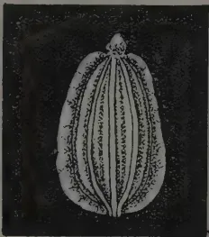A detailed botanical drawing of a seed or fruit, labeled 'A'. It shows a longitudinal section with several internal chambers or locules. The surface is covered with fine, hair-like structures. The magnification is indicated as x6.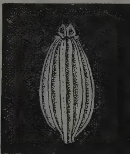A detailed botanical drawing of a seed or fruit, labeled 'A'. It shows a longitudinal section with several internal chambers or locules. The surface is covered with fine, hair-like structures. The magnification is indicated as x6.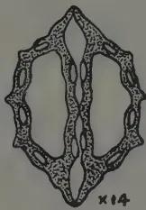A detailed botanical drawing of a seed or fruit, labeled 'A'. It shows a cross-section with two large, irregularly shaped chambers separated by a central septum. The outer wall is thick and textured. The magnification is indicated as x14.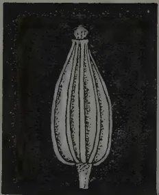A detailed botanical drawing of a seed or fruit, labeled 'B'. It shows a longitudinal section with several internal chambers or locules. The surface is covered with fine, hair-like structures. The magnification is indicated as x6.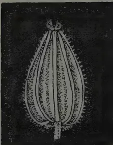A detailed botanical drawing of a seed or fruit, labeled 'B'. It shows a longitudinal section with several internal chambers or locules. The surface is covered with fine, hair-like structures. The magnification is indicated as x6.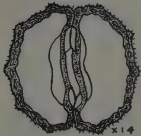A detailed botanical drawing of a seed or fruit, labeled 'B'. It shows a cross-section with two large, irregularly shaped chambers separated by a central septum. The outer wall is thick and textured. The magnification is indicated as x14.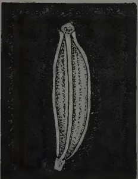A detailed botanical drawing of a seed or fruit, labeled 'C'. It shows a longitudinal section with several internal chambers or locules. The surface is covered with fine, hair-like structures. The magnification is indicated as x6.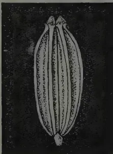A detailed botanical drawing of a seed or fruit, labeled 'C'. It shows a longitudinal section with several internal chambers or locules. The surface is covered with fine, hair-like structures. The magnification is indicated as x6.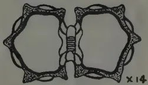A detailed botanical drawing of a seed or fruit, labeled 'C'. It shows a cross-section with two large, irregularly shaped chambers separated by a central septum. The outer wall is thick and textured. The magnification is indicated as x14.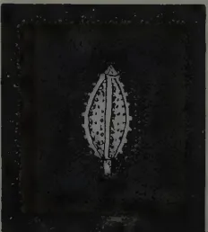A detailed botanical drawing of a seed or fruit, labeled 'D'. It shows a longitudinal section with several internal chambers or locules. The surface is covered with fine, hair-like structures. The magnification is indicated as x6.A detailed botanical drawing of a seed or fruit, labeled 'D'. It shows a longitudinal section with several internal chambers or locules. The surface is covered with fine, hair-like structures. The magnification is indicated as x6.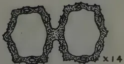A detailed botanical drawing of a seed or fruit, labeled 'D'. It shows a cross-section with two large, irregularly shaped chambers separated by a central septum. The outer wall is thick and textured. The magnification is indicated as x14.

A. de Alwis, del.

Plate I

17------------------------------------------------

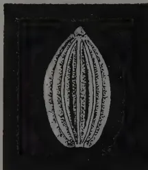

A

x6

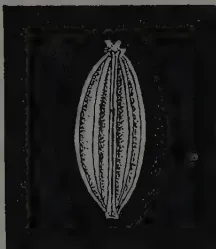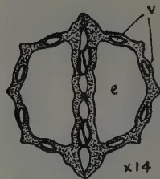

x14

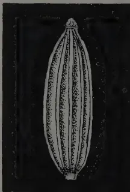

B

x6

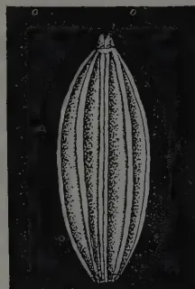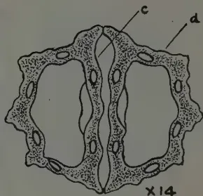

x14

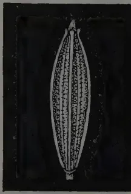

C

x6

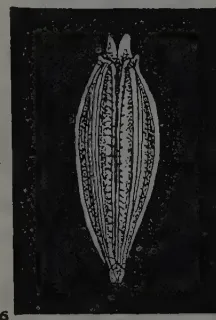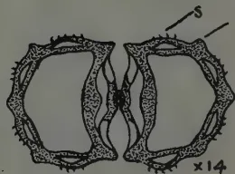

x14

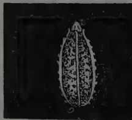

D

x6

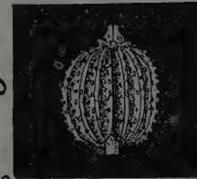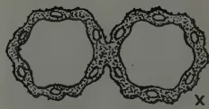

x14

*A. de Alwis, del.*

Plate II

18------------------------------------------------

287

## HOW LONG DO SEEDS RETAIN THEIR VITALITY?\*

THE idea of seeds germinating after a lapse of many centuries rarely fails to appeal to the imagination. Probably that is why so many inaccurate and fantastic statements have been made regarding this subject, with which Mr. J. H. Turner has recently dealt in an article entitled "The Viability of Seeds" (*Kew Bulletin* No. 6, 1933. London: H. M. Stationery Office. 1s. net). From earliest times people have wondered how long seeds for field and herb garden would keep fresh. Theophrastus, writing about 320 B.C., mentions that "Of seeds some have more vitality than others as to keeping; among the more vigorous ones are coriander, beet, leek, cress, mustard, rocket, savory . . ." Little was known, however, about the vitality of seeds of wild plants until De Candolle, in 1832, concluded that seeds of many species remained viable in the soil for considerable periods.

"The average life of seeds, as of plants, varies greatly with the different families, genera and species, but there is no relation between the longevity of plants and the viable period of the seeds they bear. Some seeds retain their power of germination for a few days only, such as the willows and poplars, others remain viable for months or even a considerable number of years." The factors which produce a capacity for sustained vitality are still imperfectly understood, but it is known that, under suitable conditions, seeds of 'macrobiotic' families, notably *Leguminosæ*, *Malvaceæ*, *Myrtaceæ*, *Nymphaeaceæ*, etc. may remain viable from fifteen to more than a hundred years.

Only a limited number of cultivated plants produce seeds which retain their vitality for any length of time when buried in the soil, but those of weeds are capable of living for extended periods, and when deeply buried are better preserved as a result of the more equable conditions. The appearance of plants from dormant seeds when ground is freshly turned up is well known, and the prolific growth of poppies, camomile and charlock of the Somme battlefield from latent seeds brought to the surface by shell fire is mentioned. Charlock, *Sinapis arvensis*, appeared on earth thrown up by shells and in shell craters, when there was no trace of it on the undisturbed ground; this may be readily appreciated when we read that seeds of charlock may retain their vitality for forty years when buried in the soil.

Instances of gorse seeds, *Ulex europæus*, which retained their vitality for forty, twenty-five and twenty years in the soil, and seeds of acacia, fox-glove, campanula, etc., which grew after being buried for many years are described, but the most interesting account is that of *Nelumbo*, the Japanese lotus or sacred lotus of India. "Probably the record longevity for any seed is that recorded by Ohga who obtained approximately 100 per

\* From *Nature* No. 3334, Vol. 132, September 23, 1933.

19------------------------------------------------

288

cent. germination with 'seeds' of *Nelumbo nucifera*, Gaertn. which he found on a peat bed buried two feet deep with loess in the Pulantien river valley in Southern Manchuria, the bed being  $12\frac{1}{2}$  metres above the present water level of the river. Judging by the age of trees of *Salix babylonica* on the bed of this former lake and from the rate of lowering of the water level, it is probable that the 'seeds' are at least 120 years old and may be 400 years old or even older, judging by the rate of erosion." Ohga gave thirty of the "seeds" to the British Museum, and in 1931, at the request of Sir Arthur Hill, the British Museum authorities sent two of these "seeds", which they had germinated, to Kew. The seedlings were planted in the *Victoria Regia* pool and flowered during August 1932. "Apart from the smaller flowers and seed vessels, there was nothing to distinguish them from *Nelumbo nucifera*, Gaertn. raised from recent 'seed'."

In 1879 Beal mixed seeds with sand and buried them in bottles. The results of this experiment show that after fifty years, seeds of *Brassica*, *Oenothera*, *Polygonum*, *Rumex* and *Verbascum* are capable of germination. Duvel experimented under more natural conditions, mixing the seeds with soil and using earthenware pots covered with porous saucers. It was found that of 107 species, 51 grew after being buried for twenty years. Shull found that seeds of many land and water plants would germinate after immersion in mud and water for periods of four to seven years. Some seeds will even withstand the action of salt water for considerable periods.

Various experiments made over a period of more than a hundred years with seed stored in museums and herberia are described by Mr. Turner, including the 150-year old seeds of *Nelumbium (Nelumbo) speciosum* in the British Museum, which Robert Brown germinated in 1850, Ewart's success with 105-year old seeds of *Goodia lotifolia* in Australia, Becquerel's 87-year old seeds of *Cassia bicapsularis* in the Herbarium of the Natural History Museum of Paris, and Turner's experiments in 1932 with seeds from dated bottles in the Kew museums. *Anthyllis Vulneraria* and *Trifolium striatum*, both 90 years old, gave a germination of 4 and 14.1 per cent. respectively. "The seedlings are now growing in one of the houses at Kew." Ewart formed the opinion that "However dry the seeds may be they cannot indefinitely prolong their vitality. Even the most resistant seeds after 50 to 100 years show a pronounced decrease in the percentage germination, and the general trend of the curves is such as to show that the probable extreme duration of vitality for any known seed may be set between 150 and 250 years (*Leguminosae*)."

Heldreich suggests that the sudden appearance, in the Laurion area (Greece), of *Silene juvenalis* and a supposed new species which he named *Glaucium Serpieri* was due to their seeds having remained buried for more than fifteen hundred years in the soil under the heaps of old mining debris. When the debris was removed, the seeds sprang into life again. A taxonomic investigation made by Dr. Turrill has shown that *Silene juvenalis* is conspecific with *S. subconica*, a not uncommon species in the countries around the Aegean Sea. There is nothing in the taxonomy or distribution of *S. subconica* and *Glaucium Serpieri*, which has been shown by Turrill to be *G. flavum* var. *leiocarpum*, to make it improbable for them to occur naturally in the Laurion district, and in all probability both species were

20------------------------------------------------

289

in the neighbourhood before the heaps of débris were removed, and simply spread on the vacated and denuded ground in the absence of close competition. "The evidence is all against either *Glaucium* or *Silene* at Laurion being examples of long enduring seed dormancy."

In spite of research, popular belief clings tenaciously to the fairy tales concerning the germination of seeds from ancient tombs, which newspapers and broadcasting have unwittingly circulated. Stories of seed germination after a dormancy of thousands of years have even been used as an illustration of immortality. The reply to this curious notion deserves to be quoted in full: "There is no authenticated evidence that wheat taken from undisturbed Egyptian tombs will germinate. An experiment was made at Kew some thirty years ago with grain from a model granary, found in a tomb of the 19th dynasty and brought to England by Sir E. A. Wallis Budge. Samples were tested under various conditions and the effect of coloured glass was tried in the effort to induce germination, but after three months the grain had turned to dust. Percival states 'I examined a number (of grains) found by Frot, Flinders Petrie in the Græco-Roman cemetery at Hawara (about first century B.C.) . . . the embryo had become dark brown, its plumule greatly shrivelled and little of its structure was visible'." "In grain from a tomb of the 18th dynasty, 1400 B.C., 'all the parts were more brittle and the embryo more completely disorganised than in the grains from Hawara. It is scarcely necessary to observe that the embryos were dead. Prof. Petrie tested samples of grain of Græco-Roman age which he found at Hawara immediately after exhumation. The grains were sown on the banks of a canal in varying degrees of moisture . . . but none germinated.' " "According to Gain, although Egyptian wheat and barley often have an exterior appearance of good preservation, the embryo has undergone a marked chemical change and is no longer viable. This change shows that the dormant life of the grain has long been extinct."

"Sir E. A. Wallis Budge has accounted for the popular belief in the germination of grain from Egyptian tombs and explains that for hundreds of years the natives of Egypt have used the halls of tombs for the wheat and barley obtained from Syria. Ancient coffins have been packed in this Syrian wheat and sent to England, and such grains will, of course, grow. During the last 30 years the native dragoman and guides have found that tourists will buy 'mummy wheat' and they keep supplies in the tombs, carefully hidden, which they dig up under the eyes of the astonished visitor and offer as 'mummy wheat' or 'mummy barley'."

It is amusing to know that the guides sometimes 'find' grains of maize in Egyptian tombs in order to supply the credulous tourist, forgetting that maize was unknown until the discovery of America, whilst some of their faked wheat samples produce plants suspiciously identical with the improved wheat varieties grown in Egypt at the present time.

"Cereals are ill adapted for a prolonged period of quiescence. Sifton has shown that Canadian wheat may retain its vitality for 18 years, and that the longevity of oats is greater than that of wheat, possibly owing to the protection of the hulls. Nineteen-year old kernels of oats gave a germination of 41 per cent. Percival records an exceptional case of wheat remaining viable for twenty-five years. White found that in Australia the

21------------------------------------------------

290

germination of wheat is lost after 11-16 years and that of barley after 8-10. Fanciful tales are current with regard to 'miracle' or 'mummy' wheat, *Triticum turgidum* var. *mirabile* Körn and 'mummy peas', *Pisum sativum* var. *umbellatum* (Mill.) Ser."

It may be of interest to mention here that a branched form of *Triticum turgidum* has been grown for many years in America under the various names of 'Alaska', 'Many Spiked', 'Seven-Headed', 'Multiple-Headed', 'Egyptian', 'Miracle', 'Mummy', 'Wheat 3,000 years old', etc. These last four names are derived from an untrue story which tells that when the coffin of an Egyptian mummy was opened, some wheat was found. The seeds were planted, but only a single grain grew. The resulting plant proved a wonderful yielder and very different from any wheat now grown. It seems quite natural that if an unbranched head will yield so much, a branched head should yield much more. Actually the branched heads contain more grains than the unbranched heads of ordinary varieties, but as there are far fewer heads per acre, the yields are naturally less. A branched form of *Triticum turgidum* has been tried in the British Isles, but its general produce does not warrant its cultivation here, for it is inferior both in yield and quality.

"Miracle wheat is the commonest branched form of *Triticum turgidum* met with in South Europe and the North African coast. It is usually cultivated as a curiosity. Fasciated forms of the pea, similar to the so-called mummy pea, are figured by Tabernæmontanus in his Herbal published in 1590, and Miller in his Gardeners' Dictionary, 8th edit., 1771, described the form under the name of *Pisum umbellatum*, rose or crown pea. The misleading name of mummy pea is equally applied to the non-fasciated form, sometimes grown in cottage gardens. It is popularly asserted that miracle wheat and mummy peas originate from Egyptian tombs and that such seeds germinate when sown, but in every instance the statements prove to be without foundation."

22------------------------------------------------

291

## PESTS AND DISEASES IN TOBACCO SEEDBEDS\*

**T**OBACCO growers will shortly be commencing their preparations for the crop of the coming season, and in so doing they should bear in mind that many of their troubles originate in the seedbed. Without an adequate supply of strong, healthy seedlings, the grower cannot hope for success, and it will therefore pay him to give careful thought to the preparation of his seedbeds, and to take every possible precaution to safeguard them against the attack of pests and diseases. The following brief notes will help him to recognize the chief troubles which occur in the seedbed or are likely to originate there.

### INSECT PESTS

*Nematode*.—The nematode or gail-worm causing root-knot is an internal root-parasite. The immature worm or larva is hair-like in appearance, measuring less than half a millimetre in length, and is able to live in the soil for months without taking any food. When susceptible plants are grown on infested soil, the young worm enters the root through the growing tip, and the whole life-cycle is completed within the tissues of the root. The full-grown female resembles a pearly-white rounded body, and is less than half the size of an ordinary pinhead.

Affected plants usually have a sickly yellowish appearance, and show a poor and stunted growth; when heavily infested the plants may die off. If the roots are examined, typical swellings or knots caused by the nematodes, will be found on them.

Light sandy soils are more favourable for the breeding of nematodes than are turf or heavy clay soils, although the latter may in due course become heavily infected. High temperatures favour the activity of the nematodes, and this is probably one of the reasons why they prefer the warm sandy soils. A certain degree of moisture is essential for the maintenance and breeding of the parasite, which cannot live in very dry soil. These facts should be borne in mind when selecting a site for seedbeds.

Over 400 wild and cultivated plants have already been listed as host plants of the nematode which attacks tobacco. This explains why virgin soil is sometimes found to be infested with it.

*Springtail or Earthflea*.—This is a wingless soft-bodied insect of a dark-blue colour. It is a moisture-loving insect, and can usually be found in large numbers in damp places; tobacco seedbeds which are kept very moist therefore afford ideal breeding places for it. When it becomes troublesome, the beds should be watered less frequently, and it would furthermore be advisable to remove the hessian covers, to get rid of any excess moisture. Tobacco extract may also be used as a contact spray to keep the insects in check.

---

\* By Dr. E. S. Moore, Plant Pathologist, and A. J. Smith, Entomologist, Division of Plant Industry, in *Farming in South Africa*, Vol. VIII, No. 89, August, 1933.

✓ C 1220  
Jan 1934

23------------------------------------------------

292

*Stem-borer.*—The adult moth, which is greyish-brown in colour and measures about half an inch across the extended wings, deposits her eggs singly on the tobacco seedlings. The egg takes about a week to hatch and the larva or worm usually bores into the leaf soon after hatching. It may continue to tunnel along the midrib into the stem, or it may vacate the first tunnel to make a fresh entrance, which is usually under the bud at the base of the petiole. The larva spends its whole life, lasting about four weeks, within the stem. When full grown it prepares an exit-hole for the moth to emerge and then pupates. The stem of an infested seedling usually shows a distinct swelling where the larva has fed; above the swelling the growth is stunted or else dies off completely. In older plants, new shoots or suckers may develop below the swelling. Infested seedlings are, however, useless, and should be destroyed.

*Leaf-miner or Splitworm.*—The moth resembles the stem-borer moth, and is closely allied to it. The worm in this case, however, does not usually bore into the stem, but mines inside the leaf, destroying the soft tissues in irregular patches and leaving only the upper and lower skins. When full-grown the worm may spin its cocoon either inside or outside the plant. Although serious damage may be done to the leaf, this pest does not usually cause such heavy losses as does the stem-borer. Apart from tobacco, it also attacks potatoes, gooseberries and thornapple or stinkblaar. The insect is a prolific breeder, and it is therefore advisable to destroy all host-plants near the beds.

*Tobacco Slug.*—The adult beetle measures about  $\frac{1}{4}$  inch in length, and is black in colour with two pale-yellow longitudinal stripes running parallel down the back. The eggs are usually deposited on the lower side of the leaves, in clusters of ten to thirty. The incubation period of the egg is about 7 days. The larva or slug has a slug-like appearance and is greenish in colour and covered with slime. It feeds on the leaves for about 14 days, and then enters the soil to construct a whitish papery cocoon in which to pupate. The pupal period varies from about a fortnight to three weeks. Both the beetle and the slug feed on the leaves and can do enormous damage if not kept under control. Besides tobacco, it also attacks several species of gooseberries and thornapple or stinkblaar.

*Whitefly.*—This is a very small winged insect which is easily overlooked in the seedbeds. The body is covered with a whitish powder, giving it a marked whitish appearance. Both the immature and the full-grown stages of the insect feed on tobacco by sucking the juice out of the leaves; the damage due to actual feeding is, however, of minor importance. The insect is the carrier of the virus which causes crinkly dwarf or leaf curl in tobacco, and since this disease was responsible for heavy losses in certain tobacco-growing areas during the past season, growers will be well advised to prevent the breeding and spread of whitefly on the lines suggested elsewhere in this article. In addition, it may be advisable to include in the recommended Bordeaux-lead arsenate spray, a contact insecticide like tobacco extract for the control of the insect in the seedbeds.

## DISEASES

*Damping off* is a common disease which, if neglected, may play havoc in the seedbed. It attacks plants from an early age, and is caused by various soil-dwelling fungi which rot the base of the stem, causing the

24------------------------------------------------

293

seedling to collapse and shrivel up. The threads of the fungus quickly spread to adjoining plants, so that within a few days a bare patch marks the progress of the disease. Damping off is encouraged by excessive organic manure in the top layers of the soil and it spreads with great rapidity in overcrowded beds and under conditions such as may be caused by bad drainage, prolonged wet weather or heavy irregular watering. It attacks other seedlings as well as tobacco, and since its spores survive for long periods in the soil and can be carried by the lightest breeze, the disease is not easily kept out of the seedbed. The grower can however, check it by (1) ensuring that cultural conditions are unfavourable for its development, (2) destroying it by dusting affected patches liberally with Bordeaux powder. If each disease-centre is thus treated at its *first* appearance, further spread can usually be checked; a few days' delay means that infection spreads through the whole bed, and treatment then becomes very difficult. In this country the damping of fungi are not known to attack plants after they have left the seedbed.

*Black Root Rot* is caused by a soil-dwelling fungus which attacks the roots, turning them black; in mild cases the root-tips are affected and break off when the plant is pulled up. A diseased seedling is not killed, but it makes slow growth owing to the damaged root-system. This retarding effect is particularly apparent when sterilized and unsterilized seedbeds are grown side by side in an area infected with root rot; the slow and stunted growth in the unsterilized beds is linked with blackening of the roots due to the root rot fungus.

It is essentially a cool weather disease, and this probably accounts for the fact that in South Africa it has been found only in seedbeds, that affected plants usually recover after transplanting, forming fresh healthy roots as the summer advances. In cooler climates it is a serious disease in the field as well as in the seedbed, but it is not anticipated that in this country it will ever cause trouble except in abnormally cold seasons. The slowing down of growths is, however, of sufficient consequence to justify the precaution of sterilizing the seedbed soil in infected areas.

*Wildfire* is only too well known to tobacco-growers throughout the Union. It attacks the leaves, forming yellowish-green spots and patches which turn dry and brown at the centre, in young seedlings the leaves may rot progressively from the tips downwards. The plants are severely checked, and may even be killed if the outbreak is severe. The name wildfire is justified by the amazing speed with which the disease can spread through the whole seedbed or field, or from one seedbed to those nearby, especially in wet and stormy weather.

It is caused by a minute bacterium which is highly infectious and which moreover possesses great powers of resistance to drying. Hence it is readily spread by wind-borne fragments of dry diseased leaf and by persons who have recently handled dry leaf-tobacco or diseased plants etc.

The danger of wildfire lies not only in the damage it does to the actual seedlings themselves, but even more in the risk of establishing the disease in the field by using infected transplants. It would certainly be preferable

25------------------------------------------------

294

to avoid using diseased beds at all for transplanting, but this is often impracticable, and moreover experience has shown that even a healthy seedbed gives no absolute guarantee of a disease-free crop in the field, although it certainly goes a long way towards ensuring it. This can well be understood when it is remembered how easily wildfire germs may be sheltered in the soil or carried by the wind.

Wildfire thrives best under damp conditions, although its results often become more apparent during hot days after a wet spell.

*Mildew or White Rust* is the powdery white covering which appears on tobacco leaves when the plants are damp and shaded. It is caused by a fungus which grows largely on the outer surface of the leaf and which can be checked by free ventilation and sunlight. Dusting with sulphur is an easy remedy that can be applied in the seedbed but would not, of course, be practicable with larger plants in the field.

*Tobacco Wilt* is a soil-borne disease caused by a fungus (*Fusarium*) which invades the water-channels in the roots and therefore causes the leaves to droop and wither up. Wilting often affects only one side of the plant and is accompanied by darkening of the wood from the roots upwards. The disease lives over in the soil from year to year, and infection may take place in the seedbed, although the symptoms do not usually appear until later.

*Mosaic* is the well-known yellow-green mottling and blotching which is especially obvious on young leaves and is almost universal on autumn suckers. Although midsummer infection does little damage, plants attacked by mosaic early in life make poor growth and develop extensive rusty marks over the middle leaves. The disease causes steady and appreciable loss, since it lowers not only the quantity but especially the quality of the crop.

It is caused by an infectious virus which although too small to be visible under even the most powerful microscope, can multiply inside the infected plant and penetrate into every part of it. The juice of a mosaic plant is full of virus and the smallest quantity of it, if rubbed into other plants, will produce symptoms in them 2-3 weeks later. The disease is therefore easily spread by handling, and the greatest damage appears in plants thus infected at transplanting, because a single mosaic seedling may infect dozens of healthy plants handled subsequently. An infected plant can in no way be cured, and in spite of years of investigation, no real control has been discovered. Much can be done, however, by removing and destroying individual mosaic seedlings in the beds; this should be done by a worker who is not at the time handling plants for any other purpose. Further, those working with beds should avoid handling dry or air-cured tobacco in any form, since mosaic infection remains active in dry leaf for a very long while and most tobacco plants are infected by the time they are harvested, even though they may not show it. It has been found elsewhere that a marked decrease in mosaic can be secured by restricting the use of tobacco amongst those working on the beds.

26------------------------------------------------

295

*Crinkly Dwarf or Leaf Curl* has only recently come into prominence, and although the symptoms do not usually appear in the seedbed, it is possible for the disease to originate there and to spread through the field later. Affected plants are more or less dwarfed, and their drooping leaves are deeply crinkled, whilst on the under-surface along the veins there appears thickenings which may grow out into green leafy frills. Like mosaic, this disease is caused by an invisible virus which, however, cannot be readily transmitted by handling; it is spread by the feeding of insects in much the same way as the malarial germ is spread by the feeding of certain mosquitoes. The insect-carrier concerned is whitefly, which takes shelter during the winter on stump-suckers in the lands. It can therefore be checked by thoroughly cleaning up all tobacco lands during the winter, to ensure that for several weeks at least there are no living tobacco plants available to shelter the insects.

*Kromnek or Kat River Wilt* is not a true wilt and has no connection with the *Fusarium* wilt described above. It is not known to occur outside the eastern Cape Province, where it causes heavy losses in both seedbed and field. It is characterized by severe stunting and by leaf-markings in various patterns, frequently of a ring-spot type or else following the veins. It is caused by an invisible virus which is spread by a tiny insect of the thrips group when it feeds upon tobacco leaves. *Kromneek* has recently been the subject of a special investigation, of which a report will appear in this journal at an early date.

27------------------------------------------------

296

## MINERAL DEFICIENCY IN THE SOUTHERN COASTAL BELT OF NEW SOUTH WALES

MAX HENRY, M.R.C.V.S., B.V.SC.,

CHIEF VETERINARY SURGEON

AND

M. S. BENJAMIN, D.I.C., (LOND.), A.A.C.I.,

FIRST ANALYST, CHEMIST'S BRANCH

[This is extracted from a Preliminary Survey of the Mineral Content of Pastures in New South Wales and is of interest in Ceylon and other countries where acid soils are prevalent. The influence of such conditions on animal husbandry is of especial interest at the present time when pasture improvement is much talked of.—Ed., T.A.]

**T**HE mineral content of pastures in relation to nutrition and animal metabolism and, more particularly, in relation to the nutrition of highly-bred dairy cattle, has been the subject of a considerable amount of research during recent years. The work of Theiler, du Toit and other investigators in South Africa; Orr and his collaborators at the Rowett Institute, Aberdeen; Hart, Steenbock, McCollum and Eckles in America; and Brailsford-Robertson, Henry, and Aston in Australia and New Zealand has demonstrated the important part which the mineral constituents of pastures and other stock foods play in animal life and welfare.

### A CONSIDERABLE AREA OF THE STATE AFFECTED

Mineral deficiency and related nutritional studies must be regarded as of particular interest so far as this State is concerned, owing to the pre-eminent position which livestock and livestock products occupy among its economic resources. Moreover, the area of the State which is involved in this deficiency is very considerable. It would hardly be an exaggeration to say that the coastal belt of New South Wales with the exception of that portion which lies north of the Richmond River is essentially a belt of mineral deficient country. It is only in those isolated areas where basaltic outcrops occur, as at Tilba and Kiama, or where river flats have been formed by the deposition of soil brought down by floods, that evidence of such a deficiency is wanting, although the degree of deficiency is by no means uniform. Wherever osteophagia and osteomalacia exist there is warrant for regarding the country as probably mineral deficient. Henry, so far back as 1915, indicated that his observations showed that during the previous ten years there had been a marked increase in the area of the far southern coastal belt in which these symptoms were observable. Since then the condition has been noted in an ever-widening range, involving not only the coastal but the inland country.

28------------------------------------------------

297

1 Recent unpublished official reports by Rose indicate the extent to which Eastern Riverina is involved. The same officer has remarked on the condition near Hillston, almost in the centre of the State. Hindmarsh has reported it from the Brunswick Valley north of the Richmond River, whilst Blumer records the presence of an intense osteomalacic condition in sheep on the Upper Clarence.

That both the area involved and the intensity of the condition should increase is no surprise to observers who have been following the trend of events for the past twenty years and who have examined the history of the State during the past century. Generally speaking, Australian soils are of a low phosphorus content. On many of these phosphorus poor soils dairy cattle have been grazed for periods up to one hundred years and nothing whatever has been returned to the soil to balance what was taken out and exported as milk, butter, cheese and meat. Naturally the poorer the soil the sooner it proved incapable of maintaining cattle in reasonable health; then the medium country showed signs of being unable to maintain the strain, and now better country still is proving inadequate. It may be argued perhaps that if these facts are so definitely noted, the work embodied in this paper was unnecessary. As a matter of fact, however, whilst there is no reason to doubt the soundness of the conclusions previously arrived at, that the basal cause of the unthriftness and ill-health of the cattle in the areas concerned was, roughly speaking, a calcium-phosphorus—chiefly phosphorus-deficiency in the soil, chemical analysis had only been carried out in a comparatively small number of instances. No extensive series of analyses was on record. In addition the suggestion has been put forward by more than one observer that in parts of the coastal belt, notably at Bergalia, the calcium-phosphorus deficiency theory does not fully account for the clinical picture presented by the cattle. Since the last publication of any work on the subject in this State much work has been done elsewhere, and it is desirable to see whether the conclusions previously arrived at will stand the test of fuller investigation in the light of that work.

The following paper is a small contribution to the study of this important and many-sided subject, and embodies the main results obtained in a "deficiency survey" of portions of the counties of Auckland and Dampier in the Eden Pastures Protection District. The work so far carried out, though admittedly of a preliminary nature, has yielded data which it appears desirable at this stage to collate and make available.

### INCIDENCE OF OSTEOMALACIA

In the area over which this deficiency survey has been attempted, which includes the parishes of Congo, Moruya, Narira, Tanja, Ocranook, Eurobodalla, Kameruka, Bega, Wolumla, Bondi and Genoa, dairying is extensively carried out and natural pasture constitutes the main feed throughout the year of most of the herds. Sterilised bonemeal and similar licks are fed to stock on many of the properties, and this fact makes it somewhat difficult to determine exactly, and map out, the distribution and intensity of osteomalacia in the parishes referred to. Nevertheless, by direct observation, the collection of chemical and other data over long periods, and from the information supplied by district inspectors and stockowners as to the condition of stock on the various properties prior to the use of phosphatic licks,

29------------------------------------------------

298

it has been possible to indicate those regions which may be regarded as potentially affected, in addition to those in which osteomalacia now definitely occurs.

### THE ECONOMIC ASPECT

If the investigation of this question were purely one of scientific interest it would be difficult to justify the undertaking at the present time. On the contrary, however, it is a matter of really serious economic importance to this State. Rose has well described the condition of the cattle on these deficient lands, and it requires no explanation to make the fact clear that such cattle cannot be effective producers. Moreover, the influence on growth of the administration of bonemeal to cattle in deficient areas has been repeatedly demonstrated here and elsewhere. The economic loss, would be serious enough if it were confined to osteomalacia and its accompanying manifestations. To this loss, however, must be added that due to botulism. It is clear now, following the work of Seddon, Theiler and others that the mortalities which from time to time have occurred on the southern coastal belt and elsewhere were actually outbreaks of botulism brought about by the ingestion of toxin-infested, decaying animal matter, such as bones and rabbit carcasses, by cattle suffering from pica induced by a calcium-phosphorus deficient diet. That such mortality may in dry seasons reach a factor of economic consideration was fully shown by Henry in his report on mortality in cattle in the Bega district published in 1915. Other observers have since reported similar mortality.

### THE CALCIUM AND PHOSPHORUS CONTENT OF THE SOILS

In addition to the stock survey mentioned above, soils and natural pastures from a number of properties in the district have been collected and chemically examined. In the case of the soils it was decided to determine the percentage amounts of "citrate soluble" lime and phosphoric acid rather than the total amounts of these constituents extracted from the soil by a strong solvent such as hydrochloric acid.

### A DISCUSSION OF THE RESULTS

A careful study shows that the percentage amount of citrate-soluble phosphoric acid is extremely low in the series of soils considered as a whole. Out of the fifty-six soils examined, five only contained more than '007 per cent. citrate-soluble phosphoric acid. Eight soils, including the above five, contained as much as '005 per cent., while the remaining forty-eight soils averaged only '0023 per cent. of this constituent. The low percentage amounts of citrate-soluble phosphoric acid found in the majority of the soils examined seems of special significance when it is remembered that approximately '01 per cent. of this constituent is generally regarded as the minimum amount required for the maintenance of fertility on cultivated soils. It is, of course, open to question whether a percentage amount as high as '01 per cent. is essential for the production of good, natural pasture under Australian conditions, but it would appear probable that initial percentages of available phosphoric acid as low as '0015 per cent. to '0024 per cent. (see the average available,  $P_2O_5$  in summarised data of "affected" soils given below), that is, approximately one-seventh to one-fifth this amount, unless offset by other soil conditions—are too low for the production of that type of natural pasture which is needed by highly-bred milch cattle.

30------------------------------------------------

299

With reference to the other constituents and the reaction, it will be noted that the percentage amount of citrate-soluble lime ranges from as low as '0406 per cent. to as high as '4435 per cent. The loss on ignition shows also considerable variation, and is seen to range from as low as 2.92 per cent. to as high as 18.48 per cent. The reaction of the soils as a whole was found to be decidedly acid, and to range from pH 6.56 to pH 4.31. The latter, an alluvial silt, was found to contain .37 per cent. of water-soluble salts in which chlorine was present in an amount equivalent to .104 per cent. The relatively low percentage of citrate-soluble lime is probably due to base exchange with the excess of sodium salts present.

From the figures obtained for citrate-soluble lime in the series as a whole, a very fair correlation exists between the percentage amounts of this constituent and the soil reaction.

#### A DISCUSSION OF THE ANALYTICAL DATA FROM "AFFECTED" AND "NON-AFFECTED" SOILS

The data from selected soils from farms which are reported as badly affected—that is, soils on which grazing stock unless fed bran, phosphatic licks or similar supplements in the natural pasture—develop definite signs of osteomalacia, average as follows: pH, 5.45; organic matter and combined water, 5.58 per cent.; available  $P_2O_5$ , .0015 per cent.; available  $CaO$ , .088 per cent.

The data obtained for an equal number of soils which are reported as from non-affected farms, that is soils on which grazing stock although fed continuously upon natural pasture have not, up to the present, exhibited signs of osteomalacia, average as follows:—pH, 6.08; organic matter and combined water, 11.70 per cent.; available  $P_2O_5$ , .0056 per cent.; available  $CaO$ , .229 per cent.

From the data so far collected, it would appear, that the "affected" condition of the soil is associated with, if not actually dependent upon, the presence in the soil of a relatively low percentage amount of citrate-soluble phosphoric acid coincident with a marked acid reaction and a relatively low percentage amount of organic matter.

Other factors may, of course, be involved, for the soil, it must be remembered, is a complex and delicately balanced system. Secondary chemical reactions may readily occur within it owing to acidity, and these as well as physical and biological processes may play their part in determining the degree to which a soil is affected in any particular case.

#### CALCIUM, PHOSPHORUS AND PROTEIN CONTENT OF THE PASTURES

Twenty-eight pastures from an equal number of the soils previously referred to were chemically examined in connection with the work. The pastures were sampled at approximately the same period of the year, and observations were made and recorded of the chief species of plants they contained. The percentage amounts of ash, calcium, phosphorus and protein they contained were determined, and the results expressed on a water-free basis are given in the following table:

31------------------------------------------------

300

MINERAL AND PROTEIN CONTENT OF  
NATURAL PASTURES

<table border="1">
<thead>
<tr>
<th rowspan="2">Lab. No.</th>
<th colspan="5">Percentages in Dry Matter of Pastures</th>
</tr>
<tr>
<th>Total Ash</th>
<th>Nitrogen</th>
<th>CaO</th>
<th>P2O5</th>
<th>Crude Protein</th>
</tr>
</thead>
<tbody>
<tr><td>6A</td><td>8.31</td><td>1.703</td><td>.484</td><td>.358</td><td>10.64</td></tr>
<tr><td>7A</td><td>9.59</td><td>1.39</td><td>.581</td><td>.186</td><td>8.68</td></tr>
<tr><td>12B</td><td>7.42</td><td>1.488</td><td>.816</td><td>.283</td><td>9.3</td></tr>
<tr><td>14A</td><td>8.85</td><td>1.092</td><td>.573</td><td>.173</td><td>6.82</td></tr>
<tr><td>23A</td><td>—</td><td>2.383</td><td>1.245</td><td>.604</td><td>14.89</td></tr>
<tr><td>26A</td><td>—</td><td>2.011</td><td>1.416</td><td>.896</td><td>12.56</td></tr>
<tr><td>27A</td><td>—</td><td>1.563</td><td>1.097</td><td>.320</td><td>9.76</td></tr>
<tr><td>29A</td><td>—</td><td>1.523</td><td>.865</td><td>.390</td><td>9.51</td></tr>
<tr><td>30A</td><td>—</td><td>1.301</td><td>.712</td><td>.210</td><td>8.13</td></tr>
<tr><td>31A</td><td>8.97</td><td>1.64</td><td>.827</td><td>.343</td><td>10.25</td></tr>
<tr><td>32A</td><td>10.69</td><td>1.25</td><td>.958</td><td>.253</td><td>7.81</td></tr>
<tr><td>33A</td><td>9.05</td><td>1.358</td><td>.743</td><td>.362</td><td>8.48</td></tr>
<tr><td>34A</td><td>8.42</td><td>1.041</td><td>.316</td><td>.234</td><td>6.50</td></tr>
<tr><td>35A</td><td>8.04</td><td>1.265</td><td>.517</td><td>.315</td><td>7.90</td></tr>
<tr><td>36A</td><td>5.84</td><td>1.383</td><td>.430</td><td>.235</td><td>8.64</td></tr>
<tr><td>37A</td><td>8.20</td><td>1.018</td><td>.306</td><td>.243</td><td>6.36</td></tr>
<tr><td>38A</td><td>7.22</td><td>1.353</td><td>.492</td><td>.342</td><td>8.45</td></tr>
<tr><td>39A</td><td>8.06</td><td>1.16</td><td>.439</td><td>.197</td><td>7.25</td></tr>
<tr><td>40A</td><td>8.93</td><td>1.161</td><td>.278</td><td>.240</td><td>7.25</td></tr>
<tr><td>42A</td><td>7.36</td><td>1.387</td><td>.651</td><td>.363</td><td>8.66</td></tr>
<tr><td>43A</td><td>8.18</td><td>1.431</td><td>.743</td><td>.390</td><td>8.94</td></tr>
<tr><td>44A</td><td>9.24</td><td>1.071</td><td>.460</td><td>.274</td><td>6.69</td></tr>
<tr><td>46A</td><td>8.51</td><td>1.363</td><td>.673</td><td>.403</td><td>8.51</td></tr>
<tr><td>47A</td><td>8.51</td><td>1.055</td><td>.604</td><td>.225</td><td>6.59</td></tr>
<tr><td>48A</td><td>8.81</td><td>1.056</td><td>.316</td><td>.170</td><td>6.60</td></tr>
<tr><td>50A</td><td>9.78</td><td>1.12</td><td>.647</td><td>.367</td><td>7.00</td></tr>
<tr><td>55A</td><td>9.16</td><td>2.479</td><td>.470</td><td>.555</td><td>15.49</td></tr>
</tbody>
</table>

A DISCUSSION OF THE PASTURE DATA

From a study of the pasture analysis twenty-one of the pastures examined were obtained from soils on farms on which the cattle exhibited clinical evidence of deficiency. The analytical data for the pastures on these twenty-one soils show the following average percentages: CaO, .575; P2O5, .272; crude protein, 8.05 per cent.

Three pastures were obtained from soils reported "non-affected" and three from "affected" soils which had received manurial treatment. The data for these six soils is shown below:

<table border="1">
<thead>
<tr>
<th rowspan="2">Pasture No.</th>
<th colspan="3">Percentages in Dry Matter of Pastures</th>
</tr>
<tr>
<th>CaO</th>
<th>P2O5</th>
<th>Crude Protein</th>
</tr>
</thead>
<tbody>
<tr>
<td colspan="4" style="text-align: center;">Non-affected</td>
</tr>
<tr>
<td>29</td>
<td>.865</td>
<td>.390</td>
<td>9.51</td>
</tr>
<tr>
<td>50</td>
<td>.647</td>
<td>.367</td>
<td>7.00</td>
</tr>
<tr>
<td>55</td>
<td>.470</td>
<td>.555</td>
<td>15.49</td>
</tr>
<tr>
<td colspan="4" style="text-align: center;">Manured</td>
</tr>
<tr>
<td>23</td>
<td>1.245</td>
<td>.604</td>
<td>14.89</td>
</tr>
<tr>
<td>26</td>
<td>1.416</td>
<td>.896</td>
<td>12.56</td>
</tr>
<tr>
<td>46</td>
<td>.673</td>
<td>.403</td>
<td>8.51</td>
</tr>
</tbody>
</table>

32------------------------------------------------

301

The average amount of phosphoric acid in these six pastures is .535 per cent. This percentage is relatively high, and, along with the average amount of protein (11.33 per cent.) they were found to contain, may broadly indicate a difference in general composition between these pastures and those on which the stock exhibited clinical evidence of deficiency. Nevertheless the total number of such pastures examined is far too small for any inferences to be drawn from the results.

The figures obtained for the pastures indicate a general correlation between the percentage amounts of phosphoric acid and protein. The percentage amount of phosphoric acid which was found in the pastures reported "affected" ranged from .170 per cent. in pasture 48A to .39 per cent. in pasture 43A, the average content of this constituent for the twenty-one pastures examined being .272 per cent.

The amounts of lime present showed considerable variations, and ranged from .278 per cent. in the case of No. 40A to 1.09 per cent. in pasture 27.

The ratio of lime to phosphoric acid is seen to be comparatively high in most of the pastures examined. This may be due to dry weather conditions which prevailed over a considerable area of the Eden Pastures Protection District prior to the date at which samples were collected; for there is some evidence to show that during periods of drought the intake of lime by a growing pasture falls relatively less than does that of phosphoric acid. The greater prevalence of bonechewing among grazing stock which has been observed during spells of dry weather may conceivably be due as much to this disturbance of "balance" between lime and phosphoric acid in the animals' feed as to actual low percentage amounts of phosphoric acid. In this connection, it is interesting to note that Meigs, Blatherwick and Cary as the result of metabolism experiments with dairy cattle consider that phosphorus absorption from the intestinal tract was reduced by the presence of calcium, while Turner and others have found that better assimilation of phosphorus took place when the ratio of calcium to phosphorus in a ration was 1.25:1 than when such ratio was 2.5:1. At any rate the possibility that a relative richness of calcium in an animal's feed may intensify the effects of phosphorus deficiency is one that should not be overlooked, and may indeed be quite an important factor in the problem.

#### **FACTORS WHICH AFFECT CHEMICAL COMPOSITION AND GRAZING VALUE OF PASTURES**

The nature and amount of protein and other nutrients which a pasture contains, the presence in it of organic substances other than nutrients which are of physiological importance, as well as its mineral content, constitute broadly its value for grazing purposes. The work carried out by Woodman and others at Cambridge; Richardson and co-workers at Waite Institute, South Australia, and many other investigators, has shown the important effect which such factors as soil composition, species of plant, stage of growth, moisture supply, and mean temperature have on the mineral content

33------------------------------------------------

302

and the feeding value of pastures. In the present survey some indication of the effect of initial percentages of available phosphoric acid in the soil on the amount of phosphoric acid and protein in the pasture grown thereon was obtained, as may be seen from the following figures :

<table border="1">
<thead>
<tr>
<th>Laboratory Nos. of Soils and Pastures</th>
<th>Available <math>P_2O_5</math> in Soil</th>
<th><math>P_2O_5</math> in Pastures</th>
<th>Protein in Pastures</th>
</tr>
<tr>
<th></th>
<th>Per cent.</th>
<th>Per cent.</th>
<th>Per cent.</th>
</tr>
</thead>
<tbody>
<tr>
<td>44</td>
<td>·0022</td>
<td>·274</td>
<td>6·6</td>
</tr>
<tr>
<td>47</td>
<td>·0016</td>
<td>·225</td>
<td>6·5</td>
</tr>
<tr>
<td>48</td>
<td>·0015</td>
<td>·170</td>
<td>6·6</td>
</tr>
<tr>
<td>55</td>
<td>·0080</td>
<td>·555</td>
<td>15·4</td>
</tr>
</tbody>
</table>

Soils and pastures Nos. 44, 47 and 48 were from "affected" areas while No. 55 was from a "non-affected" area.

These figures correspond with those recorded by Henry in connection with mortalities on the South Coast. Of four pasture samples taken from holdings on which cattle exhibited depraved appetites, the percentages of  $P_2O_5$  were ·27, ·24, ·30, and ·30 respectively, whilst two similar samples from holdings on which depraved appetite was not observed yielded ·56 per cent.  $P_2O_5$  in each case.

That pasture plants of different species, even when grown in the same soil under similar conditions in respect to moisture supply and temperature have widely different contents of mineral matter and protein has been shown. Thus the introduction into pasture of those strains of plants which exhibit a high capacity for the absorption of minerals and the manufacture of protein must be considered an important means, among others, of combating a tendency to mineral deficiency in stock.

The relative richness of some pastures in mineral matter and protein is well illustrated by the following figures which were recently obtained for several subterranean clover pastures from Bombala and Crookwell. The figures for the twenty-one "affected" natural pastures in the Eden Pastures Protection District are added by way of comparison :

#### PERCENTAGES OF LIME, PHOSPHORIC ACID AND PROTEIN IN DRY MATTER OF PASTURES

<table border="1">
<thead>
<tr>
<th></th>
<th><math>CaO</math></th>
<th><math>P_2O_5</math></th>
<th>Protein</th>
</tr>
</thead>
<tbody>
<tr>
<td>Subterranean clover pastures ...</td>
<td>2·05</td>
<td>·59</td>
<td>21·40</td>
</tr>
<tr>
<td>Natural pastures from "affected" areas, Eden Pastures Protection District ...</td>
<td>·575</td>
<td>·272</td>
<td>8·05</td>
</tr>
</tbody>
</table>

It is of interest to compare the average percentage amount of phosphoric acid in these twenty-one natural pastures obtained from "affected" areas in the Eden Pastures Protection District with the percentages amounts

34------------------------------------------------

303

of this constituent which have been found to occur in pastures and hays in affected areas elsewhere:

<table border="1">
<thead>
<tr>
<th>Hays or Pastures from "Affected" Areas in</th>
<th><math>P_2O_5</math> in Dry Matter</th>
<th>Per cent.</th>
</tr>
</thead>
<tbody>
<tr>
<td>Eden Pastures Protection District (average of twenty-one natural pastures) ... ..</td>
<td>... ..</td>
<td>.272</td>
</tr>
<tr>
<td>South Africa ... ..</td>
<td>... ..</td>
<td>.212</td>
</tr>
<tr>
<td>Kenya Colony ... ..</td>
<td>... ..</td>
<td>.220</td>
</tr>
<tr>
<td>Norway ... ..</td>
<td>... ..</td>
<td>.142</td>
</tr>
<tr>
<td></td>
<td></td>
<td>.155</td>
</tr>
<tr>
<td>Germany ... ..</td>
<td>... ..</td>
<td>.210</td>
</tr>
<tr>
<td></td>
<td></td>
<td>.258</td>
</tr>
<tr>
<td></td>
<td></td>
<td>.200</td>
</tr>
<tr>
<td>Wisconsin, U. S. A. ... ..</td>
<td>... ..</td>
<td>.267</td>
</tr>
<tr>
<td></td>
<td></td>
<td>.208</td>
</tr>
<tr>
<td>Minnesota, U. S. A. ... ..</td>
<td>... ..</td>
<td>.245</td>
</tr>
</tbody>
</table>

It has been shown that the mineral composition and nutritive value of a pasture is considerably affected by its stage of growth and the frequency with which it is cut or grazed. The lime and phosphoric acid content of natural pastures on different holdings must, therefore to some extent be influenced by the grazing practices adopted thereon. The species of plant which predominates in a pasture has likewise an effect, apart from other factors, on its calcium and phosphorus content. The legumes tend to absorb from the soil a greater amount of mineral matter, particularly calcium, than do the grasses, and it is possible that the presence in a pasture during certain periods of the year of herbage plants, which have a high capacity for mineral absorption, may be connected with the non-occurrence of osteomalacia on certain properties.

As pointed out by Richardson "species show a differential ability to absorb insoluble phosphate from the soil, and mineral deficiency may be due not so much to actual shortage of mineral material in the soil as to a shortage of available minerals, or to a restricted feeding ability on the part of the plant."

The points mentioned, together with a due recognition of the fact that the demand for phosphorus varies considerably with different classes of stock, and that lactating cattle require more of this element than do dry cattle and steers, should doubtless be kept in mind when considering the incidence of osteomalacia on various properties, and when attempting to correlate strictly the occurrence of this disease with the phosphorus content of the pasture.

Assuming phosphorus deficiency to be, in the main, the cause of osteomalacia or the chief predisposing condition for its development, it follows that grazing methods which ensure an adequate supply of this element in the pasture and soil treatment and pasture management which provide conditions favourable for the growth and survival of pasture and herbage plants of high phosphorus absorbing power, must be regarded as among the more important means of meeting the demand for phosphorus which is made by heavy milk secretion, and so eliminating osteomalacia from the herbs.

35------------------------------------------------

304

It is true that inorganic phosphorus supplied in the form of sterilised bonemeal has proved a useful means of supplementing that contained in the pasture, but our knowledge, nevertheless, of the precise nature of phosphorus assimilation and metabolism is too limited to assume that such inorganic phosphorus is wholly equal in value to the phosphorus supplied by young and nutritious pasture, which is known to contain organic phosphorus compounds and other compounds, like the carotinoids, which may well be regarded as playing some part in phosphorus assimilation by the animal, and which are, of course, not contained by the components of an ordinary phosphatic lick. Moreover, in the case of a truly inorganic source of phosphorus it may be found that the proportion of this element absorbed by an animal could be increased by the use of a compound other than tricalcic phosphate. It has been stated by Cooper and Wilson that phosphorus assimilation both by plants and animals proceeds best from compounds with relatively high ionisation constants.

### **THE CALCIUM AND PHOSPHORUS CONTENT OF PASTURES AND STOCK FOODS IN RELATION TO THE REQUIREMENTS OF DAIRY CATTLE**

Among the various mineral substances which modern biochemical research has shown to be of profound significance in the vital processes of both plants and animals, lime salts and phosphates occupy an important position. In nutrition and metabolism the demand for calcium and phosphorus appears almost continuous during the life of the organism.

Phosphorus is required for bone formation, but in addition is essential for the carrying out of many biochemical processes upon which the well-being of the animal ultimately depends. As a constituent of nucleic acid and the phospho-lipins, phosphorus is necessary for the normal functioning of the body cells and for those general processes of metabolism which result in growth and other changes. As disodium phosphate it plays a part in keeping the blood and other fluids almost neutral, while in the form of a hexose phosphate it is necessary for the oxidation of glucose and the liberation of muscular energy.

It may be fairly affirmed, therefore, that a deficiency of phosphorus in an animal's food may result in a general disturbance of physiological balance without actually producing a condition which is definitely a pathologic one. Extreme deficiency of the element in question may result in osteomalacia, but the latter condition is probably for quite a long time preceded by general ill-health—an "off" condition of the animal, which, although not recognisable as disease, is nevertheless a departure from normality.

*Calcium*, like phosphorus, is of great importance so far as skeleton formation is concerned, and like the latter element it also plays a large part in those vital processes which take place in the cells and tissue fluids of the animal body.

In milk production both elements are heavily drawn upon, and it has been shown that even on a diet definitely low in phosphorus and calcium, the proportion of these elements in the milk remains nearly constant during comparatively long periods, the phosphorus and calcium in the skeleton being drawn upon by the animal to make good the deficiency of these elements in her feed. From this point of view we may even regard bone

36------------------------------------------------

305

formation as a reversible process and the skeleton as a natural reservoir of these elements which can be drawn upon in cases of emergency and increased by the feeding of suitable foodstuffs, good pasturage, and mineral supplements.

In the case of highly bred milch cattle the calcium and phosphorus requirements are particularly heavy, since in addition to the normal body processes, bone building and foetus formation, common to other animals, the relatively large supply of these elements contained in the milk represents an extra and often very heavy demand during lactation periods. It is of interest to consider, therefore, in this connection, the amounts of these two elements which occur in pasture and in some common dairy stock foods. Good pasture and milk according to Orr are not greatly dissimilar in general composition and the amounts, in grams, of lime and phosphoric acid which occur in quantities of the undermentioned foods equivalent in energy value to 1,000 calories are given by him as follows:

<table border="1">
<thead>
<tr>
<th rowspan="2">Foodstuff*</th>
<th colspan="2">Lime</th>
<th colspan="2">Phosphoric Acid</th>
</tr>
<tr>
<th colspan="2">Grams</th>
<th colspan="2">Grams</th>
</tr>
</thead>
<tbody>
<tr>
<td>Cow's milk</td>
<td>...</td>
<td>2.38</td>
<td>...</td>
<td>3.43</td>
</tr>
<tr>
<td>Good pasture</td>
<td>...</td>
<td>3.64</td>
<td>...</td>
<td>2.75</td>
</tr>
<tr>
<td>Maize</td>
<td>...</td>
<td>.03</td>
<td>...</td>
<td>1.83</td>
</tr>
<tr>
<td>Turnips</td>
<td>...</td>
<td>1.18</td>
<td>...</td>
<td>1.96</td>
</tr>
<tr>
<td>Decorticated cotton-seed cake</td>
<td>...</td>
<td>1.22</td>
<td>...</td>
<td>11.26</td>
</tr>
<tr>
<td>Molasses</td>
<td>...</td>
<td>5.35</td>
<td>...</td>
<td>.56</td>
</tr>
</tbody>
</table>

\*In quantities equivalent in energy value to 1,000 calories.

For the elaboration of milk, good pasture must therefore be regarded as more favourably balanced in respect to its content of lime and phosphoric acid than is the case with the majority of other stock foods.

That the amounts of these constituents vary considerably in Australian stock foods is indicated by the following table compiled by Brunnich:

#### LIME AND PHOSPHORIC ACID IN COMMON FOOD STUFFS

<table border="1">
<thead>
<tr>
<th rowspan="3">Fodder</th>
<th colspan="2">Amount per 100 lb. Fodder</th>
</tr>
<tr>
<th>Lime</th>
<th>Phosphoric Acid</th>
</tr>
<tr>
<th>lb.</th>
<th>lb.</th>
</tr>
</thead>
<tbody>
<tr>
<td>Lucerne hay</td>
<td>2.00</td>
<td>.56</td>
</tr>
<tr>
<td>Paspalum hay</td>
<td>.50</td>
<td>.38</td>
</tr>
<tr>
<td>Couch grass hay</td>
<td>.80</td>
<td>.63</td>
</tr>
<tr>
<td>Pumpkins</td>
<td>.03</td>
<td>.15</td>
</tr>
<tr>
<td>Mangels</td>
<td>.03</td>
<td>.09</td>
</tr>
<tr>
<td>Bran</td>
<td>.09</td>
<td>3.00</td>
</tr>
<tr>
<td>Maize</td>
<td>.02</td>
<td>.70</td>
</tr>
<tr>
<td>Linseed meal</td>
<td>.50</td>
<td>1.70</td>
</tr>
<tr>
<td>Coconut cake</td>
<td>.32</td>
<td>.94</td>
</tr>
<tr>
<td>Sorghum silage</td>
<td>.11</td>
<td>.24</td>
</tr>
</tbody>
</table>

37------------------------------------------------

306

The table shows that bran and maize are relatively poor in lime, while these foodstuffs, and others like linseed meal and coconut cake are rich in phosphoric acid, Lucerne hay, on the contrary, is particularly rich in lime, containing three and a half times more of this constituent than phosphoric acid.

In the case of the grasses mentioned the percentage amounts of lime and phosphoric acid would appear more evenly balanced.

That the question of balance between these two constituents in a pasture or foodstuff may be important has been indicated in an earlier part of this paper, and although the question of securing adequate amounts of these mineral substances in the animal's diet is the chief end to be kept in view, the maintenance of a suitable ratio of lime to phosphoric would appear also desirable.

In connection with the data obtained for the natural pastures from the Eden Pastures Protection District it is of interest to compare the percentage amounts of lime and phosphoric acid they were found to contain with the percentage amounts of these constituents which have been found in natural pastures and hays grown on "non-affected" and "affected" areas in other parts of the world.

#### LIME AND PHOSPHORIC ACID IN FOREIGN HAYS AND PASTURES

<table border="1">
<thead>
<tr>
<th rowspan="2"></th>
<th colspan="2">Percentage Amounts</th>
</tr>
<tr>
<th>Lime</th>
<th>Phosphoric Acid</th>
</tr>
<tr>
<th></th>
<th>per cent.</th>
<th>per cent.</th>
</tr>
</thead>
<tbody>
<tr>
<td colspan="3"><i>Non-affected Areas—</i></td>
</tr>
<tr>
<td>Great Britain; cultivated pastures (48) ...</td>
<td>1.10</td>
<td>.76</td>
</tr>
<tr>
<td>Kenya Colony; natural pasture (non-affected)</td>
<td>.90</td>
<td>.82</td>
</tr>
<tr>
<td>New South Wales; natural pasture top-dressed or non-affected areas ...</td>
<td>.88</td>
<td>.53</td>
</tr>
<tr>
<td>Norwegian hay (non-affected area) ...</td>
<td>.88</td>
<td>.44</td>
</tr>
<tr>
<td>Germany (Wolff); normal hay (non-affected) ...</td>
<td>1.06</td>
<td>.58</td>
</tr>
<tr>
<td colspan="3"><i>Affected Areas—</i></td>
</tr>
<tr>
<td>Kenya Colony; natural pasture (affected area)</td>
<td>.48</td>
<td>.21</td>
</tr>
<tr>
<td>New South Wales; natural pastures (21)—</td>
<td></td>
<td></td>
</tr>
<tr>
<td>Eden P. P. District (affected area) ...</td>
<td>.57</td>
<td>.27</td>
</tr>
<tr>
<td>Norwegian hay (affected area) ...</td>
<td>.46</td>
<td>.15</td>
</tr>
<tr>
<td>Germany (Klimmer and Schmidt); hay causing brittle bone ...</td>
<td>.50</td>
<td>.27</td>
</tr>
</tbody>
</table>

38------------------------------------------------

307

### CONCLUSIONS

It is considered that the results obtained from this investigation justify the conclusion previously arrived at—that the deficiency in phosphorus of the soils of the South Coast is the ultimate cause of osteomalacia amongst cattle in that area, and therefore the recommendations made with a view to counteracting this condition can be repeated with confidence, whilst more recent results from the top-dressing of pastures with superphosphates enables them to be extended.

It is therefore considered that in the affected areas the economic return from the country can be definitely increased by :

1. 1. The application of superphosphate to the pastures.
2. 2. The feeding of bonemeal and phosphatic licks generally to cattle.
3. 3. The addition of bran to the ration of milking cows.
4. 4. The feeding of cattle on crops grown on manured land.
5. 5. The introduction of new pasture plants, particularly legumes, to the pastures.

39------------------------------------------------

308

## VITAMIN A CONTENT OF FOODS AND FEEDS\*

**T**HE importance of small amounts of various ingredients in the rations of man and animal has been recognized only in the last two decades. Before that time dietary standards were based almost entirely upon digestible protein and carbohydrates, even lime and phosphoric acid, though recognized as essential, not being given much attention. Since 1910 it has been recognized that deficiency in growth or production as well as various disorders from which man and animals suffer may be due to deficiencies of various substances. Very small amounts of some of these substances are required, but their presence in adequate amounts is a necessity for health or normal growth and development. These substances include iron, copper, iodine, manganese, and vitamins. Deficiencies of one or more of these substances in the diet may cause diseases such as anaemia, pellagra, scurvy, eczema, rickets, or goiter, as well as susceptibility to other diseases, retardation in growth of young animals, and deficient production of milk or eggs.

### CLASSIFICATION, FUNCTIONS, AND SOURCES OF VITAMINS

<table border="1">
<thead>
<tr>
<th>Vitamin</th>
<th>Descriptive name</th>
<th>Functions in body</th>
<th>Excellent sources</th>
</tr>
</thead>
<tbody>
<tr>
<td>A</td>
<td>Anti-ophthalmic  Anti-infective</td>
<td>Promotes growth, long life, health, vigor, appetite, and digestion. Prevents infections, and essential to reproduction.</td>
<td>Cod liver oil, spinach, mustard greens, turnip greens, tomatoes, butter, milk, cheese, eggs, liver, carrots.</td>
</tr>
<tr>
<td>B</td>
<td>Anti-neuritic  Anti-beri-beri</td>
<td>Promotes appetite, digestion and growth. Protects from certain nerve diseases, essential to reproduction.</td>
<td>Whole wheat, corn, rice, oats, peas, eggs, yeast, carrots, spinach.</td>
</tr>
<tr>
<td>C</td>
<td>Anti-Scorbutic</td>
<td>Required for proper metabolism of bones, formation and maintenance of teeth, and protects from scurvy.</td>
<td>C a b b a g e, lettuce, onion, s p i n a c h, tomatoes, lemons, oranges, celery, pine-apple, strawberries.</td>
</tr>
<tr>
<td>D</td>
<td>Anti-rachitic</td>
<td>Required for formation and maintenance of bones and teeth and for protection of young against rickets.</td>
<td>Sunlight, cod liver oil, other fish oils, eggs, salmon, milk, and viosterol.</td>
</tr>
<tr>
<td>E</td>
<td>Anti-sterility</td>
<td>Essential for reproduction.</td>
<td>Whole wheat, lettuce, vegetable oils, alfalfa, beans, corn, oats, rice, meat.</td>
</tr>
<tr>
<td>G</td>
<td>Anti-pellagic</td>
<td>Required for growth and for functions which prevent pellagra.</td>
<td>Liver, kidney, l e a n meat, spinach, potatoes, turnip greens, eggs, milk, salmon, tomatoes.</td>
</tr>
</tbody>
</table>

\* By G. S. Fraps and Ray Treichler in Bulletin No. 477 of the Texas Agricultural Experiment Station.

40------------------------------------------------

309

Vitamins are organic substances which are present in very small amounts in foods and are known to be essential to the health of animals.

### VITAMINS AND THEIR IMPORTANCE

The exact number of the vitamins and their nature has not yet been ascertained. Vitamins are studied by means of feeding experiments on animals and the complete or partial lack of them in the food is recognized by the failure of the animal body to grow or perform some of its functions. An outline of the classification, functions, and occurrence of vitamins is given in our table. Following are brief descriptions of the vitamins known at present.

*Vitamin A.*—This is also called the fat soluble A, anti-ophthalmic, or anti-infective vitamin. Its presence in sufficient amounts promotes appetite, digestion, growth and long life, maintains health and vigour, prevents infections, especially of the eyes and lungs, and is essential for normal reproduction, lactation, and rearing of the young. When deficient or absent from the diet the animal may, if young, have a retardation of growth and development. Animals receiving insufficient vitamin A may suffer a loss of appetite and are susceptible to infections of the glands at the base of the tongue, of the sinuses in the ears, and of the lymph glands, lungs, nose, and skin. The animals may also suffer from night blindness and infections of the eyes, and infections of the kidney, bladder, and alimentary canals. Excellent sources of vitamin A are green feeds such as spinach, mustard, or grass. Carrots, tomatoes, and cod liver oil are also good sources of vitamin A. Vitamin A is closely related to carotene, a yellow colouring matter found in carrots, yellow corn, green vegetables, and other foods. Carotene is converted into vitamin A in the body. Vitamin A survives ordinary processes of cooking but is partly destroyed by long boiling, as in making certain stews.

*Vitamin B.*—This is also called the anti-neuritic or anti-beri-beri vitamin. Its presence in sufficient amounts promotes appetite, digestion, and growth. It protects the body from such nervous diseases as beri-beri and polyneuritis. It is required by the mother for normal reproduction and lactation. When insufficient amounts are in the food eaten, there occurs a decrease of appetite and impairment of digestive processes, loss of weight and vigor, and impaired growth of the young. Beri-beri or polyneuritis may also occur. Vitamin B is found in whole cereals such as wheat, corn, rice, oats, barley and in peas, wheat bran, egg yolk, yeast, rice polish, and rice bran. Smaller amounts are found in other foods. Vitamin B is partly destroyed by long-continued cooking, especially if the water is alkaline, but only a part is destroyed by ordinary processes of cooking.

*Vitamin C.*—This is also termed the anti-scorbutic vitamin. When present in sufficient amounts it protects the body from scurvy, and promotes the proper metabolism of the bones and the normal formation and maintenance of the teeth. When present in insufficient amounts in the diet, the disease known as scurvy will occur, which is manifested by spongy and bleeding gums, pains and swelling in the joints and limbs, or haemorrhages of the mucus membranes or skin. The bones may also lose so much lime and phosphoric acid as to become fragile. The teeth may decay or become loose or even be shed. There may be a loss of weight or

41------------------------------------------------

310

appetite and sallow complexion. Vitamin C is found in oranges, lemons, and in vegetables, such as spinach, tomatoes, lettuce, onions, and cabbage. Smaller amounts are found in a number of other vegetables. Vitamin C is partly destroyed by cooking, especially if it is long continued. Ordinary cooking is not highly destructive.

*Vitamin D.*—This is known as the anti-rachitic vitamin. When present in sufficient amounts it regulates the absorption and metabolism of the lime and phosphoric acid in the bones and teeth. It is, therefore, required for the proper formation and maintenance of bones. When an insufficient amount is in the diet, a bone disease known as rickets may occur, especially with children and young animals. This is manifested in soft and fragile bones, enlargements of the wrist, elbow and junctions of the ribs softening of the bones of the head, or bow-legs or knock-knees. A general muscular weakness and instability of the nervous system may occur together with a low content of lime and phosphoric acid in the blood and bones, and defects in the teeth such as decay or soft teeth. Vitamin D is most abundant in cod liver oil and some other fish oils. It is also supplied by sunlight or ultraviolet light or by food irradiated by ultraviolet light. Vitamin D prepared by irradiating ergosterol is effective for rats but not for chickens. It occurs in eggs and salmon in good amounts, while small amounts are found in butter and milk. A few minutes of bright Texas sunshine is sufficient to supply a rat with all the vitamin D it needs for 24 hours, and is probably sufficient for other animals also. Vitamin D is quite stable and not destroyed by ordinary processes of cooking.

*Vitamin E.*—This is known as the anti-sterility vitamin. Although other vitamins are also required for reproduction, it is necessary for the normal reproductive functions of both males and females. If a sufficient amount is not present in the food, the animals become sterile. It is found in good quantities in lettuce, wheat, wheat germ, and in a number of ordinary feeds, such as alfalfa, barley, beans, corn, peas, rice, and oats. Vitamin E is not destroyed by ordinary processes of cooking. It is remarkably stable.

*Vitamin G.*—This is also known as the anti-pellagric vitamin. When present in sufficient amounts it aids in preventing pellagra, although other factors are probably concerned in the prevention or cure of pellagra. When an insufficient amount is present in the food the animal may suffer from pellagra, which manifests itself in disturbances of the digestive tract, darkening and thickening of the spleen, soreness and inflammation of the tongue and mouth, and nervousness and mental disorders. It is found in good quantities in yeast, liver, kidneys, spleen, and lean meat, as well as beet leaves, potatoes, spinach, turnip greens, eggs, milk, and salmon. Vitamin G is not destroyed by ordinary processes of cooking, but is relatively stable to heat.

*Other Vitamins.*—It appears that vitamin D in cod liver oil is different from that in irradiated ergosterol, since the former will prevent bone-weakness in chickens but the latter will not. Evans applies the term vitamin F to unsaturated fatty acids which appear to act as vitamins. It also seems possible that the vitamin B complex may be split into three other vitamins in addition to vitamin B and vitamin G already accepted.

42------------------------------------------------

311

## METHOD OF ESTIMATING VITAMIN A ACTIVITY

There is no chemical method for estimating the vitamin A content of the various foods and feeding stuffs; so the estimation must be made by a biological method. The method consists in measuring the growth of rats fed upon a ration complete except for vitamin A, and to which a weighed amount of the material to be tested is added. The estimation measures the vitamin A activity, since the results may be due to carotene or other precursor of vitamin A, as well as to the vitamin A itself. For the sake of brevity, vitamin A is frequently used in place of vitamin A activity in this Bulletin.

The animals used must have previously been fed upon a ration free of vitamin A until the vitamin A stored up in the body of the animal has been almost removed. This is manifested by the animals beginning to decline in weight.

The determinations made by the method given above are expressed as rat units, a rat unit being a gain of 24 grams in eight weeks. An international unit has recently been adopted which is .001 milligrams of a certain preparation of carotene. Direct comparisons of the international unit and of the rat unit have not been published, but according to a private communication it has been found in one laboratory that the rat unit and international unit are practically the same. It is desirable to standardize the rat units of the various laboratories in terms of international units. They may not be exactly the same in different laboratories on account of differences in procedure.

## TABULATION OF VITAMIN A ACTIVITY OF FOODS AND FEEDS

Quantitative estimations of the vitamin A activity in foods and feeds reported in the literature are comparatively small in number. The most extensive report is that of Rice and Munsell, who list 59 foods. Fraps reported on a number of samples of corn. Quantitative measurements have been made by other workers, or their results reported in such a way that an estimate of the quantity could be made.

The vitamin A activity in terms of Sherman-Munsell rat units of a number of foods and animal feeds, as found in the work presented in this Bulletin, and elsewhere in the literature, or calculated from data in the literature is given in the table below. There is considerable variation in the vitamin A content of a particular food or feed, dependent on conditions of growth, storage, or other factors. These are discussed below.

The units of vitamin A are rat units, estimated by the method described, and based upon the edible portion of the feed. Since the vitamin A was not separately estimated, and since vitamin A can be made from carotene in the animal body, the units here used really represent the vitamin A activity of the food, and not the vitamin A alone. The method for estimating vitamin A is not highly accurate. Ordinarily an error of ten per cent. may be expected. For this reason the results in the table are rounded off. In some cases, where the number of units was given by the worker in terms of ounces or pounds, they were calculated by us to units

43------------------------------------------------

312

per gram, and then rounded off to 0.1 unit or whole units. If the units per ounce or pound are then calculated from the units per gram, the results will not check exactly with those given in the table, but they will be within the limit of error.

APPROXIMATE NUMBER OF UNITS OF VITAMIN A  
IN FOODS AND FEEDS

<table border="1">
<thead>
<tr>
<th></th>
<th>Units per gram</th>
<th>Units per ounce</th>
<th>Units per pound</th>
</tr>
</thead>
<tbody>
<tr>
<td>Alfalfa, machine-dried ... ..</td>
<td>100</td>
<td>2,835</td>
<td>45,360</td>
</tr>
<tr>
<td>Alfalfa, sun-cured ... ..</td>
<td>20</td>
<td>567</td>
<td>9,072</td>
</tr>
<tr>
<td>Alfalfa, field-cured and exposed to rain</td>
<td>12</td>
<td>340</td>
<td>5,440</td>
</tr>
<tr>
<td>Alfalfa, field-cured and exposed to rain</td>
<td>14</td>
<td>396</td>
<td>6,336</td>
</tr>
<tr>
<td>Alfalfa leafy hay ... ..</td>
<td>3.3</td>
<td>93</td>
<td>1,488</td>
</tr>
<tr>
<td>Alfalfa stemmy hay ... ..</td>
<td>3</td>
<td>85</td>
<td>1,360</td>
</tr>
<tr>
<td>Alfalfa meal ... ..</td>
<td>12.5</td>
<td>354</td>
<td>5,664</td>
</tr>
<tr>
<td>Alfalfa meal ... ..</td>
<td>15</td>
<td>425</td>
<td>6,800</td>
</tr>
<tr>
<td>Alfalfa leaf meal ... ..</td>
<td>20</td>
<td>567</td>
<td>9,072</td>
</tr>
<tr>
<td>Alfalfa leaf meal ... ..</td>
<td>10</td>
<td>283</td>
<td>4,528</td>
</tr>
<tr>
<td>Alfalfa leaf meal ... ..</td>
<td>7</td>
<td>198</td>
<td>3,168</td>
</tr>
<tr>
<td>Alfalfa leaf meal ... ..</td>
<td>20</td>
<td>567</td>
<td>9,072</td>
</tr>
<tr>
<td>Alfalfa leaf meal, machine-dried ... ..</td>
<td>66.6</td>
<td>1,888</td>
<td>30,208</td>
</tr>
<tr>
<td>Alfalfa leaf meal, machine-dried ... ..</td>
<td>50</td>
<td>1,417</td>
<td>22,672</td>
</tr>
<tr>
<td>Alfalfa stem meal ... ..</td>
<td>2.4</td>
<td>68</td>
<td>1,088</td>
</tr>
<tr>
<td>Apples ... ..</td>
<td>.5</td>
<td>15</td>
<td>240</td>
</tr>
<tr>
<td>Apples ... ..</td>
<td>.5</td>
<td>15</td>
<td>240</td>
</tr>
<tr>
<td>Apricots, fresh ... ..</td>
<td>50</td>
<td>1,417</td>
<td>22,672</td>
</tr>
<tr>
<td>Apricots, fresh frozen ... ..</td>
<td>7</td>
<td>198</td>
<td>3,168</td>
</tr>
<tr>
<td>Apricots, sun-dried, sulphured ... ..</td>
<td>12</td>
<td>340</td>
<td>5,440</td>
</tr>
<tr>
<td>Apricots sun-dried, unsulphured ... ..</td>
<td>8</td>
<td>220</td>
<td>3,620</td>
</tr>
<tr>
<td>Artichokes ... ..</td>
<td>3</td>
<td>85</td>
<td>1,360</td>
</tr>
<tr>
<td>Asparagus ... ..</td>
<td>1.2</td>
<td>35</td>
<td>560</td>
</tr>
<tr>
<td>Bacon ... ..</td>
<td>.2</td>
<td>5</td>
<td>80</td>
</tr>
<tr>
<td>Banana ... ..</td>
<td>2</td>
<td>56</td>
<td>896</td>
</tr>
<tr>
<td>Banana ... ..</td>
<td>2</td>
<td>56</td>
<td>896</td>
</tr>
<tr>
<td>Banana ... ..</td>
<td>3.5</td>
<td>100</td>
<td>1,600</td>
</tr>
<tr>
<td>Banana ... ..</td>
<td>2</td>
<td>56</td>
<td>896</td>
</tr>
<tr>
<td>Barley, less than ... ..</td>
<td>1</td>
<td>28</td>
<td>448</td>
</tr>
<tr>
<td>Beans ... ..</td>
<td>3.6</td>
<td>102</td>
<td>1,632</td>
</tr>
<tr>
<td>Beans, canned navy ... ..</td>
<td>0.5</td>
<td>15</td>
<td>240</td>
</tr>
<tr>
<td>Beans, dried lima ... ..</td>
<td>0</td>
<td>0</td>
<td>0</td>
</tr>
<tr>
<td>Beans, string ... ..</td>
<td>5.2</td>
<td>150</td>
<td>2,400</td>
</tr>
<tr>
<td>Beets ... ..</td>
<td>0.2</td>
<td>5</td>
<td>80</td>
</tr>
<tr>
<td>Bermuda grass, dried in vacuum ... ..</td>
<td>120</td>
<td>3,402</td>
<td>54,432</td>
</tr>
<tr>
<td>Bread, commercial, less than ... ..</td>
<td>1</td>
<td>28</td>
<td>448</td>
</tr>
<tr>
<td>Bread, commercial, mixed ... ..</td>
<td>0.1</td>
<td>3</td>
<td>50</td>
</tr>
<tr>
<td>Broccoli ... ..</td>
<td>3.3</td>
<td>95</td>
<td>1,520</td>
</tr>
<tr>
<td>Brussels sprouts ... ..</td>
<td>3.3</td>
<td>95</td>
<td>1,520</td>
</tr>
<tr>
<td>Bur clover, dried in vacuum ... ..</td>
<td>200</td>
<td>5,670</td>
<td>90,720</td>
</tr>
<tr>
<td>Butter ... ..</td>
<td>30</td>
<td>849</td>
<td>13,584</td>
</tr>
<tr>
<td>Butter ... ..</td>
<td>50</td>
<td>1,415</td>
<td>22,640</td>
</tr>
<tr>
<td>Butter ... ..</td>
<td>50</td>
<td>1,515</td>
<td>22,640</td>
</tr>
<tr>
<td>Butter ... ..</td>
<td>49</td>
<td>1,400</td>
<td>22,400</td>
</tr>
<tr>
<td>Butter fat, creamery ... ..</td>
<td>17</td>
<td>481</td>
<td>7,696</td>
</tr>
</tbody>
</table>

44------------------------------------------------

313

APPROXIMATE NUMBER OF UNITS OF VITAMIN A  
IN FOODS AND FEEDS—(Contd.)

<table border="1">
<thead>
<tr>
<th></th>
<th>Units per gram</th>
<th>Units per ounce</th>
<th>Units per pound</th>
</tr>
</thead>
<tbody>
<tr>
<td>Butter fat, cows on pasture ...</td>
<td>50</td>
<td>1,417</td>
<td>22,400</td>
</tr>
<tr>
<td>Butter fat, creamery, average ...</td>
<td>28</td>
<td>792</td>
<td>12,672</td>
</tr>
<tr>
<td>Butter fat, cows on pasture ...</td>
<td>40</td>
<td>1,132</td>
<td>18,112</td>
</tr>
<tr>
<td>Butter fat, cow on silage (no pasture)</td>
<td>3.6</td>
<td>102</td>
<td>1,632</td>
</tr>
<tr>
<td>Butter fat, feed low in vitamin A ...</td>
<td>2.5</td>
<td>71</td>
<td>1,136</td>
</tr>
<tr>
<td>Castor Oil ...</td>
<td>0</td>
<td>0</td>
<td>0</td>
</tr>
<tr>
<td>Cabbage, new, average of green and white</td>
<td>0.4</td>
<td>10</td>
<td>160</td>
</tr>
<tr>
<td>Cabbage, Chinese (estimated) ...</td>
<td>50</td>
<td>1,415</td>
<td>—</td>
</tr>
<tr>
<td>Cantaloupe ...</td>
<td>3.3</td>
<td>93</td>
<td>1,488</td>
</tr>
<tr>
<td>Cantaloupe ...</td>
<td>3.2</td>
<td>90</td>
<td>1,440</td>
</tr>
<tr>
<td>Carrot ...</td>
<td>25</td>
<td>708</td>
<td>11,328</td>
</tr>
<tr>
<td>Carrot ...</td>
<td>33</td>
<td>940</td>
<td>15,040</td>
</tr>
<tr>
<td>Carrot ...</td>
<td>25</td>
<td>708</td>
<td>11,328</td>
</tr>
<tr>
<td>Carrot ...</td>
<td>43</td>
<td>1,219</td>
<td>19,504</td>
</tr>
<tr>
<td>Carrot, yellow raw ...</td>
<td>67</td>
<td>1,888</td>
<td>30,208</td>
</tr>
<tr>
<td>Carrot, yellow dried ...</td>
<td>25</td>
<td>708</td>
<td>11,328</td>
</tr>
<tr>
<td>Carrot, yellow, dried in vacuum ...</td>
<td>77</td>
<td>2,182</td>
<td>35,376</td>
</tr>
<tr>
<td>Carrot juice, sterilized ...</td>
<td>0</td>
<td>0</td>
<td>0</td>
</tr>
<tr>
<td>Carrot tops, dried (estimated) ...</td>
<td>16</td>
<td>453</td>
<td>7,248</td>
</tr>
<tr>
<td>Cauliflower ...</td>
<td>0.5</td>
<td>15</td>
<td>240</td>
</tr>
<tr>
<td>Celery, bleached ...</td>
<td>0</td>
<td>0</td>
<td>0</td>
</tr>
<tr>
<td>Cereals ...</td>
<td>0</td>
<td>0</td>
<td>0</td>
</tr>
<tr>
<td>Cheese, American ...</td>
<td>24.5</td>
<td>700</td>
<td>11,200</td>
</tr>
<tr>
<td>Cheese, cottage ...</td>
<td>1.1</td>
<td>30</td>
<td>480</td>
</tr>
<tr>
<td>Cheese, cream ...</td>
<td>49</td>
<td>1,400</td>
<td>22,400</td>
</tr>
<tr>
<td>Cheese, Parmesan ...</td>
<td>24.5</td>
<td>700</td>
<td>11,200</td>
</tr>
<tr>
<td>Cherries, frozen (Montmorency, Royal Ann, Late Duke) ...</td>
<td>0.3</td>
<td>8</td>
<td>128</td>
</tr>
<tr>
<td>Cherries, frozen, (Bing, Deacon, Lambert)</td>
<td>0.4</td>
<td>10</td>
<td>160</td>
</tr>
<tr>
<td>Clover, bur, dried in vacuum ...</td>
<td>200</td>
<td>5,670</td>
<td>90,720</td>
</tr>
<tr>
<td>Cod liver oil ...</td>
<td>250</td>
<td>7,075</td>
<td>113,200</td>
</tr>
<tr>
<td>Cod liver oil ...</td>
<td>500</td>
<td>14,150</td>
<td>226,400</td>
</tr>
<tr>
<td>Cod liver oil ...</td>
<td>1,000</td>
<td>28,300</td>
<td>452,800</td>
</tr>
<tr>
<td>Cod liver oil ...</td>
<td>1,250</td>
<td>35,375</td>
<td>556,000</td>
</tr>
<tr>
<td>Collards, green, raw or boiled 45 min.</td>
<td>50</td>
<td>1,417</td>
<td>22,672</td>
</tr>
<tr>
<td>Corn, Bloody Butcher ...</td>
<td>2.5</td>
<td>70</td>
<td>1,120</td>
</tr>
<tr>
<td>Corn, Bloody Butcher ...</td>
<td>5</td>
<td>141</td>
<td>2,256</td>
</tr>
<tr>
<td>Corn, Fentress Strawberry ...</td>
<td>1.1</td>
<td>31</td>
<td>496</td>
</tr>
<tr>
<td>Corn, Fentress Strawberry ...</td>
<td>5</td>
<td>141</td>
<td>2,256</td>
</tr>
<tr>
<td>Corn, Ferguson yellow dent ...</td>
<td>5</td>
<td>141</td>
<td>2,256</td>
</tr>
<tr>
<td>Corn, Ferguson yellow dent ...</td>
<td>6.6</td>
<td>187</td>
<td>2,992</td>
</tr>
<tr>
<td>Corn, red ...</td>
<td>0.9</td>
<td>25</td>
<td>400</td>
</tr>
<tr>
<td>Corn, red ...</td>
<td>5</td>
<td>141</td>
<td>2,256</td>
</tr>
<tr>
<td>Corn, white ...</td>
<td>0</td>
<td>0</td>
<td>0</td>
</tr>
<tr>
<td>Corn, white ...</td>
<td>.5</td>
<td>14</td>
<td>224</td>
</tr>
<tr>
<td>Corn, yellow ...</td>
<td>2.5</td>
<td>70</td>
<td>1,120</td>
</tr>
<tr>
<td>Corn, yellow ...</td>
<td>8</td>
<td>226</td>
<td>3,616</td>
</tr>
<tr>
<td>Corn, Ferguson yellow dent, Beeville, Texas</td>
<td>6.6</td>
<td>187</td>
<td>2,992</td>
</tr>
<tr>
<td>Corn, Ferguson yellow dent, Troup, Texas</td>
<td>6.2</td>
<td>175</td>
<td>2,800</td>
</tr>
<tr>
<td>Corn, Ferguson yellow dent, Angleton, Texas</td>
<td>6.6</td>
<td>187</td>
<td>2,992</td>
</tr>
</tbody>
</table>

45------------------------------------------------

314

APPROXIMATE NUMBER OF UNITS OF VITAMIN A  
IN FOODS AND FEEDS—(Contd.)

<table border="1">
<thead>
<tr>
<th></th>
<th>Units per gram</th>
<th>Units per ounce</th>
<th>Units per pound</th>
</tr>
</thead>
<tbody>
<tr>
<td>Corn, Ferguson, yellow dent, Beaumont, Texas</td>
<td>5.5</td>
<td>155</td>
<td>2,480</td>
</tr>
<tr>
<td>Corn, Ferguson yellow dent, Nacogdoches, Texas</td>
<td>5</td>
<td>141</td>
<td>2,256</td>
</tr>
<tr>
<td>Corn, Ferguson yellow dent, College Station, Texas</td>
<td>5</td>
<td>141</td>
<td>2,256</td>
</tr>
<tr>
<td>Corn, Ferguson yellow dent, Nacogdoches, Texas</td>
<td>5</td>
<td>141</td>
<td>2,256</td>
</tr>
<tr>
<td>Corn, yellow</td>
<td>6.6</td>
<td>187</td>
<td>2,992</td>
</tr>
<tr>
<td>Corn, yellow</td>
<td>6.6</td>
<td>187</td>
<td>2,992</td>
</tr>
<tr>
<td>Corn, yellow</td>
<td>5</td>
<td>141</td>
<td>2,256</td>
</tr>
<tr>
<td>Corn germ meal</td>
<td>0</td>
<td>0</td>
<td>0</td>
</tr>
<tr>
<td>Corn meal, white (estimated)</td>
<td>0</td>
<td>0</td>
<td>0</td>
</tr>
<tr>
<td>Corn meal, golden</td>
<td>3</td>
<td>85</td>
<td>1,360</td>
</tr>
<tr>
<td>Corn meal, yellow granulated</td>
<td>3</td>
<td>85</td>
<td>1,360</td>
</tr>
<tr>
<td>Corn meal, feed</td>
<td>3.3</td>
<td>93</td>
<td>1,488</td>
</tr>
<tr>
<td>Corn meal, feed</td>
<td>3.3</td>
<td>93</td>
<td>1,488</td>
</tr>
<tr>
<td>Corn meal, yellow</td>
<td>5</td>
<td>141</td>
<td>2,256</td>
</tr>
<tr>
<td>Corn meal, yellow</td>
<td>5</td>
<td>141</td>
<td>2,256</td>
</tr>
<tr>
<td>Cottonseed meal, less than</td>
<td>1.0</td>
<td>28</td>
<td>448</td>
</tr>
<tr>
<td>Cottonseed meal, (estimated)</td>
<td>0.1</td>
<td>2.8</td>
<td>45</td>
</tr>
<tr>
<td>Cottonseed meal and cake, less than</td>
<td>1</td>
<td>28</td>
<td>448</td>
</tr>
<tr>
<td>Cottonseed oil, less than</td>
<td>1</td>
<td>28</td>
<td>448</td>
</tr>
<tr>
<td>Cucumber</td>
<td>.4</td>
<td>10</td>
<td>160</td>
</tr>
<tr>
<td>Dates</td>
<td>3</td>
<td>85</td>
<td>1,360</td>
</tr>
<tr>
<td>Dates, Deglet noor</td>
<td>.8</td>
<td>22</td>
<td>352</td>
</tr>
<tr>
<td>Dates, Maktum variety</td>
<td>1</td>
<td>28</td>
<td>448</td>
</tr>
<tr>
<td>Dates, Thoory</td>
<td>1.3</td>
<td>36</td>
<td>576</td>
</tr>
<tr>
<td>Eggs, June laid, Rhode Island Red</td>
<td>28</td>
<td>792</td>
<td>12,672</td>
</tr>
<tr>
<td>Eggs, June laid, White Leghorn</td>
<td>28</td>
<td>792</td>
<td>12,672</td>
</tr>
<tr>
<td>Eggs (edible part)</td>
<td>19</td>
<td>550</td>
<td>8,800</td>
</tr>
<tr>
<td>Egg yolk</td>
<td>50</td>
<td>—</td>
<td>—</td>
</tr>
<tr>
<td>Egg yolk, beginning of laying season</td>
<td>30</td>
<td>850</td>
<td>13,600</td>
</tr>
<tr>
<td>Egg yolk, end of laying season</td>
<td>6</td>
<td>170</td>
<td>2,720</td>
</tr>
<tr>
<td>Egg plant</td>
<td>.7</td>
<td>20</td>
<td>320</td>
</tr>
<tr>
<td>Escarole</td>
<td>210</td>
<td>6,000</td>
<td>96,000</td>
</tr>
<tr>
<td>Figs, cooking</td>
<td>.4</td>
<td>10</td>
<td>160</td>
</tr>
<tr>
<td>Fish, fat</td>
<td>.4</td>
<td>10</td>
<td>160</td>
</tr>
<tr>
<td>Fish, lean</td>
<td>0</td>
<td>0</td>
<td>0</td>
</tr>
<tr>
<td>Fish "opihī", Hawaiian</td>
<td>500</td>
<td>14,175</td>
<td>226,800</td>
</tr>
<tr>
<td>Flour, wheat (estimated)</td>
<td>0</td>
<td>0</td>
<td>0</td>
</tr>
<tr>
<td>Grapes, Concord, Tokay, Malaga</td>
<td>.7</td>
<td>20</td>
<td>320</td>
</tr>
<tr>
<td>Grapes, Sultanina and Malaga</td>
<td>.2</td>
<td>5</td>
<td>80</td>
</tr>
<tr>
<td>Grapefruit peel and pulp, dried, less than</td>
<td>5</td>
<td>—</td>
<td>—</td>
</tr>
<tr>
<td>Grapefruit juice (estimated)</td>
<td>0.1</td>
<td>2.8</td>
<td>45</td>
</tr>
<tr>
<td>Grape, juice, commercial</td>
<td>0</td>
<td>0</td>
<td>0</td>
</tr>
<tr>
<td>Halibut, liver oil</td>
<td>37,500</td>
<td>1,063,000</td>
<td>—</td>
</tr>
<tr>
<td>Halibut, liver oil</td>
<td>62,300</td>
<td>1,779,000</td>
<td>—</td>
</tr>
<tr>
<td>Hegari, stover</td>
<td>3.3</td>
<td>93</td>
<td>1,488</td>
</tr>
</tbody>
</table>

46------------------------------------------------

315

APPROXIMATE NUMBER OF UNITS OF VITAMIN A  
IN FOODS AND FEEDS—(Contd.)

<table border="1">
<thead>
<tr>
<th></th>
<th>Units per gram</th>
<th>Units per ounce</th>
<th>Units per pound</th>
</tr>
</thead>
<tbody>
<tr>
<td>Hegari, grain ... ..</td>
<td>0.3</td>
<td>8.5</td>
<td>136</td>
</tr>
<tr>
<td>Hominy, yellow ... ..</td>
<td>8.3</td>
<td>235</td>
<td>3,760</td>
</tr>
<tr>
<td>Hominy feed, yellow ... ..</td>
<td>1.5</td>
<td>42</td>
<td>672</td>
</tr>
<tr>
<td>Hominy, white (estimated) ... ..</td>
<td>0</td>
<td>0</td>
<td>0</td>
</tr>
<tr>
<td>Kafir, grain, black ... ..</td>
<td>0.3</td>
<td>9</td>
<td>144</td>
</tr>
<tr>
<td>Kafir, grain, red ... ..</td>
<td>0.4</td>
<td>11</td>
<td>176</td>
</tr>
<tr>
<td>Kafir, grain, white ... ..</td>
<td>0.5</td>
<td>14</td>
<td>224</td>
</tr>
<tr>
<td>Kidney ... ..</td>
<td>8</td>
<td>230</td>
<td>3,680</td>
</tr>
<tr>
<td>Lard (estimated) ... ..</td>
<td>0</td>
<td>0</td>
<td>0</td>
</tr>
<tr>
<td>Lemons ... ..</td>
<td>0</td>
<td>0</td>
<td>0</td>
</tr>
<tr>
<td>Lettuce ... ..</td>
<td>1.5</td>
<td>42</td>
<td>672</td>
</tr>
<tr>
<td>Lettuce, head ... ..</td>
<td>1.8</td>
<td>50</td>
<td>800</td>
</tr>
<tr>
<td>Lettuce, head ... ..</td>
<td>1.7</td>
<td>45</td>
<td>720</td>
</tr>
<tr>
<td>Lettuce, head, inside leaves ... ..</td>
<td>3.3</td>
<td>93</td>
<td>1,488</td>
</tr>
<tr>
<td>Lettuce, Iceberg, from centre of head ... ..</td>
<td>1.7</td>
<td>45</td>
<td>720</td>
</tr>
<tr>
<td>Lettuce, Iceberg, outside green leaves ... ..</td>
<td>67</td>
<td>1,888</td>
<td>30,208</td>
</tr>
<tr>
<td>Lettuce, Iceberg, outside green leaves ... ..</td>
<td>50</td>
<td>1,417</td>
<td>22,672</td>
</tr>
<tr>
<td>Lettuce, Romaine ... ..</td>
<td>5.3</td>
<td>150</td>
<td>2,400</td>
</tr>
<tr>
<td>Liver ... ..</td>
<td>98</td>
<td>2,800</td>
<td>44,800</td>
</tr>
<tr>
<td>Liver fat ... ..</td>
<td>5,000</td>
<td>141,500</td>
<td>2,264,000</td>
</tr>
<tr>
<td>Loco weed, air dried ... ..</td>
<td>16</td>
<td>453</td>
<td>7,248</td>
</tr>
<tr>
<td>Meal, corn, white (estimated) ... ..</td>
<td>0</td>
<td>0</td>
<td>0</td>
</tr>
<tr>
<td>Meat, average, muscle ... ..</td>
<td>0.2</td>
<td>5</td>
<td>80</td>
</tr>
<tr>
<td>Meat, pork (estimated) ... ..</td>
<td>0</td>
<td>0</td>
<td>0</td>
</tr>
<tr>
<td>Milk, condensed ... ..</td>
<td>4.9</td>
<td>140</td>
<td>2,240</td>
</tr>
<tr>
<td>Milk, dried, whole ... ..</td>
<td>17.5</td>
<td>500</td>
<td>8,000</td>
</tr>
<tr>
<td>Milk, dried, whole ... ..</td>
<td>6.6</td>
<td>187</td>
<td>2,992</td>
</tr>
<tr>
<td>Milk, dried, whole ... ..</td>
<td>10</td>
<td>283</td>
<td>4,528</td>
</tr>
<tr>
<td>Milk, evaporated ... ..</td>
<td>4.9</td>
<td>140</td>
<td>2,240</td>
</tr>
<tr>
<td>Milk, whole ... ..</td>
<td>2.3</td>
<td>65</td>
<td>1,040</td>
</tr>
<tr>
<td>Milk, whole ... ..</td>
<td>1.3</td>
<td>36</td>
<td>576</td>
</tr>
<tr>
<td>Milk, whole ... ..</td>
<td>2</td>
<td>56</td>
<td>896</td>
</tr>
<tr>
<td>Milo grain, yellow ... ..</td>
<td>0.5</td>
<td>14</td>
<td>224</td>
</tr>
<tr>
<td>Milo, white, chop ... ..</td>
<td>0</td>
<td>0</td>
<td>0</td>
</tr>
<tr>
<td>Milo grain, dwarf yellow ... ..</td>
<td>0.5</td>
<td>14</td>
<td>224</td>
</tr>
<tr>
<td>Milo grain, yellow ... ..</td>
<td>0.4</td>
<td>11</td>
<td>176</td>
</tr>
<tr>
<td>Milo, dwarf yellow, less than ... ..</td>
<td>0.5</td>
<td>14</td>
<td>224</td>
</tr>
<tr>
<td>Milo, dwarf yellow, less than ... ..</td>
<td>0.3</td>
<td>8</td>
<td>128</td>
</tr>
<tr>
<td>Milo, dwarf yellow, less than ... ..</td>
<td>0.5</td>
<td>14</td>
<td>224</td>
</tr>
<tr>
<td>Milo, yellow, less than ... ..</td>
<td>0.5</td>
<td>14</td>
<td>224</td>
</tr>
<tr>
<td>Milo, yellow, less than ... ..</td>
<td>0.5</td>
<td>14</td>
<td>224</td>
</tr>
<tr>
<td>Mushrooms ... ..</td>
<td>0</td>
<td>0</td>
<td>0</td>
</tr>
<tr>
<td>Oats, less than ... ..</td>
<td>0.2</td>
<td>5</td>
<td>80</td>
</tr>
<tr>
<td>Oat meal (estimated) ... ..</td>
<td>0</td>
<td>0</td>
<td>0</td>
</tr>
<tr>
<td>Oat oil, less than ... ..</td>
<td>0.6</td>
<td>17</td>
<td>272</td>
</tr>
<tr>
<td>Oil, cottonseed ... ..</td>
<td>0</td>
<td>0</td>
<td>0</td>
</tr>
<tr>
<td>Oil, raisin ... ..</td>
<td>0</td>
<td>0</td>
<td>0</td>
</tr>
<tr>
<td>Oil, sesame ... ..</td>
<td>0</td>
<td>0</td>
<td>0</td>
</tr>
<tr>
<td>Okra, ends, dried, less than ... ..</td>
<td>2</td>
<td>56</td>
<td>896</td>
</tr>
</tbody>
</table>

47------------------------------------------------

316

APPROXIMATE NUMBER OF UNITS OF VITAMIN A  
IN FOODS AND FEEDS—(Contd.)

<table border="1">
<thead>
<tr>
<th></th>
<th>Units per gram</th>
<th>Units per ounce</th>
<th>Units per pound</th>
</tr>
</thead>
<tbody>
<tr>
<td>Okra, ends, dried, less than ...</td>
<td>2</td>
<td>56</td>
<td>896</td>
</tr>
<tr>
<td>Okra, pods and seed, dried ...</td>
<td>3</td>
<td>75</td>
<td>1,200</td>
</tr>
<tr>
<td>Onions ...</td>
<td>0</td>
<td>0</td>
<td>0</td>
</tr>
<tr>
<td>Orange juice (estimated) ...</td>
<td>0.5</td>
<td>141</td>
<td>2,256</td>
</tr>
<tr>
<td>Oranges ...</td>
<td>0.7</td>
<td>20</td>
<td>320</td>
</tr>
<tr>
<td>Orange peel and pulp, dried ...</td>
<td>3</td>
<td>85</td>
<td>1,360</td>
</tr>
<tr>
<td>Orange peel and pulp, dried ...</td>
<td>4</td>
<td>113</td>
<td>1,808</td>
</tr>
<tr>
<td>Orange peel and pulp, dried ...</td>
<td>6.6</td>
<td>186</td>
<td>2,976</td>
</tr>
<tr>
<td>Orange peel and pulp, dried ...</td>
<td>5</td>
<td>141</td>
<td>2,256</td>
</tr>
<tr>
<td>Oysters, raw frozen ...</td>
<td>0.5</td>
<td>14</td>
<td>224</td>
</tr>
<tr>
<td>Oysters, raw frozen ...</td>
<td>1</td>
<td>28</td>
<td>448</td>
</tr>
<tr>
<td>Peaches ...</td>
<td>0</td>
<td>0</td>
<td>0</td>
</tr>
<tr>
<td>Peaches, Elberta, fresh ...</td>
<td>20</td>
<td>566</td>
<td>9,072</td>
</tr>
<tr>
<td>Peaches, Muir, fresh ...</td>
<td>12</td>
<td>340</td>
<td>5,443</td>
</tr>
<tr>
<td>Peaches, canned ...</td>
<td>2</td>
<td>56</td>
<td>896</td>
</tr>
<tr>
<td>Peaches, frozen Elberta ...</td>
<td>0.5</td>
<td>14</td>
<td>224</td>
</tr>
<tr>
<td>Peaches, frozen Hiley, less than ...</td>
<td>0.5</td>
<td>14</td>
<td>224</td>
</tr>
<tr>
<td>Peanut meal, less than ...</td>
<td>0.5</td>
<td>14</td>
<td>224</td>
</tr>
<tr>
<td>Peanut meal, less than ...</td>
<td>0.5</td>
<td>14</td>
<td>224</td>
</tr>
<tr>
<td>Pears, Bartlett, less than ...</td>
<td>0.1</td>
<td>4</td>
<td>64</td>
</tr>
<tr>
<td>Peas, cooked green ...</td>
<td>2</td>
<td>56</td>
<td>896</td>
</tr>
<tr>
<td>Peas, dried green ...</td>
<td>3</td>
<td>85</td>
<td>1,360</td>
</tr>
<tr>
<td>Peas, dried green ...</td>
<td>12.5</td>
<td>354</td>
<td>5,664</td>
</tr>
<tr>
<td>Peas, raw and canned ...</td>
<td>6.1</td>
<td>175</td>
<td>2,800</td>
</tr>
<tr>
<td>Peas, raw and cooked ...</td>
<td>2</td>
<td>56</td>
<td>896</td>
</tr>
<tr>
<td>Peas, raw or cooked, 10 min. ...</td>
<td>67</td>
<td>1,888</td>
<td>30,208</td>
</tr>
<tr>
<td>Peas, canned ...</td>
<td>67</td>
<td>1,888</td>
<td>30,208</td>
</tr>
<tr>
<td>Peas, blackeyed, dried ...</td>
<td>2</td>
<td>56</td>
<td>896</td>
</tr>
<tr>
<td>Pecan meats ...</td>
<td>3.6</td>
<td>102</td>
<td>1,632</td>
</tr>
<tr>
<td>Pecan meats, Burkett variety ...</td>
<td>1.6</td>
<td>45</td>
<td>720</td>
</tr>
<tr>
<td>Pecan meats, Texas Prolific variety ...</td>
<td>2</td>
<td>56</td>
<td>896</td>
</tr>
<tr>
<td>Pecan meats, stored 14 months less than ...</td>
<td>1</td>
<td>28</td>
<td>448</td>
</tr>
<tr>
<td>Peppers ...</td>
<td>6</td>
<td>175</td>
<td>2,800</td>
</tr>
<tr>
<td>Peppers, sweet green, dried ...</td>
<td>40</td>
<td>1,134</td>
<td>18,144</td>
</tr>
<tr>
<td>Peppers, sweet green, dried ...</td>
<td>20</td>
<td>567</td>
<td>9,072</td>
</tr>
<tr>
<td>Pineapple, canned, including syrup ...</td>
<td>0.3</td>
<td>9</td>
<td>144</td>
</tr>
<tr>
<td>Potatoes, sweet ...</td>
<td>3</td>
<td>85</td>
<td>1,360</td>
</tr>
<tr>
<td>Potatoes, white, or Irish ...</td>
<td>0.4</td>
<td>10</td>
<td>160</td>
</tr>
<tr>
<td>Potatoes, sweet, Nancy Hall ...</td>
<td>30</td>
<td>849</td>
<td>13,584</td>
</tr>
<tr>
<td>Potatoes, sweet, Porto Rico ...</td>
<td>50</td>
<td>1,417</td>
<td>22,672</td>
</tr>
<tr>
<td>Potatoes, yellow, sweet, raw ...</td>
<td>20</td>
<td>567</td>
<td>9,072</td>
</tr>
<tr>
<td>Potatoes, yellow, sweet, dried in air ...</td>
<td>2</td>
<td>56</td>
<td>896</td>
</tr>
<tr>
<td>Potatoes, yellow, sweet, dried in air ...</td>
<td>2.5</td>
<td>70</td>
<td>1,120</td>
</tr>
<tr>
<td>Potatoes, yellow, sweet, dried in vacuum ...</td>
<td>50</td>
<td>1,417</td>
<td>22,672</td>
</tr>
<tr>
<td>Potatoes, yellow, sweet, dried ...</td>
<td>2</td>
<td>56</td>
<td>896</td>
</tr>
<tr>
<td>Potatoes, yellow, sweet, dried ...</td>
<td>2</td>
<td>56</td>
<td>896</td>
</tr>
<tr>
<td>Prunes ...</td>
<td>10.5</td>
<td>300</td>
<td>4,800</td>
</tr>
<tr>
<td>Prunes, French, fresh ...</td>
<td>20</td>
<td>567</td>
<td>9,072</td>
</tr>
<tr>
<td>Pumpkin, dehydrated ...</td>
<td>30</td>
<td>1,417</td>
<td>22,672</td>
</tr>
</tbody>
</table>

48------------------------------------------------

317

**APPROXIMATE NUMBER OF UNITS OF VITAMIN A  
IN FOODS AND FEEDS—(Contd.)**

<table border="1">
<thead>
<tr>
<th></th>
<th>Units per gram</th>
<th>Units per ounce</th>
<th>Units per pound</th>
</tr>
</thead>
<tbody>
<tr>
<td>Raisins ... ..</td>
<td>0</td>
<td>0</td>
<td>0</td>
</tr>
<tr>
<td>Raisins, Thompson seedless and Malaga</td>
<td>0</td>
<td>0</td>
<td>0</td>
</tr>
<tr>
<td>Sorghum silage ... ..</td>
<td>5.5</td>
<td>156</td>
<td>2,496</td>
</tr>
<tr>
<td>Sorghum silage ... ..</td>
<td>10</td>
<td>283</td>
<td>4,528</td>
</tr>
<tr>
<td>Sourkraut ... ..</td>
<td>0.2</td>
<td>5</td>
<td>80</td>
</tr>
<tr>
<td>Spinach, canned, juice poured off ...</td>
<td>100</td>
<td>2,835</td>
<td>45,360</td>
</tr>
<tr>
<td>Spinach, canned, juice poured off ...</td>
<td>140</td>
<td>3,920</td>
<td>62,720</td>
</tr>
<tr>
<td>Spinach, dried in vacuum, canned ...</td>
<td>333</td>
<td>9,324</td>
<td>149,184</td>
</tr>
<tr>
<td>Spinach, New Zealand ... ..</td>
<td>11</td>
<td>314</td>
<td>5,024</td>
</tr>
<tr>
<td>Spinach, ordinary garden ... ..</td>
<td>14</td>
<td>402</td>
<td>6,432</td>
</tr>
<tr>
<td>Spinach, raw ... ..</td>
<td>63</td>
<td>1,771</td>
<td>28,336</td>
</tr>
<tr>
<td>Spinach, raw and canned ... ..</td>
<td>49</td>
<td>1,400</td>
<td>22,400</td>
</tr>
<tr>
<td>Spinach, raw, Virginia Savoy, Princess Juliana and Viroflay ... ..</td>
<td>83</td>
<td>2,361</td>
<td>37,776</td>
</tr>
<tr>
<td>Strawberries ... ..</td>
<td>0.2</td>
<td>5</td>
<td>80</td>
</tr>
<tr>
<td>Strawberries ... ..</td>
<td>0.16</td>
<td>45</td>
<td>720</td>
</tr>
<tr>
<td>Sudan grass, dried in vacuum (estimated)</td>
<td>150</td>
<td>4,245</td>
<td>67,920</td>
</tr>
<tr>
<td>Tomatoes, green, raw or canned ...</td>
<td>7</td>
<td>187</td>
<td>2,992</td>
</tr>
<tr>
<td>Tomatoes, raw and canned ... ..</td>
<td>6</td>
<td>170</td>
<td>2,720</td>
</tr>
<tr>
<td>Tomatoes, ripe, raw or canned ...</td>
<td>13</td>
<td>374</td>
<td>5,984</td>
</tr>
<tr>
<td>Tomato soup, canned ... ..</td>
<td>6</td>
<td>170</td>
<td>2,720</td>
</tr>
<tr>
<td>Turnips ... ..</td>
<td>0.2</td>
<td>5</td>
<td>80</td>
</tr>
<tr>
<td>Turnip greens, raw or boiled ...</td>
<td>50</td>
<td>1,417</td>
<td>22,672</td>
</tr>
<tr>
<td>Turnip greens, dried ... ..</td>
<td>33</td>
<td>935</td>
<td>14,960</td>
</tr>
<tr>
<td>Watermelon pulp ... ..</td>
<td>1</td>
<td>28</td>
<td>448</td>
</tr>
<tr>
<td>Wheat, whole, less than ... ..</td>
<td>0.3</td>
<td>7.8</td>
<td>125</td>
</tr>
<tr>
<td>Wheat (estimated) ... ..</td>
<td>0.2</td>
<td>5.6</td>
<td>89</td>
</tr>
<tr>
<td>Wheat bran, less than ... ..</td>
<td>1</td>
<td>28</td>
<td>448</td>
</tr>
<tr>
<td>Wheat gray shorts ... ..</td>
<td>0.3</td>
<td>9</td>
<td>144</td>
</tr>
<tr>
<td>Wheat gray shorts ... ..</td>
<td>0.05</td>
<td>1.4</td>
<td>22</td>
</tr>
</tbody>
</table>

**SOME FACTORS WHICH AFFECT THE VITAMIN A  
ACTIVITY OF FOODS**

It is known that a number of factors affect the vitamin activity of foods or feeds. Definite measurements are, however, limited in number. There seems to be a definite relation between greenness and vitamin A content. The green outer leaves of cabbage and lettuce contain much more vitamin A than the white inside leaves. Chlorotic spinach contains less vitamin A than normal green spinach. There are indications that the vitamin A content of carrots and of alfalfa is at its maximum during the early stages of growth.

**EFFECT OF TIME OF STORING OF FOODS**

We have shown that the vitamin A content of dried foods decreases during storage. Dried whole milk lost 60 per cent. in 9 months, alfalfa leaf meal 50 per cent. in 5 months, yellow corn 30 per cent. in 5 months, and dried green pepper 80 per cent. in 19 months. It follows that the quantity of vitamin A present in the dried food at a given time will depend upon

49------------------------------------------------

318

how old the particular material is at the time of the determination. Thus freshly prepared or freshly harvested foods or feeds will contain more vitamin A than those which have been in storage for several months. This fact may account for some of the differences in vitamin A found between different lots of the same kind of material. It is therefore important to record the period of storage, if possible, in connection with the estimation of vitamin A. In a period of several months there may be a decline in the quantity of vitamin A in the food being used.

### EFFECT OF DRYING OR CURING

It is known that there is a loss of vitamin A in the drying or curing of alfalfa and similar feeds. Sun-dried alfalfa contains much less vitamin A than heat-dried alfalfa. The extent of the loss seems to depend upon the procedure adopted in the drying. Hauge and Aitkenhead conclude that much of the loss in the drying of hays and fodder is due to changes caused by enzymes in slow drying in the feed. If the material is dried rapidly the loss on drying is much less than if the drying took place slowly. Poorly cured hays or fodders may be low in vitamin A.

The following results were secured in testing the effect of drying upon carrots, spinach and sweet potatoes.

Raw yellow carrots contained approximately 43 units per gram of fresh material containing 11.4 per cent. dry matter. Dried carrots contained 77 units of vitamin A per gram. The carrots lost approximately 80 per cent. of their vitamin A when dried. Canned spinach contained 140 units of vitamin A in the pressed solids containing 14.7 per cent. dry matter, or 952 units per gram of dry matter. Vacuum dried spinach contained about 333 units vitamin A per gram. The spinach lost 65 per cent. of its vitamin A in drying. Yellow Porto Rico sweet potatoes contained 20 units vitamin A per gram, with 28.7 per cent. dry matter or 69 units per gram of dry matter. The vacuum-dried sweet potatoes contained 50 units per gram. The sweet potatoes lost 29 per cent. of its vitamin A in drying.

### EFFECT OF CANNING

Green peas or tomatoes canned by modern processes seem to contain as much vitamin A as similar fresh food purchased on the market, according to Eddy and his co-workers.

No direct estimation of the loss of vitamin A during the process of canning has yet been made, as it is difficult to preserve the fresh food without possible loss of vitamin for the period of eight weeks necessary for the test with the rats to compare it with the canned product. Comparisons have been made between the canned food and the fresh food purchased on the market, but the samples compared were grown in different places and under different conditions. It is certain, however, that canned foods retain high percentages of their original vitamins.

### EFFECT OF VITAMIN A IN THE FOOD ON VITAMIN A IN MILK, BUTTER, AND EGGS

The vitamin A activity of milk, butter, and eggs depends upon the vitamin A content of the ration. The animal may contain a store of vitamin A, which at first will be used in the milk or eggs, but if the animal is fed a ration containing an insufficient amount of vitamin A, the vitamin

50------------------------------------------------

319

A in the product will gradually decrease. Thus the eggs of pullets fed on diets containing yellow corn as the only source of vitamin A gradually decreased in content of vitamin A, showing these diets contained an insufficient amount of vitamin A. The butter fat from a cow fed on yellow corn but with no other source of vitamin A, decreased in vitamin A. Sorghum silage did not supply enough vitamin A to a cow to produce butter of high potency.

*Relation of units of Vitamin A in yolks of eggs to the feed and to the stage of laying period (no green feed)*

<table border="1">
<thead>
<tr>
<th rowspan="2">Date samples taken</th>
<th colspan="3">Units of vitamin A per gram of eggs yolk</th>
</tr>
<tr>
<th>Yellow corn</th>
<th>Mixed corn</th>
<th>White corn</th>
</tr>
</thead>
<tbody>
<tr>
<td>Dec. 3, 1931</td>
<td>20</td>
<td>12</td>
<td>13</td>
</tr>
<tr>
<td>Dec. 29, 1931</td>
<td>—</td>
<td>12</td>
<td>12</td>
</tr>
<tr>
<td>Jan. 29, 1932</td>
<td>14</td>
<td>10</td>
<td>10</td>
</tr>
<tr>
<td>Feb. 29, 1932</td>
<td>10</td>
<td>—</td>
<td>14</td>
</tr>
<tr>
<td>Mar. 31, 1932</td>
<td>—</td>
<td>6</td>
<td>5</td>
</tr>
<tr>
<td>May 2, 1932</td>
<td>5</td>
<td>8</td>
<td>—</td>
</tr>
</tbody>
</table>

*Effect of feed of cows on Vitamin A content of butter fat after a feeding period of 15 to 16 months*

<table border="1">
<thead>
<tr>
<th></th>
<th>Units per gram</th>
<th>Units per cow per day</th>
</tr>
</thead>
<tbody>
<tr>
<td>Cottonseed meal and hulls, average</td>
<td>2.5</td>
<td>340</td>
</tr>
<tr>
<td>Cottonseed meal, hulls and silage, average</td>
<td>3.8</td>
<td>1,960</td>
</tr>
<tr>
<td>Cottonseed meal, hulls, silage and pasture, average</td>
<td>33</td>
<td>17,280</td>
</tr>
</tbody>
</table>

**VITAMIN A IN SOME HUMAN FOODS**

Some of the foods listed in our first table are discussed briefly below.

*Eggs.*—The eggs examined for their vitamin A content were from White Leghorn pullets. The yolks averaged approximately fifteen grams in weight, while the whole eggs weighed about 50 grams, of which 10.9 per cent. was shell. Thus the yolk was 30 per cent. of the whole egg, or about one-third the edible part of the egg. There were nine eggs to the pound. The cost per pound of edible egg would be, for these White Leghorn eggs, the price per dozen multiplied by 0.84. Thus, with eggs at 30 cents a dozen, the edible part would cost 25.2 cents a pound. Assuming the eggs from pullets receiving green food in addition to a diet complete in minerals and other food elements can be called normal eggs, it was found that the normal vitamin A content of eggs from White Leghorn pullets is approximately 290 to 450 units per egg, which is 20 to 30 units to the gram of yolk, or 7 to 10 units to the gram of egg less the shell. From work previously reported, it was found that ration fed pullets when not supplemented with fresh green feed, which is rich in vitamin A, does not supply sufficient vitamin A to enable the pullet to put enough into the egg to keep the vitamin A content up to the normal. In those cases where the pullets

51------------------------------------------------

320

are deprived of an optimum amount, after two or three months the vitamin A content of the egg may decrease to only 7 units per gram of yolk, 2 units per gram of whole egg (less shell), or 105 units per egg. Egg yolk from pullets fed liberal amounts of yellow corn in the mash and scratch feed contained approximately 20 to 30 units of vitamin A per gram at the beginning of the laying season. When the pullets were kept on a ration where the sole source of vitamin A was yellow corn there was a gradual decrease in the vitamin A content from 20.0 units per gram to 7 units per gram over a period of approximately five months. Egg yolk from pullets fed a ration where the source of vitamin A was a mixture of yellow and white corn contained approximately 12 units of vitamin A per gram at the beginning of the laying season with a gradual decrease in the vitamin A content in the eggs laid, to 6 to 8 units of vitamin A per gram, over a period of about five months. White corn contains a negligible amount of vitamin A; so the sole source of vitamin A could be said to be the yellow corn. Egg yolk from pullets fed white corn as the sole source of vitamin A contained approximately 12 units per gram at the end of the first month of feeding and there was a gradual decrease in vitamin A content to 6 units over a period of five months. The vitamin A in these eggs comes from that stored up in the body of the fowl.

*Dried Whole Milk.*—Three samples of dried whole milk contained from 6.6 units to 10 units of vitamin A per gram, all samples being relatively fresh when tested. After being stored for eleven months, approximately 66 per cent. of the vitamin A had been lost (one sample).

*Sweet Potatoes.*—Porto Rico (yellow) sweet potatoes were found to be excellent sources of vitamin A, as two samples examined contained 30 to 40 units per gram on the original wet basis. Since the sweet potatoes contained 70 per cent. water, the dry matter would contain 100 to 133 units per gram. Rice and Munsell reported only 3 units per gram, while McLeod, Talbert, and Toale report Nancy Hall sweet potatoes to contain 30 units per gram. Sweet potatoes contained only two units per gram when dried under ordinary conditions, 50 units per gram when dried in a vacuum. Both the Porto Rico and Nancy Hall are yellow sweet potatoes. The vitamin A has not been established in white sweet potatoes, and it may be low in them. Possibly the sweet potatoes used by Rice and Munsell, which contained only 3 units of vitamin A to the gram, were white sweet potatoes.

*Carrots.*—Carrots, like sweet potatoes, are excellent sources of vitamin A, as the yellow carrots examined contained 43 to 67 units per gram on the original basis. As the carrots contained 87 per cent water, they would contain 330 to 500 units per gram of dry matter. Rice and Munsell report 33 units to the gram, while Browning reports 25 units. These are somewhat lower values than those secured by us. Carrots when dried contained 25 to 67 units per gram, showing a decided loss in drying.

*Butter.*—Butter ordinarily contains 78 to 82 per cent. butter fat, the remainder being salt, curd, and water. Average creamery butter seems to contain 30 to 40 units of vitamin A per gram, and must be considered to be a good source of vitamin A. The number of units per gram of butter fat depends upon the feed of the cow, as has already been pointed out,

52------------------------------------------------

321

*Pecan Meats and Peanut Meat.*—Three samples of pecan meats were examined for their vitamin A content. One sample consisted of low-grade pecan meats. The two remaining samples were the Texas Prolific variety, and the Burkett variety. The Burkett variety contained 1.6 units of vitamin A per gram of meats and the Texas Prolific variety contained 2.0 units of vitamin A per gram of meat.

Peanut meal was found to be a poor source of vitamin A. One sample contained approximately .55 units per gram of material, while another sample examined would not allow growth when fed at a level of 2 grams daily.

*Spinach and Other Greens.*—Spinach, turnip greens, and mustard greens are excellent sources of vitamin A, as they contain 50 to 100 units per gram of the original material. As is shown elsewhere, vitamin A can be purchased in these materials at very low prices. Canned spinach in many cases cost more than the fresh spinach, but is still an excellent source of vitamin A. The canned spinach, we examined was guaranteed to contain 1 pound 3 ounces. In one lot of cans, the juice weighed 316 grams and the pressed spinach 237 grams, and the pressed spinach contained 87.4 per cent. water. In another lot the juice weighed 375 grams, the pressed spinach 189 grams, and the fresh spinach contained 85.3 per cent. water. For the two lots, the cans contained an average of 213 grams, or .47 of a pound of pressed spinach. To get the cost of the spinach per pound, it would be necessary to multiply the price of a can (1 lb. and 3 oz.) by 0.47.

*Other Human Foods.*—The approximate vitamin A content of other human foods is given in the table.

### COST OF VITAMIN A ACTIVITY IN HUMAN FOOD

The costs of vitamin A in a number of foods are compared in the table. The costs here given are the cost per pound of the edible part of the food in question, calculated from the prices prevailing in Bryan, Texas, at the time they were collected, divided by the assumed number of units of vitamin A per pound in the edible part of the food, as given in the table. The cost of food of course varies from month to month and from locality to locality. This method of calculating the cost of the vitamin A is not exactly correct, because it does not allow for the value of the other ingredients in the food besides the vitamin A. As the other ingredients have value and the values vary from one food to another the costs given for vitamin A are both too high, and relatively incorrect. A correct calculation would take all the factors of food value into account. This obviously cannot be done at the present time, on account of the absence of complete quantitative information regarding the food values of most foods. In spite of the defect, the calculations of the cost of vitamin A ought to serve some practical purposes.

The units of vitamin A in the table are assumed to be the average quantities present in the edible part of the food. It has already been pointed out that these quantities are likely to vary. There is usually a loss in preparing food for the table or in consuming it. The shells of eggs, the skins of bananas, the culls from greens, etc., are removed. Hence the food as purchased in many cases will contain somewhat less vitamin A than the quantities given in the table, which refer to the edible portion. The prices

53------------------------------------------------

322

given are also for the edible part of the food, and therefore higher than the market price would be at the same time, as this price per pound applies to the inedible as well as the edible portion of the purchase.

Bananas, carrots, yellow corn, cod liver oil, collard greens, liver, mustard greens, spinach, sweet potatoes, and turnip greens are the cheapest sources of vitamin A shown in the table. In these foods, 1,000 units of vitamin A can be secured for half a cent or less. Sweet potatoes and yellow corn, in addition to supplying vitamin A at a low cost, also furnish energy and protein at a low cost per unit, and for this reason are especially important. The canned vegetables, including carrots, spinach, mustard and turnip greens, are somewhat more expensive than the fresh foods listed above but are still relatively low-priced sources of vitamin A.

Butter, cantaloupe, cheese, and dried green peas are other low-priced sources of vitamin A, but the cost of vitamin A ranges from 1 to 2 cents per thousand units, which is much higher than in the mustard greens, etc., listed in the first group. Eggs are a somewhat higher priced source of vitamin A but they also furnish protein, energy, minerals, and other vitamins and so must be considered as a good source of vitamin A. The same applies to milk. It is interesting to note that tomatoes, while a good source of vitamin A, cost more per unit of vitamin A than any of the foods mentioned above. Asparagus, cabbage, head lettuce, and canned peaches are classed as expensive sources of vitamin A.

*Cost of 1,000 units of Vitamin A in food of the composition and at the prices given for the edible part*

<table border="1">
<thead>
<tr>
<th></th>
<th>Approximate units vitamin A per pound of edible part</th>
<th>Assumed cost per pound of edible part in cents</th>
<th>Cost of 1000 units in cents</th>
</tr>
</thead>
<tbody>
<tr>
<td>Apples ... ..</td>
<td>240</td>
<td>2</td>
<td>8.0</td>
</tr>
<tr>
<td>Asparagus, canned ... ..</td>
<td>560</td>
<td>14</td>
<td>25.2</td>
</tr>
<tr>
<td>Banana ... ..</td>
<td>896</td>
<td>4</td>
<td>0.4</td>
</tr>
<tr>
<td>Beans, navy ... ..</td>
<td>240</td>
<td>5</td>
<td>20.0</td>
</tr>
<tr>
<td>Beans, string, green ... ..</td>
<td>2,400</td>
<td>10</td>
<td>4.2</td>
</tr>
<tr>
<td>Beets ... ..</td>
<td>80</td>
<td>7.5</td>
<td>93.8</td>
</tr>
<tr>
<td>Brussels sprouts ... ..</td>
<td>1,520</td>
<td>11</td>
<td>7.0</td>
</tr>
<tr>
<td>Butter ... ..</td>
<td>22,400</td>
<td>22</td>
<td>1.0</td>
</tr>
<tr>
<td>Cabbage ... ..</td>
<td>160</td>
<td>5</td>
<td>31.0</td>
</tr>
<tr>
<td>Cantaloupe ... ..</td>
<td>1,488</td>
<td>2</td>
<td>0.9</td>
</tr>
<tr>
<td>Carrot ... ..</td>
<td>15,000</td>
<td>7.5</td>
<td>0.5</td>
</tr>
<tr>
<td>Carrot, yellow, raw ... ..</td>
<td>45,500</td>
<td>7.5</td>
<td>0.2</td>
</tr>
<tr>
<td>Cauliflower ... ..</td>
<td>240</td>
<td>12.5</td>
<td>52.0</td>
</tr>
<tr>
<td>Corn, yellow ... ..</td>
<td>3,616</td>
<td>1.5</td>
<td>0.4</td>
</tr>
<tr>
<td>Corn meal, yellow ... ..</td>
<td>2,480</td>
<td>4</td>
<td>1.6</td>
</tr>
<tr>
<td>Cheese, American ... ..</td>
<td>11,200</td>
<td>18</td>
<td>1.6</td>
</tr>
<tr>
<td>Cucumber ... ..</td>
<td>160</td>
<td>3</td>
<td>18.7</td>
</tr>
<tr>
<td>Cod liver oil ... ..</td>
<td>226,500</td>
<td>200</td>
<td>0.4</td>
</tr>
<tr>
<td>Collards (greens) ... ..</td>
<td>22,672</td>
<td>5</td>
<td>0.2</td>
</tr>
<tr>
<td>Dates ... ..</td>
<td>500</td>
<td>26</td>
<td>52.0</td>
</tr>
<tr>
<td>Egg plant ... ..</td>
<td>320</td>
<td>5</td>
<td>16.0</td>
</tr>
<tr>
<td>Eggs (30 cents a dozen) ... ..</td>
<td>8,800</td>
<td>25</td>
<td>2.8</td>
</tr>
<tr>
<td>Grapes, Concord, Tokay, Malaga</td>
<td>320</td>
<td>8</td>
<td>24.9</td>
</tr>
</tbody>
</table>

54------------------------------------------------

323

*Cost of 1,000 units of Vitamin A in food of the composition and at the prices given for the edible part—(Contd.)*

<table border="1">
<thead>
<tr>
<th></th>
<th>Approximate units vitamin A per pound of edible part</th>
<th>Assumed cost per pound of edible part in cents</th>
<th>Cost of 1000 units in cents</th>
</tr>
</thead>
<tbody>
<tr>
<td>Kidney ... ..</td>
<td>3,680</td>
<td>10</td>
<td>2.7</td>
</tr>
<tr>
<td>Lettuce, head ... ..</td>
<td>800</td>
<td>7.5</td>
<td>9.0</td>
</tr>
<tr>
<td>Liver ... ..</td>
<td>44,800</td>
<td>10</td>
<td>0.2</td>
</tr>
<tr>
<td>Milk, whole ... ..</td>
<td>1,040</td>
<td>6</td>
<td>6.0</td>
</tr>
<tr>
<td>Milk, evaporated ... ..</td>
<td>2,240</td>
<td>10</td>
<td>4.0</td>
</tr>
<tr>
<td>Milk, dried whole ... ..</td>
<td>4,000</td>
<td>85</td>
<td>21.0</td>
</tr>
<tr>
<td>Mustard greens ... ..</td>
<td>40,000</td>
<td>5</td>
<td>0.1</td>
</tr>
<tr>
<td>Oranges ... ..</td>
<td>320</td>
<td>5</td>
<td>15.0</td>
</tr>
<tr>
<td>Oysters ... ..</td>
<td>400</td>
<td>25</td>
<td>62.5</td>
</tr>
<tr>
<td>Peaches, canned ... ..</td>
<td>896</td>
<td>25</td>
<td>26.7</td>
</tr>
<tr>
<td>Peas, dried green ... ..</td>
<td>5,664</td>
<td>12</td>
<td>2.0</td>
</tr>
<tr>
<td>Peas, green ... ..</td>
<td>2,800</td>
<td>13</td>
<td>4.6</td>
</tr>
<tr>
<td>Peas, canned ... ..</td>
<td>2,800</td>
<td>20</td>
<td>7.2</td>
</tr>
<tr>
<td>Peas, blackeyed, dried ... ..</td>
<td>896</td>
<td>5</td>
<td>5.6</td>
</tr>
<tr>
<td>Peppers ... ..</td>
<td>2,800</td>
<td>13</td>
<td>4.6</td>
</tr>
<tr>
<td>Pecan meats ... ..</td>
<td>720</td>
<td>50</td>
<td>69.0</td>
</tr>
<tr>
<td>Potato, white or Irish ... ..</td>
<td>160</td>
<td>2.9</td>
<td>18.0</td>
</tr>
<tr>
<td>Potato, yellow, sweet ... ..</td>
<td>18,000</td>
<td>1</td>
<td>0.1</td>
</tr>
<tr>
<td>Prunes ... ..</td>
<td>4,800</td>
<td>5</td>
<td>1.0</td>
</tr>
<tr>
<td>Spinach, green ... ..</td>
<td>22,400</td>
<td>10</td>
<td>0.4</td>
</tr>
<tr>
<td>Spinach, canned (solids only) ... ..</td>
<td>45,360</td>
<td>21</td>
<td>0.5</td>
</tr>
<tr>
<td>Sourkraut ... ..</td>
<td>80</td>
<td>10</td>
<td>125.0</td>
</tr>
<tr>
<td>Sweet potatoes, yellow ... ..</td>
<td>18,000</td>
<td>1</td>
<td>0.1</td>
</tr>
<tr>
<td>Tomatoes, raw ... ..</td>
<td>2,720</td>
<td>10</td>
<td>3.7</td>
</tr>
<tr>
<td>Tomatoes, canned ripe ... ..</td>
<td>5,984</td>
<td>15</td>
<td>2.5</td>
</tr>
<tr>
<td>Tomato soup, canned ... ..</td>
<td>2,720</td>
<td>12</td>
<td>4.4</td>
</tr>
<tr>
<td>Turnip tops ... ..</td>
<td>22,672</td>
<td>5</td>
<td>0.2</td>
</tr>
</tbody>
</table>

Additional data are needed both on other foods, and on the foods listed in the table, as there may be considerable variations in additions to those pointed out, and the data here presented are far from complete.

### QUANTITIES OF VITAMIN A REQUIRED BY ANIMALS AND MAN

It is known that animals require more vitamin A for growth than for maintenance and more for production than for growth. The amount sufficient for bare maintenance is not sufficient for vigorous health and long life, as has been shown by Sherman. There is evidence that supplementary amounts of vitamins A and D added to the human foods ordinarily eaten may in some cases result in decreased sickness and better health.

Information regarding the quantity of vitamin A required by animals is very meagre. There are indications that 4 units per pound per day are required for maintenance of growing rats, 6 units per pound for proper growth of rats, and that White Leghorn pullets require 32 units per pound per day for maintenance while laying and 6.3 units for each unit of vitamin A in the eggs. Milk cows, like chickens, apparently require large quantities of vitamin A for maintenance, and still more to produce butter of high potency.

55------------------------------------------------

324

Feeds such as sorghum silage, corn silage, and corn stover may not supply sufficient vitamin A to produce butter of high potency, and in fact may supply only enough to just about maintain the animal. The vitamin A requirements for animals producing milk or eggs seem to be very high and the producing animals seems to have a higher requirement for maintenance than an animal not producing. Information regarding the number of units of vitamin A required by man and animals is much needed. As a tentative estimate of the vitamin requirements of humans, we propose 5 units per pound per maintenance and 8 units per pound for growth, or a somewhat more liberal estimate of 1,000 units per day per person—man, woman, or child. This may not be ample for the highest health and vigour, but should be sufficient for growth and maintenance.

This requirement of 1,000 units of vitamin A per person per day can be supplied at a cost of one-half cent or less at the prices given in the table by using bananas, carrots, yellow corn, cod liver oil, collard greens, liver, turnip greens, mustard greens, spinach or sweet potatoes, and perhaps other foods. Other economical sources of vitamin A are butter, cheese, green peas, eggs, and milk; while the cost per unit of vitamin A is much higher in these foods than in those first mentioned, the vitamin A is associated with other food materials of high value, which renders them good sources.

#### VITAMIN A IN SOME FEEDS FOR ANIMALS

The most important sources of vitamin A for animals are green pasture grasses or legumes. These are high in vitamin A, being similar in that respect to spinach, and mustard greens, and probably contain 100 units or more to the gram of green material, when green and rapidly growing. Animals which have access to good pasture thus receive high amounts of vitamin A, and they can store liberal amounts to use when the supply in the food is more limited.

Next to green pasture comes heat-cured alfalfa or other hays. Heat-cured alfalfa may contain 50 to 66 units of vitamin A to the gram. Ordinary dried hays and fodders contain some vitamin A, but not nearly so much as the fresh green material, as there seems to be considerable loss in curing. Alfalfa leaf meal (sun-cured) we found to contain 7 to 20 units per gram. Alfalfa meal contained 3 to 13 units per gram.

Hays and fodders ordinarily furnish enough vitamin A for maintenance and growth, but hays of poor quality, or even of good quality fed in small amounts, may not furnish enough vitamin A, to maintain the milk cow over a long period of time. Leached or weathered prairie grass is probably low in vitamin A.

Yellow corn is an important source of vitamin A, as it contains when fresh, about 5 units of vitamin A per gram. Cottonseed meal is low in vitamin A. Sorghum silage contains 5.5 to 10 units per gram (2 samples) but both corn silage and sorghum silage may not furnish enough vitamin A to cows to produce milk containing normal quantities of vitamin A.

Orange peel and pulp contained 4 to 6 units of vitamin A per gram.

For beef cattle and sheep, the chief sources of vitamin A are pasturage, hays and fodder, and sometimes yellow corn. Under ordinary conditions, these will supply sufficient quantities of vitamin A. Prairie grasses, however, dried and exposed to the weather are probably low in vitamin A. It

56------------------------------------------------

325

is possible that they do not supply enough vitamin A for maintenance, so that towards the end of the winter with the exhaustion of the reserve stored in the animal, the animal may begin to suffer from a deficiency. The same may happen with an animal sustained for several months on poorly-cured hay or with straw or fodder low in vitamin A. The amounts required for maintenance and growth are comparatively small and the deficiencies referred to here may occur only under exceptional conditions.

The chief sources of vitamin A for milk cows are pasturage, hay or fodder, and yellow corn. Green pasturage furnishes an abundant supply and the animal on good pasture is enabled not only to produce butter fat high in vitamin A but also to store large quantities as a reserve in the body. Well-cured hay contains fair amounts of vitamin A but it seems possible that insufficient amounts of well-cured hay even supplemented with yellow corn, may not furnish enough vitamin A to enable the cow to produce milk of high potency in vitamin A or to prevent the animal from depleting its reserve store. Dairy cows fed long periods of time with silage, straw fodder, or other roughages containing moderate amounts of vitamin A may suffer from a deficiency in this vitamin.

The chief sources of vitamin A for pigs are pasturage, alfalfa meal, and yellow corn. Pigs raised on pasturage may store up sufficient vitamin A to last during the fattening period, even though fed on feeds low in this vitamin. If the pigs are raised on insufficient pasturage, the store of vitamin A may not be sufficient and the pigs would then fail to make the good gains and might suffer in other respects from the deficiency. Yellow corn or alfalfa meal or other dried legume hay of good quality, would probably furnish sufficient vitamin A for the growing and fattening pigs.

The chief sources of vitamin A for chickens are pasturage, yellow corn, and alfalfa meal or alfalfa leaf meal. The yellow corn or alfalfa meal would furnish enough vitamin A for maintenance or growth. If hens do not have access to pasture, it is doubtful if the yellow corn and ordinary alfalfa leaf meal together would furnish enough vitamin A to produce eggs of high potency in this vitamin or to prevent the fowls from depleting their reserve store of this vitamin.

## SUMMARY

A brief introductory description of the nature and characteristics of various vitamins is given.

The units of vitamin A activity were estimated (in rat units) in over 107 samples of foods or feeds. These are tabulated together with all other estimations of vitamin A found in the literature or calculated from data given. The estimation of units of vitamin A was not highly accurate but they express the content of the material more accurately than the previous methods usually used for indicating the quantity present.

The quantity of vitamin A decreases during the storage of alfalfa, dried whole milk, yellow corn, and other foods. There is a loss of vitamin A in drying moist foods. The effect of other factors is briefly discussed.

As previously shown there is a direct quantitative relationship between vitamin A in corn and the number of genes for yellow pigmentation.

There was a fairly constant gain of vitamin A in each grain during the period of growth of yellow corn, with the exception of the period of 21 to 28 days, when the gain was excessively rapid, and the last period, near maturity, when there was little gain.

57------------------------------------------------

326

Although some differences were found in yellow corn grown in different sections of Texas, it cannot be said definitely whether or not the locality in which the corn was grown affected its vitamin A content.

As previously shown, the vitamin A content of butter and eggs depended upon the food eaten by the animal. The vitamin A content of butter and of eggs decreased during the period of feeding, when insufficient quantities of vitamin A were fed.

The vitamin A content of eggs, dried whole milk, sweet potatoes, carrots, butter, pecan meats, spinach, and other foods and feeds are briefly discussed.

Bananas, carrots, yellow corn, cod liver oil, collard greens, liver, mustard greens, spinach, yellow sweet potatoes, and turnip greens were the cheapest sources of vitamin A for human food at the prices used. In all of them 1,000 units could be secured from one-half cent or less and in some of them 1,000 units cost only one-tenth of a cent. Canned spinach, canned carrots, and canned mustard cost a little more than those mentioned above but are low-priced sources of vitamin A. Butter, eggs, cheese, dried green peas, and milk must be considered to be relatively economical sources of vitamin A. Asparagus, cabbage, head lettuce, and canned peaches are classed as expensive sources of vitamin A.

As previously pointed out, growing rats required per pound per day for maintenance only and 6 units per pound per day for both growth and maintenance. White Leghorn pullets required 32 units per pound per day for maintenance and 6.3 units of vitamin A for each unit in the eggs. Milk cows have high requirements of vitamin A for maintenance and for production of butter of high potency.

We estimated that a man, woman, or child requires 1,000 units of vitamin A per day per person. Larger amounts may be required for higher vigor and better health.

The 1,000 units per person per day can be supplied at a low price by comparatively small quantities of collard greens, turnip greens, mustard greens, spinach, or by somewhat larger amounts of bananas, carrots, yellow corn or sweet potatoes.

Milk cows seem to require green pasture plants to produce milk of high potency and laying hens seem also to require green feed for the continued production of eggs of high potency.

Orange peel and pulp contained 4 to 6 units of vitamin A per gram.

Cottonseed meal is very low in vitamin A.

Hays and fodders may not supply enough vitamin A to maintain milk cows over a long period of time.

Sorghum silage containing 5.5 to 10 units of vitamin A per gram does not furnish enough vitamin A for cows to produce milk containing normal amounts of vitamin A.

58------------------------------------------------

327

## MEETINGS, CONFERENCES, ETC.

### RUBBER RESEARCH SCHEME (CEYLON)

Minutes of the eighteenth meeting of the Board of Management, held at 11 a.m. on Thursday, September 21, 1933, in Room No. 202, New Secretariat, Colombo.

*Present*.—Dr. W. Youngman (in the chair), Messrs. C. W. Bickmore, C.C.S., (Deputy Financial Secretary), I. L. Cameron, A. E. de Silva, H. R. Freeman, M.S.C., L. P. Gapp, F. H. Griffith, Col. T. G. Jayewardene, V.D., Messrs. J. L. Kotalawala, M.S.C., F. A. Obeyesekere, M.S.C., C. A. Pereira, B. M. Selwyn and E. W. Whitelaw.

Mr. T. E. H. O'Brien, Director of Research, was present by invitation and acted as Secretary.

Letters of apology for absence were received from Mr. E. C. Villiers, M.S.C., and Mr. B. F. de Silva.

Dr. Youngman reported that he returned from leave on August 6, 1933, and resumed the Chairmanship of the Board from that date.

#### MINUTES OF THE 17TH MEETING OF THE BOARD

Draft minutes which had been circulated to members were confirmed and signed by the Chairman.

The Chairman said that, before starting the business on the agenda, he would like to report that he had met the London Advisory Committee for Rubber Research (Ceylon and Malaya) while on leave and visited the Committee's laboratories at the Imperial Institute. We were much indebted to the Imperial Institute for the free use of the laboratories. He had found a feeling of great good-will and a desire to do everything possible to co-operate with the Board. He was very favourably impressed with the work of the staff, especially their trials in connection with the preparation of cheap rubber flooring (samples shown). He had also visited a factory at New for the treatment of coir and other fibres. It seemed from what he saw there that a satisfactory floor covering might be possible of manufacture from treated coir dust and rubber latex. He hoped that the patentee would be able to institute manufacture locally. He had seen new uses of rubber on farm vehicles at Rothamsted, and elsewhere, but the cost of the equipment was high. He was impressed with the possibilities of rubber paving blocks for pig-pens, cow-sheds and other flooring, but there was some difficulty about making satisfactory joints, which he hoped could be overcome. He had attended a meeting of the London Advisory Committee and the Technical Sub-Committee. It was a Committee of very eminent scientific and business men who were solely interested in the good of the rubber industry. We were greatly indebted to them for the

59------------------------------------------------

328

time they gave in order to help us. He had taken the opportunity of correcting certain impressions which he thought might exist. They would welcome visits from Members of the Ceylon Board when in London. They too would be glad to arrange a period of training at their laboratories at the Imperial Institute for an Assistant Chemist either in the case of a man recruited locally or abroad. He had been much impressed with the scientific discussion at the Technical Committee meeting.

## BOARD

(a) The Chairman reported the renomination of the following members for a period of 3 years from the expiry of their present term of office :

Messrs. C. E. A. Dias, J.P., & A. E. de Silva, November 16, 1933.

Mr. F. H. Griffith, November 16, 1933,

Col. T. Y. Wright, November 16, 1933,

Mr. C. A. Pereira, November 16, 1933,

Mr. B. F. de Silva, November 24, 1933,

(b) The Chairman reported a resolution which had been adopted by the Ceylon Estates Proprietary Association in favour of the alteration of the Rubber Research Ordinance to provide for the appointment of an unofficial Chairman.

In reply to an enquiry whether there was any recent information regarding the affairs of the Rubber Research Institute of Malaya the Chairman referred to a résumé of the findings of the Commission of Enquiry published in the "Times of Ceylon" of September 19th. He said that the difficulty of Chairmanship had apparently been overcome there by a recommendation that the Director of the Institute should be Chairman.

## ACCOUNTS

(a) Statement of receipts and payments of the London Advisory Committee for the quarter ended June 30, 1933, was adopted without discussion.

(b) Experiment Station Accounts for July 1933 were tabled.

(c) *Employees' Provident Fund.*—The Chairman reported that the rules of the Fund adopted by the Board on February 16, 1933, had been approved by His Excellency the Governor in Council and the Hon'ble the Minister for Agriculture & Lands was taking steps to lay them on the table of the State Council and had enquired if the Board would bear the cost of prior publication in the *Gazette*. This was approved.

## STAFF

The Chairman reported that a large number of applications had already been received for the post of Assistant Chemist. He proposed the appointment of a small Committee to consider the applications and recommend say half a dozen names to the Board. A full list of applicants and their qualifications would be submitted to Board members. A Committee consisting of the Chairman, Mr. F. A. Obeyesekere and Mr. B. M. Selwyn was appointed to consider the applications in consultation with the Director of Research.

60------------------------------------------------

329

## DEVELOPMENT OF THE RESEARCH SCHEME

(a) The Chairman reported a resolution which had been adopted by the Committee of the Low-country Products Association in connection with the purchase of Dartonfield Estate. The Board generally expressed great disappointment at, and disapproval of, certain statements made in this connection. It was, however, decided to leave the matter alone unless the controversy was continued.

(b) After discussion, the following permanent Committee was appointed to deal, in consultation with the Director, with matters relating to the working of the experimental estate: Mr. F. H. Griffith, Col. T. G. Jayewardene, Mr. J. L. Kotalawala and Mr. E. W. Whitelaw. The Committee will elect its own Chairman who will have a casting vote. It was decided to continue the present arrangements for the management of the estate until January 1, 1934, and to appoint a full time Superintendent from that date. The Committee was authorized to take the necessary steps to select a suitable officer.

(c) The Estate Committee was asked to make an early recommendation regarding the acquisition of Crown land.

## LONDON ADVISORY COMMITTEE

Minutes of meetings of the Advisory Committee and of the Technical Sub-Committee held on June 23, 1933, were adopted.

## TECHNICAL REPORTS

(a) Technical officers' reports for May, June and July, 1933, were adopted.

(b) The following reports were tabled:

"Double Cut" Tapping Systems in Ceylon—R. K. S. Murray.  
Report on Softened Rubber—London Advisory Committee.

## PUBLICATIONS

The following publications were tabled:

Eleventh Annual Report of the Rubber Research Scheme.

*Second Quarterly Circular* for 1933.

## RUBBER-GROWERS' ASSOCIATION

The Chairman referred to a letter from the Secretary, Rubber Growers' Association and enquired whether members wished to receive copies of reports of the Technical Research and Development of New Uses Committee. It was decided to ask each member whether copies of future reports are required.

61------------------------------------------------

330

## DEPARTMENTAL NOTES

### PANAMA DISEASE OF PLANTAINS

MALCOLM PARK, A.R.C.S.,

GOVERNMENT MYCOLOGIST

**P**ANAMA disease of plantains or wilt disease, as it is commonly called, is a disease which has attracted great attention, especially in Central America where the damage attributed to it has been enormous. Many thousands of acres of bananas have been abandoned in that region and, although soil and climatic conditions have played a considerable part in this abandonment, there is no doubt that Panama disease was largely responsible.

The disease first attained importance in the country of Panama in 1904 when it became epidemic. As a result of this serious outbreak it was called Panama disease. Since that time it has caused much damage in Costa Rica and other countries of Central America, in Surinam and in Cuba, Porto Rico, Jamaica and other islands of the West Indies. It has also been recorded in Malaya, in Australia and doubtfully in India but does not appear to have done much damage in these countries.

In 1929 a diseased plantain clump in Galle showed symptoms similar to those of Panama disease but it was destroyed before the disease could be identified definitely. In 1930 the disease was identified in Kurunegala district and since then it has been found in districts as far apart as Trincomalie, Anuradhapura, Puttalam, Kurunegala, Kandy, Colombo, Galle and Tissa. From the widespread occurrence it would appear that the disease is not new to Ceylon, its distribution tending to indicate that it is well established and that in Ceylon it rarely assumes serious proportions.

#### SYMPTOMS

In a plantation where only isolated cases of the disease are found, affected plants are not apt to exhibit any external signs of the disease until they are approaching maturity. In these large plants the symptoms are very similar to those caused by severe drought.

A diseased plant first shows a yellowing of the lower or outer leaf-blades and petioles, as is shown in the accompanying illustration. The change from the normal dark green colour to a vivid yellow is usually sudden and startling and proceeds inwards from the margin. Such leaves stand out conspicuously in a plantain garden, the contrast with the healthy leaves making it easy to detect them from a distance. After this change of colour, the leaves begin to wilt rapidly. Within a day or two the fleshy leaf-stalk buckles at a point three or four inches from stem-like part (the pseudostem) and the leaf hangs down from this point as is shown in the illustration. The leaf now withers rapidly and turns brown. The process is repeated by the other leaves in rapid succession until finally every leaf hangs in a dead and dried condition. This stage is followed

62------------------------------------------------

331

eventually by the fall of the whole plant. Once the outer leaves change colour, the process of degeneration is rapid and within a few weeks the whole plant is dead and decaying. Occasionally the breaking down and wilting of the leaves take place while they are still green, and the colour changes subsequently.

In addition to the discoloration and drooping of the leaves, there is often a splitting of the pseudostem. The split is always longitudinal and often occurs towards the lower part. Only the outer leaf bases may be involved but the opening may extend to the centre and may be more than one foot long externally. This splitting does not always take place but when it does it is a useful diagnostic character.

Bunches are rarely produced by diseased plants but when they are the growth is arrested and the fruits remain small and do not ripen properly.

The internal signs of the disease are very marked and provide a sure means of identifying the disease. When a healthy plant is cut open the tissue is at first uniformly white, although oxidation causes a purplish discoloration to appear after a few minutes.

If, however, a plant suffering from Panama disease is removed from the ground and a transverse cut is made through the lower part of the rhizome or *yam*, it presents a quite different appearance. The water conducting vessels are discoloured and appear as yellow, orange, red or red-brown spots. This discoloration extends down into the root stock and up into the leaf-bases which form the pseudostem. The appearance of these spots or streaks (depending on the direction in which the cut is made) is a sure indication of Panama disease, and the examination of the internal tissue is the only sure way of diagnosing the disease. In plants in advanced stages of the disease, decay may take place and dark-brown or black discoloured patches can be seen in the central part of the rhizome when it is cut across.

### CAUSE OF THE DISEASE

The disease is caused by a soil-inhabiting fungus called *Fusarium oxysporum cubense*. The fungus enters the plant from the soil either through the roots or by way of the cut surfaces produced in the removal of suckers. From thence it advances through the tissues and causes a breakdown of the water-conducting vessels. This has the effect of stopping the plant's water supply and in consequence affected plants display symptoms which are similar to those caused by severe drought.

In infected clumps of plants the fungus extends, through the conducting vessels, to the newly-formed suckers and the use of such infected suckers is one of the principal factors in the spread of the disease. In this connexion, it is important to remember that, although the death of diseased plants is rapid once the external symptoms, *i.e.*, yellowing and wilting, make their appearance, several months elapse between the first infection of the plants and the time when the disease is made manifest by external symptoms.

63------------------------------------------------

332

Inoculation experiments carried out at Peradeniya and elsewhere have shown that eight months is the period that usually elapses between the first infection of plants and the yellowing and wilting of the leaves, although in some plants this period has been so long as thirteen months. Suckers transferred during this incubation period are capable of carrying the disease into areas hitherto free. There is evidence to indicate that one severe outbreak of the disease in the Colombo district was started by use of such infected suckers.

The disease in Ceylon has been found to be severe only where conditions are such that plantains do not thrive, such as in water-logged soils, in badly aerated soils and where plants are overcrowded. In some areas the disease is found to occur most commonly after periods of flooding. No severe outbreak has been recorded in Ceylon in gardens or plantations where the standard of cultivation is high and where the conditions of soil, etc., have been favourable for plantain cultivation.

### CONTROL OF THE DISEASE

The control of the disease may be conveniently considered under headings since the problem varies under different conditions.

*Exclusion or Protection.*—When a plantation is free from the disease or when an area of new land is to be planted out, steps must be taken to prevent the introduction of the disease. The disease is relatively uncommon in Ceylon and it is not a difficult matter to ensure that all suckers used for new plantings are taken from healthy clumps. A grower can satisfy himself that his suckers are healthy by examining carefully the point of connection of the sucker with the parent plant, if necessary by cutting off a thin slice of the rhizome or *yam* at this point. Any suckers which show discoloured spots or streaks should be discarded. The importance of using healthy planting material cannot be over-emphasized.

*Eradication.*—The problem of controlling the disease once it has established itself in a garden or plantation is a difficult one.

The only satisfactory method of treatment is the complete destruction of the whole clump or stool in which the disease appears. This can be effected by digging up and destroying the whole stool, roots, rhizomes, pseudostem and leaves. Unfortunately the disturbance of the soil which accompanies the digging has the effect of making the fungus more active and may hasten the spread of infection. A method of treatment using a toxic oil has been found to be simple and inexpensive.1

All the suckers in a clump or stool in which the disease has appeared are cut off at about four inches from the ground level. Plantain Disease Oil is then sprinkled over the cut ends and over the soil around them. (Two pints of oil have been found to be sufficient for a medium-sized clump.) The pseudostems are split open longitudinally and sprinkled with

1 A full account of the oil treatment of plantain diseases is published in *The Tropical Agriculturist* Vol. LXXXI, page 86, August, 1933.

64------------------------------------------------

333

a little of the oil. When dry they should be burned. The oil penetrates into the soil and kills the underground portions of the plants, which decay rapidly. Planting after six months has been found to be safe. This method of treatment is cheap, simple and effective.

*Immune Varieties.*—Some varieties of plantains are more susceptible to the disease than others and in planting up areas in which the disease occurs it is advisable to plant varieties resistant to the disease. The varieties *Embul Hondarawala* and *Suwandel* have been found to be most resistant of the local varieties and are therefore to be recommended.

*Improvement of conditions.*—It has been stated above that Panama disease in Ceylon has been found to be severe only where conditions of cultivation are poor and where lack of drainage and flooding impedes the healthy growth of the plantains. It is obvious therefore that endeavours directed at improving conditions by clean cultivation, adequate drainage and wide planting will assist materially in keeping the disease in check.

65------------------------------------------------

334

**ANIMAL DISEASE RETURN FOR THE MONTH  
ENDED 31 OCTOBER, 1933**

<table border="1">
<thead>
<tr>
<th>Province, &amp;c.</th>
<th>Disease</th>
<th>No. of Cases up to Date since Jan. 1st 1933</th>
<th>Fresh Cases</th>
<th>Recoveries</th>
<th>Deaths</th>
<th>Bal-ance Ill</th>
<th>No. Shot</th>
</tr>
</thead>
<tbody>
<tr>
<td rowspan="5">Western</td>
<td>Rinderpest</td>
<td>...</td>
<td>...</td>
<td>...</td>
<td>...</td>
<td>...</td>
<td>...</td>
</tr>
<tr>
<td>Foot-and-mouth disease</td>
<td>32</td>
<td>...</td>
<td>31</td>
<td>1</td>
<td>...</td>
<td>...</td>
</tr>
<tr>
<td>Anthrax</td>
<td>...</td>
<td>...</td>
<td>...</td>
<td>...</td>
<td>...</td>
<td>...</td>
</tr>
<tr>
<td>Rabies (Dogs)</td>
<td>14</td>
<td>...</td>
<td>...</td>
<td>10</td>
<td>...</td>
<td>4</td>
</tr>
<tr>
<td>Piroplasmosis</td>
<td>...</td>
<td>...</td>
<td>...</td>
<td>...</td>
<td>...</td>
<td>...</td>
</tr>
<tr>
<td rowspan="6">Colombo Municipality</td>
<td>Rinderpest</td>
<td>...</td>
<td>...</td>
<td>...</td>
<td>...</td>
<td>...</td>
<td>...</td>
</tr>
<tr>
<td>Foot-and-mouth disease</td>
<td>28</td>
<td>...</td>
<td>27</td>
<td>1</td>
<td>...</td>
<td>...</td>
</tr>
<tr>
<td>Anthrax</td>
<td>12</td>
<td>...</td>
<td>...</td>
<td>12</td>
<td>...</td>
<td>...</td>
</tr>
<tr>
<td>Rabies (Dogs)</td>
<td>28*</td>
<td>2</td>
<td>...</td>
<td>...</td>
<td>...</td>
<td>28</td>
</tr>
<tr>
<td>Haemorrhagic Septicaemia</td>
<td>...</td>
<td>...</td>
<td>...</td>
<td>...</td>
<td>...</td>
<td>...</td>
</tr>
<tr>
<td>Black Quarter</td>
<td>...</td>
<td>...</td>
<td>...</td>
<td>...</td>
<td>...</td>
<td>...</td>
</tr>
<tr>
<td rowspan="4">Cattle Quarantine Station</td>
<td>Bovine Tuberculosis</td>
<td>...</td>
<td>...</td>
<td>...</td>
<td>...</td>
<td>...</td>
<td>...</td>
</tr>
<tr>
<td>Rinderpest</td>
<td>..</td>
<td>...</td>
<td>...</td>
<td>...</td>
<td>...</td>
<td>...</td>
</tr>
<tr>
<td>Foot-and-mouth disease (Sheep &amp; Goats)</td>
<td>121</td>
<td>...</td>
<td>113</td>
<td>8</td>
<td>...</td>
<td>...</td>
</tr>
<tr>
<td>Anthrax (Sheep &amp; Goats)</td>
<td>174</td>
<td>3</td>
<td>...</td>
<td>174</td>
<td>...</td>
<td>...</td>
</tr>
<tr>
<td rowspan="5">Central</td>
<td>Rinderpest</td>
<td>65</td>
<td>...</td>
<td>11</td>
<td>52</td>
<td>...</td>
<td>2</td>
</tr>
<tr>
<td>Foot-and-mouth disease</td>
<td>3</td>
<td>...</td>
<td>3</td>
<td>...</td>
<td>...</td>
<td>...</td>
</tr>
<tr>
<td>Anthrax</td>
<td>10</td>
<td>...</td>
<td>...</td>
<td>10</td>
<td>...</td>
<td>...</td>
</tr>
<tr>
<td>Bovine Tuberculosis</td>
<td>2</td>
<td>1</td>
<td>...</td>
<td>...</td>
<td>(slaughtered)</td>
<td>...</td>
</tr>
<tr>
<td>Rabies (Dogs)</td>
<td>...</td>
<td>...</td>
<td>...</td>
<td>...</td>
<td>...</td>
<td>...</td>
</tr>
<tr>
<td rowspan="4">Southern</td>
<td>Rinderpest</td>
<td>...</td>
<td>...</td>
<td>...</td>
<td>...</td>
<td>...</td>
<td>...</td>
</tr>
<tr>
<td>Foot-and-mouth disease</td>
<td>50</td>
<td>...</td>
<td>50</td>
<td>...</td>
<td>...</td>
<td>...</td>
</tr>
<tr>
<td>Anthrax</td>
<td>...</td>
<td>...</td>
<td>...</td>
<td>...</td>
<td>...</td>
<td>...</td>
</tr>
<tr>
<td>Rabies (Dogs)</td>
<td>1</td>
<td>...</td>
<td>...</td>
<td>...</td>
<td>...</td>
<td>1</td>
</tr>
<tr>
<td rowspan="5">Northern</td>
<td>Rinderpest</td>
<td>1745</td>
<td>20</td>
<td>368</td>
<td>1326</td>
<td>2</td>
<td>49</td>
</tr>
<tr>
<td>Foot-and-mouth disease</td>
<td>4</td>
<td>..</td>
<td>4</td>
<td>...</td>
<td>...</td>
<td>...</td>
</tr>
<tr>
<td>Anthrax</td>
<td>...</td>
<td>...</td>
<td>...</td>
<td>...</td>
<td>...</td>
<td>...</td>
</tr>
<tr>
<td>Black Quarter</td>
<td>...</td>
<td>...</td>
<td>...</td>
<td>...</td>
<td>...</td>
<td>...</td>
</tr>
<tr>
<td>Rabies (Dogs)</td>
<td>...</td>
<td>...</td>
<td>...</td>
<td>...</td>
<td>...</td>
<td>...</td>
</tr>
<tr>
<td rowspan="3">Eastern</td>
<td>Rinderpest</td>
<td>...</td>
<td>...</td>
<td>...</td>
<td>...</td>
<td>...</td>
<td>...</td>
</tr>
<tr>
<td>Foot-and-mouth disease</td>
<td>52</td>
<td>...</td>
<td>51</td>
<td>1</td>
<td>...</td>
<td>...</td>
</tr>
<tr>
<td>Anthrax</td>
<td>...</td>
<td>...</td>
<td>...</td>
<td>...</td>
<td>...</td>
<td>...</td>
</tr>
<tr>
<td rowspan="4">North-Western</td>
<td>Rinderpest</td>
<td>...</td>
<td>...</td>
<td>...</td>
<td>...</td>
<td>...</td>
<td>...</td>
</tr>
<tr>
<td>Foot-and-mouth disease</td>
<td>116</td>
<td>...</td>
<td>110</td>
<td>6</td>
<td>...</td>
<td>...</td>
</tr>
<tr>
<td>Anthrax</td>
<td>...</td>
<td>...</td>
<td>...</td>
<td>...</td>
<td>...</td>
<td>...</td>
</tr>
<tr>
<td>Pleuro-Pneumonia (Goats)</td>
<td>3</td>
<td>...</td>
<td>...</td>
<td>1</td>
<td>...</td>
<td>2</td>
</tr>
<tr>
<td rowspan="3">North-Central</td>
<td>Rabies (Dogs)</td>
<td>2</td>
<td>...</td>
<td>...</td>
<td>1</td>
<td>...</td>
<td>1</td>
</tr>
<tr>
<td>Rinderpest</td>
<td>1180</td>
<td>42</td>
<td>217</td>
<td>906</td>
<td>4</td>
<td>53</td>
</tr>
<tr>
<td>Foot-and-mouth disease</td>
<td>...</td>
<td>...</td>
<td>...</td>
<td>...</td>
<td>...</td>
<td>...</td>
</tr>
<tr>
<td rowspan="4">Uva</td>
<td>Anthrax</td>
<td>...</td>
<td>...</td>
<td>...</td>
<td>...</td>
<td>...</td>
<td>...</td>
</tr>
<tr>
<td>Rinderpest</td>
<td>...</td>
<td>...</td>
<td>...</td>
<td>...</td>
<td>...</td>
<td>...</td>
</tr>
<tr>
<td>Foot-and-mouth disease</td>
<td>...</td>
<td>...</td>
<td>...</td>
<td>...</td>
<td>...</td>
<td>...</td>
</tr>
<tr>
<td>Anthrax</td>
<td>...</td>
<td>...</td>
<td>...</td>
<td>...</td>
<td>...</td>
<td>...</td>
</tr>
<tr>
<td rowspan="6">Sabaragamuwa</td>
<td>Bovine Tuberculosis</td>
<td>2</td>
<td>...</td>
<td>...</td>
<td>...</td>
<td>...</td>
<td>2</td>
</tr>
<tr>
<td>Rinderpest</td>
<td>...</td>
<td>...</td>
<td>...</td>
<td>...</td>
<td>...</td>
<td>...</td>
</tr>
<tr>
<td>Foot-and-mouth disease</td>
<td>1388</td>
<td>24</td>
<td>1305</td>
<td>64</td>
<td>19</td>
<td>...</td>
</tr>
<tr>
<td>Anthrax</td>
<td>...</td>
<td>...</td>
<td>...</td>
<td>...</td>
<td>...</td>
<td>...</td>
</tr>
<tr>
<td>Piroplasmosis</td>
<td>...</td>
<td>...</td>
<td>...</td>
<td>...</td>
<td>...</td>
<td>...</td>
</tr>
<tr>
<td>Haemorrhagic Septicaemia</td>
<td>11</td>
<td>...</td>
<td>...</td>
<td>11</td>
<td>...</td>
<td>...</td>
</tr>
<tr>
<td></td>
<td>Rabies (Dogs)</td>
<td>6</td>
<td>...</td>
<td>...</td>
<td>...</td>
<td>...</td>
<td>6</td>
</tr>
</tbody>
</table>

\* 1 case occurred in a Goat at the Slaughter House.

G. V. S. Office,  
Colombo, 9th November, 1933.

M. CRAWFORD,  
Government Veterinary Surgeon

66------------------------------------------------

335

## METEOROLOGICAL REPORT, OCTOBER, 1933

<table border="1">
<thead>
<tr>
<th rowspan="3">Station</th>
<th colspan="4">Temperature</th>
<th colspan="2">Humidity</th>
<th rowspan="3">Amount of Cloud</th>
<th colspan="3">Rainfall</th>
</tr>
<tr>
<th>Mean Maximum</th>
<th>Difference from Average</th>
<th>Mean Minimum</th>
<th>Difference from Average</th>
<th>Day</th>
<th>Night (from Minimum)</th>
<th>Amount</th>
<th>No. of Rainy Days</th>
<th>Difference from Average</th>
</tr>
<tr>
<th>°</th>
<th>°</th>
<th>°</th>
<th>°</th>
<th>%</th>
<th>%</th>
<th>Inches</th>
<th></th>
<th>Inches</th>
</tr>
</thead>
<tbody>
<tr>
<td>Colombo</td>
<td>83.1</td>
<td>-1.7</td>
<td>75.1</td>
<td>0</td>
<td>79</td>
<td>88</td>
<td>7.4</td>
<td>8.43</td>
<td>25</td>
<td>-5.94</td>
</tr>
<tr>
<td>Puttalam</td>
<td>84.5</td>
<td>-1.2</td>
<td>75.3</td>
<td>-0.2</td>
<td>74</td>
<td>86</td>
<td>6.0</td>
<td>4.39</td>
<td>16</td>
<td>-4.44</td>
</tr>
<tr>
<td>Mannar</td>
<td>84.4</td>
<td>-3.1</td>
<td>76.2</td>
<td>-1.0</td>
<td>80</td>
<td>88</td>
<td>7.0</td>
<td>12.94</td>
<td>11</td>
<td>+5.07</td>
</tr>
<tr>
<td>Jaffna</td>
<td>83.9</td>
<td>-1.0</td>
<td>76.2</td>
<td>-1.0</td>
<td>88</td>
<td>93</td>
<td>6.4</td>
<td>11.42</td>
<td>12</td>
<td>+1.99</td>
</tr>
<tr>
<td>Trincomalee</td>
<td>86.4</td>
<td>-1.4</td>
<td>74.5</td>
<td>-0.8</td>
<td>74</td>
<td>90</td>
<td>6.3</td>
<td>9.04</td>
<td>16</td>
<td>+0.57</td>
</tr>
<tr>
<td>Batticaloa</td>
<td>86.6</td>
<td>-0.3</td>
<td>74.5</td>
<td>-0.4</td>
<td>68</td>
<td>78</td>
<td>5.6</td>
<td>6.50</td>
<td>13</td>
<td>-0.16</td>
</tr>
<tr>
<td>Hambantota</td>
<td>85.3</td>
<td>-0.8</td>
<td>74.3</td>
<td>-0.8</td>
<td>76</td>
<td>88</td>
<td>5.0</td>
<td>3.75</td>
<td>11</td>
<td>-0.89</td>
</tr>
<tr>
<td>Galle</td>
<td>81.8</td>
<td>-1.4</td>
<td>74.7</td>
<td>-0.9</td>
<td>83</td>
<td>90</td>
<td>5.4</td>
<td>12.21</td>
<td>22</td>
<td>-0.68</td>
</tr>
<tr>
<td>Ratnapura</td>
<td>84.7</td>
<td>-2.5</td>
<td>72.3</td>
<td>-0.4</td>
<td>80</td>
<td>95</td>
<td>7.6</td>
<td>28.81</td>
<td>26</td>
<td>+10.27</td>
</tr>
<tr>
<td>A'pura</td>
<td>85.7</td>
<td>-2.6</td>
<td>72.8</td>
<td>-0.7</td>
<td>74</td>
<td>90</td>
<td>7.2</td>
<td>3.89</td>
<td>14</td>
<td>-5.83</td>
</tr>
<tr>
<td>Kurunegala</td>
<td>85.1</td>
<td>-1.7</td>
<td>72.8</td>
<td>-0.6</td>
<td>79</td>
<td>93</td>
<td>8.9</td>
<td>17.26</td>
<td>24</td>
<td>+1.59</td>
</tr>
<tr>
<td>Kandy</td>
<td>81.1</td>
<td>-2.2</td>
<td>68.2</td>
<td>-0.4</td>
<td>76</td>
<td>92</td>
<td>7.5</td>
<td>10.97</td>
<td>21</td>
<td>-0.64</td>
</tr>
<tr>
<td>Badulla</td>
<td>80.9</td>
<td>-2.0</td>
<td>65.2</td>
<td>-0.1</td>
<td>76</td>
<td>97</td>
<td>5.8</td>
<td>7.27</td>
<td>18</td>
<td>-2.35</td>
</tr>
<tr>
<td>Diyatalawa</td>
<td>75.3</td>
<td>-1.2</td>
<td>60.8</td>
<td>+0.4</td>
<td>74</td>
<td>89</td>
<td>7.2</td>
<td>12.06</td>
<td>20</td>
<td>+2.14</td>
</tr>
<tr>
<td>Hakgala</td>
<td>68.0</td>
<td>-2.2</td>
<td>56.2</td>
<td>-0.1</td>
<td>81</td>
<td>85</td>
<td>6.3</td>
<td>12.74</td>
<td>26</td>
<td>+0.58</td>
</tr>
<tr>
<td>N'Eliya</td>
<td>65.3</td>
<td>-2.1</td>
<td>53.1</td>
<td>+0.6</td>
<td>86</td>
<td>94</td>
<td>8.4</td>
<td>10.68</td>
<td>26</td>
<td>-0.28</td>
</tr>
</tbody>
</table>

The rainfall of October was, on the whole, above normal in the south-west of the Island and on the western slopes of the hills, and below normal elsewhere. Deficits, however, appeared in a coastal strip along the west coast from Kalutara northwards, while a similar coastal strip along the east coast, from Trincomalie southwards, was above normal.

Excess of rain has been most marked in the western slopes of the hills, and in the low country adjoining. Padupola, which reports the greatest monthly total, 60.59 inches, has also the greatest excess above average, 31.92 inches, while other stations in and south of the Ginigathena Pass report totals for the month of over 40 inches, and offsets above average of over 20 inches.

There were 28 daily falls of over 5 inches reported, chiefly in the first half of October, though a few occurred at the end of the month. The highest daily fall reported was 9.00 inches at Kitulgala, on the 8th-9th, Kitulgala and Padupola each reported three daily falls of over 5 inches, and Kenilworth Estate two.

During the first half of the month, the barometric gradient was flat or weak south-westerly. The weather was generally unsettled, with wide-spread rain. About the 13th, under the influence of a storm in the Bay of Bengal, the south-westerly gradient strengthened, and south-westerly monsoon conditions temporarily re-appeared, with, generally, moderate westerly or south-westerly winds, and occasional squalls. The rain was now chiefly confined to the south-west of the Island. With the passing of the storm out of the Bay, these conditions disappeared, and by the 22nd, weaker gradients had reappeared. These were accompanied by local afternoon or evening thunderstorms and sometimes wide-spread rain, conditions which continued till the end of the month.

Day temperatures were appreciably below normal and night temperatures slightly below normal. Humidity and cloud were on the whole above normal. Barometric pressure was below normal, with a stronger south-westerly gradient than usual. Wind was above normal, the directions being mainly west to south-west.

H. JAMESON,  
Supdt., Observatory.

67------------------------------------------------

<!-- stage4: FAINT old-images-only -->

[Faint page: no legible print of its own could be verified; text withheld (stage 4 review list)]
