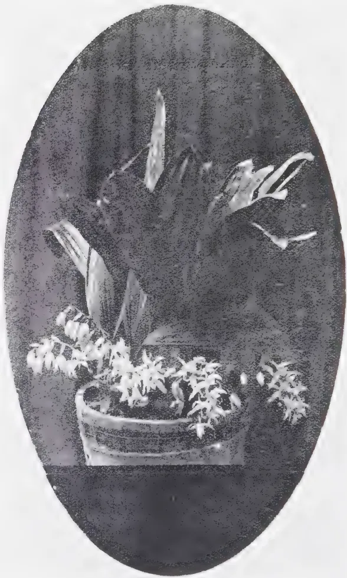

# The Tropical Agriculturist

August, 1934

---

## EDITORIAL

---

### LESSONS FROM MALTA

---

**A**N investigation into the agriculture of Malta reveals many facts from which we can glean information that should be of interest to those engaged in dry land farming in Ceylon. Malta has industries in her capital town but the chief occupation of her people is in the raising of minor crops for she has nothing comparable to our plantation agriculture. Her rainfall is such that even our dry zone cultivators are fortunate in comparison, she has little or no irrigable land such as our paddy fields. Wheat is her cereal crop. The market garden industry of Malta is highly developed not only for the supply of her town population but she also exports quantities of excellent potatoes some of which find their way to Ceylon. We cannot covet Malta these imports for the one to two thousand tons of potatoes is but a fraction of our annual requirements and the yield of these tubers in our own soil is not sufficiently encouraging.

Maltese cumin seed the report suggests is an article that might find its way to Ceylon, we can raise no objection for our climate is too wet for the satisfactory production of the article here. Maltese onions on the other hand we might perhaps avoid by raising our own although we are at present far from satisfying our own requirements.

1------------------------------------------------

70

The great lesson that Ceylon can learn from Malta is to make the most of her opportunities for naturally her advantages are no less than those of Malta. The recently enhanced duties on such articles as eggs, ghee, vegetables, ginger and betel leaves afford additional incentive to their production in Ceylon, that is all they are intended to be, and in no sense are they to be regarded as retaliatory. The poultry industry in Malta would appear to be very much in the undeveloped condition that it is in Ceylon, but here the duty of three cents per egg now imposed should quickly improve matters. Marketing of produce in Malta too seems very little better developed than in Ceylon and even the potatoes are said to suffer from the absence of grading. Finance as in Ceylon is in an undeveloped condition although a law limiting interest rates to six per cent. is an advance of no mean economic importance. The provision of easy credit by an Agricultural Bank is not advised, the Maltese presumably being no less keen borrowers than others.

2------------------------------------------------

71

## FERTILIZER TRIALS WITH FADDY IN THE EASTERN PROVINCE—PART I

L. LORD, M.A., (OXON.),

*DIVISIONAL AGRICULTURAL OFFICER,*

A considerable body of experimental evidence of the effects of fertilizers on the yield of paddy in Ceylon has now been accumulated, but nothing so far published refers to the Eastern Province. This somewhat remote province on the East coast of the Island which contains large areas of undeveloped jungle, scrub jungle, and savannah, contains in addition extensive and compact blocks of irrigated paddy land. The Pattipolai-aru Irrigation Scheme, the largest, extends to 26,000 acres, and the total area of irrigable land under major or village works is over 100,000 acres.

The effect of fertilizers on the yield of paddy and the economic considerations involved have now been investigated in three widely separated areas in the Province and the results obtained are described in these papers.

A preliminary trial was carried out at the Illupadichchenai Paddy Seed Station during the munmari season of 1931-32 to ascertain the effect of phosphoric acid alone and with different amounts of nitrogen. The fertilizers and amounts per acre used were Ammophos (13/46) 73 lb., Nicifos (22/18) 102 lb. and concentrated superphosphate (42%  $P_2O_5$ ) 120 lb. At the time of laying down the trial these quantities were each valued at Rs. 7.00 f.o.r. Colombo, and a simple standard of comparison for the village cultivator was desirable. The experiment was in the form of a  $4 \times 4$  Latin square with 1/80 acre plots of which an inner area of 1/100 acre was harvested. Small earth bunds surrounded each plot. In this locality ungerminated seed is sown on a dry seed bed and irrigation water is given only after the ensuing heavy rains have stopped. The paddy used was the pure line *perillanel* which matures in 4 months.

3------------------------------------------------

72

The results were as follows:—

*Illupadichchenai, 1931-32*

(4 × 4 Latin Square)

Yields in lb. per 1/100 acre plot.

<table border="1">
<thead>
<tr>
<th>Replication</th>
<th>Ammophos 13/46</th>
<th>Nicifos 22/18</th>
<th>Con. Super- phosphate</th>
<th>Control (no manure)</th>
</tr>
</thead>
<tbody>
<tr>
<td>A</td>
<td>21.0</td>
<td>29.9</td>
<td>23.7</td>
<td>27.2</td>
</tr>
<tr>
<td>B</td>
<td>30.1</td>
<td>30.9</td>
<td>20.8</td>
<td>21.4</td>
</tr>
<tr>
<td>C</td>
<td>26.1</td>
<td>26.2</td>
<td>26.6</td>
<td>19.9</td>
</tr>
<tr>
<td>D</td>
<td>29.1</td>
<td>30.1</td>
<td>24.8</td>
<td>27.1</td>
</tr>
<tr>
<td>Total</td>
<td>106.3</td>
<td>117.1</td>
<td>95.9</td>
<td>95.6</td>
</tr>
<tr>
<td>Mean</td>
<td>26.57</td>
<td>29.27</td>
<td>23.97</td>
<td>23.9</td>
</tr>
<tr>
<td>Control = 100</td>
<td>111</td>
<td>122.5</td>
<td>100</td>
<td>100</td>
</tr>
<tr>
<td>Yield per acre lb.</td>
<td>2657</td>
<td>2927</td>
<td>2397</td>
<td>2390</td>
</tr>
<tr>
<td>Yield bushel of 46 lb.</td>
<td>57.7</td>
<td>63.6</td>
<td>52.1</td>
<td>51.9</td>
</tr>
</tbody>
</table>

Unfortunately the experiment does not satisfy the requirements of the Z test (with  $P = .05$ ) due, probably, to the peculiar behaviour of the Ammophos plot in replication A. The increases due to Nicifos, however, are sufficiently consistent to remove any doubt of their being due merely to chance. In view of previous experiments elsewhere the lack of response to phosphoric acid alone is noteworthy.

The increase due to Nicifos is 11.7 bushels of paddy. The cost of Nicifos is (April 1934) Rs. 8.00 per cwt. f.o.r. Colombo. The cost of rail transport to Batticaloa is Rs. 1.11 per cwt. and transport to the field and cost of application will probably not exceed cts. 39, making the total cost of the fertilizer Rs. 9.50 per cwt. With paddy selling at Re. 1.00 per bushel the application of the fertilizer has given a small but inadequate profit. This subject will be referred to again later.

It was stated above that the failure of the experiment to satisfy the requirements of the Z test was due probably to the comparatively low yield of the Ammophos plot in replication A. This low yield is ascribed to rain water standing on the plot soon after sowing. The plot was found to be slightly lower than the other plots in the experiment although this was not obvious before the rain. As the plot was lower than the adjoining land

4------------------------------------------------

73

the water could not be drained away. The low level of the plot was due partly to the natural level of the field and partly to taking from inside the plot soil with which the surrounding small bund was constructed. In fact this removal of the soil affected the level of all plots and made drainage into the rest of the field slow and sometimes impossible. Normally the first rains soak into the soil and standing water is not experienced until the plants are three or four inches high — at which time, of course, standing water is beneficial. As a similar experiment at the Sengapadi Paddy Seed Station was completely spoiled by the same trouble and as funds were not available for raising the level of the experimental plots above the level of the rest of the field it was decided to lay down experiments in which the individual plots were separated not by bunds but by a 2-ft. space in the middle of which a shallow drain was scooped out. It was assumed that in the early days of the experiments any fertilizer washed from a plot would remain in the drain and that by the time the fields contained standing water all the fertilizer would be held by the soil of the appropriate plots.

For the munmari (maha or autumn) season of 1933-34 an experiment was laid down in this manner at Illupadichchenai and the results (which follow) appear to indicate that the fertilizers have largely or entirely remained on their own plots, judged by the magnitude of the response to Nicifos. The experiment was again designed to ascertain the effects of phosphoric acid alone and in conjunction with different amounts of nitrogen and the following fertilizers were applied at the rate of 1 cwt. of the normal fertilizer per acre: concentrated superphosphate (42%  $P_2O_5$ ), Nicifos 22/18, and Ammophos 13/46. As in all the experiments discussed on this paper 1/80 acre plots were used of which (to eliminate any border effect) an inner area of 1/100 acre was harvested. The paddy was the four months, pure line *perillanel*.

5------------------------------------------------

74Illupadichchenai, 1933-34

(4 × 4 Latin Square)

Yields in lb. per 1/100 acre plot.

<table border="1">
<thead>
<tr>
<th>Replication</th>
<th>Ammophos 13/46</th>
<th>Nicifos 22/18</th>
<th>Con. Super- phosphate</th>
<th>Control (no manure)</th>
</tr>
</thead>
<tbody>
<tr>
<td>A</td>
<td>18.1</td>
<td>18.4</td>
<td>13.1</td>
<td>12.1</td>
</tr>
<tr>
<td>B</td>
<td>14.1</td>
<td>18.1</td>
<td>12.1</td>
<td>12.2</td>
</tr>
<tr>
<td>C</td>
<td>15.1</td>
<td>16.7</td>
<td>12.8</td>
<td>12.1</td>
</tr>
<tr>
<td>D</td>
<td>18.2</td>
<td>17.5</td>
<td>11.9</td>
<td>13.4</td>
</tr>
<tr>
<td>Total</td>
<td>65.5</td>
<td>70.7</td>
<td>49.9</td>
<td>49.8</td>
</tr>
<tr>
<td>Mean</td>
<td>16.37</td>
<td>17.67</td>
<td>12.47</td>
<td>12.45</td>
</tr>
<tr>
<td>Control = 100</td>
<td>131</td>
<td>142</td>
<td>100</td>
<td>100</td>
</tr>
<tr>
<td>Yields per acre lb.</td>
<td>1637</td>
<td>1767</td>
<td>1247</td>
<td>1245</td>
</tr>
<tr>
<td>Bushels of 46 lb.</td>
<td>35.6</td>
<td>38.4</td>
<td>27.1</td>
<td>27.1</td>
</tr>
</tbody>
</table>

Analysis of Variance

<table border="1">
<thead>
<tr>
<th>Variance</th>
<th>Degree of Freedom</th>
<th>Sum of Squares</th>
<th>Mean Square</th>
<th>S.D.</th>
<th>Log E S.D.</th>
</tr>
</thead>
<tbody>
<tr>
<td>Columns</td>
<td>3</td>
<td>5.7069</td>
<td></td>
<td></td>
<td></td>
</tr>
<tr>
<td>Rows</td>
<td>3</td>
<td>4.0369</td>
<td></td>
<td></td>
<td></td>
</tr>
<tr>
<td>Treatments</td>
<td>3</td>
<td>86.6469</td>
<td>28.8823</td>
<td>5.369</td>
<td>1.6806</td>
</tr>
<tr>
<td>Error</td>
<td>6</td>
<td>7.2283</td>
<td>1.2047</td>
<td>1.098</td>
<td>0.0929</td>
</tr>
<tr>
<td>Total</td>
<td>15</td>
<td>103.6190</td>
<td></td>
<td>diff.</td>
<td>1.5877</td>
</tr>
</tbody>
</table>

For  $n_1=3$ ,  $n_2=6$ 1%  $z$  is 1.1401

The standard deviation is 7.45%, the standard deviation of the difference between means .776 lb. and the significant difference 1.65 lb. The experiment is highly significant and both Ammophos and Nicifos have given significant increases of yield. The increase for 1 cwt. of Nicifos is 11.3 bushels per acre. Again phosphoric acid alone has given no response.

In comparison with the former experiment at this station and with previous yields generally the yields in this experiment are low, due mainly to more than normal weed growth.

An identical experiment (except that the paddy used was pure line *pachchaiperumal* which matures in from 86 to 90 days and that germinated seed was sown on a puddled seed bed) was

6------------------------------------------------

75

carried out on the Sengapadi Paddy Seed Station during the pinmari (yala or spring) season of 1934. The results were as follows:

*Sengapadi, 1934*

Manurial Trial ( $4 \times 4$  Latin Square)

Yields in lb. per 1/100 acre plot.

<table border="1">
<thead>
<tr>
<th>Replication</th>
<th>Ammophos 13/46</th>
<th>Nicifos 22/18</th>
<th>Con. Super- phosphate</th>
<th>Control (no manure)</th>
</tr>
</thead>
<tbody>
<tr>
<td>A</td>
<td>24.5</td>
<td>27.4</td>
<td>18.9</td>
<td>20.1</td>
</tr>
<tr>
<td>B</td>
<td>24.9</td>
<td>25.7</td>
<td>23.1</td>
<td>21.9</td>
</tr>
<tr>
<td>C</td>
<td>23.4</td>
<td>24.1</td>
<td>19.2</td>
<td>22.0</td>
</tr>
<tr>
<td>D</td>
<td>27.4</td>
<td>24.0</td>
<td>23.1</td>
<td>20.1</td>
</tr>
<tr>
<td>Total</td>
<td>100.2</td>
<td>101.2</td>
<td>84.3</td>
<td>84.1</td>
</tr>
<tr>
<td>Mean</td>
<td>25.05</td>
<td>25.3</td>
<td>21.07</td>
<td>21.02</td>
</tr>
<tr>
<td>Control = 100</td>
<td>119</td>
<td>120</td>
<td>100</td>
<td>100</td>
</tr>
<tr>
<td>Yields per acre lb.</td>
<td>2505</td>
<td>2530</td>
<td>2107</td>
<td>2102</td>
</tr>
<tr>
<td>Yields bushels of 46 lb.</td>
<td>54.4</td>
<td>55</td>
<td>45.8</td>
<td>45.7</td>
</tr>
</tbody>
</table>

*Analysis of Variance*

<table border="1">
<thead>
<tr>
<th>Variance</th>
<th>Degree of Freedom</th>
<th>Sum of Squares</th>
<th>Mean Square</th>
<th>S.D.</th>
<th>Log E S.D.</th>
</tr>
</thead>
<tbody>
<tr>
<td>Columns</td>
<td>3</td>
<td>7.75</td>
<td></td>
<td></td>
<td></td>
</tr>
<tr>
<td>Rows</td>
<td>3</td>
<td>8.26</td>
<td></td>
<td></td>
<td></td>
</tr>
<tr>
<td>Treatments</td>
<td>3</td>
<td>68.19</td>
<td>22.730</td>
<td>4.760</td>
<td>1.5602</td>
</tr>
<tr>
<td>Error</td>
<td>6</td>
<td>20.13</td>
<td>3.355</td>
<td>1.833</td>
<td>0.6059</td>
</tr>
<tr>
<td>Total</td>
<td>15</td>
<td>104.33</td>
<td></td>
<td>diff.</td>
<td>0.9543</td>
</tr>
</tbody>
</table>

For  $n_1=3$ ,  $n_2=6$

5% point  $z$  is 0.7798

The standard deviation is 7.9%, the standard deviation of the difference between means 1.29 lb., and the significant difference 2.75 lb. The experiment satisfies the requirements of the  $Z$  test and the increased yields due to Ammophos and Nicifos are significant.

As at Illupadichchenai there has been no response to phosphoric acid alone. Nicifos has given an increase of 9.3 bushels per acre compared with 11.3 bushels at Illupadichchenai

7------------------------------------------------

76

in 1933-34. The smaller increase at Sengapadi may be due to the shorter-aged paddy used for the experiment. Ammophos has given almost the same increased yield as Nicifos.

#### DISCUSSION

The experiments described are simple *ad hoc* experiments designed to ascertain, at small cost, which fertilizers can profitably be applied to paddy in the Eastern Province. Both the Illupadichchenai and Sengapadi Paddy Seed Stations are situated in the Batticaloa District of the Province and the conclusions drawn here refer only to this District. The experiment at the Tamblagam Paddy Seed Station in the Trincomalee District will be described in Part II of this paper. The experiments clearly show (a) non-response to phosphoric acid alone, and, (b) definite response to Nicifos and Ammophos with some slight indication that the narrow- is more effective than the wide-ratio ammonium phosphate. The increase obtained from a one cwt. dressing of Nicifos is about 11 bushels per acre with a four-month paddy and 9 bushels per acre with a 3-month paddy. With the fertilizer costing Rs. 9.50 applied on the land there is either no, or, inadequate profit when paddy is selling, as it does now in most places in the Batticaloa District, at Re. 1.00 to Rs. 1.20 per bushel. With a paddy price of Rs. 1.50 the profit will tempt growers to use the fertilizer and with a price of Rs. 2/- per bushel wide-spread use of the fertilizer may be expected.

In view of experiments in other parts of Ceylon the non-response to phosphoric acid alone is unexpected and it would appear that ammoniacal nitrogen alone will be effective on these soils. It is proposed next season to repeat the experiments substituting sulphate of ammonia for Ammophos in order to get evidence on this point. In the meantime a one-cwt. application of narrow-ratio Nicifos or Ammophos is recommended for the Batticaloa District when the price of paddy is not less than Rs. 1/50 per bushel.

#### SUMMARY

1. (1) Experiments in the Batticaloa District of the Eastern Province to determine the effect on the yield of paddy of phosphoric acid alone and with different amounts of nitrogen are described.
2. (2) An application of 1 cwt. of concentrated superphosphate per acre gave no increase in yield.

8------------------------------------------------

77

- (3) Applications of 1 cwt. per acre of Nicifos (22/18) or of Ammophos (13/46) produced increases of about 11 bushels with a 4-month and 9 bushels with a 3-month paddy.
- (4) The increased yield is sufficiently profitable only when the price of paddy is not less than Rs. 1/50 per bushel.
- (5) It would appear that ammoniacal nitrogen alone will be as effective as ammonium phosphate and it is proposed to carry out experiments to determine this.

#### REFERENCES

LORD, L.—Manurial Experiments with Rice, Part I.—*The Tropical Agriculturist* LXXIII, August, 1929.

LORD, L.—Manurial Experiments with Rice, Part II.—*Ibid* LXXIII, November, 1929.

LORD, L.—Manurial Experiments with Rice, Part III.—*Ibid* LXXVI, February, 1931.

HAIGH, J. C. and Joachim, A. W. R.—Studies on Paddy Cultivation I. The Paddy Crop in relation to manurial treatment, a general discussion.—*Ibid* LXXXI, July, 1933.

9------------------------------------------------

78

## FURTHER NOTES ON CACAO DISEASE IN THE DUMBARA VALLEY, 1933

MALCOLM PARK, A.R.C.S.,

GOVERNMENT MYCOLOGIST

IN October 1933 a preliminary note on cacao disease in the Dumbara Valley, 1933, was published in *The Tropical Agriculturist*. In that note attention was drawn to the marked increase in the number of sudden deaths of cacao trees which had occurred during the unusually wet weather which prevailed from January to August, 1933.

It was pointed out that, while claret-coloured canker was more severe than usual owing to the very wet season, the majority of the deaths of trees that occurred appeared to be due to a form of disease which caused the trees to wilt and die suddenly.

Subsequent to the writing of the above-mentioned note further field observations were made. It was found that there was some confusion regarding the disease referred to. Dieback is common in cacao estates and gardens and this dieback is always more active in wet weather. In 1933, during the prolonged spell of wet weather, deaths from dieback were unusually numerous. By the term "dieback" is meant the progressive dying back which is the result of canker on the stems and branches, caused by *Phytophthora palmivora*, or, as was seen by observation to be more common, of wood-rot starting from a wound or from an unprotected pruning cut. The decay starts from such a wound and progresses in the wood downwards towards the roots. The progressive wood-rot is usually confined to the heart wood but may spread into the sap wood and the water supply of large branches or even of whole trees may be cut off with the inevitable result that the trees dieback. The rate at which the external symptoms of dieback, *i.e.*, defoliation and deaths of branches occur, varies with the nature of the wood-rot. In some instances the external symptoms follow one another in rapid succession, the symptoms being very similar to those displayed by those other trees, in which death could not be attributed to any of the well-known diseases.

10------------------------------------------------

79

The proportion of casualties which was due to the action of canker or wood-rot was greater than was indicated in the preliminary note referred to above. It was found that rot starting at wood-surfaces exposed in pruning was the cause of death of a great number of trees, particularly in village gardens and in small estates. The need of more careful pruning and the protection of pruning cuts by tar or by some other protective material is evident. The humid conditions which prevail under the dense canopy of foliage of cacao favour to a marked degree the growth of wood-rotting organisms and it is not sufficiently well realized that the wood-surface exposed when a large branch is removed in pruning is very liable to decay unless it is adequately protected by a coating of tar or some similar substance.

In addition to the trees in which death could be attributed to wood-rot or to canker there were, however, very many trees which died suddenly from another cause. The symptoms displayed by such trees were described fully in the preliminary note and consist of rapid wilting and death. The first outward sign of the disease is a slight change of colour of the foliage from the normal green to an unhealthy pale-green colour. This change is followed shortly by a wilting of all the leaves, which eventually dry and turn brown but remain attached to the branches. Preceding and accompanying these outward symptoms certain changes occur in the cortex of the stems of affected trees. The cortex is first seen to be slightly discoloured and has a fermented smell, which is attractive to shot-hole borers (*Xyleborus* sp.). Subsequently the cortex undergoes rapid changes and finally turns brown and dries up. The cortex of the large roots does not appear to be affected in the early stages, but subsequently this also becomes affected and dies. The small feeding rootlets were found to be dead and dried by the time the early symptoms of wilting appeared.

Field observations indicated that old trees were particularly susceptible to this disease. On one estate, it was seen that a large number of trees which were over fifty years of age died in the manner described above and it has been suggested that such trees suffer from lack of vitality since it has been observed that they appear to suffer more than younger trees from the ill-effects of prolonged wet weather or of drought. Similar observations were made elsewhere.

11------------------------------------------------

80

Trees which were affected occurred usually as isolated cases although groups of trees died in areas where flooding occurred. In no place was the disease observed to spread from one tree to another, nor was it entirely confined to any particular type of soil. More deaths, however, were observed on heavy clay soils than on gravelly soils. Dead and dying trees were seen on hillsides as well as on flat land.

In the preliminary note referred to above it was recorded that, in the early stages of the disease, no sign of fungus infection was observed in the cortex of the stems or roots of diseased trees. Further observations confirmed this. Fungi were not found until after the cortex turned brown. At this relatively late stage it was found possible to isolate two fungi from the dead cortex. These fungi, the occurrence of which has already been recorded were *Nectria striatospora* and another which occurred as strands of mycelium, black externally and white internally, within the tissues of the cortex. Isolations of these were made but it was not possible to identify the fungus-forming strands in the cortex as it did not produce spores. Examination of the cortex of dead cacao branches from otherwise healthy trees showed that both these fungi occur commonly and in conditions which indicate that they are saprophytic. Nevertheless, two series on inoculations were carried out with pure cultures of these two fungi on healthy branches of cacao trees. The branches were wounded and inoculated with the fungi and the points of inoculation covered with damp cotton and bound with waxed tape to induce conditions most favourable for infection. In the two series six trees were inoculated with each fungus. No infection occurred. It would appear therefore that these two fungi gain entry into the diseased trees when they are moribund or dead and that they are saprophytic. The nature of the disease as it occurs in the field tends to confirm the results detailed above. The disease is sporadic in its appearance, attacks isolated trees and does not obviously spread from one tree to another.

If, then, the disease is not caused by the attack of an organism, to what can it be attributed? It has been stated above that the prolonged spell of wet weather which occurred in the early months of 1933 was thought to be an important factor in the incidence of the disease. By courtesy of the superintendent, records have been obtained of the rainfall and the number of diseased trees uprooted during the last five years on a large

12------------------------------------------------

<!-- stage4: FAINT old-images-only -->

[Faint page: no legible print of its own could be verified; text withheld (stage 4 review list)]

This image is a scan of a blank page. The background is a uniform light beige or off-white color. There are a few very small, dark specks scattered across the surface, which appear to be scanning artifacts or dust particles. No text, lines, or other graphical elements are present.

13------------------------------------------------

No of trees Rain  
cut out. % average

———— Quarterly rainfall (% average)

----- No. of dead trees cut out.

<table border="1">
<thead>
<tr>
<th>Year</th>
<th>Quarter</th>
<th>Quarterly Rainfall (% average)</th>
<th>No. of dead trees cut out</th>
</tr>
</thead>
<tbody>
<tr>
<td rowspan="4">1929</td>
<td>1st</td>
<td>110</td>
<td>1000</td>
</tr>
<tr>
<td>2nd</td>
<td>105</td>
<td>1100</td>
</tr>
<tr>
<td>3rd</td>
<td>85</td>
<td>700</td>
</tr>
<tr>
<td>4th</td>
<td>80</td>
<td>850</td>
</tr>
<tr>
<td rowspan="4">1930</td>
<td>1st</td>
<td>90</td>
<td>1000</td>
</tr>
<tr>
<td>2nd</td>
<td>85</td>
<td>1100</td>
</tr>
<tr>
<td>3rd</td>
<td>80</td>
<td>1200</td>
</tr>
<tr>
<td>4th</td>
<td>75</td>
<td>1300</td>
</tr>
<tr>
<td rowspan="4">1931</td>
<td>1st</td>
<td>70</td>
<td>1400</td>
</tr>
<tr>
<td>2nd</td>
<td>65</td>
<td>1500</td>
</tr>
<tr>
<td>3rd</td>
<td>60</td>
<td>1600</td>
</tr>
<tr>
<td>4th</td>
<td>55</td>
<td>1700</td>
</tr>
<tr>
<td rowspan="4">1932</td>
<td>1st</td>
<td>50</td>
<td>1800</td>
</tr>
<tr>
<td>2nd</td>
<td>45</td>
<td>1900</td>
</tr>
<tr>
<td>3rd</td>
<td>40</td>
<td>2000</td>
</tr>
<tr>
<td>4th</td>
<td>35</td>
<td>2100</td>
</tr>
<tr>
<td rowspan="4">1933</td>
<td>1st</td>
<td>30</td>
<td>2200</td>
</tr>
<tr>
<td>2nd</td>
<td>25</td>
<td>2300</td>
</tr>
<tr>
<td>3rd</td>
<td>20</td>
<td>2400</td>
</tr>
<tr>
<td>4th</td>
<td>15</td>
<td>2500</td>
</tr>
<tr>
<td rowspan="4">1934</td>
<td>1st</td>
<td>10</td>
<td>2600</td>
</tr>
<tr>
<td>2nd</td>
<td>5</td>
<td>2700</td>
</tr>
<tr>
<td>3rd</td>
<td>0</td>
<td>2800</td>
</tr>
<tr>
<td>4th</td>
<td>0</td>
<td>2900</td>
</tr>
</tbody>
</table>

Graph showing relation between rainfall and number of dead cacao trees cut out.

14------------------------------------------------

81

cacao estate in the Dumbara Valley. It is realized that the number of trees given includes those which have died from various causes and cannot be taken as an accurate guide to the incidence of any one disease. There is unfortunately no record available of the number of trees killed by the different diseases affecting the cacao but certain diseases, *e.g.*, root diseases, are common throughout and their incidence does not vary greatly from year to year. The figures are reproduced in Table I. It will be seen that, generally speaking, an increase in rainfall in any one month is succeeded in the one or two subsequent months by an increase in the number of dead trees cut out. To make this more clear the graph reproduced has been prepared. The curves represent the quarterly rainfall expressed as a percentage of the average rainfall for that quarter and the number of trees cut out each quarter. In the graph peaks in the rainfall curve are succeeded by peaks in the curve showing the number of trees cut out, and *vice versa*. There would appear, therefore, to be some correlation between rainfall and the number of cacao trees that die.

Another significant point brought out well by the rainfall curve is the relatively low rainfall in the year 1932. The rainfall of the four quarters of that year was approximately 34, 81, 75 and 80 per cent. of the average for the five years for which figures are available. This period of low rainfall was succeeded by the relatively very wet months at the beginning of 1933. In the first three quarters of that year the rainfall was approximately 150, 137 and 180 per cent. respectively of the average for those quarters. Accompanying this heavy rainfall was a very marked increase in the number of trees which died. It was this sudden increase in the number of deaths of cacao trees which led to the investigation under discussion and to the discovery of the form of disease in which trees died suddenly without any apparent cause.

#### DISCUSSION

An abstract of a paper by Kaden (1933) the original paper is unfortunately not available indicates that this disease is not confined to Ceylon. It is reported that in St. Thomas Island in the Gulf of Guinea outbreaks of a cacao disease have occurred since 1921. The disease is reported to vary in intensity from

15------------------------------------------------

82

TABLE I  
*Showing rainfall and number of trees cut out*

<table border="1">
<thead>
<tr>
<th></th>
<th colspan="2">1929</th>
<th colspan="2">1930</th>
<th colspan="2">1931</th>
<th colspan="2">1932</th>
<th colspan="2">1933</th>
<th colspan="2">1934</th>
</tr>
<tr>
<th></th>
<th>Rainfall</th>
<th>trees cut out</th>
<th>Rainfall</th>
<th>trees cut out</th>
<th>Rainfall</th>
<th>trees cut out</th>
<th>Rainfall</th>
<th>trees cut out</th>
<th>Rainfall</th>
<th>trees cut out</th>
<th>Rainfall</th>
<th>trees cut out</th>
</tr>
</thead>
<tbody>
<tr>
<td>January</td>
<td></td>
<td></td>
<td>12.84</td>
<td>7</td>
<td>10.62</td>
<td>599</td>
<td>.51</td>
<td>680</td>
<td>18.08</td>
<td>226</td>
<td>8.34</td>
<td>133</td>
</tr>
<tr>
<td>February</td>
<td></td>
<td></td>
<td>2.03</td>
<td>86</td>
<td>.95</td>
<td>255</td>
<td>4.72</td>
<td>282</td>
<td>3.40</td>
<td>263</td>
<td>5.95</td>
<td>95</td>
</tr>
<tr>
<td>March</td>
<td></td>
<td></td>
<td>8.10</td>
<td>25</td>
<td>4.90</td>
<td>202</td>
<td>1.49</td>
<td>333</td>
<td>8.28</td>
<td>143</td>
<td>7.98</td>
<td>150</td>
</tr>
<tr>
<td>April</td>
<td>10.64</td>
<td>—</td>
<td>6.07</td>
<td>80</td>
<td>6.45</td>
<td>143</td>
<td>6.96</td>
<td>287</td>
<td>2.17</td>
<td>159</td>
<td></td>
<td></td>
</tr>
<tr>
<td>May</td>
<td>4.04</td>
<td>—</td>
<td>10.74</td>
<td>65</td>
<td>2.18</td>
<td>64</td>
<td>6.98</td>
<td>99</td>
<td>21.92</td>
<td>34</td>
<td></td>
<td></td>
</tr>
<tr>
<td>June</td>
<td>6.78</td>
<td>261</td>
<td>6.64</td>
<td>261</td>
<td>4.68</td>
<td>109</td>
<td>2.75</td>
<td>58</td>
<td>4.10</td>
<td>2744</td>
<td></td>
<td></td>
</tr>
<tr>
<td>July</td>
<td>4.87</td>
<td>133</td>
<td>.28</td>
<td>260</td>
<td>2.02</td>
<td>158</td>
<td>3.72</td>
<td>236</td>
<td>9.85</td>
<td>1183</td>
<td></td>
<td></td>
</tr>
<tr>
<td>August</td>
<td>.65</td>
<td>163</td>
<td>2.18</td>
<td>193</td>
<td>9.13</td>
<td>103</td>
<td>3.47</td>
<td>174</td>
<td>6.55</td>
<td>817</td>
<td></td>
<td></td>
</tr>
<tr>
<td>September</td>
<td>3.12</td>
<td>283</td>
<td>2.93</td>
<td>246</td>
<td>3.56</td>
<td>92</td>
<td>1.59</td>
<td>88</td>
<td>4.59</td>
<td>430</td>
<td></td>
<td></td>
</tr>
<tr>
<td>October</td>
<td>4.13</td>
<td>164</td>
<td>15.87</td>
<td>81</td>
<td>7.79</td>
<td>36</td>
<td>8.05</td>
<td>117</td>
<td>6.14</td>
<td>160</td>
<td></td>
<td></td>
</tr>
<tr>
<td>November</td>
<td>8.80</td>
<td>79</td>
<td>8.71</td>
<td>—</td>
<td>13.65</td>
<td>4</td>
<td>9.04</td>
<td>—</td>
<td>9.64</td>
<td>247</td>
<td></td>
<td></td>
</tr>
<tr>
<td>December</td>
<td>7.87</td>
<td>51</td>
<td>1.99</td>
<td>326</td>
<td>16.39</td>
<td>—</td>
<td>2.52</td>
<td>131</td>
<td>1.92</td>
<td>277</td>
<td></td>
<td></td>
</tr>
<tr>
<td>Total</td>
<td></td>
<td></td>
<td>78.38</td>
<td>1630</td>
<td>82.32</td>
<td>1765</td>
<td>51.80</td>
<td>2485</td>
<td>96.64</td>
<td>6683</td>
<td></td>
<td></td>
</tr>
</tbody>
</table>

16------------------------------------------------

83

year to year but extensive losses have occurred and two plantations are reported to have lost 55,000 and 70,000 trees respectively in the last three years.

The disease is known as 'morte subita' (sudden death) or 'plethora' disease. The symptoms described are as follows:

"The leaves of apparently vigorous trees suddenly assume a limp, glassy appearance, turn yellow within a few hours, and generally die in two or three days. A temporary recovery may occasionally be affected by drastic pruning to stimulate new growth, supplemented by the application to the soil of 5 per cent. iron sulphate. The withered leaves emit an odour of ripe apples on crumbling in the hand. No trace of parasitic agency has been detected, though the finer absorbing roots of affected trees are desiccated. The disease is most prevalent in the yellow Brazilian Amelonado (St. Thomas Criolla) plantings of eight years old and upwards, the red Central American varieties and their hybrids being relatively resistant. 'Morte subita' is confined to the compact soils (mostly red loam) of the interior and south of the Island, reaching its climax at the beginning of the dry season (June to August)."

These symptoms correspond closely to those displayed by trees affected by the disease in Ceylon. The withered leaves of diseased trees were not examined in Ceylon so that it is not possible to state whether they possess the odour of ripe apples described above. The fermented odour which is noticeable in the cortex of diseased trees may be of a similar character.

The causes of the disease are discussed in the following quotation from the abstract of Kaden's paper:

"Discussing the etiology of 'morte subita' the writer draws attention to the gradual modification of the insular climate, largely under the influence of the excessive deforestation and drainage of swamps to meet planting requirements. Formerly enjoying a temperate moist warmth throughout the year, the Island is now subject to sharply fluctuating extremes of temperature and humidity to which cacao is naturally sensitive. The importance of this factor in the causation of 'morte subita' is suggested by its complete absence from Prince's Island until 1929, when large forest areas were cleared and the climatic conditions underwent the changes described above; at this time the first cases of the disease were recorded. Another underlying cause of the apparently 'sudden' death of the trees is aluminium poisoning resulting from the poverty of the soils in exchangeable lime".

Briefly, it is suggested that the disease is caused by sudden fluctuations in temperatures and humidity and by a soil condition resulting from the lack of exchangeable lime in the soil. It has been pointed out above that the incidence of the disease in Ceylon

17------------------------------------------------

84

appears to be correlated with rainfall and the greatest number of casualties occurred in a period of very wet weather which followed immediately after a year in which the rainfall was markedly below average. No temperature records are available for the area from which the figures quoted above were obtained so that it is not possible to state whether there was any fluctuation in temperature. The range of temperatures to which the cacao is subjected is, however, unlikely to be great. It would appear, therefore, that the Ceylon disease is similar to that described from the African Islands, St. Thomas and Prince's Islands, in that it is an accompaniment of marked fluctuations in rainfall and consequently in humidity. No investigations have been carried out to date in Ceylon regarding the soil condition which is also said to be in part responsible for the disease. In Ceylon, however, most of the soils are deficient in exchangeable lime and it is probable that the disease here is similar to the one investigated by Kaden in this particular also. Both diseases are most common in heavy soils.

There is no information regarding varying susceptibility to the disease of different varieties of cacao in Ceylon but observations will be made to determine if the disease in Ceylon is similar in this respect to the disease in the Gulf of Guinea.

To summarise, the similarity of symptoms displayed by diseased trees, the association of the disease with marked fluctuations in rainfall and consequently in humidity and the similarity of soil conditions indicate that the disease known as 'morte subita' in St. Thomas and Prince's Islands, Gulf of Guinea, and the disease observed in the Dumbara Valley, Ceylon, in 1933 are identical. The disease is non-parasitic and is due to unfavourable environmental conditions. It is suggested that 'sudden death', the English equivalent of 'morte subita', is an appropriate name for the disease in Ceylon.

#### CONTROL

It has been suggested above that 'sudden death' disease is caused by marked fluctuations in weather conditions and by soil factors. It is obvious that no steps can be taken to control rainfall. It is, however, unlikely that the climatic conditions which prevailed in the Dumbara Valley during 1932 and 1933, *i.e.*, an

18------------------------------------------------

85

unusually dry year followed immediately by one of heavy rainfall, will occur very often so that it may be presumed that casualties on the scale of 1933 will occur again rarely, if at all.

Nevertheless, the effects of extremes of rainfall and consequently of humidity can be to some extent moderated by taking steps to ensure that even in dry weather the humidity in the cacao is not allowed to fall too low. The provision of adequate high shade is important in this respect in that its shading effect tends to increase the humidity in the cacao and to protect the cacao from the direct effect of hot sunshine. If a suitable cover crop could be found, the provision of a ground cover would also assist in maintaining a high degree of humidity in the cacao.

It is possible to improve soil conditions so that the danger of aluminium poisoning resulting from the poverty of the soil in exchangeable lime is reduced to a minimum. The use of cattle and green manures and the application of lime will tend to improve the condition of the soil in which the trees are grown. The improvement of the tilth of the soil and the increase of humus makes the soil less liable to extreme desiccation and this again will tend to increase the humidity of the air above the soil in dry weather.

Further observations are necessary before any recommendations can be made regarding the varieties of cacao which should be planted in areas subject to 'sudden death' disease. It has been suggested by Kaden that the Venezuelan varieties are resistant to the disease.

### SUMMARY

The article contains further observations on the disease of cacao, now designated 'sudden death' disease, which was common on the Dumbara Valley, Ceylon in 1933. The symptoms displayed by diseased trees are a rapid wilting and death. In a preliminary note on the disease previously published it was suggested that fungi found in the cortex of the stems of dead trees might be in part responsible. Further observations and inoculation experiments have proved this to be incorrect.

The disease is caused by marked fluctuations in rainfall and consequently in humidity and is a non-parasitic disease. It is possible that aluminium poisoning resulting from the poverty of the soils in exchangeable lime may be a contributory factor.

19------------------------------------------------

<!-- stage4: ACCEPT r2J/J_011:19 -->

86

Suggestions are made for combating the disease.

In addition to 'sudden death' disease, attention is drawn to the number of casualties which occur as the result of wood-rot starting from wounds and unprotected pruning cuts. The need for care and pruning and the protection of pruning cuts by tar or some other cover is stressed.

#### REFERENCES

KADEN, O. F., 1933.—Untersuchungsergebnisse über nichtparasitäre Kakaokrankheiten in San Tomé und Principe. (Results of investigations on non-parasitic cacao diseases in St. Thomas and Prince's Islands).—*Der Tropenpflanzer*, XXXVI, 8, pp. 321-340.

PARK, M., 1933. A Preliminary Note on Cacao Disease in the Dumbara Valley, 1933.—*The Tropical Agriculturist* LXXXI, 4. p. 207.

20------------------------------------------------

This image is a blank white page. It contains no text, figures, or tables. There is a small, dark, irregular speck located in the lower-left quadrant of the page, approximately one-third of the way from the bottom and one-third of the way from the left edge.

21------------------------------------------------

A black and white photograph of a potted orchid plant, Coelogyne asperata Lindl., enclosed in an oval frame. The plant features large, dark, lanceolate leaves and clusters of small, light-colored flowers. The pot is a simple, light-colored container. The background is dark and textured.

*Coelogyne asperata* Lindl.

22------------------------------------------------

87

## NOTES ON ORCHIDS CULTIVATED IN CEYLON

### COEOGYNE ASPERATA LINDL.

K. J. ALEX. SYLVA, F.R.H.S.,

CURATOR, HENERATGODA BOTANIC GARDENS, GAMPAHA

**T**HE Coelogynes constitute a genus of epiphytic orchids confined to the tropical and sub-tropical regions of Asia. Lindley gave the generic name, Coelogyne, to the genus in 1825 in reference to the hollowed pistil and the first to be described was *Coelogyne cristata*, a very popular plant in collections.

The majority of the Coelogynes are conspicuous by their coloured membranous flowers having converging and shyly expanding sepals and petals, a hood-like lip, usually with fringed veins and a broad column.

There are over sixty named species most of which are well known to orchid growers. Some have tough but graceful-looking leaves and loose pendulous or erect racemes of flowers; while others, in form like alpine plants throw out flowers from an underground stem in the absence of any leaves. These latter, named Pleione are of annual duration and are found in the Himalayas between the two and ten thousand foot elevations. *Coelogyne asperata* Lindl. is a native of Malaya and Borneo, and was first introduced to Ceylon in 1891. The plant is well adapted to cultivation and attains a height of two or three feet. The dull green stiff papery leaves are about two and a half feet long and about five inches broad. They are strongly ribbed and are produced on the apex of the large oblong and grooved pseudo-bulbs which are between four to six inches high.

The short stout semi-drooping or arched raceme of flowers is produced through the centre of a scale-leaved new growth that later develops into a new pseudo-bulb.

When the flowers are faded the raceme readily comes off. The individual flower is about three inches in diameter. The

23------------------------------------------------

88

petals and sepals are of a creamy colour as is also the background of the lip, which is streaked yellow and blotched with chocolate, the margin being wavy and frilled. The flower has a fragrant perfume but lasts only a week.

*Culture.*—Unlike some other members of the genus, *Coelogyne asperata* is a strong-growing species which needs plenty of rooting space and light for successful cultivation. On account of the short semi-pendulous nature of the flower-raceme, the plant is best grown in pots or wooden tubs. Plants grown on blocks of wood or hanging wooden baskets are liable to dwindle away from lack of the moisture-retaining power of these media. Though the plant is an epiphyte, it can be cultivated to perfection in a mixture composed of a fair percentage of leafy soil or flaky leaves. A good rooting medium may be made up of equal parts of boiled or weathered bits of coconut husk, half decayed strong wood, bits of bones, and knobs of charcoal mixed up with leaf mould or half-decayed leaves, and finished off with a top-dressing of moss.

It flowers twice a year, in December-January and June-July. When new young shoots appear, which carry flowers, the plants may be given slightly drier conditions but the application of moisture at the roots should not be altogether withheld. After the flowering is over the pots may be top-dressed as may be deemed necessary.

Repotting should not be undertaken unless the clump has overgrown its pot or it has too many leafless bulbs. All such nude bulbs should be carefully severed with a knife from the woody rhizome and placed singly in the same mixture in six inch pots for propagation. These bulbs should not be buried in the compost more than an inch on a slight mound raised over the pot; place these in a dry shady spot, giving a little water to hasten the sprouting of young shoots.

Well-established plants will stand our tropical sun very well if gradually brought into the open and hardened.

To retain flowers in a fresh state the plants should be shifted to shelter when in bloom. Special attention and care should be exercised in watering the plants that are throwing out new growths, as any water which collects in the new shoots is liable to cause their decay.

24------------------------------------------------

89

## RICE PRODUCTION AND TRADE IN THE EAST\*

**W**ORLD rice production, excluding that of China, for which no reliable data exist, rose to a maximum in 1930-31 and underwent successive declines in the two following seasons. In 1933-34, however, there appears to have been a recovery to about the level of 1931-32.

### *World production of rough rice (1)*

(Million pounds).

<table>
<tbody>
<tr>
<td>1933-34 (very approximate) ...</td>
<td>...</td>
<td>194,000</td>
</tr>
<tr>
<td>1932-33 ...</td>
<td>...</td>
<td>193,100</td>
</tr>
<tr>
<td>1931-32 ...</td>
<td>...</td>
<td>194,670</td>
</tr>
<tr>
<td>1930-31 ...</td>
<td>...</td>
<td>199,960</td>
</tr>
<tr>
<td>1929-30 ...</td>
<td>...</td>
<td>188,827</td>
</tr>
<tr>
<td>1924-25/1928-29 ...</td>
<td>...</td>
<td>186,424</td>
</tr>
</tbody>
</table>

(1) Not including that of China, the U.S.S.R., Persia and certain other countries of smaller production for which statistics are very incomplete or are entirely lacking.

A record crop was harvested in Burma, the world's greatest exporter of rice, and possibly also in French Indo-China, while Siam also had a large crop. Of the Japanese territories both Japan proper and Chosen had larger crops than in 1932-33, the former country attaining a record. India proper, on the other hand, had a crop even smaller than in the previous season.

These countries, together with China, the Netherlands East Indies, the Philippines, British Malaya and Ceylon are responsible for all but a relatively insignificant part of the production of monsoon Asia and therefore for the bulk of world production. Owing to the lack of reliable statistics the production of China remains a very doubtful quantity. The more recent estimates lie between 90,000 and 120,000 million pounds of rough rice. The Netherlands East Indies, though until last year they have had large imports, have a production exceeding that of either French Indo-China or Siam, both in the first rank as exporters. The Philippines with a production of about 4,500 million pounds of rough rice, also import, though generally only relatively small quantities. British Malaya and Ceylon, with much smaller production, follow India and China as importers.

From the point of view of their influence on the rice market the countries of monsoon Asia may accordingly be divided into three groups. In the first place, those producing a surplus that must find an outlet

\* By C. J. Robertson in the *International Review of Agriculture*, May, 1934.

25------------------------------------------------

90

largely in competitive markets: Burma, French Indo-China and Siam. Secondly, those producing a surplus that is normally absorbed by a preferential market: Chosen and Taiwan, which find such an outlet in Japan. Thirdly, deficit countries: India, China, Japan, British Malaya, Ceylon, the Netherlands East Indies and the Philippines.

### THE SITUATION IN BURMA, FRENCH INDO-CHINA AND SIAM

In Burma the 1933 monsoon was fairly strong in June and the rains were widespread, enabling ploughing to be completed under good conditions. Meanwhile the firmer condition of the market in consequence of the strong demand from India, where the 1932-33 crop had been small, had led to prices being considerably above the level of the corresponding period in 1932. The price of Big Mills Specials at Rangoon, which had been rising since March, when the steady decline that had begun in March 1932 was checked, continued to move upward in May and June, when the land was being prepared. Thus both weather and market conditions were relatively favourable. At the same time the prices of goods bought by the cultivators had also fallen and costs of production were further reduced by the wider adoption of broadcasting in place of transplanting. The area actually planted rose to 12,851,000 acres, so continuing the recovery from the low figure to which it had fallen in 1931-32 but still remaining under the 1929-30 level. Though the area destroyed was larger than in 1932-33, consequent on excessive middle rains in some parts of Lower Burma, most of it was resown or retransplanted and the area actually matured remained larger than in the previous year. The course of the season continued over most of the area to be favourable. In the result production attained the record level of 12,828 million pounds rice and rice products.

#### *Production and net export of major exporting countries*

(Million pounds rice and rice derivatives).

<table border="1">
<thead>
<tr>
<th colspan="4">Production</th>
<th colspan="4">Net export</th>
</tr>
<tr>
<th>Year</th>
<th>Burma</th>
<th>French Indo-China</th>
<th>Siam</th>
<th>Year</th>
<th>Burma*</th>
<th>French Indo-China</th>
<th>Siam†</th>
</tr>
<tr>
<th></th>
<th></th>
<th></th>
<th></th>
<th></th>
<th>To Foreign Countries</th>
<th>To Indian Ports</th>
<th></th>
</tr>
</thead>
<tbody>
<tr>
<td>1933-34</td>
<td>12,828‡</td>
<td>8,574</td>
<td>8,278</td>
<td>1934</td>
<td>—</td>
<td>—</td>
<td>—</td>
</tr>
<tr>
<td>1932-33</td>
<td>12,155</td>
<td>9,428</td>
<td>8,460</td>
<td>1933</td>
<td>3665</td>
<td>3302</td>
<td>2698</td>
</tr>
<tr>
<td>1931-32</td>
<td>10,351</td>
<td>9,034</td>
<td>6,727</td>
<td>1932</td>
<td>4219</td>
<td>2107</td>
<td>2624</td>
</tr>
<tr>
<td>1930-31</td>
<td>12,724</td>
<td>9,624</td>
<td>7,980</td>
<td>1931</td>
<td>4323</td>
<td>3177</td>
<td>2101</td>
</tr>
<tr>
<td>1929-30</td>
<td>12,335</td>
<td>9,557</td>
<td>6,407</td>
<td>1930</td>
<td>5187</td>
<td>2015</td>
<td>2465</td>
</tr>
<tr>
<td>1928-29</td>
<td>12,108</td>
<td>9,314</td>
<td>6,419</td>
<td>1929</td>
<td>3930</td>
<td>2269</td>
<td>3229</td>
</tr>
<tr>
<td>1927-28</td>
<td>12,088</td>
<td>10,333</td>
<td>7,547</td>
<td>1928</td>
<td>3379</td>
<td>2856</td>
<td>3904</td>
</tr>
<tr>
<td>1926-27</td>
<td>12,647</td>
<td>9,561</td>
<td>8,641</td>
<td>1927</td>
<td>4383</td>
<td>2414</td>
<td>3630</td>
</tr>
<tr>
<td>1925-26</td>
<td>11,734</td>
<td>9,440</td>
<td>6,933</td>
<td>1926</td>
<td>4621</td>
<td>1457</td>
<td>3506</td>
</tr>
<tr>
<td>1924-25</td>
<td>12,536</td>
<td>9,241</td>
<td>8,171</td>
<td>1925</td>
<td>4805</td>
<td>2754</td>
<td>3277</td>
</tr>
</tbody>
</table>

\* The official data are for rice both in the husk and not in the husk but as practically all the rice exported is milled, they have been taken to represent milled rice and derivatives.—† Exports from Bangkok, which make up 98 per cent. of the value of the total rice exports from Siam. Data refer to the season from 1 December to 30 November.—‡ not including Cambodia.

26------------------------------------------------

91

The bulk of the export from French Indo-China originates in Cochinchina. While there was a decrease of 3.6 per cent. in the area under rice, consequent on the difficult economic conditions in the western provinces, the favourable monsoon resulted in a crop larger than the poor one of 1932-33 and practically equivalent to the average of the five years ending 1931-32. The production of Cambodia, which also has a surplus for export, is not known at this date.

In the Union as a whole, even if the crop in Cambodia proves to have been little larger than the very small one of 1931-32, production will be at least as high as in 1932-33.

### *Production in French Indo-China*

(Million pounds rice and derivatives.)

<table border="1">
<thead>
<tr>
<th>Year</th>
<th>Cochin-China</th>
<th>Cambodia</th>
<th>Tonkin</th>
<th>Annam</th>
<th>Laos</th>
</tr>
</thead>
<tbody>
<tr>
<td>1933-34</td>
<td>3,465</td>
<td>—</td>
<td>2,836</td>
<td>1,690</td>
<td>583</td>
</tr>
<tr>
<td>1932-33</td>
<td>3,108</td>
<td>1,225</td>
<td>2,890</td>
<td>1,642</td>
<td>563</td>
</tr>
<tr>
<td>1931-32</td>
<td>3,636</td>
<td>781</td>
<td>2,903</td>
<td>1,183</td>
<td>531</td>
</tr>
<tr>
<td>1930-31</td>
<td>2,985</td>
<td>1,446</td>
<td>3,220</td>
<td>1,442</td>
<td>531</td>
</tr>
<tr>
<td>1929-30</td>
<td>3,484</td>
<td>1,047</td>
<td>2,990</td>
<td>1,505</td>
<td>531</td>
</tr>
<tr>
<td>1928-29</td>
<td>3,405</td>
<td>976</td>
<td>2,913</td>
<td>1,473</td>
<td>547</td>
</tr>
<tr>
<td>1927-28</td>
<td>3,876</td>
<td>1,273</td>
<td>3,013</td>
<td>1,543</td>
<td>628</td>
</tr>
<tr>
<td>1926-27</td>
<td>3,405</td>
<td>1,448</td>
<td>2,211</td>
<td>1,918</td>
<td>579</td>
</tr>
<tr>
<td>1925-26</td>
<td>3,240</td>
<td>1,179</td>
<td>2,923</td>
<td>1,535</td>
<td>563</td>
</tr>
<tr>
<td>1924-25</td>
<td>3,565</td>
<td>902</td>
<td>2,521</td>
<td>1,770</td>
<td>483</td>
</tr>
</tbody>
</table>

In Siam the area sown to rice increased but that harvested showed a decline. Production, though smaller than that of the previous season, was, however, one of the largest of recent years.

### THE COUNTRIES OF DEFICIT

For the second year in succession India proper (that is, excluding Burma) had a small crop, production in 1933-34 being estimated at only 62,217 million pounds of rice and rice products against 64,761 million in 1932-33 and the maximum production of 71,262 million pounds in 1931-32. In the majority of provinces there was a decline in the rice area. In Bengal, the largest single rice producing province, the decline was especially marked in the case of the winter crop. In various provinces the rains were scanty or badly distributed, while in some insects caused severe damage.

The crop in China, which is of a size comparable with that of India proper but for which statistical information is as usual lacking, is confirmed to have been a large one. According to the Central Agricultural Experimental Station production in eighteen provinces amounted to 117,800 million pounds of rough rice. The large crop, together with the considerable carryover from the very large crop of 1932-33, ensures that China's requirements of rice from outside countries will be relatively small. The Government in Canton is expected to introduce measures for the encouragement of increased production in the South. Given the large crops reported, the improvement in the price of silver is not likely to be reflected in any increase in rice imports.

27------------------------------------------------

92

Amongst the importing countries of the second rank the Netherlands East Indies have until recently taken the lead. Production in Java has, however, tended fairly steadily upward in recent years, due partly, no doubt to the depressed situation of plantation crops, with the liberation of considerable areas for rice growing and simultaneously of much labour formerly employed on the plantations in Java or in the Outer Provinces. The Government has during the past year introduced a series of ordinances to regulate the trade in rice between Java and the Outer Provinces, which as a whole require to import, since the natives of these areas normally give priority of attention to export crops; not only has the import into Java and Madura been restricted, there having been little import since April, 1933, but it has been sought to encourage the movement of the large surpluses existing in Java and in certain parts of the Outer Provinces to those parts of the latter that have a deficit.

*Production and net export to foreign countries of  
India (excluding Burma)*

(Million pounds rice and derivatives).\*

<table border="1">
<thead>
<tr>
<th rowspan="2">Year</th>
<th rowspan="2">All India excluding Burma*</th>
<th colspan="3">Production</th>
<th rowspan="2">Year</th>
<th rowspan="2">Net export to foreign countries All-India excluding Burma†</th>
</tr>
<tr>
<th>Bengal</th>
<th>Bihar and Orissa</th>
<th>Madras</th>
</tr>
</thead>
<tbody>
<tr>
<td>1933-34</td>
<td>62,217</td>
<td>21,391</td>
<td>10,619</td>
<td>12,593</td>
<td>1934</td>
<td>—</td>
</tr>
<tr>
<td>1932-33</td>
<td>64,761</td>
<td>23,167</td>
<td>10,394</td>
<td>13,375</td>
<td>1933</td>
<td>387</td>
</tr>
<tr>
<td>1931-32</td>
<td>71,262</td>
<td>23,483</td>
<td>14,198</td>
<td>13,322</td>
<td>1932</td>
<td>512</td>
</tr>
<tr>
<td>1930-31</td>
<td>66,935</td>
<td>22,775</td>
<td>13,890</td>
<td>13,300</td>
<td>1931</td>
<td>479</td>
</tr>
<tr>
<td>1929-30</td>
<td>64,686</td>
<td>20,292</td>
<td>14,872</td>
<td>13,001</td>
<td>1930</td>
<td>626</td>
</tr>
<tr>
<td>1928-29</td>
<td>67,420</td>
<td>23,958</td>
<td>13,825</td>
<td>12,857</td>
<td>1929</td>
<td>601</td>
</tr>
<tr>
<td>1927-28</td>
<td>57,764</td>
<td>16,064</td>
<td>10,832</td>
<td>12,576</td>
<td>1928</td>
<td>272</td>
</tr>
<tr>
<td>1926-27</td>
<td>60,782</td>
<td>18,196</td>
<td>11,846</td>
<td>11,732</td>
<td>1927</td>
<td>581</td>
</tr>
<tr>
<td>1925-26</td>
<td>64,311</td>
<td>20,331</td>
<td>12,095</td>
<td>13,167</td>
<td>1926</td>
<td>629</td>
</tr>
<tr>
<td>1924-25</td>
<td>64,337</td>
<td>19,078</td>
<td>14,902</td>
<td>12,143</td>
<td>1925</td>
<td>725</td>
</tr>
</tbody>
</table>

\* The All-India statistics exclude the production of the Punjab, the North-West Frontier Province, Ajmer-Marwara, Manpur Pargana and certain other Indian States, which together produced 2,553 million pounds on the average of the five years ending 1931-32; they also exclude the production of the Feudatory States of Bihar and Orissa, for which no reliable data are available. In 1933-34 the production of Bhopal was included for the first time.—† Telquel; only a relatively small part consists of rough rice.

With this end in view an increasing number of districts have been closed to the import of foreign rice; a premium was also offered to Java rice to strengthen its competitive power in the Sumatra East Coast. In Java and Madura west monsoon plantings were completed early, the rains having been favourable. In February earliest-planted crops had already

28------------------------------------------------

93

been brought in and had given an outturn above the normal. At the end of February the condition of the standing crops was generally normal to good but in view of the persistent rains they were expected to be rather late.

In British Malaya good crops appear to have been obtained in most parts of the peninsula, only the flood damage in Kelantan and Johore and the delay in harvesting in parts of Perak having seriously affected the crop. The encouragement to rice-growing, through both the general economic depression and the steps taken by the Government to develop local food production by distributing improved varieties of rice and by other measures, is having its effect in reducing import requirements.

*Net imports into the principal Asiatic countries of deficit other than India proper and Japan*

(Million pounds rice and derivatives.)

<table>
<thead>
<tr>
<th>Year</th>
<th>China</th>
<th>Netherlands East Indies</th>
<th>British Malaya</th>
<th>Ceylon</th>
</tr>
</thead>
<tbody>
<tr>
<td>1933</td>
<td>2,841</td>
<td>752</td>
<td>982</td>
<td>1,003</td>
</tr>
<tr>
<td>1932</td>
<td>2,992</td>
<td>890</td>
<td>921</td>
<td>1,024</td>
</tr>
<tr>
<td>1931</td>
<td>1,427</td>
<td>1,304</td>
<td>1,156</td>
<td>1,006</td>
</tr>
<tr>
<td>1930</td>
<td>2,647</td>
<td>1,357</td>
<td>1,329</td>
<td>1,064</td>
</tr>
<tr>
<td>1929</td>
<td>1,439</td>
<td>1,592</td>
<td>1,256</td>
<td>1,102</td>
</tr>
<tr>
<td>1928</td>
<td>1,683</td>
<td>1,258</td>
<td>1,177</td>
<td>1,093</td>
</tr>
<tr>
<td>1927</td>
<td>2,799</td>
<td>1,003</td>
<td>1,228</td>
<td>1,053</td>
</tr>
<tr>
<td>1926</td>
<td>2,489</td>
<td>1,293</td>
<td>1,068</td>
<td>1,033</td>
</tr>
<tr>
<td>1925</td>
<td>1,679</td>
<td>1,110</td>
<td>907</td>
<td>972</td>
</tr>
<tr>
<td>1924</td>
<td>1,759</td>
<td>907</td>
<td>880</td>
<td>884</td>
</tr>
</tbody>
</table>

Similar considerations are responsible for the decrease in imports into Ceylon, after rising steadily to a maximum in 1929, imports into that country have since shown a downward tendency. In both these countries, however, the recent improvement in the prices of their plantation crops may have a certain countervailing action on the market for rice.

In the Philippines, though local production, principally in Luzon, is increasing, the costs of transport between the islands enable foreign rice to compete in the large consuming area of Negroes.

### THE JAPANESE RICE TRADE

Although the imports of Japan are normally on the same scale as those of India they have since 1927 been derived to only a relatively limited extent from foreign countries. Production in Chosen and Taiwan, while showing considerable fluctuations, has been on the upgrade and these countries have to an increasing extent met the deficit in the metropolitan market. Chosen had a record crop in 1933-34, exceeding that of last year by 11 per cent. and the average of the five years ending 1931-32 by 14 per cent. thanks mainly to the ideal weather throughout the season, the successive operations having been carried out in very good time and growth having been favoured by high temperatures and plentiful moisture. In Taiwan on the other hand, both the first and second crops were smaller than the large

29------------------------------------------------

94

ones of 1932-33, though they remained above the average and the production of Japanese varieties was high. Given the very large crop in Japan itself, however, added to the large stocks remaining in that country from previous years, the increasing production in the dependencies has become an embarrassment. The Government finds itself forced to make large appropriations to the Department of Agriculture for the purchase of rice from the growers and its segregation, to control the imports from Chosen and Taiwan and to endeavour to find an outlet on foreign markets for some of the surplus. Imports from foreign countries are admitted only by special licence.

### *Sources of supply of Japan*

(Million pounds rice and derivatives.)

<table border="1">
<thead>
<tr>
<th rowspan="2">Year</th>
<th colspan="3">Production</th>
<th rowspan="2">Year</th>
<th colspan="3">Net import of Japan</th>
</tr>
<tr>
<th>Japan</th>
<th>Chosen</th>
<th>Taiwan</th>
<th>From Foreign Countries</th>
<th>From Chosen</th>
<th>From Taiwan</th>
</tr>
</thead>
<tbody>
<tr>
<td>1933-34</td>
<td>20,902</td>
<td>5,353</td>
<td>2,468</td>
<td>1934</td>
<td>—</td>
<td>—</td>
<td>—</td>
</tr>
<tr>
<td>1932-33</td>
<td>17,816</td>
<td>4,822</td>
<td>2,640</td>
<td>1933</td>
<td>279</td>
<td>2,295</td>
<td>—</td>
</tr>
<tr>
<td>1931-32</td>
<td>16,290</td>
<td>4,683</td>
<td>2,207</td>
<td>1932</td>
<td>235</td>
<td>2,181</td>
<td>—</td>
</tr>
<tr>
<td>1930-31</td>
<td>19,730</td>
<td>5,659</td>
<td>2,174</td>
<td>1931</td>
<td>*137</td>
<td>2,659</td>
<td>738</td>
</tr>
<tr>
<td>1929-30</td>
<td>17,571</td>
<td>4,042</td>
<td>1,912</td>
<td>1930</td>
<td>273</td>
<td>1,470</td>
<td>514</td>
</tr>
<tr>
<td>1928-29</td>
<td>17,791</td>
<td>3,986</td>
<td>2,005</td>
<td>1929</td>
<td>395</td>
<td>1,632</td>
<td>554</td>
</tr>
<tr>
<td>1927-28</td>
<td>18,322</td>
<td>5,104</td>
<td>2,035</td>
<td>1928</td>
<td>496</td>
<td>2,050</td>
<td>595</td>
</tr>
<tr>
<td>1926-27</td>
<td>16,401</td>
<td>4,514</td>
<td>1,833</td>
<td>1927</td>
<td>1,278</td>
<td>1,643</td>
<td>664</td>
</tr>
<tr>
<td>1925-26</td>
<td>17,614</td>
<td>4,358</td>
<td>1,901</td>
<td>1926</td>
<td>748</td>
<td>1,661</td>
<td>607</td>
</tr>
<tr>
<td>1924-25</td>
<td>16,867</td>
<td>3,900</td>
<td>1,793</td>
<td>1925</td>
<td>1,671</td>
<td>1,148</td>
<td>576</td>
</tr>
</tbody>
</table>

\* Net export.

## THE GENERAL SITUATION IN THE COMPETITIVE MARKETS

Production in the three major exporting countries depending on the competitive market, that is, in Burma, French Indo-China and Siam, amounted in 1933-34 to 29,680 million pounds of rice and derivatives against 28,818 million in 1932-33, Cambodia being excluded in both cases as its estimate is not available at this date. Fortunately, owing to the poor crop in India proper, Burma, which is responsible for the increase, has found itself in a position to move its surplus, estimated at 7,205 million pounds, relatively easily to that country. Its exports to Indian ports up to 28th April, 1934 from Rangoon and up to 21st April for the other ports amounted to 1,832 million pounds against 1,038 million up to the corresponding date in 1933. Under the stimulus of these conditions movement of the crop from internal positions to Rangoon has been exceptionally rapid this year. Though the more difficult conditions in other markets have led to imports from Japan (in the first months of the season) and to a more considerable extent, from Siam and French Indo-China, the Indian market remains essentially (by proximity alone) a market for Burma, Burma's total exports to other countries up to the same dates amounted to 854 million pounds against 1,192 million in the corresponding period of 1933.

30------------------------------------------------

95

Total exports from French Indo-China in the period January-April were almost the same this year as last. The total exports of Siam in the first five months of the season, from December to April, amounted to 1,570 million pounds against 1,626 million in the corresponding period of last season.

Ceylon which may be said to fall into the same market group as India takes roughly two-thirds of its rice imports from Burma; in the first four months of 1934 its takings from that country were about the same as in the corresponding period of 1933 while Saigon rice had gained some ground.

In the Straits there was a general decrease in takings in the first four months of 1934 as compared with those in the corresponding period of last year. Siam and Burma supply this market, to a certain extent on a non-competitive basis owing to the different tastes of the Chinese and Indian immigrant populations, the former preferring Siam, of which the "field" types takes the lead in the total imports, and the latter the so-called Straits Quality. As in the previous season, the decline has been more marked in the case of Burma rice than in that of Siam rice, a phenomenon probably due to the large repatriation of Indian labourers that has taken place owing to the crisis on the plantations.

Burma, which has been the chief source of imports into the Netherlands East Indies, is seriously affected by the falling off in that market but Siam has also felt the repercussions of the new rice policy in the Netherlands possessions in the decline of its exports in that direction up to the end of April to a relatively insignificant figure.

In the Far Eastern markets, French Indo-China and Siam are in general the leading sources of supply. The importance of the Hongkong and China markets to Burma varies inversely with the demand from the Indian market. With rather large crops in both French Indo-China and Siam and an apparently bumper crop in China, competition between the two former countries in the Far East is intensified and prices were depressed by heavy shipments from both sources as the main bulk of the crop became available for export in February and March. Imports into China in the first months of the year show that French Indo-China has suffered from the decline much more than Siam, a result that may be partly due to exchange factors. Burma's exports to this market were also much smaller than in 1933. Unfortunately for French Indo-China, too, there has been a decline in the takings of France, which next to Hongkong is its principal market; the great increase in the production of Madagascar may also have repercussions on the marketing of Indo-China rice in certain countries. The fact that Japan has superabundant supplies from its own territories aggravates the situation of Siam, which has in recent years, owing to treaty obligations been the only one of the major foreign exporters to retain any considerable position in that market; in the first two months of 1934 Japan's imports from Siam were nil.

31------------------------------------------------

96

## THE GENERAL OUTLOOK

World production in 1933-34 appears to have been larger than in the previous year. The most outstanding features of the season are the attainment of a record crop in Burma, the leading exporter and the very small crop in India, the leading importer. These two features may be regarded as neutralizing each other. Thanks to the Indian demand, the Rangoon market remained on the whole firm to mid-May. With the rapid movement of supplies to India in the first months of the season, the major part of the import requirements of that country has probably been met. Japan has also had a record crop and this, together with its large stocks and the abundant supplies available in its overseas dependencies, may lead to a considerable overflow from the territories of this group, which for some years recently could be regarded as somewhat detached from the general currents of world trade in rice. Outside these areas the most significant phenomenon is the reported large supplies in China. Along with the continued growth of production in the importing countries of the second rank, in part through Government encouragement by means of technical assistance and restriction of imports, this makes for acute competition in the marketing of the surpluses of French Indo-China and Siam and of that part of the Burma surplus that must be marketed outside India. The more difficult position of the former two countries seems likely to lead to reduction in prices in the Far Eastern markets and to greater pressure from these countries on the Middle Eastern markets — in the Straits, Ceylon and even in India — where Burma rice normally takes the predominant place. This situation will probably negate any possibility that the larger deficit in India might result in prices reaching any considerably higher level.

32------------------------------------------------

97

## CITRUS FRUIT GROWING IN RHODESIA\*

*How to Apply Manures.*—Manures and fertilisers may be applied by —

- (a) broadcasting;
- (b) placing in furrows or trenches;
- (c) mulching.

With mature groves the broadcast method is almost exclusively adopted, for if the manure or fertiliser is evenly distributed over the whole grove and is well turned under, all of the spreading roots can draw upon it and so nourish the growing trees. But when manuring a young orchard it is generally best to spread the manure only over a slightly larger area than the zone actually occupied by the roots of the trees; if spread too distant from the root zone, a large amount of the manure may be lost.

*Trench or Furrow Method.*—It is claimed that this method has an advantage over the others, in that the manure will be placed directly in the root zone area and that it will induce deeper rooting. The latter claim is possibly correct, but on the other hand the tree's root system is encouraged over a more limited feeding area than is the case when the broadcasting method is adopted. It is true that with the broadcasting method there is some danger, especially where deep furrow irrigation is practised, of causing soluble plant foods to rise above the root system of the trees midway between the irrigation furrows. This objection may, however, be overcome by shallow furrow or basin irrigation to drive the plant foods down within reach of the roots.

If the trench method is adopted it should be commenced when the trees are still small. The first trench is then made fairly near the tree and is about one-quarter filled with manure and then closed. The next year, the trench is made on the opposite side of the tree, but at slightly greater distance away than the first, and the manure is similarly filled in and covered. Presuming that during the first two years these trenches have been made on the north and south sides of the trees, in the third year the trench may be placed on the east side and in the fourth year on the west side. Thus every year one side of the tree is manured. The trenches each season are made at an increased distance from the tree until the centre between the tree rows has been reached, when the manuring may be continued down the centres of the rows for the rest of the applications.

*Mulching.*—When citrus trees are very closely planted and the soil over the roots is of no great depth, mulching with vegetable matter and manure will often be found advantageous.

---

\* By G. W. Marshall, Horticulturist. Extracted from the Rhodesia Agricultural Journal, Vol. XXXI., No. 6, June, 1934. The first part of this article was reproduced in this Journal for March, 1934.

33------------------------------------------------

98

*Cover Crops.*—It should be the aim of every citrus grower to put in annually a leguminous summer cover crop between his trees to supply the soil with the necessary humus and nitrogen. Previous mention has been made of when to plant and plough under the cover crop, and there is no necessity to repeat this here.

Clean cultivation throughout the whole year is objectionable, and under such treatment poor results may be expected as compared with groves regularly cover-cropped.

There are many legumes which may be used for the purpose — sunn-hemp, kaffir, velvet, dolichos and other beans, also peas, etc. Bush varieties of beans are preferable to climbers, and care must be exercised that the crop planted is not subject to the attack of insect pests, which may later turn their attention to the fruit trees.

*Pruning.*—While the orange tree requires less pruning when once established than most other fruit trees, it is yet necessary to attend to this constantly in the early stages of its life in the grove. Young trees growing isolated as they do, with free access to light on all sides, should shape themselves perfectly in accordance with their own demands. If the prunings of young trees is correctly performed, the work will be limited to the removal of all sprouts that appear on the tree trunk and to the cutting out of cross, broken or diseased branches. The fact must not be overlooked that the leaves are the part of the plant that manufacture the carbohydrates necessary in the growth of all parts of the tree; thus when the trees are heavily pruned a setback will occur and the normal growth will be adversely affected.

On the trees reaching bearing age, pruning should be confined to the cutting out of the dead, damaged and diseased or decadent limbs and to the removal of branches likely to touch the ground. This permits of implements working slightly under the trees. All water shoots must be cut off when they appear on the trunk or other part of the tree.

The lopping off of the bottom branches should not be excessive, the aim being merely to prevent the fruit carried on such branches from rubbing on the ground. When large limbs are to be removed, owing to disease or some other cause, the limbs should be cut off well against the remaining wood without leaving a stub. These stubs cause endless water shoot growths, or they may die back and so impair the general health of the tree. Wounds of one-half inch in diameter and over should be neatly trimmed with a sharp knife and then painted with an oil paint similar in colour to that of the bark of the tree; huge white or red blotches on the tree are unsightly and should be avoided.

The best period within which to prune orange trees is from the time harvesting is completed up to the first signs of spring growth; if this practice is followed, little or no damage will occur to the fruit crop.

The foregoing remarks regarding the pruning of orange trees apply equally to grape fruit and naartje trees; lemons may be pruned more heavily.

34------------------------------------------------

99

*Spraying and Fumigating.*—It should be clearly understood that spraying and fumigation are just as much an essential part of the curriculum of citrus grove work as any of the cultural operations. Some growers are under the impression that there are more pests to contend with in this country than elsewhere, but this is not so, and provided reasonable attention is given, it is no more difficult to control attacks here than in other parts of the world. In all countries where fruit growing is carried on commercially, spraying or fumigation of the trees is recognised as part of the regular grove routine and is considered a form of insurance against loss. If trees are neglected through want of cleansing from either insect or fungus troubles, it cannot be expected that returns from the grove will be satisfactory.

Of recent years considerable improvements have been effected in regard to appliances and remedies necessary for spraying, and it is now possible to procure effective pumps for small or large groves, as well as the spray mixtures, with full directions on their containers for mixing, etc.

When purchasing a spray pump to be worked either by hand or power the outfit should be capable of thoroughly atomising the spray mixtures, failing which efficient results will not be obtained. High pressure pumps give the best results and should be equipped with good quality high pressure hose pipes with suitable rods and nozzles.

When once a spray pump is purchased it must be well cared for; leaky joints must be remedied, for they not only waste material, but may injure the operator. The pumps must be regularly washed out with clean water after use, and they should then be placed under suitable cover. The hose pipe should be kept in a dark place when not in use and should never be allowed to lie about in the hot sun during breaks when spraying is in progress.

The aims and objects of spraying are to destroy, prevent or control the injurious pests and diseases that may be troublesome in any given locality. If a pest is found to be increasing in the citrus grove and the natural enemies are unable to deal with it, and if it is possible to effectively destroy or control it by spraying, the spray outfit must at once be brought into action, weather permitting. The necessary spray material should always be kept in readiness, and the mixing and application should be thoroughly done under competent supervision.

Mix the spray as directed on the container, then before spraying, thoroughly agitate it by placing the nozzle in the mixture tank and pump for a few minutes; this prevents the mixtures that settle quickly from being sprayed on the trees at varying strengths.

When applying spray mixtures which destroy the insects by poisoning their food or kill them by suffocation or absorption, the trees must first be sprayed in such a way as first to cover the under side of the foliage and subsequently the upper surface of the leaves. If sufficient pressure is used and the spray rods are well handled, the tree may be completely covered with a thin film of spray material without unnecessary loss by dripping from the foliage.

35------------------------------------------------

100

## FRUIT CULTIVATION IN JAVA\*

### INTRODUCTORY

**O**WING to differences in climate and soil, Java is well suited for the production of almost all tropical fruits. A large indigenous population, mainly composed of small landowners, has resulted in extensive areas of fruit being planted, and in many districts fruit cultivation is an important item of native agriculture.

The soil is rather poor, but by its physical condition well suited to the cultivation of all fruit trees, excluding mangoes and bananas. Rubber is not planted. A system exists whereby almost every landowner undertakes to rear a heifer or young bull for dairymen living near the large towns, in return for the manure obtained. A small cash payment is, in some cases, made to the landowner when the animal is returned to its owner. Ponies and goats are also kept on many holdings. The animals are stalled in small bamboo shelters with atap roofs and fed almost solely with grass clippings, collected from adjacent open spaces. Working ponies receive a small daily ration of rice bran. The pen manure thus obtained is utilized in manuring the fruit trees in the various holdings. The advantage of consistent manuring especially of pomeloes, appears to be fully realized, and large crops of fruit are obtained as a result of this practice.

### WORK OF THE HORTICULTURAL BUREAU OF THE DEPARTMENT OF ECONOMIC AFFAIRS

The bureau is administered by the Head of the Agricultural and Fishery Service with a Horticultural Adviser and two technical assistants. These officers are stationed at headquarters in Batavia. Some twelve European officers are engaged on fruit work in Java and Sumatra. Three research experiment stations are controlled by the bureau; Ragoenan near Batavia; Bedali near Malang, and Pasoeroean, both in East Java. Ragoenan is the main experiment station and is dealt with in detail in this article. The experiment station known as Bedali, is situated 1,575 feet above sea-level and is concerned with the experimental cultivation, and propagation for distribution of oranges, mandarins and lemons. The average yearly rainfall is 74 inches. This station, comprising 22 acres, was opened in 1928 in order to encourage the cultivation of citrus in East Java.

Mangoes thrive exceedingly well on the plains in East Java and receive particular attention at an experiment station, (area 30 acres) known as Pohdjentrek, near Pasoeroean. This station opened in 1919, is situated on the plains and has an average yearly rainfall of 52 inches. Trial plots and experiment stations number about thirty, and are distributed throughout the main fruit-growing districts of the country. Several are situated

\* By J. N. Milsum, Assistant Agriculturist. Extracted from *The Malayan Agricultural Journal*, Vol. XXII, No. 7, July, 1934.

36------------------------------------------------

101

in the hills with the object of assisting settlers, including Europeans, in the production of hill fruits such as oranges, grape fruits, avocado pears, and persimmons.

The main lines of work undertaken by the Horticultural Bureau are as follows:

- (i) Research in fruit culture.
- (ii) Supply of good quality planting material.
- (iii) Supervision of local fruit distribution.
- (iv) Chemical examination of fruit varieties.
- (v) Beekeeping in relation to fruit cultivation.
- (vi) Recording native fruit crop yields.

Investigations concerning diseases and pests are conducted at the Institute for Plant Diseases, Buitenzorg.

### FRUIT CULTURE AT RAGOENAN EXPERIMENT STATION, PASAR MINGGOE

This experiment station, opened in 1921, is situated some 12 miles south of Batavia. Three estates make up the station and comprise 500 acres, of which about 320 acres are under cultivation. The station is concerned solely with research in connexion with fruit cultivation, and since it is in the centre of a large fruit-growing district is, particularly well suited for the purpose.

*Soil.*—The soil at the station is similar to that in the Batavia district and thence to the foot of the mountains. It consists of an ancient andesite tuff laterite of very great depth. The surface soil is deep red in colour with an almost complete absence of sand. Although described as a clay the soil is very porous and crumbles readily when dry. It contains about 4 per cent. of organic matter and 0.1 per cent. of lime. A remarkable feature is the small amount of potassium present (0.005 per cent. soluble in 2 per cent. citric acid solution). Plant growth shows ready response to phosphates and nitrogenous manures when applied to this soil. During wet weather the soil is particularly sticky and difficult to work but it soon dries out. Artificial irrigation is necessary during the dry monsoon and a comprehensive system of irrigating channels has been installed.

*Climate.*—The average rainfall at Pasar Minggoe is 90 inches per annum. The main precipitation is from November to April, known as the West Monsoon. During the East Monsoon i.e. May to October, the rainfall is considerably less with some rather dry periods. Temperatures appear to be very similar to those obtaining in Malaya.

### THE TECHNIQUE OF FRUIT TREE PROPAGATION

Ragoenan Experiment Station was selected originally as a suitable site to conduct investigations in fruit culture, since it is in the centre of the most important fruit-growing district in Java. Material of the major fruits has thus been collected without much difficulty. With regard to the

37------------------------------------------------

102

indigenous fruits such as pomelo, rambutan, and duku, and others of less importance, the opportunity has been taken of attending all exhibitions and tracing the trees that have produced fruit of superior quality. Periodical inspections are made during the fruiting season in all small-holdings, and trees of superior quality marked and numbered. Since all fruits are propagated asexually, it has been found possible to gather together a representative collection of the finest fruits occurring in Java. In the course of these trials many selected trees have been discarded, and so far as possible only those varieties of superior quality and practical value are retained and propagated for distribution. Exotic fruits, such as citrus, avocado pear and mango, have been imported. Considerable research has been necessary to ascertain suitable stocks for these importations, especially for the commercial varieties of citrus.

### NURSERIES FOR RAISING STOCKS

The standard method at Ragoenan of propagating almost all tropical fruits is by budding, mainly on to seedling stocks. Since the future behaviour of the fruit tree depends to a great extent upon a well-grown stock, it is of paramount importance that this branch of nursery work be given proper attention. The question of suitable stocks for different fruits is dealt with under a subsequent heading. It is proposed to record here how stocks should be raised.

The site of the seed bed should be on good soil that is well drained and capable of producing strong seedlings. It should be situated as near as possible to a water supply as watering during dry weather is often necessary. At Ragoenan Experiment Station, where dry weather is experienced during the East Monsoon, artificial irrigation is undertaken. On present information it is doubtful whether this is essential in Malaya, although probably advantageous. The beds should be 4 feet wide, of convenient length, with paths 18 inches to 2 feet between each bed. The size of the seedling beds at Ragoenan is 50 feet by 4 feet, and this size is taken as a standard throughout this report.

The cultural treatment will naturally depend upon the tilth and fertility of the soil. Assuming that the land has been under cultivation previously, the soil should be rested before use and planted with a suitable cover crop, e.g., *Calopogonium mucunoides*. When required for use the beds should be deeply trenched and the green matter dug into the soil. Well-rotted cattle manure is then placed on the land at the rate of about 1,000 lb. per bed. This is incorporated into the soil by a second digging. The amount of cattle manure applied to the land each time it is required for raising seedling stocks appears extraordinarily heavy, but experience has proved that to obtain satisfactory results, this is necessary. A dressing of artificial fertilizers is then applied to the beds and raked in. The usual dressing is a mixture of basic slag (4 lb. per bed) and sulphate of potash (2 lb. per bed). The bed is then in a suitable condition for sowing the seeds.

38------------------------------------------------

103

A light high shade is considered an advantage and *Sesbania grandiflora*, a light-leaved leguminous tree, may be used for this purpose. A few trees per acre of nursery only should be planted, since it is necessary to prevent root competition with the fruit seedlings.

In seed-sowing the procedure adopted varies according to the kind of fruit stock it is desired to raise. Fruits, such as the rambutan, durian, jak fruit, guava, duku, and avocado pear are sown in three rows one foot apart, the seeds being spaced one foot apart in the rows. A light shade of rough ataps placed on a bamboo structure two feet above the soil, is necessary, since the shade assists the seedlings during the early stages of growth. Regular watering and weeding is essential after sowing, and at all times the soil should be kept stirred in order to provide a surface mulch. The attacks of injurious insects must be guarded against. When the seedlings are about six months old, the taproot is cut back several inches by means of a long knife inserted beneath the soil. This operation should be carried out during wet weather. When the seedlings reach the atap roof of the shelter, shade is gradually removed in order to harden the seedlings preparatory to budding. Under suitable conditions the seedlings are ready for budding one year after sowing. Should growth be slow during the seedling stage, one or more applications of a nitrogenous fertilizer *e.g.*, sulphate of ammonia, at the rate of one lb. per bed, may be applied to the soil between the plants and raked in.

Citrus stocks require rather different treatment from that outlined above. As is generally known, citrus plants are very liable to insect attack, and to secure clean growth during the seedling stage the beds are enclosed in a covering of light cambric. This is a necessary precaution against the leaf miner, *Phyllocnistis citrella*. The seedlings are transplanted before being used for budding.

The seeds are sown with the pointed end downwards to secure straight taproots. The distance of planting is about  $2\frac{1}{2}$  inches apart either way. After sowing, the entire bed is covered with white cambric, placed over a bamboo structure two feet from ground level.

Germination of most stocks takes place within 3 to 4 weeks. Under average conditions, the citrus seedlings are fit to be transplanted when six months old. They are carefully lifted from a moist seed bed and the taproot cut back a few inches, and planted in similar beds in three rows, each seedling being spaced one foot apart. A cambric covering is used for a further month to encourage the seedlings to become established. Budding may be undertaken one year after sowing the seeds.

Several other factors require mention with regard to the two principal citrus stocks used in Java; namely, propagation from cuttings and selection of seedling stocks. Both the rough lemon and Japanese citron may readily be raised from cuttings and serve equally well for stocks as seedlings. Cuttings about one foot long of hardened wood are selected and planted deeply in prepared beds under cambric covering. The exposed cut surface is coated with a mixture of paraffin wax (92 per cent.) and carbolineum (8 per cent.) in order to guard against fungus attack. Cuttings so treated

39------------------------------------------------

104

produce roots in 4 weeks and may be transplanted a month later. Budding may be undertaken when the cuttings are six months old, and these are ready for transplanting at least six months earlier than seedlings. In citrus the growth of the scion is considerably influenced by the stock. The seedlings of most stocks are partly of vegetative and partly of generative type. It is necessary to discard the latter, since only vegetative seedlings should be used for budding. Weak seedlings and those with deformed taproots should be rigorously excluded. This subject has been dealt with by Dr. H. T. Toxopeus, in *Landbouw* VII, No. 10. In practice, it is found that only 30 per cent. of Japanese citron seedlings and 70 per cent. of rough lemon seedlings are suitable for use. Should the seedlings begin to form side branches at any time the branches should be removed, as a single stem is required for budding.

It will be seen from the preceding remarks that the amount of work in connexion with raising budded fruit trees is considerable. The actual cost, including supervision, of producing budded trees at Ragoenan Experiment Station made it necessary to charge 35 and 75 guilder cents per plant, to Asiatic and European, respectively.

#### DISEASES AND PESTS

Several diseases cause severe damage in the citrus orchards. Gum disease, *Phytophthora parasitica*, attacks the bark at ground level and may cause the death of the tree. Treatment consists of excising the diseased bark, after which the wound is smeared with a mixture of paraffin wax and carbolineum, in the proportion of 92 to 8. The sweet orange is particularly liable to this disease in Java. Recent investigations have proved that inarching seedlings of rough lemons or Japanese citron at the base of severely diseased trees saves many affected trees. Diplodia gum disease, *Diplodia natalensis*, attacks the bark of the trunk and the main branches. The treatment is similar to that outlined above. Canker, *Pseudomonas Citri*, and scab, *Sphaceloma juwaccettii*, attack the leaves, young growth, and fruits of most citrus and cause a corky excrescence. The infection takes place when the leaves and fruits are young. Both diseases may be effectively controlled by fortnightly spraying with Bordeaux mixture shortly before the young leaves appear and after the fruits have formed. A dry Diplodia (*Diplodia* sp.) attacks the smaller branches. It can be controlled in the early stages by spraying with Bordeaux mixture.

Insect pests are numerous. Mites, which damage the leaves and fruit, are kept in check by sulphur dusting. The larvae of a fruit fly and Citrus moth, *Citripestis sagatiferella*, frequently cause great damage to pomeloes and grape fruit. The only practical method to be employed in combating these pests is to enclose individual fruits in paper or cambric bags, four weeks after setting. Several scale insects are troublesome and, unless attended to, may render the fruit unsaleable. Scales are kept

40------------------------------------------------

<!-- stage4: ACCEPT r2J/J_011:21 -->

105

in check by fortnightly spraying with kerosene and soap emulsions. Ants are responsible for the presence of certain scales, and the former are excluded from the trees by attaching a band of wire gauze covered with glue to the base of the tree. Mealy bugs and aphids are controlled by spraying with kerosene and soap, or 2 per cent. alcohol and soap emulsions.

Particular mention is made of the more important diseases and pests occurring at Ragoenan, since, without adequate control measures, the cultivation of citrus would undoubtedly be a complete failure.

41------------------------------------------------

106

## PROPAGATION OF KAPOK BY BUDDING AND GRAFTING\*

THE kapok plant which is known botanically as *Ceiba pentandra* (L.) Gaertn, is grown for its fiber. In the Philippines, kapok culture is only a minor industry, but as kapok fiber is gradually replacing other materials for stuffing mattresses, cushions, life-saving appliances, etc. the demand will increase and the Philippine kapok industry become more important.

Kapok is a perennial plant and is propagated either by seed or by cuttings. But these methods of propagation offer some serious disadvantages, especially to those who desire to grow this crop on a commercial scale. Kapok plants propagated by seed generally grow very tall, hence offer difficulties in harvesting. Also, they produce variable yields of fiber of variable quality. The plants grown from cuttings have weak root systems and do not stand up well against heavy winds. Also, to propagate by cuttings is a rather slow process.

Realizing these drawbacks a study of two other methods of asexual propagation, budding and grafting was made.

The writer failed to find any reports, published or in manuscript, on the propagation of kapok by budding or grafting in the Philippines, or in any other country. When Doctor Mendiola, Head of the Department of Agronomy in this College, returned from his second visit to Java in 1927, he reported verbally to the Plant Breeding Staff of this department that the Central Agricultural Experiment Station of Java had been experimenting on the propagation of kapok by budding, using as one of the stocks the Surinam kapok, *Ceiba pentandra* variety *Caribaea*. Doctor Mendiola suggested then to the writer that a similar experiment be carried out here. He had brought with him four living plants of the Surinam kapok which he planted near Cottage No. 5 on Faculty Hill for possible use in the future for budding. Following his suggestion, this work was undertaken using patch budding or cleft grafting, and the present paper was prepared embodying the results. The work was carried for two years and four months in the College of Agriculture at Los Banos, Laguna.

### MATERIALS AND METHODS

#### MATERIALS USED

In this experiment 168 kapok seedlings generously given to the College of Agriculture by the School of Forestry at Los Banos were used and budded. The seedlings were transplanted in the Plant Breeding Garden plots until ready for budding. The seedlings used as stocks varied in diameter from 1.5 to 2.5 cm. at a point 30 cm. above the ground.

---

\* By Toribio Mercado of the Department of Agronomy in *The Philippine Agriculturist*, Vol. XXIII., No. 2, July, 1934.

42------------------------------------------------

107

The bud sticks from upright and horizontal branches and having a diameter of from 2.5 to 3.0 cm. were taken from an old kapok tree of reputed high yielding ability growing on the College of Agriculture Campus. Buds or scions available for budding or grafting were counted. The buds found from a bud stick a meter long were used for patch budding, and two scions from each small branch were used for cleft grafting.

### METHOD OF PATCH BUDDING

The patch budding method was employed in this experiment. The process may be described as follows: On each stock, at a point about 30 cm. above the ground, a piece of bark was separated cutting downward. The separated bark was about 1.5 cm. wide and 3 to 4 cm. long. From the bud stick a piece of bark containing a dormant bud was removed including a part of the woody portion. The woody portion was then carefully removed from the bark. This bark containing the bud was made rectangular in shape and a little smaller in size than the wound. The scion was attached immediately at normal position to the woody portion exposed. This scion was then held in place by the bark and tied tightly with a piece of budding tape. The whole wound was kept covered with the budding tape to prevent water from getting into it.

### METHOD OF CLEFT GRAFTING

Small branches of the mother plant were also tried for cleft grafting, the method followed was: The scion was cut wedge-shaped and the length of the cut varied from 3 to 4 cm. The length of the scion varied from 10 to 15 cm., with all the leaves removed. About 25 cm. above the ground, the stock was cut with a sharp knife at a right angle to its axis. With the blade of the knife the cut was opened downward about the length of the wedge; the prepared scion was inserted, placing it very carefully so that the two cambium layers, that of the stock and that of the scion, came in contact. The wound was first tied with twine then wrapped with grafting tape. Wrapping was started at the lower end, proceeding upward until the whole wound was protected.

### OBSERVATIONS

About two weeks after budding or grafting, the tape covering the scions was removed and the condition of the scions noted. At this time the inserted buds were considered successful if they were green. The budded or grafted seedlings were examined often and protected from any possible injury. When the patch was greenish and it seemed sure that the bud would develop, the main stem of the stock was cut 5 cm. above the budded portion. When the bud was about 3 cm. in height, the remaining stem was pruned just above the growing bud. The wound was coated with tar. The treated trees were transplanted later, and thereafter observations were made on the growth of the buds, branching habits and height of the budded trees as compared with the unbudded ones. The fruiting of the treated and untreated trees was also noted.

### RESULTS

Results of this experiment are found in tables 1, 2, and 3.

43------------------------------------------------

108

Table 1 gives the number of scions available for budding and grafting from a branch of kapok plant having a diameter of from 2.5 to 3 cm. at its base.

Table 2 gives the percentages of developing buds.

Table 3 gives the height of the developing buds at the age of one and one-half to two months.

## DISCUSSION OF RESULTS

### SCIONS AVAILABLE AND SUCCESS OBTAINED BY PATCH BUDDING AND CLEFT GRAFTING

As shown in table 1, a meter of bud stick of kapok produced from 29 to 50 buds which were available for patch budding. On an average about 40 buds could be used for this purpose. At the same time, from the same kind of bud stick as many as 22 smaller branches could be utilised for grafting, the average was around 13 scions.

It may be seen from table 2 that the kapok plant responded to patch budding more readily than to cleft grafting. 89 per cent. or 124 of the 138 buds used were successful. With cleft grafting, only 70 per cent. or 21 of the 30 scions used developed. The success of developing buds by patch budding was 19.13 per cent. greater than that by grafting.

The above data seem to show that by patch budding the propagating power of the kapok plant could be increased around 40 times and by cleft grafting 13 times the ordinary method of propagation by cuttings. By using patch budding and grafting methods of propagation together, a branch of kapok could be propagated about 50 times.

### CHARACTERISTICS OF THE BUDDED OR GRAFTED AND UNTREATED PLANTS

It may be seen in table 3 that at the age of about two months, the growing buds varied in height. At this age some of the inserted buds remained green but did not develop, while others grew from 3.5 to 60 cm. tall. Some of the buds at the age of one and one-half months grew faster than some that had been inserted two months.

These data seem to show that, although the buds remained green, not all developed to young plants. The rate of growth of the buds varied considerably and seemed to depend not only upon the age of the scions inserted but also upon other factors not investigated in this study.

It is interesting to note that scions from an upright branch developed into upright trees, while those from a horizontal branch generally produced drooping branches. The budded or grafted trees from scions of upright branches were taller than those from the drooping ones.

The budded and grafted trees attained a height of over a meter and a half at the age of one year and produced many branches. They started to produce well developed pods after a year and continued to fruit yearly. The budded trees were much shorter and the branches produced were closely

44------------------------------------------------

109

arranged and less stout than those grown from seed. These characteristics are highly desirable as the harvesting of the ripe pods is more convenient and the trees are less exposed to heavy winds than when tall.

### SUMMARY AND CONCLUSION

The kapok plant responded to patch budding and grafting readily, the rate of asexual propagation of this plant can be increased about 40 times by patch budding alone and many more times if all the small branches are utilised for grafting. The budded trees started to produce pods when the scion reached the age of about one year and continued to fruit yearly. The budded trees, being comparatively low, are less subject to injury by heavy winds. Scions from the upright branches produced upright growths. Patch budding or cleft grafting, or both may be recommended for propagating the desirable kapok trees or varieties.

TABLE 1

*Number of scions available for budding and grafting from a branch of kapok plant\**

<table border="1">
<thead>
<tr>
<th rowspan="2">Number of branches studied</th>
<th colspan="2">Buds or Scions available for</th>
</tr>
<tr>
<th>budding</th>
<th>grafting</th>
</tr>
</thead>
<tbody>
<tr>
<td>1 .....</td>
<td>50</td>
<td>22</td>
</tr>
<tr>
<td>2 .....</td>
<td>65</td>
<td>17</td>
</tr>
<tr>
<td>3 .....</td>
<td>31</td>
<td>9</td>
</tr>
<tr>
<td>4 .....</td>
<td>33</td>
<td>9</td>
</tr>
<tr>
<td>5 .....</td>
<td>32</td>
<td>14</td>
</tr>
<tr>
<td>6 .....</td>
<td>29</td>
<td>8</td>
</tr>
<tr>
<td>Average .....</td>
<td>40</td>
<td>13</td>
</tr>
</tbody>
</table>

\* The diameter of the branches used in counting the available buds or scions was from 2.5 to 3 cm.

TABLE 2

*Showing the percentage of developing buds*

<table border="1">
<thead>
<tr>
<th>Characters noted</th>
<th>budding</th>
<th>grafting</th>
</tr>
</thead>
<tbody>
<tr>
<td>Number of inserted scions ...</td>
<td>138</td>
<td>30</td>
</tr>
<tr>
<td>Number of green or developing buds ...</td>
<td>124</td>
<td>21</td>
</tr>
<tr>
<td>Developing buds, per cent. ...</td>
<td>89</td>
<td>70</td>
</tr>
</tbody>
</table>

45------------------------------------------------

110TABLE 3

*Height of the inserted buds at the age of one  
and one-half to two months*

<table border="1">
<thead>
<tr>
<th>Stock No.</th>
<th>Age Days</th>
<th>Height of Bud cm.</th>
<th>Stock No.</th>
<th>Age Days</th>
<th>Height of Bud cm.</th>
</tr>
</thead>
<tbody>
<tr>
<td>59</td>
<td>41</td>
<td>14.5</td>
<td>45</td>
<td>54</td>
<td>60.5</td>
</tr>
<tr>
<td>140</td>
<td>44</td>
<td>27.0</td>
<td>19</td>
<td>57</td>
<td>30.5</td>
</tr>
<tr>
<td>141</td>
<td>44</td>
<td>25.5</td>
<td>20</td>
<td>57</td>
<td>28.0</td>
</tr>
<tr>
<td>106</td>
<td>46</td>
<td>34.5</td>
<td>125</td>
<td>62</td>
<td>7.5</td>
</tr>
<tr>
<td>107</td>
<td>46</td>
<td>23.0</td>
<td>129</td>
<td>62</td>
<td>15.9</td>
</tr>
<tr>
<td>122</td>
<td>46</td>
<td>19.5</td>
<td>134</td>
<td>62</td>
<td>22.5</td>
</tr>
<tr>
<td>128</td>
<td>46</td>
<td>18.8</td>
<td>78</td>
<td>64</td>
<td>17.0</td>
</tr>
<tr>
<td>136</td>
<td>46</td>
<td>40.0</td>
<td>83</td>
<td>64</td>
<td>16.3</td>
</tr>
<tr>
<td>137</td>
<td>46</td>
<td>28.5</td>
<td>85</td>
<td>64</td>
<td>12.5</td>
</tr>
<tr>
<td>56</td>
<td>49</td>
<td>26.0</td>
<td>87</td>
<td>64</td>
<td>11.0</td>
</tr>
<tr>
<td>57</td>
<td>49</td>
<td>32.0</td>
<td>55</td>
<td>65</td>
<td>17.0</td>
</tr>
<tr>
<td>62</td>
<td>49</td>
<td>30.0</td>
<td>58</td>
<td>65</td>
<td>22.5</td>
</tr>
<tr>
<td>63</td>
<td>49</td>
<td>30.5</td>
<td>60</td>
<td>65</td>
<td>12.0</td>
</tr>
<tr>
<td>66</td>
<td>49</td>
<td>26.5</td>
<td>61</td>
<td>65</td>
<td>19.5</td>
</tr>
<tr>
<td>21</td>
<td>49</td>
<td>26.5</td>
<td>64</td>
<td>65</td>
<td>23.5</td>
</tr>
<tr>
<td>22</td>
<td>49</td>
<td>34.3</td>
<td>65</td>
<td>65</td>
<td>18.0</td>
</tr>
<tr>
<td>24</td>
<td>49</td>
<td>16.0</td>
<td>23</td>
<td>66</td>
<td>24.5</td>
</tr>
<tr>
<td>25</td>
<td>49</td>
<td>29.8</td>
<td>32</td>
<td>66</td>
<td>3.5</td>
</tr>
<tr>
<td>26</td>
<td>49</td>
<td>29.8</td>
<td>33</td>
<td>—</td>
<td>40.5</td>
</tr>
<tr>
<td>31</td>
<td>49</td>
<td>30.7</td>
<td>34</td>
<td>—</td>
<td>25.2</td>
</tr>
<tr>
<td>46</td>
<td>51</td>
<td>27.7</td>
<td>35</td>
<td>—</td>
<td>59.0</td>
</tr>
<tr>
<td>47</td>
<td>51</td>
<td>23.0</td>
<td>36</td>
<td>—</td>
<td>19.5</td>
</tr>
<tr>
<td>41</td>
<td>54</td>
<td>47.5</td>
<td>37</td>
<td>—</td>
<td>35.5</td>
</tr>
<tr>
<td>42</td>
<td>54</td>
<td>33.0</td>
<td>39</td>
<td>—</td>
<td>54.0</td>
</tr>
<tr>
<td>43</td>
<td>54</td>
<td>28.0</td>
<td>38</td>
<td>—</td>
<td>19.0</td>
</tr>
</tbody>
</table>

46------------------------------------------------

111

## REPORT ON A VISIT TO MALTA\*

THE Maltese group of islands consists of Malta and Gozo, and the two small islands of Comino and Cominotto, which are situated in the channel between the two main islands. Malta is nearly four times the size of Gozo, and the total area of the group is 114 square miles. The islands consists of coralline limestone, and five definite geological strata are recognized. At first sight there would not appear to be an extensive agriculture, but in the valleys considerable tracts of fertile soil are to be found and behind the numerous stone walls, which have been erected to free the land of rock, to prevent soil erosion and to provide shelter for the crops from strong winds, there have been created—often by the transport of soil—small farms of enclosed and terraced fields, which total a considerable acreage.

The majority of the farms are small, averaging between 3 to 4 acres in extent, and farms of 30 and 40 acres are classed as large. The division of properties is general by the prevailing laws of inheritance, and today few farms form composite blocks of land. The area under cultivation is 43,000 acres and the holdings number 11,000. The smaller farms are run by the farmer and his family, and except during the time of sowing the spring crop of potatoes, paid outside help is rarely secured.

The rainfall in the islands averages 20 inches per annum, and half of this falls in the months of November, December and January, and the other half during the months of February, March, April, September and October. The months of May, June, July and August are practically rainless. The highest temperatures occur in July and August, when the monthly average in the shade is between 85° and 90°F. During this period all vegetation becomes parched, and except in the areas where irrigation water is available, there is little or no green produce except the Cactus (*Opuntia ficus indica*) which at this time of the year provides the green fodder for all classes of animals. Irrigation water is secured from wells by means of Persian Wheels or Noria, and pumps driven by windmills or oil engines.

In Malta also non-irrigable land which is not suitable for annual crops is planted with vines. There has been some increased planting in recent years, but not in the same ratio to the total cultivated area as in Gozo. For the annual crops grown in Malta the rotational systems are much more complicated than in Gozo, and depend upon whether the land is irrigable or not, and upon the demand for potatoes for export and for vegetables. Wheat is the chief cereal crop grown for grain with barley as a subsidiary. Barley (cut green) and salla are the chief forage crops, potatoes and vegetables the main money crops, and, on non-irrigated lands, cumin, pumpkins

---

\* Extracted from "Report on the Present Condition of Agriculture in the Maltese Islands" by F. A. Stockdale, C.M.G., C.B.E., 23rd April, 1934.

47------------------------------------------------

112

and melons the chief summer crops. Broad beans, vetches and the ochra pea are also commonly grown, but the broad bean, contrary to the custom in Italy and parts of Sicily, is not usually grown for the dried bean. Crops of broad beans are usually picked green and utilized as vegetables. Onions constitute another important crop, being sown in December and January and transplanted in March, and harvested from July-September. Three crops of potatoes are grown — the winter crop sown from locally saved seed in September-October and harvested in December-January; the spring crop sown in December-January and harvested in April, May and June; and a small summer crop grown under irrigation for local consumption. On the medium-quality lands, cumin usually follows the spring crop of potatoes or barley cut for forage.

The quality of the Maltese oranges is excellent, but the area devoted to their cultivation is relatively small, being made up of areas in enclosed gardens rather than of orchard cultivations. It is difficult to see how the cultivation of oranges could be economically extended to any material extent. Owing to the variation in types and the limited extent of the cultivation, either individual or collective, it would be difficult to build up any material export trade in competition with the well-organized industries of such countries as Palestine or Spain. There is a considerable local demand for oranges and at times an actual shortage. In fact there are at times imports from Sicily and other countries. Several attempts have been made to ship to English markets, but the results have not been favourable. This has been due in part to the methods of packing but to a greater degree to the mixture of types and lack of grading. It is not impossible that a small luxury trade might be built up if very strict attention were given to grading and packing, but, owing to the mixture of types in the cultivations and the relatively small quantities of the supplies available, it would be excessively difficult to meet the requirements of importing countries which demand high standards of uniformity of packing and grading, especially when these markets are being supplied with increasing quantities from countries with extensive and well-organized industries. Endeavours might, however, be directed towards finding a means of carrying over stocks from the height of the season to those periods during which there is a shortage in the local market. Only selected fruits could, however, be so utilized, as the Mediterranean fruit fly causes considerable damage to the crop and no affected fruit can be kept.

### ANIMAL INDUSTRIES

Animal husbandry forms a most important feature of Maltese agriculture. This is not at first apparent, as few animals are to be seen in the fields. It is only after visits to farms that the importance of this branch of agriculture can be fully realised. The animals are stall-fed, and cattle, for example are rarely allowed out of their abodes or stalls. The only animals to be seen outside during the season when crops are growing are horses, mules and donkeys used for transport, goats which provide the milk supply of the population, and some sheep. Each homestead, however, has its cow, cattle being fattened, pigs being bred and fattened, turkeys, poultry and some rabbits. In Gozo the animal industry plays a relatively

48------------------------------------------------

113

more important part than in Malta. This is because there has been little development of the market-garden industry, whereas in Malta it has been highly developed. In the latter island, market garden crops constitute the main money crops of the farmer, whilst in Gozo fattened animals, poultry and eggs at the present time form the chief sale products of the farms. Locally bred bulls are fattened for sale in Gozo, but in Malta the animals being fattened are usually imported. Cows' or sheep's milk is made into cheese, and poultry and eggs are shipped from Gozo to Malta for sale in large numbers. Some butter is also made but only very small quantities.

Poultry, turkeys and guinea fowls are kept on the farms, much in the way poultry were kept in the farmyards of England some forty or fifty years ago. They find their food from the refuse of the home and of the fields. Specialized poultry farming has not yet started, although there is a large local demand for both poultry and eggs. During the past five years there has been an average import of 375,000 dozen eggs and the imports have shown yearly increases. In 1929, the import was 148,000 dozen valued at £7,957, whereas in 1933 the imports amounted to 659,762 dozen valued at £18,645. The fowls are a mixed lot, and generally very undersized. Private individuals have imported stock from Australia, England and other countries, and eggs and birds have been sold from such importations. In the farmyards, occasional signs of such importations can be seen, but the general effects have not as yet been large. There is room for very considerable improvement, and with concentration and organization under experienced guidance, there is no reason why the poultry industry of the islands should not occupy a place of very considerable importance. The whole industry, if it may be so called is at present unorganized and years behind the times. Private individuals point to the laudable efforts which they have made in this direction, but their experience has unfortunately not been widely disseminated, and it is only by State action that progressive development and organization will be achieved and the dissemination of knowledge amongst the farmers accomplished. Those officially charged with the work of developing a poultry industry should, however, make every endeavour to profit by the valuable experiences already gained by private importers of pedigree stock, in respect of breeds which have proved suitable to the climatic conditions, and of feeding and housing. Imported White Leghorns and Rhode Island Reds have given good results in Malta, whilst Light Sussex, in view of their success elsewhere under tropical conditions, would also warrant serious trial.

### THE PRODUCTION AND EXPORT OF POTATOES

Potatoes now constitute the main export from these islands. These exports are derived almost entirely from production in the Island of Malta, as the cultivation of potatoes in Gozo is limited to local requirements. Exports are chiefly from the spring crop which is grown from imported seed, but exports of the winter crop grown from locally-saved seed occur to a small extent. The spring crop begins in the early part of April and extends to the middle or end of June, whilst the winter crop becomes available in December-January. Some of these potatoes may be held over for export even to the end of March, but they naturally have

49------------------------------------------------

114

neither the freshness nor appearance of new potatoes known as "scrapers". There is also a small summer crop on irrigated lands, but no part of this is exported. The exports of the past six years have averaged 11,000 tons, with an export in 1929 of 13,483 tons. The chief importing countries, in order of importance, on the averages of the past five years are Holland, Ceylon, Germany, the United Kingdom, Tunis, and Italy. The average export to Holland has been about 7,000 tons per annum, and this market has absorbed slightly over 60 per cent. of the total exports. The German market during the past two years has shown a marked decline, as also has the market in Italy. The Ceylon market has been developed recently, and is of importance. It absorbed 1,799 tons in 1930 and 1,048 tons in 1933, and could probably be developed further as the annual import of potatoes into Ceylon from all sources was 10,736 tons in 1932. A market in Bombay could also be developed, as considerable quantities of potatoes from East Africa find ready acceptance in this market. The United Kingdom market took considerably larger quantities in 1932 than in the previous years. In that year it absorbed 14 per cent. of the crop exported, but there was a decline in 1933. More exacting import regulations have been made by the Netherlands in regard to grading. Limitation of sizes has been imposed and this will result in the largesized tubers being non-acceptable in this market. It was also proposed that a crisis tax of 1.25 guilders per 100 kilos should be imposed. The trade with the Netherlands markets will in consequence be restricted.

### GRADING

Grading of early potatoes consists chiefly of picking out the undersized, damaged and "green tubers. It is, however, expected that some standardization of sizes will shortly be adopted. Bermuda has, in fact, adopted standardization for the Canadian market with considerable success during the past three years. In Bermuda there are very stringent regulations controlling the import of seed for sowing, the limitation of varieties of seed allowed to be imported, and the grading of exports. These are packed to a considerable extent under Government supervision in a Government Packing House, and exports so packed have commanded an increasingly favourable reception in Canadian markets. Potatoes for export from Bermuda are graded according to sizes into four grades having a minimum of  $1\frac{1}{4}$  inches in diameter for the lowest grade,  $1\frac{1}{2}$  inches for the next grade,  $1\frac{7}{8}$  inches for the next higher grade and  $2\frac{1}{4}$  inches for the highest grade. In Italy also the national market system has been established, and all potatoes exported between specified dates — varying according to the growing district but in general extending from the middle of April to the middle of July — have to be graded. Official standards have been laid down. These prescribe standards of quality, uniformity of type minimum weight of tubers and methods of packing and marking. The minimum weight of tubers allowed varies from seven-tenths of an ounce to one ounce according to the time of season and district. Tolerances are allowed for undersized and damaged tubers, and for earth and other foreign matters. The containers may be sacks of 25, 30 and 50 kilos gross weight, or baskets of approved form. They must be marked with the type of potato — long yellow, round

50------------------------------------------------

115

yellow, long white, round white or mixed, — and, when the national mark is used, with the name and address of the exporter. The National Export Institute may inspect consignments at all or any of certain points between the farm and the port, and there is thus complete control of export of early potatoes from Italy. During the past few years there has been a most marked change in the quality of the exports from Italy. Vegetable products received from Italy some years ago in the United Kingdom were inferior in quality and ungraded, whereas now they are amongst the best which are received. A determined effort has been made to ensure that the produce exported from Italy shall be worthy of the country, and the change that has taken place in the past few years has been a remarkable achievement.

The chief market for onions is in Holland, with Italy second, Tunis third, and the United Kingdom fourth. The dark skinned varieties are mainly grown and the volume of export and prices depend largely upon the production in Egypt and Spain. Ceylon should be explored as a market for Malta's onions as the imports of onions into Ceylon in 1932 amounted to 25,169 tons. The United Kingdom also imports onions to an annual average value of about £2,000,000. Onions from Empire sources enjoy a preference of 10 per cent. and if straw-coloured onions of the "up-to-date" type could be grown at competitive prices, there should be an ample market available provided that suitable grading and packing were regularised.

Cumin seed is another important agricultural export from these islands, but I was surprised to find that exports of this commodity were not finding their way to Eastern markets. Ceylon, for instance, imported in 1932 a total of 12,491 cwt. of cumin seed. There should be a market here for produce from Malta.

### MARKET INTELLIGENCE

At the present time there is no system of market intelligence, and neither exporters, middlemen, nor farmers have any clear idea of the values ruling for produce, for either the export market or for the more important home market. It is clear that the methods of marketing in Malta should be modernized, and brought into line with the systems in practice elsewhere. A definite system of market intelligence should be established whereby the ruling prices at defined centres may be made available to producers either by notification at the Police Stations or Central Markets. Such a system should lead in due course to the development of organized produce exchanges which arrange for full publicity as to the quantity and quality and prices of goods sold by private treaty.

### CO-OPERATIVE ASSOCIATIONS

This leads to the consideration of the lack of associations of growers for dealing direct with exporters, markets, etc. Some move in this direction has been made recently, but as far as could be gathered from the promoters the proposed co-operative movement has no clearly defined objective. The promoters clearly contemplated far too much at the initial stages. Financial resources were also lacking and their proposed operations were to cover too large a field.

51------------------------------------------------

116

Co-operative organizations must have from the outset well defined and limited objectives and large trading operations should only be attempted after experience has been gained. Such organizations require guidance at the outset from persons experienced in co-operative work, and to make attempts unguided is certain to result in disappointment and probably in failure. A study of the experiences of producers of co-operative associations, of which there are many examples in the Empire, would be commended to those interested in the establishment of producers' co-operative societies in Malta.

### THE MAIN PROBLEMS

The establishment of an Agricultural Bank has also been advocated, but there has been considerable confusion as to the operations such a Bank should undertake and between long term credit for land purchase or for permanent improvements and short term credit on crop privileges for every day working expenses. The small farmers rarely have banking accounts and carry on financial operations through the wholesalers to whom they supply their produce for sale on commission or direct sale and from whom they secure domestic and agricultural supplies. Many of the transactions are on credit, and accounts are rarely rendered or closed. There is little doubt that such a system requires to be modernized and that wholesalers should be required by law to keep accounts and submit regular statements to their clients.

Finance for short term credit should be provided through co-operative credit societies, but the existing law limiting interest rates to 6 per cent. would make any rapid advance in this direction impossible except by means of the collective savings of the farmer members themselves. Such societies should be permitted, however, only if formed under statutory registration and subject to Government inspection and audit. Without proper supervision and guidance from a Government Officer specially charged with such supervision, sound progress could not be made, and even with it progress would have to be slow and built up step by step on solid foundations.

### AGRICULTURAL PRODUCE LEGISLATION

In certain countries, Agricultural Produce Legislation has been established which prescribes that every person carrying on the trade or business of buying or selling (including middlemen), or of buying or exporting agricultural produce, shall be required to take out licences. Such licences are annual, and have to be published for general information. The licensing authority may withhold the issue of licences, and the applicant is given a certificate in writing of such refusal. Every licensed produce dealer is required to affix a notice board to his premises with the words "Licensed to deal in Agricultural Produce", his name in full, and the number and class of his licence. Such produce dealers have to keep books in the prescribed form, giving the date of each purchase, its description, weight, quantity purchased, and the price paid for the same. Power is also given to appoint inspectors of produce and to define their duties and to appoint store houses or places where the work of inspection, classification, grading and marketing of specified agricultural products intended for export may be performed.

52------------------------------------------------

117

As far as the export trade of Malta is concerned, it would seem desirable at present to concentrate on improving the existing system so as to confine export to licensed exporters, to provide that grading shall be done or supervised by licensed graders or packers, that all packages shall be marked with identification marks of the packers, and that if the produce falls below grade, the merchant should have a legal claim against the packer.

In brief, I would recommend that legislation should provide for the following :

1. (i) An Agricultural Produce Ordinance.
2. (ii) The Ordinance should be short and the Executive Authority given powers to make regulations under it and power to apply its provisions by order to any agricultural product which it is deemed fit to include within the scope of the Ordinance (potatoes and onions might be dealt with in the first instance.)
3. (iii) Inspectors appointed by the Government would be appointed to exercise power of inspection under the Ordinance and a chief inspector should also be designated.
4. (iv) The duties of an inspector should be defined by the regulations.
5. (v) The control of imports of seed for articles intended for export should be provided for. (This might be done by permits from the Superintendent of Agriculture.)
6. (vi) Exporters and commission agents should be licensed and an export control warehouse provided for.
7. (vii) Packers should also be licensed and controlled and the establishment of licensed packing houses provided for.
8. (viii) Packing houses when erected should be constructed and equipped in accordance with the regulations.
9. (ix) Persons in control of licensed packing houses should also be licensed and in possession of certificates of competency issued by the approved authority.
10. (x) Licences for travelling buyers (brokers) should also be provided for.
11. (xi) Licences should be renewable annually and provision should be made for their being revoked by breaches of the regulations with a right of appeal to the Executive Authority.
12. (xii) Weights of packages and of consignments should be those of licensed weighers.
13. (xiii) Power should be given for the collection of fees for the inspection of exported produce.
14. (xiv) Penalties for breaches of the Ordinance and its regulations should be provided for.
15. (xv) The regulations would define the grades and methods of packing prescribed and places at which inspection should take place. (Grade definitions should be made only after close and careful study of the trade requirements of the chief importing countries).

53------------------------------------------------

118

## MEETINGS, CONFERENCES, ETC.

### IMPERIAL INSTITUTE

#### REPORT ON GINGER FROM CEYLON

**T**HE samples of ginger which are the subject of this report were forwarded to the Imperial Institute by the Director of Agriculture.

The materials had been prepared without the use of sulphur or lime, in accordance with a suggestion made by the Imperial Institute, and it was desired to ascertain their quality and market value. It was indicated that a small lot of the ginger was available for immediate shipment and that eventually larger quantities could be supplied.

#### DESCRIPTION

*Grade 1.*—Weight 2 lb.

Rather uneven hands up to  $3\frac{3}{4}$  inches long, together with many smaller pieces of an average length of 2 inches. On the whole the hands were fairly well scraped. The ginger was unbleached, and of uniform buff colour. A few of the hands were fairly bold and plump, but many of the smaller pieces were thin and lacking in plumpness. On the whole the ginger was rather hard. The fracture was generally fibrous, and internally of pale straw colour. The aroma, pungency and flavour were good. The material was very similar in appearance to the sample "No. 1 (Whole: sulphur cured)" dealt with in Imperial Institute report of the 15th August 1933, which however had been prepared with sulphur dioxide and was therefore unmarketable.

*Grade 2.*—Weight 2 lb.

This sample contained a few hands of ginger measuring up to 3 inches in length, but consisted mostly of pieces 1 to  $1\frac{1}{2}$  inches long. On the whole it was fairly well scraped, but of somewhat poor appearance, lacking in boldness, and hard. The ginger was unbleached, and of uniform buff colour. The fracture was generally fibrous, and varied in colour from cream to straw. The aroma, flavour and pungency were good.

Apart from the smaller size of the pieces the ginger was generally similar in appearance to the above sample of Grade 1.

#### COMMERCIAL VALUE

The samples were submitted to a firm of ginger brokers in London, who stated that Grade 1 was almost equal in value to the best Nigerian ginger now coming into the market, and should be currently worth about 55s to 60s per cwt., whilst Grade 2 would probably command about 45s to 50s per cwt. (spot, London).

54------------------------------------------------

119

The firm stated that in their opinion the two samples had been prepared on the right lines, and that the next step would be to introduce the material to users of ginger in the United Kingdom, as Ceylon ginger is practically unknown on the market. They expressed their willingness to receive an immediate shipment, as prices are likely to remain firm for the next few months, and stated that even if the quantity at present available only amounts to  $\frac{1}{2}$  ton they would have no difficulty in obtaining a suitable price for it, if equal in quality to the present samples.

#### REMARKS

In view of the good quality of these samples and the opinions expressed by the firm of brokers to whom they were submitted, it is suggested that the ginger now on hand should be immediately shipped to London for sale. Information should be furnished to the Imperial Institute as to the quantities which might be expected to become available annually if a remunerative price is obtainable.

### REPORT ON CANNA FLOUR FROM CEYLON

THE samples of Canna flour which are the subject of this report were forwarded to the Imperial Institute by the Director of Agriculture.

#### DESCRIPTION

*Class A.*—Weight 3 lb.

Fine powder and granules, of poor white colour.

*Class B.*—Weight  $7\frac{1}{2}$  lb.

A buff-coloured, fine powder.

#### RESULTS OF EXAMINATION

The samples were examined with the following results, which are shown in comparison with those obtained for a commercial sample of No. 1 grade of St. Vincent arrowroot:

<table border="1">
<thead>
<tr>
<th rowspan="2"></th>
<th colspan="2">Present samples of Canna flour</th>
<th rowspan="2">St. Vincent arrowroot (No. 1 grade)</th>
</tr>
<tr>
<th><i>Class A.</i></th>
<th><i>Class B.</i></th>
</tr>
<tr>
<th></th>
<th>per cent.</th>
<th>per cent.</th>
<th>per cent.</th>
</tr>
</thead>
<tbody>
<tr>
<td>Moisture</td>
<td>17.0</td>
<td>14.1</td>
<td>15.9</td>
</tr>
<tr>
<td>Crude Proteins</td>
<td>0.4</td>
<td>1.9</td>
<td>0.1</td>
</tr>
<tr>
<td>Fat</td>
<td>0.1</td>
<td>0.2</td>
<td>0.2</td>
</tr>
<tr>
<td>Starch (by acid hydrolysis)</td>
<td>75.1</td>
<td>67.9</td>
<td>78.7</td>
</tr>
<tr>
<td>Other Carbohydrates etc. (by difference)</td>
<td>7.1</td>
<td>12.2</td>
<td>4.9</td>
</tr>
<tr>
<td>Crude Fibre</td>
<td>0.1</td>
<td>1.2</td>
<td>0.1</td>
</tr>
<tr>
<td>Ash</td>
<td>0.2</td>
<td>2.5</td>
<td>0.1</td>
</tr>
</tbody>
</table>

55------------------------------------------------

120

On boiling 10 grams of the Class A flour with 100 c.c. of water, a jelly was obtained of appreciably firmer consistence than that yielded by the St. Vincent arrowroot, although inferior to the latter in colour. The Class B flour under the same conditions yielded a light brown gelatinous mass, lacking in firmness and quite distinct in character from the jellies produced by arrowroot and other starches of good quality.

The foregoing results show that the Class A flour represents a product of fair quality containing a good percentage of starch, but the amount of crude protein present is rather high. More thorough washing in the course of preparation should yield a product of more satisfactory colour and with a lower protein content.

The Class B flour was of very low quality and would not be of commercial interest in the United Kingdom.

### COMMERCIAL VALUE

The material (Class A) was submitted to a firm of merchants in London, who after consulting several manufacturers regarding its possibilities reported that these firms are well suited with their present supplies of starches and showed little interest in anything new. Canna flour was at one time marketed in the United Kingdom under the name "Queensland arrowroot", but the merchants stated that there is at present no demand for it as an arrowroot and in their opinion the product would have to compete with tapioca flour, cornflour, etc., the current prices of which in London are as follows:

<table>
<thead>
<tr>
<th colspan="4"></th>
<th style="text-align: right;">per cwt. c.i.f.</th>
</tr>
</thead>
<tbody>
<tr>
<td rowspan="3"><i>Tapioca flour.</i></td>
<td>Best</td>
<td>...</td>
<td>...</td>
<td style="text-align: right;">13s</td>
</tr>
<tr>
<td>Medium</td>
<td>...</td>
<td>...</td>
<td style="text-align: right;">11s</td>
</tr>
<tr>
<td>Low</td>
<td>...</td>
<td>...</td>
<td style="text-align: right;">6s</td>
</tr>
<tr>
<td rowspan="2"><i>Cornflour.</i></td>
<td>Best</td>
<td>...</td>
<td>...</td>
<td style="text-align: right;">8s</td>
</tr>
<tr>
<td>Good</td>
<td>...</td>
<td>...</td>
<td style="text-align: right;">7s 6d</td>
</tr>
</tbody>
</table>

### REPORT ON BANANA FLOUR FROM CEYLON

THE samples of banana flour which are the subject of this report were forwarded to the Imperial Institute by the Director of Agriculture.

#### DESCRIPTION

*Class A.*—Weight  $3\frac{3}{4}$  lb.

A buff-coloured, fine powder.

*Class B.*—Weight  $3\frac{3}{4}$  lb.

A light-brown, fine powder.

56------------------------------------------------

121

## RESULTS OF EXAMINATION

The samples were examined with the following results:

<table border="1">
<thead>
<tr>
<th></th>
<th></th>
<th></th>
<th><i>Class A</i></th>
<th><i>Class B</i></th>
</tr>
<tr>
<th></th>
<th></th>
<th></th>
<th>per cent.</th>
<th>per cent.</th>
</tr>
</thead>
<tbody>
<tr>
<td>Moisture</td>
<td>...</td>
<td>...</td>
<td>13.6</td>
<td>13.7</td>
</tr>
<tr>
<td>Crude Proteins</td>
<td>...</td>
<td>...</td>
<td>3.4</td>
<td>3.4</td>
</tr>
<tr>
<td>Fat</td>
<td>...</td>
<td>...</td>
<td>0.4</td>
<td>0.1</td>
</tr>
<tr>
<td>Starch (by acid hydrolysis)</td>
<td>...</td>
<td>...</td>
<td>59.2</td>
<td>62.5</td>
</tr>
<tr>
<td>Other carbohydrates etc. (by difference)</td>
<td>...</td>
<td>...</td>
<td>20.9</td>
<td>16.9</td>
</tr>
<tr>
<td>Crude Fibre</td>
<td>...</td>
<td>...</td>
<td>0.8</td>
<td>1.3</td>
</tr>
<tr>
<td>Ash</td>
<td>...</td>
<td>...</td>
<td>1.7</td>
<td>2.1</td>
</tr>
<tr>
<td>Nutrient Ratio</td>
<td>...</td>
<td>...</td>
<td>1:23.8</td>
<td>1:23.4</td>
</tr>
<tr>
<td>Food Units</td>
<td>...</td>
<td>...</td>
<td>90</td>
<td>88</td>
</tr>
</tbody>
</table>

These results show that both samples are of normal composition.

## COMMERCIAL VALUE

The flours were submitted to a firm of brokers in London, who reported as follows:

"At one time, we had an enquiry for banana flour from the larger chocolate manufacturers in this country, and they were doing all they could to obtain some of this product. We therefore wrote to them when we received your first letter, and have just received replies from them saying they no longer use this, but they are sending the samples to their analyst and if at any later date they have any proposal to put before us, they will communicate with us.

"We are now working in other directions and will write you again if we can give you any encouragement, but we fear that we shall not be able to advise the authorities in Ceylon to produce this article."

## REMARKS

It will be seen from the report quoted above that the brokers are making further enquiries regarding the possibility of marketing banana flour in London, but it is doubtful whether the preparation of the product in Ceylon for shipment to the United Kingdom can be recommended. There is only a limited demand for banana flour in this country and users generally prefer to have it prepared here according to their own requirements from imported dried chips, as flour can thus be made of any degree of fineness; moreover it reaches the consumer in a fresher condition and retains its flavour in a more satisfactory manner.

Dried banana chips of good quality are therefore more marketable than the imported flour, but a firm of importers who were consulted regarding the current price of the chips reported that at present no business is being done in the material. The nominal value in London is now about £25 per ton, but the price is subject to wide fluctuations and is often very much lower.

The prospects of marketing banana chips in London at present are thus not very promising, but if it be desired to follow the matter up a representative sample of 14 lb. of chips might be sent to the Imperial Institute for submission to importers with a view to obtaining a trial order.

57------------------------------------------------

122

Banana chips must be of first-class quality; inferior and weevily material can only be sold at a very low price for cattle feeding. They are prepared in the following manner:

Fully grown unripe (or "three-quarter ripe") fruit is peeled, and then thoroughly dried by heat, usually after being cut lengthwise into slices. The dried product should contain not more than 10 per cent. of moisture, if it contains an appreciably greater proportion its keeping properties will be less satisfactory.

The peeling of green bananas presents a little difficulty, but it is facilitated if the fruit is first immersed in very hot (not boiling) water. Ordinary steel knives must not be used for peeling, as these cause discolouration of the product. Nickel knives can be used, and it is stated that stainless steel can safely be employed; whilst knives made of bamboo are quite satisfactory.

The dried chips can be shipped satisfactorily in jute sacks. Weevils apparently do not get into the product in the course of transit, and good chips when stored in the United Kingdom do not develop weevils.

---

## BANANA FLOUR\*

---

**A**S to the uses of banana flour, it may possibly be utilized in textile and glue manufacture. A flour yielding a viscous starch is then required. Laboratory tests of viscosity, however, as well as a practical test in the factory, have shown that banana flour does not answer the requirements and that it is in this respect decidedly inferior to good cassava flour, used for purposes of comparison.

The food value of banana flour has also been tested. Since fresh bananas are rich in vitamin A and also contain vitamin C, the flour might be expected to contain the same food values. This is indeed the case, but the flour contains a much smaller quantity of vitamins than the fresh fruit. The content is more or less the same as a good wheat flour; it is greater than oat flour, but less than maize flour. Too much stress must not accordingly be laid on this point.

The food value of banana flour lies in the fact that it is easily digested, and for that reason it is used in certain infant and invalid foods.

The writer investigated the consumption of banana flour in various countries, but the results were not encouraging. Banana flour is used in prepared foods only in Germany, France, and Czechoslovakia, and there only by a very few factories.

The quantity of foodstuffs in which this flour is used is too small to absorb imports of any size. There is accordingly no point in encouraging an industry which would probably find no market.

---

\* Extracted from *The International Review of Agriculture*, No. 5, May, 1934.

58------------------------------------------------

123

## COCONUT RESEARCH SCHEME (CEYLON)

### BOARD OF MANAGEMENT

Minutes of the Twenty-fourth Meeting of the Board of Management, Coconut Research Scheme, held at Bandirippuwa Estate, Lunuwila on June 1, 1934, at 11 a.m.

*Present.*—Dr. W. Youngman, Director of Agriculture, (in the Chair), Messrs. C. H. Collins, C.C.S., Treasury Representative, Austin Ekanayake, J. L. Kotalawala, M.S.C., F. A. Obeyesekere, M.S.C., G. Pandittesekere, J.P., U.P.M., Gate-Mudaliyar A. E. Rajapakse, M.S.C. and Dr. R. Child, Chief Technical Officer, who acted as Secretary.

Apology for absence was received from Mr. A. W. Warburton-Gray.

### 1. MINUTES

The Minutes of the Twenty-third Meeting of the Board of Management held on March 16, 1934, were confirmed.

The Board's decision arrived at by circulation of papers to sanction the cost of printing the rules of the Provident Fund in the *Government Gazette*, was reported for record in these Minutes.

### 2. BOARD OF MANAGEMENT

The Chairman reported that Mr. A. W. Warburton-Gray had been re-nominated by the Planters' Association of Ceylon to serve on the Board for a further period of three years from April 8, 1934.

### 3. STAFF

The Board decided as a special concession to allow Mr. Pieris the Geneticist study leave to proceed to England for an approved course.

The Board approved of the following appointments:

Technical Assistant to Geneticist: Mr. C. L. de Zylva, from December 1, 1933.

Technical Assistant to Technological Chemist: Mr. S. Ramanathan, B.Sc. from February 16, 1934.

Technical Assistant to Soil Chemist: Mr. E. Chinnarasa, from March 4, 1934.

### ESTATE

The Estate Progress Reports from May 1933 to April 1934 were all approved by the Board.

59------------------------------------------------

124

### MISCELLANEOUS

The Chairman read a letter addressed to the Board from a Ceylonese Firm in Kobe, Japan, in which the writer put forward the view that there was scope for propaganda of coconuts and coconut products in Japan. The Chief Technical Officer was instructed to forward a copy to the Registrar-General and Director of Commercial Intelligence, and to the Chilaw and Kurunegala Planters' Associations and to intimate that the Board had no objection to the fullest publicity being given to the letter.

Correspondence with the Registrar-General concerning publicity for the Scheme in the forthcoming "Annual General Report for 1933 on the Economic, Social and General Conditions of the Island", was discussed.

### VISITORS' DAY AT BANDIRIPPUWA

The Chief Technical Officer reported that according to the decision of the Board at the last meeting he had, in consultation with the Chilaw and Kurunegala Planters' Associations fixed the third Wednesday in each month as Visitors' Day. The Board approved and decided that an advertisement to that effect might appear in the local Press.

60------------------------------------------------

125

## TEA RESEARCH INSTITUTE OF CEYLON

Minutes of the Meeting of the Board of the Tea Research Institute of Ceylon, held in the Ceylon Chamber of Commerce Rooms, Colombo, on Saturday, the 14th July, 1934, at 10.30 a.m.

*Present*.—Mr. James Forbes (Jnr.), (Chairman), Col. T. G. Jayewardene, V.D., M.S.C., Messrs. B. M. Selwyn, C. E. Hawes, D. H. Kotalawala, M.S.C., D. T. Richards, J. C. Kelly, E. L. Fraser, J. D. Hoare, A. W. L. Turner (Secretary) and by invitation Dr. Roland V. Norris (Director, Tea Research Institute) and Mr. J. W. Ferguson (Visiting Agent).

*Absent*.—The Hon'ble the Financial Secretary, the Director of Agriculture and Mr. R. G. Coombe, M.S.C.

Notice calling the Meeting was read.

The Minutes of the Meeting of the Board of the Tea Research Institute of Ceylon, held on the 12th April, 1934, were confirmed.

### 1. MEMBERS OF THE BOARD OF THE T. R. I.

The Chairman welcomed Mr. J. C. Kelly who had recently returned from leave. He thanked Mr. J. W. Thompson for the services he had rendered while acting for Mr. Kelly.

Announced that Mr. A. G. Baynham had resigned from the Board because he was shortly retiring from Ceylon. The Planters' Association of Ceylon had elected Mr. J. D. Hoare to fill the vacancy. He added that Mr. Hoare had only been elected the previous day, and he had given proof of his great interest in the Institute by attending this Meeting in response to a telegram sent him the previous day.

A vote of thanks was accorded to Mr. Baynham for his services.

### 2. FINANCE SUB-COMMITTEE

Mr. J. D. Hoare was elected to this Committee *vice* Mr. A. G. Baynham resigned.

### 3. AMENDMENT TO ORDINANCE NO. 12 OF 1925

*Cess*.—The Chairman announced that the Amending Ordinance provided for a Cess of 14 cents per 100 lb. of exported tea until the 31st December, 1938. It had been passed by the State Council on the 27th June, 1934.

### 4. SENIOR SCIENTIFIC STAFF

(a) *Director's Privilege Leave*.—Announced that the Director's application for leave out of Ceylon on urgent personal affairs from the 22nd August to 7th October, 1934, *i.e.*  $6\frac{1}{2}$  weeks was circulated to the Board on the 22nd June, and all Members were in favour of this leave being granted.

61------------------------------------------------

126

This finding was confirmed.

(b) *Entomologist*.—The Chairman stated that as the Board was now certain of the 14 cents Cess until the end of 1938, the appointment of an Entomologist might be reconsidered. He pointed out that Mr. Redman-King's Agreement did not expire until the 9th December, 1934, and perhaps the Board would consider his re-appointment.

Mr. King's re-appointment was agreed to unanimously.

(c) *Plant Physiologist* — Mr. F. R. Tubbs.—The Chairman explained that the Finance Sub-Committee recommended that when Mr. Tubbs proceeds on leave on the 31st October, 1934, his work should be divided between Dr. Gadd and Mr. Eden.

This was agreed to.

(d) *Acting Entomologist*.—The Chairman explained that Mr. Tubbs had been acting as Entomologist in addition to his own duties as Plant Physiologist and that when he proceeded on leave, there would be a short interregnum between his departure and the arrival of the Entomologist. The Finance Sub-Committee recommended that Mr. Austin should carry on the routine work of this department during the interregnum.

This was agreed to.

(e) *Biochemical Work*.—A vote of thanks was recorded to Mr. T. Eden for having acted as Biochemist before the arrival of Mr. J. Lamb, the Tea Technologist.

## 5. BUNGALOWS

The Director reported that the walls of three Junior Staff Bungalows were now about 5 feet high and the site for the fourth Bungalow had been cut. He added that the new quarters near the Factory had progressed satisfactorily and the work of fixing the roof was in hand.

The affixing of the Institute's seal to the plans and specifications of the new bungalows was confirmed. The seal was affixed on the 12th May, 1934.

## 6. THE VISITING AGENT'S REPORTS ON ST. COOMBS

The Visiting Agent's Reports, dated the 11th April, 1934, and 29th June, 1934, copies of which had been sent to each Member of the Board were considered separately.

## 7. CONFERENCE WITH THE COLOMBO TEA TRADERS' ASSOCIATION

The Director stated that another Conference had been held in Colombo on the 31st May, 1934, when the following matters had been discussed:

(a) *Tea Tasters' Terms*.—A glossary of the terms used by various tasters had been drawn up and later circulated to members of the Tea Traders' Association for comment. Many replies had been received and a review of these would shortly be published in "*The Tea Quarterly*".

62------------------------------------------------

127

(b) *Tasting of Experimental Teas.*—Methods had been discussed for obtaining greater precision in reports on experimental teas and arrangements made for tasters to meet at regular intervals and examine such teas collectively.

## 8. CONFERENCE 1935

The Chairman suggested that the Biennial Conference of the Institute should be held at St. Coombs Estate in February, 1935.

This was agreed to.

The Chairman also expressed the hope that Members of the Board and others would send in suggestions with a view to make the Conference as interesting as possible.

## 9. SMALL-HOLDINGS

The Chairman stated that Mr. Illankoon, the Small-Holdings Officer had suggested that prizes should be offered to the Small-Holders in the Uda-Palata Division in order to encourage them to further efforts. He pointed out that no extra vote would be required because such prizes could be given out of the Small-Holdings vote.

It was agreed that Rs. 250/- could be set aside for this purpose.

The Meeting terminated with a vote of thanks to the Chair.

A. W. L. TURNER,  
*Secretary.*

63------------------------------------------------

128

## DEPARTMENTAL NOTES

### TWO WEEVIL PESTS OF MANGO LEAVES

J. C. HUTSON, B.A., PH. D.,

GOVERNMENT ENTOMOLOGIST

AND

E. DE ALWIS

ASSISTANT IN ENTOMOLOGY

**M**ANGO trees of various ages ranging from young grafted plants in nurseries to older trees in full-bearing have been attacked recently in different parts of the Island by two small leaf-eating weevils. These insects have hitherto been regarded only as minor pests of mango leaves in Ceylon, but within the last year or so they have rapidly become sufficiently numerous to cause appreciable damage to young leaves and the growth of young plants has been severely checked. Both these weevils were recorded by Fletcher (1914) as being occasional pests of mango leaves in India and brief notes were given of their habits, but in view of their rather sudden increase in Ceylon, due perhaps to the temporary absence of their natural enemies, it has been found necessary to make a preliminary study of their habits with a view to suggesting control measures.

The following notes are given at this stage of the investigation for the guidance of those interested in mango cultivation, and coloured plates illustrating the various stages and type of damage are included so that these pests may be recognised and prompt measures be taken to control them whenever they are noticed. Their small size and great activity in the weevil stage often makes it difficult to connect them with the damage caused, but recent observations in various parts of the Island have indicated that both of these species are far more widely distributed than is generally realised. The leaf-cutting weevil has been prevalent at Peradeniya during the past year or so and has been recorded in a few other localities in the wet zone. The flea-weevil has been very numerous recently in some mango plantations in the northern dry zone and has occurred as a minor pest at Peradeniya and other wet districts.

They have rarely been found attacking the same trees simultaneously, but in cases where they do so, they seem to keep strictly apart, at any rate for the purpose of egg-laying. These two insects, although both belong to the large group of weevils, bear but little superficial resemblance to each other; they have, however, somewhat similar habits of feeding, both in the adult and larval stages.

64------------------------------------------------

This image is a blank white page. It contains several small, dark specks which appear to be scanning artifacts or dust particles. There is no text, handwriting, or printed content on the page.

65------------------------------------------------

![A plate of nine scientific illustrations of the Mango Leaf-cutting Weevil (Deporaus marginatus Pasc.). Figure 1 shows the adult weevil from a dorsal view. Figure 2 is a fully developed egg. Figure 3 is a young larva. Figure 4 is a full-grown larva. Figure 5 is a lateral view of the pupa. Figure 6a shows a mango shoot with weevils and damage. Figure 6b is a diagrammatic view of a leaf being cut. Figure 6c shows a mutilated leaf. Figure 7a is an enlarged egg-spot, and 7b shows a midrib with an egg in situ.](cf256fd5b1802af142e245675aabdaf7_1_img.webp)

Geo L. de Silva

The Mango Leaf-cutting Weevil (*Deporaus marginatus* Pasc.)

Fig. 1. Weevil,  $\times 10$ . Fig. 2. Fully developed egg  $\times 15$ . Fig. 3. Young larva,  $\times 15$ . Fig. 4. Full-grown larva,  $\times 10$ . Fig. 5. Pupa, lateral view,  $\times 10$ . Fig. 6. Mango shoot, showing damage. Fig. 6a. Feeding damage, two weevils on leaf. Fig. 6b. Weevil cutting leaf. Diagrammatic view of blotches starting from egg spots. Fig. 6c. Mutilated leaf; others at top of shoot. Fig. 7a. Small portion of leaf enlarged, showing egg-spot at a, and part of midrib removed to expose egg in situ at b.

66------------------------------------------------

129

## 1. THE MANGO LEAF-CUTTING WEEVIL

(*Deporaus marginatus* Pasc.)

Reports have been received from time to time over a period of several years that portions of the young leaves of mango trees were being cut off in the very characteristic manner described elsewhere and it was suspected that this weevil might be responsible for the damage but, in the absence of any specimens or of any definite observations, no investigation could be undertaken. During 1933, however, it was noticed that the young shoots of some young mango trees at Peradeniya were being badly spotted by small weevils which seemed to be identical with the Indian species *Eugnamptus marginatus*. This provisional identification was subsequently confirmed by the Imperial Institute of Entomology under the more recent name *Deporaus marginatus*.

About the same time that the young trees were being attacked it was observed that the ground in the grafted mango nurseries was being strewn with portions of cut leaves. Here and there weevils were actually seen at work and a few were captured and confined in a breeding cage with a young shoot or head of mango leaves. Within three hours every leaf on the shoot had been cut off and a fresh shoot put in with the weevils overnight was similarly mutilated by next morning. In every case a few eggs were found to have been laid in each leaf before it was cut off, as will be indicated below.

Fletcher (1917, p. 219) records this weevil as occurring throughout India, and the same author (1919, p. 197) records the adults as defoliating *Butea frondosa* at Dehra Dun. In Ceylon this weevil has been recorded only from mango leaves.

### LIFE-HISTORY AND HABITS

*Weevils*.—These small slender weevils (Figs. 1 and 6a) feed on the young foliage by eating away small portions of the epidermis and leaf tissues, the injured areas drying up and turning brown, so that the leaves sometimes become badly spotted and then curled up or distorted (Fig. 6a). When the weevils are numerous they seem to concentrate on certain leaves for feeding, so that these leaves eventually shrivel up, and the females go to fresh young leaves for egg-laying. After feeding in this way for about a week after emergence, the weevils mate and the females start laying eggs.

Tender but well-developed uninjured leaves are selected by an egg-laying weevil, which first of all cuts a small semi-circular slit with her proboscis almost invariably close to either side of the midrib (fig. 7a). She then excavates a small pit extending under the midrib and then turns round and inserts an egg into the pit, the egg usually lying inside the fleshy part of the midrib with its long axis parallel with the midrib (fig. 7b); the small upper flap of leaf tissue then shrinks up slightly and seals the mouth of the pit. The egg is thus well protected inside the midrib, and the sealing of the pit prevents it drying up during the subsequent withering of the cut leaf. These egg punctures may be seen as minute dark spots on either side of the midrib (fig. 6b), and are usually to be found on the upper surface of a leaf. Examinations of 500 egg-spots have indicated that only

67------------------------------------------------

130

about 11 per cent. are made on the under surface. Figure 7a shows an egg-spot much enlarged, and figure 7b shows a portion of the midrib cut away to expose the egg *in situ*.

It has been observed that if the mango shoot bears small to medium-size leaves, about 5 to 6 inches long, the weevil usually deposits about 5 or 6 eggs, in the manner indicated above, in the outer three-quarters of a leaf, but not usually in the last inch or so where the leaf gradually tapers to a point. The female after completing her oviposition in the first leaf, then cuts the leaf straight across with her mandibles, usually working in from the edges toward the midrib, which is then cut through so that the outer portion of the leaf falls to the ground, leaving about a quarter of the leaf blade attached to the stalk (Fig. 6b).

In the case of varieties of mango bearing large broad leaves about 10 inches long, the weevil may either lay up to about 12 eggs in the outer portion and then cut off most of the leaf, or she may lay 5 or 6 eggs in the outer 3 or 4 inches and then cut off this portion. Then the same weevil, or possibly another one, finding that there is still more than half of a large and tender leaf still available for oviposition, proceeds to lay a few more eggs in the outer part of the mutilated leaf and cut off another section, leaving 2 or 3 inches attached to the stalk. Occasionally a leaf is found with the sides cut through and hanging by the midrib, as shown in figure 6b.

Observations made on 100 cut portions of leaves indicate that the weevils usually lay nearly 2 eggs for every inch of midrib length, the eggs being generally spaced fairly well apart so as to give the larvae room to develop without interfering with each other. Sometimes two egg-spots may be quite close together on opposite sides of the midrib, but since each leaf-mining larva keeps to its own side of the midrib there is no invasion of each other's "blotch" or feeding area. Figure 6 shows the type of damage done by this weevil. The feeding damage is shown on the left at 6a, while at 6b the leaf is being cut through. The galleries of young larvae and blotches of older ones are shown in a diagrammatic form, as though the leaf had not been cut through. Ordinarily however the cut leaf falls to the ground with the eggs in it and the subsequent development takes place away from the tree, as explained below. A cut leaf is shown at 6c and other cut leaves are shown at the top of the shoot.

Records of only three separate pairs of weevils are available so far, and these indicate the three males lived for about 12, 13 and 7 weeks respectively while the three females lived for about  $12\frac{1}{2}$ , 12 and 12 weeks, during which periods they laid 218, 74 and 109 eggs respectively. These weevils were kept supplied with fresh young and tender leaves at frequent intervals and the females laid a few eggs almost daily throughout the greater part of their lives. No feeding or egg-laying has been observed on old mature and hard leaves.

**Eggs.**—These are very small, whitish, somewhat cylindrical and rounded at both ends when freshly laid (Fig. 7b). They turn pale-yellow just before hatching and the body divisions of the grub can be seen through the egg-shell (Fig. 2). The eggs hatch in about  $2\frac{1}{2}$  to 3 days.

68------------------------------------------------

131

*Larvae*.—The newly-hatched larvae (Fig. 3) are very small, whitish, somewhat flattened and apparently legless, with small heads and jaws especially adapted for their mining habits. On hatching they bore into the leaf tissues on either side of, and away, from the midrib, mining between the two leaf surfaces. The mines start as short whitish galleries (Fig. 6b), but soon widen out to form irregular blotches (Fig. 6b) on the withering leaves which gradually become shrivelled up, partly owing to the natural withering after severance from the plant and partly as a result of the larval feeding.

The full-grown larvae are about 5 m.m. long, pale-yellow and slightly flattened (Fig. 4), and are fully developed in about 7 or 8 days. They then bore their way out of the withered leaves and burrow into the soil, where they construct small earthen cells just under the surface. They moult for the last time and change into the pupal stage within their cells in about another 3 or 4 days. The total larval period is about 10 to 12 days, including the pre-pupal period. It has not been possible to ascertain at present how many times the larvae moult during their development.

The larvae seem to be able to complete their development in leaves which are quite shrivelled up, provided that there is sufficient moisture available. In this connexion it may be of interest to note that so far this weevil has been found on mango leaves only in the wetter districts where there is sufficient moisture for most of the year to prevent the cut leaves drying up too rapidly. It seems doubtful, in view of the normal development of the larvae in withering leaves, whether this weevil will ever become established in the dry zone owing to the lack of adequate moisture during long droughts, unless it modifies its habit of cutting off egg-infested portions of the leaves, thus enabling the larvae to develop in growing leaves on the trees, as do the larvae of the flea-weevil mentioned elsewhere. Leefmans (1930 and 1931) records on tea in Sumatra a related species (*Eugnamptus hirsutus*) which does not cut off the leaves and the larvae are able to develop on the plants.

*Pupae*.—The newly-formed pupae are shining white, but gradually turn pale-yellow. After about a week the pupa undergoes a further change in colour, and the eyes, proboscis, antennae, legs and wings gradually darken until, just before the emergence of the weevil, they are all blackish, with the remainder of the body pale-yellow, as shown in Figure 5. The pupal stage occupies about 11 to 12 days and the newly-emerged weevils soon attain their normal colour (Fig. 1), and start feeding soon after emergence.

Fletcher (1917 p. 79) records that the larvae of *Eugnamptus marginatus* rest in the soil from September to March and April, and the same author (1918, p. 99) mentions that these larvae sometimes remain underground in a resting state for more than a year. This habit has not been observed so far under Ceylon conditions.

### LIFE-CYCLE

This ranges from  $23\frac{1}{2}$  to 27 days with an average of about  $24\frac{1}{2}$  days for 22 individuals in captivity. It is not known at present whether this weevil can breed continuously throughout the year in Ceylon, but it is apparently

69------------------------------------------------

132

able to breed rapidly during the periods of leaf production, and then the weevils of the last generation may be able to tide over the interval until a sufficient supply of young leaves is available, since they have been found to live for at least 3 months in breeding cages when kept supplied with fresh leaves.

### CONTROL

The trees, especially the young foliage, should be sprayed as soon as the first sign of leaf-spotting or cutting of leaves is noticed. For this purpose, lead arsenate at the rate of 1 oz. to 2 gallons of water can be used, the spray being applied mainly to the younger leaves so as to wet them thoroughly. All cut leaves should be collected daily from the ground under the trees and burnt immediately to prevent further development of the immature stages.

### REFERENCES

FLETCHER, T. B. 1914.—Some South Indian Insects, pp. 329-331, ff. 186, 187,  
 1917. Report of the Imperial Entomologist.—*Scientific Repts. Agric. Res. Inst., Pusa*, for 1916-17, Calcutta, 1917, p. 79.  
 1917. Proc. Second Entl. Meeting, Pusa, p. 219.  
 1918. Report of the Imperial Entomologist.—*Scientific Repts. Agric. Res. Inst., Pusa*, for 1917-18, Calcutta, 1918, p. 99, pl. XVI, f.1  
 1919. Proc. Third Entl. Meeting, Pusa; p. 197.

LEEFMANS, S. 1930.—Een *Rhynchites*-larf as mineur in theebladeren (A Larva of *Rhynchites* mining in the Leaves of Tea) — Arch. Thee-Cult. Ned-Ind., 1930, No. 3, pp. 143-151, 8 figs. Buitenzorg. (With a summary in English).

LEEFMANS, S. 1931.—De Snuitkeverlarf in theebladeren (*Eugnamptus hirsutus*, Voss.). (The Weevil Larva in Tea Leaves) — Arch. Thee-Cult. Ned-Ind., 1931, No. 1, pp. 5-7, Buitenzorg. (With a summary in English).

70------------------------------------------------

This image is a scan of a blank white page. It contains several small, dark specks which appear to be scanning artifacts or dust particles. There is no text, handwriting, or printed content on the page.

71------------------------------------------------

![A composite plate of seven figures illustrating the life cycle and damage of the Mango Flea-Weevil (Rhynchaenus mangiferae). Figure 1 shows an adult weevil. Figure 2 is a line drawing of the weevil's side profile. Figure 3 shows an egg in leaf tissue, with 3a being an outline of the egg. Figure 4 shows a full-grown larva. Figure 5 shows a pupa in ventral view. Figure 6 shows a young mango shoot with weevils feeding, labeled 'a' for eggs, 'b' for a pupal cell, and 'c' for a pupal cell in a blotch. Figure 7 shows an older leaf with a withered tip 'a', an old blotch with a pupal cell 'b', and younger blotches at the leaf edges.](2f20b22c3b978df2040fe91aea53261f_1_img.webp)

Geot. de Silva

The Mango Flea-Weevil (*Rhynchaenus mangiferae* Mshl.)

Fig. 1. Weevil,  $\times 15$ . Fig. 2. Weevil, side view in outline, showing hind leg. Fig. 3. Egg in leaf tissue,  $\times 20$ . Fig. 3a. Outline of egg  $\times 20$ . Fig. 4. Full-grown larva,  $\times 15$ . Fig. 5. Pupa, ventral view,  $\times 15$ . Fig. 6. Young mango shoot, showing weevils feeding at *a*, eggs in leaf at *b* and pupal cell in blotch at *c*. Fig. 7. Older leaf, showing withered tip at *a*, old blotch with pupal cell at *b*. Younger blotches are shown at edges of leaf.

72------------------------------------------------

133

## 2. THE MANGO FLEA-WEEVIL

(*Rhynchaenus mangiferae* Mshl.)

**T**HIS is a smaller insect than the leaf-cutting weevil (*Deporaus marginatus*) mentioned previously, but when numerous it is able to cause considerable damage, both in the adult and larval stages, to the young leaves of mango trees. It was first recorded in India by Fletcher (1914, p. 334) as the "Mango leaf-boring weevil", and was subsequently described by Marshall (1915) as a new species, *Rhynchaenus (Orchestes) mangiferae*. It is said to be widely-distributed in South India where it is sometimes a bad pest of mango leaves, but is less common farther north. It was first reported as a pest in Ceylon in March, 1930, when specimens were received from the Jaffna district of the Northern Province, as damaging the blossoms and young leaves of mango. Recent observations by the senior author during the early part of 1934 have indicated that this weevil is well established in various localities in the northern and north-central dry zones and at Peradeniya among the wetter districts; it will probably be found to be widely distributed in the Island.

Related species of *Rhynchaenus (Orchestes)* are sometimes pests of various trees in Europe and America (Needham, Frost and Tothill, 1928), where they are known as "flea-weevils", from their habit of jumping like "flea-beetles", and it is proposed to call *Rhynchaenus mangiferae* the "Mango Flea-weevil" to distinguish it from the mango leaf-cutting weevil.

### HABITS AND LIFE-HISTORY

*Weevils* (figs. 1, 2 and 6a).—About 2 m.m. long by about 1 m.m. broad. These small weevils are pale reddish-brown to yellowish, usually with darker brown elytra or wing covers (fig. 1), rather short snouts and well-developed hind legs (fig. 2). When occurring only in small numbers they can be seen here and there on the young leaves as small dark spots, but at the slightest disturbance they jump away and sometimes fall to the ground. They feed on the young leaves doing somewhat similar injury to that caused by *Deporaus*, but the spots are rather smaller and are usually concentrated mainly near to the tips of the young leaves (fig. 6a). The damaged areas gradually turn brown and shrivel up by the time that the leaves have matured (fig. 7a).

During a serious outbreak, however, the weevils may be seen clustering thickly on the tender leaves, some 30 to 40 on every leaf on certain shoots, but when disturbed they disappear rapidly in all directions, and one can hear them pattering on the leaves as they leap away to escape capture. They usually start feeding at the tip of a leaf and gradually work up towards the stalk, sometimes depriving the leaves entirely of all green tissue until these resemble parchment. The weevils feed for several days after emergence and then the females, after mating, begin egg-laying.

73------------------------------------------------

134

The female excavates with her proboscis a small longitudinal pocket in the leaf tissues and into this she inserts an egg, usually covering the mouth of the cavity with excrement (Fig. 3). The eggs are laid singly and generally inserted from the underside of a leaf, and, when the weevils are numerous, may be dotted about all over the leaf, but not usually close to the midrib. When the attack is slight, there may be only one or two eggs in a leaf usually near the edge (Fig. 6b).

Such details as the length of the adult life, the number of eggs laid by individual weevils, the number of generations a year, etc., have not been worked out so far, but are under investigation.

*Eggs* (Figs. 3, 3a).—About 5 m.m. long by about 25 m.m. broad, whitish, elliptical and rounded at both ends. They turn pale-yellow before hatching in about 3 days.

*Larvae*.—The young larvae are pale yellowish-green, with small brown heads and slightly flattened shining bodies, broadest behind the head and tapering rather suddenly to a blunt point at the hinder end. These larvae start mining between the leaf surfaces, at first making narrow irregularly twisted galleries which widen later in blotches. In an ordinary small outbreak there may be only one or two reddish brown blotches on a leaf, usually near the edge (Fig. 6c), but during a heavy infestation the leaves are almost entirely covered with blotches, a medium size leaf sometimes accommodating up to 20 or 30 larvae and large leaves even more. In such cases the whole leaf turns brown and eventually shrivels up.

The full-grown larva (Fig. 4) hollows a portion of the blotch to form a small oval pupal cell lining it with a delicate, loosely woven brownish cocoon. Pupal cells are shown in figures 6c and 7b. The larval stage, including a pre-pupal period, occupies about 3 to 4 days.

*Pupae*.—The small pupae are shining white at first, but certain parts of the body turn brownish before the weevils emerge (Fig. 5). When a leaf is held up to the light, the pupae can be seen wriggling about inside their cells. The pupal stage lasts about  $2\frac{1}{2}$  to 3 days and the weevils after emerging inside their cocoons, bore their way out and start feeding within a short time.

The rather tough, closely woven whitish cocoons sometimes found in the pupal cells of *Rhynchaenus* are those of small parasitic wasps, the larvae of which feed on the weevil larvae.

### LIFE-CYCLE

It will be seen that under favourable conditions the mango flea-weevil has a short life-cycle, lasting only about 9 to 10 days under insectary conditions at Peradeniya. Fletcher (1914, p. 334) gives the total life-cycle as 12 days in India.

We are indebted to Mr. M. F. D. Pinto, Assistant in Entomology, for his help with the life-history observations.

74------------------------------------------------

135

## CONTROL

As soon as the first indications of an attack are noticed, the young leaves should be sprayed with lead arsenate at the rate of 1 oz. to 2 gallons of water, as for *Deporaus*. In the drier districts where these weevils are known to be serious pests it is advisable to spray as soon as the young leaves and blossoms appear, that is mainly during the early months of the year, so as to prevent an increase of the pest. If the attack has already developed, all badly mined leaves should be removed and burnt, so as to kill the larvae and pupae, and then the trees can be sprayed to prevent any further attacks.

## REFERENCES

FLETCHER, T. B. 1914.—Some South Indian Insects, p. 334, fig. 192.  
1917. Proc. Second Entl. Meeting, Pusa, p. 220.  
1919. Proc. Third Entl. Meeting, Pusa, p. 202.

MARSHALL, G. A. K. 1915.—*Bull. Ent. Res.*, V, pp. 378-379.

NEEDHAM, J. G., Frost, S. W., and Tothill, Beatrice H. 1928. Leaf-mining Insects, pp. 207-209.

75------------------------------------------------

136

**ANIMAL DISEASE RETURN FOR THE MONTH  
ENDED 31 JULY, 1934**

<table border="1">
<thead>
<tr>
<th>Province, &amp;c.</th>
<th>Disease</th>
<th>No. of Cases up to Date since Jan. 1st 1933</th>
<th>Fresh Cases</th>
<th>Recoveries</th>
<th>Deaths</th>
<th>Balance Ill</th>
<th>No. Shot</th>
</tr>
</thead>
<tbody>
<tr>
<td rowspan="5"><b>Western</b></td>
<td>Rinderpest</td>
<td>523</td>
<td>124</td>
<td>488</td>
<td>...</td>
<td>35</td>
<td>...</td>
</tr>
<tr>
<td>Foot-and-mouth disease</td>
<td>...</td>
<td>...</td>
<td>...</td>
<td>...</td>
<td>...</td>
<td>...</td>
</tr>
<tr>
<td>Anthrax</td>
<td>...</td>
<td>...</td>
<td>...</td>
<td>...</td>
<td>...</td>
<td>...</td>
</tr>
<tr>
<td>Rabies (Dogs)</td>
<td>11</td>
<td>...</td>
<td>...</td>
<td>...</td>
<td>...</td>
<td>11</td>
</tr>
<tr>
<td>Piroplasmosis</td>
<td>...</td>
<td>...</td>
<td>...</td>
<td>...</td>
<td>...</td>
<td>...</td>
</tr>
<tr>
<td rowspan="7"><b>Colombo Municipality</b></td>
<td>Rinderpest</td>
<td>...</td>
<td>...</td>
<td>...</td>
<td>...</td>
<td>...</td>
<td>...</td>
</tr>
<tr>
<td>Foot-and-mouth disease</td>
<td>654</td>
<td>103</td>
<td>628</td>
<td>22</td>
<td>4</td>
<td>...</td>
</tr>
<tr>
<td>Anthrax</td>
<td>4</td>
<td>1</td>
<td>...</td>
<td>4</td>
<td>...</td>
<td>...</td>
</tr>
<tr>
<td>Rabies (Dogs)</td>
<td>3</td>
<td>1</td>
<td>...</td>
<td>...</td>
<td>...</td>
<td>3</td>
</tr>
<tr>
<td>Haemorrhagic Septicaemia</td>
<td>...</td>
<td>...</td>
<td>...</td>
<td>...</td>
<td>...</td>
<td>...</td>
</tr>
<tr>
<td>Black Quarter</td>
<td>...</td>
<td>...</td>
<td>...</td>
<td>...</td>
<td>...</td>
<td>...</td>
</tr>
<tr>
<td>Bovine Tuberculosis</td>
<td>...</td>
<td>...</td>
<td>...</td>
<td>...</td>
<td>...</td>
<td>...</td>
</tr>
<tr>
<td rowspan="3"><b>Cattle Quarantine Station</b></td>
<td>Rinderpest</td>
<td>...</td>
<td>...</td>
<td>...</td>
<td>...</td>
<td>...</td>
<td>...</td>
</tr>
<tr>
<td>Foot-and-mouth disease</td>
<td>11</td>
<td>...</td>
<td>10</td>
<td>1</td>
<td>...</td>
<td>...</td>
</tr>
<tr>
<td>Anthrax (Sheep &amp; Goats)</td>
<td>159</td>
<td>44</td>
<td>...</td>
<td>159</td>
<td>...</td>
<td>...</td>
</tr>
<tr>
<td rowspan="5"><b>Central</b></td>
<td>Rinderpest</td>
<td>...</td>
<td>...</td>
<td>...</td>
<td>...</td>
<td>...</td>
<td>...</td>
</tr>
<tr>
<td>Foot-and-mouth disease</td>
<td>23</td>
<td>8</td>
<td>15</td>
<td>...</td>
<td>8</td>
<td>...</td>
</tr>
<tr>
<td>Anthrax</td>
<td>...</td>
<td>...</td>
<td>...</td>
<td>...</td>
<td>...</td>
<td>...</td>
</tr>
<tr>
<td>Bovine Tuberculosis</td>
<td>3</td>
<td>...</td>
<td>...</td>
<td>...</td>
<td>3</td>
<td>...</td>
</tr>
<tr>
<td>Rabies (Dogs)</td>
<td>...</td>
<td>...</td>
<td>...</td>
<td>...</td>
<td>...</td>
<td>...</td>
</tr>
<tr>
<td rowspan="4"><b>Southern</b></td>
<td>Rinderpest</td>
<td>...</td>
<td>...</td>
<td>...</td>
<td>...</td>
<td>...</td>
<td>...</td>
</tr>
<tr>
<td>Foot-and-mouth disease</td>
<td>159</td>
<td>...</td>
<td>159</td>
<td>...</td>
<td>...</td>
<td>...</td>
</tr>
<tr>
<td>Anthrax</td>
<td>...</td>
<td>...</td>
<td>...</td>
<td>...</td>
<td>...</td>
<td>...</td>
</tr>
<tr>
<td>Rabies (Dogs)</td>
<td>...</td>
<td>...</td>
<td>...</td>
<td>...</td>
<td>...</td>
<td>...</td>
</tr>
<tr>
<td rowspan="5"><b>Northern</b></td>
<td>Rinderpest</td>
<td>144</td>
<td>...</td>
<td>43</td>
<td>93</td>
<td>...</td>
<td>8</td>
</tr>
<tr>
<td>Foot-and-mouth disease</td>
<td>28</td>
<td>...</td>
<td>28</td>
<td>...</td>
<td>...</td>
<td>...</td>
</tr>
<tr>
<td>Anthrax</td>
<td>...</td>
<td>...</td>
<td>...</td>
<td>...</td>
<td>...</td>
<td>...</td>
</tr>
<tr>
<td>Black Quarter</td>
<td>...</td>
<td>...</td>
<td>...</td>
<td>...</td>
<td>...</td>
<td>...</td>
</tr>
<tr>
<td>Rabies (Dogs)</td>
<td>...</td>
<td>...</td>
<td>...</td>
<td>...</td>
<td>...</td>
<td>...</td>
</tr>
<tr>
<td rowspan="3"><b>Eastern</b></td>
<td>Rinderpest</td>
<td>...</td>
<td>...</td>
<td>...</td>
<td>...</td>
<td>...</td>
<td>...</td>
</tr>
<tr>
<td>Foot-and-mouth disease</td>
<td>114</td>
<td>...</td>
<td>114</td>
<td>...</td>
<td>...</td>
<td>...</td>
</tr>
<tr>
<td>Anthrax</td>
<td>...</td>
<td>...</td>
<td>...</td>
<td>...</td>
<td>...</td>
<td>...</td>
</tr>
<tr>
<td rowspan="5"><b>North-Western</b></td>
<td>Rinderpest</td>
<td>...</td>
<td>...</td>
<td>...</td>
<td>...</td>
<td>...</td>
<td>...</td>
</tr>
<tr>
<td>Foot-and-mouth disease</td>
<td>52</td>
<td>52</td>
<td>34</td>
<td>...</td>
<td>18</td>
<td>...</td>
</tr>
<tr>
<td>Anthrax</td>
<td>...</td>
<td>...</td>
<td>...</td>
<td>...</td>
<td>...</td>
<td>...</td>
</tr>
<tr>
<td>Rabies (Dogs)</td>
<td>21*</td>
<td>12</td>
<td>...</td>
<td>10</td>
<td>3</td>
<td>8</td>
</tr>
<tr>
<td>Piroplasmosis</td>
<td>1</td>
<td>...</td>
<td>...</td>
<td>1</td>
<td>...</td>
<td>...</td>
</tr>
<tr>
<td rowspan="3"><b>North-Central</b></td>
<td>Rinderpest</td>
<td>63</td>
<td>...</td>
<td>13</td>
<td>44</td>
<td>...</td>
<td>6</td>
</tr>
<tr>
<td>Foot-and-mouth disease</td>
<td>...</td>
<td>...</td>
<td>...</td>
<td>...</td>
<td>...</td>
<td>...</td>
</tr>
<tr>
<td>Anthrax</td>
<td>...</td>
<td>...</td>
<td>...</td>
<td>...</td>
<td>...</td>
<td>...</td>
</tr>
<tr>
<td rowspan="3"><b>Uva</b></td>
<td>Rinderpest</td>
<td>...</td>
<td>...</td>
<td>...</td>
<td>...</td>
<td>...</td>
<td>...</td>
</tr>
<tr>
<td>Foot-and-mouth disease</td>
<td>286</td>
<td>73</td>
<td>243</td>
<td>6</td>
<td>37</td>
<td>...</td>
</tr>
<tr>
<td>Anthrax</td>
<td>...</td>
<td>...</td>
<td>...</td>
<td>...</td>
<td>...</td>
<td>...</td>
</tr>
<tr>
<td rowspan="7"><b>Sabaragamuwa</b></td>
<td>Bovine Tuberculosis</td>
<td>1</td>
<td>1</td>
<td>...</td>
<td>1</td>
<td>...</td>
<td>...</td>
</tr>
<tr>
<td>Rinderpest</td>
<td>...</td>
<td>...</td>
<td>...</td>
<td>...</td>
<td>...</td>
<td>...</td>
</tr>
<tr>
<td>Foot-and-mouth disease</td>
<td>233</td>
<td>...</td>
<td>233</td>
<td>...</td>
<td>...</td>
<td>...</td>
</tr>
<tr>
<td>Anthrax</td>
<td>...</td>
<td>...</td>
<td>...</td>
<td>...</td>
<td>...</td>
<td>...</td>
</tr>
<tr>
<td>Piroplasmosis</td>
<td>...</td>
<td>...</td>
<td>...</td>
<td>...</td>
<td>...</td>
<td>...</td>
</tr>
<tr>
<td>Haemorrhagic Septicaemia</td>
<td>14</td>
<td>...</td>
<td>...</td>
<td>14</td>
<td>...</td>
<td>...</td>
</tr>
<tr>
<td>Rabies (Dogs)</td>
<td>5</td>
<td>1</td>
<td>...</td>
<td>...</td>
<td>...</td>
<td>5</td>
</tr>
</tbody>
</table>

\* Includes 2 cows and 3 jackals.

G. V. S. Office.  
Colombo, 10th August, 1934.

M. CRAWFORD,  
Government Veterinary Surgeon

76------------------------------------------------

137

# METEOROLOGICAL REPORT,

## JULY, 1934

<table border="1">
<thead>
<tr>
<th rowspan="3">Station</th>
<th colspan="4">Temperature</th>
<th colspan="2">Humidity</th>
<th rowspan="3">Amount of Cloud</th>
<th colspan="3">Rainfall</th>
</tr>
<tr>
<th rowspan="2">Mean Maximum</th>
<th rowspan="2">Difference from Average</th>
<th rowspan="2">Mean Minimum</th>
<th rowspan="2">Difference from Average</th>
<th rowspan="2">Day</th>
<th rowspan="2">Night (from Minimum)</th>
<th rowspan="2">Amount</th>
<th rowspan="2">No. of Rainy Days</th>
<th rowspan="2">Difference from Average</th>
</tr>
<tr>
<th>Inches</th>
<th>Inches</th>
</tr>
</thead>
<tbody>
<tr>
<td>Colombo</td>
<td>84.5</td>
<td>-0.2</td>
<td>77.4</td>
<td>+0.3</td>
<td>78</td>
<td>86</td>
<td>7.3</td>
<td>0.85</td>
<td>11</td>
<td>-5.27</td>
</tr>
<tr>
<td>Puttalam</td>
<td>86.7</td>
<td>+1.4</td>
<td>78.5</td>
<td>+0.3</td>
<td>74</td>
<td>84</td>
<td>6.1</td>
<td>0</td>
<td>0</td>
<td>-0.78</td>
</tr>
<tr>
<td>Mannar</td>
<td>87.2</td>
<td>-1.1</td>
<td>79.3</td>
<td>+0.2</td>
<td>77</td>
<td>85</td>
<td>6.0</td>
<td>0</td>
<td>0</td>
<td>-0.37</td>
</tr>
<tr>
<td>Jaffna</td>
<td>86.0</td>
<td>+0.1</td>
<td>79.8</td>
<td>+0.5</td>
<td>80</td>
<td>87</td>
<td>5.3</td>
<td>0</td>
<td>0</td>
<td>-0.84</td>
</tr>
<tr>
<td>Trincomalee</td>
<td>92.9</td>
<td>+1.5</td>
<td>77.5</td>
<td>+0.1</td>
<td>60</td>
<td>80</td>
<td>6.0</td>
<td>1.40</td>
<td>4</td>
<td>-0.66</td>
</tr>
<tr>
<td>Batticaloa</td>
<td>91.3</td>
<td>-1.3</td>
<td>76.5</td>
<td>0</td>
<td>63</td>
<td>82</td>
<td>6.8</td>
<td>1.42</td>
<td>3</td>
<td>+0.24</td>
</tr>
<tr>
<td>Hambantota</td>
<td>88.2</td>
<td>+0.3</td>
<td>76.5</td>
<td>+0.4</td>
<td>70</td>
<td>86</td>
<td>4.0</td>
<td>0.36</td>
<td>2</td>
<td>-1.37</td>
</tr>
<tr>
<td>Galle</td>
<td>82.7</td>
<td>-0.4</td>
<td>77.4</td>
<td>+0.5</td>
<td>84</td>
<td>89</td>
<td>5.6</td>
<td>2.50</td>
<td>16</td>
<td>-3.52</td>
</tr>
<tr>
<td>Ratnapura</td>
<td>87.2</td>
<td>+0.8</td>
<td>74.4</td>
<td>0</td>
<td>74</td>
<td>93</td>
<td>7.8</td>
<td>5.98</td>
<td>22</td>
<td>-6.63</td>
</tr>
<tr>
<td>A'pura</td>
<td>91.4</td>
<td>+1.3</td>
<td>75.9</td>
<td>+0.2</td>
<td>67</td>
<td>88</td>
<td>7.7</td>
<td>1.40</td>
<td>2</td>
<td>+0.15</td>
</tr>
<tr>
<td>Kurunegala</td>
<td>87.1</td>
<td>+0.8</td>
<td>75.2</td>
<td>+0.1</td>
<td>72</td>
<td>91</td>
<td>7.2</td>
<td>1.38</td>
<td>12</td>
<td>-2.63</td>
</tr>
<tr>
<td>Kandy</td>
<td>83.0</td>
<td>+0.7</td>
<td>70.6</td>
<td>-0.1</td>
<td>73</td>
<td>87</td>
<td>6.4</td>
<td>3.81</td>
<td>17</td>
<td>-3.57</td>
</tr>
<tr>
<td>Badulla</td>
<td>86.8</td>
<td>+1.0</td>
<td>63.6</td>
<td>0</td>
<td>56</td>
<td>91</td>
<td>4.8</td>
<td>0.46</td>
<td>3</td>
<td>-1.51</td>
</tr>
<tr>
<td>Diyatalawa</td>
<td>78.8</td>
<td>+0.6</td>
<td>62.6</td>
<td>+0.4</td>
<td>58</td>
<td>76</td>
<td>6.1</td>
<td>0.35</td>
<td>4</td>
<td>-1.53</td>
</tr>
<tr>
<td>Hakgala</td>
<td>69.2</td>
<td>+2.4</td>
<td>57.4</td>
<td>+0.3</td>
<td>79</td>
<td>92</td>
<td>5.0</td>
<td>3.23</td>
<td>19</td>
<td>-3.42</td>
</tr>
<tr>
<td>N'Eliya</td>
<td>66.2</td>
<td>+0.7</td>
<td>55.0</td>
<td>+0.4</td>
<td>80</td>
<td>88</td>
<td>8.2</td>
<td>5.70</td>
<td>21</td>
<td>-5.99</td>
</tr>
</tbody>
</table>

The rainfall for July was below normal over practically the whole Island, the only excesses being slight ones at occasional stations in the north and east, where July averages are small. Deficits were greatest in the south-west of the Island. In the south-western low-country the rain was generally 5 to 10 inches below normal, while on the western slopes of the hills deficits were, on the whole, rather smaller. An appreciable number of stations, particularly in the districts north of Badulla, and in the north of the Island, reported no rain at all during the month.

The highest monthly total recorded was 27.70 inches, at Norton Bridge, while several other stations in or near the Ginigathena Pass reported totals of over 20 inches.

There were no daily falls of 5 inches or over reported during the month.

Weather conditions during July included the usual south-westerly barometric gradients and winds, while the rainfall was mainly confined to the south-west of the Island, except during the last few days of the month, when occasional local thunderstorms were reported in the north and east. From the 8th to the 15th was a particularly dry spell, while another dry spell commenced about the 29th, and lasted into August.

Temperatures were generally above average, particularly during the day. Humidity and cloud were below normal up-country and elsewhere, on the whole, about normal. Barometric pressure was below normal, while wind strength showed no marked deviation in either direction. Wind directions were generally south-westerly.

**H. JAMESON,**  
Supdt., Observatory

77------------------------------------------------

This image shows a blank, aged page with a light beige or off-white background. The surface has a subtle texture and some minor imperfections, including a small, faint yellowish-brown stain located in the lower right quadrant. There are also a few tiny dark specks scattered across the page, likely due to age or scanning artifacts. No text, lines, or other markings are present.