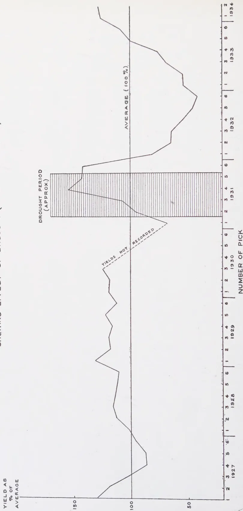

# The Tropical Agriculturist

September, 1934

---

## EDITORIAL

---

### THE IMPERIAL INSTITUTE

---

THE great duty entrusted to the Imperial Institute is the development of the resources of the Empire. It knows no race, creed, nor politics as such, its motto is essentially progress for all living under our Flag. The three divisions of its work, educational, investigational, and intelligence are open to be availed of by all the colonies and the Annual Report of the Director shows to what a large extent they are utilised. The educational work embraces a permanent exhibition of the products of the colonies and their preparation, and frequent lectures explain the industries of the various countries and their place in Empire supply, manufacture and trade. To us in Ceylon especially useful are the investigational and intelligence branches. The large number of samples sent during the last year from this country to the Institute, not only for mere examination but for help in their utilisation or marketing is perhaps not so fully realised as it might be. Clay for pottery purposes, we find from the Director's report, went and explanation was given as to washing whereby it might be made suitable for the manufacture of terra-cotta and white ware. Assistance was given in tracing the cause of the decline in prices of cinnamon quills and chips, and it was shown that the fall was due to the world-wide slump in prices in general and not to any other

1------------------------------------------------

140

factor. Tobacco, ginger, fennel, dill, cummin, artemesia, geranium and lime oils, tung and leprosy oil seeds (*Hydnocarpus*) from Ceylon, were all examined and reported upon as to their economic possibilities. The value of work such as this is great. It is not of the nature that can be done in the country of production for in many cases what is required is the value of the material under consideration to the manufacturers of other countries.

Steps are now being taken for the colonies, including Ceylon, to make even closer touch with the Imperial Institute. That is as it should be, for all the colonies may feel that the Institute is their own particular interest and there should be a brotherhood in such an organisation. An unfortunate aspect of the Imperial Institute is that its very nature deprives it of the adequate finance that it requires and deserves. What is every man's duty is no man's duty, and as a result of there being no Imperial exchequer money grants are not forthcoming as they should be. It is surprising that the funds by which the Institute has been run have in the past been derived in large measure from the contributions of private individuals. Surely the time has come when all the colonies using the Institute should see that its valuable work in the past is continued by an adequate fund contributed by those making use of its services.

2------------------------------------------------

141

## SOME NOTES ON THE EFFECTS OF DROUGHT ON THE YIELD OF COCONUT PALMS

MALCOLM PARK, A.R.C.S.,

*GOVERNMENT MYCOLOGIST*

**C**OCONUTS growing in the North-Western Province, particularly in the neighbourhood of Puttalam, were subjected in 1931 to a severe drought. The immediate effect of the drought was reported in a note published in January, 1932. In that note, it was stated that a number of trees had died as the direct result of drought and that all coconut palms in the area in question showed symptoms of wilting to a greater or lesser extent. The rainfall figures, as recorded by Jameson (1932), of four meteorological stations in the Puttalam district for the period January to September, 1931, are given in Table 1.

Taking the average of four stations it is seen that the rainfall for the five months May to September was 3.22 inches, falling on 21 days, as against the average of 8.83 inches, falling on 22.5 days. The lowest rainfall was in August when two stations registered no rain at all and 0.07 inch was recorded at each of the other two stations.

In the report (1932) from which the above figures were taken there is also a table showing the incidence of drought at selected stations. It is stated that:

"Drought is a meteorological factor that cannot be precisely defined, and for statistical purposes it is necessary to use arbitrary conventions. Such conventions should be standardized, however, as far as possible, for use in comparative climatology. The definitions adopted in this table are those used in "British Rainfall", the rainfall annual of the British Meteorological Office. They are as follows:

*Absolute Drought.*—Any period of 15 days or more in which no rain is recorded.

*Partial Drought.*—Any period of 29 days or more over which the mean daily rainfall does not exceed .01 inch per day, *e.g.* a total fall of 0.37 inch or less in 37 days would qualify that period as a partial drought.

3------------------------------------------------

142

TABLE 1  
*Rainfall figures for the period 1st January to 30th September,  
 1931 of four meteorological stations in Puttalam District*

<table border="1">
<thead>
<tr>
<th rowspan="2">Station</th>
<th rowspan="2">Year</th>
<th colspan="2">Jan.</th>
<th colspan="2">Feb.</th>
<th colspan="2">March</th>
<th colspan="2">April</th>
<th colspan="2">May</th>
<th colspan="2">June</th>
<th colspan="2">July</th>
<th colspan="2">August</th>
<th colspan="2">Sept.</th>
</tr>
<tr>
<th>Inches</th>
<th>Days</th>
<th>Inches</th>
<th>Days</th>
<th>Inches</th>
<th>Days</th>
<th>Inches</th>
<th>Days</th>
<th>Inches</th>
<th>Days</th>
<th>Inches</th>
<th>Days</th>
<th>Inches</th>
<th>Days</th>
<th>Inches</th>
<th>Days</th>
<th>Inches</th>
<th>Days</th>
</tr>
</thead>
<tbody>
<tr>
<td rowspan="2">Kachcheri</td>
<td>1931</td>
<td>4.44</td>
<td>11</td>
<td>0.27</td>
<td>3</td>
<td>3.56</td>
<td>4</td>
<td>5.17</td>
<td>9</td>
<td>1.33</td>
<td>12</td>
<td>0.72</td>
<td>8</td>
<td>0.82</td>
<td>4</td>
<td>0.07</td>
<td>4</td>
<td>0.43</td>
<td>3</td>
</tr>
<tr>
<td>means during 63 years</td>
<td>2.80</td>
<td>7</td>
<td>1.26</td>
<td>3</td>
<td>2.98</td>
<td>5</td>
<td>5.49</td>
<td>9</td>
<td>3.59</td>
<td>7</td>
<td>1.66</td>
<td>6</td>
<td>0.80</td>
<td>2</td>
<td>0.68</td>
<td>2</td>
<td>1.21</td>
<td>4</td>
</tr>
<tr>
<td rowspan="2">Eastern Saltern</td>
<td>1931</td>
<td>2.61</td>
<td>9</td>
<td>0.28</td>
<td>2</td>
<td>1.39</td>
<td>3</td>
<td>2.96</td>
<td>8</td>
<td>1.18</td>
<td>6</td>
<td>0.46</td>
<td>4</td>
<td>0.63</td>
<td>3</td>
<td>0.00</td>
<td>0</td>
<td>0.59</td>
<td>1</td>
</tr>
<tr>
<td>means during 15 years</td>
<td>4.24</td>
<td>10</td>
<td>1.24</td>
<td>3</td>
<td>3.64</td>
<td>7</td>
<td>5.24</td>
<td>10</td>
<td>4.12</td>
<td>8</td>
<td>1.02</td>
<td>5</td>
<td>1.50</td>
<td>3</td>
<td>0.25</td>
<td>1</td>
<td>2.07</td>
<td>6</td>
</tr>
<tr>
<td rowspan="2">Southern Saltern</td>
<td>1931</td>
<td>4.11</td>
<td>7</td>
<td>0.15</td>
<td>1</td>
<td>1.75</td>
<td>3</td>
<td>3.40</td>
<td>7</td>
<td>1.13</td>
<td>6</td>
<td>0.09</td>
<td>1</td>
<td>0.69</td>
<td>2</td>
<td>0.00</td>
<td>0</td>
<td>0.28</td>
<td>3</td>
</tr>
<tr>
<td>means during 14 years</td>
<td>3.98</td>
<td>10</td>
<td>0.79</td>
<td>3</td>
<td>2.60</td>
<td>6</td>
<td>5.50</td>
<td>10</td>
<td>4.29</td>
<td>8</td>
<td>1.18</td>
<td>5</td>
<td>1.19</td>
<td>3</td>
<td>0.20</td>
<td>1</td>
<td>2.02</td>
<td>6</td>
</tr>
<tr>
<td rowspan="2">Western Saltern</td>
<td>1931</td>
<td>4.94</td>
<td>11</td>
<td>0.49</td>
<td>4</td>
<td>2.39</td>
<td>5</td>
<td>4.62</td>
<td>7</td>
<td>1.65</td>
<td>9</td>
<td>0.87</td>
<td>9</td>
<td>0.74</td>
<td>2</td>
<td>0.07</td>
<td>2</td>
<td>1.13</td>
<td>3</td>
</tr>
<tr>
<td>means during 15 years</td>
<td>4.18</td>
<td>10</td>
<td>1.30</td>
<td>3</td>
<td>3.38</td>
<td>7</td>
<td>5.46</td>
<td>9</td>
<td>4.35</td>
<td>8</td>
<td>1.10</td>
<td>5</td>
<td>1.56</td>
<td>3</td>
<td>0.27</td>
<td>1</td>
<td>2.24</td>
<td>6</td>
</tr>
</tbody>
</table>

4------------------------------------------------

143

*Dry Spell.*—Any period of 15 days or more in which the rainfall on no day exceeds .03 inch.

In practice it will generally be found that most of the days of a dry spell are rainless days . . . . In addition, a *day of drought* has been defined as any day included in either, or both, a dry spell and a partial drought, and the total number of *days of drought* comprised within the tabulated droughts has also been tabulated, as an index of the droughtiness of the year at the station concerned".

Table 2 gives the figures for the incidence of drought at the main meteorological station at Puttalam, *i.e.* the Kachcheri. From the rainfall figures given above, it will be seen that at this station the rainfall for the period May to September was greater than that at the Eastern and Southern Salterns but somewhat less than at the Western Saltern.

The figures in this table are illuminating and indicate that, broadly speaking, Puttalam was subjected in 1931 to two long periods of drought, from the middle of January until early April and again from the beginning of July until the middle of October. The intervening period from early April until early July was, as can be seen from the rainfall records given in Table 1, one with less than average rainfall and, although conditions were such that they do not fall into the classes of drought defined above, the rainfall during this period was not great.

The coconuts grown in the Puttalam district were subjected to these unfavourable weather conditions and it is not surprising that they suffered severely in consequence. The palms, as was noted in the article referred to above, showed marked symptoms of drought injury and some were so severely affected as to die.

#### YIELD FIGURES

By courtesy of the manager of a group of coconut estates in the Puttalam district the yields since 1927 of seven estates, ranging in size from 20 to 100 acres, have been obtained. It is customary in Ceylon for coconuts to be collected every two months and the yields for each of the six 'picks' of every year since 1927 are recorded in Table 3. The first pick is for the months December-January.

It is unfortunate that owing to a hiatus before a change in management, the yield figures for the last three picks of 1930 are not available. The absence of these figures is not, however, of great importance to the subject under discussion.

5------------------------------------------------

<!-- stage4: FAINT old-images-only -->

[Faint page: no legible print of its own could be verified; text withheld (stage 4 review list)]

6------------------------------------------------

145TABLE 3*Yield in nuts for the period 1927-1934*Estate A — 50 acres

<table>
<thead>
<tr>
<th></th>
<th>1st pick</th>
<th>2nd</th>
<th>3rd</th>
<th>4th</th>
<th>5th</th>
<th>6th</th>
<th>Total</th>
</tr>
</thead>
<tbody>
<tr>
<td>1927</td>
<td>18406</td>
<td>17663</td>
<td>13018</td>
<td>14798</td>
<td>12784</td>
<td>13300</td>
<td>89969</td>
</tr>
<tr>
<td>1928</td>
<td>12300</td>
<td>19178</td>
<td>15373</td>
<td>14912</td>
<td>18636</td>
<td>17862</td>
<td>98261</td>
</tr>
<tr>
<td>1929</td>
<td>16778</td>
<td>17357</td>
<td>19741</td>
<td>18810</td>
<td>17200</td>
<td>17182</td>
<td>107068</td>
</tr>
<tr>
<td>1930</td>
<td>15965</td>
<td>16744</td>
<td>18163</td>
<td>—</td>
<td>—</td>
<td>—</td>
<td>50872</td>
</tr>
<tr>
<td>1931</td>
<td>7760</td>
<td>11629</td>
<td>11100</td>
<td>13512</td>
<td>12512</td>
<td>15820</td>
<td>72333</td>
</tr>
<tr>
<td>1932</td>
<td>10730</td>
<td>9635</td>
<td>12300</td>
<td>9790</td>
<td>8120</td>
<td>7640</td>
<td>58215</td>
</tr>
<tr>
<td>1933</td>
<td>6072</td>
<td>6410</td>
<td>9168</td>
<td>9791</td>
<td>11936</td>
<td>11350</td>
<td>54727</td>
</tr>
<tr>
<td>1934</td>
<td>9208</td>
<td>11835</td>
<td>—</td>
<td>—</td>
<td>—</td>
<td>—</td>
<td>21043</td>
</tr>
</tbody>
</table>

Estate B — 20 acres

<table>
<tbody>
<tr>
<td>1927</td>
<td>6256</td>
<td>5422</td>
<td>5377</td>
<td>5600</td>
<td>6374</td>
<td>5378</td>
<td>34407</td>
</tr>
<tr>
<td>1928</td>
<td>5374</td>
<td>6520</td>
<td>9726</td>
<td>8920</td>
<td>9340</td>
<td>8341</td>
<td>48221</td>
</tr>
<tr>
<td>1929</td>
<td>9382</td>
<td>12620</td>
<td>14700</td>
<td>10710</td>
<td>9875</td>
<td>9805</td>
<td>67092</td>
</tr>
<tr>
<td>1930</td>
<td>9655</td>
<td>10074</td>
<td>14263</td>
<td>—</td>
<td>—</td>
<td>—</td>
<td>33992</td>
</tr>
<tr>
<td>1931</td>
<td>6014</td>
<td>4952</td>
<td>6000</td>
<td>13152</td>
<td>9860</td>
<td>11044</td>
<td>51022</td>
</tr>
<tr>
<td>1932</td>
<td>5860</td>
<td>7600</td>
<td>9370</td>
<td>10870</td>
<td>7230</td>
<td>5535</td>
<td>46465</td>
</tr>
<tr>
<td>1933</td>
<td>6330</td>
<td>5536</td>
<td>11254</td>
<td>11028</td>
<td>9010</td>
<td>8744</td>
<td>51902</td>
</tr>
<tr>
<td>1934</td>
<td>8904</td>
<td>9006</td>
<td>—</td>
<td>—</td>
<td>—</td>
<td>—</td>
<td>17910</td>
</tr>
</tbody>
</table>

Estate C — 80 acres

<table>
<tbody>
<tr>
<td>1927</td>
<td>21022</td>
<td>26809</td>
<td>21864</td>
<td>19867</td>
<td>20750</td>
<td>22205</td>
<td>132517</td>
</tr>
<tr>
<td>1928</td>
<td>20755</td>
<td>27452</td>
<td>24410</td>
<td>26843</td>
<td>31850</td>
<td>33860</td>
<td>165170</td>
</tr>
<tr>
<td>1929</td>
<td>28796</td>
<td>28391</td>
<td>31116</td>
<td>31185</td>
<td>29964</td>
<td>29053</td>
<td>178505</td>
</tr>
<tr>
<td>1930</td>
<td>24210</td>
<td>25019</td>
<td>30195</td>
<td>—</td>
<td>—</td>
<td>—</td>
<td>79424</td>
</tr>
<tr>
<td>1931</td>
<td>16904</td>
<td>31679</td>
<td>36034</td>
<td>44409</td>
<td>32000</td>
<td>44400</td>
<td>205426</td>
</tr>
<tr>
<td>1932</td>
<td>24763</td>
<td>17256</td>
<td>19410</td>
<td>14042</td>
<td>7764</td>
<td>7797</td>
<td>91032</td>
</tr>
<tr>
<td>1933</td>
<td>6292</td>
<td>5326</td>
<td>9084</td>
<td>12464</td>
<td>21630</td>
<td>23964</td>
<td>78760</td>
</tr>
<tr>
<td>1934</td>
<td>22527</td>
<td>32360</td>
<td>—</td>
<td>—</td>
<td>—</td>
<td>—</td>
<td>54887</td>
</tr>
</tbody>
</table>

Estate D — 80 acres

<table>
<tbody>
<tr>
<td>1927</td>
<td>12210</td>
<td>16525</td>
<td>22384</td>
<td>21809</td>
<td>19207</td>
<td>14906</td>
<td>107041</td>
</tr>
<tr>
<td>1928</td>
<td>14429</td>
<td>19610</td>
<td>29299</td>
<td>30340</td>
<td>22469</td>
<td>20147</td>
<td>136294</td>
</tr>
<tr>
<td>1929</td>
<td>22075</td>
<td>24400</td>
<td>34500</td>
<td>30100</td>
<td>24243</td>
<td>18442</td>
<td>153760</td>
</tr>
<tr>
<td>1930</td>
<td>20950</td>
<td>28600</td>
<td>34284</td>
<td>—</td>
<td>—</td>
<td>—</td>
<td>83834</td>
</tr>
<tr>
<td>1931</td>
<td>15851</td>
<td>17603</td>
<td>31936</td>
<td>46000</td>
<td>35464</td>
<td>32000</td>
<td>178854</td>
</tr>
<tr>
<td>1932</td>
<td>13856</td>
<td>16730</td>
<td>17904</td>
<td>15342</td>
<td>6836</td>
<td>7210</td>
<td>77878</td>
</tr>
<tr>
<td>1933</td>
<td>10100</td>
<td>16104</td>
<td>29051</td>
<td>25082</td>
<td>27412</td>
<td>27429</td>
<td>135178</td>
</tr>
<tr>
<td>1934</td>
<td>26680</td>
<td>31281</td>
<td>—</td>
<td>—</td>
<td>—</td>
<td>—</td>
<td>57961</td>
</tr>
</tbody>
</table>

Estates E and F — 40 acres

<table>
<tbody>
<tr>
<td>1927</td>
<td>18567</td>
<td>23840</td>
<td>30270</td>
<td>22076</td>
<td>15986</td>
<td>28970</td>
<td>139709</td>
</tr>
<tr>
<td>1928</td>
<td>17620</td>
<td>23403</td>
<td>32509</td>
<td>38508</td>
<td>23602</td>
<td>20583</td>
<td>156225</td>
</tr>
<tr>
<td>1929</td>
<td>18417</td>
<td>19325</td>
<td>22820</td>
<td>24540</td>
<td>30480</td>
<td>25091</td>
<td>140673</td>
</tr>
<tr>
<td>1930</td>
<td>16330</td>
<td>22546</td>
<td>28325</td>
<td>—</td>
<td>—</td>
<td>—</td>
<td>67201</td>
</tr>
<tr>
<td>1931</td>
<td>10286</td>
<td>16123</td>
<td>17000</td>
<td>32400</td>
<td>36008</td>
<td>24658</td>
<td>136475</td>
</tr>
<tr>
<td>1932</td>
<td>6900</td>
<td>7800</td>
<td>9870</td>
<td>9170</td>
<td>4436</td>
<td>3280</td>
<td>41456</td>
</tr>
<tr>
<td>1933</td>
<td>6221</td>
<td>6815</td>
<td>12626</td>
<td>17054</td>
<td>21492</td>
<td>21729</td>
<td>85937</td>
</tr>
<tr>
<td>1934</td>
<td>20682</td>
<td>21696</td>
<td>—</td>
<td>—</td>
<td>—</td>
<td>—</td>
<td>42378</td>
</tr>
</tbody>
</table>

7------------------------------------------------

GRAPH SHOWING YIELDS OF COCONUTS AS PERCENTAGE  
OF AVERAGE PER PICK  
SHOWING EFFECT OF DROUGHT (FEBRUARY-OCTOBER 1931)

The graph illustrates the percentage of coconut yields relative to the average for each pick from 1927 to 1934. The y-axis represents the yield as a percentage of the average, ranging from 50 to 150. The x-axis shows the number of picks (1-6) for each year. A horizontal line at 100% represents the average yield. A shaded region from 1931 (picks 1-6) indicates the drought period. Yields for 1930 are not recorded.

<table border="1">
<thead>
<tr>
<th>Year</th>
<th>Pick</th>
<th>Yield as % of Average</th>
</tr>
</thead>
<tbody>
<tr>
<td rowspan="6">1927</td>
<td>1</td>
<td>100</td>
</tr>
<tr>
<td>2</td>
<td>110</td>
</tr>
<tr>
<td>3</td>
<td>115</td>
</tr>
<tr>
<td>4</td>
<td>110</td>
</tr>
<tr>
<td>5</td>
<td>105</td>
</tr>
<tr>
<td>6</td>
<td>100</td>
</tr>
<tr>
<td rowspan="6">1928</td>
<td>1</td>
<td>100</td>
</tr>
<tr>
<td>2</td>
<td>105</td>
</tr>
<tr>
<td>3</td>
<td>110</td>
</tr>
<tr>
<td>4</td>
<td>115</td>
</tr>
<tr>
<td>5</td>
<td>110</td>
</tr>
<tr>
<td>6</td>
<td>105</td>
</tr>
<tr>
<td rowspan="6">1929</td>
<td>1</td>
<td>100</td>
</tr>
<tr>
<td>2</td>
<td>105</td>
</tr>
<tr>
<td>3</td>
<td>110</td>
</tr>
<tr>
<td>4</td>
<td>115</td>
</tr>
<tr>
<td>5</td>
<td>110</td>
</tr>
<tr>
<td>6</td>
<td>105</td>
</tr>
<tr>
<td rowspan="6">1930</td>
<td>1</td>
<td>Yields Not Recorded</td>
</tr>
<tr>
<td>2</td>
<td>Yields Not Recorded</td>
</tr>
<tr>
<td>3</td>
<td>Yields Not Recorded</td>
</tr>
<tr>
<td>4</td>
<td>Yields Not Recorded</td>
</tr>
<tr>
<td>5</td>
<td>Yields Not Recorded</td>
</tr>
<tr>
<td>6</td>
<td>Yields Not Recorded</td>
</tr>
<tr>
<td rowspan="6">1931</td>
<td>1</td>
<td>100</td>
</tr>
<tr>
<td>2</td>
<td>105</td>
</tr>
<tr>
<td>3</td>
<td>110</td>
</tr>
<tr>
<td>4</td>
<td>115</td>
</tr>
<tr>
<td>5</td>
<td>110</td>
</tr>
<tr>
<td>6</td>
<td>105</td>
</tr>
<tr>
<td rowspan="6">1932</td>
<td>1</td>
<td>100</td>
</tr>
<tr>
<td>2</td>
<td>105</td>
</tr>
<tr>
<td>3</td>
<td>110</td>
</tr>
<tr>
<td>4</td>
<td>115</td>
</tr>
<tr>
<td>5</td>
<td>110</td>
</tr>
<tr>
<td>6</td>
<td>105</td>
</tr>
<tr>
<td rowspan="6">1933</td>
<td>1</td>
<td>100</td>
</tr>
<tr>
<td>2</td>
<td>105</td>
</tr>
<tr>
<td>3</td>
<td>110</td>
</tr>
<tr>
<td>4</td>
<td>115</td>
</tr>
<tr>
<td>5</td>
<td>110</td>
</tr>
<tr>
<td>6</td>
<td>105</td>
</tr>
<tr>
<td rowspan="2">1934</td>
<td>1</td>
<td>100</td>
</tr>
<tr>
<td>2</td>
<td>105</td>
</tr>
</tbody>
</table>

8------------------------------------------------

146Estate G — 100 acres

<table border="1">
<thead>
<tr>
<th></th>
<th>1st pick</th>
<th>2nd</th>
<th>3rd</th>
<th>4th</th>
<th>5th</th>
<th>6th</th>
<th>Total</th>
</tr>
</thead>
<tbody>
<tr>
<td>1927</td>
<td>65045</td>
<td>63417</td>
<td>55662</td>
<td>45424</td>
<td>42904</td>
<td>38721</td>
<td>311173</td>
</tr>
<tr>
<td>1928</td>
<td>40671</td>
<td>49229</td>
<td>58735</td>
<td>51590</td>
<td>43996</td>
<td>42174</td>
<td>286395</td>
</tr>
<tr>
<td>1929</td>
<td>47607</td>
<td>49596</td>
<td>52264</td>
<td>59567</td>
<td>51230</td>
<td>45022</td>
<td>305286</td>
</tr>
<tr>
<td>1930</td>
<td>43102</td>
<td>49973</td>
<td>56969</td>
<td>—</td>
<td>—</td>
<td>—</td>
<td>150044</td>
</tr>
<tr>
<td>1931</td>
<td>17250</td>
<td>40224</td>
<td>55264</td>
<td>82600</td>
<td>64724</td>
<td>55100</td>
<td>315162</td>
</tr>
<tr>
<td>1932</td>
<td>26215</td>
<td>23780</td>
<td>24600</td>
<td>22016</td>
<td>12790</td>
<td>9500</td>
<td>118901</td>
</tr>
<tr>
<td>1933</td>
<td>13000</td>
<td>17019</td>
<td>29139</td>
<td>39190</td>
<td>42794</td>
<td>47088</td>
<td>188230</td>
</tr>
<tr>
<td>1934</td>
<td>49014</td>
<td>58253</td>
<td>—</td>
<td>—</td>
<td>—</td>
<td>—</td>
<td>107267</td>
</tr>
</tbody>
</table>

Total acreage = 370 acres (approx.)

It has been pointed out by many observers that the yield of coconut palms varies with the time of the year. In comparing yields it was considered advisable to endeavour to eliminate this seasonal variation by expressing the yield at each pick as a percentage of the average for that pick during the period for which figures are available. In the Plate therefore, the curve represents the total yields of the seven estates for the period 1927 to 1934 expressed as a percentage of the average for each pick. The average (100%) is represented by the straight line.

The yield curve is interesting. From the beginning of 1927 until the end of 1929 the fluctuations are not great. The drop in the yield which reached its minimum at the fourth pick of 1927 may have been the result of adverse weather conditions prevailing in 1926, but was not so great as to exceed the variations to be expected from year to year. After the beginning of 1931 the changes in yield are much greater. The yield for the first pick in 1931 was only 70 per cent. of the average but this low figure is inexplicable owing to the absence of figures for the three previous picks. It may, however, be a reflection of administrative factors. After this, the yield rose sharply until at the fourth pick of 1931 (*i.e.* for June-July) the yield was more than 150 per cent. of the average for that pick. The yield dropped slightly until the end of the year. The first pick in 1932 showed a sharp drop in yield and this drop continued, becoming less marked at each pick, until the sixth pick (October-November) of 1932 when the yield was only 30 per cent. of the average. Subsequently the yield rose, at first slowly but later more rapidly, reaching the normal yield at the end of 1933.

9------------------------------------------------

147

### SIZE OF NUTS

The size of nuts collected in coconut estates is reflected in the number of nuts which are required to make one candy (560 lb.) of copra. It is unfortunate that figures of out-turn of copra are not available for the group of estates under discussion prior to 1931. The figures of the number of nuts required to make one candy of copra for the period 1931 to 1933 are given in Table 4 below:

TABLE 4

*Number of nuts per candy of copra*

<table>
<thead>
<tr>
<th></th>
<th>1931</th>
<th>1932</th>
<th>1933</th>
</tr>
</thead>
<tbody>
<tr>
<td>1st Crop (Dec.-Jan.)</td>
<td>1120</td>
<td>1417</td>
<td>1228</td>
</tr>
<tr>
<td>2nd ,, (Feb.-Mar.)</td>
<td>1095</td>
<td>1720</td>
<td>1203</td>
</tr>
<tr>
<td>3rd ,, (Apr.-May)</td>
<td>1198</td>
<td>1646</td>
<td>1186</td>
</tr>
<tr>
<td>4th ,, (Jun.-Jul.)</td>
<td>1201</td>
<td>1375</td>
<td>1118</td>
</tr>
<tr>
<td>5th ,, (Aug.-Sept.)</td>
<td>1186</td>
<td>1149</td>
<td>1121</td>
</tr>
<tr>
<td>6th ,, (Oct.-Nov.)</td>
<td>1276</td>
<td>1221</td>
<td>1154</td>
</tr>
</tbody>
</table>

In Plate II the figures have been plotted as a curve and, in order to express the relative sizes of nuts, the reciprocals of the figures have also been plotted. The curves indicate that from the fifth pick in 1931 (August-September) the size of nuts decreased progressively until it reached a minimum at the second pick (February-March) of 1932. Thereafter the size increased until it regained the normal at the fifth pick (August-September) of 1932.

### DISCUSSION

The yield curve for the period from the end of 1931 until the end of 1933 assumes the form of a parabola the lowest point of which is at the last pick (October-November) of 1933. If it can be assumed — and the assumption appears to be justified — that this regular falling-off in yield and the subsequent recovery were due to the prolonged drought experienced in 1931, the curve indicates with unusual clarity the effect of drought on the yield of coconuts.

Following the incidence of the drought, there was a sharp rise in the yield of nuts. The size of the nuts did not change greatly until the drought was nearing its completion when a marked decrease set in. The cause of the initial rise in yield is

10------------------------------------------------

148

not altogether clear since the figures for the previous crops are not available. The yield for the first pick in 1931 was low and the subsequent rise may have been in part due to administrative changes, as has been suggested above. It is unlikely, however, that this factor was responsible for the whole of the increase shown and it is probable that the drought was in part, at least, responsible. A noticeable feature of the effects of severe drought as observed at the time was the number of nuts which fell from the trees. Some of these nuts were mature but there were many in different stages of immaturity. All nuts which were sufficiently mature were used for copra manufacture and it is suggested that the increased yield during the drought may have been in part due to the inclusion of such immature nuts. On the other hand, however, the figures for the out-turn of copra indicate that the amount of copra per nut did not decrease markedly until the end of the period of drought. The figures are not sufficiently complete for the cause of the rise during the drought period to be completely elucidated.

The period of drought terminated in October, 1931. The pick completed in November was still above average (142 per cent. of the average for that pick) although the out-turn of copra was poorer and indicated that the amount of flesh per nut had decreased. Subsequently the yield fell progressively until at the pick in November, 1932 the yield was only 30 per cent. of the average for that pick. The maximum effect of the drought as expressed in yield of nuts was therefore realized thirteen months after the conclusion of the drought. The length of this period is significant. Sampson (1923) states that "the nut takes a full year to ripen from the time the flowering branch opens" (p. 38) and Copeland (1921) states that "the nuts are ready to harvest when thirteen months old," which, from the context, appears to mean from the time of the opening of the spathe (pp. 19-20). That the minimum yield occurred thirteen months after the conclusion of the drought indicates that the spathes which opened when the drought was at his height, just before the weather changed, were affected more by drought conditions than the flowering and fruiting branches in other stages of development. The opening spathes were observed to be wilted at the time of the drought and it appears that many of the wilted spathes did not recover sufficiently in the subsequent wet weather to produce nuts. Moreover, the direct effect of

11------------------------------------------------

**Y-axis Labels:**  
 NUTS PER CANDY (1000 to 1800)  
 RECIPROCALS (i.e. COPRA PER NUT) (1000 to 1800)

**X-axis Labels:**  
 NO. OF PICK (1 to 6) for 1931, 1932, and 1933.

**Legend:**  
 Solid line: NUTS PER CANDY OF COPRA  
 Dashed line: RECIPROCALS (i.e. COPRA PER NUT)

<table border="1">
<thead>
<tr>
<th>Year</th>
<th>Pick</th>
<th>Nuts per Candy (Solid)</th>
<th>Reciprocals (Dashed)</th>
</tr>
</thead>
<tbody>
<tr>
<td rowspan="6">1931</td>
<td>1</td>
<td>1100</td>
<td>1700</td>
</tr>
<tr>
<td>2</td>
<td>1100</td>
<td>1700</td>
</tr>
<tr>
<td>3</td>
<td>1200</td>
<td>1600</td>
</tr>
<tr>
<td>4</td>
<td>1200</td>
<td>1600</td>
</tr>
<tr>
<td>5</td>
<td>1200</td>
<td>1600</td>
</tr>
<tr>
<td>6</td>
<td>1200</td>
<td>1600</td>
</tr>
<tr>
<td rowspan="6">1932</td>
<td>1</td>
<td>1400</td>
<td>1400</td>
</tr>
<tr>
<td>2</td>
<td>1700</td>
<td>1100</td>
</tr>
<tr>
<td>3</td>
<td>1600</td>
<td>1200</td>
</tr>
<tr>
<td>4</td>
<td>1400</td>
<td>1400</td>
</tr>
<tr>
<td>5</td>
<td>1200</td>
<td>1600</td>
</tr>
<tr>
<td>6</td>
<td>1200</td>
<td>1600</td>
</tr>
<tr>
<td rowspan="6">1933</td>
<td>1</td>
<td>1200</td>
<td>1400</td>
</tr>
<tr>
<td>2</td>
<td>1200</td>
<td>1400</td>
</tr>
<tr>
<td>3</td>
<td>1200</td>
<td>1400</td>
</tr>
<tr>
<td>4</td>
<td>1200</td>
<td>1400</td>
</tr>
<tr>
<td>5</td>
<td>1200</td>
<td>1400</td>
</tr>
<tr>
<td>6</td>
<td>1200</td>
<td>1400</td>
</tr>
</tbody>
</table>

Effect of Drought on Out-turn of Copra

12------------------------------------------------

149

drought on the palms and the shortage of water would be felt most severely by the flowering branches in that stage of development.

The relatively rapid recovery of yield after the minimum had been reached shows that the flowering branches or spathes were progressively less affected in the earlier stages of development. The full crop was not again produced until two years after the conclusion of the drought. This period is greater than is generally assumed but the extreme severity of the drought in this instance effected a setback to the growth and development of the palms of a much greater extent than would be caused in normal weather fluctuations. The effect of more normal fluctuations in rainfall has been determined by Joachim (1929) who showed that there is a close correlation between the total rainfall in one year and the crop in the next. It is obvious from the figures given above that when the fluctuation is extreme, at least when the palms are subjected to drought as severe as the drought of 1931, the effect may be more prolonged.

Although the yield of nuts was affected for two years by the drought, the size of nut as indicated by the out-turn of copra was not affected for nearly so long. The effect of the drought on the out-turn of copra is indicated in the Plate. The number of nuts required to make one candy of copra rose sharply in November, 1931 and continued to rise until the second pick (February-March) in 1932. It subsequently fell again and reached the normal by September 1932, the total period of variation from the normal being about one year, with a maximum effect about six months after the end of the drought. At the period of maximum effect the number of nuts required to make one candy of copra was about 50 per cent. more than the normal, so that the production of copra per nut was only two-thirds of the normal. The cause of this would appear to be the setback to the metabolic processes of the tree caused by the drought, in the loss of leaves through wilting and the death of roots.

## CONCLUSIONS

From the above discussion, it is seen that the severe drought experienced in Puttalam in 1931 affected the yield of nuts for a period of about two years with a maximum effect at about thirteen months after the conclusion of the drought. The yield at this time was only about 30 per cent. of the average yield for seven

13------------------------------------------------

150

years. During the drought itself there was a sharp rise in the yield which is thought to be partly due to the physiological shedding of nuts approaching maturity, such nuts increasing the crop collected. The effect on the amount of copra produced per nut was of shorter duration than the effect on the yield of nuts. The copra-per-nut production was decreased for a period of one year with a maximum effect approximately six months after the drought.

#### ACKNOWLEDGMENT

The writer wishes to express his gratitude to H. Ruegg, Esquire, for his courtesy in providing the figures on which these notes are based.

#### REFERENCES

COPELAND, E. B. (1921)—The Coconut.—Macmillan & Co., Ltd.

SAMPSON, H. C. (1923)—The Coconut Palm.—John Bale, Sons & Danielsson Ltd., London.

JOACHIM, A. W. R. (1929)—Chilaw Coconut Trials.—*The Tropical Agriculturist*, Vol. LXXIII, p. 222.

JAMESON, H. (1932)—Report on the Colombo Observatory for 1931.—Ceylon Government Press.

PARK, MALCOLM (1932)—The effects of drought on coconuts at Puttalam.—*The Tropical Agriculturist*, Vol. LXXVIII, p. 11.

14------------------------------------------------

151

## STUDIES ON PADDY CULTIVATION

### III.—THE EFFECT OF SYSTEM OF CULTIVATION ON THE YIELD OF PADDY

J. C. HAIGH, PH. D.,

(ECONOMIC BOTANIST)

AND

A. W. R. JOACHIM, PH. D.,

(AGRICULTURAL CHEMIST)

DEPARTMENT OF AGRICULTURE, CEYLON

IN the first paper of this series (1) it was stated (p. 4), that the experiment about to be described was started during Maha 1932-33 and continued during Yala 1933. Unfortunately in May 1933 there was a major flood of the Mahaweliganga which completely flooded the paddy area for seven days, and the Yala crop was totally destroyed. There will therefore be no record of residual effects, but the immediate effects are of sufficient interest to warrant publication.

The experiment was carried out as stated. The treatments were transplanting, broadcasting and thinning, and broadcasting in each case with and without the application of a dressing of ammonium phosphate at the rate of  $\frac{3}{4}$  cwt. per acre. The manure was applied immediately before transplanting to the transplanted plots and immediately before sowing to the remaining plots. The trials were carried out in 1/100 acre plots with borders, (over-all area 1/80 acre) randomised and replicated five times. There were thus fifteen effective replications of manuring *versus* no manuring, and ten of the various systems of planting. Crop and soil samples were taken as in the previous experiment.

The results of the experiment are found in Table I. They show that transplanting *plus* manuring is significantly better than either of the other systems of planting, with or without manure and that transplanting alone is superior to the other two systems. The addition of manure to the broadcast and thinned plots has produced a significant increase in yield, but the increase just fails to be significant in the transplanted and broadcast plots (the increases are 22.1 lb. and 23.3 lb. respectively, whereas an increase of 25.5 lb. is necessary for significance).

15------------------------------------------------

152

In Table II the significant increases due to treatment have been split up so as to indicate the parts played by each constituent treatment, and the interaction between them. The lower half of the table indicates clearly the almost entire absence of interaction, and shows that transplanting and manuring produce totally independent results in increasing yield; we can therefore say that the effect produced by either of these treatments may be expected whether the other is practised or not. The upper half of Table II shows that both treatments give significant results; the increase consequent upon the application of manure is definitely significant, and transplanting is superior to either of the other two treatments, but thinning a broadcast plot does not produce a significant increase.

Costs have been kept of all cultural operations, and indicate relative costs of 151 per cent. for transplanting and 115.7 per cent. for broadcasting and thinning against the 100 per cent. of broadcasting. The yields from the treatments are respectively 155.3 per cent., 112 per cent., and 100 per cent., and it has been calculated that at present wage rates and with paddy at Rs. 1.50 a bushel, the increased cost of the cultural operations has been recovered in paddy at harvest. It should be remembered however, that we are dealing with very small plots, on which all costs are proportionately magnified, and further that the degree of magnification is directly proportional to the amount of work done. Thus, the transplanted plots receive the most attention, and the cost of transplanting is therefore most highly exaggerated. Some idea of the amount of exaggeration will be realised from a comparison of the cost figures quoted in the Annual Report of the Economic Botanist for 1932 (2) with the figures obtained in this experiment. In the report it is calculated that at Peradeniya the cultivation of one acre (in one block) of a six month crop of broadcast paddy cost Rs. 61.06, men being paid at 60 cents per day and women at 40 cents. In the present experiment the cultivation of one acre (in plots of 1/100 acre each) is estimated at Rs. 74.17, men being paid at 49 cents and women at 35 cents or at Rs. 89.67 if the former rates of pay are used in the calculations. Thus the splitting up of one acre into 1/100 acre plots has increased the cost of cultivation by nearly 47 per cent. It is obvious that the greater part of this increase is used in the actual sub-division of the plots by bunds, and that only a small part is a result of the fact that small scale operations

16------------------------------------------------

153

are more expensive than large scale ones. Nevertheless, in the experiment under discussion, the transplanted plots have no more bunds than the broadcast ones, and the increased cost is due solely to the cost of those operations connected with transplanting. It may be asserted with confidence, therefore, that since in the present experiment the increase obtained as a result of transplanting has covered the cost of the operations, the increase to be obtained on larger plots will be economically significant. This assertion is borne out by the results of Lord's experiments (3).

The chemical data are presented in detail in Paper IV of this series and it will be sufficient here to indicate the general conclusions to be drawn from a simultaneous study of those data and of the yield figures. The most significant conclusion is provided by the rate of absorption of the fertilising constituents. The higher the final yield, the lower is the percentage of nitrogen and phosphoric acid that has been absorbed at flowering time. Thus the transplanted crop, which gave the highest yield, have absorbed at flowering only about 50 per cent. of the nitrogen and phosphoric acid found in the crops at harvest. The corresponding figures for the unmanured broadcast plots, which gave the lowest yield, are approximately 88 per cent. in each case, whilst the other treatments show intermediate figures which correspond in reverse ratio to their place in the yield table. It would appear that the unmanured broadcast and thinned crops cease to absorb fertilisers shortly after flowering whereas the transplanted crops continue to absorb steadily till harvest. The application of manure appears however to enable a broadcast crop to lengthen its essential fertiliser absorption period, and consequently to produce higher yields. Thus the unmanured thinned crop shows at flowering absorption percentages of 74 and 84 for nitrogen and phosphoric acid respectively, while the corresponding figures for the manured crop are 56 and 54. A further point of interest observed is that manuring hastens the flowering and maturity of the broadcast crops. The immediate conclusion is that foot development is so affected by transplanting and manuring that it becomes a limiting factor of yield, and the next stage in the enquiry will be an investigation into the root development of the paddy plant at intervals during the growth of a crop subjected to the treatments used in this experiment.

17------------------------------------------------

154

It will be noted that the figure of 50 per cent. for the transplanted crops agrees with that obtained in the previous investigation (see Paper I of the series) when all plots were transplanted; further, that whereas our figures agree with those of some other workers, they do not agree with all. The divergences are mainly due to other workers' plots being sometimes broadcast and sometimes transplanted.

The percentage absorption figures for potash and lime are higher than in the previous investigation, but similar differences in rates of absorption are noted.

The relative amounts of constituents present in different parts of the crop at harvest are similar to those found previously and do not vary appreciably with treatment. The grain from the transplanted and the thinned and manured crops has a slightly larger proportion of the total phosphoric acid than that from the broadcast and the thinned plots.

The amounts of total constituents removed in the differently treated crops are given below:

<table border="1">
<thead>
<tr>
<th rowspan="2"></th>
<th colspan="12"><i>Lb. per acre</i></th>
</tr>
<tr>
<th colspan="4">Unmanured</th>
<th colspan="4">Manured</th>
<th colspan="4">Average</th>
</tr>
<tr>
<th></th>
<th>Nitrogen</th>
<th>Phosphoric acid</th>
<th>Potash</th>
<th>Lime</th>
<th>Nitrogen</th>
<th>Phosphoric acid</th>
<th>Potash</th>
<th>Lime</th>
<th>Nitrogen</th>
<th>Phosphoric acid</th>
<th>Potash</th>
<th>Lime</th>
</tr>
</thead>
<tbody>
<tr>
<td>Broadcast</td>
<td>20.7</td>
<td>8.5</td>
<td>29.6</td>
<td>11.1</td>
<td>25.4</td>
<td>11.3</td>
<td>30.0</td>
<td>12.3</td>
<td>23.0</td>
<td>9.8</td>
<td>29.8</td>
<td>11.7</td>
</tr>
<tr>
<td>Broadcast and thinned</td>
<td>22.6</td>
<td>10.6</td>
<td>42.8</td>
<td>14.8</td>
<td>27.9</td>
<td>14.1</td>
<td>34.4</td>
<td>14.7</td>
<td>25.2</td>
<td>12.3</td>
<td>38.6</td>
<td>14.8</td>
</tr>
<tr>
<td>Transplanted</td>
<td>28.3</td>
<td>13.8</td>
<td>34.8</td>
<td>13.0</td>
<td>34.8</td>
<td>17.9</td>
<td>36.9</td>
<td>14.5</td>
<td>31.6</td>
<td>15.9</td>
<td>35.9</td>
<td>13.7</td>
</tr>
<tr>
<td>Average</td>
<td>23.9</td>
<td>11.0</td>
<td>35.7</td>
<td>13.0</td>
<td>29.3</td>
<td>14.4</td>
<td>33.8</td>
<td>13.8</td>
<td></td>
<td></td>
<td></td>
<td></td>
</tr>
</tbody>
</table>

The table bears out the relative efficacies of the treatments in relation to fertiliser intake and crop yield. The amounts of fertiliser removed do not vary appreciably with those of the last Maha crop.

The figures for percentage absorption of manurial constituents applied are rather lower than in the previous investigation, but the trend is the same. The transplanted crop has assimilated about 70 per cent. of the added nitrogen and only 11 per cent. of the phosphoric acid; the corresponding figures for the broadcast crop are 50 per cent. and 8 per cent.

18------------------------------------------------

<!-- stage4: ACCEPT r2J/J_011:26 -->

155

The soil data indicate that the addition of fertiliser increases appreciably the reserve of available ammonia in the soil and that this increase is generally maintained during the whole period of growth. There does not appear to be any relationship between the decrease in available soil ammonia and the intake of nitrogen by the crop.

#### REFERENCES

1. 1. HAIGH, J. C. and JOACHIM, A. W. R.—Studies on Paddy Cultivation. I, The Paddy Crop in Relation to Manurial Treatment.—*The Tropical Agriculturist*, Vol. LXXXI, No. 1, July 1933, p. 3.
2. 2. Administration Report of the Director of Agriculture, Ceylon for 1932 p. D.142.
3. 3. LORD, L.—The Transplanting of Paddy.—*The Tropical Agriculturist*, Vol. LXIX, No. 1, July, 1927, p.3.

19------------------------------------------------

156

TABLE I  
PERADENIYA PADDY STATION

Season *Maha* 1932-33

Yields in pounds per plot of  $1\frac{1}{100}$  acre and bushels per acre

<table border="1">
<thead>
<tr>
<th rowspan="2">Treatment</th>
<th colspan="5">Replications</th>
<th rowspan="2">Treatment Totals</th>
<th rowspan="2">Mean</th>
<th rowspan="2">Per cent. of mean</th>
<th rowspan="2">Bushels per acre</th>
</tr>
<tr>
<th>a</th>
<th>b</th>
<th>c</th>
<th>d</th>
<th>e</th>
</tr>
</thead>
<tbody>
<tr>
<td>Transplanted and manured</td>
<td>33.3</td>
<td>23.0</td>
<td>19.5</td>
<td>30.0</td>
<td>22.2</td>
<td>127.9</td>
<td>25.6</td>
<td>139.0</td>
<td>56.9</td>
</tr>
<tr>
<td>Transplanted</td>
<td>25.9</td>
<td>19.9</td>
<td>17.2</td>
<td>21.7</td>
<td>21.1</td>
<td>105.8</td>
<td>21.2</td>
<td>115.1</td>
<td>47.1</td>
</tr>
<tr>
<td>Broadcast &amp; thinned &amp; manured</td>
<td>25.7</td>
<td>18.0</td>
<td>18.5</td>
<td>17.5</td>
<td>18.6</td>
<td>98.3</td>
<td>19.7</td>
<td>107.0</td>
<td>43.8</td>
</tr>
<tr>
<td>Broadcast and manured</td>
<td>14.5</td>
<td>19.5</td>
<td>17.5</td>
<td>17.9</td>
<td>17.5</td>
<td>86.9</td>
<td>17.4</td>
<td>94.5</td>
<td>38.7</td>
</tr>
<tr>
<td>Broadcast and thinned</td>
<td>15.5</td>
<td>15.3</td>
<td>14.3</td>
<td>16.6</td>
<td>8.6</td>
<td>70.3</td>
<td>14.1</td>
<td>76.6</td>
<td>31.3</td>
</tr>
<tr>
<td>Broadcast</td>
<td>8.2</td>
<td>10.7</td>
<td>12.0</td>
<td>13.0</td>
<td>19.7</td>
<td>63.6</td>
<td>12.7</td>
<td>69.0</td>
<td>24.9</td>
</tr>
<tr>
<td>Block Totals</td>
<td>123.1</td>
<td>106.4</td>
<td>99.0</td>
<td>116.7</td>
<td>107.7</td>
<td>552.8</td>
<td>18.4</td>
<td></td>
<td></td>
</tr>
</tbody>
</table>

Standard Deviation of 5 plots = 8.5 lb.

*Analysis of Variance*

<table border="1">
<thead>
<tr>
<th>Due to</th>
<th>Degrees of Freedom</th>
<th>Sum of Squares</th>
<th>Mean Square</th>
<th>Standard Deviation</th>
<th>loge Standard Deviation</th>
<th>Standard Error of the Difference of Means</th>
</tr>
</thead>
<tbody>
<tr>
<td>Blocks</td>
<td>4</td>
<td>58.5953</td>
<td></td>
<td></td>
<td></td>
<td></td>
</tr>
<tr>
<td>Treatments</td>
<td>5</td>
<td>564.4586</td>
<td>112.8917</td>
<td>10.62</td>
<td>2.3628</td>
<td></td>
</tr>
<tr>
<td>Experimental Error</td>
<td>20</td>
<td>287.3046</td>
<td>14.365</td>
<td>3.79</td>
<td>1.3324</td>
<td>13%</td>
</tr>
<tr>
<td>Total</td>
<td>29</td>
<td>910.3585</td>
<td></td>
<td></td>
<td></td>
<td></td>
</tr>
</tbody>
</table>

$$z = 1.0304$$

1% point  $t_1 = 5$ ,  $n_2 = 20$ ,  $z = 0.7058$ ;  $z$  is significant

20------------------------------------------------

157

TABLE II  
ANALYSIS OF EFFECT OF TREATMENT

<table border="1">
<thead>
<tr>
<th></th>
<th>Manured</th>
<th>Unmanured</th>
<th>Total</th>
</tr>
</thead>
<tbody>
<tr>
<td>Transplanted</td>
<td>127.9</td>
<td>105.8</td>
<td>233.7</td>
</tr>
<tr>
<td>Broadcast and thinned</td>
<td>98.3</td>
<td>70.3</td>
<td>168.6</td>
</tr>
<tr>
<td>Broadcast</td>
<td>86.9</td>
<td>63.6</td>
<td>150.5</td>
</tr>
<tr>
<td>Total</td>
<td>313.1</td>
<td>239.7</td>
<td>552.8</td>
</tr>
</tbody>
</table>

Standard Deviation of 10 plots = 11.99 lb.; of 15 plots = 14.68 lb.

<table border="1">
<thead>
<tr>
<th>Effect due to</th>
<th>Degrees of Freedom</th>
<th>Sum of Squares</th>
<th>Mean Square</th>
<th>Standard Deviation</th>
<th><math>\log_e</math> Standard Deviation</th>
<th></th>
</tr>
</thead>
<tbody>
<tr>
<td>System</td>
<td>2</td>
<td>382.9286</td>
<td>191.4643</td>
<td>13.84</td>
<td>2.6277</td>
<td><math>z = 1.2953</math></td>
</tr>
<tr>
<td>Manure</td>
<td>1</td>
<td>179.5853</td>
<td>179.5853</td>
<td>13.40</td>
<td>2.5953</td>
<td><math>z = 1.2629</math></td>
</tr>
<tr>
<td>Interaction</td>
<td>2</td>
<td>1.9446</td>
<td>0.9723</td>
<td></td>
<td></td>
<td></td>
</tr>
<tr>
<td>Error</td>
<td>20</td>
<td>287.3046</td>
<td>14.365</td>
<td>3.791</td>
<td>1.3324</td>
<td></td>
</tr>
</tbody>
</table>

1% point  $n_1=2, n_2=20, z=0.8831$ ;  $n_1=1, n_2=20, z=1.0457$ :  
both treatments significant

21------------------------------------------------

158

## THE IMPORTANCE OF FORESTS IN MOUNTAINOUS COUNTRIES, WITH SPECIAL REFERENCE TO THE HILL FORESTS OF CYPRUS\*

**A**LTHOUGH in recent years many people in this Island have come to realize the value of the forests in Cyprus, yet it is possible that many may be interested to learn further details as to the extent and the directions in which the beneficial influence of forests is exerted. A knowledge of the scientific reasons controlling these influences, over and above the generalities of popular belief, is essential if the value and importance of forests, especially in the dry countries of the Mediterranean region, are to be thoroughly appreciated. That forests can influence both climate and water supply is generally recognized; few, however, are aware of the reasons governing this relationship.

For many years foresters and scientists have given these questions exhaustive study, and results from several countries have been correlated. The work of Ebermaier in Germany and Mathieu in France has brought conclusive evidence of the effect of forests on air temperatures for instance. They have demonstrated that yearly mean temperatures are lower in forested areas than in similar areas in agricultural regions, and that month by month this difference is much more marked in summer than in winter. Further experiments in France with the aid of observation balloons have extended the field of research to elevations reaching 5,000 feet above ground level, and have shown that the influence of forests in lowering the temperature, and at the same time in increasing the humidity of the air, is reflected even at these considerable heights.

The differences of temperature are limited to a few degrees only, but it is on air humidity that the reduction of temperature, even though so slight, has its most important effect. That warm air is capable of carrying more moisture than cold is one of the elementary teachings of physical chemistry, and from this we may deduce that the cooling effects of forests tend to reduce the moisture capacity of the air. Consider for example the case of a warm wind passing over bare open country to a region of forests; the natural effect is that the air becomes cooled and is compelled to yield up some of its moisture, with the result that the lower air stratas become damper with conglomerating particles of moisture; clouds may form on even rainfall, depending on the degree of saturation of the incoming air. The action is analogous to the condensation of human breath on the cold surface of a mirror. Mountains, of course, exercise the same effect to a much more marked degree, as can be seen here in Cyprus. The general

---

\* By G. W. Chapman, Assistant Conservator of Forests in *The Cyprus Agricultural Journal*, Vol. XXIX, Part 2, June, 1934.

22------------------------------------------------

159

effect, however, of forests on climate through air temperatures is not so much as a direct factor, but rather as a contributory influence on the circumstances leading to atmospheric precipitation.

While, therefore, we cannot admit that forests directly "create" rain, in hilly regions they certainly assist in increasing precipitation by the purely physical action of the branches and leaves in retarding the passage of clouds and by exposing much greater surfaces for condensation of cloud moisture. Statistics, collected by Dr. Faber in Germany, have demonstrated that the tree-clad mountain attracts more rain than another devoid of forest growth. Moreover in seasons where rainfall is naturally scanty the shade afforded by the forest canopy and by the leaf litter on the ground beneath shields the soil from the direct rays of the sun, thereby reducing radiation and evaporation, and the consequent drying out of the soil.

The forest cover may be likened to a blanket, for just as a blanket soaked in water can hold in its tissues far more than other thinner materials, so does the forest absorb and retain more moisture than any other form of vegetation. This brings us to the consideration of forests in their relation to water supply, a consideration of great practical importance in a dry country such as Cyprus, where water is a controlling factor in the development of its agriculture.

In mountainous and hilly countries the supply of water in streams and rivers is derived partly from springs and partly from surface drainage after rain. Of the two sources, the latter is less beneficial from the point of view of an agricultural community than the former, since the supply is of a temporary nature dependent entirely on the rainfall. If this should be seasonal such as is the case in Cyprus, the natural result is that the rivers themselves become seasonal, unless the supply can be maintained by spring flow. By checking surface "run off" and increasing the water retaining capacity of the soil, forests tend to raise the volume of spring flow at the expense of surface drainage, for the leafy canopy first breaks the fall of the rain, which is then absorbed by the spongy organic substances in the leaf litter and in the soil. Thence by a process of gradual seepage and underground drainage this soil water gathers in volume and emerges eventually as a spring. Direct proof of the influence of forests on spring flow are forthcoming from many parts of the world, though the classical example is the Bhopa mountain in Burma, an isolated peak rising from the central plain, and at one time densely covered in forest. All the forests were cleared and then it was discovered that the springs were beginning to dry out; their flow was only restored after the mountain had been reafforested.

Surface drainage water is not only less useful for general agricultural purposes, but often causes real harm by flooding, eroding gullies and washing away the soil. In Cyprus we have evidence on all side of the erosive action of such winter torrents. That forests do provide a safeguard against this form of destruction has been demonstrated scientifically in various countries, but the work of Dr. Engler in Switzerland is probably the most widely known. This famous forester selected two

23------------------------------------------------

160

neighbouring and closely similar valleys in the Immenthal district, one of which was densely forested and the other but lightly wooded. In these he kept careful meteorological records and measurements of stream flow over a period of nearly twenty years. The general results of his observations established definitely that the streams in the well-wooded valley had a greater and more constant flow during summer, while the "run off" after rain was 50 per cent. less than in the other valley. The degree of erosion determined by examination of the material carried down by the streams in each of the two valleys, was shown to be much greater in the poorly-wooded valley. Another instance nearer to hand is the fire which burned a considerable area of Troodos Forest, near Kakopetria, in the summer of 1932. The stream which has its source in the burned area was previously insignificant, but in the following winter, the rain water being no longer held back by the forest caused this small stream to descend in a powerful torrent flooding the fields and vineyards adjacent to the forest, strewing them with boulders and debris and causing considerable damage. This is but a small example of the processes at work regularly elsewhere, where former forests have been destroyed leaving the hills naked except for a few bushes and scattered shrubs powerless either to check the force of surface drainage or to retain sufficient water in the soil for the maintenance of the springs.

The forest has been likened to a blanket and the simile can be extended to embrace the action of forests in their relation to water supply. Let us for example compare the case of a well-wooded hill and a bare hill to two small rocks, the one covered by a blanket and the other left bare. If a pail of water be thrown over each, what is likely to be the result? From the bare rock the water will cascade off rapidly and after a short time in the sunshine no trace of the water will remain. But on the other rock, most of the water is absorbed by the blanket (which represents the forest), from which it issues slowly in small trickles, this rock remaining moist long after the other has become dry.

In Cyprus the blanket of our forests has become sadly frayed and worn, following centuries of abuse and wasteful handling. Time, money and scientific management are required for their recovery, but above all protection must be secured against the agencies which are even yet most active in their destruction. A wide-spread interest in, and appreciation of, the value of forests to Cyprus by all classes of the people, together with an understanding of the difficulties and the problem involved, must be the first and greatest achievement in the task of restoration.

24------------------------------------------------

161

## THE HANDLING OF SOME PHILIPPINE FRUITS WITH SPECIAL REFERENCE TO THE ETHYLENE, BORAX, AND PARAFFIN TREATMENT\*

THE use of ethylene gas ( $C_2H_4$ ) as a means of forcing the development of color in citrus fruits was patented by Dr. F. E. Denny, of the United States Department of Agriculture, in 1923. Several gases that will bring about artificial coloring were known at that time, but ethylene is the safest and most practical of those discovered. Denny and his co-workers have preferred not to use the term "ripening" in describing the effects produced.

Studies on the effect of ethylene on various fruits and vegetables at the Minnesota Agricultural Experiment Station in 1924 gave positive results, especially with celery and tomatoes. The application of ethylene in the blanching of celery was a commercial success. By taste and by chemical analysis ethylene treated celery was found to be higher in sugar than the untreated celery. It was also found that tomatoes treated with ethylene were sweeter than the untreated ones.

Subsequent investigators of the U.S. Bureau of Chemistry and Soils reported that there is no decided change in the composition of the edible portion of citrus brought about by the ethylene method of coloring. The sugar and acid contents of the fruits were practically the same. No pronounced difference was noticed between the treated and untreated oranges except in colour. With some fruits, however, like persimmons, they concluded that the color was enhanced and the astringency lessened or destroyed.

Experiments on the use of ethylene on other fruits were equally successful. Pears for canning are picked when hard and green and stored in cellars or in cold storage. The fruit softens and colors unevenly, and it becomes necessary to sort it several times in order to obtain materials suitable for canning. The ethylene treatment of pears showed that the fruits were softened considerably after four days. Untreated pears required from ten to fourteen days to soften and 18.2 lb. pressure to puncture the flesh of the pears, while the treated fruit required 5.5 lb. The treatment of apricots and peaches did not seem to give satisfactory results. These fruits soften quickly after harvesting and contain no starch which could be converted into sugar.

### PROPERTIES OF ETHYLENE

Ethylene is a colorless gas of faint, pleasant odor with a boiling point of  $-103^{\circ}C.$ , and specific gravity 0.97. The gas accelerates the only coloring

---

\* By F. T. Adriano, A. Valenzuela, E. C. Yonzon, and C. G. Ramos of the Bureau of Plant Industry, Manila. Extracted from *The Philippine Journal of Agriculture*, Vol. 5, No. 2, Second Quarter, 1934.

25------------------------------------------------

162

and ripening processes of fruits and vegetables. Its use not only shortens the time of ripening but also lowers the acidity of early apples, plums, and pineapples. It also eliminates packing house and shipping losses due to rot, fungus growths and uneven ripening.

Ethylene can be procured in cylinders under a pressure of 1,200 lb. per square inch. It is inflammable and forms explosive mixtures with air when mixed with it in the proportions between 3 and 20 per cent. There is, however, little danger of inflammability when the maximum concentration used for coloring is not over 1 part of the gas in 1,000 parts of air. The gas has no effect on animal life at this dilution. The cylinders should be handled with care, and should not be exposed to unusually high degrees of heat. No light or fire should be allowed in the room where the containing cylinder and measuring apparatus are kept, especially during the treating process. Measuring gauges accompany a cylinder of the gas in order to measure the dosage of the injected gas, when delivered under such high pressure. In the absence of compressed gas, ethylene can be prepared in the laboratory by heating alcohol with concentrated sulphuric acid to 170°C. and passing the gas through concentrated sulphuric acid and sodium hydroxide to remove impurities such as sulphur dioxide, alcohol, and ether.

It is the purpose of these experiments to find out the effect and utility of ethylene treatment on Philippine fruits. Native oranges, principally the Batangas mandarin, are usually still green in colour when picked and sold in the markets. No treatment is given the fruits except the grading for size and curing by storage in underground cellars. Although they are sweet after curing the fruits remain green in color. If the green color of the native oranges can be transformed into a uniform bright yellow by ethylene treatment, the attractiveness and the market cost will be increased. There are other fruits besides the citrus, such as mangoes, avocados, lanzones, etc., that may commercially be treated to advantage with ethylene. In addition to ethylene treatment, other processes of handling fruits such as the borax and paraffin treatments which are as yet unknown here but which are regular commercial operations in fruit districts of many foreign lands which if properly studied and applied to our fruits may produce profitable results. A 4 to 5 per cent. borax solution is used in commercial packing houses for dipping the fruits to prevent mold wastage. The fruits are then dried and polished with paraffin with the aid of mechanical brushes.

## MATERIALS

The fruits studied include the following:

1. 1. Varieties of oranges.
2. 2. Varieties of grapefruits.
3. 3. Pummelos, limes and lemons.
4. 4. Mangoes, caraboa and pico varieties.
5. 5. Chicos.
6. 6. Avocados.

Practically all fruits studied were harvested from the Bureau of Plant Industry's experimental and propagation farms.

26------------------------------------------------

163

## EQUIPMENT

Cylinder of ethylene gas at 1,200 lb. pressure.

Measuring gauge.

Pyrex distilling flask.

Air pump.

Wash bottles.

Burners.

Ethylene chambers.

(a) One of 101 cubic feet capacity

(b) One of 5 cubic feet capacity.

(c) Tanauan ethylene chamber of 537 cubic feet capacity.

## MATERIALS (CHEMICALS)

Alcohol, 95 per cent.

Sulphuric acid.

Sodium hydroxide.

Borax.

Paraffin wax.

## EXPERIMENTAL

The fruits are arranged carefully in racks inside the ethylene chamber, the door shut tight, and ethylene injected into the chamber in concentrations of 1:1000 and 1:5000. The injection of the gas is done once every 24 hours. Every day thereafter until the treatment is completed, the chamber is aerated for about two hours before the gas is injected again. The ethylene treatment is continued until the fruits are fully colored and soft.

Ethylene is obtained from a cylindrical tank under 2,000 pounds pressure, and measured by passing through a gauge calibrated in cubic feet per minute. The time of injecting the gas into the larger box is not over one minute as its capacity is only 101 cubic feet. For the smaller chamber the period of injection is correspondingly decreased.

In other experiments, ethylene is generated by heating the calculated amounts of ethyl alcohol and concentrated sulphuric acid in a distilling flask at 170°C. The gas is purified by passing it through concentrated sulphuric acid and sodium hydroxide solutions. To drive all the gas generated into the chamber an ordinary foot blower connected to the distilling flask is used.

At the Tanauan Citrus Experiment Station, Tanauan, Batangas, the handling of citrus fruits on a bigger scale was started January 18, 1933. The volume of the ethylene chamber built for the ethylene treatment of citrus fruits was 537 cubic feet. It was 151 inches long, 88 inches high, and 75 inches by 65 inches wide on opposite sides. Batangas mandarin and Szinkom oranges were picked on the same day and loaded into the ethylene chamber.

27------------------------------------------------

164

The first charge of ethylene gas was applied at 4.30 p.m. January 18 by heating a calculated mixture of 7.5 cc. of 95 per cent. alcohol and 7cc. of concentrated sulphuric acid enough to produce ethylene gas in the proportion of 1 part of gas to 5,000 parts of air. The gas was passed for thirty minutes into the chamber that has been shut tight to prevent leaks.

The next day, January 19, the chamber was opened at 7.30 a.m. and aerated for two hours by blowing cold air into it by means of a blower connected to a small gasoline engine. Gas was applied at 9.30 a.m. and continued until 10.30 a.m. Gas was injected at 4.30 to 5.00 p.m. on the afternoon of the same day.

The chamber was opened at 7.40 a.m. January 20. A pronounced change in color of the fruits from green to yellow was noticed on the second day of treatment. After aerating for two hours the chamber was closed and gas admitted again for one hour. The chamber was not opened again until the next day, January 21, at 7.40 a.m. On the third day, 90 per cent. of both varieties of oranges were fully colored. The flavor of the Szinkom oranges was somewhat sweeter after the treatment. The fully colored fruits were removed from the chamber and soaked in a 3 per cent. borax solution at about 40°C. for two to three minutes, and allowed to dry on a table at room temperature.

The remaining fruits which were still greenish were treated again with ethylene gas on the afternoon of January 21. The next day, January 22, some of the Szinkom oranges showed signs of burn from the effects of the ethylene gas.

After removing the citrus fruits from the ethylene chamber, the fruits were soaked in a 4 to 5 per cent. borax solution at 46° to 49°C. for several minutes. This temperature aids materially in cleansing the fruit and at the same time helps in preventing rots such as pythiacystis or brown rots. The fruits are then dried in a heated chamber for a short time. A hot-air heated chamber is best for the purpose. After drying, the fruits are treated with a solution of paraffin in a white, odorless, and tasteless mineral oil solvent. The paraffin reduces moisture loss and probably slows the rate of respiration. The fruits are then packed carefully in boxes or crates and pre-cooled in cold storage at 35°F.

28------------------------------------------------

165

## EXTRACTS FROM THE ANNUAL REPORT OF THE RUBBER RESEARCH INSTITUTE OF MALAYA\*

### FORESTRY METHODS

**T**HE interest in forestry methods continues to increase as the ideas involved become better appreciated. Sound and conservative ideas of soil management come to the fore while hopes of sudden and phenomenal results recede. Plant specimens continually come in for identification and advice and, although there is often scant information to make this serviceable, in some cases it proves very useful in calling attention to special features. Thus we have received specimens of *Eupatorium odoratum*, which appears to have entered the country from Siam and to be spreading steadily. The most southerly point from which we have received it is central Perak. This plant appears attractive at first, its early growth being sappy but its later development is so vigorous that it becomes a dangerous pest in sufficiently open conditions.

The idea that special plants are to be feared because of their individual effects on the soil often crops up in advisory work, but seldom appears to be supported by the evidence. Thus soil samples were sent in by a manager who had become convinced from experience with *Mikania scandens* that it was making his soil more acid. Measurements showed that the soil from under *Mikania* was actually a little less acid than under *Centrosema*. Such slight differences in acidity as we have yet observed cannot be regarded as of importance under Malayan conditions.

### MANURING

Although interest in manuring for mature rubber naturally remains in the background for economic reasons, it is encouraging that some of the older experiments are still kept under observation. It is important to realise that results are far-reaching and take a long while to work themselves out. Thus we have the following figures for girth increase in an experiment over six years old, which has received no manure for three years; control plots 0.5 inch increase in five years, manured plots 3.1 inches. The bark renewal, as might be expected, showed much better on the manured plots. The advantage to be expected in future tapping history is very plain. What better expression of stagnation could be required than the fact that increase in girth on control plots was under one-hundredth of an inch per month.

In strong contrast with the slow results of manuring on mature rubber, most of the results with young rubber (where soil deficiencies exist) show very marked and quick response. In this connection it is important to note

\* Extracted from the Annual Report, 1933, of the Rubber Research Institute, Malaya.

29------------------------------------------------

166

how easily a cover crop can take away the fertiliser intended for the rubber. Thus in one case at the Experiment Station where an organic fertiliser was mixed with the soil in the planting holes, the increase in growth under clean-weeding conditions was 17 per cent. but under a well established cover this benefit was reduced to 4 per cent. by competition, in spite of the usual ring-weeding round the trees.

### VEGETATIVE PROPAGATION OF STOCKS

One of the chief causes of variation in growth and yield of the trees within a single clone is the nature of the stocks used in budding. The stocks are normal seedlings of mixed parentage and therefore exhibit the wide range in characters, in particular vigour of growth, characteristic of a normal seedling population. The vigour of the seedling root system is an important factor in determining the size of the scion and indirectly, the yield of the scion. Clonal stocks are used in fruit cultivation to overcome this difficulty and to ensure uniformity in growth and performance of the trees. Experiments have therefore been initiated with seedlings and buddings of a large number of different clones to explore the possibilities of producing stocks of a common origin which may be suitable for budding work. Layering and pollarding followed by earthing up to encourage root formation by bleaching (etiolation) has been carried out. Negative results have been obtained so far but the experiments are being continued.

### ANATOMICAL STUDIES

In order to reach a proper understanding of the complex physiological processes concerned in the formation of latex it is essential to obtain a detailed knowledge of the structure of the tissues in which the latex is produced. Early studies of the structure of the latex vessels and their distribution only take us a part of the way; a more intimate knowledge is required not only of the latex vessels themselves but of the other important tissues with which the latex vessels are associated and from which they obtain the supplies of raw materials for the synthesis of latex. The studies described in this section are directed towards this end.

### BARK STRUCTURE IN HEVEA WITH SPECIAL REFERENCE TO THE SIEVE TUBES

The sieve tube system constitutes the main channel for the transportation of elaborated food materials. It is in intimate anatomical contact with the latex vessel system in the bark and with the water-conducting vessels of the wood through the agency of innumerable radially disposed plates of tissue known as the medullary rays. It is desirable to appreciate the essential unity of this conducting system in relation to the problem of latex synthesis.

The sieve tubes were first studied in young bark of clonal material and were there observed to form a distinctive band or zone, encircling the wood and separated from it only by the thin line of the cambium. The radial width of the zone measured from 0.75 to 1.5 mm. The individual cells or tubes were of relatively enormous size closely aggregated between the medullary rays. Here then, was a highly developed translocatory

30------------------------------------------------

167

system associated with high yield and the question at once arose whether the character was constant for all high-yielding trees, and absent or poorly developed in low yielders.

To obtain further light on the problem, the bark of budded trees of thirty established clones were examined and found to be in general agreement for this character although the intensity of development varied from clone to clone. The investigation was then extended to a block of five years old seedlings which had been test-tapped and recorded over a period of two years. Samples of bark were collected from 40 trees of consistently low-yielding record and 40 from the highest yielders. Here again the sieve tube structure of high yielders agreed in all respects with the clonal material, whereas in the low yielders, the sieve tubes were poorly developed throughout the whole series and in some cases could not be clearly identified. A survey of all available test-tapped material has been commenced and corroborative biochemical data will be sought for by direct physiological experiment. It would be premature to attempt to formulate any definite conclusion at the present stage of the investigation.

31------------------------------------------------

168

## FORDLANDIA\*

### THE SETTLEMENT ON THE FORD RUBBER CONCESSION IN BRAZIL

**T**HE Rio Tapajoz, a large affluent of the right bank of the Amazon, was ascended some 120 miles to Boa Vista or Fordlandia, the settlement on the Ford rubber concession, permission to visit which had been obtained from the General Manager in Para.

The concession, not yet properly surveyed, consists of approximately 4,000 square miles, still mostly under virgin forest with a considerable quantity of wild rubber (*Hevea brasiliensis*). The settlement was begun only five years ago, and the first year was practically wasted, the labour difficulties proving almost insuperable and the first manager unsuitable. 4,500 acres are now cleared of forest and planted in thriving rubber trees. This does not include the nurseries, which contain two and a half million seedlings. A leaf disease has been troublesome in some of the nurseries, but insect pests have given little trouble. Locusts are periodically a nuisance and locally leaf-cutting (coushie) ants defoliate a few trees. They are controlled by blowing Cyanogas into the nests. Occasionally two or even three applications are necessary.

The management was at first advised, by planters from the East, that shade would be necessary for the young plants. They thought also to plant something which would bring in revenue while the young rubber was growing. They therefore planted pigeon-peas, but found that the rubber in the shade of these bushes was spindling and retarded compared with that in the open. It was therefore decided to dispense entirely with shade and to give up also the hope of a catch-crop. The notion of planting *Calopogonium* as a cover crop, to lessen the cost of weeding, was derived from Eastern practice. It succeeded beyond all hopes, and at present the whole area, save for a small circle round each tree, is covered with a dense, thick blanket of this legume.

Clearing of the forest was accomplished in the beginning by directly employed Brazilian labour, paid not by results but by time, a commodity not usually regarded as valuable in Brazil. This method proved altogether too expensive, and at present all clearing is done by contracts let to American and Brazilian Concessionaires. At the time of our first visit (1932) the company was buying all the lumber from these contractors, delivered at rail head by caterpillar tractors lent by the Company. The

---

\* By J. G. Myers, D.Sc., F.E.S., F.Z.S., Imperial Institute of Entomology, and Imperial College of Tropical Agriculture. Extracted from *The Agricultural Journal of British Guiana*, Vol. V, No. 2, June, 1934, from an article on "Observations on a Journey from the Mouth of the Amazon to Mt. Roraima and down the Cattletrail to Georgetown."

32------------------------------------------------

169

logs were carried to the settlement by the Company's railways and used for fuel and for timber. They were handled by the largest and most up-to-date saw-mill in South America. Great logs, four feet in diameter, were rolled off a railside pile, grappled into a conveyor, subjected to a furious stream of water to remove grit which might injure the saws, raised to the second floor of the mill, and thrown bodily but with careful adjustment, into the shrieking path of a great bandsaw, which cut them with astonishing speed, into large thick planks. These passed through a succession of other saws, all operated by previously untrained Brazilians, which finally reduced them to usable and standard sizes. The capacity of the mill was 25,000 board feet (1 sq. ft., 1 in. thick) per 8-hour day. There was provision, if necessary, for two shifts, to run 16 hours.

The kind of timber received at the mill varied with the area from which forest was being cleared. For the first six months of 1932 the chief timbers handled were as follows:

<table>
<tbody>
<tr>
<td>Andiroba (<i>Carapa Guyanensis</i>)</td>
<td>...</td>
<td>12.44</td>
<td>per cent.</td>
</tr>
<tr>
<td colspan="4">(This is identical with Demerara "crabwood")</td>
</tr>
<tr>
<td>Para-para (<i>Jacaranda capaea</i>)</td>
<td>... ..</td>
<td>11.08</td>
<td>, ,</td>
</tr>
<tr>
<td>Castanheira (<i>Bertholletia excelsa</i>)</td>
<td>... ..</td>
<td>10.52</td>
<td>, ,</td>
</tr>
<tr>
<td colspan="4">(This is the wood of the Brazil nut tree)</td>
</tr>
<tr>
<td>Muiracoatiara (<i>Astronium Lecointei</i>)</td>
<td>...</td>
<td>8.29</td>
<td>, ,</td>
</tr>
<tr>
<td>Cedro (<i>Cedrela odorata</i>)</td>
<td colspan="3">(They have probably misdetermined this botanically</td>
</tr>
<tr>
<td>— It is more likely <i>C. mexicana</i></td>
<td>...</td>
<td>7.42</td>
<td>, ,</td>
</tr>
<tr>
<td>Marupa (<i>Simaruba amara</i>)</td>
<td>... ..</td>
<td>7.35</td>
<td>, ,</td>
</tr>
<tr>
<td>Massaranduba (<i>Mimusops Huberi</i>)</td>
<td>...</td>
<td>7.06</td>
<td>, ,</td>
</tr>
<tr>
<td colspan="4">(This is the common Amazonian representative of British Guiana balata).</td>
</tr>
<tr>
<td>Cumaru (<i>Dipteryz odorata</i>) (Tonka bean)</td>
<td>...</td>
<td>2.63</td>
<td>, ,</td>
</tr>
<tr>
<td>Guariuba (not yet identified)</td>
<td>... ..</td>
<td>2.53</td>
<td>, ,</td>
</tr>
</tbody>
</table>

And many others in small quantities, making a total of 86 distinct species of timber trees received at the mill. In addition all those which had proved susceptible to borer of any kind were left in the forest to be burned or used as fuel in the settlement (the power house burns only wood).

Some of the timbers were seasoned in the open or under tarpaulins. Others went to the great kilns, the only ones in South America, where individual treatment, arrived at by considerable experimental work, was given to each. These kilns had a capacity of 100,000 to 125,000 board feet. Heat and humidity were very rigidly controlled and recorded by elaborate instruments, with dials arranged along a tunnel corridor beneath the whole series of kilns. 165,000 board feet of timber, cut to standard sizes, had up to that time been exported (in one experimental cargo) to find a market for the newer and less familiar kinds in the north. The bulk

33------------------------------------------------

170

of the output was, however, so far used in the building of the model settlement. On my second visit in 1933 — a year later — I found lumbering operations had ceased, and the great mill closed down. The trial shipment had not travelled well, the timber had arrived in poor condition, and this combined with another factor — namely, the increasing distance of the clearings from headquarters, rendering the railway more and more expensive — had led to the abandonment of the whole timber enterprise.

This is an ultra-modern town set in the midst of the wilderness, and is the feature of the enterprise which has seized most of the Brazilian imagination. Thus, the only published account which seems to be available is sub-titled (in Portuguese) "Description of the marvellous city which Henry Ford is building in the interior of the State of Para."

The dwellings are all of a model type, all closely mosquito-screened. The community was using 300,000 gallons of water per day. This is pumped up from the River Tapajoz — a clear water, with practically no settlement above Fordlandia — is treated with a solution of salts to coagulate all impurities, then filtered through a series of sand-beds, treated with chlorine and finally pumped to a high tank for distribution. To avoid the need for two pipe-systems, all the water, including that for the labourers' shower baths is thus sterilised.

The chemical laboratory, with three highly qualified organic chemists, is apart from testing rubber, also investigating a large range of local fibres and oils. A machine had been elaborated for pressing out the very attractively-tasting oil (solid at ordinary temperatures) of a palm (*Astrocaryum tucuma*). Among paper-making plants some had shown themselves promising, but none could be got in commercial quantities.

Restaurants and every kind of shop have been built by the Company and let out to Concessionaires. The Company maintains an excellent school.

The hospital, in the charge of young northern doctors, is extremely modern, spacious and well-equipped.

Much of the food of the community is grown locally. A cattle ranch has been established, the cleared forest being planted with Wynne grass (*Melinis minutiflora*), and let to a contractor. The fruit farm is, however, still administered directly by the Company. It consists of some 66 acres, under a great variety of fruit trees, some, especially most of the citrus kinds, badly attacked by insect pests, undoubtedly introduced into this virgin area with the original plants a few years ago. A little biological advice — which seems to have been entirely absent from this purely biological experiment from the beginning — would have avoided completely this troublesome infestation, which can now only be endured, at least palliated by an expensive spraying programme. To digress slightly, it was most striking, in contrast, to see the thriving citrus plantation of Mr. B. L. Hart, in the Rupununi District of British Guiana, as far as I could see, entirely free from the common citrus pests — this not because he had been any wiser

34------------------------------------------------

<!-- stage4: ACCEPT r2J/J_011:27 -->

171

in seeking biological advice but because, owing presumably to transport difficulties, he had established this plantation entirely from seeds, and these do not carry scale-insects.

The difficulties of settlement at Fordlandia were greatly augmented by the hilly terrain. Here a low tongue of the great Brazilian plateau pushes northward between the River Tapajoz and Xingu. In spite of this some 30 miles of road, on which it is possible to drive a car, have been laid down, and steam-shovels were at work removing bodily hills which were causing too much detour.

The personnel consists of 94 cent. of Brazilians. The higher employees are of very varied nationality. The wages and salary bill was in the region of £10,000 per month. The personnel and the scale of operations, however, were a year later greatly reduced.

35------------------------------------------------

172

## REJUVENATING OLD RUBBER PLANTATIONS\*

THE replanting of old plantations by budded trees is described in detail by May in *The Tropical Agriculturist* of September, 1933. He gives a short survey of the most important clones and the yields obtained, mostly by experimental tapping.

The budding operations and the system of planting are discussed, also the operations of holing, dynamiting, filling holes, uprooting, cutting of platforms, terracing, planting and slaughter tapping. As to the last-mentioned operation the experience of the author is that the systems of two cuts half-spiral tapped daily or alternate days, the cuts being superimposed or on opposite sides, are all unsatisfactory, as the rubber content is so far diminished that over any considerable period more rubber is obtained by the ordinary one cut half-spiral alternate day system. The only satisfactory method of slaughter tapping is considered to be the tapping both sides of the tree *every third day*. Under this system the rubber content of the latex remained more or less constant at about 3 lb. 6 oz. per gallon (36 per cent.), while under the other systems it fell from 3 lb. 6 oz. per gallon to under 2 lb. (20 per cent.). During the last two months before uprooting only it becomes possible to tap on this system *on alternate days*.

An estimate is added of the cost of the rejuvenating, which amounts to Rs. 155 per acre; for upkeep for the first year a sum of Rs. 47.50 is allowed.

### SELECTION

(1) *Technique of Budding*.—Budding in the field of one to four-year old rubber trees has been done successfully on several plantations. A case of successful budding of 3 and 4 years old trees is reported by Ruyter from an estate in South Sumatra. From experiments on a rather small scale it was considered probable that successful budding of 5 to 8-year old trees would also be possible in plantation practice. The first case was published by Vollema from an estate in Java. A difficulty, but not an important one, is that the bark of these old trees is much thicker than the bark of the bud, so that the bud is not pressed sufficiently on the cambium of the stock when the ordinary tape is used. This difficulty was surmounted by applying a small piece of rubber (from an old rubber tire) on the bud under the tape.

The growth of the buds on the old stock is generally very vigorous and the buddings may be tapped much earlier — generally 1½ year earlier

\* By C. J. J. van Hall. Extracted from *The International Review of Agriculture* No. 7, July 1934.

36------------------------------------------------

173

— than buddings on young stock. The drawback of these quick grown buddings is their liability to *Phytophthora* disease, but this may be prevented by spraying with Bordeaux mixture. The yield is as satisfactory as that of buddings on young stock.

Another report also dealing with buddings on old stock was published by Bolhuis, who recorded the growth and the production of different clones on stems 6, 8 and 10 years old. The percentage of successful budding on the 10-year old stems was very low; on the 6 and 8-year old stems it was much better. Here also the budgrafts on the old stems grew well and could be tapped earlier than the ordinary budgrafts, thus giving a somewhat higher yield; after a few years the yield from the buddings on young stock was the higher.

(2) *Yield and Other Characters of the Clones.*—In comparing the yield of different clones the influence of the stock could not up till now be eliminated, the ordinary method being to use for these investigations a certain number of budgrafts, budded on seedlings of unknown origin.

Tengwall proposed a new method of investigating the production of clones. It consists in placing two buds on each stock, one of which is always of the same clone doing duty as material of comparison. In this way the ratio of production of the clone under investigation as compared with a well-known one is found and the influence of the stock on the yield figures is eliminated.

In the first experimental field of this kind Tengwall used the clone BD 5 as material of comparison and he budded on each stock a bud of clone BD 5 with a bud of another clone. This was done in December, 1931 and January, 1932 and the budgrafts were planted in March, 1932. After a few years the first yield figures of these experiments will be obtained.

The general opinion of budgrafts is that, taken as a whole, they have proved to show none of the symptoms of weakness which many planters expected and they are generally considered as being in every respect quite as strong as seedlings. Rarely an opposite view is met with. Such a view, however, was expressed by van Wamel in a paper read before the Rubber Planters' Association in Java. He is of opinion that budgrafts are weaker and develop a thinner bark than seedlings. He therefore prefers selected seedlings. Figures to bear out his view are not to be found in his paper and accordingly his statement fails to convince.

From the discussion which followed the reading of this paper it was apparent that his views were not accepted by the majority of the planters.

During the year under review, 1933, four general surveys have been published of the results gained hitherto with clones; Vollema made an extensive survey and Murray a briefer one of the Java and Sumatra clones. Vollema also reports a survey of the Malaya clones and Murray one of the Ceylon clones.

Vollema discussed the general characters of budded rubber plants and summarised the data so far collected in regard to the yield of rubber clones. He recalled the fact that at first many planters feared that the

37------------------------------------------------

174

budded trees would show the weaknesses of a more or less artificial product; the point of junction of stock and scion might remain a weak point, the budgrafts might prove to be more liable to diseases, the bark renewal might be slower than in seedlings, the yield of the renewed bark might be unsatisfactory. But all these apprehensions have proved to be erroneous and it is now evident that budded rubber trees taken as a whole are in no respect weaker than seedlings.

As to the yield, Vollema gave a survey of the yield figures of the best known Java and Sumatra clones (AV 49, 50, 71, 152 and 256 — BD 5 and 10 — Tjir. I and XVI, and War. I and 4) and of a number of other very promising ones (AV 150, 185 and 214 — BD 16 and 17 — BR 1 — Djas. 1 — G.T. 1 — Lamp. 1 and 2 — Plt. 2 and 3 — Tjir. VIII, and War. 3 and 8).

It is interesting to compare the yield obtained from these clones in Java and Sumatra, with the yield obtained in Malaya from the most popular Malayan clones as reported by Vollema and Murray, viz., the clones S.R. (Sungei Reko) 9 — P.B. (Prang Besar) 23, 25, 86, 180, 183 and 186 — Gls (Genshiel) 1 — the Pilmoor clones A 44, B 58, B 84, B 16, B 61 and D 65 — Sab (Sabrang) 3, 6 and 24, and Rub. (Rubana) 393.

The great superiority in yield shown by the selected clones in comparison to seedlings is striking and confirms the estimate made by the experiment Stations viz., in the 15th year a yield may be expected 4 times as large as that of the seedlings.

The yield of the Malayan clones seems higher, but it must not be forgotten that in Malaya the tapping system was in the past years in general more drastic than the tapping system in Java and Sumatra, viz. over  $\frac{1}{2}$  circumference every other day against over  $\frac{1}{3}$ . Besides the conditions of soil and climate seem to be in Malaya still more favourable for the Hevea than in Sumatra and in Java, an opinion confirmed by Blommendaal and Schmole who wrote in a report of an instructional tour through Malaya, that in Malaya the yield of the AV clones is in general at least 40 per cent. higher than the yield obtained in Sumatra. It is therefore probable that the Malayan clones planted in Java or Sumatra would not give the high yield obtained in Malaya. After a few years this point will be cleared up, several Malayan clones having been imported into Java in 1930 and planted out in the Experimental Garden at Tjimas.

The yield figures of Java and Sumatra clones in the above list were obtained in experimental fields. The few figures obtained from estates in Java and Sumatra where clones were planted on a large scale agree very well.

Murray gave information on the Ceylon clones G (Govinna) 771 — Lav. (Lavant) 28 — HC (Hilcroft) 28 and 34 — M (Milleniya) 191 — W (Wawulugala) 120, 259 and 320 — and Heneratgoda 2. The yield of the whole year could not be given, because the number of tappings was relatively small. It is therefore not yet possible to compare the yield of the Ceylon clones with the yield of Java, Sumatra and Malaya clones.

38------------------------------------------------

175

In Netherlands Indies as well as in Malaya it has been felt very desirable to study the morphological characters of the different clones. This investigation seems especially necessary in order to enable the planter and the scientist to identify with certainty the clone with which he is operating and has been carried out by Mann and Sharp in Malaya and by Frey-Wyssling, Heusser and Ostendorf in Java and Sumatra. The last-mentioned three scientists published in 1932 an article (see the discussion in the Bulletin of Agricultural Science and Practice 1933 No. 7, p. 300) in which the morphological characters of young buddings of *Hevea* were subjected to an extensive investigation. In his new publication, Frey-Wyssling describes the morphological characters of tappable buddings.

In his description in general the writer employs the same characteristics as previously. The habit of the trees, however, is not so easy to distinguish in older trees and is therefore not so valuable here as for the diagnosis of young, not yet tappable trees; the ramification is however a very important characteristic. Three main types of branching are to be distinguished; (a) the branches grow more or less straight upward (b) the branches are curved upward (c) the branches are curved a little downward. The latter type cannot persist when the plantation is closing, because the branches are then forced to grow upwards towards the light, frequently acquiring an S-shape.

It is noticeable that clones especially liable to damage by wind (AV. 36 and 163) show the type of branching mentioned under (a) giving a stiff appearance. Type (c) is often accompanied by a more or less crooked stem (AV 35 and 49).

A still more important character, which provides a means of more exact discrimination, is provided by the four-year old bark, which may be smooth, or warty, or with fissures, etc.

Frey-Wyssling included in his description the clones AV 33, 35, 36, 49, 50, 71, 80, 152, 163, 185, 214 and 256.

Mann and Sharp give descriptions and very instructive illustrations of each of the following clones: AV 49, 50, 56, 152 and 256 — BD 5 and 10 — Tjir. 1 and 16 — Sungei Reko 9 — Prang Besar 23, 24, 25, 86, 123, 180, 183, and 186 — Glenshiel 1 — Rubana 393 and Sabrang 24. Their system of description is in general the same as that used by Frey-Wyssling.

An extensive study of the growth of young buddings was made by Ostendorf. His observations included (a) the sprouting of the buddings and (b) the elongation and leaf formation.

The space of time between the date of cutting off the part of the stock above the bud (coinciding with the date of transplantation) and the date of sprouting was found to be different in different clones and is greatly dependent upon the specific properties of the clone, but it was found not to be influenced by the girth of the stock.

The direction the young shoot takes immediately after sprouting is not the same with different clones; in most clones the young shoot begins to grow almost vertically upwards, but in clones AV 71 and BD 5 it

39------------------------------------------------

176

grows out at a wide angle and only gradually takes the upright direction, while in clone TMS 519 the shoot assumes a quite vertical position and remains closely pressed against the snag.

The growth of the young *Hevea* stem is characterised by its periodicity, resulting in the formation of so-called "payongs" or leaf-storeys. Characteristic differences between clones exist with regard to the relative length of the longest internode (expressed in the length of the average internode) and to the relative length of the leafless part of the storey (expressed as a percentage of the total length). The total length of the leaf shows a periodicity corresponding to that of the internode lengths.

The number of leaves and the leaf size were studied in different clones. Both characters are typical for each clone.

The growth of the shoot was found to be dependent on the stock: a greater girth of the stock gives an increase in the length of the storeys and a shortening of the resting periods of the young stem.

We may confine ourselves to this selection of conclusions and refer the reader for other points discussed by Ostendorf, to the original paper. The author made an attempt to explain the principal results from a physiological standpoint. The periodical growth and formation of leaves, which is so characteristic and so conspicuous in the *Hevea* stem is considered to be caused by the fact that one or more growth factors fall periodically below a certain minimum. As the most important factor is regarded the water content of the tissues in the vegetation tip, though the influence of mineral and organic nutrition of the growing tissues may play a rôle.

(3) *Marcots*.—Heusser reported an experiment in which marcots were made of seedlings (crosses of 1920) and the yield of marcots and seedlings was compared.

The marcots were made in the ordinary way; the trees were ringed at a height of 3 feet, bark and cambium were carefully removed from the ring which was  $2\frac{1}{2}$  cm broad and two handfuls of garden mould were applied round the ring and wrapped in coconut fibre.

The seedlings were one year old when marcotting was done and only one marcot was obtained from each tree. Root formation took place in from 1 to 3 months; the percentage of successes was 94.

The development of the marcots was quite satisfactory.

The yield of the marcots was in the tapping year 37.13 gram per tapping which is 75 per cent. of the yield of the seedlings (49.36 gram).

(4) *Generative Selection*.—Hamaker gave yield figures of an estate in Java planted in 1918 with illegitimate seedlings of high yielding mother trees. A strong selective thinning out was effected and of the original 200 trees per bahu (about 290 per hectare) only 90 per bahu (about 130 per hectare) were present in 1931; open spaces had been replanted and the number of trees tapped was in 1931 about 100 per bahu (about 140 per hectare.)

40------------------------------------------------

177

## A DISEASE OF THE DURIAN TREE\*

### INTRODUCTION

THE durian tree (*Durio zibethinus*) which is indigenous to the Malay Peninsula and Netherlands India is looked upon as one of the most valuable and desirable trees in the somewhat mixed collection of fruit trees grown in the Malay small-holdings, since the fruit, which has a unique flavour, is always readily saleable in the local markets and in addition, is valued for its tonic food value.

There are no former records of any serious diseases of the durian tree in Malaya, probably due to the fact that the cultivation of the tree is confined mainly to the small-holdings from which deaths are not readily reported.

Recently, however, a disease which has been identified as claret-coloured bark canker (or patch canker), has appeared on an estate in Penang where there is a comparatively large area devoted to the cultivation of this fruit.

### THE DISEASE

The disease resembles claret-coloured bark canker of the rubber tree in that there is, at first, no external indication of the presence of a fungus in the tissues of the bark until a dark liquid begins to exude from one or more spots on the trunk, sometimes near or at the collar. Boring beetles soon attack the bark at these spots and bore into the stem. Healthy cortical tissue of the durian tree is pinkish in colour but, when it is attacked by the disease, areas of a darker, dull-red colour, bounded by an irregular margin, are formed and these extend in as far as the wood of the stem.

The disease was reported in May 1934, and has not yet been studied in detail, but from information received from the grower of the affected trees, it appears probable that the disease does not kill a tree quickly, but that the canker spots in the bark gradually increase in size and may coalesce until a considerable portion of the bark is killed and becomes riddled with boring beetles. Finally, the branches die back owing to dislocation of the food supplies and the tree dies. A tree may not die until more than a year after infection has occurred.

The disease appears to have been present in this locality during the past ten years and has annually killed a number of trees. In the area examined, a fair number of trees were found to be infected.

### THE CAUSE OF THE DISEASE

The fungus *Phytophthora palmivora* Butl. was isolated from the cortex of a diseased tree and when inoculated into a healthy tree, reproduced the

---

\* By A. Thompson, Government Mycologist, in *The Malayan Agricultural Journal*, Vol. XXII, No. 8, August, 1934.

41------------------------------------------------

178

first symptoms of the disease within seven days. The fungus was again isolated from the inoculated bark, thus establishing that this fungus is the cause of the disease.

The fungus has already been recorded as a cause of a similar disease of the rubber tree; other species of the same genus and a species of *Pythium* (*P. complectens*), have been found to attack rubber trees in Malaya.

*Pythium complectens* has recently been observed to attack the collar of rubber trees which have been affected by lightning, but in the case of the disease of the durian tree there was no indication of lightning injury and the fungus *Phytophthora palmivora* is undoubtedly a primary parasite, capable of directly attacking this tree.

*Phytophthora* spp. are only virulent in wet or damp weather, since they only produce the active motile spores — known as zoospores — in the presence of water. These zoospores are the principal agents in the spread of infection. During dry weather, the mycelium of the fungus in the bark of affected trees may cease to extend in the tissues and if dry weather continues for a prolonged period, the diseased bark may scale off, leaving a canker on the stem.

It is probable that rapid extension of the disease in the cortex occurs mainly during wet weather and that, during intervening spells of dry weather, the growth of the mycelium is slight, so that the disease does not kill a tree quickly under normal weather conditions. When the disease is situated at the collar, or if it extends to the collar, the probability of its more rapid extension is greater owing to the moister environment at soil level.

### THE IMPORTANCE OF THE DISEASE

The presence of an infectious and fatal disease in a perennial crop is a matter for concern, particularly in the case of valuable trees which take some years to reach maturity.

*Phytophthora palmivora* is, furthermore, likely to spread from a diseased tree to other economic crops in the vicinity. A strain of the fungus is the cause of coconut bud-rot in India and certain other countries, but so far, this disease has not been recorded on the coconut palm in Malaya. Black stripe and patch canker are, however, two diseases which may appear in rubber trees growing near infected durian trees, and it is also probable that durian trees may become infected if these diseases are present in neighbouring rubber trees.

### TREATMENT OF THE DISEASE

The only feasible method of treating this disease is excision of the diseased bark. It is recommended that the bark should be scraped until the extent of the diseased patch is determined. The affected bark should then be isolated by cuts extending to the wood; the diseased bark should be removed and burnt and the wound painted with a weak solution of a disinfectant such as 2 per cent. Izal, finally covered with tar, or with a mixture of melted asphalt (60 parts) and kerosene oil, or solar oil (40 parts).

42------------------------------------------------

<!-- stage4: ACCEPT r2J/J_011:28 -->

179

Treatment is difficult if the disease is in an advanced stage; consequently, growers are advised to inspect the trees periodically, particularly if any of the durian trees in the neighbourhood have died from a disease showing the symptoms described above.

### SUMMARY

1. 1. A disease of the durian tree is described.
2. 2. The disease, which is similar to the disease of rubber trees known as claret-coloured bark canker or patch canker, is caused by the fungus *Phytophthora palmivora*.
3. 3. It is considered that the fungus is likely to spread to rubber trees from adjoining, diseased durian trees and *vice-versa*.
4. 4. Recommendations for treating the disease are given.

43------------------------------------------------

180

## THE IMPERIAL INSTITUTE\*

---

I believe the services rendered under the three heads of our activities — (1) Intelligence; (2) Investigations; and (3) Education — to be of immense importance and essential to the economic development of the Empire. That these services have been carried out efficiently and have proved of value to those Government servants and business men and other individuals, both at home and overseas, who are cognisant of the help we can render is proved by the best test of all — that of coming back for more. Unfortunately, those who might and should avail themselves of our services are more numerous than our actual clients. The Imperial Institute, like many other valuable institutions, is not sufficiently known. It has been left, overmuch, to carry on as best it can. It has never been financed adequately and systematically as an acknowledged and necessary department entrusted with responsible duties for each and every part of the Empire. From time to time an outside Committee is appointed to investigate the Institute and to make recommendations. The occasion, more often than not, is due to threatened bankruptcy. Its own resources, drawn from its original endowment and from chance lettings of rooms, amount to less than £10,000 per annum: the income really needed is more like four or five times that figure. As its services are largely Imperial rather than National and as there is no single Imperial Exchequer or Parliament to vote the necessary additional funds, constitutional questions, have, no doubt, presented special difficulties. The fact remains that whereas for all other Government services, both at home and overseas, it is recognised that adequate maintenance grants must be voted from year to year, this is not the case with the Imperial Institute. As the Board of Governors is well aware, the Institute has only been kept alive for the past ten years by munificent gifts from private individuals.

---

\* From the Annual Report, 1933 of the Imperial Institute by the Director, Lieut.-Gen. Sir William Furse, K.C.B., D.S.O.

44------------------------------------------------

181

# MEETINGS, CONFERENCES, ETC.

## IMPERIAL INSTITUTE

### REPORT ON GERANIUM OIL FROM CEYLON

**T**HE two samples of geranium oil which are the subject of this report were forwarded to the Imperial Institute.

The oils were submitted for examination in continuation of the investigation of previous samples, distilled from *Pelargonium graveolens* plants in the green and flowering stage, which had been found to have rather unusual constants and to be somewhat inferior in odour to commercial geranium oils (see *The Tropical Agriculturist* for April 1934.)

#### DESCRIPTION

"A. Prepared in the Chemical Laboratory, Department of Agriculture. —This sample consisted of 125 cc. of a clear, bright green oil, with an odour similar to that of the samples examined in 1933.

"B. Obtained by re-distilling oil similar to A owing to slight colouration. —This sample consisted of 73 cc. of a clear, pale yellowish-green oil, with an odour slightly superior to that of Sample A.

#### RESULTS OF EXAMINATION

The oils were found to have the following constants, which are shown in comparison with those obtained with the previous samples from Ceylon examined in 1933 and the ranges of corresponding figures recorded for commercial Algerian and Bourbon geranium oils:

<table border="1">
<thead>
<tr>
<th rowspan="2"></th>
<th colspan="2">Present Samples</th>
<th colspan="2">Previous Samples</th>
<th colspan="2">Commercial geranium oil</th>
</tr>
<tr>
<th>(A)</th>
<th>(B)</th>
<th>Green Stage</th>
<th>Flowering Stage</th>
<th>Algerian</th>
<th>Bourbon</th>
</tr>
</thead>
<tbody>
<tr>
<td>Specific Gravity at 15.5/15.5 C</td>
<td>0.9014</td>
<td>0.8914</td>
<td>0.9063</td>
<td>0.8992</td>
<td>0.892 to 0.904</td>
<td>0.888 to 0.896</td>
</tr>
<tr>
<td>Optical Rotation αD</td>
<td>-13.34° at 20°C</td>
<td>-20.72° at 19°C</td>
<td>-11.66° at 17°C</td>
<td>-13.03° at 18°C</td>
<td>-6.5° to -12°</td>
<td>-7.7° to -13.8°</td>
</tr>
<tr>
<td>Refractive Index nD20° C</td>
<td>1.4600</td>
<td>1.4595</td>
<td>1.4608</td>
<td>1.4610</td>
<td>1.464 to 1.472</td>
<td>1.461 to 1.468</td>
</tr>
<tr>
<td>Acid Value</td>
<td>89.5</td>
<td>37.6</td>
<td>94.6</td>
<td>82.0</td>
<td>1.5 to 9.5</td>
<td>1.5 to 12</td>
</tr>
<tr>
<td>Ester Value</td>
<td>18.1</td>
<td>10.5</td>
<td>25.3</td>
<td>18.1</td>
<td>31 to 70</td>
<td>50 to 78</td>
</tr>
<tr>
<td>equivalent to esters (expressed as geranyl tiglate), per cent.</td>
<td>7.6</td>
<td>4.4</td>
<td>10.7</td>
<td>7.6</td>
<td>13 to 29.5</td>
<td>21 to 33</td>
</tr>
<tr>
<td>Ester Value after acetylation equivalent to "total alcohols" (expressed as geraniol), per cent.</td>
<td>224.5</td>
<td>208.8</td>
<td>197.3</td>
<td>210.0</td>
<td>203 to 234</td>
<td>206 to 233</td>
</tr>
<tr>
<td>Solubility in 70 per cent. alcohol at 15.5°C.</td>
<td>74.2 Soluble in 1.9 vols. except for a little solid. No turbidity on further dilution.</td>
<td>68.1 Soluble in 1.8 vols. No turbidity on further dilution.</td>
<td>63.7 On adding about 2.5 vols. an appreciable amount of solid separated from the clear solution and did not dissolve on the addition of 10 vols.</td>
<td>68.5 Soluble in 1.9 vols. with slight turbidity a little solid-matter separated on diluting to 10 vols. or more.</td>
<td>66 to 78 Soluble in 2 to 3 vols.</td>
<td>67 to 77.6 Soluble in 2 to 3 vols.</td>
</tr>
</tbody>
</table>

45------------------------------------------------

182

The foregoing results show that the constants of the present oils are generally similar to those of the two previous samples of geranium oil from Ceylon examined at the Imperial Institute, and like these, they differ from the commercial oils in possessing low ester values and exceptionally high acid values. Sample B. (the re-distilled sample) had, moreover, an unusually high negative optical rotation and the amounts of esters and total alcohols in this sample were much lower than in A.

### COMMERCIAL VALUE

(1) The oils were submitted to the perfumery expert who reported on the previous samples dealt with in Imperial Institute report of 11th September, 1933. He reported on them as follows:

"I have carefully examined the two samples of geranium oil from Ceylon and am quite satisfied that they are better oils than those which I have already reported on. They are nevertheless not yet equal in quality to good trade oils of either Bourbon or Algerian origin. They approximate most closely to the Bourbon oils in character but there is associated with their odour a distinct "herby" smell, and although this is dissipated somewhat on exposure it detracts from their value as marketable articles. The constituent to which this odour is due is apparently readily volatile, and it is probable that if say 5 per cent. of the oil were slowly distilled off in high vacuum that the residue would be free from this taint.

"If the constituent does come off in this way, then it might be possible to manipulate the distilling practice at the source in such a way that before substantial quantities of oil are coming over the objectionable constituent is removed and the main oil thereby improved. Geranium oils from Kenya have suffered from a like difficulty to these Ceylon oils, but in a much greater degree.

"Of the two samples I prefer B, and I also think that it would be marketable here, but certainly not at the prices of Bourbon oil, whilst it is in its present condition. A special user might be found even as it is, but obviously the general market could not be easily opened up for it unless it is improved."

In accordance with the foregoing suggestions, a portion of Sample A was distilled at the Imperial Institute under a pressure of approximately 5 mm. Distillation commenced at about 50°C, and by the time the temperature had reached 60°C a quantity of distillate amounting to about 5 per cent. of the original oil had been collected. This distillate had an odour resembling that of menthol and camphor, whilst the odour of the residual oil was considerably better than that of the original sample.

No further distillation trials could be carried out with Sample B, as the amount still available was insufficient for the purpose.

A portion of Sample A was also washed with sodium carbonate solution in order to remove the free acids. It then had an odour which, though rather weak, was more rose-like than that of the original oil.

46------------------------------------------------

183

The expert was supplied with samples of the products obtained in these further experiments, and reported on them as follows:

"There is no question that the distillation of 5 per cent. from the original oil has greatly improved the odour of the residue. This is now practically free from the unsatisfactory herby odour that characterised the original oil, and brings it much more closely into line, as regards odour, with a standard Bourbon oil. The odour is now fuller and rounder, and remains so on exposure until the smell has quite disappeared. The odour at first appears to be less strong than that of the original oil, but this is entirely due to the presence in the latter of the assertive unpleasant constituent occurring in the more volatile portion, which is so plainly discernible in the 5 per cent. fraction you have removed. This constituent is more or less fixed by the higher-boiling constituents when the oil is exposed, and taints it for a long way through its odorous life.

"The sample of oil washed with sodium carbonate solution is also improved in odour, but the improvement is nothing like so good as that obtained by distillation and there is still a marked herby odour in the product.

"Both of the experiments are full of suggestion for future work in Ceylon, where I think it is now necessary to transfer any development of either of the processes.

"The sodium carbonate treatment has the advantage of being cheaper than distillation, for obvious reasons, but I am sure that the product would not be so readily marketable or command so good a price. Further, it may be possible to combine the distillation procedure you have carried out with the manufacturing process and so avoid a second operation with accompanying loss of oil.

(2) The oils were also submitted to a firm of merchants in London, who furnished the following observations regarding them.

"We have carefully examined these samples, which we find very interesting. Both samples are lacking in the strength of the standard Bourbon oil of commerce, but B is slightly stronger than A. Unfortunately both samples are rather peppery in odour, which is a character not liked by perfumers, but it might be found that this disappears in the course of manufacture.

"With regard to the analyses, both oils have remarkably low ester values, though the alcohols are about normal in comparison with the Bourbon and Algerian oils.

"Without larger samples it is not possible to put a value on these two oils. They appear to be of sufficiently good quality to be saleable on the London and New York markets at about 12s to 15s per lb., as compared with Bourbon geranium oil at its present price of 21s 6d per lb.

"We should much like to have a working sample of a pound or two of A to submit to consumers for practical tests. Although B has slightly greater strength than A, we do not consider that the difference between the two justifies the cost and trouble of re-distillation."

47------------------------------------------------

184

A portion of the oil prepared from Sample A by distilling off 5 per cent. in vacuo was also submitted to this firm, who were asked whether they considered that the oil had been improved by the treatment. They replied as follows:—

“In our opinion this oil is certainly an improvement on the original sample you sent us, and is a quality which the distillers in Ceylon should aim at producing.”

#### REMARKS

The present samples show the same abnormalities in their constants as did those examined in 1933 and also closely resemble them in odour. Sample B (prepared by re-distilling Sample A) was rather superior in odour to A.

The removal of some of the more volatile constituents from Sample A, at the suggestion of the expert who was consulted regarding the oils, effected an improvement in quality, but the resulting product did not reach the standard of the French commercial oils.

Although consignments of oil similar in quality to the present samples might be saleable in the United Kingdom at lower prices than the Algerian and Bourbon oils, it would be desirable to carry out further research in Ceylon with a view to improving the quality of the oil before undertaking its preparation on a commercial scale.

In this connection it may be mentioned that the perfumery expert whose report has been quoted, has pointed out that in Reunion the leaves after being gathered are left for 24 hours (during which a slight fermentation takes place) before distillation and that this treatment is said to improve the quality of the oil. He suggests that it might be worth while to carry out experiments in Ceylon, to ascertain whether the changes produced by drying or short storage have a beneficial effect, particularly as regards the “herby” odour.

He also considers that it would be worth while to ascertain whether the earliest portion of oil to come over from the still has a more pronounced “herby” odour than the later portions, as if such is the case the removal of the constituent responsible for this odour might be effected at this stage.

The expert further suggests that if it should be found that the best results are obtained by removing 5 per cent. of the oil by distillation, such fractions might be collected and re-distilled, either with or without treatment with sodium carbonate, in order to obtain a further quantity of satisfactory oil which might be sold separately or perhaps be good enough to mix with the bulk.

Another point which he raises, and which may perhaps be regarded as of academic rather than practical interest, has reference to the location in the plant of the constituent causing the “herby” odour, i.e. whether it occurs in the leaf or the stalk of the plant or in both, and if the latter whether it is present in both to the same extent.

Finally he suggests that possibly an improvement might be effected merely by driving live steam through the oil.

The Imperial Institute will be glad to receive for examination any samples which may be prepared by the Department of Agriculture in the course of further experiments.

48------------------------------------------------

185

## RUBBER RESEARCH SCHEME (CEYLON)

Minutes of the twenty-second meeting of the Board of Management, held in Room No. 211, New Secretariat, Colombo, at 10 a.m. on Thursday, July 19, 1934.

*Present.*—Dr. W. Youngman (in the chair), Messrs. C. H. Collins, C.C.S., (Deputy Financial Secretary), Leo B. de Mel, J.P., U.P.M., George E. de Silva, M.S.C., C. H. Z. Fernando, M.M.C., L. P. Gapp, F. H. Griffith, M.S.C., Col. T. G. Jayewardene, V.D., M.S.C., Messrs. J. L. Kotalawala, M.S.C., F. H. Layard, P. R. May, F. A. Obeyesekere, M.S.C., H. F. Parfitt, M.S.C., C. A. Pereira, B. M. Selwyn and Col. F. Y. Wright.

Mr. T. E. H. O'Brien, Director of Research, was also present by invitation.

### 1. MINUTES OF THE 21ST. MEETING OF THE BOARD

Draft minutes which had been circulated to members were confirmed after insertion of apology for absence received from Mr. B. F. de Silva and signed by the Chairman.

### 2. BOARD

The Chairman reported the following changes in membership since the last meeting :

1. 1. Messrs. H. F. Parfitt and George E. de Silva to represent the State Council in place of Mr. E. C. Villiers, who had resigned, and Mr. H. R. Freeman, whose three-year period of office had expired.
2. 2. Mr. C. H. Z. Fernando to represent the Low-country Products Association in place of Mr. F. A. Obeyesekere, who had completed his three-year period of office.
3. 3. Mr. F. A. Obeyesekere to act for Mr. B. F. de Silva, who had been promoted to the Bench.

The Chairman welcomed new members to the Board and took the opportunity of thanking those who were retiring for their services.

### 3. DECISIONS BY CIRCULATION OF PAPERS

(a) *Oidium Leaf Disease.*—The Chairman reported that a memorandum on *Oidium*, prepared by the Mycologist, had been circulated to members and approved for publication. It was decided to publish the report in the *Quarterly Circular* together with a paper on the practical aspects of sulphur dusting and to have a large number of reprints prepared in pamphlet form in English and Sinhalese.

49------------------------------------------------

186

The Director of Research was instructed to prepare a memorandum, for consideration at the next meeting, submitting proposals for further work with special reference to the assistance of small-holders and the adequacy of the technical staff.

It was reported that the Tea Research Institute had arranged to carry out a series of trials in connection with the possibility of tea taints arising from sulphur dusting.

(b) The Chairman reported the appointment of the Director of Research to the Board of Assessors for budded Rubber and said that Mr. O'Brien had been given discretion to say if the work interfered unduly with his other duties.

(c) The Chairman explained that the report of the London Advisory Committee for 1933 had not been received when the Scheme's report was adopted. It had now been circulated to members and printed with the Scheme's report for 1933.

#### 4. ACCOUNTS

(a) Statements of receipts and payments of the Board and of the London Advisory Committee for Rubber Research (Ceylon and Malaya) for the 1st quarter 1934 were adopted without comment.

(b) Accounts of Nivitigalakele and Dartonfield estate for April and May, 1934, were tabled.

#### 5. LONDON ADVISORY COMMITTEE FOR RUBBER RESEARCH (CEYLON AND MALAYA)

The Chairman reported that the contribution to the cost of the Committee's work, which had been agreed to jointly with the Rubber Research Institute of Malaya, for a period of 3 years, would terminate at the end of 1934. The Committee had asked for the contribution to be extended for one year pending the consideration of a new scheme. He considered that the Board had had very useful service from the Committee and that a continuation of the grant would be of considerable advantage to the Scheme. He had ascertained by cable that the Rubber Research Institute of Malaya had decided to contribute for 1935.

After discussion it was decided that a vote of £1,400 be passed provisionally as contribution for 1935 and that full information be asked for regarding the proposed new scheme.

#### 6. PROGRESS AT DARTONFIELD

(a) *Estate Committee*.—Minutes of meetings of the Estate Committee held on June 14th and 19th were considered. It was reported that the cart road to the factory site was opened for traffic on June 24th. The laboratory was to be completed by September 30th and the factory by October 27th. The minutes were adopted.

(b) *Contracts*.—It was reported that contracts for the factory and laboratory had been entered into with Messrs. Brown & Co., Ltd. and Messrs. Fonseca & Co. respectively. The documents were tabled for inspection.

50------------------------------------------------

187

(c) *Staff Bungalows*.—After discussion, the Estate Committee was authorised to proceed with the construction of a Superintendent's bungalow at a cost of Rs. 8,500/- and 4 Junior Staff bungalows at a cost of Rs. 4,000/- each, inclusive of water supply. The necessary additional votes were approved. It was also decided to provide a bungalow for the Assistant Chemist at a cost of Rs. 10,000/-.

(d) *Programme of Field Experiments*.—It was decided to defer consideration until the next meeting. The Director of Research reported that at present experimental work at Dartonfield was limited to the 7 acre replanting experiment.

## 7. LEASES AT CULLODEN AND NIVITIGALAKELE

The Chairman reported that the leases of building sites at Culloden would lapse at the end of 1934 but the Board had the option of renewal for a further 7 years. Renewal of the leases was approved.

## 8. STAFF

(a) A Committee consisting of Mr. C. H. Collins (Chairman), Mr. F. H. Layard and Mr. F. A. Obeyesekere with Mr. T. E. H. O'Brien as Secretary was appointed to consider the salaries, terms of service and future method of appointment of the junior officers of the Scheme.

(b) Three months' special leave of absence was granted to Mr. W. I. Pieris, Agricultural Assistant.

51------------------------------------------------

188

## DEPARTMENTAL NOTES

### TWO CATERPILLAR PESTS OF CITRUS

J. C. HUTSON, B.A., PH.D.,

GOVERNMENT ENTOMOLOGIST.

AND

M. P. D. PINTO,

ASSISTANT IN ENTOMOLOGY.

**T**HE normal growth of citrus plants in Ceylon is sometimes seriously crippled by the combined attacks of two small caterpillar pests, the leaf-miner and the leaf-roller, and both these insects are essentially pests of young plants. The leaf-miner is probably the more widely distributed of the two, but the leaf-roller, when it does occur, can do considerable damage to young plants.

#### 1. THE CITRUS LEAF-MINER

(*Phyllocnistis citrella* Stt.)

##### DISTRIBUTION

This insect has been recorded as attacking citrus in most Eastern countries, including India, Burma, Ceylon, Malaya, China, Japan, the Philippine Islands, and the Dutch East Indies. It has also been recorded from the Northern Territory of Australia and from South Africa, but does not appear to be present in North and South America and the West Indies, so far as is known. In Ceylon it probably occurs wherever citrus is grown in the Island, but the better imported varieties seem to be particularly susceptible to attack.

##### HABITS AND LIFE-HISTORY

*Moths.*—These are very small silvery white insects, with pale-yellow markings and a black spot at the tip of each forewing. Figure I shows a moth much enlarged. If noticed at all, they are usually taken for small "flies." The females lay their eggs singly on either surface of the younger leaves, but usually on the underside and often near the midrib. Rarely more than two or three eggs are laid on one leaf, but during the height of an outbreak it frequently happens that every leaf on a young shoot is attacked as soon as the leaves are opening. It is not known how many eggs a moth can lay.

*Eggs.*—These can be seen under a high-powered lens as very small, broadly oval, slightly convex, pale-yellowish objects, somewhat resembling scale insects. The eggs are very soft and each is covered with a shiny film; they can be seen on the leaves without a lens as minute shiny spots (fig. 2a). An egg hatches in about 3 days.

52------------------------------------------------

![A scientific plate containing seven figures illustrating the life cycle and damage of the Citrus Leaf-miner (Phyllocnistis citrella). Figure 1 shows a moth in its resting position. Figure 2 shows a young citrus leaf with an egg at 'a' and a young larva mining at 'b'. Figure 3 shows a leaf-mining stage of a larva. Figure 4 shows a mature larva. Figure 5 shows a pupa in lateral view. Figure 6 shows a young citrus shoot with injury. Figure 7 shows a mature leaf with a folded edge at 'a', old damage at 'b', and dark parasite pupae at 'c'.](ff1d8a08cebf24c9e10ee00308bc7ea0_1_img.webp)

Geo L. de Silva

### The Citrus Leaf-miner (*Phyllocnistis citrella* Stt.)

Fig. 1. Moth, resting position,  $\times 15$ . Fig. 2. Young citrus leaf enlarged to show egg at *a* and young larva mining at *b*. Fig. 3. Leaf-mining stage of larva  $\times 15$ . Fig. 4. Mature larva,  $\times 15$ . Fig. 5. Pupa, lateral view,  $\times 15$ . Fig. 6. Young citrus shoot showing injury caused by Leaf-miner. Fig. 7. Mature leaf, showing folded edge at *a* and old damage at *b*. Dark parasite pupae shown at *c*, *c*.

53------------------------------------------------

This image is a blank white page. It contains no text, figures, or tables. There are a few very small, dark specks scattered across the page, which appear to be scanning artifacts or dust particles.

54------------------------------------------------

189

*Larvae.*—The larvae on hatching enter the leaf tissues without coming to the surface, and feed as leaf-miners during most of their development. So far as could be ascertained, the larva passes through only four instars. During the first three of these the larva is quite flat, pale greenish-yellow and of a shining, glassy appearance when removed from its gallery; the body segments are distinctly marked off from each other and extended laterally (fig 3). The larva apparently has no legs, but moves about inside the gallery by slight undulations of the body. It has a rather large, flat, triangular head with a pair of small antennae terminating in two rounded lobes, the outer one being the larger; the antennal lobes are visible only under a high magnification. Between the antennae projects a flat oblong plate with its front edge somewhat rounded. This is considered by previous investigators to be the modified labrum, or upper lip, covering the flat, disc-shaped mandibles which are specially modified in this sap-feeding type of larva. As the larva advances in its gallery the front edge of this flat plate is pushed forward to raise the epidermis, while the mandibles, with their saw-like edges, can be seen moving rapidly to and fro in a horizontal plane, cutting through the cell tissues. As the sap flows from the lacerated cells it is continuously sucked in and swallowed by the larva.

The larvae of *citrella* seem to have undergone the special modifications of head capsule and mouth parts peculiar to sap-feeding larvae of the genus *Phyllocnistis*, as outlined by Needham, Frost and Tothill (1928).

Towards the end of the third instar the larva gradually makes its way to the edge of the leaf. It then moults, discarding its rather large head capsule and the cell-cutting apparatus along with the moulted skin. The fourth stage larva is quite cylindrical and of a dull yellow colour with a small head (fig. 4). The mouth parts are rudimentary with the exception of the spinnarets which are apparently developed at this stage for the formation of the cocoon. The larva does no more feeding, but settles down in an enlargement of the gallery at the edge of the leaf, a small portion of which is gradually folded over as the larva spins its cocoon (fig. 7a). The whole larval stage lasts about 5 or 6 days.

*Pupae.*—The pale-yellow pupae are formed inside the cocoons, usually at the edges of the leaves. The pupal stage lasts about 6 days and the moth emerges through one end of the cocoon, sometimes leaving the empty pupal skin partially protruding. Figure 5 shows a pupa, much enlarged.

### NATURE OF DAMAGE

The citrus leaf-miner attacks only the young and tender leaves, causing them to become distorted and curled up. The typical injury at this stage is seen as irregularly twisted galleries, the epidermis appearing as a silvery film (fig 6). As the larva feeds and moves about it leaves behind it along the middle of the gallery a narrow line of semi-liquid excrement, whitish at first (fig. 6), but turning brownish with age (fig. 7b). In no case has it been observed that the leaves are vitally injured by the attacks of this pest alone, nor do they dry up and drop off, but the infestation of successive growths of young leaves, as soon as these appear, tends to retard the normal vigorous growth which is so important for young plants during the early years before they come into bearing. After the leaves have become

55------------------------------------------------

190

old and hard they are no longer liable to attack, but the old empty galleries of the pest, sometimes with the epidermis rubbed off, may often be seen on such leaves as brownish patches (fig 7b). These old leaf-miner scars frequently serve as *foci* of infection for citrus canker which develops rapidly in such patches on older leaves. This seems to be the most serious after-effect of leaf-miner attacks in districts where canker is prevalent, and makes the control of leaf-miner in such districts most essential. Occasionally the succulent stems of the young shoots, especially those of imported varieties of orange and grape fruit, may show the galleries of *Phyllocnistis*, but more rarely this type of damage may also be caused by the maggot of a small fly, somewhat resembling the tea leaf-miner. *Phyllocnistis citrella* is sometimes parasitised by a small wasp, (*Eurytoma* sp.), two pupae of which are shown in figure 7 at *c*, *c*.

### CONTROL

The citrus leaf-miner can be effectively controlled by regular spraying with either (1) a concentrated ready-made oil emulsion containing a small percentage of nicotine used at the rate of 4 oz. in every 4 gallons of water, or (2) concentrated nicotine sulphate solution used at the rate of 2 oz. in every 4 gallons of water. In either case, 4 oz. of a good brand of hard or soft soap should be dissolved in every 4 gallons of water before adding the other ingredient.

The addition of 4 oz. of a ready-made concentrated colloidal sulphur solution to every 4 gallons of either of the above mixtures forms an effective combination insecticide and fungicide for the control of most insect pests and disease of young citrus trees.

It should be mentioned that the locally made tobacco wash made by boiling tobacco refuse is of little value in controlling leaf-miner and other pests owing to the great variation and poor quality of its nicotine content. It is, therefore, preferable to use the ready-made concentrated nicotine, which, although more expensive, is more satisfactory in every way.

It is essential that the spray mixture should be applied once a week during the periods when the young citrus plants are putting out new shoots of young foliage, and at least once every ten days or two weeks at other times. The spraying of good varieties of imported grafted citrus should be started as soon as the plants are put out and should be kept up regularly as a routine measure throughout each year until the trees are in full bearing, since it is mainly during the early years of their growth in Ceylon that such trees are subject to the frequent crippling attacks of various pests and diseases. The routine spraying of young citrus is, therefore, recommended mainly as a preventive measure and satisfactory results from spraying can be expected only, if this is applied regularly and thoroughly to the young foliage. There is definite evidence, obtained as the result of regular spraying of young citrus plants at Peradeniya, that sprayed plants can not only be kept reasonably free of most pests and diseases, but that their growth and general health is far superior to unsprayed control plants of the same age and grown under the same conditions.

56------------------------------------------------

This image is a blank white page. It contains no text, figures, or tables. There is a small, dark, irregular speck located in the lower-left quadrant of the page, approximately one-third of the way from the bottom and one-third of the way from the left edge.

57------------------------------------------------

![A plate of nine illustrations showing the life cycle of the Citrus Leaf-roller moth (Psorosticha zizyphi). Figure 1: Moth, wings spread, showing reddish-brown forewings with dark spots and a lighter hindwing. Figure 2: Moth, resting position, showing its dorsal view with wings folded. Figure 3: Three stages of egg development (a, b, c) in a row. Figure 4: A newly hatched larva, a small yellow caterpillar. Figure 5: A half-grown larva, slightly larger and more segmented. Figure 6: A full-grown larva, larger and more segmented. Figure 7: A larva nearing pupation, showing a reddish-brown head and thorax and a lighter abdomen. Figure 8: A mature pupa, a dark, elongated structure. Figure 9: A citrus shoot with several leaves, some of which are curled and damaged by the larvae, while one leaf on the right remains unattacked.](6fef290456ef75314235a37253005ec9_1_img.webp)

Geo. L. de Silva

The Citrus Leaf-roller (*Psorosticha zizyphi* Stt.)

Fig. 1. Moth, wings spread,  $\times 5$ . Fig. 2. Moth, resting position,  $\times 5$ . Fig. 3. Eggs in various stages of development  $\times 20$ , *a* newly laid, *b*, one day old, *c* ready to hatch. Fig. 4. Newly hatched larva,  $\times 20$ . Fig. 5. Half-grown larva,  $\times 10$ . Fig. 6. full-grown larva,  $\times 5$ . Fig. 7. Larva nearing pupation,  $\times 5$ . Fig. 8. Mature pupa,  $\times 5$ . Fig. 9. Citrus shoot showing damaged leaves; unattacked leaf on right.

58------------------------------------------------

191REFERENCES

FLETCHER, T. B. 1914.—Some South Indian Insects, pp. 465-466, fig. 1917.—Proc. Second. Entl. Meeting, Pusa, pp. 210, 216  
 1919.—Proc. Third Entl. Meeting, Pusa, p. 164.  
 1920.—Life-histories of Indian Insects. Microlepidoptera.  
*Mem. Dept. Agric. India, Ent. Ser.* VI, pp. 171, 172, 214.

NEEDHAM, J. G., FROST, S. W., and TOTTHILL, BEATRICE H. 1928.—Leaf-mining Insects, pp. 53-59, 104-106.

RUTHERFORD, A. 1914.—Leaf-miner of Citrus (*Phyllocnistis citrella* Stainton). *The Tropical Agriculturist*, Peradeniya, XLIII, No. 1, July, 1914, pp. 49-50.

2. THE CITRUS LEAF-ROLLER

(*Psorosticha zizyphi* Stt.)

**T**HIS caterpillar can sometimes be a considerable nuisance in citrus nurseries and in young plantations, mainly because it so often escapes notice owing to its small size and somewhat inconspicuous habits of feeding, and no steps are taken to control it. The ragged appearance of many young citrus plants is often due mainly to the persistent activities of this pest. A study of its life-history indicates that the moths are fairly prolific egg-layers, but there must be a fairly high mortality among the younger larvae, since comparatively few of them come to maturity under natural conditions. Owing to their habits of wandering about, webbing leaves together or rolling them up and feeding here and there, it does not take many larvae to spoil the appearance of a young plant.

DISTRIBUTION

This insect seems to be the same as that mentioned by Fletcher (1914, p. 459, and 1920, p. 108) under the name *Tonica zizyphi*\* as being widely distributed throughout India on *Citrus* spp. and *Murraya koenigii*. It has not been found to feed in India on *Zizyphus jujuba* from which it was originally described. In Ceylon it probably occurs wherever *Citrus* is grown, but rarely as a serious pest. It has not been found on any other host plants so far.

LIFE-HISTORY AND HABITS

*Moths*.—This leaf-roller is the caterpillar of a small greyish-brown moth with black spots on the front wings (figs. 1 and 2). The moths hide in the folds of leaves and other sheltered places during the day, resting with the wings folded, as shown in figure 2, but are active at night, when the eggs are laid. Complete records have been kept of the oviposition of 7 individual pairs of moths. The females, after mating, start egg-laying within about 3 days after emergence, on the average. The 7 females laid totals ranging from 185 to 352 eggs, with an average of 301 eggs per moth. The females, kept in captivity and fed with sweetened water, lived for periods ranging from about 3 to about 6 weeks, or about  $4\frac{1}{2}$  weeks on the average, while the life of the males under the same conditions varied

\* Mr. G. M. Henry, Colombo Museum has kindly confirmed the identity of *Tonica zizyphi* with *Psorosticha zizyphi*.

59------------------------------------------------

192

from about 2 to about  $7\frac{1}{2}$  weeks, averaging nearly 5 weeks. The great majority of the eggs are laid daily within the first 2 weeks after oviposition begins, but the moths continue to lay eggs almost daily until within two or three days of their death; one moth, however, lived for about 2 weeks after the last egg was laid.

*Eggs.*—These are usually deposited singly on either side of the younger leaves and sometimes on leaf-stalks and on the stems of tender shoots. They are frequently placed in a row at irregular intervals alongside the midrib of a leaf, but may be laid along minor veins or sometimes along old galleries of the leaf-miner or any other depression on the leaf surface. An egg much enlarged is shown in figure 3a. The eggs are about .75 m.m. long by about .5 m.m. broad, narrowly oval, somewhat flattened, scale-like and when freshly laid they are difficult to detect, as they are dull pale yellowish-green and almost the same colour as a young leaf. After about a day or so a pinkish figure of 8 pattern appears (fig. 3b) and then, shortly before hatching, the black head of the developing caterpillar can be seen through the egg-shell (fig. 3c). The eggs hatch in about 3 to 4 days. —

*Larvae.*—The newly emerged larvae (fig. 4) crawl about very actively, but soon settle down on a young leaf or a leaf-bud. Each larva then spins on either surface of the leaf, usually alongside the midrib, a thin silken gallery within which it lives, nibbling away small portions of the epidermis.

The second stage larvae sometimes extend their shelters, eating away small patches of tissue, or they may migrate to other leaves, making fresh shelters, either by rolling up young leaves lengthwise to form tubes or webbing two or more leaves together. During the next two stages the larvae live within young rolled-up leaves, coming out to feed on other tender leaves and shoots.

Towards the end of the fifth stage (fig. 6) the larvae stop feeding and pinkish lines appear on their backs, giving their bodies a pinkish tinge (fig. 7). The five stages, or instars, of the larval development vary in duration from about 2 to about  $3\frac{1}{2}$  days each, the larvae becoming full grown within about 9 to about 17 days.

*Pupae.*—The full-grown larvae spin their silken cocoons inside their tubes and, after moulting for the last time, change into the pupa or resting stage. The pupal period occupies about 1 week on the average, and the moths begin egg-laying as before within about 3 days after emergence. A mature pupa is shown in figure 8.

### LIFE-CYCLE

Records have been kept of the development of 34 individuals from egg to moth and of these 19 were males and 15 became females. The larval period of the potential male moths was about  $12\frac{1}{2}$  days on the average, with a range of about 9 to about 16 days, as compared with the average of about 14 days taken by the potential female moths, with a range of about 10 to about 17 days. On the other hand the pupal period of the males was slightly longer than that of the females, being about  $7\frac{1}{2}$  days as compared with 7 days on the average. The total average life-cycle of the males is, therefore, about  $23\frac{1}{2}$  days as compared with  $24\frac{1}{2}$  days for the females.

60------------------------------------------------

193

## NATURE OF DAMAGE

The feeding of even a few larvae on a young plant makes it look very ragged, all the younger leaves being bitten off or rolled up as they appear (fig. 9). If the attack continues the plants are unable to produce any normal shoots and become stunted. If such plants are attacked by leaf-miner as well, they are quite crippled and are readily exposed to infection by citrus canker or by citrus mildew and sometimes die off.

## CONTROL

The regular routine spraying recommended previously for leaf-miner will usually not only prevent attacks of leaf-roller and other small caterpillar pests of citrus, such as young Papilio larvae, but will gradually control any infestation which has already started. If, however, the attack persists in spite of regular spraying with a contact insecticide, then a stomach poison, such as lead arsenate, at the rate of 1 oz. to every 2 gallons of water should be applied two or three times at short intervals to get rid of leaf-roller and any other leaf-eating pests.

## REFERENCES

FLETCHER, T. B. 1914.—Some South Indian Insects, p. 459.  
1920.—Life-histories of Indian Insects. Microlepidoptera.  
*Mem. Dept. Agric. India Ent. Ser. VI*, pp. 108, 109.

61------------------------------------------------

194

**ANIMAL DISEASE RETURN FOR THE MONTH  
ENDED 31 AUGUST, 1934**

<table border="1">
<thead>
<tr>
<th>Province, &amp;c.</th>
<th>Disease</th>
<th>No. of Cases up to Date since Jan. 1st 1933</th>
<th>Fresh Cases</th>
<th>Recoveries</th>
<th>Deaths</th>
<th>Balance III</th>
<th>No. Shot</th>
</tr>
</thead>
<tbody>
<tr>
<td rowspan="5">Western</td>
<td>Rinderpest</td>
<td>...</td>
<td>...</td>
<td>...</td>
<td>...</td>
<td>...</td>
<td>...</td>
</tr>
<tr>
<td>Foot-and-mouth disease</td>
<td>548</td>
<td>25</td>
<td>528</td>
<td>...</td>
<td>20</td>
<td>...</td>
</tr>
<tr>
<td>Anthrax</td>
<td>...</td>
<td>...</td>
<td>...</td>
<td>...</td>
<td>...</td>
<td>...</td>
</tr>
<tr>
<td>Rabies (Dogs)</td>
<td>12</td>
<td>1</td>
<td>...</td>
<td>...</td>
<td>...</td>
<td>12</td>
</tr>
<tr>
<td>Piroplasmosis</td>
<td>...</td>
<td>...</td>
<td>...</td>
<td>...</td>
<td>...</td>
<td>...</td>
</tr>
<tr>
<td rowspan="6">Colombo Municipality</td>
<td>Rinderpest</td>
<td>...</td>
<td>...</td>
<td>...</td>
<td>...</td>
<td>...</td>
<td>...</td>
</tr>
<tr>
<td>Foot-and-mouth disease</td>
<td>657</td>
<td>3</td>
<td>633</td>
<td>22</td>
<td>2</td>
<td>...</td>
</tr>
<tr>
<td>Anthrax</td>
<td>6</td>
<td>2</td>
<td>...</td>
<td>6</td>
<td>...</td>
<td>...</td>
</tr>
<tr>
<td>Rabies (Dogs)</td>
<td>4</td>
<td>1</td>
<td>...</td>
<td>...</td>
<td>...</td>
<td>4</td>
</tr>
<tr>
<td>Haemorrhagic Septicaemia</td>
<td>...</td>
<td>...</td>
<td>...</td>
<td>...</td>
<td>...</td>
<td>...</td>
</tr>
<tr>
<td>Black Quarter</td>
<td>...</td>
<td>...</td>
<td>...</td>
<td>...</td>
<td>...</td>
<td>...</td>
</tr>
<tr>
<td rowspan="4">Cattle Quarantine Station</td>
<td>Bovine Tuberculosis</td>
<td>...</td>
<td>...</td>
<td>...</td>
<td>...</td>
<td>...</td>
<td>...</td>
</tr>
<tr>
<td>Rinderpest</td>
<td>...</td>
<td>...</td>
<td>...</td>
<td>...</td>
<td>...</td>
<td>...</td>
</tr>
<tr>
<td>Foot-and-mouth disease</td>
<td>11</td>
<td>...</td>
<td>10</td>
<td>1</td>
<td>...</td>
<td>...</td>
</tr>
<tr>
<td>Anthrax (Sheep &amp; Goats)</td>
<td>222</td>
<td>63</td>
<td>...</td>
<td>222</td>
<td>...</td>
<td>...</td>
</tr>
<tr>
<td rowspan="5">Central</td>
<td>Rinderpest</td>
<td>...</td>
<td>...</td>
<td>...</td>
<td>...</td>
<td>...</td>
<td>...</td>
</tr>
<tr>
<td>Foot-and-mouth disease</td>
<td>54</td>
<td>31</td>
<td>45</td>
<td>...</td>
<td>9</td>
<td>...</td>
</tr>
<tr>
<td>Anthrax</td>
<td>...</td>
<td>...</td>
<td>...</td>
<td>...</td>
<td>...</td>
<td>...</td>
</tr>
<tr>
<td>Bovine Tuberculosis</td>
<td>6</td>
<td>3</td>
<td>...</td>
<td>...</td>
<td>5</td>
<td>(1</td>
</tr>
<tr>
<td>Rabies (Dogs)</td>
<td>...</td>
<td>...</td>
<td>...</td>
<td>...</td>
<td>slaugh</td>
<td>tered)</td>
</tr>
<tr>
<td rowspan="4">Southern</td>
<td>Rinderpest</td>
<td>...</td>
<td>...</td>
<td>...</td>
<td>...</td>
<td>...</td>
<td>...</td>
</tr>
<tr>
<td>Foot-and-mouth disease</td>
<td>159</td>
<td>...</td>
<td>159</td>
<td>...</td>
<td>...</td>
<td>...</td>
</tr>
<tr>
<td>Anthrax</td>
<td>...</td>
<td>...</td>
<td>...</td>
<td>...</td>
<td>...</td>
<td>...</td>
</tr>
<tr>
<td>Rabies (Dogs)</td>
<td>1</td>
<td>1</td>
<td>...</td>
<td>...</td>
<td>...</td>
<td>1</td>
</tr>
<tr>
<td rowspan="5">Northern</td>
<td>Rinderpest</td>
<td>144</td>
<td>...</td>
<td>43</td>
<td>93</td>
<td>...</td>
<td>8</td>
</tr>
<tr>
<td>Foot-and-mouth disease</td>
<td>28</td>
<td>...</td>
<td>28</td>
<td>...</td>
<td>...</td>
<td>...</td>
</tr>
<tr>
<td>Anthrax</td>
<td>...</td>
<td>...</td>
<td>...</td>
<td>...</td>
<td>...</td>
<td>...</td>
</tr>
<tr>
<td>Black Quarter</td>
<td>...</td>
<td>...</td>
<td>...</td>
<td>...</td>
<td>...</td>
<td>...</td>
</tr>
<tr>
<td>Rabies (Dogs)</td>
<td>...</td>
<td>...</td>
<td>...</td>
<td>...</td>
<td>...</td>
<td>...</td>
</tr>
<tr>
<td rowspan="3">Eastern</td>
<td>Rinderpest</td>
<td>...</td>
<td>...</td>
<td>...</td>
<td>...</td>
<td>...</td>
<td>...</td>
</tr>
<tr>
<td>Foot-and-mouth disease</td>
<td>114</td>
<td>...</td>
<td>114</td>
<td>...</td>
<td>...</td>
<td>...</td>
</tr>
<tr>
<td>Anthrax</td>
<td>...</td>
<td>...</td>
<td>...</td>
<td>...</td>
<td>...</td>
<td>...</td>
</tr>
<tr>
<td rowspan="5">North-Western</td>
<td>Rinderpest</td>
<td>...</td>
<td>...</td>
<td>...</td>
<td>...</td>
<td>...</td>
<td>...</td>
</tr>
<tr>
<td>Foot-and-mouth disease</td>
<td>95</td>
<td>43</td>
<td>76</td>
<td>1</td>
<td>18</td>
<td>...</td>
</tr>
<tr>
<td>Anthrax</td>
<td>...</td>
<td>...</td>
<td>...</td>
<td>...</td>
<td>...</td>
<td>...</td>
</tr>
<tr>
<td>Rabies (Dogs)</td>
<td>29*</td>
<td>8</td>
<td>...</td>
<td>11</td>
<td>3</td>
<td>15</td>
</tr>
<tr>
<td>Piroplasmosis</td>
<td>1</td>
<td>...</td>
<td>...</td>
<td>1</td>
<td>...</td>
<td>...</td>
</tr>
<tr>
<td rowspan="3">North-Central</td>
<td>Rinderpest</td>
<td>63</td>
<td>...</td>
<td>13</td>
<td>44</td>
<td>...</td>
<td>6</td>
</tr>
<tr>
<td>Foot-and-mouth disease</td>
<td>...</td>
<td>...</td>
<td>...</td>
<td>...</td>
<td>...</td>
<td>...</td>
</tr>
<tr>
<td>Anthrax</td>
<td>...</td>
<td>...</td>
<td>...</td>
<td>...</td>
<td>...</td>
<td>...</td>
</tr>
<tr>
<td rowspan="4">Uva</td>
<td>Rinderpest</td>
<td>...</td>
<td>...</td>
<td>...</td>
<td>...</td>
<td>...</td>
<td>...</td>
</tr>
<tr>
<td>Foot-and-mouth disease</td>
<td>289</td>
<td>3</td>
<td>282</td>
<td>7</td>
<td>...</td>
<td>...</td>
</tr>
<tr>
<td>Anthrax</td>
<td>...</td>
<td>...</td>
<td>...</td>
<td>...</td>
<td>...</td>
<td>...</td>
</tr>
<tr>
<td>Bovine Tuberculosis</td>
<td>1</td>
<td>...</td>
<td>...</td>
<td>1</td>
<td>...</td>
<td>...</td>
</tr>
<tr>
<td rowspan="6">Sabaragamuwa</td>
<td>Rinderpest</td>
<td>...</td>
<td>...</td>
<td>...</td>
<td>...</td>
<td>...</td>
<td>...</td>
</tr>
<tr>
<td>Foot-and-mouth disease</td>
<td>233</td>
<td>...</td>
<td>233</td>
<td>...</td>
<td>...</td>
<td>...</td>
</tr>
<tr>
<td>Anthrax</td>
<td>...</td>
<td>...</td>
<td>...</td>
<td>...</td>
<td>...</td>
<td>...</td>
</tr>
<tr>
<td>Piroplasmosis</td>
<td>...</td>
<td>...</td>
<td>...</td>
<td>...</td>
<td>...</td>
<td>...</td>
</tr>
<tr>
<td>Haemorrhagic Septicaemia</td>
<td>16</td>
<td>2</td>
<td>...</td>
<td>16</td>
<td>...</td>
<td>...</td>
</tr>
<tr>
<td>Rabies (Dogs)</td>
<td>6</td>
<td>1</td>
<td>...</td>
<td>...</td>
<td>...</td>
<td>6</td>
</tr>
</tbody>
</table>

\* Includes 2 cows and 4 jackals.

G. V. S. Office.  
Colombo. 10th September, 1934.

M. CRAWFORD,  
Government Veterinary Surgeon.

62------------------------------------------------

195

# METEOROLOGICAL REPORT,

## AUGUST, 1934

<table border="1">
<thead>
<tr>
<th rowspan="3">Station</th>
<th colspan="4">Temperature</th>
<th colspan="2">Humidity</th>
<th rowspan="3">Amount of Cloud</th>
<th colspan="3">Rainfall</th>
</tr>
<tr>
<th>Mean Maximum</th>
<th>Difference from Average</th>
<th>Mean Minimum</th>
<th>Difference from Average</th>
<th>Day</th>
<th>Night (from Minimum)</th>
<th>Amount</th>
<th>No. of Rainy Days</th>
<th>Difference from Average</th>
</tr>
<tr>
<th>°</th>
<th>°</th>
<th>°</th>
<th>°</th>
<th>%</th>
<th>%</th>
<th>Inches</th>
<th></th>
<th>Inches</th>
</tr>
</thead>
<tbody>
<tr>
<td>Colombo</td>
<td>84.9</td>
<td>+0.2</td>
<td>77.0</td>
<td>+0.8</td>
<td>77</td>
<td>88</td>
<td>7.0</td>
<td>1.46</td>
<td>15</td>
<td>- 2.21</td>
</tr>
<tr>
<td>Puttalam</td>
<td>86.5</td>
<td>+0.6</td>
<td>78.3</td>
<td>+0.8</td>
<td>72</td>
<td>84</td>
<td>5.7</td>
<td>0</td>
<td>0</td>
<td>- 0.74</td>
</tr>
<tr>
<td>Mannar</td>
<td>86.8</td>
<td>- 1.2</td>
<td>78.9</td>
<td>+0.6</td>
<td>77</td>
<td>84</td>
<td>5.4</td>
<td>0.03</td>
<td>1</td>
<td>- 0.62</td>
</tr>
<tr>
<td>Jaffna</td>
<td>84.8</td>
<td>- 0.7</td>
<td>79.4</td>
<td>+ 1.0</td>
<td>83</td>
<td>87</td>
<td>4.6</td>
<td>0.75</td>
<td>2</td>
<td>- 0.72</td>
</tr>
<tr>
<td>Trincomalee</td>
<td>93.8</td>
<td>+ 3.0</td>
<td>78.0</td>
<td>+ 1.6</td>
<td>58</td>
<td>76</td>
<td>5.5</td>
<td>3.00</td>
<td>5</td>
<td>- 1.09</td>
</tr>
<tr>
<td>Batticaloa</td>
<td>90.3</td>
<td>0</td>
<td>77.0</td>
<td>+ 1.0</td>
<td>64</td>
<td>80</td>
<td>5.8</td>
<td>0.10</td>
<td>1</td>
<td>- 2.16</td>
</tr>
<tr>
<td>Hambantota</td>
<td>84.5</td>
<td>- 1.9</td>
<td>75.7</td>
<td>+0.2</td>
<td>76</td>
<td>88</td>
<td>4.5</td>
<td>1.38</td>
<td>10</td>
<td>+ 0.05</td>
</tr>
<tr>
<td>Galle</td>
<td>82.9</td>
<td>+0.5</td>
<td>77.0</td>
<td>+ 1.2</td>
<td>86</td>
<td>91</td>
<td>5.2</td>
<td>3.31</td>
<td>11</td>
<td>- 2.47</td>
</tr>
<tr>
<td>Ratnapura</td>
<td>88.0</td>
<td>+ 1.1</td>
<td>74.3</td>
<td>+ 0.4</td>
<td>71</td>
<td>93</td>
<td>6.6</td>
<td>5.65</td>
<td>24</td>
<td>- 6.50</td>
</tr>
<tr>
<td>A'pura</td>
<td>92.3</td>
<td>+ 1.4</td>
<td>76.0</td>
<td>+ 0.9</td>
<td>59</td>
<td>86</td>
<td>6.9</td>
<td>0.02</td>
<td>1</td>
<td>- 1.72</td>
</tr>
<tr>
<td>Kurunegala</td>
<td>89.1</td>
<td>+ 2.0</td>
<td>75.2</td>
<td>+ 0.7</td>
<td>64</td>
<td>86</td>
<td>7.0</td>
<td>0.52</td>
<td>10</td>
<td>- 3.09</td>
</tr>
<tr>
<td>Kandy</td>
<td>84.6</td>
<td>+ 2.2</td>
<td>70.6</td>
<td>+ 0.7</td>
<td>68</td>
<td>85</td>
<td>6.5</td>
<td>1.06</td>
<td>10</td>
<td>- 4.72</td>
</tr>
<tr>
<td>Badulla</td>
<td>88.6</td>
<td>+ 2.9</td>
<td>63.4</td>
<td>- 1.1</td>
<td>52</td>
<td>91</td>
<td>4.0</td>
<td>0.60</td>
<td>3</td>
<td>- 2.66</td>
</tr>
<tr>
<td>Diyatalawa</td>
<td>79.1</td>
<td>+ 1.1</td>
<td>61.5</td>
<td>- 0.1</td>
<td>57</td>
<td>78</td>
<td>5.6</td>
<td>1.36</td>
<td>4</td>
<td>- 1.93</td>
</tr>
<tr>
<td>Hakgala</td>
<td>71.1</td>
<td>+ 1.7</td>
<td>57.0</td>
<td>- 0.4</td>
<td>74</td>
<td>86</td>
<td>4.8</td>
<td>0.95</td>
<td>8</td>
<td>- 3.89</td>
</tr>
<tr>
<td>N'Eliva</td>
<td>67.9</td>
<td>+ 1.4</td>
<td>53.5</td>
<td>- 0.7</td>
<td>74</td>
<td>85</td>
<td>7.6</td>
<td>1.63</td>
<td>15</td>
<td>- 6.45</td>
</tr>
</tbody>
</table>

The rainfall of August was below normal over practically the whole Island. Deficits were greatest on the western slopes of the hill-country, where the average August rainfall is heaviest, and reached over 15 inches at stations in the Ginigathena Pass. The greatest deficit reported was 19.90 inches, Padupola. A large number of stations in the north and east reported no rain during the month.

Weather conditions at the beginning of August were particularly dry. From the 8th to the 16th there was fairly wide-spread rain in the south-western districts, generally, however, only light or moderate in amount. From the 16th to the 22nd conditions were again very dry, while from the 22nd to the end of the month the liability to light or moderate rain in the south-west of the Island increased. Towards the end of the month local thunderstorms became more frequent in the north and east of Ceylon.

Temperatures were generally above normal. Up-country night temperatures, however, were slightly below average. Inland and up-country humidities were appreciably in deficit, while at the coast humidity was, on the whole, slightly above normal. Cloud was generally in deficit.

Barometric pressure was in excess, while the gradient was a little steeper than usual. Wind strength was below normal in the south and west, and above normal in the north and east. Its direction was generally S.W. to W.S.W.

H. JAMESON,  
Supdt., Observatory.

63------------------------------------------------

<!-- stage4: FAINT old-images-only -->

[Faint page: no legible print of its own could be verified; text withheld (stage 4 review list)]
