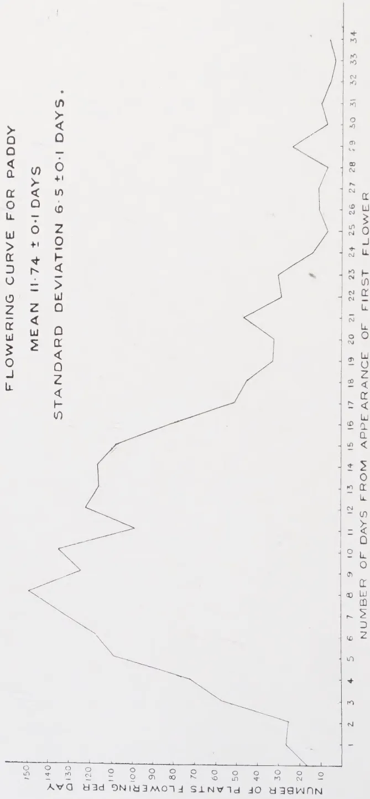
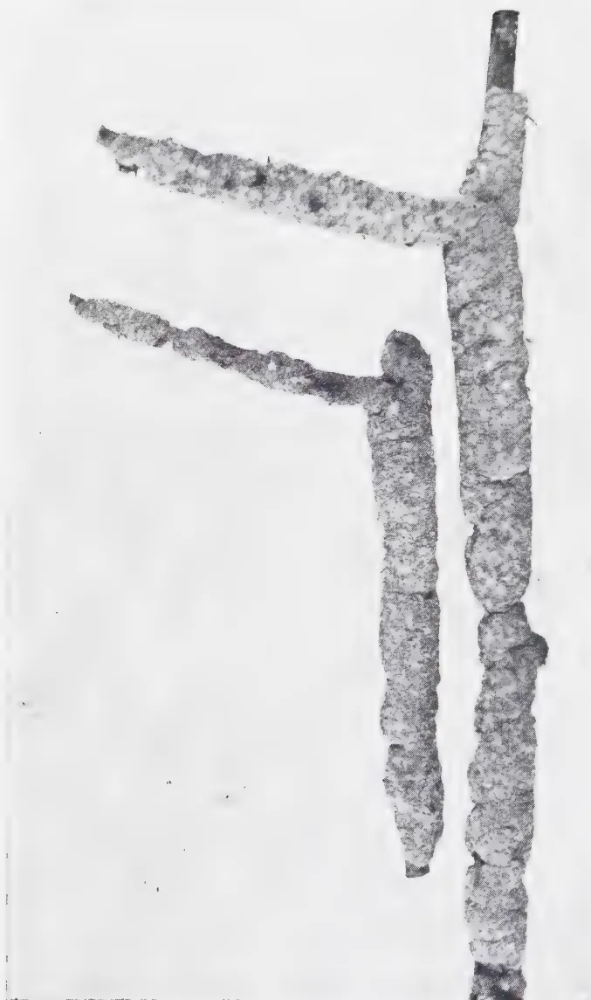

# The Tropical Agriculturist

December, 1934

---

## EDITORIAL

---

### RECENT ADVANCES IN TEA CULTURE

---

OUR articles on the vegetative propagation of the tea plant have brought to notice certain interesting points. One of these relates to the number of bushes in a tea field that effectively contribute to make the yield of the field as high or as low as it is. The divergence in yield in the plants on many estates appears to be so considerable as to make the matter especially worthy of consideration at the present time when there is a limit to the production allowed from an estate. There is now an excellent opportunity for experiment to see if the quantity required could not be produced from a much smaller acreage than it is at present. A material increase of the yield per acre on the part of the plant itself should effect a corresponding reduction in the cost of production. That indeed would open a way to an advantageous restriction. The method obviously shows advantages analogous to the bud-grafting of rubber — the multiplication of high-yielding plants by vegetative methods and the substitution of these for the low-yielding ones at present in the field. Preliminary observation upon existing bushes to determine the low average yielders is of course a necessary initial step. Coupled with the results of recent experiments on the methods of pruning tea an increased knowledge of horticultural operations now puts us in possession of valuable ways and means to improve yield without in any way deteriorating quality. These operations in fact place us

1------------------------------------------------

328

in a position to improve quality at the same time. It seems certain that in the near future much greater attention will be paid to the tea bush along these lines especially by the newcomers in the field of the tea plantation industry. The genetics of the tea plant have in the past been largely neglected because it was too readily accepted that there was nothing to learn therefrom. The importance of "jat" or the variety of the plant grown has long been recognised but the method of propagation by seeds as ordinarily grown has not in most cases so rigorously preserved purity of type as to secure the greatest advantage. Further if purity of type were preserved the individual eccentricities of the various plants are perpetuated by this method of propagation from seeds.

An interesting article recently published by the late Director of the Tea Experiment Station at Buitenzorg indicates with what care and modern knowledge the French tea plantations and the tea industry in Indo-China are being inaugurated. It certainly seems that if the French are going to develop a taste for tea drinking they are at the same time going to take care that they drink the tea of their own colonies. Tea from Indo-China has been known on the market for some time, especially so for its evil quality, this was produced by the inhabitants from promiscuous bushes and under conditions of manufacture which were anything but modern. This is now being entirely altered by the establishment of a uniform type of Assam tea plant obtained from Java and Sumatra on plantations which are well organised and equipped. At present the number of large plantations is only six, four of which are already working most up-to-date factories, whilst on two others, factories are in course of construction. The areas of the estates are from some 500 acres to 1,250 acres. One of the plantations is at a low altitude. The others are situated at heights between 2,000 and 6,000 feet. The climate of the tea districts is said to resemble that of Uva and in certain cases the tea produced to have the bouquet of that of Darjeeling. There is judged to be a possibility for development sufficient to meet expanding French needs.

2------------------------------------------------

329

## VERNALIZATION

J. C. HAIGH, PH. D.

*ECONOMIC BOTANIST*

HERE appeared in a recent number of this Journal (Vol. LXXXII, No. 4, April 1934), a brief account of the principles of vernalization, or the pre-treatment of seed, and the possibilities of adapting the process to agricultural practice. It is now possible to give an account of preliminary trials with two Ceylon crops.

*Maize*.—Specific recommendations are made by the Russian workers for the pre-treatment of maize seed. The seed should be soaked for 24 hours in water in the proportion of 30 gm. water to 100 gm. seed, then kept in the darkness at a temperature of 20-30°C. for a period of 10-15 days. In the present experiment the seed was soaked as recommended and thereafter kept in darkness for 11 days at the laboratory temperature of 25°C. It was then sown in pots at the same time as control pots were sown with dry, untreated seed. The treated seed had been surface-sterilised with mercuric chloride before soaking, but nevertheless moulds developed during treatment. Many seeds were destroyed, and in all those that had started to develop, the radicle died back. It was succeeded by adventitious roots and by the extrusion of the plumule. Such seeds were considered still to be suitable for the purposes of the experiment.

Readings were taken when the first male flowers opened and also when the first silks were protruded from the sheath surrounding the female inflorescence.

Five varieties were used and the figures given below are averages:

3------------------------------------------------

330

TABLE I  
MAIZE IN POTS

<table border="1">
<thead>
<tr>
<th rowspan="2">Variety</th>
<th rowspan="2">Treatment</th>
<th colspan="2">Mean number of days from sowing to</th>
</tr>
<tr>
<th>Opening of male flowers</th>
<th>Appearance of silks</th>
</tr>
</thead>
<tbody>
<tr>
<td rowspan="2">1.</td>
<td>Vernalized</td>
<td>66.3</td>
<td>74.6</td>
</tr>
<tr>
<td>Untreated</td>
<td>66.5</td>
<td>76.3</td>
</tr>
<tr>
<td rowspan="2">2.</td>
<td>Vernalized</td>
<td>64.5</td>
<td>70.0</td>
</tr>
<tr>
<td>Untreated</td>
<td>67.0</td>
<td>68.0</td>
</tr>
<tr>
<td rowspan="2">3.</td>
<td>Vernalized</td>
<td>64.6</td>
<td>67.0</td>
</tr>
<tr>
<td>Untreated</td>
<td>58.0</td>
<td>62.0</td>
</tr>
<tr>
<td rowspan="2">4.</td>
<td>Vernalized</td>
<td>61.2</td>
<td>70.3</td>
</tr>
<tr>
<td>Untreated</td>
<td>61.0</td>
<td>70.5</td>
</tr>
<tr>
<td rowspan="2">5.</td>
<td>Vernalized</td>
<td>63.0</td>
<td>78.3</td>
</tr>
<tr>
<td>Untreated</td>
<td>64.0</td>
<td>69.0</td>
</tr>
<tr>
<td colspan="2">Means</td>
<td>63.9</td>
<td>72.1</td>
</tr>
<tr>
<td colspan="2"></td>
<td>63.3</td>
<td>69.2</td>
</tr>
</tbody>
</table>

Pre-treatment has obviously had no shortening effect in this experiment.

*Rice.*—The technique for the treatment of rice seed has not been published, so that it was necessary to attempt to discover not only whether rice would respond to pre-treatment, but also what period of vernalization would produce the best results. In the details already given for tropical and sub-tropical, or 'short-day', plants, the period of treatment varies from 5-15 days and the temperature from 20-30°C. and these data were used as a guide. Seed was vernalized for 6, 10 and 15 days at a temperature of 25°C. being the mean temperature of the laboratory. The control was seed treated by the normal or village method of sowing, which was described in the previous article. As however this method appears likely to be in itself a form of vernalization, further controls were added of seed sown dry and also of seed germinated in an open porous dish, with no attempt to control temperature, light or pressure. Two varieties of paddy were used and the seedlings were sown in pots, 50 plants to a pot. All treatments were started on the

4------------------------------------------------

A faint, light gray watermark of a classical building, likely a library or archive, is centered on the page. It features a triangular pediment supported by four vertical columns, with a horizontal frieze and a base.

Digitized by the Internet Archive  
in 2025

[https://archive.org/details/tropical-agriculturist\\_1934-12](https://archive.org/details/tropical-agriculturist_1934-12)

5------------------------------------------------

FLOWERING CURVE FOR PADDY

MEAN  $11.74 \pm 0.1$  DAYS

STANDARD DEVIATION  $6.5 \pm 0.1$  DAYS.

NUMBER OF PLANTS FLOWERING PER DAY

NUMBER OF DAYS FROM APPEARANCE OF FIRST FLOWER

<table border="1"><thead><tr><th>NUMBER OF DAYS FROM APPEARANCE OF FIRST FLOWER</th><th>NUMBER OF PLANTS FLOWERING PER DAY</th></tr></thead><tbody><tr><td>1</td><td>10</td></tr><tr><td>2</td><td>25</td></tr><tr><td>3</td><td>30</td></tr><tr><td>4</td><td>35</td></tr><tr><td>5</td><td>40</td></tr><tr><td>6</td><td>45</td></tr><tr><td>7</td><td>50</td></tr><tr><td>8</td><td>55</td></tr><tr><td>9</td><td>60</td></tr><tr><td>10</td><td>65</td></tr><tr><td>11</td><td>70</td></tr><tr><td>12</td><td>75</td></tr><tr><td>13</td><td>80</td></tr><tr><td>14</td><td>85</td></tr><tr><td>15</td><td>90</td></tr><tr><td>16</td><td>95</td></tr><tr><td>17</td><td>100</td></tr><tr><td>18</td><td>105</td></tr><tr><td>19</td><td>110</td></tr><tr><td>20</td><td>115</td></tr><tr><td>21</td><td>120</td></tr><tr><td>22</td><td>125</td></tr><tr><td>23</td><td>130</td></tr><tr><td>24</td><td>135</td></tr><tr><td>25</td><td>140</td></tr><tr><td>26</td><td>145</td></tr><tr><td>27</td><td>150</td></tr><tr><td>28</td><td>155</td></tr><tr><td>29</td><td>160</td></tr><tr><td>30</td><td>165</td></tr><tr><td>31</td><td>170</td></tr><tr><td>32</td><td>175</td></tr><tr><td>33</td><td>180</td></tr><tr><td>34</td><td>185</td></tr></tbody></table>

6------------------------------------------------

331

same day, which was later discovered to be a mistake; it meant that extra controls were required and it had other results which will be apparent when the figures are examined. The treatments were then

A. Seed sown dry in pots.

B. Seed soaked for 24 hours, then germinated in an open porous dish: sown after 6 days.

C. Seed soaked for 24 hours, then vernalized for 6 days at 25°C.

D. Seed soaked for 24 hours, then put under pressure (village method) for 6 days — control of C.

E. Seed soaked for 24 hours, then vernalized for 10 days at 25°C.

F. Seed soaked for 24 hours, then put under pressure for 6 days — control of E.

G. Seed soaked for 24 hours, then vernalized for 15 days at 25°C.

H. Seed soaked for 24 hours, then put under pressure for 6 days — control of G.

Treatments A, B, C, D, E and G were laid down all at the same time, and treatments F and H were started at such times that they were sown on the same day as treatments E and G of which they were respectively the controls.

Readings were taken as each plant flowered, and the figures in Table II are the means of the plants in a pot.

From a comparison of the results of treatments D, F and H, which were identical except for date of sowing, it is apparent that the period from sowing to flowering is affected by the date of sowing, and that the later the sowing the shorter the time required to come into ear. Lord and de Silva (*The Tropical Agriculturist* Vol. LXXVI, No. 6, June 1931) found, by means of monthly sowings, that the age of a variety differed if sown at different times of year, and it would appear from the above figures that the change is progressive. It is therefore impossible to draw any comparisons with treatments A and B, and we can only compare treatments C and D, E and F, G and H in pairs. With the variety Kurulutuduwi these pairs show significant differences, in favour of vernalization when the treatment is

7------------------------------------------------

332

TABLE II  
VERNALIZATION IN POTS MAHA 1933-34

<table border="1">
<thead>
<tr>
<th rowspan="2">Treatment</th>
<th colspan="2"><i>Mawi B-11</i></th>
<th colspan="2"><i>Kurulududuri b-13</i></th>
</tr>
<tr>
<th>Sown</th>
<th>Flowered</th>
<th>Sown</th>
<th>Flowered</th>
</tr>
<tr>
<th></th>
<th></th>
<th>Days</th>
<th></th>
<th>Days</th>
</tr>
</thead>
<tbody>
<tr>
<td>A Sown dry</td>
<td>28-8-33</td>
<td>25-1-34—19-2-34</td>
<td>28-8-33</td>
<td>15-1-34—6-2-34</td>
</tr>
<tr>
<td></td>
<td></td>
<td>161.4</td>
<td></td>
<td>152.7</td>
</tr>
<tr>
<td>B Germinated</td>
<td>3-9-33</td>
<td>4-2-34—23-2-34</td>
<td>3-9-33</td>
<td>23-1-34—19-2-34</td>
</tr>
<tr>
<td></td>
<td></td>
<td>164.9 ± 1</td>
<td></td>
<td>154.3 ± 0.6</td>
</tr>
<tr>
<td>C Vernalized 6 days</td>
<td>4-9-33</td>
<td>20-1-34—12-2-34</td>
<td>4-9-33</td>
<td>26-1-34—13-2-34</td>
</tr>
<tr>
<td></td>
<td></td>
<td>152.8 ± 0.6</td>
<td></td>
<td>160.3</td>
</tr>
<tr>
<td></td>
<td></td>
<td>159.8</td>
<td></td>
<td>155.0 ± 0.4</td>
</tr>
<tr>
<td>D Under pressure 6 days</td>
<td>4-9-33</td>
<td>22-1-34—12-2-34</td>
<td>4-9-33</td>
<td>2-2-34—24-2-34</td>
</tr>
<tr>
<td></td>
<td></td>
<td>153.2 ± 0.8</td>
<td></td>
<td>162.0</td>
</tr>
<tr>
<td></td>
<td></td>
<td>160.2</td>
<td></td>
<td>159.4 ± 0.8</td>
</tr>
<tr>
<td>E Vernalized 10 days</td>
<td>8-9-33</td>
<td>16-1-34—7-2-34</td>
<td>8-9-33</td>
<td>22-1-34—7-2-34</td>
</tr>
<tr>
<td></td>
<td></td>
<td>142.4 ± 0.9</td>
<td></td>
<td>166.4</td>
</tr>
<tr>
<td></td>
<td></td>
<td>153.4</td>
<td></td>
<td>146.6 ± 0.4</td>
</tr>
<tr>
<td>F Under pressure 6 days</td>
<td>8-9-33</td>
<td>16-1-34—10-2-34</td>
<td>8-9-33</td>
<td>13-1-34—7-2-34</td>
</tr>
<tr>
<td></td>
<td></td>
<td>143.6 ± 0.9</td>
<td></td>
<td>157.6</td>
</tr>
<tr>
<td></td>
<td></td>
<td>150.6</td>
<td></td>
<td>139.3 ± 0.6</td>
</tr>
<tr>
<td>G Vernalized 15 days</td>
<td>13-9-33</td>
<td>13-1-34—7-2-34</td>
<td>13-9-33</td>
<td>15-1-34—5-2-34</td>
</tr>
<tr>
<td></td>
<td></td>
<td>137.3 ± 0.9</td>
<td></td>
<td>146.3</td>
</tr>
<tr>
<td></td>
<td></td>
<td>153.3</td>
<td></td>
<td>136.0 ± 0.8</td>
</tr>
<tr>
<td>H Under pressure 6 days</td>
<td>13-9-33</td>
<td>19-1-34—5-2-34</td>
<td>13-9-33</td>
<td>12-1-34—2-2-34</td>
</tr>
<tr>
<td></td>
<td></td>
<td>138.6 ± 0.6</td>
<td></td>
<td>152.0</td>
</tr>
<tr>
<td></td>
<td></td>
<td>145.6</td>
<td></td>
<td>131.5 ± 0.9</td>
</tr>
<tr>
<td></td>
<td></td>
<td></td>
<td></td>
<td>138.5</td>
</tr>
</tbody>
</table>

Figures in heavy type represent number of days from soaking to flowering.

The flowering period of a pure-line paddy is approximately 28 days.

8------------------------------------------------

333

given for 6 days, but in favour of the village method when the period of vernalization is longer. In view of the fact, however, that the corresponding pairs for Mawi are almost identical the results must be regarded as inconclusive.

The experiment was repeated in Yala 1934 with various modifications. In the first place all treatments were sown on the same day, so as to eliminate the effect of sowing date on age. Incidentally this meant that only one control of the village method was necessary. Secondly, less water was used in soaking. In the original experiment the seed was soaked in an unlimited quantity of water for 24 hours. It was discovered subsequently that 100 gm. maize seed will absorb 40 gm. water in 24 hours, whereas the technique recommends the addition of only 30 gm. water per 100 gm. seed. Accordingly the quantity of water used for soaking the paddy seed was reduced in the same proportion. Lastly, the experiment was carried out in the field instead of in pots. Fifty seedlings are too many for one pot, and growth was undoubtedly affected; it cannot be said whether development was similarly affected, but the risk was considered unjustifiable. The seedlings were accordingly sown in plots of 144 plants in rows, spaced 6 inches apart both ways. The plots were replicated 6 times and randomised, and all 36 plots were in the same banded field. This complexity of treatment is justified by the fact that a pure-line crop, growing under ordinary conditions, requires a period of 3-4 weeks to complete its flowering, and some of the differences between plants may be caused by differences of environment. Hence the necessity to grow a large number of plants in order to get a reliable mean figure for the period from sowing to flowering. A plant was considered to have flowered when the peduncular ring at the base of the panicle was clear of the flag leaf.

The treatments were as before except that there was only one treatment by the village method. We therefore have

A. Seed sown dry.

B. Seed soaked for 24 hours, then germinated in an open porous dish.

C. Seed soaked for 24 hours, then kept under pressure (village method) for 6 days.

D. Seed soaked for 24 hours, then vernalized for 6 days at 25°C.

9------------------------------------------------

334

E. Seed soaked for 24 hours, then vernalized for 10 days at 25°C.

F. Seed soaked for 24 hours, then vernalized for 15 days at 25°C.

All treatments were sown on the 20th April, 1934 and Table III gives the mean number of days from sowing to flowering for each plot. Table IV gives the analysis of variance, from which it is found that the differences between treatments, though small, are significant. The standard error of the mean of 6 plots is 0.74 days, so that differences between means of more than 2.22 days are significant. On this basis, and taking the seed sown dry as the control, a significant shortening of the period between sowing and flowering has been obtained with the seed germinated in an open dish and with that vernalized for 6 days: if however we take the normal village method (treatment C.) as control, the only significant difference is obtained with the seed germinated in an open dish. There is no significant difference between the village method and the seed vernalized for 6 or 10 days, but 15 days pre-treatment has an adverse effect.

Although the differences found above are mathematically significant, yet from a practical point of view they are of no importance. The greatest difference is only  $4\frac{1}{2}$  days, and this difference can be obtained by a slight variation in sowing date.

It therefore appears that, under the conditions of the experiment, vernalization is of no practical significance. The villager, for reasons of convenience, has evolved a method of pre-treatment which corresponds closely to vernalization, and the period of that pre-treatment coincides with the optimum period of vernalization; there is little doubt, however, that the duration of the village treatment, which must have been determined by trial, has been chosen as the shortest time necessary to obtain maximum germination, and has not been influenced by questions of subsequent ear formation. The practice of pre-treatment of rice seed is now common in Ceylon except in the very dry areas where the supply of water is limited or unreliable; there the seed is sown dry. In such areas all water courses and wells are probably dry for several weeks before the monsoon breaks, and it would be impossible to judge with accuracy when the pre-treatment should start.

10------------------------------------------------

335

It does not follow from the results of these experiments that there are no conditions of pre-treatment that would not produce an appreciable shortening of the period from sowing to flowering. The Russian experiments were carried out at Odessa latitude  $46^{\circ} 29$  mins. N. and the temperature of the treatment must have been considerably above that of the atmosphere. It may be that an appreciable temperature difference would produce similar changes here. At the same time, it seems unlikely that vernalization would ever be of practical importance in a climate such as that of Ceylon except during abnormal seasons where drought had prevented sowing at the normal time. In such circumstances the villager sows, say, a five-month variety instead of his usual six-month one, or replaces a four-month crop by one which matures in three. The result is generally a lower yield, and if, as is claimed, plants can be made to mature in a shorter period without loss of yield, as a result of pre-treatment, then the method may have practical application. It would be necessary however, for the diminution to be of the order of a month or more. Taking all the factors into consideration, it appears that the practical application of vernalization is likely to be of value mainly in temperate regions, where it may permit the introduction of crops which could not otherwise be matured in a normal season.

### SUMMARY

1. The technique of vernalization has been applied to seed of maize and rice.

2. On maize seed it has had no effect. On rice it has produced a small, but significant, shortening of the period between sowing and flowering; the shortening, however, is too small to be of practical value. It is possible that a modification of the treatment may have a greater effect.

3. On general grounds it is considered that vernalization is not likely to be of practical value in tropical regions.

---

### NOTE ON FLOWERING IN RICE

It was mentioned in the above article that a pure-line crop of rice, growing under normal conditions, requires a period of 3-4 weeks to complete its flowering. This fact has been established by general observation, as has also the conclusion that a crop is "50 per cent. flowered" approximately 10 days after the

11------------------------------------------------

336

TABLE III  
VERNALIZATION IN FIELD—YALA 1934

<table border="1">
<thead>
<tr>
<th rowspan="2">Treatment</th>
<th colspan="6">Mean No. of days from sowing to flowering</th>
<th rowspan="2">Total</th>
<th rowspan="2">Mean</th>
</tr>
<tr>
<th>a</th>
<th>b</th>
<th>c</th>
<th>d</th>
<th>e</th>
<th>f</th>
</tr>
</thead>
<tbody>
<tr>
<td>A</td>
<td>112.9</td>
<td>111.3</td>
<td>111.0</td>
<td>110.3</td>
<td>109.8</td>
<td>110.4</td>
<td>665.7</td>
<td>110.9</td>
</tr>
<tr>
<td>B</td>
<td>105.1</td>
<td>105.1</td>
<td>106.8</td>
<td>109.6</td>
<td>108.9</td>
<td>106.2</td>
<td>641.7</td>
<td>106.9</td>
</tr>
<tr>
<td>C</td>
<td>111.8</td>
<td>107.5</td>
<td>110.7</td>
<td>109.2</td>
<td>111.2</td>
<td>108.0</td>
<td>658.4</td>
<td>109.7</td>
</tr>
<tr>
<td>D</td>
<td>108.3</td>
<td>107.7</td>
<td>109.3</td>
<td>108.4</td>
<td>107.9</td>
<td>109.8</td>
<td>651.4</td>
<td>108.4</td>
</tr>
<tr>
<td>E</td>
<td>106.1</td>
<td>110.0</td>
<td>105.8</td>
<td>109.9</td>
<td>111.8</td>
<td>112.2</td>
<td>655.8</td>
<td>109.3</td>
</tr>
<tr>
<td>F</td>
<td>109.2</td>
<td>112.6</td>
<td>111.9</td>
<td>110.1</td>
<td>112.7</td>
<td>111.6</td>
<td>668.1</td>
<td>111.3</td>
</tr>
<tr>
<td>Totals</td>
<td>653.4</td>
<td>654.2</td>
<td>655.5</td>
<td>657.5</td>
<td>662.3</td>
<td>658.2</td>
<td>3941.1</td>
<td>109.5</td>
</tr>
</tbody>
</table>

TABLE IV  
ANALYSIS OF VARIANCE

<table border="1">
<thead>
<tr>
<th></th>
<th>Degrees of freedom</th>
<th>Sum of squares</th>
<th>Mean square</th>
<th>Standard Deviation</th>
<th>loge Standard Deviation</th>
</tr>
</thead>
<tbody>
<tr>
<td>Blocks</td>
<td>5</td>
<td>8.78</td>
<td></td>
<td></td>
<td></td>
</tr>
<tr>
<td>Treatment</td>
<td>5</td>
<td>77.94</td>
<td>15.59</td>
<td>3.948</td>
<td>1.3732</td>
</tr>
<tr>
<td>Error</td>
<td>25</td>
<td>82.37</td>
<td>3.295</td>
<td>1.815</td>
<td>0.5960</td>
</tr>
<tr>
<td>Total</td>
<td>35</td>
<td>169.09</td>
<td></td>
<td></td>
<td><math>z = 0.7772</math></td>
</tr>
</tbody>
</table>

Standard error of a single plot is 1.815 days, of a group of 6 plots 4.446 days.

$n_1 = 5, n_2 = 25$  1% point is 0.6747 :  $z$  is significant

12------------------------------------------------

337

appearance of the first flower. Opportunity was taken during the vernalization experiment of collecting data to prove these conclusions.

As is stated in the paper, the second experiment with paddy was arranged in 36 plots, 6 of each treatment, randomised and replicated within one banded field. Each plot consisted of 144 plants in rows 6 inches apart each way. As each plant flowered it was pulled out. Unfortunately all the plants did not attain maturity, but readings were taken on nearly 2,000 plants.

It was further stated that some of the differences between the flowering dates of different plants may be due to differences of environment. If this statement is correct, we may hope to find significant differences in the plot distributed over the field.

Since it has been found that the mean number of days from sowing to flowering has been affected by the previous treatment of the seed, we cannot use the different treatments for testing the effect of environment, but we can compare the replications of each treatment among themselves.

It will be seen from Table III of the article that there is variation in the means of any one treatment. We may compare these means with the position of the plots in the field, taking each treatment separately and numbering the replications within it from 1 to 6 according to the mean number of days taken to come into flower. Thus, in any treatment, the plot numbered 1 had the lowest mean number of days from sowing to flowering and that numbered 6 had the highest mean. If now we superimpose these values on the plots as arranged in the field, we have the following pattern:

<table>
<tbody>
<tr>
<td>2</td>
<td>3</td>
<td>1</td>
<td>6</td>
<td>6</td>
<td>2</td>
</tr>
<tr>
<td>4</td>
<td>1</td>
<td>5</td>
<td>1</td>
<td>1</td>
<td>5</td>
</tr>
<tr>
<td>4</td>
<td>5</td>
<td>4</td>
<td>4</td>
<td>4</td>
<td>1</td>
</tr>
<tr>
<td>2</td>
<td>3</td>
<td>6</td>
<td>4</td>
<td>2</td>
<td>3</td>
</tr>
<tr>
<td>2</td>
<td>6</td>
<td>5</td>
<td>1</td>
<td>5</td>
<td>5</td>
</tr>
<tr>
<td>3</td>
<td>2</td>
<td>3</td>
<td>6</td>
<td>6</td>
<td>3</td>
</tr>
</tbody>
</table>

There is no obvious grouping of high or low figures in any part of the pattern, although there is a suggestion of a greater density of higher numbers (or later flowering) in the centre.

13------------------------------------------------

338

We may examine the question in another way. Taking any one treatment, we may obtain a frequency array by tabulating the number of plants flowering on each day, commencing with the first plant of that treatment to come into flower. We may also obtain a frequency array by taking each replication separately, and adding together the arrays thus obtained, so that we have assumed that all replications commenced flowering together. Now if the position of the plot in the field affects the flowering date, so that the plots flowered at different times, we would expect the dispersion of the frequency array to be decreased by adopting the second of the above arrangements, for we have eliminated differences due to position, and made all the plots commence flowering together. Below are given the standard deviations of the frequency arrays obtained by these methods, for each treatment.

<table border="1">
<thead>
<tr>
<th>Treatment</th>
<th>S.D. of ordinary frequency array</th>
<th>S.D. of composite frequency array</th>
</tr>
</thead>
<tbody>
<tr>
<td>A</td>
<td><math>6.2 \pm 0.1</math></td>
<td><math>6.2 \pm 0.1</math></td>
</tr>
<tr>
<td>B</td>
<td><math>6.2 \pm 0.1</math></td>
<td><math>6.1 \pm 0.1</math></td>
</tr>
<tr>
<td>C</td>
<td><math>6.4 \pm 0.2</math></td>
<td><math>6.2 \pm 0.2</math></td>
</tr>
<tr>
<td>D</td>
<td><math>5.8 \pm 0.1</math></td>
<td><math>5.8 \pm 0.1</math></td>
</tr>
<tr>
<td>E</td>
<td><math>6.6 \pm 0.2</math></td>
<td><math>6.3 \pm 0.2</math></td>
</tr>
<tr>
<td>F</td>
<td><math>7.3 \pm 0.2</math></td>
<td><math>7.2 \pm 0.2</math></td>
</tr>
</tbody>
</table>

In no treatment do the pairs show significant differences, and it would appear that the position of the plot in the field has had no effect on the date of flowering.

We may now with safety add together the frequency arrays obtained from the various treatments to obtain a flowering curve, which is reproduced in the figure. The distribution is moderately asymmetrical, the mode being 8 days, the median 10.25 days and the mean 11.74 days; the figure of 10 days hitherto used as the period to "50 per cent. flowering" is seen to be very approximate. Further, 92 per cent. of the plants have flowered in 3 weeks and 97 per cent. in 4 weeks.

It is intended to test the effect of selection within a pure-line by bagging plants from the beginning, middle and end of a frequency array such as this and growing the seed thus obtained.

14------------------------------------------------

339

## STUDIES ON PADDY CULTIVATION

### IV.—THE EFFECT OF SYSTEM OF CULTIVATION ON THE COMPOSITION OF THE PADDY CROP AND SOIL

A. W. R. JOACHIM, PH. D.,

(AGRICULTURAL CHEMIST)

AND

S. KANDIAH, DIP. AGRIC. (POONA) AND

D. G. PANDITTESEKERE, DIP. AGRIC. (POONA)

(ASSISTANTS IN AGRICULTURAL CHEMISTRY)

#### INTRODUCTION

IN the preceding paper of this number of *The Tropical Agriculturist* (1) are given the details of experiments carried out to determine the effect of different systems of cultivation on the yield of paddy and the general conclusions drawn from a simultaneous study of the chemical data and the yield figures. The present paper deals with the results of analyses of crop and soil carried out with the object of ascertaining what light these would throw on the yield differences observed. The methods of procedure for crop and soil sampling and analysis were the same as those adopted previously. Certain analytical determinations were however omitted as the trials were carried out on the same soil area and earlier work had shown that they were of little or no value from the standpoint of these investigations. It was also not found necessary to sample frequently and samplings were therefore made only at important stages of crop growth. The results are unfortunately not as complete as they might have been but for the destruction of the *Yala* crop by floods. They do however give a clear insight into the relationship between the intake of plant food material as governed by system of cultivation and manuring on the one hand and yield of crop on the other. In this respect they constitute a definite advance of our knowledge of the science of paddy cultivation.

15------------------------------------------------

340CROP DATA AND DISCUSSION MAHA 1932COMPOSITION OF THE CROP

The analytical composition of the above-ground portion of the crop and its various parts from the differently treated plots is given in two tables. The results of the crop analyses are expressed as percentages on dry matter at 100°C. Table I shows the percentage composition of the whole plant, and Table II that of the constituent parts.

The data of Table I confirm what has been previously observed (2) in regard to the variation in crop constituents with advancing age, irrespective of the system of cultivation. The crop at harvest from differently treated plots does not show any appreciable variation in composition except in regard to phosphoric acid and to a lesser extent, nitrogen. The transplanted crops have higher percentages of these constituents than the unmanured and manured broadcast plots. The manured crops generally contain higher percentages than the corresponding unmanured crops.

The composition of the various parts of the crop is similar to that found in the previous investigation. Nitrogen and phosphoric acid are concentrated in the grain while potash and to a lesser extent, lime in the straw. No appreciable differences are observed in the composition at harvest of various parts of the differently treated crops, though here again the percentages of phosphoric acid in the grain of the unmanured broadcast crops are lower than those of the corresponding manured and the transplanted crops.

RATES OF ABSORPTION OF FERTILISING CONSTITUENTS

In Table III are set out the percentage rates of absorption of fertilising constituents by the whole plant and parts of plant at different stages of growth, calculated on the amounts found at harvest. The table showing the actual amounts of fertilising constituents in grams per ten culms, from which Table III was constructed, is not published owing to its unwieldiness and as all the information it furnishes is contained in this table.

An examination of the table will indicate that:

(1). At flowering the transplanted crops, both manured and unmanured, have absorbed nitrogen and phosphoric acid to the extent of only about 50 per cent. of the amounts at harvest,

16------------------------------------------------

TABLE I  
PERCENTAGE CONSTITUENTS IN WHOLE PLANT  
MAHA 1932

<table border="1">
<thead>
<tr>
<th rowspan="2">Treatment</th>
<th colspan="7">SEEDLING</th>
<th colspan="7">FLOWERING</th>
<th colspan="7">HARVESTING</th>
</tr>
<tr>
<th>Dry Matter</th>
<th>Ash</th>
<th>Nitrogen</th>
<th>Phos. Acid</th>
<th>Potash</th>
<th>Lime</th>
<th></th>
<th>Dry Matter</th>
<th>Ash</th>
<th>Nitrogen</th>
<th>Phos. Acid</th>
<th>Potash</th>
<th>Lime</th>
<th>Dry Matter</th>
<th>Ash</th>
<th>Nitrogen</th>
<th>Phos. Acid</th>
<th>Potash</th>
<th>Lime</th>
</tr>
</thead>
<tbody>
<tr>
<td>Broadcasting</td>
<td></td>
<td></td>
<td></td>
<td></td>
<td></td>
<td></td>
<td></td>
<td>24.8</td>
<td>12.1</td>
<td>.73</td>
<td>.31</td>
<td>1.13</td>
<td>.46</td>
<td>42.2</td>
<td>12.2</td>
<td>.61</td>
<td>.24</td>
<td>.93</td>
<td>.36</td>
</tr>
<tr>
<td>Broadcasting and manuring</td>
<td></td>
<td></td>
<td></td>
<td></td>
<td></td>
<td></td>
<td></td>
<td>23.1</td>
<td>11.4</td>
<td>.72</td>
<td>.35</td>
<td>1.24</td>
<td>.42</td>
<td>44.9</td>
<td>11.5</td>
<td>.68</td>
<td>.29</td>
<td>.82</td>
<td>.34</td>
</tr>
<tr>
<td>Broadcasting and thinning</td>
<td></td>
<td></td>
<td></td>
<td></td>
<td></td>
<td></td>
<td></td>
<td>33.2</td>
<td>11.9</td>
<td>.62</td>
<td>.30</td>
<td>1.29</td>
<td>.42</td>
<td>46.1</td>
<td>12.0</td>
<td>.61</td>
<td>.28</td>
<td>1.0</td>
<td>.38</td>
</tr>
<tr>
<td>Broadcasting, thinning and manuring</td>
<td></td>
<td></td>
<td></td>
<td></td>
<td></td>
<td></td>
<td></td>
<td>29.0</td>
<td>11.3</td>
<td>.64</td>
<td>.33</td>
<td>1.22</td>
<td>.47</td>
<td>47.9</td>
<td>11.1</td>
<td>.71</td>
<td>.31</td>
<td>.86</td>
<td>.33</td>
</tr>
<tr>
<td>Transplanting</td>
<td></td>
<td></td>
<td></td>
<td></td>
<td></td>
<td></td>
<td></td>
<td>26.1</td>
<td>11.3</td>
<td>.66</td>
<td>.32</td>
<td>1.45</td>
<td>.51</td>
<td>40.2</td>
<td>10.8</td>
<td>.72</td>
<td>.33</td>
<td>.92</td>
<td>.33</td>
</tr>
<tr>
<td>Transplanting and manuring</td>
<td>21.6</td>
<td>16.4</td>
<td>1.50</td>
<td>.506</td>
<td>2.68</td>
<td>.76</td>
<td></td>
<td>25.9</td>
<td>11.4</td>
<td>.67</td>
<td>.33</td>
<td>1.51</td>
<td>.50</td>
<td>41.1</td>
<td>11.3</td>
<td>.75</td>
<td>.37</td>
<td>.88</td>
<td>.34</td>
</tr>
</tbody>
</table>

341

17------------------------------------------------

342

Similar figures were obtained in the previous investigation for the *Maha* crop. Those for the broadcast and broadcast and thinned plots (for the sake of brevity designated the thinned plots) are much higher, being approximately 88 and 84 per cent. respectively. These observations confirm those of Sahasrabudhe (3) who worked with transplanted paddy and Sen (4) who made his studies with a crop which was not transplanted. They differ however from those of Kelly (3). This divergence may be attributed to differences in age and variety of paddy, methods of cultivation, soil factors, and, what appears most likely, differences in identity of the stage of flowering in the two investigations. Manuring lowers the rates of absorption of the essential fertiliser constituents by both crops especially the thinned crop. Thus with the thinned and manured crop the percentages of nitrogen and phosphoric acid absorbed are respectively 56 and 54 and for the corresponding broadcast crop 74 and 83. The data do therefore indicate that while transplanted crops continue to absorb the essential fertiliser constituents steadily till harvest, the unmanured broadcast and thinned crops cease to do so a short time after flowering. The manuring of a broadcast crop does appear, however, to produce the same effect as transplanting of lengthening the period of essential fertiliser absorption by the crop. It would seem reasonable to assume that, other conditions being equal, the longer the period over which a crop can take up plant food constituents, the better would be its growth and the higher its yield. The chemical data just discussed, when considered along with the yield figures, would appear to justify this assumption, at least in the case of paddy grown under local conditions. A point of interest to note here is that, in the case of the broadcast crops, manuring definitely hastens flowering and crop maturity.

(2). The percentages of potash and lime absorbed by the crop at flowering are invariably higher than those found in the previous investigation. Here again higher absorption rates are noted with the broadcast and thinned crops than with the transplanted crops. Potash appears to have been completely assimilated by the broadcast crops by flowering time. This has occasionally been observed by other workers too, with paddy (5, 6) and other crops (7). The definite losses of potash at harvest recorded in these cases have been traced to the transference of this constituent from the plant back to the soil. Manuring appears to

18------------------------------------------------

TABLE II  
 PERCENTAGE CONSTITUENTS IN PARTS OF PLANT  
 MAHA 1932

<table border="1">
<thead>
<tr>
<th rowspan="3">Treatment</th>
<th colspan="15">FLOWERING</th>
<th colspan="15">HARVESTING</th>
</tr>
<tr>
<th colspan="7">Leaf &amp; Stem</th>
<th colspan="5">Panicle</th>
<th colspan="3">Straw</th>
<th colspan="7">Grain</th>
<th colspan="5">Chaff</th>
</tr>
<tr>
<th>Dry Matter</th>
<th>Ash</th>
<th>Nitrogen</th>
<th>Phos. Acid</th>
<th>Potash</th>
<th>Lime</th>
<th>Dry Matter</th>
<th>Ash</th>
<th>Nitrogen</th>
<th>Phos. Acid</th>
<th>Potash</th>
<th>Lime</th>
<th>Dry Matter</th>
<th>Ash</th>
<th>Nitrogen</th>
<th>Phos. Acid</th>
<th>Potash</th>
<th>Lime</th>
<th>Dry Matter</th>
<th>Ash</th>
<th>Nitrogen</th>
<th>Phos. Acid</th>
<th>Potash</th>
<th>Lime</th>
<th>Dry Matter</th>
<th>Ash</th>
<th>Nitrogen</th>
<th>Phos. Acid</th>
<th>Potash</th>
<th>Lime</th>
</tr>
</thead>
<tbody>
<tr>
<td>Broadcasting</td>
<td>22.7</td>
<td>12.1</td>
<td>.68</td>
<td>.29</td>
<td>1.27</td>
<td>.49</td>
<td>47.0</td>
<td>11.8</td>
<td>.98</td>
<td>.40</td>
<td>.39</td>
<td>.33</td>
<td>33.8</td>
<td>14.3</td>
<td>.35</td>
<td>.09</td>
<td>1.25</td>
<td>.42</td>
<td>84.8</td>
<td>6.25</td>
<td>1.19</td>
<td>.58</td>
<td>.29</td>
<td>.21</td>
<td>77.0</td>
<td></td>
<td></td>
<td></td>
<td></td>
<td></td>
</tr>
<tr>
<td>Broadcasting &amp; manuring</td>
<td>21.8</td>
<td>11.3</td>
<td>.68</td>
<td>.34</td>
<td>1.38</td>
<td>.45</td>
<td>34.5</td>
<td>12.0</td>
<td>.91</td>
<td>.39</td>
<td>.44</td>
<td>.34</td>
<td>33.8</td>
<td>14.1</td>
<td>.38</td>
<td>.09</td>
<td>1.22</td>
<td>.43</td>
<td>81.7</td>
<td>6.40</td>
<td>1.13</td>
<td>.60</td>
<td>.28</td>
<td>.22</td>
<td>73.4</td>
<td></td>
<td></td>
<td></td>
<td></td>
<td></td>
<td></td>
</tr>
<tr>
<td>Broadcasting &amp; thinning</td>
<td>31.1</td>
<td>12.0</td>
<td>.56</td>
<td>.28</td>
<td>1.44</td>
<td>.46</td>
<td>54.6</td>
<td>12.1</td>
<td>.99</td>
<td>.39</td>
<td>.45</td>
<td>.34</td>
<td>36.2</td>
<td>14.3</td>
<td>.32</td>
<td>.09</td>
<td>1.46</td>
<td>.46</td>
<td>83.8</td>
<td>6.37</td>
<td>1.12</td>
<td>.65</td>
<td>.30</td>
<td>.20</td>
<td>70.9</td>
<td></td>
<td></td>
<td></td>
<td></td>
<td></td>
<td></td>
</tr>
<tr>
<td>Broadcasting, thinning &amp; manuring</td>
<td>27.8</td>
<td>11.3</td>
<td>.60</td>
<td>.32</td>
<td>1.32</td>
<td>.50</td>
<td>41.2</td>
<td>11.6</td>
<td>.93</td>
<td>.38</td>
<td>.51</td>
<td>.33</td>
<td>37.9</td>
<td>14.2</td>
<td>.37</td>
<td>.10</td>
<td>1.25</td>
<td>.48</td>
<td>82.9</td>
<td>6.16</td>
<td>1.11</td>
<td>.68</td>
<td>.28</td>
<td>.19</td>
<td>65.9</td>
<td>23.1</td>
<td>.60</td>
<td>.29</td>
<td>.52</td>
<td>.22</td>
</tr>
<tr>
<td>Transplanting</td>
<td>24.4</td>
<td>11.2</td>
<td>.60</td>
<td>.30</td>
<td>1.62</td>
<td>.54</td>
<td>42.5</td>
<td>11.5</td>
<td>1.00</td>
<td>.39</td>
<td>.49</td>
<td>.29</td>
<td>26.3</td>
<td>14.9</td>
<td>.37</td>
<td>.10</td>
<td>1.43</td>
<td>.47</td>
<td>81.6</td>
<td>5.94</td>
<td>1.10</td>
<td>.64</td>
<td>.29</td>
<td>.17</td>
<td>69.1</td>
<td></td>
<td></td>
<td></td>
<td></td>
<td></td>
<td></td>
</tr>
<tr>
<td>Transplanting &amp; manuring</td>
<td>24.4</td>
<td>11.4</td>
<td>.62</td>
<td>.31</td>
<td>1.66</td>
<td>.51</td>
<td>40.2</td>
<td>11.7</td>
<td>.97</td>
<td>.42</td>
<td>.52</td>
<td>.32</td>
<td>28.4</td>
<td>14.9</td>
<td>.46</td>
<td>.10</td>
<td>1.39</td>
<td>.47</td>
<td>84.3</td>
<td>6.01</td>
<td>1.10</td>
<td>.70</td>
<td>.23</td>
<td>.18</td>
<td>69.2</td>
<td></td>
<td></td>
<td></td>
<td></td>
<td></td>
<td></td>
</tr>
</tbody>
</table>

19------------------------------------------------

TABLE III  
PERCENTAGE RATES OF ABSORPTION BY WHOLE PLANT AND PARTS OF PLANT  
MAHA 1932.

<table border="1">
<thead>
<tr>
<th rowspan="3">Treatment</th>
<th colspan="6">SEEDLING</th>
<th colspan="16">FLOWERING</th>
<th colspan="16">HARVESTING</th>
</tr>
<tr>
<th rowspan="2">Dry Matter</th>
<th rowspan="2">Ash</th>
<th rowspan="2">Nitrogen</th>
<th rowspan="2">Phos. Acid</th>
<th rowspan="2">Potash</th>
<th rowspan="2">Lime</th>
<th colspan="6">Leaf &amp; Stem</th>
<th colspan="6">Panicle</th>
<th colspan="6">Whole Plant</th>
<th colspan="6">Straw</th>
<th colspan="6">Grain</th>
<th colspan="6">Chaff</th>
<th colspan="4">Whole Plant</th>
</tr>
<tr>
<th>Dry Matter</th>
<th>Ash</th>
<th>Nitrogen</th>
<th>Phos. Acid</th>
<th>Potash</th>
<th>Lime</th>
<th>Dry Matter</th>
<th>Ash</th>
<th>Nitrogen</th>
<th>Phos. Acid</th>
<th>Potash</th>
<th>Lime</th>
<th>Dry Matter</th>
<th>Ash</th>
<th>Nitrogen</th>
<th>Phos. Acid</th>
<th>Potash</th>
<th>Lime</th>
<th>Dry Matter</th>
<th>Ash</th>
<th>Nitrogen</th>
<th>Phos. Acid</th>
<th>Potash</th>
<th>Lime</th>
<th>Dry Matter</th>
<th>Ash</th>
<th>Nitrogen</th>
<th>Phos. Acid</th>
<th>Potash</th>
<th>Lime</th>
</tr>
</thead>
<tbody>
<tr>
<td>Broadcasting</td>
<td></td><td></td><td></td><td></td><td></td><td></td>
<td>83.4</td><td>83.9</td><td>77.7</td><td>76.3</td><td>94.0</td><td>89.0</td>
<td>16.6</td><td>16.1</td><td>22.3</td><td>23.7</td><td>6.0</td><td>11.0</td>
<td>78.1</td><td>78.8</td><td>87.2</td><td>88.7</td><td>100.0</td><td>95.2</td>
<td>61.2</td><td>73.4</td><td>32.8</td><td>20.7</td><td>85.7</td><td>76.2</td>
<td>35.0</td><td>19.4</td><td>63.5</td><td>75.3</td><td>12.3</td><td>19.1</td>
<td>3.8</td><td>7.2</td><td>3.7</td><td>4.0</td><td>2.0</td><td>4.7</td>
<td></td><td></td><td></td><td></td><td></td><td></td><td>100.0</td>
</tr>
<tr>
<td>Broadcasting and manuring</td>
<td></td><td></td><td></td><td></td><td></td><td></td>
<td>84.9</td><td>84.3</td><td>80.6</td><td>83.4</td><td>94.3</td><td>90.7</td>
<td>15.1</td><td>15.7</td><td>19.4</td><td>16.6</td><td>5.7</td><td>9.3</td>
<td>69.7</td><td>68.8</td><td>73.5</td><td>82.6</td><td>103.0</td><td>86.4</td>
<td>57.5</td><td>70.2</td><td>32.2</td><td>17.7</td><td>85.4</td><td>72.6</td>
<td>38.4</td><td>21.3</td><td>64.6</td><td>78.7</td><td>13.1</td><td>24.8</td>
<td>4.1</td><td>8.1</td><td>3.8</td><td>3.6</td><td>1.5</td><td>2.6</td>
<td></td><td></td><td></td><td></td><td></td><td></td><td>100.0</td>
</tr>
<tr>
<td>Broadcasting and thinning</td>
<td></td><td></td><td></td><td></td><td></td><td></td>
<td>85.1</td><td>85.8</td><td>76.5</td><td>80.3</td><td>95.3</td><td>88.3</td>
<td>14.9</td><td>14.2</td><td>23.5</td><td>19.7</td><td>4.7</td><td>11.7</td>
<td>80.6</td><td>79.8</td><td>84.2</td><td>84.7</td><td>100.0</td><td>94.9</td>
<td>61.7</td><td>73.3</td><td>33.1</td><td>19.6</td><td>88.7</td><td>75.3</td>
<td>33.2</td><td>17.7</td><td>62.2</td><td>76.2</td><td>9.8</td><td>17.6</td>
<td>5.1</td><td>9.0</td><td>4.7</td><td>4.2</td><td>1.5</td><td>7.1</td>
<td></td><td></td><td></td><td></td><td></td><td></td><td>100.0</td>
</tr>
<tr>
<td>Broadcasting, thinning and manuring</td>
<td></td><td></td><td></td><td></td><td></td><td></td>
<td>86.9</td><td>86.5</td><td>80.9</td><td>84.3</td><td>94.6</td><td>92.3</td>
<td>13.1</td><td>13.5</td><td>19.1</td><td>15.7</td><td>5.4</td><td>7.7</td>
<td>61.2</td><td>62.6</td><td>55.9</td><td>54.2</td><td>90.4</td><td>78.9</td>
<td>53.4</td><td>69.2</td><td>28.5</td><td>14.7</td><td>82.7</td><td>71.3</td>
<td>43.8</td><td>24.3</td><td>68.9</td><td>83.4</td><td>14.9</td><td>22.7</td>
<td>2.8</td><td>6.5</td><td>2.6</td><td>1.9</td><td>2.4</td><td>6.0</td>
<td></td><td></td><td></td><td></td><td></td><td></td><td>100.0</td>
</tr>
<tr>
<td>Transplanting</td>
<td>1.22</td><td>1.83</td><td>2.55</td><td>1.71</td><td>3.73</td><td>2.18</td>
<td>84.8</td><td>84.0</td><td>76.8</td><td>81.0</td><td>94.9</td><td>89.9</td>
<td>15.2</td><td>16.0</td><td>23.2</td><td>19.0</td><td>5.1</td><td>10.1</td>
<td>56.3</td><td>59.0</td><td>50.7</td><td>47.9</td><td>94.7</td><td>86.4</td>
<td>49.0</td><td>67.8</td><td>32.8</td><td>13.5</td><td>82.5</td><td>69.5</td>
<td>48.5</td><td>26.8</td><td>64.4</td><td>84.4</td><td>16.3</td><td>24.8</td>
<td>2.5</td><td>5.4</td><td>2.8</td><td>2.1</td><td>1.3</td><td>5.7</td>
<td></td><td></td><td></td><td></td><td></td><td></td><td>100.0</td>
</tr>
<tr>
<td>Transplanting and manuring</td>
<td></td><td></td><td></td><td></td><td></td><td></td>
<td>85.1</td><td>85.1</td><td>78.7</td><td>81.2</td><td>93.7</td><td>87.7</td>
<td>14.9</td><td>14.9</td><td>21.3</td><td>18.8</td><td>6.3</td><td>12.3</td>
<td>54.2</td><td>55.1</td><td>48.8</td><td>47.7</td><td>93.4</td><td>79.4</td>
<td>53.0</td><td>70.0</td><td>32.7</td><td>14.4</td><td>83.9</td><td>73.4</td>
<td>44.0</td><td>23.0</td><td>64.8</td><td>82.8</td><td>14.0</td><td>23.4</td>
<td>3.0</td><td>6.5</td><td>2.5</td><td>2.8</td><td>2.1</td><td>4.0</td>
<td></td><td></td><td></td><td></td><td></td><td></td><td>100.0</td>
</tr>
</tbody>
</table>

20------------------------------------------------

343

lower the rate of absorption of these constituents as well, but the differences are not so appreciable as with nitrogen and phosphoric acid.

(3). The relative amounts of constituents present in different parts of the crop at harvest are similar to those found previously and do not generally vary to any appreciable extent with the treatment. The grain from the transplanted and the thinned and manured crops has slightly larger proportions of total phosphoric acid than that from the broadcast and the thinned plots.

### TOTAL CROP CONSTITUENTS

In Table IV are shown the total quantities of fertilising constituents removed per acre in the above-ground crop and parts of the crop. The figures in brackets denote the corresponding percentages in parts of the crop.

TABLE IV  
TOTAL CONSTITUENTS IN CROP IN LB. PER ACRE  
MAHA 1932

<table border="1">
<thead>
<tr>
<th>Treatment</th>
<th>Part of crop</th>
<th colspan="2">Nitrogen</th>
<th colspan="2">Phos. Acid</th>
<th colspan="2">Potash</th>
<th colspan="2">Lime</th>
</tr>
</thead>
<tbody>
<tr>
<td rowspan="4">Broadcasting</td>
<td>Grain</td>
<td>12.8</td>
<td>(61.8)</td>
<td>6.3</td>
<td>(74.2)</td>
<td>3.2</td>
<td>(10.8)</td>
<td>2.3</td>
<td>(20.7)</td>
</tr>
<tr>
<td>Straw</td>
<td>7.2</td>
<td>(34.8)</td>
<td>1.9</td>
<td>(22.3)</td>
<td>25.8</td>
<td>(87.2)</td>
<td>8.6</td>
<td>(77.5)</td>
</tr>
<tr>
<td>Chaff</td>
<td>.7</td>
<td>(3.4)</td>
<td>3</td>
<td>(3.5)</td>
<td>.6</td>
<td>(2.0)</td>
<td>.2</td>
<td>(.8)</td>
</tr>
<tr>
<td>Total</td>
<td>20.7</td>
<td>(100.0)</td>
<td>8.5</td>
<td>(100.0)</td>
<td>29.6</td>
<td>(100.0)</td>
<td>11.1</td>
<td>(100.0)</td>
</tr>
<tr>
<td rowspan="4">Broadcasting &amp; manuring</td>
<td>Grain</td>
<td>16.9</td>
<td>(66.6)</td>
<td>9.0</td>
<td>(79.9)</td>
<td>4.2</td>
<td>(14.0)</td>
<td>3.2</td>
<td>(26.0)</td>
</tr>
<tr>
<td>Straw</td>
<td>7.8</td>
<td>(30.7)</td>
<td>1.9</td>
<td>(16.8)</td>
<td>25.2</td>
<td>(84.0)</td>
<td>8.9</td>
<td>(72.4)</td>
</tr>
<tr>
<td>Chaff</td>
<td>.7</td>
<td>(2.7)</td>
<td>.4</td>
<td>(3.3)</td>
<td>.6</td>
<td>(2.0)</td>
<td>.2</td>
<td>(1.6)</td>
</tr>
<tr>
<td>Total</td>
<td>25.4</td>
<td>(100.0)</td>
<td>11.3</td>
<td>(100.0)</td>
<td>30.0</td>
<td>(100.0)</td>
<td>12.3</td>
<td>(100.0)</td>
</tr>
<tr>
<td rowspan="4">Broadcasting &amp; thinning</td>
<td>Grain</td>
<td>13.5</td>
<td>(59.8)</td>
<td>7.9</td>
<td>(74.5)</td>
<td>3.6</td>
<td>(8.4)</td>
<td>2.4</td>
<td>(16.2)</td>
</tr>
<tr>
<td>Straw</td>
<td>8.4</td>
<td>(37.3)</td>
<td>2.4</td>
<td>(22.6)</td>
<td>38.6</td>
<td>(90.2)</td>
<td>12.2</td>
<td>(82.5)</td>
</tr>
<tr>
<td>Chaff</td>
<td>.7</td>
<td>(2.9)</td>
<td>.3</td>
<td>(2.9)</td>
<td>.6</td>
<td>(1.4)</td>
<td>.2</td>
<td>(1.3)</td>
</tr>
<tr>
<td>Total</td>
<td>22.6</td>
<td>(100.0)</td>
<td>10.6</td>
<td>(100.0)</td>
<td>42.8</td>
<td>(100.0)</td>
<td>14.8</td>
<td>(100.0)</td>
</tr>
<tr>
<td rowspan="4">Broadcasting, thinning &amp; manuring</td>
<td>Grain</td>
<td>18.8</td>
<td>(67.4)</td>
<td>11.5</td>
<td>(81.6)</td>
<td>4.8</td>
<td>(13.9)</td>
<td>3.2</td>
<td>(21.7)</td>
</tr>
<tr>
<td>Straw</td>
<td>8.6</td>
<td>(30.8)</td>
<td>2.4</td>
<td>(17.1)</td>
<td>29.1</td>
<td>(84.6)</td>
<td>11.3</td>
<td>(76.9)</td>
</tr>
<tr>
<td>Chaff</td>
<td>.5</td>
<td>(1.8)</td>
<td>.2</td>
<td>(1.3)</td>
<td>.5</td>
<td>(1.5)</td>
<td>.2</td>
<td>(1.4)</td>
</tr>
<tr>
<td>Total</td>
<td>27.9</td>
<td>(100.0)</td>
<td>14.1</td>
<td>(100.0)</td>
<td>34.4</td>
<td>(100.0)</td>
<td>14.7</td>
<td>(100.0)</td>
</tr>
<tr>
<td rowspan="4">Transplanting</td>
<td>Grain</td>
<td>20.3</td>
<td>(71.7)</td>
<td>11.6</td>
<td>(84.1)</td>
<td>5.3</td>
<td>(15.2)</td>
<td>3.1</td>
<td>(23.8)</td>
</tr>
<tr>
<td>Straw</td>
<td>7.4</td>
<td>(26.1)</td>
<td>2.0</td>
<td>(14.5)</td>
<td>29.0</td>
<td>(83.3)</td>
<td>9.6</td>
<td>(72.9)</td>
</tr>
<tr>
<td>Chaff</td>
<td>.6</td>
<td>(2.2)</td>
<td>.2</td>
<td>(1.4)</td>
<td>.5</td>
<td>(1.5)</td>
<td>.3</td>
<td>(3.3)</td>
</tr>
<tr>
<td>Total</td>
<td>28.3</td>
<td>(100.0)</td>
<td>13.8</td>
<td>(100.0)</td>
<td>34.8</td>
<td>(100.0)</td>
<td>13.0</td>
<td>(100.0)</td>
</tr>
<tr>
<td rowspan="4">Transplanting &amp; manuring</td>
<td>Grain</td>
<td>24.2</td>
<td>(69.5)</td>
<td>15.5</td>
<td>(86.6)</td>
<td>6.1</td>
<td>(16.5)</td>
<td>4.0</td>
<td>(27.6)</td>
</tr>
<tr>
<td>Straw</td>
<td>10.1</td>
<td>(29.0)</td>
<td>2.2</td>
<td>(12.31)</td>
<td>30.3</td>
<td>(82.1)</td>
<td>10.3</td>
<td>(71.0)</td>
</tr>
<tr>
<td>Chaff</td>
<td>.5</td>
<td>(1.5)</td>
<td>.2</td>
<td>(1.1)</td>
<td>.5</td>
<td>(1.4)</td>
<td>.2</td>
<td>(1.4)</td>
</tr>
<tr>
<td>Total</td>
<td>34.8</td>
<td>(100.0)</td>
<td>17.9</td>
<td>(100.0)</td>
<td>36.9</td>
<td>(100.0)</td>
<td>14.5</td>
<td>(100.4)</td>
</tr>
<tr>
<td colspan="2">Total average</td>
<td>26.3</td>
<td></td>
<td>12.7</td>
<td></td>
<td>34.7</td>
<td></td>
<td>13.4</td>
<td></td>
</tr>
</tbody>
</table>

It will be seen that: (1) The amounts of nitrogen and phosphoric acid removed are invariably higher from the manured than from the unmanured plots and from the transplanted than from the broadcast or thinned plots. They are greater the

21------------------------------------------------

344

higher the yield of crop and vary from 20.7 lb. nitrogen and 8.5 lb. phosphoric acid in the case of the unmanured broadcast crop to 34.8 lb. nitrogen and 17.9 lb. phosphoric acid in the case of the manured transplanted crop. The average amounts of fertilising constituents removed in the transplanted crops, viz: 31.5 lb. nitrogen, 15.8 lb. phosphoric acid, 35.8 lb. potash and 137 lb. lime are generally similar to those found last *Maha* except in regard to phosphoric acid which is appreciably higher this year.

(2). As previously observed, the grain contains highest proportions of nitrogen and phosphoric acid, and the straw, potash and lime. The grain from the transplanted crops has proportionately higher quantities of nitrogen and phosphoric acid and, to a lesser extent, potash and lime than that from the broadcast crops. The reverse appears to be the case with potash and lime in the straw. The effect of manuring the broadcast crops is similar to that of transplanting. These observations coupled with the fact that the percentages of nitrogen and phosphoric acid in the grain do not vary greatly with the different treatments would appear to indicate that transplanting and manuring, in varying degrees, influence the assimilation of the essential fertiliser constituents by the crop largely in the direction of grain formation.

TABLE V  
AMOUNTS AND PERCENTAGES OF CONSTITUENTS  
REMOVED BY CROP—MAHA 1932

<table border="1">
<thead>
<tr>
<th rowspan="2">Treatment</th>
<th colspan="2">Total amounts of fertilizing constituents added in lb. per acre</th>
<th colspan="4">Total constituents in crop in lb. per acre</th>
<th colspan="2">Percentages of fertilizing constituents absorbed</th>
</tr>
<tr>
<th>Nitrogen</th>
<th>Phos. Acid</th>
<th>Nitrogen</th>
<th>Phos. Acid</th>
<th>Potash</th>
<th>Lime</th>
<th>Nitrogen</th>
<th>Phos. Acid</th>
</tr>
</thead>
<tbody>
<tr>
<td>Broadcasting</td>
<td>—</td>
<td>—</td>
<td>20.7</td>
<td>8.5</td>
<td>29.6</td>
<td>11.1</td>
<td>—</td>
<td>—</td>
</tr>
<tr>
<td>Broadcasting &amp; manuring</td>
<td>9.3</td>
<td>36.5</td>
<td>25.4</td>
<td>11.3</td>
<td>30.0</td>
<td>12.8</td>
<td>50.5</td>
<td>7.7</td>
</tr>
<tr>
<td>Broadcasting &amp; thinning</td>
<td>—</td>
<td>—</td>
<td>22.6</td>
<td>10.6</td>
<td>42.8</td>
<td>14.8</td>
<td>—</td>
<td>—</td>
</tr>
<tr>
<td>Broadcasting, thinning and manuring</td>
<td>9.3</td>
<td>36.5</td>
<td>27.9</td>
<td>14.1</td>
<td>34.4</td>
<td>14.7</td>
<td>57.0</td>
<td>9.6</td>
</tr>
<tr>
<td>Transplanting</td>
<td>—</td>
<td>—</td>
<td>28.3</td>
<td>13.8</td>
<td>34.8</td>
<td>13.0</td>
<td>—</td>
<td>—</td>
</tr>
<tr>
<td>Transplanting &amp; manuring</td>
<td>9.3</td>
<td>36.5</td>
<td>34.8</td>
<td>17.9</td>
<td>36.9</td>
<td>14.5</td>
<td>69.9</td>
<td>11.3</td>
</tr>
</tbody>
</table>

In Table V above, are presented data in regard to the assimilation of the fertilising constituents applied to the crop under different systems of cultivation.

22------------------------------------------------

345

It will be observed that the transplanted crop has absorbed about 70 per cent. of the nitrogen added in the fertiliser while only about 50 per cent. has been assimilated by the broadcast crop. The former figure is lower than what was found in the previous investigation. The same observations apply with regard to phosphoric acid. The transplanted crop absorbs only 11 per cent. of added phosphoric acid while the broadcast crop absorbs even less, viz: 8 per cent. The thinned crop is intermediate between the two in regard to both nitrogen and phosphoric acid absorption. The lower absorption data observed this season with the transplanted crops can be traced to the much lower yield of the control plot in the previous investigation. Thus in *Maha 1932* the average yield of the control was only 16 lb. per 1/100 acre plot, against an yield of 21.2 lb. in *Maha 1932*. The fact again emerges from the consideration of the absorption data that transplanting enables the paddy plant to function more efficiently as an assimilator of essential plant food.

#### SOIL DATA

The soil analytical determinations made in these investigations were confined to those of exchangeable ammonia only for reasons already stated. The data are shown in Table VI below.

TABLE VI  
MGMS. AMMONIA IN 100 GMS. DRY SOIL  
MAHA 1932

<table border="1">
<thead>
<tr>
<th>Treatment</th>
<th>After bunding</th>
<th>After application of manure</th>
<th>Flowering</th>
<th>Harvesting</th>
</tr>
</thead>
<tbody>
<tr>
<td>Broadcasting</td>
<td>1.95</td>
<td>—</td>
<td>1.48</td>
<td>1.43</td>
</tr>
<tr>
<td>Broadcasting &amp; manuring</td>
<td>2.06</td>
<td>2.93</td>
<td>1.83</td>
<td>1.47</td>
</tr>
<tr>
<td>Broadcasting &amp; thinning</td>
<td>2.01</td>
<td>—</td>
<td>1.34</td>
<td>1.32</td>
</tr>
<tr>
<td>Broadcasting, thinning and manuring</td>
<td>1.91</td>
<td>2.92</td>
<td>1.90</td>
<td>1.39</td>
</tr>
<tr>
<td>Transplanting</td>
<td>1.98</td>
<td>—</td>
<td>1.55</td>
<td>1.27</td>
</tr>
<tr>
<td>Transplanting &amp; manuring</td>
<td>1.86</td>
<td>2.65</td>
<td>1.47</td>
<td>1.39</td>
</tr>
</tbody>
</table>

The table indicates that the contents of replaceable ammonia are appreciably higher in the manured than in the unmanured plots, the increases being general throughout crop growth, though of decreasing magnitude with advancing age of crop.

23------------------------------------------------

346

There does not appear to be any proportionality between the decrease in replaceable soil ammonia between transplanting and harvesting and nitrogen intake by the crop and yield. Other factors like availability of phosphoric acid and relative efficiencies of plant food absorption, as governed by system of cultivation, appear to influence crop yield to a more appreciable extent.

### SUMMARY

The results of analyses of crop and soil samples from plots of paddy grown during *Maha 1932* under different systems of cultivation, with and without manuring, made with the object of ascertaining what light these would throw on yield differences indicate that:

(1) The crop at harvest from differently treated plots does not show any appreciable variation in composition except in regard to phosphoric acid and to a lesser extent, nitrogen. The transplanted crops have higher percentages of these constituents than the broadcast and the thinned crops, and the manured crops of the latter higher percentages than the corresponding unmanured crops.

(2) The percentage composition of the crops and of its various parts is generally similar to that found in the previous investigation.

(3) At flowering the transplanted crop show much lower percentages of nitrogen and phosphoric acid absorption than do the unmanured broadcast and thinned crops. Manuring likewise lowers the rate of absorption of these fertilising constituents by the latter and lengthens their essential fertiliser absorption period. The percentage absorption figures for potash and lime are higher than those found previously, but the same observations as with nitrogen and phosphoric acid are found to obtain for the different treatments.

(4) The amounts of total constituents removed in the above-ground portion of the crop are greater with the transplanted crops than with either of the other two. The manured crops also show higher figures than the corresponding unmanured crops. The grain contains the greater proportion of the nitrogen and phosphoric acid and the straw the potash and lime of the crop. The grain from the transplanted plots contains higher proportions of the former constituents than that from the broadcast crops. Manuring the latter produces similar results in this respect.

24------------------------------------------------

347

(5) The percentages of added nitrogen and phosphoric acid assimilated are highest with the transplanted crop and lowest with the broadcast crop. The lower absorption percentages obtained in this investigation with the transplanted crop as compared with that previously found are due to the comparatively higher average yield of the unmanured plots.

(6) The soil data show that the fertiliser increases the reserves of replaceable ammonia in the soil appreciably, and that this increase is generally maintained during the whole period of crop growth.

#### REFERENCES

1. 1. HAIGH, J. C., & JOACHIM, A. W. R.—Studies on Paddy Cultivation. III. The Effect of System of Cultivation on the Yield of Paddy.—*The Tropical Agriculturist*, Vol. LXXXII, 1933.
2. 2. JOACHIM, A. W. R., KANDIAH, S., & PANDITTESEKERE, D. G.—Studies on Paddy Cultivation, II. The Effect of Manures on the Composition of the Paddy Crop and Soil.—*The Tropical Agriculturist*, Vol. LXXXI, July, 1933.
3. 3. SAHASDRABUDHE, D. L.—Assimilation of Nutrients by the Rice Plant — *Bombay Dept. Agric. Bull.* No. 154, 1928.
4. 4. SEN, J. N.—A Study in the Assimilation of Nutrients by the Rice Plant — *Agric. Res. Ins. Pusa, Bull.* No. 65, 1916.
5. 5. KELLEY, W. P. and THOMPSON, A. R.—A Study of the Composition of the Rice Plant — *Hawaii Agric. Expt. Stn., Bull.* No. 21, 1910.
6. 6. BUTLER, E. J.—The Cultivation of Rice in Spain and Recent International Rice Congress at Valencia, *Agric. Jour. India*, Vol. IX, No. 4, 1914.
7. 7. KNOWLES, FRANK AND WATKIN, J. E.—The Assimilation and Translocation of Plant Nutrients in Wheat During Growth — *Jour. Agric. Sc.*, Vol. XXI, No. 4.

25------------------------------------------------

348

## THE CULTIVATION OF TOBACCO WITH PARTICULAR REFERENCE TO CIGARETTE TOBACCO AND THE FLUE-CURING PROCESS—II

S. J. F. DIAS, DIP. AGRIC. (WYE.),  
A.I.C.T.A. (TRINIDAD),

*ACTING PROPAGANDA OFFICER,  
DEPARTMENT OF AGRICULTURE, CEYLON*

### FLUE-CURING OF TOBACCO

#### (I) FLUE-BARNS, THEIR DIMENSIONS AND CONSTRUCTION

**S**PECIAL curing facilities such as flue-barns are required in the production of high quality bright leaf cigarette tobacco.

A popular size of flue-barn suitable for the flue-curing of tobacco has the following dimensions: 16 feet long, 16 feet broad and 19 feet high with a single furnace. Other favoured barn sizes are 12 feet by 16 feet with single furnace; 16 feet by 20 feet or 20 feet by 20 feet or 20 feet by 24 feet with double furnaces. The material used for constructing the walls and roof of the barn may be mud and wattle, mud and poles, mud and coconut or arecanut logs or asbestos sheeting. A double roof is not essential. It is not intended to go into the detailed structure of a suitable barn here. This is a subject by itself upon which help can be obtained from the Agricultural Department. The essentials are the room or barn, with a furnace for heating the same.

Tiers of poles are arranged within the barn for holding the sticks on which the tobacco leaves are strung. Vertically the first tier should be 7 feet above the ground level and each successive tier 2 feet above the last; and horizontally the tiers should be 4 feet apart. A space of 2 feet 6 inches should be left between the topmost tiers and the roof of the barn. The sticks for stringing the leaves are 4 feet 6 inches long and are arranged 8 inches apart on the tiers.

26------------------------------------------------

349

## (II) PREPARATION OF THE LEAVES FOR FLUE-CURING

In harvesting tobacco for flue-curing it should be remembered that the bottom leaves are the easiest to cure from a cigarette point of view; the leaves higher up the plant have more body and are therefore more difficult to cure, and the tip leaves are most difficult to flue-cure. As soon as the harvested leaves have been transported to the barn, they are carefully strung up on sticks 4 feet 6 inches long. The leaves are tied on in bunches of three alternately on either side of the stick. The leaves should be arranged so as to have the backs of their midribs touching one another. The leaves when held in the bunch should present a triangular appearance. There should be 28-30 bunches of leaves per stick, (*i.e.*, 14-15 bunches on each side). During this operation, any leaves unsuitable for flue-curing should be discarded. As each stick is completed it should be packed into the barn and arranged on the tiers, the distance between the sticks being 8 inches. A golden rule in flue-curing is to take particular care to see that the barn is completely filled before commencing to cure. When the barn is filled then the curing process is started by raising the temperature inside by means of the furnace.

## (III) THE CURING PROCESS

### (A) YELLOWING STAGE (80°F.-90°F.)

When the leaves are well ripe, the yellowing stage of the leaf takes 18-24 hours to be reached; if green, this stage may take as much as from 30-40 hours. There is no harm if the temperature rises to 100°F., but it is best maintained at 90°F. until the yellowing is complete. The leaves should not be allowed to get too yellow before commencing to "fix the colour". It is better to err on the green side, and any such green colour will disappear during the later stages of curing. Yellowing at 90°F. should be continued until as much of the leaves as possible have attained the right colour. During the yellowing stage all ventilators should be kept closed.

### (B) FIXING STAGE (100°F.-110°F.)

As soon as the leaves have become sufficiently yellow, the next stage of fixing the colour should be commenced. Allow the temperature to rise gradually from 90°F.-100°F. and then half open the top ventilator. Then the temperature is raised at the rate of  $2\frac{1}{2}^{\circ}$  per hour until 110°F. is reached when the fixing period ends. At  $102\frac{1}{2}^{\circ}$ F the bottom ventilators should be

27------------------------------------------------

350

opened a couple of inches or so; at 105°F the top ventilators should be fully opened and the bottom ventilators half open; and at 107½°F. the bottom ventilators should be fully opened.

**(C) DRYING THE WEB OF THE LEAF (110°F.-140°F)**

The most critical period in flue-curing is from 110°F. to 120°F. The temperature should be raised from 110°F. to 125°F. in stages of 2½° per hour. During this stage the temperature on no account should be allowed to fall else the tobacco will "sponge" badly. (Sponging is due to the failure to get rid of the moisture on the leaf as quickly as possible). In order to get the leaf accustomed to high temperatures, it is a sound flue-curing practice to maintain the temperature at 125°F. for 2-3 hours and then proceed to 130°F. when no further rise in temperature should be made until the web of the leaf is two-third dry. Then proceed to increase the temperature in stages of 3°-5° per hour until 140°F. is reached and complete the drying of the web of the leaf at this temperature. The top and bottom ventilators are fully open during this stage of curing.

**(D) DRYING OF MIDRIB (140°F.-165°F)**

When the web of the leaf is dry the temperature should be raised by 5° stages. At 145°F. the bottom ventilators should be partly closed, and at 155°F. all ventilators should be fully closed. In new barns a decidedly foul smell of the tobacco may be noticed at the first curing due to moisture in the walls of the barn; if this be the case, the top ventilator should be opened for an hour or so to allow the foul air to pass out. The temperature on reaching 165°F. should be maintained at that until the leaf and midrib are dry. The fire is then drawn or allowed to die down. All ventilators and doors should be opened and the barn allowed to cool down. At 165°F. the leaves are very brittle and the aroma inside the barn resembles a biscuit factory.

**(IV) SHINGLING**

When a good cure results the leaves should be yellow and the midribs should snap with a crack when bent, but the leaves however should not split. The leaves should be slightly flaccid before they are removed from the barn but not too much. After the barn has cooled down sufficiently, and when the leaves could be handled without damaging, the sticks are carefully removed with the leaves still attached and arranged on the floor on newspaper in a dry room. The sticks should be so placed that one stick will overlap one-third the leaves of the previous stick.

28------------------------------------------------

351

In this manner the tobacco is piled up into a neat heap which is covered over with some hessian or mats and left for some days, particularly if the weather conditions happen to be too humid and rainy. If the leaves are removed from the sticks under such humid conditions they are apt to become moist and will be difficult to dry again. The colour will also be affected. The process of removal of the leaves from the barn and storing as described above is known as "shingling". Under favourable weather conditions the leaves could be detached from the sticks even on the day following the shingling.

#### (V) CONDITION OF LEAF

The leaf should be sufficiently damp so as to be pliable and not break in handling. On the other hand the leaf should never be wet or too soft. If the leaf should become too soft, it should be dried out by hanging in the shade exposed to the air until sufficient moisture has gone out of the leaf so as to leave it in proper condition for grading and bulking. If a number of leaves is gathered together in the hand by grasping the butts of the leaves and these are then shaken out and held upright, and if the leaves remain more or less erect it is a rough indication that the tobacco is in a safe keeping condition; if on the other hand the leaves droop like the leaves of a palm, it is unsafe to handle the tobacco. Again if the tobacco is in proper condition the midrib will easily break when held between the thumb and forefinger. If the midrib is soft and pliant, usually the leaf is in an unsafe keeping condition.

In case the tobacco has to be transported prior to grading, the leaves should be carefully removed from the sticks and packed into a baling press of the following dimensions:

24 inches wide

34 inches long

18 inches deep

The leaves must not be packed too tightly. The bale should weigh about 150 lb. and not more. A baling box 36 inches high with the other internal dimensions stated above will give a bale of tobacco weighing approximately 150 lb. provided the box is loosely filled. The bale should be wrapped in hessian or dry matting to prevent undue drying and damage by handling.

29------------------------------------------------

352

## (VI) GRADING

Grading performs two important functions:

- (a) It allows the tobacco to show up in the best light and so affords the grower a better chance for bargaining with the prospective buyer.
- (b) It gives the grower as well as the prospective buyer a more or less correct idea as to the percentage of the various grades.

In the case of cigarette tobacco, colour is the sole criterion or guide upon which to grade. After grading according to colour, it is usual, from the point of view of quality to make different grades of the same colour.

A greenish tinge (*i.e.*, a yellow leaf with a greenish tinge near the veins) to bright cigarette tobacco is desirable for the following reasons: viz: it is often necessary to keep the cured leaf 5-8 weeks before it can be marketed; and during this time should the leaf become too moist, a loss of colour will result. When a greenish tinge is present this loss of colour is less, and the change that takes place will be a loss of the greenish tinge in the leaf resulting in a brighter leaf than would be the case had the tobacco been cured without the greenish tinge.

Flue-cured tobacco is usually graded as follows:

*Grade I.*—Bright lemon coloured leaf.

*Grade II.*—Bright orange coloured leaf but not so clear as Grade I. This grade will include slightly sponged or blotched leaves but should show good colour.

*Grade III.*—Leaves with a fair amount of colour but not good enough for inclusion in Grades I or II. These leaves could carry a trace of green.

*Grade IV.*—Carries the bright green leaves which should be free of serious sponging. These leaves if kept in proper condition will after a few weeks improve in colour considerably and can then be regarded into Grades I and II.

30------------------------------------------------

353

*Grade V.*—Consists of all leaves that cannot be included in the above 4 grades. The leaves in this grade will show very little colour and will carry sponged and dark leaf. The leaves should have all dead and perished leaves discarded (*i.e.*, leaves with no stretch).

*Grade VI.*—Into this grade will be put all dark brown and deep green leaves which are unsaleable from a cigarette point of view. If the picking and curing have been properly done, there will be no need for this grade.

#### (VII) BULKING

After grading, the leaves in each grade are made into small hands of 18-30 leaves depending on the size of the leaves. One of the leaves should be used for tying together the leaves of a hand. The various grades are kept separately in a single bulk, the division between the grades being maintained by pieces of string.

The buyer usually redries the tobacco either by special machinery or in specially constructed rooms with steam coils. When the leaf is quite dry it is reconditioned by the manufacturer by putting back a certain amount of moisture, varying in amount from 10 per cent. to about 13 per cent., to suit the special requirements of the various grades.

The tobacco is finally kept by the manufacturer and allowed to mature for a period of 2-2½ years when it is ready for the manufacturers' purposes.

#### (VIII) YIELD

1 acre of tobacco should yield about 750 lb. of cured leaf.

#### ACKNOWLEDGMENT

The writer wishes to acknowledge the great help rendered by Mr. F. H. Cooper in the compilation of these notes.

31------------------------------------------------

354

## FERTILIZER TRIALS WITH PADDY IN THE EASTERN PROVINCE—II

L. LORD, M.A., (OXON.),

*DIVISIONAL AGRICULTURAL OFFICER,*

**P**ART I of this paper\* described the results of simple fertilizer trials carried out at Illupadichchenai and Sengapadi in the Batticaloa district of the Eastern Province. A similar experiment was also carried out at Tamblagam in the Trincomalee district of the Province during the pinmari (yala or spring) season of 1934. The treatments were the same as at Sengapadi and as at Illupadichchenai in 1933-34 but owing to the small size of the bunded fields a Latin square could not be laid down complete within one field. Randomized blocks were, therefore, used. The experiment, it may be repeated, was designed to ascertain the effects of phosphoric acid alone and in conjunction with different amounts of nitrogen and the following fertilizers were applied at the rate of 1 cwt. of the normal fertilizer per acre: Concentrated superphosphate (42 per cent.  $P_2O_5$ ), Nicifos 22/18 and Ammophos 13/46. As in the previous experiments 1/80 acre plots were used, without bunds, of which an inner area of 1/100 acre was harvested. The paddy was the three months, pure-line pachchaiperumal. The results of the experiment follow.

### *Tamblagam 1934*

(Randomized Blocks)

Yields in lb. per 1/100 acre plot

<table border="1">
<thead>
<tr>
<th>Replication</th>
<th>Ammophos 13-46</th>
<th>Nicifos 22-18</th>
<th>Con. super- phosphate</th>
<th>Control (no manure)</th>
</tr>
</thead>
<tbody>
<tr>
<td>A</td>
<td>30.7</td>
<td>28.7</td>
<td>29.5</td>
<td>27.7</td>
</tr>
<tr>
<td>B</td>
<td>27.2</td>
<td>35.7</td>
<td>30.3</td>
<td>26.3</td>
</tr>
<tr>
<td>C</td>
<td>30.9</td>
<td>32.7</td>
<td>31.8</td>
<td>30.4</td>
</tr>
<tr>
<td>D</td>
<td>35.9</td>
<td>36.4</td>
<td>33.4</td>
<td>29.1</td>
</tr>
<tr>
<td>Total</td>
<td>124.7</td>
<td>133.5</td>
<td>125.0</td>
<td>113.5</td>
</tr>
<tr>
<td>Mean</td>
<td>31.17</td>
<td>33.37</td>
<td>31.25</td>
<td>28.37</td>
</tr>
<tr>
<td>Control = 100</td>
<td>110</td>
<td>118</td>
<td>110</td>
<td>100</td>
</tr>
<tr>
<td>Yields per acre lb.</td>
<td>3117</td>
<td>3337</td>
<td>3125</td>
<td>2837</td>
</tr>
<tr>
<td>Bushels of 46 lb.</td>
<td>67.7</td>
<td>72.5</td>
<td>67.9</td>
<td>61.7</td>
</tr>
</tbody>
</table>

\* *The Tropical Agriculturist*, Vol. LXXXIII, 2, August 1934, pp. 71-77

32------------------------------------------------

355Analysis of Variance

<table border="1">
<thead>
<tr>
<th>Variance</th>
<th>Degrees of Freedom</th>
<th>Sum of squares</th>
<th>Mean square</th>
<th>S.D.</th>
<th>Log E S.D.</th>
</tr>
</thead>
<tbody>
<tr>
<td>Blocks</td>
<td>3</td>
<td>48.69</td>
<td></td>
<td></td>
<td></td>
</tr>
<tr>
<td>Treatments</td>
<td>3</td>
<td>50.46</td>
<td>16.82</td>
<td>4.101</td>
<td>1.4112</td>
</tr>
<tr>
<td>Error</td>
<td>9</td>
<td>44.89</td>
<td>4.988</td>
<td>2.233</td>
<td>0.8033</td>
</tr>
<tr>
<td>Total</td>
<td>15</td>
<td>144.04</td>
<td></td>
<td>diff.</td>
<td>.6079</td>
</tr>
</tbody>
</table>

For  $n_1 = 3, n_2 = 6$ 1%  $z$  is .6757

The experiment just fails to satisfy the  $Z$  test. Rain fell immediately after sowing and water stood for several hours on some of the plots causing irregular germination. The standard deviation of one plot is 7.2 per cent. and the significant difference between means 3.36 lb. The experiment as a whole is not accurate enough, but only just so, to state with confidence that the wider differences between treatments are due to the fertilizer and not due to chance. The high yields of all the plots are noteworthy and this general high yield has probably masked the effects of the fertilizers. For a three months broadcasted paddy a yield (for the untreated plots) of 61.7 bushels per acre is excellent. On a field scale and including bunds the yield of pachchaiperumal adjoining the trial plots was 53.7 bushels per acre. The mean yield of the plots treated with Nicifos is 10.8 bushels more than the mean yield of the control plots. Although the experiment is insufficiently accurate to prove that this increase is due to the fertilizer, it nevertheless does indicate that the fertilizer has at Tamblagam an effect very similar to that which it has at Illupadichchenai and Sengapadi.

It is unfortunate that the experiment is statistically unreliable. It will be repeated next year both here and at the other two centres with sulphate of ammonia in place of ammophos. It may be added that nothing in the results of this experiment affect the manurial recommendation for paddy given in Part I of this paper, *i.e.*, a one cwt. application of narrow ratio Nicifos or ammophos when the price of paddy is not less than Rs. 1.50 per bushel.

The writer wishes to thank Messrs. V. Ramanathan, R. D. Kadramer and C. A. Vaithilingam for assistance with the field work of the experiments described in these papers.

33------------------------------------------------

356

## LAC CULTIVATION IN CEYLON

F. P. JEPSON, M.A., (CANTAB.)

ACTING GOVERNMENT ENTOMOLOGIST

THE following note is not intended to deal with the subject of lac cultivation in Ceylon in detail but merely to indicate the recent steps which have been taken by the Department of Agriculture to investigate the possibilities of establishing this new industry in the Island. It is hoped to publish fuller information on the subject at a later date.

Although the product of indigenous species of lac producing insects has been utilized in Ceylon for various purposes from ancient times there is generally little knowledge as to what lac is and the uses to which the article is put.

Lac is the resinous incrustation formed by certain species of scale insects of the genus *Laccifer*. This incrustation is formed around the body of the insect which takes up a permanent position upon its host plant and feeds by the insertion of its proboscis into the tissues of its host. In the course of time the female insects give rise to young which swarm from the mother cells and seek suitable grounds upon which they, in turn, may settle and feed. The females then die and the resinous incrustation which has been their protection during their lives is the lac which is made use of in commerce. In nature, the young insects swarm to portions of their host plants where the younger and more succulent branches are to be found. When lac is cultivated the emergence of the young insects is anticipated and the lac-bearing branches are removed, cut into suitable lengths and attached to the young branches of selected trees. When the swarm has migrated to the desired situation the brood sticks are removed from the inoculated trees, the incrustation is scraped off and is converted into shellac for which there is a very large demand in a variety of trades.

The most important use of shellac at the present time is in the manufacture of gramophone disc records, half of the lac produced annually in the world being utilized in this industry alone. Next in importance are the varnish, paint and electrical industries which make use of about 35 per cent. of the annual

34------------------------------------------------

357

output, the balance of the annual consumption being shared by a number of industries among which may be mentioned the following: Sealing wax and felt and hard hat manufacture; leather, rubber, paper, and tinfoil finishing and photographic and medicinal uses. Minor requirements are for the manufacture of fireworks and to impart the desired bloom to chocolates and coffee beans. Further uses in certain Eastern countries in which lac is produced are for lacquer work and toy and bracelet manufacture, but a very insignificant proportion of the lac produced annually is absorbed in these essentially local industries.

Various new uses for lac are in contemplation and are under investigation.

The chief lac producing countries are India, Burma, Siam and Indo-China and the chief lac importing countries America (50 per cent.), United Kingdom (25 per cent.) and various other countries, the chief of which is Germany, absorb the balance of the world's output.

The value of the commodity exported from India in 1933 was Rs. 15,972,647. The average quantity of lac, including shellac, button, seed, stick and other forms of lac, exported from India per annum during the years 1930-32 was approximately 497,276 cwt. It will be seen from these figures that the trade in lac products is a considerable one. There has been a marked fall in the market value of lac during recent years, the decline being attributed partly to the world trade depression during these years and partly to the increasing employment of synthetic resins which provide a standard article at a standard price. The future prosperity of the lac industry demands the production of a pure article at a low price. There appears to be room for improvement in the present manufacture of shellac from the raw material in exporting countries and adulterants and impurities need to be rigidly excluded if natural lac is to compete with synthetic resins for employment in the trades concerned.

There are three indigenous species of lac producing insects in Ceylon, *Laccifer albizziae*, *L. conchiferata* and *L. minuta*. Although the lac produced on forest trees by the first mentioned species, and to a lesser extent the second, has been employed by local lacquer workers from very early times, the quantity and quality of the incrustations formed are inferior to those produced by the Indian species *Laccifer lacca*. Several attempts to

35------------------------------------------------

358

introduce this species from India and to establish it in Ceylon have been made during the past 20 years. Early attempts proved the suitability of the species to local conditions but the project was not persevered with. Later attempts, for various reasons, have not, until recently, been successful.

In February of the present year a quantity of brood material suited to establishment upon the Kôn tree (*Schleichera trijuga*) was obtained from the Indian Lac Research Institute at Ranchi, Bihar and Orissa, and inoculated upon 18 trees in the Katugastota district near Kandy. Swarming commenced immediately after inoculation and the settlement of the young insects was satisfactory. The next generation commenced to swarm on July 9th and most of the brood material was transferred to the Dambulla area where Kôn trees abound and where heavy rains are not to be anticipated during the two swarming periods of this variety of the insect, viz: January-February and June-July. The quality of lac produced at Katugastota was good as will be seen from Plate I. The quantity of brood material ordered from India was 211 lb. but the consignment was not weighed on arrival and consequently the net weight of the brood material on receipt is not known. Owing to the drying of the sticks in transit this would be considerably less than at the time of despatch. The weight of the trimmed crop harvested was 605 lb. which must be considered a satisfactory increase. Portion of this crop was given to the lacquer workers of Idamagama, near Katugastota, for the inoculation of the several Kôn trees owned by them and it is probable that these workers are now independent of outside sources for their future requirements in the matter of lac. A further quantity was given to a manufacturer of sealing-wax near Kandy who has inoculated a number of trees over which he has control. He operates on a fairly large-scale and has recently tendered for the supply of 30 cwt. of sealing-wax monthly. He will be unable to meet his requirements entirely from the produce of his own trees but he would be a ready purchaser of lac produced in the district by interested peasants possessing one or more Kôn trees. A further small supply was sent to the North-Western Province for inoculation upon Kôn trees at Maho.

The next crop of Kôn lac is expected to be harvested in January-February 1935. The exceptionally severe drought experienced in the Dambulla district has not been favourable to the development of the insects and some damage was caused by

36------------------------------------------------

A black and white photograph of a lac-bearing branch of a Kôn tree. The branch is thick and woody, with several smaller, thinner branches extending from it. The main branch is covered in small, light-colored, oval-shaped lac deposits. A vertical ruler is placed to the left of the branches for scale, showing markings from 1 to 25. The background is plain and light-colored. In the bottom right corner of the image, there is a small text: "BLOCK BY SURVEY DEPT. Ceylon."

Plate I.  
Lac-bearing Branches of the Kôn Tree from Katugastota.

37------------------------------------------------

A black and white photograph showing a tree branch heavily encrusted with a thick, textured, and irregular growth. The growth appears to be a form of lacquer or resin, forming a rough, bumpy surface over the wood. The branch is oriented vertically, with a smaller branch extending horizontally to the left. The background is plain and light-colored.

Plate II.  
Masan Lac produced at Hambantota.

38------------------------------------------------

359

the removal of the brood sticks from inoculated trees, prior to swarming, by monkeys, a form of interference which was not anticipated. In spite of these adverse circumstances it is hoped to harvest a good crop in the early part of next year when the inoculation of specially pruned trees north of Dambulla at Inamaluwa will be undertaken if the growth of young wood, subsequent to pruning, is considered to be suitable. Otherwise the younger branches of old trees will need to be utilized.

In July last, a consignment of the same insect suited to cultivation upon the Masan tree (*Zizyphus jujuba*) was obtained from the Ranchi Institute. The consignment arrived on the morning of June 3rd and weighed 129 lb. on receipt. Most of the material was immediately despatched to the Hambantota District reaching Tissamaharama the same evening. The material was inoculated upon Masan trees at Tissamaharama, Hambantota, Ambalantota and Bata-ata. Three small Rain trees, *Enterolobium saman*, were also inoculated at Ambalantota.

Swarming commenced on October 17th, ten days before the date forecasted at Peradeniya. The crop gathered weighed 84 lb. and was reinoculated upon Masan and Rain trees at Tissamaharama and Ambalantota, one Masan tree at Bata-ata also being used. The crop was much smaller than anticipated. This was due partly to the unfortunate destruction of a number of heavily inoculated Masan trees in a private compound at Ambalantota during the absence of the owner who had kindly placed them at the disposal of the Department and, partly, to extensive injury caused by an unknown agency which is believed to be a species of lizard. The entire incrustation was eaten away. Samples of the damaged incrustations were submitted to the Director of the Indian Lac Research Institute for an expression of opinion as to the nature of the destructive agent and the reply received suggested birds, squirrels or rats. Lizards have been observed frequently upon the lac-bearing branches and are able to make their way through the thorny growth of this tree in a way which would not be possible for birds, rats or squirrels. On pruned trees this might be possible but the Masan trees utilized at Tissamaharama, where the damage was most pronounced, had not been pruned and carried a tangled mass of thorny growth. The fact that healthy incrustations may be expected in the Hambantota District is evident from the photograph of lac-bearing branches of Masan from Hambantota which forms Plate II.

39------------------------------------------------

360

A small quantity of the July importation of Masan lac was sent to Kurunegala for use on these trees in that district, a further small quantity being retained at Peradeniya and Kandy for convenience of periodical inspection in order to forecast probable swarming dates. The total crop harvested from the July inoculations amounted to 185 lb. which is far less than should have been obtained. This figure would have been appreciably higher but for the damage caused to the Tissamaharama crop and the unauthorized destruction of the inoculated trees at Ambalantota. It must also be mentioned that the drought experienced in the Hambantota District during the growth of this crop was the most severe known for over 30 years. The total rainfall at Tissamaharama during the months of July, August and September amounted to .04 inches which fell on one day only.

Fresh inoculations from this crop have been made on Masan trees at Kurunegala, Kandy and Peradeniya and on Rain trees at the last mentioned place, in addition to those carried out in the Southern Province.

It should be mentioned that the imported insect, *Laccifer lacca*, follows a different life-cycle on different host trees. On Kôn there are two generations in the year, the female insects attaining maturity and giving rise to swarms of the young in January-February and June-July. On Masan two generations are also produced annually but swarming takes place in October-November and June-July. Fine weather conditions are necessary at swarming time from which it follows that the cultivation of Kôn lac is suited to districts of the Island where, normally, moderately fine weather might be expected in the January-February and June-July seasons. Such districts are situated, roughly, north and east of a line drawn from Puttalam-Mahonanda-Alutnuwara-Wellawaya-Tangalle or, in other words, the area of the Island which escapes the S. W. monsoon. Kôn is abundant throughout most of this large area and, where present, may be safely utilized for the cultivation of Kôn lac.

Masan lac, on the other hand, demands for its successful cultivation moderately fine weather conditions during June-July and October-November and the only area of the Island where such conditions may be expected at these seasons is the Hambantota District where, incidentally, Masan is extremely abundant,

40------------------------------------------------

361

particularly in the scrub jungle in the northern portion of the district.

The immediate aim of the Department of Agriculture at the present time is to raise brood material of these two forms of lac in the centres suited to their cultivation, in order that supplies should be made available to those who are already interested in lac culture and those whom it is hoped to interest in the near future. The enterprise certainly shows promise of acceptance by the peasant population to whom the possession of a few trees, suitably inoculated and cropped, should insure a regular income.

In concluding this note special reference should be made to the invaluable assistance which has been rendered to the Ceylon Department of Agriculture by the Director of the Indian Lac Research Institute at Ranchi. Advice given has earned the best thanks of the Department of Agriculture and, in particular, those of the writer.

41------------------------------------------------

382

## VEGETATIVE PROPAGATION OF THE TEA PLANT—(Contd.)

PROF. T. K. KVARAZKHELIA,

*THE TEA RESEARCH INSTITUTE OF THE USSR.*

*OZURGETI-ANASENLI, GEORGIA, USSR.*

### PROPAGATION BY GRAFTING

Grafting was tried both in field conditions (summer grafting) and in hot-house conditions (winter grafting). Stock material was not prepared beforehand, therefore we had to use stocks of different age and quality, which influenced the percentage of grafts that took well.

*In field conditions* we obtained the following results, (in percentage of grafts which had taken and continued their growth):

1. 1. Budding into a T-shaped incision, one-third of the blade being left with the bud ... .. 53 per cent.
2. 2. The same as in 1 but without keeping a part of the blade ... .. 33 per cent.
3. 3. The same as in 2, but with some earth mounded round the grafted leaf ... .. 41.7 per cent.
4. 4. The same as in 2, but with the wood of the scions removed (the bark alone was left) ... .. 5.3 per cent.
5. 5. Grafting a green scion with two eyes and half a leaf into a T-shaped incision ... .. 52 per cent.
6. 6. The same, but without leaf ... .. 0 per cent.
7. 7. The same with a single eye scion ... 40.5 per cent.
8. 8. The same with a scion with three eyes ... 26 per cent.
9. 9. The same with a brown scion with half a leaf 18 per cent.
10. 10. The same without a leaf ... .. 2 per cent.

42------------------------------------------------

A black and white photograph of a small tea plant in a dark, cylindrical pot. The plant has several dark, wavy leaves and a single, thin stem. The background is a plain, light-colored wall. At the bottom right of the image, there is a small vertical text: 'BLOCK, BY SURVEY DEPT. Ceylon'.

Plate 30.

English bench grafting (winter grafting in hot-house conditions).

A black and white photograph of a tea plant branch with several long, narrow, wavy leaves. A single, small, white flower is in bloom in the center. The background is dark and out of focus. At the bottom right of the image, there is a small vertical text: 'BLOCK, BY SURVEY DEPT. Ceylon'.

Plate 31.

The blooming of a one year old Assam hybrid, grafted on a Chinese stock.

43------------------------------------------------

A black and white photograph showing a field of tea bushes. In the foreground, several tea bushes are visible, some with small leaves and others with more developed foliage. The background shows a dense plantation of tea bushes extending towards a distant, hilly landscape. The image is oriented horizontally on the page.

BLOCK W-BUNNEY DIST. Ceylon

Plate 32.

Bushes of a poor Chinese variety improved by means of budding. The graft was an Assam hybrid.

44------------------------------------------------

363

It is to be mentioned that good stocks were lacking, scions were weak and the bark of the stock was difficult to separate from the wood. No wax was applied in places of union, they were only bound with raphia.

*In hot-house conditions* we obtained the following results:

1. 1. Bench grafting ... .. 76 per cent.
2. 2. Saddle shaped bench grafting with tongue 61.5 per cent.
3. 3. Bench grafting with tongue but without leaf 41 per cent.
4. 4. Bench grafting with a leaf shortened by half 40 per cent.
5. 5. Bench grafting on roots ... .. 31.5 per cent.
6. 6. Bench grafting with 2 saddle-shaped ledges 30 per cent.

Grafting in hot-house conditions was carried out on stocks transplanted from the field into the sand. Wax was applied at the places of union and the grafted stocks planted again into sand. In spring successfully grafted stocks were transplanted into the field. The winter grafting of tea is carried out in the same way as that of citrus.

In field conditions keeping one-third of the leaf of the graft favours grafting, while in hot-house conditions a complete removal of the leaf blade gives better results.

In hot-house conditions (winter grafting) the best results are obtained with English bench grafting and bench grafting saddle-shaped with tongue (Plate 30); in favourable conditions and with well chosen stock and scion it may give 80 to 94 per cent. of successful graftings.

In field conditions the best results are obtained with budding into a T-shapel incision in the same way as is usual for all kinds of fruit trees and especially for citrus. With good stocks, in which the bark and the wood are easily separated, and well developed buds, taken from well developed summer shoots it may give 70-90 per cent. of successful grafting. The first year's growth of scions is more vigorous with budding (Plate 32) than with bench grafting.

In field conditions budding may be carried out at any moment of the growing period as long as the bark will peel. In Georgia such a period lasts from July to the middle of September. The

45------------------------------------------------

<!-- stage4: ACCEPT r2J/J_011:41 -->

364

best stocks are vigorous shoots 8-10 mm. thick. The bark of older and thicker shoots is difficult to separate from the wood. In our practice, stocks older than 3 years gave a low percentage of successful grafting.

There may be mentioned a fact, interesting to those, who work on breeding varieties for northern and mountain districts, where some of the Assam hybrids do not bloom. When such hybrids are grafted on northern varieties they begin to bloom earlier (Plate 31), which is very important in obtaining frost-resistant sorts with good characteristics of the southern (Assam) forms by means of hybridisation and selection in northern districts, where the winter is relatively cold, as in Georgia, Japan, etc.

46------------------------------------------------

365

## RAT DESTRUCTION\*

**A**S is well known rats may become a very serious pest on coconut plantations, particularly on small islands where there is very little other food and practically no water. On large land masses damage to coconuts by rats is usually less frequent, and when it does occur is more often than not due to drought.

Various methods of destroying rats are in vogue in different parts of the world, the main ones being trapping and poisoning, but Indians are very partial to hunting with dogs.

### TRAPPING

Fuch's steel rat traps are a very satisfactory type and are fairly economical in use. In some countries the natives are skilled in the construction of traps of the deadfall type and the use of these is encouraged.

Baits for traps require to be carefully chosen and frequently changed, if one kind does not prove attractive another should be tried. Rats are intelligent animals and soon learn to associate danger with certain smells. On estates pieces of coconut, either alone or dipped in coconut oil, unhusked grain and fish refuse have been found satisfactory baits. It is also recorded that small pieces of tapioca root or of sweet potato are attractive.

The baits should be handled as little as possible, and traps in which rats have been killed should be cleaned before further use. It is believed by some people that traps dipped in coconut oil before use will catch more rats than traps which have not been dipped. In any case it is advisable to touch traps as little as possible and to take precautions such as rubbing the hands in earth before setting the traps.

South (1931) in an article on rat destruction suggests that estates should be divided into areas of workable size and traps set in two or three areas on one night and in different areas on the next night, the work being so arranged that traps are set in each area once in seven to ten days.

### POISONS

The commonest poisons used are probably sodium arsenite and barium carbonate, but compounds of phosphorus are also used.

An arsenical poison, which the writer has seen used with very satisfactory results, was composed as follows:

<table style="width: 100%; border-collapse: collapse;">
<tr>
<td style="padding: 2px 10px;">Sodium arsenite</td>
<td style="padding: 2px 10px;">...</td>
<td style="padding: 2px 10px;">...</td>
<td style="padding: 2px 10px;">1 part by volume</td>
</tr>
<tr>
<td style="padding: 2px 10px;">Rice polishings</td>
<td style="padding: 2px 10px;">...</td>
<td style="padding: 2px 10px;">...</td>
<td style="padding: 2px 10px;">4 parts ,, ,,</td>
</tr>
<tr>
<td style="padding: 2px 10px;">Dried fish or prawn</td>
<td style="padding: 2px 10px;">...</td>
<td style="padding: 2px 10px;">...</td>
<td style="padding: 2px 10px;">1 part ,, ,,</td>
</tr>
</table>

Sufficient coconut oil is added to form a stiff paste, and if desired a little water can also be added.

---

\* By H. T. Pagden, Senior Entomologist, the British Solomon Islands Protectorate. Agricultural Gazette, Vol. 2, No. 3, July, 1934.

47------------------------------------------------

366

The whole is thoroughly mixed and rolled into small balls, using wooden "hands" to avoid imparting human smell to the poison bait. Sometimes the hands are rubbed with aniseed oil before preparing the bait. This oil adds to the attractiveness of the bait.

An equally effective poison can be made with barium carbonate, which has the advantage that it is less dangerous to human beings. The formula is as follows:

<table>
<tr>
<td>Barium carbonate</td>
<td>...</td>
<td>...</td>
<td>2 parts by volume</td>
</tr>
<tr>
<td>Rice polishings</td>
<td>...</td>
<td>...</td>
<td>4 ,, ,, ,,</td>
</tr>
<tr>
<td>Dried fish or prawn</td>
<td>...</td>
<td>...</td>
<td>1 part ,, ,,</td>
</tr>
</table>

Coconut oil is added as with the bait given above. Sometimes palm oil is substituted for coconut oil.

Poison baits made with barium carbonate should be used at once as this salt does not act as a preservative whereas sodium arsenite does.

Barium carbonate causes the rats to become thirsty so that the dead ones are usually found near water.

It has been found experimentally in the field that poison made with a trace of aniseed oil is considerably more attractive than poison without this ingredient.

Bacterial cultures, sold under the name of "Virus" are not generally suitable for use in the tropics as they are affected by the temperature and must be kept in cool storage. These viruses are stated to be harmless to man but they are not always as innocuous as supposed, furthermore not all the rats which eat a bait containing these substances are killed and those which escape may become immune and give rise to immune offspring.

## GENERAL

Any measures against rats must be sustained; sporadic efforts are useless. The writer has seen dire results in cases where the rats have been so reduced in numbers that it has been decided to curtail operations, the rat population rapidly returning to its previous figure. Locally it is impossible to say what may happen on small more or less isolated islands of only a few acres area, it is conceivable that it may be possible completely to clear these of rats and to keep them clear at small expense.

48------------------------------------------------

367

## THE GROWING OF SWEET POTATOES\*

GROWING to perfection in almost all parts of the State, it is pleasing to note that the sweet potato is finding a place in the home gardens of many people, besides an ever-increasing area in the market gardens. This crop might easily play an important rôle in the further development of the diversified agricultural industries of the State, more especially since it affords large returns in money from small areas.

The sweet potato belongs to the morning glory family (*Convolvulaceæ*), and is known botanically as *Ipomoea batatas*. It is a drought-resistant plant and produces a crop of roots with very little moisture.

### PREPARING THE GROUND

A sandy loam, in a warm moist climate, is the ideal location in which to grow sweet potatoes, but like almost all crops, they will adapt themselves to many other classes of climate and of land, always, providing they receive proper attention. Given then, a well-drained, moderately fertile, loose sandy soil, maximum yields should result.

Being a deep-rooted crop, they do well on land that has grown lucerne, clover, peas, etc. Where this is not available, the site selected should be well trenched for garden culture, or sub-soiled for field crops, but, in either case, after cultivation and in addition to fertilisation, it will be wise to compress the lower soil, as this will cause the tubers to grow round or cone-shaped, whereas if the lower soil is left loose they will grow ill-shaped and long.

### MANURING

The sweet potato is a great feeder, and being a heavy yielder requires liberal manuring.

As it does best in lighter soils, the organic matter in these should be built up and maintained by previous growths of leguminous crops, or by heavy dressings of stable manure. When this practice has been followed and the ground is rich in organic matter in order to supply the nitrogen required by the crop, this plant food constituent need not be included in the fertiliser applied. In such cases the fertiliser recommended is a mixture of

Superphosphate — 4 parts

Sulphate of potash — 1 part,

applied at the rate of 3 to 5 cwt. per acre.

---

\* By W. E. Collins in the *Journal of the Department of Agriculture, Western Australia*, Vol. 11, No. 3, September, 1934.

49------------------------------------------------

368

When the soil is not well supplied with organic matter, and a dressing of stable manure has not been applied, a complete fertiliser is recommended. Potato manure "H" (No. 8), containing nitrogen 4.00, phosphoric acid 12.70, potash 9.00, is a suitable fertiliser. Apply at the rate of 8 to 12 cwt. per acre.

The fertiliser should be sown when the plants are being set out, but owing to the caustic properties of potash and the presence of such in the above mixtures, care should be exercised that the plants do not come into immediate contact with this agent, as it is likely to burn them. After distributing the fertiliser it should be well incorporated with the soil prior to planting.

### METHODS OF PROPAGATION

Sweet potatoes are propagated either from vine cuttings or from slips, resulting from the sprouting of shoots from the root. Sets of sweet potato seedlings may be procured from most of the local seedsmen, but when it is desired by the grower to raise the plants himself, it is comparatively easy to do so. Medium-sized, well-shaped tubers are to be preferred, and are obtainable from any vegetable market. One bushel (56 lb.) of tubers should produce about 3,000 plants, or enough for about one-third of an acre.

Place them in a bed of well-rotted stable manure, or leaf mould, mixed with equal quantities of soil — sandy soil for preference — in a warm sheltered position, spacing the roots so that they do not touch one another. After the roots are in place they should be covered with from two to three inches of clean sand.

The bed should be kept moderately moist, and with proper management, vines or slips from four to five inches in height will be ready for the transplanting process in about five or six weeks after placing the roots in the bed. When pulling the slips, place one hand firmly about the soil, so preventing the dislodging of the parent tuber. After removing the first lot of slips, the bed should be well watered; this will induce the tubers to grow a second crop of plants for further transplantings.

In some instances, the slips are allowed to grow to the vine stage, and cuttings are then taken from them. If cuttings are selected, leave about three joints on each, with, if possible, a leaf at one end, and when planting leave one leaf and one joint above ground. If desired the cuttings may be looped, and both ends placed in the soil. Whichever system is followed, the cuttings or slips will soon strike roots and start into leaf.

Some growers put in areas of this crop and propagate direct from small tubers, but this practice is not advised. To strike the plants from slips or cuttings is much more favoured. Plant in rows 2 feet 6 inches apart, and, say, 1 foot 6 inches between the plants.

### VARIETIES

There are two general types of sweet potatoes grown in the State — (1) the dry mealy-fleshed varieties of the Jersey group, both yellow and red; and (2) the moist-fleshed sweet potatoes represented by the yam groups.

50------------------------------------------------

369

The dry mealy-fleshed sweet potatoes are the varieties most favoured for culinary purposes, and they keep somewhat better. Unfortunately, but very little attention has been given to improve the strains we have, and much might be done to popularise this very excellent vegetable by the introduction of other varieties.

### WHEN TO PLANT

In many parts of the State it is possible to plant the sweet potato from early September till well on in December, and again it may be sown late in February. In the mild districts where frosts are practically unknown, it may be planted in autumn, and left in the ground throughout the winter.

This latter planting would give excellent terminal cuttings for the September crop. Cuttings should be selected from the plants that carry the largest number of roots of good size and uniform shape.

It will soon become apparent to a grower residing in any locality as to when is the correct season of the year in which to put in this crop, and as any hard and fast rule cannot be laid down for the whole State, or as a matter of fact for any one district, local conditions must govern as to when is the best time to plant.

### AFTER-TREATMENT

Keep the soil well worked as long as it is possible to do so, and should the vines appear to be making vigorous growth, lift them occasionally to prevent roots striking into the ground from their outer branches. A few applications of liquid manure may be given, but it should be used moderately. Fowl manure, or blood manure, is a good stimulant for this crop, but if not at hand, nitrate of soda or sulphate of ammonia may be used.

### HARVESTING AND STORING

Sweet potatoes may be dug fit for use in about ninety days after planting out, but as a general rule it is best to wait until the vines are brown and discoloured. On account of its excellent keeping qualities, the crop may be left in the ground for weeks unharvested, without likelihood of its decaying. A number of sweet potato growers in the Osborne Park district make it a practice to harvest at one time, just enough to supply the current needs of the markets. In this they show an appreciation of the quality and flavour of the freshly-dug root, and a knowledge of how to eliminate the problem of storage.

The small gardener would do well to adopt their practice, and never harvest more than the actual quantity of roots needed to supply the household for the day.

Should the ground be required for other crops, dig the roots carefully and allow to dry for a few days in an airy store room or shed, after which place separately in boxes or crates and cover with dry sand.

51------------------------------------------------

370

## YIELD

The yield of sweet potatoes depends largely upon the locality and soil in which the crop is grown, the kind and amount of fertiliser used, the culture given, and finally upon the variety itself. A yield of 10 tons per acre can be secured from a crop that is grown under favourable conditions. If estimated on a small garden plot basis, 100 plants, spaced four by two feet apart, should produce at least 150 lb. of merchantable and 50 lb. of cull roots.

Again, the yield may be increased by the selection, through several seasons, of individual plants producing heavy crops of desirable and well-shaped roots. The most opportune time to select for improvement is when the crop is being harvested. Vine cuttings should be taken from the plants which contain the largest number of roots of good size and uniform shape.

Many plants should be selected for foundation work, because some of them will fail to transmit their prolific characteristics. Within a period of four or five years the grower will be able to establish a desirable strain of fine quality, which he is entitled to call his own, and to give a special name of its characters are sufficiently distinct.

## DISEASES AND PESTS

It has been found that this crop grows remarkably free from fungus diseases, and if good clean tubers are used to produce cuttings or slips, there is not much trouble from this source. It is, however, wise to spray occasionally with Bordeaux or Burgundy Mixture as a preventive.

Slugs are sometimes troublesome in this crop, but dusting from time to time with slaked lime and tobacco dust will keep them in check. Should cut-worms or other insects make an appearance, the usual methods of dealing with them must be resorted to, always exercising great care not to apply arsenical or other poisonous substances to the foliage for several weeks prior to using it as stock food, for which purpose it is excellent.

52------------------------------------------------

371

## STORAGE OF SWEETPOTATOES\*

### ITS IMPORTANCE

**S**TORAGE of sweetpotatoes is a practice of great benefit to both the producer and the consumer, since it extends throughout the year that the product is available. Before satisfactory storage methods were developed, sweetpotatoes had to be marketed soon after the harvest, thus causing market gluts and ruinously low prices. In the more northerly markets, particularly, the product was generally available for only a few months of the year.

### REQUIREMENTS FOR SUCCESSFUL STORAGE

Seven very important points must be observed if the most satisfactory results are to be obtained in the storing of sweetpotatoes: (1) The storage house must be clean and sanitary; (2) the crop must be harvested before it is injured by low temperature in the fall; (3) particular care must be taken to avoid cutting, bruising, or otherwise injuring the sweetpotatoes during digging, picking up, grading, placing in containers, and moving to the storage house; (4) injured roots or roots showing evidence of disease must be carefully excluded from storage; (5) the sweetpotatoes must be thoroughly cured immediately after being put into the house; (6) the proper storage temperature must be maintained after curing; and (7) the hazards of spreading disease in the house must be avoided by leaving the sweetpotatoes undisturbed until they are removed from the house and by insuring as far as possible that the house is rat and mouse proof.

A clear understanding of certain fundamental facts concerning the behavior of the sweetpotato will show why these seven points are of such importance, and will greatly assist the individual grower and handler of sweetpotatoes in solving his storage problems. If it is understood why a certain recommendation is made, what natural processes must be controlled, and exactly how various practices or conditions affect the behavior of the sweetpotato, the importance of proper management is more likely to be realised, and greater care will be exercised. It is for these reasons that certain facts and storage requirements are discussed here in considerable detail.

### DISINFECTION OF STORAGE HOUSE

Before any sweetpotatoes are placed in the house, it should be cleared of all old or decayed sweetpotatoes or other debris and swept clean. Then it should be disinfected by one of several methods, any one of which will be satisfactory if properly carried out. It is essential that the cleaning and disinfection be done thoroughly if they are to be effective in helping to control storage losses. Among the several methods of disinfection are the following:

---

\* Extracted from the U. S. Department of Agriculture Farmers' Bulletin No. 1442, August, 1934.

53------------------------------------------------

372

Spray the entire interior of the house with a solution of copper sulphate (bluestone), made in the proportions of 2 pounds of copper sulphate to 50 gallons of water. All bins or other containers previously used should be treated also.

Apply, thoroughly, a coat of ordinary whitewash to the entire interior.

The most effective method is to fumigate the house with formaldehyde gas. Formaldehyde is an irritating and poisonous substance, and must not be breathed nor allowed to get into the eyes. It is thus necessary to get out of the house quickly after the gas is released. Where formaldehyde is to be used, the following directions should be noted:

Each 1,000 cubic feet of space to be fumigated requires 3 pints of commercial formalin (a 40 per cent. solution of formaldehyde in water) and 23 ounces of potassium permanganate. The potassium permanganate should be placed in a deep container such as a 1 or 2-gallon stone jar and the required amount of formalin poured upon it. A sufficiently large container for the formalin should be used, so that the required amount can be poured into the jar without the necessity of measuring successive portions. Speed in handling is essential for safety. If a large house is to be fumigated, several receptacles should be used, distributing them uniformly over the house. If several are used, the required amount of permanganate should be measured into each beforehand and the jars properly distributed over the house. All doors and windows should be tightly closed except one convenient door. The formalin should be first poured into the container farthest from the open door, and the operator should work rapidly toward it, getting out of the house promptly. The house should be kept tightly closed for at least 24 hours.

### CARE IN DIGGING AND HANDLING

The sweetpotato root is covered by a thin, delicate skin that is very easily broken. Striking the roots with harvesting implements or throwing them from row to row or into containers injures this delicate skin. Cuts and bruises may also be produced if the sweetpotatoes are placed in crates or other containers that have sharp edges or rough places on the interior or if the packages are roughly hauled or handled. Some of these injuries may appear to be insignificant, but the great importance of keeping their occurrence down to the lowest possible minimum can hardly be over-emphasized.

It is generally known that any break in the skin in man or animal or in the outermost layers of cells of a plant offers a place for infectious organisms to enter, which may result in serious consequences, in some cases even death. It is also generally understood that a cut or other wound that exposes delicate interior cells or tissues in man or animals may become infected at any time before it has actually healed by the formation of new cells that effectively prevent the entrance of bacteria. A wound is not healed just as soon as blood ceases to flow from it. These relationships in man and animals are not entirely different from those existing in plants. It is commonly observed that if a sweetpotato is cut or bruised during harvest or handling, a heavy, sticky, milky juice exudes from the freshly

54------------------------------------------------

373

exposed surfaces of the injured cells. This juice dries down in a few hours, and may appear to have closed the wound, but as a matter of fact considerable time is required for the growth of new cells that effectively protect the interior cells from infection by rot organisms. The dried juice on the surface of a wound on a sweetpotato is in itself no appreciable protection against the entrance of rots, and its presence must not mislead one into believing that such a root is safe from storage diseases.

Several years ago the Department of Agriculture made tests for 4 years in storage houses in the South, to determine the effect of careful handling on the amount of decay and shrinkage losses as compared with ordinary handling. In the carefully handled lots the lots from decay varied from 0.4 to 5.6 per cent. in different tests, whereas the comparable lots handled without special care lost 1.0 to 15.6 per cent. On an average, the carefully handled lots lost only one-sixth as much from decay as the others. Furthermore careful handling resulted in slightly less loss from shrinkage, 5.0 to 9.4 per cent. as compared with 7.4 to 20.4 per cent. in the ordinary handling. On an average the total shrinkage and decay losses of the carefully handled lots were less than two-thirds of the losses that occurred in the material handled with the ordinary lack of care.

### SELECTION OF SOUND DISEASE-FREE ROOTS

Certain diseases of sweetpotatoes cannot be controlled by storage-house management. These diseases, as well as many that can be controlled by storage-house management, occur first in the field, from which they may be carried to the storage house. Thus, the first step to be taken in successfully storing sweetpotatoes is to control diseases in the field so that they will not be carried into the storage house later. Complete freedom from any trace of disease in the field can hardly be expected, therefore the roots should be noted carefully as they are picked up, and all those that show disease should be kept out of the storage or market containers. This is especially important with reference to sweetpotatoes that are to be stored or held for any appreciable length of time.

Tests have been made to determine just what happens to injured roots in storage. Sweetpotatoes were carefully sorted immediately after harvest and the injured and uninjured ones placed in separate containers. Results were obtained on three varieties for two seasons. After being stored for  $5\frac{1}{2}$  months, the uninjured lots on an average had lost 13.8 per cent. by shrinkage and less than 1 per cent. from rots, whereas the injured roots had lost 28.1 per cent. by shrinkage (over twice as much) and 13.8 per cent. (15 times as much) from decay. During the curing period alone (19 days) the injured sweetpotatoes lost 14.8 per cent. by shrinkage while the sound lots lost only 7.2 per cent. These simple tests show in a concrete way that the most careful handling and the exclusion of unsound material greatly reduce storage losses and are worth the little extra trouble. Only the sound, disease-free sweetpotatoes are fit to be stored.

55------------------------------------------------

374

## CURING

Even though the greatest possible care is used in harvesting and handling, it is known that there are of necessity at least two small wounds on almost every sweetpotato — on the ends, broken in harvesting. Any break in the skin affords a place for disease to get started and the mere drying of the white juice in a cut or wound does not effectively close that wound against disease.

Most sweetpotato-rot organisms rarely infect sweetpotatoes through the sound, unbroken skin. A cut or broken place will actually heal under proper conditions by the formation of new cells that are much like the cells of the skin in their ability to prevent infection. These new cells form a layer just beneath the wound, and because of the corky nature of this layer it is commonly called wound cork. Workers in this Department have proved by severe test that this wound-cork layer greatly retards infection and to a large degree actually prevents it. The wound-cork layer cannot be seen by the naked eye. It is formed beneath the dried and hardened surface that soon develops over a wound, but it is formed only under certain favourable conditions that will be described later. The mere presence of a dried and hardened surface over a wound is no indication that it has been healed by a layer of wound cork beneath. The dry hardened surface of a wound may offer slight resistance to infection, but is too little protection to afford safety. How then can it be known that injuries have been healed by wound cork and that the sweetpotatoes are relatively safe from infection? The surest way is to provide for the newly harvested potatoes the most favourable conditions for a rapid formation of wound cork.

Numerous investigations have been made to determine the exact conditions most favourable for this healing process. The most significant fact found in these studies is that wound-cork formation or healing proceeds most rapidly at approximately the temperature that has been recommended for years for properly curing sweetpotatoes. At 89°F. and a relative humidity of 92 per cent., wound cork starts to form in 2 days and is well developed in about 5 or 6 days. At lower or higher temperatures or at lower humidity it develops less rapidly. However, at a temperature of 84° to 85° and a relative humidity of about 85 per cent., healing is started by the third day and proceeds rapidly. Even though the temperature is high enough, no healing will take place promptly if the air immediately surrounding the sweetpotato is as dry as 66 per cent. relative humidity.

These few points explain why it is important to have the storage house warmed up to 85°F. at the time the first sweetpotatoes are put into it and also why the roots should be placed in the house promptly after they are dug. It is permissible to leave them exposed to the sun, and wind for an hour or so immediately after digging, so that adhering soil will dry out and be more easily removed. It is clear, however, that no actual healing of cuts occurs on surfaces exposed to drying winds. If healing is to be started promptly so as to build up protection against infection as soon as possible, the material must be placed in crates, baskets,

56------------------------------------------------

375

or bins in the house at the prescribed temperature within a few hours of digging. In no case should harvested material be allowed to remain outside the storage house overnight.

### HARVESTING AND HANDLING

Sweetpotatoes should be graded in the field, in order to reduce the cost of handling to a minimum. A good plan is to go over the rows and pick up the sound, marketable roots in one basket, then gather all the seed stock in another basket or box and put the injured ones in still another. These boxes or baskets should be loaded on a wagon with springs and hauled direct to the storage house. If the roots are to be stored in baskets, boxes, or crates, the different grades should be put by themselves, and when stored in bulk they should be placed in separate bins. If this method is followed it will not be necessary to grade the roots at the storage house when putting them in. This will effect a saving of time, reduce the loss by decay, and save the cost of extra handling. The roots should be emptied into the bins as carefully as possible, to prevent bruising. Sweetpotatoes can be stored in boxes, hampers, baskets, or bins with satisfactory results. The preference of the individual grower will determine the method to be employed.

57------------------------------------------------

376

## REVIEW

---

**"Notes on Tea Manufacture"** by C. G. B. de Mowbray.—*Times of Ceylon Co., Ltd., 1934. Price Rs. 6'00 plus postage.*

**M**R. de Mowbray, the author of the newly-published book entitled "Notes on Tea Manufacture" has added a useful contribution towards the search after improved methods of tea making which is absorbing the attention of the Tea Research Institute, and the industry in general.

The art of good tea making is confronted with factors which vary in an extraordinary number of ways on every estate, and are concerned with elevation, climate, atmospheric conditions, position of factory, jâts of leaf, types of machinery, and last but not least the superintendent's own theories on how teas should be made.

There can be no hard and fast rule for every factory, and if all planters could put their personal experiences and observations on paper as Mr. de Mowbray has done the secrets of tea making would come to light more speedily, and the industry be greatly benefited in consequence.

Mr. de Mowbray has been a keen student of his subject and his views are interesting and should stimulate others to further efforts. His careful studies in this country will be of immense value to East Africa where he is assuming charge of important tea interests.

58------------------------------------------------

377

## MEETINGS, CONFERENCES, ETC.

### MINUTES OF THE MEETING OF THE CENTRAL BOARD OF AGRICULTURE

THE continuation of the second meeting of the Central Board of Agriculture was held in the Board-room of the Department of Agriculture, Peradeniya, at 2 p.m. on Thursday, November 8th, 1934.

Dr. W. Youngman (Director of Agriculture) presided and the following members were present:

Messrs. C. Harrison-Jones (Government Agent, N. W. P.), A. B. Lushington (Conservator of Forests), L. L. Hunter (Government Agent, N.C.P.), M. Crawford (Government Veterinary Surgeon), B. M. Selwyn (Chairman, Planters' Association of Ceylon), R. Sri Pathmanathan (Chairman, Low-Country Products Association), James Forbes (Jnr.) (Chairman, Tea Research Board), Dr. R. V. Norris (Director, Tea Research Institute), Mr. T. E. H. O'Brien (Director of Research, Rubber Research Scheme), Dr. R. Child (Director of Research, Coconut Research Scheme), Messrs. F. P. Jepson (Controller of Plant Pests), M. Park (Mycologist), Dr. A. W. R. Joachim (Agricultural Chemist), Dr. J. C. Haigh (Economic Botanist), Mudaliyars S. Muttutamby and N. Wickremaratne, Messrs. S. Armstrong, C. Arulambalam, P. B. Bulankulama, A. Canagasingham, Wace de Niese, J. W. Ferguson, R. P. Gaddum, D. C. Gordon Duff, John Horsfall, Montague Jayawickreme, E. E. Megget, Graham Pandittesekere, Wilmot A. Perera, Gordon Pyper, Rolf Smerdon; Rev. Father L. W. Wickremasinghe, Messrs. C. Huntley Wilkinson and W. C. Lester-Smith (Secretary).

The following visitors were also present: Messrs. A. G. D. Bagot, A. V. Coombs, S. J. F. Dias, T. Eden, R. Gregor, A. Ramanathan, and G. V. Wickremasekera.

Intimations of their inability to attend the meeting were received from the Hon'ble Mr. C. W. W. Kannangara, M. S. C., Mr. F. A. Obeyesekere, M.S.C., Mr. D. H. Kotalawala, M.S.C., Gate Mudaliyar, A. E. Rajapakse, M.S.C., Mr. G. Robert de Zoysa, M.S.C., Mr. R. G. Coombe, M.S.C., Mr. B. G. Meaden (Director of Irrigation), Mr. E. H. Lucette (Registrar, Co-operative Societies), Mr. G. C. Slater (Chairman, Tea Propaganda Board), Mr. L. G. Byatt (Ceylon Estates Proprietary Association), Mr. S. M. K. B. Madukande, Dissawé, and Messrs. F. C. Charnaud, C. Bruce Foote and L. W. A. de Soysa.

The Chairman indicated that as the present meeting constituted an adjournment of the meeting of September 13th, there were no minutes to be read or confirmed; according to custom the minutes of this meeting would be

59------------------------------------------------

378

included with the minutes of the last meeting and brought up for confirmation in the usual way. The members would see the minutes of the first portion of the meeting in *The Tropical Agriculturist* (for October), but copies of the entire minutes would be circulated to all members of the Board at a later date.

### CITRONELLA OIL RESEARCH AND EXPERIMENTATION

The Chairman pointed out that the last meeting terminated before the completion of a very interesting discussion on citronella and the consideration of the necessity for research and experimentation in connection with this crop. The discussion which had to be adjourned had been opened by Mr. Montague Jayawickreme and the Chairman requested him to briefly review the subject.

Mr. Montague Jayawickreme indicated that at the last meeting of the Board he had moved that the Agricultural Department should establish an experimental station purely for citronella research in the Southern Province. He considered the matter should be taken up as the industry was in a sad plight; the total acreage under citronella grass in the Southern Province was approximately 40,000 acres, based upon about 4,000 plants per acre, and the cost of production was about forty cents per bottle. He considered that to popularise the industry, research on citronella should be pursued. He realised from the remarks of the Director of Agriculture at the last meeting that the matter had not been lost sight of, but he would urge the Department to carry out research work on the points he had suggested. He contrasted the specific gravity of imported strains with that of the local strains and referred to the results of the analytical examination of some samples; he would like to hear what Dr. Joachim had to say on this subject and place certain facts before the Board after the latter had made his comments.

Dr. A. W. R. Joachim (Agricultural Chemist) began by pointing out certain facts regarding the trade in citronella oil, namely, that the oil sold on the market was of two types, Java and Ceylon citronella oil. The Java oil had a much finer odour and a much higher total geraniol content than the Ceylon oil, the latter having about 58 per cent. compared with about 85 per cent. in the Java oils. He pointed out that because of this the two oils find different uses, the Java oil being utilised for the manufacture of high class perfumery and the Ceylon oil mainly in the soap and cosmetic industry. Naturally the Java oils fetched higher market prices, but the differences were not as great as their relative qualities warranted. Both types of oil were obtained from the same species of grass — *Cymbopogon nardus*, but the Java grass was a different variety from the common Ceylon citronella grass, known as “*lena batu*” and resembled the species known in Ceylon as Winter’s grass or “*maha pangiri*”. The latter grass gave a higher yield of oil of a superior quality to that obtained from the “*lena batu*” variety. On an average, the “*maha pangiri*” grass yielded 0.6 per cent. of an oil containing at times as much as 80 per cent. of total geraniol, while the “*lena batu*” grass yielded about 0.45 per cent. of oil with a total geraniol content of between 55 and 62 per cent. Yield figures,

60------------------------------------------------

379

however, vary very considerably. Comparative chemical and physical characteristics and present market prices of Ceylon and Java citronella oils were:

<table>
<thead>
<tr>
<th></th>
<th></th>
<th>Ceylon Oil</th>
<th>Java Oil</th>
</tr>
</thead>
<tbody>
<tr>
<td>Specific Gravity</td>
<td>...</td>
<td>0.898 to 0.920</td>
<td>0.882 to 0.898</td>
</tr>
<tr>
<td>Optical Rotation</td>
<td>...</td>
<td>-7° to -18°</td>
<td>-2° to -3°</td>
</tr>
<tr>
<td>Refractive Index</td>
<td>...</td>
<td>1.4785 to 1.4900</td>
<td>1.4640 to 1.4725</td>
</tr>
<tr>
<td>Total Geraniol %</td>
<td>...</td>
<td>55 to 62</td>
<td>80 to 94</td>
</tr>
<tr>
<td>Geraniol %</td>
<td>...</td>
<td>25 to 40</td>
<td>35 to 45</td>
</tr>
<tr>
<td>Citronellal %</td>
<td>...</td>
<td>25 to 35</td>
<td>35 to 50</td>
</tr>
<tr>
<td>Price (Shipment) per lb.</td>
<td></td>
<td>1s. 0<math>\frac{3}{4}</math>d.</td>
<td>1s. 2<math>\frac{1}{2}</math>d.</td>
</tr>
</tbody>
</table>

With regard to experimental work, Dr. Joachim pointed out that a number of experiments on the yield and the quality of local citronella oils had been carried out by Messrs. Bamber, Jowitt & Bruce. In 1923 an experimental station for citronella and other grass oils was established at Borala in the Southern Province, but this station was closed a few years later on account of the poor nature of the soil and because experimentation on citronella at that time was of less importance than the abolition of the gross adulteration of the oil with kerosene and spirits which was then the practice. More recently the Chemical Division had investigated the suitability of Schimmel's test (a solubility test of the oil in 80 per cent. alcohol at 20°C) which was the one chiefly in use for sale purposes, the conclusions being that this test was not a reliable means of gauging either the quality or the purity of the oils. Pure oils containing high geraniol contents failed to pass Schimmel's test, while some adulterated oils passed this test. The Essential Oil Sub-Committee of the Society of Public Analysts in Great Britain, who carried out tests on adulterated citronella oils from Ceylon, came to a similar conclusion. They stated: "While therefore Schimmel's test is valuable as a rough and ready means of detecting gross adulteration with petroleum, it is of little use where this adulterant is present in small quantities only." Dr. Joachim then went on to intimate that the results of their investigations indicated that, if practicable, perhaps the only satisfactory basis for the sale of citronella oil was on its total geraniol content in conjunction with Schimmel's test. The sale of citronella oil on a geraniol basis was a difficult matter in practice. Firstly, there was the difficulty connected with the nature of the trade in citronella oil; Ceylon oils were sold in two qualities, ordinary market or f.a.q. oils, and estate oils. The former were not claimed to be pure oils but they had to pass Schimmel's test. Most of the Ceylon citronella oil was sold as market oil which was used for definite purposes in the soap, cosmetic and cheap perfumery industries. It had been reported that the trade could absorb any quantities of these oils, and that if oils of a higher geraniol content were shipped, they would be adulterated down to the standard of Ceylon f.a.q. oils. Only small quantities of estate oils, which are sold on a geraniol basis with a minimum of 60 per cent., were shipped from Ceylon and the demand for them was small. As the trade was at present there would appear to be little or no incentive for the production of oils of higher geraniol content. Further, even if Ceylon oils were made to

61------------------------------------------------

380

approximate Java oils by selection, etc., competition might prove so serious that it was doubtful whether the improved quality oils would fetch higher prices than would ordinary Ceylon oils. This might result in the present market being lost and opportunity being given to likely competitors, it being understood that certain other tropical countries were taking up the cultivation of citronella grass. Dr. Joachim then went on to say that if buyers would agree to the purchase of local oils on a geraniol basis, within specified limits, then efforts to improve quality would appear to be desirable. All shipments would then have to be sold on a system of certification by a Public Analyst; there would, however, be many difficulties in evolving such a system which might seriously handicap shipments on urgent orders. The only feasible way of establishing this system would be to make the trade a State monopoly, but this might not be desirable. He considered that some improvement in the industry could be expected by attention to cultivation, from which increased yields of grass and oil and higher economic returns could be secured.

The Chairman in inviting further comments and discussion on this question pointed out that under present and possible future trade conditions it would appear doubtful whether research alone would solve the difficulties of this industry. The question, however, was one for the authorities to decide on the views expressed by this Board.

Mr. R. Sri Pathmanathan then spoke. Referring to Dr. Joachim's reference to the danger of Ceylon losing the market for its citronella oil if the Java variety were introduced, he indicated that he had heard reports that were to the contrary, particularly from a soap merchant in Fiume, Northern Italy. The latter had told him that at the time they completely neglected Ceylon citronella oil, one reason for which was that it had a very coarse odour. It was not considered suitable for use in perfumery while Java oil had an excellent sale and was bought, especially by the continental market, on the basis of its geraniol content which was superior, and on its greater fragrance than the Ceylon oil. Ceylon citronella oil, he said, was used more or less as a deodoriser to hide odours in cheap laundry soap, in varnishes and boot polishes. At the present time the Ceylon cultivator had hardly any margin of profit. Unless the variety and the cultivation of citronella in Ceylon was improved, the industry would lag and there would be no future market for it on the continent. As the soap manufacturer in Fiume had told him, there are synthetic products used now as deodorisers and Ceylon citronella oil would hardly be used at all; he pointed out that as a matter of fact the demand for it was now on the decline. He did not know whether the introduction of the Java variety into Ceylon would be harmful from a scientific point of view, as regards cross pollination for example, would it produce a hybrid that would be of little use to Ceylon? That was a point upon which the Department of Agriculture would have to advise them. He considered that in every way it would be desirable that the Ceylon grass should be selected, and that generally great care should be taken if the industry was to thrive and prosper. At the present moment, he said, the industry was on the wane and it was up to the Department to take the necessary steps to revive it and improve the type so that it

62------------------------------------------------

381

might have the same market as it had formerly. They were at present losing the market on the continent as the Java oil was ousting Ceylon oil on every particular point.

Mr. Montague Jayawickreme pointed out that though Dr. Joachim had indicated that the introduction of Java grass would not be of practical value to the Ceylon industry, he had said nothing with regard to investigations as to improved cultivation or experimentation with a view to establishing the industry on up to date lines. He was glad to say that the Matara District Agricultural Committee had unanimously supported the motion he had proposed, and that they had definitely endorsed the view that the establishment of a research station would be of immense practical value to the industry. He had himself received encouraging enquiries from the trade, including a cablegram from a buyer in San Francisco asking if he could supply citronella oil with a geraniol content of 68 per cent. The industry in Ceylon, he said, greatly needed improvements and investigations conducted as to the advantages of green manuring, low and high shade, etc. So far nothing had been done for the industry in this direction. He considered it would be well to anticipate the establishment in Ceylon of such industries as soap manufacture and the preparation of perfumes, in which case it was possible that if they could produce an oil with a higher geraniol content than at present, local industries would absorb all that the Island could produce.

The Chairman then intimated, as he had done at the previous meeting, that the improvement of citronella oil and the citronella crop had received the serious consideration of the Department for a long time, and though they might be accused of not having done anything further, there was a reason for the attitude they had been compelled to adopt. He pointed out that Mr. Sri Pathmanathan had referred to the coarse odour of Ceylon citronella oil, which was perfectly correct, but were they aware that this was due to adulteration with kerosene. This was the reason that Ceylon citronella oil found a use in the manufacture of laundry soap. Adulteration was the great problem that the Department had been concerned with for a number of years. It might be possible to do something agriculturally to improve the yield of Ceylon oil, but unless the problem of adulteration was dealt with the results would almost certainly be nullified. This practice of adulterating the oil with kerosene or spirits was almost universal in connection with the Ceylon product. With regard to the products of Java, it was not realised by people outside the Dutch East Indies that many of their products are controlled by the Government in a way that few other countries would tolerate; that by this means a definite crop, a definite crop rotation, and a definite standard of purity was obtained in all the Java products which it was probably impossible to obtain in products grown elsewhere. He further indicated that he had discussed this subject in India with people acquainted with conditions in Java and that they had admitted to him that such a state of affairs would be impossible in India, and that the peasantry and the growers would refuse to accept such conditions. The Java oil was distinct from the Ceylon oil and came from a different variety of plant, which though it existed in Ceylon was not the predominant variety. With regard to the question as to whether Ceylon

63------------------------------------------------

382

could produce oil such as is produced in Java, he thought that Ceylon should keep to the oil for which it already had a reputation, but that, if possible, something should be done to abolish the practice of adulterating the oil with kerosene. The grower, he considered, was not to be blamed for he had no doubt that with the present market if the growers did not practice adulteration the buyers would; for that reason it was a very difficult problem. Agriculturally, something might be done, possibly by selecting strains of the varieties of the grass now grown in Ceylon. In this way increased yields might be obtained but the problem of adulteration was so great that it was feared it would outweigh the value of any other achievements. This was the problem as the Department of Agriculture had seen it for many years past. Research work had often been contemplated but they were restrained by practices that were extremely difficult to overcome. The only possibility he could suggest was to make it a State monopoly, as Dr. Joachim had mentioned. He believed that a very similar state of affairs had existed in Mysore in connection with the sandalwood oil industry and that the problem had been solved by the creation of a State monopoly. The Department of Agriculture, he said, was perfectly willing to embark upon experiments for improving the yield of citronella oil, but he was very doubtful himself whether that action alone would solve this problem for Ceylon.

Mr. Wace de Niese then suggested, as Ordinances were so plentiful in these days, that the State Council be asked to introduce an Ordinance to save this industry from the evils of adulteration so that a pure product could be shipped from Ceylon. If Mr. Jayawickreme would agree, he was prepared to propose this as a rider to his resolution.

Mr. Sri Pathmanathan asked if the Java oil were not adulterated with kerosene before shipment.

The Chairman replied that it might be, but not to the extent that the Ceylon oil was adulterated.

Mr. Sri Pathmanathan said he asked because with regard to the question of odour he thought it was an intrinsic characteristic of the grass which gave it its odour and not the kerosene with which it was adulterated.

Mr. Montague Jayawickreme then stated that the pure oil did not pass the Schimmel's test, but the adulterated oil did; probably only after experimentation by technical officers would they be able to find a test that was fool-proof.

The Chairman confirmed Dr. Joachim's statement that the Schimmel's test was not altogether satisfactory; oil which was known to be absolutely unadulterated would sometimes fail to pass the Schimmel's test, but with the use of kerosene it could be made to pass this test quite nicely. He desired to say that the Department was very sympathetic in connection with the citronella problem and he proposed embarking upon some experiments; he thought the best thing to do first was to make a study of the different varieties of grasses to ascertain the higher-yielding types. If that were done they could then turn their attention to the proposal of Mr. Wace de Niese which was the only way he could see of keeping the product pure.

64------------------------------------------------

383

Mr. Montague Jayawickreme seconded the proposal of Mr. Wace de Niese that the matter should be referred to the Ministry with a view to considering the advisability of introducing an Ordinance to control the citronella oil industry.

The motion of Mr. Montague Jayawickreme which had been seconded by Mr. Sri Pathmanathan:

"That this Board is of the opinion that the Department of Agriculture should establish an Experimental Station, purely for Citronella research, in the Southern Province"

together with the rider proposed by Mr. Wace de Niese, and seconded by Mr. Jayawickreme:

"That the Ministry of Agriculture and Lands be asked to consider the advisability of introducing an Ordinance to control the Citronella oil industry,"

were put to the meeting and were carried unanimously.

#### FACILITIES FOR THE DISPOSAL OF COTTON AT A REMUNERATIVE PRICE

The Chairman called upon Mudaliyar N. Wickremaratne to address the meeting on the motion standing in his name, namely: "that further facilities should be given to growers of cotton for the disposal of their produce at a remunerative price."

Mudaliyar N. Wickremaratne then addressed the meeting at some length, stressing the necessity for the resuscitation of the cotton industry. He indicated that those who were acquainted with the cultivation and sale of cotton would admit that its sale at five or even ten rupees per hundredweight was neither an encouragement to the grower nor a return that would bring him much of an income. Taking 3 cwt. of seed cotton as an average yield per acre and at an average price of Rs. 8/- per cwt., the total income would be Rs. 24/- per acre. It was for them to consider, he suggested, whether this Rs. 24/- was a sufficient return to compensate the grower for his labour on the cultivation. While this small income in money was a considerable addition to his purse, as most of his crops were not money crops, one could hardly expect an industry to thrive at such prices. He, therefore, desired to bring this subject to the notice of the Board and to appeal to their good sense to give it their serious consideration in order to make recommendations to Government that would render cotton growing a lucrative and permanent local industry. In this connection, he said, he was not unmindful of the work that had been done by the Department of Agriculture, and other institutions such as the Ceylon Agricultural Society, the Royal Botanic Gardens, and also the old Agricultural School under the devoted exponent of village agriculture, Mr. C. Drieberg, for the resuscitation of cotton as a village crop in Ceylon. Quoting from the *Mahawansa* and other historical records, Mudaliyar Wickremaratne then pointed out that cotton had been grown in the Island and that a weaving industry had existed even in ancient times. In his ramblings in various parts of the country he had found numbers of hand gins, spinning wheels and hand looms, but in disrepair and disuse as

65------------------------------------------------

384

the cotton grown then was not the same as the better and superior kinds now grown. In the olden days, he indicated, it could be assumed that the cotton grown was for local use; but the existing enterprise had been started with a different object, that of export. This effort could be traced to the Ceylon Agricultural Society established by Sir Henry Blake, who was Governor at that time. The British Cotton Growing Association was interested in the industry and a local agency was established, which in a short time ceased to exist and the Ceylon Agricultural Society eventually succeeded in getting a German firm, the late Messrs. Freudenberg & Co., to be local agents in Ceylon. The latter did all they could to encourage the growing and sale of cotton in this country and one of the first cotton crops, grown in Hambantota, was sold through this firm at Rs. 33/- per cwt. of seed cotton for use in Lancashire. With the world war this firm ceased to exist and the export trade was lost. It was indicated that there was now a growing demand for hand looms in Ceylon, to feed which there was also a growing demand for a sufficient quantity of yarn which was at present supplied by its importation from India and other countries. It was considered, by himself and a large number of other people, that the importation of foreign yarn should not be encouraged, but that early steps should be taken to develop the local spinning of yarn to meet the growing demand. In the matter of spinning, there were two schools of thought, one which was shared by the All-Ceylon Spinners' Association, being of the opinion that hand spun yarn should always be used, while the other held that yarn made in the Island from locally grown cotton should be used whether hand spun or machine made. While appreciating the ideal of the former, he held with the latter view on account of its practicability and soundness. It was necessary to make arrangements to facilitate the supply of yarn to those who were working hand looms at reasonable rates, but the question was how the large demand for yarn could be met. A commercial firm, such as the Wellawatte Spinning and Weaving Mills, could not undertake to supply yarn made locally from Ceylon grown cotton at a sufficient margin of profit, and he was of the opinion that facilities should be given for the establishment of small spinning power looms under Government management. The yarn so produced could then be supplied to the local hand loom weaver who would be in a position to buy locally made yarn at cheaper rates, and the hand spinner could carry on his business and use his yarn in his own loom if he choose to do so. Mudaliyar Wickremaratne considered that the aim of Ceylon in this matter should be to grow cotton for local use and make the spinning and weaving more of a cottage industry. He then referred to the aspects of this subject in India and drew attention to the fact that Mysore State was doing all it could to develop hand spinning and hand loom weaving to relieve unemployment. The consideration should not be how much a family or woman could earn, but that they were enabled to obtain their essential requirements of clothing at a small cost. The villager, he pointed out, had not the means of cleaning, packing and transporting the cotton he grew; he had no means of ginning or baling it for quicker and easier transport, so that the cottager or the small leased-loom weaver found it difficult to obtain the cotton he required as easily and as cheaply as was desired. There

66------------------------------------------------

385

were difficulties in their way and facilities were needed to ease the situation. The Agricultural and the Education Departments, he contended, should work in the closest co-operation in this matter, the former as regards the growing, ginning and baling of cotton and the latter at the spinning and weaving. He urged that effect be given to the following suggestions in order to improve the price of cotton: To facilitate the growing of cotton on a larger scale as a village crop; to facilitate the cleaning, ginning, grading and baling of cotton in the areas of production; to establish a few power looms in small factories; and, to establish centres for the supply of yarn to hand loom weavers at reasonable rates. He considered that the adoption of these suggestions would enable the villager to obtain a reasonable price for his cotton, and the hand loom weaver to obtain the necessary yarn for his trade at reasonable rates.

Mr. Wilmot A. Perera pointed out that there was a great deal of sentiment in Ceylon in connection with this subject, and he asked whether they were going to consider the matter from that point of view or from a purely economic view-point. With regard to the economic side of the subject he had been dabbling in it for the past three years and every month it had been a loss because their patriotism generally ended on platforms. They made the cloth, he said, but people would not buy it; they would not spend ten cents more to buy the Swadeshi material. Unless that consciousness were created he failed to see how they could make it a paying industry. Mudaliyar Wickremaratne had stated that the State Council had voted a large sum of money for fostering hand spinning and weaving, but he considered that before any big scheme was embarked upon it had to be examined very carefully. Even if cotton were produced at an economic figure, it had to be hand spun and what would happen to the coarse yarn with which spinning was started; it could not be made into wearable cloth unless people were prepared to buy and wear it. That was why he said their spirit of patriotism did not extend so far. If it were going to work otherwise, the only way to tackle the problem was to grow cotton, buy it at a fixed rate, spin it on small power looms and distribute it to weavers. He considered that was the only way an industry of this kind could be developed in Ceylon, because he had experience of working in two or three centres. They had made sarees for ladies at Rs. 3/30, using a certain amount of imported yarn; these sarees were coarse and unless people were prepared to buy them they would not be able to sell them: the whole problem hinged on that.

Mr. Sri Pathmanathan asked Mudaliyar Wickremaratne whether his resolution included the Kapok or tree cotton, to which the latter replied in the negative.

Mr. C. Arulambalam referred to the fact that, in the Jaffna Peninsula, Point Pedro was called the cotton port in ancient times. He agreed with Mr. Wilmot Perera that on economic grounds one could not compete with the large-scale production in India. Weaving was carried out by a section of the people in Jaffna some years ago but it died out because it could not compete with large-scale production. He considered that unless some

67------------------------------------------------

386

form of protection was introduced to prevent competition and the importation of foreign yarn neither the cultivation of cotton nor its weaving would be a success.

The Chairman then stated that the question of the production and manufacture of cotton was a very large one and had seriously engaged the attention of the Agricultural Department, as many of them knew. When they had first introduced cotton the price was extremely high; since 1918, or even since 1912, the price had fallen very considerably. At one time the cultivators in the Hambantota district used to get Rs. 25/- per cwt. for seed cotton, whereas now they received the world's economic price of Rs. 10/-. At the present time the production of cotton was very small, less than it was a few years ago; but it was very difficult to say what could be done to improve matters. One of the greatest impediments was transport; it cost about the same to bring cotton from Hambantota to Colombo as it did to bring it from Bombay. This was a very serious problem and any solution involved the problem of transport. If cotton could be hand ginned and spun in the villages where it was produced it would be useful, but it would not be an economic proposition; this, as far as he could see, was the only way of overcoming the transport difficulty and using more cotton by making it a cottage industry. The problem was a very difficult one, however, as a cottage industry, using all the cotton that could be grown in Ceylon, would never produce more than would clothe a negligible proportion of the population. It might be that local mills were the only solution to the problem; they would utilize the cotton, produced in the country as well as imported cotton, and manufacture their own yarn. But the problem involved many difficulties, some of them very great difficulties. He intimated that he had listened with great interest to hear if there were any fresh points that would offer a solution, but he had not heard anything new that would help to solve the problem.

After some further discussion, during which comments were made by Mudaliyar Wickremaratne, Mr. Wace de Niese and Mr. John Horsfall, the Chairman stated that he thought the sentiment of the meeting must be that they would all welcome more spinning and weaving in the villages as a cottage industry. He did not quite follow what Mudaliyar Wickremaratne desired them to do with the motion but he considered it would be an expression of the feeling of the meeting to say that they would like to see spinning and weaving encouraged as a cottage industry. Mudaliyar Wickremaratne agreed, and the Board being in sympathy with the suggestion, a motion to that effect was proposed by Mudaliyar N. Wickremaratne and seconded by Mr. Sri Pathmanathan.

Mr. Wilmot A. Perera suggested the appointment of a small Committee to thrash out the matter once and for all; there was, he said, a lot of loose thinking over this question and it was time that it was very thoroughly investigated. The All-Ceylon Spinners' Association had collected a lot of data as to the number of looms working, etc. As this subject was one that came up fairly frequently he thought a Sub-Committee might usefully enquire into the whole subject.

Mr. C. A. Arulambalam seconded this suggestion.

68------------------------------------------------

387

The Chairman then put the first motion, which was standing in the name of Mudaliyar N. Wickremaratne and seconded by Mr. R. Sri Pathmanathan, to the meeting:

"That this Board welcomes anything that may increase the use of cotton for home spinning and weaving as a cottage industry."

This was carried unanimously.

The second motion, standing in the name of Mr. Wilmot A. Perera and seconded by Mudaliyar N. Wickremaratne:

"That a small Committee be formed to enquire into the subject of increasing the spinning and weaving of cotton in Ceylon." was then put to the meeting and carried unanimously.

The Chairman then enquired whether this Committee could not be formed at once and asked if any names could be put forward in this connection.

The following members of the Board were then appointed to form the Committee: Messrs. K. Balasingham, P. B. Bulankulama, R.M., John Horsfall, R. Sri Pathmanathan, Wilmot A. Perera, the Reverend Father L. W. Wickremasinghe, and Mudaliyar N. Wickremaratne who was appointed Secretary and Convener.

#### **RESTORATION OF VILLAGE TANKS IN THE MULLAITTIVU DISTRICT**

The Chairman informed the meeting that this agenda item which was a motion standing in the name of Mr. S. M. K. B. Madukande, Dissawe, was withdrawn as he had received a letter from the Dissawe requesting him that it might be withdrawn.

#### **DRAINAGE AND FLOOD PROTECTION SCHEME FOR THE JAFFNA PENINSULA**

The Chairman in calling upon Mr. C. Arulambalam to speak on the subject of a drainage and flood protection scheme for the Jaffna Peninsula intimated that the motion had been slightly amended since the receipt of the original proposal.

Mr. C. Arulambalam proposed the following motion:

"That with a view to prevent the serious losses to agriculturists in the Jaffna Peninsula caused by the recurrence of floods, this Board is of the opinion that a suitable drainage and flood outlet scheme should be formulated and carried into operation in the Jaffna Peninsula, the scheme formulated to be of such a type as to provide for the utilisation of surplus flood water for irrigation purposes by agriculturists during the dry months of the year by storing the water in reservoirs or tanks located in suitable areas. Further, while recommending to the Executive Committee of Agriculture and Lands the consideration of this question, it urges that Committee to move the proper authorities to take the necessary action without delay."

69------------------------------------------------

388

Speaking on the motion Mr. Arulambalam indicated that this question had been brought up by one of the members of the Jaffna Agricultural Society at a special meeting held on October 24th to meet the Minister of Agriculture, at which the Chairman had been present. It was a long standing question, he said, which had engaged the attention of Government for some time, but so far no effective measure had been taken to deal with it. In Jaffna, it was pointed out, the rainfall is confined to two months of the year, November and December; and during these months in most years there were great floods, particularly in 1918, 1920, and 1932. In 1918 they had a rainfall of 20 inches in 24 hours and immediately after the flood statistics were taken of the losses incurred by agriculturists. In one of the headmen's divisions the number of cattle destroyed was 2,615, and of goats and sheep 2,980; in another the number of cattle drowned was 2,634 and of goats and sheep 4,535. In those years in which flood statistics were taken by Government, tremendous losses had been incurred by agriculturists. Most of the cattle were employed in villages in Jaffna for the cultivation of tobacco and other market produce, and it would be self-evident that this loss of cattle was very serious. What was proposed was that a suitable drainage scheme should be formulated; Jaffna being a very low-lying country, scarcely above sea level, there were no natural drainage courses. During Dutch times there was an elaborate system of drains connected to tanks which stored the flood water; those drainage channels had been obliterated for want of proper inspection. What was suggested was that a contour survey of the Peninsula should be made and irrigation engineers detailed to study the question and devise a suitable scheme. This was a question which Government had considered often but with regard to which there was a controversy between two departments, the Public Works and the Irrigation Departments, as to which of them should be in charge of the work. He considered it was the Irrigation Department which should take charge because Irrigation Engineers have special knowledge of drainage and would be better able to formulate a suitable scheme. He quoted the opinion of the Government Agent of Jaffna that the State should meet the situation by a scheme spread over about twenty years to control the whole Peninsula, and he proposed that the Board should recommend to the Executive Committee of Agriculture and Lands that a suitable scheme be formulated to deal with this problem. Referring to the second part of his motion he said that the surplus flood water should be used for irrigation purposes by agriculturists during the dry months of the year. It was the policy of the ancient Sinhalese kings to construct tanks to utilise as much rain water as possible; he believed that in other countries also, efforts were being made to make use of flood water. After quoting from Widsoe's book on Dry Farming and referring to the distribution of the rainfall, he indicated that if the Irrigation Department would prepare a scheme to lead flood water into tanks, this water would be available for irrigation during the dry months. Mr. Arulambalam then referred to the unequal distribution of the rainfall in countries where there had been denudation of the forests and instanced the cases of St. Helena and Mauritius. Some thirty or forty years ago, he said, there was a wider distribution of rain in Jaffna

70------------------------------------------------

389

during the year, even during the dry months; but the forests were felled for the sake of their timber and no efforts made to replace them, with the result that now, as in the case of Mauritius, droughts were followed by floods. He hoped that the experts would give consideration to this question also, though it was not included in his motion. The Jaffna cultivator, he declared, was not well-to-do; he carried on a scanty livelihood by the cultivation of tobacco and vegetables. It had been stated by the Government Agent when enquiring into the damage caused by floods, that the people who had been affected were desirous of having compensation and being saved from a repetition of the calamity. It was thus a very important matter which affected the whole agricultural community of Jaffna.

The Chairman stated that the Director of Irrigation had written to him regretting that he was unable to attend the meeting but he had furnished the following notes in connection with this motion: A scheme for the exclusion of sea water and the discharge of floods from Vadamarachchi lagoon had already received some attention from the Irrigation Department, and a system of bridge-opening planking was being maintained and manipulated as required. The results to date justified the consideration of, a comprehensive and permanent scheme for Vadamarachchi lagoon district and of other low-lying areas in Jaffna Peninsula. Drainage improvements to certain areas were being undertaken by the Public Works Department. The Chairman considered if anyone were willing to second the motion they could forward it to the Minister.

Mr. S. Armstrong, in seconding the motion, said that paddy cultivation in Jaffna did not depend on irrigation but on the control of flood water; channels were intended, not to supply water to the fields, but to drain off surplus water. A study of the maps at the Kachcheri would show that almost every tract of paddy field had drainage channels; there might be channels for the distribution of water, but these subsidiary channels were invariably kept clean by the cultivator. The grievance of the cultivator at present was that the drainage channels had been so long neglected and so obliterated that after rains the surplus water did not flow out; the result of this was that the paddy fields were submerged for long periods and the crops ruined. If the drainage channels were kept clear there would be an increase in the extent of paddy land cultivated and in the yield of the fields. He indicated that he had been associated with the matter from 1919 to 1925, having been Engineer-in-charge of flood discharge channels under the Public Works Department. He found that 70 per cent. of the drainage scheme benefited agricultural pursuits and 30 per cent. sanitation. Most of the ancient channels constructed by the Dutch were maintained for some time until, owing to certain financial difficulties, Government was obliged to cease doing so. It was not possible to find out what works were given up but there was evidence that the work was carried on by the Public Works Department with a sum of about £800, granted by Government. After the flood of 1918 the matter was reported to Government by the Government Agent and the Public Works Department took on the investigation of the channels. The western portion of the Jaffna Peninsula had

71------------------------------------------------

390

already been mapped, a survey plan made and a scheme had been designed which was in the hands of the Government Agent. The eastern portion of the Peninsula still remained to be mapped; it was a wider area and the Public Works Department was not in a position to spare more officers for the work. When he left the district in 1925 this work had come to a standstill and nothing had been done since. The schemes were four in number, he stated. In this scheme the area was divided into three; the northern part of the Peninsula drained into the Bay of Bengal; the southern portion drained into the Jaffna lagoon and the Thandavarnam lagoon. As regards Vadamarachchi lagoon, it was a scheme intended to convert the lagoon water into fresh water, at the instance of Mr. Balasingham when he was in the Council. Investigations went on for several years; he did not know the result of them but it seemed to him that by damming up the place and introducing sluice gates for retaining the lake water at the mouth of the lagoon, the area flooded would be increased. He considered it very necessary that a contour survey should be made and it might be necessary to introduce legislation to work the flood drainage schemes. The area was a thickly populated one and the old channels had been obliterated for miles; in some places houses had been erected on the site of the channels and many culverts and old Dutch roads had disappeared. It was important, therefore, that a contour survey should be made and this work came within the province of the Irrigation Department. In conclusion, he pointed out that the Jaffna cultivator believed in the rotation of crops which the Department of Agriculture had advocated. This being the case, they merited a certain amount of encouragement which could take no better form than protection from the frequent floods in the Peninsula.

Mr. R. Sri Pathmanathan said he had great pleasure in supporting the motion of Mr. Arulambalam. This matter had been under consideration for a long time and had been urged by Government Agents in the North but with very little assistance from the Central Government. He was very glad that the Irrigation Department had intimated their desire to proceed with this work and hoped it was not merely a pious desire on their part. All the Government Agents with whom he had been associated in the past had expressed their complete helplessness in the matter in contrast to Government Agents in Colombo who appeared to obtain their requirements without any difficulty. Fortunately they were now under a new dispensation and he hoped that the Minister of Agriculture would be sympathetic to the needs of the Jaffna people. He hoped that the necessity for expediting this matter would be urged upon the Minister of Agriculture so that the poor northern cultivators might obtain a living by the protection of their industry and their rotation of crops.

Mudaliyar N. Wickremaratne also supported the motion. He said that when he went to Jaffna after the flood in 1918 he saw the damage that had been done and it was pathetic to see the cultivators who took such a great interest in their work, suffering so much.

72------------------------------------------------

391

The Chairman, in reply to a question by Mr. Rolf Smerdon, said that the Board would be in order in submitting the motion to the Minister for Agriculture and Lands.

The motion proposed by Mr. C. A. Arulambalam and seconded by Mr. S. Armstrong was then put to the meeting and carried unanimously.

### COMPOSTING

The Chairman said that the question of composting had been put on the agenda at the request of Mr. Huntley Wilkinson who had not proposed any definite motion in this connection but had suggested that the views of the Board might be obtained on the Indore Process of Composting. He called upon Mr. Huntley Wilkinson to open the discussion on this subject.

Mr. C. Huntley Wilkinson said that members of the Board would be aware that this subject had recently received the attention of Ceylon interests in London who had referred the matter to them. He indicated that his object in asking for its inclusion on the agenda was to provide an opportunity for the Tea Research Institute to express its views on this subject, the investigation of which they had taken up about a year ago.

Mr. T. Eden (Agricultural Chemist, Tea Research Institute) then read a paper on the Indore Process of Composting. He indicated that during the past months, considerable interest had been taken in Ceylon in what was generally known as the Indore Process of composting waste materials for use as manure on estates. The Tea Research Institute some months ago had arranged with a tea estate to start an experiment in manufacturing this material. He intimated that normally they would have awaited the results of that experiment before making any pronouncement on the subject, but in view of the large number of enquiries they had received from estates and in view of the publicity the process had received in the Press and in the State Council, they had decided that the time was opportune to discuss the practical aspects of the process. He pointed out that there were actually two processes, a farm compost process and a night soil process, which had to be considered separately. In Ceylon confusion had arisen as these two processes had been regarded as one. The farm process, he said, made use of cattle dung, urine-impregnated earth and litter from cattle sheds, and a large range of waste materials from agricultural crops. These mixed in definite proportions were fermented in shallow pits, given an adequate supply of water and turned three times during the process of manufacture; the final result being an organic compost of great value. The system had been worked out in detail at Indore under a system of mixed farming mainly comprising annual crops, and the cost of production, according to the latest information, was fifty cents per ton. With regard to its application to estates there was a great difference between conditions under systems of general farming and those under one crop such as tea. Mixed farming produced a variety of waste materials which had to be dealt with whether they were used for composting or not and their cost was therefore not a charge in the making of compost. On tea estates, however, circumstances were different, and the high cost of transporting materials for composting would be a charge

73------------------------------------------------

392

on the making of compost. Further, it was doubtful whether a sufficient quantity of material for composting could be obtained without growing it specially for this purpose and the cost of cutting it would be an additional charge on the process. With regard to the value of this compost as a manure for tea, it still remained to be proved whether increased crops of better quality tea would be obtained through its use. They had been informed that from 750 to 1,000 tons of compost had to be produced annually to make the process an economic success, but in view of the fact that 1,000 tons represented the compostable produce obtainable from 1,300 acres of pruned tea, it remained to be seen what was practicable on the average estate. Mr. Eden indicated that his estimate for the manufacture and transport of the material to the field was about Rs. 8/- per ton but he hoped to be able to reduce this in practice.

The night soil process consisted of composting night soil and domestic rubbish in shallow trenches with the object of producing a manure free from any fly nuisance. The Medical Department had informed them that they anticipated no difficulty as regards the spread of hookworm (ankylostomiasis) through this process. To put this process into operation under estate conditions, it necessitated an equal quantity of domestic rubbish to that of night soil, the availability of which was doubtful, and the transport of night soil might prove too costly. Further the killing of the hookworm organism would be entirely dependent on this compost being efficiently made in order to attain the high temperature of 52°C. that was necessary.

It was pointed out that the economics of both the processes would depend on their cost and that the conditions for their production in Ceylon would not be identical with those obtaining in India.

Mr. C. Arulambalam indicated that he had put into practice the making of a form of compost, the material being put into cemented pits and water put in to assist fermentation. The materials used were cattle dung, dry leaves and straw, and he had found the resulting compost to be an effective manure for paddy cultivation.

Mr. Huntley Wilkinson then enquired from Mr. Eden what proportion of green material he would recommend be added to 250 tons of cattle manure in bulk distributed at ten tons per acre over a block of twenty-five acres.

Mr. Eden replied that so far as he understood the conditions under which the Indore Process was designed, no attempt was made to utilise for composting all the cattle dung available; a portion only was used in order that the remainder would be available for fuel as was usual. The advantage of compost over pure cattle dung appeared to him to be that it enabled any useful waste vegetable material to be rotted down and brought into a suitable condition before application, thus preventing losses of soil nitrogen or nitrogen starvation. On tea estates or places where green material was grown in bulk, the nitrogen content of the loppings was sufficiently high for them to be applied directly, if properly done; so that there should be relatively little danger, under the ordinary estate practice of green manuring, of locking up soil nitrogen immediately

74------------------------------------------------

393

after the application of green manure. The proportion of dung to green material in the Indore Process was a difficult question as the literature was very vague on this point; so far as he had worked it out, he thought that the quantity of dung should not be more than 20 per cent. As far as the agricultural value of the two was concerned, there was little to choose between them. The advantage of the Indore Process was that it could be carried out free of the fly nuisance.

Mr. E. E. Megget instanced the fact that one of the best cultivated and highest yielding estates in his district had suffered more than any other during the recent drought. The superintendent thought that this might have been due to the open conditions of the soil resulting from the inclusion of large quantities of organic material which had not had time to rot down before the drought.

Mr. Eden, in reply, pointed out that the presence of organic material in the soil should make for an increased moisture content if the organic matter had had time to rot down into something approaching humus. If green manures or other waste material were forked into the soil immediately preceding or during a drought, the results might conceivably be disastrous. The value of that material, from the point of view of the retention of soil moisture, depended entirely upon its having time to be incorporated into the soil to form eventually the natural humus which was of undoubted value. The case mentioned by Mr. Megget was not one against the use of green manures but against the unsuitable time for their application.

Mr. Wilmot A. Perera enquired what effect calcium cyanamide had on breaking down the ingredients of a compost or counteracting its nitrogen value.

Mr. Eden replied that any nitrogenous manure used in conjunction with waste material suitable for forming compost had a certain value. The whole idea of composting was to provide this nitrogen and the interesting thing about compost manufacture was that when nitrogen was added to this waste material, it preserved the original nitrogen content as well as the nitrogen that was added. Thus the addition of calcium cyanamide to waste material for the making of compost was excellent, provided it was not overdone. Mr. Wilmot A. Perera said he had just begun manuring a fifteen-acre block with night soil compost and 300 lbs. of cyanamide, and in reply to a query by Mr. Eden as to whether the cyanamide was being added to the compost, he said the compost was forked in and received a dressing of cyanamide at that time. Mr. Eden indicated that this procedure was quite all right.

Mr. Wilmot A. Perera stated that night soil compost was sold at Rs. 6/- per ton, but it appeared to him that as this material had no protective covering, it was rendered liable to wash, particularly under conditions where a fall of 30 or 40 inches of rain was usual.

Mr. T. Eden, in reply, said that this depended entirely upon at what stage in the process there was rain, an adequate supply of moisture in the form of rain and an adequate air supply being absolutely essential for the manufacture of any sort of compost. For this reason it was necessary

75------------------------------------------------

394

that the compost should be turned from time to time during its manufacture; it should never be compacted. Once the compost was formed, if it were left unprotected or if it were immediately distributed on the land, then under the aerobic conditions which would have been excellent from the point of view of manufacture, a great deal of the nitrogen, which one had been at such pains to store, would be lost. He had recently encountered cases where compost had been made and allowed to stand about for a much longer time than was necessary so that a large proportion of the nitrogen had been lost. No rule could be laid down but some sort of counsel of perfection had to be followed; if the compost could not be applied when it was prepared, he would recommend the adoption of protective measures such as keeping it under cover or compacting and covering it with a blanket of manure grass or straw and a further cover of soil. One had to distinguish between rain that provided the necessary moisture during the process of manufacture and rain that fell after its preparation.

Mr. Huntley Wilkinson said that he understood that the percentage of nitrogen in compost was proportionately small. He would like to know how much compost Mr. Eden would recommend to give an adequate amount of nitrogen, phosphoric acid and potash per acre; also whether the manurial value of a compost should be determined by the quantity of nitrogen it contained; and further, what were the advantages of compost over forking-in green legumes direct. In reply Mr. Eden said he was unable to answer the first part of the question exactly; the ordinary analysis of Indore Compost showed it to contain 1 per cent. of nitrogen, but how much of this was in a readily available form, or in what period it would become available, he was unable to say. Any nitrogenous manure that contained less than 2 per cent. of nitrogen was made available very, very slowly. With regard to the second part of the question, the answer was provided by what he had just said; the nitrogen was there already but it was perfectly certain that only a part of it was readily available. Thus in comparing compost with a manure which normally contained 3 per cent. of nitrogen, the difference, though marked, was not merely 2 per cent. In reply to the last part of the question, Mr. Eden said he did not know that compost had any advantages over forking-in green manures under an adequate rainfall, and under systems of estate agriculture with a perennial crop, if the material that was being grown for the purpose of making the compost were the same as that which was being grown amongst the crop. On the other hand, if one were considering the treatment of special areas, it was often not an economic proposition to transport one's green material from ravines and waste places. By making green material into compost, one was, so to speak, putting the available nitrogen into cold storage, to be dealt with at the optimum time and at an optimum rate.

Mr. M. Crawford (Government Veterinary Surgeon) said that during the past twelve months he had been watching with great interest the use of compost on two coconut estates and it appeared to him that many of the objections which Mr. Eden had pointed out existed on tea estates, did not prevail on coconut plantations. He felt that there was a future for compost in coconut cultivation. One estate made the compost on

76------------------------------------------------

395

the lines of the Indore Process but modified in so far as urine-impregnated earth was not used because this was not possible under dairy conditions in the way that it would be with draught cattle. The urine was collected in tins. The superintendent of the estate was very satisfied with the results obtained up to date. On a coconut estate there were always large quantities of fallen leaves, and more weeds and grasses than on a tea estate, for the making of compost; further the climatic conditions on coconut estates approximated more closely those of Indore than the climate usually associated with the growing of tea. The other estate also used compost but not manufactured on the Indore system. The pen system was used, a large, shallow concrete pit with a cadjan roof being first constructed. Two labourers were employed during the day to collect all the green material they could find and this was placed in a layer at the bottom of the pit. For the night, ordinary village cattle were driven into the covered pit, being packed in fairly closely, and in the morning they were turned out and a fresh layer of green material was added. This process was repeated for several days and the end product was a very satisfactory manure. He said he was not competent to speak about the manurial value of this material, but as cattle were involved in the preparation of compost, he was intensely interested in the matter. He considered that the wider use of compost on coconut estates and in village areas was indicated by the success that appeared to have attended these attempts to make use of the system. Apart from the Jaffna Peninsula, it was the exception rather than the rule to see any use made of cattle manure. The Indore Process might be too complicated for the ordinary villager but the pen system he had referred to was extremely simple and might be encouraged with advantage among the village population.

Mr. Eden stated that he was very glad to hear of Mr. Crawford's experiences on coconut estates and he thought he had covered himself by indicating previously that under systems of cultivation other than tea there might be some definite advantage to be gained by the adoption of the process. As Mr. Crawford had pointed out, the conditions under which coconuts were grown were very much better for the process than those relating to tea. The problem of transport was simplified by the easier contour of land under coconuts and there was also the husk of the nut which could be used in suitable proportions in the Indore Process. He desired to stress the point that the problem should be considered separately in each individual case.

Dr. A. W. R. Joachim (Agricultural Chemist) informed the Board that during the last 18 months a considerable amount of work on the subject of compost manures had been done in the Chemical Laboratory of the Department which would shortly form the subject of an article in *The Tropical Agriculturist*. Some forty or fifty samples of various types of compost from various parts of the Island had been examined as to their manurial value, and investigations were carried out in co-operation with the Medical Department on a night soil — road refuse composting process. From a study of the analyses, it appeared that night soil and refuse compost had a similar manurial value to that of local cattle manure. The average of a number of samples of this compost showed it to have a nitrogen

77------------------------------------------------

396

content of 0.5 per cent., and phosphoric acid and potash contents of about 0.3 per cent. Air-dried compost contained about twice this amount, and from the point of view of the purchaser, it was advisable to obtain air-dried compost as there would be a saving on transport charges. If cattle manure were worth Rs. 10/- per ton, then night soil and refuse compost was definitely worth Rs. 5/- per ton. A number of analyses had also been carried out on composts prepared by various departmental experiment stations on the pit process, and the manurial value of these was only slightly lower than that of cattle manure and of night soil compost. On the whole the manurial value of all these composts was approximately the same. As regards investigations made into the night soil composting process, the results would be published in due course. It was sufficient to say, at present, that the process was one that could not be adopted safely and conveniently by the individual, but municipal corporations should find it a source of revenue, whereas previously the disposal of municipal waste was a source of expenditure. One reason why the process was not suitable for adoption by individuals was the danger, indicated by Mr. Eden, of hookworm larvae not being destroyed if the necessary temperature of 52°C. was not attained in the composting process. The Department had advocated for use in villages the pit composting process but it had to be pointed out that these might constitute sources of danger as potential breeding grounds for the black beetle of coconuts.

Mr. F. P. Jepson (Controller of Plant Pests) stated that the possibility of compost pits providing breeding grounds for the *Rhinoceros* beetle should not be lost sight of; this beetle was a proclaimed pest and certain measures were prescribed for its control. It bred in decomposing organic matter and consequently the control of such material went a long way towards the control of the pest. Whether the beetle could breed in compost he was unable to say, but the sponsors of the Indore Process claimed that the heat generated was too great to allow flies to breed and it was, therefore, quite possible that it would have the same effect on the *Rhinoceros* beetle. Another point to be borne in mind was that the manufacture of compost occupied ninety days and that the period during which the *Rhinoceros* beetle underwent its development was 150 days. In the prescribed regulations there was special provision for the existence of manure heaps, which were allowed as long as they did not remain for more than four months. As long as the compost was utilised within this period, there was little danger of it being a breeding ground, but the possibility of the pits being a breeding place for the beetle should not be overlooked.

Dr. R. V. Norris, (Director, Tea Research Institute), said that in order that there might be no possible misunderstanding as to the attitude of the Tea Research Institute towards this process, he would like to emphasise that the Institute had consistently stressed the importance of maintaining and increasing the amounts of humus and organic matter in the soil, and therefore any method, such as the Indore Process, which aimed at the utilisation of waste material would be very sympathetically considered by them. They had no criticism to make as regards this process as carried out under Indore conditions; on the contrary, it was an exceedingly valuable process and under their conditions was likely to prove very successful.

78------------------------------------------------

397

All they had done was to criticise those results as applied to conditions on tea estates. It had been suggested, or at least implied, that it should be possible to carry out this process at costs which were comparable to those at Indore, but so far as they could see this was not likely to be possible. As Mr. Eden had informed them, they were carrying out experiments on a different scale, but on what they considered was as large a scale as was practicable under ordinary estate conditions and they hoped to get accurate details of costs under those conditions. If those costs worked out lower than they now anticipated, the information obtained would be published; but it was essential that they should obtain accurate costs, not only in tea but under varying conditions of cultivation, before advocating the use of this process.

Dr. R. Child, (Director of Research, Coconut Research Scheme), stated that careful examination was necessary to see whether composting on coconut estates would be more beneficial than the rough and ready system of tying cattle round the trees and burying the dung in trenches after covering it with green materials and soil. With regard to the waste material available on coconut estates, such as fibre refuse, the Coconut Research Scheme had done a large amount of purely chemical work on the lignin pentosan ratios of coconut fibre and had come to the conclusion that this material was too ligneous for satisfactory decomposition. To regard the waste material on coconut estates as a primary source of material for composting was expecting too much, he feared. They had laid out an elaborate system of experiments and were awaiting the results with a view to ascertaining the rate of decomposition of coconut husks in the soil. Dr. Child expressed his thanks to Mr. Jepson for his remarks with regard to the coconut beetle; if what was claimed for the Indore Process were true, there did not appear to be much danger, but it depended on the process being carefully and systematically carried out.

Mr. Eden said he was in no doubt with regard to the unsatisfactory nature of coconut husk as the source of material for the manufacture of compost, but the presence of material which was fairly highly lignified was not necessarily a disadvantage when mixed with other material, from the point of view of physical rather than chemical properties. With regard to the mixing of lignified material with material of high nitrogen content, this had been investigated some ten years ago when it was found that there was no use whatsoever in mixing lignified material with highly nitrogenous material in the hope that the two would break down to a common level. The addition of fibre to a compost was an advantage in that it assisted the aeration of the heap.

Further comments were made by Messrs. Rolf Smerdon, Wilmot A. Perera, and C. Huntley Wilkinson, the last-named stating that he considered there was room for further discussion on this subject.

The Chairman agreed that this was a matter that should be followed up and considered that it might be placed on the agenda from time to time, as in any case it was of some value in drawing attention to the important question of manuring.

In closing the meeting, the Chairman expressed thanks on behalf of the Board to Mr. Eden for his very interesting paper.

W. C. LESTER-SMITH,  
Secretary,  
Central Board of Agriculture.

79------------------------------------------------

398

**ANIMAL DISEASE RETURN FOR THE MONTH  
ENDED 30 NOVEMBER, 1934**

<table border="1">
<thead>
<tr>
<th>Province, &amp;c.</th>
<th>Disease</th>
<th>No. of Cases up to Date since Jan. 1st 1933</th>
<th>Fresh Cases</th>
<th>Recoveries</th>
<th>Deaths</th>
<th>Balance Ill</th>
<th>No. Shot</th>
</tr>
</thead>
<tbody>
<tr>
<td rowspan="5">Western</td>
<td>Rinderpest</td>
<td>...</td>
<td>...</td>
<td>...</td>
<td>...</td>
<td>...</td>
<td>...</td>
</tr>
<tr>
<td>Foot-and-mouth disease</td>
<td>660</td>
<td>...</td>
<td>658</td>
<td>2</td>
<td>...</td>
<td>...</td>
</tr>
<tr>
<td>Anthrax</td>
<td>...</td>
<td>...</td>
<td>...</td>
<td>...</td>
<td>...</td>
<td>...</td>
</tr>
<tr>
<td>Rabies (Dogs)</td>
<td>14</td>
<td>2</td>
<td>...</td>
<td>...</td>
<td>...</td>
<td>14</td>
</tr>
<tr>
<td>Piroplasmosis</td>
<td>...</td>
<td>...</td>
<td>...</td>
<td>...</td>
<td>...</td>
<td>...</td>
</tr>
<tr>
<td rowspan="5">Colombo Municipality</td>
<td>Rinderpest</td>
<td>...</td>
<td>...</td>
<td>...</td>
<td>...</td>
<td>...</td>
<td>...</td>
</tr>
<tr>
<td>Foot-and-mouth disease</td>
<td>669</td>
<td>5</td>
<td>644</td>
<td>22</td>
<td>3</td>
<td>...</td>
</tr>
<tr>
<td>Anthrax</td>
<td>9</td>
<td>...</td>
<td>...</td>
<td>9</td>
<td>...</td>
<td>...</td>
</tr>
<tr>
<td>Rabies (Dogs)</td>
<td>4</td>
<td>...</td>
<td>...</td>
<td>...</td>
<td>...</td>
<td>4</td>
</tr>
<tr>
<td>Haemorrhagic Septicaemia</td>
<td>...</td>
<td>...</td>
<td>...</td>
<td>...</td>
<td>...</td>
<td>...</td>
</tr>
<tr>
<td rowspan="5">Cattle Quarantine Station</td>
<td>Black Quarter</td>
<td>...</td>
<td>...</td>
<td>...</td>
<td>...</td>
<td>...</td>
<td>...</td>
</tr>
<tr>
<td>Bovine Tuberculosis</td>
<td>...</td>
<td>...</td>
<td>...</td>
<td>...</td>
<td>...</td>
<td>...</td>
</tr>
<tr>
<td>Rinderpest</td>
<td>...</td>
<td>...</td>
<td>...</td>
<td>...</td>
<td>...</td>
<td>...</td>
</tr>
<tr>
<td>Foot-and-mouth disease</td>
<td>11</td>
<td>...</td>
<td>10</td>
<td>1</td>
<td>...</td>
<td>...</td>
</tr>
<tr>
<td>Anthrax (Sheep &amp; Goats)</td>
<td>290</td>
<td>9</td>
<td>...</td>
<td>290</td>
<td>...</td>
<td>...</td>
</tr>
<tr>
<td rowspan="5">Central</td>
<td>Rinderpest</td>
<td>...</td>
<td>...</td>
<td>...</td>
<td>...</td>
<td>...</td>
<td>...</td>
</tr>
<tr>
<td>Foot-and-mouth disease</td>
<td>73</td>
<td>...</td>
<td>73</td>
<td>...</td>
<td>...</td>
<td>...</td>
</tr>
<tr>
<td>Anthrax</td>
<td>...</td>
<td>...</td>
<td>...</td>
<td>...</td>
<td>...</td>
<td>...</td>
</tr>
<tr>
<td>Bovine Tuberculosis</td>
<td>11</td>
<td>...</td>
<td>...</td>
<td>1*</td>
<td>5</td>
<td>5†</td>
</tr>
<tr>
<td>Rabies (Dogs)</td>
<td>...</td>
<td>...</td>
<td>...</td>
<td>...</td>
<td>...</td>
<td>...</td>
</tr>
<tr>
<td rowspan="3">Southern</td>
<td>Rinderpest</td>
<td>...</td>
<td>...</td>
<td>...</td>
<td>...</td>
<td>...</td>
<td>...</td>
</tr>
<tr>
<td>Foot-and-mouth disease</td>
<td>159</td>
<td>...</td>
<td>159</td>
<td>...</td>
<td>...</td>
<td>...</td>
</tr>
<tr>
<td>Anthrax</td>
<td>...</td>
<td>...</td>
<td>...</td>
<td>...</td>
<td>...</td>
<td>...</td>
</tr>
<tr>
<td rowspan="5">Northern</td>
<td>Rabies (Dogs)</td>
<td>3‡</td>
<td>1</td>
<td>...</td>
<td>2</td>
<td>...</td>
<td>1</td>
</tr>
<tr>
<td>Rinderpest</td>
<td>144</td>
<td>...</td>
<td>43</td>
<td>93</td>
<td>...</td>
<td>8</td>
</tr>
<tr>
<td>Foot-and-mouth disease</td>
<td>28</td>
<td>...</td>
<td>28</td>
<td>...</td>
<td>...</td>
<td>...</td>
</tr>
<tr>
<td>Anthrax</td>
<td>...</td>
<td>...</td>
<td>...</td>
<td>...</td>
<td>...</td>
<td>...</td>
</tr>
<tr>
<td>Black Quarter</td>
<td>...</td>
<td>...</td>
<td>...</td>
<td>...</td>
<td>...</td>
<td>...</td>
</tr>
<tr>
<td rowspan="3">Eastern</td>
<td>Rabies (Dogs)</td>
<td>...</td>
<td>...</td>
<td>...</td>
<td>...</td>
<td>...</td>
<td>...</td>
</tr>
<tr>
<td>Rinderpest</td>
<td>...</td>
<td>...</td>
<td>...</td>
<td>...</td>
<td>...</td>
<td>...</td>
</tr>
<tr>
<td>Foot-and-mouth disease</td>
<td>410</td>
<td>65</td>
<td>363</td>
<td>3</td>
<td>44</td>
<td>...</td>
</tr>
<tr>
<td rowspan="5">North-Western</td>
<td>Anthrax</td>
<td>...</td>
<td>...</td>
<td>...</td>
<td>...</td>
<td>...</td>
<td>...</td>
</tr>
<tr>
<td>Rinderpest</td>
<td>...</td>
<td>...</td>
<td>...</td>
<td>...</td>
<td>...</td>
<td>...</td>
</tr>
<tr>
<td>Foot-and-mouth disease</td>
<td>588</td>
<td>148</td>
<td>505</td>
<td>1</td>
<td>82</td>
<td>...</td>
</tr>
<tr>
<td>Anthrax</td>
<td>...</td>
<td>...</td>
<td>...</td>
<td>...</td>
<td>...</td>
<td>...</td>
</tr>
<tr>
<td>Rabies (Dogs)</td>
<td>49||</td>
<td>5</td>
<td>...</td>
<td>16</td>
<td>...</td>
<td>33</td>
</tr>
<tr>
<td rowspan="3">North-Central</td>
<td>Piroplasmosis</td>
<td>1</td>
<td>...</td>
<td>...</td>
<td>1</td>
<td>...</td>
<td>...</td>
</tr>
<tr>
<td>Rinderpest</td>
<td>63</td>
<td>...</td>
<td>13</td>
<td>44</td>
<td>...</td>
<td>6</td>
</tr>
<tr>
<td>Foot-and-mouth disease</td>
<td>...</td>
<td>...</td>
<td>...</td>
<td>...</td>
<td>...</td>
<td>...</td>
</tr>
<tr>
<td rowspan="4">Uva</td>
<td>Anthrax</td>
<td>...</td>
<td>...</td>
<td>...</td>
<td>...</td>
<td>...</td>
<td>...</td>
</tr>
<tr>
<td>Rinderpest</td>
<td>...</td>
<td>...</td>
<td>...</td>
<td>...</td>
<td>...</td>
<td>...</td>
</tr>
<tr>
<td>Foot-and-mouth disease</td>
<td>289</td>
<td>...</td>
<td>282</td>
<td>7</td>
<td>...</td>
<td>...</td>
</tr>
<tr>
<td>Bovine Tuberculosis</td>
<td>1</td>
<td>...</td>
<td>...</td>
<td>1</td>
<td>...</td>
<td>...</td>
</tr>
<tr>
<td rowspan="6">Sabaragamuwa</td>
<td>Rinderpest</td>
<td>...</td>
<td>...</td>
<td>...</td>
<td>...</td>
<td>...</td>
<td>...</td>
</tr>
<tr>
<td>Foot-and-mouth disease</td>
<td>256</td>
<td>...</td>
<td>256</td>
<td>...</td>
<td>...</td>
<td>...</td>
</tr>
<tr>
<td>Anthrax</td>
<td>...</td>
<td>...</td>
<td>...</td>
<td>...</td>
<td>...</td>
<td>...</td>
</tr>
<tr>
<td>Piroplasmosis</td>
<td>...</td>
<td>...</td>
<td>...</td>
<td>...</td>
<td>...</td>
<td>...</td>
</tr>
<tr>
<td>Haemorrhagic Septicaemia</td>
<td>23</td>
<td>...</td>
<td>3</td>
<td>20</td>
<td>...</td>
<td>...</td>
</tr>
<tr>
<td>Rabies (Dogs)</td>
<td>9</td>
<td>...</td>
<td>...</td>
<td>...</td>
<td>...</td>
<td>9</td>
</tr>
</tbody>
</table>

\* 1 case, a dog. † Includes 1 slaughtered. ‡ 2 cases, cows. || Includes 2 cows and 7 jackals.

G. V. S. O.  
Colombo, 8th December, 1934.

M. CRAWFORD,  
Government Veterinary Surgeon.

80------------------------------------------------

339METEOROLOGICAL REPORT, NOVEMBER 1934

<table border="1">
<thead>
<tr>
<th rowspan="3">Station</th>
<th colspan="4">Temperature</th>
<th colspan="3">Humidity</th>
<th colspan="4">Rainfall</th>
</tr>
<tr>
<th>Max</th>
<th>Dif-</th>
<th>Mean</th>
<th>Dif-</th>
<th>Day</th>
<th>Night (from Minimum)</th>
<th>Amount Cloud</th>
<th>Amount</th>
<th>No. of Rainy Days</th>
<th>Difference from Average</th>
</tr>
<tr>
<th>Minimum</th>
<th>ference from Average</th>
<th>Minimum</th>
<th>ference from Average</th>
<th>%</th>
<th>%</th>
<th></th>
<th>Inches</th>
<th></th>
<th>Inches</th>
</tr>
</thead>
<tbody>
<tr>
<td>Colombo</td>
<td>83.7</td>
<td>-1.3</td>
<td>72.7</td>
<td>-0.9</td>
<td>76</td>
<td>93</td>
<td>6.0</td>
<td>20.61</td>
<td>19</td>
<td>+ 8.74</td>
</tr>
<tr>
<td>Puttalam</td>
<td>84.5</td>
<td>-0.6</td>
<td>72.2</td>
<td>-1.2</td>
<td>74</td>
<td>90</td>
<td>5.5</td>
<td>6.98</td>
<td>12</td>
<td>- 3.13</td>
</tr>
<tr>
<td>Mannar</td>
<td>83.6</td>
<td>-1.4</td>
<td>74.7</td>
<td>-0.9</td>
<td>76</td>
<td>86</td>
<td>5.8</td>
<td>7.14</td>
<td>13</td>
<td>- 3.02</td>
</tr>
<tr>
<td>Jaffna</td>
<td>83.4</td>
<td>-0.1</td>
<td>73.8</td>
<td>-1.0</td>
<td>76</td>
<td>88</td>
<td>5.6</td>
<td>18.31</td>
<td>15</td>
<td>+ 3.37</td>
</tr>
<tr>
<td>Trincomalee</td>
<td>82.6</td>
<td>-0.8</td>
<td>74.8</td>
<td>0</td>
<td>77</td>
<td>86</td>
<td>6.4</td>
<td>3.19</td>
<td>15</td>
<td>- 10.92</td>
</tr>
<tr>
<td>Batticaloa</td>
<td>83.5</td>
<td>-0.7</td>
<td>73.6</td>
<td>-0.8</td>
<td>76</td>
<td>90</td>
<td>6.4</td>
<td>6.89</td>
<td>15</td>
<td>- 6.53</td>
</tr>
<tr>
<td>Hambantota</td>
<td>85.0</td>
<td>0</td>
<td>73.8</td>
<td>+0.1</td>
<td>72</td>
<td>88</td>
<td>4.7</td>
<td>2.84</td>
<td>8</td>
<td>- 4.15</td>
</tr>
<tr>
<td>Galle</td>
<td>82.7</td>
<td>-0.6</td>
<td>73.7</td>
<td>-0.3</td>
<td>78</td>
<td>93</td>
<td>5.8</td>
<td>13.35</td>
<td>17</td>
<td>+ 1.84</td>
</tr>
<tr>
<td>Ratnapura</td>
<td>87.6</td>
<td>0</td>
<td>71.7</td>
<td>-0.6</td>
<td>77</td>
<td>98</td>
<td>6.3</td>
<td>10.21</td>
<td>18</td>
<td>- 4.17</td>
</tr>
<tr>
<td>A'pura</td>
<td>85.8</td>
<td>+0.4</td>
<td>69.6</td>
<td>-2.6</td>
<td>74</td>
<td>95</td>
<td>7.2</td>
<td>3.21</td>
<td>12</td>
<td>- 7.49</td>
</tr>
<tr>
<td>Kurunegala</td>
<td>86.7</td>
<td>-0.2</td>
<td>71.1</td>
<td>-1.0</td>
<td>70</td>
<td>95</td>
<td>6.8</td>
<td>7.71</td>
<td>17</td>
<td>- 3.91</td>
</tr>
<tr>
<td>Kandy</td>
<td>83.8</td>
<td>+0.7</td>
<td>67.7</td>
<td>-0.6</td>
<td>68</td>
<td>92</td>
<td>5.6</td>
<td>5.10</td>
<td>14</td>
<td>- 5.44</td>
</tr>
<tr>
<td>Badulla</td>
<td>78.9</td>
<td>-0.1</td>
<td>65.4</td>
<td>-0.2</td>
<td>78</td>
<td>97</td>
<td>6.1</td>
<td>5.55</td>
<td>17</td>
<td>- 2.25</td>
</tr>
<tr>
<td>Diyatalawa</td>
<td>74.1</td>
<td>+0.2</td>
<td>58.9</td>
<td>-1.4</td>
<td>78</td>
<td>94</td>
<td>6.8</td>
<td>7.53</td>
<td>20</td>
<td>- 2.61</td>
</tr>
<tr>
<td>Hakgala</td>
<td>69.2</td>
<td>+1.7</td>
<td>53.3</td>
<td>+0.2</td>
<td>84</td>
<td>91</td>
<td>6.0</td>
<td>4.01</td>
<td>18</td>
<td>- 8.02</td>
</tr>
<tr>
<td>N'Eliya</td>
<td>68.6</td>
<td>+0.4</td>
<td>49.6</td>
<td>-2.1</td>
<td>72</td>
<td>87</td>
<td>7.0</td>
<td>3.60</td>
<td>20</td>
<td>- 5.53</td>
</tr>
</tbody>
</table>

The rainfall for November was below normal, except in the south-western low-country and the extreme north of the Island, where heavy falls on a few days brought the monthly totals above average. A few stations showed excesses over 10 inches, mainly in the south-west, the highest excess reported being 17.67 inches at Bandaragama. The highest monthly totals reported was 39.09 inches, at Kottawa A. V. M. School, while totals over 30 inches were also reported from St. Mary's College—Negombo, Hanwella Group, Bandaragama, Angoda Lunatic Asylum, Kalutara, and Hunumulla.

73 daily falls of over 5 inches were reported, from 49 rainfall stations. Of these falls, 6 were over 10 inches, the highest being 13.50 inches, on the 5th-6th, at Hunumulla. These heavy falls were mainly between the 4th and 8th, in the south-western low-country; between the 14th and 16th, in the north; on the 23rd-24th, in the south-western low-country; and on the 26th-27th, in the north.

At the beginning of the month the barometric gradient was weak and south-westerly, and there was moderate rainfall, fairly widespread. From the 5th the gradient became westerly, rather than south-westerly, as the result of the sudden appearance of a depression in the Bay of Bengal. The rain continued widespread, and during the next few days was extremely heavy in the south-western low-country. For the 4 days November 4th-8th Kottawa recorded a total of 32.79 inches, Angoda 29.27 inches, and a private gauge in Negombo, 28.12 inches, while several other stations recorded over 20 inches. By the 10th the storm had crossed the Indian coast, and weather conditions improved. Until the 14th there was very little rain, with a north-westerly gradient and light northerly winds. The weather then became unsettled again, and for the next two days heavy falls were reported in the north, with generally lighter rain in the south and south-west. On the 16th there was heavy rain on the hills and south-west, as the result of local thunderstorms, and the weather then settled down for a few days to the seasonal local afternoon or evening thunderstorms. After the 21st conditions appeared rather less settled, and on the 23rd-24th there was exceptionally heavy rain in the south-west, while on the 25th a storm was reported as forming in the Bay of Bengal. This moved rapidly north-west to the Indian coast, but caused heavy rain in the north from the 26th to 28th, after which the weather cleared again.

Temperatures were on the whole a little below normal. The minimum at Anuradhapura on the night of the 12th-13th, 57.3°F, was the lowest temperatures recorded there since February, 1918, and was abnormally low for November. Humidity and cloud were also generally below normal. Barometric pressure was generally above normal, and winds were generally northerly to north-westerly.

H. JAMESON,  
Supdt., Observatory.

81------------------------------------------------

This image is a scan of a blank page. The background is a uniform light beige or off-white color. There are a few very small, dark specks scattered across the surface, which appear to be scanning artifacts or dust particles. No text, lines, or other graphical elements are present.

82------------------------------------------------

This image shows a blank page with a light beige or off-white background. The surface has a subtle texture and a few minor imperfections, including a small, dark, circular speck located in the upper right quadrant. There are also some very faint, thin, dark lines or scratches scattered across the page, particularly in the lower half. The overall appearance is that of an old, slightly worn piece of paper.

83------------------------------------------------

This image shows a blank page with a light beige or off-white background. The surface has a subtle texture and contains several small, faint blemishes or smudges, most notably a small dark spot near the top center and a few other minor imperfections scattered across the page. There is no text or other content on the page.

84------------------------------------------------

85------------------------------------------------

