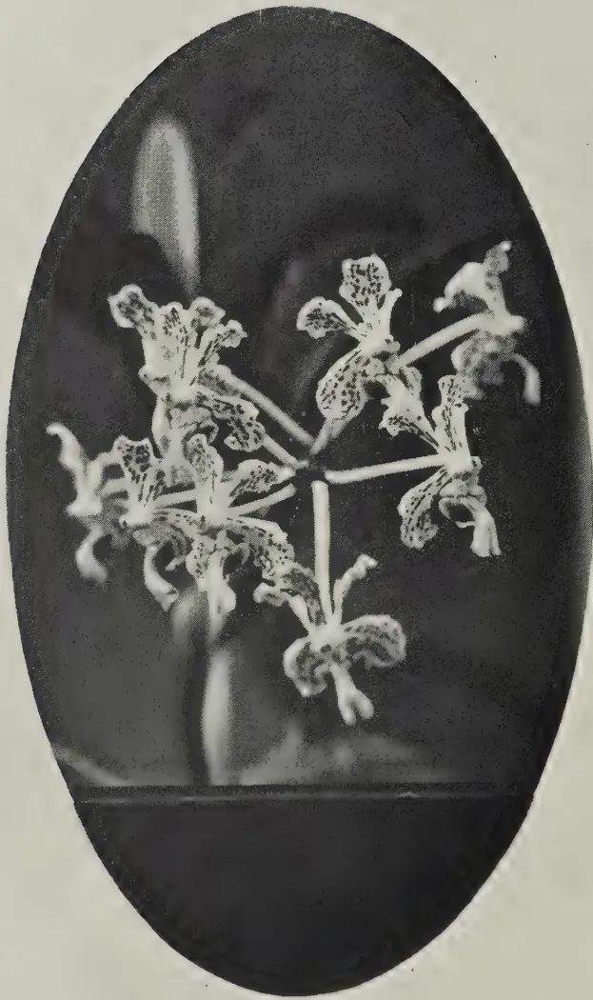

# The Tropical Agriculturist

February, 1935

---

## EDITORIAL

---

### THE CONTROL OF EPIDEMIC DISEASES

---

**T**HE present occasion very vividly brings home to us in Ceylon the difficulty in coping with disease and pestilence when once they have gained a foothold. All living organisms, both animal and plant, are liable to disease by the invasion of their tissues by other forms of life and foreign substances. These parasitic organisms are often of minute size, with a complicated life-history which is frequently spent in the bodies of more than one host. These disease carrying media may belong either to the realm of living things or be apparently of a non-living nature such as the causative agents of the so-called virus diseases which are ultra-microscopic or of a fluid nature.

All these causes of disease, both the living and non-living, require certain conditions under which most easily to live. Ordinarily nature maintains in her wonderful way a check upon them but there occurs at times owing to some abnormal condition an especially favourable season for their multiplication beyond the usual bounds and then their super-abundance becomes perhaps a serious pestilence.

A statement recently made at the Imperial Mycological Conference assessed the yearly loss to agricultural crops in the British Empire from fungus, bacterial and virus diseases at over a hundred million pounds sterling. The most extraordinary

1------------------------------------------------

62

thing is how complacently man takes it all when the loss in very large measure is often preventible. He does not realise the delicacy of nature's balance and the seriousness of its being upset until it happens.

Quarantine regulations and inspection at our ports to exclude the entry of unwanted infection may be as rigorous as possible yet at times disease will gain entrance. Continual research, often of a long range fundamental nature, is a necessity in order that we may have the fullest knowledge of the life-history of the pathogenetic organism so as to be able to attack it at the most vulnerable stage. Here comes the great value of collated or pooled research, the combined labour of many workers engaged in the pursuit of the history of a disease in different countries perhaps, or even of different but related diseases. These researches of independent investigators are usually much more capable of being collated by a special team of men working in a research institute than they are by the independent enthusiast working by himself in a remote corner of the earth.

The value of central institutions devoted to the study of tropical diseases and of their causes and carriers such as fungi and insects, would unfortunately seem not to be sufficiently realised. Only by being forewarned can one be forearmed and in a position to deal with a pestilence when it comes as it usually does like a thief in the night.

2------------------------------------------------

63

## THE DEVELOPMENT OF FIELD EXPERIMENTS IN AGRICULTURAL RESEARCH

T. EDEN, M.SC. (MANC.), A.I.C.,

*TEA RESEARCH INSTITUTE OF CEYLON*

"Nothing is more wanting in agriculture than experiments in which all the circumstances are minutely and scientifically detailed. This art will advance with rapidity in proportion as it becomes exact in its methods." (1).—Sir Humphrey Davy, 1813.

**A**GRICULTURE has always been regarded as a fundamental activity, and for centuries was the chief formative influence at work in moulding man's thoughts and customs. During the nineteenth century, however, a new formative influence became increasingly evident in the rapid progress of invention and scientific method, until now the achievements of science are the most striking characteristic of the times. In industry the invasion of scientific conceptions has been rapid; in agriculture it has been much slower though nevertheless notable. Whereas a century or more ago agriculture was referred to as an art, it now claims rank as an applied science. Intuition and tradition, however valid they may have been, are being examined by the method of experiment, sometimes to be confirmed, sometimes discarded, and in this process many branches of science have contributed their part.

Nevertheless the genius of agriculture still resides in the field, and progress in husbandry must always be linked up with the land and with the operations of the husbandman. Scientific method cannot remain secluded in the laboratory; it must make terms with the soil *in situ*. Many of the most productive advances in the theory and practice of agriculture have come primarily from the field when the field has been made the object of thorough and patient scientific investigation.

It is the object of this essay to trace the application of scientific method in the field; to show what progress has been made in controlling "minutely and scientifically" the circumstances that are met there; to examine the utility of this method of approach to agricultural problems; and by so doing to provide a background for the methods at present in use.

3------------------------------------------------

64

### THE CLASSICAL PERIOD 1834-1900

The first step towards exactness in field experiments was taken just a hundred years ago by J. B. Boussingault at Bechelbroun in Alsace. He had as co-proprietor of a farm his brother-in-law Lebel, a chemical manufacturer, who had previously worked the estate with knowledge and precision. At Bechelbroun it was no new thing to have crops and stock and manures weighed, even before Boussingault set up the first real field experiment.

Boussingault's programme consisted of growing a rotation, with dressings of manure that were measured and analysed, and weighing and analysing the resulting produce. From these data he drew up a balance sheet of gains and losses. The method has been used with advantage on many occasions since Boussingault's time, and in his hands it clearly showed the benefit of crop rotation. The standard rotation at Bechelbroun for many years had been as follows (2):—

1st year.—Potatoes or beetroot, manured.

2nd year.—Winter wheat (sown in previous year)  
Clover interseeded in Spring.

3rd year.—Clover; two cuts, last cut ploughed in.

4th year.—Wheat (turnip catch crop).

5th year.—Oats.

The crop results, expressed in terms of dry matter, carbon, hydrogen, oxygen, nitrogen and ash, were totalled for the whole rotation and equated against similar analyses of the farmyard manure applied to the root break. In all constituents with the exception of ash, the crop figures were in excess of those for manure. Moreover this gain was produced without any soil impoverishment.

Amongst the details of his technique some are of particular interest by way of comparison with later work. The area unit he worked with was a field of just over 17 acres (6.9 hectares). His manures were distributed by the cartload, twenty-seven of which were given to the area stated. Instead of weighing each separately, the quantities were calculated from a predetermined average, the number of sample weighings not being definitely stated (*Par de nombreuses pesées*).

4------------------------------------------------

65

The analyses of manures were averaged over a three-year period (1837-1839) during which time six separate manufactures were made. In drawing up the balance sheet he made a practice of deducting the weight of seed used from the crop yields (3).

Notwithstanding certain crudities, Boussingault's experiments answered their purpose, and it is impossible to exaggerate their importance. They inaugurated the quantitative method in the field, but their analytical detail was not an end in itself; it was designed to lead up to a synthetic view-point. One cannot read the history of nineteenth century agricultural experimentation without being struck by the fact that the early exponents of scientific method were never content with detail alone, but always contrived to link up their findings with the living body of agricultural experience.

#### THE ROTHAMSTED EXPERIMENTS 1843

The Alsatian experiments lasted only a decade, but they were followed by others which have become traditional in scientific agriculture.

This is not the place to comment on the biographical aspects of Lawes and Gilbert's work at Rothamsted, nor except in brief upon the results they obtained: these are common knowledge. Their particular interest at present lies in discussing the foundations they laid, the improvements they effected, and in tracing the influence they exerted on subsequent work.

The published work of Lawes and Gilbert devotes little space to a description of their methods; they seem to take the technicalities for granted. As Hall remarks, their papers are "less accounts of the experiment as a whole than discussions of such of its results as bear on the dominant idea with which Lawes and Gilbert were then engrossed" (4). Apart from the details of dimensions and treatment contained in the "Memoranda of the Origin, Plan and Results" of the Rothamsted Experiments no detailed account of the methods involved or the precautions taken in carrying out these trials exists in published form (5). Their main features can be gathered from present practice, which conforms closely to tradition, whilst sidelights occur from time to time in the most diverse places.

Lawes, like Davy, was a whole-hearted believer in field experimental accuracy. In his report on the Holkham Park Farm experiments, which his own work had inspired, he says

5------------------------------------------------

66

"One very great desideratum at the present time is a few carefully conducted experiments, not on too small a scale, to ascertain the result of the successive growth of wheat on different descriptions of land both unmanured and with a few well selected artificial manures . . . . it may safely be stated that it is the injudicious arrangement, the careless performance, and the inaccurate record of agricultural experiments, that more than anything else retard our progress in scientific agriculture at the present time"(6).

Gilbert was of one mind with his co-worker. He criticised the experiment that his predecessor in the Sibthorpioian Chair of Rural Economy at Oxford had bequeathed to the University, saying that he found it uneven in contour and lacking homogeneity in previous history(7).

From the very first Lawes was forced to consider the arrangements of his experiments in a way that did not enter into Boussingault's work, for whilst the latter was content to trace the behaviour of a given tract of land, it was of the essence of the Rothamsted work that definite comparisons were made. Lawes' dissatisfaction with Liebig's famous mineral hypothesis, round which the Rothamsted work largely centred, inevitably forced him into a comparison between farmyard manure and atmospheric sources as the origin of the major portion of the plant's nitrogen supply. He made full use of the balance sheet principle as the work on the deterioration of soils shows(8) but the comparative element was the fundamental point and the novelty.

No man who was as sound a farmer as Lawes, was ignorant of the fact that every acre of his land had distinct peculiarities; what attempts did he make to overcome inevitable soil heterogeneity in his comparisons?

Broadbalk field, the scene of his continuous experiments with wheat has a gradual fall from west to east which becomes more pronounced at the lower end. The experimental plots, originally each nearly two-thirds acre in area, were laid lengthwise. Whatever variable soil depth overlay the substratum of chalk was therefore shared by all treatments, and seepage and drainage losses from plot to plot could not vitiate the results.

6------------------------------------------------

67

There was care too with the individual plots; they were built up from the true unit for arable cultivation — the plough land, (*i. e.*, the tract between one open furrow and the next, and containing one ridge). At first the double land was used, but in the second season the plots were split into their single component parts and for a time cropped separately, “thus providing duplicate experiments with the same manure”(9).

The existence of plots necessitated ploughing in one direction, with the effect that the ridges tended to be thrown up higher and higher. Edwin Grey(10) has left it on record that it was a regular practice to open these high ridges with a plough, and distribute the accumulated soil over the plot, in order to keep the plot lands to the correct height.

Nothing was left to chance; there were permanent marking pegs for each plot, and the same attention to detail marked subsequent operations. Grey's account of manuring shows how Lawes' methods left no room for careless performance. Wind screens were placed to the windward of the manure sowers, and lest the unproductive furrow down the middle of a plot should receive too much manure a long shallow wooden trough was towed by a man up the furrow, keeping abreast of the sowers. The manure that fell therein was from time to time redistributed to the men.

These are but a few of the recorded instances showing the care that was taken in the preparation and conduct of the experimental work. It was not because they were unimportant in Lawes' eyes that they figure so little in his published papers. Such precautions set a standard that has never been surpassed. We shall see later that it was when these methods fell into disuse, that decay set in on field experiments.

Having taken great pains with his technique, Lawes relied upon long term results to tide him over what difficulties remained in the way of soil heterogeneity. The differences in yield he sought to establish turned out to be impressive in their size, and, once the natural fertility of the soil on deficiency plots became exhausted, there is no reason to suppose that his results suffered unduly from the effects of gross soil inequality. Though the more plots he added, the less satisfactory the comparisons became, it was weed growth and not soil differences that threatened most to upset his carefully prepared plan.

7------------------------------------------------

68

### THE CROSS-DRESSING LAYOUT

In 1852 Lawes and Gilbert adopted a new and ingenious plan which formed the model for nearly all their subsequent experiments, the cross-dressing layout originally used on the permanent barley plots of the Hoos Field. What conscious motive led to this design can only be a matter of speculation, but there can be no doubt that it was a big step forward. The main pre-occupation of the Rothamsted workers was the effect, singly and jointly, of mineral and nitrogenous manures. We have seen that the Broadbalk experiment, by judicious arrangement of long narrow plots across the contour, minimised the soil heterogeneity that was bound to affect plot comparisons, but it would be idle to deny that when as many as twenty plots were involved, the risk of a fertility gradient along the contour had to be taken into account. For example, in comparing the effect of 86 pounds of nitrogen plus mineral manures, first in the form of ammonium sulphate and then in the form of nitrate of soda, the considerable distance between plots 7 and 15 was not conducive to experimental accuracy. To overcome this inherent defect the Hoos experiment consisted of strips allocated to various combinations of mineral manures, and across this warp was woven, so as to speak, a weft of different kinds of nitrogenous manures. Such a design has been happily compared to a plaid shawl.

This plan of arrangement had striking advantages. It effected a marked economy in the utilisation of land, because every plot answered both a mineral and a nitrogenous question with equal validity. The main advantage, however, was that it brought any pair of plots needed for comparison into the closest possible range, and reduced the spreading-out effect previously mentioned. For a field experiment dealing only with single plots it cannot even now be bettered.

There are two unmanured plots in this experiment at opposite sides of the field. Lawes used the mean of these in his exposition of manurial results. At the end of a 76-year period 1852-1928 the mean discrepancy between these two plots was 1.3 bushels, with a mean of 14.05 for the two plots. These data speak eloquently for the satisfactory nature of the Hoos Field experimental layout (11).

8------------------------------------------------

BROADBALK  
STRIP-PLOTS

HOOS FIELD CROSS-DRESSING

<table border="1">
<tr>
<td></td>
<td></td>
<td></td>
<td></td>
<td></td>
</tr>
<tr>
<td></td>
<td></td>
<td></td>
<td></td>
<td></td>
</tr>
<tr>
<td>COMPLETE MINERALS</td>
<td></td>
<td></td>
<td></td>
<td></td>
</tr>
<tr>
<td>MINERALS WITHOUT SUPER</td>
<td></td>
<td></td>
<td></td>
<td></td>
</tr>
<tr>
<td>SUPER ONLY</td>
<td></td>
<td></td>
<td></td>
<td></td>
</tr>
<tr>
<td>NO MANURE</td>
<td></td>
<td></td>
<td></td>
<td></td>
</tr>
<tr>
<td></td>
<td></td>
<td></td>
<td></td>
<td></td>
</tr>
<tr>
<td></td>
<td></td>
<td></td>
<td></td>
<td></td>
</tr>
<tr>
<td></td>
<td></td>
<td></td>
<td></td>
<td></td>
</tr>
<tr>
<td></td>
<td></td>
<td></td>
<td></td>
<td></td>
</tr>
<tr>
<td></td>
<td></td>
<td></td>
<td></td>
<td></td>
</tr>
<tr>
<td></td>
<td></td>
<td></td>
<td></td>
<td></td>
</tr>
<tr>
<td></td>
<td></td>
<td></td>
<td></td>
<td></td>
</tr>
<tr>
<td></td>
<td></td>
<td></td>
<td></td>
<td></td>
</tr>
<tr>
<td></td>
<td></td>
<td></td>
<td></td>
<td></td>
</tr>
</table>

No N    Amm. SULPH.    Nit. SODA    RAPE CAKE

9------------------------------------------------

69

It may be mentioned here that the Hoos Field was probably one of Rothamsted's happiest choices in experimental location. Keen and Haines (12) by measurements of resistance to ploughing draught over a three-year period, showed how uniform in fundamental tilth properties the field is; the mean drawbar pull is 1,277 pounds, whilst the lowest value is 1,204 and the highest 1,361, a difference of 157 pounds or just over 12 per cent. Keen and Haines remark that "patches covering several plots occur whose mean values of D.B.P. do not vary by more than two or three parts per thousand". That these measurements of soil cultivation characteristics have a direct bearing on crop production, and are not merely academic in character, is shown by Eden and Maskell's study of crop heterogeneity, in which they made use of ploughing resistance measurements. They were able to show that significant correlations existed between D.B.P. and crop performance in the case of wheat (13).

In a manner similar to Hoos Field barley, the root experiment on Barnfield and the leguminous plots on the Hoos Field made use of this standard type of layout; and later still its influence passed to the experiments at Woburn where the Royal Agricultural Society undertook to carry out similar trials on the light green-sand soil.

These experiments started in 1877 (14) with permanent wheat and barley. They make use of the plaid shawl principle in part, having nitrogenous dressings (sulphate of ammonia, nitrate of soda and no nitrogen) running across strips receiving nothing or a compound of mineral manures. They include an extra rank of plots (see diagram) where alternate dressings of mineral and nitrogenous manures were given. These do not fit into the standard plan, nor do the sub-plots that were introduced after the first thirty years. The object of the latter was in the first place to provide a yearly comparison of the effect of nitrogen and minerals alternately, instead of a biennial one; and secondly, to save the experiments from becoming too unreal, because of the obvious need of liming. Plots receiving sulphate of ammonia continuously have since been limed at intervals.

*(To be continued)*

10------------------------------------------------

This image is a scan of a blank page. The paper has a light beige or cream-colored tint. There are a few very small, faint dark spots scattered across the surface, which appear to be scanning artifacts or dust particles. No text, lines, or other markings are present on the page.

11------------------------------------------------

A black and white photograph of a Vanda suaveolens flower cluster, presented in an oval frame. The flowers are light-colored with dark, intricate patterns on the petals and sepals. The cluster is shown from a slightly elevated angle, with several flowers in various stages of bloom. The background is dark, making the light-colored flowers stand out. The entire image is enclosed within a dark, vertically-oriented oval border.

BLOCK BY SURVEY DEPT., CEYLON

*Vanda suaveolens* Lindl.

12------------------------------------------------

70

## NOTES ON ORCHIDS CULTIVATED IN CEYLON

### VANDA SUAVIS LINDL.

K. J. ALEX. SYLVA, F.R.H.S.,

CURATOR, HENERATGODA BOTANIC GARDENS, GAMPAHA

**T**HIS *Vanda* is endemic to Java where it is not very commonly found. It grows on trees, in the forests under the shade of other lofty trees.

The plant appears to have been in cultivation for over forty years in Ceylon and has made itself one of the oldest and most popular subjects in our collections.

Though the plant has a very close resemblance to *Vanda tricolor* Lindl., it is distinguished from it by the colour of the flowers, the former having a white ground, whilst the latter has a yellow ground. It is erect in habit, attains a height of four to five feet, and is clothed with two rows of thick, green recurved, coriaceous leaves often a foot long and about an inch or more wide.

A plant in normal health will produce blooms regularly and remain in flower for about six weeks. The individual flower is about three inches across, sepals and petals are spoon-shaped, waxy-white, thickly streaked and spotted with crimson-purple. The labellum is three-lobed, the two-side lobes of a bright rosy-purple, while the central one is paler and notched at the apex.

*Cultivation.*—A well-established plant is best not disturbed, no matter how old the compost is, unless it has overgrown its receptacle or is root-bound in its pot. In such cases it is wisest to break the pot away without damage to the plant and insert the whole in a larger receptacle adding fresh compost. An adult plant will ordinarily have a few basal or axillary shoots which are also capable of producing flowers simultaneously with the parent; these shoots should therefore not be severed unless they destroy the symmetry of the mother plant. A mature sucker with a few healthy roots may be carefully removed and potted in a compost made up of sterilised or weathered bits of coconut husk, chips of old jak wood and crocks, to which a small quantity of charcoal and flaky leaves are added in the process of potting.

Newly-potted plants need heavy shade until new growth appears when they may be hardened by gradually exposing them to bright daylight. Thereafter they should be permanently placed under the shade of fairly tall growing trees.

13------------------------------------------------

51

## CEYLON TEA SEED OIL

R. CHILD, F.I.C., B.SC., PH.D. (LOND.)

*TECHNOLOGICAL CHEMIST AND CHIEF TECHNICAL OFFICER,  
COCONUT RESEARCH SCHEME (CEYLON)*

THE suggestion has been made that, under the Tea Restriction Scheme, a supply of surplus tea seeds may become available which could be used as a source of oil, and certain trials are reported from Java(1). It seemed worth while to examine a sample of local tea seeds from the point of view of its oil content and the properties of the oil, their being the added academic interest that the constants of Ceylon tea-seed oil do not seem to have been hitherto recorded.

Commercial tea-seed oil appears mostly to be derived from a different species of tea plant, *Thea sasanqua*, Nois (*Camellia sasanqua*, Thub.), which is cultivated for oil in Assam, China and Japan. The seeds are stated to contain 70 per cent. of kernels, the latter having an oil content of up to 60 per cent., though the yield of oil by crude pressing is much below this. The commercial oil may, however, be a mixture of different varieties.

*Camellia japonica*, L. (*Thea japonica*, Nois) yields "Tsubaki" oil, the oil content being 64.3 to 66.4 per cent. of the kernels, or 37.6 to 38.8 per cent. of the whole seeds.

The seeds of the ordinary tea plant *Thea sinensis*, L. (*Camellia thea*, Link.) appear to be much less rich in oil, 16 to 26 per cent. being reported.

### USES

The unrefined oil is said to be unsuitable for edible purposes, owing to the presence of saponins, the crude oil being used as a lubricant and for other purposes. The refined oil, however, is sometimes used to adulterate olive oil, which it resembles so closely as to render detection very difficult. The commercial oil has been recommended for use in high grade toilet soap preparations(2) and is said to be cheaper than olive oil. According to Clayton(3), it has been used in margarine.

*Thea japonica* oil finds a local use (in Japan) as a hair oil and as a lubricant.

14------------------------------------------------

72

The amount of tea-seed oil which comes into commerce is comparatively insignificant.

#### EXAMINATION OF A LOCAL SAMPLE

A sample of tea seed was kindly provided by the Tea Research Institute of Ceylon, and gave the following figures:

<table>
<thead>
<tr>
<th colspan="3">Average weight per seed</th>
<th>percentage</th>
</tr>
</thead>
<tbody>
<tr>
<td>Shell (+ testa)</td>
<td>0.417 grams</td>
<td>...</td>
<td>35.0</td>
</tr>
<tr>
<td>Kernel</td>
<td>0.775 ,,</td>
<td>...</td>
<td>65.0</td>
</tr>
<tr>
<td></td>
<td><u>1.192</u> ,,</td>
<td>...</td>
<td><u>100.0</u></td>
</tr>
<tr>
<td>Moisture in kernels</td>
<td>...</td>
<td>51.3 per cent.</td>
<td></td>
</tr>
<tr>
<td>Per cent. Oil in kernels</td>
<td>13.6 ,,</td>
<td></td>
<td></td>
</tr>
<tr>
<td>Do (on dry weight)</td>
<td>27.9 ,,</td>
<td></td>
<td></td>
</tr>
<tr>
<td>Per cent. oil (whole seeds)</td>
<td>8.8 ,,</td>
<td></td>
<td></td>
</tr>
</tbody>
</table>

The crude oil (extracted from the dried ground kernels by means of Carbon Tetrachloride) was refined by treatment with twice its volume of boiling 80 per cent. alcohol. This treatment was repeated with 90 per cent. alcohol, the oil dried in vacuo, and stirred hot with a mixture of 1 per cent. of activated charcoal (Norit) and bleaching earth (Carlonit). After filtration, the oil was treated with 1 per cent. of bleaching earth and again filtered.

The resulting refined oil was clear and bright, of pale yellow colour, pleasant odour and bland taste resembling olive oil. It gave the following figure on analysis:

<table>
<tbody>
<tr>
<td>Density <math>d_{30^{\circ}}</math></td>
<td>...</td>
<td>0.914</td>
<td></td>
</tr>
<tr>
<td></td>
<td><math>4^{\circ}</math></td>
<td></td>
<td></td>
</tr>
<tr>
<td>Refractive Index <math>n_{40^{\circ}}</math></td>
<td>1.4636</td>
<td>(<math>n_{30^{\circ}}</math></td>
<td>1.4674)</td>
</tr>
<tr>
<td></td>
<td>D</td>
<td></td>
<td>D</td>
</tr>
<tr>
<td>Dispersion</td>
<td>...</td>
<td>0.0207</td>
<td></td>
</tr>
<tr>
<td>Acid Value</td>
<td>...</td>
<td>0.83</td>
<td></td>
</tr>
<tr>
<td>Saponification Value</td>
<td>196.0</td>
<td></td>
<td></td>
</tr>
<tr>
<td>Iodine Value (Wijs)</td>
<td>88.7</td>
<td></td>
<td></td>
</tr>
<tr>
<td>Thiocyanogen Value (22 hours)</td>
<td>76.3</td>
<td></td>
<td></td>
</tr>
</tbody>
</table>

Calculation from the thiocyanogen and iodine values gives the approximate composition:

<table>
<tbody>
<tr>
<td>Saturated glycerides (plus unsaponifiable matter)</td>
<td>11.45%</td>
</tr>
<tr>
<td>Oleic glyceride</td>
<td>74.25%</td>
</tr>
<tr>
<td>Linoleic glyceride</td>
<td>14.3%</td>
</tr>
</tbody>
</table>

15------------------------------------------------

73

The following table shows the recorded value for tea-seed oil from the various sources mentioned above; (4) the present sample is in general agreement with these.

<table border="1">
<thead>
<tr>
<th></th>
<th>d 15° 15°</th>
<th>Refractive Index</th>
<th>Saponifica- tion Value</th>
<th>Iodine Value</th>
</tr>
</thead>
<tbody>
<tr>
<td>Camellia thea</td>
<td>0.917-0.927</td>
<td>1.4707 (20°C)</td>
<td>188.3-195.5</td>
<td>88.93.2 (an Assam sample 82.1)</td>
</tr>
<tr>
<td>Sasanquan oil</td>
<td>0.9162-0.9188</td>
<td>1.4691 (20°C)</td>
<td>189.9-193.9</td>
<td>81.7-82.3 (87.5)</td>
</tr>
<tr>
<td>Tsubaki oil</td>
<td>0.9159-0.9166</td>
<td>1.4679-1.4691 (20°C)</td>
<td>188-192.6</td>
<td>79.8-81.3</td>
</tr>
</tbody>
</table>

#### COMPARISON WITH OLIVE OIL

The usual ranges of the above values for olive oil are (5):

<table>
<tbody>
<tr>
<td>Density at 15.5°</td>
<td>0.915 to 0.918</td>
</tr>
<tr>
<td>Refractive Index at 40°</td>
<td>1.4623 to 1.4637</td>
</tr>
<tr>
<td>Saponification Value</td>
<td>190-195</td>
</tr>
<tr>
<td>Iodine Value</td>
<td>80-85</td>
</tr>
</tbody>
</table>

Olive oils from Tunis and from California often record Iodine Values above 90, however. It will be seen how close is the similarity between tea-seed oil and olive oil. The only satisfactory way of detecting the addition of refined tea-seed oil to olive oil seems to be the method of Bolton & Williams (6).

Whilst use could be made of local tea-seed oil, it seems doubtful whether the extraction would be economical. If the seeds were decorticated, dried and pressed probably about 150 lb. of oil could be obtained from a ton of seed — but the removal of kernels would be a tedious and expensive operation. Crushing of the undecorticated seeds, drying and expressing would give a decreased yield of oil, so that the expression of tea-seed oil is probably not a commercial proposition.

#### SUMMARY

A sample of local tea seed has been examined for its oil content and the constants of the oil determined. Whilst the oil would be useful in various technical applications, it is concluded that its extraction would probably not be economic.

#### REFERENCES

1. 1. *Tropical Agriculture*, July 1934, Vol. XI, No. 7, p. 187, quoting *Times Trade and Engineering Supplement*, Vol. XXXIII, No. 807.
2. 2. *Soap Trade Review*, May 1934, Vol. VII, No. 5, p. 25.
3. 3. W. CLAYTON.—“Margarine” (London, 1920), p. 19.
4. 4. GRUN AND HALDEN.—“Analyse der Fette und Wachse”, (1929) II, 300-302.
5. 5. FRYER AND WESTON.—“Oils, Fats and Waxes”, (1920) I, 140-142.
6. 6. BOLTON AND WILLIAMS.—*Analyst*, 1930, Vol. LV, p. 5.

16------------------------------------------------

74

## THE CONTROL OF RURAL MALARIA\* — (*Contd.*)

### SLOWLY DISSOLVING MINERAL POISONS

#### PART III

**M**OSQUITO larvae may be killed by many mineral substances and poisonous inorganic 'salts,' if these are dissolved in water. Older experiments made use of readily soluble salts, which brought about the death of larvae in a few hours. Most of these compounds, such as soluble cyanides and corrosive sublimate and readily soluble forms of arsenic, are extremely poisonous to men and animals. Although the possibility exists of using them in very weak solutions which might prove destructive to larvae and yet be harmless to fish and higher animals, the practical difficulty of regulating and maintaining the concentrations in continually varying volumes of water within the necessary limits, is insuperable. It was claimed for example that a concentration of 1 in 200,000 of cyanide of sodium might be used in wells. But he would be a brave man who drank their water, trusting that the equivalent of an oiling coolie had calculated the volume in each well and treated it with the calculated dose of cyanide. And the difficulty of measuring the volume of water and maintaining the proper concentration of poison in pools and ditches alternatively drying up, and flushed with rain, is much greater.

Must we conclude that mineral poisons are necessarily unserviceable? Let us, as in solving a problem in geometry, assume the thing done, and then work back to the conditions which enable us to do it. The ideal is evidently provided by a substance which is poisonous to mosquito larvae and harmless to higher animals in the concentrations required. We have such a substance in copper and its 'salts'. One condition of the problem is determined. But there remains the difficulty of regulating the concentration of copper. Must a Sanitary Inspector visit each pool for miles, plot its section, calculate the volume and add the required amount of copper in solution? And repeat the operation every time there is a fall of rain? He would be a busy man. Copper sulphate is, as a matter of fact, commonly used in reservoirs, though less with a view to killing mosquito larvae than to preventing blockage of the exit pipes by growth of slime and algae. The exact amount needed has to be calculated so as to give a concentration of about one part in a million. The waterworks engineer is competent to do this; but great harm results if the proper concentration is exceeded. water plants and fish being killed and causing the water to be fouled by

---

\* By K. B. Williamson, M.A. & Diploma Agric. (Cantab), D.I.C. (Formerly Malaria Research Officer, F.M.S. and recently in charge of anti-malarial investigations Cameron Highlands), in *The Malayan Agri-Horticultural Association Magazine*. Vol. IV, No. 1, January, 1934 and Vol. IV, No. 2, April, 1934.

17------------------------------------------------

75

their putrid remains. If report is true, this happened some years ago in one of the Colony's lakes, where the supervisor towed a bag of bluestone behind a boat for a few hours, achieving all and more than he hoped for.

The solution of the problem, not alone for copper, is to use minerals or cheap commercial residues, which are technically though not absolutely insoluble, and which will automatically maintain a concentration sufficient to kill mosquito larvae within the period of a week or ten days through which they remain larvae. Pupae, owing to their hard horny covering, and to the fact that they do not feed, are only slowly killed even by strong concentrations of poisons.

The possible utilisation of little-soluble forms of copper, a preliminary account of which appeared in the Annual Report of the Malaria Advisory Board for 1932, is of particular interest. To take first the metal itself. It was first tested in a precautionary experiment made in England in 1921, the object of which was to ascertain whether copper gauze might be used without harmful effect upon larvae for periods up to three or four hours in an apparatus in which the effect of poisonous vapours was being tested. No harmful effect was observed within 16 hours. It was thereafter deemed safe to use cages made of brass gauze for experimental larvae to be placed in ricefields, and a number of these cages was constructed in 1924. But tests showed that many of the anopheline larvae placed in these cages in the laboratory died in a few days, although they were placed in a fairly large volume of water; and muslin cages were used instead in the outdoor experiments. These trials, like the earlier experiments, were merely precautionary, and gave no certain assurance that metallic copper was fatal to larvae. The question has therefore been re-investigated with critical control experiments during the past two years, with the result that it has been found that all larvae of *A. maculatus* die within five days, — and with few exceptions all within three days, — when copper or brass is present in the water; while in the most of the experiments none of the control larvae died. Similar results were obtained with various compounds of copper which are supposed to be insoluble, and their effect remained after months of washing in running water. On the other hand, little or no harm resulted to larvae kept in the presence of zinc, iron, or aluminium; and insoluble compounds of lead acted more slowly than those of copper. Minute traces of copper were detectable in the water by very delicate tests, metallic copper itself being slowly soluble. The practical problem is to procure cheap ores or residues slightly more soluble than most of the compounds tested in the laboratory, and which will ensure that the minute traces of copper needed to safeguard breeding waters will be maintained in spite of rain and seepage flow; and a search for these is being made.

It may be remarked in passing that white arsenic, (arsenious oxide), when mixed in the proportion of five or ten per cent. with cement, has a long lasting effect, causing the death of larvae in a few days, even when it has been washed for months in running water; but the danger in the use of a strong poison like arsenic without the most careful regulation of its concentration makes it a much less desirable substance than copper. The amount of the latter needed to exterminate mosquito larvae is less than

18------------------------------------------------

76

could have any effect upon men or animals who drank the treated water by accident, and in stronger doses copper is a cure for the 'bloodless' condition known as anaemia, which follows malaria, — so that by medicating the water, it becomes both a preventive of malaria and a remedy for one of its ill-effects. We may envisage a time when the anti-malarial coolie will be encouraged to take a course of the waters which it is his task to treat.

Slow mineralisation promises a possibility of effective control which may reduce the labour cost of treating pools and seepages to a fraction of what it now is, and, with very small expenditure on material, enable distant danger spots to be freed from risk for many months by a single treatment. In this way expert control, which is now limited by its lack of funds and trained workers, might reach out a long arm, embracing areas many times greater than are at present controlled. But the method is clearly inapplicable to rapidly running water, and its usefulness in ponds and marshes is doubtful. On the other hand, the coppering of containers in towns threatened with yellow fever might be an invaluable aid in fighting the disease if it ever appears in this country.

This short review of the artificial methods which science has placed at the disposal of those who wage war against the mosquito prompts the reflection that too few of its resources have been made use of; and force is added to this opinion when we consider that apart from allowing natural shade plants to grow over ravines, none of the natural methods, next to be considered, are in general use. It may be surmised that our knowledge of the resources of science and of nature are small compared with what they may be expected to become in the future; for the powers that lie around us are unknown until they are experienced, or are disentangled by the imagination from the commonly admitted forces which prevent their recognition. No one can say with what means these yet undiscovered powers of Nature may provide us for checkmating malaria and other diseases.

The question remains, "How far are artificial methods, elaborated by science, likely to prove useful in controlling rural malaria?" Evidently a very potent drug or immunising agent may prove so, and we await its advent with hope, but by no means with complete confidence. Small-pox is now the only disease preventible by medical means on a wide scale, and until an equally powerful anti-malarial method is evident, no drug which merely cures malaria, and which has to be continuously administered, offers any prospect of eradicating it. Of the two classes of preventive measures against mosquitoes, it may be concluded that artificial ones, however effective they may become in the future, are less suited for dealing with rural malaria than the best among natural measures. They present the primary disadvantage that the transport of the material and apparatus needed to remote villages will always offer almost insuperable difficulties; to which the cost of their purchase and transport must be added; and the more powerful and refined the methods of control become, the greater will be the need for them to be carried out by skilled and highly trained operators. We must, suppose that when the resources of technical science come to be fully utilised, the range of its operations will be greatly extended, but not so greatly that the diminution of the plagues carried by mosquitoes can

19------------------------------------------------

77

be effected all over the countryside except by making use of the materials available in it, both in Malaya and elsewhere. This country is far advanced both in the theoretical anticipation, and the experimental application, of natural methods of control; and it will be profiting itself, and benefiting the world at large by its example, if it makes them the instruments of widely extended malaria-control throughout the country.

### HERBAGE COVER

The best known and tested of these methods will be described in the continuation of this article, namely, fish-rearing, the rotting of vegetation, and sluicing; together with another natural method which may be specially mentioned here because it has only recently been tried, and is consequently known only to a few, while it deserves wide and general testing. This is the method of Herbage Cover. Its operation is simplicity itself. Shallow water up to a few inches deep is covered with plucked grass and herbage, or the leaves of trees from "belukar" or the jungle, with a few twigs intermixed so as to form a brushwood drain for running water. The herbage is well trampled under foot until it forms an almost solid wall a foot or more in height. The cover thus formed is long lasting, and, so far as observation has gone, it cannot be penetrated by egg-laying mosquitoes; it provides dense shade and, at least in stagnant water, sufficiently concentrated rotting to prevent the breeding of malarial species. While inapplicable to rapidly running streams or steep ravines which discharge strong flushes of storm water, very little dislocation of the herbage occurs in ordinary hillfoot or other drains, if their lower ends are provided with a double row of stakes to keep the solid mass of vegetation in position. Most of the storm water flows under it, and the remainder sometimes makes its way over the top.

The method is particularly effective for stagnant pools where the biochemical effects of the rotting vegetation are greatest, and in small seepages. Occasional renewal of the herbage, and the filling up of holes which form in it are needed, and a necessary precaution in the case of shallow pools or drains with shelving sides, is that the cover should extend to a foot or eighteen inches beyond their sides, so as to protect the surrounding ground which becomes flooded in rainy weather. Drains of this kind occur in the gutters which extend for miles along the inner side of the Highlands road, and which provide numberless breeding places for *A. maculatus*. They have been effectively dealt with where the precautions mentioned have been adopted; and in one case where a hillfoot drain and a series of pools were covered over, a notable improvement was brought about in the health of an adjacent coolie line, too far distant for regular anti-malarial work to be carried out near it. It is therefore probable that by this simplest, speediest and cheapest of all anti-malarial measures, much of the malaria of the hills and hill valleys might be stamped out, if measures were taken to teach it to villagers, and to organise and stimulate their efforts in the manner suggested in the previous article.

It should be realised that although in this country we are faced with one of the most serious malaria problems in the world, the fact that our chief malaria carrier, *A. maculatus*, in nine cases out of ten breeds in extremely shallow water, makes it one of the easiest of all species to control, provided that its obscure breeding places have been discovered. No words

20------------------------------------------------

78

can sufficiently emphasise the need for attracting and encouraging the most skilled larvae collectors, since without them all measures are futile, and serious sickness may arise from two or three small undiscovered pools. But the extremely shallow water in the seepages where *A. maculatus* is commonest may be altered beyond recognition and rendered unfit for it by very simple natural procedures. Therefore to limit effort to oiling, which is better suited for dealing with the malaria arising from ponds, marshes, and other large accumulations of water in other countries, is to disregard the help to be derived from local circumstances, and to fly in the face of reason and common-sense.

## PART IV

---

### METHODS BASED UPON PROCESSES OF NATURAL CONTROL

---

#### HERBAGE COVER

This method by a single operation, namely, packing green herbage tightly over and into shallow water, brings three influences to bear on it, each of which is by itself able to restrict greatly, and usually to prevent, the breeding of species such as *A. maculatus* which require light and at least fairly pure water in their breeding places. It

1. (1) creates an almost or quite impenetrable barrier for adult mosquitoes.
2. (2) densely shades the water.
3. (3) causes harmful biochemical changes in it due to the rotting of green vegetation in the presence of too little air.
4. (4) produces a dark-coloured and fertile deposit of soil when the cover is maintained for three or four months, with the result that a dense crop of weeds is liable to grow up, which gives more or less permanent shade. The alteration in the character of the soil also probably discourages the breeding of *A. maculatus*, since this species usually breeds in places where the soil contains very little organic matter.

Among malaria carrying anophelines, the shade factor is inoperative against *A. umbrosus*. The efficiency of concentrated rot is to be inferred from its having been effective in ponds, and from experiment in the laboratory where newly-hatched larvae of *A. maculatus* all died within a couple of days when placed in foul water from a bowl in which grass had been rotted for about three months. This proves that the effects of rotting vegetation are long lasting when the products of decay are not diluted or washed away. It is also probable that the rot acts in another way by deterring females bent upon egg-laying from doing so. There is indeed good reason for believing that the senses of mosquitoes are keener than our own. How else are females of *A. maculatus* for example able on dark nights to select with almost unerring accuracy the springs and seepages in which they lay their eggs?

21------------------------------------------------

79

It is to be remarked that the effects of rot, whether in the soil or water, are most harmful when it occurs in the absence of air, or with too little present, since oxygen derived from the air (or produced by the action of green water — (or other) plants in sunlight) is the great purifying agent in nature. The biochemical efficiency of the rot occurring in shallow stagnant water, crammed, as it is, full of decaying vegetation, and sheltered from light and wind under a cover of cut herbage is therefore about the greatest possible, and it far exceeds the minimum necessary for checking breeding.

The fact provides a conclusive refutation of the argument that methods of mosquito-control based upon biochemical changes should not be practically applied until the exact equivalents and quantities concerned have been ascertained and tabulated to the last decimal.

But the biochemical factor in control may be negligible in running water, even when it is covered with herbage, and any holes which may form in the cover should therefore be carefully filled at weekly or ten-day intervals.

Finally, it is important that a considerable proportion of the cover used should be green, since the patrescible proteins or albuminoids (a form of so-called organic nitrogen) which are present in living tissues are almost entirely absent from dead leaves and dry twigs, and the woody fibres present in these decompose much more slowly and with more doubtful effectiveness.

### BIOCHEMICAL CONTROL THROUGH THE SOIL AND AGRICULTURE

There is growing evidence that the chemical constitution of the soil is important in determining the distribution of malaria, and of the species of anophelines which carry it. The immunity enjoyed by the coastal rice belt in Malaya is related to a high content of organic matter, including organic nitrogen, in its soils, coupled with imperfect drainage, which, by leaving the land water logged even in the fallow season, causes the decay of dead vegetable (as well as animal) matter to take place in the soil in the absence of air. It is significant that in this tract of country *A. maculatus* occurs practically only where isolated granite hills, like the ones at Jugra and Kuala Selangor, bring pure springs derived from and based upon mineralised soils poor in organic matter, to the surface. And as the history of Jugra shows, the vicinity of these hills is often very malarious.

The interest of the subject in reference to the control of rural malaria lies in the fact that as shown by Mr. Charlton Maxwell by examples from various parts of the world, in his book on Malaria Control, (Published by Messrs. Kyle, Palmer & Co., Ltd., Kuala Lumpur, price \$1/-) intensive agriculture, which enriches the soil, generally leads to a great diminution of malaria, and sometimes to its virtual extinction, as in England. The direct and indirect influence of cattle and pigs, which both contaminate and fertilise the soil, and attract mosquitoes away from man, is important in this connection. Incomplete drainage also may as in the case of our coastal soils sometimes be an important factor in effecting the control of malaria if it leads to water logging, and the growth of leguminous crops should, at least under these conditions, and in proportion as the organic nitrogen which they add to the soil is retained in it, to a greater or lesser degree act as a preventive of malaria.

22------------------------------------------------

80

The keeping of pigs in the Island of Pankor is said to have greatly reduced its incidence there, and it is probable that the pollution caused by the curing of fish has also materially helped to produce this result.

But what is agriculturally sound practice does not always diminish malaria. Irrigation for example, which does little or no harm on the organically rich paddy soil of Krian, is productive of a great deal of malaria on the poorer mineral soils of the Sudan and the Punjab. Taken as a whole the facts point to the conclusion that any long range policy for diminishing rural malaria should aim at enriching the soil by encouraging intensive agriculture, while at the same time increasing the number of cattle and pigs on the land. This should lead not only to decreased risk of infection, partly brought about by better housing due to increased prosperity; but the people, being better nourished, will be better able to resist attacks of malaria. This policy, known by the uncouth name of *bonification*, borrowed from the Italian, has led to a notable decrease of sickness in many places in Italy. Cattle tend to attract mosquitoes away from man, but the effect upon the soil of their dung is also probably sometimes important.

### BIOLOGICAL CONTROL IN FISH PONDS

We have so far chiefly considered control effected by biochemical changes brought about by the bacteria and other micro-organisms which cause decay. More varied biological control, to which fish, predatory water-insects, and water-plants contribute, is possible, and is sometimes necessary, in fish ponds. Owing to their pollution most carp ponds probably cause little or no malaria; but they not infrequently are a serious nuisance owing to non-malarial mosquitoes breeding in them. Carp being vegetable and refuse feeders do little or nothing to diminish this nuisance. When the corruption in the ponds is not too great, larvae-eating fish, such as *Panchax* (the little fish with a white spot on its nose) can be very useful, but hardly any attempts are made to breed them in these ponds. Certain water-insects like water-boatmen, and the large active water-bugs (so classified because they suck the juices of their prey) are also extremely destructive to larvae. And water plants such as water lilies and duck weed, by covering up the surface of the water, sometimes leave very little of it free for larvae. The common yellow-flowered bladderworts are moreover able to capture and kill larvae in their numberless traps which their bladders form, and which serve the plants as stomachs. Very few larvae however are so captured and the rotting of dead fronds of these and other plants, such as the stone worts (*Characeal*) is often more effective.

But generally speaking none of these agencies can be relied upon singly to abolish mosquito-breeding completely. Wisdom lies in setting as many of them at work as the particular conditions will permit. In this way the desired end of completely abolishing all mosquito-breeding for a period of about two years during which the observations lasted, was attained in the carp ponds constructed at Tanah Rata; and a further investigation of them by specialists might throw more light upon the complicated causes which led to this result, and so prove useful elsewhere.

23------------------------------------------------

81

In one respect the experiment was critical. Contrary to anticipation it was found possible to check the breeding of *A. maculatus* completed by biochemical means alone in several of the ponds where the concentration of rotted grass and herbage was greatest, although an average of about ten thousand gallons of water continued to run through them daily. This fact provides convincing proof that the same result can be obtained with ease and certainty in stagnant water. More than twenty years have passed since Sir Malcolm Watson prophesied that the rotting of vegetation would provide a solution of this country's rural malaria problem, and anticipated the time when current anti-malarial procedure would seem like burning the house down in order to cook the pig; but nothing has been done to give practical effect to his wisdom.

### NEED FOR COMBINED OPERATIONS

The example we have considered shows how natural control lends itself to the combination of a variety of effective causes which operate together and reinforce one another.

The method of herbage cover provides a striking and beautiful illustration, for by a single operation it brings into play the controlling influences of a mechanical barrier, shade, and biochemical change. The principle is however capable of extension and more deliberate application. Steps should be taken deliberately to set as many controlling influences as possible at work in the same place, and to apply different methods in different places, even though they may be close together. This is already done when, for example, part of an area to be controlled is drained dry and the remainder is oiled. But a great deal more might be done in the way of varying the methods in use, especially by making more use than at present of simple and cheap natural methods of control.

If any method, however, whether oiling, sluicing, or any other is pushed to extremes and applied in places to which it is not suited it becomes expensive.

What the economists call the law of diminishing returns comes into operation. Correct judgment in applying anti-malarial methods is therefore quite as important as the methods themselves. Only a few examples of these principles can be given here. Others will suggest themselves to the reader, and in the course of work:

#### (A) COMBINED CONTROL IN A SINGLE BREEDING PLACE

1. 1. The growth of shade plants should be encouraged so as to provide permanent protection against *A. maculatus*, no matter what other means of control are in temporary use. Sluiced channels lend themselves to this procedure since flushes of water, unlike oil, usually do not damage, but rather encourage the growth of vegetation.
2. 2. Varied biological effectives including fish, water-insects, water-plants and biochemical factors should, as has been seen, be made to work together to establish permanent control in ponds.

24------------------------------------------------

82

1. 3. Fish ponds should everywhere be established at the heads and along the course of the dangerous irrigation channels (*jalan ayers*) in hill rice valleys; and should be used to sluice the channels. The emptying out weekly (effected through suitable screens and nets which retain the fish) if most of the water in the ponds should in itself greatly reduce the risks from mosquito breeding, and costs should be more than recovered from the yields of fish, and the increased economic energy of the cultivators, resulting from more nourishing diet, decreased infection from, and greater resistance to, malaria. The irrigation channels themselves should be emptied and dried whenever possible.
2. 4. Other sluiced channels elsewhere should whenever necessary and possible be polluted from factory refuse or from the soap from bathing pools and laundries, etc. They might perhaps be used as a means of distributing small quantities of oil to danger spots at which obstructions diverted the oil (as well as soap, etc.), to pools and seepages at the sides of the channels.

The idea that anti-malarial practice should be made the sport of rival methods and factions is clearly foolish and harmful.

### (B) VARIED CONTROL IN A SINGLE AREA

Correct procedure often varies from yard to yard in a single small area, for example there may be: *ravines*, best left shaded, but if cleared, requiring oiling, sluicing, etc., according to their size and particular circumstances: *diffused seepages*, requiring to be channeled if they cannot be drained dry, small channels being sluiced, or they, and small pools being covered with herbage, stones and earth, etc. In a case reported by Dr. Wolfe from Kuala Kangsar it was possible to deal effectively, by a cover of herbage without damage to the crop, with a drain leading to a rice field where *A. maculatus* was breeding: *ponds*, to be dealt with as above indicated: and *dead water* in stagnant ditches and pools, and water-logged marshes, etc., where no anopheline mosquitoes breed, and which are usually indicated to the eye by dull brown water and the presence of brown scums of iron. Natural biochemical control is completely effective in these dead water situations and, until they can be drained, these spots only need to be kept under observation. They sometimes form a large part of a supervised area, and the practice of promiscuously oiling them is wasteful and productive of no good.

### WIDE RANGE OF EFFECTIVENESS OF BIOCHEMICAL INFLUENCE

The foregoing summary has made it clear that, contrary to popular opinion, water itself is, or may be made, an influence restricting mosquito-breeding. In fact it is not an overstatement of the truth to say that most kinds of water are unsuited to the needs of most species of mosquitoes, and that Nature restricts particular species to a more or less narrow range of breeding places. Apart from sunlight and shade, the most widely effective of her instruments are the biochemical changes brought about by micro-organisms. These are operative everywhere, and the controlling influence

25------------------------------------------------

83

they exert, either upon mosquitoes in general, or upon particular species, extends to every kind of water. The number of breeding places they put out of bounds for malaria-carrying anophelines in general is very great indeed, and for particular species still greater. The effectiveness of biochemical influences due to the bacteria in soil and water is far greater than that of all other biological agents including larvae-eating fish, although being easily seen at work, these attract more popular attention. To take the most familiar example, which in this country is also the most important one, fish are entirely absent both from the surface pools which *A. maculatus* avoids, and from the seepages it selects; and few predatory insects are to be found in either. But almost all those that there are, are present in the water which are the nurseries of its larvae, and not in those from which they are absent.

## METHODS BASED UPON THE MOVEMENT OF WATER

It remains to review very briefly the not inconsiderable possibilities of control offered by the dynamic effectiveness of water in motion.

### (1) AGITATION OF THE WATER SURFACE

Mosquito-larvae are frightened from feeding, and they, as well as pupae cannot breathe the air they need, when the water they are in is agitated. Moreover since all anopheline, and most culicine, mosquitoes lay their eggs actually on the water they require it to be still. In accordance with these facts larvae and pupae are not to be found in water which is much troubled by wind or waves. Artificial agitation therefore suggests itself as a promising means of preventing breeding in small accumulations of water when circumstances rule out other methods of control such as oiling or pollution; and the method might be applied even in ponds where water power, such as might be provided by their outfall, is available. Models of agitators based on this idea were exhibited by Dr. Jacques and myself at the last two annual exhibitions of the Malayan Agri-Horticultural Association but full-sized constructions have not so far been tested in actual breeding places. A few observations made by Dr. Scharff and myself however go to show that where water splashes, or is sprayed, on to gardeners' pools, larvae will not appear within a few yards of the disturbance. *A. maculatus* very commonly breeds freely in these ponds, which cannot be oiled, and the whole subject offers a promising field for contriving and constructive ingenuity and experimental investigation.

### (2) ANTI-MALARIAL SLUICING

#### RESULTS IN THE HIGHLANDS

This method proved completely effective both in small and medium sized ravines in the Cameron Highlands, as well as in quite flat drainage channels about a yard in width. In fact no larvae were ever found below sluice gates in the sluiced channels after one or two flushes had run through them. This is the more surprising since there as elsewhere small larvae commonly appeared in oiled channels (outside the un-oiled main experimental area, which was at Tanah Rata) between oiling intervals. The method therefore proved superior to oiling, a fact

26------------------------------------------------

84

difficult to account for, but which may possibly be explained by disturbance of the soil in the beds of the channels having altered the properties of the water in them, and rendered it repugnant to egg laying females. A dense growth of algae in most of the sluiced channels, subsequent to sluicing being started, supports the view that some significant change was produced by it. The fact that no larvae were found in the channels, some of which were under regular observation for about two years, disposes of the fear that under these conditions they might be washed away and presented as living sacrifices to neighbours at lower levels. Evidence from fragments of match stick showed that many larvae must get stranded at the sides both of grassy drains, and of ravine beds. Where the fish was spread out, as occurred at the foot of one of the ravines where there was a fiat expansion the tendency to stranding was even greater. This suggests that shallow expansions placed at intervals along the course of flat drains might sometimes increase the effectiveness of flushes.

In addition to sluice gates opened once or twice weekly by hand, automatic tippers discharging rather less than four and sixty gallons respectively at frequent intervals, day and night, were tested. They were designed, and the original models were made by Mr. J. P. K. Wilkins, and, though difficult to keep in order, they proved completely effective in narrow artificial channels. The larger tippers when tested in small incompletely canalised shaded, ravines in the lower Highlands, though manifestly discharging too little water, gave exactly the same counts of larvae, as similar ravines did when were oiled.

### APPLICABILITY AND COSTS OF SLUICING

The trend and emphasis of the foregoing argument will have made it clear that neither sluicing nor any other anti-malarial procedure is of universal application. Like every other method of larval control it is subject to the law of diminishing returns, and it is cheapest and most effective in small channels. It is particularly suitable for dealing with *A. maculatus* in the majority of its natural breeding places, like small springs and seepages, when they contain flowing water, the seepages requiring to be canalised. The costs of constructing and setting sluice gates, and of constructing reservoirs to serve them rises in considerably higher ratio than the breadth of the water channels to be sluiced, and there are actually many more larvae to every ten yards of small trickles of water, than are found in large streams, where breeding places are often restricted to side pools separated by half a mile or so if they occur at all. Most of the sluice gates used were built in the laboratory at a cost in material, (which consisted of small ten cent packing cases and hard vulcanised sheet rubber, wire and hinges), of a dollar, more or less; and they lasted with occasional repairs for a year or more. Cheap but more solid wooden sluice gates constructed on a similar principle were also used, and when made of steel they cost only about four dollars. Sluicing carried out in this way is very cheap, and after channels and reservoirs have been dug, very little labour is needed to operate and maintain the sluices. It is also the only possible method of dealing with ravines encumbered by cut timber which renders their water inaccessible to oiling.

27------------------------------------------------

85

## FUTURE DEVELOPMENTS OF SLUICING

Enough has been said to show that the natural but somewhat crude idea that the effectiveness of sluicing is entirely, or even mainly, due to larvae being washed away by the current is not always true. Frequent small automatic disturbances of the water level may prove as effective as violent floods, produced by the sudden discharge of large volumes of water; with attendant risk of erosion where the side of the channels are soft. On the other hand large flushes may be needed in large channels. They cannot be produced automatically by tipping devices, owing to the necessarily very limited size of tippers. Automatic discharge from reservoirs of large size is needed.

Apparatus without complications of pulleys or levers, and giving large or small, immediate or deferred, flushes, and worked entirely by water power (one form of which, made from bamboo pipes and rubber sheet, might be constructed without difficulty in kampongs) was designed and tested in the laboratory. But owing to the interruption of my work before final experiments could be made, at a time when progress was most rapid, it has not yet been possible to test the effectiveness of these contrivances for actually controlling breeding.

## RURAL SUBSOIL DRAINAGE

When it is effective, sub-soil drainage, besides conferring automatic immunity from mosquito-breeding, is productive of gain, since it increases the fertility of garden and field soils in cultivable areas, and raises the rental of urban building land. But, as ordinarily practised, its costs are prohibitive in rural districts, except when money from general revenues is poured into small rural areas, as has been the case in rural Singapore and Penang. Great technical skill is also needed in the laying of the pipes used, and in maintaining them in working order; and they very often become blocked with solid masses of roots. Particular interest therefore attaches to methods of sub-soil drainage which give less opportunity for blockage by roots which make use only of locally available material obtainable free. Whichever of the following methods is used *the drains must be covered with tightly packed earth, preferably clay*: The following alternatives are available:

1. 1. *Stone or rubble drains.*—Like the following method this is an old and very effective method of agricultural drainage, too little used in anti-malarial work. Stones are however not always obtainable, and in one way or another are liable to be costly.
2. 2. *Ordinary brush-wood drains.*—In Great Britain they have been known to last for fifteen or twenty years, but this could not be hoped for in the tropics.
3. 3. *Mole-plough drains.*—These consist of earth tubes made in stiff clay soil, and can only be constructed when this is present, and a powerful tractor is available. The method is being tested by Mr. Sands at the Alor Star aerodrome.
4. 4. *Dr. Struthers' and Dr. Wolfe's bamboo-pipe drains.*—These are proving successful respectively in Pahang and Perak.

28------------------------------------------------

86

5. *Dr. Waugh Scott's lalang and stick drains.*—Since this article was in the press I have been privileged to be shown by himself the original and important development he has made in estates near Sungei Siput. I was also shown herbage-covered drains which had remained effective up to one year, with only one renewal of herbage. Sub-soiling however is likely to be more permanent, and therefore more useful. The drains are made by placing thin sticks two feet or so in length, lengthwise in the drains, to a height of a foot or more. These are then thatched with tufts of lalang, several inches in thickness and earth, preferably clay is packed over the lalang, so as to leave a channel for storm water. The method is proving very effective in flat drains up to two or three yards in width. Brown and scummy water is to be seen below some of the covers, indicating that controlling biochemical influences are at work even in gently running water. They probably have their origin in the rotting of the lalang under conditions which completely exclude air, but its main function is to act as a filter, to keep the spaces between the sticks free from silt, which might otherwise be washed through the covering earth and tend to block the drains. A particularly important subsidiary feature of the method is that side seepages in and near the banks of the drains, up to two or three yards in diameter, are covered in a similar way, the sticks being laid so as to slope downwards when seepages half way up the banks have to be dealt with. In one estate the whole of the work had been done by only two "oiling" coolies, who are in danger of failing to justify their honorary title. Therefore the work has been done at no extra cost, and there is a monthly saving of oil, and avoidance of the risks which always exist that oiling may not be carried out efficiently. Since sticks (or brush-wood) are obtainable everywhere, even more easily than bamboo pipes, and call for less care and labour to prepare and to lay them, this method promises to be remarkably helpful and deserves wide trial in kampongs and estates. When medical health officers are proving the usefulness of simple methods such as this and that of bamboo-piping there can be no reason why they should not be applied to the saving of life far beyond the possible range of their personal control.

### CONCLUSION AND SUMMARY

We have seen that the special suitability of natural methods of control to rural conditions lies in the fact that they make use only of material obtainable everywhere free of cost throughout the country, namely its soil and vegetation, and the water itself in which mosquitoes breed. Natural methods of control are not inferior to artificial ones like oiling. On the contrary they provide long lasting, and in some cases permanent, immunity. The rural problem is not the problem of estates and Sanitary Board areas, where effective control of malaria has already been attained by older methods applied with thoroughness and skill. Their partial supercession by natural methods is entirely a matter for the personal judgment of those in responsible charge of these areas, to whom the public owes a

29------------------------------------------------

87

debt which it inadequately appreciates. It is however reasonable to expect that those responsible should be given and avail themselves of facilities for becoming acquainted with tried new methods; and should be provided with the appliances they need in order to apply them. In these respects the organisation of anti-malarial work lags far behind that of the fighting services, with their numerous schools of instruction, and departments of supply and ordnance, which teach the use of new weapons, and make them available. But the malaria-carrying mosquito is a subtle, and, over most of the area of this and every other country, an unchallenged and deadly foe. The reader need not be reminded that malaria is still the chief cause of mortality in Malaya. Almost all of this occurs in uncontrolled areas. But this is far from being the whole story. Malaria is not usually a quickly fatal disease. The economic loss it occasions through sickness is disproportionate to the deaths it causes, and has been estimated at between fifty and sixty millions sterling annually for the British Empire. Malaya is one of the most malarious countries in the world, and her position is particularly serious, because, while she needs to grow much more of her food than at present, malaria exacts a heavy toll from the land already cultivated, and hems it in, and checks agricultural expansion. This is mainly, though not entirely, due to the ravages of *A. maculatus*, which for some unexplained reason is more virulent here than in other countries. But it has not been heretofore realised that, since it usually breeds in very little water, which is often running, it is particularly easy to eradicate from at least a large proportion of its natural breeding places by simple methods such as vegetable pollution, herbage cover, sluicing and cheap sub-soiling.

Nothing worth while however can be achieved without a determined effort to organise the villagers to help themselves on some such lines as were sketched in the first of these articles. Medical men are too few and too much needed elsewhere to do the work alone. It can only be carried through by the co-operation in an enlightened policy of Administrative, Educational, Agricultural and other officers, high and low. The immediate need is to demonstrate the possibility of villagers with the necessary instruction and supervision, combating and controlling malaria in a few selected kampongs and their surroundings. Nothing, and nowhere else will do. Co-operative societies, schools, training colleges, and village school-masters can help in the good work.

In these non-technical articles, while endeavouring to do justice to all concerned, and to every method, I have stated my reasoned conviction that there is both great need for the long overdue application in the fight against malaria of methods of natural control, in the investigation of which Malaya has been a pioneer, and also great hope in applying them fearlessly and without prejudice, especially in the country's large uncontrolled rural areas, where they offer the only practicable remedy. In working for this end, while urging pursuance of the wise and beneficent, but now perhaps forgotten policy which would achieve it, I am only continuing what I was chosen, and brought to Malaya, to do.

30------------------------------------------------

88

## THE STORY OF BUTTER AND CHEESE THROUGHOUT THE AGES\*

**T**HE story of butter and cheese takes us back to the early history of mankind, when dairying was in a very primitive state, and when dairy herds consisted of goats, cows, camels, mares, and sheep, owned by wandering tribes.

The milk from these animals was used as food, and entered largely into the diet of these early people. But milk, under ordinary conditions, does not keep very long, and it would have gone badly with these people, in times of scarcity, if they had not discovered some means of preserving the valuable nutritive constituents of milk. This they did by converting milk into butter and cheese. Just how long ago the first butter and cheese were made cannot be definitely stated, but the early writings give us some conception of the age of these two important articles. In the Scriptures, butter and cheese are mentioned on many occasions, and as far back as the Book of Genesis (18:8), we read that "Abraham took butter and milk and the calf which he had dressed, and set it before them." Other very early references appear in the writings of the Hindoos about 2000 B.C. The remarkable feature about all such early references is that the mention of milk, butter, and cheese is, in every case, incidental, and implies their previous use for an extended time.

### HERD-TESTING AN ANCIENT CUSTOM

While these two products were primarily made for food, they were utilised by different races for different purposes, and some of the uses to which they were put are very interesting, indeed.

In India, about 4,000 years ago, butter was well known, and besides being used as a food, it was also used for sacrificial purposes. In passing, it should be mentioned to the credit of the Hindoos of that period, (*i.e.*, about the year 2,000 B.C.) that they valued their cows according to their yield of butter. Herd-testing is therefore a very old custom.

### A HIGHLY DEVELOPED ART

The Greeks and Romans ate plenty of cheese, but they did not use butter very much for food. This was probably due to the fact that cheese-making was a highly-developed art with the Greeks and Romans, whilst the making of butter was confined to Germany and other northern European countries. It was quite possible that, by the time the butter reached Rome and Athens, its flavour was anything but pleasing, a factor that evidently influenced its consumption by those Mediterranean people. The Greeks and Romans used butter more as an ointment to enrich the skin and as a dressing for the hair. They also used it for skin injuries, and considered

---

\* By O. St. J. Kent, B.Sc., in the *Queensland Agricultural Journal*, Vol. XLII. Part 6, 1 December, 1934.

31------------------------------------------------

89

that soot from burnt butter was good for sore eyes. In Tartary a piece of butter dropped into a cup of tea was considered very delicious by these people.

### BUTTER AS A "CURE-ALL"

In Spain, as late of the seventeenth century, butter was on sale in chemists' shops as a cure-all, to be used, as was specifically stated on the label, "for external use only." Its use as a dressing or cooling salve for burns and bruises has been practised all through the ages, and even to-day we find butter recommended for this purpose. Less than 100 years ago, large quantities of butter were burnt as oil in lamps, in no less a country than Scotland. Times must have been hard for the dairymen in those "good old days," for Scotch folk certainly have the reputation of being thrifty.

Today, butter is almost exclusively as a food, and few of us would consider purchasing it for any other purpose. In its early history, butter was enjoyed as a food by comparatively few people. Those who did use it, seldom ate it fresh. The practice was to melt the butter before storing it, and it was usually employed in cooking, rather than as a spread. In India to-day a substance known as Ghee is essentially melted butter fat, and its preparation undoubtedly follows a method that has been handed down through many generations.

### BUTTER AND CLASS DISTINCTION

Apart from the uses already mentioned, the possession of butter and cheese by these ancient people was long regarded as indicating wealth, and served as a means of distinguishing the rich from the common people. Butter was often stored by burying it in the ground, allowing it to remain there for years, and very often a tree was planted over it so that it would not be disturbed. Under these conditions it turned deep red and was highly prized. The owner's wealth was determined by the quantity that he had stored up in this manner. Even at the present time, evidences of this old custom are to be found in certain towns of northern India.

In years gone by, the Irish people used to bury their butter in bogs, either for the purpose of storing it against a time of need, or to hide it from invaders, or for the purpose of developing a flavour. It has been said that the Irish, and other peoples of early times, acquired a taste for rancid and high-flavoured butter; and this is supported to some extent by a quotation from Butler's *Hudibras*, which runs :

"Butter to eat with their hog  
Was seven years buried in a bog"

Samples of this Irish Bog butter are dug up from time to time even to-day, although the practice of burying butter ceased in Ireland about the end of the eighteenth century. Quite recently two lots of butter were found buried in a peat bog, one in County Leitrim, wrapped in a skin, and the other in County Tyrone, contained in a tub with perforated wooden handles. The colour of these butters was greyish white, but they showed a few small specks of the original butter yellow in the interior. They were

32------------------------------------------------

90

brittle and waxy and smelt like rancid tallow, and did not contain salt. Many such samples have been claimed from the bogs of Ireland, and archaeologists have been able to show, from the nature of the decorations on their containing vessels, that these butters were buried, in some instances, as far back as the eleventh century.

In modern times we reckon the wealth of nations in terms of butter and cheese, and we also bury these products, but instead of putting them under the ground, we bury them in cold stores under conditions that are well regulated and hygienic.

### ANCIENT METHODS OF MANUFACTURE

Butter and cheese in olden times were evidently not the choice flavoured, attractive foods which we know to-day. It should be interesting, therefore, to see what methods were adopted in ancient times for the manufacture of butter and cheese, and to compare them with modern methods. Let us consider the methods of making butter first of all. The principle underlying butter-making is a simple one. Milk or cream is simply agitated until the small fat particles unite to form butter granules. The process of agitation or concussion necessary to make butter is called churning, and the churning may be accomplished in two ways. In the first method the milk or cream is churned by rocking or swinging the churn. In the second method, the churn does not move, but the cream inside the churn is agitated by means of a revolving paddle, or some similar contrivance inserted into the cream.

Both of these methods were adopted by the early primitive people, and they have been used in buttermaking right down through the ages, even to the present day. The only difference is in the design of the apparatus employed, and the conditions under which the manufacture is carried out.

The earliest references to buttermaking comes from India, and these were recorded in the sacred songs of the Hindoos about 2,000 B.C. According to the historian Martiny, these ancient people made butter in a stationary type of churn. The milk was placed in earthern vessels and given a querling motion, either by beating it with the hands or by stirring it with a stick, flattened at one end. These were the forerunners of the modern dash-churns, which are used on many farms and in many households to-day. In a modern dash-churn, the dasher or agitator is either a piece of perforated wood or metal, which fits closely into a vertical churn.

The ancient Arabs and Hebrews used churns, of a rolling, swinging, or revolving type. Animal pelts were sewn up to hold milk, and thus constituted the churns. These crude churns were fitted to the bough of a tree, or in some other manner, and swung to and fro, after the fashion of a child's swing, until butter was formed. Sometimes a portion of the trunk of a tree would be hollowed out to form a churn and swung in a similar manner.

33------------------------------------------------

91

As civilisation progressed, churns of a better type were constructed, and to-day in our up-to-date factories we have huge barrel-shaped churns, driven by machinery, which are capable of turning out a ton of butter in one batch. There is a vast difference in the size, design, and mechanical perfection of the modern churn, when compared with the crude ancient churns, but the principles involved are the same to-day as they were 4,000 years ago. The modern churn has simply developed as a result of the gradual improvement of primitive equipment. It is easy to realise now, that butter obtained from churns made of animal skins could not have the same appeal to the consumer as does our modern butter, which is manufactured from pasteurised cream, and churned under excellent conditions.

The principles underlying cheesemaking to-day are also the same as they were thousands of years ago, but in modern times the methods employed are much improved, and are more scientific. Cheesemaking is a simple process to describe. Milk is made into a junket as a result of the addition of rennet. The junket is cut up into small pieces, which are warmed to enable the curds to separate from the whey. The whey is drained from the curds, which are then salted and pressed into the shapes which are so well known as cheese. When the first cheese was made, we do not know, but it must have followed closely on the use of milk of animals as food. The processes adopted in different countries differed slightly, with the result that cheese of many different names were soon known. To-day there are more than 500 different varieties of cheese listed. The commonest and the best-known cheeses have taken their names from the country in which they were first made. Thus we have Stilton and Cheddar from England, Camembert and Roquefort from France; Gruyere from Switzerland, Limburger from Germany, Edam and Gouda from Holland, and Parmesan from Italy. As people from these countries migrated to other countries, they naturally carried with them the knowledge of cheesemaking peculiar to their native land, and established their methods in their new homes.

### CHEDDAR CHEESE

The cheese which is made almost universally in Australia is called Cheddar cheese, introduced in the early days by settlers from England. Something of the history of Cheddar cheese may therefore be of interest. The first written record concerning this class of cheese is given for the year 1635, although it was evidently made for many years before that date. It receives its name from a little village in Somerset, where it was first made. At that time, almost 300 years ago, Cheddar cheese was in great demand, particularly when well ripened, and the cheesemakers found it difficult to supply that demand. In 1742 the price of Cheddar cheese was stated to be 6d. per lb. in England, a price which is rather interesting, in view of the fact that present prices are not so very different.

### PROGRESS IN MANUFACTURE

In Australia some other types of cheese are being manufactured on a small scale. Swiss cheese or Gruyere cheese is made here now, and contrary to a somewhat common belief, it is made from cow's milk and not from goats' milk.

34------------------------------------------------

92

The most recent advance in the cheese industry is the preparation of a rindless cheese which is usually wrapped in tin-foil and attractively packed. This type of cheese is called "processed cheese," and is manufactured from Cheddar cheese by heating it in a special apparatus.

The great progress which the butter and cheese industries have made in the last thirty years or so has been due to many influences. The application of the Babcock test, which has enabled the farmer to be paid according to the butter fat which he sends to the factory, is amongst the most important. Another factor which had a tremendous influence on the dairying industry was the introduction of the farm separator. This machine changed the system of selling dairy produce entirely. Instead of the farmer conducting a milk business, it enabled him to conduct a business in cream, with its many obvious advantages.

The application of pasteurisation to butter and cheese has also had a profound influence on the development of this great industry, and last but not least, the application of scientific principles in regard to all phases of manufacture, has been instrumental in bringing butter and cheese to the standard of quality attained to-day.

35------------------------------------------------

93

## COFFEE GRAFTING AND BUDDING\*

**C**ONSIDERABLE interest is being shown in East Africa and other coffee-growing countries in the possibilities of the asexual reproduction of the coffee plant by budding and grafting and although the method is outlined below, there is yet much to be learned of the influences of stock on scion and scion on stock, and about the different rootstocks.

In this paper grafting will be referred to mainly, as, although equally good results have been obtained by budding, experience here has shown that budding does not appear to be so suited to the coffee plant as is grafting. The reasons for this will be given later.

### ADVANTAGE OF GRAFTED PLANTS

Before coming to the actual details of grafting, it may be as well to consider what advantages grafted coffee plants would have over seedlings. In the first place it is possible by the use of suitable rootstocks to extend the range of soils and conditions under which arabica coffee can be grown with success. There are rootstocks resistant to nematode (eelworm) and one, but little known, species of coffee is reported to be resistant to borer. Apart from the fact that serious coffee-leaf disease can be overcome by grafting on to resistant species and varieties of coffee, thus ensuring a healthy plantation and eliminating spraying costs, disease control would be easier. It is well known that all plants grown from seed show variations to a remarkable degree, but scions taken from a parent tree of outstanding merit would possess the desirable qualities of the parent tree, and if grafted on to stocks of uniform variety the result should be a uniform product of berry and bean and an even yield with a shorter ripening period, leading to economy in harvesting and factory costs. There would also be an even stand of trees in a plantation from known parent plants possessing desirable qualities. In plantations of seedlings the bearing capacity of individual plants of equally vigorous growth vary very considerably, some plants being such poor bearers as to be unprofitable. It is possible to change, by top-working, these unprofitable trees of vigorous growth into profitable bearing ones by grafting, thus raising the production of a plantation. It has been shown that a tree can be worked over by grafts and be in full bearing in a little over a year. Grafts come into bearing quicker than seedlings but scions or grafts should only be taken from a tree of known and desirable qualities.

The work on coffee grafting and budding as described below has been done on the Morogoro Experimental Station. This station is at an elevation of 1,700 feet above sea level and has a mean annual rainfall of about 33 inches with a long dry season — conditions by no means ideal for growing arabica coffee.

---

\* By T. H. Marshall, Department of Agriculture, Tanganyika, in *The Planter*, Vol. III, No. 3, November, 1934.

36------------------------------------------------

94

### TOP-WORKING BY GRAFTING

*Bark Graft.*—The stock plants used were six years old *Coffea excelsa* trees which had never previously borne a crop. The scions were taken from an arabica tree which is a poor specimen existing on the station from pre-war days. The most successful grafts were those where the scions were of approximately the same age and appearance as the wood of the stock at the point of insertion of the scion, or, in other words, of half-ripened wood, the colour just turning from green to brown. The branch of the stock plants is cut at or just above a node as and when the scion is ready for insertion. If the internode is cut midway or some distance below a node and the scion inserted, the branch is likely to die back to the next node, which of course will result in the failure of the graft. A slit with the budding knife about two inches in length is made in the bark of the branch and the bark raised slightly to allow the easy insertion of the scion. The scion, which may be from four to six inches in length and carrying two to four buds is prepared by first removing the leaves and cutting down one side, the cut beginning just below a bud and finishing at the other side, the length of the cut face being about two inches. The cut face must be perfectly flat throughout its length. The scion is then slipped under the raised bark of the stock. For the grafts to be successful it is essential to do the work as quickly as possible and that the cut surfaces are exposed for the minimum of time as cut surfaces of the coffee plant dry very quickly. Immediately the scion is inserted, the graft must be firmly wrapped with grafting tape and covered with grafting wax. In the case of the coffee plant, it is more than commonly necessary to ensure that the graft and scion are not exposed to the drying effects of wind or sun. This is best done by completely covering the graft and scion with a weather-proof paper bag or a loose cylinder of banana fibre tied at the top and bottom. Callusing and union are slow in comparison with most other plants and the grafting tape should not be removed until a good union has been formed. The scion, however, soon starts into growth and develops fruiting branches within a year.

*Side Grafting.*—Side grafting is more suitable where stock and scion are of approximately the same thickness and it has the advantage of it not being necessary to cut back the branch into which it is desired to graft, but otherwise there is not much to choose between bark and side grafts. The original branch may be left until the grafts have made good union and growth before they are removed. In side grafting, the branch of the stock is cut into just below the cambium for a length of two inches to form a flat surface, a notch being made at the bottom of the cut. The scion is prepared as for the bark graft but with the bottom cut to fit the notch in the cut of the stock. Ensure that the cut on both stock and scion are perfectly flat to enable the cambium to come into close contact over as large an area as possible. Wrapping, waxing and covering is then done as described under bark grafting. An over-all total of 92 per cent. "takes" resulted from using the bark and side graft.

37------------------------------------------------

95

*Grafting under Nursery Conditions.*—It was desired to find a method of grafting under nursery conditions and for this purpose the following species of coffee were grown: *C. bukobensis*, *C. liberica*, *C. Quillou* and *C. robusta*. All have been successfully grafted with arabica scions. For this work the cleft graft was used, the stock plants being one-year-old seedlings. The top of the seedling stock is cut off at right angles at or just above a node and where the bark and section of both stock and scion are similar in appearance and size. The stock is then cut, not split, down the centre to a length of about one and a half to two inches. The scion is prepared by cutting off the leaves and shaping the lower end to the form of a wedge to fit into the cut in the stock. The scion is inserted, wrapped and covered as previously described. In this method of grafting green wood from current growth may also be used for the scions. A very high percentage of "takes" may be obtained by this method and working with *C. Quillou* as the stock plant, the maximum number of "takes" was obtained.

*Budding.*—As previously stated, budding does not appear to be so suited to the coffee plant as does grafting, even though the number of successes may be the same. The union of stock and scion is much weaker than when grafting is used. In heavy wind the entire growth is liable to break back to where the original bud was inserted. Budding the coffee plant is a somewhat delicate operation and is not recommended where large numbers of plants have to be worked over. The buds, which of course are lateral buds, should be cut from half ripened wood with about two inches of bark. As much of the adhering wood as possible should be removed. A cross cut is made in the stock just below a node in wood of approximately the same age and appearance as that from which the bud was taken and the bark slightly raised so that the bud may be easily inserted. The bud is then completely wrapped with tape and the work covered with a cylinder of banana fibre for protection. Callusing is slow and the bud should remain covered by the tape for six weeks to two months. In the beginning growth is slow but once a complete union has formed, growth becomes more rapid. Buds inserted into lateral branches produce only lateral growth and are prone to produce multiple shoots from the base of the original bud used. Buds inserted into an upright or leader of the stock will produce normal upright growth and do not exhibit the excessive production of multiple shoots.

## GENERAL

For coffee grafting and budding to be successful it is essential to do the work as quickly as possible and to ensure that the cut surfaces are exposed no longer than is absolutely necessary. On exposure to air cut surfaces of the coffee plant dry very quickly and all wounds should be sealed immediately after the insertion of the scion.

In top-working old trees by grafting, none of the successful grafts will produce other than lateral growth with the exception that should a scion be used which has a terminal growing point and the scion then grafted into an upright of the stock plant, upright growth will result. This point is of little importance when top-working healthy, fully grown trees. It does,

38------------------------------------------------

<!-- stage4: ACCEPT r2J/J_011:49 -->

96

however, assume great importance where it is desired to stump back old coffee trees for reasons such as damage by borer and to top-work such trees. It is of equal importance in the grafting of seedlings. Should scions other than those with terminal buds be used, the resultant plant will be dwarif and low-spreading and comparatively worthless. The plant figured was stumped and new shoots grafted into with scions having only lateral buds. The height from ground level to the original grafts was twelve inches, and the tallest part of the plant (nine months from grafting) is now only thirty-four inches from ground level, but it will be observed that good lateral growth is being made.

It may be stated that at the Morogoro Experimental Station, *C. arabica* has also been successfully grafted on to seedling stocks of *C. robusta*, *C. bukobensis*, *C. liberica* and *C. Quillon* but no attempt can yet be made to discuss the merits of these rootstocks.

39------------------------------------------------

97

## ORIGIN OF CULTIVATED PLANTS\*

**T**HE subject I am going to talk to you about this evening is based on a translation from the Russian Bulletin on the origin of cultivated plants, as seen through the eyes of the Soviet Union. This subject I regard as one of the most interesting experiments in plant breeding, giving entirely a new footing to current ideas. In the old days, in improving cultivated plants geneticists were dealing with material, which attained a limit of improvement rapidly and which therefore did not provide scope for further improvements. Their going to near and related wild species to improve cultivated crops frequently led to disappointment and failure. Prof. Vavilov of Russia propounded an entirely new view of the origin of cultivated plants which opened out methods to the breeder for the improvement of his crops. His principle is not altogether new nor unknown to botanists. In Ceylon, Willis, a worker of international fame on plant distribution has covered very much the same ground. Prof. Vavilov started collecting material from all over the world with the object of saying in what parts and where richest material for breeding work could be found. His evidence tended to show that varieties distribute themselves in a definite and regular zonation. He found certain places where the wealth of plant material was richest in concentration; for example, in Afghanistan, wheats of all possible types were found, including even new species unknown to science. Moreover the new species were all found to be concentrated in a limited area near the foot of the hills, mountainous regions being an intensively rich source of new material. He also found that in passing outward from the centre of concentration, wealth of forms and types gradually reducing and falling off towards the peripheral area, where only one, two or three types were present while the inner centre contained more than a thousand different types. Another interesting observation was that the centres were characterised by other factors, viz., predominance of dominant factors usually associated with primitive wild types which as one reached the periphery reduced itself giving place to the recessive ones. He also found that these centres have no relation to regions where related wild species are found. For example, wheat which was so rich in Afghanistan was not found anywhere else, the nearest spot where it was found being Mesopotamia. It was thus proved that the earlier geneticists were entirely wrong in dealing with those wild types which were certainly not the ancestors of the crops they had to improve.

Carrying on the observations to other plants it soon became evident that a similar state of affairs to what we found in the case of wheat existed with all plants; and from further study it emerged that there was no definite

---

\* By Dr. P. S. Hudson, B.Sc., Ph.D. (Cantab), Dy. Director, Imperial Bureau of Plant Genetics, Cambridge. Extracted from the "Proceedings of the Association of Economic Biologists, Coimbatore", Vol. I, 1930-1933.

40------------------------------------------------

98

and independent centre for each individual crop, but there were some limited centres for groups of plants. According to Prof. Vavilov there are five such centres in the world as follows :

1. 1. South-western Asia — Parts of Afghanistan, Mesopotamia,
2. 2. South-eastern Asia — The East Indian Archipelago,
3. 3. The Mediterranean region,
4. 4. North-east Africa — Abyssinia,
5. 5. Central and Southern America.

The above five are the sources of the world's cultivated plants, and these plants as we now know them have originated from these centres and diffused naturally or through artificial agencies and filled the world. It is obvious therefore that if we want new forms to improve our crops these are the places to search for them.

The reason why cultivated plants should have this origin is still open to speculation. Prof. Vavilov emphasised that these regions were also the centres of ancient civilisation and agricultural population in the past. The two are somehow correlated. Whether these spots became rich in plant material on account of the population or whether the richness of the material induced colonisation, it is difficult to say. Yet another interesting feature is that these zones, excepting perhaps the Mediterranean, are mountainous, tropical and sub-tropical regions. Probably these mountains and the prevailing climatic conditions were favourable to plant variation, and mutations were more frequent. Chromosome irregularities characteristic of the peculiarities of climate probably got connected.

While therefore, the actual process of origin of these plants is a question of conjecture, it is interesting to observe the stages of domestication. In some plants this is very easy to follow. The potato for example exists in a large number of different forms in South and Central America. The potato of Europe and Asia show very little variation. But in S. America the species exists not only in greater forms, but also in specimens of different chromosome numbers and with highly desirable qualities which the potato breeder is after. In one fertile area it is possible to find all stages of domestication of this plant. On the hill sides we find the wild type without tubers at all; then we have the type with tiny tubers which are not however of any economic importance; then we have others with tubers of some size which enterprising people collect and use for planting near their houses, and then we come to the types which are more advanced and finally to those which are the result of selection. It is possible to trace through all the stages from the wild to the cultivated.

In many plants it is also possible to trace quite frequently and realise how the plant has developed itself in independent zones. So we cannot speak of one phase of origin. Local cultivation of the different innumerable types must have resulted in a series of cultivated groups entirely independent, sometimes related, in others different, depending on cultivation practices.

41------------------------------------------------

99

In the case of certain plants no wild forms can be traced even if we search the whole world over. This applies to ancient crops like the cultivated cereals and we are forced to conclude that no wild species ever existed. In other words, the plant arose into cultivation by two distantly related wild species crossing with each other and bringing about a new species, probably with chromosome doubling and the disappearance of the sterile characters. In substantiation of the above theory it can be stated that many ancient crops, wheat for example, exist in a number of different forms with different chromosome numbers. The variety known as the soft wheat cultivated in Central Asia and Turkestan has 42 chromosomes, while that grown in Afghanistan has only 28 and is apparently unrelated. We are forced to conclude that these originated independently with different parental species. In cotton we find a similar thing. The American cotton found in S. America is different from the Asiatic one in Afghanistan and owes its origin to different ancestors.

These several observations of Prof. Vavilov must therefore be a lesson to plant breeders who may have to entirely revise their scheme of work as a result of these observations. This leads us to the undertaking of the creation of new forms of plant life. If in the course of centuries, Nature has been able to give us these forms, in the twentieth century, the question arises, what, understanding this working of Nature, we may not be able to do, to produce probably new and hitherto unknown cereals, fruits, vegetables, etc.

42------------------------------------------------

100

# EXTRACTS FROM THE REPORT OF THE PLANT PATHOLOGIST AT THE EAST AFRICAN AGRICULTURAL RESEARCH STATION, AMANI

## VIRUS DISEASES OF PLANTS

### (A) THE MECHANISM OF THE TRANSMISSION OF PLANT VIRUSES BY INSECTS

**B**Y an intensive study of the transmission of the virus of maize streak disease by *Cicadulina mbila* and *C. zeae*, I aim at a clearer understanding of the details of this process. There can be little doubt that the results will be applicable to a large number of plant viruses, although certainly not to all.

The first results from the development of a method of the inoculation of the virus into insects were summarized in my last report. I had then reached the stage of showing that in the vector-insect the virus, ingested by mouth with the food taken up from a diseased plant, passed after a short time from the intestine into the insect's blood. I also showed that the difference in the behaviour of "inactive" races of the vector-species lay in a failure of this passage of the virus from the intestine into the blood.

The next step was to trace the movement of the virus to an organ of the insect's body, whence it would come to be inoculated into a healthy plant upon which the insect might feed. It has generally been held, and can hardly be doubted, that this organ is the salivary gland. Attempts to prove this point gave unexpected results, the interpretation of which is still not clear.

In consequence I have felt it necessary to deviate from that line of study temporarily, in order to obtain a clearer understanding of the details of the process of normal infection of the plant by the insect. This work is now in progress. It has afforded surprising results of which the interpretation is at present uncertain. I am attempting by histological studies of the punctured leaf to explain the results obtained by experiment.

It has frequently been maintained that, because insects may remain infective for long periods without receiving any additional supply of virus, a multiplication of the virus must occur in the insects's body. At the time of writing my last report, I was inclined to accept this view. Recent results however admit of an alternative explanation and at present I regard the question as an open one. I have no clear-cut evidence either way, and it is difficult to see how such evidence may be obtained.

### (B) THE MOSAIC, OR LEAF-CURL, OF CASSAVA

The extension of equipment, provided by a grant from the Colonial Development Fund, has already borne fruit in the proof that a species of white-fly (*Aleurodidæ*) can transmit the mosaic disease of Cassava. This

43------------------------------------------------

101

insect has long been under suspicion as the vector, and Ghesquière (see Kufferath and Ghesquière, C. R. Soc. Biol. Belge CIX, p. 1146) has attributed transmission in the Belgian Congo to a white-fly, without however offering any evidence in support. An experiment carried out by Mr. Nichols during my absence on leave, in which several thousand white-fly were liberated in a chamber of the greenhouse containing healthy and diseased cassava plants, resulted in the rapid infection of all the healthy plants. Repeated experiments, in which similar white-fly were confined on single leaves of cassava plants, all failed. These contradictory results cannot be explained at present; but it is clear, as I have long recognised, that the single-leaf cage method is an unreliable tool in the search for the vector of a new disease. It may be noted that I encountered similar difficulties in transmission experiments with the leaf-curl of tobacco.

This positive result has been followed up by similar experiments, using however lines of white-fly reared from single females and observing extreme precautions to avoid the accidental introduction of other insects into the greenhouse chambers. These experiments serve two purposes: (1) the confirmation of the earlier result, which, owing to the conditions of the experiment, might conceivably have been due to another species of insect accidentally introduced, and (2) the provision of pure-line material of the vector species. This material will be submitted to a specialist for determination, as far as is possible with this difficult group. As, at the time of writing, the disease is beginning to appear in the second series of experiments, the part played by white-fly in the transmission of Cassava mosaic appears to be satisfactorily proved.

Certain field experiments have been carried out with this disease. They have demonstrated in a striking manner the severity of its ill-effects, the crop from diseased plants being almost nothing. An experiment of somewhat elaborate layout, recently started, aims at the determination of the age of the plants at which their susceptibility is at its maximum, and the season of greatest infection.

Of considerable practical importance to native agriculture in East Africa is the search for varieties of cassava resistant to mosaic. Work on these lines is understood to be in progress in several Departments of Agriculture.

### (C) TOBACCO LEAF-CURL

The attempt, to which reference was made in my last report, to breed lines of tobacco varieties resistant to this disease has ended in failure. During the past season every plant of the selected strains has succumbed to the disease, except only in the variety Sterling. Here, however, there is no difference in the behaviour of lines, selected as resistant and susceptible respectively. The better performance of Sterling is doubtless to be attributed to a slightly higher resistant characteristic of this variety, which has been evident in previous years' trials.

Studies of the transmission of this disease have been discontinued for the virus, already reported from Southern Rhodesia and Nyasaland, has the present. Confirmation of the ability of a species of white-fly to transfer now come from South Africa.—(A.P.D. McClean, *in litt.*.)

44------------------------------------------------

102

## AGRICULTURAL MARKETING IN INDIA\*

*Importance of Marketing.*—The phenomenal fall in the price of agricultural produce in recent years has drawn pointed attention to the problems of marketing of agricultural produce in this country; and it can scarcely be doubted that among various other operative causes, national and international, the lack of proper marketing facilities in this country have an important share in bringing about this great landslide in prices. The fall in prices could have perhaps been minimised with better arrangements for marketing; at any rate it is beyond doubt that even in the most prosperous of times producers in this country were never able to get the maximum price for their products.

*Disabilities of the Peasant Producer.*—It is a common phenomenon in this country to find the agriculturist trying to sell his produce as soon as the harvest is over even though the market is glutted with the same goods and the prices have fallen. He undertakes to do this since he has often to meet the insistent demands of his creditors, to pay the kist, or other seasonal obligations, or has no facilities for safe storage and hence he invariably sells at the lowest price and thus gets a very scanty return for his labours. This is not his only disadvantage: lack of standardised weights and measures, absence of grading, want of proper inspection of goods, secret settlement of prices by agents and brokers, have all gone against the interests of the producer. False and incorrect weights and measures are often used and the Punjab Banking Enquiry Committee found that out of 1,407 scales and 5,907 weights examined by them 69 per cent. of scales and 29 per cent. of weights were incorrect. Even if the weights and scales were correct the presence of a large variety of local weights and measures only tends to confusion and loss in marketing. Prices are often cut down on the ground that goods are not according to specifications and the absence of a proper system of inspection makes it difficult to locate the fault. The illiterate peasant is often deceived by the secret bargaining of agents and brokers since he is not in possession of detailed knowledge of the market. Large quantities of things are taken from him as samples without any payment. Another disadvantage he labours under is that he is asked in many towns and rural centres to pay a heavy impost for charities and various other purposes.

*The Place of Internal Marketing.*—These are a few of the difficulties of internal marketing; and this is of paramount importance to the Indian producer in view of the fact that out of 1,200 crores to 1,300 crores worth of agricultural produce in British India the internal market accounts for more than a thousand crores while foreign markets take only 200 to 300 crores worth of agricultural goods. Let us now consider the difficulties of external marketing.

---

\* By Dr. B. V. Narayanaswamy Naidu, M.A., Ph.D., B.Com., Bar-at-Law, Professor of Economics, Annamalai University, in *The Madras Agricultural Journal*, Vol. XXIII, No. 1, January, 1935.

45------------------------------------------------

103

*Defects of External Marketing.*—The most outstanding feature of external marketing is the lack of a well-directed and unified selling organisation. This has been detrimental to the indigenous seller in that the unsetlement in quality and specifications has often resulted in an ignorance in other countries of the real quality of his goods and their extent as well as in his getting much lower prices than his goods could otherwise have secured. Not only has there been no proper advertisement of his goods in foreign countries but an impression has even gained ground in other countries that India cannot supply high-grade products. This latter has been in some measure due to variations in specifications and manipulations of standards. Improved methods of advertisement, proper grading and branding of goods and the establishment of trade agencies in foreign countries are obvious remedies for these evils.

*Essentials of Marketing; Sellers' Co-operative Societies.*—These difficulties cannot be overcome without taking into account the essential functions of marketing viz., collecting and assembly, transportation, wholesale distribution, retailing, risk bearing and financing in all stages. The present wasteful method of individual selling of agricultural produce has to be given up in favour of collective and co-ordinated selling. This implies provision for improved credit and storage which can be best secured by the establishment of Agricultural Co-operative Marketing institutions. Having regard to the exceptional economic conditions of our country it can very well be realised that sellers' co-operative organisations are more vital to the best interests of the people than even buyers' co-operative societies. This will prevent the dumping of agricultural produce in the market by the ill-informed and impecunious individual producer or the restriction of its supply and artificial raising of the prices by the moneyed speculator. The poor agriculturist need no longer sell his goods soon after the harvest for want of proper storage facilities. The selling organisation will help to get him credit till his goods are sold, store his products, and release them for sale at proper intervals. If we take rice for instance we find that though the demand for it is constant in provinces like Madras and Bengal, there is excessive supply and lowering of prices at some seasons and comparative scarcity and higher prices at other times. The sellers' association can advance money to the cultivator on the security of his goods, provide for storage, and arrange to release the goods at favourable times.

*The Need for Such Organization.*—Apart from all these, such organisations can improve the merchandizing practices, help in the careful grading of commodities, provide for improved methods of advertisement, regulate the quality and quantity of supplies to different markets, increase the bargaining power of the farmer (for, an individual seller cannot bargain as effectively as the manager of a co-operative association which has in its control large quantities of agricultural produce) and eliminate trade abuses. This will no doubt tend to greater economy in marketing and serve to restrict the activities of the middleman. Thus the great need for establishing selling organisations becomes evident. Such associations may be formed for definite areas and linked together in a central organisation.

46------------------------------------------------

104

*American Experiments.*—The present American experiment in co-operative marketing are of interest in this connection. By the passing of the Agricultural Marketing Act of 1929 the Federal Farm Board was established and stabilisation corporations were created which attempted stabilisation of commodity prices and price regulation. The Act provides in addition, to give aid to farmers for forming co-operative marketing associations and the Board has given an impetus to the forming of national associations for each principal crop. The Board has advanced considerable funds for packing houses, elevators and warehouses and for mechanical equipments for storage.

*Transportation.*—In any scheme of sound marketing transportation plays an important part since it is the price of the commodity at the customer's door that matters and not merely its cost of production. In the matter of agricultural marketing, the produce has to be taken from the rural areas to the nearest railway station, thence to the railway terminal and thence distributed to the consumers. Transportation not only gives additional value to agricultural products but it also adds time and place utilities to the commodities thus transported. Experience and enterprise have proved that certain things are produced best and most cheaply in certain areas though the need for them is wide-spread. Hence, amidst modern conditions, it is more economical to manufacture them in such areas and transport these goods to all those places where they are in demand and thus contribute to the good of the consumer as well as the producer. The most important agent of transport is the Railway and complaints have been wide-spread in this country that freights have been too heavy and facilities for transport inadequate. The Central Banking Enquiry Committee in their report say that it costs Re. 1-3 to send by rail a maund of wheat from Calcutta to Lyallpur while the freight from Australia to Calcutta is only six annas. This hampers the free flow of goods within the country and indirectly sets a premium on imported articles. The importance of Railways in the marketing structure of a country can scarcely be overestimated in that the efficient and reliable service rendered by the railroad reacts on the actual and relative rates which determine the markets for various goods. So in foreign countries, various methods of transportation, viz., railroads, waterways and truck services are encouraged and special transportation services such as refrigerator cars, fast freight lines and express service make it possible for goods to be delivered quickly, cheaply, and in good condition. This widens the market for certain goods and prevents their reaching the destination a day after the fair. Therefore there is a great need in this country to improve communications, to increase transport facilities, and to decrease the freights.

*Storage.*—Another important aspect of marketing is storage. Storage has been a necessity from the earliest of times in order to conserve the supplies of goods during times of a plenty so that they may be utilised in times of scarcity. It helps to adjust seasonal production to the needs of continuous demand and acts, as it were, as a reservoir in order to insure an even supply to meet the recurring needs. Two methods of storage are in existence in other countries : (1) a chain of Government warehouses, and

47------------------------------------------------

105

(2) a licensed system of private storing houses. Of these, the system of private warehouses seems easier and cheaper to work. All important centres of agricultural production should have warehouses of their own which may be entrusted to reliable and capable men having the necessary accommodation and willing to furnish a reasonable security. Such warehouses should be licensed by a licensing board consisting of the representatives of Government and of local business interests including agriculture. Warehouse receipts have been recognised as valid securities in other countries and therefore the financing of agriculture can be rendered easier by this method. Perhaps it may be objected that increased facilities for storage and warehousing may encourage restrictive and speculative activities; but this can be prevented by provision for a system of periodic release of produce by lots or rotation. Warehouses in the proximity of railway stations may be built by the railways themselves or by private agency with the help and encouragement of the Railway Board. With legislative sanction railway receipts giving full details of the goods deposited may even be used as negotiable instruments.

*Grading, Standardisation and Simplification.*—Grading, standardisation and simplification of products come next in importance in the organisation of marketing. In the case of India, however, these are of utmost importance since she has yet to build up in other countries a reputation for the high quality and reliability of her products. Sales to foreign buyers can be effected only by the help of samples or by description. Grading and standardisation give exactness to such descriptions and eliminate the possibility of error or misunderstanding. Standardisation seeks to introduce a uniform system of measurement of quality as well as quantity. The first aspect involves grading while the second secures a reliable system of weights, measures and specifications. Simplification tries to restrict the classification of goods into a few varieties as possible. The advantages of such processes are that the graded product secures for the producer the highest price that he can legitimately get, and enables him to create a demand for it and ensures to the purchaser the quality that he prefers. Branding helps the latter to identify the product that he wants. Needless to add that all these go to facilitate market finance operations.

*State Action.*—Various measures in regard to these aspects of marketing have been adopted in America where the Federal Trade Commission and the Bureau of Standards have been attempting to establish certain definite standards. The Federal Pure Food and Drug Act has aided greatly to enforce the purity of food products. Nor have private agencies been behindhand in this direction. In this country also, fraudulent action has been sought to be prevented by Government but these attempts have been neither thorough nor systematic. A stringent enforcement of the Food Adulteration Act and the extension of the Madras Commercial Crops Markets Act of 1933 are much to be desired.

*Marketing Finance.*—The importance of marketing finance has been widely recognised. Every marketing transaction requires funds and hence there is a great need for the expansion of mercantile credit in India. Proper financing of marketing operations can alone secure regularity of supply

48------------------------------------------------

106

and adequacy of prices. The scope for such financing is very great in India in view of the limited facilities that banking offers in this country. In the United States of America one of the most recent types of specialised financial institutions is financing companies for the marketing of goods. A proper study of these methods will help the introduction of similar institutions in our country also.

*Remedies.*—The lack of proper marketing facilities has been a great handicap to the Indian producer in this competitive age and a good deal has to be done to enable him to come to his own in the markets at home and abroad. The very grave handicap of indebtedness has to be removed by providing cheap capital and favourable terms for repayment. Attempts should be made to introduce standard weights and measures throughout the country. The cultivator has to be educated into a knowledge of the value of grading and standardisation so that he realises that only by these means his goods can fetch a higher price in foreign markets. Adulteration has to be stamped out and liberal provision made for the building of warehouses and storage accommodation. Insurance of goods against various forms of risk has to be enforced, market financing fostered and developed and information regarding crop reports and market price quotations made available to the cultivator in his own vernacular so that he may be guided properly in his future action.

*Responsibilities of Government and Public.*—A larger part of this work has to be shouldered by Government. Prevention of adulteration and enforcement of standardised weights and measures must be primarily the concern of Government. The Government must appoint provincial marketing officers to collect and co-ordinate marketing information and make it available to the producers. Government should also help to establish marketing boards in each province on a regional basis to work in co-operation with the marketing officer. In order that the producer may have a common place for discussion of such problems as finance, production and marketing, regional agricultural chambers have to be established. Thus, it is clear, that in the organisation or marketing in India the Government and the people have to take their proper share: the people by establishing co-operative sales societies and by co-operation in marketing boards and in the collection of marketing data and the Government by introducing penal and preventive legislation and by the appointment of marketing officers and by the provision of storage and transport facilities.

*Conclusion.*—There are those who look with suspicion on every extension of Government activity and look upon it as an infringement of age-long rights. While half-hearted legislation and tinkering with one or two aspects of marketing is to be deprecated increasing interest of Government in the economic ordering of the people is to be welcomed. The days of *laissez faire* and individualism are long gone by and a progressive state can justify its existence only by keeping abreast of the increasing needs of the highly complex conditions of today; and in no direction is wisdom and right planning more necessary than in the organisation of agricultural marketing.

49------------------------------------------------

107

## REVIEW

**"Gardening in East Africa".**—by *Members of the Kenya Horticultural Society and of the Kenya and Uganda Civil Services.* Edited by *Dr. A. J. Jex-Blake.* Longmans, Green & Co., London. Price 12s. 6d.

A valuable compilation of useful information for amateur gardeners of the sub-tropics and to some extent of the tropics also. A foreword by Sir Arthur Hill and a preface by the Editor point out the position in general of horticulture in East Africa, the necessity and the object of this handbook.

Some twenty chapters by individual contributors, each an enthusiast on his or her subject cover a wide range of horticultural practices. Climatic conditions coincide very closely to those of our mid-country elevations and are in general very favourable to the gardener.

In a compilation such as this, repetition is perhaps hard to avoid and this is noticeable in the elementary practices of propagation by seed and vegetative means.

Very useful information is given on the intense climatic conditions prevalent in localities, evaporation generally being in excess of rainfall, and the necessity for regular and effective mulches to reduce soil temperature, conditions much on a par with our dry and semi-dry zones.

The cultivation of annuals and perennials is detailed and comprise a very useful selection. A chapter on Roses affords interesting reading, the climatic conditions being perhaps more favourable than with us as might be expected where the altitude can exceed 9,000 feet. The use of Tea and Hybrid Tea varieties, both budded on local stocks and by cuttings is advocated. The use of fresh manure is depreciated, as it should be, and only well rotted manure of the organics, with basic slag, superphosphate, lime and bone manure of the inorganics being recommended with an occasional top dressing of lime. The unsuitability of pruning on European methods is realised, and as in Ceylon, local experience is the best guide.

Of the flowering trees, shrubs and climbers the majority described are well-known friends of Ceylon and our older horticultural history allows the local gardener the selection of a considerable wider range of subjects but on the other hand a good deal of attention is given to the many fine indigenous trees and shrubs of East Africa.

The chapter on lawns is well worth study, the principal types in use for this purpose being the Dhoob and the Kikuyu grass, the latter a fairly recent introduction here for pasture purposes though not yet tried under our local conditions as a lawn grass.

A wide selection of vegetables are dealt with and a very respectable and interesting collection of fruits enumerated for the various elevations throughout East Africa.

The two concluding paragraphs on insect pests and diseases remind us that we possess no monopoly and that though the country is in its infancy as regards horticultural pursuits, the activities of the research officers and the compulsory permit and inspection systems do afford the horticulturist great relief.—T. H. P.

50------------------------------------------------

108

## MEETINGS, CONFERENCES, ETC.

### TEA RESEARCH INSTITUTE OF CEYLON

Minutes of the Meeting of the Board of the Tea Research Institute of Ceylon, held in the Ceylon Chamber of Commerce Rooms, Colombo, on Tuesday, the 11th December, 1934, at 10 a.m.

*Present.*—Mr. James Forbes (Jnr.), (Chairman), the Hon'ble the Financial Secretary, Col. T. G. Jayewardene, V.D., M.S.C., Messrs. I. L. Cameron, C. E. Hawes, J. C. Kelly, D. T. Richards, B. M. Selwyn, A. W. L. Turner (Secretary), S. C. Bisset (Accountant), and by invitation Dr. R. V. Norris (Director, Tea Research Institute of Ceylon) and Mr. J. W. Ferguson (Visiting Agent of St. Coombs).

*Absent.*—The Director of Agriculture, Messrs. R. G. Coombe, M.S.C., D. H. Kotalawala, M.S.C., and J. D. Hoare.

1. 1. Notice calling the Meeting was read.
2. 2. The Minutes of the Meeting of the Board of the Tea Research Institute of Ceylon, held on the 14th September, 1934, were confirmed.

#### 3. MEMBERS OF THE BOARD OF THE T. R. I.

The Chairman welcomed Mr. I. L. Cameron on his return from leave and thanked Mr. R. A. Sharrocks for having acted as a Member of the Board during Mr. Cameron's absence.

As that was the last Meeting Mr. Kelly would attend, he thanked him for the great assistance he had rendered throughout his term of office and especially in connection with the new form of Balance Sheet, which the Hon'ble the Financial Secretary had suggested should be adopted.

The Chairman announced that the following Members would automatically retire from the Board on the 31st December, 1934, in terms of Section 5 (1) (b) of Ordinance No. 12 of 1925, — Mr. R. G. Coombe, M.S.C., representing the Planters' Association of Ceylon, Major J. W. Oldfield, C.M.G., O.B.E., M.C., representing the Ceylon Estates Proprietary Association and Mr. D. H. Kotalawala, M.S.C., representing the Small-Holders. The Ceylon Estates Proprietary Association had nominated Major Oldfield for a further period of three years and the Planters' Association of Ceylon would nominate a Representative in January next.

#### 4. FINANCE

1. (a) *Statement of Accounts as at 31st October, 1934.*—This was adopted without comment.

51------------------------------------------------

109

(b) *Estimates for 1935*.—The Chairman explained that both the Research and the Estate Estimates had been very carefully examined by the Finance Sub-Committee who had made sundry small alterations, and the Estimates before the Board that day were those recommended by the Finance Sub-Committee for approval.

After discussion, Mr. Hawes seconded by Mr. Selwyn proposed that the Estate and Research Estimates for 1935 be adopted.

This was agreed to.

(c) *Auditors*.—Messrs. Ford, Rhodes, Thornton & Co. were re-appointed Auditors for 1935.

## 5. SENIOR SCIENTIFIC STAFF, T. R. I.

(a) *Dr. R. V. Norris, (Director)*.—Announced that this officer returned from special leave and resumed his duties as from the 8th October, 1934.

(b) *Dr. C. H. Gadd, (Mycologist)*.—Announced that this officer returned from leave and resumed his duties as from the 22nd October, 1934.

(c) *Mr. F. R. Tubbs, (Plant Physiologist)*.—Announced that this officer proceeded on furlough on the 31st October, 1934 and is due to return to duty on the 6th August, 1935.

## 6. ADDITIONAL SMALL-HOLDINGS OFFICER

The Director said that an additional Small-Holdings Officer had been provided for in the Estimates. He suggested that Baddegame in Galle District would be a suitable station for this additional officer.

It was agreed that the Director should take the necessary steps to obtain an officer and that he should consult Mr. D. H. Kotalawala as to the District in which the officer should be stationed. The final appointment to be made by a Selection Committee.

## 7. EXPERIMENTAL SUB-COMMITTEE

The Minutes of the Meeting of the Experimental Sub-Committee held on the 13th October, 1934, which had been sent to each Member of the Board on November 29th, were passed without comment.

## 8. T. R. I. CONFERENCE, 1935

It was agreed that this should last for  $1\frac{1}{2}$  days, the first day being occupied with the Conference and the following morning with inspection of the Laboratories and Estate, and that the Conference should be held on March 1st and 2nd.

With a vote of thanks to the Ceylon Chamber of Commerce for the use of their Room and a vote of thanks to the Chair, the Meeting terminated.

A. W. L. TURNER,  
Secretary.

52------------------------------------------------

110

## COCONUT RESEARCH SCHEME (CEYLON)

### BOARD OF MANAGEMENT

Minutes of the Twenty-sixth meeting of the Board of Management, Coconut Research Scheme, held in Room No. 202, New Secretariat, Colombo, on December 7, 1934.

*Present.*—Dr. W. Youngman, in the Chair, Mr. C. H. Collins, C.C.S., Treasury Representative, Mr. Austin Ekanayake, Mr. F. A. Obeyesekere, M.S.C., Mr. E. C. Graham Pandittesekere, J.P., U.P.M., Gate-Mudaliyar A. E. Rajapakse, M.S.C., Mr. A. W. Warburton-Gray, J.P., U.P.M., and Dr. R. Child, Chief Technical Officer, who acted as Secretary.

#### 1. MINUTES

The minutes of the twenty-fifth meeting of the Board of Management held on October 5, 1934, copies of which had been circulated, were confirmed.

#### 2. FINANCE

The Board discussed the possibility of making quicker repayment of the balance of Rs. 80,000 outstanding on the Government Loan. It was decided, provided the necessary arrangements could be made, to try to repay the whole amount by September, 1935.

The Statement of Receipts and Payments for the quarter ended September 30, 1934, was approved.

#### 3. ELECTRIC PLANT

The Chairman reported that arrangements had been made for periodical inspection of the electrical equipment at Bandirippuwa Estate by a Colombo firm of engineers.

#### 4. ESTATE

The Estate Progress Reports for September and October 1934 were approved by the Board.

#### 5. DEAD COCONUT PALMS

Mr. Warburton-Gray referred to the seriousness of the situation arising from the large number of dead coconut palms which were not being destroyed in the various districts and asked whether the Board could take any action. The Chairman said that it was compulsory under the Plant Pest Ordinance to destroy all dead palms.

It was decided to forward to the Hon'ble Minister for Agriculture and Lands a resolution calling attention to the situation and asking that steps should be taken at once to request the Government Agents and Assistant Government Agents in coconut districts (particularly the North-Western Province) to instruct headmen to see that dead palms are destroyed.

53------------------------------------------------

111

## DEPARTMENTAL NOTES

### REPORT OF THE PROCEEDINGS OF THE THIRD IMPERIAL MYCOLOGICAL CONFERENCE HELD IN LONDON, SEPTEMBER, 1934

C. N. E. J. DE MEL, B.Sc., (HONS.), B.Sc., AGRIC.

(LOND.) DIP. AGRIC. (WYE),

CEYLON REPRESENTATIVE AT THE CONFERENCE

**T**HE Third Imperial Mycological Conference met in London from the 17th to the 22nd September, 1934. The meetings were held at the Imperial College of Science and Technology, South Kensington. Excursions to East Malling Research Station and to the Imperial Mycological Institute at Kew were arranged for the delegates to the Conference who came from the various parts of the Empire. The delegates were the guests of His Majesty's Government at a dinner at Claridge's Hotel, at which Lord De La Warr, Parliamentary Secretary to the Ministry of Agriculture and Fisheries, presided.

The Conference was opened by Sir Charles Howell Thomas, K.C.B., K.C.M.G., Chairman of the Executive Council of Imperial Agricultural Bureaux, who welcomed the delegates and visitors, and briefly referred to the important work for the development of Empire Agriculture carried out by the Imperial Agricultural Bureaux. Dr. E. J. Butler, C.M.G., C.I.E., F.R.S., Director of the Imperial Mycological Institute gave an account of the work and organisation of the Institute, with a review of its activities during the five years since the last Conference. He referred to the importance of the work of the Institute, which had not been allowed to suffer in spite of the small and overworked staff. A large number of specimens had been received for identification, and the work of reviewing every publication of any importance in the Review of Applied Mycology had been maintained. Contributions to the funds of the Institute from the various parts of the Empire had diminished owing to the financial depression, and the work of the Institute had been greatly handicapped in consequence. The Review of Applied Mycology had been slightly advanced in price and the number of subscribers had decreased. Dr. Butler made an appeal for more generous support.

The delegates who visited the Institute could not fail to realise the very useful service rendered by it to research workers throughout the Empire not only by acting as a clearing house of scientific information, but also as a central agency which serves to bring into contact workers engaged on similar problems in all parts of the Empire. The Institute itself supplies the facilities of an excellent library, collections of specimens, and of a laboratory for officers visiting England. The Institute deserves the support which its able Director asks for.

54------------------------------------------------

112

Five morning and three afternoon sessions were held at which thirty-four papers under the main subjects of the following programme were read and discussed:

1. 1. Administrative measures (including legislation) against plant diseases.
2. 2. Methods of standardization of insecticides and fungicides.
3. 3. Virus diseases of plants: with special reference to those which are transmitted by insects, *e.g.*, of tomato, tobacco, and cotton.
4. 4. Simplification of control measures for use by small cultivators.
5. 5. Foot rot of cereals.
6. 6. Papers and discussions on miscellaneous subjects, including root rots of rubber, gumming disease of sugar-cane, etc.
7. 7. Breeding and selection for immunity against disease (*e.g.*, in potato, cotton, tropical crops).
8. 8. Papers on miscellaneous subjects, including drought effects on potatoes, control of turf diseases, etc.
9. 9. Citrus diseases.
10. 10. Cotton diseases.

The papers read and the discussions which followed impressed on one the important part played by the Mycologist in agricultural development. Dr. Butler, in his speech already referred to, estimated the losses from diseases to agriculture in the Empire at over a hundred million pounds sterling yearly. He pointed out the importance of research into many of the diseases of tropical plants such as bud rot of palms, Bunchy-top disease of plantains, Mosaic disease of sugar-cane, the moulds of stored products, fruit rotting fungi which are so important in the export of tropical fruit such as Indian mangoes, the sclerotial diseases of rice and of other tropical crops, virus diseases, etc. It has to be realised that apart from the immediate investigation of local diseases, long distance research into bigger problems by capable workers will ultimately save large sums of money for agricultural industries by helping in the better conservation and utilisation of the products of those industries.

The Imperial Institute of Mycology expects to publish at an early date a *resumé* of the papers and discussions of the Conference. In view of this the papers will only be briefly noticed here, with fuller details of those that have a bearing on Ceylon problems.

### I. ADMINISTRATIVE MEASURES (INCLUDING LEGISLATION) AGAINST PLANT DISEASES

Dr. H. R. Briton-Jones (Trinidad) led the discussion and stressed the danger that existed of introducing through import diseases of plants into countries in which they do not now exist. Systems of certificates to cover imported produce as well as exported produce, and the quarantine of imported plant material were discussed, while the evil effects of injudicious legislation which react against trade were also admitted. Mr. F. A.

55------------------------------------------------

113

Stockdale gave his experiences of quarantine stations in Africa, and dealt with legislation referring to the difficulties introduced by air transport and by overland motor transport. He considered nursery inspections in many cases necessary just before shipment. Dr. Güssow (Canada) pointed out that it was very important that the exact meaning of words used in forms of certificate should be clear. A Committee appointed for the purpose submitted a memorandum on the subject of plant certification with forms of certificate at the conclusion of the Conference. Dr. Briton-Jones described the construction of a desirable type of quarantine house.

## II. METHODS OF STANDARDIZATION OF INSECTICIDES AND FUNGICIDES

Dr. H. Martin (Long Ashton Research Station) discussed the application of chemical and physical methods to the standardization of fungicides, and indicated possible lines of approach to specifications ensuring good biological properties. Mr. J. C. Neill (New Zealand) introduced a resolution that makers of proprietary fungicides should disclose their composition to pathologists as it was futile to work with material of unknown composition which may vary while retaining the same trade name. Representatives of commercial firms expressed their willingness to co-operate and pointed out their difficulties in disclosing matters of technique. Mr. Neill's resolution was deferred accordingly.

## III. VIRUS DISEASES OF PLANTS WITH SPECIAL REFERENCE TO THE CONTROL OF THOSE WHICH ARE TRANSMITTED BY INSECTS

Miss E. S. Moore (S. Africa) dealt with Bunchy-top of tomatoes, Spotted Wilt and Leaf-curl of tomatoes, and with tobacco Mosaic. Bunchy-top, which kept the growth of the tomato plant below two feet, was transmitted by thrips which acquire infection in larval stage only. Leaf-curl showed sudden spread and could not be transmitted by the juice, but through the agency of thrips. Tobacco mosaic was easily transmitted by juice, as in the process of 'topping'. J. C. Bald (Australia) found daily variations of temperature reflected in the infection records of Spotted Wilt of tomatoes, and they seemed to effect both the insect vectors and the plant's response to the disease. Dr. K. M. Smith (Cambridge) dealing with Spotted Wilt of tomatoes in England stated that two main aspects of virus disease control are the production of resistant varieties of the host and the development of measures against the insect vector. Tomato Spotted Wilt, transmitted by *Thrips tabaci*, had an unusually wide host range e.g., Zinnias, Arum Lilies, Asters, Dahlias, etc. Control therefore required closed spaces like glasshouses. Hymenopterous parasites, predaceous insects and endogenous fungi are known which can attack this thrip. Nicotine could be used as a fumigant. Miss Moore (S. Africa) also pointed out that practical control involves a knowledge of both insect and virus behaviour on commercial and non-commercial hosts. Dr. J. Caldwell (Rothamsted) found by examination of common virus diseases found in commercial nurseries of tomatoes both in England and in Canada that the same viruses were present in both countries and caused similar diseases. He also found that some viruses

56------------------------------------------------

114

confer on plants immunity against a second virus. In other cases both viruses can develop side by side, or add to give a disease (necrosis) more serious than either alone. He found no infection from seeds, and that seedlings were infected in the hypocotyl or cotyledons, symptoms appearing in the first leaf. However seedlings from seeds taken from diseased plants showed the disease later. Control of the disease may be achieved by using clean seed and by clean cultivation. Mr. G. H. Jones (Egypt) observed that Mosaic of cassava occurred in S. Africa although not known in the original home of the plant, S. America, and that in Nigeria many new virus diseases of plants appeared suddenly and spread rapidly. Dr. Marion Watson (Rothamsted) described the effect of the number of aphids (*Myzus persicae*), length of feeding period by the aphids, seasonal variations in infection, etc. in tobacco and *Hyoscyamus* seedlings.

#### IV. SIMPLIFICATION OF CONTROL MEASURES FOR USE BY SMALL FARMERS

G. Howard Jones (Egypt) dealt with a class of Egyptian peasant cultivator whose income from his holding was over £15. Government applied measures were as easy with the peasant as with large farmers e.g., quarantine, eradication campaigns, and supply of resistant varieties. But control measures must be simplified to utmost limit if to be adopted by peasants. Remedies had to be both efficient and cheap. Examples of such simplification was the use of sulphur powder against false smut of barley, and of washing soda and soap against powdery mildew of the vine. Barley seed was mixed with powdered sulphur and spread on sacks. For powdery mildew (*Oidium*) of vines,  $\frac{3}{4}$  per cent. of washing soda and  $\frac{1}{4}$  per cent. of soap was used as a spray. The instructions were given in the following form: "Take two lumps of soap the size of a hen's egg, and three quarter tumbler of soda. Dissolve in water and fill up to make four gallons in a four-gallon petrol tin". The spray was applied by means of a cheap bucket sprayer. Simple seed disinfectant dusts, simple and easily made sprays, simplification of spraying equipment, and the use of ready mixed proprietary sprays were considered the essentials. Propaganda, especially by coloured posters, was carried on.

The present writer (delegate from Ceylon) dealt with the conditions of the Ceylon peasant cultivator, whose income was not comparable to the class of cultivator Mr. Jones dealt with. The Egyptian cultivator devoted his holding to one type of crop only, or at most to two. The Ceylon holding carried a very mixed cultivation. There were diseases of importance in Ceylon like citrus canker which could not be brought under Government regulations. Simple control methods such as picking or cutting and burning diseased fruit, plants, leaves, or stems, especially in insect pests, did not appeal to the village cultivator in Ceylon. No simple sprays were available for the chief diseases or pests which concern the villager. He was not suited to handle poison sprays, and above all the value of his produce did not justify the expense and labour of spraying. There were however instances in which the better class of village cultivator adopted control measures, as for example against citrus diseases. The chief hope in Ceylon lay in educational campaigns by posters, lantern lectures and

57------------------------------------------------

115

cinematograph, and most important of all in the training of the young generation through village schools.

Dr. Briton-Jones (Trinidad) was also of opinion that the chief hope lay in the education of the next generation. He pointed out the uselessness of Bordeaux mixture when the quality of the lime available was generally too poor to be effective. Mr. J. C. Neill (New Zealand) dealt with the 'elimination of seed-borne diseases from malting-barley' in New Zealand by means of disinfectant dusts. Dr. McRae (India) said that Bordeaux mixtures was successfully used in India against *Phytophthora* disease of arecanuts. (This of course is done on a large scale and under epidemic conditions).

## V. FOOT ROT OF CEREALS

The papers under this heading dealt with diseases of cereals in the Temperate Zone, and are of little interest to Ceylon.

## VI. MISCELLANEOUS SUBJECTS: ROOT ROTS OF RUBBER, ETC.

*Fomes lignosus* and *Ganoderma pseudoferreum* the most important root rots of Rubber in Malaya were dealt with by Mr. A. Sharples. These two fungi were closely linked in the field. (*Ganoderma pseudoferreum* is not identical with the *Poria hypobrunnea* of Ceylon).

*Fomes lignosus* has a very strong system of spreading rhizomorphs which die out before the tree does.

*G. pseudoferreum* is more concentrated in this respect and is slow growing, lasting a longer time and attacking the tree. Infected material of *Fomes lignosus* is found at the depths of four feet. The two fungi are found in jungle areas, and roots of jungle timber are found infected.

*G. pseudoferreum* is not limited to trees over ten years of age, but is present from the earliest stages although it develops much less quickly than *F. lignosus*. Spread of these two fungi by free growth of rhizomorphs and mycelium through the soil is unimportant and even doubtful, and so is spread by spores. Infection of young rubber trees is entirely dependent on close contact of diseased jungle timber with roots of young rubber trees. The one feature of importance of control measures in early stages is removal of infected jungle timber. Trenching is useless until root contact between rubber trees is fully established. Therefore, it is definitely useless for *F. lignosus* in early years. But a trenching system can be usefully employed for *G. pseudoferreum* when the trees become more mature. The eradication of the jungle knot of infection was stressed. Connect trenches to drain,—drainage water will not harm fresh soil by infection.

Mr. S. F. Ashby (Kew) described the symptoms, etiology, and losses in field and factory caused by the gumming disease of sugar-cane. He dealt with the susceptibility and resistance of varieties and modes of transmission of the disease and described a method of testing degrees of resistance of new seedlings.

58------------------------------------------------

116

## VII. BREEDING AND SELECTION FOR IMMUNITY AGAINST DISEASE

Mr. C. G. Hansford (Uganda) commented on the difficulties of devising suitable control measures for the diseases of native crops, and considered the development of resistant varieties the best solution. This was exemplified by the breeding in Uganda of varieties of cotton resistant to 'black arm' (*Bacterium malvacearum*). Selection from the present good varieties alone was not successful. The line of work adopted is to select from resistant but otherwise poor varieties and to cross with these the best cultivated varieties. For success in breeding work against disease the Mycologist must himself be a field observer along with the plant breeder.

Dr. Tewfik Fahmy (Egypt) dealing with breeding of resistant varieties against Cotton Wilt stressed the point that selection for quality must be done at the same time as selection for resistance. An interesting experiment was described. Cotton seedlings were raised singly in pots filled with heavily infected soil. At the end of forty days phenotype immunes were transplanted into the field and selfed seeds obtained. Their progeny were grown under the same conditions for a number of generations until totally immune families were obtained. Selection for quality was carried out at the same time by means of correlation diagrams, grading and spinning tests. Several immune strains have been selected. Starting with pure line seed, in the sixth generation 98 per cent. immunes and 2 per cent. resistants were obtained. The susceptibles were eliminated in the first generation. Similar work has been done and immune strains produced in tomato against 'wilt' and in cowpea against 'Rust' and against 'Eelworm'.

Dr. Briton-Jones (Trinidad) read a paper prepared by Prof. Cheeseman of the Imperial College of Tropical Agriculture in which breeding of varieties of banana (plantains) resistant to Panama disease was described. The paper is too technical for a brief notice, and may be read in the 'Tropical Agriculture' (Trinidad), Vol. XI., 1934, parts 6, 7, and 8. A difficulty encountered was the production of varieties which were both resistant and commercially good, as the presence of seed for instance is not desirable in commercial varieties.

Miss Mary D. Glynne (Rothamsted) described work in breeding potato varieties resistant to 'Wart disease'. A difference in degree of susceptibility was found among so-called immune varieties. Miss Cecilia O'Connor (Cambridge) described experimental work in raising varieties of potatoes resistant to 'Late Blight'. There were several wild species which were immune or highly resistant. 'Aya papa' is an immune wild species used in breeding work. The first generation of a resistant and susceptible cross is usually wholly susceptible. A complication is the susceptibility at the same time to virus and other diseases.

## VIII. MISCELLANEOUS SUBJECTS: DROUGHT EFFECTS ON POTATOES, ETC.

Dr. Paul A. Murphy (Irish Free State) made some observations on the effect of drought on potato tubers. Yield in some plots fell after the driest periods of August and September. Tubers when dug showed

59------------------------------------------------

117

shrivelling at "heel" end due to loss of water. Normal turgidity followed only on development in moist soil of sprouts and roots on sprouts. These results have a bearing on the geographical distribution of potato varieties.

Dr. F. T. Bennett (Newcastle-on-Tyne) described two diseases of turf known as *Fusarium* Patch and *Corticium* 'Rust'. An aniline dye, malachite green, was found to possess greater toxic properties to these diseases than Mercuric chloride, while it at the same time proved highly beneficial to the grasses.

### IX. CITRUS DISEASES

Mr. J. E. Van der Plank (S. Africa) said that there was no Citrus Canker now in S. Africa. This result was achieved by most drastic control methods. All diseased plants and even whole orchards were burnt down. The disease was very prevalent in 1918, increased in 1919, but was reduced to very small proportions in 1920. The presence of the disease was almost negligible up to 1928, and from 1929 to 1933 has not been observed at all. Strict quarantine was enforced and no nurseries were allowed within five miles of a diseased plantation. 'Scaly bark' was a disease in which the bark peeled off. This was a disease of horticultural forms associated with a species of *Fusarium*. It was a root-stock problem due to bad soils and lack of drainage. The disease was spread by taking buds from diseased trees.

Dr. Briton-Jones (Trinidad) said that 'Gummosis' in Citrus plants could be prevented by applying disinfectants on the stem up to a height of 18 to 20 inches. In grafting the raising of the height of the union of the bud to 11 or even 13 inches reduced the percentage of gummosis. Weeds round the plant tend to keep the air moist and help the disease. 'Scab' in Citrus killed the bud and stimulated new branches. 68°-74°F was an optimum temperature for the disease. 'Scab' prevailed in wet and not in dry seasons. Shaded plants grew higher and free from 'Scab'. If shaded overhead the plants tended to be a little spindly. Side shading worked was satisfactory. Gliricidia, Cassava, and Bananas were used as shade.

In the discussion which followed it was stated that 7 to 55 per cent. cases of Gummosis resulted when level of budding was only 1½ inches. Dr. Briton-Jones stated that in Egypt grafting was done at a height of 30 cm. at least. It was important to see that in replanting the height of union was kept the same. Bananas when used as shade for controlling scab should be 10 feet apart with narrow beds of seedlings between.

Dr. H. Chandhuri (India) described 'Wither-tip' of the Citrus in the Punjab caused by *Colletotrichum gloeosporioides*. Besides withering of tips, it caused great loss due to fall of immature fruits. Young plants could be killed altogether. Attacks in the nursery are serious, and should be controlled, while propaganda in nursery sanitation was necessary.

Mr. F. E. V. Smith (Jamaica) dealt with the 'Control of Citrus Wastage by packing house methods'. He said that in the use of ethylene for the colouring of grape-fruit, the fruit broke down by wrong usage.

60------------------------------------------------

118

Ethylene stimulated 'Stem-endrot' of the fruit. The effect of 'debuttoning' was to reduce stem-endrot. 'Debuttoning' should be done within 24 to 48 hours after colouring. He also stated that cold storage does not completely inhibit rots. Blue moulds may persist. A good disinfectant for moulds is 'Shirlan' (Salicilanilide).

## X. COTTON DISEASES

Dr. Tewfik Fahmy (Egypt) dealing with 'Egyptian Cotton Wilt' said that the parasite gained entrance through the root cap, and invaded and destroyed the root system. Control was possible by selection. Dr. R. E. Massey (Sudan) described a seasonal deterioration of the cotton crop in which an extensive loss of the fine rootlets was found general. A group of *Fusaria* and other root rotting organisms were found associated. Drainage and reduction of alkalinity of soil led to healthy development. Dr. Massey also described 'Leaf-curl disease' of cotton in the Sudan, in which the virus was transmitted by whiteflies. The disease was endemic and occurred on malvaceous weeds. Preventing of ratoon growth by extracting the roots of the plants after harvesting was necessary so as not to perpetuate the virus disease between seasons. Highly resistant varieties too have been found.

## EXCURSION TO EAST MALLING RESEARCH STATION

The delegates visited the East Malling Research Station by courtesy of Mr. R. G. Hatton, C.B.E., M.A., the Director of the Station, and were received and shown round by the Director and his staff.

A great deal of interesting work is being done on this well-known horticultural station. Work done on Raspberry Mosaic was explained. A special cane nursery is maintained. From the clonal races of disease-free canes in this nursery, small batches of cane are issued to nurserymen and growers, and form the basis of commercial 'cane nurseries' designed to supply the fruit growers with cane true to varietal type and free from disease. A manurial trial to test the correlation between manurial treatment and incidence of scab was next explained. Compatibility trials with Peaches, Plums and Pears, an interesting example of "Porcupine grafting" of a susceptible plum variety on a resistant stock, and a demonstration of a method of injecting trees with nutrient and fungicidal solutions were other experiments on view. A specially interesting experiment was one in which the rate of growth and the development of the root system of an apple tree was being studied by means of a 'glass window' placed against the side of an earth cutting. Soil temperatures were recorded and growth in summer and winter observed.

## VISIT TO THE IMPERIAL MYCOLOGICAL INSTITUTE

The delegates were received and shown round by the Director, Dr. E. J. Butler and his staff. The museum and specimens of diseased material with microscopic preparations were on view. Of special interest was a specimen *Pseudomicrocera*, a fungus parasitic on the coconut scale *Aspidiotus destructor*, and *Cephalosporium lecanii* parasitising 'Green Scale' on coffee.

61------------------------------------------------

119

**ANIMAL DISEASE RETURN FOR THE MONTH  
ENDED 31 JANUARY, 1935**

<table border="1">
<thead>
<tr>
<th>Province, &amp;c.</th>
<th>Disease</th>
<th>No. of Cases up to Date since Jan. 1st 1933</th>
<th>Fresh Cases</th>
<th>Recoveries</th>
<th>Deaths</th>
<th>Balance Ill</th>
<th>No. Shot</th>
</tr>
</thead>
<tbody>
<tr>
<td rowspan="5">Western</td>
<td>Rinderpest</td>
<td>...</td>
<td>...</td>
<td>...</td>
<td>...</td>
<td>...</td>
<td>...</td>
</tr>
<tr>
<td>Foot-and-mouth disease</td>
<td>43</td>
<td>43</td>
<td>43</td>
<td>...</td>
<td>...</td>
<td>...</td>
</tr>
<tr>
<td>Anthrax</td>
<td>...</td>
<td>...</td>
<td>...</td>
<td>...</td>
<td>...</td>
<td>...</td>
</tr>
<tr>
<td>Rabies (Dogs)</td>
<td>1</td>
<td>1</td>
<td>...</td>
<td>...</td>
<td>...</td>
<td>1</td>
</tr>
<tr>
<td>Piroplasmosis</td>
<td>...</td>
<td>...</td>
<td>...</td>
<td>...</td>
<td>...</td>
<td>...</td>
</tr>
<tr>
<td rowspan="7">Colombo Municipality</td>
<td>Rinderpest</td>
<td>...</td>
<td>...</td>
<td>...</td>
<td>...</td>
<td>...</td>
<td>...</td>
</tr>
<tr>
<td>Foot-and-mouth disease</td>
<td>2</td>
<td>2</td>
<td>1</td>
<td>...</td>
<td>1</td>
<td>...</td>
</tr>
<tr>
<td>Anthrax</td>
<td>...</td>
<td>...</td>
<td>...</td>
<td>...</td>
<td>...</td>
<td>...</td>
</tr>
<tr>
<td>Rabies (Dogs)</td>
<td>...</td>
<td>...</td>
<td>...</td>
<td>...</td>
<td>...</td>
<td>...</td>
</tr>
<tr>
<td>Haemorrhagic Septicaemia</td>
<td>...</td>
<td>...</td>
<td>...</td>
<td>...</td>
<td>...</td>
<td>...</td>
</tr>
<tr>
<td>Black Quarter</td>
<td>...</td>
<td>...</td>
<td>...</td>
<td>...</td>
<td>...</td>
<td>...</td>
</tr>
<tr>
<td>Bovine Tuberculosis</td>
<td>...</td>
<td>...</td>
<td>...</td>
<td>...</td>
<td>...</td>
<td>...</td>
</tr>
<tr>
<td rowspan="3">Cattle Quarantine Station</td>
<td>Rinderpest</td>
<td>...</td>
<td>...</td>
<td>...</td>
<td>...</td>
<td>...</td>
<td>...</td>
</tr>
<tr>
<td>Foot-and-mouth disease</td>
<td>...</td>
<td>...</td>
<td>...</td>
<td>...</td>
<td>...</td>
<td>...</td>
</tr>
<tr>
<td>Anthrax (Sheep &amp; Goats)</td>
<td>11</td>
<td>11</td>
<td>...</td>
<td>11</td>
<td>...</td>
<td>...</td>
</tr>
<tr>
<td rowspan="4">Central</td>
<td>Rinderpest</td>
<td rowspan="4">FREE</td>
<td rowspan="4"></td>
<td rowspan="4"></td>
<td rowspan="4"></td>
<td rowspan="4"></td>
<td rowspan="4"></td>
</tr>
<tr>
<td>Foot-and-mouth disease</td>
</tr>
<tr>
<td>Anthrax</td>
</tr>
<tr>
<td>Bovine Tuberculosis</td>
</tr>
<tr>
<td rowspan="4">Southern</td>
<td>Rabies (Dogs)</td>
<td rowspan="4">FREE</td>
<td rowspan="4"></td>
<td rowspan="4"></td>
<td rowspan="4"></td>
<td rowspan="4"></td>
<td rowspan="4"></td>
</tr>
<tr>
<td>Rinderpest</td>
</tr>
<tr>
<td>Foot-and-mouth disease</td>
</tr>
<tr>
<td>Anthrax</td>
</tr>
<tr>
<td rowspan="4">Northern</td>
<td>Rabies (Dogs)</td>
<td rowspan="4">FREE</td>
<td rowspan="4"></td>
<td rowspan="4"></td>
<td rowspan="4"></td>
<td rowspan="4"></td>
<td rowspan="4"></td>
</tr>
<tr>
<td>Rinderpest</td>
</tr>
<tr>
<td>Foot-and-mouth disease</td>
</tr>
<tr>
<td>Anthrax</td>
</tr>
<tr>
<td rowspan="3">Eastern</td>
<td>Rabies (Dogs)</td>
<td rowspan="3"></td>
<td rowspan="3"></td>
<td rowspan="3"></td>
<td rowspan="3"></td>
<td rowspan="3"></td>
<td rowspan="3"></td>
</tr>
<tr>
<td>Rinderpest</td>
</tr>
<tr>
<td>Foot-and-mouth disease</td>
</tr>
<tr>
<td rowspan="4">North-Western</td>
<td>Anthrax</td>
<td rowspan="4">FREE</td>
<td rowspan="4"></td>
<td rowspan="4"></td>
<td rowspan="4"></td>
<td rowspan="4"></td>
<td rowspan="4"></td>
</tr>
<tr>
<td>Rabies (Dogs)</td>
</tr>
<tr>
<td>Piroplasmosis</td>
</tr>
<tr>
<td>Rinderpest</td>
</tr>
<tr>
<td rowspan="2">North-Central</td>
<td>Rabies (Dogs)</td>
<td rowspan="2">FREE</td>
<td rowspan="2"></td>
<td rowspan="2"></td>
<td rowspan="2"></td>
<td rowspan="2"></td>
<td rowspan="2"></td>
</tr>
<tr>
<td>Anthrax</td>
</tr>
<tr>
<td rowspan="4">Uva</td>
<td>Rinderpest</td>
<td rowspan="4">FREE</td>
<td rowspan="4"></td>
<td rowspan="4"></td>
<td rowspan="4"></td>
<td rowspan="4"></td>
<td rowspan="4"></td>
</tr>
<tr>
<td>Foot-and-mouth disease</td>
</tr>
<tr>
<td>Anthrax</td>
</tr>
<tr>
<td>Bovine Tuberculosis</td>
</tr>
<tr>
<td rowspan="6">Sabaragamuwa</td>
<td>Rinderpest</td>
<td rowspan="6">FREE</td>
<td rowspan="6"></td>
<td rowspan="6"></td>
<td rowspan="6"></td>
<td rowspan="6"></td>
<td rowspan="6"></td>
</tr>
<tr>
<td>Foot-and-mouth disease</td>
</tr>
<tr>
<td>Anthrax</td>
</tr>
<tr>
<td>Piroplasmosis</td>
</tr>
<tr>
<td>Haemorrhagic Septicaemia</td>
</tr>
<tr>
<td>Rabies (Dogs)</td>
</tr>
</tbody>
</table>

G. V. S. O.  
Colombo, 18th February, 1935.

M. CRAWFORD,  
Government Veterinary Surgeon.

62------------------------------------------------

120

## METEOROLOGICAL REPORT, JANUARY 1935

<table border="1">
<thead>
<tr>
<th rowspan="3">Station</th>
<th colspan="4">Temperature</th>
<th colspan="2">Humidity</th>
<th rowspan="3">Amount of Cloud</th>
<th colspan="3">Rainfall</th>
</tr>
<tr>
<th>Mean Maximum</th>
<th>Difference from Average</th>
<th>Mean Minimum</th>
<th>Difference from Average</th>
<th>Day</th>
<th>Night (from Minimum)</th>
<th>Amount</th>
<th>No. of Rainy Days</th>
<th>Difference from Average</th>
</tr>
<tr>
<th>°</th>
<th>°</th>
<th>°</th>
<th>°</th>
<th>%</th>
<th>%</th>
<th>Inches</th>
<th></th>
<th>Inches</th>
</tr>
</thead>
<tbody>
<tr>
<td>Colombo</td>
<td>86.8</td>
<td>+ 0.6</td>
<td>72.1</td>
<td>+ 0.1</td>
<td>68</td>
<td>90</td>
<td>5.4</td>
<td>0.69</td>
<td>5</td>
<td>- 3.07</td>
</tr>
<tr>
<td>Puttalam</td>
<td>87.9</td>
<td>+ 2.8</td>
<td>70.0</td>
<td>- 0.3</td>
<td>66</td>
<td>93</td>
<td>4.8</td>
<td>0.37</td>
<td>6</td>
<td>- 2.40</td>
</tr>
<tr>
<td>Mannar</td>
<td>84.6</td>
<td>+ 0.8</td>
<td>73.9</td>
<td>- 0.3</td>
<td>74</td>
<td>86</td>
<td>4.7</td>
<td>1.04</td>
<td>3</td>
<td>- 1.76</td>
</tr>
<tr>
<td>Jaffna</td>
<td>82.8</td>
<td>+ 0.1</td>
<td>71.9</td>
<td>- 0.4</td>
<td>72</td>
<td>93</td>
<td>4.2</td>
<td>4.69</td>
<td>7</td>
<td>+ 1.78</td>
</tr>
<tr>
<td>Trincomalee</td>
<td>80.4</td>
<td>0</td>
<td>75.6</td>
<td>+ 0.7</td>
<td>77</td>
<td>82</td>
<td>5.4</td>
<td>3.39</td>
<td>10</td>
<td>- 3.43</td>
</tr>
<tr>
<td>Batticaloa</td>
<td>81.1</td>
<td>- 0.3</td>
<td>74.2</td>
<td>+ 0.5</td>
<td>78</td>
<td>88</td>
<td>6.5</td>
<td>5.81</td>
<td>14</td>
<td>- 4.44</td>
</tr>
<tr>
<td>Hambantota</td>
<td>83.8</td>
<td>- 0.9</td>
<td>72.7</td>
<td>- 0.1</td>
<td>74</td>
<td>88</td>
<td>5.4</td>
<td>5.69</td>
<td>10</td>
<td>+ 2.30</td>
</tr>
<tr>
<td>Galle</td>
<td>83.8</td>
<td>- 0.4</td>
<td>72.8</td>
<td>0</td>
<td>79</td>
<td>90</td>
<td>5.4</td>
<td>6.07</td>
<td>13</td>
<td>+ 1.90</td>
</tr>
<tr>
<td>Ratnapura</td>
<td>89.5</td>
<td>+ 0.6</td>
<td>71.2</td>
<td>0</td>
<td>74</td>
<td>98</td>
<td>5.6</td>
<td>4.78</td>
<td>17</td>
<td>- 0.74</td>
</tr>
<tr>
<td>A'pura</td>
<td>85.3</td>
<td>+ 3.3</td>
<td>67.7</td>
<td>- 2.1</td>
<td>71</td>
<td>95</td>
<td>7.0</td>
<td>1.96</td>
<td>9</td>
<td>- 2.01</td>
</tr>
<tr>
<td>Kurunegala</td>
<td>87.8</td>
<td>+ 2.1</td>
<td>69.2</td>
<td>- 1.1</td>
<td>63</td>
<td>90</td>
<td>4.8</td>
<td>2.07</td>
<td>5</td>
<td>- 1.71</td>
</tr>
<tr>
<td>Kandy</td>
<td>84.0</td>
<td>+ 1.9</td>
<td>68.1</td>
<td>+ 0.8</td>
<td>63</td>
<td>82</td>
<td>4.4</td>
<td>2.49</td>
<td>6</td>
<td>- 2.81</td>
</tr>
<tr>
<td>Badulla</td>
<td>75.8</td>
<td>- 0.2</td>
<td>63.6</td>
<td>- 0.3</td>
<td>79</td>
<td>94</td>
<td>6.0</td>
<td>8.59</td>
<td>18</td>
<td>- 0.89</td>
</tr>
<tr>
<td>Diyatalawa</td>
<td>71.3</td>
<td>- 0.3</td>
<td>57.7</td>
<td>- 0.1</td>
<td>79</td>
<td>94</td>
<td>6.8</td>
<td>5.33</td>
<td>16</td>
<td>- 0.56</td>
</tr>
<tr>
<td>Hakgala</td>
<td>66.8</td>
<td>+ 2.6</td>
<td>51.4</td>
<td>- 2.8</td>
<td>88</td>
<td>100</td>
<td>6.5</td>
<td>8.68</td>
<td>16</td>
<td>- 1.43</td>
</tr>
<tr>
<td>N'Eliya</td>
<td>68.3</td>
<td>+ 1.4</td>
<td>48.3</td>
<td>+ 1.1</td>
<td>72</td>
<td>90</td>
<td>6.6</td>
<td>4.25</td>
<td>15</td>
<td>- 1.50</td>
</tr>
</tbody>
</table>

The rainfall of January was below normal over the greater part of the Island. Only a few stations reported excess, and this was generally slight. It was most marked in the south of the Island, but an appreciable number of stations in the south-west and in the hill-country also reported slight excess. Deficits were most marked in the low-country districts in the east, where the January rainfall is usually fairly heavy.

15 reports of daily rainfalls over 5 inches were received, most of them on the rainfall day 25th-26th. The highest was 8.00 inches, from St. Martin's (lower division), on the 25th-26th.

Weather conditions continued settled during the first week in January, with very little rain. The usual northerly barometric gradients were experienced, while the winds were generally north-easterly. From the 6th the weather appeared less settled, and reports of rainfall were more frequent from all parts of the Island. On the 9th there was heavy monsoon rain on the eastward slopes of the hills, and on the 14th there was heavy, fairly wide-spread rain in the south-west, as the result of local thunderstorms. From the 17th to the 19th, rainfall was light, and confined to the north-east, but after that, local thunderstorms again gave rain in the lee of the hills, with some monsoon rain in the north and east. On the 25th and 26th there was heavy monsoon rain on the north-eastern slopes of the hills, St. Martin's reporting 14 inches in 2 days. During the next 3 days there was but little rain anywhere, but on the 30th wide-spread heavy rain fell in or near the hills, mainly as the result of local evening thunderstorms.

Day temperatures were about normal in the east, elsewhere generally above normal, while night temperatures were generally about normal. Humidity was below normal at most stations, while cloud was on the whole about normal. Barometric pressure was above normal, particularly in the north, while the gradient was northerly to north-westerly, and a little stronger than usual. Wind was above normal strength, and generally north-easterly.

H. JAMESON,  
Supdt., Observatory

63------------------------------------------------

<!-- stage4: FAINT old-images-only -->

[Faint page: no legible print of its own could be verified; text withheld (stage 4 review list)]
