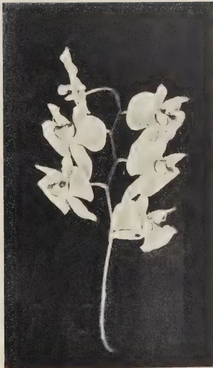

# The Tropical Agriculturist

June, 1935

---

## EDITORIAL

---

### THE RUBBER INDUSTRY

---

**W**HILST from an agricultural point of view the surest hope for the rubber plantation industry is to produce more rubber per acre from the same number of trees as now give lower yields, on the other hand expanding consumption to overtake production is the great hope to be looked for on the commercial side. There seems very little reason to doubt but what this increased absorption of rubber will eventually come. The consumption to-day is double what it was ten years ago. In time the estates planted with high-yielding trees will certainly be rewarded for their forethought. Since the introduction of budgrafting attention has to such an extent been focussed upon the problem of improved yield that the statement has been made that the world's average yield per acre of rubber trees has been increased threefold as a result of forethought. It does not necessarily follow that all this increase has been achieved by budding, other methods of producing selected trees have also been practised. Unfortunately, however, whatever methods have been general they seem to have been less so in Ceylon than in other rubber-producing countries.

1------------------------------------------------

313

A Rubber Exhibition held recently in London at the Science Museum gave some very instructive information as to the progress that has been and is being made in the development of the utilisation of rubber in industry. The most notable advance in the last few years is probably in the application of latex in industrial processes. The early difficulty of bulky transport has been overcome by various methods of concentrating the latex and it is predicted that before long the concentrated material will have been so produced that by the addition of the necessary quantity of water its latex properties will again be obtained. The future will probably see the establishment of small plants on estates for the direct application of latex there in the manufacture of certain articles of commerce. This would seem such a possibility in Ceylon that it is hoped our Rubber Research Scheme will develop it to accomplishment. There is an enormous consumption of rubber in domestic articles of some form or another which we see around us on all sides in our daily life. It seems strange if in all cases it is necessary, as now, to send the raw material across the seas and bring it back in a manufactured form. Rubber manufactured and consumed in this country would not interfere with our export quotum and so could enable an additional quantity to be produced and at the same time provide additional employment to our people.

2------------------------------------------------

314

## THE AREA UNDER BUDDED RUBBER IN THE NETHERLANDS EAST INDIES

DR. P. J. S. CRAMER,

FORMERLY DIRECTOR OF THE GENERAL EXPERIMENT  
STATION, BUITENZORG

SOME time ago (*The Tropical Agriculturist* — May, 1934) I published a few figures on the total area under budded rubber in the large rubber-producing countries. Since then accurate statistics have been published for the Netherlands East Indies, where the data were collected in view of the necessity to calculate the basic production for the various estates. In the Netherlands Indies an excellent central office for statistics has been organized since many years, and it is this office which has worked out the data, and one of its officers Mr A. M. P. A. Scheltema, has published the figures in the "Bergcultures", VIII, No. 50, (December 1934), p. 1177 — We will reproduce here a few of the data.

When it is wanted to give figures on areas under buddings and their ages, one of the difficulties one meets is that some fields are planted as "budded stumps", in which case the planting date indicates clearly the age — while other fields have been planted at first with germinated seeds (the most popular method in Malaya) or stumps (often preferred in Java) and budded after a year in the field. The question arises then from what date such plantations should be considered as being established, especially as the budding is sometimes done only when the plants in the fields are 2 years or more of age; in Indo-China for instance we have seen several instances where 3-year-old plants in the field were budded.

The restriction regulations for the Netherlands Indies have ruled, that for plantings of seedlings those of the 1st January to 30th June are counted as planted in the preceding calendar year, those of 1st July to 31st December as planted in the particular calendar year. For the planting of rubber buddings the same rule is applied. For plantings where the seedlings were budded in the field, the average is taken of the planting year of the

3------------------------------------------------

315

stocks and of the calendar year, in which the budding took place, if this average is not a whole figure it is rounded off towards the lowest whole figure.

Of course some way had to be found to get out of the difficulty. One may criticise the solution given above; especially as buddings on 3-year-old stocks, which may receive a year more for their estimated age, are certainly not a year in advance of buddings on one-year-old stocks — they may even be handicapped by the much slower healing over of the union on trees of a couple of years — but a way had to be found to come to a net figure for the sometimes complicated cases and this is probably the best solution.

A second difficulty is that in Java and in Sumatra fields have often been planted with alternating rows half the number of plants in the field being buddings the other half seedlings. In Java planters remained for a long time afraid of buddings and thought it safer to plant a half and half mixture with the idea, that if the buddings turned out a mistake, they could cut them out and still keep a sufficiently dense stand of seedlings. Often these seedlings were obtained from selected seeds which in the earlier years — I am speaking of the years before 1930 — would mean in Java “seeds of high-producing trees on plantations”, such an origin was certainly an advantage, giving the seedling a higher potential productivity (of several tens of per cents) but the improvement does not come up to the level of the increase in yield obtained with medium clones — as have often been used in the earlier days in the Netherlands Indies in the then so much beloved mixed clonal plantings.

In Sumatra also mixtures of buddings and seedlings were planted, but here with another purpose. Here several years ago, the planter could get seeds from clonal plantings and early work done by the excellent research botanist Dr. Heusser, had shown that clonal seedlings might afterwards give high yields. On the other hand, going in for seedlings seemed still somewhat precipitate and so it was thought safer to mix with such uncertain material the same number of buddings which were then already accepted in Sumatra as a great improvement deserving the confidence of the planters. Recent figures have shown that it is quite possible that clonal seedlings may give yields per acre comparable to those of good or medium buddings. I think that

4------------------------------------------------

316

if precautions be taken to retain in the field only the best yielding seedlings and with a rational choice of the clones from which the seedlings are used we may perhaps arrive at seedling plantings surpassing the good buddings in production. We have, however, still to admit, that with our present knowledge clonal seedlings do not give us the same certainty of increased yields as buddings. The policy of the Sumatra planters thus seems rational and more progressive than the older method of Java. All the same we have at present a fairly large acreage in both islands where buddings and seedlings are mixed.

How have we to bring those in when we want to calculate the area under buddings? Mr. Scheltema has simply counted a planting consisting of half of buddings as of half its acreage. I think this does not quite reflect the value of such plantings. The purpose has been to decide afterwards which kind of material will be kept. The density will be chosen so as to permit the cutting out of the seedlings and so ultimately the field will be entirely in buddings and if this is not the case as may happen in Sumatra the material kept will be at least as good and perhaps better than buddings — otherwise it would not be kept. I think that therefore fields with 50 per cent. buddings and 50 per cent. seedlings in Java may be estimated at more than half the area and if in Sumatra may be reckoned as if entirely planted with buddings.

I fully understand the difficulty there is in assessing these fields and if I make this remark it is not meant as a criticism for belittling Mr. Scheltema's excellent contribution to our knowledge about the present state of budding in the Netherlands Indies; but the contribution would have been perhaps still more complete if a figure for the fields with mixed plantings (buddings and seedlings) for Java and for Sumatra had been published.

Mr. Scheltema has divided the total area with estate rubber into four parts (1) Java (2) Estate area of Sumatra's East Coast (3) Southern and Central Sumatra, and (4) Further estates in the outer provinces. What the foreigner often calls Sumatra is the province of the East Coast of Sumatra, but parts of adjoining provinces like Tapanoeli and Atjeh are so closely connected with the East Coast province that they are taken together with it as "Cultur gebied S.O.K.". Which I think, can best be

5------------------------------------------------

317

translated as "Estate area of Sumatra, East Coast and adjoining provinces" of Sumatra's East Coast c.a. (cum annexiis).

Southern and Central Sumatra form a region by themselves more orientated towards Java in many respects than towards the East Coast, and of much smaller importance than the two foregoing ones. The last group contains the balance of the estates, a few scattered over Borneo, Celebes, etc., the total of this group forms only a small figure compared to the first groups.

The following table gives the absolute figures for each of the four areas with the percentages for each area:

<table border="1">
<thead>
<tr>
<th rowspan="2"></th>
<th colspan="2">Buddings</th>
<th colspan="2">Seedlings</th>
<th colspan="2">Total</th>
</tr>
<tr>
<th>in hectares</th>
<th>in %</th>
<th>in hectares</th>
<th>in %</th>
<th>in hectares</th>
<th>in %</th>
</tr>
</thead>
<tbody>
<tr>
<td>Java</td>
<td>35.825</td>
<td>15</td>
<td>195.959</td>
<td>85</td>
<td>231.784</td>
<td>100</td>
</tr>
<tr>
<td>Sumatra's E.C.c.a.</td>
<td>94.466</td>
<td>31</td>
<td>206.775</td>
<td>69</td>
<td>301.241</td>
<td>100</td>
</tr>
<tr>
<td>S. and C. Sumatra</td>
<td>9.800</td>
<td>22</td>
<td>34.787</td>
<td>78</td>
<td>44.587</td>
<td>100</td>
</tr>
<tr>
<td>All outer provinces</td>
<td>2.586</td>
<td>16</td>
<td>13.263</td>
<td>84</td>
<td>15.849</td>
<td>100</td>
</tr>
<tr>
<td>Total Netherlands Indies</td>
<td>142.677</td>
<td>24</td>
<td>450.784</td>
<td>76</td>
<td>593.461</td>
<td>100</td>
</tr>
</tbody>
</table>

These figures show some curious facts. Java has the lowest percentage of its total area planted with buddings, Sumatra's E.C. c.a. the highest. If we take into account that the plantings of seedlings in recent years, both pure seedling plantings and those combined with buddings in the same field give in productivity probably the same yield as plantings of buddings, we see, that Sumatra, has of old low-producing plantings about the same acreage as Java, but that it has far more than (probably about three times) the area of Java under buddings and equivalent seedlings. The East Coast is by its high percentage of modern material leading in the world. It is perhaps only surpassed in percentage figure by Indo-China. This is very much to the credit of the AVROS Experiment Station, which has done a good deal of propaganda and research work to get the planters and planting companies to start with the improved material.

It is curious to see how well S. and C. Sumatra has done with 22 per cent. of its area under buddings. This is probably mainly due to the fact that rubber planting has had better opportunities to extend there than in Java, most estates in S. and C. Sumatra still own jungle land.

6------------------------------------------------

318

The figures above are all expressed in hectares; one hectare is 2.5 acres in round figures. As may be seen from the bottom line of the table the total area under estate rubber in the Netherlands Indies is 593.461 hectares, practically one-and-a-half million acres. Native plantings are not comprised in these figures — out of this total area 24 per cent., 360,000 acres in round figures, are under buddings.

We further see that about half the total area under rubber in the Netherlands Indies is in Sumatra's East Coast c.a., while by far the largest part of the rest is in Java. Sumatra's East Coast has however a much higher percentage of its area under buddings.

It is interesting to compare the ages of the plantings with seedlings and with buddings. We can best do this by combining two tables from the original articles into one. Figures are in h.a. (one h.a. =  $2\frac{1}{2}$  acres).

<table border="1">
<thead>
<tr>
<th rowspan="2">Year of Planting</th>
<th colspan="2">Java</th>
<th colspan="2">Sumatra E.C. c.a.</th>
<th colspan="2">S. a. c. Sumatra</th>
<th colspan="2">Furth Out. Pr.</th>
<th colspan="2">Total Neth. Ind.</th>
</tr>
<tr>
<th>Seedl.</th>
<th>Budd.</th>
<th>Seedl.</th>
<th>Budd.</th>
<th>Seedl.</th>
<th>Budd.</th>
<th>Seedl.</th>
<th>Budd.</th>
<th>Seedl.</th>
<th>Budd.</th>
</tr>
</thead>
<tbody>
<tr>
<td>Before 1921</td>
<td>138.302</td>
<td></td>
<td>156.294</td>
<td></td>
<td>19.598</td>
<td></td>
<td>7.620</td>
<td>—</td>
<td>321.814</td>
<td>—</td>
</tr>
<tr>
<td>1921-24</td>
<td>16.105</td>
<td>1.796</td>
<td>17.465</td>
<td>7.181</td>
<td>4.056</td>
<td>.198</td>
<td>2.166</td>
<td>.042</td>
<td>39.792</td>
<td>9.217</td>
</tr>
<tr>
<td>1925-27</td>
<td>29.275</td>
<td>7.926</td>
<td>23.281</td>
<td>22.873</td>
<td>8.118</td>
<td>1.062</td>
<td>2.300</td>
<td>.26</td>
<td>62.974</td>
<td>32.121</td>
</tr>
<tr>
<td>1928-30</td>
<td>6.338</td>
<td>18.735</td>
<td>7.191</td>
<td>47.195</td>
<td>2.574</td>
<td>6.254</td>
<td>.858</td>
<td>2.074</td>
<td>16.961</td>
<td>74.258</td>
</tr>
<tr>
<td>1931-35</td>
<td>5.939</td>
<td>7.368</td>
<td>2.544</td>
<td>17.217</td>
<td>.441</td>
<td>2.286</td>
<td>.319</td>
<td>.21</td>
<td>9.243</td>
<td>27.081</td>
</tr>
</tbody>
</table>

The figures for buddings in the original tables do not distinguish between plantings before 1921 and 1922 to 1924, but the area planted with buddings before 1925 is very small, even in Sumatra.

It is curious to see how budding on a commercial scale was taken up in Sumatra's East Coast earlier than in Java. At the end of 1924 the East Coast had nearly four times the area of that in Java; for the following period Sumatra planted about 3 times as much buddings as Java did, but every period we see Java improving. Still it is a well-known fact that budding was looked at in the beginning in Java with more doubt than in Sumatra. In comparing the figures we shall bear in mind that the acreage under seedlings planted in Sumatra's East Coast in 1928-30, *i.e.*, 7.191 h.a., meant material of a much higher value than the seedlings planted out in Java during the same years — 6.338 h.a. If for the last three years

7------------------------------------------------

319

Java has still planted 5·939 h.a. with seedlings we may be certain that a large percentage of this acreage was planted with common seedlings to be budded afterwards in the field on which the budding had not yet been done at the moment the statistics were collected.

It is further curious to see, that since the price of rubber has gone down, Java and Sumatra have still continued to extend, the period 1931-1933 contains practically only plantings made in the slump years and we see that their totals have been for the Netherlands Indies:

<table>
<tr>
<td>1931-1933</td>
<td>buddings</td>
<td>27·081 h.a.</td>
</tr>
<tr>
<td></td>
<td>seedlings</td>
<td>9·243 ,,</td>
</tr>
<tr>
<td></td>
<td></td>
<td>
36·324 ,,</td>
</tr>
</table>

On the total area, 600,000 h.a. this means for the last 3 years, before restriction came, still an increase of 6 per cent. or an average of 2 per cent. per year. The fact, that this is all improved material — the seedlings being for a large part planned to be budded makes these extensions an addition to the potential production of a much higher figure, perhaps 5 per cent. instead of 2 per cent. per year.

From all these figures we see that the Netherlands Indies and especially the East Coast of Sumatra — have entered the restriction period with a high percentage of their area in buddings and probably equivalent seedling material. It is certainly a valuable asset for these regions for the coming years.

We may expect to see a slow reduction in the acreage of seedlings and a corresponding increase of buddings, in the next year by rejuvenation of old plantings which is permitted under restriction. However, here there may be a tendency to replace the old plantings not always by buddings, but also by clonal seedlings. With the modern technique of dense planting, early elimination of the poorer trees and careful choice of the clones from which the seeds are taken this system may have advantages even over replanting with buddings.

We may hope that the Central Statistical Office in the Netherlands Indies will continue to follow this development and that in proper time further figures on the situation will be published. I suggest that it would be valuable to consider then a special class for "seedlings from clonal seeds".

8------------------------------------------------

320

For countries which were late in taking up budding, and Ceylon has to be mentioned as the most important of them, such figures would be of special interest. The area under buddings in Ceylon is very small but there are some estates, which own blocks of monoclonal plantings and which can furnish practically pure clonal seeds or will be able in the near future to do so.

In every case the development of planting with this newest material should be closely watched by Ceylon planters. Not only may it be as good as buddings, or even better, especially for replanting purposes, but it may also be a source of new clones, developed in the country itself — and this is the only way now to improve upon existing clones as the introduction of planting material from other rubber-producing countries has been prohibited under restriction.

9------------------------------------------------

321

## NOTES ON ORCHIDS CULTIVATED IN CEYLON

### PHALAENOPSIS GRANDIFLORA LINDL.

K. J. ALEX. SYLVA, F.R.H.S.,

CURATOR, HENERATGODA BOTANIC GARDENS, GAMPAHA

**P**HALAENOPSIS belongs to a fairly extensive genus of epiphytes of the Vanda tribe, and embraces about fifty species mostly confined to Java, the Philippines, Borneo and Sumatra. The majority of its members are very handsome and easy of culture in the tropics.

*Phalaenopsis grandiflora* is a native of Java and Borneo, and thrives exceedingly well in the wet low-country of Ceylon, which closely resembles its native habitat.

On account of its graceful white flowers the plant has earned great popularity among orchid growers. It has a tuft of fleshy leaves which are elliptic-lanceolate and about ten inches long and three inches broad.

The flowers are borne on a long semi-arched, often branching raceme in opposite rows. The flower is about four inches across with elliptic-ovate sepals and broad and somewhat rhomboidal petals of pure white, while the three-lobed lip is white, beautifully spotted and streaked with rose-pink, with a yellow tinge on the edge of the side lobes. The middle lobe is spear-shaped, the extremity separating into two long and thin filaments which curve upwards. The column is short and white and the gland presents a resemblance to the head of a leopard.

The flowers stay in good condition for as long as three months or more; though the petals and sepals are apt to become spotted if allowed to get wet.

*Culture.*—The various species of *Phalaenopsis* require, more or less, the same treatment as is given to most tropical orchids. In their native habitat they luxuriate on bare rocks, and on branches of trees under conditions of moist heat.

The most important factor in the cultivation of these plants is a humid atmosphere. They are all of easy culture, and if properly attended to are seldom out of order. However, since they lack pseudo-bulbs for food storage, they need more care and attention than most other orchids if they are to reach perfection.

10------------------------------------------------

A black and white photograph of a Phalaenopsis grandiflora orchid plant. The plant features a single, slender, upright stem. Along the stem, there are several large, light-colored flowers. Each flower has a broad, rounded upper petal and a smaller, more pointed lower petal. The flowers are arranged in a raceme-like pattern, with some buds visible at the tips of the stem. The background is a solid, dark color, which makes the light-colored flowers stand out. The overall appearance is that of a classic, well-preserved orchid specimen.

*Phalaenopsis grandiflora* Lindl.

11------------------------------------------------

This image is a scan of a blank page. The paper has a light beige or cream-colored tint. There are a few very small, dark specks scattered across the surface, which appear to be scanning artifacts or dust particles. No text, lines, or other markings are present on the page.

12------------------------------------------------

322

Plants of the genus *Phalaenopsis* are cultivated in a variety of ways. They are satisfactorily grown on blocks of wood or sections of the Tree Fern (*Alsophilla crinita* and *Hemitelia Walkerae*), wooden baskets, pots, tiles or in bamboo sections. They will require more moisture at the roots if placed on blocks of wood whilst those grown in pots require better drainage than those grown in baskets. Bamboo sections and tiles have been found very satisfactory in the cultivation of these plants in Ceylon for they not only afford ample drainage but also retain a certain percentage of moisture in the compost. In whatever receptacle they are placed anything approaching dryness is injurious. Syringing overhead should be avoided on dull or cloudy days as a precaution against spotted sepals and petals. Owing to the natural tendency of the leaves to adopt a drooping habit and of the plant to display itself to best advantage when in bloom the best receptacles for them are longitudinal sections of the Giant bamboo, or tiles of similar pattern.

These species that have an upright habit, may be grown in baskets or pots. Whatever the receptacle, the drainage is an important factor and should be carefully considered. A simple method of achieving this is always to place the plant on a mound worked above the rim of the pot.

The best rooting medium for most *Phalaenopsis* is made up of bits of charcoal, bricks, wood and bones. A thin layer of beaten coconut husk or moss placed on the surface will serve to arrest or retain the compost and also prevent any damage to the roots when wiring the plant into position. Repotting may be done every second or third year, and even then it is not advisable to detach the roots adhering to the receptacle but only to shake off the old compost and insert fresh material.

*Propagation.*—The members of this genus do not afford much opportunity for multiplication of the stock — this can only be done in well-grown and healthy specimens producing basal shoot after several years; but certain species will produce young plants at the tip of the flower scape or on the roots. These plants should be left till well rooted on small blocks of wood, sections of tree fern or balls of coconut fibre before being separated from the parent.

13------------------------------------------------

323

## STUDIES ON CEYLON SOILS

### III.—THE RED AND YELLOW EARTHS, AND THE WET AND DRY PATANA SOILS

A. W. R. JOACHIM, PH.D., DIP. AGRIC.

(CANTAB.),

*AGRICULTURAL CHEMIST,*

AND

S. KANDIAH, DIP. AGRIC. (POONA),

*ASSISTANT IN AGRICULTURAL CHEMISTRY*

**I**N a previous paper of this series (1) a general account was given of the main groups of Ceylon soils. In this and subsequent communications the results of typical profile studies of some of these groups will be presented. As they constitute a large area of the cultivated land in the Island, the red and yellow earths will first be dealt with. The patana soils are next studied, as they bear a close relationship to the former.

#### METHODS OF ANALYSIS

The methods of analysis adopted in the examination of soils have been referred to in a previous paper (1). Further reference should however be made to some of these determinations. Total exchangeable bases were determined by Bray and Wilhite's method (2). Of the constituent bases, only calcium has been determined in all cases, as the other bases were generally found to be small.  $P_H$  was determined at the start by the quinhydrone electrode, but as the apparatus became defective during the progress of the investigations, Kuhn's (3) colorimetric method was adopted. The clay constituents were analysed by the sodium carbonate fusion method. Care was however taken that the final silica precipitate was purified with hydrofluoric acid in every case, as failure to do this resulted in high silica and low sesquioxide figures, and altered the silica alumina ratio appreciably. Carbon was determined by Robinson, McLean & Williams' method (4) and lime requirements, whenever done, by Hutchinson and McLennan method (5). Keen and Coutt's (6) method was

14------------------------------------------------

324

adopted for sticky point moisture. The texture index number was calculated from the percentages of the soil constituents after a method of Charlton (7) based on the relative surface area of particle sizes. The relative surface areas of clay, silt, fine sand and coarse sand have been calculated to be .9, .09, .009 and .0009 of the whole soil mass. The total of the products of the percentages of each constituent and their respective factors gives a figure which represents the texture of the soil called the 'texture index number' or specific area. This figure bears a similarity to Hardy's "texture index" in the case of a number of soils, but there are many exceptions. The other determinations call for no comment.

### THE RED AND YELLOW SOILS

The red and yellow soils vary considerably in colour, all shades between pinkish red and yellowish brown being noted. They are the chief soil groups of the humid up-country and low-country where they constitute the major portion of the cultivated areas. All types of crops grow on them, though they are best suited to perennial crops like tea, rubber and to a lesser degree, coconuts. Annual crops do well if the soil is well cultivated and supplied with organic matter. The surface layer of many of the soils of these groups has been lost by erosion, and seldom is a dark-brown surface layer such as is revealed in the profile sections from uncultivated areas, observed. The soils are often deep and may extend to over 100 ft. in depth occasionally.

### THE RED EARTH PROFILE

<table>
<tr>
<td>Location</td>
<td>... Near Rikiligasgoda on Kandy-Galaha Road.</td>
</tr>
<tr>
<td>Elevation</td>
<td>... 2,000 ft. (approx.)</td>
</tr>
<tr>
<td>Climate</td>
<td>... Rainfall 120 in. (approx.); temperature 73°F. (approx.)</td>
</tr>
<tr>
<td>Geological origin</td>
<td>... Basic and intermediate gneisses</td>
</tr>
<tr>
<td>Mode of formation</td>
<td>... Residual.</td>
</tr>
<tr>
<td>Drainage</td>
<td>... Free.</td>
</tr>
<tr>
<td>Topographic position</td>
<td>... Hilly; sample taken from a low hillock.</td>
</tr>
<tr>
<td>Vegetation</td>
<td>... Mana grass (natural); tea (cultivated).</td>
</tr>
</table>

15------------------------------------------------

325

TABLE I  
*Mechanical Analysis*

<table border="1">
<thead>
<tr>
<th></th>
<th>A</th>
<th>BC</th>
<th>C1</th>
<th>C2</th>
</tr>
<tr>
<th></th>
<th>%</th>
<th>%</th>
<th>%</th>
<th>%</th>
</tr>
</thead>
<tbody>
<tr>
<td>Stones and gravel</td>
<td>4.3</td>
<td>42.0</td>
<td>3.3</td>
<td>3.3</td>
</tr>
<tr>
<td>Coarse sand</td>
<td>30.7</td>
<td>31.7</td>
<td>19.6</td>
<td>22.3</td>
</tr>
<tr>
<td>Fine sand</td>
<td>10.2</td>
<td>8.0</td>
<td>8.0</td>
<td>17.6</td>
</tr>
<tr>
<td>Silt</td>
<td>37.0</td>
<td>16.4</td>
<td>21.1</td>
<td>17.4</td>
</tr>
<tr>
<td>Clay</td>
<td>17.5</td>
<td>39.5</td>
<td>47.1</td>
<td>39.4</td>
</tr>
<tr>
<td>Loss by solution</td>
<td>1.1</td>
<td>1.1</td>
<td>1.0</td>
<td>0.5</td>
</tr>
<tr>
<td>Moisture</td>
<td>3.5</td>
<td>3.3</td>
<td>3.2</td>
<td>2.8</td>
</tr>
<tr>
<td>Sticky point moisture</td>
<td>27.3</td>
<td>38.0</td>
<td>39.0</td>
<td>40.8</td>
</tr>
<tr>
<td>Texture index number</td>
<td>19.1</td>
<td>37.1</td>
<td>44.3</td>
<td>37.2</td>
</tr>
<tr>
<td>Soil type</td>
<td>Light loam</td>
<td>Heavy loam</td>
<td>Clay loam</td>
<td>Heavy loam</td>
</tr>
</tbody>
</table>

*Chemical Analysis*

<table border="1">
<tbody>
<tr>
<td>Loss on ignition</td>
<td>12.19</td>
<td>10.58</td>
<td>10.30</td>
<td>9.73</td>
</tr>
<tr>
<td>Organic matter</td>
<td>3.90</td>
<td>3.17</td>
<td>1.27</td>
<td>0.41</td>
</tr>
<tr>
<td>Combined water</td>
<td>8.29</td>
<td>7.41</td>
<td>9.03</td>
<td>9.32</td>
</tr>
<tr>
<td>Carbon</td>
<td>2.26</td>
<td>1.84</td>
<td>0.73</td>
<td>0.24</td>
</tr>
<tr>
<td>Nitrogen</td>
<td>0.166</td>
<td>0.103</td>
<td>0.039</td>
<td>0.027</td>
</tr>
<tr>
<td>Carbon/nitrogen ratio</td>
<td>13.7</td>
<td>17.8</td>
<td>18.7</td>
<td>8.9</td>
</tr>
<tr>
<td>Lime requirement</td>
<td>0.31</td>
<td>0.30</td>
<td>0.27</td>
<td>0.28</td>
</tr>
<tr>
<td>Reaction <math>P_H</math></td>
<td>5.5</td>
<td>5.8</td>
<td>6.0</td>
<td>6.1</td>
</tr>
<tr>
<td>Total lime</td>
<td>0.153</td>
<td>0.146</td>
<td>0.132</td>
<td>0.135</td>
</tr>
<tr>
<td>    "    potash</td>
<td>0.054</td>
<td>0.051</td>
<td>0.050</td>
<td>0.052</td>
</tr>
<tr>
<td>    "    phosphoric acid</td>
<td>0.071</td>
<td>0.063</td>
<td>0.057</td>
<td>0.053</td>
</tr>
<tr>
<td>    "    sesquioxides</td>
<td>30.0</td>
<td>30.3</td>
<td>34.7</td>
<td>33.9</td>
</tr>
<tr>
<td>Total exchangeable bases (m.e. per 100 gm soil)</td>
<td>4.01</td>
<td>3.90</td>
<td>3.65</td>
<td>3.40</td>
</tr>
<tr>
<td>Exchangeable calcium</td>
<td>2.68</td>
<td>2.53</td>
<td>2.65</td>
<td>2.57</td>
</tr>
</tbody>
</table>

*Clay Analysis*

<table border="1">
<tbody>
<tr>
<td>Loss on ignition</td>
<td>18.46</td>
<td>—</td>
<td>13.48</td>
<td>—</td>
</tr>
<tr>
<td>Silica (<math>SiO_2</math>)</td>
<td>38.42</td>
<td>—</td>
<td>39.66</td>
<td>—</td>
</tr>
<tr>
<td>Sesquioxides (<math>R_2O_3</math>)</td>
<td>57.64</td>
<td>—</td>
<td>58.00</td>
<td>—</td>
</tr>
<tr>
<td>Alumina (<math>Al_2O_3</math>)</td>
<td>40.81</td>
<td>—</td>
<td>41.94</td>
<td>—</td>
</tr>
<tr>
<td>Iron oxides (<math>Fe_2O_3</math>)</td>
<td>16.83</td>
<td>—</td>
<td>16.06</td>
<td>—</td>
</tr>
<tr>
<td><math>SiO_2/Al_2O_3</math> (molecular)</td>
<td>1.59</td>
<td>—</td>
<td>1.60</td>
<td>—</td>
</tr>
<tr>
<td><math>SiO_2/R_2O_3</math> "</td>
<td>1.26</td>
<td>—</td>
<td>1.28</td>
<td>—</td>
</tr>
<tr>
<td>Soil type</td>
<td>Lateritic</td>
<td></td>
<td>Lateritic</td>
<td></td>
</tr>
</tbody>
</table>

PROFILE

A. 0-12 in. Reddish brown friable loam; nodular to irregular prismatic; few ironstone pebbles; much root growth; acid; horizon boundary distinct.

B. 12-22 in. Brownish red gravelly loam; nodular to irregular clod; hard but friable; ferruginous concretions and quartz abundant; acid; horizon boundary distinct.

16------------------------------------------------

326

C1. 22-44 in. Dark red heavy loam; irregular prismatic; hard but friable; acid; root growth poor; horizon boundary indistinct.

C2. 44 in. > 4 ft. Dark-red clay loam irregularly streaked yellow; irregular prismatic; hard but friable; acid; root growth poor.

An examination of this table would show that the soils of this particular red earth profile are heavy loams except for the surface layer, which is of a lighter texture. This horizon is absent in many cultivated soils. The B layer contains gravel and stones to the extent of 42 per cent. but is otherwise similar to the C horizons. The A and B horizons are fairly rich in organic matter and nitrogen. The C layers are markedly deficient in them. The combined water contents are low for such heavy soils and appear to be due to the nature of the clay complex. The soils are markedly acid in reaction, the acidity diminishing somewhat with depth. The lime requirements are high. The total exchangeable bases are low, as is the case with most tropical soils. Calcium constitutes about 65 to 70 per cent. of these bases. The soils are poor in fertilising constituents generally, the total potash being only about .05 per cent. and total phosphoric acid about .06 per cent. on the average. The lower layers are slightly richer in sesquioxides than the A and B horizons. The clay analyses reveal alumina contents of about 41 per cent., iron oxide of about 16 per cent. and silica of about 58 per cent. The silica/alumina molecular ratios are about 1.6 and indicate that the soils are definitely lateritic in nature, approximating laterite soils.

#### THE YELLOW EARTH PROFILE

<table>
<tr>
<td>Location</td>
<td>...</td>
<td>Muloya on Kandy-Galaha Road.</td>
</tr>
<tr>
<td>Elevation</td>
<td>...</td>
<td>2,000 ft. (approx.)</td>
</tr>
<tr>
<td>Climate</td>
<td>...</td>
<td>Rainfall 120 in. (approx.); temperature 73°F. (approx.)</td>
</tr>
<tr>
<td>Geological origin</td>
<td>...</td>
<td>Intermediate gneisses Garnets and Quartzite abundant.</td>
</tr>
<tr>
<td>Mode of formation</td>
<td>...</td>
<td>Residual.</td>
</tr>
<tr>
<td>Drainage</td>
<td>...</td>
<td>Free.</td>
</tr>
<tr>
<td>Topographic position</td>
<td>...</td>
<td>Hilly; sample taken on slope of hill about 12 ft. above road level.</td>
</tr>
<tr>
<td>Vegetation</td>
<td>...</td>
<td>Bracken and <i>mana</i> grass (natural); tea (cultivated).</td>
</tr>
</table>

17------------------------------------------------

327TABLE II*Mechanical Analysis*

<table border="1">
<thead>
<tr>
<th></th>
<th>A</th>
<th>C1</th>
<th>C2</th>
</tr>
<tr>
<th></th>
<th>%</th>
<th>%</th>
<th>%</th>
</tr>
</thead>
<tbody>
<tr>
<td>Stones and gravel</td>
<td>32.6</td>
<td>15.9</td>
<td>16.2</td>
</tr>
<tr>
<td>Coarse sand</td>
<td>48.0</td>
<td>32.8</td>
<td>37.5</td>
</tr>
<tr>
<td>Fine sand</td>
<td>18.7</td>
<td>16.7</td>
<td>14.2</td>
</tr>
<tr>
<td>Silt</td>
<td>10.3</td>
<td>13.5</td>
<td>8.8</td>
</tr>
<tr>
<td>Clay</td>
<td>18.9</td>
<td>32.3</td>
<td>36.1</td>
</tr>
<tr>
<td>Loss by solution</td>
<td>1.1</td>
<td>0.9</td>
<td>0.4</td>
</tr>
<tr>
<td>Moisture</td>
<td>3.0</td>
<td>3.8</td>
<td>3.0</td>
</tr>
<tr>
<td>Sticky point moisture</td>
<td>14.0</td>
<td>15.5</td>
<td>20.9</td>
</tr>
<tr>
<td>Texture index number</td>
<td>18.1</td>
<td>30.5</td>
<td>33.4</td>
</tr>
<tr>
<td>Soil type</td>
<td>Light loam</td>
<td>Heavy loam</td>
<td>Heavy loam</td>
</tr>
</tbody>
</table>

*Chemical Analysis*

<table border="1">
<tbody>
<tr>
<td>Loss on ignition</td>
<td>9.00</td>
<td>8.95</td>
<td>9.29</td>
</tr>
<tr>
<td>Organic matter</td>
<td>3.18</td>
<td>1.35</td>
<td>0.63</td>
</tr>
<tr>
<td>Combined water</td>
<td>5.82</td>
<td>7.60</td>
<td>8.66</td>
</tr>
<tr>
<td>Carbon</td>
<td>1.84</td>
<td>0.78</td>
<td>0.36</td>
</tr>
<tr>
<td>Nitrogen</td>
<td>0.139</td>
<td>0.067</td>
<td>0.032</td>
</tr>
<tr>
<td>Carbon/nitrogen ratio</td>
<td>13.2</td>
<td>11.7</td>
<td>11.1</td>
</tr>
<tr>
<td>Lime requirement</td>
<td>0.40</td>
<td>0.44</td>
<td>0.38</td>
</tr>
<tr>
<td>Reaction <math>P_H</math></td>
<td>5.0</td>
<td>5.5</td>
<td>5.7</td>
</tr>
<tr>
<td>Total lime</td>
<td>0.207</td>
<td>0.211</td>
<td>0.122</td>
</tr>
<tr>
<td>    ,, potash</td>
<td>0.065</td>
<td>0.083</td>
<td>0.083</td>
</tr>
<tr>
<td>    ,, phosphoric acid</td>
<td>0.038</td>
<td>0.044</td>
<td>0.044</td>
</tr>
<tr>
<td>    ,, sesquioxides</td>
<td>24.7</td>
<td>26.0</td>
<td>30.4</td>
</tr>
<tr>
<td>Total exchangeable bases (m.e. per 100 gm soil)</td>
<td>2.44</td>
<td>2.10</td>
<td>2.15</td>
</tr>
<tr>
<td>Exchangeable calcium</td>
<td>1.98</td>
<td>1.81</td>
<td>1.90</td>
</tr>
</tbody>
</table>

*Clay Analysis*

<table border="1">
<tbody>
<tr>
<td>Loss on ignition</td>
<td>27.22</td>
<td>16.91</td>
<td>—</td>
</tr>
<tr>
<td>Silica (<math>SiO_2</math>)</td>
<td>33.88</td>
<td>32.64</td>
<td>—</td>
</tr>
<tr>
<td>Sesquioxides (<math>R_2O_3</math>)</td>
<td>59.52</td>
<td>62.58</td>
<td>—</td>
</tr>
<tr>
<td>Alumina (<math>Al_2O_3</math>)</td>
<td>35.81</td>
<td>39.05</td>
<td>—</td>
</tr>
<tr>
<td>Iron oxides (<math>Fe_2O_3</math>)</td>
<td>23.71</td>
<td>23.53</td>
<td>—</td>
</tr>
<tr>
<td><math>SiO_2/Al_2O_3</math> (molecular)</td>
<td>1.60</td>
<td>1.42</td>
<td>—</td>
</tr>
<tr>
<td><math>SiO_2/R_2O_3</math> ,,</td>
<td>1.12</td>
<td>1.02</td>
<td>—</td>
</tr>
<tr>
<td>Soil type</td>
<td>Lateritic</td>
<td>Lateritic</td>
<td>—</td>
</tr>
</tbody>
</table>

PROFILE

A 0-10 in. Gray-brown friable loam; nodular; boulders and quartzite gravel in fair quantity; acid; root growth fair; horizon boundary distinct.

18------------------------------------------------

328

C1 10-42 in. Yellowish heavy loam; compact; nodular and irregular clod; ironstone pebbles in fair quantity; acid; root growth not marked; horizon boundary not very distinct.

C2 42 > 48 in. Yellowish heavy loam with reddish ferruginous nodules; nodular; compact; ferruginous concretions present; roots absent; acid.

It will be noted that like the red earth soils, the yellow soils are fairly heavy loams except for the A horizon which is again a light friable loam. There is no recognisable B layer in this profile. The sticky point moistures of all horizons are low and so also the combined water contents for soils of this texture. Hardy's 'texture index' varies appreciably from the 'texture index number' in the case of these soils. The organic matter content is fair in the A horizon but very low in the C layers. The nitrogen contents are similar. The carbon/nitrogen ratios are much more uniform in the different horizons of this profile than the corresponding horizons of the earth profile. The soils are of the same degree of acidity, have lower exchangeable calcium forms about 80 to 90 per cent. of the total bases. The soils are poor in total fertilising constituents like the red earth soils, but have lower sesquioxide contents which again show an increase with depth. The analyses of the clay fractions show that the soils are of the lateritic type bordering on laterite, with silica/sesquioxide ratios between 1.4 and 1.6. The iron oxide contents of the clays are however appreciably higher than those of the red soils. This group of soils, is on the whole, very similar in many respects to the red earth group. The difference in colour is probably accounted for by the nature of the hydrated ferric oxides in these soils.

### THE PATANA SOILS

The patanas, as already explained, are grasslands or savannahs occupying a large area of the hill-country. Above 4,500 feet elevation, the patanas are characterised by a peat-like surface horizon extending to 4 or 5 feet in depth occasionally. These patanas make good tea land when cultivated, and can also be adapted for the growth of temperate vegetables and fruits. The climate is cool and humid and the rainfall evenly distributed during the year. The soils are therefore constantly moist and imperfectly drained. The patanas below 4,500 ft.

19------------------------------------------------

329

are of a different type to those of the wet patanas due largely to climatic differences (a long period of drought being experienced) and also to soil and other factors. Where the soil is deep, cultivation is possible and tea and fruits do very well. The surface humus layer of the dry patanas is however of much less depth than that of the wet patanas. The cultivated soils of both types of grassland lack the humus layer, mainly as a result of erosion and to a lesser extent, of cultivation.

TABLE III*Mechanical Analysis*

<table border="1">
<thead>
<tr>
<th></th>
<th>A1</th>
<th>A2</th>
<th>B</th>
<th>C</th>
</tr>
<tr>
<th></th>
<th>%</th>
<th>%</th>
<th>%</th>
<th>%</th>
</tr>
</thead>
<tbody>
<tr>
<td>Stones and gravel</td>
<td>0.6</td>
<td>4.3</td>
<td>39.2</td>
<td>14.1</td>
</tr>
<tr>
<td>Coarse sand</td>
<td>13.1</td>
<td>21.9</td>
<td>24.2</td>
<td>22.9</td>
</tr>
<tr>
<td>Fine sand</td>
<td>37.6</td>
<td>18.0</td>
<td>13.5</td>
<td>19.6</td>
</tr>
<tr>
<td>Silt</td>
<td>22.6</td>
<td>16.7</td>
<td>10.6</td>
<td>11.0</td>
</tr>
<tr>
<td>Clay</td>
<td>14.4</td>
<td>32.5</td>
<td>44.8</td>
<td>41.4</td>
</tr>
<tr>
<td>Loss by solution</td>
<td>3.5</td>
<td>3.0</td>
<td>0.4</td>
<td>0.2</td>
</tr>
<tr>
<td>Moisture</td>
<td>8.8</td>
<td>7.9</td>
<td>6.5</td>
<td>4.9</td>
</tr>
<tr>
<td>Sticky point moisture</td>
<td>41.9</td>
<td>34.6</td>
<td>25.7</td>
<td>25.5</td>
</tr>
<tr>
<td>Texture index number</td>
<td>15.4</td>
<td>30.9</td>
<td>41.4</td>
<td>38.5</td>
</tr>
<tr>
<td>Soil type</td>
<td>Light loam</td>
<td>Heavy loam</td>
<td>Clay loam</td>
<td>Clay loam</td>
</tr>
</tbody>
</table>

*Chemical Analysis*

<table border="1">
<tbody>
<tr>
<td>Loss on ignition</td>
<td>25.49</td>
<td>15.32</td>
<td>10.78</td>
<td>12.88</td>
</tr>
<tr>
<td>Organic matter</td>
<td>10.90</td>
<td>6.78</td>
<td>2.06</td>
<td>0.80</td>
</tr>
<tr>
<td>Combined water</td>
<td>14.59</td>
<td>8.54</td>
<td>8.72</td>
<td>12.08</td>
</tr>
<tr>
<td>Carbon</td>
<td>6.32</td>
<td>3.93</td>
<td>1.20</td>
<td>0.46</td>
</tr>
<tr>
<td>Nitrogen</td>
<td>0.371</td>
<td>0.245</td>
<td>0.096</td>
<td>0.044</td>
</tr>
<tr>
<td>Carbon/nitrogen ratio</td>
<td>17.0</td>
<td>16.0</td>
<td>12.5</td>
<td>10.5</td>
</tr>
<tr>
<td>Lime requirement</td>
<td>0.59</td>
<td>0.49</td>
<td>0.41</td>
<td>0.38</td>
</tr>
<tr>
<td>Reaction <math>P_H</math></td>
<td>5.3</td>
<td>5.7</td>
<td>6.0</td>
<td>6.0</td>
</tr>
<tr>
<td>Total potash</td>
<td>0.086</td>
<td>0.085</td>
<td>0.084</td>
<td>0.085</td>
</tr>
<tr>
<td>„ phosphoric acid</td>
<td>0.134</td>
<td>0.154</td>
<td>0.148</td>
<td>0.142</td>
</tr>
<tr>
<td>„ sesquioxides</td>
<td>28.2</td>
<td>35.6</td>
<td>42.0</td>
<td>47.7</td>
</tr>
<tr>
<td>Total exchangeable bases (m.e. per 100 gm soil)</td>
<td>0.436</td>
<td>0.456</td>
<td>0.420</td>
<td>0.520</td>
</tr>
<tr>
<td>Exchangeable calcium</td>
<td>0.268</td>
<td>0.260</td>
<td>0.268</td>
<td>0.276</td>
</tr>
</tbody>
</table>

*Clay Analysis*

<table border="1">
<tbody>
<tr>
<td>Loss on ignition</td>
<td>71.20</td>
<td>48.44</td>
<td>28.31</td>
<td>24.84</td>
</tr>
<tr>
<td>Silica (<math>SiO_2</math>)</td>
<td>23.68</td>
<td>24.00</td>
<td>25.30</td>
<td>26.56</td>
</tr>
<tr>
<td>Sesquioxides (<math>R_2O_3</math>)</td>
<td>73.04</td>
<td>73.32</td>
<td>72.68</td>
<td>72.90</td>
</tr>
<tr>
<td>Alumina (<math>Al_2O_3</math>)</td>
<td>53.33</td>
<td>53.00</td>
<td>52.50</td>
<td>52.96</td>
</tr>
<tr>
<td>Iron oxides (<math>Fe_2O_3</math>)</td>
<td>19.71</td>
<td>20.32</td>
<td>20.18</td>
<td>19.94</td>
</tr>
<tr>
<td><math>SiO_2/Al_2O_3</math> (Molecular)</td>
<td>0.75</td>
<td>0.77</td>
<td>0.82</td>
<td>0.85</td>
</tr>
<tr>
<td><math>SiO_2/R_2O_3</math> „</td>
<td>0.61</td>
<td>0.62</td>
<td>0.66</td>
<td>0.68</td>
</tr>
<tr>
<td>Soil type</td>
<td>Laterite</td>
<td>Laterite</td>
<td>Laterite</td>
<td>Laterite</td>
</tr>
</tbody>
</table>

20------------------------------------------------

330THE WET PATANA PROFILE

<table>
<tr>
<td>Location</td>
<td>...</td>
<td>Kandapola.</td>
</tr>
<tr>
<td>Elevation</td>
<td>...</td>
<td>6,000 ft.</td>
</tr>
<tr>
<td>Climate</td>
<td>...</td>
<td>Rainfall 98 in. (approx.); temperature 60°F.</td>
</tr>
<tr>
<td>Geological origin</td>
<td>...</td>
<td>Basic and intermediate metamorphic and igneous rocks</td>
</tr>
<tr>
<td>Mode of formation</td>
<td>...</td>
<td>Residual.</td>
</tr>
<tr>
<td>Drainage</td>
<td>...</td>
<td>Impeded.</td>
</tr>
<tr>
<td>Topographic position</td>
<td>...</td>
<td>Steep; sample from slope of hillside.</td>
</tr>
<tr>
<td>Vegetation</td>
<td>...</td>
<td>Grasses, <i>Rhododendrons</i>.</td>
</tr>
</table>

PROFILE

A 0-14 in. Black peaty loam; loose and friable; irregular columnar; no concretions; root growth poor; acid; horizon boundary indistinct.

A2 14-25 in. Lighter black heavy loam; compact but friable; irregular columnar; few pebbles; roots rare; acid; horizon boundary very distinct.

B 25-32 in. Greyish yellow gravelly loam forming a sort of pan; quartz and ironstone concretions numerous; conglomerate; hard and compact; roots absent; acid; horizon boundary distinct.

C 32 in. >10 ft. Reddish to yellow compact heavy loam; hard but fairly friable; irregular clod structure; red mottlings of decomposed ferruginous concretions; acid; roots absent.

The analytical data will indicate that the A1 and A2 horizons are light and heavy loams respectively while the B and C horizons are clay loams. The B horizon is a sort of pan containing about 40 per cent. stones and quartz gravel. The A horizons are well supplied with organic matter, especially the A1 horizon which has about 11 per cent. of this constituent. The nitrogen contents of these horizons are also high. The nitrogen and carbon contents of the B and C horizons are very low. The carbon/nitrogen ratios vary between 8.5 and 14.5 being highest in the A1 horizon and lowest in the A2 and B horizons. The combined water contents of these soils are low considering their

21------------------------------------------------

331

texture and is highest in the A1 and C horizons. The sticky point moisture contents vary, being highest in the soils with high organic matter contents. There is in the case of the latter soils a marked divergence between the texture index and the texture index number. In reaction the soils are all acid, the acidity diminishing slightly with depth. These analyses confirm the findings of Eden (8) with regard to wet patana soils generally. The replaceable base contents are extremely low being less than 1 mgm equivalent. Calcium constitutes about 60 per cent of the total bases. The lime requirements of all the soils are very high. The soils are poor in total potash, but their phosphoric acid contents are above the average. The sesquioxide contents show a marked increase with depth. The clay fraction analyses reveal high alumina and low silica contents. The iron oxide contents are about the average for tropical soils. On the basis of the silica/alumina molecular ratios, the soils are definitely of the laterite type, the ratios varying from 0.75 to 0.85. The climatic and rainfall conditions of these patanas have apparently some effect on the laterisation processes. The patana soils of the drier regions are lateritic in nature with much higher silica/alumina molecular ratios. The data for Mauritius soils by Craig and Halais (9) reveal a negative correlation between rainfall and the ratio of silica to alumina in the clay fraction. Crowther (10) has also furnished evidence of this correlation and of a high positive correlation between this ratio and temperature. The much higher rainfall and lower temperature conditions of the wet patanas would therefore appear to account for the greater degree of laterisation of their soils when compared with those of the dry patanas.

#### THE DRY PATANA PROFILE

<table>
<tr>
<td>Location</td>
<td>..</td>
<td>Gurutalawa Farm, Welimada.</td>
</tr>
<tr>
<td>Elevation</td>
<td>..</td>
<td>4,200 ft.</td>
</tr>
<tr>
<td>Climate</td>
<td>..</td>
<td>Rainfall 54 in.; temperature (approx.) 70°F.</td>
</tr>
<tr>
<td>Geological origin</td>
<td>..</td>
<td>Gneiss and quartzite interbanded.</td>
</tr>
<tr>
<td>Mode of formation</td>
<td>..</td>
<td>Residual</td>
</tr>
<tr>
<td>Drainage</td>
<td>..</td>
<td>Free.</td>
</tr>
<tr>
<td>Topographic position</td>
<td>..</td>
<td>Undulating; sample from halfway down slope of hill.</td>
</tr>
<tr>
<td>Vegetation</td>
<td>..</td>
<td>Grass (natural); fruits and tea (cultivated).</td>
</tr>
</table>

22------------------------------------------------

332TABLE IV*Mechanical Analysis*

<table border="1">
<thead>
<tr>
<th></th>
<th>A</th>
<th>B</th>
<th>C1</th>
<th>C2</th>
</tr>
<tr>
<th></th>
<th>%</th>
<th>%</th>
<th>%</th>
<th>%</th>
</tr>
</thead>
<tbody>
<tr>
<td>Stones and gravel</td>
<td>8.5</td>
<td>90.0</td>
<td>3.8</td>
<td>0.9</td>
</tr>
<tr>
<td>Coarse sand</td>
<td>38.0</td>
<td>31.7</td>
<td>21.7</td>
<td>14.1</td>
</tr>
<tr>
<td>Fine sand</td>
<td>11.8</td>
<td>17.8</td>
<td>22.4</td>
<td>39.1</td>
</tr>
<tr>
<td>Silt</td>
<td>15.2</td>
<td>13.8</td>
<td>19.0</td>
<td>30.1</td>
</tr>
<tr>
<td>Clay</td>
<td>30.6</td>
<td>31.1</td>
<td>33.6</td>
<td>13.6</td>
</tr>
<tr>
<td>Loss by solution</td>
<td>1.3</td>
<td>1.3</td>
<td>0.6</td>
<td>0.7</td>
</tr>
<tr>
<td>Moisture</td>
<td>3.1</td>
<td>4.3</td>
<td>2.7</td>
<td>2.4</td>
</tr>
<tr>
<td>Sticky point moisture</td>
<td>23.7</td>
<td>26.8</td>
<td>34.0</td>
<td>31.4</td>
</tr>
<tr>
<td>Texture index number</td>
<td>29.1</td>
<td>29.4</td>
<td>32.2</td>
<td>15.3</td>
</tr>
<tr>
<td>Soil type</td>
<td>Heavy loam</td>
<td>Heavy loam</td>
<td>Heavy loam</td>
<td>Light loam *</td>
</tr>
</tbody>
</table>

*Chemical Analysis*

<table border="1">
<tbody>
<tr>
<td>Loss on ignition</td>
<td>12.91</td>
<td>13.36</td>
<td>10.50</td>
<td>8.85</td>
</tr>
<tr>
<td>Organic matter</td>
<td>4.79</td>
<td>4.02</td>
<td>1.25</td>
<td>0.36</td>
</tr>
<tr>
<td>Combined water</td>
<td>8.12</td>
<td>9.34</td>
<td>9.32</td>
<td>8.49</td>
</tr>
<tr>
<td>Carbon</td>
<td>2.78</td>
<td>2.33</td>
<td>0.73</td>
<td>0.21</td>
</tr>
<tr>
<td>Nitrogen</td>
<td>0.199</td>
<td>0.173</td>
<td>0.066</td>
<td>0.023</td>
</tr>
<tr>
<td>Carbon/nitrogen ratio</td>
<td>13.9</td>
<td>13.5</td>
<td>11.0</td>
<td>9.0</td>
</tr>
<tr>
<td>Lime requirement</td>
<td>0.29</td>
<td>0.32</td>
<td>0.34</td>
<td>0.25</td>
</tr>
<tr>
<td>Reaction <math>P_{H}</math></td>
<td>6.3</td>
<td>6.5</td>
<td>6.1</td>
<td>6.2</td>
</tr>
<tr>
<td>Total potash</td>
<td>0.094</td>
<td>0.096</td>
<td>0.107</td>
<td>0.108</td>
</tr>
<tr>
<td>    ,, phosphoric acid</td>
<td>0.067</td>
<td>0.065</td>
<td>0.066</td>
<td>0.091</td>
</tr>
<tr>
<td>    ,, sesquioxides</td>
<td>28.7</td>
<td>33.5</td>
<td>34.2</td>
<td>34.6</td>
</tr>
<tr>
<td>Total exchangeable bases (m.e. per 100 gm soil)</td>
<td>2.45</td>
<td>2.11</td>
<td>2.08</td>
<td>2.16</td>
</tr>
<tr>
<td>Exchangeable calcium</td>
<td>1.51</td>
<td>1.27</td>
<td>1.04</td>
<td>0.86</td>
</tr>
</tbody>
</table>

*Clay Analysis*

<table border="1">
<tbody>
<tr>
<td>Loss on ignition</td>
<td>28.09</td>
<td>22.27</td>
<td>20.06</td>
<td>19.78</td>
</tr>
<tr>
<td>Silica (<math>SiO_2</math>)</td>
<td>39.40</td>
<td>40.08</td>
<td>40.42</td>
<td>41.02</td>
</tr>
<tr>
<td>Sesquioxides (<math>R_2O_3</math>)</td>
<td>54.18</td>
<td>54.58</td>
<td>53.38</td>
<td>52.56</td>
</tr>
<tr>
<td>Alumina (<math>Al_2O_3</math>)</td>
<td>40.79</td>
<td>40.88</td>
<td>39.84</td>
<td>40.68</td>
</tr>
<tr>
<td>Iron oxides (<math>Fe_2O_3</math>)</td>
<td>13.39</td>
<td>13.70</td>
<td>13.54</td>
<td>11.88</td>
</tr>
<tr>
<td><math>SiO_2/Al_2O_3</math> (molecular)</td>
<td>1.64</td>
<td>1.66</td>
<td>1.72</td>
<td>1.71</td>
</tr>
<tr>
<td><math>SiO_2/R_2O_3</math> ,,</td>
<td>1.35</td>
<td>1.37</td>
<td>1.41</td>
<td>1.44</td>
</tr>
<tr>
<td>Soil type</td>
<td>Lateritic</td>
<td>Lateritic</td>
<td>Lateritic</td>
<td>Lateritic</td>
</tr>
</tbody>
</table>

PROFILE

A 0—8 in.

Reddish-brown gravelly loam; coarse granular; slightly compact but friable; some iron-stone concretions and quartz gravel; acid; root growth good; horizon boundary distinct.

23------------------------------------------------

333

<table>
<tr>
<td>B</td>
<td>8—30 in.</td>
<td>Reddish-brown gravelly loam with large boulders, pebbles and concretions; hard, pan-like layer; conglomerate; acid; roots poor; horizon boundary distinct.</td>
</tr>
<tr>
<td>C1</td>
<td>30—66 in.</td>
<td>Brownish red heavy loam; soft when wet, fairly hard when dry; irregular clod; very few concretions; acid; root growth not apparent; horizon boundary fairly distinct.</td>
</tr>
<tr>
<td>C2</td>
<td>66 in. &gt;10 ft.</td>
<td>Yellowish silty loam; irregular clod; compact but soft and friable; no concretions; acid; root growth not apparent.</td>
</tr>
</table>

The table will indicate that the soils of the A, B and C1 horizons are heavy loams, while the C2 layer is a light loam in which silt predominates. The B layer contains over 90 per cent. of stones and gravel and forms a sort of pan. The agreement between the texture index number and Hardy's texture index is not close in the case of these soils. The organic matter content down to 30 inches is fairly uniform, but is highest in the layer. The actual content of this constituent is not however high when compared with that of the wet patana soils. The C1 and C2 layers are poor in this constituent and also in nitrogen, in which latter the A and B layers are comparatively rich. The soils are acidic in reaction, but less so than those of the wet patanas. The base exchange contents are low, calcium forming between 50 to 60 per cent. of the total. The lime requirements are lower than those of the wet patana soils. Total potash and phosphoric acid contents are low, and fairly constant in the different horizons. The total sesquioxides are fairly high and increase slightly with depth. The clay analyses show percentages of alumina and silica of about 40 and ferric oxide of about 13.5. The silica alumina ratios vary between 1.64 and 1.72 and indicate that the soils are definitely lateritic in type, the lower layers being slightly less so than the A and B horizons.

#### REFERENCES

1. 1. JOACHIM, A. W. R.—Studies on Ceylon Soils I and II.—*The Trop. Agrst.* Vol. LXXXIV, Nos. 4 and 5, 1935.
2. 2. BRAY and WILLHITE.—Determination of total replaceable bases in soils.—*Indus. Engin. Chem. Anal. Edn.* Vol. I, July, 1929.
3. 3. KUHN, S.—On the colorimetric measurement of the reaction of soils.—*Proc. First Inter. Cong. Soil Sc.*, Vol. IV.

24------------------------------------------------

<!-- stage4: ACCEPT r2J/J_011:56 -->

334

1. 4. ROBINSON, G. W., McLEAN, W., and WILLIAMS, R.—The determination of organic carbon in soils.—*Jour. Agr. Sc.*, Vol. XIX, 1929.
2. 5. HUTCHINSON, H. B., and McLENNAN, K.—Studies on the lime requirements of certain soils.—*Jour. Agr. Sc.*, Vol. VII, 1915.
3. 6. KEEN, B. A., and COURTTS, T.—“Single volume” soil properties: A study of the significance of certain soil constituents.—*Jour. Agr. Sc.*, Vol. XVIII, 1928.
4. 7. BARRINGTON, A. H. M.—Forest soil and vegetation.—Burma Forest Bull. No. 25.
5. 8. EDEN, T.—Report of the Agr. Chemist, 1928.—Tea Res. Ins., Ceylon.
6. 9. CRAIG, N., and HALAIS, P.—The influence of maturity and rainfall on the properties of lateritic soils in Mauritius.—*Empire Jour. Expt. Agr.* Vol. II, No. 8, Oct. 1934.
7. 10. CROWTHER, E. M.—The relationship of climate and geological factors to the composition of soil clay and the distribution of soil types.—*Proc. Royal Soc. B.* Vol. 107, 1930.

25------------------------------------------------

335

## ROAD TREES\*

### PTEROCARPUS INDICUS

**T**HIS is probably our finest shade tree and is commonly used for roadside work. Many of the trees planted in the past have now attained large proportions and time has arrived when action must be taken to reduce them to a size commensurate with their positions. This must be effected in such a manner that neither the trees nor the avenues which they form shall be unduly upset. The species is susceptible to attacks of what is known as the "Angsana disease," a disease which is probably caused by a fungus. Though little is known about it, its effects are very severe and when present it generally results in the loss of large numbers of trees. On account of this, it is inadvisable to use this species in localities where attacks have been experienced until after a lapse of years in the hope that in the interim the disease may have died out.

In view of this susceptibility it is of the utmost importance that pruning operations on these trees (large or small) should be done very carefully and stringent measures be taken to avoid any unnecessary wounding of the bark, and to ensure an immediate application of some suitable fungicide and preservative on all cut surfaces. By such care the danger of an attack of this disease can, to a large extent, be guarded against.

The following are the chief points to be observed in pruning this species:

1. (i) When general pruning is carried out in any road, only one tree in three should be pruned in the first year. This will prevent a shadeless road and, what is more important, will help to check the spread of any attack of "Angsana disease" which might be set up in the pruned tree. The tree would be isolated and could be dealt with immediately, thus minimising the risk to the adjacent trees.
2. (ii) Pruning down to the desired size should be done in sections. The first pruning should be down to the second forks. The following year it should be possible to prune down to the next fork. By this arrangement it would require at least two prunings spread over two years to complete the necessary work. By observing the pruned trees over this two years period it should be possible to decide whether or not an attack of "Angsana disease" is likely. Should no indications of trouble have appeared, the remaining trees can be dealt with during the next two years. The complete pruning will need therefore a period of four years. However, in

---

\* By F. Flippance, F.R.H.S., Assistant Curator, Botanic Gardens, Penang. Extracted from the Malayan Agri-Horticultural Magazine, Vol. V, No. 1, January, 1935.

26------------------------------------------------

336

localities which have previously suffered from this disease it would be better to deal with the intervening trees in separate years, thus spreading the work over a period of six years. Later pruning would consist of shortening the subsequent growths. As a guide, no tree should exceed 60 feet in height when the final hard pruning has been carried out. It would be better if it were not more than 40 feet, as the narrow roadside tables of towns do not give sufficient root room for very large trees which, in consequence, become unbalanced and dangerous to road traffic.

- (iii) All cut surfaces must be treated with a preparation combining the properties of a fungicide and a preservative. For this purpose a dilute solution (25 per cent.) of Agrisol is very suitable. This should be carefully applied so that no portion of the cut surface shall remain untreated.
- (iv) Great care must be taken not to wound the tree by unnecessary cuts on the other parts of the tree trunk or branches. Should such wounds be made accidentally they should be treated immediately with wood preservative.

In this connection, it is of the greatest importance that foot-holds should not be cut in the trunk of the tree. The provision of an expanding ladder will give access to the upper parts of the tree where climbing is comparatively easy.

- (v) When this work is being carried out, the opportunity should be taken to inspect all forks. Any epiphytic plants growing in them should be removed, also from any of the main branches. All holes should be cleaned out and the wood surfaces be treated with preservative. The holes should be filled with cement, otherwise they will become larger and eventually cause large branches to split off. Also, they provide excellent breeding places for mosquitoes.
- (vi) It is sometimes necessary to dig trenches near the bases of these large trees and in doing so roots are often cut. When this happens, the cut root surfaces should be treated as advised for the cut branches. This will help the plant to withstand any fungus attack set up in the soil and will assist in combating the attacks of white ants, which generally find their way into the tree through root injuries.
- (vii) Should the "Angsana disease" appear, advice should be sought *immediately* from the Garden Department, S.S. or the Agricultural Department, F.M.S.

### DELONIX POINCIANA REGIA (FLAME OF THE FOREST)

It is seldom necessary to reduce the size of this species, as it takes many years for it to grow too large for its position, by which time it is generally badly attacked by white ants and portions have to be removed, so that a general cut back is usually necessary. The amount of cutting back

27------------------------------------------------

337

is then decided by the extent of the white ant damage. Ordinarily, pruning should be confined to the removal of branches obstructing traffic, lights or wires and in the young stages, to cutting back the long leggy branches to produce a good crown.

Should it happen that young trees make such growth as to necessitate early pruning or old trees, having successfully withstood the depredations of white ants, are too big for their positions, they can be cut back to the required size in one operation, as this species will stand hard pruning.

It is important that all pruning operations should be accompanied by careful smoothing of the cut surfaces, and thorough treatment with wood preservative. Where branches are cut back near to the trunk or main branches the cut surfaces should be carefully smoothed flush with the trunk or branch and then receive treatment.

### **SAMANEA (PITHECOLOBIUM OR IGNIS) SAMAN (RAIN TREE)**

This species is a quick grower and soon reaches dimensions unsuitable for its position as a roadside tree. It will stand very hard pruning and there is not, therefore, the necessity for gradual reduction in size as is recommended for Angsana. The following points should be observed in dealing with this species:

1. (i) Where pruning is necessary owing to the large size of the trees, they should be cut back to the desired height in one operation. As a maximum, about 40 feet from ground level to the top of the main branches after cutting is tall enough for this species.
2. (ii) The trees can be kept to the recommended height by pruning every two or three years. In this operation, the growths should be cut back to within an inch or two of the original cuts. This work can be spread over a period of three years by dealing with every third tree in the avenue during each year. This will obviate a shadeless road, and at the same time supply the necessary pruning.
3. (iii) The cut surfaces of the large branches must be carefully treated as the wood is soft and decay quickly sets in.
4. (iv) Where large branches are removed back to the main trunk, they should be cut flush with the trunk, smoothed off and then be treated. This prevents decay and also further growth (by the development of dormant buds) at a point where growth is not desirable.
5. (v) In the case of trees which have not yet outgrown their positions, they should be pruned back at intervals to prevent the production of long spindly branches, which are apt to be broken off during high winds. These periodical prunings will produce thicker heads of more sturdy growths. Symmetry must be aimed at when pruning is carried out.

28------------------------------------------------

338

### SPATHODEA CAMPANULATA (TULIP TREE)

Locally this species has received the common name of Tulip Tree. It must not be confused with the real Tulip Tree (*Liriodendron tulipera*) which is quite a different tree and which does not grow in the tropics. *Spathodea campanulata*, the local Tulip Tree, makes quite an attractive roadside tree when properly treated. It has certain characteristics which do not recommend it for this purpose but these are outweighed by its value in certain other respects. The softness of its wood and its height are disadvantages, but its habit of sending up a single trunk with a bushy crown of foliage at the top makes it a valuable tree where overhead wires are concerned.

Points which require special attention are its soft wood and height. The former renders it liable to white ant attacks which when discovered should receive immediate attention, while the latter is easy to control.

The following are the main points to observe in dealing with new trees and old trees:

#### NEW TREES

1. (i) The tip of the main stem must not be removed until the plant has attained the desired height. For roadside purposes 30 to 40 feet is sufficient but it should be well above overhead wires.
2. (ii) Remove the tip of the main stem when the desired height is attained, in order that the bushy crown may be induced to develop.
3. (iii) When the subsequent secondary growths become elongated, cut them back to 3 to 4 feet from the main stem, so that they will branch again.
4. (iv) Subsequent treatment consists of periodical pruning to retain a bushy crown and to keep the trees to the required height.

#### OLD TREES

Cut main trunk back to the desired height and then treat as recommended for the young trees.

It is very important that regular inspections for white ants be made. Provided this is carried out and the pruning of long growths dealt with, this species will prove an attractive and useful roadside tree.

### EUGENIA GRANDIS (JAMBU AYER LAUT)

This species makes an excellent roadside tree. Generally, it sends up a tall trunk with a bushy crown at the top and in this somewhat resembles *Spathodea campanulata*. However, its bushy crown is more difficult to manipulate past overhead wires than is the single-stemmed head of the latter. As its name implies it is a tree which likes the seaside and it is at its best near to the sea. Its wood is comparatively hard and therefore somewhat less liable to white ant attacks than are the soft woods of Flame of the Forest, Rain Tree, and Tulip Tree. As it is inclined to grow into a tall tree, it is essential that the main trunk should not be allowed to grow to a greater height than 40 to 50 feet. Trees of a greater height should be shorted to the desired height. The resultant crown of branches should be shortened whenever the tree appears to be getting too tall for its position.

29------------------------------------------------

339

The above five species of the large type are those most commonly met with in Malaya. For this reason their treatment has been rather fully dealt with.

The following five species of the large type are not so commonly used and, with the possible exception of *Casuarina*, are met with usually as isolated trees rather than as parts of definite avenues :

### CASUARINA EQUISETIFOLIA (RU)

This species is not a good tree for town work but may be used with great success in smaller places and alongside roads where there is plenty of root room and where it may be allowed to develop to its magnificent proportions. As a tree for the seaside it has no equal and in such positions will be found in many parts of Malaya.

Pruning should be unnecessary save for the removal of an occasional branch. Where trees are very large and in positions which necessitate pruning, the following points are of great importance :

1. (i) Shorten the main trunk to the desired height say 50 feet. This height, however, must be governed by the lateral branches. Should there be no branches below the desired height then the tree must not be cut to that height. It is essential that branches with foliage be left on the tree, otherwise it will probably die.
2. (ii) Having cut the main trunk to the correct height the lateral branches should be dealt with. These should be so shortened that plenty foliage is still left on them.
3. (iii) In cutting back the lateral branches symmetry and proportion should be maintained as far as possible.
4. (iv) It is a good plan to cut back half the lateral branches one year and the remainder the following year. This point of gradual pruning is emphasised as this species, as a general rule, resents heavy pruning and such pruning often results in the death of the tree.
5. (v) This species is very liable to attacks by white ants, therefore precautions must be taken to prevent their entry. All cut surfaces and wounds must be carefully treated with wood preservative. This is very important in the case of the roots.

### SWIETENIA MACROPHYLLA (LARGE-LEAVED MAHOGANY)

This species is occasionally found as a roadside tree. Given a suitable side-table, *i.e.*, with sufficient root space, it develops into a very attractive tree. Its dark, heavy foliage is very conspicuous and it is one of the few trees which produce some autumn-colouring before their leaf-fall.

Pruning is practically nil as it grows into a shapely tree and being hard-wooded is less troubled by white ant depredations.

30------------------------------------------------

340

### STERCULIA SPP. (S. ALATA AND S. FOETIDA)

*Sterculias* are occasionally met with as roadside trees. The above mentioned species are to be found in Penang and can be said to be quite successful for the purpose.

#### S. ALATA

This species is similar in habit to *Spathodea campanulata*. It has large leaves and forms a fine straight trunk with a bushy crown. Its flowers are small and insignificant, but its fruits are attractive. It will stand heavy pruning and should receive similar treatment to that suggested for *Spathodea*.

#### S. FOETIDA

This species forms a much more bushy tree than the foregoing and is very shapely. It has a fine straight trunk and is an attractive tree for roadside purposes. However, it possesses one characteristic which is somewhat objectionable for it flowers possess an exceptionally unpleasant odour; apart from this, it is a useful tree for roadside purposes.

Pruning is confined to the removal of bad branches, for the tree is unlikely to become too large for general roadside work. Should it do so, it can be controlled by cutting back to the desired size.

The following species are those which have been more generally used for roadside work.

### HEVEA BRASILIENSIS (PARA RUBBER)

This species has been used for roadside work. When planted in avenue form it makes a very attractive avenue. Its size is a great point in its favour in situations where large trees are not desirable, and it must be conceded that for autumn effects there is no other species to compare with it. However, it is improbable that it will gain sufficient favour to be used to any great extent for roadside purposes. Where it has been used, the following points should be observed:

1. (i) The trees should not be allowed to grow too tall. They should be topped when necessary and be cut back to forks, as is the general rule in pruning all trees.
2. (ii) Cut surfaces must be at once thoroughly treated with wood preservative to prevent fungus attacks.
3. (iii) The species is very liable to white ant attacks and a sharp look-out should be kept for this. The wood is soft and breaks easily if damaged in any way, hence the importance of periodic thorough inspections for white ant depredations and rotting at the forks.

### ADENANTHERA PAVONINA (SAGA)

This is a species which has definite claims for wider use as a roadside tree. Its light-green feathery foliage is most attractive and more than outweighs the absence of showy flowers. In addition, its response to heavy pruning makes it a useful tree for roadside purposes, particularly where size is of considerable importance.

31------------------------------------------------

341

Where large trees exist and pruning is necessary, the following points should be observed:

- (i) The main branches should be cut back to forks, to the lowest or next lowest as seems desirable.
- (ii) Where this is not possible the branches should be cut to within 4 to 6 feet of the main fork. They will shoot out freely and will produce a good head of foliage.
- (iii) The wood is soft and treatment of all cut surfaces and wounds with preservative is imperative.

Young trees can be trained to and maintained at, whatever size is desired, from small trees—by yearly pruning, to medium or full-sized trees—by pruning when necessary.

#### **TECTONA SPP. (TEAK)**

Teak has been used for roadside work but it is not a satisfactory tree for the purpose in Malaya. The species is attractive as a park tree but is definitely out of place as a roadside tree.

Where such trees exist little pruning is necessary. All that is required, as a general rule, is the shortening of long leggy branches and the removal of any which may have died back.

The following are species which should be more widely used where medium types are required.

#### **PELTOPHORUM FERRUGINEUM (BETA)**

This tree has much to recommend it for use as a roadside tree. It forms a fairly compact tree and has attractive foliage. It produces trusses of bright yellow flowers which are most attractive, followed by strikingly coloured bunches of seed pods. It does not appear to have been very extensively used as a roadside tree, being more often found as a specimen tree in gardens.

Pruning is a very simple matter and consists of keeping it to the desired size and in good shape by occasional cutting back of long branches. It is less susceptible to white ant attacks than many of the other species. Occasional pruning and treatment with preservative is all that it needs.

32------------------------------------------------

342

## PESTS OF RICE\*

**M**ANY insects damage rice. The more injurious ones are the following:

1. *Rice Hispa*.—This small black spiny insect is sometimes very injurious to young rice as it feeds on the epidermis of the tender leaves. It lays eggs singly on the paddy leaves, each egg is inserted into the tissues of the leaf between the two epidermal layers. From the egg a small white flat grub emerges and feeds within on the epidermis of the leaves, in consequence of which the leaves turn white. When full grown it turns into a brown flat pupa. After a few days, the beetle emerges. The life-cycle is completed in 17 days.

*Remedies*.—(1) If there be little or no water, the insects may be collected and destroyed by means of field bag. A field bag 9 feet wide and 5 feet deep should be prepared and two men should drag it over the field, with its mouth open  $7 \times 2$  feet in order to collect the insects. When the insects are thus collected in the bag, they should be thrown into a pot, containing water and little kerosene oil, in which they will die being in contact with kerosene oil. If there be too much water in the field thin cloth bag (like net cloth) with small holes in the cloth to allow only the water to get out should be used.

(2) Worry the insects by dragging a rope over the field by two men holding it at opposite ends after having previously moistened the rope in kerosene water (1 seer of kerosene oil and 19 seers of water) or pour in little kerosene oil here and there in the plots ( $1\frac{1}{2}$  seers per bigha) and then drag a rope over it.

(3) The insects can also be collected by hand net. Prepare a small cloth bag, its mouth is to be sewn to a bamboo or cane ring and a handle tied across the mouth. By swinging the net from right to left and left to right with both hands, one man should collect the insects.

(4) Where possible, the water should be let out.

(5) At the time of transplanting the tops of paddy plants should be cut as it has been observed that such plants are not generally attacked.

2. *Rice Earcutting Caterpillar*.—This pest sometimes does a great deal of damage to paddy by cutting the ears in the cold weather.

The female moths lay eggs, 400 to 500, in rows on the leaf or leaf sheaths. The eggs hatch in 3 or 4 days and the young caterpillar feeds on the leaves. When it grows old it hides itself underground or in the paddy stems and feeds on leaves at night. When the rice ears are formed the

---

\* Extracted from Bulletin No. 1 of 1934, Government of Bengal, Department of Agriculture.

33------------------------------------------------

343

pest does a great damage to paddy, as the caterpillars crawl up the plant at night and cut off the ears and feed on the ear stalks. After about a month the caterpillars become full grown and then they pupate underground. After about two weeks the moth emerges. It breeds from July till December.

*Remedies.*—(1) As soon as the pest is observed two men should drag a long rope across the field at night and thus disturb the caterpillars.

(2) The paddy plants should be bent down by dragging a bamboo over over them as such plants are not generally damaged. Harvesting of paddy should be hastened if possible, in order to avoid damage.

(3) Branches of trees should be put here and there in the field so that insectivorous birds may sit on them conveniently and feed on the caterpillars. The lodged paddy stems should be turned over here and there to expose the insects to birds.

(4) It does not generally attack awned varieties of paddy, so it is better to grow such paddies in worst localities.

3. *Rice Swarming Caterpillars.*—It resembles the foregoing insect to a great extent. It appears in swarms in the rainy seasons or little after. At times it does great damage to paddy by feeding on the entire leaves. The female moths lay 200 to 300 eggs in cluster on the leaf and cover them with buff-coloured hairs. After 3 or 4 days, the eggs hatch into caterpillars which feed on the leaves. When the caterpillars grow big they sometimes hide themselves underground in the day. After about three weeks they turn into pupae underground. After about two weeks the moth emerges from the pupa. It is generally observed in May to June when only one brood damages the crop. Generally after rains the insects die out.

*Remedies.*—(1) Dust lime and kerosene oil (19 parts lime, 1 part kerosene oil). The leaves thus become distasteful and so the insects do not care to feed on them.

(2) Disturb the insects by dragging a rope or a bamboo. The insects will then stop feeding. Many insects can also be killed by laddering; this will also make the others leave the field being so disturbed.

(3) If there is water in the plot, kerosene oil should be poured here and there in the field and then a bamboo should be dragged across so that the insects come in contact with the kerosened water and die. It is convenient if two small ropes are tied in the two corners for holding it.

(4) Branches of trees should be put here and there in the field so that the birds can sit conveniently on them and feast on the caterpillars.

(5) If ducks are available, they should be let loose there to feast on the caterpillars.

4. *Rice Stem-borer.*—As this white caterpillar bores through the paddy stems and feeds within, it is called a stem-borer. It appears on paddy almost every year. The female moth lays eggs in cluster on the leaf and covers it with buff-coloured hairs. After a week the eggs hatch into caterpillars. The caterpillars bore into the stems, in consequence of which the

34------------------------------------------------

344

central shoots wither up. After about a month the caterpillar becomes full grown when it becomes about  $\frac{3}{4}$  inch long. Then it prepares a white cocoon inside and pupates within it. After about a week the moth emerges from the pupa. The female moth has two black spots in the two upper wings, but the male has none. The moths are sometimes seen sitting on the paddy leaves in the day and they are attracted to light at night, in large numbers. They breed till November and then the caterpillars hibernate till June. Again the moths emerge in July and lay eggs.

*Remedies.*—(1) From July onwards the paddy fields should be examined now and then. When the moths are seen in large numbers in the fields they should be destroyed by light trap, *i.e.*, a lighted lantern should be hung up at night over an earthen pot, containing water and little kerosene oil, so that the moths are attracted to light and thus fall on the kerosened water and die. More powerful lamp, such as "Patromax" light would be better.

(2) If possible the water should be let out of the fields. This checks the pest. The pest is bad only in water-logged plots.

(3) After harvest the field should be ploughed up and stubbles burned so that the insects within them are destroyed.

35------------------------------------------------

345

## THE DESTRUCTOR SCALE\*

[This Destructor Scale occurs in Ceylon and was the subject of a note in this Journal, Vol. LXXX, No. 4, April 1933. It may be of interest to see methods of control advised in California.—Editor, T.A.]

*Host Plants.*—This scale-insect has been found on almond (tropical), avocado, banana, *Buxus japonica*, *Catesbaea parviflora*, geiger tree, honey-suckle, ligustrum, mahogany, mango, palms (principally coconut, Chinese fan and date), pandanus, papaya, rose, sago palm (cycad), sugar apple, *Zuzygium cumini*. Among these the coconut palm and avocado are preferred hosts.

*Description.*—The scale-like covering of the female is approximately circular, thin, translucent, and averages about  $\frac{1}{16}$  inch in diameter. The color is usually grayish-yellow. A rather obscure, small, circular, pale to deep-yellow, nipple-like structure occurs at or near the center of each scale. The scale of the male is similar to that of the female, but smaller and oval-oblong.

*Spray Solutions.*—Probably the best method of control for this pest consists in spraying with an oil emulsion or miscible oil spray. Sprays made from so-called white oil are less likely to produce injury to leaves or twigs.

Hard water that causes the separation of oil when an emulsion is added must first be softened by the addition of two or three pounds of laundry soap or fish-oil soap per each 100 gallons. Small quantities should be tried before mixing larger lots. The proper amount of soap is indicated when free oil ceases to separate.

Spray solutions made by dissolving a pound of good laundry or fish-oil soap in 6 or 8 gallons of water may be used instead of oil sprays but are somewhat less effective.

While for citrus a spray diluted to contain 1 per cent. of oil is generally indicated, other trees and shrubs may be injured by this strength of oil, while still others may endure as high as 2 per cent. In the case of white oil emulsions as high as 3 and 4 per cent. have been used. The greater the oil content of a spray the more effective it will be against the insects, but this, in turn is limited by the tolerance of the tree for the spray. Sprays containing not over  $\frac{1}{4}$  per cent. oil are indicated for dormant avocado trees, but not over  $\frac{2}{3}$  per cent. for summer spraying. A 1 per cent. oil, however, appears to be quite safe on most trees during dormant periods or during the cooler months of the year. Spraying is not recommended when the temperature is 90°F. or above.

---

\* By E. W. Berger, Entomologist, Florida State Plant Board in Press Bulletin 473, February 1935—University of Florida, Agricultural Experiment Station.

36------------------------------------------------

346

When it is not known what strength of spray a tree or shrub can withstand, experimental spraying using a 1 per cent. oil mixture should be made on one or several plants, to determine whether injury will result, before spraying a large number. If injury results, repeat the tests on unsprayed plants with sprays containing smaller amounts of oil.

Small tender trees or shrubs may be sprayed with, say, a 1 per cent. oil spray and 24 hours later drenched with water to remove enough of the spray to avoid injury.

For best results, spraying should be repeated after three or four weeks. However, after a scale-infested tree has been once effectively sprayed it may generally not be necessary to spray oftener than once per year.

Spraying should preferably be timed when scale crawlers (the minute, light-coloured, newly-hatched young that crawl) and the "sets" (young scales that have ceased to crawl and have begun the secretion of the scale-like covering) are abundant. The sets at first appear as minute, light-coloured spots about the size of a pin prick.

*Pruning.*—Cutting out severely infested parts of trees, especially severely infested leaves of palms, has been indicated as an important preliminary to spraying by several members of the State Plant Board staff. As explained in a later paragraph, it is deemed best not to destroy the prunings at once, to allow any ladybeetles present to mature and escape. But few, if any scale crawlers will be able to get back to the tree as a result of this practice, if the prunings are kept at least two or three yards from the base of the tree.

*Natural Enemies.*—Friendly fungi, frequently so effective in the control of other insect pests, have not been found on the destructor scale.

However, both the adult beetles and their young (larvae or grubs) of the twice-stabbed ladybeetle feed on scale-insects. By itself this useful predator appears to be unable to effect a satisfactory control of any species of scale-insect and can be regarded only as a useful assistant to be encouraged to do its best. It is, therefore, recommended that prunings made from scale-infested trees, especially if these beetles are observed to be present in considerable numbers, be left on the ground for some weeks to allow any immature beetles present to mature and escape and continue to do their bit in the control of this and other scale-insects.

37------------------------------------------------

347

## GULLIES—HOW TO CONTROL AND RECLAIM THEM\*

### RESULTS OF GULLYING

**T**HE greatest damage caused by gullies is the carrying away of fertile soil. Other bad features are: They cannot be readily crossed by teams and farm implements.

They grow rapidly, if unchecked, and often extend through a farmstead, undermining and necessitating the removal of farm buildings.

They encroach upon public highways and make travel unsafe.

They extend across farm roads, undermine culverts and similar structures, often necessitating the building of bridges.

They cause the silting up of reservoirs and natural channels, and of channels dredged at great expense.

They carry sand washed from hills and deposit it on rich bottom land, making it unproductive.

They give a farm an unsightly appearance, reducing its market value and that of adjoining farms.

They endanger the life of stock that graze near the edges of undermined banks.

### CAUSES AND TYPES OF GULLIES

Gullies are caused by erosion due to water collecting and flowing at a velocity sufficient to move and carry away soil particles.

#### HEAD EROSION

When plants and soil are unable to retain all of the rain that falls on rolling or hilly land the surplus flows over the surface to a drainage channel at the foot of the slope. If there are no draws or depressions the water travels over the surface to the foot of the slope in broad, thin sheets. Where depression exist, however, the water from the surrounding area is collected and forms a stream with power to wash away the soil. The power to erode increases as the stream increases in size and velocity, and if the depression is not protected from erosion by grass or other means a gully is formed which is enlarged by each succeeding rain.

Gullies may also be started by artificial means such as the track of a wagon driven down a slope when the ground is soft, or by dragging a plow down a slope. Mole holes and cattle paths frequently cause the formation of gullies. One of the most common ways in which gullies are started is by ploughing or cultivating straight up and down a slope. A dead furrow extending in the direction of the slope may rapidly develop into a gully.

---

\* By C. E. Ramser, Senior Drainage Engineer, Bureau of Agricultural Engineering. Extracted from the U. S. Department of Agriculture — Farmers' Bulletin No. 1234 — Revised January, 1935.

38------------------------------------------------

348

## DITCH EROSION

Where head erosion occurs on the upper part of a watershed it makes channels for the rapid removal of the excess water from the field slopes and delivers the water in large volume to the natural drainage channels at the foot of the slopes. The capacity of these channels is overtaxed by the quick delivery of the water from all parts of their watersheds, and the result is that the channels are greatly enlarged by the erosive action of the water. This enlargement continues until huge gullies are formed, often 15 to 20 or more feet deep. Enlargement caused by ditch erosion is very rapid on the upper parts of the watershed, where the slopes are comparatively steep. Ditch erosion generally decreases downstream as the fall of the channel becomes less, and the fall often becomes so slight that silting instead of erosion occurs, particularly where the channel extends across a wide bottom and discharges into another stream.

## WATERFALL EROSION

Waterfall erosion, which is responsible for many of the deepest gullies or chasms, is caused by water falling over the edge of a gully or ditch bank. The falling water undermines the edge of the bank, which caves in, and the waterfall moves upstream. This undermining goes on rapidly, if the surface soil is underlain by sand or easily eroded sub-soil saturated with water.

In this manner gullies often start in the banks of natural watercourses which have been eroded to a great depth. They extend back into the land slopes and grow deeper up the slope, often attaining depths of 50 to 60 feet. As they extend backwards and cross tributary watercourses or natural depression, waterfalls are in turn formed in their sides, and branch gullies develop. This branching may continue until a network of gullies covers the entire watershed. Gullies formed by waterfall erosion may extend back through almost level land. Their growth is dependent upon the size of the drainage area furnishing water and not upon the slope of the land. They sometimes grow at the rate of 30 to 50 feet in a year, depending upon the amount of rainfall, the drainage area, and the character of the soil.

## PREVENTION OF GULLYING

Many large gullies would never have been formed if steps had been taken to check them in the beginning. Gullies from head erosion could be prevented if each square foot of the field slopes could be made to absorb all of the rain that falls upon it. The water would then be fed slowly to the main watercourse below. Means employed to this end are: increasing the humus content of the soil, deep ploughing, the use of cover crops, proper crop rotation, contour ploughing and tile draining.

It is, of course, impossible to make any soil absorb all of the water from the heaviest rains, and in order to prevent erosion the excess water should be conducted from the field at a low velocity.

39------------------------------------------------

349

## CHECKING HEAD EROSION

No matter what method is adopted for control and reclamation of a gully, it is first of all important to check erosion at the head of the gully. Where possible it is advisable to intercept the water before it enters the head of the gully and divert it into a natural watercourse nearby. In shallow gullies, 3 or 4 feet deep at the upper end, head erosion can be checked quickly by building a low obstruction or dam close to the head of the gully. A fill of soil will occur between the dam and the head of the gully, the drop of the water will be reduced by the height of the dam, and the erosive and undermining action of the water will be greatly decreased at the head of the gully. If the gully is deep, a comparatively longer time will be required to fill it, whatever method is employed, and during the filling some temporary means should be employed to stop head erosion and undermining.

One method of checking head erosion that is widely used consists in placing brush and straw in the head of the gully and fastening it down. Posts should be set deep in the ground, close to the bank of the gully, and 2 to 3 feet apart. Fence posts can be used. A layer of straw is first thoroughly packed around the posts and against the eroded and undermined part of the gully bank. A few branches are laid crosswise and interwoven between the posts to hold the straw in place. Brush is packed down over the straw the tops of the branches extending nearly to the top of the bank, and is held in place by the crosspiece nailed to the post. This affords a place on which the water fall without causing erosion and stops the progress of the gully by preventing undermining until the gully is filled by other methods.

## NATURAL CONTROL AND RECLAMATION

Nature's method of controlling gullies is to prevent erosion on the surface by the growth of vegetation and to hold the soil together by the plant-root systems. The dead organic matter which accumulates on the surface of the soil from year to year prevents surface erosion and absorbs much of the rainfall. Nature can control gullies, but the natural process of reclaiming them after they are formed is very slow.

If eroded and badly gullied land is abandoned a volunteer growth of some sort usually springs up. The kind of growth depends upon the locality. Wild native grasses, weeds, shrubs and trees are the most thrifty and the best for rapid and permanent control of gullies. In some sections pine trees spring up spontaneously over eroded areas and in conjunction with weeds and grasses form a good natural control. Wild honeysuckle grows and spreads rapidly on poor soil and is very effective in controlling erosion, but because of its tendency to spread some farmers prefer other plants. Large gullies with steep, caving banks are the most difficult to control by natural means. They generally continue to enlarge for many years after the land has been abandoned for farming. Large trees figure prominently in the control of such gullies. Plants which supply both nitrogen and humus to the soil are best for natural control, for they will give to the land reclaimed for farming essential elements of fertility.

40------------------------------------------------

350

## PLANTING TREES TO CONTROL GULLYING

In many localities gullying has been effectively checked by planting trees. This method is particularly adapted to land that is very steep or that has been gullied so badly that the cost of reclaiming it for pasture or cultivation would be prohibitive. In addition to building up the land the wood lot thus formed may be made a paying investment to the farmer, furnishing firewood and small timbers.

In planting trees on gullied and eroded areas the best results are obtained by ploughing the entire gully and thoroughly disking or harrowing the ground. The trees should be set out in rows 5 to 6 feet apart in deeply ploughed furrows. The rows on the sides of the gully should be laid out approximately on the level, as the trees should be cultivated the first year by throwing the dirt from each side toward them. Less washing occurs where the rows closely follow the contour of the ground. It is very important that the soil bed be properly prepared, as this will promote a rapid growth of the trees, and they are less likely to die at the start.

The best results are obtained where some kind of dam is built across the gully to catch and hold any soil that otherwise would be carried away in the drainage water. Brush dams are commonly used for this purpose; before they rot out the tree root systems will have extended so as to prevent serious washing. It is also a good plan to sow grass seed between the trees after setting them out.

This grass should not be pastured, at least not closely, because close pasturing greatly retards reclamation. Where thicket of locust is desired and the trees are not needed for posts, they are sometimes cut down after the first year; this causes sprouts to spring up between the tree rows and provides a dense growth which is effective in checking erosion.

## SOIL-SAVING DAMS FOR GULLIES

The common method of controlling or filling in and reclaiming gullies consists of building soil-saving dams across them.

Temporary dams are built of stakes, brush, straw, logs, loose rock, or woven wire; permanent dams are built of earth, masonry, or concrete. Their cost is often very small if materials available on the farm are used. Stones are a nuisance in a field, but are excellent material for dams. If no stones are available, timber and brush may be plentiful and log and brush dams may be built at small expense. Where none of these materials is available straw may be plentiful and can be used for low dams, the straw being held in place by stakes. Woven-wire fencing costs little and is excellent material for low dams.

Most temporary dams are porous; that is, when first built they permit the water and part of the silt to pass through them. They are gradually built up as the spaces are filled with trash and soil brought down by the water and are never subjected to the heavy pressure exerted on a water-tight dam by the water ponded above.

Most permanent dams are water-tight, and in order to pass from the upper to the lower side of the dam the water must either flow over it, be diverted around it, or carried through it by a conduit. If the water is to

41------------------------------------------------

351

flow over the dam, a spillway of non-erosible material is provided generally at the middle of the dam, and should be wide and deep enough to remove the greatest flow of water expected. If the water is to be diverted around the ends of the dam, it is generally made to flow over firm, sodded ground. Sometimes a shallow channel is dug to carry the water around the end of the dam and empty it into the gully at a considerable distance below. If the water is to pass through the dam, it is carried in a pipe.

The inlet consists of a vertical pipe connected to a horizontal line of pipe extending through the dam along the bottom of the gully. The top of the inlet is lower than the top of the dam and the water ponded above does not flow out until it reaches the top of the inlet pipe. The pond above the dam practically forms a sedimentation basin, as the silt in the water settles to the bottom and in time fills the gully to the top of the inlet pipe. Such a dam is sometimes called the drop-inlet soil-saving dam, from its vertical inlet pipe.

### SOD DAM

Sod dams are often successfully employed to check erosion in small gullies draining one-quarter acre or less on moderate slopes. To get sod well started it is necessary to place it above a small dam of brush, rock, or other inexpensive material. Perhaps the best way is to place the sod in loosely woven grain sacks, tie these up and build them into small dams in the gully. Usually the filled sacks are placed end-to-end across the gully. Each dam should be lower in the middle than at the sides of the gully so as to permit the water to flow over without washing around the ends sufficient soil should be placed between and around the sacks, particularly on the upper side—to prevent water percolating through the dam. Usually a good sod growth has developed before the sacks are rotted out. Native grasses which are hardiest in the locality can be used for this purpose.

### WOODEN-STAKE DAM

A cheap method of filling-in and reclaiming gullies of moderate slopes and small drainage areas consists in driving several rows of stakes across the gully in checker-board fashion. The stakes should be 3 to 7 feet long with a diameter of 2 to 4 inches at the upper end. The rows should be from 6 inches to 2 feet apart, and the stakes the same distance apart in the rows. The stakes should be driven into the ground until the tops extend 8 to 20 inches above the surface; the larger and longer the stakes the greater may be the intervals. The rows of stakes should extend across the gully and up the sides as high as water ever reaches, and the tops of the stakes on the sides of the gully should be at least 1 foot higher than the tops of the stakes in the middle. The stakes may be made of any available hard wood. When stones are available the dam can be made more substantial by filling in the spaces between the stakes with them. Where stone is not available the ability of the stakes to check and hold silt can be increased by filling in straw between them. A series of such dams should be built along the entire length of the gully, the distance between them being such that each dam will cause a deposit of silt extending to the next above. As soon as the filling in above the first series of dams is completed other

42------------------------------------------------

352

dams should be built between the first ones and the filling-in process continued by additional dams until the gully is filled as desired.

### BRUSH DAM

In localities where timber and brush are abundant excellent results have been obtained by the use of brush dams. The methods of building these dams differ somewhat in different sections of the country. In hillside gullies where the flow of water is small the dams are commonly built of loose brush, sometimes weighted down with logs or rocks. Where the flow is sufficient to overtop the dam the brush can be held down by crosspieces or wire and stakes, or the dams are sometimes built by weaving brush into a row of stakes across the gully. Successful results cannot be obtained by simply dumping brush into the gully.

### WOVEN-WIRE DAM

The woven-wire dam consists essentially of a low fence across a gully. The posts must be set close together and anchored solidly upstream if the force of the water is great.

The common method of building these dams consists in setting a row of ordinary fence posts across the gully about 4 feet apart. The posts should be set at least 4 feet deep and should be anchored by wire to anchor posts driven 8 or 10 feet above the line of the dam. The deposit of soil caught by the dam later covers these anchor posts and greatly increases their holding power. The end posts should be set in a trench dug into the sides of the gully. The best results are obtained when a trench is dug along the upper side of the posts so that the woven wire may be fastened 6 inches or a foot below the surface. The wire should be at least 30 to 36 inches wide and should be set into the ground so that about 2 feet extend above the surface. The wire is fastened to the upper sides of the posts, and the trench in the sides and across the gully is filled up and carefully tamped. When there is not enough trash in the water to close the large meshes in the wire and catch the soil particles, a little straw leaves, or fine brush can be placed against the upper side of the wire to get a fill started.

### LOOSE-ROCK DAM

Rock is a very good material for building low soil-saving dams. Its use is particularly advisable on farms where rock is plentiful and often a nuisance in the fields. Loose-rock dams should not be more than 2 to 3 feet high and should be built only in gullies of moderate slope and small drainage areas. The dam should be 4 or 5 feet wide at the base and about 2 feet wide on top. The rock should be so arranged that the small pieces fit in among the large. Only large pieces should be used on the top of the dam, as a current of water has often sufficient force to move even large stones. The dam should be built well into the banks of the gully and should be lowest in the middle. A trench about 6 inches deep should be dug across the gully, in which the foundation of the dam, consisting of the largest rock, should be laid. The gully below the dam for about 5 feet should be covered with loose rock to prevent erosion and the undermining of the dam.

43------------------------------------------------

353

## REVIEW

---

**"The Oil Palm in Malaya"** by *B. Bunting, C. D. V. Georgi, and J. N. Milsum.*—*Department of Agriculture, Straits Settlements and Federated Malay States, Kuala Lumpur.* Price 2\$.

**T**HIS is an interesting record of progress and symposium of information concerning the oil palm in Malaya. The total acreage under this crop in Malaya is given as 63,646 acres which has largely come about since 1926. The value of oil palm products exported in 1933 was over a million-and-a-half of Straits dollars. The Agricultural Department, Straits Settlements and Federated Malay States are to be congratulated on their successful work beginning from experiments on seed germination up to the achievement of the present acreage and the presentation of this book giving an account of it all.

The germination of the seed requires to be carried out in sand beds from fresh fruit when some 75 per cent. will sprout within sixteen weeks. The seedlings are best planted out in a quincuncial pattern of 55 palms to the acre.

The removal of the fruit bunches demands a pruning of the leaves which is a matter demanding some study. Catch-crops in young palm plantations are suggested in robusta coffee, gambier, pineapples, tapioca, bananas and *Derris*.

A useful chapter is given upon the fungus and insect pests, among which we note our coconut enemies the rhinoceros beetle and red stripe weevil.

From the growing of the palm and harvesting of its fruit the book passes on to a full account of the preparation of its products. Factory arrangements and procedure are succinctly described and estimates of cost of production of the oil are given. A useful bibliography is to be found at the end of the book.

44------------------------------------------------

354

## MEETINGS, CONFERENCES, ETC.

### COCONUT RESEARCH SCHEME (CEYLON)

#### BOARD OF MANAGEMENT

Minutes of the twenty-seventh meeting of the Board of Management, Coconut Research Scheme, held in Room No. 202, New Secretariat, Colombo, on March 15, 1935 at 11.15 a.m.

*Present*.—Dr. W. Youngman, (in the chair), Messrs. C. H. Collins, C.C.S., Treasury Representative, Austin Ekanayake, J. L. Kotalawala, M.S.C., Hon'ble Mr. F. A. Obeyesekere, M.S.C., Messrs. Graham Panditsekere, J.P., U.P.M., R. Sri Pathmanathan, A. W. Warburton-Gray, J.P., U.P.M. and Dr. R. Child, Chief Technical Officer, who acted as Secretary.

#### MINUTES

The minutes of the twenty-sixth meeting of the Board of Management held on December 7, 1934, copies of which had been circulated were confirmed and were signed by the Chairman.

#### BOARD OF MANAGEMENT

The following re-nominations were noted:

Mr. Graham Panditsekere, representing the Small-Holders, re-nominated by His Excellency the Governor, for a further term of three years to December 31, 1937.

Gate-Mudaliyar A. E. Rajapakse, M.S.C., O.B.E. for a further period of three years by the Low-Country Products Association.

Mr. J. L. Kotalawala by the State Council for a further period of three years to October, 1937.

#### STAFF

It was agreed to appoint Dr. Child, Director of Research and Technological Chemist from the date of his return from leave in 1936.

*Field Assistant*.—The Board decided to appoint a Field Assistant to the Department of Soil Chemistry. This appointment is designed to further the Scheme's manurial investigations, particularly in the direction of green manure and cover crop problems which were pressing for attention.

#### ANNUAL REPORTS

The Annual Report of the Board had been approved by circulation to members before submission to the State Council in accordance with

45------------------------------------------------

355

Section 8 (2) of Ordinance No. 29 of 1928. This approval was confirmed for record in the minutes.

The Report of the Auditor-General for 1934 was tabled.

*Reports of the Technical Officers, 1934.*—Mr. Sri Pathmanathan made some interesting comments. He particularly referred to the moisture content of desiccated coconut, suggesting that it would be of interest to have analyses made in London of samples of desiccated nut in different packings. The Chief Technical Officer agreed and undertook to make the necessary arrangements with the Imperial Institute or other laboratories. Mr. Pathmanathan also suggested investigating the preparation of compound feeding cakes from poonac, as was done with cotton seed cake in Egypt. Ceylon poonac alone has a very limited market. The Chief Technical Officer thanked Mr. Pathmanathan for his suggestions and undertook to look into them.

It was decided that further details should be given in future reports of green manure trials, and also the disposal of anthills on coconut estates required a little study.

The Board then approved the Technical Officers' Reports for 1934 and instructed the Chief Technical Officer to arrange for their publication.

## FINANCE

*The Statement of Receipts and Payments for the Fourth Quarter ended December 1934*, was approved, after re-arrangement as suggested by the Auditor-General.

*Repayment of Government Loan.*—The Treasury having intimated their willingness to accept re-payment, the Board confirmed their previous decision to repay at once the sum of Rs. 80,000 still due to Government on account of loan, together with accrued interest to the date of payment.\*

## ESTATE PROGRESS REPORTS

The Estate Progress Reports for November and December 1934 and January and February 1935 were approved by the Board.

---

\* The Loan has been entirely liquidated including interest by the payment to the Treasury on April 11th of Rs. 82,333.33. The Scheme is now entirely free of debt for which happy state of affairs the Board of Management is to be congratulated.

46------------------------------------------------

356

## MINUTES OF THE MEETING OF THE CENTRAL BOARD OF AGRICULTURE

**T**HE fourth meeting of the Central Board of Agriculture was held in the Board Room of the Department of Agriculture, Peradeniya, at 2 p.m. on Thursday, May 9th, 1935.

Dr. W. Youngman (Director of Agriculture) presided, and the following members were present: Messrs. C. Arulambalam, S. Armstrong, S. Pararajasingham, Wilmot A. Perera, F. C. Charnaud, N. W. Bentley Buckle, C. L. Wickramasinghe, H. B. Lushington, R. Neville Rolfe, H. D. Ditmas, K. Balasingham, Graham Pandittesekere, D. C. Gordon Duff, C. E. A. Dias, L. W. A. de Soysa, Wace de Niese, Gordon Pyper, R. P. Gaddum, James Forbes (Jnr.), Huntley Wilkinson, A. Canagasingham, Mudaliyar N. Wickremaratne, Mudaliyar S. Muttutamby, Gate Mudaliyar A. E. Rajapakse, M.S.C., P. B. Ranaraja, M.S.C., Hon. Mr. C. W. W. Kannangara, M.S.C., Rev Fr. L. W. Wickramasinghe, S. M. K. Madukanda Dissawa, Mr. P. B. Bulankulam, R.M., Dr. Reginald Child (Director, Coconut Research Scheme), Mr. J. S. Kennedy (Acting Director of Irrigation), Dr. J. C. Hutson (Entomologist), Mr. S. Kandiah (Acting Agricultural Chemist), Mr. Malcolm Park (Mycologist), Mr. S. J. F. Dias (Acting Controller of Plant Pests), Dr. J. C. Haigh (Economic Botanist) and Mr. H. A. Pieris (Acting Secretary).

*Visitors.*—Mr. J. C. W. Rock and Mr. C. N. E. J. de Mel.

Intimation of inability to attend the meeting was received from the Hon'ble Mr. F. A. Obeyesekere, M.S.C., Messrs. D. H. Kotalawela, H. F. Parfitt, R. G. Coombe, B. M. Selwyn, J. Horsfall, Rolfe Smerdon, M. Jayawickrama, G. Robert de Zoysa, M.S.C., M. Crawford (Government Veterinary Surgeon), T. E. H. O' Brien (Director of Research, Rubber Research Scheme), Dr. C. H. Gadd (Acting Director, Tea Research Institute), Messrs. U. B. Unamboowe, M. Prasad (Government Agent, North-Western Province) and L. L. Hunter (Government Agent, North-Central Province).

### CONFIRMATION OF MINUTES

The minutes of the third meeting held on January 10th, 1935, were confirmed.

### REPORT OF CHANGES IN MEMBERSHIP OF THE BOARD

The Chairman reported the following changes in the membership of the Board since the last meeting.

1. 1. Mr. E. C. Villiers having returned to the Island has resumed his seat on the Central Board of Agriculture, relieving Mr. H. D. Garrick who was acting for him.

47------------------------------------------------

357

1. 2. Mr. C. E. A. Dias having returned to the Island has resumed his seat on the Central Board of Agriculture, relieving Mr. J. W. Ferguson who was acting for him.
2. 3. Mr. R. P. Gaddum takes his seat as an ex-officio member of the Central Board of Agriculture on his election as Chairman of the Planters' Association of Ceylon.
3. 4. Mr. B. M. Selwyn remains on the Central Board of Agriculture in place of Mr. R. P. Gaddum.
4. 5. Mr. R. Neville Rolfe is appointed to act for Mr. Rolfe Smerdon on the Central Board of Agriculture during Mr. Smerdon's absence from the Island on leave.
5. 6. Mr. N. W. Bentley Buckle is appointed to act for Mr. G. Bruce Foote on the Central Board of Agriculture during Mr. Bruce Foote's absence from the Island on leave.
6. 7. Mr. H. F. Parfitt is elected to the Central Board of Agriculture as a representative of the Ceylon Estates Proprietary Association on the resignation of Mr. L. G. Byatt.
7. 8. Mr. L. W. A. de Soysa is ex-officio member of the Central Board of Agriculture on his election as Chairman of the Low-Country Products Association of Ceylon.
8. 9. Mr. S. Pararajasingham is elected to the Central Board of Agriculture in place of Mr. L. W. A. de Soysa.

#### **BUREAU OF AGRICULTURAL ECONOMICS**

The Chairman stated that the question relating to a Bureau of Agricultural Economics was left over from the last meeting when Mr. Wilmot Perera finally agreed to circulate his booklet "A Socio-Economic Survey of the Rayigam Korale". Since then the Ministry of Labour, Industry and Commerce had made some movement towards the formulation of a scheme for an economic survey of the Island. In view of this he had invited Mr. J. C. W. Rock, Registrar-General to be present to explain what the Ministry had formulated in this connection.

Mr. Wilmot Perera said that what he proposed was different in the sense that a Government Bureau of Statistics would really co-ordinate all this work. His suggestions was for a purely Agricultural Bureau of Economics to be attached to the Department of Agriculture which would investigate problems peculiar to Agriculture. He thought that a Government Central Bureau of Statistics was very necessary and that in years to come each Department—Education, Health, and Agriculture would have its own separate bureau. Mr. Perera remarked that if there were only a Government Bureau of Statistics, it would generally express one point of view and that the scientific point of view would not be satisfactorily expressed.

Mr. Huntley Wilkinson on behalf of the Board congratulated Mr. Perera on his work. Mr. R. P. Gaddum in endorsing the remarks expressed by Mr. Wilkinson, stated that it was imperative that decentralised surveys should take place rather than that statistics should be compiled by a Central Bureau.

48------------------------------------------------

358

Mr. Arulambalam said that he brought this matter before the Jaffna District Agricultural Committee which expressed the opinion that no fresh agencies were required to collect statistics. He said that they learnt subsequently that a Bill was to be introduced for the establishment of an Official Bureau of Statistics. He thought that if this Bureau were established all the necessary statistics could be obtained with the co-operation of Government Departments.

The Chairman said that although this subject was referred to the District Agricultural Committees, only three of them had given any reply, and of these two intimated that they were unable to give it any consideration. He expressed the view that opinions of the District Agricultural Committees should be obtained because Mr. Perera agreed that the idea was that there should be limited or circumscribed district surveys rather than an all-Island one, and for this reason it was important that the opinions of District Committees be obtained with regard to a survey in their areas.

Mr. J. C. W. Rock explained that so far back as 1920, the Government formed a Department of Statistics and appointed Mr. L. J. B. Turner, Director of Statistics. The scheme however fell through. He said that in 1934 at the Government Agents' Conference, the question of an Economic Survey and the question of arranging for the collection of the necessary data with the aid of statutory powers were discussed. Last month his Committee received a draft of the Statistics Bill from the Attorney-General, which was published in the *Gazette*.

He said that the Committee proposed at the next session of the State Council to present a report, to place the Statistics Bill before the State Council and to ask for funds to carry out an economic survey. A matter of such importance should not be merely left to individuals, but should be fostered by Government. He said that he would be happy if the State Council would approve of the allocation of funds and give him power to distribute it and that he would be the first to give some part of the funds to Mr. Perera's organisation in order to help him on. Regarding the draft of the proposed Statistics Bill he said that it was provided that the Governor might by proclamation published in the *Government Gazette* apply the provisions of the Ordinance to any matter relating to the economic condition of the Island including among others, any matter relating to Agriculture, Emigration, Immigration, Factories, Meteorology, Mining, Importation, Exportation, Manufacture, and Sale of Products, Stocks of Products in possession and in course of Transhipment, Shipping, Transportation by land or by water, Trade, Labour, Industry or Commerce. He said that this did not mean that the work be taken away from the Department of Agriculture. When any information relating to Agriculture was required, the information would be sought from the Agricultural Department.

The Chairman enquired whether Mr. Rock would oblige by giving an idea of the contemplated Bill.

Mr. Rock said that it will be agreed that it is necessary to collect statistics relating to trade, agriculture, exports etc., and the Bureau will operate to collect the data. The really important point is that the Ordinance

49------------------------------------------------

359

gives certain statutory powers. The idea of statutory powers is to induce people to be prompt in replies and possibly be more accurate than they would otherwise be. The point really worth noting is that there are certain clauses which safeguard any information given from being abused. Every member of the Staff has to swear an oath of secrecy and he will be punished if he discloses any information. Any statistical table of figures published will be published in such a way as not to disclose any information by which one can identify the source of the information. There is also a secrecy clause which says that one cannot disclose any trade secret. He said that the whole idea of the Bureau is to spread all available information among all traders. He mentioned that there need be no fear in regard to penalties being heavy or inquisitorial for those who violate the conditions laid down in the Ordinance.

Mudaliyar N. Wickramaratne said that the various Departments were in a position to collect the required statistics when necessary, without making it necessary for the villager or planter to furnish information under pain or penalty. He said that regarding major products, most of the information was available in the Customs and Trade Publications.

Dr. R. Child said that one of the chief difficulties in dealing with the coconut industry in Ceylon, was that there were no reliable statistics about its cultivation. The statistics for export are fairly good, but estimates of local consumption varied very widely.

Mr. J. C. W. Rock said that the memorandum brought by him before his Committee asked for sanction for an economic survey, beginning with a survey of the coconut industry, but the Committee thought that was not wide enough and proposed that an economic survey of all industries should be undertaken.

Mr. Wilmot Perera said that his resolution was in favour not merely of statistics but of the compilation of papers relating to economics—for instance that of paddy cultivation. He sounded a note of warning about the collection of statistics through official sources and said that accurate and truthful statistics regarding village agriculture could only be obtained by winning the confidence of the villager. He said that a beginning should be made by the Department of Agriculture.

Mr. Huntley Wilkinson said that it would be advisable to put before the Board the two resolutions suggested by Mr. Perera at the last meeting.

The Chairman pointed out that in his opinion the two resolutions were slightly different in character from each other. The first states—"That this Board is of the opinion that the agricultural interests of the country can best be served only by scientifically planning out its developments through regional surveys with definite objectives in view," and the second "That this Committee would wish to bring to the notice of the Central Board of Agriculture the extreme desirability of setting up a Bureau of Agricultural Economics as a branch of the Department of Agriculture to collect statistics relating to rural problems and prepare surveys based thereon." He said that one of the first things that should be remembered was that there were no fundamental statistics in the Island at present,

50------------------------------------------------

360

the Agricultural Department had no precise statistics with regard to village crops. Facilities for the collection of such statistics did not exist. He said that he could see no other way but that the statistics be collected by a special Department and that he personally was inclined to think that the statistics must come through the revenue authorities. Certainly the Agricultural Department was in no position to collect them, but whatever Department did so, it would be necessary that it should have a separate staff to deal with the work. He said that fundamental statistics would be very helpful in the compilation of regional or particular surveys. He suggested that the compilation of the fundamental statistics seemed to be the very first thing necessary in Ceylon. In doing so he did not in any way wish to deprecate the value of regional surveys which are more or less an amplification of fundamental statistics.

Mr. Wilmot Perera said that the first resolution could only be an expression of opinion from the Board. The second dealt with the specific subject of the appointment of an officer to be attached to the Department of Agriculture.

Mr. Gaddum suggested the following amendment which aimed at bringing together both the resolutions :

“The Central Board of Agriculture wishes to emphasise the desirability of inaugurating a Bureau of Agricultural Statistics and is of the opinion that the rural and agricultural interests of the country can best be served by scientifically planning their development by regional economic surveys with definite objects in view.”

Mr. Wilmot Perera accepted this and withdrew his two resolutions and moved the resolution as suggested by Mr. Gaddum.

Mr. Gaddum seconded and the resolution was adopted. The Chairman expressed his thanks to Mr. Gaddum and Mr. Perera for the way in which the subject was concluded.

The Chairman announced that items 4, 5 and 6 on the Agenda were to be proposed by Mr. U. B. Unamboowe, R.M., Kotmale. He had written to say that he was unable to attend the meeting on account of illness and desired that these items be postponed for the next meeting.

It was resolved to postpone discussion of these items for the next meeting.

### **DISSEMINATION OF AGRICULTURAL METHODS THROUGH SCHOOL GARDENS**

The Chairman called upon Mr. Ditmas to speak on this resolution. Mr. Ditmas said that this resolution was passed at a meeting of the Kegalle District Agricultural Committee. As far as he understood the position prior to 1st October, 1931, the Agricultural Department was interested in the work of the teachers of Government schools in their gardens and there were three Agricultural Instructors appointed for duty in this connection. After 1931 the Agricultural Department handed over to the Education Department the work connected with School Gardens. The Instructors reverted to their posts and the Inspectors of the Education Department

51------------------------------------------------

361

were entrusted with the supervision of the agricultural work in the schools. Great importance was rightly attached to the cultivation of the School Gardens by the Education Department. Invariably in acquiring a site for a school, sufficient land was set aside for a garden. The Education Department had appointed an Agricultural Instructor in the Government Training College. Rs. 7,000/- was voted for awards to school gardens in the Kegalle District and Rs. 1,000/- a year was spent in the provision of garden tools. Yet though in the Education Department there were special Inspectors for Art, Needlework, Drill and Games, Carpentry and Iron Works, and for Weaving, there were no special Inspectors for Agriculture. This important work on which appreciable sums were expended was left to the School Inspector to supervise among his other numerous duties. Certain teachers were trained yearly at Peradeniya and Jaffna, but after the course of training little or no supervision was exercised by the Agricultural Department to see that the lessons taught were followed or carried into effect. The co-operation between the two Departments was confined to the officers of the Agricultural Department attending teachers' conferences, lecturing on agricultural subjects and undertaking when convenient practical demonstrations of agricultural practices—*vide* the Administration Report of the Education Department for 1933. Continuing, Mr. Ditmas stated that he felt that the Agricultural Department should have more official interest in the excellent work that was being carried out so that information on the latest advances in agriculture should be made available to the scholars. The point can be stressed by an illustration as to what is happening to a school in the vicinity of Debathgama Estate. The head teacher is a keen agriculturist and apart from utilising the school garden to the full, has leased a paddy field. The boys cultivated this in three sections one manured with ash, one with cowdung and one with both. Excellent returns were obtained and careful statistics kept of the results of these experiments. The value of this work to the boys cannot be too highly rated, they will leave school thoroughly conversant with the benefits of cheap manuring and of attention to careful cultivation. For this they will thank the Education Department. The Agricultural Officers do not visit the school and have no official interest in this excellent work. The teachers might if this interest had been shown, have improved on methods they used. They certainly did not employ some of the methods which the Agricultural Department are introducing, such as the use of the Burmese harrow etc. The boys after leaving school will be reluctant to follow the advice of the Agricultural Instructors when they advocate methods not used in their demonstration plots as cultivated with the aid of their teachers. The Agricultural work suffers by the lack of official interest. School garden work should receive the careful attention of the Agricultural Department and the money voted by Government for the advancement of better agricultural methods could be expended under the closer supervision of the Department responsible for the improvement of agriculture by allowing its officers to visit the schools and granting the awards in accordance with these recommendations.

52------------------------------------------------

362

Mr. R. Neville Rolfe seconded the resolution. He said that rotation of crops must come as one of the first needs of the country, chena crops particularly, and it could best be achieved by training teachers in the Agricultural Department. There is no quicker or better method of passing on information than by schools.

Mr. C. Arulambalam quoted from the Administration Report of the Director of Education for 1933 as to the good results obtained by the system of school gardens. He suggested that School Garden work should be extended so as not only to teach students the latest methods of agriculture but to allow villagers to have the advantage of improved methods.

The Chairman said that he was of the opinion that the old custom should not be introduced again. The old practice was in many ways unsatisfactory and Mr. Ditmas was perhaps fortunate in his own district. Dual control by two Departments was never completely satisfactory. There was at present the closest co-operation between the Agricultural and Education Departments in the matter of rural education. The matter of elementary rural education was left in the hands of the Education Department after full consultation with the Director of Education. It was decided to adopt this course as the Education Department was at the time formulating an intensive scheme of rural education. He suggested that there was a danger in giving powers to officers of one department to visit or instruct or dictate to officers of another department. The Agricultural Department was ready at any time to come in and offer assistance in the development of the rural scheme when required. He said that he could not agree that the handing over of school garden work by the Agricultural Department to the Education Department had been detrimental to agricultural development in Vernacular Schools. In support of this he quoted the following extract of a letter from the Director of Education:

“The present system whereby this Department is responsible for School Gardens and to obtain technical assistance and advice for your Department has worked smoothly and has resulted in distinct improvement in outdoor work in rural schools, and it is our intention to go on effecting further improvements still.” He said that the Hon. the Minister of Agriculture was also in agreement with this policy and was developing the idea of establishing Farm Schools as had already been done at Anuradhapura. These schools gave a practical training in agriculture to village lads after they had left the Elementary School. They worked on the Government Farm and were given a daily allowance, quarters being provided on the farm. The old order of things allowing Agricultural Instructors to interfere with Headmasters was not by any means satisfactory and as such it would be a mistake to go back to it.

The Hon'ble Mr. C. W. W. Kannangara Minister of Education, said that there has always been co-operation between the Education and Agricultural Departments in the matter of School Gardens. In 1932 a new scheme known as the “Handessa Scheme” was introduced in Vernacular Schools. 93 schools were working under this scheme. He explained that the great difficulty the scheme was up against was the lack of people

53------------------------------------------------

363

trained for this work and therefore a training school was started at Mirigama. It had also been possible to impart to villagers too the work done in schools by reason of the Parent Teachers' Associations started in schools. In every school there was such an Association. When assistance was required not only were Agricultural Instructors summoned, but also Medical Officers in matters pertaining to health. In conclusion, he expressed a desire that members desirous of seeing for themselves the valuable work being done should pay a visit to any of the following schools: Galahetuyawa, Handessa or Danvita.

After further discussion the Hon'ble Mr. Kannangara said that if there were schools in Mr. Ditmas' district which required attention, if either he or the Director of Education were written to, they would see what could be done.

Mr. Wilmot Perera suggested that it is essential that experiments in intensive cultivation should be planned by officers of the Agricultural Department until the teachers in training have sufficient knowledge to lay out such experiments themselves.

Mr. Armstrong suggested that the Agricultural Instructor should give lectures on the work done by the Department so that teachers and boys may be in close touch with the results of development.

The Hon'ble Mr. Kannangara said that half-yearly conferences were organised at which the latest advances in Agriculture, Rural Realth, etc. were discussed and teachers benefiting by this information carried it to the schools and thence to the village. He mentioned that the scheme had been started only two years ago and that it was possible that the schools referred to by Mr. Ditmas had not yet started the scheme. He promised to look into the matter and see that something was done there.

Mr. Ditmas thereupon withdrew his resolution.

Mr. Huntley Wilkinson expressed a vote of thanks which was seconded by the Chairman and carried unanimously.

## INVESTIGATIONS INTO THE POSSIBILITY OF THE STATE ESTABLISHING A TOBACCO FACTORY IN JAFFNA

The Chairman called upon Mr. C. Arulambalam to speak on his resolution. Mr. C. Arulambalam moved the following resolution:

"That with a view to encourage the tobacco industry in the Jaffna District—the staple agricultural industry of which is tobacco—this Board recommends to the Government to have an investigation made by the Industrial Adviser into the possibilities of opening a tobacco factory in Jaffna on up-to-date lines at State expense for the purpose of manufacturing cigars, cigarettes and pipe tobacco from the White Burley and other suitable types of tobacco cultivated in the Jaffna district, with a further recommendation to Government to have the factory established at an early date on getting a favourable report from its Industrial Adviser".

Speaking on his resolution Mr. Arulambalam traced the history of the tobacco industry in Jaffna and said that more than 50 per cent. of the people of the district were connected with the industry and over 50 per

54------------------------------------------------

364

cent. of the cultivated area was under tobacco and therefore tobacco was the staple industry. The soil of Jaffna, the quality of its water and climate (a dry climate) were all suited for the cultivation of tobacco. Dutch writers and also authorities like Dr. Mann, that distinguished Agriculturist of the Indian Agricultural Service, had agreed. The correctness of their opinion has proved by the existence of the tobacco industry for decades even before the British period. The area under tobacco cultivation in the Jaffna district was 7,000 to 8,000 acres and the yield per acre from 4,000 plants was 800 lb. of tobacco. If an increased demand for tobacco was created another 2,000 acres and over could be cultivated. The Jaffna tobacco has four different markets, viz: (1) Home Market (2) The Travancore Market (3) The South Ceylon Market and (4) the London Market.

The Home Market requires both chewing and smoking tobacco. There was however a change of taste now as regards the smoking tobacco. In Jaffna there was a flourishing cigar industry for internal consumption and export to South Ceylon but the industry had fallen by two-thirds within the last 10 years. This falling-off of the industry is attributed to the following causes: (1) Change of taste and standard of life of consumers, (2) Influx of cheap beedies and cigarettes, (3) The quality of manufacture had also deteriorated owing to the unregulated manufacture of small capitalists.

In this connection the *Ceylon Daily News* of the 2nd May, 1935, stated as follows: "The decline of that flourishing Northern Industry has been traced by some official observers to the competition of cigars made in other districts, local production of cheap cigarettes and the large imports of beedies." The same newspaper further stated "Apart from exports there exists also the opportunity of supplying the demand of home consumption. In 1933, besides cigarettes, the imports of manufactured tobacco including beedies and cigars amounted to 37,484 lb. valued at Rs. 132,924. During the same period unmanufactured tobacco imports reached the total of 721,043 lb. costing the country Rs. 472,879/-. These are figures that Jaffna needs to study since even if the whole local demand cannot be met a major portion could be locally supplied. Now that the cultivation of White Burley tobacco is well under way as a result of the helpful policy of the Agricultural Department, the potentialities of Jaffna's best money crop are exceedingly good. More up-to-date methods of curing together with better marketing facilities which are already promised and a continuance of co-operative action would probably place the village cultivator on a sound footing. Then in addition to a thriving chewing tobacco trade, the Jaffna cigar would come back into its own—let us hope in a less pungent and a more inviting form."

As regards the Travancore Market Mr. Arulambalam quoted from leaflet No. 26 of the Department of Agriculture "It is estimated that more than 700 acres are under tobacco cultivation, and more than half the population of this district are directly engaged in this industry. The prosperity of the whole district depends largely on tobacco cultivation and trade. Jaffna exports a little over 2 million pounds of manufactured chewing tobacco to the value of 4 million rupees to the State of Travancore, and also supplies

55------------------------------------------------

365

to a great extent the needs of other districts of Ceylon. The inland trade and the prosperity of the cultivators is governed by the market rate of the export tobacco, the State of Travancore imports from Jaffna and Coimbatore. The Government of this State has twice placed difficulties in the way of import of Jaffna tobacco and encouraged the import of Coimbatore tobacco by imposing differential import duty unfavourable to Jaffna. On both these occasions the Ceylon Government succeeded in inducing the Travancore Government to alter the duty and equalise the rate of import duty from both countries. On the last occasion, in the year 1910, an arrangement was made by the State of Travancore for Jaffna to export a fixed quantity of 5,745 candies per year."

Mr. Arulambalam remarked that in spite of the quota fixed the average imports of Travancore for the last ten years had averaged 3,200 candies a year. During last year, 1934, the export to Malayalam averaged 2,500 candies. Travancore required the chewing type of tobacco only. The export of Jaffna tobacco to Travancore dated back even before the British period. The Travancore market had however, gone down in recent years and the present maximum quota was 5,745 candies. This figure had been exceeded in the past but now had fallen short more particularly since 1910. Mr. Arulambalam remarked that the following reasons tended to indicate the falling-off of the Malayalam Market :

(1) Raising of import duties (2) Competition with Coimbatore tobacco (3) Depression in the coconut industry in Travancore and consequently loss of purchasing power.

The establishment of the Jaffna-Malayalam Tobacco Co-operative Sale Society was intended to save the cultivator his money which went to the middleman. Ordinarily, Malayalam tobacco costs more to produce as it requires heavy manuring. (3) With regard to the South Ceylon Market Mr. Arulambalam said that Jaffna traded mostly in chewing and smoking tobacco and catered to the estates and the country districts. The market had fallen off owing to the following causes : (1) Slump in Coconut, Rubber, Tea, Cocoa, Plumbago and other importable products and the consequent loss of the purchasing power both on estates and in the country districts. In the case of the former the resultant loss of the purchasing power was quite evident owing to an exodus of coolies.

(2) Certain parts of South Ceylon taking to tobacco cultivation especially in the Kurunegala district (3) Change of taste in tobacco in South Ceylon being similar to that of the change of taste in Jaffna.

In 1932 chewing tobacco to the amount of 3,055,922 lb. was sent to South Ceylon, and in the same year 3,509,446 lb. of tobacco came for the cigar trade from outside Jaffna, the latter being utilised in the cigar manufacturing industry.

The London Market catered for the White Burley type of tobacco grown in Jaffna.

Mr. Arulambalam said that the cultivation of White Burley was introduced into Jaffna in 1914 when ten acres of land at Tirunelveli were placed at the disposal of the Government by the Jaffna Tobacco Committee, and

56------------------------------------------------

366

the work of finding a variety suitable for Jaffna and one that could be marketed in Europe was started. Nearly forty varieties brought by Mr. B. F. Scherifus, a tobacco planter from America, were tried. Out of these the White Burley Tobacco introduced from the Blue Grasses region of the Kentucky lime soil area was found to be suitable. Favourable reports were received on samples submitted to the Imperial Institute in London. The crops were annually shipped to London and were sold at prices from one shilling and four pence to one shilling and ten pence per pound. This tobacco was used mainly as a pipe and cigarette tobacco. As a pipe tobacco it was highly valued and had a very great absorptive quality and was easy to flavour. In 1934 the area under White Burley cultivation had been about 30 acres. This year the area was one-fourth of that. The fall in the present demand might partly be attributed to competition in London with tobacco of the same type cultivated elsewhere and partly to the want of proper supervision in Jaffna to see that the White Burley cultivated out of season was not mixed with the tobacco cultivated in season, that is, during the North-East Monsoon or the cool weather. If cultivated in the proper season White Burley could be grown in all areas in the Jaffna Peninsula, where the soil and water were free from salinity. There was a Co-operative Sale Society in Jaffna for marketing the White Burley tobacco.

He stated further that all those who were interested in the tobacco industry had stressed the necessity for the establishment of a State Factory in Jaffna. In all progressive countries the State helped the people in establishing pioneer industries. In Ceylon too the State had erected a Rice Mill at Anuradhapura for the Paddy Industry and the early establishment by the State, of a factory for the Tobacco Industry of Jaffna would be of great assistance to the tobacco cultivators of Jaffna.

Mr. Arulambalam here quoted a passage from the Report of the Industrial Adviser from *The Ceylon Independent*.

"He recommends the immediate establishment of a Department of Industries, pointing out, that in India, almost every province has such a department to look after the industrial questions within its jurisdiction."

As regards the functions of the Department, the Report states:

"The function of such a Department of Industries should be to assist industries by placing at their disposal technical advice, undertaking pioneer and demonstration work in relation to industries and in general, and to guide the industrial policy of the Government."

Commenting on some of the Ceylon industries which deserve encouragement, it is thus stated in the Report: "The industries which deserve encouragement and the immediate investigation of which, it is learnt, would receive the early attention of the Technical Adviser are the soap industry, cement, fish products, barley, matches, coir, hand loom, weaving, button making, cutlery, sugar, fruit, canning and pottery." Mr. Arulambalam added that of particular interest to Jaffna was the following reference to cement manufacture: "Ceylon imports about 50,000 tons of

57------------------------------------------------

367

cement every year. There is, states the Technical Adviser on Industries, plenty of raw material in the country especially in the northern coast of the Jaffna Peninsula for the manufacture of this product." The development of an existing industry, such as tobacco was no less important than the creation of a new industry.

Mr. Arulambalam further remarked that *The Ceylon Observer* had the following reference to the proposal to establish a State Tobacco Factory in Jaffna: "The establishment of a Government Tobacco Factory in Jaffna will, it is understood, be shortly considered by the Executive Committee of Labour, Industry and Commerce. Representations have been made to the Government that the tobacco industry in Ceylon should be encouraged and pushed forward. At present the tobacco industry is one of the main industries of Jaffna. It is thought that by the establishment of a State Factory, cigars and tobacco now offered for sale could be refined, a better type could be placed on the market which would be able to compete with foreign tobacco and cigars. The newly-appointed Industrial Adviser will shortly go to Jaffna to investigate into the possibilities of establishing a factory there. He will submit a report to the Government on his investigations and the cost of the establishment of a factory."

Mr. Arulambalam urged the necessity of establishing a State Tobacco factory for the following reasons:

1. 1. A State factory by manufacturing according to modern lines will turn out products to suit modern taste and to compete with imported products.
2. 2. It will encourage tobacco cultivation in the same way as sugar factories encourage sugar cultivation.
3. 3. The tobacco factory under the direction of the Industrial Adviser, can work in collaboration with the tobacco cultivator to produce the exact type of tobacco suitable for manufacture.
4. 4. Some of the objections which have been raised against the White Burley Tobacco produced in Jaffna have been such defects as charring, having thick veins and a strong flavour which is not suited for smokers of light tobacco, but those defects will not stand in the way of local consumption as local consumers are accustomed to tobacco with a strong flavour.
5. 5. The fact that a local factory will require a regular supply of raw tobacco will encourage the people to open new areas under tobacco.

Mr. Arulambalam commended the proposed resolution for the establishment of a State Tobacco factory in Jaffna to the Central Board of Agriculture for their consideration and support. Madukande Dissawa seconded the resolution.

## DISCUSSION

Mr. R. P. Gaddum said that personally he had great difficulty in following the subject and that he would like to have had an opportunity of reading Mr. Arulambalam's interesting paper in cold print. It was difficult to follow an argument when it had been referred to at great length. He suggested for the consideration of the meeting that if they could get

58------------------------------------------------

368

Mr. Arulambalam's paper minuted they would be afforded the opportunity of studying it and then would be in a better position to appreciate the proposals made.

Mr. Huntley Wilkinson supported Mr. Gaddum and remarked that the paper should be minuted and considered at the next meeting.

The Chairman said that with their permission this matter can be brought up for consideration at the next meeting. Mr. Huntley Wilkinson said that while they had the opportunity of the Registrar-General's presence there they would welcome any comments from him on the subject before the House.

The Chairman said that he was not in a position to ask Mr. Rock if he was prepared to offer his comments on the subject as he was asked to attend the meeting to speak on a specific subject, but if Mr. Rock would not mind he was sure they would all be very pleased to hear him.

Mr. J. C. W. Rock, Registrar-General and Director of Commercial Intelligence said that Mr. Arulambalam had pointed out certain difficulties in marketing Jaffna tobacco and the quality of White Burley. There were certain drawbacks which seemed to him to be a matter for agricultural research in order to ascertain what was the best tobacco to grow on the soil and compete with other tobacco, such as Virginian and even the popular Elephant brand. The chief market for Jaffna tobacco was Travancore, but it had been limited by the quota that had been fixed. Owing, however, to the slump and to the fact that the purchasing power of the people being reduced they had not been able to buy even the quota. Mr. Rock said that Mr. Arulambalam had not dealt with the question of a selling agency in Travancore, nor had he indicated whether the proposed factory was to be for demonstration purposes or for actual trade in the product.

As to the desire that the Industrial Adviser should report on the matter, the correct procedure he believed, was for the Board to pass a motion, which would be conveyed to the Minister of Agriculture, who would pass it on to the Ministry of Labour, Industry and Commerce, from whom it would come to him. It would be for him then to ask the Industrial Adviser to make the necessary investigation.

After further discussion it was decided that the whole subject should be minuted in the record of the meeting and that the discussion should be postponed for the next meeting.

#### **REQUEST FROM MUDALIYAR WICKRAMARATNE TO INTRODUCE HIS MOTION OF THE MEETING OF JANUARY 10TH, REGARDING PADDY CULTIVATION**

The Chairman said that the motion of Mudaliyar Wickramaratne was brought up at the meeting of the Board held on January 10th, 1935. The motion read as follows:

"That in order to increase the production of paddy for the national security of the people of this Island, and in order to induce the general agricultural communities to take to paddy cultivation, a guaranteed minimum price of paddy should be fixed by Government."

59------------------------------------------------

369

The decision of the meeting was that the subject be deferred till a later date. The Chairman said that the sanction of the Board must be sought before Mudaliyar Wickramaratne could re-introduce this motion.

Mr. H. W. Bentley Buckle enquired whether it would not be wiser to postpone it as this matter is at present before the State Council.

Mudaliyar Wickramaratne said that the decision at the last meeting was that the subject be deferred till a later date, he did not see why it could not be taken up at this meeting.

In reply to a question by Mr. Bently Buckle, Mr. Huntley Wilkinson said that the motion in the State Council by Mr. Subramaniam on the same subject had been voted upon.

Mudaliyar Wickramaratne said that Mr. Subramaniam's motion was brought up before the State Council in two forms. The one passed by the State Council was in regard to the increased customs duties on paddy.

Mr. C. W. W. Kannangara suggested that the motion might be deferred on the ground that there is no time, and not because the matter is before the State Council.

After further discussion Mr. R. P. Gaddum proposed that in view of the want of time the motion be deferred. Mr. Wace de Niese seconded.

Mr. C. E. A. Dias suggested that the subject be put first on the agenda for the next meeting.

Mudaliyar Wickramaratne enquired if a special meeting could not be held to discuss the subject.

The Chairman said that this suggestion could not be considered. He considered as impracticable a suggestion from Mudaliyar Wickramaratne that members introducing subjects for discussion should have their papers circulated to all the members of the Board in advance. If members could so do there was no inconvenience but the Secretary could not be expected to undertake such a volume of work.

The Chairman said that there was one other matter which he would like to explain to the meeting and that was with regard to an item for inclusion in the agenda for that afternoon of a motion by Mr. J. S. Armstrong on "Some Suggestions for improving the standard of Paddy Cultivation". This was put up on the draft agenda and approved by him but for some reason or other it had escaped the notice of the Secretary who had not included it on the agenda before he left on long leave only a week before the present meeting and the Acting Secretary, Mr. Pieris, would not know anything about it. The Chairman apologized to Mr. Armstrong for the omission of the subject from the agenda. It would be included on the agenda of the next meeting of the Board.

Mr. J. S. Armstrong said that he thought that a member who might bring forward some useful suggestions upon his subject would be the Director of Irrigation.

The meeting terminated at 4.45 p.m.

H. A. PIERIS,  
Acting Secretary,  
Central Board of Agriculture.

60------------------------------------------------

370

## DEPARTMENTAL NOTES

### VILLAGE SETTLEMENTS UNDER THE PEASANT PROPRIETOR SYSTEM AND COLONISTS' SETTLEMENTS UNDER THE PASDUN KORALE EAST COLONISATION SCHEME

E. A. PEIRIS,

*AGRICULTURAL INSTRUCTOR, MATUGAMA.*

**A**

S far back as 1927 on a memorandum by Sir Hugh Clifford, the late Governor of Ceylon, a Peasant Proprietor System was inaugurated in Ceylon.

The policy was to afford every villager or peasant who had been deprived of his holding by partition suit, capitalist exploitation or sale of Crown land by competitive bidding at auction sales, to hold land under this tenure. For this purpose the Crown land in the village is to be mapped out in a manner most suitable for the villager and in cases where there are no Crown lands in the village, the needs of that village are met from the neighbouring villages, etc. A nominal rent of Re. 1/- per acre is charged for a period of from five to seven years and 1 to 2 acres blocked out by the Chena Surveyor Muhandiram are allotted to each selected applicant on a permit of a restricted and conditional tenure, viz:

1. (1) To clear, plant and to settle down within a year on the allotment.
2. (2) Prohibiting transfer or mortgage, etc., without the sanction of Government.
3. (3) Subject to undivided ownership.

Eighty-five village settlements have been opened up in the Pasdun Korale East and West according to this system. They cover an extent of about 1,665 acres affording benefit to about 1,730 poor peasants and villagers in Pasdun Korale East and West.

The general progress of these Peasant Proprietor Settlements can only be put as fair. In the majority of cases the land selected for this purpose does not present ideal conditions for cultivation owing to the difficulty of selecting the land close to the peasant's home. Very often the land is a soil-denuded slope.

Immediately they get the land the allottees set to work, fell the jungle, burn the clearing, if possible take advantage of the timber, and put in a chena crop or two. Unlike the colonists the village allottees are slow in

61------------------------------------------------

371

putting up their houses and residing on the land as they have their homes in the neighbourhood. Only with considerable pressure can they be induced to erect houses and stay on their allotments. This is especially and naturally so in the case of allotments where the land is poor. In the case of peasant settlement allotments where the lay of the land is good or when peasants have sufficient funds to bring their allotments under systematic cultivation the progress achieved is very satisfactory. Roughly on an average 65 per cent. of the peasants in such a case are on the land.

The allotments are regularly visited by the Agricultural Staff and necessary assistance in the form of distribution of planting material, instructions in the opening up of their allotments, in tracing, lining and pegging out for contour drains is rendered.

In the year 1929 with a view to furthering this new policy of Government a system of Colonists' Settlements was started. The idea was to bring the colonists from other districts where land was perhaps not available. The land is mapped out by the Land Department with the assistance of the Settlement Officer, Assistant Government Agent and the Colonisation Officer. A Colonisation Board was appointed consisting of the Land Commissioner, who is the Chairman, the Director of Agriculture and the Assistant Government Agent, Kalutara. Three members of the State Council were later added.

Three areas have been selected and opened up. A Northern Area consisting of Kobowaka, Divulakanda, Botale, Bulathsinhala, Delmella, Yatagampitiya. This area is about six miles from Mahagama Rest House.

This area includes approximately 1,719 acres of land allotted to 431 colonists. All the lands in the Northern Area have been taken up and cultivated. Results in this area have been definitely satisfactory except in Delmella area where progress is slow.

A Central Area consists of Midalana, Morapitiya, Ambegoda and Pelenda-Molkawa Subordinate Estate Staff Colony. This area is about 3 to 8 miles from Baduru Eliya Rest House. Here 420 acres have been allotted to 84 colonists. The construction of a new bridge over Maguruganga at Baduru Eliya has been approved by Government and work is expected to commence shortly when the colonists of Midalana will have employment. The Subordinate Estate Staff Colony at Pelanda-Molkawa is gradually declining in number as the colonists find that they can again secure employment in estates.

A Southern Area consists of Pelawatta and Meegahatenna Colonies. This area is about 4 to 6 miles from Moragala Rest House. Here 755 acres have been divided between 151 colonists in 1933 but a few of the Pelawatta Colonists have abandoned their allotments since the rubber restriction came in. In Pelawatta, the Padukka and Horana groups of colonists are doing well; the abandoned lots in Padukka society group are gradually being re-allotted.

62------------------------------------------------

372

Of the twenty-two colonists that came to Meegahatenna from the Colombo Market Gardens training centre, eight remained on their allotments. Thirteen of the vacancies have been filled by colonists from different parts of Colombo and this colony is now progressing fairly satisfactorily.

*General.*—During 1934 ninety colonists in all were selected and allocated 450 acres of land in the above three areas. The progress of these three colonisation areas must be considered satisfactory. Out of a total number of 651 colonists to whom land has been allotted since 1931 there are 502 colonists or 77 per cent. now in occupation of the allotments. The earlier colonists have permanently settled down and made good and there are no signs of their abandoning their allotments. Houses have been erected, permanent crops of coconuts, jak, breadfruit, arecanuts, coffee, oranges, mangosteens have been established. Their allotments have been fenced, many with the use of barbed wire. Kapok and pineapples have been planted along the borders. Manioc, sweet potatoes, dry grains and vegetables are grown as supplementary crops. All the available low-lying lands have been asweddumised and brought under paddy to ensure the chief article of diet. Seed paddies have been supplied to them by the Department of Agriculture as available and when required.

Two Agricultural Instructors have been allocated especially for these schemes. They have visited the allotments and have traced, lined and pegged out for contour drains and terraces in many cases. Necessary advice on methods of cultivation, conservation of soil fertility, prevention of soil erosion, methods of constructing drains and terraces, spacing of crops have been given and many of the older colonists have carried out these instructions to their advantage.

To demonstrate to the colonists and peasants the value of collecting and utilising waste matter as plant food a compost pit competition is in progress. Over 150 colonists and peasants have entered the competition and more entrants are expected. Every assistance is given to new colonists to put in food crops. To those who do not have sufficient quantities of manioc, sweet potato cuttings and other yam varieties of these are always available for them. These crops supply food material in a fairly certain way that is especially valuable in the early years of a settlement. There is a Colony Welfare Agricultural Association in every colony organised by the agricultural instructors and most of these associations are working creditably well. Considerable agricultural improvements have been effected through this medium. At their monthly meetings they discuss the work already done and necessary to be done in the following month, their difficulties, assistance they can get from each other and from the Agricultural Department. Considerable improvements to the roads that lead to Kobowaka, Delmella, Botale, Divulakanda and Bulathsinhala, Pelawatta Colonies have been effected through this medium. Petty differences, if any, are settled. In the case of illness, marriage, death or alms-giving all the members assemble together and give whatever assistance required.

63------------------------------------------------

<!-- stage4: ACCEPT r2J/J_011:57 -->

373

A nursery is maintained at Matugama by the Agricultural Department, especially for the supply of planting material to the colonists and settlers. This is a very great boon to them and is much appreciated. During the year 1934, the following material was supplied gratis from this nursery :

<table>
<tbody>
<tr>
<td>4,897 coconut plants</td>
<td>valued at</td>
<td>Rs. 391.76</td>
</tr>
<tr>
<td>1,975 arecanut plants</td>
<td>„ „</td>
<td>98.75</td>
</tr>
<tr>
<td>7,490 coffee plants</td>
<td>„ „</td>
<td>149.80</td>
</tr>
<tr>
<td>2 grafted mango plants</td>
<td>„ „</td>
<td>2.00</td>
</tr>
<tr>
<td>64 clove plants</td>
<td>„ „</td>
<td>32.00</td>
</tr>
<tr>
<td>34 lime plants</td>
<td>„ „</td>
<td>5.10</td>
</tr>
<tr>
<td>110 rambutan plants</td>
<td>„ „</td>
<td>16.50</td>
</tr>
<tr>
<td>211 jambu plants</td>
<td>„ „</td>
<td>31.65</td>
</tr>
<tr>
<td>2 mandarin plants</td>
<td>„ „</td>
<td>0.30</td>
</tr>
<tr>
<td>1,880 kapok plants</td>
<td>„ „</td>
<td>188.00</td>
</tr>
<tr>
<td>76 mango plants</td>
<td>„ „</td>
<td>11.40</td>
</tr>
<tr>
<td>59 drumstick plants</td>
<td>„ „</td>
<td>5.90</td>
</tr>
<tr>
<td>202 agathi plants</td>
<td>„ „</td>
<td>20.20</td>
</tr>
<tr>
<td>79 caju plants</td>
<td>„ „</td>
<td>3.95</td>
</tr>
<tr>
<td>500 fodder grass shoots</td>
<td>„ „</td>
<td>1.50</td>
</tr>
<tr>
<td>77 orange plants</td>
<td>„ „</td>
<td>11.55</td>
</tr>
<tr>
<td>25 pine shoots</td>
<td>„ „</td>
<td>1.50</td>
</tr>
<tr>
<td colspan="2" style="text-align: right;">Total value</td>
<td style="border-top: 1px solid black;">Rs. 971.86</td>
</tr>
</tbody>
</table>

On the whole the colonisation work in Pasdun Korale is a success.

64------------------------------------------------

374

## ANIMAL DISEASE RETURN FOR THE MONTH ENDED 31 MAY, 1935

<table border="1">
<thead>
<tr>
<th>Province, &amp;c.</th>
<th>Disease</th>
<th>No. of Cases up to Date since Jan. 1st 1935</th>
<th>Fresh Cases</th>
<th>Recoveries</th>
<th>Deaths</th>
<th>Balance Ill</th>
<th>No. Shot</th>
</tr>
</thead>
<tbody>
<tr>
<td rowspan="5">Western</td>
<td>Rinderpest</td>
<td>...</td>
<td>...</td>
<td>...</td>
<td>...</td>
<td>...</td>
<td>...</td>
</tr>
<tr>
<td>Foot-and-mouth disease</td>
<td>43</td>
<td>...</td>
<td>43</td>
<td>...</td>
<td>...</td>
<td>...</td>
</tr>
<tr>
<td>Anthrax</td>
<td>...</td>
<td>...</td>
<td>...</td>
<td>...</td>
<td>...</td>
<td>...</td>
</tr>
<tr>
<td>Rabies (Dogs)</td>
<td>6</td>
<td>1</td>
<td>...</td>
<td>...</td>
<td>...</td>
<td>6</td>
</tr>
<tr>
<td>Piroplasmosis</td>
<td>...</td>
<td>...</td>
<td>...</td>
<td>...</td>
<td>...</td>
<td>...</td>
</tr>
<tr>
<td rowspan="6">Colombo Municipality</td>
<td>Rinderpest</td>
<td>...</td>
<td>...</td>
<td>...</td>
<td>...</td>
<td>...</td>
<td>...</td>
</tr>
<tr>
<td>Foot-and-mouth disease</td>
<td>2</td>
<td>...</td>
<td>2</td>
<td>...</td>
<td>...</td>
<td>...</td>
</tr>
<tr>
<td>Anthrax (Goats)</td>
<td>2*</td>
<td>1</td>
<td>...</td>
<td>2</td>
<td>...</td>
<td>...</td>
</tr>
<tr>
<td>Rabies (Dogs)</td>
<td>8</td>
<td>2</td>
<td>...</td>
<td>...</td>
<td>...</td>
<td>8</td>
</tr>
<tr>
<td>Haemorrhagic Septicaemia</td>
<td>...</td>
<td>...</td>
<td>...</td>
<td>...</td>
<td>...</td>
<td>...</td>
</tr>
<tr>
<td>Black Quarter</td>
<td>...</td>
<td>...</td>
<td>...</td>
<td>...</td>
<td>...</td>
<td>...</td>
</tr>
<tr>
<td rowspan="4">Cattle Quarantine Station</td>
<td>Bovine Tuberculosis</td>
<td>...</td>
<td>...</td>
<td>...</td>
<td>...</td>
<td>...</td>
<td>...</td>
</tr>
<tr>
<td>Rinderpest</td>
<td>...</td>
<td>...</td>
<td>...</td>
<td>...</td>
<td>...</td>
<td>...</td>
</tr>
<tr>
<td>Foot-and-mouth disease</td>
<td>...</td>
<td>...</td>
<td>...</td>
<td>...</td>
<td>...</td>
<td>...</td>
</tr>
<tr>
<td>Anthrax (Sheep &amp; Goats)</td>
<td>62</td>
<td>5</td>
<td>...</td>
<td>62</td>
<td>...</td>
<td>...</td>
</tr>
<tr>
<td rowspan="4">Central</td>
<td>Rinderpest</td>
<td rowspan="4">FREE</td>
<td rowspan="4"></td>
<td rowspan="4"></td>
<td rowspan="4"></td>
<td rowspan="4"></td>
<td rowspan="4"></td>
</tr>
<tr>
<td>Foot-and-mouth disease</td>
</tr>
<tr>
<td>Anthrax</td>
</tr>
<tr>
<td>Bovine Tuberculosis</td>
</tr>
<tr>
<td rowspan="4">Southern</td>
<td>Rabies (Dogs)</td>
<td rowspan="4">FREE</td>
<td rowspan="4"></td>
<td rowspan="4"></td>
<td rowspan="4"></td>
<td rowspan="4"></td>
<td rowspan="4"></td>
</tr>
<tr>
<td>Rinderpest</td>
</tr>
<tr>
<td>Foot and mouth disease</td>
</tr>
<tr>
<td>Anthrax</td>
</tr>
<tr>
<td rowspan="4">Northern</td>
<td>Rabies (Dogs)</td>
<td rowspan="4">FREE</td>
<td rowspan="4"></td>
<td rowspan="4"></td>
<td rowspan="4"></td>
<td rowspan="4"></td>
<td rowspan="4"></td>
</tr>
<tr>
<td>Rinderpest</td>
</tr>
<tr>
<td>Foot-and-mouth disease</td>
</tr>
<tr>
<td>Anthrax</td>
</tr>
<tr>
<td rowspan="4">Eastern</td>
<td>Black Quarter</td>
<td rowspan="4"></td>
<td rowspan="4"></td>
<td rowspan="4"></td>
<td rowspan="4"></td>
<td rowspan="4"></td>
<td rowspan="4"></td>
</tr>
<tr>
<td>Rabies (Dogs)</td>
</tr>
<tr>
<td>Rinderpest</td>
</tr>
<tr>
<td>Foot-and-mouth disease</td>
</tr>
<tr>
<td rowspan="5">North-Western</td>
<td>Anthrax</td>
<td>40</td>
<td>...</td>
<td>40</td>
<td>...</td>
<td>...</td>
<td>...</td>
</tr>
<tr>
<td>Rinderpest</td>
<td>...</td>
<td>...</td>
<td>...</td>
<td>...</td>
<td>...</td>
<td>...</td>
</tr>
<tr>
<td>Foot-and-mouth disease</td>
<td>88</td>
<td>12</td>
<td>73</td>
<td>5</td>
<td>10</td>
<td>...</td>
</tr>
<tr>
<td>Anthrax</td>
<td>...</td>
<td>...</td>
<td>...</td>
<td>...</td>
<td>...</td>
<td>...</td>
</tr>
<tr>
<td>Rabies (Dogs)</td>
<td>12</td>
<td>3</td>
<td>...</td>
<td>1</td>
<td>...</td>
<td>11</td>
</tr>
<tr>
<td rowspan="3">North-Central</td>
<td>Piroplasmosis</td>
<td>...</td>
<td>...</td>
<td>...</td>
<td>...</td>
<td>...</td>
<td>...</td>
</tr>
<tr>
<td>Rinderpest</td>
<td rowspan="3">FREE</td>
<td rowspan="3"></td>
<td rowspan="3"></td>
<td rowspan="3"></td>
<td rowspan="3"></td>
<td rowspan="3"></td>
</tr>
<tr>
<td>Foot-and-mouth disease</td>
</tr>
<tr>
<td>Anthrax</td>
</tr>
<tr>
<td rowspan="4">Uva</td>
<td>Rinderpest</td>
<td rowspan="4">85</td>
<td rowspan="4">...</td>
<td rowspan="4">84</td>
<td rowspan="4">1</td>
<td rowspan="4">...</td>
<td rowspan="4">...</td>
</tr>
<tr>
<td>Foot-and-mouth disease</td>
</tr>
<tr>
<td>Anthrax</td>
</tr>
<tr>
<td>Bovine Tuberculosis</td>
</tr>
<tr>
<td rowspan="6">Sabaragamuwa</td>
<td>Rinderpest</td>
<td rowspan="6">...</td>
<td rowspan="6">...</td>
<td rowspan="6">...</td>
<td rowspan="6">...</td>
<td rowspan="6">...</td>
<td rowspan="6">...</td>
</tr>
<tr>
<td>Foot-and-mouth disease</td>
</tr>
<tr>
<td>Anthrax</td>
</tr>
<tr>
<td>Piroplasmosis</td>
</tr>
<tr>
<td>Haemorrhagic Septicaemia</td>
</tr>
<tr>
<td>Rabies (Dogs)</td>
</tr>
</tbody>
</table>

\* In a pig at the Slaughter House.

G. V. S. O.

Peradeniya, 28th June, 1935.

M. CRAWFORD,

Government Veterinary Surgeon

65------------------------------------------------

375

## METEOROLOGICAL REPORT, MAY, 1935

<table border="1">
<thead>
<tr>
<th rowspan="3">Station</th>
<th colspan="4">Temperature</th>
<th colspan="2">Humidity</th>
<th rowspan="3">Amount of Cloud</th>
<th colspan="3">Rainfall</th>
</tr>
<tr>
<th>Mean Maximum</th>
<th>Difference from Average</th>
<th>Mean Minimum</th>
<th>Difference from Average</th>
<th>Day</th>
<th>Night (from Minimum)</th>
<th>Amount</th>
<th>No. of Rainy Days</th>
<th>Difference from Average</th>
</tr>
<tr>
<th>°</th>
<th>°</th>
<th>°</th>
<th>°</th>
<th>%</th>
<th>%</th>
<th>Inches</th>
<th></th>
<th>Inches</th>
</tr>
</thead>
<tbody>
<tr>
<td>Colombo</td>
<td>87.1</td>
<td>+0.5</td>
<td>78.1</td>
<td>+1.0</td>
<td>78</td>
<td>89</td>
<td>8.1</td>
<td>14.18</td>
<td>23</td>
<td>-0.80</td>
</tr>
<tr>
<td>Puttalam</td>
<td>88.9</td>
<td>+1.3</td>
<td>79.7</td>
<td>+1.5</td>
<td>72</td>
<td>82</td>
<td>5.4</td>
<td>0.84</td>
<td>3</td>
<td>-2.90</td>
</tr>
<tr>
<td>Mannar</td>
<td>90.3</td>
<td>+0.6</td>
<td>81.6</td>
<td>+1.5</td>
<td>74</td>
<td>83</td>
<td>4.9</td>
<td>0</td>
<td>0</td>
<td>-1.90</td>
</tr>
<tr>
<td>Jaffna</td>
<td>88.4</td>
<td>+0.8</td>
<td>82.2</td>
<td>+1.1</td>
<td>78</td>
<td>83</td>
<td>4.3</td>
<td>0</td>
<td>0</td>
<td>-1.65</td>
</tr>
<tr>
<td>Trincomalee</td>
<td>93.4</td>
<td>+2.7</td>
<td>79.4</td>
<td>+1.3</td>
<td>62</td>
<td>78</td>
<td>5.4</td>
<td>3.94</td>
<td>4</td>
<td>+0.49</td>
</tr>
<tr>
<td>Batticaloa</td>
<td>91.0</td>
<td>+1.2</td>
<td>78.0</td>
<td>+0.9</td>
<td>66</td>
<td>86</td>
<td>6.8</td>
<td>0.20</td>
<td>2</td>
<td>-1.69</td>
</tr>
<tr>
<td>Hambantota</td>
<td>85.8</td>
<td>-0.1</td>
<td>77.2</td>
<td>+0.6</td>
<td>81</td>
<td>91</td>
<td>5.2</td>
<td>5.90</td>
<td>11</td>
<td>+2.47</td>
</tr>
<tr>
<td>Galle</td>
<td>84.6</td>
<td>0</td>
<td>78.4</td>
<td>+1.2</td>
<td>83</td>
<td>86</td>
<td>6.2</td>
<td>13.43</td>
<td>22</td>
<td>+0.96</td>
</tr>
<tr>
<td>Ratnapura</td>
<td>88.8</td>
<td>+0.6</td>
<td>74.8</td>
<td>+0.3</td>
<td>74</td>
<td>95</td>
<td>7.2</td>
<td>17.57</td>
<td>22</td>
<td>-2.50</td>
</tr>
<tr>
<td>A'pura</td>
<td>92.1</td>
<td>+2.9</td>
<td>76.5</td>
<td>+0.7</td>
<td>68</td>
<td>93</td>
<td>6.9</td>
<td>2.00</td>
<td>2</td>
<td>-1.13</td>
</tr>
<tr>
<td>Kurunegala</td>
<td>89.2</td>
<td>+0.5</td>
<td>76.1</td>
<td>+0.8</td>
<td>72</td>
<td>91</td>
<td>6.2</td>
<td>5.30</td>
<td>12</td>
<td>-1.38</td>
</tr>
<tr>
<td>Kandy</td>
<td>88.6</td>
<td>+2.8</td>
<td>71.6</td>
<td>+1.0</td>
<td>66</td>
<td>88</td>
<td>5.0</td>
<td>0.79</td>
<td>10</td>
<td>-5.20</td>
</tr>
<tr>
<td>Badulla</td>
<td>87.1</td>
<td>+2.5</td>
<td>65.6</td>
<td>-0.7</td>
<td>60</td>
<td>95</td>
<td>4.6</td>
<td>2.27</td>
<td>4</td>
<td>-2.41</td>
</tr>
<tr>
<td>Diyatalawa</td>
<td>80.5</td>
<td>+2.3</td>
<td>61.4</td>
<td>-0.4</td>
<td>60</td>
<td>81</td>
<td>5.0</td>
<td>3.23</td>
<td>7</td>
<td>-2.63</td>
</tr>
<tr>
<td>Hakgala</td>
<td>75.1</td>
<td>+3.5</td>
<td>57.9</td>
<td>+1.1</td>
<td>63</td>
<td>81</td>
<td>4.3</td>
<td>1.57</td>
<td>14</td>
<td>-6.39</td>
</tr>
<tr>
<td>N'Eliya</td>
<td>72.2</td>
<td>+2.5</td>
<td>52.2</td>
<td>-0.8</td>
<td>69</td>
<td>94</td>
<td>6.6</td>
<td>1.54</td>
<td>17</td>
<td>-5.34</td>
</tr>
</tbody>
</table>

The rainfall of May was below normal over nearly the whole Island, except in the extreme south, where there was appreciable excess. The western slopes of the hills were generally 5 to 10 inches in deficit, while at most places in the Northern Province no rain was reported during the month. In the extreme south, Hali Ela and Ella Wella were 10.47 inches and 10.42 inches above normal, respectively, while several other stations were 5 to 10 inches in excess.

The highest monthly totals reported were 34.38 inches at Matugama, and 27.61 inches at Dabar estate, and other totals above 25 inches were reported from Carney, Sirikandura, Kokkawita, Hiniduma, and Gendagala.

19 falls of at least 5 inches in a day were reported, most of them between the 13th and the 16th. The highest was 8.19 inches, on the 15th, at Ratnapura.

In the early part of the month the barometric gradient was generally weak south-westerly, but there was very little rain till the 9th. From that date the rainfall increased, chiefly in the south-west of the Island, and was often accompanied by thunderstorms, particularly until the 16th. The south-westerly barometric gradient steepened about the 17th, and continued fairly steep till the end of the month, with a corresponding increase in the wind strength, while the rain was now almost entirely restricted to the south-west of the Island. Rainfall was light between the 20th and 25th, but increased from then till the end of the month, with an increase in the frequency of thunderstorms.

Both day and night temperatures were generally above normal. Humidity and cloud were below normal in the hills, while low-country stations showed no marked deviations above or below.

The barometric pressure was slightly above normal in the west, and appreciably below normal in the east. The south-westerly gradient was therefore steeper than usual. Winds were generally above normal, and south-westerly in direction.

H. JAMESON,  
Supdt., Observatory.