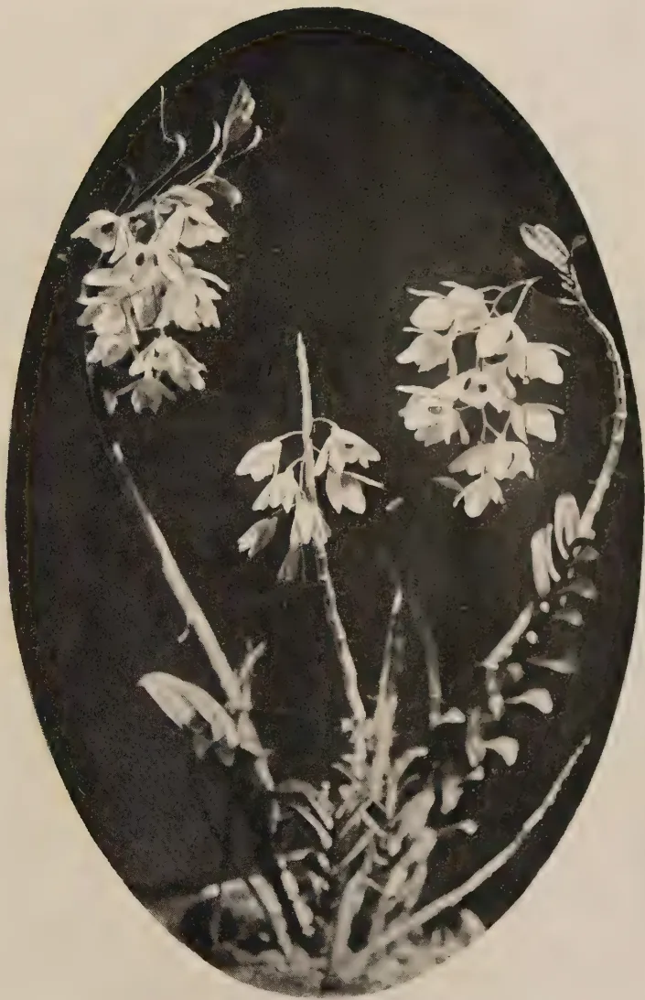

# The Tropical Agriculturist

July, 1935

---

## EDITORIAL

---

### WATER CONSERVATION

---

**T**HE failure of water supplies in times of drought does not, unfortunately, always receive that attention that it deserves, the return of climatological conditions to the normal expected course is usually more certain than the continuation of an abnormally dry season. This produces in the minds of those responsible a factor of satisfaction that if they can only but get through a present difficulty it is not likely to happen again for a long time. This mental complacency however is not justifiable when the welfare of a large number is concerned as is the case in a water shortage such as is now being experienced in several parts of Ceylon. Failure of water whether it be in our municipal pipes, our village tanks or from the sky above is a sufficiently dire situation in itself but is almost always accompanied by other related phenomena, whose relationship perhaps is obscure but none the less certain. The malaria epidemic among us and an unusual incidence of pests and diseases among our crops have been evidence of how interdependent upon one another are all the forces of nature and how a deviation in one throws the others out of gear.

90

1------------------------------------------------

2

Soil erosion, water conservation, epidemics, insect and other pest populations are all more closely related phenomena than is generally realised. One hears much about the unsatisfactory water supplies in our towns, yet our wells in the towns have been allowed to fall into neglect in happy forgetfulness of the fact that the City Fathers are liable to be just as neglectful in making provision for the unlikely and unusual event of a drought. In the villages one sees the same wanton disregard of water conservation. The destruction of forest on hill tops has often exposed large areas to loss of water by increasing evaporation from the soil. Catchment areas capable of collecting large quantities of water are often totally disregarded in districts perhaps requiring water. Fluctuations in the water table in a district or even on a single estate are frequently quite unobserved although such variations may have a profound bearing on the quality of a crop. Perennial rivers capable of giving municipal supplies are not sufficiently made use of quite apart from crop irrigation schemes. There are many matters concerning water conservation around us of which we are too neglectful and the present time shows us how unwise we are so to be.

2------------------------------------------------

3

## IMPROVED RUBBER SEEDS

DR. P. J. S. CRAMER,

FORMERLY DIRECTOR OF THE GENERAL EXPERIMENT  
STATION, BUITENZORG

IN a former article (see *The Tropical Agriculturist* — Vol. LXXXIV No. 6, June, 1935) we have explained, that with the present development on rubber estates of the improvement of planting material increased attention is being paid to seedlings, and that, if buddings of well-proved clones must be considered at present as the most certain material with a higher yield, seedlings of some classes may eventually prove still better, but this will only hold true for seedlings of clonal seeds. Shortly after finishing the article I came across a lecture by J. S. Vollema of the West Java Experiment Station, on "The latest advances in relation to Hevea selection on the West Java Experiment Station" (*Bergcultures*, 1935, p. 40), which entirely confirms our statement about the difference between the various classes of seedlings, and which gives some data on the degree of improvement of these classes. The figures may interest the reader. I will reproduce a few of the data here.

The lecturer began with some data on the well-known Java clones, mentioning also a new clone developed on the Experiment Station fields and confirming again, what he said in a former lecture, that clonal plantings, established according to the newest views, viz: monoclonal plantings, starting with a dense stand of 160-200 buddings per acre, afterwards reduced by selective thinning out to 90-100 trees in the 15th year of age, may be expected to yield crops, under favourable conditions, going up from an average of 440 lb. per acre in the 6th year to 1,760 lb. per acre in the 15th year. I quite agree with this view of Mr. Vollema. After these introductory remarks Mr. Vollema discusses the value of seedlings. He divides them into several classes:

A. Seeds from fields, in which the poorer yielders have been removed by selective thinning-out.

3------------------------------------------------

4

B. Mother tree seeds, seeds from trees excelling by their high yields, in ordinary plantings. As the seeds have been generally formed after open pollination, apart from a certain percentage due to self-pollination, the largest part has an unknown father, which can be just as likely a good, as a poor yielder.

C. Clonal seeds, taken from buddings from one high-yielding clone. If this clone is, however, mixed with ordinary seedlings, for instance if the buddings are scattered in a common planting, the seeds of the clone have the same value as mother tree seeds. If, however, the clone is mixed with other clones the seeds represent a higher value, as the father or fathers, (although they are unlocated) are certainly also high-yielding trees. Seeds of buddings in the centre of a large monoclonal block may be considered as "legitimate" seeds (this term is used in Java to indicate seeds of controlled pollination — in this case self-pollination).

D. Legitimate seeds, for which mother and father are known. These seeds are obtained by artificial pollination — or, from seed producing fields, where there is a mixture of not more than two clones.

We will follow the data which the lecturer cited but at the same time point out some details, with which we do not agree. To mention one: in the case of seeds of the D. class one is never sure, if the seeds are autofecundated or formed by cross-pollination. For instance in the very interesting experiments of the AVROS Station about which in late years reports have been issued, seeds of AVROS 49 are described as "partly autofecundated, partly cross-pollinated with clone 33".

Mr. Vollema at first discusses the seeds mentioned under class A. For many years selective thinning-out has been practised in Java and practically all the seeds, collected in the newer plantings, are of this class; these are what are called, "broom swept seeds". Such seeds be it noted have already passed through a primitive selection as indicated. Several writers have drawn the attention to the fact, that the newer plantations in Java yield better than the older ones, probably for this reason. A case is cited in which a field planted with "broom swept seeds" gave in its 11th year nearly 660 lb. per acre,

4------------------------------------------------

5

For fields planted with Mother Tree Seeds (class B) Dr. Tengwall has calculated from extensive statistical data, that an improvement was obtained of at least 30 per cent. excess crop. Of course this figure depends on the care with which the choice of the mother trees has been carried out, and of the limits which have been put to these mother trees; the more severe the selection has been the better the quality of the offspring will be. Cases are mentioned of fields, where trees grown from mother tree seeds increased the yield from 3 kg. per tree (9th year) to 6 kg. (15th year), and of a planting established with mother tree seeds, which gave in its 11th year 968 lb. per acre.

The lecturer came then to the C. class, where still higher figures are found. A replanted area, of about 18 acres, established with seeds of mixed clones, gave at an age of 5 years 431 lb. per acre, certainly double the crop of ordinary seedlings.

As examples of the D. class, (so-called legitimate seed), Mr. Vollema cites the well-known AVROS crossings made by Heusser in the AVROS Station fields; the best families are equal in productivity to good medium clones. Dr. Schweizer of the Besoeki Experiment Station has obtained similar results. The Experiment Station for Rubber (now absorbed into the West Java Experiment Station) had already started in 1927 with artificial crossings and continued this work till 1931. In its experiment field Tjiomas there are now three sets of 50 "families" each corresponding to a certain crossing of two parent trees. The oldest of these families, 7 in number, were planted out in the beginning of 1929, the number of trees per family varies from 2 to 157. This field was put into tapping in 1933, its 5th year. The families A and G with 83 and 23 tapped trees, showed an average tree yield of 3.96 lb. and 4.18 lb. and are thus at the same level as buddings of first rate clones of this age; T.R. 1 in the same place and planted the same year, gave, at 5 years old, 4.9 lb., T.R. 16, 4.6 lb. The variability of the seedlings is, of course, much larger. Family A gave a coefficient of variability of 36 per cent., G, 38 per cent., which means that, after discarding the extremes, the best tree gives nearly five times the yield of the poorest ones; the figures are comparable with those found by Heusser for the first tapping year. For clones the variability coefficient has been found to oscillate around 20 per cent. which means that after discarding the extremes the best trees give  $2\frac{1}{3}$  times the yield of the poorest ones.

5------------------------------------------------

6

What may we now expect from our seedlings, after these first results of the West Java crossings? Mr. Vollema thinks, that in view of the yields of the various classes of seedlings and clones in large commercial plantings, we may expect, that the yields of the commercial plantings, established with seedlings of the new crossings will be at least as high as of our clones. Probably they will even surpass these in yield, as with dense planting and selective thinning-out the yields of seedling plantings can be more improved than monoclonal plantings, as the seedlings are variable.

Mr. Vollema recommends that seed producing fields of the West Java crossings should be established with the aim of disposing as soon as possible of this superior seed.

He considers it the best policy to lay out a seed producing field with the 5 clones, which have served as parents for the families of the 1929 plantings and to plant these clones in a rather dense planting, preferably in a quincunx arrangement and systematically mixed.

During the years of growing these seed producing trees further results of the families in the experiment garden will be known, so that it will be possible to base a selective thinning-out on these results and to keep the best combination.

This recommendation seems logical, if it is advisable to use for our seed producing fields mixture of clones. But is this advisable? I do not think so. As Mr. Vollema himself states the seeds from the centre of a block of monoclonal planting are self-pollinated. That means that if we use them for a test planting, we are sure that we will always have the same seeds at our disposal, which the same intrinsic value, the same variations, the same characters, good and bad.

If we take seeds from a mixture of clones, even if only two clones, we have not this same guarantee, even if we only take seeds of one of the components, which is already from a practical point of view a much more difficult thing than collecting seeds from the centre of a monoclonal block. But what I think is an essential difference between the two kinds of seeds, is the fact, that even if we only pick seeds from one clone in a biclonal planting we never know which percentage are self-pollinated, and which have been fecundated by the pollen of the other component.

6------------------------------------------------

7

We may use a quantity of seeds for a test planting and find out, when we use seeds from the same plot again, guided by the results of the first test planting, that the later picked seeds give entirely different results. If the mixing of clones comprises 3 or 4 this is still more the case.

It is curious to note, that in the Netherlands Indies, in Java as well as Sumatra, the Experiment Stations have always gone in for establishing seed producing fields composed of pairs — or even of several different clones. Why they should be preferred to pure monoclonal plantings I do not understand. It would be a service to our industry, if Mr. Vollema could explain why. I attach special value to his opinion on this point, because he was the first, I think, in the Netherlands Indies to take a frank, clear-cut position on the question of polyclonal versus monoclonal plantings for commercial plantings in a lecture delivered (I cite from memory) about  $1\frac{1}{2}$  years ago. It is true, that opinions had already changed then somewhat from the standpoint, taken by the Experiment Stations in the Netherlands Indies before 1930, where mixing of clones for commercial planting was recommended by them, but I think the advisability of monoclonal planting had not before been so clearly pointed out in Java.

Monoclonal planting was started in the beginning of 1928 in Malaya, in 1929 in Indo-China; and in these rubber-producing countries now blocks of hundreds, sometimes thousands of acres of one clone — in one solid block — are starting to produce seeds. Even in Ceylon I know of places, where blocks of several tens of acres have been planted with one single clone.

In my opinion the road to further improvement of Hevea starts from these blocks. We can take large quantities, I mean in the best cases millions of seeds, from them and plant them out for each clone apart. In our experiments in Malaya and Indo-China we subject them to a first selection when the plants are about a year old. We keep only the well-growing plants giving a good flow of latex. The yield figures of these plots will direct our further choice, when — especially for replanting — new plantings with improved seeds will have to be made, and, at the same time we try to take from our best yielding seedlings budwood for developing new clones, new seed producing trees — for we must go further, improve again on the improvements obtained.

7------------------------------------------------

8

I want to add one word more on the way we should make our choice. We must not only take into account yield figures, but full attention should be paid to secondary characters — just as it should also be done with clones — from the very beginning. I see that Mr. Vollema now rejects AVROS 71 for commercial planting because its secondary characters are unsatisfactory. I may claim, that we have never taken this clone into our planting programmes from 1928 on for this reason. I believe that AVROS 71 and 256 (with insufficient increase in yield) were already excluded from planting programmes years ago in Malaya and Indo-China.

So with seedling selection a careful choice should be made of the mother tree used for seed production. Are the secondary characters hereditary? Perhaps not always, but if you have seen the crossed seedlings in Dr. Heusser's Experiment Garden, or better still, laid out in nurseries, pure self-fecundated seeds of a clone like AVROS 152, you will agree that the whole habit of the mother is often repeated by the seedlings. That must make one very careful about including for instance in the mother trees for seed production such a type as Tjirandji 1, with its attractive extremely high yield, — but less satisfactory secondary characters. There is possibility that we can bring the yield up by thinning out from the nursery, but very little can be done to improve — or to correct — faults in the secondary characters.

If we want to apply drastic selective thinning-out we must have large quantities of seeds, at a low cost. Seeds of monoclonal plantings do not cost more than the expense for having them swept together and carried to the germinating beds. A field of 40 acres AVROS 50, established in 1930, is now represented in last year's nursery on Carey Island by 100,000 plants. Let me say at once that I cite this clone for this figure of seedlings, not as a desirable clone for use as a mother tree for commercial seedling plantings. What I want to explain is that with millions of seeds from monoclonal plantings at our disposal we can afford, as we did in clonal seedling test plantings, to thin out our young plants to one out of every 25-30; that means only keeping 3 or 4 per cent. of the number of seeds laid out; and

8------------------------------------------------

9

then to keep a stand of nearly 200 to the acre to allow further selective thinning-out, when the trees are three years old and can be submitted — following the clever system designed by Mr. Mann of the Rubber Research Institute in Malaya — to a first normal tapping, on which results such thinnings can be based.

I have somewhat extensively explained what I consider the direction our selection work should take. It would be interesting to hear what Mr. Vollema thinks of it. Of course, with our present knowledge various ways of looking at the problem are admitted — and I would make this concluding remark — if my views differ from his on this subject, this does not make me blind to the valuable data which this able worker is contributing to our knowledge.

---

#### CORRECTION NOTE

---

In Dr. Cramer's previous paper on "The Area Under Budded Rubber in the Netherlands East Indies" published in the June 1935 number of *The Tropical Agriculturist*, pp. 314 to 320, all figures for areas in the tables and in the text should read with the decimal point deleted and a comma inserted in its place. e.g., in the table on page 317 first line Buddings, Seedlings and totals in hectares in Java should read as 35,825; 195,959 and 231,784 instead of 35.825; 195.959 and 231.784 respectively.

9------------------------------------------------

10

## THE CULTIVATION AND CURING OF CIGARETTE TOBACCO

EMIL J. LIVERA, B.SC. (LOND.), B.SC. (AGRIC.),  
C.D.A. (WYE),  
DIVISIONAL AGRICULTURAL OFFICER, NORTH-WESTERN

### HISTORY

IN December, 1929, the writer assumed charge of the North-Western Division and found in his control a Tobacco Research Station at Ganewatte with only a temporary bungalow and over fifty acres of land, only ten of which had been cleared but allowed to go back to jungle. It was decided that in the first year (1931) of tobacco cultivation fertiliser trials should be conducted with the local chewing variety of tobacco. The crop did not show any appreciable difference in response to the different treatments of fertiliser as the land was freshly burnt high jungle. An attempt to sell the crop disclosed the existence of a ring of buyers which every year controlled the price of chewing tobacco. It was also noticed that among other factors the prices of the major crops influenced the price which could be expected for chewing tobacco, an indication that the local chewing tobacco did not have a market outside Ceylon.

Attention was, therefore, directed towards the selection of a variety of tobacco which while having other uses would also not be confined to a limited market. In the Maha season 1932-33 trials were made with a number of other varieties of tobacco including White Burley and Harrison's Special. The latter showed signs of being a suitable tobacco for local conditions of soil and climate. Difficulty was, however, experienced in curing it for use as cigarette tobacco although a fair sample was obtained by the use of a makeshift curing barn which was heated by a discarded tea drier.

In Maha 1933-34 a larger area was planted with Harrison's Special Tobacco and the Ceylon Tobacco Co. lent the services of an expert from America to demonstrate to several officers of the Agricultural Department the curing of Harrison's Special tobacco in the makeshift barn referred to above. With the

10------------------------------------------------

11

experience gained therefrom a quantity of tobacco was cured at Wariyapola in an experimental flue-curing barn of iron framework covered with asbestos sheeting and heated by a furnace specially constructed for the purpose.

The tobacco cured here was pronounced suitable for cigarettes. In Maha 1934-35 planting was considerably delayed owing to the drought and much of the crop was spoilt by unseasonable rains which fell at the time the crop was harvested. The crop which was cured before the rains was pronounced to be superior to that turned out the previous year.

#### **ADVANTAGES OF CIGARETTE TOBACCO**

As already stated cigarette tobacco as it caters for a wider range of customers will not be dependent on local factors for its price. A duty ranging from Rs. 2.00 to Rs. 2.50 per pound is levied on all unmanufactured tobacco imported into Ceylon and over a million pounds are imported annually. Thus there is a local market for cigarette tobacco if it can be produced apart from the opportunities of export.

In 1934 nearly all growers of chewing tobacco have been left with the produce on their hands for want of a market which is at present restricted to the Jaffna cigar manufacturer who only buys the "sand" leaves and that at about 10 cents per 1,000 leaves.

#### **TOBACCO IN THE NORTH-WESTERN PROVINCE**

Tobacco cultivation in the North-Western Province is confined to the Hiriyala Hat Pattu of the Kurunegala district, Kalpitiya Division in the Puttalam District and a group of villages in Pitigal Korale South in the Chilaw District. Only chewing tobacco is grown and because of the restricted market the returns are poor although this was at one time a very remunerative crop in this province.

#### **TYPE OF TOBACCO**

According to such qualities as colour, flavour, aroma and body or other characteristics produced by the method of curing tobacco is grouped into types. Types are sub-divided according to the use of the tobacco into classes.

The chief known types of tobacco are Cigar, Virginian and Turkish. The latter is classed as a cigarette tobacco owing to its being used exclusively for that purpose. Filler, binder and

11------------------------------------------------

12

wrapper are the three classes of cigar tobacco. Cigarettes, chewing, pipe-mixtures and snuff are the four classes of Virginian tobacco.

The reference cigarette tobacco, in this article applies exclusively to a Virginian type — viz: Harrison's Special tobacco.

Harrison's Special tobacco may, perhaps, with appropriate treatment be used for other purposes.

### QUALITY

For the manufacture of cigarettes tobacco must be of specific quality as determined by the association of such properties as size of leaf, texture, colour, aroma, flavour, body, combustibility and nicotine content. Soil and climate during the growth, cultural treatment and methods of curing are the chief factors which influence quality. One must not presume that just because Harrison's Special tobacco can be grown it will necessarily yield a tobacco suitable for the manufacture of cigarettes. Suitable soil and climate and the correct method of cultivation are essential.

### CLIMATE

For the production of the best quality of cigarette tobacco a moderate rainfall is needed. The rain should be evenly distributed right throughout the growing period of the crop while during the ripening period lighter showers should prevail. Heavy downpours followed by dry periods produce a poor quality of leaf and gentle showers are best. Heavy rains at harvest spoil the quality of the leaf which becomes thin, lacks body and has coarse midribs.

Plenty of sunshine during growth is also necessary. For transplanting dull days with frequent showers are ideal as under such conditions the transplant establish themselves quickly. A period of sunshine thereafter helps the rapid growth of the plants.

### SOIL

Provided the climate is suitable tobacco will grow in any well-drained soil. Cigarette tobacco can be profitably grown only on light loams. The best cigarette tobacco in the United States of America is grown on soils having about 75 per cent. of sand and only about 5 per cent. of clay. The texture of the soil also greatly influences the quality and quantity

12------------------------------------------------

13

of tobacco produced. Sandy soils of fine texture are ideal and such when correctly handled can be expected to yield a large quantity of leaf of a light uniform colour with good body, elasticity and silkiness. Coarse sandy soils need heavy manuring as otherwise the leaf will be of a chaffy, indifferent quality, light in colour and body and wanting in elasticity.

The sub-soil also influences the yield and quality of tobacco. A sufficiently open sub-soil which allows for drainage is best. In an excessively porous sub-soil the crop is adversely affected in time of drought and fertilisers are easily leached through in wet weather. A sub-soil in which the proportions of sand and clay are about equal is ideal, in that it allows for proper drainage and retains sufficient moisture.

### SEASON

So far Harrison's Special tobacco has only been grown in the Maha season during the months of October-November although the local chewing tobacco is grown in the Yala season from March till June. Trials are being made this year with a Yala crop at Ganewatte.

Planting out should be so arranged that harvesting can be done in dry weather. If the whole area is planted out within one month the entire curing could be completed before the next spell of wet weather. Two or three weeks of dry weather and continuous sunshine during the ripening stages of the crop are indispensable for the production of tobacco of the right quality.

### ROTATION

A number of considerations should decide the rotation of crops to be followed in tobacco land. The possibilities of a market for the crops so grown will undoubtedly largely determine the rotation.

A proper supply of decomposed organic matter must be maintained in the soil if good yields are looked for. On the very light sandy soils of Wariapola, sunn hemp has been used with advantage. Cowpea was used at Ganewatte but had to be eliminated from the rotation because it encouraged eelworm.

13------------------------------------------------

14

The rotation now followed at Wariyapola is:

Maize in Maha

Green manure crop in Yala

Tobacco in Maha

Green manure crop in Yala

Maize in Maha.

### SEED SELECTION

The tobacco plant has a natural tendency to variation and is also very susceptible to changes of soil and climate. Rigid seed selection should, therefore, be practised if deterioration from locally grown seed is to be avoided. Cross-pollination between dissimilar plants of the same variety should also be avoided. Tobacco of great uniformity and high quality can be obtained from seed secured by selection and correct handling from plants of outstanding merit.

Selection should be made from plants showing trueness to the varietal type and best response to the peculiarities of soil and climate prevailing in the locality. For cigarettes, select seed from plants with leaves fine in texture, thin, with small midribs and fine veins and lightness in body. Plants with a large number of leaves of normal size are best while the leaves themselves should have an erect habit of growth with little or no tendency to droop. Plants with leaves which take on a greenish-yellow colour as they ripen should be selected.

After the parent plant has been selected remove all the top leaves and sucker branches leaving only three or four terminal flower branches for maturing seed. The number of leaves left on the seed plant is about the same as the number left when the main crop is topped. The flower head after it had been prepared for bagging resembles a crow's foot.

Even though only one variety of tobacco is grown bagging the flower-head is desirable because selected tobacco plants when self-fertilised have a prepotency in reproducing plants of similar habit and uniformity is a very desirable characteristic in flue-curing. A paper bag should be inserted over the flower-head and tied loosely round the stem of the plant with soft string. The bag should be removed every week and the flower-head examined. Any surplus flower branches and suckers which may have grown in the interval should be cut off and the petals of the

14------------------------------------------------

15

selected flowers removed as they dry. The bag should also be raised from time to time to allow the elongation of the flower stalks. When about seventy-five capsules have formed the bag is removed and all the remaining flowers are cut off. Even after the bag is removed flowers and buds may develop and these should be removed. As they approach maturity some tobacco plants deviate from the type that it is desired to select. Twice as many plants should therefore be selected for seed purposes as will ultimately be required. Each plant should give about one ounce of seed.

When the pods are brown the seed-heads should be severed from the parent plant and left to dry thoroughly with the pods pointing upwards in a cool dry place. Seed is then taken only from the pulp pods by nipping off the tips. The seed should be winnowed before being stored in an airtight glass bottle.

As only heavy well-developed seed should be used for sowing it is passed through a tobacco seed-grader to separate the light seed.

### NURSERIES

To obtain a sufficient supply of strong healthy tobacco seedlings seed should be maintained in a high degree of fertility with an abundance of available plant food at the time the seeds germinate, together with an adequate reserve to ensure the steady growth of seedlings.

The site selected for seed beds should be near a permanent supply of water and free from too much shade from large trees. An eastern exposure which will give the plants the sunlight of early morning is desirable. The same site should be used for seed-beds owing to liability to pest and disease.

A sandy loam with good natural drainage is the most suitable soil for seed-beds. If the soil is too light a few cart-loads of anthill earth may be spread over and thoroughly mixed with the soil.

The site should be levelled and a liberal application of old well-rotted cattle manure dug in, some time before the final preparation of the seed beds so that the manure may be converted into humus before the seed is sown. The site should be kept free of weeds during this interval. The site is eventually lined off into beds with drains between the beds to serve as pathways.

15------------------------------------------------

16

Open drains should also be cut around the four sides of the site. The beds may be of any desired length but the width should permit weeding and the removal of seedlings from either side without damage to those left behind.

Before sowing the beds are sterilised by burning brushwood and such material as coconut husks or old cadjans placed in sufficient quantities to sterilise the soil to a depth of about three inches. When properly sterilised the soil is friable, easily pulverised and has a light dull red colour.

After the beds have cooled all large pieces of charcoal and unburnt bits of husks, etc., are removed and a mixture made up of 1 lb. of superphosphate,  $\frac{1}{2}$  lb. of nitrate of soda and  $\frac{1}{2}$  lb. of sulphate of potash spread over every 20 square yards of seed bed. The surface soil is then thoroughly mixed with the fertiliser and ash by digging over and care taken not to bring the unsterilised soil to the surface. The seed beds are next reduced to a fine tilth and their surface levelled. The seed beds are enclosed with boards of bricks before sowing and roofed over with movable cadjans supported on a framework of sticks driven into the ground and tied together. These roofs should be high enough to permit of the watering, weeding and spraying being conveniently carried out.

One ounce of properly cleaned seed is sufficient for sowing 100 square yards of seed bed which should supply enough transplants for five acres of field. To ensure even distribution the seed is thoroughly mixed with sand one teaspoonful of seed being used for every quart of sand. After sowing gently press the seed into the soil and water the beds with a can fitted with a finely perforated rose. Watering should be done every day and the beds kept moist but not wet. When hardening off is begun before transplanting less water is given to the seed beds. According to the area to be transplanted and the size of the flue-barn two or three seed beds should be sown at intervals of about two weeks. Seed beds should be kept covered at night with light muslin. Cheap crepe cloth has been found very useful for this purpose. The same cloth has been used for three years. The covering must be thorough so that the seed beds are absolutely insect-proof. The beds should also be kept free from all weeds.

16------------------------------------------------

17

Seed beds should as a precaution against pest and disease be sprayed once a week with arsenate of lead 1 lb. to 30 gallons of water and with a suitable copper or sulphur spraying solution.

The cadjan roof over the bed should be kept on all day during the early stages of growth of the seedlings. Later the roof is removed for a short time each morning to give the seedlings more sunlight. The period of exposure to the sunlight is gradually increased till the desired age for transplanting the roof is kept off all day. This procedure is known as the hardening off the plants. Care should, however, be taken if there is any likelihood of rain as heavy showers will wash away the seedlings. Just before removing seedlings soak the seed bed thoroughly with water so that the plants can be lifted easily without being damaged. After removing all suitable seedlings water the beds again to firm the soil round the roots of the plants still left behind.

#### PREPARATION OF LAND FOR PLANTING

Land which is to carry tobacco should be in good heart and high fertility if the transplants are to strike root easily and to continue to grow uniformly and rapidly. For this purpose the land should be ploughed, cross-ploughed and disc-harrowed, allowing a sufficient interval between the successive operations for the decomposition of any green matter ploughed in and for the aeration and weathering of the soil. The interval allowed will depend on such considerations as the quantity and nature of green matter turned in, the rainfall at the time the land is ploughed up and the amount of sunshine the land receives. Any weeds which may spring up in the intervals should be destroyed while still young by occasional harrowings.

Just before transplanting the land should be levelled and drains opened according to the slope of the land. The number and depth of drains will depend on the rainfall but drains about six inches deep and one foot wide on four sides of every tenth of an acre ought to be sufficient.

By the use of a hand marker the land is next pegged out so that the plants are put 3 feet by 3 feet apart. A complete fertiliser mixture containing:

<table>
<tr>
<td>3</td>
<td>per cent.</td>
<td>available Nitrogen.</td>
</tr>
<tr>
<td>5</td>
<td>“</td>
<td>“ Potash</td>
</tr>
<tr>
<td>8</td>
<td>“</td>
<td>“ Phosphate</td>
</tr>
</table>

17------------------------------------------------

18

is applied three or four days before the transplanting. A large teaspoonful of this fertiliser may be used at the spots where the transplants are to be put in and the fertiliser well mixed with the soil.

### TRANSPLANTING

When the seedlings are from 6-8 weeks old they are ready to be put out in the field. They should be about six inches high by then. The root when bent about  $\frac{1}{2}$  inch from the tip should snap in plants suitable for transplanting.

Thoroughly soak the seed-bed before removing the seedlings for transplanting so that they will come off easily. Select only short stocky seedlings and remove only as many seedlings as could be transplanted in one evening. The seedlings should be carried to the field in a shallow basket. Evenings are best for transplanting.

Make a hole with a short pointed peg, put the plant in taking care to cover all the roots, firm the soil round the plant, water liberally and cover with coconut husk. Do not use husks which were used the previous season. The husks should completely shade the seedlings for three days and if there is no rain the plants should be watered morning and evening. After the third day the husk may be opened about three inches and entirely removed after about two weeks. All vacancies should be supplied as soon as possible after the third day and within a week of the transplanting of the field. It is very essential that as uniform a stand crop as possible be secured so that at harvest uniform barn loads may be obtained. Watering should be continued according to the weather. If dry weather prevails water once a day after the plants have established themselves. This is about ten days after transplanting. When the crop has been in the field for about 3 weeks the watering should be gradually reduced to once in two and later once in three days or less frequent intervals according to the rainfall at the time.

### INTERCULTIVATION

Intercultivation should be begun as soon as the plants have established themselves in the field. This operation serves to destroy annual weeds which may spring up with the rains and to maintain a loose mulch over the surface which readily admits any rain that may fall, prevents drying of the rooting layers of soil, allows the movement of air into and out of the soil and

18------------------------------------------------

19

encourages the deeper rooting of plants all of which make for a better stand and growth of crop.

The first cultivation should be shallow and care should be taken to avoid disturbing the new roots. Later cultivation may go deeper. The number and frequency of cultivations will depend on the rainfall, the state of the soil and presence of weeds. All cultivation should be stopped when the crop is ready to be topped.

### PRIMING

Priming consists in the removal of small leaves at the bottom of the plants. These "sand" leaves are usually of little value and their removal helps the more rapid growth of the plant by allowing a free current of air to circulate at the base of the plant. Priming is also a check against the spread of "frog-eye" in the field. Priming is best done when the crop is about  $1\frac{1}{2}$  feet high when the lowest three leaves should be removed. These leaves are best destroyed by burning. A second priming should be carried out just before topping.

### TOPPING

Topping is the removing of the terminal bud which if allowed to remain would grow on to produce the flowers and later the seed capsules. Where to top and when to top are matters for judgment and experience. If the growth of the plant and development of leaves are poor top low at a height at which the leaves are about the same breadth as normally developed leaves. If the plant tends to grow coarse and rank do not top at all or if growth is not too coarse topping may be done but suckering is not carried out. In average conditions leave about ten to twelve leaves when topping. Topping should be done while the stem of the plant is still soft and juicy and should never be delayed till the flower heads develop. As all the plants do not develop their buds at the same time topping may have to be done several times in the same field.

### SUCKERING

Suckering consists in removing the young shoots which appear in the axils of the leaves about ten days after the plants have been topped. The crop has to be suckered about three times before harvest. If, however, a period of wet weather comes on about harvest time the suckers should be allowed to grow temporarily.

19------------------------------------------------

20

## RIPENING

Ripening occurs from below upwards. In dry weather the lowest leaves should start ripening about two weeks after the crop has been topped. Ripening is indicated by a change in the colour and texture of the leaf. The leaf changes in colour from a deep green to a greenish yellow and in texture from soft and flexible to rough and brittle. The flue-curing tobacco must be fully ripe before it is harvested for if harvested earlier the leaf retains the green colour after it is cured. If on the other hand the leaf is over-ripe at harvest the cured leaf has an uneven colour and lacks elasticity and fineness. The stage of ripeness at harvest is therefore of extreme importance in flue-curing.

## HARVESTING

For flue-curing tobacco it is essential that all the leaf should be in the same stage of ripeness as otherwise all the leaf will not yellow at the same time in the flue barn. Three to five pickings are necessary for the complete harvest of a field of tobacco. Harvesting should be done in the morning while the leaves are still wet with dew. Every effort should be made to complete harvesting before the sun becomes too strong because the eyes of the labourers soon get tired and they are unable to distinguish colours correctly. The leaves are removed from the plant as they ripen, placed in shallow baskets and carried to the shed where they are strung together for hanging in the flue barn. The bottom and middle leaves are the most valuable and great care must be taken with these. The leaf should not be allowed to lie about in the sun and get sun scorched. Bruising should also be avoided.

## STRINGING THE LEAF

The leaf is now strung on to sticks or hanging in the curing barn. In the stringing shed the leaf is arranged in small heaps with the butts all in one direction. In stringing portable frames are used for supporting horizontally the sticks on to which the leaves are tied. Three or four leaves depending on their size, are held together with the backs of their midribs touching one another and the string which is tied at one end to the stick is drawn round the bunch about an inch from the butts, and the bunch thrown over across the stick. The next bunch of leaves is tied on the opposite side of the stick so that the successive bunches are on alternate sides.

Each stick is about 4 feet 6 inches long and should carry about 28-30 bunches of leaves. As soon as the stringing is completed the sticks should be arranged in the flue barn about 8 inches from one another.

*(To be continued).*

20------------------------------------------------

21

## STUDIES ON CEYLON SOILS

### IV.—THE LIGHT SANDY SOILS AND THE RED DRY ZONE AND SEMI-HUMID SOILS

A. W. R. JOACHIM, PH.D.,

DIP. AGRIC. (CANTAB.),

(AGRICULTURAL CHEMIST)

AND

D. G. PANDITTESEKERE, DIP. AGRIC. (POONA),

(ASSISTANT IN AGRICULTURAL CHEMISTRY)

**I**N this paper typical profiles of the light sandy soils of the coconut districts of the Island and the red and yellowish-red soils of the dry and semi-humid zones will be described.

#### LIGHT SANDY SOIL PROFILE

<table>
<tr>
<td>Location</td>
<td>...</td>
<td>Wariapola Experiment Station.</td>
</tr>
<tr>
<td>Elevation</td>
<td>...</td>
<td>300 ft. (approx.)</td>
</tr>
<tr>
<td>Climate</td>
<td>...</td>
<td>Rainfall 70 in.; temperature 80°F. (approx.).</td>
</tr>
<tr>
<td>Geological origin</td>
<td>...</td>
<td>Acid igneous rocks mainly granite and granulites.</td>
</tr>
<tr>
<td>Mode of formation</td>
<td>...</td>
<td>Residual.</td>
</tr>
<tr>
<td>Drainage</td>
<td>...</td>
<td>Imperfect.</td>
</tr>
<tr>
<td>Topographic position</td>
<td>...</td>
<td>Level, sample taken from middle of very gentle slope.</td>
</tr>
<tr>
<td>Vegetation</td>
<td>...</td>
<td>Coconuts and annual crops.</td>
</tr>
</table>

#### PROFILE

A1. 0-31 in. Light grey sand; granular to small cloddy; fairly hard when dry but friable; porous; no concretions; roots abundant; acid; horizon boundary indistinct.

A2. 31-45 in. Light grey sand with large proportion of quartz gravel; fairly hard but friable; porous; root development fair; very faintly acid; horizon boundary distinct.

21------------------------------------------------

22

B. 45 50 in. Yellowish-grey layer of quartz stone and boulders; partially decomposed; soil absent; conglomerate; fairly loose; no roots present; horizon boundary distinct.

C. 50 in. > 6 ft. Yellowish-white quartz gravel; cloddy; hard but friable; root growth meagre; neutral.

TABLE I*Mechanical Analysis*

<table border="1">
<thead>
<tr>
<th></th>
<th>A</th>
<th>A2</th>
<th>C</th>
</tr>
<tr>
<th></th>
<th>%</th>
<th>%</th>
<th>%</th>
</tr>
</thead>
<tbody>
<tr>
<td>Stones and gravel</td>
<td>1.0</td>
<td>22.3</td>
<td>26.1</td>
</tr>
<tr>
<td>Coarse sand</td>
<td>47.5</td>
<td>63.0</td>
<td>65.0</td>
</tr>
<tr>
<td>Fine sand</td>
<td>41.7</td>
<td>25.4</td>
<td>17.1</td>
</tr>
<tr>
<td>Silt</td>
<td>1.9</td>
<td>1.3</td>
<td>3.6</td>
</tr>
<tr>
<td>Clay</td>
<td>7.8</td>
<td>9.1</td>
<td>12.9</td>
</tr>
<tr>
<td>Loss by solution</td>
<td>0.5</td>
<td>0.5</td>
<td>0.5</td>
</tr>
<tr>
<td>Moisture</td>
<td>0.6</td>
<td>0.7</td>
<td>0.9</td>
</tr>
<tr>
<td>Texture index number</td>
<td>7.5</td>
<td>8.6</td>
<td>11.3</td>
</tr>
<tr>
<td>Soil type</td>
<td>Sand</td>
<td>Sand</td>
<td>Sandy soil</td>
</tr>
</tbody>
</table>

*Chemical Analysis*

<table border="1">
<tbody>
<tr>
<td>Loss on ignition</td>
<td>1.41</td>
<td>1.47</td>
<td>1.84</td>
</tr>
<tr>
<td>Organic matter</td>
<td>0.48</td>
<td>0.20</td>
<td>0.90</td>
</tr>
<tr>
<td>Combined water</td>
<td>0.49</td>
<td>1.27</td>
<td>0.94</td>
</tr>
<tr>
<td>Carbon</td>
<td>0.28</td>
<td>0.12</td>
<td>0.05</td>
</tr>
<tr>
<td>Nitrogen</td>
<td>0.080</td>
<td>0.064</td>
<td>0.040</td>
</tr>
<tr>
<td>Carbon/nitrogen ratio</td>
<td>3.53</td>
<td>1.82</td>
<td>1.30</td>
</tr>
<tr>
<td>Reaction</td>
<td>6.6</td>
<td>6.8</td>
<td>6.9</td>
</tr>
<tr>
<td>Total lime</td>
<td>0.101</td>
<td>0.108</td>
<td>0.108</td>
</tr>
<tr>
<td>Total potash</td>
<td>0.044</td>
<td>0.032</td>
<td>0.030</td>
</tr>
<tr>
<td>Total phosphoric acid</td>
<td>0.015</td>
<td>0.014</td>
<td>0.012</td>
</tr>
<tr>
<td>Total exchangeable bases (m.e. per 100 gm. soil)</td>
<td>3.46</td>
<td>3.87</td>
<td>5.02</td>
</tr>
<tr>
<td>Exchangeable calcium</td>
<td>3.08</td>
<td>3.80</td>
<td>4.11</td>
</tr>
</tbody>
</table>

*Clay Analysis*

<table border="1">
<tbody>
<tr>
<td>Loss on ignition</td>
<td>17.88</td>
<td>—</td>
<td>—</td>
</tr>
<tr>
<td>Silica (<math>\text{SiO}_2</math>)</td>
<td>53.60</td>
<td>—</td>
<td>—</td>
</tr>
<tr>
<td>Sesquioxides (<math>\text{R}_2\text{O}_3</math>)</td>
<td>43.88</td>
<td>—</td>
<td>—</td>
</tr>
<tr>
<td>Alumina (<math>\text{Al}_2\text{O}_3</math>)</td>
<td>38.93</td>
<td>—</td>
<td>—</td>
</tr>
<tr>
<td>Iron oxide (<math>\text{Fe}_2\text{O}_3</math>)</td>
<td>4.93</td>
<td>—</td>
<td>—</td>
</tr>
<tr>
<td><math>\text{SiO}_2/\text{Al}_2\text{O}_3</math> (molecular)</td>
<td>2.33</td>
<td>—</td>
<td>—</td>
</tr>
<tr>
<td><math>\text{SiO}_2/\text{R}_2\text{O}_3</math> „</td>
<td>2.16</td>
<td>—</td>
<td>—</td>
</tr>
<tr>
<td>Soil type</td>
<td>Non-lateritic</td>
<td>—</td>
<td>—</td>
</tr>
</tbody>
</table>

22------------------------------------------------

23

It will be noted that the soils are very light textured and that the clay content increases slightly with depth. The B layer is a fairly loose pan composed of partially decomposed rock material and quartz gravel. Drainage on this soil is therefore imperfect during the rainy season, and root growth is largely limited to the A horizons. The soils are extremely poor in organic matter and their nitrogen contents are also low though to a much smaller degree. The carbon/nitrogen ratios are therefore very low, varying from 1.3 to 3.5. In reaction the soils are faintly acid to neutral. The soils are very poor in mineral nutrients. Exchangeable bases are low, but comparatively high for soils of this nature. Calcium constitutes over 80 per cent. of these bases. The analysis of the clay fraction of the A1 layer reveals a low iron oxide, a fairly high alumina and a comparatively high silica content. The silica/alumina molecular ratio is 2.33, the soil being therefore of the non-lateritic type. Crop yields are poor on this type of soil.

#### RED SANDY SOIL PROFILE

<table>
<tr>
<td>Location</td>
<td>... Marawila, Chilaw district.</td>
</tr>
<tr>
<td>Elevation</td>
<td>... Less than 50 ft.</td>
</tr>
<tr>
<td>Climate</td>
<td>... Rainfall 65 in. (approx.); temperature 80°F. (approx.).</td>
</tr>
<tr>
<td>Geological origin</td>
<td>... Probably Pleistocene plateau deposits</td>
</tr>
<tr>
<td>Mode of formation</td>
<td>... Residual probably.</td>
</tr>
<tr>
<td>Drainage</td>
<td>... Good.</td>
</tr>
<tr>
<td>Topographic position</td>
<td>... Flat to very gently undulating.</td>
</tr>
<tr>
<td>Vegetation</td>
<td>... Coconuts.</td>
</tr>
</table>

#### PROFILE

A1. 0-6 in. Dark-brown sand; single grain; no concretions; loose; roots abundant; fairly acid; horizon boundary fairly distinct.

A2. 6-18 in. Brownish-red sandy soil; single grain; no concretions; loose; roots abundant; slightly acid; horizon boundary fairly distinct.

C. 18 in. > 4 ft. Terra-cotta red sandy soil; single grain; no concretions; loose; root development good; fairly acid to neutral.

23------------------------------------------------

24

TABLE II  
*Mechanical Analysis*

<table border="1">
<thead>
<tr>
<th></th>
<th>A1</th>
<th>A2</th>
<th>C</th>
</tr>
<tr>
<th></th>
<th>%</th>
<th>%</th>
<th>%</th>
</tr>
</thead>
<tbody>
<tr>
<td>Stones and gravel</td>
<td>nil</td>
<td>nil</td>
<td>nil</td>
</tr>
<tr>
<td>Coarse sand</td>
<td>66.9</td>
<td>58.8</td>
<td>71.4</td>
</tr>
<tr>
<td>Fine sand</td>
<td>24.9</td>
<td>28.2</td>
<td>11.6</td>
</tr>
<tr>
<td>Silt</td>
<td>2.3</td>
<td>1.7</td>
<td>3.1</td>
</tr>
<tr>
<td>Clay</td>
<td>5.2</td>
<td>10.6</td>
<td>13.1</td>
</tr>
<tr>
<td>Loss by solution</td>
<td>0.2</td>
<td>0.2</td>
<td>0.1</td>
</tr>
<tr>
<td>Moisture</td>
<td>0.5</td>
<td>0.5</td>
<td>0.7</td>
</tr>
<tr>
<td>Texture index number</td>
<td>5.0</td>
<td>10.0</td>
<td>12.3</td>
</tr>
<tr>
<td>Soil type</td>
<td>Sand</td>
<td>Sand</td>
<td>Sandy soil</td>
</tr>
</tbody>
</table>

*Chemical Analysis*

<table border="1">
<tbody>
<tr>
<td>Loss on ignition</td>
<td>1.45</td>
<td>1.55</td>
<td>2.1</td>
</tr>
<tr>
<td>Organic matter</td>
<td>0.72</td>
<td>0.60</td>
<td>0.38</td>
</tr>
<tr>
<td>Combined water</td>
<td>0.73</td>
<td>0.95</td>
<td>1.63</td>
</tr>
<tr>
<td>Carbon</td>
<td>0.42</td>
<td>0.35</td>
<td>0.22</td>
</tr>
<tr>
<td>Nitrogen</td>
<td>0.064</td>
<td>0.060</td>
<td>0.050</td>
</tr>
<tr>
<td>Carbon/nitrogen ratio</td>
<td>6.52</td>
<td>4.61</td>
<td>4.45</td>
</tr>
<tr>
<td>Reaction</td>
<td>6.5</td>
<td>6.7</td>
<td>6.8</td>
</tr>
<tr>
<td>Total lime</td>
<td>0.102</td>
<td>0.088</td>
<td>0.081</td>
</tr>
<tr>
<td>„ potash</td>
<td>0.062</td>
<td>0.060</td>
<td>0.037</td>
</tr>
<tr>
<td>„ phosphoric acid</td>
<td>0.041</td>
<td>0.044</td>
<td>0.037</td>
</tr>
<tr>
<td>Total exchangeable bases (m.e. per 100 gm. soil)</td>
<td>1.72</td>
<td>1.48</td>
<td>1.07</td>
</tr>
<tr>
<td>Exchangeable calcium</td>
<td>0.98</td>
<td>0.86</td>
<td>0.68</td>
</tr>
</tbody>
</table>

*Clay Analysis*

<table border="1">
<tbody>
<tr>
<td>Loss on ignition</td>
<td>18.65</td>
<td>16.13</td>
<td>—</td>
</tr>
<tr>
<td>Silica (<math>\text{SiO}_2</math>)</td>
<td>45.84</td>
<td>46.22</td>
<td>—</td>
</tr>
<tr>
<td>Sesquioxides (<math>\text{R}_2\text{O}_3</math>)</td>
<td>49.50</td>
<td>52.40</td>
<td>—</td>
</tr>
<tr>
<td>Alumina (<math>\text{Al}_2\text{O}_3</math>)</td>
<td>39.36</td>
<td>40.36</td>
<td>—</td>
</tr>
<tr>
<td>Iron oxide (<math>\text{Fe}_2\text{O}_3</math>)</td>
<td>11.14</td>
<td>12.04</td>
<td>—</td>
</tr>
<tr>
<td><math>\text{SiO}_2/\text{Al}_2\text{O}_3</math> (molecular)</td>
<td>2.02</td>
<td>1.94</td>
<td>—</td>
</tr>
<tr>
<td><math>\text{SiO}_2/\text{R}_2\text{O}_3</math> „</td>
<td>1.67</td>
<td>1.63</td>
<td>—</td>
</tr>
<tr>
<td>Soil type</td>
<td>Non-lateritic</td>
<td>Non-lateritic</td>
<td>—</td>
</tr>
</tbody>
</table>

An examination of this table will indicate that the soils are sands or sandy, the texture becoming slightly heavier with depth. The clay content varies from 5 to 13 per cent. There does not appear to be a B layer proper in this profile. The colour changes from dark-brown to red as the depth increases. The soils have very low hygroscopic and combined water contents. They are very poor in organic matter and also in nitrogen, though not to the same degree. The carbon/nitrogen ratios vary from 6.5 in the surface layer to 4.5 in the C horizon. In reaction they are just on the acid side of neutral, the acidity diminishing slightly

24------------------------------------------------

25

with depth. They are poor in total mineral plant food constituents and have extremely low exchangeable base contents. The percentage of calcium in the latter is only about 60. On the basis of the silica/alumina molecular ratio of the clay fractions (1) these soils would be classified as non-lateritic, the ratios being approximately 2 in the A layers. Though poor in fertilising constituents, these soils owing to their light texture and great depth, which extends to over 40 feet in many areas, are very suitable for coconut cultivation. To ensure good crop yields they do however require regular supplies of organic matter to assist in water retention, and systematic artificial manuring. Their origin is a matter of doubt. Either they are a residual product of the wind-borne red earth stratum of the Pleistocene plateau deposits as suggested by Wayland (2) or they are alluvial deposits from the hill-country. In either case they have been deprived of the finer soil particles they originally contained. Similar soils but of heavier texture and of more potential plant food value occur in the same region.

#### RED SEMI-HUMID FOREST SOIL PROFILE

<table>
<tr>
<td>Location</td>
<td>...</td>
<td>Sundapola Forest about 4 miles from Kurunegala.</td>
</tr>
<tr>
<td>Elevation</td>
<td>...</td>
<td>350-400 ft.</td>
</tr>
<tr>
<td>Climate</td>
<td>...</td>
<td>Rainfall 85 in. (approx.); temperature 80°F. (approx.).</td>
</tr>
<tr>
<td>Geological origin</td>
<td>...</td>
<td>Basic and intermediate gneisses.</td>
</tr>
<tr>
<td>Mode of formation</td>
<td>...</td>
<td>Residual.</td>
</tr>
<tr>
<td>Drainage</td>
<td>...</td>
<td>Good.</td>
</tr>
<tr>
<td>Topographic position</td>
<td>...</td>
<td>Slightly undulating; sample from lower end of gently sloping hillside.</td>
</tr>
<tr>
<td>Vegetation</td>
<td>...</td>
<td>Forest, jak, mahogany, teak, satin and <i>lunumidella</i>.</td>
</tr>
</table>

#### PROFILE

A1. 0-12 in. Yellowish-grey loam; upper 2 in. brownish black humic layer; coarse granular to nodular; some ferruginous and quartz gravel; compact when moist but friable; porous; roots abundant; acid; horizon boundary fairly distinct.

25------------------------------------------------

26

A2. 12-18 in. Reddish-grey brown compact loam; ferruginous quartz fairly abundant; irregular clod; hard when dry but friable; porous; root growth good; acid; horizon boundary not very distinct.

C. 18 in. > 4 ft. Reddish-yellow heavy loam with abundance of quartz and ferruginous gravel; fairly compact; porous; irregular clod; mottled yellowish red due to decomposing ferruginous concretions; roots rare, lateral roots absent; acid.

TABLE III*Mechanical Analysis*

<table border="1">
<thead>
<tr>
<th></th>
<th>A1</th>
<th>A2</th>
<th>C</th>
</tr>
<tr>
<th></th>
<th>%</th>
<th>%</th>
<th>%</th>
</tr>
</thead>
<tbody>
<tr>
<td>Stones and gravel</td>
<td>10.5</td>
<td>31.4</td>
<td>51.0</td>
</tr>
<tr>
<td>Coarse sand</td>
<td>49.4</td>
<td>49.8</td>
<td>51.7</td>
</tr>
<tr>
<td>Fine sand</td>
<td>17.3</td>
<td>17.7</td>
<td>8.0</td>
</tr>
<tr>
<td>Silt</td>
<td>4.7</td>
<td>4.8</td>
<td>5.5</td>
</tr>
<tr>
<td>Clay</td>
<td>20.4</td>
<td>20.7</td>
<td>32.4</td>
</tr>
<tr>
<td>Loss by solution</td>
<td>0.5</td>
<td>0.5</td>
<td>0.4</td>
</tr>
<tr>
<td>Moisture</td>
<td>7.7</td>
<td>6.5</td>
<td>2.0</td>
</tr>
<tr>
<td>Texture index number</td>
<td>19.0</td>
<td>19.2</td>
<td>29.9</td>
</tr>
<tr>
<td>Soil type</td>
<td>Loam</td>
<td>Loam</td>
<td>Heavy loam</td>
</tr>
</tbody>
</table>

*Chemical Analysis*

<table border="1">
<tbody>
<tr>
<td>Loss on ignition</td>
<td>5.17</td>
<td>4.69</td>
<td>5.34</td>
</tr>
<tr>
<td>Organic matter</td>
<td>1.82</td>
<td>1.23</td>
<td>0.42</td>
</tr>
<tr>
<td>Combined water</td>
<td>3.35</td>
<td>3.46</td>
<td>4.92</td>
</tr>
<tr>
<td>Carbon</td>
<td>1.06</td>
<td>0.71</td>
<td>0.24</td>
</tr>
<tr>
<td>Nitrogen</td>
<td>0.160</td>
<td>0.119</td>
<td>0.085</td>
</tr>
<tr>
<td>Carbon/nitrogen ratio</td>
<td>6.59</td>
<td>6.00</td>
<td>2.00</td>
</tr>
<tr>
<td>Reaction</td>
<td>5.6</td>
<td>5.8</td>
<td>6.2</td>
</tr>
<tr>
<td>Total lime</td>
<td>0.156</td>
<td>0.135</td>
<td>0.129</td>
</tr>
<tr>
<td>    "    potash</td>
<td>0.092</td>
<td>0.113</td>
<td>0.086</td>
</tr>
<tr>
<td>    "    phosphoric acid</td>
<td>0.047</td>
<td>0.049</td>
<td>0.044</td>
</tr>
<tr>
<td>Total exchangeable bases (m.e. per 100 gm. soil)</td>
<td>7.78</td>
<td>6.17</td>
<td>6.05</td>
</tr>
<tr>
<td>Exchangeable calcium</td>
<td>6.30</td>
<td>4.82</td>
<td>5.10</td>
</tr>
</tbody>
</table>

*Clay Analysis*

<table border="1">
<tbody>
<tr>
<td>Loss on ignition</td>
<td>21.40</td>
<td>—</td>
<td>—</td>
</tr>
<tr>
<td>Silica (<math>\text{SiO}_2</math>)</td>
<td>43.60</td>
<td>—</td>
<td>—</td>
</tr>
<tr>
<td>Sesquioxides (<math>\text{R}_2\text{O}_3</math>)</td>
<td>54.24</td>
<td>—</td>
<td>—</td>
</tr>
<tr>
<td>Alumina (<math>\text{Al}_2\text{O}_3</math>)</td>
<td>38.80</td>
<td>—</td>
<td>—</td>
</tr>
<tr>
<td>Iron oxide (<math>\text{Fe}_2\text{O}_3</math>)</td>
<td>15.44</td>
<td>—</td>
<td>—</td>
</tr>
<tr>
<td><math>\text{SiO}_2/\text{Al}_2\text{O}_3</math> (molecular)</td>
<td>1.90</td>
<td>—</td>
<td>—</td>
</tr>
<tr>
<td><math>\text{SiO}_2/\text{R}_2\text{O}_3</math> " "</td>
<td>1.52</td>
<td>—</td>
<td>—</td>
</tr>
<tr>
<td>Soil type</td>
<td colspan="3">Lateritic to non-lateritic</td>
</tr>
</tbody>
</table>

26------------------------------------------------

27

The Kurunegala forest soil is similar in many respects to the forest soils of the humid south-west low-country. The B horizon is absent. The A horizons are medium loams, while the C horizon is heavier in texture. There is all through this profile an abundance of quartz and ferruginous gravel which makes for good drainage. The gravel percentage increases appreciably with depth. The organic matter contents are low even in the A1 horizon, but the nitrogen contents are fair. The C layer is very deficient in carbon but has a fair reserve of nitrogen. Carbon/nitrogen ratios therefore vary from 6.6 in the A1 horizon to 2 in the C horizon. The soils are acid in reaction, the acidity diminishing slightly with depth. They are much below the average in total mineral nutrients, but the total exchangeable base contents are fairly high, being in fact the highest noted in local humid and semi-humid soils. Calcium is over 80 per cent. of these bases. The clay analysis of the A1 layer reveals a fairly high sesquioxide and a fairly low silica content. Iron oxide constitutes 15.4 per cent. of the clay fraction and alumina 38.8 per cent. The soil on Martin and Doynes' (1) criteria is just lateritic verging on the non-lateritic type. It answers in many particulars to Hardy's (3) tropical red loams. The soil appears to be well adapted for forest growth and a number of valuable forest species flourishes in the area.

#### DRY ZONE RED EARTH PROFILE

<table>
<tr>
<td>Location</td>
<td>...</td>
<td>Daladagama near Maho.</td>
</tr>
<tr>
<td>Elevation</td>
<td>...</td>
<td>300 ft. (approx.).</td>
</tr>
<tr>
<td>Climate</td>
<td>...</td>
<td>Rainfall 60 in.; temperature 81°F.</td>
</tr>
<tr>
<td>Geological origin</td>
<td>...</td>
<td>Basic and intermediate gneisses.</td>
</tr>
<tr>
<td>Mode of formation</td>
<td>...</td>
<td>Residual.</td>
</tr>
<tr>
<td>Drainage</td>
<td>...</td>
<td>Good.</td>
</tr>
<tr>
<td>Topographic position</td>
<td>...</td>
<td>Flat or very gently undulating; sample from low hillock.</td>
</tr>
<tr>
<td>Vegetation</td>
<td>...</td>
<td>Rotation crops.</td>
</tr>
</table>

#### PROFILE

A. 0-16 in. Brownish-red medium loam; much quartz and ferruginous gravel; irregular prismatic to clod; compact but friable; porous; root growth good; acid; horizon boundary fairly distinct.

27------------------------------------------------

28

C. 16 in. > 4 ft. Yellowish-red loam; ferruginous nodules and quartz gravel fairly abundant; whitish and reddish mottlings of decomposed feldspar and ironstone concretions; rock decomposition incomplete; irregular clod; hard but friable; porous; root growth fair; acid.

TABLE IV*Mechanical Analysis*

<table border="1">
<thead>
<tr>
<th></th>
<th>A</th>
<th>C</th>
</tr>
<tr>
<th></th>
<th>%</th>
<th>%</th>
</tr>
</thead>
<tbody>
<tr>
<td>Stones and gravel</td>
<td>30.3</td>
<td>11.6</td>
</tr>
<tr>
<td>Coarse sand</td>
<td>51.5</td>
<td>62.0</td>
</tr>
<tr>
<td>Fine sand</td>
<td>24.7</td>
<td>18.0</td>
</tr>
<tr>
<td>Silt</td>
<td>2.9</td>
<td>5.4</td>
</tr>
<tr>
<td>Clay</td>
<td>19.8</td>
<td>13.0</td>
</tr>
<tr>
<td>Loss by solution</td>
<td>0.1</td>
<td>0.1</td>
</tr>
<tr>
<td>Moisture</td>
<td>1.0</td>
<td>1.5</td>
</tr>
<tr>
<td>Texture index number</td>
<td>17.5</td>
<td>12.4</td>
</tr>
<tr>
<td>Soil type</td>
<td>Loam</td>
<td>Sandy soil</td>
</tr>
</tbody>
</table>

*Chemical Analysis*

<table border="1">
<tbody>
<tr>
<td>Loss on ignition</td>
<td>3.26</td>
<td>3.38</td>
</tr>
<tr>
<td>Organic matter</td>
<td>0.86</td>
<td>0.63</td>
</tr>
<tr>
<td>Combined water</td>
<td>2.40</td>
<td>2.75</td>
</tr>
<tr>
<td>Carbon</td>
<td>0.50</td>
<td>0.36</td>
</tr>
<tr>
<td>Nitrogen</td>
<td>0.107</td>
<td>0.071</td>
</tr>
<tr>
<td>Carbon/nitrogen ratio</td>
<td>4.59</td>
<td>5.13</td>
</tr>
<tr>
<td>Reaction</td>
<td>6.1</td>
<td>6.4</td>
</tr>
<tr>
<td>Total lime</td>
<td>0.149</td>
<td>0.155</td>
</tr>
<tr>
<td>    ,, potash</td>
<td>0.104</td>
<td>0.109</td>
</tr>
<tr>
<td>    ,, phosphoric acid</td>
<td>0.062</td>
<td>0.085</td>
</tr>
<tr>
<td>Total exchangeable bases (m.e. per 100 gm soil)</td>
<td>3.92</td>
<td>3.55</td>
</tr>
<tr>
<td>Exchangeable calcium</td>
<td>3.01</td>
<td>2.70</td>
</tr>
</tbody>
</table>

*Clay Analysis*

<table border="1">
<tbody>
<tr>
<td>Loss on ignition</td>
<td>18.40</td>
<td>—</td>
</tr>
<tr>
<td>Silica (<math>\text{SiO}_2</math>)</td>
<td>46.70</td>
<td>—</td>
</tr>
<tr>
<td>Sesquioxides (<math>\text{R}_2\text{O}_3</math>)</td>
<td>49.22</td>
<td>—</td>
</tr>
<tr>
<td>Alumina (<math>\text{Al}_2\text{O}_3</math>)</td>
<td>39.65</td>
<td>—</td>
</tr>
<tr>
<td>Iron oxide (<math>\text{Fe}_2\text{O}_3</math>)</td>
<td>9.57</td>
<td>—</td>
</tr>
<tr>
<td><math>\text{SiO}_2/\text{Al}_2\text{O}_3</math> (Molecular)</td>
<td>1.99</td>
<td>—</td>
</tr>
<tr>
<td><math>\text{SiO}_2/\text{R}_2\text{O}_3</math> ,,</td>
<td>1.73</td>
<td>—</td>
</tr>
<tr>
<td>Soil type</td>
<td>Non-lateritic</td>
<td>—</td>
</tr>
</tbody>
</table>

The table above will indicate that the dry zone red earths are light to medium loams, the texture varying in the different horizons. Like in so many local soil profiles, a B horizon is not distinguishable. In this instance the C horizon is of a lighter

28------------------------------------------------

29

texture than the A horizon. This is apparently due to the fact that the decomposition of the rock material is not complete. More often however the reverse is the case. The gravel and sand contents are high in the A layer and fair in the C horizon. The soils are very poor in organic matter, but the A horizon has a fair content of nitrogen. The carbon/nitrogen ratios are therefore low being about 4.8 on the average. The soils are slightly acid in reaction, the acidity diminishing somewhat with depth. The total mineral plant food constituents are fair, but the replaceable or "available" base contents are low. Calcium constitutes about 75 per cent. of these bases. The analysis of the clay fraction shows a silica content of 46 per cent., an alumina content of about 40 per cent. and an iron oxide content of only about 10 per cent. The silica/alumina molecular ratio is about 2 and the soil therefore is of the non-lateritic type. The soils are not suitable for continuous cultivation with annual crops without manuring and crop rotations are essential. On soils such as these has the practice of *chena* cultivator been adopted.

#### REFERENCES

1. 1. MARTIN, F. J., and DOVNE, H. C.—Laterite and lateritic soils in Sierra Leone. *J. Agric. Sc.* Vol. XVII, Part 4, 1927.
2. 2. WAYLAND, E. J.—Stone Ages of Ceylon.—*Spolia zeylanica* Vol. XI, 1915-21
3. 3. HARDY, F.—Cultivation properties of tropical red soils.—*Empire Journ. Exptl. Agr.* Vol. I, No. 2, July, 1933.

29------------------------------------------------

30

## NOTES ON ORCHIDS CULTIVATED IN CEYLON

### DENDROBIUM DALHOUSIEANUM WALL.

K. J. ALEX. SYLVA, F.R.H.S.,

CURATOR, HENERATGODA BOTANIC GARDENS, GAMPAHA

**A** semi-deciduous epiphyte of North India which appears to have been introduced into Ceylon about 1881.

It has fairly stout stems often attaining a height of six feet or more. The leaf sheath that embraces the stem is elegantly marked with reddish crimson lines in the early stages of growth, and with age the pseudo-bulbs become rather woody and the markings disappear.

The leaves are dark-green, lance-shaped, broad and about six inches long. The flower spikes are produced near the apex of the mature pseudo-bulbs, each raceme often bearing as many as twelve or fifteen flowers, which are large, fully five inches across, and strikingly effective. The petals and sepals are of a pale-lemon colour with rosy veins which are rather conspicuous at the margins. The broad oblong lip is constricted in the middle and incurved in front where it is downy, the base is yellowish, streaked with crimson veins and marked on each side with a large oblong purple-crimson blotch. The flowers do not remain fresh for more than eight to ten days at the most.

*Culture.*—The plant is propagated by divisions of the root-stock or by plants produced on the old mature pseudo-bulbs. It is best not to disturb the old clump by division if regular flowering is desired, as any divisions removed from the clump mean a check on the parent plant and prevent flowering for one season or more. Suckers or plants produced on the stem may be allowed to develop roots on a ball of fibre or moss before being separated from the parent.

Owing to free and vigorous root action of this plant a fairly large size pot, larger than those ordinarily used for orchids should be provided, if the best results are to be obtained.

The ordinary compost used for Dendrobiums will suit this plant very well. A fully established plant will thrive even under the full force of the tropical sun.

30------------------------------------------------

A detailed botanical illustration of the orchid Dendrobium Dalhousieanum. The plant is shown within a dark, oval-shaped frame. It features several upright, slender stems with small, lanceolate leaves. The most prominent feature is a cluster of large, white, bell-shaped flowers hanging from the stems. The flowers have a distinct shape with a long, narrow tube and a wider, flared corolla. The illustration is rendered in a fine-line style, typical of 19th-century botanical prints.

*Dendrobium Dalhousieanum* Wall.

31------------------------------------------------

This image is a scan of a blank page. The paper has a light beige or cream-colored tint. There are no markings, text, or illustrations on the page. A few very small, faint dark spots are visible, which appear to be scanning artifacts or dust particles.

32------------------------------------------------

31

## SOME SOUTH INDIAN VILLAGE STUDIES\*

[The article below is of especial interest at the present time to those in Ceylon who are advocating village surveys.—Editor, *T.A.*]

### RAINFALL AND IRRIGATION

*Nature of Rainfall.*—The rainfall is very uncertain and scanty even in the best seasons. A study of the district during a number of years shows no indication of its being concentrated in the two short periods during which the monsoons blow. On the contrary, it appears that there is a continuous rainy season of nine months' duration which brings more rain until November, when it rapidly declines. During a first rate season there will be rain in almost every month of the year, though the bulk of rainfall is received in October and November, every fall will be of some use to one or another of the many crops that are grown, provided it be not too heavy and protracted. Usually there is nothing like regularity in their occurrence or amount. During some years rain falls in desirable abundance but either too early or too late in the season. This state of affairs naturally confuses and misleads the ordinary cultivator. Often his anticipation fails and he meets with disappointment.

(b) *Tanks.*—The tanks of this village fall under the IV Class, *i.e.*, those which supply water for three months or under. There are two big tanks irrigating 175 and 250 acres each, a dozen small tanks irrigating under 50 acres each, and six private ones irrigating 54 acres in all. All the private tanks and six of the smaller ones are purely rain-fed. One big tank and four smaller ones are partly rain-fed but partly supplied by the surplus from tanks which themselves are rain-fed. The other big tank and the remaining two small tanks are purely surplus-fed. Not unexpectedly, therefore, some of these tanks often get exhausted in the last stages of the crops and the only hope left is in subsoil or underground water.

(c) *Wells.*—When the Revenue Department started issuing agricultural loans about 30 years ago many of the cultivators took the advantage, for the purpose of digging wells. This however did not prove so beneficial as was expected. Springs are generally found at a depth of 15 to 20 feet in hard rocky strata. Good springs are hard to get and there are instances where more than Rs. 1,000 has been spent for a well which could not supply enough water for one acre a day in summer. Though well digging still remains a gamble in these parts, yet every year we find stray attempts at improving old wells or digging new ones. No scientific method is yet known. The loose soil is dug out by the country implements and

---

\* A Preparatory Study of "Villur", Village No. 119, in Tirumangalam Taluq, Madura District, Madras Province. By P. S. Seshadri, School of Tropical Medicine, Calcutta, extracted from *The Madras Agricultural Journal*—Vol. XXIII, No. 5, May 1935

33------------------------------------------------

32

when rocky strata are met they are drilled and blasted. Silting is not very rapid as the underground is mostly rocky but a parapet wall on the top is necessary to prevent the surface drains flowing into the well in rainy season. Nearly 500 wells have been dug, out of which about 300 are in working condition. About 60 are in wet lands and serve as additional sources of water for paddy and for raising a second crop in summer. The rest are in dry lands and help to grow garden crops.

The water obtained from these wells varies according to the soils through which it passes, but is in no case equal in fertilising value to rain water or tank water. On account of the saline ingredients in the soil, good water is rarely obtained. However none of the wells in the fields is unused, though those within the house-compounds are neglected. Some people even prefer the alkaline water for irrigating certain crops like chillies.

No water pump has ever been brought to this village, though there are said to be at least 4 or 5 wells, which with slight improvement, can each engage an engine of 5 h.p. and a pump 3 inches diameter.

(d) *Methods of Irrigation.*—(i) *Flood Irrigation.*—Mostly in wet lands. For this the land must be level and where it is not naturally so, it is corrected by the plough.

(ii) *Furrow irrigation*, in the garden lands. Furrows 4-8 feet apart are made in the fields with a gentle slope from the supply. The land is divided into small squares or rectangles, bordered on one side by a furrow. Water is turned into the plots from the furrows.

(iii) *Basin Irrigation.*—This is practised only for trees and creeper vegetables. A wide circular furrow or basin is excavated around each trunk and water is run from a furrow laid along the rows. Similar basins are made in case of creeper vegetables and watered by hand till they take root.

Generally the tillage operations are not planned in such manner that water may be admitted with ease and held without difficulty during the whole time the land is idle or at rest. Irrigation by underground pipes is unknown. Due to the ignorance as to the requirements of the crops in respect of water, frequent and excessive irrigation also occurs. This brings about the shallowness of rooting and other evils.

## MANURING

The practice of manuring is widely prevalent and various substances are used as manures. Major portion of these is not purchased but made by the cultivators themselves. Sheep penning, oil cakes, farmyard manure and green manure have to be paid for. Farmyard manure or household refuse is generally used for wet lands. Despite the fact that the villagers always try to find other material for fuel than dung cakes, the available farmyard manure is far from sufficient to meet the requirements even of the wet lands. The careless manner in which it is handled shows an utter lack of knowledge about the manurial elements of the different substances. Manure pits are rare and all sorts of refuse are thrown in a heap in the backyard of houses or vacant sites. This not only causes damage to the

34------------------------------------------------

33

manure by exposure but it is also a great breeding place for the disease-bearing flies and insects. Though generally very inadequate quantities are applied, cases have occurred where its excess had led to purely vegetative growth. Cattle urine is totally neglected. Green manure is used in plenty; in fact this is the most largely used manure at present for wet lands. *Avarm*, *virale kolingi* (*Sesbania aculeata*) are the crops usually employed. If the soil is alkaline (*soudu*) more leaves and tank silt are used. The first plant rarely grows wild in this locality. All the three are mostly grown for this purpose. Sometimes horsegram or redgram is sown on wet lands after the harvests to be ploughed in as green manure for the next paddy crop. Leaves of trees such as neem, are also freely used. The fields are well ploughed and irrigated before green manure is spread and trodden. Oil cakes, e.g., castor, gingelly and groundnut are commonly used for wet lands though in very small proportion. They are ground to powder and applied just before flowering of the crop. Sheep penning is done for all kinds of lands as often as possible. Chemical manures are being introduced. Depôts are now established within a distance of four miles and their use is increasing in surrounding places.

### CROPS

(a) *Crop Seasons*.—The two cultivating seasons prevalent are *kalam* (winter) and *kodai* (summer). On wet lands only the *kalam* crop is raised, for the tanks can hardly supply enough water for anything else. In years of unusually good rains when the tanks get refilled, a second crop is obtained. Where there are wells in wet lands, cereals, such as *cholam* (Sorghum) or *ragi* (Eleusine coracana) are grown in summer as a second crop. Dry lands without wells grow only the *kalam* crop while garden lands raise two and sometimes three. The following table gives the details of crops cultivated in the year of resettlement (1920). Since that time groundnut cultivation has nearly doubled and *tenai* and *kudiravali* have gone out of cultivation. Other crops grown are practically the same.

### EXTENT OF CROPS CULTIVATED

<table border="1">
<tbody>
<tr>
<td></td>
<td>Paddy</td>
<td>594 acres</td>
<td></td>
<td>Cotton (Gossypium)</td>
<td>1,740 acres</td>
</tr>
<tr>
<td></td>
<td><i>Cholam</i> (Sorghum vulgare)</td>
<td>225 ,,</td>
<td></td>
<td>Gingelly (Sesamum indicum)</td>
<td>53 ,,</td>
</tr>
<tr>
<td></td>
<td><i>Cambu</i> (Pennisetum typhoideum)</td>
<td>92 ,,</td>
<td></td>
<td>Castor (Ricinus communis)</td>
<td>2 ,,</td>
</tr>
<tr>
<td></td>
<td><i>Ragi</i> (Eleusine coracana)</td>
<td>152 ,,</td>
<td rowspan="3">Industrial crops</td>
<td>Groundnut (Arachis hypogaea)</td>
<td>193 ,,</td>
</tr>
<tr>
<td rowspan="3">Cereals</td>
<td><i>Tenai</i> (Setaria italica)</td>
<td>3 ,,</td>
<td>Others</td>
<td>19 ,,</td>
</tr>
<tr>
<td><i>Samai</i> (Panicum miliar)</td>
<td>101 ,,</td>
<td>Betel (Piper Betel)</td>
<td>12 ,,</td>
</tr>
<tr>
<td><i>Varagu</i> (Paspalum scrobiculatum)</td>
<td>35 ,,</td>
<td>Chillies (Capsicum)</td>
<td>61 ,,</td>
</tr>
<tr>
<td></td>
<td><i>Kudiravali</i></td>
<td>40 ,,</td>
<td></td>
<td></td>
<td></td>
</tr>
<tr>
<td></td>
<td>Horsegram (<i>Dolichos biflorus</i>)</td>
<td>13 ,,</td>
<td>Vegetables</td>
<td>Plantain</td>
<td>6 ,,</td>
</tr>
<tr>
<td></td>
<td>Others</td>
<td>383 ,,</td>
<td></td>
<td>Others</td>
<td>12 ,,</td>
</tr>
<tr>
<td>Pulses</td>
<td>Blackgram (Phaseolus mungo, var. radiatus)</td>
<td>1 ,,</td>
<td></td>
<td>Double crop area</td>
<td>155 ,,</td>
</tr>
<tr>
<td></td>
<td>Redgram (<i>Cajanus indicus</i>)</td>
<td>1 ,,</td>
<td></td>
<td></td>
<td></td>
</tr>
<tr>
<td></td>
<td>Others</td>
<td>1 ,,</td>
<td></td>
<td></td>
<td></td>
</tr>
</tbody>
</table>

35------------------------------------------------

34

(b) *Extent and Nature of Crops Grown.*—The village is hardly self-sufficient in its food crops; in fact it is so in all the essential crops. There are more than 1,000 acres under cereals other than paddy. This area however produces, under the best of existing conditions, not more than a fourth of the annual requirements of the village. Less than another quarter is met by paddy, while more than half has to be purchased from outside in the form of imported rice. The same is the case as regards pulses and vegetables, though the requirements of the latter shrink according to circumstances. Redgram and blackgram are hardly grown at all, while gingelly cultivation requires extension to meet the needs of the place. Cotton, groundnut, chillies and pan (betel) are the chief money crops. Though the price of cotton has gone down and the demand for groundnut is not so much as before, yet there seems to be no sign of any diminution in the extent of their cultivation. On the whole, the cotton area, though only 471.26 acres is best suited for the crop, no other equally valuable crop could be found for the rest of the lands. Groundnut oil is being increasingly consumed locally. Chillies are not successfully cultivated, and considering the importance of the crop, there is great prospect for its extension. The crop seems to be subject to many diseases and blights which have not been understood well. Selection of seed and the best methods of cultivation are not known. Betel is a crop raised almost exclusively by the Vellalas; its cultivation is generally well done. The leaves are consumed largely in the surrounding villages and so it has got a fair market. Plantain does not occupy the place it ought to, as admittedly it gives good returns. The reasons are fear of theft, the high initial expense and the costly method of water-lifting.

(c) *Rotation of Crops.*—All wet lands without wells grow only paddy and receive no benefit of rotation. In cases where there are wells, the land is occasionally let out for pan cultivation: or a second crop cereal such as *cholam* or *ragi* or a vegetable like brinjal is grown; and rarely a green manure crop. In dry lands *cholam* and *varagu* are never sown twice running on the same land; they are usually followed by *samai* or horsegram. The advantage of rotation is also gained by the system of mixed crops with cotton or groundnut as the main crop. This practice is most common. As regards garden lands the inferior cereals, vegetables, chillies or some pulse, are raised in a system of rotation; root crops like sweet potatoes are rarely grown. Both in dry and garden lands inter-tillage is common. Catch crops are also frequently raised in the place of regular staple crops.

## METHODS OF CULTIVATION

(a) *Renting Lands.*—Large-scale cultivation has never been attempted in this locality, though there are 47 holdings possessing between 10 to 50 acres each. It is only two or three farmers among them who keep a labourer permanently. More than one pair of bullocks is very rarely seen with a farmer. The usual practice of a cultivator is to keep as much land as he can himself cultivate with his pair of bullocks and to rent out the rest. This seems to be the reason why no labour-saving machinery has ever been brought into this place. The chief method of renting lands is the system

36------------------------------------------------

35

of *varam* by which the tenant bears all the expenses of cultivation with or without tax, and shares equally the produce with the landlord, the whole of the straw being taken by the tenant. Slight variations in this system exist, when the landlord undertakes some of the expenses as manure, or tax, for a larger share in the produce. The contract system by which the tenant agrees to pay a fixed amount (which is considerably less than half the produce in this locality) each year, himself enjoying the full produce and bearing all expenses, is rarely found. Farm servants are engaged as whole-time paid servants, or they get their food and clothing and a share of the produce or simply a share in the produce.

(b) *Soils and Cultivation Methods.*—The black soil requires a thorough soaking before it will raise a crop and thereafter needs no further rain; whereas the red does not retain moisture well and so wants frequent showers. Consequently on the black soils the sowing season may be deferred as late as October, when the land has received the heavy showers of the north-east rains, whereas on the red soils it must be begun in July or August, so that the crops may receive the benefit of all rains. Ploughing involves more labour in the black soil than in the red.

(c) *Wet Cultivation.*—Of the total cultivable area only 600 acres (16 per cent.) are under wet cultivation. Paddy is the chief crop. Both transplanting and broadcasting are done. Often much time is wasted by putting off the preparation of the seedbeds and leaving the fields to soak before beginning to plough. A great deal of neglect is found, particularly in manuring. Fields at a distance from the village get practically no manure at all. Those nearer at hand are given village sweepings and farmyard manure, and sheep and goats are penned upon them once in two or three years. Only the fields next to the habitations are manured every year. After manuring, the land is flooded and the manure turned in. Then green manure is trodden in. Finally the surface of the field is levelled by *parambu*. The seedlings are then transplanted. Seed is usually soaked before being sown. The seed-bed is sown thin and seedlings are planted out by twos or threes, but not in large bunches. Formerly, sometimes the young plants raised in a nursery were transplanted into a second nursery and afterwards retransplanted singly into the field. In this case the crops are good and the yield largest. Broadcasting is also done in two different ways. Here the expenses are light but the produce is not very remunerative. Fearing the failure of the rains the cultivators, of late, have more and more restricted themselves to broadcasting and stick to the three months' variety which suits this purpose best.

(d) *Garden Lands.*—The farmers having garden lands generally devote great care and attention to their cultivation. Water is available from the wells throughout the year and two or three crops can be raised. The out-turn depends more on the cultivator's efforts. His main difficulties are the costliness of pumping water by the existing methods and low output of the springs in hot weather. The chief crops cultivated in the gardens are cereals other than paddy, and vegetables like chillies, brinjals and sweet potatoes.

37------------------------------------------------

36

(e) *Dry Cultivation*.—The method of cultivating dry crops seems unenterprising. First the stubble of the last crop is ploughed in. Then such manure as is available is spread, after which the land is ploughed three or four times with the usual wooden plough, which is somewhat bigger than that employed on wet land. Lands away from the village are not manured but, now and again, left fallow to recuperate. As soon as sufficient rain has fallen, the seed is broadcast and the field again ploughed to cover the seed. Mixed crops are common. The pulses and castor are mixed and sown where groundnut, gingelly, cotton or one of the cereals is the main crop. The larger grains such as dhal, castor and beans, are dropped separately one by one in a furrow made by the plough and when the crop is about a foot high it is weeded by hand, a small hoe being used. *Cholam* and *cambu* are first thinned with the plough. Neither process is carefully carried out and the fields are often choked with weeds.

### YIELDS

(a) *Wet Lands*.—The out-turn of paddy, varies from 400 to 1,000 Madras measures per acre in the different soils of the district. Almost all of the wet lands of this village are assessed at Rs. 5-10-0 or above per acre (only  $2\frac{1}{2}$  per cent. are assessed at Rs. 4-6-0 which shows their fertility is above average). The produce per acre therefore must be at least 630 Madras measures. In practice this is hardly reached except in small plots of half-an-acre or less in the better soils. In most of the rented lands it goes as low as 400 measures per acre and in owner-cultivated lands rarely above 600. This was not so 20 years back. Such high rates as 900 measures were, it is said, quite common, the highest limit attained being 1,800 measures or more than double the 'grain value'.

(b) *Dry Lands*.—*Cholam* and *cambu* have been taken as the standard grains for dry lands, their out-turn being 100 to 275 Madras measures per acre for the different soils of the district. These yields compared with those of wet lands are better. The reason is that dry cultivation is comparatively easy and there are no difficulties about irrigation, etc.

(c) *Garden Lands*.—No special rates are charged for lands converted into gardens and there is no standard available for purposes of comparison. When the same crops are grown in both garden and dry lands, the yield is naturally higher in the former on account of irrigation from wells. However, it is specially for such valuable crops as chillies, tobacco, onions, etc., that garden lands are prized and successful garden cultivation is still a rarity in the village.

*Agricultural Implements*.—The implements for tillage, cultivation and harvesting are the same as elsewhere and are obtained from Virudhunagar. Some are made by the local carpenters and blacksmiths and all others are mended or repaired locally. The wood of the Babul (*Acacia arabica*) tree is generally used for these implements. No special wood is bought from outside. There were 161 carts and 188 ploughs in 1920.

*Fencing*.—The paddy fields as a rule are always well fenced as the crop stands for three years and as the leaves are likely to be eaten away by stray sheep and cattle. Otherwise, with the exception of a few garden

38------------------------------------------------

37

lands which are fenced with a line of thorny trees (*Pithecolobium dulce* Benth) or other bushes, no permanent fencing is found. Whenever necessary low mud walls were raised or thorny branches of the *karuvel* tree were fixed on the borders of pathways and *nullahs* easily accessible. Even this temporary fencing is not common at the present time. Considerable damage is done for want of fencing when second crops are raised in isolation.

*Storing.*—After the grains are brought from the fields they are temporarily stocked in a corner to be dried in the sun on the roofs or house-fronts and winnowed later with the help of winds. Circular bins made of *cambu* chaff called '*kulukhai*' are generally used for storing small quantities. They are quite suited for the domestic requirements of a small family. Larger quantities are stored in overhead cellars. Every house possesses at least one such cellar. These are very dark ill-ventilated and damp. Paddy and groundnuts often get spoiled by damp. Cotton is always kept in gunny bags in which rats and vermin do considerable havoc. Chillies are never accumulated in large quantities; they are disposed of at every collection. The pulses rarely require special storing arrangements. They are usually kept in covered earthen vessels but small weevils develop in them and eat away the pulses if they are not periodically sun-dried.

*Prices.*—Though prices have varied greatly since the time when the assessment was made, the standard food grains have never gone below the commutation rate. Cotton is not so paying as before, while the price of groundnut is so low that its cultivation is hardly worth the trouble. Chillies maintain good prices. The pulses and other vegetables vary in price within the usual narrow limits. Land in this village is usually at a higher price than its worth, on account of the Chettis competing to buy as much as possible. During the years that followed the war when agricultural produce was selling at high prices, wet lands were sold at Rs. 1,500 and dry lands at Rs. 500 per acre. In the majority of cases the net income is slightly more than the assessment; often it is less. Incomes equalling the interest on the value of the land (capital) are very rare indeed. The tendency on the part of the cultivators when high prices prevailed for agricultural produce was to increase the area of cultivation. The quality of cultivation never improved and no advance was gained in improved agricultural methods. On the other hand, neglect and deterioration are more rapid with low prices.

*Holdings.*—The following table gives details of the holdings which are obviously far too high in a place where irrigation facilities are scanty, the rainfall so uncertain, and the soil not always the best. Most of these are made up of wet, garden or dry land, in the different soils. It is thus very rare that a holding is in one block. The bigger few under the last three items are not so fragmented.

39------------------------------------------------

38HOLDINGS (FASLI) 1328

<table border="1">
<thead>
<tr>
<th rowspan="2">Pattas paying</th>
<th colspan="2">Number</th>
<th rowspan="2">Total</th>
<th colspan="2">Extent</th>
</tr>
<tr>
<th>Single</th>
<th>Joint</th>
<th>Acres</th>
<th>Cents.</th>
</tr>
</thead>
<tbody>
<tr>
<td>1. Rupee 1 and less</td>
<td>60</td>
<td>66</td>
<td>126</td>
<td>40</td>
<td>05</td>
</tr>
<tr>
<td>2. Between Rs. 10 and 1</td>
<td>482</td>
<td>235</td>
<td>717</td>
<td>1,487</td>
<td>51</td>
</tr>
<tr>
<td>3. ,, ,, 30 ,, 10</td>
<td>127</td>
<td>57</td>
<td>184</td>
<td>1,216</td>
<td>28</td>
</tr>
<tr>
<td>4. ,, ,, 50 ,, 30</td>
<td>25</td>
<td>9</td>
<td>34</td>
<td>427</td>
<td>04</td>
</tr>
<tr>
<td>5. ,, ,, 100 ,, 50</td>
<td>4</td>
<td>4</td>
<td>8</td>
<td>243</td>
<td>11</td>
</tr>
<tr>
<td>6. ,, ,, 250 ,, 100</td>
<td>2</td>
<td>3</td>
<td>5</td>
<td>263</td>
<td>37</td>
</tr>
<tr>
<td>Total</td>
<td>700</td>
<td>374</td>
<td>1,074</td>
<td>3,676</td>
<td>36</td>
</tr>
</tbody>
</table>

Only 47 holdings (4 per cent.) are above 10 acres each (items 4, 5 and 6). Holdings of 2 to 8 acres form roughly 62 per cent. (Items 2 'single' and 3), and their extent is more than half of the total cultivable area. Most of these happen to be dry land alone, in which the produce is precarious. To make out a living for three or four members under conditions like these is most trying and bordering on despair. About 34 per cent. of the holdings (items 1 and 2 'joint') are below 2 acres each and belong to the class of owner-labourers.

*Economic Holding for the Locality.*—The daily wages per head in this locality is four Madras measures of paddy, *i.e.*, one day's subsistence. On this basis the annual requirement for a family of four members is 5,160 measures, *i.e.*, roughly the produce from eight acres of good land. Dry lands without wells work out to a larger extent, but where there is a well five or six acres is the limit. In case of mixed holdings, more than 8 acres in all is necessary. As regards working capacity of the people, if all the members of this family work in the field, they are generally able to do optimum cultivation in about ten acres of dry land without a well, provided it is not too fragmented. If there is a well, or in case of wet lands, seven or eight acres is the maximum. Such holdings do not form even 15 per cent. of the total.

40------------------------------------------------

39

## RELATION OF GRASS COVER TO EROSION CONTROL\*

**M**UCH has been said and written about the powerful effect of forests, in controlling erosion and increasing absorption of rainfall, but not nearly enough attention has been devoted to the similar and almost equal effect of grass as a stabilizer of land and as an effective means of increasing absorption. The importance of grass as a means of controlling erosion is so great that this paper may appropriately be prefaced with the assertion that where there is a good cover of grass there is no serious problem of erosion. For this reason it seems time for agronomists and all of those who are interested in the continuing welfare of the crop and grazing lands of the nation to think more of ways and means for increasing the use of grass, and those other thick growing crops that function after the manner of grass, to the end that by this simple procedure more of the water may be retained where it falls, with less of it running rapidly into the streams, and with more of the soil held in sloping fields where it belongs.

The results of careful measurements of the run-off and erosion from representative areas of 12 major soil types throughout the country show on the average that where grass, or a similar dense crop is grown 5 times more rain water is absorbed and 65 times less soil is washed away as compared with the losses of soil and water from exactly the same kind of land, occupying the same slope, and receiving the same rainfall, where clean-tilled crops are grown. These measurements have been made from above the average slope of the soil types involved and they represent annual losses over a period ranging from two to four years. In one instance, that of the Colby silty clay loam of western Kansas, the average annual loss of soil from an area devoted to a clean-tilled crop (kafir corn) has been 3,300 times greater than on the same type of soil, occupying the same slope and situated at a distance of only a few feet, where the surface was thickly covered with a native growth of blue stem and grama grass; while the loss of water as immediate run-off has been 437 times greater from the clean-tilled area than from the one covered with grass. The losses from some of the other extensive soils have been quite in line with those of western Kansas.

### SOIL AND WATER LOSSES

For example, on an 8 per cent. slope of the Shelby silt loam in the rolling part of the north Missouri corn belt, the average annual loss of soil over a three-year period has been at the rate of 60.8 tons per acre, along with a loss of rain water as immediate run-off amounting to 27.4 per cent.

\* By H. H. Bennet, Director, U.S.A. Soil Erosion Service in the *Journal of the American Society of Agronomy*, Vol. 27, No. 3, March 1935.

41------------------------------------------------

40

of all the precipitation; whereas, from the same degree of slope on the same farm the corresponding losses from Shelby silt loam under timothy grass have been at the rate of 0.32 ton of soil annually and 7.7 of the rainfall. Where the ground was kept bare the corresponding annual losses have been at the rate of 112 tons of soil per acre, along with 26 per cent. of the rainfall, inasmuch as the average depth of soil under the virgin prairie condition of the Shelby silt loam of this locality is approximately 7 inches on 8 per cent. slopes, only about 20 years would be required to remove the entire surface layer where corn is grown continuously. Where the ground is kept bare only 11 years would be required to remove the surface layer; but under grass 3,890 years would be required to remove the same depth of soil and under alfalfa 5,845 years would be required. In other words, in this region the probability is that soil builds up from beneath about as fast as it is removed from the surface under a good cover of grass or a good cover of alfalfa.

On February 23, 1934, the most astounding losses of soil occurred in the vicinity of Santa Paula, Calif., as the result of a heavy rain. On 17 farms where measurements were made immediately after the rain, it was found that steep slopes used for clean-tilled orchards had suffered acreage losses of soil ranging from 150 to 525 tons. That there were no measurable losses from the same kind of land on the same farms where the surface was covered with native vegetation is probably one of the most outstanding instances that we know of showing the utterly indispensable place that grass and other forms of stabilizing vegetation must be given in any plan having a chance to accomplish anything approximating permanency in our programmes of erosion prevention and control.

### COMBINATION OF CONTROL METHODS

It is unfortunate that some specialists have taken the position that erosion can be effectively controlled with a single engineering method of attack, namely, terracing. Terracing (the American type of terracing represents a broad embankment adjusted to slope contours) is generally an effective method for reducing erosion on slopes with especially in case of shallow soils with impervious subsoils, do not exceed about 6 to 10 per cent. in declivity, depending on the kind of soil, the degree of erosion as the result of past land used, the intensity of rainfall, and the type of agriculture. Supported by strips of grass, lespedeza, Sudan grass, or other adaptable thick growing crops terraces can be helpfully employed on somewhat steeper slopes, especially on those where the soil is deep and absorptive. This method for diverting water must also be recognised as a useful practical measure for carrying water from the upper sides of sharp, erosive slopes to safe drainage ways.

### RELATION OF GRASS TO LAND DESICCATION

During the summer of 1934 numerous ranchers asserted publicly and privately that during the past 15 to 20 years, following the steady depletion of the grass by overgrazing, more and more springs have gone dry and numerous streams which formerly ran for considerable periods or throughout the year now carry water only for short periods following

42------------------------------------------------

41

rains or the melting of snow. These complaints were frequently heard in Utah and Southern Idaho. They were in some measure suggestive of what C. W. Hobley, a man of long experience on the continent of Africa, recently had to say in discussing the effects of overgrazing in East Africa. Mr. Hobley says, "We are thus confronted with the paradoxes that tsetse-fly is a blessing and water a curse. Where there is water, cattle are concentrated; they eat the grass seeds, roots and all. With increase of cattle the soil is progressively removed and erosion sets in. To-day, two-thirds of Tanganyika are under the tsetse-fly, and in that two-thirds erosion merely follows the slow natural course. There is no doubt that two-thirds of Tanganyika have been preserved by the fly from erosion and ruination at the lands of the native population."

It might be well to quote here part of a letter recently received from K. S. Sandford, Field Director of the Oriental Institute's prehistoric survey in North-Eastern Africa. Dr. Sandford says, "The boundaries of the Nile are absolute desert, except within a few miles of the coast and in the Sudan. There is reason to suppose that the coastal belt provided grazing for larger flocks in ancient times than it now does (the Oriental Institute can cite you many inscriptions on this point) : the coastal belt was the best wine-growing country in Roman times. There is a strong feeling among most of those who have studied the subject that the present state of affairs on the coast is due to (1) destruction during and before the Arab invasion (2) extreme neglect since the event, *i.e.*, for about 400 years (3) perpetual grazing by goats, the most destructive animal in the world, and grazing of even the most sparsely vegetated regions by camels. It was the Arab who introduced the camel in large numbers into the country. To these factors rather than to any change of climate in the coastal belts is attributed the present state of affairs."

"The Northern Sudan from Darfur to the Nile is experiencing a serious encroachment of desert from the north: there is similar trouble with the fringes of the Kalahari and in Northern Nigeria. In the arid or semi-arid Sudan also there is observable failure of formerly reliable wells. Some believe that these things are due to an arid period of a climatic cycle, which may be long or short. If you consider that since 1898, when settled government was given to the Sudan for the first known time in history, there have been no major losses of people to cattle, that the people and their flocks have increased by very many millions, that they have continued to live in country with 10-15 ins. of rain and a tropical sun, and that they have done extensive cultivation, I think you can see that there may be something in common with your problems. If, now, you turn to Africa south of the Sudan, you see over population, over grazing, over cultivation of exceedingly soft soil that washes away with the over abundant rains (and will blow away, as in the Sudan, when it is dry). The result is appalling and forms perhaps the greatest problem of British administration in Africa. There is no serious suggestion of total failure of rain in this case."

A survey of a representative farm in Trego County, Kansas, where there was both eroded and uneroded land, made by R. H. Davis in 1931, shows that on this 159-acre farm, consisting in its upland portion of Colby

43------------------------------------------------

42

silt loam that was broken out of the original plains grass in 1922, the principal erosional losses from 106 acres of cultivated upland were as follows: 29.3 per cent. had lost 3 inches of soil, 28.8 per cent. had lost  $4\frac{1}{2}$  inches of soil, 33.9 per cent. had lost 8 inches of soil and 0.5 per cent. had lost 2 feet of soil and subsoil.

All the eroding areas were losing soil at a strongly accelerated rate, as compared with the areas still retaining a cover of plains grass, and all of this eroded land had suffered markedly in productivity. The most severely washed areas had become excessively droughty and had very little value for the regional crops. The exposed subsoil and the slope was essentially identical with subsoil which, at the Hays (Kansas) Experiment Station, produced on an average of 4.8 bushels of wheat as against an average of 25.2 bushels produced on the practically virgin soil in the same field where the slope and the method of culture were identical. Here the soil loss from the virgin area has been at the rate of 2 tons an acre and from the corresponding subsoil at the rate of 11 tons an area with corresponding water losses of 10 and 19 per cent., respectively. It is interesting to note in this connection that the vegetation on the typical virgin soil of the Trego County area, which completely covered the ground, consisted of 85 per cent. of grasses (buffalo, little blue-stem, and blue gramma) and 15 per cent., of weeds; while that on the eroded soil originally the same, after two years of abandonment consisted of no grass, 2 per cent. weeds, and 3 per cent. old Kafir stubble, with 95 per cent. of the surface bare. In other words, there had been a switch from a 100 per cent. ground cover of vegetation to a condition of 95 per cent. of non-vegetated surface, with not a single plant on the abandoned eroded area that was found in the original cover.

### MORE VEGETATIVE METHODS OF CONTROL NEEDED

The evidence is sufficient to convince anyone that vegetation must be brought more and more into our plans for controlling erosion. One of the principal curses of the American type of agriculture is continuous clean cultivation of sloping erosive land. The decreased productivity and ultimate depletion of most of these lands with the continuation of such usage, is not a matter of opinion but a pre-determined physical fact. In other words, if we are to preserve the body of our soils we must as speedily as possible, change our farm methods on rolling land in a very marked way. We must practice more crop rotations; we must to an increased degree keep the land covered with thick crops at certain seasons of the year; we must bring strip cropping more into use; and numerous areas of steep, highly erosive land must be stabilized with grass, lespedeza, trees, or other soil-holding crops. In many fields these vegetative practices can be introduced and are being introduced in a practical manner and with the full approval of farmers where the farmer has been shown why and where they should be adopted. This can be accomplished in many instances either by demonstration or through the medium of a map showing the precise physical conditions of a farm and the relation of these conditions in the various parts of a farm to their needs. In the programme of the Soil Erosion Service, now being applied to many millions of acres, this is one of the basic procedures.

44------------------------------------------------

43

## PLAN OF PROCEDURE

The method of attack employed by the Soil Erosion Service is essentially a co-ordinated plan of correct land use. This plan involves not only the use of direct methods of retarding erosion (which necessarily calls for retardation of run-off by increasing absorption of the rainfall) but the use of indirect methods such as the retirement from cultivation of steep, highly erosive areas from which accelerated run-off (resulting from incorrect land usage) descends with destructive effect upon lower-lying cultivated areas. Such retired critically vulnerable lands are being planted with thick soil-holding crops, such as trees, grass, alfalfa, lespedeza, sorghum, and clover.

Part of the cultivated land is being protected with the new system of strip cropping, under which clean-tilled crops, such as cotton, corn, and tobacco (the real producers of erosion), are being grown between parallel bands of grass lespedeza, sorghum, and other dense crops planted across the slopes, on the level, *i.e.*, along the contours. These latter crops catch rain water flowing down the slopes, spread it out, and cause the suspended soil to be deposited and most of the water to be absorbed by the ground, thus protecting the crops growing on the plowed strips below. On certain slopes strips of permanent protective cover will be planted according to the French system using trees, shrubs, and vines. Here is an opportunity to make advantageous use of nut trees, persimmon, honey locust (producing feed for livestock), briar crops, and other plants of economic value. It is hoped that it may be possible on some of the project areas to employ the Ecuadorian system of protecting steep slopes by bordering the down hill-sides of rectangular fields with soil-holding hedges.

Field terraces (embankment adjusted to the contours), are being employed where applicable, and in some localities it is planned to scarify certain types of land, especially summer-fallowed ground, with a machine which scoops out 10,000 basin-like holes to the acre, each of which retains about 5 gallons of rain, causing it to sink into the ground where it falls. Machines for this purpose are now being manufactured. Soil conserving crop rotations are being practised and cover crops and other control measures are being employed.

Every farm is surveyed in advance of actual work by specialists of the local erosion staff. Soils, slopes, and extent of erosion are plotted on accurate maps. With the aid of this, the farmer, the erosion specialists, and the crops, engineering, and other specialists go over the farmstead, study it in detail and on the ground plan a course of procedure by assigning each acre to a particular use in accordance with its needs, adaptability, and appropriate place in a carefully planned, co-ordinated land-use program for that particular farm. The work is carried out on a strictly co-operative basis with the farmers. Generally, the latter are enthusiastically supporting every phase of the program. On some of the projects more than 95 per cent. of the farmers are going along with the program of the erosion specialists, agreeing to far-reaching reorganization of their fields and farm procedures. For example, on numerous farms fences are being

45------------------------------------------------

44

relocated so as to permit contour cultivation, terracing, strip-cropping, and the inauguration of soil-building rotations and the planting of the more vulnerable slopes to grass, trees, etc. Such hearty co-operation, it is believed, insures the success of the program. By putting through these initial educational watershed projects in a highly impressive manner, it is felt that it will then be possible to extend the work to all areas though the Extension Service, the colleges of agriculture, state experiment stations, and other organizations, with the assistance of erosion specialists when necessary.

### FIRST CO-ORDINATED EROSION CONTROL EFFECT

Here is the first attempt in the history of the country to put through large-scale, comprehensive erosion and flood control projects, such as apply to complete watersheds from the very crest of the ridges down across the slopes to the banks of streams. These are not engineering projects, or forestry projects, or cropping projects, or soils projects, but a combination of all these, operated conjointly with such reorganisation of farm procedure as the character of the land indicates as being necessary. This procedure is based on the best information in the possession of scientific agriculturists, agronomist, forester, range specialist, soil specialist, erosion specialist, agricultural engineer, economist, extension specialist, game specialist and geographer. It is the application of accumulated knowledge pertaining to the great multiplicity of variables affecting the three-phase process of absorption, run-off, and erosion employed not as single unco-ordinated implements of attack but collectively, according to the needs and adaptability of the land, in a combination of integrated control measures, supplemented by new information accruing from the experience of combat.

No such co-ordinated attack has ever before been made against the evil of erosion in this country. Considering the physical, economic, and social factors involved, it is believed there is no other possible practical method of ever making any effective headway against this vicious problem. Even if the government owned the land, it would still have to be used over large areas, in the production of crops and for grazing; and here again precisely the same physical problems would have to be met and conquered, an eventuality that unavoidably precedes all other consideration relating to correct land use.

### EXAMPLES OF PROCEDURE

In the Wisconsin erosion project covering Coon Valley near La Crosse, for example, some of the steep timbered areas, now eroding because of excessive grazing, are being taken out of use and given complete protection in order to stop the excessive runoff of rain water, which has been speeding down across the cultivated slopes, ripping them to pieces with gullies or planing off the more fertile topsoil. Grass is being restored to these protected forest areas, and where the trees are too thin other trees are being planted. Small plantings, and seedlings are being made that furnish feed and cover for quail and ruffed grouse. Eventually, with increased stocks of these fine game birds, saved from starvation during prolonged periods of

46------------------------------------------------

45

snow, as was done last winter, sportsmen will come from Milwaukee, St. Paul, Chicago, and other places to pay the farmer for the privilege of hunting in his timbered lands.

Below the forested land, the steep slopes now washing rapidly to a condition of low productivity are being taken out of the clean-tilled crops and put into permanent pasture to furnish the grazing that formerly was provided by the timbered areas. The grazing capacity of the farms is not thus increased or materially decreased, but the crop area is cut down to some extent. Better protection of the cultivated land from erosion will largely make up for this reduction by way of higher acreage yields.

On the 150,000-acre watershed erosion project on Big Creek in north-central Missouri, extending into south-central Iowa, a report of progress submitted by the regional director of the soil erosion work, under date of June 23, 1934, includes the following highly pertinent statement with respect to accomplishment, work having begun on this area in the spring of 1934: "At this time we have 401 co-operative agreements signed up with the farmers of the Big Creek project, and over 63,000 acres of land under contract for a coordinated plan of erosion treatment. We have been successful in reducing the corn acreage over the next 5-year period by more than 37 per cent. on these farms. We have cut the acreage of land where corn follows corn for a second year (a very bad practice) more than 54 per cent. We have very materially increased the acreage of pasture. We are planning an intensive program on pasture improvement, beginning this fall and continuing into next spring. While weather conditions have been quite unfavourable, it is felt that very good progress has been made to date."

Thus, all indications point to successful achievement with these co-ordinated, educational programs of erosion control—which, it should be emphasized in conclusion, are of an experimental-demonstrational nature, and which, by reason of the necessary procedures involved with the accomplishment of a complete job, extend beyond the mere task of controlling erosion.

### CONCLUSION

In conclusion, it should be emphasized again that a successful program of erosion control is going to call definitely for battling for more grass, more dense soil-stabilizing crops, and better adjustment of farm procedures to the physical characteristics of the land. The agronomist must hold a key position in this battle. It is hoped that he will distribute his forces so as to push the line of attack to every position needing attention.

47------------------------------------------------

46

## CLIMATE IN RELATION TO INSECT POPULATIONS\*

THE very rapid rate at which insects are capable of increasing in numbers is a matter of common knowledge. Linnaeus was probably the first to call attention to this, when he wrote that "three flies can consume the carcass of a horse as quickly as a lion." The present writer has remarked that a single individual of the common coffee mealy-bug in Kenya is theoretically capable of producing forty thousand million tons of mealy-bugs by the end of one year. The factors limiting such fantastic rates of reproduction are absence of sufficient or suitable food, predators, parasites and diseases, and unfavourable climate conditions. In the first instance mentioned, that of flesh-flies devouring a carcass, none of these factors may have much controlling value, and while the food supply lasts something approaching the maximum rate of reproduction may in fact occur. In the case of a phytophagous insect, shortage of food soon becomes effective in limiting or entirely stopping the increase in numbers, but not, in the absence of other controlling agencies, until such time as the host plant has been severely damaged. If, therefore, such damage is to be avoided, it is (apart from such purely artificial methods of control as insecticides) to the other factors—predators, parasites and diseases, and probably even more so to climatic conditions—that our attention must be turned. It is not here necessary to discuss in detail the effects of climate on the abundance of insects—a summary of the comparatively little that is so far known about this subject has been given by Avarov. It will, however, be advisable to call attention to the fact that the numbers of a species are regulated not only by the lethal results of extreme weather conditions but perhaps even more so by the cumulative effects on fertility and mortality of quite small climatic variations. A simple hypothetical case will illustrate this point. Suppose that an insect, of which the proportion of the sexes is equal, when living in one habitat lays an average of 100 eggs per female, 50 per cent. of these eggs are parasitised, those that hatch require 30 days to arrive at maturity, and the average daily mortality is 5 per cent. (of the survivors on any given day) from predators, disease, etc., and  $5\frac{1}{2}$  per cent. from climatic causes. Only two individuals will under these circumstances survive to the adult stage and the numbers will therefore remain constant. Now let us assume that the same insect also lives in a habitat of which the eco-climate is slightly more favourable, and that here each female lays an average of 106 eggs, that the same proportion (50 per cent.) is parasitised, and that there is the same daily loss from predators, etc. (5 per cent.). If the daily mortality from climatic causes in this habitat is 4

\* Extracted from "The Climate and Eco-climates of Coffee Plantations" by T. W. Kirkpatrick, M.A., Dip., Agric., F.R.E.S. (Entomologist, East African Research Station, Amani, Tanganyika), 1935.

48------------------------------------------------

47

per cent. instead of  $5\frac{1}{2}$  per cent., and the number of days required for growth 28 instead of 30, the number of the offspring of a single pair that will arrive at maturity will be four, and the population will therefore double itself with each generation. Again, to illustrate the cumulative effect of still smaller variations, let us consider the case of a parthenogenetic insect such as a mealy-bug, that in one habitat lays 100 eggs and requires 36 days for its complete life-cycle. If the average daily mortality from all causes is  $12\frac{1}{3}$  per cent. of those still surviving, the population will remain stationary. If, however, in another habitat the average number of eggs laid is increased by 5 to 105, and the time required for the life-cycle reduced by one day to 35 days, even if the mortality remains the same, viz.,  $12\frac{1}{3}$  per cent. per day, each generation will increase in number by 20 per cent. and after ten generations, *i.e.*, in less than a year, the population will have multiplied itself sixfold. From such scanty data as are available it would appear certain that—at least with many species of insects—the variations in eco-climatic conditions required to produce differential rates of increase such as those in the above two examples are very much less than the variations that may in fact be found in two habitats only a few yards apart.

In connection with the foregoing statements, some comment on a recent paper by A. J. Nicholson appears to be desirable. The author denies the widely accepted theory that climate is in many cases responsible for controlling an insect, and states that “the importance of a factor in controlling a pest is not even suggested by the fraction of pests it destroys. When searching for the control factors it is necessary to find which are influenced, and how readily they are influenced, by changes in the density of the pest,” and again “Physical factors that are uninfluenced by the densities of animals cannot directly determine these densities.”

If this were literally true, all the money at present spent on insecticides is being wasted.

Space does not permit of a complete discussion of this paper, but it is tempting to add to the two hypothetical cases of climatic control given above two actual instances, so that the reader can judge for himself whether or not direct control of a pest by climate is a reality.

(1) It is a matter of common knowledge in East Africa that the Coffee Thrips (*Physothrips xanthoceros* Hood) only assumes the proportions of a pest during a prolonged period of dry weather, and that the early onset of the rains, or even a spell of cool and rainy weather during the normally warm and dry season, will “reduce the density of the pest to a point at which the economic damage caused is negligible” (the quotation is from Nicholson’s own excellent definition of the function of economic control). It will scarcely be asserted that the rainfall of a given week is dependent on the number of Thrips present, or that the severity of the action of the unfavourable weather increases with the initial density of the Thrips.

49------------------------------------------------

48

(2) Take the case of *Oxycaremus hyalinipennis* Costa. This insect appears to have no parasites or predators, it increases in numbers rapidly for about four months of the year, during the remaining eight months there is an enormous destruction which has been shown to be due solely to climatic causes. If this destruction did not take place there would be some 20 million bugs to each acre of cotton at the beginning of the breeding season, instead of only 100,000 or so. It is true that after a very few seasons the population would reach a steady density, being controlled by the limitation of the food supply, but not until almost every cotton seed had been destroyed. In this case also there appears to be no confusion of thought between the destruction (caused by climate) and control. Indeed as already suggested the limitation of the food supply can probably never secure the economic control of a phytophagous pest, as it does not come into action until severe damage has been done.

Let us consider the hypothetical, but quite possible, example which Nicholson gives to illustrate the distinction he draws between destruction and control. He supposes an animal that "would increase one hundredfold in each generation if unchecked, and also that, on the average, climate destroys 98 per cent. of the animals. It is clear that the number of animals would be doubled in each successive generation if no other factors operated. Climate could never check this progressive increase, for it would continue to destroy only 98 per cent., its action being uninfluenced by the density of the animals. If, however, there is some other factor, such as a natural enemy, the action of which is governed by the density of animals, the destruction of the remaining 1 per cent. necessary to check increase would soon be accomplished. If this example were observed in Nature, one would be tempted to conclude that, because climate destroys 98 per cent. of the animals while the natural enemy destroys only 1 per cent., the limitation of the population is mainly due to the influence of climate. However, it is clear that the natural enemy is wholly responsible for control, because climate, by itself would permit the density of the population to become indefinitely great." For one interpretation of the word "control" the above is perfectly true—remove the natural enemy from this situation and the pest will increase (given of course an unlimited food supply) indefinitely. But in the absence of other controlling factors, a natural enemy of which the power of increase is less than that of its host "will never subjugate the host unless its initial population is much larger in relation to that of the host than is ever the case in any practical undertaking". For let it be assumed that Nicholson's example is that of a parthenogenetic scale-insect producing 100 young in each generation, and attacked by a parthenogenetic parasite laying 50 eggs, and never more than one in each host and having the same number of generations annually as its host. With a 98 per cent. destruction of the host from climatic causes, it is clear that on the average one host and one parasite will survive each generation, and balance be maintained. This appears to comply with the postulates, and it is agreed that if the parasite disappears the numbers of the scale-insect will be doubled with each generation until they increase to infinity, in spite of the climatic destruction. But if the destruction caused by climate were removed, the increase would be fiftyfold instead

50------------------------------------------------

49

of twofold in each generation (for the parasite laying 50 eggs could never unaided catch up with the host laying 100), and though theoretically it will be just as long before infinity is reached that will be small consolation to the farmer on whose plantation a pest is increasing rapidly instead of slowly.

Circumstances undoubtedly exist in which the destruction of even large numbers of a pest by means such as insecticides (and possibly climate) does not secure control, and may even be followed by an increase in the density of the pest. This was shown by the present writer to be the case with the Coffee Mealy-bug (*Pseudococcus lilacinus* Ckll.) in Kenya. Although at the time (1927) this view did not meet with much acceptance, and further large-scale experiments with sprays were made, the results of these were entirely confirmatory.

But to say that such a state of affairs is inevitable, and that "any factor having the necessary property for the control of populations *must* be some form of competition" is clearly not in accord with facts.

The fallacy appears to lie chiefly in the confusion between control of density by balance, for which it is true that "the action of the controlling factor must be governed by the density of the population control and the control in the ordinary sense of the word, *i.e.*, reduction of the density to a point at which the economic damage caused is negligible," which can be equally well effected by factors, such as climate, which are in no way governed by the density of the population.

51------------------------------------------------

50

## OBSERVATIONS ON RAT DAMAGE TO COCONUTS\*

### 1. INTRODUCTORY

**I**T is common knowledge that rats do a considerable amount of damage to coconut estates in many tropical countries. In Fiji, their importance to the coconut planter has been remarked on by several investigators during the last ten years—notably by Taylor and Surridge.

Estimates of the damage are given by Turbet as 10 per cent., and by Taylor as 6.85 per cent. These writers record estimates by certain planters of rat damage amounting to 50 per cent. and 30 per cent. locally, but they are cautious in the acceptance of these figures.

Taylor is the first scientific investigator to have made a statistical survey of rat damage to coconuts in Fiji, and his estimate of about 7 per cent. for the whole group was compiled from data derived by counts of immature and mature coconuts on the tree, for 460 trees in twenty representative estates in Fiji.

In estimating rat damage, Taylor assumed that practically all those nuts, which fall from immature fruit branches older than the fourth (counting the youngest open branch as number one), are damaged by rats. This assumption is tenable, in spite of the fact that largish, green nuts, bearing no signs of rat damage may often be found lying on the ground. The apparent abundance of these large, immature nuts is due to their not being collected by copra cutters; so that they accumulate and suggest that their fall is brought about by some relatively important and definite factor amongst those which operate to reduce the numbers of maturing fruits. Actually the fall of many such nuts is brought about by rats, although no tooth marks are to be found on the nuts themselves. But the majority fall off for a number of obscure reasons, probably largely physiological, operating through the medium of the tree itself. These are included in what Taylor refers to as "normal nutfall".

Taylor's estimate of rat damage to coconuts in Fiji was, therefore, made by an examination of fruit still on the tree. The writer, on the other hand, estimated rat damage by counting nuts which had fallen to the ground, as well as by Taylor's method. The results differ so strongly from those obtained by Taylor that it is desirable that the figures be published and this alternative method of investigation described.

The extent of the damage done by rats varies considerably in different localities. The writer's principal investigations were made near sea-level on Ura Estate (Taveuni). This is a large estate, and such estates are

---

\* By R. W. Paine, Entomologist, Coconut Committee in *Agricultural Journal of the Department of Agriculture, Fiji*, Vol. 7., No. 1, December, 1934.

52------------------------------------------------

51

claimed by Taylor to suffer relatively little rat damage. But in the opinion of the writer, who made comparative notes of the abundance of rat-bored nuts in many parts of Taveuni and other islands, rats were certainly not less in evidence at Ura than in most other places.

At Nabavatu, in Lau, rat-bored nuts were lying about the ground in far greater relative abundance than on Taveuni. But the yield of mature nuts on Nabavatu was, at the time (December, 1933), much reduced, owing to past ravages of the Coconut Leaf-Miner; so that the comparative scarcity of mature, undamaged nuts on the ground may have produced an exaggerated impression of the normal rat damage on that estate.

It is interesting to record here, in comparison with Nabavatu, that on Kanacea, an island only twelve miles distant, there are no rats. The present manager of this estate has energetically guarded against the landing of rats from ships calling at Kanacea, and on at least one occasion, succeeded in intercepting would-be colonies brought ashore inside packing cases.

The writer paid three visits to Vunilagi Estate (Vanualevu) during the early part of 1934, and there, fallen rat-bored nuts were found to be as plentiful as at Ura. Taylor's figure for rat damage on Vunilagi in 1929 was 4.17 per cent.; but he says that this was too high a figure for the whole estate, in which the manager estimated rat damage at only one per cent. It is possible that more damage is done some years than others. If this is so, one would expect rats to open more coconuts during a dry than during a wet year, since they appear to bore into nuts solely for the liquid contents. But 1933 was a wet year, and rainy weather continued with little interruption for the first six months of 1934, so that the rat damage evident on the occasions of these recent visits is not likely to have been abnormally high. The manager of the estate agreed that rat damage was more severe than he had formerly supposed. These instances of recent personal observations in places outside Teveuni, the number of which could be multiplied considerably, are included to bear out the writer's conviction that the damage done by rats to coconut estates in Fiji is very generally severe, and that the figures appended below, all of which were derived from a two and a half acre block of land on one estate, are representative of many parts of the Colony.

## 2. ANALYSIS OF RAT DAMAGE ON COCONUT ESTATES

During the course of eighteen months' field work on coconut estates, it was observed that rats may cause damage to the coconut crop in many different stages of its development. From the time just before the spathe opens until the time any copra produced therefrom is shipped from the estate, damage by rats may take place. The following are the principal ways in which rats may cause damage to this crop.

### I. CHEWING THROUGH THE INNER SPATHE BEFORE THE LATTER BURSTS

Taylor remarks on this, but discounts any detrimental effect on the score that only the male flowers are damaged. In 130 youngest spikes from four estates on Taveuni examined by the writer, 42 per cent. of the inner spathes were chewed through in one or more places by rats.

53------------------------------------------------

52

It is true, as Taylor points out, that the rat-borings are usually near near the extremity of the spathe; but in a few instances, holes were found near the base, and female flower buds had been damaged.

It was frequently noticed that, although a large portion of the inner spathe had been chewed away by rats, no rat damage could be detected in the flowers lying immediately inside the holes thus made. It was also noticed that rat-chewings were often associated with the round scars made by mature larvae of *Acritocera negligens* when emerging from the flowers in a spathe. It is not improbable that rats may feed on these large, fleshy larvae, and in this way actually play a beneficial part in helping to reduce the numbers of this minor pest. Proof of this hypothesis was not, however, obtained.

The damage done by rats at this stage of a coconut's development is infinitesimal compared with that done later on; but it calls for remark in so far as it provides additional proof of the very widespread occurrence of rats amongst the trees of a coconut plantation.

## II. DAMAGE TO THE FLESHY AXILLARY PADS OF THE LATERAL FLOWERS, BRANCHES (SPIKELETS) AFTER SPATHE HAS BURST

In the 130 spikes already mentioned, 8 per cent. of the spikelets showed stems damaged by rats. The base of a "spikelet" is thickened and composed of soft and juicy tissues. Rats gnaw this part of the flower branch apparently in an effort to obtain moisture. Spikelets badly damaged in this way sag and are unable to support the weight of the maturing nuts. It would be difficult to compute exactly the percentage of the crop destroyed in this way; but it would certainly not be more than one per cent.

## III. FEMALE FLOWER BUDS DAMAGED AFTER THE SPATHE BURSTS

Not infrequently, it was found that rats had chewed away a portion or the whole of a young female flower. It appeared that, in the majority of cases, such damage had been inflicted after the spathe had burst open.

For the first few days after opening, the spike contains female flower buds which are comparatively soft and juicy. Rats probably gnaw these, as they do the axillary pads of spikelets, to get moisture.

Although the writer never saw rats in the act of eating young female flowers, there is no doubt that a certain type of injury, not infrequently found in the female flowers on the first open flowering branch is the work of rats. Three per cent. of the female flower buds in the 130 spikes examined bore damage attributable to no cause other than gnawing by rats; and the total damage inflicted by rats at this stage is certainly

54------------------------------------------------

53

represented by not less than 3 per cent. of the female flowers because, in computing that figure, all those flowers which were damaged, or had fallen off from some indeterminable cause, were included as not damaged by rats.

The total amount of damage caused by rats to flowering spike before that stage of its development at which the fruit set is almost negligible, compared with that which takes place during the later stages of fruit development.

To refer again to the 130 first-flowering branches examined on Taveuni, it was found that on no less than 51 per cent. there were definite traces of rat damage. These spikes were cut from trees growing both near to and far from houses; some near sea-level, and some near the top boundary fence of an estate. They show that rats forage over, even if they do not nest on, at least half of the trees on a plantation.

#### IV. DAMAGE TO YOUNG FRUITS

Most of the damage done by rats to the coconut crop takes place at the various stages of fruit development between pollination of the female flowers and the final maturing of the fruit. Shortly after the fruit is set, a cavity begins to form inside it, in which nutrient fluid accumulates. Rats bite through young nuts at the base in order to obtain this fluid, and in so doing dislodge them from the tree. In many cases, the husk of a nut is incompletely penetrated before the latter falls to the ground, in which case the rat's thirst remains unslaked, although damage has been done. Rats are thus extravagant drinkers, in so far as coconuts are concerned, wasting by clumsiness or inexperience, much that they could use.

Any nut which, as a result of injury by a rat, falls to the ground before the husk has begun to turn brown, is rendered unfit for harvesting, and these nuts, most of which are completely bored by rats, are common objects in coconut estates on any island in Fiji where rats are established.

The rather ragged-edged, round holes, either at the side, or more usually near the base of such nuts, are so characteristic that in counting nuts lying on the ground, there is no possibility of mistaking those whose premature fall has been brought about by rats.

Taylor writes, "Rats very rarely attack young nuts. They attack the three-quarter grown nuts chiefly." This is largely true, but it is necessary to qualify, or render more explicit, the phrase "three-quarter grown."

In order to fix the exact position on a tree from which rat-bored nuts had fallen, the writer investigated the progressive growth in size of coconuts picked from a sample tree growing within the two-and-a-half acre block investigated at Ura. The length in inches of the female flower buds or fruits from successive spikes on this tree was as follows:

55------------------------------------------------

54

<table border="1">
<thead>
<tr>
<th>Spike</th>
<th>Size of Female flower or fruit</th>
<th>Colour of husk</th>
</tr>
</thead>
<tbody>
<tr>
<td>1</td>
<td><math>\frac{5}{8} \times \frac{7}{8}</math> inches</td>
<td>Pale-yellow (<math>\sigma</math> flowers <math>&gt; \frac{1}{4}</math> off)</td>
</tr>
<tr>
<td>2</td>
<td><math>1\frac{3}{8} \times 1\frac{3}{8}</math> ,,</td>
<td>Light-green (<math>\sigma</math> flowers all off)</td>
</tr>
<tr>
<td>3</td>
<td><math>2 \times 1\frac{1}{2}</math> ,,</td>
<td>Dark-green.</td>
</tr>
<tr>
<td>4</td>
<td><math>3\frac{1}{2} \times 2</math> ,,</td>
<td>,,</td>
</tr>
<tr>
<td>5</td>
<td><math>4\frac{3}{4} \times 2\frac{1}{2}</math> ,,</td>
<td>,,</td>
</tr>
<tr>
<td>6</td>
<td><math>5\frac{3}{4} \times 3\frac{1}{4}</math> ,,</td>
<td>,,</td>
</tr>
<tr>
<td>7</td>
<td><math>6\frac{1}{2} \times 4\frac{1}{2}</math> ,,</td>
<td>,,</td>
</tr>
<tr>
<td>8</td>
<td><math>6\frac{1}{2} \times 5\frac{1}{4}</math> ,,</td>
<td>,,</td>
</tr>
<tr>
<td>9-18</td>
<td><math>\pm 7 \times \pm 6</math> ,,</td>
<td>,,</td>
</tr>
<tr>
<td>19</td>
<td><math>7\frac{1}{2} \times 6</math> ,,</td>
<td>Pale-brown (mature).</td>
</tr>
</tbody>
</table>

In order to check the value of the figures from this tree as being average for the whole area, a nut from the sixth spike of twenty other trees in the same block was measured, and the number of immature open fruit branches (spikes) counted. The average length of the young nut on the sixth spike was found to be  $5\frac{3}{4}$  inches (maximum  $7\frac{1}{2}$  inches, minimum  $4\frac{3}{4}$  inches). This agrees exactly with that of the sixth nut on the above sample tree. The average number of immature spikes was fourteen for twenty trees, so that the sample tree had five more such spikes than the average.

A study of these figures will make it evident that a nut is three-quarters grown in size when it is less than half ripe. In other words, the time taken for a newly-pollinated female flower to grow to full size is only half as long as the time it takes to become mature. Thus, when reading Taylor's statement that rats prefer the three-quarter grown nuts, one must bear in mind that such nuts are really less than half mature, and would occupy about the seventh spike on an average tree.

Although the writer agrees that this stage of nut is very commonly found to have been bored by rats, it was seen at Ura that large numbers of full-grown nuts were bored. Even nuts with the husk beginning to turn brown were on occasions found to have been bored. A number of the largest rat-bored nuts found on the ground in the experimental block were traced to the following positions on five trees:

<table border="1">
<thead>
<tr>
<th>Tree</th>
<th>Rat-bored nuts fell from spike Nos.</th>
<th>Total No. of green spikes on tree</th>
</tr>
</thead>
<tbody>
<tr>
<td>1</td>
<td>... 9, 11 and 12 ...</td>
<td>15</td>
</tr>
<tr>
<td>2</td>
<td>... 9 ...</td>
<td>10</td>
</tr>
<tr>
<td>3</td>
<td>... 8 ...</td>
<td>13</td>
</tr>
<tr>
<td>4</td>
<td>... 7 and 8 ...</td>
<td>12</td>
</tr>
<tr>
<td>5</td>
<td>... 9 ...</td>
<td>12</td>
</tr>
</tbody>
</table>

56------------------------------------------------

55

These nuts had fallen to the ground not more than ten days before the above data concerning them were obtained. It is thus evident that rats may cause immature fruits to fall from a number of successive spikes at any one time.

Out of 1,121 fallen rat-damaged nuts, counted over a period of four successive months, in the test block at Ura, 245 (or about 20 per cent.) were small, thin nuts, less than five inches in length. These fell from some two or three spikes at the most, represented by numbers three to five on the average tree.

Such small nuts were not included in the total of rat-bored nuts used in calculating the percentage damaged, since it is considered that their fall may be offset by a subsequent reduction in normal nutfall. But, once a nut is full sized, it would seem unlikely that its premature fall would result in any great saving of food materials in the tree, and thus not tend to be compensated by any increased amount of fruit later on.

As soon as a nut matures, and the husk turns brown, rat damage ceases; because, even if such a nut is nibbled at by rats, sufficiently to cause it to fall as occasionally happens, it is ripe enough to be used for making copra.

From the information set forth above concerning the spikes from which the maximum size rat-bored nuts fell, it can be calculated that on an average tree in the test block, *i.e.*, one with fourteen immature, open spikes, rat damage ends on about spike ten. It may, therefore, be concluded that rat damaged nuts of more than five inches in length are falling each month from each of the spikes between the sixth and the tenth, on an average tree in the area under consideration.

It will now be convenient to describe the methods adopted by the writer in procuring the data used in the estimation of rat damage.

An area of land, a little over two-and-a-half acres in extent, surrounding the fence which enclosed the overseer's compound at Ura, was weeded and cleared of all fallen nuts and split husks at the beginning of May, 1934.

At the beginning of each of the four subsequent months, the fallen nuts were again examined and counted over this area.

Apart from the nuts which fell prematurely and yet bore no evidence of rat damage, all the nuts lying on the ground were counted, irrespective of size. These consisted of rat-damaged nuts and mature nuts, none of which had been removed from the test area before their numbers were checked by the writer at the end of the month.

As has already been explained, the rat-damaged nuts were divided into groups; viz., those whose length was less than five inches, and those whose length was greater than this. All nuts which could be cut for copra were classed as "mature", even if they bore evidence of rat damage.

57------------------------------------------------

56

The figures obtained were as follows :

TABLE I

Rat damage at Ura, Taveuni. Estimated by counting nuts on the ground in an area of  $2\frac{1}{2}$  acres (143 palms) :

<table border="1">
<thead>
<tr>
<th rowspan="2">Months in 1934</th>
<th colspan="2">Rat-damaged nuts</th>
<th rowspan="2">Mature nuts</th>
<th rowspan="2">Total nuts 5 inches or more in length</th>
</tr>
<tr>
<th>Less than 5 inches in length</th>
<th>5 inches or more in length</th>
</tr>
</thead>
<tbody>
<tr>
<td>May</td>
<td>99</td>
<td>278</td>
<td>957</td>
<td>1,235</td>
</tr>
<tr>
<td>June</td>
<td>82</td>
<td>261</td>
<td>464</td>
<td>725</td>
</tr>
<tr>
<td>July</td>
<td>27</td>
<td>165</td>
<td>373</td>
<td>538</td>
</tr>
<tr>
<td>August</td>
<td>37</td>
<td>172</td>
<td>376</td>
<td>548</td>
</tr>
<tr>
<td>Totals</td>
<td>245</td>
<td>876</td>
<td>2,170</td>
<td>3,046</td>
</tr>
<tr>
<td>Average per month</td>
<td>61.2</td>
<td>219</td>
<td>542.5</td>
<td>762.5</td>
</tr>
</tbody>
</table>

These figures show that in a period of four months, during which 51.71 inches of rain fell—twenty inches more than the average for the previous five years—876 large nuts fell prematurely owing to rat damage, and 2,170 fell in a sufficiently mature condition to be harvested.

The estimation from these figures of that percentage of the potential crop which was destroyed by rats is a simple matter, because it is quite justifiable to assume that every large rat-damaged nut found on the ground would have matured in the absence of rats. Thus, for each month of the four during which observations were made, an average of 219 potentially mature nuts were prematurely destroyed by rats. During the same period, it was found that an average of 542.5 mature nuts had fallen per month.

Now the number of mature nuts falling between May and August is probably higher than at other times of the year; moreover, the number of nuts bored by rats during that period in 1934 is not likely to be more than at other times of the year, because the rainfall was unusually heavy, and rats are thought to bore more nuts in dry weather. Therefore, it is estimated rat damage at a conservative figure to assume that a monthly average of 542.5 mature, and 219 rat-damaged nuts, are falling all the year round.

It is thus evident that the potential monthly crop in the absence of rats is 542.5 plus 219 nuts for 143 palms in the two-and-a-half acre experimental plot under review. Therefore, out of a potential crop of 761.5 nuts, 219 are destroyed by rats. This represents a loss amounting to 28.76 per cent. The discrepancy of over 20 per cent. between the figure for rat damage given by Taylor and that derived from the writer's more recent investigations is sufficiently large to demand the closest scrutiny of the methods employed. The writer would, in fact, be very reluctant to publish such a large figure as representative of rat damage in Fiji were it not for the fact that he obtained other supporting data by the same method as that employed by Taylor, with which to check the results.

58------------------------------------------------

57

It might be objected that rat damage over such an area as that chosen, which was near to sea-level and to human habitation, is likely to be misleadingly high if the figure is claimed to represent rat damage all over an average Taveuni estate. But in the light of the following information derived from diverse situations in four widely separated localities, such an objection cannot be entertained.

In the investigation of Tirathaba damage, carried out by the writer in August and September, 1934, counts were made of the young nuts on branch IV, and of the mature nuts on the last six branches of 100 palms in four localities. The information obtained, which has a bearing on the subject of rat damage is set forth in the following table:

TABLE II

Rat damage to young coconuts in Fiji, as estimated by counts of nuts on the palm:

<table border="1">
<thead>
<tr>
<th>Locality</th>
<th>Approx. height in feet above sea-level.</th>
<th>Approx. distance from nearest house.</th>
<th>No. of trees examined.</th>
<th>Average height of trees examined.</th>
<th>Average No. of young nuts on branch IV.</th>
<th>Average No. of mature nuts per branch on last six branches.</th>
<th>Percentage of crop damaged by rats.</th>
<th>Percentage of youngest spikes showing evidence of rat damage.</th>
</tr>
<tr>
<td></td>
<td></td>
<td>ft.</td>
<td></td>
<td>ft.</td>
<td></td>
<td></td>
<td></td>
<td></td>
</tr>
</thead>
<tbody>
<tr>
<td>Ura ...</td>
<td>150</td>
<td>100 yds.</td>
<td>40</td>
<td>38</td>
<td>7.74</td>
<td>3.87</td>
<td>42.6</td>
<td>63</td>
</tr>
<tr>
<td>Vuna ...</td>
<td>150</td>
<td><math>\frac{3}{4}</math> mile</td>
<td>22</td>
<td>46</td>
<td>6.80</td>
<td>3.67</td>
<td>46.0</td>
<td>59</td>
</tr>
<tr>
<td>Nalele ...</td>
<td>400</td>
<td><math>\frac{1}{2}</math> mile</td>
<td>17</td>
<td>38</td>
<td>7.27</td>
<td>4.91</td>
<td>31.1</td>
<td>41</td>
</tr>
<tr>
<td>Nacaugai ...</td>
<td>10</td>
<td><math>\frac{1}{2}</math> mile</td>
<td>21</td>
<td>49</td>
<td>5.06</td>
<td>3.41</td>
<td>32.6</td>
<td>10</td>
</tr>
<tr>
<td>Average (for Taveuni)</td>
<td>Various</td>
<td>Various</td>
<td>100</td>
<td>42</td>
<td>6.47</td>
<td>3.96</td>
<td>38.07</td>
<td>43</td>
</tr>
<tr>
<td>Taylor's figures for Fiji as a whole, 1929</td>
<td>Various</td>
<td>Various</td>
<td>460</td>
<td>40</td>
<td>4.365</td>
<td>4.066</td>
<td>6.85</td>
<td>—</td>
</tr>
<tr>
<td>Taylor's figures for average of 3 estates on Taveuni, 1929.</td>
<td>Various</td>
<td>Various</td>
<td>60</td>
<td>40</td>
<td>6.07</td>
<td>5.66</td>
<td>5.11</td>
<td>—</td>
</tr>
</tbody>
</table>

In counting the nuts on the last six branches, the writer included those mature nuts which had fallen off, as well as those remaining on the tree. Taylor does not state whether, in counting mature nuts, he included those which had already fallen; but it is important to emphasise that the writer's estimate of mature nuts is a maximum estimate. The counting of young nuts remaining on branch IV is a simple matter, allowing no scope for error through variation of the personal factor. So that the figures for rat damage derived in this way in 1934 are strictly comparable with those derived by Taylor in 1929. The discrepancy in the results can only be accounted for by supposing either that rat damage has increased very considerably during the last few years, or else that there is a very great

59------------------------------------------------

58

seasonal variation in the extent of rat damage, and that Taylor's figure in April for mature nuts from spikes which would have been subject to rat attack from about the previous October to February, is not strictly comparable with those obtained by the writer in August for mature nuts on spikes which would have been attacked by rats from February to June.

Quite possibly it may be found that rats have seasonal migrations to and from palms in Fiji, and that it would be necessary to carry observations over a period of at least a year in order to make an accurate estimate of the damage which they cause.

But, with the support of the very high percentage figures for rat damage on Taveuni shown in Table II, derived by Taylor's method of counting nuts on the tree, the writer has no hesitation in presenting the figure of 28 per cent. as a minimum for rat damage from May to August, derived from a count of nuts which have actually fallen to the ground.

## V. DAMAGE COPRA AFTER HARVESTING

Rats swarmed over the "vatas" (copra drying trays) at Ura. The writer is unable to supply any figures showing the extent of damage to copra during the progress of drying and storage before shipment; but chewed pieces of copra with tooth marks of rats are in sufficient abundance on vatas to indicate that rat damage to the crop at this stage of its development is far from negligible.

### 3. Total damage caused by rats.

In the previous section it has been shown that rats damage the coconut crop in at least four stages of its development, viz.:

- (i) before the spathe bursts;
- (ii) after the spathe bursts, but before the fruit has set;
- (iii) after the fruit is set, but before it is mature;
- (iv) after harvesting—during the drying and storage of copra.

The damage brought about in stages (i) and (ii) is not more than of the order of 1 per cent. of the crop—the exact figure being impossible to estimate without further extensive investigation. The damage occasioned in stage (iii) is that most easily computed, and is shown to be about 30 per cent.

The writer would not be surprised to learn that over 5 per cent. of copra destroyed by rats during the time it lies on vatas and in sheds awaiting shipment from the plantation.

There is obviously scope for further statistical investigations of rat damage. The damage done one month may well be less extensive than that done in another, but from the figure obtained, and the field observations made on Taveuni, it appears likely that at present rats are destroying something like one-third of the total potential copra at various stages in its preparation.

60------------------------------------------------

59

#### 4. CONCLUSION

Rat damage to coconuts in Fiji has, in the past been greatly underestimated, or else it has become very much more severe than it was five or more years ago.

From being a serious minor pest of coconuts, rats are shown by the writer's recent investigation on Taveuni to belong to the status of a major pest of this crop.

With copra at its present market value, it is perhaps inopportune to attempt control of this pest, but when times improve, the question of rat destruction should be given earnest attention.

At present, little is known concerning the bionomics of the rats which inhabit coconut plantations in Fiji, and this matter requires early investigation. The only approved methods of control which suggest themselves as being practicable under Fiji conditions are trapping and poisoning.

The satisfactory prosecution of either of these methods entails a considerable recurring expenditure, and it would appear not improbable that with the aid of a thorough knowledge of their habits, some more economical and thorough method might be discovered of destroying rats in coconut plantations.

The available information already at hand suggests that rats may be governed in their feeding habits by climatic factors; and it would appear possible that with the provision of some alternatives in the way of food supply, sources of moisture, nesting sites and so forth, rats might be induced to forsake coconut palms and satisfy their appetites in some way other than by the wholesale destruction of young coconuts.

61------------------------------------------------

60

## DEFICIENT SOIL MEANS DEFICIENT PASTURE\*

**I**T is generally admitted by farmers in all districts "that the natural pastures are not nearly as good as they were many years ago." Proof of this is seen by the decline of the better type of grasses, coincident with a great increase of weeds and the lower types of grasses.

Unfortunately it is not generally recognised that this is entirely due to reduced fertility of the soil—in humus content as well as in the essential mineral constituents. It is very obvious to everybody that if the soil is deficient, the pasture growing on it will also lack the same elements.

We should pause to reflect on the fact that plants are composed of two different classes of materials, viz., the organic or that portion which will burn (and this is derived very largely from the air, the supply being practically inexhaustible), and the inorganic or indestructible mineral portion, which is the ash left after burning the woody fibre, and this comes from the soil entirely.

The essential mineral constituents of our soil consists mainly of lime, phosphates and potash. These represent only a very small proportion, but they are of tremendous importance to the animals that consume the grasses, because it is largely from these three elements that the skeleton is formed and it is from them the blood, nerves and muscles receive their store of vital energy.

---

\* Extracted from the Agricultural Gazette of New South Wales, Volume XLVI, Part 6, June 1, 1935.

62------------------------------------------------

61

## MEETINGS, CONFERENCES, ETC.

### RUBBER RESEARCH SCHEME (CEYLON)

Minutes of the twenty-sixth meeting of the Board of Management, held in Room No. 202, New Secretariat, Colombo, at 10 a.m. on Thursday, 16th May, 1935.

*Present.*—Dr. W. Youngman (in the chair), the Hon'ble Mr. C. H. Collins, C.C.S., (Acting Financial Secretary), Messrs. I. L. Cameron, L. B. de Mel, J.P., U.P.M., C. E. A. Dias, J.P., Col. T. G. Jayewardene, V.D., M.S.C., Messrs. L. P. Gapp, J. L. Kotalawala, M.S.C., the Hon'ble Mr. F. A. Obeyesekere, M.S.C., Mr. C. A. Pereira, Col. G. B. Stevens, C.B.E., and Mr. E. W. Whitelaw.

Mr. T. E. H. O'Brien, Director of Research, was also present by invitation.

The Hon'ble Mr. C. H. Collins left after a short time owing to another engagement.

Apologies for absence were received from Messrs. B. M. Selwyn, George E. de Silva, M.S.C., R. A. Sharrocks, J.P., and the Hon'ble Mr. E. C. Villiers, M.S.C.

#### MINUTES OF TWENTY-FIFTH MEETING

Draft minutes which had been circulated to members were confirmed and signed by the Chairman.

#### BOARD

The Chairman reported that Col. G. B. Stevens and Mr. R. A. Sharrocks had been nominated to act for Mr. F. H. Griffith and Col. T. Y. Wright respectively during their absence from the Island.

#### DECISIONS BY CIRCULATION OF PAPERS

(a) *Report of the London Advisory Committee for 1934.*—The London Advisory Committee is financed jointly by the Malayan Rubber Research Institute and the Ceylon Rubber Research Scheme; the former had accepted the Report, the Ceylon Scheme did the same and arrangements would be made to publish it with the Annual Report of the Board.

(b) *Participation in Jubilee Pageant of Industries.*—The Chairman reported the decision to participate in the Pageant. Expenditure incurred in connection with the exhibit was approved and a supplementary vote of Rs. 200/- under General Charges was passed.

63------------------------------------------------

62

### APPOINTMENT OF VISITING AGENT

It was decided to appoint an experienced planter as visiting agent for Dartonfield estate and Nivitigalakele. Three visits will be made annually and reports furnished to the Board on the general condition of the properties and the cost and efficiency of all the usual estate works.

(Mr. P. R. May has since been appointed Visiting Agent.)

### EXPERIMENTAL COMMITTEE

It was decided to replace the present Estate Committee by a Committee which will advise the Board on the management of the estates and the arrangement of field and factory experiments and will be known as the Experimental Committee. A Sub-Committee will be formed to advise on buildings. The following were elected to serve on the Committee: The Director of Research (Convenor), Mr. I. L. Cameron, Mr. C. E. A. Dias, Col. T. G. Jayewardene, Mr. J. L. Kotalawala, and Mr. E. W. Whitelaw.

The Committee will elect its own Chairman and will meet not less than 6 times annually. Two members retire in rotation every two years.

### APPOINTMENT OF ASSISTANT BOTANIST

It was decided to appoint Mr. C. A. de Silva, B.Sc., (Agric.) (Lond.), C.D.A. (Wye.) to the vacant post of Assistant Botanist.

64------------------------------------------------

63

**ANIMAL DISEASE RETURN FOR THE MONTH  
ENDED 30 JUNE, 1935**

<table border="1">
<thead>
<tr>
<th>Province, &amp;c.</th>
<th>Disease</th>
<th>No. of Cases up to Date since Jan. 1st 1935</th>
<th>Fresh Cases</th>
<th>Recoveries</th>
<th>Deaths</th>
<th>Balance III</th>
<th>No. Shot</th>
</tr>
</thead>
<tbody>
<tr>
<td rowspan="5">Western</td>
<td>Rinderpest</td>
<td>...</td>
<td>...</td>
<td>...</td>
<td>...</td>
<td>...</td>
<td>...</td>
</tr>
<tr>
<td>Foot-and-mouth disease</td>
<td>43</td>
<td>...</td>
<td>43</td>
<td>...</td>
<td>...</td>
<td>...</td>
</tr>
<tr>
<td>Anthrax</td>
<td>...</td>
<td>...</td>
<td>...</td>
<td>...</td>
<td>...</td>
<td>...</td>
</tr>
<tr>
<td>Rabies (Dogs)</td>
<td>9</td>
<td>3</td>
<td>...</td>
<td>...</td>
<td>...</td>
<td>9</td>
</tr>
<tr>
<td>Piroplasmosis</td>
<td>...</td>
<td>...</td>
<td>...</td>
<td>...</td>
<td>...</td>
<td>...</td>
</tr>
<tr>
<td rowspan="6">Colombo Municipality</td>
<td>Rinderpest</td>
<td>...</td>
<td>...</td>
<td>...</td>
<td>...</td>
<td>...</td>
<td>...</td>
</tr>
<tr>
<td>Foot-and-mouth disease</td>
<td>10</td>
<td>8</td>
<td>9</td>
<td>1</td>
<td>...</td>
<td>...</td>
</tr>
<tr>
<td>Anthrax</td>
<td>2</td>
<td>...</td>
<td>...</td>
<td>2</td>
<td>...</td>
<td>...</td>
</tr>
<tr>
<td>Rabies (Dogs)</td>
<td>11</td>
<td>3</td>
<td>...</td>
<td>...</td>
<td>...</td>
<td>11</td>
</tr>
<tr>
<td>Haemorrhagic Septicaemia</td>
<td>...</td>
<td>...</td>
<td>...</td>
<td>...</td>
<td>...</td>
<td>...</td>
</tr>
<tr>
<td>Black Quarter</td>
<td>...</td>
<td>...</td>
<td>...</td>
<td>...</td>
<td>...</td>
<td>...</td>
</tr>
<tr>
<td rowspan="4">Cattle Quarantine Station</td>
<td>Bovine Tuberculosis</td>
<td>...</td>
<td>...</td>
<td>...</td>
<td>...</td>
<td>...</td>
<td>...</td>
</tr>
<tr>
<td>Rinderpest</td>
<td>...</td>
<td>...</td>
<td>...</td>
<td>...</td>
<td>...</td>
<td>...</td>
</tr>
<tr>
<td>Foot-and-mouth disease</td>
<td>...</td>
<td>...</td>
<td>...</td>
<td>...</td>
<td>...</td>
<td>...</td>
</tr>
<tr>
<td>Anthrax (Sheep &amp; Goats)</td>
<td>64</td>
<td>2</td>
<td>...</td>
<td>64</td>
<td>...</td>
<td>...</td>
</tr>
<tr>
<td rowspan="5">Central</td>
<td>Rinderpest</td>
<td>...</td>
<td>...</td>
<td>...</td>
<td>...</td>
<td>...</td>
<td>...</td>
</tr>
<tr>
<td>Foot-and-mouth disease</td>
<td>1</td>
<td>1</td>
<td>...</td>
<td>...</td>
<td>...</td>
<td>1</td>
</tr>
<tr>
<td>Anthrax</td>
<td>...</td>
<td>...</td>
<td>...</td>
<td>...</td>
<td>...</td>
<td>...</td>
</tr>
<tr>
<td>Bovine Tuberculosis</td>
<td>...</td>
<td>...</td>
<td>...</td>
<td>...</td>
<td>...</td>
<td>...</td>
</tr>
<tr>
<td>Rabies (Dogs)</td>
<td>...</td>
<td>...</td>
<td>...</td>
<td>...</td>
<td>...</td>
<td>...</td>
</tr>
<tr>
<td rowspan="3">Southern</td>
<td>Rinderpest</td>
<td rowspan="3">} FREE</td>
<td rowspan="3"></td>
<td rowspan="3"></td>
<td rowspan="3"></td>
<td rowspan="3"></td>
<td rowspan="3"></td>
</tr>
<tr>
<td>Foot-and-mouth disease</td>
</tr>
<tr>
<td>Anthrax</td>
</tr>
<tr>
<td rowspan="4">Northern</td>
<td>Rabies (Dogs)</td>
<td rowspan="4">} FREE</td>
<td rowspan="4"></td>
<td rowspan="4"></td>
<td rowspan="4"></td>
<td rowspan="4"></td>
<td rowspan="4"></td>
</tr>
<tr>
<td>Rinderpest</td>
</tr>
<tr>
<td>Foot-and-mouth disease</td>
</tr>
<tr>
<td>Anthrax</td>
</tr>
<tr>
<td rowspan="3">Eastern</td>
<td>Black Quarter</td>
<td rowspan="3"></td>
<td rowspan="3"></td>
<td rowspan="3"></td>
<td rowspan="3"></td>
<td rowspan="3"></td>
<td rowspan="3"></td>
</tr>
<tr>
<td>Rabies (Dogs)</td>
</tr>
<tr>
<td>Rinderpest</td>
</tr>
<tr>
<td rowspan="3">North-Western</td>
<td>Foot-and-mouth disease</td>
<td>40</td>
<td>...</td>
<td>40</td>
<td>...</td>
<td>...</td>
<td>...</td>
</tr>
<tr>
<td>Anthrax</td>
<td>...</td>
<td>...</td>
<td>...</td>
<td>...</td>
<td>...</td>
<td>...</td>
</tr>
<tr>
<td>Rinderpest</td>
<td>...</td>
<td>...</td>
<td>...</td>
<td>...</td>
<td>...</td>
<td>...</td>
</tr>
<tr>
<td rowspan="4"></td>
<td>Foot-and-mouth disease</td>
<td>99</td>
<td>11</td>
<td>89</td>
<td>5</td>
<td>5</td>
<td>...</td>
</tr>
<tr>
<td>Anthrax</td>
<td>...</td>
<td>...</td>
<td>...</td>
<td>...</td>
<td>...</td>
<td>...</td>
</tr>
<tr>
<td>Rabies (Dogs)</td>
<td>15</td>
<td>3</td>
<td>...</td>
<td>1</td>
<td>...</td>
<td>14</td>
</tr>
<tr>
<td>Piroplasmosis</td>
<td>...</td>
<td>...</td>
<td>...</td>
<td>...</td>
<td>...</td>
<td>...</td>
</tr>
<tr>
<td rowspan="3">North-Central</td>
<td>Rinderpest</td>
<td>...</td>
<td>...</td>
<td>...</td>
<td>...</td>
<td>...</td>
<td>...</td>
</tr>
<tr>
<td>Foot-and-mouth disease</td>
<td>104</td>
<td>104</td>
<td>78</td>
<td>...</td>
<td>26</td>
<td>...</td>
</tr>
<tr>
<td>Anthrax</td>
<td>...</td>
<td>...</td>
<td>...</td>
<td>...</td>
<td>...</td>
<td>...</td>
</tr>
<tr>
<td rowspan="4">Uva</td>
<td>Rinderpest</td>
<td>...</td>
<td>...</td>
<td>...</td>
<td>...</td>
<td>...</td>
<td>...</td>
</tr>
<tr>
<td>Foot-and-mouth disease</td>
<td>85</td>
<td>...</td>
<td>84</td>
<td>1</td>
<td>...</td>
<td>...</td>
</tr>
<tr>
<td>Anthrax</td>
<td>...</td>
<td>...</td>
<td>...</td>
<td>...</td>
<td>...</td>
<td>...</td>
</tr>
<tr>
<td>Bovine Tuberculosis</td>
<td>...</td>
<td>...</td>
<td>...</td>
<td>...</td>
<td>...</td>
<td>...</td>
</tr>
<tr>
<td rowspan="6">Sabaragamuwa</td>
<td>Rinderpest</td>
<td>...</td>
<td>...</td>
<td>...</td>
<td>...</td>
<td>...</td>
<td>...</td>
</tr>
<tr>
<td>Foot-and-mouth disease</td>
<td>...</td>
<td>...</td>
<td>...</td>
<td>...</td>
<td>...</td>
<td>...</td>
</tr>
<tr>
<td>Anthrax</td>
<td>...</td>
<td>...</td>
<td>...</td>
<td>...</td>
<td>...</td>
<td>...</td>
</tr>
<tr>
<td>Piroplasmosis</td>
<td>2</td>
<td>2</td>
<td>...</td>
<td>1</td>
<td>1</td>
<td>...</td>
</tr>
<tr>
<td>Haemorrhagic Septicaemia</td>
<td>9</td>
<td>...</td>
<td>2</td>
<td>7</td>
<td>...</td>
<td>...</td>
</tr>
<tr>
<td>Rabies (Dogs)</td>
<td>5</td>
<td>1</td>
<td>...</td>
<td>...</td>
<td>...</td>
<td>5</td>
</tr>
</tbody>
</table>

Government Veterinary Department,  
Peradeniya, 13th July, 1935.

M. WIJAYANAYAKA,  
for Government Veterinary Surgeon.

65------------------------------------------------

64

# METEOROLOGICAL REPORT, JUNE, 1935

<table border="1">
<thead>
<tr>
<th rowspan="3">Station</th>
<th colspan="4">Temperature</th>
<th colspan="2">Humidity</th>
<th rowspan="3">Amount of Cloud</th>
<th colspan="3">Rainfall</th>
</tr>
<tr>
<th rowspan="2">Mean Maximum</th>
<th rowspan="2">Difference from Average</th>
<th rowspan="2">Mean Minimum</th>
<th rowspan="2">Difference from Average</th>
<th rowspan="2">Day</th>
<th rowspan="2">Night (from Minimum)</th>
<th rowspan="2">Amount</th>
<th rowspan="2">No. of Rainy Days</th>
<th rowspan="2">Difference from Average</th>
</tr>
<tr>
<th>Inches</th>
<th>Inches.</th>
</tr>
</thead>
<tbody>
<tr>
<td>Colombo</td>
<td>84.8</td>
<td>-0.4</td>
<td>76.4</td>
<td>-0.7</td>
<td>81</td>
<td>88</td>
<td>8.3</td>
<td>11.39</td>
<td>25</td>
<td>+ 2.41</td>
</tr>
<tr>
<td>Puttalam</td>
<td>86.9</td>
<td>+1.0</td>
<td>78.7</td>
<td>-0.5</td>
<td>72</td>
<td>84</td>
<td>6.4</td>
<td>1.66</td>
<td>8</td>
<td>- 0.01</td>
</tr>
<tr>
<td>Mannar</td>
<td>87.9</td>
<td>-0.8</td>
<td>80.3</td>
<td>-0.2</td>
<td>76</td>
<td>82</td>
<td>5.4</td>
<td>0.08</td>
<td>1</td>
<td>- 0.42</td>
</tr>
<tr>
<td>Jaffna</td>
<td>86.0</td>
<td>-0.3</td>
<td>80.2</td>
<td>-0.4</td>
<td>78</td>
<td>82</td>
<td>4.9</td>
<td>0.44</td>
<td>3</td>
<td>+ 0.04</td>
</tr>
<tr>
<td>Trincomalee</td>
<td>93.1</td>
<td>+1.8</td>
<td>78.7</td>
<td>+0.1</td>
<td>56</td>
<td>76</td>
<td>6.2</td>
<td>1.28</td>
<td>3</td>
<td>+ 0.20</td>
</tr>
<tr>
<td>Batticaloa</td>
<td>91.5</td>
<td>-0.7</td>
<td>78.1</td>
<td>+1.0</td>
<td>62</td>
<td>80</td>
<td>7.0</td>
<td>0.02</td>
<td>2</td>
<td>- 0.99</td>
</tr>
<tr>
<td>Hambantota</td>
<td>83.9</td>
<td>-2.3</td>
<td>75.6</td>
<td>-1.1</td>
<td>84</td>
<td>93</td>
<td>5.7</td>
<td>3.49</td>
<td>15</td>
<td>+ 1.26</td>
</tr>
<tr>
<td>Galle</td>
<td>83.2</td>
<td>-0.4</td>
<td>76.5</td>
<td>-0.3</td>
<td>84</td>
<td>88</td>
<td>6.5</td>
<td>7.61</td>
<td>24</td>
<td>+ 1.07</td>
</tr>
<tr>
<td>Ratnapura</td>
<td>86.5</td>
<td>+0.3</td>
<td>73.9</td>
<td>-0.5</td>
<td>82</td>
<td>98</td>
<td>7.5</td>
<td>18.33</td>
<td>28</td>
<td>- 0.71</td>
</tr>
<tr>
<td>A'pura</td>
<td>91.7</td>
<td>+2.9</td>
<td>76.5</td>
<td>+0.3</td>
<td>62</td>
<td>88</td>
<td>7.4</td>
<td>0.05</td>
<td>1</td>
<td>- 0.89</td>
</tr>
<tr>
<td>Kurunegala</td>
<td>86.6</td>
<td>+0.1</td>
<td>74.7</td>
<td>-0.7</td>
<td>76</td>
<td>90</td>
<td>6.8</td>
<td>4.02</td>
<td>20</td>
<td>- 3.37</td>
</tr>
<tr>
<td>Kandy</td>
<td>85.1</td>
<td>+2.3</td>
<td>71.8</td>
<td>+0.8</td>
<td>70</td>
<td>85</td>
<td>6.2</td>
<td>4.56</td>
<td>22</td>
<td>- 5.02</td>
</tr>
<tr>
<td>Badulla</td>
<td>86.7</td>
<td>+1.7</td>
<td>65.4</td>
<td>0</td>
<td>62</td>
<td>92</td>
<td>6.2</td>
<td>1.57</td>
<td>6</td>
<td>- 0.22</td>
</tr>
<tr>
<td>Diyatalawa</td>
<td>77.8</td>
<td>0</td>
<td>62.9</td>
<td>-0.1</td>
<td>64</td>
<td>81</td>
<td>6.2</td>
<td>3.30</td>
<td>10</td>
<td>+ 1.53</td>
</tr>
<tr>
<td>Hakgala</td>
<td>70.8</td>
<td>+2.0</td>
<td>58.9</td>
<td>+1.1</td>
<td>78</td>
<td>86</td>
<td>6.0</td>
<td>3.88</td>
<td>21</td>
<td>- 3.10</td>
</tr>
<tr>
<td>N'Eliya</td>
<td>67.8</td>
<td>+1.8</td>
<td>56.3</td>
<td>+1.0</td>
<td>84</td>
<td>91</td>
<td>8.0</td>
<td>6.50</td>
<td>27</td>
<td>- 4.44</td>
</tr>
</tbody>
</table>

The rainfall of June was below normal over the greater part of the hills and the adjoining low-country. Deficits were particularly marked on or near the western slopes of the hills. The south-western and southern coastal districts were generally above normal, the east coast on the whole below, while the north was generally about normal. In the north and east, however, average June rainfalls are small, and this year a large majority of the stations in these regions reported monthly totals of less than 2 inches.

The greatest deficit below normal was 14.55 inches at Watawala, and other stations reporting deficits of at least 10 inches were St. Andrews, Coldstream and Hatton. The greatest excesses above normal were 7.31 inches at Ragama, and 6.78 inches at Orange Hill estate. The highest monthly total was 35.88 inches at Kenilworth, no other station reporting as much as 30 inches.

Only three daily falls of 5 inches or over were reported, the highest being 7.80 inches at Angoda, on the 9th-10th.

Barometric and wind conditions were consistently monsoonal during the month. Fairly heavy wide-spread rain was occasionally reported in the south-west, but such conditions never lasted for more than a day or two, and the rainfall in these districts was generally light or moderate only.

Neither temperature, humidity, nor cloud, showed any marked deviations from normal. The barometric pressure was generally above normal, particularly in the west, and the gradient was a little steeper than usual. Wind strength was below normal in the south and south-west, elsewhere above normal. Its direction was generally south-west.

A hailstorm was reported from both Diyatalawa and Bandarawela on the 7th.

H. JAMESON,  
Supdt., Observatory.