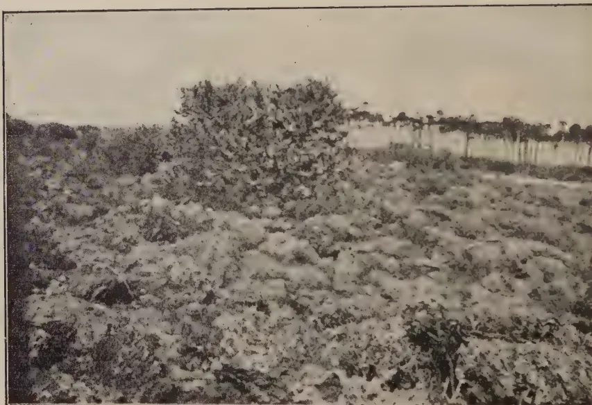
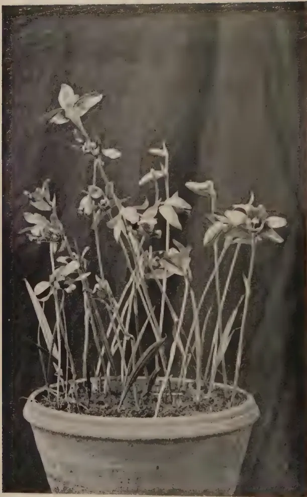
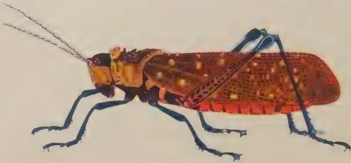
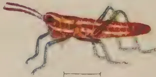
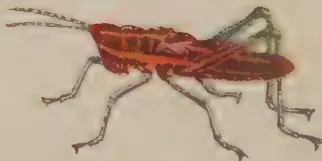
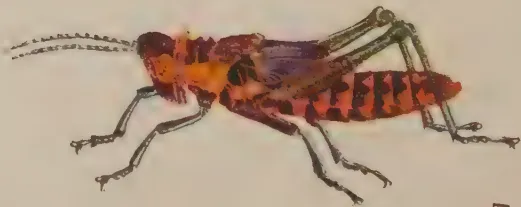

# The Tropical Agriculturist

August, 1935

---

## EDITORIAL

---

### PROPAGATION OF FRUIT TREES

---

IT is remarkable with what slowness the import of vegetatively produced planting material has been accepted in Ceylon. The uncertain value of the promiscuous seedling does not seem to be generally realised judging by the number of applications for seedling fruit trees at many of our gardens and stations. The great difficulty in dealing with our fruit production probably is the absence of any reliable data concerning good trees when any such do exist. Rarely indeed is there any knowledge available as to the origin of the trees; whether grown from seeds or grafts, and of what combination of stock and scion. Intelligent purchasers of imported fruit trees should at the time of acquisition insist upon being supplied with such information as whether the tree is a seedling or a graft, and in the former case may generally reject it; its country of origin and of what nature are the stock and the scion. Records of these points should be written down. These are the first essentials upon which any accurate steps can be taken in the future to multiply the trees should they prove satisfactory. The present absence of budwood of trustworthy and known origin is an obstacle to propagation of many fruit trees, especially

1------------------------------------------------

66

citrus. In some citrus growing countries selected budwood is made available through the medium of co-operative bud selection societies. Such a society exists in New South Wales which is the outcome of recognition of the fact that in citrus orchards some trees are poor yielders, whilst others are prolific. Fruit-growers and nurserymen who are members of the society supply budwood to one another from good bearing trees with the fruit of a desirable quality. Such an institution is a most excellent one and results in a propagation of the most fit types of orange, lemon and grapefruit trees by a process of selection. Indeed where such a process is strenuously practised there must result a continuous improvement.

2------------------------------------------------

67

## STUDIES ON CEYLON SOILS

### V.—SOILS ASSOCIATED WITH LIMESTONE

A. W. R. JOACHIM, PH. D., DIP. AGRIC.  
(CANTAB.),

AGRICULTURAL CHEMIST,

AND

S. KANDIAH, DIP. AGRIC. (POONA),

ASSISTANT IN AGRICULTURAL CHEMISTRY.

**C**EYLON soils associated with limestones are of two classes: those derived from Miocene limestone deposits, such as are to be found in the Jaffna Peninsula, and those which overlie the crystalline limestones, mainly dolomitic, as in the Nalanda district. Both groups of soils have however, several features in common, the characteristic brick red to brown colour of the majority of them and their high exchangeable base contents compared with those of other Ceylon soil groups, being the most marked. The red soils bear a close resemblance to the *terra rosa* of the Mediterranean and other limestone regions of the world. The soils vary in texture from loams to clay loams. Despite their heavy nature, they are free-working and well-drained. This is because of their high available lime contents which tend towards the development of a fine granular structure in the soils. The soils are deep and are neutral to alkaline in reaction. Free carbonate of lime is often absent or present only in small quantities. Organic matter is generally low in these soils and is their main requirement. The soils are suitable for the cultivation of a variety of crops, both arable and wet land. Thus in the Jaffna Peninsula where topographic conditions are favourable, the heavier loams are cropped with wet-land paddy during the rainy season and with arable crops during the rest of the year. These soils have a rather different profile to that of the solely arable soils, but their chemical characteristics are similar. The nearest approach to the *rendzina* group of limestone soils are the grey soils of the Island of Kayts, containing a reserve of free calcium carbonate in the shape of limestone concretions and other marine deposits. These soils are mainly cultivated with paddy.

3------------------------------------------------

68

The crops found most suitable for cultivation on the red soils are tobacco, grains and pulses, vegetables and fruits. The quality of the food products grown on these soils is very good.

Rainfall and elevation conditions of the sedimentary limestone soil areas are very different to those obtaining in the crystalline limestone districts. In the Jaffna Peninsula and the adjoining mainland the average annual precipitation is only about 50 inches, the greater part falling in the North-East monsoon. In the Matale and Nalanda districts, the rainfall is much higher — from 80 to 90 inches — and the distribution is more even. The elevation of the latter districts is also much higher. The average annual temperature of Jaffna is 81°F. while that of the Matale-Nalanda area is about 78°F. The Matale and Nalanda districts, particularly the former, are therefore suited for the growing of crops like cacao, rubber and coconuts.

In this paper six typical limestone soil profiles will be discussed, four being of the Jaffna group and two of the Nalanda class. The former comprise purely arable or paddy land, and arable — wet-land profiles. For the sake of convenience the analytical data are shown in two tables, table I for the Jaffna group and table II for the Nalanda group.

### 1. THE RED LOAMS (JAFFNA GROUP)

<table>
<tr>
<td>Location</td>
<td>...</td>
<td>Tinnevely Farm, about 3 miles from Jaffna.</td>
</tr>
<tr>
<td>Elevation</td>
<td>...</td>
<td>11 ft. (approx.)</td>
</tr>
<tr>
<td>Climate</td>
<td>...</td>
<td>Rainfall about 50 in.; temperature 81°F.</td>
</tr>
<tr>
<td>Geological origin</td>
<td>...</td>
<td>Miocene sedimentary limestone.</td>
</tr>
<tr>
<td>Mode of formation</td>
<td>...</td>
<td>Transported: alluvial.</td>
</tr>
<tr>
<td>Topographic position</td>
<td>...</td>
<td>Level.</td>
</tr>
<tr>
<td>Drainage</td>
<td>...</td>
<td>Very good.</td>
</tr>
<tr>
<td>Vegetation</td>
<td>...</td>
<td>Tobacco and garden crops.</td>
</tr>
</table>

### PROFILE

A1. 0-1 ft. Brick red uniform loam; fine granular; hard when dry but friable; fairly compact; no concretionary material or gravel; roots abundant; alkaline; horizon boundary indistinct.

4------------------------------------------------

69

C. 1 ft.-4 ft. Same as A1 only soil more compact and roots not so abundant. Small percentage of limestone concretionary material.

TABLE ITHE JAFFNA GROUP*Mechanical Analysis*

<table border="1">
<thead>
<tr>
<th></th>
<th colspan="2"><i>Tinnevely</i></th>
<th colspan="2"><i>Chunnakam</i></th>
<th colspan="2"><i>Pandatarippu</i></th>
<th><i>Kayts</i></th>
</tr>
<tr>
<th></th>
<th>A</th>
<th>AC</th>
<th>AC</th>
<th>A</th>
<th>C1</th>
<th>C2</th>
<th>A</th>
</tr>
<tr>
<th></th>
<th>%</th>
<th>%</th>
<th>%</th>
<th>%</th>
<th>%</th>
<th>%</th>
<th>%</th>
</tr>
</thead>
<tbody>
<tr>
<td>Stones and gravel</td>
<td>—</td>
<td>1.9</td>
<td>—</td>
<td>—</td>
<td>5.3</td>
<td>6.4</td>
<td>4.6</td>
</tr>
<tr>
<td>Coarse sand</td>
<td>35.4</td>
<td>22.9</td>
<td>17.7</td>
<td>14.3</td>
<td>15.4</td>
<td>13.3</td>
<td>18.2</td>
</tr>
<tr>
<td>Fine sand</td>
<td>31.2</td>
<td>21.8</td>
<td>27.6</td>
<td>25.3</td>
<td>23.9</td>
<td>20.1</td>
<td>45.4</td>
</tr>
<tr>
<td>Silt</td>
<td>3.4</td>
<td>4.3</td>
<td>6.4</td>
<td>5.7</td>
<td>5.5</td>
<td>6.4</td>
<td>4.3</td>
</tr>
<tr>
<td>Clay</td>
<td>26.2</td>
<td>41.7</td>
<td>39.7</td>
<td>44.8</td>
<td>43.8</td>
<td>47.7</td>
<td>26.5</td>
</tr>
<tr>
<td>Loss by solution</td>
<td>0.9</td>
<td>2.0</td>
<td>2.2</td>
<td>2.4</td>
<td>1.5</td>
<td>1.7</td>
<td>1.4</td>
</tr>
<tr>
<td>Moisture</td>
<td>2.9</td>
<td>7.3</td>
<td>6.4</td>
<td>7.5</td>
<td>9.9</td>
<td>10.8</td>
<td>4.2</td>
</tr>
<tr>
<td>Sticky point moisture</td>
<td>15.3</td>
<td>24.4</td>
<td>22.7</td>
<td>29.9</td>
<td>32.4</td>
<td>34.7</td>
<td>22.9</td>
</tr>
<tr>
<td>Texture index number</td>
<td>24.2</td>
<td>38.2</td>
<td>36.6</td>
<td>41.1</td>
<td>40.2</td>
<td>43.9</td>
<td>24.7</td>
</tr>
<tr>
<td>Soil type</td>
<td>Loam</td>
<td>Heavy Loam</td>
<td>Heavy Loam</td>
<td>Clay Loam</td>
<td>Clay Loam</td>
<td>Clay Loam</td>
<td>Loam</td>
</tr>
</tbody>
</table>

*Chemical Analysis*

<table border="1">
<tbody>
<tr>
<td>Loss on ignition</td>
<td>5.22</td>
<td>12.80</td>
<td>13.2</td>
<td>15.10</td>
<td>16.25</td>
<td>17.32</td>
<td>8.16</td>
</tr>
<tr>
<td>Organic matter</td>
<td>0.77</td>
<td>0.57</td>
<td>2.44</td>
<td>2.03</td>
<td>0.61</td>
<td>.34</td>
<td>1.52</td>
</tr>
<tr>
<td>Combined water</td>
<td>4.45</td>
<td>12.23</td>
<td>11.58</td>
<td>13.07</td>
<td>15.64</td>
<td>16.98</td>
<td>6.04</td>
</tr>
<tr>
<td>Carbon</td>
<td>0.45</td>
<td>0.33</td>
<td>0.84</td>
<td>1.18</td>
<td>0.44</td>
<td>0.20</td>
<td>0.88</td>
</tr>
<tr>
<td>Nitrogen</td>
<td>0.057</td>
<td>0.052</td>
<td>0.102</td>
<td>.125</td>
<td>0.051</td>
<td>.025</td>
<td>0.085</td>
</tr>
<tr>
<td>Carbon/nitrogen ratio</td>
<td>7.8</td>
<td>6.4</td>
<td>8.82</td>
<td>9.5</td>
<td>8.6</td>
<td>8.1</td>
<td>10.3</td>
</tr>
<tr>
<td>Calcium carbonate</td>
<td>—</td>
<td>—</td>
<td>0.07</td>
<td>—</td>
<td>—</td>
<td>—</td>
<td>.10</td>
</tr>
<tr>
<td>Reaction</td>
<td>8.0</td>
<td>7.8</td>
<td>8.3</td>
<td>7.8</td>
<td>8.2</td>
<td>8.4</td>
<td>8.3</td>
</tr>
<tr>
<td>Total exchangeable bases (m.e. per 100 gm soil)</td>
<td>9.88</td>
<td>11.16</td>
<td>16.64</td>
<td>25.01</td>
<td>22.57</td>
<td>21.05</td>
<td>19.62</td>
</tr>
<tr>
<td>Exchangeable calcium</td>
<td>7.92</td>
<td>9.02</td>
<td>13.29</td>
<td>20.09</td>
<td>17.16</td>
<td>16.96</td>
<td>15.00</td>
</tr>
<tr>
<td>Toatl lime</td>
<td>0.251</td>
<td>0.311</td>
<td>0.528</td>
<td>0.676</td>
<td>0.507</td>
<td>—</td>
<td>0.595</td>
</tr>
<tr>
<td>„ potash</td>
<td>0.310</td>
<td>0.433</td>
<td>0.321</td>
<td>0.557</td>
<td>0.533</td>
<td>—</td>
<td>0.605</td>
</tr>
<tr>
<td>„ phosphoric acid</td>
<td>0.115</td>
<td>0.153</td>
<td>0.154</td>
<td>0.107</td>
<td>0.146</td>
<td>—</td>
<td>0.119</td>
</tr>
</tbody>
</table>

*Clay Analysis*

<table border="1">
<tbody>
<tr>
<td>Loss on ignition</td>
<td>17.21</td>
<td>—</td>
<td>17.81</td>
<td>19.31</td>
<td>—</td>
<td>—</td>
<td>18.31</td>
</tr>
<tr>
<td>Silica (<math>\text{SiO}_2</math>)</td>
<td>44.10</td>
<td>—</td>
<td>43.94</td>
<td>47.56</td>
<td>—</td>
<td>—</td>
<td>49.78</td>
</tr>
<tr>
<td>Sesquioxides (<math>\text{R}_2\text{O}_3</math>)</td>
<td>53.18</td>
<td>—</td>
<td>52.78</td>
<td>44.34</td>
<td>—</td>
<td>—</td>
<td>40.16</td>
</tr>
<tr>
<td>Alumina (<math>\text{Al}_2\text{O}_3</math>)</td>
<td>38.90</td>
<td>—</td>
<td>35.03</td>
<td>32.38</td>
<td>—</td>
<td>—</td>
<td>28.77</td>
</tr>
<tr>
<td>Iron oxides (<math>\text{Fe}_2\text{O}_3</math>)</td>
<td>14.28</td>
<td>—</td>
<td>17.75</td>
<td>11.96</td>
<td>—</td>
<td>—</td>
<td>11.39</td>
</tr>
<tr>
<td><math>\text{SiO}_2/\text{Al}_2\text{O}_3</math> (molecular)</td>
<td>1.93</td>
<td>—</td>
<td>2.13</td>
<td>2.49</td>
<td>—</td>
<td>—</td>
<td>2.93</td>
</tr>
<tr>
<td><math>\text{SiO}_2/\text{R}_2\text{O}_3</math> „</td>
<td>1.56</td>
<td>—</td>
<td>1.61</td>
<td>2.01</td>
<td>—</td>
<td>—</td>
<td>2.34</td>
</tr>
<tr>
<td>Soil type</td>
<td>Non-lateritic to lateritic</td>
<td></td>
<td>Non-lateritic</td>
<td>Non-lateritic</td>
<td></td>
<td></td>
<td>Non-lateritic</td>
</tr>
</tbody>
</table>

5------------------------------------------------

70

## ANALYTICAL DATA AND DISCUSSION

An examination of table I will indicate that these soils are heavy loams, the lower horizon being distinctly heavier in texture than the upper soil layer. The structure of the soil is however fine granular and gives the soil an appearance of being lighter than what it actually is. The sticky point moisture contents for soils of this texture are low, and there is a marked divergence between the texture index number as determined by the mechanical composition (3) and Hardy's texture index. The organic matter contents of the soils are very low and so are the nitrogen contents. Organic matter is essential for good crop yields on these soils and this is well realised by the Jaffna cultivator. The soils are devoid of free calcium carbonate but contain fairly high exchangeable base contents. Calcium constitutes about 80 per cent. of the bases. In reaction they are alkaline. Total lime, phosphoric acid and potash contents are very light, the lower horizon being higher in these constituents than the upper. The clay analysis of the A horizon shows that the soil is on the borderline between the non-lateritic and lateritic types. For all practical purposes the soil may however be considered to be non-lateritic. The iron content is fairly high when compared with those of the grey and brown soils.

### 2. THE RED HEAVY LOAMS (JAFFNA GROUP)

<table>
<tr>
<td>Location</td>
<td>...</td>
<td>Chunnakam, 6 miles from Jaffna.</td>
</tr>
<tr>
<td>Elevation</td>
<td>...</td>
<td>11 ft. (approx.)</td>
</tr>
<tr>
<td>Climate</td>
<td>...</td>
<td>Rainfall about 50 in.; temperature 81°F.</td>
</tr>
<tr>
<td>Geological origin</td>
<td>...</td>
<td>Miocene sedimentary limestone.</td>
</tr>
<tr>
<td>Mode of formation</td>
<td>...</td>
<td>Transported: alluvial.</td>
</tr>
<tr>
<td>Topographic position</td>
<td>...</td>
<td>Level.</td>
</tr>
<tr>
<td>Drainage</td>
<td>...</td>
<td>Very good.</td>
</tr>
<tr>
<td>Vegetation</td>
<td>...</td>
<td>Tobacco and garden crops.</td>
</tr>
</table>

### PROFILE

AC. 0-4 ft. Deep brick red heavy loam; small clod to granular structure; hard but friable; compact; alkaline; root growth good; no horizon boundaries distinguishable.

## ANALYTICAL DATA AND DISCUSSION

The soil is a uniform textured and coloured clay loam very similar in texture and physical characteristics to the C horizon

6------------------------------------------------

71

of the Tinnevely soil. The organic matter and nitrogen contents of this soil are however about twice as much as those of the latter soils. Like these soils, the heavy loam soils is alkaline in reaction, but it contains in addition a small reserve of free calcium carbonate. Its total exchangeable base content is high (16.6 mgm. equivalents), calcium forming again about 80 per cent. of the total. The soil is particularly rich in lime, but its phosphoric acid and potash contents are also quite high. The clay analysis reveals an alumina content of 35 per cent., an iron oxide content of 17.7 per cent. (the deeper red colour of this soil being apparently due to this fact) and a silica percentage of 44. On the basis of the silica/alumina molecular ratio, the soil is distinctly of the non-lateritic type. The Chunnakam soil and the Tinnevely soil are good examples of soil types belonging to the same soil series — the Tinnevely soil being a loam and the other a heavy loam.

### 3. THE BROWN CLAY LOAMS (JAFFNA GROUP)

<table>
<tr>
<td>Location</td>
<td>...</td>
<td>Pandatarippu, about 8 miles from Jaffna.</td>
</tr>
<tr>
<td>Elevation</td>
<td>...</td>
<td>About sea level.</td>
</tr>
<tr>
<td>Climate</td>
<td>...</td>
<td>Rainfall 50 in.; temperature 81°F.</td>
</tr>
<tr>
<td>Geological origin</td>
<td>...</td>
<td>Miocene sedimentary limestone.</td>
</tr>
<tr>
<td>Mode of formation</td>
<td>...</td>
<td>Alluvial.</td>
</tr>
<tr>
<td>Topographic position</td>
<td>...</td>
<td>Flat, the level of the soil being about 4 feet below that of the road.</td>
</tr>
<tr>
<td>Drainage</td>
<td>...</td>
<td>Imperfect during wet weather.</td>
</tr>
<tr>
<td>Vegetation</td>
<td>...</td>
<td>Paddy alternating with tobacco and other rotation crops.</td>
</tr>
</table>

### PROFILE

A. 0-8 in. Dark-grey brown clay loam; irregular clod to columnar; compact; hard but fairly friable; root growth good; horizon boundary distinct.

C1. 8-15 in. Yellowish-brown clay loam; nodular to small clod; occasional nodules of ferruginous limestone concretions present; hard and compact; roots absent; alkaline; horizon boundary fairly distinct.

C2. 15 in.-3 ft. Brownish-yellow clay loam; nodules of blackish brown ferruginous limestone concretions fairly abundant; small clod; compact and hard; roots absent; alkaline.

7------------------------------------------------

72

## ANALYTICAL DATA AND DISCUSSION

The mechanical analyses show that these soils are clay loams, ideally suited for paddy. The different horizons are of the same textural class, but the C1 and C2 horizons are slightly heavier. The combined water contents are fairly high. The organic matter and nitrogen contents of the A horizon are fairly high when compared with those of most Jaffna soils, but the C1 and C2 horizons are very poor in these constituents. The soils are alkaline in reaction, the alkalinity increasing slightly with depth. The exchangeable base contents are very high, being about the highest so far found in local soils. Calcium forms about 80 per cent. of these bases, as is to be expected. The soils are very rich in mineral plant nutrients, particularly potash and lime. The clay analysis reveals an iron oxide content of only 12 per cent. an alumina content of 32.4 per cent. and silica of 47.6 per cent. The soil is therefore, on the silica/alumina molecular ratio, which in this instance is 2.5, non-lateritic in nature. The brown and yellow colours of this soil are probably associated with its comparatively low iron oxide content and periodical imperfect drainage.

### 4. THE GREY CALCAREOUS LOAMS (JAFFNA GROUP)

<table>
<tr>
<td>Location</td>
<td>...</td>
<td>The Island of Kayts.</td>
</tr>
<tr>
<td>Elevation</td>
<td>...</td>
<td>Slightly above sea level.</td>
</tr>
<tr>
<td>Climate</td>
<td>...</td>
<td>Rainfall 45 in.; temperature 81°F.</td>
</tr>
<tr>
<td>Geological origin</td>
<td>...</td>
<td>Miocene sedimentary limestone.</td>
</tr>
<tr>
<td>Mode of formation</td>
<td>...</td>
<td>Alluvial.</td>
</tr>
<tr>
<td>Topographic position</td>
<td>...</td>
<td>Flat.</td>
</tr>
<tr>
<td>Drainage</td>
<td>...</td>
<td>Poor.</td>
</tr>
<tr>
<td>Vegetation</td>
<td>...</td>
<td>Paddy.</td>
</tr>
</table>

### PROFILE

A. 0-8 in. Grey heavy loam; blackish scum on surface; fair quantities of limestone concretions; crumb to fine granular structure; hard but friable; root growth good; horizon layer distinct.

C. Conglomerate of lime and concretionary material.

## ANALYTICAL DATA AND DISCUSSION

The table would indicate that the soil is a loam, with fairly low organic matter and nitrogen contents. Free calcium carbonate is present as nodular concretions of diameter larger than

8------------------------------------------------

73

1 cm. The latter are separated from the soil proper in the process of sieving. Calcium carbonate existing in intimate combination with the soil occurs only to an extent of 0·1 per cent. The soil is alkaline in reaction, well supplied with exchangeable bases, mainly calcium, and very rich in total lime and potash, particularly the latter. Its phosphoric acid content is also high. The clay fraction on analysis shows 50 per cent. silica, 28·8 per cent. alumina and only 11·4 per cent. iron. The silica/alumina molecular ratio is as high as 2·9, which places the soil definitely in the non-lateritic class. This type of soil is in the closest approach locally to the *rendzinas* of other limestone areas of the world.

### 5. THE RED LOAMS (NALANDA GROUP)

<table>
<tr>
<td>Location</td>
<td>... Nalanda Experiment Station.</td>
</tr>
<tr>
<td>Elevation</td>
<td>... About 850 ft.</td>
</tr>
<tr>
<td>Climate</td>
<td>... Rainfall: 85 in. (approx.); temperature 78°F.</td>
</tr>
<tr>
<td>Geological origin</td>
<td>... Crystalline limestone; largely dolomitic.</td>
</tr>
<tr>
<td>Mode of formation</td>
<td>... Residual.</td>
</tr>
<tr>
<td>Topographic position</td>
<td>... Hilly to flat; sample taken from a level field.</td>
</tr>
<tr>
<td>Drainage</td>
<td>... Good.</td>
</tr>
<tr>
<td>Vegetation</td>
<td>... Tobacco, citrus, etc.</td>
</tr>
</table>

### PROFILE

A1. 0-15 in. Chocolate-brown loam; few small ferruginous concretions and stones; coarse granular to small irregular columnar; hard but friable; compact; good root growth; neutral; horizon boundary indistinct.

A2 15-30 in. Similar to A1 but colour deeper chocolate red and concretions and gravel in slightly higher proportions.

C. 30-54 in. Red clay loam; low columnar to lenticular; hard and fairly friable; very compact; no root growth observed; neutral.

9------------------------------------------------

74

TABLE II  
THE NALANDA GROUP

*Mechanical Analysis*

<table border="1">
<thead>
<tr>
<th></th>
<th colspan="2">Nalanda</th>
<th colspan="2">Nalanda-Dambulla</th>
</tr>
<tr>
<th></th>
<th>A1</th>
<th>A2</th>
<th>C</th>
<th>AC</th>
</tr>
<tr>
<th>Stones and gravel</th>
<th>%</th>
<th>%</th>
<th>%</th>
<th>%</th>
</tr>
</thead>
<tbody>
<tr>
<td></td>
<td>2.2</td>
<td>4.2</td>
<td>—</td>
<td>—</td>
</tr>
<tr>
<td>Coarse sand</td>
<td>32.9</td>
<td>29.8</td>
<td>21.5</td>
<td>25.2</td>
</tr>
<tr>
<td>Fine sand</td>
<td>33.6</td>
<td>28.9</td>
<td>27.7</td>
<td>21.7</td>
</tr>
<tr>
<td>Silt</td>
<td>5.1</td>
<td>4.8</td>
<td>4.2</td>
<td>4.8</td>
</tr>
<tr>
<td>Clay</td>
<td>25.0</td>
<td>32.8</td>
<td>43.9</td>
<td>42.4</td>
</tr>
<tr>
<td>Loss by solution</td>
<td>1.5</td>
<td>1.4</td>
<td>0.5</td>
<td>1.8</td>
</tr>
<tr>
<td>Moisture</td>
<td>1.9</td>
<td>2.3</td>
<td>2.2</td>
<td>4.1</td>
</tr>
<tr>
<td>Sticky point moisture</td>
<td>19.0</td>
<td>20.1</td>
<td>21.7</td>
<td>28.2</td>
</tr>
<tr>
<td>Texture index number</td>
<td>23.3</td>
<td>29.5</td>
<td>40.1</td>
<td>38.7</td>
</tr>
<tr>
<td>Soil type</td>
<td>Loam</td>
<td>Loam</td>
<td>Clay Loam</td>
<td>Heavy Loam</td>
</tr>
</tbody>
</table>

*Chemical Analysis*

<table border="1">
<tbody>
<tr>
<td>Loss on ignition</td>
<td>4.65</td>
<td>5.31</td>
<td>5.27</td>
<td>8.73</td>
</tr>
<tr>
<td>Organic matter</td>
<td>2.07</td>
<td>1.14</td>
<td>.87</td>
<td>3.33</td>
</tr>
<tr>
<td>Combined water</td>
<td>2.58</td>
<td>4.17</td>
<td>4.40</td>
<td>5.40</td>
</tr>
<tr>
<td>Carbon</td>
<td>1.20</td>
<td>.66</td>
<td>.51</td>
<td>1.93</td>
</tr>
<tr>
<td>Nitrogen</td>
<td>0.123</td>
<td>0.076</td>
<td>.073</td>
<td>.235</td>
</tr>
<tr>
<td>Carbon/nitrogen ratio</td>
<td>9.7</td>
<td>8.6</td>
<td>7.0</td>
<td>8.2</td>
</tr>
<tr>
<td>Calcium carbonate</td>
<td>—</td>
<td>—</td>
<td>—</td>
<td>.163</td>
</tr>
<tr>
<td>Reaction</td>
<td>7.0</td>
<td>6.9</td>
<td>6.9</td>
<td>7.2</td>
</tr>
<tr>
<td>Total exchangeable bases (m.e. per 100 gm. soil)</td>
<td>10.56</td>
<td>9.12</td>
<td>8.40</td>
<td>25.92</td>
</tr>
<tr>
<td>Exchangeable calcium</td>
<td>6.53</td>
<td>5.68</td>
<td>4.98</td>
<td>15.84</td>
</tr>
<tr>
<td>Total lime</td>
<td>.352</td>
<td>.258</td>
<td>—</td>
<td>.582</td>
</tr>
<tr>
<td>„ potash</td>
<td>.187</td>
<td>.198</td>
<td>—</td>
<td>.269</td>
</tr>
<tr>
<td>„ phosphoric acid</td>
<td>.087</td>
<td>.086</td>
<td>—</td>
<td>.166</td>
</tr>
</tbody>
</table>

*Clay Analysis*

<table border="1">
<tbody>
<tr>
<td>Loss on ignition</td>
<td>20.50</td>
<td>—</td>
<td>—</td>
<td>21.56</td>
</tr>
<tr>
<td>Silica (<math>\text{SiO}_2</math>)</td>
<td>44.14</td>
<td>—</td>
<td>—</td>
<td>44.42</td>
</tr>
<tr>
<td>Sesquioxides (<math>\text{R}_2\text{O}_3</math>)</td>
<td>51.26</td>
<td>—</td>
<td>—</td>
<td>50.48</td>
</tr>
<tr>
<td>Alumina (<math>\text{Al}_2\text{O}_3</math>)</td>
<td>31.97</td>
<td>—</td>
<td>—</td>
<td>31.77</td>
</tr>
<tr>
<td>Iron oxides (<math>\text{Fe}_2\text{O}_3</math>)</td>
<td>19.29</td>
<td>—</td>
<td>—</td>
<td>18.71</td>
</tr>
<tr>
<td><math>\text{SiO}_2/\text{Al}_2\text{O}_3</math> (molecular)</td>
<td>2.34</td>
<td>—</td>
<td>—</td>
<td>2.37</td>
</tr>
<tr>
<td><math>\text{SiO}_2/\text{R}_2\text{O}_3</math> „</td>
<td>1.69</td>
<td>—</td>
<td>—</td>
<td>1.72</td>
</tr>
<tr>
<td>Soil type</td>
<td>Non-lateritic</td>
<td>—</td>
<td>—</td>
<td>Non-lateritic</td>
</tr>
</tbody>
</table>

10------------------------------------------------

75

### ANALYTICAL DATA AND DISCUSSION

The soils of this profile are chocolate red to terra cotta red loamy to clay loam soils, with no apparent horizon boundaries. Ferruginous concretions occur in the A1 and A2 horizons only to the extent of 2 to 4 per cent. In hilly areas the soils contain a very high percentage of ferruginous nodules and boulders. These soils overlie the limestone rock, which is often several feet below the surface. The analyses reveal a wide divergence between the texture index number and Hardy's texture index in this group of soils as well. The combined water content for soils of this textural class are exceptionally low. The organic matter and nitrogen contents are fair in the A1 horizon but poor in the others. The soils contain no free calcium carbonate, are neutral in reaction and fairly rich in replaceable bases. Calcium constitutes only about 60 per cent. of these bases. This is as is to be expected considering that the limestone rock from which the soil is derived is largely dolomitic. The total lime and potash contents are high, but not as high as those of the Jaffna group of limestone soils. The silica/alumina molecular ratio of the clay fraction is 2.3, indicating that the soil is definitely non-lateritic in nature.

### 6. THE CHOCOLATE RED HEAVY LOAMS (NALANDA GROUP)

<table>
<tr>
<td>Location</td>
<td>...</td>
<td>3 miles from Nalanda on the Nalanda-Dambulla road.</td>
</tr>
<tr>
<td>Elevation</td>
<td>...</td>
<td>About 700 ft.</td>
</tr>
<tr>
<td>Climate</td>
<td>...</td>
<td>75 in. (approx.); temperature 78°F.</td>
</tr>
<tr>
<td>Geological origin</td>
<td>...</td>
<td>Crystalline limestone, largely dolomitic.</td>
</tr>
<tr>
<td>Mode of formation</td>
<td>...</td>
<td>Residual.</td>
</tr>
<tr>
<td>Topographic position</td>
<td>...</td>
<td>Undulating; sample from crest of a low hillock.</td>
</tr>
<tr>
<td>Drainage</td>
<td>...</td>
<td>Very good.</td>
</tr>
<tr>
<td>Vegetation</td>
<td>...</td>
<td>Grasses and shrubs.</td>
</tr>
</table>

### PROFILE

A. 0-2 ft. Uniform chocolate-red heavy loam; columnar to prismatic; hard but friable; porous; alkaline; root growth good.

C. > 2 ft. White crystalline limestone.

11------------------------------------------------

76

## ANALYTICAL DATA AND DISCUSSION

This soil is a heavy loam but with a low combined water content. Similar soils of uniform colour and structure showing no horizon delimitations and extending to several feet in depth, occur largely over the area. The soil directly overlies the parent rock. It has a good reserve of organic matter and is rich in nitrogen. The carbon/nitrogen ratio is 8.2 and varies from about 7 to 10 in soils of this group. In reaction the soil is on the alkaline side of neutral. Its replaceable base content is very high (25.9 mgm. equivalents). Calcium comprises only about 60 per cent. of these bases for the reason already explained. Replaceable magnesium will doubtless constitute a comparatively high percentage of the total. The soil is rich in total lime and potash and also in phosphoric acid. The analysis of the clay fraction shows an iron oxide content of 18.7 per cent., alumina of 31.8 per cent. and silica of 44.4 per cent. The silica/alumina molecular ratio is 2.37 indicating that the soil is definitely non-lateritic in type.

## GENERAL DISCUSSION AND CONCLUSION

An examination of the analytical and profile data of these soils as a whole indicate that, except for the Kayts grey loam and Pandatarippu grey brown loam, they are of a similar nature to the red limestone soils of Barbados described by Saint (1) and others referred to by Robinson (2) as *terra rossa*. The clay fractions of the red soils have lower silica/alumina molecular ratios and higher iron oxide contents than those of the grey soils. The red soils generally occur where the soils are at a higher level and well-drained; the grey soils at lower levels and under imperfectly drained conditions. Local soils have however, for some reason yet to be discovered, low sticky point and combined moisture contents. The index of texture, as calculated from Hardy's formula, shows therefore a wide divergence from the texture index number as determined by calculation from the mechanical composition. On the former basis the soils would be considered to be much lighter textured than on the latter. The textural type is therefore designated according to Charlton's texture index number (3) modified to conform to the present international scale of soil particle size. The grey and brown grey loams of Kayts and Pandatarippu, especially the former, may be considered to be the local *rendzinas*. The red soils of the

12------------------------------------------------

<!-- stage4: FAINT old-images-only -->

[Faint page: no legible print of its own could be verified; text withheld (stage 4 review list)]

This image is a scan of a blank page. The background is a uniform light beige or off-white color. There are several small, dark specks scattered across the page, which appear to be scanning artifacts or dust. Faint, horizontal greyish lines are visible near the top and bottom edges, possibly representing the edges of the paper or scanning artifacts. No text, images, or other markings are present on the page.

13------------------------------------------------

A black and white photograph showing a landscape with dense, low-lying vegetation in the foreground and middle ground, and a line of trees in the background. The vegetation appears to be growing on a rocky or outcropping surface.

*Photo*

*W. R. C. Paul*

Showing the nature of the vegetation on an outcrop of sedimentary limestone at Puttur, Jaffna Peninsula

14------------------------------------------------

<!-- stage4: ACCEPT r2J/J_011:60 -->

77

Nalanda district overlying crystalline limestone are generally similar to the Jaffna red limestone soils, except in regard to their higher organic matter contents and silica/alumina ratios of the clay fraction, and lower percentages of exchangeable calcium. The illustration accompanying this paper will give an idea of the nature of the vegetation and the topography of an outcrop of sedimentary limestone in the Jaffna Peninsula.

#### REFERENCES

1. 1. SAINT, S. J.—Soils of Barbados.—Annual Repts., Dept. Agr. Barbados, 1929-30 and 1930-31.
2. 2. ROBINSON, G. W.—Soils.
3. 3. BARRINGTON, A. H. M.—Forest soil and vegetation.—Burma Forest Bul. No. 25.

15------------------------------------------------

78

## SUMMARY OF PROGRESS ON FRUIT PRODUCTION IN CEYLON\*

T. H. PARSONS, F.L.S., F.R.H.S.,  
CURATOR, ROYAL BOTANIC GARDENS, PERADENIYA

**F**RUIT production experiments on any wide scale have yet to be attained in this country, but some little progress has been made during the past few years and it is the object of these notes to place in summary the progress so far obtained and by a survey of the consecutive reports on the fruit work of the Department point out the lines on which this progress follows.

The indigenous fruits, being few and of poor quality comprising only such as the Ceylon gooseberry, wild breadfruit and the like, it follows that most fruits now common in Ceylon are exotic and as such have first to be introduced and acclimatised.

Having done so it is then realised that the mere acclimatising of such fruits as citrus, mangoes, avocados, sapodillas and mangosteens is not sufficient, for the normal seedlings of most fruits show many degrees of variation from the parent, and it would be a mistake to contemplate orchards nowadays from seedling trees. For commercial success in any fruit enterprise the quality must be of the highest, all trees must be productive to their fullest extent, they must be healthy and vigorous, and must also be planted on a sufficiently large scale.

In our Island there are many areas suited to fruit production and most fruits can be well-grown if the right type of tree and suitable soil and climatic conditions are selected so as to accord with the plant requirements, and the right cultivation be then given them. The question of quality however is most important and fortunately the progress made in fruit production in countries outside Ceylon enables us to obtain by import budded and grafted material of very high quality.

The preliminaries therefore are seen to be very favourable but the economics of production will not allow the fruit grower to make much money if all his plants have to be imported at

---

\* *Vide* Annual Reports of the Royal Botanic Gardens, Peradeniya.

16------------------------------------------------

79

present day costs, nor is he assured that the plants so obtained will be entirely or even partially adaptable to his local conditions. It is here then that an intensive study of our varying conditions has to be contemplated. In all orchard fruits the root system plays an important part and where the fruit tree is budded or grafted the variety of rootstock used is generally the means by which any particular type or variety of fruit may become adapted to changed conditions such as soil, temperature and rainfall.

The adoption of budding and grafting methods on fruits in Ceylon is a recent innovation though propagation of horticultural subjects such as roses and hibiscus by budding is a more ancient practice here as is the gootee layering and inarching of some fruits.

The first buddings on any scale of an economic crop — that of rubber — made at Peradeniya in 1921 were the means by which this method of propagation was familiarised locally, but some years elapsed before any definite steps were taken or means provided to utilise these methods for the production of a better type of fruit in Ceylon.

In 1927 the Director of Agriculture reported that the demand for grafted grapefruit plants was considerably greater than the supply, and in consequence it was decided during the year to extend the nursery work at Peradeniya in order that stocks of budded citrus plants would be made available. It was also decided during the year to stop the supply of seedling plants of grapefruit and oranges, and in consequence the numbers available henceforth would be dependent upon rootstocks and budwood material available. The Gardens report supplements this as follows: "A commencement has been made on the budding of the more choice fruits, principally grapefruit, orange, mandarin and lime. On the overhaul of the economic nursery bed space for raising stocks in bulk was arranged and seed of pumelo and Seville orange for stock have, and are being raised. Budding as far as suitably sized stocks permitted commenced early in the year, the first batches of budded fruits being rapidly disposed of. Later buddings are coming along well but it is found that both the seedling stock, and later the scion, after budding, make very slow growth, that the rate of growth of citrus rootstocks do not permit of budding under eighteen months of age, and this only with good manuring. A further difficulty

17------------------------------------------------

80

experienced is in obtaining good budwood but with the increase and growth of the newly-imported grafted plants at the Experiment Stations this difficulty should be remedied in course of time."

The above indicates the first movement, the scarcity of reputable types of fruits for the available rootstocks, and the fact that  $1\frac{1}{2}$  to 2 years must elapse before seedlings attain a suitable age for budding.

The Gardens report for 1928 states that the budding of citrus, principally grapefruit, orange, mandarin and lime, has been most satisfactory in operation, but root disease identified by the Government Mycologist as caused by *Rhizoctonia bataticola*, together with citrus canker and mildew, resulted in some losses to the newly-budded plants during the wet months of April to May and again in October to November. The choice of stock was chiefly pumelo and Seville orange, both strong and robust growers and hitherto considered the best for the purpose, but both suffered in varying degrees, to the attacks of root disease. A few stocks of other citrus in the nursery, chiefly citron, lemon and nataran survived the above periods remarkably well but were not entirely immune, and further supplies of these are now being raised and budded. Excessive rainfall during the monsoon periods appears to be a contributory cause of the losses and it is proposed to prepare beds under cadjan covers in the nursery to remedy this to some extent. A section of the river bank area where the soil is of an excessively sandy nature and consequently well drained, is also being utilised for trial with all types of stock.

Budded plants sold or disposed of to various Experiment Stations in the Island included orange (chiefly Washington Navel), grapefruit, seedless lime, mandarin, a few mangoes, and a superior type of avocado pear.

Layered or gooteed fruits include mangosteen, sapodilla, guava, litchi, lovi-lovi, etc., and inarched fruits include mangoes and loquats. Buddings of the Up-country cherimoya, undoubtedly the best of the soursop group, have been successfully made on stocks of the ordinary soursop, and it is possible this fruit may on this rootstock bear at lower elevations.

The difficulty of obtaining sufficient supplies of budwood still exists but is being gradually overcome as new sources of supply become available.

18------------------------------------------------

81

It is noted that with the change over from rubber to citrus nursery stock, considerable losses were experienced by root disease. This was however very successfully treated and has not since reappeared in this nursery.

In 1929 the Gardens report stated that work on citrus budding progresses slowly owing to shortage of good budwood of all kinds. A number of newly-budded fruits persist in dying back after budding due chiefly to excessive moisture at the roots during the monsoon months, and the lack of sufficient drainage in the whole nursery area appears to be responsible. Steps taken to remedy this by raising new beds of prepared soil under cadjan covered sheds and raising stocks therein were successful and all buddings made on outside stocks are now potted at approximately five weeks from budding and are kept in large bamboo pots under cover till well established. The percentage of casualties has been considerably reduced by this method, but it is a laborious one. The stocks on which the various types of grapefruit, orange, lime and mandarin have been budded now include the sour orange, pumelo, lemon, citron, and nataran. Other types coming along for later trial as rootstocks include *Citrus Hystrix* D.C. a local semi-wild species, *C. megaloxycarpa* Lush. a locally grown species but not yet found wild. *Citrus mitis* Bc. the "Kalamondin" received from Manila and reputed resistant to citrus canker, the Chinese mandarin and the Mindora lime received also from the Philippines.

This was a period of gaining knowledge and with the experience of large batches of seedlings the soil conditions were found to be far from suitable. This was later remedied by incorporating many tons of river sand into the seed beds to ensure better aeration.

The 1930 report states that the demand for budded and grafted fruit plants continues to be heavy and numerous requests have to be passed on to Indian and other suppliers. Progress in citrus budding is slow owing to the still scanty supplies of good budwood available, and since the imported good kinds in the Island are yet in the young stage, the shortage is likely to continue for a time. To date the stocks on to which the varieties of citrus have been budded are the sour orange, the pumelo and nataran, but other varieties and species stated to be specially suitable for rootstock purposes have been obtained from Washington and the Philippines. These comprise an American

19------------------------------------------------

82

shaddock; and the Kalpi (*Citrus Webberii*). With the present rootstocks in use and an additional citrus hybrid from the Experiment Station, Peradeniya, considered a possibly useful stock, a total of eleven various stocks are now available for trial.

A section of the economic nursery had this year been cleared to form an area on which these stocks could be tried and their respective uses ascertained. Three plants of each of the eleven types already mentioned have been planted out in one block, at 15 feet apart and will later be budded *in situ* with budwood from a local grapefruit from the Experiment Station, Peradeniya.

At this stage the first experiments on rootstock tests might be considered to have been formulated, for it was then very evident that the compatibility or otherwise of such rootstocks as were being raised for the budding of imported and local scion wood was a very important point. For this purpose therefore all citrus types reputed and considered suitable as rootstocks were being selected and planted out in a particular section of the economic nursery for working on scions of a very good quality grapefruit then fruiting at the Experiment Station, Peradeniya.

The points at issue on which information is desired are the behaviour of the various rootstocks, after budding, under local conditions of soil and climate, their resistance to disease, the respective vigour of growth of the plant combination, the age of fruiting, and the quality and quantity of fruit eventually produced from these budded trees. In conjunction with this work several species of *Garcinia* were also being raised at this time for trial as rootstocks for the mangosteen to induce earlier fruiting, and of *Bassia longifolia* and *Sideroxylon dulcificum* both sapotaceaeous plants, for grafting the sapodilla, for similar purposes. For selected scions of custard apple and cherimoya a fair stock of seedling soursops and alligator apple were also being raised.

The layout and progress of the above is given in detail in the 1931 report, which states that regarding fruits in general the demand continues to exceed the supply of available grafted or budded plants though the nurseries here are working to the full extent of our budwood facilities. In respect to citrus the stocks now in general use here for this purpose are chiefly the sour orange (*Citrus aurantium* L.) the pumelo (*Citrus maxima* Merr.), the nataran, a near relative if not identical with

20------------------------------------------------

83

the *citron* (*C. medica* L.) and *citrus* sp. number 4/5 from the Experiment Station, Peradeniya. During the year, however, buddings have been made on the following additional stocks; the American or Cuban shaddock (later identified as a hybrid with lemon parentage) grapefruit (*citrus maxima* var. *uvacarpa*), *Citrus megaloxycarpa* Lush., *Citrus Hystrix* DC., *Citrus mitis* Blanco, *Citrus aurantifolia* var., and *Citrus Webberi* Wester, and their success has been in that order, the American shaddock being very easily budded with remarkable subsequent growth, whilst *Citrus Webberi* was most difficult to bud and the progress of the budded plants particularly slow.

Generally speaking, of all buddings made to date, those on the American shaddock and nataran, both stocks of very quick growth, are particularly successful and the scion makes rapid and strong growth. The sour orange, the pumelo and *citrus* sp. (No. 4/5 bud quite successfully but the scion growth is not so rapid. Those of grapefruit and *Citrus megaloxycarpa* bud moderately well but again subsequent growth is by no means so rapid. To date the buddings on the remaining new stocks have been disappointingly slow.

Small experiments to afford in due course some data on the effect of stock on scion or *vice versa*, were as already stated laid down within Section B of the  $1\frac{1}{2}$  acres of the economic nursery, three each of the eleven previously mentioned stocks being planted out at distances of 21 feet by 21 feet and these were this year budded *in situ* with budwood of the best grapefruit available at the Peradeniya Experiment Station — tree 5/3. Buddings were made well up the stem of the stock on the inverted T system in each case, varying from 6 inches to 15 inches from the ground according to stock, the size of stock necessarily differing according to varying age of the newer varieties introduced. Those of *Citrus Hystrix*, *Citrus mitis*, *Citrus aurantifolia* and *Citrus Webberi* were subsequently removed from the scope of this experiment and planted elsewhere since growth was so slow and the vitality of the stock poor, the vacancies being filled by additional plants of the remaining seven varieties of rootstock which were more or less uniform in age at time of

21------------------------------------------------

84

planting. Plot B therefore now contains the following for experiment, all budded with grapefruit 5/3.

<table>
<tr>
<td>5 on pumelo</td>
<td>5 on American shaddock</td>
</tr>
<tr>
<td>5 on sour orange</td>
<td>5 on citrus sp. 4/5</td>
</tr>
<tr>
<td>5 on nataran</td>
<td>5 on grapefruit</td>
</tr>
<tr>
<td>5 on <i>Citrus megaloxycarpa</i></td>
<td></td>
</tr>
</table>

and to date the scions on American shaddock show most vigour.

A further area, Plot C of the same nursery, has been utilised for growing on to maturity, at distances of 25 feet by 25 feet, specimens of all the above rootstocks, inclusive of the four varieties eliminated from the above experiment, for supply purposes either of seed or vegetative material at any later stage should such be required. The doubt caused by using seed material for stocks when the seed parent is of hybrid strain should however be realised.

Plots D, E and F of the nursery were later in the year utilized to establish stocks for budding of citrus types other than the grapefruit, some 60 stocks comprising 15 pumelo, 15 sour orange, 15 nataran and 15 *citrus* sp. 4/5 being planted 21 feet by 21 feet and budded with the following:

<table>
<tr>
<td>3 Washington Navel orange on each variety of stock</td>
<td>12</td>
</tr>
<tr>
<td>3 Malta orange on each variety of stock</td>
<td>12</td>
</tr>
<tr>
<td>3 Mandarin on each variety of stock</td>
<td>12</td>
</tr>
<tr>
<td>3 Lime on each variety of stock</td>
<td>12</td>
</tr>
<tr>
<td>3 Lemon on each variety of stock</td>
<td>12</td>
</tr>
<tr>
<td></td>
<td>—</td>
</tr>
<tr>
<td></td>
<td>60</td>
</tr>
<tr>
<td></td>
<td>—</td>
</tr>
</table>

Since the Washington Navel orange in some other countries shows incompatibility on the sour orange, the sweet orange type includes the Malta orange also. The above should show to some degree the compatibility or otherwise of these particular rootstocks for the main citrus groups though it is realised the numbers are small for the purpose. It is interesting to note that on the above-mentioned stocks the lemon, grapefruit and sweet orange bud quite freely, whilst the lime and mandarin are at times very difficult to establish.

On observing the rapidity with which the American shaddock grows here and its apparent compatibility as a stock to grapefruit in particular, application was made to America for

22------------------------------------------------

85

further supplies of this seed, and such were received from Cuba in November last and have at date germinated freely.

During the past year 2,200 citrus seedlings for budding purposes have been planted in Section B of the economic nursery and a few beds of nataran, raised vegetatively, have also been established. The latter is interesting as so few types of citrus can be so propagated vegetatively without the greatest difficulty, and since it is known that great variability exists among seedlings of the same species of stock plant and that such may influence the orchard tree produced, some attention to clonal stocks seems called for. A solar propagator, an invention to afford bottom heat, and consisting of two compartments, a heating compartment and a propagation compartment, has of late been erected for experiments in the rooting of types of citrus known to be difficult, and much is expected of this.

Other fruits have not been neglected and both the budding and grafting of mangoes has made considerable headway. The general method of propagation of mangoes hitherto in vogue has been either by gooteeing or inarching, both wasteful methods on a good and valuable tree. Propagation by budding has not been generally successful in the past and grafting is rarely attempted. The past year's experiences here show that a fair amount of success can be attained on the patch bud method and more so by grafting by means of a modification of the cleft and saddle grafting method, and numbers of the Jaffna, Rupee, Bangaloora and good local trees, have been so established.

The stock for such is at present limited to the common mango (*Mangifera indica*), and the wild species (*Mangifera zeylanica*) and all budding and grafting to date has been on the former stock. As a small experiment on the probable advantage of stock to scion, 12 selected seedlings of *Mangifera indica* have been planted in permanent sites in Plot A of the economic nursery at distances of 25 feet by 25 feet and budded as follows: 4 with a selected variety of the "Jaffna" mango, 4 from our Garden's "Rupee" tree and 4 from the Bangaloora tree at Heneratgoda, and all are making good headway. A similar area in Plot F of this nursery has also been planted for a repetition of these buddings on *Mangifera zeylanica* stock but the seedlings are as yet very small.

23------------------------------------------------

86

Experiments with mangosteens have proved difficult, the six plants successfully inarched on *Garcinia cornea* stocks having failed to make headway. Similarly those successfully inarched on *Garcinia Cambogia* and planted out refused to make any growth at all and the majority have since died. This is doubtless due to the stock plants being aged and to some extent stunted, unfortunately the only available stock at the time of the experiment. New and free growing seedlings of both *Garcinia Cambogia* together with seedlings of *Garcinia Benthami*, a species reported on by Wester as a drought-resisting and vigorous growing stock for the mangosteen in the Philippines, are now being raised, and further trials will be made.

The budding of the cherimoya (*Anona Cherimolia*) on the soursop (*Anona muricata*) presents few difficulties and a number of plants have been distributed to applicants at elevations of **2,000 feet** and over. The budding of this fruit on a tropical stock may possibly induce fruiting at a lower elevation than that at which the seedling plant fruits — usually 4,000 feet. The budwood was obtained from an estate at Ambewella where trees giving fruit of well over 2 lb. each are established. A new fruit from Costa Rica, the ilama (*Anona diversifolia* Safford) reported to be the low-country counterpart of cherimoya, and introduced here some years ago has after a long period of inactivity, commenced to make growth, and budwood should shortly become available to try this on the robust and strong rooted Bullock's Heart (*Anona reticulata*).

In the following year it is pointed out that as regards fruits, many difficulties are met with, particularly in the fact that the Peradeniya nurseries have necessarily to propagate and cultivate a wide range of fruits, many of which are more suited to other climatic conditions and are therefore from the beginning at some disadvantage. The mango, for instance, is now largely propagated here, yet a good fruiting season for this fruit at Peradeniya is a rare event. The 1931 fruiting season however was exceptionally favourable, most of the established grafted trees fruiting freely, and we were able to ascertain which were the really good trees, and such have been and are now being utilized for budding and grafting in large quantities.

The output of grafted plants exceeded previous years and to eliminate present disabilities, all available sections of the fruit nursery both old and new, have been planted up with budded

24------------------------------------------------

87

plants of the best varieties obtainable, at distances of 25 feet apart, to serve for multiplication purposes of budwood in the years to come.

A large section of the river bank area below the fruit nursery of approximately one acre, and previously under fodder, has been utilized for an extension of the nursery area, the soil here being much more open and friable than in the nursery proper, free from roots of trees, open to the morning sun and admirably suitable for citrus work. Much is expected of this and the greater portion is already planted up.

In addition to the budded plants planted throughout the older fruit nursery for stock and scion experiment and previously mentioned in detail, permanent plantings of the best varieties of citrus have been made throughout the new nursery at distances of 25 feet apart, the number here aggregating 53 in all.

The number of grafted fruit trees of reputable value now established and growing in the Royal Botanic Gardens for future budwood supplies is worthy of record and is as follows:

<table>
<tbody>
<tr>
<td>Oranges (18)</td>
<td>Avocado Pears (14)</td>
</tr>
<tr>
<td>Washington Navel</td>
<td>Gottfried</td>
</tr>
<tr>
<td>Mediterranean Sweet</td>
<td>St. Ann's</td>
</tr>
<tr>
<td>Valencia Late</td>
<td>Winslowson</td>
</tr>
<tr>
<td>St. Michael</td>
<td>Publa</td>
</tr>
<tr>
<td>Blood</td>
<td>Mayopan</td>
</tr>
<tr>
<td>Jaffa</td>
<td>Dutton</td>
</tr>
<tr>
<td>Local Sweet</td>
<td>Nabal</td>
</tr>
<tr>
<td>Nagpur</td>
<td>Lyon</td>
</tr>
<tr>
<td> Mandarin Oranges (8)</td>
<td> Loquat (6)</td>
</tr>
<tr>
<td>Beauty of Glen Retreat</td>
<td>Pineapple</td>
</tr>
<tr>
<td>Emperor</td>
<td>Advance</td>
</tr>
<tr>
<td>Local Selected</td>
<td>Japanese Mammoth</td>
</tr>
<tr>
<td> Lemons (6)</td>
<td> Limes (7)</td>
</tr>
<tr>
<td>Lisbon</td>
<td>West Indian</td>
</tr>
<tr>
<td>Local Selected</td>
<td>Seedless</td>
</tr>
<tr>
<td>Villa France</td>
<td>Local Selected</td>
</tr>
</tbody>
</table>

25------------------------------------------------

88Grape fruit (22)

Marsh's Seedless  
Walters  
Triumph

Mangoes (16)

Rupee  
Mulgoa  
Alphonso  
Sabre  
Sanpadon  
Nagpur  
Bangaloora  
No. 16  
Jaffna Selected

In addition budded plants of cherimoya on soursop, and ilama on the alligator apple have been planted out in permanent positions in the new nursery for the same purpose.

Following up previous comments on citrus stocks, the experience gained here during 1932 points to the following:

1. The American or Cuban shaddock whilst still the strongest and most robust of our stocks is subject to severe attacks of citrus canker, but can be kept in check by spraying.

2. The nataran (a hybrid variety of the lemon or citron) requires great care on the transference of the budded plant from the nursery bed to the permanent site, otherwise it is subject to many losses. This may possibly be due to soil texture of the nursery which is such that it does not encourage a good fibrous root system. In replanting the area where plants have been lifted, large quantities of coarse river sand is being incorporated, which should remedy this considerably.

3. Rootstocks in general, at Peradeniya (1,550 feet), budded at the age of two years or over make considerably more headway after budding than rootstocks budded under that age. The bud growth of younger budded plants appears to be heavily retarded by the cutting back of the stock-head after budding, whilst the similar operation in the older plants has little effect and growth is afterwards rapid.

It would appear that buddings on the older seedlings will reach maturity at an age that would more than compensate for the difference of time lost in waiting for the older stock.

4. The inverted T system of budding for citrus appears the best method for Ceylon and the percentage of successes on this system leaves little to be desired.

26------------------------------------------------

89

5. The rough lemon, common around Anuradhapura, appears to be identical with the Cape rough lemon, the stock in general use in South Africa, and also used in Florida and Australia. Supplies of seed of this lemon have therefore been obtained and buddings will later be made on this for comparison with stocks already in use at Peradeniya, and with our imported plants budded on to this stock.

6. To date the American or Cuban shaddock, the nataran and the rough lemon have been propagated successfully by vegetative means in open beds. The sour orange and pumelo have been successfully rooted in the solar propagator but not in open nursery beds as yet.

The cleft grafting of mangoes as employed here has proved very successful and the method can be employed on seedlings of 3 months of age upwards, if desired.

Experiments on mangosteen grafting and inarching is still most unsatisfactory. Grafts on the Cochin goraka have taken in fair percentage, and inarching has been carried out on this stock and also with the goraka and *Garcinia cornea*, but growth is in all cases so remarkably slow that nothing appears to be gained on the seedling in respect at least to the rate of growth.

Similarly sapodilla grafted on the mee (*Bassia longifolia*) took well and formed a full flush of growth but remained dormant thence for many months, many eventually dying. Further trials will however be made under other conditions of soil and position before ruling out this stock as incompatible to the sapodilla.

It will at this stage be noted that the difficulty of procuring the necessary amount of budwood to work on to our seedling rootstocks should in a short time be overcome, the small orchards now established and growing well in both old and new nurseries constitute sufficient both in variety and in number of trees for this purpose. It is however yet necessary to await the fruiting of these trees to ascertain that each is well up to the standard of its type.

The year 1933 was a lean one both for output of budded plants and in the production of material for budding and grafting purposes.

27------------------------------------------------

90

The report gives the reasons and states that propagation in the nurseries received a setback on the arrival of the floods in May and again in early September. The large sections of the river bank taken over and developed in 1932 suffered badly, the whole being inundated during the floods to a considerable depth, and the river current setting in on this side carried away thousands of citrus and mango seedlings established there for grafting and budding, in addition to large supplies of coconut seedlings and other fruit trees put down in preparation for the Minneriya Development Scheme.

On the subsidence of the flood a layer of from 1 to 5 feet of sand was found to be deposited over the greater portion of the area of the new nursery and months of work were necessitated in clearing the inner terrace. The river rose over 29 feet above normal on May 22nd and to 35 feet above normal on May 24th. The lower fruit nursery was submerged for several days and the lower terrace totally buried in sand and silt. The lower portion of the ornamental nursery was also flooded and many of the plants were killed by the deposit of silt and sand left there. The drive above the two lower nurseries was flooded and the water reached halfway up the Palmyra Drive, towards the flower garden, and nearly up to the packing shed of the economic nursery.

The citrus seedlings remaining after the flood subsequently suffered so badly from canker, due to persistent wet weather that towards the end of that year it was decided to destroy all such and recommence with new stocks. Stocks of all fruits had once again to be built up in large numbers.

A few losses occurred among the grafted plants established for future budwood supplies in the lower nursery, the list of which was indicated previously, but fresh supplies of the varieties lost have been made good with younger grafted plants.

No casualties fortunately occurred among the citrus stock and scion experiment plots in Section B of the economic nursery and these have in fact made good growth, the grapefruit on sour orange stock at present leading the way in point of growth, the trees on this stock showing a minimum in height of  $5\frac{1}{2}$  feet and a maximum of 7 feet in 1933. Grapefruit on other root-stocks show good and uniform growth particularly those on

28------------------------------------------------

91

shaddock and *citrus* sp., the nataran rootstocks however ranging among the smallest trees, with a minimum of 3 feet and a maximum of 5 feet in height. This group of plants was budded in May 1931, and will be carefully watched next year for signs of flowers and fruits.

The trees of citrus types other than the grapefruit established in Sections D, E and F of the economic nursery and detailed in the Annual Report of 1931 make good progress, the lemons being most prominent, having attained a height of 6 feet on both sour orange and pumelo rootstock. The latter moreover fruited in October last, within a period of 2 years from budding, since buddings on this group were made in November, 1931, and one of the lemons on sour orange stock also fruited at the same time.

The "Dutton" grafted avocado pear produced 18 fruits and the seeds from these have been sown in bamboo pots. Only a very few of these fruits were found to be sound, the rest having rotted inside, no doubt owing to the wet weather experienced during the ripening period. It is intended to raise budded plants of this variety (which has a good flavour and a dark-purple skin when ripe) as soon as the 1,000 odd seedlings of the local avocado which have been raised for this purpose, are large enough.

The comments regarding experience gained in citrus stocks made last year still hold good except that as the budded plants develop and age those on sour orange appear to be overtaking those on American or Cuban shaddock in point of vigour and growth.

The growth of the seedlings of Ceylon rough lemon raised last year has not been very satisfactory and is slow in comparison with most other citrus seedlings raised here for rootstock purposes. The continuous wet weather of 1933 no doubt constituted a big drawback as this plant is more suited to the dry and semi-dry regions than the moist zones.

The wild grapefruit is now used in the West Indies for rootstock purposes in addition to the sour orange and is well recommended there as a stock for grapefruit and some oranges. Seed of this was obtained from Trinidad and sown in the lower

29------------------------------------------------

92

nurseries early in the year, but the floods unfortunately destroyed the greater number, though several dozen seedlings were saved. These show very poor growth so far and have latterly been transplanted and given more favourable conditions of growth.

The exceptional inundation of 1933 was not anticipated since practically 20 years had elapsed since the last inundation, which occurred in 1913 and was then unprecedented in its volume. This portion of the Gardens was however the one and only area available for extension of fruit supplies and with the severe scouring of the river banks in the 1933 floods some considerable time should presumably elapse before another of this magnitude is experienced.

A half-yearly report on research work relating to fruits and transmitted to the Imperial Institute in the middle of 1934 includes a few other interesting notes as follows:

*Citrus.*—Canker and leaf-miner continue to be our main enemies. Spraying with a combination of Solol (a white oil) and Sulsol with superarsenate of lead and soft soap keep these pests and diseases in check if not too badly infested. Where the citrus canker occurs a mild form of defoliation of those leaves badly attacked is undertaken, but care has to be taken not to defoliate to too great an extent otherwise the reduction of leaf surface so diminishes the means of manufacture of food products to the plant, that this method, carried to extreme, appears in the tropics to impair seriously the progress of the plant.

Leaf-miner is particularly bad in that it injures not only the new shoots of the newly budded plant and thus retard growth progress, but also attacks seedlings, resulting in stunted and damaged growth from the seedbed stage.

Tobacco leaves from Jaffna and Matale, the tobacco growing districts, have been obtained and a wash of regulation strength applied, but with no check. The strength was doubled and then trebled but no effective results were obtained. It was concluded therefore that the varieties of tobacco grown here do not possess the nicotine content to a sufficient degree to act as a remedy for this pest. Latterly a compound of nicotine sulphate has been procured and was given a trial. Whilst the drier conditions prevailed this was very effective but since rain was experienced on 19 days of the last 25 days in June, 1934 applications were not so satisfactory during this period as previously.

30------------------------------------------------

93

Under normally dry conditions it is believed this compound will act as a very effective check on leaf-miner ravages.

The stock on scion experiment trees continue to make good headway and are now beginning to afford a little information. Lemons budded on pumelo *in situ* in November 1931 fruited freely at two years of age, the trees having attained 6 feet in height and are very healthy. Lemons budded on sour orange under the same conditions produced fruit on one tree only but have attained equal dimensions of growth. The fruits from the sour orange stock, of same scion parentage as those on pumelo stock, were very large (252 grms.) more so than those fruits produced on pumelo stocks.

Mandarins, orange, and lime budded on the same combination of rootstock at the same date have yet to fruit but the mandarins on sour orange stock show good growth and are strong healthy trees, more so than the other trees of equal age.

The grapefruit scions (F 5/3) on groups of seven various rootstocks show considerable variation of growth ranging from 4 feet to 10 feet in height. These were all budded in May 1931 and are expected to show some sign of fruit during 1935. Those on sour orange and *citrus* sp. (F 4/5) stocks now show most vigorous growth with those on American or Cuban shaddock and pumelo a good second. Those on grapefruit stock are next in respect to vigour of growth, while those on *Citrus megaloxycarpa* and the local nataran rank last. The latter rootstock appears to have a dwarfing growth effect and this is further borne out with individual plants outside the experimental area.

*Mangoes*.—Many varieties of this fruit are now being propagated at Peradeniya. The Rupee, Mulgoa, Jaffna, Alphonso, Haden and many of the numbered but unnamed trees of good varieties in the Royal Botanic Gardens bud well and make good growth. The remedy for the leaf eating caterpillars and beetles, previously so troublesome to us has been found in application of "Dutox" applied either as a spray or by dusting. All buddings for sale purposes have to date been made on stocks of the common Indian mango pending results of trials in progress on the wild Ceylon mango (*Mangifera zeylanica*) as a rootstock.

*Mangosteens*.—Graftings of mangosteens on *Garcinia cornea*, *G. Xanthochymus* and *G. cambogia* have given unsatisfactory results all along. Grafting is in the first place most difficult but

31------------------------------------------------

94

where successful little or no growth is observed month after month. It was assumed at first that graftings were on too young stocks but later grafting made on much larger and older stocks gave no better results. The object is of course not only the maintenance of superior varieties but to obtain quicker growth to allow of fruiting at an earlier age than the seedling.

Peradeniya is also possibly of too high an elevation for this purpose, the tree being grown best at low elevation with ample heat and moisture.

Further stocks are being grown but at present supplies are necessarily limited to seedling plants.

*Miscellaneous.*—The imported “Dutton” avocado trees have again fruited here and seedlings of a West Indian variety received from Washington in 1928 have also fruited, both being superior purple skinned varieties. The patch budding method does not appear to be very successful with avocado, and grafting has latterly been substituted but with poor results on the whole. The variety “Pollock” takes well but others such as “Lyon”, “Gottfried”, “Dutton” and “Mayopan” are not so successful. The degree of the maturity of the bud or graft is probably the deciding factor in successful propagation but further experiments should elucidate this point.

The cherimoyas budded on soursop and planted in permanent sites in 1931 having attained a height of 10 feet, produced flowering buds for the first time early in May this year. The fruit buds did not however develop but other and stronger buds have appeared. The trees were pruned back in 1932, one year after budding, at a height of four feet to form a semi-standard habit and good shaped heads have been obtained by this means.

The last report, that of 1934 brings this subject up to the present date and is summarised as follows:

The demand for budded citrus of all kinds has been enormous and though the nursery worked to its full capacity, only a very small portion of the demand could be met. Stocks of budded plants were in fact completely exhausted by September and the numerous orders received throughout the N.E. monsoon had necessarily to be booked against new year supplies which are anticipated to become available from April onward. Pests and diseases have again been troublesome in spite of regular

32------------------------------------------------

95

sprayings and dustings of fungicides and insecticides known and unknown, and including proprietary articles and home made products. Since the low lying portion of the nursery has been abandoned for the raising of citrus stocks and only the upper and drier positions utilized, very little damage has resulted from canker and at one time during the drought the whole nursery was practically free from it.

The citrus leaf-miner is however a more difficult problem and it is the considered opinion of the Gardens, after very careful attention and study, that where this pest can be reasonably checked canker attacks are much less virulent and can be kept well in check by periodical and light defoliation in conjunction with the known sprays. It is well known that the mines caused by leaf-miner attack serve as points of infection by citrus canker and though the leaf-miner's principal food is citrus it is also reported upon a number of other hosts including *Aegle Marmelos*, *Murraya Koenigii*, species of *Atalantia* and various species of *Loranthus*, and since these hosts are probably very common in many parts of the dry and semi-dry zones of this country the opening of new orchards in these localities needs to be well guarded against the attacks of this pest.

The only check so far found to be in any way effective against the leaf-miner is concentrated nicotine sulphate and this only provided regular weekly sprayings are made and wet weather does not intervene.

During the monsoon periods the leaf-miner gains the day and young budded shoots accordingly suffer very badly, the foliage crumpling up and the whole flush of growth being checked. A great drawback in the use of this nicotine remedy is its high cost. A 15 oz. bottle costs Rs. 7.50 and used in minimum proportions makes 30 gallons of spray.

The fruit work at the nurseries now takes predominance of most other operations, and during the year large stocks have been distributed either for sale, exchange or free issues. The out-turn of the combined nurseries during the calendar year 1934 amounts to 30,520 plants, the great majority being supplied to local residents. Be it noted, however, that this number of plants was distributed among 1,251 applicants — an average of 24 plants per order. In actual fruit supplies the proportion works out at slightly under this amount. This would infer that few or

33------------------------------------------------

96

no applicants are opening up fruit orchards as such but are merely content to plant a few plants here and there in compounds. Since however the Gardens is a public institution its function is to supply the greater number of applicants with a few plants each rather than a few applicants with a large number each. This policy does not therefore lend itself to the inauguration or furnishing of large orchard areas in the country and unfortunately there are no nurserymen or fruit dealers in the Island that can provide the material, hence anyone wishing to open up land for orchards on any large scale must import his plants from Australia or South Africa, or from India. That there are many prospective orchardists the demand on our stocks shows only too well and it is to meet this demand that fruit sections in various Experiment Stations in the dry and semi-dry zones are being opened up as fast as is possible. A judicious selection of the citrus varieties considered best for the various localities has been made and definite areas are established, or are being established, with such fruits for scion budwood purposes, and nurseries on an extensive scale opened up in which suitable stocks are being raised for subsequent buddings and the provision of budded plants on a really large scale. In our present distribution work and particularly in regard to future distribution on any scale it is important that all fruit trees supplied be planted in suitable areas and by persons likely to profit by them and not merely casual allocation and delivery. If headway is to be made and orchards on any large scale opened to meet the home demand for fruits and production on a commercial scale, the sites should be previously inspected and approved by the agricultural officers of the particular district who should also personally supervise much of the planting. This procedure is adopted in the West Indies with very satisfactory results indeed.

The citrus stock and scion experiments continue to make good headway. The 34 grapefruit of tree 5/3 (one seriously damaged and lost) on 7 various rootstocks budded in May, 1931 show sour orange now to be the leading rootstock as regards growth and vigour though none have yet fruited on any of the stocks.

34------------------------------------------------

97

The heights and girths (at one foot from ground) are as follows:

<table border="1">
<thead>
<tr>
<th>On pumelo (local)</th>
<th>On Seville or sour orange</th>
<th>On American shaddock (Washington)</th>
<th>On <i>Citrus</i> <i>Megaloxycarpa</i> (own)</th>
</tr>
</thead>
<tbody>
<tr>
<td>(1) 8 ft. × 6 in.</td>
<td>(2) 11 ft. × 10½ in.</td>
<td>(3) 7 ft. × 7½ in.</td>
<td>(4) 7 ft. × 7 in.</td>
</tr>
<tr>
<td>(15) 8 ft. × 5½ in.</td>
<td>(13) 8 ft. × 8 in.</td>
<td>(10) 8 ft. × 9 in.</td>
<td>(6) 6 ft. × 4½ in.</td>
</tr>
<tr>
<td>(18) 5½ ft. × 5 in.</td>
<td>(21) 8 ft. × 8½ in.</td>
<td>(17) dead</td>
<td>(9) 8 ft. × 9 in.</td>
</tr>
<tr>
<td>(25) 6½ ft. × 5 in.</td>
<td>(27) 9 ft. × 7½ in.</td>
<td>(26) 5 ft. × 4½ in.</td>
<td>(19) 5 ft. × 4½ in.</td>
</tr>
<tr>
<td>(31) 5 ft. × 5 in.</td>
<td>(29) 7 ft. × 9 in.</td>
<td>(32) 7 ft. × 7 in.</td>
<td>(34) 6½ ft. × 6 in.</td>
</tr>
</tbody>
</table>

Average :

6 ft. 7 in. × 5½ in. 8 ft. 7 in. × 8½ in. 6 ft. 9 in. × 7 in. 6 ft. 6 in. × 6⅔ in.

<table border="1">
<thead>
<tr>
<th>On <i>citrus</i> sp. 4/5 (E.S.P.)</th>
<th>On nataran (local)</th>
<th>On grapefruit (E.S.P.)</th>
</tr>
</thead>
<tbody>
<tr>
<td>(5) 7 ft. × 5½ in.</td>
<td>(7) 5½ ft. × 4½ in.</td>
<td>(8) 6½ ft. × 5½ in.</td>
</tr>
<tr>
<td>(11) 9½ ft. × 8½ in.</td>
<td>(12) 4½ ft. × 4½ in.</td>
<td>(16) 5½ ft. × 4½ in.</td>
</tr>
<tr>
<td>(14) 8½ ft. × 9 in.</td>
<td>(22) 6 ft. × 8 in.</td>
<td>(20) 5½ ft. × 4½ in.</td>
</tr>
<tr>
<td>(23) 9 ft. × 10 in.</td>
<td>(28) 5½ ft. × 5½ in.</td>
<td>(24) 8 ft. × 6 in.</td>
</tr>
<tr>
<td>(35) 7 ft. × 7½ in.</td>
<td>(30) 6 ft. × 4½ in.</td>
<td>(33) 7 ft. × 6 in.</td>
</tr>
</tbody>
</table>

Average : 8 ft. 2 in. × 8 1/10 in. 5 ft. 6 in. × 5 2/5 in. 6 ft. 6 in. × 5¼ in.

The above indicates sour orange as the most vigorous root-stock for Peradeniya and similar localities, with *citrus* sp. a good second. The grapefruit on American shaddock stock appears to be losing ground as regards vigour of growth, whilst those on pumelo vary considerably and those on nataran appear, as before stated, to dwarf the plant.

Regarding the above rootstocks, with the exception of nataran all are of seedling origin. It is generally considered that the proper (Seville) orange breeds fairly true to type, whereas from our own experience pumelo does not, and the variation among the scions on pumelo stock now on trial may be due to this, and nothing but definite experiments on stocks produced vegetatively would correct this and allow true comparison to be arrived at. The *citrus* sp. 4/5 stock here used originated from a very robust tree in the Experiment Station grapefruit plot at Peradeniya. It possessed all the characters of the other grapefruit trees in the plot with the exception of the fruit which resembled mostly a sour orange. The latter term "sour orange" is in this country generally misunderstood, and is thought to apply to any orange that is not sweet. This is a

35------------------------------------------------

98

mistake however as the sour orange proper is a distinct type (*Citrus Aurantium* L.) and is recognised in the different citrus countries as the Bigarade, the bitter, the Seville, or, the marmalade orange. The broadly winged petiole, the distinct odour of the essential oil, the hollow centre of the fruit, the taste of the fruit, and its strong resistance to diseases of many kinds are the distinctions of this orange. Young seedlings of the true Seville or sour orange are coming along in the nurseries, these being obtained last year with the kind assistance of Dr. Parsons, the late Superintendent of Angoda and now living at Gibraltar who personally raised the seedlings from Spanish stock and handed them over to me at that port on my return from leave in 1933.

The 15 rootstocks each of pumelo, sour orange, *citrus* sp. and nataran, budded in November 1931 for stock and scion experiments with scions of five citrus types (3 of each) other than grapefruit, are also beginning to afford us some little information.

The Washington Navel oranges fruited for the first time on the pumelo, sour orange and nataran rootstocks, the Malta orange fruited on the pumelo rootstocks and all the lemons fruited on both pumelo and sour orange rootstocks, this being the second season of fruit on four of the six lemon trees. The mandarins and limes have yet to fruit on any of the rootstocks. Fruit bearing on the nataran and *citrus* sp. rootstocks seems retarded but this is probably accounted for by their proximity to the large trees and boundary hedges of this nursery with consequent root encroachment and overhead shade. The large trees have latterly been removed with advantage to these fruit trees.

The lemons and Malta oranges were of good size, appearance and flavour and fully up to the standard of the parent trees. The Washington Navel on all 3 rootstocks were of good size and appearance but lacked flavour which is possibly accounted for by their being first fruits. The flavour should, according to data of other citrus growing countries, improve with subsequent croppings.

Of the miscellaneous rootstocks in Section G and outside the experiment groups, several have fruited this year, the date of budding being the same as above — November, 1931. These comprise grapefruit on nataran and on *citrus* sp. rootstocks.

36------------------------------------------------

99

Malta orange on nataran, *citrus* sp. and on sour orange rootstocks, the seedless lime on pumelo rootstocks and lemon (2nd season) on *citrus* sp. rootstocks.

The fruit groups in the lower nursery make good progress. Most are imported and the remainder, our own budded trees, all of named varieties, and planted 20 feet apart for budwood purposes. The groups comprise citrus of all varieties, avocados and mangoes.

The citrus groups here have this year been supplemented by five budded plants of the "Nagpur Santra" mandarin the budwood being obtained from the Nalanda Experiment Station, and by two imported plants of the "Villa France" lemon. The number of trees that have fruited to date in this area are the "West Indian" lime (4), the "Washington Navel" orange (2), "Emperor" mandarin (2) and "Beauty" mandarin (1) "Blood" orange (1) "Villa France" lemon (1) and "Marsh's Seedless" grapefruit (2). All the fruits have so far been well up to standard (except the "West Indian" limes) and as such these trees now become available for budwood of repute.

The "West Indian" variety of lime plants, imported in 1932 from Australia, has not fruited true to this type. The habit of the tree, the size and flavour of fruits all seem to indicate it to be a variety of sweet lime and as such it serves the purpose neither of the lime nor the orange. An analysis by the Agricultural Chemist for citric acid determination shows this fruit to possess a citric acid content of only 0.18 per cent. against 5 to 8 per cent. in the ordinary lime.

In passing it might be mentioned that the different varieties of citrus fruits produced in the Gardens are being examined by the Agricultural Chemist for vitamin C. (ascorbic acid) determinations as well as for citric acid in the more acid varieties of citrus fruit.

The avocado group here comprises 24 grafted trees of 8 different varieties all as yet small plants, and the mangoes 24 trees of 12 different varieties, this group being supplemented this year with additional plantings of "Villard", "Peter Pasand", and "Miel" varieties. All, in their turn, and as they fruit will similarly become available for budwood should the quality of the parents be transmitted as expected to the grafted plants.

37------------------------------------------------

100

The mango stock and scion experiment trees in the upper nursery continue to make good growth, the largest tree now being 13 ft. in height and 15 inches in stem circumference at one foot from ground. One Rupee mango of this group fruited in November this year and one Bangaloora mango is in full flower at the end of the year. All these trees were also budded in November 1931.

A very heavy crop of 165 large fruits were obtained this year from one of the purple skinned avocado pear trees received from Cuba in 1928 and growing in the old fruit plot, and the quality of the fruit was excellent. Unfortunately the majority of the fruits were attacked by weevils and by fruit fly just prior to the ripening stage.

The rambutans, mangosteens and durians set a heavy crop in May last but the abnormal drought conditions experienced in July and August resulted in very poor fruit specimens at maturity.

All the trees flowered again profusely in October and large crops of out of season fruits were on the trees at the end of the year. This is the third instance on record of dry conditions during August and September resulting in additional crops in January and February, the normal season here being July and August.

These small experiments, enumerated as developed, give a little impression perhaps of what has yet to be done not only in localities similar to Peradeniya but in the direction of similar experiments in the semi-dry and dry regions, and not only with citrus but many other types of fruit also, before some satisfactory stage of perfection in fruit cultivation is reached.

European countries have, judged by our present local standard, reached a high stage in the development of fruit culture, yet research stations such as East Malling and Long Ashton are still working hard on further development, and particularly on the rootstock peculiarities. All this work has later to be put to commercial tests and the grafted trees watched for many years, tested on various soils and under many different climatic conditions before a new type is given preference and supersedes existing types or varieties.

38------------------------------------------------

101

This importance of the rootstock may quite legitimately involve many questions on the mode of raising moderately pure rootstocks. In citrus, as with many other fruits, the rootstock material is raised from seed and may on germination result in many different forms of seedlings even when the fruit is all gathered from one tree. In spite of this however seedling stock is used largely in Europe and America for apples, pears and other temperate fruits and in Florida and California for grape-fruit and oranges.

According to data of work at Long Aston on certain rootstocks this irregularity in the seedling is minimised in two ways, firstly by a vigorous thinning in the seedling stage by discarding all but those of regular size and appearance, up to budding age, and secondly in the fact that when the seedling is budded or grafted, the scion has a somewhat levelling effect on growth and performance, and the differences tend to disappear.

Whether the latter advantage applies to citrus or other fruits in a tropical country or not it is yet too early to say but if it does the necessity for any wide selection of subjects for rootstock purposes tends to disappear as regards *characters of growth* and possibly fruiting qualities, but the necessity of a rootstock to meet the many soil, temperature and rainfall variations to be met with in Ceylon and most tropical countries still remain.

In the Peradeniya experiments it has been observed that where nataran is used as a rootstock for citrus the tree is dwarfed which would appear to be contrary to the above-mentioned minimizing factor on irregularity of seedling. The nataran rootstocks however are not of seedling origin but were raised from cuttings since the nataran, with the lemon, is one of the few types of citrus that can easily be propagated by these means. This dwarfing factor seems to be in accordance with home practices where the "Paradise" vegetatively raised rootstocks are invariably used with apples for formation of small trees such as cordons, bush trees, or half standards (the seedling crab being invariably used for large orchard trees).

A further point of study and experiment is indicated in the fact that in certain fruit trees the height at which the rootstock is budded influences the effect of scion over rootstock. Where budded high the effect of scion over stock is lessened. The

39------------------------------------------------

102

bench grafting method used in America, *i.e.*, grafting on the root seems to result in the immediate control of the root system by the scion and remarkable uniformity in the orchard is observed thereby.

Under our varying local conditions it seems that rootstock characters should be retained and therefore budding should be high, which incidentally necessitates a larger and older seedling but a more satisfactory operation. High budding is adopted in the West Indies with citrus though presumably not so much to minimize scion influence as to retain the characters of the rootstock in its known resistance to forms of root rot.

A point of great importance has to be ascertained in finding the extent to which, under tropical conditions, the scion dominates the stock. If such occurs to any large degree it is obvious that the quality of the strain or variety of scion used is of even greater importance than at present assumed.

Another point is in the method of budding since the quality of the actual union of stock and scion must govern the ability of the root system to supply the plant with its food materials in sufficient quantity. A poor union can be a great impediment to the rate of growth and formation of the young plant and retard fruit production. This again brings up the compatibility of stock to scion, for as mentioned above in the small experiments to date on orange, grapefruit or lemon will unite better and make more free growth on one rootstock than another, and so one point leads to another, and the necessity for some scheme of research work on fruits in Ceylon is an urgent one.

40------------------------------------------------

This image is a scan of a blank page. The paper has a light beige or cream-colored tint. There are a few very small, faint dark spots scattered across the surface, which appear to be scanning artifacts or minor imperfections in the paper. No text, lines, or other markings are present.

41------------------------------------------------

A black and white photograph of a potted orchid plant, identified as Ipsea speciosa Lindl. The plant is in a light-colored, possibly ceramic, pot. It has several long, slender, upright stems. The stems are covered with small, lanceolate leaves. At the top of the stems, there are clusters of small, tubular flowers. The background is dark and textured, providing a contrast to the light-colored plant and pot.

*Ipsea speciosa* Lindl.  
(The Daffodil Orchid)

42------------------------------------------------

103.

## NOTES ON ORCHIDS CULTIVATED IN CEYLON

IPSEA SPECIOSA LINDL.  
(THE DAFFODIL ORCHID)

K. J. ALEX. SYLVA, F.R.H.S.,

CURATOR, HENERATGODA BOTANIC GARDENS, GAMPAHA

**T**HIS is a beautiful deciduous terrestrial orchid belonging to the tribe *Epidendreae* and endemic to Ceylon. It is found on open patanas, exposed slopes and banks amongst long grass at elevations between three to six thousand feet. The fleshy globose tuberous-rooted rhizomes are wrinkled and of a dirty brown colour, usually in small clusters of two or three, each an inch or two in diameter.

The plaited leaves are narrow, lanceolate about ten to sixteen inches long and with three prominent veins. The furry erect flower scape rises from an underground tuber often reaching a height of eighteen inches and carrying one to three blooms.

The fragrant bright yellow flowers are about three inches across and when open will last for over four weeks. The lateral sepals are oblique at the base and adnate to the foot of the column; the lip is three-lobed and the ridges are finely tipped with crimson.

*Culture.*—The best medium in which to grow this orchid is the alluvial soil deposited on river banks mixed with coarse sand; or a mixture of turfy loam, coarse sand and leaf mould with about three inches of drainage material in the bottom of the pot, covered with a layer of leaves. The pot should be filled with the compost to within an inch of the top and tubers placed on the top of the soil and just covered over and the pot then shaken to settle its contents. Special care should be exercised in watering. It requires dry conditions and water should only be given when a dry surface is shown.

43------------------------------------------------

104

After the flowers have faded, the tubers may be rested in the same pot in a more or less dry state till they again begin to grow. During this period very little moisture will be required at the roots, a slight watering once a week or so will be all that is necessary.

The flowering season varies with the elevation. It is not uncommon to find it in full bloom at Watawala, in a dormant state at Hakgala and in active growth at Diyatalawa at one and the same time.

This orchid usually blooms between September and April. It is an ideal rock garden plant if set out against small weathered boulders or in the wild garden grown in groups or scattered in open places.

44------------------------------------------------

105

## THE INTER-RELATIONSHIP BETWEEN BIRDS AND MAN\*

THE complex inter-relationships which exist between the members of the animal kingdom are usually so well adjusted that their existence is overlooked, and it is only when something happens to upset the rhythmic working of this system that we appreciate its delicate balance, and the importance of our efforts to put things right.

The importance of insects in the natural scheme of things is driven home by the hordes of noxious species which force themselves upon our notice, but the role played by birds, although less conspicuous, is none the less important.

In his early days man regarded birds as an important source of food, and perhaps of clothing, and although to-day the indebtedness is less apparent it is none the less real. Even to-day birds constitute an important article of food to civilised and native races, in fact so important were they found to be in New Zealand, that the Government deemed it necessary to pay a large sum to the Maoris of a certain district as compensation for the drainage of extensive swamps which were the home of the new rare brown duck.

Another instance of direct utility to man may be taken from the mutton-bird industry in the Bass Strait islands, where many thousands of eggs are gathered and marketed annually together with consignments of smoked birds.

This industry is now a carefully regulated one, and should prove to be a permanent source of wealth to those engaging in it, although in its early days the indiscriminate exploitation of the rookeries, as the breeding grounds are called, threatened the very existence of the species.

It is sufficient just to mention the vast guano deposits which may be found on many oceanic islands to bring to mind the importance of birds in maintaining the fertility of our soils; and the project has been seriously considered of introducing some of the more prolific guano producing species into our local seas so that in years to come Australia may have supplies of fertiliser near at hand.

Instances showing the importance of birds to a specific few may be cited almost indefinitely. Until recent years plume hunting was quite an important industry, and traffic in various avian products is more or less continuously carried on, but it is the more important, though indirect services which birds render to man which are worth most consideration.

---

\* By C. F. Jenkins, B.A., R.A.O.U., Assistant to Entomologist, Department of Agriculture, in *The Journal of the Department of Agriculture, Western Australia*, June 1935.

45------------------------------------------------

106

The foregoing examples are insignificant when compared with the importance of birds in controlling the numbers of the lower animals, and it is owing to their untiring efforts in this direction that we find life upon the earth at all tolerable. All birds, of course, are not wholly useful, and a few are really injurious, but many popular culprits by no means warrant their bad reputations.

Birds like the swallow, the robin, and the wagtail are too well known to need any eulogy, but other less known species such as the magpie lark, the pardalotes, and the cuckoos are equally valuable.

The magpie lark is of particular interest to the pastoralists in various parts of the Eastern States, where that dread parasite of sheep—the liver fluke—occurs, for by feeding upon the fresh water snails, which constitute the alternate host of this parasite, its ability to multiply is appreciably checked.

The little pardalote is widespread in all the timbered areas of the Continent, but spends its time hunting for insects in the leafy tops of the trees, and usually its monotonous call is the only intimation of its presence. Its absence, however, is very quickly reflected by the forest trees, and the death of many fine eucalypts in the park lands surrounding Adelaide has been traced to the ravages of insect pests present in unusual numbers due to the disappearance of this tiny and beautiful bird.

The cuckoos are viewed with distaste by some people because of the murderous habits of their young, for the baby cuckoo ejects its foster brethren from the nest at the first opportunity; but although by this means many useful insect eaters come to an untimely end, the cuckoo's liking for various hairy caterpillars, highly distasteful to other birds, makes it rank as an important vermin destroyer, and compensates for its less commendable habits.

Before passing to the really destructive species, I will deal with a few which have been rather severely handled by popular opinion, and whose evil reputations are based upon extremely doubtful evidence.

Silvereyes, crows, hawks, shags, and black cockatoos will serve as examples.

The silvereye, it is true, takes its toll of grapes and soft fruits during the season, but throughout the remainder of the year it hunts assiduously for aphids, mealy-bugs, and similar pests, the ravages of which cause far heavier losses than those sustained from the pecked fruits.

The crow, as is generally known, will attack lambs and weak sheep, but its services as a scavenger are usually overlooked. It is doubtful whether the damage done to healthy animals is at all considerable, and when it is remembered that the loss to the wool industry from the blowfly pest, in New South Wales alone, has been estimated at £2,000,000 per annum, the services of any ally against such a scourge should not be lightly cast aside.

46------------------------------------------------

107

The poultry farmer is the sworn enemy of all hawks, and produces a gun whenever any member of the hawk family comes in sight, but this bitter enmity is by no means justified. The sparrow hawk and the goshawk, both small, swift flying species, are no.orious chicken stealers, but the majority of the others are carrion or vermin feeders, and should be encouraged.

Anyone who has seen a party of black cockatoos stripping the trees of bark and strewing the ground with litter would think that the forester had ample justification for resenting the presence of these birds, but a little investigation will show that there is a strong case to be presented in their favour. These cockatoos perform the service in Australian forests which the woodpeckers do in those of the old and new worlds, and although in their search for wood-boring grubs they gash the limbs about in a reckless manner, the timber is already spoiled for commercial purposes, and by devouring the original culprits they are helping to maintain the health of other uninfected trees.

With the possible exception of some of the parrots, there are few native birds whose indiscriminate destruction can be recommended, but when we consider the introduced varieties it is quite another story, and it is then the serious consequences man's interference with the balance of nature can bring about becomes apparent.

A classical example is presented by Charles Elton in his book on Animal Ecology.

Some keen gardener introduced into Hawaii a species of Mexican *lantana*, which in its native home caused no trouble to anybody. Meanwhile someone else imported to the islands a number of turtle-doves from China, which showed a great liking for the berries of the *lantana*. Indian minahs were also introduced, and the two birds were instrumental in spreading the plant throughout the country. But this is not all. The grasslands and young canefields had formerly been ravaged annually by hordes of army worm caterpillars which also served as food for the minahs, and the increase of the latter bird acted as an important check upon the insect plagues. About this time parasites were introduced upon the *lantana*, and the weed began to decrease. As a result the minahs also began to diminish in numbers, and the army worms to appear again in the crops. In addition it was found that when the *lantana* had been removed, other introduced weeds took its place, often more difficult to eradicate than the original shrub.

Such an example is only one of many, and it is not difficult to find them nearer home. In fact Australia and New Zealand probably illustrate better than any other countries in the world how easily the balance between man and the lower animals may be upset and with what disastrous results. Deer introduced into New Zealand roam the forests in vast herds, and have completely stripped the undergrowth in many places, thus upsetting the environment of the native birds. Not satisfied with this, civilization has brought with it numerous foreign birds like the goldfinch and the starling, many of which have overrun the country, practically ousting

47------------------------------------------------

108

its lawful avian inhabitants. The blackberry is an ever-increasing pest in the Dominion, and the starling, one of the chief factors in its dispersal, must be eradicated before the weed can be controlled.

In Western Australia introductions are as yet few and unimportant. The hordes of sparrows, starlings, goldfinches, blackbirds and thrushes which plague orchardists in the neighbouring States, are here unknown. Our most numerous foreigner is the kookaburra, which has already increased with rather alarming rapidity in certain districts. The goldfinch has just obtained a footing, while the Indian and the African turtle doves so numerous around the suburbs are annually spreading further and further over the State.

The driving out of native species by foreigners may have even more far-reaching effect than already cited, for it is the feathered population, and more especially its honey-eating members, that we in Western Australia must thank for much of our characteristic flora. Apart from controlling insect pests birds serve as important agents in cross-fertilisation and such unique plants as the kangaroo paws owe their very existence to the little honey-eaters which tend them. Insect visitors are not lacking but the flowers are so constructed that birds alone can transpose the pollen grains, and banksias, grevilleas and even eucalypts, look to birds for pollination. It has been said with considerable truth that were the honey-eaters to be exterminated Australian eucalypt forests would likewise perish and it is certainly true that many of the smaller plants would find reproduction impossible.

The importance of native species will now be apparent, and although foreign forms may have a certain appeal they should be viewed with suspicion one and all.

The fact that a bird is not harmful in its native country is no guarantee for its behaviour elsewhere, and removed from the natural checks of its normal environment its members may attain serious dimensions in a very short time. The European birds introduced into Australia have not the hardships of winter to contend with to which they have been accustomed, and may be found rearing broods of young any month in the year, so that it is small wonder their native competitors fall back before them.

With the spread of civilisation the depletion of certain members of the bird population is inevitable, for species like the mallee hen and the bronzewing pigeon are essentially lovers of cover and must be driven back as the land is cleared, but what is disastrous to one may be advantageous to another, and magpies, ground larks and quails will increase as fresh land is thrown into cultivation. The diminution of certain species through the advance of settlement we are powerless to prevent but the drop in numbers resulting from deliberate destruction, or from the introduction of pests like the fox and the cat, is a matter over which we have, or did have, some control. Unfortunately in many cases it is too late to rectify the errors already made, but if they serve as guides for future action, and make us realise the value of our feathered population, much may still be done to preserve in our own State the balance which has been elsewhere so rudely shaken.

48------------------------------------------------

109

## SUCCESSFUL ORCHARDING\*

**W**ITH the approach of the planting season for deciduous fruit trees, many questions come up for consideration so as to avoid mistakes which may be difficult, perhaps costly, to rectify at a later stage.

### ESSENTIALS FOR SUCCESS

The selection of a suitable site, one with a fair depth of soil, naturally well drained, not too steep and if possible with an easterly to north-easterly aspect, should be the first consideration. The arrangement of the trees can be considered at a later stage. The preparation of the land is usually the next problem that needs attention. Here one may deviate and say that placing the order for the trees is of greater importance, for, as nursery men execute orders in rotation, they cannot reasonably be expected to hold back their best trees and the leading varieties pending the arrival of late orders.

Once the area to be planted and the system of planting to be adopted are known, it is a simple matter to compute the number of trees required. By multiplying the distance the trees are to stand apart in the rows by the distance between the rows, and dividing the product into 43,560 (the square feet in an acre) the quotient will indicate the number of trees planted square per acre. Then order the trees immediately, and stipulate first-grade ones.

### SHELTER-BELTS

Shelter-belts are absolutely essential to success in commercial orcharding. The shelter trees should, if possible, be planted a year or two in advance of the fruit trees; meanwhile other crops may be grown and the ground cleaned of weeds. Too much emphasis cannot be placed upon the need for protecting the orchard; the shelter-belt breaks the force of strong winds, permits trees to grow upright, reduces loss of fruit by windfalls, enables bees to work more freely among the blossoms to facilitate cross pollination, etc., yet many a young orchard is planted with only a wire fence around it!

### PROVIDE FOR CULTIVATION

There is often a tendency to space the trees closely together, losing sight of subsequent development; at a later stage cultivation is restricted and the trees do not produce as abundantly as they would have done had they been given ample room. Judging from the remarks of appreciation that are frequently overheard when passing through or close by an orchard, it would appear that methodical planting of the trees adds beauty to the landscape.

---

\* By H. B. Terry, Lecturer in Horticulture, School of Agriculture, Potchefstroom in *Farming in South Africa*, Vol. X, No. 111, June, 1935.

49------------------------------------------------

110

Order and beauty may be obtained by planting the trees at such distances apart in rows as will allow all cultural operations to be performed without risk of injuring the trees. It may be as well to emphasize that fruit trees are a permanent crop, and that once they are established alterations of the plan are costly. Overcrowding should be avoided by arranging the trees 22 feet apart each way; if planted square this distance will allow of 90 trees being set out per acre, if the triangular system is used, it allows of 15 per cent. more—*i.e.*, 103 trees.

### PLANTING NEW GROUND

When selecting land for orcharding, a certain amount of care should be exercised, especially as regards soil depth, drainage, and shelter from prevailing winds. Where a choice is permitted it would be as well to select land with a gentle slope of, say, two to three feet in every hundred, facing east or north-east, for preference. Steep slopes should be avoided, on account of possible soil erosion, and difficulties to be overcome when cultivating and spraying.

An orchard should never be established on low-lying ground, as such a site is devoid of proper air drainage, is generally subject to severe frosts which would ruin the blossoms in spring, and the trees are also liable to suffer from "wet feet". Under such conditions, success could not be hoped for. Having surmounted the initial as well as an important factor, the preparation of the soil for the reception of the trees should occupy the attention of the orchardist.

### SOIL PREPARATION

Fruit trees differ markedly from annual crops in their soil requirements, yet how frequently it happens that orchard land receives less attention than that which is to produce oats or other cereal crops! While it is true that some land may be ploughed over and planted immediately, in the majority of cases the practice is of doubtful value.

Before planting, ploughing, harrowing and cross-ploughing should be thoroughly done; the soil should never be allowed to dry out, and constant cultivation should be kept up to destroy weeds and so conserve soil moisture. It is practically impossible to find an agricultural publication which does not emphasize the necessity of thoroughly preparing the soil where heavy yields are expected. How much more attention, then, should be given to the orchard site, considering the length of time the trees are to occupy the land? No one can possibly hope to be successful by just digging holes in the veld and planting trees at stated distances; yet it is attempted. To try to save money at this stage is false economy.

Agricultural dynamite is often used as an aid to soil preparation by exploding a charge where each tree is to stand; on stiff soils, and where "hard-pan" exists close to the surface, there is much to be said in favour of its use, provided care is exercised to break down the pot-hole where the explosion occurred. Failure to do this will result in stunted growth.

50------------------------------------------------

111

## SYSTEM OF PLANTING

The system of placing or arrangement of the trees is a personal matter which must be decided upon before the pegs are put in to indicate where the trees are to stand. Taking a broad and practical view; and weighing up the advantages, etc. the writer has no hesitation in recommending the "square system" of planting; although advantages are claimed for other systems, it is felt that they are more theoretical than practical. When the holes are to be dug, the use of the "planting board" is necessary, as it provides for two pegs, one on either side of the hole, and when replaced indicates the spot where the original peg stood.

### DO NOT PURCHASE CHEAP TREES

Neither cheap nor poorly grown trees should be purchased, for they seldom give the same satisfaction that robust, well-grown trees do. Unless orders are placed early with nurserymen, there is generally some difficulty in obtaining just what is ordered and others are suggested as being just as good or a second-grade tree is purchased, to get the variety. Still, if one is to succeed and get a return at the earliest possible date, it is worth while to pay a few pounds extra and get the best. A good type of tree to plant is what nurserymen term "first-grade"; such a tree constitutes one season's growth from the bud or graft, is not less than 4 feet high, and about  $\frac{3}{4}$  of an inch in thickness at the point of union. Trees of this description are worth planting, whereas others are not, no matter how cheaply they are obtained. The acceptance of substitutes for varieties unobtainable in the season when one intends to plant is to be deprecated; no time is saved nor any object served (except filling up the space), because the grower who is out for business will never be satisfied until he has "worked over" the substitutes to the desired variety.

### PLANT SUITABLE VARIETIES

The general laws as to the adaptability of the various varieties to different districts are based to a great extent upon the date of blossoming, ripening and rainfall. There are other factors which need not be detailed here, and intending planters are advised to consult those growers who are established in each district. Be guided by their experience or communicate with the Horticultural Section, Division of Plant Industry, Pretoria, or your nearest School of Agriculture, for when selecting varieties the grower not only wishes to obtain trees which will succeed in his district, but will produce fruit adapted to the market where they will be finally tested.

One of the most important phases of successful orcharding is that of planting a few varieties, in order to facilitate cross-pollination of those varieties which are more or less sterile. It would be very disappointing after planting a commercial orchard to observe large healthy trees failing to produce good crops, in spite of abundant blossoming. Frost is often blamed for this condition, and such blame may be justified in some exposed positions on the high-veld, but generally it does not hold good. It would be a wise precaution when planting to intermix several varieties of apples,

51------------------------------------------------

112

pears, almonds, or plums which blossom at the same time, by alternating, say, four rows of each variety, rather than planting each variety in one large block.

### TREATMENT OF TREES AFTER PLANTING

When planting has been completed, the young trees require to be cut down—"headed back" to a height of 15 inches (knee high) from the ground, to produce several strong well-shaped growths, which later become the main arms upon which the "low-headed" tree is built up. Low-headed trees have special advantages over long-stemmed trees, chief among which may be mentioned the elimination of sunscald on the stem, uniform and sturdy growth, economy of harvesting, spraying, pruning and the decreased danger from strong winds.

### PROTECTING THE TREES AGAINST INJURY

In various districts hares and small buck often seriously injure young trees, by chewing off the bark. This is no doubt due to the shortage of green or succulent food on the veld. Protection can be afforded by lightly tying mealie stalks, canvas, or paper around the stems as a temporary measure, as it must be removed when growth is advanced and there is food on the veld for the animals. A permanent protection is provided by enclosing the orchard, gates too, with wire netting, or by placing a cylinder of wire netting around each tree to a height of about 18 inches and a few inches in the soil. Each wire cylinder should have two stout stakes inside, to prevent animals from pushing it against the stem. Some growers simply depend upon the winter spray of lime and sulphur—1 part to 10 parts of water—to deter vermin, but this involves a certain element of risk.

52------------------------------------------------

113

## CONTROL OF PINEAPPLE MEALY-BUG WILT\*

### INTRODUCTION

**P**INEAPPLE mealy-bug wilt is by far the most destructive malady known to affect the pineapple plant, *Ananas comosus* (Linn.) Merr., particularly Smooth Cayenne, which is considered the premier commercial variety. It is characterized by a general wilting of the plant, with or without green spotting on the leaves. It assumes a number of forms depending upon the age, the succulence, and the vigor of the plant, as well as the size and time of onset of the initial mealy-bug infestation. A large population at the onset of the initial mealy-bug infestation produces quick wilt, while a small number of insects produces slow wilt. The younger and the more succulent and vigorous the plant is, the quicker it succumbs to quick wilt.

Pineapple mealy-bug wilt is caused by the toxic secretion of the pineapple mealy-bug, *Pseudococcus brevipes* (Ckll.)(4). It is found everywhere the Smooth Cayenne pineapple is grown, causing almost complete collapse of the entire field, in several instances. While much has already been said by various investigators about its destructiveness, etc., no definite information about its control is given in any of the available literature on the subject. In view of this and its economic importance, attempts were made immediately after its true cause was known to find ways and means to control it or at least to check its spread.

### HOW PINEAPPLE MEALY-BUG WILT SPREADS

Full knowledge of how the malady spreads is of prime importance in devising means of control. A more or less exhaustive investigation of the matter was therefore made, and it was ascertained that the pineapple mealy-bug may be disseminated in three ways; namely, through infested plant material, through the agency of ants, and to some extent, through its own volition.

When plant material such as crowns or tops, slips, suckers, stumps, seedlings, and fruits are removed from an infested field without previous treatment for pineapple mealy-bug control, the pest may be introduced to new fields. This practice is in fact responsible for the rapid spread of the malady.

Another sure way of spreading the pest is through the aid of two species of ants, *Pheidole megacephala* (Fabr.) and *Solenopsis geminata* Fabr. var. *rufa* Jerdon, which feed on the honey-dew secreted by the mealy-bug and which, in return, take care of the young mealy-bugs.

\* By F. B. Serrano of the Bureau of Science, Manila. in the *Philippine Journal of Science*, Vol. 56, No. 2 February, 1935.

53------------------------------------------------

114

The pineapple mealy-bug may also invade, although to a very limited extent, new pineapple plants through its own volition. It can crawl from leaf to leaf and from plant to plant. This is especially true with the gray strain or the green-spotting type (4) which does not seem to like remaining very long in one spot.

### SPRAYING EXPERIMENTS

The spraying experiments for the control of the pineapple mealy-bug were carried out in the pineapple fields of the Philippine Packing Corporation situated at Santa Fe, Bukidnon Province, Mindanao, from January to September, 1930. That year was climatically speaking unusually dry for that locality. It was, nevertheless, favourable for the mealy-bugs and, fortunately, also for spraying.

#### EXPERIMENT 1

*Materials and Methods.*—To find out the best insecticide for the control of the pineapple mealy-bug the efficacy and feasibility of soapsuds spray, nicotine-soap spray, and oil-emulsion spray were tested. The experiment was laid out in January, 1930, on thirty-six double rows of standard length of 4-month-old Hawaiian Smooth Cayenne variety, spaced 56 by 22 by 18 inches. The plants were uniform in size and general vigor, with more or less uniform mealy-bug infestation, but showed no signs of wilt at the time.

The block was divided into three parts of twelve rows each. The first part was treated by spraying with 2 per cent. soap-suds rows 1 to 3 and 7 to 9 at monthly and bimonthly intervals, respectively, for four months, leaving rows 4 to 6 and 10 to 12 unsprayed as check. The second part instead was treated similarly with nicotine soap for rows 13 to 15 and 19 to 21, and with oil emulsion for rows 25 to 27 and 31 to 33, leaving the rest unsprayed as check. By means of a compressed-air spray pump all of the plants except the check were sprayed one by one, each leaf thoroughly wetted, and the spray material driven between the closely appressed leaves and the heart especially, where an abundance of the mealy-bugs is found.

*Results.*—At the close of the experiment observations on the general health and vigor of the plants were made. The results are presented in Table 1.

It is shown in Table 1, first, that the mealy-bug wilt of pineapple may be checked by spraying with either soapsuds, nicotine soap, or oil emulsion; second, that monthly application is more effective than bimonthly application; and third, that these sprays are practically the same in efficiency, soapsuds having 73.9 per cent.; nicotine soap, 77.2 per cent.; and oil emulsion 83.3 per cent. efficacy. The wilting of some of the sprayed plants may, perhaps, be explained by the fact that when the spraying was started several of the plants had already heavy mealy-bug infestation, although no signs of wilt were visible at the time. Had the spraying been started earlier or before the mealy-bugs got well established, better results might have been obtained.

54------------------------------------------------

115

An after-effect of the treatment noticed is the scorching of the leaves sprayed with either nicotine soap or oil emulsion. Such harmful effect is, however, much more pronounced in the latter, in many instances causing decay of the heart or terminal bud of the plant. Unfortunately the injury does not become manifest until after a month or so. The decay of the heart induces the plant to branch off in the form of five or more suckers, the production of which delays the maturing of the crop.

Table 1.—Showing comparative efficacy of soapsuds, nicotine soap, and oil emulsion for the control of pineapple mealy-bug wilt

<table border="1">
<thead>
<tr>
<th rowspan="2">Rows</th>
<th rowspan="2">Treatment</th>
<th rowspan="2">Spraying intervals</th>
<th colspan="2">Observations</th>
<th rowspan="2">Efficiency Per cent.</th>
</tr>
<tr>
<th>Healthy</th>
<th>Wilting</th>
</tr>
</thead>
<tbody>
<tr>
<td>1-3</td>
<td>Soapsuds</td>
<td>Monthly</td>
<td>1,200</td>
<td>60</td>
<td>80.0</td>
</tr>
<tr>
<td>4-6</td>
<td>Check</td>
<td>—</td>
<td>960</td>
<td>300</td>
<td>—</td>
</tr>
<tr>
<td>7-9</td>
<td>Soapsuds</td>
<td>Bimonthly</td>
<td>1,165</td>
<td>95</td>
<td>67.7</td>
</tr>
<tr>
<td>10-12</td>
<td>Check</td>
<td>—</td>
<td>966</td>
<td>294</td>
<td>—</td>
</tr>
<tr>
<td>Average</td>
<td>—</td>
<td>—</td>
<td>—</td>
<td>—</td>
<td>73.9</td>
</tr>
<tr>
<td>13-15</td>
<td>Nicotine soap</td>
<td>Monthly</td>
<td>1,215</td>
<td>45</td>
<td>84.5</td>
</tr>
<tr>
<td>16-18</td>
<td>Check</td>
<td>—</td>
<td>969</td>
<td>291</td>
<td>—</td>
</tr>
<tr>
<td>19-21</td>
<td>Nicotine soap</td>
<td>Bimonthly</td>
<td>1,167</td>
<td>93</td>
<td>69.9</td>
</tr>
<tr>
<td>22-24</td>
<td>Check</td>
<td>—</td>
<td>951</td>
<td>309</td>
<td>—</td>
</tr>
<tr>
<td>Average</td>
<td>—</td>
<td>—</td>
<td>—</td>
<td>—</td>
<td>77.2</td>
</tr>
<tr>
<td>25-27</td>
<td>Oil emulsion</td>
<td>Monthly</td>
<td>1,221</td>
<td>39</td>
<td>87.0</td>
</tr>
<tr>
<td>28-30</td>
<td>Check</td>
<td>—</td>
<td>960</td>
<td>300</td>
<td>—</td>
</tr>
<tr>
<td>31-33</td>
<td>Oil emulsion</td>
<td>Bimonthly</td>
<td>1,200</td>
<td>260</td>
<td>79.6</td>
</tr>
<tr>
<td>34-36</td>
<td>Check</td>
<td>—</td>
<td>966</td>
<td>294</td>
<td>—</td>
</tr>
<tr>
<td>Average</td>
<td>—</td>
<td>—</td>
<td>—</td>
<td>—</td>
<td>83.3</td>
</tr>
</tbody>
</table>

## EXPERIMENT 2

Owing to the cheapness, handiness, availability, and especially the efficacy of soapsuds spray, which proved to be practically as high as that of either nicotine soap or oil emulsion, it was decided to ascertain the best way to attain the most satisfactory results with it. Laboratory tests (the inclusion of which is deemed unnecessary) clearly showed that of the various brands of laundry soap, Senorita is the one that compares most favourably with Chinese Yellow in efficacy. Chinese White and Lenox are practically the same. Because Senorita soap has a more stable and more reliable consistency than Chinese Yellow, it was chosen for all subsequent experiments of this series as well as others in which soap is the main constituent of the spray solution.

*Materials and Methods.*—This experiment was laid out in April, 1930, on fifty-four double rows (56 by 22 by 18 inches) of 4-month-old Hawaiian Smooth Cayenne plants in the pineapple fields of the Philippine Packing Corporation, at Santa Fe, Bukidnon, showing uniformity in general stand and vigor as well as in the distribution and extent of the pineapple mealy-bug infestation. Soapsuds in three dilutions, 1, 1.5, and 2 per cent., were

55------------------------------------------------

116

employed in three different series; that is, as plain soapsuds, as soapsuds with brown pottery clay, and as hot soapsuds. Solutions of the various concentrations were prepared from a 10 per cent. stock solution.

Starting with plain soapsuds, plants of rows 1 to 3 were sprayed thoroughly, one by one, with 1 per cent. solution; rows 7 to 9, with 1.5 per cent.; and rows 13 to 15, with 2 per cent., leaving rows 4 to 6, 10 to 12 and 16 to 18 unsprayed as check.

With the compressed-air pump spraying was done monthly for from two to five months, depending on the prevalence of the mealy-bugs. The remaining rows were treated in like manner but with soapsuds containing 0.2 per cent. brown pottery clay, for rows 19 to 21, 25 to 27, and 31 to 33, and plain soapsuds heated to from 45° to 50°C. for rows 37 to 39, 43 to 45, and 49 to 51, while the other rows, 22 to 24, 28 to 30, 34 to 36, 40 to 42, 46 to 48, and 52 to 54, remained unsprayed as check.

*Results.*—The observations made at the close of the experiment are presented in Table 2.

Table 2.—Showing increase in the relative efficacy of soapsuds of different concentrations caused by the addition of clay and by heating

<table border="1">
<thead>
<tr>
<th rowspan="2">Rows</th>
<th rowspan="2">Treatment</th>
<th rowspan="2">Concen- tration</th>
<th rowspan="2">Appli- cations</th>
<th colspan="2">Observations</th>
<th rowspan="2">Effi- ci- ency</th>
</tr>
<tr>
<th>Healthy</th>
<th>Wilting</th>
</tr>
<tr>
<th colspan="2"></th>
<th>Per cent.</th>
<th></th>
<th></th>
<th></th>
<th>Per cent.</th>
</tr>
</thead>
<tbody>
<tr>
<td>1-3</td>
<td>Soapsuds, plain</td>
<td>1.0</td>
<td>5</td>
<td>1,180</td>
<td>80</td>
<td>72.9</td>
</tr>
<tr>
<td>4-6</td>
<td>Check</td>
<td>—</td>
<td>—</td>
<td>965</td>
<td>295</td>
<td>—</td>
</tr>
<tr>
<td>7-9</td>
<td>Soapsuds, plain</td>
<td>1.5</td>
<td>4</td>
<td>1,197</td>
<td>63</td>
<td>79.0</td>
</tr>
<tr>
<td>10-12</td>
<td>Check</td>
<td>—</td>
<td>—</td>
<td>959</td>
<td>301</td>
<td>—</td>
</tr>
<tr>
<td>13-15</td>
<td>Soapsuds, plain</td>
<td>2.0</td>
<td>3</td>
<td>1,202</td>
<td>58</td>
<td>80.4</td>
</tr>
<tr>
<td>16-18</td>
<td>Check</td>
<td>—</td>
<td>—</td>
<td>963</td>
<td>297</td>
<td>—</td>
</tr>
<tr>
<td>Average</td>
<td></td>
<td>—</td>
<td>—</td>
<td>—</td>
<td>—</td>
<td>77.5</td>
</tr>
<tr>
<td>19-21</td>
<td>Soapsuds plus 0.2 per cent. clay</td>
<td>1.0</td>
<td>4</td>
<td>1,193</td>
<td>67</td>
<td>77.5</td>
</tr>
<tr>
<td>22-24</td>
<td>Check</td>
<td>—</td>
<td>—</td>
<td>962</td>
<td>298</td>
<td>—</td>
</tr>
<tr>
<td>25-27</td>
<td>Soapsuds plus 0.2 per cent. clay</td>
<td>1.5</td>
<td>3</td>
<td>1,200</td>
<td>60</td>
<td>80.0</td>
</tr>
<tr>
<td>28-30</td>
<td>Check</td>
<td>—</td>
<td>—</td>
<td>960</td>
<td>300</td>
<td>—</td>
</tr>
<tr>
<td>31-33</td>
<td>Soapsuds plus 0.2 per cent. clay</td>
<td>2.0</td>
<td>2</td>
<td>1,200</td>
<td>60</td>
<td>79.6</td>
</tr>
<tr>
<td>34-36</td>
<td>Check</td>
<td>—</td>
<td>—</td>
<td>966</td>
<td>294</td>
<td>—</td>
</tr>
<tr>
<td>Average</td>
<td></td>
<td>—</td>
<td>—</td>
<td>—</td>
<td>—</td>
<td>79.0</td>
</tr>
<tr>
<td>37-39</td>
<td>Soapsuds, 45-50°C</td>
<td>1.0</td>
<td>3</td>
<td>1,195</td>
<td>65</td>
<td>77.6</td>
</tr>
<tr>
<td>40-42</td>
<td>Check</td>
<td>—</td>
<td>—</td>
<td>970</td>
<td>290</td>
<td>—</td>
</tr>
<tr>
<td>43-45</td>
<td>Soapsuds, 45-50°C</td>
<td>1.5</td>
<td>2</td>
<td>1,200</td>
<td>60</td>
<td>79.9</td>
</tr>
<tr>
<td>46-48</td>
<td>Check</td>
<td>—</td>
<td>—</td>
<td>962</td>
<td>298</td>
<td>—</td>
</tr>
<tr>
<td>49-51</td>
<td>Soapsuds, 45-50°C</td>
<td>2.0</td>
<td>2</td>
<td>1,202</td>
<td>58</td>
<td>80.7</td>
</tr>
<tr>
<td>52-54</td>
<td>Check</td>
<td>—</td>
<td>—</td>
<td>960</td>
<td>300</td>
<td>—</td>
</tr>
<tr>
<td>Average</td>
<td></td>
<td>—</td>
<td>—</td>
<td>—</td>
<td>—</td>
<td>79.4</td>
</tr>
</tbody>
</table>

56------------------------------------------------

117

Table 2 shows that the optimum concentration of soapsuds for the control of pineapple mealy-bug wilt seems to lie between 1.5 and 2 per cent., and that the addition of 0.2 per cent. brown pottery clay or heating the solution to from 45° to 50°C. renders the soapsuds more effective. These facts are indicated by the number of applications needed by each treatment, by the number of healthy and diseased plants, and by the average percentage of efficiency. As in the first experiment it was also noted that the plants that came out diseased in the sprayed rows are those which have had more or less heavy mealy-bug infestation, although they showed no signs of wilt when the experiment was started.

In field practice one of the things tried to make the spray more effective and giving satisfactory results was to brush the mealy-bugs off with a long-handled brush, simultaneously with spraying. High pressure was also found to contribute to the effectiveness of the spray. The higher the pressure at which the spray is delivered the quicker and the surer the mealy-bugs are stripped of their woolly and waxy covering, hence the quicker they succumb to the treatment.

### DIPPING EXPERIMENTS

While spraying is necessary for the control of pineapple mealy-bug wilt once the pest has gained foothold in the field, greater emphasis must be placed on using only mealy-bug-free plant material (suckers, slips, crowns, etc.), particularly in starting new plantations. This was clearly demonstrated by the check plants used in the infestation experiments.(4) Whenever possible plant material should be obtained only from mealy-bug-free fields. If the plantations are infested, however, efforts should be made to select the plant material from mealy-bug-free individuals. Otherwise effective treatment of some kind, like dipping, must be resorted to before setting out the plants.

As it has been shown conclusively in the writer's earlier article (4) that pineapple mealy-bug wilt is caused by the pineapple mealy-bug *Pseudococcus brevipes* (Ckll.), it is axiomatic that the exclusion of the insect will prevent the malady. It was felt to be of prime importance, therefore, to search for an effective means by which the plant material could be freed from the mealy-bugs, granting that such plant material was infested. In the preceding spraying experiments it was revealed that soapsuds are just as good as, if not better than, either nicotine soap or oil emulsion for the control of the pineapple mealy-bug, because of their handiness, cheapness, feasibility, stability and high order of efficacy. The following experiments, started in November 1, 1930, in Santa Fe, Bukidnon Province, were designed to explore the suitability of soapsuds as a dipping solution.

### EXPERIMENT 3

*Materials and Methods.*—Three different concentrations of soapsuds were prepared; namely, 44 liters of 1 per cent., 44 liters of 1.5 per cent., and 44 liters of 2 per cent.; each solution was divided into four equal parts and kept in empty gasoline cans. Stumps of wilting 8-month-old Smooth Cayenne plants showing mealy-bugs in abundance were collected and trimmed. Nine of such stumps were immersed in the first solution;

57------------------------------------------------

118

three of them were "fished out" after 10 minutes, three after 20 minutes, and the remaining three after 30 minutes, and each batch was placed in a separate, properly labelled, enamelled pan with the lips lined with Tanglefoot preparation to prevent ants from taking away any mealy-bugs that might survive the treatment. The same number of stumps were treated similarly in the second solution, another batch in the third solution, and still another in the fourth, the latter two solutions being kept at a temperature ranging between 54° and 55°C. during the treatment. This completes the tests in the first series of 1 per cent. solution. Tests on the remaining two series of 1.5 per cent. and 2 per cent. solutions were carried out in exactly the same manner and with the same number and kind of stumps infested with an abundance of pineapple mealy-bugs. Care was taken to make the conditions of the experiment in all essentials as nearly identical as possible throughout the whole series.

*Results.*—The following day the stumps of the three series were examined minutely, one by one, with the help of a binocular for the mealy-bugs present, dead or alive. The results are given in Table 3.

Table 3 shows that for the control of pineapple mealy-bug wilt soapsuds are more effective with pottery clay than without, and that their efficacy is increased by more than twice when the solution is heated to and maintained at a temperature of 54° to 55°C. during the treatment. It is also shown that at room temperature 1 per cent. is as ineffective as either 1.5 per cent. or 2 per cent. but when used at 54° to 55°C. they are equally effective, rendering mealy-bug-infected stumps absolutely free from the infestation in ten minutes if 0.2 per cent. pottery clay is added to the solution, and in twenty minutes if no pottery clay is added.

Another point brought out by these results is that in spraying 1.5 per cent. soapsuds gives 100 per cent. killing power or efficiency, whereas preparations at even higher concentrations are practically useless as dipping solutions unless applied hot. In order, therefore, that a spraying solution of given concentration may be effective as a dipping solution it must be used hot. It is pertinent, perhaps, to mention in this connection that heat alone at a temperature of 54° to 55°C. does not kill the mealy-bugs; when infested plant specimens were immersed in tap water at the same temperature for the same duration, none of the mealy-bugs was killed.

#### EXPERIMENT 4

It has been amply demonstrated in the preceding experiments that soapsuds of any reasonable concentration are not sufficiently effective as a dipping solution for the control of the pineapple mealy-bug unless used hot. It was desirable, therefore, to find out the best temperature and time exposure for each type of pineapple plant material.

*Materials and Methods.*—Ninety liters of 1.5 per cent. soapsuds were prepared and divided equally in six empty gasoline cans numbered from 1 to 6. Solution 1 was heated, and upon reaching the temperature of 39° to 40°C., at which it was maintained, nine trimmed stumps of 8-month-old wilting Smooth Cayenne plants were immersed in it; three of them were "fished out" after 40 minutes, three after 50 minutes

58------------------------------------------------

119

Table 3.—The number of living and the number of percentage of dead mealy-bugs found on each plant material after dipping in unheated and hot soap solution of different concentrations with and without the addition of pottery clay

<table border="1">
<thead>
<tr>
<th rowspan="3">Solution</th>
<th rowspan="3">Concen- tration</th>
<th rowspan="3">Tempe- rature</th>
<th colspan="10">Duration of exposure in minutes</th>
<th rowspan="3">Average efficacy</th>
</tr>
<tr>
<th colspan="5">10</th>
<th colspan="5">20</th>
<th colspan="2">30</th>
</tr>
<tr>
<th>Alive</th>
<th>Dead</th>
<th>Efficacy</th>
<th>Alive</th>
<th>Dead</th>
<th>Efficacy</th>
<th>Alive</th>
<th>Dead</th>
<th>Efficacy</th>
<th>Per cent.</th>
<th>Per cent.</th>
</tr>
</thead>
<tbody>
<tr>
<td>Soapsuds, plain</td>
<td>1.0</td>
<td>26-27</td>
<td>545</td>
<td>165</td>
<td>23.2</td>
<td>801</td>
<td>384</td>
<td>32.4</td>
<td>490</td>
<td>370</td>
<td>43.0</td>
<td>32.8</td>
</tr>
<tr>
<td>Soapsuds plus 0.2 per cent. clay</td>
<td>1.0</td>
<td>26-27</td>
<td>490</td>
<td>268</td>
<td>35.3</td>
<td>472</td>
<td>326</td>
<td>40.8</td>
<td>288</td>
<td>376</td>
<td>56.6</td>
<td>44.2</td>
</tr>
<tr>
<td>Soapsuds, plain</td>
<td>1.0</td>
<td>54-55</td>
<td>6</td>
<td>534</td>
<td>88.8</td>
<td>0</td>
<td>540</td>
<td>100.0</td>
<td>0</td>
<td>330</td>
<td>100.0</td>
<td>96.3</td>
</tr>
<tr>
<td>Soapsuds plus 0.2 per cent. clay</td>
<td>1.0</td>
<td>54-55</td>
<td>0</td>
<td>652</td>
<td>100.0</td>
<td>0</td>
<td>504</td>
<td>100.0</td>
<td>0</td>
<td>589</td>
<td>100.0</td>
<td>100.0</td>
</tr>
<tr>
<td>Soapsuds, plain</td>
<td>1.5</td>
<td>26-27</td>
<td>574</td>
<td>222</td>
<td>37.9</td>
<td>491</td>
<td>391</td>
<td>44.3</td>
<td>285</td>
<td>312</td>
<td>52.2</td>
<td>41.4</td>
</tr>
<tr>
<td>Soapsuds plus 0.2 per cent. clay</td>
<td>1.5</td>
<td>26-27</td>
<td>440</td>
<td>274</td>
<td>38.3</td>
<td>356</td>
<td>364</td>
<td>50.5</td>
<td>240</td>
<td>420</td>
<td>63.6</td>
<td>50.8</td>
</tr>
<tr>
<td>Soapsuds, plain</td>
<td>1.5</td>
<td>54-55</td>
<td>10</td>
<td>579</td>
<td>98.3</td>
<td>0</td>
<td>490</td>
<td>100.0</td>
<td>0</td>
<td>712</td>
<td>100.0</td>
<td>99.4</td>
</tr>
<tr>
<td>Soapsuds plus 0.2 per cent. clay</td>
<td>1.5</td>
<td>54-55</td>
<td>0</td>
<td>712</td>
<td>100.0</td>
<td>0</td>
<td>489</td>
<td>100.0</td>
<td>0</td>
<td>605</td>
<td>100.0</td>
<td>100.0</td>
</tr>
<tr>
<td>Soapsuds, plain</td>
<td>2.0</td>
<td>26-27</td>
<td>405</td>
<td>262</td>
<td>37.7</td>
<td>584</td>
<td>418</td>
<td>41.7</td>
<td>286</td>
<td>384</td>
<td>57.3</td>
<td>45.6</td>
</tr>
<tr>
<td>Soapsuds plus 0.2 per cent. clay</td>
<td>2.0</td>
<td>26-27</td>
<td>496</td>
<td>336</td>
<td>40.3</td>
<td>432</td>
<td>382</td>
<td>46.9</td>
<td>204</td>
<td>432</td>
<td>67.9</td>
<td>51.7</td>
</tr>
<tr>
<td>Soapsuds, plain</td>
<td>2.0</td>
<td>54-55</td>
<td>5</td>
<td>657</td>
<td>99.2</td>
<td>0</td>
<td>620</td>
<td>100.0</td>
<td>0</td>
<td>718</td>
<td>100.0</td>
<td>99.7</td>
</tr>
<tr>
<td>Soapsuds plus 0.2 per cent. clay</td>
<td>2.0</td>
<td>54-55</td>
<td>0</td>
<td>543</td>
<td>100.0</td>
<td>0</td>
<td>477</td>
<td>100.0</td>
<td>0</td>
<td>490</td>
<td>100.0</td>
<td>100.0</td>
</tr>
</tbody>
</table>

59------------------------------------------------

120

and the last three after 60 minutes, and each set was placed separately in an enamelled basin with lips lined with Tanglefoot preparation to prevent ants from taking away any mealy-bug that might survive the treatment. After this, three batches consisting of nine suckers weighing about 150 grams each, nine slips of about 100 grams each, and nine crowns of about 50 grams each were treated similarly, one by one, while the temperature of the soap solution was maintained at 30° to 40°C. The same kinds and number of plant materials were treated, in an identical manner, but with one series at 42° to 43°C., one at 45° to 46°C., one at 48° to 49°C., one at 51° to 52°C., and another at 45° to 55°C.

Table 4.—The number of living and the number and percentage of dead mealy-bugs found on each plant material and the degree of scorching of each kind of plant material after immersion in 1.5 per cent. soap solution at different temperatures and exposures.

<table border="1">
<thead>
<tr>
<th rowspan="2">Group</th>
<th rowspan="2">Tempera- ture of solution</th>
<th rowspan="2">Expo- sure.</th>
<th colspan="3">Stumps</th>
<th colspan="3">Observations.</th>
</tr>
<tr>
<th>Alive</th>
<th>Dead</th>
<th>Efficacy</th>
<th>Suckers, ± 150 grams each</th>
<th>Slips, ± 100 grams each</th>
<th>Crowns, ± 50 grams each.</th>
</tr>
</thead>
<tbody>
<tr>
<td></td>
<td>0C.</td>
<td>Min.</td>
<td></td>
<td></td>
<td>Per cent.</td>
<td></td>
<td></td>
<td></td>
</tr>
<tr>
<td rowspan="3">1</td>
<td>39-40</td>
<td>40</td>
<td>18</td>
<td>1,720</td>
<td>97.8</td>
<td>Normal</td>
<td>Normal</td>
<td>Normal</td>
</tr>
<tr>
<td>39-40</td>
<td>50</td>
<td>16</td>
<td>1,940</td>
<td>99.2</td>
<td>do</td>
<td>do</td>
<td>do</td>
</tr>
<tr>
<td>39-40</td>
<td>60</td>
<td>0</td>
<td>1,595</td>
<td>100.0</td>
<td>do</td>
<td>do</td>
<td>do</td>
</tr>
<tr>
<td rowspan="3">2</td>
<td>42-43</td>
<td>40</td>
<td>9</td>
<td>1,416</td>
<td>99.3</td>
<td>do</td>
<td>do</td>
<td>do</td>
</tr>
<tr>
<td>42-43</td>
<td>45</td>
<td>6</td>
<td>1,992</td>
<td>99.7</td>
<td>do</td>
<td>do</td>
<td>do</td>
</tr>
<tr>
<td>42-43</td>
<td>50</td>
<td>0</td>
<td>1,566</td>
<td>100.0</td>
<td>do</td>
<td>do</td>
<td>do</td>
</tr>
<tr>
<td rowspan="3">3</td>
<td>45-46</td>
<td>30</td>
<td>14</td>
<td>1,445</td>
<td>99.0</td>
<td>do</td>
<td>do</td>
<td>Slightly scorched</td>
</tr>
<tr>
<td>45-46</td>
<td>35</td>
<td>0</td>
<td>1,427</td>
<td>100.0</td>
<td>do</td>
<td>do</td>
<td>do</td>
</tr>
<tr>
<td>45-46</td>
<td>40</td>
<td>0</td>
<td>1,507</td>
<td>100.0</td>
<td>do</td>
<td>do</td>
<td>do</td>
</tr>
<tr>
<td rowspan="3">4</td>
<td>48-49</td>
<td>15</td>
<td>16</td>
<td>1,501</td>
<td>98.8</td>
<td>do</td>
<td>Severely scorched</td>
<td>Severely scorched</td>
</tr>
<tr>
<td>48-49</td>
<td>20</td>
<td>0</td>
<td>1,776</td>
<td>100.0</td>
<td>do</td>
<td>do</td>
<td>do</td>
</tr>
<tr>
<td>48-49</td>
<td>25</td>
<td>0</td>
<td>1,522</td>
<td>100.0</td>
<td>do</td>
<td>do</td>
<td>do</td>
</tr>
<tr>
<td rowspan="3">5</td>
<td>51-52</td>
<td>10</td>
<td>17</td>
<td>1,129</td>
<td>98.5</td>
<td>Severely scorched</td>
<td>do</td>
<td>do</td>
</tr>
<tr>
<td>51-52</td>
<td>15</td>
<td>0</td>
<td>1,577</td>
<td>100.0</td>
<td>do</td>
<td>do</td>
<td>do</td>
</tr>
<tr>
<td>51-52</td>
<td>20</td>
<td>0</td>
<td>1,757</td>
<td>100.0</td>
<td>do</td>
<td>do</td>
<td>do</td>
</tr>
<tr>
<td rowspan="3">6</td>
<td>54-55</td>
<td>5</td>
<td>13</td>
<td>1,220</td>
<td>98.9</td>
<td>do</td>
<td>do</td>
<td>do</td>
</tr>
<tr>
<td>54-55</td>
<td>10</td>
<td>0</td>
<td>1,566</td>
<td>100.0</td>
<td>do</td>
<td>do</td>
<td>do</td>
</tr>
<tr>
<td>54-55</td>
<td>15</td>
<td>0</td>
<td>1,518</td>
<td>100.0</td>
<td>do</td>
<td>do</td>
<td>do</td>
</tr>
</tbody>
</table>

*Results.*—The following day all of the stumps were minutely examined, one by one, under a binocular, and the mortality of the mealy-bugs present on each noted. This having been completed, all of the shoots and crowns were gone over, group by group, the next day, for any sign of scorching that the treatment might have produced thereon, and classified as normal, slightly scorched, or severely scorched, as the case might be. The results are given in Table 4.

It is shown in Table 4 that a 100 per cent. killing of the pineapple mealy-bugs can be effected by soaking the plant material 60 minutes in soapsuds of 1.5 per cent. concentration with 0.2 per cent. brown pottery clay at a temperature of 39° to 40°C., 50 minutes at 42° to 43°C., 35 minutes at 45° to 46°C., 20 minutes at 48° to 49°C., 15 minutes at 51° to 52°C., and 10 minutes at 54° to 55°C. It is also shown that

60------------------------------------------------

121

suckers weighing about 150 grams each can withstand soaking for 20 minutes at 48° to 49°C. without danger of becoming scorched; slips weighing about 100 grams each, for 35 minutes at 45° to 46°C. and crowns weighing about 50 grams each, for 50 minutes at 42° to 43°C. It is quite evident from these results that pineapple plant material of all types may be freed from mealy-bug infestation by soaking in hot 1.5 per cent. soap solution, in the following order:

Stumps, 15 minutes 51° to 52°C.

Suckers, 150 grams, 20 minutes at 48° to 49°C.

Slips, 100 grams, 35 minutes at 45° to 46°C.

Crowns, 50 grams, 50 minutes at 42° to 43°C.

Seedlings, small, 60 minutes at 39° to 40°C.

The results of both spraying and dipping experiments as presented in the preceding tabulations become more significant in the light of Carter's(1) revelation of the results of his laboratory and field tests in dipping and spraying for mealy-bug control in Hawaii, stating among other things, that various commercial oil emulsions provide a satisfactory means of control, although the susceptibility of the plants to scorching imposes severe restrictions on their use. The writer found this to be so when comparison between the efficiency of soapsuds, nicotine soap, and oil emulsion for the same purpose was made.

### VACUUM FUMIGATION

Another possibility to render the plant material free from the mealy-bugs is vacuum fumigation. That this possibility merits consideration is shown by the report of Hagan(3) in Hawaii, that vacuum fumigation with hydrocyanic acid gas at the rate of 10 ounces sodium cyanide to 1,000 cubic feet of space for one to one and one-half hours and 28 inches of vacuum at the start, gave satisfactory results. Similar treatment with either carbon bisulphide or chlorpicrin resulted, however, in great injury to the plant material.

### SCOUTING

Scouting to locate the focus of infestation is of fundamental importance and should go hand-in-hand with spraying. In fact it should precede spraying. This is especially necessary when plants are still young and the mealy-bugs not yet well established. Its usefulness cannot be over-emphasized considering the fact that the malady does not become conspicuous until after the infestation has gone too far to respond to drastic and costly treatment. An early discovery of its occurrence is of fundamental value. This can be effected by proper scouting under trained personnel at least once a month.

### NATURAL ENEMIES AND PREDATORS

The pineapple mealy-bug has a number of natural enemies and predators, such as the brown lacewing sympherobid, *Sympherobius augustus*; the ladybird beetle, *Cryptolaemus montrouzieri* Muls.; *Lobodiplosis pseudococci* Felt;(2) and a grasshopper, *Conocephalus saltator* Sauss. The

61------------------------------------------------

122

first two were introduced from Hawaii by the Philippine Packing Corporation, in 1930, in Bukidnon Province, Mindanao. Efforts should be made to encourage the rapid multiplication and spread of such benefactors, for under ordinary conditions they should be able to hold the mealy-bugs under control.

### ANT CONTROL

While there are natural enemies and predators attacking the pineapple mealy-bug, there are also on the other hand insects protecting it. Two species of ants, *Pheidole megacephala* (Fabr.) and *Solenopsis germinata* Fabr. var. *rufa* Jerdon are known to do this. They feed on the honey dew secreted by the mealy-bug whose young they protect in return from enemies. Keeping these ants under check will therefore not only enhance the activities of the natural enemies and predators of the pineapple mealy-bug but will also adversely affect the general vigor and fecundity of the mealy-bug itself.

Controlling these ants, particularly the red variety, *Solenopsis geminata* Fabr. var. *rufa* Jerdon, is not an easy matter. However, clean culture and surface mulching by harrowing the ground of the plantation, whenever possible, may help in driving them away. Simple soapsuds spray as employed for the mealy-bug treatment is effective and cheap enough to use for the black ant, *Pheidole megacephala* (Fabr.), which may be killed in its dugouts by pouring the solution into the holes. The red ant, on the other hand, never appears greatly concerned when treated with any of the three insecticides which proved destructive to the mealy-bug. Fumigants like chlorpicrin, carbon bisulphide, and hydrocyanic acid gas may prove effective in the control of both ants, and their applicability should be carefully and thoroughly studied.

### BORDER PLANTING

On the assumption that new fields planted to mealy-bug-free seeds are adjacent to infested old fields, border planting as supplementary means of checking the malady seems advisable. This would tend to slow down the influx of the mealy-bugs migrating from a mealy-bug-laden field, and to localize infestation, thereby facilitating spraying operations. Border planting to be effective must consist of a bed of at least four rows and the plants must be as succulent and vigorous as those in the main plantation so as to provide enough inducement for the mealy-bug to remain. These conditions are necessary for detaining the insect in the border planting and effectively checking its advance.

### SUMMARY

1. It has been observed that the pineapple mealy-bug wilt may be disseminated in a number of ways; namely, through infested plant material, such as suckers, slips, crowns, etc., through ants, and through the mealy-bug's own volition.

2. Field tests have been shown that the pineapple mealy-bug wilt may be controlled by spraying about once a month with 1.5 per cent. soap solution. The addition of pottery clay (about 0.2 per cent.) preferably the brown type, renders the solution more effective.

62------------------------------------------------

123

3. Nicotine-soap solution and oil emulsion have proved to be practically as effective as soapsuds, if not more so, in killing the pineapple mealy-bug. Owing, however, to their scorching effect on plants, which is quite serious, particularly in the case of oil emulsions, their application is considered rather precarious. Hence, soap solution is considered preferable.

4. Laboratory tests have shown that of the different brands of laundry soap tried the Chinese Yellow has the highest efficiency, followed closely by the Senorita. The Chinese White and the Lenox are practically of the same strength.

5. For dipping purposes soapsuds at any reasonable concentration are practically worthless unless used hot, as follows: Stumps, 15 minutes at 51° to 52°C.; suckers about 150 grams, 20 minutes at 48° to 49°C.; slips, about 100 grams, 35 minutes at 45° to 46°C.; crowns, about 50 grams, 50 minutes at 42° to 43°C.; seedlings, 60 minutes at 39° to 40°C. Complete freedom from the pineapple mealy-bug is secured by dipping infested plant material in 1.5 per cent. soap solution at these temperatures and corresponding time exposures. One-hundred-and-ninety-liter barrels or large vats equipped with heaters may be used for this purpose.

6. As in spraying, the addition of pottery clay (about 0.2 per cent.), preferably the brown type, renders the dipping solution more effective, while heating to 45° to 50°C. increases its efficacy more than twice.

7. Proper scouting to locate the focus of infestation is necessary for successful spraying. It is especially needed in young plantations where the mealy-bug colonies may actually become established rapidly although no outward manifestations of the malady are yet shown.

8. Quick reproduction and spread of the pineapple mealy-bug's natural enemies and predators—such as, *Symphierobius augustus* *Cryptolaemus montrouzieri* Muls., *Lobodiplosis pseudococci* Felt, and *Conocephalus saltator* Sauss.—should be studied and the results obtained therefrom disseminated among pineapple growers.

9. Keeping under check the ants *Pheidole megacephala* (Fabr.) and *Solenopsis geminata* Fabr. var. *rufa* Jerdon, which are in symbiotic association with the pineapple mealy-bug, *Pseudococcus brevipes* (Ckll.). will materially help in keeping the malady under control.

10. In starting new plantations in districts where the malady is more or less well established border planting is a necessary precaution, particularly when ants are abundant.

11. The need for using nothing but mealy-bug-free plant material in opening new plantations cannot be overemphasized. This may be accomplished by either selecting plant material from mealy-bug-free fields or properly treating the mealy-bug-infested plant material prior to planting.

63------------------------------------------------

<!-- stage4: ACCEPT r2J/J_011:62 -->

124REFERENCES

1. 1. CARTER, W.—The use of insecticides on pineapple plants in Hawaii. Journ. Econ. Ent. 24 (1931) 1233-1242.
2. 2. FELT, E. P.—A new enemy (*Lobodiplosis pseudococci* sp. nov.) of the pineapple mealy-bug (*Pseudococcus brevipes* (Ckll.), in Hawaii) and a list of gall midge enemies of mealy-bugs Journ. N.Y. Ent. Soc. 61 (1933) 119-123.
3. 3. HAGAN, H. R.—Vacuum fumigation of pineapple planting material. Journ. Econ. Ent. 24 (1931) 1002-1012.
4. 4. SERRANO, F. B.—Pineapple mealy-bug wilt in the Philippines. Philip. Journ. Sci. 55 (1934) 363-377.

64------------------------------------------------

125

## MEETINGS, CONFERENCES, ETC.

### TEA RESEARCH INSTITUTE OF CEYLON

Minutes of the Meeting of the Board of the Tea Research Institute of Ceylon, held in the Ceylon Chamber of Commerce Rooms, Colombo, on Thursday, the 11th July, 1935, at 10.30 a.m.

*Present*.—Mr. James Forbes (Jnr.) (Chairman), the Hon'ble the Financial Secretary, Major J. W. Oldfield, C.M.G., O.B.E., M.C., Messrs. F. A. Bond, I. L. Cameron, E. L. Fraser, R. P. Gaddum, J. D. Hoare, D. H. Kotalawala, M.S.C., A. H. Reid, S. C. Bisset (Secretary),\* and by invitation, Dr. Roland V. Norris (Director, Tea Research Institute) and Mr. A. K. Halliley, Actg. Secretary, P.A.).

*Absent*.—The Director of Agriculture and Col. T. G. Jayewardene, V.D., M.S.C.

1. Notice calling the Meeting was read.

2. The Minutes of the Meeting of the Board of the Tea Research Institute of Ceylon, held on the 15th March, 1935, were confirmed.

Major Oldfield asked the Chairman if the printed Minutes could not be printed with a larger margin to allow for filing purposes.

The Secretary was instructed to attend to this in future.

#### 3. BOARD OF THE T. R. I.

(a) *Members of the Board*.—The Chairman welcomed Mr. F. A. Bond, nominated by the Ceylon Estates Proprietary Association to act for Mr. D. T. Richards, and Mr. A. H. Reid nominated by the Planters' Association of Ceylon to act for Mr. R. G. Coombe.

(b) *Experimental Sub-Committee*.—Messrs. F. A. Bond and A. H. Reid were appointed to act for Messrs. D. T. Richards and R. G. Coombe respectively.

(c) *Acting Chairman*.—A vote of thanks was recorded to Mr. R. G. Coombe for having served as Acting Chairman during the absence of Mr. James Forbes (Jnr.) in Java, as from the 8th April to the 8th May, 1935.

#### 4. FINANCE

*Statement of Accounts as at 31st May, 1935*.—A copy of which had been sent to each member of the Board was adopted without comment.

65------------------------------------------------

126

## 5. VISIT TO JAVA

The Board recorded a vote of thanks to the Government of the Netherlands East Indies, the Thee Expert Bureau, the Ceylon Government, the Ceylon Tea Propaganda Board, and to all the Institutes and gentlemen for the assistance they had rendered the Chairman and the Director during their recent visit to Java.

## 6. SENIOR SCIENTIFIC STAFF

(a) *Director, T. R. I.*—*Dr. Roland V. Norris.*—Announced that the Director returned from Java and relieved Dr. C. H. Gadd, the Acting Director on the 10th May, 1935.

(b) *Dr. T. Eden.*—The Chairman said that as announced in Circular No. A. 8/35 dated the 12th June, sent to each member of the Board, Mr. T. Eden had been awarded the degree of Doctor of Science in the University of Manchester.

(c) *Mr. F. R. Tubbs, Ph.D.*—Announced that this officer has been awarded the degree of Ph.D. in the University of London.

The Director said that much of the work submitted by Mr. Eden and Mr. Tubbs was based on their researches at St. Coombs and it was gratifying to know that this work in addition to its proved practical utility had received the cachet of academic approval.

The Board wished its congratulations conveyed to the above two officers.

7. *Baddegama Small-Holdings Officer.*—Announced that Mr. E. F. Kannangara had been appointed Small-Holdings Officer as from the 1st March. After preliminary training at St. Coombs and Gampola he had taken up duties at Baddegama as from the 25th March, 1935.

## 8. JUNIOR STAFF PROVIDENT FUND

(a) *Appointment of Trustee vice Mr. R. G. Coombe.*—The Board confirmed the Chairman's action in having appointed Mr. A. H. Reid to act for Mr. R. G. Coombe as a Trustee of the Fund.

(b) *Minutes of the Meeting of the Trustees held on the 29th May, 1935.*—The Chairman said that copies of these Minutes had been sent to each member of the Board under cover of Circular No. A. 9/35, dated the 12th June, 1935.

There were no comments.

## 9. PASSARA SUB-STATION

The affixing of the Institute's seal to the contract documents for the Passara buildings on the 11th May, 1935, was confirmed.

The Chairman announced that the road was now finished and the work on the above buildings commenced on the 1st July, 1935.

With a vote of thanks to the Ceylon Chamber of Commerce for the use of their room and a vote of thanks to the Chair, the Meeting terminated at 12.15 p.m.

S. C. BISSET,  
Secretary.

66------------------------------------------------

This image is a scan of a blank page. The paper has a light beige or cream-colored tint. There are a few very small, dark specks scattered across the surface, which appear to be scanning artifacts or dust particles. No text, lines, or other markings are present on the page.

67------------------------------------------------

Geo. L. de Silva

CAVE

### The Spotted Locust (*Aularches miliaris*)

Fig. 1. Female locust. Fig. 2. Egg mass in the soil with covering removed to expose the eggs. Fig. 3. Fully-developed egg, enlarged. Fig. 4. Newly-hatched locust, or hopper, enlarged. Figs. 5 & 6. Two intermediate stages of hoppers. Fig. 7. Sixth stage hopper.

All figures are natural size, except 3 and 4.

68------------------------------------------------

127

## DEPARTMENTAL NOTES

### THE SPOTTED LOCUST (*AULARCHES MILIARIS*)

J. C. HUTSON, B.A., PH.D.,

GOVERNMENT ENTOMOLOGIST

THE spotted locust has been known as a periodical pest of estate and village crops in Ceylon for about forty years, mainly in the middle portion of the Central Province, within a 20-25 mile radius of Kandy. Occasional outbreaks have occurred in the North-Western Province, and this pest has also been recorded from the following localities: Kegalle and Ruanwella in Sabaragamuwa Province, Veyangoda and Negombo in the Western Province, the Galle district in the Southern Province and Moneragala in Uva.

Its unusual prevalence in the Central Province areas during the years 1925-1927 led to a full investigation by the Entomological Division, and an article on this pest was published in the Year Book of this Department for 1926, pp. 36-44 giving details of its life-history and all the control measures known at this time. As the result of further experiments with insecticides a note appeared in *The Tropical Agriculturist* for February 1928, pp. 121-122, indicating the three stages of its development during which the spotted locust can be controlled, and recommending an insecticidal measure of control for the young hoppers.

#### SEASONAL OCCURRENCE

In the case of a pest which has such a long life cycle as the spotted locust, extending as it does over the best part of a year, it is essential to know the times of the year during which the various stages may be found in the field, so that the pest may be attacked at the weakest point or points in its life cycle.

The seasonal occurrence of the various stages has been known approximately for many years and the detailed study of the life history of this pest carried out at Peradeniya during 1926 served to confirm the numerous field observations. These observations, supplemented by the results of the breeding experiments, indicated the following approximate seasonal distribution:

The locusts attain the winged adult stage (fig. 1) from about July to about September and the females, after a period of feeding and mating, lay their eggs in holes in the ground during October to December. The adults die soon after egg-laying. The egg (fig 2) remain in the ground

69------------------------------------------------

128

for four months and the young hoppers (fig. 4) emerge in swarms from about February to April. For the first few days they cluster thickly on any low-growing plants, doing but little feeding; later on they eat the leaves of almost any cultivated plant. On tea estates they are partial to the interplanted dadaps, while in village cultivations they attack coconut, arecanut, jack, bread fruit, plantain, cardamoms, etc. The hopper stage lasts about 4 to 5 months, during which period there are six instars, or periods of feeding and growth between moults. Figures 4 to 7 show four of these stages. The hoppers become full-grown (fig. 1) and get their wings during July to September.

### CONTROL MEASURES

When outbreaks of spotted locust occur on estates or among village crops, the insects are usually not noticed until they are about half-grown, at which stage they are very active and difficult to catch and are developing voracious appetites. Even at this stage, however, large numbers of them can be killed off by driving them into specially dug pits and trenches or into any convenient drains where they can be beaten down and killed or collected into sacks and crushed, or, better still, submerged in sacks in any available deep pools in neighbouring streams for at least 12 hours. Usually, however, and especially in village areas, they are allowed to develop unchecked until they get their wings, and during the next few weeks they are constantly flitting from place to place in search of fresh food, and often get into quite inaccessible positions at the tops of tall trees.

There are, however, three periods in the life cycle of this pest during which it can be destroyed with comparative ease:

(1) When the adult locusts are mating in pairs on the egg-laying grounds and are in a sluggish condition. This period would be during October, November and part of December, when the locusts can be collected into sacks and crushed or drowned and buried, or beaten down and killed on the spot.

(2) While the eggs are in the ground from about November to March, if the egg-laying areas have been noticed and marked, the egg-masses can be dug up and destroyed or exposed to weather conditions and natural enemies.

(3) When the young hoppers are emerging during February, March and part of April. All areas previously marked for eggs should be watched for the emergence of hoppers from undetected egg-masses. It is most important that the young hoppers should be destroyed during the first few days after hatching, since it is during this period that they are comparatively weak and helpless and can easily be collected and killed. It is at this stage also that they are most susceptible to control by the use of insecticides.

70------------------------------------------------

129

The simplest and cheapest form of insecticide is a soap and water solution made by dissolving soft soap or any good hard soap in water. For quite young hoppers up to a week or two old, 1 lb. of soap to 8 gallons of water is strong enough. When the locusts are about one in. long it takes a stronger solution to kill them, 1 lb. to 6 gallons being necessary. By the time they are  $1\frac{1}{2}$  in. long and over, spraying is no longer practicable on account of their greater activity and resistance to the spray. Therefore a careful lookout should be kept during the early months of the year for any emergence of young locusts and the spray should be applied as soon as possible after emergence. Where possible, the young hoppers should be driven into drains or pits or up against a bank where they can be sprayed to the best possible advantage. The soap solution is more effectively and economically applied with a machine giving a fine misty spray and the hoppers must be wet thoroughly. In an emergency the mixture can be applied with hand syringes or even with watering pots fitted with fine nozzles.

71------------------------------------------------

130

ANIMAL DISEASE RETURN FOR THE MONTH  
ENDED 31 JULY, 1935.

<table border="1">
<thead>
<tr>
<th>Province, &amp;c.</th>
<th>Disease</th>
<th>No. of Cases up to Date since Jan. 1st 1935</th>
<th>Fresh Cases</th>
<th>Recoveries</th>
<th>Deaths</th>
<th>Balance Ill</th>
<th>No. Shot</th>
</tr>
</thead>
<tbody>
<tr>
<td rowspan="5">Western</td>
<td>Rinderpest</td>
<td>...</td>
<td>...</td>
<td>...</td>
<td>...</td>
<td>...</td>
<td>...</td>
</tr>
<tr>
<td>Foot-and-mouth disease</td>
<td>43</td>
<td>...</td>
<td>43</td>
<td>...</td>
<td>...</td>
<td>...</td>
</tr>
<tr>
<td>Anthrax</td>
<td>...</td>
<td>...</td>
<td>...</td>
<td>...</td>
<td>...</td>
<td>...</td>
</tr>
<tr>
<td>Rabies (Dogs)</td>
<td>11</td>
<td>2</td>
<td>...</td>
<td>...</td>
<td>...</td>
<td>11</td>
</tr>
<tr>
<td>Piroplasmosis</td>
<td>...</td>
<td>...</td>
<td>...</td>
<td>...</td>
<td>...</td>
<td>...</td>
</tr>
<tr>
<td rowspan="5">Colombo Municipality</td>
<td>Rinderpest</td>
<td>..</td>
<td>...</td>
<td>...</td>
<td>...</td>
<td>...</td>
<td>...</td>
</tr>
<tr>
<td>Foot-and-mouth disease</td>
<td>10</td>
<td>...</td>
<td>9</td>
<td>1</td>
<td>...</td>
<td>...</td>
</tr>
<tr>
<td>Anthrax</td>
<td>2</td>
<td>...</td>
<td>...</td>
<td>2</td>
<td>...</td>
<td>...</td>
</tr>
<tr>
<td>Rabies (Dogs)</td>
<td>14</td>
<td>3</td>
<td>...</td>
<td>...</td>
<td>...</td>
<td>14</td>
</tr>
<tr>
<td>Haemorrhagic Septicaemia</td>
<td>...</td>
<td>...</td>
<td>...</td>
<td>...</td>
<td>...</td>
<td>...</td>
</tr>
<tr>
<td rowspan="5">Cattle Quarantine Station</td>
<td>Black Quarter</td>
<td>...</td>
<td>...</td>
<td>...</td>
<td>...</td>
<td>...</td>
<td>...</td>
</tr>
<tr>
<td>Bovine Tuberculosis</td>
<td>...</td>
<td>...</td>
<td>...</td>
<td>...</td>
<td>...</td>
<td>...</td>
</tr>
<tr>
<td>Rinderpest</td>
<td>..</td>
<td>...</td>
<td>...</td>
<td>...</td>
<td>...</td>
<td>...</td>
</tr>
<tr>
<td>Foot-and-mouth disease</td>
<td>...</td>
<td>...</td>
<td>...</td>
<td>...</td>
<td>...</td>
<td>...</td>
</tr>
<tr>
<td>Anthrax (Sheep &amp; Goats)</td>
<td>66</td>
<td>2</td>
<td>...</td>
<td>66</td>
<td>...</td>
<td>...</td>
</tr>
<tr>
<td rowspan="5">Central</td>
<td>Rinderpest</td>
<td>...</td>
<td>...</td>
<td>...</td>
<td>...</td>
<td>...</td>
<td>...</td>
</tr>
<tr>
<td>Foot-and-mouth disease</td>
<td>1</td>
<td>...</td>
<td>...</td>
<td>...</td>
<td>...</td>
<td>1</td>
</tr>
<tr>
<td>Anthrax</td>
<td>3</td>
<td>3</td>
<td>...</td>
<td>2</td>
<td>1</td>
<td>...</td>
</tr>
<tr>
<td>Black Quarter</td>
<td>18</td>
<td>18</td>
<td>...</td>
<td>18</td>
<td>...</td>
<td>...</td>
</tr>
<tr>
<td>Bovine Tuberculosis</td>
<td>8</td>
<td>8</td>
<td>...</td>
<td>...</td>
<td>...</td>
<td>8</td>
</tr>
<tr>
<td rowspan="5">Southern</td>
<td>Rabies (Dogs)</td>
<td>2</td>
<td>2</td>
<td>...</td>
<td>...</td>
<td>...</td>
<td>2</td>
</tr>
<tr>
<td>Rinderpest</td>
<td rowspan="4">} FREE</td>
<td rowspan="4"></td>
<td rowspan="4"></td>
<td rowspan="4"></td>
<td rowspan="4"></td>
<td rowspan="4"></td>
</tr>
<tr>
<td>Foot-and mouth disease</td>
</tr>
<tr>
<td>Anthrax</td>
</tr>
<tr>
<td>Rabies (Dogs)</td>
</tr>
<tr>
<td rowspan="5">Northern</td>
<td>Rinderpest</td>
<td rowspan="4">} FREE</td>
<td rowspan="4"></td>
<td rowspan="4"></td>
<td rowspan="4"></td>
<td rowspan="4"></td>
<td rowspan="4"></td>
</tr>
<tr>
<td>Foot-and-mouth disease</td>
</tr>
<tr>
<td>Anthrax</td>
</tr>
<tr>
<td>Black Quarter</td>
</tr>
<tr>
<td rowspan="5">Eastern</td>
<td>Rabies (Dogs)</td>
<td rowspan="4">} FREE</td>
<td rowspan="4"></td>
<td rowspan="4"></td>
<td rowspan="4"></td>
<td rowspan="4"></td>
<td rowspan="4"></td>
</tr>
<tr>
<td>Rinderpest</td>
</tr>
<tr>
<td>Foot-and-mouth disease</td>
</tr>
<tr>
<td>Anthrax</td>
</tr>
<tr>
<td rowspan="5">North-Western</td>
<td>Rinderpest</td>
<td rowspan="4">} FREE</td>
<td rowspan="4"></td>
<td rowspan="4"></td>
<td rowspan="4"></td>
<td rowspan="4"></td>
<td rowspan="4"></td>
</tr>
<tr>
<td>Foot-and-mouth disease</td>
</tr>
<tr>
<td>Anthrax</td>
</tr>
<tr>
<td>Rabies (Dogs)</td>
</tr>
<tr>
<td rowspan="5">North-Central</td>
<td>Piroplasmosis</td>
<td rowspan="4">} FREE</td>
<td rowspan="4"></td>
<td rowspan="4"></td>
<td rowspan="4"></td>
<td rowspan="4"></td>
<td rowspan="4"></td>
</tr>
<tr>
<td>Rinderpest</td>
</tr>
<tr>
<td>Foot-and-mouth disease</td>
</tr>
<tr>
<td>Anthrax</td>
</tr>
<tr>
<td rowspan="5">Uva</td>
<td>Rinderpest</td>
<td rowspan="4">} FREE</td>
<td rowspan="4"></td>
<td rowspan="4"></td>
<td rowspan="4"></td>
<td rowspan="4"></td>
<td rowspan="4"></td>
</tr>
<tr>
<td>Foot-and-mouth disease</td>
</tr>
<tr>
<td>Anthrax</td>
</tr>
<tr>
<td>Bovine Tuberculosis</td>
</tr>
<tr>
<td rowspan="5">Sabaragamuwa</td>
<td>Rinderpest</td>
<td rowspan="4">} FREE</td>
<td rowspan="4"></td>
<td rowspan="4"></td>
<td rowspan="4"></td>
<td rowspan="4"></td>
<td rowspan="4"></td>
</tr>
<tr>
<td>Foot-and-mouth disease</td>
</tr>
<tr>
<td>Anthrax</td>
</tr>
<tr>
<td>Piroplasmosis</td>
</tr>
<tr>
<td>Haemorrhagic Septicaemia</td>
<td>2</td>
<td>...</td>
<td>1</td>
<td>1</td>
<td>...</td>
<td>...</td>
</tr>
<tr>
<td rowspan="2"></td>
<td>Rabies (Dogs)</td>
<td>9</td>
<td>...</td>
<td>2</td>
<td>7</td>
<td>...</td>
<td>...</td>
</tr>
<tr>
<td></td>
<td>5</td>
<td>...</td>
<td>...</td>
<td>...</td>
<td>...</td>
<td>5</td>
</tr>
</tbody>
</table>

Government Veterinary Department,  
Peradeniya, 17th August, 1935.

M. CRAWFORD,  
Government Veterinary Surgeon.

72------------------------------------------------

131METEOROLOGICAL REPORT JULY, 1935.

<table border="1">
<thead>
<tr>
<th rowspan="3">Station</th>
<th colspan="4">Temperature</th>
<th colspan="2">Humidity</th>
<th rowspan="3">Amount of Cloud</th>
<th colspan="3">Rainfall</th>
</tr>
<tr>
<th>Mean Maximum</th>
<th>Difference from Average</th>
<th>Mean Minimum</th>
<th>Difference from Average</th>
<th>Day</th>
<th>Night (from Minimum)</th>
<th>Amount</th>
<th>No. of Rainy Days</th>
<th>Difference from Average</th>
</tr>
<tr>
<th>°</th>
<th>°</th>
<th>°</th>
<th>°</th>
<th>%</th>
<th>%</th>
<th>Inches</th>
<th></th>
<th>Inches.</th>
</tr>
</thead>
<tbody>
<tr>
<td>Colombo</td>
<td>84.0</td>
<td>-0.7</td>
<td>76.2</td>
<td>-0.9</td>
<td>79</td>
<td>91</td>
<td>7.8</td>
<td>2.81</td>
<td>10</td>
<td>-3.15</td>
</tr>
<tr>
<td>Puttalam</td>
<td>85.8</td>
<td>+0.4</td>
<td>77.1</td>
<td>-1.1</td>
<td>74</td>
<td>84</td>
<td>6.0</td>
<td>0.06</td>
<td>1</td>
<td>-1.30</td>
</tr>
<tr>
<td>Mannar</td>
<td>86.4</td>
<td>-1.8</td>
<td>78.3</td>
<td>-0.9</td>
<td>77</td>
<td>84</td>
<td>6.3</td>
<td>0</td>
<td>0</td>
<td>-0.51</td>
</tr>
<tr>
<td>Jaffna</td>
<td>85.8</td>
<td>-0.1</td>
<td>79.6</td>
<td>+0.2</td>
<td>77</td>
<td>82</td>
<td>5.5</td>
<td>0</td>
<td>0</td>
<td>-0.56</td>
</tr>
<tr>
<td>Trincomalee</td>
<td>93.2</td>
<td>+1.6</td>
<td>78.6</td>
<td>+1.2</td>
<td>53</td>
<td>74</td>
<td>7.0</td>
<td>0.04</td>
<td>1</td>
<td>-1.83</td>
</tr>
<tr>
<td>Batticaloa</td>
<td>93.4</td>
<td>+1.0</td>
<td>77.5</td>
<td>+1.0</td>
<td>56</td>
<td>76</td>
<td>7.6</td>
<td>0.26</td>
<td>3</td>
<td>-0.91</td>
</tr>
<tr>
<td>Hambantota</td>
<td>87.1</td>
<td>-0.9</td>
<td>75.3</td>
<td>-0.9</td>
<td>74</td>
<td>91</td>
<td>6.0</td>
<td>0.92</td>
<td>7</td>
<td>-1.51</td>
</tr>
<tr>
<td>Galle</td>
<td>81.8</td>
<td>-1.2</td>
<td>75.8</td>
<td>-1.2</td>
<td>86</td>
<td>91</td>
<td>6.0</td>
<td>2.29</td>
<td>10</td>
<td>-4.41</td>
</tr>
<tr>
<td>Ratnapura</td>
<td>87.3</td>
<td>+0.8</td>
<td>74.5</td>
<td>+0.1</td>
<td>74</td>
<td>93</td>
<td>6.8</td>
<td>4.75</td>
<td>19</td>
<td>-8.59</td>
</tr>
<tr>
<td>A'pura</td>
<td>92.6</td>
<td>+2.3</td>
<td>76.1</td>
<td>+0.4</td>
<td>58</td>
<td>88</td>
<td>7.0</td>
<td>0</td>
<td>0</td>
<td>-1.36</td>
</tr>
<tr>
<td>Kurunegala</td>
<td>86.4</td>
<td>0</td>
<td>75.5</td>
<td>+0.4</td>
<td>69</td>
<td>84</td>
<td>7.1</td>
<td>1.12</td>
<td>10</td>
<td>-3.00</td>
</tr>
<tr>
<td>Kandy</td>
<td>82.7</td>
<td>+0.3</td>
<td>71.0</td>
<td>+0.3</td>
<td>72</td>
<td>83</td>
<td>7.4</td>
<td>4.08</td>
<td>20</td>
<td>-3.54</td>
</tr>
<tr>
<td>Badulla</td>
<td>88.2</td>
<td>+2.3</td>
<td>63.5</td>
<td>-0.1</td>
<td>53</td>
<td>89</td>
<td>5.2</td>
<td>0.25</td>
<td>7</td>
<td>-2.14</td>
</tr>
<tr>
<td>Diyatalawa</td>
<td>78.9</td>
<td>+0.7</td>
<td>63.8</td>
<td>+1.6</td>
<td>51</td>
<td>67</td>
<td>5.8</td>
<td>0.26</td>
<td>5</td>
<td>-1.70</td>
</tr>
<tr>
<td>Hakgala</td>
<td>68.8</td>
<td>+0.8</td>
<td>58.0</td>
<td>+0.8</td>
<td>72</td>
<td>75</td>
<td>5.8</td>
<td>6.03</td>
<td>20</td>
<td>-1.30</td>
</tr>
<tr>
<td>N'Eliya</td>
<td>65.7</td>
<td>+0.1</td>
<td>54.5</td>
<td>-0.1</td>
<td>79</td>
<td>88</td>
<td>7.7</td>
<td>9.36</td>
<td>22</td>
<td>-2.47</td>
</tr>
</tbody>
</table>

The rainfall of July was below normal over almost the whole Island, the only appreciable area reporting excess being the district between Hatton and Maskeliya, where the rainfall was slightly above normal. Deficits were most marked in the inland low-country districts to the west and south-west of the hills.

North of the Batticaloa-Puttalam line, only a few stations reported any rain at all during the month.

A few stations on the south-western slopes of the hills reported falls of over 20 inches, the highest being 25.98 inches, at Luccombe.

There were no daily falls of 5 inches or over during the month.

As regards barometric pressure, barometric gradient, and wind, the usual south-west monsoon conditions prevailed during the month.

There was fairly frequent rain, generally slight in amount, in the hills and the south-west of the Island, from the beginning of the month till the 17th. From then till the 27th there was very little rain anywhere. After that the rain increased again, and some moderately heavy falls were reported, on the 29th and 30th, in the south-west of Ceylon.

Monthly mean temperatures showed no marked deviations from normal. Humidity and cloud were well below normal in the hills, and elsewhere generally about normal.

Barometric pressure was a little above normal in the west, and a little below normal in the east; the gradient was therefore a little steeper than usual. On the east coast wind was above normal, elsewhere at the coast generally below normal. Its direction was mainly S.W.

H. JAMESON,  
Supdt. Observatory.

73------------------------------------------------

<!-- stage4: FAINT old-images-only -->

[Faint page: no legible print of its own could be verified; text withheld (stage 4 review list)]
