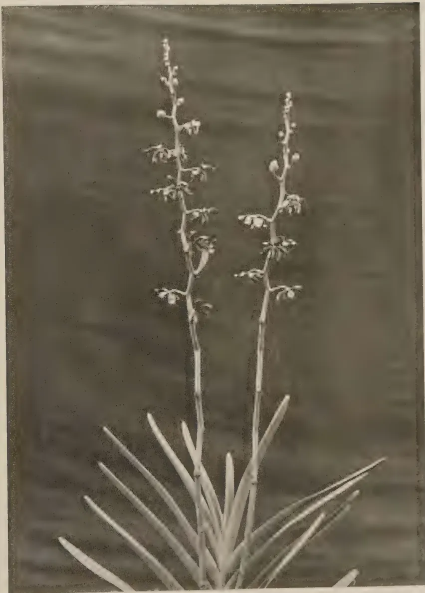

The  
**Tropical Agriculturist**

October, 1935

---

**EDITORIAL**

---

**BETTER FRUIT TREES**

---

**I**N the August 1935 number of this Journal attention was called to the rapidly increasing demand for fruit plants of all kinds, especially varieties of budded citrus, and it was mentioned that during 1934 only a very small part of this demand could be met. In order to meet this growing demand for better plants the nursery areas on experiment stations already in existence are being extended as rapidly as possible, and provision is being made for definite fruit areas on the new stations to be opened up in the near future in the dry zone and semi-dry zone for the supply of budded plants. For the present, however, those who contemplate starting orchard areas on a larger scale would be well advised to import their budded plants from such countries as South Africa, Australia or India.

It cannot be too strongly emphasised that good local or imported varieties of such plants, whether in small compounds or in orchard areas, must receive unremitting attention during the early years of growth if they are to develop into good bearing trees in the future. Progressive fruit-growers in Ceylon are doubtless well aware of the importance of suitable soil

1------------------------------------------------

197

conditions, ample spacing, judicious periodical pruning and regular cultural measures for insuring so far as possible the production of vigorous, well-shaped trees during the all important early years and many of them put such knowledge into practice. But how many adopt systematic and efficient pest and disease control in their orchards or gardens?

In Ceylon the better varieties of local or imported budded fruit trees are at the mercy of numerous insect and fungous enemies, and the growth of the young plants may be permanently crippled or seriously retarded by various leaf-mining, leaf-rolling or shoot-boring caterpillars and beetles, or by such diseases as mildew and canker. Later on, the crop may be attacked by other pests and diseases, which either seriously impair its market value or materially reduce its yield. One of the most important factors in pest and disease control is the regular application of chemical sprays and dusts, and fruit-growers must be prepared to budget annually for this item of expenditure as a form of insurance. In this connexion, some notes on "Spraying against Pests and Diseases," which appeared in the May 1935 number of this Journal, will repay careful consideration. Further advice on the care of fruit trees and on the control of their enemies can always be obtained from agricultural officers.

2------------------------------------------------

198

## A UNIFORMITY TRIAL WITH COCONUTS

A. W. R. JOACHIM, PH.D., DIP. AGRIC.

(CANTAB.),

AGRICULTURAL CHEMIST,

DEPARTMENT OF AGRICULTURE, CEYLON

IN 1929 a uniformity trial was laid down at the Wariapola Experiment Station to determine the size of plot best suited for field experimentation with coconuts. The data were recorded for a period of eighteen months, after which the experiment was discontinued for various reasons. The area on which the trial was carried out, though the best available on the station, was a comparatively poor-yielding, fairly variable block of coconuts about twelve acres in extent. The soil is a well-drained, light sandy loam, generally poor in fertilising constituents. The average annual rainfall of the district is about 80 inches. The palms were planted approximately 25 ft. by 25 ft., but this was not invariably so. In view of the marked fertility gradient revealed by a study of the plot yield records, only the data of a compact block of 360 palms showing comparatively less crop variation were used in the estimation of the experimental errors. This area was divided into sixty plot units of six trees each, in such a manner as to permit of the randomised block method of experimentation. There being a fair proportion of non-bearing trees in the area, it was not possible to have these 6-tree plots of uniform shape. Records of the number of nuts of every such plot were kept at each bi-monthly picking, as at the time the experiment was started no facilities were available on the station for manufacturing copra. In view, however, of the very high correlation subsequently found by Pieris (9) at the Coconut Research Scheme Station, Lunuwila, between the number of nuts and weights of copra per palm, the recording system adopted was quite justifiable. Only the data of the first year's pluck or six pickings were statistically examined.

The experiment was primarily intended to supply information as to the optimum plot size for field experiments with coconuts on the soil type of the station. But with the establishment of the Coconut Research Scheme, no systematic field

3------------------------------------------------

199

experiments designed to obtain accurate comparisons of treatment effects were carried out. The statistical examination of the crop data was therefore held over for a later period when the need for it would arise. Recently, the data obtained by the officers of the Coconut Research Scheme at Bandirippuwa Estate, Lunuwila over a period of two years have been statistically analysed by them, and essential preliminary information for field experiments on that type of soil obtained (1). It was therefore considered advisable to examine the Wariyapola data, obtained on a lighter type of soil and under rather different climatic and crop conditions, in order to determine whether the optimum plot size would vary to any extent.

#### METHOD OF ANALYSIS OF DATA

The data were examined by Fisher's method of the analysis of variance (2) which has during the last few years been successfully applied for various tropical crops by Eden (3) with tea, Cheeseman and Pound (4) with cacao, Lord (5) and (6) with paddy and rubber, Magistad and Farden (7) with pineapples, Reynolds and others (8) with cotton, etc. The lay-out of the experiment was in randomised blocks containing plots of sizes ranging from a 6-tree unit to a 36-tree unit, in a total area of 360 yielding trees. The 12-tree, 18-tree, 24-tree and 36-tree plot units were built up from the requisite number of contiguous 6-tree units. The blocks were laid out, as far as possible, in the direction of the least fertility gradient so as to eliminate the largest proportion of positional variance. The fertility gradient was ascertained by plotting the data of combinations of plots in two directions at right angles to each other. Each block was assigned by lot a number of hypothetical treatments. These varied from four to two, but three was the number in the majority of the cases. From the statistical analysis, the hypothetical treatment variance was compared with that of experimental error by the  $Z$  test of significance. If this revealed no significant difference between the two, a new variance was obtained from the combined sum of squares of deviations of error and treatment as recommended by Eden (3). In the analyses under discussion, in no instance were treatment and error variances noted to be significantly different. This is only to be expected, since as Eden states, (3) "both are really independent estimates of random variance and should be statistically equivalent." From the new variance the standard

4------------------------------------------------

200

error was estimated, and from the errors obtained for different plot sizes, expressed as percentages of their respective means, the optimum plot size determined.

### ERRORS FROM VARYING PLOT SIZES

The analysis of variance for the different plot sizes is shown on the tables below. The crop yields of the whole population of sixty 6-tree plot units expressed as nuts per plot, are shown in the appendix.

#### 6-TREE PLOTS

There were in this case 3 hypothetical treatments assigned to each of 20 randomised blocks. The analysis of variance and the *Z* test, shown in table I, would reveal that the block sum of squares amounts to about 57 per cent. of the whole, and its variance is definitely significant. The estimate of the error is thereby considerably reduced. The treatment variance is sub-normal and not significant when compared with that of error.

TABLE I  
ANALYSIS OF VARIANCE FOR 6-TREE PLOTS

Mean 162.7

<table border="1">
<thead>
<tr>
<th></th>
<th>Degrees of freedom</th>
<th>Sum of squares</th>
<th>Mean square</th>
<th><math>\frac{1}{2} \log_e</math> mean square</th>
</tr>
</thead>
<tbody>
<tr>
<td>Treatment ..</td>
<td>2</td>
<td>810.3</td>
<td>405.3</td>
<td>0.6997</td>
</tr>
<tr>
<td>Blocks ...</td>
<td>19</td>
<td>71154.6</td>
<td>3745.0</td>
<td>1.8115</td>
</tr>
<tr>
<td>Experimental Error ...</td>
<td>38</td>
<td>52540.7</td>
<td>1382.65</td>
<td>1.3134</td>
</tr>
<tr>
<td>Total ...</td>
<td>59</td>
<td>124505.6</td>
<td>2116.3</td>
<td></td>
</tr>
<tr>
<td>Treatment + Error ...</td>
<td>40</td>
<td>53351.0</td>
<td>1333.8</td>
<td></td>
</tr>
<tr>
<td colspan="5" style="text-align: right;">% Mean</td>
</tr>
<tr>
<td>S. E.</td>
<td></td>
<td>37.18</td>
<td>22.86</td>
<td></td>
</tr>
<tr>
<td>S. E. (Treatment + Error)</td>
<td></td>
<td>36.52</td>
<td>22.45</td>
<td></td>
</tr>
<tr>
<td>S. E. (Total)</td>
<td></td>
<td>46.0</td>
<td>28.27</td>
<td></td>
</tr>
</tbody>
</table>

#### Tests of Significance

<table>
<thead>
<tr>
<th></th>
<th><i>Z</i> (calculated)</th>
<th><i>Z</i> significant, <i>P</i>=.01</th>
</tr>
</thead>
<tbody>
<tr>
<td>Treatment v. Error</td>
<td>-0.6137</td>
<td>&gt; 2.2999</td>
</tr>
<tr>
<td>Block v. Error</td>
<td>0.4981</td>
<td>&lt; 0.4519</td>
</tr>
</tbody>
</table>

The analysis would show that the standard error of a 6-tree plot is 37.18 or 22.86 per cent. of the mean, which is slightly reduced to 36.52 or 22.45 per cent. when treatment and error are considered together. By the elimination of positional variance, the total error is reduced by about 20 per cent.

5------------------------------------------------

20112-TREE PLOTS

Hypothetical treatments were again 3, blocks 10 and total number of plots 30, in the case of the 12-tree plots. The analysis of variance and the  $Z$  test shown in table II disclose that the block variance is again definitely significant, the blocks accounting for a reduction of the total sum of squares by about 64 per cent. of the total. Treatment variance is again not significant and sub-normal.

TABLE II  
ANALYSIS OF VARIANCE FOR 12-TREE PLOTS

Mean 325.4

<table border="1">
<thead>
<tr>
<th></th>
<th>Degrees of freedom</th>
<th>Sum of squares</th>
<th>Mean square</th>
<th><math>\frac{1}{2} \log_e</math> mean square</th>
</tr>
</thead>
<tbody>
<tr>
<td>Treatment</td>
<td>2</td>
<td>3870.2</td>
<td>1935.1</td>
<td>0.3300</td>
</tr>
<tr>
<td>Blocks</td>
<td>9</td>
<td>91493.5</td>
<td>10165.9</td>
<td>1.1594</td>
</tr>
<tr>
<td>Error</td>
<td>18</td>
<td>47443.5</td>
<td>2635.7</td>
<td>0.4846</td>
</tr>
<tr>
<td>Total</td>
<td>29</td>
<td>142807.2</td>
<td>4924.4</td>
<td></td>
</tr>
<tr>
<td>Treatment + Error</td>
<td>20</td>
<td>51313.7</td>
<td>2565.7</td>
<td></td>
</tr>
<tr>
<td colspan="5" style="text-align: right;">% Mean</td>
</tr>
<tr>
<td>S. E.</td>
<td></td>
<td>51.42</td>
<td>15.80</td>
<td></td>
</tr>
<tr>
<td>S. E. (Treatment + Error)</td>
<td></td>
<td>50.65</td>
<td>15.57</td>
<td></td>
</tr>
<tr>
<td>S. E. (Total)</td>
<td></td>
<td>70.17</td>
<td>21.56</td>
<td></td>
</tr>
</tbody>
</table>

Tests of Significance

<table>
<thead>
<tr>
<th></th>
<th><math>Z</math> (calculated)</th>
<th><math>Z</math> significant, <math>P=.01</math></th>
</tr>
</thead>
<tbody>
<tr>
<td>Treatment v. Error</td>
<td>-0.1545</td>
<td>&gt; 2.2997</td>
</tr>
<tr>
<td>Blocks v. Error</td>
<td>0.6748</td>
<td>&lt; 0.6549</td>
</tr>
</tbody>
</table>

The error of a 12-tree plot is 50.65 per cent. of the mean, on a treatment + error basis. The elimination of positional variance has diminished the total error by 28 per cent.

18-TREE PLOTS

The number of treatments assigned in the case of the 18-tree plots was 4, the blocks or replications being 5, and the total number of plots 20. The  $Z$  test again reveals a significant block variance and a sub-normal treatment variance which is not however significant. The blocks were responsible for the removal of 53 per cent. of the total sum of squares. The analysis is shown in table III.

6------------------------------------------------

202

TABLE III  
ANALYSIS OF VARIANCE FOR 18-TREE PLOTS  
*Mean 488.1*

<table border="1">
<thead>
<tr>
<th></th>
<th>Degrees of freedom</th>
<th>Sum of squares</th>
<th>Mean square</th>
<th><math>\frac{1}{2} \log_e</math> mean square</th>
</tr>
</thead>
<tbody>
<tr>
<td>Treatment</td>
<td>3</td>
<td>11782.6</td>
<td>3927.5</td>
<td>0.6840</td>
</tr>
<tr>
<td>Blocks</td>
<td>4</td>
<td>121258.3</td>
<td>30314.6</td>
<td>1.7040</td>
</tr>
<tr>
<td>Error</td>
<td>12</td>
<td>57882.9</td>
<td>4823.6</td>
<td>0.7867</td>
</tr>
<tr>
<td>Total</td>
<td>19</td>
<td>190923.8</td>
<td>10048.6</td>
<td></td>
</tr>
<tr>
<td>Treatment + Error</td>
<td>15</td>
<td>69665.5</td>
<td>4644.4</td>
<td></td>
</tr>
<tr>
<td colspan="5" style="text-align: right;">% Mean</td>
</tr>
<tr>
<td>S. E.</td>
<td></td>
<td>69.45</td>
<td>14.23</td>
<td></td>
</tr>
<tr>
<td>S. E. (Treatment + Error)</td>
<td></td>
<td><b>68.15</b></td>
<td><b>13.96</b></td>
<td></td>
</tr>
<tr>
<td>S. E. (Total)</td>
<td></td>
<td>100.24</td>
<td>20.53</td>
<td></td>
</tr>
</tbody>
</table>

*Tests of Significance*

<table>
<thead>
<tr>
<th></th>
<th>Z (calculated)</th>
<th>Z significant, P=.01</th>
</tr>
</thead>
<tbody>
<tr>
<td>Treatment v. Error</td>
<td>-0.1027</td>
<td>1.6489</td>
</tr>
<tr>
<td>Blocks v. Error</td>
<td>0.9173</td>
<td>0.8443</td>
</tr>
</tbody>
</table>

The error of an 18-tree plot is 68.15 or 13.96 per cent. of the mean, when the treatment and error data are considered together. By the elimination of positional variance due to blocks, the total error is reduced by about 33 per cent.

**24-TREE PLOTS**

Treatments and blocks in this analysis numbered 3 and 5 respectively, the total number of plots being 15. In this instance too block variance is definitely significant while treatment variance is again not significant. The latter is however not sub-normal as was the case with the smaller sized plots. The sum of squares for blocks amounts to as much as 76 per cent. of the total.

TABLE IV  
ANALYSIS OF VARIANCE FOR 24-TREE PLOTS  
*Mean 650.8*

<table border="1">
<thead>
<tr>
<th></th>
<th>Degrees of freedom</th>
<th>Sum of squares</th>
<th>Mean square</th>
<th><math>\frac{1}{2} \log_e</math> mean square</th>
</tr>
</thead>
<tbody>
<tr>
<td>Treatment</td>
<td>2</td>
<td>24713.2</td>
<td>12356.6</td>
<td>1.2570</td>
</tr>
<tr>
<td>Blocks</td>
<td>4</td>
<td>161677.7</td>
<td>40419.4</td>
<td>1.8496</td>
</tr>
<tr>
<td>Error</td>
<td>8</td>
<td>27001.5</td>
<td>3375.2</td>
<td>0.6082</td>
</tr>
<tr>
<td>Total</td>
<td>14</td>
<td>213392.4</td>
<td>15242.3</td>
<td></td>
</tr>
<tr>
<td>Treatment + Error</td>
<td>10</td>
<td>51714.7</td>
<td>5171.5</td>
<td></td>
</tr>
<tr>
<td colspan="5" style="text-align: right;">% Mean</td>
</tr>
<tr>
<td>S. E.</td>
<td></td>
<td>58.95</td>
<td>9.06</td>
<td></td>
</tr>
<tr>
<td>S. E. (Treatment + Error)</td>
<td></td>
<td><b>71.91</b></td>
<td><b>11.05</b></td>
<td></td>
</tr>
<tr>
<td>S. E. (Total)</td>
<td></td>
<td>123.45</td>
<td>18.97</td>
<td></td>
</tr>
</tbody>
</table>

7------------------------------------------------

203*Tests of Significance*

<table>
<thead>
<tr>
<th></th>
<th><i>Z</i> (calculated)</th>
<th><i>Z</i> significant, <math>P=.01</math></th>
</tr>
</thead>
<tbody>
<tr>
<td>Treatment v. Error</td>
<td>0.6488</td>
<td>1.0787</td>
</tr>
<tr>
<td>Blocks v. Error</td>
<td>1.2414</td>
<td>0.9734</td>
</tr>
</tbody>
</table>

The error works out at 58.95 or 9.06 per cent. of the mean, but when calculated on a treatment+error basis amounts to 71.91 or 11.05 per cent. of the mean. The removal of positional variance reduces the total error by no less than 41 per cent.

**30-TREE PLOTS**

The number of treatments in this instance is again 3, but the replications or blocks are reduced to 4, the total number of plots being 12. Blocks account for about 60 per cent. of the total sum of squares, but owing to the smaller number of degrees of freedom the *Z* test indicates that this variance is just not significant. The treatment variance is sub-normal and definitely not significant. Table V shows the analysis of variance.

TABLE V  
ANALYSIS OF VARIANCE FOR 30-TREE PLOTS  
*Mean 813.5*

<table>
<thead>
<tr>
<th></th>
<th>Degrees of freedom</th>
<th>Sum of squares</th>
<th>Mean square</th>
<th><math>\frac{1}{2} \log_e</math> mean square</th>
</tr>
</thead>
<tbody>
<tr>
<td>Treatment</td>
<td>... 2</td>
<td>14058.5</td>
<td>7029.2</td>
<td>0.9750</td>
</tr>
<tr>
<td>Blocks</td>
<td>... 3</td>
<td>90561.0</td>
<td>30187.0</td>
<td>1.7037</td>
</tr>
<tr>
<td>Error</td>
<td>... 6</td>
<td>46125.5</td>
<td>7687.6</td>
<td>1.0198</td>
</tr>
<tr>
<td>Total</td>
<td>... 11</td>
<td>150745.0</td>
<td>13704.1</td>
<td></td>
</tr>
<tr>
<td>Treatment + Error</td>
<td>... 8</td>
<td>60184.0</td>
<td>7523.0</td>
<td></td>
</tr>
<tr>
<td colspan="5" style="text-align: right;">% Mean</td>
</tr>
<tr>
<td>S. E.</td>
<td></td>
<td>87.68</td>
<td>11.03</td>
<td></td>
</tr>
<tr>
<td>S. E. (Treatment + Error)</td>
<td></td>
<td>86.74</td>
<td>10.66</td>
<td></td>
</tr>
<tr>
<td>S. E. (Total)</td>
<td></td>
<td>117.06</td>
<td>14.39</td>
<td></td>
</tr>
</tbody>
</table>

*Tests of Significance*

<table>
<thead>
<tr>
<th></th>
<th><i>Z</i> (calculated)</th>
<th><i>Z</i> significant, <math>P=.05</math></th>
</tr>
</thead>
<tbody>
<tr>
<td>Treatment v. Error</td>
<td>-0.0448</td>
<td>1.4808</td>
</tr>
<tr>
<td>Blocks v. Error</td>
<td>0.6839</td>
<td>0.7798</td>
</tr>
</tbody>
</table>

The error in the case of the 36-tree plots is 86.74 or 10.66 per cent. of the mean. About 26 per cent. of the total error is removed by the randomised block design.

8------------------------------------------------

This image is a scan of a blank page. The paper has a light beige or cream-colored tint. There are several small, dark specks scattered across the surface, which appear to be dust or scanning artifacts. The texture of the paper is slightly visible, with some subtle variations in tone and a few faint, irregular lines.

9------------------------------------------------

# COCONUT UNIFORMITY TRIAL

## WARIYAPOLA

1929-1930

![Line graph showing Percentage Standard Error of Plot vs. Trees per Plot for Wariyapola coconut uniformity trial. The graph compares a theoretical curve (solid line) with an actual curve (dashed line). The x-axis represents 'TREES PER PLOT' with values 6, 12, 18, 24, 30, 36. The y-axis represents 'PERCENTAGE STANDARD ERROR OF PLOT' with values 5, 10, 15, 20, 25. Both curves show an upward trend, with the actual curve generally higher than the theoretical curve at lower tree counts and lower at higher tree counts.](669a2e84e710e6aa877b7bad69e6b717_4_img.webp)

PERCENTAGE STANDARD ERROR OF PLOT

TREES PER PLOT

THEORETICAL CURVE  
ACTUAL CURVE

<table border="1"><thead><tr><th>Trees per Plot</th><th>Theoretical Curve (%)</th><th>Actual Curve (%)</th></tr></thead><tbody><tr><td>6</td><td>18.0</td><td>18.0</td></tr><tr><td>12</td><td>14.5</td><td>15.5</td></tr><tr><td>18</td><td>12.5</td><td>13.5</td></tr><tr><td>24</td><td>10.5</td><td>11.5</td></tr><tr><td>30</td><td>9.5</td><td>10.5</td></tr><tr><td>36</td><td>8.5</td><td>9.5</td></tr></tbody></table>

10------------------------------------------------

20436-TREE PLOTS

The only possible number of 36-tree plot treatments on an area of 10 such plots is 2 and of replications 5 or *vice versa*. As however the elimination of as much block variance as possible is desired, the choice of 5 replications and 2 treatments was made. It will be seen from table VI that blocks in this instance account for no less than 83 per cent. of the total sum of squares. Their variance is significant by the  $Z$  test, with a probability of 20 to 1. Treatment variance, though nearly twice that of error, is not however, significant in view of the very considerably diminished number of degrees of freedom.

TABLE VI  
ANALYSIS OF VARIANCE FOR 36-TREE PLOTS  
*Mean 976.2*

<table border="1">
<thead>
<tr>
<th></th>
<th>Degrees of freedom</th>
<th>Sum of squares</th>
<th>Mean square</th>
<th><math>\frac{1}{2} \log_{10}</math> mean square</th>
</tr>
</thead>
<tbody>
<tr>
<td>Treatment</td>
<td>1</td>
<td>14288.4</td>
<td>14288.4</td>
<td>1.3297</td>
</tr>
<tr>
<td>Blocks</td>
<td>4</td>
<td>218912.6</td>
<td>54728.1</td>
<td>2.001</td>
</tr>
<tr>
<td>Error</td>
<td>4</td>
<td>29572.6</td>
<td>7393.1</td>
<td>1.00</td>
</tr>
<tr>
<td>Total</td>
<td>9</td>
<td>262773.6</td>
<td>29197.1</td>
<td></td>
</tr>
<tr>
<td>Treatment + Error</td>
<td>5</td>
<td>43861.0</td>
<td>8772.2</td>
<td></td>
</tr>
<tr>
<td colspan="5" style="text-align: right;">% Mean</td>
</tr>
<tr>
<td>S. E.</td>
<td></td>
<td>85.98</td>
<td></td>
<td>8.81</td>
</tr>
<tr>
<td>S. E. (Treatment + Error)</td>
<td></td>
<td>93.66</td>
<td></td>
<td>9.60</td>
</tr>
<tr>
<td>S. E. (Total)</td>
<td></td>
<td>170.8</td>
<td></td>
<td>17.49</td>
</tr>
</tbody>
</table>

*Tests of Significance*

<table>
<thead>
<tr>
<th></th>
<th><math>Z</math> (calculated)</th>
<th><math>Z</math> significant, <math>P=.05</math></th>
</tr>
</thead>
<tbody>
<tr>
<td>Treatment v. Error</td>
<td>0.3297</td>
<td>1.0212</td>
</tr>
<tr>
<td>Blocks v. Error</td>
<td>1.001</td>
<td>0.9272</td>
</tr>
</tbody>
</table>

The error in this instance is 93.66 or 9.60 per cent. of the mean when treatment and error are considered together. The total error is diminished by about 45 per cent. through the removal of block variance.

GENERAL DISCUSSION

In table VII are shown the standard errors corresponding to the different sized plots calculated from the entire data of sixty 6-tree plots. In another column are shown the theoretical errors, worked out on the basis of the standard error of the 6-tree plots. The two sets of figures are plotted in the accompanying diagram.

11------------------------------------------------

205TABLE VII

<table border="1">
<thead>
<tr>
<th>Size of plot</th>
<th>Mean yield of plot nuts</th>
<th>Actual Plot Error nuts % of mean</th>
<th>Theoretical Error % of mean</th>
</tr>
</thead>
<tbody>
<tr>
<td>6-tree</td>
<td>162.7</td>
<td>36.52</td>
<td>22.45</td>
</tr>
<tr>
<td>12 ,,</td>
<td>325.4</td>
<td>50.65</td>
<td>15.87</td>
</tr>
<tr>
<td>18 ,,</td>
<td>488.1</td>
<td>68.15</td>
<td>13.96</td>
</tr>
<tr>
<td>24 ,,</td>
<td>650.8</td>
<td>71.91</td>
<td>11.05</td>
</tr>
<tr>
<td>30 ,,</td>
<td>813.5</td>
<td>86.74</td>
<td>10.66</td>
</tr>
<tr>
<td>36 ,,</td>
<td>976.2</td>
<td>93.66</td>
<td>9.60</td>
</tr>
</tbody>
</table>

It will be noted from both the table and the diagram that, as is to be expected, the standard error diminishes with the increase in plot size. The fall is most marked as the plot size increases from a 6-tree to a 12-tree unit, but is fairly appreciable up to a plot size of 18 trees. A further increase in plot size results in a decrease in the percentage error, which is however disproportionate to the increase in size of plot. A plot unit of somewhere between 18 and 24 trees will therefore appear to be the optimum for the soil and climatic conditions at Wariyapola. An identical result was obtained in Coconut Research Scheme trial (1) under different soil, crop and climatic conditions. It would therefore appear that under estate conditions where planting material and often soil conditions are characterised by marked heterogeneity, an 18 or 20-tree plot would be generally suitable for field experiments with coconuts. The latter is recommended where land economy is not the sole consideration.

The table would also demonstrate the close agreement between the theoretical and actual errors obtained. This would apparently be accounted for by the arrangement of the plots in blocks of the least fertility gradient and would point to a satisfactory experimental layout. By the elimination of block variance, the total errors have been reduced by about 20 to 45 per cent., the reduction being greater in the case of the larger sized plots.

The actual errors obtained in this trial, it will be observed, are high when compared with those for temperate crops and even tropical crops like tea (2) and rubber (3). But considering the marked variation in yields of individual coconut palms under estate conditions, and more so in this instance where the

12------------------------------------------------

206

variations were greater than normal, the high error figures are not surprising. It is however interesting to learn that a very similar range of errors was obtained in the uniformity trial of the Coconut Research Scheme at Bandirippuwa, though the average yields secured there were about twice those obtained at Wariyapola.

Working with an 18-tree plot unit, it has been found on calculation that for average differences of about 15 per cent. in yield to be considered significant, the number of replications required is six for each treatment.

#### SUMMARY

The data of a uniformity trial carried out at Wariyapola in 1929-30 on a 360-tree block of coconuts over a period of a year were statistically examined by the method of the analysis of variance. The analyses indicate that:

1. (1) For the soil and climatic conditions of the area, an 18 or 20-tree plot unit is the optimum for field experiments with this crop.
2. (2) An identical result having been obtained in another coconut district with different soil and crop conditions, an 18 or 20-tree plot would appear to be generally suitable for field trials with coconuts under plantation conditions.
3. (3) There is a close agreement between the theoretical and actual error percentages obtained, showing that the experimental layout has been satisfactory. The randomised block method of experimentation was adopted, the total errors being reduced thereby from 20 to 45 per cent.
4. (4) The standard error per plot for an 18-tree size plot is about 14 per cent. For treatment differences of 15 per cent. to be considered significant, the number of replications required is six.

#### ACKNOWLEDGMENTS

The writer wishes to acknowledge his indebtedness to the Divisional Agricultural Officer, North-Western for his help in having made this trial possible; to the Farm Officers at Wariyapola Experiment Station, for their work in connection with it, especially in regard to the careful recording of the yield data; and to Dr. T. Eden, Agricultural Chemist, Tea Research Institute, for his valuable advice and helpful criticism.

13------------------------------------------------

207REFERENCES

1. 1. CHILD, R.—Review of the Activities of the Coconut Research Scheme (Ceylon). *The Trop. Agriculturist*. Vol. LXXXIII, No. 1, 1934.
2. 2. FISHER, R. A.—Statistical Methods for Research Workers.
3. 3. EDEN, T.—The Experimental Errors of Field Experiments with Tea. *Jl. Agr. Sc.* Vol. XXI, Pt. 3, 1931.
4. 4. CHEESEMAN, E. E. and POUND, F. T.—Uniformity Trials on Cacao. *Trop. Agric.* Vol. IX, No. 9, 1932.
5. 5. LORD, L. and ABEYESUNDERE, L.—Field Experimentation with Rubber. Dept. Agric. Ceylon, Bull. No. 82.
6. 6. LORD, L.—A Uniformity Trial with Irrigated Broadcast Rice. *Jl. Agr. Sc.* Vol. XXI, Pt. 1, 1931.
7. 7. MAGISTAD, O. C. AND FARDEN, C. A.—Experimental Error in Field Experiments with Pineapples. *Jl. Amer. Soc. Agron.* Vol. XXVI, No. 9, 1934.
8. 8. REYNOLDS, E. BETAL.—Size, Shape and Replication of Plots for Field Experiments with Cotton. *Jl. Amer. Soc. Agron.* Vol. XXVI, No. 9, 1934.
9. 9. PIERIS, W. V. D.—Studies on the Coconut Palm, I. *The Trop. Agriculturist*. Vol. LXXXII, No. 2, 1934.

APPENDIXYIELDS OF NUTS OF 6-TREE PLOT UNITS

<table border="1">
<thead>
<tr>
<th>Plot</th>
<th>Nuts</th>
<th>Plot</th>
<th>Nuts</th>
<th>Plot</th>
<th>Nuts</th>
<th>Plot</th>
<th>Nuts</th>
<th>Plot</th>
<th>Nuts</th>
<th>Plot</th>
<th>Nuts</th>
</tr>
</thead>
<tbody>
<tr>
<td>1</td>
<td>204</td>
<td>11</td>
<td>234</td>
<td>21</td>
<td>213</td>
<td>31</td>
<td>176</td>
<td>41</td>
<td>107</td>
<td>51</td>
<td>219</td>
</tr>
<tr>
<td>2</td>
<td>87</td>
<td>12</td>
<td>228</td>
<td>22</td>
<td>118</td>
<td>32</td>
<td>176</td>
<td>42</td>
<td>157</td>
<td>52</td>
<td>196</td>
</tr>
<tr>
<td>3</td>
<td>171</td>
<td>13</td>
<td>218</td>
<td>23</td>
<td>181</td>
<td>33</td>
<td>174</td>
<td>43</td>
<td>151</td>
<td>53</td>
<td>137</td>
</tr>
<tr>
<td>4</td>
<td>134</td>
<td>14</td>
<td>163</td>
<td>24</td>
<td>107</td>
<td>34</td>
<td>201</td>
<td>44</td>
<td>181</td>
<td>54</td>
<td>87</td>
</tr>
<tr>
<td>5</td>
<td>252</td>
<td>15</td>
<td>194</td>
<td>25</td>
<td>87</td>
<td>35</td>
<td>148</td>
<td>45</td>
<td>112</td>
<td>55</td>
<td>85</td>
</tr>
<tr>
<td>6</td>
<td>190</td>
<td>16</td>
<td>198</td>
<td>26</td>
<td>148</td>
<td>36</td>
<td>137</td>
<td>46</td>
<td>88</td>
<td>56</td>
<td>133</td>
</tr>
<tr>
<td>7</td>
<td>120</td>
<td>17</td>
<td>215</td>
<td>27</td>
<td>192</td>
<td>37</td>
<td>138</td>
<td>47</td>
<td>170</td>
<td>57</td>
<td>162</td>
</tr>
<tr>
<td>8</td>
<td>222</td>
<td>18</td>
<td>146</td>
<td>28</td>
<td>255</td>
<td>38</td>
<td>119</td>
<td>48</td>
<td>93</td>
<td>58</td>
<td>154</td>
</tr>
<tr>
<td>9</td>
<td>180</td>
<td>19</td>
<td>199</td>
<td>29</td>
<td>176</td>
<td>39</td>
<td>158</td>
<td>49</td>
<td>154</td>
<td>59</td>
<td>202</td>
</tr>
<tr>
<td>10</td>
<td>196</td>
<td>20</td>
<td>236</td>
<td>30</td>
<td>74</td>
<td>40</td>
<td>166</td>
<td>50</td>
<td>134</td>
<td>60</td>
<td>109</td>
</tr>
</tbody>
</table>

14------------------------------------------------

208

CONTRIBUTIONS FROM THE COCONUT  
RESEARCH SCHEME (CEYLON)

STUDIES ON THE COCONUT PALM—II  
ON THE RELATION BETWEEN THE WEIGHT OF  
HUSKED NUTS AND THE WEIGHT OF COPRA

W. V. D. PIERIS, M.A., DIP. AGRIC. (CANTAB.),  
B.SC. (LOND.),

*GENETICIST OF THE COCONUT RESEARCH SCHEME*

THE conduct of field experiments on coconuts has hitherto had to contend with the labour and the cost of curing copra from individual palms or blocks of palms in order to arrive at comparable expressions of yield.

Although there is a marked positive correlation between the number of nuts produced by palm and the weight of copra manufactured from these nuts (1), the expression of yield by the number of nuts is open to considerable error. The error introduced is due to the variability in the size of nuts from different palms and more especially from different varieties of the palm. Some varieties produce small nuts, which although present in large numbers, may produce no more copra than a moderate number of larger nuts from other varieties. As a rough estimate of yield the number of nuts is useful, but for the purpose of experimental work on individual palms or small plots of palms, the number of nuts will not be an accurate expression of yield.

As a second expression of yield, the weight of unhusked nuts may be considered. The correlation of this weight with the weight of copra is higher than that between weight of copra and the number of nuts (1). But here too grave errors may be introduced by the progressive desiccation of the husk, which loses a considerable amount of water on storage in heaps on the field; so that it would be risky to attempt to establish a definite numerical relation between the weight of unhusked nuts and the weight of copra, since this relation would alter with varying degrees of dryness of the husk.

The third method of expressing yield is by making use of the weight of husked nut; and it is the purpose of this paper to show that this is the most satisfactory and least troublesome method of arriving at a reliable expression of yield. In this case, the variability in size of nut which introduces an error into the first method, and the error due to drying of the husk introduced into the second method are avoided.

15------------------------------------------------

209

In 1933 Belgrave and Lambourne (2) stated that there was a "remarkably close relationship between the weight of husked nut and meat content". This relation was confirmed by the present writer who found further that in a particular experiment involving two hundred and sixty-three palms the correlation coefficient between weight of husked nuts and weight of copra was as high as +0.96.

Since the correlation coefficient was very high, it was thought that, perhaps, there was a simple numerical relation between the two variables. In order to ascertain whether this was so, the nuts from two hundred and sixty palms, divided into twenty-six blocks of ten trees each, were separately husked, weighed and cured for copra. The results of this experiment are given in table I. It will be seen that the correlation coefficient between weight of husked nuts and weight of copra was +0.984 and that the regression coefficient was 0.335.

TABLE I

*Data obtained from 250 palms on Bandirippuwa Estate*

<table border="1">
<thead>
<tr>
<th>Tree Numbers</th>
<th>No. of Nuts</th>
<th>Weight of Husked Nuts</th>
<th>Weight of Copra</th>
<th>Wt. of Copra <math>\times 100</math> Wt. of Husked Nuts</th>
</tr>
</thead>
<tbody>
<tr><td>1- 10</td><td>30</td><td>18.25</td><td>6.00</td><td>32.90</td></tr>
<tr><td>11- 21</td><td>44</td><td>30.25</td><td>10.00</td><td>33.05</td></tr>
<tr><td>22- 31</td><td>33</td><td>25.00</td><td>8.25</td><td>33.00</td></tr>
<tr><td>32- 42</td><td>50</td><td>34.50</td><td>11.00</td><td>31.90</td></tr>
<tr><td>43- 55</td><td>21</td><td>14.75</td><td>4.75</td><td>32.30</td></tr>
<tr><td>56- 66</td><td>29</td><td>20.25</td><td>7.00</td><td>34.60</td></tr>
<tr><td>67- 76</td><td>32</td><td>24.00</td><td>8.00</td><td>33.33</td></tr>
<tr><td>77- 89</td><td>40</td><td>28.50</td><td>9.50</td><td>33.33</td></tr>
<tr><td>90-101</td><td>32</td><td>22.50</td><td>7.50</td><td>33.33</td></tr>
<tr><td>102-111</td><td>40</td><td>28.25</td><td>9.75</td><td>34.50</td></tr>
<tr><td>112-121</td><td>38</td><td>27.75</td><td>9.25</td><td>33.33</td></tr>
<tr><td>122-132</td><td>57</td><td>37.50</td><td>12.50</td><td>33.33</td></tr>
<tr><td>133-145</td><td>29</td><td>24.50</td><td>7.75</td><td>31.60</td></tr>
<tr><td>146-158</td><td>50</td><td>31.25</td><td>11.25</td><td>36.00</td></tr>
<tr><td>159-169</td><td>27</td><td>17.75</td><td>6.00</td><td>33.80</td></tr>
<tr><td>170-182</td><td>47</td><td>31.82</td><td>10.25</td><td>32.20</td></tr>
<tr><td>183-192</td><td>44</td><td>35.00</td><td>11.50</td><td>32.90</td></tr>
<tr><td>193-204</td><td>38</td><td>27.28</td><td>9.50</td><td>34.80</td></tr>
<tr><td>205-214</td><td>35</td><td>25.25</td><td>7.50</td><td>29.70</td></tr>
<tr><td>215-228</td><td>42</td><td>31.00</td><td>10.50</td><td>33.90</td></tr>
<tr><td>229-244</td><td>33</td><td>25.25</td><td>8.50</td><td>33.70</td></tr>
<tr><td>245-256</td><td>32</td><td>24.25</td><td>8.00</td><td>33.00</td></tr>
<tr><td>257-267</td><td>31</td><td>24.25</td><td>7.75</td><td>32.00</td></tr>
<tr><td>268-279</td><td>35</td><td>25.00</td><td>8.25</td><td>33.00</td></tr>
<tr><td>280-289</td><td>33</td><td>27.00</td><td>8.75</td><td>32.40</td></tr>
<tr><td>290-300</td><td>32</td><td>24.25</td><td>8.00</td><td>33.00</td></tr>
</tbody>
</table>

$$r = +0.984$$

$$b = 0.335$$

16------------------------------------------------

210

The last column in the table shows that the relation that was sought for, namely the percentage ratio between weight of copra and weight of husked nuts, approximated to  $33\frac{1}{3}$  per cent., which meant that in this experiment the weight of copra was approximately equal to one-third the weight of the husked nuts.

It was realised that a relation of this sort, if established, would be of great use in minimising the labour involved in field experimentation with coconuts. It has been stated already that although the best expression of yield is the weight of copra, the process of curing copra in little lots is associated with many disadvantages which may be enumerated as follows:

1. The separate lots of nuts have to be carted from various positions in the field to the kiln, which may be some distance away, and during carting and unloading at the kiln there is always the danger of mixing the nuts from different units and of the occurrence of losses difficult to trace.

2. Losses due to pieces of the kernel being chipped off during splitting of the nuts on the barbecue are unavoidable.

3. Kiln space being limited, all the separate lots of nuts from a large number of experimental units cannot be cured at the same time; and differences in sun-drying and subsequent firing procedure at the different shifts will result in the various lots not being subjected to the same treatment.

4. Drying will seldom be uniform and the rate of drying will be different in the different layers of kernels on the kiln-platform.

5. Mixing and losses during curing always occur.

6. Errors due to inaccuracies in the weighing machine are unavoidable, especially if spring balances are being used and small weights recorded.

7. To the foregoing disadvantages may be added the great labour and cost involved in curing a large number of separate parcels of nuts.

In order to find out whether the relation between husked nut and copra, as mentioned above, could be regarded as a general relation, the experiment was repeated on the nuts of a group of palms throughout eight picks from October, 1933, to

17------------------------------------------------

211

December, 1934. The results are given in table II. & table III. Table II gives the percentage ratios,  $\frac{\text{Wt. of copra} \times 100}{\text{Wt. of husked nuts}}$ , the correlation coefficient and regression coefficient for the eight picks. The correlation coefficients for the individual picks are very high, approximating to +0.98; but there is considerable fluctuation in the percentage ratio and the regression coefficients, and the former does not approach very closely to 33 $\frac{1}{3}$  per cent. as in the original experiment. In four cases out of eight the relation fluctuates round 32 per cent., in three cases round 30 per cent., whilst in one case it falls to almost 28 per cent.

TABLE II

Percentage Ratio between weight of Husked Nuts and weight of Copra for 8 picks, with their Correlation and Regression Coefficients.

<table border="1">
<thead>
<tr>
<th rowspan="2">Date of Pick</th>
<th>Average</th>
<th>Correlation</th>
<th>Regression</th>
</tr>
<tr>
<th><math>\frac{\text{Wt. of Copra} \times 100}{\text{Wt. of Husked Nuts}}</math></th>
<th>Coefficient</th>
<th>Coefficient</th>
</tr>
</thead>
<tbody>
<tr>
<td>16-10-33</td>
<td>32.37</td>
<td>+0.979</td>
<td>0.343</td>
</tr>
<tr>
<td>16-12-33</td>
<td>29.53</td>
<td>+0.967</td>
<td>0.289</td>
</tr>
<tr>
<td>19-2-34</td>
<td>30.49</td>
<td>+0.980</td>
<td>0.323</td>
</tr>
<tr>
<td>16-4-34</td>
<td>32.00</td>
<td>+0.979</td>
<td>0.321</td>
</tr>
<tr>
<td>19-6-34</td>
<td>29.91</td>
<td>+0.975</td>
<td>0.300</td>
</tr>
<tr>
<td>21-8-34</td>
<td>31.61</td>
<td>+0.982</td>
<td>0.331</td>
</tr>
<tr>
<td>16-10-34</td>
<td>27.92</td>
<td>+0.985</td>
<td>0.295</td>
</tr>
<tr>
<td>21-12-34</td>
<td>32.36</td>
<td>+0.983</td>
<td>0.312</td>
</tr>
</tbody>
</table>

The analysis of variance and covariance for the eight picks on the weights of husked nuts and copra weighed for numbers of nuts in samples is given in table III. It can be seen that the "Within Picks" correlation coefficient is +0.979.

The differences in the relation at different picks may be due to (a) real discrepancies, (b) discrepancies due to lack of uniformity in experimental procedure, most probably over-drying, and (c) discrepancies due to the presence of immature nuts in the samples, the copra from which may not bear the same relation to husked nuts as with mature nuts.

In order to test whether the presence of immature nuts tended to decrease the percentage relation, the first four bunches of eighty-four palms were picked and cured separately. The results for the first three bunches are given in table IV. All the lots were somewhat over-dried, hence the percentage relation

18------------------------------------------------

212

TABLE III  
*Analysis of Variance & Covariance*

<table border="1">
<thead>
<tr>
<th rowspan="2">Source of Variation</th>
<th rowspan="2">Degrees of Freedom</th>
<th colspan="2">Sums of Squares</th>
<th rowspan="2">Sums of Products</th>
<th colspan="2">Mean Variances</th>
<th rowspan="2">Mean Covariance</th>
<th rowspan="2">Correlation Coefficient</th>
</tr>
<tr>
<th>Husked Nuts</th>
<th>Copra</th>
<th>Husked Nuts</th>
<th>Copra</th>
</tr>
</thead>
<tbody>
<tr>
<td>Between Picks</td>
<td>7</td>
<td>15758.9298</td>
<td>1524.2749</td>
<td>4628.3742</td>
<td>2251.276</td>
<td>217.754</td>
<td>661.196</td>
<td>+0.944</td>
</tr>
<tr>
<td>Within Picks</td>
<td>710</td>
<td>126159.3323</td>
<td>12986.0055</td>
<td>39607.6240</td>
<td>17.327</td>
<td>1.784</td>
<td>5.440</td>
<td>+0.979</td>
</tr>
<tr>
<td>Total</td>
<td>717</td>
<td>141918.2621</td>
<td>14510.2804</td>
<td>44235.9982</td>
<td>—</td>
<td>—</td>
<td>—</td>
<td>+0.975</td>
</tr>
</tbody>
</table>

TABLE IV  
 Percentage Ratio of Weight of Copra to Weight of Husked Nuts of Bunches of Different Degrees of Maturity

<table border="1">
<thead>
<tr>
<th rowspan="2">Number of Bunch</th>
<th rowspan="2">Number of nuts</th>
<th rowspan="2">Weight of Husked Nuts</th>
<th colspan="2">Weight of Copra</th>
</tr>
<tr>
<th>Wt. of Copra × 100</th>
<th>Wt. of Husked Nuts</th>
</tr>
</thead>
<tbody>
<tr>
<td>1. Ripe</td>
<td>968</td>
<td>863.25</td>
<td>265.25</td>
<td>30.7</td>
</tr>
<tr>
<td>2. Ripe</td>
<td>1061</td>
<td>903.00</td>
<td>274.25</td>
<td>30.5</td>
</tr>
<tr>
<td>3. Immature</td>
<td>309</td>
<td>281.00</td>
<td>82.00</td>
<td>29.2</td>
</tr>
</tbody>
</table>

19------------------------------------------------

213

was less than  $33\frac{1}{2}$  per cent. But it will be seen that the nuts of the first and second bunches which were ripe gave nearly the same relation, whereas the third bunch nuts, which were immature, gave a considerably lower relation. 31 nuts of the fourth bunch which were quite immature were also cured, and for these the relation dropped to 26.6 per cent. This shows that the presence of immature nuts in a sample tends to lower the percentage relation between weight of husked nuts and weight of copra. As far as this experiment goes, keeping in mind the over-drying which was observed, the percentage relation for mature nuts is well above 30 per cent.

Unequal drying of copra on the kiln-platform is a thing that is commonly noticed. While some halves are almost completely dry, with the moisture percentage down to 8 per cent., others are still only partially dried and require further firing. These later firings must, of necessity, over-dry those halves that are already down to the optimum moisture percentage.

In order to test this experimentally, 500 nuts were taken from a heap on the field and divided up into 10 lots of 50 nuts each. They were then husked and each lot of husked nuts was weighed separately, after which they were split open and left in the sun for  $5\frac{1}{2}$  hours from 11 a.m. to 4.30 p.m. At 4.30 p.m. the halves of each lot were put into wire-netting bags specially made for the purpose and fired. [Note.—For curing small samples of nuts, wire-mesh bags have been found to be most useful. The bags we use are made of  $\frac{1}{2}$ -in. mesh and are 3 ft. long by 2 ft. wide. Owing to the smallness of the mesh no pieces of copra are lost. The bags are strong, not damaged by heat, and easy to stack and handle on the kiln.]

At 9.15 on the next morning the ten lots were weighed and spread out in the sun. Sun-drying continued till 4.30 p.m. when they were put back in the kiln and fired. This procedure was continued for three more days, so that the copra received three sun-dryings and five kiln-dryings.

In the afternoon of the third day of drying, that is after three sun-dryings and two kiln-dryings, it was noticed that all the copra was not drying uniformly. Some halves appeared to be quite dry, while others were still moist.

In the afternoon of the fourth day, that is after another kiln and sun-drying it was noticed that in most cases the drying was complete, but there were still some halves that did not appear to be quite dry. This necessitated a further drying.

20------------------------------------------------

214

These observations indicate that copra in kilns does not dry uniformly with the result that a great part of it becomes over-dried, leading to a decrease in weight in the final product. This lack of uniformity, in drying is mainly due, as has been mentioned already, to the presence of immature nuts.

The results of this experiment are given in table V. The stages in columns 4 and 5 are as follows :

<table>
<tr>
<td>Stage 1</td>
<td>After 1 sun-drying</td>
<td>and 1 kiln-drying</td>
</tr>
<tr>
<td>„ 2</td>
<td>„ 2 sun-dryings</td>
<td>and 2 kiln-dryings</td>
</tr>
<tr>
<td>„ 3</td>
<td>„ 3 „ „</td>
<td>2 „ „</td>
</tr>
<tr>
<td>„ 4</td>
<td>„ 3 „ „</td>
<td>3 „ „</td>
</tr>
<tr>
<td>„ 5</td>
<td>„ 3 „ „</td>
<td>4 „ „</td>
</tr>
<tr>
<td>„ 6</td>
<td>„ 3 „ „</td>
<td>5 „ „</td>
</tr>
</table>

All weights of copra are given corrected for weight of shells, which were not actually removed till after 2 sun-dryings and 2 kiln-dryings.

TABLE V

Progressive Loss of Moisture in Copra during Drying and Changes in

<table>
<thead>
<tr>
<th rowspan="2">Lot No.</th>
<th rowspan="2">No. of Nuts</th>
<th rowspan="2">Wt. of Husked Nuts</th>
<th colspan="2">Ratio <math>\frac{\text{Wt. of Copra} \times 100}{\text{Wt. of Husked Nuts}}</math></th>
</tr>
<tr>
<th>Wt. of Copra</th>
<th><math>\frac{\text{Wt. of Copra} \times 100}{\text{Wt. of Husked Nuts}}</math></th>
</tr>
</thead>
<tbody>
<tr>
<td rowspan="6">1</td>
<td rowspan="6">50</td>
<td rowspan="6">45.50</td>
<td>1.18.27</td>
<td>40.2</td>
</tr>
<tr>
<td>2.15.75</td>
<td>34.6</td>
</tr>
<tr>
<td>3.15.00</td>
<td>33.0</td>
</tr>
<tr>
<td>4.14.50</td>
<td>31.9</td>
</tr>
<tr>
<td>5.13.75</td>
<td>30.2</td>
</tr>
<tr>
<td>6.13.50</td>
<td>29.7</td>
</tr>
<tr>
<td rowspan="6">2</td>
<td rowspan="6">50</td>
<td rowspan="6">43.75</td>
<td>1.17.77</td>
<td>40.6</td>
</tr>
<tr>
<td>2.15.25</td>
<td>34.8</td>
</tr>
<tr>
<td>3.14.50</td>
<td>33.1</td>
</tr>
<tr>
<td>4.14.00</td>
<td>32.0</td>
</tr>
<tr>
<td>5.13.50</td>
<td>30.9</td>
</tr>
<tr>
<td>6.13.25</td>
<td>30.3</td>
</tr>
<tr>
<td rowspan="6">3</td>
<td rowspan="6">50</td>
<td rowspan="6">46.25</td>
<td>1.18.25</td>
<td>39.5</td>
</tr>
<tr>
<td>2.16.00</td>
<td>34.6</td>
</tr>
<tr>
<td>3.15.25</td>
<td>33.0</td>
</tr>
<tr>
<td>4.14.75</td>
<td>31.9</td>
</tr>
<tr>
<td>5.14.25</td>
<td>30.8</td>
</tr>
<tr>
<td>6.13.75</td>
<td>29.7</td>
</tr>
</tbody>
</table>

21------------------------------------------------

215TABLE V—(Contd.)

<table border="1">
<thead>
<tr>
<th rowspan="2">Lot No.</th>
<th rowspan="2">No. of Nuts</th>
<th rowspan="2">Wt. of Husked Nuts</th>
<th rowspan="2">Wt. of Copra</th>
<th colspan="2">Wt. of Copra × 100</th>
</tr>
<tr>
<th>Wt. of</th>
<th>Husked Nuts</th>
</tr>
</thead>
<tbody>
<tr>
<td rowspan="6">4</td>
<td rowspan="6">50</td>
<td rowspan="6">45.00</td>
<td>1.17.27</td>
<td></td>
<td>38.4</td>
</tr>
<tr>
<td>2.15.50</td>
<td></td>
<td>34.4</td>
</tr>
<tr>
<td>3.15.00</td>
<td></td>
<td>33.3</td>
</tr>
<tr>
<td>4.14.50</td>
<td></td>
<td>32.2</td>
</tr>
<tr>
<td>5.14.00</td>
<td></td>
<td>31.1</td>
</tr>
<tr>
<td>6.13.50</td>
<td></td>
<td>30.1</td>
</tr>
<tr>
<td rowspan="6">5</td>
<td rowspan="6">50</td>
<td rowspan="6">47.50</td>
<td>1.17.50</td>
<td></td>
<td>36.8</td>
</tr>
<tr>
<td>2.16.00</td>
<td></td>
<td>33.7</td>
</tr>
<tr>
<td>3.15.00</td>
<td></td>
<td>31.6</td>
</tr>
<tr>
<td>4.14.75</td>
<td></td>
<td>31.1</td>
</tr>
<tr>
<td>5.14.25</td>
<td></td>
<td>30.0</td>
</tr>
<tr>
<td>6.14.00</td>
<td></td>
<td>29.5</td>
</tr>
<tr>
<td rowspan="6">6</td>
<td rowspan="6">50</td>
<td rowspan="6">47.25</td>
<td>1.18.00</td>
<td></td>
<td>38.1</td>
</tr>
<tr>
<td>2.16.00</td>
<td></td>
<td>33.9</td>
</tr>
<tr>
<td>3.15.25</td>
<td></td>
<td>32.3</td>
</tr>
<tr>
<td>4.15.00</td>
<td></td>
<td>31.8</td>
</tr>
<tr>
<td>5.14.50</td>
<td></td>
<td>30.7</td>
</tr>
<tr>
<td>6.14.25</td>
<td></td>
<td>30.2</td>
</tr>
<tr>
<td rowspan="6">7</td>
<td rowspan="6">50</td>
<td rowspan="6">48.25</td>
<td>1.17.75</td>
<td></td>
<td>36.8</td>
</tr>
<tr>
<td>2.15.75</td>
<td></td>
<td>32.7</td>
</tr>
<tr>
<td>3.15.25</td>
<td></td>
<td>31.6</td>
</tr>
<tr>
<td>4.14.75</td>
<td></td>
<td>30.7</td>
</tr>
<tr>
<td>5.14.25</td>
<td></td>
<td>29.5</td>
</tr>
<tr>
<td>6.14.00</td>
<td></td>
<td>29.0</td>
</tr>
<tr>
<td rowspan="6">8</td>
<td rowspan="6">50</td>
<td rowspan="6">47.25</td>
<td>1.17.50</td>
<td></td>
<td>37.0</td>
</tr>
<tr>
<td>2.15.50</td>
<td></td>
<td>32.8</td>
</tr>
<tr>
<td>3.15.00</td>
<td></td>
<td>31.8</td>
</tr>
<tr>
<td>4.14.50</td>
<td></td>
<td>30.7</td>
</tr>
<tr>
<td>5.14.00</td>
<td></td>
<td>29.6</td>
</tr>
<tr>
<td>6.13.75</td>
<td></td>
<td>29.2</td>
</tr>
<tr>
<td rowspan="6">9</td>
<td rowspan="6">50</td>
<td rowspan="6">44.75</td>
<td>1.16.28</td>
<td></td>
<td>36.4</td>
</tr>
<tr>
<td>2.14.75</td>
<td></td>
<td>33.0</td>
</tr>
<tr>
<td>3.14.25</td>
<td></td>
<td>31.8</td>
</tr>
<tr>
<td>4.14.00</td>
<td></td>
<td>31.3</td>
</tr>
<tr>
<td>5.13.50</td>
<td></td>
<td>30.2</td>
</tr>
<tr>
<td>6.13.25</td>
<td></td>
<td>29.6</td>
</tr>
<tr>
<td rowspan="6">10</td>
<td rowspan="6">50</td>
<td rowspan="6">47.50</td>
<td>1.16.75</td>
<td></td>
<td>35.3</td>
</tr>
<tr>
<td>2.15.50</td>
<td></td>
<td>32.6</td>
</tr>
<tr>
<td>3.14.75</td>
<td></td>
<td>31.1</td>
</tr>
<tr>
<td>4.14.50</td>
<td></td>
<td>30.5</td>
</tr>
<tr>
<td>5.14.00</td>
<td></td>
<td>29.5</td>
</tr>
<tr>
<td>6.13.75</td>
<td></td>
<td>29.0</td>
</tr>
</tbody>
</table>

Column 5 in the table shows that the relation  $\frac{\text{Wt. of copra} \times 100}{\text{Wt. of husked nuts}}$

dropped gradually during the six stages to 29—30 per cent., at which stage the large majority of the kernels were over-dry.

22------------------------------------------------

216

The observation regarding unequal drying was made at stage 3, when the optimum state of dryness had been reached by all the kernels except a few halves which were still too moist and leathery. At this stage the mean percentage relation for the ten lots was 32.3 per cent. At most, only one more firing was necessary which would have brought down the relation to 31.4 per cent. The 5th and 6th firings which were given for the benefit of the few leathery half-kernels resulted in the over-drying of the samples as a whole.

A further experiment was carried out on the progressive loss of moisture during copra drying. Two lots of 100 ripe nuts each were taken and processed in the usual manner. They were subjected to four sun-dryings and four kiln-dryings. After each kiln-drying and sun-drying, a small sample of the kernels of each lot was taken and analysed for moisture content.

The results obtained are given in table VI.

It will be noticed that when the copra was quite dry the percentage of moisture had dropped to 7 to 8 per cent., and the percentage ratio between copra and husked nuts was in the first case 32.37 per cent. and in the second case 33.02 per cent., these figures not being greatly discrepant from the ideal ratio of 33.33 per cent.

The foregoing experiments were carried out on parcels of nuts. It was now considered desirable to carry out a similar investigation on single nuts. Consequently, 50 ripe nuts were taken from a heap and treated individually in the customary manner. Drying, however, was carried out entirely in the sun in order to ensure that the temperature and humidity conditions were exactly the same for all nuts during the drying period.

All the fifty nuts were given, on the average, seven sun-days of six hours each, equal to forty-two hours in the sun. As a rule, six sun-days or thirty-six sun-hours are sufficient, if during that time there is maximum sunshine with low humidity. But the period during which this experiment was carried out was not uniformly bright, the sun being completely overcast on three and a half days out of the seven. This necessitated an extra six hours of drying.

The chief observation that was made was that some of the kernels dried out quicker than others and when the whole sample was ready for weighing these kernels were over-dried, though not very much so.

23------------------------------------------------

217TABLE VI

*Progressive Loss of Moisture on drying Copra*

Lot 1: Number of Nuts—100

Weight of Husked Nuts: 87.25 Kg.

Lot 2: , , —100

, , , : 86.50 Kg.

<table border="1">
<thead>
<tr>
<th rowspan="2">Stage</th>
<th rowspan="2">Intervals of Drying</th>
<th colspan="3">Lot 1</th>
<th colspan="3">Lot 2</th>
</tr>
<tr>
<th>Weight of Copra</th>
<th><math>\frac{\text{Wt. of Copra} \times 100}{\text{Wt. of Husked Nuts}}</math></th>
<th>% Moisture</th>
<th>Weight of Copra</th>
<th><math>\frac{\text{Wt. of Copra} \times 100}{\text{Wt. of Husked Nuts}}</math></th>
<th>% Moisture</th>
</tr>
</thead>
<tbody>
<tr>
<td>1</td>
<td>After 1st Sun-Drying</td>
<td>—</td>
<td>—</td>
<td>23.9</td>
<td>—</td>
<td>—</td>
<td>24.3</td>
</tr>
<tr>
<td>2</td>
<td>, , 1st Kiln , ,</td>
<td>—</td>
<td>—</td>
<td>23.8(?)</td>
<td>—</td>
<td>—</td>
<td>24.2(?)</td>
</tr>
<tr>
<td>3</td>
<td>, , 2nd Sun , ,</td>
<td>—</td>
<td>—</td>
<td>19.9</td>
<td>—</td>
<td>—</td>
<td>22.1</td>
</tr>
<tr>
<td>4</td>
<td>, , 2nd Kiln , ,</td>
<td>31.30</td>
<td>35.87</td>
<td>16.0</td>
<td>31.22</td>
<td>36.09</td>
<td>13.5</td>
</tr>
<tr>
<td>5</td>
<td>, , 3rd Sun , ,</td>
<td>29.66</td>
<td>33.99</td>
<td>13.9</td>
<td>29.92</td>
<td>34.59</td>
<td>12.1</td>
</tr>
<tr>
<td>6</td>
<td>, , 3rd Kiln , ,</td>
<td>29.04</td>
<td>33.28</td>
<td>11.6</td>
<td>29.07</td>
<td>33.61</td>
<td>9.7</td>
</tr>
<tr>
<td>7</td>
<td>, , 4th Sun , ,</td>
<td>28.60</td>
<td>32.78</td>
<td>8.6</td>
<td>28.67</td>
<td>33.14</td>
<td>9.1</td>
</tr>
<tr>
<td>8</td>
<td>, , 4th Kiln , ,</td>
<td>28.24</td>
<td>32.37</td>
<td>7.2</td>
<td>28.56</td>
<td>33.02</td>
<td>7.8</td>
</tr>
</tbody>
</table>

24------------------------------------------------

218

TABLE VII  
Summary of Experiments

<table border="1">
<thead>
<tr>
<th>Experiment Number</th>
<th>Number of Samples</th>
<th>Average No. of Nuts per sample</th>
<th>% Ratio between wt. of Husked Nuts and wt. of Copra</th>
<th>Number of Table in Text</th>
<th>Remarks</th>
</tr>
</thead>
<tbody>
<tr>
<td>1</td>
<td>26</td>
<td>37</td>
<td>33.10</td>
<td>Table I</td>
<td></td>
</tr>
<tr>
<td>2</td>
<td>718</td>
<td>10</td>
<td>30.77</td>
<td>Table II</td>
<td>A fair amount of over-drying noted owing to the difficulty of controlling the uniform drying of a large number of small samples.</td>
</tr>
<tr>
<td>3</td>
<td>(a) 1 (b) 1 (c) 1 (d) 1</td>
<td>968 1061 309 31</td>
<td>30.7 30.5 29.2 26.6</td>
<td>Table IV</td>
<td>(a) and (b) represent 1st and 2nd bunch nuts; (c) and (d) represent 3rd and 4th bunch nuts; the large majority of which were unripe and gave leathery No. 2 copra.</td>
</tr>
<tr>
<td>4</td>
<td>10</td>
<td>50</td>
<td>Stage 3—32.26 Stage 6—29.62</td>
<td>Table V</td>
<td>Stage (3).—Majority of kernels were dry and needed no further firing. Stage (6).—The dried kernels of stage 3 were now definitely over-dried.</td>
</tr>
<tr>
<td>5</td>
<td>2</td>
<td>100</td>
<td>Sample (1). 32.37 Sample (2). 33.02</td>
<td>Table VI</td>
<td>% moisture of sample (1) was 7.2 and of sample (2) 7.8.</td>
</tr>
<tr>
<td>6</td>
<td>50</td>
<td>1</td>
<td>32.20</td>
<td>—</td>
<td>Average % moisture was 7.8 %</td>
</tr>
</tbody>
</table>

25------------------------------------------------

219

The pairs of half-kernels of individual nuts were weighed and a sample of copra from each nut was analysed for moisture content.

The results of this experiment could be summarised as follows:—

1. 1. The correlation coefficient between weight of husked nut and weight of copra was found to be +0.971.
2. 2. The average percentage ratio between copra and husked nut was 32.2 per cent. with a standard deviation of 2.214 per cent.
3. 3. The average percentage of moisture in the copra was 7.82 per cent. with a standard deviation of 0.59 per cent.

#### SUMMARY

The results of the foregoing experiments are summarised in table VII.

1. (a) It may be stated that with dead ripe nuts and optimum drying the percentage ratio between weight of copra and weight of husked nuts approximates to 33 1/3 per cent.
2. (b) Over-drying, which normally takes place when immature nuts are present which require a larger number of firings or sun-dryings than ripe nuts; tends to lower this ratio to about 30 per cent.
3. (c) With uniformly ripe nuts, and average drying conditions the ratio is between 32 and 33 per cent.
4. (d) For purposes of field experimentation it is recommended that 32 per cent. be adopted as the percentage ratio between weight of copra and weight of husked nuts.

#### ACKNOWLEDGMENT

The author wishes to state his indebtedness to Dr. R. Child, the Chief Technical Officer of the Coconut Research Scheme, and his Assistant, Mr. S. Ramanathan, for the moisture determinations mentioned in the text and tables.

#### HISTORICAL NOTE

There is nothing new under the sun. The author has been told that the percentage relation between weight of husked nuts

26------------------------------------------------

220

and weight of copra, which has now been established experimentally, was known many years ago to a representative of a large commercial firm in Ceylon buying coconuts for the manufacture of oil and desiccated coconuts. As a buyer, he estimated the weight of copra as being equal to 30 per cent. of the weight of husked nuts, which is 2 per cent. less than the figure arrived at in the present investigations.

It might also be of interest to add that he considered the weight of desiccated coconut as being approximately equal to 25 per cent. of the weight of husked nuts.

#### REFERENCES

1. 1. PIERIS, W. V. D.—Studies on the Coconut Palm—I. *The Trop. Agriculturist*. Vol. LXXXII, 1934, pp. 75-97.
2. 2. BELGRAVE, W. N. C. and J. LAMBOURNE—Manurial Experiments on Coconut and Oil Palm. *The Malayan Agric. Journ.*, Vol. XXI, 1933, 206.
3. 3. COOKE, F. C.—The Relationship between Weights of Coconuts, Husked Nuts and "Meat." *ibid.* Vol. XXII, November 1934, 539.

27------------------------------------------------

221

## NOTES ON ORCHIDS CULTIVATED IN CEYLON

STAUROPSIS LISSOCHILOIDES, PFITZER

K. J. ALEX. SYLVA, F.R.H.S.,

CURATOR, HENERATGODA BOTANIC GARDENS, GAMPAHA

A noble and stately looking epiphyte of the Vanda tribe, indigenous to the Philippines and Moluccas. It has an upright growth often attaining a height of five to six feet with distichous leaves, that is, arranged on two sides resembling a large fan. The stem is stout and fairly woody, the leaves are green and fleshy, about eighteen inches long and two inches broad, slightly decurved, and embracing the stem at their base. The apex of the leaf is either obliquely jagged, or forms a minute tooth.

The tall flowering raceme, which often reaches six feet or more is sub-erect and carries a number of flowers fairly distantly placed along the rachis on twisted stalks which are six-groved.

The flower is yellow, about two-and-a-half to three inches in diameter, densely spotted with rosy-purple, and is purplish-crimson beneath, the margins becoming reflexed as they advance in age. The long purplish lip resembles the bill of a pelican and has two rotund or orbicular-oblong side lobes of a buff-yellow shade. The column is pinkish and very short and thick, with a touch of yellow above. The first flower opens about June and the last flower fades about October.

Syn: *Vanda Batemanni* Lindl., *V. lissochiloides* Lindl., and *Fieldia lissochiloides* Gaudich.

*Culture.*—The plant is hardy, with thick and fleshy roots of a deep penetrating habit. It requires fairly large receptacles and absorbent materials for successful cultivation.

A mature plant will throw out a number of basal and stem suckers which should occasionally be removed for increasing the stock. Suckers, if allowed to remain long after completing their growth, will necessarily retard the development of the parent plant and thus effect the production of flowers.

28------------------------------------------------

A black and white photograph of a plant, likely a species of Stauropsis, showing two tall, slender flower spikes rising from a cluster of long, narrow leaves at the base. The background is dark and textured.

*Stauropsis Lissochiloides* Pfitzer.

29------------------------------------------------

This image is a scan of a blank page. The paper has a light beige or cream-colored tint. There are a few very small, dark specks scattered across the surface, which appear to be scanning artifacts or dust particles. No text, lines, or other markings are present on the page.

30------------------------------------------------

222

All good-sized suckers with at least a couple of roots should therefore be carefully removed and potted in smaller pots and eventually transferred into bigger ones as these become necessary.

A well-grown plant two or three feet in height may be grown in an eighteen-inch tub filled with chips of hard wood, seasoned husk and a light sprinkling of bits of charcoal and brick.

On account of its upright and stately growing habit with closely set leaves, the plant is ornamental even when it is not in bloom. Plants of larger size may be successfully cultivated even in the ground in specially prepared positions. In such cases the hole should be at least two feet deep and two feet in diameter. A good layer of brick bats, about one foot thick should be laid at the bottom of the hole to provide sound drainage, and the remaining space filled with the same compost as for pots, finished to a small mound about six inches above the level of the ground. A border may be built of bricks or catook around the hole to keep the compost in position and the plant tied to a stout stake till it is well established.

*Stauropsis lissochiloides* needs an open situation with ample light and sun, though a little shelter from the noonday sun is best for newly-potted plants.

31------------------------------------------------

223

## VEGETATIVE PROPAGATION OF COFFEE\*

THE reproduction of coffee by asexual methods has attracted attention in other countries, notably Java, for many years. Unforeseen difficulties have occurred, and although experimentation has been in progress for over fifty years, it cannot be claimed that the practical advantages of this method of reproduction have been fully appreciated until recent years. It is only to-day that some of the earlier problems are being elucidated, and it is obvious that a large field of work lies ahead of the research worker before many of the practical difficulties are solved and definite recommendations can be made.

In Kenya, a relatively recent coffee-producing country, it is quite natural that the subject has not been given earlier consideration. The possibility that many of our cultural problems might be more easily solved by breeding or selecting suitable trees and reproducing their offspring asexually is now realised, and, with this end in view, work on these lines was commenced three years ago.

### ADVANTAGES AND DISADVANTAGES OF VEGETATIVE PROPAGATION

Before discussing the results obtained from the preliminary researches, it would be well to state the advantages and disadvantages of this method of reproduction. It will, it is felt sure, be obvious that the advantages are so great that the work is deserving of the fullest support.

The main factor upon which all other advantages depend is ably stated by F. B. Ferwerda, who writes as follows: "The most important advantage is undoubtedly that the daughter-individuals produced exactly resemble in outward appearance both one another and the mother-plant." Enlarging on this point, he shows how by means of vegetative propagation populations of coffees may be established which possess uniformity of habit, uniformity in size of berry and bean, simultaneous cropping and resistance to pests and diseases.

The disadvantages are merely of a technical nature. Whilst it is obvious that more skill and attention will be required with this method of reproduction, the difficulties can be overcome and the advantages gained will more than compensate the additional attention necessary.

### METHODS OF VEGETATIVE PROPAGATION

The most common methods employed in reproducing plants asexually include propagation by cuttings (root, stem and leaf), layering, inarching,

---

\*By S. Gillett (Dip. Agric. Wye), Agricultural Officer and Experimentalist, Kenya Colony in *The East African Agricultural Journal of Kenya, Uganda and Zanzibar*, Vol. 1, No. 1, July, 1935.

32------------------------------------------------

224

and budding and grafting. The object of the experimental work in progress is to ascertain which of these different methods are applicable to coffee.

It should be noted that, owing to the marked polarity of coffee, all material used for cuttings or grafting is taken from vertical growth. Lateral wood only produces low-growing, flattened trees.

The results obtained will be dealt with under their separate headings:

### CUTTINGS

It is remarkable that so little work has been conducted on these lines in other countries. It may be due to the belief that cuttings do not produce good root systems or that they do not have the traditional tap-root of the seedling. That the seedling seldom produces a true tap-root and relies on a number of deep-rooting verticals is now proved, so no importance can be attached to this latter theory. The former suggestion is a possibility which cannot be overlooked, and merits further investigation. Experiments conducted to date nevertheless indicate that the root system of a cutting compares very favourably with that of a seedling tree and that trees 2-3 years old raised from cuttings are comparable with seedlings of the same age. The behaviour of these trees when bearing a crop and a comparison of their yield with seedling trees must be ascertained before it will be possible to make definite recommendations.

(b) *Hardwood*.—At the Scott Agricultural Laboratories, where most of the early work has been carried out, many hundreds of different types of hardwood cuttings have been planted out in open nurseries without success. In the Nandi District a coffee planter has been highly successful with this type of cutting, the material used being prunings from trees grown on the multiple stem system. Each cutting was approximately 2 ft. long and about 1-1½ ins. in diameter. How these cuttings will behave when they become mature trees must await further investigation, but it is interesting to note that they are already producing a prolific root system.

(b) *Softwood*.—The propagation of this type of cutting entails the use of a closed frame or propagator. Several different propagators have been tested. That which is most suitable to local conditions consists of frames artificially heated by ordinary hurricane lamps in chambers beneath with an overhead canopy. Sand, thoroughly washed and steam sterilized, is used as the rooting medium.

The type of cutting is of the utmost importance. That which has given the greatest success, although termed softwood, really consists of a tip, having semi-hardwood at the base, and allowed to retain its young tip leaves. The cutting used is 6-9 ins. long, and not more than a ¼ in. in diameter. Very suitable material will often be found growing as a bunch of suckers on a stumped tree, generally in the centre under dense shade. Attempts are now being made to induce this type of growth on a larger scale by various methods—shading, etc. Since the tip leaves must be

33------------------------------------------------

225

retained, a high humidity must be maintained in the propagator, and thus the frames are opened up for a few minutes only each morning. The rooting medium, which is kept at a temperature between 68° and 72°F., requires watering about twice a week; on the other mornings the leaves of the cuttings are subjected to a fine spray of water in order to keep them fresh. Rooting may be expected in 3-4 months. Attempts have been made to stimulate the initiation of root growth by treating the cuttings with certain gases prior to placing them in the propagators, but so far no success has been recorded.

(c) *Root and Leaf Cuttings.*—All attempts to propagate these types of cuttings have failed.

(d) *A Modified Form of Layering.*—Both correct layering and marcotting gave success during the first experiments conducted, but due to the tedious nature of the work and the slow rate at which it would be possible to raise large clonal populations, other methods were sought. Early work proved that if suckers, growing from an old stumped tree, were ring-barked near the parent stump, and then etiolated, they would root with comparative ease provided suitable weather conditions prevailed. This indicated that if some method could be found whereby the parent material could be made to produce a larger area for the production of sucker growth, little difficulty would be experienced in raising large clonal populations. Thus a technique has been evolved, and whilst, due to drought conditions, it is impossible to give more than early observations, it is satisfactory to note that these are most hopeful. The following is the method adopted: A rooted cutting from a selected tree is planted out in a nursery at an angle of approximately 25° from the horizontal. By keeping it pegged down, it will continue to grow in this plane. As this plant grows, suckers come away from the axillary buds. When about 12 ins. high they are ring-barked at the base, and soil banked round them. When rooted, the soil is removed and the sucker cut away from the parent plant, which again will produce further cycles of suckers for similar treatment. In the first cycle only a few of the rooted suckers should be removed, the remainder being pegged over at right angles to the original plant to provide a larger area for the production of rooting material in the second and subsequent cycles. Experimentation has shown that earthing up must not be carried out until the suckers are ready for rooting, and even then it is necessary to ring-bark each sucker.

## BUDDING

When the study of the vegetative propagation of coffee was commenced, considerable attention was given to the possibilities of budding, but it has been found that the technique presents several difficulties, so the method has been abandoned in favour of grafting. It is of interest to note that in referring to budding, Marshall says: "The union of stock and scion is much weaker than when grafting is used. In heavy wind the entire growth is liable to break back to where the original bud was inserted."

34------------------------------------------------

226

## GRAFTING

*Inarching*.—Methods of inarching young seedlings in the nursery and of inarching one-year-old plants on to old stumped trees in the field were first attempted with considerable success by Rogers, Superintendent of Plantations at Amani. Adopting his methods, success has also been obtained here, and it would appear that either system is an easy way of grafting one variety of coffee on to another (*Arabia* on to *Robusta*). Unfortunately, with this method, both stock and scion must be seedling material, an arrangement by which little ultimate gain can be obtained.

*Cleft Grafting in the Nursery*.—Most attention has been paid to this form of grafting, as by this method it is possible to graft clonal scion material on to seedling stocks. Many hundreds of grafts have been made during the past two years in order to establish a technique which would give a high percentage of successful unions. As a result of this experimentation it would appear that the following points should be observed:

(a) *Size of Stock and Scion*.—The larger the stock and scion the easier it is to obtain success. Seedling stocks about 18-24 months old are much easier to graft on to than younger material. If possible, the scion wood should be the same size as the stock, but this is not essential. With smaller scion material great care must of course be exercised to ensure that one cambium region is in contact with one cambium region of the stock.

(b) *Method of Making the Graft*.—The stock should be cut just above or across a node, and a cleft about 2 ins. deep made between the buds. The scion, which must bear at least one bud (and, if material is plentiful, two or three are preferable), is cut in the form of a wedge, beginning on either side of a bud. If the scion material is the same size as the stock, both edges of the wedge should be cut the same. If, on the other hand, the former material is smaller, one edge of the wedge should be slightly narrower than the other, and when inserted into the cleft the narrower side is placed toward the centre of the stock. This ensures perfect contact of the cambium regions. The scion wood should be active at the time of grafting.

(c) *Binding and Waxing*.—Having inserted the wedge of the scion into the cleft, it must be protected to prevent movement until a union has been obtained. Observations show that the nature of the protection should vary according to the time of the year at which the graft is made. It has been found that the best time of the year for grafting at the Scott Agricultural Laboratories is during the cool, dry weather (June-October). Grafting in June, when sap flows freely from the stock, it will only be necessary to bind the graft with gunny string. Grafting later in the season (September), at a time when there is little sap flow and the weather is warmer, it is advisable to protect all the cut surfaces, including the tip of the scion, with grafting wax. In all cases the whole should be protected for a period of about three weeks by covering it with a loose waxed paper cover.

Provided these methods are followed a high percentage of success may be expected.

35------------------------------------------------

227

*Cleft Grafting in the Field on to Old Stocks.*—The obvious method to adopt in grafting on to old stocks in the field would be that of “rind” grafting, a method by which the scion wood is inserted between the bark and the cambium layer of the actual stock itself. Unfortunately, the method has proved entirely unsuccessful to date, so that other ways have had to be exploited. The method adopted, and which is proving successful, is that of grafting on to sucker growth encouraged from the base of the tree. When the sucker has obtained sufficient size and maturity it is treated in precisely the same manner as the seedling stocks are in the nursery. The ordinary cleft graft is made as described above, and is waxed and covered with a paper cover as before. The tree may be stumped back to the sucker, either before grafting or afterwards. If it is left until after grafting the natural shade thus formed will assist the newly made graft in its early days. Care must nevertheless be taken to stump before the graft makes too much growth, or it will be drawn up and tend to become whippy. The growth of a graft on an old established root-stock will be remarkably rapid.

### RECOMMENDATIONS

It is known that many planters are becoming increasingly interested in this method of reproduction, and it is felt that it is here advisable to warn them against embarking on any large scheme of vegetative propagation work until such time as the Department is in a position to make definite recommendations, which can only be made after several years of careful observations and recordings.

Possibly one of the first great advantages to be obtained will be the improvement of established plantations by top grafting. It is to this aspect of the work that the planter should commence giving serious thought. The variation in yield and quality of bean existing between individual trees in a plantation is great. Whilst all trees may appear to the casual eye to be uniform, on closer examination it will be found that the percentage of “passengers” or unprofitable trees in most plantations is high. This variation could be considerably decreased if all the low-yielding trees were top-grafted with scion material from a known heavy-yielding parent tree. It is worthy of note that in East Java, where the method has been used on a large scale on some estates, the resulting yield has been increased in some cases by as much as 60 per cent. Mention has already been made of the method employed for top-grafting in the field on to old stocks. Before commencing actual grafting the planter should make a careful study of his plantation in order to pick out trees which produce a high yield of good quality coffee annually. These will subsequently be required as parent trees for the supply of scion material. It is not sufficient to work on one tree only, as it is quite possible that a high-yielding tree growing on its own stock may behave differently when grafted. Therefore a number of trees should be available for early investigation of their behaviour when used for this purpose. Individual trees throughout the plantation should also be subjected to close examination for a period of at least two years. If during this time little or no crop is harvested from them, they are obviously uneconomic units and should be prepared for grafting scion wood of the selected parent trees on to them at a later date.

36------------------------------------------------

228

## STUDIES

Experimental work being conducted by the Coffee Section of the Department on this subject covers a wide sphere of work. This includes:

- (a) Studies on the technique of rooting cuttings and their subsequent behaviour.
- (b) Methods of grafting.
- (c) Relation between stock and scion.
- (d) The possibilities of grafting as a means of combating disease.
- (e) A comparison of the behaviour of *Arabica* coffee when growing on different root-stocks. These include *Arabica* types, other varieties and hybrids.
- (f) Selection of high-yielding trees for future use as parents for scion material.
- (g) A comparison of growth and yield between seedling, grafted and cutting material.
- (h) A study of the variation occurring between individuals in populations of trees propagated from seed, from grafts and vegetatively on their own roots.
- (i) The raising of monoclonal populations of selected trees by grafting.
- (j) The possibilities of hybrids are of the utmost importance. Breeding work has been commenced, and it is hoped that soon useful material will be obtained from crosses which are being made.

## ACKNOWLEDGMENTS

The writer is indebted to officers of the Departments of Agriculture in Kenya, Uganda and Tanganyika Territory, and the East African Agricultural Research Station, Amani, for their advice and assistance at all times; to Mr. E. C. M. Green, Field Assistant, for his care of the field and breeding work; and to Mr. L. Burton, Laboratory Assistant, for the photographs produced in this paper.—[Not included here.—Ed., *T.A.*]

37------------------------------------------------

229

## CONTRIBUTIONS OF BOTANY TO TROPICAL AGRICULTURE\*

**A**MONG the sciences that contribute to agricultural and horticultural progress, none has closer or more multifarious contacts with practical crop production than botany. If such contacts are apparent only to those most intimately concerned with agricultural research, the reason is to be sought in the comparative neglect of botany in the general educational system, which leaves the average layman under the impression that its main function is to give plants long names.

The science of knowing plants has inevitably been connected from the earliest times with the art of growing them. Its development can in fact be traced from the "physic gardens" of the Middle Ages, which served both medicine and horticulture, to the botanic gardens of later times with a distinguished record of services in the collection, identification and dissemination of useful plants all over the world. The latter perhaps reached the zenith of their importance in the Tropics during the nineteenth century, with the establishment of tea in India, cinchona in Java and rubber in Ceylon and Malaya. Some remain, and to-day discharge wider functions than ever. Others have disappeared or lost their identity in agricultural departments. But the closing years of the nineteenth century and the early years of the twentieth saw the rise of tributary activities which have continuously broadened the course of botanical investigation ever since.

It was during this period that a growing realization of the enormous losses occasioned by insect pests and plant diseases called new specialists to the assistance of agriculture, on the one hand entomologists and on the other botanists who had devoted particular study to the group of plants called fungi. The entomologists and mycologists speedily justified their election and made great advances in the study of their problems. The demand for their services increased, and special courses of training were instituted in certain cases to meet the need. Reciprocally as the number of workers grew, investigations were pushed deeper, and it became increasingly evident that the study of the host plant was not the least important part of the campaign. These successes had both a general and a particular effect on the position of botany in agriculture. They stimulated a general interest in the potentialities of applied research, and they revealed a need for the co-operation of botanists who had specialised along rather different lines.

Particularly, perhaps, was the latter the case when the most promising possibilities of disease or pest control were found to lie in the substitution

---

\* By E. E. Cheesman, in *Tropical Agriculture*, Vol. XII, No. 8, August, 1935.

38------------------------------------------------

230

of resistant varieties of crop plants for susceptible varieties formerly grown, and extensive operations in plant breeding became involved. By a fortunate coincidence the rediscovery of Mendel's laws of heredity occurred during the same period of development, the basis of plant breeding was at last made sound and clear, and fresh emphasis was thrown on the constitution of the individual plant as a factor in agricultural success.

The position which botany has reached in the post-war development of agricultural research services is superficially obscured by a multiplicity of specialist labels. Problems are becoming more and more complex as knowledge advances, and demanding progressively more technical skill in diverse directions, which can only be obtained by increasing specialisation. Hence we find on the staffs of agricultural departments and research institutions officers described as plant physiologists, geneticists, plant breeders or cytologists, as well as economic botanists, systematic botanists, ecological botanists, and occasionally just simply botanists. A few of these labels may be useful to distinguish the main branches of a very big subject, but they tend to conceal three important facts, the first that all these specialists have a similar fundamental training, the second that it is rarely either possible or desirable for a botanist to restrict himself to one aspect of his science, and the third that in the end it must always be within a framework of general botanical principles that the contributions of specialists are fitted together for translation into improved agricultural practice.

A similar tendency is responsible for the use of labels such as "economic" to distinguish botanists who are working on agricultural horticultural or technological problems from those who are not. This leads in turn to a distinction being sometimes drawn between "pure" and "applied" or "economic" botany, whereas in point of fact there is no such division in the science. Considerable difference in outlook is inevitable between the botanist in agriculture, whose work is ultimately tested in terms of monetary profit or loss, and his academic brother whose achievement is assessed solely by his contributions to knowledge, "useful" or otherwise. Even this difference can easily be over-emphasised, since the one adds to knowledge whilst pursuing economic ends just as the other contributes to economic advances whilst pursuing knowledge for its own sake. Still, it undeniably does and must exist, and the unity of the science can be stressed more convincingly when divergences between its practitioners are frankly recognised. At the same time there appears only occasional need to distinguish by title the botanist in direct contact with crop production or plant industry from him whose contacts are indirect, and the more the two can realise their common interests the better it is for all concerned.

The outlook of the botanist in agriculture is determined by botanical analysis of crop production, and crop production represents the sum of interactions between constitution and environment. His problems therefore fall into two series, separable for purposes of discussion though interlocked in practice, those in crop genetics and those in crop physiology.

39------------------------------------------------

231

Provision to the agriculturist of genetically better planting material is perhaps the most important function of the botanist under present conditions. It is not only a matter of plant breeding, though breeding may play a conspicuous part in certain cases. The collection, introduction, comparison and classification of species and varieties of crop plants represent a direct legacy from the days when botanic gardens were the main centres of agricultural research, and are still as important as ever.

Collection and introduction are returning to favour after an interval under a cloud. It is highly regrettable that the carriage of crop plants from one country to another has so often involved the carriage of pests or diseases as well, with calamitous results to the importing countries concerned. Yet the benefits conferred on agriculture as a whole by plant exchanges were even in the past immeasurably greater than the pathological consequences at their worst, and the important point about this particular risk is that to recognize it is largely to nullify it. With modern methods of plant quarantine available as a safeguard, there is less reason than ever there was for refraining from plant introductions *under proper technical control*. Classification, and systematic studies generally, are the basis of botany and hence of crop improvement. The imperfection of our knowledge of the systematics of tropical crop plants at the present day is responsible for losses no less serious for being largely unsuspected. One variety of a crop may be known under a whole list of names in different countries, or conversely several distinct types may pass under one and the same name. Such a state of affairs hinders co-ordination of results between research centres, causes unnecessary introductions to be made in some cases and desirable introductions to be omitted in others, and creates a general confusion in which time and effort are wasted that have a real and considerable cash value.

Crop taxonomy has to be much more detailed than the branch of the subject that deals with wild species, since the characters that separate agricultural varieties are finer than those used to differentiate species, and moreover are frequently as much physiological as morphological. Hence a herbarium technique is seldom applicable, and comparisons involve growing the varieties side by side and observing them at all stages. For similar reasons, type specimens, against which doubtful varieties can be compared for identification, should be maintained in the living condition as pure lines or clones if they are to be of real use, and the maintenance of type collections of tropical crops is a requirement as yet almost unfaced.

Studies of the origins and of the wild relatives of cultivated plants, in their bearings on the problems of collection, introduction and breeding, are scarcely less important than studies of the crop themselves. The centre of origin, if known, indicates the regions to be searched for types with new characters of agricultural value; the manner of origin, if it can be deduced, guides the breeder to appropriate methods, and the use of *Saccharum spontaneum* in sugar-cane breeding is only one example among dozens of the direct value of wild plants to the raiser of new crop varieties.

40------------------------------------------------

232

Detailed studies of quantitative variability within a crop are usually indispensable preliminaries to actual breeding operations, and the botanist has to decide from them whether to proceed by hybridisation or by the less spectacular methods of simple selection that in mixed tropical crops are probably more frequently appropriate. The genetic survey of Trinidad cacao carried out between 1930 and 1934 provides many illustrations of the useful information that can be gleaned from such researches, particularly where perennial crops of long life-history are in question.

Selection of types among mixed crops is in itself a problem of no mean order. It involves at the outset a working definition of the word "best" for there is rarely if ever one "best" type for all conditions, and the aims of selection must be dictated by economic requirements. The relative importances of yield and quality have to be assessed in the light of some knowledge of local agricultural conditions and of the preferences of the markets, and before that can be done there must be an analysis of all the factors which go to build up yield, a similar analysis of factors contributing to quality in the crop, and a careful study of the interactions of the two sets of factors, which are sometimes antagonistic.

When hybridisation is found to be necessary, a new set of problems is opened up. Instances have been multiplied in recent years of advances achieved by intercrossing distinct botanical species, and everything points to a still greater use in the future of this particular method of crop improvement. Species crossing, whilst enlarging the potentialities of plant breeding, often presents its own difficulties to be overcome, and the microscopical examination of minute details of cell structure may have to be called to the aid of genetics for the direction of practical breeding. In banana breeding and sugar-cane breeding, for example, as in the cases of several temperate fruits, cytology provides the only key to baffling behaviour in inheritance.

On the other hand, in cases especially frequent among perennial crops, such as cacao, the breeding of new types is of less immediate importance than correct propagation of the best among those already existing, and the task of elaborating propagation methods through research in plant physiology falls appropriately enough to the "plant breeder" in his wider capacity as a botanist.

Thus, if a team of specialists is available, there is work in genetic crop improvement for systematists, geneticists, cytologists and physiologists, but the common end is one, and frequently the various aspects are of necessity examined to the best of his ability by one individual. Neither the number of workers nor the funds available for research will at present allow a full team to every crop, and in any case each crop has its own peculiarities, and requires for its perfect investigation its own specially balanced team. Consequently the botanist, whatever his specialist label, must be able to appraise the situation from several angles and select the most appropriate lines of attack.

The function of botany in exploration of the relation of the plant to its environment is scarcely less important, though in this field it shares responsibility with soil science and with plant pathology. The joint

41------------------------------------------------

233

problem is to discover and describe in detail how the crop plant lives and grows and builds up its yield, in surroundings partly pre-determined by geographical and topographical factors and partly modifiable by agricultural practice.

The physico-chemical complexity of the soil and the tremendous importance of soil conditions in plant growth render imperative for the investigation of soil problems other specialists whose fundamental training is in chemistry rather than in biology. Similarly the multiplicity of parasitic organisms, including both insects and fungi, as well as other groups, calls for specialists in entomology and mycology to cope with the problems of crop pests and diseases. For the rest, it is the botanist who is concerned with tracing the plant step by step through its life-history, observing the effect upon it of varying conditions at every stage, and especially at those stages which are found to be most critical in relation to final yield.

Critical stage in the life history of the plant occur particularly in the development of crops which are grown for their fruits or seeds, and are often connected with the processes of pollination and fertilisation. Plants of complex ancestry are liable to exhibit partial or complete sexual sterility, and barrenness in certain varieties when grown alone or in certain combinations has been traced to this cause for several kinds of crop plants both temperate and tropical. This is a genetic aspect of a yield problem, but in other cases, unfruitfulness may be traced to other causes such as malnutrition which are primarily physiological.

The environment also includes for the botanist the complex reactions of one green plant on another, and in the case of budded or grafted plants, which are coming more and more into cultivation as the necessity of uniformity in produce is realized, the reciprocal influences of stock and scion provide him with a wide field for research. In the case of some crops, such as fruits, which are marketed in a living state, he has even to concern himself with the environment of the produce in storage and transport, in co-operation with the biochemist and mycologist.

Finally, it is to be remembered that the botanist in tropical agriculture often has functions outside even the wide range of crop plants and their wild relations. Studies of natural vegetation are being increasingly recognized as economically important. To the agriculturist opening up new areas, the wild plant population is a useful indicator of soil and climatic conditions. To the pathologist it is a reservoir whence come pests and diseases of crops, or, more happily, wherein can be found natural enemies of pests to be turned to good account in biological control. Vegetation studies are practically impossible without identification of plants, and in many tropical countries the local floras are very imperfectly known. Consequently the collection and identification of species quite unrelated to his crops may legitimately find a place among the activities of the "economic" botanist. In these and many other ways he makes essential contributions to that solid basis of general knowledge upon which alone the various agricultural sciences can build.

42------------------------------------------------

234

## MANURES AND MANURING\*

### INTRODUCTION

**B**Y manure is generally understood any material which ameliorates a soil or improves it for the purpose of growing crops; and manuring is a term which covers several functions, the most general one being the addition of plant foods to the soil for the use of the growing crops. There are, however, other very important aspects of the process, such as the amelioration of the soil by reducing the alkalinity of *kalar* or *usar* lands or by sweetening sour ones, the improvement of a soil's texture to enable it to hold moisture better and to supply moisture more freely to its crops, and the building up in the soil of that reserve of humus so essential to the healthy working of the various processes connected with plant life.

Under the climatic conditions of India the maintenance in soils of the stock of humus is most important. By humus we mean that portion of the organic matter in soil, the decayed and partly decayed vegetable tissue, which has so far decomposed as to have lost its vegetable structure and become a dark amorphous mass such as we see in very thoroughly rotted farmyard manure; and this humus plays a most valuable part in those processes in the soil which assist the growth of plants. It is itself a reserve of plant food, slowly and steadily becoming available for the plant's use; and it is the ideal medium in which live, and work and multiply, the bacteria and other microscopic organisms which play such a great part in the changing of food materials into the form in which the plant can utilise them. It has a further very beneficial effect on the physical properties of the soil in that it gives sands cohesion and water-retaining power and makes clays more open and friable. Ample humus in a soil enables it to absorb more water, to hold it longer and to give it more freely and easily to plants, so that the excess of one storm or irrigation is absorbed and stored for the plants's use as required and plant growth can be steady and regular instead of varying with the onset of rain or irrigation.

A most important source of food supply for the bulk of India's crops is the nitrogen abstracted from the air and fixed in the soil by various groups of bacteria and this process of nitrogen-fixation, the cheapest form of manuring, only functions fully in the presence of adequate supplies of humus. At the other extreme, the proper utilisation of extra dressings of artificial manures only takes place in a soil with an adequate humus supply.

In all these respects a good stock of humus is necessary in Indian soils and yet, because of the climatic conditions, long warm seasons followed by heavy monsoon storms, there is a continual decaying of humus

---

\* By A. P. Cliff, B.A., Dip. Agric. (Cantab.) Deputy Director of Agriculture, North Bihar Range, Mazuffarpur in *Agriculture and Livestock in India*, Vol. V, Part IV, July, 1935.

43------------------------------------------------

235

to form soluble salts and washing out of these from the soil. On cultivated soils everything assists the rapid loss of humus and so the keeping up of the stock of humus in our soils may be called the foundation of manuring in India.

During their growth and ripening, crops collect in themselves large quantities of chemical elements the chief of which are carbon, hydrogen and oxygen, nitrogen, calcium, phosphorus, potassium, together with smaller quantities of many others, such as iron, aluminium, magnesium, manganese, sulphur, etc. Of all these carbon only is obtained direct from the air, all the others being drawn in some form or other from the soil, through the roots of the plants. In the carbon dioxide of the air plants have limitless supplies of carbon; but of the chief elements drawn from the soil, nitrogen, phosphorus and potash, the supplies in most soils are strictly limited, and their withdrawal by continuous cropping reduces those stocks to a point where only sufficient becomes available each season for very small crops. In manuring to feed the plants then, we are mainly concerned in adding to the soil nitrogen, phosphoric acid and potash. The other mineral constituents are essential but the amount of these substances used is so little that their supplies are hardly ever inadequate in ordinary soils. Of the main constituents potash seems to exist in adequate amounts in most Indian soils; over large areas the soils are deficient in phosphates while almost all the cultivated soils of India seem to lack sufficient nitrogen to enable a full crop to grow without the addition of further supplies. It is important to remember in this connection that plants take up their nitrogen supplies mainly in the form of nitrates; only paddy is known to take part of its nitrogen supplies in the form of ammonia which is itself an intermediate product in the formation of nitrates. Whatever manures we give as sources of additional nitrogen, therefore, the nitrogen-bearing constituents of the manure have to be changed by chemical and bacterial action in the soil to nitrates before the plants can utilise them.

The manures in general use may be grouped into three classes. The bulky and slow-acting ones include dung of livestock of various kinds, which when mixed with straw, etc., is known generally as farmyard manure, compost which is a product of the decomposition of all sorts of vegetable waste, and green manures which are actual crops grown specially to be ploughed or otherwise mixed into the soil. They all consist of a large bulk of more or less rotted vegetable matter containing comparatively small quantities of actual plant foods but including minute fractions of most of the elements a plant requires. The second group includes such manures as oil-cake and bone-meals and these are rather more concentrated and quicker acting but are still organic and largely of a general nature. The third class, the concentrated manures or fertilisers, are mainly commercially prepared chemical compounds or mixtures containing relatively large proportions of the main plant foods, *i.e.*, nitrogen, phosphoric acid or potash, with little carrying material. They are as a rule quick-acting and specific, *i.e.*, in them we are applying what we think the plants need. There are in addition a few special manures, such as lime which is used to sweeten a soil by neutralising the excess of acid that may be in it, and gypsum the main value of which is in the calcium part of its calcium sulphate, though its sulphur is on some soils especially valuable.

44------------------------------------------------

236

Bulky manures are particularly valuable on most Indian soils because they fulfil two most important functions :

1. 1. They add appreciable quantities of the main plant foods, nitrogen, phosphoric acid and potash, and also small amounts of most of the other elements the plant needs.
2. 2. They add to the stock of humus in a soil; and this, as already noted, improves the soil texture, making heavy soils lighter and light soils heavier, in both cases improving the moisture-holding capacity of a soil and its ability to move moisture to the plants' roots as required, and is the essential medium of most microbiological activity.

### FARMYARD MANURE

Farmyard manure is the best known and most widely used bulky manure and is the partially decomposed mixture of the dung and urine of the various farm animals, cows, buffaloes, ponies, goats, sheep, etc., with waste fodder materials and straw or other plant residues. Of the excretions of the various livestock the urine is manurially of greatest value and the most often wasted. By making shallow pits near the cattle sheds and throwing into them a certain amount of plant refuse to absorb urine, by storing all the dung in these pits, and by draining into them the urine and washings from the stalls, the bulk of farmyard manure collected can be greatly increased. But to destroy weed seeds and to make the manure fairly quickly available it must be left in the pits over a rainy season to rot down thoroughly. When well prepared it contains 0.4 to 0.5 per cent. nitrogen, 0.3 per cent. phosphoric acid and 0.2 per cent. potash; and if used in sufficient quantity, which is at the rate of 300 to 400 maunds per acre, will supply most of the plant foods a crop requires and improve greatly the soil's texture and moisture-holding capacity. But, as everyone knows, there is not enough of it available to manure properly the cultivated lands of India, because so much of the dung and trash required for making it is used as fuel for which there is at present no economic substitute. It is proposed therefore to discuss at greater length the best substitutes for farmyard manure, on which considerable knowledge has recently been collected.

### COMPOST

All over India considerable amounts of waste vegetable matter are available as stalks of cotton, *rahar*, mustard, leaves of trees and shrubs, sugar-cane trash, spoiled straw or grass, etc., all surplus vegetable matter of no value even for fodder. But it can all, with simple treatment, be made into compost and compost is an excellent substitute for farmyard manure.

The rotting down of surplus vegetable material to make a satisfactory organic manure has been studied in great detail from the time of the elaboration of the Adco process in England; and in India the Indore process, developed by Howard, is probably the soundest method of wide applicability. For wide-spread use by the cultivators of India, however, even further simplification is possible.

45------------------------------------------------

237

The principle of compost making is to collect the vegetable refuse into heaps, inoculate these heaps with the bacteria and fungi necessary for their rapid decomposition, and by periodic waterings and turnings of the heaps make the moisture and temperature conditions so favourable that the bacteria and other organisms multiply very rapidly and the vegetable material is rotted down quickly and completely. Some materials like cotton and *rahar* stalks are very intractable and require a preliminary breaking down and softening before the decomposition processes can get at them, and in such cases it is a good plan to spread them on the roads and let carting go on over them for some months, particularly during the rains. Cane trash is difficult to get rotted because of its very woody structure and the low proportion of nitrogen it contains; but sufficient moistening and turning of the heaps and the addition of extra nitrogen in the form of cattle dung or urine, will effect the change; and even cane trash can, with careful working, be rotted down quickly and successfully. The sowing of *sanai* seed on the trash heap at the commencement of the monsoon, and the digging into the heap of the crop so grown six weeks later, is another good way of raising the nitrogen content and assisting decomposition.

Generally compost heaps, about 20 feet long 10 feet wide and 4 feet high, should be made either on flat ground or in very shallow pits, in rows or groups near a water supply. In building them, after every foot of rubbish add a thin layer of cattle manure or earth from the cattle standings or even old well-rotted compost to act as a starter, and moisten the heap as it grows with drainage water from the cattle sheds or other such dilute solution of urine. Moisten the heaps regularly for a few weeks and then turn them, making sure in the turning that the moisture is spread well through all the material. Further moistening and turning at fairly regular intervals of about three weeks or a month will ensure rapid decomposition and in three to six months the rubbish should be rotted down to a friable black powder like leaf mould, and this is the finished compost.

If a regular supply of water is not available the heaps should be made during the dry season; and then, when the rains begin, be turned to let the rain into them, and thereafter be turned and mixed at intervals according to the amount of rain that falls. In heavy rain the intervals should be longer and in light rain shorter, the whole object being to get sufficient moisture well spread through the heap. Each turning lets air into the mass and spreads the moisture and the colonies of decomposition organisms through the heap. Rapid decomposition at a fairly high temperature destroys weed seeds and also most noxious organisms, so that this method can well be used in the treatment of night soil and town refuse, to produce a fertile compost, safe and clean to use.

The final product compost is a dark brown or black friable powder, containing about 0.5 per cent. nitrogen but generally less phosphate and potash. As a manure it is quicker acting than farmyard manure, though often of much the same composition; and to give a full dressing of plant foods to the land fairly heavy dressings are necessary. (Howard and Wad, 1931). It is very valuable in its effect on the tilth and texture of

46------------------------------------------------

238

soil and the best way to utilise it is to give moderate dressings and supplement it by concentrated artificial fertilisers. The proper conversion of all the waste vegetable matter found in the Indian villages, into good compost, is probably the easiest and best way today of supplementing the inadequate supplies of farmyard manure generally available.

### GREEN MANURE

A second method of increasing the bulky organic manures so badly needed is by green manuring. This means the growing of a crop on the land and turning it into the soil by ploughing or digging, so that in rotting it provides manure for the succeeding crop. A quick-growing leguminous crop is generally used, so that a big bulk of vegetable matter is added to the soil after only a short period of growth; and the extra nitrogen which the leguminous crop collects from the air is also gained.

Many leguminous crops are used for this purpose, such as sunn-hemp or *sanai* (*Crotalaria juncea*), *dhaincha* (*Sesbania aculeata*), *meth* (*Phaseolus Ricciardianus*), cow peas (*Vigna Catjang*), etc., and even some non-leguminous ones such as mustard; but it is generally agreed all over India that, for high well-drained lands *sanai* is the best, and for wet lands probably *dhaincha*. Both grow very rapidly in the early monsoon and in six weeks or so give a large bulk of vegetable matter for rotting; and both, in most soils, form nodules very freely and so collect from the air and add to the soil a large amount of nitrogen. In the United Provinces a properly grown crop of *sanai* is considered to add 60 to 80 lbs. nitrogen per acre to a soil. (Clarke, 1930.)

In green manuring it is important to sow the green manure as early as possible at the beginning of the rains on well-prepared land so that the crop will grow quickly, and then to plough it in six to eight weeks after sowing. It must be ploughed in before it gets woody, and while there is still enough of the monsoon left to ensure ample rain and two months of the monsoon for rotting. Where it is used for paddy early sowing is essential, and it is puddled into the land when this is being prepared for transplanting. For *rabi* it should be sown early in June and ploughed in by the end of July and for sugarcane should be a little, if any, later. For most crops ploughing in by end of July or early August is essential; and it is better to plough in a small crop at the right time, than to wait for it to grow bigger and plough it in late. Ryots dislike green-manuring except for paddy, as it prevents them taking a food crop that *khari* season, and experiments are being made in growing green manure crops in between the rows of food crops or commercial crops like cotton; but at present the sound plan is to persuade the ryot to green manure for valuable crops like cane and tobacco, where the increased crop obtained will pay a handsome profit on the cost of the green-manuring even after allowing for the sacrifice of the food crop.

An important variation of green-manuring is the growing of leguminous fodders such as *meth* or *kalai*, grazing them on the land by livestock, generally cattle, and ploughing in the crop residues and the cattle dung and urine dropped on the field. Such a practice is, in Bihar, an excellent preparation for tobacco and other *rabi* crops, and also for

47------------------------------------------------

239

cane; while in irrigated tracts the growing of berseem, the grazing of the successive growths, and the final ploughing in of the residues and manure, is well known as an excellent way of improving the land. The practice would undoubtedly spread on a large scale if the live-stock products such as milk and ghee, or the cattle themselves, commanded a better market.

### OIL-CAKES, ETC.

The second class of manures valuable on Indian soils are those like oil-cake and bonemeals which contain fairly high percentages of the plant foods and at the same time a certain bulk of vegetable matter of value in improving soil texture. Experiments on the Agricultural Department's farms all over India, have clearly established the result that finely powdered oil-cake is valuable as a manure, to the extent of its nitrogen contents, on most commercial crops; and it is already the practice of the cultivator to use oil-cakes for special crops in fair quantity. At 10 to 15 mds. per acre, castor cake with 5 per cent. nitrogen, 3 per cent.  $P_2O_5$  and 2 per cent. potash, is largely used for sugarcane all over northern India; and where castor cake is not readily available, mustard cake, 4 per cent. nitrogen, is largely used, though the value of this cake as a bullock food restricts its use as manure. *Karanj* and *mahua* cakes, with 3 per cent. nitrogen, having no value as cattle food, can often be got sufficiently cheaply to be useful manures. Oil-cakes are particularly important in that they are made in most villages and so are available cheaply, to some extent almost everywhere. But in using village supplies it should be remembered that they are often imperfectly pressed and a high oil content makes them slow acting. In the same way fine grinding increases the rate at which they become available. Bonemeals are usually fairly finely crushed, well-weathered bones, containing about 20 per cent.  $P_2O_5$  and 4 or 5 per cent. nitrogen. Though mainly of use as supplying phosphates, their nitrogen is valuable and they are slow acting and persistent. They are excellent for permanent crops like fruit trees; but the price is relatively high and the return from them slow; so that the ryot, who must get a quick return for his expenditure on manure, is generally better advised to use oil-cake and artificials to supplement his cattledung.

Lime is not generally needed as a plant food, but is valuable for neutralising acidity in soils, so making them more able to support the bacterial life so essential to plant growth. The laterite soils and those derived from these which cover so large parts of central and south India, are markedly acid and lime, at one ton per acre every 4 or 5 years, improves their cropping power greatly. Gypsum, a crude calcium sulphate extensively mined in Rajputana, contains a fair proportion of free lime and is valuable on these acid soils. Its sulphur also seems specially useful, but its value is wider than this. On heavy soils gypsum has a valuable effect in flocculating the finer clay particles and so improving the soil's physical texture; and its calcium sulphate, on many alkaline soils, reduces the alkalinity and so ameliorates *usar* or *kalar*. Both lime and gypsum are valuable both for their physical effects and for their neutralising power.

48------------------------------------------------

240

### ARTIFICIAL MANURES

The third main class of manures are what are called artificial manures or fertilisers; and those are chemical compounds, generally manufactured, and containing relatively large amounts of important plant foods and correspondingly small amounts of carrying matter. Their value is almost entirely in the plant food they supply; though some, having an acid reaction, also tend to counteract soil alkalinity met with as *kalar* or *usar*. They are generally very quick-acting and so can be applied at sowing time or in the case of long-growing crops like sugarcane, in small doses when the crop is making its most rapid growth.

The chief nitrogenous artificials are ammonium sulphate with 20 per cent. nitrogen, and nitrate of soda with 15 per cent. The phosphatic ones are superphosphate with 22 per cent.  $P_2O_5$  and double super with twice that amount. The cheapest quick-acting source of potash is sulphate of potash with 50 per cent.  $P_2O_5$ . Because during the Great European War, the processes of commercial fixation of nitrogen from the air were enormously developed and commercial ammonium sulphate is now-a-days a very cheap source of nitrogen. Further processes have been developed for combining phosphates with ammonia produced from air, and consequently we have available very cheap combined manures containing both nitrogen and phosphoric acid. Niciphos II, containing about 18 per cent. of each, is the cheapest commonly available one, and has been shown in Bihar to be a very valuable manure for both sugarcane and *rabi* crops. On sugarcane reliable trials over many years have shown that a dressing of  $3\frac{1}{2}$  mds. per acre gives invariably 100 per cent. profit on its cost. Further west in the United Provinces and South, in Bombay and Madras, where shortage of phosphate is not so acute, ammonium sulphate alone has proved to give very striking profits on most crops. On the paddy soils in Burma Niciphos has given excellent returns; and generally it is being found that for crops, still fairly high priced, top dressings of ammonium sulphate or in certain areas like North Bihar, of Niciphos II, almost always give a very profitable increase of crop.

### VALUATION OF MANURES

The bulky manures are usually prepared by the cultivator himself who will make his own farmyard manure and compost, and grow his own green manures; and their value will depend partly on their manurial ingredients and partly on their condition; while, as noted before, the bulky manures have considerable value in improving soil texture. But the more concentrated manures have usually to be bought and as their value is almost entirely for the plant food they contain, it is important to be able to estimate which is the cheaper to buy. The prices used below are those just quoted in the Muzaffarpur bazaar.

Ammonium sulphate costs say Rs. 4-8-0 per md. and contains 20 per cent., i.e., seers nitrogen in this form will cost Rs. 4-8-0 or nitrogen in ammonium sulphate is annas 9 per seer.

Double superphosphate containing 40 per cent.  $P_2O_5$  costs Rs. 14-4-0 per 2 cwt. bag, so that in this form 1 seer readily available phosphoric acid costs annas 0-5-1.

49------------------------------------------------

241

On that basis Niciphos II containing 18 per cent. nitrogen and 18 per cent.  $P_2O_5$  contains 7.2 seers nitrogen worth Rs. 4-0-9 and 7.2 seers  $P_2O_5$  worth Rs. 2-4-7, i.e., its total value is Rs. 6-5-4 per maund. Hence, quoted, at Rs. 6-6-0 per maund it is exactly the same value as the corresponding mixture of ammonium sulphate and super.

Castor oil cake contains 5 per cent. nitrogen and 2.5 per cent.  $P_2O_5$  so that a maund will contain 2 seers of nitrogen at As. 9 per seer and 1 seer  $P_2O_5$  at As. 5/1 or its total value is Rs. 1-7-1 per maund. The potash is probably not required but its humus has some value so we can say it is probably worth about 1-10-0 per maund and if its price is quoted higher than that, it is cheaper to buy ammonium sulphate and superphosphate or Niciphos II. Of course in such calculations the freight to the local station should be included.

### GENERAL

Lack of space prevents an attempt to give detailed instructions for the manuring of different crops all over India, but there are certain general principles which apply everywhere and which should be followed under all conditions of Indian agriculture. The first of these is that practically all cultivated soils, excepting those receiving regular silt deposits, require continual renewal of their stock of humus. With that single exception, therefore, all soils in regular cultivation require at regular, frequent intervals, say every 3 to 5 years, a dressing of 300 maunds per acre, say, of bulky manure. As much cow dung as possible should be properly preserved for this purpose and as much compost as possible made to help the supply. If these two together do not give sufficient for the above dressing a green manure crop should also be grown in the rotation, and it pays to grow this green manure crop at the stage when it will give the most immediate return, such as before the cane crop, or for tobacco or other such valuable *rabi*. The keeping up of the stock of humus in the soil is vitally important and all recent experimental work shows how valuable the practices of compost-making and green-manuring are for the purpose.

Secondly, the bulky manure dressings need to be supplemented by particular fertilisers for certain crops and circumstances. For example in north Bihar our soils are short of phosphate and our farmyard manure and green manure seem to contain less phosphate than nitrogen. It pays us therefore for cane, the crop which at present pays best for manure, to supplement our bulk manures with superphosphate at planting and further to give a small top dressing of nitrogen and phosphate where the cane is making its most rapid growth early in the monsoon. On maize, a little quick-acting nitrogen just at the time in July when the maize is shooting, always increases the yield. On potatoes, though the bulky manure has been given, a little quick-acting mixed manure like oil cake or Niciphos II given at planting time, seems always to be beneficial. On *rabi* cereals a dressing of one and a half maunds per acre Niciphos II at sowing seems always to give an extra 4 or 5 maunds of grain per acre in the crop.

50------------------------------------------------

242

## CONCLUSION

It is being realised of recent years that the increased yields given by the improved varieties of crops introduced by the Agricultural Departments, such as the Co. canes and the Pusa wheats, are resulting in a lowering of fertility of the soil in the tracts where these improvements have been adopted. To counteract this tendency, to enable those lands to continue to give heavy yields of the improved crops, and all lands to give better yields of the common crops grown, regular systematic manuring is necessary. Firstly all farmyard manure that can should be saved, as much compost as possible be made and occasional green manure crops be grown and ploughed into build up and keep up the stock of humus. Then, for special crops that even to-day pay handsomely for them, such as sugar-cane, tobacco, chillies, potatoes, improved cottons, etc., oil-cakes or fertilisers should be bought, carefully according to their local price and manure content, and generally after taking the advice of the local agricultural officer. Even to-day careful intelligent manuring of his land, building up its stock of humus and feeding certain special profitable crops, is one of the best investments, an insurance against climate and a profit-making investment, the Indian cultivator, large and small, can make.

## REFERENCES

CLARKE, G. (1930).—*Agric. Jl. Ind.*, **25**, 89.

HOWARD, A. and WAD, Y. D. (1931).—"The Waste Products of Agriculture".

51------------------------------------------------

243

## PRODUCTIVE SEED\*

**T**HERE is no question that one of the most important factors contributing to success in Agriculture is the use of highly productive strains of seed.

The subject is one of vital commercial importance, not only to the grower who will receive an increase in yield, without extra cost in production and consequent greater monetary return, but to the State, since the return from such primary production is the foundation of the people's prosperity.

Unfortunately, while recognition is given to the value of such a class of seed, too little care, beyond a capacity for satisfactory germination, is paid by the average agriculturist in its selection.

Even amongst the most successful stockbreeders, where, in mating animals every consideration is given to pedigree, prepotency and performance to produce offspring of equal or superior quality in the direction calculated to be the most profitable, there is frequently a neglect to apply even ordinary care in the selection of seed for crops to be grown to feed such stock.

A very little thought should carry conviction that the dominating principles in animal breeding may be applied with equal advantage to plant breeding, and that the capacity for reproduction in quantity and quality can be transmitted by the plant through its seed, as well as by the animal through its offspring.

Just as the value of the dairy herd bred for the high production of butter fat is instanced in the bigger monetary return for cream over a herd not so built up, so will the value of a highly productive strain of seed be appreciated in a heavier cropping over seed of average quality.

As interest in the production of the dairy herd naturally leads to consideration of the nutritive quality of the food supplied, so may interest in the use of highly productive strains of seed excite attention to an improvement in the fertility of the soil, better preparation of the seedbed, cleaner cultivation, etc., as well as an improvement all round in farm practice.

### DEFINITION OF A SEED

A true seed is defined as the impregnated and matured ovule of a plant containing an embryo which may be developed and converted into an individual more or less similar to that from which it derived its origin. The impregnation of the ovule may have been effected by pollen from the same plant, another of the same variety or species or occasionally from another of a different species of the same genus. Possibly a more appropriate

---

By N. A. R. Pollock, H.D.A., Senior Instructor in Agriculture. Extracted from the *Queensland Agricultural Journal*, Vol. XLIV. Part 1., 1 July, 1935.

52------------------------------------------------

244

definition for the purpose of this article might be given as "That part of a plant which, separated from its parent suitably treated, is capable of reproducing its kind." In such a category consequently, tubers, bulbs, rhizomes, corms, cuttings, buds and scions could be placed and generally referred to as "buds," since when they are not wholly so, they carry buds, the growth from which constitutes the new plant.

### SEED QUALITY

The external appearance of seeds does not indicate the degree of productiveness, as those of a low-yielding strain may appear similar in all respects to others capable of high production. The purity of the seed, however, can to a large degree be noted, especially if a sample is spread under a reading or magnifying glass.

Impurities may then be detected, such as dirt, husk, chaff, etc., the weight of which would be a loss to the buyer but not positively injurious. Worse impurities would be foreign seeds and those of noxious weeds, which on account of similarity in size might be difficult to separate, also the spores of fungi that may be present. Regulations under the Pure Seeds Act prescribe a degree of purity (freedom from foreign seeds, deleterious and inert matter) and a particular percentage of germination. This latter varies somewhat with the kind of seed.

Regulations under the Diseases in Plants Act prescribe freedom from disease and insect attack in the case of "seed" of the bud type.

Good seedsmen give guarantees that their supplies will conform to the provisions of the Act. Though advisable, it is not, however, obligatory for the purveyor of seeds to have them tested prior to sale, though a penalty may be incurred if a lot supplied is found not to conform to the provisions of the Act.

Certain seedsmen of high repute in addition to the guarantee of purity and viability also give an assurance that their seed is true to name and will reproduce true to type. Not one, however, will guarantee a satisfactory return as this is so largely determined by soil, season and the cultural methods of the grower.

In addition to the purity, as regards freedom from foreign matter, and capacity for germination of the sample, the following observations should be made.

### SIZE

It seems to be a true test that the larger the size of the seed, the better plant it will produce. The embryo root will be much stronger and become better established in the seedbed when the food supply of the seed is exhausted. Of two samples of the same kind it would therefore be advisable to select the larger.

### COLOUR

Frequently the colour of seed is an index to the purity of a variety. Seeds of some varieties of plants, such as maize, may show the result of pollination by another variety in the colour of the seed thereby produced.

53------------------------------------------------

245

This, however, is not the case with the majority of seeds, which only show a cross in the consequent plants. Colour should be normal to the variety or species as known from experience or description. Many seeds possess a natural brightness or lustre; in these cases a dull appearance will suggest deterioration due to age, storage with too high a moisture content, harvesting under-ripe or from the effect of disease.

### SHAPE

The shape of the seeds should agree with that of the variety. Plumpness can be regarded as indicative of good and healthy growth. Shrivelled skins and a shape not normal to the variety can be regarded as signs of inferiority. Pinched or shrivelled appearances suggest an inward weakness caused by adverse climatic conditions, unripeness when harvested or by attack of insects or the result of disease.

### WEIGHT

This is not always reflected in size, for some hard coated seeds may possess a shrivelled appearance within—nuts are a good example of this. The weight of equally measured samples would suggest the superiority of the heaviest. Lightweight seeds may be due to the same cause as a shrivelled appearance. Immaturity at harvest is a most frequent cause. Exposure to drying winds, bad weather, bad storage conditions, insect attack, and disease are all factors in weight reduction.

### SMELL

This is quite a good guide with some species to the freshness and in certain cases to the purity of the seed. The presence of spores of certain fungi—cereal smuts, etc.—may also be detected at times by the sense of smell.

### VIABILITY

The germinating capacity of seed is, of course, of most importance. In the Pure Seeds Act, as previously noted, a minimum percentage for each kind of seed is prescribed. External appearances cannot be taken as a guide. Every species has a more or less regular life limit, which has been tabulated after the result of many experiments. Such life limits, however, may be adversely affected by unsuitable treatment or storage under improper conditions. They may also be lowered by the conditions under which they were raised. Poorly developed plants and those suffering from disease or insect attack may produce seed of acceptable appearance, but with a weak embryo. Such seed cannot be expected to possess a vitality equal to that raised under ideal conditions. Ripeness at harvest is just as important in this relation as in others. Ripe seed will retain its vitality for a longer period than unripe. In addition to capacity for germination, the strength of embryo in regard to extension of growth materially adds to seed quality. Generally speaking, the maximum germinating capacity of any kind of seed can be considered as within a year from its harvest.

54------------------------------------------------

246

## PRICE

When seed is purchased cost should not, as it too frequently is, be the determining factor. Cheap seed should be viewed with suspicion even when it is free from impurities and gives the percentage of germination demanded by the Pure Seeds Act. Where care in selection is exercised with a view to increased production price must necessarily be advanced well beyond that of the commercial article. In addition, the reputation of the purveyor should be taken into consideration. Generally speaking, firms of seedsmen that have been established for a considerable number of years can be expected to have built up their business by fair dealing. The best of these have areas for testing varieties and for breeding up strains thereof with a view to improved production, disease resistance, etc. They also enter into agreements with approved farmers to grow crops from seed supplied in order to secure adequate stocks of pure seed.

## PRODUCTIVE CAPACITY

Though a seed sample may conform to the provisions of the Pure Seeds Act in viability and freedom from impurities and be attractive as regards size, shape, weight and colour, the productive capacity of the resultant plants cannot be gauged unless the history of the seed is known. If it has been derived from a heavy-yielding crop of a pure variety, where there was no possibility of pollination from another variety, the advantage is obvious.

## SUITABLE VARIETIES

While a particular variety of a crop may yield well on different classes of soil and under varying seasonal conditions, it does not follow that it will prove the most productive on every class of soil or under all conditions of climate.

Soils vary in texture from heavy clays to light sandy loams as well as in their degree of fertility. Some are of good depth, others shallow. Some are naturally well drained, others less so or with a retentive clay subsoil. While lack of fertility can be overcome by manuring and drainage be improved, texture can be but slightly modified. Climates and average seasonal rainfalls are also controlling factors.

It is reasonable to suppose that particular varieties will be found to excel on heavy soils, others on light, some under a good, well distributed rainfall, others under lighter precipitations. Some will be of value through early maturity and others more profitable owing to a longer growing season.

The progressive farmer will seek to determine the variety or strain of a variety most suited to his conditions of soil and climate. This he may effect through the experience of his neighbours and by comparative trials over a number of seasons. Having arrived at a conclusion he will satisfy himself of a reliable source of supply or raise his own requirements. In the latter he will have opportunity by selection to improve the strain, not only in yield and quality, but in other directions.

55------------------------------------------------

247

## PLANT BREEDING

All cultivated plants have reached their present degree of productivity as a result of seed or bud selection, some present varieties having been developed from an original stock by careful selection and cultivation during the course of a comparatively few years, while others are the outcome of centuries of gradual improvement. It is natural to suppose that the improvement of plants grown for food purposes by seed selection commenced very shortly after primitive man evolved the idea of cultivation. Such a practice would be very ancient and antedate all records, for the earliest so far discovered refer to crop production and cultivation as a more or less general pursuit. Propagation and improvement by bud selection would doubtless be of somewhat later development, yet ancient writings refer to the practice having reached a high standard in Syria and Persia centuries before the dawn of the Christian era. Professor Hehn, in discussing the introduction of plants and animals from Asia to Europe, gleans much of interest in this connection from the classical literature of ancient Greece and Rome. From this he quotes: "The Syrian slaves brought with them, besides other sensual perversions of the East, the oriental subtleties in the treatment of animals and plants. Not only castration, circumcision, and the breeding of mongrel beasts (mules), but the lopping and dwarfing of trees and crossing of species by imping and grafting had been early practised in Syria. Purposely produced monstrosities, a careful perpetuation of freaks of nature, an artful sporting with the power of growth—all this was indeed only the same impulse in a depraved form as that which originally made the olive and the date palm fruitful, invented the caprification of the fig, produced double roses and violets and so on."

Plant improvement, therefore, cannot be considered as an art of modern achievement, for it may be possible in former civilisations, wherein there is evidence of work in that direction being accomplished, varieties of certain crops may have been evolved of equal quality to some of those in present use, and arts in breeding understood which were lost in the vicissitudes attendant upon their decline.

Plant-breeding is a term recently brought into use to cover all operations and processes in the propagation of new varieties and the improvement of others, such as hybridising, cross-breeding, and seed and bud selection.

Though cross-breeding and seed and bud selection were practised to some extent previously, general interest in plant-breeding was not aroused until after the publication of the investigations and observations of Charles Darwin, during the latter half of last century, in which he suggested a principle of the variability of plants when under cultivation and the influence of continued selection in the origin of species.

This interest was later intensified by the results achieved in hybridising, by which new forms of plants were evolved. Discussions on these led to most exaggerated statements and claims of a most surprising nature being made by irresponsible persons as to the possibility of influencing

56------------------------------------------------

248

nature to our will. It is a coincidence that Hehn mentions the same sensationalism as existent in ancient Rome just after the art of budding and grafting was introduced from Syria some 2,000 years ago, as he quotes Pliny professing to have seen a tree that bore on its different branches, nuts, olives, grapes, pears, figs, pomegranates, and several sorts of apples, all at once. The manifest absurdity of Pliny's statement is almost equalled to-day in the extravagant views in other directions frequently expressed by persons insufficiently versed in the subject.

During the closing decade of last century an almost world-wide recognition was given to the practicability of a systematic improvement in the production of the many plants that are cultivated to supply the requirements of the human race. Various governments established plant-breeding stations and to-day the principles of plant-breeding are part of the scheme of instruction at all scholastic institutions, where a knowledge of the subjects pertaining to agriculture is chiefly imparted.

The Government of the State of Queensland was not behindhand in this respect, as State farms, experiment and plant breeding stations were established in different parts of the State and a trained staff employed in the Department of Agriculture to afford advice and instruction to men on the land in every phase of agricultural endeavour.

Special attention has been and still is paid to plant-breeding, particularly wheat and maize. Of the former many new varieties to suit various local conditions have been successfully raised, while in the latter by judicious selection the productiveness of a number of varieties has been much increased. A great many other crops receive attention, of which small quantities of seed of pure productive strains are made available to farmers.

The science of plant-breeding may be defined as a knowledge of the limitations imposed by nature in the modification or improvement of plants. Particularly is this true in the evolution of new plants by hybridising or cross-pollination. In this connection, though crossing of varieties and occasionally of species may be more or less easily effected, it does not follow that the resultant plant will be an improvement on either of the parents or, if so, that such improvement will persist in future generations. Where propagation can be effected by buds, of course, perpetuation of the new plant is more certain.

A very special knowledge is required to allow even a modicum of success in raising a new variety by cross-breeding. When consideration is given to the many thousands of crosses annually effected in the plant-breeding stations throughout the world and the very few worthwhile varieties that are evolved over a period of years, it will be realised the breeding of new plants is attended with considerable cost and much disappointment. In view of this the individual farming for profit will be well advised to leave such to specially trained officers employed at plant-breeding stations established and maintained at the country's expense. His advantage will be found in the breeding up by careful selection of an established variety found most suited to his conditions of soil and climate.

57------------------------------------------------

249

The art of plant-breeding, as in animal-breeding, lies in the selection of the parents with a view to perpetuating purity and increasing productiveness, while maintaining or improving constitutional vigour and disease resistance.

In animal reproduction it is necessary that there shall be two parents. With plants, however, this is not always the rule. Some, the majority of those cultivated, are bisexual in that the flowers are complete, carrying both male and female organs—wheat, oats, barley, peas, beans, etc., are well-known examples.

Others, termed monoecious, have male and female flowers borne separately on the same plant, as in maize, pumpkin, etc. Still others are dioecious, having male and female flowers borne on separate plants, as with the papaws.

Cross-fertilization is effected when the pollen from the flower of one plant is transferred to the stigma of another, as by insects, wind, or other mechanical agencies.

Where the flowers on a plant are bisexual and the anthers close to the stigma, transference of the pollen from one plant to another or cross-fertilization is, according to the plant, usually uncommon. Such transference is mainly due to visiting insects and occasionally to wind. Natural crosses of wheat, for example, are rare, even when varieties are grown in close proximity. On the other hand, crosses of sorghum are common, especially with plants near by.

Plants with complete or bisexual flowers are intended by nature for self-fertilization (selfing or inbreeding), as it is found desirable characteristics are not thereby impaired.

In the case of plants, however, where male and female flowers are separately borne, it is evident that cross-fertilization is desirable. With such plants continued selfing or inbreeding causes rapid deterioration, both in vigour of plant and productiveness.

With this knowledge the breeder, acting on the principle that like begets like, can, with plants in the first category, select individuals of outstanding merit, and by hooding the flower head before the flowers have opened, secure seed that is certain to be free from pollination by another plant.

With those in the next, however, greater care must be exercised in seeing that pollination can only be effected from plants of equal merit as regards purity of strain, vigour, and productiveness.

### SEED PROPAGATION PLOTS

In both classes it is advisable, except in an old instance of the first, such as tobacco, where selection can be made in the field, to institute seed propagation plots, which would be sown with the best available seed. It is important that the seed selection in the first instance for breeding-up should be of a fixed or pure variety. If it is the unfixed product of a cross it will be liable to follow Mendel's laws and cause much disappointment. Assistance in the selection of a pure or fixed strain will be available from the Department of Agriculture.

58------------------------------------------------

250

## ISOLATION

In order to prevent possibility of pollination by another variety, the seed propagation plot should be sown at a time which will allow of flowering at least three weeks before the main crop or another of a similar kind. A better practice, where possible, would be not only to sow the plot so much earlier, but to grow it at such a distance from another as to disallow transference of pollen. The distance over which pollen can be carried by wind or insect has not been determined, but an instance of cross-pollination of maize was personally observed where the crops were half a mile apart.

## ROGUING OUT

To secure the best seed which will be most likely to transmit desirable characteristics it is imperative that not only must cross-pollination from another variety be prohibited, but also from individuals from the same strain showing departure from type or weakness in any direction.

Careful attention should, therefore, be paid to the propagation plot to eliminate the latter and allow only those agreeing with the adopted standard to flower and set seed.

## LINES OF SELECTION

In every propagation plot it will usually be found that one or more individuals show superiority over the rest of the plants therein. The seed from these should be separately saved to sow the propagation plot next season, while that from the balance of the plot is used for the main crop. Following this procedure it can be expected that vigour of plant, disease resistance, and productivity on desirable lines will be enhanced.

## DISEASE-RESISTANCE

Disease is not a natural concomitant of either plants or animals, as each is endowed with a resistance thereto proportionate to its constitutional rigour. When vitality is lowered by improper breeding, insufficient nourishment, particularly in early growth or other causes, the natural resistance is impaired, rendering the individual more susceptible to attack.

It is obvious, therefore, that in selecting plants for special seed purposes, health and vigour of growth should merit first consideration. Success cannot be anticipated if seed is selected from ill-nourished or diseased plants.

## TYPE

In every crop there are several features contributing to excellence in the product of which prominence in one or more may be said to constitute a type or strain. These may be exemplified in habit of growth, earliness or lateness in reaching maturity, abundance of leafage or its size and texture, fineness of stem, greater succulence, uniformity of size, shape and colour, flavour, milling quality, etc., etc., according to the crop.

Type should suggest quality, hence its importance and the necessity for perpetuation by careful seed selection.

In breeding-up it is most important that the seed selected in the first instance shall be of a fixed or pure strain. Should it not be so, departures from type will be frequent and a special knowledge and ability be required

59------------------------------------------------

251

for selection to allow of improvement. With the purest strain slight variations are not infrequent, some may show a decline in quality and others an advance. With a true conception of the objective in mind selection from the latter should not be difficult.

### YIELD

In the selection of seed from special plants for the propagation plot, the quality of productiveness will naturally be sought. The quantity of yield, however, should not exclude consideration of its quality, as frequently a lower yield of higher quality is more remunerative. In other words, the monetary return that might be expected from the yield should influence the decision.

### BUD SELECTION

Perpetuation of type by bud selection is much more certain than by actual seed. Selection, however, whether as tuber, bulb, rhizome, corm, cutting, bud, or scion should receive careful consideration, not only in regard to vigour and freedom from disease, but to the extent and quality in productiveness of the parent. Where the bud or scion is to be grown on a stock care should be exercised in seeing that such stock is suitable and that it is healthy and disease-resistant.

Lack of care in bud selection is frequently responsible for decrease in yields as well as perpetuation of disease. A common example of this may be noted in potato crops when the "smalls" are set aside to produce the next crop without regard to the health or productiveness of the parent. As like tends to beget like it may be expected the return from "seed" of a potato plant producing a majority of smalls will be hardly likely to improve on the parent. Selections wholly from parents producing quantity with quality can be calculated to improve yields and dispel the illusion that change of seed is periodically necessary in case the crop should "run out".

### SOIL AND CULTURE

It is not to be expected that any highly productive strain of seed will give a satisfactory return on poor soil under indifferent cultivation in either a poor or good season.

The soil of the propagation plot, as well as that for the main crop, should at least be reasonably fertile and receive proper cultivation. The result of extra attention towards the latter in the seed selection plot is calculated to influence improvement on that usual in the field.

### RESERVE SUPPLY

In order to obviate loss of selected seed through disaster after sowing, it is advisable to hold each season a quantity in reserve. This should be held under proper conditions that will not permit of deterioration.

### PEDIGREE SEED

The progressive diaryman who, by careful selection and mating, has painstakingly built up a highly productive herd may point with pride to the increased profit therefrom, also to the consequent demand experienced for young animals of his breeding. Is it not equally or more practicable for the farmer to build up a strain of highly productive seed by careful selection each season and to point with equal pride to his increase in profit and also to the demand for his seed?

60------------------------------------------------

252

## HOW PLANTS FIGHT DROUGHT\*

**D**ROUGHT is ugly. It produces immediate ugliness and it begets a further ugliness that may, as man measures time, last forever. Even the word is ugly. Look at the printed word "drought". Try to pronounce it slowly. You immediately become conscious of the snarl in that gutteral "gh", the snarl that one feels in the dry winds when the sky becomes brazen and the leaves begin to curl. It is the snarl of a hidden menace, of a challenge to a fight that is not a combat, for, during a drought, life does not fight an opponent, it fights itself; it fights its own prodigal tendencies; it fights to make itself use what it has sparingly, to make itself endure yet one more day.

In this fight for life, plants are the shock troops. Indeed, it is impossible to define drought except in terms of its effects on plants. It can not be defined in terms of rainfall.

For instance, the eastern part of the State of Washington receives practically no rain during the summer months, but the farmers there do not call this drought. They would receive no sympathy if they did, for they raise about twice as much wheat per acre as do the farmers in western Kansas, whose soil is just as fertile, who get about the same amount of rain per year and who get it well distributed during the growing season. No, drought can not be defined in terms of rainfall.

Suppose we say, "A drought is a period during which plants suffer for lack of water."

That sounds complete, but is it ?

Would you say there was a drought if you observed plants in your garden that lacked water ? You know you would not.

Perhaps the biggest question-mark that emerges from this definition is, "What *kind* of plant?" For plants are neither simple nor alike. They are complicated enterprises that have been slowly developing for thousands and thousands of years. Because they have developed under different conditions, perfecting different ways of meeting competition and the innumerable difficulties presented by a constantly changing world, they have produced so many combinations of differences in behavior and appearance that no man can hope to call more than an insignificant fraction of them by name. That these countless differences, though subtle, are yet, decisive, we learn when we try to grow them. What is intolerable drought to a tough-looking plant like English ivy suits a snapdragon so well that it produces its delicate-looking flowers in abundance.

You see, drought-resistance can not always be judged by appearances. Different plants meet the problem of drought in different ways, yet the basic problem is common to them all.

---

\* By Howard E. Pulling, Professor of Botany, Wellesley College, in *The Scientific Monthly*, August, 1935.

61------------------------------------------------

253

All green plants are manufacturing establishments and obtain their raw materials from their surroundings. From these raw materials they make many things, among them food. Every living thing requires food—food from which to obtain the energy for keeping alive, still more energy for growing, more still for working, and yet more to store for their future and that of their offspring. This food is made chiefly from two substances: water, obtained from the soil, and carbon dioxide, from the air.

Now, this is only one of the many uses of water. Another important one is that of inflating all the cells in the soft parts of the plant, so that, like inflated tires, they can support loads placed upon them. If the amount of water in the plant falls too low, the cells become flaccid and the leaf or young stem wilts.

Thus the manufacturing plant faces a dilemma in building its factory. On the one hand, it must always hold enough water for the mechanical requirements of support and growth. On the other hand, if it can not obtain enough carbon dioxide, it can not store food for the future, or, lacking more, it can not build new tissue, and if it lacks too much it can not even remain alive. Herein lies the dilemma: wherever carbon dioxide can enter, water can leave. The drought-resistance of a plant depends upon the effectiveness with which this dilemma is met.

The common plants with which we are familiar form a more or less waterproof covering over the older parts of the roots, over the stem and, except for microscopic pores, over the leaves. Thus the roots may absorb water through their tips, and the leaves absorb carbon dioxide through the pores. If the plant is like some of the willows and has no mechanism by which these pores open and close according to conditions, it must live where it is never difficult to obtain plenty of water. It can not withstand the mildest of droughts.

At the other extreme are plants like the cactus and the Austrian pine. When conditions are such that the factory must close, when no food-manufacturing is possible, they really close the factory. They close it so completely and effectively that they are as safe as seeds.

That is unemployment insurance carried to the limit. The food-manufacturing cell that works for a cactus or an Austrian pine has apparently been guaranteed for its entire life against loss of its job because of shutdowns.

Not so those that work for coleus plants. Let a coleus become suddenly startled by dryness about its roots and it will discharge every food-manufacturing worker so promptly that morning finds the plant a bare pole with leaves in a heap at its base.

Other types of manufacturing plants do not lose their courage so quickly. The courage of some, like the touch-me-not or the pumpkin, is but blind, hopeful courage. They are not resourceful; they operate as long as they can and go bankrupt when they must. But others do have resources. Some, like the snapdragon, concentrate their cell-sap so that less water will evaporate when the pores are open. What changes this

62------------------------------------------------

254

may make in the way the cells live, no man can say, but there must be changes, for this concentrated sap becomes more and more poisonous the more concentrated it becomes. For many kinds of plants this program would be fatal. Perhaps that is what happens to the fesque grasses. Many a lawn of fesques has looked well after a dry summer, but died before spring. Perhaps the owner attributed this to cold, but the damage was really done before, and the plants died in the latent condition.

However, not every kind of plant forces the food-manufacturing cells to take such risks as these, while the cells in the roots that should be finding water sit day after day with their feet in the same place. No, indeed. The first thing done by them is to put the fear of the future into those root-cells and get those feet into motion. Many of the drought-hardy members of the grass family try this as one scheme to save the business.

This is apparently the reason that in eastern Washington wheat grows better with practically no rain during the growing season than it does in western Kansas, where the rainfall appears to be well distributed. In Washington the rain falls during cool, cloudy weather. But little evaporates. The rest is stored in the soil. When spring wheat is planted in April or even in May, the young plants find moisture near the surface. As the summer advances and becomes drier and drier, the roots grow deeper and deeper, finding water all the time.

Unfortunately, when the acquisitive instinct is aroused in a living creature, it is likely to exercise none of its faculties except those helping it to get what it starts after. Roots are no exceptions. In Kansas, hot, dry, windy weather alternates with the rains. Much water evaporates. The rest is near the surface. The eager, go-getter roots, dominated by the single purpose of obtaining water, grow towards that surface and — a dry period kills them.

We lawn-owners should remember this, for the roots of our grass will do the same thing. Water that penetrates dry soil does not distribute itself evenly. It travels downward for a distance that is determined by the amount of water applied. Within that distance the soil is very moist. Below it, and the line is sharp, it is dry. So if you can not apply enough water to wet the soil to a depth of several inches, it is better not to water at all.

No plant has devised a perfect method—neither orthodox methods like these that have enabled plants to survive everywhere throughout great areas of country, nor the little, tricky schemes that work only under some special set of conditions. But we must leave this plant question-mark, for others also appeared when our definition exploded.

Such another one is the drought question-mark. We have just seen that there are different kinds of droughts: in Kansas the drought is generally below ground, whereas in Washington it is above ground. In most northern dwellings, there is an above-ground drought in the winter, but it is a dark drought, not a drought full of bright sunshine, as in Washington.

63------------------------------------------------

255

Also, there may be cold droughts as well as hot droughts. When a Northerner talks of plants being winter-killed, he generally thinks that they die of cold. This is rarely true for any but tropical plants. For instance, those evergreens transplanted this fall have damaged roots. Unless they are given extra amounts of water just as long as the ground can absorb it, they may enter the winter without enough to last them until spring. When what Chaucer called the "drought of March" arrives, with its bright sun and high winds, the last of their inadequate store will vanish into the air, and, almost overnight, they will turn brown and then probably die.

Wind and sun—what a terrible combination for a plant with too little water. With sun to warm the air and enable it to hold more water, and with wind to move water-vapor away, to remove it from every pocket and crevice of the surface soil and from every pore of the plant, to bend and twist the leaves until every particle is literally wrung from them, how can a plant make food if the soil is too cold or too dry?

Tests by the Forest Service show that windbreaks in Kansas and Nebraska reduce evaporation in their lee by as much as 70 per cent. Though this effect decreases with distance, yet it was measurable about twenty times as far from the windbreak as the windbreak was high.

That is one of the reasons for that huge series of windbreaks that are to be built from North Dakota to Texas. Built of trees, some evergreen and some deciduous, trees that will establish themselves as permanent residents, that have proved that they can build up reserves that will tide them over the hot droughts and the cold droughts, these windbreaks of the big shelter-belt can offer protection to the little high-speed, quick-production factors that the farmers want to plant.

That Kansas wheat and the other plants that we hope will soon be growing near it will have a better chance against the water-robbing wind every year. And in the drought years, the little plants can last longer, something can be salvaged by the farmer, but above all the soil will be left.

For this is that further ugliness that the drought can beget, the ugliness that can last beyond the traditions of rain. When the plants have dried or been harvested, when their roots no longer hold the soil together, and their tops no longer break the force of the wind near the surface, the soil begins to move. The lighter particles swirl upward into the air, to be carried, as in dust-storms of last November and May, thousands of miles away. The coarse particles slide over each other and, in the bad drought years, the surface soil travels like the dunes of the seashore, leaving desolation behind, a desolation that does not always end when the drought ends, for when the fertile top-soil is gone it can

64------------------------------------------------

<!-- stage4: ACCEPT r2J/J_011:69 -->

256

not be renewed by man. Only the slow time-for-getting processes of nature may some day, far in the future, produce again the prairies that many betrayed.

These trees can not conquer drought, they can endure it. But by enduring it, by merely remaining in place and living, they can temper the droughts of the future and prevent some of their consequences.

If man will then but do his part.

If he will make his methods of cultivation fit the country and the emergencies of the country. If he will remember that this soil remained through all the storms and droughts of the centuries before his ancestors found it, because, and only because, the prairie plants kept the wind from it. If he will remember this and refrain from cultivating those parts of this vast domain that should be in grass—his days and the days of his children will be long in the land the prairie grass gave him.

65------------------------------------------------

257

## DEPARTMENTAL NOTES

### BACTERIAL WILT OF SOLANACEOUS CROPS

H. F. DAVIDSON.

MYCOLOGICAL DIVISION, DEPARTMENT OF AGRICULTURE

#### INTRODUCTION

**T**OBACCO, tomato, brinjal and chilli, the commonly cultivated solanaceous crops in Ceylon, are subject to bacterial wilt disease caused by *Bacterium solanacearum*. The disease is of very wide distribution and causes most damage in the tropical and sub-tropical regions; in colder countries its activities are less severe. It attacks a great variety of plants, both wild and cultivated, belonging to 26 different families, but is most virulent on plants belonging to the *Solanaceae*.

#### SYMPTOMS

Plants of all ages are attacked and the disease first manifests itself by the sudden wilting of either the whole plant or of one branch and ultimately the entire plant. Diseased plants are first noticed when they wilt by which time the parasite has invaded the greater part of the plant; prior to this condition a stunted or distorted appearance of plants may be noticed. The plant wilts suddenly while the leaves, which are still green, curl slightly at the margins and hang limply from the branches. In old and woody plants it has been recorded that the leaves become yellow and then brown and slowly wither unaccompanied by wilting. This symptom has not so far been noticed locally. With the progress of the wilting the distortion or flattening of the stem, especially noticeable in tomato, becomes more pronounced and numerous incipient rootlets are visible towards the lower part of the stem as small whitish warts. In a few days these warts grow out as definite adventitious rootlets. It has been observed that such roots are developed naturally under excessively moist conditions so that this system is not necessarily characteristic of the disease.

If a recently diseased stem is cut across with a sharp knife the water-conducting tissue will be found to be discoloured in the form of a brownish ring and in a short time a greyish-white or brownish slime, which consists of large numbers of bacteria, oozes out of the discoloured vascular bundles. In advanced cases of the disease the discoloration may spread to the pith and bark. In young succulent shoots the discoloration may sometimes be seen as longitudinal, black or brown sunken streaks. This feature is especially noticeable on young tobacco stems. Tobacco leaves sometimes also show brown veins and irregular brown patches. In severe infection there is often an extensive destruction of the pith, especially in tomato and tobacco resulting in large bacterial cavities which are sometimes filled with a dark watery mass teeming with bacteria. A number of the roots of diseased plants are usually rotten. In mild cases of infection under conditions unfavourable to the disease the plant may recover, but its development is arrested.

66------------------------------------------------

258

## CONDITIONS FAVOURABLE TO THE DISEASE AND METHOD OF INFECTION

Excessively moist soil accompanied by a high temperature favours the disease which is often noticed during a spell of dry weather immediately following a prolonged period of wet weather. Field observations made locally tend to indicate that the disease is more severe on alkaline soils than on acid soils. Experiments have shown that in certain black dust and red soils of moderate alkalinity and acidity tomatoes did not contract infection though tobacco was affected. New plantations in the East Indies on black dust soils, primeval virgin soil and alluvial or sub-hydric white soil remained free from the disease but severe infestation occurred on sandy and clay soils. In South Africa it thought that light sandy soils are more likely to become infested than heavy clay soils.

Infection nearly always occurs through the soil in which the bacterium can persist for a number of years. The organism is probably a strict wound parasite and enters the plant through injuries on the roots and leaves. Careless handling especially during transplanting, wounds made by tools in the course of routine operations such as weeding and manuring, root damage by soil nematodes and leaf eating insects are the most frequent causes of injury. Infected soil and rotting vegetable debris, presence of diseased plants, use of seed from diseased plants and infected irrigation water are the chief sources of infection. The organism attacks a large number of wild and cultivated plants belonging to other families besides *Solanaceae* and the perpetuation of the disease is greatly assisted as long as susceptible hosts are present.

## RESISTANCE TO THE DISEASE

A certain amount of hope in controlling the disease has been expected by the use of resistant varieties. The results so far obtained, though not very successful, are nevertheless encouraging. The Marglobe and Marvelosa varieties of tomato were the most susceptible. The following varieties of egg-plant (brinjal) were heavily infected—Black Beauty, Excelsior, New York Spineless and Large Round Purple; the Porto Rican varieties Camuy and Long Green were, however, found to be highly resistant. Of the potato varieties, Red Bliss Triumph was found to be the most resistant. The Early Giant and Ruby Giant varieties of capsicum chilli were heavily infected while the least infection occurred on the Chinese Giant, World Beater, Bull Nose and Bolivian varieties. Tobacco varieties have shown a wide range of varying susceptibility but no definite information is so far available.

## CONTROL

Control measures are by no means easy. The primary consideration should be to eliminate the organism from the soil. Under controlled conditions such as glass-house culture the disease can be controlled by steam sterilisation of the soil. This method is however not practicable under the field conditions of crop cultivation in this country. In selecting areas for planting with solanaceous crops care should be taken to see that the land has not been previously planted with any crop susceptible to the

67------------------------------------------------

259

disease. This applies not only to solanaceous crops but to other susceptible crops as well. Fertilisers and manures of an alkaline nature and excessive quantities of lime and ash should be avoided. Seed for planting should be obtained only from healthy plants. In case of doubt the seed should be sterilised by immersing it for about 10 minutes in a 1:1000 solution (1 part by weight in 1000 parts of water) of corrosive sublimate contained in an earthenware or porcelain receptacle followed by thorough washing in four or five changes of water and dried before sowing. Corrosive sublimate can be purchased in the form of tablets one of which dissolved in a pint of water will make a 1:1000 solution. The crop may be germinated where it is to stand; transplanting if necessary must be done with great care when the plants are quite young and before much leaf root growth has developed. Soil nematodes should be eliminated as far as possible from the soil, and insect pests must be controlled by spraying. Irrigation water should be uninfected and routine operations of cultivation performed with care to avoid damaging the plants. Plants should not be overwatered and excessively damp soils must be adequately drained. Diseased plants and infected trash and vegetable debris in or around cultivated areas provide sources of secondary infection and must be burnt. The land should be kept free of solanaceous weeds and other wild plants susceptible to the disease; it is interesting to note that the common *Lantana* is one of the latter.

Crop rotation and growing of resistant varieties are very important considerations in the control of bacterial wilt. Crop rotation which aims at starving out the parasite must always be practised and no two solanaceous crops should be cultivated in succession on the same land. Once the land is infected no susceptible crop should be grown on it for at least three years. In selecting rotation crops the following which are not susceptible to the disease may safely be planted—curcubits (cucumber, snakegourd, pumpkin, bittergourd, etc.), cabbage, turnip, radish, beet, carrot, spinach, bandakka, turmeric, ginger, cardamoms, yams, all cereals (maize, kurakkan, etc.) and all grasses. Papaw, pineapples and sunn hemp (*Crotalaria juncea*) are also unaffected.

It might be mentioned in passing that the following common garden plants are also attacked by the disease—balsam, cosmos, dahlia, sunflower (*Helianthus*), chrysanthemum, petunia, marigold (*Tegetes*), nasturtium, zinnia, cock's comb (*Amaranthus*), canna and verbenas.

No weeds susceptible to the disease should be allowed to grow on fallow land intended for subsequent solanaceous crops. In this connection the experience of East Indian workers is worthy of note. They have found that crops grown on previously infected land which had lain fallow for  $1\frac{1}{2}$ —3 years were more severely infected as compared with longer periods of fallow; also that when the common *Mimosa* which is very resistant to the disease is allowed to grow for long periods as green manure on fallow land the results have been very satisfactory and it is claimed that this practice may lead to the ultimate control of the disease in the field.

68------------------------------------------------

260

ANIMAL DISEASE RETURN FOR THE MONTH  
ENDED 30 SEPTEMBER, 1935.

<table border="1">
<thead>
<tr>
<th>Province, &amp;c.</th>
<th>Disease</th>
<th>No. of Cases up to Date since Jan. 1st 1935</th>
<th>Fresh Cases</th>
<th>Recoveries</th>
<th>Deaths</th>
<th>Balance Ill</th>
<th>No. Shot</th>
</tr>
</thead>
<tbody>
<tr>
<td rowspan="5">Western</td>
<td>Rinderpest</td>
<td>...</td>
<td>...</td>
<td>...</td>
<td>...</td>
<td>...</td>
<td>...</td>
</tr>
<tr>
<td>Foot-and-mouth disease</td>
<td>43</td>
<td>...</td>
<td>43</td>
<td>...</td>
<td>...</td>
<td>...</td>
</tr>
<tr>
<td>Anthrax</td>
<td>...</td>
<td>...</td>
<td>...</td>
<td>...</td>
<td>...</td>
<td>...</td>
</tr>
<tr>
<td>Rabies (Dogs)</td>
<td>15</td>
<td>2</td>
<td>...</td>
<td>...</td>
<td>...</td>
<td>15</td>
</tr>
<tr>
<td>Piroplasmosis</td>
<td>...</td>
<td>...</td>
<td>...</td>
<td>...</td>
<td>...</td>
<td>...</td>
</tr>
<tr>
<td rowspan="6">Colombo Municipality</td>
<td>Rinderpest</td>
<td>...</td>
<td>...</td>
<td>...</td>
<td>...</td>
<td>...</td>
<td>...</td>
</tr>
<tr>
<td>Foot-and-mouth disease</td>
<td>10</td>
<td>...</td>
<td>9</td>
<td>1</td>
<td>...</td>
<td>...</td>
</tr>
<tr>
<td>Anthrax</td>
<td>2</td>
<td>...</td>
<td>...</td>
<td>2</td>
<td>...</td>
<td>...</td>
</tr>
<tr>
<td>Rabies (Dogs)</td>
<td>20</td>
<td>2</td>
<td>...</td>
<td>...</td>
<td>...</td>
<td>20</td>
</tr>
<tr>
<td>Haemorrhagic Septicaemia</td>
<td>...</td>
<td>...</td>
<td>...</td>
<td>...</td>
<td>...</td>
<td>...</td>
</tr>
<tr>
<td>Black Quarter</td>
<td>...</td>
<td>...</td>
<td>...</td>
<td>...</td>
<td>...</td>
<td>...</td>
</tr>
<tr>
<td rowspan="4">Cattle Quarantine Station</td>
<td>Bovine Tuberculosis</td>
<td>...</td>
<td>...</td>
<td>...</td>
<td>...</td>
<td>...</td>
<td>...</td>
</tr>
<tr>
<td>Rinderpest</td>
<td>...</td>
<td>...</td>
<td>...</td>
<td>...</td>
<td>...</td>
<td>...</td>
</tr>
<tr>
<td>Foot-and-mouth disease</td>
<td>...</td>
<td>...</td>
<td>...</td>
<td>...</td>
<td>...</td>
<td>...</td>
</tr>
<tr>
<td>Anthrax (Sheep &amp; Goats)</td>
<td>76</td>
<td>7</td>
<td>...</td>
<td>76</td>
<td>...</td>
<td>...</td>
</tr>
<tr>
<td rowspan="6">Central</td>
<td>Rinderpest</td>
<td>...</td>
<td>...</td>
<td>...</td>
<td>...</td>
<td>...</td>
<td>...</td>
</tr>
<tr>
<td>Foot-and-mouth disease</td>
<td>1</td>
<td>...</td>
<td>...</td>
<td>...</td>
<td>...</td>
<td>1</td>
</tr>
<tr>
<td>Anthrax</td>
<td>3</td>
<td>...</td>
<td>1</td>
<td>2</td>
<td>...</td>
<td>...</td>
</tr>
<tr>
<td>Black Quarter</td>
<td>18</td>
<td>...</td>
<td>...</td>
<td>18</td>
<td>...</td>
<td>...</td>
</tr>
<tr>
<td>Bovine Tuberculosis</td>
<td>8</td>
<td>...</td>
<td>...</td>
<td>...</td>
<td>...</td>
<td>8</td>
</tr>
<tr>
<td>Rabies (Dogs)</td>
<td>2</td>
<td>...</td>
<td>...</td>
<td>...</td>
<td>...</td>
<td>2</td>
</tr>
<tr>
<td rowspan="4">Southern</td>
<td>Rinderpest</td>
<td>...</td>
<td>...</td>
<td>...</td>
<td>...</td>
<td>...</td>
<td>...</td>
</tr>
<tr>
<td>Foot-and mouth disease</td>
<td>...</td>
<td>...</td>
<td>...</td>
<td>...</td>
<td>...</td>
<td>...</td>
</tr>
<tr>
<td>Anthrax</td>
<td>...</td>
<td>...</td>
<td>...</td>
<td>...</td>
<td>...</td>
<td>...</td>
</tr>
<tr>
<td>Rabies (Dogs)</td>
<td>...</td>
<td>...</td>
<td>...</td>
<td>...</td>
<td>...</td>
<td>...</td>
</tr>
<tr>
<td rowspan="4">Northern</td>
<td>Rinderpest</td>
<td>...</td>
<td>...</td>
<td>...</td>
<td>...</td>
<td>...</td>
<td>...</td>
</tr>
<tr>
<td>Foot-and-mouth disease</td>
<td>...</td>
<td>...</td>
<td>...</td>
<td>...</td>
<td>...</td>
<td>...</td>
</tr>
<tr>
<td>Anthrax</td>
<td>...</td>
<td>...</td>
<td>...</td>
<td>...</td>
<td>...</td>
<td>...</td>
</tr>
<tr>
<td>Rabies (Dogs)</td>
<td>...</td>
<td>...</td>
<td>...</td>
<td>...</td>
<td>...</td>
<td>...</td>
</tr>
<tr>
<td rowspan="3">Eastern</td>
<td>Rinderpest</td>
<td>...</td>
<td>...</td>
<td>...</td>
<td>...</td>
<td>...</td>
<td>...</td>
</tr>
<tr>
<td>Foot-and-mouth disease</td>
<td>40</td>
<td>...</td>
<td>40</td>
<td>...</td>
<td>...</td>
<td>...</td>
</tr>
<tr>
<td>Anthrax</td>
<td>...</td>
<td>...</td>
<td>...</td>
<td>...</td>
<td>...</td>
<td>...</td>
</tr>
<tr>
<td rowspan="5">North-Western</td>
<td>Rinderpest</td>
<td>...</td>
<td>...</td>
<td>...</td>
<td>...</td>
<td>...</td>
<td>...</td>
</tr>
<tr>
<td>Foot-and-mouth disease</td>
<td>123</td>
<td>18</td>
<td>110</td>
<td>5</td>
<td>8</td>
<td>...</td>
</tr>
<tr>
<td>Anthrax</td>
<td>...</td>
<td>...</td>
<td>...</td>
<td>...</td>
<td>...</td>
<td>...</td>
</tr>
<tr>
<td>Rabies (Dogs)</td>
<td>19</td>
<td>1</td>
<td>...</td>
<td>3</td>
<td>...</td>
<td>16</td>
</tr>
<tr>
<td>Piroplasmosis</td>
<td>...</td>
<td>...</td>
<td>...</td>
<td>...</td>
<td>...</td>
<td>...</td>
</tr>
<tr>
<td rowspan="3">North-Central</td>
<td>Rinderpest</td>
<td>...</td>
<td>...</td>
<td>...</td>
<td>...</td>
<td>...</td>
<td>...</td>
</tr>
<tr>
<td>Foot-and-mouth disease</td>
<td>850</td>
<td>291</td>
<td>710</td>
<td>...</td>
<td>140</td>
<td>...</td>
</tr>
<tr>
<td>Anthrax</td>
<td>...</td>
<td>...</td>
<td>...</td>
<td>...</td>
<td>...</td>
<td>...</td>
</tr>
<tr>
<td rowspan="4">Uva</td>
<td>Rinderpest</td>
<td>...</td>
<td>...</td>
<td>...</td>
<td>...</td>
<td>...</td>
<td>...</td>
</tr>
<tr>
<td>Foot-and-mouth disease</td>
<td>85</td>
<td>...</td>
<td>84</td>
<td>1</td>
<td>...</td>
<td>...</td>
</tr>
<tr>
<td>Anthrax</td>
<td>...</td>
<td>...</td>
<td>...</td>
<td>...</td>
<td>...</td>
<td>...</td>
</tr>
<tr>
<td>Bovine Tuberculosis</td>
<td>...</td>
<td>...</td>
<td>...</td>
<td>...</td>
<td>...</td>
<td>...</td>
</tr>
<tr>
<td rowspan="6">Sabaragamuwa</td>
<td>Rinderpest</td>
<td>...</td>
<td>...</td>
<td>...</td>
<td>...</td>
<td>...</td>
<td>...</td>
</tr>
<tr>
<td>Foot and-mouth disease</td>
<td>...</td>
<td>...</td>
<td>...</td>
<td>...</td>
<td>...</td>
<td>...</td>
</tr>
<tr>
<td>Anthrax</td>
<td>...</td>
<td>...</td>
<td>...</td>
<td>...</td>
<td>...</td>
<td>...</td>
</tr>
<tr>
<td>Piroplasmosis</td>
<td>2</td>
<td>...</td>
<td>1</td>
<td>1</td>
<td>...</td>
<td>...</td>
</tr>
<tr>
<td>Haemorrhagic Septicaemia</td>
<td>12</td>
<td>3</td>
<td>3</td>
<td>9</td>
<td>...</td>
<td>...</td>
</tr>
<tr>
<td>Rabies (Dogs)</td>
<td>5</td>
<td>...</td>
<td>...</td>
<td>...</td>
<td>...</td>
<td>5</td>
</tr>
</tbody>
</table>

Government Veterinary Department,  
Peradeniya, 17th October, 1935.

M. CRAWFORD,  
Government Veterinary Surgeon.

69------------------------------------------------

261METEOROLOGICAL REPORT SEPTEMBER, 1935.

<table border="1">
<thead>
<tr>
<th rowspan="3">Station</th>
<th colspan="4">Temperature</th>
<th colspan="2">Humidity</th>
<th rowspan="3">Amount of Cloud</th>
<th colspan="3">Rainfall</th>
</tr>
<tr>
<th rowspan="2">Mean Maximum</th>
<th rowspan="2">Difference from Average</th>
<th rowspan="2">Mean Minimum</th>
<th rowspan="2">Difference from Average</th>
<th rowspan="2">Day</th>
<th rowspan="2">Night (from Minimum)</th>
<th rowspan="2">Amount</th>
<th rowspan="2">No. of Rainy Days</th>
<th rowspan="2">Difference from Average</th>
</tr>
<tr>
<th>Inches</th>
<th>Inches.</th>
</tr>
<tr>
<th></th>
<th>°</th>
<th>°</th>
<th>°</th>
<th>°</th>
<th>%</th>
<th>%</th>
<th></th>
<th></th>
<th></th>
</tr>
</thead>
<tbody>
<tr>
<td>Colombo</td>
<td>84.6</td>
<td>-0.5</td>
<td>75.9</td>
<td>-0.8</td>
<td>76</td>
<td>86</td>
<td>6.6</td>
<td>3.80</td>
<td>17 - 3.21</td>
</tr>
<tr>
<td>Puttalam</td>
<td>86.2</td>
<td>+0.2</td>
<td>77.1</td>
<td>-0.5</td>
<td>72</td>
<td>84</td>
<td>5.0</td>
<td>1.22</td>
<td>2 - 0.57</td>
</tr>
<tr>
<td>Mannar</td>
<td>87.3</td>
<td>-0.8</td>
<td>78.8</td>
<td>+0.2</td>
<td>74</td>
<td>82</td>
<td>4.4</td>
<td>0.03</td>
<td>1 - 1.30</td>
</tr>
<tr>
<td>Jaffna</td>
<td>85.7</td>
<td>+0.2</td>
<td>79.3</td>
<td>+0.7</td>
<td>77</td>
<td>82</td>
<td>4.3</td>
<td>0.27</td>
<td>1 - 2.82</td>
</tr>
<tr>
<td>Trincomalee</td>
<td>91.1</td>
<td>-0.4</td>
<td>76.9</td>
<td>+0.3</td>
<td>63</td>
<td>79</td>
<td>5.2</td>
<td>3.00</td>
<td>3 - 0.82</td>
</tr>
<tr>
<td>Batticaloa</td>
<td>89.8</td>
<td>+0.1</td>
<td>75.7</td>
<td>0</td>
<td>66</td>
<td>84</td>
<td>4.6</td>
<td>3.13</td>
<td>6 + 0.58</td>
</tr>
<tr>
<td>Hambantota</td>
<td>85.9</td>
<td>-0.1</td>
<td>76.2</td>
<td>+0.6</td>
<td>77</td>
<td>88</td>
<td>4.4</td>
<td>2.96</td>
<td>9 - 0.10</td>
</tr>
<tr>
<td>Galle</td>
<td>82.8</td>
<td>+0.1</td>
<td>76.9</td>
<td>+0.3</td>
<td>78</td>
<td>86</td>
<td>4.8</td>
<td>2.02</td>
<td>15 - 8.38</td>
</tr>
<tr>
<td>Ratnapura</td>
<td>87.7</td>
<td>+0.7</td>
<td>72.7</td>
<td>-0.8</td>
<td>72</td>
<td>95</td>
<td>5.8</td>
<td>5.93</td>
<td>18 - 10.35</td>
</tr>
<tr>
<td>A'pura</td>
<td>92.2</td>
<td>+1.8</td>
<td>75.0</td>
<td>+0.2</td>
<td>60</td>
<td>90</td>
<td>5.8</td>
<td>2.79</td>
<td>3 - 1.12</td>
</tr>
<tr>
<td>Kurunegala</td>
<td>87.0</td>
<td>-0.3</td>
<td>73.7</td>
<td>-0.5</td>
<td>68</td>
<td>88</td>
<td>5.6</td>
<td>1.98</td>
<td>11 - 4.19</td>
</tr>
<tr>
<td>Kandy</td>
<td>84.8</td>
<td>+1.2</td>
<td>68.9</td>
<td>-0.4</td>
<td>68</td>
<td>87</td>
<td>5.1</td>
<td>3.44</td>
<td>14 - 3.15</td>
</tr>
<tr>
<td>Badulla</td>
<td>86.6</td>
<td>+0.9</td>
<td>64.2</td>
<td>+0.4</td>
<td>56</td>
<td>94</td>
<td>5.0</td>
<td>5.32</td>
<td>11 + 0.84</td>
</tr>
<tr>
<td>Diyatalawa</td>
<td>78.2</td>
<td>+0.1</td>
<td>61.1</td>
<td>+0.3</td>
<td>56</td>
<td>81</td>
<td>5.0</td>
<td>1.51</td>
<td>7 - 2.89</td>
</tr>
<tr>
<td>Hakgala</td>
<td>70.6</td>
<td>+0.8</td>
<td>55.9</td>
<td>-0.9</td>
<td>72</td>
<td>85</td>
<td>5.4</td>
<td>4.98</td>
<td>18 - 1.59</td>
</tr>
<tr>
<td>N'Eliya</td>
<td>67.5</td>
<td>+0.5</td>
<td>51.4</td>
<td>-1.9</td>
<td>78</td>
<td>94</td>
<td>7.1</td>
<td>4.48</td>
<td>18 - 4.45</td>
</tr>
</tbody>
</table>

The rainfall this month was below normal over practically the whole Island. The only appreciable area above normal included Badulla and a few stations to the north of that town, which reported a little excess. Deficits were greatest in the south-west of the Island, where September rainfall is usually heaviest.

The greater part of the dry zone recorded totals of under 2 inches, but only occasional stations reported no rain at all. The highest totals reported were 20.11 inches at Kenilworth, and 16.46 inches at Maliboda, no other station reporting as much as 15 inches.

There were only five daily falls of 5 inches or more reported during the month, three of them on the 6th-7th. The highest was 6.30 inches, at Kanthalai, on the 29th-30th.

The barometric gradients continued of the usual south-westerly type until the end of the month, when they began to weaken. For the first three weeks the monsoon rains in the south-west were fairly light. On the 6th, however, extensive heavy rains were reported from these districts. Local thunderstorms were fairly common in the dry zone in the first week of September, but died away later. From the 22nd till the 28th very little rain was reported anywhere. With the weakening of the barometric gradient that now occurred, the rainfall increased again on the 29th and 30th, chiefly in the hills, as the results of local thunderstorms.

Mean monthly temperatures were generally about normal. Day humidities were in deficit in the hills, elsewhere on the whole about average, while night humidities were generally about average. Cloud was below normal.

Barometric pressures were everywhere above normal. Wind strength was in excess in the north, and in deficit in the south. Its direction was generally SW or WSW.

H. JAMESON,  
Supdt. Observatory.