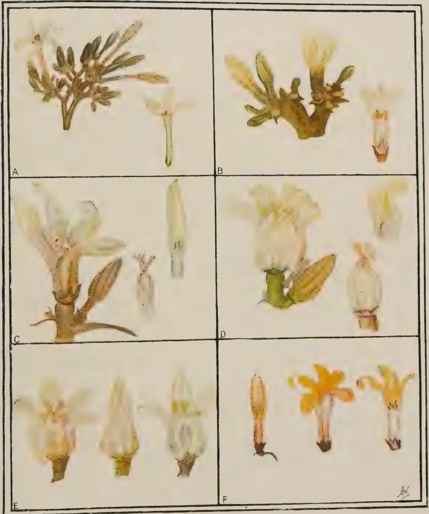

# The Tropical Agriculturist

December, 1935

---

## EDITORIAL

---

### THE COFFEE BERRY BORER IN CEYLON

---

THE presence of a small shot-hole borer in coffee berries in Ceylon was reported for the first time in June, 1935 from the Balangoda district and other parts of Sabaragamuwa Province. The suspicion that this beetle might be the coffee berry borer (*Stephanoderes hampei*) known in other eastern countries was confirmed by a specialist in India. These small beetles bore into both green and ripe berries on the bushes, the green berries being attacked for feeding, while the ripening berries are entered by the females for egg-laying. The subsequent broods of grubs feed inside the seeds which are often completely destroyed. Injured berries usually fall to the ground and may continue to serve as breeding centres.

Although coffee is at present only a minor village crop in parts of Ceylon, the coffee berry borer must be regarded as a potentially serious pest, since it damages the crop directly by causing premature fall of unripe berries and by destroying ripe berries and their seeds. In view of the menace of this pest, a campaign was started as soon as possible in the Balangoda district by the Department of Agriculture and satisfactory progress has been made in the control of the borer in that area by pruning all bushes in bearing, burning the prunings and clearing up and burning fallen berries. Other areas will be

1------------------------------------------------

331

tackled and cleaned up as far as possible in due course. So far as is known at present, the infested areas are confined almost entirely to the Sabaragamuwa Province, but it is not unlikely that further inspections will reveal other areas of infestation. It is estimated that at least 50 per cent. of the village coffee crop had already been destroyed in the Balangoda district before the campaign started, while in limited areas this percentage was higher. An unfortunate feature of the outbreak is the preference shown by the borer for the Robusta types of coffee.

The presence of this pest in Ceylon was reported to the September meeting of the Central Board of Agriculture, which recommended that the coffee berry borer should be declared a pest under the Plant Protection Ordinance, No. 10 of 1924, as indicated in the minutes of that meeting published in the November number of this Journal. Steps have been taken to carry out the above recommendation and it is expected that regulations for preventing the further introduction and dissemination of this pest will soon be in force. To begin with, all Chief Headmen's Divisions in the Revenue District of Ratnapura of the Province of Sabaragamuwa are being declared Infested Areas under the Ordinance. Other areas will be added as occasion arises.

The bionomics of the coffee berry borer are being studied by the Entomological Division and a note on this work with fuller details of this pest will be published later. All coffee growers should be on the watch for this berry borer and any indication of its presence outside the above mentioned areas should be reported to the Department of Agriculture, and prompt action should be taken to eradicate it as far as possible.

2------------------------------------------------

332

## VERNALIZATION—II

J. C. HAIGH, PH.D.,

*ECONOMIC BOTANIST*

*DEPARTMENT OF AGRICULTURE, CEYLON*

**T**HERE have been described in this Journal (Vol. LXXXIII, No. 6, December, 1934) experiments carried out at Peradeniya on the effect of vernalization on rice. Small but significant differences resulted from pretreatment of seed, and it was suggested, in attempting to account for the smallness of the effect, that perhaps the temperature factor was not at the optimum value. Further experiments have now been carried out in which that suggestion has been put into effect.

In the first field experiment, all treated seed was vernalized at the same (laboratory) temperature, but for different periods of time. In the experiment now recorded, all treatments have been vernalized for the same period of 6 days (that period having produced the greatest effect) but at different temperatures. As before, the seeds were sown, after treatment, in plots of 144 plants, spaced 6 inches apart both ways. The plots were replicated 6 times and were arranged in the form of a Latin Square. The treatments were

- (A) Sown dry
- (B) Seed soaked for 24 hours, then germinated in an open porous dish
- (C) Seed soaked for 24 hours, then kept under pressure (village method) for 6 days
- (D) Seed soaked for 24 hours, then vernalized for 6 days at laboratory temperature (approximately 25° C.)
- (E) Seed soaked for 24 hours, then vernalized for 6 days at 30° C.
- (F) Seed soaked for 24 hours, then vernalized for 6 days at 35° C.

3------------------------------------------------

333

TABLE I  
VERNALIZATION IN FIELD-YALA 1935

<table border="1">
<thead>
<tr>
<th rowspan="2">Treatment</th>
<th colspan="7">Mean number of days from sowing to flowering</th>
<th rowspan="2">Total</th>
<th rowspan="2">Mean</th>
</tr>
<tr>
<th colspan="7">Replication</th>
</tr>
<tr>
<th></th>
<th>a</th>
<th>b</th>
<th>c</th>
<th>d</th>
<th>e</th>
<th>f</th>
<th></th>
<th></th>
<th></th>
</tr>
</thead>
<tbody>
<tr>
<td>A</td>
<td>129.8</td>
<td>129.1</td>
<td>124.2</td>
<td>124.7</td>
<td>124.6</td>
<td>125.4</td>
<td></td>
<td>757.8</td>
<td>126.3</td>
</tr>
<tr>
<td>B</td>
<td>124.8</td>
<td>121.7</td>
<td>122.9</td>
<td>122.2</td>
<td>121.7</td>
<td>121.3</td>
<td></td>
<td>734.6</td>
<td>122.4</td>
</tr>
<tr>
<td>C</td>
<td>121.6</td>
<td>123.0</td>
<td>121.1</td>
<td>119.4</td>
<td>124.0</td>
<td>123.0</td>
<td></td>
<td>732.1</td>
<td>122.0</td>
</tr>
<tr>
<td>D</td>
<td>122.9</td>
<td>119.0</td>
<td>123.6</td>
<td>119.7</td>
<td>120.8</td>
<td>122.9</td>
<td></td>
<td>728.9</td>
<td>121.5</td>
</tr>
<tr>
<td>E</td>
<td>119.7</td>
<td>122.2</td>
<td>120.1</td>
<td>120.6</td>
<td>117.6</td>
<td>120.2</td>
<td></td>
<td>720.4</td>
<td>120.1</td>
</tr>
<tr>
<td>F</td>
<td>123.5</td>
<td>119.9</td>
<td>118.9</td>
<td>120.8</td>
<td>118.8</td>
<td>117.9</td>
<td></td>
<td>719.8</td>
<td>120.0</td>
</tr>
<tr>
<td>Total</td>
<td>742.3</td>
<td>734.9</td>
<td>730.8</td>
<td>727.4</td>
<td>727.5</td>
<td>730.7</td>
<td></td>
<td>4,393.6</td>
<td>122.0</td>
</tr>
</tbody>
</table>

4------------------------------------------------

334

TABLE II  
ANALYSIS OF VARIANCE

<table border="1">
<thead>
<tr>
<th></th>
<th>Degrees of freedom</th>
<th>Sum of squares</th>
<th>Mean square</th>
<th>Standard deviation</th>
<th>Loge standard deviation</th>
</tr>
</thead>
<tbody>
<tr>
<td>Rows</td>
<td>5</td>
<td>26.435</td>
<td></td>
<td></td>
<td></td>
</tr>
<tr>
<td>Columns</td>
<td>5</td>
<td>51.775</td>
<td></td>
<td></td>
<td></td>
</tr>
<tr>
<td>Treatments</td>
<td>5</td>
<td>160.832</td>
<td>32.1664</td>
<td>5.672</td>
<td>1.7356</td>
</tr>
<tr>
<td>Error</td>
<td>20</td>
<td>23.845</td>
<td>1.192</td>
<td>1.092</td>
<td>0.0881</td>
</tr>
<tr>
<td>Total</td>
<td>35</td>
<td>262.8</td>
<td></td>
<td></td>
<td><math>z = 1.6475</math></td>
</tr>
</tbody>
</table>

Standard deviation of a single plot is 1.092 days, of a group of 6 plots 2.674 days

$N_1 = 5$ .  $N_2 = 20$  1% point is 0.7058:  $z$  is significant

5------------------------------------------------

335

All treatments were sown on the 13th April, 1935. The diagram reproduced below shows the layout of the experiment, with the mean number of days from sowing to flowering inserted for each plot.

<table>
<tbody>
<tr>
<td>F</td>
<td>E</td>
<td>B</td>
<td>A</td>
<td>C</td>
<td>D</td>
<td></td>
</tr>
<tr>
<td>123.5</td>
<td>119.7</td>
<td>124.8</td>
<td>129.8</td>
<td>121.6</td>
<td>122.9</td>
<td>742.3</td>
</tr>
<tr>
<td>A</td>
<td>F</td>
<td>C</td>
<td>E</td>
<td>D</td>
<td>B</td>
<td></td>
</tr>
<tr>
<td>129.1</td>
<td>119.9</td>
<td>123.0</td>
<td>122.2</td>
<td>119.0</td>
<td>121.7</td>
<td>734.9</td>
</tr>
<tr>
<td>E</td>
<td>C</td>
<td>D</td>
<td>B</td>
<td>F</td>
<td>A</td>
<td></td>
</tr>
<tr>
<td>120.1</td>
<td>121.1</td>
<td>123.6</td>
<td>122.9</td>
<td>118.9</td>
<td>124.2</td>
<td>730.8</td>
</tr>
<tr>
<td>B</td>
<td>D</td>
<td>E</td>
<td>F</td>
<td>A</td>
<td>C</td>
<td></td>
</tr>
<tr>
<td>122.2</td>
<td>119.7</td>
<td>120.6</td>
<td>120.8</td>
<td>124.7</td>
<td>119.4</td>
<td>727.4</td>
</tr>
<tr>
<td>D</td>
<td>A</td>
<td>F</td>
<td>C</td>
<td>B</td>
<td>E</td>
<td></td>
</tr>
<tr>
<td>120.8</td>
<td>124.6</td>
<td>118.8</td>
<td>124.0</td>
<td>121.7</td>
<td>117.6</td>
<td>727.5</td>
</tr>
<tr>
<td>C</td>
<td>B</td>
<td>A</td>
<td>D</td>
<td>E</td>
<td>F</td>
<td></td>
</tr>
<tr>
<td>123.0</td>
<td>121.3</td>
<td>125.4</td>
<td>122.9</td>
<td>120.2</td>
<td>117.9</td>
<td>730.7</td>
</tr>
<tr>
<td>738.7</td>
<td>726.3</td>
<td>736.2</td>
<td>742.6</td>
<td>726.1</td>
<td>723.7</td>
<td>4393.6</td>
</tr>
</tbody>
</table>

The results are tabulated in table I and the analysis of variance is given in table II. The differences between treatments are significant: the standard error of a group of 6 plots is 2.674 days, so that differences between treatment totals of more than 8.022 days are significant. On this basis, and taking the seed sown dry as the control, a significant shortening of the period between sowing and flowering has been obtained with all the treated seed. This result agrees closely with that obtained in the previous trial. There the seed germinated in an open dish and that vernalized for 6 days showed a significant shortening: here, (where all the vernalized seed received 6 days' pretreatment) the result has been the same with the addition of the seed treated by the village method, which corresponds closely to vernalization for 6 days, and which did not differ significantly from that method in the last trial. If we take the village method as control, significant shortening has been obtained with both lots of seed that were vernalized at higher temperatures. The effect of temperature is therefore a significant one, but again the difference is only of mathematical significance, and has no practical value.

6------------------------------------------------

338

### SUMMARY

Experiments on vernalization of rice have been continued, the pretreated seed being vernalized for 6 days at different temperatures. Previous results have been confirmed, that a significant shortening of the period from sowing to flowering can be obtained by vernalizing the seed for 6 days, and that the method of pretreating seed commonly used by the Ceylon cultivator produces a similar effect. A further significant shortening of the preflowering period has been obtained by carrying out the vernalization at temperatures of  $30^{\circ}$  and  $35^{\circ}$  C., but the effect is too small to be of practical value.

7------------------------------------------------

337

## BOUGAINVILLEAS AT PERADENIYA

T. H. PARSONS, F.L.S., F.R.H.S.,

CURATOR, ROYAL BOTANIC GARDENS, PERADENIYA

THE bougainvilleas are essentially plants for tropical and sub-tropical gardens and the varieties now to be found in Ceylon are very representative of this fine group of showy plants. With a better and more extensive exhibition of the varieties in the Peradeniya Gardens of late years, much additional interest has been roused and demands for young plants are of daily occurrence.

### DISTRIBUTION

Bougainvilleas do not yet form the dominant feature in Ceylon that they do in so many other tropical countries and this may well be due to the fact that Ceylon fortunately possesses such a wealth of other floral subjects that no one particular subject or group is likely to predominate to any extent, or again it may be that some varieties of bougainvillea are so intense in colour, particularly those of the purple hues, that they need an isolated position if they are not to clash with almost every other colour in their vicinity. For large gardens where they can be used on the grand scale and isolation is feasible there is no better sight, but for smaller gardens the intense purples should be avoided and use made of the numerous varieties of much less penetrating colours now available and described below.

The genus is of South American origin, named after the French navigator De Bougainville, and although there are roughly a dozen species only two are of particular horticultural merit, namely *Bougainvillea glabra* and *B. spectabilis*, and both provide many fine varieties which rival and surpass the parents.

*B. glabra* and *B. spectabilis* are among the earliest of the species in cultivation and Mrs. McLean or Louis Wathen are probably the most recent of the hybrids or bud sports. Between the parents and their latest sports ranges a wide difference of colour varying from the magenta-like bracts of intense depth of the former (*B. glabra*) and the rosy to purple hue of the latter (*B. spectabilis*) to the very fine rose pink of the variety *Rosa Catalina*.

8------------------------------------------------

338

### LOCALITY AND SOIL

Most of the bougainvilleas thrive best in low to mid-country conditions in Ceylon and though the varieties vary in their hardiness they prefer a warm spot fully exposed to the sun, with soil of a sandy nature and well drained. All like periodical manuring and top dressing. Some will thrive at fairly high elevations and *B. glabra* and its variety *Sanderiana*, and *B. formosa* are to be seen in the park at Nuwara Eliya where slight frosts are experienced at certain times of the year. Generally speaking, however, the majority prefer the low-country conditions from sea level up to 4,000 feet or so.

### HABIT OF GROWTH

Most varieties of *B. glabra* are somewhat restricted in their habit of growth, whilst those of *B. spectabilis*, of which there are many, have a more straggling and rampant growing habit and need room to obtain the best results. All can, however, be grown and kept in bush form if attended to, though most of them show to better advantage if allowed to roam, and are often to be seen in the towns climbing over porches or over trees. If kept in bush form a judicious pruning of the long stiff shoots is recommended, while the shoots that are more pliable should be drawn in and around the bush and tied to three or four firmly established stakes erected around the plants. The specimens in one of the bougainvillea collections at Peradeniya are thus treated and the result is very effective.

### ORIGIN AND CLASSIFICATION

The origin of some of the hybrids is still in some doubt for the group includes chance or natural hybrids, others of known parentage and still others originating as bud sports, but the majority have doubtless been evolved from one or other of the parents *B. glabra* and *B. spectabilis*. Moreover, the leaf form of the hybrid varies to an astonishing degree from the species as does the spine formation, and herein lies the difficulty of their accurate classification. The glabrous and ovate to acuminate and bright green leaves of *B. glabra* vary and in some cases disappear entirely in its varieties and hybrids, whilst the larger, hairy and thick dull green leaves of *B. spectabilis* vary likewise in many of its hybrids.

9------------------------------------------------

339

### COLOUR DESCRIPTION

Description of the many forms must therefore be from the flower, or more correctly the bracts, since the true flower is very inconspicuous and comprises the small green to cream coloured organs found in the centre of the inflorescence. The colour given therefore refers to the vivid-hued bracts surrounding the true flowers.

Most garden lovers have their own idea of colour descriptions but rarely do the representations of a particular colour in the bougainvilleas exactly agree and confusion generally results. Also the intense light in the tropics during mid-day hours, and cloud effect in the evening appear to give the bracts different hues at different times of the day. It is very necessary therefore that in the present instance some reliable guide and standard should be utilised and for this purpose Ridgway's "Colour Standards and Nomenclature" is used to denote precisely the varying hues of the many varieties.

There are in all a dozen or more named bougainvilleas in the Garden collections whilst others have yet to be more fully identified. A brief description of the best named species and varieties grown at Peradeniya is described below.

### SPECIES AND VARIETIES

*Bougainvillea glabra*.—This species grows to 10 feet or more, with few spines, and is of fairly spreading habit if allowed to roam, the bracts being of a phlox purple hue and in flower throughout most of the year. It should be cut back periodically and can if necessary be grown in tubs or barrels with very satisfactory results, but is not of outstanding merit in comparison with some of its varieties.

*B. glabra* var. *Sanderiana*.—This is one of the best known varieties and is cultivated commonly in Europe and America. It will withstand slight frost and is of small and more compact habit than most others and withstands regular pruning. It will, if allowed to roam, reach a height of 10 feet or more but is grown to better advantage as a small shrub with some form of root restriction.

The bracts are small and phlox purple to magenta in colour and the variety is very floriferous, with leaves smaller and more pointed than the species. It is altogether a very showy plant and is suited to small or large gardens.

10------------------------------------------------

340

*B. glabra* var. *Cypheri*.—This variety was obtained from Kew in 1928 and bears large and deep coloured phlox purple to purple (true) bracts freely produced in long plumose clusters on all the principal growths. The leaves are of a deeper green than the species and spines few. The colour is so intense that it seldom harmonises with surrounding plants and should be given a place to itself. It is at Peradeniya a very rapid grower and needs periodical cutting back or tying in.

*B. glabra* var. *Maud Chittleburgh*.—This variety, though old to the collection here, did not flower till recent years due to the specimen having been originally planted in a shady and damp position and in heavy soil. Rooted cuttings established in the collection, in a very open sunny site, have flowered well, and have produced large quantities of violet purple to purple (true) bracts, turning to a petunia violet hue with age. The growth is very rampant and the shoots very spiny. The parent plant, still in its shady position makes an enormous amount of strong growth but still refuses to flower.

*B. formosa* is another horticultural form which will, if allowed, attain giant proportions. It is generally however semi-scandent and very floriferous, producing masses of large bracts of phlox purple colour. It is a Brazilian plant but will flourish at quite high elevations in Ceylon as well as at sea level. The individual specimen in the Flower Garden at Peradeniya has been allowed to grow and has now attained tree form and is over 20 feet in height.

The above are forms of intense and of penetrating colour which necessitate some care in planting if any colour scheme is anticipated. It is best to utilise these in large masses or in isolated positions where they will repay attention given them. It will be noted that most are from *B. glabra* parentage, but *B. spectabilis* also has varieties of fairly intense hue; generally speaking, however, those of the lighter and less intense colour have a predominance of the latter species in their parentage. There are many varieties in cultivation and those at Peradeniya include the following:

*B. spectabilis*.—The leaves of this species are large and somewhat hairy and dull green in colour, and growth is very vigorous. The bracts are very large and vary from magenta to dull magenta purple but with less intense colour than those so

11------------------------------------------------

341

far mentioned. It produces large and stout hooks which makes it adaptable as a climbing plant on trees or large archways or porches. It flowers two or three times a year and often in the leafless stage which latter enables the plant to make a very effective feature of the landscape.

Var. *laterita*.—This is a presumed form of *B. spectabilis* though it has on occasions been given specific rank. In the tropics it is undoubtedly one of the best and requires more tropical conditions than most. The bracts are a very fine shade of jasper red tailing off to brazil red as the bracts age. It is however one of the most difficult to propagate and for that reason is not a common plant in Ceylon. The foliage is greyish and slightly hairy, the spines being thin but numerous and large. It is normally a shy bloomer and only after extended periods of dry weather does this variety show itself to the best advantage.

Var. *Maharajah of Mysore*.—This chance hybrid is reported to have been growing near intertwining plants of *B. glabra* × *B. spectabilis* var. *laterita* and is a very serviceable plant. It is very free flowering and does best if pruning is reduced to the minimum and the plant allowed to grow. The foliage is hairy and a greyish green in colour, not unlike that of *laterita* but turning with age to a yellowish green, and has similar spines. The bracts are of a spinel red to rose doree tinge in the young stages turning to a brick or brazil red with age. It is a very attractive and showy object and except for *Mrs. Butt*, the most free flowering of the group. It strikes readily from cuttings and grows freely but the life of the bush appears to be shorter than most others and at ten years or so of age it is advisable to replace with fresh stock.

Var. *Mrs. Frazer*.—This hybrid was received at Peradeniya at the same time as the previous variety. It has a more compact and thick habit of growth the leaves being a deep green, slightly hairy with normal to few spines. The bracts are spinel red turning with age to eugenia red with no tinge of mauve at all, but the variety is more shy in flowering than most of the varieties nor does it flower so often. It bears a larger percentage of leaf growth at time of flowering than most of the others and for this reason does not make the same splash of colour, but the rich colouring is such that it cannot well be omitted from any representative collection. If given a particularly hot and dry position the shyness in flowering is overcome to some extent.

12------------------------------------------------

342

Var. *Mrs. Butt*.—A now famous variety and is to be found in most tropical countries. Although introduced here as recently as 1925 it has been propagated so freely and easily that it is now represented practically in all parts of the low-country in Ceylon and in many gardens in the mid-country. This fine variety was first discovered in Colombia in 1910 and from there it was sent to Trinidad and thence to Kew Gardens, which has widely distributed it over the tropics. Our own original plant was received with a gift of plants from British Guiana and was forwarded by Lady Thomson, wife of the late Governor of Ceylon, in 1925 as a "red" bougainvillea, but on receipt and flowering of plants of *Mrs Butt* from Kew in 1928 the British Guiana plant proved to be the same variety.

The origin is in some doubt as it has characters of both *B. glabra* and *B. spectabilis* and though it departs from both in many ways, resembles more closely the latter than the former. The varieties "Crimson Lake" and "Scarlet Queen" have since been received here but these both much resemble and are practically identical with the variety now being described.

This variety not only propagates freely but it flowers most abundantly and over many long periods. The colour is difficult to describe exactly but the standard chart indicates amaranth purple to pomegranate purple as the true hue though the common term of a rich crimson mostly meets the case fairly well. It is often referred to locally as claret or purple crimson also. The leaves are of a deep green colour, the leaf surface being especially so, and the branches are fairly free from thorns though these develop as the wood matures. It is most robust in its mode of growth and has necessarily to be pruned since the young individual growths shoot up often to 10 or 12 feet in a season. It is advisable to tend the young shoots as they grow by bending these down and tying to stakes around the plant if a bush form is desired, otherwise the plant will attain a small tree of very scandent habit and is very fitted for large pergolas and for roofs.

The plant is hardy and can be grown in the low-country and in most gardens in mid-country also but owing to its rapid growth and strong root system it needs to be fed to maintain the health of the bush and quality of flower.

Var. *Rosa Catalina*.—This variety is an outstanding one and, because of the great difficulty in propagating it, is by no means common or likely to be so till some more satisfactory

13------------------------------------------------

343

method is evolved. The present method of obtaining plants is by *gootee* (marcot) and is therefore limited to the amount of material available, though latterly, the method of inserting soft wooded cuttings in a sandy propagating bed with artificial heat — solar propagator — shows signs of overcoming the difficulty. It is much desired to get this fine variety more widely known and distributed.

The Gardens' plant was obtained in 1921 from Messrs. L. R. Russell & Co., of Richmond, England, and when planted was given facilities to roam over a verandah roof where it flowers profusely and is rarely without flower. Grown on normal open supports or as a bush does not meet its requirements so well as far as specimens so grown here indicate.

The leaves are of normal green, fairly hairy on surface but more so on underside and as the leaves age they soon fade and have a slightly yellowish appearance. The spines are fairly numerous and strong in the older wood, and under Peradeniya conditions the foliage in general is scanty though growth is at times rampant. Since the plant is so regularly in flower, this scantiness of foliage presents no drawback. The flower bracts are of a red colour to spinel red and quite distinct from other varieties and the term given it elsewhere of the "pink" bougainvillea is well fitted. It should in course of time find a place in all gardens since this particular shade blends with most other colours in the garden.

Var. *Louis Wathen*.—This variety is one of the latest acquisitions and our original plant was obtained from the Superintendent of the Agri-Horticultural Society of Madras in September, 1932. The variety originated as a bud sport from the well known *Mrs. Butt* in the garden of Mrs. Wathen, wife of the Chief Officer of the Madras and Southern Maharatta Railway. In *The Gardeners' Chronicle* of January 2, 1932, the Superintendent of Madras Gardens, describes this fine variety as follows: "This variety possesses all the good points of *Mrs. Butt*, namely, that it is propagated easily by means of cuttings, is a quick and vigorous grower, flowers freely in four-inch pots on the nursery benches, is presumably hardy to light frosts (as it is almost identical in all qualities with *Mrs. Butt*), and it surpasses the latter beyond all description, in the exquisite colour of its floral bracts, which are an orange-terracotta, suffused with rosy mauve when the flowers expand. The delicate tints have besides, a

14------------------------------------------------

344

sparkling transparency which is absent from the other members of its class, and altogether, it may be stated without exaggeration that this new variety is not only exceedingly floriferous, but its colour is such a lovely shade that it has perhaps few equals in the entire flora of the world.

In a younger stage, before the buds attain their normal size, they are a distinct flame colour, and when more fully formed, they are suffused with rosy-purple tints. I feel that my description of it does not do justice to its true loveliness, and I think that this new variety, which is as yet unnamed, will henceforth be known to the horticultural world as *B. glabra*, var. *Louis Wathen*."

The plant merits the description but the colour is not aptly described, this being of a peach red in the younger stages, developing to begonia rose in the later stages. In requests for this plant from Peradeniya it has been variously referred to as the orange, the yellow, the terracotta and the brown coloured bougainvillea so that some confusion in colour in this particular variety does exist. Under Peradeniya conditions the flowers appear from the rooted cutting stage and continue indefinitely, the original plant at Peradeniya having borne flowers throughout the three years it has been established here. It propagates most freely, grows readily and is now being widely distributed.

Var. *Mrs. McLean*.—This is our newest introduction and was received in October, 1933, from the Royal Botanic Gardens, Kew, which had received this somewhat earlier from Trinidad, presumably as a bud sport. It is very similar to *Louis Wathen* and at times could pass as this identical variety, but it has a greater variety of changes in the colour of its bracts during its flowering periods, the buds and young flowers being eosine pink, turning to old rose when in full flower and relapsing to coral red as the flower bracts age.

This variety is being propagated and distributed and has the characters of the former variety mainly in its rapid growth and free flowering habit.

*B. hybrid.*—(unnamed). This hybrid, evolved from the parents, *Mrs. Frazer* × *Maharajah of Mysore*, was obtained from Mr. R. Erridge then on Hewagam estate, Padukka in 1931. The seedlings (2) were difficult to bring along and growth was slow. On attaining a sufficient root system however the plants

15------------------------------------------------

345

made headway and both are now in flower and exactly similar in colour and characters the former being a true pomegranate purple. The plants are most floriferous and rarely out of bloom and because of this it has been difficult so far to obtain much propagating material.

The hybrid is of average merit but not up to the quality of some of the above mentioned though better than others.

Two other species or varieties have been established in the Gardens for many years. These were originally received from local residents and being unnamed, are classed as Bougainvillea No. 37 and No. 38, the former having bracts of rose doree to pomegranate purple and the latter with very large bracts of purple (true) hue.

Both are of average merit but not so floriferous as many of the named varieties.

There remains two further species or varieties received as *B. speciosa* and *B. brasiliensis* of which there is some doubt.

The former was obtained from the Superintendent, Lalh Bagh Gardens, Bangalore, in 1925 and in leaf and spine character resemble *B. glabra* rather than *B. spectabilis* of which this is generally considered a variety. The bracts are of purple (true) hue and the plant is of average merit.

*B. brasiliensis* was also received from the same source in 1925 and is a very attractive plant when in flower. It has bracts of jasper red, ageing to coral red and is in many ways characteristic in growth, colour and in shyness of growth of *B. spectabilis* var *laterita*. It is stated to be a common plant of South Africa and Egypt but our plant's true designation appears to be in some doubt. It is in any case, among the best of the varieties established at Peradeniya.

There are many other varieties obtainable of course but those mentioned in this article cover the available range of colours fairly satisfactorily. There is a reputed double flowered variety among Australian nursery lists and this should be an acquisition, though the colour, a violet purple, is a common one.

Numerous enquiries for a white flowered variety presumed to be in cultivation have not yet been satisfied and it is doubtful if a true white, without some shade of purple in it, exists. The reports of such persist however though it has generally been seen

16------------------------------------------------

346

by the informants in the garden of someone else. There is a variety *B. glabra*, var. *Sanderiana variegata*, but it is the leaves of a variegated creamy white which account for the name. It is used as a neat and quick-growing foliage plant in parts of America.

### PROPAGATION AND PLANTING

The majority of the varieties we possess are propagated very easily by cuttings and by *gootee* but certain varieties are exceedingly difficult to strike, particularly *Laterita* and *Rosa Catalina*. Under the moist conditions usually prevalent at Peradeniya bougainvilleas do not seed, though this occurs in the low-country under drier conditions.

Owing to the recent extended drought however three varieties have, within the last few months, seeded at Peradeniya for the first time. These seed much resemble grains of wheat and are being carefully tended.

The normal method is to select well ripened shoots of the previous season's growth and to insert these in a bed of friable sandy and well drained soil, with the use of shade during mid-day hours. Cuttings of 9 to 10 inches in length and of pencil thickness should be used and most will strike very readily in a few weeks from insertion. Varieties that refuse to strike by this method should be either layered or gooteed and at Peradeniya such is generally employed, and when sufficiently rooted they are potted into large receptacles and grown on for some time before planting out.

When planting in permanent sites a large hole at least 3 inches  $\times$  2½ inches deep should be given and the bottom of the holes filled with brick rubble and lime mortar to a depth of 6 inches or 8 inches to ensure good drainage. Manure at the rate of six manure baskets per hole should be incorporated with the soil when refilling as, though bougainvilleas will thrive in almost any kind of soil, they appreciate a certain amount of humus in the early growing stages when the structure of the bush is in course of formation. An annual top dressing will suffice in the later stages and should a normally free flowering variety refuse to flower at any time, root pruning should be tried, as the best results are invariably obtained from this group of plants by some form of root restriction.

17------------------------------------------------

<!-- stage4: ACCEPT r2J/J_011:72 -->

347

The essential point to remember in successful cultivation of bougainvilleas is to select as open a site as is possible, for the more sun they get the better they grow and flower, to ensure ample drainage when planting, as bad drainage can rarely be properly remedied later, and to assist the plant to make all growth possible in the young stages. After that, except when an occasional root prune is necessary, the plants will look after themselves.

18------------------------------------------------

This image is a scan of a blank page. The paper has a light beige or cream-colored tint. There are a few very small, dark specks scattered across the surface, which appear to be scanning artifacts or dust particles. No text, lines, or other markings are present on the page.

19------------------------------------------------

Fox-Brush Orchid  
(*Aerides Fieldingii* Lindley)

20------------------------------------------------

348

## NOTES ON ORCHIDS CULTIVATED IN CEYLON

### FOX-BRUSH ORCHID

AERIDES FIELDINGII LINDLEY

K. J. ALEX. SYLVA, F.R.H.S.,

CURATOR, HENERATGODA BOTANIC GARDENS, GAMPAHA

**T**HIS species belongs to a hardy genus of purely epiphytal orchids of the *Vanda* tribe confined to the eastern tropical Asiatic region, (India, Malaya, Japan, etc.).

The genus *Aerides* contains over sixty species all of which are evergreen and remarkable for their hardiness.

The flowers of all species of the genus invariably possess the characters of delicate colour, delicious scent, and keep well.

With the exception of *Aerides cylindricum* Lindl. of Ceylon and *A. vandarum* Rchb. f. of Sikkim, which are quite distinct from the rest of the genus having terete stems and leaves and in habit and character resembling *Vanda teres*, the plants have broad leathery foliage like the *Saccolabium*s.

*Aerides Fieldingii* is a very popular orchid in Ceylon, especially in the low-country, and there are many distinct varieties.

The plant grows in a straggling manner often three feet or more long, with numerous offshoots from the main stem crowded together—the whole forming a dense growth. The fleshy leaves are about ten inches long, elegantly curved and arranged distichously (in two ranks) on a woody stem, the apex being oblique.

The pretty waxy flowers are borne on a long partly-drooping raceme, often branched, and usually attaining a length of eighteen inches. The flower is comparatively large for the genus, being white, and beautifully mottled with a rich rose.

21------------------------------------------------

349

*Culture.*—This is one of the easiest orchids to cultivate and is popularly known as the “Fox-Brush” *Aerides* on account of its long densely flowered raceme. The plant makes an interesting object even when it is not in bloom because it presents a truly tropical character in any collection where it is found.

Plants placed on forks of trees in the open do exceedingly well and flower freely with no care and attention whatever. This mode of culture however has the disadvantage of not permitting the plant to be moved when in bloom for decorative purposes. It is best grown therefore in pots or in wooden baskets or rafts and is then as successful as on trees provided that the roots are not disturbed but allowed to wander at will. In pot or basket culture, fill the receptacles about half full with crocks and chips of wood and husk, placing large pieces at the bottom but finishing off at the top with smaller fragments.

Thick basal sections of tree-fern or half-decayed jakwood blocks make useful supports for their culture but more moisture at the roots is needed in this case during periods of dry weather.

The plant can be propagated from sections having roots. These may be started in baskets made of the full coconut husk and eventually the whole may be inserted in bigger tubs or pots when established. When coconut husk is thus used much of the inside fibre must be removed and slightly burnt and a few holes made on through the sides.

If signs of unhealthiness show it is wisest to remove the healthy looking offshoots and put them in pots or baskets. The parent plant may be taken out of its receptacle, and after being cleaned of all dead parts, placed in a low spreading shrub and given an occasional syringe, say once every second day. If aerial roots grow outwards, they should on no account be brought back to the pot or block but be allowed to escape at will.

In Ceylon the plant comes into bloom with the May-June rains and these blooms last for six weeks. Placing the plant under shelter when in bloom enhances their longevity.

22------------------------------------------------

350

## TOMATO CULTIVATION IN THE DRY ZONE OF CEYLON—II

W. R. C. PAUL, M.A., M.S.C., D.I.C., F.L.S.,  
*DIVISIONAL AGRICULTURAL OFFICER, NORTHERN*

### SOILS

**T**OMATOES may be grown on a wide range of soils varying from very sandy loams to heavy clays provided the drainage is good and there is a fair amount of organic matter present. The type of soils does influence the quality, yield and time of maturity of the crop. Light soils have been found generally to favour early bearing, while the heavy type of soils promote much stem and leaf growth, with a poor setting and quality of fruit. Tomatoes thrive best on rich sandy loams which are deep, well-drained and open while also being retentive of sufficient moisture to avoid continual irrigation during dry weather. Such soils are easy to work and thus considerably reduce the cost of preparing the land, planting and cultivating the crop. On light, sandy soils, however, tomatoes are liable to suffer severely from drought, and furthermore, such soils are difficult to keep well maintained with organic matter and available plant food. These soils, therefore, need plenty of humus in the form of liberal dressings of compost, cattle or goat manure and green leaves in the dry zone in order to increase their retentiveness of moisture and improve their fertility. As the tomato is very sensitive to poor drainage the heavy clay soils should be well-drained throughout the growth of the crop.

It is particularly important that the soil for growing tomatoes should be maintained in a good physical condition by adequate cultivation necessary to render it friable and in a satisfactory state of tilth prior to planting.

### CROP ROTATION

Tomatoes and related crops like chillies, brinjals and tobacco should not be grown continuously on the same land except in rotation with other crops owing to the spread of certain diseases and pests which affect them. Moreover, all solanaceous weeds which are also liable to harbour disease organisms or pests should

23------------------------------------------------

351

be immediately removed from the vicinity of the field in which tomatoes are being grown. A rotation that allows the cultivation of this crop once, at least every three years, should be practised and the particular rotation to be followed will depend on local conditions and practices. It is, generally, desirable to include some leguminous crop either for green manure or otherwise in a rotation with tomatoes.

### THE SEED

The tomato seed is somewhat flattened and oval in shape. It is covered over thickly with short, silky hairs which distinguish it from other solanaceous seeds. The vitality of the seed under reasonably good conditions of storage in temperate countries can be retained up to about three years. The humidity is the main factor which is responsible for the loss of germination and together with high temperatures such as prevail in the tropics the seed quickly deteriorates. It is for this reason that under ordinary storage conditions in the tropics the seed does not retain its vitality for very long. Where, however, the humidity is low the temperature is comparatively unimportant. Seed which is to be kept stored in the tropics should be well dried and placed in airtight bottles..

It is essential that the seed should be clean, viable, free from disease and true to a recognised variety or strain. It should give a germination percentage of not less than 90. Good seed will generally be reflected in the yield and quality of the fruit produced.

Seed growing is highly specialised and requires particular skill and care. The climatic conditions of cool, dry days with cloudless skies should prevail for the production of the best fruit and for facilities in curing and handling of the seeds. It is, however, generally preferable for the ordinary grower who desires to produce good quality fruit in the tropics to purchase his seed of a particular variety found suitable by him from a reliable seed firm than to attempt to grow his own seed.

### CULTURAL METHODS

#### (A) PREPARATION OF NURSERIES

Tomatoes are usually raised in nurseries and subsequently transplanted in the field. The young plants being delicate and very susceptible to disease and insect attacks can be more carefully looked after in nurseries than when the seed is sown in the

24------------------------------------------------

352

field or garden. Sowing in the nursery is also a saving in seed and the crop matures earlier. On the other hand field sown plants form a deep taproot and are, therefore, more drought resistant.

The seed is either sown in shallow boxes called 'flats' or, when a large number of plants is required, in beds. Particular care should be paid to the raising of plants in nurseries, as much of the success of the crop will be due to the efforts made earlier to produce healthy, sturdy plants.

The seed boxes or flats need not be more than 3 inches deep. A convenient size when several flats are required for tomato propagation is about 18 inches by 9 inches. In order that they may be used repeatedly both the inside and outside should be painted over with any good wood preservative. These flats can be conveniently placed on benches as they must be raised from the ground to prevent the seeds being eaten by ants (*Solenopsis geminata*). Suitable flats can also be made by using the longitudinal halves of empty kerosene tins which are more satisfactory where termites are serious. Adequate holes must be provided in the bottom of the flats to facilitate drainage. Soil should be prepared by mixing equal parts of well-rotted cattle manure or compost and a good friable loam and passing it through a  $\frac{1}{2}$ -inch sieve. The addition of a small quantity of wood ashes is also useful. This should be lightly pressed down and over it a half inch layer of fine soil should be added, preferably a black loam, sifted through a 2 mm. mesh and sterilised by heating in a large open pan to destroy weed seeds and disease organisms. The flats should then be watered with a fine spray and are ready for sowing.

When beds are employed they should be made about 3 feet wide and of any convenient length. A sheltered, well-drained site should be selected away from overhanging trees which are liable to harbour insect pests. The beds should be raised about 4 to 5 inches high to ensure free drainage especially during rains, while drains 1 foot wide should be made separating each bed so as to facilitate weeding and watering. The soil which should preferably be a good friable loam should be turned or ploughed over to a depth of 6 to 8 inches. It should then be sterilised by burning straw or brushwood, etc., placed over each bed. After this compost manure could be forked in at the rate of 3 lb. per square foot, the beds levelled and a half-inch layer of fine

25------------------------------------------------

353

sterilised soil prepared as in the case of the flats mentioned above spread on top. Owing to the high temperatures developed during the preparation of compost manure the pathogenic organisms are destroyed. Where cattle manure is only available the beds can be sterilised after it has been forked in at the same rate stated above by treatment with formalin. A solution of 1 lb. of formalin to 30 gallons of water should be applied at the rate of 1 gallon to each square foot of bed. The seed should not be sown until the odour of the formalin has completely disappeared. The sides and ends of the beds should be flanked by scantlings of wood about 1 inch wide by 6 inches deep or by zinc sheets about 8 inches deep placed vertically against the edges to prevent the falling away of the soil at the sides of each bed.

#### (B) SOWING

When the flats or beds are ready they should be watered lightly. The seed should then be sown broadcast, evenly but not too thickly at the rate of 300 to 400 per square foot. An ounce contains about 8,000 seeds and is sufficient for sowing on about 20 square feet of nursery. Allowing for vacancies in the nursery and in the field about 3 ounces will provide sufficient plants for an acre. The seed should be sown as evenly as possible to prevent the seedlings springing up in patches and for this purpose a convenient seed sprinkler can be made from a cigarette tin with its lid perforated with small holes and a wooden handle attached to its base. The seed should otherwise be mixed with twice its quantity of ash before sowing by hand.

After sowing, the seeds should be covered over with a  $\frac{1}{4}$ -inch layer of fine sterilised soil which should be pressed down lightly with a levelling tool made out of a wooden plank about 8 inches square and  $\frac{1}{2}$  inch thick with a suitable handle attached to the centre. Watering should then follow with a mist-like spray using a watering can with a fine rose, so as not to expose the seeds during watering. It is advisable to keep sowing fresh nurseries two or three times at intervals of one week to maintain a supply of plants in case of any serious losses of seed and of seedlings due to pests and diseases in the nurseries being occasioned through lack of proper attention. Furthermore, in order that the grower may have a continued supply of fruits

26------------------------------------------------

354

spread over as long a period as possible the sowing of nurseries at intervals for planting out at corresponding intervals should be carried out.

Immediately after sowing and watering, the flats or beds should be suitably covered over to prevent quick evaporation from the soil. If the flats can be removed indoors they need only be covered with thin paper. The beds should be kept closed all around by cloth shades or thatched coconut leaves on a framework. They should only be opened for watering both morning and evening according to the condition of the soil which should be kept sufficiently moist for germination. After about 3 days germination commences and the seedlings make their appearance in about 5 days. When they have come up the shade should be reduced. In the case of the flats, the paper coverings should be removed but they should still be kept indoors on a verandah or shed. With the beds the protection all around the sides should be taken away and only overhead shade at a height of 18 to 24 inches should be kept. In this way the seedlings will be protected from the effects of strong sun and the beating action of heavy rain. The amount of ventilation will also be increased so necessary against 'damping off' disease. The watering should from now be gradually reduced with discretion as excessive moisture is also liable to lead to this disease.

#### (C) PRICKING OUT

As soon as the seedlings are old enough to be handled easily they are usually transplanted or 'pricked out' to other beds before they are planted out in the field. This would be when they are 10 to 14 days old and about 3 to 4 inches high or when the first pair of rough leaves appears. This operation of transplanting when the plants are small is advantageous in many ways. Overcrowding is avoided and the plants grow better by the increase provided in spacing. Furthermore, the crop matures earlier. Unless the condition of the soil is good, *i.e.*, it should be free and open, there is a danger of injuring young seedlings by transplantation.

The beds should be prepared in the same way as before but the soil should be made a little richer than that of the seed bed. The following fertiliser may be added for 30 square feet of bed:

<table>
<tr>
<td>Bloodmeal</td>
<td>...</td>
<td><math>\frac{1}{2}</math> lb.</td>
</tr>
<tr>
<td>Superphosphate</td>
<td>...</td>
<td><math>\frac{1}{2}</math> lb.</td>
</tr>
<tr>
<td>Muriate of Potash</td>
<td>...</td>
<td><math>\frac{1}{2}</math> lb.</td>
</tr>
</table>

27------------------------------------------------

355

It is necessary to emphasise the importance of the soil being in a good physical condition and being well supplied with plant food for the development of vigorous, sturdy plants when planting out. The seedlings should be lifted carefully with a thin flat piece of wood about 1 foot wide taking care to moisten the soil in the beds or flats before lifting. If removed in clumps especially in places where owing to uneven sowing they have come up too close to each other they should be gently separated from each other. The young plants should then be set about 5 to 6 inches apart each way in their new environment with the aid of a dibble or pointed stick so that the cotyledons remain about  $\frac{1}{4}$  inch above the surface. The soil should then be pressed down firmly.

The use of a spotting board for quick transplanting and even spacing is helpful where intensive methods of growing are adopted. It has a number of projecting pegs inserted at the required distance for pricking out. It is placed over a bed of moistened soil and pressed down so that the pegs create corresponding holes in which the seedlings are placed. This is a method adopted in U. S. A. for transplanting different vegetable crops including tomatoes where the plants are to be set at the exact spacing and in straight rows with a saving of time in transplanting (Thompson 1931).

After pricking out, the beds should be watered and shaded from direct sunlight. Overhead shade arranged in the same way as in the seedling beds but at a height of 3 feet from the ground should be mentioned. A few days after the plants have become fully re-established the shade could be removed so as to harden off the plants before they are set out in the field. Watering can then be reduced to an amount just sufficient to keep the plants growing at a moderate rate. The soil between the plants should periodically be stirred as frequent watering of the beds is likely to cause the formation of a crust around the plants. This prevents aeration of the roots and checks their growth. In order to prevent this a 'wire hoe' attached to a wooden handle about 2 feet long as suggested by de Baun (1922) is useful for scraping the surface of the soil between the plants. In the seedling beds or flats if the soil shows caking, a single piece of wire attached to a handle can be effectively used between the more closely growing plants. During the growth of the plants in the pricking out beds it would be advantageous if the

28------------------------------------------------

356

beds could be watered once or twice a week with a dilute solution of sulphate of ammonia or nitrate of soda at the rate of about 1 ounce in 2 gallons of water per 30 square feet of bed.

When the plants are about 10 inches high the terminal bud should be pinched off to prevent its growing too tall and spindly and to encourage the development of a stout stem and better root system. This has been found to result in an increase of early fruit (Pearson and Porter 1932).

After about 3 to 4 weeks' growth in the pricking out beds when the plants are generally about 10 inches high with stems about  $\frac{1}{4}$  inch in diameter they are ready for transplanting to the field. They will then be about one month old. About a week before transplanting, the beds which should be quite open should only be given sufficient water to prevent them from wilting, so as to harden them before transplanting. The 'hardening off' process developing from gradual exposure to sunlight and reduced moisture results in the thickening of the cuticle and increase of the fibrous tissues and of chlorophyll, etc., so that the plants are better able to withstand the conditions in the field of changing moisture supply.

Before transplanting, the beds should be heavily watered overnight so that the plants can be easily lifted from the ground the next day. The beds should then be handforked so as to loosen the soil and the plants lifted gently with a handfork but never pulled out by hand. They may then be placed in baskets and removed to the field for planting.

#### (D) PREPARATION OF THE FIELD

It is essential that the land should be well prepared before the plants are set out. The soil should be ploughed deeply and harrowed thoroughly until the surface is brought to a fine condition of tilth. A loose and friable soil will greatly encourage the development of a good root system.

A note of warning has recently been sounded as a result of work by Corbet in Malaya (1935) against too early preparation of the soil and over-cultivation in the tropics where the soil becomes exposed to sun and wind under conditions of high temperatures such as prevail in the dry zone. It is, therefore, advisable during the interval following the harvest of the previous crop to tomatoes that a leguminous crop should be sown

29------------------------------------------------

357

if possible, if only to have the ground covered and protected from the rays of the tropical sun.

#### (E) MANURES AND FERTILISERS

Tomatoes require to be manured somewhat liberally on average soils both for yield and quality of fruit. The quantities and the particular kind of manures and fertilisers to be used will depend on the type of soil and its fertility, the intensiveness of cultivation and cost considerations. In the absence of any precise manurial experiments on tomatoes carried out anywhere in Ceylon it is only advisable at present to do no more than make certain general recommendations.

Tomatoes require a fairly rich though light soil which should be well-supplied with organic matter. The growing of a green manure crop should be ploughed in before planting tomatoes will greatly improve the physical condition and organic content of the soil. An application of cattle manure or the penning of cattle or goats in the field before planting out is generally required in the dry zone soils for increasing moisture retentiveness apart from improving fertility. It has been reported (Senaratne and Senathirajah) that cattle manure produces excessive vegetative growth and poor development of fruits when used in large quantities and also results in the incidence of wilt diseases. This is largely due to the manure being insufficiently rotted and incorporated in the soil. Fresh manure should never be applied directly to the tomato crop as in addition to harbouring disease organisms and breeding pests it has a rank forcing power which is seen so characteristically in the case of the chewing tobacco crop in Jaffna. Some growers prefer to apply manure to the previous crop to tomatoes rather than to the tomato crop itself but the yields will not be as great as when the manure is used on the land for the tomato crop. It may with advantage be applied earlier, if possible, provided a green manure crop is only grown and ploughed in.

The quantity of manure to be used will vary according to conditions. On light sandy soils an application of 10 to 15 tons (approximately 10 to 15 cartloads) per acre of well-rotted cattle manure or compost will be necessary and on heavier soils, about 5 to 10 tons. In applying the manure it is advisable to heap equal quantities in four parts of the field and then to spread it over as evenly as possible with pitch-forks. Soon afterwards the land should be well harrowed.

30------------------------------------------------

358

In regard to commercial fertilisers it has been found that moderate applications in addition to organic manure give profitable increases in yield. The quantity and composition of the fertiliser to be used will also vary according to conditions. It is best to use a complete fertiliser with nitrogen, phosphate and potash unless previous experiments have indicated as has been so in the case of paddy in Ceylon, that any of these elements is not needed. The application of fertilisers in the dry zone should always be supplementary to dressings of organic manures mentioned above, as in the case of the former the plants are afforded a supply of readily available plant food, while the latter improve the texture and humus content of the soil as well as its retentiveness of moisture.

The application of nitrogenous fertilisers are known to lead to darker and more luxuriant foliage and rapid growth. Where nitrogen is lacking, the plants remain stunted and pale with symptoms later of yellowing between the veins of the leaf and the few fruits that form are early. When used in large quantities it results in heavy vine growth, fruiting is retarded and the fruits themselves become soft and watery while susceptibility to disease is also increased. On light, sandy soils, however, tomatoes respond well to heavy dressings of nitrogenous fertilisers with rapid growth and good yields. On ordinary soils moderate applications have given very satisfactory results.

The effect of phosphate in general, is to hasten maturity and to increase root development. It is also important in the formation of the seed. The tomato plant is known to be particularly sensitive to phosphate deficiency in the soil (Macdonald 1933). When used in excess quantities it tends to produce soft fruits which are lacking in acidity. On most soils, however, phosphate is of great importance.

Potash causes firmness of growth and increases resistance to many diseases. When conditions of sunlight are poor as in northern countries the effect of potash is very marked. (Bewlay 1935). It leads to the improvement of the colour of the fruit and acts in a similar way to sunlight in developing fruit colour. When used in excess quantities it reduces the growth of the vines and the fruits develop a more acid flavour though remaining quite firm. Deficiency of potash causes the leaf to turn pale-green and then yellow along the edges finally becoming brown

31------------------------------------------------

359

as the tissues commence to dry up. The change in colour also progresses inwards towards the middle of the leaf. The fruit on ripening develops characteristic blotchy patches.

Much work is needed to indicate the particular fertilisers to be used and the quantities required for different types of soil in Ceylon in order that economically high yields may be obtained. Experiments will have to be conducted with the modern field technique and analysed statistically so that the significance of the results may be known.

The usual applications of fertilisers for field planting of tomatoes made in other countries vary from about 300 to 600 lb. per acre and contain the following percentages:—

<table>
<tr>
<td>2-5</td>
<td>per cent of Nitrogen</td>
</tr>
<tr>
<td>6-12</td>
<td>„ „ of Phosphate</td>
</tr>
<tr>
<td>3-5</td>
<td>„ „ of Potash</td>
</tr>
</table>

As a general guide the following fertiliser may be used in the dry zone, being supplementary to an application of 10 tons of cattle manure or compost per acre:

<table>
<tr>
<td>Sulphate of Ammonia</td>
<td>... 1 cwt.</td>
</tr>
<tr>
<td>Superphosphate</td>
<td>... 3 „</td>
</tr>
<tr>
<td>Nitrate of Potash</td>
<td>... 1 „</td>
</tr>
</table>

At the rate of 5 cwt. per acre this fertiliser gives 23 lb. nitrogen, 67 lb. phosphate and 56 lb. potash. The same quantities of these ingredients can also be applied with the following mixture at the rate of 269 lb. per acre:

<table>
<tr>
<td>Nicifos 17/41</td>
<td>... 157 lb,</td>
</tr>
<tr>
<td>Muriate of Potash</td>
<td>... 112 lb.</td>
</tr>
</table>

It is usually advisable to apply fertilisers for tomatoes in the tropics in several dressings. The first application which may be about 2/3 of the total quantity should be made in the rows before planting out, working it well into the soil with a rake or hoe. The second application may be made as a top dressing with the first hoeing, the fertiliser being distributed evenly on either side of each plant a few inches away from its base, care being taken to keep the fertiliser off the foliage as it might burn the tender leaves. This should be followed with a light hoeing or cultivation. A third application should be given just before the first cluster of fruits begins to set and this should be followed

32------------------------------------------------

360

with a light hoeing or earthing up. Further top dressings with about  $\frac{1}{2}$  cwt. of Sulphate of Ammonia per acre in small doses at intervals of about a fortnight during the picking period will encourage the development of good sized fruits.

#### (F) PLANTING OUT

Tomatoes should be planted out at the beginning of the rainy season before the soil becomes too wet for transplanting. Where, however, rains are very heavy and irrigation facilities are available it is preferable to set out the plants in the field towards the latter part of the monsoon as continuous and heavy rains cause disease and moreover, during ripening, bright sunny weather is needed.

In the dry zone, planting may commence with the beginning of the North-East monsoon rains in October until about the end of November or early December. At other times of the year the strong South-West winds, the comparatively higher temperatures and the lack of sufficient moisture in the soil have been serious obstacles to good growth and yields.

The plants will be ready for putting out in the field when about 5 to 6 weeks old or as soon as they have reached the correct size for transplanting.

In order to secure a maximum yield per acre it is important to have a full stand of plants and considerable care should therefore be taken in planting out. The operation should, if possible, be carried out on a cool, cloudy and windless day because evaporation and transpiration are much less than during hot, dry weather. The work should be done towards the late afternoon so that the plants may have time to recuperate from the shock of transplanting. A wet day should, if possible, be avoided as it may cause stickiness resulting in, except in light sandy soils, hard lumps and caking of the soil around the roots with consequent retardation of root growth.

Planting should be done in rows which should be ridged except in sandy soils where this may not be very necessary. The ridges may be from 6 to 12 inches high and should be constructed in the direction of the prevailing winds. Ridging increases the drainage and prevents water-logging of the roots in the wet season while it also facilitates irrigation along the furrows created between the ridges.

When the ridges have been constructed at the appropriate distances apart the plants should be spaced out on the ridges.

33------------------------------------------------

361

If the plants are taken direct from the seed bed or flat the holes may be made with a dibble or pointed stick about  $1\frac{1}{2}$  feet long. It is usual in the case of plants which have been pricked out to other beds to take them up with a portion of the earth around the roots. In setting these in the field a larger hole should be made with trowel or mamoty. Another method where the soil is light and well drained is to open furrows instead of ridges, with a plough and to set the plants in the furrows. Some earth is then packed around each plant by hand and the furrows closed with a cultivator.

The plants should be set about 3 to 4 inches deeper than they were in the nursery. New roots develop along the stem below the surface of the soil and a larger and deeper root system results. The plants also become steadier and show greater resistance to sway with winds. Plants set deep are better able to withstand drought and do not need as frequent irrigations during dry weather as those which are set shallow.

In transplanting large acreages where labour costs are high as in U. S. A., mechanical transplanters are used, thereby saving much time and labour. There are several types of transplanting machines sold, but the need has not yet arisen in Ceylon where labour is cheap and acreages planted are small.

After planting, the soil around each plant should be pressed firm so that the roots remain in close contact with the soil particles. The soil should be fairly moist at the time of planting otherwise the plants should be watered and the wet soil covered over with a little loose dry earth to prevent rapid drying and consequent cracking. Watering should be continued if the weather remains dry for a few days until plants strike root. If planting is to be done during a dry period under irrigation then the simplest method according to Pearson and Porter (1932) is to plough out a furrow for each row and to set the plants at the proper distances apart on the edge of the furrows. After each furrow is planted, a small quantity of water is sent down it.

After planting, if rains set in or the field is irrigated, cultivation should follow to prevent the soil from hardening and cracking as soon as it becomes dry. If the field is large it is advisable to have main drains about 3 feet wide in the opposite direction to the rows at varying intervals. These will also serve as paths for the pickers.

A windbreak is usually very necessary as tomatoes do not yield well under wind conditions and *Gliricidia* or any other suitable windbreak should be planted on the side of the field facing the direction of the prevailing wind.

*(To be continued).*

34------------------------------------------------

362

## RECENT PROGRESS IN FRUIT-GROWING IN INDIA AND ABROAD\*

*The importance of fruit-growing.*—Fruit-growing is an important source of wealth in several countries in the world. It is regarded as a money crop irrespective of whether the fruit is sold fresh or is converted into other valuable products. It provides both work and cash even under adverse economic circumstances and thus enables the farmer to meet liabilities which would otherwise weigh heavily on his holding. It is not surprising, therefore, that a tendency to encourage fruit cultivation has been apparent in all countries during the past decade. The mention of the monopolies in the fruit trade will give some idea of the importance and magnitude of fruit-growing in other countries. Italy, for example, specialises in the cultivation of citrus fruits and wine grapes and the world trade in Italian lemons is her monopoly. Her annual export of citrus fruits comes to about 301,000 tons. The French growers enjoy the privilege of specialising in the cultivation of certain wine grapes, and French viticulture is a great asset to the nation, and undoubtedly reflects credit on the ability of the growers who have held their position for ages. The total annual wine production of France amounts to 1,232 to 1,254 million Imperial gallons, out of which 15 million gallons are exported annually. Algeria is an important source of the French supply of wines. The Turkish fruit-growers helped by their own natural resources and foreign exploitation, more than by scientific organisation, have a strong hold on the world market for their dried figs and sultanas, the export of which amounts to more than 75,000 tons annually. Though their fruit industry is of comparatively recent growth, the United States of America with their scientific ability, perseverance and organisation play a leading rôle in this field. Their annual exports amount to 238 million pounds of canned products, 13 million boxes of fresh fruit, and 365 million pounds of dried fruit. Spanish fruit-growers also occupy a prominent place in the fruit trade, as Spain exports oranges and grapes annually to the extent of 931,000 tons. The annual export of Spanish oranges to the United Kingdom alone is 300,000 tons.

In many British possessions and Dominions such as West Indies, Palestine, South Africa, New Zealand, Canada and Australia, fruit-growing is being developed on scientific lines. Fair quantities of bananas, oranges and apples are shipped to the United Kingdom from British territories. The annual import of fruit into United Kingdom, however, amounts to £48,000,000 worth, inclusive of foreign imports, which come to 70 per cent. Countries like Iraq, Afghanistan, Persia, part of Russia and Japan also claim fruit-growing as a principal source of income to the agriculturist and are endeavouring to develop their fruit export.

---

\* By G. S. Cheema, D.Sc., I.A.S., Horticulturist to Government, Bombay, Poona in *Agriculture and Livestock in India*, Vol. V, Part 5, September, 1935.

35------------------------------------------------

363

In India the development of the fruit industry forms but a minor part of our agricultural activities, for, despite a vast range of soil and climatic conditions, fruit cultivation is not commercialised. Although India has some five million acres under fruit, she imported in 1933-34 fifteen lakhs worth of fresh fruit, 19 lakhs worth of almonds, currants and raisins, 36 lakhs worth of dates and 10 lakhs worth of canned and bottled fruit. Also other dried fruits and vegetables, for which classified details are not published, valued at 14 lakhs. Exports of fresh fruit only amounted to 4 lakhs worth. Exports of dried fruit and vegetables totalled  $69\frac{1}{2}$  lakhs, but fruit forms only a part of the total. The natural facilities and forces of India, suitable for this development are not properly harnessed, although there is a growing demand for fresh fruit and vegetables among her people, which can be noted by the steady increase in the imports of fruit. The total area of about five million acres under fruit and similar crops in India has remained practically steady for several years past and the expansion in acreage has not kept pace with the increased demand, which is now supplied by imports from abroad to an appreciable extent.

*Research in fruit-growing.*—A study of the development of fruit industry in various countries brings out the fact that research relating to fruit-growing deals with the following aspects of this industry:—

1. 1. The breeding of suitable varieties to meet the commercial needs of the world.
2. 2. The selection of proper rootstocks, and the adoption of convenient methods of propagation to facilitate their distribution on a large scale.
3. 3. Nutrition of fruit trees, pruning and cultural operations to get higher yield per unit area.
4. 4. The improvement of transport and storage to reduce damage during movement and the sale period of fruit.
5. 5. Methods of preservation by which surplus produce can be economically converted into more valuable products.
6. 6. Pests and diseases which attack fruit trees and reduce their yield and economic value.

Where fruit-growing is an organised industry, every aspect of fruit cultivation is studied scientifically.

*Fruit trade control.*—In addition to the investigation of the above aspects of fruit-growing, trade control and legislation have played a prominent part in recent advances in fruit-growing. The benefits of the application of the results of researches are properly safeguarded by appropriate legislative and administrative measures, with a view to protecting the industry against factors unfavourable to its growth. Such control tends:—

1. 1. to safeguard the industrial and economic interest of the people from foreign competition,
2. 2. to check the introduction of harmful pests and diseases along with new varieties of fruit or in other ways, and
3. 3. to maintain economic balance between the grower's expenses and risks and his profits.

36------------------------------------------------

364

Legal restrictions are now a regular feature of the trade control of fruit-growing in most countries. Legislation has indeed transformed fruit-growing conditions in some countries. The cultivation is neat. The handling of fruit is sanitary and the marketing properly organised.

*Agricultural co-operation and fruit-growing.*—Besides trade control, agricultural co-operation is acting as a powerful instrument in promoting the growth of the fruit industry in many parts of the world. Co-operative fruit-farming, co-operative manufacture of wines and preserves and the preparation of fruit for marketing through co-operation are the growing tendencies of the modern age. Agricultural co-operative facilities facilitate credit, secure specialised staff and obtain favourable terms for the disposal of the produce. The success of Jewish fruit colonies in Palestine, and the fruit-growers' societies and exchanges in the United States of America and Italy are instances where agricultural co-operation has shown profitable results.

The relation of co-operation to the well-being of the fruit industry is not fully realised in India. Recently, however, a few co-operative fruit sale societies have been registered, but they are not yet functioning properly.

## THE TREND OF RECENT INVESTIGATIONS IN FOREIGN COUNTRIES AND INDIA

Every fruit-growing country has contributed substantially towards the science of fruit-growing. The trend of investigations in France shows that the French workers have struggled to develop those types of grapes which would yield decidedly superior wines and help them to hold their monopoly. Aenological researches, coupled with the evolution of new types of grapes, root studies, fight against pathogens, soil fertilization and finding suitable methods of propagation, are the chief lines of experiment in France. All have a common object, viz., to reduce the cost of cultivation and increase the yield in order to bring in more money to the growers. The French workers are also busy on the standardisation of packs suited to various types of fruit. Such improvements are controlled by national committees and the French system of disposal of fresh fruit is skilfully organised.

The Italian Government is also busy improving the quality of fruit with the hope of establishing a wider trade in fruit products. Prompt attention is being given at present to diseases like the 'Mal del Secco' (caused by the organism *Deuterophoma tracheifila* Petri.) disease of citrus plantations, and relief is being given to needy growers by reducing their land tax and other liabilities. Rules and regulations are also being framed to control the import and export of fruit, with the hope of protecting their present industry. Foreign fruits cannot land so easily in Italy. Research on pomaceous fruits, genetics and the standardisation of lemon products form an important part of the Italian fruit work. Stress is being laid on the cultivation of nuts. At several places, the Italian growers have organised themselves in order to fight against pests of fruit trees,

37------------------------------------------------

365

Germany, though an industrial country, has contributed greatly towards the science of fruit-growing. Researches on plant growth and plant propagation, root studies, pollination, proprietary fertilizers and their effects on the quality of fruit-breeding and testing of new grape varieties and other such problems have attracted the attention of the German workers. The German observations on the technique of cold storage are very valuable.

The United Kingdom, being a great fruit-consuming country, is striving to develop fruit-growing in her territories with a view to reducing fruit import from foreign countries. Efforts to develop fruit-growing in British territories have been very successful. Researches on rootstocks, soil deficiencies, gas storage and cold storage, and such other problems have helped the growth of fruit trade. The development of a canning industry has stimulated the extension of fruit cultivation in the British Isles. The findings of the Imperial Economic Committee (1926) emphasised the importance to fruit-growing in the Empire. The promulgation of pure food laws and the national marks scheme have enhanced the market value of British produce, whilst the activities of the Empire Marketing Board have developed the Empire fruit trade considerably. Empire fruits, by virtue of the various Ottawa agreements are admitted into the United Kingdom free of duty, whilst foreign fruits pay duty under the Import Duties Act, 1932.

The discussions at the Imperial Horticultural Conference, the establishment of the Imperial Bureau of Horticulture and of self-contained fruit experiment stations in the United Kingdom, as well as in other parts of the Empire, are some of the other important items which have led to the rapid progress of the fruit industry in the various parts of the British Empire. The recent list of scientific workers in the Empire shows that almost every conceivable line of research is being pursued by one worker or another, in at least one part of the Empire. The extension of fruit cultivation in various parts of the Empire is encouraging. The movement of fruit from one part of the Empire to the other is also brisk, and the development of the canning industry, specially in the United Kingdom, is phenomenal. All this success has been achieved within a decade. Plant-breeders all over the British Empire are keen on evolving suitable varieties of commercial fruits which will be useful for preserving and which can compete favourably with non-Empire products. The economic value of fruit research and organisation in the British Empire can be well judged from the volume of the trade from the West Indies to the United Kingdom and the rapid and successful establishment of the Jewish fruit-growing colonies in Palestine. Nor should one omit to mention the important researches on the 'Panama' disease of bananas in West Indies, and varietal trials, crop investigations in relation to soil and climate, cultural methods, plant diseases in South Africa, New Zealand and Australia.

In the United States of America the introduction and breeding of productive types of fruits are being actively pursued. Irrigation and pruning practices and use of fertilizers have undergone a great change. Their investigations relating to the improvement of transport, pre-cooling and storage of fresh fruit as well as canning are conducted on the more

38------------------------------------------------

366

approved technical lines. Investigations on frozen pack, preservation of juices by freezing and colouring and softening of fruits by ethylene are considered valuable by the trade. The improvement of fruit crops by bud selection has been accomplished in recent years. Efforts are being made to find better stocks. The principles of evolving fruitful types by cross-pollination are well understood and practised. The State rules and regulations to control both the import and export and the internal movement of fruit and its products play as important a part as research does in the improvement of the American fruit industry. The development of mechanisation in agriculture has diminished the cost of production and has added materially to the profits of the commercial fruit farmer. The Fruit Bureau Section of the U.S.A. Department of Agriculture and the marketing and intelligence organisation add daily to the economic well-being of fruit-growers. The Government of the United States of America recently introduced a Bill to grant patents to holders of new varieties of fruit plants in order to give a stimulus to growers as well as plant-breeders to breed new types. The same policy is followed in her possessions in the Philippines and other islands.

Greece is also an important country from the point of view of fruit-growing as it specialises in currant grapes. The growing, manuring and drying of fruit have attracted the special attention of the Grecian growers. Greece exports 85,500 tons of currants and raisins annually.

It appears from recent reports and events that Japanese workers are closely following in the footsteps of investigators in other fruit-growing countries in the world. It is surprising to see that during the last three years the import of Japanese apple into the Indian Market has increased from Rs. 704 in 1930-31 to Rs. 108,475 in 1932-33. Japanese researches on citrus crops are leading in many ways.

In India the fruit industry is still in its infancy. There is not much at present in this country which can be claimed as a valuable contribution towards the development of the fruit industry, either in the matter of research or of administrative measures. The importance and necessity of developing this industry have lately been attracting the attention of the agricultural mind. Both the Imperial and Provincial Governments are taking a lead in the matter and are financing fruit research schemes and establishing experimental stations. In Sindh this activity is perhaps stimulated by the large irrigation projects in which huge sums have been invested and the move to develop wide tracts of the countryside where ordinary agricultural crops are not financially successful. Up to the present the work on the fruit crops done in India has chiefly consisted in introducing new varieties and giving them a trial under different soil and climatic conditions. Organised fruit research in India dates back to the last quarter of the nineteenth century, but the progress made so far is not encouraging. A survey of the work done shows that the earlier efforts were spasmodic and lacked that continuity which is so essential. It may be true that these attempts have but poorly subscribed to the economic development of the country, but the importance of the work should not be undervalued, as a beginning had to be made. The paucity of results is largely to be

39------------------------------------------------

367

attributed to the fact that only now have self-contained experimental stations been established. Much effort is still needed in the way of developing productive varieties of fruits, improvements in propagation and cultural practices and researches relating to the utilisation of crops.

Progress of research and its application to industry requires both patience and finance. The success of the other countries mentioned above is the result of a long scientific struggle entailing large expenditure. In India fruit research has heretofore been of secondary importance in our agricultural development. It is a welcome sign, however, that in recent years some effort is being made to encourage the fruit industry in this country. Fruit has not yet played any part in the export of agricultural commodities on which, it is believed, India's economic prosperity depends so largely.

Looking to the history of the past decade one can safely say that the development of the Indian fruit industry shows a material advance. The first nucleus of this development is seen in the appointment of the Mango Marketing Committee in Bombay in 1925. This was followed by other important steps, which various Provincial Governments and the Imperial Government took to stimulate the growth of this industry. The Punjab Government organised their Fruit Section in 1926. The Government of Bombay showed their practical interest in the matter by permitting the writer to study the lemon industry in Italy and fig industry in Aisa Minor in 1925. They also took the lead in exporting the Indian mango to England in 1932-33, with the financial help of the Imperial Council of Agricultural Research, working out thereby the possibilities of this trade. They further convened two fruit trade and export conferences in 1933, soon after which the Bombay Fruit and Vegetable Marketing Committee was appointed to investigate the marketing of perishable products in this Province. In order to develop the Indian fruit trade, the Imperial Council of Agricultural Research in India further sanctioned a large amount of money for carrying out experiments to find out the "storage life" of different varieties of mangoes. The Council also finances fruit research schemes in Madras, United Provinces, Bengal, Bihar and Orissa, and in the Central Provinces; Punjab, Mysore and Hyderabad schemes have recently been approved. It remains to be seen what results emerge as a result of all these experiments and investigations, but it is hoped that the persistence of Indian investigators and their devotion to this cause will be rewarded by better yields and by the opening of better prospects for the development of the fruit industry.

It is satisfactory to note that material advances have been made recently in the organisation of fruit growers' associations in the Bombay Presidency, the Punjab and the United Provinces. The reduction of railway freight declared by the G.I.P. and B.B. and C.I. Railway Companies on perishable products is another helpful step. Such reductions are badly needed for the development of fruit industry as they give a great impetus to its growth by raising the growers' profits. A fillip has been given to

40------------------------------------------------

368

fruit-growing and big fruit orchards managed on modern lines are cropping up in different parts of India and fruit-growing methods are undergoing a change for the better. Our hunt for improved types is also meeting with success. Indian-made fruit products, notably lime juice and jams, are daily gaining ground in the market. Projected schemes relating to the establishment of a fruit bureau and canning laboratories will provide missing links in the chain of progress.

It is thus evident that the ground has been cleared for the development of the fruit industry in India, and it should not take long for Indian investigators to bring their work into line with the requirements of the industry. Their co-operation with each other as well as the co-ordination of inter-provincial activities will result in improving the resources of the fruit-growers throughout India. Given State protection to the industry, complete agricultural experiment stations, proper marketing organisations and transport facilities, fruit-growing in India is bound to be an important source of wealth to the Indian agriculturist as in other countries.

41------------------------------------------------

369

## MEETINGS, CONFERENCES, ETC.

### THE SOIL EROSION QUESTIONNAIRE—1935

MALCOLM PARK, MYCOLOGIST,

*(ACTING SECRETARY, CENTRAL BOARD OF AGRICULTURE)*

IN 1929, as a result of agitation by those interested in the agricultural welfare of the Island, a committee was appointed to consider and report on the question of soil erosion in Ceylon. The committee, of which the Director of Agriculture was Chairman, consisted of representatives from the Ceylon Civil Service, the Forest Department, the Survey Department, the Irrigation Department and the planting community. It is generally agreed that the work of the committee was extremely thorough and the report published in 1931 an excellent one. The recommendations of the committee, embodied in Chapter V of the report were, briefly, that the need for the extension of anti-soil erosion measures in Ceylon was great; that much could be done by the extension of the propaganda work already carried out by the Department of Agriculture and by progressive agriculturists; that the clearing of land by Government Departments should serve as an example to others of the correct application of methods of soil conservation; and that, although the committee was at first unanimously of the opinion that Government interference was called for, it felt that, until the possibilities of propaganda, persuasion and example had been exhausted, it was not desirable to recommend Government interference with private property. The report went on to say:

“The Committee considers, however, that after educative methods have been tried for a limited period, say five years, or, if the present depression continues, seven years, the subject should be brought up for review on the understanding that, if conditions are still unsatisfactory, compulsion by means of legislation should be further considered.”

The question of soil erosion was again raised at the meeting of the Central Board of Agriculture held on 13th September, 1934. After an interesting discussion the Board decided that its Executive Committee should go into the question and consider ways and means of implementing partly or wholly the recommendations made in Chapter V of the Report of the Soil Erosion Committee.

42------------------------------------------------

570

The Executive Committee considered the matter at a meeting held in November 1934 and decided that before recommendations could be framed it was desirable that data should be obtained to show what progress with measures of soil conservation had been made since the publication of the Report of the Soil Erosion Committee. To this end a circular letter was sent to the Planters' Associations and to other organizations interested in agriculture asking for information. The answers to this circular letter proved to be unsatisfactory and a questionnaire was drawn up. Details of the questionnaire are given below :

### SOIL EROSION QUESTIONNAIRE

1. Name of Estate :

2. Planting District :

<table style="width: 100%; border-collapse: collapse;">
<tr>
<td rowspan="4" style="vertical-align: top; width: 15%;">3. Acreage under</td>
<td style="width: 5%;">(i)</td>
<td style="width: 20%;">Tea</td>
<td style="width: 10%;">...</td>
<td style="width: 50%; text-align: right;">Acres</td>
</tr>
<tr>
<td>(ii)</td>
<td>Rubber</td>
<td>.</td>
<td></td>
</tr>
<tr>
<td>(iii)</td>
<td>Coconuts</td>
<td>...</td>
<td style="text-align: right;">_____</td>
</tr>
<tr>
<td></td>
<td>Total</td>
<td>...</td>
<td style="text-align: right;">_____ _____</td>
</tr>
</table>

<table style="width: 100%; border-collapse: collapse;">
<tr>
<td rowspan="2" style="vertical-align: top; width: 15%;">4. (A)</td>
<td rowspan="2" style="vertical-align: top; width: 25%;">Anti-soil erosion measures taken :—</td>
<td style="width: 10%;">Prior to</td>
<td style="width: 10%; text-align: center;">_____</td>
<td style="width: 10%; text-align: center;">On old areas</td>
<td style="width: 10%; text-align: center;">Measures taken in</td>
<td style="width: 10%;"></td>
</tr>
<tr>
<td>1931</td>
<td>1931</td>
<td>1932</td>
<td>1933</td>
<td>1934</td>
</tr>
</table>

(a) Drains.—

(i) Level, contour  
or regraded  
drains ...

(ii) Lock and spill  
drains ...

(iii) Reverse slope  
drains ...

(b) Silt-pits ...

(c) Contour terraces ...

(d) Contour platforms

(e) Contour planting  
(i.e., of the crop)

(f) Contour hedges of  
green manure  
plants ...

(g) High shade ...

(h) Low shade ...

(i) Ground cover  
Crops

- (i) introduced (not naturally occurring)
- (ii) Naturally occurring (including weeds  
  and grasses)

43------------------------------------------------

371

1. 4. (B) Same questions as above, for new clearings  
   (opened since 1930)
2. 5. Do stray cattle cause any damage to  
   ground cover crops on the estate? ...
3. 6. Do you still use scrapers? ...

Copies of the questionnaire were sent to about 1,200 estates, through the courtesy of the Planters' Association of Ceylon and of the Low-Country Products' Association, to the Tea Research Institute, the Rubber Research Scheme, the Coconut Research Scheme and to the six Divisional Agricultural Officers of the Department of Agriculture. Where more than one crop was grown on an estate, superintendents were asked to use a separate form for each crop, provided that the extent exceeded ten acres. Approximately 1,000 completed forms were received.

In analysing the answers to the questions certain difficulties were at once apparent. The total areas on which soil conservation measures had been undertaken were not always given. It is a common practice on estates to lay down more than one soil conservation measure on the same land; for example, contour hedges of green manure plants are often planted in conjunction with contour drains. It was therefore sometimes possible when analysing returns to obtain only an estimated figure for the total area treated but it is thought that errors so introduced are not great.

*Drains.*—The figures given for the area under level, contour or regraded drains, (Question 4 (a) (i)) must be accepted with a certain amount of reserve. The term 'contour drains' has, unfortunately, not been taken literally by all who have answered the questionnaire as it is customary for some planters to refer loosely to any lateral drains, which may have a slope of 1 in 30, as contour drains. It was found impossible to delete every answer in which this mistake was made, although this was done when it was clear from personal knowledge that a mistake had been made.

The answers to questions 4 (a) (ii) and 4 (a) (iii) are probably correct as the terms are well understood.

*Silt pits.*—It was the intention, when the questionnaire was framed, to obtain figures for the area in which were dug adequate silt pits such as those of the type known as Java silt pits, which are shown in Fig. 17 of the Report of the Soil Erosion Committee. The answers to the questionnaire indicated that this interpretation had not been adhered to and, as it was felt that many of the silt pits classified have but little value as measures for soil conservation, the answers to this question have not been included in the summaries which are now printed. Moreover, in measures such as lock and spill drains and

44------------------------------------------------

372TABLE 1TEA

<table border="1">
<thead>
<tr>
<th rowspan="4">Planting District</th>
<th rowspan="4">No. of Ests.</th>
<th rowspan="4">Total Area Acres</th>
<th colspan="4">MEASURES TAKEN</th>
<th rowspan="4">No. of Ests. dama- ged by Cattle</th>
<th rowspan="4">No of Ests. using Scra- pers</th>
</tr>
<tr>
<th>Before 1931</th>
<th colspan="2">Since 1931</th>
<th rowspan="3">New Clear- ings Acres</th>
</tr>
<tr>
<th rowspan="2">Old Areas Acres</th>
<th colspan="2">Old Areas</th>
</tr>
<tr>
<th>New Work Acres</th>
<th>Super- imposed Acres</th>
</tr>
</thead>
<tbody>
<tr><td>Alagalla</td><td>5</td><td>1,670</td><td>1,260</td><td>5</td><td>—</td><td>5</td><td>—</td><td>3</td></tr>
<tr><td>Ambegamuwa</td><td>8</td><td>3,576<math>\frac{1}{2}</math></td><td>1,777<math>\frac{1}{2}</math></td><td>564<math>\frac{1}{2}</math></td><td>—</td><td>66</td><td>2</td><td>8</td></tr>
<tr><td>Badulla</td><td>37</td><td>25,116<math>\frac{1}{2}</math></td><td>15,417</td><td>2,631</td><td>1,210</td><td>269</td><td>10</td><td>29</td></tr>
<tr><td>Balangoda</td><td>10</td><td>5,038<math>\frac{1}{2}</math></td><td>2,667</td><td>1,081</td><td>—</td><td>476<math>\frac{1}{2}</math></td><td>3</td><td>9</td></tr>
<tr><td>Bandarawela</td><td>1</td><td>298</td><td>35</td><td>263</td><td>—</td><td>—</td><td>1</td><td>—</td></tr>
<tr><td>Dickoya Lower</td><td>1</td><td>606</td><td>594</td><td>—</td><td>540</td><td>12</td><td>—</td><td>1</td></tr>
<tr><td>Dickoya</td><td>60</td><td>19,778</td><td>12,747<math>\frac{1}{2}</math></td><td>5,808<math>\frac{1}{2}</math></td><td>4,290<math>\frac{1}{2}</math></td><td>20<math>\frac{1}{2}</math></td><td>1</td><td>48</td></tr>
<tr><td>Dimbula</td><td>78</td><td>35,801<math>\frac{1}{2}</math></td><td>17,546<math>\frac{1}{2}</math></td><td>7,263</td><td>2,854<math>\frac{1}{2}</math></td><td>160<math>\frac{1}{2}</math></td><td>3</td><td>62</td></tr>
<tr><td>Dolosbage</td><td>16</td><td>7,854<math>\frac{1}{2}</math></td><td>3,765<math>\frac{1}{2}</math></td><td>1,360<math>\frac{1}{2}</math></td><td>105</td><td>119<math>\frac{1}{2}</math></td><td>3</td><td>14</td></tr>
<tr><td>Galagedera</td><td>1</td><td>190</td><td>3</td><td>183</td><td>—</td><td>—</td><td>—</td><td>1</td></tr>
<tr><td>Galle</td><td>8</td><td>2,439<math>\frac{1}{2}</math></td><td>1,751<math>\frac{1}{2}</math></td><td>—</td><td>50</td><td>125</td><td>2</td><td>5</td></tr>
<tr><td>Galaway New</td><td>2</td><td>826</td><td>826</td><td>—</td><td>44</td><td>—</td><td>—</td><td>1</td></tr>
<tr><td>Hantane</td><td>8</td><td>4,367<math>\frac{1}{2}</math></td><td>1,195</td><td>1,456<math>\frac{1}{2}</math></td><td>—</td><td>2<math>\frac{1}{2}</math></td><td>—</td><td>8</td></tr>
<tr><td>Haputale</td><td>29</td><td>18,358<math>\frac{1}{2}</math></td><td>9,888<math>\frac{1}{2}</math></td><td>2,308<math>\frac{1}{2}</math></td><td>1,343<math>\frac{1}{2}</math></td><td>84<math>\frac{1}{2}</math></td><td>1</td><td>20</td></tr>
<tr><td>Haputale West</td><td>2</td><td>451</td><td>451</td><td>—</td><td>—</td><td>—</td><td>—</td><td>2</td></tr>
<tr><td>Hewaheta</td><td>8</td><td>6,085</td><td>3,530<math>\frac{1}{2}</math></td><td>427<math>\frac{1}{2}</math></td><td>614</td><td>40<math>\frac{1}{2}</math></td><td>4</td><td>7</td></tr>
<tr><td>Hewaheta Upper</td><td>1</td><td>928<math>\frac{1}{2}</math></td><td>—</td><td>928<math>\frac{1}{2}</math></td><td>—</td><td>—</td><td>—</td><td>1</td></tr>
<tr><td>Hewaheta Lower</td><td>1</td><td>914</td><td>—</td><td>—</td><td>—</td><td>25</td><td>—</td><td>1</td></tr>
<tr><td>Hunasgiriya</td><td>5</td><td>3,289<math>\frac{1}{2}</math></td><td>769</td><td>1,256</td><td>—</td><td>136</td><td>2</td><td>4</td></tr>
<tr><td>Kadugannawa</td><td>6</td><td>1,881<math>\frac{1}{2}</math></td><td>1,696<math>\frac{1}{2}</math></td><td>—</td><td>—</td><td>4<math>\frac{1}{2}</math></td><td>—</td><td>6</td></tr>
<tr><td>Kandy</td><td>5</td><td>1,592</td><td>1,494</td><td>16</td><td>—</td><td>—</td><td>1</td><td>5</td></tr>
<tr><td>Kalutara</td><td>10</td><td>4,243<math>\frac{1}{2}</math></td><td>2,878</td><td>131</td><td>—</td><td>34</td><td>2</td><td>6</td></tr>
<tr><td>Kegalle</td><td>7</td><td>3,013<math>\frac{1}{2}</math></td><td>2,378</td><td>14<math>\frac{1}{2}</math></td><td>200</td><td>95<math>\frac{1}{2}</math></td><td>2</td><td>6</td></tr>
<tr><td>Kelani Valley</td><td>9</td><td>3,020<math>\frac{1}{2}</math></td><td>1,242<math>\frac{1}{2}</math></td><td>58</td><td>200</td><td>78<math>\frac{1}{2}</math></td><td>5</td><td>5</td></tr>
<tr><td>Kelabokke</td><td>7</td><td>3,837<math>\frac{1}{2}</math></td><td>1,871</td><td>597<math>\frac{1}{2}</math></td><td>—</td><td>4<math>\frac{1}{2}</math></td><td>—</td><td>7</td></tr>
<tr><td>Knuckles</td><td>10</td><td>5,067<math>\frac{1}{2}</math></td><td>4,073<math>\frac{1}{2}</math></td><td>599<math>\frac{1}{2}</math></td><td>493</td><td>—</td><td>2</td><td>9</td></tr>
<tr><td>Kotmale</td><td>8</td><td>5,518<math>\frac{1}{2}</math></td><td>775</td><td>1,092</td><td>—</td><td>155</td><td>—</td><td>8</td></tr>
<tr><td>Kurunegala</td><td>1</td><td>200</td><td>82</td><td>—</td><td>—</td><td>—</td><td>—</td><td>—</td></tr>
<tr><td>Madulsima</td><td>9</td><td>8,045<math>\frac{1}{2}</math></td><td>4,766</td><td>1,035</td><td>—</td><td>195</td><td>—</td><td>7</td></tr>
<tr><td>Maskeliya</td><td>33</td><td>15,186</td><td>4,467</td><td>2,997</td><td>469</td><td>27</td><td>—</td><td>28</td></tr>
<tr><td>Matale East</td><td>14</td><td>5,541<math>\frac{1}{2}</math></td><td>2,446</td><td>1,179</td><td>772</td><td>26<math>\frac{1}{2}</math></td><td>3</td><td>13</td></tr>
<tr><td>Matale North</td><td>4</td><td>948<math>\frac{1}{2}</math></td><td>235<math>\frac{1}{2}</math></td><td>503</td><td>—</td><td>17<math>\frac{1}{2}</math></td><td>3</td><td>2</td></tr>
<tr><td>Matale South</td><td>8</td><td>2,662<math>\frac{1}{2}</math></td><td>1,615<math>\frac{1}{2}</math></td><td>—</td><td>—</td><td>30</td><td>2</td><td>7</td></tr>
<tr><td>Matale West</td><td>2</td><td>1,079</td><td>52</td><td>548</td><td>—</td><td>64</td><td>—</td><td>2</td></tr>
<tr><td>Matara</td><td>1</td><td>728</td><td>—</td><td>—</td><td>—</td><td>—</td><td>—</td><td>1</td></tr>
<tr><td>Maturata</td><td>10</td><td>6,022</td><td>893</td><td>1,843<math>\frac{1}{2}</math></td><td>—</td><td>11<math>\frac{1}{2}</math></td><td>—</td><td>9</td></tr>
<tr><td>Medamahanuwara</td><td>2</td><td>778</td><td>45</td><td>82</td><td>—</td><td>14</td><td>1</td><td>2</td></tr>
<tr><td>Moneragalla</td><td>1</td><td>348</td><td>—</td><td>348</td><td>—</td><td>—</td><td>—</td><td>1</td></tr>
<tr><td>Morawak Korale</td><td>8</td><td>3,397<math>\frac{1}{2}</math></td><td>1,751</td><td>790<math>\frac{1}{2}</math></td><td>60</td><td>207</td><td>1</td><td>7</td></tr>
<tr><td>Nilambe</td><td>8</td><td>4,499</td><td>462</td><td>715</td><td>83<math>\frac{1}{2}</math></td><td>81<math>\frac{1}{2}</math></td><td>—</td><td>7</td></tr>
<tr><td>Nuwara Eliya</td><td>11</td><td>4,616<math>\frac{1}{2}</math></td><td>975<math>\frac{1}{2}</math></td><td>2,169<math>\frac{1}{2}</math></td><td>—</td><td>46</td><td>2</td><td>7</td></tr>
<tr><td>Passara</td><td>6</td><td>6,487<math>\frac{1}{2}</math></td><td>2,585</td><td>1,405<math>\frac{1}{2}</math></td><td>—</td><td>44<math>\frac{1}{2}</math></td><td>2</td><td>6</td></tr>
<tr><td>Pundaluoya</td><td>6</td><td>3,496</td><td>2,553</td><td>25</td><td>—</td><td>3</td><td>—</td><td>3</td></tr>
<tr><td>Pussellawa</td><td>17</td><td>10,213<math>\frac{1}{2}</math></td><td>6,168</td><td>820<math>\frac{1}{2}</math></td><td>—</td><td>200<math>\frac{1}{2}</math></td><td>5</td><td>17</td></tr>
<tr><td>Rakwana</td><td>9</td><td>3,909</td><td>2,699<math>\frac{1}{2}</math></td><td>591<math>\frac{1}{2}</math></td><td>559<math>\frac{1}{2}</math></td><td>—</td><td>3</td><td>9</td></tr>
<tr><td>Ramboda</td><td>7</td><td>5,591<math>\frac{1}{2}</math></td><td>1,860</td><td>1,021</td><td>—</td><td>75<math>\frac{1}{2}</math></td><td>—</td><td>7</td></tr>
<tr><td>Rangala</td><td>6</td><td>5,005<math>\frac{1}{2}</math></td><td>3,241<math>\frac{1}{2}</math></td><td>532</td><td>1,091</td><td>—</td><td>1</td><td>6</td></tr>
<tr><td>Ratnapura</td><td>26</td><td>19,577<math>\frac{1}{2}</math></td><td>10,008</td><td>2,420</td><td>170</td><td>315</td><td>7</td><td>16</td></tr>
<tr><td>Uda-Pussellawa</td><td>21</td><td>10,955<math>\frac{1}{2}</math></td><td>5,573</td><td>3,028<math>\frac{1}{2}</math></td><td>—</td><td>165<math>\frac{1}{2}</math></td><td>3</td><td>12</td></tr>
<tr><td>Wattegama</td><td>4</td><td>1,908</td><td>1,004<math>\frac{1}{2}</math></td><td>912</td><td>—</td><td>91</td><td>—</td><td>6</td></tr>
<tr><td>Yakdessa</td><td>1</td><td>507</td><td>—</td><td>—</td><td>—</td><td>—</td><td>—</td><td>1</td></tr>
<tr><td></td><td>558</td><td>287,467<math>\frac{1}{2}</math></td><td>144,116<math>\frac{1}{2}</math></td><td>50,812</td><td>15,149<math>\frac{1}{2}</math></td><td>43,530<math>\frac{1}{2}</math></td><td>77</td><td>455</td></tr>
</tbody>
</table>

45------------------------------------------------

373TABLE 2RUBBER

<table border="1">
<thead>
<tr>
<th rowspan="4">Planting District</th>
<th rowspan="4">No. of Ests.</th>
<th rowspan="4">Total Area Acres</th>
<th colspan="4">MEASURES TAKEN</th>
<th rowspan="4">No. of Ests. dama- ged by Cattle</th>
<th rowspan="4">No. of Ests. using Scra- pers</th>
</tr>
<tr>
<th>Before 1931</th>
<th colspan="2">Since 1931</th>
<th rowspan="3">New Clear- ings Acres</th>
</tr>
<tr>
<th rowspan="2">Old Areas Acres</th>
<th colspan="2">Old Areas</th>
</tr>
<tr>
<th>New Work Acres</th>
<th>Super impsd. Acres</th>
</tr>
</thead>
<tbody>
<tr>
<td>Alagalla</td>
<td>4</td>
<td>1,278½</td>
<td>908½</td>
<td>370</td>
<td>87</td>
<td>—</td>
<td>2</td>
<td>—</td>
</tr>
<tr>
<td>Ambegamuwa</td>
<td>1</td>
<td>310½</td>
<td>310½</td>
<td>—</td>
<td>—</td>
<td>—</td>
<td>1</td>
<td>—</td>
</tr>
<tr>
<td>Badulla</td>
<td>9</td>
<td>726½</td>
<td>667½</td>
<td>—</td>
<td>—</td>
<td>—</td>
<td>1</td>
<td>4</td>
</tr>
<tr>
<td>Balangoda</td>
<td>2</td>
<td>227</td>
<td>227</td>
<td>—</td>
<td>—</td>
<td>—</td>
<td>2</td>
<td>2</td>
</tr>
<tr>
<td>Colombo</td>
<td>1</td>
<td>273</td>
<td>273</td>
<td>—</td>
<td>—</td>
<td>—</td>
<td>1</td>
<td>1</td>
</tr>
<tr>
<td>Dolosbage</td>
<td>8</td>
<td>995½</td>
<td>610½</td>
<td>25</td>
<td>—</td>
<td>—</td>
<td>4</td>
<td>3</td>
</tr>
<tr>
<td>Dumbara</td>
<td>2</td>
<td>551</td>
<td>—</td>
<td>—</td>
<td>—</td>
<td>—</td>
<td>—</td>
<td>—</td>
</tr>
<tr>
<td>Elpitiya</td>
<td>1</td>
<td>525</td>
<td>523</td>
<td>—</td>
<td>—</td>
<td>2</td>
<td>1</td>
<td>—</td>
</tr>
<tr>
<td>Galagedara</td>
<td>2</td>
<td>613</td>
<td>400</td>
<td>—</td>
<td>—</td>
<td>—</td>
<td>1</td>
<td>—</td>
</tr>
<tr>
<td>Galle</td>
<td>27</td>
<td>15,233½</td>
<td>14,945½</td>
<td>203</td>
<td>482</td>
<td>10</td>
<td>17</td>
<td>3</td>
</tr>
<tr>
<td>Hantane</td>
<td>3</td>
<td>430½</td>
<td>—</td>
<td>—</td>
<td>—</td>
<td>—</td>
<td>1</td>
<td>—</td>
</tr>
<tr>
<td>Haputale</td>
<td>12</td>
<td>3,735½</td>
<td>2,030½</td>
<td>655</td>
<td>250</td>
<td>10</td>
<td>6</td>
<td>1</td>
</tr>
<tr>
<td>Hewaheta</td>
<td>1</td>
<td>44</td>
<td>44</td>
<td>—</td>
<td>—</td>
<td>—</td>
<td>1</td>
<td>1</td>
</tr>
<tr>
<td>Kadugannawa</td>
<td>5</td>
<td>1,849</td>
<td>874</td>
<td>—</td>
<td>42</td>
<td>—</td>
<td>1</td>
<td>1</td>
</tr>
<tr>
<td>Kandy</td>
<td>4</td>
<td>1,042</td>
<td>1,042</td>
<td>—</td>
<td>—</td>
<td>—</td>
<td>1</td>
<td>—</td>
</tr>
<tr>
<td>Kalutara</td>
<td>62</td>
<td>37,076½</td>
<td>32,450</td>
<td>4½</td>
<td>1,666</td>
<td>550½</td>
<td>48</td>
<td>10</td>
</tr>
<tr>
<td>Kegalle</td>
<td>26</td>
<td>11,347½</td>
<td>9,273½</td>
<td>28</td>
<td>—</td>
<td>151</td>
<td>15</td>
<td>3</td>
</tr>
<tr>
<td>Kelani Valley</td>
<td>66</td>
<td>38,833½</td>
<td>32,425½</td>
<td>1,685½</td>
<td>—</td>
<td>354½</td>
<td>57</td>
<td>6</td>
</tr>
<tr>
<td>Kelabokke</td>
<td>1</td>
<td>10</td>
<td>—</td>
<td>—</td>
<td>—</td>
<td>—</td>
<td>—</td>
<td>—</td>
</tr>
<tr>
<td>Knuckles</td>
<td>3</td>
<td>389½</td>
<td>389½</td>
<td>—</td>
<td>25</td>
<td>—</td>
<td>2</td>
<td>2</td>
</tr>
<tr>
<td>Kotmale</td>
<td>2</td>
<td>614½</td>
<td>360½</td>
<td>—</td>
<td>—</td>
<td>—</td>
<td>—</td>
<td>—</td>
</tr>
<tr>
<td>Kurunegala</td>
<td>9</td>
<td>4,693½</td>
<td>2,213½</td>
<td>251</td>
<td>—</td>
<td>224</td>
<td>6</td>
<td>—</td>
</tr>
<tr>
<td>Madulsima</td>
<td>3</td>
<td>193</td>
<td>162</td>
<td>—</td>
<td>—</td>
<td>—</td>
<td>—</td>
<td>1</td>
</tr>
<tr>
<td>Matale East</td>
<td>8</td>
<td>2,820</td>
<td>2,427</td>
<td>370</td>
<td>—</td>
<td>8</td>
<td>3</td>
<td>1</td>
</tr>
<tr>
<td>Matale North</td>
<td>10</td>
<td>5,517½</td>
<td>4,410</td>
<td>589</td>
<td>—</td>
<td>23½</td>
<td>8</td>
<td>4</td>
</tr>
<tr>
<td>Matale South</td>
<td>10</td>
<td>2,584</td>
<td>1,701</td>
<td>220</td>
<td>—</td>
<td>—</td>
<td>4</td>
<td>4</td>
</tr>
<tr>
<td>Matale West</td>
<td>15</td>
<td>7,496½</td>
<td>5,737½</td>
<td>531</td>
<td>—</td>
<td>4</td>
<td>13</td>
<td>7</td>
</tr>
<tr>
<td>Matara</td>
<td>2</td>
<td>1,123</td>
<td>793</td>
<td>—</td>
<td>—</td>
<td>—</td>
<td>1</td>
<td>2</td>
</tr>
<tr>
<td>Medamahanuwara</td>
<td>5</td>
<td>2,831</td>
<td>2,247</td>
<td>—</td>
<td>—</td>
<td>—</td>
<td>—</td>
<td>2</td>
</tr>
<tr>
<td>Morawak Korale</td>
<td>6</td>
<td>961</td>
<td>675</td>
<td>—</td>
<td>400</td>
<td>—</td>
<td>—</td>
<td>1</td>
</tr>
<tr>
<td>Nilambe</td>
<td>4</td>
<td>481</td>
<td>721</td>
<td>—</td>
<td>—</td>
<td>—</td>
<td>—</td>
<td>—</td>
</tr>
<tr>
<td>Passara</td>
<td>5</td>
<td>1,820</td>
<td>1,590½</td>
<td>—</td>
<td>—</td>
<td>—</td>
<td>3</td>
<td>2</td>
</tr>
<tr>
<td>Pussellawa</td>
<td>7</td>
<td>767½</td>
<td>465½</td>
<td>—</td>
<td>—</td>
<td>—</td>
<td>2</td>
<td>3</td>
</tr>
<tr>
<td>Rakwana</td>
<td>6</td>
<td>1,654</td>
<td>1,082</td>
<td>115</td>
<td>—</td>
<td>—</td>
<td>3</td>
<td>1</td>
</tr>
<tr>
<td>Rangala</td>
<td>2</td>
<td>278</td>
<td>278</td>
<td>—</td>
<td>—</td>
<td>—</td>
<td>2</td>
<td>1</td>
</tr>
<tr>
<td>Ratnapura</td>
<td>40</td>
<td>26,510</td>
<td>20,085</td>
<td>—</td>
<td>151</td>
<td>38</td>
<td>28</td>
<td>12</td>
</tr>
<tr>
<td>Wattegama</td>
<td>6</td>
<td>1,229½</td>
<td>700</td>
<td>50</td>
<td>—</td>
<td>—</td>
<td>1</td>
<td>2</td>
</tr>
<tr>
<td>Yakdessa</td>
<td>2</td>
<td>952</td>
<td>366</td>
<td>—</td>
<td>—</td>
<td>—</td>
<td>—</td>
<td>1</td>
</tr>
</tbody>
</table>

382 178,018½ 143,409½ 5,097 3,103 1,375½ 236 81

46------------------------------------------------

374

TABLE 3  
COCONUTS

<table border="1">
<thead>
<tr>
<th rowspan="4">Planting District</th>
<th rowspan="4">No. of Ests.</th>
<th rowspan="4">Total Area Acres</th>
<th colspan="6">MEASURES TAKEN</th>
<th rowspan="4">No. of Ests. damaged by Cattle</th>
<th rowspan="4">No. of Ests. using Scrapers</th>
</tr>
<tr>
<th colspan="2">Before 1931</th>
<th colspan="2">Since 1931</th>
<th rowspan="3">New Clearings Acres</th>
<th rowspan="3">No. of Ests. damaged by Cattle</th>
<th rowspan="3">No. of Ests. using Scrapers</th>
</tr>
<tr>
<th rowspan="2">Old Areas Acres</th>
<th rowspan="2">New Work Acres</th>
<th rowspan="2">Old Areas Acres</th>
<th rowspan="2">Super imposed Acres</th>
</tr>
<tr>
<th>Acres</th>
<th>Acres</th>
</tr>
</thead>
<tbody>
<tr>
<td>Chilaw</td>
<td>7</td>
<td>3,356</td>
<td>2,106</td>
<td>354</td>
<td>—</td>
<td>—</td>
<td>—</td>
<td>5</td>
<td>—</td>
</tr>
<tr>
<td>Colombo</td>
<td>1</td>
<td>299</td>
<td>299</td>
<td>—</td>
<td>—</td>
<td>—</td>
<td>—</td>
<td>1</td>
<td>1</td>
</tr>
<tr>
<td>Galle</td>
<td>1</td>
<td>887</td>
<td>887</td>
<td>—</td>
<td>346</td>
<td>—</td>
<td>—</td>
<td>—</td>
<td>1</td>
</tr>
<tr>
<td>Hewaheta Upper</td>
<td>1</td>
<td>38<math>\frac{1}{2}</math></td>
<td>—</td>
<td>38<math>\frac{1}{2}</math></td>
<td>—</td>
<td>—</td>
<td>—</td>
<td>1</td>
<td>1</td>
</tr>
<tr>
<td>Hewaheta Lower</td>
<td>1</td>
<td>393<math>\frac{1}{2}</math></td>
<td>—</td>
<td>—</td>
<td>—</td>
<td>—</td>
<td>—</td>
<td>—</td>
<td>—</td>
</tr>
<tr>
<td>Kurunegala</td>
<td>13</td>
<td>7,202<math>\frac{1}{2}</math></td>
<td>4,014<math>\frac{1}{2}</math></td>
<td>2,074<math>\frac{1}{2}</math></td>
<td>51</td>
<td>34<math>\frac{1}{2}</math></td>
<td>7</td>
<td>—</td>
<td>—</td>
</tr>
<tr>
<td>Matale South</td>
<td>1</td>
<td>14</td>
<td>14</td>
<td>—</td>
<td>—</td>
<td>—</td>
<td>—</td>
<td>—</td>
<td>1</td>
</tr>
<tr>
<td>Matale West</td>
<td>1</td>
<td>13<math>\frac{1}{2}</math></td>
<td>8</td>
<td>—</td>
<td>—</td>
<td>—</td>
<td>1</td>
<td>—</td>
<td>1</td>
</tr>
<tr>
<td>Negombo</td>
<td>3</td>
<td>815<math>\frac{1}{2}</math></td>
<td>484</td>
<td>100</td>
<td>—</td>
<td>—</td>
<td>—</td>
<td>—</td>
<td>—</td>
</tr>
<tr>
<td>Nuwara Eliya</td>
<td>1</td>
<td>628</td>
<td>—</td>
<td>627</td>
<td>—</td>
<td>—</td>
<td>—</td>
<td>—</td>
<td>—</td>
</tr>
<tr>
<td>Puttalam</td>
<td>1</td>
<td>259<math>\frac{1}{2}</math></td>
<td>—</td>
<td>—</td>
<td>—</td>
<td>—</td>
<td>—</td>
<td>—</td>
<td>—</td>
</tr>
<tr>
<td>Ratnapura</td>
<td>1</td>
<td>12</td>
<td>10</td>
<td>—</td>
<td>—</td>
<td>2</td>
<td>1</td>
<td>—</td>
<td>1</td>
</tr>
<tr>
<td></td>
<td>32</td>
<td>13,919</td>
<td>7,822<math>\frac{1}{2}</math></td>
<td>3,194</td>
<td>397</td>
<td>36<math>\frac{1}{2}</math></td>
<td>16</td>
<td>—</td>
<td>6</td>
</tr>
</tbody>
</table>

47------------------------------------------------

375

contour platforms silt pits play an integral part and it was felt that an unnecessary duplication of figures might lead to a fictitious appreciation of the situation.

*Contour terraces, platforms, planting and hedges of green manure plants.*—The answers to questions 4 (c), 4 (d), 4 (e) and 4 (f) appear to have presented no difficulty and have been accepted as received.

*Shade.*—The growth of high and low shade on estates is not undertaken as a measure of soil conservation nor does the presence of such trees, unless very thickly planted, affect to any great extent the amount of soil erosion. These figures were therefore omitted.

*Ground Cover.*—Questions (i) (i) and (i) (ii) offered no difficulty.

### TABULATION OF RESULTS

The printed questionnaires were circulated in August 1935. By the middle of October very few further replies were being received and the tabulation of answers was commenced. The answers for tea, rubber and coconuts were separated, grouped under planting districts for convenience and the details of each estate noted. It is not proposed to give here the full details of the tabulated replies from each estate owing to lack of space. The full details are available for inspection if required, the names of estates being substituted by serial numbers as a desire has been expressed that the names of estates which have supplied information should not be disclosed.

Tables 1, 2 and 3 give summaries, for tea, rubber and coconut estates respectively, of the areas of soil conservation measures undertaken, tabulated by districts. The soil conservation measures taken have been divided up into work undertaken before 1931, new work on old areas, superimposed work on old areas *i.e.*, where an additional measure has been introduced since 1931 into land already possessing at least one measure, and work on new clearings. One regrettable feature of the questionnaire is that provision was not made for determining the total area of new clearings. Judging by inspection of returns, however, it would appear that all new clearings in tea, rubber and coconut have been opened with at least one soil conservation measure adopted. The last two columns of these tables show the number of estates which report damage to ground cover crops by stray cattle and those which are still using scrapers for weeding.

Tables 4, 5 and 6 are summaries, for tea, rubber and coconut estates respectively, of the total areas under the different types of soil conservation measures. These indicate what progress has been made in the extension of soil conservation since the publication of the Report of the Soil Erosion Committee,

48------------------------------------------------

376

TABLE 4  
SUMMARY OF ANTI-SOIL EROSION MEASURES  
TAKEN IN TEA ESTATES

<table style="width: 100%; border-collapse: collapse;">
<tr>
<td style="width: 50%;">1. No. of Estates submitting returns</td>
<td style="width: 50%; text-align: right;">558</td>
</tr>
<tr>
<td>2. Acreage of Estates submitting returns</td>
<td style="text-align: right;">287,467<math>\frac{1}{2}</math></td>
</tr>
<tr>
<td>3. Acreage of anti-soil erosion measures taken:—</td>
<td></td>
</tr>
</table>

<table border="1" style="width: 100%; border-collapse: collapse; text-align: center;">
<thead>
<tr>
<th rowspan="2"></th>
<th rowspan="2">No. of Estates.</th>
<th rowspan="2">Prior to 1931</th>
<th colspan="4">Measures taken in</th>
<th rowspan="2">Total 1931-34</th>
<th rowspan="2">Grand Total</th>
</tr>
<tr>
<th>1931</th>
<th>1932</th>
<th>1933</th>
<th>1934</th>
</tr>
</thead>
<tbody>
<tr>
<td>Drains</td>
<td></td>
<td></td>
<td></td>
<td></td>
<td></td>
<td></td>
<td></td>
<td></td>
</tr>
<tr>
<td>  i. level, contour or regraded</td>
<td>370</td>
<td>90,025</td>
<td>7,951</td>
<td>2,432</td>
<td>2,191<math>\frac{1}{2}</math></td>
<td>15,090<math>\frac{3}{4}</math></td>
<td>17,665<math>\frac{1}{2}</math></td>
<td>117,690<math>\frac{1}{2}</math></td>
</tr>
<tr>
<td>  ii. lock and spill</td>
<td></td>
<td>51,479</td>
<td>5,865<math>\frac{1}{2}</math></td>
<td>2,188<math>\frac{1}{2}</math></td>
<td>2,398<math>\frac{1}{2}</math></td>
<td>9,365<math>\frac{1}{2}</math></td>
<td>19,819</td>
<td>71,298</td>
</tr>
<tr>
<td>  iii. reverse slope</td>
<td></td>
<td>12,352<math>\frac{3}{4}</math></td>
<td>1,541</td>
<td>2,838<math>\frac{1}{2}</math></td>
<td>2,242</td>
<td>2,968<math>\frac{3}{4}</math></td>
<td>9,990<math>\frac{1}{2}</math></td>
<td>92,243</td>
</tr>
<tr>
<td>Contour terraces</td>
<td></td>
<td>33,413<math>\frac{1}{2}</math></td>
<td>4,623</td>
<td>2,966<math>\frac{3}{4}</math></td>
<td>2,079<math>\frac{1}{2}</math></td>
<td>4,590</td>
<td>14,259</td>
<td>47,672<math>\frac{1}{2}</math></td>
</tr>
<tr>
<td>Contour platforms</td>
<td>279</td>
<td>1,814</td>
<td>601<math>\frac{1}{2}</math></td>
<td>52</td>
<td>164<math>\frac{1}{2}</math></td>
<td>440</td>
<td>1,258</td>
<td>3,072</td>
</tr>
<tr>
<td>Contour hedges</td>
<td></td>
<td>10,242<math>\frac{1}{2}</math></td>
<td>2,367</td>
<td>2,039<math>\frac{1}{2}</math></td>
<td>2,336</td>
<td>4,188<math>\frac{1}{2}</math></td>
<td>10,930<math>\frac{3}{4}</math></td>
<td>21,173<math>\frac{1}{2}</math></td>
</tr>
<tr>
<td>Contour planting</td>
<td>25</td>
<td>4,193<math>\frac{1}{2}</math></td>
<td>108</td>
<td>39</td>
<td>37</td>
<td>22</td>
<td>206</td>
<td>4,399<math>\frac{1}{2}</math></td>
</tr>
<tr>
<td>Ground cover</td>
<td>226</td>
<td></td>
<td></td>
<td></td>
<td></td>
<td></td>
<td></td>
<td></td>
</tr>
<tr>
<td>  i. Introduced</td>
<td></td>
<td>11,838<math>\frac{1}{2}</math></td>
<td>3,679<math>\frac{1}{2}</math></td>
<td>3,895<math>\frac{1}{2}</math></td>
<td>3,572</td>
<td>6,849</td>
<td>17,996<math>\frac{1}{2}</math></td>
<td>29,834<math>\frac{1}{2}</math></td>
</tr>
<tr>
<td>  ii. Natural</td>
<td></td>
<td>23,530<math>\frac{3}{4}</math></td>
<td>3,509</td>
<td>1,898</td>
<td>1,833<math>\frac{1}{2}</math></td>
<td>2,724</td>
<td>9,964<math>\frac{1}{2}</math></td>
<td>33,495<math>\frac{1}{2}</math></td>
</tr>
</tbody>
</table>

49------------------------------------------------

377

TABLE 5  
SUMMARY OF ANTI-SOIL EROSION MEASURES  
TAKEN IN RUBBER ESTATES

1. No. of Estates submitting returns ... 382  
2. Acreage of Estates submitting returns ... 178,018 $\frac{1}{2}$   
3. Acreage of anti-soil erosion measures taken:—

<table border="1">
<thead>
<tr>
<th rowspan="2"></th>
<th rowspan="2">No. of Estates</th>
<th rowspan="2">Prior to 1931</th>
<th colspan="4">Measures taken in</th>
<th rowspan="2">Total 1931-34</th>
<th rowspan="2">Grand Total</th>
</tr>
<tr>
<th>1931</th>
<th>1932</th>
<th>1933</th>
<th>1934</th>
</tr>
</thead>
<tbody>
<tr>
<td>Drains</td>
<td>219</td>
<td></td>
<td></td>
<td></td>
<td></td>
<td></td>
<td></td>
<td></td>
</tr>
<tr>
<td>  i. level, contour or regraded</td>
<td></td>
<td>75,081<math>\frac{3}{4}</math></td>
<td>492</td>
<td>134</td>
<td>67</td>
<td>558<math>\frac{1}{2}</math></td>
<td>1,251<math>\frac{1}{2}</math></td>
<td>76,333<math>\frac{1}{2}</math></td>
</tr>
<tr>
<td>  ii. lock and spill</td>
<td></td>
<td>3,538</td>
<td>202</td>
<td>438</td>
<td>571<math>\frac{1}{2}</math></td>
<td>1,502</td>
<td>2,713<math>\frac{1}{2}</math></td>
<td>6,251<math>\frac{1}{2}</math></td>
</tr>
<tr>
<td>  iii. reverse slope</td>
<td></td>
<td>3,055<math>\frac{1}{2}</math></td>
<td>516</td>
<td>297</td>
<td>223</td>
<td>796</td>
<td>1,832</td>
<td>4,887<math>\frac{1}{2}</math></td>
</tr>
<tr>
<td>Contour terraces</td>
<td rowspan="3">189</td>
<td>73,661<math>\frac{1}{2}</math></td>
<td>195</td>
<td>180</td>
<td>86</td>
<td>105<math>\frac{1}{2}</math></td>
<td>566<math>\frac{1}{2}</math></td>
<td>74,228<math>\frac{1}{2}</math></td>
</tr>
<tr>
<td>Contour platforms</td>
<td>859<math>\frac{1}{2}</math></td>
<td>85<math>\frac{1}{2}</math></td>
<td>78</td>
<td>30</td>
<td>165</td>
<td>268<math>\frac{1}{2}</math></td>
<td>1,128<math>\frac{1}{2}</math></td>
</tr>
<tr>
<td>Contour hedges</td>
<td>4,412</td>
<td>900</td>
<td>165</td>
<td>41</td>
<td>50<math>\frac{1}{2}</math></td>
<td>1,156<math>\frac{1}{2}</math></td>
<td>5,568<math>\frac{1}{2}</math></td>
</tr>
<tr>
<td>Contour planting</td>
<td>25</td>
<td>3,560<math>\frac{3}{4}</math></td>
<td>92</td>
<td>92<math>\frac{1}{2}</math></td>
<td>71<math>\frac{1}{2}</math></td>
<td>68<math>\frac{1}{2}</math></td>
<td>324<math>\frac{1}{2}</math></td>
<td>3,885</td>
</tr>
<tr>
<td>Ground cover</td>
<td>292</td>
<td></td>
<td></td>
<td></td>
<td></td>
<td></td>
<td></td>
<td></td>
</tr>
<tr>
<td>  i. Introduced</td>
<td></td>
<td>88,476<math>\frac{1}{2}</math></td>
<td>1,064<math>\frac{1}{2}</math></td>
<td>1,386</td>
<td>1,141<math>\frac{1}{2}</math></td>
<td>5,334<math>\frac{1}{2}</math></td>
<td>8,926<math>\frac{1}{2}</math></td>
<td>97,402<math>\frac{1}{2}</math></td>
</tr>
<tr>
<td>  ii. Natural</td>
<td></td>
<td>20,450<math>\frac{1}{2}</math></td>
<td>2,090<math>\frac{3}{4}</math></td>
<td>740</td>
<td>54<math>\frac{1}{2}</math></td>
<td>2,854</td>
<td>5,739<math>\frac{1}{2}</math></td>
<td>26,189<math>\frac{1}{2}</math></td>
</tr>
</tbody>
</table>

50------------------------------------------------

378TABLE 6

SUMMARY OF ANTI-SOIL EROSION MEASURES  
TAKEN IN COCONUT ESTATES

<table style="width: 100%; border-collapse: collapse;">
<tr>
<td>1. No. of Estates submitting returns</td>
<td>...</td>
<td>32</td>
</tr>
<tr>
<td>2. Acreage of Estates submitting returns</td>
<td>...</td>
<td>13,919</td>
</tr>
<tr>
<td>3. Acreage of anti-soil erosion measures taken:—</td>
<td></td>
<td></td>
</tr>
</table>

<table border="1" style="width: 100%; border-collapse: collapse; text-align: center;">
<thead>
<tr>
<th rowspan="2"></th>
<th rowspan="2">No. of Estates.</th>
<th rowspan="2">Prior to 1931</th>
<th colspan="4">Measures taken in</th>
<th rowspan="2">Total 1931-34</th>
<th rowspan="2">Grand Total</th>
</tr>
<tr>
<th>1931</th>
<th>1932</th>
<th>1933</th>
<th>1934</th>
</tr>
</thead>
<tbody>
<tr>
<td colspan="9"><b>Drains</b></td>
</tr>
<tr>
<td>i. level, contour or regraded</td>
<td>10</td>
<td>2,047</td>
<td>62</td>
<td>105</td>
<td>75</td>
<td>100</td>
<td>342</td>
<td>2,389</td>
</tr>
<tr>
<td>ii. lock and spill</td>
<td></td>
<td>14</td>
<td>52</td>
<td>63</td>
<td>81</td>
<td>114<math>\frac{1}{2}</math></td>
<td>310<math>\frac{1}{2}</math></td>
<td>324<math>\frac{1}{2}</math></td>
</tr>
<tr>
<td>iii. reverse slope</td>
<td></td>
<td>—</td>
<td>—</td>
<td>5</td>
<td>10</td>
<td>15</td>
<td>30</td>
<td>30</td>
</tr>
<tr>
<td>  Contour terraces</td>
<td></td>
<td>69</td>
<td>63</td>
<td>68</td>
<td>113<math>\frac{1}{2}</math></td>
<td>107</td>
<td>351<math>\frac{1}{2}</math></td>
<td>420<math>\frac{1}{2}</math></td>
</tr>
<tr>
<td>    Contour platforms</td>
<td>5</td>
<td>201</td>
<td>—</td>
<td>—</td>
<td>—</td>
<td>—</td>
<td>—</td>
<td>201</td>
</tr>
<tr>
<td>    Contour hedges</td>
<td></td>
<td>—</td>
<td>113</td>
<td>84</td>
<td>164<math>\frac{1}{2}</math></td>
<td>144<math>\frac{1}{2}</math></td>
<td>506</td>
<td>506</td>
</tr>
<tr>
<td>  Contour planting</td>
<td>1</td>
<td>80</td>
<td>—</td>
<td>—</td>
<td>20</td>
<td>—</td>
<td>20</td>
<td>100</td>
</tr>
<tr>
<td colspan="9"><b>Ground cover</b></td>
</tr>
<tr>
<td>i. Introduced</td>
<td>19</td>
<td>4,907</td>
<td>1,232</td>
<td>595</td>
<td>515<math>\frac{1}{2}</math></td>
<td>149</td>
<td>2,491<math>\frac{1}{2}</math></td>
<td>7,398<math>\frac{1}{2}</math></td>
</tr>
<tr>
<td>ii. Natural</td>
<td></td>
<td>1,098<math>\frac{1}{2}</math></td>
<td>—</td>
<td>2</td>
<td>107<math>\frac{1}{2}</math></td>
<td>—</td>
<td>109<math>\frac{1}{2}</math></td>
<td>1,208<math>\frac{1}{2}</math></td>
</tr>
</tbody>
</table>

51------------------------------------------------

379DISCUSSION

It is not proposed to discuss fully the import of the figures given in the tables which are now published, since the matter is, so to speak, *sub judice* in that the Executive Committee of the Central Board of Agriculture are at present considering the question and their recommendations may be affected by the method in which the figures are interpreted. It is felt, however, that certain general observations may not be out of place.

The financial depression, which was alleviated only in 1934, must be taken into consideration when the figures are reviewed. However much the importance of laying down additional measures of soil conservation was appreciated by agriculturists as a result of the Soil Erosion Committee's report, the financial stringency was such that most estates were unable to spend much money on new works during the period 1931-1934. The Soil Erosion Committee appreciated this when suggesting that a period of seven years should elapse, if the depression continued, before the subject should be brought up for review.

The total areas of tea in Ceylon excluding small-holdings, has been estimated at 450,000 acres. The acreage of estates from which returns have been tabulated is 287,467 $\frac{3}{4}$  or about 64 per cent. of that total. The total area of estate rubber has been estimated in the Year Book of the Planters' Association for 1934, as 466,679 acres. The area from which figures have been received is 178,018 $\frac{3}{4}$  acres—about 38 per cent. of the total. Returns from coconut estates were received covering only 13,919 acres, which is only about 1 $\frac{1}{2}$  per cent. of the estimated total area (1,100,000 acres) of coconuts in Ceylon, but the area of estates is much smaller than the total area.

*Tea.*—In examining the figures for tea, given in tables 1 and 4, we find that, of the 287,000 acres from which figures were obtained, 144,000 acres were under one or more soil conservation measures before 1931. Since then new measures have been adopted on about 111,000 acres, but much of this area is land on which one or more soil conservation measure already existed. 455 out of the 558 estates submitting returns still use scrapers to a greater or lesser extent.

Of individual measures, the provision of soil cover is the most important. The Soil Erosion Committee stated that 'the first and most important step in the control of present erosion and the prevention of future erosion is the provision of ground cover'. It is noted that before 1931, 11,838 $\frac{1}{2}$  acres of tea were planted with an introduced cover crop. Since then, approximately 18,000 acres have been planted with cover crops of which 6,849 acres were planted in 1934. Similarly, natural cover was allowed to grow in 23,530 $\frac{1}{2}$  acres of tea before 1931 and that area has increased by 9,964 acres between 1931 and 1934. It would appear that clean weeding is still the most common practice but that the practice of growing some form of soil cover is gaining ground.

Apart from those for new clearings, which have been affected by restriction, the figures for every measure introduced show an increase in 1934 over those for the years 1931 to 1933.

52------------------------------------------------

380

*Rubber.*—In considering the figures from rubber estates, it is necessary to remember that many estates have been on a 'care and maintenance' basis during the period under review. In 1930, 143,000 acres of the 178,000 acres dealt with were under one or more soil conservation measures. Since then new measures have been taken on 9,500 acres, some of which are on areas on which one or more soil conservation measures already existed.

It is noteworthy that 236 out of 382 estates submitting returns report that stray cattle cause damage to cover crops.

Turning to individual measures (table 4), it will be seen that cover crops had been introduced on 88,000 acres in 1930, and that a further 9,000 acres have been planted with covers since 1930. Natural covers existed on 20,000 acres in 1930 and have been allowed to grow on about 5,700 acres more since. Adding these figures together a total is obtained of 120,000 acres under some form of soil cover, out of the 178,000 acres of rubber from which returns were received.

*Coconuts.*—The percentage of estates submitting returns is so small that it would appear to be unwise to draw conclusions from them. Speaking generally, coconuts are planted on much flatter land than either tea or rubber and soil erosion is, in consequence, less rapid. Moreover, it is a common practice to allow or to encourage some sort of soil cover to grow under coconuts and this practice tends to minimise the danger of excessive soil erosion.

#### ACKNOWLEDGMENT

The writer wishes to acknowledge his appreciation of the assistance rendered by Mr. S. K. Thuraisingham B.Sc., Technical Assistant, Department of Agriculture, in preparing the tables.

53------------------------------------------------

381

## TEA RESEARCH INSTITUTE OF CEYLON

Minutes of the meeting of the Board of the Tea Research Institute of Ceylon held in the Ceylon Chamber of Commerce Rooms, Colombo, on Saturday, the 21st. September, 1935, at 10.30 a.m.

*Present.*—Mr. James Forbes (Jnr.) (Chairman); the Hon'ble the Financial Secretary, Major J. W. Oldfield, C.M.G., C.B.E., M.C., Messrs. I. L. Cameron, R. P. Gaddum, J. D. Hoare, A. H. Reid, D. T. Richards, S. C. Bisset (Secretary), and by invitation Dr. Roland V. Norris (Director, T. R. I.), and Mr. A. K. Halliley. (Acting Secretary, P.A. of Ceylon).

*Absent.*—The Director of Agriculture, Messrs. E. L. Fraser, and D. H. Kotalawala, M.S.C.

1. 1. Notice calling the Meeting was read.
2. 2. Minutes of the Meeting of the Board of the Tea Research Institute of Ceylon held on the 11th July, 1935, were confirmed.

### 3. T. R. I. BOARD

*Members of the Board.*—The Chairman welcomed back Mr. D. T. Richards, who had returned from leave. A vote of thanks was recorded to Mr. F. A. Bond for having acted as a member of the Board during Mr. Richard's absence.

*L.C.P.A. Representative.*—The Chairman announced that Col. T. G. Jayewardene, V.D., M.S.C., the Representative of the Low-Country Products' Association on the Board automatically retired in accordance with the terms of Section 5 (2) of Ordinance No. 12 of 1925 and the L.C.P.A. had been requested to submit the name of their Representative.

*Experimental Sub-Committee.*—Announced that Mr. Richards resumed his seat on this Sub-Committee *vice* Mr. Bond, who had been acting for him.

### 4. FINANCE

The Statement of Accounts as at 31st July, 1935, was adopted without comment.

### 5. SENIOR SCIENTIFIC STAFF

The Chairman announced that he had received letters from Dr. T. Eden and Dr. F. R. Tubbs thanking the Board for the congratulatory messages sent them on the occasion of their having received their doctorates.

*Agricultural Chemist—Dr. T. Eden.*—The Chairman said that Dr. T. Eden would be away from the 30th October, 1935 to the 8th December, 1935, at Tocklai, and he therefore recommended that Dr. F. R. Tubbs should act for Dr. Eden.

This was carried.

54------------------------------------------------

382

*Plant Physiologist*—Dr. F. R. Tubbs.—The Chairman announced that this Officer had returned from furlough and resumed duties on the 10th August, 1935.

## 6. JUNIOR STAFF T. R. I.

*Research Assistant, Department of Agricultural Chemistry*.—The Board considered the various applications that had been submitted for this post, and decided to appoint Dr. J. G. Shrikhande as from the 1st December, 1935.

## 7. ST. COOMBS ESTATE

(a) *Acting Visiting Agent's Report*.—The Chairman said that a copy of this Report had been sent to each member of the Board under cover of Circular No. A.14/35, dated the 28th August, 1935.

*Pruning*.—The Board decided that the matter of lengthening the pruning cycle should be deferred until *after* the return of the permanent Visiting Agent, Mr. J. W. Ferguson.

*Roads and Drains*.—The Chairman announced that the Superintendent had been asked to make the necessary provision in the 1936 estimates for gradually improving the estate paths.

(b) *Membership of the C.E.P.A.*.—The Board approved of St. Coombs Estate becoming a member of the Ceylon Estates Proprietary Association, the Chairman or his nominee to have voting power.

## 8. HALF-YEARLY REPORTS OF THE SMALL-HOLDINGS OFFICERS

The Chairman announced that copies of the Half-Yearly Reports, January-June, 1935, of the Small-Holdings Officers stationed at Gampola and Baddegama had been sent to each member of the Board under cover of Circular No. A.16/35, dated the 6th September, 1935.

## 9. MINUTES OF THE MEETING OF THE EXPERIMENTAL SUB-COMMITTEE HELD ON JULY 20TH, 1935

The Chairman announced that copies of these Minutes had been sent to each member of the Board on the 19th August, 1935.

There were no comments on these Minutes.

## 10. WORKMEN'S COMPENSATION ORDINANCE

The Board sanctioned the annual premia payable on behalf of the Research and Estate Staffs of the Institute. All employees are now fully covered in accordance with the above Ordinance.

The Meeting terminated with a vote of thanks to the Chair and to the Ceylon Chamber of Commerce for the loan of their Board Room.

S. C. BISSET,  
Secretary,  
Tea Research Institute of Ceylon.

55------------------------------------------------

383

## TEA RESEARCH INSTITUTE OF CEYLON

Minutes of a Meeting of the Board of the Tea Research Institute of Ceylon, held in the Ceylon Chamber of Commerce Rooms, Colombo, on Saturday, the 26th October, 1935, at 9.30 a.m.

*Present.*—The Acting Director of Agriculture (Dr. J. C. Hutson), Messrs. E. L. Fraser, R. P. Gaddum, J. D. Hoare, Major J. W. Oldfield, C.M.G., O.B.E., M.C., S. C. Bisset (Secretary) and by invitation Dr. Roland V. Norris (Director, T. R. I.).

*Absent.*—The Hon'ble the Financial Secretary, Messrs. James Forbes (Jnr.), C. E. Hawes, T. G. Jayewardene, V.D., M.S.C., D. H. Kotalawala, M.S.C., A. H. Reid and D. T. Richards.

1. 1. Notice calling the Meeting was read.

### THE ACTING CHAIRMAN, T. R. I.

The Meeting was to appoint an Acting Chairman to attend to routine work until such time as the Chairman was well enough to resume his duties.

Major Oldfield proposed and Mr. Hoare seconded that Mr. R. P. Gaddum be appointed Acting Chairman.

This was carried unanimously.

Mr. Gaddum proposed from the Chair that all business on the agenda be postponed till the Meeting to be held on the 9th November, 1935, when it was hoped that Mr. James Forbes (Jnr.) would be sufficiently well to resume the duties of Chairman.

A vote of thanks was passed to the Ceylon Chamber of Commerce for the use of their Board Room.

S. C. BISSET,  
Secretary,  
Tea Research Institute of Ceylon.

56------------------------------------------------

384

## RUBBER RESEARCH SCHEME (CEYLON)

Minutes of the twenty-eighth meeting of the Board of Management held in the Committee Room of the Ceylon Chamber of Commerce, Colombo, at 10 a.m. on September 26, 1935.

*Present.*—Dr. J. C. Hutson (in the chair), The Hon'ble Mr. C. H. Collins, C.C.S., (Acting Financial Secretary), Messrs. I. L. Cameron, L. B. de Mel, J.P., U.P.M., C. E. A. Dias, J.P., George E. de Silva, M.S.C., C. H. Z. Fernando, M.M.C., L. P. Gapp, Col. T. G. Jayewardene, V.D., M.S.C., Mr. J. L. Kotalawala, M.S.C., Hon'ble Mr. F. A. Obeyesekere, M.S.C., Messrs. R. Neville Rolfe, R. A. Sharrocks, J.P., G. E. Venning, J.P., U.P.M. and E. W. Whitelaw.

Mr. T. E. H. O'Brien, Director of Research, was also present by invitation.

Apology for absence was received from Mr. C. A. Pereira.

### MINUTES OF THE 27TH MEETING

Draft minutes which had been circulated to members were confirmed and signed by the Chairman. At the request of a member it was agreed to record that he had stressed the importance of appointing a Soil Chemist.

### BOARD

Dr. Hutson reported that he had assumed the Chairmanship of the Board on the departure of Dr. Youngman on August 7th. He proposed that the Board place on record its appreciation of Dr. Youngman's services during his term of office as Chairman. Mr. G. E. de Silva seconded. Carried.

The Chairman welcomed to the Board Mr. G. E. Venning and Mr. R. Neville Rolfe who had been nominated by the Planters' Association of Ceylon to act for Mr. F. H. Griffith and Mr. B. M. Selwyn, respectively during their absence from Ceylon.

### LOCAL MANUFACTURE OF RUBBER GOODS

After a general discussion, arising from enquiries made by the Director of Commercial Intelligence, it was decided to appoint the following Committee to report on the possibility of manufacturing rubber goods on a commercial basis in Ceylon: Mr. T. E. H. O'Brien (Chairman), Mr. C. H. Z. Fernando, Mr. M. W. Philpott and Mr. G. E. de Silva.

### COST OF DEVELOPMENT OF NIVITIGALAKELE EXPERIMENT STATION

At an earlier meeting a member criticized the expenditure incurred in developing Nivitigalakele and the matter was referred to the Experimental Committee for report. The Chairman of the Committee (Mr. J. L. Kotalawala) reported that his Committee had examined the detailed statement of costs and found that the expenditure was undoubtedly high

57------------------------------------------------

385

but they recognised that an experiment station could not be worked to scheduled figures of cost like an ordinary estate. The conclusion of the Committee was that the high cost was unavoidable under the circumstances. The Report was adopted.

A summary of expenditure is given below for reference:

<table>
<thead>
<tr>
<th colspan="2">Total cost</th>
<th colspan="2">Cost per acre</th>
</tr>
<tr>
<th colspan="2"></th>
<th colspan="2">(Clearings 62 acres; nurseries 4 acres; planted 1926-1928).</th>
</tr>
</thead>
<tbody>
<tr>
<td>General Charges</td>
<td>Rs. 31,347.00</td>
<td>...</td>
<td>Rs. 475.00</td>
</tr>
<tr>
<td>Clearing and upkeep</td>
<td>„ 43,652.00</td>
<td>...</td>
<td>„ 661.00</td>
</tr>
<tr>
<td>Roads and buildings</td>
<td>„ 27,437.00</td>
<td>...</td>
<td>„ 416.00</td>
</tr>
</tbody>
</table>

#### LONDON ADVISORY COMMITTEE FOR RUBBER RESEARCH (CEYLON AND MALAYA)

It was decided to continue to contribute to the expenditure of the Committee during 1936 on the same basis as previously namely, to share the total cost of £2,800 equally with the Rubber Research Institute of Malaya. It was however further decided that any further contribution to a joint scheme of work in London would only be made on a basis proportionate to the acreage of Rubber in Ceylon.

In reply to a question regarding the work in progress it was mentioned as an example that the London staff was taking a leading part in preparing a standard specification for latex which would be of great value both to consumers and manufacturers. It was also mentioned that the Rubber Research Institute of Malaya had decided to make a special annual grant for 3 years for fundamental research in relation to latex products suitable for roadways, etc.

#### ACCOUNTS

(a) Statements of Receipts and Payments of the Board and of the London Advisory Committee for the quarter ended 30th June, 1935, were adopted.

(b) Dartonfield and Nivitigalakele accounts for May, June and July 1935 were tabled.

(c) *Withdrawal of Fixed Deposit.*—The Chairman reported that a fixed deposit of Rs. 10,000 had been withdrawn six months before maturity in order to meet expenditure on buildings at Dartonfield.

#### EXPERIMENTAL COMMITTEE

(a) The Chairman reported the resignation of Mr. C. E. A. Dias from the Committee. Mr. F. H. Griffith was elected to fill the vacancy.

(b) The Visiting Agent's report of 8th June on Dartonfield and Nivitigalakele was considered and the recommendations adopted, subject to certain minor items being left for further discussion with Mr. P. R. May on his return to Ceylon.

(c) It was decided to subscribe to the Malaria Control Scheme.

58------------------------------------------------

386

(d) A report by the Committee on future staff requirements was postponed for consideration at the next Board meeting as a special item of the agenda.

(e) A recommendation to co-operate with the Crude Rubber Committee of the American Chemical Society was approved.

(f) A recommendation to proceed with the construction of a botanical laboratory block at Dartonfield was considered and adopted. A plan of the proposed building was approved and Rs. 19,000 voted for the work, which the Committee was authorized to carry out.

(g) On the recommendation of the Committee a sum of Rs. 9,000 was voted for the provision of a water and lighting scheme at Dartonfield.

(h) It was agreed that available supplies of budwood of imported clones should be sold at a maximum price of Re. 1 per yard subject to the proviso that one-third of the material would be allotted to small proprietors.

### STAFF

(a) Reported that Mr. W. I. Pieris would be proceeding to Malaya on September 29th for 2 months to study small-holdings work.

(b) Approval was given for Mr. T. E. H. O'Brien to proceed on home leave on February 19th, 1936. Mr. C. H. Collins was asked to submit proposals for a new service agreement for Mr. O'Brien at the next meeting.

### OIDIUM COMMITTEE

The Chairman reported that the Oidium Committee had met the Executive Committee for Agriculture and Lands on August 16th. Subsequently the Director of Research and the Botanist and Mycologist had met the Director of Agriculture and the Divisional Agricultural Officer, Central and prepared a Scheme for providing facilities for the control of odium on small estates and holdings in the Central Agricultural Division during the 1936 refoliation season, on a contributory basis.

The scheme was adopted after discussion and it was decided to apply to Government for a grant of Rs. 20,000 from the available balance of the Old Restriction Fund to put it into effect. The Director was authorised to order 8 sulphur dusting machines in anticipation that the grant would be made.

The meeting closed with a vote of thanks to the Chamber of Commerce for the use of the Committee room.

59------------------------------------------------

387

## DEPARTMENTAL NOTES

### A NOTE ON THE PLANTING OF PAPAWS

J. C. HAIGH, PH. D.,

ECONOMIC BOTANIST

AND

W. N. FERNANDO,

ASSISTANT IN ECONOMIC BOTANY

**A**N area of 2/5 acre has recently been planted on the Experiment Station, Peradeniya with trees of the commercial (papain) variety of papaw, on which test-tappings of individual trees will be carried out and from which it is hoped to select high yielding trees. It may be of interest to growers of papaw to record the observations made during the establishment of this area.

In an article entitled Papaw Selection which appeared originally in *Farming in South Africa* and which was reproduced in full in *The Tropical Agriculturist* (Vol. LXXXI, July, 1935, p. 48) Dr. J. D. J. Hofmeyr advocated the planting of 4 plants per hole, and stated that with this method, the theoretical expectation would be 6.25 per cent. of holes with 4 male plants, 25 per cent. with 3 male and 1 female, 37.5 per cent. with 2 plants of either sex, 25 per cent. with 3 female and 1 male and 6.25 per cent. of holes in which all 4 plants were female. This method was used in the present instance, and, if hermaphrodite trees be counted as male, gave results reasonably near to those expected on theoretical grounds.

Nurseries were sown on 1st November and the young plants were put out in the field on the 26th January 1935. They were planted in holes 11 feet apart each way, 4 seedlings to a hole. There was practically no rain between planting and flowering, and losses occurred which would not be expected in normal circumstances. They started to flower on the 10th May and records have been taken of the floral type of every tree. There have been found 5 types of flower, which are reproduced in the coloured plate attached to this note.

**Type A.** The typical male flower. Petals free for only one-third of their length, 10 stamens, a rudimentary ovary, short style, no stigma. Pollen is plentiful, and germinates freely in a few hours if placed on agar jelly. The flowers are borne in numerous clusters on long, branched pendent stems. These flowers never produce fruits.

**Type B.** Male hermaphrodite flower, larger and broader than A. Petals free for half their length, 10 stamens, a rudimentary ovary, short style, no stigma. Pollen is plentiful but germination is not so good as in type A, and when sown on agar jelly, the pollen grains are surrounded by a growth of bacteria after 24 hours, suggesting that their vitality is not so great as those of the male flower. Flowers are borne in clusters of about 5 on short stems. These flowers never produce fruits.

60------------------------------------------------

The image is a plate of six botanical illustrations of Papaw flowers, arranged in a 3x2 grid and labeled A through F. Each panel shows a different flower type with its corresponding botanical details.

- **Panel A:** Shows a branch with several small, greenish-yellow flowers and buds. To the right is a detailed drawing of a single flower's corolla tube.
- **Panel B:** Shows a branch with several large, yellowish-green flowers. To the right is a detailed drawing of a single flower's corolla tube.
- **Panel C:** Shows a branch with several large, light-colored flowers. To the right is a detailed drawing of a single flower's corolla tube.
- **Panel D:** Shows a branch with several large, light-colored flowers. To the right is a detailed drawing of a single flower's corolla tube.
- **Panel E:** Shows three different flower types: a small, light-colored flower, a medium-sized, light-colored flower, and a larger, light-colored flower.
- **Panel F:** Shows three different flower types: a small, light-colored flower, a medium-sized, light-colored flower, and a larger, light-colored flower. The artist's signature "A.H." is in the bottom right corner.

Types of Papaw flowers : for explanation see text  
(Drawings are 1/3 the natural size)

61------------------------------------------------

This image is a scan of a blank page. The paper has a light beige or cream-colored tint. There are a few very small, dark specks scattered across the surface, which appear to be scanning artifacts or dust particles. No text, lines, or other markings are present on the page.

62------------------------------------------------

388

Type C. Hermaphrodite. Petals free for three-quarters of their length, 10 stamens, elongated ovary with a 5-lobed stigma, producing elongated fruits pointed at either end and longer than the normal fruit. Pollen is scarce, germination is poor, and the stamens may be seen carrying mould fungi while yet on the flower. Flowers are borne in clusters of 1-3 on short stalks.

Type D. Female hermaphrodite. Petals free for the whole of their length, 5 stamens, ovary with a 5-lobed stigma, ovary normal in length but with 5 distinct lobes which persist, though with less prominence, to maturity, and with a constriction about half-way down which is also visible in the mature fruit. Pollen as in Type C. Flowers borne in clusters of about 3, but often only 1 develops a fruit.

Type E. The typical female flower. Petals free for the whole of their length, flower bud conical. No stamens. Ovoid 5-lobed ovary and 5-lobed stigma. Produces an ovoid fruit in which the lobes are visible but are not so prominent as in Type D. Flowers borne singly or in clusters of 3 or more on very short stalks.

Type F. in the plate is an abnormal form which differs from Type B. only in having bright yellow instead of cream petals.

As there are different types of flowers, so also are there different types of trees, on which the flower types are borne in varying proportions.

Type 1. is the familiar male tree. The flowers are all of Type A, and the long pendent branches, with their clusters of small flowers, present a characteristic appearance. This type of tree is sterile.

Type 2. differs from the male tree only in that occasionally, the middle flower of a cluster is different from its fellows. It is identical in structure with type D., the female hermaphrodite flower, but is only about half the size, and produces a small ovoid fruit. As the surrounding male flowers drop after having shed their pollen, this type of tree eventually is left with a number of small fruits, each hanging on the end of a long stalk.

Type 3. The male hermaphrodite tree. This was the commonest type in the area under reference. It bears flowers of 3 types, of which the commonest is type B, accompanied occasionally, on the outside of the cluster, by typical male (A) flowers, and less occasionally by hermaphrodite (C) flowers. In consequence this type of tree produces a few fruits, but not sufficient to make it worth growing, nor is its pollen so efficient as that of types 1 and 2.

Type 4. The hermaphrodite tree. The predominating flower of this tree is type C, the hermaphrodite type, but it is accompanied by male hermaphrodite (B) flowers and by an occasional male flower. This type fruits freely, producing one or two elongated fruits per cluster.

Type 5. Here the common type of flower is type D, the female flower with 5 stamens. It is accompanied by a few flowers of type C and a few of type B, so that there may be two types of fruit on the same tree, but usually there is only one fruit per cluster.

63------------------------------------------------

389

Type 6. is the completely female tree, consisting entirely of type E. flowers. There is variation in this type in that sometimes only one flower of a cluster produces a fruit, sometimes more.

It will be seen that both flower and tree types occur in a series from the completely male to the completely female, but, at least in the case of the trees, the series is not fully graded, and there may be other intermediate types that have not appeared in this plot.

It is said that a papaw tree tends to change towards femaleness with age, and type trees of the forms described above are being kept for observation on this point; with the exception of such type trees, and of a few male trees kept for the supply of pollen, all holes on the plot now contain one female tree each, the other types having been removed as soon as their sex was determined. Where a hole contained no bearing trees, it has been supplied, and as soon as the supplies come into bearing test tapping of individual trees will be started. The results of these tappings will be described in a later paper.

There were 126 holes in the area, each containing 4 plants. The distribution of sexes has been as follows, counting types 1-3 as male and types 4-6 as female. Types 2 and 3 both produce fruit, but in comparatively small numbers, and would not be retained if female plants were available.

<table>
<tbody>
<tr>
<td>Four male plants per hole</td>
<td>8 holes</td>
<td>(7.875)</td>
</tr>
<tr>
<td>Three male and one female</td>
<td>41 ,,</td>
<td>(31.500)</td>
</tr>
<tr>
<td>Two male and two female</td>
<td>43 ,,</td>
<td>(47.250)</td>
</tr>
<tr>
<td>One male and three female</td>
<td>26 ,,</td>
<td>(31.500)</td>
</tr>
<tr>
<td>Four female plants</td>
<td>8 ,,</td>
<td>(7.875)</td>
</tr>
<tr>
<td></td>
<td><u>126</u></td>
<td><u>126</u></td>
</tr>
</tbody>
</table>

The figures in brackets indicate theoretical expectation from the same number of holes, and if we take into consideration the small numbers with which we are working, the agreement with exception is reasonably close. It will be seen that the number of holes containing 4 male plants (and therefore needing supplies) is almost exactly what it should be, and only 8 supplies were necessary.

Actually 15 holes had to be supplied. In addition to the 126 holes mentioned above, a further 21 holes did not mature 4 plants. In some the plants died, but in most they failed to get a good start and remained small, and in order that the progress of the plot should not be hindered they were pulled out before they had flowered. Of these 21 holes, 3 failed to mature any plants, and 4 had no female plants and had to be supplied. The remaining 14 each had one or more female plants.

The 126 holes contained 504 plants, of which 265 were male or hermaphrodite and 239 female. On the assumption that male and female plants should be produced in equal numbers, these figures should each be 252, and again agreement with theory is quite reasonably close.

64------------------------------------------------

390

## THE IMPROVEMENT OF PAPAW BY SELECTION

J. C. HAIGH, PH.D.,

ECONOMIC BOTANIST

DEPARTMENT OF AGRICULTURE

IT was stated in a recent article\* that Ceylon has practically a monopoly in the papain market, and it follows that any improvement in either quantity or quality of papain will benefit the industry of the Island. The work at present in hand has two objects, one the improvement of the papain content of papaw fruits in general and the other the selection of that variety of fruit that combines high papain content with high proteolytic activity of the product. To the latter end, a collection is being made of types of papaw, which will be grown (after they have been rid of mixtures) for comparison of their papain content; in the meantime, selections for yield are being made with the commonly-grown type. The object of this note is rather to indicate the lines on which the work is proceeding than to announce any particular results, although it describes an incompleted tapping experiment that has provided useful data.

A block of 275 trees on the Experiment Station, Nalanda was chosen for the preliminary experiment. The collection of latex was done by professional tappers, who could be relied on automatically to give the trees the ordinary treatment and to give each tree the same treatment, but the tapping programme was so arranged as to eliminate the personal factor of the tapper. The block was divided into 5 sub-blocks of 55 trees each and was tapped by 5 tappers. Each tree was tapped every 4 days, and each tapper dealt with 55 trees in 4 days. Thus, the first tapper started on sub-block A, and by the time he had finished it, the other tappers had each finished their sub-block. The first tapper then went on to sub-block B, and his place was taken by the tapper from sub-block E. Thus after 20 days every tree had been tapped once by every tapper. The arrangement is shown in detail in table I. The latex from each tree was collected, dried and weighed separately and records were kept of the number of fruits tapped on each round. The experiment had been carried out on for 24 days when it was interrupted by rainy weather, and the condition during the rest of the year was such that tapping could not be resumed. The results are therefore incomplete, but indicate that the block contains trees definitely above the average and statistical examination shows them to be significant.

The yields are arranged as frequency distributions in tables II and III. The complete figures show that there are six trees whose mean yield per fruit is significantly above the average for the block, and six

\* *Int. Rev. Agric.* Rome XXIV, II, 1933, p. 454.

65------------------------------------------------

391

whose mean yield per tree is similarly superior. Correlations have been worked out between yield per fruit and yield per tree, yield per fruit and number of fruits, and yield per tree and number of fruits. The correlations between yield per fruit and number of fruits ( $-0.3$ ) and between yield per fruit and yield per tree ( $+0.27$ ) are negligible, but the correlation between yield per tree and number of fruits is  $+0.7 - 0.028$  and is significant. The figures indicate that the yield of the tree is primarily governed by the number of fruits it bears, and in a lesser degree by the yield per fruit, and that the yield per fruit is not dependent on the number of fruits. It should be possible, therefore, to combine high yielding fruits with a large number of fruits per tree, and future work will be directed on these lines. It is intended that the block of trees shall be cut down with the exception of the twelve superior trees mentioned above, that these trees be left to produce seed by interpollination, and that a new block of trees be planted from that seed which should produce a crop appreciably higher than the one discussed in this note.

My thanks are due to the Divisional Agricultural Officer, Central Division, for placing the trees at my disposal and to the Agricultural Instructor, Nalanda, who supervised the experiment, took the records and prepared the dried latex.

Table I—Tapping Time-table

*Tappers*

<table border="1">
<thead>
<tr>
<th rowspan="2">Sub-block</th>
<th colspan="6">March.</th>
</tr>
<tr>
<th>1-4th</th>
<th>5-8th</th>
<th>9-12th</th>
<th>13-16th</th>
<th>17-20th</th>
<th>21-24th</th>
</tr>
</thead>
<tbody>
<tr>
<td>A</td>
<td>1</td>
<td>2</td>
<td>3</td>
<td>4</td>
<td>5</td>
<td>1</td>
</tr>
<tr>
<td>B</td>
<td>5</td>
<td>1</td>
<td>2</td>
<td>3</td>
<td>4</td>
<td>5</td>
</tr>
<tr>
<td>C</td>
<td>4</td>
<td>5</td>
<td>1</td>
<td>2</td>
<td>3</td>
<td>4</td>
</tr>
<tr>
<td>D</td>
<td>3</td>
<td>4</td>
<td>5</td>
<td>1</td>
<td>2</td>
<td>3</td>
</tr>
<tr>
<td>E</td>
<td>2</td>
<td>3</td>
<td>4</td>
<td>5</td>
<td>1</td>
<td>2</td>
</tr>
</tbody>
</table>

66------------------------------------------------

Table II. Yield per tree in 32 nds  
of an ounce of dried latex.

![A line graph showing the distribution of yield per tree. The vertical axis is labeled 'NO. OF TREES' and ranges from 0 to 22 in increments of 2. The horizontal axis is labeled 'YIELD' and ranges from 4 to 80 in increments of 4. The graph shows a jagged line representing the frequency of trees at each yield value. There are two distinct peaks: one around yield 16-20 and another around yield 24-32. A series of circles are plotted along the horizontal axis at yield values 56, 60, 64, 68, 72, and 76.](51108a845058840243e14961eb8726e2_2_img.webp)

Mean =  $23.8 \pm 0.4$

$\bar{6}$  =  $9.8 \pm 0.3$

67------------------------------------------------

Table III. Yield per fruit in 32 nds  
of an ounce of dried latex

Mean =  $0.21 \pm 0.002$

$\sigma$  =  $0.06 \pm 0.002$

The high-yielding trees are  
indicated by rings.

![A line graph showing the yield per fruit in 32nds for 32 trees. The vertical axis is labeled 'NO. OF TREES' and ranges from 0 to 32 in increments of 2. The horizontal axis is labeled 'YIELD' and ranges from 0.04 to 0.80 in increments of 0.04. The graph shows a jagged line representing the yield for each tree. Several points on the line are circled, indicating high-yielding trees. These circled points are located at approximately (0.36, 2), (0.40, 2), (0.44, 2), (0.48, 2), (0.52, 2), (0.56, 2), (0.60, 2), and (0.64, 2).](1f6f46dc4f227b9eab98fb8c29c42ce9_5_img.webp)

<table border="1">
<thead>
<tr>
<th>Yield (32nds)</th>
<th>No. of Trees</th>
</tr>
</thead>
<tbody>
<tr><td>0.04</td><td>1</td></tr>
<tr><td>0.08</td><td>1</td></tr>
<tr><td>0.12</td><td>1</td></tr>
<tr><td>0.16</td><td>1</td></tr>
<tr><td>0.20</td><td>1</td></tr>
<tr><td>0.24</td><td>1</td></tr>
<tr><td>0.28</td><td>1</td></tr>
<tr><td>0.32</td><td>1</td></tr>
<tr><td>0.36</td><td>2</td></tr>
<tr><td>0.40</td><td>2</td></tr>
<tr><td>0.44</td><td>2</td></tr>
<tr><td>0.48</td><td>2</td></tr>
<tr><td>0.52</td><td>2</td></tr>
<tr><td>0.56</td><td>2</td></tr>
<tr><td>0.60</td><td>2</td></tr>
<tr><td>0.64</td><td>2</td></tr>
<tr><td>0.68</td><td>1</td></tr>
<tr><td>0.72</td><td>1</td></tr>
<tr><td>0.76</td><td>1</td></tr>
<tr><td>0.80</td><td>1</td></tr>
</tbody>
</table>

68------------------------------------------------

394FERMENTATION AND CURING OF VILLAGE COCOA

H. A. PIERIS, B.A., (CANTAB.), A.I.C.T.A., (TRINIDAD),

DIVISIONAL AGRICULTURAL OFFICER, CENTRAL.

**T**HE methods practised in the manufacture of cocoa by the small-holder need to be improved if his produce is to fetch a remunerative price in the market. Not many years ago both estate and village cocoa commanded high prices but the present day slump in the market is chiefly due to the export of large quantities of inferior grades of village cocoa, which generally reach their destination in a hopeless state of deterioration, mouldy and riddled by insects. This state of affairs needs to be remedied, if the once lucrative major agricultural industry in the Kandyan Provinces is to be resuscitated. The best Ceylon cocoa is acclaimed to be the finest cocoa in the world. The finer grades of cocoa are used only for blending in chocolate manufacture. It is indeed a pity if this world-wide reputation is to be lost, which would mean that the industry will become one of second rate importance. Competition from other cocoa producing countries is now rife with a view to capturing the world market. It is therefore a matter of considerable importance that every cocoa holder, however small his output may be, should co-operate and aim at producing a better grade of cocoa for the benefit of the cocoa growing community as a whole.

It is well known that if cocoa pods are gathered ripe and the beans fermented for a reasonable period and cured satisfactorily, the finished product will have the qualities that the manufacturer desires. Usually the small-holder does not pay much attention to the quality of pods he gathers. Diseased and under-ripe pods, or pods attacked by squirrels, are collected. The beans are not adequately fermented, nor is the drying systematic or thorough. The cured beans are usually small, flat, dark and uneven and possess a musty odour typical of unfermented cocoa.

*Picking.*—When gathering pods, care should be taken to pick only the ripe ones. Pods should not be gathered over-ripe, as there is always a possibility of the beans having commenced to germinate. Such beans usually tend to accelerate the process of fermentation in the sweat-box and the finished product is not satisfactory. Beans which have germinated in the shell give on roasting an inferior product and the odour is unpleasant. Therefore the presence of germinated beans should be regarded as objectionable. Under-ripe pods should on no account be gathered as the beans do not ferment satisfactorily. The beans from under-ripe pods are also difficult to extract from the shell. Ripe pods after gathering should be removed to a clean and dry spot. They should be split open on the same day without damaging the beans. No damaged beans should be used, as their presence will affect the grade of cocoa. A pit should be provided at a reasonable distance where all the shells and refuse can be thrown in, to prevent the possible spread of disease. It is well to note that it is not advisable to mix the beans of one day's picking with the previous day's picking as fermentation will be uneven. The beans, as they are removed should be placed in a sweat-box for the purpose of fermentation.

69------------------------------------------------

395

*Fermentation.*—The object of fermentation is to remove the pulp, promote chemical changes in the beans, and to improve the colour, fracture, aroma, and keeping qualities. A sweat-box is required for this operation. For an average small-holding which produces about two to three cwt. of wet cocoa, two sweat-boxes as illustrated in the diagram will be necessary. These may be made locally of sapuwood at a nominal cost of about Rs. 2/- each. The bottom of the box should be perforated so as to drain the juice that accumulates in the process of fermentation. The box should be placed on four bricks to prevent contact with the ground and the possible entrance of dirt or sand. After placing the beans the box should be covered with a clean piece of jute hessian or a gunny bag. It is best to place the beans in the sweat-box in the evening. On the following morning the beans are removed into the second sweat-box after a period of about 15 hours' fermentation. The beans are fermented in the second sweat-box for 48 hours. After placing the beans in this box, they should be well mixed by hand or with a wooden shovel. A full period of 60 hours is recommended for fermentation as anything shorter produces an inferior aroma characteristic of unfermented cocoa.

**SWEAT-BOX**

(Dimensions 2' × 2' × 2')

70------------------------------------------------

396

*Washing.*—After fermentation the beans are placed in wicker baskets and lightly washed by hand under a tap, or the baskets may be partly immersed in a tub of water and the contents given a light washing.

*Drying.*—It is essential that the beans should be thoroughly dry before bagging. The washed beans should be placed one or two deep on clean coir matting and slowly dried, turning over the beans every few hours so as to make the drying even. Too much drying should not be done on the first day. The beans should be put into clean gunny bags and kept overnight in a dry spot, preferably in a room. The beans are again put out to dry, and this process repeated until they are well dried. When the weather is dry a period of four to five days is necessary for drying. The process of bagging the partly dry grains tends to promote further fermentation. Slow sun drying is preferred to artificial drying, as artificial heat is apt to speed up the drying process which is not conducive to the production of a superior quality. Particular care should be taken not to wet the beans during drying, as the cocoa will discolour and turn mouldy. When sun drying is not possible during wet weather, a simple drying shed with a flue will be necessary as the process of drying should on no account be interrupted.

*Polishing and Colouring.*—The habit of polishing and colouring cocoa for the purpose of obtaining a pleasant gloss and an attractive colour should be dispensed with. From a manufacturer's point of view there is no special advantage in this. What he values more than anything else is a product possessing good internal qualities. This can only be achieved by a judicious process of fermentation and curing.

71------------------------------------------------

397

ANIMAL DISEASE RETURN FOR THE MONTH  
ENDED 30 NOVEMBER, 1935.

<table border="1">
<thead>
<tr>
<th>Province, &amp;c.</th>
<th>Disease</th>
<th>No of Cases up to Date since Jan. 1st 1935</th>
<th>Fresh Cases</th>
<th>Recoveries</th>
<th>Deaths</th>
<th>Bal-ance III</th>
<th>No. Shot</th>
</tr>
</thead>
<tbody>
<tr>
<td rowspan="5">Western</td>
<td>Rinderpest</td>
<td>...</td>
<td>...</td>
<td>...</td>
<td>...</td>
<td>...</td>
<td>...</td>
</tr>
<tr>
<td>Foot-and-mouth disease</td>
<td>43</td>
<td>...</td>
<td>43</td>
<td>...</td>
<td>...</td>
<td>...</td>
</tr>
<tr>
<td>Anthrax</td>
<td>...</td>
<td>...</td>
<td>...</td>
<td>...</td>
<td>...</td>
<td>...</td>
</tr>
<tr>
<td>Rabies (Dogs)</td>
<td>15</td>
<td>...</td>
<td>...</td>
<td>...</td>
<td>...</td>
<td>15</td>
</tr>
<tr>
<td>Piroplasmosis</td>
<td>...</td>
<td>...</td>
<td>...</td>
<td>...</td>
<td>...</td>
<td>...</td>
</tr>
<tr>
<td rowspan="6">Colombo Municipality</td>
<td>Rinderpest</td>
<td>...</td>
<td>...</td>
<td>...</td>
<td>...</td>
<td>...</td>
<td>...</td>
</tr>
<tr>
<td>Foot-and-mouth disease</td>
<td>25</td>
<td>15</td>
<td>24</td>
<td>1</td>
<td>...</td>
<td>...</td>
</tr>
<tr>
<td>Anthrax</td>
<td>2</td>
<td>...</td>
<td>...</td>
<td>2</td>
<td>...</td>
<td>...</td>
</tr>
<tr>
<td>Rabies (Dogs)</td>
<td>32</td>
<td>3</td>
<td>...</td>
<td>...</td>
<td>...</td>
<td>32</td>
</tr>
<tr>
<td>Haemorrhagic Septicaemia</td>
<td>...</td>
<td>...</td>
<td>...</td>
<td>...</td>
<td>...</td>
<td>...</td>
</tr>
<tr>
<td>Black Quarter</td>
<td>...</td>
<td>...</td>
<td>...</td>
<td>...</td>
<td>...</td>
<td>...</td>
</tr>
<tr>
<td rowspan="3">Cattle Quarantine Station</td>
<td>Bovine Tuberculosis</td>
<td>...</td>
<td>...</td>
<td>...</td>
<td>...</td>
<td>...</td>
<td>...</td>
</tr>
<tr>
<td>Rinderpest</td>
<td>...</td>
<td>...</td>
<td>...</td>
<td>...</td>
<td>...</td>
<td>...</td>
</tr>
<tr>
<td>Foot-and-mouth disease</td>
<td>...</td>
<td>...</td>
<td>...</td>
<td>...</td>
<td>...</td>
<td>...</td>
</tr>
<tr>
<td rowspan="6">Central</td>
<td>Anthrax</td>
<td>81</td>
<td>4</td>
<td>...</td>
<td>81</td>
<td>...</td>
<td>...</td>
</tr>
<tr>
<td>Rinderpest</td>
<td>...</td>
<td>...</td>
<td>...</td>
<td>...</td>
<td>...</td>
<td>...</td>
</tr>
<tr>
<td>Foot-and-mouth disease</td>
<td>41</td>
<td>40</td>
<td>...</td>
<td>...</td>
<td>40</td>
<td>1</td>
</tr>
<tr>
<td>Anthrax</td>
<td>5</td>
<td>...</td>
<td>1</td>
<td>4</td>
<td>...</td>
<td>...</td>
</tr>
<tr>
<td>Black Quarter</td>
<td>18</td>
<td>...</td>
<td>...</td>
<td>18</td>
<td>...</td>
<td>...</td>
</tr>
<tr>
<td>Bovine Tuberculosis</td>
<td>8</td>
<td>...</td>
<td>...</td>
<td>...</td>
<td>...</td>
<td>8</td>
</tr>
<tr>
<td rowspan="4">Southern</td>
<td>Rabies (Dogs)</td>
<td>2</td>
<td>...</td>
<td>...</td>
<td>...</td>
<td>...</td>
<td>2</td>
</tr>
<tr>
<td>Rinderpest</td>
<td>...</td>
<td>...</td>
<td>...</td>
<td>...</td>
<td>...</td>
<td>...</td>
</tr>
<tr>
<td>Foot-and-mouth disease</td>
<td>...</td>
<td>...</td>
<td>...</td>
<td>...</td>
<td>...</td>
<td>...</td>
</tr>
<tr>
<td>Anthrax</td>
<td>...</td>
<td>...</td>
<td>...</td>
<td>...</td>
<td>...</td>
<td>...</td>
</tr>
<tr>
<td rowspan="4">Northern</td>
<td>Rabies (Dogs)</td>
<td>...</td>
<td>...</td>
<td>...</td>
<td>...</td>
<td>...</td>
<td>...</td>
</tr>
<tr>
<td>Rinderpest</td>
<td>...</td>
<td>...</td>
<td>...</td>
<td>...</td>
<td>...</td>
<td>...</td>
</tr>
<tr>
<td>Foot-and-mouth disease</td>
<td>...</td>
<td>...</td>
<td>...</td>
<td>...</td>
<td>...</td>
<td>...</td>
</tr>
<tr>
<td>Anthrax</td>
<td>...</td>
<td>...</td>
<td>...</td>
<td>...</td>
<td>...</td>
<td>...</td>
</tr>
<tr>
<td rowspan="3">Eastern</td>
<td>Black Quarter</td>
<td>...</td>
<td>...</td>
<td>...</td>
<td>...</td>
<td>...</td>
<td>...</td>
</tr>
<tr>
<td>Rabies (Dogs)</td>
<td>...</td>
<td>...</td>
<td>...</td>
<td>...</td>
<td>...</td>
<td>...</td>
</tr>
<tr>
<td>Rinderpest</td>
<td>...</td>
<td>...</td>
<td>...</td>
<td>...</td>
<td>...</td>
<td>...</td>
</tr>
<tr>
<td rowspan="5">North-Western</td>
<td>Foot-and-mouth disease</td>
<td>40</td>
<td>...</td>
<td>40</td>
<td>...</td>
<td>...</td>
<td>...</td>
</tr>
<tr>
<td>Anthrax</td>
<td>...</td>
<td>...</td>
<td>...</td>
<td>...</td>
<td>...</td>
<td>...</td>
</tr>
<tr>
<td>Rinderpest</td>
<td>...</td>
<td>...</td>
<td>...</td>
<td>...</td>
<td>...</td>
<td>...</td>
</tr>
<tr>
<td>Foot-and-mouth disease</td>
<td>200</td>
<td>7</td>
<td>188</td>
<td>5</td>
<td>7</td>
<td>...</td>
</tr>
<tr>
<td>Anthrax</td>
<td>...</td>
<td>...</td>
<td>...</td>
<td>...</td>
<td>...</td>
<td>...</td>
</tr>
<tr>
<td rowspan="3">North-Central</td>
<td>Rabies (Dogs)</td>
<td>25</td>
<td>4</td>
<td>...</td>
<td>4</td>
<td>...</td>
<td>21</td>
</tr>
<tr>
<td>Piroplasmosis</td>
<td>...</td>
<td>...</td>
<td>...</td>
<td>...</td>
<td>...</td>
<td>...</td>
</tr>
<tr>
<td>Rinderpest</td>
<td>...</td>
<td>...</td>
<td>...</td>
<td>...</td>
<td>...</td>
<td>...</td>
</tr>
<tr>
<td rowspan="3">Uva</td>
<td>Foot-and-mouth disease</td>
<td>885</td>
<td>...</td>
<td>850</td>
<td>...</td>
<td>35</td>
<td>...</td>
</tr>
<tr>
<td>Anthrax</td>
<td>...</td>
<td>...</td>
<td>...</td>
<td>...</td>
<td>...</td>
<td>...</td>
</tr>
<tr>
<td>Rinderpest</td>
<td>...</td>
<td>...</td>
<td>...</td>
<td>...</td>
<td>...</td>
<td>...</td>
</tr>
<tr>
<td rowspan="6">Sabaragamuwa</td>
<td>Foot-and-mouth disease</td>
<td>85</td>
<td>...</td>
<td>84</td>
<td>1</td>
<td>...</td>
<td>...</td>
</tr>
<tr>
<td>Anthrax</td>
<td>...</td>
<td>...</td>
<td>...</td>
<td>...</td>
<td>...</td>
<td>...</td>
</tr>
<tr>
<td>Bovine Tuberculosis</td>
<td>...</td>
<td>...</td>
<td>...</td>
<td>...</td>
<td>...</td>
<td>...</td>
</tr>
<tr>
<td>Rinderpest</td>
<td>...</td>
<td>...</td>
<td>...</td>
<td>...</td>
<td>...</td>
<td>...</td>
</tr>
<tr>
<td>Foot and-mouth disease</td>
<td>...</td>
<td>...</td>
<td>...</td>
<td>...</td>
<td>...</td>
<td>...</td>
</tr>
<tr>
<td>Anthrax</td>
<td>...</td>
<td>...</td>
<td>...</td>
<td>...</td>
<td>...</td>
<td>...</td>
</tr>
<tr>
<td rowspan="4"></td>
<td>Piroplasmosis</td>
<td>2</td>
<td>...</td>
<td>1</td>
<td>1</td>
<td>...</td>
<td>...</td>
</tr>
<tr>
<td>Haemorrhagic Septicaemia</td>
<td>22</td>
<td>...</td>
<td>3</td>
<td>19</td>
<td>...</td>
<td>...</td>
</tr>
<tr>
<td>Rabies (Dogs)</td>
<td>5</td>
<td>...</td>
<td>...</td>
<td>...</td>
<td>...</td>
<td>5</td>
</tr>
</tbody>
</table>

Government Veterinary Department,  
Peradeniya, 20th December, 1935

M. CRAWFORD,  
Government Veterinary Surgeon.

72------------------------------------------------

398METEOROLOGICAL REPORT NOVEMBER, 1935.

<table border="1">
<thead>
<tr>
<th rowspan="2">Station</th>
<th colspan="4">Temperature</th>
<th colspan="2">Humidity</th>
<th rowspan="2">Amount of Cloud</th>
<th colspan="3">Rainfall</th>
</tr>
<tr>
<th>Mean Maximum</th>
<th>Difference from Average</th>
<th>Mean Minimum</th>
<th>Difference from Average</th>
<th>Day</th>
<th>Night (from Minimum)</th>
<th>Amount</th>
<th>No. of Rainy Days</th>
<th>Difference from Average</th>
</tr>
<tr>
<th></th>
<th>°</th>
<th>°</th>
<th>°</th>
<th>°</th>
<th>%</th>
<th>%</th>
<th></th>
<th>Inches</th>
<th>Inches.</th>
</tr>
</thead>
<tbody>
<tr>
<td>Colombo</td>
<td>85.0</td>
<td>+0.2</td>
<td>73.5</td>
<td>+0.1</td>
<td>76</td>
<td>93</td>
<td>6.2</td>
<td>11.93</td>
<td>21 - 0.41</td>
</tr>
<tr>
<td>Puttalam</td>
<td>84.8</td>
<td>-0.2</td>
<td>72.9</td>
<td>-0.3</td>
<td>78</td>
<td>93</td>
<td>5.2</td>
<td>12.37</td>
<td>16 + 2.41</td>
</tr>
<tr>
<td>Mannar</td>
<td>83.4</td>
<td>-1.4</td>
<td>75.5</td>
<td>0</td>
<td>80</td>
<td>88</td>
<td>6.4</td>
<td>10.38</td>
<td>19 + 0.53</td>
</tr>
<tr>
<td>Jaffna</td>
<td>83.1</td>
<td>-0.4</td>
<td>73.6</td>
<td>-1.0</td>
<td>79</td>
<td>88</td>
<td>6.0</td>
<td>22.52</td>
<td>20 + 6.20</td>
</tr>
<tr>
<td>Trincomalee</td>
<td>83.0</td>
<td>-0.3</td>
<td>75.1</td>
<td>+0.3</td>
<td>78</td>
<td>86</td>
<td>6.4</td>
<td>26.47</td>
<td>19 + 12.21</td>
</tr>
<tr>
<td>Batticaloa</td>
<td>83.7</td>
<td>-0.4</td>
<td>74.5</td>
<td>+0.2</td>
<td>78</td>
<td>90</td>
<td>6.0</td>
<td>14.04</td>
<td>19 - 1.84</td>
</tr>
<tr>
<td>Hambantota</td>
<td>84.9</td>
<td>-0.1</td>
<td>73.5</td>
<td>-0.3</td>
<td>78</td>
<td>93</td>
<td>4.8</td>
<td>11.59</td>
<td>17 + 3.81</td>
</tr>
<tr>
<td>Galle</td>
<td>83.5</td>
<td>+0.2</td>
<td>74.2</td>
<td>+0.3</td>
<td>79</td>
<td>90</td>
<td>5.4</td>
<td>12.33</td>
<td>24 + 1.19</td>
</tr>
<tr>
<td>Ratnapura</td>
<td>87.5</td>
<td>-0.1</td>
<td>72.2</td>
<td>0</td>
<td>79</td>
<td>98</td>
<td>6.0</td>
<td>18.91</td>
<td>24 + 3.91</td>
</tr>
<tr>
<td>A'pura</td>
<td>84.9</td>
<td>-0.6</td>
<td>71.0</td>
<td>-0.8</td>
<td>78</td>
<td>95</td>
<td>7.0</td>
<td>10.15</td>
<td>16 - 1.39</td>
</tr>
<tr>
<td>Kurunegala</td>
<td>87.1</td>
<td>+0.2</td>
<td>72.0</td>
<td>0</td>
<td>72</td>
<td>93</td>
<td>6.1</td>
<td>10.18</td>
<td>19 - 3.34</td>
</tr>
<tr>
<td>Kandy</td>
<td>84.4</td>
<td>+1.2</td>
<td>68.2</td>
<td>0</td>
<td>72</td>
<td>92</td>
<td>5.7</td>
<td>10.80</td>
<td>22 + 0.41</td>
</tr>
<tr>
<td>Badulla</td>
<td>79.2</td>
<td>+0.2</td>
<td>65.6</td>
<td>0</td>
<td>76</td>
<td>95</td>
<td>6.5</td>
<td>14.26</td>
<td>20 - 4.24</td>
</tr>
<tr>
<td>Diyatalawa</td>
<td>74.4</td>
<td>+0.5</td>
<td>59.7</td>
<td>-0.4</td>
<td>77</td>
<td>94</td>
<td>6.3</td>
<td>13.79</td>
<td>20 + 3.60</td>
</tr>
<tr>
<td>Hakgala</td>
<td>68.6</td>
<td>+0.2</td>
<td>54.1</td>
<td>+0.9</td>
<td>82</td>
<td>91</td>
<td>7.6</td>
<td>12.89</td>
<td>23 - 0.84</td>
</tr>
<tr>
<td>N'Eliya</td>
<td>67.7</td>
<td>-0.6</td>
<td>59.6</td>
<td>-0.8</td>
<td>77</td>
<td>93</td>
<td>6.9</td>
<td>10.12</td>
<td>19 - 0.61</td>
</tr>
</tbody>
</table>

The deviations from normal of November rainfall were somewhat irregular, excess predominating slightly. The hill districts and parts of the low-country adjoining were mainly above normal, though a few up-country districts on the flanks of the hills reported deficits. The extreme south-west corner of the Island was in appreciable excess, while north of the Mannar-Batticaloa line, rainfalls were also generally above normal, particularly along the east coast and in the Jaffna Peninsula. Deficits were fairly general in the coastal districts west of the hills, and in the low-country districts to the north-west and north of the hills. There was appreciable excess, however, in the neighbourhood of Puttalam. The east and south-east coastal districts also generally reported deficits.

The highest monthly total reported was 30.13 inches from Hendon, in the Nitre Cave district. Several other stations reported over 25 inches. These were mainly in or near the same district, or in the Jaffna Peninsula. Only one station, Yala, reported a total for the month of less than 5 inches, while totals of less than 10 inches were mainly found in the south-eastern coastal districts, in the North-Western and North-Central Provinces, and in the north of the Western Province.

30 daily falls of 5 inches or over were reported, the majority in the north of the Island. The highest was 9.25 inches, at Jaffna College, on the 20th.

The unsettled weather conditions experienced at the end of last month continued for the first few days of November. Rain was widespread, and fairly heavy in many places. Weather conditions became more settled about the 4th, and the rain decreased, and fell mostly as local afternoon or evening thunderstorms. About the 9th weather conditions became more unsettled in the Bay of Bengal. A depression formed in the south-west of the Bay on the 11th, and gradually intensified to a severe cyclone storm. It passed near the north of Ceylon on the 14th, causing high winds there, and crossed the Indian coast on the 15th. From the 9th onwards there was widespread and fairly heavy rain over Ceylon. This died away on the 15th, but from the 17th to the 27th, the rain was again widespread, and often heavy, over the Island. It was largely of the local thunderstorm type, but during that period the barometric gradient became more northerly and there were signs of the North-East monsoon setting in.

About the 28th, the weather changed to a type more common in January or February than in November. There was practically no rain, and the nights were cool, particularly up-country, where the Nuwara Eliya minimum temperature nearly reached freezing point. These conditions lasted till after the end of the month.

Neither temperature nor humidity means showed any marked deviations from the normal. Cloud was generally below normal. Barometric pressure was above the average, while winds were also generally above their normal strength. Mean wind directions were mainly variable.

H. JAMESON,  
Supdt., Observatory.

73------------------------------------------------

This image is a scan of a blank page. The paper has a light beige or cream-colored tint. There are a few very small, dark specks scattered across the surface, which appear to be scanning artifacts or dust particles. No text, lines, or other markings are present on the page.

74------------------------------------------------

This image is a scan of a blank page. The paper has a light beige or cream-colored tint. There are a few very small, faint dark spots scattered across the surface, which appear to be scanning artifacts or minor imperfections in the paper. No text, lines, or other markings are present.

75------------------------------------------------

This image shows a single, blank page of aged paper. The paper has a warm, light brown or tan color, characteristic of old documents. The surface is not perfectly uniform, showing subtle variations in tone and texture, with some faint, irregular smudges and minor discolorations scattered across it. There is no text, handwriting, or printed content on the page. The overall appearance is that of a flyleaf or endpaper from an antique book.

76------------------------------------------------

This image shows a blank, aged, cream-colored page, likely an endpaper or flyleaf from an old book. The paper has a slightly textured appearance with some minor creases and discoloration, particularly towards the edges. In the bottom left corner, there is a small, light-colored rectangular label or piece of paper attached, which appears to be blank or has very faint, illegible markings. The overall tone is warm and yellowish, characteristic of old paper.

77------------------------------------------------

