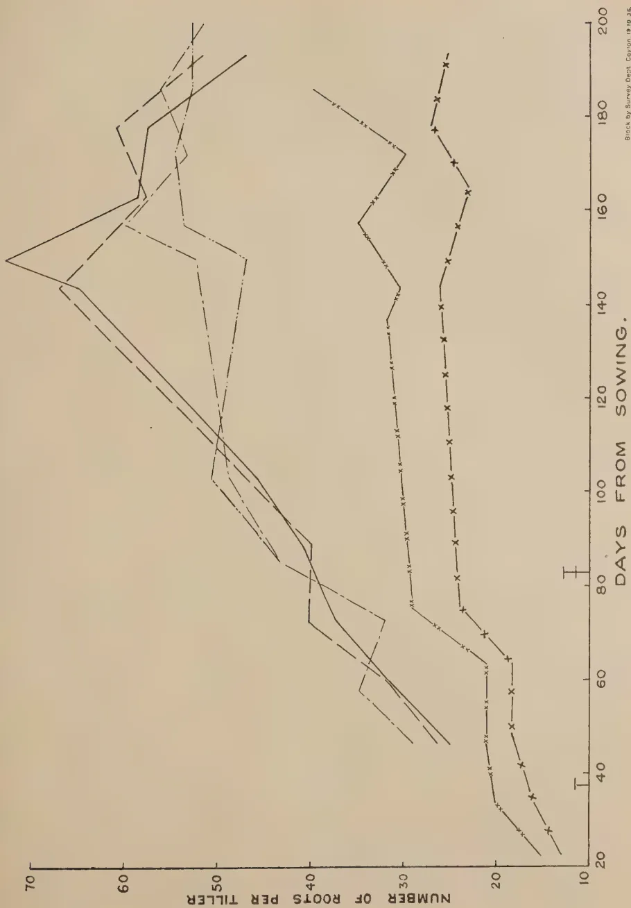
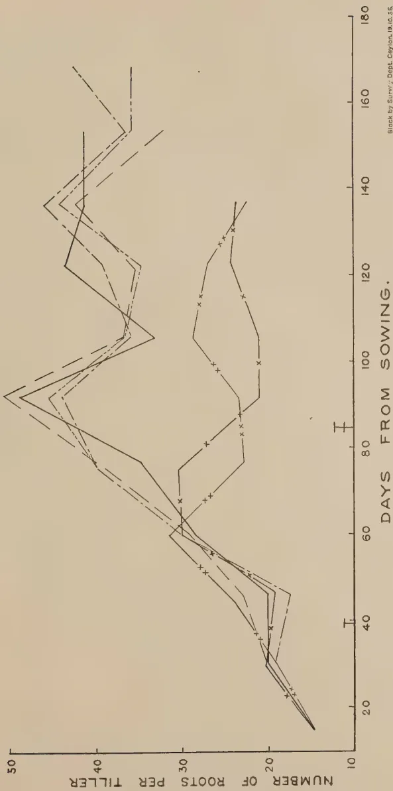
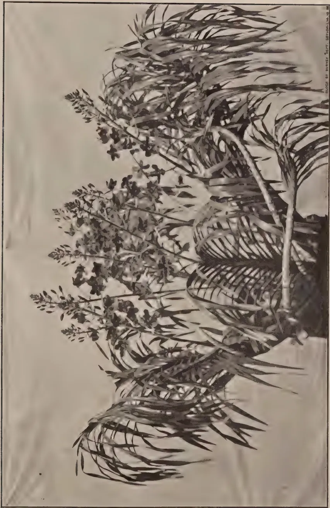

The  
Tropical Agriculturist  
October, 1936

---

EDITORIAL

---

CINNAMON

---

THE historical note on cinnamon appearing in this number ends in a depressing note. This industry which formed one of the main pre-occupations of Government in Dutch times gave character and individuality to the Island in the past, provided employment to a large number of people during a period of two centuries, and, only a few years ago, appeared to be entering a new term of mild prosperity, is now threatened with extinction. When cinnamon first reached Europe in the early days of the Roman Empire it found buyers at £8 per pound. By the middle of the eighteenth century the price had come down to 25 shillings per pound, and by the end of the third quarter of the nineteenth century it had become stabilized between 2s. 6d. and 3s. per pound. The fall was only temporarily arrested and in the first decade of the present century the ruling price was 9d. per pound. There was hardly any demand at all during the war and the immediate post-war years. The post-war boom in trade brought the price up to one shilling, but in 1933 the price was 4d. and there are no signs that there will be a marked improvement.

This continuous fall in prices is most remarkable when it is remembered that Ceylon's monopoly in the cultivated species of cinnamon was never challenged in the past, and the fall in prices synchronized with a considerable reduction in the acreage under cultivation. The local grower does not have sufficient

1------------------------------------------------

196

acquaintance with the trade to ascertain the causes of this progressive degeneration, but a number of suggestions have been advanced from time to time. It has been said that the rival product of Cassia brings prices down by competition and, again, that adulteration with inferior uncultivated varieties of bark reduces quality and, with quality, prices. We are unable to adjudicate on the comparative merits of these claims because no systematic investigations have ever been made with regard to this question, but the figures of the consumption of Cassia in the world market definitely point to a relation between the popularity of that commodity and the low prices of our cinnamon.

The last shock which Ceylon's cinnamon trade has received is the news that by Law No. 54 of 25th March, 1936, the Congress of Columbia has declared the cultivation and exploitation of *Cinnamomum zeylanicum*—our cultivated cinnamon—to be in the public interest and has voted money both for official experiments in the cultivation and preparation of cinnamon and for the grant of a subsidy for its cultivation by unofficial agriculturists. The importance of this decision to us lies in the fact that the principal users of Ceylon cinnamon are the Spanish American States. The only hope for the cinnamon grower seems to lie in a substantial improvement in the popularity of cultivated cinnamon at the expense of the Cassia bark, but that improvement can be effected only by intensive and sustained propaganda of a kind which this country cannot afford to undertake, and the expenditure on which does not seem to be justified by the volume of the trade. In these circumstances we can only counsel resignation to the ultimate relegation of the Ceylon cinnamon trade to a precarious and insignificant village industry.

2------------------------------------------------

197

## TOBACCO CULTIVATION ON THE ALLUVIAL DEPOSIT OF THE MAHAWELIGANGA

W. P. A. COOKE, M.Sc. (Calif.),

DIVISIONAL AGRICULTURAL OFFICER, EASTERN DIVISION

THE Mahaweliganga in its course flows through almost flat country in the Tammankaduwa and Trincomalee districts before emptying itself into the Bay of Bengal. During December and January—the flood season, the water overflows its banks from a few feet to a mile or more of river front on either side. Each flood leaves in its train very fine silt. Very good alluvial soil is thus found in these two districts to a length of 45 to 50 miles. The only crop cultivated in this tract is tobacco. The “black” wrapper of the Jaffna cheroot leaf known in trade as the Tammankaduwa tobacco is cultivated in this alluvial tract. The market for this tobacco is Jaffna. Although the area of the alluvial soil is large, only a small portion is cultivated. The factor which controls the area of cultivation is the demand at Jaffna for this tobacco. During the palmy days of the Jaffna cheroot industry large areas were cultivated in both these districts. At present the prices are down and the cultivation is confined to the Tammankaduwa district near Mannampitiya. The concentration of cultivation near the Mannampitiya area is due to its accessibility for railway transport. The access to other parts is through jungle tracts varying from 15 to 40 miles from the road which connects Batticaloa to Trincomalee.

*Tobacco varieties.*—The varieties grown here are from seeds secured from the Jaffna peninsula. They come under two broad classifications, *viz.*, broad leaf and narrow leaf Jaffna varieties. There are several sub-varieties due to the crossing of these two main varieties. The popular one at Tammankaduwa is the broad leaf variety. Their Jaffna names are *naramban*, *anaichevian*, *kulaiyan*, *pokkan* and *pachchilai-paliyan*. The two narrow leaf varieties are called *kooran* and *peelikodan*.

3------------------------------------------------

198

The broad leaf varieties when grown in the Jaffna red soil area and the Islands turn out to be very tough and are used for chewing. Their burning qualities are poor. Under Tammankaduwa conditions the leaf is thin and burns very well. This change in texture and quality shows clearly the extreme sensitiveness of the tobacco leaf to change its character according to the soil conditions in which it is grown.

*Market and its uses.*—The only market for this tobacco is Jaffna, where it is valued as an excellent wrapper leaf for the black cheroot, the favourite brand of the Jaffna born cheroot consumer. The second grade which is of thicker texture is used as a cheroot filler. The cultivators cure a certain quantity “red” for their own consumption as chewing tobacco.

*Curing the crop for the cigar trade.*—The tobacco is known in trade as the Tammankaduwa tobacco and is cured “black”, *karuppu* in Tamil.

The plants are cut whole in the evenings and laid out in the field overnight to wilt. The reason for this is that the leaf when mature is brittle and tears badly in handling. As the leaf is used as wrapper special care is taken to handle it without damage. In the morning they are hung topside down inside sheds. The next morning, *i.e.*, the third day the leaves are cut from the plants with the stalks and graded according to size. The first grade is called “*Therivu*” and the big-sized leaves come under this class. The second grade is called “*Therivu Kalappu*” and consists of the smaller leaves. The term “*kalappu*” means mixture. This grade is used both for wrapper and filler while “*Therivu*” is used entirely as wrapper. The bottom leaves and all other torn leaves are called “*Sachchu*” and are used only as filler. After grading, the “*Therivu*” grade leaves are tied into small bundles. On the fourth day the “*Therivu*” grade is hung inside the shed and the other two grades are spread on mats and left below. A pit about 10 feet deep and about 7 feet in diameter is dug. The bottom of the pit is first lined with tobacco stalks. The major portion of the second grade is placed at the bottom. The first grade comes in the middle, then the balance of the second grade is placed over the first grade—all the third grade is put on top and covered with palmyrah leaves. Earth is piled over this and the pit

4------------------------------------------------

199

is closed. This is done on the fifth day. The tobacco is allowed to ferment in this pit for 5 days. It is then removed and the first and second grades are tied in bundles or "hands" of 4 leaves and hung in the shed for 2 or 3 days to reduce the moisture. The bundles are piled in a heap for one night and aired next day to reduce the moisture. The tobacco is now ready for fermenting and maturing in bulk. The whole crop is arranged in layers on clean floor and is left covered in bulk of about 4 to 5 ft. in height. Slow fermentation takes place and to avoid overheating the bulk is opened and rebulked, the order of arrangement being varied so that all the leaf may get an equal chance of fermenting. This fermentation in bulk lasts about 4 weeks and the tobacco is ready for the market. The leaves are tied into bundles of 100 leaves. For wholesale trade this bundle is called a quarter "*thulam*"—a "*thulam*" consisting of 400 leaves.

*Red tobacco or Vellaipadam.*—The curing of the leaf for chewing by cultivators and Tammankaduwa residents is as follows: Some fully matured plants with thick leaves are selected and air-cured in closed sheds. They are allowed to stand like this for six days. During these six days the leaf turns gradually to a light colour and turns red as it dies. On the 7th day this red colour is fixed by rapidly killing the leaf by opening the sides of the shed. After fixing the colour the leaf is stripped and tied into small hands of 4 or more leaves. They are then bulked and weighted down for two days to ferment. After fermenting they are hung in the shed for a day to dry. The tobacco is now ready for use.

*Cultivation.*—The lands are leased from the Crown at Rs. 10.00 per acre per season. A block of two acres is called a "*wadi*". A "*wadi*" is the unit of cultivation. The cultivators start work in February and continue to work till September when the season ends. Almost all the labour comes from the Eravur village of the Batticaloa district. There are a very few to be found from Tammankaduwa and Kerudavil village of the Vadamarachchi division in Jaffna.

A team of three men and a boy work a "*wadi*" of 10,000 plants. Very little manuring is done—about 100 cattle are tethered at nights for 3 months. The cultivation in other

5------------------------------------------------

200

respects is done on the same lines as in the Jaffna peninsula. The nurseries are laid in February-March and transplanting in the field takes place in April-May. The early planted crop usually does better than the later ones.

*Pests and diseases.*—There are no pests of a serious nature reported but there is disease to be found on late planted fields. Tobacco wilt and mottling of leaf was noticed in some plants at the time of the visit.

*Irrigation.*—The water is lifted from the river by means of well sweeps as at Jaffna except that the bucket used is the ordinary galvanised iron bucket and no man runs on the sweep. A man can lift water for 2,000 plants in a day.

The second method is to lift water by means of leather mhotes called ‘*Kapalai*’ of about 25 gallons capacity. Water could be lifted to irrigate 8,000 plants a day. A mhote unit consists of one man, a pair of bulls and the mhote. The value of the animals used for the mhote is about Rs. 40.00 per animal. If one is hired Rs. 10.00 is paid for the season, *i.e.*, Rs. 20.00 per pair. Mhotes are worked by the animals walking backwards and forwards as done in South India. The mhote costs from Rs. 15.00 to Rs. 20.00 and is made at Eravur.

*Cost of cultivation.*—For a capitalist the cost of working a “wadi” works out as follows :

<table>
<thead>
<tr>
<th></th>
<th>Rs.</th>
<th>Cts.</th>
</tr>
</thead>
<tbody>
<tr>
<td>To rent of land at Rs. 10.00 for 2 acres ..</td>
<td>20</td>
<td>00</td>
</tr>
<tr>
<td>To wages of 3 men at Rs. 10.00 a month for 8 months .. .. .</td>
<td>240</td>
<td>00</td>
</tr>
<tr>
<td>To wages of 1 boy at Rs. 5.00 a month for 8 months .. .. .</td>
<td>40</td>
<td>00</td>
</tr>
<tr>
<td>Provisions to feed the men for 8 months ..</td>
<td>150</td>
<td>00</td>
</tr>
<tr>
<td>Supplying materials for sheds (cadjans, etc.)</td>
<td>10</td>
<td>00</td>
</tr>
<tr>
<td>Cattle for penning (his own cattle) extra expense .. .. .</td>
<td>10</td>
<td>00</td>
</tr>
<tr>
<td>Implements .. .. .</td>
<td>20</td>
<td>00</td>
</tr>
<tr>
<td>Transport of materials and provisions ..</td>
<td>30</td>
<td>00</td>
</tr>
<tr>
<td></td>
<td>
Rs. 520</td>
<td>
00</td>
</tr>
</tbody>
</table>

6------------------------------------------------

201

By “provision” is meant rice, coconut, salt and curry stuffs. The labourers and cultivators grow their own vegetables and chillies on the spot to meet their requirements for the season.

The approximate gross income realised on a “wadi” may be tabulated as follows :

<table>
<thead>
<tr>
<th></th>
<th>Rs.</th>
<th>Cts.</th>
</tr>
</thead>
<tbody>
<tr>
<td>No. 1 grade : 100 “<i>thulams</i>” at Rs. 7.00</td>
<td>.. 700</td>
<td>00</td>
</tr>
<tr>
<td>Nos. 2 and 3:25 “<i>thulams</i>” at Rs. 2.00</td>
<td>.. 50</td>
<td>00</td>
</tr>
<tr>
<td>Red tobacco: 5 “<i>thulams</i>” at Rs. 10.00</td>
<td>.. 50</td>
<td>00</td>
</tr>
<tr>
<td></td>
<td>Rs. 800</td>
<td>00</td>
</tr>
</tbody>
</table>

Sub-tenants under Crown lessees pay rent of Rs. 2.00 per strip of one fathom width of river front. The length varies from 75 yards to 125 yards. On an acre basis the rent varies from Rs. 30.00 to Rs. 60.00 an acre. A team of three men and a boy borrow Rs. 300.00 for the season and pay 30 to 40 per cent. interest for the use of the money for the season. Sometimes the Crown lessee agrees to take one or two men on partnership. The Crown lessee makes advances to his partners and recovers his interest on the loan. He meets the expenses of his men and shares the produce in proportion to the number of partners and his labourers.

7------------------------------------------------

202

## QUESTIONNAIRE ON COVER CROPS AND GREEN MANURES (IN RELATION TO COCONUT CULTIVATION)

M. L. M. SALGADO, Ph.D. (Cantab.), B.Sc. (Lond.),  
Dip. Agric. (Cantab.)

*SOIL CHEMIST, COCONUT RESEARCH SCHEME (CEYLON)*

### INTRODUCTION

THE practice of growing green manures, particularly cover crops, has not been undertaken on coconut estates in a systematic manner. In 1929, the Department of Agriculture published a leaflet entitled "Green Manuring with Particular Reference to Coconuts" by Joachim; but since then little progress has been made and the practice is yet far from general. It has been alleged that on certain estates the establishment of cover crops has adversely affected the crop yield, and owing to this belief a consequent prejudice against cover crops has arisen. It may, however, be stated that the practice has not been given a fair trial. There has recently been a general re-awakening regarding the subject, as shown by a newspaper controversy that took place in 1933. The subject was discussed before the Chilaw Planters' Association in a paper prepared by the writer read before that body in June 1935, and in view of the diversity of opinion regarding this agricultural practice a questionnaire on the subject was issued by the Coconut Research Scheme in order to ascertain the experience of planters. The replies to the questionnaire would indicate the lines along which further experiments have to be carried out.

Details of the questionnaire are given below :

Name of Estate and Locality.

Name of Proprietor.

1a. Which of the following soil types occur on the estate :  
cabook, loam, clay ; and lay of land (Undulating,  
flat, hilly) ?

8------------------------------------------------

203

1b. Rainfall.

1. 2. Do you grow green manures ? If so, please mention the varieties you grow
   1. (a) Erect varieties
   2. (b) Cover crops
2. 3. How do you get your green manures established ? Please give details, such as planting by broadcasting or in rows. Seed rate, single or mixed stands of green manure (such as mixture of *Centrosema* and *Calopogonium*), alternate rows or entire field, and whether cuttings are used.
3. 4. How long do you find it takes to establish a cover of
   1. (a) *Centrosema* (b) *Calopogonium* (c) *Pueraria javanica* ?
4. 5. Do your covers die-back during drought : and do they recover after rains ?
5. 6. Have you experienced a set-back in the trees immediately after establishing covers ? Please give crop records of such fields if available.
6. 7. Have you observed an improvement in the health of palms after covers were established ?
7. 8. How do you utilise your cover crops ?
   1. (a) Do you plough in your cover : how often ?
   2. (b) Do you harrow : how often ?
   3. (c) Do you bury in trenches ?
   4. (d) As fodder ?
8. 9. In your experience what is the best green manure crop, (erect and cover) for your soil ?
9. 10. What is your experience with covers on young plantations ?
10. 11. Have you found it difficult to re-establish *Pueraria* on the same soil after ploughing or harrowing this cover ?
11. 12. Have you ever observed beetles in fields where green manures alone were harrowed, ploughed or buried in trenches ?
12. 13. What system of manuring do you adopt on land under cover crops and green manures ? If artificial

9------------------------------------------------

204

manures are used, state the composition of mixtures and the quantities applied.

1. 14. Are you able to utilise covers as fodder for cattle ?
2. 15. How many acres do you have under uniform cover crops and are you prepared to allow the Coconut Research Scheme to lay down an experiment on cover crops on your estate ?

61 copies of the questionnaire were sent, but only 32 replies were received. The following bodies were consulted in making the list of estates as comprehensive as possible :—

Chilaw Planters' Association,  
Kurunegala Planters' Association,  
Southern Province Planters' Association, and the  
Low-Country Products Association

to whom thanks are due. The questionnaire was first issued in October 1935, but as additions were made to the list of estates where cover crops were grown, further copies were sent in April and May 1936.

In spite of the fact that all of the Planters' Associations interested in coconut cultivation and also the Low-Country Products Association were consulted, there are doubtless many Estate Proprietors and Superintendents interested who were not approached for their views. To these apologies are tendered, and the Coconut Research Scheme would welcome further correspondence from them.

A classification of replies received according to districts is as follows :

<table style="width: 100%; border-collapse: collapse;">
<tbody>
<tr>
<td>Chilaw</td>
<td>..</td>
<td>..</td>
<td>..</td>
<td>..</td>
<td style="text-align: right;">10</td>
</tr>
<tr>
<td>Colombo</td>
<td>..</td>
<td>..</td>
<td>..</td>
<td>..</td>
<td style="text-align: right;">6</td>
</tr>
<tr>
<td>Galle</td>
<td>..</td>
<td>..</td>
<td>..</td>
<td>..</td>
<td style="text-align: right;">1</td>
</tr>
<tr>
<td>Kandy</td>
<td>..</td>
<td>..</td>
<td>..</td>
<td>..</td>
<td style="text-align: right;">1</td>
</tr>
<tr>
<td>Kurunegala</td>
<td>..</td>
<td>..</td>
<td>..</td>
<td>..</td>
<td style="text-align: right;">11</td>
</tr>
<tr>
<td>Negombo</td>
<td>..</td>
<td>..</td>
<td>..</td>
<td>..</td>
<td style="text-align: right;">1</td>
</tr>
<tr>
<td>Puttalam</td>
<td>..</td>
<td>..</td>
<td>..</td>
<td>..</td>
<td style="text-align: right;">2</td>
</tr>
<tr>
<td colspan="5" style="text-align: right;">Total</td>
<td style="text-align: right; border-top: 1px solid black; border-bottom: 1px solid black;">32</td>
</tr>
</tbody>
</table>

The 32 estates represent an extent of 17,400 acres of which 7,750 acres (*i.e.*, about 45 per cent.) are under cover crops.

10------------------------------------------------

205

Visits were paid to a number of estates from which replies to the questionnaire were received, and points arising out of the replies were discussed.

It is not proposed to give here the full details of the replies received from each estate owing to lack of space, but it would be useful to discuss briefly the subject under review in the light of the information gathered from the practical experience of estates.

### DISCUSSION

Though the questionnaire referred to the subject of green manures in general, the information gathered has been mainly regarding cover crops. Hence the following discussion is mainly concerned with this aspect of green manures.

1. *Soil type and rainfall.*—Cover crops have been established under a variety of soil and climatic conditions in Ceylon. In spite of the belief that it would be difficult to grow covers under conditions of very low rainfall, these have been established even in the Puttalam District. One of the estates at Mundel, with an average rainfall of 45 inches, has been visited by the writer and the good growth of covers noted.

2. *Varieties grown.*—Of the erect green manures *Tephrosia candida* (Boga medeloa), the *Crotalarias* and *Glicricidia* are the only types grown on coconut estates.

Among cover crops *Calopogonium mucunoides*, *Centrosema pubescens* and *Pueraria javanica* are popular, while in a few cases *Vigna* is occasionally grown. Probably *Vigna* was the first cover to be introduced to coconut estates, but in general it may be said that it is now grown to a negligible extent.

3. *Method of establishing cover.*—The land is first ploughed and harrowed, seed is broadcast and lightly raked in. In a few cases a small dose of artificials or cattle manure is broadcast before ploughing. In some cases covers are planted on coconut husk trenches.

*Centrosema* is invariably planted mixed with *Calopogonium*. Seed rates used have been very variable from 8 to 45 lb. per acre. Where heavier seed rates were used a cover was established in a short time—even as short a time as four months.

11------------------------------------------------

206

In the case of *Pueraria*, in view of the high cost of seeds, cuttings have been used with success. Economy in seeds has also been effected by germinating seeds on coconut husks and planting in the field at a very small seed rate.

4. *Time taken to establish a cover.*—The time taken to establish a cover also seems variable. *Calopogonium* is the quickest and establishes itself in six to eight months. *Centrosema* and *Pueraria* take nearly one and half years to form a complete cover.

Though the growth of *Calopogonium* is very rapid it thins down at the seeding season and lets in grass before the shed seed germinates. Grown with *Centrosema*, the latter grows continuously and though the start is slow it spreads over the *Calopogonium* at the seeding season and subsequently almost completely blankets it.

5. *Die-back.*—*Calopogonium* is the earliest to die-back during a drought and even during ordinary dry weather, as also after seeding. *Pueraria* too shows a tendency to die-back, but recovers. *Centrosema* is more resistant. All these varieties recover with the rains. In the case of *Centrosema*—*Calopogonium* mixtures *Centrosema* takes the place of *Calopogonium* after die-back.

*Calopogonium* seeds seem to remain viable for a number of years. When a *Centrosema* cover that has replaced the *Calopogonium*, is ploughed after several years, the *Calopogonium* seeds that had remained dormant for a number of years, regenerate themselves.

6. *Set-back after establishing covers.*—Except in three isolated cases where a set-back was experienced for 2 or 3 years, there is an emphatic and definite belief that there is no set-back whatever that can be attributed to the cover crop.

7. *Improvement of health of palms after covers were established.*—There is a general agreement that the health of the palms as judged by the green colour of the foliage shows distinct improvement. The contrast is always seen between adjacent fields with cover and no cover.

12------------------------------------------------

207

8. *Utilisation of cover.*—The method of treating the cover seems to differ, but there is a distinct consensus of opinion against leaving covers permanently untreated and allowing rank growth.

The various methods practised on different estates are as follows :

- (a) Ploughing once in two years. It is reported that ploughing in a thick cover is difficult, particularly in the case of *Pueraria*.
- (b) Harrowing once a year and even twice a year when the cover is thick. Harrowing is done during the end of the rainy season.
- (c) Digging with mamotty forks once in 2 years in wet weather seems to be a very effective method.
- (d) In a few cases the cover is envelope-forked. This seems to be the practice on some estates in the Kurunegala District.
- (e) The cover from alternate rows is pulled out and buried in shallow trenches between palms, with or without manure. This practice is reported to have caused the breeding of the coconut black beetle in the trenches in four estates.

Sometimes the cover is buried in trenches along with coconut husk.

- (f) Slashing the cover seems to be little practised.
- (g) A few estates treat the cover by controlled grazing, especially in the case of *Centrosema* which is relished by cattle.
- (h) A manure mixture is broadcast on the cover, which is scorched by the manure.
- (i) Coconut husk is thrown on the cover.

9. *Best green manure.*—Here opinion differs considerably. Most estates grow *Calopogonium*, *Centrosema* and *Pueraria*, and are not restricted to one crop.

10. *Covers on young plantations.*—There seems to be a general agreement that cover is particularly useful in young plantations, especially in reducing the weeding bill. Care should be taken to prevent the creepers (especially *Pueraria*)

13------------------------------------------------

208

from climbing young palms. The area immediately round the palms up to a distance of about six feet is kept clean weeded.

It has been also stated that in young plantations covers favour the breeding of rats and bandicoots. On the other hand it may be stated that these pests breed equally well among the usual weed growth of young plantations.

11. *Difficulty of establishing Pueraria on the same soil after ploughing or harrowing.*—Difficulty was experienced in a few isolated cases. If harrowing is done when the cover is thick so that the discs do not reach the soil, the cover is not eradicated. Many estates do not seem to have sufficient experience of this cover.

12. *Black beetle where cover has been ploughed, harrowed or buried.*—In four estates the coconut black beetle (*Oryctes rhinoceros*) was reported to have been found where cover was buried. In one estate where cover was buried nearly 30,000 adult beetles and grubs were collected and destroyed from May to October 1934.

In the case of one estate it was alleged that the black beetle breeds in the cover among the mixture of decaying fronds and leaf mould.

Where ploughed or harrowed black beetle has not been found.

13. *Systems of manuring adopted where land is under cover.*—These may be summarised as follows :

- (a) The cover is cut back in the centre along a row, manure is broadcast on the bare land, which is then ploughed and harrowed and the cover replaced.
- (b) The manure mixture is broadcast on the cover and then harrowed.
- (c) Manure mixture is broadcast on the cover and the cover not further disturbed. The cover is scorched by the manure, which is subsequently washed down by rain.
- (d) The cover is buried in trenches with manure round the palms or between the rows.
- (e) Envelope-fork covers with manure mixtures. This method seems to be practised on some estates of the Kurunegala District.

14------------------------------------------------

209

(f) The cover is grazed down by cattle, which in turn are used for manuring the palms.

The manure mixtures, where applied, contain a preponderance of potash and phosphoric acid. Several estates have used no artificials with cover.

14. *Cover as fodder*.—*Centrosema* is relished by cattle. *Calopogonium* and *Pueraria* seem to be less favoured, but buffaloes are indifferent and eat all these varieties with preference for *Centrosema*. Most estates do not utilise the cover as fodder. Where the cover is thick, controlled grazing is practised without damage to the cover.

#### FUTURE EXPERIMENTS

The replies to the questionnaire indicate that there is a general belief, as the result of experience, that the growing of cover crops has definite advantages such as reducing the cost of weeding and maintaining the healthy appearance of the palms. While there seems also to be no set-back that can be attributed to cover crops, what has to be determined is whether the growing of covers bring about a definite increase in crop yield, and also how this can be attained by the different methods of utilising the cover combined with the most economical system of manuring. Field experiments that are contemplated by the Coconut Research Scheme will aim at the elucidation of these points.

15------------------------------------------------

210

## GREEN FENCING FOR NEW RUBBER CLEARINGS

J. D. FARQUHARSON,

MANAGER, VOGAN ESTATE, NEBODA

THE question of whether, or not, to undertake the replanting of old rubber areas is one which is engaging the attention of many estate managers at the present time. The final decision is usually dependent upon the estimated cost per acre of the undertaking and not the least item of the estimate is the fencing of the new clearing. The following note is intended to indicate how an appreciable saving can be effected in this item during the preparation of estimates.

Fencing cannot be dispensed with as the area of replanted rubber, and also such cover crops as may have been established, need to be protected from damage by cattle and goats for a period of at least six years.

A suitable fence should consist of not less than five strands of barbed wire, the lowest strand being six inches from the ground, the same distance separating this strand from the second and the second from the third. This distance may be increased to one foot between third and fourth, and fourth and fifth strands, respectively.

As the object of this note is to indicate the minimum cost at which suitable fencing can be erected, only the cheapest possible materials are estimated for. For this reason, Japanese wire and cement are specified. This wire is procurable in Colombo at Rs. 5.00 per roll of 300 yards.

The following estimate provides for the fencing of a 20-acre clearing with different types of posts.

A five-strand fence would require 8,500 yards of barbed wire, equivalent to 28 rolls at Rs. 5.00, making a total of Rs. 140.00 for wire alone. Other costs will depend upon the type of fencing post employed.

(a) *Iron posts*.—Iron posts are readily procurable in Colombo and are easy to erect. The cheapest type, 6 ft. in length,

16------------------------------------------------

211

can be obtained for Rs. 70.00 per 100. Allowing a distance between posts of 15 ft., 400 posts would be required at a total cost of Rs. 280.00, to which should be added about Rs. 20.00 to cover transport and handling charges.

(b) *Cement posts*.—These should be manufactured as near to the area to be fenced as possible, one  $\frac{1}{4}$ " round-iron rod being used for reinforcing. If Japanese cement is used the cost of making can be reduced to 40 cents per post, 400 posts costing Rs. 160.00.

(c) *Live posts*.—In fencing a new clearing in an old rubber area, the operation would necessarily be delayed until the old rubber trees were felled. Suitable 6-ft. posts can be cut from the felled rubber and treated with a wood preservative mixture. The cost of such posts, including treatment, should not exceed 6 cents each. Rough "milla," or other available jungle posts, should be used as straining posts and if treated with preservative should last for six years, or longer. They should not cost more than 20 cents each and about 60 should suffice. Allowing for 340 rubber posts at 6 cents, 60 "milla," or other strong posts, at 20 cents and Re. 1.00 for preservative, the total cost would amount to Rs. 33.40.

After the area has been fenced with wooden posts, cuttings, 6 ft. in length, of a quick growing tree, such as *Gliricidia maculata*, should be planted alongside, and between, each post. If cuttings are available, a greater number may, with advantage, be planted along the line of wire. In place of *Gliricidia*, cuttings of the following jungle trees would be suitable if available in the vicinity:—

Godapara, *Dillenia retusa*, Diyapara, *Wormia triquetra*,  
 Suriya, *Thespesia populnea*, Weraniya, *Heydotis fructicosa*,  
 Eramudu, *Erythrina indica*, and Hik, *Odina Wodier*.

The cost of cutting, transporting and planting cuttings of these trees will vary according to species, accessibility and other factors but an average cost may be taken as Re. 1.00 per acre. Cuttings which have not become established within one month of planting should be replaced. *Gliricidia* cuttings grow rapidly and if planted in suitable weather should be sufficiently strong to bear the strain of the wire after about nine months.

17------------------------------------------------

212

A pound or two of staples will be required. Fixing the wire to the green posts should be completed before the original wooden posts commence to decay.

The appearance of a live fence may not be as businesslike as one with iron or cement posts but with suitable attention it can be kept tidy. Apart from being economical, an important advantage of a fence of this type is that it should provide a plentiful supply of green manure close at hand. Lopping may be done three or four times a year without effecting the strength of the fencing.

The following table illustrates the comparative costs of erecting the three types of fencing referred to above :—

<table border="1">
<thead>
<tr>
<th></th>
<th colspan="2">20 ACRE CLEARING</th>
<th colspan="2">FENCING ESTIMATE</th>
</tr>
<tr>
<th><i>Item</i></th>
<th><i>Iron</i></th>
<th><i>Cement</i></th>
<th colspan="2"><i>Green Fence</i></th>
</tr>
</thead>
<tbody>
<tr>
<td>400 posts</td>
<td>@ 75 cts. 300.00</td>
<td>@ 40 cts. 160.00</td>
<td>Rubber Wood 340 @ 6 cts. 20.40 Milla 60 @ 20 cts. 12.00</td>
<td></td>
</tr>
<tr>
<td>Japanese barbed wire (8,500 yds.) 28 rolls at 5.00 each</td>
<td>140.00</td>
<td>140.00</td>
<td></td>
<td>140.00</td>
</tr>
<tr>
<td>Holing and fixing posts at 3 cts. a post</td>
<td>12.00</td>
<td>12.00</td>
<td></td>
<td>12.00</td>
</tr>
<tr>
<td>Fixing wire, 20 lab- ourers</td>
<td>10.00</td>
<td>10.00</td>
<td></td>
<td>10.00</td>
</tr>
<tr>
<td>gutting, transport- ing and planting green posts</td>
<td>—</td>
<td>—</td>
<td></td>
<td>20.00</td>
</tr>
<tr>
<td>Preservative mix- ture</td>
<td>—</td>
<td>—</td>
<td></td>
<td>1.00</td>
</tr>
<tr>
<td>Total</td>
<td>Rs. 462.00</td>
<td>Rs. 322.00</td>
<td colspan="2">Rs. 215.40</td>
</tr>
<tr>
<td>Per acre</td>
<td>Rs. 23.10</td>
<td>Rs. 16.10</td>
<td colspan="2">Rs. 10.77</td>
</tr>
</tbody>
</table>

18------------------------------------------------

213

## STUDIES ON PADDY CULTIVATION—VII

### THE EFFECT OF CULTIVATION ON ROOT DEVELOPMENT AND EAR FORMATION

J. C. HAIGH, Ph.D.,

*ECONOMIC BOTANIST*

IN a previous paper of this series (2), chemical analyses were made of paddy plants that were growing under a variety of conditions. The plots, from which sample plants were removed at intervals during growth, were part of a randomised replicated field trial which compared the effects on yield of broadcasting, broadcasting and thinning, and transplanting, with and without manure. The analyses determined that the rates of absorption of nitrogen and phosphoric acid from the soil were affected both by the system of cultivation and by the application of manure, but principally by the former; in the broadcast plots, whether thinned or not, 85 per cent. of the nitrogen and phosphoric acid found in the plant at harvest had been absorbed by flowering-time, whereas in the transplanted plots only 50 per cent. had been absorbed when the plants flowered, and the other half was taken up in the 6 or 7 weeks between flowering and harvest. It appeared probable that the differences in rate of absorption were the result of differences in the development of the roots, and it was decided to repeat the trial, replacing chemical analysis by an examination of the roots of sample plants removed at intervals during growth.

The repeated trials were carried out during the seasons *maha* 1934–35 and *yala* 1935 with a slight modification of treatment. It has been determined repeatedly that no significant gain in yield results from thinning broadcast plants, and in the repeated trial this treatment was replaced by one in which the plots were transplanted twice. The seedlings for this treatment were uprooted from the nursery at the same time as those of the transplanted series, but instead of being put into the field plots they were planted in a second nursery, from whence they were

19------------------------------------------------

214TABLE I

YIELD RECORDS, MAHA 1934-35  
FIELD TRIAL ON  $\frac{1}{10}$  ACRE PLOTS

<table border="1">
<thead>
<tr>
<th rowspan="2">TREATMENT</th>
<th colspan="7">YIELD IN Lb.</th>
<th rowspan="2">TOTAL</th>
<th rowspan="2">MEAN</th>
<th rowspan="2">M=100</th>
</tr>
<tr>
<th>A</th>
<th>B</th>
<th>C</th>
<th>D</th>
<th>E</th>
<th>F</th>
<th></th>
</tr>
</thead>
<tbody>
<tr>
<td>Broadcast ..</td>
<td>9.22</td>
<td>15.00</td>
<td>10.87</td>
<td>10.44</td>
<td>9.19</td>
<td>4.12</td>
<td></td>
<td>58.84</td>
<td>9.81</td>
<td>55.8</td>
</tr>
<tr>
<td>Broadcast and manured ..</td>
<td>8.69</td>
<td>10.25</td>
<td>17.25</td>
<td>14.75</td>
<td>23.06</td>
<td>11.00</td>
<td></td>
<td>85.00</td>
<td>14.17</td>
<td>80.7</td>
</tr>
<tr>
<td>Transplanted ..</td>
<td>25.62</td>
<td>26.75</td>
<td>27.81</td>
<td>16.37</td>
<td>20.50</td>
<td>14.75</td>
<td></td>
<td>131.81</td>
<td>21.97</td>
<td>125.1</td>
</tr>
<tr>
<td>Transplanted and manured ..</td>
<td>24.87</td>
<td>35.25</td>
<td>22.00</td>
<td>22.81</td>
<td>19.00</td>
<td>19.12</td>
<td></td>
<td>143.05</td>
<td>23.84</td>
<td>135.7</td>
</tr>
<tr>
<td>Double-transplanted ..</td>
<td>19.19</td>
<td>25.69</td>
<td>10.81</td>
<td>14.00</td>
<td>20.19</td>
<td>16.00</td>
<td></td>
<td>105.88</td>
<td>17.65</td>
<td>100.5</td>
</tr>
<tr>
<td>Double-transplanted and manured ..</td>
<td>14.81</td>
<td>16.75</td>
<td>23.81</td>
<td>14.00</td>
<td>21.00</td>
<td>17.44</td>
<td></td>
<td>107.81</td>
<td>17.97</td>
<td>102.3</td>
</tr>
<tr>
<td>Total ..</td>
<td>102.40</td>
<td>129.69</td>
<td>112.55</td>
<td>92.37</td>
<td>112.94</td>
<td>82.43</td>
<td></td>
<td>632.38</td>
<td>17.57</td>
<td></td>
</tr>
</tbody>
</table>

<table border="1">
<thead>
<tr>
<th></th>
<th>Degrees of Freedom</th>
<th>Total Variance</th>
<th>Mean Variance</th>
<th>S. D.</th>
<th>Loge S. D.</th>
</tr>
</thead>
<tbody>
<tr>
<td>Blocks ..</td>
<td>5</td>
<td>234.06</td>
<td></td>
<td></td>
<td></td>
</tr>
<tr>
<td>Treatments ..</td>
<td>5</td>
<td>784.09</td>
<td>156.8</td>
<td>12.52</td>
<td>2.5273</td>
</tr>
<tr>
<td>Experimental Error ..</td>
<td>25</td>
<td>516.23</td>
<td>20.65</td>
<td>4.544</td>
<td>1.5138</td>
</tr>
<tr>
<td>Total ..</td>
<td>35</td>
<td>1534.38</td>
<td></td>
<td>Z =</td>
<td>1.0135</td>
</tr>
</tbody>
</table>

$n_1 = 5$ ,  $n_2 = 25$ , 1% point is 0.6747,  $z$  is significant

S.D. of 1 plot = 4.544 lb.

S.D. of 6 plots = 11.13 lb.

20------------------------------------------------

215

again uprooted and put into field plots from 4 to 6 weeks later. Reports had been received from India that a further increase in yield had been obtained by this method, and it was desired to know whether a similar increase could be obtained under Ceylon conditions and whether such an increase would be accompanied by differences in the development of the root system.

It is necessary to consider the two trials separately : the seasons were of different lengths, the paddies grown were of different varieties, and the conditions were not the same. Both trials laboured under a disadvantage which was unavoidable if the results were to be strictly comparable with those of the previous series. It is our practice, in carrying out paddy trials, to conform as nearly as possible to village methods, in order that the results may be of practical application : accordingly, in demonstrating the advantages of transplanting, the method used in the village has been followed. The cultivator who transplants his fields puts in a bunch of 3 or 4 seedlings at a time ; it is easier than picking out single plants and it tends to ensure that each " hill " will mature at least one plant. This method of planting meant that in the trials, comparisons were being made not between sample plants but between sample hills, which consisted in one case of a single plant and in the other of one to three plants, according to the rate of survival in the transplanted plots. In order to overcome this disadvantage, the data were reduced to a " per tiller " basis, in order to compare the yield of grain produced by an earhead with the development of the roots that had nourished it.

Comparative yields from the first trial are shown in table I. The results are statistically significant, and indicate that transplanting, with or without manure, is better than broadcasting, with or without manure, and that double-transplanting is better than broadcasting. The increase due to manuring is not significant. The figures do not, however, indicate accurately the relative merits of the different systems of cultivation, because the conditions obtaining in different treatments were not the same. The fields on which the experiment was sown are subject to the attacks of land crabs (*Paratelphusa* (*Oziotelphusa*) *hydrodromus*), which cut down seedlings in the early stages of growth. In the *maha* 1934-35 season the attack

21------------------------------------------------

216

was particularly bad, and as is usual, the broadcast plots were attacked to a greater extent than those that had been transplanted; indeed, they were attacked to such an extent that there were left standing no more plants than there were in the transplanted plots, instead of several times that number. In the second place, the double-transplanted plots had been planted at a slightly wider spacing than the transplanted plots, as the result of a mistake due to the larger size of the plants. Counts were taken at harvest time of the number of plants per square yard, and these figures, together with comparative yields per hill obtained by dividing the yield per square yard by the number of contributing hills, are given below.

<table>
<thead>
<tr>
<th></th>
<th></th>
<th><i>Plants per sq. yd.</i></th>
<th></th>
<th><i>Yield per hill in lb.</i></th>
</tr>
</thead>
<tbody>
<tr>
<td>Broadcast</td>
<td>.. ..</td>
<td>48</td>
<td>..</td>
<td>0.0042</td>
</tr>
<tr>
<td>Broadcast and manured..</td>
<td>.. ..</td>
<td>62</td>
<td>..</td>
<td>0.0047</td>
</tr>
<tr>
<td>Transplanted</td>
<td>.. ..</td>
<td>78</td>
<td>..</td>
<td>0.0058</td>
</tr>
<tr>
<td>Transplanted and manured</td>
<td>.. ..</td>
<td>78</td>
<td>..</td>
<td>0.0063</td>
</tr>
<tr>
<td>Double-transplanted</td>
<td>.. ..</td>
<td>42</td>
<td>..</td>
<td>0.0087</td>
</tr>
<tr>
<td>Double-transplanted and manured</td>
<td>.. ..</td>
<td>43</td>
<td>..</td>
<td>0.0087</td>
</tr>
</tbody>
</table>

The figures indicate that the yield per hill in the double-transplanted plots has exceeded that in the transplanted plots; it appears possible that, had the two treatments been planted at the same distance, their yields might have been more nearly the same. Comment will be made later on the poor yield of the broadcast plots in spite of the wide spacing of the plants.

Sample plants were taken from all plots every two weeks. The approximate root spread under various conditions had been determined by previous trial, and when the sample plants were taken, a sufficiently large block of mud was removed to ensure that the roots of the sample plants were not broken. Two plants were taken from each plot at each sampling, which in the later stages meant removing a cube of earth almost a yard across. The result of the removal of so many plants is, of course, reflected in the yield figures, but since an equal area of soil was removed from each plot, comparative yields per acre are not affected. The mud from the blocks thus removed was washed off in the water-supply channel, the sample plants were separated and were taken to the laboratory where they

22------------------------------------------------

217

The graph illustrates the growth of roots per tiller over time for several plant varieties. The Y-axis represents the 'NUMBER OF ROOTS PER TILLER' (ranging from 10 to 70), and the X-axis represents 'DAYS FROM SOWING' (ranging from 20 to 200). The data is presented as multiple lines, each representing a different variety, with markers indicating specific data points.

<table border="1">
<thead>
<tr>
<th>Days from Sowing</th>
<th>Variety 1 (Solid)</th>
<th>Variety 2 (Dashed)</th>
<th>Variety 3 (Dash-dot)</th>
<th>Variety 4 (Long Dash)</th>
<th>Variety 5 (X)</th>
</tr>
</thead>
<tbody>
<tr>
<td>20</td>
<td>18</td>
<td>18</td>
<td>18</td>
<td>18</td>
<td>18</td>
</tr>
<tr>
<td>40</td>
<td>22</td>
<td>22</td>
<td>22</td>
<td>22</td>
<td>22</td>
</tr>
<tr>
<td>60</td>
<td>25</td>
<td>25</td>
<td>25</td>
<td>25</td>
<td>25</td>
</tr>
<tr>
<td>80</td>
<td>28</td>
<td>28</td>
<td>28</td>
<td>28</td>
<td>28</td>
</tr>
<tr>
<td>100</td>
<td>32</td>
<td>32</td>
<td>32</td>
<td>32</td>
<td>32</td>
</tr>
<tr>
<td>120</td>
<td>35</td>
<td>35</td>
<td>35</td>
<td>35</td>
<td>35</td>
</tr>
<tr>
<td>140</td>
<td>38</td>
<td>38</td>
<td>38</td>
<td>38</td>
<td>38</td>
</tr>
<tr>
<td>160</td>
<td>42</td>
<td>42</td>
<td>42</td>
<td>42</td>
<td>42</td>
</tr>
<tr>
<td>180</td>
<td>45</td>
<td>45</td>
<td>45</td>
<td>45</td>
<td>45</td>
</tr>
<tr>
<td>200</td>
<td>48</td>
<td>48</td>
<td>48</td>
<td>48</td>
<td>48</td>
</tr>
</tbody>
</table>

Note: The graph shows multiple lines for each variety, indicating variability in the data points. The X-axis has a break between 80 and 100 days.

Brock by Survey Dept. Coylon, 1919-1920.

Fig. 1.

23------------------------------------------------

218

were carefully cleaned. Records were made of the mean length of the longest root, the number of roots and the number of tillers. The roots were removed from the stems (actually they were pulled off whilst being counted) and were weighed after having been heated in a hot-air oven until there was no further loss in weight. All data were reduced to a "per tiller" basis and are shown in figs. 1-3. Each record is the mean of 12 readings, 2 from each of 6 plots.

Of the three sets of data—length, number and weight of roots—that which records number corresponds most nearly with the yield data, and it is in fact to the greater number of roots developed that the transplanted plant owes its superiority. It will be seen from the figures that all three characteristics increase up to flowering-time, after which the tendency is to decrease; individual deviations of unusual magnitude, such as that shown by the weight of the transplanted and manured series at 144 days may be attributed to errors of sampling. In weight, no treatment has any permanent superiority; in length, the two broadcast series lead throughout. This is only to be expected, since these series are undisturbed during growth, whereas the other series are uprooted once or twice, and at each uprooting the roots are broken. In number, however, the transplanted series assume the lead immediately after transplanting and maintain it throughout the whole life period; not only so, but the number of roots steadily increases up to flowering time, whereas the rate of increase of the broadcast series practically ceases some  $2\frac{1}{2}$  months after sowing. Thereafter, the roots of the broadcast plants increase in length and correspondingly in weight, but hardly in number, whereas new roots are continually being produced by the transplanted plants, which are nourished by twice as many roots during their life as are those that were broadcast. The broadcast and manured series shows that lesser advantage over the broadcast series that is indicated by the yield data, and in all the figures the effect of manuring is seen to be subordinate to that of treatment.

If we follow briefly the progress of the underground life of the plant, we shall see how this numerical superiority arises as a result of transplanting. The broadcast plants are sown as germinated seedlings; they anchor themselves in the mud

24------------------------------------------------

219

Length of longest root in cms.

Days from sowing.

20 40 60 80 100 120 140 160 180 200

6 8 10 12 14 16 18 20 22 24 26 28

Plot by Survey Dept. Ceylon. 1930. 36.

<table border="1">
<caption>Estimated data points from Figure 2</caption>
<thead>
<tr>
<th>Days from sowing</th>
<th>Length of longest root (cms) - Series 1 (Solid)</th>
<th>Length of longest root (cms) - Series 2 (Dashed)</th>
<th>Length of longest root (cms) - Series 3 (Dash-dot)</th>
<th>Length of longest root (cms) - Series 4 (Dotted)</th>
</tr>
</thead>
<tbody>
<tr><td>20</td><td>10.5</td><td>10.5</td><td>10.5</td><td>10.5</td></tr>
<tr><td>40</td><td>12.5</td><td>12.5</td><td>12.5</td><td>12.5</td></tr>
<tr><td>60</td><td>14.5</td><td>14.5</td><td>14.5</td><td>14.5</td></tr>
<tr><td>80</td><td>15.5</td><td>15.5</td><td>15.5</td><td>15.5</td></tr>
<tr><td>100</td><td>16.5</td><td>16.5</td><td>16.5</td><td>16.5</td></tr>
<tr><td>120</td><td>17.5</td><td>17.5</td><td>17.5</td><td>17.5</td></tr>
<tr><td>140</td><td>18.5</td><td>18.5</td><td>18.5</td><td>18.5</td></tr>
<tr><td>160</td><td>19.5</td><td>19.5</td><td>19.5</td><td>19.5</td></tr>
<tr><td>180</td><td>20.5</td><td>20.5</td><td>20.5</td><td>20.5</td></tr>
<tr><td>200</td><td>21.5</td><td>21.5</td><td>21.5</td><td>21.5</td></tr>
</tbody>
</table>

Fig. 2

25------------------------------------------------

220

The graph illustrates the relationship between the number of days from sowing and the weight of roots per tiller in grams. The x-axis represents 'DAYS FROM SOWING' with major ticks at 20, 40, 60, 80, 100, 120, 140, 160, 180, and 200. The y-axis represents 'WEIGHT OF ROOTS PER TILLER IN GRAMMES' with major ticks at 0.1, 0.2, 0.3, 0.4, and 0.5. A vertical line is positioned at approximately 85 days. Several data series are plotted, showing varying trends. Most series show an initial increase in root weight, peaking between 100 and 140 days, followed by a decline or stabilization. The series are distinguished by line styles: solid, dashed, dash-dot, and dotted, with markers 'x' and '+' used for data points.

<table border="1">
<caption>Estimated data points from Figure 3</caption>
<thead>
<tr>
<th>DAYS FROM SOWING</th>
<th>Series 1 (Solid)</th>
<th>Series 2 (Dashed)</th>
<th>Series 3 (Dash-dot)</th>
<th>Series 4 (Dotted)</th>
<th>Series 5 (Solid)</th>
<th>Series 6 (Dashed)</th>
</tr>
</thead>
<tbody>
<tr>
<td>20</td>
<td>0.05</td>
<td>0.05</td>
<td>0.05</td>
<td>0.05</td>
<td>0.05</td>
<td>0.05</td>
</tr>
<tr>
<td>40</td>
<td>0.08</td>
<td>0.08</td>
<td>0.08</td>
<td>0.08</td>
<td>0.08</td>
<td>0.08</td>
</tr>
<tr>
<td>60</td>
<td>0.12</td>
<td>0.12</td>
<td>0.12</td>
<td>0.12</td>
<td>0.12</td>
<td>0.12</td>
</tr>
<tr>
<td>80</td>
<td>0.15</td>
<td>0.15</td>
<td>0.15</td>
<td>0.15</td>
<td>0.15</td>
<td>0.15</td>
</tr>
<tr>
<td>100</td>
<td>0.18</td>
<td>0.18</td>
<td>0.18</td>
<td>0.18</td>
<td>0.18</td>
<td>0.18</td>
</tr>
<tr>
<td>120</td>
<td>0.22</td>
<td>0.22</td>
<td>0.22</td>
<td>0.22</td>
<td>0.22</td>
<td>0.22</td>
</tr>
<tr>
<td>140</td>
<td>0.25</td>
<td>0.25</td>
<td>0.25</td>
<td>0.25</td>
<td>0.25</td>
<td>0.25</td>
</tr>
<tr>
<td>160</td>
<td>0.20</td>
<td>0.20</td>
<td>0.20</td>
<td>0.20</td>
<td>0.20</td>
<td>0.20</td>
</tr>
<tr>
<td>180</td>
<td>0.15</td>
<td>0.15</td>
<td>0.15</td>
<td>0.15</td>
<td>0.15</td>
<td>0.15</td>
</tr>
<tr>
<td>200</td>
<td>0.10</td>
<td>0.10</td>
<td>0.10</td>
<td>0.10</td>
<td>0.10</td>
<td>0.10</td>
</tr>
</tbody>
</table>

Black by Survey Dept. City 15/11/10.36

Fig 3.

26------------------------------------------------

221TABLE II

YIELD RECORDS, YALA 1935  
FIELD TRIAL ON  $\frac{1}{100}$  ACRE PLOTS

<table border="1">
<thead>
<tr>
<th rowspan="2">TREATMENT</th>
<th colspan="6">YIELD IN LB.</th>
<th rowspan="2">TOTAL</th>
<th rowspan="2">MEAN</th>
<th rowspan="2">M-100</th>
</tr>
<tr>
<th>A</th>
<th>B</th>
<th>C</th>
<th>D</th>
<th>E</th>
<th>F</th>
</tr>
</thead>
<tbody>
<tr>
<td>Broadcast ..</td>
<td>3.50</td>
<td>8.00</td>
<td>6.00</td>
<td>4.25</td>
<td>6.37</td>
<td>3.00</td>
<td>31.12</td>
<td>5.19</td>
<td>80</td>
</tr>
<tr>
<td>Broadcast and manured ..</td>
<td>4.00</td>
<td>6.62</td>
<td>6.93</td>
<td>5.50</td>
<td>7.75</td>
<td>5.00</td>
<td>35.80</td>
<td>5.97</td>
<td>92</td>
</tr>
<tr>
<td>Transplanted ..</td>
<td>9.25</td>
<td>11.75</td>
<td>9.25</td>
<td>7.62</td>
<td>10.62</td>
<td>9.12</td>
<td>57.61</td>
<td>9.60</td>
<td>149</td>
</tr>
<tr>
<td>Transplanted and manured ..</td>
<td>12.00</td>
<td>16.00</td>
<td>13.50</td>
<td>10.25</td>
<td>11.12</td>
<td>9.50</td>
<td>72.37</td>
<td>12.06</td>
<td>187</td>
</tr>
<tr>
<td>Double-transplanted ..</td>
<td>2.62</td>
<td>5.50</td>
<td>3.31</td>
<td>2.03</td>
<td>1.50</td>
<td>2.25</td>
<td>17.21</td>
<td>2.87</td>
<td>44</td>
</tr>
<tr>
<td>Double-transplanted and manured ..</td>
<td>1.69</td>
<td>6.43</td>
<td>1.56</td>
<td>4.00</td>
<td>3.00</td>
<td>1.69</td>
<td>18.37</td>
<td>3.06</td>
<td>47</td>
</tr>
<tr>
<td>Total ..</td>
<td>33.06</td>
<td>54.30</td>
<td>40.55</td>
<td>33.65</td>
<td>40.36</td>
<td>30.56</td>
<td>232.48</td>
<td>6.48</td>
<td></td>
</tr>
</tbody>
</table>

<table border="1">
<thead>
<tr>
<th></th>
<th>Degrees of Freedom</th>
<th>Total Variance</th>
<th>Mean Variance</th>
<th>S.D.</th>
<th>Loge S.D.</th>
</tr>
</thead>
<tbody>
<tr>
<td>Blocks ..</td>
<td>5</td>
<td>62.18</td>
<td></td>
<td></td>
<td></td>
</tr>
<tr>
<td>Treatments ..</td>
<td>5</td>
<td>405.37</td>
<td>81.07</td>
<td>9.004</td>
<td>2.2017</td>
</tr>
<tr>
<td>Experimental Error ..</td>
<td>25</td>
<td>32.61</td>
<td>1.305</td>
<td>1.142</td>
<td>0.1327</td>
</tr>
<tr>
<td>Total ..</td>
<td>35</td>
<td>500.16</td>
<td></td>
<td>Z =</td>
<td>2.0690</td>
</tr>
</tbody>
</table>

$n_1 = 5$ ,  $n_2 = 25$ , 1% point is 0.6747,  $z$  is significant

S.D. of 1 plot = 1.142 lb.  
S.D. of 6 plots = 2.798 lb.

27------------------------------------------------

222

of the field and produce a root system from an area at the base of the culm which is rarely more than a quarter of an inch in length. The transplanted plants develop in the same way whilst they are in the nursery ; at the end of 6 weeks, however, they are pulled bodily from the nursery bed, and the majority of their roots broken in the process. (The effect can be seen in figs. 2 and 3, where a sudden decrease in both length and weight is recorded at the time of double transplanting). They are then thrust to a depth of one or two inches into the soft mud of the field plot. The result of this movement is not only to cause the existing broken roots to branch and renew themselves, but also to stimulate the production of new roots from the surface of the underground portion of the culm, which is now exposed to conditions suitable for the production of adventitious roots. Thus these plants have the advantage, which is retained throughout their life, of a root-producing surface which is perhaps four times as great as that of plants that have not been moved. The difference in the rate of root production was well illustrated in a few plants which were left overnight in a moist atmosphere immediately after having been removed from the field. Those from the transplanted plots had begun to develop a number of new roots by next morning, but the corresponding development from broadcast plants was negligible. Not only are the roots of the transplanted plants superior in number, but they appear to be more efficient, in that the new roots produced as a result of transplanting are fat and white, whereas the broadcast plants retain many of the brown flaccid roots produced by the young seedling. The roots of the broadcast plants are also crowded into a very small area, which may possibly interfere with their efficiency.

It is now possible to see how the transplanted plants continue to absorb food material after flowering, in spite of the fact that the total number of roots decreases during that period. The production of roots continues for a longer period than in the broadcast plants, and absorption during the post-flowering period is done by the roots developed during the later stages of the plants' growth.

The yields from the second trial are shown in table II. The results are statistically significant, and indicate that

28------------------------------------------------

223

The graph displays the growth of roots and tillers over 180 days. The Y-axis represents the 'NUMBER OF ROOTS PER TILLER' (10 to 50), and the X-axis represents 'DAYS FROM SOWING' (0 to 180). The data points are marked with 'x' and connected by lines. The graph shows several distinct growth phases, with a notable peak in tiller count around day 100 and a subsequent decline.

<table border="1">
<thead>
<tr>
<th>Days from Sowing</th>
<th>Roots per Tiller (Approx.)</th>
<th>Tillers per Tiller (Approx.)</th>
</tr>
</thead>
<tbody>
<tr><td>0</td><td>18</td><td>18</td></tr>
<tr><td>20</td><td>20</td><td>20</td></tr>
<tr><td>40</td><td>22</td><td>22</td></tr>
<tr><td>60</td><td>25</td><td>25</td></tr>
<tr><td>80</td><td>28</td><td>28</td></tr>
<tr><td>100</td><td>30</td><td>30</td></tr>
<tr><td>120</td><td>32</td><td>32</td></tr>
<tr><td>140</td><td>35</td><td>35</td></tr>
<tr><td>160</td><td>38</td><td>38</td></tr>
<tr><td>180</td><td>40</td><td>40</td></tr>
</tbody>
</table>

Block by Survey; Dept. Cayron. 19, No. 36.

Fig. 1

29------------------------------------------------

<!-- stage4: FAINT old-images-only -->

[Faint page: no legible print of its own could be verified; text withheld (stage 4 review list)]

![Line graph showing the length of the longest root in cms. versus days from sowing. The graph contains multiple data series represented by different line styles (solid, dashed, dash-dot) and markers (x). The x-axis is labeled 'DAYS FROM SOWING' and ranges from 0 to 180. The y-axis is labeled 'LENGTH OF LONGEST ROOT IN CMS.' and ranges from 6 to 22. The data points show fluctuations in root length over time, with some series peaking around 100-120 days and others showing a steady increase or decrease.](184797c998bf4ee337bf181aec1c8598_2_img.webp)

30------------------------------------------------

225
![Line graph showing the weight of roots and the number of roots per tiller in grams over 180 days from sowing. The graph features multiple data series represented by different line styles (solid, dashed, dash-dot, and dotted) and markers (x, xx). The y-axis is labeled 'WEIGHT OF ROOTS PER TILLER IN GRAMMES' and ranges from 0.02 to 0.13. The x-axis is labeled 'DAYS FROM SOWING' and ranges from 20 to 180. The data shows an initial increase in root weight, peaking around day 100, followed by a decline and subsequent fluctuations.](7c3eb4d27ac6df4d459629dfad252dfd_2_img.webp)

WEIGHT OF ROOTS PER TILLER IN GRAMMES

DAYS FROM SOWING

<table border="1">
<thead>
<tr>
<th>DAYS FROM SOWING</th>
<th>Series 1 (Solid)</th>
<th>Series 2 (Dashed)</th>
<th>Series 3 (Dash-dot)</th>
<th>Series 4 (Dotted)</th>
</tr>
</thead>
<tbody>
<tr>
<td>20</td>
<td>0.020</td>
<td>0.020</td>
<td>0.020</td>
<td>0.020</td>
</tr>
<tr>
<td>40</td>
<td>0.030</td>
<td>0.030</td>
<td>0.030</td>
<td>0.030</td>
</tr>
<tr>
<td>60</td>
<td>0.050</td>
<td>0.050</td>
<td>0.050</td>
<td>0.050</td>
</tr>
<tr>
<td>80</td>
<td>0.060</td>
<td>0.060</td>
<td>0.060</td>
<td>0.060</td>
</tr>
<tr>
<td>100</td>
<td>0.060</td>
<td>0.060</td>
<td>0.060</td>
<td>0.060</td>
</tr>
<tr>
<td>120</td>
<td>0.050</td>
<td>0.050</td>
<td>0.050</td>
<td>0.050</td>
</tr>
<tr>
<td>140</td>
<td>0.040</td>
<td>0.040</td>
<td>0.040</td>
<td>0.040</td>
</tr>
<tr>
<td>160</td>
<td>0.030</td>
<td>0.030</td>
<td>0.030</td>
<td>0.030</td>
</tr>
<tr>
<td>180</td>
<td>0.025</td>
<td>0.025</td>
<td>0.025</td>
<td>0.025</td>
</tr>
</tbody>
</table>

Block by Survey Dept. Ceylon. P.H.D. 3.6.

31------------------------------------------------

226

transplanting, with or without manure, is better than any other treatment, and that broadcasting is better than double-transplanting. The latter result, which is the reverse of that obtained in the last trial, is easily explained. The second trial was carried out during the *yala* or shorter season, with a variety of paddy which matures in  $5\frac{1}{2}$  months, or nearly 6 weeks less than the variety grown in the *maha* season. In consequence, the plants in the double-transplanted series had just recovered from their second move and were beginning to tiller when they began to flower, and the earheads were poor. Even then, the yield per plant was better than in the broadcast series, as will be seen from the following table, although it does not compare with that of the singly-transplanted plants.

<table>
<thead>
<tr>
<th></th>
<th></th>
<th></th>
<th><i>Plants per sq. yd.</i></th>
<th></th>
<th><i>Yield per plant in lb.</i></th>
</tr>
</thead>
<tbody>
<tr>
<td>Broadcast</td>
<td>..</td>
<td>..</td>
<td>119</td>
<td>..</td>
<td>0.0009</td>
</tr>
<tr>
<td>Broadcast and manured</td>
<td>..</td>
<td>..</td>
<td>123</td>
<td>..</td>
<td>0.0010</td>
</tr>
<tr>
<td>Transplanted</td>
<td>..</td>
<td>..</td>
<td>64</td>
<td>..</td>
<td>0.0031</td>
</tr>
<tr>
<td>Transplanted and manured</td>
<td>..</td>
<td>..</td>
<td>58</td>
<td>..</td>
<td>0.0043</td>
</tr>
<tr>
<td>Double-transplanted</td>
<td>..</td>
<td>..</td>
<td>39</td>
<td>..</td>
<td>0.0015</td>
</tr>
<tr>
<td>Double-transplanted and manured</td>
<td></td>
<td></td>
<td>37</td>
<td>..</td>
<td>0.0017</td>
</tr>
</tbody>
</table>

The conclusion is that double-transplanting will probably not be worth while with a short-aged crop; if the second transplanting be hastened in order to allow of a sufficient period before flowering, then the period spent in each nursery plot will probably be too short to make the double move worth while.

It will be noticed from the above table that while the number of plants per square yard is approximately the same as in the last trial for the transplanted series, that for the broadcast series is more than twice as great; the increase is a result of the general precautions taken against crab attack during this season.

The root data for the second trial are shown in figs. 4-6 and bear out the results previously obtained. The weight diagram is very irregular, but that recording length shows again to the advantage of the undisturbed broadcast plants, whilst that recording number shows equally clearly the greater number of roots developed by the transplanted series. Observations made on the plants during the collection of data bear out those of the previous season.

32------------------------------------------------

227

TABLE III  
TRANSPLANTING vs. SOWING  
CENTGENER PLOTS, YALA 1935

<table border="1">
<thead>
<tr>
<th rowspan="2">TREATMENT</th>
<th colspan="13">YIELD IN OZ.</th>
<th rowspan="2">TOTAL</th>
<th rowspan="2">MEAN</th>
<th rowspan="2">M=100</th>
</tr>
<tr>
<th>A</th>
<th>B</th>
<th>C</th>
<th>D</th>
<th>E</th>
<th>F</th>
<th>G</th>
<th>H</th>
<th>J</th>
<th>K</th>
<th>L</th>
<th>M</th>
</tr>
</thead>
<tbody>
<tr>
<td>Transplanted</td>
<td>9.25</td>
<td>11.50</td>
<td>13.50</td>
<td>7.50</td>
<td>11.50</td>
<td>8.00</td>
<td>7.00</td>
<td>11.50</td>
<td>11.00</td>
<td>11.00</td>
<td>13.50</td>
<td>9.00</td>
<td>124.25</td>
<td>10.4</td>
<td>147</td>
</tr>
<tr>
<td>Sown</td>
<td>4.25</td>
<td>4.50</td>
<td>3.75</td>
<td>4.50</td>
<td>4.00</td>
<td>3.25</td>
<td>3.75</td>
<td>3.50</td>
<td>4.00</td>
<td>3.25</td>
<td>3.50</td>
<td>3.25</td>
<td>45.50</td>
<td>3.8</td>
<td>54</td>
</tr>
<tr>
<td>Total</td>
<td>13.50</td>
<td>16.00</td>
<td>17.25</td>
<td>12.00</td>
<td>15.50</td>
<td>11.25</td>
<td>10.75</td>
<td>15.00</td>
<td>15.00</td>
<td>14.25</td>
<td>17.00</td>
<td>12.25</td>
<td>169.75</td>
<td>7.1</td>
<td></td>
</tr>
</tbody>
</table>

<table border="1">
<thead>
<tr>
<th></th>
<th>Degrees of Freedom</th>
<th>Total Variance</th>
<th>Mean Variance</th>
<th>S. D.</th>
<th>Loge S. D.</th>
</tr>
</thead>
<tbody>
<tr>
<td>Blocks</td>
<td>11</td>
<td>26.53</td>
<td></td>
<td></td>
<td></td>
</tr>
<tr>
<td>Treatments</td>
<td>1</td>
<td>258.40</td>
<td>258.40</td>
<td>16.07</td>
<td>2.7768</td>
</tr>
<tr>
<td>Experimental Error</td>
<td>11</td>
<td>28.38</td>
<td>2.580</td>
<td>1.606</td>
<td>0.4736</td>
</tr>
<tr>
<td>Total</td>
<td>23</td>
<td>313.31</td>
<td></td>
<td>Z =</td>
<td>2.3032</td>
</tr>
</tbody>
</table>

$n_1 = 1$ ,  $n_2 = 11$ , 1% point is 1.1333,  $z$  is significant

S.D. of 1 plot = 1.606 oz.

S.D. of 12 plots = 5.564 oz.

33------------------------------------------------

228

TABLE IV  
TRANSPLANTING vs. SOWING  
SINGLE PLANT RECORDS

<table border="1">
<thead>
<tr>
<th rowspan="2">TREATMENT</th>
<th colspan="12">FIELD IN OZ.</th>
<th rowspan="2">TOTAL</th>
<th rowspan="2">MEAN</th>
<th rowspan="2">M=100</th>
</tr>
<tr>
<th>A</th>
<th>B</th>
<th>C</th>
<th>D</th>
<th>E</th>
<th>F</th>
<th>G</th>
<th>H</th>
<th>J</th>
<th>K</th>
<th>L</th>
<th>M</th>
</tr>
</thead>
<tbody>
<tr>
<td>Transplanted</td>
<td>0.103</td>
<td>0.146</td>
<td>0.150</td>
<td>0.084</td>
<td>0.137</td>
<td>0.095</td>
<td>0.092</td>
<td>0.149</td>
<td>0.143</td>
<td>0.122</td>
<td>0.190</td>
<td>0.068</td>
<td>1.479</td>
<td>0.123</td>
<td>130.4</td>
</tr>
<tr>
<td>Sown</td>
<td>0.106</td>
<td>0.054</td>
<td>0.049</td>
<td>0.063</td>
<td>0.051</td>
<td>0.069</td>
<td>0.040</td>
<td>0.052</td>
<td>0.051</td>
<td>0.155</td>
<td>0.056</td>
<td>0.044</td>
<td>0.790</td>
<td>0.066</td>
<td>69.6</td>
</tr>
<tr>
<td>Total</td>
<td>0.209</td>
<td>0.200</td>
<td>0.199</td>
<td>0.147</td>
<td>0.188</td>
<td>0.164</td>
<td>0.132</td>
<td>0.201</td>
<td>0.194</td>
<td>0.277</td>
<td>0.246</td>
<td>0.112</td>
<td>2.269</td>
<td>0.095</td>
<td></td>
</tr>
</tbody>
</table>

<table border="1">
<thead>
<tr>
<th></th>
<th>Degrees of Freedom</th>
<th>Total Variance</th>
<th>Mean Variance</th>
<th>S. D.</th>
<th>Loge S. D.</th>
</tr>
</thead>
<tbody>
<tr>
<td>Blocks</td>
<td>11</td>
<td>0.0127</td>
<td></td>
<td></td>
<td></td>
</tr>
<tr>
<td>Treatments</td>
<td>1</td>
<td>0.0208</td>
<td>0.0208</td>
<td>0.1442</td>
<td><math>\bar{z}</math>.0634</td>
</tr>
<tr>
<td>Experimental Error</td>
<td>11</td>
<td>0.0129</td>
<td>0.0012</td>
<td>0.0343</td>
<td>4.6261</td>
</tr>
<tr>
<td>Total</td>
<td>23</td>
<td>0.0464</td>
<td></td>
<td>Z =</td>
<td>1.4373</td>
</tr>
</tbody>
</table>

$n_1 = 1$ ,  $n_2 = 11$ , 1% point is 1.1333,  $z$  is significant

S.D. of 1 plot = 0.0343 oz.  
S.D. of 12 plots = 0.1144 oz.

34------------------------------------------------

229

The general conclusion drawn from these trials is that the prime factor on the superiority of transplanted over broadcast plants is that the former have been root-pruned during transplanting and thus stimulated to produce a larger and more vigorous root system which is reflected in an increased yield. It will be remembered that, owing to the depredations of land crabs, the broadcast plants in the first trial were as widely spread, on the average, as the transplanted ones, yet they did not produce a correspondingly good yield, and the inference was that increased root-room was not the factor responsible for the success of transplanting. This conclusion is supported by the fact that thinning subsequent to broadcasting does not result in a significantly higher yield. Further and more conclusive evidence on this point was obtained by a subsidiary experiment carried out during the same season as the second trial. In this experiment, two treatments were planted—one in which seedlings were transplanted, 3 to a hill, hills 6 inches apart both ways, and the other in which germinated seeds were sown, again 3 to a hill and hills 6 inches apart. Each plot contained 144 plants, of which the inner 100 were harvested, and there were 12 plots of each treatment, randomised within one banded field. Thus the plants of each treatment had the same room for root development, and the only difference between the treatments was that in one case the plants had been moved, and in the other case not. The yield figures are given in table III, and are striking—they show a superiority of the transplanted plants of nearly 200 per cent. It was found, however, that the sown plots had suffered more casualties during growth than those transplanted, and the results were re-calculated on the basis of mean yield per plant. They appear in table IV, are significant, and still show an increase of yield of 100 per cent. in the transplanted plots over those sown. There seems no doubt that this increase is due to the stimulus of transplanting.

#### THE DEVELOPMENT OF THE EARHEAD

At harvest, in both major trials described in this paper, sample plants were removed for examination of earhead development. Counts were made of plants per hill, tillers per plant, number and weight of grains per earhead. The data are

35------------------------------------------------

230TABLE V

<table border="1">
<thead>
<tr>
<th>TREATMENT</th>
<th>Average tillers per plant</th>
<th>Average grains per tiller</th>
<th>Average weight per earhead (gms.)</th>
<th>Average weight per seed (gms.)</th>
<th>Average plants per hill</th>
<th>Relative yields per sq. yd. (gms.)</th>
<th>Order of merit</th>
<th>Order of merit from field data</th>
</tr>
</thead>
<tbody>
<tr>
<td colspan="9" style="text-align: center;"><i>Maha</i></td>
</tr>
<tr>
<td>Broadcast .. ..</td>
<td>2.3</td>
<td>73.8</td>
<td>1.8</td>
<td>0.024</td>
<td>1</td>
<td>199</td>
<td>5</td>
<td>6</td>
</tr>
<tr>
<td>Broadcast and manured .. ..</td>
<td>1.8</td>
<td>63.5</td>
<td>1.5</td>
<td>0.024</td>
<td>1</td>
<td>167</td>
<td>6</td>
<td>5</td>
</tr>
<tr>
<td>Transplanted .. ..</td>
<td>1</td>
<td>49.0</td>
<td>1.2</td>
<td>0.026</td>
<td>2.7</td>
<td>253</td>
<td>2</td>
<td>2</td>
</tr>
<tr>
<td>Transplanted and manured .. ..</td>
<td>1</td>
<td>57.6</td>
<td>1.5</td>
<td>0.026</td>
<td>2.6</td>
<td>296</td>
<td>1</td>
<td>1</td>
</tr>
<tr>
<td>Double-transplanted .. ..</td>
<td>1.6</td>
<td>90.2</td>
<td>2.2</td>
<td>0.026</td>
<td>1.7</td>
<td>252</td>
<td>3</td>
<td>4</td>
</tr>
<tr>
<td>Double-transplanted and manured .. ..</td>
<td>1.6</td>
<td>74.6</td>
<td>1.9</td>
<td>0.026</td>
<td>1.8</td>
<td>236</td>
<td>4</td>
<td>3</td>
</tr>
<tr>
<td colspan="9" style="text-align: center;"><i>Yala</i></td>
</tr>
<tr>
<td>Broadcast .. ..</td>
<td>1.4</td>
<td>49.0</td>
<td>1.2</td>
<td>0.025</td>
<td>1</td>
<td>202</td>
<td>4</td>
<td>4</td>
</tr>
<tr>
<td>Broadcast and manured .. ..</td>
<td>1.7</td>
<td>50.0</td>
<td>1.3</td>
<td>0.027</td>
<td>1</td>
<td>274</td>
<td>3</td>
<td>3</td>
</tr>
<tr>
<td>Transplanted .. ..</td>
<td>1</td>
<td>62.2</td>
<td>1.7</td>
<td>0.028</td>
<td>2.5</td>
<td>282</td>
<td>2</td>
<td>2</td>
</tr>
<tr>
<td>Transplanted and manured .. ..</td>
<td>1</td>
<td>71.4</td>
<td>2.0</td>
<td>0.028</td>
<td>2.5</td>
<td>290</td>
<td>1</td>
<td>1</td>
</tr>
<tr>
<td>Double-transplanted .. ..</td>
<td>1.1</td>
<td>62.5</td>
<td>1.3</td>
<td>0.022</td>
<td>2.1</td>
<td>121</td>
<td>6</td>
<td>6</td>
</tr>
<tr>
<td>Double-transplanted and manured .. ..</td>
<td>1.2</td>
<td>63.0</td>
<td>1.4</td>
<td>0.022</td>
<td>2.3</td>
<td>129</td>
<td>5</td>
<td>5</td>
</tr>
</tbody>
</table>

36------------------------------------------------

231

shown in table V, and it will be seen from the final columns that the results are in reasonable conformity with those obtained in the field. There are several points of interest in the table. One is that the weight of grain is affected by treatment. In both trials the transplanted plots have produced a heavier grain than the broadcast plots, but the most striking difference is in the double-transplanted plots of the second trial. It will be remembered that the poor yield of these treatments was attributed to the short interval between the second transplanting and flowering; the result was apparently to produce a smaller and lighter grain and consequently a lower yield. Comparisons between data collected in the two seasons are not possible, since different varieties were grown; it appears from both, however, that losses undoubtedly do occur on transplanting, and that the practice of putting in several seedlings per hill is sound. On the other hand, it would be of interest to know what effect single seedlings would have on subsequent tillering, and whether the saving affected by planting single seedlings would be neutralised by plants lost in the seedling stage. It is hoped to be able to answer those questions from experiments now in hand. Further experiments are desirable before the effect of treatment on size of earhead can be determined with accuracy.

An experiment to determine the root development of paddy plants under different conditions is reported by Sethi (1), but the results of the two investigations are not comparable because the conditions of the experiments were different. Sethi prepared his field plots by first excavating trenches to a depth of 6 feet and then replacing the soil, and so created artificial conditions; these conditions made the subsequent examination of plants much easier, but it appears to the writer that they took away much of the practical value of the trial. It is also doubtful whether the different treatments would be equally affected by the changed conditions of growth. Nevertheless, the experiments agree in determining that the roots attain their maximum length about flowering time and that only a very small proportion of roots attain a great length. Sethi argues, from the fact that the roots become flaccid after flowering, that their work is nearly finished and that, in consequence,

37------------------------------------------------

232

food elements should be provided early in the plant's life; that may be so with sown plants, but the present series of investigations has shown that when the plants are transplanted, the period of absorption is extended and that it is immaterial whether fertilisers are applied at sowing time or at intervals during growth.

It is with the greatest pleasure that I acknowledge my indebtedness to Mr. K. D. S. S. Nanayakkara. As foreman of the paddy area, he was not only in general charge of the cultivation of the experiment, but had also the responsibility of taking the samples without the subsequent pleasure of working out the results.

#### SUMMARY

1. An experiment has been carried out to determine the effect on root development of different systems of cultivation.

2. It is suggested that the increased yield produced by a transplanted crop is the result of the stimulus received when the roots are automatically pruned during transplanting, which is followed by the development of a root system of increased efficiency.

3. It appears that increase in size of grain is at least partly responsible for the increased yield, but further investigations are necessary to study the relation between yield and earhead formation.

#### LITERATURE CITED

1. Sethi, R. L.—Root Development in Rice under different conditions of growth. *Mem. Dept. Agric. Ind. Bot. Ser.* XVIII., 1929, p. 57.

2. Haigh, J. C. and Joachim, A. W. R.—Studies on Paddy Cultivation—III. The effect of system of cultivation on the yield of paddy. *Tropical Agriculturist* LXXXIII, 1934, p. 151.

3. Haigh, J. C. and Joachim, A.W.R.—Studies on Paddy Cultivation—V. (a) The effect of time of application of the fertiliser. *Tropical Agriculturist* LXXXV, 1935, p. 269.

38------------------------------------------------

233LEGENDS FOR FIGURES

In all figures, the treatments are represented as shown hereunder :

<table>
<tr>
<td>Broadcast</td>
<td>— / — × —</td>
</tr>
<tr>
<td>Broadcast and manured</td>
<td>— × × — × × —</td>
</tr>
<tr>
<td>Transplanted</td>
<td>— — — — —</td>
</tr>
<tr>
<td>Transplanted and manured</td>
<td>— — — — —</td>
</tr>
<tr>
<td>Double-transplanted</td>
<td>— - — - — -</td>
</tr>
<tr>
<td>Double-transplanted and manured</td>
<td>— - - - - -</td>
</tr>
</table>

Fig. 1. Maha season. The average number of roots per tiller.

Fig. 2. Maha season. The average length of the longest root.

Fig. 3. Maha season. The average weight of roots per tiller.

Fig. 4. Yala season. The average number of roots per tiller.

Fig. 5. Yala season. The average length of the longest root.

Fig. 6. Yala season. The average weight of roots per tiller.

39------------------------------------------------

234

## NOTES ON ORCHIDS CULTIVATED IN CEYLON

### THE GIANT ORCHID

### GRAMMATOPHYLLUM SPECIOSUM BLUME

K. J. ALEX. SYLVA, F.R.H.S.,

*SUPERINTENDENT OF PARKS, COLOMBO MUNICIPALITY*

#### DESCRIPTION OF PLANT

**T**HIS species belongs to the Vanda tribe and is cultivated as a terrestrial as well as an epiphyte in Java, the Federated Malay States and Cochin China, whence it comes.

It was introduced into Ceylon by the authorities of the Royal Botanic Gardens, Peradeniya, about 1800, but established itself securely only in recent years. Perhaps this was due to the fact that the way to grow this was not well understood by the amateur orchid grower. The half dozen species which make up *Grammatophyllum* genus are amongst the most choice in cultivation and this plant in particular is known as the "Queen of Orchids" on account of its graceful and majestic appearance both in and out of bloom. It is the largest orchidaceous plant known.

This plant develops straggling pseudo-bulbs (stems) from a compact base. They reach six feet or more and not infrequently, in well-established specimens, as long as ten feet. These stems are fairly large, as thick as a stout sugar cane. Their upper portion is clothed with strap-shaped sheathing leaves often reaching two to two and half feet in length arranged in two ranks and bending in a graceful sweep.

The inflorescence often reaches six feet or more. It is erect and rises from the swollen base of mature stems with numerous flowers widely spaced on the panicle on large stalks (the ovaries).

40------------------------------------------------

A black and white photograph of a Grammatophyllum speciosum plant. The plant features several long, narrow, lanceolate leaves that are arranged in a dense, upright cluster. The leaves have a distinct parallel-veined texture. Several tall, slender flowering stalks (inflorescences) rise from the base of the leaves, each topped with a cluster of small, dark, tubular flowers. The background is a plain, light-colored surface, possibly a wall or a large sheet of paper, which makes the dark tones of the plant stand out. The lighting is soft, creating subtle shadows and highlights on the leaves and flowers.

PLUGG BY BARNEY. DEPT. GEOLOGY, LA. 1888.

*Grammatophyllum speciosum*

41------------------------------------------------

This image is a scan of a blank page. The paper has a light beige or cream-colored tint. There are a few very small, dark specks scattered across the surface, which appear to be scanning artifacts or dust particles. No text, lines, or other markings are present on the page.

42------------------------------------------------

235

The flower is quite six inches across when it expands to its full extent, the sepals and petals being almost of the same size, broad-oblong, slightly wavy at the margins, with reddish-brown blotches and specks on an ochre-yellow background. The comparatively small tri-lobed lip is pale yellow with reddish-purple streaks, the front lobe being slightly furry. The flowers borne on the lower part of the panicle are invariably found to have the column and labellum adherent and some flowers in a deformed state.

### CULTURE

The two main principles that govern the best method of cultivation are sound drainage and ample sun-heat, without which the plant will fail to establish itself and eventually rot away. As the inflorescence has no tendency to droop, much of its beauty is hidden from view if it is treated purely as an epiphyte and cultivated on high trees. Excellent results have been obtained from pot and ground culture provided the treatment given meets its requirements both as terrestrial and epiphyte.

Small divisions containing two or three young pseudo-bulbs with roots on the surface may be severed from the parent plant for propagation. These should be potted separately in a compost of half-decayed leaves, charcoal, bricks, bones, coarse sand and lumps of turfy soil, special care being taken not to injure the "eyes" or buds at the base of the pseudo-bulbs when potting. When the plant is in active growth, white rootlets will often be observed on the surface of the compost, a sign that the plant requires more room for free development.

Plants thrive best in specially prepared beds on the ground having plenty of sunshine and natural drainage. An ideal bed can be formed by digging a circular pit, four feet in diameter and three feet deep. The lower part of this pit, to a depth of one foot should be filled with drainage material and the rest made up to the surface with the compost. Three or four pieces of jak or similar hard-wood logs (18" high) should be buried upright in the compost with about six inches left bare for providing an anchorage for the plants. The outer margin of the bed should be surrounded by a cabook or brick ledge to about a

43------------------------------------------------

236

foot high, the intervening space being filled in with coarse sand, leaf-mould, lumps of cow-dung, chips of hard wood, bones and charcoal. More leaf mould and sand should be placed over the root system and its surroundings. Spine-like rootlets appear on the surface in the course of a few months, and cow-dung, preferably in liquid form should then be given at least once a week, and later when the clumps have matured and established themselves with stems of about five feet or more in length, the supply of moisture should be reduced to two dressings a week to encourage the production of flowers. In the case of plants grown in large tubs, especially when roots have penetrated into the ground and become "pot-bound," the whole tub should be lifted off the ground and placed on a hard surface or plank to check root growth and to hasten blooming, but no reduction of moisture at the roots should be made at this time.

When the plant is treated as an epiphyte care should be taken to see that the tree fork selected for its reception is low and of a permanent nature with an eastern aspect. The fork should be well surrounded with wooden battens so as to hold a fair supply of decaying leaves, chips of wood and husk. Till the plant is well rooted a fair supply of moisture at the roots will be required as the natural drainage of this aerial position is freer than in the case of those terrestrially treated.

Save for its susceptibility to rotting of the young pseudo-bulbs when the drainage is faulty the plant is fairly immune to disease. It is a gross feeder with a strong growing habit and should be given plenty of liquid manure to assist the growth of the pseudo-bulbs.

44------------------------------------------------

237

## DEPARTMENTAL NOTES

### CINNAMON

#### A HISTORICAL SKETCH OF THE INDUSTRY IN CEYLON

J. C. DRIEBERG, Dip. Agric. (Poona),  
*DEPARTMENT OF AGRICULTURE*

**F**ROM the earliest times the world's market requirements of cinnamon have been met by Ceylon.

Prior to the discovery of the route round the Cape and the arrival of European nations to the Island, the trade in cinnamon was conducted by the Arabs who took the produce to India, Persia and Southern Europe. It is recorded that a pound of Ceylon cinnamon commanded as high a price as £8 in Rome when the spice was a luxury. Cinnamon at this time was growing in a wild state, and it was not till about the end of the eighteenth century that its systematic cultivation was undertaken by the Dutch. Ribeiro in his History of Ceilao states that of the 21,873 villages subject to the king of Portugal "the jungle of more than 16,000 of these is covered with cinnamon" and excluding the marshy plains the "rest of the lands from Chilao past the Kingdom of Candia and the frontiers of Uva as far as two leagues beyond the pagoda of Tanavare were all cinnamon." The Portuguese themselves took no part in the collection of the wild cinnamon bark which they received as an article of tribute from the Sinhalese sovereign for the protection they provided to the Island. In 1506 when the capital was at Kotte the king undertook to supply the Portuguese with 25,000 lb. of bark annually. The trade now passed entirely into the hands of the Portuguese who introduced cinnamon into the new world and the demand for it increased. When the Dutch arrived in 1656 they found bushes of cinnamon about Colombo and Negombo. Trade was considered by them to be small and they immediately set about to develop it. After a little over seventy-five years the amount of cinnamon bark exported from the Island was 600,000 lb., and by 1750 it rose to

45------------------------------------------------

238

700,000 lb. All this quantity was collected in the forests by the people of the country and paid to the government in the form of a tribute. The price of cinnamon at this time was 8s. 4d. to 17s. 8d. a pound.

In 1767 the Dutch Governor, Falk, being alive to the possibility of cultivating cinnamon began small experiments in his garden at Mutwal in Colombo and three years later established the Government plantations of Marandahn, Welisara and Morotoo near Colombo and Ekelle and Kadirana near Negombo. Lands were given to the people for the cultivation of cinnamon but the strictest regulations were enforced for the proper care of the plantations and the handling of the crop as the commodity was made a government monopoly. Only a definite quantity sufficient to meet the requirements of the market was exported and any surplus of crop was destroyed.

The British who arrived in 1796 found the crop cultivated only in a limited area, mainly in the coastal belt between Negombo, north of Colombo, and Tangalle in the extreme south of the Island. The peelers had to bring in each year the quantity of bark notified by government and were paid in kind for the work. It was not till after 1829 that they were paid in cash. At a later stage when the plantations and jungles of the Western and Southern Provinces failed to yield the usual number of bales the peelers were driven further up the country and spread themselves through the Seven Korales (Kegalle district) and the Central Province whence the wild spice was brought to make up the total quantity. This produce of the hill country was termed Corle (Korale) cinnamon to distinguish it from the bark of better quality obtained in the coastal region.

In 1833 the government gardens had fallen out into a state of neglect; the quantity of cinnamon harvested had declined and both quality and price had depreciated. Within the next eight years the lands maintained by people for the Government were abandoned and with these the government gardens with the exception of the one at Marandahn were sold, and the government cinnamon department abolished in 1841. The prohibitive export duty which had existed from the days of the Dutch was reduced in 1843, so that heavy shipments were exported

46------------------------------------------------

239

in this year ; shortly afterwards the duty was finally abolished. Up to this period the entire world's requirements of cinnamon were met by Ceylon. The average annual exports for the period of five years ending 1841 was 452,000 lb. In 1846 the figure rose to 530,000 lb. and in 1866 to 825,000 lb. Hitherto it was only the best bark in the form of quills that was exported. Inferior bark, scrapings and fragments of chips were used on plantations for the distillation of cinnamon oil. But in 1867 it was felt that it might pay better to send the chips also into the market. The total exports of cinnamon immediately rose to one million pounds and 1859 amounted to over two and a half million pounds of quills and chips. This was followed by a considerable decrease as the average for the five-year period ending 1871 was only  $1\frac{1}{5}$  million pounds, and for the period ending 1876 it fell to  $1\frac{1}{4}$  million pounds. The price of cinnamon at this period was 2s. 6d. to 3s. a pound. At this time a substitute for cinnamon began to find its way into the market. Cassia bark had been known from the earliest days but it had not taken the place of cinnamon for the purpose to which the latter was particularly suitable. It sometimes happens that an article of poorer quality finds favour in the trade at the expense of the genuine commodity whose price is considered excessive. And so it came about that Cassia bark or Cassia lignea by which name it is better known assumed a place in the London market. The quantity of cassia which is reported to have been marketed in 1879 amounted to  $13\frac{1}{2}$  million pounds while in 1891 the amount was 9 million pounds. Cassia is closely related to cinnamon since both belong to the same genus. The botanical name of cinnamon is *Cinnamomum zeylanicum* while that of cassia is *Cinnamomum cassia*.

It is both interesting and instructive to observe what occurred in Ceylon at this juncture. In 1881-1882 the exports of cinnamon from the Island consisted of 1,600,000 pounds of quill bark and 400,000 pounds of chips. In 1885-1886 the exports comprised 1,630,000 pounds of quills and 550,000 pounds of chips. The price of cinnamon had now declined to almost half of what it was five years earlier. The situation was a serious one and led some of the larger growers of the crop to consider the necessity of taking action to improve the

47------------------------------------------------

240

market position of Ceylon cinnamon. At the inaugural meeting of the "Ceylon Agricultural Association" held in June, 1882, a committee was appointed to report on the subject of the large exportation of chips which had probably been responsible for the fall in prices. The suggestion of this committee was that all members of this "Association who are interested in the cultivation of cinnamon will join in doing their utmost to stop scraping and chips, say, for a period of 3 years save for the purpose of their own stills and those of their constituents." Fears were entertained in some quarters that the withdrawal of chips from the market would be replaced by the cheaper Cassia bark from China. It was expected however that the market would give preference to the superior article, namely, cinnamon quills. At a later date in 1889 a meeting of cinnamon estate proprietors and managers was called to consider the same subject, and those present bound themselves to withhold the export of chips and appealed to all cultivators to join in the movement to improve the condition of the market. Little interest appears to have been taken by the majority of cultivators and as the obligation imposed upon them failed to be regarded, at the next meeting held in 1891 it was decided to abandon the project. In 1902 the exports comprised 2,555,313 pounds of cinnamon in bales (in the form of quills) and 1,763,679 pounds of chips, a ratio of 1 : 1.4 of chips to quills. The London price was so low at this stage as to leave only a small margin of profit to the cultivator.

The acreage under cinnamon in the Island at this time was 45,000 acres. An interesting fact regarding the area cultivated with cinnamon requires to be noted. Within a space of 20 years between 1890 and 1911 the acreage in the Colombo and Negombo districts had been reduced from 35,000 acres to 25,000 acres, while extension of planting in the Southern Province increased the acreage there from 3,000 to 18,000. This may have a bearing upon the quality of cinnamon as will be explained later. It was also thought that the market might be affected by the inclusion of wild cinnamon in the bales of plantation produce, and in 1900 a Customs regulation required that the exports of wild cinnamon should be declared separately from those of cultivated cinnamon. Thus the Customs returns

48------------------------------------------------

241

show the exports of the two products separately from this year. In 1900 the value of wild cinnamon exported was £620 10s., in 1901 it was £81 18s. and in 1902 amounted to £72 18s. From 1903 to 1906 the value varied between £2 13s. and £4 and after the latter date no differentiation between wild and plantation cinnamon is shown. A further attempt to prohibit the export of wild cinnamon was made within recent years as it was considered that the downfall of the market was due to adulteration. A regulation to this effect was about to be enforced at the end of last year but was withheld.

#### VARIETIES

The only cultivated plant which yields the cinnamon of commerce is *Cinnamomum zeylanicum* (Sinhalese kurundu), which is a moderate sized tree common up to an elevation of 2,000 feet. There are, however, four other species of *Cinnamomum* which are endemic to this Island, viz., *C. multiflorum* (Sinhalese wal or mal kurundu) a small tree common up to 3,000 feet; *C. ovalifolium* a small tree rather common in forests above 4,500 feet; *C. litesaefolium* (Sinhalese kudu kurundu) a large tree rare in the mountain zone; *C. citriodorum* (Sinhalese pengiri kurundu) very rare between 1,000-2,000 feet. Of the cultivated species *C. zeylanicum* there are at least six recognised types: "typicum verum" is known in Sinhalese as peni—, rasa—, pat— or mapat kurundu; the others being naga, penimiris, weli, sewel and kahata kurundu. One or other of these may be found mixed in a plantation, the commonest being weli kurundu.

#### ACREAGE

In 1890 the area under cinnamon in the Western Province comprised 13,000 acres in the Colombo district, 19,000 acres in the Negombo district and 3,000 acres in the Kalutara district. In the Southern Province cinnamon is cultivated mainly in the Galle district. In a period of 20 years between 1890 and 1911 some 10,000 acres under cinnamon in the Western Province were replaced by coconuts, and in the next 25 years a further area of 15,000 acres was similarly affected. During the earlier period planting in the Southern Province took place to the extent of approximately 15,000 acres although this

49------------------------------------------------

242

figure was reduced by 3,000 acres during the later period. The total decrease in the area under cinnamon during the past 45 years has been 14,000 acres.

The following figures show the approximate acreages under cinnamon in the Island in past years :—

<table>
<thead>
<tr>
<th></th>
<th></th>
<th>1890 Acres</th>
<th>1911 Acres</th>
</tr>
</thead>
<tbody>
<tr>
<td>Western Province</td>
<td>.. ..</td>
<td>35,000</td>
<td>25,000</td>
</tr>
<tr>
<td>Southern Province</td>
<td>.. ..</td>
<td>3,000</td>
<td>18,000</td>
</tr>
<tr>
<td>Central Province</td>
<td>.. ..</td>
<td>500</td>
<td>100</td>
</tr>
<tr>
<td>Sabaragamuwa</td>
<td>.. ..</td>
<td>400</td>
<td>700</td>
</tr>
<tr>
<td>North-Western Province</td>
<td>.. ..</td>
<td>200</td>
<td>150</td>
</tr>
<tr>
<td>Other</td>
<td>.. ..</td>
<td>—</td>
<td>500</td>
</tr>
<tr>
<td></td>
<td></td>
<td><u>39,100</u></td>
<td><u>44,450</u></td>
</tr>
</tbody>
</table>

The acreage at present is estimated to be only 25,000 acres of which 15,000 acres are in the Southern Province and 10,000 acres in the Western Province.

#### TRADE

The quantities and values of exports for particular periods during the past 54 years are as follows :

<table>
<thead>
<tr>
<th></th>
<th></th>
<th>Total exports Million lbs.</th>
<th>Value Million Rs.</th>
</tr>
</thead>
<tbody>
<tr>
<td>1881–1889</td>
<td>.. ..</td>
<td>2·16</td>
<td>1·08</td>
</tr>
<tr>
<td>1890–1898</td>
<td>.. ..</td>
<td>3·13</td>
<td>1·17</td>
</tr>
<tr>
<td>1899–1912</td>
<td>.. ..</td>
<td>5·42</td>
<td>2·56</td>
</tr>
<tr>
<td>1913–1923</td>
<td>.. ..</td>
<td>5·1</td>
<td>1·9</td>
</tr>
<tr>
<td>1924–1933</td>
<td>.. ..</td>
<td>4·9</td>
<td>2·87</td>
</tr>
<tr>
<td>1934</td>
<td>.. ..</td>
<td>5·0</td>
<td>1·16</td>
</tr>
<tr>
<td>1935</td>
<td>.. ..</td>
<td>5·2</td>
<td>1·49</td>
</tr>
</tbody>
</table>

The following were the prices current during the last few years :—

<table>
<thead>
<tr>
<th></th>
<th></th>
<th>Per cwt.</th>
<th></th>
</tr>
<tr>
<th></th>
<th></th>
<th>Quills</th>
<th>Chips</th>
</tr>
<tr>
<th></th>
<th></th>
<th>Rs. 126</th>
<th>Rs. 20</th>
</tr>
</thead>
<tbody>
<tr>
<td>1926–1929</td>
<td>.. ..</td>
<td>..</td>
<td>..</td>
</tr>
<tr>
<td>1930–1933</td>
<td>.. ..</td>
<td>.. 31</td>
<td>.. 8</td>
</tr>
<tr>
<td>1934 and 1935</td>
<td>.. ..</td>
<td>.. 33</td>
<td>.. 6½</td>
</tr>
</tbody>
</table>

The quantities of quills and chips exported were :

<table>
<thead>
<tr>
<th></th>
<th></th>
<th>Quills cwt.</th>
<th>Chips cwt.</th>
<th>Ratio of Chips to quills</th>
</tr>
</thead>
<tbody>
<tr>
<td>1890–1898</td>
<td>.. ..</td>
<td>19,800</td>
<td>8,260</td>
<td>1 : 2·3</td>
</tr>
<tr>
<td>1899–1912</td>
<td>.. ..</td>
<td>27,300</td>
<td>21,090</td>
<td>1 : 1·3</td>
</tr>
<tr>
<td>1913–1923</td>
<td>.. ..</td>
<td>29,000</td>
<td>16,600</td>
<td>1 : 1·7</td>
</tr>
<tr>
<td>1924–1933</td>
<td>.. ..</td>
<td>35,100</td>
<td>9,100</td>
<td>1 : 3·8</td>
</tr>
<tr>
<td>1934</td>
<td>.. ..</td>
<td>38,200</td>
<td>6,100</td>
<td>1 : 6·2</td>
</tr>
<tr>
<td>1935</td>
<td>.. ..</td>
<td>38,900</td>
<td>7,500</td>
<td>1 : 5·1</td>
</tr>
</tbody>
</table>

50------------------------------------------------

243

During the period of 25 years 1899-1923 the proportion of chips was inordinately high but in subsequent years the ratio of chips to quills has been greatly reduced.

The exports of cinnamon from Ceylon in 1935 were distributed as follows :

<table>
<thead>
<tr>
<th></th>
<th>Total cwt.</th>
<th>Quills cwt.</th>
<th>Chips cwt.</th>
</tr>
</thead>
<tbody>
<tr>
<td>Europe .. ..</td>
<td>19,870</td>
<td>16,330</td>
<td>3,540</td>
</tr>
<tr>
<td>Central and South America</td>
<td>18,590</td>
<td>17,590</td>
<td>1,000</td>
</tr>
<tr>
<td>U.S.A. and Canada ..</td>
<td>3,745</td>
<td>3,720</td>
<td>25</td>
</tr>
<tr>
<td>Australia, New Zealand and South Africa ..</td>
<td>2,950</td>
<td>195</td>
<td>2,755</td>
</tr>
</tbody>
</table>

The largest importing country was Mexico which took 12,300 cwt. followed by Spain with 6,400 cwt. Both countries dealt in quills only. Next came the United Kingdom and Germany which imported 4,700 cwt. and 4,300 cwt. respectively. The former took 2,300 cwt. of quills and 2,400 cwt. of chips. The United States followed with 3,500 cwt. of quills, and Australia with 115 cwt. of quills and 2,100 cwt. of chips. Eight other countries each imported from 1,000-2,000 cwt. of cinnamon.

#### QUALITY

The quality of cinnamon bark is affected by two conditions, namely the nature of the soil and the position of the bark on the stem. It is a recognised fact that cinnamon bark of the finest quality is obtained only on white sandy lands and that when grown on other types of soil such as laterite (or cabook) and on stiffer soils of higher elevations, the quality both physically and chemically is much affected. In the latter case when bushes are coppiced the shoots which take longer to come up are coarser in texture.

Bark peeled from the middle of the bush is superior to that obtained from the outer shoots. So also is the bark taken off the middle portion of a branch of finer quality than that removed off either the upper or lower ends of a branch. Bark off the top end is of second quality while that taken from the base or thickest end is inferior. The possible causes of the deterioration of quality and of the depreciation of the market for Ceylon cinnamon may be summarised as follows :

1. (1) Admixture of bark from spurious types growing amongst cultivated cinnamon ;

51------------------------------------------------

244

1. (2) Effect of soil conditions, particularly as the best cinnamon lands of the Colombo district have been replaced by lands in the Southern Province in parts of which the type of soil differs much ;
2. (3) Careless handling of the crop with a view to securing quantity at the expense of quality especially when prices declined ;
3. (4) Want of attention to items of cultivation such as manuring, weeding and proper pruning ;
4. (5) The exportation of chips at all or in quantity disproportionate to that of quills.

The cinnamon industry of Ceylon which has been in existence for a little over a century and a half since its establishment about the year 1770 is beset with difficulties which threaten the unique position it has held in the commerce of the Island. Prices have fallen so low as to make it scarcely worth the trouble of large growers to cultivate and market their crops. On the other hand smallholders who depend solely upon this commodity are obliged to maintain an interest and get whatever the market offers for their produce. Though the total exports of cinnamon during the past ten years show an increase in quantity, the value of these has declined from nearly Rs. 4½ millions to 1½ millions per annum.

A new circumstance which threatens further danger to the cinnamon trade of Ceylon is the attempt being made by a foreign country in South America to develop an industry of its own by offering a substantial premium to the first grower in Columbia who successfully raises a plantation of cinnamon. In addition a like sum will be spent on investigational work to develop an industry. South and Central American countries take somewhat over 40 per cent. of Ceylon's exports of cinnamon, Mexico alone importing 27 per cent. of the total exports annually.

The whole subject is one of complexity and merits special investigation from both the agricultural and economic aspects before an opinion can be hazarded as to the cause of the decline of an industry which has held a place of honour in the economic progress of the Island.

52------------------------------------------------

245

## COTTON CULTIVATION AT MAHO

E. J. LIVERA, B.Sc., Agric. (Lond.), Dip. Agric. (Wye),

*DIVISIONAL AGRICULTURAL OFFICER, SOUTH-WESTERN*

THE available records for cotton cultivation at Maho are as follows :

<table>
<thead>
<tr>
<th><i>Season</i></th>
<th><i>Area</i></th>
<th><i>Yield</i></th>
</tr>
</thead>
<tbody>
<tr>
<td>1930-31 ..</td>
<td>11 acres ..</td>
<td>40 cwt.</td>
</tr>
<tr>
<td>1931-32 ..</td>
<td>19 acres ..</td>
<td>28½ cwt.</td>
</tr>
<tr>
<td>1932-33 ..</td>
<td>16 acres ..</td>
<td>19 cwt.</td>
</tr>
<tr>
<td>1933-34 ..</td>
<td>8 acres ..</td>
<td>Ploughed up as growth was too leafy</td>
</tr>
<tr>
<td>1934-35 ..</td>
<td>8 acres ..</td>
<td>32 cwt.</td>
</tr>
</tbody>
</table>

These yields were received by the ordinary tillage methods, using the plough and disc-harrow for preparing the soil. Intercultivation was done by the Plant Junior cultivator. No fertilisers were used. According to the above figures cotton has been cultivated at Maho with any degree of success only once in four years.

The low yields in the other three years are accounted for by one or other of the following reasons :—

(a) Heavy rains in October, November and December. This was particularly so in these months in 1933, when the rainfall was 15.29, 18.39 and 3.61 inches respectively, with the result that the crop was just a mass of leaves.

(b) Heavy showers in January and/or February. This causes much boll-shedding, *e.g.*, in 1932 February, there were three occasions upon which there were heavy downpours amounting to 2.55, 2.39 and 2.78 inches, respectively, during a 24-hour period. In 1933 there was rain both in January and in February.

In 1931 although there was rain in January, February was dry with a total fall of 0.32 inches. The crop that year was consequently good. In 1935 there was only 0.62 inches

53------------------------------------------------

246

in January and a single fall of 1.82 inches in February. The 1934-35 crop also had the advantage of less rain from October to December. As a result the 1934-35 crop was the best so far secured.

Heavy showers in January and/or February also make the plant continue its vegetative growth for a longer period. This was specially noticed in 1931-32 when heavy showers fell in February causing boll-shedding, and a pick was obtained again in August after the April and May rains. The pick from the 1931-32 crop 19 acres in extent was 10 cwt. in March, 3 cwt. in April, 2 cwt. in May and 10 cwt. in August.

These results would indicate that for the successful cultivation of cotton, one should be sure of a rainfall not exceeding 20 inches in the months of October, November and December. The rainfall in January should not exceed two inches and be well distributed while February should be practically dry.

54------------------------------------------------

247

## METHODS OF IMPROVEMENT IN CROPS: IMPROVEMENT BY HYBRIDIZATION\*

THE method of hybridization has been raised to the status of a science only since 1900, when the laws of inheritance discovered by Mendel in 1865 were given full exposition to the scientific world for the first time by De Vries, Correns and Tschermak. Although much work with the hybridization of plants had been done in the last century, even prior to Mendel's famous work with the pea, the achievements were comparatively insignificant and bestowed neither any useful contribution to the knowledge of inheritance nor any lasting benefit to agriculture. However, since 1900, as a result chiefly of the Mendelian interpretation of facts of inheritance, work done on hybridization of plants by workers in different parts of the world, has added to the solidarity of the science of inheritance (or genetics, as it is called). Thus, genetics has come in late in the history of agriculture, but it has come to stay and through it we can produce new and varied kinds of plants.

*Necessity for hybridization.*—In judging the excellence of a particular plant variety we have to set values to more than one attribute. Thus a wheat variety, in order to be good, must not only possess a satisfactory yield capacity, but should also possess good milling and baking properties, be sufficiently disease-resistant, and have suitable duration of growth. Often it happens that even our best varieties just lack one or more of such attributes. Thus an otherwise ideal variety may be poor in, say, disease-resistance. Among the otherwise indifferent varieties there are some which are rich in just this particular attribute in which the ideal variety is deficient. The deficiency can be made good only by hybridization, whereby the attribute in which the ideal variety was lacking is added to it. Frequently even such achievements do not permanently solve the breeder's problems. The requirements may shift to a different plane as a result of changed conditions consequent upon the activities of the agriculturist along different lines. It may thus become desirable, even necessary, to produce new and different varieties from time to time. Thus in recent years the cheapening of artificial fertilizers has encouraged an increasingly greater utilization of them, and this is bound to result in intensive cultivation in areas where the conditions were previously subnormal. The varieties which did well under subnormal conditions may prove entirely unsatisfactory under the changed conditions; they may not

---

\* By R. L. Sethi, M.Sc., B.Sc. (Edin.), I.A.S., Economic Botanist (Sugarcane and Paddy) to Government, United Provinces; B. L. Sethi, M.Sc., Ph.D. (Wales), Assistant Paddy Specialist and T. R. Mehta, B.Sc., Research Assistant, Rice Research Station, Nagina, Bijnor, in *Agriculture and Live-stock in India*, Vol. VI, Part IV, July, 1936.

55------------------------------------------------

248

be able to take advantage of the potentialities now opened up and, unable to support the increased weight of earheads, they may lodge ; or they may show vegetative growth and supply conditions ideal to injury by disease. A search among the existing varieties for those suitable to the changed conditions may not prove fruitful, in which case hybridization alone will solve the problem, because by its means good qualities from different varieties can, to a great measure, be brought together into one variety, or, to use a different expression, by its means a variety can be made to order synthetically. At times a slight readjustment of certain physiological attributes of varieties may prove of immense importance. Thus a variety, useless because its long period of growth makes it a prey to unfavourable weather conditions at fruiting time, may become valuable if its growth period is shortened through hybridization. The importance of hybridization to agriculture is too obvious to need more emphasis.

*Hybridization and Mendelism.*—Prior to 1900, before inheritance could be viewed along Mendelian lines, the hybridists could not account for the way the hybrids behaved. It was universally recognised that the first hybrid obtained by crossing two different varieties showed remarkable instability and 'broke up' into diverse forms in later generations. This afforded ample opportunity to select forms different from and superior to the parents and approximating in several respects to the form of plant aimed at. Thus, whereas in pure line and mass selection the basis of selection was confined to the differences occurring in nature, which often fell far short of fulfilling the breeder's demands, hybridization remarkably broadened the basis of selection by presenting a vast array of different forms of hybrids. The opportunity thus afforded for suitable selections often, however, led to disappointment, because the hybrids continued to show instability year after year and in many cases 'reverted' to the parental forms. The instability could neither be accounted for nor, in many cases, could it be overcome. Mendelism, however, has been able to account for this instability, and offer guidance to the breeder to bring it under a certain amount of control. But Mendelism has not solved all the breeder's troubles, because although it has supplied to him a correct interpretation of the facts it has not brought complete solution of the problems. This is not so much due to the inadequacy of the science as to the intricacy of the problems it seeks to solve. In most cases the problem of improvement of a crop embraces the question of yield, or of quality, or of both. Now these are very complicated attributes and in spite of the numerous attempts made in the present century to give a correct exposition to these attributes our knowledge about them still remains unsatisfactory. This fact sufficiently explains the rarity with which hybridization has successfully tackled the breeder's problems. Often the problem of 'fixing' a type remains unsolved even after years of selection. In many cases an extracted hybrid is distributed as a pure type, and although it may be called, for all practical purposes, as stable, it may fail to satisfy that notion of homozygosity (*i.e.*, purity), which we associate with a pure line.

56------------------------------------------------

249

*Improvement by hybridization.*—Although hybridists even before Mendel were familiar with the fact that hybridization resulted in segregation in the second generation and in new combinations of characters, their attempts at achieving economic ends were planned without the necessary knowledge of the mode of inheritance of such characters. The attempts, therefore, very often resulted in failures. Mendelism has removed a great drawback from the method of attacking such problems. The instability of the hybrids is no longer the bugbear of the breeders which it used to be in the last century. New and improved varieties of crop plants have been produced by various plant-breeding institutes which have sprung up during the last few decades mainly due to the realization of the possibilities opened up by Mendelism. But the expectations formed at first have by no means been justified except in a very meagre degree. The startling results which were expected to accrue from the practice of hybridization have proved to be mere illusions in many cases. The results obtained have required more time and work than our fore-runners were prepared to allow. However, although hybridization has not given us the marvels it was expected to give, the work in the last three decades has proved beyond doubt that hybridization is an important means of improving our crop; although the results so far obtained are not startling, they can be claimed to be outstanding.

*Examples of improvement by hybridization.*—Numerous examples can be quoted to prove the above assertion. Some of them will be given here. They will show not only the kinds of problems hybridization has tried to solve but also the extent to which it has solved them.

One of the earliest and most outstanding of hybridization achievements was the creation of the Marquis wheat in Canada. It was the result of a cross between the popularly grown Red Fife and the Hard Red Calcutta wheats. The cross was made in 1892, but it was not till 1904 that the selection which was later named as Marquis was made. The accidental introduction of Red Fife in Canada in 1842 and the opportune recognition of its worth resulted in a wide distribution of this wheat till in 1880 it replaced most of the older wheat varieties. But this wheat suffered badly in certain years from early autumn frosts. A wheat with the qualities of Red Fife but with a shorter growth period was greatly desired. The early-ripening Hard Red Calcutta appeared a suitable parent to use, and Marquis was the result. It ripens about a week earlier than Red Fife, out-yields the latter, and is equally good in milling and baking qualities. It was introduced in the United States in 1913 and within half a dozen years it covered no less than twelve million acres.

The spread of Marquis wheat had repercussions on the agriculture of England. Till then England had been producing only soft wheats which, were not so good for bread-making purposes as the American hard wheats. The latter were imported in large quantities into England every year, because

57------------------------------------------------

250

the cultivation of American wheats in England was not profitable. Although superior in milling and baking qualities to the English wheats, which qualities they retained even when grown in England, they lacked the high yield potentialities common with the English wheats, so that England found it cheaper to import the American wheats than to grow them on her own soil. Consequently the area under English wheats fell considerably. A way out of the impasse was found out by Biffen when through hybridization of Red Fife and some of the English wheats he was able to produce his famous Yeoman I and II which possessed the qualities of Red Fife as well as the high yield of the English wheats.

Sometimes the breeding problems are more complicated than those illustrated above. One of these is the breeding for disease-resistance. The complication in the case of a fungus disease is caused by the existence of several physiologic forms of the fungus. Thus a wheat which is resistant to the Black Stem rust in a particular locality may be susceptible to it in another locality because the physiologic forms of the rust are different in the two places. The resistance to the different forms have to be combined in one variety before it can be fit to spread considerably, and this often necessitates further crossing and re-crossing. The crux of the problem is that new physiologic forms of a fungus may arise from time to time, as has been shown recently, through hybridization between the fungus forms themselves. Yet considerable success has been achieved in breeding disease-resistant forms. Biffen's Little Joss and McFadden's Hope may be regarded as landmarks in wheat breeding.

Remarkable advances have been made in other countries as well. Other crops besides wheat have also received attention. India was not slow to start breeding operations, and the beginning of this century saw her making efforts to improve some of her important crops. As a result today the sugarcane varieties of Coimbatore have become world renowned. The latest development is the breeding of sugarcane-sorghum hybrids, some of which appear very promising and bid fair to play an important part in Indian agricultural economy, due to their remarkably short periods of growth. Some of the wheats produced at Pusa represent marked improvements over the older wheats. P. 52 is a result of a cross between Punjab 9 (a heavy-yielding, bearded wheat) and P. 6 (a good disease-resistant wheat), and embodies the good points of the two wheats. It was produced at the instance of the Government of the Punjab who wanted a wheat like P. 6 but with awns in order to save the crop from the depredation of birds. P. 101 is another hybrid produced by crossing P. 22 and Muzaffarnagar wheats, and is admirably suited to certain districts of Central Provinces, where an early hot weather renders short duration types like P. 101 essential. In linseed, crosses have been made between the bold-seeded Peninsular types possessing high oil-content and the small seeded types of the Gangetic alluvium in order to produce types which would flourish well in the alluvial

58------------------------------------------------

251

soils of North India, and, at the same time possess high oil-content of the Peninsular linseeds (Peninsular linseeds themselves do not thrive well in alluvial soil). Several other examples can be quoted, but they may be cut short here and reference made to the work on disease-resistance in India. Unhappily not much of it has been done. Whatever result has so far been obtained in this direction has been incidental, no planned experiments for disease-resistance being on record so far, except an experiment conducted at Pusa on wilt-resistance in pigeon pea (*Cajanus indicus*). Even outside India much of the work that has been done on disease-resistance aims at securing resistance to fungi. Breeding for resistance to insects is yet in a very incipient stage. Such studies as have been made mark a very recent development in breeding enterprises. Problems of insect control sometimes appear beyond the breeder's purview because no amount of moulding of his varieties gives to them that characteristic or shape whereby they can resist the attacks of particular insects. Yet to hope that in some instances breeding can secure the desired aim would not be illegitimate, although the grounds on which such hopes can be based are still flimsy. The position being what it is, the attempt of the United Provinces Department of Agriculture to breed varieties of paddy resistant to the fly, *Leptocorisa varicornis*, locally known as *gundhi*, must be considered remarkable. More about this attempt will be described in another article. Attention may first be devoted to certain details of the breeding method before the full import of the work mentioned here can become apparent.

*Breeding method.*—It is unnecessary to emphasize the importance of forming a correct idea of the improvement devised, of its relation to the existing agricultural practices and of its likely effects on future practices, before the work of improvement is started. Since hybridization involves much time and careful work, it is likely to be expensive especially if carried on an extensive scale. In annual crops evolution of a desired hybrid variety requires an interval of usually eight to ten years. The interval is often longer. Hence, hybridization should not be resorted to until it has been thoroughly investigated that none of the existing varieties meets the requirements.

The next step is a careful choice of parents, because much of the success of the enterprise depends upon this step. Then the care and protection of the parent plants is of great importance. Conditions ideal for seed-setting should be supplied and too profuse a vegetative growth should be cut down by suitable means to ensure a successful reproductive phase. Where the flower is hermaphrodite it should be emasculated before self-pollination takes place. Often the emasculation (removal of anthers) has to be performed when the flower is in the bud stage. This requires careful handling, because the slightest mutilation may result in failure of fertilization. The anthers can be removed by means of a fine pair of forceps, or special techniques adopted, much depending upon the particular crop that is being treated.

59------------------------------------------------

252

The pollination with the desired pollen is then done and the flowers closed again to ensure safety against any foreign pollen. The purity of the pollen used should be above suspicion, and to this end care should be taken to guard it against mixture. The developing seed and fruit are protected against possible sources of injury by means of special devices. They may be either covered by thin manilla bags, or muslin bags, securely fastened at the base by means of thread or copper wire, or protected with celluloid or glass cylinders plugged at the ends with cotton. Sometimes it may not be necessary to cover the developing fruit at all. In any case the shoot bearing the treated flowers must bear a tag giving the necessary details (*i.e.*, parents, date of operation, etc.), and, if desirable, the shoot may be tied to a bamboo stick in order to prevent strong breeze from causing havoc to it.

Certain symbols in common use in hybridization experiments may be explained here. The male and the female sexes are, respectively, indicated by the signs  $\textcircled{\text{♂}}$  and  $\textcircled{\text{♀}}$ . The parent generation is represented by  $P_1$ , the first hybrid generation of  $F_1$  (which reads first filial generation), the second generation by  $F_2$  (second filial generation), and so on.

The seed obtained by crossing the parents is sown in the right season and the  $F_1$  plant raised with due care. Its accidental mutilation may mean a retardation of work by one complete season, hence it should be looked after with fond care. Notes should be taken of the different characters of the  $F_1$  plant because their comparison with the notes on  $P_1$ ,  $F_2$  and  $F_3$  generations is usually essential for discovering the mode of inheritance of the different characters. Since plant characters are always variable, data collected from the study of a single plant will not be valid for comparison. Hence attempt should be made to grow a number of  $F_1$  plants. The task is comparatively easy where one crossing operation gives a number of seeds, as in maize or tobacco. But where one operation, at best, gives only one seed, as in cereals, raising of a large  $F_1$  population is less practicable, especially when every pollination does not necessarily result in fertilization. The seed from  $F_1$  plants gives rise to an  $F_2$  generation. The seed from different  $F_1$  plants may be sown separately or, as is sometimes done, they may be mixed together before sowing. In the former case the different  $F_2$  progenies can be studied separately, although usually they show identical characteristics. Whereas the  $F_1$  generation is more or less homogeneous, the  $F_2$  population is comparatively very heterogeneous. In fact it is the most variable generation of all, and the breeders of old were quite familiar with the variability which was described by them as the 'breaking up of the hybrid.' This variability opens up great possibilities for selection on account of the numerous re-combinations of different characters, some of which may represent the desired forms. But before effective selection can be done it is necessary to analyse the variations. This requires a study of the different forms in which the hybrids have appeared with respect to one or more characters, the interrelation between the different characters, and the

60------------------------------------------------

253

numerical proportions in which the different forms have appeared. Then alone can the variations be accounted for according to Mendelian laws of inheritance (to be described later) and the future possibilities of the variations judged. It is evident that this involves a minute study of each plant, and the greater the familiarity of the breeder with his plants the greater the chance of success. The seed from the selected  $F_2$  plants is sown separately in the next season to give rise to as many  $F_3$  families, and the families studied plant by plant in order to discover the breeding behaviour of the different  $F_2$  selections. This often leads to a confirmation of the scheme of inheritance advanced to explain the  $F_3$  data, and where the  $F_3$  data do not confirm this scheme they serve to correct the latter. The  $F_3$  generation may present as much diversity of form as the  $F_2$ , but the individual  $F_3$  families show comparatively less variation than the  $F_2$  population. The attempt of selection in  $F_3$  and later generations should be to isolate true breeding forms showing the desired combinations of characters. Therefore the hybrids which are likely to 'break up' in subsequent generations are excluded from the selections. The study of  $F_2$  and  $F_3$  data guide the breeder in this work.

The magnitude of the work involved depends upon the nature of the improvement desired. If the work necessitates taking observations upon a number of characters, and if the scheme of inheritance appears to be complex the amount of work required for completion of the work is necessarily great. In order to cut it down to a necessary minimum the number of plants grown should be restricted to what is absolutely essential. The  $F_2$  generation has often to be liberally represented in order to increase the chances of giving plants showing the required combination of characters. In  $F_3$  and later generations, however, each family can be represented by only 100 to 80 plants, or where space so demands even by 50 plants. When the desired hybrids with 'fixed' characters have been obtained their seed should be rapidly multiplied. Since the number of selections whose seed can be multiplied must of necessity remain low on account of the demands which such seed multiplications make upon space, it should be the constant aim of the breeder to cut down the number of selections to a manageable extent. The smaller the number of selections the greater the attention which each can receive, hence the greater the chance of discovering their true merits. When sufficient seed of each selection has been secured the selections can be tested against each other and only the best of them retained. The number of selections retained when the work is nearing completion represents a very small fraction of the totality of selections examined. That means that of the selections made in the different generations a great majority has to be discarded. If the discards are not carefully made there is a danger of throwing away valuable material. Keen insight and mature experience are needed to guard against such a danger. Perhaps a greater danger consists of not making sufficient discards. The efficiency of selection depends upon the completeness with which mediocre plants are discarded. In other words, good selection is nothing

61------------------------------------------------

254

but good rejection. When the number of forms which appear worthy of selection is large there is a temptation to retain more of them than a high standard of selection would demand. To overcome this temptation and to make effective selection require firmness and accuracy of judgment, and the extent to which the breeder succeeds in this respect, to that extent is his work likely to carry him to his goal without undue waste of time, labour and money.

*Difficulties of hybridization.*—Besides being time-consuming, hybridization is beset with certain difficulties some of which assume major significance in deciding the progress of work. One of these is the difference in time of maturity of the two parents. Arranging the time of planting of one or both the parents in such a way as to cause them to flower at the same time is one way of overcoming the difficulty. Sometimes the difficulty is solved by accelerating or retarding the development of one or the other parent by artificial means, like pruning or controlling the light and temperature factors. Where the difference in flowering times cannot be thus overcome completely one can get around the difficulty to some extent by the preservation of pollen. Successful methods for the latter device have been used, some of which enable the pollen to retain vitality for weeks and even months.

Then there is the danger of mutilation of the flowers during crossing. Needless to say the only remedy against this is careful handling.

At times pollination fails to result in fertilization. This may be due simply to failure of pollen germination or to other functional mal-adjustments between the two sex-cells. To discover if the former is the cause of trouble tests of viability of pollen have been designed. If the viability has been established pollen germination may be stimulated by artificial means. Thus the simple device of applying a thin film of water or a weak sugar solution to the surface of the stigma prior to pollination gave success in crossing certain species of beans where all previous attempts had failed. Sometimes the failure of fertilization is due to non-crossability of the two parents. This often happens when the parents belong to two different species or genera. The two sexes in such cases are said to be incompatible towards each other. The causes of incompatibility are not known with certainty. That it manifests itself in several ways has been sufficiently demonstrated. The pollen may fail to germinate, or when it does germinate the subsequent cytological relation may become greatly disturbed, often resulting in reactions upon the chromosomes. Sometimes the fertilization takes place normally, but the resulting hybrids show complete or partial sterility which puts a severe check upon the progress of work. The morphological and physiological conditions bound up with reproduction are so numerous and complex that it becomes at times difficult to lay one's hand on the cause of trouble. Sometimes fertilization which could not be effected at one place has been easily effected at another due merely to the different climatic conditions of the two places.

62------------------------------------------------

255

This is exemplified in the case of sugarcane breeding in India, because while artificial fertilization in Coimbatore (Madras) results in viable seed, the process fails to give seed in the Indo-Gangetic plains whatever sugarcane varieties are used.

Another source of trouble is the unfavourable conditions for fertilization and seed development we give to the operated buds when we cover them up with bags for guarding them against stray pollen. It is the lack of free exchange of gases within the bag which results in unfavourable moisture and temperature conditions, causing sterility. Muslin bags often prove useful where paper bags give poor setting. Puncturing small holes into the latter also sometimes mitigates the danger of sterility.

Breeding problems are further complicated by the fact that the demands made by the consumer often pertain to complex physiological or quantitative characters which are very difficult to analyse. For example, yield which is often the centre of interest is governed by such complex factors that it becomes almost impossible to say what factors should be taken into account when selections are being made. Questions of quality are not less illusive. Even where the characters can be analysed the analysis of the numerous samples grown may not be practicable. Then the small quantities of material available during the most critical stage of the work may well make it impossible to do any analysis at all. Thus, if selections in wheat are being made for hardness, the little seed that each plant supplies is hardly sufficient for continuing the pedigree. The selection in such a case will evidently have to be based on eye judgment only.

Sometimes the much desired combination of characters never takes place in practice. The theoretical possibility is no doubt there but the parents are perhaps different from each other in so many factors that the chance of our getting a plant of the desired combination is one in a million or perhaps even less. To effect crosses on such an extensive scale as to obtain a million seeds for growing the  $F_2$  population and to grow such a large population is stepping beyond the limits of practicability. In such cases marked approach towards the desired goal can be made by continuous selection over a number of years. This point will become clear only after an exposition of Mendelism, which will be attempted in a subsequent article.

This is not all. The much valued character may be so inextricably bound up with an undesirable one as to render selection of little economic significance. Such instances have been commonly met with in disease-resistance experiments. Disease-resistance in cereals is often accompanied by such undesirable characteristics as shattering of grain, low yield, or poor quality of grain. In such cases it is apparent that the breeder is forced to choose between two evils.

In spite of the difficulties enumerated above the hybridization method has proved effective in yielding very useful results. And this method is

63------------------------------------------------

256

followed because no better method has yet come to man's knowledge. With progress of time the method is likely to gain in effectiveness and control over man's problems. The multiplicity of these problems affords ample opportunities for hybridization to operate for man's good. Nature is said to be bountiful, yet she has left so many problems to be solved by man. We must not forget that it is not her fault, because the problems are man's own creations, because his fancy wants him to see things different from what nature has fashioned them, because he wants a different adjustment of things to gratify his sense of values than that given to him by nature. In this task of readjustment nature has only helped him by presenting to him the tool of hybridization.

64------------------------------------------------

257

## RUBBER RESEARCH SCHEME (CEYLON)

---

Minutes of the thirty-third meeting of the Board of Management held in the Committee Room of the Ceylon Chamber of Commerce, Colombo, at 10 a.m. on Thursday, 23rd July, 1936.

*Present.*—Mr. E. Rodrigo, C.C.S. (in the Chair), Mr. C. H. Collins, C.C.S. (Deputy Financial Secretary), Mr. I. L. Cameron, Mr. L. M. M. Dias, Mr. George E. de Silva, M.S.C., Mr. F. H. Griffith, M.S.C., Col. T. G. Jayewardena, V.D., Mr. R. C. Kannangara, M.S.C., Mr. J. C. Kelly, Mr. F. A. Obeyesekere, Mr. J. L. D. Peiris, Mr. C. A. Pereira, Mr. B. M. Selwyn, Mr. E. C. Villiers, M.S.C., Mr. E. W. Whitelaw and Col. T. Y. Wright.

Mr. R. K. S. Murray, Acting Director of Research, was also present by invitation.

### MINUTES

(a) Draft minutes of the thirty-second meeting, which had been circulated to members, were confirmed and signed by the Chairman.

(b) *Matters arising from Minutes.*

1. 1. *Report of Small Holdings Committee.*—It was decided :
   1. 1. That the designation of the Officer in charge of the Small Holdings Department should be Small Holdings Propaganda Officer.
   2. 2. That the Report on Mr. Peiris' visit to Malaya should not be published.

2. *Report of Committee on duties of the Director of Research.*—The duties of the Director were defined and it was agreed that the designation of the post should in future be "Director" rather than "Director of Research."

3. *Application for grant from the Department of Industries.*—The Chairman reported that a reply had been received from the Hon'ble the Minister for Labour, Industry and Commerce enquiring why the amount in question could not be disbursed from the funds at the Scheme's disposal. The draft reply prepared by the Acting Director was approved. It was also agreed that a deputation of three members of the Board and the Acting Director should interview the Minister and his Committee in this connection.

4. *Visit of Mr. R. K. S. Murray to Malaya and the Netherlands East Indies.*—The memorandum prepared by the Acting Director outlining the field of work to be covered by the visit was approved subject to certain minor modifications.

65------------------------------------------------

258

5. *Manufactured Goods*.—Decided that the prices to be charged for rubber tubing manufactured at Dartonfield should be approximately 75 per cent. of the prices at which the corresponding articles are imported by Government.

#### BOARD

The Chairman welcomed to the Board Mr. R. C. Kannangara who had been appointed to represent the State Council from 26-6-36 in place of Mr. J. L. Kotalawala who had resigned.

He also reported that Col. T. G. Jayewardena had been renominated by the Low Country Products Association to serve on the Board for a further period of 3 years from 26-6-36.

#### DECISION BY CIRCULATION OF PAPERS

Reported that members had agreed to the adoption of the London Advisory Committee's Report for 1935.

#### EXPERIMENTAL COMMITTEE

Recommendations made at meetings held on 11th and 21st May and 22nd June, 1936 :

- (a) *Visiting Agent's Report*—approved.
- (b) *Estimate for clearing land behind and between Junior Staff Bungalows*

The estimate of Rs. 389.90 recommended by the Committee was approved.

- (c) *Road to Pinnagoda Clearing*.

The proposition and estimate submitted by the Committee were approved and a supplementary vote of Rs. 2,600.00 passed.

#### ENQUIRIES FROM GOVERNMENT DEPARTMENTS AND PUBLIC INSTITUTIONS

(a) The reply sent to an enquiry from the Rubber Controller regarding the supplies of selected budded material and seed available in Ceylon was approved.

(b) A letter from the Registrar-General, forwarding an enquiry from Messrs Miller & Co., Ltd., regarding the manufacture and prices of rubber flooring, was considered. The terms of reply were left to the Acting Director.

(c) A letter from the Secretary, Central Board of Agriculture, regarding the use of scrapers was read. It was agreed that the use of scrapers for ordinary weeding purposes was most undesirable but that prohibitive legislation would be of doubtful value, and the Acting Director was instructed to prepare a memorandum on the subject to be considered at the next meeting.

#### SULPHUR DUSTING SCHEME

The report on the Dusting Scheme and a memorandum on the subject prepared by the Acting Director were considered. It was decided that a

66------------------------------------------------

259

Bulletin containing the report of the Oidium Committee, an account of investigations on the control of the disease and the report on the Dusting Scheme be prepared for publication and submitted to Government, Planters' Associations and Public Institutions.

#### ACCOUNTS

(a) Statement of Receipts and Payments of the London Advisory Committee for the Quarter ended 31st March, 1936, was approved.

(b) Dartonfield and Nivitigalakele Accounts for March and April 1936, were tabled.

#### PUBLICATIONS

(a) The 1st Quarterly Circular for 1936 was tabled.

(b) In reply to a request it was decided that 60 copies of the Scheme's publications should in future be sent to the Ceylon Association in London.

#### SALE OF BUDWOOD AND BUDDED STUMPS

As a limited quantity of budwood and budded stumps would be available for sale in 1937 it was decided to invite applications by advertisement in the English and Vernacular Press and to consider the allocation of the material and the prices to be charged at the next meeting when the applications would have been received.

#### LONDON ADVISORY COMMITTEE

Decided that the contribution towards the expenditure of the London Advisory Committee for the five years 1937-1941 should be £875 per annum.

67------------------------------------------------

260

## REVIEWS

---

**“Citrus Diseases and their Control”**—By Howard S. Fawcett, Professor, Plant Pathology, Graduate School of Tropical Agriculture, University of California, Riverside, California; McGraw-Hill Book Company, Inc., New York; 2nd Edition 1936; 656 pages, 187 illustrations; including 15 coloured plates; price \$6.00.

---

THE first edition of this standard work on the diseases of the various species of *Citrus* was published in 1926. The present edition has been completely revised, rewritten and enlarged but the convenient arrangement of the subject matter has been retained and now extends to twenty-one chapters in comparison with the previous nineteen. The structure of the second edition thus remains the same as the first, the subject matter being divided into four parts comprising, general considerations, root and trunk diseases, diseases of branches, twigs and leaves, and fruit diseases. This edition, as was also the case with the first, is well indexed; the bibliography has been considerably enlarged and now occupies an additional twenty-two pages out of the seventy-four by which the first edition has been extended. Mr. H. Atherton Lee, who contributed sections on oriental citrus diseases in the first edition, has withdrawn from participation in the second edition, but his contributions remain.

The new chapter on diseases due to the deficiency or excess of inorganic constituents, which has been written in collaboration with Dr. A. R. C. Haas, is of particular interest and a valuable addition to this edition, as are also the new sections on citrus scab and citrus blight. The deletion from the new edition of the section on the structure and physiology of citrus, brief and condensed though it was in the first edition, is regretted. If a book of this type is to make any very wide appeal to the ordinary grower of citrus fruits, some notes on the structure and functions of the various parts of citrus plants would, it is considered, prove a more useful introduction to the subject of the diseases to which such plants are subject than a classification of fungi. The book as a whole has been brought remarkably well up to date as a result of new information gained by the researches and observations of the author and other investigators throughout the world. It presents a complete and detailed view of an economically important side of citrus cultivation with which the grower of almost all types of citrus fruits has continually to contend. The numerous illustrations, and especially the coloured plates, remain a prominent feature of the book.

68------------------------------------------------

261

In view of the increasing interest that is being taken in citrus cultivation in Ceylon certain sections of this book will have a special interest for any one who may be considering the cultivation of any of the citrus fruits on an extended scale. The size of the book, however, and the long list of diseases with which it deals present rather an ominous warning to those who, perhaps somewhat light-heartedly, may be considering the planting-up of areas in one or more types of citrus. Chapter II is of interest presenting, as it does, a brief survey of the relation of the various species and varieties of citrus plants to the more important diseases. Chapter IV on the geographical distribution of citrus diseases has been extended to thirty pages from the original ten. It is a most useful summary and forms a valuable guide to the comparative importance of the various diseases.

Turning to specific diseases, Ceylon citrus growers will find the sections on citrus canker, mildew, mottle-leaf, and *Diplodia* twig blight of primary use, while the section dealing with the parasitic flowering *Loranthus spp.* should not be passed without notice on account of the common occurrence of these plants in Ceylon.

Only some thirty odd diseases of citrus have so far been recorded in Ceylon, about a third of all those recorded in the publication under review. Comparatively few of these, however, are of a serious nature; the great majority, and certainly those that are in any way of major importance, have probably been introduced with planting material at one time or another. Citrus canker, a disease of bacterial origin, and possibly the most serious disease to which citrus plants are subject in Ceylon, probably came into the Island in this way. How serious this disease can be has not yet been fully realised and it is worth considering whether steps should not be taken to limit or eradicate this disease before any extended cultivation of citrus fruits takes place. Citrus canker has already obtained a firm foothold in Ceylon and nothing short of drastic measures will eradicate it now. It had already gained a firm foothold in Florida and the Gulf States before its serious nature was discovered, some three or four years later. In 1914 legislative measures were adopted by the United States for its eradication, and at a cost of over two and a half million dollars and the destruction of nearly four million citrus plants this disease has been practically eradicated. No new cases of this disease have occurred in Florida since November, 1927, and as from January 1st, 1928 revised rules and regulations were made which prescribed that all plants found to be infected by citrus canker were to be destroyed where they stood by burning and the ground burnt for a distance of three feet beyond the utmost spread of the branches. In addition to this, the movement of citrus and other plants, the cultivation, planting and harvesting of any crop, and the movement of any live stock within certain distances of any infected area are restricted. At the present time the disease is considered to have been completely eradicated from the Gulf States. The cost to the country

69------------------------------------------------

262

of such a campaign and the hardships which citrus growers and others incurred was no doubt considerable. In no other way, however, was it possible to achieve success. The now flourishing condition of the citrus industries there and elsewhere, with its concomitant returns to the growers and the Government, has proved that the steps taken were both justifiable and profitable. If Ceylon is to accomplish anything as regards the production of citrus fruits, particularly grapefruit, similar steps will have to be taken to eradicate citrus canker. The statement made in Chapter XII, in the section devoted to this disease, is important and authoritative. "*In regions where very susceptible varieties are grown, experience in Florida and South Africa has shown the failure of any methods, short of complete destruction of trees, to control, or to prevent, the spread of canker.*" Investigations into this disease have shown that its incidence and the degree of infection is closely related to weather conditions, being most severe during periods with a well distributed rainfall and a temperature of about 80°F. or over, such as commonly prevail in many parts of Ceylon. In China and Japan commercial citrus fruit growing is practically restricted, on account of citrus canker, to the less susceptible Satsuma Mandarin orange. The brief paragraph on page 248, indicating a few means by which the severe effects of canker can be lessened to some extent, should be of particular interest to Ceylon growers. In the light of present day knowledge the statement, attributed to Petch, that the lime is not affected with mildew requires correction. The lime, in Ceylon, is now definitely known to be attacked by mildew, though perhaps less susceptible to this disease than the grapefruit, mandarin and sweet orange.—W. C. L-S.

70------------------------------------------------

263

**Composting Tea Estate Wastes**—By A. G. D. Bagot, Pp. XVI—24, 4 Plates. (Times of Ceylon Co., Ltd.) Rs. 4.00.

---

**C**OMPOSTING on tea estates has recently been the subject of interesting discussion both in the local press and elsewhere. In this booklet Mr. Bagot details his experience with the manufacture of compost from tea estate wastes under the conditions of the particular estate he is in charge of, and the modifications he has found necessary in the technique of the original Indore process. He also offers helpful practical hints to those who, similarly placed, may contemplate trials with composting on their estates. The booklet is, therefore, a useful contribution on this aspect of the subject and should prove of interest to members of the tea planting community. It is divided into four sections entitled respectively: Modifications of the Indore Process, Manufacture—General Consideration, Manufacture—Detailed Technique and Summary. Mr. F. K. Jackson, the present Director of the Institute of Plant Industry, Indore, contributes a foreword to the booklet. In an introduction the author discusses the general principles of composting and compost manuring with particular reference to tea estate conditions, and deals with some of the practical objections that have been raised against the feasibility of composting on tea estates. The booklet is neatly got up, and illustrated.

Wisely, the author refrains from discussing the more scientific aspects of the green manure *versus* composting controversy as it relates to tea. It would, however, seem necessary that the principles underlying the two processes should be understood, and the practical planter would be well advised to read a recent paper by Dr. Eden, Chemist of the Tea Research Institute in *The Tea Quarterly* of June, 1936, on 'The Use of Green Manures and Waste Materials.'—A. W. R. J.

71------------------------------------------------

264

**ANIMAL DISEASE RETURN FOR THE MONTH  
ENDED SEPTEMBER, 1936.**

<table border="1">
<thead>
<tr>
<th>Province, &amp;c.</th>
<th>Disease</th>
<th>No. of Cases up to date since Jan. 1st, 1936</th>
<th>Fresh Cases</th>
<th>Recoveries</th>
<th>Deaths</th>
<th>Balance III</th>
<th>No. Shot</th>
</tr>
</thead>
<tbody>
<tr>
<td rowspan="4">Western</td>
<td>Rinderpest</td>
<td>..</td>
<td>..</td>
<td>..</td>
<td>..</td>
<td>..</td>
<td>..</td>
</tr>
<tr>
<td>Foot-and-mouth disease</td>
<td>3073</td>
<td>225</td>
<td>3003</td>
<td>..</td>
<td>70</td>
<td>..</td>
</tr>
<tr>
<td>Anthrax</td>
<td>..</td>
<td>..</td>
<td>..</td>
<td>..</td>
<td>..</td>
<td>..</td>
</tr>
<tr>
<td>Rabies</td>
<td>19</td>
<td>..</td>
<td>..</td>
<td>..</td>
<td>..</td>
<td>19</td>
</tr>
<tr>
<td rowspan="4">Colombo Municipality</td>
<td>Rinderpest</td>
<td>..</td>
<td>..</td>
<td>..</td>
<td>..</td>
<td>..</td>
<td>..</td>
</tr>
<tr>
<td>Foot-and-mouth disease</td>
<td>1347</td>
<td>..</td>
<td>1324</td>
<td>23</td>
<td>..</td>
<td>..</td>
</tr>
<tr>
<td>Anthrax</td>
<td>1</td>
<td>..</td>
<td>..</td>
<td>1</td>
<td>..</td>
<td>..</td>
</tr>
<tr>
<td>Rabies</td>
<td>34</td>
<td>4</td>
<td>..</td>
<td>34</td>
<td>..</td>
<td>..</td>
</tr>
<tr>
<td rowspan="3">Cattle Quarantine Station</td>
<td>Rinderpest</td>
<td>..</td>
<td>..</td>
<td>..</td>
<td>..</td>
<td>..</td>
<td>..</td>
</tr>
<tr>
<td>Foot-and-mouth disease</td>
<td>3</td>
<td>..</td>
<td>3</td>
<td>..</td>
<td>..</td>
<td>..</td>
</tr>
<tr>
<td>Anthrax</td>
<td>25</td>
<td>1</td>
<td>..</td>
<td>25</td>
<td>..</td>
<td>..</td>
</tr>
<tr>
<td rowspan="4">Central</td>
<td>Rinderpest</td>
<td>..</td>
<td>..</td>
<td>..</td>
<td>..</td>
<td>..</td>
<td>..</td>
</tr>
<tr>
<td>Foot-and-mouth disease</td>
<td>1799</td>
<td>188</td>
<td>1758</td>
<td>7</td>
<td>34</td>
<td>..</td>
</tr>
<tr>
<td>Anthrax</td>
<td>11</td>
<td>..</td>
<td>..</td>
<td>11</td>
<td>..</td>
<td>..</td>
</tr>
<tr>
<td>Rabies</td>
<td>12</td>
<td>2</td>
<td>..</td>
<td>12</td>
<td>..</td>
<td>..</td>
</tr>
<tr>
<td rowspan="3">Southern</td>
<td>Rinderpest</td>
<td>..</td>
<td>..</td>
<td>..</td>
<td>..</td>
<td>..</td>
<td>..</td>
</tr>
<tr>
<td>Foot-and-mouth disease</td>
<td>101</td>
<td>90</td>
<td>101</td>
<td>..</td>
<td>..</td>
<td>..</td>
</tr>
<tr>
<td>Anthrax</td>
<td>..</td>
<td>..</td>
<td>..</td>
<td>..</td>
<td>..</td>
<td>..</td>
</tr>
<tr>
<td rowspan="3">Northern</td>
<td>Rinderpest</td>
<td>..</td>
<td>..</td>
<td>..</td>
<td>..</td>
<td>..</td>
<td>..</td>
</tr>
<tr>
<td>Foot-and-mouth disease</td>
<td>313</td>
<td>..</td>
<td>310</td>
<td>3</td>
<td>..</td>
<td>..</td>
</tr>
<tr>
<td>Anthrax</td>
<td>..</td>
<td>..</td>
<td>..</td>
<td>..</td>
<td>..</td>
<td>..</td>
</tr>
<tr>
<td rowspan="3">Eastern</td>
<td>Rinderpest</td>
<td>..</td>
<td>..</td>
<td>..</td>
<td>..</td>
<td>..</td>
<td>..</td>
</tr>
<tr>
<td>Foot-and-mouth disease</td>
<td>21</td>
<td>18</td>
<td>3</td>
<td>..</td>
<td>18</td>
<td>..</td>
</tr>
<tr>
<td>Anthrax</td>
<td>..</td>
<td>..</td>
<td>..</td>
<td>..</td>
<td>..</td>
<td>..</td>
</tr>
<tr>
<td rowspan="3">North-Western</td>
<td>Rinderpest</td>
<td>..</td>
<td>..</td>
<td>..</td>
<td>..</td>
<td>..</td>
<td>..</td>
</tr>
<tr>
<td>Foot-and-mouth disease</td>
<td>3434</td>
<td>289</td>
<td>3376</td>
<td>3</td>
<td>55</td>
<td>..</td>
</tr>
<tr>
<td>Anthrax</td>
<td>..</td>
<td>..</td>
<td>..</td>
<td>..</td>
<td>..</td>
<td>..</td>
</tr>
<tr>
<td rowspan="3">North-Central</td>
<td>Rinderpest</td>
<td>..</td>
<td>..</td>
<td>..</td>
<td>..</td>
<td>..</td>
<td>..</td>
</tr>
<tr>
<td>Foot-and-mouth disease</td>
<td>762</td>
<td>132</td>
<td>749</td>
<td>..</td>
<td>13</td>
<td>..</td>
</tr>
<tr>
<td>Anthrax</td>
<td>..</td>
<td>..</td>
<td>..</td>
<td>..</td>
<td>..</td>
<td>..</td>
</tr>
<tr>
<td rowspan="4">Uva</td>
<td>Rinderpest</td>
<td>..</td>
<td>..</td>
<td>..</td>
<td>..</td>
<td>..</td>
<td>..</td>
</tr>
<tr>
<td>Foot-and-mouth disease</td>
<td>..</td>
<td>..</td>
<td>..</td>
<td>..</td>
<td>..</td>
<td>..</td>
</tr>
<tr>
<td>Anthrax</td>
<td>..</td>
<td>..</td>
<td>..</td>
<td>..</td>
<td>..</td>
<td>..</td>
</tr>
<tr>
<td>Rabies</td>
<td>2</td>
<td>..</td>
<td>..</td>
<td>1</td>
<td>..</td>
<td>1</td>
</tr>
<tr>
<td rowspan="5">Sabaragamuwa</td>
<td>Rinderpest</td>
<td>..</td>
<td>..</td>
<td>..</td>
<td>..</td>
<td>..</td>
<td>..</td>
</tr>
<tr>
<td>Foot-and-mouth disease</td>
<td>5634</td>
<td>418</td>
<td>5150</td>
<td>87</td>
<td>397</td>
<td>..</td>
</tr>
<tr>
<td>Anthrax</td>
<td>..</td>
<td>..</td>
<td>..</td>
<td>..</td>
<td>..</td>
<td>..</td>
</tr>
<tr>
<td>Haemorrhagic Septicaemia</td>
<td>3</td>
<td>..</td>
<td>..</td>
<td>3</td>
<td>..</td>
<td>..</td>
</tr>
<tr>
<td>Rabies</td>
<td>3</td>
<td>..</td>
<td>..</td>
<td>..</td>
<td>..</td>
<td>3</td>
</tr>
</tbody>
</table>

Department of Agriculture,  
Peradeniya, 19th October, 1936.

M. CRAWFORD,  
Deputy Director (Animal Husbandry), and  
Government Veterinary Surgeon.

72------------------------------------------------

265METEOROLOGICAL REPORT—SEPTEMBER, 1936

<table border="1">
<thead>
<tr>
<th rowspan="3">STATION</th>
<th colspan="4">TEMPERATURE</th>
<th colspan="2">HUMIDITY</th>
<th rowspan="3">Amount of Cloud</th>
<th colspan="3">RAINFALL</th>
</tr>
<tr>
<th>Mean Maximum</th>
<th>Difference from Average</th>
<th>Mean Minimum</th>
<th>Difference from Average</th>
<th>Day</th>
<th>Night (from Minimum)</th>
<th>Amount</th>
<th>No. of Rainy Days</th>
<th>Difference Average</th>
</tr>
<tr>
<th>°</th>
<th>°</th>
<th>°</th>
<th>°</th>
<th>°/°</th>
<th>°/°</th>
<th>Ins.</th>
<th></th>
<th>Ins.</th>
</tr>
</thead>
<tbody>
<tr>
<td>Colombo</td>
<td>85.3</td>
<td>+0.3</td>
<td>75.8</td>
<td>-0.8</td>
<td>76</td>
<td>91</td>
<td>7.6</td>
<td>8.09</td>
<td>18</td>
<td>+ 1.08</td>
</tr>
<tr>
<td>Puttalam</td>
<td>86.6</td>
<td>+0.6</td>
<td>76.1</td>
<td>-1.4</td>
<td>76</td>
<td>93</td>
<td>5.6</td>
<td>2.92</td>
<td>13</td>
<td>+ 1.13</td>
</tr>
<tr>
<td>Mannar</td>
<td>87.1</td>
<td>-0.9</td>
<td>78.3</td>
<td>-0.3</td>
<td>74</td>
<td>84</td>
<td>5.4</td>
<td>2.60</td>
<td>4</td>
<td>+ 1.27</td>
</tr>
<tr>
<td>Jaffna</td>
<td>86.6</td>
<td>+1.1</td>
<td>79.7</td>
<td>+1.0</td>
<td>77</td>
<td>82</td>
<td>5.9</td>
<td>1.20</td>
<td>4</td>
<td>- 1.89</td>
</tr>
<tr>
<td>Trincomalee</td>
<td>90.2</td>
<td>-1.2</td>
<td>76.6</td>
<td>-0.1</td>
<td>68</td>
<td>82</td>
<td>5.6</td>
<td>4.77</td>
<td>9</td>
<td>+ 0.95</td>
</tr>
<tr>
<td>Batticaloa</td>
<td>88.7</td>
<td>-1.0</td>
<td>76.5</td>
<td>+0.8</td>
<td>66</td>
<td>84</td>
<td>4.8</td>
<td>2.31</td>
<td>3</td>
<td>- 0.24</td>
</tr>
<tr>
<td>Hambantota</td>
<td>85.1</td>
<td>-0.9</td>
<td>75.3</td>
<td>-0.4</td>
<td>80</td>
<td>93</td>
<td>5.2</td>
<td>4.28</td>
<td>8</td>
<td>+ 1.22</td>
</tr>
<tr>
<td>Galle</td>
<td>82.4</td>
<td>-0.3</td>
<td>75.7</td>
<td>-0.9</td>
<td>86</td>
<td>93</td>
<td>6.3</td>
<td>8.77</td>
<td>19</td>
<td>- 1.63</td>
</tr>
<tr>
<td>Ratnapura</td>
<td>87.2</td>
<td>+0.1</td>
<td>73.5</td>
<td>+0.1</td>
<td>76</td>
<td>95</td>
<td>6.5</td>
<td>17.54</td>
<td>23</td>
<td>+ 1.26</td>
</tr>
<tr>
<td>Anuradhapura</td>
<td>91.3</td>
<td>+0.7</td>
<td>74.7</td>
<td>-0.1</td>
<td>59</td>
<td>93</td>
<td>6.4</td>
<td>10.79</td>
<td>16</td>
<td>+ 6.88</td>
</tr>
<tr>
<td>Kurunegala</td>
<td>88.7</td>
<td>+1.4</td>
<td>73.4</td>
<td>-0.7</td>
<td>72</td>
<td>93</td>
<td>6.3</td>
<td>8.16</td>
<td>20</td>
<td>+ 1.99</td>
</tr>
<tr>
<td>Kandy</td>
<td>84.8</td>
<td>+1.1</td>
<td>69.1</td>
<td>-0.2</td>
<td>76</td>
<td>90</td>
<td>6.5</td>
<td>10.43</td>
<td>23</td>
<td>+ 3.84</td>
</tr>
<tr>
<td>Badulla</td>
<td>85.8</td>
<td>0</td>
<td>65.5</td>
<td>+1.7</td>
<td>64</td>
<td>92</td>
<td>5.7</td>
<td>6.77</td>
<td>17</td>
<td>+ 2.29</td>
</tr>
<tr>
<td>Diyatalawa</td>
<td>76.8</td>
<td>-1.2</td>
<td>60.5</td>
<td>-0.3</td>
<td>70</td>
<td>89</td>
<td>6.3</td>
<td>9.03</td>
<td>21</td>
<td>+ 4.63</td>
</tr>
<tr>
<td>Hakgala</td>
<td>69.6</td>
<td>-0.5</td>
<td>59.3</td>
<td>+2.7</td>
<td>73</td>
<td>76</td>
<td>7.2</td>
<td>13.63</td>
<td>23</td>
<td>+ 7.06</td>
</tr>
<tr>
<td>Nuwara Eliya</td>
<td>67.6</td>
<td>+0.5</td>
<td>52.2</td>
<td>-0.9</td>
<td>86</td>
<td>97</td>
<td>8.6</td>
<td>12.50</td>
<td>28</td>
<td>+ 3.57</td>
</tr>
</tbody>
</table>

The rainfall of September was generally above normal. Deficits were, however, reported from a number of stations, chiefly in the Jaffna Peninsula, in the coastal districts to the south of Batticaloa, in the districts near Galle, and on the western slopes of the central hills. Excess was most marked on and near the steep southern edge of the central hills and in the Nitre Cave district. The greatest excesses reported were 19.39 inches, at West Haputale estate, 16.71 at Haputale, and 16.36 at Hendon estate, while the greatest deficits were 4.91 inches, at Ingoya estate, 3.62 at Kitulgala, and 3.28 at Yataderiya estate.

The highest monthly total reported was 30.93 inches, at Carney estate, while totals over 25 inches were also reported from Kenilworth, Dik Mukalana, Watawala, Nagrah and West Haputale.

21 falls of over 5 inches in a day were reported, nearly all on the 26th, and in the south-west of the Island. The highest falls recorded were two of 6.50 inches, both for the 26th, at Halwatura estate and at Pimbura.

For the first part of the month, the barometric gradient and the wind were of the usual south-westerly monsoon type, and there was only light rain, mainly confined to the south-west of the Island. From the 9th, local afternoon or evening thunderstorms became more frequent, and the resulting rains were now more widespread over the Island. About the middle of the month, the south-westerly gradient disappeared, the barometric gradients now becoming weak, while local thunderstorms continued to give fairly widespread rain, often heavy in places. About the 25th the pressure fell considerably, and south-west monsoon conditions set in again over the Island. The ensuing rains, though fairly widespread, were heaviest in the south-west of Ceylon, and were particularly heavy there on the 26th. Weather conditions continued unsettled near Ceylon until the end of the month, with fairly strong south-westerly winds, while a depression which formed in the Bay of Bengal about the 28th, probably as a result of the advance of the monsoon into the Bay, helped to maintain these conditions.

Temperatures were on the whole about normal by day and slightly below normal by night. Humidity was generally above normal, while cloud showed no marked deviation from average. Barometric pressure and wind strength were generally below normal, while the direction of the wind was mainly south-westerly.

Eight reports of hailstorms were received, all between the 11th and the 16th. These were from Hakgala, Hawa Eliya (Nuwara Eliya) and West Haputale estate, on the 11th, from Hawa Eliya and Anuradhapura, on the 12th, from Holmwood and Blackwood, on the 13th, and from Diyatalawa, on the 16th.

H. JAMESON,  
Superintendent, Observatory.

73------------------------------------------------

