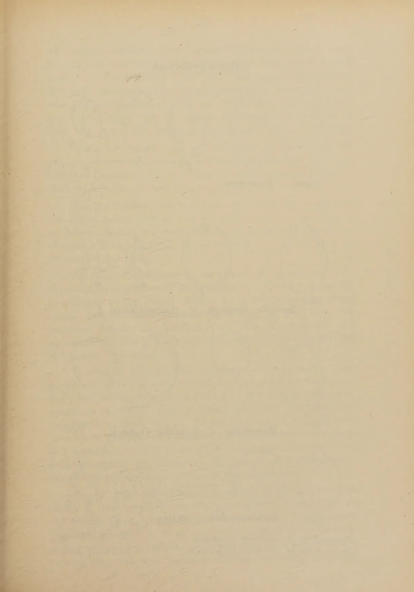
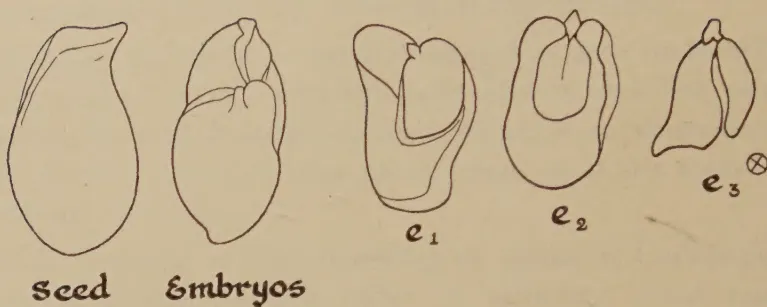
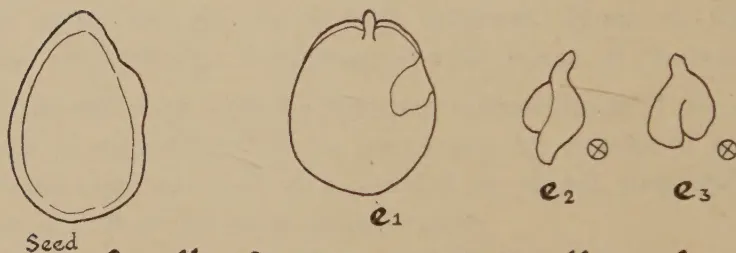
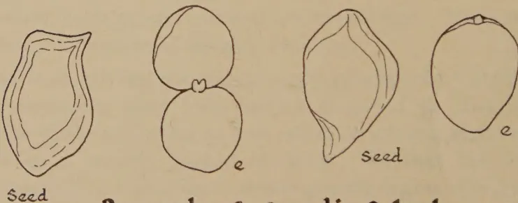
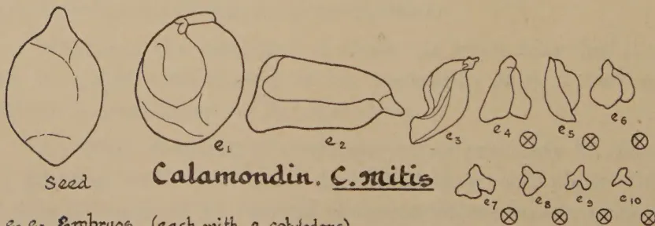
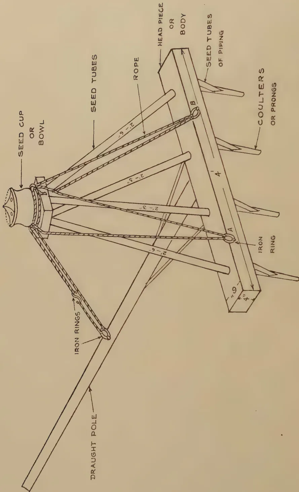

The  
Tropical Agriculturist  
November, 1936

---

EDITORIAL

---

**THE CONTROL OF PLANT PESTS AND DISEASES**

---

**I**N the last 50 years a profound change has taken place in the technique which man employs in his incessant war against the insects, fungi, and bacteria which attack him, his domestic animals, and the plants he cultivates. In his primitive and semi-civilized states he waited till he confronted his enemy and then either ran away from it or made a direct attack on it. He tried to free himself of the dysentery by swallowing drugs and of vermin by picking them one by one. Civilized man aims at prevention rather than cure. He adopts clean, health giving, and hygienic conditions of living which ensure that the dysentery bacteria and the body louse do not come near him or that, if they do, his body does not prove itself an accommodating host. The drug and the insecticide constitute only a negligible second line of defence.

The article by Mr. R. D. Anstead, late Director of Agriculture, Madras, which we reproduce from *The Madras Agricultural Journal* emphasizes the applicability of these new "cultural" methods, as they are called, for the purpose of controlling pests and diseases of plants. It is strange that these methods have not been employed on a more extensive scale or in a more systematic manner than they are because the cure of the diseased individual can never assume an important place in agricultural practice. A man who would allow only the limit of his resources to determine the expenditure

1------------------------------------------------

268

he incurs in trying to cure his sick child will not spend more on saving an afflicted pumpkin than he expects to recover by the sale of the pumpkin : and since no pumpkin can ever be worth a doctor's fee and the price of the necessary drugs, even if it is assumed that the average farmer is able to do the nursing himself, curative science as applied to plants will never have anything more than an academic value. In these circumstances it is reasonable to expect that mycologists and entomologists will concentrate on plant sanitation and plant dietetics to the practical exclusion of plant therapeutics. But according to Mr. Anstead they are still too much of the doctor and the surgeon and attach undue importance to spraying with a lotion or amputation of the affected member. He admits that a welcome change is not ceable and that plant pathologists in many parts of the world are carrying out field experiments in cultural methods of disease control, experiments which have been attended by marked success.

The adaptation of these discoveries by local scientists cannot be expected to produce a revolutionary change in the agriculture of this country. A community which appears to be unmoved by the death from malnutrition of nearly 200 out of every 1,000 infants born is not likely to be moved to frenzied activity by the realization that 30 per cent. of their solanaceous crops wilt through injudicious manuring. But these new methods have a far greater chance of success with our peasantry than spraying with Bordeaux mixture or digging out and destroying the egg masses of noxious insects.

2------------------------------------------------

269

## THE PROPAGATION OF CITRUS

A. V. RICHARDS, B.Sc., (Lond.), Dip. Agric., (Cantab.),  
A.I.C.T.A. (Trinidad)

*RESEARCH PROBATIONER IN BOTANY*

**U**NIFORMITY is the keynote in modern citriculture. The successful grower has to grade his produce and market it with the stamp of distinction in order to catch the public eye for uniform high quality fruit. At the same time he has to bring about direct improvement in yield and quality by the provision of genetically uniform high grade planting material. With such uniform trees he will be in a position to assess the value of his cultural and manurial treatments in the orchard more accurately by experiment, since variability due to differences in genetic constitution is eliminated.

### SEEDLING AND VEGETATIVE PROPAGATION

The planting of seedling trees in the orchard is at the moment out of the question because of their extreme variability in growth and yield. They take long to bear and in the end may produce fruits widely different from the parent type. It is known that some varieties of citrus are cross fertile. A good variety is likely to be fertilised by pollen from other citrus trees in the neighbourhood and the hybrid seedlings, if any, generally escape notice in the seed bed.

Besides, the present day market demand is for seedless varieties and this rules out seedling propagation altogether.

Of the methods of vegetative propagation the most popular one for citrus is budding—a scion bud of the desired variety being worked on a seedling rootstock.

While the large scale planting of a single scion variety will tend to give a certain degree of uniformity of fruit type, it does not eliminate the variable effect which seedling rootstocks of diverse genetical makeup have on scion performance.

3------------------------------------------------

270

These variations in growth and productivity of uniform scions when worked on variable stocks are of such great economic significance that they indicate the necessity for using only standardised planting material in the orchard.

Research especially at East Malling, England, on temperate fruit crops has revealed that the variations in tree size, time of bearing, yield and quality of fruit, which occur when seedling rootstocks are employed may be as great as if the trees were all entirely seedlings.

More recently Webber working on citrus at California has demonstrated the variable effect of ordinary citrus nursery stocks on growth and yield of orchard trees (1). These citrus nursery stocks as ordinarily grown were found to consist of a 'very large number of widely different types of different genetic constitution, exhibiting a wide range of characters.'

This difficulty may be got over within limits if the desired variety is established on its own roots by means of cuttings, layers or marcots, or if it is worked on clonal rootstocks, *i.e.*, rootstocks all of the same genetic type.

In England more interest is being taken in clonal rootstocks propagated vegetatively as stools, layers, root cuttings, hardwood stem cuttings, and softwood stem cuttings. Even suckers are used in commercial nursery practice.

At East Malling the vegetatively propagated "Paradise" apple rootstocks have been further classified as dwarfing or vigorous stocks according to their effect on growth and cropping of the scion variety worked on them. So that the English fruit grower is in a position to secure greater degree of uniformity in the orchard by controlling the behaviour of the scion through clonal rootstocks of known potentialities.

Whatever the influence of stock on scion may be, it will not be possible to exploit it for economic gain if the scion variety is established on its own roots.

A certain standard of uniformity may probably be reached by growing such 'own root' trees but their behaviour will be largely determined by varietal characteristics and local environment. Webber in his survey of citrus in South Africa where the sour orange had for some unknown reason failed as a stock

4------------------------------------------------

<!-- stage4: FAINT old-images-only -->

[Faint page: no legible print of its own could be verified; text withheld (stage 4 review list)]

This image shows a single, blank page of aged, cream-colored paper. The paper has a slightly textured appearance with some minor discoloration and faint, illegible ghosting of text from the reverse side. There are no markings, drawings, or printed content on this side of the page.

5------------------------------------------------

272

Citrus Embryos

This block contains line drawings of a seed and three embryos labeled e1, e2, and e3. The seed is an oval shape with a pointed tip. Embryo e1 shows a cotyledon and a small root. Embryo e2 shows a cotyledon and a more developed root. Embryo e3 shows a cotyledon and a root, with a small circle containing an 'X' next to it, indicating it failed to germinate.

This block contains line drawings of a seed and three embryos labeled e1, e2, and e3 for Seville Orange. The seed is an oval shape. Embryo e1 shows a cotyledon and a small root. Embryo e2 shows a cotyledon and a root, with a small circle containing an 'X' next to it. Embryo e3 shows a cotyledon and a root, with a small circle containing an 'X' next to it.

Seville Orange. C. aurantium L.

This block contains line drawings of a seed and embryos labeled e for Pummelo. The seed is an oval shape. Embryo e shows a cotyledon and a small root. Another embryo e shows a cotyledon and a root. A third embryo e shows a cotyledon and a root.

Pummelo. C. grandis Osbeck.

This block contains line drawings of a seed and ten embryos labeled e1 through e10 for Calamondin. The seed is an oval shape. Embryo e1 shows a cotyledon and a small root. Embryo e2 shows a cotyledon and a root. Embryo e3 shows a cotyledon and a root. Embryo e4 shows a cotyledon and a root, with a small circle containing an 'X' next to it. Embryo e5 shows a cotyledon and a root, with a small circle containing an 'X' next to it. Embryo e6 shows a cotyledon and a root, with a small circle containing an 'X' next to it. Embryo e7 shows a cotyledon and a root, with a small circle containing an 'X' next to it. Embryo e8 shows a cotyledon and a root, with a small circle containing an 'X' next to it. Embryo e9 shows a cotyledon and a root, with a small circle containing an 'X' next to it. Embryo e10 shows a cotyledon and a root, with a small circle containing an 'X' next to it.

Calamondin. C. mitis

e1 e2 e3 - Embryos (each with 2 cotyledons)  
 ⊗ - Embryos that failed to germinate.

Block by Survey Dept. Ceylon. 29.11.36

6------------------------------------------------

273

for oranges observed that layered Washington Navel trees ten year old were doing just as well on their own roots as budded plants on rough lemon stock (2). Layering is generally a slow and cumbersome process, and yet Webber was so impressed with the performance of the 'own root' trees that he recommended a serious trial of vegetative propagation methods to raise not only 'own root' scions but also clonal rootstocks.

In the wet tropics, the high incidence of disease and the periodic occurrence of drought will necessitate the use of suitable resistant rootstocks for the improved scion varieties which are delicate subjects on their own roots.

For the hardier varieties, however, which by experiment are found to do just as well on their own root systems as on others, it may be convenient to dispense with rootstocks altogether if a rapid and cheap method of propagation from cuttings is available.

An interesting feature in the case of citrus and mango is the common occurrence of Polyembryony. A seed may contain in addition to the sexual embryo which is formed by normal sexual process, other embryos all arising as buds from the maternal tissue—the nucellus (3). This accounts for the appearance of more than one little seedling when a single seed is planted (See diagram).

The sexual embryo may survive in the competition and germinate, but it is very difficult to distinguish its seedling—the generative seedling—from the other vegetatively produced or apogamic seedlings unless it bears some leaf characteristics peculiar to its male parent. It will be almost a hopeless proposition to pick out and eliminate all the generative seedlings in a large nursery if a rootstock variety which produces both monoembryonic and polyembryonic seeds is self fertilised or is crossed by obscure male parents in the vicinity (4).

Theoretically the apogamic seedlings will be regarded as clones in that they all have the same genetic constitution as the mother plant. They will have none of the disadvantages popularly ascribed to vegetatively propagated material such as lack of tap root, liability to be uprooted by wind, one-sided rooting, etc., but they do show marked variability in initial

7------------------------------------------------

274

vigour due probably to differences in size of the embryos. The embryos which are crowded together generally vary in size, some being far too small to survive in the seed bed.

These variations in growth may be maintained for several years in a long-lived slow-growing perennial like citrus.

Rigorous selection will have to be practised in the nursery to eliminate not only the hybrids but also the small or stunted seedlings of the same progeny.

It seems from the above considerations that varieties like the Seville orange *C. Aurantium Linn*, the local sour orange hybrid *C. sinensis var*, the grapefruit *C. maxima var uvacarpa Merrill and Lee*, the rough lemon *C. Limonia osbeck* and the lime (both sour and sweet) *C. aurantifolia Swingle*, which produce polyembryonic seeds, i.e., seeds which contain several embryos, are likely to give a more uniform lot of seedlings than the pummelo *C. grandis osbeck* and the 'Nattaran' *C. medica var* which appear to have only one embryo per seed possibly the sexual embryo.

Very probably other important considerations as suitability to a locality, vigour, compatibility and disease resistance, may influence the selection of particular varieties as stocks but the desirability of using only pure lines of such stocks whether as seedlings or cuttings in order to secure the highest degree of uniformity cannot be gainsaid.

Once a suitable rootstock variety has been selected by experiment it will be necessary to establish groves in isolated areas and maintain the purity of the selected strain.

Thus it will be possible to build up three kinds of citrus trees for careful study and comparison. They are :

1. 1. Scion variety on clonal rootstocks of seedling origin.
2. 2. Scion variety on clonal rootstocks propagated vegetatively as cuttings, layers, stools or marcots.
3. 3. Scion variety on its own roots.

For this purpose an attempt has been made to root citrus cuttings in a solar propagator at the Experiment Station, Peradeniya.

8------------------------------------------------

![Two black and white photographs of grapefruit cuttings. The left image shows a 'Marsh's seedless grapefruit cutting' with four large, dark, oval leaves and a root system, labeled 'MARSH'S SEEDLESS GRAPE FRUIT CUTTING' and 'LEAF CUTTING SWEET ORANGE'. The right image shows a 'Walters' grapefruit cutting' with three large, dark, oval leaves and a root system, labeled 'WALTERS GRAPE FRUIT CUTTING'. Both images include a ruler for scale. The right image has a small text block at the bottom right: 'BLOCK BY SURVEY DEPT. Ceylon: 17.11.38'.](e1a6a78b264379b16143b219afb06518_1_img.webp)

Fig. 1. Marsh's seedless grapefruit cutting  
8 weeks in the propagator

Fig. 2. Walters' grapefruit cutting  
6 weeks in the propagator

9------------------------------------------------

Block, by Survey Dept Ceylon 17.11.33

Fig. 3. Cuttings set in the propagator. Note the rooting habit of the Nattaran twig graft with a grapefruit scion

Block, by Survey Dept Ceylon 17.11.35

Fig. 4. General view of two solar propagators with overhead shade for the propagating chambers. The heating chamber which is exposed to the sun extends below the propagating chamber and is continuous with it

10------------------------------------------------

275THE SOLAR PROPAGATOR

The propagator which is made of cement concrete is very similar to the one used by Hunter at Trinidad (5). It has been in use only for a short while but the results of empirical trials with softwood cuttings have been very promising.

In temperate countries the propagating bed is warmed up by means of steam or hot water pipes run through the bottom of the bed. This bottom heat is necessary to stimulate the cuttings to calluse rapidly and produce roots. Sometimes lanterns are used as in Kenya (6) to supply bottom heat for the rooting of coffee cuttings.

In the case of the solar propagator the heat is obtained at a minimum of expenditure from the sun's rays. Hence bright sunshine is essential for its efficient working.

The heat from the sun's rays is absorbed by the water in the heating compartment. At Trinidad a number of large stoppered glass bottles filled with water and painted black on the outside were placed within the heating chamber to absorb the heat. The heating compartment is a shallow tank five feet wide by fifteen feet long on the inside with exit holes for the water at ground level. There is a narrow drain all round it filled with water to keep off ants. Its lowest wall is one foot three inches in height and its two side walls rise up to a height of one foot nine inches at the point where it is continuous with the propagating compartment above. The glass sash covering it is thus given a tilt to allow rain water to run off.

A current of hot moist air rises from the heating compartment during day time and warms up the bottom of the rooting bed in the propagating compartment above. The rooting bed is kept fairly warm even at night since the heat retained by the water is given out very slowly.

The propagating chamber is about a third of the size of the heating chamber and is covered with two smaller glass sashes each working on a couple of hinges fixed to a wooden frame. There is a ledge inside the chamber to support the rooting bed at a height of one foot nine inches from the ground. Iron bars fixed into the wall at the same level serve as additional support to the rooting bed which is constructed by placing a

11------------------------------------------------

276

sheet of expanded metal in position and over it in turn wire netting, coconut fibre and coarse sand, to a depth of six to eight inches. The sand is well washed to get rid of all organic matter.

Adequate ventilation is provided through two one-inch holes in the side walls and also through other holes which allow of the insertion of thermometers to test the temperature of the rooting bed and the air above it.

Water is sprinkled on the rooting bed once a day early in the morning and the propagator is kept closed for the rest of the day to keep the air in the chamber moist.

Overhead shade is provided for the propagating chamber only in order to prevent the leaves inside from being scorched by the direct rays of the sun. There is however sufficient illumination for the leaves to manufacture carbohydrates which evidently are necessary for root formation.

With varieties like grapefruit, mandarin and orange which are difficult to root it is very important to see that the cuttings do not drop their leaves in the propagator. If this happens the cuttings will not strike. Overcrowding is definitely bad. Careful control must be exercised over the moisture content of the rooting medium and humidity of the air above it, so that the leaves may remain turgid and the sand round the cut ends not too wet to cause decay.

Coarse sand has given good results but the cut ends must be close to the moist fibre though not touching it. Fine sand however is likely to get saturated with the greater amount of moisture given out by the exposed water surface in the tank.

<table border="1">
<thead>
<tr>
<th rowspan="2"></th>
<th colspan="6">TEMPERATURE</th>
</tr>
<tr>
<th colspan="3"><i>Bright warm day</i></th>
<th colspan="3"><i>Dull cloudy and cool</i></th>
</tr>
<tr>
<th></th>
<th>8 a.m.</th>
<th>11 a.m.</th>
<th>3 p.m.</th>
<th>8 a.m.</th>
<th>11 a.m.</th>
<th>3 p.m.</th>
</tr>
</thead>
<tbody>
<tr>
<td>Temperature of air in the shade outside ..</td>
<td>27.6°C</td>
<td>28.0°C</td>
<td>32.3°C</td>
<td>25.0°C</td>
<td>26.4°C</td>
<td>30.5°C</td>
</tr>
<tr>
<td>Temperature of air in the propagating chamber ..</td>
<td>27.8°C</td>
<td>28.4°C</td>
<td>31.2°C</td>
<td>25.1°C</td>
<td>27.0°C</td>
<td>30.6°C</td>
</tr>
<tr>
<td>Temperature of sand</td>
<td>28.2°C</td>
<td>28.7°C</td>
<td>29.8°C</td>
<td>25.0°C</td>
<td>25.6°C</td>
<td>28.6°C</td>
</tr>
<tr>
<td>Temperature of water in the tank ..</td>
<td>31.8°C</td>
<td>32.5°C</td>
<td>34.0°C</td>
<td>29.4°C</td>
<td>29.8°C</td>
<td>31.4°C</td>
</tr>
</tbody>
</table>

12------------------------------------------------

277

It will be noticed that the temperature of air inside the chamber gradually rises higher than that of the sand as the outside atmosphere gets warm in the afternoon. Similar readings were obtained by Swingle and others (7), but they found that the surface of the rooting bed was usually slightly cooler than the bottom—‘ a condition much to be desired ’—because of the evaporation going on.

### THE CUTTINGS

Softwood cuttings eight to ten inches long which are really semi-hard wood in texture appear to be more suitable than hard wood material. They must have at least four or five leaves which have developed their full dark green colour. The secret of success lies in selecting the type of cutting which is likely to retain its leaves under the conditions in the propagator. Cuttings weakened by attacks of scale insects or with either mottled or chlorotic leaves or with tender leaves which will wilt and shrivel are definitely unsuitable. They must of course be free from disease.

Very little is known of the internal physiological condition of a cutting which is likely to root. Evidently it is determined to some extent by the age and vigour of the tree.

Halma (8) found it difficult to induce rooting of cuttings taken from orange trees declining in vigour but was very successful with cuttings from healthy vigorous trees. Varieties like the citron, ‘ Nattaran ’ and lemon root easily enough in the open ground from cuttings devoid of leaves, but in the case of the grapefruit, mandarin and orange, which are less accommodating, leaves are essential for root and shoot formation.

In one of the trials at Peradeniya a number of cuttings taken from Marsh seedless grapefruit trees were found to drop their leaves within a week in the propagator. In course of time they all began to decay without producing roots although they had callused freely round the cut ends.

As an experiment a few of the cuttings without leaves from a similar batch were at first splice-grafted to leafy ‘ Nattaran ’ scions and then placed in the propagator. A good many of these twig-grafts produced roots in course of time while the ordinary grapefruit cuttings which had dropped their

13------------------------------------------------

278

leaves began to decay without striking root. Later when these twig-grafts were planted out in bamboo pots the grapefruit stocks produced healthy shoots while the 'Nattaran' scion remained dormant on top (See Fig. 5 and Fig. 6).

It may be reasonable to infer that the twig-grafts were able to strike root because of some influence probably in the nature of a hormone or root-forming substance which came from the leaves retained by the scion. Whatever this scion influence may be, the fact remains that the 'Nattaran' variety which produces roots very freely is able to stimulate root production in a difficult subject like the grapefruit. Its ability to retain its leaves for a longer period may also be a factor which contributes in no small measure to success in rooting of grapefruit cuttings devoid of leaves.

Further experiments are in progress to elucidate this point and to consider possibilities of its wider application for the rooting of difficult citrus varieties.

'Nattaran' is a variety similar to citron. It will root readily in the open from cuttings devoid of leaves and like citron has a peculiar rooting habit in that the roots are not necessarily confined to the callus region but also appear from the stem higher up. The leafy shoots not only retain their leaves more tenaciously but also calluse freely and unite readily with the stock on which they are worked.

'Nattaran' cuttings have also been budded to grapefruit, mandarin and orange by the ordinary inverted T method, and then rooted inside the propagator. The buds remained perfectly healthy till the roots were formed and shot out when the cuttings were transplanted into bamboo pots (Fig. 7).

Quite satisfactory results have also been obtained by splice-grafting grapefruit and orange scions on to 'Nattaran' cuttings and then treating the twig-graft as cuttings in a propagator (Fig. 3).

In this way bud-grafts can be obtained in a comparatively short time of three to four weeks, but it remains to be seen whether the 'Nattaran' variety will prove to be satisfactory as a stock under local conditions.

14------------------------------------------------

FIG. 7. BLOCK BY SURVEY, DEPT. OF AGRICULTURE, 1911, 24

Fig. 7. Nattaran cutting budded to grapefruit and rooted in the propagator

FIG. 8. BLOCK BY SURVEY, DEPT. OF AGRICULTURE, 1911, 25

Fig. 8. Closer view of the propagating chamber showing the wire netting resting on expanded metal. Below this extends the heating chamber containing water

15------------------------------------------------

Fig. 5. Twig-graft. Nattaran on grapefruit (Marsh's seedless) 7 weeks in the propagator

Fig. 6. Twig-graft. Nattaran on grapefruit (Marsh's seedless). Note the two new vigorous shoots produced by the grapefruit stock 4 weeks after removal from the propagator

16------------------------------------------------

279

At the time of writing the following species and varieties have been successfully rooted in the propagator.

Seville orange.—*C. Aurantium L.*

Grapefruit.— *C. maxima*, var. *wacarpa Merrill and Lee.*  
Varieties : Ellen, McCarty, Triumph, Walters and Marsh seedless.

Orange.— *C. sinensis.*  
Varieties : Local sour orange, Valencia Late, Mediterranean Sweet, Washington Navel, Jaffa.

Mandarin.— *C. nobilis*, var. *deliciosa Swingle.*  
Varieties : Nagpur Santara, Chinese.

Lime.— *C. aurantifolia Swingle.*  
Varieties : Sour—local and British Guiana, sweet and seedless.

Lemon.— *C. Limonia Osbeck.*  
Varieties : Eureka, Lisbon and Rough Lemon.

Citron.— *C. medica*, var. *L.*  
Varieties : 'Nattaran' and citron.

Calamondin.— *C. mitis Blanco.*

Shaddocks.— *C. grandis Osbeck.*  
Varieties : Local pummelo, Mongibella, Isabella, California Wonder.

Practically all the varieties in citron, lemon and lime groups will strike from cuttings in the open.

Of the varieties of grapefruit, Ellen, McCarty and Triumph appear to strike more readily than Walters and Marsh seedless.

The mandarins require more bottom heat for satisfactory rooting. The local pummelo and the Seville orange are difficult to root but the varieties Mongibella, Isabella, California Wonder—classed tentatively as shaddocks—which were imported from India as 'own root' marcots and which have an extremely vigorous habit of growth coupled with appreciable resistance to canker, strike root readily in a month's time. They have not yet flowered, but they may prove to be valuable material for clonal rootstocks.

17------------------------------------------------

280REFERENCES

1. 1. Webber, H. J., 1932. Variations in citrus seedlings and their relation to rootstock selection, *Hilgardia* 7 : 1-79.
2. 2. Webber, H. J., 1926. A comparative study of the citrus industry of South Africa. *Union of South Africa Dept. of Agric. Bull.* 6 (Imperial Bureau of Fruit Production, *Technical Communication* No. 3).
3. 3. Strasburger, E., 1878. Ueber Polyembryonic *Jenaische Zeitschrift Naturwissenschaft*, 12-654.
4. 4. Juan P. Torres, 1936. Polyembryony in citrus and study of hybrid seedlings. *Philippine Jour. Agric.* First Quarter No. 1.
5. 5. Hunter, R. E., 1931. Citrus propagation. *Trop. Agriculture* 8 : 90-93.
6. 6. Gillett, S., 1935. Vegetative propagation of coffee. *East African Agric. Jour.* 1 : 76-83.
7. 7. Swingle, W. T., Robinson, T. R. and May, E., 1924. The Solar Propagating frame for rooting citrus and other sub-tropical plants. *U. S. Dept. of Agric. Circular* No. 310.
8. 8. Halma, F. F., 1931. The Propagation of citrus by cuttings. *Hilgardia* 6 : 131-157.

18------------------------------------------------

This image is a scan of a blank page. The paper has a light beige or cream-colored tint. There are a few very small, faint dark spots scattered across the surface, which appear to be scanning artifacts or minor imperfections in the paper. No text, lines, or other markings are present.

19------------------------------------------------

1382

The diagram illustrates the components and assembly of an Indian Seed Drill. The main structure is a long, tapered wooden beam labeled "DRAUGHT POLE". At the top of this pole is a "SEED CUP OR BOWL" with a "HEAD PIECE OR BODY" attached. A "SEED TUBE" is connected to the head piece. A "ROPE" is threaded through the head piece and over a pulley on the draught pole, then over another pulley on the main body, and finally over a third pulley on the seed tube. The rope is anchored to the main body of the drill. The "SEED TUBES OF PIPING" are shown as a series of tubes extending from the head piece. "COULTERS OR PRONGS" are attached to the main body of the drill. An "IRON RING" is located on the main body, and another "IRON RING" is on the draught pole. Dimensions are indicated: "9" for the length of the main body, "4" for its width, "2'-6" for the length of the draught pole, and "2'-3" for the length of the seed tubes. Points "A" and "B" are marked on the main body.

THE INDIAN SEED DRILLBLOCK BY SURVEY DEPT. CEYLON. 19.10.55.

20------------------------------------------------

283

## AGRICULTURAL IMPLEMENTS\*—I

C. R. KARUNARATNE, (Dip. Agric., Poona),

*AGRICULTURAL INSTRUCTOR, KATUGASTOTA*

### THE INDIAN SEED DRILL

**T**HE utility of a seed drill depends on its capacity to distribute the seed uniformly over the whole area sown.

Each tube of a drill should sow at the same rate, and uniformly at all points in its line of motion. The characteristic feature of a drill is the presence of seed coulters for depositing the seeds in lines under the surface of the soil.

The Indian seed drill is a convertible implement. It can be used as a grubber when the seed tubes and the seed cup are not fixed on. But owing to the arrangement of the coulters in one line it cannot operate throughout the whole area it passes over.

The drill is made up of four main parts: the body, the draught pole, the seed tubes, and the seed cup. Like the blade harrow the body consists of a log of wood, preferably rectangular in shape, into which the draught pole is attached at such an angle that the latter rests easily on the yoke of the bullocks used for drawing it. The draught pole is attached to the body by the mortise and tenon joint, secured further by means of a split pin also of wood. Into the lower surface of the body are fixed 3, 4, or 6 coulters of iron or of wood at right angles to the body so as to reduce penetration to a minimum. If the coulters are fixed at greater angles, the seed will correspondingly be deposited deeper in the soil. This is undesirable. The coulters are spaced equally about 9, 12, or 18 inches apart according to requirements. The spacing and the number of coulters and of seed tubes depend on the particular crop to be sown.

Circular holes depending on the number of seed tubes are drilled through the body, spaced equally, at a slight angle for

---

\*This series of articles describe a number of simple implements used in India and Ceylon which are suitable for general adoption by the village agriculturist.—Editor T.A.

21------------------------------------------------

284

the reception of the tubes. Pieces of small piping 2 to  $2\frac{1}{2}$  inches shorter than the coulter, are fixed in the holes on the lower surface of the body at an angle inclining forwards and exactly behind the coulter. The number of seed tubes should correspond to the number of coulter. These lower tubes could conveniently be made by sawing off pieces from old discarded exhaust pipes of motor cars. Well seasoned bamboos about 2 to  $2\frac{1}{2}$  inches in diameter and about 3 feet in length with the joints at the nodes disconnected and smoothened out serve the purpose of the upper seed tubes. Bamboo tubes are not very permanent as they are liable to be damaged by weevils. Strong and durable seed tubes could, however, be turned out of any light and strong timber such as halmilla or sapu. The piece of timber is planed to a cylindrical shape and then sawn longitudinally into two halves which can be joined together and tied securely in three or four places with thin wire. The irregularities of the walls of the excavated portion can be evened out by passing a red-hot iron rod through the cavity. The length of the seed tubes should be such as to enable the sower to perform his task without bending. For a four-coulter seed drill, seed tubes two feet six inches in length have been found suitable at the Wariyapola Farm. As the seed tubes are placed to converge at the top, the two extreme tubes should be about three inches longer than the two inner ones. The seed tubes are fixed on the upper surface of the body.

The seed cup, shaped like an ordinary bowl, is fixed on to a square block of wood. The diameter of the cup is about 8 inches and the height 10 inches. The cup is scooped out to about half its depth in such a manner as to divide it into 3 or 4 compartments, the number depending on the number of seed tubes. The edges of the walls of all the compartments converge to a point with a gradual curve upwards where all the four walls meet resembling a cone. This device causes all the seeds to be evenly distributed into the compartments. At the base of each compartment a hole about half to three quarters of an inch in diameter is drilled at an angle which would provide a continuous passage to the seed tube. When the seed is dropped over the conical projection in the centre of the seed cup, it passes into the upper seed tubes and thence to the lower ones, being finally

22------------------------------------------------

285

deposited in the shallow furrows made in the soil by the coulter. The coulter does not work more than one and a half to two inches deep, but if deeper penetration is desired, a weight should be placed on the head piece. The seed cup and the tubes are braced to the body by an ingenious arrangement of strings. The whole drill could easily be dismantled when it is required to be transported long distances.

When the drill is required for sowing operations, the seed cup and the upper seed tubes are braced together securely by means of a thin hemp rope, the two longer seed tubes being fixed at the extreme ends. The seed cup when fixed on to the upper tubes should be perfectly level, or the seeds will be unevenly distributed into the compartments.

The selection of a yoke of the proper length so as to prevent the bullock from treading on the furrows already sown is important. If a three-coulter 18-inch drill is used, the distance between the extreme coulter will be 36 inches. The bullock should be made to walk about 9 inches away from each of the extreme furrows. Then the distance from the centre of the neck of one animal to that of the other will be  $36 + 9 + 9$  or 54 inches. Leaving six inches at either end free the length of the yoke required will be 66 inches. A simple formula for selecting the proper yoke for a drill is to multiply the number of coulter by the space between two coulter and to add 12 to the result. For example, the yoke required for a 6-coulter 12-inch drill will be  $6 \times 12 = 72$  :  $72 + 12 = 84$  inches. The yoke is tied to the draught pole in the same manner as the blade harrow.

Sometimes, when the seed bed is thoroughly prepared, the coulter work deeper than 2 to  $2\frac{1}{2}$  inches thereby blocking the seed pipes. This happens particularly in light types of soil. This defect can be overcome either by using light timber for making the drill or by fixing two wheels at either end of the body of the drill. The wheels should be fixed so that they can be adjusted to the required depth in the same manner as the land wheels of iron ploughs. The vertical iron rod connected to the axle of the wheel could be clamped on to an iron bracket driven into one end of the body.

To work the seed drill in an efficient manner the seed bed should be well prepared. There should be no stumps or stubble

23------------------------------------------------

286

of the previous crop left over. All clods should be thoroughly pulverised and the seed bed levelled as far as possible by working it with the blade harrow or the Diamond mesh harrow. A pair of bullocks trained for ploughing, interculturing between rows of plants, and for drilling should not be used for carts. In working the drill the driver should strive to get the pair of bullocks to walk perfectly straight and at the same uniform speed. Once the man and the pair of bullocks are trained the sowing can be done in perfectly straight rows. The bag of seeds is suspended below the seed cup. Before commencing to sow, the drill should first be tested by dropping some seeds into the seed cup to see if the seed tubes and pipes are functioning properly. Two men are required to work the drill, one to drive the pair of bullocks and the other to sow the seeds. But with experience one man could perform both the operations. The sower stands just behind the drill, and as the animals start walking, the seeds are dropped at a uniform rate from one hand to the top of the conical shaped projection in the centre of the seed cup. Before one handful is finished, the next handful should be ready, which means that the sower has to use both hands alternately. By this means the seeds are dropped continuously without a break until the headland is reached. If any time is lost between one handful and the other, the result will be a corresponding space left unsown. Every time the headlands are reached, the seed pipes should be examined to see if they are blocked. Before proceeding on the homeward trip the drill should be shifted towards the unsown area to a distance equivalent to the space between two coulter. Otherwise the drill will go over the last furrow a second time.

The seed rate is calculated on the number of handfuls of seeds to be sown for a particular distance. Suppose a crop of Sunnhemp is to be drilled in a one-acre field, 363 feet long and 120 feet wide at the rate of 100 pounds per acre, with a four-coulter 12-inch drill. The number of foot steps required for one trip from one end of the field to the other is found by driving the pair of bullocks with the drill hitched on, and the sower, whilst walking behind the drill, counts the number of steps taken for the trip. Suppose he takes 160 steps for this trip. On each trip the drill covers a space of 36 inches. But when

24------------------------------------------------

287

the drill reaches the headland and proceeds on its homeward trip, it is shifted towards the unsown side to a distance equivalent to the space between two coulter, lest the last furrow be sown a second time. Thus the drill, in reality, covers a space of  $36 + 12$  inches or 48 inches per trip. The number of trips to be done to cover the whole field, 120 feet in width, will be  $\frac{120}{48}$ , or 30. For each trip from one end of the field to the other the sower took 160 steps. Therefore 4,800 steps will be taken for the 30 trips. Next, the number of handfuls for a pound of seed is calculated. Suppose it is 12. Then 100 pounds of seed will be equivalent to 1,200 handfuls. 1,200 handfuls of seed have to be sown in 4,800 foot steps. Thus one handful of seed has to be sown in four steps. The practical agriculturist would, perhaps, not find this method of calculation to be necessary. He will soon learn by experience at what rate he should feed the seed cup to obtain the best results.

It requires an experienced skilled labourer to operate a seed drill for the distribution of the seed depends on the sower. In this drill, the spacing is determined by the distance of the seed tubes from each other and cannot be regulated. A careful Indian cultivator sows with these drills in a very skilful and effective manner. With a three-coulter 18-inch drill about  $2\frac{1}{2}$  to 3 acres could be drilled in a day of 8 hours. Sometimes it is necessary to sow a mixed crop in alternate rows (one row of one crop and the adjoining row of another kind). In such cases a simple device could be adopted. A separate seed tube fitted with a seed cup is attached a little distance behind the drill by means of a piece of coir rope. A coconut shell fixed on the seed tube forms a good seed cup. This seed tube should be in charge of a separate sower, and should follow in one of the furrows left by the coulter of the drill. In conducting such mixed sowing operations the corresponding holes in the seed cup of the drill should be blocked. Experience at Wariyapola Farm shows that in well worked sandy loam soils covering the seeds was not necessary. As the coulters penetrate the soil, the soil particles owing to their loose texture fall back to the furrows thus covering the seeds. A shower of rain covers the seeds completely. In heavier types of soil it may be necessary to cover the seeds after drilling. This may conveniently be

25------------------------------------------------

288

done by working a plank harrow immediately behind the drill. Any closely spaced crop could be drilled with this drill, such as *Calopogonium mucunoides*, *Centrosema pubescens*, Green Gram, Cowpea, Groundnuts, Sorghums, Maize, Hill paddy, Sunn-hemp, etc.

Among the advantage of sowing seed with a drill are :

(1) Economy in seed. (2) Even distribution of the seed. Uniform seedling is essential for regular growth and regular ripening. (3) The seed is sown in rows. This facilitates inter-culturing operations with implements and is economical.

One of these drills could very easily be constructed by the ordinary village blacksmith or by the skilled cultivator at a cost of about Rs. 12 to Rs. 15.

26------------------------------------------------

289

## ENTOMOLOGICAL NOTES

J. C. HUTSON, B.A., Ph.D.,

ENTOMOLOGIST

### THE CUCURBIT FRUIT-FLY

(*DACUS CUCURBITAE* COQ.)

**T**HIS is the common fruit-fly attacking various cucurbit gourds, such as cucumber, pumpkin, snake gourd, bitter gourd, luffa, chocho (*Sechium edule*), etc., and so far as is known in Ceylon it confines its attacks to plants of this order, both wild and cultivated. The damage is usually done to the fruit by the larvae or maggots, but there is a possibility that the stems and other parts of the plant may be bored by the larvae, although there is no definite evidence of this in Ceylon at present.

The flies are about twice the size of an ordinary house-fly, with dark-brown bodies, pale-yellow markings on the thorax and a black band across the middle of the abdomen. The female, by means of her extensible ovipositor, lays her eggs in small clusters at intervals of a few days just under the skin of the fruit. These eggs hatch within  $1\frac{1}{2}$  to 2 days and the maggots tunnel inside the fruit on which they feed, causing the attacked portions to decay rapidly. When full-grown in about 4 to 5 days, they leave the fruit and pupate in the soil, usually near the surface. The pupal period is about 8 to 10 days, after which the flies emerge and start feeding. Under tropical conditions the life-cycle from egg to adult is about 14 days, but under cooler conditions it may last a few days longer.

The male and female flies do not become sexually mature until about 3 weeks after emergence and the females do not begin egg-laying for about another week, that is, until about one month after emergence. The flies have been kept alive here in the laboratory for several weeks with food, and in other countries it has been found that the females can continue to

27------------------------------------------------

290

lay eggs up to six months after emergence. Under natural conditions in the field, this pest can probably survive from one crop season to another in the adult condition.

*Control.*—Collect and destroy at frequent intervals all damaged fruit by burning or burying deeply. Destroy all crop refuse at the end of the season. These measures are seldom carried out by cultivators and the flies are able to breed in large numbers throughout each season. Poisoned baits and lures are under experiment and results will be available later.

*Natural enemies.*—Braconid parasites (*Opius* sp.) have been bred from the larvae of this fruit-fly, but they do not appear to be sufficiently common to have much effect in controlling this pest under natural conditions. Two species of imported pupal parasites are being bred and liberated periodically in village areas.

### THE PADDLE-LEGGED BUG

(*LEPTOGLOSSUS MEMBRANACEUS* F.)

During May, 1936, sudden invasions of vast swarms of a large plant-sucking bug were reported from some bungalow gardens in the Talawakele and Badulla districts and from village gardens in Dumbara and Matale. This proved to be the "paddle-legged bug" and at that time the bugs were all in the active winged stage. In the up-country areas serious damage was caused to the fruits of tree tomato (*Cyphomandra betacea*) and of various species of citrus, mainly oranges, resulting in a heavy fall of fruit. At mid-country elevations the bugs, apart from feeding on oranges, swarmed into vegetable areas which were severely injured. They then started breeding on bitter gourd (*Momordica Charantia*) and snake gourd (*Trichosanthes anguina*).

Under normal conditions these bugs are comparatively rare and probably breed in small numbers on wild cucurbits related to bitter gourd. The only other recorded instance of similar vast swarms of this particular bug was in May, 1912, when they appeared almost simultaneously in various parts of the Island, such as Ambawela, Haputale, Maskeliya, Panadure and Galle at elevations ranging from over 5,000 feet to almost sea level. Green (1) mentions that a number of fruits and

28------------------------------------------------

291

vegetables were attacked by these bugs, including oranges, tree tomato, passion fruit, peach, plum, Cape gooseberry (*Physalis peruviana*), beans, peas and vegetable marrow. These bugs are not known to breed on any of the above fruits and vegetables with the possible exception of marrow, and, as in the case of the recent invasions, the attacks on fruits and vegetables seem to have been made only for feeding as a preliminary to subsequent egg-laying and breeding on cucurbits.

Numerous species of larger plant-bugs are usually avoided by birds, lizards and toads, probably owing to their rather hard bodies and objectionable odour, but are partially controlled by parasitic and predaceous insects and possibly by parasitic fungi, some more effectively so than others. It would appear that under normal conditions *Leptoglossus* must be controlled by some very effective natural check or combination of checks, but what this can be is not known at present. This natural control seems to have been considerably upset by the long drought of 1934 and the first half of 1935, since many comparatively rare insects, including *Leptoglossus*, have suddenly assumed the status of pests, while others which have been chronic pests for years have faded away into comparative insignificance.

*Stages and life-cycle of Leptoglossus.*—The full-grown winged bugs are about 15 to 20 m.m. long, the males being usually smaller than the females. They are dark-brown to blackish above, with an orange coloured band across the shoulders which terminate in a spine on each side. There is also a small yellowish spot in the middle of each wing cover and a row of small reddish spots along the lateral edges of the abdomen. The whole of the underside of the body is mottled with orange red spots and the antennae are alternately barred with black and orange. The adult bugs are distinguished from any of their relatives by the paddle-like tibial extensions on their hind legs which have given them their popular name. This name does not imply any aquatic habits on the part of the bugs, the extensions being merely ornamental.

The pale-brown cylindrical eggs are usually laid end to end in a line on the stems, leaf-stalks and fruit of various cucurbits, preferably bitter gourd and snake gourd and related wild plants. These eggs hatch in about 9 days, the young nymphs emerging

29------------------------------------------------

292

through a circular cap or trap-door in the upper surface of each egg. The young bugs pass through five instars, or periods of feeding and growth between moults. During the first four stages the nymph has a bright red head and abdomen and a black thorax, while the fifth stage is usually brownish black with reddish areas on the three parts of the body ; a paler brown variety without reddish markings is occasionally found. The tibial extensions first appear during the second instar and increase in size with each succeeding moult, attaining their full size in the adult. The nymphal period lasts about 4 to 6 weeks, the bugs entering the adult winged stage with the last moult. The adults do not become sexually mature until about 2 or 3 weeks later and can be kept alive with food for several weeks, during which period the females lay small batches of eggs at intervals. It is not known at present how many eggs a female can lay, but the occurrence of these bugs in such vast swarms as have appeared this year indicates that under favourable conditions they can be prolific breeders.

*Remedial measures.*—The sudden invasion of a fruit orchard or a vegetable garden by myriads of these winged bugs may result in a serious loss of crops unless the invaders can be killed off or driven away speedily. The usual remedy for plant-sucking bugs of this type, apart from collection and destruction, is the application of contact sprays, such as kerosene emulsion, fish-oil soap or tobacco wash, and these would be quite effective at the ordinary strengths against the younger stages of *Leptoglossus* with their softer bodies and in their wingless, comparatively inactive condition. Therefore if any spraying is undertaken it should be applied to the younger bugs on their breeding plants in vegetable gardens and the spray should be so directed as to wet the bugs thoroughly. The use of these insecticides against the adult winged bugs was found to be impracticable, since most of them escape in flight before they can be thoroughly wet, while those caught unawares by the spray are usually resistant to these sprays used at the ordinary strengths. Stronger applications are inadvisable, as they would be liable to injure the tender foliage and young shoots.

As indicated above, the invasion of a fruit or vegetable garden by vast swarms of the winged *Leptoglossus* comes so suddenly that much damage may be done before their presence

30------------------------------------------------

293

is detected and any action taken to destroy them. Since spraying is impracticable at this stage, the only possible remedy is to collect and destroy as many of the adults as possible by any available method. This should be done in the early morning or late afternoon when the bugs are somewhat sluggish, especially in the cooler temperatures at higher elevations. The invaders can be beaten down on to sheets spread on the ground and then collected into tins of kerosene and water or crushed and buried. Many can be caught in hand nets and similarly treated, while in village areas paddy winnows smeared with sticky juices would be of value in catching the bugs, as in the case of the "paddy fly." Any campaign of this nature should be carried out speedily and systematically.

In vegetable and food crop areas the adults, after severely damaging crops of all kinds, may remain in the locality to breed on cucurbits, and the young stages should be controlled by spraying or by hand picking and destruction. The nymphs can be brushed off into tins of kerosene and water and then buried. Once these bugs are allowed to become established in a cucurbit area they will continue to breed for several months and spoil the gourds as these are formed.

### THE ROOT-EATING ANT

(*DORYLUS ORIENTALIS WESTW.*)

Within the last few years this ant has become a serious pest of all kinds of ornamental and vegetable plants, attacking the underground portions and either riddling the tubers and bulbs or destroying the tender portions of the roots and collars. In 1933 a note on this pest (2) indicated that when once it gets established in a vegetable or flower garden hardly any plants escape its attacks, especially during the dry weather when the ants migrate in to well-watered areas from drier surroundings in search of moisture and succulent plant tissues. The control measures previously recommended were mainly the use of petrol as a soil fumigant to kill the ants and of some carbolic disinfectant as a deterrent. It has been found that, while petrol is effective in killing most of the ants actually in the soil at the time of treatment, the effect of the gas soon wears off and more ants return to the attack. During the last few months experi-

31------------------------------------------------

294

ments with paradichlorobenzene (P.D.B.) have been in progress and have given such promising results that it is now being recommended for more general use against *Dorylus* and other soil insects, especially as a commercial grade of this soil fumigant is now available locally. The crystals of P.D.B. give off a rather heavy gas slowly into the soil when mixed therewith, and this gas not only kills the infesting ants without injury to growing plants, but prevents any new invasions over periods of several weeks during dry weather when these ants are usually a nuisance. This soil fumigant can be applied to garden beds before planting as a preventive at the rate of 1 oz. of the crystals for every square yard of surface soil. In order to obtain a more even distribution in the soil, the P.D.B. can first be thoroughly mixed with soil or sand at the rate of 1 oz. of the fumigant to 2 cigarette tins (roughly 1 lb.) of soil, then sprinkled thinly over the surface of a garden bed and mixed in thoroughly with the top layer of soil. In beds of growing plants the same mixture can be sprinkled along shallow furrows between the rows of plants at the rate of  $\frac{1}{4}$  oz. of P.D.B. per linear yard of furrow, the soil being then replaced. For small trees and shrubs the fumigant can be applied at the rate of  $\frac{1}{2}$  oz. to 1 oz. per plant in shallow circular furrows with a radius of about 6 to 9 inches from the stem. For convenience of measuring it may be mentioned that one large heaped teaspoonful holds about  $\frac{1}{4}$  oz. and one cigarette tin about 8 oz. of the crystals.

In up-country districts which get only one wet season a year the ants are usually troublesome during the dry weather and under such conditions the effect of the fumigant lasts for several weeks, and one thorough application made at the start of the drought is usually sufficient to control these ants throughout the season. During wet periods a second application may be necessary on any return of the pest.

The large black ant which makes its nests around the bases of trees, around plants in garden beds and under the turf in grass lawns can also be controlled by P.D.B. Nests around old trees may take up to 4 oz. of the fumigant thoroughly mixed with the soil with which the cavities have to be filled, while the excavations made by this pest in lawns can be similarly treated with a soil mixture containing from  $\frac{1}{4}$  oz. to 1 oz. of

32------------------------------------------------

295

the poison according to the size of the nests. After a wet period the application may have to be renewed.

This fumigant should also prove useful against other soil pests, such as cockchafer grubs, "leather jackets" and possibly cutworms. For garden beds where these are known to be chronic pests a thorough application before planting is worth a trial.

#### REFERENCES

1. 1. Green, E. E.—The Paddle-legged Bug (*Leptoglossus membranaceus*). *Trop. Agriculturist*, Peradeniya, XXXVIII. No. 6, June, 1912, pp. 529, 530.
2. 2. Hutson, J. C.—Entomological Notes—Pests of Garden Plants. *Trop. Agriculturist*, Peradeniya, LXXX, No. 5, May, 1933, pp. 276-279.

33------------------------------------------------

296

## DEPARTMENTAL NOTES

---

### CHEMICAL NOTES (16)

---

#### FOODSTUFFS

---

D. E. V. KOCH, B.Sc. (Hons.),

*RESEARCH PROBATIONER IN AGRICULTURAL CHEMISTRY*

#### (I) RICE BRAN

**T**HE analysis of a sample of rice polishings obtained from the Government Rice Mills at Anuradhapura reveals it to be very rich in fat as compared with ordinary samples of rice bran. Good rice bran, which consists only of the testa, aleurone layer and embryo of rice grains should contain about twenty per cent. of fat. The percentages of protein, carbohydrates, fibre and ash compare very favourably with those of the best samples obtainable in the Phillipine Islands (1). The figures obtained for phosphoric acid ( $P_2O_5$ ) and lime ( $CaO$ ) indicate the bran to be rich in the former but poor in the latter, but this is typical of quality bran.

It would therefore appear that the Government rice mill sample, being of much superior value to ordinary local rice brans, is, from the dietetic point of view a very desirable foodstuff, and more so as it contains the water soluble vitamin  $B_1$ , the deficiency of which is responsible for certain nervous disorders resulting ultimately in the disease beri beri, and in addition the fat soluble vitamins A and E.

As rice bran lacks gluten, bread prepared from it does not rise. It can, however, be mixed with wheat flour in the proportion of one of the bran to three or four of the latter for this purpose. The addition of good quality bran to rice, manioc and other flours in the same proportions will enhance the food value of preparations made from these flours.

34------------------------------------------------

297

The poor quality of local brans is principally due to the presence of husks (hulls), which are devoid of food value and in fact harmful if taken internally. It would therefore be more appropriate to call this sample rice polishings, *i.e.*, the polishings of rice freed from husks.

Preparations of vitamin B1 have been obtained by two standard methods and is likely to be sent to the Medical Department for test. In the Phillipines one such preparation known as "tiki tiki" has been used for a number of years in medical practice.

The analysis of the Anuradhapura mill rice bran is as follows:— Moisture 9.03%, fat 23.51%, proteins 11.91%, carbohydrates 36.22%, fibre 9.21% and ash 10.12%. The food value or carbohydrate equivalent (woods) is 118 and the nutritive ratio approximately 1:8. The ash contains .07% lime and 4.89% of phosphoric acid.

For purposes of comparison the following figures of analyses of other rice brans are given.

<table border="1">
<thead>
<tr>
<th colspan="7">RICE BRANS</th>
</tr>
<tr>
<th></th>
<th>Moisture</th>
<th>Fat</th>
<th>Protein</th>
<th>Carbo- hydrate</th>
<th>Fibre</th>
<th>Ash</th>
</tr>
<tr>
<th></th>
<th>%</th>
<th>%</th>
<th>%</th>
<th>%</th>
<th>%</th>
<th>%</th>
</tr>
</thead>
<tbody>
<tr>
<td>Phillipine ..</td>
<td>(1) 10.04</td>
<td>19.08</td>
<td>11.27</td>
<td>40.62</td>
<td>8.67</td>
<td>10.32</td>
</tr>
<tr>
<td>Local from raw rices (average)</td>
<td>(2) 12.51</td>
<td>10.12</td>
<td>13.17</td>
<td>38.72</td>
<td>14.05</td>
<td>11.44</td>
</tr>
<tr>
<td>Local from parboiled rices (average) ..</td>
<td>(2) 11.56</td>
<td>11.78</td>
<td>10.01</td>
<td>37.15</td>
<td>14.50</td>
<td>15.00</td>
</tr>
<tr>
<td>Bran containing much husk ..</td>
<td>8.00</td>
<td>7.10</td>
<td>5.50</td>
<td>33.00</td>
<td>27.4</td>
<td>19.0</td>
</tr>
</tbody>
</table>

### (2) OLU SEED (NYMPHAEA LOTUS)

These are small, rounded, amber-coloured seeds of about the size of mustard seeds reported to be used as a foodstuff instead of rice in the North-Central Province and other dry areas of the Island at times when rice is scarce. The analytical figures obtained for these seeds indicate it to be essentially a carbohydrate food closely resembling polished country rices in food properties. The results of this analysis are tabulated with those previously determined for raw and parboiled polished rices.

35------------------------------------------------

298

<table border="1">
<thead>
<tr>
<th></th>
<th>Moisture</th>
<th>Protein</th>
<th>Fat</th>
<th>Carbo- hydrate</th>
<th>Fibre</th>
<th>Ash</th>
</tr>
<tr>
<th></th>
<th>%</th>
<th>%</th>
<th>%</th>
<th>%</th>
<th>%</th>
<th>%</th>
</tr>
</thead>
<tbody>
<tr>
<td>Olu seeds .. ..</td>
<td>12.05</td>
<td>7.95</td>
<td>.94</td>
<td>77.86</td>
<td>.68</td>
<td>.52</td>
</tr>
<tr>
<td>Raw polished rice (average) (2)</td>
<td>12.21</td>
<td>7.64</td>
<td>1.00</td>
<td>77.90</td>
<td>.33</td>
<td>1.00</td>
</tr>
<tr>
<td>Parboiled polished rice (average) .. (2)</td>
<td>13.24</td>
<td>7.44</td>
<td>.73</td>
<td>77.64</td>
<td>.33</td>
<td>.98</td>
</tr>
</tbody>
</table>

It would be noted that olu seeds contain somewhat more fibre and less ash than rices.

### (3) MANIOC FLOUR (CASSAVA)

The analysis of a representative sample of manioc flour milled by this Division was carried out to determine its food value. The following results were obtained:— Moisture 11.33%, protein 1.79%, fat .71%, carbohydrate 83.04%, fibre 1.27% and ash 1.86%. Its food value is 88.8. Consisting mainly of starch it has the very wide nutritive ratio of 1 : 47.

The starch grains are mostly single, but some are united into compound grains of two, three or four granules. The small size of the grains with hila often fissured are characteristic of Manihot or Brazilian starch.

### (4) ARROWROOT

Ceylon arrowroot is very similar to imported arrowroot as the following results indicate:—

<table border="1">
<thead>
<tr>
<th></th>
<th>Moisture</th>
<th>Protein</th>
<th>Fat</th>
<th>Carbo- hydrate</th>
<th>Fibre</th>
<th>Ash</th>
</tr>
<tr>
<th></th>
<th>%</th>
<th>%</th>
<th>%</th>
<th>%</th>
<th>%</th>
<th>%</th>
</tr>
</thead>
<tbody>
<tr>
<td>Ceylon Arrowroot .. ..</td>
<td>14.13</td>
<td>.46</td>
<td>—</td>
<td>85.2</td>
<td>trace</td>
<td>.21</td>
</tr>
<tr>
<td>Imported Arrowroot ..</td>
<td>14.97</td>
<td>.20</td>
<td>—</td>
<td>84.75</td>
<td>—</td>
<td>.08</td>
</tr>
</tbody>
</table>

The starch grains of both arrowroots were identical, being large grains, variable in size with delicate concentric lines and hila marked by a short, sharp line running transversely across the granule. The Ceylon arrowroot, however, contains more proteins and ash and from the point of view of texture consisted of coarser particles.

### REFERENCES

1. 1. West, A. P. and Cruz, A. O.—Phillipine rice mill products with reference to the nutritive value and preservation of rice bran. *Phil. Jour. Sc.* Vol. 52, No. 1, Sept., 1933 and *Trop. Agriculturist*, Vol. LXXXII, January, 1934.
2. 2. Joachim, A. W. R. and Kandiah, S.—The Chemical Composition of some Ceylon Paddies, Rices and Milling Products. *Trop. Agriculturist*, Vol. LXX, April, 1928.

36------------------------------------------------

299

## TRAPS FOR THE BLACK BEETLE PEST OF COCONUT PALMS *[in Malay]*

W. C. LESTER-SMITH, B.A., Dip. Rural Econ., A.I.C.T.A.

CONTROLLER OF PLANT PESTS

**T**HE coconut black beetle is a pest which is present on almost all coconut estates. In some cases these beetles do serious damage to the palms by making holes in the cabbage and tender central bud which invite attack by the red weevil, thus leading to reduced crops.

The black beetle grubs breed in any decomposing organic material or in soil containing a sufficient quantity of it. Old manure heaps and holes in the ground containing dead leaves, cut grass, manure or other similar organic matter form ideal places for the female black beetles to lay their eggs. These beetles fly round and soon find such places: they then crawl and burrow into the rubbish in which they lay their eggs. In about a fortnight these eggs hatch and the young grubs feed on the decomposing organic matter, for about three months, until they are fully grown. Under natural conditions black beetle grubs are occasionally found dying or dead and in a mummified state having been attacked and killed by a fungus disease to which they are subject. This fungus is known as the Green Muscardine fungus and it has been found possible to grow it under specially controlled laboratory conditions and so produce larger quantities of this parasitic fungus than could be readily obtained under natural conditions.

The above facts suggest a very simple way of considerably reducing the numbers of this pest of coconuts; a method which is a useful aid in their control. By the construction of a limited number of traps to attract the egg-laying female black beetles and by inoculating these traps with this parasitic fungus it is possible, in the course of time, to kill large numbers of black beetle grubs and thus considerably reduce their numbers.

37------------------------------------------------

300

This fungus is parasitic only on certain stages of the black beetle and other harmful insects and does not cause plant disease.

The best form of trap to construct will probably vary slightly according to the type of soil, climatic conditions and the material available for use. A very satisfactory form of trap may be constructed as follows :—

Select a suitable area for each trap ; this should be in a fairly open place and not near enough to any trees, plants, hedges, etc., for roots to grow into the traps easily and interfere with their proper function. Clear away all grass and surface vegetation from this area so as to provide a clear area of surface soil about five feet square. In the centre of this dig a hole about three feet long, three feet wide and about one and one-half to two feet deep. The soil from this hole may be put on one side and some of it, if sufficiently loamy and of good tilth, may be used in filling the trap. The hole is then *loosely* filled up with more or less alternate layers, first of pieces of old dry woody coconut leaf-stalks or branches, sticks, leaves, and cut grass or bits of old cadjans ; and then a layer of a mixture of good soil, fresh cattle manure, old dry cattle droppings and similar material. If fresh cattle manure is not available, sufficient old manure and droppings must be obtained, thoroughly mixed up with the soil and well moistened with water or liquid farmyard manure so as to make the whole mixture sufficiently moist to start the fermentation of the mass and produce an odour that will attract and direct the female black beetles to the pit. Each of these double layers as completed should then be evenly sprinkled with, and have scattered over it, a decoction of the Green Muscardine fungus, before the next layer of coconut leaf-stalks, branches, etc., is put in. In this way the pit or hole is filled up loosely, so that the female black beetles will find it easy to burrow in to lay their eggs, to a foot or so above ground level and the whole heap is then loosely covered with a few old pieces of cadjan or freshly fallen coconut leaves so as to keep the sun off it and prevent it drying out. The heap in the pit should be kept moist by sprinkling a little water, liquid farmyard manure, or fresh cattle manure on top of the heap from time to time, but on no account should the heap be otherwise disturbed for a period of three months.

38------------------------------------------------

301

After this time the pit may be opened up and the decayed material removed. If the trap has been properly made and looked after, numerous black beetle grubs and very often adult beetles should be found scattered throughout the filling material. Some of the insects may be found alive, but all of them should be found either in a very weakened and sickly condition or else dead. Those dead should be shrivelled up into a mummified pale buff, green and white, or moss green mass. If they are in this condition the trap is working properly.

Other traps may then be constructed and these may be inoculated from the first trap by mixing up with the soil and cattle manure mixture being put into each layer of the new traps some of the soil, other decomposed material, dead grubs, etc., from the original trap. The new traps should then be treated in a similar way to the first one, being covered and moistened from time to time to prevent their drying out, but not being otherwise disturbed till the full incubation and functioning period of three months is up. Each trap, when working properly, should after the necessary period provide sufficient fungus-permeated material to inoculate five new traps.

In view of the fact that under very favourable natural conditions the black beetle may complete its whole life cycle from egg to adult beetle in four and half months or a little less, no traps should be left unattended and undisturbed for a longer period than three months without their being opened up to see that the fungus is still in an actively parasitic state on any grubs that may be present. Care should be taken in any such examination, especially if no large grubs are apparent, as sometimes the fungus material permeates the whole trap so thoroughly and is in such a virulent condition that any grubs which are in the trap are parasitised and killed soon after they hatch from the egg. When this occurs they are very small and may be so completely mummified as to be easily missed during an examination of the pit.

If an estate laid down traps on a large scale it would be necessary to maintain a regular staff of labourers properly supervised and with a regular routine for dealing with all such

39------------------------------------------------

302

pits. In such cases it might be considered economical from the point of view of black beetle control to sprinkle fungus inoculated material from the pits along any trenches constructed and used for the purpose of burying green manures.

In the preliminary laying down of these beetle traps it is recommended that the advice of the Mycologist or the local Agricultural Officer first be obtained. The necessary inoculating material of the Green Muscardine fungus will be supplied free of charge by the Department of Agriculture on application either direct to the Mycologist, Department of Agriculture, Peradeniya, or to the nearest Agricultural Officer. Applicants will be supplied, in rotation according to the date of receipt of the application, with sufficient fungus inoculum to lay down one trap from which additional traps may be started after a period of three months. In order to facilitate the supply of fresh fungus inoculum it is requested that application be made at least one month prior to the construction of the trap.

40------------------------------------------------

303

## SELECTED ARTICLE

---

### CULTURAL METHODS OF CONTROLLING PLANT DISEASES\*

---

SINCE the day, sixty years ago, when the Madras Agricultural Department was born, views on many agricultural problems have undergone a profound change. This is especially the case in those branches of the subject which deal with the pests and diseases of crops. During the past fifty years enormous strides have been made in medical knowledge of all kinds, including the health of plants.

An incessant war is carried on between man and insects, fungi and bacteria, and many are the methods which have been recommended to combat these pests which take an enormous annual toll of our crops and stored products, and also of life of man and beast.

Despite this, agricultural practices have been remarkably little influenced. It seems so obviously the right thing to ascertain the nature and life history of a pest and then to attack its weakest and most vulnerable phase. This, however, does not get to the real root of the problem, and in most cases is only a palliative. The hosts of the enemy remain, undiminished at their source, and the remedies have to be constantly applied. It is now being realised that direct attack by assault and battery is nearly always useless, and entomologists and mycologists are being rapidly transformed into plant pathologists, bringing these subjects into line with new developments of medical thought. A more insidious technique has begun to appear, which may be called perhaps the "cultural" method of preserving plants in health. The presence of the pest is ignored in this technique, and no direct attack is made on it.

In his Presidential Address to the Agricultural Section of the British Association at Toronto as long ago as 1924 Sir John Russell said: "these cultural methods of dealing with plant diseases and pests offer great possibilities, and the close study jointly by plant physiologists and pathologists of the response of the plant to its surroundings, and the relationships between the physiological conditions of the plant and the attack of the various parasites would undoubtedly yield results of great value for the control of plant diseases."

---

By Rudolph D. Anstead, M.A., C.I.E., Retired Director of Agriculture, Madras Presidency in *The Madras Agricultural Journal*, Vol. XXIV, No. 8, August 1936.

41------------------------------------------------

304

Mycologists and entomologists are turning their attention more and more to the effects of soil and climate on the incidence of disease, and it is now becoming generally recognised that there are vast possibilities of controlling many plant diseases, not by attacking the disease organisms themselves, but by controlling conditions in such a way that these organisms are unable to develop because they find the conditions imposed deleterious to them. Though the organisms are present they are unable to become effective because the conditions are not favourable to them.

For example, MacRae pointed out that foot rot (*Helminthosporium*) of wheat in Northern India occurs only on early sown fields, and the remedy is not to spray, but to delay sowing until the cold weather sets in, and the temperature imposes conditions unfavourable to the development of the fungus. This is a purely "cultural" remedy based on a study of conditions which favour the crop and are unfavourable to the disease.

It is well known that a plant, or an animal, in good vigorous health is resistant to disease attack when subjected to infection. It is the plants or animals which are ill-nourished and weak which fall easy victims. Hence the plant pathologist has in recent years turned his attention more and more to the study of the factors which maintain a plant or animal in vigour. When these are known it is often possible to provide for resistance when an epidemic of some sort, insect or fungoid, come along.

In 1924-25 the demonstration areas under cotton at Chendathur in the Fourth Circle were perfectly healthy, while all round the cotton on the ryots' fields was attacked by "black arm" and looked as if a fire had been through them. All that had been done on our demonstration areas was to employ correct cultural methods. Dr. C. L. Withycombe dealing with the "frog hopper" pest of sugarcane in the West Indies said that, "canes do not necessarily show serious blight" when frog hoppers have been abundant, nor is an abundance of "the insect a necessary condition for serious blight," and he maintained that the controlling factor was often the presence of plenty of water physiologically available to the canes, a factor which could be arranged for. Again, cotton leaf-spot (*Alternaria longipediciliata*) is a weak parasite able to infect weak tissue only under the most favourable circumstances, and yet in Trinidad when cotton is water-logged or has poor root growth it becomes a serious pest. (Empire Cotton Growing Review, V. 1.48).

Tunstall when reviewing tea diseases and their remedies (Quar. Jour. Indian Tea Association 1920) puts cultural methods, such as improved drainage, removal of excessive shade, and clean pruning, before direct methods like spraying, and work in Ceylon has shown that tea bushes which fail to recover after pruning and are attacked by *Diplodia* are really deficient in reserves of food. Wallace again, concludes that all the available evidence points to "leaf scorch," a frequent cause of loss to orchard growers, arises from defective nutrition and unsatisfactory water supply, cultural defects

42------------------------------------------------

305

which can be remedied by drainage and manuring. (Jour. Pomology and Hort. Science VII, 1 and 2).

Rotation of crops will sometimes prevent disease attack. A case in point is the betel vine in the Madras Presidency which when grown continuously on the same land is apt to become infested with *Phytophthora* wilt disease, absent when rotation is practised.

Eelworm attack on sugar-beet and potatoes is a danger. In Germany in 1876 this pest became so widespread that twenty-four sugar-beet factories had to be closed down. The remedy lies in rotation of crop. Beet should only be grown once in four years on the same land.

Another method is that adopted by the plant breeder who, in many cases has been able to evolve new strains highly resistant to particular diseases so that the actual presence of insects or micro-organisms may be ignored. One of the latest examples of this method is the evolution of a "blast" (*Piricularia*) resistant strain of paddy at Coimbatore. Many other examples could be quoted. The strains of wheat resistant to rust produced at Cambridge by Sir. R. H. Biffin are world famous, whilst varieties of potatoes resistant to virus diseases, and Poplar hybrids resistant to canker are well known.

An interesting example in this direction is the case of apple scab. At one time it was thought that this fungus pest could only be controlled by constant spraying, but experiments at the East Malling Research Station in Kent (England) have shown that certain rootstocks induce resistance, while others induce susceptibility to the disease. Hence it is possible to select rootstocks on which to graft apples which will help the grower to ward off the scab disease by a cultural method, and spraying is then unnecessary, or at any rate more effective. It is of interest to note that trees which were well manured benefitted from spraying more than trees on starved land. On the latter the disease is apt to be so bad that any control is impossible.

The internal condition of the food plant in relation to insect attack is of importance. The association of particular species of insects with particular food plants has resulted in an adaptation on the part of the insect with regard to the physiology of its digestion in a manner best suited to its requirements. Many insects fail to live on other than their normal food plants. The resistance or immunity of a plant to insect attack is often due to factors closely associated with the physiology of the plant, probably the presence or absence of particular substances in the tissues of the plant. Thus Andrews showed that the vitality of *Helopeltis*, the "mosquito blight" of tea is directly controlled by the suitability or otherwise of the food supply, and when a constant supply of soluble potash is applied to the roots of the tea bush it will remain immune from attacks for a long time.

Sugar-beet develops a specific disease in the absence of Boron: Oats suffer from a grey fleck disease in the absence of Manganese, though only one part in a million may be necessary to prevent this: Zinc appears to be essential for fruit trees which are otherwise attacked by rosette disease.

43------------------------------------------------

306

This leads to the question of vitamins which have been found to be so essential to the health of animals and man. Pioneer work carried out by the Madras Agricultural Department by Lt. Col. McCarrison, Viswanath, and others has indicated that there is a relationship between the supply of vitamins and the organic content of the soil, and has emphasised the importance of maintaining the humus content of soil. (Mem. Dept. of Agri. in India, Chem. Series, IX. 27. Indian Jour. Medical Research, IV, 4).

The plant apparently obtains vitamins from the organic matter, possibly directly, and these vitamins are handed on to the animals which feed on them. The author would suggest that it is within the bounds of possibility that the vitamins are just as important to the health of the plant as they are to the health of the animals, and that it is not likely that the plant is merely acting as a transferring medium for these essentials of health. There is a growing mass of evidence to prove that when the humus content of the soil is allowed to run down below a certain level crops become increasingly subject to diseases of all kinds. Hence the importance of the use of organic fertilisers like activated composts.

Sir Albert Howard claims that in another fifty years time all plant diseases will be dealt with along such lines as have been here indicated, and that spraying machines and the like will only be found in museums. Though the author is not prepared to go quite so far as that, he does maintain that in the future more and more attention will be devoted in the campaign against plant pests and diseases to the cultural method of attack rather than to the shock attack of the sprayer, and he trusts that the Madras Agricultural Department, which he had the honour and privilege at one time to serve, will be found at the end of the next fifty years in the forefront of the battle in the same proud position which it has occupied since the day it was founded.

44------------------------------------------------

307

## REPORT OF THE PROCEEDINGS OF THE EIGHTH MEETING OF THE CENTRAL BOARD OF AGRICULTURE

---

The eighth meeting of the Central Board of Agriculture was held at Peradeniya, in the Board Room of the Department of Agriculture, at 2.30 p.m. on Thursday, 24th September, 1936.

Mr. E. Rodrigo, C.C.S. (Acting Director of Agriculture), presided and the following members were present:— Sir James P. Obeyesekera, Messrs S. Armstrong, C. Arulambalam, A. C. Attygalle, P. B. Bulankulame, A. Canagasingham, Dr. R. Child (Director of Research, Coconut Research Scheme), Messrs R. G. Coombe, M. Crawford (Government Veterinary Surgeon), C. N. E. J. de Mel (Acting Principal, School Farm and Experiment Station, Peradeniya), Wace de Niese, G. Bruce Foote, R. P. Gaddum (Chairman, Planters' Association of Ceylon), Bruce S. Gibbon, Col. K. D. H. Gwynn, Dr. J. C. Hutson (Entomologist), Mr. Montague Jayewickreme, Dr. A. W. R. Joachim (Agricultural Chemist), Messrs. J. S. Kennedy (Director of Irrigation), A. B. Lushington (Acting Conservator of Forests), S. M. K. Madukande, Dissawe, R. K. S. Murray (Acting Director of Research, Rubber Research Scheme), Mudaliyar S. Muttutamby, Dr. R. V. Norris (Director, Tea Research Institute), Messrs C. E. Graham Pandittesekere, Malcolm Park (Mycologist), Wilmot A. Perera, W. W. A. Phillips, F. A. E. Price, Rolf Smerdon, E. L. Spencer-Schrader, R. H. Spencer-Schrader, A. T. Sydney Smith, U. B. Unamboowe, Ratemahatmaya, A. A. Wickramasinghe, Revd. Father L. W. Wickramasinghe, Mudaliyar N. Wickremaratne, Messrs G. V. Wickremasekera (Acting Economic Botanist), C. L. Wickremesinghe (Land Commissioner), C. Huntley-Wilkinson and W. C. Lester-Smith (Acting Secretary).

*Visitors.*—Messrs Chas. A. M. de Silva, J. C. Drieberg, Dr. T. Eden, Messrs N. K. Jardine, F. P. Jepson, A. W. Kannangara, W. Molegode, W. R. C. Paul, H. A. Pieris and S. Sangarapillai.

Intimation of their inability to attend the meeting was received from the following members:— Gate Mudaliyar A. E. Rajapakse, M.S.C., Mr. E. C. Villiers, M.S.C., Messrs E. C. de Fonseca (Jr.), L. W. A. de Soysa, L. L. Hunter, C.C.S., Gate Mudaliyar D. H. Kotalawala, Mr. G. C. Rambukpota, M.S.C., Mr. B. M. Selwyn and Col. T. Y. Wright.

Opening the proceedings, the Chairman said that with their permission he would dispense with the reading of the notice calling the meeting. He then referred to the alterations in the seating accommodation of the Board

45------------------------------------------------

308

Room which had been re-arranged in order that members might hear more easily. If any members considered that a more satisfactory arrangement could be made he suggested that they should write to him or to the Secretary in this connection after the meeting.

The Chairman pointed out that certain members of the Board who had intimated their inability to attend the meeting owing to other important engagements would vacate their seats on the Board by reason of their absence; he had therefore given the following four members leave of absence so that they might continue to serve on the Board:— Gate Mudaliyar A. E. Rajapakse, M.S.C., Mr. E. C. Villiers, M.S.C., Mr. G. C. Rambukpota, M.S.C. and Mr. L. L. Hunter, C.C.S.

The Chairman stated that the Honourable the Minister for Agriculture and Lands had expressed a desire to be present at the meeting, but owing to the sessions of the State Council being in progress in connexion with the committee stage of the Budget he was unable to be present. He had however sent a letter which had been tabled for the information of members of the Board. The Chairman said he would be prepared to receive any suggestions at the end of the meeting on the various points raised in that letter and he suggested that any discussion in this connexion be taken up under the agenda item of “Any other business.”

The text of the letter from the Honourable the Minister for Agriculture and Lands, which was then read by the Secretary, was as follows:—

“I have the honour to express my regret that, owing to the Sessions of the State Council now in progress, I shall not be able to attend the meeting of the Central Board of Agriculture on the 24th instant. My disappointment is all the keener since I note from the Agenda that subjects of prime agricultural importance are set down for discussion at your meeting. I need scarcely repeat what I have often expressed before in the past, that I consider the exchange of views between agriculturists of knowledge and experience, of whom your Board is formed, as of inestimable value to all of us who have the agricultural development of this country at heart, and I regret that other duties compel me on this occasion to keep away from your meeting. I will, however, follow the reports of your proceedings with the greatest interest.

2. There is one matter which, though not on the Agenda, I wish to press on the attention of members, particularly on those members who serve on the Board as representatives of the several District Agricultural Committees in the Island. The proposition that little can be achieved in any direction without planned effort will, I feel sure, receive universal recognition, and I would suggest for the earnest consideration of members that some form of planned activity should be conceived in every district where a District Agricultural Com-

46------------------------------------------------

309

mittee functions. Since every revenue district in the Island possesses its own Committee, it follows that, if every district formulates its own proposals, the whole country will have before it an ordered programme of agricultural effort, conceived with due regard to the special agricultural conditions and needs of each district. Such a programme, if I may suggest it, may include in it propaganda and measures to conserve the soil ; to improve its fertility by irrigation, by the use of manures, and by the adoption of some suitable method of rotational cultivation ; to grow such food and economic crops as the character of the soil and the needs of the people would permit ; to encourage the better care of cattle and other livestock, and to effect an improvement in their quality ; to grow fodder crops and make familiar the use of silage ; and generally to develop a sound system of combined agriculture and animal husbandry. Programmes on some such lines cannot doubtless be satisfactorily formulated without the assistance of the Divisional Agricultural Officers, but I am quite sure not only that that assistance will be forthcoming, but also that a loyal endeavour will be made to carry them out under your direction and guidance.

1. 3. On the particular subjects for discussion at your meeting, I refrain from making any comments except that I feel that it is necessary that we should not defer much longer the action required to mitigate, if not prevent, the evils of soil erosion, and that my Ministry would welcome, indeed expects, advice from the Board itself on the best method of re-establishing on the land a strong and independent rural population, peasant proprietors and middle-class gentry, taking an active and intelligent interest in the promotion of the general well-being of the whole community."

### CONFIRMATION OF MINUTES

The Chairman intimated that the minutes of the last meeting had been printed and circulated to all members but that before confirmation two amendments were necessary. Mr. Wilmot A. Perera had requested that the words "the land" in paragraph 6 on page 7 be amended to read "a man." Another correction was required on page 5 paragraph 2 where the word "this" should be amended to read "his." After these amendments had been made the minutes were confirmed and signed by the Chairman.

### CHANGES IN MEMBERSHIP

The Chairman announced that the following changes in the membership of the Board since the last meeting had to be recorded :—

Mr. A. T. Sydney Smith had been appointed in place of Mr. F. C. Charnaud, resigned.

47------------------------------------------------

310

Mr. R. H. Spencer-Schrader had been appointed in place of the late Mr. C. E. A. Dias.

Mr. W. W. A. Phillips, nominated by the Matale District Agricultural Committee, had been appointed in place of Mr. D. C. Gordon Duff.

Mr. H. W. Amarasuriya, M.S.C., nominated by the Galle District Agricultural Committee, had been appointed in place of the Honourable Mr. C. W. W. Kannangara, M.S.C.

Sir James P. Obeyesekera, Maha Mudaliyar, nominated by the Colombo District Agricultural Committee, had been appointed in place of Mr. F. A. Obeyesekera.

Mr. G. C. Rambukpota, M.S.C., nominated by the Uva District Agricultural Committee, had been appointed in place of Mr. John Horsfall.

The Chairman then requested the Board to elect a member to the Executive Committee to fill the vacancy caused by the resignation of Mr. James Forbes (Jr.) who was going on leave.

Mr. A. T. Sydney Smith suggested that this vacancy remain unfilled until they knew who was the next Chairman of the Tea Research Board.

Mr. R. P. Gaddum suggested that they might go further than that and empower the Chairman to fill the vacancy by whoever succeeded Mr. James Forbes (Jr.) as Chairman of the Board of the Tea Research Institute of Ceylon.

The meeting unanimously agreed to Mr. Gaddum's suggestions.

## SOIL EROSION

The Chairman intimated that it was necessary to consider further the following resolution :—

“From the investigations made, it appears that the larger proportion of estates still use scrapers. The Executive Committee of the Central Board of Agriculture therefore recommends that legislation be introduced during the year 1938 to stop this practice.”

The Board had agreed, at its last meeting, that the discussion on this subject should be deferred and that the Chairman should refer the proposal to the various planting associations and obtain their views on the subject. The proposal had been referred to the Low-Country Products' Association, the Tea Research Institute, and the Rubber and Coconut Research Schemes, all of whom had replied; also to the Planters' Association of Ceylon and the Estates Proprietary Association from whom definite replies had not yet been received. The Chairman indicated that they should decide whether they should proceed to discuss the subject or adjourn it until they had heard further in the matter. He pointed out that the discussions of several District Planters' Associations on this subject had been reported in the Press and that those who represented the planting community could not be unaware of the feelings of their constituents and might now be ready to discuss the matter.

48------------------------------------------------

311

Mr. R. P. Gaddum, Chairman of the Planters' Association of Ceylon, said that their position was that the matter would not be officially discussed by the General Committee of the Association till the following day, and that until it had been he would not be able to express their considered opinion on this matter. He had, however, read a number of Press reports and if the subject were discussed he would be prepared to express, from the reports he had seen, what he considered to be the opinion of the Planters' Association.

The Chairman stated that in the circumstances he considered that no good purpose would be served by postponing the matter and the subject was therefore open to discussion. Prior to discussion the Secretary was asked to read the replies which had been received from those to whom the subject had been referred. The relevant parts of these replies were as follows:—

From the Director, Tea Research Institute of Ceylon :

“While I am naturally whole-heartedly in favour of any measures designed to prevent the use of scrapers, I am of the opinion that legislation is unlikely to achieve this end. My reason for this is that I do not see how such legislation can effectively be enforced.”

From the Director of Research, Coconut Research Scheme :

“Our information is that scrapers are not commonly used on coconut estates ; practically all coconut properties are under some sort of soil cover, if it is only natural grasses and weeds, and only selective weeding is practised. I regret therefore that we cannot express an opinion from the point of view of coconut estates on the proposal to stop the practice of using scrapers.”

From the Low-Country Products Association :

“My Association is of opinion that no legislation, prohibiting the use of scrapers, should be introduced at present as it agrees with the Committee on Soil Erosion that the possibilities of propaganda, persuasion and example should be exhausted before legislation is resorted to.”

From the Acting Director of Research, Rubber Research Scheme :

“I am directed by the Board of Management of the Rubber Research Scheme to inform you that whilst the Board is unanimous in its condemnation of the use of the “scraper” for ordinary weeding purposes it doubts the value of prohibitive legislation on account of the obvious difficulties of enforcing such.

In the Board's consideration the matter is not one that greatly affects the Rubber industry since the majority of estates attempt to grow some kind of ground cover. For special purposes, however, such as the removal of thick grass, the use of an iron implement of some description is essential, and legislation might lead to difficulties if the definition of a “scraper” covered a very wide field.”

49------------------------------------------------

312

Dr. Norris stated that he would like to enlarge slightly on the reply he sent to the Board as an expression of the views of the Tea Research Institute. The view that they had consistently expressed in regard to soil erosion was that the first measure of defence must be to cover up the land. A comparison of conditions in Ceylon with those in India or Java, showed that there was greater reason to take active steps against erosion here than those countries. In the first place there was much steeper land to deal with in Ceylon, and secondly, the cover of tea was much less dense than it was in those countries. Much of the older tea in this Island had been rather widely planted, and the bushes not being very large, the result was that very considerable areas of soil were exposed to erosion ; so the view that had consistently been held was that the first measure to apply against erosion must be to protect that soil. Further, when the Committee on Soil Erosion was collecting evidence, the view that was put forward was that the first line of defence was cover crops or some means of covering the soil, and there did not seem to be any reason at the present stage to change that view. He quite agreed that no very effective progress in that work had been made, but that did not mean that the question had been neglected. A considerable amount of effort and time had been spent in examining the possibilities of different kinds of cover crops, but this was not an easy problem. For one thing, conditions varied so much in different parts of the Island that the crop which might be perfectly suitable in one area might be quite ineffective in another. Considerable efforts to find suitable cover crops had been and still were being made and we are still engaged in that search ; with their permission, Dr. Eden would be asked later to indicate some of the steps taken in that direction. In that respect, however, it should be pointed out that it was an almost hopeless proposition for any single body, such as the Tea Research Institute, to track down and find in any reasonable time by its own efforts cover crops that might be suitable to the various districts embracing the agricultural activities of the Island. To a very large extent they must depend on the co-operation of estates in that particular subject. There were a number of planters who had made trials of different kinds of cover crops but the trouble was, speaking from the point of view of the Institute, that generally very little was heard about these trials, and it would be of very great assistance if people who had made trials of these crops would keep in touch with the Institute and give them the results of these trials. In that way the Tea Research Institute could act as a centre of information and greater progress would probably be made. Some very useful information was collected by the Agricultural Department when the handbook on cover crops was compiled as a result of a questionnaire, but that could take place only at rather wide intervals. He would like to make an appeal to estates which were interested in this question to keep in touch with the Institute and give them the results of any investigations that they had made in regard to cover crops.

50------------------------------------------------

313

In continuation, Dr. Norris indicated that naturally, in the first place, everybody was chiefly concerned with leguminous cover plants. It was obviously advantageous if a leguminous cover could be grown, but there were many difficulties and he was not sure whether progress had not been delayed by concentrating too much on the subject of leguminous crops. On every estate, as every Superintendent would be aware, particular weeds were more prevalent than others. A careful examination of the weeds, must, he thought, lead to the discovery of certain types which, though they might not be leguminous, might be perfectly harmless and yet afford good protection from the erosion point of view. He thought, therefore, that the time had come when, pending further progress, they should not concentrate on leguminous crops, but should try out other kinds of weeds which might be suitable.

This question, however, was wider than that ; he had gone into the subject of leguminous crops and other kinds of weeds and it raised the question as to whether they were right in the policy which had been consistently observed in Ceylon—the policy of clean weeding. Probably, he said, there were many in the room who disagreed with him entirely on that point. They would say that the practice of allowing weeds to grow had been tried out in Ceylon and had proved unsuccessful. Frankly, he said, on the evidence he had, he was not in the least satisfied on that point. He would suggest just one question : were they right in laying down that Ceylon alone was pursuing the right course in a policy of clean weeding, when countries like India and Java had consistently pursued the opposite policy and were convinced that they were right. He thought the whole question of clean weeding should be reviewed. He was not at the moment trying to prejudge the issue ; conditions in Ceylon were to some extent different, and clean weeding might be right or it might be wrong, but he was perfectly convinced that it was a question that had got to be retried and given a fair chance. As they had probably seen in a recent number of *The Tea Quarterly*, they had, on St. Coombs, put down a number of trials on this particular point, and he hoped that in due course they would be able to give some information as to what was the effect of allowing weeds to grow and what was the best method of treating them. But there again, as he had previously mentioned, it was not a question on which experience at St. Coombs alone could prove sufficient. Conditions varied according to rainfall, methods of cultivation and other causes ; it was a question that would have to be tried out in every district in the Island and under every condition of cultivation, and he hoped that it was a question on which estates and agencies would give them some assistance. It was impossible for the Institute, without indefinite waste of time, to conduct trials to meet the varying conditions that occurred throughout the Island. What they wanted was collaboration between the estates and the Institute to collect all the information that was available and allow the Institute to act as a clearing-house. He hoped that this question of clean weeding as against cover crops or weeds would be seriously taken up by estates. He emphasized that this question of erosion seemed to be a question

51------------------------------------------------

314

of close co-operation between the estates and the various research bodies. It seemed to him that it was very largely a question of trial and propaganda and education, and the point which he wished to bring up was this : he did not consider that it was possible for the Tea Research Institute or any member of their staff to give that attention to the problem which it deserved if progress were to be made in a reasonable period of time. He thought everybody realized the seriousness of the problem, but his own view was that no real progress could be made in Ceylon until somebody was put on to this particular problem as a whole-time job. It was a whole-time job, of that he was perfectly convinced. There was an enormous amount of information to be collected and an enormous amount of education and propaganda to be carried out. The Institute would do its share, but they could not afford to give the whole-time services of any of their officers. He was certain that progress could not be made sufficiently quickly until provision had been made for a whole-time appointment. So far as their own problems were concerned it was very largely a question of covering up their soil. In *The Tea Quarterly* for April (1936) was published the summary of a preliminary note on soil erosion experiments carried out on Lyamungu Experiment Station at Moshi in East Africa. He asked those who had not seen these results to look up the figures, because they were a most striking confirmation of what could be done to protect soil either by cover crops, contour hedges on bunds, etc. The figures were most striking and he felt that in Ceylon too every possible step should be taken to try to cover up the soil and protect it from erosion.

Continuing, Dr. Norris said he wished to make one more remark, and that was with regard to the position of small estates and small holdings. The Tea Research Institute had done what it could in that direction. They had two small holdings officers, one working in the Gampola area and the other in the Baddegama area, and they had consistently done their best to instruct the small holder in regard to methods of preventing soil erosion. From his own personal observations he thought he could say that a considerable measure of success had been attained in those districts as a result of their work. A very considerable number of small holders, they would find, were adopting silt drains and, within the limits of their resources, were trying to grow cover crops. They had also done a certain amount of terracing and bunding, so that a considerable amount of progress had been made. With two officers the Institute could only deal with a relatively small area, but it indicated that the prevention of soil erosion was a matter of education and propaganda. He hoped that the Board would press most strongly that, if possible, the services of a whole time officer be made available for that purpose.

Mr. R. P. Gaddum said that perhaps he might be permitted to give what he conceived would be the views of the Planters' Association on the matter. As they were probably aware he had heard this subject discussed at a number

52------------------------------------------------

315

of the meetings of District Associations and so far returns had been received from eleven out of eighteen associations. Every one of these returns indicated an overwhelming opposition to the proposed legislation with regard to soil erosion. When the resolution was discussed by the Districts, after going into the various practical issues involved, they had only one answer—that it was impracticable. He considered that Dr. Norris had made the really important point when he mentioned collaboration. If they were to obtain that collaboration, he submitted that it was entirely a matter for propaganda, and he could say, speaking on behalf of the Planters' Association, that until planters in general were satisfied they had had more propaganda and better propaganda, and even continued propaganda, rather than spasmodic effort where the whole question was discussed and given great prominence for two or three months and then allowed to sink into oblivion; in fact until propaganda had been put into effect and the results ascertained, he did not consider they could contemplate legislation such as was envisaged in the resolution. He hoped that the Department of Agriculture would bear in mind that particular point. That they would also bear in mind one of the most important recommendations urging the necessity of having a whole-time officer to go into the matter fully. Until that had been done and the possibilities of propaganda had been exhausted, he believed that every member present would realise that legislation of the type suggested would be shown to be thoroughly impracticable.

Mr. G. Bruce Foote said that as one of the members of the Soil Erosion Committee he strongly opposed the resolution on three grounds:—that it was quite impracticable; that the time was utterly inopportune; and because they could not be dogmatic as occasions arose when the 'karandy' must be used. The Soil Erosion Committee, he said, had laid down that a period of seven years should be allowed before the subject of legislation was discussed again if the depression continued. The depression had been more far reaching and far more prolonged than any member of the Committee had contemplated at the time when that paragraph was written. It was not yet seven years since that paragraph was put before the public of Ceylon, so he failed to see why the resolution had been brought up if it were under the aegis of the Soil Erosion Committee. Further, any anti-erosion measures must entail expense. During the last four or five years, at any rate as far as rubber estates were concerned, and to a large extent tea and coconut estates were also concerned, it had been utterly impossible to carry out any soil erosion preventive measures owing to expense. At the time the Soil Erosion Committee sat, he was strongly opposed to the use of the 'karandy' (scraper); at present he was approving its use. Times had changed and circumstances had changed. During the rubber slump they could not afford to do much to control weeds, but in the days before the slump, his weeding was done with the 'kootchy' (pointed wooden stick or spear). Some estates became covered with a thick mat of grass which had to be eradicated. Grass was a very indifferent cover and if

53------------------------------------------------

316

they were going to have a more perfect cover, not only to cover the soil and stop erosion but to improve soil fertility and lower soil temperatures, they had to get rid of the grass. Grass, he said, would not lower soil temperatures, whereas a thick cover would do so; there could not be a good cover where there was grass. He knew of only one way of getting rid of grass, that was with the 'karandy,' and he was now having that done; they could not therefore be dogmatic with regard to prohibiting the use of scrapers. He thought it was Mr. Sydney Smith who had said that it was not the use but the abuse of the 'karandy' that was the cause of trouble: in other words the excessive use of it for there were occasions when it had to be used.

He said that Dr. Norris had referred to the subject of a whole-time officer and he considered it one they should all support. Enlarging on this subject, he said, it was an Island-wide question, not one for the Tea Research Institute or the Rubber or Coconut Research Schemes, and the officer should be provided by the Department of Agriculture. He was still of the opinion that a great deal more might have been done in the way of propaganda during the last five or six years. Referring to rubber cultivation, he said that the majority of estates in the F.M.S. were going on with what was known as the forestry method, but very little at all had been heard of it in Ceylon. He considered it would be a good thing if a great deal more were found out about how these methods were worked and if they could have a series of articles on this subject and keep their attention continually drawn to it in *The Tropical Agriculturist*.

Mr. Huntley-Wilkinson pointed out that legislation was proposed, in the resolution they were considering, as from 1938. The Soil Erosion Committee issued their report on October 1st, 1930. They stated that they considered "*that after educative methods have been tried for a limited period, say five years, or, if the present depression continues, seven years, the subject should be brought up for review on the understanding that, if conditions are still unsatisfactory, compulsion by means of legislation should be further considered.*" The depression did continue for seven years, and that was why the suggestion was made that legislation should come in 1938.

Mr. Bruce Foote intimated that he still maintained that the time was inopportune; there was very small profit in rubber and when he came up-country he heard the same about tea.

Mr. Wilmot A. Perera stated that the question of ground cover in the low-country was bound up with the question of stray cattle and pasture for cattle, as he knew from his own experience with "vigna" under rubber. He also enquired what action had been taken by Government to prevent soil erosion on the thousands of acres of land that had been alienated under colonization schemes.

Mr. A. T. Sydney Smith indicated his agreement with the remarks made by Mr. Gaddum and Mr. Bruce Foote. He pointed out that several years ago he had supported a somewhat similar resolution with regard to the 'karandy'

54------------------------------------------------

317

and had then said that it was the abuse of the 'karandy' which required control rather than its abolition. He considered it a great pity that the resolution had been brought forward in its present form as it was proposing something which everyone knew to be impossible. If the wording had been 'scrapping' instead of 'scraper' he thought it would have been very much more effective. He suggested that the Executive Committee should think more on the lines of the prevention of the scraping of the soil than the prevention of the use of the 'scraper.' He was surprised that in all the discussion so far there had been no mention of a very important point—the use of a mulch on the surface of the soil as a means of preventing soil erosion. In this connection he referred to the value of the leaf-droppings of high shade like 'grevillea' and 'albizzia' in this respect. He agreed that a whole-time officer was required to go into the subject, particularly into the question of cover crops. He considered there was a lot of prejudice among the planting community against the use of cover crops; this he thought was largely associated with the question of root competition. It was a point on which he hoped Dr. Eden would say a few words.

Mr. R. G. Coombe said that as the originator of the motion he would like to explain briefly what he and several of his colleagues on the Executive Committee had in mind in bringing up this resolution. His object had been to emphasise the value of the establishment of cover crops and he agreed with the observation of Mr. Sydney Smith that the word 'scrapping' was preferable to 'scraper.' The difficulty he visualised, however, was that of the establishment of any form of cover crop so long as the pernicious system of scraping was continued. The seed or the little plant might be put in, but so long as month in and month out the scraping of the soil into the drains and ravines was deliberately continued, the requisite cover to check soil erosion would never be established. Referring to mulching, while he considered that this was desirable, he thought that if the use of scrapers was continued it would not be possible to retain a mulch on very steep slopes. He realised that the last thing they wanted was legislation if it could be avoided. In bringing up the resolution his object had been to encourage propaganda and every other kind of endeavour to overcome what was a very serious menace to the planting industries and to the Island.

Mr. Huntley-Wilkinson said that with regard to the fear of ground cover crops competing with the major crop, there was one aspect which had not as yet been pointed out. This was that in these days of restriction they were not aiming at full crops, and, therefore, the question of competition was not such an important one as it used to be.

The Chairman then pointed out that the next two items on the agenda were more or less connected with the subject under discussion. They were the revised articles on the Soil Erosion Questionnaire of 1935, and the tabled summary of the replies received from Agricultural Instructors on ground

55------------------------------------------------

318

cover plants. As these were allied subjects he did not propose to take them up separately. They might consider them all together under the heading of soil erosion and continue the present discussion. If any member desired to make any further observations he might do so and, if the meeting was agreeable, he suggested that they next heard what Dr. Eden had to say on the subject.

Dr. Eden (Agricultural Chemist, Tea Research Institute) said he would like to describe very briefly their experiments in the matter of cover crops, particularly in order to persuade those planters and other agriculturists whom he hoped would accept the invitation of Dr. Norris to get into touch with the Institute. Some time ago he said, in an article in *The Tea Quarterly* on a subject other than soil erosion, he had asked people to get into touch with him and to drop him a post card, but the number of replies he received were only four. He felt that their usefulness could be very much extended if they heard more from people in the different districts.

With regard to the question of cover crops they had tried a very large number; the number they had collected from one place and another amounted to forty, and of these the great majority had failed. In trying them they had come to certain conclusions, one of which was that it was impossible to cultivate land under a cover crop if the cover had a root system which was deep and extensive. Of this type "Indigofera" was the prime member, and if "Indigofera" were going to be grown, there was no doubt that cultivation operations on a normal estate were going to be very difficult indeed. In view of this he had tried to find cover crops which were not so deep rooted, but there again one came across difficulties. A cover crop which was not deep rooted would behave like an annual, for when dry weather came it would very largely fade away. There was no difficulty if it produced seed and re-established itself as soon as the rains came, but in the species they had tried that did not occur. In the case of *Parochaetus communis* and one or two *Smithia* spp., both of which were indigenous, they could be got to act as a cover just so long as the rains were well distributed, but as soon as dry weather set in they died out and the soil was left entirely bare just at the time of the inter-monsoon showers, which experience had shown were the most conducive to soil erosion. There was, however, one species they had grown which he would recommend to all who were interested, though he did not maintain that it was the only species; that was a *Polygonum* sp. which grew, seeded and re-established itself very quickly indeed. It seemed to have no deleterious effect on tea.

In view of this state of affairs it seemed to him that it would be worth their while to consider whether it would be feasible to get away from imported leguminous crops, many of which were not suitable and some of which would not form bacterial root nodules, and deal with the ordinary weed plants which grew on every estate. They had already started an experiment in which they were trying to establish an area under selective weeding. By this he meant

56------------------------------------------------

319

that they were taking out all the grasses. He did not wish to pre-judge the issue but there was good reason for believing that much of the competitive effect of weeds was due to the mixture of grasses which they contained. It was known that grass species were extremely avid for plant food : they could take it in, in more complicated forms than the tea bush and so they got it first. They had therefore started that experiment of taking out grass weeds and letting the ordinary broad-leaved species grow. They would have results eventually to show to what extent that type of selective weeding depleted the crop, if it did deplete the crop at all. But they would have other things to put on the other side of the balance sheet ; just so long as they adhered to the system of clean weeding, just so long would they be forced to adopt fairly vigorous cultivation operations. The surface of the soil became caked and hard and it was just that condition that was most conducive to soil erosion. Apart from the loss of the very loose layer of soil on the top, such as was produced by scraping, he knew of no type of soil surface which so easily eroded as the baked, hard surfaces of some of their tea soils. If they could get a cover which would not make such a great demand upon the soil as to compete with the major crops, they could probably afford to disturb their soil a good deal less than they did. If they did not disturb their soil, particularly with the scraper, that would be one point gained. What he conceived to be one of the greatest difficulties in establishing cover crops in tea was that they started to grow them and then when they had got them nicely growing, they forked them and disturbed the root system and so did not give them a chance. Thus, he thought it worth while considering whether they should not grow ground covers which would not develop in competition with the major crops, and so preserve the soil and incidentally reduce root damage of tea and other crops to an absolute minimum. He asked people to try some form of selective weeding and to let certain weeds grow.

When he was in the Darjeeling district a year ago he made the discovery that a lot of weeds which grow here grew there also, but in no single case did he see a complete cover of one type of weed such as we got here ; there were weeds of all sorts rather than weeds of one sort. The results we obtained by growing “*Drymaria*” and other weeds which were considered noxious, were due entirely to the policy of clean weeding. We knocked out all the weeds which were not particularly fast growers and left a plant, like *Drymaria cordata*, which was a particularly fast grower, to reproduce itself several times in the year. He felt perfectly certain that if covers were allowed to grow naturally, taking out the grass, there would be very little difficulty in the control of whatever cover were obtained. Thus in their experiment at St. Coombs they were going to study not only the question of selective weeding but also the effect of cultivation. This was in order to see to what extent they could reduce cultivation on tea soils without doing harm and in order to give a better chance to whatever ground cover they wished to propagate.

57------------------------------------------------

320

In concluding Dr. Eden said there were two points which had been raised on which he would like to make a few remarks. One was the question of mulching : they had not got any formal experiments in progress on this subject but he had done a considerable amount of mulching with waste green material on St. Coombs, and, as far as one could tell by looking, it had been very eminently worth doing. It subdued the weeds almost entirely besides producing quite good tilth effects ; it also made a very considerable difference to the retention of water during dry periods. The other point was with regard to the employment of a whole-time officer on the subject of soil erosion. He wished to say, from the point of view of a departmental officer who was trying to make his small contribution to the problem, in which he had a deep interest, that being constantly brought off this problem to consider the hundred and one other things which a departmental officer had to consider, very seriously militated against the success of one's efforts. The only way in which one could devote one's whole time to a subject was when one lost oneself in it and soaked oneself in it, keeping it continually before one's mind and turning it over consciously and unconsciously. He maintained that in these circumstances, to put on a whole-time rather than a part-time man would result in the amount of constructive work done being not twofold but very considerably more.

Dr. R. Child (Director of Research, Coconut Research Scheme) said he wished to associate himself with the previous speakers on the subject of a whole-time officer to study soil erosion. The question of ground covers for coconuts had aroused a certain amount of interest, but as Dr. Eden had indicated it was not just one simple problem. It required the individual attention of one officer as they could not do half or even a quarter of what they wished to do on this subject. If such an officer were appointed he thought all the research institutions would give all the necessary co-operation. Though he was not able to commit his Board, he thought they would be agreeable and he would be very glad to recommend it to them.

Referring to the Soil Erosion Questionnaire issued last year by the Department of Agriculture, he drew attention to the very few replies received from coconut estates. Only 32 estates had sent in returns, which he considered as only representing one or two per cent. of the total area under coconuts ; of these 32 estates only 6 were using scrapers. He then referred to a questionnaire sent out more recently by the Coconut Research Scheme to coconut estates and said that in spite of the greater number which had been sent out, they also had received 32 replies. He thought it extremely probable that these were from the same 32 estates which, it appeared, were the only ones interested in the subject.

Mr. Bruce Foote suggested in view of the very low number of replies received from coconut estates, that if a further questionnaire were issued, it be more widespread. The Chairman said that this point would be borne in mind.

58------------------------------------------------

321

The Chairman then intimated that they had had a very full discussion on the subject of soil erosion and he did not consider he need make many comments. He thought, however, that it would be the wish of the meeting that he should thank Dr. Eden on behalf of the Board for his contributions to the discussion.

With regard to Mr. Wilmot A. Perera's query as to what the Department were doing in the case of lands alienated to peasants, he stated that owing to various reasons, the chief of which were inadequacy of staff and the lack of training of the existing staff in methods of soil erosion control, not very much attention had been paid to the prevention of soil erosion on peasant holdings until recent times. This omission, however, had now been remedied and the Land Commissioner had been very enthusiastic about steps being set in train for the prevention of soil erosion on these holdings. For this purpose at present, whenever a new colony was started, and insofar as their staff could do it, they were sent out to advise the colonists to adopt such measures as were in their power. With regard to the lack of training of the staff in this subject he had put forward proposals and hoped to be able to have these instructors in batches to Peradeniya for special training in the prevention of soil erosion; also to take them to various centres where effective soil erosion preventive measures had been adopted so that they could be sent out with such training as they could obtain and a whole-hearted enthusiasm for this work.

The Chairman then put the resolution, regarding the introduction of legislation in 1938 to prohibit the use of scrapers, to the meeting. On a show of hands being called for those in favour of the motion, there was not a single supporter and the motion was declared lost.

Mr. R. G. Coombe then enquired, since the question of introducing legislation was not considered desirable, whether he might propose a resolution on the views obtaining at the meeting so that they might approach Government for the appointment of a whole-time officer for soil erosion to be considered.

The Chairman indicated that almost everyone who had contributed to the discussion had been in favour of the proposal that a full-time officer should be appointed to investigate the subject of the prevention of soil erosion. If it were the general wish of the meeting that such a recommendation be made at that meeting itself he would ask their permission to allow Mr. R. G. Coombe to move a resolution in that sense.

The meeting unanimously gave the necessary permission and Mr. R. G. Coombe proposed that this Board recommends to Government the appointment of a whole-time officer to undertake soil erosion investigations.

Mr. Wace de Nice seconded this resolution.

Mr. A. C. Attygalle intimated that in the event of a special officer being appointed to investigate problems of soil erosion, he desired that the question raised by Mr. Wilmot Perera relating to ground cover crops and stray cattle

59------------------------------------------------

322

should also be investigated. The Chairman indicated that this matter would no doubt receive the consideration of such an officer in the course of his investigation.

Dr. R. V. Norris, with the permission of the meeting proposed the following amendment to Mr. R. G. Coombe's resolution in order that the scope of the subject be widened so as to include propagandist activity :—

“That this Board recommends to Government the appointment of a whole-time officer to undertake soil erosion investigations and to organise propaganda on this subject.”

Mr. R. G. Coombe and his seconder adopted the amended resolution which was carried unanimously.

### CONSIDERATION OF THE APPOINTMENT OF A COMMISSION OF ENQUIRY INTO PEASANT COLONISATION SCHEMES

The Chairman called upon Mr. Wilmot A. Perera to open the discussion on the resolution standing in his name.

Mr. Wilmot A. Perera indicated that the resolution he wished to propose was brought up at the unanimous decision of the Kalutara District Agricultural Committee at a meeting held some months ago, and he felt it was one of the most important resolutions which had come before the Board. He said it was very appropriate that this resolution should have come from Kalutara, the district in which the first colonization schemes were launched and the one in which there was the greatest activity in this direction. There was today a growing body of opinion that these schemes, if carried on in the primitive methods of an agrarian economy, would be of little use to the colonists themselves and to national economy as a whole. Those who considered that all was well with these schemes would not, he thought, be against the appointment of such a commission as they had envisaged, since it was primarily meant to obtain the detached view of an independent body of men as to how these schemes could be better developed. The Hon'ble the Minister, in his letter which had been read out at the commencement of the meeting, had referred to planned development and that, Mr. Wilmot Perera said, was just what he thought was lacking in these schemes, as there was very little planning ahead. On the matter of soil erosion alone, he felt there was room for enquiry; the Chairman had referred to the advice that was to be given to the colonists regarding the adoption of methods for preventing soil erosion, but how were they to make use of that advice when the necessary measures were not within their economic horizon. Personally, he felt that small scale agriculture through peasant holdings was not going to help the country. It would be a matter for the Commission, if and when appointed, to consider the question of these holdings as against large state farms where the latest developments of science could be applied to the methods of production and distribution. He did not consider that the question of cost need be a deterrent; he was not

60------------------------------------------------

323

aware what the cost was of the Soil Erosion Commission but he did not think it was a great deal. A commission of that nature with an outside chairman was all they required, nor did they need to go far for such a chairman. He felt that an acknowledged Indian Agrarian Economist would be prepared to come to Ceylon for a few months if his travelling and out of pocket expenses only were paid.

After referring to the conditions which prevailed on one of the Schemes in the Pasdun Korale, Mr. Wilmot Perera said that their land, the land of this country was their greatest national asset and they were the trustees of posterity. It was up to them to see that the best use was made of that asset, the land which they held for the future generations. He then formally moved the following resolution :—

“The Central Board of Agriculture requests the Hon’ble the Minister for Agriculture and Lands to consider the advisability of appointing a Commission of Enquiry to inspect, examine and report on the Peasant Colonisation Schemes of the country with a view to bringing about their better development in the national interest.”

Mr. Rolf Smerdon, as the member representing the Kegalle District Agricultural Committee, suggested that the motion be deferred and that the resolution be forwarded to all District Agricultural Committees for their consideration. By this means agriculturists would have an opportunity to consider it in conjunction with the peasant colonisation schemes in their own districts. They would be able at the next meeting to discuss it after having obtained further information. He also suggested that copies of the resolution be sent to all District Agricultural Committees with the request that they consider it and give their representatives some guidance as to the general feeling of the members of their Committee on the subject.

Mr. C. Arulambalam seconded this suggestion and Mr. Wilmot A. Perera accepted this procedure.

Mr. Huntley-Wilkinson suggested that the District Agricultural Committees had the minutes of their discussion of this subject published in the Press, if possible. The Chairman indicated that this was a matter for the Committees to decide.

The meeting agreed that the resolution should be deferred till the next meeting of the Central Board.

## THE INCLUSION OF AGRICULTURE AND ANIMAL HUSBANDRY IN THE CURRICULA OF ALL EDUCATIONAL INSTITUTIONS

The Chairman intimated that the following resolution, proposed by Mr. C. Arulambalam, was the next item for consideration :—

“The Central Board of Agriculture recommends to the Ministry of Agriculture and Lands to move the Ministry of Education and through it the Department of Education to have the subjects of (1) The

61------------------------------------------------

324

Principles of Agriculture and (2) The Principles of Animal Husbandry (both in their theoretical and practical aspects) included in the regular curriculum of studies in all institutions for the training of teachers and Educational Institutions (Vernacular, Bilingual and English) in the Island, and taught through suitable text books written with special reference to conditions in Ceylon with the object of imparting an agricultural bias in education, all schools to be encouraged by the Department of Education, through suitable money awards, to have school gardens attached to them, wherever practicable, to demonstrate up-to-date methods of scientific and practical agriculture.”

The Chairman indicated that with regard to this resolution, he had referred it first to the Director of Education for information as to what action was already being taken by the Department in this connection. On receipt of his reply he had referred the matter to the Ministry of Agriculture and Lands, and he thought the meeting should in the first instance know what replies had been received.

The text of these two letters, which were read out by the Secretary, were as follows :—

(a) From the Director of Education :

“I have to inform you that the education in the Rural Scheme Schools has an important bearing on Agriculture and provides for instruction in Agriculture and Animal Husbandry both in their theoretical and practical aspects.

2. The number of Rural Scheme Schools is now 124 and this number is being increased gradually and steadily. Teachers are now being trained in such work at the Mirigama Teachers’ Training Centre.

3. This Department is conducting two competitions, viz., the School Garden Competition and the Rural Scheme Schools Competition, annually to encourage the cultivation of school and home gardens on improved scientific methods.

4. Copies of the circulars about these two competitions and a copy of the Scheme of instruction in Rural Scheme Schools are attached, for your information.”

(b) From the Hon’ble the Minister for Agriculture and Lands :

“The Rural Education Scheme provides for instruction in Agriculture and Animal Husbandry in addition to many other subjects taught in the schools under the Education Department. Considering the age of the children attending these schools and the variety of subjects that have to be taught, these schools can only give an early indication of the bent of their pupils towards the different subjects taught.

62------------------------------------------------

325

1. 2. I feel that proper vocational training must be provided at a latter stage by the Agricultural Department. One of the objects in establishing Practical Farm Schools is to give that training. Schools for this purpose have been established in Jaffna and Anuradhapura some time ago. Recently a school has been established at Kegalle. The establishment of schools has been in contemplation for some time in Galle, Wariyapola, Badulla and Batticaloa. Lack of trained officers who are capable of giving practical instruction has militated against the establishment of many more schools. The delay that has occurred in some areas through the District Agricultural Committees not taking a sufficient interest in the selection of sites, etc., is disappointing."

The Chairman pointed out that the suggestions contained in the resolution already formed part of the departmental policy, and, as that policy was being pursued by the Education Department with as much thoroughness as the capacity of children would admit, he wondered whether Mr. Arulambalam would desire to pursue his resolution in view of the replies they had heard in the letters read to the meeting.

Mr. Arulambalam said that the object of his resolution was to impart agricultural bias and that he desired to proceed with the resolution as being representative of public opinion in Jaffna.

After some further brief discussion, in the course of which Mr. S. Armstrong seconded the motion, the resolution was put to the meeting and lost; only seven members voting, two for the motion and five against.

### ENFORCEMENT OF THE REGULATIONS FOR THE CONTROL OF THE BLACK BEETLE AND RED WEEVIL OF COCONUTS

The following resolution, which was being moved by Mr. Rolf Smerdon on behalf of the Planters' Association of Ceylon on a resolution passed by their General Committee, was next taken up for consideration:—

"Owing to the prevalence of the Black Beetle and Red Weevil pests of coconut palm, especially in the Kurunegala District, this Board considers that the regulations regarding these pests, proclaimed under the Plant Protection Ordinance, No. 10 of 1924, should be strictly enforced."

With regard to this resolution, the Chairman intimated that as Director of Agriculture he had written to the Government Agent, Kurunegala, and to the Assistant Government Agent, Puttalam, requesting their co-operation in enforcing the regulations by persuasion rather than compulsion. They had both agreed that some literature for distribution in this connection was

63------------------------------------------------

326

necessary. Pending the receipt of such literature the Assistant Government Agent had taken action and had received reports from Headmen with regard to the number of dead palms which had been destroyed. Up to the end of July, 3,321 dead palms had been destroyed in the Puttalam and Chilaw Districts. The Government Agent, Kurunegala, did not wish to take action till he received the pamphlets, which had been circulated. Three months' time had been given for action to be taken by persuasion on the part of the Headmen and thereafter the law should be brought into effect.

Mr. R. G. Coombe enquired whether the measures taken applied also to the Batticaloa District. The Chairman replied that action had been taken only in the North-Western Province because emphasis had been laid on that Province only in this connection. He submitted that such a method of procedure was more satisfactory, in the first instance at any rate, than the enforcement of the law by prosecution. He further pointed out that prosecution was detrimental to the work of the Department so far as its officers were concerned. He suggested that he be allowed to work on the lines he was doing for the present; the campaign could be extended to other provinces as well.

Mr. Rolf Smerdon intimated that the resolution was intended to draw an expression of opinion from the Board rather than comment on any action taken by the Director of Agriculture. It was appreciated that the Director fully realised the position and the seriousness of it in the North-Western Province and in the Kurunegala District in particular. All he wished to do was to assure the Director of Agriculture that he had their support; he was prepared to withdraw the resolution if desired.

The Chairman stated that he would report progress at the next meeting of the Central Board.

Mr. R. G. Coombe intimated that about two years ago when travelling along the east coast he had noted an enormous number of dead coconut palms. He had lately returned from a similar journey from Arugam Bay to Trincomalee and it had struck him that the number of dead coconut palms was now infinitely more than he had seen two years ago. This was the reason for his question with regard to the Eastern Province.

The Chairman assured Mr. Coombe that he would take steps with regard to extending the procedure to the Eastern Province.

Mr. Montague Jayawickreme suggested that the Southern Province also be included in the scheme, and the Chairman said he would note the request.

The meeting then unanimously agreed to the motion being withdrawn.

## OTHER BUSINESS

The Chairman enquired whether any of the members wished to raise any points in connection with the letter received from the Hon'ble the Minister.

Mr. J. S. Kennedy (Director of Irrigation) requested the advice of the Board with regard to one point in connection with the reference to soil erosion.

64------------------------------------------------

327

He was not sure what inference was to be drawn from the resolution they had passed on this subject apart from the unanimous opinion against legislation in any form so far as "scrapers" were concerned. There was, he said, one aspect of soil erosion which had been put very forcibly by the Soil Erosion Committee in 1930, and that was the question of external damage caused by soil erosion. He was particularly interested in that aspect as irrigation works were the recipients of most of the unwanted soil on its way to the sea. In accordance with the suggestion of the Soil Erosion Committee a draft Ordinance, amending the Irrigation Ordinance, No. 45 of 1917, was prepared as long ago as 1932. It had been submitted to the law officers of the Crown and was more or less in its final form. They would notice that at the end of the report of the Soil Erosion Committee they stated that before any penal legislation was enforced, the opinion of the various planting associations should be obtained. He was now ready to consult them and he would like the advice of the Board as to whether the Draft Ordinance should be brought up at a meeting of the Central Board at a future occasion.

The Chairman undertook to refer the Draft Ordinance to the planting interests and to bring up the matter before the Board if the Irrigation Department would submit the Ordinance to him.

The Chairman enquired from the meeting if they desired him to address the various District Agricultural Committees on the lines suggested in the letter from the Hon'ble the Minister for Agriculture and Lands.

This suggestion was unanimously approved.

Mr. C. Arulambalam drew the attention of the Board to an account in a Press cutting with regard to the electric-magnetic treatment of orange plants. He suggested that information be obtained from India on this subject so that it might be investigated. The Chairman intimated that this was more a matter for Departmental enquiry than for the Central Board of Agriculture.

Mudaliyar N. Wickremaratne wished to bring to their attention, with reference to the comments of the Hon'ble the Minister, a Press report of a criticism which had been made at a District Agricultural Committee meeting with regard to the working of these Committees. It appeared that several members had expressed a desire to resign from these Committees as they considered them to be useless bodies.

Mr. R. P. Gaddum, who had been present at the meeting in question, indicated that in view of the expectations that the position with regard to these Committees might be altered by their reconstitution or the infusion of a certain amount of life into those which were moribund, the members who contemplated resignation had been asked to continue to serve on them.

The meeting then terminated at 4.50 p.m. with a vote of thanks to the chair.

W. C. LESTER SMITH,  
Acting Secretary,  
Central Board of Agriculture.

65------------------------------------------------

328

## RUBBER RESEARCH SCHEME (CEYLON)

Minutes of the thirty-fourth meeting of the Board of Management held in the Committee Room of the Ceylon Chamber of Commerce, Colombo, at 10 a.m. on Thursday, 17th September, 1936.

*Present.*—Mr. E. Rodrigo, C.C.S. (in the chair), Mr. C. H. Collins, C.C.S. (Deputy Financial Secretary), Mr. J. C. Kelly, Mr. I. L. Cameron, Mr. F. A. Obeyesekere, Mr. L. M. M. Dias, Mr. J. L. D. Peiris, Mr. G. E. de Silva, M.S.C., Mr. C. A. Pereira, Mr. L. B. de Mel, J.P., U.P.M., Mr. B. M. Selwyn, Mr. F. H. Griffith, M.S.C., Mr. E. W. Whitelaw, Col. T. G. Jayawardena, V.D., Col. T. Y. Wright.

Mr. R. K. S. Murray, Acting Director, was also present by invitation.

Apology for absence was received from Mr. E. C. Villiers, M.S.C.

### I. MINUTES

(a) Draft Minutes of the thirty-third meeting which had been circulated to members were confirmed and signed by the Chairman.

(b) *Matters arising from Minutes.*

1. *Application for Grant from the Department of Industries.*—It was reported that a deputation consisting of two members of the Board and the Acting Director had, as decided at the last meeting, interviewed the Minister for Labour, Industry and Commerce. No reply had yet been received from the Minister, but it was understood that he was prepared to recommend the application on certain conditions. The action to be taken on receipt of a reply from the Minister was left to the Chairman.

2. *Sale of Budwood and Budded Stumps.*—A list of applications received in response to the advertisement inserted in the local daily papers was circulated to members. It was decided that the orders for budwood could be met in full and that budded stumps should be allocated on a sliding scale as suggested by the Acting Director, with the proviso that in no case should the quantity allotted be more than sufficient for replanting 10 per cent. of the total planted area calculated on the basis of 125 trees to an acre.

Prices to be charged were fixed at 25 cents per budded stump and 50 cents per yard of budwood.

3. *Mr. T. E. H. O'Brien's and Mr. R. K. S. Murray's Agreement.*—A Sub-Committee consisting of three members of the Board was appointed to consider the terms of service of all officers recruited from abroad and to make recommendations to the Board with a view to the adoption of a uniform scheme.

4. *Bulletin on Oidium Leaf Disease.*—Agreed that the draft which had been circulated to members should be published, and that copies of the Bulletin should be sent to the Minister for Agriculture and Lands and the Treasury with a covering letter explaining the Board's resolution.

66------------------------------------------------

329

## 2. DECISION BY CIRCULATION OF PAPERS

Reported that members had agreed to the terms of the reply to the Secretary, Central Board of Agriculture, regarding the use of scrapers, which had accordingly been sent.

## 3. EXPERIMENTAL COMMITTEE

The following recommendations of the Committee were approved :—

(a) Scheme and estimate for supplying water to the Junior Staff Bungalows.

(b) Sale of the following buildings at Culloden to the Rosehaugh Company :—

Director's Bungalow.

Small Holdings Propaganda Officer's Bungalow.

Clerks' Quarters (2)

and demolition of the other buildings at Culloden, the materials to be used in the buildings to be constructed at Dartonfield.

## 4. PINNAGODA CLEARING

An estimate of Rs. 517.00 for clearing and planting 2 acres of nurseries for the purpose of providing budded stumps for sale in 1938 was approved.

## 5. STAFF

(a) Decided that a bungalow on Pimbura Estate should be rented for the Secretary to the Director on removal of the Headquarters to Dartonfield pending the construction of a bungalow in 1937.

(b) The following appointments were reported and approved :—

1. Mr. H. K. Wijesinghe and Mr. N. T. M. L. de Silva as Small Holdings Instructors from 10-8-36.

2. Mr. A. A. Silva as Clerk and Translator to the Small Holdings Propaganda Officer from 1-10-36.

## 6. ACCOUNTS

(a) Statements of Receipts and Payments of the Board and of the London Advisory Committee for the Quarter ended 30th June, 1936, were approved.

(b) Dartonfield and Nivitigalakele Accounts for May and June, 1936 were tabled.

## 7. PUBLICATION

The Annual Report for 1935 was tabled.

## 8. TRAVELLING EXPENSES OF BOARD MEMBERS

Decided that members of the Board should receive mileage rates for attendance at meetings and on account of other services rendered on behalf of the Board at the rate of 25 cents per mile so travelled, irrespective of the mode of travelling.

67------------------------------------------------

330

## REVIEW

---

**The Cultivated Races of Sorghum.**—By J. D. Snowden. (Printed for The Trustees of the Bentham-Moxon Fund by Adlard & Sons, Ltd., 21, Hart Street, London, W.C. 1. May, 1936. Price 10s. 6d.).

---

**T**HE book is an exhaustive treatise on the more important cultivated sorghums extant. The work is based on a Revision of the cultivated Sorghums made by Dr. Stapf.

It is chiefly of systematic importance solving as it does many perplexing taxonomic problems of the various sorghums cultivated under different names. It is of the greatest value to taxonomists, but wherever sorghums are cultivated it would be very useful. As the author states "It is left to the workers in the field to deal with these lesser known varieties and forms where necessary, and it is hoped that this revision will help and encourage them to prepare accounts of the sorghums in their regions."

Under each cultivated race of sorghum (a) references and synonymy, (b) history, (c) botanical distribution, (d) characters, affinities and distribution, (e) varieties, and (f) cultural and economic notes are given.

Under the last heading it furnishes very useful agricultural notes supplied by officers of the Agricultural Departments of the British Empire, and also from a careful study of the literature.

Magnified diagrammatic black and white drawings of the 31 races of sorghum from type specimens and 4 photographic reproductions have greatly added to the value of the work.

The reviewer has found in the case of some cultivated plants that quantitative characters utilised in taxonomy may be considerably modified with variations in environment.

It has some references to Ceylon which are of interest to us: *Sorghum margaritifera* Stapf has been recently introduced experimentally to Ceylon. *S. bicolor* (Linn.) Moench. var. *subglobosum* (Hack.) Snowden. Form 3. Early Amber Cane, and *S. durra* Stapf var. *javanicum* (Hack.) Snowden, Lala Bura, Galeli Safed Bureki have been cultivated on the Experiment Station, Peradeniya. The latter which has small to medium size grains, varying in colour would appear to be more suited for fodder rather than for grain purposes.

— G.V.W.

68------------------------------------------------

331

ANIMAL DISEASE RETURN FOR THE MONTH  
ENDED OCTOBER, 1936.

<table border="1">
<thead>
<tr>
<th>Province, &amp;c.</th>
<th>Disease</th>
<th>No. of Cases up to date since Jan. 1st, 1936</th>
<th>Fresh Cases</th>
<th>Recoveries</th>
<th>Deaths</th>
<th>Balance Ill</th>
<th>No. Shot</th>
</tr>
</thead>
<tbody>
<tr>
<td rowspan="4">Western</td>
<td>Rinderpest</td>
<td>..</td>
<td>..</td>
<td>..</td>
<td>..</td>
<td>..</td>
<td>..</td>
</tr>
<tr>
<td>Foot-and-mouth disease</td>
<td>3206</td>
<td>133</td>
<td>3167</td>
<td>..</td>
<td>39</td>
<td>..</td>
</tr>
<tr>
<td>Anthrax</td>
<td>..</td>
<td>..</td>
<td>..</td>
<td>..</td>
<td>..</td>
<td>..</td>
</tr>
<tr>
<td>Rabies</td>
<td>19</td>
<td>..</td>
<td>..</td>
<td>..</td>
<td>..</td>
<td>19</td>
</tr>
<tr>
<td rowspan="4">Colombo Municipality</td>
<td>Rinderpest</td>
<td>..</td>
<td>..</td>
<td>..</td>
<td>..</td>
<td>..</td>
<td>..</td>
</tr>
<tr>
<td>Foot-and-mouth disease</td>
<td>1347</td>
<td>..</td>
<td>1324</td>
<td>23</td>
<td>..</td>
<td>..</td>
</tr>
<tr>
<td>Anthrax</td>
<td>1</td>
<td>..</td>
<td>..</td>
<td>1</td>
<td>..</td>
<td>..</td>
</tr>
<tr>
<td>Rabies</td>
<td>37</td>
<td>3</td>
<td>..</td>
<td>37</td>
<td>..</td>
<td>..</td>
</tr>
<tr>
<td rowspan="3">Cattle Quarantine Station</td>
<td>Rinderpest</td>
<td>..</td>
<td>..</td>
<td>..</td>
<td>..</td>
<td>..</td>
<td>..</td>
</tr>
<tr>
<td>Foot-and-mouth disease</td>
<td>3</td>
<td>..</td>
<td>3</td>
<td>..</td>
<td>..</td>
<td>..</td>
</tr>
<tr>
<td>Anthrax</td>
<td>25</td>
<td>..</td>
<td>..</td>
<td>25</td>
<td>..</td>
<td>..</td>
</tr>
<tr>
<td rowspan="6">Central</td>
<td>Rinderpest</td>
<td>..</td>
<td>..</td>
<td>..</td>
<td>..</td>
<td>..</td>
<td>..</td>
</tr>
<tr>
<td>Foot-and-mouth disease</td>
<td>2247</td>
<td>448</td>
<td>2155</td>
<td>7</td>
<td>85</td>
<td>..</td>
</tr>
<tr>
<td>Anthrax</td>
<td>11</td>
<td>..</td>
<td>..</td>
<td>11</td>
<td>..</td>
<td>..</td>
</tr>
<tr>
<td>Tuberculosis</td>
<td>2</td>
<td>..</td>
<td>..</td>
<td>2</td>
<td>..</td>
<td>..</td>
</tr>
<tr>
<td>Rabies</td>
<td>12</td>
<td>..</td>
<td>..</td>
<td>12</td>
<td>..</td>
<td>..</td>
</tr>
<tr>
<td>Piroplasmosis</td>
<td>3</td>
<td>3</td>
<td>2</td>
<td>1</td>
<td>..</td>
<td>..</td>
</tr>
<tr>
<td rowspan="3">Southern</td>
<td>Rinderpest</td>
<td>..</td>
<td>..</td>
<td>..</td>
<td>..</td>
<td>..</td>
<td>..</td>
</tr>
<tr>
<td>Foot-and-mouth disease</td>
<td>119</td>
<td>18</td>
<td>101</td>
<td>..</td>
<td>18</td>
<td>..</td>
</tr>
<tr>
<td>Anthrax</td>
<td>..</td>
<td>..</td>
<td>..</td>
<td>..</td>
<td>..</td>
<td>..</td>
</tr>
<tr>
<td rowspan="3">Northern</td>
<td>Rinderpest</td>
<td>..</td>
<td>..</td>
<td>..</td>
<td>..</td>
<td>..</td>
<td>..</td>
</tr>
<tr>
<td>Foot-and-mouth disease</td>
<td>313</td>
<td>..</td>
<td>310</td>
<td>3</td>
<td>..</td>
<td>..</td>
</tr>
<tr>
<td>Anthrax</td>
<td>..</td>
<td>..</td>
<td>..</td>
<td>..</td>
<td>..</td>
<td>..</td>
</tr>
<tr>
<td rowspan="3">Eastern</td>
<td>Rinderpest</td>
<td>..</td>
<td>..</td>
<td>..</td>
<td>..</td>
<td>..</td>
<td>..</td>
</tr>
<tr>
<td>Foot-and-mouth disease</td>
<td>36</td>
<td>15</td>
<td>31</td>
<td>5</td>
<td>..</td>
<td>..</td>
</tr>
<tr>
<td>Anthrax</td>
<td>..</td>
<td>..</td>
<td>..</td>
<td>..</td>
<td>..</td>
<td>..</td>
</tr>
<tr>
<td rowspan="4">North-Western</td>
<td>Rinderpest</td>
<td>..</td>
<td>..</td>
<td>..</td>
<td>..</td>
<td>..</td>
<td>..</td>
</tr>
<tr>
<td>Foot-and-mouth disease</td>
<td>3758</td>
<td>324</td>
<td>3657</td>
<td>6</td>
<td>95</td>
<td>..</td>
</tr>
<tr>
<td>Anthrax</td>
<td>..</td>
<td>..</td>
<td>..</td>
<td>..</td>
<td>..</td>
<td>..</td>
</tr>
<tr>
<td>Rabies</td>
<td>32</td>
<td>7</td>
<td>..</td>
<td>3</td>
<td>..</td>
<td>29</td>
</tr>
<tr>
<td rowspan="3">North-Central</td>
<td>Rinderpest</td>
<td>..</td>
<td>..</td>
<td>..</td>
<td>..</td>
<td>..</td>
<td>..</td>
</tr>
<tr>
<td>Foot-and-mouth disease</td>
<td>935</td>
<td>173</td>
<td>711</td>
<td>..</td>
<td>224</td>
<td>..</td>
</tr>
<tr>
<td>Anthrax</td>
<td>..</td>
<td>..</td>
<td>..</td>
<td>..</td>
<td>..</td>
<td>..</td>
</tr>
<tr>
<td rowspan="5">Uva</td>
<td>Rinderpest</td>
<td>..</td>
<td>..</td>
<td>..</td>
<td>..</td>
<td>..</td>
<td>..</td>
</tr>
<tr>
<td>Foot-and-mouth disease</td>
<td>..</td>
<td>..</td>
<td>..</td>
<td>..</td>
<td>..</td>
<td>..</td>
</tr>
<tr>
<td>Anthrax</td>
<td>..</td>
<td>..</td>
<td>..</td>
<td>..</td>
<td>..</td>
<td>..</td>
</tr>
<tr>
<td>Rabies</td>
<td>2</td>
<td>..</td>
<td>..</td>
<td>1</td>
<td>..</td>
<td>1</td>
</tr>
<tr>
<td>Haemorrhagic Septicaemia</td>
<td>8</td>
<td>8</td>
<td>..</td>
<td>8</td>
<td>..</td>
<td>..</td>
</tr>
<tr>
<td rowspan="5">Sabaragamuwa</td>
<td>Rinderpest</td>
<td>..</td>
<td>..</td>
<td>..</td>
<td>..</td>
<td>..</td>
<td>..</td>
</tr>
<tr>
<td>Foot-and-mouth disease</td>
<td>5698</td>
<td>64</td>
<td>5536</td>
<td>84</td>
<td>78</td>
<td>..</td>
</tr>
<tr>
<td>Anthrax</td>
<td>..</td>
<td>..</td>
<td>..</td>
<td>..</td>
<td>..</td>
<td>..</td>
</tr>
<tr>
<td>Haemorrhagic Septicaemia</td>
<td>10</td>
<td>7</td>
<td>..</td>
<td>10</td>
<td>..</td>
<td>..</td>
</tr>
<tr>
<td>Rabies</td>
<td>3</td>
<td>..</td>
<td>..</td>
<td>..</td>
<td>..</td>
<td>3</td>
</tr>
</tbody>
</table>

Department of Agriculture,  
Peradeniya, 17th November, 1936.

M. CRAWFORD,  
Deputy Director of Agriculture (Animal Husbandry), & Government Veterinary Surgeon.

69------------------------------------------------

332METEOROLOGICAL REPORT—OCTOBER, 1936

<table border="1">
<thead>
<tr>
<th rowspan="3">STATION</th>
<th colspan="4">TEMPERATURE</th>
<th colspan="2">HUMIDITY</th>
<th rowspan="3">Amount of Cloud</th>
<th colspan="3">RAINFALL</th>
</tr>
<tr>
<th>Mean Maximum</th>
<th>Difference from Average</th>
<th>Mean Minimum</th>
<th>Difference from Average</th>
<th>Day</th>
<th>Night (from Minimum)</th>
<th>Amount</th>
<th>No. of Rainy Days</th>
<th>Difference from Average</th>
</tr>
<tr>
<th>°</th>
<th>°</th>
<th>°</th>
<th>°</th>
<th>%</th>
<th>%</th>
<th>Ins.</th>
<th></th>
<th>Ins.</th>
</tr>
</thead>
<tbody>
<tr>
<td>Colombo</td>
<td>85.2</td>
<td>+0.7</td>
<td>75.1</td>
<td>+0.2</td>
<td>77</td>
<td>91</td>
<td>7.2</td>
<td>10.69</td>
<td>19</td>
<td>- 2.56</td>
</tr>
<tr>
<td>Puttalam</td>
<td>86.6</td>
<td>+0.9</td>
<td>74.8</td>
<td>-0.6</td>
<td>76</td>
<td>93</td>
<td>5.8</td>
<td>2.38</td>
<td>14</td>
<td>- 5.70</td>
</tr>
<tr>
<td>Mannar</td>
<td>87.9</td>
<td>+0.7</td>
<td>77.3</td>
<td>+0.1</td>
<td>72</td>
<td>86</td>
<td>5.4</td>
<td>0.97</td>
<td>7</td>
<td>- 6.02</td>
</tr>
<tr>
<td>Jaffna</td>
<td>86.5</td>
<td>+1.3</td>
<td>78.0</td>
<td>+0.8</td>
<td>75</td>
<td>84</td>
<td>7.1</td>
<td>3.36</td>
<td>8</td>
<td>- 6.22</td>
</tr>
<tr>
<td>Trincomalee</td>
<td>86.7</td>
<td>-0.8</td>
<td>76.2</td>
<td>+0.8</td>
<td>72</td>
<td>86</td>
<td>5.8</td>
<td>5.61</td>
<td>12</td>
<td>- 3.53</td>
</tr>
<tr>
<td>Batticaloa</td>
<td>87.5</td>
<td>+0.8</td>
<td>75.7</td>
<td>+0.7</td>
<td>70</td>
<td>86</td>
<td>5.6</td>
<td>7.24</td>
<td>14</td>
<td>+ 0.17</td>
</tr>
<tr>
<td>Hambantota</td>
<td>86.0</td>
<td>+0.3</td>
<td>74.8</td>
<td>-0.1</td>
<td>79</td>
<td>93</td>
<td>5.0</td>
<td>5.40</td>
<td>14</td>
<td>+ 0.58</td>
</tr>
<tr>
<td>Galle</td>
<td>82.9</td>
<td>+0.1</td>
<td>75.8</td>
<td>+0.6</td>
<td>83</td>
<td>91</td>
<td>6.1</td>
<td>6.17</td>
<td>19</td>
<td>- 5.46</td>
</tr>
<tr>
<td>Ratnapura</td>
<td>88.4</td>
<td>+1.6</td>
<td>73.0</td>
<td>+0.4</td>
<td>77</td>
<td>95</td>
<td>6.0</td>
<td>20.71</td>
<td>23</td>
<td>+ 2.87</td>
</tr>
<tr>
<td>Anuradhapura</td>
<td>88.3</td>
<td>-0.1</td>
<td>73.5</td>
<td>+0.1</td>
<td>74</td>
<td>93</td>
<td>7.0</td>
<td>12.79</td>
<td>18</td>
<td>+ 3.02</td>
</tr>
<tr>
<td>Kurunegala</td>
<td>88.4</td>
<td>+1.4</td>
<td>72.1</td>
<td>-1.1</td>
<td>74</td>
<td>98</td>
<td>5.2</td>
<td>13.51</td>
<td>17</td>
<td>- 2.33</td>
</tr>
<tr>
<td>Kandy</td>
<td>85.4</td>
<td>+2.0</td>
<td>68.5</td>
<td>-0.1</td>
<td>72</td>
<td>92</td>
<td>5.8</td>
<td>7.29</td>
<td>14</td>
<td>- 3.58</td>
</tr>
<tr>
<td>Badulla</td>
<td>82.7</td>
<td>-0.1</td>
<td>66.2</td>
<td>+0.8</td>
<td>72</td>
<td>95</td>
<td>5.1</td>
<td>7.17</td>
<td>17</td>
<td>- 2.55</td>
</tr>
<tr>
<td>Diyatalawa</td>
<td>76.9</td>
<td>+0.6</td>
<td>60.4</td>
<td>-0.1</td>
<td>71</td>
<td>94</td>
<td>5.2</td>
<td>7.90</td>
<td>17</td>
<td>- 1.61</td>
</tr>
<tr>
<td>Hakgala</td>
<td>70.5</td>
<td>+0.9</td>
<td>55.6</td>
<td>-0.3</td>
<td>77</td>
<td>91</td>
<td>6.6</td>
<td>8.17</td>
<td>16</td>
<td>- 4.63</td>
</tr>
<tr>
<td>Nuwara Eliya</td>
<td>69.1</td>
<td>+1.8</td>
<td>50.8</td>
<td>-1.6</td>
<td>78</td>
<td>97</td>
<td>7.9</td>
<td>6.13</td>
<td>19</td>
<td>- 4.51</td>
</tr>
</tbody>
</table>

The rainfall of October was generally below normal, excess being reported by only a few stations, chiefly along or near the south coast between Matara and Hambantota. Deficits were generally greatest on or near the western slopes of the hills, and in the Jaffna Peninsula. The greatest deficit reported was 12.64 inches at Kellie estate, while deficits of over 10 inches were also reported from Etnawela, Kenilworth, Deltota, Vincit, and Blackwater. Monthly totals of 2 inches or less were reported from Galpehe, Galawela, Mannar, Mannar Waterworks, and Kayts. The greatest excess reported was 6.58 inches, at Madawachchiya, while excesses over 5 inches were also reported from Geekiyanakanda, Arachchi Amuna, and Udukiriwila. The heaviest rains for the month were reported from the low-country districts adjoining the western slopes of the hills. The highest monthly total reported was 25.49 inches, at Geekiyanakanda estate, while totals over 20 inches were also reported from Marambekande, Pimbura, Rayigam, Matugama, Ratnapura, Keragala, Halwatura, Gonapenigala, and St. Andrews.

Six daily falls of at least 5 inches in a day were reported, nearly all in the latter half of the month. The highest was 6.14 inches, at Geekiyanakanda estate on the 20th.

The unsettled conditions which were affecting the weather over Ceylon at the end of September disappeared at the close of the month, and for the first week of October there was only light rain, mainly confined to the south-west of the Island. The barometric gradient continued moderate south-westerly, and moderate south-westerly winds prevailed.

The gradient then weakened, and local afternoon or evening thunderstorms prevailed from the 7th. This type of weather continued over the greater part of the month, giving moderate, and sometimes locally heavy falls.

From the 25th a depression, forming in the Bay of Bengal, caused slightly unsettled conditions over Ceylon. The gradient became south-westerly, and the rain, though widespread over the Island, was generally only moderate in amount, except in the south-west of the Island, where it was fairly heavy. These conditions lasted till the 28th, when the depression crossed the Indian coast. Weather conditions still continued slightly unsettled, however, owing to a local disturbance north of Ceylon, and there was extensive fairly heavy rain in or near the hills on the 29th.

In general, neither temperature nor humidity showed marked deviations from the average. Cloud was on the whole below normal, particularly up-country. Barometric pressure was above normal, while the gradient was a mild south-westerly one. Wind strength was, on the whole, a little below normal, while its direction was generally variable.

Hail was reported, both from Diyatalawa and Bandarawela, on the 11th.

H. JAMESON,  
Superintendent, Observatory.