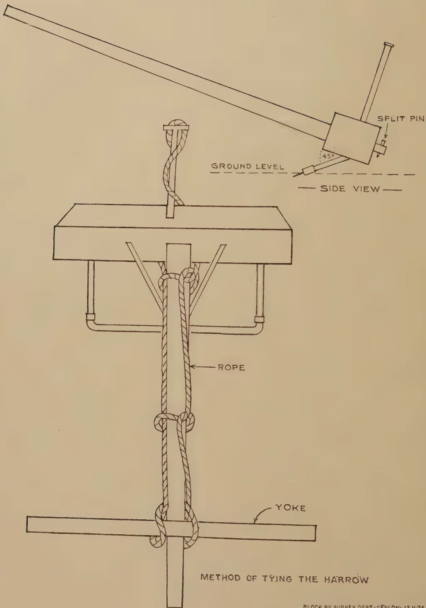
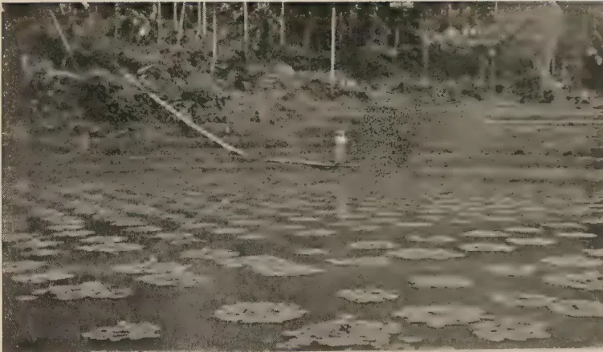

The  
Tropical Agriculturist  
December, 1936

---

EDITORIAL

---

**BIRDS AND AGRICULTURE**

---

IT is of the greatest importance to the agriculturist that he should be able to appraise correctly the relation which exists between the plants he tries to grow and the untamed animal life around him. Most of these forms of life, from the rudimentary bacteria to the most highly developed mammalian vertebrate, are either his enemies or his allies: only a few are neutral. Some thwart him in his agricultural efforts; others give him assistance. The article we reproduced last month from *The Madras Agricultural Journal*, August 1936, dealing with the war which man wages unceasingly against plant pests might have created the impression that he had no friends amongst the lowest forms of life. On the contrary even amongst bacteria and insects the agriculturist has many allies. The commonest method of controlling an insect pest which cannot be totally eradicated is to introduce another insect which is parasitic on it, but is not itself injurious.

The large majority of men are unable to distinguish their friends from their enemies, or to appreciate the magnitude of the services which they receive from the former and of the losses which are inflicted on them by the latter. Both the indiscriminate slaughter of animals which goes on in the country and the equally indiscriminate advocacy of the protection of animals are traceable to this cause. It is hoped that the article on Ceylon birds in relation to the cultivation of paddy by a well known ornithologist and animal lover which we publish this month will, in some degree at least, act as a corrective to both these classes of extremists. We should have been better pleased if the author had enlarged the scope of his subject by substituting general agriculture, or at least

1------------------------------------------------

334

all village crops, for paddy cultivation. Perhaps he felt that the ground to be covered would be too extensive for one article and intends to give our readers the benefit of a series of articles till he has covered the whole range of a subject in which his profound knowledge and wide sympathies make him an expert. But the present article should go far to stimulate thought and interest.

It is with relief that one reads that amongst birds the friends of the paddy grower form a much larger group than his enemies, and that even the most injurious amongst them are sometimes beneficial, as when a grain eating mother brings up her young on an almost exclusive diet of insects. The common Mynah and the Cattle Egret are examples of the most unwavering loyalty to the paddy grower while not one good word can be said for the paroquet or the whistling teal. A flock of Mynahs in a field infested with the paddy swarming caterpillar fills the farmer's heart with joy, while the descent of a number of teal in his field will fill him with resentment both against the bird itself and against those who would seek to protect it by legislation.

While birds still abound in the remoter "tank" areas, intensive shooting, assisted by the systematic clearing of adjacent jungle which might have provided nesting places, has denuded the paddy fields in the more thickly inhabited parts of the country of all bird life, and the paddy plantations are exposed to the uncontrolled attentions of the insect pests which a tropical climate produces in great variety and abundance. There can be no doubt that the activities of these pests have contributed in no little measure to the reduced yield of paddy in these fields. These circumstances provide the explanation, though not the justification, of the current totalitarian cult of absolute protection. Perhaps there is much to be said for it as an introduction to the adoption of a progressive policy of discriminating elimination of the injurious species of birds and the retention of the beneficial.

As the author points out, the field owners hardly ever shoot birds themselves. They only look on with apparent indifference while a stranger from the nearest town destroys the birds in his field or scares them away by frequent shooting. It is possible that the peasant's traditional deference to superior status, which the man with the gun usually has, makes him reluctant to interfere. But if they are aware that the insectivorous bird is their best protection against pests and that these pests cause considerable damage to their paddy they will no doubt rise above their deference and defend their birds no less vigorously than the Turkish farmer does the White Stork.

2------------------------------------------------

335

## CEYLON BIRDS IN RELATION TO THE CULTIVATION OF PADDY CROPS

---

W. W. A. PHILLIPS, F.L.S., F.Z.S., M.B.O.U.

**T**HE study of any aspect of the life histories of birds is an interesting subject but an enquiry into the economic relationship between birds and agriculture, or any particular branch of agriculture, has the added recommendation of being as important as it is interesting.

The part played by birds in relation to economic agriculture has, in the past, frequently been entirely overlooked or, at the best, ignored. Not only have many beneficial species been given but scant credit for their useful work in controlling insect and other pests, but too often they have been actually persecuted for some supposed evil deeds of which they have been entirely guiltless. In like manner, the damage done by injurious birds has been condoned or its magnitude unrealised and the species responsible have not been controlled in the manner in which they should have been.

The subject of the economic value of birds in relation to agriculture as a whole is a very extensive one—but one that is, rightly, receiving increasing attention on all sides. Much money and time have been spent in recent years on various investigations and researches, both in Europe and in America, and a vast amount of useful information is being collected. In the East, however, very little attention has been paid to this branch of scientific research and much work remains to be done before any definite conclusions can be reached in many branches of enquiry. Sufficient data has, however, been collected to show that birds play just as important a part in agriculture in the East as they do in the West.

Investigations are complicated, and must be more extensive than might at first be assumed, by the difficulty of

3------------------------------------------------

336

ascertaining accurately, until full data has been collected and studied, whether or not a given species is beneficial or injurious. In some cases, certain species of birds have been found to be beneficial in one district or when they are present in small numbers but distinctly injurious in another district or when they are present in too great numbers. Again, some species feed on different types of food during different seasons and are sometimes beneficial and at other times injurious to crops. It is a proved fact, also, that many of the injurious grain-feeders rear their young almost exclusively upon insect food, although grain will form their chief diet later in life.

That the activities of certain birds are of an extremely beneficial nature has been proved many times, both by observation and by scientific research. George Brown (1928) quoting from the year-book of the United States Department of Agriculture, in order to illustrate his article, states "A long-billed Marsh-Wren was seen to carry 30 locusts to her young ones in an hour, and at this rate for 7 hours a day, a brood will consume 210 locusts per day, and the passerine birds of the eastern half of Nebraska, allowing only 20 broods to the square mile, will destroy 162,771,000 locusts. The average locust weighs about 15 grains and is capable of consuming its own weight of standing forage crops, corn and wheat. The locusts eaten by passerine birds will therefore work out at 174,397 tons of crop, which at 10 dollars per ton, would be worth 1,743,970 dollars."

Many other like illustrations could be given to show the extreme usefulness of many insectivorous birds and other statistics could be produced to prove the harm done by certain other species. It is, however, not necessary to call further evidence here, as in this article we must confine ourselves solely to a critical survey of the economic relationship that exists between certain species of Ceylon birds and the cultivation of paddy crops—one of the chief agricultural pursuits of the indigenous population.

Although comparatively little research work has been done on this subject, in the East, we have one very valuable work, namely Mason and Lefroy's "Food of the Birds of India"

4------------------------------------------------

337

to which we may refer for confirmation of our field-observations. This book deals only with Indian birds, but the relationship between Indian and Ceylonese forms is, in most cases, so close that we cannot go far wrong in applying to our Ceylonese forms the information given relative to the Indian species.

The evidence, as regards diet, that is made available in this book is based chiefly upon the examination of the stomach, crop and gizzard contents, by trained entomologists and the data given may be accepted as reliable. It is, therefore, of the greatest value in confirming and augmenting the field observations upon which this article is, for the most part, based.

I have also, however, received much valuable help and additional confirmation, from Mr. D. R. R. Burt, of the University College, Colombo, who has very kindly furnished me with the notes that he has made upon the stomach contents of certain Ceylon birds that he has, from time to time, examined while engaged in other research work. These notes have in many cases confirmed, for Ceylon birds, the diets given for closely allied Indian forms and they have, also, proved to be of the greatest value in checking up field observations.

Not many years ago, the paddy fields of Ceylon were teeming with bird life of all descriptions and the various pests were kept under control solely by their agency. Although they were not actively encouraged, birds were rarely interfered with and for the most part they were allowed to lead useful and ornamental lives, unharassed and undisturbed. Little by little, however, a change has taken place. Guns in the hands of indiscriminating persons have increased alarmingly and, with the rapid extermination of animal life, the pot-hunters have turned their attention to the larger forms of bird life in the paddy fields.

It is a curious fact that, although the majority of our paddy cultivators are Buddhists and therefore averse to the taking of life in any form, they will rarely raise their hands or even their voices to dissuade others from so doing. It is, therefore, no uncommon sight to see the cultivators and field owners standing by, watching without protest, while the

5------------------------------------------------

338

beneficial birds of their fields are shot down. It must be admitted that, in most cases, they do not realise that these birds are beneficial. Did they do so and understand that their crops would be likely to suffer in consequence, they might possibly bestir themselves to interfere in order to protect their friends. It is here that the officers of the Agricultural Department might do much good work by encouraging the cultivators to protect their beneficial birds and all nests that they find upon their lands.

When resident in Turkey, some years ago, I was greatly interested to notice that, while the Turkish farmer was in no way interested in the great majority of the birds upon his farm, he would threaten with serious bodily harm anyone who in anyway interfered with the White Storks that arrived, annually, to breed in the vicinity. Consequently, these Storks were almost as tame as domestic birds and wandered about and rid the farms of large numbers of locusts, grasshoppers and other noxious insects. In the same manner, the Rose-coloured Pastors or Starlings were rigorously protected—not by law, but by the farmers themselves. And an irate Turkish farmer is an ideal protector. These birds nested in colonies, of several hundreds, in the crevices of old stone walls and when their young had hatched, arrived in flocks from all directions with their beaks crammed with locusts and grasshoppers. They accounted for tens of thousands every day and without their aid the crops would have suffered alarming damage.

Here in Ceylon, the story is a very different one. The most beneficial birds are shot down with impunity and, as the larger species grow scarce, the smaller ones are sought. It is an all too common sight to see even Cattle Egrets dangling from the barrel of the pot-hunter's gun, as he returns from the hunt. As one man said to me, when I remonstrated with him for shooting 'Paddy-birds' "Sir, *all* Kokkas are good to eat, but some are better than others."

Unless the cultivator will take the trouble to protect his bird friends, many of the most valuable are doomed rapidly to disappear from all but the remotest paddy fields and, as a direct consequence, injurious pests are certain to become more troublesome. Although many species are nominally protected

6------------------------------------------------

339

by law, that is not sufficient, for without the co-operation of the cultivator the law can never be properly enforced.

When studied in relation to any particular product of agriculture, birds must be examined in groups according to their diets and whether or not they in any way influence the product under review. The largest of these groups naturally contains those species that in no way affect the product; they are neither harmful or beneficial, so they may be ignored as neutrals. The second group, however, consists of those birds that are quite definitely, or chiefly, beneficial and, fortunately for paddy cultivation in Ceylon, a large percentage of our birds can be placed in this category. Many of our birds are most valuable allies of the cultivator; they are the natural means of controlling, if not eliminating, some of the worst insect pests with which the growers of paddy have to contend. In this respect the common Mynah, the Indian Roller, all the Warblers and the Cattle Egret may be mentioned especially, amongst many other useful species. All these birds and their nests should receive complete protection at the hands of the village cultivator and they should be encouraged, by every means that can be thought of, to frequent the fields. The third group on the other hand is, fortunately again, quite a small one. It consists of those birds that are definitely harmful to paddy crops at some stage of their growth. Although a number of birds have to be placed in this group, very few of them do much real damage unless they are present in large numbers. When this is the case, they should be controlled by trapping or shooting or by having their nests destroyed.

In order that the birds that are allies or enemies of the paddy cultivator may be recognised in accordance with their activities, it is desirable that they should be examined in detail, individually. We will therefore take the beneficial species first and then refer to the harmful forms.

The following are the chief beneficial species :—

THE BLACK CROW (*Corvus coronoides culminatus*).—S. *Kākkā* or *Kalu Kaputa*; T. *Andam-Kakam*.

Although the crow is a bird of which little of good but much of evil may be said, as far as the cultivation of paddy is concerned, it is, I think, mainly beneficial in its activities. In

7------------------------------------------------

340

diet, it is truly omnivorous and it will certainly feed on paddy and other grain but I have never heard of it, in Ceylon, being accused of habitually robbing paddy fields. It generally finds plenty of other food to sustain it. On the other hand, at times, it eats many grasshoppers, locusts and various beetles and a valuable ally in helping to control the depredations of the paddy-swarming caterpillar (*Spodoptera mauritia*) one of the chief pests of growing paddy. It may, therefore, be said to be mainly beneficial to paddy cultivation, although it is very doubtful whether, to agriculture as a whole, it is not an unmitigated nuisance.

Of the HOUSE CROW (*Corvus splendens protegatus*), in the coastal paddy fields, the same may be said, to a lesser extent. Although this species acts as a scavenger and keeps very much to the interior of towns and villages and to the sea-shore, when it does repair to the paddy fields, its visits are probably beneficial.

THE SMALL WHITE-THROATED BABBLER (*Dumetia. a. Albigularis*).—S. Parandel-Kurulla or Battichcha.

Several species of Babbler may occasionally be seen in or on the outskirts of paddy fields, but the Small White-throated Babbler appears to be the only species that habitually frequents undergrowth and brushwood in or adjoining the fields and is occasionally to be seen searching amongst the stems of the growing crops. This little Babbler is almost entirely insectivorous and devours many of the smaller forms of injurious insects and their larvae. Its visits to the paddy fields are therefore most beneficial and it should be encouraged. It frequently makes its nest in a clump of tall grass or in low brushwood in the fields, building a ball-shaped nest of dead leaves and ribbon grass with entrance at the side. It rears either three or four young which appear to be fed exclusively on soft-bodied grubs and caterpillars. It is very possible that the leaf-folding caterpillar (*Marasima bilinealis*) may form part of its diet. In the accompanying photograph a babbler of this species is shown feeding its young with a grub. (Pl. I).

THE BROWN SHRIKE (*Lanius. c. cristatus*).—All small Shrikes are very beneficial birds, but the Brown Shrike, a north-east monsoon migrant, is the only species that is at all

8------------------------------------------------

A black and white photograph showing a Small White-throated Babbler (Dumetia a. albicularis) bird feeding its young in a nest. The nest is constructed from a dense mass of dry grass, straw, and twigs, situated on the ground. The bird, which has a light-colored head and throat and darker plumage on its back and wings, is perched on the nest and looking down at the young. The surrounding environment is a thicket of dry, tangled vegetation. In the bottom left corner of the photograph, there is a small vertical credit line that reads: "BLACK BY SURVEY DRIP CRYCOM 10-12-36".

Copyright

PLATE I. Small White-throated Babbler (*Dumetia a. albicularis*)  
Bird feeding young in nest. August 17th, 1936.

Species beneficial to agriculture.

Photo by the Author.

9------------------------------------------------

Copyright

Photo by the Author.

PLATE IV. Ashy-crowned Finch-lark (*Pyrrhulanda g. grisea*)  
Nest containing one egg and one newly hatched young. June 13th, 1936.

Species beneficial to agriculture.

10------------------------------------------------

343

THE GRAY-HEADED WAGTAIL (*Motacilla flava thunbergi*) and  
THE GRAY WAGTAIL (*Motacilla cineria caspica*).

Both these Wagtails are migrants; they are resident in the Island only during the North-East monsoon period—from about September to the following March. The former species occur in large flocks in grasslands and paddy fields undergoing cultivation, while the latter haunts watercourses and damp areas. Both are chiefly insectivorous, eating many small insects, larvae and flies; both species are mildly beneficial to paddy cultivation.

THE INDIAN PIPIT (*Anthus richardi rufulus*).—S. *Gomaritta*;  
T. *Nethai-Kali*.

The Pipit is a very common resident in or on the borders of paddy fields. It is undoubtedly a useful bird. It feeds on seeds, as well as on insects, and does much good by devouring quantities of grass and weed seeds in addition to weevils and other small injurious insects and so cleans the ground for the paddy crops. It makes its nest upon the ground, generally in the shelter of a grass tuft.

THE ASHY-CROWNED FINCH-LARK (*Pyrrhulauda g. grisea*),  
MADRAS BUSH-LARK (*Mirafra assamica affinis*) and  
the NILGIRI SKY-LARK (*Aluda gulgula australis*).—  
S. *Gomaritta*; T. *Vanam-padi* or *pullu*.

All these three larks haunt dry paddy fields and do much good by cleaning the land for the next crops. They pick up quantities of weevils and other small beetles, larvae and small grass and other seeds. All three species nest upon the ground, chiefly in the drier districts of their respective ranges, laying either two or else three eggs. A typical nest of the Finch-lark, containing one young and one egg, is shown in the accompanying photograph. (Pl. IV).

THE SOUTHERN INDIAN ROLLER (*Coracias benghalensis indica*).—  
S. *Dumbona* or *Dunkawaluwa*; T. *Panan-Kadai* or  
*Kotta-Kili*.

The 'Blue Jay,' as it is often called, is as useful as it is beautiful. It haunts many paddy fields in the dry zone and as it feeds mainly upon grasshoppers, crickets and caterpillars it does an immense amount of good. It eats termites, beetles

11------------------------------------------------

344

and other insects as well and should be strictly protected wherever it is met with. Burt has found grasshoppers, locusts and beetles (Staghorn (*Rhyncophora*) and other *Lucanidae*) in those that he has examined, thereby confirming previous observations of the usefulness of these birds to paddy cultivators. It nests in decayed palms or holes in other trees and lays four or five white eggs.

THE CEYLON WHITE-BREASTED KINGFISHER (*Halcyon smyrnensis generosa*).—S. *Pilihuduwu* ; T. *Min-kotti*.

Although the majority of Kingfishers live principally on small fish, this species is mainly insectivorous in its diet. It catches, in the paddy fields, many grasshoppers, beetles and small land crabs and thereby proves its usefulness. Although it will, when the opportunity offers, take an occasional young bird, small frog or lizard, it is, on the whole undoubtedly a beneficial species. It nests in holes dug deep in vertical banks and lays from three to five pure white eggs.

THE COMMON INDIAN NIGHTJAR (*Caprimulgus asiaticus*).—S. *Bin-bassa* ; T. *Pathekai-Kuruvi* or *Kuruttu-pakkul*.

The Nightjar is not a common bird in the majority of paddy fields but it occurs in many in the lowlands and when it does occur its activities are very beneficial. It flies in the dusk and at night and probably captures many injurious insects not otherwise troubled by insectivorous birds. It feeds mainly upon small moths and beetles, the majority of which are injurious to crops. The Nightjar lays two eggs on the bare ground, often quite in the open, but sometimes in the shade of a bush. It trusts to protective colouring to escape detection by its enemies.

THE CEYLON PIED-CRESTED CUCKOO (*Clamatorjacobinus taprobanus*).—S. *Konday-koha* ; T. *Konday-kuyil*.

All Cuckoos are of direct benefit to the agriculturist in that they feed principally upon caterpillars—commonly on the hairy kinds that most other birds will not touch. The Pied-Crested Cuckoo is, however, the only species that is seen at all commonly in the paddy fields of the low-country. In addition to feeding upon caterpillars of many different species, it eats grasshoppers and other insects. This Cuckoo lays its

12------------------------------------------------

345

eggs in the nest of the COMMON BABBLER (*Turdoides griseus striatus*), the Cuckoo's eggs being so like those of the Babbler that they are indistinguishable while in the nest. Mason (*Food of the Birds of India* p. 186) writes "We have many references to birds, other than the Cuckoos, eating hairy caterpillars, but these are exceptions and Cuckoos are the only birds that do so habitually. I have examined a considerable number of different species of birds, and in no other case have I found a bird, other than a Cuckoo, touch this particular kind of food. Cuckoos, therefore, being the only real bird-check we have on hairy caterpillars, which are mostly defoliators, need all the protection we can give them, and should be encouraged as much as possible. They can only be encouraged in one way, namely, by the encouragement of their hosts." With this statement I fully agree.

THE SOUTHERN CROW-PHEASANT or COUCAL (*Centropus sinensis parroti*).—S. *Eti-kukula* or *Bu Kukula*; T. *Chempakam* or *Chemput*.

'Jungle crows' are often seen walking about in paddy fields, singly or in pairs. They are not entirely beneficial to agriculture as a whole, as they take many lizards and other beneficial forms and also raid small birds nests; but, in the paddy fields, their activities are, on balance, useful I think. Burt has found the remains of beetles and cockroaches in those that he has examined and they have been seen to devour many snails. In India, grasshoppers, beetles, bugs, spiders, land crabs and small frogs have all been found in them. The Coucal builds a large, untidy ball nest amongst the dense foliage of a tall tree or else in the centre of a thorny thicket or creeper and lays three white eggs.

THE BROWN FISH-OWL (*Ketupa z. zeylonensis*).—S. *Bakamuna*; T. *Andai* or *Umatan-kuruvi*.

All owls, in Ceylon, are directly or indirectly very beneficial to agriculture as, in addition to the smaller species taking many beetles and other noxious insects, the larger forms kill many small rodents which are, in themselves, the worst of all agricultural pests. The Brown Fish-Owl, which is one of the commonest owls to be met with at dusk in paddy fields, as

13------------------------------------------------

346

well as killing small rodents, takes very many land crabs and a few large beetles and other insects. Some of the nests of this species are littered with the remains of land crabs and it seems likely that the young owlets are fed largely on a diet of them.

THE COLLARED SCOPS OWL (*Otus. b. bakkamoena*).—S. *Punchi-bassa*; T. *Sinna-andai* or *nattu*.

The little Scops Owl also does a great deal of good in paddy fields, at night. Being one of our smaller owls, it is chiefly insectivorous but will also take mice. All our owls nest chiefly in large holes in trees and all lay white eggs.

THE BRAHMINY KITE (*Haliaster. i. indicus*).—S. *Akassa*; T. *Chem-pirandu*.

This species is commonly to be seen sailing round over paddy fields and in the vicinity of tanks in the low-country; its activities are mainly beneficial. Although it takes young or wounded birds, lizards and frogs, which are beneficial to paddy cultivation, it feeds largely upon land crabs and large insects such as crickets, grasshoppers and locusts. In those he has examined, Burt has found the remains of locusts, beetles and crabs. I think, therefore, that the species may be considered as being, on the whole, mildly beneficial. It nests in large trees adjacent to tanks and paddy fields, building a large stick nest and laying, usually, three eggs.

THE BLACK-WINGED KITE (*Elanus coerulcus vociferus*).—S. *Kurulla-goya*; T. *Pirandu*.

The Black-shouldered Kite or "Gull-hawk" is not as common as one would like to see it, but it frequents some of our paddy fields. It takes many insects, such as grasshoppers and large beetles, and numbers of small rats and mice as well and by so doing does much good. On the other hand, it also takes lizards and an occasional useful bird. On balance, however, it is undoubtedly a useful species and should be encouraged. It builds its crow-like nests in the tops of high trees and lays either two or three oval eggs.

THE PALE HARRIER (*Circus macrourus*).—S. *Akassa*; T. *Punai-pirandu*.

The Harriers, of which there are four species that visit Ceylon during the North-East monsoon period, are all migratory

14------------------------------------------------

347

birds. The larger ones, the MARSH HARRIER (*Circus. a. aeruginosus*) and MONTAGUS HARRIER (*Circus pygargus*), although they take insects and mice occasionally, live chiefly upon lizards, frogs and small birds; they must therefore be ranked as neutral or possibly as definitely injurious birds. The Pale Harrier, however, although it takes lizards, lives much more on insects and mice and is therefore a most useful bird to agriculturists.

THE KESTREL (*Cerchneis tinnunculus*).—S. *Ukussa* or *Kurullagoya*; T. *Valluru*.

Two races of Kestrel are said to be found in Ceylon, one migratory and the other resident, but the latter form is very rare. However, both have similar habits and do much good to agriculture in that they feed largely upon small rodents and large insects. They also eat, especially in the hill-districts, many lizards, but when they are haunting paddy fields, as they frequently do, they must be considered as very beneficial birds.

THE CEYLON WHITE-BREASTED WATER-HEN (*Amaurornis. p. phoenicurus*).—S. *Korowaka* or *meti-korowaka*; T. *Kanan-koli*.

All the smaller Rails are useful birds but, as they are comparatively scarce, they can have but little beneficial effect upon paddy cultivation. The White-breasted Water-hen, however, is a common species to be found in or near most paddy fields. It feeds mainly on grass seeds and insects and may, possibly, occasionally eat a little ripe paddy that has fallen from the ear. It generally haunts swampy paddy fields when they are lying fallow or have been newly cultivated and helps to clean the soil by picking up numerous small insects, larvae and seeds.

THE INDIAN STONE-CURLEW (*Burhinus oedicornis indicus*).—S. *Golu-kiraluwa* or *Golu-kirala*; T. *Mussal-kannadi*.

In some of the more extensive paddy fields in the dry zone, the Indian Stone-Curlew is to be found either in small parties or in pairs. It is a particularly useful bird where it occurs and should be protected and encouraged as much as possible. It feeds almost entirely on insects, small snails and worms. It lays two or, occasionally, three eggs in a slight

15------------------------------------------------

348

depression in the ground, the eggs being protectively coloured and so generally escaping detection.

THE INDIAN RED-WATTLED LAPWING (*Lobivanellus. i. indicus*).—S. *Kiraluwa* or *Kirala*; T. *Al-kati*. (Pl. V).

The "Did 'e do it" is a common bird in most paddy fields when they are lying fallow or the growing crops are not too tall. It feeds upon insects, their larvae, shells and worms and so helps to clean the fields when they are lying fallow or are newly cultivated. Burt has found many beetles in those he has examined. This Lapwing, in spite of being such an annoying bird from its habit of mobbing the intruder with loud cries, should therefore be protected as a beneficial bird.

THE EASTERN GOLDEN PLOVER (*Pluvialis dominicus fulvus*).—S. *Oleyiya* or *Rana-watuwa*; T. *Kotan*.

Like the Pintail Snipe, the Golden Plover is a North-East monsoon migrant. It arrives in flocks towards the end of September or beginning of October. It feeds chiefly on small beetles, worms and other insects and larvae and is often to be found in newly-cultivated or fallow paddy fields. Burt has found molluscs and grasshoppers in those he has examined and its activities are undoubtedly beneficial to the cultivator.

THE LITTLE RINGED-PLOVER (*Charadrius dubius jerdoni*).—S. *Punchi-oleyiya*; T. *Sinna-kotan*.

The little Plovers are also very beneficial birds. They are often found in the larger paddy fields near the coast and also in the dry zone. In specimens of the Little Ringed-Plover he has examined, Burt has found beetle larvae and pentatomid bugs. It is probable that the majority of the Sandpipers, found in large numbers during the North-East monsoon in most paddy fields, are also beneficial in their activities.

In the WOOD SANDPIPER (*Tringa glareola*) or 'Snippetet,' as it is generally called, Burt has found caterpillars, beetles and their larvae, spiders and bugs.

THE PINTAIL SNIPE (*Capella stenura*).—S. *Keswatuwa*; T. *Ullan-kuruvi* or *Isnapu*.

Snipe feed chiefly on worms, grubs, small snails and beetles and, like the Plovers and most Sandpipers, are undoubtedly beneficial birds. Burt has found worms, beetle grubs and

16------------------------------------------------

BLOCK BY SURVEY OFFICE, CEYLON 84-35.

Copyright

PLATE VI. Indian Pond-Heron (*Ardeola grayii*)

Photo by the Author.

Bird at nest, containing newly hatched young, in semi-dry bed of a tank. August 2nd, 1936.

Species beneficial to agriculture.

17------------------------------------------------

Copyright

Photo by the Author.

PLATE V. Indian Red-wattled Lapwing (*Lobivanellus i. indicus*)  
Bird approaching nest with 4 eggs. August 15th, 1936.

Species beneficial to agriculture.

18------------------------------------------------

349

aquatic larvae in those that he has examined. The chief economic value of the snipe lies, however, in its food value.

THE WHITE IBIS (*Threskiornis melanecephalus*).—S. *Tattu-kokka* or *Dahakatti-kokka*.

The larger and more remote paddy fields of the dry zone are visited regularly by White Ibises and Storks of various species. All of them eat many grasshoppers, locusts and other insects in addition to worms, crustacea, mollusca and frogs and all of them should therefore be regarded as being mildly beneficial species.

THE CATTLE EGRET (*Bubulus ibis coromandus*).—S. *Harak-kokka* ; T. *Hunni-kokku*.

The Cattle Egret is one of the most useful and beneficial birds in the Island. It is very frequently seen in company with cattle and buffaloes, snapping up the grasshoppers and other insects disturbed by the animals. But it is also very often found in flocks in paddy fields, both while they are being cultivated and after they have been planted. They eat almost any kind of insect, including grasshoppers and beetles, and also worms, tadpoles and small fish. Burt has found in them chiefly grasshoppers, but also moths, beetle larvae, caterpillars, crickets, flies, water-bugs (*Nepa*) and spiders. There are very few other species of birds that are so exceedingly beneficial to paddy cultivators. The Cattle Egret should be protected from all interference, either to itself or to its nest, and encouraged at all times.

THE INDIAN POND HERON (*Ardeola grayii*).—S. *Kana-kokka* ; T. *Kuruttu-kokku* or *Nuli-madayan*. (Pl. VI).

The 'Paddy-Bird' is listed by Mason and Lefroy (p. 359) as being, in India, a species injurious to agriculturists, but I am unable to agree with them. Granted that it takes many larvae of dragon-flies, which turn into beneficial insects, and frogs, which again are beneficial, it is one of the best controlling agents of land crabs and also takes a great many grasshoppers and other injurious insects. The land crabs do great damage in paddy fields and any species that acts as a natural control of their numbers must, I consider, be ranked as a beneficial species. In those that he has examined, Burt has found crabs,

19------------------------------------------------

350

small fish, shrimps and grasshoppers. On balance, I do not think that there can be any doubt that the Paddy-bird is a useful species. It nests in trees standing beside water or in bushes and dead branches standing in water, making a nest of sticks and laying three or four chalky, bluish eggs.

This completes our list of birds that may be considered to be definitely beneficial or useful in relation to the cultivation of paddy. We now come to those species which are definitely injurious. Luckily for the villager, this list is not nearly so formidable as that of the beneficial species. The injurious birds, however, although few in species, are generally many in numbers and therein lies their potentiality for harm. In most cases, they are birds that habitually visit the fields in flocks and devour much grain, either when it has just been sown or when it is in ear and almost ready for garnering.

The following are the chief injurious species that cause damage in Ceylon.

THE BAYA OR COMMON WEAVER-BIRD (*Ploceus philippinus*).—

S. *Wadu-kurulla* ; T. *Thukanan-kuruvi* or *Manja-kuruvi*.

Although such an interesting bird, from the point of view of its unique nest-building habits, there can be little doubt that the Weaver-bird is definitely harmful to paddy crops. In many parts of the lowlands it is a semi-migratory bird and appears in flocks in certain districts only when the paddy is well grown. The flock selects a suitable tree in or near the field and proceeds to weave its nests from the green blades of the paddy plants. These pendulous, flask-shaped nests are woven with wonderful dexterity. The hen-birds then lay three or four white eggs and, after hatching them out, proceed to rear their families on the now ripening grain.

The Weaver-birds appear to be exclusively grain-feeders and eat large quantities of grass and other seeds as well as paddy and other grain. They obtain the grain, while it is yet in the ear, by clinging to the stems and attacking the heads. Although a common bird in many districts, that undoubtedly does much mischief, it is rarely present in sufficient numbers to do any great damage in the paddy fields.

20------------------------------------------------

351

THE WHITE-BACKED MUNIA (*Uroloncha s. striata*).—S. *Wi-kurulla* ; T. *Nellu-kuruvi*.

This species probably takes a few insects, grubs and grass seeds, especially while its young are still in the nest, but paddy and kurakkan, when available, are its chief diet. It is a very small bird, but prolific, and goes about visiting the fields in small parties—probably family parties. If present in numbers, it may do considerable damage when the grain is ripening. Its nest is a loose ball of grass or such-like material with the entrance at one side, placed some 5 to 10 feet from the ground in a tall bush or in the branch of a tree. Four to six small white eggs are laid and breeding appears to continue intermittently, more or less throughout the year. The young continue with the parents for some months after they leave the nest, forming small flocks.

THE SPOTTED MUNIA (*Uroloncha punctulata punctulata*).—S. *Wi-kurulla* ; T. *Nellu-kuruvi*.

The Spotted Munia is even more destructive than the White-backed species. It generally visits the paddy fields in larger numbers, flocking together and doing much damage to the grain in the ear. I have known as many as thirty of these little birds, to be killed by one discharge from a twelve-bore gun, fired into a flock.

Like that of the last species, the nest is a ball of grass or paddy-straw, placed in a tall bush or low tree. Often a number of nests, all containing eggs or young, may be found in a tree, on the borders of a field. Breeding continues intermittently throughout the year and four to six small, white eggs are laid each time. The species, therefore, multiplies very rapidly and is apt to do considerable real damage in the fields, unless its numbers are kept in check.

In some of the more arid districts of the north and to a lesser extent in the south-east, the WHITE-THROATED MUNIA (*Uroloncha malabarica*) also does damage, occasionally, to the ripening paddy crops, but this species is confined to a very restricted area in the dry zone.

THE HOUSE-SPARROW (*Passer domesticus confucius*).—S. *Ge-kurulla* ; T. *Adackalam-kuruvi* or *Urkkuruvi*.

The Common Sparrow is a bird that is greatly encouraged in Ceylon. It is a friendly little bird and its confiding ways

21------------------------------------------------

352

appeal to the local inhabitants. Consequently, chatties and boxes, with holes in them, are hung on the walls of buildings for their use as roosting and nesting sites and the birds are frequently fed.

When their young are in the nest, the parents undoubtedly do some good as they feed them on grubs, insects and small soft seeds. Their activities are at this time beneficial. But when the young leave the nest and the paddy in the nearby fields is ripening, they then band themselves together and visit the fields. Large flocks often do considerable damage to paddy and other grain, which is yet in the ear. The species is a prolific one and where its numbers tend to become unduly numerous they should be controlled.

THE WESTERN BLOSSOM-HEADED PAROQUET. (*Psittacula cyanocephala cyanocephala*).—S. *Panu-girawa*; T. *Kili*.

In many of the paddy fields of the lower hill-country, the Blossom-headed Paroquet is a pest. It visits the fields in small flocks, when the paddy is in the ear and consumes much of the grain. When the flocks are at all numerous, much real damage is done. In some districts, the cultivators attempt to keep off these Paroquets by stretching strings across the fields to frighten them away.

The Paroquets lay their eggs in holes, usually high up in the branches of trees. Generally either three or four roundish, glossless, white eggs are laid and probably two broods are reared during the year.

In parts of the low-country dry zone, the ROSE-RINGED PAROQUET (*Psittacula krameri manillensis*) also does considerable damage of the same nature.

THE CEYLON SPOTTED DOVE OR ASH-DOVE (*Streptopelia chinensis ceylonensis*).—S. *Alu-kobeyiya*; T. *Umi-purā* or *Mani-purā*.

Doves are very common in and around paddy fields and, as they subsist largely upon grain, they must be considered injurious. Generally they do little damage to paddy in the ear but, when it is first sown and also when they glean after the reaping and from threshing floors, they eat considerable quantities of the grain. They will eat any kind of grain and also grass seeds, but rarely, if ever, insects.

22------------------------------------------------

353

They appear to nest chiefly in March and April and again during July and August but their slight stick platforms may be found at any time during the year. They lay only two white eggs.

In the north-west coastal districts, from the north of Puttalam to Jaffna, the INDIAN RING-DOVE (*Streptopelia decaocto decaocto*), which has very much the same habits as the Spotted Dove, also does a little damage to paddy cultivation, but it is not a bird that occurs in great numbers.

THE INDIAN PURPLE COOT (*Porphyrio poliocephalus poliocephalus*).—S. *Kittala* or *Kitta* ; T. *Kanan-koli*.

In India, the Purple Waterhen or Coot is reported to do "immense damage" to paddy crops and very probably it does considerable damage in Ceylon in fields adjacent to the "tanks" that it frequents. It is not, however, a bird that is usually found in Ceylon in paddy fields away from the immediate vicinity of large tanks and lotus-covered lagoons. It may be considered, therefore, as a bird that does damage only very locally.

GAME BIRDS.—All the members of the "game bird" family, that is, in Ceylon, the Pea-fowl, Jungle-fowl, Spur-fowl, Partridges and Quails, are apt to feed on paddy, if the opportunity occurs. But they are so rarely to be met in paddy fields nowadays that they may be ignored. The Jungle-fowl, which probably visits paddy fields more often than any of the others, (with the exception of the Button Quail which is chiefly beneficial in its activities), generally only picks up the grain after the reaping is finished.

THE WHISTLING TEAL (*Dendrocygna javanica*).—S. *Seruuwa* ; T. *Chemba-tara*.

Of all our Ceylon birds, the Whistling Teal does the most real damage to paddy cultivation. It has a passion for the grain and, in many parts of the low-country, visits the newly-sown fields night after night and devours large quantities of germinating seed-paddy. Teal arrive in the fields about dusk and do not leave again until they are fully fed. The damage that they do to some of the paddy fields in the "tank" districts of the dry zone is very great and it is just as well that their numbers are kept in check, to some extent, by sportsmen.

23------------------------------------------------

354

The Whistling Teal is a very prolific species ; the ducks lay from eight to fourteen eggs for a full clutch and probably next twice during the year. The nesting season extends from about December or January right on until July and August. The nest is placed in a large hole in the trunk of a tree standing in or beside the water or on the ground amongst herbage near the water. An islet in a "tank" is a very favourite place and I have seen as many as three nests on the same islet, where suitable sites have been scarce.

This completes the list of species injurious to paddy cultivation in Ceylon and it now remains only to sum up the foregoing.

The great majority of Ceylon birds are either neutral or only very indirectly beneficial to paddy cultivation. Thirty-four species may be ranked, however, as definitely beneficial and twelve species as definitely injurious. The chief beneficial and injurious species are listed below :

SPECIES BENEFICIAL TO THE CULTIVATION OF PADDY CROPS.

The Black Crow (*Corvus coronoides culminatus*).

The Small White-throated Babbler (*Dumetia. a. Albicularis*).

The Brown Shrike (*Lanius. c. cristatus*).

The Ashy Swallow-shrike (*Artamus fuscus*).

The Ceylon Streaked Fan-tailed Warbler (*Cisticola juncidis omalura*).

The Ceylon Wren-Warbler (*Prinia inornata jerdoni*).

The Common Ceylon Minah (*Acridotheres tristis melano-  
sternus*).

The Ceylon Swallow (*Hirundo daurica hyperythra*).

The Grey-headed Wagtail (*Motacilla flava thunbergi*).

The Indian Pipit (*Anthus richardi rufulus*).

The Ashy-crowned Finch-lark (*Pyrrhulauda. g. grisea*).

The Madras Bush-lark (*Mirafra assamica affinis*).

The Small Nilgiri Sky-lark (*Aluda gulgula australis*).

The Southern Indian Roller (*Coracias benghalensis indica*).

The Ceylon White-breasted Kingfisher (*Halcyon smyrnensis generosa*).

The Common Indian Nightjar (*Caprimulgus asiaticus*).

24------------------------------------------------

355

The Ceylon Pied-crested Cuckoo (*Clamator jacobinus taprobanus*).

The Southern Crow-pheasant or Coucal (*Centropus sinensis parroti*).

The Brown Fish-owl (*Keputa. z. zeylonensis*).

The Collard Scôps-owl (*Otus. b. bakkaena*).

The Brahminy Kite (*Haliastur. i. indicus*).

The Black-winged Kite (*Elanus coerulens vociferus*).

The Pale Harrier (*Circus macrourus*).

The Kestrel (*Cerchncis tinnunculus*).

The Ceylon White-breasted Waterhen (*Amaurornis. p. phoenicurus*).

The Indian Stone-curlew (*Burhinus oedicnemus indicus*).

The Red-wattled Lapwing (*Lobivanellus. i. indicus*).

The Eastern Golden Plover (*Pluvialis dominicus fulvus*).

The Little Ringed-plover (*Charadrius dubius jerdoni*).

The Wood Sandpiper (*Tringa glareola*).

The Pintail Snipe (*Capella stenura*).

The White Ibis (*Threskiornis melanocephalus*).

The Cattle Egret (*Bubuleus ibis coromandus*).

The Indian Pond-Heron (*Ardeola grayii*).

#### SPECIES DEFINITELY INJURIOUS TO THE CULTIVATION OF PADDY CROPS.

The Baya or Common Weaver-bird (*Ploceus philippinus*).

The White-backed Munia (*Uroloncha. s. striata*).

The Spotted Munia (*Uroloncha. p. punctulata*).

The White-throated Munia (*Uroloncha malabarica*).

The House Sparrow (*Passer domesticus confucus*).

The Western Blossom-headed Paroquet (*Psittacula. c. cyanocephala*).

The Rose-ringed Paroquet (*Psittacula krameri manillensis*).

The Ceylon Spotted Dove (*Streptopelia chinensis ceylonensis*).

The Indian Ring-dove (*Streptopelia d. decaocto*).

The Indian Purple Coot (*Porphyrio p. poliocephalus*).

The Whistling Teal (*Dendrocygna javanica*).

25------------------------------------------------

356

In addition to recording my grateful thanks to Mr. D. R. R. Burt of the University College, Colombo, for the use of his very helpful notes on the crop and stomach contents of the birds that he has examined, I have to acknowledge my indebtedness to the authors of the following literature, which I have consulted while I have been engaged upon this article.

<table>
<tbody>
<tr>
<td>Bainbrigge-Fletcher. T.,</td>
<td>1914..</td>
<td><i>Some South Indian Insects.</i></td>
</tr>
<tr>
<td>Brown, George,</td>
<td>1928..</td>
<td>The Economic value of Birds in Ceylon. <i>The Trop. Agriculturist</i>, Vol. LXXI, No. 5, p. 272.</td>
</tr>
<tr>
<td>Jardine, N. K.</td>
<td>1928..</td>
<td>Birds in relation to Agriculture. <i>The Trop. Agriculturist</i>, Vol. LXX, No. 4.</td>
</tr>
<tr>
<td>Mason, C. W. &amp; Maxwell Lefroy, N. .. ..</td>
<td>.. ..</td>
<td>The Food of Birds in India. <i>Memoirs, Department of Agriculture, India</i>, Vol. III.</td>
</tr>
<tr>
<td>Wait, W. E.</td>
<td>1931..</td>
<td><i>Manual of the Birds of Ceylon</i>, 2nd Edition.</td>
</tr>
</tbody>
</table>

26------------------------------------------------

This image is a scan of a blank page. The paper has a light beige or cream-colored tint. There are several small, dark specks scattered across the surface, which appear to be scanning artifacts or dust particles. No text, lines, or other markings are present on the page.

27------------------------------------------------

358

The diagram illustrates the assembly of a blade harrow. It consists of two main views: a side view and a front view. The side view shows a long, angled blade assembly. A rectangular block is mounted on the blade, and a 'SPLIT PIN' is inserted through it. A 'GROUND LEVEL' line is indicated by a dashed line, and the blade is shown at a  $45^\circ$  angle to this line. The front view shows a vertical post with a 'YOKE' at the bottom. A 'ROPE' is wrapped around the post and tied in a knot. The rope is also tied to the yoke and extends upwards, passing through a rectangular block and being secured with a 'SPLIT PIN'. The entire assembly is mounted on a horizontal base.

SPLIT PIN

GROUND LEVEL

45°

— SIDE VIEW —

ROPE

YOKE

METHOD OF TYING THE HARROW

BLOCK BY SURVEY DEPT. CEYLON. 13.11.36.

THE BLADE HARROW

28------------------------------------------------

359

## AGRICULTURAL IMPLEMENTS\*—II

C. R. KARUNARATNA, Dip. Agric. (Poona)  
*AGRICULTURAL INSTRUCTOR, KATUGASTOTA*

### THE BLADE HARROW

**T**HE blade harrow is one of the most important implements the Indian cultivator possesses, and on it he chiefly depends in his tillage operations. This implement consists of five parts, the head-piece, the draught pole, the two prongs, the blade and the stilt. A fairly heavy rectangular piece of log forms the head-piece, to which is attached the draught pole at such an angle that, when it rests easily on the yoke of bullocks used for drawing it, the upper surface of the head-piece will remain horizontal. Two cylindrical pieces of wood about 12 inches long and 2 to  $2\frac{1}{2}$  inches in diameter, driven into the lower surface of the head-piece four to five inches away from the ends, serve as prongs. These are fixed pointing downwards and forwards at an angle of about  $10^\circ$  with the vertical. The efficiency of the implement depends largely upon the angle at which the prongs are fixed to the head-piece. Prongs with an inclination in the direction of its motion tend to penetrate more deeply in the ground than vertical prongs of similar weight and sharpness. The tendency to penetrate increases as the prongs move further from the vertical until the position of  $45^\circ$  is reached. Thereafter the power to penetrate gradually diminishes.

The blade consists of a flat iron about 2 to  $2\frac{1}{2}$  inches wide and partially sharpened on the lower edge. This is the principal working part which enters the soil. The ends of the blade are turned up so that it may be easily fitted into the wooden prongs which carry it, and secured firmly with two iron rings. A small piece of wood fixed in the middle of the upper surface of

\* This series of articles describe a number of simple implements used in India and Ceylon which are suitable for general adoption by the village agriculturist.—*Editor, T.A.*

29------------------------------------------------

360

the head-piece serves as the stilt or handle. The stilt serves two purposes : to lift the implement when the head lines are reached and to press the head-piece down when the implement is required to work deeper. This completes the implement. The cost of making one of these implements should not exceed Rs. 5.00 ; it may be less if jungle timber is readily available.

The whole implement looks like a scraper or a large hoe. When the soil is hard or where there are mild impediments to the working of this implement through the soil, a heavy stone is kept on the head-piece to add to the weight, or the driver himself may stand on the head-piece. It is quite a common sight in Western India to see a row of four or five of these blade harrows, each with its driver skilfully balancing himself on the head-piece, working together in one field. When the implement is required for work, the head-piece and the draught pole are braced by a rope and then fastened to the yoke. It is further strengthened by means of two pieces of wood fixed so as to brace the head-piece and the draught pole together.

The blade harrow is drawn by one pair of bullocks driven by one man. After a land is ploughed and cross ploughed the blade harrow is worked three or four times according to the nature of the soil. Harrowing is necessary in addition to ploughing for the formation of a good seed bed. It pulverises, levels, and brings the soil into a favourable condition for the reception and even distribution of seed. It eradicates surface weeds and forms a good surface mulch. The harrow can be used for covering the seed after sowing. It can be used as a leveller, by passing a rope several times over the two prongs or by tying a plank to the prongs. This prevents the soil from falling over the blade, and the collected soil can be dumped in the lower places.

The size of this implement may vary according to the purpose for which it is used. At the Wariyapola Farm a two feet harrow was used for intercultivating the tobacco and chillie crops, and a three feet harrow for wider spaced crops like coffee, croton, and fruit plots. Nine inch harrows could be used for intercultivating maize and sorghums, etc. One man and a pair of bullocks working an 8-hour day could harrow 2 to  $2\frac{1}{2}$  acres. To work the harrow as an interculturating implement,

30------------------------------------------------

361

the bullocks should first be trained, or they will tread carelessly on the rows of plants and cause much damage. The bullocks should be well muzzled to prevent them from attempting to pick up bits of green leaf when they are working. This is of especial importance when sorghum crops are intercultivated. Owing to the presence of hydrocyanic acid in the plants before they flower, these crops are poisonous as cattle food. The selection of proper sized yokes for intercultural operations is important. The size of the yoke depends on the distance between the rows of plants to be intercultivated. If the crop is sown in rows 3 feet apart, then the yoke should be 6 feet from the centre of the neck of one animal to that of the other. Allowing six inches on each side, the yoke should be 7 feet long. If the crop is sown two feet apart, then the yoke should be 5 feet. A convenient formula to find out the appropriate length of the yoke in inches is to multiply the width of the row by 2 and add 12. One long yoke with several sets of holes drilled will serve for intercultivating different crops.

31------------------------------------------------

362

## ROTATION CULTIVATION IN THE WANNI OF CEYLON

W. R. C. PAUL, M.A., M.Sc., D.I.C., F.L.S.,

*DIVISIONAL AGRICULTURAL OFFICER, NORTHERN*

**T**HE introduction of rotation cultivation in the Wanni—that part of the dry zone in the northern half of Ceylon excluding the Jaffna Peninsula—and the substitution of the time honoured chena system by it have received much consideration in the past in the Island, but so far, apart from the Experiment Stations of the Department, no rotation system is being practised.

One of the chief difficulties in introducing a scheme of rotation cultivation lies in the fact that the Wanni peasant has, presumably from time immemorial, been accustomed to raising his highland annual crops—as apart from paddy—by his chena or method of shifting cultivation. Where there were large extents of forest land available and the population sparse this was allowed to continue but examination of the statistics of rural populations dependent mainly on chenas in the Wanni has revealed the fact that several of the villages themselves are shifting and especially in the Mullaitivu district the population is decreasing to an alarming extent.

The chena is open to the depredations of wild animals and the cultivator himself has to expend much of his energy in keeping awake at night during the period when his crops are on the land. His vitality is, thereby, considerably lowered, he becomes a victim of malaria and he finds himself a slave of custom unable to exert himself in order to adopt new methods for the improvement of his lot in life. He is, moreover, dependent on a certain amount of paddy, and therefore, feels that by adhering to the chena system his task of clearing his land for his high land crops by felling and burning can be carried out conveniently during the months of July and August so

32------------------------------------------------

363

that he is free to devote himself to work on his paddy land in the following October. Furthermore, his high land crops, including even chillies, are all broadcasted so that as soon as the rains arrive his chena is sown without much expenditure of time or effort.

Hence, as long as the Wanni villager is given chenas and also, has his share of paddy land irrigable from tanks, he is reluctant to adopt a system of continuous cultivation for his high land crops. But this should not be an insuperable difficulty.

In considering any scheme of rotation cultivation it is essential in the first instance that the simplest implements compatible with efficiency should be adopted. In this matter, much can be learnt from South India where the ryot adopts such implements as can be turned out by a local blacksmith and carpenter. These are the light iron mould board plough, a blade harrow and a seed drill. Large iron ploughs, disc harrows and cultivators although useful on Experiment Stations in expediting tillage operations where large acreages have to be brought under cultivation in a relatively short time are much too expensive and complicated at present for the peasant, and do not merit consideration now in this problem.

As regards the unit of land which can be conveniently and profitably worked by a peasant cultivator, it is generally possible with a pair of bulls to complete the ploughing of about  $\frac{1}{2}$  acre per day with a mould board plough and about 3-4 acres a day with a harrow. As the preparatory tillage should be carried out in September and early October with the first rain assuming a period of about three weeks for this work it should be possible to cultivate about 6 acres of land with a single pair of bulls.

It is, of course, not to be expected that in any scheme of rotation cultivation to be carried out by peasants the full extent ultimately to be maintained should be opened up at the outset. Capital which is beyond the resources of the peasant is needed for this. During the first year, however, about two acres of land can be conveniently cleared by felling and burning of the jungle but not by stumping, and each successive year the area can be gradually extended.

33------------------------------------------------

364

Another of the chief difficulties in introducing rotation cultivation is the stumping of the land. This is the most expensive operation which the cultivator has to face at the outset in opening his land for continuous cultivation with implemental tillage. The prolific growth of weeds that arise in any clearing in the dry zone after the first crop is harvested and the land allowed to revert to jungle growth is almost alarming. But weed growth can be kept down by keeping the ground always covered, preferably with a broadcasted crop. Even in chenas, *kurakkan* is sown broadcast during the first season (*maha*) but when it is harvested, cattle are allowed in the chena to graze on the stubble and with a light weeding with the mammoty, gingelly is sown broadcast again for the second season (*yala*). The land is thus kept covered and protected from weeds. After the gingelly crop is over cattle are allowed to graze again and for the second year the land which becomes known in the North-Central Province as a *kanathu* (second year) chena in contrast to the *navathili* (first year) chena is cleared by mammoty weeding and is sown once again with *kurakkan* mixed with some maize, mustard, chillies and *Amaranthus* (*S. tampala*) as before.

If, therefore, two acres of the rotation area are taken up in this way by the continuous sowing of crops broadcast and by penning cattle during the intervals on the stubble, stumping can commence in the third year and when these two acres have been completely stumped, ploughing and harrowing operations can be undertaken on them while the further clearings are treated in the way described above with full attention focussed on the problem of keeping down weed growth. In this manner the whole extent can be gradually taken up. By confining attention to broadcasted crops with the exception of chillies during the first season and sowing sunn hemp broadcast as soon as any area tends to get out of hand in regard to its growth of weeds the land can be kept clean until the time when implemental tillage can be taken up and weed growth brought under control more easily in this manner.

Fencing is not a difficult problem as most chenas are fenced either with large logs cut from the jungle growth in the chena during felling operations and placed one over the other

34------------------------------------------------

365

along the direction of the boundaries of the chena or by arrangement of posts as in a palisade. These methods can be adopted at the beginning and later when the whole extent has been opened a live or barbed wire fence can be established. Where rotation farms are situated adjoining each other a live fence can be planted separating two farms while a barbed wire fence would be generally necessary only for the outside boundaries.

At present, the Wanni peasant is dependent on one acre of chena land and an extent of paddy land the cultivation of which varies according to the amount possessed by each individual though in the case of the older or *purana* fields these are usually owned as small fragmentary holdings or as undivided shares. If he can subsist on this, the apportionment of a block of about 8-10 acres of which 6 acres may be set apart for his rotation and the rest for his fodder, cattle pen, garden crops such as plantains and vegetables and his quarters will considerably enhance his economic condition.

The following is a suggested rotation on 6 acres :—

<table>
<tbody>
<tr>
<td>Block A 2 acres</td>
<td><i>Maha</i>—<i>kurakkan</i></td>
</tr>
<tr>
<td></td>
<td><i>Yala</i>—gingelly</td>
</tr>
<tr>
<td>Block B 2 acres</td>
<td><i>Maha</i>—chillies</td>
</tr>
<tr>
<td></td>
<td><i>Yala</i>—<i>cumbu</i> or Pearl millet green gram</td>
</tr>
<tr>
<td>Block C 2 acres</td>
<td><i>Maha</i>—cotton</td>
</tr>
<tr>
<td></td>
<td><i>Yala</i>—sunnhemp</td>
</tr>
</tbody>
</table>

The area is divided into 3 blocks of 2 acres each and the crops on each block follow each other in the order given above. Provision is made in this scheme for two cereal food crops—*kurakkan* and *cumbu* (*Pennisetum typhoideum*), three money crops—gingelly, chillies and cotton, a pulse—green gram and a green manure crop—sunnhemp. As *kurakkan* requires a well-manured soil it is allowed to follow sunnhemp in this scheme but *cumbu* which can grow on poor soils follows three exhausting crops, viz., *kurakkan*, gingelly and chillies. After the gingelly crop is over the land should be penned or preferably manured with supplies from the compost pit before planting chillies. Green gram is grown along with *cumbu* partly to improve the fertility of the soil. It can be harvested before the *cumbu* ripens and will not interfere with the growth of the cereal.

35------------------------------------------------

366

The land can then be penned or manured again after *cumbu* and before planting cotton. When the cotton crop is over, a green manure such as sunnhemp is grown, part of the area can be ploughed in early or preferably composted and part kept for seed for the next year's sowing and the stalks composted or made into fibre, if a supply of water for retting is available close by. In view of the importance of a bean crop in adding calcium to the diet of the peasant and the value of soya bean as being, furthermore, considered to be the most complete food crop of the world the substitution of soya beans for green gram should be made as soon as a suitable strain is found which will grow successfully in the dry zone areas of Ceylon.

It is essential for the success of this scheme that there should be a sufficient number of cattle maintained to provide the manure necessary for continuous cultivation to be carried out in the dry zone at a high level of fertility.

Lord\* has recently drawn attention to the fact that in any system of permanent cropping in the dry zone the maintenance of fertility must depend on the use of organic manure such as cattle manure, compost or green material. With the exception of the Jaffna Peninsula where alone intensive cultivation of annual crops in definite rotation systems is practised, penning or herding animals on the land is almost unknown while the preparation of compost and the collection of as much cattle manure and village sweepings as possible are only recently being taken up. The preparation of compost from green manure, the droppings of animals and village refuse, *etc.* requires extra labour but its value in improving the fertility of the land on which it is applied cannot be overestimated. The penning of animals on the land requires less effort on the part of the cultivator but this does not lead to the maximum conservation of the manure derived from these animals as would be the case if the manure was collected and composted first with the waste materials of the farm.

It is necessary to ascertain the number of cattle needed eventually when the full unit of land has been opened up for cultivation with animal-drawn implements. It is stated by

---

\* The Agricultural Development of the Dry Zone of Ceylon, by L. Lord, *The Trop. Agriculturist*, Vol. LXXXVI., No. 5, May 1936.

36------------------------------------------------

367

Faulkner and Mackie\* that in Northern Nigeria sufficient manure can be obtained from a pair of bullocks to maintain "10 acres of land at a reasonable level of fertility" which is considered to be not high but certainly much above that normally prevailing on farms which are worked by hand implements or even after occasional penning. In the same article these writers state that the Nigerian Department of Agriculture has opened up demonstration farms, each of about 10-15 acres which extent is considered to be "the maximum area that can be well cultivated and manured by one ordinary farmer owning a pair of bullocks and possibly a cow and some small stock." Lord in the reference given above considers that in a holding of 5 acres in the dry zone of which about  $3\frac{1}{2}$  acres are set apart for rotation cropping, a pair of working bulls and 2 milk cows are necessary. While at present the data available are still insufficient to indicate the number of heads of cattle necessary for providing, after proper conservation, sufficient manure to be applied on 6 acres of land for rotation cropping in the dry zone it is considered that in the light of the above 5 heads of cattle should suffice for a rotation area of six acres. This number allows for one pair of bulls for cultivation operations, one extra bull as a stand by to avoid overstrain of the animals during the period of intensive work on the farm, and 2 milk cows for providing milk and ghee. While this number is obviously insufficient for penning purposes on six acres of land it should be adequate for maintaining the fertility of the soil if the manure is collected and composted with green manure and the waste products of the farm. The best utilisation of the manure available from cattle is by composting it rather than by direct penning on the land but prior to the commencement of the preparatory tillage for the next season's crops it is advantageous to pen the cattle on the land so that the stubble may be eaten off, thereby rendering ploughing operations with a small mould board plough easy.

It is necessary that adequate attention should be paid to the question of providing a suitable ration especially in the dry season for the cattle maintained on a rotation farm. A

---

\*The Introduction of Mixed Farming in Northern Nigeria, by O. T. Faulkner & J. R. Mackie, *The Empire Journal of Experimental Agriculture*, Vol. IV., No. 13, January 1936.

37------------------------------------------------

368

certain quantity of succulent fodder is necessary and this can be obtained by establishing about one acre of land under a fodder grass such as Napier. Another acre can be set apart for a pen and paddock for the cattle. In this area pasture may be allowed to develop but it is not used as a grazing area in the strict sense of the term. In both these areas *Leucaena glauca* should be planted as shade for the fodder grass and for the cattle in the grazing area. The pods of this tree can be utilised after boiling to feed the cattle. From the rotation area there will be a supply of *kurakkan* and *cumbu* straw for the cattle. This should be stored and rationed out to the cattle instead of allowing them to feed directly on the high *kurakkan* stubbles as in the chenas. The vines of the green gram and the husks of the sunn hemp also provide additional food for the cattle. Cotton seed is a valuable concentrate for cattle and if a scheme can be organised by which the seed can be returned to the grower after his cotton is ginned at the mills in Colombo it will prove of great benefit to the rotation farmer who requires all the available by-products from his farm for feeding his cattle. As every Wanni peasant possesses a certain extent of paddy land the paddy straw available should be conserved by him for feeding and providing a bedding for his cattle.

About 1-2 acres of land should also be set apart for the peasant's house, his vegetable and other crops such as plantains, papaw, *etc.* usually found in village gardens and for the raising of fruit trees such as mangoes and citrus. Within this area, poultry can be maintained as a side line such as can even now be seen in several villages in the Wanni.

The adoption of a scheme of rotation cultivation in the Wanni has many advantages over the chena system which in turn has many disadvantages and it may be of interest to summarise here the merits and demerits of each system.

#### ADVANTAGES OF ROTATION CULTIVATION

1. 1. The peasant can maintain a larger unit of land through the use of animal-drawn implements.
2. 2. He can undertake mixed farming.

38------------------------------------------------

369

1. 3. His economic condition and well-being can thereby be improved.
2. 4. His holding can receive greater protection from wild animals if he lives on it and if several holdings can be opened adjoining each other, so as to afford mutual protection.
3. 5. He can, as a natural consequence, take a greater interest in his land, and by the adoption of new methods and new strains obtain higher yields from his crops.

#### DISADVANTAGES OF ROTATION CULTIVATION

1. 1. It involves work throughout the year.
2. 2. The soil becomes exposed after it is cleared to the high temperatures and strong solar radiation which result in the reduction of its organic matter, thereby necessitating steps for the maintenance of fertility.
3. 3. Greater attention is necessary to problems of weed growth and disease.

#### ADVANTAGES OF THE CHENA SYSTEM

1. 1. It involves work during a short period in the year when felling and burning of the jungle is carried out and it does not interfere with the cultivation operations for the *maha* paddy season.
2. 2. The cultivator does not have to concern himself about the maintenance of fertility on the land cultivated.
3. 3. The rapid spread of diseases and insect pests of crops is prevented by the constant change of land.
4. 4. Weed growth does not present itself as a problem.

#### DISADVANTAGES OF THE CHENA SYSTEM

1. 1. The system is wasteful and involves the rapid destruction of forests.
2. 2. Much of the humus content of the soil is destroyed by burning, while a large proportion of the ash derived from burning is blown away by the strong south-west wind.

39------------------------------------------------

<!-- stage4: ACCEPT r2J/J_012:2 -->

370

1. 3. With the increase in population the pressure on the land becomes acute.
2. 4. The cultivator lives away from the chena and much of his time and energy is spent in walking to and fro.
3. 5. As the chena is generally situated in isolated parts of the jungle it is liable to greater damage from wild animals.
4. 6. The cultivator has to remain awake at night in his watch hut on the chena to protect his crops from damage by wild animals.

40------------------------------------------------

371

## NYMPHAEA STELLATA (WATER LILY) AS AN ECONOMIC CROP

DUNCAN J. de SOYZA, Dip. Agric. (Poona),  
 AGRICULTURAL INSTRUCTOR, KEGALLE

### INTRODUCTION

**N**YMPHAEA *stellata* Willd., well known in the vernacular as "Manel" is a species of Water Lily, closely related to *Victoria regia* Lindl. (English Giant Water Lily) which thrives in the river Amazon and to *Nelumbium speciosum* Willd. (English Sacred Lotus, Sinhalese "Nelun"), the floral emblem of this country, so commonly met with in Ceylon marshes. These belong to an aquatic family of plants, collectively known as the Nymphaeaceae.

Several related forms of *N. stellata* occur in this country and are erroneously called "Manel"; those who look for the true "Manel" should guard themselves against the following, viz.:— *N. neuchali* Burm (Sinhalese "Olu" "Et-olu") whose pale pink to bright crimson flowers open after dusk; *N. Lutea* L., with its showy yellow flowers and *N. sulphurea* Gilg. whose blooms are of a deep yellow colour.

### DESCRIPTION AND HABIT

Unlike the Giant Water Lily or the Sacred Lotus, "Manel" is a humble aquatic herb found flourishing in still waters, deriving sustenance from a miry sub-stratum. It thrives best in open conditions and bright sun-light but grows well under partial shade.

Once established it is often difficult of eradication as small rootstocks may remain in the mud and put out shoots after a period of quiescence. The rootstock or rhizome, which is very rich in stored starch, is short, erect, ovoid and is enclosed in a thin covering which turns horny on drying; this covering is in turn felted over with a cottony substance, specially at the apical end which is somewhat depressed. From the top

41------------------------------------------------

372

of the rootstock which remains embedded in the mud, long, slender, spongy petioles radiate upwards, and spread out to the sunlight at the water level, broad, glabrous, floating leaf-blades varying from 4-8 inches in diameter.

Beautiful, solitary, coral pinkish mauve, sweet-scented flowers of about 3-6 inches in diameter, are borne on 6-12 inches long, erect, lacunar peduncles. There is a gradual transition from sepals to petals and petals to stamens, which are numerous. Floral buds emerge perpendicularly from the surface of the water, open out gradually with the rising of the sun and begin to close up after mid-day, to spread out again on the following morning. This rhythmic process goes on for about a week. Meanwhile the flower fades through a pale violet to a dull blue. As the flower ages the peduncle loses its erectile power and the blossom droops, gradually sinks under water and matures into a globular fruit, full of longitudinally striate seeds. It is interesting to note that this phenomenon of the opening and closing of floral parts persists even in cut flowers, if placed in a receptacle with water, while the fragrance lingers with the faded flower.

#### UTILITY OF THE PLANT

As a medicinal herb this is much esteemed in Ayurveda, the whole plant, especially the rhizome, being employed in curative preparations for diseases of the head and eyes, excess of bile, diarrhoea, dysentery and urinary afflictions. Seeds are chiefly used in decoctions for correcting uteral disorders.

Unlike most roots or tuberous vegetables the edible rhizomes of this plant keep fresh over a long period. The rhizomes boiled or prepared as a curry are very palatable and are as good as, if not better than, any of the Colocasias (Sinhalese "Kiri-ala" var.) or Dioscorea yams (Sinhalese "Vel-ala" var.) sold in the market, but it does not reach the table owing to its scarcity and prohibitive price. It is only found in the medicinal herb depots or with those who cultivate the crop, but never for sale as a vegetable in the markets. The tender leaves and flower peduncles are also prepared into curries.

Rhizomes could easily be sold to the Colombo herb-depots at 50 cents per lb., while dried stamens fetch over Re. 1.00

42------------------------------------------------

373

per lb. "Manel" flowers are historically famed as the choicest floral offering that could be made at a Buddhist shrine and a fresh flower would easily be sold for a cent, often realizing five cents on festival days. Cut flowers keep fresh from three to five days and could vie with any other cultivated variety for simplicity, beauty and fragrance.

#### STATUS OF THE CROP

Apart from its occurrence under natural conditions as mentioned elsewhere, this plant is grown in small quantities by native physicians, while it is sometimes met with in ponds in flower gardens. Its cultivation as a remunerative crop or as a plant of any food value is hitherto unknown to many of us.

With the launching of the "Grow more food crops" campaign in the Kegalle range, this source of food supply was resuscitated from a state of neglect, in that several villagers have taken to intensive cultivation of this crop; such cultivation is invariably carried out in sections of paddy fields left uncultivated during the Yala season (South-West monsoon). There is hardly any village in this country where there are no ponds; these water holes instead of being allowed to idle, supporting rank vegetation and harbouring myriads of malarial mosquitoes, could be rightly utilized in the cultivation of this beneficial plant.

#### SELECTION AND TREATMENT OF SEED MATERIAL

Small well-formed rootstocks are used for raising a crop. Only mature ones of last year's growth should be selected for this purpose. Before storing away the rootstocks for next year's propagation they should be dried in the open air, packed in dry earth, paddy husks or coir dust and stored away in a cool place until required. Five to ten days before planting, these rootstocks should be taken out from the packing and sprouted. This preliminary treatment which nearly corresponds to the raising of seedlings from seeds in nurseries is best done in a shallow tray spread with puddled mud, one inch deep. The rootstocks should be embedded in the mud, lying side by side with the apical end facing upwards and flush with the surface. Exposure to the morning sun, for a couple of hours everyday, hastens sprouting and tends to develop vigorous plants. Care

43------------------------------------------------

374

should be taken to prevent drying out of the mud in the trays, and this could best be assured by always maintaining a thin sheet of water over the already settled puddle. This method is inconvenient where a large nursery is needed in which case working under the same principles, rootstocks could be sprouted in a puddle section of the paddy field.

### CULTIVATION

*Nymphaea stellata* responds readily to good cultivation and manuring. The best season to grow this crop is from March to April. Ponds or paddy fields with deep, soft mud should be selected. After the harvest of Maha paddy, which is usually accomplished by the middle of February, the fields should be ploughed or worked deep with mammoties, turning in the weeds and stubble of the last crop. Green manure in the form of branch loppings or any rank vegetation should be collected spread over the field and trampled down; this will increase the humic content of the mud, especially where this is wanting. The writer is aware of several cultivators who add cow-dung, dry-fish refuse collected from boutiques, and even fertilizers in the form of bone-meal. By such attention, they not only get good harvests from the crop in question, but increased yields are obtained from the paddy crop during the following season, due to the residual effect of the manure in the soil. After the application of manure, water should be let into the field and allowed to remain from 3 to 4 weeks, during which time the organic matter has partly decomposed. At the end of this interval the field should be thoroughly puddled and allowed to settle down.

According to the writer's experience, planting done in rows 3 feet apart, with 2 feet to 3 feet in the row has given very satisfactory results. After about 2 to 3 days, when the turbid water has cleared, the sprouted rootstocks should be pressed down into the mud, good care being taken not to bury the young sprouted leaves. As the plants put on more leaves, more water should be led in, until a depth of 6 to 12 inches is maintained. It will be noticed that, as the water level rises, the petioles keep on extending and thus the leaves keep pace with the rising water surface and spread themselves out to the sunlight. Plants

44------------------------------------------------

*Top Figure :*

Field of Manel showing proper spacing of Plants

*Lower Figure :*

Manel crop in flower

45------------------------------------------------

This image is a scan of a blank page. The paper has a light beige or cream-colored tint. There are a few very small, dark specks scattered across the surface, which appear to be scanning artifacts or dust particles. No text, lines, or other markings are present on the page.

46------------------------------------------------

375

begin to bloom about one month to one and half months from time of planting. Apart from the opening of scattered flowers which occurs throughout the life of the crop, flowering takes place in three or four distinct flushes, and round about the Wesak festival in the month of May these crops are at their best, resembling a beautiful pattern of pinkish hue worked on a bright green carpet. Each plant bears from 15 to 25 flowers during its life time. With the close of the flowering season 5 to 10 stolon-like processes radiate from the top and sides of the mother rootstocks and before assuming an inch in length, each growing point swells out into a globular growth which later becomes a daughter rootstock. The young rootstocks are light-brown in colour, thin-skinned and to all appearances resemble very much the fruits of *Nephelium longana* (English Logan, Sinhalese "Mora.") As the young rootstocks start to grow in size and to mature, the large leaves die out, while a new set of very small leaves (each about 1/20th of the size of normal leaves) appear crowded together at the surface of the water. This dwarfing of leaves signifies the maturity of the crop.

#### SEED RATE AND YIELDS

Assuming the planting distance as 3 feet by 3 feet, an acre will need 4840 seed rhizomes. As about 20 rhizomes go to the pound, roughly 2 cwt. of seed material is needed to plant up an acre. A normal crop gives a return of about 10 fold which works out to a yield of 20 cwt.

#### PESTS

Land crabs and tortoises are the greatest enemies of this crop, in that crabs nibble off the sprouts of young plants, while tortoises feed on the young leaves. Considerable damage is often done by a caterpillar pest, identified as the larvae of *Nymphula crisonalis*. These caterpillars are semi-aquatic in habit and feed on leaves and flowers. Instead of spiracles which are characteristic in normal caterpillars these larvae possess numerous thread-like processes along the body, which function somewhat like the gills of aquatic organisms, and enable them to absorb oxygen from the water, whilst living under such conditions. The larvae pupate within a doubled-up

47------------------------------------------------

<!-- stage4: ACCEPT r2J/J_012:4 -->

376

section of a leaf margin. The writer is aware of a whole crop of *Nymphaea stellata* destroyed within the course of a week and on examination found the skeletons of leaves teeming with caterpillars. Fortunately for the cultivator the pest had made its appearance just before harvesting of the crop.

#### REFERENCE

*Tropical Gardening and Planting.*—H. F. MacMillan.

#### ACKNOWLEDGMENT

Grateful acknowledgement is made to Dr. J. C. Hutson, Entomologist, for identification of the caterpillar pest.

48------------------------------------------------

This image is a scan of a blank page. The paper has a light beige or cream-colored tint. There are a few very small, dark specks scattered across the surface, which appear to be scanning artifacts or dust particles. No text, lines, or other markings are present on the page.

49------------------------------------------------

378
![Scientific illustrations of the coffee berry-borre beetle (Stephanoderes hampei) and its life cycle stages. Fig. 1: Female beetle, dorsal view, x 20. Fig. 2: Male beetle, dorsal view, x 20. Fig. 3: Eggs, group on right x 5; egg on left x 20. Fig. 4: Full-grown larva or grub, x 20. Fig. 5: Pupa, x 20. Fig. 6: Beans x 2, showing damage by beetles and grubs inside. Fig. 7: Coffee berries, natural size, showing holes made by female beetles. Arrows indicate bored berries x 2, (a) hole on side of berry, (b) hole hidden by frass, (c) hole at edge of 'nipple' area, and (d) hole in centre of 'nipple'.](97d0fef80a49121e8f692e4c7067b392_2_img.webp)

G.L.de S.

BLOCK BY SURVEY DEPT. CEYLON. 28. 9. 36.

THE COFFEE BERRY-BORRE  
(*Stephanoderes hampei* Ferr.)

Fig. 1. Female beetle, x 20.—Fig. 2. Male beetle, x 20.—Fig. 3. Eggs, group on right x 5; egg on left x 20.—Fig. 4. Full-grown larva or grub x 20.—Fig. 5. Pupa x 20.—Fig. 6. Beans x 2, showing damage by beetles and grubs inside. Arrows indicate grub (fig. 4) and pupa (fig. 5).—Fig. 7. Coffee berries, natural size, showing holes made by female beetles. Arrows indicate bored berries x 2, (a) hole on side of berry, (b) hole hidden by frass, (c) hole at edge of "nipple" area, and (d) hole in centre of "nipple."

Lines near figs. 1, 2, 4, 5 and 6 indicate natural sizes.

50------------------------------------------------

379

## THE COFFEE BERRY-BORER IN CEYLON (STEPHANODERES HAMPEI FERR.)

J. C. HUTSON, B.A., Ph.D.,  
*ENTOMOLOGIST*

### INTRODUCTION

**T**HE coffee berry-borer was first discovered in Ceylon in June 1935 in the Balangoda district of the South-Western Division, but is now known to occur throughout the greater part of that Division, in the northern part of the Southern Division and in several places in the Central Division. The elevations of the various recorded localities ranging from about sea level up to about 3,000 feet. It is an introduced pest, but how or when it entered the Island is not known. Two possible sources of introduction are either coffee seed imported for planting or the ordinary market coffee entering regularly for consumption. Its widespread prevalence throughout many village coffee areas seems to indicate that this beetle has been here for several years. It has now become too well established for complete extermination to be practicable, but much can be done to reduce its prevalence to a minimum and the object of this preliminary note is to indicate how this can be done. The co-operation of all concerned is essential if any real progress in the control of this borer is to be made.

### NATURE OF THE DAMAGE

This pest is a small shot-hole borer beetle (fig. 1) which bores into the coffee berries, making a small, neat, round hole about 1 m.m. in diameter, usually at the outer end or "nipple" (fig. 7c,d.), but occasionally in the side of a berry (fig. 7a.) or more rarely near the stalk end; sometimes a berry may have two or three holes. The boring is done only by the female and while she is excavating inside a berry it may be seen that the hole is often partially hidden by frass (fig. 7b.). So far as is known, the berry is the only part of the plant to be attacked

51------------------------------------------------

380

by this beetle in its various stages and berries of different species and varieties of coffee are the only fruit known to be attacked so far in Ceylon.

Similar small holes found in diseased shoots and branches of coffee plants are made by other species of small shot-hole borers, notably *Xyleborus morstatti*, which are not known to attack the berries. The larger irregular holes occasionally found in dry or black fallen coffee berries are usually made by quite a different beetle, *Araecerus fasciculatus*, the grubs of which feed inside the beans and pupate there; in such cases these holes are made by the emerging beetles. Small surface scars or shallow pits in the pulp of coffee berries may be made by other biting insects.

In the case of *Stephanoderes hampei* the berries are bored only by the female beetle, mainly for the purpose of excavating an egg-chamber inside the beans as soon as these are sufficiently hard for the grubs to feed on. Therefore, immature green berries are rarely attacked, except under the conditions mentioned below, since the beans are too soft and watery to be suitable for the grubs. After the ripe crop of berries is removed, leaving mainly unripe or younger green berries, the females, in the absence of more mature berries, may bore into these immature berries possibly for feeding and to ascertain whether any are suitable for egg-laying.

After the berries are about four months old the female makes experimental borings possibly to test the condition of the beans, and in the process of boring doubtless some nourishment is absorbed. These immature bored berries become diseased and gradually turn black, but later become suitable for breeding, either on the bush or on the ground. When the beetle finds a berry in which the beans have begun to dry up and harden she continues her tunnel into one of the beans, excavates an egg-chamber and lays a few eggs. Ripening and ripe berries are also used freely for breeding, until the crop may be seriously affected, if the attack is heavy. All berries which are used for breeding have at least one bean attacked and riddled and if the breeding continues, both beans are thoroughly tunnelled and eventually reduced to powder in a large percentage of the berries which are thus rendered

52------------------------------------------------

381

useless for crop. A single bored berry may contain upwards of 100 individuals of the pest in various stages of development.

It will be seen that two main types of damage are done to the crop by this pest. First, indirectly by the females boring into green unripe berries mainly for feeding. These turn black and are useless for crop, but are prolific sources of breeding, provided the beans were sufficiently mature before the berries were attacked. Many berries turn black and dry up owing to disease or other causes before the beans are properly formed and these usually do not breed the beetle. This beetle attack on unripe berries is particularly severe after the ripe berries are picked or when the infestation of maturer berries is heavy and only immature berries are available for food. Secondly, the mature crop is directly injured by the boring of the females for egg-laying and by the subsequent feeding of the grubs and adults inside the beans, which are either completely destroyed or so damaged that they produce low-grade beans. During the washing of the beans after pulping all bored beans are "floaters" or "lights."

#### HABITS AND LIFE-HISTORY\*

The female beetles (fig. 1) have well developed wings and can fly readily, while the males (fig. 2), with their smaller wings, are probably incapable of flight and usually remain practically all their lives inside the seeds in which they have developed. Mating usually takes place within the seed in which the life-cycle is completed, but it has been found in other countries that females may migrate to other infested berries for mating if no males are available in the original host berry.

As indicated by experiments at Peradeniya, the females may start egg-laying within one week after emergence or may delay this for about three weeks. As a result of these experiments it was found that females can live with food for periods ranging from about 5 to 10 weeks and during their lives they can lay an average of about 37 eggs at intervals, with a maximum of 56. Females kept without food or moisture after emergence lived only a few days at Peradeniya. The maximum duration of life of a female in any country seems to be about four months.

---

\* I am indebted to Mr. M. P. D. Pinto for his work on the bionomics of this pest.

53------------------------------------------------

382

At Peradeniya the eggs (fig. 3) hatch in about 5 to 7 days and the grubs feed inside the bean (fig. 6), becoming full-grown (fig. 4) within 15 to 20 days, with an average of about 17 days. The pupal stage (fig. 5) lasts about 6 to 7 days including a pre-pupal period of about 2 days, during which the grub stops feeding and decreases in size before pupating. The total life-cycle ranges from about 26 to about 34 days, occupying about 28 days on an average. The beetles emerge inside the beans and remain quiet for 5 or 6 days during which the body covering hardens and assumes its normal dark colour. Mating then takes place inside the beans and the females under field conditions emerge and fly off to feed elsewhere and start egg-laying in due course; the males usually remain alive inside the beans for two or three weeks.

The habits of the beetles under field conditions have not been completely studied so far in Ceylon, but from the information available in other countries it would appear that the females are usually in flight during the late afternoon, which indicates that any control picking should be done in the morning while many of the females are in the berries. It has also been found in other countries that the females are much more numerous than the males, the proportion being at least 10 to 1.

### CONTROL MEASURES

The above notes have indicated that the coffee berry-borer is a small shot-hole borer beetle which attacks only the berries for feeding and breeding, making a small, circular clean-cut hole (fig. 7) in any berries that have attained a certain degree of maturity; black berries are also commonly used for breeding. Bored berries on the bush and all fallen berries are the ones to look for since they will usually contain several individuals of the pest in some stage or other.

*For slight infestations.*—In coffee areas where the berry-borer is only slightly prevalent, all bored green, ripening and ripe berries on the bush should be collected and burnt at least once a fortnight and at the same time all fallen berries, especially black berries, should be swept up and burnt. This collection and burning should be completed by early afternoon while the females are still in the berries.

54------------------------------------------------

383

If these collections cannot be burnt, they should be put into stout cloth bags which should be immersed in absolutely boiling water for *five* minutes to destroy the pest ; the contents of the bags can then be disposed of by burial or incorporating in compost pits.

All the remainder of the crop which it is desired to sell or use for consumption should be treated with absolutely boiling water as above, but only for *three* minutes, prior to drying and curing.

*For heavy infestations.*—In areas where the borer is found to be seriously prevalent, more drastic emergency measures are necessary, involving the destruction of the whole crop by burning.

Low-growing well-tended coffee bushes should be completely stripped of all berries and flowers. A special effort should be made to collect and burn all the stripped berries and all fallen berries, including black berries.

Unpruned coffee bushes, or those which have been allowed to grow into tall trees, should be cut back below the lowest fruit-bearing branch. All the prunings with the berries on them and all fallen berries, including black berries should be collected and burnt the same day.

When the next crop is developing it should be inspected carefully every two weeks and if the attack is only slight it can be controlled by the measures recommended above under slight infestations, special attention being paid to all fallen and black berries.

In areas which are liable to wash by flood water or heavy rain there are indications that the pest can be spread by transport of fallen berries in flood water to other areas. Therefore in such areas it is essential to see that the ground is cleared of all fallen berries at frequent intervals.

55------------------------------------------------

384

## CHEMICAL AND AGRICULTURAL NOTES FROM THE COCONUT RESEARCH SCHEME, CEYLON

---

### INTRODUCTION

DURING the three years which have elapsed since the opening of the laboratories of the Coconut Research Scheme, there has accumulated, incidentally to the main investigations in progress, a good deal of chemical and agricultural information. Much of this, especially data of random analyses of various products, is not capable of being incorporated in reports or articles on more extended studies. At the same time it is often of sufficient practical interest to those concerned with the coconut industry to make its publication desirable. Accordingly it has been decided to publish from time to time in this Journal a series of notes under the above general title, and the series is started this month with a note on some samples of Maldivé copra and one on the value of two Ceylon sea-weeds. Whilst most of these notes will be, like these two, of the nature of short analytical reports, the scope of the series has been widened to allow of the inclusion of notes of a more general character.

---

### I. ANALYSES OF SOME SAMPLES OF MALDIVE COPRA

REGINALD CHILD, F.I.C., B.Sc., Ph.D. (Lond.),

*DIRECTOR OF RESEARCH AND TECHNOLOGICAL CHEMIST*

Through the courtesy of the British Ceylon Corporation, the author last year had the opportunity of examining three samples of copra from the Maldivé Islands. These samples were described respectively as Maldivé copra, Maldivé ball copra and Maldivé smoked copra. The average weight of copra per nut (all samples) was a little over 100 grams, and worked out at about 2,500 nuts per candy. The samples would thus appear to be derived from the dwarf round-fruited Maldivé nut, which it has been suggested to regard as a separate

56------------------------------------------------

385

variety under the name *Cocos nana*, Griff. (cf. *Trimen*, "Handbook of the Flora of Ceylon" IV, 338). A separate variety might be expected to show some difference from the main type in oil percentage and composition of the oil, but the present analyses show the composition of the copra to be quite normal. Averages of recent (unpublished) analyses of Ceylon copra are given for comparison.

The sample described as ball copra consisted of the dried unsplit whole kernels. Completely undamaged whole kernels like this keep well, and should command a ready sale as edible whole copra. The popularity and fancy prices realised at the Coconut Sales Room by edible copra, particularly in the form of "small cups" are well known.

<table>
<thead>
<tr>
<th></th>
<th></th>
<th>Maldiv Copra</th>
<th>Ball Copra</th>
<th>Smoked Copra</th>
<th>Average for Ceylon Copra (52 samples)</th>
</tr>
</thead>
<tbody>
<tr>
<td>Moisture %</td>
<td>.. ..</td>
<td>5.9</td>
<td>7.4</td>
<td>4.9</td>
<td>6.75</td>
</tr>
<tr>
<td>Oil %</td>
<td>.. ..</td>
<td>64.1</td>
<td>64.6</td>
<td>66.2</td>
<td>63.75</td>
</tr>
<tr>
<td>Oil % (dry weight)</td>
<td>.. ..</td>
<td>68.1</td>
<td>69.8</td>
<td>69.7</td>
<td>68.4</td>
</tr>
<tr>
<td>F.f.a. of oil (lauric %)</td>
<td>.. ..</td>
<td>0.28</td>
<td>0.14</td>
<td>0.13</td>
<td>—</td>
</tr>
<tr>
<td>Iodine value</td>
<td>.. ..</td>
<td>7.3</td>
<td>7.4</td>
<td>8.2</td>
<td>8.2</td>
</tr>
<tr>
<td>Refractive index at 40°C.</td>
<td></td>
<td>1.4490</td>
<td>1.4490</td>
<td>1.4491</td>
<td>1.4490</td>
</tr>
</tbody>
</table>

These samples were bulked in the mills with other copra so that it is not possible to record the commercial out-turn of oil on milling. Acknowledgment is made to the British Ceylon Corporation for their agreement to the publication of this note.

## II. NOTE ON THE MANURIAL VALUE OF TWO CEYLON SEA-WEEDS

M.L.M. SALGADO, Ph.D., (Cantab), B.Sc. (Lond.), Dip. Agri. (Cantab)

SOIL CHEMIST

and

E. CHINNARASA,

TECHNICAL ASSISTANT TO THE SOIL CHEMIST

Considerable accumulations of sea-weeds growing in the Puttalam Lagoon are periodically washed ashore. The decay of these weeds pollutes the atmosphere, presumably by the smell of hydrogen sulphide produced. As sea-weeds have a high reputation as manure in coastal districts (1, 2, 3) it was decided to examine the manurial value of this material.

57------------------------------------------------

386

Samples were analysed and showed the following composition.

<table border="1">
<thead>
<tr>
<th rowspan="2"></th>
<th colspan="2">Puttalam Samples</th>
</tr>
<tr>
<th colspan="2">Per cent. air dried material</th>
</tr>
<tr>
<th></th>
<th>No. 1</th>
<th>No. 2</th>
</tr>
</thead>
<tbody>
<tr>
<td>Nitrogen .. .. .</td>
<td>0.70</td>
<td>0.80</td>
</tr>
<tr>
<td>Potash .. .. .</td>
<td>0.46</td>
<td>0.63</td>
</tr>
<tr>
<td>Phosphoric acid .. .. .</td>
<td>trace</td>
<td>trace</td>
</tr>
<tr>
<td>Pentosan .. .. .</td>
<td>3.95</td>
<td>2.26</td>
</tr>
<tr>
<td>Lignin .. .. .</td>
<td>9.14</td>
<td>5.94</td>
</tr>
<tr>
<td>Pentosan/Lignin ratio .. .. .</td>
<td>0.39</td>
<td>0.38</td>
</tr>
<tr>
<td>Ash .. .. .</td>
<td>53.72</td>
<td>52.85</td>
</tr>
<tr>
<td>Ash insoluble in water .. .. .</td>
<td>42.05</td>
<td>38.25</td>
</tr>
<tr>
<td>Sodium chloride .. .. .</td>
<td>8.81</td>
<td>12.80</td>
</tr>
</tbody>
</table>

No. 1 is a dry sample, washed ashore and No. 2 the wet sample freshly collected from the lagoon.

The main constituent was identified by the Economic Botanist, Peradeniya, as *Halophila ovalis*, Hk.

According to the above analysis the manurial value of these sea-weeds is extremely low and the prospect of disposing of the material as a manure very disappointing.

In coastal districts of the British Isles sea-weeds are a highly-prized manure mainly because of their high potash content, which constituent has been found to be as high as 5 to 10 per cent. of the dry matter or 20 to 30 per cent. of the ash (1). On the other hand the samples reported show only 0.45 per cent. of the dry matter or about 1 per cent. in the ash. Further, as shown by the low pentosan/lignin ratio the material would resist decomposition in the soil.

It was also reported that sea-weed growing in the Jaffna Lagoon and washed ashore was used as a manure for coconuts in Pallai, and samples obtained for analysis showed the following composition :—

<table border="1">
<thead>
<tr>
<th rowspan="2"></th>
<th colspan="2">Jaffna Samples</th>
</tr>
<tr>
<th colspan="2">Per cent. air dried material</th>
</tr>
<tr>
<th></th>
<th>No. 1</th>
<th>No. 2</th>
</tr>
</thead>
<tbody>
<tr>
<td>Nitrogen .. .. .</td>
<td>1.37</td>
<td>1.67</td>
</tr>
<tr>
<td>Potash .. .. .</td>
<td>1.64</td>
<td>0.26</td>
</tr>
</tbody>
</table>

58------------------------------------------------

387

<table border="1">
<thead>
<tr>
<th colspan="3"></th>
<th colspan="2">Jaffna Samples</th>
</tr>
<tr>
<th colspan="3"></th>
<th colspan="2">Per cent. air dried material</th>
</tr>
<tr>
<th colspan="3"></th>
<th>No. 1</th>
<th>No. 2</th>
</tr>
</thead>
<tbody>
<tr>
<td>Phosphoric acid</td>
<td>..</td>
<td>..</td>
<td>trace</td>
<td>trace</td>
</tr>
<tr>
<td>Pentosan</td>
<td>..</td>
<td>..</td>
<td>3.91</td>
<td>5.49</td>
</tr>
<tr>
<td>Lignin</td>
<td>..</td>
<td>..</td>
<td>9.12</td>
<td>27.34</td>
</tr>
<tr>
<td>Pentosan/Lignin ratio</td>
<td>..</td>
<td>..</td>
<td>0.44</td>
<td>0.20</td>
</tr>
<tr>
<td>Ash</td>
<td>..</td>
<td>..</td>
<td>40.77</td>
<td>19.48</td>
</tr>
<tr>
<td>Ash insoluble in water</td>
<td>..</td>
<td>..</td>
<td>26.70</td>
<td>17.10</td>
</tr>
<tr>
<td>Sodium chloride</td>
<td>..</td>
<td>..</td>
<td>11.16</td>
<td>1.79</td>
</tr>
</tbody>
</table>

The material consisted mostly of *Enhalus acoroides*, Rich. Kadol-thalai (Tamil).

The Jaffna and Puttalam samples resemble each other in composition and both show that the manurial value is low.

Many algae, such as *Laminaria* and *Fucus* show a high content of potash (1). The plants described in the present paper are, however, not algae. They are salt water herbs belonging to the natural order *Hydrocharideae*.

Another plant of this order, *Thalassia hemprichii*, Aschers (Tamil *Chatelai*) is stated by Trimen (4) to be "extensively used as a manure for coconuts and also for paddy" in Jaffna. It is hoped to examine a sample of this in due course.

#### REFERENCES

1. (1) 1934.—The use of sea-weed as manure. *Advisory Leaflet No. 200*. Ministry of Agriculture and Fisheries, London.
2. (2) 1931.—Sea-weed as a fertiliser. *Cyprus Agricultural Journal*, 26, 119.
3. (3) 1932.—Sea-weed as a fertiliser. *Agricultural Gazette of New South Wales*, 43, 770.
4. (4) 1898.—Trimen: *Handbook of the Flora of Ceylon*, IV, 127.

59------------------------------------------------

388

## DEPARTMENTAL NOTES

### AGRICULTURAL PROGRESS AT TAMMANNEWA

W. R. C. PAUL, M.A., M.Sc., D.I.C., F.L.S.,  
DIVISIONAL AGRICULTURAL OFFICER, NORTHERN

AND

M. A. SAMARASINGHE,  
AGRICULTURAL INSTRUCTOR, ANURADHAPURA

IN the village of Tammannewa, situated about 21 miles away from Anuradhapura on the Puttalam-Anuradhapura road, considerable progress has been made in the adoption of some of the methods advocated by the Department for the improvement of paddy cultivation, to merit a short note on this subject.

The following are the methods which the cultivators of this village have carried out on their fields :—

1. (1) the introduction of the light iron mould board plough (Midget type) and the Burmese harrow,
2. (2) the use of the village cattle in penning,
3. (3) the application of *Tephrosia purpurea* (S. *pila*, T. *kavilai*) as a green manure.

For the maha season 1936-37, the whole extent of the *purana* or older fields of the village amounting to  $27\frac{1}{2}$  acres were worked with the Midget plough. Altogether seven ploughs were used for this purpose, of which six were loaned from the stock of ploughs purchased from the funds of the defunct North-Central Province Agricultural Society to be issued on loan to different cultivators, and one was an award made on the occasion of the Silver Jubilee of His late Majesty, King George V, to a Vel Vidane by the Village Committee of Wilachchiya Korale for keenness in the development of paddy cultivation in his area. Owing to the limited number of ploughs available it was not possible for the cultivators. much as they wished, to plough their *acre* fields (newer lands of one acre extent owned by each cultivator) of the village with this

60------------------------------------------------

389

implement and they were, therefore, obliged to resort to their own ploughs which are devoid of a mould board.

Following a demonstration with the Burmese harrow and the loan of one from the Department to the village, about nine acres were puddled and levelled—the areas mentioned below which were penned with cattle and manured with *pila*.

On a block of four acres in the *purana* fields, about 30 heads of cattle were penned daily for a period of about four months prior to the commencement of the *maha* cultivation operations. As there was no *yala* cultivation carried out this year in the village owing to the scarcity of water in the village tank, there was a certain amount of pasture available for the cattle to graze on for a few months. They were kept within this block which was enclosed by a barbed wire fence so that the penning might be more intensive but at night they were housed in *galas* and the manure collected from these were applied to the fields with an extent of  $14\frac{1}{2}$  acres situated further away.

On a block of five acres adjoining the penned area there was a growth of *pila* (*Tephrosia purpurea*) which had formed an excellent cover during the dry season of the year. The attention of the cultivators was drawn to the value of this plant as a green manure which otherwise would not have been utilised for this purpose. During ploughing with the Midget plough, the *pila* was uprooted and when the fields were flooded subsequently for puddling the plants were kept submerged and allowed to decay. The block was then puddled with the Burmese harrow and the decaying *pila* incorporated in the soil.

Another block of four acres is being treated as a control to those in which cattle penning, the application of cattle manure from the *galas*, and the growing of *pila* and turning it into the soil were carried out. The yields of the various blocks will be recorded separately by the cultivators for their own information.

Considerable interest has been shown in these methods and it is expected that for the next cultivation season, several cultivators of this village will possess their own Midget ploughs and Burmese harrows and that the system of penning cattle both in the field and in *galas* and the use of *pila* as a green manure will become established practices in this village.

61------------------------------------------------

390

## VEGETABLE GROWING UNDER THE KALA- WEWA—YODA ELA SCHEME

W. R. C. PAUL, M.A., M.Sc., D.I.C., F.L.S.

DIVISIONAL AGRICULTURAL OFFICER, NORTHERN

AT Karambewa, a village situated near the Yoda Ela which receives water from the Kalawewa, an enterprising cultivator opened a vegetable garden during the late *maha* season of 1935-36. From the distributor channel leading to the Karambewa paddy fields off the Yoda Ela, water was stored in a pond for the requirements of the garden.

The following is a list of the varieties grown, seed of the first three having been given free by the Department of Agriculture :—

1. 1. Beetroots—Crimson Globe var.
2. 2. Tomatoes—Marglobe var.
3. 3. Capsicum—Elephant's Trunk.
4. 4. Brinjals.
5. 5. Shallots.
6. 6. *Kohila* (*Lasia spinosa*).
7. 7. Betel.

With the exception of *kohila* which was grown in low ground, these crops were cultivated on raised beds. The land was first penned with cattle and then hoed with mammoties, the weeds being collected and burnt on the surface. The practice of burning weeds and waste plant material is not advisable owing to the destruction of organic matter which is of value to the soil. It would have been preferable to collect all this material and to compost it. Later, when it has become converted into manure it would be applied on the land. All the available ash was also collected from the cultivator's kitchen hearth and this was spread evenly over the land. Beds were then made about  $1\frac{1}{2}$  ft. high and 3 ft. wide with the exception of those for betel which were about  $4\frac{1}{2}$  ft. wide.

62------------------------------------------------

391

Green leaves of *Croton lacciferus* (*S. keppetiya*) were applied on the surface to the beds of capsicum and betel. It is a general opinion amongst cultivators in Ceylon that this plant provides the best green manure for these two crops.

The planting of beetroots and tomatoes was carried out during the *yala* season and excellent crops were produced at a time when vegetables are normally scarce in the district on account of the difficulty in growing them during this season. This is largely a result of (*a*) the drought, (*b*) strong wind, and (*c*) high temperatures. Water was available in plenty from the Yoda Ela and the storage pond; ample protection from wind was afforded by means of a thatched enclosure while on account of the proximity to the Yoda Ela and the paddy fields which were under cultivation for the *yala* season the temperature was not too high.

Considerable encouragement was given to the cultivator by the Irrigation Superintendent, Kalawewa-Yoda Ela Scheme, who took particular interest in this work.

63------------------------------------------------

392

## COCONUT RESEARCH SCHEME

### BOARD OF MANAGEMENT

Minutes of the thirty-fourth meeting of the Board of Management held at Bandirippuwa Estate at 10.30 a.m. on Friday, October 2, 1936. All of the members were present, as follows :

Mr. E. Rodrigo, C.C.S., Acting Director of Agriculture, in the Chair. Messrs C. H. Collins, C.C.S., Treasury Representative, S. O. Canagaretnam, M.S.C., O. B. M. Cheyne, Austin Ekanayake, D. D. Karunaratne, J.P., Wace de Niese, Dr. H. M. Peries, Mr. G. Pandittesekere, J.P., U.P.M., Gate Mudaliyar A. E. Rajapakse, O.B.E., M.S.C., Mr. S. Samarakkody, M.S.C., Dr. R. Child, Director of Research, acted as Secretary.

### MINUTES

The minutes of the previous meeting held on July 23, 1936, which had been circulated to Board Members, were confirmed.

### STAFF

The Chairman formally reported that Dr. Child returned from leave on August 10th and assumed duties as Director of Research from August 14, 1936.

*Technical Assistants.*—It was decided to advertise the vacancy left by Mr. S. Ramanathan, B.Sc., formerly Technical Assistant to the Technological Chemist, at a salary scale of Rs. 1,200-120-2,400 per annum (efficiency bar at Rs. 1,800).

### BOARD OF MANAGEMENT

The Chairman reported that His Excellency the Governor had nominated Mr. S. O. Canagaretnam, M.S.C. and Mr. S. Samarakkody, M.S.C., to represent the State Council on the Board of Management in place of Mr. J. L. Kotalawala, M.S.C. and Mr. F. A. Obeyesekera.

### ELECTRIC PLANT

Dr. Child reported that the aerial line between the Senior Power House and the Junior House had been completed. The Junior Staff installation was therefore working satisfactorily both as regards light and water with power supplied from the Senior Power House. A difficulty had, however, arisen over the new Battery installation. On September 3rd Messrs Brown & Co.'s engineer had called attention to the excessive amount of vibration to which the cells in their present position were subjected whilst the engines were running

64------------------------------------------------

393

and had strongly recommended the erection of a separate building to house them. An estimate of Rs. 1,800 was submitted for a building which would serve this purpose and also extra space which was badly needed, the present store space in the Laboratory building for soil samples, etc. being insufficient. Dr. Child added that pending the Board's decision the old 150 ampere hour set remained in use. There was a further consideration that the Board had already mooted the idea of erecting a factory building ; if this scheme was to go forward, the room for the new battery could be incorporated. It would in that case be a pity to commence at once a separate smaller building. There were, therefore, three courses which could be adopted. One, to proceed with the original plan and accept the risk of the damage caused by vibration of the battery cells and plates. Second, to accept Messrs Brown's recommendation to build a separate Battery House and Store at Rs. 1,800. Third, to postpone the installation of the 303 ampere hour set, pending a decision on the factory building. With regard to the last, Messrs Brown's engineer had reported that there would be no objection to keeping the plates, etc. of this set in store up to say, six months.

A further matter, Dr. Child said, concerned the Junior Staff site. The project of building accommodation for subordinate staff and possible students had already been discussed. The present 75 ampere hour set is quite sufficient for the provision of light to the present four Junior Staff bungalows, but would not suffice if further buildings be erected on the site. The suggestion was made that the 150 ampere set should be installed at the Junior Power House, and the 75 ampere set taken over by Messrs Brown & Co.

*Building Sub-Committee.*—A Building Sub-Committee was elected to report to the Board on proposals for new buildings, including the battery room, factory and accommodation for students.

## ESTATE

The Estate Progress Reports for July and August, 1936, were approved by the Board.

## JUNGLE AREA

The Chairman said that a report on Kankaniamulle Reserve Forest had been circulated to the Board. From that they would see that the technical officers of the Scheme did not view this area with great favour, only recommending it should a better area not be available.

The Chairman thought that the possibility of acquiring Ratmalagara Estate should be pursued. Mr. Wace de Niese asked whether still further enquiries on the possibility of obtaining Crown jungle should not be made ; he maintained that an important point was the necessity for having the area isolated from growing coconuts, so that palms grown from selected nuts should not be cross-fertilized ; and he thought that Mr. Samarakoddy might be able to suggest an

65------------------------------------------------

394

area in the Narammala district. Mr. Collins was against going too far afield ; the Rubber Research Scheme had encountered difficulties in running stations situated at a distance from each other and were now adopting a policy of centralization. Dr. Child agreed that it was not desirable to acquire an area at too great a distance from Bandirippuwa ; with regard to the question of isolation, neither Kankaniamulle nor Ratmalagara were satisfactory from this point of view.

The Chairman suggested the advisability of appointing a Sub-Committee to report on the jungle area, as it was clear the Board could not come to a decision at the present meeting. The Sub-Committee could go into Mr. Wace de Niese's question and enquire whether Crown land suitable was available ; Mr. Samarakkody might be asked to serve on the committee. The Board approved of this procedure and the following Sub-Committee was elected (i) to report on the possibility of acquiring an area of Crown jungle (ii) to pursue the possibility of acquiring Ratmalagara Estate :

Mr. S. Samarakkody  
Mr. G. Pandittesekera  
Mr. O. B. M. Cheyne

Following a suggestion by Dr. Child, it was decided to appoint Mr. Pieris Convener and Secretary of this Sub-Committee.

### SALE OF SEEDNUTS AND SEEDLINGS

Dr. Child reported that a number of enquiries for seednuts and seedlings were received from India. As a rule enquirers were referred to Indian seed-merchants, but they had been supplied in a few cases, particularly such official bodies as Departments of Agriculture. He said that the policy had been based on the fact that the work of the Scheme was, so to speak, subsidised by the Ceylon producer and a low price was charged to Ceylon buyers—namely 8 cents for a selected seednut and 15 cents for a selected seedling. A considerably higher rate should be charged to Indian and other buyers, except possibly in the case of Agricultural Departments, who supplied useful information in exchange. He asked the Board for approval of this policy. 1314 seednuts and seedlings had been supplied in 1934, and 9,963 in 1935. To date in 1936 some 9,200 had been sold.

The Board approved of the rates charged to Ceylon buyers. Mr. Samarakkody proposed that 50 cents per seednut and Re. 1.00 per seedling ex estate should be charged to other buyers. Mr. Wace de Niese thought this too low and proposed rates of 75 cents and Rs. 2.00 respectively. This amendment was lost and the former rate approved. At the suggestion of Mr. Collins, Dr. Child was authorised at his discretion to supply seednuts and seedlings gratis to Government Departments of Agriculture.

66------------------------------------------------

<!-- stage4: ACCEPT r2J/J_012:6 -->

395

*The Draft Estimates for 1937* were approved. These include provision for a second Field Assistant in the Department of Soil Chemistry, with a view to extending the Scheme's manurial experiments.

Under Capital Account, a vote of Rs. 1,000 was approved to commence the establishment of a Museum at Bandirippuwa. This gives effect to the Board's approval of the recommendation in 1935 of the Low-Country Products Association that a museum of coconut products, etc. should be established at Bandirippuwa for the interest of visitors.

A vote was approved for a new copra store.

67------------------------------------------------

396

## REVIEWS

---

**"Diseases and Pests of the Rubber Tree"**—By Arnold Sharples. Macmillan & Co., London, 1936, Price 25s.

---

UNTIL the publication of this volume the most important work in the English language on the diseases of Rubber was "The Diseases and Pests of the Rubber Tree" by T. Petch. The last edition of Petch's book was issued as long ago as 1921, and in view of the great advances which have been made during the last decade, in particular as the result of researches carried out by the Rubber Research Institute of Malaya since 1931, a new authoritative volume is very welcome. Prior to his retirement Mr. Sharples worked on Rubber disease problems in Malaya for more than twenty years, and there is no one more competent to supply what was fast becoming a long-felt want.

The book is divided into three parts. Part I contains general remarks on plant diseases, a brief account of the structure and *modus operandi* of fungi, and a discussion on the influence of external factors on Rubber diseases. Part II comprises an elementary description of the form and functions of green plants, and Part III is an exhaustive account of all the specific diseases and pests which attack Hevea.

In his preface the author expresses the hope that Parts I and II will receive due attention from planters though the subject matter may present some intricacies to laymen, and states that the planter who makes a study of these elementary treatises will be in a position to appreciate the remaining portions in a practical manner. The reviewer would go further and state that an elementary grasp of the functions of both parasite and host is absolutely essential to a sound working knowledge of plant diseases, and that a planter cannot be considered to be fully efficient without such knowledge. A pathological condition is merely an abnormal physiological condition, and the normal state must be understood before the significance of abnormality can be properly appreciated. These important sections of the book are quite short and very readable, and may be commended to all whose profession is directly concerned with the growing plant.

In the very thorough descriptions of the individual diseases the author is writing mainly for the benefit of the Malayan planter. Quotations relating to work in other countries are, however, given in full and, indeed, throughout the text emphasis is laid on the relation between the incidence and severity of

68------------------------------------------------

397

diseases and external factors due to climate and soil, and the differences encountered in the various producing countries are fully represented. Each chapter concludes with a list of references which enable the investigator to pursue the subject in greater detail.

Included in Part III are chapters on all the major and minor fungus diseases, on damage due to lightning and sun-scorch, on animal and other pests and on the treatment of diseases with special reference to tar derivative fungicides.

The book concludes with a chapter on the so-called "forestry" methods of cultivation, with special reference to the influence of such methods on diseases. Although it is difficult to avoid the impression that the author's judgment has been somewhat biased by outside criticisms of the scientific staff in Malaya, he nevertheless effectively explodes the absurd claims made by the extreme protagonists of forestry cultivation that such methods constitute an almost universal panacea. That the *controlled* growth of natural covers is of value in soil management cannot be doubted and is, indeed, no new idea, but it is extremely improbable that the full list of advantages claimed by the most ardent advocates of forestry methods will ever reach full fruition.

For the Mycologist there is an appendix giving a list of fungi recorded on Hevea in Malaya, while for the lay reader a useful glossary of technical terms is included.

The text comprises 480 pages, four coloured plates and a large number of excellently reproduced photographs. Apart from one or two printing errors the only mistake found by the reviewer occurs on page 350; a difference in temperature of 20°C is equivalent to 36°F, not 68°F as stated.

The author affirms that there is no special aim to be attached to the book beyond recording the progress of pathological research in Malaya. One feels that he is unduly modest since the book goes far beyond the mere recording of experimental results. To the fellow investigator the individual views of an experienced pathologist are always stimulating and Mr. Sharples has been generous in this respect. To the planter who wishes to know something of the crop under his control both in its normal and diseased condition, this volume will prove a valuable and interesting text-book.—R.K.S.M.

69------------------------------------------------

398**Biochemical and Allied Research in India in 1935**—Price Rs. 2.

**T**HE Society of Biological Chemists, India, is doing distinct service to research workers in biochemistry and the allied sciences in publishing an annual review of "Biochemical and Allied Research in India." The 1935 number is full of useful information on a large range of subjects, of which the following may be mentioned: Agricultural Chemistry, Research on Nutrition in India including work in Vitamins, Proteins of Indian Foodstuffs, Dairy Chemistry, Food and Nutrition of Farm Animals, Soil Microbiology and the Chemistry of Sanitation. Each section is reviewed by a specialist in the particular subject dealt with. Of the greatest importance to Ceylon is the work on nutrition and indigenous foodstuffs, as conditions in these respects are similar in both countries. Admittedly, only the fringe of a number of important aspects of this vital problem has been so far touched on, and much remains to be done. What however the report does indicate is that the question is being seriously studied by an increasing band of Indian biochemists. Particular mention must be made of the investigations on the vitamin C contents, by chemical methods, of Indian fruits and vegetables, many of which are found locally. The majority of the original papers referred to in the review are published in the Indian Journals: Current Science, the Indian Journal of Medical Research, Indian Medical Gazette, Journal of the Indian Institute of Science and the Indian Journal of Agricultural Science. The publication is a good index to the rapid strides being made in scientific research in India, and furnishes useful summaries of and references to recent advances on the subjects it covers. To research workers in these fields, the annual is worth considerably more than the Rs. 2 it is priced at.—A.W.R.J.

70------------------------------------------------

399ANIMAL DISEASE RETURN FOR THE MONTH  
ENDED NOVEMBER, 1936.

<table border="1">
<thead>
<tr>
<th>Province, &amp;c.</th>
<th>Disease</th>
<th>No. of Cases up to date since Jan. 1st, 1936</th>
<th>Fresh Cases</th>
<th>Recoveries</th>
<th>Deaths</th>
<th>Balance Ill</th>
<th>No. Shot</th>
</tr>
</thead>
<tbody>
<tr>
<td rowspan="4">Western</td>
<td>Rinderpest</td>
<td>..</td>
<td>..</td>
<td>..</td>
<td>..</td>
<td>..</td>
<td>..</td>
</tr>
<tr>
<td>Foot-and-mouth disease</td>
<td>3347</td>
<td>141</td>
<td>3327</td>
<td>..</td>
<td>20</td>
<td>..</td>
</tr>
<tr>
<td>Anthrax</td>
<td>..</td>
<td>..</td>
<td>..</td>
<td>..</td>
<td>..</td>
<td>..</td>
</tr>
<tr>
<td>Rabies</td>
<td>20</td>
<td>1</td>
<td>..</td>
<td>..</td>
<td>..</td>
<td>20</td>
</tr>
<tr>
<td rowspan="4">Colombo Municipality</td>
<td>Rinderpest</td>
<td>..</td>
<td>..</td>
<td>..</td>
<td>..</td>
<td>..</td>
<td>..</td>
</tr>
<tr>
<td>Foot-and-mouth disease</td>
<td>1347</td>
<td>..</td>
<td>1324</td>
<td>23</td>
<td>..</td>
<td>..</td>
</tr>
<tr>
<td>Anthrax</td>
<td>1</td>
<td>..</td>
<td>..</td>
<td>1</td>
<td>..</td>
<td>..</td>
</tr>
<tr>
<td>Rabies</td>
<td>39</td>
<td>2</td>
<td>..</td>
<td>39*</td>
<td>..</td>
<td>..</td>
</tr>
<tr>
<td rowspan="3">Cattle Quarantine Station</td>
<td>Rinderpest</td>
<td>..</td>
<td>..</td>
<td>..</td>
<td>..</td>
<td>..</td>
<td>..</td>
</tr>
<tr>
<td>Foot-and-mouth disease</td>
<td>3</td>
<td>..</td>
<td>3</td>
<td>..</td>
<td>..</td>
<td>..</td>
</tr>
<tr>
<td>Anthrax</td>
<td>25</td>
<td>..</td>
<td>..</td>
<td>25</td>
<td>..</td>
<td>..</td>
</tr>
<tr>
<td rowspan="6">Central</td>
<td>Rinderpest</td>
<td>..</td>
<td>..</td>
<td>..</td>
<td>..</td>
<td>..</td>
<td>..</td>
</tr>
<tr>
<td>Foot-and-mouth disease</td>
<td>2784</td>
<td>537</td>
<td>2565</td>
<td>9</td>
<td>210</td>
<td>..</td>
</tr>
<tr>
<td>Anthrax</td>
<td>11</td>
<td>..</td>
<td>..</td>
<td>11</td>
<td>..</td>
<td>..</td>
</tr>
<tr>
<td>Rabies</td>
<td>12</td>
<td>..</td>
<td>..</td>
<td>12</td>
<td>..</td>
<td>..</td>
</tr>
<tr>
<td>Tuberculosis</td>
<td>2</td>
<td>..</td>
<td>..</td>
<td>2</td>
<td>..</td>
<td>..</td>
</tr>
<tr>
<td>Piroplasmosis</td>
<td>3</td>
<td>..</td>
<td>2</td>
<td>1</td>
<td>..</td>
<td>..</td>
</tr>
<tr>
<td rowspan="3">Southern</td>
<td>Rinderpest</td>
<td>..</td>
<td>..</td>
<td>..</td>
<td>..</td>
<td>..</td>
<td>..</td>
</tr>
<tr>
<td>Foot-and-mouth disease</td>
<td>119</td>
<td>..</td>
<td>119</td>
<td>..</td>
<td>..</td>
<td>..</td>
</tr>
<tr>
<td>Anthrax</td>
<td>..</td>
<td>..</td>
<td>..</td>
<td>..</td>
<td>..</td>
<td>..</td>
</tr>
<tr>
<td rowspan="3">Northern</td>
<td>Rinderpest</td>
<td>..</td>
<td>..</td>
<td>..</td>
<td>..</td>
<td>..</td>
<td>..</td>
</tr>
<tr>
<td>Foot-and-mouth disease</td>
<td>313</td>
<td>..</td>
<td>310</td>
<td>3</td>
<td>..</td>
<td>..</td>
</tr>
<tr>
<td>Anthrax</td>
<td>..</td>
<td>..</td>
<td>..</td>
<td>..</td>
<td>..</td>
<td>..</td>
</tr>
<tr>
<td rowspan="3">Eastern</td>
<td>Rinderpest</td>
<td>..</td>
<td>..</td>
<td>..</td>
<td>..</td>
<td>..</td>
<td>..</td>
</tr>
<tr>
<td>Foot-and-mouth disease</td>
<td>36</td>
<td>..</td>
<td>36</td>
<td>..</td>
<td>..</td>
<td>..</td>
</tr>
<tr>
<td>Anthrax</td>
<td>..</td>
<td>..</td>
<td>..</td>
<td>..</td>
<td>..</td>
<td>..</td>
</tr>
<tr>
<td rowspan="4">North-Western</td>
<td>Rinderpest</td>
<td>..</td>
<td>..</td>
<td>..</td>
<td>..</td>
<td>..</td>
<td>..</td>
</tr>
<tr>
<td>Foot-and-mouth disease</td>
<td>3859</td>
<td>101</td>
<td>3765</td>
<td>7</td>
<td>87</td>
<td>..</td>
</tr>
<tr>
<td>Anthrax</td>
<td>..</td>
<td>..</td>
<td>..</td>
<td>..</td>
<td>..</td>
<td>..</td>
</tr>
<tr>
<td>Rabies</td>
<td>36</td>
<td>4</td>
<td>..</td>
<td>4</td>
<td>..</td>
<td>32</td>
</tr>
<tr>
<td rowspan="2">North-Central</td>
<td>Rinderpest</td>
<td>..</td>
<td>..</td>
<td>..</td>
<td>..</td>
<td>..</td>
<td>..</td>
</tr>
<tr>
<td>Foot-and-mouth disease</td>
<td>1232</td>
<td>297</td>
<td>886</td>
<td>..</td>
<td>346</td>
<td>..</td>
</tr>
<tr>
<td rowspan="5">Uva</td>
<td>Rinderpest</td>
<td>..</td>
<td>..</td>
<td>..</td>
<td>..</td>
<td>..</td>
<td>..</td>
</tr>
<tr>
<td>Foot-and-mouth disease</td>
<td>7</td>
<td>7</td>
<td>..</td>
<td>..</td>
<td>7</td>
<td>..</td>
</tr>
<tr>
<td>Rabies</td>
<td>2</td>
<td>..</td>
<td>..</td>
<td>1</td>
<td>..</td>
<td>1</td>
</tr>
<tr>
<td>Haemorrhagic Septicaemia</td>
<td>8</td>
<td>..</td>
<td>..</td>
<td>8</td>
<td>..</td>
<td>..</td>
</tr>
<tr>
<td></td>
<td>..</td>
<td>..</td>
<td>..</td>
<td>..</td>
<td>..</td>
<td>..</td>
</tr>
<tr>
<td rowspan="5">Sabaragamuwa</td>
<td>Rinderpest</td>
<td>..</td>
<td>..</td>
<td>..</td>
<td>..</td>
<td>..</td>
<td>..</td>
</tr>
<tr>
<td>Foot-and-mouth disease</td>
<td>5821</td>
<td>123</td>
<td>5681</td>
<td>84</td>
<td>56</td>
<td>..</td>
</tr>
<tr>
<td>Anthrax</td>
<td>..</td>
<td>..</td>
<td>..</td>
<td>..</td>
<td>..</td>
<td>..</td>
</tr>
<tr>
<td>Haemorrhagic Septicaemia</td>
<td>10</td>
<td>..</td>
<td>..</td>
<td>10</td>
<td>..</td>
<td>..</td>
</tr>
<tr>
<td>Rabies</td>
<td>3</td>
<td>..</td>
<td>..</td>
<td>..</td>
<td>..</td>
<td>3</td>
</tr>
</tbody>
</table>

\*All destroyed.

Department of Agriculture,  
Peradeniya, 19th December, 1936.M. WIJAYANAYAKA,  
For Deputy Director of Agriculture (Animal Husbandry), & Government Veterinary Surgeon.

71------------------------------------------------

400METEOROLOGICAL REPORT—NOVEMBER, 1936

<table border="1">
<thead>
<tr>
<th rowspan="3">STATION</th>
<th colspan="4">TEMPERATURE</th>
<th colspan="2">HUMIDITY</th>
<th rowspan="3">Amount of Cloud</th>
<th colspan="3">RAINFALL</th>
</tr>
<tr>
<th rowspan="2">Mean Maximum</th>
<th rowspan="2">Difference from Average</th>
<th rowspan="2">Mean Minimum</th>
<th rowspan="2">Difference from Average</th>
<th>Day</th>
<th>Night (from Minimum)</th>
<th rowspan="2">Amount</th>
<th rowspan="2">No. of Rainy Days</th>
<th rowspan="2">Difference from Average</th>
</tr>
<tr>
<th>%</th>
<th>%</th>
<th>Ins.</th>
</tr>
</thead>
<tbody>
<tr>
<td>Colombo</td>
<td>84.7</td>
<td>-0.1</td>
<td>73.9</td>
<td>+0.5</td>
<td>78</td>
<td>93</td>
<td>6.6</td>
<td>15.89</td>
<td>23</td>
<td>+ 3.55</td>
</tr>
<tr>
<td>Puttalam</td>
<td>85.5</td>
<td>+0.5</td>
<td>73.3</td>
<td>+0.1</td>
<td>80</td>
<td>95</td>
<td>5.9</td>
<td>10.65</td>
<td>22</td>
<td>+ 0.70</td>
</tr>
<tr>
<td>Mannar</td>
<td>85.3</td>
<td>+0.6</td>
<td>76.2</td>
<td>+0.7</td>
<td>77</td>
<td>86</td>
<td>5.9</td>
<td>8.58</td>
<td>14</td>
<td>- 1.27</td>
</tr>
<tr>
<td>Jaffna</td>
<td>84.5</td>
<td>+1.1</td>
<td>74.7</td>
<td>+0.2</td>
<td>76</td>
<td>90</td>
<td>7.3</td>
<td>7.65</td>
<td>21</td>
<td>- 8.67</td>
</tr>
<tr>
<td>Trincomalee</td>
<td>83.8</td>
<td>+0.6</td>
<td>74.9</td>
<td>+0.1</td>
<td>79</td>
<td>90</td>
<td>7.3</td>
<td>9.18</td>
<td>27</td>
<td>- 5.08</td>
</tr>
<tr>
<td>Batticaloa</td>
<td>83.7</td>
<td>-0.4</td>
<td>74.6</td>
<td>+0.3</td>
<td>80</td>
<td>90</td>
<td>6.4</td>
<td>10.03</td>
<td>24</td>
<td>- 5.85</td>
</tr>
<tr>
<td>Hambantota</td>
<td>85.1</td>
<td>+0.1</td>
<td>73.8</td>
<td>+0.1</td>
<td>78</td>
<td>93</td>
<td>5.6</td>
<td>2.48</td>
<td>17</td>
<td>- 5.30</td>
</tr>
<tr>
<td>Galle</td>
<td>83.6</td>
<td>+0.3</td>
<td>74.5</td>
<td>+0.5</td>
<td>80</td>
<td>90</td>
<td>6.8</td>
<td>21.08</td>
<td>22</td>
<td>+ 9.94</td>
</tr>
<tr>
<td>Ratnapura</td>
<td>86.7</td>
<td>-0.9</td>
<td>72.6</td>
<td>+0.4</td>
<td>82</td>
<td>95</td>
<td>6.7</td>
<td>18.16</td>
<td>28</td>
<td>+ 3.16</td>
</tr>
<tr>
<td>Anuradhapura</td>
<td>85.1</td>
<td>-0.3</td>
<td>72.5</td>
<td>+0.8</td>
<td>81</td>
<td>95</td>
<td>8.0</td>
<td>4.21</td>
<td>21</td>
<td>- 7.33</td>
</tr>
<tr>
<td>Kurunegala</td>
<td>86.9</td>
<td>0</td>
<td>72.0</td>
<td>0</td>
<td>73</td>
<td>93</td>
<td>6.0</td>
<td>3.47</td>
<td>18</td>
<td>- 10.05</td>
</tr>
<tr>
<td>Kandy</td>
<td>84.5</td>
<td>+1.1</td>
<td>68.2</td>
<td>0</td>
<td>70</td>
<td>92</td>
<td>6.6</td>
<td>5.66</td>
<td>19</td>
<td>- 5.55</td>
</tr>
<tr>
<td>Badulla</td>
<td>79.3</td>
<td>+0.3</td>
<td>66.2</td>
<td>+0.6</td>
<td>77</td>
<td>95</td>
<td>6.6</td>
<td>7.06</td>
<td>23</td>
<td>- 2.96</td>
</tr>
<tr>
<td>Diyatalawa</td>
<td>74.3</td>
<td>+0.2</td>
<td>59.5</td>
<td>+0.6</td>
<td>80</td>
<td>94</td>
<td>7.2</td>
<td>5.83</td>
<td>24</td>
<td>- 4.36</td>
</tr>
<tr>
<td>Hakgala</td>
<td>71.0</td>
<td>+2.5</td>
<td>55.1</td>
<td>-1.6</td>
<td>83</td>
<td>91</td>
<td>7.5</td>
<td>6.46</td>
<td>25</td>
<td>- 5.59</td>
</tr>
<tr>
<td>Nuwara Eliya</td>
<td>68.0</td>
<td>-0.2</td>
<td>51.0</td>
<td>-0.3</td>
<td>80</td>
<td>97</td>
<td>8.4</td>
<td>3.54</td>
<td>24</td>
<td>- 5.97</td>
</tr>
</tbody>
</table>

The rainfall of November was below normal over the greater part of the Island, excess being generally reported only from the south-western corner of Ceylon, from a coastal strip between Colombo and Mannar, and from a few stations south and south-west of Batticaloa. There was well marked excess near a line running northwards from Galle to Avisawella, Batapola reporting an excess of 21.80 inches, Hanwella one of 18.41 inches, and Baddegama one of 16.49 inches, while several other stations were over 10 inches in excess. Elsewhere excess was, on the whole, only small. Deficits were most marked on the north-western, northern, eastern, and south-eastern slopes of the hills, in the adjoining low-country districts, and in the Jaffna peninsula. The greatest deficits reported were, 13.03 inches at West Haputale estate, and 12.38 inches, at Point Pedro.

The highest monthly totals reported were 35.00 inches at Padupola and 33.77 inches at Hanwella estate.

Twelve falls of at least 5 inches in a day were reported during the month, the highest being 7.23 inches at Jaffna College, on the 8th and 7.23 at Madurankui, on the 10th.

The weather in Ceylon during November was chiefly of the inter-monsoon type, with local afternoon or evening thunderstorms. During the first ten days of the month disturbances in the Bay of Bengal and in the Arabian Sea also affected the weather over the Island. From the 22nd signs of the north-east monsoon began to appear while local thunderstorm rains continued in the lee of the hills.

Temperatures were generally a little above normal, while humidity and cloud showed no marked deviations from average. The barometric pressure was appreciably in excess. Wind strength was on the whole above normal, and its direction was variable.

A hail-storm was reported from Diyatalawa on the 11th.

H. JAMESON,  
Superintendent, Observatory.

72------------------------------------------------

This image shows a blank, aged page with a light beige or cream color. The surface has a subtle texture and slight discoloration, characteristic of old paper. There are no markings, text, or illustrations on the page.

73------------------------------------------------

This image shows a blank, aged page with a light beige or cream color. The surface has a subtle texture and contains several small, dark blemishes or spots, particularly towards the top and right edges. Faint, horizontal lines are visible across the page, which could be due to the paper's grain or scanning artifacts. There is no text or other content on the page.

74------------------------------------------------

75------------------------------------------------

