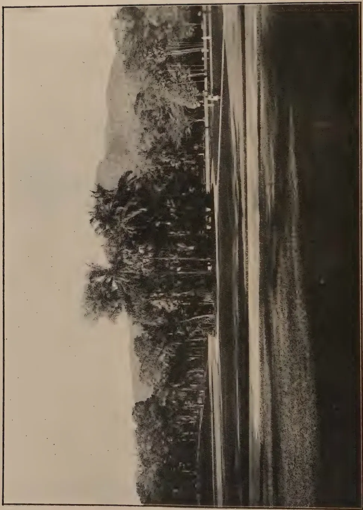

# The Tropical Agriculturist

July, 1937

---

EDITORIAL

---

## THE FRUIT COMMITTEE

---

THE article on the storage and transport of tropical fruits and vegetables by Dr. C. W. Wardlaw of the Low Temperature Research Station, Trinidad, reproduced in this number from the Journal of the Imperial College of Tropical Agriculture is of special interest to Ceylon at this moment when a Committee appointed by His Excellency the Governor is studying the position and prospects of the local fruit growing industry. In spite of the advice which the wise men who make speeches at school prize-givings and on other similar occasions give to young men to go back to the land, presumably to increase production, so far as perishable commodities are concerned the malady from which the market suffers is not starvation but surfeit. One is bound to return from a drive along some of the main roads, or visits to a few bazaars, with the conviction that during the cropping season there is a surplus of supply over demand in such articles as mangoes, pine-apples, oranges and mangosteens. The same observation applies, not during any season but throughout the year, to the more important indigenous types of vegetables. Therefore, before we invite young men to go back to the land we must find new outlets for increased production. These outlets have to be found not in increased local consumption in the fresh condition during the season, but in export and in the extension of the period of local consumption.

1------------------------------------------------

2

Tropical fruits are notoriously liable to early decay and their efficient storage and transport require scientific study and a high standard of skill gained from long experience. Dr. Wardlaw attempts "to bring together an account of the storage and transport of a number of fruits and vegetables indigenous to, or capable of being grown in the tropics." The information which he gives will be of the greatest interest to the Fruit Committee. But commercial undertakings cannot be based on this information without further trial and experiment. Of the varieties of fruit which admit of expansion in Ceylon so as to meet a foreign demand, Dr. Wardlaw refers only to bananas and avocado pears. The applicability of similar methods to the pine-apple, mango, mangosteen, papaw, etc., has to be investigated and local men must be given experience in these methods.

There will still remain the problem of the exploitation of this knowledge and experience when they are gained. Capital and enterprise must be available to explore markets, to secure shipping facilities, to establish collecting, cooling, and packing stations, to stimulate production by financial assistance in the early stages, if necessary, and to do all these things with the certainty of financial loss in the first few years, and with the uncertain prospect of eventual financial gain. Past experience does not justify the expectation that the necessary private capital and enterprise will be forthcoming from the unofficial public. It may become necessary for the State to assume the responsibility.

The Committee is called upon to examine and supply solutions to all these problems. Whatever its decision may be it is hoped that its recommendations will lead to the establishment of a large fruit growing industry, or, if that is impossible, the final acceptance of the conclusion that Ceylon cannot undertake fruit growing on a large scale.

2------------------------------------------------

3

## THE SEED TREATMENT OF GINGER

---

MALCOLM PARK, A.R.C.S.,  
*MYCOLOGIST*

---

SEED ginger, which was being stored at the Experiment Station, Peradeniya, early in 1934, was reported by the Manager to have become superficially infected by *Sclerotium rolfsii* Sacc. during damp weather. On examination it was seen that the infection was fairly extensive and the ginger was sorted. The apparently clean ginger obtained was reserved for agricultural experiments, the very severely affected ginger was discarded and the third lot, consisting of ginger which was superficially infected by *Sclerotium rolfsii* but otherwise apparently sound, was used in the experiment described below. The ginger was what is known locally as Nugegoda ginger, which is probably a degenerate strain of Cochin ginger.

The seed treatment of potatoes to control the disease caused by *Rhizoctonia solani* is practised in temperate countries and an experiment was designed to determine if seed treatment of ginger would, under Ceylon conditions, reduce the infection of the ginger by *Sclerotium rolfsii*.

### METHODS

Just over 1 cwt. of seed ginger was available for experiment. This was divided into three lots. The first lot was treated soon after the ginger had been sorted on 31st January, 1934, the second lot was treated on 4th April, shortly before planting, and the third was left untreated as a control. Treatment consisted of soaking the seed ginger in a 1 : 1,200 solution of corrosive sublimate for  $1\frac{1}{2}$  hours, in the manner described by Mason (1928, p. 499). One and one-third ounces of corrosive sublimate were dissolved in 10 gallons water in a tar barrel; the inside of the barrel was coated with tar and so was not

3------------------------------------------------

4

affected by the solution. The ginger was immersed in this solution. At the end of  $1\frac{1}{2}$  hours it was removed and dried in the open. After drying, it was again bulked.

On 7th April the ginger was planted. The lay-out of the area was in the form of a double latin square of  $3 \times 6$  plots. Each plot was 20 feet by 18 feet and the plots were separated by shallow drains 2 feet wide. The seed pieces used for planting were smaller than usual owing to the amount available and each piece was approximately 2 inches long. The weight of seed ginger used in each plot was  $6\frac{1}{4}$  lb., about one-half the usual seed-rate. The ginger was planted at distances in and between the rows of 18 in., giving 13 rows of 12 plants in each plot. All plots were mulched with paddy straw.

Counts of the numbers of plants growing in the different plots were made on 10th July and 31st July. Details of these counts are recorded in table 1.

TABLE I  
FIELD RECORDS

<table border="1">
<thead>
<tr>
<th rowspan="2">Treatment</th>
<th rowspan="2">Replication No.</th>
<th colspan="2">No. of plants observed to be growing on</th>
</tr>
<tr>
<th>10.7.34</th>
<th>31.7.34</th>
</tr>
</thead>
<tbody>
<tr>
<td rowspan="7">A (treated early)</td>
<td>1</td>
<td>79</td>
<td>111</td>
</tr>
<tr>
<td>2</td>
<td>87</td>
<td>118</td>
</tr>
<tr>
<td>3</td>
<td>68</td>
<td>118</td>
</tr>
<tr>
<td>4</td>
<td>63</td>
<td>106</td>
</tr>
<tr>
<td>5</td>
<td>53</td>
<td>112</td>
</tr>
<tr>
<td>6</td>
<td>85</td>
<td>121</td>
</tr>
<tr>
<td>Total</td>
<td>435</td>
<td>686</td>
</tr>
<tr>
<td rowspan="7">B (treated late)</td>
<td>1</td>
<td>105</td>
<td>126</td>
</tr>
<tr>
<td>2</td>
<td>95</td>
<td>128</td>
</tr>
<tr>
<td>3</td>
<td>67</td>
<td>109</td>
</tr>
<tr>
<td>4</td>
<td>85</td>
<td>127</td>
</tr>
<tr>
<td>5</td>
<td>71</td>
<td>111</td>
</tr>
<tr>
<td>6</td>
<td>75</td>
<td>127</td>
</tr>
<tr>
<td>Total</td>
<td>498</td>
<td>728</td>
</tr>
<tr>
<td rowspan="7">C (Control untreated)</td>
<td>1</td>
<td>34</td>
<td>60</td>
</tr>
<tr>
<td>2</td>
<td>32</td>
<td>67</td>
</tr>
<tr>
<td>3</td>
<td>60</td>
<td>89</td>
</tr>
<tr>
<td>4</td>
<td>32</td>
<td>54</td>
</tr>
<tr>
<td>5</td>
<td>47</td>
<td>90</td>
</tr>
<tr>
<td>6</td>
<td>40</td>
<td>110</td>
</tr>
<tr>
<td>Total</td>
<td>245</td>
<td>470</td>
</tr>
</tbody>
</table>

4------------------------------------------------

5

The growth of the ginger at and subsequent to this stage was affected considerably by the shortage of rain. Rainfall up to April 1934, was approximately normal but subsequently there was a marked shortage until October, 1934. In table 2 are given the monthly rainfall figures for the year 1934, together with the offsets from the averages for 12 years. These figures are taken from the official records (Jameson, 1935).

TABLE II

<table border="1">
<thead>
<tr>
<th>Month</th>
<th></th>
<th>Rainfall for 1934 Inches</th>
<th></th>
<th>Offset from average for 12 years Inches</th>
</tr>
</thead>
<tbody>
<tr>
<td>April</td>
<td>..</td>
<td>7.72</td>
<td>..</td>
<td>+0.5</td>
</tr>
<tr>
<td>May</td>
<td>..</td>
<td>4.84</td>
<td>..</td>
<td>-1.7</td>
</tr>
<tr>
<td>June</td>
<td>..</td>
<td>8.05</td>
<td>..</td>
<td>-2.9</td>
</tr>
<tr>
<td>July</td>
<td>..</td>
<td>3.63</td>
<td>..</td>
<td>-5.2</td>
</tr>
<tr>
<td>August</td>
<td>..</td>
<td>1.80</td>
<td>..</td>
<td>-4.7</td>
</tr>
<tr>
<td>September</td>
<td>..</td>
<td>0.73</td>
<td>..</td>
<td>-6.8</td>
</tr>
<tr>
<td>October</td>
<td>..</td>
<td>12.19</td>
<td>..</td>
<td>-0.2</td>
</tr>
<tr>
<td>November</td>
<td>..</td>
<td>6.42</td>
<td>..</td>
<td>-5.7</td>
</tr>
</tbody>
</table>

The continued shortage of water resulted in the failure of the ginger crop not only in this experiment but also in manurial and spacing trials which were being conducted in the same area. The result was that the total crop of ginger harvested was considerably less than the amount sown and no attempt could therefore be made to compute the effect of treatment on yield in this experiment. The adverse weather conditions caused crop-failures throughout Ceylon which resulted in widespread distress.

#### DISCUSSION OF RESULTS

In spite of the absence of any data on the effect of the seed treatment on yield, it is felt that the figures obtained from the observation of the emergence of plants in the different plots are so striking as to merit publication. In tables 3 and 4, statistical analyses are given of the records of the numbers of plants observed on 10th and 31st July respectively.

5------------------------------------------------

6

TABLE III  
ANALYSIS OF VARIANCE  
OF RECORD OF PLANT NUMBERS MADE ON 10.7.34.

<table border="1">
<thead>
<tr>
<th>Due to</th>
<th>D.F.</th>
<th>Sum of squares</th>
<th>Variance</th>
<th>F</th>
<th>One per cent. point</th>
</tr>
</thead>
<tbody>
<tr>
<td>Blocks</td>
<td>.. 1</td>
<td>320.88</td>
<td>320.88</td>
<td>—</td>
<td>—</td>
</tr>
<tr>
<td>Rows</td>
<td>.. 4</td>
<td>247.56</td>
<td>61.89</td>
<td>—</td>
<td>—</td>
</tr>
<tr>
<td>Columns</td>
<td>.. 4</td>
<td>984.89</td>
<td>237.22</td>
<td>—</td>
<td>—</td>
</tr>
<tr>
<td>Treatments</td>
<td>.. 2</td>
<td>5782.11</td>
<td>2891.06</td>
<td>15.96</td>
<td>10.92</td>
</tr>
<tr>
<td>Error</td>
<td>.. 6</td>
<td>1087.00</td>
<td>181.17</td>
<td>—</td>
<td>—</td>
</tr>
<tr>
<td>Total</td>
<td>.. 17</td>
<td>8386.44</td>
<td>—</td>
<td>—</td>
<td>—</td>
</tr>
<tr>
<td colspan="3">Standard Deviation</td>
<td colspan="3">=13.46</td>
</tr>
<tr>
<td colspan="3">Coefficient of Variability</td>
<td colspan="3">=20.58%</td>
</tr>
<tr>
<td colspan="2">Mean numbers of plants per plot</td>
<td>S.E. of mean</td>
<td colspan="3">Significant</td>
</tr>
<tr>
<td>A</td>
<td>B</td>
<td>C</td>
<td>General mean</td>
<td>of 6 plots</td>
<td>Difference</td>
</tr>
<tr>
<td>72.5</td>
<td>83.0</td>
<td>40.8</td>
<td>65.4</td>
<td>5.495</td>
<td>17.33</td>
</tr>
</tbody>
</table>

TABLE IV  
ANALYSIS OF VARIANCE  
OF RECORD OF PLANT NUMBERS MADE ON 31.7.34.

<table border="1">
<thead>
<tr>
<th>Due to</th>
<th>D.F.</th>
<th>Sum of squares</th>
<th>Variance</th>
<th>F</th>
<th>One per cent. point</th>
</tr>
</thead>
<tbody>
<tr>
<td>Blocks</td>
<td>.. 1</td>
<td>56.89</td>
<td>56.89</td>
<td>—</td>
<td>—</td>
</tr>
<tr>
<td>Rows</td>
<td>.. 4</td>
<td>929.78</td>
<td>232.44</td>
<td>—</td>
<td>—</td>
</tr>
<tr>
<td>Columns</td>
<td>.. 4</td>
<td>649.78</td>
<td>162.44</td>
<td>—</td>
<td>—</td>
</tr>
<tr>
<td>Treatments</td>
<td>.. 2</td>
<td>6388.00</td>
<td>3194.00</td>
<td>15.71</td>
<td>10.92</td>
</tr>
<tr>
<td>Error</td>
<td>.. 6</td>
<td>1219.55</td>
<td>203.26</td>
<td>—</td>
<td>—</td>
</tr>
<tr>
<td>Total</td>
<td>.. 17</td>
<td>9244.00</td>
<td>—</td>
<td>—</td>
<td>—</td>
</tr>
<tr>
<td colspan="3">Standard Deviation</td>
<td colspan="3">=14.26</td>
</tr>
<tr>
<td colspan="3">Coefficient of Variability</td>
<td colspan="3">=13.62%</td>
</tr>
<tr>
<td colspan="2">Mean numbers of plants per plot</td>
<td>S.E. of mean</td>
<td colspan="3">Significant</td>
</tr>
<tr>
<td>A</td>
<td>B</td>
<td>C</td>
<td>General mean</td>
<td>of 6 plots</td>
<td>Difference</td>
</tr>
<tr>
<td>114.3</td>
<td>121.3</td>
<td>78.3</td>
<td>104.7</td>
<td>5.82</td>
<td>18.12</td>
</tr>
</tbody>
</table>

In each of these it will be seen that the value of  $F$  (Snedecor, 1934) greatly exceeds the one per cent. point, which indicates that the effect of treatment is highly significant. The differences between the mean numbers of plants recorded at each observation

6------------------------------------------------

7

indicate that the treatment of seed ginger with corrosive sublimate had a marked beneficial effect on the development of the young plants when compared with the untreated plants.

The differences between the emergence of plants grown from seed treated early and treated just before planting were slight and were not significant.

#### SUMMARY

Seed ginger which was superficially infected with *Sclerotium rolfsii* was divided into three lots. The first lot was treated by immersion in a 1 : 1,200 aqueous solution of corrosive sublimate for  $1\frac{1}{2}$  hours two months before planting. The second lot was similarly treated three days before planting. The third lot was untreated and served as a control.

The ginger was planted in a double latin square of  $3 \times 6$  plots. Judging by the number of plants which developed, the treatment with corrosive sublimate had a marked beneficial effect. There was no significant difference between the effects of early and late treatment.

Subsequent weather conditions resulted in a failure of this and all other crops grown in the vicinity so that it was not possible to determine the effect of treatment on yield.

#### ACKNOWLEDGMENTS

The thanks of the author are due to Mr. W. C. Lester-Smith, Officer-in-Charge, School Farm and Experiment Station, for his assistance in laying out the plots and in supervising the planting of the ginger and to Dr. M. Fernando for his assistance with the statistical analysis.

#### REFERENCES TO LITERATURE

Fisher, R. A. 1932.—Statistical Methods for Research Workers. 4th Edition. *Oliver and Boyd, London.*

Jameson, H. 1935.—Report on the Colombo Observatory for 1934. *Ceylon Government Press.*

Mason, A. F. 1928.—Spraying, Dusting and Fumigation of Plants. *The Macmillan Company, New York.*

Snedecor, G. W. 1934.—Calculation and Interpretation of Analysis of Variance and Covariance. *Collegiate Press, Inc., Ames, Iowa.*

7------------------------------------------------

8

## MANURIAL TRIALS WITH COTTON IN CEYLON—I

A. W. R. JOACHIM, Ph.D. (Lond.), Dip. Agric. (Cantab.),  
*AGRICULTURAL CHEMIST*

**C**OTTON is grown in Ceylon almost solely as a peasant crop and on a system of rotation. Yields are satisfactory on virgin soils, but after two or three seasons they fall to a level which render the cultivation of the crop, if not unremunerative, at any rate of little economic value. With the re-introduction by Government of a system of purchase of seed cotton from village cultivators at a fixed rate (at present Rs. 12.00 per cwt.), an interest in cotton cultivation has been re-awakened and larger areas are being put under the crop each year. With a view to determining whether yields could be increased with profit to the cultivator by the application of fertilizers, preliminary manurial trials of simple design were carried out on the crop during the 1936 *maha* season at two centres, *viz.*, the Vavuniya Experiment Station in the Northern Division and the Dambulla Experiment Station in the Central Division with the co-operation of the respective Divisional Agricultural Officers. The variety of cotton grown was Cambodia. The two centres afford a marked contrast in soil conditions and were hence selected for these trials. The soil at Vavuniya is a limestone-derived loam and the site quite level. At Dambulla, on the other hand, the land is undulating and the soil a gravelly loam of shallow and uneven depth due to erosion. The average annual rainfall for the year at Vavuniya is about 63 in. and at Dambulla 68 in. The greater part of the precipitation falls, at both centres, during the north-east monsoon from October to January.

### COTTON FERTILIZER EXPERIMENTS IN OTHER COUNTRIES

Fertilizer experiments with cotton in other countries have given variable results. In the U.S.A. (1) the following

8------------------------------------------------

9

important conclusions have been drawn as a result of nearly 3,000 fertilizer tests on the crop :—(1) fertilizers give about the same increases on all classes of soil, fertile and poor ; (2) small quantities of fertilizer give as large an increase as heavy dressings and with greater profit ; (3) farmyard manure alone and in combination with potash and superphosphates gives highest yields ; (4) mineral fertilizer mixtures up to 400 lb. per acre give profitable returns.

In Texas (2) which is a large cotton-producing state in the U.S.A., the results of 151 experiments showed that farmyard manure gives highest increases and profits. Superphosphate alone at the rate of 150 to 200 lb. per acre was the most profitable artificial fertilizer to apply. Cotton seed cake and nitrate of soda also gave increased yields. Potash fertilizers were not found essential and their application is not recommended except on soils deficient in this constituent. Recent experiments in South Mississippi (3) have however indicated that potash greatly reduced the percentage of cotton rust and wilt and thus increased the yield of crop. In South Africa (4) experiments with artificial fertilizers on cotton gave similar results to those obtained in the U.S.A. Phosphoric acid in the form of superphosphate and nitrogen as sulphate of ammonia proved to be distinctly beneficial while potash was not. Farmyard and green manure have also been found profitable in that country. Recent manurial trials in Trinidad (5) indicated that compost at the rate of 10 tons per acre gave highest yields of cotton. Of artificial fertilizers the best results were obtained with a complete fertilizer. The effect of potash was very marked, but the response to phosphoric acid was much less noticeable. Potash tended to improve the quality of the fibre. Trials carried out in the Island of St. Vincent (6) during 1934 and 1935 showed that only sulphate of ammonia (at the rate of 5 cwt. per acre), cotton seed meal and the complete fertilizer gave significant increases. Sulphate of potash and superphosphate alone gave no significant yield responses.

In Egypt (7) nitrogenous fertilizers applied as nitrate of soda proved to be most profitable, the increases varying from  $1\frac{1}{2}$  to  $2\frac{1}{4}$  cwt. per acre. In general, however, it is considered

9------------------------------------------------

10

that while "fertilizers do cause important increases in yields," they do so "only within the limits imposed by the factor or factors determining the yield level."

In India the value of farmyard manure, compost and green manure for cotton is well recognised. Artificial fertilizers give variable results depending on soil, climatic and cultural factors and on the variety of cotton grown. In the Sind (8) the application of compost ( $7\frac{1}{2}$  cart loads per acre) along with sulphate of ammonia (up to 200 lb.) gave best results. An excessive supply of nitrogen seems to increase the susceptibility of the crop to cotton wilt (8).

### EXPERIMENTAL

In the absence of any reliable data on cotton manuring in Ceylon, a scheme of trials was designed to test the essential fertilizer requirements of the crop under local conditions. The six treatments, were as follows :

1. 1. Control.
2. 2. Nitrogen alone as sulphate of ammonia at the rate of 2 cwt. per acre.
3. 3. Phosphoric acid alone as superphosphate at the rate of 2 cwt. per acre.
4. 4. Potash alone as sulphate of potash at the rate of  $\frac{1}{2}$  cwt. per acre.
5. 5. A complete mixture consisting of 2, 3 and 4 above.
6. 6. Cattle manure at the rate of 5 tons per acre.

The artificial fertilizers were applied in the rows about a month after sowing, and the cattle manure at the time the area was ploughed. The experiment was laid out in four randomized blocks each comprising of six plots. The plot size varied at the two centres from  $\frac{1}{3}$ rd to  $\frac{1}{4}$ rd of an acre respectively owing to considerations of space. Border rows were allowed for, and shallow drains separated one plot from another in a block, while the blocks themselves, where contiguous, were separated from each other by deeper drains. The usual planting practice adopted in Ceylon was followed. Observations were recorded, as far as was possible, of the approximate rates of growth of crop, incidence of pests and diseases, rainfall, periods of flowering, setting of bolls, etc. in the various plots. No separate records of crop at each picking were kept, only the total yields in pounds of seed cotton per plot (to the nearest quarter lb.) being determined.

10------------------------------------------------

11RESULTS AND DISCUSSION

The details of each experiment are described separately in papers II and III of this series. In this article the results of each trial will be briefly discussed and compared, and such conclusions drawn from the consideration of the combined data as would appear obvious. In table I below the results obtained from both trials are presented for comparison. The yield data of treatments showing significant increases over the control are indicated in bold type.

TABLE I  
YIELDS OF SEED COTTON IN LB. PER ACRE

<table border="1">
<thead>
<tr>
<th></th>
<th><i>Treatment</i></th>
<th><i>Vavuniya</i></th>
<th><i>% Increase over Control</i></th>
<th><i>Dambulla</i></th>
<th><i>% Increase over Control</i></th>
</tr>
</thead>
<tbody>
<tr>
<td>1.</td>
<td>Control ..</td>
<td>667.8</td>
<td>—</td>
<td>307.8</td>
<td>—</td>
</tr>
<tr>
<td>2.</td>
<td>Nitrogen (Sulphate of ammonia) ..</td>
<td><b>945.0</b></td>
<td>41.5</td>
<td><b>501.4</b></td>
<td>62.9</td>
</tr>
<tr>
<td>3.</td>
<td>Phosphoric Acid (Superphosphate) ..</td>
<td>783.1</td>
<td>17.3</td>
<td>310.4</td>
<td>0.8</td>
</tr>
<tr>
<td>4.</td>
<td>Potash (Sulphate of potash) ..</td>
<td>796.0</td>
<td>19.2</td>
<td>284.1</td>
<td>-7.7</td>
</tr>
<tr>
<td>5.</td>
<td>Complete Mixture (2 + 3 + 4) ..</td>
<td>770.8</td>
<td>15.4</td>
<td>450.9</td>
<td>46.5</td>
</tr>
<tr>
<td>6.</td>
<td>Cattle Manure ..</td>
<td><b>865.1</b></td>
<td>29.6</td>
<td><b>464.5</b></td>
<td>50.9</td>
</tr>
<tr>
<td></td>
<td>Mean lb. ..</td>
<td>804.5</td>
<td></td>
<td>386.5</td>
<td></td>
</tr>
<tr>
<td></td>
<td>Mean cwt. ..</td>
<td>7.18</td>
<td></td>
<td>3.45</td>
<td></td>
</tr>
<tr>
<td></td>
<td>Standard Error of mean</td>
<td>52.1</td>
<td></td>
<td>52.9</td>
<td></td>
</tr>
<tr>
<td></td>
<td>Standard Error (% of mean) ..</td>
<td>6.47</td>
<td></td>
<td>13.68</td>
<td></td>
</tr>
<tr>
<td></td>
<td>Significant Difference:</td>
<td></td>
<td></td>
<td></td>
<td></td>
</tr>
<tr>
<td></td>
<td>P = .05 ..</td>
<td>157.1</td>
<td></td>
<td>159.2</td>
<td></td>
</tr>
<tr>
<td></td>
<td>P = .02 ..</td>
<td>191.8</td>
<td></td>
<td>194.5</td>
<td></td>
</tr>
<tr>
<td></td>
<td>P = .01 ..</td>
<td>217.1</td>
<td></td>
<td>220.4</td>
<td></td>
</tr>
</tbody>
</table>

It will be observed that the average yield of seed cotton per acre at Vavuniya (804.5 lb.) is over twice that at Dambulla (386.5 lb.). This marked difference can be attributed largely to soil conditions. The average yield at Vavuniya is quite high when compared with the Ceylon average while even the Dambulla average is above the normal. At both centres nitrogen alone, applied as sulphate of ammonia at the rate of 2 cwt. per acre, gave highest yields. Cattle manure applied

11------------------------------------------------

12

at 5 tons per acre was the only other treatment which produced significant increases in yields. The increase with nitrogen alone was 277 lb. (approx.  $2\frac{1}{2}$  cwt.) per acre or 42 per cent. over the control at Vavuniya, and 194 lb. (approx.  $1\frac{3}{4}$  cwt.) per acre or 63 per cent. over the control at Dambulla. With cattle manure the corresponding increases were 197 lb. or  $1\frac{3}{4}$  cwt. and 157 lb. or about  $1\frac{1}{2}$  cwt. Neither potash nor phosphoric acid gave significant yield increases at either centre, though at Vavuniya these fertilizers appear to have had some beneficial effect. The complete mixture again, which one would normally have expected to give increases comparable to those of nitrogen alone, has not produced significant increases at either centre, although increases of 143 and 103 lb. per acre respectively were obtained as a result of this treatment at Dambulla and Vavuniya. The reasons for this disappointing result will be discussed in the papers to follow. By a strange coincidence, the absolute standard error of the mean and the significant differences for varying probabilities are about the same in both experiments, though the standard error expressed as a percentage of the mean is over twice as much at Dambulla as at Vavuniya. This observation can be attributed to the much greater soil heterogeneity of the Dambulla experimental site.

### ECONOMICS OF MANURING

Working on the average figures obtained in these trials and reckoning on a price of seed cotton of Rs. 12.00 per cwt., of sulphate of ammonia and its application at Rs. 7.00 per cwt. and of cattle manure and its application at Rs. 3.00 and Rs. 2.50 per ton at Vavuniya and Dambulla respectively, the economic returns from manuring cotton with 2 cwt. of the former and 5 tons of the latter per acre, assuming that the whole crop was first grade cotton, are Rs. 15.00 and Rs. 9.00 per acre respectively at Vavuniya, and Rs. 6.00 and Rs. 4.00 per acre respectively at Dambulla. These figures are, however, only indications of what returns may be expected from manuring cotton.

### SUMMARY AND CONCLUSION

Preliminary manurial trials on cotton at two centres in Ceylon affording a marked contrast of soil type and configuration—at Vavuniya on a level, uniformly deep, lime-stone-

12------------------------------------------------

13

derived loam and at Dambulla on an undulating, unevenly shallow, lateritic gravel loam have indicated that at both places, significant yield increases and enhanced economic returns are obtained by the application of sulphate of ammonia at the rate of 2 cwt. per acre and cattle manure at the rate of 5 tons per acre. The profits from manuring varied from Rs. 4.00 to Rs. 15.00 per acre. In respect of crop response to artificial nitrogen alone these results conform with those obtained in Egypt and St. Vincent, and with those of most cotton-producing countries in respect of its response to farmyard manure. Further experiments are, however, necessary to determine the optimum quantities and times of application of these manures on varying soil types, and the proportions of other fertilizers they require to be supplemented with to produce the best results from the standpoints of yield and quality of cotton and economic returns.

#### ACKNOWLEDGMENT

It is with pleasure that I acknowledge the fullest co-operation extended to me in this work by Mr. W. R. C. Paul, Divisional Agricultural Officer, Northern and Mr. H. A. Pieris, Divisional Agricultural Officer, Central. My thanks are due to the Agricultural Instructors of Vavuniya and Dambulla, Messrs S. Balasingham and K. M. B. Ranasinghe respectively for having kept the records of these trials.

#### REFERENCES

1. 1. Fertilizers for Cotton Soils. M. Whitney. *U.S.A. Dept. Agr., Bul.* No. 62.
2. 2. Co-operative Fertilizer Experiments with Cotton, etc. G. S. Fraps. *Texas Agr. Expt. St., Bul.* No. 235.
3. 3. Potash for Cotton Wilt and Rust in South Mississippi. Rep. from "Better Crops with Plant Food, May 1936." L. E. Miles.
4. 4. Cotton Fertilizer Trials. T. D. Hall. *Dept. Agr., S. Afr. Chem. Series* No. 69.
5. 5. Potash Starvation and the Cotton Plant. R. C. Wood. *Emp. Cotton Grow. Rev.* Vol. XI, 1934, No. 1.
6. 6. *Rept. of Agr. Dept., St. Vincent.* 1934 and 1935.
7. 7. An Analysis of the Factors Governing the Response to Manuring of Cotton in Egypt. D. S. Gracie and F. Khalil. *Min. Agr., Egypt., Tech. Sc. Ser. Bul.* No. 152, 1935.
8. 8. *Annual Rept. of Indian Centr. Cotton Committee.* 1935 and 1936.

13------------------------------------------------

14

## MANURIAL TRIALS WITH COTTON IN CEYLON—II

A. W. R. JOACHIM, Ph.D. (Lond.), Dip. Agric. (Cantab.),  
*AGRICULTURAL CHEMIST*

AND

W. R. C. PAUL, M.A., M.Sc., D.I.C., Dip. Agric. (Cantab.),  
*DIVISIONAL AGRICULTURAL OFFICER, NORTHERN*

IN this paper are detailed the results of a manurial trial on cotton carried out at the Vavuniya Experiment Station during the 1936 *maha* season. The site chosen for the experiment was typical of much of the land in the district, being level and of a reasonably uniform soil condition. The soil itself is a fairly deep well-drained, chocolate red loam, moderately well supplied with bases but poor in organic matter and nitrogen, neutral in reaction and of the non-lateritic type. The average annual rainfall at Vavuniya is about 63 inches, most of which falls during the north-east monsoon, from October to December. During the period of the trial, which lasted from the middle of October, 1936 to the beginning of May, 1937, the distribution of rainfall was as follows :

<table border="1">
<thead>
<tr>
<th></th>
<th></th>
<th><i>No. of Rainy Days</i></th>
<th><i>Total Rainfall (inches)</i></th>
</tr>
</thead>
<tbody>
<tr>
<td>October, 13th-31st</td>
<td>..</td>
<td>10</td>
<td>5.06</td>
</tr>
<tr>
<td>November</td>
<td>..</td>
<td>18</td>
<td>11.94</td>
</tr>
<tr>
<td>December</td>
<td>..</td>
<td>17</td>
<td>13.13</td>
</tr>
<tr>
<td>January</td>
<td>..</td>
<td>13</td>
<td>4.47</td>
</tr>
<tr>
<td>February</td>
<td>..</td>
<td>4</td>
<td>2.87</td>
</tr>
<tr>
<td>March</td>
<td>..</td>
<td>4</td>
<td>1.07</td>
</tr>
<tr>
<td>April</td>
<td>..</td>
<td>8</td>
<td>2.34</td>
</tr>
<tr>
<td>May</td>
<td>..</td>
<td>2</td>
<td>2.04</td>
</tr>
<tr>
<td></td>
<td></td>
<td>76</td>
<td>42.92</td>
</tr>
</tbody>
</table>

14------------------------------------------------

15

### EXPERIMENTAL DESIGN

The trial was laid out on the randomized block design, there being four blocks each containing six plots, one for each treatment. Each plot was of 40 ft. by 60 ft. in size or approximately  $\frac{1}{18}$ th of an acre, but omitting border rows the actual harvested area per plot was  $\frac{1}{3 \times 6}$  or .0298 acre. Each plot contained ten rows 3 ft. apart, the plants being 2 ft. distant in the rows. A drain 6 in. by 4 in. separated one plot from another in a block, while the blocks themselves were separated from each other by larger drains.

The six treatments were as follows :

1. Control. 2. Nitrogen alone as sulphate of ammonia at the rate of 2 cwt. per acre or 12 lb. per plot. 3. Phosphoric acid alone at the rate of 2 cwt. of superphosphate per acre or 12 lb. per plot. 4. Potash alone, at the rate of  $\frac{1}{2}$  cwt. of sulphate of potash per acre or 3 lb. per plot. 5. Complete mixture : nitrogen, potash and phosphoric acid in the aforementioned quantities. 6. Cattle manure at the rate of 4 tons per acre or 500 lb. per plot. The nitrogen content of the manure being 0.63 per cent., the application was equivalent to one of 56 lb. of nitrogen per acre.

### PLANTING DETAILS

The variety of cotton grown was Cambodia. Prior to the planting of cotton the experimental area was under a crop of sunn hemp which was sown on July 29th, 1936 and ploughed in on September 15th and 16th. Planting was done on October 13th, the cattle manure having been applied three days earlier. Five seeds were sown to a hole and germination was noted on October 15th and 18th. Vacancies were filled on October 26th and weeding was done between October 19th and November 3rd respectively. On October 31st the Planet Junior Cultivator was used between the rows. Thinning of the plants in the rows (two being left per hole) was carried out on November 13th. Earthing up was begun on the same day and followed by the application of fertilizers along the rows on the 14th and 15th.

15------------------------------------------------

16OBSERVATIONS

In the early stages of crop growth, a leaf-eating caterpillar (*Sylepta derogata*) and the boll worm (*Earias* spp.) were noticed on the plots. These were regularly picked and destroyed. The effects of the nitrogen fertilizer as well as of the cattle manure were apparent from the start. The plants began to branch about November 20th and to flower about November 25th. Cotton leaf roller (*Sylepta derogata*) was noted on the plants in December and these too were picked and destroyed. A stem borer (*Zeuzera coffeeae*) attacked a few of the plants about the end of January. The setting of bolls was observed during the third week of December about two months after flowering. On December 23rd the average heights of crop in the differently treated plots were as follows: complete mixture, 4 ft. 11 in.; nitrogen alone, 4 ft. 8 in.; phosphoric acid 4 ft. 2 in.; cattle manure, potash and control, 4 ft. 1 in. Harvesting was begun on February 27th, 1937 and continued up to May 10th. The red bug (*Dysdercus cingulatus*) was noticed on the plots on March 8th, and was picked and destroyed. Owing to an unexpected gale accompanied by heavy rain on March 11th just before blocks B and D were to be picked, a good portion of the crop from these blocks could not be gathered. This fact is reflected in the lower yields of these blocks and, in particular of the complete mixture plots, and may partly explain the unexpectedly disappointing result obtained from the complete mixture treatment despite the fair promise it gave. The total yield of crop from each plot was recorded to the nearest quarter lb. of ungraded cotton. No separate records were kept of weights of crop at each picking.

RESULTS AND DISCUSSION

The yields of cotton recorded in  $\frac{1}{4}$  lb. per plot are shown in table I below. The treatments are indicated by the numbers already assigned above to them. The analysis of the results by the method of variance is shown in table II.

16------------------------------------------------

17

TABLE I  
YIELDS IN 1/4 LB. PER PLOT

<table border="1">
<thead>
<tr>
<th></th>
<th>Treatments :</th>
<th>1</th>
<th>2</th>
<th>3</th>
<th>4</th>
<th>5</th>
<th>6</th>
<th>Total</th>
</tr>
</thead>
<tbody>
<tr>
<td>Blocks A</td>
<td>..</td>
<td>103</td>
<td>108</td>
<td>87</td>
<td>77</td>
<td>106</td>
<td>102</td>
<td>583</td>
</tr>
<tr>
<td>  B</td>
<td>..</td>
<td>52</td>
<td>108</td>
<td>77</td>
<td>104</td>
<td>82</td>
<td>89</td>
<td>512</td>
</tr>
<tr>
<td>  C</td>
<td>..</td>
<td>80</td>
<td>132</td>
<td>108</td>
<td>97</td>
<td>96</td>
<td>127</td>
<td>640</td>
</tr>
<tr>
<td>  D</td>
<td>..</td>
<td>83</td>
<td>102</td>
<td>101</td>
<td>101</td>
<td>83</td>
<td>94</td>
<td>564</td>
</tr>
<tr>
<td></td>
<td></td>
<td>318</td>
<td>450</td>
<td>373</td>
<td>379</td>
<td>367</td>
<td>412</td>
<td>2299</td>
</tr>
<tr>
<td>Mean (in 1/4 lb.)</td>
<td>..</td>
<td>.79.5</td>
<td>112.5</td>
<td>93.25</td>
<td>94.75</td>
<td>91.75</td>
<td>103</td>
<td>95.8</td>
</tr>
<tr>
<td>Mean lb.</td>
<td>..</td>
<td>.19.87</td>
<td>28.12</td>
<td>23.31</td>
<td>23.69</td>
<td>22.94</td>
<td>25.75</td>
<td>23.95 General mean</td>
</tr>
</tbody>
</table>

TABLE II  
ANALYSIS OF VARIANCE

<table border="1">
<thead>
<tr>
<th></th>
<th>Degrees of Freedom</th>
<th>Sum of Squares</th>
<th>Mean Square</th>
<th>1/2 Loge Mean Square</th>
</tr>
</thead>
<tbody>
<tr>
<td>Blocks</td>
<td>..</td>
<td>1813.125</td>
<td>604.375</td>
<td>.8786.</td>
</tr>
<tr>
<td>Treatments</td>
<td>..</td>
<td>2898.375</td>
<td>579.675</td>
<td>.2160</td>
</tr>
<tr>
<td>Error</td>
<td>..</td>
<td>2311.125</td>
<td>154.075</td>
<td></td>
</tr>
<tr>
<td></td>
<td></td>
<td></td>
<td></td>
<td></td>
</tr>
<tr>
<td>Total</td>
<td>..</td>
<td>7022.625</td>
<td></td>
<td></td>
</tr>
</tbody>
</table>

$Z(\text{calc.}) = .6626$ ;  $Z(\text{sig.})$  for  $n_1 = 5$ ,  $n_2 = 15$ ,  $\begin{cases} P = .05 \text{ is } .5326 \\ P = .01 \text{ is } .7582 \end{cases}$

Treatments are significant to  $P = .05$  though not to  $P = .01$

17------------------------------------------------

18

The *Z* test indicates that the results of treatments are significant with a probability of 20 to 1. The further analysis of the results is presented in table III. The figures in bold type represent those treatments which are significant.

TABLE III

<table border="1">
<thead>
<tr>
<th></th>
<th></th>
<th></th>
<th><i>Mean yield per plot lb. seed cotton</i></th>
<th><i>Mean yield per acre lb. seed cotton</i></th>
<th><i>Difference from control lb. seed cotton</i></th>
</tr>
</thead>
<tbody>
<tr>
<td>1.</td>
<td>Control</td>
<td>.. ..</td>
<td>19.87</td>
<td>667.8</td>
<td>—</td>
</tr>
<tr>
<td>2.</td>
<td>Nitrogen</td>
<td>.. ..</td>
<td><b>28.12</b></td>
<td><b>945.0</b></td>
<td><b>277.2</b></td>
</tr>
<tr>
<td>3.</td>
<td>Phosphoric Acid</td>
<td>.. ..</td>
<td>23.31</td>
<td>783.1</td>
<td>115.3</td>
</tr>
<tr>
<td>4.</td>
<td>Potash</td>
<td>.. ..</td>
<td>23.69</td>
<td>796.0</td>
<td>128.2</td>
</tr>
<tr>
<td>5.</td>
<td>Complete Mixture</td>
<td>.. ..</td>
<td>22.94</td>
<td>770.8</td>
<td>103.0</td>
</tr>
<tr>
<td>6.</td>
<td>Cattle Manure</td>
<td>.. ..</td>
<td><b>25.75</b></td>
<td><b>865.1</b></td>
<td><b>197.3</b></td>
</tr>
<tr>
<td></td>
<td>Mean</td>
<td>.. ..</td>
<td>23.95</td>
<td>804.5</td>
<td></td>
</tr>
<tr>
<td></td>
<td>Standard Error of Mean</td>
<td></td>
<td>1.55</td>
<td>52.1</td>
<td></td>
</tr>
<tr>
<td></td>
<td colspan="5">Significant Difference for :</td>
</tr>
<tr>
<td></td>
<td><math>P = .01</math></td>
<td>.. ..</td>
<td>6.465</td>
<td>217.1</td>
<td></td>
</tr>
<tr>
<td></td>
<td><math>P = .02</math></td>
<td>.. ..</td>
<td>5.71</td>
<td>191.8</td>
<td></td>
</tr>
<tr>
<td></td>
<td><math>P = .05</math></td>
<td>.. ..</td>
<td>4.675</td>
<td>157.1</td>
<td></td>
</tr>
</tbody>
</table>

A glance at this table will show that nitrogen alone (as sulphate of ammonia) as well as cattle manure give definitely significant increases of 277 lb. and 197 lb. respectively of seed cotton per acre, the former with a probability of 100 to 1 and the latter with a probability of 50 to 1 that the difference is not due to chance. These results are not surprising in view of the deficiency of the soil in nitrogen and organic matter. Increases though not significant, of over 100 lb. per acre have, however, been obtained with the other treatments as well. The failure of the complete mixture plots to give a significant increase was unexpected. This, as has already been pointed out, is due in part to the unusual incidence of rain and wind just before blocks B and D were to be picked. The resultant loss of crop, especially from those plots in which the crop was at its best (and these were probably among them) would have been appreciable. The other reason which has possibly contributed to this result is that the spacing of plants in these plots had proved too close,

18------------------------------------------------

19

the vegetative growth being excessive. Potash and phosphoric acid, though of sufficient quantity in this soil, may yet be required in small quantities for optimum results. Future experiments will no doubt throw light on these points. The average yield of crop on the experimental area is 804 lb. and of the control 668 lb. These figures are appreciably higher than the Ceylon average yield of cotton and would point to the suitability of the district for the crop. The fact that the area had prior to planting with cotton been green manured with a crop of sunn hemp has doubtless contributed to the high yield.

#### ECONOMICS OF MANURING

In table IV are shown the nett returns as a result of manuring the crop.

TABLE IV

<table border="1">
<thead>
<tr>
<th></th>
<th><i>Gross Revenue</i> Rs. cts.</th>
<th><i>Cost of Application</i> Rs. cts.</th>
<th><i>Nett Profit per acre</i> Rs. cts.</th>
</tr>
</thead>
<tbody>
<tr>
<td>2 cwt. sulphate of ammonia ..</td>
<td>29.70</td>
<td>14.00</td>
<td>15.70</td>
</tr>
<tr>
<td>4 tons cattle manure at Rs. 3.00 per ton .. ..</td>
<td>21.10</td>
<td>12.00</td>
<td>9.10</td>
</tr>
</tbody>
</table>

On the basis of a price of Rs. 12.00 per cwt. of first grade seed cotton, of Rs. 7.00 per cwt. of sulphate of ammonia and Rs. 3.00 per ton of cattle manure, including the cost of application of the treatments, the nett returns are approximately Rs. 15.00 and Rs. 9.00 per acre respectively from applications of sulphate of ammonia and cattle manure in the quantities specified, reckoning that the whole crop is of first grade. These returns cannot be regarded with any degree of finality. All that could be stated for the present is that there is every likelihood of profitable returns being obtained by manuring cotton with sulphate of ammonia and cattle manure on soils of this type.

#### ACKNOWLEDGMENT

Thanks are due to Mr. S. Balasingham, Farm Manager, Vavuniya Station for his work in connection with this trial.

19------------------------------------------------

20

## MANURIAL TRIALS WITH COTTON IN CEYLON—III

A. W. R. JOACHIM, Ph.D. (Lond.), Dip. Agric. (Cantab.),  
AGRICULTURAL CHEMIST

AND

H. A. PIERIS, B.A. (Cantab.), A.I.C.T.A. (Trinidad),  
DIVISIONAL AGRICULTURAL OFFICER, CENTRAL

THE cotton manurial trial described in this paper was conducted at the Pelwehera dry zone rotation station near Dambulla during the 1936 *maha* season. The experimental area was selected from a block of nine acres under the crop. It was somewhat undulating, of shallow, uneven soil depth, and generally of poor fertility. The soil is a gravelly loam of the lateritic type, poor in organic matter, nitrogen and bases, and acid in reaction. It is typical of the poor eroded soils of the dry zone. The average annual rainfall of the district is 68 inches, the major part of which falls during the north-east monsoon. The rainfall distribution during the period of the trial was as follows :

<table border="1">
<thead>
<tr>
<th></th>
<th>No. of Rainy Days</th>
<th>Total Rainfall (inches)</th>
</tr>
</thead>
<tbody>
<tr>
<td>October (29th and 30th) ..</td>
<td>2</td>
<td>0.65</td>
</tr>
<tr>
<td>November .. ..</td>
<td>15</td>
<td>5.45</td>
</tr>
<tr>
<td>December .. ..</td>
<td>16</td>
<td>15.93</td>
</tr>
<tr>
<td>January, 1937 .. ..</td>
<td>13</td>
<td>9.99</td>
</tr>
<tr>
<td>February .. ..</td>
<td>9</td>
<td>3.66</td>
</tr>
<tr>
<td>March .. ..</td>
<td>2</td>
<td>4.18</td>
</tr>
<tr>
<td>April .. ..</td>
<td>7</td>
<td>0.98</td>
</tr>
<tr>
<td></td>
<td>64</td>
<td>40.84</td>
</tr>
</tbody>
</table>

20------------------------------------------------

21

## EXPERIMENTAL DESIGN

The experiment was laid down in four randomised blocks of six treatments each. The size of a plot was 40 ft. by 50 ft. external dimensions, the harvested area omitting border rows being  $\frac{1}{42.5}$  or .0235 acre. The spacing of the plants in the plots was 3 ft. by 2 ft., the number of rows being ten per plot. The blocks and plots were separated from each other by drains. The treatments were identical with those of the Vavuniya experiment described in paper II of this series. They were : 1. control; 2. nitrogen alone as sulphate of ammonia at the rate of 10 lb. per plot or 2 cwt. per acre; 3. phosphoric acid as superphosphate at the rate of 10 lb. per plot or 2 cwt. per acre; 4. complete mixture comprised of 2, 3 and 4 aforementioned; 5. cattle manure at the rate of 500 lb. per plot or approximately 5 tons per acre. The nitrogen content of a representative sample being 0.58 per cent., the cattle manure application was equivalent to one of 65 lb. of nitrogen.

## PLANTING DETAILS AND OBSERVATIONS

Cattle manure was applied at the time of ploughing the land in the middle of October. Sowing was done on October 29th at the rate of five seed to a hole (and the plants thinned out later). Vacancies were supplied on the 12th and 21st November. Seven weedings were given during the growing period. Earthing up was done once in November and again on December 9th when the artificial fertilizers were applied. Flowering was first noted on the 13th January, 1937. The leaf roller pest (*Sylepta derogata*) was noticed early in January. Hand picking was adopted as a daily routine measure. The attack was slight and evenly distributed over the plots. From the start the plots manured with cattle manure, nitrogen and complete mixture showed up better than the others. The growth in all plots was generally poor, as would be expected considering the nature of the soil.

## RESULTS AND DISCUSSION

The yields of crop in quarter pounds per plot are shown in table I and the analysis of the results by the method of variance in table II.

21------------------------------------------------

22

TABLE I  
YIELDS PER PLOT IN 1/4 LB. BLOCKS

<table border="1">
<thead>
<tr>
<th rowspan="2">Treatments :</th>
<th colspan="4">Blocks</th>
<th rowspan="2">D</th>
<th rowspan="2">Total</th>
<th rowspan="2">Mean Per Plot (1/4 lb.)</th>
<th rowspan="2">Mean Per Plot (lb.)</th>
</tr>
<tr>
<th>A</th>
<th>B</th>
<th>C</th>
<th></th>
</tr>
</thead>
<tbody>
<tr>
<td>1. Control ..</td>
<td>24</td>
<td>20</td>
<td>32</td>
<td>40</td>
<td>116</td>
<td>29</td>
<td>7.25</td>
</tr>
<tr>
<td>2. Nitrogen ..</td>
<td>52</td>
<td>44</td>
<td>25</td>
<td>68</td>
<td>189</td>
<td>47.25</td>
<td>11.81</td>
</tr>
<tr>
<td>3. Phosphoric Acid ..</td>
<td>18</td>
<td>36</td>
<td>31</td>
<td>32</td>
<td>117</td>
<td>29.25</td>
<td>7.31</td>
</tr>
<tr>
<td>4. Potash ..</td>
<td>14</td>
<td>18</td>
<td>41</td>
<td>34</td>
<td>107</td>
<td>26.75</td>
<td>6.69</td>
</tr>
<tr>
<td>5. Complete Mixture ..</td>
<td>37</td>
<td>50</td>
<td>36</td>
<td>47</td>
<td>170</td>
<td>42.5</td>
<td>10.62</td>
</tr>
<tr>
<td>6. Cattle Manure ..</td>
<td>43</td>
<td>42</td>
<td>33</td>
<td>57</td>
<td>175</td>
<td>43.75</td>
<td>10.94</td>
</tr>
<tr>
<td></td>
<td>188</td>
<td>210</td>
<td>198</td>
<td>278</td>
<td>874</td>
<td></td>
<td></td>
</tr>
<tr>
<td></td>
<td colspan="4">General Mean</td>
<td></td>
<td>36.41</td>
<td>9.1</td>
</tr>
</tbody>
</table>

TABLE II  
ANALYSIS OF VARIANCE

<table border="1">
<thead>
<tr>
<th></th>
<th>Degrees of Freedom</th>
<th>Sum of Squares</th>
<th>Mean Square</th>
<th>1, 2 Log. Mean Square</th>
</tr>
</thead>
<tbody>
<tr>
<td>Blocks</td>
<td>..</td>
<td>826.67</td>
<td>275.56</td>
<td></td>
</tr>
<tr>
<td>Treatments</td>
<td>3</td>
<td>1631.83</td>
<td>326.36</td>
<td>1.743</td>
</tr>
<tr>
<td>Error ..</td>
<td>5</td>
<td>1489.33</td>
<td>99.29</td>
<td>1.148</td>
</tr>
<tr>
<td>Total</td>
<td>15</td>
<td>3947.83</td>
<td></td>
<td></td>
</tr>
<tr>
<td></td>
<td>23</td>
<td></td>
<td></td>
<td></td>
</tr>
</tbody>
</table>

$Z$  (Calc.) = .595 ;  $Z$  (sig.) for  $n_1 = 5$ ,  $n_2 = 15$ ,  $P = .05$  is .5326  
Treatments are significant to  $P = .05$

22------------------------------------------------

23

The *Z* test indicates that the results of treatments are significant with a probability of 20 to 1. The further analysis of the results is presented in table III. The figures in bold type represent those treatments which are significant.

TABLE III

<table border="1">
<thead>
<tr>
<th></th>
<th><i>Mean yield per plot lb. seed cotton</i></th>
<th><i>Mean yield per acre lb. seed cotton</i></th>
<th><i>Difference from control lb. seed cotton</i></th>
</tr>
</thead>
<tbody>
<tr>
<td>Control .. ..</td>
<td>7.25</td>
<td>307.8</td>
<td>—</td>
</tr>
<tr>
<td>Nitrogen .. ..</td>
<td><b>11.81</b></td>
<td><b>501.4</b></td>
<td><b>193.6</b></td>
</tr>
<tr>
<td>Phosphoric Acid .. ..</td>
<td>7.31</td>
<td>310.4</td>
<td>2.6</td>
</tr>
<tr>
<td>Potash .. ..</td>
<td>6.69</td>
<td>284.1</td>
<td>23.7</td>
</tr>
<tr>
<td>Complete Mixture .. ..</td>
<td>10.62</td>
<td>450.9</td>
<td>143.1</td>
</tr>
<tr>
<td>Cattle Manure .. ..</td>
<td><b>10.94</b></td>
<td><b>464.5</b></td>
<td><b>156.7</b></td>
</tr>
<tr>
<td>Mean .. ..</td>
<td>9.1</td>
<td>386.5</td>
<td></td>
</tr>
<tr>
<td>Standard Error of Mean</td>
<td>1.245</td>
<td>52.9</td>
<td></td>
</tr>
<tr>
<td>Significant Difference for:</td>
<td></td>
<td></td>
<td></td>
</tr>
<tr>
<td><math>P = .05</math> .. ..</td>
<td>3.75</td>
<td>159.2</td>
<td></td>
</tr>
<tr>
<td><math>P = .02</math> .. ..</td>
<td>4.58</td>
<td>194.5</td>
<td></td>
</tr>
</tbody>
</table>

It will be observed from this table that nitrogen alone (as sulphate of ammonia) and cattle manure have given significant increases in yields, the former with a probability of 50 to 1 that the result is not due to chance and the latter with a probability of 20 to 1. The actual yield increases were 193 lb. or 63 per cent. and 156 lb. or 50 per cent. over the control respectively. These results were unexpected considering the poor fertility of the soil. The complete mixture has given an increase of 143 lb. or 46 per cent. over the control, though the increase is not statistically significant. There are indications, however, that the complete mixture would give significant increases on these soils under other circumstances. The economic returns might, however, be small. There has been no response to potash and phosphoric acid; in fact the former has caused a decrease in crop yield on the control, which though far from being significant is noteworthy. These results are surprising and further trials will be necessary to confirm the need or otherwise of the crop for these fertilizers on this type of soil. The yield of crop on

23------------------------------------------------

24

the experimental area is 386 lb. per acre, and of the control 308 lb. These yields are good considering the type of soil.

#### ECONOMICS OF MANURING

In table IV below are indicated the nett returns from manuring under the conditions of the experiment.

TABLE IV

<table border="1">
<thead>
<tr>
<th></th>
<th><i>Gross Revenue</i></th>
<th><i>Cost of Manure + Application</i></th>
<th><i>Net Profit per acre</i></th>
</tr>
<tr>
<th></th>
<th>Rs. cts.</th>
<th>Rs. cts.</th>
<th>Rs. cts.</th>
</tr>
</thead>
<tbody>
<tr>
<td>2 cwt. sulphate of ammonia</td>
<td>20.75</td>
<td>14.00</td>
<td>6.75</td>
</tr>
<tr>
<td>5 tons cattle manure at Rs. 2.50 per ton</td>
<td>.. 16.80</td>
<td>12.50</td>
<td>4.30</td>
</tr>
</tbody>
</table>

The price of seed cotton is reckoned at Rs. 12.00 per cwt., of sulphate of ammonia and its application at Rs. 7.00 per cwt., and of cattle manure and its application at Rs. 2.50 per ton. On these data, the nett returns from applications of sulphate of ammonia and cattle manure are Rs. 6.75 and Rs. 4.00 per acre respectively. These figures are, however, merely indicative and would vary from season to season.

#### ACKNOWLEDGMENT

Thanks are due to Mr. K. M. B. Ranasinghe, Farm Manager, Dambulla Station, for his work in connection with this trial.

24------------------------------------------------

This image is a scan of a blank page. The paper has a light beige or cream-colored tint. There are a few very small, dark specks scattered across the surface, which appear to be scanning artifacts or dust particles. No text, lines, or other markings are present on the page.

25------------------------------------------------

A black and white photograph of the orchid Vanda Coerulea. The plant is shown in its natural habitat, with a thick, textured tree trunk on the left. A long, slender stem extends from the base, bearing several large, broad, heart-shaped leaves and a cluster of small, light-colored flowers at the tip. The background is dark and out of focus, suggesting a dense forest environment. The lighting is dramatic, highlighting the plant against the dark surroundings.

Block by Survey Dept Ceylon 20-7-37.

*Vanda Coerulea* Griff.

26------------------------------------------------

25

## NOTES ON ORCHIDS CULTIVATED IN CEYLON

---

### *VANDA COERULEA* GRIFF.

---

K. J. ALEX SYLVA, F.R.H.S.,

SUPERINTENDENT OF MUNICIPAL PARKS, COLOMBO

---

**V***ANDA coerulea* is indigenous to Burma and Northern India where it is found on trees and low shrubs at altitudes varying from 3,000 to 5,000 feet. In Upper Assam this species is said to luxuriate and rapidly increase in size and flower profusely particularly in exposed situations where frost is not uncommon during certain months of the year.

Owing to the colour and wealth of blooms the plant is reckoned as one of the most handsome species of the whole genus.

The plant has an upright habit, often reaching three feet in height, with numerous fleshy roots emerging from the stem. The leaves are closely arranged in two rows, channelled above, thick and fleshy in texture, dark green in colour and are about six inches long, slightly curved and truncated at the apex.

The scape springs from the axils of the leaves often carrying a head of fifteen to twenty large blooms, distantly placed on an erect raceme which may be eighteen inches or more in length. The individual flower when fully expanded measures quite four and a half inches across and is of a pleasing delicate lavender-blue colour. The sepals and petals are nearly of one size, oblong, flat, slightly wavy at the margins, and of a uniform shade of pallid blue, tessellated with lines of a deeper hue. The labellum is deep violet, comparatively small, linear-oblong and obtuse at the point, with two diverging lobes. The spur is short, blunt and curved. The flowers will last six weeks or more if protected from rain.

27------------------------------------------------

26

*Culture.*—The plant is a difficult subject to grow at low altitudes in any appreciable condition. It prefers the cooler atmospheric conditions of the hills of Ceylon but it can also be fairly successfully cultivated in the hot humid low-country provided the treatment afforded is congenial to the plant.

*Vanda coerulea* is an air-loving plant. Whether in the cooler atmosphere of the mid and up-country or in warm humid low-country it takes most kindly to an aerial position with an eastern aspect on a live host.

In the hill-country the plant may also be grown in deep wooden baskets filled with bits of hard wood, charcoal and bones with a sprinkling of moss on the surface or on blocks of wood and suspended from the roof or from low hanging branches. In the low-country the plant should only be grown on trees or on stumps specifically planted for their reception. Stout stumps of Dadap, Gliricidia and Pisonia (Lettuce Tree), have proved excellent hosts for this species. Such host plants have the added advantage of thriving under very trying conditions and stand up to the periodical thinning out of leafy growth necessary to regulate the shade requirements of the plants growing on them.

On whatever positions the plants are placed all out-going roots should be allowed to wander at will to absorb atmospheric moisture. Growing plants will appreciate an abundance of light, shaded from the sun's direct rays, and of moisture.

At low elevations, plants grown in pots or baskets are liable to deteriorate after the first production of blooms and eventually the roots become spongy and decay sets in with fatal results. Under cultivation the plant does not grow very satisfactorily and takes a considerable time to become established. Some plants flower when quite small and this retards growth and frequently causes the foliage to shrivel. Flower spikes on weak plants should be removed early to prevent undue strain on the plant. Cut flowers of this species last a considerable time in water. Sponging the foliage with nicotine and soap solution will remove scaly bugs to which pest the plant is susceptible.

28------------------------------------------------

This image is a scan of a blank page. The paper has a light beige or cream-colored tint. There are no markings, text, or illustrations on the page. A few very small, faint dark spots are visible, which appear to be scanning artifacts or dust on the original paper.

29------------------------------------------------

A black and white photograph of a tropical landscape, likely a golf course. The image is oriented horizontally. On the left side, there is a dense line of palm trees and other tropical vegetation. A path or track runs along the base of the trees, with a few small figures of people visible. The foreground is a dark, textured area, possibly a field or grassy area. The background is a bright, hazy sky. The overall scene is peaceful and scenic.

The Great Circle

30------------------------------------------------

27

## DEPARTMENTAL NOTES

---

### TREES: MEMORIAL AND HISTORICAL

---

T. H. PARSONS, F.L.S., F.R.H.S.,

*CURATOR, ROYAL BOTANIC GARDENS, PERADENIYA*

---

IT has become customary in most countries to commemorate times of public rejoicing, visits of royal personages and similar occasions by planting trees. The coronation of Their Majesties King George VI and Queen Elizabeth on 12th May, 1937, was such an occasion, and from the demands met by the three botanical gardens of the Department of Agriculture, in addition to plants known to have been supplied from private sources for this purpose, it can be inferred that the people of Ceylon did not lag behind those in other parts of the Empire in commemorating this important national event. Peradeniya Gardens supplied for this purpose 3,200 plants of which 2,600 were fruit plants; the gardens at Hakgala supplied 388 plants of which 228 were fruit plants; and Heneratgoda Gardens 590 of which 360 were fruit plants. Several local residents also raised supplies of jak and other fruit plants for free distribution to villagers and others on this occasion.

In England the planting of large numbers of trees at this time was foreseen and a special coronation planting committee was formed long in advance. The plantings were there regarded as likely to become of historical interest. Selections of useful varieties of trees were made and suitable labels of a permanent character provided. For the latter purpose, the committee designed a plaque in three styles and two sizes in white metal with silver letters on a black ground or black letters on a silver ground.

In Ceylon large numbers of copies of a list of selected flowering, shade, spice and fruit trees suitable for the occasion,

31------------------------------------------------

28

together with general instructions to be followed when planting such trees and notes on their subsequent care, were issued from the Royal Botanic Gardens, Peradeniya.

The event was not overlooked at Peradeniya and it was commemorated by the planting of a handsome flowering tree by Mrs. E. Rodrigo, wife of the Acting Director of Agriculture, in the Royal Botanic Gardens. The tree so planted was a pink form of *Lagerstroemia Flos-reginae* (*S. muruta*) a tree indigenous to Ceylon. This is a strikingly handsome flowering tree of the mid-country, which flowers profusely in large showy panicles of pink flowers from April to July. Not only is the tree a very suitable one in itself for the occasion but its specific name *Flos-reginae*, indicating as it does a royal flower, is also applicable to the occasion. It was mentioned at the tree-planting ceremony that in the Royal Botanic Gardens there have been many similar plantings to commemorate visits and other interesting events.

The first of these, as far as can be ascertained from records, was the planting of a 'Bo' tree (*Ficus religiosa*) by King Edward VII in 1875.

The second occasion was the planting of a 'Na' tree (*Mesua ferrea*) by the Tsar of Russia in 1891.

In 1899, Prince Henry of Prussia on his visit to the Gardens planted a Flamboyante (*Delonix (Poinciana) regia*) near the trees mentioned above.

A 'Cannon Ball' tree (*Couroupita guianensis*) was planted to commemorate the visit of King George V and Queen Mary in 1901.

In 1902, an African breadfruit tree (*Treculia africana*) was planted by Mrs. J. C. Carruthers, wife of the Acting Director of Botanic Gardens, to commemorate King Edward VII's coronation.

The next planting was in 1911 of a 'Horse Cassia,' (*Cassia grandis*), by Mrs. J. C. Willis, wife of the Director of Botanic Gardens, to commemorate King George V's coronation.

In 1919, to commemorate the cessation of the Great War, a plant of the beautiful *Tabebuia rosea* was planted by Lady Stockdale, wife of the Director of Agriculture.

32------------------------------------------------

29

A few years later, in April 1922, H. R. H. the Duke of Windsor, when Prince of Wales, planted a 'Munamal' tree (*Mimusops Elengi*) to commemorate his visit. This was a departure from the custom of planting a flowering tree since 'Munamal' is noted chiefly for its medicinal uses, of which it has many.

In 1925, H. M. the King of the Belgians visited the Gardens and planted a tree of the well-known 'Queen of Flowering Trees' (*Amherstia nobilis*) a row of which border the entrance to the Royal Botanic Gardens. Subsequently a specimen of the 'Orchid Tree' (*Monodora tenuifolia*) was planted by H. R. H. the Duke of Gloucester in 1929 to commemorate his visit to the Gardens.

All these trees have been planted around the Great Circle and undoubtedly no better locality could have been chosen as a site for these now historical trees. It is extremely satisfactory to note that, with one exception, all survive and are flourishing, the exception having been uprooted and fatally damaged many years ago in a storm.

33------------------------------------------------

30

## TEPHROSIA VILLOSA PERS. AS A GREEN MANURE FOR THE DRY ZONE

W. R. C. PAUL, M.A., M.Sc., D.I.C., F.L.S.,  
DIVISIONAL AGRICULTURAL OFFICER, NORTHERN DIVISION  
AND

E. S. JAYASUNDERA, Dip. Agric. (Poona),  
MANAGER, EXPERIMENT STATION, ANURADHAPURA

IN *The Tropical Agriculturist*, Vol. LXXXVII, p. 176, September 1936, there appeared a note by the senior writer on the value of *Tephrosia purpurea* Pers. (*S. pila*, *T. kavilai* or *kolinji*) as a green manure both for paddy and high lands in the dry zone. In the course of some observations, which were made on this plant in such areas as waste lands and uncultivated paddy fields where it grows wild, another plant which is closely similar and ecologically associated with it was noticed. Villagers regard this second plant as also a type of *pila* or *kavilai* and on examination it proved to be *Tephrosia villosa* (*S. bupila* or *hampila*). It is distinguished by greyish coloured pods with a velvety down on their surface which when examined with a hand lens shows the presence of numerous closely set hairs. The pods of *T. purpurea* on the other hand are brown and smooth. They measure 1 3/16 to 1 1/2 in. long and about 1/8 in. wide while those of *T. villosa* are 1 1/8 to 1 3/16 in. long and about 3/16 in. wide. The seeds of *T. purpurea* are larger and generally lighter in colour with a pattern on their surface as is seen in the seeds of castor; the colour markings of the seeds of *T. purpurea* are under investigation in this Division. The flowers of the two species are very similar in appearance although those of *T. villosa* are somewhat larger and have a purplish hue while those of *T. purpurea* are a dark pink.

It was found that *T. villosa* has a deep root system and withstands drought as well as, if not better than, *T. purpurea*.

34------------------------------------------------

31

It is also not eaten by cattle, goats or sheep. The seed exhibits delayed germination so that when the plant is once established in a field it makes its reappearance in subsequent seasons if it is allowed to seed before being ploughed in or removed for composting. When ripe the pods burst open and shed their seeds.

In view of the fact that this species has a somewhat better vegetative growth and a more profuse production of pods, there are indications that it will be an even better green-manure plant than *T. purpurea* which it closely resembles. Observation plots of 1/64 acre each were sown with both species on November 16th, 1936. The pods from both species were collected before complete maturity was reached and they were then dried in the sun for a couple of days when they burst open and shed their seeds. These were then lightly pounded with sand so as to scratch their hard outer coats which are responsible for the delayed germination of self-sown seed. In both species germination took place in about four days, and after about two months, 50 per cent. flowering was reached. The pods began to form about 1½ months from flowering but took a long time to reach maturity—3 to 4 months after flowering—but previous records have shown that *T. purpurea* can produce pods in a much shorter period. There was a severe attack by insect pests—probably as a result of the prolonged dry weather—but the vegetative growth of the plants is unaffected either by the drought or pests. *T. purpurea* pods were attacked by pod-boring caterpillars (*Brachyaema palpigera*) and by grubs and beetles of the common *Tephrosia* beetle (*Araecerus fasciculatus*) while those of *T. villosa* have been attacked so far only by *B. palpigera* according to the report of the Entomologist.

In these plots, the plants of *T. villosa* have shown a more bushy growth and have produced a greater number of pods than those of *T. purpurea*. There are indications that it may prove superior to the latter as a green manure since both its vegetative growth and yield of seed is higher. Observations and experiments with this green manure are being continued.

35------------------------------------------------

32

## SELECTED ARTICLES

### TROPICAL FRUITS AND VEGETABLES AN ACCOUNT OF THEIR STORAGE AND TRANSPORT\*

#### BEANS AND PEAS

**A**CCORDING to Krause working in Sweden, French, Kidney or String beans (*Phaseolus vulgaris*), stored in loose heaps, remained in good condition for three weeks at 32° to 38° F. and R.H. of 85 per cent., but lost 20 per cent. of their weight during this period.

Only beans free from surface moisture and disease should be stored. Although a storage temperature of 32° F. has been recommended and is often used, Platenius *et al* have reported that beans keep longest in good marketable condition at 40° F. Humidity should be maintained at around 85 per cent. and hampers or other containers stacked so as to allow ample air circulation, otherwise the contents are likely to heat and decay. The accumulation of surface moisture during storage should be avoided. Beans kept too long are liable to become mouldy or slimy. Freezing injury is marked by irregular, water-soaked areas. Plank and Schneider found that an average temperature of 2° C. (35.6° F.), a relative humidity of 90 per cent., and weak agitation of the air, were the conditions most favourable to the storage of French (Dwarf) beans and runner beans, an extended life of two weeks without important losses being assured.

String beans grown under tropical conditions in Trinidad, packed in standard 20-lb. crates and held at 45° F. and R.H. of 80 to 85 per cent. for 22 days, were found to possess good keeping quality at this temperature, provided excessive desiccation could be avoided. The following losses in weights in small lots wrapped in grease-proof paper were recorded: at 45° F. (R.H. 80 to 85 per cent.), 25 per cent. after 14 days and 39 per cent. after 22 days; at 50° F. (R.H. 80 per cent.), 27 per cent. after 14 days, 43 per cent. after 22 days; at 60° F. (R.H. 75 to 80 per cent.), 38 per cent. after 14 days; at 80° F. (R.H. 55 to 95 per cent.), 78 per cent. after 14 days, 91 per cent. after 20 days. While string beans can lose a certain amount of moisture without impairing palatability, nevertheless, in harvesting and packing, every care should be taken to curtail desiccation.

---

\* By C. Wardlaw in *Tropical Agriculture*, Vol. XIV, No. 4, April 1937.

36------------------------------------------------

33

Smith in storage trials with Jamaica grown French beans at 40° F. and 50° F., observed that wilting was excessive and necessitated wrapping consignments in waxed paper or cellophane; a temperature of 34° to 38° F., is considered to be more suitable. Long stringless varieties have not given satisfactory results in cold storage.

Lima beans (*Phaseolus lunatus*) in the pod can be stored three to four weeks at 32° F. Although the pods become more or less discoloured, presumably due to chilling and desiccation the beans remain bright and clean and of good quality. Shelled limas if stored at this temperature should keep in good saleable condition for about 15 days. At a higher temperature, e.g., 50° F., they soon become mouldy.

In experiments carried out by Jamison, peas (*Pisum sativum*) were stored in bushel baskets at temperatures ranging from 32° to 70° F., at 32° F. and 40° F. they remained in good condition for more than two weeks, some loss in quality being observed at the higher temperature; at 50° and 70° F. eating quality showed obvious deterioration within a few days. Rapid cooling, pre-cooling with ice water, high humidity and abundant air circulation in the storage room have been advised. Plank and Schneider recommend storage at 32° F., with R.H. of 80 to 90 per cent.; under these conditions losses of five per cent. after 25 days and ten per cent. after 32 days were recorded.

Williams reports that beans and peas, as grown under New South Wales conditions, may be held in good condition for four weeks at a temperature of 33° F. and R.H. of 85 per cent.; the vegetables should be crated—not bagged—and adequate air circulation maintained in storage rooms.

A storage temperature of 45° F. has been cited for dry beans.

### GAS STORAGE

Some gas storage experiments with beans have been reported by Brooks *et al.* The warm vegetables, at an initial temperature of 75° to 85° F. were gradually cooled down to 45°-55° F. (average 50° F.), solid carbon dioxide being supplied so as to give CO2 concentrations of 20, 30 and 40 per cent., these concentrations falling to 10, 15 and 20 per cent. respectively, at the close of the experiments. Control samples were held at 32° and 40° F. without CO2. The object of these tests was to improve preservation and control fungal wastage during the preliminary cooling period. After two days treatment the beans were removed to 70° F. No. CO2 injury was observed, and flavour was not impaired except in the case of snap beans exposed to 30 per cent. CO2; of four storage fungi, two were inhibited by the gas treatment and two were not affected. Thornton on the other hand has reported injury to stringless beans exposed for three days at 0°C. (32° F.) or 15° C. (59° F.) to atmospheres containing 18 per cent. CO2.

### CONTROL OF WEEVILS

According to Back, weevils will not feed and cause damage to beans and peas at low temperatures. It is not known at what temperature their

37------------------------------------------------

34

development ceases, but no activity has been observed at or below 50° F. Cowpeas can be kept free from weevils if held in storage at a temperature of 32° to 34° F. It is claimed that exposure for a season at this temperature does not affect the germinating power of the seed. Investigations conducted in the United States indicate that no stage of the common bean weevil can withstand 56 days of cold storage at 31° to 32° F., although they may survive more than 66 days at 36° F. Larvae succumb to cold storage temperatures more readily than do pupae or adults. Storage rooms should be kept as dry as possible, the seeds being handled in sacks as in warehouses. Cowpeas held for a season at 32° to 34° F. did not lose their germinating power any sooner on removal to normal temperatures than cowpeas not thus exposed to cold. Seeds removed from cold storage to warm temperatures are likely to collect condensation moisture. Care should be taken to eliminate this surface moisture by drying or ventilation, otherwise mouldiness may result. In general, seeds can be protected more cheaply by fumigation under storage conditions which may be better for the seeds.

### BEET-ROOT

Beets are well adapted to storage and may be kept for several months, at 32° to 40° F., provided their tendency to rapid wilting is controlled by maintaining a high humidity in the storage room. Platenius *et al* observed that sprouting began after three months at 50° F. With air-blast refrigeration, beets as grown in Trinidad showed excessive wilting at 40° and 45° F. Krause cites a storage temperature of 32° to 33.5° F. as suitable for this root-crop. Immature bunch beets are more perishable and should only be stored temporarily. In gas storage experiments using high concentrations of CO2, no injury was observed, but no benefit accrued from the treatment.

### BREADFRUIT (*ARTOCARPUS INCISA*)

The transport of this fruit from Java to Holland in refrigerated chambers at 3°C. (37.4° F.) has been attempted.

### CABBAGE, CAULIFLOWER AND RELATED CROPS

Although these crops are best suited to temperate climates, carefully selected varieties can be grown in the tropics with a fair measure of success. The acclimatisation of good, adaptable strains is desirable, even where the produce is intended for local consumption only.

### CABBAGE

The solidity of the head, the colour of the crown and the curling back of the outer leaves are the usual criteria by which harvesting maturity is determined. Soft and immature heads tend to wilt badly, while over-ripe ones are too tender and brittle for long shipment.

Heads for shipment or storage should be carefully graded and firmly packed, with the stems out, in crates. When stowed in bulk thorough ventilation is essential. According to Hauck, writing of United States produce,

38------------------------------------------------

35

only Danish or Hollander cabbage can be stored without excessive shrinkage; an account is given by Corbett of the houses and racking arrangements used for this purpose. During cold storage, drip from the ceiling, and condensation of moisture on the leaves should be avoided. The temperature should be maintained as near  $34^{\circ}$  F. as possible;  $32^{\circ}$ - $35^{\circ}$  F.,  $32^{\circ}$ - $33^{\circ}$  F.,  $32^{\circ}$ - $36^{\circ}$  F. and  $30.2^{\circ}$  F. and R.H. of 90 per cent. are also cited as suitable for the storage of cabbage over a period of three months. To prevent excessive wilting and shrivelling a high relative humidity is essential. Platenius *et al* have described storage trials at  $32^{\circ}$ ,  $40^{\circ}$  and  $50^{\circ}$  F. A temperature of  $32^{\circ}$  F. proved most suitable, the heads only losing ten per cent. in weight during three months, and remaining in good condition for five months; at  $40^{\circ}$  F. deterioration was more rapid, giving a total storage life of three months; at  $50^{\circ}$  F. many heads became unmarketable during this period, mould, soft rot, wilting of the outer leaves, and burst heads reducing the weight of marketable crop by 50 per cent. Freezing injury in storage is to be avoided. For New South Wales produce, Williams found that heads wrapped prior to storage kept much better than unwrapped heads, giving a storage life, at  $31^{\circ}$  F. and R.H. of 85 per cent., of ten weeks as compared with six weeks. According to Brooks *et al* brief treatments with high concentrations of  $\text{CO}_2$  did not affect cabbages either in respect of causing injury or modifying the flavour.

### CAULIFLOWER

For successful storage it is necessary not only to prevent fungal wastage but also to retard the maturation of the head or curd. Heads may be cut before they are quite mature but with some loss in flavour as compared with fully grown heads. If cut under moist conditions, decay, due to superficial fungi, may occur during storage or transport. Commercial over-maturity is marked by a browning of the white curd and the development of "riciness." The leaves tend to become yellowish and readily fall off the stem.

This vegetable is difficult to hold in warm weather because of wilting and the tendency of the heads to open out. Where storage or transport is envisaged, it is an advantage to trim the surrounding leaves with long stubs as these afford a certain amount of protection. Hume has recommended wrapping each head in glazed paper and tight packing of uniform heads in crates. For ordinary storage, dry air and free ventilation help to maintain the heads in good condition and to curtail fungal wastage. For New South Wales produce, Williams has indicated the advantages of wrapping heads in grease-proof paper to curtail wilting and discolouration.

According to Jones *et al* the stage of development of the head markedly affects its carrying qualities. Harvesting should not be deferred too long or separation and deterioration of the curd sets in, a separated curd tending to deteriorate more rapidly than one which is compact at the time of cutting. The spreading of the head continues during storage. Various other defects,

39------------------------------------------------

36

described as "rieness," "fuzziness" and discolouration are also to be avoided. The formation of proper heads, and the tendency towards premature heading have been shown by Robbins, Nightingale and Schermerhorn to be directly related to nutritional conditions during growth.

In the United States of America according to Jones *et al* cauliflowers for transport are packed in single layers in crates or flats and transported in iced-refrigerator cars (34°-40° F. approximately).

Platenius *et al* have described storage experiments at 32°, 40° and 50° F. At 32° F. the temperature recommended for commercial storage-heads remained marketable for 30 and occasionally for 40 days; at 40° F. deterioration set in after 12 days, and at 50° F. heads became unsaleable after one week. Losses due to shrinkage were high, being ten per cent. after one month at 32° F. A high relative humidity during storage is therefore desirable. A temperature range of 35° to 39° F. has also been cited as suitable for cauliflower storage. For New South Wales cauliflowers, Williams recommends a temperature of 32° F. and R.H. of 85 per cent. Wrapped heads kept in good condition for ten weeks; unwrapped heads kept for six weeks; thereafter, having lost ten per cent. by weight, they had to be trimmed.

Scurti in Turin, has indicated the possibility of preserving cauliflowers using gas storage methods, an atmosphere containing ten per cent. CO2 and ten per cent. O2 being effective in prolonging the storage life. Kochs records the storage of cauliflowers grown in Germany and wrapped in oiled paper, over a period of six weeks at a temperature of 2° C. (35.6° F.), with R.H. of 85 per cent. using ozone as a deodoriser. Friebe Scupin cites a storage period of three months at a temperature of -1° C. (30.2° F.) and R.H. of 90 per cent.

In a recent article, Wood and James have called attention to the possibility of growing cauliflowers in the tropics for export, the successful cultivation of this crop having been made possible by the use of specially selected, Indian-grown strains ("Patna" and "Benares"). In 1934 and again in 1936, heads of the strain, known as "Early Patna," grown in Trinidad, were held in cold storage, with air-blast refrigeration at 45° F., and in still air at 38° to 40° F. In the 1934 experiments the heads were successfully held at 45° F. for 20 days but showed rapid wilting when removed to relatively dry air at 70° F., the 1936 trials showed that heads can easily be kept in good condition up to 40 days at 40° F., provided care is taken to avoid undue wilting.

#### OTHER RELATED VEGETABLES

The following storage temperatures are cited for completeness. High relative humidities, of about 90 per cent., are usually desirable to avoid excessive wilting.

<table>
<tr>
<td>Broccoli</td>
<td>..</td>
<td>..</td>
<td>..</td>
<td>32° F.</td>
</tr>
<tr>
<td>Brussels Sprouts</td>
<td>..</td>
<td>..</td>
<td>..</td>
<td>32°-34° F.; 32° F.</td>
</tr>
</table>

40------------------------------------------------

37

<table>
<tr>
<td>Kohlrabi</td>
<td>..</td>
<td>..</td>
<td>..</td>
<td>32°-33° F.</td>
</tr>
<tr>
<td>Radish</td>
<td>..</td>
<td>..</td>
<td>..</td>
<td>31°-32° F. ; 32°-34° F. ; 33°-37° F.</td>
</tr>
<tr>
<td>Turnip</td>
<td>..</td>
<td>..</td>
<td>..</td>
<td>31°-32° F. ; 33° F. and R.H. of 85% ; 34°-37° F.</td>
</tr>
<tr>
<td>Turnip-cabbage</td>
<td>..</td>
<td>..</td>
<td>..</td>
<td>32°-34° F.</td>
</tr>
</table>

In storage trials with several varieties of Jamaica-grown radishes, Smith observed that temperatures of 45° to 47° F. were too high, considerable wilting (with air-blast refrigeration) being the rule; the most suitable temperature is considered to be in the region of 34° F.

### CARROTS

Carrots are well adapted for storage, and lose little of their eating quality even after prolonged storage. In a recent work Platenius has made the observation that, contrary to common belief, the eating quality of old carrots is equal to if not better than that of young carrots, since sweetness increases with age while the fibre content remains practically unchanged and protein hydrolysis is slow. Carrots can be held in storage for six months without serious deterioration, provided the temperature is maintained between 32° and 40° F. and the relative humidity above 90 per cent. At 50° F. breakdown begins after three months ; the fibre content also tends to increase. At 30° F. carrots develop freezing injury and soon decay on being removed to higher temperatures. After five months' storage at 32° and 40° F., losses in weight of 10 and 13 per cent. respectively were recorded. Langley, Richardson and Andes have observed that the vitamins (A, B and C) do not undergo deterioration during storage.

According to Lauritzen the most suitable conditions for the storage of carrots are a temperature of 0° C. (32° F.) and a relative humidity of from 90 to 95 per cent. No shrivelling was found to occur in carrots stored at 6.5° C. (43.7° F.) when the relative humidity was maintained at 90 to 95 per cent., whereas considerable shrivelling was the rule at 70 to 80 per cent.

In experiments conducted by Hasselbrink carrots were kept 22 weeks at 32° to 35° F. and 39° to 40° F., losing 7 per cent. and 26 per cent. of their weights respectively. Hydrolysis of sucrose into reducing sugars was more rapid at the higher temperature. As flavour is correlated with the sucrose content the lower temperature is recommended, *viz.*, 32° to 35° F. ; Lauritzen has shown that at this temperature infection and decay, due to black-rot disease, are reduced to a minimum. An Idaho report states that carrots stored at 40° F. in sand or on shelves remained in good condition for upwards of five to six months. For carrots grown under New South Wales conditions and stored dry, a temperature of 33° F. and R.H. of 85 per cent. will keep this produce in good condition for two months. Carrots grown under moist tropical conditions must be protected against excessive wilting.

Samples of English carrots (Johnson's Intermediate variety) were taken from the clamp in December and stored at—1°, 1°, 5° and 5° C. (30.2°,

41------------------------------------------------

38

33.8°, 37.4° and 41° F.), half of each sample being washed. Storage was unsatisfactory at -1° and 5° C. (30.2° and 41° F.); at -1° C. (30.2° F.) freezing occurred, while at 5° C. (41° F.) large sprouts and rootlets developed after five months' storage. At 1° and 3° C. (33.8° and 37.4° F.) sprouting was inhibited, but although the washed samples remained almost free from mould on the surface for five months, considerable mould developed on the unwashed. The carrots were stored under very damp conditions; it was considered that drier conditions would probably have retarded the development of mould, though the loss in weight, which amounted to 12 per cent. in the washed sample, would then have been increased. After five months' storage the texture and flavour on cooking was moderately good.

### CARBON-DIOXIDE TREATMENT

Several carbon-dioxide experiments with carrots in conjunction with refrigeration have been described by Brooks *et al.* In the matter of palatability, carrots subjected to CO2 while being gradually cooled to 45° to 55° F. were as good as or better than carrots placed immediately at 32° F.; they were distinctly sweeter and better than carrots held under similar temperature conditions without carbon dioxide. These results are in agreement with those of other workers. Exposure to carbon dioxide had a decided inhibiting effect upon *Rhizoctonia* sp. and *Sclerotinia sclerotiorum*, but little on *Bacillus carotovorus*.

### CELERY

In the tropics, celery (*Apium graveolens*) is best suited to the cooler conditions of cultivation on the hills, though good crops may also be obtained on the plains. In the United States of America the crop is grown in certain districts of California, Florida as well as in more northerly areas.

Blanching of celery may be achieved by banking up the plants with soil, by boarding-up or encircling with paper or by the use of ethylene. According to Beattie while ethylene destroys the colouring matter of the celery stalk to give a white appearance, this method of blanching does not yield the quality found in a good grade which has been blanched by treatment in the field.

### QUALITY

To be of good quality, celery should be white, crisp, tender, free from fibre or stringiness and of characteristic pleasing flavour; the relevant literature and problems have been considered in detail by Sayre. Choice of varieties and environment are important in producing high quality celery. According to Sayre, toughness and stringiness are not determined by the size or number of the vascular bundles, nor by the presence of bast fibres or a high degree of lignification in the wood vessels. The only tissue that appears to have a definite relation to stringiness is the collenchyma—a mechanical tissue situated towards the periphery of the stalk. Sayre states that it is not the amount of this tissue present which determines stringiness but the degree

42------------------------------------------------

39

of hardness to which it has developed. In tough, stringy specimens the collenchyma was observed to be of particularly hard texture whereas in tender specimens, both of tender varieties and of inner stalks of tough varieties, its texture was not hardened. This is the only morphological factor which has been correlated with toughness and stringiness in celery. Over-ripeness due to delayed harvesting, is accompanied by an undesirable pithiness, loss in weight and flavour especially in early varieties. Pithiness, an undesirable character in celery, is correlated with a breaking down of the parenchyma cells, and with the development of large open spaces in the centre of the stalks as a result. Flavour is apparently more influenced by varietal than by environmental factors. The relation between cultural conditions and quality have not yet been clearly defined.

### BLANCHING WITH ETHYLENE

In 1925, Harvey reported that small concentrations of ethylene in air (from one part per 1,000 to one part per 10,000) were effective in hastening the blanching of celery, the so-called self-blanching varieties requiring six days and the dark-green types ten to twelve days. Over-doses of the gas caused a browning of the leaves. Harvey also found that acetylene in corresponding doses was an effective blanching agent, but its use was precluded on account of its unpleasant odour. He suggests that the blanching action consists in hastening the decomposition of the green pigment, and holds the view that the quality, texture, colour and keeping quality of celery blanched by ethylene are equal to those of celery blanched in the field. Babb states that the vitamin B content of celery is not destroyed by ethylene blanching.

In ethylene-blanching experiments with celery, Mack made the following observations: relatively low concentrations of ethylene in air (one part in 25,000 to 50,000) were considerably more effective in producing rapid and complete blanching than were relatively high concentrations (one part in 500 to 2,500); concentrations of ethylene of one part per 1,000 of air produced an injury characterised by a splitting of the stalks on the inner surface and pronounced pithiness of the stalks thus split; the acidity of the celery juice remained unchanged by ethylene treatment; the rate of respiration was more than doubled by ethylene treatment, but differences in flavour were not attributed to the accumulation of the by-products of respiration: the most rapid respiration, in stalks treated with one part of ethylene per 50,000 parts of air, was accompanied by the best blanching, but the produce obtained, though crisp and tender, was very subject to rotting: the accumulation of the carbon dioxide of respiration exercised an inhibiting action on the blanching process, so that, at high carbon-dioxide concentrations, ethylene failed to produce the usual effect. From these observations Mack has expressed the opinion that ethylene accelerates the blanching process by stimulating the activity of enzymes normally concerned with the breaking-down of various compounds in the plant. Some divergence of views as to the

43------------------------------------------------

40

effectiveness of ethylene in this connection must be noted. Thus Mulder, Oelmeyer and Spencer obtained no acceleration of the blanching process at concentrations of one part per 1,000 at a temperature of 25° to 26° C. and R.H. of 85 to 95 per cent. Experiments conducted at the New Jersey State Agricultural Experiment Station also yielded inconclusive results. Hibberd found that ethylene was effective in destroying the chlorophyll of celery, but does not recommend its use under Michigan conditions.

### WASHING AND PRE-COOLING

In California and Florida special washing and pre-cooling plants are now in use. Using the water-immersion method, some of these can handle about 200 crates per hour. Washing is effected by placing the crated celery on a conveyor which travels slowly through a trough; during this passage—a matter of 20 feet—water is sprayed on the crates on all sides. This washing effectively cleans the products. Proceeding from the washer the crated celery is directed on to a conveyor four crates wide; the crates now travel still more slowly through a tank in an insulated room where they are immersed approximately one-half their height in water cooled to 34° F. while simultaneously the tops of the crates are saturated from above by the drip of water, slightly above freezing, from refrigerating coils lined above the tank. The entire period from the time the product is placed in the washer until it is trucked into the refrigerator car is less than 22 minutes. The celery absorbs approximately seven pounds of water per crate during the treatment which, together with the rapid cooling, is the outstanding factor in its preservation for the market. The average reduction effected in flesh temperatures is from 70° to 37°F.

### STORAGE

Much of the celery produced in the United States is crated and shipped for immediate consumption. In California, as described above, consignments may be pre-cooled before being placed in refrigerator cars.

In some early experiments on the storage of celery, Thompson observed that storage in the field or in cellars is unsatisfactory because temperature and moisture conditions cannot be adequately controlled. In cold storage trials he noted that celery packed in large crates always began to decay at the centre, the amount of decay being greater than in small crates. Further detailed observations indicated that the tendency to self-heating in packs (in some instances the centre may be 3° F. higher than the margin), and uneven distribution of temperature in grid-cooled storage rooms were important factors in determining the extent of wastage. A 14-inch crate was found most suitable. At a uniform temperature of approximately 32° F. or just above the freezing point of celery, this commodity can be successfully stored for three to four months.

During storage, some growth of the centre leaves may take place at the expense of materials chiefly derived from the outer leaves. This increases

44------------------------------------------------

41

during the first few weeks if the temperature is raised. As blanching also takes place in storage, crates intended for long storage will require less preliminary ethylene treatment.

Specially constructed chambers maintained at 33° to 34° F. or 31.5° to 32° F. are now used for the storage of celery, whereby the commercial life may be extended by two to four months. In stacking the crates care is taken to ensure adequate ventilation; in some warehouses air circulating fans are installed to secure more uniform temperatures. Wilting, with concomitant loss of crispness, should be avoided by keeping the storage atmosphere at a high relative humidity, *e.g.*, 95 to 98 per cent. As celery freezes at 30° F. care must also be taken that the temperature does not fall too low.

As celery is a rather perishable crop, subject to a watery soft rot at higher temperatures, only sound material should be accepted for storage. Freezing injury is marked by a general loosening of the epidermis which is evident on twisting an injured stalk. Cold storage temperatures recommended by other investigators include the following: 32° to 34° F.; 35.6° to 39.2° F.; 33° to 35° F.; 32° F. and R.H. of 90 per cent.

### CARBON-DIOXIDE TREATMENT

Thornton has shown that celery is susceptible to carbon-dioxide injury: slight injury resulted from seven days' exposure at 0°, 4° and 10° C. to atmospheres containing 25 per cent. of carbon dioxide; still greater injury resulted from exposure to atmospheres containing 50 per cent. or more of carbon dioxide. Brooks *et al* have also described experiments in which freshly picked celery was treated to various concentrations of CO2 during cooling to 45° to 55° F. After three days' treatment, with high initial carbon-dioxide concentrations, all lots were held at 70° F. for four days. Exposure for three days to an atmosphere containing 50 per cent. carbon dioxide resulted in slight injury to the celery tops and a slight browning of the vascular tissue at the base of the stalks; a similar exposure to 20 per cent. carbon dioxide in air caused no injury to the tops and only slight traces of browning at the base. In both cases the celery stalks broke away from the stem much more readily in treated than in untreated lots. The taste of the treated celery was slightly inferior to that of untreated celery.

45------------------------------------------------

42

## THE FIRST TEN YEARS OF THE AMANI RESEARCH STATION\*

WHEN the decision was taken, somewhere around 1925-26 to restore the Research Station at Amani, the site of the Biological and Agricultural Institute of German East Africa, official circles showed an awakened interest in the subject of agricultural research in the Empire, and did much constructive thinking in connection with its organization. Active influences were at work in the Colonial Office and in the Empire Marketing Board, the latter a new force unfettered by the older departmental inhibitions, using its freedom to support many projects generally admitted to be desirable but previously impossible to develop because no channel existed through which the necessary funds could flow. This general stirring of the waters culminated in the Imperial Agricultural Research Conference of 1927, a high tide which has left deep permanent marks, although its ebb in the succeeding years of the great depression carried back much promising construction.

Among the wreckage was the project to establish a chain of Stations at appropriate points around the Empire for the purpose of pursuing fundamental research in agricultural science. Two of the proposed links were already in existence, the Imperial College of Tropical Agriculture in Trinidad and the newly established East African Research Station at Amani; the rest for the reason indicated failed to develop. The later closing down of their prospective means of support, the Empire Marketing Board, seems to have removed any lingering hope that trade recovery might lead to a revival of the project.

Ten years' experience of the working of the Amani Station is now available as evidence of the soundness of the plan, and the purpose of this article is to review its history and to suggest some conclusions in that connexion.

Given a commission to carry out "fundamental research," the first problem to be faced was the meaning of that expression, a question on which perhaps no two men of science could be found wholly to agree. There is a popular tendency to substitute the phrase "long-range research" as conveying a clearer explanation of the idea, but it is preferable to use this as an extension rather than as an alternative. Fundamental research may be short or long; long-range research is not necessarily fundamental, but as

---

\*By W. Nowell, C.M.G., C.B.E., Late Director, Amani Research Station, Tanganika Territory, in *The Empire Cotton Growing Review*, Vol. XIV, No. 2, April 1937

46------------------------------------------------

43

a matter of convenience is best undertaken by an institution not concerned with immediate practical results. Though the nature of fundamental research cannot be defined, it can perhaps be explained in this connexion as the study of the principles underlying and relating the applications of science to practice.

The field provided by the six African dependencies contributing to the maintenance of the Amani Station is in every sense extremely wide. In extent it stretches from the Zambezi to the head waters of the Nile, and from Zanzibar to the great central lakes. Agricultural conditions range from rain forest to semi-desert, from tropical coast plantations to plateau farms at elevations of seven thousand feet or more, through a series of crops from cloves and coconuts, cotton and sisal, to coffee, tea, maize and wheat. Under such circumstances no site can be more than an inadequate compromise, no programme more than a small selection of the possibilities offered.

The site of the Amani Station was originally chosen as a centre for what was expected to be a great coffee plantation area in the forests of the Usambara Mountains, at elevations round three to four thousand feet. The failure of these expectations has left it for the present isolated from any immediate surrounding of agricultural industry. There are good prospects that the result of its own investigations with suitable crops for the area will remove this disability, if such it be considered—a question upon which opposite opinions are tenable. The proximity of the Usambara Mountains to the sea gives the site the essential advantage—not shared by any that could be selected on the main highland area—of the combination of healthy working conditions for Europeans, with ready accessibility to the coastal cultivations and to the main lines of communication by sea.

Determining factors in the decision to continue the occupation of Amani for the wider purposes of an East African Research Station were the desirability, in which political considerations had a part, of continuing the honourable traditions of the German Station, and from a material point of view, the existence of a developed site, with roads, plantations and valuable permanent buildings requiring only some degree of repair to be ready for occupation. Heavy capital costs and much delay were thereby avoided. Apart from the valuable nucleus of a scientific library, and a large collection of herbarium specimens, there was little that was serviceable in the remaining equipment. The scope of the field side of the station, which has a range of elevation from 1,500 to 3,700 feet, was enlarged by the addition of a neighbouring estate with nearly a thousand acres of semi-derelict coffee plantations.

A draft programme of research, prepared by the Director after a tour of the countries concerned, was approved by an *ad hoc* committee in London and later with little modification, by a conference on the spot in which the local Directors of Agriculture took part, with the Agricultural Adviser to the Colonial Office presiding. The funds available, which were then officially

47------------------------------------------------

44

regarded as adequate only for a beginning to be made, permitted of the appointment of six research officers with two European laboratory assistants, a systematic botanist, a superintendent of plantations, and the necessary secretarial, clerical and maintenance staff. This skeleton establishment continues to the present day. The natural expansion which was expected to follow as the Station grappled with its problems has been prevented by the general financial crisis. Considering the severity of this in relation to the sources of support, the fact of even bare survival is no small recognition of the value of the services rendered.

The six sections into which the research programme is divided are Soil Science, Plant Physiology, Plant Genetics, Plant Pathology, Entomology and Plant Biochemistry. An attempt is thus made to carry on work in all the main divisions of agricultural science. Had the restrictions imposed by circumstances been foreseen it would probably have been better to concentrate the available resources into narrower channels. The writer's choice, in this event, would have been to omit plant pathology and entomology, not because these subjects are less in need of fundamental investigation, but because provision for them is more readily made in the organization of agricultural departments, while in comparison with the other subjects they are less constructive in their application.

Of all the sections concerned least question is likely to arise regarding the desirability of the fullest possible provision for the development of soil science. The dominant position which this subject has held in the prototype of agricultural research stations—Rothamsted—will be recalled. It has been the object of the soil investigations based on Amani to work towards a natural history of African soils. As far as the hopelessly inadequate man power has permitted, much has been done to examine and sample soil profiles and to relate them into groups, supplementing observations by laboratory analysis. The main difficulty encountered has been to balance the conflicting claims of wider travel for the purpose of extending knowledge of soil types and their distribution, and of detailed examination of those already collected. Much assistance has been rendered by auxiliary collectors, especially district agricultural officers, and members of the forestry and tsetse control departments. In addition to its direct investigations the soil section has functioned as a clearing-house for the exchange of information and the co-ordination of methods with the soil chemists working in the departments of agriculture. Two special conferences have been held to further these objects, and the outcome has been the issue of a soil map of Uganda, Kenya, Tanganyika and Zanzibar, in which the information available from all sources is summarized, and not least in importance, the vast gaps in our knowledge of distribution displayed. It is only now, when the broad lines of agricultural development have been laid down by a long and expensive process of trial and error, that studies have been initiated which will make possible, at

48------------------------------------------------

45

some future date, the type of land utilization survey on which settlement should ideally be based. Failures are apt to be explained instead of foreseen, as, for example, the thirty years of effort to grow Arabian coffee in the Usambaras, dating back to German times.

In an agricultural country, knowledge of the soil and of its capabilities, and of the measures necessary for its preservation, should be the basis of administration. Some realization of this in one aspect, that of soil erosion, has now entered the public mind, but there is little evidence as yet in East Africa that it has affected general administrative policy.

The magnitude of the work that faces the staff of one officer and one laboratory assistant is well illustrated in the latest progress reports, in which are listed seven important groups of soils or well-marked areas encountered in one journey in Tanganyika, of which next to nothing is known, and to this list is appended a neglected problem which affects the whole of Africa, namely, the relation of termites to soil formation and fertility. The termites await their Darwin.

The work at Amani in direct relation to crops has been mainly concentrated on coffee and sisal, which were assigned to the Station in the original scheme of distribution. They have received the undivided attentions of the geneticist and the physiologist, supplemented, as to coffee, by some of the services of the biochemist.

East African sisal is the product of *Agave sisalana*, accepted botanically as a species but in all probability a clone of hybrid origin. Its only departure from uniformity, apart from the effects of environmental influences, is the tendency of a proportion of the bulbils formed on the inflorescence to develop spiny margins to their leaves. It is reproduced for commercial purposes entirely by vegetative propagation, either from bulbils or from lateral suckers. The leaves are cut in succession as they mature, and the fibre, which consists of strands running lengthwise in the body of the leaf, is extracted in a machine which scrapes away the epidermis and the fleshy tissues.

The plant is a highly resistant xerophyte, and its cultivation under anything approaching reasonable conditions gives little trouble. It can hold its own in competition with weeds and is little troubled by insects or disease. So far as the industry has existed to supply fibre for binder twine, it has required and received little scientific attention. Not only was the absence of information regarding an important plant industry felt to be a reproach, but the development of more diversified uses of the fibre, and the desire to find further applications for it, demanded a study of its properties and potentialities.

At the time when work at Amani began, when samples were sent to London the accepted method of scientific assay was chemical analysis, the results of which must have been singularly uninformative to the spinner. The first necessity was to determine the distribution of fibres in the leaf. They

49------------------------------------------------

46

occur in all lengths up to the length of the leaf itself, and also vary greatly in diameter; they are, moreover, of compound structure, and are capable, especially the coarser ribbon-shaped types, of longitudinal subdivision under mechanical treatment. In these circumstances sampling presented serious difficulties, which had to be met by mechanical mixing checked by statistical analysis. In determining such properties as breaking strain very large numbers of measurements are necessary, and it is fortunate that the African youth is happy to sit and repeat a simple operation for months and years.

A large amount of information has been accumulated, and is now in course of publication, concerning the distribution, length, fineness, and strength of sisal fibre and the correlation of these properties. In addition, the relationship between fibre length and leaf length has been made clear. The methods of examination have been extended to related species, and are now being applied to one of the main purposes for which they were designed, the evaluation of the new varieties produced by the plant-breeder.

Genetic studies began with the seedling offspring of *A. sisalana*, which proved to be incredibly diverse. No form has yet emerged, however, with promise of agricultural or commercial superiority to the parent, and attention is turning to the progeny of *A. amaniensis*, itself a very promising type derived apparently from a chance introduction, and its hybrids with *A. sisalana*. A wide range of material representative of the genus has been brought together, and cytological studies are throwing light on its constitution and affinities.

The result of this work is that there will be available in the future a choice of planting material to give fibre of differing characters, and this should help considerably the object which is the growers' chief present concern, the extension of its uses.

The cultivation of coffee has a long tradition behind it, with methods locally adapted to the widely distributed countries in which it is established. Not only do these methods differ greatly, but there are often, especially in newer areas, wide differences of opinion and practice and radical changes of treatment in the same district, as, for example, in the provision of shade. It has been the concern of the Amani workers to study the constitution of the plant, and to reveal the physiological basis of its reactions to the conditions imposed upon it. An early and most instructive investigation demonstrated strongly marked differences in the root systems developed in various districts and revealed the unsoundness of the tradition that coffee needs, or prefers, an acid soil. It is, in fact, suggested that antipathy to acid conditions explains such failures as that of the great German effort to establish the industry in Usambara.

Study of the condition, prevalent in the principal coffee area of Tanganyika, and often seen elsewhere, in which the bearing of a crop is succeeded by dieback of the fertile branches and of the finer roots, has shown it to be associated with carbohydrate depletion. This has led to a comprehensive examination

50------------------------------------------------

47

of the light and water relations of the plant, including the movements of the stomata and their relation to photosynthesis. The knowledge gained supplies the foundations required for the study of all the questions in which assimilation is concerned.

The combined results of research and agronomic experimentation carried out by the Amani Station and by the scientific staffs of the Departments of Agriculture are contributing at an increasing rate to the agricultural soundness of the coffee industry. There is one problem, however, on the commercial side, in which the methods of science have been defeated, namely, the attempt to find a measure of quality as understood on the market. A similar difficulty has not been unknown to the cotton grower. So long as this measure is lacking the main factor in the wide variation in the prices realized remains outside any attempt at control.

A coffee estate in Kenya was used by the Entomologist for an initial effort in a type of investigation which could profitably be extended to all important crops growing under representative conditions. It involved the detailed recording, over a period of significant length, of all the measurable factors which make up the climate actually in and around the plants, and the comparison of these measurements for correlation purposes with others made nearby under standard conditions. The idea behind this study of eco-climates is that it reveals the intimate conditions in which the insect fauna (and no less the fungus flora) have their existence. Striking differences in infestations, due to local conditions, are frequently encountered, and analysis of the factors involved, as for example humidity, should provide guidance as to the direction in which the conditions may be modified to render them less congenial to the pests concerned.

The work of the section of Plant Pathology has been concentrated on the virus diseases of tropical plants and especially, so far, on an intensive study of the transmission of a virus disease of maize by its insect vector. Important contributions have been made to knowledge of a subject of great scientific importance. There is no lack of subjects for further investigation, since serious diseases of this class exist on such staple African crops as sugarcane, cotton, cassava and ground nuts. An incidental result obtained has been the recognition and complete control of a severe disease of tea which was thought to be possibly a virus infestation but was found to be due to sulphur deficiency.

Biochemical research—apart from its contribution to the study of the physiology of the coffee plant and a demonstration of the unimportance, from the point of view of any effect on quality, of the process of coffee fermentation—has been largely occupied with the vegetable insecticides derived from plants used by natives as fish-poisons. Early work was done on *Tephrosia vogelii*, which is widely used for this purpose in Africa, and in testing numerous other plants less well known. Later the introduced

51------------------------------------------------

48

*Derris elliptica* was the subject of test, and most recently another indigenous fish-poison, the bark of *Mundulea suberosa*, a widely distributed small tree. These investigations are parallel with work at Washington, Rothamsted, and as regards Derris, in Malaya, as well as in many commercial laboratories, the subject being one of growing commercial importance. The chief difficulty is to find chemical or biological methods capable of use in determining relative toxicity.

The circumstance that the officer appointed as secretary to the Station is an ardent student of ornithology has led to some official recognition of this subject, and has considerably increased the scientific output. Series of papers are being issued dealing with distribution and the relation of birds to their environment, in which much new ground is broken, especially in regard to tropical conditions. A commencement has been made in the systematic study of the food of selected groups of African birds by the examination of stomach contents, a matter of considerable agricultural interest on which little information exists.

What may be called the central services of the Station to the East African area are of no small importance. The library receives a wide range of publications and affords to scientific workers in the area access to literature otherwise available only during periods of leave. The gaps left by the years between 1914 and 1926 in the series of periodicals were made good by a grant from the Carnegie Trustees, and in 1934 the same body having "been much impressed by the importance not only to the British Colonies and Territories of East Africa but to Tropical Africa as a whole" of the Research Station at Amani, provided for the Library an endowment of £10,000.

A further service which is much used and greatly appreciated by officers in agricultural, medical, veterinary and other scientific departments is that of plant identification by the botanist in charge of the Herbarium. This saves a great deal of the delay involved in reference to botanical institutions in Europe.

As the result of an agreement between the departments of agriculture, approved by the Secretary of State, the Station maintains a central Plant Quarantine Station for East Africa, through which are passed all introductions of important crop plants and related species. The cost of the necessary equipment was met from the Colonial Development Fund.

In addition to its main research activities, and without encroaching upon them, the Station has been able to carry on, by means of its plantations and nurseries, its inheritance from the German period of an interest in plant products which may form the basis of new agricultural industries. Cinchona has been successfully cultivated at Amani since 1902, and there is now some prospect of its cultivation on a considerable commercial scale. Of more recent introductions, Derris and Aleurites have good prospects. Chemical analysis is essential for the control of trials of the two first named and some

52------------------------------------------------

49

botanical problems needs study in the case of the third. These requirements the Station is able to meet.

In the light of this review of the history of the first ten years of the existence of the East African Stations, consideration can be given to the question how far the nature of its achievements and the position occupied in relation to agricultural organization justify the original conception. The conclusions to be drawn will depend mainly on the view taken of the functions proper to be developed by the regional departments of agriculture. Special stations for research not being in existence, these have perforce combined such provisions for research as local governments would agree to finance, with their substantive functions of providing advice to agriculturists, and guidance to the administration on matters concerning agricultural industry. Most commonly the scientific officer is responsible both for investigation and for the application of its results in the form of advice, a situation precluding the successful undertaking of the more serious forms of research, which demand continuity and freedom from distraction. Agricultural departments cannot afford to dispense with a scientific staff, but a detached institution, directly organized for its purpose, free from any industrial connexion and sheltered from popular or administrative interference, has great and obvious advantages over any expansion of this staff with the object of providing for the systematic research required.

53------------------------------------------------

50

## BANANA DISEASES\*

---

IN view of the importance which the *Cercospora* leaf spot (*Sigatoka*) diseases of bananas has now attained in the Caribbean region and in the Guianas, the following account of its outbreak, spread and intensification in Trinidad has been prepared.

### OCCURRENCE IN TRINIDAD

A collection of Giant Governor banana planting material, obtained from the Moruga district, was planted at Maqueripe Estate about January, 1932. As bunches for storage experiments at the Imperial College of Tropical Agriculture were being reaped from the end of 1932 to May, 1933, this plantation was frequently under observation. *Cercospora* leaf spotting, not hitherto recorded in Western Tropics, became well marked towards the end of 1933, though the productiveness of the Giant Governor, a plant of rank-growing habit, was not affected. Dwarf Cavendish bananas (the Trinidad Governor variety) in immediate proximity also showed leaf spotting, though in a less severe form, some time later. Early in 1934 the disease was studied in some detail by the writer and identified as being due to the fungus *Cercospora musae* Zimm, this diagnosis being verified by the authorities at the Imperial Mycological Institute. For general information a note was prepared for *Tropical Agriculture* and published in July, 1934.

### SPREAD AND INTENSIFICATION

During frequent inspections at the beginning of 1934, *Cercospora* leaf spot was not observed anywhere in the Maqueripe district except in this one area, the Giant Governor plot being the focus of infection. A thorough stripping and burning of all diseased leaves, undertaken as a precautionary measure, did not halt the progress of the disease and by the end of 1934 it became evident that it was spreading adjacent Gros Michel blocks planted in 1932-33 becoming infected. From this time onwards it became apparent that *Cercospora* leaf disease was generally distributed through the Island, having presumably spread from several foci of infection. At this time the Gros Michel blocks at Maqueripe though generally infected showed little diminution in productiveness. The general mycological observation made during 1934-35 was that the older the stand of plants, the more intensive was the infection, but at this stage premature ripening of bunches on the plant as previously recorded by Australian workers, was not observed. During 1936 production was seriously affected. Almost without exception plants

---

\*By C. W. Wardlaw, in *Tropical Agriculture*, Volume XIV, No. 4, April 1937

54------------------------------------------------

51

at all stages of development were severely spotted, commercial bunches being spoilt by premature ripening, a feature, as noted above, not observed in 1935. During a recent inspection (January, 1937) practically every bunch of export size showed this symptom, from several blocks scarcely a bunch was being reaped for shipment. The intensification of infection to the point where premature ripening of bunches on the plant or shortly after reaping is the rule is a further serious economic aspect of the disease. Trinidad experience indicates that it is a symptom which may not become manifest until the ordinary severe spotting of leaves has been prevalent for some time.

### PHYSIOLOGICAL OBSERVATIONS

On physiological grounds three aspects of the disease call for comment.

(i) From what is known of this disease it appears that leaves can be only infected when quite young, *i.e.*, at the time of unrolling or soon after. Then follows a more or less prolonged "incubation" period, so that it is only in the older leaves that the development of spots can be observed. By analogy with what is known of the manifestation of latent infections in fruits, an explanation of long "incubation" period is that leaves, although infected at an early stage, only become subject to active exploitation by the pathogen when a certain stage in their ageing has been reached. The progressive spotting of leaves from the oldest to the youngest bears out this point of view. Stathel's recent observations, on the other hand, might be taken as suggesting that the long incubation period is accounted for by the very slow but continuous progress of parasitic hyphae in the tissues.

(ii) Attention has frequently been directed to the fact that intensity of spotting is correlated with certain adverse growth conditions, water relations (as in water-logged clay soils, light soils subject to rapid drying out, etc.) being important. Debility and premature ageing in leaves or leaf tissues are known to be determined by unfavourable water relations. Field studies of the distribution of *Cercospora* spots over the leaf surface (particularly at the distal end and in proximity to the margins) would appear to indicate that in some, though not in all instances, a definite relationship of the kind suggested exists.

(iii) A recent study of bunches showing premature ripening suggests that the cumulative effect of severe leaf spotting is to create a toxic, or physiological unbalanced condition, in the plant, so that in the apical region of the rhizome or bulb in the true stem and finally in the bunch, definite pathological symptoms are induced. The most striking symptom is the marked pinkish colour of the pulp of prematurely ripened fingers. A less conspicuous but easily observable symptom, is the presence of a characteristic pale bluish discolouration of some of the vascular strands of the true system. These contain vessels in which various pathological symptoms have been or are

55------------------------------------------------

52

being induced as a result of the diseased condition of the leaves. Even when the bunch is still quite immature, these changes can be observed by sectioning the pseudo stem. In the later stages the presence of tyloses and vessel collapse, as already described by the writer in relation to the movement of toxic substances produced by *Bacterium solanacearum* (in Moko or Bacterial Wilt disease) and by *Fusarium cubense* (in Panama disease) can be demonstrated by microscopical examination. These observations on the presence of pathological symptoms in the rhizome and true stem not only contribute towards the explanation of the premature ripening of bunches, but may have an important bearing on the progressive intensification of infections described above and on the fact that the disease may sometimes reach its greatest virulence on vigorously growing plants.

56------------------------------------------------

53

## CORRESPONDENCE

---

### ADEN CATTLE FOR THE DRY ZONE

---

The Editor,  
*The Tropical Agriculturist*,  
 Peradeniya.

Jaffna,  
 31st May, 1937.

Sir,

The question of improving the live-stock in this Island is engaging public attention at the present time. As regards cattle there are two types in this Island, Tropical cattle and European cattle.

Re Tropical cattle, their improvement is desired in three directions :—  
 (1) Production of good draught bulls. (2) Production of good milk cows for dairy purposes and (3) Production of good stud bulls for grading up local country cattle by crossing with them.

I understand that, for all these purposes, Aden bulls and cows will be suitable in the dry zone for breeding purposes. These animals can be imported direct from Aden. They are bred in the country behind Aden under conditions approximating to those in the dry zone of Ceylon. An Aden cow can be bought in Bombay at a moderate price not exceeding Rs. 100.00.

Aden bulls and cows are small in stature and are uniformly grey in colour. They are economical to feed and thrive under dry zone conditions.

An Aden cow, gives, on an average, about twelve bottles of milk a day. Aden cattle are easy to manage.

I would suggest that a breeding station be established in Paranthan in the Northern Province for cattle imported from Aden. It will be interesting to know the views of those interested in cattle breeding in the dry zone of the Island.

I am, etc.,

C. Arulambalam.

57------------------------------------------------

54

## COCONUT RESEARCH SCHEME

### BOARD OF MANAGEMENT

Minutes of the thirty-seventh meeting of the Board of Management held (by courtesy of the Acting Financial Secretary) in Room No. 201, New Secretariat, Colombo, on Friday, May 28, 1937, at 11 a.m.

*Present.*—Mr. E. Rodrigo, C.C.S., Acting Director of Agriculture (in the Chair), Mr. C. H. Collins, C.C.S., Treasury Representative, Mr. S. O. Canagaratnam, M.S.C., Mr. D. D. Karunaratne, J.P., Mr. Wace de Niese, Mr. G. Pandittesekere, J.P., U.P.M., Gate Mudaliyar A. E. Rajapakse, O.B.E., Mr. J. Tyagaraja, M.A., LL.B.

Dr. R. Child, Director of Research, acted as Secretary.

Apologies for absence were received from Mr. O. B. M. Cheyne and Mr. S. Samarakkody, M.S.C., and subsequent to the meeting from Mr. A. Ekanayake, who was prevented from attending by floods on the Chilaw-Colombo road.

The Minutes of the previous meeting held on February 26, 1937, which had been circulated to Board Members, were confirmed.

### BOARD OF MANAGEMENT

The Chairman formally reported that Mr. J. Tyagaraja, had succeeded Dr. H. M. Peries as Chairman of the Low-Country Products' Association, and thus as an *ex-officio* member of the Board.

A vote of appreciation of Dr. H. M. Peries' services was unanimously adopted; and a welcome extended to Mr. Tyagaraja.

### STAFF

The Chairman reported that Mr. T. Mylvaganam had left the service of the scheme on March 30, 1937 at his own request and the Director of Research had been authorized by him again to advertise the post of Technical Assistant to the Technological Chemist. He (the Chairman) thought that the Board might have to give further consideration to the conditions of service attached to these posts.

*Appointment of an Extra Junior Clerk.*—The Board sanctioned the appointment of an extra Clerk from July 1, 1937.

*Annual Report of the Director of Research on Bandirippuwa Estate.*—(Part IIB of the Annual Report of the Scheme). This report which had been circulated, was adopted by the Board.

58------------------------------------------------

55

## PROGRAMME OF EXPERIMENTS

The Chairman said that the consideration of the statement of the Director of Research had been deferred from the previous meeting. He understood that no written comments had been received in reply to the suggestion of the Director of Research at that meeting.

Mr. Tyagaraja referred to the opinion expressed by the Director of Research that the work of the Scheme should largely retain its present agricultural bias—what is termed “production research” rather than “consumption research,” and said that he did not entirely agree. He further regretted to notice the discontinuance of work, for example, on coir refuse and on soap. He doubted again, whether work on soap or any product involving coconuts at some stage should be handed over to other Departments such as the Adviser on Industries, and he would like to see more work carried out in the direction of promoting the industrial utilization of coconut products. He made particular reference to toddy products and said that whilst minor products were of less importance with the markets in their present state, preparation might well be made for the next depression so that the minor products would provide something to fall back upon. Dr. Child, referring to the two examples of coir refuse and of soap explained why he had thought it necessary to discontinue this work for the present. The Scheme had provided all the necessary information on the composition and properties of coir refuse and the only study concerning its utilization which showed promise was its use as a constituent of rubber flooring. The Rubber Research Scheme, who were obviously in a better position to carry out such a study, had done subsequent work in this direction. The Scheme had published a very comprehensive bulletin on local soap-making at the end of 1934. With the rise in price of coconut oil in 1936-37 local soap making was not regarded with such enthusiasm, as there was extreme difficulty in competing with imported soap. Advice was still being given to those who addressed enquiries to the Scheme, and samples analysed for beginners in the business where this could be done without infringing the rights of private analytical chemists.

Dr. Child, continuing, pointed out that there were things that could and things that could not be done by such a Scheme as the Coconut Research Scheme of Ceylon; “consumption research” was carried out in the large manufacturing countries of the world on a very large scale and it was not practicable for the Scheme to try and tackle in a small way, what is done elsewhere on a large scale. With a small staff, it was only possible to make a selection of problems for study and not to try and cultivate too wide a field; further with the present technical staff, the work had necessarily an agricultural bias. On the agricultural side there were the Geneticist and one Technical Assistant, and the Soil Chemist, with one Laboratory Assistant and two Field Assistants; on the Technological side there was at present only the Technological Chemist, who was also Director of Research and responsible for

59------------------------------------------------

56

the office administration, and who consequently could only put part time work in the laboratory, and who had one Laboratory Assistant.

Mr. Tyagaraja said that he was sure that the Board would be willing to provide the extra staff necessary if they considered it expedient to develop the Technological side of the work.

Dr. Child referred to the proposal to build a factory ; the Board, he said, had already given sympathetic consideration to this proposal and indeed the plans of the new building being commenced for a Battery Room, Stores and Office, included provision for the addition of a factory building later. The consequent extension of the Scheme's work, if this proposal materialised in due course, would necessitate an increase of staff, probably a new senior appointment of an Engineer or Chemical Engineer.

Mr. Collins pointed out that money was not available for such an extension, especially as there was likely to be this year a considerable outlay for the purchase of Ratmalagara Estate. The Scheme's ordinance had to come up for revision before 1940 and it was difficult to make any definite plans until the situation with regard to this became clearer.

Mr. Pandittesekera asked whether an increase in the cess could not be asked for. Dr. Child said that it was very encouraging that the planting interests seemed, so far as he had been able to ascertain, favourable to proposals for increasing the cess—any such proposals, of course, largely depended on the people who paid the cess, and if the planters were in favour, he thought that the State Council would agree when an amending ordinance was introduced.

The Chairman said that he was inclined to agree with Mr. Tyagaraja that the "consumption research" side might be developed ; he suggested that notice might be taken of Mr. Tyagaraja's reference to toddy products and mentioned the possibility of removing the typical unpleasant flavour of arrack. The Director reported that a certain amount of work of this nature was possible and in fact, he had already resumed the experimental tapping of trees at Bandirippuwa.

The Board summed up the discussion by accepting that the main work of the Scheme should continue to be agricultural, but that such work on the commercial utilization of coconut products as is possible with the present staff and facilities should be carried out. The Director of Research should be prepared to formulate proposals and estimates for the extension of the latter side of the Scheme's work.

With reference to the circulation of files of record of the various experiments to Board members, the Director of Research said that these were in hand and he hoped to be able to send out the first lot shortly.

## FINANCE

*The Statement of Receipts and Payments for the 1st Quarter, 1937 was approved by the Board.*

60------------------------------------------------

57

*New Local Loan.*—The Chairman reported that in accordance with the decision of the Board by circulation of papers Rs. 59,400 of the Scheme's reserve funds had been invested by the purchase of Rs. 60,000 Government of Ceylon 1937-1962  $3\frac{1}{2}\%$  Loan.

#### BUILDINGS SUB-COMMITTEE

The draft minutes of the fifth meeting of this Sub-Committee held on April 19, 1937, and of the sixth meeting held on May 24, 1937, had been circulated to the Board.

The Director of Research reported that the contractors had informed him that preliminary work would be commenced at Bandirippuwa on June 1, 1937.

#### RATMALAGARA ESTATE

The Chairman reported that in accordance with the instructions of the Board an offer had been made for Ratmalagara Estate. This offer had not been accepted and a higher sum had been mentioned.

After some discussion in the course of which Mr. Wace de Niese urged that prolonged bargaining should not be allowed to delay the laying out of experiments and Mr. Collins pointed out that there had been a decline in the price of copra since the valuation was made, it was agreed that Mr. Collins and Dr. Child should be given full authority to act for the Board, to conduct negotiations and to effect the purchase on the best terms they could obtain.

#### ESTATE

*Progress Reports.*—The estate Progress Reports for February, March and April, 1937 were approved by the Board.

*Payment of Wages to Estate Labourers on Coronation Day.*—The Board approved of the action of the Director of Research in paying wages to all regular labourers on Coronation Day, May 12, 1937 and sanctioned the payment so made.

#### Mr. R. K. S. MURRAY'S VISIT TO MALAYA AND JAVA

The notes on Mr. Murray's visit to Malaya and Java referred to at the previous meeting had been circulated.

#### PERIODICAL INSPECTION OF BUILDINGS

The Board agreed to accept the arrangement suggested by the Hon'ble the Minister for Communication and Works for a periodical inspection of the buildings at Bandirippuwa by an officer of the Public Works Department.

The meeting terminated at 12-20 p.m.

61------------------------------------------------

58

ANIMAL DISEASE RETURN FOR THE MONTH  
ENDED JUNE, 1937

<table border="1">
<thead>
<tr>
<th>Province, &amp;c.</th>
<th>Disease</th>
<th>No. of Cases up to date since Jan. 1st, 1937</th>
<th>Fresh Cases</th>
<th>Recoveries</th>
<th>Deaths</th>
<th>Balance Ill</th>
<th>No. Shot</th>
</tr>
</thead>
<tbody>
<tr>
<td rowspan="3">Western</td>
<td>Rinderpest</td>
<td>..</td>
<td>..</td>
<td>..</td>
<td>..</td>
<td>..</td>
<td>..</td>
</tr>
<tr>
<td>Foot-and-mouth disease</td>
<td>198</td>
<td>87</td>
<td>164</td>
<td>3</td>
<td>31</td>
<td>..</td>
</tr>
<tr>
<td>Anthrax</td>
<td>..</td>
<td>..</td>
<td>..</td>
<td>..</td>
<td>..</td>
<td>..</td>
</tr>
<tr>
<td rowspan="5">Colombo Municipality</td>
<td>Rinderpest</td>
<td>..</td>
<td>..</td>
<td>..</td>
<td>..</td>
<td>..</td>
<td>..</td>
</tr>
<tr>
<td>Foot-and-mouth disease</td>
<td>540</td>
<td>49</td>
<td>509</td>
<td>8</td>
<td>23</td>
<td>..</td>
</tr>
<tr>
<td>Anthrax</td>
<td>12</td>
<td>2</td>
<td>..</td>
<td>12</td>
<td>..</td>
<td>..</td>
</tr>
<tr>
<td>Rabies</td>
<td>11</td>
<td>1</td>
<td>..</td>
<td>11</td>
<td>..</td>
<td>..</td>
</tr>
<tr>
<td>Blackquarter</td>
<td>1</td>
<td>..</td>
<td>..</td>
<td>1</td>
<td>..</td>
<td>..</td>
</tr>
<tr>
<td></td>
<td>Trypanomiasis</td>
<td>1*</td>
<td>..</td>
<td>..</td>
<td>1</td>
<td>..</td>
<td>..</td>
</tr>
<tr>
<td rowspan="3">Cattle Quarantine Station</td>
<td>Rinderpest</td>
<td>..</td>
<td>..</td>
<td>..</td>
<td>..</td>
<td>..</td>
<td>..</td>
</tr>
<tr>
<td>Foot-and-mouth disease</td>
<td>1</td>
<td>..</td>
<td>1</td>
<td>..</td>
<td>..</td>
<td>..</td>
</tr>
<tr>
<td>Anthrax</td>
<td>31</td>
<td>8</td>
<td>..</td>
<td>31</td>
<td>..</td>
<td>..</td>
</tr>
<tr>
<td rowspan="4">Central</td>
<td>Rinderpest</td>
<td>..</td>
<td>..</td>
<td>..</td>
<td>..</td>
<td>..</td>
<td>..</td>
</tr>
<tr>
<td>Foot-and-mouth disease</td>
<td>69</td>
<td>1</td>
<td>67</td>
<td>1</td>
<td>1</td>
<td>..</td>
</tr>
<tr>
<td>Anthrax</td>
<td>..</td>
<td>..</td>
<td>..</td>
<td>..</td>
<td>..</td>
<td>..</td>
</tr>
<tr>
<td>Piroplasmosis</td>
<td>2</td>
<td>1</td>
<td>1</td>
<td>1</td>
<td>..</td>
<td>..</td>
</tr>
<tr>
<td rowspan="3">Southern</td>
<td>Rinderpest</td>
<td>..</td>
<td>..</td>
<td>..</td>
<td>..</td>
<td>..</td>
<td>..</td>
</tr>
<tr>
<td>Foot-and-mouth disease</td>
<td>223</td>
<td>53</td>
<td>182</td>
<td>..</td>
<td>41</td>
<td>..</td>
</tr>
<tr>
<td>Anthrax</td>
<td>..</td>
<td>..</td>
<td>..</td>
<td>..</td>
<td>..</td>
<td>..</td>
</tr>
<tr>
<td rowspan="3">Northern</td>
<td>Rinderpest</td>
<td>..</td>
<td>..</td>
<td>..</td>
<td>..</td>
<td>..</td>
<td>..</td>
</tr>
<tr>
<td>Foot-and-mouth disease</td>
<td>1,474</td>
<td>60</td>
<td>1,437</td>
<td>37</td>
<td>..</td>
<td>..</td>
</tr>
<tr>
<td>Anthrax</td>
<td>..</td>
<td>..</td>
<td>..</td>
<td>..</td>
<td>..</td>
<td>..</td>
</tr>
<tr>
<td rowspan="3">Eastern</td>
<td>Rinderpest</td>
<td>..</td>
<td>..</td>
<td>..</td>
<td>..</td>
<td>..</td>
<td>..</td>
</tr>
<tr>
<td>Foot-and-mouth disease</td>
<td>61</td>
<td>..</td>
<td>61</td>
<td>..</td>
<td>..</td>
<td>..</td>
</tr>
<tr>
<td>Anthrax</td>
<td>..</td>
<td>..</td>
<td>..</td>
<td>..</td>
<td>..</td>
<td>..</td>
</tr>
<tr>
<td rowspan="4">North-Western</td>
<td>Rinderpest</td>
<td>..</td>
<td>..</td>
<td>..</td>
<td>..</td>
<td>..</td>
<td>..</td>
</tr>
<tr>
<td>Foot-and-mouth disease</td>
<td>2</td>
<td>..</td>
<td>2</td>
<td>..</td>
<td>..</td>
<td>..</td>
</tr>
<tr>
<td>Rabies</td>
<td>3</td>
<td>..</td>
<td>..</td>
<td>1</td>
<td>..</td>
<td>2</td>
</tr>
<tr>
<td>Piroplasmosis</td>
<td>1</td>
<td>..</td>
<td>1</td>
<td>..</td>
<td>..</td>
<td>..</td>
</tr>
<tr>
<td rowspan="3">North-Central</td>
<td>Rinderpest</td>
<td>..</td>
<td>..</td>
<td>..</td>
<td>..</td>
<td>..</td>
<td>..</td>
</tr>
<tr>
<td>Foot-and-mouth disease</td>
<td>60</td>
<td>..</td>
<td>60</td>
<td>..</td>
<td>..</td>
<td>..</td>
</tr>
<tr>
<td>Anthrax</td>
<td>..</td>
<td>..</td>
<td>..</td>
<td>..</td>
<td>..</td>
<td>..</td>
</tr>
<tr>
<td rowspan="4">Uva</td>
<td>Rinderpest</td>
<td>..</td>
<td>..</td>
<td>..</td>
<td>..</td>
<td>..</td>
<td>..</td>
</tr>
<tr>
<td>Foot-and-mouth disease</td>
<td>131</td>
<td>..</td>
<td>125</td>
<td>6</td>
<td>..</td>
<td>..</td>
</tr>
<tr>
<td>Rabies</td>
<td>3</td>
<td>..</td>
<td>..</td>
<td>..</td>
<td>..</td>
<td>3</td>
</tr>
<tr>
<td>Pleuro-pneumonia in goats</td>
<td>15</td>
<td>15</td>
<td>..</td>
<td>7</td>
<td>8</td>
<td>..</td>
</tr>
<tr>
<td rowspan="4">Sabaragamuwa</td>
<td>Rinderpest</td>
<td>..</td>
<td>..</td>
<td>..</td>
<td>..</td>
<td>..</td>
<td>..</td>
</tr>
<tr>
<td>Foot-and-mouth disease</td>
<td>311</td>
<td>202</td>
<td>181</td>
<td>36</td>
<td>94</td>
<td>..</td>
</tr>
<tr>
<td>Rabies</td>
<td>2</td>
<td>..</td>
<td>..</td>
<td>..</td>
<td>..</td>
<td>2</td>
</tr>
<tr>
<td>Piroplasmosis</td>
<td>4</td>
<td>..</td>
<td>3</td>
<td>1</td>
<td>..</td>
<td>..</td>
</tr>
</tbody>
</table>

\* Detected at the slaughter house

Department of Agriculture,  
Peradeniya, 15th June, 1937

M. WIJAYANAYAKA,  
Acting Government Veterinary Surgeon

62------------------------------------------------

59METEOROLOGICAL REPORT—JUNE, 1937

<table border="1">
<thead>
<tr>
<th rowspan="3">STATION</th>
<th colspan="4">TEMPERATURE</th>
<th colspan="2">HUMIDITY</th>
<th rowspan="3">Amount of Cloud</th>
<th colspan="3">RAINFALL</th>
</tr>
<tr>
<th>Mean Maximum</th>
<th>Difference from Average</th>
<th>Mean Minimum</th>
<th>Difference from Average</th>
<th>Day</th>
<th>Night (from Minimum)</th>
<th>Amount</th>
<th>No. of Rainy Days</th>
<th>Difference from Average</th>
</tr>
<tr>
<th>°</th>
<th>°</th>
<th>°</th>
<th>°</th>
<th>%</th>
<th>%</th>
<th>Ins.</th>
<th></th>
<th>Ins.</th>
</tr>
</thead>
<tbody>
<tr>
<td>Colombo</td>
<td>85.3</td>
<td>+0.2</td>
<td>78.7</td>
<td>+1.8</td>
<td>77</td>
<td>84</td>
<td>7.7</td>
<td>6.17</td>
<td>18</td>
<td>2.81</td>
</tr>
<tr>
<td>Puttalam</td>
<td>86.8</td>
<td>+0.8</td>
<td>79.5</td>
<td>+0.5</td>
<td>75</td>
<td>85</td>
<td>6.2</td>
<td>0.13</td>
<td>4</td>
<td>1.54</td>
</tr>
<tr>
<td>Mannar</td>
<td>88.5</td>
<td>0</td>
<td>81.2</td>
<td>+0.7</td>
<td>71</td>
<td>81</td>
<td>6.0</td>
<td>0</td>
<td>0</td>
<td>0.50</td>
</tr>
<tr>
<td>Jaffna</td>
<td>87.2</td>
<td>+1.0</td>
<td>81.7</td>
<td>+1.2</td>
<td>78</td>
<td>81</td>
<td>6.8</td>
<td>0</td>
<td>0</td>
<td>0.40</td>
</tr>
<tr>
<td>Trincomalee</td>
<td>93.7</td>
<td>+2.1</td>
<td>79.9</td>
<td>+1.3</td>
<td>53</td>
<td>72</td>
<td>6.5</td>
<td>0.06</td>
<td>1</td>
<td>1.02</td>
</tr>
<tr>
<td>Batticaloa</td>
<td>93.2</td>
<td>+1.3</td>
<td>78.3</td>
<td>+1.1</td>
<td>61</td>
<td>78</td>
<td>5.5</td>
<td>0.02</td>
<td>1</td>
<td>0.99</td>
</tr>
<tr>
<td>Hambantota</td>
<td>89.3</td>
<td>+3.5</td>
<td>77.7</td>
<td>+1.2</td>
<td>71</td>
<td>86</td>
<td>5.6</td>
<td>0.66</td>
<td>11</td>
<td>1.57</td>
</tr>
<tr>
<td>Galle</td>
<td>84.1</td>
<td>+0.6</td>
<td>79.2</td>
<td>+2.4</td>
<td>80</td>
<td>82</td>
<td>6.1</td>
<td>2.57</td>
<td>22</td>
<td>6.11</td>
</tr>
<tr>
<td>Ratnapura</td>
<td>87.2</td>
<td>+0.8</td>
<td>75.4</td>
<td>+1.2</td>
<td>72</td>
<td>91</td>
<td>6.7</td>
<td>7.22</td>
<td>24</td>
<td>11.82</td>
</tr>
<tr>
<td>Anuradhapura</td>
<td>91.6</td>
<td>+2.5</td>
<td>76.8</td>
<td>+0.7</td>
<td>66</td>
<td>88</td>
<td>5.7</td>
<td>0.01</td>
<td>1</td>
<td>0.93</td>
</tr>
<tr>
<td>Kurunegala</td>
<td>86.9</td>
<td>+0.5</td>
<td>75.9</td>
<td>+0.7</td>
<td>72</td>
<td>88</td>
<td>6.2</td>
<td>2.02</td>
<td>16</td>
<td>5.37</td>
</tr>
<tr>
<td>Kandy</td>
<td>84.0</td>
<td>+0.8</td>
<td>71.9</td>
<td>+0.8</td>
<td>73</td>
<td>85</td>
<td>6.8</td>
<td>3.72</td>
<td>21</td>
<td>5.86</td>
</tr>
<tr>
<td>Badulla</td>
<td>87.1</td>
<td>+1.9</td>
<td>65.0</td>
<td>−0.3</td>
<td>56</td>
<td>92</td>
<td>4.6</td>
<td>0.35</td>
<td>2</td>
<td>1.44</td>
</tr>
<tr>
<td>Diyatalawa</td>
<td>79.0</td>
<td>+1.2</td>
<td>63.2</td>
<td>+0.4</td>
<td>58</td>
<td>79</td>
<td>5.2</td>
<td>0.21</td>
<td>1</td>
<td>1.56</td>
</tr>
<tr>
<td>Hakgala</td>
<td>69.4</td>
<td>−0.3</td>
<td>58.8</td>
<td>+0.6</td>
<td>77</td>
<td>83</td>
<td>4.4</td>
<td>2.71</td>
<td>17</td>
<td>4.27</td>
</tr>
<tr>
<td>Nuwara Eliya</td>
<td>66.2</td>
<td>−0.2</td>
<td>56.1</td>
<td>+0.8</td>
<td>84</td>
<td>88</td>
<td>8.4</td>
<td>4.56</td>
<td>23</td>
<td>6.38</td>
</tr>
</tbody>
</table>

The rainfall for June was everywhere below normal. Deficits below average were greatest on the lower western slopes of the hills, and in the low-country immediately adjoining. The greatest deficits reported were 20.09 inches at Watawala, 20.05 at Carney, 18.42 at Maliboda, 16.62 at Kitulgala, and 15.73 at Ingoya, while many other neighbouring stations were 10 to 15 inches in deficit, and almost the whole of the wet zone was at least 5 to 10 inches below its average. For many stations in the south-west of Ceylon this was the driest, or nearly the driest, June on record. The low monsoon rainfall in the wet zone must, however, have been compensated to some extent by its even distribution, the number of days with rain being, in general, only a little below normal.

The highest monthly totals were 26.32 inches, at Kenilworth, 21.56 at Theydon Bois, 20.61 at Watawala, and 20.25 at Blackwater. North of the Batticaloa-Kalpitiya line, very few stations reported any rain at all during June, while there were also many reports of no rainfall in the south-east of the Island, between Batticaloa and Hambantota.

Only one daily fall of 5 inches or over was reported during June, 5.47 inches at Conogaloya, on the 11th.

The weather, as regards barometric gradient and wind, was of the usual monsoon type during June, both wind and gradient, however, being generally a little stronger than usual. The rain was mainly confined to the south-west of Ceylon, and was usually only light or moderate. At the end of the month, however, the weather became slightly unsettled.

Temperatures were nearly everywhere above normal, while humidity was in deficit. Cloud was generally below normal, especially inland and in the hills. Wind directions were generally SW or WSW.

H. JAMESON,  
Superintendent, Observatory.

63------------------------------------------------

This image shows a blank, aged, cream-colored page, likely an endpaper or flyleaf from an old book. The paper has a slightly textured appearance with some minor discoloration and faint smudges, characteristic of old paper. There is no text or other markings on the page.